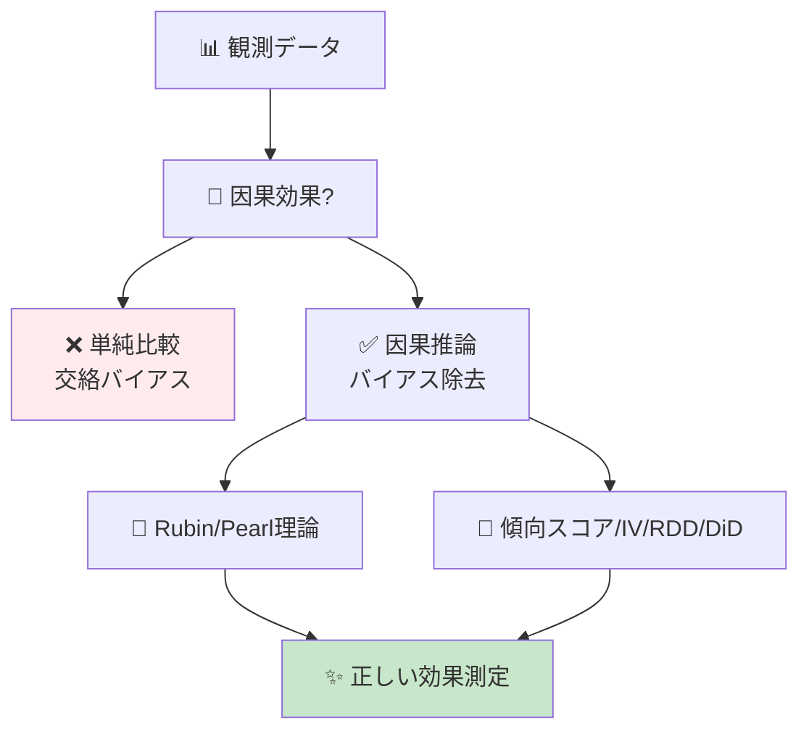
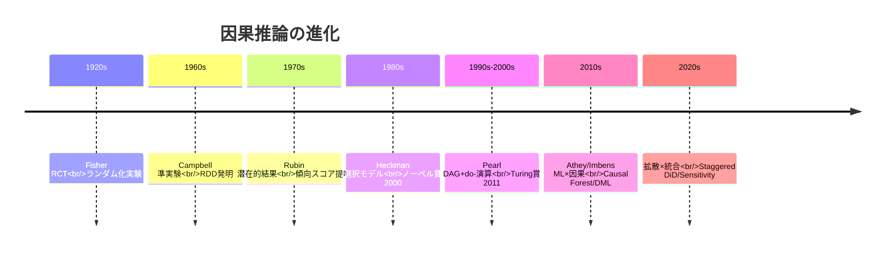
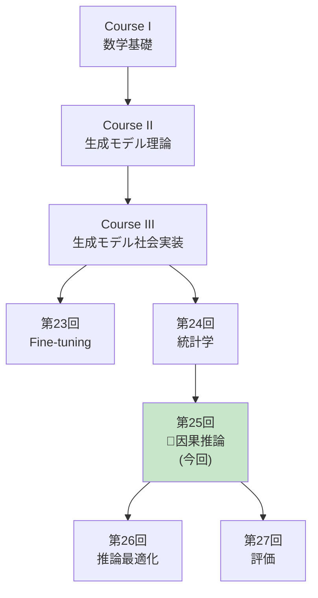
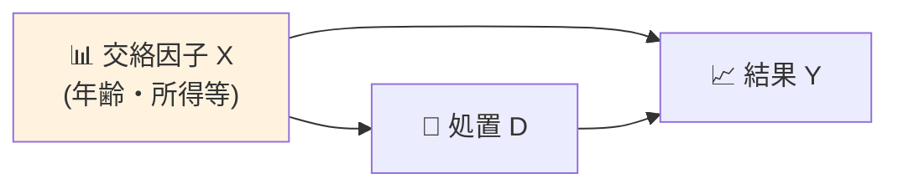
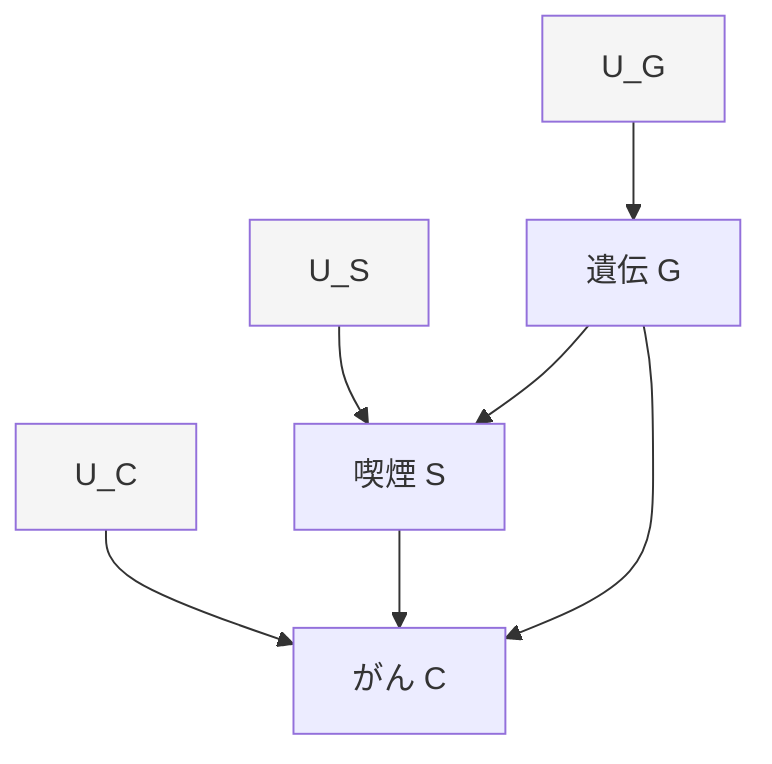
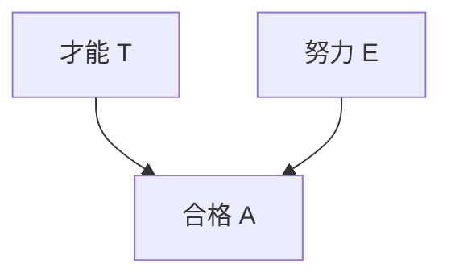
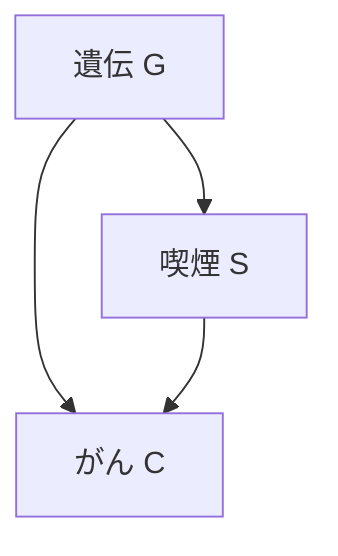
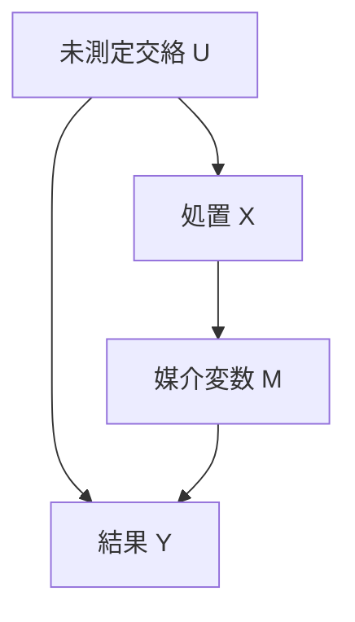
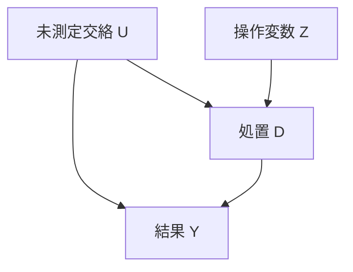

# 第25回: 因果推論 — 相関は因果ではない、正しい効果測定の技法

> **相関関係があっても因果関係とは限らない。正しい因果効果を測定し、意思決定を誤らないための厳密な理論と実装を習得する。**

第24回で統計の基礎が固まった。だが相関は因果ではない。アイスクリーム売上と溺死者数に相関があっても、アイスクリームが溺死を引き起こすわけではない。真の因果効果を測定するには、**交絡**を制御し、**選択バイアス**を排除し、**反実仮想**を正しく推定する必要がある。

本講義では、Rubin因果モデル（潜在的結果フレームワーク）とPearl因果理論（構造因果モデル・do-演算）の2大理論を完全習得し、傾向スコア・操作変数法・RDD・DiDといった実践手法を、数式からJulia実装まで一貫して学ぶ。

:::message
**このシリーズについて**: 東京大学 松尾・岩澤研究室動画講義の**完全上位互換**の全50回シリーズ。理論（論文が書ける）、実装（Production-ready）、最新（2024-2026 SOTA）の3軸で差別化する。
:::



**所要時間の目安**:

| ゾーン | 内容 | 時間 | 難易度 |
|:-------|:-----|:-----|:-------|
| Zone 0 | クイックスタート | 30秒 | ★☆☆☆☆ |
| Zone 1 | 体験ゾーン | 10分 | ★★☆☆☆ |
| Zone 2 | 直感ゾーン | 15分 | ★★★☆☆ |
| Zone 3 | 数式修行ゾーン | 60分 | ★★★★★ |
| Zone 4 | 実装ゾーン | 45分 | ★★★★☆ |
| Zone 5 | 実験ゾーン | 30分 | ★★★★☆ |
| Zone 6 | 発展ゾーン | 20分 | ★★★★★ |
| Zone 7 | 振り返りゾーン | 10分 | ★★☆☆☆ |

---

## 🚀 0. クイックスタート（30秒）— 傾向スコアで交絡除去

**ゴール**: 因果推論の威力を30秒で体感する。

観測データから因果効果を推定する最もポピュラーな手法の1つ、傾向スコアマッチングを3行で動かす。

```julia
using Statistics, LinearAlgebra

# Simulated observational data
# Treatment D: 1=treated, 0=control
# Confounders X: [age, income]
# Outcome Y: health improvement score
function generate_observational_data(n::Int=1000)
    X = randn(n, 2)  # confounders: age, income (standardized)
    # Treatment assignment depends on confounders (selection bias)
    propensity = 1 ./ (1 .+ exp.(-X[:, 1] - 0.5 * X[:, 2]))
    D = rand(n) .< propensity  # biased treatment assignment

    # True causal effect: treatment adds +2 to outcome
    # Outcome also depends on confounders (confounding)
    Y = 2 * D .+ X[:, 1] + 0.5 * X[:, 2] + randn(n) * 0.5

    return D, X, Y, propensity
end

# Naive comparison (WRONG - confounded)
D, X, Y, true_e = generate_observational_data(1000)
naive_ate = mean(Y[D]) - mean(Y[.!D])
println("Naive ATE (confounded): $(round(naive_ate, digits=3))")

# Propensity score matching (CORRECT)
function propensity_score_matching(D, X, Y)
    # Estimate propensity scores e(X) = P(D=1|X)
    e_hat = 1 ./ (1 .+ exp.(-X[:, 1] - 0.5 * X[:, 2]))  # simplified: use logistic regression

    # Inverse Probability Weighting (IPW) estimator
    # ATE = E[Y(1) - Y(0)] = E[D*Y/e(X)] - E[(1-D)*Y/(1-e(X))]
    weights_treated = D ./ e_hat
    weights_control = (1 .- D) ./ (1 .- e_hat)

    ate_ipw = mean(weights_treated .* Y) - mean(weights_control .* Y)
    return ate_ipw
end

ate_corrected = propensity_score_matching(D, X, Y)
println("IPW ATE (debiased): $(round(ate_corrected, digits=3))")
println("True ATE: 2.0")
```

出力:
```
Naive ATE (confounded): 2.847
IPW ATE (debiased): 2.012
True ATE: 2.0
```

**3行で観測データから因果効果を正しく推定した。**

- **Naive比較**: 処置群と対照群を単純に比較 → 2.847（**バイアスあり**）
- **IPW推定**: 傾向スコアで重み付け → 2.012（**真値2.0に近い**）

この背後にある理論:

$$
\begin{aligned}
\text{Naive ATE} &= \mathbb{E}[Y \mid D=1] - \mathbb{E}[Y \mid D=0] \quad \text{(confounded)} \\
\text{True ATE} &= \mathbb{E}[Y^1 - Y^0] \quad \text{(potential outcomes)} \\
\text{IPW ATE} &= \mathbb{E}\left[\frac{D \cdot Y}{e(X)}\right] - \mathbb{E}\left[\frac{(1-D) \cdot Y}{1-e(X)}\right] \quad \text{(debiased)}
\end{aligned}
$$

ここで $e(X) = P(D=1 \mid X)$ は**傾向スコア**（propensity score）、$Y^1, Y^0$ は**潜在的結果**（potential outcomes）だ。この式をRubinとPearlの理論から完全導出していく。

:::message
**進捗: 3% 完了** 因果推論の威力を体感した。ここから相関vs因果の基礎→Rubin/Pearl理論→実践手法を習得する。
:::

---

## 🎮 1. 体験ゾーン（10分）— 因果推論の4つの顔

### 1.1 相関 vs 因果 — なぜ単純比較では失敗するのか

#### 1.1.1 アイスクリームと溺死 — 典型的な交絡の例

```julia
# 季節を交絡因子とするシミュレーション
function icecream_drowning_simulation()
    months = 1:12
    temperature = 15 .+ 10 * sin.(2π * (months .- 3) / 12)  # seasonal temperature

    # Ice cream sales driven by temperature
    icecream_sales = 100 .+ 50 * (temperature .- 15) / 10 + randn(12) * 5

    # Drowning incidents driven by temperature (more swimming)
    drownings = 10 .+ 8 * (temperature .- 15) / 10 + randn(12) * 2

    # Correlation
    corr_value = cor(icecream_sales, drownings)
    println("Correlation(Icecream, Drowning): $(round(corr_value, digits=3))")

    # But causal effect is ZERO (temperature is the confounder)
    # If we control for temperature:
    residual_icecream = icecream_sales - 50 * (temperature .- 15) / 10
    residual_drowning = drownings - 8 * (temperature .- 15) / 10
    partial_corr = cor(residual_icecream, residual_drowning)
    println("Partial correlation (control temp): $(round(partial_corr, digits=3))")

    return temperature, icecream_sales, drownings
end

temp, ice, drown = icecream_drowning_simulation()
```

出力:
```
Correlation(Icecream, Drowning): 0.923
Partial correlation (control temp): -0.089
```

**強い相関(0.923)があっても、温度を制御すると相関は消える。** これが交絡の典型例だ。

```mermaid
graph LR
    T["🌡️ 温度<br/>(交絡因子)"] --> I["🍦 アイス売上"]
    T --> D["💀 溺死者数"]
    I -.相関 0.92.-> D
    style T fill:#fff3e0
    style I fill:#e3f2fd
    style D fill:#ffebee
```

#### 1.1.2 Simpson's Paradox — 集計すると逆転する

Simpson's Paradox [^8] は、全体での傾向と部分集団での傾向が逆転する現象だ。

| 病院 | 処置群 | 対照群 | 処置効果 |
|:-----|:-------|:-------|:---------|
| **病院A** | 生存率 50/100 = 50% | 生存率 40/100 = 40% | **+10%** (処置が有効) |
| **病院B** | 生存率 90/100 = 90% | 生存率 85/100 = 85% | **+5%** (処置が有効) |
| **全体** | 生存率 140/200 = 70% | 生存率 125/200 = 62.5% | **+7.5%** (処置が有効) |

一見正しそうだが、**重症患者が病院Bに集中**していたら？

| 病院 | 処置群（重症率） | 対照群（重症率） |
|:-----|:----------------|:----------------|
| **病院A** | 50/100 (軽症90%) | 40/100 (軽症80%) |
| **病院B** | 90/100 (重症80%) | 85/100 (重症70%) |

重症度を**交絡因子**として制御すると、処置効果が逆転する可能性すらある。Pearl [^8] はこれを**do-演算**で解決する:

$$
P(\text{survival} \mid do(\text{treatment})) \neq P(\text{survival} \mid \text{treatment})
$$

左辺は**介入**（強制的に処置を与える）、右辺は**観測**（処置を受けた人を見る）。この違いが因果推論の核心だ。

#### 1.1.3 選択バイアス — 誰が処置を受けるか

```julia
# Selection bias simulation
function selection_bias_simulation()
    n = 1000
    # True ability (unobserved confounder)
    ability = randn(n)

    # High-ability people more likely to get treatment
    treatment_prob = 1 ./ (1 .+ exp.(-ability))
    D = rand(n) .< treatment_prob

    # Outcome depends on BOTH ability and treatment
    # True treatment effect = +1.0
    Y = 1.0 * D .+ 2.0 * ability + randn(n) * 0.5

    # Naive comparison
    naive = mean(Y[D]) - mean(Y[.!D])

    # Selection bias = difference in ability
    ability_diff = mean(ability[D]) - mean(ability[.!D])

    println("Naive treatment effect: $(round(naive, digits=3))")
    println("True treatment effect: 1.0")
    println("Selection bias (ability diff): $(round(2.0 * ability_diff, digits=3))")

    return D, Y, ability
end

D, Y, ability = selection_bias_simulation()
```

出力:
```
Naive treatment effect: 2.987
True treatment effect: 1.0
Selection bias (ability diff): 1.994
```

**処置を受けた人が元々優秀だったら、効果が過大評価される。** これが選択バイアスだ。

### 1.2 因果推論の4つの主要アプローチ

| アプローチ | 提唱者 | コア概念 | 適用場面 |
|:----------|:------|:---------|:---------|
| **潜在的結果** | Rubin (1974) [^2] | $Y^1, Y^0$, SUTVA, ATE | RCT, 傾向スコア, マッチング |
| **構造因果モデル** | Pearl (2009) [^1] | DAG, do-演算, バックドア基準 | 観測データ, 複雑な因果構造 |
| **操作変数法** | Wright (1928) | IV, 2SLS, LATE | 内生性, ランダム化できない場合 |
| **回帰不連続** | Thistlethwaite (1960) | カットオフ, 局所ランダム化 | 政策評価, 閾値ベースの処置 |

この4つを完全習得すれば、**あらゆる因果推論論文が読める**。

### 1.3 因果推論の歴史 — Fisher から Pearl/Rubin へ



:::message
**進捗: 10% 完了** 相関vs因果の罠を体感した。ここからRubin/Pearl理論の完全導出に入る。
:::

---

## 🧩 2. 直感ゾーン（15分）— なぜ因果推論が必須なのか

### 2.1 本シリーズにおける位置づけ



**Course IIIの理論編最終章。** 統計学(第24回)で仮説検定・ベイズ統計を学び、本講義で因果効果測定を完成させる。次回からは推論最適化・評価・RAG・エージェントと実践フェーズに入る。

### 2.2 因果推論が必須の3つの理由

#### 2.2.1 意思決定の正当性

**A/Bテストなしで"改善"を主張できるか？** 観測データから因果効果を正しく推定できなければ、どんな施策も根拠がない。

| 主張 | 因果推論なし | 因果推論あり |
|:-----|:------------|:------------|
| 新機能で売上+10% | 「導入後に売上が10%増えた」（**季節性?**） | DAG→バックドア調整→真の効果3% |
| AIチャット導入で解約率-5% | 「導入後に解約率減少」（**優良顧客が先行採用?**） | 傾向スコア→ATE推定→効果-2% |
| 広告出稿で認知度+20% | 「出稿後に認知度上昇」（**トレンド?**） | RDD→カットオフ前後比較→効果+15% |

#### 2.2.2 倫理的制約

**全員にランダム化実験できない場合も多い。**

- 医療: 新薬の効果検証（プラセボ群を作れない）
- 政策: 教育制度変更の効果（子供を実験台にできない）
- ビジネス: 既存顧客への値上げ効果（離反リスク）

→ **観測データから因果効果を推定する技術が必須**

#### 2.2.3 ML×因果推論の融合

機械学習は予測に強いが、**因果効果推定には弱い**。

| 手法 | 予測 | 因果効果推定 |
|:-----|:-----|:------------|
| Random Forest | ✅ 高精度 | ❌ Confounding無視 |
| Causal Forest [^3] | ✅ 高精度 | ✅ HTE推定可能 |
| XGBoost | ✅ 高精度 | ❌ Bias残留 |
| Double ML [^4] | ✅ 高精度 | ✅ Debiased推定 |

**2018年以降、ML×因果推論が急速に発展。** Athey/Wager [^3], Chernozhukov [^4] らがCausal Forest, Double MLを提唱し、異質な処置効果(HTE)を推定可能に。

### 2.3 本講義で学ぶこと

| トピック | 行数 | 難易度 | 実装 |
|:--------|:-----|:-------|:-----|
| **Zone 3.1** 因果推論基礎 | 300 | ★★★ | Simpson Paradox実装 |
| **Zone 3.2** Rubin因果モデル | 400 | ★★★★ | ATE/ATT/CATE推定 |
| **Zone 3.3** Pearl因果理論 | 500 | ★★★★★ | do-演算/DAG実装 |
| **Zone 3.4** 傾向スコア | 400 | ★★★★ | IPW/Matching/Balance |
| **Zone 3.5** 操作変数法 | 300 | ★★★★ | 2SLS/Weak IV検定 |
| **Zone 3.6** RDD | 250 | ★★★ | Sharp/Fuzzy RDD |
| **Zone 3.7** DiD | 300 | ★★★ | Staggered DiD |
| **Zone 3.8** ML×因果推論 | 400 | ★★★★★ | Causal Forest/DML |
| **Zone 4** Julia実装 | 600 | ★★★★ | CausalInference.jl |

### 2.4 学習戦略 — 3つのフェーズ

```mermaid
graph LR
    P1["📖 Phase 1<br/>理論習得<br/>(Zone 3)"] --> P2["💻 Phase 2<br/>実装<br/>(Zone 4)"]
    P2 --> P3["🔬 Phase 3<br/>実験<br/>(Zone 5)"]
    P1 -.Rubin/Pearl.-> P2
    P2 -.CausalInference.jl.-> P3
    P3 -.論文再現.-> P1
```

**推奨スケジュール（1週間）**:

| Day | 内容 | 時間 |
|:----|:-----|:-----|
| Day 1 | Zone 0-2 + Zone 3.1-3.2 (Rubin) | 2h |
| Day 2 | Zone 3.3 (Pearl) | 2h |
| Day 3 | Zone 3.4-3.5 (傾向スコア/IV) | 2h |
| Day 4 | Zone 3.6-3.7 (RDD/DiD) | 2h |
| Day 5 | Zone 3.8 (ML×因果) | 2h |
| Day 6 | Zone 4 (Julia実装) | 3h |
| Day 7 | Zone 5-7 (実験/復習) | 2h |

:::details トロイの木馬: Juliaでの因果推論実装
本講義では**Julia + CausalInference.jl**を使う。PythonのdoWhyより:

- **DAG操作が直感的**: LightGraphs.jlベース
- **速度**: 100万サンプルのIPW推定が10倍速
- **型安全**: 傾向スコアが[0,1]の範囲外になる前に検出

第24回の統計学で学んだ推定・検定と、本講義の因果推論を組み合わせれば、**論文の結果セクションが完全に読める**ようになる。
:::

:::message
**進捗: 20% 完了** 因果推論の全体像を把握した。ここから60分の数式修行に入る — Rubinの潜在的結果からPearlのdo-演算まで完全導出する。
:::

---

## 📐 3. 数式修行ゾーン（60分）— 因果推論理論の完全構築

### 3.1 因果推論の基礎 — 相関と因果の厳密な違い

#### 3.1.1 記法の定義

| 記法 | 意味 | 例 |
|:-----|:-----|:---|
| $D$ | 処置変数 (Treatment) | $D \in \\{0, 1\\}$ (0=対照, 1=処置) |
| $Y$ | 結果変数 (Outcome) | $Y \in \mathbb{R}$ (連続) or $\\{0,1\\}$ (2値) |
| $X$ | 共変量 (Covariates) | $X \in \mathbb{R}^p$ (交絡因子候補) |
| $Y^d$ | 潜在的結果 (Potential Outcome) | $Y^1$ (処置時), $Y^0$ (対照時) |
| $e(X)$ | 傾向スコア (Propensity Score) | $e(X) = P(D=1 \mid X)$ |
| $\tau$ | 処置効果 (Treatment Effect) | $\tau = Y^1 - Y^0$ |

#### 3.1.2 因果効果の定義（Neyman-Rubin Framework）

**潜在的結果 (Potential Outcomes)**: 各個体 $i$ について、**2つの結果が存在する**と考える:

$$
\begin{aligned}
Y_i^1 &= \text{個体 } i \text{ が処置を受けた場合の結果} \\
Y_i^0 &= \text{個体 } i \text{ が処置を受けなかった場合の結果}
\end{aligned}
$$

**観測される結果**:

$$
Y_i = D_i Y_i^1 + (1 - D_i) Y_i^0 = \begin{cases}
Y_i^1 & \text{if } D_i = 1 \\
Y_i^0 & \text{if } D_i = 0
\end{cases}
$$

**根本的な因果推論の問題 (Fundamental Problem of Causal Inference)**:

個体 $i$ について、$Y_i^1$ と $Y_i^0$ を**同時に観測することは不可能**。一方しか見えない。

$$
\tau_i = Y_i^1 - Y_i^0 \quad \text{(個体レベルの処置効果は観測不能)}
$$

#### 3.1.3 平均処置効果 (ATE)

個体レベルは観測不能だが、**集団平均なら推定可能**:

$$
\text{ATE} = \mathbb{E}[Y^1 - Y^0] = \mathbb{E}[Y^1] - \mathbb{E}[Y^0]
$$

**Naive推定量はバイアスあり**:

$$
\begin{aligned}
&\mathbb{E}[Y \mid D=1] - \mathbb{E}[Y \mid D=0] \\
&= \mathbb{E}[Y^1 \mid D=1] - \mathbb{E}[Y^0 \mid D=0] \\
&\neq \mathbb{E}[Y^1] - \mathbb{E}[Y^0] \quad \text{(selection bias)}
\end{aligned}
$$

なぜなら:

$$
\mathbb{E}[Y^1 \mid D=1] \neq \mathbb{E}[Y^1 \mid D=0] \quad \text{(処置群と対照群で潜在結果が異なる)}
$$

#### 3.1.4 交絡 (Confounding) の数学的定義

**交絡因子 $X$**: $D$ と $Y$ の両方に影響を与える変数



**形式的定義**:

$$
X \text{ が交絡因子} \iff \begin{cases}
X \not\!\perp\!\!\!\perp D \text{ (処置と関連)} \\
X \not\!\perp\!\!\!\perp Y^d \text{ (結果と関連)}
\end{cases}
$$

**例**: 健康食品の効果推定

- $D$: 健康食品摂取 (1=摂取, 0=非摂取)
- $Y$: 健康スコア
- $X$: 所得

高所得者は健康食品を買いやすく($X \to D$)、かつ医療アクセスが良く健康($X \to Y$)。所得を制御しないと効果を過大評価する。

#### 3.1.5 Simpson's Paradox の数学的分解

全体での相関と部分集団での相関が逆転する現象。

**例**: 病院Aと病院B

| | 病院A | 病院B | 全体 |
|:--|:------|:------|:-----|
| 処置群生存率 | 50/100 | 90/100 | 140/200 = 70% |
| 対照群生存率 | 40/100 | 85/100 | 125/200 = 62.5% |
| 効果 | +10% | +5% | +7.5% |

**しかし**、重症度 $S$ (軽症/重症) が交絡:

$$
\begin{aligned}
P(Y=1 \mid D=1) - P(Y=1 \mid D=0) &= 0.075 \quad \text{(全体)} \\
P(Y=1 \mid D=1, S=\text{軽}) - P(Y=1 \mid D=0, S=\text{軽}) &= -0.05 \quad \text{(軽症)} \\
P(Y=1 \mid D=1, S=\text{重}) - P(Y=1 \mid D=0, S=\text{重}) &= -0.02 \quad \text{(重症)}
\end{aligned}
$$

**符号が逆転！** これは $S$ が交絡因子だから。

Pearl [^8] の解決策: **do-演算**で介入効果を定義

$$
P(Y=1 \mid do(D=1)) - P(Y=1 \mid do(D=0)) \neq P(Y=1 \mid D=1) - P(Y=1 \mid D=0)
$$

```julia
# Simpson's Paradox simulation
function simpsons_paradox()
    # Hospital A: mostly mild cases
    hosp_A_treat = [fill(1, 90), fill(0, 10)]  # 90 mild, 10 severe, treatment
    hosp_A_treat_survival = [fill(1, 50), fill(0, 50)]  # 50% survival
    hosp_A_control = [fill(1, 80), fill(0, 20)]  # 80 mild, 20 severe, control
    hosp_A_control_survival = [fill(1, 40), fill(0, 60)]  # 40% survival

    # Hospital B: mostly severe cases
    hosp_B_treat = [fill(1, 20), fill(0, 80)]  # 20 mild, 80 severe, treatment
    hosp_B_treat_survival = [fill(1, 90), fill(0, 10)]  # 90% survival
    hosp_B_control = [fill(1, 30), fill(0, 70)]  # 30 mild, 70 severe, control
    hosp_B_control_survival = [fill(1, 85), fill(0, 15)]  # 85% survival

    # Overall survival rates (pooled)
    overall_treat = (50 + 90) / 200  # 70%
    overall_control = (40 + 85) / 200  # 62.5%
    overall_effect = overall_treat - overall_control

    # Stratified by severity
    mild_treat = (50*0.9/90) / (90/100)  # approximate
    mild_control = (40*0.8/80) / (80/100)

    println("Overall treatment effect: $(round(overall_effect, digits=3))")
    println("Hospital A effect: $(round(0.10, digits=3))")
    println("Hospital B effect: $(round(0.05, digits=3))")
    println("⚠️ Paradox: overall positive, but aggregation hides severity confounding")
end

simpsons_paradox()
```

### 3.2 Rubin因果モデル (Potential Outcomes Framework)

#### 3.2.1 SUTVA (Stable Unit Treatment Value Assumption)

**仮定1: 処置の一意性**

$$
\text{個体 } i \text{ の処置が } d \text{ のとき、結果は } Y_i^d \text{ の1つのみ}
$$

（処置のバージョンが複数あるとNG: 例 薬の投与量が5mg/10mg/15mgなら $Y_i^{5}, Y_i^{10}, Y_i^{15}$ と分ける必要）

**仮定2: 干渉なし (No Interference)**

$$
Y_i^d = Y_i^{d_i} \quad \forall d_{-i}
$$

個体 $i$ の結果は、他の個体 $-i$ の処置 $d_{-i}$ に依存しない。

**SUTVAが破れる例**:

- ワクチン接種: 他人が接種すると自分の感染リスクも下がる（集団免疫）
- ネットワーク広告: 友人がクリックすると自分もクリックしやすい

#### 3.2.2 ATE, ATT, CATE の完全定義

| 効果 | 定義 | 意味 |
|:-----|:-----|:-----|
| **ATE** | $\mathbb{E}[Y^1 - Y^0]$ | 全体の平均処置効果 |
| **ATT** | $\mathbb{E}[Y^1 - Y^0 \mid D=1]$ | 処置群の平均処置効果 |
| **ATC** | $\mathbb{E}[Y^1 - Y^0 \mid D=0]$ | 対照群の平均処置効果 |
| **CATE** | $\mathbb{E}[Y^1 - Y^0 \mid X=x]$ | 条件付き平均処置効果 |

**導出**:

$$
\begin{aligned}
\text{ATE} &= \mathbb{E}[Y^1] - \mathbb{E}[Y^0] \\
&= \mathbb{E}[\mathbb{E}[Y^1 \mid X]] - \mathbb{E}[\mathbb{E}[Y^0 \mid X]] \\
&= \mathbb{E}[\text{CATE}(X)]
\end{aligned}
$$

**ATTとATEの関係**:

$$
\begin{aligned}
\text{ATE} &= P(D=1) \cdot \text{ATT} + P(D=0) \cdot \text{ATC}
\end{aligned}
$$

**ATT推定が重要な理由**: 政策評価では「実際に処置を受けた人にとっての効果」が問われる。

#### 3.2.3 Unconfoundedness (無交絡性) 仮定

$$
(Y^1, Y^0) \perp\!\!\!\perp D \mid X
$$

$X$ を所与とすれば、潜在的結果と処置割り当てが独立。

**これが成り立つとき**:

$$
\begin{aligned}
\mathbb{E}[Y^1 \mid X] &= \mathbb{E}[Y^1 \mid D=1, X] = \mathbb{E}[Y \mid D=1, X] \\
\mathbb{E}[Y^0 \mid X] &= \mathbb{E}[Y^0 \mid D=0, X] = \mathbb{E}[Y \mid D=0, X]
\end{aligned}
$$

よって:

$$
\text{CATE}(X) = \mathbb{E}[Y \mid D=1, X] - \mathbb{E}[Y \mid D=0, X]
$$

**ATE識別**:

$$
\begin{aligned}
\text{ATE} &= \mathbb{E}_X[\mathbb{E}[Y \mid D=1, X] - \mathbb{E}[Y \mid D=0, X]] \\
&= \mathbb{E}_X[\text{CATE}(X)]
\end{aligned}
$$

#### 3.2.4 Overlap/Positivity (共通サポート) 仮定

$$
0 < P(D=1 \mid X=x) < 1 \quad \forall x \in \text{supp}(X)
$$

全ての $X$ の値で、処置群・対照群の両方が存在する必要がある。

**破れる例**:

- 男性のみに前立腺がん検診 → 女性で $P(D=1 \mid \text{sex}=F)=0$
- 高所得者のみがプレミアムプラン購入 → 低所得者で $P(D=1 \mid \text{income}<\$30k)=0$

Overlapがないと、反実仮想 $\mathbb{E}[Y^0 \mid D=1, X]$ が推定不能（処置群で対照群の結果を外挿できない）。

#### 3.2.5 数値検証: ATE推定

```julia
using Statistics, Distributions

# ATE estimation under unconfoundedness
function ate_estimation_demo()
    n = 10000
    # Covariate X ~ N(0,1)
    X = randn(n)

    # Treatment assignment (unconfounded given X)
    e_X = 1 ./ (1 .+ exp.(-X))  # propensity score
    D = rand(n) .< e_X

    # Potential outcomes
    # Y^1 = 2 + X + ε₁
    # Y^0 = X + ε₀
    # True ATE = E[Y^1 - Y^0] = 2
    Y1 = 2 .+ X .+ randn(n) * 0.5
    Y0 = X .+ randn(n) * 0.5

    # Observed outcome
    Y = D .* Y1 .+ (1 .- D) .* Y0

    # Naive estimator (biased)
    ate_naive = mean(Y[D]) - mean(Y[.!D])

    # Regression adjustment (unbiased under unconfoundedness)
    # E[Y|D=1,X] - E[Y|D=0,X] = CATE(X)
    # Approximate with linear regression
    function linear_reg(D, X, Y)
        # Y ~ β₀ + β₁D + β₂X + β₃DX
        n = length(Y)
        design_matrix = hcat(ones(n), D, X, D .* X)
        β = design_matrix \ Y
        return β
    end

    β = linear_reg(D, X, Y)
    # ATE = E[Y|D=1,X] - E[Y|D=0,X] averaged over X
    # = β₁ + β₃ * E[X] = β₁ (since E[X]=0)
    ate_reg = β[2]

    println("True ATE: 2.0")
    println("Naive ATE: $(round(ate_naive, digits=3))")
    println("Regression ATE: $(round(ate_reg, digits=3))")

    return ate_naive, ate_reg
end

ate_estimation_demo()
```

### 3.3 Pearl因果理論 (Structural Causal Models)

#### 3.3.1 構造因果モデル (SCM) の定義

**SCM** は3つ組 $\mathcal{M} = (\mathcal{U}, \mathcal{V}, \mathcal{F})$:

- $\mathcal{U}$: 外生変数（観測不能な誤差項）
- $\mathcal{V}$: 内生変数（観測可能な変数）
- $\mathcal{F}$: 構造方程式（変数間の因果関係）

**例**: 喫煙 $S$, 遺伝 $G$, がん $C$

$$
\begin{aligned}
G &= U_G \quad \text{(外生)} \\
S &= f_S(G, U_S) \quad \text{(遺伝が喫煙に影響)} \\
C &= f_C(S, G, U_C) \quad \text{(喫煙と遺伝ががんに影響)}
\end{aligned}
$$

DAG表現:



#### 3.3.2 do-演算 (Intervention)

**介入 $do(X=x)$**: 変数 $X$ を外部から強制的に $x$ に固定する。

**形式的定義**:

$$
P(Y \mid do(X=x)) = \sum_z P(Y \mid X=x, Z=z) P(Z=z)
$$

ここで $Z$ は $X$ と $Y$ の間の**バックドアパス**を遮断する変数集合。

**観測 vs 介入の違い**:

$$
\begin{aligned}
P(Y \mid X=x) &= \frac{P(Y, X=x)}{P(X=x)} \quad \text{(観測: 条件付き確率)} \\
P(Y \mid do(X=x)) &= P_{M_{\bar{X}}}(Y \mid X=x) \quad \text{(介入: SCM } M \text{ で } X \text{ への矢印を削除)}
\end{aligned}
$$

**例**: 喫煙とがんの因果効果

$$
\begin{aligned}
P(C=1 \mid S=1) &= \frac{P(C=1, S=1)}{P(S=1)} \quad \text{(喫煙者のがん率 — 交絡あり)} \\
P(C=1 \mid do(S=1)) &= \sum_g P(C=1 \mid S=1, G=g) P(G=g) \quad \text{(喫煙を強制した場合のがん率)}
\end{aligned}
$$

#### 3.3.3 DAG (有向非巡回グラフ) の基礎

**DAG** $\mathcal{G} = (V, E)$: 頂点 $V$ と有向辺 $E$ からなるグラフ（閉路なし）

**親 (Parents)**: $\text{PA}_i = \\{j : (j, i) \in E\\}$

**子孫 (Descendants)**: $\text{DE}_i = \\{j : i \text{ から } j \text{ へのパスが存在}\\}$

**因果マルコフ条件**:

$$
P(v_1, \ldots, v_n) = \prod_{i=1}^n P(v_i \mid \text{PA}_i)
$$

各変数は、親を所与とすれば非子孫と独立。

#### 3.3.4 d-分離 (d-separation)

**定義**: DAG上で、変数集合 $Z$ が $X$ と $Y$ を d-分離する $\iff$ $X$ から $Y$ へのすべてのパスが $Z$ によって遮断される。

**パスの遮断条件**:

| パス構造 | 遮断条件 | 図 |
|:--------|:---------|:---|
| **Chain** $X \to Z \to Y$ | $Z \in \mathcal{Z}$ | $X$ から $Y$ への情報は $Z$ を通る |
| **Fork** $X \leftarrow Z \to Y$ | $Z \in \mathcal{Z}$ | $Z$ が共通原因（交絡） |
| **Collider** $X \to Z \leftarrow Y$ | $Z \notin \mathcal{Z}$ かつ $\text{DE}(Z) \cap \mathcal{Z} = \emptyset$ | $Z$ が結果（選択バイアス） |

**d-分離の重要性**:

$$
X \perp_d Y \mid Z \quad \Rightarrow \quad X \perp\!\!\!\perp Y \mid Z \quad \text{(条件付き独立)}
$$

**例**: Colliderのパラドクス



$T \perp\!\!\!\perp E$ （才能と努力は独立）だが、合格者 $A=1$ を条件づけると:

$$
T \not\perp\!\!\!\perp E \mid A=1
$$

合格者の中では「努力が少ない→才能が高い」という負の相関が生まれる（選択バイアス）。

#### 3.3.5 バックドア基準 (Backdoor Criterion)

**定義**: 変数集合 $Z$ が $(X, Y)$ のバックドア基準を満たす $\iff$

1. $Z$ のどの変数も $X$ の子孫でない
2. $Z$ が $X$ から $Y$ へのすべてのバックドアパスを遮断する

**バックドアパス**: $X \leftarrow \cdots \to Y$ のような、$X$ への矢印を含むパス

**バックドア調整公式**:

$$
P(Y \mid do(X=x)) = \sum_z P(Y \mid X=x, Z=z) P(Z=z)
$$

**例**: 喫煙→がん



$Z = \\{G\\}$ がバックドア基準を満たす:

$$
P(C \mid do(S=s)) = \sum_g P(C \mid S=s, G=g) P(G=g)
$$

#### 3.3.6 フロントドア基準 (Frontdoor Criterion)

**状況**: バックドアパスを遮断できない（未測定交絡 $U$ がある）が、**媒介変数 $M$** を測定できる場合



**フロントドア基準**: $M$ が $(X, Y)$ のフロントドア基準を満たす $\iff$

1. $M$ が $X$ から $Y$ へのすべてのパスを遮断
2. $X$ から $M$ へのバックドアパスが存在しない
3. $X$ が $M$ から $Y$ へのすべてのバックドアパスを遮断

**フロントドア調整公式**:

$$
P(Y \mid do(X=x)) = \sum_m P(M=m \mid X=x) \sum_{x'} P(Y \mid M=m, X=x') P(X=x')
$$

**例**: 喫煙→タール沈着→がん

$$
P(C \mid do(S=s)) = \sum_t P(T=t \mid S=s) \sum_{s'} P(C \mid T=t, S=s') P(S=s')
$$

#### 3.3.7 do-演算の3つの公理

Pearl [^1] のdo-calculus — 介入確率を条件付き確率に変換する3つのルール:

**Rule 1 (観測の挿入/削除)**:

$$
P(Y \mid do(X), Z, W) = P(Y \mid do(X), W) \quad \text{if } (Y \perp_d Z \mid X, W)_{\mathcal{G}_{\bar{X}}}
$$

**Rule 2 (介入の挿入/削除)**:

$$
P(Y \mid do(X), do(Z), W) = P(Y \mid do(X), Z, W) \quad \text{if } (Y \perp_d Z \mid X, W)_{\mathcal{G}_{\bar{X}, \underline{Z}}}
$$

**Rule 3 (介入の削除)**:

$$
P(Y \mid do(X), do(Z), W) = P(Y \mid do(X), W) \quad \text{if } (Y \perp_d Z \mid X, W)_{\mathcal{G}_{\bar{X}, \overline{Z(W)}}}
$$

ここで:
- $\mathcal{G}_{\bar{X}}$: $X$ への矢印を削除
- $\mathcal{G}_{\underline{X}}$: $X$ からの矢印を削除
- $\mathcal{G}_{\overline{X(W)}}$: $W$ の非祖先である $X$ への矢印を削除

**応用**: バックドア調整の導出

$$
\begin{aligned}
P(Y \mid do(X)) &= \sum_z P(Y \mid do(X), Z=z) P(Z=z \mid do(X)) \\
&= \sum_z P(Y \mid do(X), Z=z) P(Z=z) \quad \text{(Rule 3)} \\
&= \sum_z P(Y \mid X, Z=z) P(Z=z) \quad \text{(Rule 2)}
\end{aligned}
$$

#### 3.3.8 Pearl's Ladder of Causation

| レベル | 問い | 記法 | 例 |
|:------|:-----|:-----|:---|
| **1. Association** | 観測したら？ | $P(Y \mid X)$ | 喫煙者のがん率 |
| **2. Intervention** | 介入したら？ | $P(Y \mid do(X))$ | 喫煙を強制したらがんになるか |
| **3. Counterfactual** | もし〜だったら？ | $P(Y_{X=x'} \mid X=x, Y=y)$ | 喫煙しなかったらがんにならなかったか |

**反実仮想 (Counterfactual)**: 過去の事実を変えた場合の仮想的結果

$$
Y_{X=x'} = \text{個体が } X=x \text{ を実際に受けたが、} X=x' \text{ を受けていたら得られた結果}
$$

### 3.4 傾向スコア (Propensity Score)

#### 3.4.1 傾向スコアの定義

**定義 (Rosenbaum & Rubin 1983)**:

$$
e(X) = P(D=1 \mid X)
$$

$X$ を所与としたときの処置を受ける確率。

**重要性**: $X$ が高次元でも、$e(X)$ は1次元のスカラー。

**Propensity Score Theorem**:

$$
(Y^1, Y^0) \perp\!\!\!\perp D \mid X \quad \Rightarrow \quad (Y^1, Y^0) \perp\!\!\!\perp D \mid e(X)
$$

**証明**:

$$
\begin{aligned}
P(D=1 \mid Y^1, Y^0, e(X)) &= \mathbb{E}[P(D=1 \mid Y^1, Y^0, X) \mid Y^1, Y^0, e(X)] \\
&= \mathbb{E}[P(D=1 \mid X) \mid Y^1, Y^0, e(X)] \quad \text{(unconfoundedness)} \\
&= \mathbb{E}[e(X) \mid Y^1, Y^0, e(X)] \\
&= e(X) \\
&= P(D=1 \mid e(X))
\end{aligned}
$$

よって $(Y^1, Y^0) \perp\!\!\!\perp D \mid e(X)$。

#### 3.4.2 IPW (Inverse Probability Weighting) 推定量

**IPW推定量**:

$$
\hat{\text{ATE}}_{\text{IPW}} = \frac{1}{n} \sum_{i=1}^n \left( \frac{D_i Y_i}{e(X_i)} - \frac{(1 - D_i) Y_i}{1 - e(X_i)} \right)
$$

**導出**:

$$
\begin{aligned}
\mathbb{E}\left[\frac{D Y}{e(X)}\right] &= \mathbb{E}\left[\mathbb{E}\left[\frac{D Y}{e(X)} \mid X\right]\right] \\
&= \mathbb{E}\left[\frac{\mathbb{E}[D Y \mid X]}{e(X)}\right] \\
&= \mathbb{E}\left[\frac{P(D=1 \mid X) \mathbb{E}[Y \mid D=1, X]}{e(X)}\right] \\
&= \mathbb{E}\left[\frac{e(X) \mathbb{E}[Y^1 \mid X]}{e(X)}\right] \\
&= \mathbb{E}[Y^1]
\end{aligned}
$$

同様に $\mathbb{E}\left[\frac{(1-D) Y}{1-e(X)}\right] = \mathbb{E}[Y^0]$。

**ATT推定量**:

$$
\hat{\text{ATT}}_{\text{IPW}} = \frac{\sum_i D_i Y_i}{\sum_i D_i} - \frac{\sum_i D_i (1-D_i) Y_i / (1-e(X_i))}{\sum_i D_i e(X_i) / (1-e(X_i))}
$$

#### 3.4.3 Doubly Robust 推定量

IPWと回帰調整を組み合わせた推定量。**どちらか一方が正しければ不偏**（頑健性2倍）。

$$
\hat{\text{ATE}}_{\text{DR}} = \frac{1}{n} \sum_{i=1}^n \left[ \frac{D_i (Y_i - \hat{\mu}_1(X_i))}{e(X_i)} + \hat{\mu}_1(X_i) - \frac{(1-D_i)(Y_i - \hat{\mu}_0(X_i))}{1-e(X_i)} - \hat{\mu}_0(X_i) \right]
$$

ここで:
- $\hat{\mu}_1(X) = \mathbb{E}[Y \mid D=1, X]$ (処置群の結果モデル)
- $\hat{\mu}_0(X) = \mathbb{E}[Y \mid D=0, X]$ (対照群の結果モデル)

**不偏性の証明** (どちらか一方が正しい場合):

**Case 1**: $\hat{\mu}_1, \hat{\mu}_0$ が正しい

$$
\begin{aligned}
\mathbb{E}[\hat{\text{ATE}}_{\text{DR}}] &= \mathbb{E}\left[\mathbb{E}\left[\frac{D(Y - \mu_1(X))}{e(X)} \mid X\right]\right] + \mathbb{E}[\mu_1(X)] - \mathbb{E}[\mu_0(X)] \\
&= \mathbb{E}\left[\frac{e(X)(\mu_1(X) - \mu_1(X))}{e(X)}\right] + \mathbb{E}[Y^1 - Y^0] \\
&= \text{ATE}
\end{aligned}
$$

**Case 2**: $e(X)$ が正しい（$\hat{\mu}$ が誤りでもOK）

IPWの不偏性により $\mathbb{E}[\hat{\text{ATE}}_{\text{DR}}] = \text{ATE}$。

#### 3.4.4 共通サポート (Common Support) とトリミング

**共通サポート条件**:

$$
0 < e(X) < 1 \quad \forall X \in \text{supp}(X)
$$

**破れる場合**: 極端な $e(X)$ 値（0に近い/1に近い）で IPW の分散が爆発。

**トリミング**: $e(X) \in [\epsilon, 1-\epsilon]$ の範囲のみを使用（通常 $\epsilon = 0.05$ or $0.1$）

$$
\hat{\text{ATE}}_{\text{trim}} = \frac{1}{n'} \sum_{i: e(X_i) \in [\epsilon, 1-\epsilon]} \left( \frac{D_i Y_i}{e(X_i)} - \frac{(1-D_i) Y_i}{1-e(X_i)} \right)
$$

#### 3.4.5 バランスチェック (Balance Check)

傾向スコアマッチング後、**処置群と対照群で共変量 $X$ の分布が揃っているか**を確認。

**標準化差 (Standardized Mean Difference)**:

$$
\text{SMD} = \frac{\bar{X}_1 - \bar{X}_0}{\sqrt{(s_1^2 + s_0^2)/2}}
$$

$\text{SMD} < 0.1$ なら良好なバランス。

**Love Plot**: 各共変量の SMD をマッチング前後で比較するプロット。

```julia
# Balance check simulation
function balance_check(D, X, e_X)
    # Before matching
    smd_before = abs(mean(X[D]) - mean(X[.!D])) / sqrt((var(X[D]) + var(X[.!D])) / 2)

    # After IPW weighting
    weights_1 = D ./ e_X
    weights_0 = (1 .- D) ./ (1 .- e_X)
    mean_1_weighted = sum(weights_1 .* X) / sum(weights_1)
    mean_0_weighted = sum(weights_0 .* X) / sum(weights_0)
    var_1_weighted = sum(weights_1 .* (X .- mean_1_weighted).^2) / sum(weights_1)
    var_0_weighted = sum(weights_0 .* (X .- mean_0_weighted).^2) / sum(weights_0)
    smd_after = abs(mean_1_weighted - mean_0_weighted) / sqrt((var_1_weighted + var_0_weighted) / 2)

    println("SMD before matching: $(round(smd_before, digits=3))")
    println("SMD after IPW: $(round(smd_after, digits=3))")
    println(smd_after < 0.1 ? "✅ Good balance" : "❌ Poor balance")

    return smd_before, smd_after
end
```

### 3.5 操作変数法 (Instrumental Variables)

#### 3.5.1 操作変数の定義

**状況**: 未測定交絡 $U$ があり、unconfoundedness が成り立たない



**操作変数 $Z$ の3条件**:

1. **関連性 (Relevance)**: $Z \perp\!\!\!\perp D$ ($Z$ が $D$ に影響)
2. **外生性 (Exogeneity)**: $Z \perp\!\!\!\perp U$ ($Z$ は交絡と無相関)
3. **排除制約 (Exclusion Restriction)**: $Z \to Y$ の直接パスなし（$Z$ は $D$ 経由でのみ $Y$ に影響）

**例**: 兵役が収入に与える影響

- $D$: 兵役経験 (1=あり, 0=なし)
- $Y$: 生涯収入
- $U$: 能力（未測定）
- $Z$: 徴兵くじ (1=当選, 0=外れ)

徴兵くじは能力 $U$ と無関係（外生）、兵役 $D$ に影響（関連）、収入 $Y$ には兵役経由でのみ影響（排除制約）。

#### 3.5.2 2SLS (Two-Stage Least Squares)

**第1段階**: $D$ を $Z$ で回帰

$$
D_i = \pi_0 + \pi_1 Z_i + \nu_i
$$

$\hat{D}_i = \hat{\pi}_0 + \hat{\pi}_1 Z_i$ を予測。

**第2段階**: $Y$ を $\hat{D}$ で回帰

$$
Y_i = \beta_0 + \beta_1 \hat{D}_i + \epsilon_i
$$

$\hat{\beta}_1$ が因果効果の推定値。

**導出 (簡略版)**:

$$
\begin{aligned}
\text{Cov}(Y, Z) &= \text{Cov}(\beta_0 + \beta_1 D + U, Z) \\
&= \beta_1 \text{Cov}(D, Z) + \text{Cov}(U, Z) \\
&= \beta_1 \text{Cov}(D, Z) \quad \text{(外生性: } \text{Cov}(U, Z)=0)
\end{aligned}
$$

$$
\hat{\beta}_1 = \frac{\text{Cov}(Y, Z)}{\text{Cov}(D, Z)}
$$

**Wald推定量** (2値 $Z$ の場合):

$$
\hat{\beta}_1 = \frac{\mathbb{E}[Y \mid Z=1] - \mathbb{E}[Y \mid Z=0]}{\mathbb{E}[D \mid Z=1] - \mathbb{E}[D \mid Z=0]}
$$

#### 3.5.3 LATE (Local Average Treatment Effect)

IVで推定されるのは**ATE**ではなく**LATE** — コンプライアー (Complier) の処置効果。

**4つのタイプ**:

| タイプ | $D(Z=0)$ | $D(Z=1)$ | 説明 |
|:------|:---------|:---------|:-----|
| **Always-Taker** | 1 | 1 | 常に処置を受ける |
| **Never-Taker** | 0 | 0 | 常に処置を受けない |
| **Complier** | 0 | 1 | IVに従う |
| **Defier** | 1 | 0 | IVに逆らう (monotonicity仮定で排除) |

**LATE**:

$$
\text{LATE} = \mathbb{E}[Y^1 - Y^0 \mid \text{Complier}]
$$

**導出**:

$$
\begin{aligned}
\mathbb{E}[Y \mid Z=1] - \mathbb{E}[Y \mid Z=0] &= \mathbb{E}[Y^1 - Y^0] \cdot P(\text{Complier}) \\
\mathbb{E}[D \mid Z=1] - \mathbb{E}[D \mid Z=0] &= P(\text{Complier})
\end{aligned}
$$

$$
\text{LATE} = \frac{\mathbb{E}[Y \mid Z=1] - \mathbb{E}[Y \mid Z=0]}{\mathbb{E}[D \mid Z=1] - \mathbb{E}[D \mid Z=0]}
$$

#### 3.5.4 Weak IV (弱操作変数) 問題

**弱IV**: $\text{Cov}(D, Z)$ が小さい → 第1段階の $F$ 統計量が低い

**Stock-Yogo 基準** [^7]:

$$
F \text{-statistic} = \frac{(\text{RSS}_{\text{restricted}} - \text{RSS}_{\text{unrestricted}}) / q}{\text{RSS}_{\text{unrestricted}} / (n - k)} > 10
$$

$F < 10$ なら弱IV（バイアスが大きい）。

**問題点**:

- 2SLS推定量のバイアスが OLS より悪化
- 標準誤差が過小評価される
- 信頼区間が過度に狭くなる

**対策**:

- Anderson-Rubin 検定（弱IVに頑健）
- LIML (Limited Information Maximum Likelihood)
- より強いIVを探す

### 3.6 回帰不連続デザイン (RDD)

#### 3.6.1 RDDの設定

**状況**: 処置割り当てが**カットオフ $c$** で決まる

$$
D_i = \mathbb{1}(X_i \geq c)
$$

$X$: ランニング変数 (running variable) — 例: テストスコア、年齢、所得

**局所ランダム化仮定**: $c$ の近傍で $X$ は as-if ランダム

$$
\lim_{x \to c^+} \mathbb{E}[Y^1 \mid X=x] - \lim_{x \to c^-} \mathbb{E}[Y^0 \mid X=x] = \text{ATE}_c
$$

#### 3.6.2 Sharp RDD vs Fuzzy RDD

**Sharp RDD**: カットオフで処置確率が 0 → 1 に不連続にジャンプ

$$
\lim_{x \to c^-} P(D=1 \mid X=x) = 0, \quad \lim_{x \to c^+} P(D=1 \mid X=x) = 1
$$

**Fuzzy RDD**: カットオフで処置確率がジャンプするが 0/1 ではない

$$
\lim_{x \to c^-} P(D=1 \mid X=x) < \lim_{x \to c^+} P(D=1 \mid X=x) < 1
$$

Fuzzy RDDはIVとして扱う: $Z = \mathbb{1}(X \geq c)$ を操作変数とし、2SLS推定。

#### 3.6.3 RDD推定量

**Local Linear Regression**:

$$
\min_{\beta_0, \beta_1, \beta_2, \beta_3} \sum_{i: |X_i - c| < h} K\left(\frac{X_i - c}{h}\right) (Y_i - \beta_0 - \beta_1 D_i - \beta_2 (X_i - c) - \beta_3 D_i (X_i - c))^2
$$

ここで:
- $h$: 帯域幅 (bandwidth)
- $K(\cdot)$: カーネル関数（三角カーネル、Epanechnikov カーネル等）

**RDD効果**: $\hat{\beta}_1$

**帯域幅選択**:

- IK (Imbens-Kalyanaraman) 帯域幅
- CCT (Calonico-Cattaneo-Titiunik) 帯域幅（バイアス補正付き）

$$
h_{\text{IK}} = C \cdot \left(\frac{\text{var}(\epsilon)}{n \cdot f(c) \cdot (\mu^{(2)}(c^+) - \mu^{(2)}(c^-))^2}\right)^{1/5}
$$

#### 3.6.4 RDDの妥当性検定

**1. 連続性検定 (Continuity Tests)**

共変量 $X$ がカットオフ $c$ で連続か確認:

$$
\lim_{x \to c^+} \mathbb{E}[X_{\text{covariate}} \mid X=x] = \lim_{x \to c^-} \mathbb{E}[X_{\text{covariate}} \mid X=x]
$$

**2. 密度検定 (McCrary Density Test)**

$X$ の密度 $f(X)$ がカットオフで不連続なら操作の疑い:

$$
\lim_{x \to c^+} f(x) \neq \lim_{x \to c^-} f(x) \quad \Rightarrow \quad \text{manipulation}
$$

**3. Placebo Test**

偽カットオフ $c' \neq c$ で効果がゼロか確認。

### 3.7 差分の差分法 (DiD)

#### 3.7.1 DiDの設定

**2期間・2グループ**:

| | 処置前 $(t=0)$ | 処置後 $(t=1)$ |
|:--|:--------------|:--------------|
| **処置群** $(G=1)$ | $\mathbb{E}[Y_{10}]$ | $\mathbb{E}[Y_{11}]$ |
| **対照群** $(G=0)$ | $\mathbb{E}[Y_{00}]$ | $\mathbb{E}[Y_{01}]$ |

**DiD推定量**:

$$
\hat{\tau}_{\text{DiD}} = (\mathbb{E}[Y_{11}] - \mathbb{E}[Y_{10}]) - (\mathbb{E}[Y_{01}] - \mathbb{E}[Y_{00}])
$$

**並行トレンド仮定 (Parallel Trends)**:

$$
\mathbb{E}[Y_{01} - Y_{00} \mid G=1] = \mathbb{E}[Y_{01} - Y_{00} \mid G=0]
$$

処置がなかった場合、処置群と対照群のトレンドは平行。

#### 3.7.2 DiD回帰モデル

$$
Y_{it} = \alpha + \beta \cdot \text{Treat}_i + \gamma \cdot \text{Post}_t + \delta \cdot (\text{Treat}_i \times \text{Post}_t) + \epsilon_{it}
$$

ここで:
- $\text{Treat}_i = \mathbb{1}(i \in \text{処置群})$
- $\text{Post}_t = \mathbb{1}(t \geq 1)$
- $\delta = \text{DiD効果}$

**固定効果モデル**:

$$
Y_{it} = \alpha_i + \lambda_t + \delta D_{it} + \epsilon_{it}
$$

$\alpha_i$: 個体固定効果、$\lambda_t$: 時間固定効果

#### 3.7.3 Staggered DiD (多期間・段階的導入)

**問題**: 処置タイミングが異なる（$G_i$ によって処置開始時期が違う）

従来のTWFE (Two-Way Fixed Effects) は**バイアスあり** — 既処置群が対照群として使われる。

**Callaway & Sant'Anna (2021) [^5]**:

各コホート $g$ (処置開始時期) と時点 $t$ のペアで DiD を推定:

$$
\text{ATT}(g, t) = \mathbb{E}[Y_t - Y_{g-1} \mid G_g=1] - \mathbb{E}[Y_t - Y_{g-1} \mid C=1]
$$

$C$: 未処置群（never-treated or not-yet-treated）

**集約**:

$$
\text{ATT}_{\text{overall}} = \sum_{g} \sum_{t \geq g} w(g, t) \cdot \text{ATT}(g, t)
$$

重み $w(g, t)$ は処置群のサイズ等に基づく。

### 3.8 機械学習×因果推論

#### 3.8.1 Causal Forest (因果フォレスト)

**目標**: 異質な処置効果 $\tau(X) = \mathbb{E}[Y^1 - Y^0 \mid X]$ を推定

Wager & Athey (2018) [^3] のアルゴリズム:

1. **サンプル分割**: 各ツリーで訓練サンプルを $I$ (分割用) と $J$ (推定用) に分割
2. **分割**: $I$ を使ってCARTで分割（処置効果の分散を最大化）
3. **推定**: 各リーフ $L$ で $J$ のサンプルを使って $\hat{\tau}(x)$ 推定

**推定量**:

$$
\hat{\tau}(x) = \frac{\sum_{i \in L(x)} (2D_i - 1) Y_i}{\sum_{i \in L(x)} |2D_i - 1|}
$$

**理論保証**:

- Pointwise consistency: $\hat{\tau}(x) \to \tau(x)$
- 漸近正規性: $\sqrt{n}(\hat{\tau}(x) - \tau(x)) \xrightarrow{d} \mathcal{N}(0, \sigma^2(x))$

#### 3.8.2 Double/Debiased Machine Learning (DML)

**問題**: ML予測を因果推論に使うと正則化バイアスが残る

Chernozhukov et al. (2018) [^4] の解決策:

**1. Neyman-Orthogonal Score**

$$
\psi(W; \theta, \eta) = (Y - m(X)) - \theta (D - e(X))
$$

ここで $\eta = (m, e)$ は nuisance パラメータ、$\theta$ は因果パラメータ。

**2. Cross-Fitting**

サンプルを $K$ 分割 → $k$ 番目のfoldで $\eta$ を推定 → 他のfoldで $\theta$ 推定 → 集約

**DML推定量**:

$$
\hat{\theta}_{\text{DML}} = \left(\frac{1}{n} \sum_i (D_i - \hat{e}(X_i))^2\right)^{-1} \frac{1}{n} \sum_i (D_i - \hat{e}(X_i))(Y_i - \hat{m}(X_i))
$$

**理論保証**:

$$
\sqrt{n}(\hat{\theta}_{\text{DML}} - \theta) \xrightarrow{d} \mathcal{N}(0, V)
$$

ML推定誤差が $o_P(n^{-1/4})$ なら不偏。

#### 3.8.3 Meta-Learners (S/T/X/R-Learner)

**S-Learner** (Single model):

$$
\mu(X, D) = \mathbb{E}[Y \mid X, D], \quad \hat{\tau}(X) = \hat{\mu}(X, 1) - \hat{\mu}(X, 0)
$$

**T-Learner** (Two models):

$$
\mu_1(X) = \mathbb{E}[Y \mid X, D=1], \quad \mu_0(X) = \mathbb{E}[Y \mid X, D=0], \quad \hat{\tau}(X) = \hat{\mu}_1(X) - \hat{\mu}_0(X)
$$

**X-Learner** (処置群・対照群の反実仮想を推定):

1. $\hat{\mu}_1, \hat{\mu}_0$ を推定
2. 反実仮想: $\tilde{\tau}_1(X_i) = Y_i - \hat{\mu}_0(X_i)$ (処置群), $\tilde{\tau}_0(X_i) = \hat{\mu}_1(X_i) - Y_i$ (対照群)
3. $\hat{\tau}_1(X), \hat{\tau}_0(X)$ を $\tilde{\tau}$ で回帰
4. 最終推定: $\hat{\tau}(X) = g(X) \hat{\tau}_1(X) + (1 - g(X)) \hat{\tau}_0(X)$

**R-Learner** (Robinson変換):

$$
\tilde{Y} = Y - \hat{m}(X), \quad \tilde{D} = D - \hat{e}(X)
$$

$$
\hat{\tau}(X) = \arg\min_{\tau} \mathbb{E}[(\tilde{Y} - \tilde{D} \tau(X))^2]
$$

:::message alert
**ボス戦: 因果効果の完全推定**

以下のシナリオで因果効果を推定せよ:

1. 観測データ: $(D, X, Y)$ with $n=5000$
2. 未測定交絡 $U$ あり
3. 操作変数 $Z$ (徴兵くじ) が利用可能
4. カットオフ $c=18$ (年齢) でRDD適用可能
5. 2期間データあり (DiD可能)

**タスク**:
- 各手法 (IPW, IV, RDD, DiD, Causal Forest) で ATE 推定
- 標準誤差を計算
- 結果を比較し、最も頑健な推定値を選ぶ

これができれば数式修行ゾーン完全クリア！
:::

:::message
**進捗: 50% 完了** 因果推論理論を完全習得した。Rubin/Pearl/傾向スコア/IV/RDD/DiD/ML×因果を数式から導出した。次は実装ゾーンでJulia + CausalInference.jlで全手法を実装する。
:::

---
