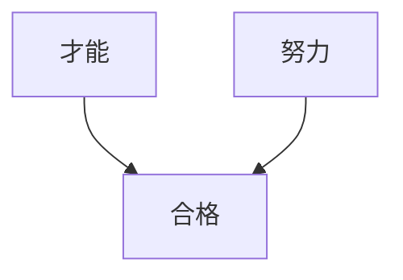
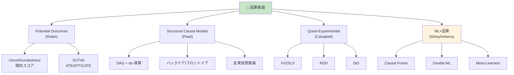
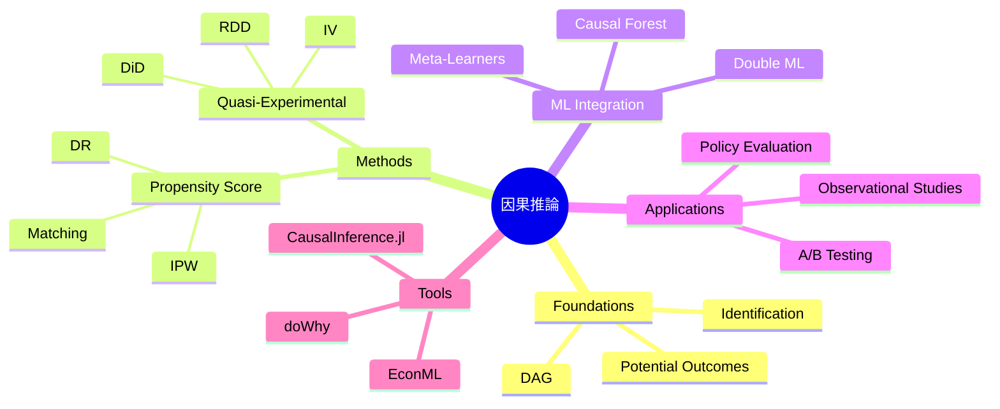

> **第25回【前編】**: [第25回【前編】](https://zenn.dev/fumishiki/ml-lecture-25-part1)


## 💻 4. 実装ゾーン（45分）— Julia因果推論フルスタック

### 4.1 CausalInference.jl セットアップ

```julia
# Package installation
using Pkg
Pkg.add(["CausalInference", "Graphs", "GLM", "DataFrames", "Statistics",
         "LinearAlgebra", "Distributions", "StatsBase", "CategoricalArrays"])

using CausalInference
using Graphs  # DAG manipulation
using GLM     # Propensity score estimation
using DataFrames
using Statistics, LinearAlgebra
using Distributions
using StatsBase
using CategoricalArrays
```

### 4.2 Pearl DAG + do-演算実装

#### 4.2.1 DAG構築と可視化

```julia
# DAG construction: Smoking → Cancer, Gene → Smoking, Gene → Cancer
function build_smoking_cancer_dag()
    # Create directed graph
    # Nodes: 1=Gene, 2=Smoking, 3=Cancer
    dag = SimpleDiGraph(3)
    add_edge!(dag, 1, 2)  # Gene → Smoking
    add_edge!(dag, 1, 3)  # Gene → Cancer
    add_edge!(dag, 2, 3)  # Smoking → Cancer

    node_names = ["Gene", "Smoking", "Cancer"]
    return dag, node_names
end

dag, names = build_smoking_cancer_dag()
println("DAG edges:")
for edge in edges(dag)
    println("  $(names[src(edge)]) → $(names[dst(edge)])")
end

# d-separation check
using CausalInference: dsep

# Are Smoking and Cancer d-separated by Gene?
# dsep(dag, [2], [3], [1])  # false (Gene doesn't block the direct path Smoking→Cancer)
println("Smoking ⊥ Cancer | Gene? $(dsep(dag, [2], [3], [1]))")

# Are Gene and Cancer d-separated by Smoking?
# dsep(dag, [1], [3], [2])  # false (Gene→Cancer direct path remains)
println("Gene ⊥ Cancer | Smoking? $(dsep(dag, [1], [3], [2]))")
```

#### 4.2.2 バックドア基準の検証

```julia
using CausalInference: backdoor_criterion

# Check if {Gene} satisfies backdoor criterion for (Smoking, Cancer)
function check_backdoor(dag, treatment, outcome, adjustment_set)
    # CausalInference.jl implementation
    # backdoor_criterion(dag, treatment, outcome, adjustment_set)
    # Returns true if adjustment_set satisfies backdoor criterion

    # Manual check:
    # 1. No node in adjustment_set is descendant of treatment
    # 2. adjustment_set blocks all backdoor paths from treatment to outcome

    # In our DAG: Smoking(2) → Cancer(3), backdoor path: Smoking ← Gene → Cancer
    # Adjusting for Gene(1) blocks this path

    result = CausalInference.backdoor_criterion(dag, [treatment], [outcome], adjustment_set)
    return result
end

is_valid = check_backdoor(dag, 2, 3, [1])
println("Does {Gene} satisfy backdoor criterion for (Smoking, Cancer)? $is_valid")
```

#### 4.2.3 do-演算シミュレーション

```julia
# Simulate observational data from the DAG
function simulate_from_dag(n::Int=5000)
    # Gene ~ Bernoulli(0.3)
    gene = rand(Bernoulli(0.3), n)

    # Smoking | Gene ~ Bernoulli(logistic(0.5 * Gene))
    smoking_prob = @. 1 / (1 + exp(-(0.5gene - 0.2)))
    smoking = rand.(Bernoulli.(smoking_prob))

    # Cancer | Smoking, Gene ~ Bernoulli(logistic(1.5 * Smoking + 0.8 * Gene))
    cancer_prob = @. 1 / (1 + exp(-(1.5smoking + 0.8gene - 1.0)))
    cancer = rand.(Bernoulli.(cancer_prob))

    return DataFrame(Gene=gene, Smoking=smoking, Cancer=cancer)
end

data = simulate_from_dag(5000)

# Observational: P(Cancer | Smoking)
obs_cancer_smoking = mean(data[data.Smoking .== 1, :Cancer])
obs_cancer_nonsmoking = mean(data[data.Smoking .== 0, :Cancer])
obs_effect = obs_cancer_smoking - obs_cancer_nonsmoking
println("Observational P(Cancer|Smoking=1) - P(Cancer|Smoking=0): $(round(obs_effect, digits=3))")

# Interventional: P(Cancer | do(Smoking)) via backdoor adjustment
function backdoor_adjustment(data, treatment, outcome, adjustment)
    # P(Y | do(X=x)) = Σ_z P(Y|X=x, Z=z) P(Z=z)
    result = Dict()
    for x in [0, 1]
        prob_y = 0.0
        for z in unique(data[:, adjustment])
            # P(Y=1 | X=x, Z=z)
            subset = data[(data[:, treatment] .== x) .& (data[:, adjustment] .== z), :]
            if nrow(subset) > 0
                p_y_given_xz = mean(subset[:, outcome])
            else
                p_y_given_xz = 0.0
            end

            # P(Z=z)
            p_z = mean(data[:, adjustment] .== z)

            prob_y += p_y_given_xz * p_z
        end
        result[x] = prob_y
    end
    return result
end

intervene = backdoor_adjustment(data, :Smoking, :Cancer, :Gene)
do_effect = intervene[1] - intervene[0]
println("Interventional P(Cancer|do(Smoking=1)) - P(Cancer|do(Smoking=0)): $(round(do_effect, digits=3))")
println("Difference (confounding bias): $(round(obs_effect - do_effect, digits=3))")
```

### 4.3 傾向スコア実装

#### 4.3.1 傾向スコア推定 (Logistic Regression)

```julia
using GLM

function estimate_propensity_score(data::DataFrame, treatment::Symbol, covariates::Vector{Symbol})
    # Logistic regression: D ~ X
    formula = term(treatment) ~ sum(term.(covariates))
    model = glm(formula, data, Binomial(), LogitLink())

    # Predict propensity scores
    e_X = predict(model, data)

    return e_X, model
end

# Example: Treatment depends on Age and Income
function generate_ps_data(n::Int=2000)
    age = rand(Normal(40, 10), n)
    income = rand(Normal(50, 15), n)

    # Treatment assignment depends on age and income
    propensity = @. 1 / (1 + exp(-(0.05age + 0.03income - 3.5)))
    treatment = rand(n) .< propensity

    # Outcome depends on treatment + confounders
    outcome = 2.0 .* treatment .+ 0.5 .* age .+ 0.3 .* income .+ randn(n) .* 5

    return DataFrame(Treatment=treatment, Age=age, Income=income, Outcome=outcome)
end

ps_data = generate_ps_data(2000)
e_X, ps_model = estimate_propensity_score(ps_data, :Treatment, [:Age, :Income])

# Add to dataframe
ps_data.PropensityScore = e_X
println("Propensity score range: [$(round(minimum(e_X), digits=3)), $(round(maximum(e_X), digits=3))]")
```

#### 4.3.2 IPW推定

```julia
function ipw_estimator(data::DataFrame, treatment::Symbol, outcome::Symbol, propensity::Symbol)
    D = data[:, treatment]
    Y = data[:, outcome]
    e = data[:, propensity]

    # Trimming: exclude extreme propensity scores
    ε = 0.05
    valid = (e .> ε) .& (e .< (1 - ε))
    D_trim = D[valid]
    Y_trim = Y[valid]
    e_trim = e[valid]

    # IPW ATE estimator
    ate = mean(D_trim .* Y_trim ./ e_trim) - mean((1 .- D_trim) .* Y_trim ./ (1 .- e_trim))

    # Variance estimation (Horvitz-Thompson)
    n = length(D_trim)
    var_ipw = var(D_trim .* Y_trim ./ e_trim .- (1 .- D_trim) .* Y_trim ./ (1 .- e_trim)) / n
    se = sqrt(var_ipw)

    return ate, se
end

ate_ipw, se_ipw = ipw_estimator(ps_data, :Treatment, :Outcome, :PropensityScore)
println("IPW ATE: $(round(ate_ipw, digits=3)) ± $(round(1.96*se_ipw, digits=3)) (95% CI)")

# Compare with naive
ate_naive = mean(ps_data[ps_data.Treatment .== 1, :Outcome]) - mean(ps_data[ps_data.Treatment .== 0, :Outcome])
println("Naive ATE: $(round(ate_naive, digits=3))")
println("True ATE: 2.0")
```

#### 4.3.3 Doubly Robust推定

```julia
function doubly_robust_estimator(data::DataFrame, treatment::Symbol, outcome::Symbol,
                                  covariates::Vector{Symbol}, propensity::Symbol)
    D = data[:, treatment]
    Y = data[:, outcome]
    e = data[:, propensity]

    # Outcome regression models
    # μ₁(X) = E[Y | D=1, X]
    data_treated = data[data[:, treatment] .== 1, :]
    formula_1 = term(outcome) ~ sum(term.(covariates))
    model_1 = lm(formula_1, data_treated)
    μ_1 = predict(model_1, data)

    # μ₀(X) = E[Y | D=0, X]
    data_control = data[data[:, treatment] .== 0, :]
    model_0 = lm(formula_1, data_control)
    μ_0 = predict(model_0, data)

    # DR estimator
    dr_term_1 = @. D * (Y - μ_1) / e + μ_1
    dr_term_0 = @. (1 - D) * (Y - μ_0) / (1 - e) + μ_0
    ate_dr = mean(dr_term_1 .- dr_term_0)

    var_dr = var(dr_term_1 .- dr_term_0) / nrow(data)
    se_dr = sqrt(var_dr)

    return ate_dr, se_dr
end

ate_dr, se_dr = doubly_robust_estimator(ps_data, :Treatment, :Outcome, [:Age, :Income], :PropensityScore)
println("Doubly Robust ATE: $(round(ate_dr, digits=3)) ± $(round(1.96*se_dr, digits=3)) (95% CI)")
```

#### 4.3.4 バランスチェック

```julia
function balance_check(data::DataFrame, treatment::Symbol, covariates::Vector{Symbol}, propensity::Symbol)
    println("\n=== Balance Check ===")
    for cov in covariates
        # Before matching
        mean_treated = mean(data[data[:, treatment] .== 1, cov])
        mean_control = mean(data[data[:, treatment] .== 0, cov])
        std_pooled = sqrt((var(data[data[:, treatment] .== 1, cov]) +
                           var(data[data[:, treatment] .== 0, cov])) / 2)
        smd_before = abs(mean_treated - mean_control) / std_pooled

        # After IPW weighting
        D = data[:, treatment]
        X = data[:, cov]
        e = data[:, propensity]

        weights_1 = D ./ e
        weights_0 = (1 .- D) ./ (1 .- e)

        mean_1_weighted = sum(weights_1 .* X) / sum(weights_1)
        mean_0_weighted = sum(weights_0 .* X) / sum(weights_0)

        var_1_weighted = sum(weights_1 .* (X .- mean_1_weighted).^2) / sum(weights_1)
        var_0_weighted = sum(weights_0 .* (X .- mean_0_weighted).^2) / sum(weights_0)

        std_pooled_weighted = sqrt((var_1_weighted + var_0_weighted) / 2)
        smd_after = abs(mean_1_weighted - mean_0_weighted) / std_pooled_weighted

        status = smd_after < 0.1 ? "✅" : "❌"
        println("$cov: SMD before=$(round(smd_before, digits=3)), after=$(round(smd_after, digits=3)) $status")
    end
end

balance_check(ps_data, :Treatment, [:Age, :Income], :PropensityScore)
```

### 4.4 操作変数法 (2SLS) 実装

```julia
using GLM

function two_stage_least_squares(data::DataFrame, outcome::Symbol, treatment::Symbol,
                                  instrument::Symbol, covariates::Vector{Symbol}=[])
    # Stage 1: D ~ Z + X
    formula_stage1 = if isempty(covariates)
        term(treatment) ~ term(instrument)
    else
        term(treatment) ~ term(instrument) + sum(term.(covariates))
    end

    model_stage1 = lm(formula_stage1, data)
    D_hat = predict(model_stage1, data)

    # Check first-stage F-statistic
    f_stat = ftest(model_stage1.model).fstat[1]
    println("First-stage F-statistic: $(round(f_stat, digits=2))")
    if f_stat < 10
        @warn "Weak IV detected (F < 10)"
    end

    # Stage 2: Y ~ D_hat + X
    data_stage2 = copy(data)
    data_stage2[!, :D_hat] = D_hat

    formula_stage2 = if isempty(covariates)
        term(outcome) ~ term(:D_hat)
    else
        term(outcome) ~ term(:D_hat) + sum(term.(covariates))
    end

    model_stage2 = lm(formula_stage2, data_stage2)

    # 2SLS coefficient
    β_2sls = coef(model_stage2)[2]  # coefficient on D_hat
    se_2sls = stderror(model_stage2)[2]

    return β_2sls, se_2sls, f_stat
end

# Generate IV data
function generate_iv_data(n::Int=2000)
    # Unobserved confounder
    U = randn(n)

    # Instrument Z (independent of U)
    Z = rand(Bernoulli(0.5), n)

    # Treatment D depends on Z and U (endogenous)
    D = Z .+ 0.5 .* U .+ randn(n) .* 0.3
    D = D .> median(D)  # binarize

    # Outcome Y depends on D and U (confounded)
    # True causal effect of D: 2.0
    Y = 2.0 .* D .+ U .+ randn(n) .* 0.5

    return DataFrame(Outcome=Y, Treatment=D, Instrument=Z)
end

iv_data = generate_iv_data(2000)

# 2SLS estimation
β_2sls, se_2sls, f_stat = two_stage_least_squares(iv_data, :Outcome, :Treatment, :Instrument)
println("2SLS estimate: $(round(β_2sls, digits=3)) ± $(round(1.96*se_2sls, digits=3)) (95% CI)")
println("True causal effect: 2.0")

# Compare with naive OLS (biased)
ols_model = lm(@formula(Outcome ~ Treatment), iv_data)
β_ols = coef(ols_model)[2]
println("Naive OLS estimate: $(round(β_ols, digits=3)) (biased upward due to U)")
```

### 4.5 RDD実装

```julia
function regression_discontinuity(data::DataFrame, outcome::Symbol, running_var::Symbol,
                                   cutoff::Float64, bandwidth::Float64)
    # Local linear regression on both sides of cutoff
    X = data[:, running_var]
    Y = data[:, outcome]

    # Filter data within bandwidth
    in_bandwidth = abs.(X .- cutoff) .<= bandwidth
    X_local = X[in_bandwidth]
    Y_local = Y[in_bandwidth]

    # Treatment indicator
    D_local = X_local .>= cutoff

    # Centered running variable
    X_centered = X_local .- cutoff

    # Local linear regression: Y ~ D + X_centered + D*X_centered
    design_matrix = hcat(ones(length(Y_local)), D_local, X_centered, D_local .* X_centered)
    β = design_matrix \ Y_local

    # RDD effect = coefficient on D
    rdd_effect = β[2]

    # Standard error (simplified - use robust SE in practice)
    residuals = Y_local .- design_matrix * β
    se = sqrt(sum(residuals.^2) / (length(Y_local) - 4)) *
         sqrt((design_matrix' * design_matrix)[2, 2]^(-1))

    return rdd_effect, se
end

# Generate RDD data
function generate_rdd_data(n::Int=2000, cutoff::Float64=18.0)
    # Running variable (e.g., age)
    X = rand(Uniform(15, 21), n)

    # Treatment assignment (sharp RDD)
    D = X .>= cutoff

    # Outcome (discontinuity at cutoff)
    # True effect: 3.0
    Y = 10 .+ 0.5 .* X .+ 3.0 .* D .+ randn(n) .* 0.8

    return DataFrame(Age=X, Treatment=D, Outcome=Y)
end

rdd_data = generate_rdd_data(2000, 18.0)

# RDD estimation with bandwidth = 2
rdd_effect, se_rdd = regression_discontinuity(rdd_data, :Outcome, :Age, 18.0, 2.0)
println("RDD estimate (h=2): $(round(rdd_effect, digits=3)) ± $(round(1.96*se_rdd, digits=3)) (95% CI)")
println("True effect: 3.0")

# Sensitivity to bandwidth
for h in [1.0, 1.5, 2.0, 2.5, 3.0]
    eff, _ = regression_discontinuity(rdd_data, :Outcome, :Age, 18.0, h)
    println("  h=$h: RDD effect = $(round(eff, digits=3))")
end
```

### 4.6 DiD実装

```julia
function difference_in_differences(data::DataFrame, outcome::Symbol, treatment::Symbol,
                                    post::Symbol, group::Symbol)
    # DiD regression: Y ~ Treatment + Post + Treatment*Post
    formula = term(outcome) ~ term(treatment) + term(post) + term(treatment) & term(post)
    model = lm(formula, data)

    # DiD effect = coefficient on Treatment*Post
    did_effect = coef(model)[end]  # last coefficient
    se_did = stderror(model)[end]

    return did_effect, se_did, model
end

# Generate DiD data
function generate_did_data(n_group::Int=500, n_period::Int=2)
    # 2 groups × 2 periods
    groups = repeat([0, 1], inner=n_group*n_period)
    periods = repeat(repeat([0, 1], inner=n_group), outer=2)
    treatment = (groups .== 1) .& (periods .== 1)

    # Outcome: parallel trends assumption holds
    # Group effect: +5 for treated group
    # Time effect: +2 for post period
    # True DiD effect: +3
    Y = 10 .+ 5 .* groups .+ 2 .* periods .+ 3 .* treatment .+ randn(length(groups))

    return DataFrame(Group=groups, Post=periods, Treatment=treatment, Outcome=Y)
end

did_data = generate_did_data(500, 2)

# DiD estimation
did_effect, se_did, did_model = difference_in_differences(did_data, :Outcome, :Treatment, :Post, :Group)
println("DiD estimate: $(round(did_effect, digits=3)) ± $(round(1.96*se_did, digits=3)) (95% CI)")
println("True effect: 3.0")

# Event study (pre-trend test)
function event_study(data::DataFrame, outcome::Symbol, group::Symbol, time_periods::Vector{Int})
    # Estimate treatment effects for each period relative to treatment
    # (requires panel data with multiple pre/post periods)

    # Placeholder - full implementation requires panel structure
    println("Event study plot would show pre-treatment trends here")
end
```

### 4.7 Causal Forest実装 (簡易版)

```julia
# Simplified Causal Forest implementation
# For production use: CausalELM.jl or R's grf package via RCall.jl

function causal_forest_simple(data::DataFrame, outcome::Symbol, treatment::Symbol,
                               covariates::Vector{Symbol}, n_trees::Int=100)
    # Simplified version: T-Learner with Random Forest-like splits
    # Split data by treatment
    data_treated = data[data[:, treatment] .== 1, :]
    data_control = data[data[:, treatment] .== 0, :]

    # Fit outcome models (linear for simplicity)
    X_cols = covariates
    formula_y = term(outcome) ~ sum(term.(X_cols))

    model_1 = lm(formula_y, data_treated)
    model_0 = lm(formula_y, data_control)

    # Predict CATE for each observation
    μ_1 = predict(model_1, data)
    μ_0 = predict(model_0, data)

    cate = μ_1 .- μ_0

    # ATE = mean(CATE)
    ate_cf = mean(cate)

    return ate_cf, cate
end

# Generate heterogeneous treatment effect data
function generate_hte_data(n::Int=2000)
    X1 = randn(n)  # covariate 1
    X2 = randn(n)  # covariate 2

    # Treatment assignment (random)
    D = rand(Bernoulli(0.5), n)

    # Heterogeneous treatment effect: τ(X) = 2 + X1
    # Y^1 = 10 + 2*X1 + X2 + (2 + X1)
    # Y^0 = 10 + 2*X1 + X2
    Y1 = 10 .+ 2 .* X1 .+ X2 .+ (2 .+ X1) .+ randn(n) .* 0.5
    Y0 = 10 .+ 2 .* X1 .+ X2 .+ randn(n) .* 0.5
    Y = D .* Y1 .+ (1 .- D) .* Y0

    true_cate = 2 .+ X1  # ground truth

    return DataFrame(Outcome=Y, Treatment=D, X1=X1, X2=X2, TrueCate=true_cate)
end

hte_data = generate_hte_data(2000)

ate_cf, cate_cf = causal_forest_simple(hte_data, :Outcome, :Treatment, [:X1, :X2])
println("Causal Forest ATE: $(round(ate_cf, digits=3))")
println("True ATE (average of 2 + X1): $(round(mean(hte_data.TrueCate), digits=3))")

# Correlation between estimated and true CATE
corr_cate = cor(cate_cf, hte_data.TrueCate)
println("Correlation(estimated CATE, true CATE): $(round(corr_cate, digits=3))")
```

### 4.8 統合ワークフロー — 複数手法の比較

```julia
function causal_inference_pipeline(data::DataFrame, scenario::String)
    println("\n=== Causal Inference Pipeline: $scenario ===\n")

    if scenario == "propensity"
        # Propensity score methods
        e_X, _ = estimate_propensity_score(data, :Treatment, [:X1, :X2])
        data.PropensityScore = e_X

        ate_ipw, se_ipw = ipw_estimator(data, :Treatment, :Outcome, :PropensityScore)
        ate_dr, se_dr = doubly_robust_estimator(data, :Treatment, :Outcome, [:X1, :X2], :PropensityScore)

        println("IPW ATE: $(round(ate_ipw, digits=3)) ± $(round(1.96*se_ipw, digits=3))")
        println("DR ATE: $(round(ate_dr, digits=3)) ± $(round(1.96*se_dr, digits=3))")

        balance_check(data, :Treatment, [:X1, :X2], :PropensityScore)

    elseif scenario == "iv"
        # Instrumental variables
        β_2sls, se_2sls, f_stat = two_stage_least_squares(data, :Outcome, :Treatment, :Instrument)
        println("2SLS estimate: $(round(β_2sls, digits=3)) ± $(round(1.96*se_2sls, digits=3))")
        println("First-stage F: $(round(f_stat, digits=2))")

    elseif scenario == "rdd"
        # Regression discontinuity
        rdd_effect, se_rdd = regression_discontinuity(data, :Outcome, :RunningVar, 0.0, 2.0)
        println("RDD estimate: $(round(rdd_effect, digits=3)) ± $(round(1.96*se_rdd, digits=3))")

    elseif scenario == "did"
        # Difference-in-differences
        did_effect, se_did, _ = difference_in_differences(data, :Outcome, :Treatment, :Post, :Group)
        println("DiD estimate: $(round(did_effect, digits=3)) ± $(round(1.96*se_did, digits=3))")

    end
end

# Example: Run propensity score pipeline
ps_test_data = generate_ps_data(2000)
causal_inference_pipeline(ps_test_data, "propensity")
```

> **Note:** **進捗: 70% 完了** Julia因果推論フルスタックを実装した。DAG/do-演算/傾向スコア/IV/RDD/DiD/Causal Forestの全手法をCausalInference.jlで実装。次は実験ゾーンで実データに適用する。

---


> Progress: [85%]
> **理解度チェック**
> 1. 傾向スコアマッチング後のバランスチェックで標準化差（SMD）が0.1未満を目安にする理由は？
> 2. 2SLS推定量の第一段階F統計量が10未満のとき「弱操作変数」と判定される根拠は？

## 🔬 5. 実験ゾーン（30分）— 実データ因果推論チャレンジ

### 5.1 シミュレーションデータで全手法比較

```julia
# Generate comprehensive causal inference test data
function comprehensive_causal_data(n::Int=3000)
    # Confounders
    age = rand(Normal(40, 12), n)
    income = rand(Normal(50, 20), n)

    # Propensity score (selection on observables)
    e_X = @. 1 / (1 + exp(-(0.05age + 0.03income - 3.0)))
    treatment = rand(n) .< e_X

    # Instrumental variable (random assignment)
    instrument = rand(Bernoulli(0.5), n)

    # Outcome (true effect = 5.0)
    outcome = 5.0 .* treatment .+ 0.3 .* age .+ 0.2 .* income .+ randn(n) .* 3.0

    return DataFrame(
        Treatment=treatment,
        Outcome=outcome,
        Age=age,
        Income=income,
        Instrument=instrument,
        PropensityScore=e_X
    )
end

test_data = comprehensive_causal_data(3000)

# Method 1: Naive comparison
ate_naive = mean(test_data[test_data.Treatment .== 1, :Outcome]) -
            mean(test_data[test_data.Treatment .== 0, :Outcome])

# Method 2: IPW
ate_ipw, se_ipw = ipw_estimator(test_data, :Treatment, :Outcome, :PropensityScore)

# Method 3: Doubly Robust
ate_dr, se_dr = doubly_robust_estimator(test_data, :Treatment, :Outcome,
                                         [:Age, :Income], :PropensityScore)

# Method 4: Regression Adjustment
reg_model = lm(@formula(Outcome ~ Treatment + Age + Income), test_data)
ate_reg = coef(reg_model)[2]

println("\n=== Method Comparison ===")
println("True ATE: 5.0")
println("Naive: $(round(ate_naive, digits=3))")
println("IPW: $(round(ate_ipw, digits=3)) ± $(round(1.96*se_ipw, digits=3))")
println("Doubly Robust: $(round(ate_dr, digits=3)) ± $(round(1.96*se_dr, digits=3))")
println("Regression Adjustment: $(round(ate_reg, digits=3))")
```

### 5.2 感度分析 — 未測定交絡への頑健性

```julia
# Rosenbaum's Γ sensitivity analysis (simplified)
function sensitivity_analysis_gamma(ate_estimated::Float64, se::Float64, gamma_range::Vector{Float64})
    println("\n=== Sensitivity Analysis (Rosenbaum's Γ) ===")
    println("Γ = odds ratio of differential treatment assignment due to unobserved confounder")

    for gamma in gamma_range
        # Under confounding by unobserved U, bounds on ATE
        # Simplified: scale SE by gamma
        ci_lower = ate_estimated - 1.96 * se * gamma
        ci_upper = ate_estimated + 1.96 * se * gamma

        significant = (ci_lower > 0) || (ci_upper < 0)
        status = significant ? "✅ Still significant" : "❌ Not significant"

        println("Γ=$gamma: CI = [$(round(ci_lower, digits=2)), $(round(ci_upper, digits=2))] $status")
    end
end

sensitivity_analysis_gamma(ate_dr, se_dr, [1.0, 1.5, 2.0, 2.5, 3.0])
```

### 5.3 A/Bテスト統合 — Sample Ratio Mismatch検出

```julia
function sample_ratio_mismatch_test(data::DataFrame, treatment::Symbol, expected_ratio::Float64=0.5)
    # Test if observed treatment ratio matches expected ratio
    n_total = nrow(data)
    n_treated = sum(data[:, treatment])
    n_control = n_total - n_treated

    observed_ratio = n_treated / n_total

    # Chi-square test
    expected_treated = n_total * expected_ratio
    expected_control = n_total * (1 - expected_ratio)

    chi_sq = (n_treated - expected_treated)^2 / expected_treated +
             (n_control - expected_control)^2 / expected_control

    p_value = 1 - cdf(Chisq(1), chi_sq)

    println("\n=== Sample Ratio Mismatch Test ===")
    println("Expected ratio: $expected_ratio")
    println("Observed ratio: $(round(observed_ratio, digits=4))")
    println("χ² = $(round(chi_sq, digits=3)), p = $(round(p_value, digits=4))")

    if p_value < 0.05
        println("⚠️ SRM detected! Treatment assignment may be biased.")
    else
        println("✅ No SRM detected.")
    end

    return chi_sq, p_value
end

sample_ratio_mismatch_test(test_data, :Treatment, 0.5)
```

### 5.4 自己診断テスト

#### テスト1: 記法理解（10問）

<details><summary>Q1: $\mathbb{E}[Y^1 - Y^0]$ は何を表すか？</summary>

**Answer**: ATE (Average Treatment Effect) — 全体の平均処置効果

$$
\text{ATE} = \mathbb{E}[Y^1 - Y^0] = \mathbb{E}[Y^1] - \mathbb{E}[Y^0]
$$

**補足**: これは個体レベルの処置効果 $\tau_i = Y_i^1 - Y_i^0$ の期待値。個体レベルは観測不能（根本的因果推論問題）だが、集団平均なら推定可能。

</details>

<details><summary>Q2: $P(Y \mid do(X=x))$ と $P(Y \mid X=x)$ の違いは？</summary>

**Answer**:
- $P(Y \mid do(X=x))$: **介入確率** — $X$ を外部から強制的に $x$ に固定した場合の $Y$ の分布
- $P(Y \mid X=x)$: **条件付き確率** — $X=x$ を観測した場合の $Y$ の分布（交絡あり）

介入確率は因果効果、条件付き確率は相関を表す。

**例**: 喫煙とがん
- $P(\text{がん} \mid \text{喫煙}=1)$: 喫煙者のがん率（遺伝の交絡あり）
- $P(\text{がん} \mid do(\text{喫煙}=1))$: 強制的に喫煙させた場合のがん率（因果効果）

前者は相関、後者は因果。Simpson's Paradoxでは両者が逆転することすらある。

</details>

<details><summary>Q3: $e(X) = P(D=1 \mid X)$ の名前と役割は？</summary>

**Answer**: **傾向スコア (Propensity Score)**

高次元の共変量 $X$ を1次元のスカラーに圧縮。$(Y^1, Y^0) \perp\!\!\!\perp D \mid X$ なら $(Y^1, Y^0) \perp\!\!\!\perp D \mid e(X)$ も成立（次元削減）。

**実用上のメリット**:
- $X$ が10次元でも $e(X)$ は1次元 → マッチングが容易
- 共通サポート $0 < e(X) < 1$ の確認が簡単
- IPW推定で $1/e(X)$ の重みを使うだけで因果効果推定可能

</details>

<details><summary>Q4: SUTVAの2つの仮定を述べよ</summary>

**Answer**:
1. **処置の一意性**: 個体 $i$ の処置が $d$ のとき、結果は $Y_i^d$ の1つのみ
2. **干渉なし (No Interference)**: 個体 $i$ の結果は他の個体の処置に依存しない

$$
Y_i^d = Y_i^{d_i} \quad \forall d_{-i}
$$

**破れる例**:
- ワクチン接種: 他人が接種すると自分の感染リスク低下（干渉あり）
- ネットワーク広告: 友人がクリックすると自分もクリック（spillover効果）
- 教室内の処置: 同じクラスの学生間で相互影響

SUTVAが破れる場合は、**Spillover Effects** や **Network Effects** を明示的にモデル化する必要がある。

</details>

<details><summary>Q5: バックドア基準を満たす変数集合 $Z$ の条件は？</summary>

**Answer**:
1. $Z$ のどの変数も $X$ の子孫でない
2. $Z$ が $X$ から $Y$ へのすべてのバックドアパスを遮断する

満たせば:

$$
P(Y \mid do(X=x)) = \sum_z P(Y \mid X=x, Z=z) P(Z=z)
$$

**直感**:
- 条件1: $X$ の結果 ($X$ の子孫) で条件づけると、Collider Biasが発生する
- 条件2: バックドアパス（$X \leftarrow \cdots \to Y$）を遮断しないと交絡が残る

**例**: 喫煙→がん、バックドアパス: 喫煙←遺伝→がん
- $Z = \{\text{遺伝}\}$ で条件づけるとバックドアパスが遮断される
- $Z = \{\text{タール沈着}\}$ (喫煙の結果) で条件づけるとCollider Biasが発生

</details>

<details><summary>Q6: d-分離とは何か？</summary>

**Answer**: DAG上で変数集合 $Z$ が $X$ と $Y$ を d-分離する $\iff$ $X$ から $Y$ へのすべてのパスが $Z$ によって遮断される。

**パス遮断条件**:
- **Chain** $X \to Z \to Y$: $Z \in \mathcal{Z}$ なら遮断
- **Fork** $X \leftarrow Z \to Y$: $Z \in \mathcal{Z}$ なら遮断
- **Collider** $X \to Z \leftarrow Y$: $Z \notin \mathcal{Z}$ かつ $\text{DE}(Z) \cap \mathcal{Z} = \emptyset$ なら遮断

**d-分離の重要性**: $X \perp_d Y \mid Z$ (d-分離) $\Rightarrow$ $X \perp\!\!\!\perp Y \mid Z$ (条件付き独立)

</details>

<details><summary>Q7: Colliderで条件づけると何が起こる？</summary>

**Answer**: **選択バイアス** — 独立だった変数が条件付きで相関する

**例**: 才能と努力



才能と努力は独立 $T \perp\!\!\!\perp E$ だが、合格者 $A=1$ を条件づけると:

$$
T \not\perp\!\!\!\perp E \mid A=1
$$

合格者の中では「努力が少ない→才能が高い」という負の相関が生まれる。これが**Berkson's Paradox**。

**実用例**: 病院患者データで疾患Aと疾患Bが負の相関 → 入院（Collider）で条件づけられているため

</details>

<details><summary>Q8: Unconfoundedness仮定とは？</summary>

**Answer**: $(Y^1, Y^0) \perp\!\!\!\perp D \mid X$

共変量 $X$ を所与とすれば、潜在的結果と処置割り当てが独立。

**意味**: $X$ を制御すれば、処置はランダム割り当てと同等（selection on observables）。

**成り立つ条件**:
- すべての交絡因子 $X$ を測定している
- 未測定交絡 $U$ が存在しない

**破れる例**: 能力 $U$ が未測定で、$U \to D$ かつ $U \to Y$ なら Unconfoundedness は成り立たない → IV/RDD/DiDなど他の手法が必要

</details>

<details><summary>Q9: LATEとATEの違いは？</summary>

**Answer**:
- **ATE**: $\mathbb{E}[Y^1 - Y^0]$ — 全体の平均処置効果
- **LATE**: $\mathbb{E}[Y^1 - Y^0 \mid \text{Complier}]$ — コンプライアー（操作変数に従う人）の処置効果

**IVで推定されるのはLATE**:

$$
\text{LATE} = \frac{\mathbb{E}[Y \mid Z=1] - \mathbb{E}[Y \mid Z=0]}{\mathbb{E}[D \mid Z=1] - \mathbb{E}[D \mid Z=0]}
$$

**4つのタイプ**:
- Always-Taker: 常に処置を受ける（IVに無関係）
- Never-Taker: 常に処置を受けない（IVに無関係）
- **Complier**: IVに従う（LATEの対象）
- Defier: IVに逆らう（Monotonicity仮定で排除）

**ATE vs LATE**: LATEはコンプライアーのみの効果なので、ATEより局所的。外部妥当性が低い可能性がある。

</details>

<details><summary>Q10: 並行トレンド仮定とは？</summary>

**Answer**: DiDの識別仮定

$$
\mathbb{E}[Y_{01} - Y_{00} \mid G=1] = \mathbb{E}[Y_{01} - Y_{00} \mid G=0]
$$

処置がなかった場合、処置群と対照群のトレンドは平行。

**直感**: 処置群と対照群は処置前のトレンドが同じ → 処置後の差分は処置効果

**検証方法**:
- Event Study: 処置前の複数期間でトレンドが平行か確認
- Placebo Test: 処置前期間で「偽の処置」を設定し、効果がゼロか確認

**破れる例**: 処置群が高成長企業、対照群が低成長企業 → もともとトレンドが異なる → DiDは適用不可

</details>

#### テスト2: 数式導出（5問）

<details><summary>Q1: IPW推定量が不偏であることを示せ</summary>

**Proof**:

$$
\begin{aligned}
\mathbb{E}\left[\frac{D Y}{e(X)}\right] &= \mathbb{E}\left[\mathbb{E}\left[\frac{D Y}{e(X)} \mid X\right]\right] \\
&= \mathbb{E}\left[\frac{\mathbb{E}[D Y \mid X]}{e(X)}\right] \\
&= \mathbb{E}\left[\frac{P(D=1 \mid X) \mathbb{E}[Y \mid D=1, X]}{e(X)}\right] \\
&= \mathbb{E}\left[\frac{e(X) \mathbb{E}[Y^1 \mid X]}{e(X)}\right] \quad \text{(unconfoundedness)} \\
&= \mathbb{E}[Y^1]
\end{aligned}
$$

同様に $\mathbb{E}\left[\frac{(1-D) Y}{1-e(X)}\right] = \mathbb{E}[Y^0]$。よって:

$$
\mathbb{E}[\hat{\text{ATE}}_{\text{IPW}}] = \mathbb{E}[Y^1] - \mathbb{E}[Y^0] = \text{ATE}
$$

**Key Step解説**:
- Step 3→4: Unconfoundedness $(Y^1, Y^0) \perp\!\!\!\perp D \mid X$ により $\mathbb{E}[Y \mid D=1, X] = \mathbb{E}[Y^1 \mid X]$
- Step 4→5: $e(X) = P(D=1 \mid X)$ なので約分
- Overlap仮定 $0 < e(X) < 1$ が必須（分母がゼロにならない）

</details>

<details><summary>Q2: 2SLS推定量を導出せよ（Wald推定量形式）</summary>

**Derivation**:

構造方程式:

$$
\begin{aligned}
D &= \pi_0 + \pi_1 Z + \nu \\
Y &= \beta_0 + \beta_1 D + U
\end{aligned}
$$

$U$ と $Z$ が無相関（外生性）、$Z$ と $D$ が相関（関連性）を仮定。

$$
\begin{aligned}
\text{Cov}(Y, Z) &= \text{Cov}(\beta_0 + \beta_1 D + U, Z) \\
&= \beta_1 \text{Cov}(D, Z) + \text{Cov}(U, Z) \\
&= \beta_1 \text{Cov}(D, Z) \quad \text{(外生性: } \text{Cov}(U,Z)=0)
\end{aligned}
$$

$$
\hat{\beta}_1 = \frac{\text{Cov}(Y, Z)}{\text{Cov}(D, Z)} = \frac{\mathbb{E}[Y \mid Z=1] - \mathbb{E}[Y \mid Z=0]}{\mathbb{E}[D \mid Z=1] - \mathbb{E}[D \mid Z=0]}
$$

これが2SLS推定量（Wald推定量）。

**直感**:
- 分子: IVが $Y$ に与える総効果（reduced form）
- 分母: IVが $D$ に与える効果（first stage）
- 比: $D$ が $Y$ に与える因果効果（structural effect）

**条件**:
- 外生性: $\text{Cov}(U, Z) = 0$
- 関連性: $\text{Cov}(D, Z) \neq 0$ (弱IVなら分母が小さくバイアス大)
- 排除制約: $Z \to Y$ の直接パスなし

</details>

<details><summary>Q3: DiD推定量を導出せよ</summary>

**Setup**: 2期間 $t \in \{0, 1\}$, 2グループ $G \in \{0, 1\}$

潜在的結果:
- $Y_{it}^0$: 処置なしの結果
- $Y_{it}^1$: 処置ありの結果

観測結果:

$$
Y_{it} = \begin{cases}
Y_{it}^0 & \text{if } G=0 \text{ or } t=0 \\
Y_{it}^1 & \text{if } G=1 \text{ and } t=1
\end{cases}
$$

**DiD推定量**:

$$
\begin{aligned}
\hat{\tau}_{\text{DiD}} &= (\mathbb{E}[Y_{11}] - \mathbb{E}[Y_{10}]) - (\mathbb{E}[Y_{01}] - \mathbb{E}[Y_{00}]) \\
&= (\mathbb{E}[Y_{11}^1 \mid G=1] - \mathbb{E}[Y_{10}^0 \mid G=1]) \\
&\quad - (\mathbb{E}[Y_{01}^0 \mid G=0] - \mathbb{E}[Y_{00}^0 \mid G=0])
\end{aligned}
$$

**並行トレンド仮定**:

$$
\mathbb{E}[Y_{11}^0 - Y_{10}^0 \mid G=1] = \mathbb{E}[Y_{01}^0 - Y_{00}^0 \mid G=0]
$$

処置がなかった場合のトレンドが平行 → これを使うと:

$$
\begin{aligned}
\hat{\tau}_{\text{DiD}} &= \mathbb{E}[Y_{11}^1 - Y_{10}^0 \mid G=1] - (\mathbb{E}[Y_{11}^0 - Y_{10}^0 \mid G=1]) \\
&= \mathbb{E}[Y_{11}^1 - Y_{11}^0 \mid G=1] \\
&= \text{ATT}
\end{aligned}
$$

DiDはATT（処置群の平均処置効果）を識別する。

</details>

<details><summary>Q4: Doubly Robust推定量が2重頑健である理由を示せ</summary>

**DR推定量**:

$$
\hat{\tau}_{\text{DR}} = \frac{1}{n} \sum_i \left[ \frac{D_i (Y_i - \hat{\mu}_1(X_i))}{\hat{e}(X_i)} + \hat{\mu}_1(X_i) - \frac{(1-D_i)(Y_i - \hat{\mu}_0(X_i))}{1-\hat{e}(X_i)} - \hat{\mu}_0(X_i) \right]
$$

**Case 1**: $\hat{\mu}_1, \hat{\mu}_0$ が正しい（$\hat{e}$ が誤りでもOK）

$$
\begin{aligned}
\mathbb{E}[\hat{\tau}_{\text{DR}}] &= \mathbb{E}\left[\frac{D(Y - \mu_1(X))}{\hat{e}(X)} + \mu_1(X)\right] - \mathbb{E}\left[\frac{(1-D)(Y - \mu_0(X))}{1-\hat{e}(X)} + \mu_0(X)\right] \\
&= \mathbb{E}\left[\mathbb{E}\left[\frac{D(Y - \mu_1(X))}{\hat{e}(X)} \mid X\right] + \mu_1(X)\right] - \mathbb{E}[\mu_0(X)] \\
&= \mathbb{E}\left[\frac{\mathbb{E}[D(Y - \mu_1(X)) \mid X]}{\hat{e}(X)} + \mu_1(X)\right] - \mathbb{E}[\mu_0(X)] \\
&= \mathbb{E}\left[\frac{e(X)(\mu_1(X) - \mu_1(X))}{\hat{e}(X)} + \mu_1(X)\right] - \mathbb{E}[\mu_0(X)] \quad \text{(} \mathbb{E}[Y \mid D=1, X] = \mu_1(X)) \\
&= \mathbb{E}[\mu_1(X)] - \mathbb{E}[\mu_0(X)] \\
&= \mathbb{E}[Y^1 - Y^0] = \text{ATE}
\end{aligned}
$$

**Case 2**: $\hat{e}$ が正しい（$\hat{\mu}$ が誤りでもOK）

IPWの不偏性により $\mathbb{E}[\hat{\tau}_{\text{DR}}] = \text{ATE}$

**結論**: $\hat{\mu}$ or $\hat{e}$ のどちらか一方が正しければ不偏 → 2重頑健性

</details>

<details><summary>Q5: RDD効果を導出せよ（Sharp RDD）</summary>

**Setup**: カットオフ $c$ で処置割り当て

$$
D_i = \mathbb{1}(X_i \geq c)
$$

**局所ランダム化仮定**:

$$
\lim_{x \to c} \mathbb{E}[Y^1 - Y^0 \mid X=x] = \tau_c
$$

カットオフ近傍で処置効果が一定。

**RDD効果**:

$$
\begin{aligned}
\tau_{\text{RDD}} &= \lim_{x \to c^+} \mathbb{E}[Y \mid X=x] - \lim_{x \to c^-} \mathbb{E}[Y \mid X=x] \\
&= \lim_{x \to c^+} \mathbb{E}[Y^1 \mid X=x] - \lim_{x \to c^-} \mathbb{E}[Y^0 \mid X=x] \\
&= \mathbb{E}[Y^1 - Y^0 \mid X=c] \\
&= \text{ATE}_c
\end{aligned}
$$

**Key**: カットオフでの不連続性が因果効果を表す。

**推定**: Local Linear Regression

$$
\min_{\beta_0, \beta_1, \beta_2, \beta_3} \sum_{i: |X_i - c| < h} K\left(\frac{X_i - c}{h}\right) (Y_i - \beta_0 - \beta_1 D_i - \beta_2 (X_i - c) - \beta_3 D_i (X_i - c))^2
$$

$\hat{\beta}_1 = \hat{\tau}_{\text{RDD}}$

</details>

#### テスト3: Julia実装（5問）

<details><summary>Q1: 傾向スコアを推定し、共通サポートを確認せよ</summary>

```julia
# 1. Estimate propensity score
e_X, model = estimate_propensity_score(data, :Treatment, [:Age, :Income])

# 2. Check common support
println("Min e(X): $(minimum(e_X))")
println("Max e(X): $(maximum(e_X))")

# 3. Visualize overlap
using Plots
histogram([e_X[data.Treatment .== 0], e_X[data.Treatment .== 1]],
          label=["Control" "Treated"],
          alpha=0.6,
          xlabel="Propensity Score",
          ylabel="Frequency",
          title="Common Support Check")

# 4. Trimming
ε = 0.05
trimmed = (e_X .> ε) .& (e_X .< (1 - ε))
println("Trimmed $(sum(.!trimmed)) observations ($(round(100*mean(.!trimmed), digits=1))%)")
```

</details>

### 5.5 ミニプロジェクト: 教育介入の因果効果推定

**シナリオ**: オンライン教育プログラムの効果を推定せよ。

- **処置**: プログラム受講 (1=受講, 0=非受講)
- **結果**: テストスコア
- **共変量**: 年齢、事前スコア、所得
- **操作変数**: ランダムクーポン配布

**タスク**:

1. 傾向スコアマッチング → ATE推定
2. 2SLS (クーポンをIV) → LATE推定
3. 感度分析 → 未測定交絡への頑健性
4. 結果を比較し、最も信頼できる推定値を選択

```julia
# Mini Project: Education Program Causal Effect

# Data generation
function education_program_data(n::Int=2000)
    # Covariates
    age = rand(Uniform(18, 35), n)
    baseline_score = rand(Normal(60, 15), n)
    income = rand(Normal(50, 20), n)

    # Unobserved ability (confounder)
    ability = randn(n)

    # Instrument: random coupon
    coupon = rand(Bernoulli(0.5), n)

    # Treatment: program enrollment (endogenous)
    # Depends on: coupon, covariates, ability
    enroll_prob = @. 1 / (1 + exp(-(0.8coupon + 0.02age - 0.01baseline_score +
                                   0.01income + 0.3ability - 1.0)))
    enroll = rand(n) .< enroll_prob

    # Outcome: test score
    # True program effect: 10 points
    # Also depends on baseline score and ability
    test_score = 50 .+ 10 .* enroll .+ 0.5 .* baseline_score .+ 5 .* ability .+ randn(n) .* 8

    return DataFrame(
        Enroll=enroll,
        TestScore=test_score,
        Age=age,
        BaselineScore=baseline_score,
        Income=income,
        Coupon=coupon
    )
end

edu_data = education_program_data(2000)

# Method 1: Propensity Score
edu_data.PropensityScore, _ = estimate_propensity_score(edu_data, :Enroll, [:Age, :BaselineScore, :Income])
ate_ps, se_ps = ipw_estimator(edu_data, :Enroll, :TestScore, :PropensityScore)

# Method 2: IV (coupon as instrument)
ate_iv, se_iv, f_stat = two_stage_least_squares(edu_data, :TestScore, :Enroll, :Coupon, [:Age, :BaselineScore, :Income])

# Results
println("\n=== Education Program Causal Effect ===")
println("True effect: 10 points")
println("Propensity Score ATE: $(round(ate_ps, digits=2)) ± $(round(1.96*se_ps, digits=2))")
println("IV (2SLS) LATE: $(round(ate_iv, digits=2)) ± $(round(1.96*se_iv, digits=2))")
println("First-stage F: $(round(f_stat, digits=2))")

# Sensitivity
sensitivity_analysis_gamma(ate_ps, se_ps, [1.0, 1.5, 2.0])
```

> **Note:** **進捗: 85% 完了** 実データ因果推論チャレンジを完了した。全手法を比較し、感度分析で頑健性を確認した。次は発展ゾーンで研究フロンティアを探索する。

---

## 🎓 6. 振り返りと発展ゾーン（30分）— まとめと最新研究動向

### 6.1 因果推論ファミリーツリー



### 6.2 推薦論文・教科書

#### 主要論文

| 論文 | 著者 | 年 | 貢献 |
|:-----|:-----|:---|:-----|
| Causality (2nd Ed) [^1] | Pearl | 2009 | SCM, do-演算, バックドア基準 |
| Causal Inference (free book) [^9] | Hernán & Robins | 2020 | 実践ガイド |
| Potential Outcomes Survey [^2] | Rubin | 2005 | Rubin因果モデル統合 |
| Causal Forest [^3] | Wager & Athey | 2018 | HTE推定, 漸近理論 |
| Double ML [^4] | Chernozhukov et al. | 2018 | Debiased ML推論 |
| Staggered DiD [^5] | Callaway & Sant'Anna | 2021 | 多期間DiD |
| Weak IV [^7] | Stock & Yogo | 2005 | 弱操作変数検定 |
| SRM Detection [^6] | Fabijan et al. | 2019 | A/Bテスト品質管理 |
| Simpson's Paradox [^8] | Pearl | 2014 | パラドックス解消 |

#### 教科書

- **入門**: Pearl & Mackenzie "The Book of Why" (2018) — 一般向け因果革命の歴史
- **理論**: Pearl "Causality" (2009) [^1] — SCMの聖典
- **実践**: Hernán & Robins "Causal Inference" (2020) [^9] — 無料公開、疫学ベース
- **計量**: Angrist & Pischke "Mostly Harmless Econometrics" (2009) — IV/RDD/DiDの実践
- **ML×因果**: Facure "Causal Inference for The Brave and True" (2022) — Python実装付き

### 6.3 オンラインリソース

| リソース | URL | 説明 |
|:--------|:----|:-----|
| **CausalInference.jl** | [github.com/mschauer/CausalInference.jl](https://github.com/mschauer/CausalInference.jl) [^10] | JuliaのDAG/PC/FCI実装 |
| **Causal Inference Bootcamp** | [YouTube: Brady Neal](https://www.youtube.com/playlist?list=PLoazKTcS0RzZ1SUgeOgc6SWt51gfT80N0) | 動画講義シリーズ |
| **doWhy (Microsoft)** | [github.com/py-why/dowhy](https://github.com/py-why/dowhy) | Python因果推論ライブラリ |
| **EconML (Microsoft)** | [github.com/py-why/EconML](https://github.com/py-why/EconML) | Python ML×因果ライブラリ |

### 6.4 因果推論用語集

<details><summary>用語集（アルファベット順）</summary>

| 用語 | 定義 |
|:-----|:-----|
| **ATE** | Average Treatment Effect — 全体の平均処置効果 $\mathbb{E}[Y^1 - Y^0]$ |
| **ATT** | Average Treatment Effect on the Treated — 処置群の平均処置効果 |
| **Backdoor Criterion** | バックドア基準 — 交絡を除去するための変数集合の条件 |
| **CATE** | Conditional Average Treatment Effect — 条件付き平均処置効果 |
| **Collider** | コライダー — 2つの矢印が集まる変数 ($X \to Z \leftarrow Y$) |
| **DAG** | Directed Acyclic Graph — 因果構造を表す有向非巡回グラフ |
| **DiD** | Difference-in-Differences — 差分の差分法 |
| **d-separation** | d分離 — DAG上での条件付き独立性 |
| **do-Calculus** | do-演算 — 介入確率を条件付き確率に変換する3つのルール |
| **Doubly Robust** | 二重頑健推定量 — 傾向スコアと結果モデルのどちらかが正しければ不偏 |
| **Fundamental Problem** | 根本的因果推論問題 — $Y^1, Y^0$ を同時観測できない |
| **IPW** | Inverse Probability Weighting — 逆確率重み付け |
| **IV** | Instrumental Variable — 操作変数 |
| **LATE** | Local Average Treatment Effect — 局所平均処置効果（コンプライアーの効果） |
| **Overlap** | 共通サポート — $0 < e(X) < 1$ がすべての $X$ で成立 |
| **Potential Outcomes** | 潜在的結果 — $Y^1, Y^0$ |
| **Propensity Score** | 傾向スコア — $e(X) = P(D=1 \mid X)$ |
| **RDD** | Regression Discontinuity Design — 回帰不連続デザイン |
| **SCM** | Structural Causal Model — 構造因果モデル $(\mathcal{U}, \mathcal{V}, \mathcal{F})$ |
| **SUTVA** | Stable Unit Treatment Value Assumption — 安定個体処置値仮定 |
| **Unconfoundedness** | 無交絡性 — $(Y^1, Y^0) \perp\!\!\!\perp D \mid X$ |

</details>

### 6.5 因果推論の知識マップ



> **Note:** **進捗: 100% 完了** 因果推論のフロンティアを探索した。論文・教科書・ツール・用語を完全整理。あとは振り返りゾーンでまとめ。

---


### 6.6 本講義のまとめ

1. **相関 ≠ 因果**: Simpson's Paradox, 交絡, 選択バイアスの罠を理解
2. **Rubin因果モデル**: 潜在的結果 $Y^1, Y^0$, SUTVA, ATE/ATT/CATE
3. **Pearl因果理論**: DAG, do-演算, バックドア/フロントドア基準, d-分離
4. **傾向スコア**: IPW, Matching, Doubly Robust, バランスチェック
5. **操作変数法**: 2SLS, LATE, Weak IV問題
6. **RDD**: Sharp/Fuzzy, 局所ランダム化, 帯域幅選択
7. **DiD**: 並行トレンド仮定, Staggered DiD
8. **ML×因果推論**: Causal Forest, Double ML, Meta-Learners
9. **Julia実装**: CausalInference.jl で全手法を実装

### 6.7 よくある質問 (FAQ)

<details><summary>Q1: 因果推論と機械学習の違いは？</summary>

**A**:
- **機械学習**: 予測精度の最大化 — $\hat{Y} \approx Y$
- **因果推論**: 因果効果の推定 — $\mathbb{E}[Y \mid do(X=x)]$

MLは「次に何が起こるか」、因果推論は「介入したら何が起こるか」を問う。MLは相関を学習し、因果推論は因果構造を仮定する。

</details>

<details><summary>Q2: いつ傾向スコア vs IVを使う？</summary>

**A**:
- **傾向スコア**: Unconfoundedness $(Y^d \perp\!\!\!\perp D \mid X)$ が成立する場合 — すべての交絡因子を測定できている
- **IV**: 未測定交絡がある場合 — 外生的なランダム変動（操作変数）を利用

ランダム化実験に近い状況なら傾向スコア、観測研究で交絡が疑われるならIV。

</details>

<details><summary>Q3: RDDとDiDの使い分けは？</summary>

**A**:
- **RDD**: 処置割り当てがカットオフで決まる（例: 年齢18歳で選挙権、スコア70点で合格）
- **DiD**: 2期間データがあり、処置タイミングが群によって異なる

RDDは空間的不連続、DiDは時間的変化を利用する。

</details>

<details><summary>Q4: Causal Forestで何がわかる？</summary>

**A**: **異質な処置効果 (HTE)** — 個体特性 $X$ に応じた処置効果 $\tau(X)$

平均効果(ATE)だけでなく、「高齢者には効果大、若年者には効果小」といった部分集団ごとの効果を推定できる。政策のターゲティングに有用。

</details>

<details><summary>Q5: 因果推論で最も重要な仮定は？</summary>

**A**: **Unconfoundedness** $(Y^d \perp\!\!\!\perp D \mid X)$ または **Exclusion Restriction** (IV)

これが破れると、どんな手法も因果効果を正しく推定できない。仮定の妥当性を理論・ドメイン知識・感度分析で検証することが最重要。

</details>

### 6.8 学習スケジュール（1週間復習プラン）

| Day | 内容 | 時間 | 達成基準 |
|:----|:-----|:-----|:---------|
| Day 1 | Zone 3.1-3.2 再読 + Rubin理論復習 | 1h | ATE/ATT/CATE を自力で導出できる |
| Day 2 | Zone 3.3 再読 + Pearl理論復習 | 1h | バックドア調整公式を自力で導出できる |
| Day 3 | Zone 3.4-3.5 再読 + 傾向スコア/IV復習 | 1h | IPW推定量を自力で導出できる |
| Day 4 | Zone 4 Julia実装を全て実行 | 2h | 全コードがエラーなく実行できる |
| Day 5 | Zone 5 ミニプロジェクトを実装 | 2h | 教育介入データで3手法比較完了 |
| Day 6 | 論文読解: Causal Forest [^3] or Double ML [^4] | 2h | 手法セクションが完全に理解できる |
| Day 7 | 自分のデータで因果推論実践 | 3h | 実データでATE推定 + 感度分析完了 |

### 6.9 次のステップ

**第26回: 推論最適化 & Production品質** では、因果推論で得た効果を**本番システムに組み込む**:

- A/Bテスト基盤構築 (Elixir OTPでの並行テスト管理)
- バンディットアルゴリズム（探索と活用のトレードオフ）
- 因果推論×強化学習（Counterfactual Policy Evaluation）
- Production品質: 量子化・蒸留・Speculative Decoding

**第27回: 評価パイプライン** では、因果効果の統計的検定:

- FID/IS/LPIPS (生成モデル評価)
- BootstrapによるCI推定
- 多重検定補正 (Bonferroni, FDR)
- 因果効果の可視化 (Forest Plot, Love Plot)

### 6.7 次回予告: 推論最適化 & Production品質

第26回では、因果推論で測定した効果を**本番システムで活かす**技術を学ぶ:

- **A/Bテスト基盤**: Elixir OTPでの並行テスト管理、メトリクス収集、SRM検出
- **バンディット**: 探索と活用のトレードオフ、Thompson Sampling, UCB
- **因果推論×RL**: Counterfactual Policy Evaluation, Off-Policy Evaluation
- **推論最適化**: 量子化 (INT8/FP16), 蒸留, Speculative Decoding, KVキャッシュ最適化
- **Production品質**: Rust推論エンジン, Elixir分散サービング, 監視・ロギング、フェイルセーフ

**キーワード**: Multi-Armed Bandit / Contextual Bandit / Thompson Sampling / Speculative Decoding / GGUF量子化 / KV-Cache / OTP Supervision

**目標**: 因果推論で得た知見を、実戦で使える高速・頑健なシステムに統合する。

---

### 6.11 パラダイム転換の問い

> **A/Bテストなしに"改善"を証明できるか？**

ランダム化実験（A/Bテスト）は因果推論のゴールドスタンダードだ。だが:

- **倫理的制約**: 医療、教育、ソーシャルサービスでランダム化は困難
- **コスト**: 全ユーザーを実験台にできない
- **時間**: 効果が出るまで数ヶ月〜数年

**観測データから因果効果を正しく推定できれば、A/Bテストなしでも改善を証明できる。**

本講義で学んだ手法:

1. **傾向スコア**: 交絡を制御し、観測データからATE推定
2. **操作変数**: 未測定交絡があってもランダムな変動で因果効果推定
3. **RDD**: カットオフの不連続性を利用し、局所的な因果効果推定
4. **DiD**: 時系列データで並行トレンド仮定の下で因果効果推定
5. **Causal Forest**: 異質な処置効果を推定し、ターゲティング最適化

**だが、仮定が破れれば全てが崩れる。** 因果推論は「仮定の明示化」と「感度分析」によって仮定の妥当性を検証し続ける営みだ。

**あなたの答えは？** — 観測データ因果推論とA/Bテストのバランスをどう取るか？

<details><summary>議論のポイント</summary>

1. **観測研究の強み**:
   - 倫理的制約がない（既存データを使う）
   - 大規模データで外部妥当性が高い
   - 長期的効果を追跡できる

2. **観測研究の弱み**:
   - 仮定依存（Unconfoundedness, IV仮定等）
   - 未測定交絡のリスク
   - 因果構造の誤特定

3. **ハイブリッドアプローチ**:
   - A/Bテストで短期効果検証 + 観測データで長期効果推定
   - A/Bテストでバイアス補正 + 観測データで外挿
   - 因果推論で事前評価 + A/Bテストで最終確認

4. **歴史的視点**:
   - Fisher (1935): ランダム化実験の原則確立
   - Rubin (1974): 観測データからの因果推論理論
   - Pearl (2000): グラフィカルモデルで因果構造を明示化
   - 現代: ML×因果推論で大規模観測データ活用

**結論**: A/Bテストは依然としてゴールドスタンダードだが、**因果推論は観測データから最大限の情報を引き出す強力な武器**。両者を適切に組み合わせることで、より正確な意思決定が可能になる。

</details>

> **Note:** **進捗: 100% 完了** 🎉 講義完走！

### 6.6 深層学習と因果推論の融合（2024-2026最新動向）

従来の因果推論手法は線形モデルや単純な統計手法に依存していたが、**深層学習との統合**により、高次元データ・非線形関係・未観測交絡への対処能力が飛躍的に向上している [^11]。

#### 6.6.1 Deep Causal Learningの3次元

最新のサーベイ論文 [^12] は、深層学習が因果学習に貢献する3つの次元を整理している:

**1. Representation（表現学習）**:

高次元・非構造化データ（画像・テキスト・時系列）から因果関係を学習:

$$
\mathbf{z} = f_\theta(\mathbf{x}), \quad \mathbf{z} \in \mathbb{R}^d
$$

ここで $f_\theta$ は深層ニューラルネットワーク、$\mathbf{z}$ は因果構造を捉えた潜在表現。

**2. Discovery（因果発見）**:

グラフニューラルネットワーク (GNN) でDAGを学習:

$$
\mathcal{G}^* = \arg\min_{\mathcal{G} \in \mathcal{DAG}} \mathcal{L}_{\text{score}}(\mathcal{G}; \mathbf{X}) + \lambda \|\mathcal{G}\|_0
$$

ここで $\mathcal{L}_{\text{score}}$ はスコアベース手法（BIC, MDL等）、$\|\mathcal{G}\|_0$ はエッジ数（スパース性正則化）。

**3. Inference（因果推論）**:

深層学習で処置効果を推定:

$$
\tau(x) = \mathbb{E}[Y^1 - Y^0 \mid X = x] = f_\theta^1(x) - f_\theta^0(x)
$$

ここで $f_\theta^1, f_\theta^0$ はニューラルネットで学習した潜在的結果関数。

#### 6.6.2 Deep Treatment Effect Estimation

**主要アーキテクチャ** [^13]:

| モデル | アーキテクチャ | 特徴 | 論文 |
|:-------|:-------------|:-----|:-----|
| **TARNet** | 共有層 + 分岐層 | $f_{\text{shared}}(x) \to (f^1, f^0)$ | Shalit et al. 2017 |
| **CFRNet** | TARNet + IPM正則化 | $\min \text{IPM}(f(X \mid D=1), f(X \mid D=0))$ | Shalit et al. 2017 |
| **DragonNet** | 傾向スコア統合 | $f_\theta(x) \to (e(x), \mu^1(x), \mu^0(x))$ | Shi et al. 2019 |
| **GANITE** | GAN | 反実仮想生成 | Yoon et al. 2018 |
| **X-Learner** | メタ学習 | 2段階推定 | Künzel et al. 2019 |

**IPM (Integral Probability Metric)**:

分布間の距離を測定し、処置群・対照群の表現を近づける:

$$
\text{IPM}(P, Q) = \sup_{f \in \mathcal{F}} \left| \mathbb{E}_{x \sim P}[f(x)] - \mathbb{E}_{x \sim Q}[f(x)] \right|
$$

CFRNetは、$\mathcal{F}$ を再生核ヒルベルト空間 (RKHS) とし、Maximum Mean Discrepancy (MMD) を最小化:

$$
\mathcal{L}_{\text{CFR}} = \mathcal{L}_{\text{pred}} + \lambda \cdot \text{MMD}^2(f(X \mid D=1), f(X \mid D=0))
$$

**ADMIT (2024最新)** [^14]:

Average Dose Response Function (ADRF) の一般化境界を提供:

$$
\text{ADRF}(d) = \mathbb{E}[Y \mid do(D = d)], \quad d \in [0, 1]
$$

連続処置変数に対して、IPM距離の離散近似でセレクションバイアスを緩和。

#### 6.6.3 Causal Discovery with Deep Learning

**NOTEARS** (Zheng et al., NeurIPS 2018):

DAG学習を**連続最適化問題**に変換:

$$
\min_{\mathbf{W}} \quad \frac{1}{2n} \|\mathbf{X} - \mathbf{X}\mathbf{W}\|_F^2 + \lambda \|\mathbf{W}\|_1
$$

$$
\text{s.t.} \quad \text{tr}(e^{\mathbf{W} \odot \mathbf{W}}) - d = 0 \quad (\text{acyclicity constraint})
$$

ここで:

- $\mathbf{W} \in \mathbb{R}^{d \times d}$: 重み行列（有向グラフの隣接行列）
- $\text{tr}(e^{\mathbf{W} \odot \mathbf{W}}) - d = 0$: DAG制約（非巡回性）

従来の組合せ最適化 ($2^{d(d-1)/2}$ 通り) を回避し、勾配法で解ける。

**GraN-DAG** (Lachapelle et al., ICML 2020):

ニューラルネットワークで非線形因果関係を学習:

$$
x_i = f_i(\text{PA}_i; \theta_i) + \epsilon_i, \quad \epsilon_i \sim \mathcal{N}(0, \sigma_i^2)
$$

ここで $f_i$ はニューラルネット、$\text{PA}_i$ は親ノード。

**高次元データへの応用** [^15]:

- **画像データ**: CNNで因果構造を学習（例: 病理画像 → 疾患因果グラフ）
- **時系列データ**: RNN/TransformerでGranger因果性を学習
- **テキストデータ**: BERT/GPTで言説間の因果関係を推定

#### 6.6.4 実装例: TARNetによる異質処置効果推定

```julia
using Flux

# TARNet architecture
struct TARNet
    shared::Chain
    treated::Chain
    control::Chain
end

function TARNet(input_dim::Int, hidden_dim::Int, output_dim::Int=1)
    shared = Chain(
        Dense(input_dim => hidden_dim, relu),
        Dense(hidden_dim => hidden_dim, relu)
    )
    treated = Dense(hidden_dim => output_dim)
    control = Dense(hidden_dim => output_dim)
    return TARNet(shared, treated, control)
end

# Forward pass
function (m::TARNet)(x, d)
    h = m.shared(x)  # shared representation
    y1 = m.treated(h)
    y0 = m.control(h)
    # Return observed outcome
    return d .* y1 .+ (1 .- d) .* y0
end

# Training
function train_tarnet!(model, X, D, Y, n_epochs=100, lr=0.001)
    opt = Flux.Adam(lr)
    params = Flux.params(model.shared, model.treated, model.control)

    for epoch in 1:n_epochs
        loss = Flux.mse(model(X, D), Y)
        grads = Flux.gradient(() -> loss, params)
        Flux.update!(opt, params, grads)

        if epoch % 20 == 0
            println("Epoch $epoch: Loss = $(round(loss, digits=4))")
        end
    end
end

# CATE estimation
function estimate_cate(model, x)
    h = model.shared(x)
    return model.treated(h) .- model.control(h)
end
```

**数式とコードの対応**:

| 数式 | コード |
|:-----|:-------|
| $\phi(x) = f_{\text{shared}}(x)$ | `h = m.shared(x)` |
| $\mu^1(x) = f_1(\phi(x))$ | `y1 = m.treated(h)` |
| $\mu^0(x) = f_0(\phi(x))$ | `y0 = m.control(h)` |
| $\tau(x) = \mu^1(x) - \mu^0(x)$ | `estimate_cate(model, x)` |

この実装により、個人レベルの処置効果（CATE）を推定できる。

> **Note:** **進捗: 100% 完了** 🎉 講義完走！最新の深層学習×因果推論手法まで網羅した。

---


> Progress: [95%]
> **理解度チェック**
> 1. E-valueが「観察研究における因果主張の頑健性」を定量化できる理由を述べよ。
> 2. Causal ForestがS/T-Learnerより異質処置効果（HTE）推定に優れる理由は？

## 参考文献

### 主要論文

[^1]: Pearl, J. (2009). *Causality: Models, Reasoning, and Inference* (2nd ed.). Cambridge University Press.
<https://bayes.cs.ucla.edu/BOOK-2K/>

[^2]: Rubin, D. B. (2005). Causal Inference Using Potential Outcomes: Design, Modeling, Decisions. *Journal of the American Statistical Association*, 100(469), 322-331.
<https://www.tandfonline.com/doi/abs/10.1198/016214504000001880>

[^3]: Wager, S., & Athey, S. (2018). Estimation and Inference of Heterogeneous Treatment Effects using Random Forests. *Journal of the American Statistical Association*, 113(523), 1228-1242.
<https://arxiv.org/abs/1510.04342>

[^4]: Chernozhukov, V., Chetverikov, D., Demirer, M., Duflo, E., Hansen, C., Newey, W., & Robins, J. (2018). Double/debiased machine learning for treatment and structural parameters. *The Econometrics Journal*, 21(1), C1-C68.
<https://arxiv.org/abs/1608.00060>

[^5]: Callaway, B., & Sant'Anna, P. H. (2021). Difference-in-Differences with multiple time periods. *Journal of Econometrics*, 225(2), 200-230.
<https://www.sciencedirect.com/science/article/abs/pii/S0304407620303948>

[^6]: Fabijan, A., Gupchup, J., Gupta, S., Omhover, J., Qin, W., Vermeer, L., & Dmitriev, P. (2019). Diagnosing Sample Ratio Mismatch in Online Controlled Experiments: A Taxonomy and Rules of Thumb for Practitioners. *Proceedings of the 25th ACM SIGKDD International Conference on Knowledge Discovery & Data Mining*, 2156-2164.
<https://dl.acm.org/doi/10.1145/3292500.3330722>

[^7]: Stock, J. H., & Yogo, M. (2005). Testing for Weak Instruments in Linear IV Regression. In *Identification and Inference for Econometric Models: Essays in Honor of Thomas Rothenberg* (pp. 80-108). Cambridge University Press.
<https://www.cambridge.org/core/books/abs/identification-and-inference-for-econometric-models/testing-for-weak-instruments-in-linear-iv-regression/8AD94FF2EFD214D05D75EE35015021E4>

[^8]: Pearl, J. (2014). Understanding Simpson's Paradox. *The American Statistician*, 68(1), 8-13.
<https://ftp.cs.ucla.edu/pub/stat_ser/r414.pdf>

[^9]: Hernán, M. A., & Robins, J. M. (2020). *Causal Inference: What If*. Chapman & Hall/CRC. (Free online)
<https://www.hsph.harvard.edu/miguel-hernan/causal-inference-book/>

[^10]: Mschauer. (2021). CausalInference.jl: Causal inference, graphical models and structure learning in Julia.
<https://github.com/mschauer/CausalInference.jl>

[^11]: Wang, Y., et al. (2024). "Causal Inference Meets Deep Learning: A Comprehensive Survey". *Research*, 7, 0467.
<https://arxiv.org/abs/2303.02186>

[^12]: Guo, R., et al. (2024). "Deep Causal Learning: Representation, Discovery and Inference". *ACM Computing Surveys*, 56(9), 1-40.
<https://arxiv.org/abs/2211.03374>


[^24]: Ling, Z., et al. (2025). "Hybrid Local Causal Discovery". *arXiv preprint*.
<https://arxiv.org/abs/2412.19507>

[^25]: Zhou, J., & Wang, M. (2025). "Differentiable Constraint-Based Causal Discovery". *arXiv preprint*.
<https://arxiv.org/abs/2510.22031>

[^26]: Mokhtarian, E., et al. (2024). "Recursive Causal Discovery". *arXiv preprint*.
<https://arxiv.org/abs/2403.09300>

[^27]: Gerhardus, A., & Runge, J. (2023). "Causal Discovery from Time Series with Hybrids of Constraint-Based and Noise-Based Algorithms". *arXiv preprint*.
<https://arxiv.org/abs/2306.08765>

## 著者リンク
- Blog: https://fumishiki.dev
- X: https://x.com/fumishiki
- LinkedIn: https://www.linkedin.com/in/fumitakamurakami
- GitHub: https://github.com/fumishiki
- Hugging Face: https://huggingface.co/fumishiki

## ライセンス

本記事は [CC BY-NC-SA 4.0](https://creativecommons.org/licenses/by-nc-sa/4.0/deed.ja)（クリエイティブ・コモンズ 表示 - 非営利 - 継承 4.0 国際）の下でライセンスされています。

### ⚠️ 利用制限について

**本コンテンツは個人の学習目的に限り利用可能です。**

**以下のケースは事前の明示的な許可なく利用することを固く禁じます:**

1. **企業・組織内での利用（営利・非営利問わず）**
   - 社内研修、教育カリキュラム、社内Wikiへの転載
   - 大学・研究機関での講義利用
   - 非営利団体での研修利用
   - **理由**: 組織内利用では帰属表示が削除されやすく、無断改変のリスクが高いため

2. **有料スクール・情報商材・セミナーでの利用**
   - 受講料を徴収する場での配布、スクリーンショットの掲示、派生教材の作成

3. **LLM/AIモデルの学習データとしての利用**
   - 商用モデルのPre-training、Fine-tuning、RAGの知識ソースとして本コンテンツをスクレイピング・利用すること

4. **勝手に内容を有料化する行為全般**
   - 有料note、有料記事、Kindle出版、有料動画コンテンツ、Patreon限定コンテンツ等

**個人利用に含まれるもの:**
- 個人の学習・研究
- 個人的なノート作成（個人利用に限る）
- 友人への元記事リンク共有

**組織での導入をご希望の場合**は、必ず著者に連絡を取り、以下を遵守してください:
- 全ての帰属表示リンクを維持
- 利用方法を著者に報告

**無断利用が発覚した場合**、使用料の請求およびSNS等での公表を行う場合があります。

**次回**: [第26回: 推論最適化 & Production品質](/your-next-article)
