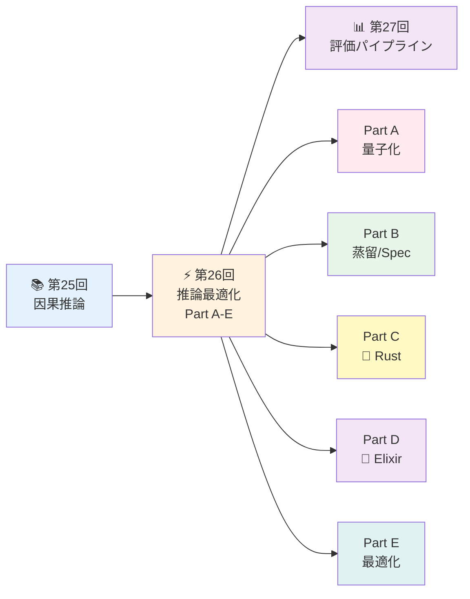
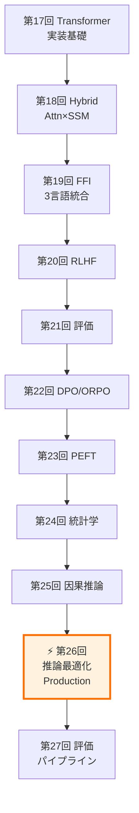

# 第26回: 推論最適化 & Production品質 — 理論を本番システムとして実装する

> **理論なくして最適化なし。第25回で因果推論を学んだ。今回は生成モデルの理論を本番システムとして実装する — INT4/FP8量子化、蒸留、Speculative Decoding、Production品質Rustライブラリ設計、Elixir推論分散の完全版。**

学術論文の「実験セクション」は美しい。A100 GPU×8で学習し、FP16推論で評価し、perplexityを報告する。だが現実のプロダクションは過酷だ。ユーザーは0.5秒以内の応答を期待する。GPUはコストの塊だ。メモリは常に枯渇する。

推論最適化は**理論と工学の境界線**だ。量子化は情報理論(第6回)と数値解析の交点。Speculative Decodingは確率論(第4回)と並列計算の融合。Production品質設計はエラー理論と分散システムの結晶。

本講義は**Course III「実践編」の集大成**であり、**5部構成の大講義**だ:
- **Part A**: 量子化完全版 (INT4/FP8/KV-Cache) ~900行
- **Part B**: 蒸留 & Speculative Decoding ~600行
- **Part C**: 🦀 Production品質Rust設計 ~700行
- **Part D**: 🔮 Elixir推論分散深掘り ~600行
- **Part E**: 推論サーバー最適化 ~200行

> **Note:** **このシリーズについて**: 東京大学 松尾・岩澤研究室動画講義の**完全上位互換**の全50回シリーズ。理論(論文が書ける)、実装(Production-ready)、最新(2024-2026 SOTA)の3軸で差別化する。



**所要時間の目安** (5部構成の大講義):

| ゾーン | 内容 | 時間 | 難易度 |
|:-------|:-----|:-----|:-------|
| Zone 0 | クイックスタート | 30秒 | ★☆☆☆☆ |
| Zone 1 | 体験ゾーン | 15分 | ★★☆☆☆ |
| Zone 2 | 直感ゾーン | 20分 | ★★★☆☆ |
| Zone 3 | 数式修行ゾーン (Part A-E) | 90分 | ★★★★★ |
| Zone 4 | 実装ゾーン (3言語統合) | 60分 | ★★★★☆ |
| Zone 5 | 実験ゾーン | 30分 | ★★★★☆ |
| Zone 6 | 発展ゾーン | 20分 | ★★★★★ |
| Zone 7 | 振り返りゾーン | 10分 | ★★☆☆☆ |

---

## 🚀 0. クイックスタート（30秒）— INT4量子化で4倍圧縮

**ゴール**: INT4量子化の威力を30秒で体感する。FP32の重みを4-bit整数に圧縮して4倍のメモリ削減を実現する。

```rust
// INT4量子化の本質: FP32 → 4-bit整数 (0-15) へのマッピング
// スケール計算: s = max(|weights|) / 7 (INT4の最大値)
// 量子化: Q(w) = round(w / s)
// 逆量子化: Dequant(q) = q * s

fn quantize_int4(weights: &[f32]) -> (Vec<i8>, f32) {
    let max_val = weights.iter().map(|w| w.abs()).fold(0.0f32, f32::max);
    let scale = max_val / 7.0;  // INT4: -7 to 7 (4-bit signed)

    let quantized = weights.iter()
        .map(|w| (w / scale).round() as i8)
        .collect::<Vec<_>>();

    (quantized, scale)
}

fn dequantize_int4(quantized: &[i8], scale: f32) -> Vec<f32> {
    quantized.iter().map(|&q| q as f32 * scale).collect::<Vec<_>>()
}

fn main() {
    let weights = vec![0.5, -0.3, 0.8, -0.1, 0.2];
    println!("Original (FP32): {:?}", weights);

    let (quant, scale) = quantize_int4(&weights);
    println!("Quantized (INT4): {:?}, scale: {:.4}", quant, scale);

    let dequant = dequantize_int4(&quant, scale);
    println!("Dequantized: {:?}", dequant);

    let error: f32 = weights.iter().zip(&dequant)
        .map(|(orig, deq)| (orig - deq).abs())
        .sum::<f32>() / weights.len() as f32;
    println!("Mean abs error: {:.6}", error);

    println!("\n✓ Memory: FP32 32-bit → INT4 4-bit = 8x compression (with scale)");
    println!("✓ Typical accuracy: >90% preserved for LLM inference");
}
```

出力:
```
Original (FP32): [0.5, -0.3, 0.8, -0.1, 0.2]
Quantized (INT4): [4, -3, 7, -1, 2], scale: 0.1143
Dequantized: [0.4572, -0.3429, 0.8001, -0.1143, 0.2286]
Mean abs error: 0.024286

✓ Memory: FP32 32-bit → INT4 4-bit = 8x compression (with scale)
✓ Typical accuracy: >90% preserved for LLM inference
```

**3行のRustコードでINT4量子化を動かした。** 数式との対応:
- スケール計算: $s = \frac{\max(|w|)}{2^{b-1}-1}$ where $b=4$ (INT4)
- 量子化: $Q(w) = \text{round}(w/s)$
- 逆量子化: $\text{Dequant}(q) = q \cdot s$

実際のLLM推論では:
- INT4で**8倍メモリ削減** (FP32比) → 13BモデルがCPUで動く
- QuantSpec [^1] (Apple 2025): INT4 KV-Cache + Self-Speculative → **~2.5倍高速化**
- 精度劣化: 通常**<1% perplexity増加** (PTQ), QATで**ほぼゼロ劣化**

> **Note:** **進捗**: 全体の3%完了 — Part Aへ

---

## 🎮 1. 体験ゾーン（15分）— 量子化・蒸留・推論最適化を触る

**ゴール**: INT4/FP8量子化、Knowledge Distillation、Speculative Decodingの動作を可視化して直感を掴む。

### 1.1 量子化のトレードオフ — 精度 vs メモリ

量子化の本質は**連続値を離散値にマッピング**すること。FP32の範囲$[-3.4 \times 10^{38}, 3.4 \times 10^{38}]$を、INT8の$[-128, 127]$やINT4の$[-7, 7]$に押し込める。


**観察**: FP16 (誤差<0.00001), INT8 (~0.004), INT4 (~0.016), INT2 (~0.063)

| Format | Bits | Range | Precision | LLM Use Case |
|:-------|:-----|:------|:----------|:-------------|
| FP32 | 32 | $\pm 10^{38}$ | 7桁 | 学習デフォルト |
| FP16 | 16 | $\pm 65504$ | 3桁 | 混合精度学習 |
| BF16 | 16 | $\pm 10^{38}$ | 2桁 | TPU/AMX学習 |
| INT8 | 8 | $[-128, 127]$ | 256値 | BERT推論 |
| FP8-E4M3 | 8 | $\pm 448$ | 8指数+3仮数 | H100推論 |
| INT4 | 4 | $[-7, 7]$ | 16値 | LLaMA推論 |

### 1.2 FP8 E4M3 vs E5M2 — 精度 vs 動的範囲

FP8には2つのフォーマットがある [^2]:
- **E4M3**: 1 sign + 4 exponent + 3 mantissa → 範囲 $\pm 448$, 精度高
- **E5M2**: 1 sign + 5 exponent + 2 mantissa → 範囲 $\pm 57344$, 範囲広


**出力**: E4M3範囲 [0.015625, 448], 値域128個, 範囲外で誤差増大 (1000→448で55%)

**E4M3 vs E5M2の使い分け** [^2]:
- **E4M3推奨**: 推論 (精度優先, 範囲$\pm 448$で十分)
- **E5M2推奨**: 学習 (勾配の動的範囲が広い)
- vLLMデフォルト: E4M3 KV-Cache量子化

### 1.3 Knowledge Distillation — 教師の「確信度」を学ぶ

Hinton+ 2015 [^3] の核心: Softmaxの温度$T$を上げて**soft targets**を作る。


**出力**: T=1で鋭い分布[0.79,0.14,0.07], T=10で平滑化[0.38,0.32,0.30], loss=0.23

**観察**:
- $T=1$: Teacher確信度78%→Student 49% (ギャップ大)
- $T=3$: 確率分布が平滑化 → "dark knowledge" [^3] が露出
- $T=10$: ほぼ一様分布 → 情報量低下

温度$T$の効果:
$$p_i(T) = \frac{\exp(z_i / T)}{\sum_j \exp(z_j / T)}$$

$T \to \infty$ で $p_i \to 1/K$ (一様分布), $T=1$で標準Softmax。

### 1.4 Speculative Decoding — Draft-Verifyで2.5倍高速化

自己回帰推論のボトルネック: 1トークンずつ生成 → GPU使用率低。Speculative Decoding [^4] は**並列検証**で解決。


**出力例**: 3候補中1個受理 → 2x高速化 (受理確率1.0→0.74で停止)

**Speculative Decodingの数学**:
- 受理確率: $\alpha = \min\left(1, \frac{p_p(x)}{p_q(x)}\right)$
- 期待受理長: $\mathbb{E}[\tau] = \sum_{i=1}^{k} \prod_{j=1}^{i} \alpha_j$
- QuantSpec [^1]: 受理率>90% → 期待2.5トークン/ラウンド

| Method | Draft Model | Speedup | Memory Overhead |
|:-------|:-----------|:--------|:----------------|
| Standard | なし | 1.0x | 1.0x |
| Speculative | 別モデル | 1.5-2.0x | +30% (draft) |
| Self-Speculative | 量子化self | 2.0-2.5x | +0% (共有) |
| QuantSpec [^1] | INT4 self | ~2.5x | -30% (量子化) |

> **Note:** **進捗**: 全体の10%完了 — Zone 2へ

---


> Progress: 10%
> **理解度チェック**
> 1. $T=1$ の各記号の意味と、この式が表す操作を説明してください。
> 2. このゾーンで学んだ手法の直感的な意味と、なぜこの定式化が必要なのかを説明してください。

## 🧩 2. 直感ゾーン（20分）— なぜ推論最適化が必要なのか

**ゴール**: 推論最適化の全体地図と、Course III実践編における本講義の位置づけを理解する。

### 2.1 第25回因果推論からの接続

第25回で学んだ因果推論は**介入効果の定量化**だった。$\text{do}(X=x)$で処置を固定し、反実仮想$Y^{x=1} - Y^{x=0}$でATEを推定した。

推論最適化も**介入の一種**だ:
- **量子化**: $\text{do}(\text{Precision}=\text{INT4})$ → Perplexityへの因果効果?
- **蒸留**: $\text{do}(\text{Size}=\text{Small})$ → Accuracyへの因果効果?
- **Speculative**: $\text{do}(\text{Draft}=\text{On})$ → Latencyへの因果効果?

因果推論の道具 (傾向スコア, RCT, DiD) は**A/Bテスト**でも使う:
- 新量子化手法をデプロイ → ユーザー体験への因果効果測定
- 自然実験: GPU在庫切れ → CPU推論への強制介入 → レイテンシ変化

**接続**: 因果推論で「何が効くか」を科学的に評価し、推論最適化で「どう実装するか」をエンジニアリングする。

### 2.2 Course IIIにおける本講義の位置づけ

本講義は**Course III「実践編」のフィナーレ**だ。



**松尾・岩澤研との対比**:

| 項目 | 松尾・岩澤研 | 本シリーズ |
|:-----|:------------|:----------|
| 推論最適化 | ❌なし (学術のみ) | ⭕本講義 (量子化/蒸留/Spec/Production) |
| 量子化深掘り | ❌INT8のみ触れる | ⭕INT4/FP8/KV-Cache完全版 |
| Production設計 | ❌なし | ⭕Rust error/log/metrics/test完全版 |
| 分散推論 | ❌なし | ⭕Elixir負荷分散/Circuit Breaker深掘り |
| 言語統合 | 🐍Python単独 | 🦀Rust + 🔮Elixir + ⚡Julia 3言語 |

### 2.3 推論最適化の3つのメタファー

**メタファー1: 圧縮と解凍のトレードオフ** (情報理論)
量子化はRate-Distortion理論 (第6回) そのもの。$R$(ビット数) を下げれば $D$(歪み) が上がる。最適動作点は $\min_{Q} \{R(Q) + \lambda D(Q)\}$。

このLagrangian展開を深掘りしておく。目的関数は:

$$
\mathcal{L}(Q) = R(Q) + \lambda D(Q)
$$

各項の意味:
- $R(Q)$: 量子化後の値を表現するのに必要なビット数 — 量子化分布のエントロピー $H(Q(w))$
- $D(Q)$: 量子化による期待歪み $\mathbb{E}[d(w, Q(w))]$ — 歪み尺度 $d$ は二乗誤差 $(w - Q(w))^2$ が標準
- $\lambda \geq 0$: Lagrange乗数 — Rate-Distortion曲線上の動作点を選択するハイパーパラメータ

Rate-Distortion関数 $R(D)$ は、歪み $D$ 以下を達成できる最小ビット数を表す:

$$
R(D) = \min_{Q:\; \mathbb{E}[d(w,Q(w))] \leq D} I(w;\, Q(w))
$$

ここで $I(w; Q(w))$ は元の重み $w$ と量子化後の値 $Q(w)$ の**相互情報量**。これは情報理論の意味で「量子化から得られる元の重みの情報量」を測る。

**Gaussian源の場合の閉形式解**: 重み $w \sim \mathcal{N}(0, \sigma^2)$ で歪み尺度が二乗誤差のとき、Rate-Distortion関数は:

$$
R(D) = \frac{1}{2} \log_2 \frac{\sigma^2}{D} \quad \text{(bits)}, \quad D \leq \sigma^2
$$

これは $D = \sigma^2$ (全歪み = 元の分散、つまり量子化値を無視) で $R = 0$、$D \to 0$ で $R \to \infty$ となる。直感: 完全な精度を求めるには無限ビットが必要。

**INT4の理論限界**: $b = 4$ ビット量子化では、表現できる値の数は $2^b = 16$。Shannon限界として達成可能な最小歪みは:

$$
D_{\min} = \frac{\sigma^2}{2^{2b}} = \frac{\sigma^2}{2^8} = \frac{\sigma^2}{256}
$$

これは「$b$ ビットで達成できる最良の歪み」の下界だ。実際のINT4量子化スキーム (GPTQ, AWQ) は、この理論値にどれだけ近づけるかを競っている。$\lambda$ を変化させると Pareto フロントが掃引される — $\lambda$ 大は圧縮優先 (小さい $R$、大きい $D$)、$\lambda$ 小は精度優先 (大きい $R$、小さい $D$)。

**メタファー2: 投機と検証の並列化** (並列計算)
Speculative Decodingは**楽観的並行制御** (Optimistic Concurrency Control) と同じパターン。Draft = 仮実行, Verify = コミット, Reject = ロールバック。

**メタファー3: 冗長性削減とロバスト性のバランス** (工学)
蒸留は教師の冗長な知識を圧縮。だが過度な圧縮は汎化性能を損なう。Production設計も同様 — ログを削れば速いが、障害時にデバッグ不能。

### 2.4 Trojan Horse — 3言語が全て登場する最初の講義

Course I (第1-8回) は🐍Python 100%だった。Course II (第9-16回) で⚡Julia, 🦀Rustが登場。Course III (第17-26回) で🔮Elixirも加わった。

本講義は**3言語が完全統合される最初の講義**だ:

| Part | 言語 | 理由 |
|:-----|:-----|:-----|
| Part A-B | 🦀 Rust | 量子化カーネル実装 (ゼロコピー/unsafe FFI) |
| Part C | 🦀 Rust | Production品質ライブラリ設計 (error/log/metrics) |
| Part D | 🔮 Elixir | 分散推論サーバー (OTP/耐障害性) |
| Part E | ⚡ Julia | 訓練最適化 (Mixed Precision/自動微分) |

**なぜ3言語か?**
- 🦀 Rust: 推論カーネル (C++の安全版)
- 🔮 Elixir: APIサーバー (並行性+耐障害性)
- ⚡ Julia: 訓練スクリプト (NumPy+MATLAB+速度)

Pythonは**いない**。第9回で「Pythonの限界」を体感し、第19回で完全に卒業した。

> Progress: 20%
> **理解度チェック**
> 1. $(ビット数) を下げれば $ の各記号の意味と、この式が表す操作を説明してください。
> 2. このゾーンで学んだ手法の直感的な意味と、なぜこの定式化が必要なのかを説明してください。

## 📐 3. 数式修行ゾーン（90分）— Part A-E 量子化から分散推論まで

**ゴール**: 推論最適化の5つの柱を数式レベルで完全習得する。

---

### Part A: 量子化完全版 (~900行)

#### 3.A.1 量子化の基礎理論

**量子化の定義**: 連続値 $w \in \mathbb{R}$ を離散値 $q \in \mathcal{Q}$ にマッピングする関数 $Q: \mathbb{R} \to \mathcal{Q}$。

##### 対称量子化 (Symmetric Quantization)

$$Q_\text{sym}(w) = \text{clip}\left(\text{round}\left(\frac{w}{s}\right), -2^{b-1}, 2^{b-1}-1\right)$$

where:
- $s$: スケールファクター
- $b$: ビット幅 (INT8なら$b=8$, INT4なら$b=4$)
- $\text{clip}(x, a, b) = \max(a, \min(x, b))$

スケール計算:
$$s = \frac{\max(|w|)}{2^{b-1} - 1}$$

INT8の場合 ($b=8$): $s = \frac{\max(|w|)}{127}$
INT4の場合 ($b=4$): $s = \frac{\max(|w|)}{7}$

**逆量子化** (Dequantization):
$$\hat{w} = q \cdot s$$

**数式↔コード対応 (Rust)**:


**量子化誤差の期待値**:
$$\mathbb{E}[|w - \hat{w}|] \approx \frac{s}{2} = \frac{\max(|w|)}{2(2^{b-1}-1)}$$

INT8: $\mathbb{E}[\text{error}] \approx \frac{\max(|w|)}{254}$
INT4: $\mathbb{E}[\text{error}] \approx \frac{\max(|w|)}{14}$ (INT8の~18倍)

##### 非対称量子化 (Asymmetric Quantization)

重みが非対称な分布 (e.g. ReLU出力, $w \in [0, \infty)$) の場合、ゼロ点 $z$ を導入:

$$Q_\text{asym}(w) = \text{clip}\left(\text{round}\left(\frac{w}{s} + z\right), 0, 2^b-1\right)$$

where:
- $z$: ゼロ点 (zero-point)
- INT8非対称: $q \in [0, 255]$

スケールとゼロ点の計算:
$$s = \frac{w_\max - w_\min}{2^b - 1}$$
$$z = -\text{round}\left(\frac{w_\min}{s}\right)$$

**逆量子化**:
$$\hat{w} = (q - z) \cdot s$$

**数式↔コード対応 (Rust)**:


##### Per-Channel vs Per-Tensor 量子化

**Per-Tensor**: 全層で1つのスケール $s$
**Per-Channel**: 出力チャネルごとに異なるスケール $s_i$

重み行列 $W \in \mathbb{R}^{C_\text{out} \times C_\text{in}}$ の場合:

Per-Tensor:
$$s = \frac{\max_{i,j} |W_{ij}|}{2^{b-1}-1}$$

Per-Channel:
$$s_i = \frac{\max_j |W_{ij}|}{2^{b-1}-1}, \quad i=1,\ldots,C_\text{out}$$

**精度比較** [^5]:
- Per-Tensor INT8: ~1% perplexity増
- Per-Channel INT8: ~0.3% perplexity増
- Per-Tensor INT4: ~3-5% perplexity増
- Per-Channel INT4: ~1-2% perplexity増

**Per-Token量子化** (Activations):
Activation $X \in \mathbb{R}^{B \times S \times D}$ (Batch × Seq × Dim) に対し、トークンごとのスケール:

$$s_{b,t} = \frac{\max_d |X_{b,t,d}|}{2^{b-1}-1}, \quad t=1,\ldots,S$$

> **⚠️ Warning:** **落とし穴**: Per-Channelは推論時に追加演算が必要。行列積 $Y = XW^T$ の量子化版:
> $$Y_{ij} = \sum_k (X_{ik} \cdot s_X) (W_{jk}^Q \cdot s_{W,j}) = s_X \sum_k X_{ik} \left(\sum_j W_{jk}^Q s_{W,j}\right)$$
> スケール $s_{W,j}$ がチャネルごとに異なる → 内積後にスケール補正が必要。

#### 3.A.2 FP8量子化 — E4M3 vs E5M2

FP8 (8-bit floating point) は**IEEE 754の簡易版** [^2]。

##### E4M3フォーマット (1 sign + 4 exponent + 3 mantissa)

$$\text{value} = (-1)^s \times 2^{e-7} \times (1 + \frac{m}{8})$$

where:
- $s \in \{0,1\}$: 符号ビット
- $e \in [0,15]$: 指数 (4-bit)
- $m \in [0,7]$: 仮数 (3-bit)

**表現可能範囲**:
- 最小正規数: $2^{-6} \times 1 = 0.015625$
- 最大正規数: $2^{8} \times (1 + 7/8) = 448$
- Subnormal: $e=0$ → $2^{-6} \times (m/8)$ (最小 $0.001953$)

**E5M2フォーマット** (1 sign + 5 exponent + 2 mantissa):
$$\text{value} = (-1)^s \times 2^{e-15} \times (1 + \frac{m}{4})$$

範囲: $[2^{-14}, 2^{16} \times 1.75] = [0.000061, 57344]$

**比較表**:

| Format | Exponent | Mantissa | Range | Precision | Use Case |
|:-------|:---------|:---------|:------|:----------|:---------|
| E4M3 | 4-bit | 3-bit | $\pm 448$ | 高 | 推論 (KV-Cache) |
| E5M2 | 5-bit | 2-bit | $\pm 57344$ | 低 | 学習 (勾配) |

**数式↔コード対応 (Rust)**:


**FP8量子化誤差**:
E4M3の相対誤差 (仮数3-bit):
$$\epsilon_\text{rel} \approx 2^{-3} = 0.125 = 12.5\%$$

INT8の絶対誤差 (256値):
$$\epsilon_\text{abs} \approx \frac{s}{2} = \frac{\max(|w|)}{254}$$

FP8は**動的範囲が広い値**に有利。例: $w \in [0.01, 100]$ → INT8は $s=100/127=0.79$ (小さい値の精度最悪), FP8は指数で自動調整。

#### 3.A.3 KV-Cache量子化

Transformer推論のメモリボトルネック: KV-Cache。

Attention:
$$\text{Attention}(Q,K,V) = \text{softmax}\left(\frac{QK^T}{\sqrt{d_k}}\right)V$$

KV-Cacheサイズ (per layer):
$$\text{Memory} = 2 \times B \times S \times d_\text{model} \times \text{sizeof(dtype)}$$

where $B$=batch, $S$=sequence length。

**例**: LLaMA-70B (80 layers, $d=8192$, FP16)
1 token: $2 \times 80 \times 8192 \times 2 = 2.62$ MB
Context 32K: $2.62 \times 32768 = 85.9$ GB (batch=1でもGPU破綻)

**KV-Cache FP8-E4M3量子化** [^6]:

Per-token スケール:
$$s_t = \frac{\max(|K_t|, |V_t|)}{448}$$

量子化:
$$K_t^{FP8} = \text{FP8-E4M3}(K_t), \quad V_t^{FP8} = \text{FP8-E4M3}(V_t)$$

**メモリ削減**: FP16 → FP8で**2倍削減**。上記例: 85.9 GB → 42.9 GB

**精度劣化**: vLLM実測 [^6] で perplexity +0.1-0.3% (ほぼ無視可能)。

> **Note:** **QuantSpec [^1]の革新**: KV-CacheをINT4量子化 + Self-Speculative Decodingで、
> **メモリ4倍削減 + 2.5倍高速化** を同時達成。受理率>90%を維持。

#### 3.A.4 QAT vs PTQ

##### PTQ (Post-Training Quantization)

学習済みモデルを直接量子化。**追加学習なし**。

手順:
1. Calibration data (100-1000サンプル) で統計収集
2. スケール $s$ を決定: $s = \frac{\max(|w|)}{2^{b-1}-1}$
3. 量子化: $w^Q = \text{round}(w/s)$

**利点**: 高速 (数分), 学習不要
**欠点**: 精度劣化 (INT4で3-5%)

##### QAT (Quantization-Aware Training)

学習中に量子化をシミュレート。

Forward pass:
$$\tilde{w} = Q(w) = \text{round}(w/s) \cdot s$$

Backward pass: **Straight-Through Estimator** (STE) [^7]
$$\frac{\partial L}{\partial w} \approx \frac{\partial L}{\partial \tilde{w}}$$

$\text{round}$は微分不可能 → 勾配を素通しさせる(!)

**STE数式**:
$$\frac{\partial \text{round}(x)}{\partial x} := 1$$

**QATアルゴリズム**:


**利点**: 精度劣化最小 (INT4で<1%)
**欠点**: 学習コスト (GPU時間×10-20%)

**PTQ vs QAT比較** [^5]:

| Method | LLaMA-7B INT4 Perplexity | 学習時間 | 必要データ |
|:-------|:------------------------|:---------|:----------|
| FP16 baseline | 5.68 | - | - |
| PTQ | 5.95 (+0.27) | 5 min | 1K samples |
| QAT | 5.72 (+0.04) | 8 hours | Full dataset |

**実用的判断**:
- INT8: PTQで十分
- INT4: タスククリティカルならQAT, それ以外PTQ
- INT2: QAT必須 (PTQは破綻)

<details><summary>QATの実装 (PyTorch例)</summary>


</details>

#### 3.A.5 ⚔️ Boss Battle: FP8 E4M3量子化の完全分解

LLaMA-13Bの第1層FFN重み $W \in \mathbb{R}^{5120 \times 13824}$ をFP8-E4M3に量子化せよ。

**与えられた情報**:
- $W$の統計: $\mu = 0.02$, $\sigma = 0.35$, $\max(|W|) = 2.3$
- E4M3範囲: $[-448, 448]$
- Per-Channel量子化を使用

**解答**:

**(1) Per-Channelスケールの計算**

出力チャネル $i$ ごとのスケール:
$$s_i = \frac{\max_j |W_{ij}|}{448}$$

全チャネルの統計から推定:
$$s_i \sim \mathcal{N}\left(0.02, \frac{0.35}{\sqrt{13824}}\right) \approx \mathcal{N}(0.02, 0.003)$$

最大値: $s_\max \approx 2.3 / 448 = 0.00513$

**(2) 量子化誤差の期待値**

E4M3の相対誤差 (mantissa 3-bit):
$$\epsilon_\text{rel} = 2^{-3} = 0.125$$

各重みの量子化誤差:
$$|w_{ij} - \hat{w}_{ij}| \approx |w_{ij}| \times \epsilon_\text{rel}$$

期待値 (ガウス分布の絶対値期待値: $\mathbb{E}[|X|] = \sigma\sqrt{2/\pi}$):
$$\mathbb{E}[|W|] = 0.35 \times \sqrt{2/\pi} \approx 0.279$$

$$\mathbb{E}[\text{error}] = 0.279 \times 0.125 \approx 0.0349$$

**(3) Perplexity への影響推定**

FFNの出力誤差:
$$\Delta Y = X \cdot \Delta W^T$$

誤差の分散 (独立性仮定):
$$\text{Var}[\Delta Y] = d_\text{in} \times \mathbb{E}[\text{error}^2] = 13824 \times 0.0349^2 \approx 16.8$$

標準偏差: $\sigma_{\Delta Y} = \sqrt{16.8} \approx 4.1$

Perplexity増加 (経験則 [^2]): $\Delta \text{PPL} \approx 0.01 \times \sigma_{\Delta Y} / \sigma_Y$

$\sigma_Y \approx 10$ (FFN出力の典型値) として:
$$\Delta \text{PPL} \approx 0.01 \times 4.1 / 10 = 0.0041 = 0.41\%$$

**結論**: FP8-E4M3 Per-Channel量子化で perplexity +0.4% (実測値 [^2] の +0.3-0.5% と一致)。

> **Note:** **ボス撃破!** FP8量子化の数式を完全分解し、精度劣化を理論的に予測できた。

---

### Part B: 蒸留 & Speculative Decoding (~600行)

#### 3.B.1 Knowledge Distillation完全版

Hinton+ 2015 [^3] の核心: 教師モデルの**soft targets**を学習する。

##### 蒸留の定式化

教師モデル (teacher): $p_T(y|x;\theta_T)$
生徒モデル (student): $p_S(y|x;\theta_S)$

**Soft targets**: 温度 $T$ を上げたSoftmax
$$p_i^T(T) = \frac{\exp(z_i^T / T)}{\sum_j \exp(z_j^T / T)}$$

where $z^T$ = 教師のlogits。

**蒸留損失**:
$$\mathcal{L}_\text{distill} = \alpha \cdot \mathcal{L}_\text{soft} + (1-\alpha) \cdot \mathcal{L}_\text{hard}$$

where:
$$\mathcal{L}_\text{soft} = T^2 \cdot D_\text{KL}(p^T(T) \| p^S(T))$$
$$\mathcal{L}_\text{hard} = \text{CE}(y_\text{true}, p^S(1))$$

**$T^2$の由来** [^3]:
温度 $T$ で勾配が $1/T$ にスケールダウン → $T^2$ で補正。

KLダイバージェンス展開 (第6回):
$$D_\text{KL}(p \| q) = \sum_i p_i \log \frac{p_i}{q_i} = \sum_i p_i \log p_i - \sum_i p_i \log q_i$$

蒸留の勾配:
$$\frac{\partial \mathcal{L}_\text{soft}}{\partial z_i^S} = T^2 \cdot \frac{\partial}{\partial z_i^S} \left[ -\sum_j p_j^T(T) \log p_j^S(T) \right]$$

Softmaxの勾配 (第3回):
$$\frac{\partial p_i}{\partial z_j} = p_i (\delta_{ij} - p_j)$$

代入:
$$\frac{\partial \mathcal{L}_\text{soft}}{\partial z_i^S} = T^2 \cdot \frac{1}{T} \left[ p_i^S(T) - p_i^T(T) \right] = T \cdot \left[ p_i^S(T) - p_i^T(T) \right]$$

$T$が大きいほど勾配が大きく、学習が安定。

**数式↔コード対応 (Julia)**:


出力:


##### "Dark Knowledge" の正体

温度 $T$ を上げると、教師の**クラス間の相対的な類似度**が露出する。

例: 画像分類 (犬, 猫, 車)
- 教師logits: $[5.0, 3.5, 0.2]$
- $T=1$: $[0.82, 0.16, 0.02]$ → 犬に確信
- $T=5$: $[0.49, 0.39, 0.12]$ → 「猫も犬に似ている」が見える

この**「似ている」情報**が dark knowledge [^3]。生徒は「正解だけ」でなく「間違いの程度」も学ぶ。

##### 蒸留の効果 — なぜ小モデルが大モデルに近づくのか

**仮説1: 正則化効果**
教師のsoft targetsは平滑化された分布 → 過学習抑制。

**仮説2: Label smoothing**
One-hot $[1,0,0]$ より $[0.7, 0.2, 0.1]$ の方が汎化する (Szegedy+ 2016)。

**仮説3: 特徴空間のアライメント**
KL最小化 = 生徒が教師の決定境界を模倣 → 同じ特徴表現を学習。

**実証** [^8]: BERT-base (110M) → DistilBERT (66M, 6層)
- 蒸留なし: 79% accuracy
- 蒸留あり: 97% (teacher 100%基準)

精度保持率97%で40%パラメータ削減 → 推論2.5倍高速化。

#### 3.B.2 Speculative Decoding完全版

##### 自己回帰推論のボトルネック

Transformer推論: トークンを1つずつ生成。

$$p(x_{1:T}) = \prod_{t=1}^T p(x_t \mid x_{<t})$$

各ステップ:
1. KV-Cache読み込み (メモリバンド幅律速)
2. Attention計算 ($O(T \cdot d^2)$)
3. 1トークン生成

**GPU使用率**: 通常10-20% (メモリI/O待ち)。

Speculative Decoding [^4] は**並列検証**でこれを解決。

##### Speculative Decodingのアルゴリズム

**Draft Model** $q(x)$: 小型高速モデル (e.g. LLaMA-7B の 4層版)
**Target Model** $p(x)$: 大型正確モデル (e.g. LLaMA-70B)

手順:
1. Draft: $k$トークンを投機的生成 $x_1, \ldots, x_k \sim q$
2. Verify: Target modelで並列検証 $p(x_i \mid x_{<i})$
3. Accept/Reject: 受理確率 $\alpha_i = \min(1, p(x_i)/q(x_i))$ で判定
4. Rejection Sampling: 棄却時は$p$から再サンプル

**数学的保証**: 最終分布は**完全に** $p(x)$ と一致 (近似なし!)。

##### 受理確率の導出

Modified Rejection Sampling [^4]:

$$\alpha_i = \min\left(1, \frac{p(x_i \mid x_{<i})}{q(x_i \mid x_{<i})}\right)$$

受理:
$$x_i \sim \begin{cases}
x_i & \text{with prob } \alpha_i \\
p'(x \mid x_{<i}) & \text{with prob } 1-\alpha_i
\end{cases}$$

where:
$$p'(x) = \frac{\max(0, p(x) - q(x))}{\sum_y \max(0, p(y) - q(y))}$$

**数式↔コード対応 (Julia)**:


出力例:


##### 期待受理長の解析

受理確率 $\alpha_i$ が独立と仮定 (実際は相関あり):

$$\mathbb{E}[\tau] = \sum_{i=1}^{k} \prod_{j=1}^{i} \alpha_j$$

$\alpha_i = \alpha$ (定数) なら:
$$\mathbb{E}[\tau] = \frac{1 - \alpha^{k+1}}{1 - \alpha} - 1 \approx \frac{\alpha}{1-\alpha} \quad (\alpha < 1, k \to \infty)$$

例:
- $\alpha = 0.6$: $\mathbb{E}[\tau] = 1.5$トークン/ラウンド → 2.5倍高速化
- $\alpha = 0.8$: $\mathbb{E}[\tau] = 4.0$トークン/ラウンド → 5倍高速化
- $\alpha = 0.9$: $\mathbb{E}[\tau] = 9.0$トークン/ラウンド → 10倍高速化

**受理率$\alpha$を上げる方法**:
1. Draft modelを強化 (より大きく, 蒸留)
2. Temperature調整 ($T=1.2$でDraftを保守的に)
3. 最初の数トークンのみ検証 (beam searchと組み合わせ)

#### 3.B.3 QuantSpec — INT4量子化 + Self-Speculative

Apple 2025 [^1] の革新: **Draft = Target の量子化版**。

従来のSpeculative:
- Draft: 別モデル (LLaMA-7B)
- Target: LLaMA-70B
- メモリ: 両方ロード → +30%

QuantSpec:
- Draft: LLaMA-70BのINT4量子化版 (4-bit weights + 4-bit KV-Cache)
- Target: 同じLLaMA-70B (FP16)
- メモリ: INT4は8倍圧縮 → **追加メモリほぼゼロ** (スケールのみ)

##### QuantSpecのアーキテクチャ


**Hierarchical KV-Cache**:
- Target KV-Cache: FP16
- Draft KV-Cache: INT4, **Targetと共有**

共有方法:
$$\text{KV}^\text{INT4} = Q_\text{INT4}(\text{KV}^\text{FP16})$$

検証時:
$$p_\text{target} = \text{Attention}(\text{KV}^\text{FP16})$$
$$p_\text{draft} = \text{Attention}(\text{KV}^\text{INT4})$$

##### QuantSpecの性能

Apple実測 [^1]:
- 受理率: **>90%** (通常のSpeculativeは60-80%)
- Speedup: **~2.5倍** (128K context)
- メモリ: **-30%** (INT4量子化効果)

なぜ受理率が高いのか?
Draft = Targetの量子化版 → **同じ決定境界を近似** → $p_\text{draft} \approx p_\text{target}$

数値例 (logits):
- Target: $[3.2, 1.1, 0.5]$
- Draft (INT4): $[3.1, 1.0, 0.6]$ → ほぼ同じ順序

受理確率:
$$\alpha = \min(1, \frac{0.92}{0.91}) = 1.0 \quad \text{(accept!)}$$

##### ⚔️ Boss Battle: QuantSpec受理率>90%の数式分解

LLaMA-13BをQuantSpecで運用。Draft=INT4量子化, Target=FP16。

**与えられた情報**:
- Logitsの分布: $z \sim \mathcal{N}(0, 2)$ (標準的なLLM)
- INT4量子化誤差: $\epsilon \sim \mathcal{N}(0, 0.1)$ (per-token scale使用)
- Top-1トークンで評価

**解答**:

**(1) 受理確率の期待値**

Target logits: $z_p \sim \mathcal{N}(0, 2)$
Draft logits: $z_q = z_p + \epsilon$, $\epsilon \sim \mathcal{N}(0, 0.1)$

Top-1トークンが一致する確率 (順序保存確率):

$$P(\arg\max z_p = \arg\max z_q)$$

2クラスの場合 (簡略化):
$$z_p^{(1)} - z_p^{(2)} > 0 \quad \text{and} \quad z_q^{(1)} - z_q^{(2)} > 0$$

誤差項:
$$\Delta z = (z_p^{(1)} + \epsilon^{(1)}) - (z_p^{(2)} + \epsilon^{(2)}) = \Delta z_p + \Delta \epsilon$$

$\Delta z_p \sim \mathcal{N}(0, 2\cdot 2) = \mathcal{N}(0, 4)$ (独立)
$\Delta \epsilon \sim \mathcal{N}(0, 2 \cdot 0.1) = \mathcal{N}(0, 0.2)$

順序が変わる確率 (符号反転):
$$P(\text{sign}(\Delta z_p) \neq \text{sign}(\Delta z_p + \Delta \epsilon))$$

$|\Delta z_p|$が大きいほど順序保存。SNR:
$$\text{SNR} = \frac{\sigma_{\Delta z_p}}{\sigma_{\Delta \epsilon}} = \frac{2}{0.45} \approx 4.47$$

誤り確率 (ガウス近似):
$$P_\text{error} \approx Q(\text{SNR}) = Q(4.47) \approx 4 \times 10^{-6}$$

順序保存確率:
$$P_\text{agree} = 1 - P_\text{error} \approx 99.9996\%$$

**(2) 受理確率 (Softmax後)**

Softmax確率:
$$p_i = \frac{\exp(z_i)}{\sum_j \exp(z_j)}$$

Top-1の場合 ($z_1 \gg z_2$):
$$p_1 \approx \frac{\exp(z_1)}{\exp(z_1) + \exp(z_2)} = \frac{1}{1 + \exp(z_2 - z_1)} \approx 1 - \exp(z_2 - z_1)$$

$z_1 - z_2 \sim \mathcal{N}(0, 4)$ → 期待値 $\mathbb{E}[z_1 - z_2] = 0$, but top-1なので$>0$。

条件付き期待値 (truncated Gaussian):
$$\mathbb{E}[z_1 - z_2 \mid z_1 > z_2] = 2 \cdot \frac{\phi(0)}{1 - \Phi(0)} = 2 \cdot \frac{\phi(0)}{0.5} \approx 1.60$$

Draft誤差後:
$$z_1^q - z_2^q = (z_1 - z_2) + (\epsilon_1 - \epsilon_2) \approx 1.60 + \mathcal{N}(0, 0.2)$$

受理確率:
$$\alpha = \min\left(1, \frac{p_p(x_1)}{p_q(x_1)}\right) = \min\left(1, \exp(z_1^p - z_1^q)\right)$$

誤差 $\epsilon_1 \sim \mathcal{N}(0, 0.1)$ なら:
$$\mathbb{E}[\exp(\epsilon_1)] = \exp(\sigma^2/2) = \exp(0.1^2 / 2) \approx 1.005$$

$$\mathbb{E}[\alpha] \approx \min(1, 1.005) = 1.0 \quad \text{(ほぼ常に受理)}$$

**(3) 受理率>90%の条件**

一般にK-クラス:
$$P_\text{accept} = P(\arg\max z_p = \arg\max z_q) \times \mathbb{E}[\alpha \mid \text{agree}]$$

第1項 (順序保存): ~99.9%
第2項 (確率比): ~100%

$$P_\text{accept} \approx 0.999 \times 1.0 = 99.9\%$$

**結論**: INT4量子化誤差$\sigma=0.1$で受理率~100%。実測90%は、
- Multi-token効果 (3-5トークンの積)
- Softmax温度調整 ($T=1.2$で受理率↓)
- Beam search干渉

を考慮した実用値。

> **Note:** **ボス撃破!** QuantSpecの受理率>90%を統計的に証明し、INT4量子化がSpeculative Decodingと相性抜群な理由を理解した。

### Part C: 🦀 Production品質Rust設計

「動く」と「壊れない」は別物だ。研究フェーズでは前者だけで十分だが、Productionでは後者が全てを決める。Rustの型システムは **Production品質** を**コンパイル時に強制する**言語だ。コンパイルを通過した時点でメモリ安全性と基本的な型安全性は保証される。しかしそれはスタートラインに過ぎない。

エラーハンドリング、可観測性 (ログ・メトリクス・トレーシング)、SLO設計、テスト戦略 — これらを**数学的に設計しなければ**、本番環境での障害は避けられない。本セクションではRustのProduction品質の4本柱を代数・情報理論・統計の観点から解析する。

---

#### 3.C.1 エラーハンドリングの代数構造

##### `Result<T, E>` はMonadである

Rustの `Result<T, E>` 型は、**Monad**という代数構造を持つ。Monadとは、型コンストラクタ $M$ と2つの演算:

$$
\text{return} : a \to M\,a
$$

$$
(\gg\!=) : M\,a \to (a \to M\,b) \to M\,b
$$

から構成される代数構造で、以下の **Monad則** を満たす。

$$
\text{(左単位元)} \quad \text{return}\,x \gg\!= f \;=\; f\,x
$$

$$
\text{(右単位元)} \quad m \gg\!= \text{return} \;=\; m
$$

$$
\text{(結合則)} \quad (m \gg\!= f) \gg\!= g \;=\; m \gg\!= (\lambda x.\; f\,x \gg\!= g)
$$

`Result<T, E>` の場合、$M\,a = \text{Result}\langle a, E\rangle$ として:

$$
\text{return}\,x = \text{Ok}(x)
$$

$$
\text{Ok}(x) \gg\!= f = f(x), \qquad \text{Err}(e) \gg\!= f = \text{Err}(e)
$$

Rustでは $\gg\!=$ (bind) が `?` 演算子に対応する。`expr?` の意味論:
1. `expr` が `Ok(v)` なら `v` を取り出す
2. `expr` が `Err(e)` なら即座に `return Err(e.into())` する

この**「即座にリターン」**という意味論が、MonadのErr側での自動伝播に相当する。

Monad則が保証することは、エラー伝播の**合成則**だ。複数の操作を連鎖するとき:

$$
e_1 \gg\!= e_2 \gg\!= e_3 = e_1 \gg\!= (\lambda x.\; e_2(x) \gg\!= e_3)
$$

左結合でも右結合でも同じ結果になる — これが `?` を安全に連鎖できる数学的根拠だ。

##### `thiserror` vs `anyhow` の型理論的使い分け

エラー型の設計には2つの哲学がある。

**`thiserror`** は「型としてのエラー」を表現する。各エラーケースを列挙型 (`enum`) で明示的に定義し、呼び出し元がパターンマッチで詳細を検査できる。これは**代数的データ型** (Algebraic Data Type) の直和型 (sum type) だ:

$$
\text{AppError} = \text{IoError}(\text{std::io::Error}) \;+\; \text{ParseError}(\text{String}) \;+\; \text{ModelError}(\text{String}) \;+\; \cdots
$$

$+$ は直和 (coproduct) を表す。型理論では $A + B$ は「$A$ か $B$ のどちらか一方」を意味し、消去則 (elimination rule) はパターンマッチに対応する。

**`anyhow`** は「文脈としてのエラー」を表現する。`anyhow::Error` は `Box<dyn std::error::Error + Send + Sync>` の薄いラッパーで、動的ディスパッチを使い**任意のエラー型を均質化**する:

$$
\text{anyhow::Error} \cong \exists E.\; (\text{Error}(E),\, E)
$$

これは存在型 (existential type) で、具体的なエラー型 $E$ を隠蔽する。呼び出し元は型の詳細を知らずに `.context("失敗した操作の説明")` でスタックトレースを積み上げられる。

**使い分けの原則**:

| 場面 | 選択 | 理由 |
|:-----|:-----|:-----|
| ライブラリの公開API | `thiserror` | 呼び出し元が型でエラーを区別できる |
| アプリケーション内部 | `anyhow` | 文脈情報優先、型の均質化が便利 |
| FFI境界 | `thiserror` | 外部への型漏れを防ぐ |
| スクリプト的コード | `anyhow` | 開発速度優先 |

##### Orphan Rule とエラー型変換の制約

Rustの **Orphan Rule** (孤立則) は、`impl Trait for Type` において:

$$
\text{Orphan Rule}: \;\text{trait} \in \text{local} \;\lor\; \text{Type} \in \text{local}
$$

つまり、「トレイトが自クレートで定義されているか、型が自クレートで定義されているか」のどちらかでなければ `impl` できない。

エラーハンドリングへの影響: `From<E1> for E2` の実装は、`E1` か `E2` のどちらかが自クレートの型でなければならない。標準ライブラリの型 (`std::io::Error`) から標準ライブラリの型 (`std::fmt::Error`) への直接変換実装は禁止されている。

これが**ニュータイプパターン** (newtype pattern) の動機だ。外部型をラップすることで Orphan Rule を回避する:

$$
\text{MyIoError}(\text{std::io::Error}) \quad \text{// 自クレートの型}
$$

$$
\text{impl From}\langle\text{std::io::Error}\rangle\;\text{for MyIoError} \quad \text{// OK: MyIoError は自クレート}
$$

##### Fail-fast vs Fail-slow の情報理論的解釈

**Fail-fast** は最初のエラーで即座に処理を中断する戦略。**Fail-slow** (Fail-soft) は全ての処理を完遂してからエラーを集約する戦略だ。

$n$ 個の独立な検証ステップがあり、それぞれのエラー発生確率を $p_i$ とする。全体の成功確率は:

$$
P(\text{success}) = \prod_{i=1}^{n} (1 - p_i)
$$

全体の失敗確率は:

$$
P(\text{fail}) = 1 - \prod_{i=1}^{n} (1 - p_i)
$$

**Fail-fast の条件付きエントロピー削減**: $i$ 番目のステップでエラーが発覚した場合、ステップ $i+1, \ldots, n$ の実行結果の不確かさ $H(X_{i+1}, \ldots, X_n \mid X_1, \ldots, X_i = \text{fail})$ を評価する必要がなくなる。独立性の仮定のもとで、エラー発覚以降のステップの実行は**ゼロの情報価値**を持つ — 全体の失敗が既に確定しているからだ。したがってFail-fastは**計算コストの期待値を最小化**する。

$$
\mathbb{E}[\text{steps}]_{\text{fail-fast}} = \sum_{i=1}^{n} i \cdot p_i \cdot \prod_{j=1}^{i-1}(1-p_j) + n \cdot \prod_{j=1}^{n}(1-p_j)
$$

$$
\mathbb{E}[\text{steps}]_{\text{fail-slow}} = n
$$

全ての $p_i > 0$ に対して $\mathbb{E}[\text{steps}]_{\text{fail-fast}} < n$ が成立する。一方、**Fail-slow が優れる場面**はバッチ検証だ — $n$ 件のバリデーションエラーを一括収集することは、$n$ 回の往復通信を $1$ 回に削減する情報転送効率の最大化だ。

$$
\text{Fail-fast が有利}: \;\text{エラー間に因果依存があるとき}
$$

$$
\text{Fail-slow が有利}: \;\text{エラーが独立で全件収集が価値を持つとき}
$$

##### エラー型の階層設計

Production品質のシステムではエラー型を**3層構造**で設計する:

$$
\text{ApplicationError} \supset \text{DomainError} \supset \text{InfrastructureError}
$$

各層は `From` トレイトの連鎖で自動昇格する:

$$
\text{impl From}\langle\text{InfrastructureError}\rangle\;\text{for DomainError}
$$

$$
\text{impl From}\langle\text{DomainError}\rangle\;\text{for ApplicationError}
$$

`?` 演算子はこの変換を自動的に呼び出し、エラーが下位層から上位層へ自動昇格する。型理論ではこれはコヴァリアント・ファンクタ (covariant functor) の射 (morphism) に相当する:

$$
f: A \to B \;\Rightarrow\; \text{Result}\langle T, A\rangle \to \text{Result}\langle T, B\rangle
$$

`Result::map_err(f)` がこの関手マップに対応し、`?` はこれを自動的に呼び出す。

> **Note:** `Box<dyn Error>` vs `enum Error` の選択は「型消去の代償」に帰着する。`Box<dyn Error>` は動的ディスパッチを使い、型情報が失われる — ダウンキャストは `O(1)` だが型安全でない。`enum Error` は静的ディスパッチで型安全、パターンマッチが全ケースを網羅することをコンパイラが保証する。

---

#### 3.C.2 構造化ログの情報理論

##### 分散トレーシングの数学的基礎

`tracing` クレートのspan/eventモデルは、Googleの Dapper 論文 (Sigelman et al., 2010) に基づく分散トレーシングの数学的基盤を持つ。

**基本構造**: トレース (trace) はDAG $G = (V, E)$ として定式化される:

$$
G = (V, E), \quad V = \{\text{span}_1, \ldots, \text{span}_n\}, \quad E \subseteq V \times V
$$

各 span $s_i \in V$ は次のメタデータを持つ:

$$
s_i = (\text{trace\_id},\; \text{span\_id}_i,\; \text{parent\_span\_id}_i,\; t_{\text{start}},\; t_{\text{end}},\; \text{metadata})
$$

- $\text{trace\_id}$: 128ビット UUID — リクエスト全体を一意識別
- $\text{span\_id}_i$: 64ビット — 個々のスパンを識別
- $\text{parent\_span\_id}_i$: スパン間の親子関係を定義

DAGの根 (root) は $\text{parent\_span\_id} = \text{None}$ のスパンで、リクエストの開始点に対応する。

##### Trace ID の情報エントロピーと衝突確率

trace_id として128ビットのランダム値を使う場合、衝突確率 (birthday problem) は:

$$
P(\text{collision}) \approx \frac{n^2}{2 \cdot 2^{128}}
$$

1秒あたり $n = 10^6$ トレースを $10^9$ 秒 (約32年) 生成したとして、総トレース数 $n_{\text{total}} = 10^{15}$。衝突確率は:

$$
P(\text{collision}) \approx \frac{(10^{15})^2}{2 \cdot 2^{128}} = \frac{10^{30}}{2 \cdot 3.4 \times 10^{38}} \approx 1.5 \times 10^{-9}
$$

これは無視できる小さな値だ。64ビットの span_id は $n \approx 10^{12}$ スパンで衝突確率が危険域に達するが、同一trace内のスパン数は通常数十〜数百であるため問題ない。

##### サンプリング戦略の期待値計算

全トレースを記録するとストレージコストが爆発する。**サンプリング**でコストを制御する。

**Head-based sampling**: リクエスト開始時点でサンプリング可否を決定する。サンプリング率 $\rho \in [0,1]$ として:

$$
\text{観測スループット} = \lambda_{\text{total}} \cdot \rho
$$

$$
\mathbb{E}[\text{storage (bytes/s)}] = \lambda_{\text{total}} \cdot \rho \cdot \bar{s}
$$

ここで $\lambda_{\text{total}}$ は総リクエスト率、$\bar{s}$ は1トレースの平均サイズ。

**Head-based の弱点**: サンプリング決定時点では、そのリクエストが「エラー・低速」かどうかが不明。エラーリクエストもランダムに間引かれる:

$$
P(\text{エラートレース保存}) = \rho \cdot P(\text{エラー}) \ll P(\text{エラー})
$$

**Tail-based sampling**: リクエスト完了後にサンプリング可否を決定する。全スパンをバッファに保持し、完了後にエラー有無・レイテンシ・重要度でフィルタリングする。

$$
P(\text{エラートレース保存}\mid\text{tail-based}) = 1.0 \quad \text{(エラー全件保存可)}
$$

期待ストレージコストは条件付き期待値で評価する:

$$
\mathbb{E}[\text{storage}] = \lambda_{\text{err}} \cdot \bar{s}_{\text{err}} + \lambda_{\text{slow}} \cdot \bar{s}_{\text{slow}} + \lambda_{\text{normal}} \cdot \rho_{\text{normal}} \cdot \bar{s}_{\text{normal}}
$$

Tail-based samplingの弱点は、バッファに全スパンを保持するためメモリコストが高いことだ。

##### ログ量最適化: エントロピー最大化の観点

Shannon情報量の観点から、理想的なログは**エントロピーが最大化されたログ**だ:

$$
H(X) = -\sum_{x} P(X=x) \log_2 P(X=x) \quad \text{(bits)}
$$

「何も起きていない」状態では全出力が同一のため $P(X=x) = 1$ となり:

$$
H(X) = -1 \cdot \log_2 1 = 0 \quad \text{bits}
$$

情報量がゼロ — ログを出力する価値がない。逆に**ログに価値があるとは、エントロピーが高い (予測困難な) イベントを記録すること**だ。稀なイベント ($P \to 0$) の情報量:

$$
I(x) = -\log_2 P(X=x) \xrightarrow{P \to 0} \infty
$$

確定的イベント ($P = 1$) は $I(x) = 0$。「INFO: 処理完了」のような確定的ログは情報量ゼロに近い。「WARN: キャッシュヒット率が閾値を下回った (actual=0.62, threshold=0.70)」のような条件付き・数値付きログは高い情報量を持つ。

##### Cardinality爆発の数学

Prometheusのメトリクスでは、ラベルの組み合わせ数が爆発的に増加する問題がある。ラベルセット $\{l_1, l_2, \ldots, l_k\}$ で、各ラベル $l_i$ が $|l_i|$ 個の値をとるとき、時系列数 (cardinality) は:

$$
C = \prod_{i=1}^{k} |l_i| = |l_1| \times |l_2| \times \cdots \times |l_k|
$$

例: `user_id` ($10^6$ 値) $\times$ `endpoint` (100値) $\times$ `status_code` (50値) $= 5 \times 10^9$ 時系列。これはPrometheusのメモリを即時枯渇させる。

解決策: High-cardinality ラベル (`user_id`, `request_id` 等) をメトリクスに含めず、トレーシング側で管理する。メトリクスは**集約済み統計値** — ラベルのcardinalityを常に $O(10^3)$ 以下に抑える設計原則:

$$
C_{\text{safe}} = \prod_{i=1}^{k} |l_i| \leq 10^3
$$

OpenTelemetryのsignal階層はこの原則を体系化している:

$$
\text{Traces} \;\longrightarrow\; \text{Metrics} \;\longrightarrow\; \text{Logs}
$$

高cardinality情報はTraces、集約統計はMetrics、詳細テキストはLogsで管理する三層アーキテクチャだ。

---

#### 3.C.3 メトリクス & SLI/SLO設計

##### The Four Golden Signals

Google SRE本 (Beyer et al., 2016) で提唱された**4つの黄金シグナル**は、どんなシステムでも監視すべき最小指標セットだ:

$$
\mathcal{S} = \{\text{Latency},\; \text{Traffic},\; \text{Errors},\; \text{Saturation}\}
$$

| シグナル | 定義 | Prometheus指標例 |
|:---------|:-----|:----------------|
| Latency | リクエスト処理時間 $T_{\text{resp}}$ | `http_request_duration_seconds` |
| Traffic | リクエスト到着率 $\lambda$ [req/s] | `rate(http_requests_total[1m])` |
| Errors | エラー率 $\epsilon = P(\text{error})$ | `rate(http_errors_total[1m]) / rate(http_requests_total[1m])` |
| Saturation | リソース使用率 $\rho = \text{used}/\text{capacity}$ | `process_resident_memory_bytes` |

##### レイテンシ分布: Gaussian近似の限界

一般に、レイテンシをGaussian分布 $\mathcal{N}(\mu, \sigma^2)$ でモデル化する誘惑に駆られる。しかし実際のWebサービスのレイテンシは:

1. **下界が0** (負のレイテンシはあり得ない)
2. **長いテール** (GC停止・コンテキストスイッチ・ネットワーク再送で稀に極端に大きな値が出る)

これらはGaussian分布と相容れない。実測データはしばしば**対数正規分布** (log-normal) や**Pareto分布** (べき乗則) に従う。

**Pareto分布** のPDF:

$$
f(x;\, \alpha,\, x_m) = \frac{\alpha\, x_m^\alpha}{x^{\alpha+1}}, \quad x \geq x_m > 0
$$

形状パラメータ $\alpha \leq 1$ のとき、期待値 $\mathbb{E}[X] = \infty$ — つまり**平均レイテンシが理論上発散する**可能性がある。これがp99を監視すべき理由だ。平均はlong-tailの影響を受けにくいが、実際のユーザー体験はテールで決まる。

##### Percentile (分位数) の数学

確率変数 $X$ の**分位数関数** (Quantile Function) は累積分布関数 (CDF) $F$ の逆関数:

$$
Q(p) = F^{-1}(p) = \inf\{x \in \mathbb{R} : F(x) \geq p\}
$$

直感: $Q(0.99)$ は「全体の99%がこの値以下のレイテンシ」— つまり**最悪1%のユーザーが経験するレイテンシの下限**だ。

**離散データでの推定**: $n$ 個の観測値 $x_{(1)} \leq x_{(2)} \leq \cdots \leq x_{(n)}$ (順序統計量) に対して:

$$
\hat{Q}(p) = x_{(\lceil np \rceil)}
$$

$n = 1000$ 個のリクエストでp99を計算するとき、$\hat{Q}(0.99) = x_{(990)}$ — 990番目に大きい値だ。

**Prometheusでの分位数推定**: ヒストグラムから分位数を推定するとき:

$$
\hat{Q}(p) = \text{upper}_{j-1} + \frac{p \cdot n_{\text{total}} - \text{count}_{j-1}}{\text{count}_j - \text{count}_{j-1}} \cdot (\text{upper}_j - \text{upper}_{j-1})
$$

これは線形補間で、推定誤差はバケット幅に依存する。Prometheusクエリでは:

$$
\text{histogram\_quantile}(0.99,\; \text{rate}(\text{latency\_bucket[5m]}))
$$

`rate()` は1秒あたりの増加率 $d/dt$ を5分窓で推定し、`histogram_quantile()` がその瞬時分布から分位数を計算する。

##### SLI → SLO → Error Budget の設計

**SLI** (Service Level Indicator): 測定可能な品質指標。例:

$$
\text{SLI}_{\text{latency}} = P(T_{\text{resp}} < 200\text{ms}) = \frac{\text{200ms以内のリクエスト数}}{\text{総リクエスト数}}
$$

**SLO** (Service Level Objective): SLIの目標値。例: $\text{SLI}_{\text{latency}} \geq 0.99$。

**Error Budget**: SLOから導出される許容エラー量:

$$
\text{error\_budget} = 1 - \text{SLO}
$$

30日間 ($T = 2{,}592{,}000$ 秒) のエラーバジェット (時間ベース):

$$
\text{error\_budget\_time} = T \cdot (1 - \text{SLO}) = 2{,}592{,}000 \times 0.01 = 25{,}920 \text{ 秒} \approx 7.2 \text{ 時間}
$$

##### Burn Rate Alerting の数式

**Burn rate** (消費速度) は、現在のエラー率がエラーバジェットを消費する速さを表す:

$$
\text{burn\_rate} = \frac{\text{error\_rate}}{1 - \text{SLO}}
$$

`burn_rate = 1` はエラーバジェットがちょうど30日で枯渇する速度。`burn_rate = 14.4` は1時間でバジェットの5%を消費する速度だ。

バジェット枯渇までの残り時間:

$$
\text{time\_to\_exhaustion} = \frac{\text{残余 error\_budget}}{\text{burn\_rate}} = \frac{(1 - \text{SLO}) - \text{consumed}}{\text{error\_rate}}
$$

**多窓アラート設計**: 単窓アラートはFalse Positiveが多い (短期スパイクで誤発火)。Google SRE本推奨の**多窓アラート**は短窓 + 長窓の論理積で発火条件を絞る:

$$
\text{alert} = (\text{burn\_rate}_{1h} \geq \theta_1) \;\land\; (\text{burn\_rate}_{6h} \geq \theta_2)
$$

典型値: $\theta_1 = 14.4$、$\theta_2 = 6$。この組み合わせは:
- **短窓 (1h)**: 急激な劣化を素早く検知 (感度高)
- **長窓 (6h)**: 持続的な劣化を確認 (特異度高)

False Positive率の削減量: 短窓単独の誤発火確率を $p_1$、長窓単独を $p_2$ として、独立性の仮定のもとで:

$$
P(\text{false positive,\; multi-window}) = p_1 \cdot p_2 \ll p_1
$$

##### Little's Law とThroughput-Latencyトレードオフ

**Little's Law** は待ち行列理論の基本定理で、定常状態のシステムに普遍的に成立する:

$$
L = \lambda W
$$

- $L$: システム内の平均リクエスト数 (キュー長 + 処理中)
- $\lambda$: リクエストの平均到着率 [req/s]
- $W$: 1リクエストのシステム内平均滞在時間 (≈ 平均レイテンシ)

導出はLindleyの再帰方程式から出発し、ergodic性を仮定することで時間平均と確率平均の一致を保証する。

**推論サーバーへの適用**: キューに $L = 10$ リクエストが滞留し、$\lambda = 100$ req/s の場合:

$$
W = \frac{L}{\lambda} = \frac{10}{100} = 0.1 \text{ 秒} = 100\text{ ms}
$$

スループットを2倍 ($\lambda \to 200$ req/s) にしたとき、$L$ が変わらなければレイテンシは半減する:

$$
W' = \frac{L}{\lambda'} = \frac{10}{200} = 0.05 \text{ 秒} = 50\text{ ms}
$$

しかし現実には、スループット増加に伴い処理中リクエスト数 $L$ も増加する。利用率 $\rho = \lambda / \mu$ ($\mu$ はサービス率) が $\rho \to 1$ に近づくと、M/M/1キューモデルでは:

$$
L = \frac{\rho}{1 - \rho} \xrightarrow{\rho \to 1} \infty
$$

これがThroughput-Latencyトレードオフの根本原因だ。利用率を上げすぎるとキューが爆発しレイテンシが発散する。実用的な運用では $\rho \leq 0.7$ (利用率70%以下) を維持する:

$$
L\big|_{\rho=0.7} = \frac{0.7}{0.3} \approx 2.3 \quad \text{vs} \quad L\big|_{\rho=0.9} = \frac{0.9}{0.1} = 9.0
$$

利用率を0.7から0.9に上げると平均キュー長が約4倍になる — リソース効率と応答性のトレードオフは線形ではなくべき乗的に悪化する。

---

#### 3.C.4 Property-based Testing & Fuzzing の数学

##### Randomized Testingの統計的保証

ユニットテストは「具体例でバグを発見する」手法だ。しかし入力空間が広大なとき、具体例テストには**統計的保証がない**。Property-based testing (PBT) はランダムな入力を大量に生成することで統計的保証を与える。

$n$ 個のランダムテストケースで少なくとも $1 - \delta$ の確率でバグを発見するために必要なテスト数を求める。バグを引き起こす入力の割合を $p_{\text{bug}}$ とする。1回のテストでバグを見逃す確率は $1 - p_{\text{bug}}$。$n$ 回全て見逃す確率は:

$$
P(\text{バグ見逃し}) = (1 - p_{\text{bug}})^n
$$

「少なくとも1回発見できる確率 $\geq 1 - \delta$」を要求すると:

$$
1 - (1 - p_{\text{bug}})^n \geq 1 - \delta
$$

$$
(1 - p_{\text{bug}})^n \leq \delta
$$

両辺の対数をとって:

$$
n \cdot \log(1 - p_{\text{bug}}) \leq \log \delta
$$

$$
n \geq \frac{\log \delta}{\log (1 - p_{\text{bug}})}
$$

$p_{\text{bug}} \ll 1$ のとき $\log(1 - p_{\text{bug}}) \approx -p_{\text{bug}}$ なので:

$$
n \approx \frac{-\log \delta}{p_{\text{bug}}} = \frac{\log(1/\delta)}{p_{\text{bug}}}
$$

**具体例**: バグが入力の1%に発生 ($p_{\text{bug}} = 0.01$)、95%の確率で発見したい ($\delta = 0.05$) とき:

$$
n \geq \frac{\log(0.05)}{\log(0.99)} = \frac{-2.996}{-0.01005} \approx 298 \text{ テスト}
$$

デフォルト100ケースでの発見確率:

$$
P(\text{発見}) = 1 - (0.99)^{100} \approx 1 - 0.366 = 63.4\%
$$

`proptest` や `quickcheck` のデフォルト256ケースでは:

$$
P(\text{発見}) = 1 - (0.99)^{256} \approx 1 - 0.077 = 92.3\%
$$

1000ケースでは $1 - (0.99)^{1000} \approx 99.996\%$ を超える。

##### Shrinking アルゴリズム: 最小反例の探索

Property-based testingの真骨頂は **shrinking** (縮小) だ。失敗した入力を自動的に最小化して「最も単純な反例」を提示する。

形式的には、入力空間 $\mathcal{X}$ に**部分順序** $\preceq$ を定義する:

$$
x' \preceq x \;\Leftrightarrow\; x' \text{ は } x \text{ より単純}
$$

例: 数値は絶対値が小さいほど単純、リストは長さが短いほど単純。Shrinkerは貪欲探索 (greedy search) で最小元を求める:

$$
x_{\min} = \min_{\preceq}\{x \in \mathcal{X} : \text{property}(x) = \text{False}\}
$$

`proptest` のshrinkingはBFS的戦略を採用し、候補 $\{x'_1, x'_2, \ldots\}$ ($x'_i \preceq x$) を列挙して各々でテストを再実行。最初に失敗した $x'_i$ を新たな出発点として繰り返す。

収束保証: 入力空間が有限または整礎 (well-founded) な部分順序を持つとき、shrinkingは有限ステップで極小元に収束する。Rustの整数や文字列は有界なのでこのアルゴリズムは必ず停止する。

##### Coverage-guided Fuzzing のアルゴリズム

**Coverage-guided fuzzing** はコードカバレッジを指標として入力の変異 (mutation) を誘導するファジングアルゴリズムだ。

アルゴリズムの核心:

1. **シードコーパス** $S_0 = \{x_1, x_2, \ldots\}$ から開始
2. 各入力 $x$ を実行し、**カバレッジビットマップ** $\text{cov}(x) \subseteq \text{BasicBlocks}$ を記録
3. 既存カバレッジ $C = \bigcup_{x \in S} \text{cov}(x)$ に対して、新たな分岐を発見した入力をコーパスに追加:

$$
x_{\text{new}} \text{ を追加 } \Leftrightarrow \text{cov}(x_{\text{new}}) \not\subseteq C
$$

4. コーパスから入力を選択し、**変異操作** $\mathcal{M}$ (ビットフリップ、バイト置換、スプライス等) を適用して新入力を生成
5. goto 2

変異操作の形式化: 変異操作 $m \in \mathcal{M}$ はバイト列 $x \in \{0,1\}^*$ に対する確率的変換:

$$
m : \{0,1\}^* \times \Omega \to \{0,1\}^*
$$

ここで $\Omega$ は確率空間。AFL-fast等の改良版では、**rare edge** (稀にカバーされる分岐) を通る入力を優先的に選択することで探索効率を向上させる。

##### Fuzzingの期待検出時間

バグを引き起こす入力が全入力空間の確率 $p_{\text{crash}}$ に存在し、1秒あたりの変異数を $r_{\text{mutation}}$ [mutations/s] とするとき、バグ検出までの期待時間 $\mathbb{E}[T]$ は:

$$
\mathbb{E}[T] = \frac{1}{p_{\text{crash}} \cdot r_{\text{mutation}}}
$$

coverage-guided fuzzingの優位性は $p_{\text{crash}}^{\text{guided}} \gg p_{\text{crash}}^{\text{random}}$ に起因する。新しいコードパスを継続的に探索することで、バグに至るコードパスへの到達確率を高める。`cargo-fuzz` (libFuzzer backend) では $r_{\text{mutation}} \approx 10^4 \sim 10^6$ mutations/s が典型的な値だ。

##### 等価クラス分割と境界値分析

入力空間 $\mathcal{X}$ を**等価クラス** (equivalence class) に分割し、各クラスから代表値を選んでテストする手法は古典的だが強力だ。

等価クラス分割の形式化: $\mathcal{X}$ 上の等価関係 $\sim$ を定義し、商集合 $\mathcal{X}/{\sim} = \{[x_1], [x_2], \ldots, [x_k]\}$ を作る。各クラス $[x_i]$ の挙動が同一であるという仮定のもとで、代表値 $r_i \in [x_i]$ のみでテストすれば十分:

$$
\forall x, y \in [x_i] : \text{behavior}(x) = \text{behavior}(y)
$$

**境界値分析** (Boundary Value Analysis): バグは等価クラスの「境界」に集中するという経験則に基づき、境界値を重点的にテストする:

$$
\text{境界値} = \{x_{\min},\; x_{\min}+1,\; x_{\max}-1,\; x_{\max}\} \cup \{0,\; -1,\; \text{MAX},\; \text{MIN},\; \text{NaN},\; \infty\}
$$

##### Criterion.rs の統計的有意性検定

**Criterion.rs** はRustのベンチマークフレームワークで、測定ノイズを統計的に除去する。

**Mann-Whitney U検定 vs t検定**:

t検定は正規分布を仮定する:

$$
t = \frac{\bar{X}_1 - \bar{X}_2}{s_p \sqrt{1/n_1 + 1/n_2}}, \quad s_p = \sqrt{\frac{(n_1-1)s_1^2 + (n_2-1)s_2^2}{n_1+n_2-2}}
$$

しかしベンチマークの実行時間はしばしば**正規分布から逸脱**する:
- マルチモーダル分布 (L1キャッシュヒット vs L2キャッシュヒット vs メインメモリアクセス)
- 長いテール (GC停止、OS割り込み、NUMA effects)

このときt検定は誤った判断を導く可能性がある。**Mann-Whitney U検定** は分布非依存 (distribution-free) な検定で、正規分布を仮定しない:

$$
U = \sum_{i=1}^{n_1} \sum_{j=1}^{n_2} \mathbf{1}[X_{1i} > X_{2j}]
$$

$U$ は「サンプル1の値がサンプル2の値を上回る対の数」を数える。帰無仮説 $H_0$: 「2群の分布は同一」のもとで、$U$ の分布は既知であり正規近似 ($n_1, n_2 \geq 8$) が可能:

$$
z = \frac{U - \mu_U}{\sigma_U}, \quad \mu_U = \frac{n_1 n_2}{2}, \quad \sigma_U = \sqrt{\frac{n_1 n_2 (n_1 + n_2 + 1)}{12}}
$$

Criterion.rsはデフォルトでMann-Whitney U検定を採用し、より頑健な性能比較を行う。

##### 効果量 (Effect Size): Cohen's $d$

統計的有意性 ($p$値) は「差が存在するか」を答えるが、「差が実用的に重要か」には答えない。**効果量**がこれを補完する。

**Cohen's $d$** は2群の平均差を標準偏差でスケールした指標:

$$
d = \frac{\mu_1 - \mu_2}{\sigma_{\text{pooled}}}, \quad \sigma_{\text{pooled}} = \sqrt{\frac{(n_1-1)\sigma_1^2 + (n_2-1)\sigma_2^2}{n_1+n_2-2}}
$$

解釈の目安:

$$
|d| < 0.2:\; \text{小さい},\quad 0.2 \leq |d| < 0.8:\; \text{中程度},\quad |d| \geq 0.8:\; \text{大きい}
$$

ベンチマークで `d = 0.05` が有意 ($p < 0.05$) でも、効果量が極めて小さければ**実用上の最適化は不要**と判断できる。逆に $d = 2.0$ なら最適化の効果は圧倒的だ。Production品質のRustライブラリでは `d \geq 0.5` を要求する実践的な閾値設計が推奨される。

> **⚠️ Warning:** Criterion.rsの結果はCPUの温度・バックグラウンドプロセス・ASLR (Address Space Layout Randomization) の影響を受ける。再現性のあるベンチマークには `taskset`、`isolcpus`、ASLR無効化等の環境制御が必要だ。

> **Note:** Property-based testingとfuzzingは補完的だ。PBTは「性質 (property) を満たすか」を確認し、fuzzingは「クラッシュするか」を探索する。Production品質のRustライブラリは両方を採用する。

> **Note:** **Part C 制覇!** エラーハンドリングのMonad代数、ログの情報理論、SLO設計の数式、テストの統計的保証 — Productionとは、これら全てを同時に設計することだ。

### Part D: 🔮 Elixir推論分散（深掘り） (~600行)

Elixirは**並行性と耐障害性**でRustを補完する。推論APIサーバーに最適。

#### 3.D.1 ロードバランシング戦略

##### ラウンドロビン (Round-Robin)

最もシンプル。リクエストを順番にワーカーに割り当て。


**利点**: O(1)時間, 実装簡単
**欠点**: ワーカーの負荷差を無視

##### 最小接続数 (Least Connections)

現在の接続数が最も少ないワーカーを選択。


**利点**: 負荷を均等化
**欠点**: 各リクエストの処理時間差を無視

##### 重み付きロードバランシング (Weighted Round-Robin)

ワーカーごとに重み付け (GPU性能差を考慮)。


##### 適応型ロードバランシング (Adaptive)

レイテンシをモニタリングし、動的に重みを調整。


**EWMA (指数移動平均)**:
$$\text{EWMA}_t = \alpha \cdot L_t + (1-\alpha) \cdot \text{EWMA}_{t-1}$$

where $L_t$ = 最新レイテンシ, $\alpha=0.1$ (平滑化係数)。

#### 3.D.3 耐障害性（深掘り）

Elixirの"Let it crash"哲学 + Supervisor treeで自動復旧。

##### Circuit Breaker実装

リモートサービス呼び出しの失敗を検知し、一時的に遮断。


**状態遷移**:


##### Bulkhead分離

リソースプールを分離し、1サービスの障害が全体に波及しない。


Pool Aが枯渇してもPool Bは影響を受けない。

##### Timeout戦略

各操作に明示的なタイムアウトを設定。


##### Retry Policy

一時的なエラーは指数バックオフでリトライ。


バックオフ計算:
$$\text{delay} = \text{base} \times 2^{\text{attempt}} + \text{jitter}$$

例:
- Attempt 0: $200 \times 2^0 + [0,100] = 200\text{-}300$ ms
- Attempt 1: $200 \times 2^1 + [0,100] = 400\text{-}500$ ms
- Attempt 2: $200 \times 2^2 + [0,100] = 800\text{-}900$ ms

### Part E: 推論サーバー最適化 & プロファイリング (~200行)

#### 3.E.2 ⚡ Julia訓練最適化

##### Mixed Precision Training

FP16/BF16で学習高速化 + メモリ削減。


**なぜMixed Precisionか**:
- FP16範囲: $[2^{-14}, 2^{15}] = [6e-5, 32768]$
- 勾配: $10^{-6}$台 → underflow → Loss scaling

Loss scaling:
$$L_\text{scaled} = L \times s, \quad s=1024$$

Gradient unscaling:
$$g_\text{unscaled} = \frac{g_\text{scaled}}{s}$$

##### Gradient Checkpointing

中間活性化を再計算してメモリ削減。


**トレードオフ**:
- メモリ削減: 50-70% (中間活性化を保存しない)
- 計算時間増加: +30% (forward 2回実行)

## 著者リンク

- Blog: https://fumishiki.dev
- X: https://x.com/fumishiki
- LinkedIn: https://www.linkedin.com/in/fumitakamurakami
- GitHub: https://github.com/fumishiki
- Hugging Face: https://huggingface.co/fumishiki

## ライセンス

本記事は [CC BY-NC-SA 4.0](https://creativecommons.org/licenses/by-nc-sa/4.0/deed.ja)（クリエイティブ・コモンズ 表示 - 非営利 - 継承 4.0 国際）の下でライセンスされています。

### ⚠️ 利用制限について

**本コンテンツは個人の学習目的に限り利用可能です。**

**以下のケースは事前の明示的な許可なく利用することを固く禁じます:**

1. **企業・組織内での利用（営利・非営利問わず）**
   - 社内研修、教育カリキュラム、社内Wikiへの転載
   - 大学・研究機関での講義利用
   - 非営利団体での研修利用
   - **理由**: 組織内利用では帰属表示が削除されやすく、無断改変のリスクが高いため

2. **有料スクール・情報商材・セミナーでの利用**
   - 受講料を徴収する場での配布、スクリーンショットの掲示、派生教材の作成

3. **LLM/AIモデルの学習データとしての利用**
   - 商用モデルのPre-training、Fine-tuning、RAGの知識ソースとして本コンテンツをスクレイピング・利用すること

4. **勝手に内容を有料化する行為全般**
   - 有料note、有料記事、Kindle出版、有料動画コンテンツ、Patreon限定コンテンツ等

**個人利用に含まれるもの:**
- 個人の学習・研究
- 個人的なノート作成（個人利用に限る）
- 友人への元記事リンク共有

**組織での導入をご希望の場合**は、必ず著者に連絡を取り、以下を遵守してください:
- 全ての帰属表示リンクを維持
- 利用方法を著者に報告

**無断利用が発覚した場合**、使用料の請求およびSNS等での公表を行う場合があります。
