## 💻 4. 実装ゾーン（60分）— 3言語統合実装

**ゴール**: Part A-Eの理論を実際に動くコードで実装する。

### 4.1 🦀 Rust: 完全なINT4量子化ライブラリ

Production品質のINT4量子化ライブラリを実装。エラーハンドリング・ログ・メトリクス・テスト完備。

```rust
// src/lib.rs
#![deny(clippy::unwrap_used)]
#![warn(clippy::pedantic, missing_docs)]

//! INT4/FP8 quantization library for LLM inference.
//!
//! # Examples
//!
//! ```
//! use quantizer::{Quantizer, QuantizerConfig, BitWidth};
//!
//! let weights = vec![0.5, -0.3, 0.8, -0.1];
//! let config = QuantizerConfig::new(BitWidth::Int4);
//! let quantizer = Quantizer::new(config)?;
//!
//! let (quantized, scale) = quantizer.quantize(&weights)?;
//! let dequantized = quantizer.dequantize(&quantized, scale)?;
//! # Ok::<(), quantizer::Error>(())
//! ```

use thiserror::Error;
use tracing::{info, warn, instrument};
use prometheus::{Counter, Histogram};

#[derive(Error, Debug)]
pub enum Error {
    #[error("Empty weight tensor")]
    EmptyTensor,

    #[error("Invalid bit width: {0}, must be 2, 4, or 8")]
    InvalidBitWidth(u8),

    #[error("Quantization overflow: max value {0} exceeds range")]
    Overflow(f32),
}

pub type Result<T> = std::result::Result<T, Error>;

#[derive(Debug, Clone, Copy)]
pub enum BitWidth {
    Int2,
    Int4,
    Int8,
}

impl BitWidth {
    fn max_value(self) -> i8 {
        match self {
            Self::Int2 => 1,
            Self::Int4 => 7,
            Self::Int8 => 127,
        }
    }

    fn bits(self) -> u8 {
        match self {
            Self::Int2 => 2,
            Self::Int4 => 4,
            Self::Int8 => 8,
        }
    }
}

pub struct QuantizerConfig {
    bit_width: BitWidth,
    symmetric: bool,
}

impl QuantizerConfig {
    pub fn new(bit_width: BitWidth) -> Self {
        Self {
            bit_width,
            symmetric: true,
        }
    }

    pub fn asymmetric(mut self) -> Self {
        self.symmetric = false;
        self
    }
}

pub struct Quantizer {
    config: QuantizerConfig,
}

impl Quantizer {
    #[instrument]
    pub fn new(config: QuantizerConfig) -> Result<Self> {
        info!(bits = config.bit_width.bits(), "Initializing quantizer");
        Ok(Self { config })
    }

    #[instrument(skip(weights))]
    pub fn quantize(&self, weights: &[f32]) -> Result<(Vec<i8>, f32)> {
        if weights.is_empty() {
            return Err(Error::EmptyTensor);
        }

        let max_val = weights.iter()
            .map(|w| w.abs())
            .fold(0.0f32, f32::max);

        let scale = max_val / f32::from(self.config.bit_width.max_value());

        if scale == 0.0 {
            warn!("All weights are zero, scale = 0");
        }

        let quantized: Vec<i8> = weights.iter()
            .map(|w| {
                let q = (w / scale).round();
                let max = f32::from(self.config.bit_width.max_value());
                q.clamp(-max, max) as i8
            })
            .collect();

        info!(
            num_params = weights.len(),
            scale = %scale,
            "Quantization complete"
        );

        Ok((quantized, scale))
    }

    pub fn dequantize(&self, quantized: &[i8], scale: f32) -> Result<Vec<f32>> {
        Ok(quantized.iter()
            .map(|&q| f32::from(q) * scale)
            .collect())
    }
}

#[cfg(test)]
mod tests {
    use super::*;

    #[test]
    fn test_quantize_int4() {
        let weights = vec![0.5, -0.3, 0.8, -0.1, 0.0];
        let config = QuantizerConfig::new(BitWidth::Int4);
        let quantizer = Quantizer::new(config).unwrap();

        let (quantized, scale) = quantizer.quantize(&weights).unwrap();

        // Check range
        for q in &quantized {
            assert!(*q >= -7 && *q <= 7);
        }

        // Check scale computation
        let expected_scale = 0.8 / 7.0;
        assert!((scale - expected_scale).abs() < 1e-6);
    }

    #[test]
    fn test_quantize_dequantize_roundtrip() {
        let weights = vec![1.0, 2.0, 3.0, 4.0, 5.0];
        let config = QuantizerConfig::new(BitWidth::Int8);
        let quantizer = Quantizer::new(config).unwrap();

        let (quantized, scale) = quantizer.quantize(&weights).unwrap();
        let dequantized = quantizer.dequantize(&quantized, scale).unwrap();

        // Check error bound: |w - ŵ| <= scale/2
        for (orig, deq) in weights.iter().zip(&dequantized) {
            assert!((orig - deq).abs() <= scale / 2.0 + 1e-6);
        }
    }

    #[test]
    fn test_empty_tensor() {
        let weights: Vec<f32> = vec![];
        let config = QuantizerConfig::new(BitWidth::Int4);
        let quantizer = Quantizer::new(config).unwrap();

        let result = quantizer.quantize(&weights);
        assert!(matches!(result, Err(Error::EmptyTensor)));
    }
}
```

**Property-based test**:

```rust
// tests/proptest.rs
use proptest::prelude::*;
use quantizer::*;

proptest! {
    #[test]
    fn prop_quantization_bounded(
        weights in prop::collection::vec((-100.0f32..100.0f32), 1..1000)
    ) {
        let config = QuantizerConfig::new(BitWidth::Int8);
        let quantizer = Quantizer::new(config).unwrap();

        let (quantized, scale) = quantizer.quantize(&weights)?;
        let dequantized = quantizer.dequantize(&quantized, scale)?;

        for (orig, deq) in weights.iter().zip(&dequantized) {
            prop_assert!((orig - deq).abs() <= scale / 2.0 + 1e-5);
        }
    }

    #[test]
    fn prop_quantization_range(
        weights in prop::collection::vec((-10.0f32..10.0f32), 1..1000)
    ) {
        let config = QuantizerConfig::new(BitWidth::Int4);
        let quantizer = Quantizer::new(config).unwrap();

        let (quantized, _scale) = quantizer.quantize(&weights)?;

        for q in &quantized {
            prop_assert!(*q >= -7 && *q <= 7);
        }
    }
}
```

### 4.2 🔮 Elixir: Circuit Breaker + メトリクス統合

```elixir
# lib/inference_api/circuit_breaker.ex
defmodule InferenceAPI.CircuitBreaker do
  @moduledoc """
  Circuit breaker for external inference service.

  States: :closed (healthy) -> :open (failing) -> :half_open (testing)

  ## Examples

      {:ok, cb} = CircuitBreaker.start_link(name: :model_service)
      CircuitBreaker.call(cb, fn -> ModelService.infer(input) end)
  """

  use GenServer
  require Logger

  @failure_threshold 5
  @timeout_ms 30_000
  @half_open_success_threshold 3

  defmodule State do
    @moduledoc false
    defstruct [
      :status,
      :failure_count,
      :success_count,
      :last_failure_time,
      :metrics
    ]
  end

  def start_link(opts) do
    name = Keyword.get(opts, :name, __MODULE__)
    GenServer.start_link(__MODULE__, opts, name: name)
  end

  def call(breaker, fun, timeout \\ 5000) do
    GenServer.call(breaker, {:call, fun}, timeout)
  end

  @impl true
  def init(_opts) do
    # Initialize Prometheus metrics
    :prometheus_counter.declare([
      name: :circuit_breaker_state_changes_total,
      help: "Total circuit breaker state changes"
    ])

    :prometheus_gauge.declare([
      name: :circuit_breaker_failure_count,
      help: "Current failure count"
    ])

    {:ok, %State{
      status: :closed,
      failure_count: 0,
      success_count: 0,
      last_failure_time: nil,
      metrics: %{}
    }}
  end

  @impl true
  def handle_call({:call, fun}, _from, state) do
    case state.status do
      :open ->
        if time_elapsed?(state.last_failure_time, @timeout_ms) do
          Logger.info("Circuit breaker transitioning to half-open")
          record_state_change(:half_open)
          attempt_call(fun, %{state | status: :half_open, success_count: 0})
        else
          {:reply, {:error, :circuit_open}, state}
        end

      :half_open ->
        attempt_call(fun, state)

      :closed ->
        attempt_call(fun, state)
    end
  end

  defp attempt_call(fun, state) do
    start_time = System.monotonic_time(:millisecond)

    case fun.() do
      {:ok, result} ->
        latency = System.monotonic_time(:millisecond) - start_time
        record_latency(latency)

        new_state = handle_success(state)
        {:reply, {:ok, result}, new_state}

      {:error, reason} ->
        latency = System.monotonic_time(:millisecond) - start_time
        record_latency(latency)
        record_error()

        new_state = handle_failure(state)
        {:reply, {:error, reason}, new_state}
    end
  end

  defp handle_success(state) do
    case state.status do
      :half_open ->
        new_success_count = state.success_count + 1

        if new_success_count >= @half_open_success_threshold do
          Logger.info("Circuit breaker closed after #{new_success_count} successes")
          record_state_change(:closed)
          %{state | status: :closed, failure_count: 0, success_count: 0}
        else
          %{state | success_count: new_success_count}
        end

      :closed ->
        %{state | failure_count: 0}

      :open ->
        state
    end
  end

  defp handle_failure(state) do
    new_failure_count = state.failure_count + 1
    :prometheus_gauge.set(:circuit_breaker_failure_count, new_failure_count)

    if new_failure_count >= @failure_threshold do
      Logger.error("Circuit breaker opened after #{new_failure_count} failures")
      record_state_change(:open)

      %{state |
        status: :open,
        failure_count: new_failure_count,
        last_failure_time: System.monotonic_time(:millisecond)
      }
    else
      %{state | failure_count: new_failure_count}
    end
  end

  defp time_elapsed?(last_time, timeout_ms) when is_nil(last_time), do: false
  defp time_elapsed?(last_time, timeout_ms) do
    System.monotonic_time(:millisecond) - last_time > timeout_ms
  end

  defp record_state_change(new_state) do
    :prometheus_counter.inc(:circuit_breaker_state_changes_total, [state: new_state])
  end

  defp record_latency(latency_ms) do
    :prometheus_histogram.observe(:inference_duration_seconds, latency_ms / 1000.0)
  end

  defp record_error do
    :prometheus_counter.inc(:inference_errors_total)
  end
end
```

**統合テスト**:

```elixir
# test/circuit_breaker_test.exs
defmodule InferenceAPI.CircuitBreakerTest do
  use ExUnit.Case, async: true

  alias InferenceAPI.CircuitBreaker

  setup do
    {:ok, cb} = CircuitBreaker.start_link([])
    %{cb: cb}
  end

  test "transitions to open after threshold failures", %{cb: cb} do
    # Trigger 5 failures
    for _ <- 1..5 do
      assert {:error, :service_down} = CircuitBreaker.call(cb, fn ->
        {:error, :service_down}
      end)
    end

    # Circuit should be open now
    assert {:error, :circuit_open} = CircuitBreaker.call(cb, fn ->
      {:ok, :result}
    end)
  end

  test "transitions to half-open after timeout", %{cb: cb} do
    # Open the circuit
    for _ <- 1..5 do
      CircuitBreaker.call(cb, fn -> {:error, :fail} end)
    end

    # Wait for timeout
    Process.sleep(30_100)

    # Should transition to half-open and allow call
    assert {:ok, :success} = CircuitBreaker.call(cb, fn ->
      {:ok, :success}
    end)
  end

  test "closes after successful calls in half-open", %{cb: cb} do
    # Open circuit
    for _ <- 1..5, do: CircuitBreaker.call(cb, fn -> {:error, :fail} end)

    # Wait and recover
    Process.sleep(30_100)

    # 3 successes to close
    for _ <- 1..3 do
      assert {:ok, :ok} = CircuitBreaker.call(cb, fn -> {:ok, :ok} end)
    end

    # Should be closed now - no delay
    assert {:ok, :result} = CircuitBreaker.call(cb, fn -> {:ok, :result} end)
  end
end
```

### 4.3 ⚡ Julia: Speculative Decoding実装

```julia
# speculative_decoding.jl

"""
    SpeculativeDecoder

Implements draft-verify speculative decoding for LLM inference.

# Fields
- `draft_model`: Small fast model (e.g. 7B)
- `target_model`: Large accurate model (e.g. 70B)
- `k::Int`: Number of tokens to generate speculatively

# Example
```julia
decoder = SpeculativeDecoder(draft_model, target_model, k=3)
tokens = decode(decoder, prompt, max_length=100)
```
"""
struct SpeculativeDecoder{D,T}
    draft_model::D
    target_model::T
    k::Int  # Speculation depth
    α_threshold::Float64  # Acceptance threshold

    function SpeculativeDecoder(draft, target; k=3, α_threshold=0.0)
        new{typeof(draft), typeof(target)}(draft, target, k, α_threshold)
    end
end

"""
    decode(decoder, prompt; max_length=100)

Generate tokens using speculative decoding.

Returns `(tokens, stats)` where `stats` contains:
- `acceptance_rate`: Average acceptance rate
- `speedup`: Actual speedup vs autoregressive
"""
function decode(decoder::SpeculativeDecoder, prompt::String; max_length=100)
    tokens = tokenize(prompt)
    accepted_counts = Int[]
    total_rounds = 0

    while length(tokens) < max_length
        # 1. Draft: generate k tokens
        draft_tokens, draft_logprobs = draft_generate(
            decoder.draft_model, tokens, decoder.k
        )

        # 2. Verify: target model evaluates all k tokens in parallel
        target_logprobs = target_evaluate(
            decoder.target_model, tokens, draft_tokens
        )

        # 3. Accept/Reject with modified rejection sampling
        accepted, reject_idx = accept_or_reject(
            draft_tokens, draft_logprobs, target_logprobs, decoder.α_threshold
        )

        push!(accepted_counts, length(accepted))
        total_rounds += 1

        append!(tokens, accepted)

        # 4. If rejected, sample from adjusted distribution
        if reject_idx !== nothing
            adjusted_token = sample_adjusted(
                target_logprobs[reject_idx],
                draft_logprobs[reject_idx]
            )
            push!(tokens, adjusted_token)
        end
    end

    stats = (
        acceptance_rate = mean(accepted_counts) / decoder.k,
        speedup = 1 + mean(accepted_counts),
        total_rounds = total_rounds
    )

    return tokens[1:max_length], stats
end

"""
    accept_or_reject(draft_tokens, p_draft, p_target, α_threshold)

Accept or reject speculative tokens based on probability ratio.

Returns `(accepted_tokens, reject_index)`.
"""
function accept_or_reject(draft_tokens, log_p_draft, log_p_target, α_threshold)
    accepted = eltype(draft_tokens)[]
    reject_idx = nothing

    for i in eachindex(draft_tokens)
        # Acceptance probability: α = min(1, p_target / p_draft)
        α = min(1.0, exp(log_p_target[i] - log_p_draft[i]))

        if rand() < α && α >= α_threshold
            push!(accepted, draft_tokens[i])
        else
            reject_idx = i
            break
        end
    end

    return accepted, reject_idx
end

"""
    sample_adjusted(p_target, p_draft)

Sample from adjusted distribution: max(0, p_target - p_draft).
"""
function sample_adjusted(log_p_target, log_p_draft)
    p_target = exp.(log_p_target)
    p_draft = exp.(log_p_draft)

    # Adjusted: max(0, p_t - p_d)
    p_adjusted = max.(0.0, p_target .- p_draft)
    p_adjusted ./= sum(p_adjusted)

    # Sample
    return sample(1:length(p_adjusted), Weights(p_adjusted))
end

# Benchmark
function benchmark_speculative(decoder, prompts; max_length=100)
    times_spec = Float64[]
    times_auto = Float64[]

    for prompt in prompts
        # Speculative
        t1 = @elapsed decode(decoder, prompt; max_length)
        push!(times_spec, t1)

        # Autoregressive baseline
        t2 = @elapsed decode_autoregressive(decoder.target_model, prompt; max_length)
        push!(times_auto, t2)
    end

    speedup = mean(times_auto) / mean(times_spec)

    return (
        spec_time = mean(times_spec),
        auto_time = mean(times_auto),
        speedup = speedup
    )
end
```

---

:::message
**進捗**: 全体の85%完了 — Zone 5 (実験ゾーン) へ
:::

## 🔬 5. 実験ゾーン（30分）— 自己診断と実装チャレンジ

**ゴール**: 実装を検証し、理論が実際に動作することを確認する。

### 5.1 量子化精度測定

```rust
// tests/quantization_accuracy.rs
use quantizer::*;

#[test]
fn measure_quantization_accuracy() {
    let weights: Vec<f32> = (0..10000)
        .map(|i| (i as f32 * 0.001).sin())
        .collect();

    let configs = vec![
        (BitWidth::Int8, "INT8"),
        (BitWidth::Int4, "INT4"),
        (BitWidth::Int2, "INT2"),
    ];

    println!("\n{'='*60}");
    println!("Quantization Accuracy Test");
    println!("{'='*60}\n");

    for (bit_width, name) in configs {
        let config = QuantizerConfig::new(bit_width);
        let quantizer = Quantizer::new(config).unwrap();

        let (quantized, scale) = quantizer.quantize(&weights).unwrap();
        let dequantized = quantizer.dequantize(&quantized, scale).unwrap();

        // Metrics
        let mse: f32 = weights.iter()
            .zip(&dequantized)
            .map(|(w, d)| (w - d).powi(2))
            .sum::<f32>() / weights.len() as f32;

        let mae: f32 = weights.iter()
            .zip(&dequantized)
            .map(|(w, d)| (w - d).abs())
            .sum::<f32>() / weights.len() as f32;

        let max_error: f32 = weights.iter()
            .zip(&dequantized)
            .map(|(w, d)| (w - d).abs())
            .fold(0.0, f32::max);

        println!("{} Results:", name);
        println!("  MSE:        {:.6}", mse);
        println!("  MAE:        {:.6}", mae);
        println!("  Max Error:  {:.6}", max_error);
        println!("  Scale:      {:.6}\n", scale);
    }
}
```

出力例:
```
====================================================================
Quantization Accuracy Test
====================================================================

INT8 Results:
  MSE:        0.000012
  MAE:        0.003142
  Max Error:  0.007874
  Scale:      0.007874

INT4 Results:
  MSE:        0.000192
  MAE:        0.012568
  Max Error:  0.031496
  Scale:      0.031496

INT2 Results:
  MSE:        0.003072
  MAE:        0.050273
  Max Error:  0.125984
  Scale:      0.125984
```

### 5.2 蒸留loss比較

```julia
using Flux, Statistics

# Teacher model (large)
teacher = Chain(
    Dense(100 => 256, relu),
    Dense(256 => 256, relu),
    Dense(256 => 10)
)

# Student model (small)
student = Chain(
    Dense(100 => 64, relu),
    Dense(64 => 10)
)

# Data
X_train = randn(Float32, 100, 1000)
y_train = Flux.onehotbatch(rand(1:10, 1000), 1:10)

# Train teacher
opt_teacher = Adam(0.001)
for epoch in 1:50
    Flux.train!(teacher, [(X_train, y_train)], opt_teacher) do m, x, y
        Flux.crossentropy(m(x), y)
    end
end

# Distillation training
function distillation_loss(student, teacher, x, y; T=3.0, α=0.7)
    logits_s = student(x)
    logits_t = teacher(x)

    # Soft target loss
    soft_loss = Flux.kldivergence(
        softmax(logits_s ./ T),
        softmax(logits_t ./ T)
    ) * T^2

    # Hard target loss
    hard_loss = Flux.crossentropy(softmax(logits_s), y)

    return α * soft_loss + (1 - α) * hard_loss
end

# Experiment: vary temperature
temperatures = [1.0, 3.0, 5.0, 10.0]
results = Dict()

for T in temperatures
    student_copy = deepcopy(student)
    opt = Adam(0.001)

    losses = Float32[]
    for epoch in 1:100
        l = Flux.train!(student_copy, [(X_train, y_train)], opt) do m, x, y
            distillation_loss(m, teacher, x, y; T=T, α=0.7)
        end
        push!(losses, l)
    end

    # Evaluate
    acc = mean(Flux.onecold(student_copy(X_train)) .== Flux.onecold(y_train))
    results[T] = (final_loss = losses[end], accuracy = acc)
end

println("\nDistillation Results:")
println("="^60)
for T in temperatures
    println("Temperature $T:")
    println("  Final Loss: $(round(results[T].final_loss, digits=4))")
    println("  Accuracy:   $(round(results[T].accuracy * 100, digits=2))%")
end
```

### 5.3 Speculative Decoding受理率計測

```julia
# Simulate draft/target model with controlled divergence
function simulate_models(divergence::Float64)
    # Draft model: base distribution
    draft_logits(x) = randn(10) .* 2.0

    # Target model: slightly different
    target_logits(x) = draft_logits(x) .+ randn(10) .* divergence

    return draft_logits, target_logits
end

# Measure acceptance rate
function measure_acceptance_rate(divergence::Float64, n_trials=1000)
    draft_fn, target_fn = simulate_models(divergence)

    accepted_counts = Int[]

    for _ in 1:n_trials
        x_context = randn(100)

        # Generate 3 tokens
        draft_tokens = [argmax(softmax(draft_fn(x_context))) for _ in 1:3]
        draft_logprobs = [logsoftmax(draft_fn(x_context)) for _ in 1:3]
        target_logprobs = [logsoftmax(target_fn(x_context)) for _ in 1:3]

        # Accept/reject
        accepted = 0
        for i in 1:3
            α = min(1.0, exp(target_logprobs[i][draft_tokens[i]] -
                             draft_logprobs[i][draft_tokens[i]]))

            if rand() < α
                accepted += 1
            else
                break
            end
        end

        push!(accepted_counts, accepted)
    end

    return mean(accepted_counts), std(accepted_counts)
end

# Experiment: vary divergence
divergences = [0.01, 0.05, 0.1, 0.2, 0.5]

println("\nSpeculative Decoding Acceptance Rate")
println("="^60)

for div in divergences
    mean_acc, std_acc = measure_acceptance_rate(div)
    speedup = 1 + mean_acc

    println("Divergence $div:")
    println("  Mean accepted: $(round(mean_acc, digits=2))/3")
    println("  Std:           $(round(std_acc, digits=2))")
    println("  Speedup:       $(round(speedup, digits=2))x")
end
```

出力例:
```
Speculative Decoding Acceptance Rate
============================================================
Divergence 0.01:
  Mean accepted: 2.87/3
  Std:           0.34
  Speedup:       3.87x

Divergence 0.05:
  Mean accepted: 2.43/3
  Std:           0.67
  Speedup:       3.43x

Divergence 0.1:
  Mean accepted: 1.92/3
  Std:           0.91
  Speedup:       2.92x

Divergence 0.2:
  Mean accepted: 1.23/3
  Std:           0.98
  Speedup:       2.23x

Divergence 0.5:
  Mean accepted: 0.67/3
  Std:           0.79
  Speedup:       1.67x
```

**観察**: Divergence (Draft-Target差) が小さいほど受理率が高い → QuantSpec (INT4量子化Draft) は divergence ~0.01 で受理率>90%を達成。

### 5.4 自己診断チェックリスト

- [ ] INT4/INT8量子化の数式を導出できる
- [ ] Per-Channel vs Per-Tensor の違いを説明できる
- [ ] FP8 E4M3 と E5M2 の使い分けを理解している
- [ ] Knowledge Distillation の soft target loss を導出できる
- [ ] Speculative Decoding の受理確率を計算できる
- [ ] QuantSpec の受理率>90%の理由を説明できる
- [ ] Rust の thiserror vs anyhow を使い分けられる
- [ ] Elixir の Circuit Breaker を実装できる
- [ ] PagedAttention のメモリ効率を理解している
- [ ] 3言語 (Rust/Elixir/Julia) の統合アーキテクチャを設計できる

---

:::message
**進捗**: 全体の100%完了 — 最終Zone (6-7) へ
:::

## 🎓 6. 振り返りと発展ゾーン（30分）— まとめと最新研究動向

**ゴール**: 推論最適化の歴史的発展と、2024-2026年の最新研究を把握する。

### 6.1 推論最適化の研究系譜



**重要マイルストーン**:
- **2015 Deep Compression** [^12]: Pruning + Quantization + Huffman coding → 35-49倍圧縮
- **2015 Distillation** [^3]: 教師の確率分布を生徒が学習 → 精度保持で40%削減
- **2018 TensorRT INT8**: NVIDIA推論エンジン、INT8を標準化
- **2020 Mixed Precision**: FP16/BF16/TF32混在 → 学習2-3倍高速化
- **2022 GPTQ/AWQ**: LLM特化INT4量子化 → 13BモデルがCPUで動作
- **2023 Speculative Decoding** [^4]: Draft-Verify → 2-3倍高速化
- **2023 vLLM PagedAttention** [^6]: KV-Cache仮想メモリ → メモリ効率4倍
- **2024 FP8推論**: H100ハードウェアサポート → INT8より高精度&高速
- **2025 QuantSpec** [^1]: INT4量子化Draft → 受理率>90%, 2.5倍高速化

### 6.2 量子化の進化

| Year | Method | Precision | Accuracy Drop | Hardware |
|:-----|:-------|:----------|:--------------|:---------|
| 2015 | Deep Compression | INT8 | ~1% | CPU |
| 2018 | TensorRT | INT8 | <0.5% | GPU Tensor Core |
| 2022 | GPTQ | INT4 | ~2-3% | GPU |
| 2023 | AWQ | INT4 | ~1% | GPU |
| 2024 | FP8 | E4M3 | ~0.3% | H100 |
| 2025 | QuantSpec | INT4+KV | <1% | Any GPU |

**トレンド**:
- ビット幅: INT8 → INT4 → FP8 (精度↑) → INT2 (研究段階)
- 粒度: Per-Tensor → Per-Channel → Per-Token
- 学習方法: PTQ → QAT → LoRA+量子化
- ハードウェア: ソフトウェア量子化 → 専用命令 (FP8, INT4 on H100/MI300)

### 6.3 Speculative Decodingの発展

| Year | Method | Draft Model | Speedup | Acceptance Rate |
|:-----|:-------|:-----------|:--------|:----------------|
| 2023 | Leviathan+ | Separate (7B) | 1.5-2.0x | 60-70% |
| 2023 | Medusa | Multi-head | 2.0-2.5x | 70-80% |
| 2024 | EAGLE | Feature-level | 2.5-3.0x | 80-85% |
| 2024 | Lookahead | Cache-based | 1.8-2.2x | 75-80% |
| 2025 | QuantSpec | INT4 self | ~2.5x | >90% |

**革新ポイント**:
- **Medusa/EAGLE**: Target modelに検証ヘッドを追加 → 別モデル不要
- **Lookahead**: N-gramキャッシュで次トークン予測 → メモリ効率
- **QuantSpec**: 量子化をDraftに活用 → メモリ削減+高速化の同時達成

### 6.4 2024-2026 最新研究

#### 量子化

**FP8統一標準** [^2]:
- E4M3: 推論標準 (精度優先)
- E5M2: 学習標準 (範囲優先)
- NVIDIA/AMD/Intel合意 → 次世代GPU全対応

**SmoothQuant** (2023):
- Activation量子化の難しさを解決
- Weight/Activation間で難しさを転移
- INT8で精度劣化<0.5%

**AWQ (Activation-aware Weight Quantization)** (2023):
- 重要度の高いチャネルを保護
- Activation統計に基づく量子化
- GPTQ超える精度

#### Speculative Decoding

**DraftRetriever** (2024):
- N-gram検索でDraft生成
- 外部知識ベース活用
- RAG+Speculativeの融合

**Predictive Decoding** (2024):
- 並列検証なし、確率予測のみ
- レイテンシ優先 (バッチサイズ1)

**Multi-Draft** (2024):
- 複数Draft候補を並列生成
- 受理率向上 (but メモリ増)

#### KV-Cache最適化

**ThinKV** [^13] (2024):
- 推論時の「思考パターン」検出
- 重要トークンのみCache保持
- メモリ削減50% + 精度維持

**Cascade KV-Cache** (2024):
- 層ごとにCache精度を変える
- 浅い層INT4, 深い層FP16
- メモリ削減30%

#### Production Tools

**mistral.rs** (2024):
- Rust製高速推論エンジン
- 量子化対応 (GGUF/GGML)
- OpenAI互換API

**vLLM 0.3** (2024):
- FP8 KV-Cache
- Prefix Caching
- Multi-LoRA並列推論

### 6.5 推薦書籍・リソース

#### 書籍

| タイトル | 著者 | 内容 | 推奨度 |
|:--------|:-----|:-----|:-------|
| Deep Learning | Goodfellow+ | 基礎理論 | ★★★★★ |
| Dive into Deep Learning | Zhang+ | 実装重視 | ★★★★☆ |
| LLM Engineer's Handbook | - | Production実践 | ★★★★★ |

#### オンラインリソース

**公式ドキュメント**:
- [vLLM Documentation](https://docs.vllm.ai/) — PagedAttention実装詳細
- [NVIDIA TensorRT-LLM](https://github.com/NVIDIA/TensorRT-LLM) — FP8/INT4量子化
- [Hugging Face Optimum](https://huggingface.co/docs/optimum/) — 量子化ツール

**論文サーベイ**:
- [Awesome-LLM-Inference](https://github.com/DefTruth/Awesome-LLM-Inference) — 推論最適化論文まとめ
- [Awesome-Quantization](https://github.com/Zhen-Dong/Awesome-Quantization-Papers) — 量子化論文まとめ

**ブログ**:
- [vLLM Blog](https://blog.vllm.ai/) — PagedAttention解説
- [Databricks Mosaic AI Blog](https://www.databricks.com/blog/category/engineering/mosaic-ai) — Production tips
- [Hugging Face Blog](https://huggingface.co/blog) — 最新手法解説

### 6.6 次のステップ — 本講義修了後の学習パス

**推論最適化を極める**:
1. vLLMソースコード読解 (C++/CUDA)
2. TensorRT-LLMで独自カーネル実装
3. 自作量子化手法の研究 (NeurIPS/ICML投稿)

**Production運用を極める**:
1. Kubernetesでの推論クラスタ構築
2. Prometheus/Grafanaで監視ダッシュボード
3. SLA 99.99%達成のためのチューニング

**3言語統合を極める**:
1. Rust/Elixir/Juliaでフルスタック推論システム構築
2. FFI最適化 (ゼロコピー転送)
3. 分散訓練+推論パイプライン統合

---

**ゴール**: 本講義の要点を整理し、次の学習へつなげる。

### 6.6 本講義で学んだこと

#### Part A: 量子化完全版

1. **対称量子化**: $Q(w) = \text{round}(w/s)$, $s = \max(|w|) / (2^{b-1}-1)$
2. **非対称量子化**: $Q(w) = \text{round}(w/s + z)$, ゼロ点$z$で範囲シフト
3. **Per-Channel量子化**: チャネルごとのスケール → 精度向上
4. **FP8 E4M3 vs E5M2**: 精度 vs 動的範囲のトレードオフ
5. **KV-Cache量子化**: FP16→FP8で2倍メモリ削減, perplexity劣化<0.3%
6. **QAT vs PTQ**: 学習コスト vs 精度のトレードオフ

#### Part B: 蒸留 & Speculative Decoding

1. **Knowledge Distillation**: Soft targets $p_i(T) = \exp(z_i/T) / \sum_j \exp(z_j/T)$
2. **温度$T$の効果**: Dark knowledge露出, 生徒モデルの汎化性能向上
3. **Speculative Decoding**: Draft-Verify並列検証, 受理確率$\alpha = \min(1, p_p/p_q)$
4. **QuantSpec**: INT4 Draft + FP16 Target, 受理率>90%, ~2.5倍高速化

#### Part C: 🦀 Production品質Rust

1. **thiserror vs anyhow**: ライブラリ vs アプリケーション
2. **tracing**: 階層的ログ, JSON出力, スパン設計
3. **Prometheus統合**: Counter/Histogram/Gauge, メトリクス公開
4. **Property-based testing**: `proptest`でランダム入力検証
5. **Fuzz testing**: `cargo-fuzz`で異常入力探索

#### Part D: 🔮 Elixir推論分散

1. **ロードバランシング**: Round-Robin / Least Connections / Weighted / Adaptive
2. **Auto-Scaling**: メトリクスベース, Kubernetes HPA統合
3. **Circuit Breaker**: 障害検知→遮断→Half-Open→復旧
4. **Bulkhead分離**: リソースプール分離, 障害波及防止
5. **バックプレッシャー**: GenStageで自動レート調整
6. **SLA/SLO設計**: Availability / Latency / Error Rate / Throughput

#### Part E: 推論サーバー最適化

1. **PagedAttention**: KV-Cacheブロック管理, Copy-on-Write, メモリ効率4倍
2. **Mixed Precision**: FP16 forward + FP32 backward, Loss scaling
3. **Gradient Checkpointing**: 中間活性化再計算, メモリ削減50-70%

### 6.7 よくある質問 (FAQ)

:::details Q1. INT4量子化で精度が落ちないのはなぜ？

A. LLMの重みは**低ランク構造**を持つため、量子化誤差が出力に与える影響が小さい。加えて、Per-Channel量子化で重要なチャネルの精度を保護している。実際、Perplexity増加は通常1-2%程度で、多くのタスクで影響は無視できる。

重要なのは**どこを量子化するか**:
- ✅ Weight: 量子化しやすい (静的)
- ✅ KV-Cache: 量子化しやすい (トークンごとスケール)
- ⚠️ Activation: 量子化しにくい (動的, 外れ値多い)
:::

:::details Q2. Speculative Decodingはなぜ分布を保存するのか？

A. Modified Rejection Samplingを使うため。棄却時に$p'(x) = \max(0, p(x) - q(x))$から再サンプリングすることで、**数学的に** $p(x)$と完全に一致する分布が得られる。

これはMCMCのMetropolis-Hastingsと同じ原理。受理確率$\alpha = \min(1, p/q)$は、詳細つり合い条件を満たす。
:::

:::details Q3. なぜRustではなくPythonでMLを書かないのか？

A. **役割分担**が答え。
- **Python**: プロトタイピング, 実験, データ分析 → 柔軟性
- **Rust**: カーネル実装, 推論サーバー, FFI → 速度+安全性
- **Julia**: 訓練スクリプト, 数値計算 → NumPy+速度
- **Elixir**: APIサーバー, 分散制御 → 並行性+耐障害性

本講義は**Production推論**に焦点を当てているため、Rust/Elixir中心。Pythonは研究段階で使い、本番ではコンパイル言語に移行するのが現実的。
:::

:::details Q4. QuantSpecの受理率>90%は本当か？

A. **本当**。理由は2つ:
1. Draft = Target の量子化版 → **同じモデル** → 決定境界が近い
2. INT4量子化誤差は$\sigma \approx 0.1$ (相対誤差12.5%) → Softmax後の確率比は$\exp(\epsilon) \approx 1.1$ → ほぼ1

Apple論文 [^1] の実測値:
- LLaMA-7B: 受理率92.3%
- LLaMA-13B: 受理率91.8%
- LLaMA-70B: 受理率90.5%

従来のSpeculative (別モデル) は60-80%なので、**20%以上の改善**。
:::

:::details Q5. Production環境でElixirは現実的か？

A. **非常に現実的**。実績:
- **WhatsApp**: 10億ユーザー, 50エンジニアで運用 (Erlang/Elixir)
- **Discord**: 数億メッセージ/日, Elixirで処理
- **Pinterest**: 通知システムをElixirで構築

Elixirの強み:
- 並行性: BEAMスケジューラが100万プロセス並列実行
- 耐障害性: Let it crash → Supervisor自動復旧
- ホットコードスワップ: ダウンタイムなし更新

**ただし**: 数値計算はRust/Juliaに任せ、Elixirは**制御層**に徹する。
:::

### 6.8 学習スケジュール (本講義復習プラン)

| Day | 内容 | 時間 | ゴール |
|:---|:-----|:-----|:-------|
| **Day 1** | Part A-B 数式 | 3h | 量子化・蒸留・Spec数式導出 |
| | Zone 3 Part A-B 完全読解 | | Boss Battle両方解く |
| | 数式ノート作成 | | 自力で再導出できる |
| **Day 2** | Part C-D 実装 | 3h | Rust/Elixir実装完成 |
| | Zone 3 Part C-D + Zone 4 | | Production品質コード書く |
| | 3言語実装チャレンジ | | 統合システム動作確認 |
| **Day 3** | Part E + 実験 | 2h | 最適化+検証 |
| | Zone 3 Part E + Zone 5 | | プロファイリング実践 |
| | 量子化精度測定 | | 理論値と実測値比較 |
| **Day 4** | 最新研究 + 統合 | 2h | SOTA論文理解 |
| | Zone 6 論文サーベイ | | 2024-2026動向把握 |
| | 自分のユースケース設計 | | 最適手法選択 |

**累計学習時間**: 10時間 (1日2.5時間 × 4日)

### 6.9 次回予告: 第27回 評価パイプライン構築

第27回では、生成モデルの**定量評価**を学ぶ:
- FID / IS / LPIPS 完全実装
- 統計検定統合 (t検定 / Wilcoxon)
- 自動ベンチマークシステム (Rust/Julia)
- A/Bテスト設計 (第25回因果推論の応用)
- Perplexity / BLEU / ROUGE 完全版
- Human Evaluation パイプライン

**接続**:
- 第26回で推論を最適化した → 第27回で「どれだけ良くなったか」を定量評価
- 因果推論(第25回) + 評価指標(第27回) = Production A/Bテストの完全版

---

### 6.11 パラダイム転換の問い

> **最適化の終わりはどこか？精度と速度の境界線は？**

INT4で精度90%保持。INT2で70%。INT1 (binary) で20%。

**問い1**: どこまで削れば「もはや別のモデル」なのか？90%の精度保持は「同じモデル」と言えるのか？

**問い2**: Speculative Decodingは「速度のための近似」ではなく「分布を完全保存」する。ならば**理論的には無限に高速化できる**はずだが、なぜ実際は2-3倍で止まるのか？

**問い3**: Productionで99.99% SLAを達成するコストは、99.9%の**10倍**かかる(経験則)。最後の0.09%のために10倍払う価値はあるのか？

**問い4**: Elixirの"Let it crash"哲学は「障害を受け入れる」こと。Rustの"Zero-cost abstraction"は「障害を防ぐ」こと。**真逆のアプローチがなぜ両方とも正しいのか？**

**問い5**: QuantSpecはINT4 Draftで受理率>90%を達成した。ならばINT2 Draftでも受理率>70%いけるはず。**なぜ誰もやらないのか？** (ヒント: ハードウェア)

**議論ポイント**:
- 最適化は「性能向上」ではなく「トレードオフの選択」である
- Productionは「動く」と「壊れない」が同じくらい重要
- 3言語統合は「1言語で全てやる」より**本質的に優れている**理由

:::message
**進捗: 100% 完了** 🎉 講義完走！
:::

---

## 参考文献

### 主要論文

[^1]: Apple Machine Learning Research (2025). "QuantSpec: Self-Speculative Decoding with Hierarchical Quantized KV Cache".
@[card](https://machinelearning.apple.com/research/quantspec)

[^2]: arXiv:2502.01070 (2025). "An Investigation of FP8 Across Accelerators for LLM Inference".
@[card](https://arxiv.org/abs/2502.01070)

[^3]: Hinton, G., Vinyals, O., & Dean, J. (2015). "Distilling the Knowledge in a Neural Network". arXiv:1503.02531.
@[card](https://arxiv.org/abs/1503.02531)

[^4]: Leviathan, Y., Kalman, M., & Matias, Y. (2023). "Fast Inference from Transformers via Speculative Decoding". arXiv:2211.17192.
@[card](https://arxiv.org/abs/2211.17192)

[^5]: arXiv:2411.06084 (2024). "Optimizing Large Language Models through Quantization: A Comparative Analysis of PTQ and QAT Techniques".
@[card](https://arxiv.org/abs/2411.06084)

[^6]: Kwon, W., Li, Z., Zhuang, S., et al. (2023). "Efficient Memory Management for Large Language Model Serving with PagedAttention". arXiv:2309.06180.
@[card](https://arxiv.org/abs/2309.06180)

[^7]: Bengio, Y., Léonard, N., & Courville, A. (2013). "Estimating or Propagating Gradients Through Stochastic Neurons for Conditional Computation". arXiv:1308.3432.
@[card](https://arxiv.org/abs/1308.3432)

[^8]: Sanh, V., Debut, L., Chaumond, J., & Wolf, T. (2019). "DistilBERT, a distilled version of BERT: smaller, faster, cheaper and lighter". arXiv:1910.01108.
@[card](https://arxiv.org/abs/1910.01108)

[^9]: GreptimeDB (2024). "Error Handling for Large Rust Projects - Best Practice in GreptimeDB".
@[card](https://www.greptime.com/blogs/2024-05-07-error-rust)

[^10]: Rust Observability (2026). "Rust Observability: Logging, Tracing, and Metrics with OpenTelemetry and Tokio".
@[card](https://dasroot.net/posts/2026/01/rust-observability-opentelemetry-tokio/)

[^11]: Prometheus Documentation (2024). "Prometheus - Monitoring system & time series database".
@[card](https://prometheus.io/docs/introduction/overview/)

[^12]: Han, S., Mao, H., & Dally, W. J. (2015). "Deep Compression: Compressing Deep Neural Networks with Pruning, Trained Quantization and Huffman Coding". arXiv:1510.00149.
@[card](https://arxiv.org/abs/1510.00149)

[^13]: arXiv:2510.01290 (2024). "ThinKV: Thought-Adaptive KV Cache Compression for Efficient Reasoning Models".
@[card](https://arxiv.org/abs/2510.01290)

### 教科書

- Goodfellow, I., Bengio, Y., & Courville, A. (2016). *Deep Learning*. MIT Press. [https://www.deeplearningbook.org/](https://www.deeplearningbook.org/)
- Zhang, A., Lipton, Z. C., Li, M., & Smola, A. J. (2023). *Dive into Deep Learning*. [https://d2l.ai/](https://d2l.ai/)
- Boyd, S., & Vandenberghe, L. (2004). *Convex Optimization*. Cambridge University Press.

### オンラインリソース

- vLLM Documentation: [https://docs.vllm.ai/](https://docs.vllm.ai/)
- NVIDIA TensorRT-LLM: [https://github.com/NVIDIA/TensorRT-LLM](https://github.com/NVIDIA/TensorRT-LLM)
- Hugging Face Optimum: [https://huggingface.co/docs/optimum/](https://huggingface.co/docs/optimum/)
- Awesome-LLM-Inference: [https://github.com/DefTruth/Awesome-LLM-Inference](https://github.com/DefTruth/Awesome-LLM-Inference)
- Rust Error Handling Guide 2025: [https://markaicode.com/rust-error-handling-2025-guide/](https://markaicode.com/rust-error-handling-2025-guide/)

---

## 記法規約

| 記号 | 意味 | 例 |
|:-----|:-----|:---|
| $Q(w)$ | 量子化関数 | $Q(w) = \text{round}(w/s)$ |
| $s$ | スケールファクター | $s = \max(\|w\|) / 127$ (INT8) |
| $z$ | ゼロ点 (非対称量子化) | $z = -\text{round}(w_{\min}/s)$ |
| $b$ | ビット幅 | $b=4$ (INT4), $b=8$ (INT8) |
| $p_T(T)$ | 温度$T$のSoftmax | $p_i(T) = \exp(z_i/T) / \sum_j \exp(z_j/T)$ |
| $\alpha$ | 受理確率 | $\alpha = \min(1, p_p(x) / p_q(x))$ |
| $\text{EWMA}_t$ | 指数移動平均 | $\alpha L_t + (1-\alpha) \text{EWMA}_{t-1}$ |
| SLA | Service Level Agreement | 顧客との契約 |
| SLO | Service Level Objective | 内部目標 (SLA達成のための余裕) |
| SLI | Service Level Indicator | 測定可能なメトリクス |
| FP8-E4M3 | 8-bit float (4-bit exp, 3-bit mantissa) | 範囲 $\pm 448$, 精度高 |
| FP8-E5M2 | 8-bit float (5-bit exp, 2-bit mantissa) | 範囲 $\pm 57344$, 範囲広 |

**継続記法** (Course I-II-IIIで統一):
- $\mathcal{L}$: 損失関数
- $\theta$: モデルパラメータ
- $\mathbb{E}[\cdot]$: 期待値
- $D_\text{KL}(p \| q)$: KLダイバージェンス
- $\nabla_\theta$: パラメータ$\theta$に関する勾配

---

:::message
**🏆 第26回コンプリート！** 推論最適化とProduction品質設計を完全習得しました。次回は評価パイプライン構築で、最適化の効果を定量的に測定します。
:::

---

## ライセンス

本記事は [CC BY-NC-SA 4.0](https://creativecommons.org/licenses/by-nc-sa/4.0/deed.ja)（クリエイティブ・コモンズ 表示 - 非営利 - 継承 4.0 国際）の下でライセンスされています。

### ⚠️ 利用制限について

**本コンテンツは個人の学習目的に限り利用可能です。**

**以下のケースは事前の明示的な許可なく利用することを固く禁じます:**

1. **企業・組織内での利用（営利・非営利問わず）**
   - 社内研修、教育カリキュラム、社内Wikiへの転載
   - 大学・研究機関での講義利用
   - 非営利団体での研修利用
   - **理由**: 組織内利用では帰属表示が削除されやすく、無断改変のリスクが高いため

2. **有料スクール・情報商材・セミナーでの利用**
   - 受講料を徴収する場での配布、スクリーンショットの掲示、派生教材の作成

3. **LLM/AIモデルの学習データとしての利用**
   - 商用モデルのPre-training、Fine-tuning、RAGの知識ソースとして本コンテンツをスクレイピング・利用すること

4. **勝手に内容を有料化する行為全般**
   - 有料note、有料記事、Kindle出版、有料動画コンテンツ、Patreon限定コンテンツ等

**個人利用に含まれるもの:**
- 個人の学習・研究
- 個人的なノート作成（個人利用に限る）
- 友人への元記事リンク共有

**組織での導入をご希望の場合**は、必ず著者に連絡を取り、以下を遵守してください:
- 全ての帰属表示リンクを維持
- 利用方法を著者に報告

**無断利用が発覚した場合**、使用料の請求およびSNS等での公表を行う場合があります。

