# 第27回: 評価パイプライン構築 — 数値が改善すれば"良い"モデルか？

> **第26回で推論を高速化しProduction品質を確保した。だが"良い"モデルとは何か？定量評価パイプラインを構築する。**

「FIDが3.2から2.8に改善した！」— 嬉しいニュースだ。だが、それは本当に"良い"のか？人間の目にはどう見えるのか？品質と多様性のバランスは？サンプル数は十分か？統計的に有意か？

生成モデルの評価は数値だけでは完結しない。FID [^1], IS [^2], LPIPS [^3], Precision-Recall [^4], CMMD [^5] — 各指標は異なる側面を測定し、互いを補完する。2024年、FIDの限界が明らかになり、CMMD [^5] やFLD+ [^7] が登場した。

本講義では、**数式完全導出→実装→統計検定統合→自動ベンチマークパイプライン**を構築する。評価指標の理論的基盤を理解し、Production環境で使える評価システムを作る。

:::message
**このシリーズについて**: 東京大学 松尾・岩澤研究室動画講義の**完全上位互換**の全50回シリーズ（全5コース）。理論（論文が書ける）、実装（Production-ready）、最新（2024-2026 SOTA）の3軸で差別化する。

**Course III: 実践・橋渡し編（第19-32回）**: 本講義は第27回 — 評価の理論と実装。第24回の統計学を評価メトリクスに統合し、第32回の総合プロジェクトへ接続する。
:::



```mermaid
graph LR
    A["🖼️ 生成画像"] --> B["📏 距離計算"]
    A2["📸 真画像"] --> B
    B --> C1["FID<br/>分布距離"]
    B --> C2["IS<br/>品質+多様性"]
    B --> C3["LPIPS<br/>知覚距離"]
    B --> C4["P&R<br/>品質vs多様性"]
    B --> C5["CMMD<br/>CLIP埋め込み"]
    C1 & C2 & C3 & C4 & C5 --> D["📊 統計検定"]
    D --> E["✅ 総合評価"]
    style A fill:#e3f2fd
    style B fill:#fff3e0
    style E fill:#c8e6c9
```

**所要時間の目安**:

| ゾーン | 内容 | 時間 | 難易度 |
|:-------|:-----|:-----|:-------|
| Zone 0 | クイックスタート | 30秒 | ★☆☆☆☆ |
| Zone 1 | 体験ゾーン | 10分 | ★★☆☆☆ |
| Zone 2 | 直感ゾーン | 15分 | ★★★☆☆ |
| Zone 3 | 数式修行ゾーン | 60分 | ★★★★★ |
| Zone 4 | 実装ゾーン | 45分 | ★★★★☆ |
| Zone 5 | 実験ゾーン | 30分 | ★★★★☆ |
| Zone 6 | 発展ゾーン | 20分 | ★★★★★ |
| Zone 7 | 振り返りゾーン | 10分 | ★★☆☆☆ |

---

## 🚀 0. クイックスタート（30秒）— FIDを3行で計算

**ゴール**: Fréchet Inception Distance (FID) を30秒で体感する。

FIDは2つの画像セット間の分布距離を測定する。真画像と生成画像の特徴量（Inception特徴）を抽出し、ガウス分布として近似し、フレシェ距離を計算する。

```julia
using LinearAlgebra, Statistics

# Simplified FID: Fréchet distance between two Gaussians
# Real images: μ_r, Σ_r (mean, covariance of Inception features)
# Generated images: μ_g, Σ_g
function fid_simplified(μ_r::Vector{Float64}, Σ_r::Matrix{Float64},
                         μ_g::Vector{Float64}, Σ_g::Matrix{Float64})
    # FID = ||μ_r - μ_g||² + Tr(Σ_r + Σ_g - 2(Σ_r Σ_g)^{1/2})
    mean_diff = sum((μ_r .- μ_g).^2)

    # Matrix square root: (Σ_r Σ_g)^{1/2}
    # Use eigen decomposition: A = V Λ V^T → A^{1/2} = V Λ^{1/2} V^T
    product = Σ_r * Σ_g
    eigen_decomp = eigen(product)
    sqrt_product = eigen_decomp.vectors * Diagonal(sqrt.(abs.(eigen_decomp.values))) * eigen_decomp.vectors'

    trace_term = tr(Σ_r) + tr(Σ_g) - 2*tr(sqrt_product)

    return mean_diff + trace_term
end

# Test: 4-dim features, simulated real/generated distributions
μ_real = [0.5, 0.3, 0.7, 0.2]
Σ_real = [1.0 0.1 0.05 0.0; 0.1 0.8 0.0 0.05; 0.05 0.0 0.9 0.1; 0.0 0.05 0.1 1.1]
μ_gen = [0.52, 0.28, 0.72, 0.19]  # slightly different
Σ_gen = [0.95 0.12 0.04 0.0; 0.12 0.85 0.0 0.06; 0.04 0.0 0.88 0.09; 0.0 0.06 0.09 1.08]

fid_score = fid_simplified(μ_real, Σ_real, μ_gen, Σ_gen)
println("FID score: $(round(fid_score, digits=4))")
println("Lower is better — 0.0 = identical distributions")
```

出力:
```
FID score: 0.0523
Lower is better — 0.0 = identical distributions
```

**3行でFIDの核心を動かした。** 実際のFIDは:
1. Inception-v3で特徴抽出（2048次元）
2. 2つの画像セットから $\mu, \Sigma$ を計算
3. フレシェ距離 = $\|\mu_r - \mu_g\|^2 + \text{Tr}(\Sigma_r + \Sigma_g - 2(\Sigma_r \Sigma_g)^{1/2})$

この背後にある数学:

$$
\begin{aligned}
&\text{FID}(\mathcal{N}(\mu_r, \Sigma_r), \mathcal{N}(\mu_g, \Sigma_g)) \\
&= \|\mu_r - \mu_g\|_2^2 + \text{Tr}\left(\Sigma_r + \Sigma_g - 2(\Sigma_r \Sigma_g)^{1/2}\right)
\end{aligned}
$$

- 第1項 $\|\mu_r - \mu_g\|^2$: 平均のずれ（分布の中心が合っているか？）
- 第2項 $\text{Tr}(\Sigma_r + \Sigma_g - 2\sqrt{\Sigma_r \Sigma_g})$: 共分散のずれ（分布の広がり方が似ているか？）

FIDが小さいほど、生成画像の分布が真画像に近い。だが、**FIDだけで判断してはいけない理由**がある（→ Zone 3で完全解説）。

:::message
**進捗: 3% 完了** FIDの計算式を体感した。ここから他の5つの指標（IS/LPIPS/P&R/CMMD/MMD）を触り、数式を完全導出していく。
:::

---

## 🎮 1. 体験ゾーン（10分）— 5つの評価指標を触る

### 1.1 評価指標の全体像

生成モデルの評価指標は、**測定対象**と**依存する仮定**によって分類できる。

| 指標 | 測定対象 | 依存するもの | 仮定 | 長所 | 短所 |
|:-----|:---------|:------------|:-----|:-----|:-----|
| **FID** [^1] | 分布距離 | Inception-v3 | ガウス性 | 標準化されている | 正規性仮定、ImageNetバイアス |
| **IS** [^2] | 品質+多様性 | Inception-v3 | ImageNet分類 | 単一スコア | KL発散の解釈困難、ImageNetバイアス |
| **LPIPS** [^3] | 知覚距離 | VGG/AlexNet | 深層特徴 | 人間の知覚と相関高い | ペア単位、分布レベル評価不可 |
| **Precision-Recall** [^4] | 品質vs多様性 | 特徴抽出器 | 多様体近似 | 品質と多様性を分離 | 計算コスト高 |
| **CMMD** [^5] | 分布距離 | CLIP | 仮定なし（MMD） | 正規性不要、テキスト対応 | CLIP依存 |
| **MMD** [^6] | 分布距離 | カーネル | RKHSでの距離 | 仮定なし | カーネル選択に依存 |

#### 1.1.1 FID (Fréchet Inception Distance)

```julia
# FID: Inception特徴 → ガウス近似 → フレシェ距離
function inception_features_dummy(images::Vector{Matrix{Float64}})
    # Real impl: Inception-v3 pre-pool layer (2048-dim)
    # Here: random projection to 64-dim for demo
    n_samples = length(images)
    d_features = 64
    return randn(n_samples, d_features)  # (n_samples, 64)
end

function compute_fid(real_images::Vector{Matrix{Float64}},
                      gen_images::Vector{Matrix{Float64}})
    # Extract features
    feats_r = inception_features_dummy(real_images)
    feats_g = inception_features_dummy(gen_images)

    # Compute μ, Σ
    μ_r = vec(mean(feats_r, dims=1))
    μ_g = vec(mean(feats_g, dims=1))
    Σ_r = cov(feats_r)
    Σ_g = cov(feats_g)

    # Fréchet distance
    mean_diff = sum((μ_r .- μ_g).^2)
    product = Σ_r * Σ_g
    eig_decomp = eigen(product)
    sqrt_product = eig_decomp.vectors * Diagonal(sqrt.(abs.(eig_decomp.values))) * eig_decomp.vectors'
    trace_term = tr(Σ_r) + tr(Σ_g) - 2*tr(sqrt_product)

    return mean_diff + trace_term
end

# Test
real_imgs = [randn(32, 32) for _ in 1:50]  # 50 images
gen_imgs = [randn(32, 32) for _ in 1:50]
fid = compute_fid(real_imgs, gen_imgs)
println("FID: $(round(fid, digits=2))")
```

**解釈**: FID ≈ 0 なら分布が一致。実際のモデル評価では FID < 10 が高品質、FID > 50 は低品質とされる（ImageNet基準）。

#### 1.1.2 IS (Inception Score)

```julia
# IS: Inception分類 → KL divergence
function inception_classify_dummy(images::Vector{Matrix{Float64}})
    # Real impl: Inception-v3 → softmax over 1000 ImageNet classes
    # Here: 10 classes for demo
    n_samples = length(images)
    n_classes = 10
    # Random softmax probs
    logits = randn(n_samples, n_classes)
    return exp.(logits) ./ sum(exp.(logits), dims=2)  # (n_samples, 10)
end

function inception_score(images::Vector{Matrix{Float64}})
    # p(y|x) for each image
    p_yx = inception_classify_dummy(images)  # (n, k)

    # p(y) = E_x[p(y|x)] = marginal over dataset
    p_y = vec(mean(p_yx, dims=1))  # (k,)

    # IS = exp(E_x[KL(p(y|x) || p(y))])
    # KL(p||q) = Σ p log(p/q)
    kl_divs = zeros(size(p_yx, 1))
    for i in 1:size(p_yx, 1)
        for j in 1:length(p_y)
            if p_yx[i,j] > 0 && p_y[j] > 0
                kl_divs[i] += p_yx[i,j] * log(p_yx[i,j] / p_y[j])
            end
        end
    end

    mean_kl = mean(kl_divs)
    return exp(mean_kl)
end

is_score = inception_score(gen_imgs)
println("Inception Score: $(round(is_score, digits=2))")
println("Range: [1.0, n_classes]. Higher = better quality + diversity")
```

**解釈**: IS ∈ [1, 1000]（ImageNet 1000クラスの場合）。IS > 30 が高品質（CIFAR-10では IS > 8）。

#### 1.1.3 LPIPS (Learned Perceptual Image Patch Similarity)

```julia
# LPIPS: VGG特徴 → L2距離
function vgg_features_dummy(image::Matrix{Float64})
    # Real impl: VGG-16 layers → multiple scales
    # Here: 3 scales × 32-dim = 96-dim
    return randn(96)
end

function lpips_distance(img1::Matrix{Float64}, img2::Matrix{Float64})
    # Extract features
    feat1 = vgg_features_dummy(img1)
    feat2 = vgg_features_dummy(img2)

    # L2 distance in feature space
    return sqrt(sum((feat1 .- feat2).^2))
end

# Test: compare 2 images
img_a = randn(64, 64)
img_b = randn(64, 64)
img_c = img_a .+ 0.1 .* randn(64, 64)  # similar to A
lpips_ab = lpips_distance(img_a, img_b)
lpips_ac = lpips_distance(img_a, img_c)
println("LPIPS(A, B): $(round(lpips_ab, digits=4))")
println("LPIPS(A, C): $(round(lpips_ac, digits=4))")
println("Lower = more perceptually similar")
```

**解釈**: LPIPS ∈ [0, ∞)。LPIPS < 0.1 は知覚的に近い。人間の判断と Pearson 相関 ~0.8 [^3]。

#### 1.1.4 Precision-Recall (P&R)

```julia
# P&R: 多様体ベース
function precision_recall_manifold(real_feats::Matrix{Float64},
                                    gen_feats::Matrix{Float64}, k::Int=5)
    # Precision: 生成画像が真画像多様体にどれだけ近いか
    # Recall: 真画像多様体をどれだけカバーしているか

    # k-NN distance to define manifold
    n_real = size(real_feats, 1)
    n_gen = size(gen_feats, 1)

    # Precision: for each generated sample, check if it's near real manifold
    precision_count = 0
    for i in 1:n_gen
        dists = [sqrt(sum((gen_feats[i,:] .- real_feats[j,:]).^2)) for j in 1:n_real]
        if minimum(dists) < quantile(dists, 0.1)  # simplified threshold
            precision_count += 1
        end
    end
    precision = precision_count / n_gen

    # Recall: for each real sample, check if generated manifold covers it
    recall_count = 0
    for i in 1:n_real
        dists = [sqrt(sum((real_feats[i,:] .- gen_feats[j,:]).^2)) for j in 1:n_gen]
        if minimum(dists) < quantile(dists, 0.1)
            recall_count += 1
        end
    end
    recall = recall_count / n_real

    return precision, recall
end

# Test
real_f = randn(100, 64)
gen_f = randn(100, 64)
prec, rec = precision_recall_manifold(real_f, gen_f)
println("Precision: $(round(prec, digits=3)), Recall: $(round(rec, digits=3))")
println("Precision ≈ quality, Recall ≈ diversity")
```

**解釈**: Precision = 1.0 なら生成画像は全て高品質。Recall = 1.0 なら真画像分布を完全カバー。

#### 1.1.5 CMMD (CLIP-MMD)

```julia
# CMMD: CLIP埋め込み → MMD (RBF kernel)
function clip_embeddings_dummy(images::Vector{Matrix{Float64}})
    # Real impl: CLIP image encoder → 512-dim
    n_samples = length(images)
    return randn(n_samples, 512)  # (n, 512)
end

function rbf_kernel(x::Vector{Float64}, y::Vector{Float64}, σ::Float64=1.0)
    # k(x, y) = exp(-||x - y||² / (2σ²))
    return exp(-sum((x .- y).^2) / (2*σ^2))
end

function cmmd(real_images::Vector{Matrix{Float64}},
              gen_images::Vector{Matrix{Float64}}, σ::Float64=1.0)
    # CLIP embeddings
    emb_r = clip_embeddings_dummy(real_images)  # (n, 512)
    emb_g = clip_embeddings_dummy(gen_images)   # (m, 512)

    n = size(emb_r, 1)
    m = size(emb_g, 1)

    # MMD² = E[k(x,x')] + E[k(y,y')] - 2E[k(x,y)]
    # x,x' ~ P_real, y,y' ~ P_gen

    # E[k(x, x')]
    kxx = 0.0
    for i in 1:n, j in 1:n
        kxx += rbf_kernel(emb_r[i,:], emb_r[j,:], σ)
    end
    kxx /= (n * n)

    # E[k(y, y')]
    kyy = 0.0
    for i in 1:m, j in 1:m
        kyy += rbf_kernel(emb_g[i,:], emb_g[j,:], σ)
    end
    kyy /= (m * m)

    # E[k(x, y)]
    kxy = 0.0
    for i in 1:n, j in 1:m
        kxy += rbf_kernel(emb_r[i,:], emb_g[j,:], σ)
    end
    kxy /= (n * m)

    mmd_squared = kxx + kyy - 2*kxy
    return sqrt(max(0, mmd_squared))  # max(0, ...) for numerical stability
end

cmmd_score = cmmd(real_imgs[1:20], gen_imgs[1:20])  # subset for speed
println("CMMD: $(round(cmmd_score, digits=4))")
println("Lower = more similar distributions (0 = identical)")
```

**解釈**: CMMD ≈ 0 なら分布が一致。CMMD は FID と異なり**正規性を仮定しない** [^5]。

### 1.2 指標間の関係

```mermaid
graph TD
    A[評価指標] --> B[分布レベル]
    A --> C[ペアレベル]
    B --> D[FID<br/>ガウス仮定]
    B --> E[CMMD<br/>MMD, 仮定なし]
    B --> F[IS<br/>KL, 単一スコア]
    B --> G[P&R<br/>品質vs多様性]
    C --> H[LPIPS<br/>知覚距離]

    D --> I[Inception依存]
    E --> J[CLIP依存]
    F --> I
    G --> I
    H --> K[VGG/AlexNet依存]

    style D fill:#ffe0b2
    style E fill:#c8e6c9
    style H fill:#e1bee7
```



**設計思想の違い**:

- **FID**: 2つのガウス分布間のフレシェ距離。高速だが正規性仮定が強い。
- **CMMD**: MMDベースで仮定なし。CLIP特徴でテキスト対応も可能。
- **LPIPS**: ペア画像の知覚距離。分布全体は評価できないが、人間の判断と相関が高い。
- **Precision-Recall**: 品質（precision）と多様性（recall）を分離評価。計算コスト高。
- **IS**: 品質と多様性を単一スコアに集約。解釈が困難。

**メトリクス選択の指針**:

| 状況 | 推奨指標 | 理由 |
|:-----|:---------|:-----|
| 標準ベンチマーク | FID + IS | 比較可能性 |
| 2024年以降の研究 | CMMD + FID | FIDの限界を補完 [^5] |
| テキスト条件付き生成 | CMMD (CLIP) | テキスト-画像対応 |
| ペアwise比較 | LPIPS | 人間の知覚と相関 |
| 品質vs多様性トレードオフ | P&R | 両者を分離測定 |
| 少サンプル（<1000） | FLD+ [^7] | 数百サンプルで安定 |

:::message alert
**ここが引っかかりやすい**: FIDが改善してもISが悪化することがある。各指標は異なる側面を測定する — **複数の指標を組み合わせて総合判断**すること。
:::

:::message
**進捗: 10% 完了** 5つの指標を触った。ここからなぜ評価が難しいのか、各指標の限界を直感的に理解していく。
:::

---

## 🧩 2. 直感ゾーン（15分）— なぜ評価は難しいのか

### 2.1 評価の3つの困難

#### 2.1.1 困難1: 定義の曖昧さ

「良い生成モデル」とは何か？3つの相反する要求がある:

1. **品質 (Quality)**: 生成画像は高品質か？ぼやけていないか？現実的か？
2. **多様性 (Diversity)**: 生成画像は多様か？モード崩壊していないか？
3. **忠実性 (Fidelity)**: 真画像の分布を正確に再現しているか？

これらは**トレードオフ**の関係にある:

```mermaid
graph TD
    A[品質] -->|高品質に集中| B[多様性↓<br/>Mode Collapse]
    C[多様性] -->|全てカバー| D[品質↓<br/>ぼやけた画像]
    E[忠実性] -->|分布一致| F[品質・多様性のバランス]
    B -.->|検出| G[Precision-Recall]
    D -.->|検出| G
    F -.->|測定| H[FID / CMMD]

    style A fill:#ffccbc
    style C fill:#c5e1a5
    style E fill:#b3e5fc
```



**具体例**: GANのStyleGANは品質は高いが、訓練が不安定で多様性が低下しやすい。VAEは多様性は高いがぼやけた出力になりやすい。

#### 2.1.2 困難2: 指標の限界と偏り

**FIDの3つの限界** [^5]:

1. **正規性の仮定**: 特徴分布がガウス分布に従うと仮定。実際は多峰分布。
2. **Inception-v3バイアス**: ImageNetで訓練 → 自然画像以外（医療画像、衛星画像）で不適切。
3. **サンプル数依存**: 推定精度が低いと不安定（最低2000-5000サンプル必要）。

**ISの2つの限界** [^2]:

1. **ImageNet分類への依存**: 分類精度が高い ≠ 画像品質が高い。
2. **KL発散の解釈困難**: スコアが高い = 良い？ 何と比較しているのか不明瞭。

**LPIPSの限界**:

- ペアwise比較のみ → 分布全体の評価不可。
- VGG/AlexNet依存 → 特徴空間のバイアス。

**2024年の解決策**: CMMD [^5] — CLIP埋め込み + MMD（仮定なし）。

| 指標 | 仮定 | バイアス | サンプル数 | 解決策 |
|:-----|:-----|:---------|:----------|:-------|
| FID | ガウス性 | ImageNet | 2000+ | CMMD, FLD+ |
| IS | ImageNet分類 | ImageNet | 1000+ | — |
| LPIPS | 深層特徴 | ImageNet/VGG | 1ペア | — |
| P&R | k-NN多様体 | 特徴抽出器 | 1000+ | — |
| CMMD | なし | CLIP | 500+ | — |
| FLD+ | Normalizing Flow | 学習依存 | 200+ | — |

#### 2.1.3 困難3: 人間評価との乖離

**定量指標と人間評価の相関** [^5]:

| 指標 | Pearson相関（人間評価） | 備考 |
|:-----|:-----------------------|:-----|
| FID | 0.56-0.68 | モデル間で不一致 |
| IS | 0.34-0.52 | 相関低い |
| LPIPS | 0.78-0.82 | ペアwise比較で高相関 |
| CMMD | **0.72-0.79** | FIDより人間評価に近い [^5] |

**なぜ乖離するのか？**

1. **知覚的品質 vs 統計的品質**: 統計的に近くても、人間が見て違和感がある。
2. **コンテキスト依存**: 「良い」画像の基準はタスク依存（写実 vs 芸術）。
3. **多峰性**: FIDはガウス近似 → 複数のモードを持つ分布で失敗。

**教訓**: 定量指標は**スクリーニング**には有効。最終判断は人間評価が必要。

### 2.2 本講義の位置づけ — Course IIIの評価基盤

```mermaid
graph LR
    A["第24回<br/>統計学"] --> B["第27回<br/>評価指標"]
    C["第26回<br/>推論最適化"] --> B
    B --> D["第28回<br/>プロンプト"]
    B --> E["第32回<br/>統合PJ"]
    D --> E
    style B fill:#fff3e0
    style E fill:#c8e6c9
```



**第24回（統計学）との接続**:
- 仮説検定 → FIDの有意差検定
- 信頼区間 → メトリクスの不確実性定量化
- 効果量 → 実質的な改善度合い
- 多重比較補正 → 複数モデル比較時のBonferroni/FDR

**第32回（統合PJ）への橋渡し**:
- 自動評価パイプライン → CI/CD統合
- A/Bテスト → Production環境での評価
- 人間評価プロトコル → クラウドソーシング設計

**本講義の独自性** — 松尾研との差別化:

| 項目 | 松尾研（2026Spring） | 本講義（上位互換） |
|:-----|:--------------------|:------------------|
| 理論 | FID/ISの紹介 | **数式完全導出** + 統一理論 |
| 実装 | PyTorch実装 | **Julia統計分析 + Rust Criterion** |
| 最新 | FID中心 | **CMMD/FLD+ (2024)** + 統計検定統合 |
| 評価 | メトリクス計算 | **自動ベンチマークパイプライン** |

### 2.3 学習戦略 — 3つのレベル

**レベル1: 使える** (Zone 0-2, 4-5)
- FID/IS/LPIPSを計算できる
- 既存ライブラリ（`torch-fidelity`, `lpips`）を使用
- メトリクスの意味を理解

**レベル2: 理解している** (Zone 3, 6)
- 各指標の数式を完全導出できる
- 仮定と限界を説明できる
- 適切な指標を選択できる

**レベル3: 設計できる** (Zone 4-7, 演習)
- 自動評価パイプラインを構築できる
- 統計検定と統合できる
- 人間評価プロトコルを設計できる

```mermaid
graph TD
    A[Level 1: 使える] --> B[Level 2: 理解]
    B --> C[Level 3: 設計]
    A --> D["Zone 0-2, 4-5<br/>ライブラリ使用"]
    B --> E["Zone 3, 6<br/>数式導出"]
    C --> F["Zone 4-7<br/>パイプライン構築"]
    style C fill:#c8e6c9
```



:::message
**進捗: 20% 完了** 評価の困難さを理解した。ここから数式修行ゾーンへ。FID/IS/LPIPS/MMDの完全導出に挑む。
:::

---

## 📐 3. 数式修行ゾーン（60分）— 評価指標の完全理論

### 3.1 前提知識の確認

本セクションで使う数学（Course Iで学習済み）:

| 概念 | 初出 | 本講義での役割 |
|:-----|:-----|:-------------|
| **ガウス分布** | 第4回 | FIDのガウス仮定 |
| **KLダイバージェンス** | 第6回 | ISの定義 |
| **フレシェ距離** | 第5回 | FIDの距離定義 |
| **行列平方根** | 第2-3回 | FIDの共分散項 |
| **カーネル法** | 第6回 | MMDのRKHS |
| **期待値・分散** | 第4回 | 統計量の計算 |

### 3.2 FID (Fréchet Inception Distance) 完全導出

#### 3.2.1 フレシェ距離の定義

**問題設定**: 2つの確率分布 $P_r$（真画像）, $P_g$（生成画像）の距離を測りたい。

**アイデア**: 両分布をガウス分布 $\mathcal{N}(\mu, \Sigma)$ で近似し、2つのガウス間の距離を測る。

**定義** (Fréchet distance between two Gaussians):

$$
d_F^2(\mathcal{N}(\mu_1, \Sigma_1), \mathcal{N}(\mu_2, \Sigma_2)) = \|\mu_1 - \mu_2\|_2^2 + \text{Tr}(\Sigma_1 + \Sigma_2 - 2(\Sigma_1 \Sigma_2)^{1/2})
$$

**各項の意味**:
- $\|\mu_1 - \mu_2\|^2$: 平均ベクトルのユークリッド距離の二乗 → 分布の中心がどれだけずれているか
- $\text{Tr}(\Sigma_1 + \Sigma_2 - 2\sqrt{\Sigma_1 \Sigma_2})$: 共分散行列の差 → 分布の広がり方がどれだけ異なるか

#### 3.2.2 なぜこの式なのか — 2-Wasserstein距離との関係

フレシェ距離は、**2-Wasserstein距離** $W_2$ のガウス分布間での閉形式解である。

**Wasserstein距離の定義** (第13回で学習):

$$
W_2^2(P, Q) = \inf_{\gamma \in \Gamma(P,Q)} \mathbb{E}_{(x,y) \sim \gamma}[\|x - y\|^2]
$$

ここで $\Gamma(P,Q)$ は $P$ と $Q$ をマージナルに持つ結合分布の集合（輸送計画）。

**定理** (Dowson & Landau 1982): $P = \mathcal{N}(\mu_1, \Sigma_1)$, $Q = \mathcal{N}(\mu_2, \Sigma_2)$ のとき、

$$
W_2^2(P, Q) = \|\mu_1 - \mu_2\|^2 + \text{Tr}(\Sigma_1 + \Sigma_2 - 2(\Sigma_1 \Sigma_2)^{1/2})
$$

**証明のスケッチ** (完全証明は [Recalled, not fully derived — verify]):

1. ガウス分布間の最適輸送は**線形写像** $T(x) = Ax + b$ で達成される。
2. $P$-almost surely に $T_\#P = Q$ を満たす $T$ を求める。
3. $T$ の形を求めると、$A = \Sigma_1^{-1/2}(\Sigma_1^{1/2}\Sigma_2\Sigma_1^{1/2})^{1/2}\Sigma_1^{-1/2}$, $b = \mu_2 - A\mu_1$。
4. 輸送コスト $\mathbb{E}[\|x - T(x)\|^2]$ を計算すると上式を得る。

:::details ガウス分布間Wasserstein距離の詳細導出（発展）

**Step 1**: 最適輸送マップ $T$ の形を仮定。

線形写像 $T(x) = Ax + b$ を考える。$T_\#\mathcal{N}(\mu_1, \Sigma_1) = \mathcal{N}(\mu_2, \Sigma_2)$ となる条件:
- 平均: $A\mu_1 + b = \mu_2$ → $b = \mu_2 - A\mu_1$
- 共分散: $A\Sigma_1 A^\top = \Sigma_2$

**Step 2**: $A$ の選択。

$A\Sigma_1 A^\top = \Sigma_2$ を満たす $A$ は一意ではない。Monge-Kantorovich理論より、最適な $A$ は:

$$
A = \Sigma_1^{-1/2}(\Sigma_1^{1/2}\Sigma_2\Sigma_1^{1/2})^{1/2}\Sigma_1^{-1/2}
$$

**Step 3**: 輸送コストの計算。

$$
\begin{aligned}
W_2^2 &= \mathbb{E}_{x \sim P}[\|x - T(x)\|^2] \\
&= \mathbb{E}[\|x - Ax - b\|^2] \\
&= \mathbb{E}[\|(I - A)x - b\|^2] \\
&= \mathbb{E}[\|(I - A)(x - \mu_1) + (I - A)\mu_1 - b\|^2]
\end{aligned}
$$

$b = \mu_2 - A\mu_1$ より $(I - A)\mu_1 - b = \mu_1 - \mu_2$。

$$
W_2^2 = \text{Tr}((I - A)\Sigma_1(I - A)^\top) + \|\mu_1 - \mu_2\|^2
$$

$(I - A)\Sigma_1(I - A)^\top$ を展開し、$A\Sigma_1 A^\top = \Sigma_2$ を代入:

$$
\begin{aligned}
\text{Tr}((I - A)\Sigma_1(I - A)^\top) &= \text{Tr}(\Sigma_1 - A\Sigma_1 - \Sigma_1 A^\top + A\Sigma_1 A^\top) \\
&= \text{Tr}(\Sigma_1) + \text{Tr}(\Sigma_2) - 2\text{Tr}(A\Sigma_1)
\end{aligned}
$$

$A$ の形を代入し、$\text{Tr}(A\Sigma_1) = \text{Tr}((\Sigma_1 \Sigma_2)^{1/2})$ を示せる（線形代数のトリック）:

$$
W_2^2 = \|\mu_1 - \mu_2\|^2 + \text{Tr}(\Sigma_1 + \Sigma_2 - 2(\Sigma_1\Sigma_2)^{1/2})
$$

:::

#### 3.2.3 行列平方根 $(\Sigma_1\Sigma_2)^{1/2}$ の計算

**問題**: 2つの正定値行列 $\Sigma_1, \Sigma_2$ の積 $\Sigma_1\Sigma_2$ の平方根を計算したい。

**注意**: $\Sigma_1\Sigma_2$ は一般に対称行列ではない → 固有値分解が非対称。

**計算方法**: 固有値分解を使う。

$$
\Sigma_1\Sigma_2 = V\Lambda V^{-1}
$$

ここで $V$ は固有ベクトル行列、$\Lambda = \text{diag}(\lambda_1, \ldots, \lambda_d)$ は固有値の対角行列。

$$
(\Sigma_1\Sigma_2)^{1/2} = V\Lambda^{1/2}V^{-1} = V\text{diag}(\sqrt{\lambda_1}, \ldots, \sqrt{\lambda_d})V^{-1}
$$

**実装上の注意**:
1. $\Sigma_1, \Sigma_2$ が正定値でも、$\Sigma_1\Sigma_2$ は正定値とは限らない → 固有値が負になる可能性。
2. 数値安定性のため、$\lambda_i < 0$ の場合は $|\lambda_i|$ を使う（or small positive value で clipping）。

```julia
# Matrix square root via eigen decomposition
function matrix_sqrt(A::Matrix{Float64})
    eig = eigen(A)
    # Handle numerical errors: negative eigenvalues → abs
    λ_sqrt = sqrt.(Complex.(eig.values))  # complex sqrt for negative λ
    return real(eig.vectors * Diagonal(λ_sqrt) * inv(eig.vectors))
end

# Test
Σ1 = [2.0 0.5; 0.5 1.5]
Σ2 = [1.8 0.3; 0.3 1.2]
prod = Σ1 * Σ2
sqrt_prod = matrix_sqrt(prod)
println("(Σ1*Σ2)^{1/2} computed")
println("Verification: (sqrt)^2 ≈ original? ", isapprox(sqrt_prod^2, prod, atol=1e-6))
```

#### 3.2.4 FIDの実装とInception特徴抽出

**FID計算の全体フロー**:

1. **Inception-v3で特徴抽出**: 画像 → 2048次元ベクトル（pre-pool層）
2. **統計量計算**: $\mu_r, \Sigma_r$ (真画像), $\mu_g, \Sigma_g$ (生成画像)
3. **フレシェ距離計算**: 上記の式

```julia
# FID implementation (with dummy Inception features)
using LinearAlgebra, Statistics

function extract_inception_features(images::Vector{Matrix{Float64}})
    # Real impl: load pre-trained Inception-v3, extract pool3 layer
    # Here: simulate with random projection
    n = length(images)
    d_feat = 2048  # Inception pool3 dimension
    return randn(n, d_feat)
end

function compute_statistics(features::Matrix{Float64})
    # features: (n_samples, d_features)
    μ = vec(mean(features, dims=1))  # (d_features,)
    Σ = cov(features)  # (d_features, d_features)
    return μ, Σ
end

function frechet_distance(μ1::Vector{Float64}, Σ1::Matrix{Float64},
                           μ2::Vector{Float64}, Σ2::Matrix{Float64})
    # Mean difference
    diff = μ1 .- μ2
    mean_term = sum(diff.^2)

    # Covariance term: Tr(Σ1 + Σ2 - 2(Σ1*Σ2)^{1/2})
    # Matrix square root
    product = Σ1 * Σ2
    eig = eigen(product)
    # Use abs for numerical stability
    sqrt_eig = sqrt.(abs.(eig.values))
    sqrt_product = real(eig.vectors * Diagonal(sqrt_eig) * eig.vectors')

    trace_term = tr(Σ1) + tr(Σ2) - 2 * tr(sqrt_product)

    return mean_term + trace_term
end

function fid_score(real_images::Vector{Matrix{Float64}},
                    gen_images::Vector{Matrix{Float64}})
    # Extract features
    feats_real = extract_inception_features(real_images)
    feats_gen = extract_inception_features(gen_images)

    # Compute statistics
    μ_r, Σ_r = compute_statistics(feats_real)
    μ_g, Σ_g = compute_statistics(feats_gen)

    # Compute Fréchet distance
    return frechet_distance(μ_r, Σ_r, μ_g, Σ_g)
end

# Test with synthetic data
n_samples = 100
real_imgs = [randn(64, 64) for _ in 1:n_samples]
gen_imgs = [randn(64, 64) for _ in 1:n_samples]  # random images

fid = fid_score(real_imgs, gen_imgs)
println("FID: $(round(fid, digits=2))")
println("Expected range: 0 (identical) to ~400 (completely different)")
```

**数値検証**: $\mu_1 = \mu_2$, $\Sigma_1 = \Sigma_2$ のとき FID = 0 になるか確認。

```julia
# Sanity check: identical distributions → FID = 0
μ_test = randn(10)
Σ_test = randn(10, 10); Σ_test = Σ_test * Σ_test' + I  # ensure PD
fid_identical = frechet_distance(μ_test, Σ_test, μ_test, Σ_test)
println("FID (identical distributions): $(round(fid_identical, digits=10))")
# Should be ~0 (machine precision errors ~1e-10)
```

#### 3.2.5 FIDの限界と対策

**限界1: ガウス性の仮定**

実際の特徴分布は**多峰性**を持つ → 単一ガウスで近似すると情報を失う。

**対策**:
- Gaussian Mixture Model (GMM) で近似 → 計算複雑度増
- MMDベースの指標（CMMD [^5]）→ 仮定なし

**限界2: サンプル数依存**

$\Sigma$ の推定には $O(d^2)$ のサンプル数が必要（$d$ = 特徴次元）。Inception特徴は2048次元 → 理論上 $2048^2 \approx 4M$ サンプル必要。

実際は2000-5000サンプルで安定するが、少サンプルでは不安定。

**対策**:
- サンプル数を増やす
- 次元削減（PCA）→ 情報損失
- FLD+ [^7]: Normalizing Flowで200サンプルでも安定

**限界3: ImageNetバイアス**

Inception-v3はImageNetで訓練 → 自然画像以外で不適切（医療画像、衛星画像、アート）。

**対策**:
- ドメイン特化の特徴抽出器（例: 医療画像用ResNet）
- CLIP埋め込み（CMMD [^5]）→ より汎用的

:::message alert
**数式修行のコツ**: FIDの式を**暗記するな。導出しろ**。Wasserstein距離 → ガウス間の閉形式 → 行列平方根の計算、という流れを追えば、式の意味が理解できる。
:::

### 3.3 IS (Inception Score) 完全導出

#### 3.3.1 定義と動機

**Inception Score** [^2] は、生成画像の品質と多様性を単一スコアで評価する指標。

**アイデア**:
1. **品質**: 各生成画像 $x$ を Inception-v3 で分類 → 予測分布 $p(y|x)$ がシャープ（高confidence）なら高品質
2. **多様性**: 全画像の予測分布の平均 $p(y) = \mathbb{E}_x[p(y|x)]$ が均一（全クラスをカバー）なら多様

**定義**:

$$
\text{IS}(G) = \exp\left(\mathbb{E}_{x \sim p_g}[\text{KL}(p(y|x) \| p(y))]\right)
$$

ここで:
- $p_g$: 生成モデル $G$ の分布
- $p(y|x)$: 画像 $x$ に対するInception-v3の予測分布（softmax output）
- $p(y) = \mathbb{E}_{x \sim p_g}[p(y|x)]$: データセット全体での予測分布の平均（周辺分布）
- $\text{KL}(p(y|x) \| p(y))$: 条件付き分布と周辺分布のKLダイバージェンス

#### 3.3.2 KLダイバージェンスの復習

**定義** (第6回で学習):

$$
\text{KL}(P \| Q) = \sum_y P(y) \log\frac{P(y)}{Q(y)} = \mathbb{E}_{y \sim P}\left[\log\frac{P(y)}{Q(y)}\right]
$$

**性質**:
- $\text{KL}(P \| Q) \geq 0$（非負性）
- $\text{KL}(P \| Q) = 0 \iff P = Q$
- 非対称: $\text{KL}(P \| Q) \neq \text{KL}(Q \| P)$

#### 3.3.3 ISが高いとき = 良いモデル？

**ISが高いケース**:

1. $p(y|x)$ がシャープ（peaky）→ $\text{KL}(p(y|x) \| p(y))$ が大きい
2. $p(y)$ が均一（uniform）→ 多様なクラスをカバー

**具体例**:

- **最良のケース**: $p(y|x) = \delta(y - y^*)$（1つのクラスに確率1）かつ $p(y) = \text{Uniform}(1/K)$（全クラス均等）
  - $\text{KL}(p(y|x) \| p(y)) = \log K$ （最大）
  - $\text{IS} = \exp(\log K) = K$ （クラス数）

- **最悪のケース**: $p(y|x) = p(y)$ （条件付き = 周辺）
  - $\text{KL}(p(y|x) \| p(y)) = 0$
  - $\text{IS} = \exp(0) = 1$

**スコアの範囲**:

$$
\text{IS} \in [1, K]
$$

ここで $K$ はInceptionの分類クラス数（ImageNetでは1000）。

#### 3.3.4 数式↔コード 1:1対応

```julia
# Inception Score implementation
using Statistics

function inception_score(images::Vector{Matrix{Float64}}, n_splits::Int=10)
    # Step 1: Inception-v3 classification → p(y|x) for each image
    # Real impl: forward pass through Inception-v3
    # Here: random softmax for demo
    n_samples = length(images)
    n_classes = 1000  # ImageNet classes

    # Simulate Inception predictions
    logits = randn(n_samples, n_classes)
    p_yx = exp.(logits) ./ sum(exp.(logits), dims=2)  # (n_samples, n_classes)

    # Step 2: Compute p(y) = E_x[p(y|x)] (marginal distribution)
    p_y = vec(mean(p_yx, dims=1))  # (n_classes,)

    # Step 3: Compute KL(p(y|x) || p(y)) for each image
    kl_divs = zeros(n_samples)
    for i in 1:n_samples
        for j in 1:n_classes
            if p_yx[i,j] > 1e-10 && p_y[j] > 1e-10  # avoid log(0)
                kl_divs[i] += p_yx[i,j] * log(p_yx[i,j] / p_y[j])
            end
        end
    end

    # Step 4: IS = exp(E[KL])
    mean_kl = mean(kl_divs)
    is_score = exp(mean_kl)

    # Optional: compute IS over multiple splits for stability
    # (split dataset into n_splits parts, compute IS for each, average)
    # Here: simplified version with single split

    return is_score, mean_kl
end

# Test
test_imgs = [randn(64, 64) for _ in 1:1000]
is, kl = inception_score(test_imgs)
println("Inception Score: $(round(is, digits=2))")
println("Mean KL: $(round(kl, digits=4))")
println("Expected range: [1.0, 1000.0] for ImageNet")
```

**数値検証**: 極端なケースで確認。

```julia
# Case 1: perfect quality + diversity (maximum IS)
# p(y|x) = one-hot, p(y) = uniform → IS = K
n = 1000
k = 100  # simplified: 100 classes
p_yx_perfect = zeros(n, k)
for i in 1:n
    p_yx_perfect[i, mod(i-1, k)+1] = 1.0  # one-hot, cyclic
end
p_y_perfect = vec(mean(p_yx_perfect, dims=1))  # should be uniform

kl_perfect = zeros(n)
for i in 1:n, j in 1:k
    if p_yx_perfect[i,j] > 0 && p_y_perfect[j] > 0
        kl_perfect[i] += p_yx_perfect[i,j] * log(p_yx_perfect[i,j] / p_y_perfect[j])
    end
end
is_perfect = exp(mean(kl_perfect))
println("IS (perfect case): $(round(is_perfect, digits=2)) ≈ $k")

# Case 2: p(y|x) = p(y) (worst case) → IS = 1
p_yx_worst = repeat(p_y_perfect', n, 1)  # all images have same p(y|x) = p(y)
kl_worst = zeros(n)
for i in 1:n, j in 1:k
    if p_yx_worst[i,j] > 0
        kl_worst[i] += p_yx_worst[i,j] * log(p_yx_worst[i,j] / p_y_perfect[j])
    end
end
is_worst = exp(mean(kl_worst))
println("IS (worst case): $(round(is_worst, digits=4)) ≈ 1.0")
```

#### 3.3.5 ISの限界

**限界1: ImageNet分類への依存**

Inception-v3の分類精度が高い ≠ 画像品質が高い。

**例**: 犬の画像を生成するモデル。全て同じ犬種（mode collapse）でも、Inceptionが「犬」と高確信で分類すればISは高い。

**限界2: KL発散の解釈困難**

$\text{KL}(p(y|x) \| p(y))$ が大きい → 良い？何と比較しているのか不明瞭。

**限界3: スコアの絶対値に意味がない**

IS = 30 vs 35 の差は実質的にどれくらい？定量的な解釈が困難。

**対策**:
- FIDと併用 → 相補的な情報
- Precision-Recall → 品質と多様性を分離測定
- 人間評価 → 最終判断

:::message
**ボス戦への準備 30% 完了**: FIDとISの数式を完全導出した。ここからLPIPS, Precision-Recall, MMD/CMMDを導出する。
:::

### 3.4 LPIPS (Learned Perceptual Image Patch Similarity) 完全導出

#### 3.4.1 動機と設計思想

**問題**: ピクセル単位の距離（L2, SSIM）は人間の知覚と相関が低い。

**例**:
- 画像Aを1ピクセルずらす → L2距離は大きいが、人間には同じに見える
- 画像Bの色を少し変える → L2距離は小さいが、人間には違って見える

**アイデア**: 深層ネットワークの特徴空間で距離を測る → 人間の知覚に近い [^3]。

#### 3.4.2 定義

**LPIPS距離** (Zhang et al. 2018 [^3]):

$$
d_{\text{LPIPS}}(x, x_0) = \sum_{\ell} w_\ell \frac{1}{H_\ell W_\ell} \sum_{h,w} \|f_\ell^h(x) - f_\ell^h(x_0)\|_2^2
$$

ここで:
- $f_\ell$: VGG/AlexNetの第$\ell$層の特徴マップ（複数層を使用）
- $f_\ell^h$: channel-wise normalization（各チャネルを正規化）
- $w_\ell$: 層ごとの重み（学習される）
- $H_\ell, W_\ell$: 第$\ell$層の特徴マップの高さ・幅

**直感**:
- 浅い層（edge, texture）+ 深い層（semantic content）の両方を使う
- 多層の特徴を weighted sum → 人間の知覚を近似

#### 3.4.3 Channel-wise Normalization の意味

**なぜ正規化するのか？**

深層ネットワークの特徴は、チャネルごとに大きさが異なる（例: チャネル1は平均100, チャネル2は平均0.1）。そのまま距離を測ると、大きいチャネルが支配的になる。

**正規化**:

$$
f_\ell^h(x) = \frac{f_\ell(x) - \mu_\ell}{\sigma_\ell}
$$

ここで $\mu_\ell, \sigma_\ell$ はチャネルごとの平均・標準偏差（訓練データで計算）。

#### 3.4.4 実装と数式対応

```julia
# LPIPS implementation (simplified)
using Statistics

# Dummy VGG feature extractor (real impl: pre-trained VGG-16)
function vgg_features(image::Matrix{Float64})
    # Real impl: extract features from VGG layers: conv1_2, conv2_2, conv3_3, conv4_3, conv5_3
    # Here: simulate with 5 scales × 64 channels
    n_layers = 5
    features = []
    for ℓ in 1:n_layers
        # Simulate feature map: (H_ℓ, W_ℓ, C_ℓ)
        h_size = 64 ÷ (2^(ℓ-1))  # decreasing spatial size
        c_size = 64 * (2^(ℓ-1))  # increasing channels
        feat = randn(h_size, h_size, c_size)
        push!(features, feat)
    end
    return features
end

function channel_normalize(feat::Array{Float64,3})
    # feat: (H, W, C)
    # Normalize each channel
    H, W, C = size(feat)
    feat_norm = zeros(H, W, C)
    for c in 1:C
        channel = feat[:,:,c]
        μ = mean(channel)
        σ = std(channel) + 1e-10  # avoid division by zero
        feat_norm[:,:,c] = (channel .- μ) ./ σ
    end
    return feat_norm
end

function lpips(img1::Matrix{Float64}, img2::Matrix{Float64}, weights::Vector{Float64}=[1.0, 1.0, 1.0, 1.0, 1.0])
    # Extract multi-scale features
    feats1 = vgg_features(img1)
    feats2 = vgg_features(img2)

    # Compute distance per layer
    distance = 0.0
    for (ℓ, (f1, f2)) in enumerate(zip(feats1, feats2))
        # Channel-wise normalization
        f1_norm = channel_normalize(f1)
        f2_norm = channel_normalize(f2)

        # L2 distance, averaged over spatial dimensions
        diff = f1_norm .- f2_norm
        layer_dist = sum(diff.^2) / (size(f1, 1) * size(f1, 2))

        # Weighted sum
        distance += weights[ℓ] * layer_dist
    end

    return sqrt(distance)  # or distance (squared)
end

# Test
img_a = randn(128, 128)
img_b = randn(128, 128)
img_c = img_a .+ 0.05 .* randn(128, 128)  # similar to A

lpips_ab = lpips(img_a, img_b)
lpips_ac = lpips(img_a, img_c)
println("LPIPS(A, B): $(round(lpips_ab, digits=4))")
println("LPIPS(A, C): $(round(lpips_ac, digits=4))")
println("Expected: LPIPS(A, C) < LPIPS(A, B)")
```

#### 3.4.5 LPIPSと人間評価の相関

**Berkeley-Adobe Perceptual Patch Similarity (BAPPS) dataset** [^3]:

- 人間の知覚判断 vs 各種距離指標の相関を測定
- LPIPS vs L2 vs SSIM vs 既存手法

**結果** [^3]:

| 指標 | Pearson相関（人間評価） |
|:-----|:----------------------|
| L2 (pixel-wise) | 0.45 |
| SSIM | 0.52 |
| LPIPS (VGG) | **0.78** |
| LPIPS (AlexNet) | **0.80** |

LPIPS は既存手法を大きく上回る。

#### 3.4.6 LPIPSの限界

**限界1: ペアwise比較のみ**

LPIPSは2画像間の距離 → 分布全体の評価には使えない（FID/ISの補完）。

**限界2: 特徴抽出器への依存**

VGG/AlexNetはImageNetで訓練 → ドメインバイアス。

**対策**:
- ドメイン特化の特徴抽出器を訓練
- 複数の特徴抽出器でensemble

:::message
**ボス戦への準備 50% 完了**: LPIPS完了。ここからPrecision-Recall, MMD/CMMDの数式へ。
:::

### 3.5 Precision-Recall for Generative Models 完全導出

#### 3.5.1 動機 — 品質と多様性の分離

**問題**: FID/ISは品質と多様性を単一スコアに集約 → トレードオフが見えない。

**例**:
- モデルA: 高品質だが多様性低い（mode collapse）
- モデルB: 多様性高いがぼやけた画像

FIDだけでは、どちらが"良い"か判断できない。

**Precision-Recall** [^4] は、**品質（Precision）と多様性（Recall）を分離測定**する。

#### 3.5.2 定義（多様体ベース）

**設定**:
- 真画像の特徴: $\{f_r^{(i)}\}_{i=1}^{N_r}$ （Inception特徴）
- 生成画像の特徴: $\{f_g^{(i)}\}_{i=1}^{N_g}$

**多様体の近似**:

各サンプル $f^{(i)}$ の周りに $k$-NN 球を構築 → 多様体を近似。

$$
\mathcal{M}_r = \bigcup_{i=1}^{N_r} B(f_r^{(i)}, r_k^{(i)})
$$

ここで $r_k^{(i)}$ は $f_r^{(i)}$ の $k$-最近傍までの距離。

**Precision** (品質):

$$
\text{Precision} = \frac{1}{N_g} \sum_{i=1}^{N_g} \mathbb{1}[f_g^{(i)} \in \mathcal{M}_r]
$$

「生成画像のうち、真画像の多様体に含まれる割合」→ 品質が高いほど1に近い。

**Recall** (多様性):

$$
\text{Recall} = \frac{1}{N_r} \sum_{i=1}^{N_r} \mathbb{1}[f_r^{(i)} \in \mathcal{M}_g]
$$

「真画像のうち、生成画像の多様体に含まれる割合」→ 多様性が高い（真分布をカバー）ほど1に近い。

#### 3.5.3 直感的理解

```mermaid
graph TD
    A[真画像多様体 M_r] --> B[Precision<br/>生成画像がM_rにどれだけ含まれるか]
    C[生成画像多様体 M_g] --> D[Recall<br/>M_gが真画像をどれだけカバーするか]
    B --> E["高Precision<br/>= 高品質"]
    D --> F["高Recall<br/>= 高多様性"]
    E & F --> G[理想: P=1, R=1]
    style E fill:#ffccbc
    style F fill:#c5e1a5
    style G fill:#b3e5fc
```



**トレードオフ**:
- Precision↑, Recall↓: 高品質だが多様性低い（mode collapse）
- Precision↓, Recall↑: 多様性高いが品質低い（ぼやけた画像）
- 理想: Precision = Recall = 1

#### 3.5.4 実装と数式対応

```julia
# Precision-Recall for generative models
using NearestNeighbors

function precision_recall(feats_real::Matrix{Float64},
                           feats_gen::Matrix{Float64}, k::Int=5)
    # feats: (n_samples, d_features)
    n_real = size(feats_real, 1)
    n_gen = size(feats_gen, 1)

    # Build k-NN trees
    tree_real = KDTree(feats_real')  # NearestNeighbors expects (d, n)
    tree_gen = KDTree(feats_gen')

    # Compute k-th nearest neighbor distances for manifold radius
    # Real manifold: r_k^(i) = distance to k-th NN in real data
    radii_real = zeros(n_real)
    for i in 1:n_real
        idxs, dists = knn(tree_real, feats_real[i,:], k+1)  # k+1 to exclude self
        radii_real[i] = dists[end]  # k-th NN distance
    end

    # Gen manifold
    radii_gen = zeros(n_gen)
    for i in 1:n_gen
        idxs, dists = knn(tree_gen, feats_gen[i,:], k+1)
        radii_gen[i] = dists[end]
    end

    # Precision: fraction of gen samples within real manifold
    precision_count = 0
    for i in 1:n_gen
        # Find nearest real sample
        idxs, dists = knn(tree_real, feats_gen[i,:], 1)
        nearest_idx = idxs[1]
        if dists[1] <= radii_real[nearest_idx]
            precision_count += 1
        end
    end
    precision = precision_count / n_gen

    # Recall: fraction of real samples within gen manifold
    recall_count = 0
    for i in 1:n_real
        idxs, dists = knn(tree_gen, feats_real[i,:], 1)
        nearest_idx = idxs[1]
        if dists[1] <= radii_gen[nearest_idx]
            recall_count += 1
        end
    end
    recall = recall_count / n_real

    return precision, recall
end

# Test with synthetic data
n_real = 200
n_gen = 200
d = 64

# Case 1: high quality, low diversity (mode collapse)
# Gen samples concentrated around a subset of real samples
feats_real_1 = randn(n_real, d)
feats_gen_1 = feats_real_1[1:50,:] .+ 0.1 .* randn(50, d)  # only 50 modes
feats_gen_1 = vcat(feats_gen_1, feats_gen_1[rand(1:50, 150),:])  # replicate to 200

p1, r1 = precision_recall(feats_real_1, feats_gen_1)
println("Case 1 (mode collapse): Precision=$(round(p1, digits=3)), Recall=$(round(r1, digits=3))")
println("Expected: high P, low R")

# Case 2: high diversity, low quality (noisy samples)
feats_gen_2 = feats_real_1 .+ 2.0 .* randn(n_real, d)  # far from real manifold but diverse
p2, r2 = precision_recall(feats_real_1, feats_gen_2)
println("Case 2 (noisy): Precision=$(round(p2, digits=3)), Recall=$(round(r2, digits=3))")
println("Expected: low P, high R (if noise covers broadly)")

# Case 3: ideal (perfect match)
feats_gen_3 = feats_real_1 .+ 0.01 .* randn(n_real, d)  # very close to real
p3, r3 = precision_recall(feats_real_1, feats_gen_3)
println("Case 3 (ideal): Precision=$(round(p3, digits=3)), Recall=$(round(r3, digits=3))")
println("Expected: high P, high R")
```

#### 3.5.5 Precision-Recallの可視化

**P-R曲線**: 生成パラメータ（例: temperature, truncation）を変えながらPrecision-Recallをプロット。

```julia
# Visualize P-R tradeoff (conceptual)
# Vary generation temperature → observe P-R tradeoff
temperatures = [0.5, 0.7, 0.9, 1.0, 1.2, 1.5]
precisions = Float64[]
recalls = Float64[]

feats_real = randn(200, 64)

for temp in temperatures
    # Simulate: lower temp → higher quality, lower diversity
    if temp < 1.0
        # Mode collapse simulation
        n_modes = Int(round(50 * temp))
        feats_gen = feats_real[1:n_modes,:] .+ (0.1/temp) .* randn(n_modes, 64)
        feats_gen = vcat(feats_gen, feats_gen[rand(1:n_modes, 200-n_modes),:])
    else
        # Higher diversity, lower quality
        feats_gen = feats_real .+ (temp-0.5) .* randn(200, 64)
    end

    p, r = precision_recall(feats_real, feats_gen)
    push!(precisions, p)
    push!(recalls, r)
end

println("Temperature vs Precision-Recall:")
for (i, temp) in enumerate(temperatures)
    println("T=$temp: P=$(round(precisions[i], digits=3)), R=$(round(recalls[i], digits=3))")
end
```

**解釈**: P-R平面上で右上（P=1, R=1）に近いほど良い。

#### 3.5.6 Precision-Recallの限界

**限界1: 計算コスト**

k-NN探索を全サンプルで実行 → $O(N^2)$ or $O(N \log N)$（KD-tree使用時）。大規模データで遅い。

**限界2: $k$ の選択**

$k$（最近傍数）によって結果が変わる。論文 [^4] では $k=5$ を推奨。

**限界3: 特徴抽出器への依存**

Inception特徴に依存 → ドメインバイアス（FIDと同じ問題）。

:::message
**ボス戦への準備 70% 完了**: Precision-Recall完了。残りMMD/CMMD → ボス戦へ。
:::

### 3.6 MMD (Maximum Mean Discrepancy) & CMMD 完全導出

#### 3.6.1 MMDの動機 — 仮定のない分布距離

**問題**: FIDはガウス性を仮定 → 多峰分布で失敗。仮定なしの分布距離が欲しい。

**アイデア**: カーネル法（RKHS: Reproducing Kernel Hilbert Space）を使い、2つの分布の**平均埋め込み**の距離を測る [^6]。

#### 3.6.2 RKHSと平均埋め込み

**RKHS** (Reproducing Kernel Hilbert Space):

カーネル関数 $k: \mathcal{X} \times \mathcal{X} \to \mathbb{R}$ から定義されるヒルベルト空間 $\mathcal{H}$。

**代表的なカーネル**:
- RBFカーネル（ガウシアンカーネル）: $k(x, y) = \exp(-\|x - y\|^2 / (2\sigma^2))$
- 多項式カーネル: $k(x, y) = (x^\top y + c)^d$

**平均埋め込み** (Mean Embedding):

分布 $P$ の平均埋め込み $\mu_P \in \mathcal{H}$ は:

$$
\mu_P = \mathbb{E}_{x \sim P}[\phi(x)]
$$

ここで $\phi: \mathcal{X} \to \mathcal{H}$ はカーネルによる特徴写像（通常は陽に計算しない — kernel trickで内積のみ計算）。

#### 3.6.3 MMDの定義

**定義**:

$$
\text{MMD}^2(P, Q) = \|\mu_P - \mu_Q\|_{\mathcal{H}}^2
$$

**展開** (kernel trick):

$$
\begin{aligned}
\text{MMD}^2(P, Q) &= \|\mu_P - \mu_Q\|^2 \\
&= \langle \mu_P - \mu_Q, \mu_P - \mu_Q \rangle_{\mathcal{H}} \\
&= \langle \mu_P, \mu_P \rangle + \langle \mu_Q, \mu_Q \rangle - 2\langle \mu_P, \mu_Q \rangle \\
&= \mathbb{E}_{x,x' \sim P}[k(x, x')] + \mathbb{E}_{y,y' \sim Q}[k(y, y')] - 2\mathbb{E}_{x \sim P, y \sim Q}[k(x, y)]
\end{aligned}
$$

**実用的な推定** (empirical MMD):

$$
\widehat{\text{MMD}}^2 = \frac{1}{n^2}\sum_{i,j=1}^n k(x_i, x_j) + \frac{1}{m^2}\sum_{i,j=1}^m k(y_i, y_j) - \frac{2}{nm}\sum_{i=1}^n\sum_{j=1}^m k(x_i, y_j)
$$

ここで $\{x_i\}_{i=1}^n \sim P$, $\{y_j\}_{j=1}^m \sim Q$。

#### 3.6.4 数式↔コード 1:1対応 (MMD)

```julia
# MMD implementation with RBF kernel
using Statistics

function rbf_kernel(x::Vector{Float64}, y::Vector{Float64}, σ::Float64=1.0)
    # k(x, y) = exp(-||x - y||² / (2σ²))
    return exp(-sum((x .- y).^2) / (2*σ^2))
end

function mmd_squared(X::Matrix{Float64}, Y::Matrix{Float64}, σ::Float64=1.0)
    # X: (n, d), Y: (m, d)
    n = size(X, 1)
    m = size(Y, 1)

    # E_{x,x'}[k(x, x')]
    kxx = 0.0
    for i in 1:n, j in 1:n
        kxx += rbf_kernel(X[i,:], X[j,:], σ)
    end
    kxx /= (n * n)

    # E_{y,y'}[k(y, y')]
    kyy = 0.0
    for i in 1:m, j in 1:m
        kyy += rbf_kernel(Y[i,:], Y[j,:], σ)
    end
    kyy /= (m * m)

    # E_{x,y}[k(x, y)]
    kxy = 0.0
    for i in 1:n, j in 1:m
        kxy += rbf_kernel(X[i,:], Y[j,:], σ)
    end
    kxy /= (n * m)

    # MMD²
    mmd_sq = kxx + kyy - 2*kxy
    return max(0, mmd_sq)  # numerical stability
end

function mmd(X::Matrix{Float64}, Y::Matrix{Float64}, σ::Float64=1.0)
    return sqrt(mmd_squared(X, Y, σ))
end

# Test: identical distributions → MMD ≈ 0
X_test = randn(100, 32)
Y_test = randn(100, 32)
Y_test_same = X_test .+ 0.01 .* randn(100, 32)  # very similar

mmd_diff = mmd(X_test, Y_test)
mmd_same = mmd(X_test, Y_test_same)
println("MMD (different): $(round(mmd_diff, digits=4))")
println("MMD (similar): $(round(mmd_same, digits=6))")
println("Expected: MMD(similar) ≈ 0")
```

#### 3.6.5 CMMD (CLIP-MMD) — FIDの代替 [^5]

**CMMD** (Jayasumana et al. 2024 [^5]) = MMD + CLIP埋め込み。

**動機**:
1. FIDの正規性仮定を排除
2. CLIP特徴 → ImageNetバイアスを軽減、テキスト条件付き生成に対応

**定義**: CMMD = MMD over CLIP embeddings

$$
\text{CMMD}^2(P_r, P_g) = \text{MMD}^2(\text{CLIP}(P_r), \text{CLIP}(P_g))
$$

**CLIPの利点**:
- Vision-Language事前訓練 → より汎用的
- Text-to-Image生成の評価に直接対応
- 人間評価との相関がFIDより高い [^5]

**実験結果** [^5]:

| 指標 | Pearson相関（人間評価） | サンプル数依存性 |
|:-----|:-----------------------|:----------------|
| FID | 0.56 | 高（2000+必要） |
| CMMD | **0.72** | 低（500で安定） |

#### 3.6.6 実装 (CMMD)

```julia
# CMMD implementation (with dummy CLIP embeddings)
function clip_embed_dummy(images::Vector{Matrix{Float64}})
    # Real impl: CLIP image encoder → 512-dim
    n = length(images)
    return randn(n, 512)  # (n, 512)
end

function cmmd(real_images::Vector{Matrix{Float64}},
              gen_images::Vector{Matrix{Float64}}, σ::Float64=10.0)
    # Extract CLIP embeddings
    emb_real = clip_embed_dummy(real_images)  # (n, 512)
    emb_gen = clip_embed_dummy(gen_images)    # (m, 512)

    # Compute MMD
    return mmd(emb_real, emb_gen, σ)
end

# Test
real_imgs_cmmd = [randn(64, 64) for _ in 1:100]
gen_imgs_cmmd = [randn(64, 64) for _ in 1:100]
cmmd_score = cmmd(real_imgs_cmmd, gen_imgs_cmmd)
println("CMMD: $(round(cmmd_score, digits=4))")
println("Lower = more similar distributions")
```

#### 3.6.7 カーネル選択とハイパーパラメータ $\sigma$

**RBFカーネルの $\sigma$**:

$\sigma$ が小さい → 局所的な違いに敏感
$\sigma$ が大きい → 大域的な違いのみ検出

**ヒューリスティック**: データの中央値距離（median trick） [^6]

$$
\sigma = \text{median}(\{\|x_i - x_j\| : i,j\})
$$

```julia
# Median heuristic for σ
function median_heuristic(X::Matrix{Float64})
    n = size(X, 1)
    dists = Float64[]
    # Subsample for efficiency
    n_samples = min(1000, n*(n-1)÷2)
    for _ in 1:n_samples
        i, j = rand(1:n, 2)
        if i != j
            push!(dists, sqrt(sum((X[i,:] .- X[j,:]).^2)))
        end
    end
    return median(dists)
end

# Test
X_test2 = randn(200, 64)
σ_auto = median_heuristic(X_test2)
println("Auto-selected σ (median heuristic): $(round(σ_auto, digits=2))")
```

:::message
**ボス戦クリア 準備 90% 完了**: MMD/CMMDの理論を完全導出した。これで全指標（FID/IS/LPIPS/P&R/CMMD）の数式基盤が整った。ここから実装ゾーンへ。
:::

### 3.7 ⚔️ Boss Battle: 論文のメトリクス式を完全読解

**課題**: CMMD論文 [^5] のアルゴリズム疑似コードを完全理解し、Juliaで再実装せよ。

**論文抜粋** (Jayasumana et al. 2024 [^5], Algorithm 1 simplified):

```
Algorithm: CMMD Computation
Input: Real images I_r, Generated images I_g, CLIP model C, kernel bandwidth σ
Output: CMMD score

1. Extract CLIP embeddings:
   E_r = [C(img) for img in I_r]  # (n_r, 512)
   E_g = [C(img) for img in I_g]  # (n_g, 512)

2. Compute kernel matrices:
   K_rr[i,j] = k(E_r[i], E_r[j]; σ)
   K_gg[i,j] = k(E_g[i], E_g[j]; σ)
   K_rg[i,j] = k(E_r[i], E_g[j]; σ)

3. Compute MMD²:
   MMD² = mean(K_rr) + mean(K_gg) - 2*mean(K_rg)

4. Return CMMD = sqrt(max(0, MMD²))
```

**実装**:

```julia
# Boss Battle: Full CMMD implementation following paper
using LinearAlgebra, Statistics

function cmmd_paper(real_imgs::Vector{Matrix{Float64}},
                     gen_imgs::Vector{Matrix{Float64}})
    # Step 1: CLIP embeddings (dummy)
    E_r = clip_embed_dummy(real_imgs)  # (n_r, 512)
    E_g = clip_embed_dummy(gen_imgs)   # (n_g, 512)

    # Step 2: Auto-select σ via median heuristic
    σ = median_heuristic(vcat(E_r, E_g))

    # Step 3: Compute kernel matrices
    n_r, n_g = size(E_r, 1), size(E_g, 1)

    K_rr = zeros(n_r, n_r)
    for i in 1:n_r, j in 1:n_r
        K_rr[i,j] = rbf_kernel(E_r[i,:], E_r[j,:], σ)
    end

    K_gg = zeros(n_g, n_g)
    for i in 1:n_g, j in 1:n_g
        K_gg[i,j] = rbf_kernel(E_g[i,:], E_g[j,:], σ)
    end

    K_rg = zeros(n_r, n_g)
    for i in 1:n_r, j in 1:n_g
        K_rg[i,j] = rbf_kernel(E_r[i,:], E_g[j,:], σ)
    end

    # Step 4: MMD²
    mmd_sq = mean(K_rr) + mean(K_gg) - 2*mean(K_rg)

    # Step 5: CMMD
    cmmd_val = sqrt(max(0, mmd_sq))

    return cmmd_val, σ
end

# Test
imgs_r_boss = [randn(64, 64) for _ in 1:50]
imgs_g_boss = [randn(64, 64) for _ in 1:50]
cmmd_boss, σ_boss = cmmd_paper(imgs_r_boss, imgs_g_boss)
println("⚔️ Boss Battle: CMMD = $(round(cmmd_boss, digits=4)), σ = $(round(σ_boss, digits=2))")
println("✅ Boss クリア！")
```

**検証**: 同一分布で CMMD ≈ 0 になるか。

```julia
# Sanity check: identical → CMMD ≈ 0
imgs_same = [randn(64, 64) for _ in 1:50]
imgs_same2 = [img .+ 0.01.*randn(64,64) for img in imgs_same]  # very similar
cmmd_same, _ = cmmd_paper(imgs_same, imgs_same2)
println("CMMD (near-identical): $(round(cmmd_same, digits=6)) ≈ 0")
```

:::message
**ボス戦クリア！🎉** 全指標の数式を完全導出し、論文疑似コードを再実装した。
**進捗: 50% 完了** 数式修行ゾーン完了。ここから実装ゾーンへ — Julia統計分析 + Rust Criterion ベンチマーク。
:::

---
