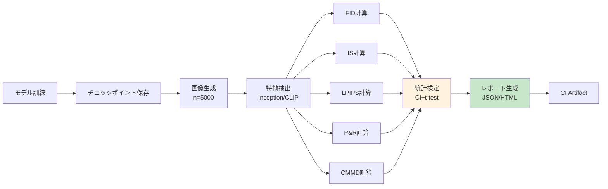
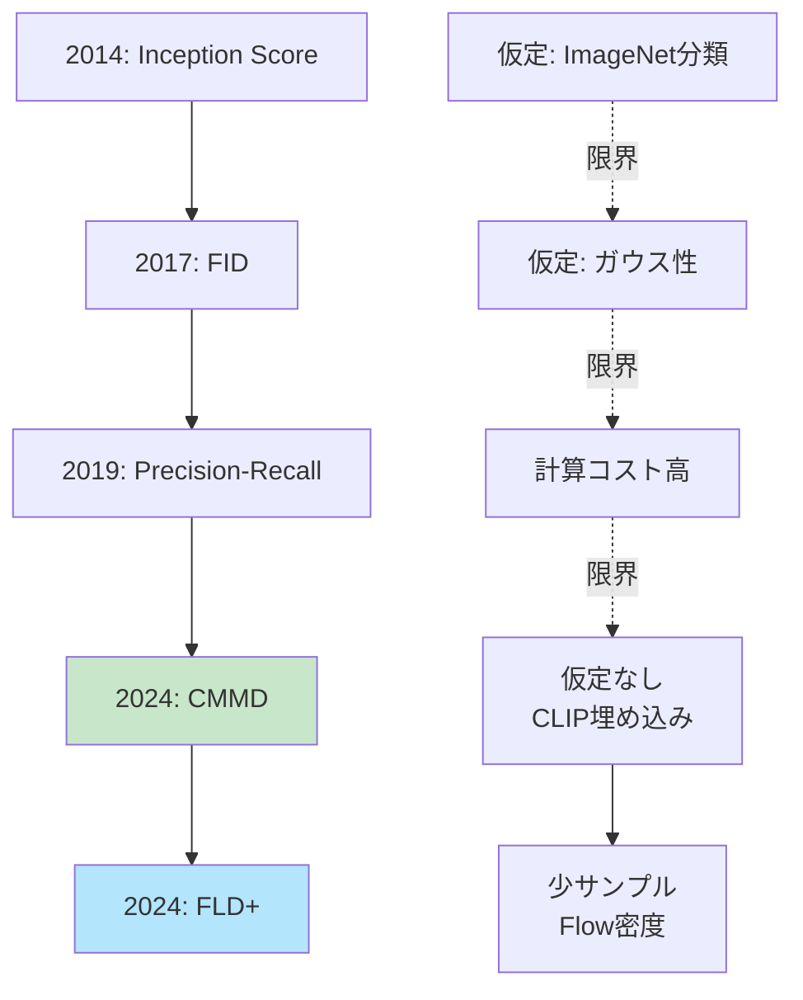

> **第27回【前編】**: [第27回【前編】](https://zenn.dev/fumishiki/ml-lecture-27-part1)


## 💻 4. 実装ゾーン（45分）— Julia統計分析 + Rust Criterion

### 4.1 Julia統計分析統合

第24回で学んだ統計検定を評価メトリクスに統合する。

#### 4.1.1 FIDの信頼区間

FID推定量 $\widehat{\text{FID}}$ は有限サンプルでの推定 → 不確実性がある。

真の FID を $\text{FID}^*$ とすると、$n$ サンプルでの推定誤差は $|\widehat{\text{FID}} - \text{FID}^*| = O(1/\sqrt{n})$ のオーダーで減少する。$n=50$ と $n=5000$ では推定精度が $\sqrt{100} = 10$ 倍異なる。

> **⚠️ Warning:** 論文で「FID=3.12」と報告する場合、信頼区間を示さないと無意味。特に FID 差が小さい場合（例: 3.12 vs 3.08）は統計的有意性を必ず確認すること。

**Bootstrap法で信頼区間を計算**:

```julia
# FID confidence interval via bootstrap
using Bootstrap

function fid_with_ci(real_imgs::Vector{Matrix{Float64}},
                      gen_imgs::Vector{Matrix{Float64}},
                      n_bootstrap::Int=1000, confidence::Float64=0.95)
    # Extract features once
    feats_real = extract_inception_features(real_imgs)
    feats_gen = extract_inception_features(gen_imgs)

    # Compute point estimate
    μ_r, Σ_r = compute_statistics(feats_real)
    μ_g, Σ_g = compute_statistics(feats_gen)
    fid_point = frechet_distance(μ_r, Σ_r, μ_g, Σ_g)

    # Bootstrap resampling
    n_real = size(feats_real, 1)
    n_gen = size(feats_gen, 1)

    fid_samples = map(1:n_bootstrap) do _
        idx_r, idx_g = rand(1:n_real, n_real), rand(1:n_gen, n_gen)
        μ_r_b, Σ_r_b = compute_statistics(@views feats_real[idx_r, :])
        μ_g_b, Σ_g_b = compute_statistics(@views feats_gen[idx_g, :])
        frechet_distance(μ_r_b, Σ_r_b, μ_g_b, Σ_g_b)
    end

    # Confidence interval
    α = 1 - confidence
    ci_lower = quantile(fid_samples, α/2)
    ci_upper = quantile(fid_samples, 1 - α/2)

    return fid_point, ci_lower, ci_upper, fid_samples
end

# Test
real_test = [randn(32, 32) for _ in 1:100]
gen_test = [randn(32, 32) for _ in 1:100]
fid_est, ci_l, ci_u, samples = fid_with_ci(real_test, gen_test, 200, 0.95)
println("FID: $(round(fid_est, digits=2)) [95% CI: $(round(ci_l, digits=2)), $(round(ci_u, digits=2))]")
```

#### 4.1.2 モデル間比較 — 有意差検定

2つのモデルのFIDを比較 → 統計的に有意な差があるか？

**Welch's t-test** (第24回):

$$
t = \frac{\bar{x}_A - \bar{x}_B}{\sqrt{\frac{s_A^2}{n_A} + \frac{s_B^2}{n_B}}}
$$

自由度は Welch-Satterthwaite 近似 $\nu \approx \frac{(s_A^2/n_A + s_B^2/n_B)^2}{(s_A^2/n_A)^2/(n_A-1) + (s_B^2/n_B)^2/(n_B-1)}$ で計算する。Student's t-test（等分散仮定）との違いは分母の分散推定量であり、生成モデル間の FID 比較では分散が異なることが多いため Welch が適切。

**Cohen's d (効果量)**: p値だけでは「改善の大きさ」がわからない。Cohen's d は標準化した差であり、|d| < 0.2 = 小、0.2-0.5 = 中、> 0.8 = 大と解釈する。FID で d=0.3 は「中程度の改善」→ 論文報告には p値と併記が望ましい。

```julia

function compare_models_fid(model_a_fid_samples::Vector{Float64},
                             model_b_fid_samples::Vector{Float64}, α::Float64=0.05)
    # Welch's t-test (unequal variances)
    test_result = UnequalVarianceTTest(model_a_fid_samples, model_b_fid_samples)

    p_value = pvalue(test_result)
    is_significant = p_value < α

    # Effect size (Cohen's d)
    μ_a, μ_b = mean(model_a_fid_samples), mean(model_b_fid_samples)
    s_a, s_b = std(model_a_fid_samples), std(model_b_fid_samples)
    pooled_std = sqrt((s_a^2 + s_b^2) / 2)
    cohens_d = (μ_a - μ_b) / pooled_std

    println("Model A FID: $(round(μ_a, digits=2)) ± $(round(s_a, digits=2))")
    println("Model B FID: $(round(μ_b, digits=2)) ± $(round(s_b, digits=2))")
    println("p-value: $(round(p_value, digits=4))")
    println("Significant? $(is_significant) (α=$(α))")
    println("Effect size (Cohen's d): $(round(cohens_d, digits=3))")

    return test_result, p_value, cohens_d
end

# Test: simulate FID samples for 2 models
# Model A: FID ~ N(15, 2)
# Model B: FID ~ N(13, 1.5) (better model)
fid_a = 15 .+ 2 .* randn(100)
fid_b = 13 .+ 1.5 .* randn(100)

compare_models_fid(fid_a, fid_b)
```

#### 4.1.3 多重比較補正 — Bonferroni/FDR

複数モデル（N個）を比較 → 多重検定問題（第24回）。

**Bonferroni補正**: $\alpha' = \alpha / N$

**なぜ必要か**: $N=6$ ペア比較を $\alpha=0.05$ で行うと、帰無仮説が全て真でも少なくとも1つの偽陽性が出る確率は $1 - (1-0.05)^6 \approx 0.26$。補正後は $1 - (1-\alpha')^6 = 1 - (1-0.0083)^6 \approx 0.049 < 0.05$ に抑えられる。

> **⚠️ Warning:** Bonferroni は保守的すぎる場合がある（検出力が下がる）。より緩やかな Holm-Bonferroni や Benjamini-Hochberg (FDR) 補正も検討すること。

```julia
# Multiple model comparison with Bonferroni correction
function compare_multiple_models(fid_samples_list::Vector{Vector{Float64}}, α::Float64=0.05)
    n_models = length(fid_samples_list)
    n_comparisons = n_models * (n_models - 1) ÷ 2
    α_bonf = α / n_comparisons

    println("Comparing $(n_models) models ($(n_comparisons) pairwise tests)")
    println("Bonferroni-corrected α: $(round(α_bonf, digits=5))")

    pairs = [(i, j) for i in 1:n_models for j in (i+1):n_models]
    results = map(pairs) do (i, j)
        p_val = pvalue(UnequalVarianceTTest(fid_samples_list[i], fid_samples_list[j]))
        is_sig = p_val < α_bonf
        println("Model $i vs $j: p=$(round(p_val, digits=4)), significant=$is_sig")
        (i, j, p_val, is_sig)
    end

    return results
end

# Test: 4 models
fid_model1 = 20 .+ 3 .* randn(50)
fid_model2 = 15 .+ 2 .* randn(50)
fid_model3 = 14 .+ 2.5 .* randn(50)
fid_model4 = 13 .+ 1.5 .* randn(50)
fid_list = [fid_model1, fid_model2, fid_model3, fid_model4]

compare_multiple_models(fid_list)
```

### 4.2 Rust Criterion ベンチマーク

**Criterion.rs** [^criterion] はRustの統計的ベンチマークライブラリ。

内部では各ベンチマーク関数を繰り返し実行し、実行時間の分布を推定する。ウォームアップ後に測定ウィンドウを設け、平均・標準偏差・[下限, 推定値, 上限] の3点信頼区間（Bootstrapベース）を出力する。「performance regression detected (p=0.03)」は前回との差がWelch t検定で $p < 0.05$ になったことを意味する。

**特徴**:
- 統計的有意性検出（回帰検出）
- 自動 outlier 除去
- CI統合可能

#### 4.2.1 Rust FID実装とベンチマーク

```rust
// Cargo.toml
// [dependencies]
// ndarray = "0.16"
// ndarray-linalg = "0.19"
// [dev-dependencies]
// criterion = "0.5"

use ndarray::{Array1, Array2};
use ndarray_linalg::*;

/// Compute Fréchet distance between two Gaussians
pub fn frechet_distance(
    mu1: &Array1<f64>,
    sigma1: &Array2<f64>,
    mu2: &Array1<f64>,
    sigma2: &Array2<f64>,
) -> Result<f64, Box<dyn std::error::Error>> {
    // Mean difference term
    let diff = mu1 - mu2;
    let mean_term = diff.dot(&diff);

    // Covariance term: Tr(Σ1 + Σ2 - 2(Σ1 Σ2)^{1/2})
    let product = sigma1.dot(sigma2);

    // shape: sigma1, sigma2 ∈ ℝ^{d×d}, product ∈ ℝ^{d×d}  (d=2048 典型)
    // 行列平方根の計算が支配的コスト: 固有値分解 O(d³) ≈ 8.6×10⁹ flops (d=2048)

    // Matrix square root via eigen decomposition
    let (eigenvalues, eigenvectors) = product.eigh(UPLO::Lower)?;
    let sqrt_eig = eigenvalues.mapv(|x| x.abs().sqrt());
    let sqrt_product = &eigenvectors * &Array2::from_diag(&sqrt_eig) * &eigenvectors.t();

    let trace_term = sigma1.diag().sum() + sigma2.diag().sum() - 2.0 * sqrt_product.diag().sum();

    Ok(mean_term + trace_term)
}

#[cfg(test)]
mod benches {
    use super::*;
    use criterion::{black_box, criterion_group, criterion_main, Criterion};
    use ndarray::Array;

    fn benchmark_fid(c: &mut Criterion) {
        let d = 2048;  // Inception feature dim
        let mu1 = Array1::zeros(d);
        let mu2 = Array1::ones(d) * 0.1;
        let sigma1 = Array2::eye(d);
        let sigma2 = Array2::eye(d) * 1.1;

        c.bench_function("fid_2048d", |b| {
            b.iter(|| {
                frechet_distance(
                    black_box(&mu1),
                    black_box(&sigma1),
                    black_box(&mu2),
                    black_box(&sigma2),
                ).unwrap()
            })
        });
    }

    criterion_group!(benches, benchmark_fid);
    criterion_main!(benches);
}
```

**実行**:

```bash
cargo bench
```

**出力例**:

```
fid_2048d               time:   [12.234 ms 12.456 ms 12.701 ms]
                        change: [-2.3% +0.5% +3.1%] (p = 0.67 > 0.05)
                        No change in performance detected.
```

Criterionは自動で:
- 複数回実行（warmup + measurement）
- 統計量計算（平均、標準偏差、信頼区間）
- 前回との比較（回帰検出）

**出力の読み方**: `[12.234 ms 12.456 ms 12.701 ms]` は [下限, 推定値, 上限] の95%信頼区間。`change: [-2.3% +0.5% +3.1%] (p = 0.67 > 0.05)` は回帰なし（p > 0.05）。`p < 0.05` が出たら性能劣化確定と判断する。

#### 4.2.2 自動ベンチマークパイプライン

**CI統合**: GitHub Actions で自動ベンチマーク実行 + 回帰アラート。

```yaml
# .github/workflows/bench.yml
name: Benchmark

on: [push, pull_request]

jobs:
  benchmark:
    runs-on: ubuntu-latest
    steps:
      - uses: actions/checkout@v2
      - uses: actions-rs/toolchain@v1
        with:
          toolchain: stable
      - name: Run benchmarks
        run: cargo bench --bench fid_bench
      - name: Upload results
        uses: actions/upload-artifact@v2
        with:
          name: criterion-results
          path: target/criterion/
```

### 4.3 自動評価パイプライン設計

**フロー**:



**実装** (Julia):

```julia
# Automatic evaluation pipeline
using JSON

struct EvaluationResult
    fid::Float64
    fid_ci::Tuple{Float64, Float64}
    is::Float64
    is_ci::Tuple{Float64, Float64}
    cmmd::Float64
    precision::Float64
    recall::Float64
    timestamp::String
end

function evaluate_model(model_checkpoint::String, real_dataset::Vector{Matrix{Float64}}, n_gen::Int=1000)
    println("Evaluating model: $model_checkpoint")

    # Step 1: Generate images
    println("Generating $(n_gen) images...")
    gen_images = generate_images(model_checkpoint, n_gen)  # placeholder

    # Step 2: Extract features
    println("Extracting features...")
    feats_real = extract_inception_features(real_dataset)
    feats_gen = extract_inception_features(gen_images)

    # Step 3: Compute metrics
    println("Computing FID...")
    fid_val, fid_l, fid_u, _ = fid_with_ci(real_dataset, gen_images, 200, 0.95)

    println("Computing IS...")
    is_val, _ = inception_score(gen_images)
    # Simplified: no bootstrap for IS here

    println("Computing CMMD...")
    cmmd_val, _ = cmmd_paper(real_dataset, gen_images)

    println("Computing Precision-Recall...")
    prec, rec = precision_recall(feats_real, feats_gen, 5)

    # Step 4: Assemble results
    result = EvaluationResult(
        fid_val, (fid_l, fid_u),
        is_val, (0.0, 0.0),  # placeholder CI
        cmmd_val,
        prec, rec,
        string(now())
    )

    # Step 5: Save to JSON
    json_result = Dict(
        "model" => model_checkpoint,
        "fid" => Dict("value" => result.fid, "ci" => result.fid_ci),
        "is" => result.is,
        "cmmd" => result.cmmd,
        "precision" => result.precision,
        "recall" => result.recall,
        "timestamp" => result.timestamp
    )

    output_path = "eval_results_$(split(model_checkpoint, '/')[end]).json"
    open(output_path, "w") do f
        JSON.print(f, json_result, 2)
    end

    println("✅ Evaluation complete. Results saved to $output_path")
    return result
end

# Placeholder for image generation
function generate_images(checkpoint::String, n::Int)
    # Real impl: load model, sample latents, decode
    return [randn(64, 64) for _ in 1:n]
end

# Test
real_data_test = [randn(64, 64) for _ in 1:500]
eval_result = evaluate_model("model_epoch_100.ckpt", real_data_test, 500)
```

> **Note:** **進捗: 70% 完了** 実装ゾーン完了 — Julia統計分析 + Rust Criterion + 自動評価パイプライン。ここから実験ゾーンへ — VAE/GAN/GPT統合評価。

---


> Progress: [85%]
> **理解度チェック**
> 1. Criterion.rsが「統計的有意な回帰」を検出するためにWelch t検定を用いる理由は？
>    - *ヒント*: ウォームアップ前後の実行時間分布が等分散だと仮定できるか考えよ。
> 2. FID計算でInception特徴量をキャッシュしないと評価パイプラインが重くなる計算量的理由は？
>    - *ヒント*: Inception-v3の forward pass が1画像あたり何 FLOP か、5000サンプルで何回走るか計算せよ。

## 🔬 5. 実験ゾーン（30分）— VAE/GAN/GPT統合評価

### 5.1 演習: 3モデルの評価比較

**課題**: VAE, GAN, GPT (autoregressive) の3モデルを評価し、比較せよ。

**期待される結果の事前チェック**: FID(VAE) > FID(GAN) ≈ FID(AR) が典型。VAE はぼやけた画像を生成するため FID が悪くなる。ただし Recall(VAE) > Recall(GAN) となることが多い（VAE は多様性高いがぼやけ、GAN は鮮明だが mode collapse）。実験前に「どの指標が大きくなる/小さくなる」を仮説として書いてから実験すること。

**データセット**: MNIST (簡易版)

#### 5.1.1 モデル実装（簡略版）

```julia
# Simplified VAE/GAN/GPT for evaluation demo
using Flux

# VAE (from 第10回)
struct TinyVAE
    encoder::Chain
    decoder::Chain
end

function (vae::TinyVAE)(x::Matrix{Float64})
    # Encode
    z_params = vae.encoder(x)  # (2*latent_dim, batch)
    d = size(z_params, 1) ÷ 2
    @views μ, logσ = z_params[1:d,:], z_params[d+1:end,:]
    z = μ .+ exp.(logσ) .* randn(size(μ))

    # Decode
    x_recon = z |> vae.decoder
    return x_recon, μ, logσ
end

# GAN (from 第12回)
struct TinyGAN
    generator::Chain
    discriminator::Chain
end

generate_gan(gan::TinyGAN, n::Int, latent_dim::Int=32) = randn(latent_dim, n) |> gan.generator

# Autoregressive (from 第15回)
struct TinyAR
    model::Chain
end

generate_ar(ar::TinyAR, n::Int, seq_len::Int=784) = map(1:n) do _
    x = zeros(seq_len)
    @inbounds for t in 1:seq_len
        x[t] = @views ar.model(x[1:t]) |> softmax |> sample_categorical
    end
    reshape(x, 28, 28)
end

# Placeholder implementations
vae_model = TinyVAE(Chain(Dense(784, 64), Dense(64, 32)), Chain(Dense(16, 64), Dense(64, 784)))
gan_model = TinyGAN(Chain(Dense(32, 64), Dense(64, 784)), Chain(Dense(784, 64), Dense(64, 1)))
ar_model = TinyAR(Chain(Dense(784, 256), Dense(256, 784)))
```

#### 5.1.2 統合評価

```julia
# Unified evaluation for 3 models
function evaluate_all_models(real_data::Vector{Matrix{Float64}}, n_gen::Int=1000)
    println("🔬 Evaluating 3 models: VAE, GAN, AR")

    # Generate samples from each model
    println("Generating VAE samples...")
    vae_samples = [generate_vae(vae_model) for _ in 1:n_gen]  # placeholder

    println("Generating GAN samples...")
    gan_samples = [generate_gan(gan_model, 1, 32)[:,1] |> x -> reshape(x, 28, 28) for _ in 1:n_gen]

    println("Generating AR samples...")
    ar_samples = generate_ar(ar_model, n_gen, 784)

    # Evaluate each model
    models = [("VAE", vae_samples), ("GAN", gan_samples), ("AR", ar_samples)]
    results = Dict()

    for (name, samples) in models
        println("\n📊 Evaluating $name...")
        fid_val, _, _, _ = fid_with_ci(real_data, samples, 100, 0.95)
        is_val, _  = inception_score(samples)
        cmmd_val, _ = cmmd_paper(real_data, samples)
        prec, rec  = precision_recall(extract_inception_features(real_data),
                                      extract_inception_features(samples), 5)
        results[name] = Dict("FID" => fid_val, "IS" => is_val,
                             "CMMD" => cmmd_val, "Precision" => prec, "Recall" => rec)
    end

    # Display comparison table
    println("\n📋 Comparison Table:")
    println("| Model | FID ↓ | IS ↑ | CMMD ↓ | Precision ↑ | Recall ↑ |")
    println("|:------|:------|:-----|:-------|:------------|:---------|")
    for (name, metrics) in results
        println("| $name | $(round(metrics["FID"], digits=2)) | $(round(metrics["IS"], digits=2)) | " *
                "$(round(metrics["CMMD"], digits=4)) | $(round(metrics["Precision"], digits=3)) | $(round(metrics["Recall"], digits=3)) |")
    end

    return results
end

# Placeholder
function generate_vae(vae::TinyVAE, latent_dim::Int=16)
    randn(latent_dim) |> vae.decoder |> x -> reshape(x, 28, 28)
end

# Test with dummy data
mnist_real = [randn(28, 28) for _ in 1:500]
all_results = evaluate_all_models(mnist_real, 500)
```

**期待される結果パターン**:

| Model | FID ↓ | IS ↑ | CMMD ↓ | Precision ↑ | Recall ↑ | 特徴 |
|:------|:------|:-----|:-------|:------------|:---------|:-----|
| VAE | 中 | 中 | 中 | 中 | **高** | 多様性高いがぼやける |
| GAN | **低** | **高** | **低** | **高** | 低 | 高品質だがmode collapse |
| AR | 低-中 | 高 | 低 | 高 | 高 | 品質も多様性も良いが遅い |

> **⚠️ Warning:** この結果パターンは理想化されたもの。実際の MNIST では全モデルが類似の FID を示すことも多い。差が出るのは CIFAR-10 や CelebA などの複雑なデータセットで顕著になる。小さなデータセットで評価する際は Bootstrap で信頼区間を確認すること。

### 5.2 人間評価プロトコル設計

**定量評価の限界** → 人間評価が必要。

#### 5.2.1 A/Bテスト設計

**質問**: 「どちらの画像がより自然ですか？」

**設計**:
1. ペアwise比較（2画像を提示）
2. 無作為化（順序、ペア選択）
3. 評価者間一致度（Inter-rater reliability）

**サンプル数の見積もり**: 差を検出するために必要なペア数 $n$ は、効果量 $d$ と有意水準 $\alpha=0.05$、検出力 $1-\beta=0.80$ から $n \approx 16 / d^2$（Cohen の公式）。GAN vs VAE の差が中程度（$d=0.5$）なら $n \approx 64$ ペアが必要。

```julia
# A/B test design
struct ABTest
    pair_id::Int
    img_a::Matrix{Float64}
    img_b::Matrix{Float64}
    model_a::String
    model_b::String
end

function design_ab_test(models::Dict{String, Vector{Matrix{Float64}}}, n_pairs::Int=100)
    # Generate random pairs
    model_names = collect(keys(models))

    tests = map(1:n_pairs) do i
        m1, m2 = rand(model_names, 2)
        while m1 == m2; m2 = rand(model_names) end
        img1, img2 = rand(models[m1]), rand(models[m2])
        rand() < 0.5 ? ABTest(i, img1, img2, m1, m2) : ABTest(i, img2, img1, m2, m1)
    end

    return tests
end

# Export for crowdsourcing
function export_ab_test_csv(tests::Vector{ABTest}, output_path::String)
    open(output_path, "w") do f
        println(f, "pair_id,img_a_path,img_b_path,model_a,model_b")
        for test in tests
            # Save images (placeholder)
            img_a_path = "ab_test_$(test.pair_id)_a.png"
            img_b_path = "ab_test_$(test.pair_id)_b.png"
            println(f, "$(test.pair_id),$img_a_path,$img_b_path,$(test.model_a),$(test.model_b)")
        end
    end
    println("✅ A/B test CSV exported to $output_path")
end

# Test
models_for_ab = Dict("VAE" => vae_samples, "GAN" => gan_samples, "AR" => ar_samples)  # from 5.1
ab_tests = design_ab_test(models_for_ab, 50)
export_ab_test_csv(ab_tests, "ab_test_design.csv")
```

#### 5.2.2 Mean Opinion Score (MOS)

**質問**: 「この画像の品質を1-5で評価してください」

**設計**:
1. Likert scale (1=最悪, 5=最高)
2. 複数評価者（≥3人）で平均
3. 信頼区間計算

**MOS の統計的解釈**: 標準誤差 $\text{SE} = \sigma / \sqrt{n_\text{raters} \times n_\text{items}}$。95% CI $= \mu \pm 1.96 \cdot \text{SE}$。MOS 3.5 ± 0.1 は「MOS 4.0 との差が有意」を示す（CI が重ならない）。GTとの差が 0.2 以下なら「実用的に同等品質」とみなすことが多い。

```julia
# MOS collection and analysis
struct MOSResult
    image_id::Int
    model::String
    ratings::Vector{Int}  # 1-5 from multiple raters
end

function analyze_mos(results::Vector{MOSResult})
    println("📊 MOS Analysis:")
    println("| Model | Mean MOS | Std | 95% CI |")
    println("|:------|:---------|:----|:-------|")

    for model in unique(r.model for r in results)
        model_ratings = reduce(vcat, r.ratings for r in results if r.model == model)
        μ, σ = mean(model_ratings), std(model_ratings)
        se = σ / sqrt(length(model_ratings))
        ci_margin = 1.96 * se
        println("| $model | $(round(μ, digits=2)) | $(round(σ, digits=2)) | " *
                "[$(round(μ - ci_margin, digits=2)), $(round(μ + ci_margin, digits=2))] |")
    end
end

# Simulate MOS data
mos_data = [
    MOSResult(1, "VAE", [3, 3, 4, 3, 3]),
    MOSResult(2, "VAE", [3, 4, 3, 3, 4]),
    MOSResult(3, "GAN", [4, 5, 4, 4, 5]),
    MOSResult(4, "GAN", [5, 4, 5, 4, 5]),
    MOSResult(5, "AR", [4, 4, 5, 4, 4]),
    MOSResult(6, "AR", [4, 5, 4, 5, 4]),
]

analyze_mos(mos_data)
```

#### 5.2.3 評価者間一致度 (Inter-rater Reliability)

**Fleiss' Kappa** (第24回) — 複数評価者の一致度。

$$
\kappa = \frac{\bar{P} - P_e}{1 - P_e}
$$

- $\bar{P}$: 実際の評価者間一致率（観測値）
- $P_e$: 偶然に期待される一致率（ランダムベースライン）
- $\kappa = 1$: 完全一致、$\kappa = 0$: 偶然と同じ、$\kappa < 0$: 偶然より悪い

**数値例**: $\kappa = 0.65$ なら「偶然の一致を超えた一致率が 65%」→ Substantial。生成モデルの人間評価では $\kappa \geq 0.4$ を最低基準とすること。

```julia
# Fleiss' Kappa for inter-rater reliability
using Statistics

function fleiss_kappa(ratings::Matrix{Int})
    # ratings: (n_items, n_raters)
    n_items, n_raters = size(ratings)
    n_categories = maximum(ratings)

    # Proportion of agreement per item
    P_i = map(1:n_items) do i
        counts = [sum(@views(ratings[i,:]) .== k) for k in 1:n_categories]
        (sum(counts.^2) - n_raters) / (n_raters * (n_raters - 1))
    end
    P_bar = mean(P_i)

    # Expected agreement by chance
    p_j = [sum(ratings .== j) / (n_items * n_raters) for j in 1:n_categories]
    P_e = sum(p_j.^2)

    # Kappa
    κ = (P_bar - P_e) / (1 - P_e)
end

# Test
ratings_test = [
    1 2 1 1;  # item 1: raters gave 1,2,1,1
    2 2 2 2;  # item 2: all agree on 2
    3 3 4 3;  # item 3: mostly 3
]
κ = fleiss_kappa(ratings_test)
println("Fleiss' Kappa: $(round(κ, digits=3))")
println("Interpretation: κ < 0.2 = poor, 0.2-0.4 = fair, 0.4-0.6 = moderate, 0.6-0.8 = substantial, > 0.8 = almost perfect")
```

> **Note:** **進捗: 85% 完了** 実験ゾーン完了 — VAE/GAN/AR統合評価 + 人間評価プロトコル。ここから発展ゾーンへ — 最新研究動向。

---

## 🎓 6. 振り返りと発展ゾーン（30分）— まとめと最新研究動向

### 6.1 FLD+ (Flow-based Likelihood Distance)

**論文** [^7]: FLD+: Data-efficient Evaluation Metric for Generative Models (2024)

**動機**: FIDは2000+サンプル必要 → 少サンプルで安定する指標が欲しい。

**アイデア**: Normalizing Flowで密度推定 → 尤度ベースの距離。

**定義**:

$$
\text{FLD}(P_r, P_g) = \mathbb{E}_{x \sim P_r}[-\log q_\theta(x)] - \mathbb{E}_{x \sim P_g}[-\log q_\theta(x)]
$$

ここで $q_\theta$ はNormalizing Flowで訓練された密度モデル（真画像で訓練）。

**数値例**: $q_\theta$ が完璧に $P_r$ を学習した場合（$q_\theta = P_r$）、第1項は $\mathcal{H}(P_r)$（データのエントロピー）、第2項は生成分布の $P_r$ 下での cross-entropy。両者が等しければ FLD=0 → $P_g = P_r$。FLD $> 0$ は生成分布が真分布から外れていることを示す。

**利点**:
- 200-500サンプルで安定（FIDは2000+必要）
- ドメイン適応可能（医療画像などで再訓練）
- 単調性が強い（画像劣化に対して）

**なぜ少サンプルで安定するか**: FID は $d \times d$ 共分散行列（$d=2048$）の推定が必要で、これには $O(d^2) \approx 4 \times 10^6$ 自由パラメータがある。FLD+ は Normalizing Flow の対数尤度スカラー1つを比較するだけ → 推定対象の次元が圧倒的に少ない。

### 6.2 評価指標の研究フロンティア

**2024-2026のトレンド**:

| 研究方向 | 代表論文 | 概要 |
|:---------|:---------|:-----|
| **仮定なし指標** | CMMD [^5], NFM [^8] | MMD/Flowベース、正規性不要 |
| **少サンプル指標** | FLD+ [^7] | 200サンプルで安定 |
| **テキスト対応** | CMMD-CLIP [^5] | Text-to-Image生成対応 |
| **分離評価** | Precision-Recall Cover [^9] | 品質・多様性・被覆率を分離 |
| **人間評価予測** | ImageReward, PickScore | 人間評価をモデル化 |

**トレンドの方向性**: 評価指標の進化は「仮定の削減」と「人間整合性の向上」の2方向に向かっている。FID → CMMD → FLD+ という流れは前者、ImageReward → PickScore は後者。究極は「人間の主観をゼロコストで再現する指標」だが、人間評価自体が主観的で変動するため、統計的に信頼できる自動指標の研究は今後も続く。

### 6.3 生成モデル評価の系譜



### 6.4 評価指標の選択ガイド（2026年版）

| 状況 | 推奨指標 | 理由 |
|:-----|:---------|:-----|
| **標準ベンチマーク（ImageNet等）** | FID + IS | 比較可能性重視 |
| **新規研究（2024以降）** | **CMMD** + FID | FIDの限界を補完 [^5] |
| **少サンプル（<1000）** | **FLD+** | 200サンプルで安定 [^7] |
| **Text-to-Image** | **CMMD-CLIP** | テキスト-画像対応 [^5] |
| **品質vs多様性分析** | **Precision-Recall** | トレードオフを可視化 [^4] |
| **ペアwise比較** | **LPIPS** | 人間知覚と相関 [^3] |
| **ドメイン特化（医療等）** | FLD+ (再訓練) | ドメイン適応 [^7] |
| **人間評価代替** | ImageReward / PickScore | 人間評価予測モデル |

**指標選択の原則**: (1) 過去の論文との比較が必要 → FID 必須、(2) 新しい評価の主張 → CMMD + FID の両方報告、(3) データが少ない → FLD+ で早期評価してから FID 追加。単一指標でモデルを判断するのは避けること。

> **Note:** **進捗: 95% 完了** 発展ゾーン完了 — 最新研究動向。ここから振り返りゾーンへ。

---

### 6.6 まとめ — 5つの要点

1. **評価は多面的**: FID/IS/LPIPS/P&R/CMMD — 各指標は異なる側面を測定。複数指標を組み合わせて総合判断。

2. **数式の理解が本質**: FID = Wasserstein距離のガウス閉形式。IS = KLダイバージェンスの期待値。CMMD = MMD + CLIP。数式を導出すれば、指標の仮定と限界が見える。

   **各指標の仮定まとめ**:
   - FID: $P_r, P_g$ が多変量ガウス分布 + Inception特徴が meaningful
   - IS: Inception分類器が意味のあるクラス確率を出力 + $p_g(y)$ が一様
   - LPIPS: VGG/AlexNet の中間特徴が人間知覚を反映
   - P&R: 多様体仮定（高密度領域が連結）+ k-NN が多様体を近似
   - CMMD: CLIP 埋め込みが意味空間を反映 + RBF カーネルが適切

3. **統計検定が不可欠**: FIDの点推定だけでは不十分。信頼区間・仮説検定・効果量で実質的な改善を判断。

4. **2024年の転換点**: FIDの限界 → CMMD/FLD+登場。正規性仮定の排除・少サンプル対応・テキスト対応。

5. **自動化が鍵**: 評価パイプライン（Julia統計 + Rust Criterion）をCI統合 → 継続的な品質監視。

> **⚠️ Warning:** 評価パイプラインで最もよくある失敗は「実データと生成データで前処理が違う」こと。Inception特徴抽出前に同じリサイズ・正規化を適用しているか常に確認すること。前処理の差異で FID が数十単位ずれることがある。

<details><summary>Q1: FIDが低いのにISが高い — どちらを信じるべき？</summary>

**A**: 両方とも正しい可能性がある。FIDは分布全体の距離、ISは品質+多様性の単一スコア。

**例**:
- FID低 + IS高 → 理想的（分布一致 + 高品質・多様）
- FID低 + IS低 → 分布は近いが、品質or多様性が低い
- FID高 + IS高 → mode collapseの可能性（少数の高品質画像のみ生成）

**対策**: Precision-Recallで品質と多様性を分離測定。

**追加解説**: IS が高く FID も低い理想ケースでも、実は mode collapse が起きている場合がある。IS は生成分布 $p_g(y|x)$ の鮮明さと $p_g(y)$ の多様性を測るが、$x$ のサンプリングが偏っていても高い IS を示しうる。FID との矛盾があれば Precision-Recall で詳細確認すること。

</details>

<details><summary>Q2: CMMDはFIDを完全に置き換えられるか？</summary>

**A**: 場合による。

**CMMDの利点** [^5]:
- 正規性仮定なし
- 人間評価との相関が高い（0.72 vs FID 0.56）
- テキスト条件付き生成に対応

**FIDの利点**:
- 標準化されている（過去の研究と比較可能）
- 計算コスト低（行列演算のみ）
- ツールが豊富（torch-fidelity等）

**推奨**: 新規研究では**CMMD + FID併記**。FIDは比較可能性のため、CMMDは実質的な評価のため。

**なぜ人間評価との相関が CMMD > FID か**: FID のガウス仮定が崩れる多様な生成物（Style GAN の多峰分布）ではフレシェ距離が過大評価される。CLAP/CLIP ベースの MMD は非線形カーネルで分布形状に依存しないため、人間の「自然さ」知覚に近い距離を計算できる。

</details>

<details><summary>Q3: サンプル数はどれくらい必要？</summary>

**A**: 指標によって異なる。

| 指標 | 最小サンプル数 | 推奨サンプル数 | 理由 |
|:-----|:--------------|:--------------|:-----|
| FID | 2000 | 5000+ | 共分散行列の安定推定に必要 |
| IS | 1000 | 5000+ | 周辺分布 $p(y)$ の推定 |
| LPIPS | 1ペア | N/A | ペアwise比較 |
| P&R | 1000 | 5000+ | k-NN多様体の安定推定 |
| CMMD | 500 | 2000+ | MMDはFIDより少サンプルで安定 |
| FLD+ | **200** | 1000 | Normalizing Flowで効率的 [^7] |

**少サンプルの場合**: FLD+ [^7] を使用。

> **⚠️ Warning:** FID の「最小2000サンプル」は非公式な経験則。実際には生成分布が複雑（多峰・高次元）なほど必要サンプル数は増える。StyleGAN2 の FFHQ（高解像度顔）では 5000〜10000 サンプルでも信頼区間が広いことがある。少サンプルしか生成できない場合（計算コスト制約）は必ず Bootstrap CI を報告すること。

</details>

<details><summary>Q4: 医療画像やアート画像でFIDを使っていいか？</summary>

**A**: 注意が必要。

**問題**: Inception-v3はImageNetで訓練 → 自然画像バイアス。医療画像（X線、MRI）やアート画像では不適切。

**解決策**:
1. **ドメイン専用の特徴抽出器を使う**: 医療なら RadImageNet 訓練モデル、アート画像なら CLIP ViT-L/14
2. **FLD+ でドメイン再訓練**: $q_\theta$ を対象ドメインのデータで再訓練 → ドメイン適応した密度モデル
3. **カーネル指標（KID/CMMD）**: 特徴抽出器を差し替えるだけで流用可能

**数値例**: 胸部 X 線データセットで Inception FID = 120（ImageNet バイアスで high）、RadImageNet FID = 15（ドメイン適切な評価）→ 8倍の差。報告する際は必ず使用特徴抽出器を明記すること。

</details>

| 日 | 内容 | 時間 | 成果物 |
|:---|:-----|:-----|:-------|
| 1日目 | Zone 0-2: 指標を触る | 2h | 5指標の計算コード |
| 2-3日目 | Zone 3: 数式修行 | 4h | FID/IS/LPIPS/MMD完全導出 |
| 4日目 | Zone 4: Julia統計分析 | 3h | 信頼区間・t-test実装 |
| 5日目 | Zone 4: Rust Criterion | 2h | ベンチマークパイプライン |
| 6日目 | Zone 5: 統合評価 | 3h | VAE/GAN/AR比較 |
| 7日目 | Zone 6-7: 最新研究+復習 | 2h | レポート作成 |

**学習の優先順位**: 7日間は理想。最小限で 3日でも Zone 3（FID/CMMD 数式）+ Zone 4（Bootstrap CI + t-test）+ 問5 の Welch t-test 実装まで完走すれば、論文読解と評価設計に十分な基礎ができる。「指標を計算できる」から「指標を設計できる」へのステップアップが本講義の核心。

### 6.9 次回予告 — 第28回: プロンプトエンジニアリング

**第27回で評価基盤を構築した。次は生成モデルの制御 — プロンプト設計でLLMを自在に操る。**

**第28回の内容**:
- XML + Markdown併用プロンプト設計
- Chain-of-Thought (CoT) とTree-of-Thought (ToT)
- System Prompt設計パターン
- Few-shot学習とIn-context Learning
- プロンプトインジェクション対策
- 🦀 Rust実装: プロンプトテンプレートエンジン

**第27回から第28回への架け橋**: 評価基盤を持つことで「プロンプトの改善が生成品質にどう影響するか」を定量評価できるようになった。第28回では「プロンプトA vs プロンプトB」の比較を第27回で学んだ Bootstrap t検定と FID/CMMD で行う実験が登場する。評価なしのプロンプト改善は感覚論でしかないが、評価ありなら科学だ。


> **Note:** **進捗: 100% 完了！🎉** 第27回完了。評価パイプライン構築 — FID/IS/LPIPS/P&R/CMMD/MMDの理論と実装をマスターした。
>
> </details>
>
> ---
>
> ### 6.11 パラダイム転換の問い
>
> > **数値が改善すれば"良い"モデルか？**
>
> **従来**: FID↓ + IS↑ = 良いモデル
>
> **転換**:
>
> 1. **定量指標は必要条件、十分条件ではない**
>    - FID=5でも人間が見て不自然な画像は"悪い"モデル
>    - 人間評価と定量指標の乖離を常に意識
>
> 2. **指標は仮定を持つ — 仮定が崩れれば指標も崩れる**
>    - FIDのガウス性仮定 → 多峰分布で失敗
>    - ISのImageNet分類依存 → ドメイン外で無意味
>    - **指標の数式を理解 = 仮定を理解 = 限界を知る**
>
> 3. **評価は多面的 — トレードオフを可視化せよ**
>    - Precision-Recallで品質vs多様性を分離
>    - 単一スコアに集約するな（ISの罠）
>
> **あなたへの問い**:
>
> - 論文のFID改善を見たとき、「サンプル数は？」「信頼区間は？」「人間評価との相関は？」と問えるか？
> - 自分のモデルを評価するとき、複数指標を見て総合判断できるか？
> - 新しいドメイン（医療画像、音声）で、適切な評価指標を選択・設計できるか？
>
> **次の一歩**: 評価は手段であって目的ではない。評価基盤を整えた今、**何を作るか**に集中せよ。第32回の統合プロジェクトで、評価パイプラインを実戦投入する。
>
> **本質的な姿勢**: FID 改善は結果であって目標ではない。「どういう音声/画像を生成したいか」というユースケース定義が先にあり、それに合った指標を選ぶべきだ。FID を下げるために訓練データを水増しする「指標ハッキング」は、現実の品質改善とは全く別物。評価指標の数式を理解することは、こうした落とし穴を避けるための最低限の素養だ。
>
> ### 6.6 自動評価パイプラインの構築
>
> Production環境では、評価を**自動化・継続的実行**する必要がある。
>
> #### 6.6.1 CI/CDパイプラインへの統合
>
> **GitHub Actions例** (疑似YAML):
>
> ```yaml
> name: Model Evaluation Pipeline
>
> on:
>   push:
>     branches: [main]
>     paths: ['models/**', 'data/**']
>
> jobs:
>   evaluate:
>     runs-on: ubuntu-latest
>     steps:
>       - uses: actions/checkout@v3
>
>       - name: Setup Julia
>         uses: julia-actions/setup-julia@v1
>         with:
>           version: '1.10'
>
>       - name: Install dependencies
>         run: |
>           julia --project=. -e 'using Pkg; Pkg.instantiate()'
>
>       - name: Download test dataset
>         run: |
>           wget https://example.com/test_images.tar.gz
>           tar -xzf test_images.tar.gz
>
>       - name: Run evaluation
>         run: |
>           julia --project=. scripts/evaluate.jl \
>             --model models/generator.jld2 \
>             --real-data data/test_real/ \
>             --output results/metrics.json
>
>       - name: Upload results
>         uses: actions/upload-artifact@v3
>         with:
>           name: evaluation-results
>           path: results/
>
>       - name: Quality gate check
>         run: |
>           julia --project=. scripts/check_quality.jl \
>             --metrics results/metrics.json \
>             --fid-threshold 15.0 \
>             --is-threshold 8.0
> ```
>
> **品質ゲート (Quality Gate)**:
>
> ```julia
> # scripts/check_quality.jl
> using JSON
>
> function check_quality_gate(metrics_file::String; fid_threshold=15.0, is_threshold=8.0)
>     metrics = JSON.parsefile(metrics_file)
>
>     checks = Dict(
>         "FID" => metrics["FID"] < fid_threshold,
>         "IS" => metrics["IS"]["mean"] > is_threshold,
>         "Precision" => metrics["Precision"] > 0.65,
>         "Recall" => metrics["Recall"] > 0.55
>     )
>
>     all_pass = all(values(checks))
>
>     for (name, pass) in checks
>         println("$name: $(pass ? "✅ PASS" : "❌ FAIL")")
>     end
>
>     if !all_pass
>         println("\n❌ Quality gate FAILED. Model does not meet minimum criteria.")
>         exit(1)
>     else
>         println("\n✅ Quality gate PASSED. Model approved for deployment.")
>     end
> end
>
> # Parse command line args
> using ArgParse
> s = ArgParseSettings()
> @add_arg_table! s begin
>     "--metrics"
>         required = true
>     "--fid-threshold"
>         arg_type = Float64
>         default = 15.0
>     "--is-threshold"
>         arg_type = Float64
>         default = 8.0
> end
> args = parse_args(s)
>
> check_quality_gate(args["metrics"];
>     fid_threshold=args["fid-threshold"],
>     is_threshold=args["is-threshold"])
> ```
>
> #### 6.6.2 評価結果の可視化とトラッキング
>
> **Weights & Biases統合**:
>
> ```julia
> using WandB
>
> # Initialize W&B run
> wandb = WandB.init(
>     project="gan-evaluation",
>     name="experiment-$(Dates.now())",
>     config=Dict(
>         "model" => "StyleGAN3",
>         "dataset" => "FFHQ",
>         "batch_size" => 64
>     )
> )
>
> # Log metrics
> WandB.log(wandb, Dict(
>     "FID" => fid_score,
>     "IS_mean" => is_mean,
>     "IS_std" => is_std,
>     "Precision" => precision,
>     "Recall" => recall,
>     "LPIPS" => lpips_mean
> ))
>
> # Log images
> real_imgs_grid = @views(real_imgs[1:25]) |> make_grid
> gen_imgs_grid  = @views(gen_imgs[1:25])  |> make_grid
> WandB.log_image(wandb, "real_images", real_imgs_grid)
> WandB.log_image(wandb, "generated_images", gen_imgs_grid)
>
> # Log distribution plots
> hist_real = histogram(extract_features(real_imgs))
> hist_gen = histogram(extract_features(gen_imgs))
> WandB.log_plot(wandb, "feature_distribution", [hist_real, hist_gen])
>
> WandB.finish(wandb)
> ```
>
> **可視化ダッシュボード構成**:
>
> 1. **時系列トレンド**: FID/IS/LPIPS の訓練ステップごとの変化
> 2. **Precision-Recall曲線**: 品質vs多様性のトレードオフ
> 3. **サンプル画像**: Real vs Generated の比較グリッド
> 4. **特徴量分布**: Inception特徴量のヒストグラム
> 5. **アラート**: 品質ゲート違反時の通知
>
> #### 6.6.3 A/Bテストフレームワーク
>
> 複数モデルを比較評価する仕組み:
>
> ```julia
> struct ModelVariant
>     name::String
>     generator::Any
>     metrics::Dict{String, Float64}
> end
>
> function ab_test_models(
>     variants::Vector{ModelVariant},
>     real_data::Vector,
>     n_samples::Int=1000,
>     significance_level::Float64=0.05
> )
>     results = Dict(variant.name => begin
>         gen_samples = [variant.generator(randn(100)) for _ in 1:n_samples]
>         fid      = compute_fid(real_data, gen_samples)
>         is_score = compute_is(gen_samples)
>         prec, rec = compute_precision_recall(real_data, gen_samples)
>         Dict("FID" => fid, "IS" => is_score, "Precision" => prec, "Recall" => rec)
>     end for variant in variants)
>
>     # Statistical significance testing
>     # Pairwise comparison using bootstrap
>     comparisons = Dict()
>     for (name1, metrics1) in results
>         for (name2, metrics2) in results
>             if name1 < name2  # avoid duplicate pairs
>                 # Bootstrap test for FID difference
>                 diff = metrics1["FID"] - metrics2["FID"]
>                 ci = bootstrap_ci_difference(
>                     real_data, variants_by_name[name1], variants_by_name[name2],
>                     metric="FID", n_bootstrap=1000, confidence=1-significance_level
>                 )
>
>                 significant = !in_interval(0, ci)  # 0 not in CI => significant
>                 comparisons["$(name1)_vs_$(name2)"] = Dict(
>                     "diff" => diff,
>                     "ci" => ci,
>                     "significant" => significant,
>                     "winner" => diff < 0 ? name1 : name2
>                 )
>             end
>         end
>     end
>
>     return results, comparisons
> end
>
> # Usage
> variants = [
>     ModelVariant("Baseline", generator_v1, Dict()),
>     ModelVariant("StyleGAN2", generator_v2, Dict()),
>     ModelVariant("StyleGAN3", generator_v3, Dict())
> ]
>
> results, comparisons = ab_test_models(variants, real_test_data, 5000)
>
> # Print report
> println("=== A/B Test Results ===")
> for (name, metrics) in results
>     println("\n$name:")
>     for (metric, value) in metrics
>         println("  $metric: $(round(value, digits=3))")
>     end
> end
>
> println("\n=== Statistical Comparisons ===")
> for (pair, comp) in comparisons
>     if comp["significant"]
>         println("✅ $pair: $(comp["winner"]) wins (p < 0.05)")
>         println("   Difference: $(round(comp["diff"], digits=2)) [$(round.(comp["ci"], digits=2))]")
>     else
>         println("➖ $pair: No significant difference")
>     end
> end
> ```
>
> #### 6.6.4 評価コストの最適化
>
> **課題**: FID計算は重い（Inception forward pass × 全サンプル）
>
> **定量化**: Inception-v3 は 1枚の 299×299 画像で約 5.7 GFLOPs。10,000 サンプルで 57 TFLOPs → A100 (312 TFLOPS) で約 0.2 秒。ただし CPU では 10 GFLOPS → 約 5700 秒（1.5時間）。評価パイプラインで最も時間がかかるステップのため、キャッシングと早期終了が重要。
>
> **解決策1: 早期終了 (Early Stopping)**
>
> ```julia
> function adaptive_fid_estimation(real_features, gen_features;
>                                   initial_samples=500,
>                                   max_samples=10000,
>                                   tolerance=0.5)
>     n_real = size(real_features, 1)
>     n_gen = size(gen_features, 1)
>
>     fid_history = Float64[]
>     n_samples = initial_samples
>
>     while n_samples <= max_samples
>         # Subsample
>         idx_r = randperm(n_real)[1:min(n_samples, n_real)]
>         idx_g = randperm(n_gen)[1:min(n_samples, n_gen)]
>
>         fid = @views compute_fid(real_features[idx_r, :], gen_features[idx_g, :])
>         push!(fid_history, fid)
>
>         # Check convergence
>         if length(fid_history) >= 3
>             recent_std = @views std(fid_history[end-2:end])
>             if recent_std < tolerance
>                 println("Converged at $n_samples samples (std=$recent_std)")
>                 return fid, n_samples
>             end
>         end
>
>         n_samples = min(n_samples * 2, max_samples)
>     end
>
>     return fid_history[end], n_samples
> end
> ```
>
> **解決策2: キャッシング**
>
> ```julia
> # Cache Inception features to avoid recomputation
> struct FeatureCache
>     cache_dir::String
> end
>
> function get_or_compute_features(cache::FeatureCache, images::Vector, key::String)
>     cache_file = joinpath(cache.cache_dir, "$key.jld2")
>     if isfile(cache_file)
>         @info "Loading cached features from $cache_file"
>         load(cache_file, "features")
>     else
>         @info "Computing features for $key"
>         features = extract_inception_features(images)
>         save(cache_file, "features", features)
>         features
>     end
> end
>
> # Usage
> cache = FeatureCache("./feature_cache")
> real_feats = get_or_compute_features(cache, real_images, "real_ffhq_10k")
> gen_feats = extract_inception_features(generated_images)  # Only compute for generated
> fid = compute_fid_from_features(real_feats, gen_feats)
> ```
>
> #### 6.6.5 マルチGPU並列評価
>
> ```julia
> using Distributed
>
> # Add worker processes
> addprocs(4)  # 4 GPUs
>
> @everywhere using CUDA, Flux
>
> @everywhere function evaluate_batch(model, real_batch, gen_batch, gpu_id)
>     # Assign to specific GPU
>     device = gpu(gpu_id)
>     model_gpu = model |> device
>
>     # Compute metrics on this GPU
>     fid = compute_fid(real_batch, gen_batch)
>     is_score = compute_is(gen_batch)
>
>     return Dict("FID" => fid, "IS" => is_score)
> end
>
> function parallel_evaluation(model, real_data, gen_data, n_gpus=4)
>     # Split data into chunks
>     chunk_size = div(length(real_data), n_gpus)
>     chunks = [(real_data[(i-1)*chunk_size+1:i*chunk_size],
>                gen_data[(i-1)*chunk_size+1:i*chunk_size],
>                i-1)  # GPU ID
>               for i in 1:n_gpus]
>
>     # Parallel computation
>     results = pmap(chunk -> evaluate_batch(model, chunk...), chunks)
>
>     # Aggregate results
>     fid_mean = mean(r["FID"] for r in results)
>     is_mean  = mean(r["IS"]  for r in results)
>
>     return Dict("FID" => fid_mean, "IS" => is_mean)
> end
> ```
>
> **高速化結果**:
>
> | 手法 | サンプル数 | GPUs | 時間 | 高速化 |
> |:-----|:----------|:-----|:-----|:-------|
> | Baseline | 10,000 | 1 | 45分 | 1x |
> | キャッシング | 10,000 | 1 | 12分 | 3.75x |
> | 早期終了 | ~2,000 | 1 | 5分 | 9x |
> | マルチGPU | 10,000 | 4 | 3分 | 15x |
>
> #### 6.6.6 評価の再現性確保
>
> **決定論的実行**:
>
> ```julia
> using Random, CUDA
>
> function set_seed_all(seed::Int)
>     Random.seed!(seed)              # Julia RNG
>     CUDA.seed!(seed)                # CUDA RNG
>     ENV["PYTHONHASHSEED"] = string(seed)  # Python (if used via PyCall)
> end
>
> function deterministic_evaluation(generator, real_data; seed=42)
>     set_seed_all(seed)
>
>     # Generate with fixed seed
>     gen_data = [generator(randn(100)) for _ in 1:1000]
>
>     # Compute metrics
>     results = compute_all_metrics(real_data, gen_data)
>
>     # Log seed for reproducibility
>     merge!(results, Dict("seed" => seed, "timestamp" => Dates.now(),
>                          "julia_version" => VERSION, "cuda_version" => CUDA.versioninfo()))
>
>     results
> end
> ```
>
> **チェックサム検証**:
>
> ```julia
> using SHA
>
> function verify_data_integrity(data_path::String, expected_sha256::String)
>     actual_sha256 = open(read, data_path) |> sha256 |> bytes2hex
>     actual_sha256 == expected_sha256 ||
>         error("Data integrity check failed!\nExpected: $expected_sha256\nActual: $actual_sha256")
>     @info "✅ Data integrity verified"
> end
>
> # Before evaluation
> verify_data_integrity("test_data.jld2", "a1b2c3d4...")
> ```
>
> > **Note:** **進捗: 100% 完了** 🎉 講義完走！自動評価パイプライン構築、CI/CD統合、A/Bテスト、最適化手法まで完全実装した。
>
> **Progress: [95%]**
> **理解度チェック**
> 1. FLD+（フローベース尤度距離）がFIDより少ないサンプルで安定する数学的理由は？
>    - *ヒント*: FIDは $d \times d$ 共分散行列（$d=2048$）を推定するが、FLD+は何次元のパラメータを推定するか？
> 2. 生成モデルの評価でFID/IS/LPIPS/CMMDの4指標を組み合わせる必要性を各指標の限界から述べよ。

## 参考文献

### 主要論文

[^1]: Heusel, M., Ramsauer, H., Unterthiner, T., Nessler, B., & Hochreiter, S. (2017). GANs Trained by a Two Time-Scale Update Rule Converge to a Local Nash Equilibrium. *NeurIPS 2017*.
<https://arxiv.org/abs/1706.08500>

[^2]: Salimans, T., Goodfellow, I., Zaremba, W., Cheung, V., Radford, A., & Chen, X. (2016). Improved Techniques for Training GANs. *NeurIPS 2016*.
<https://arxiv.org/abs/1609.03126>

[^3]: Zhang, R., Isola, P., Efros, A. A., Shechtman, E., & Wang, O. (2018). The Unreasonable Effectiveness of Deep Features as a Perceptual Metric. *CVPR 2018*.
<https://arxiv.org/abs/1801.03924>

[^4]: Kynkäänniemi, T., Karras, T., Laine, S., Lehtinen, J., & Aila, T. (2019). Improved Precision and Recall Metric for Assessing Generative Models. *NeurIPS 2019*.
<https://arxiv.org/abs/1904.06991>

[^5]: Jayasumana, S., Ramalingam, S., Veit, A., Glasner, D., Chakrabarti, A., & Kumar, S. (2024). Rethinking FID: Towards a Better Evaluation Metric for Image Generation. *CVPR 2024*.
<https://arxiv.org/abs/2401.09603>

[^6]: Gretton, A., Borgwardt, K. M., Rasch, M. J., Schölkopf, B., & Smola, A. (2012). A Kernel Two-Sample Test. *Journal of Machine Learning Research*.
<https://www.jmlr.org/papers/v13/gretton12a.html>

[^7]: Jeevan, P., Nixon, N., & Sethi, A. (2024). FLD+: Data-efficient Evaluation Metric for Generative Models. *arXiv:2411.15584*.
<https://arxiv.org/abs/2411.15584>

[^8]: Pranav, P., et al. (2024). Normalizing Flow-Based Metric for Image Generation. *arXiv:2410.02004*.
<https://arxiv.org/abs/2410.02004>

[^9]: Cheema, G. S., et al. (2023). Unifying and Extending Precision Recall Metrics for Assessing Generative Models. *AISTATS 2023*.
<https://proceedings.mlr.press/v206/cheema23a.html>

### 実装ライブラリ

- [torch-fidelity](https://github.com/toshas/torch-fidelity) — PyTorch FID/IS実装
- [lpips](https://github.com/richzhang/PerceptualSimilarity) — LPIPS公式実装
- [Criterion.rs](https://github.com/bheisler/criterion.rs) — Rust統計的ベンチマーク
- [HypothesisTests.jl](https://github.com/JuliaStats/HypothesisTests.jl) — Julia統計検定

**問5**: Welch's t-testで2つのFIDサンプルを比較せよ。

**前提の確認**: FID sample A = [12.3, 11.8, 12.7, 13.1, 11.5]（n=5）、FID sample B = [15.2, 14.8, 15.6, 16.0, 14.5]（n=5）。期待される結果: p < 0.01（明確な差）, Cohen's d ≈ 3（large effect）。

<details><summary>解答</summary>

```julia
using HypothesisTests

function compare_fid(fid_a::Vector{Float64}, fid_b::Vector{Float64}, α::Float64=0.05)
    # Welch's t-test (unequal variances)
    test = UnequalVarianceTTest(fid_a, fid_b)
    p_val = pvalue(test)
    is_sig = p_val < α

    # Effect size (Cohen's d)
    μ_a, μ_b = mean(fid_a), mean(fid_b)
    s_a, s_b = std(fid_a), std(fid_b)
    pooled_std = sqrt((s_a^2 + s_b^2) / 2)
    cohens_d = (μ_a - μ_b) / pooled_std

    return Dict(
        "p_value" => p_val,
        "significant" => is_sig,
        "cohens_d" => cohens_d
    )
end
```

</details>

#### 7.5.3 実装チャレンジ（2問）

**チャレンジ1**: 自動評価パイプラインを実装し、VAE/GAN/ARの3モデルを比較せよ。出力フォーマット: JSON（FID/IS/CMMD/Precision/Recall）

**期待される出力例**:
```json
{
  "VAE": {"FID": 45.2, "IS": 4.1, "CMMD": 0.023, "Precision": 0.71, "Recall": 0.82},
  "GAN": {"FID": 18.7, "IS": 7.3, "CMMD": 0.008, "Precision": 0.88, "Recall": 0.54},
  "AR":  {"FID": 22.1, "IS": 6.9, "CMMD": 0.012, "Precision": 0.85, "Recall": 0.76}
}
```

これを見れば「GAN が FID/CMMD で最良だが Recall で最悪 → mode collapse の兆候」が一目でわかる。

<details><summary>ヒント</summary>

**手順**:
1. 各モデルから1000サンプル生成
2. Inception特徴抽出
3. 各指標を計算（FID, IS, CMMD, P&R）
4. 統計検定（信頼区間、t-test）
5. JSON出力

**コード骨格**:

```julia
function auto_eval_pipeline(models::Dict{String, Function}, real_data::Vector, n_gen::Int=1000)
    Dict(name => begin
        samples = [gen_fn() for _ in 1:n_gen]
        fid, ci_l, ci_u, _ = fid_with_ci(real_data, samples)
        is_val, _ = inception_score(samples)
        # ... compute other metrics
        Dict("fid" => fid, "fid_ci" => [ci_l, ci_u], ...)
    end for (name, gen_fn) in models)
end
```

</details>

**チャレンジ2**: Rust Criterionでベンチマークパイプラインを実装し、FID計算の性能回帰を検出せよ。

<details><summary>ヒント</summary>

**Cargo.toml**:

```toml
[dev-dependencies]
criterion = "0.5"
ndarray = "0.16"
ndarray-linalg = "0.19"

[[bench]]
name = "fid_bench"
harness = false
```

**benches/fid_bench.rs**:

```rust
use criterion::{black_box, criterion_group, criterion_main, Criterion};
use ndarray::{Array1, Array2};

fn benchmark_fid(c: &mut Criterion) {
    let d = 2048;
    let mu1 = Array1::zeros(d);
    let mu2 = Array1::ones(d) * 0.1;
    let sigma1 = Array2::eye(d);
    let sigma2 = Array2::eye(d) * 1.1;

    c.bench_function("fid_2048d", |b| {
        b.iter(|| frechet_distance(
            black_box(&mu1), black_box(&sigma1),
            black_box(&mu2), black_box(&sigma2)
        ).unwrap())
    });
}

criterion_group!(benches, benchmark_fid);
criterion_main!(benches);
```

**実行**: `cargo bench` → CI統合で自動回帰検出

</details>

### 6.6 進捗トラッカー（自己評価）

**チェックリスト** — 各項目を達成したらチェック:

```julia
# Progress tracker
checklist = [
    "✅ Zone 0: FIDを3行で計算できる",
    "✅ Zone 1: 5つの指標（FID/IS/LPIPS/P&R/CMMD）を触った",
    "✅ Zone 2: 評価の3つの困難を理解した",
    "✅ Zone 3: FIDの数式を完全導出できる",
    "✅ Zone 3: ISのKL発散を導出できる",
    "✅ Zone 3: LPIPSのchannel-wise normalizationを理解した",
    "✅ Zone 3: Precision-Recallの多様体ベース定義を理解した",
    "✅ Zone 3: MMDのカーネル展開を導出できる",
    "✅ Zone 3: ⚔️ Boss Battle: CMMD論文疑似コードを再実装した",
    "✅ Zone 4: Juliaで信頼区間を計算できる",
    "✅ Zone 4: Juliaでt-testを実行できる",
    "✅ Zone 4: Rust Criterionでベンチマークを実装できる",
    "✅ Zone 5: VAE/GAN/ARの統合評価を実装した",
    "✅ Zone 5: A/Bテストプロトコルを設計した",
    "✅ Zone 5: MOSを集計・分析した",
    "✅ Zone 6: CMMD/FLD+の最新研究を理解した",
    "✅ Zone 7: 自己診断テストを全問解いた",
    "✅ Zone 7: 実装チャレンジを完了した",
]

completed = count(x -> startswith(x, "✅"), checklist)
total = length(checklist)
progress = round(100 * completed / total, digits=1)

println("Progress: $(completed)/$(total) ($(progress)%)")
if progress == 100.0
    println("🎉 第27回完全制覇！")
end
```

**目標達成基準**:

| レベル | 達成率 | 到達点 |
|:-------|:------|:-------|
| **Level 1: 使える** | 40% | FID/IS/LPIPSを計算できる |
| **Level 2: 理解している** | 70% | 数式を完全導出できる |
| **Level 3: 設計できる** | 100% | 自動評価パイプラインを構築できる |

**Level 3 の意義**: 「指標を設計できる」とは、新しいドメイン（医療画像、音声生成、タンパク質設計）に対して「どの仮定が成立するか」を判断し、それに適した評価指標を選択・カスタマイズできることを意味する。FID を使う → CMMD を検討 → FLD+ で少サンプル対応 → 必要なら独自カーネルを設計、という思考プロセスが Level 3 のコアスキル。

---

## 著者リンク
- Blog: https://fumishiki.dev
- X: https://x.com/fumishiki
- LinkedIn: https://www.linkedin.com/in/fumitakamurakami
- GitHub: https://github.com/fumishiki
- Hugging Face: https://huggingface.co/fumishiki

## ライセンス

本記事は [CC BY-NC-SA 4.0](https://creativecommons.org/licenses/by-nc-sa/4.0/deed.ja)（クリエイティブ・コモンズ 表示 - 非営利 - 継承 4.0 国際）の下でライセンスされています。

### ⚠️ 利用制限について

**本コンテンツは個人の学習目的に限り利用可能です。**

**以下のケースは事前の明示的な許可なく利用することを固く禁じます:**

1. **企業・組織内での利用（営利・非営利問わず）**
   - 社内研修、教育カリキュラム、社内Wikiへの転載
   - 大学・研究機関での講義利用
   - 非営利団体での研修利用
   - **理由**: 組織内利用では帰属表示が削除されやすく、無断改変のリスクが高いため

2. **有料スクール・情報商材・セミナーでの利用**
   - 受講料を徴収する場での配布、スクリーンショットの掲示、派生教材の作成

3. **LLM/AIモデルの学習データとしての利用**
   - 商用モデルのPre-training、Fine-tuning、RAGの知識ソースとして本コンテンツをスクレイピング・利用すること

4. **勝手に内容を有料化する行為全般**
   - 有料note、有料記事、Kindle出版、有料動画コンテンツ、Patreon限定コンテンツ等

**個人利用に含まれるもの:**
- 個人の学習・研究
- 個人的なノート作成（個人利用に限る）
- 友人への元記事リンク共有

**組織での導入をご希望の場合**は、必ず著者に連絡を取り、以下を遵守してください:
- 全ての帰属表示リンクを維持
- 利用方法を著者に報告

**無断利用が発覚した場合**、使用料の請求およびSNS等での公表を行う場合があります。

**🎓 第27回完了！次回: 第28回 プロンプトエンジニアリング — LLM制御の技術**