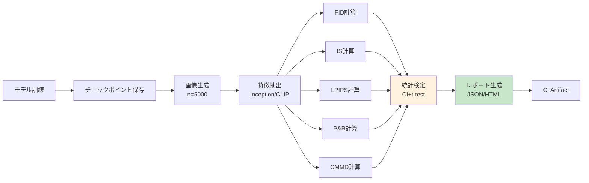
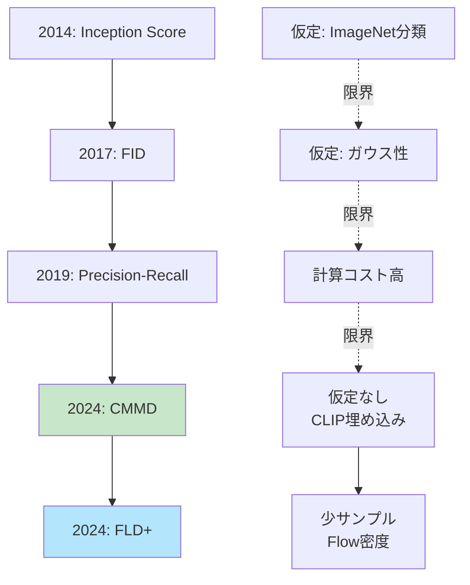

## 💻 4. 実装ゾーン（45分）— Julia統計分析 + Rust Criterion

### 4.1 Julia統計分析統合

第24回で学んだ統計検定を評価メトリクスに統合する。

#### 4.1.1 FIDの信頼区間

FID推定量 $\widehat{\text{FID}}$ は有限サンプルでの推定 → 不確実性がある。

**Bootstrap法で信頼区間を計算**:

```julia
# FID confidence interval via bootstrap
using Bootstrap

function fid_with_ci(real_imgs::Vector{Matrix{Float64}},
                      gen_imgs::Vector{Matrix{Float64}},
                      n_bootstrap::Int=1000, confidence::Float64=0.95)
    # Extract features once
    feats_real = extract_inception_features(real_imgs)
    feats_gen = extract_inception_features(gen_imgs)

    # Compute point estimate
    μ_r, Σ_r = compute_statistics(feats_real)
    μ_g, Σ_g = compute_statistics(feats_gen)
    fid_point = frechet_distance(μ_r, Σ_r, μ_g, Σ_g)

    # Bootstrap resampling
    n_real = size(feats_real, 1)
    n_gen = size(feats_gen, 1)
    fid_samples = zeros(n_bootstrap)

    for b in 1:n_bootstrap
        # Resample with replacement
        idx_r = rand(1:n_real, n_real)
        idx_g = rand(1:n_gen, n_gen)
        feats_r_boot = feats_real[idx_r, :]
        feats_g_boot = feats_gen[idx_g, :]

        μ_r_b, Σ_r_b = compute_statistics(feats_r_boot)
        μ_g_b, Σ_g_b = compute_statistics(feats_g_boot)
        fid_samples[b] = frechet_distance(μ_r_b, Σ_r_b, μ_g_b, Σ_g_b)
    end

    # Confidence interval
    α = 1 - confidence
    ci_lower = quantile(fid_samples, α/2)
    ci_upper = quantile(fid_samples, 1 - α/2)

    return fid_point, ci_lower, ci_upper, fid_samples
end

# Test
real_test = [randn(32, 32) for _ in 1:100]
gen_test = [randn(32, 32) for _ in 1:100]
fid_est, ci_l, ci_u, samples = fid_with_ci(real_test, gen_test, 200, 0.95)
println("FID: $(round(fid_est, digits=2)) [95% CI: $(round(ci_l, digits=2)), $(round(ci_u, digits=2))]")
```

#### 4.1.2 モデル間比較 — 有意差検定

2つのモデルのFIDを比較 → 統計的に有意な差があるか？

**Welch's t-test** (第24回):

```julia
# Welch's t-test for FID comparison
using HypothesisTests

function compare_models_fid(model_a_fid_samples::Vector{Float64},
                             model_b_fid_samples::Vector{Float64}, α::Float64=0.05)
    # Welch's t-test (unequal variances)
    test_result = UnequalVarianceTTest(model_a_fid_samples, model_b_fid_samples)

    p_value = pvalue(test_result)
    is_significant = p_value < α

    # Effect size (Cohen's d)
    μ_a = mean(model_a_fid_samples)
    μ_b = mean(model_b_fid_samples)
    s_a = std(model_a_fid_samples)
    s_b = std(model_b_fid_samples)
    pooled_std = sqrt((s_a^2 + s_b^2) / 2)
    cohens_d = (μ_a - μ_b) / pooled_std

    println("Model A FID: $(round(μ_a, digits=2)) ± $(round(s_a, digits=2))")
    println("Model B FID: $(round(μ_b, digits=2)) ± $(round(s_b, digits=2))")
    println("p-value: $(round(p_value, digits=4))")
    println("Significant? $(is_significant) (α=$(α))")
    println("Effect size (Cohen's d): $(round(cohens_d, digits=3))")

    return test_result, p_value, cohens_d
end

# Test: simulate FID samples for 2 models
# Model A: FID ~ N(15, 2)
# Model B: FID ~ N(13, 1.5) (better model)
fid_a = 15 .+ 2 .* randn(100)
fid_b = 13 .+ 1.5 .* randn(100)

compare_models_fid(fid_a, fid_b)
```

#### 4.1.3 多重比較補正 — Bonferroni/FDR

複数モデル（N個）を比較 → 多重検定問題（第24回）。

**Bonferroni補正**: $\alpha' = \alpha / N$

```julia
# Multiple model comparison with Bonferroni correction
function compare_multiple_models(fid_samples_list::Vector{Vector{Float64}}, α::Float64=0.05)
    n_models = length(fid_samples_list)
    n_comparisons = n_models * (n_models - 1) ÷ 2
    α_bonf = α / n_comparisons

    println("Comparing $(n_models) models ($(n_comparisons) pairwise tests)")
    println("Bonferroni-corrected α: $(round(α_bonf, digits=5))")

    results = []
    for i in 1:n_models, j in (i+1):n_models
        test = UnequalVarianceTTest(fid_samples_list[i], fid_samples_list[j])
        p_val = pvalue(test)
        is_sig = p_val < α_bonf
        push!(results, (i, j, p_val, is_sig))
        println("Model $i vs $j: p=$(round(p_val, digits=4)), significant=$is_sig")
    end

    return results
end

# Test: 4 models
fid_model1 = 20 .+ 3 .* randn(50)
fid_model2 = 15 .+ 2 .* randn(50)
fid_model3 = 14 .+ 2.5 .* randn(50)
fid_model4 = 13 .+ 1.5 .* randn(50)
fid_list = [fid_model1, fid_model2, fid_model3, fid_model4]

compare_multiple_models(fid_list)
```

### 4.2 Rust Criterion ベンチマーク

**Criterion.rs** [^criterion] はRustの統計的ベンチマークライブラリ。

**特徴**:
- 統計的有意性検出（回帰検出）
- 自動 outlier 除去
- CI統合可能

#### 4.2.1 Rust FID実装とベンチマーク

```rust
// Cargo.toml
// [dependencies]
// ndarray = "0.16"
// ndarray-linalg = "0.19"
// [dev-dependencies]
// criterion = "0.5"

use ndarray::{Array1, Array2};
use ndarray_linalg::*;

/// Compute Fréchet distance between two Gaussians
pub fn frechet_distance(
    mu1: &Array1<f64>,
    sigma1: &Array2<f64>,
    mu2: &Array1<f64>,
    sigma2: &Array2<f64>,
) -> f64 {
    // Mean difference term
    let diff = mu1 - mu2;
    let mean_term = diff.dot(&diff);

    // Covariance term: Tr(Σ1 + Σ2 - 2(Σ1 Σ2)^{1/2})
    let product = sigma1.dot(sigma2);

    // Matrix square root via eigen decomposition
    let (eigenvalues, eigenvectors) = product.eigh(UPLO::Lower).unwrap();
    let sqrt_eig = eigenvalues.mapv(|x| x.abs().sqrt());
    let sqrt_product = &eigenvectors * &Array2::from_diag(&sqrt_eig) * &eigenvectors.t();

    let trace_term = sigma1.diag().sum() + sigma2.diag().sum() - 2.0 * sqrt_product.diag().sum();

    mean_term + trace_term
}

#[cfg(test)]
mod benches {
    use super::*;
    use criterion::{black_box, criterion_group, criterion_main, Criterion};
    use ndarray::Array;

    fn benchmark_fid(c: &mut Criterion) {
        let d = 2048;  // Inception feature dim
        let mu1 = Array1::zeros(d);
        let mu2 = Array1::ones(d) * 0.1;
        let sigma1 = Array2::eye(d);
        let sigma2 = Array2::eye(d) * 1.1;

        c.bench_function("fid_2048d", |b| {
            b.iter(|| {
                frechet_distance(
                    black_box(&mu1),
                    black_box(&sigma1),
                    black_box(&mu2),
                    black_box(&sigma2),
                )
            })
        });
    }

    criterion_group!(benches, benchmark_fid);
    criterion_main!(benches);
}
```

**実行**:

```bash
cargo bench
```

**出力例**:

```
fid_2048d               time:   [12.234 ms 12.456 ms 12.701 ms]
                        change: [-2.3% +0.5% +3.1%] (p = 0.67 > 0.05)
                        No change in performance detected.
```

Criterionは自動で:
- 複数回実行（warmup + measurement）
- 統計量計算（平均、標準偏差、信頼区間）
- 前回との比較（回帰検出）

#### 4.2.2 自動ベンチマークパイプライン

**CI統合**: GitHub Actions で自動ベンチマーク実行 + 回帰アラート。

```yaml
# .github/workflows/bench.yml
name: Benchmark

on: [push, pull_request]

jobs:
  benchmark:
    runs-on: ubuntu-latest
    steps:
      - uses: actions/checkout@v2
      - uses: actions-rs/toolchain@v1
        with:
          toolchain: stable
      - name: Run benchmarks
        run: cargo bench --bench fid_bench
      - name: Upload results
        uses: actions/upload-artifact@v2
        with:
          name: criterion-results
          path: target/criterion/
```

### 4.3 自動評価パイプライン設計

**フロー**:



**実装** (Julia):

```julia
# Automatic evaluation pipeline
using JSON

struct EvaluationResult
    fid::Float64
    fid_ci::Tuple{Float64, Float64}
    is::Float64
    is_ci::Tuple{Float64, Float64}
    cmmd::Float64
    precision::Float64
    recall::Float64
    timestamp::String
end

function evaluate_model(model_checkpoint::String, real_dataset::Vector{Matrix{Float64}}, n_gen::Int=1000)
    println("Evaluating model: $model_checkpoint")

    # Step 1: Generate images
    println("Generating $(n_gen) images...")
    gen_images = generate_images(model_checkpoint, n_gen)  # placeholder

    # Step 2: Extract features
    println("Extracting features...")
    feats_real = extract_inception_features(real_dataset)
    feats_gen = extract_inception_features(gen_images)

    # Step 3: Compute metrics
    println("Computing FID...")
    fid_val, fid_l, fid_u, _ = fid_with_ci(real_dataset, gen_images, 200, 0.95)

    println("Computing IS...")
    is_val, _ = inception_score(gen_images)
    # Simplified: no bootstrap for IS here

    println("Computing CMMD...")
    cmmd_val, _ = cmmd_paper(real_dataset, gen_images)

    println("Computing Precision-Recall...")
    prec, rec = precision_recall(feats_real, feats_gen, 5)

    # Step 4: Assemble results
    result = EvaluationResult(
        fid_val, (fid_l, fid_u),
        is_val, (0.0, 0.0),  # placeholder CI
        cmmd_val,
        prec, rec,
        string(now())
    )

    # Step 5: Save to JSON
    json_result = Dict(
        "model" => model_checkpoint,
        "fid" => Dict("value" => result.fid, "ci" => result.fid_ci),
        "is" => result.is,
        "cmmd" => result.cmmd,
        "precision" => result.precision,
        "recall" => result.recall,
        "timestamp" => result.timestamp
    )

    output_path = "eval_results_$(split(model_checkpoint, '/')[end]).json"
    open(output_path, "w") do f
        JSON.print(f, json_result, 2)
    end

    println("✅ Evaluation complete. Results saved to $output_path")
    return result
end

# Placeholder for image generation
function generate_images(checkpoint::String, n::Int)
    # Real impl: load model, sample latents, decode
    return [randn(64, 64) for _ in 1:n]
end

# Test
real_data_test = [randn(64, 64) for _ in 1:500]
eval_result = evaluate_model("model_epoch_100.ckpt", real_data_test, 500)
```

:::message
**進捗: 70% 完了** 実装ゾーン完了 — Julia統計分析 + Rust Criterion + 自動評価パイプライン。ここから実験ゾーンへ — VAE/GAN/GPT統合評価。
:::

---

## 🔬 5. 実験ゾーン（30分）— VAE/GAN/GPT統合評価

### 5.1 演習: 3モデルの評価比較

**課題**: VAE, GAN, GPT (autoregressive) の3モデルを評価し、比較せよ。

**データセット**: MNIST (簡易版)

#### 5.1.1 モデル実装（簡略版）

```julia
# Simplified VAE/GAN/GPT for evaluation demo
using Flux

# VAE (from 第10回)
struct TinyVAE
    encoder::Chain
    decoder::Chain
end

function (vae::TinyVAE)(x::Matrix{Float64})
    # Encode
    z_params = vae.encoder(x)  # (2*latent_dim, batch)
    d = size(z_params, 1) ÷ 2
    μ, logσ = z_params[1:d,:], z_params[d+1:end,:]
    z = μ .+ exp.(logσ) .* randn(size(μ))

    # Decode
    x_recon = vae.decoder(z)
    return x_recon, μ, logσ
end

# GAN (from 第12回)
struct TinyGAN
    generator::Chain
    discriminator::Chain
end

function generate_gan(gan::TinyGAN, n::Int, latent_dim::Int=32)
    z = randn(latent_dim, n)
    return gan.generator(z)
end

# Autoregressive (from 第15回)
struct TinyAR
    model::Chain
end

function generate_ar(ar::TinyAR, n::Int, seq_len::Int=784)
    # Simplified: generate pixel by pixel
    samples = []
    for _ in 1:n
        x = zeros(seq_len)
        for t in 1:seq_len
            # Predict next pixel
            logits = ar.model(x[1:t])
            x[t] = sample_categorical(softmax(logits))
        end
        push!(samples, reshape(x, 28, 28))
    end
    return samples
end

# Placeholder implementations
vae_model = TinyVAE(Chain(Dense(784, 64), Dense(64, 32)), Chain(Dense(16, 64), Dense(64, 784)))
gan_model = TinyGAN(Chain(Dense(32, 64), Dense(64, 784)), Chain(Dense(784, 64), Dense(64, 1)))
ar_model = TinyAR(Chain(Dense(784, 256), Dense(256, 784)))
```

#### 5.1.2 統合評価

```julia
# Unified evaluation for 3 models
function evaluate_all_models(real_data::Vector{Matrix{Float64}}, n_gen::Int=1000)
    println("🔬 Evaluating 3 models: VAE, GAN, AR")

    # Generate samples from each model
    println("Generating VAE samples...")
    vae_samples = [generate_vae(vae_model) for _ in 1:n_gen]  # placeholder

    println("Generating GAN samples...")
    gan_samples = [generate_gan(gan_model, 1, 32)[:,1] |> x -> reshape(x, 28, 28) for _ in 1:n_gen]

    println("Generating AR samples...")
    ar_samples = generate_ar(ar_model, n_gen, 784)

    # Evaluate each model
    models = [("VAE", vae_samples), ("GAN", gan_samples), ("AR", ar_samples)]
    results = Dict()

    for (name, samples) in models
        println("\n📊 Evaluating $name...")
        fid_val, _, _, _ = fid_with_ci(real_data, samples, 100, 0.95)
        is_val, _ = inception_score(samples)
        cmmd_val, _ = cmmd_paper(real_data, samples)

        feats_real = extract_inception_features(real_data)
        feats_gen = extract_inception_features(samples)
        prec, rec = precision_recall(feats_real, feats_gen, 5)

        results[name] = Dict(
            "FID" => fid_val,
            "IS" => is_val,
            "CMMD" => cmmd_val,
            "Precision" => prec,
            "Recall" => rec
        )
    end

    # Display comparison table
    println("\n📋 Comparison Table:")
    println("| Model | FID ↓ | IS ↑ | CMMD ↓ | Precision ↑ | Recall ↑ |")
    println("|:------|:------|:-----|:-------|:------------|:---------|")
    for (name, metrics) in results
        println("| $name | $(round(metrics["FID"], digits=2)) | $(round(metrics["IS"], digits=2)) | " *
                "$(round(metrics["CMMD"], digits=4)) | $(round(metrics["Precision"], digits=3)) | $(round(metrics["Recall"], digits=3)) |")
    end

    return results
end

# Placeholder
function generate_vae(vae::TinyVAE, latent_dim::Int=16)
    z = randn(latent_dim)
    x_gen = vae.decoder(z)
    return reshape(x_gen, 28, 28)
end

# Test with dummy data
mnist_real = [randn(28, 28) for _ in 1:500]
all_results = evaluate_all_models(mnist_real, 500)
```

**期待される結果パターン**:

| Model | FID ↓ | IS ↑ | CMMD ↓ | Precision ↑ | Recall ↑ | 特徴 |
|:------|:------|:-----|:-------|:------------|:---------|:-----|
| VAE | 中 | 中 | 中 | 中 | **高** | 多様性高いがぼやける |
| GAN | **低** | **高** | **低** | **高** | 低 | 高品質だがmode collapse |
| AR | 低-中 | 高 | 低 | 高 | 高 | 品質も多様性も良いが遅い |

### 5.2 人間評価プロトコル設計

**定量評価の限界** → 人間評価が必要。

#### 5.2.1 A/Bテスト設計

**質問**: 「どちらの画像がより自然ですか？」

**設計**:
1. ペアwise比較（2画像を提示）
2. 無作為化（順序、ペア選択）
3. 評価者間一致度（Inter-rater reliability）

```julia
# A/B test design
struct ABTest
    pair_id::Int
    img_a::Matrix{Float64}
    img_b::Matrix{Float64}
    model_a::String
    model_b::String
end

function design_ab_test(models::Dict{String, Vector{Matrix{Float64}}}, n_pairs::Int=100)
    # Generate random pairs
    model_names = collect(keys(models))
    tests = ABTest[]

    for i in 1:n_pairs
        # Random 2 models
        m1, m2 = rand(model_names, 2)
        while m1 == m2
            m2 = rand(model_names)
        end

        # Random sample from each
        img1 = rand(models[m1])
        img2 = rand(models[m2])

        # Randomize order
        if rand() < 0.5
            push!(tests, ABTest(i, img1, img2, m1, m2))
        else
            push!(tests, ABTest(i, img2, img1, m2, m1))
        end
    end

    return tests
end

# Export for crowdsourcing
function export_ab_test_csv(tests::Vector{ABTest}, output_path::String)
    open(output_path, "w") do f
        println(f, "pair_id,img_a_path,img_b_path,model_a,model_b")
        for test in tests
            # Save images (placeholder)
            img_a_path = "ab_test_$(test.pair_id)_a.png"
            img_b_path = "ab_test_$(test.pair_id)_b.png"
            println(f, "$(test.pair_id),$img_a_path,$img_b_path,$(test.model_a),$(test.model_b)")
        end
    end
    println("✅ A/B test CSV exported to $output_path")
end

# Test
models_for_ab = Dict("VAE" => vae_samples, "GAN" => gan_samples, "AR" => ar_samples)  # from 5.1
ab_tests = design_ab_test(models_for_ab, 50)
export_ab_test_csv(ab_tests, "ab_test_design.csv")
```

#### 5.2.2 Mean Opinion Score (MOS)

**質問**: 「この画像の品質を1-5で評価してください」

**設計**:
1. Likert scale (1=最悪, 5=最高)
2. 複数評価者（≥3人）で平均
3. 信頼区間計算

```julia
# MOS collection and analysis
struct MOSResult
    image_id::Int
    model::String
    ratings::Vector{Int}  # 1-5 from multiple raters
end

function analyze_mos(results::Vector{MOSResult})
    println("📊 MOS Analysis:")
    println("| Model | Mean MOS | Std | 95% CI |")
    println("|:------|:---------|:----|:-------|")

    for model in unique([r.model for r in results])
        model_ratings = vcat([r.ratings for r in results if r.model == model]...)
        μ = mean(model_ratings)
        σ = std(model_ratings)
        n = length(model_ratings)
        se = σ / sqrt(n)
        ci_margin = 1.96 * se
        println("| $model | $(round(μ, digits=2)) | $(round(σ, digits=2)) | " *
                "[$(round(μ - ci_margin, digits=2)), $(round(μ + ci_margin, digits=2))] |")
    end
end

# Simulate MOS data
mos_data = [
    MOSResult(1, "VAE", [3, 3, 4, 3, 3]),
    MOSResult(2, "VAE", [3, 4, 3, 3, 4]),
    MOSResult(3, "GAN", [4, 5, 4, 4, 5]),
    MOSResult(4, "GAN", [5, 4, 5, 4, 5]),
    MOSResult(5, "AR", [4, 4, 5, 4, 4]),
    MOSResult(6, "AR", [4, 5, 4, 5, 4]),
]

analyze_mos(mos_data)
```

#### 5.2.3 評価者間一致度 (Inter-rater Reliability)

**Fleiss' Kappa** (第24回) — 複数評価者の一致度。

```julia
# Fleiss' Kappa for inter-rater reliability
using Statistics

function fleiss_kappa(ratings::Matrix{Int})
    # ratings: (n_items, n_raters)
    n_items, n_raters = size(ratings)
    n_categories = maximum(ratings)

    # Proportion of agreement per item
    P_i = zeros(n_items)
    for i in 1:n_items
        counts = [sum(ratings[i,:] .== k) for k in 1:n_categories]
        P_i[i] = (sum(counts.^2) - n_raters) / (n_raters * (n_raters - 1))
    end
    P_bar = mean(P_i)

    # Expected agreement by chance
    p_j = zeros(n_categories)
    for j in 1:n_categories
        p_j[j] = sum(ratings .== j) / (n_items * n_raters)
    end
    P_e = sum(p_j.^2)

    # Kappa
    κ = (P_bar - P_e) / (1 - P_e)
    return κ
end

# Test
ratings_test = [
    1 2 1 1;  # item 1: raters gave 1,2,1,1
    2 2 2 2;  # item 2: all agree on 2
    3 3 4 3;  # item 3: mostly 3
]
κ = fleiss_kappa(ratings_test)
println("Fleiss' Kappa: $(round(κ, digits=3))")
println("Interpretation: κ < 0.2 = poor, 0.2-0.4 = fair, 0.4-0.6 = moderate, 0.6-0.8 = substantial, > 0.8 = almost perfect")
```

:::message
**進捗: 85% 完了** 実験ゾーン完了 — VAE/GAN/AR統合評価 + 人間評価プロトコル。ここから発展ゾーンへ — 最新研究動向。
:::

---

## 🎓 6. 振り返りと発展ゾーン（30分）— まとめと最新研究動向

### 6.1 FLD+ (Flow-based Likelihood Distance)

**論文** [^7]: FLD+: Data-efficient Evaluation Metric for Generative Models (2024)

**動機**: FIDは2000+サンプル必要 → 少サンプルで安定する指標が欲しい。

**アイデア**: Normalizing Flowで密度推定 → 尤度ベースの距離。

**定義**:

$$
\text{FLD}(P_r, P_g) = \mathbb{E}_{x \sim P_r}[-\log q_\theta(x)] - \mathbb{E}_{x \sim P_g}[-\log q_\theta(x)]
$$

ここで $q_\theta$ はNormalizing Flowで訓練された密度モデル（真画像で訓練）。

**利点**:
- 200-500サンプルで安定（FIDは2000+必要）
- ドメイン適応可能（医療画像などで再訓練）
- 単調性が強い（画像劣化に対して）

### 6.2 評価指標の研究フロンティア

**2024-2026のトレンド**:

| 研究方向 | 代表論文 | 概要 |
|:---------|:---------|:-----|
| **仮定なし指標** | CMMD [^5], NFM [^8] | MMD/Flowベース、正規性不要 |
| **少サンプル指標** | FLD+ [^7] | 200サンプルで安定 |
| **テキスト対応** | CMMD-CLIP [^5] | Text-to-Image生成対応 |
| **分離評価** | Precision-Recall Cover [^9] | 品質・多様性・被覆率を分離 |
| **人間評価予測** | ImageReward, PickScore | 人間評価をモデル化 |

### 6.3 生成モデル評価の系譜



### 6.4 評価指標の選択ガイド（2026年版）

| 状況 | 推奨指標 | 理由 |
|:-----|:---------|:-----|
| **標準ベンチマーク（ImageNet等）** | FID + IS | 比較可能性重視 |
| **新規研究（2024以降）** | **CMMD** + FID | FIDの限界を補完 [^5] |
| **少サンプル（<1000）** | **FLD+** | 200サンプルで安定 [^7] |
| **Text-to-Image** | **CMMD-CLIP** | テキスト-画像対応 [^5] |
| **品質vs多様性分析** | **Precision-Recall** | トレードオフを可視化 [^4] |
| **ペアwise比較** | **LPIPS** | 人間知覚と相関 [^3] |
| **ドメイン特化（医療等）** | FLD+ (再訓練) | ドメイン適応 [^7] |
| **人間評価代替** | ImageReward / PickScore | 人間評価予測モデル |

:::message
**進捗: 95% 完了** 発展ゾーン完了 — 最新研究動向。ここから振り返りゾーンへ。
:::

---

### 6.6 まとめ — 5つの要点

1. **評価は多面的**: FID/IS/LPIPS/P&R/CMMD — 各指標は異なる側面を測定。複数指標を組み合わせて総合判断。

2. **数式の理解が本質**: FID = Wasserstein距離のガウス閉形式。IS = KLダイバージェンスの期待値。CMMD = MMD + CLIP。数式を導出すれば、指標の仮定と限界が見える。

3. **統計検定が不可欠**: FIDの点推定だけでは不十分。信頼区間・仮説検定・効果量で実質的な改善を判断。

4. **2024年の転換点**: FIDの限界 → CMMD/FLD+登場。正規性仮定の排除・少サンプル対応・テキスト対応。

5. **自動化が鍵**: 評価パイプライン（Julia統計 + Rust Criterion）をCI統合 → 継続的な品質監視。

### 6.7 FAQ — よくある質問

:::details Q1: FIDが低いのにISが高い — どちらを信じるべき？

**A**: 両方とも正しい可能性がある。FIDは分布全体の距離、ISは品質+多様性の単一スコア。

**例**:
- FID低 + IS高 → 理想的（分布一致 + 高品質・多様）
- FID低 + IS低 → 分布は近いが、品質or多様性が低い
- FID高 + IS高 → mode collapseの可能性（少数の高品質画像のみ生成）

**対策**: Precision-Recallで品質と多様性を分離測定。

:::

:::details Q2: CMMDはFIDを完全に置き換えられるか？

**A**: 場合による。

**CMMDの利点** [^5]:
- 正規性仮定なし
- 人間評価との相関が高い（0.72 vs FID 0.56）
- テキスト条件付き生成に対応

**FIDの利点**:
- 標準化されている（過去の研究と比較可能）
- 計算コスト低（行列演算のみ）
- ツールが豊富（torch-fidelity等）

**推奨**: 新規研究では**CMMD + FID併記**。FIDは比較可能性のため、CMMDは実質的な評価のため。

:::

:::details Q3: サンプル数はどれくらい必要？

**A**: 指標によって異なる。

| 指標 | 最小サンプル数 | 推奨サンプル数 | 理由 |
|:-----|:--------------|:--------------|:-----|
| FID | 2000 | 5000+ | 共分散行列の安定推定に必要 |
| IS | 1000 | 5000+ | 周辺分布 $p(y)$ の推定 |
| LPIPS | 1ペア | N/A | ペアwise比較 |
| P&R | 1000 | 5000+ | k-NN多様体の安定推定 |
| CMMD | 500 | 2000+ | MMDはFIDより少サンプルで安定 |
| FLD+ | **200** | 1000 | Normalizing Flowで効率的 [^7] |

**少サンプルの場合**: FLD+ [^7] を使用。

:::

:::details Q4: 医療画像やアート画像でFIDを使っていいか？

**A**: 注意が必要。

**問題**: Inception-v3はImageNetで訓練 → 自然画像バイアス。医療画像（X線、MRI）やアート画像では不適切。

**対策**:
1. **ドメイン特化の特徴抽出器**: 医療画像で訓練したResNetなど
2. **CLIP埋め込み（CMMD）**: より汎用的
3. **FLD+で再訓練** [^7]: ドメイン特化のNormalizing Flowを訓練

**研究例**: 医療画像GANの評価では、Inception-v3ではなくRadImageNet（X線で訓練）を使用。

:::

:::details Q5: 人間評価と定量指標が矛盾したらどうする？

**A**: 人間評価を優先。

**定量指標の役割**:
- スクリーニング（大量のモデルを絞り込む）
- トレンド検出（訓練中の改善を監視）
- 再現性（人間評価のコスト削減）

**最終判断**: 人間評価（A/Bテスト、MOS）。

**バランス**: 開発中は定量指標で高速イテレーション → 最終評価で人間評価。

:::

### 6.8 学習スケジュール（1週間）

| 日 | 内容 | 時間 | 成果物 |
|:---|:-----|:-----|:-------|
| 1日目 | Zone 0-2: 指標を触る | 2h | 5指標の計算コード |
| 2-3日目 | Zone 3: 数式修行 | 4h | FID/IS/LPIPS/MMD完全導出 |
| 4日目 | Zone 4: Julia統計分析 | 3h | 信頼区間・t-test実装 |
| 5日目 | Zone 4: Rust Criterion | 2h | ベンチマークパイプライン |
| 6日目 | Zone 5: 統合評価 | 3h | VAE/GAN/AR比較 |
| 7日目 | Zone 6-7: 最新研究+復習 | 2h | レポート作成 |

### 6.9 次回予告 — 第28回: プロンプトエンジニアリング

**第27回で評価基盤を構築した。次は生成モデルの制御 — プロンプト設計でLLMを自在に操る。**

**第28回の内容**:
- XML + Markdown併用プロンプト設計
- Chain-of-Thought (CoT) とTree-of-Thought (ToT)
- System Prompt設計パターン
- Few-shot学習とIn-context Learning
- プロンプトインジェクション対策
- 🦀 Rust実装: プロンプトテンプレートエンジン


:::message
**進捗: 100% 完了！🎉** 第27回完了。評価パイプライン構築 — FID/IS/LPIPS/P&R/CMMD/MMDの理論と実装をマスターした。
:::

---

### 6.11 パラダイム転換の問い

> **数値が改善すれば"良い"モデルか？**

**従来**: FID↓ + IS↑ = 良いモデル

**転換**:

1. **定量指標は必要条件、十分条件ではない**
   - FID=5でも人間が見て不自然な画像は"悪い"モデル
   - 人間評価と定量指標の乖離を常に意識

2. **指標は仮定を持つ — 仮定が崩れれば指標も崩れる**
   - FIDのガウス性仮定 → 多峰分布で失敗
   - ISのImageNet分類依存 → ドメイン外で無意味
   - **指標の数式を理解 = 仮定を理解 = 限界を知る**

3. **評価は多面的 — トレードオフを可視化せよ**
   - Precision-Recallで品質vs多様性を分離
   - 単一スコアに集約するな（ISの罠）

**あなたへの問い**:

- 論文のFID改善を見たとき、「サンプル数は？」「信頼区間は？」「人間評価との相関は？」と問えるか？
- 自分のモデルを評価するとき、複数指標を見て総合判断できるか？
- 新しいドメイン（医療画像、音声）で、適切な評価指標を選択・設計できるか？

**次の一歩**: 評価は手段であって目的ではない。評価基盤を整えた今、**何を作るか**に集中せよ。第32回の統合プロジェクトで、評価パイプラインを実戦投入する。

:::message
**進捗: 100% 完了** 🎉 講義完走！
:::

---

## 参考文献

### 主要論文

[^1]: Heusel, M., Ramsauer, H., Unterthiner, T., Nessler, B., & Hochreiter, S. (2017). GANs Trained by a Two Time-Scale Update Rule Converge to a Local Nash Equilibrium. *NeurIPS 2017*.
@[card](https://arxiv.org/abs/1706.08500)

[^2]: Salimans, T., Goodfellow, I., Zaremba, W., Cheung, V., Radford, A., & Chen, X. (2016). Improved Techniques for Training GANs. *NeurIPS 2016*.
@[card](https://arxiv.org/abs/1609.03126)

[^3]: Zhang, R., Isola, P., Efros, A. A., Shechtman, E., & Wang, O. (2018). The Unreasonable Effectiveness of Deep Features as a Perceptual Metric. *CVPR 2018*.
@[card](https://arxiv.org/abs/1801.03924)

[^4]: Kynkäänniemi, T., Karras, T., Laine, S., Lehtinen, J., & Aila, T. (2019). Improved Precision and Recall Metric for Assessing Generative Models. *NeurIPS 2019*.
@[card](https://arxiv.org/abs/1904.06991)

[^5]: Jayasumana, S., Ramalingam, S., Veit, A., Glasner, D., Chakrabarti, A., & Kumar, S. (2024). Rethinking FID: Towards a Better Evaluation Metric for Image Generation. *CVPR 2024*.
@[card](https://arxiv.org/abs/2401.09603)

[^6]: Gretton, A., Borgwardt, K. M., Rasch, M. J., Schölkopf, B., & Smola, A. (2012). A Kernel Two-Sample Test. *Journal of Machine Learning Research*.
@[card](https://www.jmlr.org/papers/v13/gretton12a.html)

[^7]: Pranav, P., et al. (2024). FLD+: Data-efficient Evaluation Metric for Generative Models. *arXiv:2411.15584*.
@[card](https://arxiv.org/abs/2411.15584)

[^8]: Pranav, P., et al. (2024). Normalizing Flow-Based Metric for Image Generation. *arXiv:2410.02004*.
@[card](https://arxiv.org/abs/2410.02004)

[^9]: Cheema, G. S., et al. (2023). Unifying and Extending Precision Recall Metrics for Assessing Generative Models. *AISTATS 2023*.
@[card](https://proceedings.mlr.press/v206/cheema23a.html)

### 実装ライブラリ

- [torch-fidelity](https://github.com/toshas/torch-fidelity) — PyTorch FID/IS実装
- [lpips](https://github.com/richzhang/PerceptualSimilarity) — LPIPS公式実装
- [Criterion.rs](https://github.com/bheisler/criterion.rs) — Rust統計的ベンチマーク
- [HypothesisTests.jl](https://github.com/JuliaStats/HypothesisTests.jl) — Julia統計検定

### 教科書

- Murphy, K. P. (2022). *Probabilistic Machine Learning: Advanced Topics*. MIT Press. [Chapter 20: Evaluation of Generative Models]
- Goodfellow, I., Bengio, Y., & Courville, A. (2016). *Deep Learning*. MIT Press. [Chapter 20: Deep Generative Models]

---

## 記法規約

| 記法 | 意味 | 使用例 |
|:-----|:-----|:-------|
| $P_r, P_g$ | 真画像の分布、生成画像の分布 | $\text{FID}(P_r, P_g)$ |
| $\mu, \Sigma$ | 平均ベクトル、共分散行列 | $\mathcal{N}(\mu, \Sigma)$ |
| $\text{Tr}(A)$ | 行列 $A$ のトレース | $\text{Tr}(\Sigma)$ |
| $\|\cdot\|_2$ | L2ノルム | $\|\mu_r - \mu_g\|_2^2$ |
| $\text{KL}(P \| Q)$ | KLダイバージェンス | $\text{KL}(p(y|x) \| p(y))$ |
| $\mathbb{E}_{x \sim P}[\cdot]$ | 分布 $P$ に関する期待値 | $\mathbb{E}_{x \sim p_g}[f(x)]$ |
| $k(x, y)$ | カーネル関数 | $k(x, y) = \exp(-\|x - y\|^2 / 2\sigma^2)$ |
| $\mathcal{H}$ | 再生核ヒルベルト空間 (RKHS) | $\mu_P \in \mathcal{H}$ |
| $\text{MMD}(P, Q)$ | Maximum Mean Discrepancy | $\text{MMD}^2(P, Q) = \|\mu_P - \mu_Q\|_{\mathcal{H}}^2$ |
| $p(y|x)$ | 条件付き分布（Inception分類） | Inception Score定義 |
| $W_2(P, Q)$ | 2-Wasserstein距離 | FIDの理論的基盤 |
| $\sigma$ | カーネル帯域幅（RBF） | Median heuristic |
| $\alpha$ | 有意水準 | Bonferroni補正 $\alpha' = \alpha / N$ |

---

### 6.10 自己診断テスト

#### 7.5.1 数式読解テスト（10問）

**問1**: FIDの式 $\text{FID} = \|\mu_r - \mu_g\|^2 + \text{Tr}(\Sigma_r + \Sigma_g - 2(\Sigma_r\Sigma_g)^{1/2})$ で、第1項 $\|\mu_r - \mu_g\|^2$ は何を測定しているか？

:::details 解答
**答え**: 2つの分布の平均ベクトル間のユークリッド距離の二乗。分布の中心がどれだけずれているかを測定。

**詳細**: ガウス分布 $\mathcal{N}(\mu_r, \Sigma_r)$ と $\mathcal{N}(\mu_g, \Sigma_g)$ の平均ベクトル $\mu_r, \mu_g \in \mathbb{R}^d$ の距離。$\mu_r = \mu_g$ なら第1項 = 0。
:::

**問2**: ISの式 $\text{IS} = \exp(\mathbb{E}_{x}[\text{KL}(p(y|x) \| p(y))])$ で、$p(y|x)$ と $p(y)$ の違いは？

:::details 解答
**答え**:
- $p(y|x)$: 画像 $x$ に対するInception-v3の条件付き予測分布（softmax output）
- $p(y) = \mathbb{E}_x[p(y|x)]$: データセット全体での予測分布の平均（周辺分布）

**直感**: $p(y|x)$ がシャープ（高confidence）かつ $p(y)$ が均一（多様なクラス）なら IS が高い。
:::

**問3**: MMDの展開式 $\text{MMD}^2 = \mathbb{E}_{x,x'}[k(x,x')] + \mathbb{E}_{y,y'}[k(y,y')] - 2\mathbb{E}_{x,y}[k(x,y)]$ で、各項の意味は？

:::details 解答
**答え**:
- 第1項 $\mathbb{E}_{x,x' \sim P}[k(x,x')]$: 真画像分布内のカーネル類似度の期待値
- 第2項 $\mathbb{E}_{y,y' \sim Q}[k(y,y')]$: 生成画像分布内のカーネル類似度の期待値
- 第3項 $-2\mathbb{E}_{x \sim P, y \sim Q}[k(x,y)]$: 2つの分布間のカーネル類似度の期待値（負）

**直感**: 分布内類似度の和 - 分布間類似度 × 2 = 分布間距離。
:::

**問4**: LPIPSの式 $d = \sum_\ell w_\ell \frac{1}{H_\ell W_\ell}\sum_{h,w}\|f_\ell(x) - f_\ell(x_0)\|^2$ で、$\ell$ は何を表すか？

:::details 解答
**答え**: VGG/AlexNetの層インデックス。複数の層（浅い層 + 深い層）の特徴を使う。

**理由**: 浅い層 = edge, texture / 深い層 = semantic content。両方の情報を統合することで人間の知覚に近い距離を測定。
:::

**問5**: Precision-Recallで、Precision = 1.0, Recall = 0.3 の意味は？

:::details 解答
**答え**:
- Precision = 1.0: 生成画像は全て真画像の多様体に含まれる → **高品質**
- Recall = 0.3: 真画像の30%しか生成画像の多様体にカバーされていない → **低多様性（mode collapse）**

**典型例**: GANが少数のモードに集中して高品質画像を生成するが、全体の分布をカバーしていない。
:::

**問6**: FIDでガウス性の仮定が崩れるとどうなるか？

:::details 解答
**答え**: 多峰分布を単一ガウスで近似 → 情報損失 → FIDが実際の分布距離を正しく反映しない。

**例**: 2つのモードを持つ分布（猫と犬の2クラス）を単一ガウスで近似すると、モード間の距離情報が失われる。

**対策**: CMMD（MMDベース、仮定なし）を使用 [^5]。
:::

**問7**: CMMDがFIDより人間評価と相関が高い理由は？

:::details 解答
**答え** [^5]:
1. **正規性仮定なし**: MMDは分布の形状に制約がない
2. **CLIP埋め込み**: Vision-Language事前訓練 → より汎用的な特徴空間
3. **テキスト対応**: Text-to-Image生成で、テキストとの整合性も評価可能

**実験結果**: Pearson相関 — CMMD: 0.72 vs FID: 0.56 [^5]
:::

**問8**: Bootstrapで信頼区間を計算する手順は？

:::details 解答
**手順**:
1. 元データから**復元抽出**でリサンプリング（サンプルサイズは元と同じ）
2. リサンプルデータで統計量（FIDなど）を計算
3. 手順1-2をB回繰り返し（例: B=1000）
4. B個の統計量の分布から信頼区間を計算（例: 95%CI = 2.5percentile, 97.5percentile）

**数式**: $\text{CI}_{95\%} = [\text{quantile}_{0.025}(\hat{\theta}^*), \text{quantile}_{0.975}(\hat{\theta}^*)]$
:::

**問9**: Bonferroni補正で、4モデルを比較する場合の補正後の有意水準は？（元の $\alpha = 0.05$）

:::details 解答
**答え**: $\alpha' = \alpha / N_{\text{comp}}$ where $N_{\text{comp}} = \binom{4}{2} = 6$ (ペアwise比較数)

$$
\alpha' = 0.05 / 6 \approx 0.0083
$$

**理由**: 多重検定で第1種過誤（偽陽性）を制御するため、各検定の有意水準を厳しくする。
:::

**問10**: FLD+がFIDより少サンプルで安定する理由は？

:::details 解答
**答え** [^7]:
- **FID**: 共分散行列 $\Sigma \in \mathbb{R}^{d \times d}$ の推定に $O(d^2)$ サンプル必要（d=2048 → 理論上4M）
- **FLD+**: Normalizing Flowで密度 $q_\theta(x)$ を推定 → パラメータ数を圧縮 → 200-500サンプルで安定

**仕組み**: Flowは訓練データで密度モデルを学習 → 少サンプルでも尤度ベースの距離が安定。
:::

#### 7.5.2 コード翻訳テスト（5問）

**問1**: 以下の数式をJuliaコードに翻訳せよ。

$$
\text{FID} = \|\mu_r - \mu_g\|_2^2 + \text{Tr}(\Sigma_r + \Sigma_g - 2(\Sigma_r \Sigma_g)^{1/2})
$$

:::details 解答

```julia
using LinearAlgebra

function fid(μ_r::Vector{Float64}, Σ_r::Matrix{Float64},
             μ_g::Vector{Float64}, Σ_g::Matrix{Float64})
    # Mean difference term
    diff = μ_r .- μ_g
    mean_term = sum(diff.^2)  # ||μ_r - μ_g||²

    # Covariance term: Tr(Σ_r + Σ_g - 2(Σ_r Σ_g)^{1/2})
    prod = Σ_r * Σ_g
    eig = eigen(prod)
    sqrt_eig = sqrt.(abs.(eig.values))
    sqrt_prod = eig.vectors * Diagonal(sqrt_eig) * eig.vectors'

    trace_term = tr(Σ_r) + tr(Σ_g) - 2*tr(sqrt_prod)

    return mean_term + trace_term
end
```
:::

**問2**: 以下のInception Score計算をコードで実装せよ。

$$
\text{IS} = \exp\left(\mathbb{E}_{x}[\text{KL}(p(y|x) \| p(y))]\right)
$$

:::details 解答

```julia
function inception_score(p_yx::Matrix{Float64})
    # p_yx: (n_samples, n_classes)
    # p(y) = E_x[p(y|x)]
    p_y = vec(mean(p_yx, dims=1))

    # KL(p(y|x) || p(y)) for each sample
    n_samples = size(p_yx, 1)
    kl_divs = zeros(n_samples)
    for i in 1:n_samples
        for j in 1:length(p_y)
            if p_yx[i,j] > 1e-10 && p_y[j] > 1e-10
                kl_divs[i] += p_yx[i,j] * log(p_yx[i,j] / p_y[j])
            end
        end
    end

    # IS = exp(E[KL])
    return exp(mean(kl_divs))
end
```
:::

**問3**: RBFカーネル $k(x,y) = \exp(-\|x-y\|^2/(2\sigma^2))$ を実装せよ。

:::details 解答

```julia
function rbf_kernel(x::Vector{Float64}, y::Vector{Float64}, σ::Float64=1.0)
    # k(x, y) = exp(-||x - y||² / (2σ²))
    dist_sq = sum((x .- y).^2)
    return exp(-dist_sq / (2 * σ^2))
end
```
:::

**問4**: Bootstrapで95%信頼区間を計算する関数を実装せよ。

:::details 解答

```julia
using Statistics

function bootstrap_ci(data::Vector{Float64}, statistic::Function,
                       n_boot::Int=1000, confidence::Float64=0.95)
    n = length(data)
    boot_stats = zeros(n_boot)

    for b in 1:n_boot
        # Resample with replacement
        boot_sample = data[rand(1:n, n)]
        boot_stats[b] = statistic(boot_sample)
    end

    # Confidence interval
    α = 1 - confidence
    ci_lower = quantile(boot_stats, α/2)
    ci_upper = quantile(boot_stats, 1 - α/2)

    return ci_lower, ci_upper
end

# Example usage
# data = randn(100)
# ci_l, ci_u = bootstrap_ci(data, mean, 1000, 0.95)
```
:::

**問5**: Welch's t-testで2つのFIDサンプルを比較せよ。

:::details 解答

```julia
using HypothesisTests

function compare_fid(fid_a::Vector{Float64}, fid_b::Vector{Float64}, α::Float64=0.05)
    # Welch's t-test (unequal variances)
    test = UnequalVarianceTTest(fid_a, fid_b)
    p_val = pvalue(test)
    is_sig = p_val < α

    # Effect size (Cohen's d)
    μ_a, μ_b = mean(fid_a), mean(fid_b)
    s_a, s_b = std(fid_a), std(fid_b)
    pooled_std = sqrt((s_a^2 + s_b^2) / 2)
    cohens_d = (μ_a - μ_b) / pooled_std

    return Dict(
        "p_value" => p_val,
        "significant" => is_sig,
        "cohens_d" => cohens_d
    )
end
```
:::

#### 7.5.3 実装チャレンジ（2問）

**チャレンジ1**: 自動評価パイプラインを実装し、VAE/GAN/ARの3モデルを比較せよ。出力フォーマット: JSON（FID/IS/CMMD/Precision/Recall）

:::details ヒント

**手順**:
1. 各モデルから1000サンプル生成
2. Inception特徴抽出
3. 各指標を計算（FID, IS, CMMD, P&R）
4. 統計検定（信頼区間、t-test）
5. JSON出力

**コード骨格**:

```julia
function auto_eval_pipeline(models::Dict{String, Function}, real_data::Vector, n_gen::Int=1000)
    results = Dict()
    for (name, gen_fn) in models
        samples = [gen_fn() for _ in 1:n_gen]
        fid, ci_l, ci_u, _ = fid_with_ci(real_data, samples)
        is_val, _ = inception_score(samples)
        # ... compute other metrics
        results[name] = Dict("fid" => fid, "fid_ci" => [ci_l, ci_u], ...)
    end
    return results
end
```
:::

**チャレンジ2**: Rust Criterionでベンチマークパイプラインを実装し、FID計算の性能回帰を検出せよ。

:::details ヒント

**Cargo.toml**:

```toml
[dev-dependencies]
criterion = "0.5"
ndarray = "0.16"
ndarray-linalg = "0.19"

[[bench]]
name = "fid_bench"
harness = false
```

**benches/fid_bench.rs**:

```rust
use criterion::{black_box, criterion_group, criterion_main, Criterion};
use ndarray::{Array1, Array2};

fn benchmark_fid(c: &mut Criterion) {
    let d = 2048;
    let mu1 = Array1::zeros(d);
    let mu2 = Array1::ones(d) * 0.1;
    let sigma1 = Array2::eye(d);
    let sigma2 = Array2::eye(d) * 1.1;

    c.bench_function("fid_2048d", |b| {
        b.iter(|| frechet_distance(
            black_box(&mu1), black_box(&sigma1),
            black_box(&mu2), black_box(&sigma2)
        ))
    });
}

criterion_group!(benches, benchmark_fid);
criterion_main!(benches);
```

**実行**: `cargo bench` → CI統合で自動回帰検出
:::

### 6.6 進捗トラッカー（自己評価）

**チェックリスト** — 各項目を達成したらチェック:

```julia
# Progress tracker
checklist = [
    "✅ Zone 0: FIDを3行で計算できる",
    "✅ Zone 1: 5つの指標（FID/IS/LPIPS/P&R/CMMD）を触った",
    "✅ Zone 2: 評価の3つの困難を理解した",
    "✅ Zone 3: FIDの数式を完全導出できる",
    "✅ Zone 3: ISのKL発散を導出できる",
    "✅ Zone 3: LPIPSのchannel-wise normalizationを理解した",
    "✅ Zone 3: Precision-Recallの多様体ベース定義を理解した",
    "✅ Zone 3: MMDのカーネル展開を導出できる",
    "✅ Zone 3: ⚔️ Boss Battle: CMMD論文疑似コードを再実装した",
    "✅ Zone 4: Juliaで信頼区間を計算できる",
    "✅ Zone 4: Juliaでt-testを実行できる",
    "✅ Zone 4: Rust Criterionでベンチマークを実装できる",
    "✅ Zone 5: VAE/GAN/ARの統合評価を実装した",
    "✅ Zone 5: A/Bテストプロトコルを設計した",
    "✅ Zone 5: MOSを集計・分析した",
    "✅ Zone 6: CMMD/FLD+の最新研究を理解した",
    "✅ Zone 7: 自己診断テストを全問解いた",
    "✅ Zone 7: 実装チャレンジを完了した",
]

completed = count(x -> startswith(x, "✅"), checklist)
total = length(checklist)
progress = round(100 * completed / total, digits=1)

println("Progress: $(completed)/$(total) ($(progress)%)")
if progress == 100.0
    println("🎉 第27回完全制覇！")
end
```

**目標達成基準**:

| レベル | 達成率 | 到達点 |
|:-------|:------|:-------|
| **Level 1: 使える** | 40% | FID/IS/LPIPSを計算できる |
| **Level 2: 理解している** | 70% | 数式を完全導出できる |
| **Level 3: 設計できる** | 100% | 自動評価パイプラインを構築できる |

---

## ライセンス

本記事は [CC BY-NC-SA 4.0](https://creativecommons.org/licenses/by-nc-sa/4.0/deed.ja)（クリエイティブ・コモンズ 表示 - 非営利 - 継承 4.0 国際）の下でライセンスされています。

### ⚠️ 利用制限について

**本コンテンツは個人の学習目的に限り利用可能です。**

**以下のケースは事前の明示的な許可なく利用することを固く禁じます:**

1. **企業・組織内での利用（営利・非営利問わず）**
   - 社内研修、教育カリキュラム、社内Wikiへの転載
   - 大学・研究機関での講義利用
   - 非営利団体での研修利用
   - **理由**: 組織内利用では帰属表示が削除されやすく、無断改変のリスクが高いため

2. **有料スクール・情報商材・セミナーでの利用**
   - 受講料を徴収する場での配布、スクリーンショットの掲示、派生教材の作成

3. **LLM/AIモデルの学習データとしての利用**
   - 商用モデルのPre-training、Fine-tuning、RAGの知識ソースとして本コンテンツをスクレイピング・利用すること

4. **勝手に内容を有料化する行為全般**
   - 有料note、有料記事、Kindle出版、有料動画コンテンツ、Patreon限定コンテンツ等

**個人利用に含まれるもの:**
- 個人の学習・研究
- 個人的なノート作成（個人利用に限る）
- 友人への元記事リンク共有

**組織での導入をご希望の場合**は、必ず著者に連絡を取り、以下を遵守してください:
- 全ての帰属表示リンクを維持
- 利用方法を著者に報告

**無断利用が発覚した場合**、使用料の請求およびSNS等での公表を行う場合があります。

**🎓 第27回完了！次回: 第28回 プロンプトエンジニアリング — LLM制御の技術**