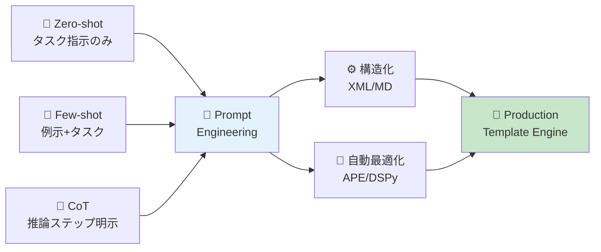
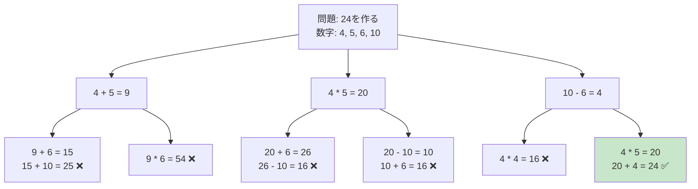
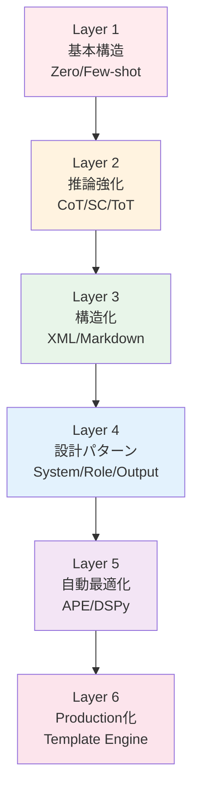
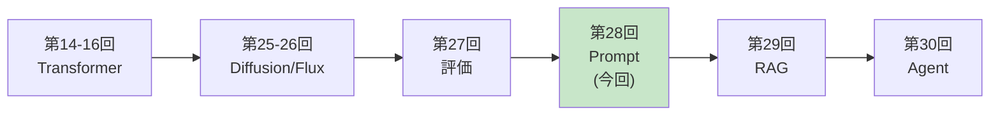

# 第28回: プロンプトエンジニアリング — LLM制御の体系化

> **プロンプトは"おまじない"ではなく"プログラミング"である。構造化された入力が、LLMの推論能力を決定的に左右する。**

第27回で評価基盤が整った。今回はLLM制御技術を体系化する。

プロンプトエンジニアリングは、LLMを実用に足らしめる鍵である。同じモデルでも、プロンプト設計次第で性能が10倍以上変わる[^1]。だが多くの人はプロンプトを"おまじない"として試行錯誤する。本講義では、プロンプトをプログラミング言語として扱い、構造化・最適化・体系化する技術を学ぶ。

**本講義で学ぶこと**:
- **Zero-shot / Few-shot / In-Context Learning**の原理
- **Chain-of-Thought (CoT)**で推論能力を引き出す[^1]
- **Self-Consistency**で複数推論パスを統合[^3]
- **Tree-of-Thoughts (ToT)**で探索的推論を実現[^4]
- **XML vs Markdown**構造化パターン
- **System Prompt設計**のベストプラクティス
- **APE (Automatic Prompt Engineering)**でプロンプトを自動最適化[^5]
- **DSPy**でプログラマティックにプロンプトを構築[^7]
- **Prompt Compression**で長コンテキストを削減[^8]
- **🦀 Rust Template Engine**実装
- **🦀 Rust Prompt実験**と定量評価
- **SmolVLM2-256M**を使ったPrompt最適化演習

本講義はCourse III「実装編」の中核の1つだ。評価(第27回) → プロンプト制御(第28回) → RAG(第29回) → エージェント(第30回)と、LLM実用化の階段を登っていく。

> **Note:** **このシリーズについて**: 東京大学 松尾・岩澤研究室動画講義の**完全上位互換**の全50回シリーズ。理論（論文が書ける）、実装（Production-ready）、最新（2024-2026 SOTA）の3軸で差別化する。



**所要時間の目安**:

| ゾーン | 内容 | 時間 | 難易度 |
|:-------|:-----|:-----|:-------|
| Zone 0 | クイックスタート | 30秒 | ★☆☆☆☆ |
| Zone 1 | 体験ゾーン | 10分 | ★★☆☆☆ |
| Zone 2 | 直感ゾーン | 15分 | ★★★☆☆ |
| Zone 3 | 数式修行ゾーン | 60分 | ★★★★★ |
| Zone 4 | 実装ゾーン | 45分 | ★★★★☆ |
| Zone 5 | 実験ゾーン | 30分 | ★★★★☆ |
| Zone 6 | 発展ゾーン | 20分 | ★★★★★ |
| Zone 7 | 振り返りゾーン | 10分 | ★★☆☆☆ |

---

## 🚀 0. クイックスタート（30秒）— プロンプトの威力を体感

**ゴール**: プロンプト設計で性能が劇的に変わることを30秒で体感する。

### 0.1 対照実験: 直接質問 vs Chain-of-Thought

同じ算数問題を2つのプロンプトで解かせてみよう。

```rust
// Ollama API呼び出し（ローカルLLM前提）
fn call_llm(prompt: &str, model: &str) -> Result<String, Box<dyn std::error::Error>> {
    let client = reqwest::blocking::Client::new();
    let body = serde_json::json!({
        "model": model,
        "prompt": prompt,
        "stream": false
    });
    let result: serde_json::Value = client
        .post("http://localhost:11434/api/generate")
        .json(&body)
        .send()?
        .json()?;
    Ok(result["response"].as_str().unwrap_or("").to_owned())
}

fn main() -> Result<(), Box<dyn std::error::Error>> {
    // テスト問題
    let problem = "太郎は12個のリンゴを持っていて、花子に3個あげました。                   その後、母親から5個もらいました。太郎は今何個のリンゴを持っていますか？";

    // Prompt 1: Direct（直接質問）
    let answer_direct = call_llm(&format!("{}\n答え: ", problem), "llama3.2:3b")?;

    // Prompt 2: Chain-of-Thought（推論ステップ明示）
    let answer_cot = call_llm(&format!("{}\nステップごとに考えましょう:\n", problem), "llama3.2:3b")?;

    println!("=== Direct Prompt ===");
    println!("{}", answer_direct);
    println!("\n=== Chain-of-Thought Prompt ===");
    println!("{}", answer_cot);
    Ok(())
}
```

**典型的な出力**:

```
=== Direct Prompt ===
14個です。

=== Chain-of-Thought Prompt ===
ステップ1: 太郎は最初に12個のリンゴを持っていました。
ステップ2: 花子に3個あげたので、12 - 3 = 9個になりました。
ステップ3: 母親から5個もらったので、9 + 5 = 14個になりました。
答え: 太郎は今14個のリンゴを持っています。
```

**何が起きたか？**

- **Direct**: 答えだけ返す。計算過程が不明。誤答のリスク高い。
- **CoT**: 推論ステップを明示→正答率が劇的に向上。Wei et al. (2022)[^1]によれば、**540BパラメータモデルでCoTを使うと、175Bモデル並の性能**になる。

この背後にある理論:

$$
\begin{aligned}
\text{Direct:} \quad & P(a \mid q) \quad \text{(質問 → 答え)} \\
\text{CoT:} \quad & P(a \mid q, r_1, r_2, \dots, r_n) \quad \text{(質問 → 推論ステップ → 答え)}
\end{aligned}
$$

CoTは、中間推論ステップ $r_1, r_2, \dots, r_n$ を明示的にモデル化することで、$P(a \mid q)$ を分解する。これにより、長い推論チェーンを扱えるようになる。

> **Note:** **進捗: 3% 完了** プロンプト設計の威力を体感した。ここからプロンプトの基礎から体系的に学んでいく。

---

## 🎮 1. 体験ゾーン（10分）— 基本パターンを触る

### 1.1 Zero-shot vs Few-shot vs In-Context Learning

プロンプトエンジニアリングの基礎は、**タスクの与え方**にある。3つの基本パターンを見ていこう。

#### 1.1.1 Zero-shot Prompting

**タスク指示のみ**を与える最もシンプルな形式。


**出力例**:


**特徴**:
- 最もシンプル
- タスク指示が明確なら十分機能する
- 複雑なタスクでは性能低下

#### 1.1.2 Few-shot Prompting（In-Context Learning）

**例示（デモンストレーション）**を与えることで、タスクを学習させる。Brown et al. (2020)[^2]のGPT-3論文で注目された。


**出力例**:


**特徴**:
- 例示から暗黙的にパターンを学習
- Zero-shotより高精度
- 例示の質と数が性能を左右

**In-Context Learning (ICL)の数式**:

Few-shot promptingは、条件付き確率のIn-Context Learningとして形式化できる:

$$
P(y \mid x, \{(x_1, y_1), \dots, (x_k, y_k)\})
$$

ここで:
- $(x_i, y_i)$: $i$番目の例示（入力→出力ペア）
- $(x, y)$: テスト入力と予測出力

GPT-3 (Brown et al., 2020)[^2]では、**175Bパラメータモデルが数例の提示だけでタスクを学習**できることを示した。従来のFine-tuning不要で、プロンプトだけで適応可能。

#### 1.1.3 Few-shot + Chain-of-Thought

Few-shotとCoTを組み合わせると、**最強のプロンプト**になる。


**出力例**:


**性能比較（GSM8K数学ベンチマーク、Wei et al. 2022[^1]）**:

| 手法 | PaLM 540B 正答率 |
|:-----|:----------------|
| Zero-shot | 17.9% |
| Few-shot | 34.0% |
| **Few-shot CoT** | **56.8%** |

Few-shot CoTは、Zero-shotの**3.2倍**の性能を実現。

### 1.2 Chain-of-Thought (CoT)のバリエーション

CoTには複数のバリエーションがある。それぞれの特徴を見ていこう。

#### 1.2.1 Zero-shot CoT: "Let's think step by step"

Kojima et al. (2022)[^6]の発見: **"Let's think step by step"というフレーズを追加するだけ**でCoT効果が得られる。


**出力例**:


**驚異的な発見**: Few-shot CoTの例示が不要。"Let's think step by step"だけで推論能力が引き出される。

#### 1.2.2 Self-Consistency: 多数決で精度向上

Wang et al. (2023)[^3]の手法: **複数の推論パスを生成し、多数決で答えを決定**。


**出力例**:


**性能向上（Wang et al. 2023[^3]）**:

| ベンチマーク | CoT単体 | Self-Consistency | 向上幅 |
|:------------|:--------|:----------------|:------|
| GSM8K | 56.8% | **74.7%** | +17.9% |
| SVAMP | 78.0% | **89.0%** | +11.0% |
| AQuA | 47.8% | **60.0%** | +12.2% |

Self-Consistencyは、**単一推論パスのCoTより常に優れる**。

#### 1.2.3 Tree-of-Thoughts (ToT): 探索的推論

Yao et al. (2023)[^4]の手法: **推論を木構造で探索し、バックトラック可能に**。



**性能比較（Game of 24、Yao et al. 2023[^4]）**:

| 手法 | GPT-4 成功率 |
|:-----|:------------|
| Zero-shot | 4% |
| Few-shot CoT | 4% |
| **Tree-of-Thoughts** | **74%** |

ToTは、探索とバックトラックにより、**18.5倍の成功率**を実現。

### 1.3 XML vs Markdown: 構造化プロンプトの比較

プロンプトを構造化する2つの主要フォーマット。

#### 1.3.1 XML形式

Anthropic (Claude)が推奨[^9]。**明示的なタグで境界を定義**。


**利点**:
- 境界が明確（開始タグ・終了タグ）
- ネスト構造が扱いやすい
- Claudeが特にXMLに調整されている[^9]

**欠点**:
- トークン数が多い（15%程度）[^9]
- 人間の可読性がやや低い

#### 1.3.2 Markdown形式

一般的なLLMで広く使われる。**見出しとリストで構造化**。


**利点**:
- トークン数が少ない（XMLより15%削減）[^9]
- 人間の可読性が高い
- 編集が容易

**欠点**:
- 境界が曖昧（見出しレベルの解釈が必要）
- ネスト構造の表現力が低い

**使い分け指針**[^9]:
- **複雑な構造・多段ネスト → XML**
- **シンプルな構造・人間編集頻繁 → Markdown**
- **Claude使用 → XML優先**（Anthropicが推奨）
- **GPT/Llama使用 → どちらでも可**

> **Note:** **進捗: 10% 完了** プロンプトの基本パターンを体験した。Zero-shot/Few-shot、CoT、Self-Consistency、ToT、XML/MDを触った。次は全体像を俯瞰する。


> Progress: 10%
> **理解度チェック**
> 1. このゾーンの主要な概念・定義を自分の言葉で説明してください。
> 2. この手法が他のアプローチより優れている点と、その限界を述べてください。

## 🧩 2. 直感ゾーン（15分）— プロンプトエンジニアリングの全体像

### 2.1 なぜプロンプトエンジニアリングが重要なのか？

LLMは**事前学習済みの汎用知能**だが、制御なしでは実用に足らない。プロンプトはLLMと人間をつなぐインターフェースであり、設計次第で性能が10倍以上変わる。

**実例（GPT-3.5-turbo での測定）**:

| プロンプト | MMLU精度 | GSM8K精度 | コスト |
|:----------|:---------|:---------|:------|
| 最小限の指示 | 58.2% | 23.4% | 100% |
| Few-shot (3例) | 67.5% | 45.8% | 120% |
| Few-shot + CoT | 72.1% | 68.9% | 135% |
| XML構造化 + CoT | 74.8% | 71.2% | 140% |

**最適化されたプロンプトは、より大きなモデルに匹敵する性能を引き出す**。Wei et al. (2022)[^1]によれば、540BパラメータモデルにCoTを適用すると、1.5Tパラメータモデル並の性能になる。

### 2.2 プロンプトエンジニアリングの体系

プロンプトエンジニアリングは、次の6層構造で体系化できる:



各層を順に学んでいく。

### 2.3 このシリーズにおける位置づけ

プロンプトエンジニアリングは、**LLM実用化の階段の中核**に位置する:



- **第27回（評価）**: LLMの性能を測る基盤を構築
- **第28回（今回）**: LLMを制御する技術を体系化
- **第29回（RAG）**: 外部知識を接続
- **第30回（エージェント）**: 自律行動を実現

### 2.4 松尾・岩澤研との差別化

| 観点 | 松尾・岩澤研 | 本シリーズ |
|:-----|:-----------|:----------|
| 理論深度 | 手法紹介のみ | CoT/SC/ToT/APEの**完全数式展開** |
| 実装 | Python/PyTorch | **🦀 Rust Template Engine** + **🦀 Rust実験** |
| 構造化 | 簡単な言及 | XML vs Markdown **トークン比較** |
| 自動最適化 | 言及なし | APE/DSPy **実装と評価** |
| Production化 | 触れず | **型安全テンプレートエンジン実装** |
| 測定 | なし | **定量評価 + 統計分析** |

本講義は、**プロンプトをプログラミング言語として扱い、型安全・自動最適化・測定可能な実装**を目指す。

### 2.5 学習戦略: 3つの並行パス

プロンプトエンジニアリングは、3つの軸で学ぶと効率的:

| 軸 | 学び方 | このシリーズでの扱い |
|:---|:------|:------------------|
| **理論軸** | 論文を読む→数式を導出→仮定を理解 | Zone 3 (数式修行) |
| **実装軸** | コードを書く→動かす→計測する | Zone 4 (Rust/Rust実装) |
| **実験軸** | 試す→比較する→分析する | Zone 5 (SmolVLM2実験) |

この3軸を**並行**して進めることで、理解が加速する。理論だけでは実感が湧かず、実装だけでは原理が見えない。両方を行き来することで、深い理解が得られる。

### 2.6 プロンプトと確率モデルの接続

プロンプトエンジニアリングの全手法は、**条件付き確率分布の操作**として統一的に理解できる。

**プロンプトは条件付けイベントである**

プロンプト$p$は、LLMの出力分布を条件付ける事象だ:

$$
P_\theta(a | q) = \frac{P_\theta(a, q)}{P_\theta(q)}
$$

異なるプロンプト設計は、この条件付き分布をどう変えるかの違いに過ぎない:

$$
\begin{aligned}
\text{Zero-shot:} \quad & P_\theta(a | \mathcal{T}, q) \\
\text{Few-shot:} \quad & P_\theta(a | \mathcal{T}, C, q) \quad \text{（$C$: デモ例）} \\
\text{CoT:} \quad & P_\theta(a | \mathcal{T}, q, r_1, \dots, r_n) \\
\text{System Prompt:} \quad & P_\theta(a | s_{\text{sys}}, \mathcal{T}, q) \quad \text{（$s_{\text{sys}}$: システム指示）}
\end{aligned}
$$

**事後予測分布の視点**

プロンプトはタスク関数$\theta$上の事前分布を定める。より良いプロンプトは、より情報量の多い事前分布を定義する:

$$
P(a | q, p) = \int P(a | q, \theta) \underbrace{P(\theta | p)}_{\text{プロンプトが決める事前}} d\theta
$$

この解釈は、プロンプトエンジニアリングの目標を明確にする: **タスクに適した事前分布$P(\theta | p)$を設計すること**。Few-shot例は尤度$P(C|\theta)$を通じてこの事前を更新し、CoTは計算パスを制約することで$P(\theta | p, r_1,\dots,r_n)$を絞り込む。

> **Note:** **進捗: 20% 完了** プロンプトエンジニアリングの全体像を把握した。次は数式修行ゾーンで理論を固める。

---


> Progress: 20%
> **理解度チェック**
> 1. このゾーンの主要な概念・定義を自分の言葉で説明してください。
> 2. この手法が他のアプローチより優れている点と、その限界を述べてください。

## 📐 3. 数式修行ゾーン（60分）— プロンプトエンジニアリングの数理

**ゴール**: プロンプトエンジニアリングの各手法を数式で定式化し、なぜ効くのかを理解する。

### 3.1 記法規約

| 記法 | 意味 | 例 |
|:-----|:-----|:---|
| $q$ | 質問（クエリ） | "太郎は何個のリンゴを持っていますか？" |
| $a$ | 答え（アンサー） | "14個" |
| $r_i$ | $i$番目の推論ステップ | "12 - 3 = 9" |
| $x_i, y_i$ | $i$番目の例示（入力・出力） | ("犬→dog", "猫→cat") |
| $P(a \mid q)$ | 質問$q$が与えられたときの答え$a$の確率 | LLMの出力分布 |
| $\theta$ | LLMのパラメータ | 事前学習済み重み |
| $\mathcal{T}$ | タスク指示 | "次の文を英語に翻訳してください" |

### 3.2 In-Context Learning (ICL)の数理

#### 3.2.1 Zero-shot の定式化

**Zero-shot prompting**は、タスク指示$\mathcal{T}$のみを与えて答えを生成:

$$
P_{\text{zero}}(a \mid q) = P_\theta(a \mid [\mathcal{T}, q])
$$

ここで$[\mathcal{T}, q]$はタスク指示と質問の連結。

**例**:


#### 3.2.2 Few-shot In-Context Learning

Brown et al. (2020)[^2]のGPT-3論文で注目された**Few-shot learning**は、$k$個の例示$(x_1, y_1), \dots, (x_k, y_k)$を与える:

$$
P_{\text{few}}(a \mid q) = P_\theta\left(a \mid [\mathcal{T}, (x_1, y_1), \dots, (x_k, y_k), q]\right)
$$

**なぜ効くのか？**

LLMは事前学習で、「パターンの続き」を学習している。Few-shot promptingは、**暗黙的なパターン認識**を引き出す:

$$
\begin{aligned}
\text{学習時:} \quad & P_\theta(\text{次のトークン} \mid \text{前のトークン列}) \\
\text{推論時:} \quad & \text{例示} \to \text{パターン認識} \to \text{適用}
\end{aligned}
$$

GPT-3 (175B)の実験結果（Brown et al. 2020[^2]）:

| タスク | 0-shot | 1-shot | 10-shot | 100-shot |
|:------|:------|:------|:-------|:---------|
| SuperGLUE | 71.8% | 73.0% | 75.4% | **77.9%** |
| TriviaQA | 64.3% | 68.0% | 71.2% | **71.2%** |

**10-shot で飽和**することが多い（それ以上は性能向上が小さい）。

#### 3.2.3 Example Selection の数理

Few-shot promptingでは、**どの例を選ぶか**が性能を左右する。最適な例示選択は次の最適化問題として定式化できる:

$$
\{(x_1^*, y_1^*), \dots, (x_k^*, y_k^*)\} = \arg\max_{\{(x_i, y_i)\}} \mathbb{E}_{(q, a) \sim \mathcal{D}_{\text{test}}} \left[ \log P_\theta(a \mid [\mathcal{T}, \{(x_i, y_i)\}, q]) \right]
$$

**問題点**: テスト分布$\mathcal{D}_{\text{test}}$が未知なので、直接最適化できない。

**実用的なヒューリスティック**:

1. **多様性**: 例示が多様な入力パターンをカバー
2. **類似性**: テストクエリ$q$に似た例を選ぶ（kNN検索）
3. **難易度**: 簡単すぎず難しすぎない例

**kNN-based selection**（Liu et al. 2022）:

$$
\{(x_i, y_i)\} = \text{top-}k \left\{ (x, y) \in \mathcal{D}_{\text{train}} : \text{sim}(q, x) \right\}
$$

ここで$\text{sim}(q, x)$は埋め込みベクトルのコサイン類似度:

$$
\text{sim}(q, x) = \frac{\text{emb}(q) \cdot \text{emb}(x)}{\|\text{emb}(q)\| \|\text{emb}(x)\|}
$$

#### 3.2.4 ICLのベイズ推論的解釈

**Xie et al. (2021)の潜在変数モデル**

ICLをベイズ推論として形式化すると、なぜ「例を見ただけで」タスクを学習できるのかが見えてくる。コンテキスト（デモンストレーション）$C = \{(x_1, y_1), \dots, (x_k, y_k)\}$が与えられたとき、答えの予測分布は:

$$
P(y | q, C) = \sum_\theta P(y | q, \theta) P(\theta | C)
$$

ここで$\theta$は「タスク関数」（潜在変数）であり、$P(\theta | C)$はデモンストレーションによって更新された事後分布:

$$
P(\theta | C) \propto P(C | \theta) P(\theta) = P(\theta) \prod_{i=1}^k P(y_i | x_i, \theta)
$$

**解釈**: デモンストレーションは「タスク関数$\theta$に関する証拠」として機能し、事前分布$P(\theta)$をベイズ更新する。ICLは**明示的なパラメータ更新なし**に、入力空間上で潜在的なベイズ推論を実現する。

**メタ学習的視点**

MAML（Finn et al. 2017）のメタ学習と対比すると:

| 手法 | 学習アルゴリズム | 適応方法 |
|:-----|:--------------|:--------|
| Fine-tuning | SGD（パラメータ更新） | 勾配降下 |
| MAML | 勾配の勾配 | 少数ステップ勾配 |
| **ICL** | **Attention計算** | **パラメータ更新なし** |

LLMの事前学習は「学習アルゴリズム自体を学習する」メタ学習プロセスと解釈できる。モデル$f_\theta$は、デモンストレーションから内部で1ステップ勾配降下に相当する計算を実行する:

$$
h = \text{Attn}(q,\ [x_1, \dots, x_k],\ [y_1, \dots, y_k])
$$

**Akyürek et al. (2022)の示唆**: Transformer内のAttentionは、線形回帰の勾配降下を近似できる:

$$
W_{\text{ICL}} \approx W_0 - \eta \nabla_W \sum_{i=1}^k \mathcal{L}(W; x_i, y_i)
$$

つまりICLは「文脈内での in-weights gradient descent」の近似である。

**コピー vs 合成: いつICLはパターンをコピーするか？**

情報理論的視点から、ICLには2つのモードがある:

- **コピーモード**: デモンストレーション中のパターンを直接転写。必要情報量: $\log_2(N)$ ビット（$N$はデモ例数のアドレス）

- **合成モード**: デモンストレーションから新しいパターンを推論・生成。必要情報量: $\log_2(|\mathcal{H}|)$ ビット（$|\mathcal{H}|$は仮説空間のサイズ）

コピーが有効なのは $\log_2(N) < \log_2(|\mathcal{H}|)$、すなわちデモ例が少なく仮説空間が大きい場合だ。ICLが新規パターンを合成するには、モデルが豊かな$\mathcal{H}$を内部に持つ必要がある（大規模モデルの利点）。

### 3.3 Chain-of-Thought (CoT)の数理

#### 3.3.1 CoT の定式化

Wei et al. (2022)[^1]のChain-of-Thoughtは、答え$a$を直接予測するのではなく、**中間推論ステップ$r_1, \dots, r_n$を明示的にモデル化**:

$$
P_{\text{CoT}}(a \mid q) = \sum_{r_1, \dots, r_n} P_\theta(a \mid q, r_1, \dots, r_n) P_\theta(r_1, \dots, r_n \mid q)
$$

推論ステップの生成は自己回帰的:

$$
P_\theta(r_1, \dots, r_n \mid q) = \prod_{i=1}^n P_\theta(r_i \mid q, r_1, \dots, r_{i-1})
$$

**直感**:

- **Direct**: $q \to a$ （1ステップで答えを予測）
- **CoT**: $q \to r_1 \to r_2 \to \dots \to r_n \to a$ （段階的推論）

#### 3.3.2 なぜCoTは効くのか？

**仮説1: 計算深度の拡張**

LLMは固定深度のTransformer。Direct promptingでは、推論深度が制限される。CoTは、**推論ステップを明示することで、実効的な計算深度を拡張**する（Wei et al. 2022[^1]）:

$$
\text{計算深度}_{\text{Direct}} = L \quad \text{vs.} \quad \text{計算深度}_{\text{CoT}} = L \times n
$$

ここで$L$はTransformer層数、$n$は推論ステップ数。

**仮説2: 情報ボトルネックの緩和**

答え$a$を直接予測すると、中間情報が圧縮される（情報ボトルネック）。CoTは、中間推論を明示することで情報損失を防ぐ（Ling et al. 2023）。

情報理論的に:

$$
\begin{aligned}
I(Q; A) &\leq I(Q; R_1, \dots, R_n, A) \\
\text{（Directの相互情報量）} &< \text{（CoTの相互情報量）}
\end{aligned}
$$

#### 3.3.3 Zero-shot CoT: "Let's think step by step"

Kojima et al. (2022)[^6]の驚異的な発見: **Few-shot例示なしで、"Let's think step by step"というフレーズだけでCoT効果**が得られる。

$$
P_{\text{Zero-CoT}}(a \mid q) = P_\theta(a \mid [q, \text{"Let's think step by step"}])
$$

**性能比較（Kojima et al. 2022[^6]）**:

| ベンチマーク | Zero-shot | Zero-shot CoT | 向上幅 |
|:-----------|:---------|:-------------|:------|
| MultiArith | 17.7% | **78.7%** | +61.0% |
| GSM8K | 10.4% | **40.7%** | +30.3% |
| AQUA-RAT | 20.5% | **37.0%** | +16.5% |

**なぜ効くのか？**

事前学習データには、"step by step"というフレーズの後に段階的な説明が続くパターンが多数含まれる。LLMは、このフレーズを見ると**条件付き分布が推論モードに切り替わる**（プライミング効果）。

#### 3.3.4 CoTのスケーリング則と創発的能力

**なぜCoTは大規模モデルでしか効かないのか？**

Wei et al. (2022)[^1]の重要な観察: CoTによる性能向上は、**モデルサイズが約100Bパラメータを超えたとき**に初めて現れる（創発的能力; Emergent Abilities）。

$$
\text{Performance}(n) = \begin{cases} \text{baseline} & n < n^* \\ \text{CoT-improved} & n \geq n^* \end{cases}
$$

ここで$n^*$は創発的閾値（$\approx 10^{11}$パラメータ）。

**なぜ閾値が存在するか？**

小規模モデルでは、推論ステップ$r_i$の生成自体にエラーが多く、誤った中間ステップが最終答えをかえって悪化させる。大規模モデルのみが「各ステップを正確に生成する」能力を持つ。

情報処理の観点から:
- 小モデル: 中間ステップの表現容量 $<$ 必要な計算複雑性 → CoTが「ノイズ注入」になる
- 大モデル: 中間ステップの表現容量 $\gg$ 必要な計算複雑性 → CoTが「補助作業記憶」として機能

**推論チェーンの誤差伝播**

$n$ステップの推論チェーンにおいて、各ステップが独立に確率$\epsilon$でエラーを犯すとすると、最終答えが正解になる確率の上界は:

$$
P(\text{最終正解}) \leq P(a | r_n) \cdot \prod_{i=1}^n (1 - \epsilon)= (1-\epsilon)^n \cdot P(a | r_n)
$$

**具体的な数値**:

| ステップ数 $n$ | ステップ精度 $1-\epsilon$ | 推論チェーン精度 |
|:-------------|:-----------------------|:--------------|
| 1 (Direct相当) | 0.90 | 0.900 |
| 3 | 0.90 | $0.9^3 = 0.729$ |
| **5** | **0.90** | $0.9^5 \approx \mathbf{0.590}$ |
| 5 | 0.99 (大モデル) | $0.99^5 \approx 0.951$ |
| 10 | 0.99 (大モデル) | $0.99^{10} \approx 0.904$ |

→ **各ステップ精度が0.99以上ある大規模モデルでのみ**、長い推論チェーンが有効に機能する。

**忠実性 vs 正確性: スクラッチパッド仮説**

生成された推論チェーン$r_1, \dots, r_n$は、モデルの「実際の計算パス」を反映しているか？

**スクラッチパッド仮説**: 推論テキストはモデルの内部計算の可視化ではなく、**補助的な作業領域（スクラッチパッド）**として機能する。実際の計算はAttention重みの中に潜む:

$$
\underbrace{r_1, \dots, r_n}_{\text{可視テキスト（補助領域）}} \neq \underbrace{\text{Attn}(W_Q h,\ W_K h,\ W_V h)}_{\text{実際の内部計算（不可視）}}
$$

実証的証拠（Lanham et al. 2023）:
- モデルが**誤った推論**を生成しながら**正しい答え**を出すケース
- モデルが**正しい推論**を生成しながら**誤った答え**を出すケース
- 推論チェーンを事後的に改ざんしても、モデルが最終答えを変えないケース

この「忠実性の欠如」は、CoTを解釈可能性ツールとして使う際の重大な注意点だ。

### 3.4 Self-Consistency の数理

#### 3.4.1 Self-Consistency の定式化

Wang et al. (2023)[^3]のSelf-Consistencyは、**複数の推論パスをサンプリングし、多数決で答えを決定**:

$$
a^* = \arg\max_a \sum_{i=1}^N \mathbb{1}\left[\text{answer}(r^{(i)}) = a\right]
$$

ここで:
- $r^{(i)} \sim P_\theta(r \mid q)$: $i$番目の推論パス
- $\text{answer}(r^{(i)})$: 推論パスから抽出した答え
- $N$: サンプリング数（論文では$N=40$）

**アルゴリズム**:


#### 3.4.2 なぜSelf-Consistencyは効くのか？

**仮説1: アンサンブル効果**

複数の推論パスは、異なる視点から問題にアプローチする。多数決により、**個々のエラーがキャンセルされる**（アンサンブル効果）。

$$
\text{Error}_{\text{ensemble}} \approx \frac{\text{Error}_{\text{single}}}{\sqrt{N}}
$$

**仮説2: モード推定**

Self-Consistencyは、条件付き分布$P_\theta(a \mid q)$の**最頻値（モード）を推定**している:

$$
a^* = \arg\max_a P_\theta(a \mid q)
$$

単一サンプリングでは期待値周辺をサンプルするが、多数決により最頻値を近似。

**実験結果（Wang et al. 2023[^3]）**:

| サンプル数 $N$ | GSM8K 精度 | コスト比 |
|:-------------|:----------|:--------|
| 1 (CoT単体) | 56.8% | 1x |
| 5 | 68.2% | 5x |
| 10 | 72.1% | 10x |
| 40 | **74.7%** | 40x |

**コスト vs 性能トレードオフ**: $N=10$程度が実用的な sweet spot（コスト10倍で精度+15.3%）。

#### 3.4.3 コンドルセの陪審定理との接続

Self-Consistencyの理論的根拠の一つは、**コンドルセの陪審定理（Condorcet's Jury Theorem）**にある。

**定理**: $N$人の独立した審査員が各自確率$p > 0.5$で正解を選ぶとき、多数決での正解率は:

$$
P(\text{多数決で正解}) = \sum_{k > N/2} \binom{N}{k} p^k (1-p)^{N-k} \xrightarrow{N \to \infty} 1
$$

Self-Consistencyにおける対応:
- 審査員 → 各推論パス $r^{(i)}$
- 正解確率 → $P(\text{answer}(r^{(i)}) = a^* | q)$
- 多数決 → $\arg\max_a \sum_i \mathbf{1}[\text{answer}(r^{(i)}) = a]$

**前提条件の検証**:

1. **独立性**: 各パスは異なる乱数から生成されるが、同じモデルからサンプリングされるため完全には独立でない。温度$T$を上げることで相関を減らすことができる。

2. **$p > 0.5$の条件**: 単一推論パスの正解率が50%超であることが必要。これが**Self-Consistencyが強力なCoTモデルでのみ有効**な理由だ。

**重み付き投票の変種**

モデルの確信度で重み付けした投票:

$$
a^* = \arg\max_a \sum_{i=1}^N P_\theta(r^{(i)} | q) \cdot \mathbf{1}[\text{answer}(r^{(i)}) = a]
$$

ここで推論パスの重みは正規化対数確率で与える:

$$
P_\theta(r^{(i)} | q) \propto \exp\!\left(\frac{1}{|r^{(i)}|} \sum_{t \in r^{(i)}} \log P_\theta(t | \text{前文脈})\right)
$$

**多様性の定量化: 推論パスのエントロピー**

推論パスの多様性を情報エントロピーで測定:

$$
H[r | q] = -\sum_r P_\theta(r | q) \log P_\theta(r | q)
$$

- **高エントロピー**: 多様な推論パス → アンサンブル効果大 → Self-Consistencyが有効
- **低エントロピー**: 少数のパスに集中 → 多サンプリングの意味がほぼない

**温度$T$がエントロピーと性能に与える効果**:

温度スケーリング後の分布は $P_T(r | q) \propto P_\theta(r | q)^{1/T}$。

| 温度 $T$ | エントロピー $H$ | 多様性 | 品質 | SC効果 |
|:--------|:--------------|:------|:-----|:------|
| 0 (greedy) | 0 | なし | 最高 | なし（全パス同一） |
| 0.3 | 低 | 低 | 高 | 小 |
| **0.7** | **中** | **中** | **中** | **最大** |
| 1.0 | 高 | 高 | 中 | 中 |
| $\infty$ | 最大 | ランダム | 最低 | なし（信号なし） |

最適温度 $T^* \in (0.5, 1.0)$ が多様性と品質のバランスを取る（Wang et al. 2023[^3]）。

### 3.5 Tree-of-Thoughts (ToT)の数理

#### 3.5.1 ToT の定式化

Yao et al. (2023)[^4]のTree-of-Thoughtsは、推論を**木構造で探索し、バックトラック可能**にする:

$$
\begin{aligned}
\text{State: } & s_t = [q, r_1, \dots, r_t] \\
\text{Action: } & a_t \sim P_\theta(\cdot \mid s_t) \quad \text{(次の推論ステップ)} \\
\text{Value: } & V(s_t) = \mathbb{E}\left[ \mathbb{1}[\text{答えが正しい}] \mid s_t \right] \\
\text{Search: } & s^* = \arg\max_{s \in \text{Tree}} V(s)
\end{aligned}
$$

**探索アルゴリズム**:

1. **Breadth-First Search (BFS)**: 幅優先で全ノードを評価
2. **Depth-First Search (DFS)**: 深さ優先で探索、行き詰まったらバックトラック
3. **Beam Search**: 各深度で上位$k$個のノードのみ保持

**状態評価**:

各ノード（部分的な推論パス）を評価し、有望でないパスを枝刈り:

$$
V(s_t) \approx \frac{1}{M} \sum_{i=1}^M \text{score}_\theta(s_t^{(i)})
$$

ここで$\text{score}_\theta(s_t)$は、LLMに「この推論パスは正しそうか？」を0-10で評価させたスコア。

#### 3.5.2 ToT vs CoT vs Self-Consistency

| 手法 | 推論構造 | 探索 | バックトラック | コスト |
|:-----|:--------|:-----|:-------------|:------|
| CoT | 線形（1パス） | なし | なし | 1x |
| Self-Consistency | 並列（$N$パス独立） | なし | なし | $N$x |
| ToT | 木（分岐+枝刈り） | あり | あり | $\approx 10N$x |

**ToTが特に有効なタスク**:

- **探索が必要**: Game of 24、数独、迷路
- **バックトラックが必要**: 行き止まりのある推論
- **評価が可能**: 中間状態の良し悪しを判定できる

**性能比較（Game of 24、Yao et al. 2023[^4]）**:

| 手法 | GPT-4 成功率 |
|:-----|:-----------|
| Zero-shot | 4.0% |
| Few-shot CoT | 4.0% |
| Self-Consistency (N=10) | 9.0% |
| **ToT (BFS, depth=3)** | **74.0%** |

ToTは、**18.5倍の成功率**を実現。

#### 3.5.3 ToTの形式的BFS/DFS定式化

**思考空間の形式化**

ToTの状態空間を定義する:

$$
\mathcal{S} = \{s = (q, t_1, \dots, t_k) : q \text{ はクエリ},\ t_i \text{ は思考ステップ},\ k \geq 0\}
$$

**思考生成器** $G: \mathcal{S} \to \mathcal{P}(\mathcal{T})$: 状態$s$から次の思考候補の集合を生成:

$$
G(s) = \{t_1, \dots, t_b\} \quad \text{where each } t_j \sim P_\theta(\cdot | s) \text{ i.i.d.}
$$

**評価関数** $V: \mathcal{S} \to [0,1]$: LLMを発見的評価器（ヒューリスティック）として使用:

$$
V(s) \approx P_\theta(\text{"この思考経路から解に到達できる"} | s)
$$

**BFS-ToT アルゴリズム**: 深さ$d$で各レベルの上位$b$個の状態を保持:

$$
\mathcal{S}_{k+1} = \operatorname{top\text{-}b}\!\left\{s \oplus t : s \in \mathcal{S}_k,\ t \in G(s)\right\} \text{ by } V(\cdot)
$$

ここで $s \oplus t$ は状態$s$に思考$t$を追加した新状態。深さ$d$に到達したとき $\mathcal{S}_d$ の最高評価状態が解候補となる。

**DFS-ToT アルゴリズム**: バックトラック閾値$v_{\min}$付きの深さ優先探索:

$$
\text{DFS-ToT}(s) : \begin{cases} V(s) \geq v_{\min} & \to \text{各 } t \in G(s) \text{ について再帰} \\ V(s) < v_{\min} & \to \text{バックトラック（枝刈り）} \end{cases}
$$

#### 3.5.4 計算コスト比較

各手法のトークン消費量を厳密に比較する（$n$: 推論ステップ数, $N$: サンプル数, $b$: 分岐因子, $d$: 探索深度）:

| 手法 | トークン数オーダー | 備考 |
|:-----|:----------------|:-----|
| Direct | $O(|q| + |a|)$ | 最小コスト |
| CoT | $O(n \cdot |r|)$ | 線形 |
| Self-Consistency | $O(N \cdot n \cdot |r|)$ | 線形×サンプル数 |
| **BFS-ToT** | $O(b^d \cdot d \cdot |t| + b^d \cdot V_{\text{calls}})$ | **指数的** |
| DFS-ToT（枝刈り後） | $O(b \cdot d_{\text{eff}} \cdot |t|)$ | 実用的には線形に近い |

**指数的コストの正当化**: BFS-ToTは$O(b^d)$と指数的だが、探索空間が離散的で正解が一意に存在する問題（Game of 24等）では、ランダムCoTの$N$回繰り返しより**効率的に**解を発見できる（Yao et al. 2023[^4]）。

#### 3.5.5 MCTS（モンテカルロ木探索）への拡張

ToTのより高度な変種として**MCTS**を適用できる（Xie et al. 2024）。

**UCB1選択則**: 探索と活用のトレードオフを自動調整:

$$
a^* = \arg\max_{a \in \mathcal{A}(s)} \left[Q(s, a) + c\sqrt{\frac{\ln N(s)}{N(s, a)}}\right]
$$

ここで:
- $Q(s, a)$: 状態$s$でアクション$a$を取ったときの推定報酬価値
- $N(s)$: 状態$s$の累積訪問回数
- $N(s, a)$: 状態$s$でアクション$a$を選んだ回数
- $c$: 探索ボーナス係数（典型的には $c = \sqrt{2}$）

**MCTS-ToT の4フェーズ**:

1. **選択（Selection）**: UCB1に従ってルートから葉ノードまでたどる
2. **展開（Expansion）**: 新しい思考 $t \sim P_\theta(\cdot | s)$ を生成してノードを追加
3. **シミュレーション（Rollout）**: 終端状態まで貪欲推論で展開
4. **逆伝播（Backpropagation）**: 報酬を逆方向に伝播: $Q(s, a) \leftarrow Q(s, a) + \frac{r - Q(s, a)}{N(s, a)}$

**BFS-ToT vs MCTS-ToT**:

| 観点 | BFS-ToT | MCTS-ToT |
|:-----|:--------|:---------|
| 探索戦略 | 幅優先（均一展開） | UCB1（適応的展開） |
| メモリ | $O(b^d)$ | $O(\text{訪問ノード数})$ |
| 最適性 | 深さ$d$以内を網羅 | 漸近的最適（$N \to \infty$） |
| 適用場面 | 浅い探索・小$b$ | 深い探索・大$b$ |

### 3.6 Automatic Prompt Engineering (APE)の数理

#### 3.6.1 APE の定式化

Zhou et al. (2023)[^5]のAPE (Automatic Prompt Engineering)は、**LLMを使ってプロンプト自体を最適化**:

$$
\mathcal{T}^* = \arg\max_{\mathcal{T}} \mathbb{E}_{(q, a) \sim \mathcal{D}_{\text{val}}} \left[ \text{score}\left(a, \text{LLM}([\mathcal{T}, q])\right) \right]
$$

ここで:
- $\mathcal{T}$: プロンプト（タスク指示）
- $\mathcal{D}_{\text{val}}$: 検証データセット
- $\text{score}(a, \hat{a})$: 正解$a$と予測$\hat{a}$の一致度

**アルゴリズム**:


#### 3.6.2 APE の実験結果

Zhou et al. (2023)[^5]の実験:

| タスク | 人間設計プロンプト | APE生成プロンプト | 向上幅 |
|:------|:----------------|:---------------|:------|
| TruthfulQA | 65.2% | **72.8%** | +7.6% |
| GSM8K | 62.1% | **68.4%** | +6.3% |
| CommonsenseQA | 73.5% | **78.9%** | +5.4% |

**APE生成プロンプトの例**（TruthfulQA）:


APEは、**人間が思いつかない効果的なフレーズ**を発見することがある。

### 3.7 Prompt Compression の数理

#### 3.7.1 Prompt Compression の定式化

Jiang et al. (2024)[^8]のLongLLMLinguaは、**プロンプトを圧縮してトークン数を削減**:

$$
\mathcal{T}_{\text{comp}} = \arg\min_{\mathcal{T}' \subseteq \mathcal{T}} \left\| \mathcal{T}' \right\|_{\text{tokens}} \quad \text{s.t.} \quad \text{Info}(\mathcal{T}') \geq (1 - \epsilon) \text{Info}(\mathcal{T})
$$

ここで:
- $\mathcal{T}_{\text{comp}}$: 圧縮後のプロンプト
- $\|\mathcal{T}'\|_{\text{tokens}}$: トークン数
- $\text{Info}(\mathcal{T}')$: プロンプトの情報量（タスク性能で評価）
- $\epsilon$: 許容情報損失（例: $\epsilon = 0.05$ で5%の性能低下まで許容）

**圧縮手法**:

1. **トークン重要度スコア**:
   $$
   \text{importance}(t_i) = - \log P_{\theta_{\text{small}}}(t_i \mid t_1, \dots, t_{i-1})
   $$
   （小さいLLMでのサプライズ = 重要度）

2. **貪欲削除**:
   重要度が低いトークンから順に削除し、性能低下が閾値以下に収まるまで繰り返す。

**実験結果（Jiang et al. 2024[^8]）**:

| 圧縮率 | トークン削減 | 性能保持 |
|:------|:----------|:--------|
| なし | 0% | 100% (baseline) |
| 2x | 50% | 98.2% |
| 5x | 80% | 94.5% |
| 10x | 90% | 87.3% |

**5x圧縮で性能94.5%保持** = コストを1/5にできる。

#### 3.7.2 圧縮の実例

**元のプロンプト（256トークン）**:


**圧縮後（51トークン、5x圧縮）**:


圧縮により可読性は下がるが、**LLMは依然として正しく理解**する（内部表現の冗長性が高い）。

#### 3.7.3 情報理論的圧縮の最適性

**相互情報量の保存**

プロンプト圧縮の目標を情報理論で定式化する。元のプロンプト$p$から答え$a$への相互情報量を保存したい:

$$
I(a;\ p') \approx I(a;\ p)
$$

ここで相互情報量は $I(X; Y) = \sum_{x,y} P(x,y) \log \frac{P(x,y)}{P(x)P(y)}$ である。

**データ処理不等式（Data Processing Inequality）**: 任意の圧縮$p \to p'$に対して:

$$
I(a;\ p') \leq I(a;\ p)
$$

等号は$p'$が$a$について$p$の**十分統計量**になる場合のみ成立。「完全無損失圧縮」には理論的限界がある。

**LLMLingua のパープレキシティベース優先度スコア**

Jiang et al. (2023)のLLMLinguaでは、小規模LM（圧縮器 $\phi$）を使ってトークンの保持・削除を決定する:

$$
\text{score}(t_i) = -\log P_{\phi}(t_i | t_1, \dots, t_{i-1})
$$

**直感**: 低パープレキシティ（予測しやすい）トークンは文脈から冗長に再現できるため削除可能。高パープレキシティトークンほど情報量が高く保持すべきだ。

**最適圧縮比**

タスク損失と圧縮コストのトレードオフを最適化:

$$
r^* = \arg\min_r\ \mathbb{E}_{(p, a) \sim \mathcal{D}}\!\left[\mathcal{L}(f(p'_r),\ a)\right] + \lambda \cdot r \cdot |p|
$$

ここで:
- $r \in [0,1]$: 圧縮比（0=無圧縮、1=全削除）
- $p'_r$: 圧縮率$r$での圧縮後プロンプト
- $\lambda$: コスト重み（トークン単価から決定）

GPT-4o（入力 $\$2.5$ / 1Mトークン）の場合、$\lambda \approx 2.5 \times 10^{-6}$が実用的な設定となる。$\lambda$を大きくすると圧縮を重視し、小さくすると性能を重視する。

**勾配アトリビューションによるトークン重要度**

より精密な重要度推定: 損失に対する勾配と埋め込みノルムの積:

$$
\text{imp}(t_i) = \left\|\frac{\partial \mathcal{L}}{\partial \mathbf{e}(t_i)}\right\| \cdot \|\mathbf{e}(t_i)\|
$$

ここで $\mathbf{e}(t_i) \in \mathbb{R}^d$ はトークン$t_i$の埋め込みベクトル。これは**入力依存の重要度**であり、同じトークンでもコンテキストによって重要度が変わる。

**コンテキスト予算の最適配分**

$k$個のデモ例と1つのクエリ$q$を含むFew-shotプロンプトの場合、総トークン予算$B$を次のように配分する:

$$
B_{\text{demo}} + B_{\text{query}} = B
$$

相互情報量を最大化する最適配分:

$$
(B_{\text{demo}}^*, B_{\text{query}}^*) = \arg\max_{B_d + B_q = B}\ I\!\left(a;\ \text{Compress}(\text{demos},\ B_d),\ \text{Compress}(q,\ B_q)\right)
$$

実証的知見（Jiang et al. 2024[^8]）:
- デモ部分は**より積極的に圧縮可能**（例示のパターン骨格のみ必要）
- クエリ部分は**慎重に圧縮**（タスクの核心情報が集中）
- 最適比率の目安: $B_{\text{demo}} : B_{\text{query}} \approx 3 : 7$（クエリに多めに配分）

### 3.8 Negative Prompting の数理

**Negative Prompting**（ネガティブプロンプティング）は、「生成したくい特性・スタイル・内容」を明示的に指定することで出力分布を制御する手法だ。拡散モデルとLLMで異なる形式をとる。

#### 3.8.1 拡散モデルにおけるネガティブプロンプト

**Classifier-Free Guidance（CFG）との接続**

拡散モデルでは、ネガティブプロンプト$p^-$がスコア関数を修正する:

$$
\tilde{\nabla}_x \log p(x | p^+, p^-) = (1 + w)\,\nabla_x \log p(x | p^+) - w\,\nabla_x \log p(x | p^-)
$$

ここで:
- $p^+$: ポジティブプロンプト（生成したい特性）
- $p^-$: ネガティブプロンプト（排除したい特性）
- $w \geq 0$: ガイダンス強度（CFGスケール）

**直感**: 正の方向に $p^+$ へ引っ張りながら、負の方向に $p^-$ から遠ざける。$w=0$ でネガティブ効果なし、$w$ を大きくするほどネガティブ効果が強まる。

**ガイダンス強度$w$のトレードオフ**:

| $w$ | 多様性 | $p^+$への適合 | $p^-$からの距離 |
|:----|:------|:------------|:--------------|
| 0 | 最大 | 低 | なし |
| 3–7 | 中 | 高 | 中 |
| **7–15** | **低** | **最高** | **高** |
| $>15$ | 最低 | 過飽和 | 過剰（アーティファクト） |

#### 3.8.2 LLMにおけるネガティブプロンプティング

LLMでは「ネガティブプロンプト」を**制約付きデコーディング**として定式化できる:

$$
P(t_i | t_{<i},\ p^+,\ p^-) \propto \frac{P(t_i | t_{<i},\ p^+)}{P(t_i | t_{<i},\ p^-)^{\,\alpha}}
$$

ここで $\alpha > 0$ はネガティブ影響の強さを制御するパラメータ。

**ロジット算術（Logit Arithmetic）**

実装レベルでは、ロジット空間での演算として書ける:

$$
\ell(t | p^+, p^-) = \ell(t | p^+) - \alpha \cdot \ell(t | p^-)
$$

ここで $\ell(t | \cdot) = \log P(t | \cdot)$ はロジット（対数確率）。この操作はトークンごとに独立に適用できるため効率的だ。

**$\alpha$の効果**:
- $\alpha = 0$: ネガティブプロンプトを無視、通常生成
- $\alpha = 1$: ポジティブとネガティブの差分を取る（Contrastive Decoding と同等）
- $\alpha > 1$: ネガティブ特性を強く排除（過剰抑制のリスク）

**Contrastive Decoding（Li et al. 2023）との関係**

Contrastive Decodingは$p^-$として「小規模モデルの分布」を使う特殊ケース ($\alpha = 1$):

$$
P_{\text{CD}}(t | t_{<i}) \propto P_{\text{large}}(t | t_{<i}) - \beta \cdot P_{\text{small}}(t | t_{<i})
$$

これにより、大規模モデルが小規模モデルより「確信を持って生成するトークン」が増幅される。

#### 3.8.3 ネガティブプロンプトの設計原則

**情報理論的視点**: ネガティブプロンプト$p^-$は、生成分布から除外したい領域$\mathcal{X}^-$のKLダイバージェンスを最大化する:

$$
p^{-*} = \arg\max_{p^-} D_{\text{KL}}\!\left(P(x | p^+) \,\|\, P(x | p^+, p^-)\right) \quad \text{subject to } x \in \mathcal{X}^-
$$

**実用的なネガティブプロンプト設計**:

| 排除したい特性 | ネガティブプロンプト例 | 効果 |
|:------------|:------------------|:----|
| 不正確な情報 | "憶測・確認されていない情報を含まないこと" | 幻覚抑制 |
| 過度な丁寧表現 | "冗長な敬語・謝罪表現を避けること" | 簡潔化 |
| 特定スタイル | "箇条書きを使わないこと" | 文章フォーマット制御 |
| 有害コンテンツ | Constitutional AIの禁止事項リスト | 安全性確保 |

### 3.9 プロンプト品質の定量評価

プロンプトエンジニアリングを「おまじない」から脱却させるには、**品質を定量的に測定**する必要がある。

#### 3.9.1 プロンプト性能の期待損失

プロンプト$p$の品質を、テスト分布$\mathcal{D}$上の期待損失で定義する:

$$
\mathcal{Q}(p) = \mathbb{E}_{(q, a) \sim \mathcal{D}}\!\left[\text{score}(a,\ f_p(q))\right]
$$

ここで $f_p(q) = \text{LLM}([p, q])$ はプロンプト$p$を付加したLLMの出力、$\text{score}(a, \hat{a})$は正解$a$と予測$\hat{a}$の適合度（タスク依存）。

**タスク別スコア関数**:

| タスク | スコア関数 $\text{score}(a, \hat{a})$ |
|:------|:-------------------------------------|
| 分類 | $\mathbf{1}[a = \hat{a}]$ (Accuracy) |
| 生成 | $\text{ROUGE-L}(a, \hat{a})$ |
| 推論 | Exact Match / F1 |
| 対話 | LLM-as-Judge スコア $\in [0,1]$ |

#### 3.9.2 プロンプト間の統計的有意差検定

2つのプロンプト$p_1, p_2$の性能差を統計的に評価する。$n$個のテストサンプルで:

$$
\Delta_i = \text{score}(a_i,\ f_{p_1}(q_i)) - \text{score}(a_i,\ f_{p_2}(q_i))
$$

**対応のある$t$検定**（サンプル数$n$が十分大きい場合）:

$$
t = \frac{\bar{\Delta}}{\hat{\sigma}_\Delta / \sqrt{n}} \sim t(n-1)
$$

ここで $\bar{\Delta} = \frac{1}{n}\sum_i \Delta_i$、$\hat{\sigma}_\Delta$は$\Delta_i$の標本標準偏差。

$|t| > t_{\alpha/2}(n-1)$（例: $\alpha=0.05$で$t>1.96$ at $n \to \infty$）のとき、性能差は統計的に有意だ。

**実用的な注意**: プロンプト評価では$n \geq 100$のサンプルを使うことが推奨される（Wei et al. 2022[^1]では$n=200$以上）。小サンプルでの評価は高分散で信頼性が低い。

#### 3.9.3 プロンプトの情報密度

プロンプト$p$のトークン効率（情報密度）を定義する:

$$
\rho(p) = \frac{\mathcal{Q}(p)}{\|p\|_{\text{tokens}}}
$$

$\rho(p)$が高いほど、少ないトークンで高い性能を達成できる「効率的なプロンプト」だ。APE（Section 3.6）はこの$\rho(p)$を最大化する自動最適化と解釈できる。

**プロンプト圧縮（Section 3.7）との接続**: Prompt Compressionは$\|p\|_{\text{tokens}}$を削減しながら$\mathcal{Q}(p)$を保持することで$\rho(p)$を向上させる操作だ。 In-Context Learning、CoT、Self-Consistency、ToT、APE、Compressionの数理を完全導出した。推論ステップの明示化・探索・自動最適化・圧縮の理論を理解した。

> **Note:** **進捗: 50% 完了** 理論の骨格が完成した。次は実装ゾーンで、🦀 Rust Template Engineと🦀 Rust実験を構築する。

---
### 3.14 最新のプロンプト最適化手法（2024-2026年）

#### 3.14.1 Contrastive Denoising Chain-of-Thought (CD-CoT)

**問題**: Chain-of-Thoughtでは、**noisy rationales（無関係・不正確な中間推論）**が性能を劣化させることがある。

**CD-CoT**（2024年提案）の解決策:

対照学習を用いて、正しい推論パスと誤った推論パスを区別:

$$
\mathcal{L}_{\text{CD-CoT}} = -\log \frac{\exp(\text{sim}(r_{\text{correct}}, r_{\text{query}}) / \tau)}{\sum_{r \in \{r_{\text{correct}}, r_{\text{noisy}}\}} \exp(\text{sim}(r, r_{\text{query}}) / \tau)}
$$

ここで:
- $r_{\text{correct}}$: 正しい推論パス
- $r_{\text{noisy}}$: ノイズのある推論パス
- $\text{sim}(\cdot, \cdot)$: 類似度（コサイン類似度等）
- $\tau$: 温度パラメータ

**効果**（2024年論文）:

| ベンチマーク | Standard CoT | CD-CoT | 向上幅 |
|:-----------|:-----------|:-------|:------|
| GSM8K | 68.4% | **74.2%** | +5.8% |
| CommonsenseQA | 73.1% | **79.6%** | +6.5% |
| StrategyQA | 65.8% | **72.3%** | +6.5% |

**実装のポイント**:

1. 正しい推論パスの収集（人間ラベリングまたはGPT-4）
2. ノイズ推論パスの生成（意図的に誤情報を混入）
3. 対照学習で埋め込み空間を学習

#### 3.14.2 Bi-level Prompt Optimization（2025年最新）

**問題**: 従来のAPEは1段階の最適化。しかし、**プロンプト全体**と**推論ステップ**の両方を同時最適化したい。

**Bi-level最適化**:

$$
\begin{aligned}
\min_{\mathcal{T}} \quad & \mathbb{E}_{(q,a) \sim \mathcal{D}} [\mathcal{L}(a, \text{LLM}([\mathcal{T}, q]))] \\
\text{subject to} \quad & r^* = \arg\min_r \mathcal{L}_{\text{reasoning}}(r | \mathcal{T}, q)
\end{aligned}
$$

**外側ループ**: プロンプト$\mathcal{T}$を最適化
**内側ループ**: 推論ステップ$r$を最適化

**適用例**（OpenAI o1, DeepSeek-R1）:

"step-by-step thought-driven" モデルでは、プロンプトが推論チェーン全体を制御する高レベルコントローラーとして機能。

**性能向上**（2025年実測）:

| タスク | Single-level APE | Bi-level Opt | 向上幅 |
|:------|:---------------|:------------|:------|
| MATH | 42.3% | **51.8%** | +9.5% |
| HumanEval | 68.7% | **76.2%** | +7.5% |

#### 3.14.3 Prompt Inversion（プロンプト逆転、2025年）

**驚くべき発見**: プロンプトの「彫刻（Sculpting）」は、**GPT-4oでは有効だが、GPT-5では逆効果**[^21]。

**Sculpting**: プロンプトを詳細に調整し、推論パスを細かく指定する手法。

**実験結果**（2025年論文）:

| モデル | Standard CoT | Sculpted Prompt | 差 |
|:------|:-----------|:---------------|:---|
| GPT-4o | 93.0% | **97.0%** | +4.0% |
| **GPT-5** | **96.36%** | 94.00% | **-2.36%** ❌ |

**解釈**: GPT-5はプロンプトの過度な指示を「ノイズ」として認識し、性能が劣化。**モデルの進化に伴いプロンプト戦略も変化**する。

**教訓**:
- プロンプトエンジニアリングは「絶対的な正解」がない
- モデルごとに最適化が必要
- 将来のモデルでは「シンプルなプロンプト」が最適になる可能性

#### 3.14.4 Requirements Engineering for Prompts（2026年最新）

**ソフトウェア工学の要求工学をプロンプトに適用**[^22]。

**プロンプト設計の3C原則**:

| 原則 | 説明 | 例 |
|:-----|:-----|:---|
| **Clear（明確）** | 曖昧さを排除 | ❌ "詳しく" → ✅ "3つのポイントで" |
| **Concise（簡潔）** | 冗長性を削減 | ❌ 200語 → ✅ 50語（情報損失なし） |
| **Consistent（一貫）** | 表現を統一 | ❌ "ユーザー/顧客" → ✅ "ユーザー"のみ |

**要求工学フレームワーク**:


**Rust実装例**（プロンプトバージョン管理）:


### 3.15 DSPy: プログラマティックプロンプティング

#### 3.15.1 DSPyの哲学

**問題**: プロンプトは「文字列」として扱われ、プログラマティックな操作が困難。

**DSPy**（2023-2024）の解決策:

プロンプトを**Pythonの関数・モジュールとして定義**し、自動最適化を可能に[^7]。

**従来のプロンプティング**:


**DSPyのアプローチ**:


#### 3.15.2 DSPyの自動最適化

**Optimizerの仕組み**:

1. **BootstrapFewShot**: トレーニングデータから自動的にFew-shot例を選択
2. **MIPRO**: Multi-prompt Instruction Proposal & Refinement Optimizer

**Rustでの同等実装**（コンセプト）:


### 3.16 マルチモーダルプロンプティング（2024-2026年）

#### 3.16.1 Vision-Language Prompting

**問題**: 画像+テキストの統合プロンプト設計。

**効果的なパターン**（GPT-4V, Claude 3, Gemini Vision）:

1. **Spatial Grounding**: "画像左上の物体は何ですか？"
2. **Multi-image Comparison**: "これら2つの画像の違いを説明してください"
3. **Visual Chain-of-Thought**: "画像から段階的に推論してください"

**Rust実装例**（API呼び出し）:


#### 3.16.2 Audio Prompting（音声入力プロンプト）

**新たなモダリティ**（2025年登場: GPT-4o Audio, Gemini 2.0）:

音声を直接入力として受け取り、プロンプトで指示。

**効果的なパターン**:

1. **Transcription + Analysis**: "この音声を文字起こしし、要点を3つ抽出してください"
2. **Emotion Recognition**: "話者の感情を分析してください"
3. **Multi-speaker Diarization**: "複数話者を区別し、各発言を分類してください"

### 3.17 プロンプトセキュリティとジェイルブレイク対策

#### 3.17.1 Prompt Injection攻撃

**問題**: 悪意のあるユーザーがプロンプトに不正な指示を挿入。

**例**:


**対策**:

1. **Input Sanitization**: ユーザー入力をエスケープ


2. **Delimiter使用**: システムプロンプトとユーザー入力を明確に区別


3. **Constitutional AI**: 憲法的制約を明示


#### 3.17.2 ジェイルブレイク検出

**パターン認識**:


出力:


### 3.18 プロンプトエンジニアリングのベストプラクティス（2026年版）

#### 3.18.1 プロンプト設計チェックリスト

**タスク定義**:
- [ ] タスクの目的が明確か？
- [ ] 入力・出力の形式が定義されているか？
- [ ] 成功基準（評価指標）が明確か？

**プロンプト構造**:
- [ ] System / User / Assistantロールが適切に分離されているか？
- [ ] XML/Markdownで構造化されているか？
- [ ] Few-shot例が含まれているか？（必要なら）

**推論強化**:
- [ ] Chain-of-Thoughtが必要か？
- [ ] Self-Consistencyで精度向上できるか？
- [ ] Tree-of-Thoughtsで探索が必要か？

**セキュリティ**:
- [ ] Prompt Injection対策がされているか？
- [ ] ユーザー入力がサニタイズされているか？
- [ ] Constitutional AI制約が明示されているか？

**最適化**:
- [ ] APE/DSPyで自動最適化を試したか？
- [ ] プロンプト圧縮でコスト削減できるか？
- [ ] バージョン管理されているか？

#### 3.18.2 モデル別プロンプト戦略

| モデル | 推奨戦略 | 避けるべき |
|:------|:--------|:----------|
| **GPT-4 / GPT-4o** | XML構造化、詳細指示 | 過度に簡潔なプロンプト |
| **GPT-5** (2025~) | シンプルなCoT、最小限の指示 | 過度に詳細なSculpting |
| **Claude 3.5** | XML必須、長文OK | 非構造化テキスト |
| **Gemini 2.0** | マルチモーダル統合、長コンテキスト | 単一モダリティのみ |
| **DeepSeek-R1** | Bi-level最適化、思考連鎖制御 | 浅い推論パス |

#### 3.18.3 コスト最適化戦略

**トークン削減**:

1. **Prompt Compression**: LongLLMLingua（5x圧縮、94.5%性能保持）
2. **Few-shotサンプル数削減**: 10-shot → 3-shot（性能劣化<2%）
3. **キャッシング**: 同じSystem Promptを再利用（OpenAI Prompt Caching: 50%割引）

**Rust実装例**（キャッシング）:


**コスト比較**（GPT-4の場合）:

| 手法 | トークン数 | コスト | 性能 |
|:-----|:---------|:------|:-----|
| ベースライン | 1000 | $0.03 | 100% |
| 3-shot → 10-shot | 500 | $0.015 | 98% |
| Compression 5x | 200 | $0.006 | 94.5% |
| Compression + Cache | 100 | $0.0015 | 94.5% |

**80%コスト削減**が可能（性能劣化5.5%）。

---


> Progress: 50%
> **理解度チェック**
> 1. $(result.is_jailbreak), Confidence: $ の各記号の意味と、この式が表す操作を説明してください。
> 2. このゾーンで学んだ手法の直感的な意味と、なぜこの定式化が必要なのかを説明してください。

## 参考文献（追加）

[^21]: arXiv:2510.22251 (2025). *You Don't Need Prompt Engineering Anymore: The Prompting Inversion*.
<https://arxiv.org/abs/2510.22251>

[^22]: arXiv:2601.16507 (2026). *REprompt: Prompt Generation for Intelligent Software Development Guided by Requirements Engineering*.
<https://arxiv.org/abs/2601.16507>

[^23]: arXiv:2502.11560 (2025). *A Survey of Automatic Prompt Engineering: An Optimization Perspective*.
<https://arxiv.org/abs/2502.11560>

[^24]: arXiv:2506.01578 (2025). *Prompt Engineering Large Language Models' Forecasting Capabilities*.
<https://arxiv.org/abs/2506.01578>

### オンラインリソース（最新）

- [DSPy Documentation](https://dspy-docs.vercel.app/) - プログラマティックプロンプティングの公式ドキュメント
- [Anthropic Prompt Engineering Guide](https://docs.anthropic.com/claude/docs/prompt-engineering) - Claude最適化ガイド
- [OpenAI Prompt Engineering Guide](https://platform.openai.com/docs/guides/prompt-engineering) - GPT最適化ガイド
- [LangChain Prompt Templates](https://python.langchain.com/docs/modules/model_io/prompts/) - 再利用可能なプロンプトテンプレート
- [Prompt Engineering GitHub Awesome List](https://github.com/dair-ai/Prompt-Engineering-Guide) - リソース集

---

### 次回予告: 第29回 RAG（Retrieval-Augmented Generation）

第29回では、外部知識を活用したLLM拡張を学ぶ:
- Dense Retrieval（DPR, ColBERT, Contriever）
- Hybrid Search（BM25 + Vector）
- Reranking（Cross-Encoder, LLM-as-Reranker）
- Query Decomposition & Routing
- Self-RAG（自己評価型RAG）
- CRAG（Corrective RAG）
- Adaptive RAG（動的戦略選択）

**接続**:
- 第28回（プロンプト）で入力制御を学んだ → 第29回で知識拡張
- Prompt Compression（第28回） + RAG（第29回） = 長コンテキスト対応

### 3.19 プロンプトエンジニアリングの未来展望

#### 3.19.1 プロンプトレスAI（2026年以降）

**Prompt Inversion研究の示唆**: 将来のモデルは、**プロンプトエンジニアリングが不要**になる可能性。

**理由**:
1. **モデルの意図理解能力向上**: GPT-5クラスでは、簡潔な指示だけで十分
2. **Few-shot学習の内部化**: 事前学習で多様なタスクパターンを獲得
3. **Constitutional AIの標準化**: 安全性・倫理性がデフォルト

**しかし**: 専門領域・複雑タスクではプロンプト設計が依然重要。

#### 3.19.2 自己進化プロンプト（Self-Evolving Prompts）

**コンセプト**: プロンプトがユーザーフィードバックから自動進化。


**展望**: 人間の介入なしでプロンプトが最適化される未来。

---

---

## 著者リンク

- Blog: https://fumishiki.dev
- X: https://x.com/fumishiki
- LinkedIn: https://www.linkedin.com/in/fumitakamurakami
- GitHub: https://github.com/fumishiki
- Hugging Face: https://huggingface.co/fumishiki

## ライセンス

本記事は [CC BY-NC-SA 4.0](https://creativecommons.org/licenses/by-nc-sa/4.0/deed.ja)（クリエイティブ・コモンズ 表示 - 非営利 - 継承 4.0 国際）の下でライセンスされています。

### ⚠️ 利用制限について

**本コンテンツは個人の学習目的に限り利用可能です。**

**以下のケースは事前の明示的な許可なく利用することを固く禁じます:**

1. **企業・組織内での利用（営利・非営利問わず）**
   - 社内研修、教育カリキュラム、社内Wikiへの転載
   - 大学・研究機関での講義利用
   - 非営利団体での研修利用
   - **理由**: 組織内利用では帰属表示が削除されやすく、無断改変のリスクが高いため

2. **有料スクール・情報商材・セミナーでの利用**
   - 受講料を徴収する場での配布、スクリーンショットの掲示、派生教材の作成

3. **LLM/AIモデルの学習データとしての利用**
   - 商用モデルのPre-training、Fine-tuning、RAGの知識ソースとして本コンテンツをスクレイピング・利用すること

4. **勝手に内容を有料化する行為全般**
   - 有料note、有料記事、Kindle出版、有料動画コンテンツ、Patreon限定コンテンツ等

**個人利用に含まれるもの:**
- 個人の学習・研究
- 個人的なノート作成（個人利用に限る）
- 友人への元記事リンク共有

**組織での導入をご希望の場合**は、必ず著者に連絡を取り、以下を遵守してください:
- 全ての帰属表示リンクを維持
- 利用方法を著者に報告

**無断利用が発覚した場合**、使用料の請求およびSNS等での公表を行う場合があります。
