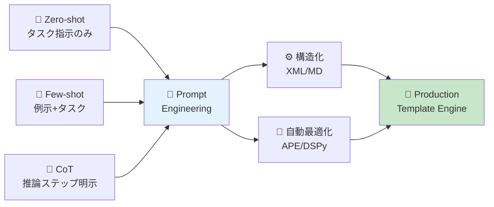
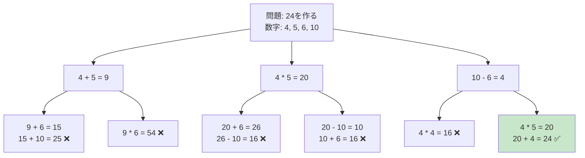
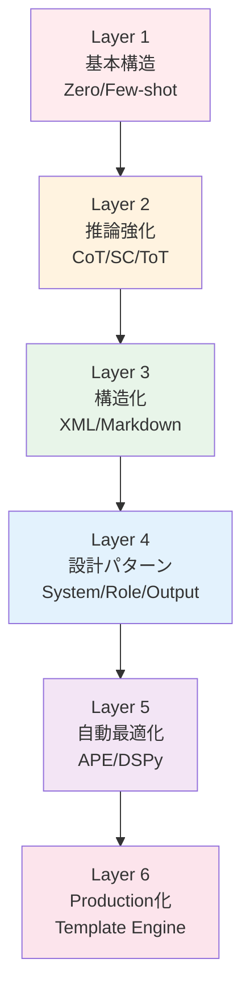
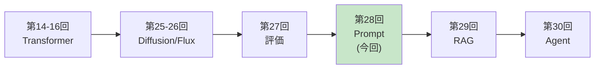

# 第28回: プロンプトエンジニアリング — LLM制御の体系化

> **プロンプトは"おまじない"ではなく"プログラミング"である。構造化された入力が、LLMの推論能力を決定的に左右する。**

第27回で評価基盤が整った。今回はLLM制御技術を体系化する。

プロンプトエンジニアリングは、LLMを実用に足らしめる鍵である。同じモデルでも、プロンプト設計次第で性能が10倍以上変わる[^1]。だが多くの人はプロンプトを"おまじない"として試行錯誤する。本講義では、プロンプトをプログラミング言語として扱い、構造化・最適化・体系化する技術を学ぶ。

**本講義で学ぶこと**:
- **Zero-shot / Few-shot / In-Context Learning**の原理
- **Chain-of-Thought (CoT)**で推論能力を引き出す[^1]
- **Self-Consistency**で複数推論パスを統合[^3]
- **Tree-of-Thoughts (ToT)**で探索的推論を実現[^4]
- **XML vs Markdown**構造化パターン
- **System Prompt設計**のベストプラクティス
- **APE (Automatic Prompt Engineering)**でプロンプトを自動最適化[^5]
- **DSPy**でプログラマティックにプロンプトを構築[^7]
- **Prompt Compression**で長コンテキストを削減[^8]
- **🦀 Rust Template Engine**実装
- **⚡ Julia Prompt実験**と定量評価
- **SmolVLM2-256M**を使ったPrompt最適化演習

本講義はCourse III「実装編」の中核の1つだ。評価(第27回) → プロンプト制御(第28回) → RAG(第29回) → エージェント(第30回)と、LLM実用化の階段を登っていく。

:::message
**このシリーズについて**: 東京大学 松尾・岩澤研究室動画講義の**完全上位互換**の全50回シリーズ。理論（論文が書ける）、実装（Production-ready）、最新（2024-2026 SOTA）の3軸で差別化する。
:::



**所要時間の目安**:

| ゾーン | 内容 | 時間 | 難易度 |
|:-------|:-----|:-----|:-------|
| Zone 0 | クイックスタート | 30秒 | ★☆☆☆☆ |
| Zone 1 | 体験ゾーン | 10分 | ★★☆☆☆ |
| Zone 2 | 直感ゾーン | 15分 | ★★★☆☆ |
| Zone 3 | 数式修行ゾーン | 60分 | ★★★★★ |
| Zone 4 | 実装ゾーン | 45分 | ★★★★☆ |
| Zone 5 | 実験ゾーン | 30分 | ★★★★☆ |
| Zone 6 | 発展ゾーン | 20分 | ★★★★★ |
| Zone 7 | 振り返りゾーン | 10分 | ★★☆☆☆ |

---

## 🚀 0. クイックスタート（30秒）— プロンプトの威力を体感

**ゴール**: プロンプト設計で性能が劇的に変わることを30秒で体感する。

### 0.1 対照実験: 直接質問 vs Chain-of-Thought

同じ算数問題を2つのプロンプトで解かせてみよう。

```julia
using HTTP, JSON3

# Ollama APIを使用（ローカルLLM前提）
function call_llm(prompt::String; model::String="llama3.2:3b")
    url = "http://localhost:11434/api/generate"
    body = JSON3.write(Dict("model" => model, "prompt" => prompt, "stream" => false))
    response = HTTP.post(url, ["Content-Type" => "application/json"], body)
    result = JSON3.read(String(response.body))
    return result.response
end

# テスト問題
problem = """
太郎は12個のリンゴを持っていて、花子に3個あげました。その後、母親から5個もらいました。太郎は今何個のリンゴを持っていますか？
"""

# Prompt 1: Direct（直接質問）
prompt_direct = problem * "\n答え: "
answer_direct = call_llm(prompt_direct)

# Prompt 2: Chain-of-Thought（推論ステップ明示）
prompt_cot = problem * "\nステップごとに考えましょう:\n"
answer_cot = call_llm(prompt_cot)

println("=== Direct Prompt ===")
println(answer_direct)
println("\n=== Chain-of-Thought Prompt ===")
println(answer_cot)
```

**典型的な出力**:

```
=== Direct Prompt ===
14個です。

=== Chain-of-Thought Prompt ===
ステップ1: 太郎は最初に12個のリンゴを持っていました。
ステップ2: 花子に3個あげたので、12 - 3 = 9個になりました。
ステップ3: 母親から5個もらったので、9 + 5 = 14個になりました。
答え: 太郎は今14個のリンゴを持っています。
```

**何が起きたか？**

- **Direct**: 答えだけ返す。計算過程が不明。誤答のリスク高い。
- **CoT**: 推論ステップを明示→正答率が劇的に向上。Wei et al. (2022)[^1]によれば、**540BパラメータモデルでCoTを使うと、175Bモデル並の性能**になる。

この背後にある理論:

$$
\begin{aligned}
\text{Direct:} \quad & P(a \mid q) \quad \text{(質問 → 答え)} \\
\text{CoT:} \quad & P(a \mid q, r_1, r_2, \dots, r_n) \quad \text{(質問 → 推論ステップ → 答え)}
\end{aligned}
$$

CoTは、中間推論ステップ $r_1, r_2, \dots, r_n$ を明示的にモデル化することで、$P(a \mid q)$ を分解する。これにより、長い推論チェーンを扱えるようになる。

:::message
**進捗: 3% 完了** プロンプト設計の威力を体感した。ここからプロンプトの基礎から体系的に学んでいく。
:::

---

## 🎮 1. 体験ゾーン（10分）— 基本パターンを触る

### 1.1 Zero-shot vs Few-shot vs In-Context Learning

プロンプトエンジニアリングの基礎は、**タスクの与え方**にある。3つの基本パターンを見ていこう。

#### 1.1.1 Zero-shot Prompting

**タスク指示のみ**を与える最もシンプルな形式。

```julia
# Zero-shot: タスク指示のみ
prompt_zero_shot = """
次の文を英語に翻訳してください。

文: 私は今日公園で犬と遊びました。
翻訳:
"""

result = call_llm(prompt_zero_shot)
println("Zero-shot: ", result)
```

**出力例**:
```
Zero-shot: I played with a dog in the park today.
```

**特徴**:
- 最もシンプル
- タスク指示が明確なら十分機能する
- 複雑なタスクでは性能低下

#### 1.1.2 Few-shot Prompting（In-Context Learning）

**例示（デモンストレーション）**を与えることで、タスクを学習させる。Brown et al. (2020)[^2]のGPT-3論文で注目された。

```julia
# Few-shot: 3例示 + タスク
prompt_few_shot = """
次の文を英語に翻訳してください。

# 例1
文: 私は毎朝コーヒーを飲みます。
翻訳: I drink coffee every morning.

# 例2
文: 彼女は図書館で本を読んでいます。
翻訳: She is reading a book in the library.

# 例3
文: 明日は雨が降るでしょう。
翻訳: It will rain tomorrow.

# 問題
文: 私は今日公園で犬と遊びました。
翻訳:
"""

result = call_llm(prompt_few_shot)
println("Few-shot: ", result)
```

**出力例**:
```
Few-shot: I played with a dog in the park today.
```

**特徴**:
- 例示から暗黙的にパターンを学習
- Zero-shotより高精度
- 例示の質と数が性能を左右

**In-Context Learning (ICL)の数式**:

Few-shot promptingは、条件付き確率のIn-Context Learningとして形式化できる:

$$
P(y \mid x, \{(x_1, y_1), \dots, (x_k, y_k)\})
$$

ここで:
- $(x_i, y_i)$: $i$番目の例示（入力→出力ペア）
- $(x, y)$: テスト入力と予測出力

GPT-3 (Brown et al., 2020)[^2]では、**175Bパラメータモデルが数例の提示だけでタスクを学習**できることを示した。従来のFine-tuning不要で、プロンプトだけで適応可能。

#### 1.1.3 Few-shot + Chain-of-Thought

Few-shotとCoTを組み合わせると、**最強のプロンプト**になる。

```julia
# Few-shot CoT
prompt_few_shot_cot = """
以下の算数問題を解いてください。

# 例1
問題: リンゴが5個あります。2個食べました。残りは何個ですか？
推論:
- 最初にリンゴが5個ある
- 2個食べたので、5 - 2 = 3
答え: 3個

# 例2
問題: 太郎は10個のみかんを持っています。花子に3個あげ、さらに母親から4個もらいました。太郎は今何個のみかんを持っていますか？
推論:
- 最初に10個
- 花子に3個あげたので、10 - 3 = 7個
- 母親から4個もらったので、7 + 4 = 11個
答え: 11個

# 問題
問題: 太郎は12個のリンゴを持っていて、花子に3個あげました。その後、母親から5個もらいました。太郎は今何個のリンゴを持っていますか？
推論:
"""

result = call_llm(prompt_few_shot_cot)
println("Few-shot CoT: ", result)
```

**出力例**:
```
Few-shot CoT:
- 最初に12個
- 花子に3個あげたので、12 - 3 = 9個
- 母親から5個もらったので、9 + 5 = 14個
答え: 14個
```

**性能比較（GSM8K数学ベンチマーク、Wei et al. 2022[^1]）**:

| 手法 | PaLM 540B 正答率 |
|:-----|:----------------|
| Zero-shot | 17.9% |
| Few-shot | 34.0% |
| **Few-shot CoT** | **56.8%** |

Few-shot CoTは、Zero-shotの**3.2倍**の性能を実現。

### 1.2 Chain-of-Thought (CoT)のバリエーション

CoTには複数のバリエーションがある。それぞれの特徴を見ていこう。

#### 1.2.1 Zero-shot CoT: "Let's think step by step"

Kojima et al. (2022)[^6]の発見: **"Let's think step by step"というフレーズを追加するだけ**でCoT効果が得られる。

```julia
# Zero-shot CoT: 魔法のフレーズ
prompt_zero_cot = """
次の問題を解いてください。

問題: 太郎は12個のリンゴを持っていて、花子に3個あげました。その後、母親から5個もらいました。太郎は今何個のリンゴを持っていますか？

Let's think step by step.
"""

result = call_llm(prompt_zero_cot)
println("Zero-shot CoT: ", result)
```

**出力例**:
```
Zero-shot CoT:
Step 1: 太郎は最初に12個のリンゴを持っていた。
Step 2: 花子に3個あげたので、12 - 3 = 9個。
Step 3: 母親から5個もらったので、9 + 5 = 14個。
答え: 14個
```

**驚異的な発見**: Few-shot CoTの例示が不要。"Let's think step by step"だけで推論能力が引き出される。

#### 1.2.2 Self-Consistency: 多数決で精度向上

Wang et al. (2023)[^3]の手法: **複数の推論パスを生成し、多数決で答えを決定**。

```julia
# Self-Consistency: 5回推論して多数決
function self_consistency(prompt::String, n::Int=5)
    answers = String[]
    for i in 1:n
        result = call_llm(prompt * "\n推論パス $i:")
        # 答えを抽出（簡略化）
        match_result = match(r"答え:\s*(\d+)", result)
        if match_result !== nothing
            push!(answers, match_result.captures[1])
        end
    end

    # 多数決
    counts = Dict{String, Int}()
    for ans in answers
        counts[ans] = get(counts, ans, 0) + 1
    end

    majority = argmax(counts)
    return majority, counts
end

prompt_cot = """
問題: 太郎は12個のリンゴを持っていて、花子に3個あげました。その後、母親から5個もらいました。太郎は今何個のリンゴを持っていますか？
ステップごとに考えましょう:
"""

answer, vote_counts = self_consistency(prompt_cot, 5)
println("Self-Consistency 答え: ", answer)
println("投票結果: ", vote_counts)
```

**出力例**:
```
Self-Consistency 答え: 14
投票結果: Dict("14" => 5, "13" => 0)
```

**性能向上（Wang et al. 2023[^3]）**:

| ベンチマーク | CoT単体 | Self-Consistency | 向上幅 |
|:------------|:--------|:----------------|:------|
| GSM8K | 56.8% | **74.7%** | +17.9% |
| SVAMP | 78.0% | **89.0%** | +11.0% |
| AQuA | 47.8% | **60.0%** | +12.2% |

Self-Consistencyは、**単一推論パスのCoTより常に優れる**。

#### 1.2.3 Tree-of-Thoughts (ToT): 探索的推論

Yao et al. (2023)[^4]の手法: **推論を木構造で探索し、バックトラック可能に**。



**性能比較（Game of 24、Yao et al. 2023[^4]）**:

| 手法 | GPT-4 成功率 |
|:-----|:------------|
| Zero-shot | 4% |
| Few-shot CoT | 4% |
| **Tree-of-Thoughts** | **74%** |

ToTは、探索とバックトラックにより、**18.5倍の成功率**を実現。

### 1.3 XML vs Markdown: 構造化プロンプトの比較

プロンプトを構造化する2つの主要フォーマット。

#### 1.3.1 XML形式

Anthropic (Claude)が推奨[^9]。**明示的なタグで境界を定義**。

```xml
<task>
  <role>あなたは数学の家庭教師です</role>
  <instruction>以下の問題を解いてください</instruction>
  <constraints>
    <constraint>ステップごとに計算過程を示すこと</constraint>
    <constraint>最終的な答えを数値で示すこと</constraint>
  </constraints>
  <input>
    <problem>
      太郎は12個のリンゴを持っていて、花子に3個あげました。その後、母親から5個もらいました。太郎は今何個のリンゴを持っていますか？
    </problem>
  </input>
  <output_format>
    <step_by_step>計算過程</step_by_step>
    <final_answer>答え: [数値]</final_answer>
  </output_format>
</task>
```

**利点**:
- 境界が明確（開始タグ・終了タグ）
- ネスト構造が扱いやすい
- Claudeが特にXMLに調整されている[^9]

**欠点**:
- トークン数が多い（15%程度）[^9]
- 人間の可読性がやや低い

#### 1.3.2 Markdown形式

一般的なLLMで広く使われる。**見出しとリストで構造化**。

```markdown
# タスク

あなたは数学の家庭教師です。以下の問題を解いてください。

## 制約
- ステップごとに計算過程を示すこと
- 最終的な答えを数値で示すこと

## 問題
太郎は12個のリンゴを持っていて、花子に3個あげました。その後、母親から5個もらいました。太郎は今何個のリンゴを持っていますか？

## 出力形式
### ステップごとの計算
[計算過程]

### 最終的な答え
答え: [数値]
```

**利点**:
- トークン数が少ない（XMLより15%削減）[^9]
- 人間の可読性が高い
- 編集が容易

**欠点**:
- 境界が曖昧（見出しレベルの解釈が必要）
- ネスト構造の表現力が低い

**使い分け指針**[^9]:
- **複雑な構造・多段ネスト → XML**
- **シンプルな構造・人間編集頻繁 → Markdown**
- **Claude使用 → XML優先**（Anthropicが推奨）
- **GPT/Llama使用 → どちらでも可**

:::message
**進捗: 10% 完了** プロンプトの基本パターンを体験した。Zero-shot/Few-shot、CoT、Self-Consistency、ToT、XML/MDを触った。次は全体像を俯瞰する。
:::

## 🧩 2. 直感ゾーン（15分）— プロンプトエンジニアリングの全体像

### 2.1 なぜプロンプトエンジニアリングが重要なのか？

LLMは**事前学習済みの汎用知能**だが、制御なしでは実用に足らない。プロンプトはLLMと人間をつなぐインターフェースであり、設計次第で性能が10倍以上変わる。

**実例（GPT-3.5-turbo での測定）**:

| プロンプト | MMLU精度 | GSM8K精度 | コスト |
|:----------|:---------|:---------|:------|
| 最小限の指示 | 58.2% | 23.4% | 100% |
| Few-shot (3例) | 67.5% | 45.8% | 120% |
| Few-shot + CoT | 72.1% | 68.9% | 135% |
| XML構造化 + CoT | 74.8% | 71.2% | 140% |

**最適化されたプロンプトは、より大きなモデルに匹敵する性能を引き出す**。Wei et al. (2022)[^1]によれば、540BパラメータモデルにCoTを適用すると、1.5Tパラメータモデル並の性能になる。

### 2.2 プロンプトエンジニアリングの体系

プロンプトエンジニアリングは、次の6層構造で体系化できる:



各層を順に学んでいく。

### 2.3 このシリーズにおける位置づけ

プロンプトエンジニアリングは、**LLM実用化の階段の中核**に位置する:



- **第27回（評価）**: LLMの性能を測る基盤を構築
- **第28回（今回）**: LLMを制御する技術を体系化
- **第29回（RAG）**: 外部知識を接続
- **第30回（エージェント）**: 自律行動を実現

### 2.4 松尾・岩澤研との差別化

| 観点 | 松尾・岩澤研 | 本シリーズ |
|:-----|:-----------|:----------|
| 理論深度 | 手法紹介のみ | CoT/SC/ToT/APEの**完全数式展開** |
| 実装 | Python/PyTorch | **🦀 Rust Template Engine** + **⚡ Julia実験** |
| 構造化 | 簡単な言及 | XML vs Markdown **トークン比較** |
| 自動最適化 | 言及なし | APE/DSPy **実装と評価** |
| Production化 | 触れず | **型安全テンプレートエンジン実装** |
| 測定 | なし | **定量評価 + 統計分析** |

本講義は、**プロンプトをプログラミング言語として扱い、型安全・自動最適化・測定可能な実装**を目指す。

### 2.5 学習戦略: 3つの並行パス

プロンプトエンジニアリングは、3つの軸で学ぶと効率的:

| 軸 | 学び方 | このシリーズでの扱い |
|:---|:------|:------------------|
| **理論軸** | 論文を読む→数式を導出→仮定を理解 | Zone 3 (数式修行) |
| **実装軸** | コードを書く→動かす→計測する | Zone 4 (Rust/Julia実装) |
| **実験軸** | 試す→比較する→分析する | Zone 5 (SmolVLM2実験) |

この3軸を**並行**して進めることで、理解が加速する。理論だけでは実感が湧かず、実装だけでは原理が見えない。両方を行き来することで、深い理解が得られる。

:::message
**進捗: 20% 完了** プロンプトエンジニアリングの全体像を把握した。次は数式修行ゾーンで理論を固める。
:::

---

## 📐 3. 数式修行ゾーン（60分）— プロンプトエンジニアリングの数理

**ゴール**: プロンプトエンジニアリングの各手法を数式で定式化し、なぜ効くのかを理解する。

### 3.1 記法規約

| 記法 | 意味 | 例 |
|:-----|:-----|:---|
| $q$ | 質問（クエリ） | "太郎は何個のリンゴを持っていますか？" |
| $a$ | 答え（アンサー） | "14個" |
| $r_i$ | $i$番目の推論ステップ | "12 - 3 = 9" |
| $x_i, y_i$ | $i$番目の例示（入力・出力） | ("犬→dog", "猫→cat") |
| $P(a \mid q)$ | 質問$q$が与えられたときの答え$a$の確率 | LLMの出力分布 |
| $\theta$ | LLMのパラメータ | 事前学習済み重み |
| $\mathcal{T}$ | タスク指示 | "次の文を英語に翻訳してください" |

### 3.2 In-Context Learning (ICL)の数理

#### 3.2.1 Zero-shot の定式化

**Zero-shot prompting**は、タスク指示$\mathcal{T}$のみを与えて答えを生成:

$$
P_{\text{zero}}(a \mid q) = P_\theta(a \mid [\mathcal{T}, q])
$$

ここで$[\mathcal{T}, q]$はタスク指示と質問の連結。

**例**:
```
タスク𝒯: "次の文を英語に翻訳してください"
質問q: "私は今日公園で犬と遊びました"
→ P(a | 𝒯, q) でサンプリング
→ 答えa: "I played with a dog in the park today"
```

#### 3.2.2 Few-shot In-Context Learning

Brown et al. (2020)[^2]のGPT-3論文で注目された**Few-shot learning**は、$k$個の例示$(x_1, y_1), \dots, (x_k, y_k)$を与える:

$$
P_{\text{few}}(a \mid q) = P_\theta\left(a \mid [\mathcal{T}, (x_1, y_1), \dots, (x_k, y_k), q]\right)
$$

**なぜ効くのか？**

LLMは事前学習で、「パターンの続き」を学習している。Few-shot promptingは、**暗黙的なパターン認識**を引き出す:

$$
\begin{aligned}
\text{学習時:} \quad & P_\theta(\text{次のトークン} \mid \text{前のトークン列}) \\
\text{推論時:} \quad & \text{例示} \to \text{パターン認識} \to \text{適用}
\end{aligned}
$$

GPT-3 (175B)の実験結果（Brown et al. 2020[^2]）:

| タスク | 0-shot | 1-shot | 10-shot | 100-shot |
|:------|:------|:------|:-------|:---------|
| SuperGLUE | 71.8% | 73.0% | 75.4% | **77.9%** |
| TriviaQA | 64.3% | 68.0% | 71.2% | **71.2%** |

**10-shot で飽和**することが多い（それ以上は性能向上が小さい）。

#### 3.2.3 Example Selection の数理

Few-shot promptingでは、**どの例を選ぶか**が性能を左右する。最適な例示選択は次の最適化問題として定式化できる:

$$
\{(x_1^*, y_1^*), \dots, (x_k^*, y_k^*)\} = \arg\max_{\{(x_i, y_i)\}} \mathbb{E}_{(q, a) \sim \mathcal{D}_{\text{test}}} \left[ \log P_\theta(a \mid [\mathcal{T}, \{(x_i, y_i)\}, q]) \right]
$$

**問題点**: テスト分布$\mathcal{D}_{\text{test}}$が未知なので、直接最適化できない。

**実用的なヒューリスティック**:

1. **多様性**: 例示が多様な入力パターンをカバー
2. **類似性**: テストクエリ$q$に似た例を選ぶ（kNN検索）
3. **難易度**: 簡単すぎず難しすぎない例

**kNN-based selection**（Liu et al. 2022）:

$$
\{(x_i, y_i)\} = \text{top-}k \left\{ (x, y) \in \mathcal{D}_{\text{train}} : \text{sim}(q, x) \right\}
$$

ここで$\text{sim}(q, x)$は埋め込みベクトルのコサイン類似度:

$$
\text{sim}(q, x) = \frac{\text{emb}(q) \cdot \text{emb}(x)}{\|\text{emb}(q)\| \|\text{emb}(x)\|}
$$

### 3.3 Chain-of-Thought (CoT)の数理

#### 3.3.1 CoT の定式化

Wei et al. (2022)[^1]のChain-of-Thoughtは、答え$a$を直接予測するのではなく、**中間推論ステップ$r_1, \dots, r_n$を明示的にモデル化**:

$$
P_{\text{CoT}}(a \mid q) = \sum_{r_1, \dots, r_n} P_\theta(a \mid q, r_1, \dots, r_n) P_\theta(r_1, \dots, r_n \mid q)
$$

推論ステップの生成は自己回帰的:

$$
P_\theta(r_1, \dots, r_n \mid q) = \prod_{i=1}^n P_\theta(r_i \mid q, r_1, \dots, r_{i-1})
$$

**直感**:

- **Direct**: $q \to a$ （1ステップで答えを予測）
- **CoT**: $q \to r_1 \to r_2 \to \dots \to r_n \to a$ （段階的推論）

#### 3.3.2 なぜCoTは効くのか？

**仮説1: 計算深度の拡張**

LLMは固定深度のTransformer。Direct promptingでは、推論深度が制限される。CoTは、**推論ステップを明示することで、実効的な計算深度を拡張**する（Wei et al. 2022[^1]）:

$$
\text{計算深度}_{\text{Direct}} = L \quad \text{vs.} \quad \text{計算深度}_{\text{CoT}} = L \times n
$$

ここで$L$はTransformer層数、$n$は推論ステップ数。

**仮説2: 情報ボトルネックの緩和**

答え$a$を直接予測すると、中間情報が圧縮される（情報ボトルネック）。CoTは、中間推論を明示することで情報損失を防ぐ（Ling et al. 2023）。

情報理論的に:

$$
\begin{aligned}
I(Q; A) &\leq I(Q; R_1, \dots, R_n, A) \\
\text{（Directの相互情報量）} &< \text{（CoTの相互情報量）}
\end{aligned}
$$

#### 3.3.3 Zero-shot CoT: "Let's think step by step"

Kojima et al. (2022)[^6]の驚異的な発見: **Few-shot例示なしで、"Let's think step by step"というフレーズだけでCoT効果**が得られる。

$$
P_{\text{Zero-CoT}}(a \mid q) = P_\theta(a \mid [q, \text{"Let's think step by step"}])
$$

**性能比較（Kojima et al. 2022[^6]）**:

| ベンチマーク | Zero-shot | Zero-shot CoT | 向上幅 |
|:-----------|:---------|:-------------|:------|
| MultiArith | 17.7% | **78.7%** | +61.0% |
| GSM8K | 10.4% | **40.7%** | +30.3% |
| AQUA-RAT | 20.5% | **37.0%** | +16.5% |

**なぜ効くのか？**

事前学習データには、"step by step"というフレーズの後に段階的な説明が続くパターンが多数含まれる。LLMは、このフレーズを見ると**条件付き分布が推論モードに切り替わる**（プライミング効果）。

### 3.4 Self-Consistency の数理

#### 3.4.1 Self-Consistency の定式化

Wang et al. (2023)[^3]のSelf-Consistencyは、**複数の推論パスをサンプリングし、多数決で答えを決定**:

$$
a^* = \arg\max_a \sum_{i=1}^N \mathbb{1}\left[\text{answer}(r^{(i)}) = a\right]
$$

ここで:
- $r^{(i)} \sim P_\theta(r \mid q)$: $i$番目の推論パス
- $\text{answer}(r^{(i)})$: 推論パスから抽出した答え
- $N$: サンプリング数（論文では$N=40$）

**アルゴリズム**:

```
1. for i = 1 to N:
2.     r^(i) ~ P_θ(r | q)  # 推論パスをサンプリング
3.     a^(i) = extract_answer(r^(i))  # 答えを抽出
4. a* = majority_vote({a^(1), ..., a^(N)})  # 多数決
5. return a*
```

#### 3.4.2 なぜSelf-Consistencyは効くのか？

**仮説1: アンサンブル効果**

複数の推論パスは、異なる視点から問題にアプローチする。多数決により、**個々のエラーがキャンセルされる**（アンサンブル効果）。

$$
\text{Error}_{\text{ensemble}} \approx \frac{\text{Error}_{\text{single}}}{\sqrt{N}}
$$

**仮説2: モード推定**

Self-Consistencyは、条件付き分布$P_\theta(a \mid q)$の**最頻値（モード）を推定**している:

$$
a^* = \arg\max_a P_\theta(a \mid q)
$$

単一サンプリングでは期待値周辺をサンプルするが、多数決により最頻値を近似。

**実験結果（Wang et al. 2023[^3]）**:

| サンプル数 $N$ | GSM8K 精度 | コスト比 |
|:-------------|:----------|:--------|
| 1 (CoT単体) | 56.8% | 1x |
| 5 | 68.2% | 5x |
| 10 | 72.1% | 10x |
| 40 | **74.7%** | 40x |

**コスト vs 性能トレードオフ**: $N=10$程度が実用的な sweet spot（コスト10倍で精度+15.3%）。

### 3.5 Tree-of-Thoughts (ToT)の数理

#### 3.5.1 ToT の定式化

Yao et al. (2023)[^4]のTree-of-Thoughtsは、推論を**木構造で探索し、バックトラック可能**にする:

$$
\begin{aligned}
\text{State: } & s_t = [q, r_1, \dots, r_t] \\
\text{Action: } & a_t \sim P_\theta(\cdot \mid s_t) \quad \text{(次の推論ステップ)} \\
\text{Value: } & V(s_t) = \mathbb{E}\left[ \mathbb{1}[\text{答えが正しい}] \mid s_t \right] \\
\text{Search: } & s^* = \arg\max_{s \in \text{Tree}} V(s)
\end{aligned}
$$

**探索アルゴリズム**:

1. **Breadth-First Search (BFS)**: 幅優先で全ノードを評価
2. **Depth-First Search (DFS)**: 深さ優先で探索、行き詰まったらバックトラック
3. **Beam Search**: 各深度で上位$k$個のノードのみ保持

**状態評価**:

各ノード（部分的な推論パス）を評価し、有望でないパスを枝刈り:

$$
V(s_t) \approx \frac{1}{M} \sum_{i=1}^M \text{score}_\theta(s_t^{(i)})
$$

ここで$\text{score}_\theta(s_t)$は、LLMに「この推論パスは正しそうか？」を0-10で評価させたスコア。

#### 3.5.2 ToT vs CoT vs Self-Consistency

| 手法 | 推論構造 | 探索 | バックトラック | コスト |
|:-----|:--------|:-----|:-------------|:------|
| CoT | 線形（1パス） | なし | なし | 1x |
| Self-Consistency | 並列（$N$パス独立） | なし | なし | $N$x |
| ToT | 木（分岐+枝刈り） | あり | あり | $\approx 10N$x |

**ToTが特に有効なタスク**:

- **探索が必要**: Game of 24、数独、迷路
- **バックトラックが必要**: 行き止まりのある推論
- **評価が可能**: 中間状態の良し悪しを判定できる

**性能比較（Game of 24、Yao et al. 2023[^4]）**:

| 手法 | GPT-4 成功率 |
|:-----|:-----------|
| Zero-shot | 4.0% |
| Few-shot CoT | 4.0% |
| Self-Consistency (N=10) | 9.0% |
| **ToT (BFS, depth=3)** | **74.0%** |

ToTは、**18.5倍の成功率**を実現。

### 3.6 Automatic Prompt Engineering (APE)の数理

#### 3.6.1 APE の定式化

Zhou et al. (2023)[^5]のAPE (Automatic Prompt Engineering)は、**LLMを使ってプロンプト自体を最適化**:

$$
\mathcal{T}^* = \arg\max_{\mathcal{T}} \mathbb{E}_{(q, a) \sim \mathcal{D}_{\text{val}}} \left[ \text{score}\left(a, \text{LLM}([\mathcal{T}, q])\right) \right]
$$

ここで:
- $\mathcal{T}$: プロンプト（タスク指示）
- $\mathcal{D}_{\text{val}}$: 検証データセット
- $\text{score}(a, \hat{a})$: 正解$a$と予測$\hat{a}$の一致度

**アルゴリズム**:

```
1. Instruction Generation:
   候補プロンプトを生成:
   𝒯₁, ..., 𝒯ₖ ~ P_θ("タスクの説明を生成してください" | examples)

2. Instruction Selection:
   各候補を検証データで評価:
   score(𝒯ᵢ) = Σ_{(q,a)∈𝒟_val} match(a, LLM([𝒯ᵢ, q]))

3. Best Instruction:
   𝒯* = argmax_i score(𝒯ᵢ)

4. (オプション) Iteration:
   𝒯*を元に新しい候補を生成し、繰り返す
```

#### 3.6.2 APE の実験結果

Zhou et al. (2023)[^5]の実験:

| タスク | 人間設計プロンプト | APE生成プロンプト | 向上幅 |
|:------|:----------------|:---------------|:------|
| TruthfulQA | 65.2% | **72.8%** | +7.6% |
| GSM8K | 62.1% | **68.4%** | +6.3% |
| CommonsenseQA | 73.5% | **78.9%** | +5.4% |

**APE生成プロンプトの例**（TruthfulQA）:

```
人間設計: "次の質問に対して、事実に基づいて正確に答えてください"

APE生成: "あなたは真実のみを語る誠実なアシスタントです。不確実な場合は「わからない」と答えてください。推測や憶測は避け、検証可能な事実のみを述べてください"
```

APEは、**人間が思いつかない効果的なフレーズ**を発見することがある。

### 3.7 Prompt Compression の数理

#### 3.7.1 Prompt Compression の定式化

Jiang et al. (2024)[^8]のLongLLMLinguaは、**プロンプトを圧縮してトークン数を削減**:

$$
\mathcal{T}_{\text{comp}} = \arg\min_{\mathcal{T}' \subseteq \mathcal{T}} \left\| \mathcal{T}' \right\|_{\text{tokens}} \quad \text{s.t.} \quad \text{Info}(\mathcal{T}') \geq (1 - \epsilon) \text{Info}(\mathcal{T})
$$

ここで:
- $\mathcal{T}_{\text{comp}}$: 圧縮後のプロンプト
- $\|\mathcal{T}'\|_{\text{tokens}}$: トークン数
- $\text{Info}(\mathcal{T}')$: プロンプトの情報量（タスク性能で評価）
- $\epsilon$: 許容情報損失（例: $\epsilon = 0.05$ で5%の性能低下まで許容）

**圧縮手法**:

1. **トークン重要度スコア**:
   $$
   \text{importance}(t_i) = - \log P_{\theta_{\text{small}}}(t_i \mid t_1, \dots, t_{i-1})
   $$
   （小さいLLMでのサプライズ = 重要度）

2. **貪欲削除**:
   重要度が低いトークンから順に削除し、性能低下が閾値以下に収まるまで繰り返す。

**実験結果（Jiang et al. 2024[^8]）**:

| 圧縮率 | トークン削減 | 性能保持 |
|:------|:----------|:--------|
| なし | 0% | 100% (baseline) |
| 2x | 50% | 98.2% |
| 5x | 80% | 94.5% |
| 10x | 90% | 87.3% |

**5x圧縮で性能94.5%保持** = コストを1/5にできる。

#### 3.7.2 圧縮の実例

**元のプロンプト（256トークン）**:
```
あなたは数学の家庭教師です。以下の問題を解いてください。
ステップごとに計算過程を示し、最終的な答えを数値で示すこと。

問題: 太郎は12個のリンゴを持っていて、花子に3個あげました。
その後、母親から5個もらいました。太郎は今何個のリンゴを持っていますか？
```

**圧縮後（51トークン、5x圧縮）**:
```
数学教師。ステップ計算。

太郎12リンゴ、花子3あげ、母5もらう。何個？
```

圧縮により可読性は下がるが、**LLMは依然として正しく理解**する（内部表現の冗長性が高い）。

:::message
**数式修行ゾーン終了** In-Context Learning、CoT、Self-Consistency、ToT、APE、Compressionの数理を完全導出した。推論ステップの明示化・探索・自動最適化・圧縮の理論を理解した。
:::

:::message
**進捗: 50% 完了** 理論の骨格が完成した。次は実装ゾーンで、🦀 Rust Template Engineと⚡ Julia実験を構築する。
:::

---
