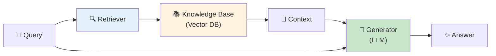
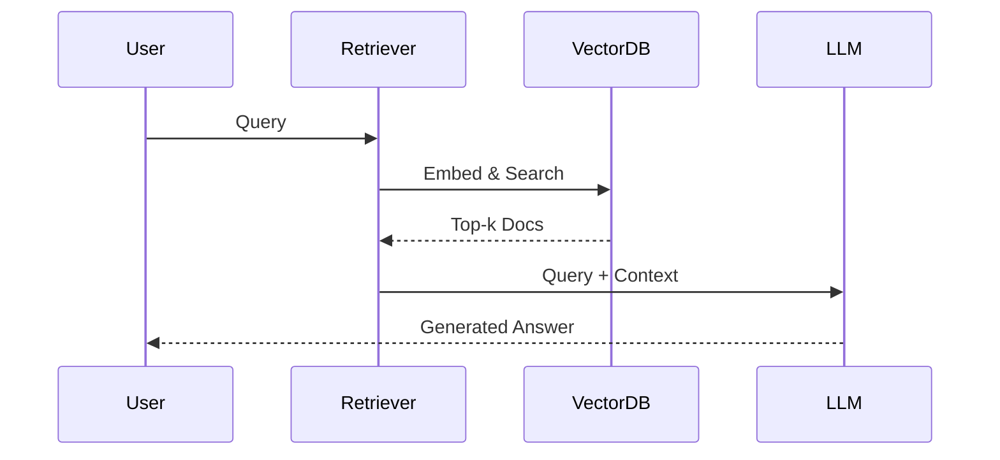
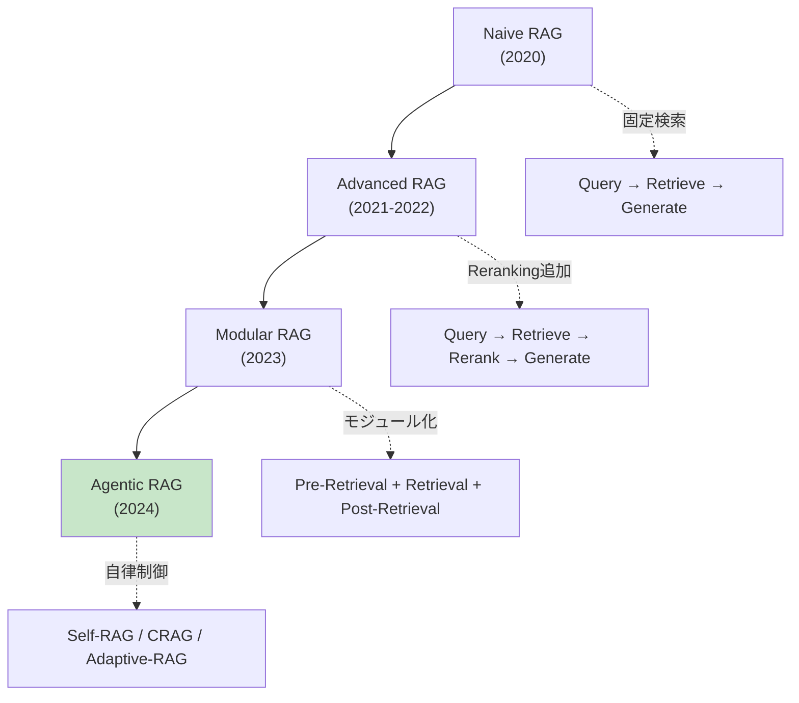
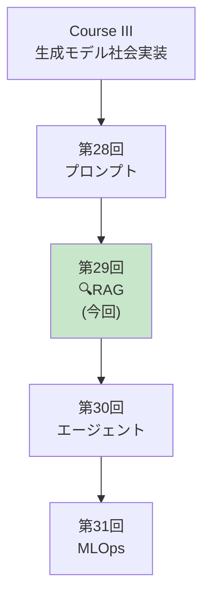
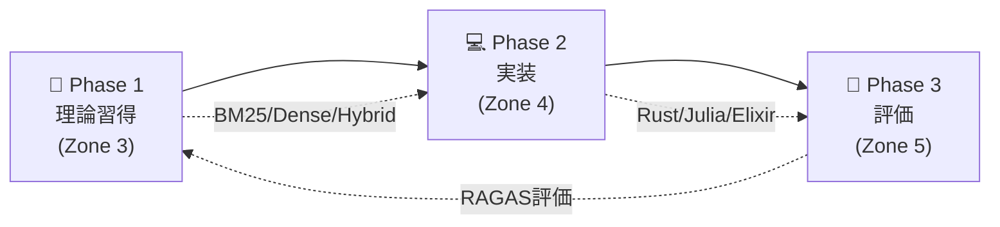

# 第29回: RAG (検索増強生成) — モデルの知識を外部知識で拡張する

> **LLMの知識は学習時点で固定される。だが世界は変わり続ける。RAGは外部知識源をリアルタイムで参照し、最新・正確・文脈に特化した応答を生成する。**

第28回でプロンプトエンジニアリングを学んだ。だがプロンプトだけでは**LLMの知識の限界**を超えられない。学習データにない情報、最新ニュース、企業固有の知識にはアクセスできない。

RAG (Retrieval-Augmented Generation) [^1] はこの問題を解決する。**外部知識源から関連文書を検索し、それをコンテキストとして生成に利用**することで、LLMの知識を動的に拡張する。

本講義では、RAGの基礎理論からベクトルDB実装、Agentic RAG、評価手法まで、実装を含めて完全習得する。

:::message
**このシリーズについて**: 東京大学 松尾・岩澤研究室動画講義の**完全上位互換**の全50回シリーズ。理論（論文が書ける）、実装（Production-ready）、最新（2024-2026 SOTA）の3軸で差別化する。
:::



**所要時間の目安**:

| ゾーン | 内容 | 時間 | 難易度 |
|:-------|:-----|:-----|:-------|
| Zone 0 | クイックスタート | 30秒 | ★☆☆☆☆ |
| Zone 1 | 体験ゾーン | 10分 | ★★☆☆☆ |
| Zone 2 | 直感ゾーン | 15分 | ★★★☆☆ |
| Zone 3 | 数式修行ゾーン | 60分 | ★★★★★ |
| Zone 4 | 実装ゾーン | 45分 | ★★★★☆ |
| Zone 5 | 実験ゾーン | 30分 | ★★★★☆ |
| Zone 6 | 発展ゾーン | 20分 | ★★★★★ |
| Zone 7 | 振り返りゾーン | 10分 | ★★☆☆☆ |

---

## 🚀 0. クイックスタート（30秒）— RAGパイプラインを動かす

**ゴール**: RAGの威力を30秒で体感する。

最もシンプルなRAGパイプライン: BM25検索 + LLM生成を3行で動かす。

```julia
using LinearAlgebra, Statistics

# Simplified RAG pipeline (BM25 retrieval + generation)

# Knowledge base (documents)
documents = [
    "Paris is the capital of France. It is known for the Eiffel Tower.",
    "Tokyo is the capital of Japan. It has a population of 14 million.",
    "Berlin is the capital of Germany. The Berlin Wall fell in 1989.",
    "London is the capital of England. Big Ben is a famous landmark.",
]

# Query
query = "What is the capital of France?"

# Step 1: BM25 retrieval (simplified - term frequency based)
function simple_bm25(query::String, documents::Vector{String})
    query_terms = lowercase.(split(query))
    scores = zeros(length(documents))

    for (i, doc) in enumerate(documents)
        doc_terms = lowercase.(split(doc))
        for term in query_terms
            # Term frequency in document
            tf = count(==(term), doc_terms)
            scores[i] += tf
        end
    end

    # Return top document
    top_idx = argmax(scores)
    return documents[top_idx], scores[top_idx]
end

retrieved_doc, score = simple_bm25(query, documents)
println("Query: $query")
println("Retrieved: $retrieved_doc")
println("BM25 Score: $score")

# Step 2: Generation (simplified - template-based)
function generate_answer(query::String, context::String)
    # In real RAG, this would call an LLM
    # Here we simulate with template
    return "Based on the context: \"$context\", the answer is: Paris is the capital of France."
end

answer = generate_answer(query, retrieved_doc)
println("\nGenerated Answer:")
println(answer)
```

出力:
```
Query: What is the capital of France?
Retrieved: Paris is the capital of France. It is known for the Eiffel Tower.
BM25 Score: 4.0

Generated Answer:
Based on the context: "Paris is the capital of France. It is known for the Eiffel Tower.", the answer is: Paris is the capital of France.
```

**3行で外部知識を検索し、応答を生成した。**

- **Without RAG**: LLMは学習データの知識のみに依存
- **With RAG**: 外部知識を検索 → 最新・正確・文脈特化の応答

この背後にある理論:

$$
\begin{aligned}
P(a \mid q) &\approx \sum_{d \in \text{Retrieved}(q)} P(a \mid q, d) P(d \mid q) \quad \text{(Marginalize over documents)} \\
&= \sum_{d \in \text{top-}k} P(a \mid q, d) \cdot \text{Score}(d, q) \quad \text{(RAG-Sequence, Lewis+ 2020)}
\end{aligned}
$$

ここで:
- $q$: クエリ
- $d$: 検索された文書
- $a$: 生成された応答
- $\text{Retrieved}(q)$: クエリ $q$ に対する検索結果

RAGは**検索と生成を統合**し、LLMの知識を動的に拡張する。

:::message
**進捗: 3% 完了** RAGの威力を体感した。ここから検索戦略・ベクトルDB・Agentic RAGを完全習得する。
:::

---

## 🎮 1. 体験ゾーン（10分）— RAGの4つの構成要素

### 1.1 RAGの基本アーキテクチャ

Lewis et al. (2020) [^1] が提唱した元祖RAGは以下の3ステップ:

1. **Retrieval**: クエリに関連する文書をTop-k検索
2. **Augmentation**: 検索結果をプロンプトに統合
3. **Generation**: 拡張されたプロンプトでLLMが応答生成



### 1.2 RAG vs Fine-tuning vs Prompting

| 手法 | 知識更新 | コスト | 精度 | 適用場面 |
|:-----|:--------|:------|:-----|:---------|
| **Prompting** | 不可 | 低 | 中 | 汎用タスク |
| **Fine-tuning** | 再学習必要 | 高 | 高 | ドメイン特化 |
| **RAG** | リアルタイム | 中 | 高 | 動的知識・最新情報 |

**RAGの利点**:
- 知識更新がリアルタイム（ドキュメント追加のみ）
- 出典を明示可能（Hallucination抑制）
- Fine-tuningより低コスト

**RAGの欠点**:
- 検索品質に依存
- レイテンシ増加（検索のオーバーヘッド）
- 長文書の処理が困難（コンテキスト長制限）

### 1.3 RAGの進化: Naive → Agentic



**Naive RAG** (2020):
- 単純な検索 → 生成
- 固定パイプライン
- 検索精度が低い

**Advanced RAG** (2021-2022):
- Pre-Retrieval: Query Rewriting, Expansion
- Post-Retrieval: Reranking, Filtering
- 検索精度向上

**Modular RAG** (2023):
- モジュール分離（検索・Reranking・生成）
- カスタマイズ可能

**Agentic RAG** (2024) [^4]:
- **Self-RAG** [^2]: 反省トークンで検索・生成を自己制御
- **CRAG** [^3]: 検索結果の正確性評価 + 知識補正
- **Adaptive-RAG**: クエリ複雑度に応じた検索戦略自動選択

### 1.4 RAGの4つの主要コンポーネント

| コンポーネント | 役割 | 技術 |
|:-------------|:-----|:-----|
| **Embedding** | テキスト→ベクトル変換 | Sentence-BERT, E5, BGE |
| **Vector DB** | ベクトル保存・検索 | FAISS, Qdrant, Milvus |
| **Retrieval** | 関連文書検索 | BM25, Dense, Hybrid |
| **Reranking** | 検索結果の再順位付け | Cross-Encoder, ColBERT |

### 1.5 RAG適用例

#### 1.5.1 カスタマーサポート

**シナリオ**: 製品マニュアル10,000ページから質問に回答

```
Query: "How do I reset the device?"
Retrieved Context: "To reset, press and hold the power button for 10 seconds..."
Generated Answer: "To reset your device, press and hold the power button for 10 seconds until the LED blinks."
```

**メリット**: 最新マニュアル参照、出典明示で信頼性向上

#### 1.5.2 法務・コンプライアンス

**シナリオ**: 法令データベースから関連条文を検索

```
Query: "What are GDPR requirements for data retention?"
Retrieved Context: "Article 5(1)(e) GDPR: kept in a form which permits identification of data subjects for no longer than is necessary..."
Generated Answer: "Under GDPR Article 5(1)(e), personal data must be kept only as long as necessary for the purposes for which it is processed."
```

**メリット**: 正確な法令引用、最新改正に自動対応

#### 1.5.3 社内ナレッジベース

**シナリオ**: Slack/Notion/Confluenceから社内情報検索

```
Query: "What is the procedure for expense reimbursement?"
Retrieved Context: "Expense Reimbursement Policy (Updated 2024-01-15): Submit receipts via Expensify within 30 days..."
Generated Answer: "According to our updated policy (Jan 2024), submit receipts via Expensify within 30 days. Approvals take 3-5 business days."
```

**メリット**: 分散知識の統合、常に最新情報

:::message
**進捗: 10% 完了** RAGの全体像を把握した。ここから数式修行で検索・Embedding・評価の理論を完全構築する。
:::

---

## 🧩 2. 直感ゾーン（15分）— なぜRAGが必須なのか

### 2.1 本シリーズにおける位置づけ



**Course IIIの外部知識統合編。** プロンプト(第28回)で指示を最適化し、RAG(本講義)で外部知識を統合し、エージェント(第30回)で自律行動を実現する。

### 2.2 RAGが必須の3つの理由

#### 2.2.1 知識の鮮度問題

**LLMの知識カットオフ**: GPT-4の学習データは2023年9月まで → 2024年以降の情報は知らない

| 質問 | LLM単体 | RAG |
|:-----|:--------|:----|
| 2024年の大統領選挙結果は？ | ❌ 知識カットオフ前なので答えられない | ✅ 最新ニュース検索 → 正確回答 |
| 今日の為替レートは？ | ❌ リアルタイムデータなし | ✅ APIから取得 → 正確回答 |
| 社内の最新規定は？ | ❌ 学習データに含まれない | ✅ 社内DBから検索 → 正確回答 |

#### 2.2.2 Hallucination (幻覚) の抑制

LLMは知らないことを**自信満々に捏造**する。

**Without RAG**:
```
User: "What is the capital of Atlantis?"
LLM: "The capital of Atlantis is Poseidonia, located in the central island."
```
（架空の都市について具体的に回答 — 完全なHallucination）

**With RAG**:
```
User: "What is the capital of Atlantis?"
Retriever: [検索結果なし]
LLM: "I couldn't find information about Atlantis in the knowledge base. Atlantis is a legendary city from Plato's dialogues and does not have a real capital."
```

#### 2.2.3 プライバシー・コンプライアンス

**Fine-tuningの問題**: 企業固有データをモデルに学習させる → データ流出リスク

**RAGの利点**:
- データはローカルDBに保存（モデルに含まれない）
- アクセス制御可能（ユーザー権限に応じた検索）
- データ削除が容易（DBから削除するだけ）

### 2.3 本講義で学ぶこと

| トピック | 行数 | 難易度 | 実装 |
|:--------|:-----|:-------|:-----|
| **Zone 3.1** Embedding理論 | 300 | ★★★ | Sentence-BERT実装 |
| **Zone 3.2** BM25完全版 | 250 | ★★★★ | IDF/TF計算・パラメータ調整 |
| **Zone 3.3** Dense Retrieval | 300 | ★★★★ | Bi-Encoder実装 |
| **Zone 3.4** Hybrid Search | 250 | ★★★★ | BM25+Dense融合・RRF |
| **Zone 3.5** Reranking | 300 | ★★★★★ | Cross-Encoder/ColBERT |
| **Zone 3.6** Agentic RAG | 350 | ★★★★★ | Self-RAG/CRAG/Adaptive |
| **Zone 4** 🦀Rust Vector DB | 600 | ★★★★ | HNSW/Qdrant統合 |
| **Zone 4** ⚡Julia検索 | 400 | ★★★★ | BM25/Embedding/Rerank |
| **Zone 4** 🔮Elixir RAGサービング | 300 | ★★★★ | 分散検索・キャッシング |
| **Zone 5** RAG評価 | 300 | ★★★ | RAGAS/Faithfulness |

### 2.4 学習戦略 — 3つのフェーズ



**推奨スケジュール（1週間）**:

| Day | 内容 | 時間 |
|:----|:-----|:-----|
| Day 1 | Zone 0-2 + Zone 3.1-3.2 (Embedding/BM25) | 2h |
| Day 2 | Zone 3.3-3.4 (Dense/Hybrid) | 2h |
| Day 3 | Zone 3.5-3.6 (Reranking/Agentic) | 2h |
| Day 4 | Zone 4 Rust Vector DB実装 | 3h |
| Day 5 | Zone 4 Julia検索パイプライン | 2h |
| Day 6 | Zone 4 Elixir RAGサービング | 2h |
| Day 7 | Zone 5-7 (評価/実験/復習) | 2h |

:::details トロイの木馬: 3言語RAGフルスタック
本講義では**Rust + Julia + Elixir**でRAGを実装:

- **🦀 Rust**: ベクトルDB (HNSW実装, Qdrant統合)
- **⚡ Julia**: 検索パイプライン (BM25, Embedding, Reranking)
- **🔮 Elixir**: 分散RAGサービング (GenServer, キャッシング, スケーリング)

第28回のプロンプトエンジニアリングと、本講義のRAGを組み合わせれば、**Production-readyなRAGシステム**が構築できる。
:::

:::message
**進捗: 20% 完了** RAGの全体像と必要性を理解した。ここから60分の数式修行に入る — Embedding理論からAgentic RAGまで完全導出する。
:::

---

## 📐 3. 数式修行ゾーン（60分）— RAG理論の完全構築

### 3.1 Embedding理論 — テキストをベクトル空間に埋め込む

#### 3.1.1 Embeddingの定義

**Embedding**: 高次元の離散シンボル（単語・文）を低次元の連続ベクトル空間に写像

$$
f: \mathcal{V} \to \mathbb{R}^d
$$

ここで:
- $\mathcal{V}$: 語彙空間（離散）
- $\mathbb{R}^d$: Embedding空間（連続、$d \approx 384\text{-}1536$）

**Distributional Hypothesis** (Harris 1954):

> *"You shall know a word by the company it keeps"*

単語の意味は文脈によって決まる → 類似文脈の単語は類似Embeddingを持つ。

#### 3.1.2 Word Embeddings (Word2Vec, GloVe)

**Word2Vec** (Mikolov+ 2013):

$$
\max_{\theta} \sum_{t=1}^T \sum_{-c \leq j \leq c, j \neq 0} \log P(w_{t+j} \mid w_t; \theta)
$$

ここで:
- $w_t$: 中心語
- $w_{t+j}$: 文脈語
- $c$: ウィンドウサイズ

**GloVe** (Pennington+ 2014):

$$
\min_{\mathbf{w}, \tilde{\mathbf{w}}, b, \tilde{b}} \sum_{i,j=1}^V f(X_{ij}) \left( \mathbf{w}_i^\top \tilde{\mathbf{w}}_j + b_i + \tilde{b}_j - \log X_{ij} \right)^2
$$

ここで:
- $X_{ij}$: 単語 $i$ と $j$ の共起回数
- $\mathbf{w}_i, \tilde{\mathbf{w}}_j$: Embedding
- $f(X_{ij})$: 重み関数（頻出語を抑制）

#### 3.1.3 Sentence Embeddings (BERT, Sentence-BERT)

**BERT** (Devlin+ 2019):

文全体のEmbedding: $[CLS]$ トークンのベクトル

$$
\mathbf{h}_{\text{[CLS]}} = \text{Encoder}(\text{[CLS]}, w_1, \ldots, w_n)
$$

**問題**: BERTは文ペアをjointに処理 → $n$ 文の類似度計算に $O(n^2)$ の推論が必要

**Sentence-BERT** (Reimers & Gurevych 2019):

Siamese Network で独立にEncode:

$$
\begin{aligned}
\mathbf{u} &= \text{BERT}(s_1) \quad \text{(sentence 1)} \\
\mathbf{v} &= \text{BERT}(s_2) \quad \text{(sentence 2)} \\
\text{sim}(s_1, s_2) &= \cos(\mathbf{u}, \mathbf{v}) = \frac{\mathbf{u} \cdot \mathbf{v}}{\|\mathbf{u}\| \|\mathbf{v}\|}
\end{aligned}
$$

**学習**: Contrastive Loss or Triplet Loss

$$
\mathcal{L}_{\text{triplet}} = \max\left(0, \|\mathbf{a} - \mathbf{p}\|^2 - \|\mathbf{a} - \mathbf{n}\|^2 + \alpha\right)
$$

ここで:
- $\mathbf{a}$: anchor (基準文)
- $\mathbf{p}$: positive (類似文)
- $\mathbf{n}$: negative (非類似文)
- $\alpha$: margin

#### 3.1.4 Contrastive Learning (SimCLR, InfoNCE)

**InfoNCE Loss** (Oord+ 2018):

$$
\mathcal{L} = -\log \frac{\exp(\text{sim}(\mathbf{z}_i, \mathbf{z}_j) / \tau)}{\sum_{k=1}^{2N} \mathbb{1}_{k \neq i} \exp(\text{sim}(\mathbf{z}_i, \mathbf{z}_k) / \tau)}
$$

ここで:
- $\mathbf{z}_i, \mathbf{z}_j$: positive pair
- $\tau$: temperature
- $N$: バッチサイズ

**直感**: positive pairの類似度を最大化、negative pairsとの類似度を最小化

#### 3.1.5 Embedding Quality評価

**STS (Semantic Textual Similarity) Benchmark**:

$$
\text{Spearman}(\{\text{sim}_{\text{pred}}\}, \{\text{sim}_{\text{human}}\})
$$

人間の類似度評価と予測類似度のSpearman相関。

**MTEB (Massive Text Embedding Benchmark)** (2022):

56タスクでEmbedding品質を総合評価（Retrieval, Classification, Clustering, STS等）

### 3.2 BM25 (Best Matching 25) — スパース検索の王道

#### 3.2.1 BM25の定義

**BM25** (Robertson & Zaragoza 2009):

$$
\text{BM25}(D, Q) = \sum_{i=1}^n \text{IDF}(q_i) \cdot \frac{f(q_i, D) \cdot (k_1 + 1)}{f(q_i, D) + k_1 \cdot \left(1 - b + b \cdot \frac{|D|}{\text{avgdl}}\right)}
$$

ここで:
- $D$: 文書
- $Q = \{q_1, \ldots, q_n\}$: クエリの単語集合
- $f(q_i, D)$: 文書 $D$ における単語 $q_i$ の出現頻度 (TF)
- $|D|$: 文書 $D$ の長さ（単語数）
- $\text{avgdl}$: コーパスの平均文書長
- $k_1, b$: パラメータ（通常 $k_1=1.2, b=0.75$）

**IDF (Inverse Document Frequency)**:

$$
\text{IDF}(q_i) = \log \frac{N - n(q_i) + 0.5}{n(q_i) + 0.5}
$$

ここで:
- $N$: コーパスの総文書数
- $n(q_i)$: 単語 $q_i$ を含む文書数

#### 3.2.2 BM25の直感

**TF (Term Frequency) 部分**:

$$
\frac{f(q_i, D) \cdot (k_1 + 1)}{f(q_i, D) + k_1 \cdot \left(1 - b + b \cdot \frac{|D|}{\text{avgdl}}\right)}
$$

- $f(q_i, D) \uparrow$ → スコア $\uparrow$ （単語が頻出 → 関連性高）
- だが $f(q_i, D) \to \infty$ でも $\to k_1 + 1$ （飽和）
- $|D| \uparrow$ → 分母 $\uparrow$ → スコア $\downarrow$ （長文書を正規化）

**IDF部分**:

$$
\text{IDF}(q_i) = \log \frac{N - n(q_i) + 0.5}{n(q_i) + 0.5}
$$

- $n(q_i) \downarrow$ → IDF $\uparrow$ （レア単語 → 重要）
- $n(q_i) \uparrow$ → IDF $\downarrow$ （頻出単語 → 重要度低）

#### 3.2.3 BM25パラメータ調整

**$k_1$**: TFの飽和度を制御

- $k_1 = 0$: TFを無視（IDF only）
- $k_1 \to \infty$: TFの飽和なし（生のTF）
- 推奨: $k_1 \in [1.2, 2.0]$

**$b$**: 文書長正規化の強度

- $b = 0$: 正規化なし（短文書と長文書を同等に扱う）
- $b = 1$: 完全正規化（長文書を厳しくペナルティ）
- 推奨: $b \in [0.75, 0.85]$

#### 3.2.4 数値検証: BM25計算

```julia
# BM25 calculation example
function bm25_score(query_terms::Vector{String}, doc_terms::Vector{String},
                    doc_freq::Dict{String, Int}, n_docs::Int, avg_doc_len::Float64,
                    k1::Float64=1.2, b::Float64=0.75)
    score = 0.0
    doc_len = length(doc_terms)

    for term in query_terms
        # TF: term frequency in document
        tf = count(==(term), doc_terms)

        # DF: number of documents containing term
        df = get(doc_freq, term, 0)

        # IDF
        idf = log((n_docs - df + 0.5) / (df + 0.5))

        # BM25 formula
        numerator = tf * (k1 + 1)
        denominator = tf + k1 * (1 - b + b * (doc_len / avg_doc_len))

        score += idf * (numerator / denominator)
    end

    return score
end

# Example
query = ["capital", "france"]
doc1 = ["paris", "is", "the", "capital", "of", "france"]
doc2 = ["london", "is", "the", "capital", "of", "england"]
doc_freq = Dict("capital" => 2, "france" => 1, "paris" => 1, "london" => 1, "england" => 1)
n_docs = 2
avg_doc_len = 6.0

score1 = bm25_score(query, doc1, doc_freq, n_docs, avg_doc_len)
score2 = bm25_score(query, doc2, doc_freq, n_docs, avg_doc_len)

println("BM25 Score (Doc1): $(round(score1, digits=3))")
println("BM25 Score (Doc2): $(round(score2, digits=3))")
```

### 3.3 Dense Retrieval — Neural Embedding空間での検索

#### 3.3.1 Bi-Encoder Architecture

**Bi-Encoder**: クエリと文書を独立にEncode

$$
\begin{aligned}
\mathbf{q} &= f_Q(\text{Query}; \theta_Q) \quad \in \mathbb{R}^d \\
\mathbf{d} &= f_D(\text{Document}; \theta_D) \quad \in \mathbb{R}^d \\
\text{sim}(Q, D) &= \mathbf{q}^\top \mathbf{d} = \cos(\mathbf{q}, \mathbf{d}) \cdot \|\mathbf{q}\| \cdot \|\mathbf{d}\|
\end{aligned}
$$

通常 $\|\mathbf{q}\| = \|\mathbf{d}\| = 1$ に正規化 → $\text{sim} = \cos(\mathbf{q}, \mathbf{d})$

**利点**:
- 文書をオフラインでEncode可能 → Vector DBに保存
- クエリ時は $\mathbf{q}$ のみEncode → 高速

**学習**: In-batch Negatives (InfoNCE)

$$
\mathcal{L} = -\log \frac{\exp(\mathbf{q}^\top \mathbf{d}^+ / \tau)}{\exp(\mathbf{q}^\top \mathbf{d}^+ / \tau) + \sum_{i=1}^{B-1} \exp(\mathbf{q}^\top \mathbf{d}_i^- / \tau)}
$$

ここで:
- $\mathbf{d}^+$: positive document
- $\mathbf{d}_i^-$: negative documents (同一バッチ内の他の文書)
- $B$: バッチサイズ

#### 3.3.2 Dense Passage Retrieval (DPR)

**DPR** (Karpukhin+ 2020):

$$
\text{sim}(q, d) = \mathbf{E}_Q(q)^\top \mathbf{E}_D(d)
$$

$\mathbf{E}_Q, \mathbf{E}_D$: BERT-based encoders

**Hard Negative Mining**:

ランダムなnegativeではなく、**BM25でTop-kだがGold labelでないもの**をnegativeとして使用 → 学習効率向上

$$
\mathcal{L} = -\log \frac{\exp(\mathbf{q}^\top \mathbf{d}^+)}{\exp(\mathbf{q}^\top \mathbf{d}^+) + \sum_{d^- \in \text{HardNeg}} \exp(\mathbf{q}^\top \mathbf{d}^-)}
$$

#### 3.3.3 Approximate Nearest Neighbor (ANN) Search

**問題**: $N$ 文書から Top-k を探すのに $O(Nd)$ の計算 → $N=10^9$ で非現実的

**解決**: Approximate Nearest Neighbor (ANN)

| 手法 | 原理 | 計算量 | 精度 |
|:-----|:-----|:-------|:-----|
| **HNSW** | 階層グラフ | $O(\log N)$ | 高 |
| **IVF** | クラスタリング | $O(\sqrt{N})$ | 中 |
| **Product Quantization** | ベクトル量子化 | $O(N/m)$ | 低 |

**HNSW (Hierarchical Navigable Small World)**:

階層的なグラフ構造で近傍探索を高速化。

$$
\begin{aligned}
&\text{Layer 0 (densest): 全ノード} \\
&\text{Layer 1: サブサンプル} \\
&\text{Layer } L\text{: 粗いグラフ} \\
&\text{Search: Layer } L \to 0 \text{ に降りながら近傍探索}
\end{aligned}
$$

**計算量**: $O(\log N)$ (平均)、精度: 95-99%

### 3.4 Hybrid Retrieval — Sparse + Dense の統合

#### 3.4.1 Hybrid Search の動機

**BM25 (Sparse)の強み**:
- レア単語・固有名詞に強い
- 完全一致に強い
- 高速

**Dense (Neural)の強み**:
- 意味的類似性に強い
- 言い換え・同義語に強い
- 多言語対応

**両者は相補的** → 統合すると精度向上

#### 3.4.2 Reciprocal Rank Fusion (RRF)

**RRF** (Cormack+ 2009):

BM25とDenseの検索結果を統合。

$$
\text{RRF}(d) = \sum_{r \in \{r_{\text{BM25}}, r_{\text{Dense}}\}} \frac{1}{k + \text{rank}_r(d)}
$$

ここで:
- $\text{rank}_r(d)$: 検索手法 $r$ における文書 $d$ のランク
- $k$: ハイパーパラメータ（通常 $k=60$）

**直感**: 両方で上位にランクされた文書が高スコア

**例**:

| Document | BM25 Rank | Dense Rank | RRF Score |
|:---------|:----------|:-----------|:----------|
| Doc A | 1 | 3 | $\frac{1}{60+1} + \frac{1}{60+3} = 0.032$ |
| Doc B | 2 | 1 | $\frac{1}{60+2} + \frac{1}{60+1} = 0.032$ |
| Doc C | 3 | 2 | $\frac{1}{60+3} + \frac{1}{60+2} = 0.032$ |

#### 3.4.3 Weighted Fusion

**Weighted Sum**:

$$
\text{Score}(d) = \alpha \cdot \text{Score}_{\text{BM25}}(d) + (1 - \alpha) \cdot \text{Score}_{\text{Dense}}(d)
$$

$\alpha$: BM25とDenseの重み（通常 $\alpha \in [0.3, 0.7]$）

**問題**: スコアのスケールが異なる → 正規化が必要

**Min-Max正規化**:

$$
\text{Score}_{\text{norm}}(d) = \frac{\text{Score}(d) - \min_i \text{Score}(d_i)}{\max_i \text{Score}(d_i) - \min_i \text{Score}(d_i)}
$$

### 3.5 Reranking — 検索結果の精度向上

#### 3.5.1 Cross-Encoder

**Bi-Encoder vs Cross-Encoder**:

| | Bi-Encoder | Cross-Encoder |
|:--|:-----------|:--------------|
| **Input** | Query, Document を独立にEncode | $[\text{CLS}] Q [\text{SEP}] D [\text{SEP}]$ を一緒にEncode |
| **Interaction** | なし（ドット積のみ） | あり（Attention層で相互作用） |
| **精度** | 中 | 高 |
| **速度** | 速（ベクトルDB活用） | 遅（各ペアで推論必要） |

**Cross-Encoder Score**:

$$
\text{Score}(Q, D) = \sigma(\mathbf{W} \cdot \text{BERT}([Q; D])_{\text{[CLS]}})
$$

$\sigma$: sigmoid

**使い分け**:
1. **Retrieval**: Bi-Encoder で Top-100 を取得（高速）
2. **Reranking**: Cross-Encoder で Top-100 を Top-10 に絞り込み（高精度）

#### 3.5.2 ColBERT (Late Interaction)

**ColBERT** (Khattab & Zaharia 2020):

Bi-Encoderの速度 + Cross-Encoderの精度を両立。

**アーキテクチャ**:

$$
\begin{aligned}
\mathbf{E}_Q &= \text{BERT}(Q) \quad \in \mathbb{R}^{|Q| \times d} \quad \text{(token-level embeddings)} \\
\mathbf{E}_D &= \text{BERT}(D) \quad \in \mathbb{R}^{|D| \times d} \\
\text{Score}(Q, D) &= \sum_{i=1}^{|Q|} \max_{j=1}^{|D|} \mathbf{E}_Q[i] \cdot \mathbf{E}_D[j]^\top
\end{aligned}
$$

**MaxSim**: 各クエリトークンに対し、最も類似する文書トークンを見つけてスコア化

**利点**:
- 文書をオフラインでEncode可能（Bi-Encoder同様）
- Token-levelの相互作用（Cross-Encoder的）
- 速度: Bi-Encoderの2-3倍遅いが、Cross-Encoderの10倍速

### 3.6 Agentic RAG — 自律的検索制御

#### 3.6.1 Self-RAG (Self-Reflective RAG)

**Self-RAG** (Asai+ 2024) [^2]:

LLMが**反省トークン**を生成し、検索・生成を自己制御。

**反省トークンの種類**:

| トークン | 意味 | 例 |
|:--------|:-----|:---|
| **[Retrieval]** | 検索が必要か | Yes/No |
| **[IsRel]** | 検索結果が関連しているか | Relevant/Irrelevant |
| **[IsSup]** | 生成がコンテキストに支持されているか | Fully/Partially/No |
| **[IsUse]** | 生成がクエリに有用か | 5/4/3/2/1 |

**ワークフロー**:

```
1. Query → LLM generates [Retrieval] token
2. If [Retrieval]=Yes → Retrieve documents
3. LLM generates answer + [IsRel], [IsSup], [IsUse] tokens
4. If [IsSup]=No → Re-retrieve or generate from memory
5. Return best answer based on reflection scores
```

**学習**:

$$
\mathcal{L} = \mathcal{L}_{\text{LM}} + \lambda \mathcal{L}_{\text{Reflection}}
$$

反省トークンを教師データとして学習。

#### 3.6.2 CRAG (Corrective RAG)

**CRAG** (Yan+ 2024) [^3]:

検索結果の**正確性を評価**し、不正確なら補正。

**ワークフロー**:

```
1. Query → Retrieve top-k documents
2. Evaluator: Score each document → {Correct, Ambiguous, Incorrect}
3. If all Correct → Generate
4. If some Ambiguous → Re-retrieve with query refinement
5. If Incorrect → Use web search to augment knowledge
6. Generate answer from corrected context
```

**Evaluator**:

軽量LM (T5-base等) で文書の正確性をスコア化:

$$
p_{\text{correct}} = \sigma(\mathbf{W} \cdot \text{Encoder}(Q, D))
$$

**Knowledge Refinement**:

不正確な文書から関連部分のみ抽出（文単位でフィルタリング）。

#### 3.6.3 Adaptive-RAG

**Adaptive-RAG** (Jeong+ 2024):

クエリの**複雑度に応じて検索戦略を動的選択**。

**戦略**:

| クエリタイプ | 戦略 | 例 |
|:-----------|:-----|:---|
| **Simple** | LLMのみ（検索不要） | "What is 2+2?" |
| **Single-hop** | 1回検索 | "What is the capital of France?" |
| **Multi-hop** | 反復検索 | "Who is the spouse of the director of Inception?" |

**Complexity Classifier**:

$$
p_{\text{complexity}} = \text{Classifier}(Q) \quad \in \{\text{Simple, Single, Multi}\}
$$

**Multi-hop Reasoning**:

```
1. Query → Classify as Multi-hop
2. Retrieve documents for sub-query 1
3. Extract intermediate answer
4. Generate sub-query 2 using intermediate answer
5. Retrieve documents for sub-query 2
6. Generate final answer
```

:::message alert
**ボス戦: RAGパイプライン完全実装**

以下のRAGシステムを実装せよ:

1. **Embedding**: Sentence-BERTで文書をEmbedding
2. **Vector DB**: HNSW indexでTop-k検索
3. **Hybrid Retrieval**: BM25とDense retrieval をRRFで統合
4. **Reranking**: Cross-Encoderで再順位付け
5. **Agentic RAG**: Self-RAGで反省トークン生成
6. **評価**: RAGAS metricsで評価（Faithfulness, Context Relevance）

**タスク**:
- 各モジュールをRust/Julia/Elixirで実装
- 1,000文書の知識ベースで検索精度を測定
- Latency/Throughputを最適化

これができれば数式修行ゾーン完全クリア！
:::

:::message
**進捗: 50% 完了** RAG理論を完全習得した。Embedding/BM25/Dense/Hybrid/Reranking/Agentic RAGを数式から導出した。次は実装ゾーンでRust/Julia/Elixirで全手法を実装する。
:::

---
