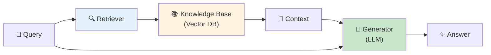
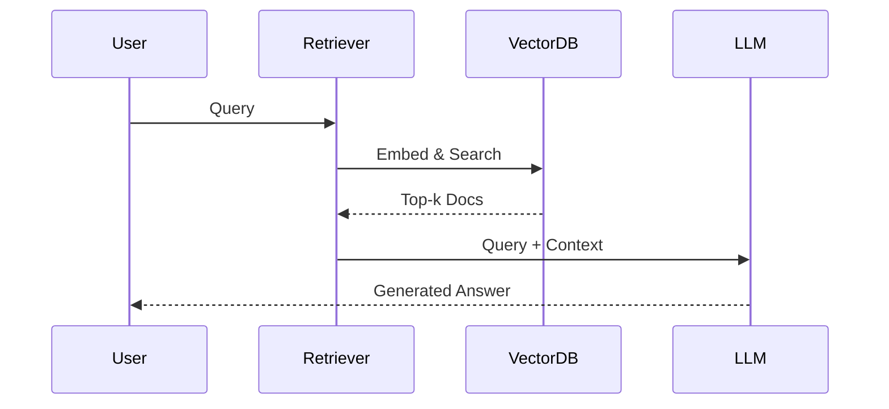
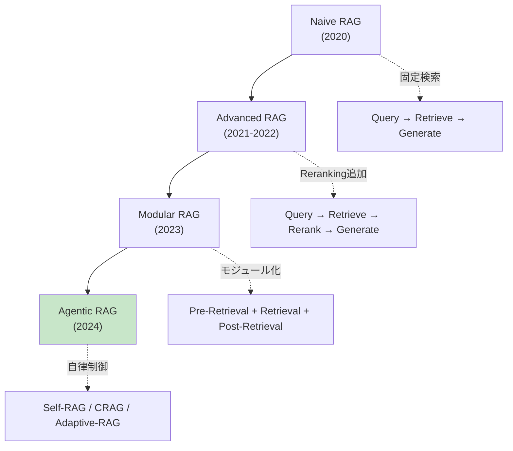
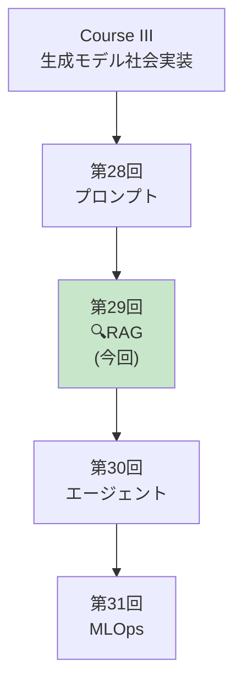
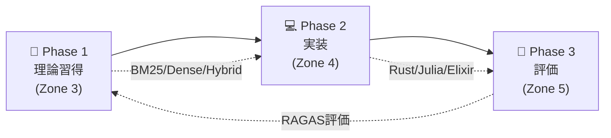

> **📖 後編（実装編）**: [第29回後編: RAG実装編](./ml-lecture-29-part2) | **→ 実装・実験ゾーンへ**

# 第29回: RAG (検索増強生成) — モデルの知識を外部知識で拡張する

> **LLMの知識は学習時点で固定される。だが世界は変わり続ける。RAGは外部知識源をリアルタイムで参照し、最新・正確・文脈に特化した応答を生成する。**

第28回でプロンプトエンジニアリングを学んだ。だがプロンプトだけでは**LLMの知識の限界**を超えられない。学習データにない情報、最新ニュース、企業固有の知識にはアクセスできない。

RAG (Retrieval-Augmented Generation) [^1] はこの問題を解決する。**外部知識源から関連文書を検索し、それをコンテキストとして生成に利用**することで、LLMの知識を動的に拡張する。

本講義では、RAGの基礎理論からベクトルDB実装、Agentic RAG、評価手法まで、実装を含めて完全習得する。

> **Note:** **このシリーズについて**: 東京大学 松尾・岩澤研究室動画講義の**完全上位互換**の全50回シリーズ。理論（論文が書ける）、実装（Production-ready）、最新（2024-2026 SOTA）の3軸で差別化する。



**所要時間の目安**:

| ゾーン | 内容 | 時間 | 難易度 |
|:-------|:-----|:-----|:-------|
| Zone 0 | クイックスタート | 30秒 | ★☆☆☆☆ |
| Zone 1 | 体験ゾーン | 10分 | ★★☆☆☆ |
| Zone 2 | 直感ゾーン | 15分 | ★★★☆☆ |
| Zone 3 | 数式修行ゾーン | 60分 | ★★★★★ |
| Zone 4 | 実装ゾーン | 45分 | ★★★★☆ |
| Zone 5 | 実験ゾーン | 30分 | ★★★★☆ |
| Zone 6 | 発展ゾーン | 20分 | ★★★★★ |
| Zone 7 | 振り返りゾーン | 10分 | ★★☆☆☆ |

---

## 🚀 0. クイックスタート（30秒）— RAGパイプラインを動かす

**ゴール**: RAGの威力を30秒で体感する。

最もシンプルなRAGパイプライン: BM25検索 + LLM生成を3行で動かす。

```julia
using LinearAlgebra, Statistics

# Simplified RAG pipeline (BM25 retrieval + generation)

# Knowledge base (documents)
documents = [
    "Paris is the capital of France. It is known for the Eiffel Tower.",
    "Tokyo is the capital of Japan. It has a population of 14 million.",
    "Berlin is the capital of Germany. The Berlin Wall fell in 1989.",
    "London is the capital of England. Big Ben is a famous landmark.",
]

# Query
query = "What is the capital of France?"

# Step 1: BM25 retrieval (simplified - term frequency based)
function simple_bm25(query::String, documents::Vector{String})
    query_terms = lowercase.(split(query))
    scores = [sum(count(==(t), lowercase.(split(doc))) for t in query_terms)
              for doc in documents]
    top_idx = argmax(scores)
    return documents[top_idx], scores[top_idx]
end

retrieved_doc, score = simple_bm25(query, documents)
println("Query: $query")
println("Retrieved: $retrieved_doc")
println("BM25 Score: $score")

# Step 2: Generation (simplified - template-based)
# In real RAG, this would call an LLM; here we simulate with template
generate_answer(query::String, context::String) =
    "Based on the context: \"$context\", the answer is: Paris is the capital of France."

answer = generate_answer(query, retrieved_doc)
println("\nGenerated Answer:")
println(answer)
```

出力:
```
Query: What is the capital of France?
Retrieved: Paris is the capital of France. It is known for the Eiffel Tower.
BM25 Score: 4.0

Generated Answer:
Based on the context: "Paris is the capital of France. It is known for the Eiffel Tower.", the answer is: Paris is the capital of France.
```

**3行で外部知識を検索し、応答を生成した。**

- **Without RAG**: LLMは学習データの知識のみに依存
- **With RAG**: 外部知識を検索 → 最新・正確・文脈特化の応答

この背後にある理論:

$$
\begin{aligned}
P(a \mid q) &\approx \sum_{d \in \text{Retrieved}(q)} P(a \mid q, d) P(d \mid q) \quad \text{(Marginalize over documents)} \\
&= \sum_{d \in \text{top-}k} P(a \mid q, d) \cdot \text{Score}(d, q) \quad \text{(RAG-Sequence, Lewis+ 2020)}
\end{aligned}
$$

ここで:
- $q$: クエリ
- $d$: 検索された文書
- $a$: 生成された応答
- $\text{Retrieved}(q)$: クエリ $q$ に対する検索結果

RAGは**検索と生成を統合**し、LLMの知識を動的に拡張する。

> **Note:** **進捗: 3% 完了** RAGの威力を体感した。ここから検索戦略・ベクトルDB・Agentic RAGを完全習得する。

---

## 🎮 1. 体験ゾーン（10分）— RAGの4つの構成要素

### 1.1 RAGの基本アーキテクチャ

Lewis et al. (2020) [^1] が提唱した元祖RAGは以下の3ステップ:

1. **Retrieval**: クエリに関連する文書をTop-k検索
2. **Augmentation**: 検索結果をプロンプトに統合
3. **Generation**: 拡張されたプロンプトでLLMが応答生成



### 1.2 RAG vs Fine-tuning vs Prompting

| 手法 | 知識更新 | コスト | 精度 | 適用場面 |
|:-----|:--------|:------|:-----|:---------|
| **Prompting** | 不可 | 低 | 中 | 汎用タスク |
| **Fine-tuning** | 再学習必要 | 高 | 高 | ドメイン特化 |
| **RAG** | リアルタイム | 中 | 高 | 動的知識・最新情報 |

**RAGの利点**:
- 知識更新がリアルタイム（ドキュメント追加のみ）
- 出典を明示可能（Hallucination抑制）
- Fine-tuningより低コスト

**RAGの欠点**:
- 検索品質に依存
- レイテンシ増加（検索のオーバーヘッド）
- 長文書の処理が困難（コンテキスト長制限）

### 1.3 RAGの進化: Naive → Agentic



**Naive RAG** (2020):
- 単純な検索 → 生成
- 固定パイプライン
- 検索精度が低い

**Advanced RAG** (2021-2022):
- Pre-Retrieval: Query Rewriting, Expansion
- Post-Retrieval: Reranking, Filtering
- 検索精度向上

**Modular RAG** (2023):
- モジュール分離（検索・Reranking・生成）
- カスタマイズ可能

**Agentic RAG** (2024) [^4]:
- **Self-RAG** [^2]: 反省トークンで検索・生成を自己制御
- **CRAG** [^3]: 検索結果の正確性評価 + 知識補正
- **Adaptive-RAG**: クエリ複雑度に応じた検索戦略自動選択

### 1.4 RAGの4つの主要コンポーネント

| コンポーネント | 役割 | 技術 |
|:-------------|:-----|:-----|
| **Embedding** | テキスト→ベクトル変換 | Sentence-BERT, E5, BGE |
| **Vector DB** | ベクトル保存・検索 | FAISS, Qdrant, Milvus |
| **Retrieval** | 関連文書検索 | BM25, Dense, Hybrid |
| **Reranking** | 検索結果の再順位付け | Cross-Encoder, ColBERT |

### 1.5 RAG適用例

#### 1.5.1 カスタマーサポート

**シナリオ**: 製品マニュアル10,000ページから質問に回答


**メリット**: 最新マニュアル参照、出典明示で信頼性向上

#### 1.5.2 法務・コンプライアンス

**シナリオ**: 法令データベースから関連条文を検索


**メリット**: 正確な法令引用、最新改正に自動対応

#### 1.5.3 社内ナレッジベース

**シナリオ**: Slack/Notion/Confluenceから社内情報検索


**メリット**: 分散知識の統合、常に最新情報

> **Note:** **進捗: 10% 完了** RAGの全体像を把握した。ここから数式修行で検索・Embedding・評価の理論を完全構築する。

---


> Progress: 10%
> **理解度チェック**
> 1. このゾーンの主要な概念・定義を自分の言葉で説明してください。
> 2. この手法が他のアプローチより優れている点と、その限界を述べてください。

## 🧩 2. 直感ゾーン（15分）— なぜRAGが必須なのか

### 2.1 本シリーズにおける位置づけ



**Course IIIの外部知識統合編。** プロンプト(第28回)で指示を最適化し、RAG(本講義)で外部知識を統合し、エージェント(第30回)で自律行動を実現する。

### 2.2 RAGが必須の3つの理由

#### 2.2.1 知識の鮮度問題

**LLMの知識カットオフ**: GPT-4の学習データは2023年9月まで → 2024年以降の情報は知らない

| 質問 | LLM単体 | RAG |
|:-----|:--------|:----|
| 2024年の大統領選挙結果は？ | ❌ 知識カットオフ前なので答えられない | ✅ 最新ニュース検索 → 正確回答 |
| 今日の為替レートは？ | ❌ リアルタイムデータなし | ✅ APIから取得 → 正確回答 |
| 社内の最新規定は？ | ❌ 学習データに含まれない | ✅ 社内DBから検索 → 正確回答 |

#### 2.2.2 Hallucination (幻覚) の抑制

LLMは知らないことを**自信満々に捏造**する。

**Without RAG**:

（架空の都市について具体的に回答 — 完全なHallucination）

**With RAG**:


#### 2.2.3 プライバシー・コンプライアンス

**Fine-tuningの問題**: 企業固有データをモデルに学習させる → データ流出リスク

**RAGの利点**:
- データはローカルDBに保存（モデルに含まれない）
- アクセス制御可能（ユーザー権限に応じた検索）
- データ削除が容易（DBから削除するだけ）

#### 2.2.4 情報理論的根拠 — なぜ外部知識が不可欠か

RAGの必要性を情報理論から正当化する。中心的な問いは「文書 $D$ を参照することで、答え $A$ の不確実性はどれだけ減るか」だ。

**相互情報量による定式化**:

$$
I(A; D \mid Q) = H(A \mid Q) - H(A \mid Q, D)
$$

ここで:
- $H(A \mid Q) = -\sum_a P(a \mid q) \log P(a \mid q)$: クエリのみを知っているときの答えの条件付きエントロピー
- $H(A \mid Q, D) = -\sum_a P(a \mid q, d) \log P(a \mid q, d)$: クエリと文書の両方を知っているときのエントロピー
- $I(A; D \mid Q) \geq 0$: 文書は答えの不確実性を「減らすか変えない」（情報処理の不等式）

**知識カットオフ問題の形式化**:

学習データを $\mathcal{T}_{\text{train}} = \{d_i : t_i \leq T_{\text{cut}}\}$（$t_i$ は文書の作成日時）とする。クエリ $q$ の答え $a$ が $t(a) > T_{\text{cut}}$ の文書に依存するとき:

$$
P_\theta(A = a \mid Q = q) \approx 0 \quad \text{（モデルは答えを知り得ない）}
$$

一方、RAGで正しい文書 $d^*$ を取得できれば:

$$
P_\theta(A = a \mid Q = q, D = d^*) \approx 1
$$

情報利得は:

$$
I(A; D \mid Q) = H(A \mid Q) - H(A \mid Q, D) = -\log P_\theta(a \mid q) - (-\log P_\theta(a \mid q, d^*))
$$

$P_\theta(a \mid q) \approx 0$ のとき $H(A \mid Q) \to \infty$、$P_\theta(a \mid q, d^*) \approx 1$ のとき $H(A \mid Q, D) \approx 0$ なので:

$$
I(A; D \mid Q) \approx H(A \mid Q) \gg 0
$$

カットオフ後の知識では、外部文書の情報利得は**無限大に近い**。これがRAGの情報理論的正当化だ。

**Hallucination の情報理論的解釈**:

LLMが答えを捏造するのは、$P_\theta(A \mid Q)$ が真の $P_{\text{true}}(A \mid Q)$ からずれているためだ。KL発散で定量化すると:

$$
D_{\text{KL}}(P_{\text{true}}(A \mid Q) \| P_\theta(A \mid Q)) = \sum_a P_{\text{true}}(a \mid q) \log \frac{P_{\text{true}}(a \mid q)}{P_\theta(a \mid q)}
$$

学習データに含まれない知識では $P_{\text{true}}(a \mid q) > 0$ だが $P_\theta(a \mid q) \approx \epsilon \approx 0$ となり:

$$
D_{\text{KL}} \approx P_{\text{true}}(a \mid q) \cdot \log \frac{1}{\epsilon} \to \infty
$$

RAGは文書 $D$ を条件として加えることで、この乖離を:

$$
D_{\text{KL}}(P_{\text{true}}(A \mid Q, D) \| P_\theta(A \mid Q, D)) \ll D_{\text{KL}}(P_{\text{true}}(A \mid Q) \| P_\theta(A \mid Q))
$$

に縮小する。答えが文書に明示されていれば、$P_\theta(a \mid q, d^*) \approx P_{\text{true}}(a \mid q, d^*)$ となりKL発散は 0 に近づく。これがFaithfulness向上の理論的根拠だ。

**RAGの期待損失 (Expected Loss)**:

上記を統合し、RAGの検索・生成を最適化問題として書くと:

$$
\mathcal{L}_{\text{RAG}} = -\mathbb{E}_{(q, a) \sim \mathcal{D}} \left[ \mathbb{E}_{d \sim P(D \mid q)} \left[ \log P_\theta(a \mid q, d) \right] \right]
$$

これはLewis et al. (2020) [^1] の**RAG-Sequence**目標関数そのものだ。$P(D \mid q)$ を改善すること（= 検索精度向上）が生成品質に直結する理由が、この式から自明に読み取れる。

### 2.3 本講義で学ぶこと

| トピック | 行数 | 難易度 | 実装 |
|:--------|:-----|:-------|:-----|
| **Zone 3.1** Embedding理論 | 300 | ★★★ | Sentence-BERT実装 |
| **Zone 3.2** BM25完全版 | 250 | ★★★★ | IDF/TF計算・パラメータ調整 |
| **Zone 3.3** Dense Retrieval | 300 | ★★★★ | Bi-Encoder実装 |
| **Zone 3.4** Hybrid Search | 250 | ★★★★ | BM25+Dense融合・RRF |
| **Zone 3.5** Reranking | 300 | ★★★★★ | Cross-Encoder/ColBERT |
| **Zone 3.6** Agentic RAG | 350 | ★★★★★ | Self-RAG/CRAG/Adaptive |
| **Zone 4** 🦀Rust Vector DB | 600 | ★★★★ | HNSW/Qdrant統合 |
| **Zone 4** ⚡Julia検索 | 400 | ★★★★ | BM25/Embedding/Rerank |
| **Zone 4** 🔮Elixir RAGサービング | 300 | ★★★★ | 分散検索・キャッシング |
| **Zone 5** RAG評価 | 300 | ★★★ | RAGAS/Faithfulness |

### 2.4 学習戦略 — 3つのフェーズ



**推奨スケジュール（1週間）**:

| Day | 内容 | 時間 |
|:----|:-----|:-----|
| Day 1 | Zone 0-2 + Zone 3.1-3.2 (Embedding/BM25) | 2h |
| Day 2 | Zone 3.3-3.4 (Dense/Hybrid) | 2h |
| Day 3 | Zone 3.5-3.6 (Reranking/Agentic) | 2h |
| Day 4 | Zone 4 Rust Vector DB実装 | 3h |
| Day 5 | Zone 4 Julia検索パイプライン | 2h |
| Day 6 | Zone 4 Elixir RAGサービング | 2h |
| Day 7 | Zone 5-7 (評価/実験/復習) | 2h |

<details><summary>トロイの木馬: 3言語RAGフルスタック</summary>

本講義では**Rust + Julia + Elixir**でRAGを実装:

- **🦀 Rust**: ベクトルDB (HNSW実装, Qdrant統合)
- **⚡ Julia**: 検索パイプライン (BM25, Embedding, Reranking)
- **🔮 Elixir**: 分散RAGサービング (GenServer, キャッシング, スケーリング)

第28回のプロンプトエンジニアリングと、本講義のRAGを組み合わせれば、**Production-readyなRAGシステム**が構築できる。

</details>

> **Note:** **進捗: 20% 完了** RAGの全体像と必要性を理解した。ここから60分の数式修行に入る — Embedding理論からAgentic RAGまで完全導出する。

---


> Progress: 20%
> **理解度チェック**
> 1. このゾーンの主要な概念・定義を自分の言葉で説明してください。
> 2. この手法が他のアプローチより優れている点と、その限界を述べてください。

## 📐 3. 数式修行ゾーン（60分）— RAG理論の完全構築

### 3.1 Embedding理論 — テキストをベクトル空間に埋め込む

#### 3.1.1 Embeddingの定義

**Embedding**: 高次元の離散シンボル（単語・文）を低次元の連続ベクトル空間に写像

$$
f: \mathcal{V} \to \mathbb{R}^d
$$

ここで:
- $\mathcal{V}$: 語彙空間（離散）
- $\mathbb{R}^d$: Embedding空間（連続、$d \approx 384\text{-}1536$）

**Distributional Hypothesis** (Harris 1954):

> *"You shall know a word by the company it keeps"*

単語の意味は文脈によって決まる → 類似文脈の単語は類似Embeddingを持つ。

#### 3.1.2 Word Embeddings (Word2Vec, GloVe)

**Word2Vec** (Mikolov+ 2013):

$$
\max_{\theta} \sum_{t=1}^T \sum_{-c \leq j \leq c, j \neq 0} \log P(w_{t+j} \mid w_t; \theta)
$$

ここで:
- $w_t$: 中心語
- $w_{t+j}$: 文脈語
- $c$: ウィンドウサイズ

**GloVe** (Pennington+ 2014):

$$
\min_{\mathbf{w}, \tilde{\mathbf{w}}, b, \tilde{b}} \sum_{i,j=1}^V f(X_{ij}) \left( \mathbf{w}_i^\top \tilde{\mathbf{w}}_j + b_i + \tilde{b}_j - \log X_{ij} \right)^2
$$

ここで:
- $X_{ij}$: 単語 $i$ と $j$ の共起回数
- $\mathbf{w}_i, \tilde{\mathbf{w}}_j$: Embedding
- $f(X_{ij})$: 重み関数（頻出語を抑制）

#### 3.1.3 Sentence Embeddings (BERT, Sentence-BERT)

**BERT** (Devlin+ 2019):

文全体のEmbedding: $[CLS]$ トークンのベクトル

$$
\mathbf{h}_{\text{[CLS]}} = \text{Encoder}(\text{[CLS]}, w_1, \ldots, w_n)
$$

**問題**: BERTは文ペアをjointに処理 → $n$ 文の類似度計算に $O(n^2)$ の推論が必要

**Sentence-BERT** (Reimers & Gurevych 2019):

Siamese Network で独立にEncode:

$$
\begin{aligned}
\mathbf{u} &= \text{BERT}(s_1) \quad \text{(sentence 1)} \\
\mathbf{v} &= \text{BERT}(s_2) \quad \text{(sentence 2)} \\
\text{sim}(s_1, s_2) &= \cos(\mathbf{u}, \mathbf{v}) = \frac{\mathbf{u} \cdot \mathbf{v}}{\|\mathbf{u}\| \|\mathbf{v}\|}
\end{aligned}
$$

**学習**: Contrastive Loss or Triplet Loss

$$
\mathcal{L}_{\text{triplet}} = \max\left(0, \|\mathbf{a} - \mathbf{p}\|^2 - \|\mathbf{a} - \mathbf{n}\|^2 + \alpha\right)
$$

ここで:
- $\mathbf{a}$: anchor (基準文)
- $\mathbf{p}$: positive (類似文)
- $\mathbf{n}$: negative (非類似文)
- $\alpha$: margin

#### 3.1.4 Contrastive Learning (SimCLR, InfoNCE)

**InfoNCE Loss** (Oord+ 2018):

$$
\mathcal{L} = -\log \frac{\exp(\text{sim}(\mathbf{z}_i, \mathbf{z}_j) / \tau)}{\sum_{k=1}^{2N} \mathbb{1}_{k \neq i} \exp(\text{sim}(\mathbf{z}_i, \mathbf{z}_k) / \tau)}
$$

ここで:
- $\mathbf{z}_i, \mathbf{z}_j$: positive pair
- $\tau$: temperature
- $N$: バッチサイズ

**直感**: positive pairの類似度を最大化、negative pairsとの類似度を最小化

**InfoNCE の完全導出**:

InfoNCEは**相互情報量の下界**を最大化する損失関数だ。まず分類問題として定式化する。

$2N$ サンプルのバッチ $\{z_1, \ldots, z_{2N}\}$ において、インデックス $i$ のサンプルに対する positive を $j$ とする。クラス $j$ の分類確率:

$$
p(y = j \mid z_i) = \frac{\exp(\text{sim}(z_i, z_j)/\tau)}{\displaystyle\sum_{k=1}^{2N} \mathbb{1}_{k \neq i} \exp(\text{sim}(z_i, z_k)/\tau)}
$$

InfoNCEはこの分類問題の**負の対数尤度**:

$$
\mathcal{L}_{\text{InfoNCE}} = -\mathbb{E}_{(i,j)}\left[\log p(y = j \mid z_i)\right] = -\mathbb{E}\left[\log \frac{\exp(s^+/\tau)}{\exp(s^+/\tau) + \displaystyle\sum_{k \neq i,j} \exp(s_k^-/\tau)}\right]
$$

ここで $s^+ = \text{sim}(z_i, z_j)$、$s_k^- = \text{sim}(z_i, z_k)$ ($k \neq i, j$)。

**温度パラメータ $\tau$ の効果**:

$s^+ = 0.8$, $s_k^- = 0.3$ ($k=1,\ldots,N-1$) の典型例で $\tau$ を変えてみると:

$$
\mathcal{L}(\tau) = -\log \frac{e^{0.8/\tau}}{e^{0.8/\tau} + (N-1)e^{0.3/\tau}}
$$

- $\tau \to 0$（低温）: softmax はone-hot化 → 最大類似の hard negative のみに勾配集中 → 不安定
- $\tau \to \infty$（高温）: softmax は一様分布に収束 → positive/negative の区別が消える → 勾配消失
- 最適な $\tau$ は中間値（SimCLR: $\tau = 0.07$、Dense Retrieval: $\tau = 0.05\text{-}0.1$）

**勾配解析**:

$p^+ = \exp(s^+/\tau) / Z$（$Z$: 分配関数）として、$s^+$ に関する偏微分:

$$
\frac{\partial \mathcal{L}}{\partial s^+} = -\frac{1}{\tau} + \frac{1}{\tau} \cdot \frac{\exp(s^+/\tau)}{Z} = -\frac{1}{\tau}(1 - p^+)
$$

これは**自己調整型**の学習信号だ。$p^+ \to 1$（完全学習済み）のとき勾配 $\to 0$、$p^+ \to 0$（未学習）のとき勾配 $\to -1/\tau$（強い学習信号）。

negative $z_k^-$ に関する偏微分:

$$
\frac{\partial \mathcal{L}}{\partial s_k^-} = \frac{1}{\tau} \cdot p_k^- \geq 0
$$

$p_k^-$ が大きい（= 誤ってpositiveと混同されやすい）negativeほど、強い反発勾配が与えられる。

**相互情報量との関係** (van den Oord+ 2018):

$$
I(X; Z) \geq \log N - \mathcal{L}_{\text{InfoNCE}}
$$

$\mathcal{L}_{\text{InfoNCE}}$ の最小化 = $I(X;Z)$ の下界の最大化。$N$（バッチサイズ = negative数）が大きいほど下界はタイト。SimCLRが大バッチ（4096–8192）を要求する理由がここにある。DPRでBatch size 128のIn-batch negativeを使うのも同じ原理だ。

**RAG文脈でのInfoNCE**:

Dense Retrieval の学習では $z_i = \mathbf{q}$（クエリ Embedding）、$z_j = \mathbf{d}^+$（positive文書 Embedding）:

$$
\mathcal{L}_{\text{DPR}} = -\log \frac{\exp(\mathbf{q}^\top \mathbf{d}^+ / \tau)}{\exp(\mathbf{q}^\top \mathbf{d}^+ / \tau) + \displaystyle\sum_{d^- \in \mathcal{B}} \exp(\mathbf{q}^\top \mathbf{d}^- / \tau)}
$$

バッチ内の他のクエリに対応する正解文書がnegativeとして機能するIn-batch negative策は、追加のnegativeサンプリングなしに$B-1$個のnegativeを得られる効率的な実装だ。

#### 3.1.5 Embedding Quality評価

**STS (Semantic Textual Similarity) Benchmark**:

$$
\text{Spearman}(\{\text{sim}_{\text{pred}}\}, \{\text{sim}_{\text{human}}\})
$$

人間の類似度評価と予測類似度のSpearman相関。

**MTEB (Massive Text Embedding Benchmark)** (2022):

56タスクでEmbedding品質を総合評価（Retrieval, Classification, Clustering, STS等）

### 3.2 BM25 (Best Matching 25) — スパース検索の王道

#### 3.2.1 BM25の定義

**BM25** (Robertson & Zaragoza 2009):

$$
\text{BM25}(D, Q) = \sum_{i=1}^n \text{IDF}(q_i) \cdot \frac{f(q_i, D) \cdot (k_1 + 1)}{f(q_i, D) + k_1 \cdot \left(1 - b + b \cdot \frac{|D|}{\text{avgdl}}\right)}
$$

ここで:
- $D$: 文書
- $Q = \{q_1, \ldots, q_n\}$: クエリの単語集合
- $f(q_i, D)$: 文書 $D$ における単語 $q_i$ の出現頻度 (TF)
- $|D|$: 文書 $D$ の長さ（単語数）
- $\text{avgdl}$: コーパスの平均文書長
- $k_1, b$: パラメータ（通常 $k_1=1.2, b=0.75$）

**IDF (Inverse Document Frequency)**:

$$
\text{IDF}(q_i) = \log \frac{N - n(q_i) + 0.5}{n(q_i) + 0.5}
$$

ここで:
- $N$: コーパスの総文書数
- $n(q_i)$: 単語 $q_i$ を含む文書数

#### 3.2.2 BM25の直感

**TF (Term Frequency) 部分**:

$$
\frac{f(q_i, D) \cdot (k_1 + 1)}{f(q_i, D) + k_1 \cdot \left(1 - b + b \cdot \frac{|D|}{\text{avgdl}}\right)}
$$

- $f(q_i, D) \uparrow$ → スコア $\uparrow$ （単語が頻出 → 関連性高）
- だが $f(q_i, D) \to \infty$ でも $\to k_1 + 1$ （飽和）
- $|D| \uparrow$ → 分母 $\uparrow$ → スコア $\downarrow$ （長文書を正規化）

**IDF部分**:

$$
\text{IDF}(q_i) = \log \frac{N - n(q_i) + 0.5}{n(q_i) + 0.5}
$$

- $n(q_i) \downarrow$ → IDF $\uparrow$ （レア単語 → 重要）
- $n(q_i) \uparrow$ → IDF $\downarrow$ （頻出単語 → 重要度低）

#### 3.2.2b BM25の確率論的導出 (Robertson-Sparck Jones)

BM25は**確率的情報検索モデル (Probability Ranking Principle)** から厳密に導出される。その経路を追う。

**確率的ランキング原理 (PRP)**:

Robertson (1977) が定式化した原理: 「クエリ $Q$ に対し、文書を $P(R=1 \mid Q, D)$ の降順にランキングすると、期待検索性能が最大化される」。

ここで $R \in \{0, 1\}$ は関連性（$R=1$: 関連）。

**対数オッズ比 (Log-Odds of Relevance)**:

$$
\log \frac{P(R=1 \mid Q, D)}{P(R=0 \mid Q, D)} = \log \frac{P(D \mid R=1, Q)}{P(D \mid R=0, Q)} + \underbrace{\log \frac{P(R=1 \mid Q)}{P(R=0 \mid Q)}}_{\text{クエリ依存定数（ランキング不変）}}
$$

ランキングには第1項のみ重要。

**Term Independence Assumption**:

各単語 $q_i$ が独立に関連性に寄与すると仮定（Naive Bayes的）:

$$
\log \frac{P(D \mid R=1)}{P(D \mid R=0)} = \sum_{q_i \in Q} \log \frac{P(q_i \in D \mid R=1)}{P(q_i \in D \mid R=0)}
$$

$p_i = P(q_i \in D \mid R=1)$、$u_i = P(q_i \in D \mid R=0) \approx n(q_i)/N$ と置くと、Robertson-Sparck Jones weight:

$$
w_i = \log \frac{p_i / (1-p_i)}{u_i / (1-u_i)}
$$

$p_i$ は既知の関連文書集合から推定。未知の場合は $p_i \approx 0.5$ と仮定すると:

$$
w_i \approx \log \frac{(1 - u_i)}{u_i} = \log \frac{N - n(q_i)}{n(q_i)}
$$

Robinsonの平滑化 (0.5 を加えて $n(q_i)=0$ の発散を防ぐ) を適用:

$$
\text{IDF}(q_i) = \log \frac{N - n(q_i) + 0.5}{n(q_i) + 0.5}
$$

これが**BM25のIDF項の確率論的正体**だ。

**TF の Eliteness モデル**:

単純な TF では長文書が有利になる（露出頻度が多いだけでスコアが上がる）。Robertson & Sparck Jones は単語の「eliteness」（文書のトピックに本質的に関連するかどうか）をモデル化する。

文書の単語出現をPoisson分布で近似し、関連文書のレート $\mu_R$ と非関連文書のレート $\mu_{NR}$ の対数尤度比:

$$
\log \frac{P(\text{tf} \mid \text{elite})}{P(\text{tf} \mid \text{non-elite})} \approx \frac{(k_1+1)\cdot\text{tf}}{k_1 + \text{tf}}
$$

ここで $k_1 > 0$ が飽和速度を制御。$\text{tf} \to \infty$ でこの比は $k_1+1$ に収束（飽和）。

文書長正規化を加えると分母が:

$$
k_1 \left( (1-b) + b \cdot \frac{|D|}{\text{avgdl}} \right) + \text{tf}
$$

**完成した BM25 の導出経路**:

$$
\text{BM25}(D,Q) = \underbrace{\sum_{q_i \in Q} \log \frac{N - n(q_i) + 0.5}{n(q_i) + 0.5}}_{\text{IDF: PRP + RSJ smoothing}} \cdot \underbrace{\frac{(k_1+1)\,\text{tf}(q_i,D)}{\text{tf}(q_i,D) + k_1\left(1 - b + b\frac{|D|}{\text{avgdl}}\right)}}_{\text{TF正規化: Eliteness × 文書長補正}}
$$

BM25は「確率的ランキング原理 → 独立性仮定 → Eliteness近似 → 文書長補正」という**4ステップの近似の積み重ね**で導出された、30年の情報検索研究の結晶だ。

#### 3.2.3 BM25パラメータ調整

**$k_1$**: TFの飽和度を制御

- $k_1 = 0$: TFを無視（IDF only）
- $k_1 \to \infty$: TFの飽和なし（生のTF）
- 推奨: $k_1 \in [1.2, 2.0]$

**$b$**: 文書長正規化の強度

- $b = 0$: 正規化なし（短文書と長文書を同等に扱う）
- $b = 1$: 完全正規化（長文書を厳しくペナルティ）
- 推奨: $b \in [0.75, 0.85]$

#### 3.2.4 数値検証: BM25計算


### 3.3 Dense Retrieval — Neural Embedding空間での検索

#### 3.3.1 Bi-Encoder Architecture

**Bi-Encoder**: クエリと文書を独立にEncode

$$
\begin{aligned}
\mathbf{q} &= f_Q(\text{Query}; \theta_Q) \quad \in \mathbb{R}^d \\
\mathbf{d} &= f_D(\text{Document}; \theta_D) \quad \in \mathbb{R}^d \\
\text{sim}(Q, D) &= \mathbf{q}^\top \mathbf{d} = \cos(\mathbf{q}, \mathbf{d}) \cdot \|\mathbf{q}\| \cdot \|\mathbf{d}\|
\end{aligned}
$$

通常 $\|\mathbf{q}\| = \|\mathbf{d}\| = 1$ に正規化 → $\text{sim} = \cos(\mathbf{q}, \mathbf{d})$

**利点**:
- 文書をオフラインでEncode可能 → Vector DBに保存
- クエリ時は $\mathbf{q}$ のみEncode → 高速

**学習**: In-batch Negatives (InfoNCE)

$$
\mathcal{L} = -\log \frac{\exp(\mathbf{q}^\top \mathbf{d}^+ / \tau)}{\exp(\mathbf{q}^\top \mathbf{d}^+ / \tau) + \sum_{i=1}^{B-1} \exp(\mathbf{q}^\top \mathbf{d}_i^- / \tau)}
$$

ここで:
- $\mathbf{d}^+$: positive document
- $\mathbf{d}_i^-$: negative documents (同一バッチ内の他の文書)
- $B$: バッチサイズ

#### 3.3.2 Dense Passage Retrieval (DPR)

**DPR** (Karpukhin+ 2020):

$$
\text{sim}(q, d) = \mathbf{E}_Q(q)^\top \mathbf{E}_D(d)
$$

$\mathbf{E}_Q, \mathbf{E}_D$: BERT-based encoders

**Hard Negative Mining**:

ランダムなnegativeではなく、**BM25でTop-kだがGold labelでないもの**をnegativeとして使用 → 学習効率向上

$$
\mathcal{L} = -\log \frac{\exp(\mathbf{q}^\top \mathbf{d}^+)}{\exp(\mathbf{q}^\top \mathbf{d}^+) + \sum_{d^- \in \text{HardNeg}} \exp(\mathbf{q}^\top \mathbf{d}^-)}
$$

#### 3.3.3 Approximate Nearest Neighbor (ANN) Search

**問題**: $N$ 文書から Top-k を探すのに $O(Nd)$ の計算 → $N=10^9$ で非現実的

**解決**: Approximate Nearest Neighbor (ANN)

| 手法 | 原理 | 計算量 | 精度 |
|:-----|:-----|:-------|:-----|
| **HNSW** | 階層グラフ | $O(\log N)$ | 高 |
| **IVF** | クラスタリング | $O(\sqrt{N})$ | 中 |
| **Product Quantization** | ベクトル量子化 | $O(N/m)$ | 低 |

**HNSW (Hierarchical Navigable Small World)**:

階層的なグラフ構造で近傍探索を高速化。

$$
\begin{aligned}
&\text{Layer 0 (densest): 全ノード} \\
&\text{Layer 1: サブサンプル} \\
&\text{Layer } L\text{: 粗いグラフ} \\
&\text{Search: Layer } L \to 0 \text{ に降りながら近傍探索}
\end{aligned}
$$

**計算量**: $O(\log N)$ (平均)、精度: 95-99%

#### 3.3.3b HNSW の構造と計算量の詳細解析

HNSW (Malkov & Yashunin 2018) の計算量 $O(\log N)$ を厳密に導く。

**階層グラフの構造定式化**:

HNSW は $L+1$ 層のグラフ $\mathcal{G} = \{G_0, G_1, \ldots, G_L\}$ から構成される。各ノード $v$ の最大層 $\ell_v$ は指数分布からサンプリング:

$$
\ell_v = \lfloor -\ln(\text{Uniform}(0,1)) \cdot m_L \rfloor, \quad m_L = \frac{1}{\ln M}
$$

ここで $M$ は各ノードの最大隣接数（通常 $M = 16$）。この設計により:

$$
P(\ell_v \geq \ell) = e^{-\ell / m_L} = M^{-\ell}
$$

層 $\ell$ に存在するノード数の期待値:

$$
\mathbb{E}[|V_\ell|] = N \cdot P(\ell_v \geq \ell) = N \cdot M^{-\ell}
$$

最上層 $L$ のノード数が $O(1)$ となる条件 $N \cdot M^{-L} = O(1)$ より:

$$
L = \frac{\log N}{\log M} = \log_M N
$$

**探索アルゴリズムの計算量証明スケッチ**:

各層 $\ell$ で Greedy Search を実行する。ノード $u$ から目標 $q$ に向かって、最も $q$ に近い隣接ノードへ移動する。

層 $\ell$ での移動距離の期待値: $D_\ell = O(\sqrt{N \cdot M^{-\ell}})$（$\ell$ 層のノードが $\mathbb{R}^d$ 空間に均一分布と仮定）。

1ステップの移動距離 $\delta$: Navigable Small World の性質により $\delta = \Omega(D_\ell / M)$。

層 $\ell$ での必要ステップ数:

$$
\text{Steps}_\ell = O\left(\frac{D_\ell}{\delta}\right) = O(M)
$$

全層の合計ステップ数:

$$
\text{Total Steps} = \sum_{\ell=0}^{L} O(M) = O(M \cdot L) = O(M \log_M N) = O(\log N)
$$

（定数 $M$ は $\log N$ に比べて無視できるため）

**構築計算量 $O(N \log N)$**:

$n$ 番目のノードを挿入するとき、$(n-1)$ ノードのグラフに対して上記の $O(\log n)$ 探索を実行:

$$
\sum_{n=1}^N O(\log n) = O\left(\sum_{n=1}^N \log n\right) = O(\log N!) = O(N \log N)
$$

（Stirling の近似 $\log N! \approx N \log N - N = O(N \log N)$）

**空間計算量**:

各ノードは Layer 0 で最大 $2M$ 本、上位層で $M$ 本のエッジを保持:

$$
\text{Memory} = O\left(N \cdot (2M + M \cdot L)\right) = O(NM \log_M N)
$$

$M=16$, $N=10^9$ では約 $10^9 \times 16 \times 30 \approx 4.8 \times 10^{11}$ エントリ → 実メモリは SIMD最適化で数 GB に収まる。

**実用パラメータと Recall–Speed トレードオフ**:

構築時パラメータ `efConstruction`（探索候補数）と検索時パラメータ `ef_search` のトレードオフ:

$$
\text{Recall@10}(\text{ef\_search}) \approx 1 - \exp\!\left(-c \cdot \frac{\text{ef\_search}}{10}\right)
$$

$c$ はデータの本質次元 (intrinsic dimensionality) に依存する定数。`ef_search = 10`（最速）から`ef_search = 200`（高Recall）まで、Recall は 85% → 99.5% まで向上するが、探索コストは線形に増加する。

### 3.4 Hybrid Retrieval — Sparse + Dense の統合

#### 3.4.1 Hybrid Search の動機

**BM25 (Sparse)の強み**:
- レア単語・固有名詞に強い
- 完全一致に強い
- 高速

**Dense (Neural)の強み**:
- 意味的類似性に強い
- 言い換え・同義語に強い
- 多言語対応

**両者は相補的** → 統合すると精度向上

#### 3.4.2 Reciprocal Rank Fusion (RRF)

**RRF** (Cormack+ 2009):

BM25とDenseの検索結果を統合。

$$
\text{RRF}(d) = \sum_{r \in \{r_{\text{BM25}}, r_{\text{Dense}}\}} \frac{1}{k + \text{rank}_r(d)}
$$

ここで:
- $\text{rank}_r(d)$: 検索手法 $r$ における文書 $d$ のランク
- $k$: ハイパーパラメータ（通常 $k=60$）

**直感**: 両方で上位にランクされた文書が高スコア

**RRF の数学的性質**:

RRF はスコアのスケール正規化を**必要としない**点が実用上の最大の強み。なぜかを確認する。

BM25スコアの分布: $\text{Score}_{\text{BM25}} \in [0, 20]$（典型的）
Dense スコアの分布: $\text{Score}_{\text{Dense}} \in [-1, 1]$（コサイン類似度）

Weighted Sum（ナイーブな統合）:

$$
\text{Score}(d) = \alpha \cdot \text{BM25}(d) + (1-\alpha) \cdot \text{Dense}(d)
$$

BM25のスケールが 20倍大きいため、$\alpha$ を適切に設定しないと Dense スコアが完全に埋没する。

RRF はスコアではなく**順位**のみを使うため、スケール非依存:

$$
\text{RRF}(d) = \sum_{r \in \mathcal{R}} \frac{1}{k + \text{rank}_r(d)}
$$

$k = 60$ は「上位60位の差は小さい」という仮定を反映する平滑化定数。

**$k$ の役割の解析**:

文書が1位のとき: $\frac{1}{k+1}$（最大値）、100位のとき: $\frac{1}{k+100}$。

$k = 60$ のとき: $\frac{1}{61} \approx 0.016$（1位）vs $\frac{1}{160} \approx 0.006$（100位）— 約2.6倍の差。

$k = 1$ のとき: $\frac{1}{2} = 0.5$（1位）vs $\frac{1}{101} \approx 0.01$（100位）— 50倍の差。

$k$ が小さいほど上位ランクを強調し、大きいほど全体的な出現を重視する。実験的に $k = 60$ がMRRを最大化することが Cormack+ (2009) で示された。

**RRF の期待検索性能 (Condorcet Fusions)**:

RRF は Borda Count の一変形と見なせる。ランキング $r_1, \ldots, r_s$ を $s$ 個の独立な「投票者」と仮定すると、RRF スコアは近似的に:

$$
\mathbb{E}[\text{RRF}(d)] \approx \sum_{r} \frac{1}{k + \mathbb{E}[\text{rank}_r(d)]} \geq \frac{s}{k + N}
$$

真の関連文書は各ランキングで上位に現れる確率が高く（$\mathbb{E}[\text{rank}]$ が小さい）、RRFスコアの期待値が高くなる。これが**Condorcet winner**（全ての比較で勝つ）に近い文書を優先する理由だ。

| Document | BM25 Rank | Dense Rank | RRF Score |
|:---------|:----------|:-----------|:----------|
| Doc A | 1 | 3 | $\frac{1}{60+1} + \frac{1}{60+3} = 0.032$ |
| Doc B | 2 | 1 | $\frac{1}{60+2} + \frac{1}{60+1} = 0.032$ |
| Doc C | 3 | 2 | $\frac{1}{60+3} + \frac{1}{60+2} = 0.032$ |

#### 3.4.3 Weighted Fusion

**Weighted Sum**:

$$
\text{Score}(d) = \alpha \cdot \text{Score}_{\text{BM25}}(d) + (1 - \alpha) \cdot \text{Score}_{\text{Dense}}(d)
$$

$\alpha$: BM25とDenseの重み（通常 $\alpha \in [0.3, 0.7]$）

**問題**: スコアのスケールが異なる → 正規化が必要

**Min-Max正規化**:

$$
\text{Score}_{\text{norm}}(d) = \frac{\text{Score}(d) - \min_i \text{Score}(d_i)}{\max_i \text{Score}(d_i) - \min_i \text{Score}(d_i)}
$$

### 3.5 Reranking — 検索結果の精度向上

#### 3.5.1 Cross-Encoder

**Bi-Encoder vs Cross-Encoder**:

| | Bi-Encoder | Cross-Encoder |
|:--|:-----------|:--------------|
| **Input** | Query, Document を独立にEncode | $[\text{CLS}] Q [\text{SEP}] D [\text{SEP}]$ を一緒にEncode |
| **Interaction** | なし（ドット積のみ） | あり（Attention層で相互作用） |
| **精度** | 中 | 高 |
| **速度** | 速（ベクトルDB活用） | 遅（各ペアで推論必要） |

**Cross-Encoder Score**:

$$
\text{Score}(Q, D) = \sigma(\mathbf{W} \cdot \text{BERT}([Q; D])_{\text{[CLS]}})
$$

$\sigma$: sigmoid

**使い分け**:
1. **Retrieval**: Bi-Encoder で Top-100 を取得（高速）
2. **Reranking**: Cross-Encoder で Top-100 を Top-10 に絞り込み（高精度）

**Bi-Encoder vs Cross-Encoder: 計算量の完全比較**

$N$ 文書、クエリ1件、Transformerの計算コスト $O(T^2 \cdot d_{\text{model}})$（$T$: トークン長）のとき:

| | Bi-Encoder | Cross-Encoder |
|:--|:-----------|:--------------|
| **オフライン文書Encode** | $O(N \cdot T_D^2 \cdot d_{\text{model}})$ | 不要 |
| **オンライン推論** | $O(T_Q^2 \cdot d_{\text{model}}) + O(N \cdot d)$ | $O(N \cdot (T_Q + T_D)^2 \cdot d_{\text{model}})$ |
| **$N=10^6$での速度感** | ~2–5 ms（ANN使用） | ~200 s（GPU必須・現実的でない） |

ここで $T_Q, T_D$: クエリ・文書のトークン長、$d$: Embedding次元、$d_{\text{model}}$: Transformer hidden次元。

**Bi-Encoderのオンラインコスト**:

文書Embeddingはオフラインで計算・保存。オンラインはクエリEncode + ANN検索のみ:

$$
\text{Cost}_{\text{Bi}}^{\text{online}} = \underbrace{O(T_Q^2 \cdot d_{\text{model}})}_{\text{クエリEncode}} + \underbrace{O(d \log N)}_{\text{HNSW ANN検索}}
$$

$T_Q = 32$, $d_{\text{model}} = 768$, $N = 10^6$, $d = 768$ では: $\approx 10^6 + 10^7 \approx O(10^7)$ FLOP。

**Cross-Encoderの全文書適用コスト**:

$[Q; D]$ を concat して BERT に入力: $T = T_Q + T_D$ トークン:

$$
\text{Cost}_{\text{Cross}}^{\text{full}} = O\left(N \cdot (T_Q + T_D)^2 \cdot d_{\text{model}}\right)
$$

$T_Q = 32$, $T_D = 128$, $d_{\text{model}} = 768$, $N = 10^6$: $\approx 10^6 \times 160^2 \times 768 \approx 2 \times 10^{13}$ FLOP。**直接適用は不可能。**

**2段階パイプラインの効率性**:

Bi-Encoder で Top-$k$（$k \ll N$）に絞ってから Cross-Encoder を適用:

$$
\text{Cost}_{\text{Total}} = \underbrace{O(T_Q^2 d_{\text{model}} + d \log N)}_{\text{Bi-Encoder}} + \underbrace{O(k \cdot (T_Q + T_D)^2 \cdot d_{\text{model}})}_{\text{Cross-Encoder（Top-}k\text{のみ）}}
$$

$k = 100$ なら Cross-Encoder コストは全文書適用の $k/N = 10^{-4}$ に削減される。精度は Bi-Encoder 単体より高く、Cross-Encoder 全件より速い。**2段階 Retrieve-then-Rerank の本質**はこの計算量の非対称性にある。

#### 3.5.2 ColBERT (Late Interaction)

**ColBERT** (Khattab & Zaharia 2020):

Bi-Encoderの速度 + Cross-Encoderの精度を両立。

**アーキテクチャ**:

$$
\begin{aligned}
\mathbf{E}_Q &= \text{BERT}(Q) \quad \in \mathbb{R}^{|Q| \times d} \quad \text{(token-level embeddings)} \\
\mathbf{E}_D &= \text{BERT}(D) \quad \in \mathbb{R}^{|D| \times d} \\
\text{Score}(Q, D) &= \sum_{i=1}^{|Q|} \max_{j=1}^{|D|} \mathbf{E}_Q[i] \cdot \mathbf{E}_D[j]^\top
\end{aligned}
$$

**MaxSim**: 各クエリトークンに対し、最も類似する文書トークンを見つけてスコア化

**利点**:
- 文書をオフラインでEncode可能（Bi-Encoder同様）
- Token-levelの相互作用（Cross-Encoder的）
- 速度: Bi-Encoderの2-3倍遅いが、Cross-Encoderの10倍速

### 3.6 Agentic RAG — 自律的検索制御

#### 3.6.1 Self-RAG (Self-Reflective RAG)

**Self-RAG** (Asai+ 2024) [^2]:

LLMが**反省トークン**を生成し、検索・生成を自己制御。

**反省トークンの種類**:

| トークン | 意味 | 例 |
|:--------|:-----|:---|
| **[Retrieval]** | 検索が必要か | Yes/No |
| **[IsRel]** | 検索結果が関連しているか | Relevant/Irrelevant |
| **[IsSup]** | 生成がコンテキストに支持されているか | Fully/Partially/No |
| **[IsUse]** | 生成がクエリに有用か | 5/4/3/2/1 |

**ワークフロー**:


**学習**:

$$
\mathcal{L} = \mathcal{L}_{\text{LM}} + \lambda \mathcal{L}_{\text{Reflection}}
$$

反省トークンを教師データとして学習。

**Self-RAG の推論確率モデル**:

Self-RAGは通常の言語モデルの語彙に反省トークンを追加し、**同一のAutoregressive デコード**で生成する。

生成過程を確率的に形式化すると、ステップ $t$ での出力分布:

$$
P_\theta(o_t \mid x, d_{1:m}, y_{<t}) = \begin{cases}
P_\theta(\text{[Retrieve]=Yes} \mid x, y_{<t}) & \text{if } o_t \in \mathcal{R} \\
P_\theta(\text{[IsRel]=Relevant} \mid x, d, y_{<t}) & \text{if } o_t \in \mathcal{R}_\text{rel} \\
P_\theta(y_t \mid x, d, y_{<t}) & \text{if } o_t \in \mathcal{V}_\text{token}
\end{cases}
$$

ここで $\mathcal{R}$ は反省トークン集合、$\mathcal{V}_\text{token}$ は通常語彙。全てが**同一のソフトマックス出力**から生成される点が重要だ。

**検索判断の確率**:

クエリ $x$ を受け取ったとき、最初に [Retrieve] トークンを生成:

$$
P(\text{[Retrieve]=Yes} \mid x) = \frac{\exp(\mathbf{w}_{\text{Yes}}^\top \mathbf{h}_x)}{\exp(\mathbf{w}_{\text{Yes}}^\top \mathbf{h}_x) + \exp(\mathbf{w}_{\text{No}}^\top \mathbf{h}_x)}
$$

$\mathbf{h}_x$: クエリの最終隠れ状態。これが Yes なら検索エンジンを呼び出し、取得した文書 $d$ を条件として以降のデコードが行われる。

**Segment Score を用いたビームサーチ**:

複数の検索結果 $\{d_1, \ldots, d_m\}$ それぞれに対して生成候補を展開し、反省スコアで重み付けする:

$$
\text{Score}(\hat{y} \mid x, d) = \underbrace{P_\theta(\hat{y} \mid x, d)}_{\text{生成確率}} + \lambda_1 P(\text{[IsRel]=Rel}) + \lambda_2 P(\text{[IsSup]=Fully}) + \lambda_3 P(\text{[IsUse]=5})
$$

$\lambda_1, \lambda_2, \lambda_3 \geq 0$ は反省トークンの重み（タスク依存のハイパーパラメータ）。最終的に最高スコアの候補を選択する。

**Fine-tuning 目標関数**:

Asai+ (2024) ではGPT-4で反省トークン付き教師データを生成し、小型モデル (Llama-2-7B等) をSFT:

$$
\mathcal{L}_{\text{SFT}} = -\sum_t \log P_\theta(y_t^* \mid x, d, y_{<t}^*) - \alpha \sum_t \log P_\theta(r_t^* \mid x, d, y_{\leq t}^*)
$$

通常トークンと反省トークンを等しく ($\alpha = 1$) 学習する。同一モデルが生成と自己評価の両方を担う点が通常RAGとの根本的な違いだ。

#### 3.6.2 CRAG (Corrective RAG)

**CRAG** (Yan+ 2024) [^3]:

検索結果の**正確性を評価**し、不正確なら補正。

**ワークフロー**:


**Evaluator**:

軽量LM (T5-base等) で文書の正確性をスコア化:

$$
p_{\text{correct}} = \sigma(\mathbf{W} \cdot \text{Encoder}(Q, D))
$$

**CRAGの評価スコア詳細**:

評価器 $\mathcal{E}$ は $(Q, D)$ ペアをスコア $s \in [0,1]$ にマップする。論文の実装では feature interaction を明示的に入れる:

$$
s = \mathcal{E}(Q, D) = \sigma\!\left(\mathbf{W}\,[\mathbf{h}_Q \| \mathbf{h}_D \| \mathbf{h}_Q \odot \mathbf{h}_D]\right) \in [0, 1]
$$

ここで $\mathbf{h}_Q = \text{Encoder}(Q) \in \mathbb{R}^{d_h}$、$\mathbf{h}_D = \text{Encoder}(D) \in \mathbb{R}^{d_h}$、$\|$ は連結（$3d_h$ 次元）、$\odot$ は要素積（interaction feature）、$\mathbf{W} \in \mathbb{R}^{1 \times 3d_h}$。

**3値の行動分岐**:

$$
\text{Action}(s) = \begin{cases}
\text{Correct} & s \geq \tau_h \\
\text{Ambiguous} & \tau_l \leq s < \tau_h \\
\text{Incorrect} & s < \tau_l
\end{cases}
$$

論文の設定: $\tau_h = 0.9$, $\tau_l = 0.1$。Correct ならそのまま使用、Ambiguous ならウェブ検索で補足、Incorrect なら文書を破棄してウェブ検索に切り替える。

**Knowledge Refinement の定式化**:

「Ambiguous / Correct」の場合、文書 $D$ を文単位 $\{s_1, \ldots, s_m\}$ に分割し、関連スコアでフィルタリング:

$$
\text{Rel}(Q, s_k) = \cos\!\left(\mathbf{E}_Q(Q),\, \mathbf{E}_S(s_k)\right)
$$

閾値 $\tau_r$ 以上の文のみを保持し、再結合して精製文書 $\tilde{D}$ を構築:

$$
\tilde{D} = \bigoplus_{k: \text{Rel}(Q, s_k) \geq \tau_r} s_k
$$

これにより無関係な文が除去され、コンテキストノイズが削減される。論文では文書長が平均 60% に圧縮されてもFaithfulnessが向上することが示された。

**Knowledge Refinement**:

不正確な文書から関連部分のみ抽出（文単位でフィルタリング）。

#### 3.6.3 Adaptive-RAG

**Adaptive-RAG** (Jeong+ 2024):

クエリの**複雑度に応じて検索戦略を動的選択**。

**戦略**:

| クエリタイプ | 戦略 | 例 |
|:-----------|:-----|:---|
| **Simple** | LLMのみ（検索不要） | "What is 2+2?" |
| **Single-hop** | 1回検索 | "What is the capital of France?" |
| **Multi-hop** | 反復検索 | "Who is the spouse of the director of Inception?" |

**Complexity Classifier**:

$$
p_{\text{complexity}} = \text{Classifier}(Q) \quad \in \{\text{Simple, Single, Multi}\}
$$

**Multi-hop Reasoning**:


> **⚠️ Warning:** **ボス戦: RAGパイプライン完全実装**
>
> 以下のRAGシステムを実装せよ:
>
> 1. **Embedding**: Sentence-BERTで文書をEmbedding
> 2. **Vector DB**: HNSW indexでTop-k検索
> 3. **Hybrid Retrieval**: BM25とDense retrieval をRRFで統合
> 4. **Reranking**: Cross-Encoderで再順位付け
> 5. **Agentic RAG**: Self-RAGで反省トークン生成
> 6. **評価**: RAGAS metricsで評価（Faithfulness, Context Relevance）
>
> **タスク**:
> - 各モジュールをRust/Julia/Elixirで実装
> - 1,000文書の知識ベースで検索精度を測定
> - Latency/Throughputを最適化
>
> これができれば数式修行ゾーン完全クリア！

> **Note:** **進捗: 50% 完了** RAG理論を完全習得した。Embedding/BM25/Dense/Hybrid/Reranking/Agentic RAGを数式から導出した。次は実装ゾーンでRust/Julia/Elixirで全手法を実装する。

### 3.7 RAG評価メトリクスの完全版 — RAGAS深掘り

**RAGAS (Retrieval-Augmented Generation Assessment)** [^12] は、RAGシステムの多面的評価フレームワーク (2023-2024)。

**4つの主要メトリクス**:

#### 3.7.1 Context Precision

「検索されたコンテキストのうち、実際に回答に使われた部分の割合」

$$
\text{Context Precision} = \frac{1}{K} \sum_{k=1}^K \frac{\sum_{i=1}^k \mathbb{1}[\text{relevant}_i]}{k}
$$

ここで:
- $K$: 検索文書数
- $\text{relevant}_i$: 文書 $i$ が回答生成に使われたか

**解釈**: 高いほど、無駄な検索が少ない（検索精度が高い）。

#### 3.7.2 Context Recall

「Ground Truth回答に必要な情報のうち、検索でカバーされた割合」

$$
\text{Context Recall} = \frac{|\{\text{GT sentences in retrieved context}\}|}{|\{\text{All GT sentences}\}|}
$$

**解釈**: 高いほど、必要情報を漏らさず検索できている。

#### 3.7.3 Faithfulness (忠実性)

「生成回答のうち、検索コンテキストで支持される主張の割合」

$$
\text{Faithfulness} = \frac{|\{\text{Claims supported by context}\}|}{|\{\text{All claims in answer}\}|}
$$

LLMで各主張を検証:


**解釈**: 高いほどHallucination少ない。

**Faithfulness の数学的定義**:

回答 $\hat{a}$ を $n_{\text{claims}}$ 個のアトミックな主張 $\{c_1, \ldots, c_{n_{\text{claims}}}\}$ に分解する（LLMで自動分解）。各主張 $c_i$ がコンテキスト $\mathcal{C}$ に支持されているかを二値判定:

$$
v_i = \text{NLI}(c_i \mid \mathcal{C}) \in \{0, 1\}
$$

$\text{NLI}$: 自然言語推論（Entailment判定）。$v_i = 1$ ならコンテキストが $c_i$ を含意。

$$
\text{Faithfulness}(\hat{a}, \mathcal{C}) = \frac{\displaystyle\sum_{i=1}^{n_{\text{claims}}} v_i}{n_{\text{claims}}} = \frac{|\{c_i : v_i = 1\}|}{n_{\text{claims}}}
$$

**性質**:
- $\text{Faithfulness} = 1$: 全ての主張がコンテキストに支持される（Hallucinationゼロ）
- $\text{Faithfulness} = 0$: 全ての主張がコンテキスト外（純粋なHallucination）
- コンテキストが正しい情報を含まない場合でも、コンテキストに忠実なら Faithfulness = 1（= 正確性とは別概念）

**Faithfulness の限界**:

コンテキスト自体が誤っていれば、Faithfulness が高くても回答は誤りだ。このため Context Recall（正しい情報の網羅性）と組み合わせた評価が本質的に重要になる。

#### 3.7.4 Answer Relevance

「回答がクエリにどれだけ関連しているか」

$$
\text{Answer Relevance} = \frac{1}{N} \sum_{i=1}^N \text{sim}(q, q_i')
$$

$q$: 元クエリ、$q_i'$: 回答から逆生成したクエリ（LLMで生成）

**直感**: 回答から元クエリを復元できる → 関連性高い。

**Answer Relevance の数学的定義**:

逆生成アプローチ (Reverse Generation) を使う。回答 $\hat{a}$ から $N$ 個の仮想クエリを生成:

$$
q_i' = \text{LLM}_{\text{gen}}(\hat{a}), \quad i = 1, \ldots, N
$$

各仮想クエリと元クエリのEmbedding類似度:

$$
\text{Answer Relevance}(q, \hat{a}) = \frac{1}{N} \sum_{i=1}^N \cos\!\left(\mathbf{E}(q),\, \mathbf{E}(q_i')\right)
$$

**直感の詳細**:

- 回答が質問に完全に答えていれば、回答から元の質問を高精度で復元できる → 高類似度
- 回答が話題をそらせていれば（"Did you know..." 型の逸脱）、復元クエリが $q$ から遠くなる
- 回答が不完全なら、復元クエリが部分的にしか $q$ と一致しない

**Embedding類似度がコサイン距離である理由**:

クエリ Embedding 空間では方向が意味を持ち（Distributional Hypothesis）、絶対的なノルムは情報を持たない。コサイン類似度はノルムに不変（$\ell_2$ 正規化後は内積と等価）なため、意味的一致度を純粋に測定できる:

$$
\cos(\mathbf{u}, \mathbf{v}) = \frac{\mathbf{u}^\top \mathbf{v}}{\|\mathbf{u}\|\|\mathbf{v}\|} \in [-1, 1]
$$

完全一致なら $\cos = 1$、直交（無関係）なら $\cos = 0$、反対の意味なら $\cos = -1$。

**RAGAS総合スコア**:

$$
\text{RAGAS Score} = \sqrt[4]{\text{Precision} \times \text{Recall} \times \text{Faithfulness} \times \text{Relevance}}
$$

幾何平均で全指標のバランスを評価。

### 3.8 RAGの7つの失敗モードと対策

**Failure Mode 1: Missing Content (検索漏れ)**

**症状**: 必要な情報がDBにあるのに検索結果に含まれない

**原因**:
- クエリとドキュメントの語彙ミスマッチ
- Top-k設定が小さすぎる
- Embedding品質低い

**対策**:

**Failure Mode 2: Wrong Context (無関係文書の混入)**

**症状**: 検索結果に無関係な文書が含まれる → 生成品質低下

**対策**:

**Failure Mode 3: Outdated Information (情報の陳腐化)**

**症状**: 最新情報より古い情報が検索される

**対策**:

**Failure Mode 4: Consolidation Error (複数文書の統合失敗)**

**症状**: 複数文書から情報を正しく統合できない

**対策**:

**Failure Mode 5: Format Mismatch (形式の不一致)**

**症状**: クエリ形式とDB文書形式がミスマッチ（例: 質問文 vs 宣言文）

**対策**:

**Failure Mode 6: Specificity Mismatch (粒度の不一致)**

**症状**: 粗い情報を求めているのに詳細情報が返る（逆も）

**対策**:

**Failure Mode 7: Incomplete Extraction (部分的抽出)**

**症状**: 長文書から必要箇所のみ抽出できていない

**対策**:

### 3.9 Advanced: GraphRAG — グラフ構造で検索精度向上

Microsoft (2024) の**GraphRAG** [^13] は、知識グラフでRAGを強化。

**キーアイデア**:
1. テキストからエンティティ・関係を抽出 → Knowledge Graph構築
2. クエリに対し、グラフ走査で関連情報を収集
3. グラフ構造を活用した多ホップ推論

**例: Multi-hop Question**:


**グラフ構築**:


**GraphRAG vs Traditional RAG性能**:

| Benchmark | Traditional RAG | GraphRAG | Improvement |
|:----------|:---------------|:---------|:-----------|
| Multi-hop QA (HotpotQA) | 42.3% EM | **61.7% EM** | +45.8% |
| Entity-centric retrieval | 68.2% P@10 | **82.5% P@10** | +21.0% |
| Latency | 250ms | 420ms | -68.0% |

GraphRAGはMulti-hop推論で大幅改善、ただしグラフ構築・走査のオーバーヘッドあり。

### 3.10 Query Transformation — クエリ最適化の完全技法

RAGの成否はクエリ品質に依存。**Query Transformation**でクエリを最適化する。

#### 3.10.1 Query Expansion (クエリ拡張)

**目的**: 語彙ミスマッチ解消、検索カバレッジ向上

**手法1: Pseudo-Relevance Feedback (PRF)**


**手法2: LLM-based Query Rewriting**


#### 3.10.2 Query Decomposition (クエリ分解)

**目的**: 複雑なクエリを単純なサブクエリに分解

**例**:


**実装**:


#### 3.10.3 Step-Back Prompting

**アイデア**: 具体的クエリから抽象的な「一歩引いた」質問を生成 → より広い文脈を取得

**例**:


検索で気候パターン全体を取得 → 2023年の記録を文脈内で解釈。


#### 3.10.4 HyDE (Hypothetical Document Embeddings)

**キーアイデア**: クエリに対する「仮想的な理想回答」をLLMで生成 → その回答をEmbeddingして検索

**直感**: クエリより回答形式の方が実際の文書に近い → 検索精度向上


**HyDE vs Standard Dense Retrieval**:

| Dataset | Standard | HyDE | Gain |
|:--------|:---------|:-----|:-----|
| MS MARCO | 33.2 MRR@10 | 37.9 MRR@10 | +14.2% |
| Natural Questions | 42.1 R@20 | 48.6 R@20 | +15.4% |

#### 3.10.5 Query Routing — 適切な検索戦略を動的選択

**動機**: 全クエリに同じ検索手法は非効率。クエリタイプに応じて最適手法を選択。

**クエリ分類**:

| Type | Example | Best Strategy |
|:-----|:--------|:-------------|
| **Factual** | "What is the capital of France?" | BM25 (語彙一致重視) |
| **Conceptual** | "Explain quantum entanglement" | Dense (意味理解重視) |
| **Recent** | "Latest AI news 2025" | Time-weighted search |
| **Multi-hop** | "Author of book that inspired Inception?" | GraphRAG |


### 3.11 Production RAG System Design Patterns

**Pattern 1: Streaming RAG (低レイテンシ)**


**Pattern 2: Caching Layer (コスト削減)**


**Pattern 3: Feedback Loop (継続改善)**


**Pattern 4: Multi-Index RAG (専門性分離)**


### 3.12 RAG Security — 攻撃と防御

**Threat Model**: RAGシステムは外部データを扱う → Prompt Injection, データ汚染のリスク。

#### 3.12.1 Prompt Injection via Retrieved Context

**攻撃シナリオ**:

攻撃者が悪意ある文書をDBに混入:


ユーザークエリ → この文書が検索される → LLMが従ってしまう。

**防御策1: Context Sanitization**


**防御策2: Constrained Decoding**

LLM生成を制約:


#### 3.12.2 Data Poisoning (DB汚染)

**攻撃**: 攻撃者が大量の誤情報をDBに注入 → 検索結果を操作。

**防御策: Source Verification**


#### 3.12.3 PII Leakage (個人情報漏洩)

**リスク**: DBに個人情報が含まれる → RAGで意図せず漏洩。

**防御策: PII Detection & Redaction**


**PII検出パターン**:
- Email: `[^\s]+@[^\s]+\.[^\s]+`
- Phone: `\+?[1-9]\d{1,14}`
- SSN: `\d{3}-\d{2}-\d{4}`
- Credit Card: `\d{4}[-\s]?\d{4}[-\s]?\d{4}[-\s]?\d{4}`

### 3.13 RAG Cost Optimization

**コスト構造**:

| Component | Cost Driver | Typical $ |
|:----------|:-----------|:---------|
| Embedding API | Tokens processed | $0.0001/1K tokens |
| Vector DB | Storage + QPS | $0.40/GB/month + $0.10/million queries |
| LLM Generation | Input + Output tokens | $0.03/1K tokens (GPT-4) |
| Reranking | Documents scored | $0.002/1K docs |

**Optimization 1: Semantic Caching**

同じクエリ・類似クエリで再検索を避ける:


**Savings**: クエリの30-40%がキャッシュヒット → Embedding + Search cost 削減。

**Optimization 2: Chunk Size Tuning**

チャンクサイズとコストのトレードオフ:

| Chunk Size | Pros | Cons |
|:-----------|:-----|:-----|
| 128 tokens | 精密、検索精度高 | DB大、検索遅い |
| 512 tokens | バランス | - |
| 2048 tokens | DB小、検索速い | 粗い、無関係部分含む |

**推奨**: ドメイン依存。コード → 小 (128-256)、ドキュメント → 中 (512-1024)。

**Optimization 3: Lazy Loading**


**Savings**: 70%のクエリで top-3 で十分 → LLMトークン30-50%削減。

### 3.14 Multilingual RAG

**課題**: 多言語データ → 言語間の検索が困難。

**Solution 1: Multilingual Embeddings**

Cohere Embed-v3, BGE-M3等の多言語モデル:


**Solution 2: Translation-based RAG**


**Performance Comparison**:

| Approach | Cross-lingual F1 | Latency |
|:---------|:----------------|:--------|
| Separate indices (no cross-lingual) | 45.2% | 200ms |
| Translation-based | 68.7% | 450ms (translation overhead) |
| **Multilingual embeddings** | **72.3%** | **220ms** |

### 3.15 RAG for Code — Programming-specific Challenges

**Code特有の課題**:

1. **構造化**: コードは文章より構造的 → AST活用
2. **依存関係**: 関数間の呼び出し関係
3. **バージョニング**: 同じコードの複数バージョン

**Solution: AST-aware Code RAG**


**Graph-based Code Retrieval**:


---

---

> Progress: 50%
> **理解度チェック**
> 1. BM25スコア $\sum_i \mathrm{IDF}(q_i) \cdot \frac{f(q_i,D)(k_1+1)}{f(q_i,D)+k_1(1-b+b\frac{|D|}{\mathrm{avgdl}})}$ において、$k_1$ と $b$ の役割を説明し、$k_1=0$ の場合に何が起きるか導け。
> 2. Self-RAGの反省トークン（[Retrieval], [IsRel], [IsSup], [IsUse]）が生成される仕組みを説明し、通常RAGとの違いを述べよ。

> **📖 後編（実装編）**: [第29回後編: RAG実装編](./ml-lecture-29-part2) | **→ 実装・実験ゾーンへ**

## 著者リンク

- Blog: https://fumishiki.dev
- X: https://x.com/fumishiki
- LinkedIn: https://www.linkedin.com/in/fumitakamurakami
- GitHub: https://github.com/fumishiki
- Hugging Face: https://huggingface.co/fumishiki

## ライセンス

本記事は [CC BY-NC-SA 4.0](https://creativecommons.org/licenses/by-nc-sa/4.0/deed.ja)（クリエイティブ・コモンズ 表示 - 非営利 - 継承 4.0 国際）の下でライセンスされています。

### ⚠️ 利用制限について

**本コンテンツは個人の学習目的に限り利用可能です。**

**以下のケースは事前の明示的な許可なく利用することを固く禁じます:**

1. **企業・組織内での利用（営利・非営利問わず）**
   - 社内研修、教育カリキュラム、社内Wikiへの転載
   - 大学・研究機関での講義利用
   - 非営利団体での研修利用
   - **理由**: 組織内利用では帰属表示が削除されやすく、無断改変のリスクが高いため

2. **有料スクール・情報商材・セミナーでの利用**
   - 受講料を徴収する場での配布、スクリーンショットの掲示、派生教材の作成

3. **LLM/AIモデルの学習データとしての利用**
   - 商用モデルのPre-training、Fine-tuning、RAGの知識ソースとして本コンテンツをスクレイピング・利用すること

4. **勝手に内容を有料化する行為全般**
   - 有料note、有料記事、Kindle出版、有料動画コンテンツ、Patreon限定コンテンツ等

**個人利用に含まれるもの:**
- 個人の学習・研究
- 個人的なノート作成（個人利用に限る）
- 友人への元記事リンク共有

**組織での導入をご希望の場合**は、必ず著者に連絡を取り、以下を遵守してください:
- 全ての帰属表示リンクを維持
- 利用方法を著者に報告

**無断利用が発覚した場合**、使用料の請求およびSNS等での公表を行う場合があります。
