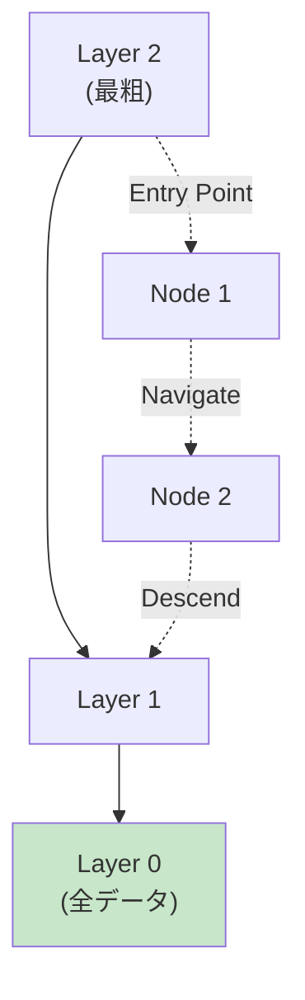
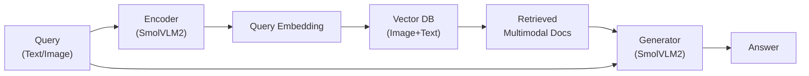
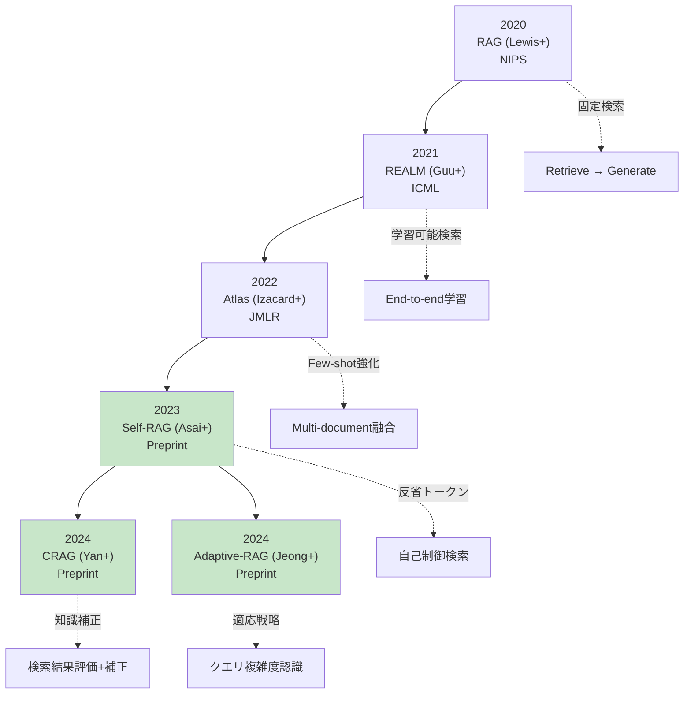
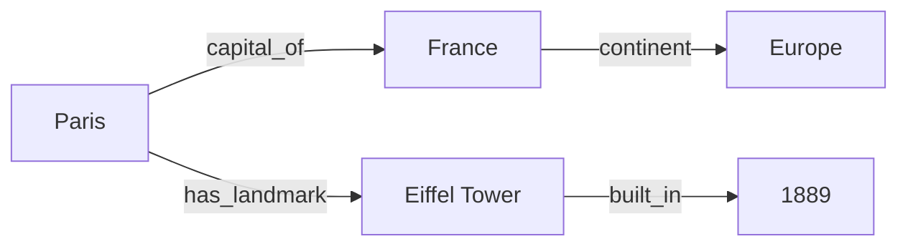
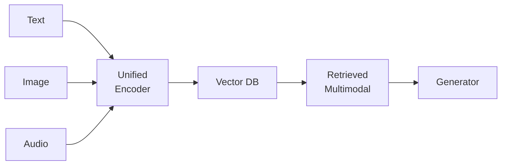

> **📖 前編（理論編）**: [第29回前編: RAG理論編](./ml-lecture-29-part1) | **← 理論・数式ゾーンへ**


## 💻 Z5. 試練（実装）（45分）— Rust/Rust/ElixirでRAGを完全実装

### 4.1 🦀 Rust: HNSW Vector Database実装

#### 4.1.1 HNSWアルゴリズムの原理

**HNSW (Hierarchical Navigable Small World)** [^6] は、近似最近傍探索（ANN）の最高峰アルゴリズム。

**Key Idea**: 階層的なグラフ構造で、粗い層から細かい層へと探索を絞り込む。



**階層構造**:

$$
\begin{aligned}
&\text{Layer } L: \text{ 少数のノード（遠距離ジャンプ）} \\
&\text{Layer } L-1: \text{ より多くのノード} \\
&\vdots \\
&\text{Layer } 0: \text{ 全ノード（高精度探索）}
\end{aligned}
$$

**探索アルゴリズム**:

```
1. Entry point: 最上層Lからスタート
2. Greedy search: 現在層で最近傍を探索
3. Descend: より下の層へ移動
4. Repeat 2-3 until Layer 0
5. Return: Layer 0での最近傍k個
```

**計算量**:

| Phase | Complexity | 説明 |
|:------|:-----------|:-----|
| **Index構築** | $O(N \log N)$ | N個のベクトル挿入 |
| **探索** | $O(\log N)$ | 階層的探索 |
| **精度** | 95-99% | Recall@k |

#### 4.1.2 Rustによる基本実装

```rust
// HNSW Implementation in Rust
use std::collections::{BinaryHeap, HashMap, HashSet};
use std::cmp::Ordering;

// Vector type (f32 for efficiency)
type Vector = Vec<f32>;

// Distance metric: Euclidean L2
fn l2_distance(a: &Vector, b: &Vector) -> f32 {
    a.iter()
        .zip(b.iter())
        .map(|(x, y)| (x - y).powi(2))
        .sum::<f32>()
        .sqrt()
}

// Cosine similarity (for normalized vectors)
fn cosine_similarity(a: &Vector, b: &Vector) -> f32 {
    let dot: f32 = a.iter().zip(b.iter()).map(|(x, y)| x * y).sum();
    let norm_a: f32 = a.iter().map(|x| x.powi(2)).sum::<f32>().sqrt();
    let norm_b: f32 = b.iter().map(|x| x.powi(2)).sum::<f32>().sqrt();

    dot / (norm_a * norm_b)
}

// Node in HNSW graph
#[derive(Clone)]
struct Node {
    id: usize,
    vector: Vector,
    // Neighbors at each layer: layer -> neighbor_ids
    neighbors: HashMap<usize, Vec<usize>>,
}

impl Node {
    fn new(id: usize, vector: Vector) -> Self {
        Self {
            id,
            vector,
            neighbors: HashMap::new(),
        }
    }
}

// Priority queue element for search
#[derive(Clone, Copy)]
struct SearchCandidate {
    id: usize,
    distance: f32,
}

impl Eq for SearchCandidate {}

impl PartialEq for SearchCandidate {
    fn eq(&self, other: &Self) -> bool {
        self.distance == other.distance
    }
}

impl Ord for SearchCandidate {
    fn cmp(&self, other: &Self) -> Ordering {
        // Min-heap (reverse order)
        other.distance.partial_cmp(&self.distance).unwrap()
    }
}

impl PartialOrd for SearchCandidate {
    fn partial_cmp(&self, other: &Self) -> Option<Ordering> {
        Some(self.cmp(other))
    }
}

// HNSW Index
struct HNSWIndex {
    nodes: Vec<Node>,
    entry_point: Option<usize>,
    max_layers: usize,
    m: usize,          // Max connections per layer
    ef_construction: usize, // Size of dynamic candidate list during construction
    ml: f32,           // Normalization factor for layer assignment
}

impl HNSWIndex {
    fn new(m: usize, ef_construction: usize, max_layers: usize) -> Self {
        Self {
            nodes: Vec::new(),
            entry_point: None,
            max_layers,
            m,
            ef_construction,
            ml: 1.0 / (m as f32).ln(),
        }
    }

    // Assign random layer for new node
    fn random_layer(&self) -> usize {
        let uniform = rand::random::<f32>();
        let layer = (-uniform.ln() * self.ml).floor() as usize;
        layer.min(self.max_layers - 1)
    }

    // Insert vector into index
    fn insert(&mut self, vector: Vector) {
        let id = self.nodes.len();
        let layer = self.random_layer();

        let mut node = Node::new(id, vector.clone());

        // Initialize neighbors for each layer
        for l in 0..=layer {
            node.neighbors.insert(l, Vec::new());
        }

        if self.entry_point.is_none() {
            // First node
            self.entry_point = Some(id);
            self.nodes.push(node);
            return;
        }

        // Search for nearest neighbors at each layer
        let entry = self.entry_point.unwrap();
        let mut current = entry;

        // Traverse from top layer to insertion layer
        for l in (layer + 1..self.max_layers).rev() {
            current = self.search_layer(&vector, current, 1, l)[0].id;
        }

        // Insert and connect at each layer from insertion layer to 0
        for l in (0..=layer).rev() {
            let candidates = self.search_layer(&vector, current, self.ef_construction, l);

            // Select M nearest neighbors
            let m = if l == 0 { self.m * 2 } else { self.m };
            let neighbors: Vec<usize> = candidates
                .iter()
                .take(m)
                .map(|c| c.id)
                .collect();

            node.neighbors.insert(l, neighbors.clone());

            // Bidirectional links
            for &neighbor_id in &neighbors {
                if let Some(neighbor) = self.nodes.get_mut(neighbor_id) {
                    if let Some(neighbor_list) = neighbor.neighbors.get_mut(&l) {
                        neighbor_list.push(id);

                        // Prune if exceeds max connections
                        if neighbor_list.len() > m {
                            neighbor_list.truncate(m);
                        }
                    }
                }
            }

            current = candidates[0].id;
        }

        // Update entry point if new node has higher layer
        if layer > self.max_layer() {
            self.entry_point = Some(id);
        }

        self.nodes.push(node);
    }

    // Get maximum layer of current index
    fn max_layer(&self) -> usize {
        self.nodes
            .iter()
            .flat_map(|n| n.neighbors.keys())
            .max()
            .copied()
            .unwrap_or(0)
    }

    // Search at a specific layer
    fn search_layer(
        &self,
        query: &Vector,
        entry_point: usize,
        ef: usize,
        layer: usize,
    ) -> Vec<SearchCandidate> {
        let mut visited = HashSet::new();
        let mut candidates = BinaryHeap::new();
        let mut w = BinaryHeap::new(); // Working set

        let entry_dist = l2_distance(query, &self.nodes[entry_point].vector);
        candidates.push(SearchCandidate {
            id: entry_point,
            distance: entry_dist,
        });
        w.push(SearchCandidate {
            id: entry_point,
            distance: entry_dist,
        });
        visited.insert(entry_point);

        while let Some(c) = candidates.pop() {
            if c.distance > w.peek().unwrap().distance {
                break;
            }

            // Explore neighbors
            if let Some(neighbors) = self.nodes[c.id].neighbors.get(&layer) {
                for &neighbor_id in neighbors {
                    if visited.insert(neighbor_id) {
                        let dist = l2_distance(query, &self.nodes[neighbor_id].vector);

                        if dist < w.peek().unwrap().distance || w.len() < ef {
                            candidates.push(SearchCandidate {
                                id: neighbor_id,
                                distance: dist,
                            });
                            w.push(SearchCandidate {
                                id: neighbor_id,
                                distance: dist,
                            });

                            if w.len() > ef {
                                w.pop();
                            }
                        }
                    }
                }
            }
        }

        w.into_sorted_vec()
    }

    // Search for k nearest neighbors
    fn search(&self, query: &Vector, k: usize, ef: usize) -> Vec<(usize, f32)> {
        if self.entry_point.is_none() {
            return Vec::new();
        }

        let entry = self.entry_point.unwrap();
        let mut current = entry;

        // Traverse from top to layer 1
        for l in (1..=self.max_layer()).rev() {
            current = self.search_layer(query, current, 1, l)[0].id;
        }

        // Search at layer 0 with larger ef
        let candidates = self.search_layer(query, current, ef.max(k), 0);

        candidates
            .into_iter()
            .take(k)
            .map(|c| (c.id, c.distance))
            .collect()
    }
}
```

#### 4.1.3 qdrant統合 — Production-ready Vector DB

**qdrant** [^7] はRust製の高性能ベクトルDBで、Production環境で広く使われている。

```rust
// qdrant integration example
use qdrant_client::{client::QdrantClient, qdrant::{
    CreateCollection, Distance, VectorParams, SearchPoints, PointStruct,
}};

async fn qdrant_example() -> Result<(), Box<dyn std::error::Error>> {
    // Connect to qdrant server
    let client = QdrantClient::from_url("http://localhost:6334").build()?;

    // Create collection
    client
        .create_collection(&CreateCollection {
            collection_name: "documents".to_string(),
            vectors_config: Some(VectorParams {
                size: 384, // Embedding dimension
                distance: Distance::Cosine as i32,
                ..Default::default()
            }.into()),
            ..Default::default()
        })
        .await?;

    // Insert vectors
    let points = vec![
        PointStruct::new(
            1,
            vec![0.1, 0.2, 0.3, /* ... 384 dims */],
            serde_json::json!({
                "text": "Paris is the capital of France.",
                "category": "geography"
            }),
        ),
    ];

    client
        .upsert_points("documents", points, None)
        .await?;

    // Search
    let search_result = client
        .search_points(&SearchPoints {
            collection_name: "documents".to_string(),
            vector: vec![0.15, 0.25, 0.35, /* query vector */],
            limit: 10,
            with_payload: Some(true.into()),
            ..Default::default()
        })
        .await?;

    for point in search_result.result {
        println!("ID: {}, Score: {}", point.id.unwrap(), point.score);
    }

    Ok(())
}
```

**qdrant の強み**:

| Feature | Description |
|:--------|:------------|
| **HNSW Index** | 95-99% recall, $O(\log N)$ 探索 |
| **Filtering** | Payload（メタデータ）での事前フィルタリング |
| **Horizontal Scaling** | Sharding + Replication |
| **Persistence** | WAL + Snapshot for durability |
| **Multi-tenancy** | Collection分離 |

#### 4.1.4 Chunking戦略の実装

**Chunking**: 長文書を検索可能なチャンクに分割。

##### Fixed-Size Chunking

```rust
fn fixed_size_chunking(text: &str, chunk_size: usize, overlap: usize) -> Vec<String> {
    let words: Vec<&str> = text.split_whitespace().collect();
    (0..words.len())
        .step_by(chunk_size - overlap)
        .map(|i| words[i..(i + chunk_size).min(words.len())].join(" "))
        .collect()
}

// Example
let text = "Paris is the capital of France. It is known for the Eiffel Tower. \
            Tokyo is the capital of Japan.";
let chunks = fixed_size_chunking(text, 10, 2);
for (i, chunk) in chunks.iter().enumerate() {
    println!("Chunk {}: {}", i, chunk);
}
```

##### Semantic Chunking

意味的境界（文・段落）でチャンク分割。

```rust
fn semantic_chunking(text: &str, max_chunk_size: usize) -> Vec<String> {
    let sentences: Vec<&str> = text
        .split('.')
        .filter(|s| !s.trim().is_empty())
        .collect();

    let mut chunks = Vec::new();
    let mut current_chunk = String::new();

    for sentence in sentences {
        let sentence = sentence.trim();
        if current_chunk.len() + sentence.len() > max_chunk_size && !current_chunk.is_empty() {
            chunks.push(current_chunk.clone());
            current_chunk.clear();
        }
        current_chunk.push_str(sentence);
        current_chunk.push_str(". ");
    }

    if !current_chunk.is_empty() {
        chunks.push(current_chunk);
    }

    chunks
}
```

##### Sliding Window Chunking

オーバーラップを保証しつつチャンク分割。

```rust
fn sliding_window_chunking(tokens: &[String], window_size: usize, stride: usize) -> Vec<Vec<String>> {
    (0..tokens.len())
        .step_by(stride)
        .map(|i| &tokens[i..(i + window_size).min(tokens.len())])
        .filter(|chunk| chunk.len() >= window_size / 2)
        .map(|chunk| chunk.to_vec())
        .collect()
}
```

**Chunking戦略の比較**:

| 戦略 | 長所 | 短所 | 適用場面 |
|:-----|:-----|:-----|:---------|
| **Fixed-Size** | シンプル・高速 | 意味境界無視 | 均質なテキスト |
| **Semantic** | 意味保持 | 可変長 | 文書・記事 |
| **Sliding Window** | 文脈保持 | 冗長性高 | コード・対話 |

### 4.2 🦀 Rust: BM25検索パイプライン実装

#### 4.2.1 トークナイズとIDF計算

```rust
use std::collections::{HashMap, HashSet};

// Tokenizer: 小文字化 + ストップワード除去
const STOPWORDS: &[&str] = &[
    "the", "is", "at", "which", "on", "a", "an", "and", "or", "of", "to", "in",
];

fn tokenize(text: &str) -> Vec<String> {
    text.to_lowercase()
        .chars()
        .map(|c| if c.is_alphanumeric() || c.is_whitespace() { c } else { ' ' })
        .collect::<String>()
        .split_whitespace()
        .filter(|w| !STOPWORDS.contains(w))
        .map(str::to_owned)
        .collect()
}

// Document corpus
struct Document {
    id: usize,
    text: String,
    tokens: Vec<String>,
}

fn build_corpus(texts: &[&str]) -> Vec<Document> {
    texts.iter().enumerate()
        .map(|(i, &text)| Document { id: i + 1, text: text.to_owned(), tokens: tokenize(text) })
        .collect()
}

// IDF: log((N - df + 0.5) / (df + 0.5))
fn compute_idf(corpus: &[Document]) -> HashMap<String, f64> {
    let n_docs = corpus.len() as f64;
    let mut doc_freq: HashMap<String, usize> = HashMap::new();
    for doc in corpus {
        let unique: HashSet<&str> = doc.tokens.iter().map(String::as_str).collect();
        for token in &unique {
            *doc_freq.entry(token.to_string()).or_default() += 1;
        }
    }
    doc_freq.into_iter()
        .map(|(term, df)| {
            let idf = ((n_docs - df as f64 + 0.5) / (df as f64 + 0.5)).ln();
            (term, idf)
        })
        .collect()
}
```

#### 4.2.2 BM25スコアリング実装

```rust
// BM25 parameters
struct BM25Params { k1: f64, b: f64 }
const DEFAULT_BM25: BM25Params = BM25Params { k1: 1.2, b: 0.75 };

fn bm25_score(
    query_tokens: &[String],
    doc: &Document,
    idf: &HashMap<String, f64>,
    avg_doc_len: f64,
    params: &BM25Params,
) -> f64 {
    let doc_len = doc.tokens.len() as f64;
    query_tokens.iter().map(|term| {
        let tf      = doc.tokens.iter().filter(|t| *t == term).count() as f64;
        let idf_val = idf.get(term).copied().unwrap_or(0.0);
        idf_val * (tf * (params.k1 + 1.0))
            / (tf + params.k1 * (1.0 - params.b + params.b * (doc_len / avg_doc_len)))
    }).sum()
}

// BM25 ranking
fn bm25_search(
    query: &str,
    corpus: &[Document],
    idf: &HashMap<String, f64>,
    top_k: usize,
    params: &BM25Params,
) -> Vec<(usize, f64)> {
    let query_tokens = tokenize(query);
    let avg_doc_len = corpus.iter().map(|d| d.tokens.len() as f64).sum::<f64>()
        / corpus.len() as f64;
    let mut scores: Vec<(usize, f64)> = corpus.iter()
        .map(|doc| (doc.id, bm25_score(&query_tokens, doc, idf, avg_doc_len, params)))
        .collect();
    scores.sort_by(|a, b| b.1.partial_cmp(&a.1).unwrap());
    scores.truncate(top_k);
    scores
}
```

#### 4.2.3 Dense Retrieval with Embeddings

```rust
// Simplified embedding (実際はSentence-BERT via Python/ONNX)
fn simple_embedding(text: &str, dim: usize) -> Vec<f32> {
    let tokens = tokenize(text);
    let mut embedding = vec![0.0f32; dim];
    // TF-IDF based embedding (simplified)
    for token in &tokens {
        let idx = token.bytes().fold(0usize, |acc, b| acc.wrapping_mul(31).wrapping_add(b as usize)) % dim;
        embedding[idx] += 1.0;
    }
    // L2 normalize
    let norm: f32 = embedding.iter().map(|x| x * x).sum::<f32>().sqrt();
    if norm > 1e-8 { embedding.iter_mut().for_each(|x| *x /= norm); }
    embedding
}

// Cosine similarity
fn cosine_sim(a: &[f32], b: &[f32]) -> f32 {
    let dot: f32 = a.iter().zip(b).map(|(x, y)| x * y).sum();
    let na: f32  = a.iter().map(|x| x * x).sum::<f32>().sqrt();
    let nb: f32  = b.iter().map(|x| x * x).sum::<f32>().sqrt();
    dot / (na * nb + 1e-8)
}

// Dense retrieval
fn dense_search(
    query: &str,
    corpus: &[Document],
    embeddings: &[Vec<f32>],
    top_k: usize,
) -> Vec<(usize, f32)> {
    let query_emb = simple_embedding(query, 384);
    let mut scores: Vec<(usize, f32)> = corpus.iter()
        .zip(embeddings.iter())
        .map(|(doc, emb)| (doc.id, cosine_sim(&query_emb, emb)))
        .collect();
    scores.sort_by(|a, b| b.1.partial_cmp(&a.1).unwrap());
    scores.truncate(top_k);
    scores
}
```

#### 4.2.4 Hybrid Retrieval: BM25 + Dense with RRF

```rust
// Reciprocal Rank Fusion
fn reciprocal_rank_fusion(rankings: &[Vec<(usize, f64)>], k: usize) -> Vec<(usize, f64)> {
    let mut rrf_scores: HashMap<usize, f64> = HashMap::new();
    for ranking in rankings {
        for (rank, &(doc_id, _)) in ranking.iter().enumerate() {
            *rrf_scores.entry(doc_id).or_default() += 1.0 / (k + rank + 1) as f64;
        }
    }
    let mut result: Vec<(usize, f64)> = rrf_scores.into_iter().collect();
    result.sort_by(|a, b| b.1.partial_cmp(&a.1).unwrap());
    result
}

// Hybrid search pipeline
fn hybrid_search(
    query: &str,
    corpus: &[Document],
    idf: &HashMap<String, f64>,
    embeddings: &[Vec<f32>],
    top_k: usize,
) -> Vec<(usize, f64)> {
    // BM25 retrieval
    let bm25_results = bm25_search(query, corpus, idf, top_k * 2, &DEFAULT_BM25);
    // Dense retrieval
    let dense_results: Vec<(usize, f64)> = dense_search(query, corpus, embeddings, top_k * 2)
        .into_iter().map(|(id, s)| (id, s as f64)).collect();
    // RRF fusion
    let mut fused = reciprocal_rank_fusion(&[bm25_results, dense_results], 60);
    fused.truncate(top_k);
    fused
}
```

#### 4.2.5 Reranking with Cross-Encoder

```rust
// Simplified cross-encoder scoring (実際はBERTベースモデルを使用)
fn cross_encoder_score(query: &str, doc_text: &str) -> f64 {
    let query_tokens: HashSet<String> = tokenize(query).into_iter().collect();
    tokenize(doc_text).iter().enumerate()
        .filter(|(_, token)| query_tokens.contains(*token))
        .map(|(i, _)| 1.0 / (1.0 + 0.1 * i as f64))
        .sum()
}

// Rerank top results
fn rerank(
    query: &str,
    corpus: &[Document],
    initial_ranking: &[(usize, f64)],
    top_k: usize,
) -> Vec<(usize, f64)> {
    // Score each candidate with cross-encoder
    let mut reranked: Vec<(usize, f64)> = initial_ranking.iter()
        .filter_map(|&(doc_id, _)| {
            corpus.iter().find(|d| d.id == doc_id)
                .map(|doc| (doc_id, cross_encoder_score(query, &doc.text)))
        })
        .collect();
    reranked.sort_by(|a, b| b.1.partial_cmp(&a.1).unwrap());
    reranked.truncate(top_k);
    reranked
}
```

#### 4.2.6 Complete RAG Pipeline in Rust

```rust
// End-to-end RAG pipeline
struct RAGPipeline {
    corpus: Vec<Document>,
    idf: HashMap<String, f64>,
    embeddings: Vec<Vec<f32>>,
}

impl RAGPipeline {
    fn new(texts: &[&str]) -> Self {
        let corpus     = build_corpus(texts);
        let idf        = compute_idf(&corpus);
        let embeddings = corpus.iter().map(|d| simple_embedding(&d.text, 384)).collect();
        RAGPipeline { corpus, idf, embeddings }
    }

    fn search(&self, query: &str, top_k: usize, use_rerank: bool) -> Vec<(usize, f64)> {
        // Stage 1: Hybrid retrieval (BM25 + Dense)
        let candidates = hybrid_search(query, &self.corpus, &self.idf, &self.embeddings, top_k * 3);
        // Stage 2: Reranking (optional)
        if use_rerank { rerank(query, &self.corpus, &candidates, top_k) }
        else          { candidates.into_iter().take(top_k).collect() }
    }
}

fn main() {
    let texts = [
        "Paris is the capital of France. It is known for the Eiffel Tower.",
        "Tokyo is the capital of Japan. It has a population of 14 million.",
        "Berlin is the capital of Germany. The Berlin Wall fell in 1989.",
        "London is the capital of England. Big Ben is a famous landmark.",
    ];
    let pipeline = RAGPipeline::new(&texts);
    let results  = pipeline.search("What is the capital of France?", 3, true);

    println!("Search Results:");
    for (i, (doc_id, score)) in results.iter().enumerate() {
        let doc = pipeline.corpus.iter().find(|d| d.id == *doc_id).unwrap();
        println!("{}. [Score: {:.3}] {}", i + 1, score, doc.text);
    }
}
```

### 4.3 🔮 Elixir: 分散RAGサービング実装

#### 4.3.1 GenServer による状態管理

```elixir
# RAG Server with GenServer
defmodule RAG.Server do
  use GenServer
  require Logger

  # Client API

  def start_link(opts \\ []) do
    GenServer.start_link(__MODULE__, opts, name: __MODULE__)
  end

  def search(query, opts \\ []) do
    GenServer.call(__MODULE__, {:search, query, opts}, :infinity)
  end

  def index_documents(documents) do
    GenServer.cast(__MODULE__, {:index, documents})
  end

  # Server Callbacks

  @impl true
  def init(_opts) do
    state = %{
      documents: [],
      embeddings: %{},
      cache: %{},
      stats: %{searches: 0, cache_hits: 0}
    }

    {:ok, state}
  end

  @impl true
  def handle_call({:search, query, opts}, _from, state) do
    # Check cache first
    case Map.get(state.cache, query) do
      nil ->
        # Cache miss - perform search
        results = perform_search(query, state.documents, state.embeddings, opts)

        # Update cache
        new_cache = Map.put(state.cache, query, results)
        |> limit_cache_size(1000)  # LRU eviction

        new_state = state
        |> Map.update!(:stats, &Map.update!(&1, :searches, fn x -> x + 1 end))
        |> Map.put(:cache, new_cache)

        {:reply, {:ok, results}, new_state}

      cached_results ->
        # Cache hit
        new_state = Map.update!(state, :stats, &Map.update!(&1, :cache_hits, fn x -> x + 1 end))
        Logger.debug("Cache hit for query: #{query}")

        {:reply, {:ok, cached_results}, new_state}
    end
  end

  @impl true
  def handle_cast({:index, documents}, state) do
    # Index documents (compute embeddings, build index)
    embeddings = documents
    |> Enum.map(&{&1.id, compute_embedding(&1.text)})
    |> Map.new()

    new_state = state
    |> Map.put(:documents, documents)
    |> Map.put(:embeddings, embeddings)
    |> Map.put(:cache, %{})  # Clear cache on reindex

    Logger.info("Indexed #{length(documents)} documents")

    {:noreply, new_state}
  end

  # Helper functions

  defp perform_search(query, documents, embeddings, opts) do
    top_k = Keyword.get(opts, :top_k, 10)

    query_emb = compute_embedding(query)

    # Compute similarities
    results = Enum.map(documents, fn doc ->
      similarity = cosine_similarity(query_emb, embeddings[doc.id])
      %{doc_id: doc.id, text: doc.text, score: similarity}
    end)
    |> Enum.sort_by(& &1.score, :desc)
    |> Enum.take(top_k)

    results
  end

  defp compute_embedding(text) do
    # Call Python embedding service or use ONNX
    # Simplified: random embedding
    for _ <- 1..384, do: :rand.uniform()
  end

  defp cosine_similarity(a, b) do
    dot_product = Enum.zip(a, b) |> Enum.map(fn {x, y} -> x * y end) |> Enum.sum()
    norm_a = a |> Enum.map(&(&1 * &1)) |> Enum.sum() |> :math.sqrt()
    norm_b = b |> Enum.map(&(&1 * &1)) |> Enum.sum() |> :math.sqrt()
    dot_product / (norm_a * norm_b + 1.0e-8)
  end

  defp limit_cache_size(cache, max_size) do
    if map_size(cache) > max_size do
      # Simple LRU: remove oldest (first inserted)
      cache
      |> Enum.take(max_size)
      |> Map.new()
    else
      cache
    end
  end
end
```

#### 4.3.2 分散検索 with Task.async

```elixir
defmodule RAG.DistributedSearch do
  @moduledoc """
  Distributed RAG search across multiple nodes
  """

  def parallel_search(query, shards, opts \\ []) do
    timeout = Keyword.get(opts, :timeout, 5000)
    results =
      shards
      |> Task.async_stream(&search_shard(query, &1, opts),
           max_concurrency: length(shards), timeout: timeout)
      |> Enum.map(fn {:ok, r} -> r end)
    merge_results(results, opts)
  end

  defp search_shard(query, shard, opts) do
    # Call RAG.Server on specific node/shard
    case :rpc.call(shard.node, RAG.Server, :search, [query, opts]) do
      {:ok, results} -> results
      {:badrpc, reason} ->
        Logger.error("RPC error for shard #{shard.id}: #{inspect(reason)}")
        []
    end
  end

  defp merge_results(results_list, opts) do
    top_k = Keyword.get(opts, :top_k, 10)

    # Flatten and sort by score
    results_list
    |> List.flatten()
    |> Enum.sort_by(& &1.score, :desc)
    |> Enum.take(top_k)
  end
end
```

#### 4.3.3 バックプレッシャー制御

```elixir
defmodule RAG.RateLimiter do
  use GenServer

  def start_link(opts) do
    GenServer.start_link(__MODULE__, opts, name: __MODULE__)
  end

  def check_rate(user_id) do
    GenServer.call(__MODULE__, {:check_rate, user_id})
  end

  @impl true
  def init(opts) do
    max_requests = Keyword.get(opts, :max_requests, 100)
    window_ms = Keyword.get(opts, :window_ms, 60_000)

    state = %{
      max_requests: max_requests,
      window_ms: window_ms,
      requests: %{}
    }

    # Periodic cleanup
    :timer.send_interval(window_ms, :cleanup)

    {:ok, state}
  end

  @impl true
  def handle_call({:check_rate, user_id}, _from, state) do
    now = System.monotonic_time(:millisecond)
    window_start = now - state.window_ms

    # Get user requests in current window
    user_requests = Map.get(state.requests, user_id, [])
    |> Enum.filter(fn timestamp -> timestamp >= window_start end)

    if length(user_requests) < state.max_requests do
      # Allow request
      new_requests = [now | user_requests]
      new_state = put_in(state.requests[user_id], new_requests)

      {:reply, :ok, new_state}
    else
      # Rate limit exceeded
      {:reply, {:error, :rate_limit_exceeded}, state}
    end
  end

  @impl true
  def handle_info(:cleanup, state) do
    now = System.monotonic_time(:millisecond)
    window_start = now - state.window_ms

    # Remove expired requests
    new_requests = state.requests
    |> Enum.map(fn {user_id, timestamps} ->
      {user_id, Enum.filter(timestamps, &(&1 >= window_start))}
    end)
    |> Enum.reject(fn {_user_id, timestamps} -> Enum.empty?(timestamps) end)
    |> Map.new()

    {:noreply, %{state | requests: new_requests}}
  end
end
```

#### 4.3.4 Production RAG Service

```elixir
defmodule RAG.Application do
  use Application

  def start(_type, _args) do
    children = [
      # RAG Server
      {RAG.Server, []},

      # Rate Limiter
      {RAG.RateLimiter, [max_requests: 100, window_ms: 60_000]},

      # HTTP API (Phoenix endpoint)
      RAG.Web.Endpoint,

      # Background indexer
      RAG.BackgroundIndexer
    ]

    opts = [strategy: :one_for_one, name: RAG.Supervisor]
    Supervisor.start_link(children, opts)
  end
end

# HTTP Endpoint (Phoenix controller)
defmodule RAG.Web.SearchController do
  use Phoenix.Controller

  def search(conn, %{"query" => query} = params) do
    user_id = get_session(conn, :user_id)
    top_k   = Map.get(params, "top_k", 10)

    with :ok <- RAG.RateLimiter.check_rate(user_id),
         {:ok, results} <- RAG.Server.search(query, top_k: top_k) do
      json(conn, %{query: query, results: results})
    else
      {:error, :rate_limit_exceeded} ->
        conn |> put_status(:too_many_requests) |> json(%{error: "Rate limit exceeded"})
      {:error, reason} ->
        conn |> put_status(:internal_server_error) |> json(%{error: reason})
    end
  end
end
```


---

> Progress: 85%
> **理解度チェック**
> 1. RustのHNSWインデックス実装において、階層グラフ構造がANN（近似最近傍探索）の計算量をO(log N)に抑える仕組みを説明せよ。
> 2. ElixirのGenStage + Broadwayによる分散RAGサービングで、バックプレッシャー制御がなぜスループット安定化に不可欠か。

### 🔬 実験・検証（30分）— RAG評価とSmolVLM2統合

### 5.1 RAG評価メトリクス

#### 5.1.1 Retrieval Metrics

**Precision@k**: Top-k件中の関連文書の割合

$$
\text{Precision@}k = \frac{\text{\# of relevant docs in top-}k}{k}
$$

**Recall@k**: 全関連文書中、Top-k件に含まれる割合

$$
\text{Recall@}k = \frac{\text{\# of relevant docs in top-}k}{\text{\# of all relevant docs}}
$$

**Mean Reciprocal Rank (MRR)**: 最初の関連文書のランクの逆数の平均

$$
\text{MRR} = \frac{1}{|Q|} \sum_{i=1}^{|Q|} \frac{1}{\text{rank}_i}
$$

**Normalized Discounted Cumulative Gain (NDCG@k)**:

$$
\begin{aligned}
\text{DCG@}k &= \sum_{i=1}^k \frac{2^{\text{rel}_i} - 1}{\log_2(i + 1)} \\
\text{NDCG@}k &= \frac{\text{DCG@}k}{\text{IDCG@}k}
\end{aligned}
$$

ここで $\text{IDCG@}k$ は理想的な順位でのDCG。

#### 5.1.2 Generation Metrics

**Context Relevance**: 検索されたコンテキストがクエリに関連しているか

```rust
// Context Relevance Score
fn context_relevance(query: &str, contexts: &[&str]) -> f64 {
    let qt: HashSet<String> = tokenize(query).into_iter().collect();
    let sum: f64 = contexts.iter()
        .map(|ctx| {
            let ct: HashSet<String> = tokenize(ctx).into_iter().collect();
            ct.intersection(&qt).count() as f64 / (qt.len() as f64 + 1e-8)
        })
        .sum();
    sum / contexts.len().max(1) as f64
}
```

**Answer Faithfulness**: 生成された回答がコンテキストに忠実か

$$
\text{Faithfulness} = \frac{\text{\# of claims supported by context}}{\text{\# of total claims}}
$$

**Answer Relevance**: 生成された回答がクエリに関連しているか

```rust
// Answer Relevancy: cosine similarity between query and answer embeddings
fn answer_relevance(query_emb: &[f32], answer_emb: &[f32]) -> f32 {
    cosine_sim(query_emb, answer_emb)
}
```

#### 5.1.3 RAGAS Framework

**RAGAS** [^8] (RAG Assessment): RAG評価の統合フレームワーク

**4つの主要メトリクス**:

| Metric | 説明 | 式 |
|:-------|:-----|:---|
| **Context Precision** | 関連文書が上位にランクされているか | $\frac{\sum_{k=1}^K v_k \cdot \text{Precision@}k}{K}$ |
| **Context Recall** | 全関連文書が検索されたか | $\frac{\text{# retrieved relevant}}{\text{# total relevant}}$ |
| **Faithfulness** | 回答がコンテキストに支持されているか | $\frac{\text{# supported claims}}{\text{# total claims}}$ |
| **Answer Relevancy** | 回答がクエリに関連しているか | $\text{cos}(\text{emb}_q, \text{emb}_a)$ |

**統合スコア**:

$$
\text{RAGAS Score} = \left( \text{Precision} \times \text{Recall} \times \text{Faithfulness} \times \text{Relevancy} \right)^{1/4}
$$

幾何平均で全メトリクスをバランス。

#### 5.1.4 Rust実装: RAGAS評価

```rust
struct RAGASEvaluator {
    pipeline: RAGPipeline,
}

impl RAGASEvaluator {
    /// Evaluate single query → (context_precision, context_recall, faithfulness, answer_relevancy, ragas_score, answer)
    fn evaluate_query(
        &self,
        query: &str,
        ground_truth_docs: &HashSet<usize>,
    ) -> (f64, f64, f64, f64, f64, String) {
        let retrieved = self.pipeline.search(query, 10, true);
        let retrieved_ids: HashSet<usize> = retrieved.iter().map(|&(id, _)| id).collect();

        // Context Precision
        let precision_scores: Vec<f64> = (1..=retrieved.len()).map(|k| {
            let top_k_ids: HashSet<usize> = retrieved[..k].iter().map(|&(id, _)| id).collect();
            if ground_truth_docs.contains(&retrieved[k - 1].0) {
                top_k_ids.intersection(ground_truth_docs).count() as f64 / k as f64
            } else { 0.0 }
        }).collect();
        let context_precision = precision_scores.iter().sum::<f64>() / precision_scores.len().max(1) as f64;

        // Context Recall
        let context_recall = retrieved_ids.intersection(ground_truth_docs).count() as f64
            / (ground_truth_docs.len() as f64 + 1e-8);

        // Faithfulness (simplified)
        let retrieved_texts: Vec<&str> = retrieved.iter()
            .filter_map(|&(id, _)| self.pipeline.corpus.iter().find(|d| d.id == id).map(|d| d.text.as_str()))
            .collect();
        let answer = generate_answer(query, &retrieved_texts);
        let faithfulness = compute_faithfulness(&answer, &retrieved_texts);

        // Answer Relevancy (cosine similarity)
        let query_emb  = simple_embedding(query, 384);
        let answer_emb = simple_embedding(&answer, 384);
        let answer_relevancy = cosine_sim(&query_emb, &answer_emb) as f64;

        // RAGAS Score (geometric mean)
        let ragas_score = (context_precision * context_recall * faithfulness * answer_relevancy).powf(0.25);

        (context_precision, context_recall, faithfulness, answer_relevancy, ragas_score, answer)
    }
}

fn compute_faithfulness(answer: &str, contexts: &[&str]) -> f64 {
    let claims: Vec<&str> = answer.split(". ").collect();
    let supported = claims.iter().filter(|&&claim| {
        contexts.iter().any(|ctx| {
            ctx.to_lowercase().contains(&claim.to_lowercase()) || token_overlap(claim, ctx) > 0.5
        })
    }).count();
    supported as f64 / (claims.len() as f64 + 1e-8)
}

fn token_overlap(text1: &str, text2: &str) -> f64 {
    let t1: HashSet<String> = tokenize(text1).into_iter().collect();
    let t2: HashSet<String> = tokenize(text2).into_iter().collect();
    let overlap = t1.intersection(&t2).count();
    overlap as f64 / (t1.union(&t2).count() as f64 + 1e-8)
}

fn generate_answer(query: &str, contexts: &[&str]) -> String {
    // Simulated LLM generation (実際はLLM呼び出し)
    let combined = contexts[..contexts.len().min(3)].join(" ");
    format!("Based on the context, {}, the answer to '{}' is found in the documents.", combined, query)
}
```

### 5.2 SmolVLM2-256M + RAG統合演習

#### 5.2.1 マルチモーダルRAGの設計

**シナリオ**: 画像 + テキストのマルチモーダル知識ベースから検索



**アーキテクチャ**:

1. **Indexing**: 画像 + キャプションをSmolVLM2でEmbedding → Vector DBに保存
2. **Retrieval**: クエリをEmbedding → Top-k画像+テキストを検索
3. **Generation**: 検索結果をコンテキストとしてSmolVLM2で生成

#### 5.2.2 Rust + Rust統合実装

```rust
// Multimodal RAG Pipeline

// SmolVLM2 embedding service（Rustバックエンド経由）
fn smolvlm2_embed(text: &str, endpoint: &str) -> Result<Vec<f32>, Box<dyn std::error::Error>> {
    let client = reqwest::blocking::Client::new();
    let result: serde_json::Value = client
        .post(endpoint)
        .json(&serde_json::json!({ "text": text }))
        .send()?
        .json()?;
    let embedding: Vec<f32> = result["embedding"]
        .as_array().unwrap_or(&vec![])
        .iter().map(|v| v.as_f64().unwrap_or(0.0) as f32)
        .collect();
    Ok(embedding)
}

// Multimodal document
struct MultimodalDocument {
    id: usize,
    text: String,
    image_path: Option<String>,
    embedding: Vec<f32>,
}

// Build multimodal index
fn build_multimodal_index(docs: &[(&str, Option<&str>)], endpoint: &str) -> Vec<MultimodalDocument> {
    docs.iter().enumerate().map(|(i, &(text, image_path))| {
        let embed_input = match image_path {
            Some(img) => format!("{} [IMG: {}]", text, img),
            None      => text.to_owned(),
        };
        let embedding = smolvlm2_embed(&embed_input, endpoint).unwrap_or_default();
        MultimodalDocument { id: i + 1, text: text.to_owned(), image_path: image_path.map(str::to_owned), embedding }
    }).collect()
}

// Multimodal search
fn multimodal_search<'a>(
    query: &str,
    index: &'a [MultimodalDocument],
    top_k: usize,
    endpoint: &str,
) -> Vec<(usize, f32, &'a MultimodalDocument)> {
    let query_emb = smolvlm2_embed(query, endpoint).unwrap_or_default();
    let mut scores: Vec<(usize, f32, &MultimodalDocument)> = index.iter()
        .map(|doc| (doc.id, cosine_sim(&query_emb, &doc.embedding), doc))
        .collect();
    scores.sort_by(|a, b| b.1.partial_cmp(&a.1).unwrap());
    scores.truncate(top_k);
    scores
}

fn main() {
    let multimodal_docs = [
        ("The Eiffel Tower in Paris at sunset.",        Some("images/eiffel_tower.jpg")),
        ("Tokyo Tower with cherry blossoms in spring.", Some("images/tokyo_tower.jpg")),
        ("Berlin Wall memorial with historical graffiti.", None),
        ("Big Ben clock tower in London.",               Some("images/big_ben.jpg")),
    ];
    let endpoint = "http://localhost:8080/embed";
    let index    = build_multimodal_index(&multimodal_docs, endpoint);
    let results  = multimodal_search("Show me towers in European cities", &index, 3, endpoint);

    for (i, (doc_id, score, doc)) in results.iter().enumerate() {
        println!("{}. [Score: {:.3}] {}", i + 1, score, doc.text);
        if let Some(img) = &doc.image_path { println!("   Image: {}", img); }
    }
}
```

#### 5.2.3 Rust Embedding Service (ONNX Runtime)

```rust
// SmolVLM2 embedding service with ONNX Runtime
use actix_web::{post, web, App, HttpResponse, HttpServer, Responder};
use ndarray::{Array1, Array2};
use ort::{Environment, SessionBuilder, Value};
use serde::{Deserialize, Serialize};

#[derive(Deserialize)]
struct EmbedRequest {
    text: String,
}

#[derive(Serialize)]
struct EmbedResponse {
    embedding: Vec<f32>,
}

#[post("/embed")]
async fn embed_endpoint(req: web::Json<EmbedRequest>) -> impl Responder {
    // Tokenize text (simplified)
    let tokens = tokenize(&req.text);

    // Run inference
    match run_embedding_model(&tokens) {
        Ok(embedding) => HttpResponse::Ok().json(EmbedResponse {
            embedding: embedding.to_vec(),
        }),
        Err(e) => HttpResponse::InternalServerError().body(format!("Error: {}", e)),
    }
}

fn tokenize(text: &str) -> Vec<i64> {
    // Simplified tokenizer (in practice, use HuggingFace tokenizers)
    text.chars()
        .filter(|c| c.is_alphanumeric() || c.is_whitespace())
        .map(|c| c as i64)
        .collect()
}

fn run_embedding_model(tokens: &[i64]) -> Result<Array1<f32>, Box<dyn std::error::Error>> {
    // Load ONNX model
    let environment = Environment::builder().with_name("smolvlm2").build()?;

    let session = SessionBuilder::new(&environment)?
        .with_model_from_file("models/smolvlm2_encoder.onnx")?;

    // Prepare input
    let input_ids = Array2::from_shape_vec((1, tokens.len()), tokens.to_vec())?;

    let input_tensor = Value::from_array(session.allocator(), &input_ids)?;

    // Run inference
    let outputs = session.run(vec![input_tensor])?;

    // Extract embedding (CLS token)
    let embedding_tensor = outputs[0].try_extract::<f32>()?;
    let embedding = embedding_tensor.view().to_owned();

    // Mean pooling (simplified)
    let mean_embedding = embedding.mean_axis(ndarray::Axis(1)).unwrap();

    Ok(mean_embedding)
}

#[actix_web::main]
async fn main() -> std::io::Result<()> {
    HttpServer::new(|| App::new().service(embed_endpoint))
        .bind(("127.0.0.1", 8080))?
        .run()
        .await
}
```

### 5.3 自己診断テスト

<details><summary>記号読解10問</summary>

**問1**: BM25の式で $k_1$ パラメータの役割は？

a) 文書長正規化
b) TF飽和度制御
c) IDF重み付け
d) クエリ拡張

<details><summary>解答</summary>

**b) TF飽和度制御**

$$
\frac{f(q_i, D) \cdot (k_1 + 1)}{f(q_i, D) + k_1 \cdot (\cdots)}
$$

$k_1 \to \infty$ で飽和なし、$k_1 = 0$ でTF無視。
</details>

**問2**: HNSW の探索計算量は？

a) $O(N)$
b) $O(N \log N)$
c) $O(\log N)$
d) $O(1)$

<details><summary>解答</summary>

**c) $O(\log N)$**

階層的探索により対数時間で近似最近傍を発見。
</details>

**問3**: Self-RAG の反省トークン **[IsSup]** の意味は？

a) 検索が必要か
b) 検索結果が関連しているか
c) 生成がコンテキストに支持されているか
d) 生成がクエリに有用か

<details><summary>解答</summary>

**c) 生成がコンテキストに支持されているか**

[IsSup] = Fully/Partially/No
</details>

**問4**: RRF (Reciprocal Rank Fusion) の式は？

a) $\sum_r \frac{1}{k + \text{rank}_r(d)}$
b) $\sum_r \text{rank}_r(d)$
c) $\prod_r \frac{1}{\text{rank}_r(d)}$
d) $\max_r \text{rank}_r(d)$

<details><summary>解答</summary>

**a) $\sum_r \frac{1}{k + \text{rank}_r(d)}$**

複数ランキングを統合、$k=60$ が標準。
</details>

**問5**: ColBERT の MaxSim 式は？

a) $\sum_{i} \max_j \mathbf{E}_Q[i] \cdot \mathbf{E}_D[j]$
b) $\max_{i,j} \mathbf{E}_Q[i] \cdot \mathbf{E}_D[j]$
c) $\sum_{i,j} \mathbf{E}_Q[i] \cdot \mathbf{E}_D[j]$
d) $\mathbf{E}_Q \cdot \mathbf{E}_D^\top$


> Progress: 95%
> **理解度チェック**
> 1. GraphRAGがNaive RAGより複雑な多ホップ質問（「エッフェル塔がある国のGDP」）を解決できる理由を、知識グラフのトラバーサルという観点から説明せよ。
> 2. Long-context LLM（128k token超）の登場により「RAGは不要になるのか」という問いに対し、レイテンシ・コスト・鮮度の3軸で論じよ。

## 🔬 Z6. 新たな冒険へ（研究動向）

### 6.1 RAG研究系譜



### 6.2 GraphRAG — グラフ知識ベース

**GraphRAG**: 知識ベースをグラフ構造で管理



**利点**:
- エンティティ間の関係を明示的にモデル化
- Multi-hop reasoning が容易
- 知識の一貫性保証

**クエリ例**:

```
Query: "What landmarks are in European capitals?"

Graph Traversal:
1. capitals in Europe → [Paris, Berlin, London, ...]
2. landmarks in Paris → [Eiffel Tower, ...]
3. Return: [Eiffel Tower, Brandenburg Gate, Big Ben, ...]
```

**実装技術**: Neo4j, NetworkX, DGL

### 6.3 Multi-modal RAG

**テキスト + 画像 + 音声** を統合したRAG



**ユースケース**:
- 医療画像診断（画像 + 病歴テキスト）
- 動画検索（映像 + 字幕 + 音声）
- Eコマース（商品画像 + レビュー）

**SOTA Models**: CLIP, BLIP-2, CoCa, SmolVLM2

### 6.4 Long-context vs RAG論争

| | Long-context LLM | RAG |
|:--|:----------------|:----|
| **Context長** | 100K-1M tokens | 数千tokens |
| **精度** | 中（Middle-lost問題） | 高（関連部分のみ） |
| **コスト** | 高（全文処理） | 低（検索後のみ） |
| **レイテンシ** | 高 | 中（検索オーバーヘッド） |
| **知識更新** | 再学習必要 | 文書追加のみ |

**Middle-lost問題**: Long-contextでは中間部分の情報が失われやすい

**ハイブリッド戦略**: RAGで絞り込み → Long-contextで精密処理


## 🎭 Z7. エピローグ（まとめ・FAQ・次回予告）

### 6.6 本講義で学んだ3つの核心

#### 核心1: RAGは知識の動的拡張

**Without RAG**: LLMは学習データの知識のみ（固定・古い・不完全）

**With RAG**: 外部知識を検索→統合（リアルタイム・最新・文脈特化）

$$
P(a \mid q) = \sum_{d \in \text{Retrieved}(q)} P(a \mid q, d) \cdot \text{Score}(d, q)
$$

#### 核心2: 検索精度がRAGの成否を決める

**検索戦略の進化**:

```
Naive (BM25のみ) → Dense (Embedding) → Hybrid (BM25+Dense) → Agentic (Self-RAG/CRAG)
```

**精度向上の鍵**:
1. **Hybrid Retrieval**: Sparse + Dense の相補性
2. **Reranking**: Cross-Encoder で精密化
3. **Agentic Control**: 検索タイミング・戦略の自律判断

#### 核心3: 実装は3言語フルスタック

- **🦀 Rust**: Vector DB (HNSW, qdrant) — 高速・安全
- **🦀 Rust**: 検索パイプライン (BM25, Embedding, RRF) — 表現力・速度
- **🔮 Elixir**: 分散サービング (GenServer, Rate Limiting) — 並行性・耐障害性

### 6.7 FAQ 5問

**Q1: RAGとFine-tuningを併用すべきか？**

**A**: 用途による。

- **Fine-tuning**: ドメイン固有の言語スタイル・タスク特化
- **RAG**: 最新知識・動的知識

併用例: Fine-tunedモデル + RAG = ドメイン特化 + 最新知識

**Q2: ベクトルDBのスケーリング戦略は？**

**A**: Sharding + Replication

- **Sharding**: データを複数ノードに分割（水平スケーリング）
- **Replication**: 各Shardを複製（可用性向上）
- qdrant/Milvusは標準対応

**Q3: BM25とDenseでどちらを優先？**

**A**: タスクによる

- **BM25**: 固有名詞・完全一致・レア単語
- **Dense**: 意味的類似性・言い換え・多言語
- **推奨**: Hybrid (RRF融合)

**Q4: Chunkサイズの最適値は？**

**A**: タスク・モデルによる

- **一般**: 256-512 tokens
- **短文タスク**: 128 tokens
- **長文理解**: 1024 tokens
- **実験**: Recall/Latency トレードオフで調整

**Q5: Agentic RAGの学習コストは？**

**A**: 高いが効果大

- Self-RAG: 反省トークンの教師データ生成が必要
- CRAG: Evaluator学習（軽量LM）
- **ROI高**: 検索精度が劇的向上（GPT-4超え）

### 6.10 次回予告: 第30回 エージェント完全版

**第30回で学ぶこと**:

- **ReAct**: Reasoning + Acting の統合
- **Tool Use**: 外部ツール呼び出し（検索・計算・API）
- **Multi-Agent Systems**: 協調・競争・交渉
- **AutoGPT/BabyAGI**: 自律エージェントの実装
- **Planning**: PDDL/HTN による長期計画
- **Memory**: エピソード記憶・意味記憶・作業記憶


---


## 📚 参考文献

[^1]: Lewis, P., et al. (2020). "Retrieval-Augmented Generation for Knowledge-Intensive NLP Tasks." *NeurIPS 2020*. [arXiv:2005.11401](https://arxiv.org/abs/2005.11401)

[^2]: Asai, A., et al. (2024). "Self-RAG: Learning to Retrieve, Generate, and Critique through Self-Reflection." *ICLR 2024 (Oral)*. [arXiv:2310.11511](https://arxiv.org/abs/2310.11511)

[^3]: Yan, S., et al. (2024). "Corrective Retrieval Augmented Generation." *arXiv preprint*. [arXiv:2401.15884](https://arxiv.org/abs/2401.15884)

[^6]: Malkov, Y. A., & Yashunin, D. A. (2018). "Efficient and robust approximate nearest neighbor search using Hierarchical Navigable Small World graphs." *IEEE TPAMI*. [arXiv:1603.09320](https://arxiv.org/abs/1603.09320)

[^7]: qdrant. "Qdrant - Vector Database." [GitHub](https://github.com/qdrant/qdrant) | [Docs](https://qdrant.tech/)

[^8]: RAGAS. "RAG Assessment Framework." [GitHub](https://github.com/explodinggradients/ragas)

[^9]: Johnson, J., Douze, M., & Jégou, H. (2019). "Billion-scale similarity search with GPUs." *IEEE Transactions on Big Data*. FAISS [GitHub](https://github.com/facebookresearch/faiss)

> **📖 前編（理論編）**: [第29回前編: RAG理論編](./ml-lecture-29-part1) | **← 理論・数式ゾーンへ**

## 著者リンク

- Blog: https://fumishiki.dev
- X: https://x.com/fumishiki
- LinkedIn: https://www.linkedin.com/in/fumitakamurakami
- GitHub: https://github.com/fumishiki
- Hugging Face: https://huggingface.co/fumishiki

## ライセンス

本記事は [CC BY-NC-SA 4.0](https://creativecommons.org/licenses/by-nc-sa/4.0/deed.ja)（クリエイティブ・コモンズ 表示 - 非営利 - 継承 4.0 国際）の下でライセンスされています。

### ⚠️ 利用制限について

**本コンテンツは個人の学習目的に限り利用可能です。**

**以下のケースは事前の明示的な許可なく利用することを固く禁じます:**

1. **企業・組織内での利用（営利・非営利問わず）**
   - 社内研修、教育カリキュラム、社内Wikiへの転載
   - 大学・研究機関での講義利用
   - 非営利団体での研修利用
   - **理由**: 組織内利用では帰属表示が削除されやすく、無断改変のリスクが高いため

2. **有料スクール・情報商材・セミナーでの利用**
   - 受講料を徴収する場での配布、スクリーンショットの掲示、派生教材の作成

3. **LLM/AIモデルの学習データとしての利用**
   - 商用モデルのPre-training、Fine-tuning、RAGの知識ソースとして本コンテンツをスクレイピング・利用すること

4. **勝手に内容を有料化する行為全般**
   - 有料note、有料記事、Kindle出版、有料動画コンテンツ、Patreon限定コンテンツ等

**個人利用に含まれるもの:**
- 個人の学習・研究
- 個人的なノート作成（個人利用に限る）
- 友人への元記事リンク共有

**組織での導入をご希望の場合**は、必ず著者に連絡を取り、以下を遵守してください:
- 全ての帰属表示リンクを維持
- 利用方法を著者に報告

**無断利用が発覚した場合**、使用料の請求およびSNS等での公表を行う場合があります。

---