# 第30回: エージェント完全版 — ReAct Loop・Tool Use・Planning・Memory・Multi-Agent・MCP

> **第29回でRAGにより外部知識を接続した。今回は知識だけでなく"行動"できるAIへ — エージェント完全版。ReAct Loop / Tool Use / Planning / Memory / Multi-Agent / MCPの全領域を網羅する。**

AIは"読む"から"行動する"存在へと進化している。ChatGPTやClaude、Geminiは単なるテキスト生成器ではなく、ツールを呼び出し、計画を立て、過去の記憶を参照し、複数のエージェントと協調して複雑なタスクを遂行する**エージェント**だ。

本講義では、エージェントの全体像を完全に解説する:

1. **ReAct Loop基礎** — Observation-Thought-Action-Repeat のサイクル
2. **Tool Use完全実装** — Function Calling / Tool Registry / Error Handling
3. **Planning手法** — Zero-shot / Plan-and-Execute / ReWOO
4. **Memory Systems** — Short-term / Long-term / Episodic / Semantic / Vector Memory
5. **Multi-Agent** — Communication / Role Assignment / Consensus & Debate
6. **MCP完全解説** — Model Context Protocol の仕様と実装
7. **実装編** — 🦀 Rust Agent Engine + 🔮 Elixir Multi-Agent + ⚡ Julia Orchestration

これはCourse IIIの第12回 — 実践編の集大成であり、第31回MLOpsへの橋渡しでもある。

:::message
**前提知識**: 第28回(Prompt Engineering), 第29回(RAG)。Rust/Julia/Elixirの基礎は第9-19回で習得済み。
:::



```mermaid
graph TD
    A["🧠 Agent Loop<br/>Observation→Thought→Action"] --> B["🛠️ Tool Use<br/>Function Calling"]
    B --> C["📋 Planning<br/>ReWOO/Hierarchical"]
    C --> D["💾 Memory<br/>Vector+Episodic"]
    D --> E["👥 Multi-Agent<br/>Communication"]
    E --> F["🔌 MCP<br/>Standard Protocol"]
    F --> G["🚀 Production<br/>Rust+Elixir+Julia"]
    style A fill:#e3f2fd
    style G fill:#c8e6c9
```

**所要時間の目安**:

| ゾーン | 内容 | 時間 | 難易度 |
|:-------|:-----|:-----|:-------|
| Zone 0 | クイックスタート | 30秒 | ★☆☆☆☆ |
| Zone 1 | 体験ゾーン | 10分 | ★★☆☆☆ |
| Zone 2 | 直感ゾーン | 15分 | ★★★☆☆ |
| Zone 3 | 数式修行ゾーン | 90分 | ★★★★★ |
| Zone 4 | 実装ゾーン | 60分 | ★★★★☆ |
| Zone 5 | 実験ゾーン | 30分 | ★★★★☆ |
| Zone 6 | 発展ゾーン | 20分 | ★★★★★ |
| Zone 7 | 振り返りゾーン | 10分 | ★★☆☆☆ |

---

## 🚀 0. クイックスタート（30秒）— ReAct Loopを3行で体験

**ゴール**: エージェントの本質 Observation→Thought→Action を30秒で体感する。

ReAct [^1] パターンを3行で動かす。

```julia
using HTTP, JSON3

# Minimal ReAct loop: Thought → Action → Observation
function react_step(state::Dict, tools::Dict)
    # Thought: LLM decides next action (simplified: just take first tool)
    thought = "Need to search for $(state[:query])"

    # Action: Execute tool
    tool_name = "search"
    tool_input = state[:query]
    observation = tools[tool_name](tool_input)

    # State update
    state[:history] = push!(get(state, :history, []),
                            (thought=thought, action=tool_name, observation=observation))
    return state
end

# Define tool
tools = Dict(
    "search" => (query) -> "Found: $query is a programming language for AI agents"
)

# Run one ReAct step
state = Dict(:query => "What is Julia?", :history => [])
state = react_step(state, tools)

println("Thought: $(state[:history][1].thought)")
println("Action: $(state[:history][1].action)")
println("Observation: $(state[:history][1].observation)")
```

出力:
```
Thought: Need to search for What is Julia?
Action: search
Observation: Found: What is Julia? is a programming language for AI agents
```

**3行でエージェントの心臓部を動かした。** これが ReAct [^1] だ:

- **Thought (推論)**: 次に何をすべきか考える
- **Action (行動)**: ツールを呼び出す
- **Observation (観察)**: 結果を受け取る

このループを繰り返すことで、エージェントは複雑なタスクを段階的に解決していく。

:::message
**progress: 3%** — Zone 0完了。ReAct Loopの本質を体感した。Zone 1でReActを動かしながら理解を深める。
:::

---

## 🎮 1. 体験ゾーン（10分）— ReAct Loop完全版を動かす

**ゴール**: ReAct LoopをLLM呼び出しと組み合わせて、実際のエージェント動作を観察する。

### 1.1 ReAct Loopの構造

ReAct [^1] (Reasoning + Acting) は、推論(Thought)と行動(Action)を交互に繰り返すパラダイムだ。

```mermaid
graph LR
    A["📥 Input<br/>User Query"] --> B["💭 Thought<br/>LLM Reasoning"]
    B --> C["⚙️ Action<br/>Tool Call"]
    C --> D["👁️ Observation<br/>Tool Result"]
    D --> B
    B -->|"Goal Reached"| E["✅ Final Answer"]
    style A fill:#e3f2fd
    style E fill:#c8e6c9
```



従来のChain-of-Thought (CoT)は「思考の連鎖」だけを扱う。ReActはそこに「行動」を組み込み、外部環境と相互作用しながら推論できる。

### 1.2 ReAct Loopの実装

完全なReAct Loopを実装する。

```julia
using HTTP, JSON3

# Tool definition
mutable struct Tool
    name::String
    description::String
    function_::Function
end

# Agent state
mutable struct AgentState
    query::String
    history::Vector{NamedTuple}
    max_steps::Int
    current_step::Int
end

# LLM call (simplified: rule-based for demo)
function llm_think(state::AgentState, tools::Vector{Tool})
    # In production: call OpenAI/Anthropic API
    # Here: simple rule-based logic
    if state.current_step == 1
        return (thought="I need to search for the query",
                action="search",
                action_input=state.query)
    elseif state.current_step == 2
        last_obs = state.history[end].observation
        return (thought="I have the answer from search",
                action="finish",
                action_input=last_obs)
    else
        return (thought="Task complete",
                action="finish",
                action_input="Done")
    end
end

# Execute tool
function execute_tool(tool_name::String, tool_input::String, tools::Vector{Tool})
    for tool in tools
        if tool.name == tool_name
            return tool.function_(tool_input)
        end
    end
    return "Error: Tool not found"
end

# ReAct loop
function react_loop(query::String, tools::Vector{Tool}, max_steps::Int=5)
    state = AgentState(query, [], max_steps, 0)

    while state.current_step < max_steps
        state.current_step += 1

        # Step 1: Thought (LLM reasoning)
        decision = llm_think(state, tools)

        # Step 2: Action (Tool execution)
        if decision.action == "finish"
            push!(state.history, (thought=decision.thought,
                                  action=decision.action,
                                  observation=decision.action_input))
            break
        end

        observation = execute_tool(decision.action, decision.action_input, tools)

        # Step 3: Update state
        push!(state.history, (thought=decision.thought,
                              action=decision.action,
                              observation=observation))
    end

    return state
end

# Define tools
tools = [
    Tool("search", "Search the web for information",
         (query) -> "Julia is a high-level, high-performance programming language for technical computing."),
    Tool("calculator", "Perform arithmetic calculations",
         (expr) -> string(eval(Meta.parse(expr))))
]

# Run ReAct loop
result = react_loop("What is Julia?", tools)

# Print execution trace
for (i, step) in enumerate(result.history)
    println("\n--- Step $i ---")
    println("💭 Thought: $(step.thought)")
    println("⚙️ Action: $(step.action)")
    println("👁️ Observation: $(step.observation)")
end
```

出力:
```
--- Step 1 ---
💭 Thought: I need to search for the query
⚙️ Action: search
👁️ Observation: Julia is a high-level, high-performance programming language for technical computing.

--- Step 2 ---
💭 Thought: I have the answer from search
⚙️ Action: finish
👁️ Observation: Julia is a high-level, high-performance programming language for technical computing.
```

**ReAct Loopの実行トレースを観察できた。** 各ステップで:
1. LLMが次の行動を決定 (Thought)
2. ツールを実行 (Action)
3. 結果を観察 (Observation)
4. 状態を更新してループ継続

### 1.3 ReAct vs Chain-of-Thought

| 手法 | 推論 | 行動 | 外部情報 | ハルシネーション対策 |
|:-----|:-----|:-----|:---------|:---------------------|
| **CoT** | ✅ 内部推論のみ | ❌ なし | ❌ なし | ❌ 弱い (検証手段なし) |
| **ReAct** | ✅ 推論 + 検証 | ✅ Tool呼び出し | ✅ Wikipedia/API | ✅ 強い (外部検証) |

ReAct [^1] の論文では、HotpotQAベンチマークでCoTと比較:
- **CoT**: 正解率 34.0%
- **ReAct**: 正解率 **29.4% → 34.0%** (Wikipediaツール利用で改善)
- **ReAct + CoT**: 正解率 **36.5%** (最良)

外部ツールによる検証がハルシネーションを大幅に削減することが実証された。

### 1.4 ReAct Promptの構造

実際のLLM呼び出しでは、以下のプロンプトテンプレートを使う:

```
You run in a loop of Thought, Action, Observation.
At the end of the loop you output an Answer.

Use Thought to describe your thoughts about the question you have been asked.
Use Action to run one of the actions available to you - then return PAUSE.
Observation will be the result of running those actions.

Your available actions are:

search:
e.g. search: "What is the capital of France?"
Searches Wikipedia and returns a summary.

calculate:
e.g. calculate: "2 + 2"
Evaluates a mathematical expression.

Example session:

Question: What is the population of Paris plus 1000?
Thought: I need to search for the population of Paris.
Action: search: "population of Paris"
PAUSE

You will be called again with this:

Observation: The population of Paris is approximately 2.16 million.

Thought: I need to add 1000 to this number.
Action: calculate: "2160000 + 1000"
PAUSE

You will be called again with this:

Observation: 2161000

Thought: I have the final answer.
Answer: The population of Paris plus 1000 is 2,161,000.
```

このプロンプトが、LLMを「思考→行動→観察」のループに誘導する。

:::message
**progress: 10%** — Zone 1完了。ReAct Loopの実装を動かし、CoTとの違いを理解した。
:::

---

## 🧩 2. 直感ゾーン（15分）— エージェントの全体像

**ゴール**: エージェントの全体構造を俯瞰し、本講義で扱う7つのコンポーネントの関係を理解する。

### 2.1 なぜエージェントが必要か？

LLMは強力だが、単体では限界がある:

| 限界 | 例 | エージェントによる解決 |
|:-----|:---|:--------------------|
| **知識の陳腐化** | 「2026年の最新情報は?」 | 🛠️ Tool Use (Web Search) |
| **計算の不正確性** | 「123456 × 789012 = ?」 | 🛠️ Tool Use (Calculator) |
| **長期タスクの計画不足** | 「Webアプリを作って」 | 📋 Planning (Hierarchical) |
| **文脈の忘却** | 「3日前に何を話した?」 | 💾 Memory (Long-term) |
| **単一視点のバイアス** | 「この論文は正しい?」 | 👥 Multi-Agent (Debate) |

エージェントは、これらの限界を**ツール・計画・記憶・協調**で乗り越える。

### 2.2 エージェントの7コンポーネント

```mermaid
graph TB
    subgraph "🧠 Agent Core"
        A["1️⃣ ReAct Loop<br/>Observation→Thought→Action"]
    end

    subgraph "🛠️ Capabilities"
        B["2️⃣ Tool Use<br/>Function Calling"]
        C["3️⃣ Planning<br/>Task Decomposition"]
        D["4️⃣ Memory<br/>Context Management"]
    end

    subgraph "👥 Collaboration"
        E["5️⃣ Multi-Agent<br/>Communication"]
        F["6️⃣ MCP<br/>Standard Protocol"]
    end

    subgraph "🚀 Implementation"
        G["7️⃣ Production<br/>Rust+Elixir+Julia"]
    end

    A --> B
    A --> C
    A --> D
    B --> E
    C --> E
    D --> E
    E --> F
    F --> G

    style A fill:#e3f2fd
    style G fill:#c8e6c9
```



本講義では、これら7つのコンポーネントを順に解説する:

1. **ReAct Loop基礎** (Part A) — エージェントの心臓部
2. **Tool Use完全実装** (Part B) — 外部ツールとの接続
3. **Planning手法** (Part C) — タスク分解と事前計画
4. **Memory Systems** (Part D) — 短期・長期記憶の管理
5. **Multi-Agent** (Part E) — 複数エージェントの協調
6. **MCP完全解説** (Part F) — 標準化プロトコル
7. **実装編** (Part G) — Rust/Elixir/Juliaでの実装

### 2.3 エージェントの応用例

| 応用 | 使用コンポーネント | 実例 |
|:-----|:------------------|:-----|
| **コーディングアシスタント** | ReAct + Tool Use | GitHub Copilot, Cursor |
| **研究アシスタント** | Planning + Memory + Tool Use | Elicit, Consensus |
| **ソフトウェア開発** | Multi-Agent + Planning | MetaGPT [^8], AutoGen [^9] |
| **タスク自動化** | ReAct + Tool Use | AutoGPT, BabyAGI |
| **Customer Support** | Memory + Tool Use | Intercom AI, Zendesk AI |

### 2.4 本講義の構成

| Part | 内容 | 行数 | 難易度 |
|:-----|:-----|:-----|:-------|
| **Part A** | エージェント基礎 (ReAct Loop完全版) | ~700 | ★★★ |
| **Part B** | Tool Use完全実装 | ~500 | ★★★ |
| **Part C** | Planning手法完全版 | ~500 | ★★★ |
| **Part D** | Memory Systems完全版 | ~500 | ★★★ |
| **Part E** | Multi-Agent完全版 | ~600 | ★★★★ |
| **Part F** | MCP完全解説 | ~300 | ★★★ |
| **Part G** | 実装編 (Rust/Elixir/Julia) | ~600 | ★★★★ |

合計 ~3,700行の大型講義となる。

:::message
**progress: 20%** — Zone 2完了。エージェントの全体像と7コンポーネントの関係を理解した。
:::

---

## 📐 3. 数式修行ゾーン（90分）— エージェント理論完全版

**ゴール**: ReAct / Tool Use / Planning / Memory / Multi-Agentの数学的定式化を完全に理解する。

### Part A: エージェント基礎（ReAct Loop完全版）

#### 3.1 エージェント環境の定式化

エージェントは**部分観測マルコフ決定過程 (POMDP)** として定式化される。

**定義 (POMDP)**:

POMDP は7つ組 $\langle \mathcal{S}, \mathcal{A}, \mathcal{T}, \mathcal{R}, \Omega, \mathcal{O}, \gamma \rangle$ で定義される:

- $\mathcal{S}$: 状態空間 (State space)
- $\mathcal{A}$: 行動空間 (Action space)
- $\mathcal{T}: \mathcal{S} \times \mathcal{A} \times \mathcal{S} \to [0,1]$: 状態遷移確率 $P(s' \mid s, a)$
- $\mathcal{R}: \mathcal{S} \times \mathcal{A} \to \mathbb{R}$: 報酬関数
- $\Omega$: 観測空間 (Observation space)
- $\mathcal{O}: \mathcal{S} \times \mathcal{A} \times \Omega \to [0,1]$: 観測確率 $P(o \mid s', a)$
- $\gamma \in [0,1)$: 割引率

エージェントは、観測 $o_t \in \Omega$ に基づいて行動 $a_t \in \mathcal{A}$ を選択し、環境から次の観測 $o_{t+1}$ と報酬 $r_t$ を受け取る。

#### 3.2 ReAct Loopの数式化

ReAct [^1] ループは、以下の3ステップを繰り返す:

1. **Observation (観測)**: 環境から観測 $o_t$ を受け取る
2. **Thought (推論)**: LLM $\pi_\theta$ が行動を選択: $a_t \sim \pi_\theta(\cdot \mid o_{1:t}, a_{1:t-1}, \text{thought}_{1:t-1})$
3. **Action (行動)**: 行動 $a_t$ を実行し、観測 $o_{t+1}$ を得る

数式で表すと:

$$
\begin{align}
\text{thought}_t &= \text{LLM}(o_{1:t}, a_{1:t-1}, \text{thought}_{1:t-1}) \\
a_t &\sim \pi_\theta(\cdot \mid \text{thought}_t) \\
o_{t+1} &\sim P(\cdot \mid s_t, a_t)
\end{align}
$$

ここで、$\text{thought}_t$ は推論トレース (reasoning trace) であり、LLMが生成する内部的な思考過程を表す。

**CoTとの違い**:

- **CoT**: $\text{thought}_t \to \text{thought}_{t+1}$ (思考のみ)
- **ReAct**: $\text{thought}_t \to a_t \to o_{t+1} \to \text{thought}_{t+1}$ (思考→行動→観測)

ReActは、外部環境との相互作用 (Action + Observation) を組み込むことで、CoTのハルシネーション問題を軽減する。

#### 3.3 Agent Loopの状態遷移図


状態遷移の各ステップ:

1. **Init**: クエリ受信、初期状態 $s_0$ を設定
2. **Thought**: LLMが推論トレース $\text{thought}_t$ を生成
3. **ActionSelect**: LLMが行動 $a_t$ を選択 (tool呼び出しまたは終了)
4. **ToolCall**: ツール実行 $\text{result} = \text{tool}(a_t)$
5. **Observation**: 観測 $o_{t+1} = \text{result}$ をコンテキストに追加
6. **Finish**: 目標達成判定、最終回答を返す

#### 3.4 ReAct Loopの終了条件

エージェントは、以下のいずれかの条件で終了する:

1. **Goal Reached**: LLMが「回答が得られた」と判断
2. **Max Steps**: 最大ステップ数 $T_{\max}$ に到達
3. **Error**: ツール実行失敗やタイムアウト

数式で表すと:

$$
\text{終了} \iff \begin{cases}
\text{LLM}(o_{1:t}, a_{1:t-1}) = \text{"Finish"} \\
t \geq T_{\max} \\
\text{Error occurred}
\end{cases}
$$

#### 3.5 ReAct Loopのエラーハンドリング

エージェントは、以下のエラーに対処する必要がある:

| エラー種類 | 原因 | 対処法 |
|:---------|:-----|:-------|
| **Tool Execution Failure** | ツール実行エラー | Retry (最大3回) → Fallback tool → 終了 |
| **Timeout** | ツール応答遅延 | キャンセル → 別ツール試行 |
| **Invalid Arguments** | LLMが不正な引数を生成 | Validation → エラーメッセージをObservationに追加 → Re-plan |
| **Infinite Loop** | 同じ行動を繰り返す | Loop detection → 強制終了 |

エラーハンドリングの数式:

$$
o_{t+1} = \begin{cases}
\text{tool}(a_t) & \text{if execution succeeds} \\
\text{"Error: " + error\_message} & \text{if execution fails}
\end{cases}
$$

LLMはエラーメッセージを観測として受け取り、別の行動を試みる。

### Part B: Tool Use完全実装

#### 3.6 Function Callingの数式化

Function Calling (Tool Use) は、LLMが外部関数を呼び出す能力だ。

**定義 (Tool)**:

Tool $\mathcal{T}$ は、以下の3つ組で定義される:

$$
\mathcal{T} = \langle \text{name}, \text{schema}, \text{function} \rangle
$$

- $\text{name}$: ツール名 (文字列)
- $\text{schema}$: 入力スキーマ (JSON Schema形式)
- $\text{function}: \text{Args} \to \text{Result}$: 実行関数

例: `search` ツール

```json
{
  "name": "search",
  "description": "Search the web for information",
  "parameters": {
    "type": "object",
    "properties": {
      "query": {
        "type": "string",
        "description": "The search query"
      }
    },
    "required": ["query"]
  }
}
```

#### 3.7 Tool Registryの実装

複数のツールを管理する **Tool Registry** を定義する:

$$
\mathcal{R} = \{ \mathcal{T}_1, \mathcal{T}_2, \ldots, \mathcal{T}_N \}
$$

Tool Registryは、以下の操作をサポートする:

- $\text{register}(\mathcal{T})$: ツールを登録
- $\text{get}(\text{name})$: ツール名でツールを取得
- $\text{list}()$: 登録済みツールの一覧を返す
- $\text{validate}(\text{name}, \text{args})$: 引数のバリデーション

#### 3.8 Tool Selection (ツール選択)

LLMは、複数のツールから最適なツールを選択する。

$$
a_t^* = \arg\max_{a_t \in \mathcal{A}} \mathbb{E}_{o_{t+1} \sim P(\cdot \mid s_t, a_t)} [V(s_{t+1})]
$$

ここで、$V(s)$ は状態 $s$ の価値関数 (Value function)。

実際には、LLMが以下の確率分布からサンプリングする:

$$
P(a_t = \mathcal{T}_i \mid o_{1:t}) = \frac{\exp(\text{score}(\mathcal{T}_i, o_{1:t}))}{\sum_{j=1}^N \exp(\text{score}(\mathcal{T}_j, o_{1:t}))}
$$

$\text{score}(\mathcal{T}_i, o_{1:t})$ は、ツール $\mathcal{T}_i$ の適合度スコア (LLMが内部的に計算)。

#### 3.9 Argument Parsing & Validation

LLMが生成した引数は、JSON Schemaに基づいてバリデーションされる。

$$
\text{valid}(\text{args}, \text{schema}) = \begin{cases}
\text{True} & \text{if args conforms to schema} \\
\text{False} & \text{otherwise}
\end{cases}
$$

バリデーション失敗時、エラーメッセージが生成される:

$$
\text{error\_message} = \text{"ValidationError: " + schema\_mismatch\_details}
$$

#### 3.10 Tool Execution & Error Handling

ツール実行は、以下のフローで行われる:

```mermaid
graph LR
    A["🎯 Select Tool"] --> B["✅ Validate Args"]
    B -->|"Valid"| C["⚙️ Execute"]
    B -->|"Invalid"| E["❌ ValidationError"]
    C -->|"Success"| D["📥 Result"]
    C -->|"Timeout"| F["⏱️ TimeoutError"]
    C -->|"Failure"| G["❌ ExecutionError"]
    E --> H["🔄 Return Error to LLM"]
    F --> H
    G --> H
    D --> I["✅ Observation"]
```



エラーハンドリングの数式:

$$
o_{t+1} = \begin{cases}
\text{result} & \text{if execution succeeds} \\
\text{"ValidationError: " + details} & \text{if validation fails} \\
\text{"TimeoutError: " + timeout} & \text{if timeout} \\
\text{"ExecutionError: " + exception} & \text{if execution fails}
\end{cases}
$$

#### 3.11 Retry戦略

ツール実行失敗時、Retry戦略を適用する:

$$
\text{retry\_count} = \begin{cases}
0 & \text{初回実行} \\
\text{retry\_count} + 1 & \text{失敗時、max\_retries未満} \\
\text{abort} & \text{max\_retriesに到達}
\end{cases}
$$

Exponential Backoff with Jitterを適用:

$$
\text{wait\_time} = \min(2^{\text{retry\_count}} + \text{random}(0, 1), \text{max\_wait})
$$

### Part C: Planning手法完全版

#### 3.12 Planning (計画) の定義

Planning は、目標 $g$ を達成するための行動列 $\mathbf{a} = (a_1, a_2, \ldots, a_T)$ を事前に生成するプロセスだ。

**定義 (Planning Problem)**:

Planning Problemは、以下の4つ組で定義される:

$$
\langle \mathcal{S}, \mathcal{A}, \mathcal{T}, g \rangle
$$

- $\mathcal{S}$: 状態空間
- $\mathcal{A}$: 行動空間
- $\mathcal{T}: \mathcal{S} \times \mathcal{A} \to \mathcal{S}$: 状態遷移関数 (決定論的)
- $g \in \mathcal{S}$: 目標状態

目的: 初期状態 $s_0$ から目標 $g$ に到達する行動列 $\mathbf{a}$ を見つける:

$$
\mathbf{a}^* = \arg\min_{\mathbf{a}} \text{cost}(\mathbf{a}) \quad \text{s.t.} \quad \mathcal{T}(s_0, \mathbf{a}) = g
$$

#### 3.13 Zero-shot Planner

Zero-shot Plannerは、LLMが一度に全体の計画を生成する手法だ。

$$
\text{plan} = \text{LLM}(\text{query}, \text{tools})
$$

出力形式:

```
Plan:
1. Search for "population of Paris"
2. Extract the population number
3. Calculate population + 1000
4. Return the result
```

**利点**: シンプル、実装容易
**欠点**: 複雑なタスクで失敗しやすい、途中で修正不可

#### 3.14 Plan-and-Execute

Plan-and-Executeは、計画と実行を分離する手法だ。

```mermaid
graph LR
    A["📋 Planner<br/>Generate Plan"] --> B["⚙️ Executor<br/>Execute Steps"]
    B --> C["✅ Done?"]
    C -->|"No"| D["📊 Update Plan"]
    D --> B
    C -->|"Yes"| E["✅ Final Answer"]
```



数式:

$$
\begin{align}
\text{plan}_0 &= \text{Planner}(\text{query}) \\
\text{for } t &= 1, 2, \ldots, T: \\
&\quad a_t = \text{plan}_t[0] \quad \text{(first step)} \\
&\quad o_t = \text{Executor}(a_t) \\
&\quad \text{plan}_{t+1} = \text{Replanner}(\text{plan}_t, o_t)
\end{align}
$$

**利点**: 途中で計画を修正できる
**欠点**: Plannerの呼び出し回数が増える

#### 3.15 Hierarchical Planning (階層的計画)

Hierarchical Planning は、タスクをサブタスクに再帰的に分解する。

$$
\text{task} \to \{ \text{subtask}_1, \text{subtask}_2, \ldots, \text{subtask}_N \}
$$

各サブタスクは、さらに分解可能:

$$
\text{subtask}_i \to \{ \text{subtask}_{i,1}, \text{subtask}_{i,2}, \ldots \}
$$

終端条件: サブタスクが **atomic action** (ツール呼び出し) になる。

#### 3.16 ReWOO (Reasoning WithOut Observation)

ReWOO [^3] は、事前に全ての計画を立て、並列にツールを実行する手法だ。

```mermaid
graph LR
    A["📋 Planner<br/>Plan all steps"] --> B["⚙️ Worker<br/>Execute in parallel"]
    B --> C["🔗 Solver<br/>Combine results"]
    C --> D["✅ Final Answer"]
```



数式:

$$
\begin{align}
\text{plan} &= \{ (a_1, \text{dep}_1), (a_2, \text{dep}_2), \ldots, (a_N, \text{dep}_N) \} \\
\text{results} &= \text{parallel\_execute}(\text{plan}) \\
\text{answer} &= \text{Solver}(\text{plan}, \text{results})
\end{align}
$$

ここで、$\text{dep}_i$ は依存関係 (どのステップの結果を使うか)。

**利点**: 並列実行で高速、トークン消費が少ない (5x削減 [^3])
**欠点**: 動的な再計画ができない、複雑な依存関係に弱い

#### 3.17 HuggingGPT型 Orchestration

HuggingGPT [^10] は、LLMがタスクを分解し、適切なモデルを選択して実行する。

```mermaid
graph TD
    A["📥 User Query"] --> B["📋 Task Planning"]
    B --> C["🤖 Model Selection"]
    C --> D["⚙️ Task Execution"]
    D --> E["🔗 Response Generation"]
    E --> F["✅ Final Answer"]
```



数式:

$$
\begin{align}
\text{tasks} &= \text{TaskPlanner}(\text{query}) \\
\text{models} &= \text{ModelSelector}(\text{tasks}, \text{model\_zoo}) \\
\text{results} &= \{ \text{model}_i(\text{task}_i) \mid i = 1, \ldots, N \} \\
\text{answer} &= \text{ResponseGenerator}(\text{results})
\end{align}
$$

### Part D: Memory Systems完全版

#### 3.18 Memoryの分類

エージェントのMemoryは、以下の4種類に分類される:

| Memory Type | 保持期間 | 容量 | 用途 | 実装 |
|:-----------|:---------|:-----|:-----|:-----|
| **Short-term** | 1セッション | 小 (~8K tokens) | 現在のタスク | LLM context window |
| **Long-term** | 永続 | 大 (無制限) | 過去の経験 | Vector DB / Graph DB |
| **Episodic** | 永続 | 中 | 特定のイベント | Timestamped logs |
| **Semantic** | 永続 | 大 | 一般知識 | Knowledge Graph |

#### 3.19 Short-term Memory

Short-term Memoryは、LLMのコンテキストウィンドウに保持される。

$$
\text{context}_t = [\text{query}, o_1, a_1, \ldots, o_{t-1}, a_{t-1}]
$$

コンテキスト長制限:

$$
|\text{context}_t| \leq C_{\max} \quad \text{(e.g., 8K tokens)}
$$

制限を超える場合、以下の戦略で圧縮:

1. **Truncation**: 古い履歴を削除
2. **Summarization**: LLMで要約
3. **Sliding Window**: 最新 $K$ ステップのみ保持

#### 3.20 Long-term Memory

Long-term Memoryは、外部データベースに永続化される。

$$
\mathcal{M} = \{ (k_1, v_1), (k_2, v_2), \ldots, (k_N, v_N) \}
$$

- $k_i$: キー (埋め込みベクトル)
- $v_i$: 値 (記憶内容)

#### 3.21 Episodic Memory

Episodic Memoryは、特定のイベントを時系列で記録する。

$$
\text{episode}_i = \langle \text{timestamp}, \text{event}, \text{context} \rangle
$$

例: 「2026-02-13 15:30 — ユーザーがパリの人口を質問」

検索:

$$
\text{retrieve}(t_{\text{start}}, t_{\text{end}}) = \{ \text{episode}_i \mid t_{\text{start}} \leq \text{episode}_i.\text{timestamp} \leq t_{\text{end}} \}
$$

#### 3.22 Semantic Memory

Semantic Memoryは、一般的な知識を保持する。

$$
\mathcal{G} = (\mathcal{V}, \mathcal{E})
$$

- $\mathcal{V}$: ノード (概念)
- $\mathcal{E}$: エッジ (関係)

例: $(Paris, \text{capital\_of}, France)$

検索:

$$
\text{query}(v) = \{ (v, r, v') \mid (v, r, v') \in \mathcal{E} \}
$$

#### 3.23 Vector Memory (RAG統合)

Vector Memoryは、第29回で学んだRAGと統合される。

$$
\mathbf{q} = \text{Embed}(\text{query})
$$

類似度検索:

$$
\text{topk}(\mathbf{q}, k) = \arg\text{topk}_{i} \langle \mathbf{q}, \mathbf{k}_i \rangle
$$

#### 3.24 Memory-Augmented Agent

Memory-Augmented Agentは、各ステップで記憶を検索・更新する。

```mermaid
graph LR
    A["📥 Query"] --> B["🔍 Retrieve<br/>from Memory"]
    B --> C["💭 Thought<br/>with Memory"]
    C --> D["⚙️ Action"]
    D --> E["💾 Update<br/>Memory"]
    E --> F["👁️ Observation"]
    F --> B
```



数式:

$$
\begin{align}
\mathbf{m}_t &= \text{Retrieve}(\text{query}_t, \mathcal{M}) \\
\text{thought}_t &= \text{LLM}(o_{1:t}, \mathbf{m}_t) \\
\mathcal{M} &\leftarrow \mathcal{M} \cup \{ (k_t, v_t) \}
\end{align}
$$

#### 3.25 Forgetting Mechanism

Memory容量制限に対処するため、Forgetting Mechanismを導入する。

$$
\text{score}(m_i) = \alpha \cdot \text{recency}(m_i) + \beta \cdot \text{importance}(m_i)
$$

- $\text{recency}(m_i)$: 最近アクセスされたか
- $\text{importance}(m_i)$: 重要度 (LLMが判定)

削除:

$$
\text{delete}(\mathcal{M}, k) = \mathcal{M} \setminus \{ m_i \mid \text{score}(m_i) < \text{threshold} \}
$$

### Part E: Multi-Agent完全版

#### 3.26 Multi-Agent Systemの定義

Multi-Agent Systemは、複数のエージェントが協調してタスクを遂行するシステムだ。

$$
\mathcal{MAS} = \{ \mathcal{A}_1, \mathcal{A}_2, \ldots, \mathcal{A}_N \}
$$

各エージェント $\mathcal{A}_i$ は、以下の要素を持つ:

- $\text{role}_i$: 役割 (Planner, Executor, Reviewer, etc.)
- $\pi_i$: ポリシー (行動選択戦略)
- $\mathcal{M}_i$: Memory

#### 3.27 Communication Protocol

エージェント間の通信は、メッセージパッシングで行われる。

$$
\text{message} = \langle \text{sender}, \text{receiver}, \text{content}, \text{timestamp} \rangle
$$

通信プロトコル:

1. **Broadcast**: 全エージェントに送信
2. **Unicast**: 特定のエージェントに送信
3. **Multicast**: グループに送信

#### 3.28 Role Assignment (役割割り当て)

タスクに応じて、エージェントに役割を割り当てる。

$$
\text{assign}(\text{task}) = \{ (\mathcal{A}_i, \text{role}_i) \mid i = 1, \ldots, N \}
$$

例:

| タスク | 役割 | エージェント |
|:------|:-----|:-----------|
| **ソフトウェア開発** | Product Manager | $\mathcal{A}_1$ |
|  | Architect | $\mathcal{A}_2$ |
|  | Engineer | $\mathcal{A}_3$ |
|  | Tester | $\mathcal{A}_4$ |

#### 3.29 Task Delegation (タスク委譲)

タスクをサブタスクに分割し、各エージェントに割り当てる。

$$
\text{task} \to \{ \text{subtask}_1, \text{subtask}_2, \ldots, \text{subtask}_N \}
$$

割り当て関数:

$$
\text{delegate}(\text{subtask}_i) = \arg\max_{\mathcal{A}_j} \text{capability}(\mathcal{A}_j, \text{subtask}_i)
$$

#### 3.30 Consensus & Debate

複数のエージェントが異なる回答を生成した場合、Consensus (合意) またはDebate (討論) で統一する。

**Majority Voting**:

$$
\text{answer}^* = \arg\max_{a} \sum_{i=1}^N \mathbb{1}[\text{answer}_i = a]
$$

**Confidence Weighting**:

$$
\text{answer}^* = \arg\max_{a} \sum_{i=1}^N \text{confidence}_i \cdot \mathbb{1}[\text{answer}_i = a]
$$

**Debate Protocol**:

1. 各エージェント $\mathcal{A}_i$ が初期回答 $\text{answer}_i^{(0)}$ を生成
2. 他のエージェントの回答を観察
3. 討論ラウンド $t$: $\text{answer}_i^{(t)} = \text{LLM}_i(\text{answers}^{(t-1)}, \text{arguments}^{(t-1)})$
4. 収束または最大ラウンド数に到達

#### 3.31 Conflict Resolution (衝突解決)

エージェント間で矛盾が発生した場合、Conflict Resolutionで解決する。

$$
\text{resolve}(\text{conflict}) = \begin{cases}
\text{Leader decides} & \text{階層的} \\
\text{Voting} & \text{民主的} \\
\text{External arbitrator} & \text{第三者判定}
\end{cases}
$$

### Part F: MCP (Model Context Protocol) 完全解説

#### 3.32 MCPの動機

従来、LLMとツール/データソースの接続は、各サービスごとにカスタム実装が必要だった:

- OpenAI → Custom Plugin API
- Claude → Custom Tool Use API
- Google Gemini → Function Calling API

これにより、以下の問題が発生:

1. **実装コストの増大**: 各LLM × 各ツールで個別実装
2. **メンテナンスの困難**: API変更に追従困難
3. **互換性の欠如**: ツールを他のLLMで再利用不可

**MCP** [^11] は、LLMとツール間の**標準化プロトコル**として2024年11月にAnthropicが発表した。

#### 3.33 MCPのアーキテクチャ

```mermaid
graph LR
    A["🤖 LLM Client<br/>Claude/GPT/Gemini"] -->|"MCP Protocol"| B["🔌 MCP Server<br/>Tool Provider"]
    B --> C["🛠️ Tools<br/>Search/DB/API"]
    B --> D["📊 Resources<br/>Files/Docs"]
    B --> E["🎯 Prompts<br/>Templates"]

    style A fill:#e3f2fd
    style B fill:#fff3e0
```



MCPは、**Client-Server Architecture**を採用:

- **MCP Client**: LLM側 (Claude Desktop, VSCode, etc.)
- **MCP Server**: ツール提供側 (Filesystem, Database, Web API, etc.)

#### 3.34 MCP Specification

MCP仕様 (2025-11-25版) は、以下の4つのコア機能を定義:

1. **Resources**: ファイル・ドキュメントへのアクセス
2. **Tools**: 関数呼び出し (Function Calling)
3. **Prompts**: プロンプトテンプレート
4. **Sampling**: LLM呼び出しのリクエスト

#### 3.35 MCP Transport Layer

MCPは、**JSON-RPC 2.0** over **stdio** または **HTTP/SSE** でメッセージをやり取りする。

**メッセージ形式 (JSON-RPC 2.0)**:

```json
{
  "jsonrpc": "2.0",
  "id": 1,
  "method": "tools/list",
  "params": {}
}
```

**レスポンス**:

```json
{
  "jsonrpc": "2.0",
  "id": 1,
  "result": {
    "tools": [
      {
        "name": "search",
        "description": "Search the web",
        "inputSchema": {
          "type": "object",
          "properties": {
            "query": { "type": "string" }
          },
          "required": ["query"]
        }
      }
    ]
  }
}
```

#### 3.36 MCP Tool Registration

MCP Serverは、`tools/list` メソッドで登録済みツールのリストを返す。

$$
\text{tools/list}() \to \{ \mathcal{T}_1, \mathcal{T}_2, \ldots, \mathcal{T}_N \}
$$

各ツール $\mathcal{T}_i$ は、以下の構造を持つ:

$$
\mathcal{T}_i = \langle \text{name}, \text{description}, \text{inputSchema} \rangle
$$

#### 3.37 MCP Tool Execution

MCP Clientは、`tools/call` メソッドでツールを実行する。

$$
\text{tools/call}(\text{name}, \text{arguments}) \to \text{result}
$$

**リクエスト**:

```json
{
  "jsonrpc": "2.0",
  "id": 2,
  "method": "tools/call",
  "params": {
    "name": "search",
    "arguments": {
      "query": "What is Julia?"
    }
  }
}
```

**レスポンス**:

```json
{
  "jsonrpc": "2.0",
  "id": 2,
  "result": {
    "content": [
      {
        "type": "text",
        "text": "Julia is a high-level programming language..."
      }
    ]
  }
}
```

#### 3.38 MCP Resources

MCP Serverは、ファイルやドキュメントを**Resource**として公開できる。

$$
\text{resources/list}() \to \{ r_1, r_2, \ldots, r_M \}
$$

各リソース $r_i$ は、以下の構造を持つ:

$$
r_i = \langle \text{uri}, \text{name}, \text{mimeType} \rangle
$$

例:

```json
{
  "uri": "file:///home/user/notes.txt",
  "name": "My Notes",
  "mimeType": "text/plain"
}
```

#### 3.39 MCP Prompts

MCP Serverは、**Prompt Template**を提供できる。

$$
\text{prompts/list}() \to \{ p_1, p_2, \ldots, p_K \}
$$

各プロンプト $p_i$ は、以下の構造を持つ:

$$
p_i = \langle \text{name}, \text{description}, \text{arguments} \rangle
$$

例:

```json
{
  "name": "code_review",
  "description": "Review code for bugs",
  "arguments": [
    {
      "name": "code",
      "description": "The code to review",
      "required": true
    }
  ]
}
```

#### 3.40 MCP採用状況

2024年11月の発表以来、急速に普及:

- **OpenAI**: ChatGPT Desktop (2025年1月対応予定)
- **Google DeepMind**: Gemini API (2025年対応検討中)
- **Tools**: Zed, Sourcegraph, Replit (対応済み)
- **Connectors**: 1,000+ オープンソースコネクタ (2025年2月時点)

2025年12月、AnthropicはMCPを **Agentic AI Foundation (AAIF)** に寄付し、Linux Foundationの傘下で標準化を進める。

:::message
**progress: 50%** — Zone 3 Part A-F完了。ReAct / Tool Use / Planning / Memory / Multi-Agent / MCPの数学的定式化を完全に理解した。
:::

### Part G: 実装編 (Rust/Elixir/Julia)

ここまでで、エージェントの理論を完全に学んだ。次は、実装編だ。

#### 3.41 実装の全体設計

エージェントシステムは、以下の3層で実装する:


| Layer | 役割 | 言語選択理由 |
|:------|:-----|:------------|
| **⚡ Julia** | Orchestration / Planning / Execution | 数式↔コード 1:1対応、REPL駆動開発 |
| **🦀 Rust** | Tool Registry / State Machine / Memory Storage | Zero-copy、型安全、C-ABI FFI |
| **🔮 Elixir** | Multi-Agent / Actor Model / Fault Tolerance | BEAM VM、Supervision Tree、分散並行 |

#### 3.42 🦀 Rust Agent実装: Tool Registry

Rustで Tool Registry を実装する。

```rust
use serde::{Deserialize, Serialize};
use std::collections::HashMap;
use thiserror::Error;

#[derive(Debug, Clone, Serialize, Deserialize)]
pub struct ToolSchema {
    pub name: String,
    pub description: String,
    pub parameters: serde_json::Value, // JSON Schema
}

#[derive(Debug, Error)]
pub enum ToolError {
    #[error("Tool not found: {0}")]
    NotFound(String),
    #[error("Validation error: {0}")]
    Validation(String),
    #[error("Execution error: {0}")]
    Execution(String),
}

pub type ToolResult = Result<serde_json::Value, ToolError>;
pub type ToolFunction = fn(serde_json::Value) -> ToolResult;

pub struct Tool {
    pub schema: ToolSchema,
    pub function: ToolFunction,
}

pub struct ToolRegistry {
    tools: HashMap<String, Tool>,
}

impl ToolRegistry {
    pub fn new() -> Self {
        Self {
            tools: HashMap::new(),
        }
    }

    pub fn register(&mut self, tool: Tool) {
        self.tools.insert(tool.schema.name.clone(), tool);
    }

    pub fn get(&self, name: &str) -> Result<&Tool, ToolError> {
        self.tools
            .get(name)
            .ok_or_else(|| ToolError::NotFound(name.to_string()))
    }

    pub fn list(&self) -> Vec<&ToolSchema> {
        self.tools.values().map(|t| &t.schema).collect()
    }

    pub fn execute(&self, name: &str, args: serde_json::Value) -> ToolResult {
        let tool = self.get(name)?;
        // Validate args against schema (simplified)
        self.validate_args(&tool.schema, &args)?;
        (tool.function)(args)
    }

    fn validate_args(&self, schema: &ToolSchema, args: &serde_json::Value) -> Result<(), ToolError> {
        // In production: use jsonschema crate
        // Here: simplified validation
        if !args.is_object() {
            return Err(ToolError::Validation("Arguments must be an object".to_string()));
        }
        Ok(())
    }
}
```

ツール登録:

```rust
fn search_tool(args: serde_json::Value) -> ToolResult {
    let query = args["query"]
        .as_str()
        .ok_or_else(|| ToolError::Validation("Missing query field".to_string()))?;

    // Simulate search
    let result = format!("Search results for: {}", query);
    Ok(serde_json::json!({ "result": result }))
}

let schema = ToolSchema {
    name: "search".to_string(),
    description: "Search the web".to_string(),
    parameters: serde_json::json!({
        "type": "object",
        "properties": {
            "query": { "type": "string" }
        },
        "required": ["query"]
    }),
};

let mut registry = ToolRegistry::new();
registry.register(Tool {
    schema,
    function: search_tool,
});

// Execute
let result = registry.execute("search", serde_json::json!({ "query": "Rust Agent" }));
println!("{:?}", result);
```

#### 3.43 🦀 Rust Agent実装: State Machine

Agent LoopをState Machineとして実装する。

```rust
use serde::{Deserialize, Serialize};

#[derive(Debug, Clone, Serialize, Deserialize)]
pub enum AgentState {
    Init,
    Thinking,
    ActionSelect,
    ToolCall,
    Observation,
    Finished,
    Error(String),
}

#[derive(Debug, Clone)]
pub struct AgentContext {
    pub query: String,
    pub history: Vec<AgentStep>,
    pub state: AgentState,
    pub max_steps: usize,
    pub current_step: usize,
}

#[derive(Debug, Clone, Serialize, Deserialize)]
pub struct AgentStep {
    pub thought: String,
    pub action: String,
    pub observation: String,
}

pub struct Agent {
    context: AgentContext,
    registry: ToolRegistry,
}

impl Agent {
    pub fn new(query: String, registry: ToolRegistry, max_steps: usize) -> Self {
        Self {
            context: AgentContext {
                query,
                history: Vec::new(),
                state: AgentState::Init,
                max_steps,
                current_step: 0,
            },
            registry,
        }
    }

    pub fn step(&mut self) -> Result<(), ToolError> {
        match self.context.state {
            AgentState::Init => self.transition_to_thinking(),
            AgentState::Thinking => self.transition_to_action_select(),
            AgentState::ActionSelect => self.transition_to_tool_call(),
            AgentState::ToolCall => self.transition_to_observation(),
            AgentState::Observation => self.check_goal(),
            AgentState::Finished | AgentState::Error(_) => Ok(()),
        }
    }

    fn transition_to_thinking(&mut self) -> Result<(), ToolError> {
        self.context.state = AgentState::Thinking;
        Ok(())
    }

    fn transition_to_action_select(&mut self) -> Result<(), ToolError> {
        // In production: call LLM here
        // Simplified: hardcoded decision
        self.context.state = AgentState::ActionSelect;
        Ok(())
    }

    fn transition_to_tool_call(&mut self) -> Result<(), ToolError> {
        // In production: parse LLM output
        let action = "search";
        let args = serde_json::json!({ "query": self.context.query });

        match self.registry.execute(action, args) {
            Ok(result) => {
                self.context.history.push(AgentStep {
                    thought: "Need to search".to_string(),
                    action: action.to_string(),
                    observation: result.to_string(),
                });
                self.context.state = AgentState::Observation;
                Ok(())
            }
            Err(e) => {
                self.context.state = AgentState::Error(e.to_string());
                Err(e)
            }
        }
    }

    fn transition_to_observation(&mut self) -> Result<(), ToolError> {
        self.context.current_step += 1;
        self.context.state = AgentState::Observation;
        Ok(())
    }

    fn check_goal(&mut self) -> Result<(), ToolError> {
        // Simplified: finish after 1 step
        if self.context.current_step >= 1 {
            self.context.state = AgentState::Finished;
        } else {
            self.context.state = AgentState::Thinking;
        }
        Ok(())
    }

    pub fn run(&mut self) -> Result<Vec<AgentStep>, ToolError> {
        while !matches!(
            self.context.state,
            AgentState::Finished | AgentState::Error(_)
        ) {
            self.step()?;
            if self.context.current_step >= self.context.max_steps {
                break;
            }
        }
        Ok(self.context.history.clone())
    }
}
```

#### 3.44 🔮 Elixir Multi-Agent実装: Actor Model

ElixirのGenServerでエージェントをActorとして実装する。

```elixir
defmodule Agent.Worker do
  use GenServer

  # Client API

  def start_link(opts) do
    GenServer.start_link(__MODULE__, opts, name: opts[:name])
  end

  def execute_task(agent, task) do
    GenServer.call(agent, {:execute, task})
  end

  # Server Callbacks

  @impl true
  def init(opts) do
    state = %{
      name: opts[:name],
      role: opts[:role],
      tools: opts[:tools] || [],
      history: []
    }
    {:ok, state}
  end

  @impl true
  def handle_call({:execute, task}, _from, state) do
    # Simulate task execution
    result = execute_agent_loop(task, state.tools)
    new_state = %{state | history: [result | state.history]}
    {:reply, result, new_state}
  end

  defp execute_agent_loop(task, tools) do
    # Simplified: return mock result
    %{task: task, status: :completed, result: "Task completed"}
  end
end
```

Multi-Agent Supervisor:

```elixir
defmodule Agent.Supervisor do
  use Supervisor

  def start_link(init_arg) do
    Supervisor.start_link(__MODULE__, init_arg, name: __MODULE__)
  end

  @impl true
  def init(_init_arg) do
    children = [
      {Agent.Worker, name: :planner, role: :planner},
      {Agent.Worker, name: :executor, role: :executor},
      {Agent.Worker, name: :reviewer, role: :reviewer}
    ]

    Supervisor.init(children, strategy: :one_for_one)
  end
end
```

Multi-Agent Communication:

```elixir
defmodule Agent.Coordinator do
  def delegate_task(task) do
    # Task decomposition
    subtasks = decompose(task)

    # Assign to agents
    results =
      Enum.map(subtasks, fn subtask ->
        agent = select_agent(subtask.type)
        Agent.Worker.execute_task(agent, subtask)
      end)

    # Combine results
    combine_results(results)
  end

  defp decompose(task) do
    # Simplified: split into 3 subtasks
    [
      %{type: :planning, description: "Plan task"},
      %{type: :execution, description: "Execute task"},
      %{type: :review, description: "Review result"}
    ]
  end

  defp select_agent(:planning), do: :planner
  defp select_agent(:execution), do: :executor
  defp select_agent(:review), do: :reviewer

  defp combine_results(results) do
    %{status: :completed, results: results}
  end
end
```

#### 3.45 ⚡ Julia Agent Orchestration

JuliaでOrchestration Layerを実装する。

```julia
using HTTP, JSON3

# LLM client (simplified)
struct LLMClient
    api_key::String
    base_url::String
end

function call_llm(client::LLMClient, prompt::String)
    # In production: call OpenAI/Anthropic API
    # Simplified: return mock response
    return """
    Thought: I need to search for the query.
    Action: search
    Action Input: {"query": "What is Julia?"}
    """
end

# Planning
function plan_task(task::String)
    # In production: call LLM for planning
    return [
        (step=1, action="search", args=Dict("query" => task)),
        (step=2, action="finish", args=Dict())
    ]
end

# Execution
function execute_plan(plan::Vector, tools::Dict)
    results = []
    for step in plan
        if step.action == "finish"
            break
        end

        tool = tools[step.action]
        result = tool(step.args)
        push!(results, (step=step.step, result=result))
    end
    return results
end

# Orchestration
function orchestrate(query::String, tools::Dict)
    println("🚀 Starting orchestration for: $query")

    # Step 1: Planning
    plan = plan_task(query)
    println("📋 Plan: $plan")

    # Step 2: Execution
    results = execute_plan(plan, tools)
    println("✅ Results: $results")

    return results
end

# Define tools
tools = Dict(
    "search" => (args) -> "Julia is a high-level programming language",
    "calculator" => (args) -> eval(Meta.parse(args["expr"]))
)

# Run orchestration
orchestrate("What is Julia?", tools)
```

#### 3.46 Rust ↔ Julia FFI連携

RustのTool RegistryをJuliaから呼び出す。

**Rust側 (FFI Export)**:

```rust
#[no_mangle]
pub extern "C" fn tool_registry_new() -> *mut ToolRegistry {
    Box::into_raw(Box::new(ToolRegistry::new()))
}

#[no_mangle]
pub extern "C" fn tool_registry_execute(
    registry: *mut ToolRegistry,
    name: *const std::os::raw::c_char,
    args: *const std::os::raw::c_char,
) -> *mut std::os::raw::c_char {
    let registry = unsafe { &*registry };
    let name = unsafe { std::ffi::CStr::from_ptr(name).to_str().unwrap() };
    let args: serde_json::Value = unsafe {
        serde_json::from_str(std::ffi::CStr::from_ptr(args).to_str().unwrap()).unwrap()
    };

    match registry.execute(name, args) {
        Ok(result) => {
            let json = serde_json::to_string(&result).unwrap();
            std::ffi::CString::new(json).unwrap().into_raw()
        }
        Err(e) => {
            let error = format!("{{\"error\": \"{}\"}}", e);
            std::ffi::CString::new(error).unwrap().into_raw()
        }
    }
}
```

**Julia側 (FFI Import)**:

```julia
const LIBAGENT = "./target/release/libagent.so"

function tool_execute(name::String, args::Dict)
    registry = ccall((:tool_registry_new, LIBAGENT), Ptr{Cvoid}, ())

    result_ptr = ccall(
        (:tool_registry_execute, LIBAGENT),
        Ptr{Cchar},
        (Ptr{Cvoid}, Cstring, Cstring),
        registry,
        name,
        JSON3.write(args)
    )

    result_str = unsafe_string(result_ptr)
    return JSON3.read(result_str)
end

# Call from Julia
result = tool_execute("search", Dict("query" => "Rust FFI"))
println(result)
```

:::message
**progress: 85%** — Zone 3完了。エージェント理論と実装の全体像を完全に理解した。
:::

---
