> **📖 後編（実装編）**: [第30回後編: エージェント実装編](./ml-lecture-30-part2) | **→ 実装・実験ゾーンへ**

# 第30回: エージェント完全版 — ReAct Loop・Tool Use・Planning・Memory・Multi-Agent・MCP

> **第29回でRAGにより外部知識を接続した。今回は知識だけでなく"行動"できるAIへ — エージェント完全版。ReAct Loop / Tool Use / Planning / Memory / Multi-Agent / MCPの全領域を網羅する。**

AIは"読む"から"行動する"存在へと進化している。ChatGPTやClaude、Geminiは単なるテキスト生成器ではなく、ツールを呼び出し、計画を立て、過去の記憶を参照し、複数のエージェントと協調して複雑なタスクを遂行する**エージェント**だ。

本講義では、エージェントの全体像を完全に解説する:

1. **ReAct Loop基礎** — Observation-Thought-Action-Repeat のサイクル
2. **Tool Use完全実装** — Function Calling / Tool Registry / Error Handling
3. **Planning手法** — Zero-shot / Plan-and-Execute / ReWOO
4. **Memory Systems** — Short-term / Long-term / Episodic / Semantic / Vector Memory
5. **Multi-Agent** — Communication / Role Assignment / Consensus & Debate
6. **MCP完全解説** — Model Context Protocol の仕様と実装
7. **実装編** — 🦀 Rust Agent Engine + 🔮 Elixir Multi-Agent + ⚡ Julia Orchestration

これはCourse IIIの第12回 — 実践編の集大成であり、第31回MLOpsへの橋渡しでもある。

> **Note:** **前提知識**: 第28回(Prompt Engineering), 第29回(RAG)。Rust/Julia/Elixirの基礎は第9-19回で習得済み。



```mermaid
graph TD
    A["🧠 Agent Loop<br/>Observation→Thought→Action"] --> B["🛠️ Tool Use<br/>Function Calling"]
    B --> C["📋 Planning<br/>ReWOO/Hierarchical"]
    C --> D["💾 Memory<br/>Vector+Episodic"]
    D --> E["👥 Multi-Agent<br/>Communication"]
    E --> F["🔌 MCP<br/>Standard Protocol"]
    F --> G["🚀 Production<br/>Rust+Elixir+Julia"]
    style A fill:#e3f2fd
    style G fill:#c8e6c9
```

**所要時間の目安**:

| ゾーン | 内容 | 時間 | 難易度 |
|:-------|:-----|:-----|:-------|
| Zone 0 | クイックスタート | 30秒 | ★☆☆☆☆ |
| Zone 1 | 体験ゾーン | 10分 | ★★☆☆☆ |
| Zone 2 | 直感ゾーン | 15分 | ★★★☆☆ |
| Zone 3 | 数式修行ゾーン | 90分 | ★★★★★ |
| Zone 4 | 実装ゾーン | 60分 | ★★★★☆ |
| Zone 5 | 実験ゾーン | 30分 | ★★★★☆ |
| Zone 6 | 発展ゾーン | 20分 | ★★★★★ |
| Zone 7 | 振り返りゾーン | 10分 | ★★☆☆☆ |

---

## 🚀 0. クイックスタート（30秒）— ReAct Loopを3行で体験

**ゴール**: エージェントの本質 Observation→Thought→Action を30秒で体感する。

ReAct [^1] パターンを3行で動かす。

```julia
using HTTP, JSON3

# Minimal ReAct loop: Thought → Action → Observation
function react_step(state::Dict, tools::Dict)
    # Thought: LLM decides next action (simplified: just take first tool)
    thought = "Need to search for $(state[:query])"

    # Action: Execute tool
    tool_name = "search"
    tool_input = state[:query]
    observation = tools[tool_name](tool_input)

    # State update
    state[:history] = push!(get(state, :history, []),
                            (thought=thought, action=tool_name, observation=observation))
    return state
end

# Define tool
tools = Dict(
    "search" => query -> "Found: $query is a programming language for AI agents"
)

# Run one ReAct step
state = Dict(:query => "What is Julia?", :history => [])
state = react_step(state, tools)

println("Thought: $(state[:history][1].thought)")
println("Action: $(state[:history][1].action)")
println("Observation: $(state[:history][1].observation)")
```

出力:
```
Thought: Need to search for What is Julia?
Action: search
Observation: Found: What is Julia? is a programming language for AI agents
```

**3行でエージェントの心臓部を動かした。** これが ReAct [^1] だ:

- **Thought (推論)**: 次に何をすべきか考える
- **Action (行動)**: ツールを呼び出す
- **Observation (観察)**: 結果を受け取る

このループを繰り返すことで、エージェントは複雑なタスクを段階的に解決していく。

> **Note:** **progress: 3%** — Zone 0完了。ReAct Loopの本質を体感した。Zone 1でReActを動かしながら理解を深める。

---

## 🎮 1. 体験ゾーン（10分）— ReAct Loop完全版を動かす

**ゴール**: ReAct LoopをLLM呼び出しと組み合わせて、実際のエージェント動作を観察する。

### 1.1 ReAct Loopの構造

ReAct [^1] (Reasoning + Acting) は、推論(Thought)と行動(Action)を交互に繰り返すパラダイムだ。

```mermaid
graph LR
    A["📥 Input<br/>User Query"] --> B["💭 Thought<br/>LLM Reasoning"]
    B --> C["⚙️ Action<br/>Tool Call"]
    C --> D["👁️ Observation<br/>Tool Result"]
    D --> B
    B -->|"Goal Reached"| E["✅ Final Answer"]
    style A fill:#e3f2fd
    style E fill:#c8e6c9
```



従来のChain-of-Thought (CoT)は「思考の連鎖」だけを扱う。ReActはそこに「行動」を組み込み、外部環境と相互作用しながら推論できる。

### 1.2 ReAct Loopの実装

完全なReAct Loopを実装する。


出力:


**ReAct Loopの実行トレースを観察できた。** 各ステップで:
1. LLMが次の行動を決定 (Thought)
2. ツールを実行 (Action)
3. 結果を観察 (Observation)
4. 状態を更新してループ継続

### 1.3 ReAct vs Chain-of-Thought

| 手法 | 推論 | 行動 | 外部情報 | ハルシネーション対策 |
|:-----|:-----|:-----|:---------|:---------------------|
| **CoT** | ✅ 内部推論のみ | ❌ なし | ❌ なし | ❌ 弱い (検証手段なし) |
| **ReAct** | ✅ 推論 + 検証 | ✅ Tool呼び出し | ✅ Wikipedia/API | ✅ 強い (外部検証) |

ReAct [^1] の論文では、HotpotQAベンチマークでCoTと比較:
- **CoT**: 正解率 34.0%
- **ReAct**: 正解率 **29.4% → 34.0%** (Wikipediaツール利用で改善)
- **ReAct + CoT**: 正解率 **36.5%** (最良)

外部ツールによる検証がハルシネーションを大幅に削減することが実証された。

### 1.4 ReAct Promptの構造

実際のLLM呼び出しでは、以下のプロンプトテンプレートを使う:


このプロンプトが、LLMを「思考→行動→観察」のループに誘導する。

> **Note:** **progress: 10%** — Zone 1完了。ReAct Loopの実装を動かし、CoTとの違いを理解した。

---


> Progress: 10%
> **理解度チェック**
> 1. このゾーンの主要な概念・定義を自分の言葉で説明してください。
> 2. この手法が他のアプローチより優れている点と、その限界を述べてください。

## 🧩 2. 直感ゾーン（15分）— エージェントの全体像

**ゴール**: エージェントの全体構造を俯瞰し、本講義で扱う7つのコンポーネントの関係を理解する。

### 2.1 なぜエージェントが必要か？

LLMは強力だが、単体では限界がある:

| 限界 | 例 | エージェントによる解決 |
|:-----|:---|:--------------------|
| **知識の陳腐化** | 「2026年の最新情報は?」 | 🛠️ Tool Use (Web Search) |
| **計算の不正確性** | 「123456 × 789012 = ?」 | 🛠️ Tool Use (Calculator) |
| **長期タスクの計画不足** | 「Webアプリを作って」 | 📋 Planning (Hierarchical) |
| **文脈の忘却** | 「3日前に何を話した?」 | 💾 Memory (Long-term) |
| **単一視点のバイアス** | 「この論文は正しい?」 | 👥 Multi-Agent (Debate) |

エージェントは、これらの限界を**ツール・計画・記憶・協調**で乗り越える。

### 2.1.1 エージェントのMDP定式化

エージェントを数学的に定義する。最も基礎となる枠組みは**マルコフ決定過程 (Markov Decision Process: MDP)** だ：

$$
\mathcal{M} = \langle \mathcal{S}, \mathcal{A}, P, R, \gamma \rangle
$$

- $\mathcal{S}$: 状態空間。エージェントが存在し得る全状態の集合
- $\mathcal{A}$: 行動空間。ツール呼び出し・テキスト生成・終了宣言を含む
- $P: \mathcal{S} \times \mathcal{A} \to \Delta(\mathcal{S})$: 確率的状態遷移関数（$\Delta(\mathcal{S})$ は $\mathcal{S}$ 上の確率分布空間）
- $R: \mathcal{S} \times \mathcal{A} \to \mathbb{R}$: 報酬関数。タスク達成で正、ハルシネーション発生で負
- $\gamma \in [0,1)$: 割引率。将来報酬の重み付け

**目的**: 期待累積報酬を最大化する方策 $\pi: \mathcal{S} \to \Delta(\mathcal{A})$ を求める：

$$
\pi^* = \arg\max_\pi \mathbb{E}_{\pi}\left[\sum_{t=0}^{\infty} \gamma^t R(s_t, a_t) \,\middle|\, s_0\right]
$$

ただし現実のLLMエージェントは状態 $s_t$ を直接観測できない。観測できるのはトークン列（**観測** $o_t$）のみだ。これが POMDP（Partially Observable MDP）として定式化される理由であり、Section 3.1で詳述する。

### 2.1.2 ReActの方策表現

ReAct [^1] は上記MDPにおける方策 $\pi_\theta$ として解釈できる。キーポイントは**履歴依存性**だ：

$$
\pi_\theta(a_t \mid s_t, h_t)
$$

ここで $h_t = (o_1, a_1, \tau_1, \ldots, o_{t-1}, a_{t-1}, \tau_{t-1}, o_t)$ は**履歴** (history)、$\tau_t$ は Thought（推論トレース）。

なぜ $h_t$ が必要か？LLMはマルコフ的でない。単一の観測 $o_t$ だけでは不十分で、過去のThought・Action・Observation 列を参照して初めて適切な行動を選べる。ReAct論文はこの履歴依存方策を "in-context reinforcement" と呼ぶ。

Thought $\tau_t$ を明示的に分離すると：

$$
\tau_t \sim P_\theta(\cdot \mid h_t), \qquad a_t \sim P_\theta(\cdot \mid h_t, \tau_t)
$$

$\tau_t$ が $a_t$ を条件付けることで、LLMは「なぜそのツールを呼ぶか」を説明しながら行動できる。Chain-of-Thought が $\tau_t$ だけを生成して終わるのに対し、ReAct は $a_t$ を実際のツール呼び出しに接続する点が本質的な差だ。

### 2.2 エージェントの7コンポーネント

```mermaid
graph TB
    subgraph "🧠 Agent Core"
        A["1️⃣ ReAct Loop<br/>Observation→Thought→Action"]
    end

    subgraph "🛠️ Capabilities"
        B["2️⃣ Tool Use<br/>Function Calling"]
        C["3️⃣ Planning<br/>Task Decomposition"]
        D["4️⃣ Memory<br/>Context Management"]
    end

    subgraph "👥 Collaboration"
        E["5️⃣ Multi-Agent<br/>Communication"]
        F["6️⃣ MCP<br/>Standard Protocol"]
    end

    subgraph "🚀 Implementation"
        G["7️⃣ Production<br/>Rust+Elixir+Julia"]
    end

    A --> B
    A --> C
    A --> D
    B --> E
    C --> E
    D --> E
    E --> F
    F --> G

    style A fill:#e3f2fd
    style G fill:#c8e6c9
```



本講義では、これら7つのコンポーネントを順に解説する:

1. **ReAct Loop基礎** (Part A) — エージェントの心臓部
2. **Tool Use完全実装** (Part B) — 外部ツールとの接続
3. **Planning手法** (Part C) — タスク分解と事前計画
4. **Memory Systems** (Part D) — 短期・長期記憶の管理
5. **Multi-Agent** (Part E) — 複数エージェントの協調
6. **MCP完全解説** (Part F) — 標準化プロトコル
7. **実装編** (Part G) — Rust/Elixir/Juliaでの実装

### 2.3 エージェントの応用例

| 応用 | 使用コンポーネント | 実例 |
|:-----|:------------------|:-----|
| **コーディングアシスタント** | ReAct + Tool Use | GitHub Copilot, Cursor |
| **研究アシスタント** | Planning + Memory + Tool Use | Elicit, Consensus |
| **ソフトウェア開発** | Multi-Agent + Planning | MetaGPT [^8], AutoGen [^9] |
| **タスク自動化** | ReAct + Tool Use | AutoGPT, BabyAGI |
| **Customer Support** | Memory + Tool Use | Intercom AI, Zendesk AI |

### 2.4 本講義の構成

| Part | 内容 | 行数 | 難易度 |
|:-----|:-----|:-----|:-------|
| **Part A** | エージェント基礎 (ReAct Loop完全版) | ~700 | ★★★ |
| **Part B** | Tool Use完全実装 | ~500 | ★★★ |
| **Part C** | Planning手法完全版 | ~500 | ★★★ |
| **Part D** | Memory Systems完全版 | ~500 | ★★★ |
| **Part E** | Multi-Agent完全版 | ~600 | ★★★★ |
| **Part F** | MCP完全解説 | ~300 | ★★★ |
| **Part G** | 実装編 (Rust/Elixir/Julia) | ~600 | ★★★★ |

合計 ~3,700行の大型講義となる。

> **Note:** **progress: 20%** — Zone 2完了。エージェントの全体像と7コンポーネントの関係を理解した。

---


> Progress: 20%
> **理解度チェック**
> 1. このゾーンの主要な概念・定義を自分の言葉で説明してください。
> 2. この手法が他のアプローチより優れている点と、その限界を述べてください。

## 📐 3. 数式修行ゾーン（90分）— エージェント理論完全版

**ゴール**: ReAct / Tool Use / Planning / Memory / Multi-Agentの数学的定式化を完全に理解する。

### Part A: エージェント基礎（ReAct Loop完全版）

#### 3.1 エージェント環境の定式化

エージェントは**部分観測マルコフ決定過程 (POMDP)** として定式化される。

**定義 (POMDP)**:

POMDP は7つ組 $\langle \mathcal{S}, \mathcal{A}, \mathcal{T}, \mathcal{R}, \Omega, \mathcal{O}, \gamma \rangle$ で定義される:

- $\mathcal{S}$: 状態空間 (State space)
- $\mathcal{A}$: 行動空間 (Action space)
- $\mathcal{T}: \mathcal{S} \times \mathcal{A} \times \mathcal{S} \to [0,1]$: 状態遷移確率 $P(s' \mid s, a)$
- $\mathcal{R}: \mathcal{S} \times \mathcal{A} \to \mathbb{R}$: 報酬関数
- $\Omega$: 観測空間 (Observation space)
- $\mathcal{O}: \mathcal{S} \times \mathcal{A} \times \Omega \to [0,1]$: 観測確率 $P(o \mid s', a)$
- $\gamma \in [0,1)$: 割引率

エージェントは、観測 $o_t \in \Omega$ に基づいて行動 $a_t \in \mathcal{A}$ を選択し、環境から次の観測 $o_{t+1}$ と報酬 $r_t$ を受け取る。

#### 3.2 ReAct Loopの数式化

ReAct [^1] ループは、以下の3ステップを繰り返す:

1. **Observation (観測)**: 環境から観測 $o_t$ を受け取る
2. **Thought (推論)**: LLM $\pi_\theta$ が行動を選択: $a_t \sim \pi_\theta(\cdot \mid o_{1:t}, a_{1:t-1}, \text{thought}_{1:t-1})$
3. **Action (行動)**: 行動 $a_t$ を実行し、観測 $o_{t+1}$ を得る

数式で表すと:

$$
\begin{align}
\text{thought}_t &= \text{LLM}(o_{1:t}, a_{1:t-1}, \text{thought}_{1:t-1}) \\
a_t &\sim \pi_\theta(\cdot \mid \text{thought}_t) \\
o_{t+1} &\sim P(\cdot \mid s_t, a_t)
\end{align}
$$

ここで、$\text{thought}_t$ は推論トレース (reasoning trace) であり、LLMが生成する内部的な思考過程を表す。

**CoTとの違い**:

- **CoT**: $\text{thought}_t \to \text{thought}_{t+1}$ (思考のみ)
- **ReAct**: $\text{thought}_t \to a_t \to o_{t+1} \to \text{thought}_{t+1}$ (思考→行動→観測)

ReActは、外部環境との相互作用 (Action + Observation) を組み込むことで、CoTのハルシネーション問題を軽減する。

#### 3.3 Agent Loopの状態遷移図


状態遷移の各ステップ:

1. **Init**: クエリ受信、初期状態 $s_0$ を設定
2. **Thought**: LLMが推論トレース $\text{thought}_t$ を生成
3. **ActionSelect**: LLMが行動 $a_t$ を選択 (tool呼び出しまたは終了)
4. **ToolCall**: ツール実行 $\text{result} = \text{tool}(a_t)$
5. **Observation**: 観測 $o_{t+1} = \text{result}$ をコンテキストに追加
6. **Finish**: 目標達成判定、最終回答を返す

#### 3.4 ReAct Loopの終了条件

エージェントは、以下のいずれかの条件で終了する:

1. **Goal Reached**: LLMが「回答が得られた」と判断
2. **Max Steps**: 最大ステップ数 $T_{\max}$ に到達
3. **Error**: ツール実行失敗やタイムアウト

数式で表すと:

$$
\text{終了} \iff \begin{cases}
\text{LLM}(o_{1:t}, a_{1:t-1}) = \text{"Finish"} \\
t \geq T_{\max} \\
\text{Error occurred}
\end{cases}
$$

#### 3.5 ReAct Loopのエラーハンドリング

エージェントは、以下のエラーに対処する必要がある:

| エラー種類 | 原因 | 対処法 |
|:---------|:-----|:-------|
| **Tool Execution Failure** | ツール実行エラー | Retry (最大3回) → Fallback tool → 終了 |
| **Timeout** | ツール応答遅延 | キャンセル → 別ツール試行 |
| **Invalid Arguments** | LLMが不正な引数を生成 | Validation → エラーメッセージをObservationに追加 → Re-plan |
| **Infinite Loop** | 同じ行動を繰り返す | Loop detection → 強制終了 |

エラーハンドリングの数式:

$$
o_{t+1} = \begin{cases}
\text{tool}(a_t) & \text{if execution succeeds} \\
\text{"Error: " + error\_message} & \text{if execution fails}
\end{cases}
$$

LLMはエラーメッセージを観測として受け取り、別の行動を試みる。

#### 3.5.1 ReAct Tripletのマルコフ連鎖構造

(Thought, Action, Observation) のトリプレット列がどのような確率的構造を持つかを分析する。

時刻 $t$ でのトリプレットを $X_t = (\tau_t, a_t, o_t)$ と定義する。このとき：

$$
P(X_{t+1} \mid X_t, X_{t-1}, \ldots, X_1) = P(X_{t+1} \mid X_t)
$$

が成り立つか？厳密には成り立たない。LLMは $h_t = (X_1, \ldots, X_t)$ 全体を参照するからだ。しかし**コンテキスト窓内の情報が完全**という条件下では近似的にマルコフと見なせる。

より正確な定式化：コンテキスト $h_t$ を「拡張状態」として定義することで：

$$
\tilde{s}_t := h_t = (X_1, X_2, \ldots, X_t)
$$

すると $(\tilde{s}_t)_{t \geq 0}$ は（定義上）マルコフ連鎖になる。これは**information state**（情報状態）と呼ばれ、POMDP理論での標準的な扱いだ。情報状態を使えば POMDP を等価な完全観測 MDP に変換できる——ただし状態空間のサイズが指数的に膨張するという代償を伴う。LLMがコンテキスト全体をキャッシュする理由がここにある。

#### 3.5.2 終了確率の境界

エージェントが $T$ ステップ以内に終了する確率を定量化する。各ステップで終了する確率を $p_\text{stop}$ とする（LLMが "Finish" アクションを生成する確率）。ステップ間が独立と仮定すると：

$$
P(\text{終了} \leq T) = 1 - (1 - p_\text{stop})^T
$$

これは幾何分布の累積分布関数。$p_\text{stop} = 0.3$ のとき：

$$
P(\text{終了} \leq 5) = 1 - 0.7^5 \approx 0.832
$$

5ステップで 83.2% の確率で終了する。

一般に $P(\text{終了} \leq T) \geq 1 - \epsilon$ を満たす最小 $T$ は：

$$
T \geq \frac{\log \epsilon}{\log(1 - p_\text{stop})}
$$

$p_\text{stop} \ll 1$ のとき $\log(1-p_\text{stop}) \approx -p_\text{stop}$ なので：

$$
T \approx \frac{\log(1/\epsilon)}{p_\text{stop}}
$$

**期待終了ステップ数**は幾何分布の期待値：

$$
\mathbb{E}[T_\text{stop}] = \frac{1}{p_\text{stop}}
$$

$p_\text{stop} = 0.3$ なら期待 3.3 ステップ。$p_\text{stop} = 0.1$（慎重なエージェント）なら期待 10 ステップ。

> **⚠️ Warning:** $p_\text{stop}$ は固定でなくコンテキスト依存。ステップ数が増えるにつれLLMはループを検知し $p_\text{stop}$ が上昇する傾向がある。これは非定常幾何分布であり、上記の単純な境界は楽観的すぎる。実用上は $T_{\max}$ による強制終了と、直前 $K$ ステップでの繰り返しアクション検知（ループ検出）を組み合わせる。

### Part B: Tool Use完全実装

#### 3.6 Function Callingの数式化

Function Calling (Tool Use) は、LLMが外部関数を呼び出す能力だ。

**定義 (Tool)**:

Tool $\mathcal{T}$ は、以下の3つ組で定義される:

$$
\mathcal{T} = \langle \text{name}, \text{schema}, \text{function} \rangle
$$

- $\text{name}$: ツール名 (文字列)
- $\text{schema}$: 入力スキーマ (JSON Schema形式)
- $\text{function}: \text{Args} \to \text{Result}$: 実行関数

例: `search` ツール


#### 3.7 Tool Registryの実装

複数のツールを管理する **Tool Registry** を定義する:

$$
\mathcal{R} = \{ \mathcal{T}_1, \mathcal{T}_2, \ldots, \mathcal{T}_N \}
$$

Tool Registryは、以下の操作をサポートする:

- $\text{register}(\mathcal{T})$: ツールを登録
- $\text{get}(\text{name})$: ツール名でツールを取得
- $\text{list}()$: 登録済みツールの一覧を返す
- $\text{validate}(\text{name}, \text{args})$: 引数のバリデーション

#### 3.7.1 JSON Schema型理論

JSON Schema はどのような Argument space を定義するか。型理論 (Type Theory) の視点で整理する。

基本型の集合を $\mathcal{B} = \{\texttt{string}, \texttt{number}, \texttt{integer}, \texttt{boolean}, \texttt{null}\}$ とする。JSON Schema 型 $\tau$ は以下の帰納的定義で構成される：

$$
\tau ::= b \;\mid\; \text{array}[\tau] \;\mid\; \text{object}\bigl[\{(f_i,\, \tau_i)\}_{i=1}^n,\, R\bigr] \;\mid\; \tau_1 \sqcup \tau_2
$$

ここで：

- $b \in \mathcal{B}$: 基本型
- $\text{array}[\tau]$: 要素型 $\tau$ の配列型
- $\text{object}[\{(f_i,\tau_i)\},\, R]$: フィールド $f_i$ を型 $\tau_i$ で持つオブジェクト型（$R \subseteq \{f_i\}$ は required フィールド集合）
- $\tau_1 \sqcup \tau_2$: 和型（`anyOf` / `oneOf` に対応）

各型のデノテーション（その型に属する全値の集合）$\llbracket \tau \rrbracket$ を再帰的に定義できる：

$$
\llbracket \text{array}[\tau] \rrbracket = \{ [v_1, \ldots, v_k] \mid k \geq 0,\; v_i \in \llbracket \tau \rrbracket \}
$$

$$
\llbracket \tau_1 \sqcup \tau_2 \rrbracket = \llbracket \tau_1 \rrbracket \cup \llbracket \tau_2 \rrbracket
$$

**Tool Function Space の形式化**：

Tool $\mathcal{T}_i$ の入力スキーマが型 $\tau_{\text{in},i}$ を定義し、出力が型 $\tau_{\text{out},i}$ を持つとき、Tool は typed function として：

$$
f_i: \llbracket \tau_{\text{in},i} \rrbracket \to \llbracket \tau_{\text{out},i} \rrbracket
$$

と書ける。Tool Registry $\mathcal{R}$ はこれら型付き関数の直和（disjoint union）：

$$
\mathcal{R} = \bigsqcup_{i=1}^N \bigl\{ f_i: \llbracket \tau_{\text{in},i} \rrbracket \to \llbracket \tau_{\text{out},i} \rrbracket \bigr\}
$$

LLMのTool Selectionは、この直和空間から「文脈に最も適合する関数」を選ぶ問題として定式化される。

**Argument Validation の正式定義**：

バリデーション関係 $\models$ を $v \models \tau \iff v \in \llbracket \tau \rrbracket$ と定義する。LLMが生成した引数 $\hat{a}$ のバリデーションは：

$$
\text{valid}(\hat{a},\, \tau_{\text{in},i}) = [\hat{a} \models \tau_{\text{in},i}]
$$

バリデーション失敗時に返すエラーメッセージは $\hat{a}$ と $\tau_{\text{in},i}$ の型差異（type mismatch）を記述する。LLMがこれを Observation として受け取り引数を修正するのが現代 Function Calling の標準パターンだ。型理論の視点では、このフィードバックループは型推論 (type inference) の近似解を LLM に反復させていると解釈できる。

#### 3.8 Tool Selection (ツール選択)

LLMは、複数のツールから最適なツールを選択する。

$$
a_t^* = \arg\max_{a_t \in \mathcal{A}} \mathbb{E}_{o_{t+1} \sim P(\cdot \mid s_t, a_t)} [V(s_{t+1})]
$$

ここで、$V(s)$ は状態 $s$ の価値関数 (Value function)。

実際には、LLMが以下の確率分布からサンプリングする:

$$
P(a_t = \mathcal{T}_i \mid o_{1:t}) = \frac{\exp(\text{score}(\mathcal{T}_i, o_{1:t}))}{\sum_{j=1}^N \exp(\text{score}(\mathcal{T}_j, o_{1:t}))}
$$

$\text{score}(\mathcal{T}_i, o_{1:t})$ は、ツール $\mathcal{T}_i$ の適合度スコア (LLMが内部的に計算)。

#### 3.9 Argument Parsing & Validation

LLMが生成した引数は、JSON Schemaに基づいてバリデーションされる。

$$
\text{valid}(\text{args}, \text{schema}) = \begin{cases}
\text{True} & \text{if args conforms to schema} \\
\text{False} & \text{otherwise}
\end{cases}
$$

バリデーション失敗時、エラーメッセージが生成される:

$$
\text{error\_message} = \text{"ValidationError: " + schema\_mismatch\_details}
$$

#### 3.10 Tool Execution & Error Handling

ツール実行は、以下のフローで行われる:

```mermaid
graph LR
    A["🎯 Select Tool"] --> B["✅ Validate Args"]
    B -->|"Valid"| C["⚙️ Execute"]
    B -->|"Invalid"| E["❌ ValidationError"]
    C -->|"Success"| D["📥 Result"]
    C -->|"Timeout"| F["⏱️ TimeoutError"]
    C -->|"Failure"| G["❌ ExecutionError"]
    E --> H["🔄 Return Error to LLM"]
    F --> H
    G --> H
    D --> I["✅ Observation"]
```



エラーハンドリングの数式:

$$
o_{t+1} = \begin{cases}
\text{result} & \text{if execution succeeds} \\
\text{"ValidationError: " + details} & \text{if validation fails} \\
\text{"TimeoutError: " + timeout} & \text{if timeout} \\
\text{"ExecutionError: " + exception} & \text{if execution fails}
\end{cases}
$$

#### 3.11 Retry戦略

ツール実行失敗時、Retry戦略を適用する:

$$
\text{retry\_count} = \begin{cases}
0 & \text{初回実行} \\
\text{retry\_count} + 1 & \text{失敗時、max\_retries未満} \\
\text{abort} & \text{max\_retriesに到達}
\end{cases}
$$

Exponential Backoff with Jitterを適用:

$$
\text{wait\_time} = \min(2^{\text{retry\_count}} + \text{random}(0, 1), \text{max\_wait})
$$

### Part C: Planning手法完全版

#### 3.12 Planning (計画) の定義

Planning は、目標 $g$ を達成するための行動列 $\mathbf{a} = (a_1, a_2, \ldots, a_T)$ を事前に生成するプロセスだ。

**定義 (Planning Problem)**:

Planning Problemは、以下の4つ組で定義される:

$$
\langle \mathcal{S}, \mathcal{A}, \mathcal{T}, g \rangle
$$

- $\mathcal{S}$: 状態空間
- $\mathcal{A}$: 行動空間
- $\mathcal{T}: \mathcal{S} \times \mathcal{A} \to \mathcal{S}$: 状態遷移関数 (決定論的)
- $g \in \mathcal{S}$: 目標状態

目的: 初期状態 $s_0$ から目標 $g$ に到達する行動列 $\mathbf{a}$ を見つける:

$$
\mathbf{a}^* = \arg\min_{\mathbf{a}} \text{cost}(\mathbf{a}) \quad \text{s.t.} \quad \mathcal{T}(s_0, \mathbf{a}) = g
$$

#### 3.13 Zero-shot Planner

Zero-shot Plannerは、LLMが一度に全体の計画を生成する手法だ。

$$
\text{plan} = \text{LLM}(\text{query}, \text{tools})
$$

出力形式:


**利点**: シンプル、実装容易
**欠点**: 複雑なタスクで失敗しやすい、途中で修正不可

#### 3.14 Plan-and-Execute

Plan-and-Executeは、計画と実行を分離する手法だ。

```mermaid
graph LR
    A["📋 Planner<br/>Generate Plan"] --> B["⚙️ Executor<br/>Execute Steps"]
    B --> C["✅ Done?"]
    C -->|"No"| D["📊 Update Plan"]
    D --> B
    C -->|"Yes"| E["✅ Final Answer"]
```



数式:

$$
\begin{align}
\text{plan}_0 &= \text{Planner}(\text{query}) \\
\text{for } t &= 1, 2, \ldots, T: \\
&\quad a_t = \text{plan}_t[0] \quad \text{(first step)} \\
&\quad o_t = \text{Executor}(a_t) \\
&\quad \text{plan}_{t+1} = \text{Replanner}(\text{plan}_t, o_t)
\end{align}
$$

**利点**: 途中で計画を修正できる
**欠点**: Plannerの呼び出し回数が増える

#### 3.15 Hierarchical Planning (階層的計画)

Hierarchical Planning は、タスクをサブタスクに再帰的に分解する。

$$
\text{task} \to \{ \text{subtask}_1, \text{subtask}_2, \ldots, \text{subtask}_N \}
$$

各サブタスクは、さらに分解可能:

$$
\text{subtask}_i \to \{ \text{subtask}_{i,1}, \text{subtask}_{i,2}, \ldots \}
$$

終端条件: サブタスクが **atomic action** (ツール呼び出し) になる。

#### 3.16 ReWOO (Reasoning WithOut Observation)

ReWOO [^3] は、事前に全ての計画を立て、並列にツールを実行する手法だ。


数式:

$$
\begin{align}
\text{plan} &= \{ (a_1, \text{dep}_1), (a_2, \text{dep}_2), \ldots, (a_N, \text{dep}_N) \} \\
\text{results} &= \text{parallel\_execute}(\text{plan}) \\
\text{answer} &= \text{Solver}(\text{plan}, \text{results})
\end{align}
$$

ここで、$\text{dep}_i$ は依存関係 (どのステップの結果を使うか)。

**利点**: 並列実行で高速、トークン消費が少ない (5x削減 [^3])
**欠点**: 動的な再計画ができない、複雑な依存関係に弱い

#### 3.16.1 ReWOO並列化の形式的分析

ReWOO [^3] の核心は**並列ツール実行**によるレイテンシ削減。これを定量化する。

**逐次実行（ReAct スタイル）のレイテンシ**：

$N$ 個のツール呼び出しを逐次実行する場合、総レイテンシは：

$$
L_\text{seq} = \sum_{i=1}^{N} t_i + (N+1) \cdot \delta_\text{LLM}
$$

ここで $t_i$ はツール $i$ の実行時間、$\delta_\text{LLM}$ は LLM 推論ステップごとのレイテンシ（Thought 生成コスト）。各 Action の前後に Thought が必要なため $N+1$ 回の LLM 呼び出しが発生する。

**並列実行（ReWOO）のレイテンシ**：

依存関係グラフを $\mathcal{G} = (\mathcal{V}, \mathcal{E})$ で表す（$\mathcal{V}$ = ツール呼び出しノード、$\mathcal{E}$ = データ依存エッジ）。依存関係のない独立なツールは並列実行できるから：

$$
L_\text{par} = \underbrace{\delta_\text{LLM}}_{\text{Planning}} + \underbrace{L_\text{critical}(\mathcal{G})}_{\text{Critical Path}} + \underbrace{\delta_\text{LLM}}_{\text{Solving}}
$$

$L_\text{critical}(\mathcal{G})$ は依存関係グラフの**クリティカルパス長**（最長経路のレイテンシ合計）。

完全独立（依存なし、$\mathcal{E} = \emptyset$）の場合：

$$
L_\text{critical} = \max_{i=1}^{N} t_i
$$

よってスピードアップ比：

$$
\text{Speedup} = \frac{L_\text{seq}}{L_\text{par}} = \frac{\displaystyle\sum_{i=1}^{N} t_i + (N+1)\,\delta_\text{LLM}}{\displaystyle\max_i\, t_i + 2\,\delta_\text{LLM}}
$$

**数値例**：$N=4$, $t_i \in \{1, 2, 3, 5\}$ 秒, $\delta_\text{LLM} = 2$ 秒 の場合：

$$
L_\text{seq} = (1+2+3+5) + 5 \times 2 = 21 \text{ 秒}
$$

$$
L_\text{par} = 2 + 5 + 2 = 9 \text{ 秒} \quad \Rightarrow \quad \text{Speedup} \approx 2.3\times
$$

LLM 呼び出し削減効果も大きい。ReAct が $2N+1$ 回 LLM を呼ぶのに対し、ReWOO は**2回のみ**（Planner + Solver）：

$$
\text{LLM calls}:\quad \underbrace{2N+1}_{\text{ReAct}} \;\to\; \underbrace{2}_{\text{ReWOO}}
$$

ReWOO 論文 [^3] で報告される **5× トークン削減**はこの比に対応する（$N \approx 4$ の場合、$(2\times4+1)/2 = 4.5$）。

**計画ホライズン複雑度**：

Planner が深さ $D$、分岐数 $B$ の計画ツリーを生成する場合、探索空間は $O(B^D)$。LLMはこの空間をビームサーチ的に近似探索する。実用上の制約として、ReWOO の Planner 出力は $L_\text{context}$ トークン以内に収まる必要があり：

$$
N \cdot \bar{L}_\text{step} \leq L_\text{context}
$$

$\bar{L}_\text{step}$ は 1 ステップあたりの平均トークン数（プラン記述 + ツール名 + 引数）。これが計画ホライズン $N$ の実質的な上限を与える。モデルの $L_\text{context} = 128\text{K}$ トークン、$\bar{L}_\text{step} = 50$ トークンとすれば $N \leq 2560$ ステップが理論上限——実用的には $N \leq 20$ 程度が品質を保てる経験的な限界だ。

#### 3.17 HuggingGPT型 Orchestration

HuggingGPT [^10] は、LLMがタスクを分解し、適切なモデルを選択して実行する。

```mermaid
graph TD
    A["📥 User Query"] --> B["📋 Task Planning"]
    B --> C["🤖 Model Selection"]
    C --> D["⚙️ Task Execution"]
    D --> E["🔗 Response Generation"]
    E --> F["✅ Final Answer"]
```



数式:

$$
\begin{align}
\text{tasks} &= \text{TaskPlanner}(\text{query}) \\
\text{models} &= \text{ModelSelector}(\text{tasks}, \text{model\_zoo}) \\
\text{results} &= \{ \text{model}_i(\text{task}_i) \mid i = 1, \ldots, N \} \\
\text{answer} &= \text{ResponseGenerator}(\text{results})
\end{align}
$$

### Part D: Memory Systems完全版

#### 3.18 Memoryの分類

エージェントのMemoryは、以下の4種類に分類される:

| Memory Type | 保持期間 | 容量 | 用途 | 実装 |
|:-----------|:---------|:-----|:-----|:-----|
| **Short-term** | 1セッション | 小 (~8K tokens) | 現在のタスク | LLM context window |
| **Long-term** | 永続 | 大 (無制限) | 過去の経験 | Vector DB / Graph DB |
| **Episodic** | 永続 | 中 | 特定のイベント | Timestamped logs |
| **Semantic** | 永続 | 大 | 一般知識 | Knowledge Graph |

#### 3.19 Short-term Memory

Short-term Memoryは、LLMのコンテキストウィンドウに保持される。

$$
\text{context}_t = [\text{query}, o_1, a_1, \ldots, o_{t-1}, a_{t-1}]
$$

コンテキスト長制限:

$$
|\text{context}_t| \leq C_{\max} \quad \text{(e.g., 8K tokens)}
$$

制限を超える場合、以下の戦略で圧縮:

1. **Truncation**: 古い履歴を削除
2. **Summarization**: LLMで要約
3. **Sliding Window**: 最新 $K$ ステップのみ保持

#### 3.20 Long-term Memory

Long-term Memoryは、外部データベースに永続化される。

$$
\mathcal{M} = \{ (k_1, v_1), (k_2, v_2), \ldots, (k_N, v_N) \}
$$

- $k_i$: キー (埋め込みベクトル)
- $v_i$: 値 (記憶内容)

#### 3.21 Episodic Memory

Episodic Memoryは、特定のイベントを時系列で記録する。

$$
\text{episode}_i = \langle \text{timestamp}, \text{event}, \text{context} \rangle
$$

例: 「2026-02-13 15:30 — ユーザーがパリの人口を質問」

検索:

$$
\text{retrieve}(t_{\text{start}}, t_{\text{end}}) = \{ \text{episode}_i \mid t_{\text{start}} \leq \text{episode}_i.\text{timestamp} \leq t_{\text{end}} \}
$$

#### 3.22 Semantic Memory

Semantic Memoryは、一般的な知識を保持する。

$$
\mathcal{G} = (\mathcal{V}, \mathcal{E})
$$

- $\mathcal{V}$: ノード (概念)
- $\mathcal{E}$: エッジ (関係)

例: $(Paris, \text{capital\_of}, France)$

検索:

$$
\text{query}(v) = \{ (v, r, v') \mid (v, r, v') \in \mathcal{E} \}
$$

#### 3.23 Vector Memory (RAG統合)

Vector Memoryは、第29回で学んだRAGと統合される。

$$
\mathbf{q} = \text{Embed}(\text{query})
$$

類似度検索:

$$
\text{topk}(\mathbf{q}, k) = \arg\text{topk}_{i} \langle \mathbf{q}, \mathbf{k}_i \rangle
$$

#### 3.23.1 類似度指標の比較と選択

Vector Memory の性能は Retrieval 関数 $\text{sim}(\mathbf{q}, \mathbf{k})$ の選択に大きく依存する。主要3指標を整理する。

**コサイン類似度**：

$$
\text{sim}_\text{cos}(\mathbf{q}, \mathbf{k}) = \frac{\mathbf{q}^\top \mathbf{k}}{\|\mathbf{q}\|_2 \cdot \|\mathbf{k}\|_2}
$$

値域 $[-1, 1]$。ベクトルの**方向**のみで類似度を測る。ノルムが異なる埋め込みでも正規化されるため、埋め込みの大きさのスケール依存性がない。

**内積（ドット積）**：

$$
\text{sim}_\text{dot}(\mathbf{q}, \mathbf{k}) = \mathbf{q}^\top \mathbf{k} = \|\mathbf{q}\|_2 \cdot \|\mathbf{k}\|_2 \cdot \text{sim}_\text{cos}(\mathbf{q}, \mathbf{k})
$$

値域 $(-\infty, \infty)$。方向と大きさの両方を考慮する。ベクトルが $\ell_2$ 正規化済みの場合、$\|\mathbf{q}\|_2 = \|\mathbf{k}\|_2 = 1$ よりドット積はコサイン類似度と一致する。OpenAI の `text-embedding-3-*` シリーズは正規化済みなので両者は等価。

**ユークリッド距離**：

$$
d_\text{euc}(\mathbf{q}, \mathbf{k}) = \|\mathbf{q} - \mathbf{k}\|_2 = \sqrt{\sum_{j=1}^d (q_j - k_j)^2}
$$

類似度へは $\text{sim}_\text{euc} = -d_\text{euc}$ （または $\tfrac{1}{1+d_\text{euc}}$）で変換。

**三指標の統一的関係**：$\ell_2$ 正規化ベクトル（$\|\mathbf{q}\| = \|\mathbf{k}\| = 1$）に限ると：

$$
d_\text{euc}^2 = \|\mathbf{q} - \mathbf{k}\|^2 = \|\mathbf{q}\|^2 - 2\mathbf{q}^\top\mathbf{k} + \|\mathbf{k}\|^2 = 2 - 2\,\text{sim}_\text{cos}(\mathbf{q},\mathbf{k})
$$

つまり $d_\text{euc} = \sqrt{2(1 - \text{sim}_\text{cos})}$。**正規化済み埋め込みでは3指標はすべて単調変換で相互変換可能**——ランキング結果は等価になる。

| 指標 | 正規化不要 | 値域 | ANN 最適化 | 推奨場面 |
|:-----|:------:|:------:|:------:|:-------|
| コサイン | ✅ | $[-1,1]$ | HNSW/IVF 対応 | 汎用（非正規化埋め込み） |
| ドット積 | ❌ | $(-\infty,\infty)$ | HNSW/IVF 対応 | 正規化済み埋め込み |
| ユークリッド | ✅ | $[0,\infty)$ | HNSW/IVF 対応 | 画像特徴量など |

> **⚠️ Warning:** 埋め込みモデルのドキュメントで正規化仕様を確認してから指標を選ぶのが鉄則。Faiss・Qdrant・Weaviate はデフォルトの指標設定が異なるため、無確認でデフォルトを使うと意図しない指標で検索している場合がある。

#### 3.24 Memory-Augmented Agent

Memory-Augmented Agentは、各ステップで記憶を検索・更新する。

```mermaid
graph LR
    A["📥 Query"] --> B["🔍 Retrieve<br/>from Memory"]
    B --> C["💭 Thought<br/>with Memory"]
    C --> D["⚙️ Action"]
    D --> E["💾 Update<br/>Memory"]
    E --> F["👁️ Observation"]
    F --> B
```



数式:

$$
\begin{align}
\mathbf{m}_t &= \text{Retrieve}(\text{query}_t, \mathcal{M}) \\
\text{thought}_t &= \text{LLM}(o_{1:t}, \mathbf{m}_t) \\
\mathcal{M} &\leftarrow \mathcal{M} \cup \{ (k_t, v_t) \}
\end{align}
$$

#### 3.25 Forgetting Mechanism

Memory容量制限に対処するため、Forgetting Mechanismを導入する。

$$
\text{score}(m_i) = \alpha \cdot \text{recency}(m_i) + \beta \cdot \text{importance}(m_i)
$$

- $\text{recency}(m_i)$: 最近アクセスされたか
- $\text{importance}(m_i)$: 重要度 (LLMが判定)

削除:

$$
\text{delete}(\mathcal{M}, k) = \mathcal{M} \setminus \{ m_i \mid \text{score}(m_i) < \text{threshold} \}
$$

#### 3.25.1 Ebbinghaus忘却曲線とMemory Consolidation

Ebbinghaus (1885) が発見した**忘却曲線 (Forgetting Curve)** は、記憶の保持率 $R(t)$ が時間とともに指数減衰することを示す：

$$
R(t) = e^{-t/S}
$$

$S$ は記憶の**安定度 (Stability)**（大きいほど忘れにくい）、$t$ は最後の想起から経過した時間。この単純な式が人間の記憶を驚くほどよく記述する。

エージェントの Memory System への応用：記憶 $m_i$ の現在の想起可能性を：

$$
R_i(t) = e^{-(t - t_i^{\text{last}})/S_i}
$$

と定義する。$t_i^\text{last}$ は最後にアクセスされた時刻、$S_i$ は $m_i$ の安定度パラメータ。

**安定度の更新（Spaced Repetition）**：

アクセスのたびに $S_i$ が増加する。連続版モデル：

$$
S_i \leftarrow S_i \cdot (1 + \alpha \cdot R_i(t_{\text{now}}))
$$

$\alpha > 0$ は更新率。想起時の保持率 $R_i$ が高いほど安定度の伸びが大きい（高い保持率でアクセスするほど記憶が強化される）。これは Spaced Repetition システム (SM-2 アルゴリズム) の連続版に相当する。

**Memory Consolidation の最適化**：

削除候補のスコアリングに忘却曲線を統合する：

$$
\text{score}(m_i) = \alpha \cdot R_i(t_{\text{now}}) + \beta \cdot \text{importance}(m_i)
$$

$\text{importance}(m_i)$ は、その記憶がどれだけ多くのタスクに寄与したかの代理変数（参照回数 $c_i$ で近似）：

$$
\text{importance}(m_i) = \frac{c_i}{\max_j c_j}
$$

削除閾値 $\theta$ を設定し $\text{score}(m_i) < \theta$ の記憶を削除する。この設計により：

- **よく参照される重要な記憶**は $c_i$ が大きく $S_i$ も増大するため $R_i$ が高い → 保持
- **長期間参照されない記憶**は $R_i \to 0$、$c_i$ も低い → 削除候補

$S_i$ の初期値設定にはドメイン知識が必要。事実的知識（例：「パリはフランスの首都」）には大きな $S_0$ を、エピソード的記憶（例：「ユーザーが3日前に聞いた質問」）には小さな $S_0$ を設定するのが実用的な出発点だ。

### Part E: Multi-Agent完全版

#### 3.26 Multi-Agent Systemの定義

Multi-Agent Systemは、複数のエージェントが協調してタスクを遂行するシステムだ。

$$
\mathcal{MAS} = \{ \mathcal{A}_1, \mathcal{A}_2, \ldots, \mathcal{A}_N \}
$$

各エージェント $\mathcal{A}_i$ は、以下の要素を持つ:

- $\text{role}_i$: 役割 (Planner, Executor, Reviewer, etc.)
- $\pi_i$: ポリシー (行動選択戦略)
- $\mathcal{M}_i$: Memory

#### 3.27 Communication Protocol

エージェント間の通信は、メッセージパッシングで行われる。

$$
\text{message} = \langle \text{sender}, \text{receiver}, \text{content}, \text{timestamp} \rangle
$$

通信プロトコル:

1. **Broadcast**: 全エージェントに送信
2. **Unicast**: 特定のエージェントに送信
3. **Multicast**: グループに送信

#### 3.28 Role Assignment (役割割り当て)

タスクに応じて、エージェントに役割を割り当てる。

$$
\text{assign}(\text{task}) = \{ (\mathcal{A}_i, \text{role}_i) \mid i = 1, \ldots, N \}
$$

例:

| タスク | 役割 | エージェント |
|:------|:-----|:-----------|
| **ソフトウェア開発** | Product Manager | $\mathcal{A}_1$ |
|  | Architect | $\mathcal{A}_2$ |
|  | Engineer | $\mathcal{A}_3$ |
|  | Tester | $\mathcal{A}_4$ |

#### 3.29 Task Delegation (タスク委譲)

タスクをサブタスクに分割し、各エージェントに割り当てる。

$$
\text{task} \to \{ \text{subtask}_1, \text{subtask}_2, \ldots, \text{subtask}_N \}
$$

割り当て関数:

$$
\text{delegate}(\text{subtask}_i) = \arg\max_{\mathcal{A}_j} \text{capability}(\mathcal{A}_j, \text{subtask}_i)
$$

#### 3.30 Consensus & Debate

複数のエージェントが異なる回答を生成した場合、Consensus (合意) またはDebate (討論) で統一する。

**Majority Voting**:

$$
\text{answer}^* = \arg\max_{a} \sum_{i=1}^N \mathbb{1}[\text{answer}_i = a]
$$

**Confidence Weighting**:

$$
\text{answer}^* = \arg\max_{a} \sum_{i=1}^N \text{confidence}_i \cdot \mathbb{1}[\text{answer}_i = a]
$$

**Debate Protocol**:

1. 各エージェント $\mathcal{A}_i$ が初期回答 $\text{answer}_i^{(0)}$ を生成
2. 他のエージェントの回答を観察
3. 討論ラウンド $t$: $\text{answer}_i^{(t)} = \text{LLM}_i(\text{answers}^{(t-1)}, \text{arguments}^{(t-1)})$
4. 収束または最大ラウンド数に到達

#### 3.30.1 Byzantine Fault Toleranceとエージェント合意

分散システムの古典問題が Multi-Agent にも直接適用される。**Byzantine Fault** とは、エージェントが任意の誤動作（嘘の回答・矛盾する回答・沈黙）をする状況だ。

**定理 (Byzantine Generals Problem)**：$N$ 個のエージェントのうち $f$ 個が Byzantine（悪意/故障）であるとき、正しい合意 (correct consensus) に到達するためには：

$$
N > 3f
$$

が必要十分条件[^lamport1982]。

**証明の直感**：正常エージェントは $N-f$ 個、Byzantine エージェントは $f$ 個。Byzantine エージェントが協調して正常エージェントに対して一致した嘘をつく場合、正常エージェントは $f$ 個の敵対陣営と $N-f$ 個の正常陣営を外部から区別できない。正常エージェントが多数派を確保するには：

$$
N - f > 2f \implies N > 3f
$$

単純な多数決 (Majority Voting) が $f$ 個の Byzantine に対して機能する条件は $N > 2f$（正常エージェントが過半数）だが、これは Byzantine エージェントが**協調しない**場合のみ十分。BFT に必要な $N > 3f$ はより強い協調攻撃への耐性を提供する。

実用的な Multi-Agent への含意：LLMエージェントが "Byzantine" になる状況は意図的な攻撃でなくてもよい。**ハルシネーション**（誤った事実を高い確信度で述べる）も一種の Byzantine fault として扱える。

**多数決成功確率の導出**：

$N$ エージェント中 $f=1$ 個が Byzantine（常に誤答）、各正常エージェントが独立に正解する確率を $p$ とする。正常エージェント $N-1$ 個の中で多数決が正解を選ぶ確率：

$$
P_\text{correct} = \sum_{k=\lceil N/2 \rceil}^{N-1} \binom{N-1}{k} p^k (1-p)^{N-1-k}
$$

$N=5,\, f=1,\, p=0.8$ の場合（正常エージェント4人，各 80% 正解率）：

$$
P_\text{correct} = \binom{4}{2}(0.8)^2(0.2)^2 + \binom{4}{3}(0.8)^3(0.2)^1 + \binom{4}{4}(0.8)^4
$$

$$
= 6 \times 0.0256 + 4 \times 0.1024 + 0.4096 = 0.1536 + 0.4096 + 0.4096 \approx 0.973
$$

単一エージェント ($p=0.8$) から **97.3%** へと大幅改善。

#### 3.30.2 Multi-Agent Debateの収束特性

Du et al. (2023) が提案した Multi-Agent Debate [^7] の収束挙動を分析する。

$N$ エージェントが $T$ ラウンドの Debate を行う。各ラウンドでエージェント $i$ は他全エージェントの前ラウンド回答を観察して自分の回答を更新する：

$$
a_i^{(t)} = f_\theta\!\left(a_i^{(t-1)},\, \{a_j^{(t-1)}\}_{j \neq i}\right)
$$

**収束条件の直感**：全エージェントが同一の回答に収束する (consensus) かは、更新関数 $f_\theta$ が縮小写像 (Contraction Mapping) かどうかに依存する。回答空間を離散化した場合、各ラウンドで意見の多様性が減少するとき——すなわちエージェントが他者の回答に説得される確率が自分の回答を維持する確率より高いとき——収束する。

論文の実験的知見：

- 3エージェント・2ラウンドの Debate で、GSM8K 数学推論スコアが約 **5-10%** 改善
- ラウンド数増加 ($T > 3$) では改善が飽和（追加コストに見合わない）
- エージェント数 $N$ は 3-5 が実用的（$N \geq 7$ で顕著な追加改善なし）

**計算コスト**：$N$ エージェント・$T$ ラウンドの Debate の総 LLM 呼び出し数：

$$
\text{calls} = N \cdot T
$$

単一エージェントの $N \cdot T$ 倍のコストで精度向上を得る。ROI 最大化の観点では $N=3,\, T=2$（コスト 6×）が経験的ベストプラクティスとなっている。

#### 3.31 Conflict Resolution (衝突解決)

エージェント間で矛盾が発生した場合、Conflict Resolutionで解決する。

$$
\text{resolve}(\text{conflict}) = \begin{cases}
\text{Leader decides} & \text{階層的} \\
\text{Voting} & \text{民主的} \\
\text{External arbitrator} & \text{第三者判定}
\end{cases}
$$

### Part F: MCP (Model Context Protocol) 完全解説

#### 3.32 MCPの動機

従来、LLMとツール/データソースの接続は、各サービスごとにカスタム実装が必要だった:

- OpenAI → Custom Plugin API
- Claude → Custom Tool Use API
- Google Gemini → Function Calling API

これにより、以下の問題が発生:

1. **実装コストの増大**: 各LLM × 各ツールで個別実装
2. **メンテナンスの困難**: API変更に追従困難
3. **互換性の欠如**: ツールを他のLLMで再利用不可

**MCP** [^11] は、LLMとツール間の**標準化プロトコル**として2024年11月にAnthropicが発表した。

#### 3.33 MCPのアーキテクチャ

```mermaid
graph LR
    A["🤖 LLM Client<br/>Claude/GPT/Gemini"] -->|"MCP Protocol"| B["🔌 MCP Server<br/>Tool Provider"]
    B --> C["🛠️ Tools<br/>Search/DB/API"]
    B --> D["📊 Resources<br/>Files/Docs"]
    B --> E["🎯 Prompts<br/>Templates"]

    style A fill:#e3f2fd
    style B fill:#fff3e0
```



MCPは、**Client-Server Architecture**を採用:

- **MCP Client**: LLM側 (Claude Desktop, VSCode, etc.)
- **MCP Server**: ツール提供側 (Filesystem, Database, Web API, etc.)

#### 3.33.1 MCPセッション状態機械

MCP 接続ライフサイクルは有限状態機械 (FSM) として厳密に定義される：

$$
\mathcal{FSM}_\text{MCP} = \langle Q, \Sigma, \delta, q_0, F \rangle
$$

- $Q = \{\texttt{unconnected},\, \texttt{initializing},\, \texttt{initialized},\, \texttt{error}\}$: 状態集合
- $\Sigma = \{\texttt{initialize\_req},\, \texttt{initialized\_notif},\, \texttt{shutdown},\, \texttt{error}\}$: イベント集合
- $\delta: Q \times \Sigma \to Q$: 遷移関数
- $q_0 = \texttt{unconnected}$: 初期状態
- $F = \{\texttt{error}\}$: 吸収終端状態（エラー後は再接続が必要）


**メッセージパッシング複雑度**：

$N$ ツールを登録した MCP Server に対して $K$ 回のツール呼び出しを行うセッションの総メッセージ数：

$$
C_\text{session} = C_\text{init} + C_\text{list} + K \cdot C_\text{call} + C_\text{shutdown}
$$

各フェーズのメッセージ数（Client→Server + Server→Client）：

| フェーズ | Client→Server | Server→Client | 合計 |
|:--------|:------:|:------:|:------:|
| 初期化 | 1 (`initialize`) | 1 (`initialized`) | 2 |
| ツール一覧取得 | 1 (`tools/list`) | 1 (list resp) | 2 |
| ツール呼び出し × $K$ | $K$ | $K$ | $2K$ |
| シャットダウン | 1 | 0 | 1 |
| **合計** | $K+3$ | $K+2$ | $2K+5$ |

従来のカスタム HTTP API（各ツールに別エンドポイント、認証ハンドシェイクを含む）と比較：接続確立コストが**ツール数 $N$ に依存しない $O(1)$** となる点が MCP の核心的な設計メリットだ。N=1,000 のカスタムコネクタを使う場合、MCP なしでは $O(N)$ の初期化コストが発生していた。

**エラーコードの代数構造**：

MCP のエラーは JSON-RPC 2.0 標準エラーコードを継承・拡張する：

$$
\mathcal{E}_\text{MCP} \supseteq \mathcal{E}_\text{JSON-RPC} = \{-32700, -32600, -32601, -32602, -32603\}
$$

- $-32700$: Parse error（不正 JSON）
- $-32600$: Invalid Request
- $-32601$: Method not found
- $-32602$: Invalid params（型バリデーション失敗時 — Section 3.7.1 の $v \not\models \tau_\text{in}$ に対応）
- $-32603$: Internal error

MCP 固有拡張は $-32000$ 以上の負値を予約域として使用する。これにより MCP ミドルウェアは JSON-RPC 標準エラーと MCP 固有エラーを型安全に区別できる。

#### 3.34 MCP Specification

MCP仕様 (2025-11-25版) は、以下の4つのコア機能を定義:

1. **Resources**: ファイル・ドキュメントへのアクセス
2. **Tools**: 関数呼び出し (Function Calling)
3. **Prompts**: プロンプトテンプレート
4. **Sampling**: LLM呼び出しのリクエスト

#### 3.35 MCP Transport Layer

MCPは、**JSON-RPC 2.0** over **stdio** または **HTTP/SSE** でメッセージをやり取りする。

**メッセージ形式 (JSON-RPC 2.0)**:


**レスポンス**:


#### 3.36 MCP Tool Registration

MCP Serverは、`tools/list` メソッドで登録済みツールのリストを返す。

$$
\text{tools/list}() \to \{ \mathcal{T}_1, \mathcal{T}_2, \ldots, \mathcal{T}_N \}
$$

各ツール $\mathcal{T}_i$ は、以下の構造を持つ:

$$
\mathcal{T}_i = \langle \text{name}, \text{description}, \text{inputSchema} \rangle
$$

#### 3.37 MCP Tool Execution

MCP Clientは、`tools/call` メソッドでツールを実行する。

$$
\text{tools/call}(\text{name}, \text{arguments}) \to \text{result}
$$

**リクエスト**:


**レスポンス**:


#### 3.38 MCP Resources

MCP Serverは、ファイルやドキュメントを**Resource**として公開できる。

$$
\text{resources/list}() \to \{ r_1, r_2, \ldots, r_M \}
$$

各リソース $r_i$ は、以下の構造を持つ:

$$
r_i = \langle \text{uri}, \text{name}, \text{mimeType} \rangle
$$

例:


#### 3.39 MCP Prompts

MCP Serverは、**Prompt Template**を提供できる。

$$
\text{prompts/list}() \to \{ p_1, p_2, \ldots, p_K \}
$$

各プロンプト $p_i$ は、以下の構造を持つ:

$$
p_i = \langle \text{name}, \text{description}, \text{arguments} \rangle
$$

例:


#### 3.40 MCP採用状況

2024年11月の発表以来、急速に普及:

- **OpenAI**: ChatGPT Desktop (2025年1月対応予定)
- **Google DeepMind**: Gemini API (2025年対応検討中)
- **Tools**: Zed, Sourcegraph, Replit (対応済み)
- **Connectors**: 1,000+ オープンソースコネクタ (2025年2月時点)

2025年12月、AnthropicはMCPを **Agentic AI Foundation (AAIF)** に寄付し、Linux Foundationの傘下で標準化を進める。

> **Note:** **progress: 50%** — Zone 3 Part A-F完了。ReAct / Tool Use / Planning / Memory / Multi-Agent / MCPの数学的定式化を完全に理解した。

### Part G: 実装編 (Rust/Elixir/Julia)

ここまでで、エージェントの理論を完全に学んだ。次は、実装編だ。

#### 3.41 実装の全体設計

エージェントシステムは、以下の3層で実装する:


| Layer | 役割 | 言語選択理由 |
|:------|:-----|:------------|
| **⚡ Julia** | Orchestration / Planning / Execution | 数式↔コード 1:1対応、REPL駆動開発 |
| **🦀 Rust** | Tool Registry / State Machine / Memory Storage | Zero-copy、型安全、C-ABI FFI |
| **🔮 Elixir** | Multi-Agent / Actor Model / Fault Tolerance | BEAM VM、Supervision Tree、分散並行 |

#### 3.42 🦀 Rust Agent実装: Tool Registry

Rustで Tool Registry を実装する。


ツール登録:


#### 3.43 🦀 Rust Agent実装: State Machine

Agent LoopをState Machineとして実装する。


#### 3.44 🔮 Elixir Multi-Agent実装: Actor Model

ElixirのGenServerでエージェントをActorとして実装する。


Multi-Agent Supervisor:


Multi-Agent Communication:


#### 3.45 ⚡ Julia Agent Orchestration

JuliaでOrchestration Layerを実装する。


#### 3.46 Rust ↔ Julia FFI連携

RustのTool RegistryをJuliaから呼び出す。

**Rust側 (FFI Export)**:


**Julia側 (FFI Import)**:


**数式とコードの完全対応**:

| 概念 | 数式 | Rustコード |
|:-----|:-----|:----------|
| Tool定義 | $f: \mathcal{A} \to \mathcal{O}$ | `trait Tool { fn execute(&self, args: Value) -> Result<Value>; }` |
| Registry | $\mathcal{R} = \{(n_i, f_i)\}_{i=1}^N$ | `HashMap<String, Box<dyn Tool>>` |
| 実行 | $o = \mathcal{R}(n, a)$ | `registry.execute(name, args)?` |
| FFI境界 | $\text{Julia} \xrightarrow{\text{ccall}} \text{Rust}$ | `ccall((:tool_registry_execute, LIBAGENT), ...)` |

この設計により、Rustの高速実行とJuliaの柔軟性を両立できる。

**Tool Registryの拡張性**:

新しいツールの追加は、`Tool` traitを実装するだけ:


これで、エージェントは`web_search`ツールを呼び出せるようになる。

> **Note:** **progress: 85%** — Zone 3完了。エージェント理論と実装の全体像を完全に理解した。

> Progress: 50%
> **理解度チェック**
> 1. ReWOO（事前計画+並列Tool実行）とPlan-and-Executeの違いを、計画フェーズと実行フェーズの分離という観点から説明し、それぞれの適用場面を述べよ。
> 2. MCPのServer-Client Architectureにおいて、Transport Layer（stdio/HTTP SSE）の選択がエージェント間通信の信頼性にどう影響するか説明せよ。

> **📖 後編（実装編）**: [第30回後編: エージェント実装編](./ml-lecture-30-part2) | **→ 実装・実験ゾーンへ**

---

[^lamport1982]: Lamport, L., Shostak, R., & Pease, M. (1982). "The Byzantine Generals Problem". *ACM Transactions on Programming Languages and Systems*, 4(3), 382–401.

## 著者リンク

- Blog: https://fumishiki.dev
- X: https://x.com/fumishiki
- LinkedIn: https://www.linkedin.com/in/fumitakamurakami
- GitHub: https://github.com/fumishiki
- Hugging Face: https://huggingface.co/fumishiki

## ライセンス

本記事は [CC BY-NC-SA 4.0](https://creativecommons.org/licenses/by-nc-sa/4.0/deed.ja)（クリエイティブ・コモンズ 表示 - 非営利 - 継承 4.0 国際）の下でライセンスされています。

### ⚠️ 利用制限について

**本コンテンツは個人の学習目的に限り利用可能です。**

**以下のケースは事前の明示的な許可なく利用することを固く禁じます:**

1. **企業・組織内での利用（営利・非営利問わず）**
   - 社内研修、教育カリキュラム、社内Wikiへの転載
   - 大学・研究機関での講義利用
   - 非営利団体での研修利用
   - **理由**: 組織内利用では帰属表示が削除されやすく、無断改変のリスクが高いため

2. **有料スクール・情報商材・セミナーでの利用**
   - 受講料を徴収する場での配布、スクリーンショットの掲示、派生教材の作成

3. **LLM/AIモデルの学習データとしての利用**
   - 商用モデルのPre-training、Fine-tuning、RAGの知識ソースとして本コンテンツをスクレイピング・利用すること

4. **勝手に内容を有料化する行為全般**
   - 有料note、有料記事、Kindle出版、有料動画コンテンツ、Patreon限定コンテンツ等

**個人利用に含まれるもの:**
- 個人の学習・研究
- 個人的なノート作成（個人利用に限る）
- 友人への元記事リンク共有

**組織での導入をご希望の場合**は、必ず著者に連絡を取り、以下を遵守してください:
- 全ての帰属表示リンクを維持
- 利用方法を著者に報告

**無断利用が発覚した場合**、使用料の請求およびSNS等での公表を行う場合があります。
