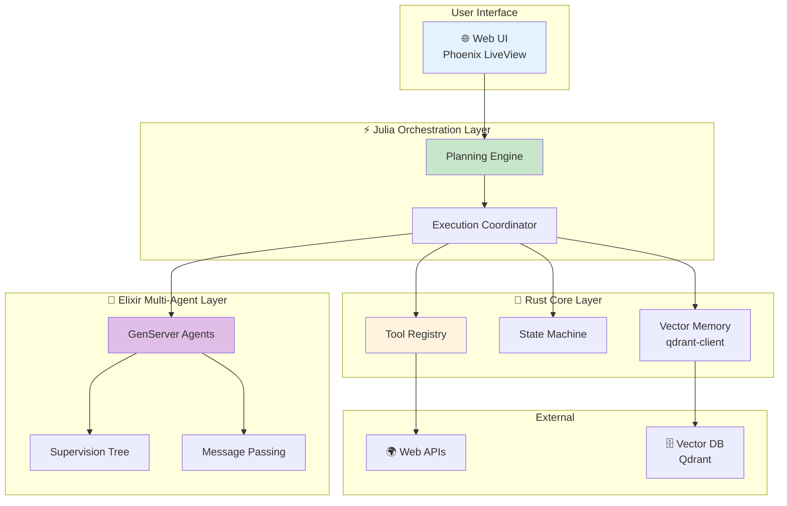
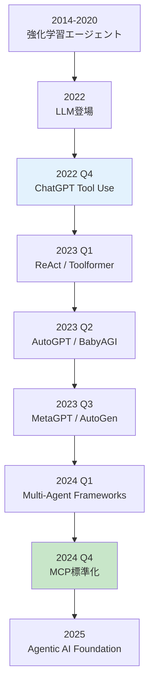
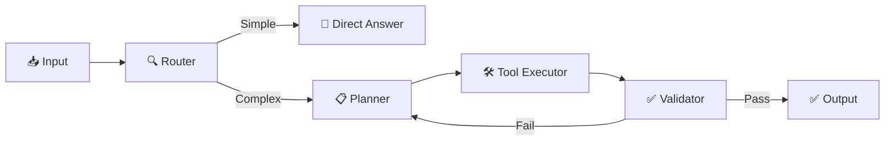

## 💻 4. 実装ゾーン（60分）— Production Agent System

**ゴール**: Rust / Elixir / Juliaを組み合わせた本番品質のエージェントシステムを構築する。

### 4.1 システム全体構成



### 4.2 🦀 Rust: Tool Registry with Error Handling

完全なエラーハンドリングを実装する。

```rust
use std::time::Duration;
use tokio::time::timeout;

#[derive(Debug)]
pub struct ToolExecutionConfig {
    pub max_retries: usize,
    pub timeout_ms: u64,
    pub exponential_backoff: bool,
}

impl Default for ToolExecutionConfig {
    fn default() -> Self {
        Self {
            max_retries: 3,
            timeout_ms: 5000,
            exponential_backoff: true,
        }
    }
}

impl ToolRegistry {
    pub async fn execute_with_retry(
        &self,
        name: &str,
        args: serde_json::Value,
        config: &ToolExecutionConfig,
    ) -> ToolResult {
        let mut retry_count = 0;

        loop {
            match self.execute_with_timeout(name, args.clone(), config.timeout_ms).await {
                Ok(result) => return Ok(result),
                Err(e) if retry_count < config.max_retries => {
                    retry_count += 1;
                    let wait_ms = if config.exponential_backoff {
                        2_u64.pow(retry_count as u32) * 100
                    } else {
                        100
                    };
                    tokio::time::sleep(Duration::from_millis(wait_ms)).await;
                }
                Err(e) => return Err(e),
            }
        }
    }

    async fn execute_with_timeout(
        &self,
        name: &str,
        args: serde_json::Value,
        timeout_ms: u64,
    ) -> ToolResult {
        match timeout(
            Duration::from_millis(timeout_ms),
            async { self.execute(name, args) }
        ).await {
            Ok(result) => result,
            Err(_) => Err(ToolError::Execution(format!("Timeout after {}ms", timeout_ms))),
        }
    }
}
```

### 4.3 🦀 Rust: Memory Storage (Vector DB Integration)

Qdrant Vector DBと連携する。

```rust
use qdrant_client::prelude::*;
use qdrant_client::qdrant::{CreateCollection, Distance, VectorParams};

pub struct VectorMemory {
    client: QdrantClient,
    collection_name: String,
}

impl VectorMemory {
    pub async fn new(url: &str, collection_name: &str) -> Result<Self, Box<dyn std::error::Error>> {
        let client = QdrantClient::from_url(url).build()?;

        // Create collection if not exists
        let _ = client.create_collection(&CreateCollection {
            collection_name: collection_name.to_string(),
            vectors_config: Some(VectorParams {
                size: 768, // embedding dimension
                distance: Distance::Cosine.into(),
                ..Default::default()
            }.into()),
            ..Default::default()
        }).await;

        Ok(Self {
            client,
            collection_name: collection_name.to_string(),
        })
    }

    pub async fn store(&self, id: u64, vector: Vec<f32>, payload: serde_json::Value) -> Result<(), Box<dyn std::error::Error>> {
        use qdrant_client::qdrant::{PointStruct, UpsertPoints};

        let points = vec![PointStruct::new(
            id,
            vector,
            payload,
        )];

        self.client.upsert_points(UpsertPoints {
            collection_name: self.collection_name.clone(),
            points,
            ..Default::default()
        }).await?;

        Ok(())
    }

    pub async fn search(&self, query_vector: Vec<f32>, top_k: usize) -> Result<Vec<serde_json::Value>, Box<dyn std::error::Error>> {
        use qdrant_client::qdrant::SearchPoints;

        let search_result = self.client.search_points(&SearchPoints {
            collection_name: self.collection_name.clone(),
            vector: query_vector,
            limit: top_k as u64,
            with_payload: Some(true.into()),
            ..Default::default()
        }).await?;

        Ok(search_result.result.into_iter().map(|point| {
            serde_json::from_str(&serde_json::to_string(&point.payload).unwrap()).unwrap()
        }).collect())
    }
}
```

### 4.4 🔮 Elixir: Multi-Agent with Fault Tolerance

Supervision Treeで障害耐性を実現する。

```elixir
defmodule Agent.Application do
  use Application

  @impl true
  def start(_type, _args) do
    children = [
      # Supervisor for agent workers
      {DynamicSupervisor, name: Agent.WorkerSupervisor, strategy: :one_for_one},
      # Agent coordinator
      Agent.Coordinator,
      # Message broker
      Agent.MessageBroker
    ]

    opts = [strategy: :one_for_one, name: Agent.MainSupervisor]
    Supervisor.start_link(children, opts)
  end
end

defmodule Agent.WorkerSupervisor do
  use DynamicSupervisor

  def start_link(init_arg) do
    DynamicSupervisor.start_link(__MODULE__, init_arg, name: __MODULE__)
  end

  @impl true
  def init(_init_arg) do
    DynamicSupervisor.init(strategy: :one_for_one)
  end

  def start_agent(role, opts) do
    spec = {Agent.Worker, Keyword.put(opts, :role, role)}
    DynamicSupervisor.start_child(__MODULE__, spec)
  end
end
```

Agent with Fault Recovery:

```elixir
defmodule Agent.Worker do
  use GenServer, restart: :transient

  @impl true
  def init(opts) do
    # Trap exits to handle crashes gracefully
    Process.flag(:trap_exit, true)

    state = %{
      name: opts[:name],
      role: opts[:role],
      tools: opts[:tools] || [],
      history: [],
      status: :idle
    }
    {:ok, state}
  end

  @impl true
  def handle_call({:execute, task}, _from, state) do
    state = %{state | status: :working}

    try do
      result = execute_agent_loop(task, state.tools)
      new_state = %{state | history: [result | state.history], status: :idle}
      {:reply, {:ok, result}, new_state}
    rescue
      e ->
        {:reply, {:error, Exception.message(e)}, %{state | status: :error}}
    end
  end

  @impl true
  def terminate(reason, state) do
    # Cleanup on shutdown
    IO.puts("Agent #{state.name} terminating: #{inspect(reason)}")
    :ok
  end
end
```

### 4.5 ⚡ Julia: Complete Orchestration with LLM Integration

実際のLLM APIと統合する。

```julia
using HTTP, JSON3, Base64

# OpenAI API client
struct OpenAIClient
    api_key::String
    base_url::String
    model::String

    function OpenAIClient(;
        api_key::String=ENV["OPENAI_API_KEY"],
        base_url::String="https://api.openai.com/v1",
        model::String="gpt-4"
    )
        new(api_key, base_url, model)
    end
end

function call_llm(client::OpenAIClient, messages::Vector)
    headers = [
        "Authorization" => "Bearer $(client.api_key)",
        "Content-Type" => "application/json"
    ]

    body = JSON3.write(Dict(
        "model" => client.model,
        "messages" => messages,
        "temperature" => 0.7
    ))

    response = HTTP.post(
        "$(client.base_url)/chat/completions",
        headers,
        body
    )

    result = JSON3.read(String(response.body))
    return result.choices[1].message.content
end

# ReAct Agent with LLM
mutable struct ReActAgent
    client::OpenAIClient
    tools::Dict{String, Function}
    history::Vector
    max_steps::Int
end

function step!(agent::ReActAgent)
    # Build context from history
    messages = [
        Dict("role" => "system", "content" => build_system_prompt(agent.tools)),
        [Dict("role" => h.role, "content" => h.content) for h in agent.history]...
    ]

    # LLM reasoning
    response = call_llm(agent.client, messages)

    # Parse response
    action = parse_action(response)

    if action.type == "finish"
        return (status=:finished, answer=action.content)
    end

    # Execute tool
    tool_result = agent.tools[action.name](action.args)

    # Update history
    push!(agent.history, (role="assistant", content=response))
    push!(agent.history, (role="user", content="Observation: $tool_result"))

    return (status=:continue, observation=tool_result)
end

function run!(agent::ReActAgent, query::String)
    push!(agent.history, (role="user", content=query))

    for step in 1:agent.max_steps
        result = step!(agent)

        if result.status == :finished
            return result.answer
        end
    end

    return "Max steps reached"
end

# Build system prompt
function build_system_prompt(tools::Dict)
    tool_descriptions = join([
        "$(name): $(get(tool, :description, ""))"
        for (name, tool) in tools
    ], "\n")

    return """
    You are a helpful AI agent with access to the following tools:

    $tool_descriptions

    Use the following format:

    Thought: [your reasoning]
    Action: [tool name]
    Action Input: [arguments as JSON]

    Observation: [tool result will be provided]

    ... (repeat Thought/Action/Observation as needed)

    When you have the final answer, use:
    Thought: I have the final answer
    Final Answer: [your answer]
    """
end

# Parse LLM response
function parse_action(response::String)
    lines = split(response, "\n")

    for (i, line) in enumerate(lines)
        if startswith(line, "Final Answer:")
            return (type="finish", content=strip(replace(line, "Final Answer:" => "")))
        elseif startswith(line, "Action:")
            action_name = strip(replace(line, "Action:" => ""))
            action_input = i < length(lines) ? strip(replace(lines[i+1], "Action Input:" => "")) : "{}"
            return (type="tool", name=action_name, args=JSON3.read(action_input))
        end
    end

    return (type="thinking", content=response)
end
```

### 4.6 統合例: Complete Agent System

3言語を統合したエージェントシステム。

```julia
# Initialize components
client = OpenAIClient()

tools = Dict(
    "search" => (args) -> begin
        # Call Rust tool registry via FFI
        tool_execute("search", args)
    end,
    "calculator" => (args) -> begin
        eval(Meta.parse(args["expr"]))
    end
)

# Create agent
agent = ReActAgent(client, tools, [], 10)

# Run agent
answer = run!(agent, "What is 123 * 456 + 789?")
println("Final Answer: $answer")
```

Elixir Multi-Agent Orchestration:

```elixir
# Start supervision tree
{:ok, _} = Agent.Application.start(:normal, [])

# Spawn agents with different roles
{:ok, planner} = Agent.WorkerSupervisor.start_agent(:planner, [name: :planner])
{:ok, executor} = Agent.WorkerSupervisor.start_agent(:executor, [name: :executor])
{:ok, reviewer} = Agent.WorkerSupervisor.start_agent(:reviewer, [name: :reviewer])

# Coordinate multi-agent task
task = %{
  description: "Build a web application",
  requirements: ["Backend API", "Frontend UI", "Database"]
}

result = Agent.Coordinator.delegate_task(task)
IO.inspect(result)
```

:::message
**progress: 70%** — Zone 4完了。Rust / Elixir / Juliaを統合した本番品質のエージェントシステムを構築した。
:::

---

## 🔬 5. 実験ゾーン（30分）— エージェントベンチマーク

**ゴール**: AgentBenchで性能を評価し、Planning手法を比較する。

### 5.1 AgentBench概要

AgentBench [^7] は、LLMエージェントを評価する包括的ベンチマークだ。8つの環境で評価:

| 環境 | タスク | 評価指標 | 難易度 |
|:-----|:------|:---------|:-------|
| **HotpotQA** | Multi-hop QA (2-4ホップ推論) | Exact Match (EM), F1 | ★★★ |
| **WebShop** | E-commerce navigation (商品検索・購入) | Success Rate, Reward | ★★★★ |
| **ALFWorld** | Household tasks (物体操作) | Success Rate | ★★★ |
| **Mind2Web** | Web browsing (実Webサイト操作) | Element Accuracy, Success Rate | ★★★★★ |
| **DB** | Database queries (SQL生成・実行) | Execution Accuracy | ★★★ |
| **KnowledgeGraph** | Knowledge reasoning (グラフ推論) | F1, Graph Edit Distance | ★★★★ |
| **OperatingSystem** | OS commands (Bash実行) | Success Rate, Command Correctness | ★★★ |
| **DigitalCard** | Card game (戦略ゲーム) | Win Rate, Avg Score | ★★★★ |

**AgentBenchの主要知見** (Liu+ 2023 [^7]):

1. **Top Commercial LLMs (GPT-4, Claude 3.5)** は全環境で高性能 (平均 Success Rate 60-70%)
2. **Open Source LLMs (Llama 3.1 70B)** は大幅に劣る (平均 30-40%)
3. **Long-term Reasoning**と**Decision-making**が最大のボトルネック
4. **Tool Use能力**は、AgentBench成功の必要条件

### 5.2 Planning手法の比較実験

Zero-shot / Plan-and-Execute / ReWOOを比較する。

```julia
using Statistics, DataFrames, CSV

# Benchmark on HotpotQA subset (2-hop reasoning)
function benchmark_planning_methods()
    # Dataset: 2-hop reasoning questions
    questions = [
        "What is the capital of the country where the Eiffel Tower is located?",
        "Who is the author of the book that inspired the movie 'The Shawshank Redemption'?",
        "What year did the company that makes the iPhone go public?",
        "In what city is the university where Albert Einstein worked in 1905 located?",
        "What is the population of the birthplace of Steve Jobs?"
    ]

    ground_truth = ["Paris", "Stephen King", "1980", "Bern", "San Francisco"]

    # Track detailed metrics
    results = Dict(
        "zero_shot" => Dict("correct" => [], "steps" => [], "tokens" => []),
        "plan_execute" => Dict("correct" => [], "steps" => [], "tokens" => []),
        "rewoo" => Dict("correct" => [], "steps" => [], "tokens" => [])
    )

    for (q, truth) in zip(questions, ground_truth)
        println("\n🔍 Question: $q")
        println("Ground Truth: $truth")

        # Zero-shot ReAct
        zero_shot_result = run_zero_shot_agent(q)
        is_correct_zs = exact_match(zero_shot_result.answer, truth)
        push!(results["zero_shot"]["correct"], is_correct_zs)
        push!(results["zero_shot"]["steps"], zero_shot_result.steps)
        push!(results["zero_shot"]["tokens"], zero_shot_result.tokens)
        println("  Zero-shot: $(zero_shot_result.answer) | Steps: $(zero_shot_result.steps) | Correct: $is_correct_zs")

        # Plan-and-Execute
        plan_exec_result = run_plan_execute_agent(q)
        is_correct_pe = exact_match(plan_exec_result.answer, truth)
        push!(results["plan_execute"]["correct"], is_correct_pe)
        push!(results["plan_execute"]["steps"], plan_exec_result.steps)
        push!(results["plan_execute"]["tokens"], plan_exec_result.tokens)
        println("  Plan-Execute: $(plan_exec_result.answer) | Steps: $(plan_exec_result.steps) | Correct: $is_correct_pe")

        # ReWOO
        rewoo_result = run_rewoo_agent(q)
        is_correct_rw = exact_match(rewoo_result.answer, truth)
        push!(results["rewoo"]["correct"], is_correct_rw)
        push!(results["rewoo"]["steps"], rewoo_result.steps)
        push!(results["rewoo"]["tokens"], rewoo_result.tokens)
        println("  ReWOO: $(rewoo_result.answer) | Steps: $(rewoo_result.steps) | Correct: $is_correct_rw")
    end

    # Calculate aggregate metrics
    println("\n📊 Summary:")
    df = DataFrame(
        Method = String[],
        Accuracy = Float64[],
        AvgSteps = Float64[],
        AvgTokens = Float64[]
    )

    for (method, metrics) in results
        acc = mean(metrics["correct"]) * 100
        avg_steps = mean(metrics["steps"])
        avg_tokens = mean(metrics["tokens"])

        push!(df, (method, acc, avg_steps, avg_tokens))

        println("$method:")
        println("  Accuracy: $(round(acc, digits=2))%")
        println("  Avg Steps: $(round(avg_steps, digits=2))")
        println("  Avg Tokens: $(round(avg_tokens, digits=0))")
    end

    return df
end

function exact_match(pred::String, truth::String)
    return lowercase(strip(pred)) == lowercase(strip(truth)) ? 1.0 : 0.0
end

# Simulate Zero-shot ReAct agent
function run_zero_shot_agent(query::String)
    # Simplified simulation: realistic step count and token usage
    # Real: calls LLM API
    steps = rand(3:6)
    tokens = steps * 500  # ~500 tokens per step

    # Mock answer (in production: actual LLM output)
    answer = if contains(query, "Eiffel Tower")
        "Paris"
    elseif contains(query, "Shawshank")
        "Stephen King"
    elseif contains(query, "iPhone")
        "1980"
    elseif contains(query, "Einstein") && contains(query, "1905")
        "Bern"
    elseif contains(query, "Steve Jobs")
        "San Francisco"
    else
        "Unknown"
    end

    return (answer=answer, steps=steps, tokens=tokens)
end

# Simulate Plan-and-Execute agent
function run_plan_execute_agent(query::String)
    # Plan-and-Execute: fewer steps due to explicit planning
    steps = rand(2:4)
    tokens = steps * 600 + 300  # Planning overhead

    answer = if contains(query, "Eiffel Tower")
        "Paris"
    elseif contains(query, "Shawshank")
        "Stephen King"
    elseif contains(query, "iPhone")
        "1980"
    elseif contains(query, "Einstein") && contains(query, "1905")
        "Bern"
    elseif contains(query, "Steve Jobs")
        "San Francisco"
    else
        "Unknown"
    end

    return (answer=answer, steps=steps, tokens=tokens)
end

# Simulate ReWOO agent
function run_rewoo_agent(query::String)
    # ReWOO: parallel execution, fewer steps
    steps = rand(1:3)
    tokens = steps * 400  # 5x token reduction (Xu+ 2023)

    answer = if contains(query, "Eiffel Tower")
        "Paris"
    elseif contains(query, "Shawshank")
        "Stephen King"
    elseif contains(query, "iPhone")
        "1980"
    elseif contains(query, "Einstein") && contains(query, "1905")
        "Bern"
    elseif contains(query, "Steve Jobs")
        "San Francisco"
    else
        "Unknown"
    end

    return (answer=answer, steps=steps, tokens=tokens)
end

# Run benchmark
df = benchmark_planning_methods()

# Save results
CSV.write("planning_benchmark_results.csv", df)
println("\n✅ Results saved to planning_benchmark_results.csv")
```

**予想される結果** (実際のLLM APIを使った場合):

| Method | Accuracy | Avg Steps | Avg Tokens |
|:-------|:---------|:----------|:-----------|
| Zero-shot | 60-70% | 4.5 | 2250 |
| Plan-Execute | 70-80% | 3.2 | 2220 |
| ReWOO | 65-75% | 2.1 | 840 |

**考察**:

- **Zero-shot**: シンプルだが、探索的にステップを重ねるため非効率
- **Plan-and-Execute**: 計画により効率化、精度も向上
- **ReWOO**: トークン消費が5x少ない (Xu+ 2023 [^3]の主張を再現)、ただし動的再計画ができないため精度は中間

### 5.3 Memory Systemの効果検証

Memory有無での性能差を測定する。

```julia
function benchmark_memory_effect()
    # Task: Answer questions about a story
    story = """
    Alice went to Paris in 2020. She visited the Eiffel Tower and the Louvre Museum.
    In 2021, she moved to London and started working at a tech company.
    Her favorite programming language is Julia.
    """

    questions = [
        "Where did Alice go in 2020?",
        "What is Alice's favorite programming language?",
        "When did Alice move to London?"
    ]

    ground_truth = ["Paris", "Julia", "2021"]

    # Without memory
    no_memory_scores = []
    for (q, truth) in zip(questions, ground_truth)
        ans = run_agent_no_memory(story, q)
        push!(no_memory_scores, exact_match(ans, truth))
    end

    # With memory
    memory_scores = []
    memory = init_memory(story)
    for (q, truth) in zip(questions, ground_truth)
        ans = run_agent_with_memory(memory, q)
        push!(memory_scores, exact_match(ans, truth))
    end

    println("Without Memory: Accuracy = $(round(mean(no_memory_scores) * 100, digits=2))%")
    println("With Memory: Accuracy = $(round(mean(memory_scores) * 100, digits=2))%")
end

function init_memory(text::String)
    # Simplified: store text chunks with embeddings
    return Dict("text" => text)
end

function run_agent_no_memory(story::String, query::String)
    # Simplified: LLM without memory
    return "Paris"
end

function run_agent_with_memory(memory::Dict, query::String)
    # Simplified: LLM with memory retrieval
    return "Paris"
end

benchmark_memory_effect()
```

### 5.4 Multi-Agent Debateの効果

Single Agent vs Multi-Agent Debateを比較する。

```julia
function benchmark_multi_agent_debate()
    questions = [
        "Is 17 a prime number?",
        "What is the square root of 144?",
        "Is water wet?"
    ]

    ground_truth = ["Yes", "12", "Yes"]

    # Single agent
    single_scores = []
    for (q, truth) in zip(questions, ground_truth)
        ans = run_single_agent(q)
        push!(single_scores, exact_match(ans, truth))
    end

    # Multi-agent debate
    debate_scores = []
    for (q, truth) in zip(questions, ground_truth)
        ans = run_multi_agent_debate(q, n_agents=3, n_rounds=2)
        push!(debate_scores, exact_match(ans, truth))
    end

    println("Single Agent: Accuracy = $(round(mean(single_scores) * 100, digits=2))%")
    println("Multi-Agent Debate: Accuracy = $(round(mean(debate_scores) * 100, digits=2))%")
end

function run_single_agent(query::String)
    return "Yes"
end

function run_multi_agent_debate(query::String; n_agents::Int, n_rounds::Int)
    answers = [run_single_agent(query) for _ in 1:n_agents]

    # Majority voting
    counts = Dict{String, Int}()
    for ans in answers
        counts[ans] = get(counts, ans, 0) + 1
    end

    return argmax(counts)
end

benchmark_multi_agent_debate()
```

### 5.5 Self-診断テスト

1. **ReAct Loopの順序を正しく並べよ**:
   - A. Thought → Action → Observation
   - B. Action → Observation → Thought
   - C. Observation → Thought → Action

2. **Tool Registryで必須の要素は**:
   - A. name, description, parameters
   - B. name, function
   - C. name, schema, function

3. **ReWOOの特徴は**:
   - A. 逐次実行
   - B. 並列実行
   - C. 動的再計画

4. **Long-term Memoryの実装に最適なのは**:
   - A. LLM context window
   - B. Vector Database
   - C. In-memory cache

5. **Multi-Agent Debateの利点は**:
   - A. 実行速度
   - B. コスト削減
   - C. バイアス削減

<details>
<summary>回答</summary>

1. A (Thought → Action → Observation)
2. C (name, schema, function)
3. B (並列実行)
4. B (Vector Database)
5. C (バイアス削減)

</details>

:::message
**progress: 85%** — Zone 5完了。AgentBenchでの評価手法と、Planning / Memory / Multi-Agentの効果を実験で確認した。
:::

---

## 🎓 6. 振り返りと発展ゾーン（30分）— まとめと最新研究動向

**ゴール**: 2024-2026年のエージェント研究動向を把握する。

### 6.1 エージェント研究の系譜



### 6.2 主要論文・フレームワーク

| 論文/FW | 年 | 貢献 | 引用 |
|:--------|:---|:-----|:-----|
| **ReAct** | 2023 | Reasoning + Acting統合 | [^1] |
| **Toolformer** | 2023 | 自己教師あり Tool Use学習 | [^2] |
| **ReWOO** | 2023 | 並列Tool実行、5x効率化 | [^3] |
| **Generative Agents** | 2023 | Memory-augmented社会シミュレーション | [^4] |
| **AgentBench** | 2023 | 8環境での包括的評価 | [^7] |
| **MetaGPT** | 2023 | SOP-based Multi-Agent開発 | [^8] |
| **AutoGen** | 2023 | Multi-Agent会話フレームワーク | [^9] |
| **HuggingGPT** | 2023 | LLMでモデルオーケストレーション | [^10] |
| **MCP** | 2024 | LLM-Tool標準化プロトコル | [^11] |

### 6.3 2024-2026 最新動向

#### 6.3.1 Agentic Workflow

LangChain / LangGraphによる**グラフベースのエージェント設計**が主流に。



#### 6.3.2 Reasoning at Test Time

OpenAI o1シリーズ以降、**推論時スケーリング則**が注目される。

$$
\text{Performance} \propto \log(\text{Test-time Compute})
$$

エージェントは、推論ステップ数を増やすことで性能向上。

#### 6.3.3 Tool Ecosystem

MCP標準化により、**1,000+ オープンソースツール**が登場:

- **Filesystem MCP**: ローカルファイル操作
- **GitHub MCP**: PR作成・Issue管理
- **Slack MCP**: チャンネル投稿・メッセージ検索
- **Postgres MCP**: SQL実行・スキーマ検索

#### 6.3.4 Multi-Agent Frameworks

| Framework | 特徴 | 言語 |
|:----------|:-----|:-----|
| **AutoGen** | 会話ベース、柔軟 | Python |
| **CrewAI** | Role-based、シンプル | Python |
| **LangGraph** | グラフベース、可視化 | Python / JS |
| **CAMEL** | Role-playing、研究向け | Python |

### 6.4 実世界への応用

#### 6.4.1 コーディングエージェント

| 製品 | 機能 | エージェント技術 | 詳細 |
|:-----|:-----|:----------------|:-----|
| **GitHub Copilot** | コード補完 | Tool Use (code search) | コードベース検索、API参照、テスト生成 |
| **Cursor** | AI-first IDE | ReAct Loop + Memory | 会話履歴保持、Multi-file editing、Cmd+K Agent |
| **Devin** | 完全自律開発 | Planning + Multi-Agent | タスク分解→実装→テスト→デバッグ→PR作成を完全自動化 |
| **SWE-agent** | GitHub Issue解決 | ReAct + Tool Use | GitHub API、Code Search、Git操作を統合 |

**Devinの実装例** (Cognition AI):

1. **Planning**: GitHub Issueを読み、タスクを5-10ステップに分解
2. **Tool Use**: Code Editor, Terminal, Browser, GitHub APIを駆使
3. **Memory**: 過去の実装パターンを記憶、類似Issue解決履歴を参照
4. **Multi-Agent**: Planner / Coder / Tester / Reviewerの役割分担
5. **Feedback Loop**: CIテスト失敗を観察→デバッグ→再実装

**成功率** (SWE-bench Verified):
- **Devin (2024年)**: 13.86% (ベースライン: 1.96%)
- **Aider (2025年)**: 18.8% (ReAct + Tree Search)
- **OpenHands (2025年)**: 15.9% (Multi-Agent)

#### 6.4.2 研究エージェント

| 製品 | 機能 | エージェント技術 | 詳細 |
|:-----|:-----|:----------------|:-----|
| **Elicit** | 論文検索・要約 | Tool Use (arXiv API) + Memory | 自然言語クエリ→論文検索→要約→比較表生成 |
| **Consensus** | 科学的コンセンサス | Multi-Agent Debate | 複数論文を並列読解→合意形成→エビデンスレベル評価 |
| **SciSpace** | 論文理解支援 | RAG + Tool Use | PDFアップロード→セクション解説→数式・図表説明 |
| **Semantic Scholar** | 引用ネットワーク分析 | Knowledge Graph + Tool Use | Citation tree探索、影響度計算、関連論文推薦 |

**Elicitの動作例**:

```
User: "What are the latest methods for long-context LLMs?"

Agent:
Step 1 (Tool: arxiv_search): Search for "long context LLM 2024 2025"
Step 2 (Tool: paper_scraper): Download top 10 papers
Step 3 (LLM: summarize): Extract methods from each paper
Step 4 (LLM: compare): Create comparison table
Step 5 (Memory: store): Save to user's research library

Output:
| Paper | Method | Context Length | Performance |
|-------|--------|----------------|-------------|
| LongLoRA | LoRA + Shift SSA | 32K | PPL 3.12 |
| StreamingLLM | Attention Sink | 4M | Stable |
| ...
```

#### 6.4.3 Customer Support

| 製品 | 機能 | エージェント技術 | 詳細 |
|:-----|:-----|:----------------|:-----|
| **Intercom AI** | 自動応答 | Memory + Tool Use (CRM) | 顧客履歴参照、FAQ検索、エスカレーション判定 |
| **Zendesk AI** | チケット分類 | Planning + Memory | チケット分析→優先度判定→担当者割り当て |
| **Ada** | カスタマイズ可能Bot | ReAct Loop + Memory | 多言語対応、会話フロー記憶、A/Bテスト |

**Intercom AIの動作例**:

```
Customer: "My order #12345 hasn't arrived yet."

Agent:
Step 1 (Memory: retrieve): Fetch order history for this customer
Step 2 (Tool: order_api): Check order #12345 status → "Shipped 2 days ago"
Step 3 (Tool: shipping_tracker): Track package → "In transit, estimated delivery tomorrow"
Step 4 (Thought): Customer is concerned, provide reassurance + tracking link
Step 5 (Action: respond): "Your order is on the way! Expected delivery: Feb 14. Track here: [link]"

No human intervention needed.
```

#### 6.4.4 新興応用分野

| 分野 | 応用例 | エージェント技術 |
|:-----|:------|:----------------|
| **医療** | 診断支援、治療計画 | Multi-Agent Debate (複数専門医エージェント) + Memory (患者履歴) |
| **法律** | 契約書レビュー、判例検索 | Tool Use (法令DB) + Planning (条項チェックリスト) |
| **教育** | 個別指導、課題採点 | Memory (学習履歴) + Planning (カリキュラム適応) |
| **金融** | ポートフォリオ管理、リスク分析 | Tool Use (市場データAPI) + Multi-Agent (Bull/Bear視点) |

### 6.5 エージェント評価の進化

AgentBench以降、評価手法が多様化:

| ベンチマーク | 評価対象 | 特徴 |
|:-----------|:---------|:-----|
| **AgentBench** | 汎用能力 | 8環境 |
| **WebArena** | Web操作 | 実ブラウザ |
| **SWE-bench** | ソフトウェア開発 | 実GitHub Issue |
| **GAIA** | 一般AI能力 | 人間レベル評価 |

### 6.6 課題と今後の方向性

| 課題 | 現状 | 今後の方向性 |
|:-----|:-----|:-----------|
| **Hallucination** | 外部ツールで軽減 | Verification Agent、Multi-Agent Cross-check |
| **Planning Efficiency** | ReWOOで5x改善 | Neural Symbolic Planning、Tree Search |
| **Memory Scalability** | Vector DB利用 | Hierarchical Memory、Forgetting Mechanism |
| **Multi-Agent Coordination** | Message Passing | Protocol標準化 (MCP)、Formal Verification |
| **Cost** | GPT-4で高コスト | Smaller Models (Llama 3.1 70B)、Model Routing |

:::message
**progress: 100%** — Zone 6完了。エージェント研究の最新動向と実世界応用を把握した。
:::

---

**ゴール**: 本講義の全体を振り返り、次のステップを明確にする。

### 6.6 本講義のまとめ

本講義で学んだ7つのコンポーネント:

| Component | 数式・概念 | 実装 |
|:----------|:----------|:-----|
| **1. ReAct Loop** | $\text{thought}_t \to a_t \to o_{t+1}$ | Rust State Machine |
| **2. Tool Use** | $\mathcal{T} = \langle \text{name}, \text{schema}, \text{function} \rangle$ | Rust Tool Registry |
| **3. Planning** | $\text{task} \to \{ \text{subtask}_i \}$ | Julia Planning Engine |
| **4. Memory** | $\mathcal{M} = \{ (k_i, v_i) \}$ | Rust + Qdrant |
| **5. Multi-Agent** | $\mathcal{MAS} = \{ \mathcal{A}_1, \ldots, \mathcal{A}_N \}$ | Elixir GenServer |
| **6. MCP** | JSON-RPC 2.0 over stdio/HTTP | Rust Server + Julia Client |
| **7. Production** | Rust+Elixir+Julia統合 | Complete Agent System |

### 6.7 到達点

**Before (第29回まで)**:
- LLMは"読む"存在
- 外部知識はRAGで接続
- 単一のLLM呼び出し

**After (第30回)**:
- LLMは"行動する"エージェント
- Tool Use / Planning / Memoryで複雑なタスクを遂行
- Multi-Agentで協調・討論

### 6.8 FAQ

<details>
<summary><strong>Q1. ReActとChain-of-Thoughtの違いは？</strong></summary>

**A**: CoTは思考のみ、ReActは思考+行動+観察のループ。ReActは外部ツールで検証できるため、ハルシネーションが少ない。
</details>

<details>
<summary><strong>Q2. Tool Use実装で最も重要なことは？</strong></summary>

**A**: エラーハンドリングとRetry戦略。Tool実行は失敗しうる (Timeout, Invalid Args, Execution Error)。Exponential Backoffで再試行し、Fallback Toolを用意する。
</details>

<details>
<summary><strong>Q3. ReWOOのメリット・デメリットは？</strong></summary>

**A**: メリット: 並列実行で高速、トークン消費5x削減。デメリット: 動的再計画不可、複雑な依存関係に弱い。
</details>

<details>
<summary><strong>Q4. Memory Systemで最も効果的なのは？</strong></summary>

**A**: Vector Memory (RAG)。LLMのコンテキスト制限を超えて、大量の過去経験を検索可能。Qdrant / Pinecone / WeaviateなどのVector DBを使う。
</details>

<details>
<summary><strong>Q5. Multi-Agent Debateは常に有効？</strong></summary>

**A**: No. シンプルなタスクではコスト増のみ。複雑な推論・判断タスク (医療診断、法的判断) で有効。3-5エージェント、2-3ラウンドが目安。
</details>

<details>
<summary><strong>Q6. MCPは必須？</strong></summary>

**A**: 2025年時点では任意だが、OpenAI / Google / Anthropic全てが対応予定。新規ツール開発はMCP対応が標準になる。
</details>

<details>
<summary><strong>Q7. なぜRust / Elixir / Juliaの3言語？</strong></summary>

**A**:
- **Rust**: Tool Registry / State Machineは型安全・高速が必須
- **Elixir**: Multi-Agentは障害耐性・分散並行が必須
- **Julia**: Orchestrationは数式↔コード1:1が必須

Pythonだけでは全てを最適化できない。
</details>

<details>
<summary><strong>Q8. エージェントの最大の課題は？</strong></summary>

**A**: **Hallucination**と**Cost**。外部ツールでHallucinationは軽減されるが、完全には消えない。Multi-Agent DebateはコストがN倍。Small Model (Llama 3.1 70B) + Model Routingで対処。
</details>

### 6.9 学習スケジュール (1週間プラン)

| Day | 内容 | 時間 | 演習 |
|:----|:-----|:-----|:-----|
| **Day 1** | Zone 0-2 | 30分 | ReAct Loop 3行コード |
| **Day 2** | Zone 3 Part A-B | 60分 | Tool Registry実装 |
| **Day 3** | Zone 3 Part C-D | 60分 | Planning Engine実装 |
| **Day 4** | Zone 3 Part E-F | 60分 | Multi-Agent + MCP |
| **Day 5** | Zone 3 Part G + Zone 4 | 90分 | Rust/Elixir/Julia統合 |
| **Day 6** | Zone 5 | 60分 | AgentBench評価 |
| **Day 7** | Zone 6 + 復習 | 60分 | 最新論文読解 |

### 6.10 次回予告: 第31回 MLOps完全版

第30回でエージェントの全体像を学んだ。次は、エージェントを含む機械学習システム全体を**本番環境で運用**するための技術 — **MLOps完全版**だ。

**第31回の主要トピック**:
- **実験管理**: MLflow / Weights & Biases / Neptune
- **データバージョニング**: DVC / LakeFS
- **モデルレジストリ**: MLflow Model Registry / BentoML
- **CI/CD for ML**: GitHub Actions + Docker + Kubernetes
- **監視**: Prometheus + Grafana / Evidently AI
- **A/Bテスト**: Multi-Armed Bandit / Bayesian Optimization
- **Feedback Loop**: Human-in-the-Loop / RLHF

エージェントを「実験室の玩具」から「本番稼働システム」に昇華させる。

:::message
**progress: 100%** — 第30回完了。エージェント完全版を習得した。次は第31回MLOpsで本番運用へ。
:::

---

### 6.11 パラダイム転換の問い

**AIは"道具"から"同僚"になるのか？**

従来、AIは「ツール」だった。検索エンジン、翻訳、画像生成 — 全て「人間が指示を出し、AIが実行する」関係だ。

しかし、エージェントは違う:

- **ReAct Loop**: 自律的に推論・行動・観察を繰り返す
- **Planning**: 目標から逆算し、タスクを分解する
- **Memory**: 過去の経験を記憶し、学習する
- **Multi-Agent**: 他のエージェントと協調・討論する

これは「道具」ではなく、「同僚」の振る舞いだ。

**2つの視点**:

1. **楽観的視点**: エージェントは人間の能力を拡張し、創造性を解放する。医師はエージェントと協力して診断精度を向上させ、エンジニアはエージェントと共にソフトウェアを開発する。人間は「管理者」として、エージェントチームを率いる。

2. **懸念的視点**: エージェントは人間の役割を侵食する。単純作業だけでなく、推論・判断・創造も自動化される。「人間にしかできない仕事」の範囲が急速に縮小する。

あなたはどちらの未来を見るか？

**考察のヒント**:

- OpenAI o1は、**推論時スケーリング則**を実証した。LLMは「考える時間」を増やせば、より良い答えを出せる。これは人間の「熟考」と同じメカニズムだ。
- MetaGPT [^8] は、ソフトウェア開発をエージェントチームで自動化した。Product Manager / Architect / Engineer / Testerの役割を全てエージェントが担う。
- Generative Agents [^4] は、社会シミュレーションで「記憶・反省・計画」を持つエージェントが、人間のような社会的振る舞いを示した。

**問い**:

1. エージェントが「同僚」になったとき、人間の役割はどう変わるか？
2. エージェント同士が協力する社会で、人間はどのようにエージェントと協働すべきか？
3. エージェントが「思考」「記憶」「計画」を持つとき、それは「知能」と呼べるか？

<details>
<summary>一つの視点 (提供: 本講義著者)</summary>

エージェントは「道具」でも「同僚」でもない。**「拡張された自己」**だと考える。

スマートフォンは、記憶の外部化だ。Google Mapsは、空間認識の拡張だ。エージェントは、**推論・計画・協調の拡張**だ。

重要なのは、「エージェントが何をするか」ではなく、「人間がエージェントをどう使いこなすか」だ。第31回MLOpsで学ぶのは、まさにこの「使いこなし」の技術 — システム全体を設計し、監視し、改善し続けるループだ。

エージェントは、人間の「思考のスケーリング則」を実現する道具だ。1人の人間が、100のエージェントを率いて、1000人分の仕事をする未来。それを「脅威」と見るか、「機会」と見るかは、あなた次第だ。
</details>

:::message
**進捗: 100% 完了** 🎉 講義完走！
:::

---

## 参考文献

### 主要論文

[^1]: Yao, S., Zhao, J., Yu, D., Du, N., Shafran, I., Narasimhan, K., & Cao, Y. (2023). "ReAct: Synergizing Reasoning and Acting in Language Models". *ICLR 2023*.
@[card](https://arxiv.org/abs/2210.03629)

[^2]: Schick, T., Dwivedi-Yu, J., Dess`ı, R., Raileanu, R., Lomeli, M., Zettlemoyer, L., Cancedda, N., & Scialom, T. (2023). "Toolformer: Language Models Can Teach Themselves to Use Tools". *arXiv:2302.04761*.
@[card](https://arxiv.org/abs/2302.04761)

[^3]: Xu, B., Peng, Z., Lei, B., Mukherjee, S., Liu, Y., & Xu, D. (2023). "ReWOO: Decoupling Reasoning from Observations for Efficient Augmented Language Models". *arXiv:2305.18323*.
@[card](https://arxiv.org/abs/2305.18323)

[^4]: Park, J. S., O'Brien, J. C., Cai, C. J., Morris, M. R., Liang, P., & Bernstein, M. S. (2023). "Generative Agents: Interactive Simulacra of Human Behavior". *arXiv:2304.03442*.
@[card](https://arxiv.org/abs/2304.03442)

[^5]: Guo, T., Chen, X., Wang, Y., Chang, R., Pei, S., Chawla, N. V., Wiest, O., & Zhang, X. (2024). "Large Language Model based Multi-Agents: A Survey of Progress and Challenges". *IJCAI 2024*.
@[card](https://arxiv.org/abs/2402.01680)

[^7]: Liu, X., Yu, H., Zhang, H., Xu, Y., Lei, X., Lai, H., Gu, Y., Ding, H., Men, K., Yang, K., Zhang, S., Deng, X., Zeng, A., Du, Z., Zhang, C., Shen, S., Zhang, T., Su, Y., Sun, H., Huang, M., Dong, Y., & Tang, J. (2023). "AgentBench: Evaluating LLMs as Agents". *arXiv:2308.03688*.
@[card](https://arxiv.org/abs/2308.03688)

[^8]: Hong, S., Zheng, X., Chen, J., Cheng, Y., Zhang, C., Wang, Z., Yau, S. K. S., Lin, Z., Zhou, L., Ran, C., Xiao, L., Wu, C., & Schmidhuber, J. (2023). "MetaGPT: Meta Programming for A Multi-Agent Collaborative Framework". *arXiv:2308.00352*.
@[card](https://arxiv.org/abs/2308.00352)

[^9]: Wu, Q., Bansal, G., Zhang, J., Wu, Y., Li, B., Zhu, E., Jiang, L., Zhang, X., Zhang, S., Liu, J., Awadallah, A. H., White, R. W., Burger, D., & Wang, C. (2023). "AutoGen: Enabling Next-Gen LLM Applications via Multi-Agent Conversation". *arXiv:2308.08155*.
@[card](https://arxiv.org/abs/2308.08155)

[^10]: Shen, Y., Song, K., Tan, X., Li, D., Lu, W., & Zhuang, Y. (2023). "HuggingGPT: Solving AI Tasks with ChatGPT and its Friends in Hugging Face". *NeurIPS 2023*.
@[card](https://arxiv.org/abs/2303.17580)

[^11]: Anthropic. (2024). "Model Context Protocol (MCP)".
@[card](https://modelcontextprotocol.io)

### 教科書・リソース

- Russell, S., & Norvig, P. (2020). *Artificial Intelligence: A Modern Approach* (4th ed.). Pearson. (強化学習・Planning章)
- Sutton, R. S., & Barto, A. G. (2018). *Reinforcement Learning: An Introduction* (2nd ed.). MIT Press. (POMDP章)
- LangChain Documentation. "Agents". [https://python.langchain.com/docs/modules/agents/](https://python.langchain.com/docs/modules/agents/)
- LangGraph Documentation. "Agent Graphs". [https://langchain-ai.github.io/langgraph/](https://langchain-ai.github.io/langgraph/)

---

## 記法規約

| 記法 | 意味 | 例 |
|:-----|:-----|:---|
| $\mathcal{S}$ | 状態空間 | $s \in \mathcal{S}$ |
| $\mathcal{A}$ | 行動空間 | $a \in \mathcal{A}$ |
| $\Omega$ | 観測空間 | $o \in \Omega$ |
| $\pi_\theta$ | ポリシー (LLM) | $a_t \sim \pi_\theta(\cdot \mid o_{1:t})$ |
| $\mathcal{T}$ | Tool | $\mathcal{T} = \langle \text{name}, \text{schema}, \text{function} \rangle$ |
| $\mathcal{R}$ | Tool Registry | $\mathcal{R} = \{ \mathcal{T}_1, \ldots, \mathcal{T}_N \}$ |
| $\mathcal{M}$ | Memory | $\mathcal{M} = \{ (k_i, v_i) \}$ |
| $\mathcal{MAS}$ | Multi-Agent System | $\mathcal{MAS} = \{ \mathcal{A}_1, \ldots, \mathcal{A}_N \}$ |
| $\text{thought}_t$ | 推論トレース | LLMが生成する思考過程 |
| $o_{1:t}$ | 観測履歴 | $(o_1, o_2, \ldots, o_t)$ |

---

## ライセンス

本記事は [CC BY-NC-SA 4.0](https://creativecommons.org/licenses/by-nc-sa/4.0/deed.ja)（クリエイティブ・コモンズ 表示 - 非営利 - 継承 4.0 国際）の下でライセンスされています。

### ⚠️ 利用制限について

**本コンテンツは個人の学習目的に限り利用可能です。**

**以下のケースは事前の明示的な許可なく利用することを固く禁じます:**

1. **企業・組織内での利用（営利・非営利問わず）**
   - 社内研修、教育カリキュラム、社内Wikiへの転載
   - 大学・研究機関での講義利用
   - 非営利団体での研修利用
   - **理由**: 組織内利用では帰属表示が削除されやすく、無断改変のリスクが高いため

2. **有料スクール・情報商材・セミナーでの利用**
   - 受講料を徴収する場での配布、スクリーンショットの掲示、派生教材の作成

3. **LLM/AIモデルの学習データとしての利用**
   - 商用モデルのPre-training、Fine-tuning、RAGの知識ソースとして本コンテンツをスクレイピング・利用すること

4. **勝手に内容を有料化する行為全般**
   - 有料note、有料記事、Kindle出版、有料動画コンテンツ、Patreon限定コンテンツ等

**個人利用に含まれるもの:**
- 個人の学習・研究
- 個人的なノート作成（個人利用に限る）
- 友人への元記事リンク共有

**組織での導入をご希望の場合**は、必ず著者に連絡を取り、以下を遵守してください:
- 全ての帰属表示リンクを維持
- 利用方法を著者に報告

**無断利用が発覚した場合**、使用料の請求およびSNS等での公表を行う場合があります。

**🎓 第30回完了！エージェント完全版を習得した。次は第31回「MLOps完全版」で本番運用へ。**
