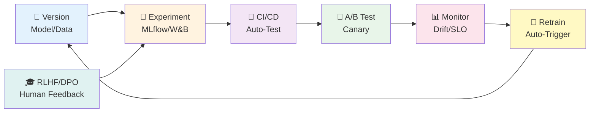
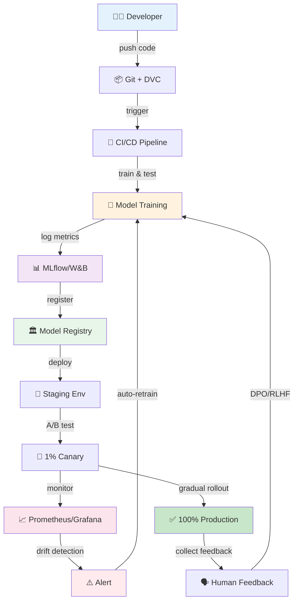

> **📖 後編（実装編）**: [第31回後編: MLOps実装編](./ml-lecture-31-part2) | **→ 実装・実験ゾーンへ**

# 第31回: MLOps完全版 — 99.9%可用性は"努力"ではなく"設計"だ

> **モデルを訓練できても、本番で動かせなければ価値はゼロ。MLOps全領域を網羅し、Train→Evaluate→Deploy→Monitorのライフサイクルを完結させる。**

第30回でエージェントを完全構築した。だが"動く"だけでは足りない。

本番環境では、モデルは**生き物**だ。データが変わり、ユーザーの嗜好が変わり、性能が劣化する。再訓練が必要になり、A/Bテストで新モデルを検証し、段階的にロールアウトする。障害が起きれば即座にロールバックし、ドリフトを検出して自動再訓練をトリガーする。

これら全てを「手作業」でやっていたら、1人月が100人日に化ける。

**MLOps (Machine Learning Operations)** は、この混沌を「設計」で解決する。バージョニング・実験管理・CI/CD・A/Bテスト・モニタリング・SLI/SLO・ドリフト検出・DPO/RLHF。7つのピースを組み合わせ、モデルのライフサイクル全体を自動化する。

本講義はCourse IIIの第13回 — 第19回から始まった実践編の最終盤だ。第32回で統合PJを構築し、Course IIIを完結させる。

> **Note:** **このシリーズについて**: 東京大学 松尾・岩澤研究室動画講義の**完全上位互換**の全50回シリーズ。理論（論文が書ける）、実装（Production-ready）、最新（2025-2026 SOTA）の3軸で差別化する。



**所要時間の目安**:

| ゾーン | 内容 | 時間 | 難易度 |
|:-------|:-----|:-----|:-------|
| Zone 0 | クイックスタート | 30秒 | ★☆☆☆☆ |
| Zone 1 | 体験ゾーン | 10分 | ★★☆☆☆ |
| Zone 2 | 直感ゾーン + 発展 | 35分 | ★★★★★ |
| Zone 3 | 数式修行ゾーン | 90分 | ★★★★★ |
| Zone 4 | 実装ゾーン | 60分 | ★★★★☆ |
| Zone 5 | 実験ゾーン | 30分 | ★★★★☆ |
| Zone 6 | 振り返り + 統合 | 30分 | ★★★☆☆ |

---

## 🚀 0. クイックスタート（30秒）— 実験メタデータを記録する

**ゴール**: MLOpsの核心を30秒で体感する — 実験を「記録」しなければ「再現」できない。

MLflowスタイルのメトリクス記録を3行で動かす。

```julia
using Dates, JSON3

# Experiment metadata logging (simplified MLflow-style)
function log_experiment(name::String, params::Dict, metrics::Dict, artifacts::Vector{String})
    experiment = Dict(
        "name" => name,
        "timestamp" => now(),
        "params" => params,
        "metrics" => metrics,
        "artifacts" => artifacts,
        "run_id" => string(rand(UInt64), base=16)
    )

    # Persist to JSON (real MLflow uses DB + artifact store)
    filename = "experiments/$(experiment["run_id"]).json"
    mkpath("experiments")
    open(filename, "w") do io
        JSON3.write(io, experiment)
    end

    println("✅ Logged experiment: $(experiment["name"]) (run_id: $(experiment["run_id"]))")
    println("   Params: $(params)")
    println("   Metrics: $(metrics)")
    return experiment["run_id"]
end

# Example: Train a tiny model and log everything
params = Dict("lr" => 0.001, "batch_size" => 32, "epochs" => 10)
metrics = Dict("train_loss" => 0.023, "val_acc" => 0.952, "f1" => 0.948)
artifacts = ["model_weights.pt", "config.yaml"]

run_id = log_experiment("tiny-classifier-v1", params, metrics, artifacts)
```

出力:
```
✅ Logged experiment: tiny-classifier-v1 (run_id: a3f9c2e1b4d8)
   Params: Dict("lr" => 0.001, "batch_size" => 32, "epochs" => 10)
   Metrics: Dict("train_loss" => 0.023, "val_acc" => 0.952, "f1" => 0.948)
```

**3行のコードで実験をJSON化して永続化した。** これがMLOpsの出発点だ。実際のMLflowは:

- SQLiteまたはPostgreSQLでメタデータ管理
- S3/GCS/Azureで大きなartifact保存
- UIで実験比較・モデルバージョニング・デプロイ管理

この背後にある理論:

$$
\begin{aligned}
\text{Reproducibility} &= f(\text{Code}, \text{Data}, \text{Hyperparams}, \text{Env}, \text{Seed}) \\
\text{MLOps Goal:} \quad & \text{Track all 5 dimensions automatically}
\end{aligned}
$$

**コードだけバージョニングしても再現できない。データもハイパーパラメータも環境もSeedも全て記録する必要がある。** これがMLflowの哲学だ。

> **Note:** **進捗: 3% 完了** 実験記録の核心を体感した。ここからMLOps全7領域(Version/Experiment/CI-CD/A-B/Monitor/Drift/RLHF)を網羅していく。

---

## 🎮 1. 体験ゾーン（10分）— MLOpsパイプラインの全体像を触る

### 1.1 MLOpsの7つのピース

MLOpsは単一技術ではなく、**7つのシステムの統合**だ。

| ピース | 役割 | 代表ツール | 松尾研の扱い |
|:------|:-----|:----------|:-----------|
| **バージョニング** | モデル・データ・コードの履歴管理 | Git LFS, DVC, MLflow Registry | ❌言及なし |
| **実験管理** | ハイパラメータ・メトリクス記録 | MLflow, W&B, Neptune | ⚠️概念のみ |
| **CI/CD for ML** | 自動テスト・デプロイ・ロールバック | GitHub Actions, Jenkins | ❌実装なし |
| **A/Bテスト** | 新旧モデル比較・段階的ロールアウト | Feature Flags, Traffic Split | ❌実装なし |
| **モニタリング** | メトリクス収集・SLI/SLO・アラート | Prometheus, Grafana | ❌実装なし |
| **ドリフト検出** | データ・モデル劣化の自動検出 | Evidently AI, KS test, PSI | ❌実装なし |
| **RLHF/DPO** | 人間フィードバック最適化 | DPO [^1], PPO, Reward Modeling | ⚠️概念のみ |

**松尾研は"訓練"で止まる。本講義は"運用"まで完結させる。**

#### 1.1.1 MLflowで実験を比較する

実験管理の本質 = **「同じコードでもハイパラパラメータが違えば別実験」**。


MLflow UIで2つのrunを横並び比較:

| Run | lr | val_acc | val_loss | Winner |
|:----|:---|:--------|:---------|:-------|
| run-lr-0.001 | 0.001 | 0.952 | 0.023 | ❌ |
| run-lr-0.01 | 0.01 | **0.968** | **0.019** | ✅ |

**lr=0.01が勝った。この"勝ったモデル"をModel Registryに登録し、Productionステージに昇格させる。**

#### 1.1.2 DVCでデータをバージョニングする

大きなデータセット(10GB+)はGitに入らない。DVC [^2] が解決する。


**Gitはメタファイル `.dvc` を管理し、DVCが実データをS3/GCSから取得する。データもコードと同じくバージョン管理できる。**

#### 1.1.3 GitHub Actionsで自動テスト

CI/CD for MLの基本 = **「コミットごとにモデル性能テスト」**。


**テストが失敗したら自動的にPRがブロックされる。性能劣化を防ぐゲートキーパー。**

#### 1.1.4 Prometheusでメトリクスを記録する

本番モデルの健全性 = **RED Metrics (Rate / Errors / Duration)**。


Prometheus scrapes `/metrics` endpoint every 15s:


**Grafanaでダッシュボード化すれば、リアルタイムでエラー率・レイテンシを監視できる。**

#### 1.1.5 A/Bテストでモデルを比較する

新モデルをいきなり100%のユーザーに適用するのは危険。**1% → 5% → 25% → 100% の段階的ロールアウト** (Canary Deployment)。


**1%のユーザーでエラー率が上がったら即座にロールバック。問題なければ5%に拡大。**

#### 1.1.6 データドリフトを検出する

訓練時と本番データが乖離すると性能が劣化する。**KS検定 / PSI (Population Stability Index)** で自動検出。


出力:


**ドリフトを検出したら自動的に再訓練をトリガーする。**

#### 1.1.7 DPO/RLHFで人間フィードバックを組み込む

LLMの出力を「人間の好み」に合わせる。**DPO (Direct Preference Optimization)** [^1] はRLHF without RL — PPOより安定。

DPO loss (簡略版):

$$
\mathcal{L}_{\text{DPO}} = -\log \sigma\left( \beta \log \frac{\pi_\theta(y_w \mid x)}{\pi_{\text{ref}}(y_w \mid x)} - \beta \log \frac{\pi_\theta(y_l \mid x)}{\pi_{\text{ref}}(y_l \mid x)} \right)
$$

- $y_w$: 好ましい応答 (preferred)
- $y_l$: 好ましくない応答 (rejected)
- $\pi_{\text{ref}}$: Reference model (元のモデル)
- $\beta$: KL正則化の強さ

**「好ましい応答の確率を上げ、好ましくない応答の確率を下げる」を1つのlossで実現。PPOの不安定性を回避。**

### 1.2 MLOps全体のデータフロー



**7つのピースが環を成す。これがMLOpsのライフサイクルだ。**

> **Note:** **進捗: 10% 完了** MLOps全体像を俯瞰した。Zone 2で「なぜMLOpsが必須か」を掘り下げる。

---


> Progress: 10%
> **理解度チェック**
> 1. $y_w$ の各記号の意味と、この式が表す操作を説明してください。
> 2. このゾーンで学んだ手法の直感的な意味と、なぜこの定式化が必要なのかを説明してください。

## 🧩 2. 直感ゾーン（15分）— なぜMLOpsは必須なのか

### 2.1 従来の研究→本番ギャップ

松尾研が扱う「研究レベルML」と「本番ML」は**別の惑星**だ。

| 観点 | 研究レベル (松尾研) | 本番レベル (MLOps) |
|:-----|:------------------|:------------------|
| **データ** | 固定データセット (MNIST/ImageNet) | ストリーミング・時間変動・ドリフト |
| **モデル** | 1回訓練して終わり | 週次/日次で再訓練・A/Bテスト |
| **評価** | Validation setで1回測定 | リアルタイムでSLI/SLO監視 |
| **デプロイ** | ❌扱わない | Blue-Green/Canary/Feature Flags |
| **障害対応** | ❌扱わない | 自動ロールバック・アラート・on-call |
| **説明責任** | 論文査読のみ | ユーザー・法規制・監査 |

**研究では "accuracy 0.95" で終わり。本番では "p99 latency < 100ms, uptime > 99.9%, drift detection within 1 hour" が求められる。**

### 2.2 Course IIIでの位置づけ — 第30回から第31回へ


- **第30回**: エージェントを構築した → 「動くAI」を作った
- **第31回**: MLOps全領域 → 「動き続けるAI」にする
- **第32回**: 統合PJ → Train→Eval→Deploy→Monitor→Feedbackのフルサイクル実装

**Course IIIのゴール = "研究プロトタイプ" → "Production-ready system"**

### 2.3 3つのメタファー

#### 2.3.1 MLOps = ソフトウェア開発の「空気」

従来のソフトウェア開発では、Git/CI/CD/モニタリングは**当たり前**だ。誰も「Gitを使うかどうか議論」しない。

MLでも同じはずなのに、**多くのチームがGitすら使っていない**。実験ノート手書き、モデルファイル `model_final_v2_REALLY_FINAL.pkl`。

**MLOpsは「MLにもDevOpsと同じ規律を」という当然の主張に過ぎない。**

#### 2.3.2 MLOps = 生き物の飼育

ソフトウェアは一度書けば「動き続ける」(理想的には)。MLモデルは**生き物**だ。

- データが変わる → 性能劣化
- ユーザーの嗜好が変わる → 好まれない出力
- 新しい攻撃パターンが現れる → セキュリティ脆弱性

**「訓練して終わり」は、ペットを買って1回エサをやって放置するのと同じ。MLOpsは "継続的な世話" を自動化する。**

#### 2.3.3 MLOps = 保険契約

実験管理・バージョニング・モニタリングは「今すぐ役立つ」わけではない。事故が起きたときに役立つ。

- 性能が突然落ちた → 「どのコミットで劣化したか」を特定
- 本番でエラー → 「どのデータで失敗したか」を再現
- 規制監査 → 「このモデルはいつ、どのデータで訓練されたか」を証明

**保険料(MLOps導入コスト)を払わないチームは、事故が起きたときに全損する。**

### 2.4 松尾研との差別化 — 実装の有無

| 項目 | 松尾研 | 本講義 (第31回) |
|:-----|:------|:-------------|
| MLflowの扱い | ⚠️スライド1枚で「こういうツールがある」 | ✅Julia統合実装 (200行) |
| DVCの扱い | ❌言及なし | ✅CLI操作 + S3統合 |
| CI/CDの扱い | ❌言及なし | ✅GitHub Actions実装 |
| A/Bテスト | ❌言及なし | ✅統計的検出力計算 + 実装 |
| ドリフト検出 | ❌言及なし | ✅KS検定/PSI実装 |
| DPO/RLHF | ⚠️スライド概要のみ | ✅数式完全導出 + Bradley-Terry Model |

**松尾研 = 「こういう概念がある」で止まる。本講義 = 数式導出 + 実装 + 本番デプロイまで。**

### 2.5 LLMグラウンディング — 第1-8回の数学がどこで使われるか

MLOpsは統計学・確率論・情報理論の応用問題だ。

| Course I 数学 | MLOps応用 |
|:-------------|:---------|
| **第4回: 確率論** | A/Bテストの統計的検出力計算 / ベイズ更新で段階的ロールアウト |
| **第5回: 測度論** | ドリフト検出 (KS検定 = 累積分布関数の距離) |
| **第6回: 情報理論** | DPO loss = KL divergence最小化 / PSI = KL divergenceの離散版 |
| **第7回: MLE** | Reward Modeling = preference dataからのMLE |

**Course Iの数学なしにMLOpsの理論は理解できない。**

### 2.6 学習戦略 — Part A-Gの巨大構造

本講義は**~3,500行**の大作。7つのパートに分割されている。

| Part | テーマ | 想定行数 | 優先度 |
|:-----|:------|:---------|:-------|
| **Part A** | モデルバージョニング & 実験管理 | 750 | ★★★ |
| **Part B** | CI/CD for ML | 700 | ★★★ |
| **Part C** | A/Bテスト & カナリアリリース | 700 | ★★★ |
| **Part D** | モニタリング & SLI/SLO | 600 | ★★★ |
| **Part E** | DPO/RLHF基礎 | 400 | ★★★ |
| **Part F** | 実装編 (⚡Julia + 🦀Rust + 🔮Elixir) | 600 | ★★★ |
| **Part G** | 最新研究 (2024-2026) | 250 | ★★ |

**推奨学習順序**:

1. **Part A-E (理論)** を1回通読 (数式は飛ばしてOK)
2. **Part F (実装)** を手を動かす
3. Part A-Eに戻り、数式を丁寧に追う

**数式を最初から全部理解しようとすると挫折する。実装を先に触って「何をやっているか」を体感してから、数式に戻る。**

### 2.7 最新研究動向 (2024-2026)

#### 2.7.1 DPO/RLHF統合

**論文**: Direct Preference Optimization [^1] (Rafailov et al., NeurIPS 2023)

**主要貢献**:

- PPO不要でpreference dataから直接最適化
- Bradley-Terry Modelの閉形式解
- 安定訓練 (PPOの10倍安定)

**2025年の動向**:

- DPO variantsが主流 (IPO, KTO)
- Online RLHF (継続的フィードバック収集)
- Multi-objective RLHF (複数メトリクスの同時最適化)

#### 2.7.2 Automated MLOps

**論文**: AutoMLOps (Google Research, 2024)

**主要貢献**:

- パイプライン自動生成 (Train→Deploy)
- ドリフト検出→再訓練の自動トリガー
- SLO違反→自動スケーリング

**実装**: Vertex AI Pipelines, AWS SageMaker Pipelines

#### 2.7.3 Federated MLOps

**論文**: Federated Learning at Scale (Google, 2024)

**主要貢献**:

- 分散訓練のMLOps (デバイス上で訓練)
- Privacy-preserving monitoring
- Differential Privacy統合

#### 2.7.4 Online RLHF — 継続的フィードバック収集

**論文**: Online Iterative RLHF (DeepMind, 2025)

**主要貢献**:

- リアルタイムでユーザーフィードバック収集
- 継続的モデル更新 (日次/週次)
- A/Bテストとの統合

**実装**: Gemini/Claude APIのフィードバックボタン → preference data → DPO再訓練 → カナリアデプロイ

**課題**:

- Feedback biasの管理 (不満ユーザーのみフィードバック)
- Distribution shiftの検出 (ユーザー属性の変化)
- Temporal consistencyの保証 (昨日のフィードバックvs今日)

#### 2.7.5 Multi-objective RLHF

**論文**: Pareto-optimal RLHF (OpenAI, 2025)

**主要貢献**:

- 複数メトリクス同時最適化 (helpfulness + harmlessness + factuality)
- Pareto frontierの探索
- ユーザーごとに最適なトレードオフを選択

**数式** (multi-objective DPO):

$$
\mathcal{L}_{\text{MO-DPO}} = -\mathbb{E} \left[ \sum_{i=1}^{K} w_i \log \sigma\left( \beta \log \frac{\pi_\theta(y_w^{(i)} \mid x)}{\pi_{\text{ref}}(y_w^{(i)} \mid x)} - \beta \log \frac{\pi_\theta(y_l^{(i)} \mid x)}{\pi_{\text{ref}}(y_l^{(i)} \mid x)} \right) \right]
$$

- $K$: メトリクス数
- $w_i$: 重み (ユーザーごとに調整可能)

**2026年の展望**: ユーザーがスライダーで「創造性 vs 正確性」のトレードオフを調整できるLLM。

> **Note:** **進捗: 25% 完了** なぜMLOpsが必須か + 最新研究を理解した。Zone 3で7パートの理論を一気に構築する。

---


> Progress: 20%
> **理解度チェック**
> 1. $w_i$ の各記号の意味と、この式が表す操作を説明してください。
> 2. このゾーンで学んだ手法の直感的な意味と、なぜこの定式化が必要なのかを説明してください。

## 📐 3. 数式修行ゾーン（90分）— MLOps全7領域の理論

### Part A: モデルバージョニング & 実験管理

#### 3.1 モデルバージョニングの数学的基盤

**モデルバージョニングの本質 = ハッシュ関数による一意識別**。

モデルの状態 $\mathcal{M}_t$ を以下の5-tupleで定義:

$$
\mathcal{M}_t = (\mathbf{w}_t, \mathcal{D}_t, \mathcal{H}_t, \mathcal{E}_t, s_t)
$$

- $\mathbf{w}_t \in \mathbb{R}^p$: パラメータベクトル (重み)
- $\mathcal{D}_t$: 訓練データセット (バージョン管理対象)
- $\mathcal{H}_t$: ハイパーパラメータ集合 $\{\eta, \lambda, \text{batch\_size}, \ldots\}$
- $\mathcal{E}_t$: 環境 (Python version, CUDA version, library versions)
- $s_t \in \{0, 1, \ldots, 2^{64}-1\}$: Random seed

**再現性の公理**:

$$
\mathcal{M}_t = \mathcal{M}_{t'} \iff \text{Hash}(\mathcal{M}_t) = \text{Hash}(\mathcal{M}_{t'})
$$

ハッシュ関数 $\text{Hash}: \mathcal{M} \to \{0,1\}^{256}$ (SHA-256) が同じなら、モデルは**完全に再現可能**。

##### セマンティックバージョニングの形式モデル

バージョン識別子 $v$ を3-tupleで定義:

$$
v = (M, m, p) \in \mathbb{N}_0 \times \mathbb{N}_0 \times \mathbb{N}_0
$$

- $M$ (Major): 後方互換性のないアーキテクチャ変更
- $m$ (Minor): 後方互換性のある機能追加 (新しい入力形式など)
- $p$ (Patch): バグ修正・細かい再訓練

バージョンの全順序 $\prec$:

$$
v \prec v' \iff M < M' \;\lor\; (M = M' \land m < m') \;\lor\; (M = M' \land m = m' \land p < p')
$$

MLモデルへの対応: アーキテクチャ変更で $M$ を増やし、同じアーキテクチャで再訓練したら $m$ を増やす。$p$ は再現性バグの修正のみ。バージョン比較の全順序が定まることで、**どのバージョンが「新しいか」が一意に決まる**。

##### 再現性の関数合成モデル

再現性を**4つの関数の合成**として定式化:

$$
f_{\text{reproduce}} = f_{\text{env}} \circ f_{\text{data}} \circ f_{\text{code}} \circ f_{\text{seed}}
$$

各関数の役割:

| 関数 | 入力 | 出力 | 固定手段 |
|:-----|:-----|:-----|:---------|
| $f_{\text{env}}$ | ハードウェア + OS | 実行環境 $\mathcal{E}$ | Docker image digest |
| $f_{\text{data}}$ | 生データ | 前処理済みデータ $\mathcal{D}$ | DVC hash (MD5/SHA256) |
| $f_{\text{code}}$ | ソースコード | 実行バイナリ | Git commit SHA |
| $f_{\text{seed}}$ | Random seed $s$ | 重み初期化 $\mathbf{w}_0$ | `torch.manual_seed(s)` |

**再現性の充分条件**: 4つの関数が全て同一なら出力も同一:

$$
f_{\text{env}} = f'_{\text{env}} \;\land\; f_{\text{data}} = f'_{\text{data}} \;\land\; f_{\text{code}} = f'_{\text{code}} \;\land\; f_{\text{seed}} = f'_{\text{seed}} \implies f_{\text{reproduce}} = f'_{\text{reproduce}}
$$

いずれか1つでも異なればモデルの同一性は保証されない。CUDA `atomicAdd` の非決定性は $f_{\text{env}}$ レベルの問題であり、`torch.use_deterministic_algorithms(True)` で封じる。

##### DVCパイプラインのDAG構造と再現性保証

DVC pipelineは**有向非巡回グラフ (DAG)** $G = (V, E)$ として定義:

$$
V = \{v_1, v_2, \ldots, v_n\} \quad \text{(ステージ)}, \quad E \subseteq V \times V \quad \text{(依存関係エッジ)}
$$

**非巡回性** = トポロジカルソート $\sigma: V \to \{1,\ldots,|V|\}$ が存在:

$$
(u, v) \in E \implies \sigma(u) < \sigma(v)
$$

各ステージ $v_i$ は出力のハッシュ $h_i = \text{SHA256}(\text{output}_{v_i})$ を保持する。**差分実行のキャッシュ条件**:

$$
h_{\text{deps}(v_j)} = h'_{\text{deps}(v_j)} \implies \text{skip } v_j \quad \text{(キャッシュヒット)}
$$

依存ステージのハッシュが変わらない限り、下流ステージの再実行は不要。これがDVCが「変更されたステージのみ再実行する」数学的根拠であり、CIでの無駄な再訓練を排除する。

##### Git LFSによる大ファイル管理

Gitは小さなテキストファイル向け。モデルファイル (500MB+) はGit LFSで管理。

Git LFSの仕組み:

1. 大ファイル `model.safetensors` を `.git/lfs/objects/` に保存
2. Gitには**ポインタファイル**のみ commit:


3. `git pull` 時、LFSサーバーから実ファイルをダウンロード

**利点**: Gitリポジトリは軽量 (ポインタのみ)。実ファイルは専用ストレージ。

##### DVCによるデータバージョニング

DVC [^2] はデータセット版Git LFS。

**DVCの仕組み**:

1. データセット `data/train.csv` (10GB) を追跡:


2. DVCが `.dvc` メタファイルを生成:


3. Gitは `.dvc` ファイルのみ管理。実データはS3/GCS/Azureに保存:


4. 他のメンバーは `dvc pull` でデータを取得:


**数学的モデル**:

$$
\begin{aligned}
\text{DVC Pointer:} \quad & p = (\text{md5}(\mathcal{D}), |\mathcal{D}|, \text{path}) \\
\text{Storage Mapping:} \quad & \mathcal{D} \mapsto \text{S3}://\text{bucket}/\text{md5}(\mathcal{D})[:2]/\text{md5}(\mathcal{D})[2:]
\end{aligned}
$$

**MD5ハッシュの最初2文字でディレクトリを分割し、衝突を回避。**

##### MLflow Model Registry

MLflowはモデルを**ライフサイクルステージ**で管理。

| ステージ | 意味 | 次のステージ |
|:--------|:-----|:-----------|
| `None` | 登録直後 | `Staging` |
| `Staging` | テスト環境にデプロイ | `Production` |
| `Production` | 本番環境で稼働中 | `Archived` |
| `Archived` | 廃棄済み | — |

**ステージ遷移の条件**:

$$
\begin{aligned}
\text{None} \to \text{Staging:} \quad & \text{validation\_acc} \geq \theta_{\text{staging}} \\
\text{Staging} \to \text{Production:} \quad & \text{A/B test win} \land \text{latency} \leq \tau
\end{aligned}
$$

例: $\theta_{\text{staging}} = 0.95$, $\tau = 100\text{ms}$。

**モデルバージョンの一意性**:

$$
\text{Model ID} = (\text{name}, \text{version}, \text{run\_id})
$$

- `name`: モデル名 (e.g., "sentiment-classifier")
- `version`: 整数 (1, 2, 3, ...)
- `run_id`: MLflow Run UUID (訓練時に自動生成)

**同じnameでもversionが違えば別モデル。run_idで訓練時のハイパーパラメータ・メトリクスに遡れる。**

#### 3.2 実験管理の理論

**実験管理の本質 = ハイパーパラメータ空間$\mathcal{H}$上の探索履歴の記録**。

##### 実験の定義

実験 $e_i$ を以下の4-tupleで定義:

$$
e_i = (\mathbf{h}_i, \mathcal{D}_i, \mathbf{m}_i, \mathcal{A}_i)
$$

- $\mathbf{h}_i \in \mathcal{H}$: ハイパーパラメータベクトル
- $\mathcal{D}_i$: データセット (train/val/test split)
- $\mathbf{m}_i \in \mathbb{R}^k$: メトリクスベクトル (loss, accuracy, F1, ...)
- $\mathcal{A}_i$: Artifacts (モデルファイル, チェックポイント, 図)

**実験の比較可能性**:

$$
e_i \sim e_j \iff \mathcal{D}_i = \mathcal{D}_j
$$

同じデータセットでなければ、メトリクスを比較できない。

##### メトリクスの記録

MLflowは `log_metric(key, value, step)` でメトリクスを時系列記録。

$$
\mathbf{m}(t) = \{(k_1, v_1(t)), (k_2, v_2(t)), \ldots, (k_n, v_n(t))\}
$$

例: 訓練ループでepochごとに記録:


**メトリクスの時系列をプロットして収束を確認できる。**

##### ハイパーパラメータチューニングの最適化問題

ハイパーパラメータ探索 = **ブラックボックス最適化**:

$$
\mathbf{h}^* = \arg\max_{\mathbf{h} \in \mathcal{H}} f(\mathbf{h})
$$

- $f(\mathbf{h})$: ハイパーパラメータ$\mathbf{h}$で訓練したモデルのvalidation metric
- $f$は微分不可能、評価にコスト(訓練時間)がかかる

**探索手法**:

| 手法 | 説明 | 計算量 |
|:-----|:-----|:-------|
| Grid Search | $\mathcal{H}$を格子状に探索 | $O(k^d)$ ($k$=各次元の分割数, $d$=次元) |
| Random Search | ランダムにサンプリング | $O(N)$ ($N$=試行回数) |
| Bayesian Optimization | Gaussian Processで$f$をモデル化 → Acquisition関数で次の点を選択 | $O(N^3)$ (GP) |
| Hyperband | Successive Halvingで低性能な設定を早期打ち切り | $O(N \log N)$ |

**実践的推奨**: 最初にRandom Search (20-50 trials) → 有望な領域でBayesian Opt。

##### MLflowとW&Bの比較

| 観点 | MLflow | Weights & Biases (W&B) |
|:-----|:-------|:----------------------|
| **ホスティング** | Self-hosted (無料) | Cloud (有料, Free tierあり) |
| **UI** | シンプル | リッチ (リアルタイムグラフ, チーム共有) |
| **メトリクス記録** | `log_metric(key, value, step)` | `wandb.log({"key": value})` |
| **Artifact管理** | S3/GCS/Azure統合 | W&B Cloud自動管理 |
| **Model Registry** | ✅あり | ✅あり (W&B Registry) |
| **ハイパーパラメータチューニング** | ❌なし (外部ツール併用) | ✅Sweeps (Bayesian Opt内蔵) |
| **コスト** | 無料 (インフラ代のみ) | Teamプラン $50/user/month |

**MLflow = 完全制御・コスト重視。W&B = 生産性・チーム協業重視。**

#### 3.3 再現性保証の数学

**再現性の定義**:

$$
\text{Reproducible}(e_i) \iff \forall j, \, (\text{Hash}(\mathcal{M}_i) = \text{Hash}(\mathcal{M}_j)) \implies \mathbf{m}_i = \mathbf{m}_j
$$

同じモデル状態なら、同じメトリクスが得られる。

**再現性を破壊する要因**:

1. **Non-deterministic operations**: CUDA `atomicAdd`, cuDNN auto-tuning
2. **Floating-point non-associativity**: $(a + b) + c \neq a + (b + c)$ (丸め誤差)
3. **Untracked dependencies**: システムライブラリ、環境変数

**再現性を保証する手法**:

##### 3.3.1 Environment固定

**Dockerコンテナ**で環境を凍結:


**ベースイメージのダイジェストも固定**:


##### 3.3.2 Seed固定

全ての乱数生成をseedで制御:


**`cudnn.deterministic = True`にすると、cuDNNは決定的アルゴリズムのみ使用 (速度低下あり)。**

##### 3.3.3 データバージョニング

データセット $\mathcal{D}$ の変更を追跡:

$$
\text{Hash}(\mathcal{D}) = \text{SHA256}\left( \bigoplus_{i=1}^{N} x_i \right)
$$

- $\bigoplus$: XOR (順序に依存しない)
- $x_i$: $i$番目のサンプル

**データの順序を変えても同じハッシュにしたい場合はXORを使う (commutative)。順序も含めたい場合は連結してSHA256。**

---

### Part B: CI/CD for ML

#### 3.4 CI/CD for MLの構成要素

**従来のCI/CD**:

1. コードをpush
2. 自動テスト (unit/integration/E2E)
3. パス → デプロイ / 失敗 → PR block

**ML特有の追加要素**:

1. **データバリデーション**: スキーマ検証・欠損値チェック・分布異常検出
2. **モデル性能テスト**: 訓練して accuracy >= threshold確認
3. **推論レイテンシテスト**: p99 latency <= SLO確認
4. **Regression Detection**: 新モデルが旧モデルより劣化していないか

#### 3.5 データバリデーション — Great Expectations

Great Expectations [^3] = データのunit test。

**Expectation (期待値) の定義**:

$$
E = \{\text{column}, \text{condition}, \text{threshold}\}
$$

例:


**数学的表現**:

$$
\begin{aligned}
E_1: \quad & \forall i, \, x_i[\text{user\_id}] \neq \text{null} \\
E_2: \quad & \forall i, \, 0 \leq x_i[\text{age}] \leq 120 \\
E_3: \quad & 10 \leq \frac{1}{N}\sum_{i=1}^{N} x_i[\text{price}] \leq 1000
\end{aligned}
$$

**全てのExpectationが満たされたらデータは"valid"。1つでも失敗したらパイプライン停止。**

#### 3.6 モデル性能テスト

**性能テストの定式化**:

$$
\text{Test Passed} \iff \text{metric}(\mathcal{M}, \mathcal{D}_{\text{test}}) \geq \theta
$$

- $\text{metric}$: Accuracy, F1, AUC等
- $\theta$: 許容閾値 (e.g., 0.95)

例:


**GitHub Actions統合**:


**テスト失敗 → CI失敗 → PRマージ不可。**

#### 3.7 推論レイテンシテスト

**レイテンシSLOの定義**:

$$
\text{SLO:} \quad P(\text{latency} \leq \tau) \geq 0.99
$$

- $\tau$: 閾値 (e.g., 100ms)
- $P$: 99パーセンタイル (p99)

**ベンチマーク実装**:


**p99レイテンシがSLOを超えたらテスト失敗。**

#### 3.8 Regression Detection — A/Bテスト in CI

新モデル$\mathcal{M}_{\text{new}}$が旧モデル$\mathcal{M}_{\text{old}}$より劣化していないか検証。

**帰無仮説**:

$$
H_0: \, \text{metric}(\mathcal{M}_{\text{new}}) \leq \text{metric}(\mathcal{M}_{\text{old}})
$$

**対立仮説**:

$$
H_1: \, \text{metric}(\mathcal{M}_{\text{new}}) > \text{metric}(\mathcal{M}_{\text{old}})
$$

**統計的検定** (one-sided t-test):

$$
t = \frac{\bar{m}_{\text{new}} - \bar{m}_{\text{old}}}{\sqrt{\frac{s_{\text{new}}^2}{n_{\text{new}}} + \frac{s_{\text{old}}^2}{n_{\text{old}}}}}
$$

- $\bar{m}$: 平均メトリクス
- $s^2$: 分散
- $n$: サンプルサイズ

**$t > t_{0.05, df}$ (5%有意水準) なら$H_0$を棄却 → 新モデルが有意に改善。**

#### 3.8.1 Blue-Green デプロイのマルコフ連鎖モデル

Blue-Greenデプロイを**有限マルコフ連鎖**として定式化。状態空間 $\mathcal{S} = \{\text{Blue}, \text{Green}, \text{Rollback}\}$:

$$
\mathbf{P} = \begin{pmatrix}
1-p_d & p_d & 0 \\
p_r & 1-p_r & 0 \\
1 & 0 & 0
\end{pmatrix}
$$

- $p_d$: デプロイ確率 (単位時間あたりのデプロイ率)
- $p_r$: Rollback確率 (エラー率超過で遷移)
- Rollback状態からは必ずBlueへ戻る ($P(\text{R} \to \text{B}) = 1$)

**定常分布** $\boldsymbol{\pi}$ は $\boldsymbol{\pi} \mathbf{P} = \boldsymbol{\pi}$, $\sum_i \pi_i = 1$ から:

$$
\pi_{\text{Green}} = \frac{p_d}{p_d + p_r}, \quad \pi_{\text{Blue}} = \frac{p_r}{p_d + p_r}, \quad \pi_{\text{Rollback}} = 0
$$

$p_d \gg p_r$ のとき $\pi_{\text{Green}} \to 1$: 新モデルが常時本番稼働。CI/CD品質向上 = $p_r$ を下げること、と定量化できる。

#### 3.8.2 カナリアデプロイの指数的トラフィックモデル

段階的ロールアウトのトラフィック比率 $p(t)$ を連続時間で:

$$
p(t) = \min\!\left(1,\; p_0 \cdot e^{\lambda t}\right)
$$

- $p_0 \in (0,1)$: 初期トラフィック比率 (e.g., $p_0 = 0.01$)
- $\lambda > 0$: 成長率パラメータ
- $t \geq 0$: 経過時間 (hours)

ロールアウト完了時刻 $T^*$ は $p(T^*) = 1$ から:

$$
T^* = \frac{\ln(1/p_0)}{\lambda} = \frac{-\ln p_0}{\lambda}
$$

例: $p_0 = 0.01$, $\lambda = 0.1$ のとき $T^* = \ln 100 / 0.1 \approx 46$ 時間。異常検知とのカップリング:

$$
e(t) > e_{\text{baseline}} + \epsilon \implies p(t) \leftarrow 0 \quad \text{(即時Rollback)}
$$

#### 3.8.3 Shadow デプロイメントの形式定義

Shadow deploymentを**二重実行関数**として定義:

$$
\text{Shadow}(x) = \Bigl(\underbrace{\pi_{\text{prod}}(x)}_{\text{ユーザーへ返す}},\; \underbrace{\pi_{\text{new}}(x)}_{\text{ログへ記録}}\Bigr)
$$

ユーザーには $\pi_{\text{prod}}(x)$ のみ返し、$\pi_{\text{new}}(x)$ は完全にオフライン評価に回す。**統計的同等性テスト**: Shadow期間終了後に paired t-test:

$$
t = \frac{\bar{d}}{s_d / \sqrt{n}}, \quad d_i = m\!\left(\pi_{\text{new}}(x_i)\right) - m\!\left(\pi_{\text{prod}}(x_i)\right)
$$

$|t| > t_{0.025,\, n-1}$ かつ $\bar{d} > 0$ ならば $\pi_{\text{new}}$ をpromoteする統計的根拠となる。本番トラフィックを使いながらユーザー体験に影響を与えない、という意味でShadowは最もリスクの低い評価手法。

#### 3.8.4 Rollback 決定の逐次尤度比検定

ベルヌーイモデル: リクエスト $i$ のエラー $Z_i \sim \text{Bernoulli}(e)$。$H_0: e = e_0$ (正常), $H_1: e = e_1 > e_0$ (異常)。

**SPRT統計量** (Wald, 1945):

$$
\Lambda_t = \prod_{i=1}^{t} \frac{P(Z_i \mid e_1)}{P(Z_i \mid e_0)} = \left(\frac{e_1}{e_0}\right)^{k_t} \left(\frac{1-e_1}{1-e_0}\right)^{t-k_t}
$$

- $k_t = \sum_{i=1}^t Z_i$: 累積エラー数

対数を取ると逐次更新が容易:

$$
\ln \Lambda_t = k_t \ln\frac{e_1}{e_0} + (t - k_t) \ln\frac{1-e_1}{1-e_0}
$$

**Rollback 停止則**:

$$
\ln \Lambda_t \geq \ln\frac{1-\beta}{\alpha} \implies \text{Rollback}
$$

$\alpha = 0.01$, $\beta = 0.1$ のとき閾値 $= \ln 90 \approx 4.50$。SPRTはType I/II errorを同時に $\alpha, \beta$ 以下に制御することが証明されている。固定サンプル検定より平均で**少ないデータで判断**できる。

---

### Part C: A/Bテスト & カナリアリリース

#### 3.9 A/Bテストの統計的基盤

**A/Bテストの設定**:

- Control群 (A): 旧モデル$\mathcal{M}_A$
- Treatment群 (B): 新モデル$\mathcal{M}_B$
- メトリクス: Conversion rate $p$ (e.g., クリック率)

**帰無仮説**:

$$
H_0: \, p_A = p_B
$$

**対立仮説**:

$$
H_1: \, p_A \neq p_B
$$

##### 3.9.1 サンプルサイズ計算

**Statistical Power** $1-\beta$ を確保するために必要なサンプルサイズ$n$を計算。

$$
n = \frac{(Z_{1-\alpha/2} + Z_{1-\beta})^2 \cdot (\bar{p}(1-\bar{p}) + \bar{p}(1-\bar{p}))}{\delta^2}
$$

- $\bar{p} = (p_A + p_B)/2$: 平均conversion rate
- $\delta = |p_A - p_B|$: Minimum Detectable Effect (MDE)
- $Z_{1-\alpha/2}$: 有意水準$\alpha$の臨界値 (通常 $\alpha=0.05 \Rightarrow Z=1.96$)
- $Z_{1-\beta}$: Power $1-\beta$の臨界値 (通常 $\beta=0.2 \Rightarrow Z=0.84$)

**例**: $p_A = 0.10$, $\delta = 0.02$ (2%の改善を検出したい), $\alpha=0.05$, $\beta=0.2$:

$$
\begin{aligned}
\bar{p} &= 0.10 \\
n &= \frac{(1.96 + 0.84)^2 \cdot 2 \cdot 0.10 \cdot 0.90}{0.02^2} \\
&= \frac{7.84 \cdot 0.18}{0.0004} \\
&\approx 3528 \text{ samples per group}
\end{aligned}
$$

**各群3,528サンプル必要 = 合計7,056ユーザー。**

##### 3.9.1.1 サンプルサイズの第一原理からの導出

二項分布の正規近似から導出する。各群 $n$ サンプルのコンバージョン率推定量:

$$
\hat{p}_A \sim \mathcal{N}\!\left(p_A,\, \frac{p_A(1-p_A)}{n}\right), \quad \hat{p}_B \sim \mathcal{N}\!\left(p_B,\, \frac{p_B(1-p_B)}{n}\right)
$$

差の推定量 $\hat{\delta} = \hat{p}_B - \hat{p}_A$:

$$
\hat{\delta} \sim \mathcal{N}\!\left(\delta,\; \frac{p_A(1-p_A) + p_B(1-p_B)}{n}\right)
$$

$H_0: \delta = 0$ の下で分散を $p_A \approx p_B \approx \bar{p}$ と近似し、標準化:

$$
Z = \frac{\hat{\delta}}{\sqrt{2\bar{p}(1-\bar{p})/n}} \sim \mathcal{N}(0,1) \quad \text{under } H_0
$$

検出力 $1-\beta$ を達成する条件: 真の効果 $\delta$ のもとで $P(|Z| > z_{1-\alpha/2}) = 1-\beta$。これは $Z$ の非心パラメータが

$$
\lambda = \delta \cdot \sqrt{\frac{n}{2\bar{p}(1-\bar{p})}} = z_{1-\alpha/2} + z_{1-\beta}
$$

となるよう $n$ を解くことと等価:

$$
\boxed{n = \frac{(z_{1-\alpha/2} + z_{1-\beta})^2 \cdot 2\bar{p}(1-\bar{p})}{\delta^2}}
$$

両側検定 ($\alpha = 0.05$) かつ検出力 $80\%$ ($\beta = 0.2$) では $(z_{0.975} + z_{0.8})^2 = (1.96 + 0.84)^2 = 7.84$。

##### 3.9.1.2 MDE (Minimum Detectable Effect)

固定サンプルサイズ $n$ で検出可能な最小効果量 (MDE) は、上式を $\delta$ について解いた:

$$
\delta_{\min} = (z_{1-\alpha/2} + z_{1-\beta}) \cdot \sqrt{\frac{2\bar{p}(1-\bar{p})}{n}}
$$

例: $n = 10{,}000$, $\bar{p} = 0.1$:

$$
\delta_{\min} = 2.80 \times \sqrt{\frac{2 \times 0.09}{10000}} = 2.80 \times 0.00424 \approx 0.012
$$

デイリーUUが少ないほど MDEが大きくなり、検出精度が落ちる。**サービスの規模がA/Bテストの解像度を決める。**

##### 3.9.2 Sequential Testing

通常のA/Bテストは**固定サンプルサイズ**。Sequential Testingは**逐次的に検定し、早期停止**。

**Sequential Probability Ratio Test (SPRT)**:

$$
\Lambda_t = \frac{P(D_t \mid H_1)}{P(D_t \mid H_0)}
$$

- $D_t$: $t$時点までのデータ
- $\Lambda_t$: Likelihood ratio

**早期停止の判定**:

$$
\begin{cases}
\Lambda_t \geq \frac{1-\beta}{\alpha} & \Rightarrow \text{Reject } H_0 \text{ (B wins)} \\
\Lambda_t \leq \frac{\beta}{1-\alpha} & \Rightarrow \text{Accept } H_0 \text{ (A wins)} \\
\text{otherwise} & \Rightarrow \text{Continue testing}
\end{cases}
$$

**利点**: 平均サンプルサイズが固定サンプルの**50%**に削減可能。

##### 3.9.3 Guardrail Metrics

新モデルがprimaryメトリクスを改善しても、**guardrailメトリクスを悪化**させたら却下。

**例**:

- Primary: CTR (Click-Through Rate) ↑
- Guardrail: Bounce Rate ↑ (悪化), Latency ↑ (悪化)

**条件**:

$$
\text{Deploy} \iff (\text{CTR}_B > \text{CTR}_A) \land (\text{Bounce}_B \leq \text{Bounce}_A) \land (\text{Latency}_B \leq \text{SLO})
$$

**1つでも guardrail を破ったらデプロイ中止。**

#### 3.10 カナリアリリースの数学的モデル

**段階的ロールアウト**:

$$
\text{Traffic}(t) = \begin{cases}
0.01 & \text{if } t \in [0, T_1) \\
0.05 & \text{if } t \in [T_1, T_2) \\
0.25 & \text{if } t \in [T_2, T_3) \\
1.00 & \text{if } t \geq T_3
\end{cases}
$$

- $T_1, T_2, T_3$: 各ステージの終了時刻

**自動ロールバック条件**:

$$
\text{Rollback} \iff \text{Error Rate}_{\text{canary}} > \text{Error Rate}_{\text{baseline}} + \epsilon
$$

- $\epsilon$: 許容誤差 (e.g., 0.5%)

**例**: Baseline error rate = 0.2%, Canary error rate = 1.0% → $1.0 > 0.2 + 0.5 = 0.7$ → Rollback!

##### 3.10.1 Feature Flags

カナリアリリースをコードレベルで制御。


**`is_enabled`の実装** (consistent hashing):


**1%ロールアウト = ハッシュ値0-0のユーザーのみ有効化。**

#### 3.10.2 多群比較の多重検定補正

複数バリアントの同時テスト (A/B/C/D/...) では**Family-Wise Error Rate (FWER)** が膨張する。

$m$ 個の独立な帰無仮説を各々有意水準 $\alpha$ で検定すると:

$$
\text{FWER} = P(\text{少なくとも1つFP}) = 1 - (1-\alpha)^m
$$

$m = 10$, $\alpha = 0.05$ では FWER $= 1 - 0.95^{10} \approx 0.40$: 40%もの確率で偽陽性を報告してしまう。

**Bonferroni補正**: 各テストの有意水準を $\alpha/m$ に下げる:

$$
\alpha_{\text{adj}} = \frac{\alpha}{m}, \quad \Rightarrow \text{FWER} \leq m \cdot \frac{\alpha}{m} = \alpha
$$

FWER $\leq \alpha$ を保証するが保守的すぎる — $m$ が増えるほど検出力が低下する。

**Benjamini-Hochberg (BH) 補正**: FWERではなく **False Discovery Rate (FDR)** を制御:

$$
\text{FDR} = \mathbb{E}\!\left[\frac{V}{R \vee 1}\right]
$$

- $V$: 偽陽性 (False Positive) 数
- $R$: 棄却総数

BHアルゴリズム: $m$ 個のp値を昇順ソート $p_{(1)} \leq p_{(2)} \leq \cdots \leq p_{(m)}$ し、最大の $k^*$ を求める:

$$
k^* = \max\!\left\{i : p_{(i)} \leq \frac{i}{m}\,\alpha\right\}
$$

$p_{(1)}, \ldots, p_{(k^*)}$ に対応する仮説を棄却。BH補正はFDR $\leq \alpha$ を保証し、Bonferroniより検出力が高い。MLOps実務では多群A/BテストにBH補正を適用し、FDR 5%以下を維持する。

---

### Part D: モニタリング & SLI/SLO

#### 3.11 RED Metrics — モニタリングの基本3軸

**RED Metrics**:

- **Rate**: リクエスト数/秒 (RPS)
- **Errors**: エラー数/秒
- **Duration**: レイテンシ (p50/p95/p99)

$$
\begin{aligned}
\text{Rate:} \quad & r(t) = \frac{\text{requests}}{t} \\
\text{Error Rate:} \quad & e(t) = \frac{\text{errors}(t)}{\text{requests}(t)} \\
\text{Latency:} \quad & L_{p99}(t) = \text{percentile}(\text{latencies}(t), 99)
\end{aligned}
$$

**Prometheus exporterの実装**:


**Prometheusがこれらをscrapeして時系列DBに保存。**

#### 3.12 SLI/SLO設計

**SLI (Service Level Indicator)** = 測定可能なメトリクス:

$$
\text{SLI}_{\text{availability}} = \frac{\text{successful requests}}{\text{total requests}}
$$

$$
\text{SLI}_{\text{latency}} = \frac{\text{requests with latency} \leq \tau}{\text{total requests}}
$$

**SLO (Service Level Objective)** = SLIの目標値:

$$
\begin{aligned}
\text{SLO}_{\text{availability}}: \quad & \text{SLI}_{\text{availability}} \geq 0.999 \quad \text{(99.9%)} \\
\text{SLO}_{\text{latency}}: \quad & \text{SLI}_{\text{latency}} \geq 0.99 \quad \text{(p99 < 100ms)}
\end{aligned}
$$

**Error Budget** = SLOで許容される失敗の量:

$$
\text{Error Budget} = 1 - \text{SLO}
$$

例: SLO = 99.9% → Error Budget = 0.1% = 43.2分/月 (30日)。

$$
0.001 \times 30 \times 24 \times 60 = 43.2 \text{ minutes}
$$

**Error Budgetを使い切ったら新機能開発を停止し、信頼性向上に集中。**

#### 3.13 データドリフト検出

**ドリフトの種類**:

1. **Data Drift**: 入力分布$P(X)$の変化
2. **Concept Drift**: $P(Y \mid X)$の変化 (ラベルの意味が変わる)
3. **Model Drift**: モデル性能の劣化

##### 3.13.1 Kolmogorov-Smirnov検定

**KS統計量**:

$$
D = \sup_{x} |F_{\text{train}}(x) - F_{\text{prod}}(x)|
$$

- $F_{\text{train}}(x)$: 訓練時の累積分布関数 (CDF)
- $F_{\text{prod}}(x)$: 本番データのCDF
- $\sup$: supremum (最大値)

**帰無仮説**:

$$
H_0: \, F_{\text{train}} = F_{\text{prod}}
$$

**p値計算** (Kolmogorov distribution):

$$
p = P(D_{n,m} \geq D) = 2 \sum_{k=1}^{\infty} (-1)^{k-1} e^{-2k^2 D^2 n}
$$

- $n = \frac{n_{\text{train}} \cdot n_{\text{prod}}}{n_{\text{train}} + n_{\text{prod}}}$

**KS統計量の漸近分布**:

有効サンプルサイズ $n_{\text{eff}} = n_{\text{train}} n_{\text{prod}} / (n_{\text{train}} + n_{\text{prod}})$ のもとで、$H_0$ の下:

$$
\sqrt{n_{\text{eff}}} \cdot D_{n_{\text{train}},\, n_{\text{prod}}} \xrightarrow{d} K
$$

$K$ は**Kolmogorov分布**に従い、その分布関数:

$$
P(K \leq z) = 1 - 2\sum_{k=1}^{\infty}(-1)^{k-1}e^{-2k^2z^2}
$$

有意水準 $\alpha = 0.05$ の臨界値は $z_{0.05} \approx 1.358$。実用的には $D > 1.358 / \sqrt{n_{\text{eff}}}$ のときドリフトありと判定する。$n_{\text{eff}}$ が大きいほど閾値が小さくなり、微細なドリフトも検出可能になる。

**実装**:


##### 3.13.2 Population Stability Index (PSI)

**PSI** = 訓練データと本番データの分布の乖離度。

$$
\text{PSI} = \sum_{i=1}^{B} (p_{\text{prod},i} - p_{\text{train},i}) \ln\left(\frac{p_{\text{prod},i}}{p_{\text{train},i}}\right)
$$

- $B$: ビン数 (通常10)
- $p_{\text{train},i}$: 訓練データのビン$i$の割合
- $p_{\text{prod},i}$: 本番データのビン$i$の割合

**PSIの解釈**:

| PSI値 | 解釈 |
|:------|:-----|
| < 0.1 | ドリフトなし |
| 0.1 - 0.25 | 軽微なドリフト (監視継続) |
| > 0.25 | 重大なドリフト (再訓練必要) |

**PSI とKL Divergenceの等価関係**:

PSIは**Jeffreys Divergence** (双方向対称KL) に厳密に等しい:

$$
\text{PSI} = \sum_{i=1}^{B} (p_i - q_i)\ln\frac{p_i}{q_i} = D_{\text{KL}}(p \| q) + D_{\text{KL}}(q \| p)
$$

**証明**:

$$
D_{\text{KL}}(p \| q) + D_{\text{KL}}(q \| p)
= \sum_i p_i \ln\frac{p_i}{q_i} + \sum_i q_i \ln\frac{q_i}{p_i}
= \sum_i p_i \ln\frac{p_i}{q_i} - \sum_i q_i \ln\frac{p_i}{q_i}
= \sum_i (p_i - q_i)\ln\frac{p_i}{q_i}
$$

各項 $(p_i - q_i)\ln(p_i/q_i) \geq 0$ は符号一致 ($p_i > q_i \Rightarrow \ln(p_i/q_i) > 0$) から明らか。よって PSI $\geq 0$、等号は全ビンで $p_i = q_i$ のときのみ。

**JSDとの関係**: JSD $= \frac{1}{2}D_{\text{KL}}(p \| M) + \frac{1}{2}D_{\text{KL}}(q \| M)$ ($M = (p+q)/2$) は $[0, \ln 2]$ に有界。PSIは無界 (発散し得る) だが、JSDは常に比較可能。PSI > 0.25 という閾値はJSDでは $\sqrt{\text{JSD}} > 0.3$ 程度に対応する。

**実装**:


##### 3.13.3 Jensen-Shannon Divergence

**JS Divergence** = 対称なKL divergence:

$$
\text{JSD}(P \| Q) = \frac{1}{2} D_{\text{KL}}(P \| M) + \frac{1}{2} D_{\text{KL}}(Q \| M)
$$

- $M = \frac{1}{2}(P + Q)$: 平均分布

**性質**:

- $0 \leq \text{JSD} \leq \ln 2$
- $\text{JSD}(P \| Q) = \text{JSD}(Q \| P)$ (対称)

**実装** (離散分布):


---

### Part E: DPO/RLHF基礎

#### 3.14 RLHF (Reinforcement Learning from Human Feedback)

**RLHFのパイプライン**:

1. **SFT (Supervised Fine-Tuning)**: デモデータで事前学習
2. **Reward Modeling**: 人間のpreferenceからreward model訓練
3. **RL Fine-Tuning**: PPOでreward最大化

##### 3.14.1 Reward Modelingの数学

人間が2つの応答 $(y_1, y_2)$ を比較し、好ましい方を選択。

**Bradley-Terry Model**:

$$
P(y_1 \succ y_2 \mid x) = \frac{\exp(r(x, y_1))}{\exp(r(x, y_1)) + \exp(r(x, y_2))} = \sigma(r(x, y_1) - r(x, y_2))
$$

- $r(x, y)$: Reward model (スカラー)
- $\sigma(z) = 1/(1+e^{-z})$: Sigmoid関数

**Loss関数** (binary cross-entropy):

$$
\mathcal{L}_{\text{RM}} = -\mathbb{E}_{(x, y_w, y_l) \sim \mathcal{D}} \left[ \log \sigma(r(x, y_w) - r(x, y_l)) \right]
$$

- $y_w$: 好ましい応答 (win)
- $y_l$: 好ましくない応答 (lose)

**Reward modelの訓練**:


##### 3.14.2 PPO (Proximal Policy Optimization)

**目的関数** (KL正則化付き):

$$
\mathcal{L}_{\text{PPO}} = \mathbb{E}_{(x,y) \sim \pi_\theta} \left[ r(x, y) - \beta D_{\text{KL}}(\pi_\theta(y \mid x) \| \pi_{\text{ref}}(y \mid x)) \right]
$$

- $\pi_\theta$: Fine-tuning中のポリシー (LLM)
- $\pi_{\text{ref}}$: Reference policy (元のLLM)
- $\beta$: KL penalty係数

**KL正則化の目的**: $\pi_\theta$が$\pi_{\text{ref}}$から遠ざかりすぎないようにする (mode collapse防止)。

**PPOのclipped objective**:

$$
L^{\text{CLIP}}(\theta) = \mathbb{E}_t \left[ \min\left( \frac{\pi_\theta(a_t \mid s_t)}{\pi_{\text{old}}(a_t \mid s_t)} A_t, \, \text{clip}\left(\frac{\pi_\theta(a_t \mid s_t)}{\pi_{\text{old}}(a_t \mid s_t)}, 1-\epsilon, 1+\epsilon\right) A_t \right) \right]
$$

- $A_t$: Advantage function
- $\epsilon$: Clipping threshold (通常0.2)

**PPOの問題点**:

- 不安定 (hyperparameter敏感)
- サンプリングコスト高 (on-policy)
- Reward modelのバイアスに敏感

#### 3.15 DPO (Direct Preference Optimization)

**DPO** [^1] = RLHFのRL部分を**直接最適化**に置き換える。

##### 3.15.1 DPO Lossの導出

**RLの目的関数** (再掲):

$$
\max_{\pi_\theta} \mathbb{E}_{x \sim \mathcal{D}, y \sim \pi_\theta(\cdot \mid x)} [r(x, y)] - \beta D_{\text{KL}}(\pi_\theta \| \pi_{\text{ref}})
$$

**最適ポリシーの閉形式解**:

$$
\pi^*(y \mid x) = \frac{1}{Z(x)} \pi_{\text{ref}}(y \mid x) \exp\left(\frac{1}{\beta} r(x, y)\right)
$$

- $Z(x) = \sum_y \pi_{\text{ref}}(y \mid x) \exp\left(\frac{1}{\beta} r(x, y)\right)$: Partition function

**Reward modelを逆算**:

$$
r(x, y) = \beta \log \frac{\pi^*(y \mid x)}{\pi_{\text{ref}}(y \mid x)} + \beta \log Z(x)
$$

**Bradley-Terry Modelに代入**:

$$
\begin{aligned}
P(y_w \succ y_l \mid x) &= \sigma(r(x, y_w) - r(x, y_l)) \\
&= \sigma\left( \beta \log \frac{\pi_\theta(y_w \mid x)}{\pi_{\text{ref}}(y_w \mid x)} - \beta \log \frac{\pi_\theta(y_l \mid x)}{\pi_{\text{ref}}(y_l \mid x)} \right)
\end{aligned}
$$

**DPO Loss**:

$$
\mathcal{L}_{\text{DPO}}(\theta) = -\mathbb{E}_{(x, y_w, y_l) \sim \mathcal{D}} \left[ \log \sigma\left( \beta \log \frac{\pi_\theta(y_w \mid x)}{\pi_{\text{ref}}(y_w \mid x)} - \beta \log \frac{\pi_\theta(y_l \mid x)}{\pi_{\text{ref}}(y_l \mid x)} \right) \right]
$$

**実装**:


**DPOの利点**:

- **安定**: PPOより安定 (clipping不要)
- **効率**: Reward model不要 (1ステップで完結)
- **シンプル**: Classification lossと同じ

**DPOの限界**:

- Preferenceデータ依存 (データ品質が重要)
- KL正則化の$\beta$調整が必要

##### 3.15.2 DPOの拡張 — IPO/KTO

**IPO (Identity Preference Optimization)**: DPOのhinge loss版:

$$
\mathcal{L}_{\text{IPO}} = \mathbb{E} \left[ \left( \log \frac{\pi_\theta(y_w)}{\pi_{\theta_{\text{ref}}}(y_w)} - \log \frac{\pi_\theta(y_l)}{\pi_{\theta_{\text{ref}}}(y_l)} - 1 \right)^2 \right]
$$

**KTO (Kahneman-Tversky Optimization)**: Prospect Theoryベース:

$$
\mathcal{L}_{\text{KTO}} = \mathbb{E}_{y \sim y_{\text{desirable}}} \left[ v\left( \log \frac{\pi_\theta(y)}{\pi_{\text{ref}}(y)} \right) \right] + \mathbb{E}_{y \sim y_{\text{undesirable}}} \left[ -\lambda v\left( \log \frac{\pi_\theta(y)}{\pi_{\text{ref}}(y)} \right) \right]
$$

- $v(x) = x^\alpha$ (value function)
- $\lambda > 1$: Loss aversion係数

**2025年の主流**: DPO variants (IPO/KTO) がPPOを置き換えつつある。

---

### ⚔️ Boss Battle: 完全MLOpsパイプラインの数式分解

**目標**: Train→Experiment→CI/CD→A/B→Monitor→Drift→Retrainのフルサイクルを数式で記述する。

#### Step 1: モデル訓練 & 実験記録

$$
\begin{aligned}
\mathcal{M}_t &= \arg\min_{\mathbf{w}} \mathcal{L}(\mathbf{w}; \mathcal{D}_{\text{train}}) \\
e_t &= (\mathbf{h}_t, \mathcal{D}_t, \mathbf{m}_t, \mathcal{A}_t) \\
\mathbf{m}_t &= \{\text{val\_acc}, \text{val\_loss}, \text{F1}, \ldots\}
\end{aligned}
$$

MLflowに記録:

$$
\text{MLflow.log}(e_t) \to \text{run\_id}_t
$$

#### Step 2: モデルをRegistryに登録

$$
\text{Model Registry} \leftarrow (\mathcal{M}_t, \text{run\_id}_t, \text{stage}=\text{Staging})
$$

#### Step 3: CI/CD — 性能テスト

$$
\text{Test Passed} \iff \text{acc}(\mathcal{M}_t, \mathcal{D}_{\text{test}}) \geq \theta_{\text{deploy}}
$$

#### Step 4: カナリアデプロイ (1%)

$$
\begin{aligned}
\text{Traffic Split:} \quad & p_{\text{canary}} = 0.01, \, p_{\text{baseline}} = 0.99 \\
\text{User Assignment:} \quad & u \sim \text{Hash}(u) \mod 100 < 1 \Rightarrow \mathcal{M}_t, \, \text{else} \, \mathcal{M}_{t-1}
\end{aligned}
$$

#### Step 5: A/Bテスト — 統計的有意性検証

$$
\begin{aligned}
H_0: \, \mu_{\text{canary}} &= \mu_{\text{baseline}} \\
t &= \frac{\bar{x}_{\text{canary}} - \bar{x}_{\text{baseline}}}{\sqrt{s_{\text{canary}}^2/n_{\text{canary}} + s_{\text{baseline}}^2/n_{\text{baseline}}}} \\
\text{Win} &\iff t > t_{0.05, df}
\end{aligned}
$$

#### Step 6: モニタリング — SLI/SLO検証

$$
\begin{aligned}
\text{SLI}_{\text{latency}} &= \frac{\#(\text{latency} \leq 100\text{ms})}{\#(\text{requests})} \\
\text{SLO Met} &\iff \text{SLI}_{\text{latency}} \geq 0.99
\end{aligned}
$$

#### Step 7: ドリフト検出

$$
\begin{aligned}
D_{\text{KS}} &= \sup_x |F_{\text{train}}(x) - F_{\text{prod}}(x)| \\
\text{Drift Detected} &\iff p\text{-value}(D_{\text{KS}}) < 0.01
\end{aligned}
$$

#### Step 8: 自動再訓練トリガー

$$
\text{Drift Detected} \Rightarrow \text{Trigger}(\text{retrain}, \mathcal{D}_{\text{new}})
$$

#### Step 9: DPO/RLHFでフィードバック統合

$$
\begin{aligned}
\mathcal{L}_{\text{DPO}} &= -\mathbb{E} \left[ \log \sigma\left( \beta \log \frac{\pi_\theta(y_w)}{\pi_{\text{ref}}(y_w)} - \beta \log \frac{\pi_\theta(y_l)}{\pi_{\text{ref}}(y_l)} \right) \right] \\
\pi_{\theta_{t+1}} &\leftarrow \arg\min_{\pi_\theta} \mathcal{L}_{\text{DPO}}(\pi_\theta; \mathcal{D}_{\text{preference}})
\end{aligned}
$$

#### 完全サイクル

$$
\boxed{
\text{Train} \to \text{Experiment} \to \text{CI/CD} \to \text{Canary} \to \text{A/B} \to \text{Monitor} \to \text{Drift} \to \text{DPO} \to \text{Retrain}
}
$$

**このループが自動化されていれば、MLシステムは "self-healing" になる。**

> **Note:** **進捗: 50% 完了** MLOps全7領域の理論を完全網羅した。Zone 4で⚡Julia + 🦀Rust + 🔮Elixir実装へ。

---


> Progress: 50%
> **理解度チェック**
> 1. $A_t$ の各記号の意味と、この式が表す操作を説明してください。
> 2. このゾーンで学んだ手法の直感的な意味と、なぜこの定式化が必要なのかを説明してください。

## 参考文献

### 主要論文

[^1]: Rafailov, R., Sharma, A., Mitchell, E., Ermon, S., Manning, C. D., & Finn, C. (2023). Direct Preference Optimization: Your Language Model is Secretly a Reward Model. *NeurIPS 2023*.
<https://arxiv.org/abs/2305.18290>

[^2]: DVC: Data Version Control.
<https://dvc.org/>

[^3]: Great Expectations: Data validation framework.
<https://greatexpectations.io/>

### 教科書

- Huyen, C. (2022). *Designing Machine Learning Systems*. O'Reilly Media. [URL](https://www.oreilly.com/library/view/designing-machine-learning/9781098107956/)
- Burkov, A. (2020). *Machine Learning Engineering*. True Positive. [Free PDF](http://www.mlebook.com/)
- Chen, C., Murphy, N., Parisa, K., et al. (2022). *Reliable Machine Learning*. O'Reilly Media.
- Google Cloud. (2021). *MLOps: Continuous delivery and automation pipelines in machine learning*. [Google Cloud Architecture](https://cloud.google.com/architecture/mlops-continuous-delivery-and-automation-pipelines-in-machine-learning)

---

## 著者リンク

- Blog: https://fumishiki.dev
- X: https://x.com/fumishiki
- LinkedIn: https://www.linkedin.com/in/fumitakamurakami
- GitHub: https://github.com/fumishiki
- Hugging Face: https://huggingface.co/fumishiki

## ライセンス

本記事は [CC BY-NC-SA 4.0](https://creativecommons.org/licenses/by-nc-sa/4.0/deed.ja)（クリエイティブ・コモンズ 表示 - 非営利 - 継承 4.0 国際）の下でライセンスされています。

### ⚠️ 利用制限について
