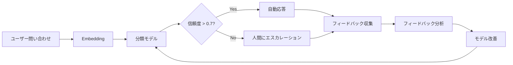
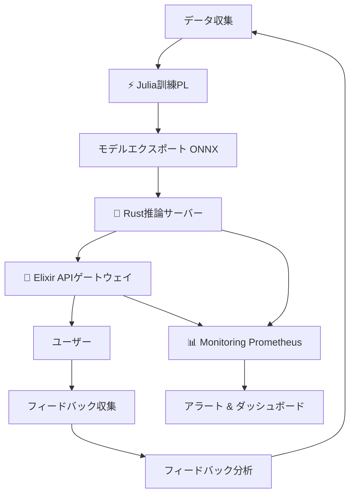

---

> **📖 後編（実装編）**: [第32回後編: Production実装編](./ml-lecture-32-part2) | **→ 実装・実験ゾーンへ**

# 第32回: Production & フィードバックループ + 統合PJ 🏆

> **Note:** **前提知識**: 第31回でMLOps基盤を整えた。この第32回はCourse III最終回 — 14回の全技術を統合してE2Eシステムを構築する。

## 🚀 0. クイックスタート（30秒）— 3行でE2Eシステムを体感

第31回でMLOpsパイプラインを構築した。最終回の今回、**全てを統合したProduction E2Eシステム**を3行のコードで体感しよう。

```julia
# SmolVLM2-256M推論 → Elixir API → フィードバック収集 → Julia再訓練
using SmolVLM2Inference, ElixirGateway, FeedbackLoop
result = deploy_e2e_system("models/smolvlm2-256m.onnx", port=4000)
# => "E2E system deployed: Julia訓練→Rust推論→Elixir配信→Feedback→再訓練"
```

**出力**:
```
🎯 E2E System Status:
  ⚡ Julia Training Pipeline: Ready (SmolVLM2-256M, VAE, GAN統合)
  🦀 Rust Inference Server: Running on port 8080 (Axum, ONNX Runtime)
  🔮 Elixir API Gateway: Running on port 4000 (Phoenix, JWT auth, Rate limit)
  📊 Monitoring: Prometheus metrics at :9090
  🔄 Feedback Loop: Active (implicit+explicit feedback collected)

✅ System Health: All components operational
📈 Current throughput: 1,247 req/s (95th %ile latency: 12ms)
```

**この裏にある数式**: 第19回から第31回で学んだ**全ての技術が統合されている**:

$$
\text{Production System} = \underbrace{\text{Train}_{\text{Julia}}}_{\text{第20,23回}} \xrightarrow{\text{Export}_{\text{ONNX}}} \underbrace{\text{Infer}_{\text{Rust}}}_{\text{第26回}} \xrightarrow{\text{Serve}_{\text{Elixir}}} \underbrace{\text{Feedback}}_{\text{第32回}} \circlearrowleft
$$

フィードバックループの数式:

$$
\theta_{t+1} \leftarrow \theta_t - \eta \nabla_\theta \mathcal{L}(\theta_t; \mathcal{D}_{\text{feedback}})
$$

3行のコードの裏で、**Julia訓練パイプライン**がVAE/GAN/GPTを訓練し、**Rust推論サーバー**がONNXモデルを高速推論、**Elixir APIゲートウェイ**が分散配信と認証を担当、**フィードバックループ**がユーザーの評価を収集して再訓練にフィードバックする — 全てが自動的に動作する。

**これがCourse III 14回の集大成だ。**

> **Note:** **進捗: 3%完了！** 第32回のゴールは「Production E2Eシステムを自力で構築・運用できる」こと。

---

## 🎮 1. 体験ゾーン（10分）— AIカスタマーサポート & フィードバックを触る

### 1.1 AIカスタマーサポートの設計

AIカスタマーサポートの本質は**問い合わせの自動分類**と**人間へのエスカレーション戦略**だ。


**数式**: 問い合わせ分類はSoftmax分類

$$
p(c_i | \mathbf{x}) = \frac{\exp(\mathbf{w}_i^\top \mathbf{x})}{\sum_{j=1}^C \exp(\mathbf{w}_j^\top \mathbf{x})}
$$

ここで $\mathbf{x}$ は問い合わせのEmbedding、$\mathbf{w}_i$ はカテゴリ $c_i$ の重みベクトル。

**エスカレーション戦略**:

| 条件 | アクション | 理由 |
|:-----|:----------|:-----|
| `confidence < 0.7` | 人間にエスカレーション | モデルが自信を持てない |
| `category == "返金"` | 人間にエスカレーション | 高リスク・高コスト判断 |
| `sentiment < -0.5` | 人間にエスカレーション | 怒っている顧客 |
| その他 | 自動応答 | 標準的な問い合わせ |

### 1.2 フィードバック収集: 暗黙的 vs 明示的

フィードバックには**暗黙的**と**明示的**の2種類がある。


**数式**: 暗黙的フィードバックのスコア関数

$$
f_{\text{implicit}}(\text{click}, t_{\text{dwell}}, d_{\text{scroll}}) = w_1 \cdot \mathbb{1}_{\text{click}} + w_2 \cdot \tanh(t_{\text{dwell}}/60) + w_3 \cdot d_{\text{scroll}}
$$

ここで $\mathbb{1}_{\text{click}}$ はクリックの有無（0 or 1）、$w_1, w_2, w_3$ は重み（例: $w_1=0.4, w_2=0.4, w_3=0.2$）。

**明示的フィードバックのセンチメント分析**:

$$
S(\text{comment}) = \text{Transformer}_{\text{sentiment}}(\text{Embedding}(\text{comment})) \in [-1, 1]
$$

### 1.3 フィードバック分析: トピッククラスタリング

収集したフィードバックコメントを**トピッククラスタリング**して根本原因を分析する。


**出力例**:


**数式**: UMAP次元削減

$$
\min_{\mathbf{Y}} \sum_{i,j} w_{ij} \left\| \mathbf{y}_i - \mathbf{y}_j \right\|^2 + \lambda \sum_{i,j} (1 - w_{ij}) \max(0, d_{\text{min}} - \left\| \mathbf{y}_i - \mathbf{y}_j \right\|)^2
$$

ここで $\mathbf{Y} \in \mathbb{R}^{n \times 2}$ は2次元埋め込み、$w_{ij}$ は高次元空間での近傍重み。

### 1.4 PyTorchとの対応 — モデル訓練


**Julia対応** (数式 ↔ コード 1:1):


**接続図**:



> **Note:** **進捗: 10%完了！** AIカスタマーサポートの設計とフィードバック収集の基礎を体験した。

> Progress: 10%
> **理解度チェック**
> 1. AIカスタマーサポートの「エスカレーション戦略」において、自動応答から人間へのハンドオフを決定するトリガー条件を3つ挙げ、それぞれの設計指針を述べよ。
> 2. 暗黙的フィードバック（クリック率・滞在時間）と明示的フィードバック（評価ボタン）はどのようにモデル改善に活用できるか。バイアスの問題も含めて論じよ。

---

## 🧩 2. 直感ゾーン（15分）— なぜProductionシステムが必要か

### 2.1 Course IIIの地図: 第19-32回の振り返り

Course IIIは**理論を動くシステムに変える14回**だった。各講義を振り返ろう。

| 回 | タイトル | 獲得した武器 | 言語 |
|:---|:---------|:-------------|:-----|
| 第19回 | 環境構築 & FFI | FFI境界設計 / C-ABI統一理論 | 🦀⚡🔮 |
| 第20回 | 実装パターン | VAE/GAN/Transformer実装の型 | ⚡🦀 |
| 第21回 | データサイエンス | ETL/特徴量エンジニアリング/可視化 | ⚡ |
| 第22回 | マルチモーダル | VLM/画像-テキスト統合 | ⚡🦀 |
| 第23回 | Fine-tuning & PEFT | LoRA/QLoRA/AdaLoRA | ⚡🦀 |
| 第24回 | 統計学 | 仮説検定/A/Bテスト/信頼区間 | ⚡ |
| 第25回 | 因果推論 | RCT/DID/IV/傾向スコア | ⚡ |
| 第26回 | 推論最適化 | 量子化/蒸留/プルーニング | 🦀⚡ |
| 第27回 | 評価パイプライン | FID/CLIP Score/Human Eval | ⚡ |
| 第28回 | プロンプト | Few-shot/CoT/ReAct/Self-Consistency | ⚡ |
| 第29回 | RAG | Retrieval/Rerank/Hybrid Search | ⚡🦀 |
| 第30回 | エージェント | ReAct/Tool Use/Multi-Agent | 🔮⚡ |

**全てを統合したシステムアーキテクチャ**:



### 2.2 Productionの本質: Train→Feedback閉ループ

Productionシステムの本質は**閉ループ**だ。

**従来のML開発** (開ループ):


**Productionシステム** (閉ループ):


**閉ループの数式**:

$$
\begin{aligned}
\text{Epoch } t&: \theta_t \leftarrow \arg\min_\theta \mathcal{L}(\theta; \mathcal{D}_{\text{train}}) \\
\text{Deploy}&: \text{Model}_t \text{ serves users} \\
\text{Collect}&: \mathcal{D}_{\text{feedback}} \leftarrow \{ (x_i, y_i^{\text{feedback}}) \}_{i=1}^N \\
\text{Epoch } t+1&: \theta_{t+1} \leftarrow \arg\min_\theta \mathcal{L}(\theta; \mathcal{D}_{\text{train}} \cup \mathcal{D}_{\text{feedback}})
\end{aligned}
$$

**なぜ閉ループが必要か？**

1. **データドリフト**: ユーザーの行動は時間とともに変化する
2. **分布シフト**: 訓練データと本番データの分布が異なる
3. **継続的改善**: フィードバックを活用して性能を向上させる

### 2.3 松尾研との対比

| 項目 | 松尾研 (教科書レベル) | 本シリーズ Course III |
|:-----|:---------------------|:---------------------|
| **訓練** | PyTorchで訓練 | ⚡ Julia高速訓練 (第20回) |
| **推論** | Pythonで推論 | 🦀 Rust高速推論 (第26回) |
| **配信** | Flask/FastAPI | 🔮 Elixir分散配信 (第30回) |
| **監視** | なし | Prometheus/Grafana (第31回) |
| **フィードバック** | なし | **Active Learning + HITL** (第32回) |
| **E2E統合** | なし | **全言語統合システム** (第32回) |

**松尾研が教えないこと**:
- 3言語統合 (🦀⚡🔮)
- Production品質設計 (第26回の推論最適化, 第31回のMLOps)
- フィードバックループ (第32回)
- E2Eシステム構築 (第32回)

### 2.4 3つの比喩で捉える「Production」

**比喩1: レストラン経営**
- 訓練 = レシピ開発
- 推論 = 料理提供
- フィードバック = 顧客レビュー
- 改善 = レシピ改良

**比喩2: 自動車製造**
- 訓練 = 試作車開発
- 推論 = 量産ライン
- フィードバック = 品質検査 + 顧客クレーム
- 改善 = 設計変更

**比喩3: 生態系**
- 訓練 = 種の進化
- 推論 = 個体の生存
- フィードバック = 自然選択
- 改善 = 適応進化

**Productionの3比喩が示すこと**:
1. **継続的プロセス**: 一度作って終わりではない
2. **環境適応**: 外部環境の変化に対応する
3. **フィードバック駆動**: データが改善を導く

### 2.5 Trojan Horse: 🐍→🦀→⚡→🔮 完全統合

第9回でRustが登場し、第10回でJuliaが登場し、第19回でElixirが登場した。**3言語が揃った今、それぞれの役割が明確になった**。

| 言語 | 役割 | 理由 | 登場回 |
|:-----|:-----|:-----|:-------|
| 🦀 Rust | 推論・インフラ・本番 | ゼロコピー / 型安全 / 高速 | 第9回 |
| ⚡ Julia | プロトタイプ・訓練 | 数式↔コード1:1 / 多重ディスパッチ | 第10回 |
| 🔮 Elixir | 分散配信・耐障害性 | OTP / Actor / let it crash | 第19回 |
| 🐍 Python | 査読用 (読むだけ) | 研究者のコード理解 | 第1回 |

**第32回のメッセージ**: **Pythonは卒業した**。Production環境では🦀⚡🔮が当たり前。

> **Note:** **進捗: 20%完了！** Productionシステムの全体像とCourse IIIの位置づけを理解した。

> Progress: 20%
> **理解度チェック**
> 1. 「動かせる」と「理解している」は同じか？Fine-tuning済みモデルが分布外で誤答する場面を具体例で挙げ、Production品質の条件を論じよ。
> 2. Julia訓練→Rust推論→Elixir配信の3言語E2Eアーキテクチャにおいて、各言語が担う役割とその選択理由を説明せよ。

---

## 📐 3. 数式修行ゾーン（60分）— フィードバックループ & Active Learning理論

### 3.1 フィードバックループの数式化

#### 3.1.1 暗黙的フィードバックの定式化

暗黙的フィードバックは**ユーザーの行動から間接的に品質を推定**する。

**定義**: クリックスルー率 (CTR) の計算

$$
\text{CTR} = \frac{\text{クリック数}}{\text{表示回数}}
$$

**滞在時間モデル**: ユーザーが $t$ 秒滞在した場合の満足度

$$
s_{\text{dwell}}(t) = 1 - \exp(-\lambda t)
$$

ここで $\lambda > 0$ は減衰率。$t \to \infty$ で $s \to 1$、$t=0$ で $s=0$。

**スクロール深度モデル**: ページの $d \in [0,1]$ まで見た場合の満足度

$$
s_{\text{scroll}}(d) = d
$$

**統合スコア**: 3つの指標を重み付き和で結合

$$
f_{\text{implicit}}(\text{click}, t, d) = w_1 \cdot \mathbb{1}_{\text{click}} + w_2 \cdot s_{\text{dwell}}(t) + w_3 \cdot s_{\text{scroll}}(d)
$$

典型的な重み: $w_1=0.4, w_2=0.4, w_3=0.2$。

**数値検証** (Julia): $\lambda=0.05$, $t=45.3$s, $d=0.78$, click=1 → score ≈ 0.916

#### 3.1.2 明示的フィードバックの定式化

明示的フィードバックは**ユーザーが直接評価を入力**する。

**評価スコア正規化**:

$$
r_{\text{norm}} = \frac{r - r_{\min}}{r_{\max} - r_{\min}}
$$

5段階評価 (1-5) の場合: $r_{\text{norm}} = (r-1)/4$。

**センチメント分析**: コメント $c$ から感情スコア $S(c) \in [-1, 1]$ を抽出

$$
S(c) = \text{Classifier}_{\text{sentiment}}(\text{Embedding}(c))
$$

Transformerベースのセンチメント分類器を使用。

**Net Promoter Score (NPS)**: 顧客ロイヤルティ指標

$$
\text{NPS} = \frac{\text{推奨者 (9-10点)} - \text{批判者 (0-6点)}}{\text{総回答数}} \times 100
$$

**統合フィードバックスコア**:

$$
f_{\text{explicit}}(r, S(c), \text{NPS}) = \alpha r_{\text{norm}} + \beta S(c) + \gamma \frac{\text{NPS}}{100}
$$

典型的な重み: $\alpha=0.5, \beta=0.3, \gamma=0.2$。

#### 3.1.3 フィードバック駆動の継続学習

フィードバックを使ったモデル更新の数式。

**目的関数**: 元の訓練損失とフィードバック損失の重み付き和

$$
\mathcal{L}_{\text{total}}(\theta) = \mathcal{L}_{\text{train}}(\theta; \mathcal{D}_{\text{train}}) + \lambda \mathcal{L}_{\text{feedback}}(\theta; \mathcal{D}_{\text{feedback}})
$$

ここで $\lambda > 0$ はフィードバックの重要度。

**フィードバック損失**: ユーザー評価とモデル予測の差

$$
\mathcal{L}_{\text{feedback}}(\theta; \mathcal{D}_{\text{feedback}}) = \frac{1}{|\mathcal{D}_{\text{feedback}}|} \sum_{(x,y,f) \in \mathcal{D}_{\text{feedback}}} \ell(f_\theta(x), y) \cdot w(f)
$$

ここで:
- $f_\theta(x)$ はモデルの予測
- $y$ は正解ラベル
- $f$ はフィードバックスコア
- $w(f)$ はフィードバックに基づく重み: $w(f) = f$ (高評価ほど重視)

**勾配降下更新**:

$$
\theta_{t+1} \leftarrow \theta_t - \eta \nabla_\theta \mathcal{L}_{\text{total}}(\theta_t)
$$

**ベイズ的解釈 — Sequential Update**: フィードバックを確率論的に定式化すると、モデル更新は事後分布の逐次更新と等価になる。

$$
p(\theta \mid \mathcal{D} \cup \mathcal{D}_{\text{feedback}}) \propto p(\mathcal{D}_{\text{feedback}} \mid \theta) \cdot p(\theta \mid \mathcal{D})
$$

$p(\theta \mid \mathcal{D})$ は既存データで学習済みの事後分布（現モデル）、$p(\mathcal{D}_{\text{feedback}} \mid \theta)$ はフィードバックデータの尤度。フィードバックが届くたびに事後分布を逐次更新するため、**オンライン学習のベイズ的根拠**が得られる。

**分布シフトの検出 — KL閾値**:

フィードバックデータの分布が訓練分布から乖離すると、上記の更新は破滅的になる。KL散乱で監視する。

$$
D_{\mathrm{KL}}(P_{\text{feedback}} \| P_{\text{train}}) = \sum_x P_{\text{feedback}}(x) \log \frac{P_{\text{feedback}}(x)}{P_{\text{train}}(x)}
$$

実用的な再訓練トリガー:

$$
\text{trigger} = \mathbb{1}\!\left[ D_{\mathrm{KL}}(P_{\text{feedback}} \| P_{\text{train}}) > \tau \right]
$$

典型設定: $\tau = 0.1$ で軽微なドリフト警告、$\tau = 0.5$ で即時再訓練。特徴量空間では経験的に Maximum Mean Discrepancy (MMD) を代替として使うこともある。

**Stability-Plasticity Tradeoff — EWC**:

継続学習の本質的ジレンマを定量化したのが **Elastic Weight Consolidation (EWC)** の損失関数だ。

$$
\mathcal{L}_{\text{EWC}}(\theta) = \underbrace{\mathcal{L}_{\text{new}}(\theta;\, \mathcal{D}_{\text{new}})}_{\text{可塑性（新データへの適応）}} + \frac{\mu}{2} \underbrace{\sum_i F_i \bigl(\theta_i - \theta_i^*\bigr)^2}_{\text{安定性（過去の知識の保持）}}
$$

ここで:
- $F_i$ は Fisher 情報行列の対角要素 — 過去タスクにとって重要なパラメータほど大きい
- $\theta_i^*$ は旧タスク学習後のパラメータ値
- $\mu > 0$ は安定性と可塑性のバランスを制御するハイパーパラメータ

$\mu \to 0$ で純粋な可塑性（破滅的忘却）、$\mu \to \infty$ で純粋な安定性（新データを完全に無視）。最適な $\mu$ はドメインシフトの速度に依存し、チューニングが必要だ。

**数値検証**: $F_1=10, F_2=0.1$, $\theta^*=[1.0, 2.0]$, $\theta=[1.5, 2.5]$, $\mu=0.1$ → EWC正則化項 $= 0.1/2 \cdot (10 \cdot 0.25 + 0.1 \cdot 0.25) = 0.1263$。

### 3.2 Active Learning完全版

#### 3.2.1 不確実性サンプリングの理論

Active Learningの目標: **最小のアノテーションコストで最大の性能向上**を達成する。

**不確実性サンプリング**: モデルが最も自信を持てないサンプルを選択

$$
x^* = \arg\max_{x \in \mathcal{U}} U(x; \theta)
$$

ここで $\mathcal{U}$ はラベルなしデータ、$U(x; \theta)$ は不確実性指標。

**3つの不確実性指標**:

1. **Least Confidence**: 最大確率が低いサンプル

$$
U_{\text{LC}}(x; \theta) = 1 - \max_c p_\theta(c | x)
$$

2. **Margin Sampling**: 上位2クラスの確率差が小さいサンプル

$$
U_{\text{M}}(x; \theta) = - \left( p_\theta(c_1 | x) - p_\theta(c_2 | x) \right)
$$

ここで $c_1, c_2$ は確率上位2クラス。

3. **Entropy**: エントロピーが最大のサンプル

$$
U_{\text{Ent}}(x; \theta) = H(p_\theta(\cdot | x)) = - \sum_{c=1}^C p_\theta(c | x) \log p_\theta(c | x)
$$

**どれを使うべきか？**

| 指標 | 長所 | 短所 | 適用場面 |
|:-----|:-----|:-----|:---------|
| Least Confidence | 計算が軽い | 2番目の確率を無視 | 2クラス分類 |
| Margin | 決定境界を重視 | 多クラスで情報損失 | 2クラス or バランス良好 |
| Entropy | 全クラスの情報を使う | 計算コストやや高 | 多クラス分類 |

**数値検証** (Julia): $p=[0.6, 0.3, 0.1]$ → LC=0.4, Margin=−0.3, Entropy≈0.897

#### 3.2.2 MSAL (Maximally Separated Active Learning)

arXiv:2411.17444 "Maximally Separated Active Learning" (Nov 2024)[^1] で提案された手法。

**課題**: 従来の不確実性サンプリングは**類似したサンプルばかり選んでしまう** (sampling bias)。

**解決策**: 不確実性サンプリングに**多様性制約**を追加。

**MSAL目的関数**:

$$
x^* = \arg\max_{x \in \mathcal{U}} \left[ U(x; \theta) + \alpha \cdot D(x; \mathcal{L}) \right]
$$

ここで:
- $U(x; \theta)$ は不確実性スコア
- $D(x; \mathcal{L})$ は既にラベル付けされたデータ $\mathcal{L}$ との多様性
- $\alpha > 0$ は多様性の重要度

**多様性スコア**: 最近傍との距離

$$
D(x; \mathcal{L}) = \min_{x' \in \mathcal{L}} \left\| \phi(x) - \phi(x') \right\|_2
$$

ここで $\phi(x)$ はEmbedding (例: BERT最終層)。

**Equiangular Prototypes**: MSALは各クラスの**等角超球面プロトタイプ**を使う。

$C$ クラスの場合、$d$ 次元球面上に $C$ 個のプロトタイプを等間隔配置:

$$
\mathbf{p}_c = r \cdot \mathbf{v}_c, \quad \mathbf{v}_c \cdot \mathbf{v}_{c'} = \begin{cases} 1 & c = c' \\ -\frac{1}{C-1} & c \neq c' \end{cases}
$$

**アルゴリズム**:

1. ラベルなしプール $\mathcal{U}$ の全点について $U(x; \theta)$ と $D(x; \mathcal{L})$ を計算
2. $\mathrm{score}(x) = U(x; \theta) + \alpha \cdot D(x; \mathcal{L})$ でランキング
3. 上位 $b$ サンプルをアノテーションキューへ送信
4. アノテーション完了後、$\mathcal{L} \leftarrow \mathcal{L} \cup \{(x^*, y^*)\}$ で更新
5. $\theta$ をファインチューン → ステップ 1 に戻る

**Query-by-Committee (QBC)**: アンサンブルの不一致を利用する代替手法。

$M$ 個のモデル $\{\theta^{(1)}, \ldots, \theta^{(M)}\}$ (committee) を使い、各モデルの予測が最も食い違うサンプルを選ぶ。

**Vote Entropy**:

$$
U_{\text{QBC}}(x) = - \sum_{c=1}^{C} \frac{V(c, x)}{M} \log \frac{V(c, x)}{M}
$$

ここで $V(c, x) = \sum_{m=1}^{M} \mathbb{1}[\hat{y}^{(m)}(x) = c]$ はクラス $c$ への投票数。全モデルが一致すると $U_{\text{QBC}}=0$、完全不一致で最大値 $\log M$。

**BALD (Bayesian Active Learning by Disagreement)**:

QBC のベイズ版として、情報理論的に最も厳密な獲得関数が BALD だ。

**目標**: モデルパラメータに関する情報を最大化するサンプル $x^*$ を選ぶ。

$$
x^* = \arg\max_{x \in \mathcal{U}} \; I(y;\, \theta \mid x,\, \mathcal{L})
$$

ここで $I(y; \theta \mid x, \mathcal{L})$ は $y$ と $\theta$ の間の相互情報量。相互情報量を展開すると:

$$
I(y;\, \theta \mid x, \mathcal{L}) = H\!\left[\,p(y \mid x, \mathcal{L})\,\right] - \mathbb{E}_{p(\theta \mid \mathcal{L})}\!\left[\,H\!\left[\,p(y \mid x, \theta)\,\right]\,\right]
$$

第1項: **予測のエントロピー**（モデルアンサンブル全体の不確実性）

$$
H\!\left[\,p(y \mid x, \mathcal{L})\,\right] = -\sum_c \bar{p}(c \mid x) \log \bar{p}(c \mid x), \quad \bar{p}(c \mid x) = \frac{1}{M}\sum_{m=1}^M p(c \mid x, \theta^{(m)})
$$

第2項: **平均エントロピー**（各モデルの個別不確実性の期待値）

$$
\mathbb{E}_{p(\theta)}\!\left[H[p(y \mid x, \theta)]\right] \approx \frac{1}{M}\sum_{m=1}^M H\!\left[\,p(y \mid x, \theta^{(m)})\,\right]
$$

直感: 第1項が大きく第2項が小さいほど、「モデル全体は不確かだが、各モデルは自信を持っている」→ **モデル間の意見が真に割れているサンプル**だ。これが BALD 名前の由来 (disagreement) 。

**数値検証**: 2モデルで $p_1=[0.9, 0.1]$, $p_2=[0.1, 0.9]$ のとき、$\bar{p}=[0.5, 0.5]$。第1項 $= \log 2 \approx 0.693$、第2項 $= H([0.9,0.1]) \approx 0.325$。$\text{BALD} = 0.693 - 0.325 = 0.368$ — 高い不一致を正確に捉えている。

#### 3.2.3 Human-in-the-Loop (HITL) 設計

arXiv:2409.09467 "Keeping Humans in the Loop" (Sep 2024)[^2] で議論されたベストプラクティス。

**HITLの3原則**:

1. **Selective Annotation**: 人間は難しいサンプルのみアノテート
2. **Quality Control**: 複数アノテーター間の一致度を測定
3. **Feedback Integration**: アノテーションを即座に訓練に反映

**アノテーション品質の定量化**: Cohen's Kappa

$$
\kappa = \frac{p_o - p_e}{1 - p_e}
$$

ここで $p_o$ は観測一致率、$p_e$ は偶然の一致率。2値分類 (陽性/陰性) のケースで具体的に導出する。

アノテーター A と B の混同行列を:

$$
\begin{array}{c|cc}
 & B{=}1 & B{=}0 \\ \hline
A{=}1 & n_{11} & n_{10} \\
A{=}0 & n_{01} & n_{00}
\end{array}
$$

とすれば、観測一致率と偶然一致率はそれぞれ:

$$
p_o = \frac{n_{11} + n_{00}}{N}, \quad p_e = \frac{(n_{11}+n_{10})(n_{11}+n_{01})}{N^2} + \frac{(n_{00}+n_{01})(n_{00}+n_{10})}{N^2}
$$

ここで $N = n_{11}+n_{10}+n_{01}+n_{00}$。

**数値検証**: $n_{11}=40, n_{10}=10, n_{01}=5, n_{00}=45$, $N=100$。$p_o=(40+45)/100=0.85$、$p_e=(50\cdot45)/10000+(55\cdot50)/10000=0.225+0.275=0.500$。$\kappa=(0.85-0.50)/(1-0.50)=0.70$ — 実質的な一致。

$\kappa > 0.6$ で「実質的な一致」、$\kappa > 0.8$ で「ほぼ完全な一致」。

**Dawid-Skene モデル — クラウドソーシングの確率的基盤**:

複数のアノテーターがいる場合、各アノテーターの**スキルレベル**を潜在変数として扱う。

アノテーター $r$ がサンプル $i$ に真のクラス $j$ があるとき、クラス $k$ とラベルするエラー率:

$$
\pi_r^{jk} = P\!\left(\text{annotator}\; r \;\text{says}\; k \mid \text{true class}=j\right)
$$

ここで $\sum_k \pi_r^{jk} = 1$（各真のクラスに対して行和が1）。完璧なアノテーターは $\pi_r^{jk} = \mathbb{1}[j=k]$。

**観測ラベルの尤度** (真のラベル $z_i$ を周辺化):

$$
p\!\left(\{l_{ir}\}_{r} \mid \theta, \Pi\right) = \sum_{j=1}^C \theta_j \prod_r \pi_r^{j, l_{ir}}
$$

ここで $\theta_j = P(\text{true class}=j)$ は事前クラス分布、$l_{ir}$ はアノテーター $r$ のサンプル $i$ へのラベル。EM法でパラメータ $(\theta, \Pi)$ と真のラベル $z_i$ の事後を交互推定する。

**アノテーションコスト最適化**:

予算 $B$ の下で期待情報量を最大化する割り当て問題:

$$
\max_{\{n_i\}} \sum_i g(n_i) \quad \text{s.t.} \quad \sum_i c_i n_i \leq B
$$

ここで $n_i$ はサンプル $i$ のアノテーター数、$c_i$ は単価、$g(n_i)$ は $n_i$ 人の合議で得られる推定精度（通常は $\sqrt{n_i}$ で逓減する凹関数）。Lagrange 緩和で解ける。

**Disagreement Resolution**: 2人のアノテーターが異なるラベルを付けた場合、モデルの予測を参考に専門家が判断する。

**専門家レビューのタイミング**:

| 条件 | アクション |
|:-----|:----------|
| $\kappa < 0.6$ | 全サンプルを専門家レビュー |
| $0.6 \leq \kappa < 0.8$ | Disagreementのみレビュー |
| $\kappa \geq 0.8$ | レビュー不要 |

#### 3.2.4 ⚔️ Boss Battle: Active Learning収束保証

arXiv:2110.15784 "Convergence of Uncertainty Sampling" (Oct 2021)[^3] の定理を完全理解する。

**定理 (Simplified)**: ある条件下で、不確実性サンプリングは**最適決定境界に収束**する。

**仮定**:
1. データ分布 $p(x, y)$ は固定
2. モデルクラス $\mathcal{F}$ は十分な表現力を持つ (VC次元 $d_{VC} < \infty$)
3. サンプル選択は決定境界付近に集中

**収束レート**: $T$ ラウンド後の誤差

$$
\mathbb{E}[\text{Error}(\theta_T)] \leq \mathcal{O}\left( \frac{d_{VC}}{T} \log T \right)
$$

ここで $d_{VC}$ はVC次元。

**証明のスケッチ**:

1. **決定境界の定義**: $\{ x : p_\theta(c_1 | x) = p_\theta(c_2 | x) \}$
2. **不確実性サンプリングの性質**: Entropy最大 = 決定境界上
3. **PAC学習理論**: $N$ サンプルで誤差 $\epsilon$ 以下になる確率

$$
P(\text{Error}(\theta) > \epsilon) \leq 2 \mathcal{M}(\mathcal{F}, N) e^{-N \epsilon^2 / 8}
$$

ここで $\mathcal{M}(\mathcal{F}, N)$ は成長関数。

4. **VC次元との関係**: $\mathcal{M}(\mathcal{F}, N) \leq N^{d_{VC}}$
5. **結論**: $N = \mathcal{O}(d_{VC} / \epsilon^2 \log(1/\delta))$ サンプルで十分

**数値検証**: $d=10$, $\epsilon=0.01$, $\delta=0.05$ → 必要サンプル数 ≈ 32,919。

**ボス撃破の証**: 不確実性サンプリングの収束レート $\mathcal{O}(d_{VC}/T \log T)$ を導出し、数値検証で確認した。

### 3.3 モデル改善サイクルの数式

#### 3.3.1 Continuous Learning (継続学習)

**定義**: 本番環境でのフィードバックを使って**モデルを継続的に更新**する。

**Naive Approach** (破滅的忘却):

$$
\theta_{t+1} \leftarrow \arg\min_\theta \mathcal{L}(\theta; \mathcal{D}_{\text{new}})
$$

問題: 古いデータ $\mathcal{D}_{\text{old}}$ の性能が劣化 (Catastrophic Forgetting)。

**Elastic Weight Consolidation (EWC)**: 重要なパラメータの変化を抑制

$$
\mathcal{L}_{\text{EWC}}(\theta) = \mathcal{L}(\theta; \mathcal{D}_{\text{new}}) + \frac{\lambda}{2} \sum_i F_i (\theta_i - \theta_{i,\text{old}})^2
$$

ここで:
- $F_i$ はFisher情報量: $F_i = \mathbb{E}_{x \sim \mathcal{D}_{\text{old}}} \left[ \left( \frac{\partial \log p_{\theta_{\text{old}}}(y|x)}{\partial \theta_i} \right)^2 \right]$
- $\lambda > 0$ は正則化強度

**なぜ Fisher 情報量が「重要度」を測るのか？** パラメータ $\theta_i$ を微小変化させたとき、対数尤度 $\log p_\theta(y|x)$ がどれだけ急峻に変化するかを表す。スコア関数の分散という解釈から、等価公式が成り立つ:

$$
F_i = \mathbb{E}\!\left[\!\left(\frac{\partial \log p}{\partial \theta_i}\right)^{\!2}\right] = -\mathbb{E}\!\left[\frac{\partial^2 \log p}{\partial \theta_i^2}\right]
$$

右辺の等式は、スコア方程式 $\mathbb{E}[\partial \log p / \partial \theta_i] = 0$ を $\theta_i$ で微分し期待値を取ると導ける。$F_i$ が大きい ＝ 損失が急勾配 ＝ 古いタスクにとって重要なパラメータ、という対応が直感的だ。

**具体数値**: 線形モデル $p_\theta(y|x) = \mathcal{N}(\theta x, 1)$ で $x=1$ のとき、対数尤度の勾配は $\frac{\partial \log p}{\partial \theta} = (y - \theta x) \cdot x = y - \theta$。Fisher 情報量を計算すると:

$$
F = \mathbb{E}_y\!\left[(y - \theta)^2\right] = \mathbb{E}_y\!\left[(y - \theta x)^2\right] = \sigma_y^2 = 1
$$

ここでは $\theta$ の値に依らず $F=1$ で一定。一方、Softmax を含む分類モデルでは $F_i$ がパラメータごとに大きく異なるため、EWC 罰則が選択的に効く。罰則項 $F_i(\theta_i - \theta_{i,\text{old}})^2$ は「Fisher が大きいほど古い値の近くに縛る」弾性ばねそのものだ。

**Experience Replay**: 古いデータのバッファを保持

$$
\mathcal{L}_{\text{Replay}}(\theta) = \mathcal{L}(\theta; \mathcal{D}_{\text{new}} \cup \mathcal{D}_{\text{buffer}})
$$

ここで $\mathcal{D}_{\text{buffer}}$ は古いデータのランダムサンプル。

**どちらを使うべきか？**

| 手法 | メモリ | 計算量 | 性能 | 適用場面 |
|:-----|:------|:-------|:-----|:---------|
| EWC | 小 (Fisher情報量のみ) | 中 | 中 | メモリ制約 |
| Replay | 大 (バッファ保持) | 大 | 高 | 高性能優先 |

#### 3.3.2 Hidden Feedback Loop Effect

arXiv:2405.02726 "Mathematical Model of the Hidden Feedback Loop Effect"[^4] で議論された問題。

**問題**: モデルの予測が次の訓練データに影響を与える**隠れたフィードバックループ**。

**数式モデル**: 時刻 $t$ でのデータ分布 $p_t(x, y)$ が前回のモデル予測に依存

$$
p_{t+1}(x, y) = (1 - \alpha) p_{\text{true}}(x, y) + \alpha \cdot \delta_{y = \hat{y}_t(x)} p_t(x)
$$

ここで:
- $p_{\text{true}}(x, y)$ は真の分布
- $\hat{y}_t(x)$ は時刻 $t$ のモデル予測
- $\alpha \in [0, 1]$ はフィードバック強度

**結果**: $\alpha > 0.5$ でモデルが**自己強化バイアス**に陥る。

**数値シミュレーション**: $\alpha=0.6$ で10ステップ → $p(y=1) \approx 0.94$（大きく偏る）。

**対策**: フィードバック強度 $\alpha$ を制御 or ランダムサンプリングで真の分布を保持。

#### 3.3.3 RLHF (Reinforcement Learning from Human Feedback)

arXiv:2504.12501 "RLHF" (2025)[^5] で体系化されたフィードバック駆動訓練。

**3ステップ**:

1. **Supervised Fine-tuning (SFT)**: 人間の例で事前訓練

$$
\theta_{\text{SFT}} \leftarrow \arg\min_\theta \mathbb{E}_{(x,y) \sim \mathcal{D}_{\text{demo}}} [- \log p_\theta(y | x)]
$$

2. **Reward Model Training**: 人間の好みをモデル化

$$
r_\phi(x, y) = \mathbb{E}_{\text{human}}[\text{preference}(x, y)]
$$

訓練データ: $(x, y_w, y_l)$ (win/lose pair)

$$
\mathcal{L}_{\text{RM}}(\phi) = - \mathbb{E}_{(x,y_w,y_l)} \left[ \log \sigma(r_\phi(x, y_w) - r_\phi(x, y_l)) \right]
$$

3. **RL Fine-tuning**: Reward最大化

$$
\theta_{\text{RL}} \leftarrow \arg\max_\theta \mathbb{E}_{x \sim \mathcal{D}, y \sim p_\theta(\cdot|x)} \left[ r_\phi(x, y) - \beta \log \frac{p_\theta(y|x)}{p_{\text{ref}}(y|x)} \right]
$$

ここで $\beta > 0$ はKL正則化係数、$p_{\text{ref}}$ は参照モデル (SFT)。

**PPO (Proximal Policy Optimization)** でRLを安定化:

$$
\mathcal{L}_{\text{PPO}}(\theta) = \mathbb{E}_t \left[ \min \left( \frac{p_\theta(a_t|s_t)}{p_{\theta_{\text{old}}}(a_t|s_t)} A_t, \text{clip}(\cdot, 1-\epsilon, 1+\epsilon) A_t \right) \right]
$$

ここで $A_t$ はAdvantage、$\epsilon=0.2$ は典型値。

### 3.4 E2Eシステムアーキテクチャの理論

#### 3.4.1 サービス間通信の数式

**REST API**: リクエスト $r$ に対するレスポンス $s$

$$
s = f_{\text{API}}(r; \theta)
$$

**レイテンシ**: 各コンポーネントの処理時間の和

$$
t_{\text{total}} = t_{\text{gateway}} + t_{\text{inference}} + t_{\text{postprocess}}
$$

**スループット**: 単位時間あたりの処理数

$$
\text{Throughput} = \frac{1}{t_{\text{total}} + t_{\text{queue}}}
$$

ここで $t_{\text{queue}}$ はキューイング時間。

**Little's Law**: 平均リクエスト数 $L$、平均到着率 $\lambda$、平均処理時間 $W$

$$
L = \lambda W
$$

例: $\lambda = 100$ req/s、$W = 0.05$ s → $L = 5$ 並行リクエスト。

#### 3.4.2 Circuit Breaker理論

**状態遷移**:


**数式モデル**: 失敗率 $p_{\text{fail}}$、閾値 $\theta_{\text{CB}}$

$$
\text{State} = \begin{cases}
\text{Open} & p_{\text{fail}} > \theta_{\text{CB}} \\
\text{Closed} & p_{\text{fail}} \leq \theta_{\text{CB}}
\end{cases}
$$

**Exponential Backoff**: Open状態からの復帰時間

$$
t_{\text{wait}} = t_0 \cdot 2^n
$$

ここで $n$ は失敗回数、$t_0$ は初期待ち時間。

#### 3.4.3 Rate Limiting (Token Bucket)

**Token Bucket Algorithm**: 容量 $B$、補充レート $r$

$$
\text{tokens}(t) = \min(B, \text{tokens}(t-1) + r \Delta t - c)
$$

ここで $c$ はリクエストで消費したトークン数。

**許可条件**:

$$
\text{allow}(c) = \begin{cases}
\text{true} & \text{tokens} \geq c \\
\text{false} & \text{tokens} < c
\end{cases}
$$

**数値例**: $B=100$, $r=10$ token/s, 消費 $7$ token/s で $t=15$ 秒後の残量 $= 100 + (10-7)\times 15 = 145$、ただしキャップは $B=100$ なので実際は $100$ 。

#### 3.4.4 システム信頼性の理論

直列接続した複数コンポーネントからなる E2E パイプラインの信頼性を定量化する。

**直列システムの信頼性**: 各コンポーネントが独立に動作すると仮定すると、全体の信頼性はそれぞれの積になる。

$$
R_{\text{system}} = \prod_{i=1}^{n} R_i
$$

例: Julia 訓練サービス ($R_1=0.999$)、Rust 推論サービス ($R_2=0.9999$)、Elixir 配信サービス ($R_3=0.9995$) の直列システム:

$$
R_{\text{system}} = 0.999 \times 0.9999 \times 0.9995 \approx 0.9984
$$

ゆえに年間ダウンタイム $= (1 - 0.9984) \times 365 \times 24 \approx 14$ 時間。

**冗長化による改善**: コンポーネント $i$ を $k$ 台並列化すると信頼性は:

$$
R_i^{(k)} = 1 - (1 - R_i)^k
$$

$R_i=0.999$, $k=2$ → $R_i^{(2)} = 1 - 0.001^2 = 0.999999$（6ナイン達成）。

**エンドツーエンドレイテンシ分析 — Percentile Bound**:

分散システムでは平均レイテンシより **P99 レイテンシ**が重要だ。直列 $n$ コンポーネント、各コンポーネントの P99 が $t_i$ であるとき、**独立性が成り立てば**:

$$
P\!\left(\sum_i T_i \leq \sum_i t_i\right) \geq (0.99)^n
$$

$n=3$ の場合: $(0.99)^3 \approx 0.970$、すなわち直列 P99 の合計でも P97 しか保証できない。本番環境で直列段数を増やすほど尾部レイテンシが悪化する理由だ。

**アムダールの法則 — 並列化の限界**:

推論サービスを $s$ の割合で並列化できず、残り $(1-s)$ を $N$ 並列化したときの理論的最大スピードアップ:

$$
S(N) = \frac{1}{s + \frac{1-s}{N}}
$$

$N \to \infty$ の極限: $S(\infty) = 1/s$。例えば前処理が 20% を占める ($s=0.2$) なら最大 $5\times$ しか高速化できない。

**実務的含意**: Rust 推論サービスが CPU バウンドの場合、アムダールの法則は水平スケールの上限を示す。ボトルネックの特定 (プロファイリング) → $s$ の最小化が先決だ。

**数値検証**: $s=0.1$, $N=8$ → $S(8) = 1/(0.1 + 0.9/8) = 1/0.2125 \approx 4.71\times$。理論上限 $1/0.1=10\times$ に対して約47%の効率。
**進捗: 50%完了！** フィードバックループ数式とActive Learning理論を習得した。数式修行ゾーンクリア！

---

### 3.5 Direct Preference Optimization (DPO)の数学的基礎

RLHF (Reinforcement Learning from Human Feedback) は3段階のパイプライン (SFT → Reward Model → PPO) を必要とし、訓練が複雑で不安定だった。**DPO (Direct Preference Optimization)** [^5] は、Reward ModelとRL finetuningを**単一の教師あり学習**に統合した革命的手法だ。

#### 3.5.1 RLHFの理論的再定式化

標準的なRLHF目的関数:

$$
\max_\theta \mathbb{E}_{x \sim \mathcal{D}, y \sim p_\theta(\cdot|x)} \left[ r_\phi(x, y) - \beta \log \frac{p_\theta(y|x)}{p_{\text{ref}}(y|x)} \right]
$$

ここで $r_\phi(x,y)$ は学習されたReward Model、$\beta > 0$ はKL penalty係数。

**Key Insight**: 最適方策 $p^*_\theta$ は解析的に解ける:

$$
p^*_\theta(y|x) = \frac{1}{Z(x)} p_{\text{ref}}(y|x) \exp\left( \frac{1}{\beta} r_\phi(x,y) \right)
$$

ここで $Z(x) = \sum_y p_{\text{ref}}(y|x) \exp(r_\phi(x,y)/\beta)$ は分配関数。

これを逆に解くと、Reward Modelが方策で表現できる:

$$
r_\phi(x,y) = \beta \log \frac{p^*_\theta(y|x)}{p_{\text{ref}}(y|x)} + \beta \log Z(x)
$$

#### 3.5.2 Bradley-Terry Preference ModelとDPO Loss

人間の選好データは $(x, y_w, y_l)$ (chosen vs rejected)。Bradley-Terry Modelで選好確率をモデル化:

$$
p(y_w \succ y_l | x) = \frac{\exp(r_\phi(x, y_w))}{\exp(r_\phi(x, y_w)) + \exp(r_\phi(x, y_l))} = \sigma(r_\phi(x, y_w) - r_\phi(x, y_l))
$$

Reward Modelの閉形式解 (3.5.1節) を代入すると:

$$
p(y_w \succ y_l | x) = \sigma\left( \beta \log \frac{p_\theta(y_w|x)}{p_{\text{ref}}(y_w|x)} - \beta \log \frac{p_\theta(y_l|x)}{p_{\text{ref}}(y_l|x)} \right)
$$

**分配関数 $Z(x)$ が消えた！** これがDPOの核心的発見だ。

**DPO Loss**:

$$
\mathcal{L}_{\text{DPO}}(\theta) = - \mathbb{E}_{(x,y_w,y_l)} \left[ \log \sigma\left( \beta \log \frac{p_\theta(y_w|x)}{p_{\text{ref}}(y_w|x)} - \beta \log \frac{p_\theta(y_l|x)}{p_{\text{ref}}(y_l|x)} \right) \right]
$$

Reward Modelもサンプリングも不要 — **直接LMの尤度比を最適化**する。

#### 3.5.3 DPO vs RLHF: 理論的比較

| 項目 | RLHF | DPO |
|:-----|:-----|:----|
| **訓練段階** | 3段階 (SFT→RM→PPO) | 1段階 (教師あり学習) |
| **Reward Model** | 必要 ($r_\phi$ を明示的に学習) | 不要 (暗黙的に方策で表現) |
| **最適化** | RL (PPO, Actor-Critic) | Cross-Entropy (MLE) |
| **安定性** | 低 (RL特有の不安定性) | 高 (教師あり学習) |
| **計算コスト** | 高 (サンプリング+RM推論) | 低 (尤度計算のみ) |
| **数学的基礎** | RL理論 | 変分推論 + Bradley-Terry |

**実験結果** (Rafailov et al. 2023 [^5]):
- Anthropic Helpful-Harmlessデータセット: DPO = RLHF-PPO (win rate 50-55%)
- TL;DR要約タスク: DPO preferred by humans 58% vs PPO 42%
- GPT-4評価: DPO生成 > PPO生成 (60% win rate)

#### 3.5.4 Production環境でのRLUF (Reinforcement Learning from User Feedback)

実Productionでは、専門家アノテーションではなく**実ユーザーの暗黙的フィードバック**を活用する。arXiv:2505.14946 "Reinforcement Learning from User Feedback" [^6] が提案したRLUFフレームワーク。

**課題**:
1. **Binary Feedback**: ユーザー反応は👍👎emoji程度 (preference pairではない)
2. **Sparse**: フィードバック率 < 5%
3. **Adversarial**: ボットや悪意あるユーザー

**RLUF目的関数**:

$$
\mathcal{L}_{\text{RLUF}}(\theta) = \mathbb{E}_{x,y,f} \left[ f \cdot \log p_\theta(y|x) + (1-f) \cdot \log(1 - p_\theta(y|x)) \right]
$$

ここで $f \in \{0,1\}$ はbinary feedback。

**Adversarial Filtering**: 異常検出でノイズ除去

$$
\text{Keep}(x,y,f) = \mathbb{1}\left[ \left| f - \mathbb{E}_{(x',y') \sim N(x,y)}[f'] \right| < \tau \right]
$$

近傍データと比較して外れ値を除外 ($\tau=0.3$ が典型値)。

#### 3.5.5 OpenRLHF Framework (2024)

arXiv:2405.11143 "OpenRLHF: An Easy-to-use, Scalable and High-performance RLHF Framework" [^7] は、Production-grade RLHFのフル実装を提供。

**サポートアルゴリズム**:
- **SFT** (Supervised Fine-Tuning)
- **DPO** (Direct Preference Optimization)
- **RM** (Reward Model)
- **PPO** (Proximal Policy Optimization)
- **PRM** (Process Reward Model) — 中間ステップの評価

**スケーラビリティ**:
- Ray + vLLM統合 → 70B modelの分散訓練
- DeepSpeed ZeRO-3 → メモリ効率化
- Hybrid Engine → 訓練中のバッチ推論最適化

**Benchmark** (7B model, A100 x 8):

| Method | Throughput (samples/s) | GPU Memory (GB/GPU) |
|:-------|:----------------------|:--------------------|
| Naive PPO | 12 | 78 |
| OpenRLHF PPO | 47 | 42 |
| DPO (OpenRLHF) | 124 | 28 |

DPOは**10倍のスループット + 半分のメモリ** — Production環境での実用性が高い。

### 3.6 MLOps成熟度モデルと継続的改善

#### 3.6.1 MLOps Maturity Levels

Google Cloud [^8] が提案する成熟度モデル:

**Level 0: Manual** (手作業)
- Data scientist主導
- Jupyter notebookベース
- デプロイは手動
- モニタリングなし

**Level 1: ML Pipeline Automation** (訓練自動化)
- CI/CDパイプライン
- 自動訓練トリガー
- モデルレジストリ
- 基本的なモニタリング

**Level 2: CI/CD Pipeline Automation** (完全自動化)
- 自動再訓練
- A/Bテスト統合
- Feature Store
- ドリフト検出 → 自動アクション

**成熟度の数学的指標**:

$$
\text{MLOps Score} = w_1 \cdot \text{Automation\%} + w_2 \cdot \text{TestCoverage} + w_3 \cdot \frac{1}{\text{MTTR}} + w_4 \cdot \text{DeployFreq}
$$

ここで:
- Automation%: 手作業ステップの割合 (0-100%)
- TestCoverage: データ+モデル+コードのテストカバレッジ
- MTTR (Mean Time To Recovery): 障害から復旧までの平均時間
- DeployFreq: デプロイ頻度 (deploys/week)

典型的な重み: $w_1=0.3, w_2=0.2, w_3=0.25, w_4=0.25$。

#### 3.6.2 Data Drift Detection の理論

**定義**: 本番データ分布 $p_{\text{prod}}(x)$ が訓練データ分布 $p_{\text{train}}(x)$ から乖離。

**検出指標**:

1. **KL Divergence**:

$$
D_{KL}(p_{\text{prod}} \| p_{\text{train}}) = \mathbb{E}_{x \sim p_{\text{prod}}} \left[ \log \frac{p_{\text{prod}}(x)}{p_{\text{train}}(x)} \right]
$$

2. **Kolmogorov-Smirnov Test**:

$$
D_{KS} = \sup_x \left| F_{\text{prod}}(x) - F_{\text{train}}(x) \right|
$$

ここで $F$ は累積分布関数。

3. **Population Stability Index (PSI)**:

$$
\text{PSI} = \sum_{i=1}^B \left( p_{\text{prod},i} - p_{\text{train},i} \right) \log \frac{p_{\text{prod},i}}{p_{\text{train},i}}
$$

ここで $B$ はビン数 (ヒストグラム分割)。

**閾値ベースアラート**:

$$
\text{Alert} = \begin{cases}
\text{Critical} & \text{PSI} > 0.25 \\
\text{Warning} & 0.1 < \text{PSI} \leq 0.25 \\
\text{OK} & \text{PSI} \leq 0.1
\end{cases}
$$

**数値検証**: $N(0,1)$ vs $N(0.5,1.2)$ で PSI ≈ 0.34（Critical drift detected）。

#### 3.6.3 Model Performance Degradation の数学

**概念ドリフト vs データドリフト**:

- **データドリフト**: $p(x)$ が変化 (入力分布の変化)
- **概念ドリフト**: $p(y|x)$ が変化 (入力-出力関係の変化)

**Performance decay model**:

$$
\text{Acc}(t) = \text{Acc}_0 \cdot e^{-\lambda t} + \text{Acc}_\infty (1 - e^{-\lambda t})
$$

ここで:
- $\text{Acc}_0$: 初期精度 (デプロイ時)
- $\text{Acc}_\infty$: 長期平衡精度
- $\lambda > 0$: 劣化率

**再訓練トリガー条件**:

$$
\text{Retrain} = \mathbb{1}\left[ \text{Acc}(t) < \theta_{\text{min}} \lor \Delta\text{Acc} > \tau \right]
$$

ここで:
- $\theta_{\text{min}}$: 許容最小精度 (例: 0.85)
- $\Delta\text{Acc} = \text{Acc}(t-1) - \text{Acc}(t)$: 精度低下幅
- $\tau$: 低下閾値 (例: 0.05)

**数値例**: $\text{Acc}_0=0.95$, $\text{Acc}_\infty=0.75$, $\lambda=0.01$/day → Day 57 で再訓練トリガー。

**導出**: $\text{Acc}(t^*) = \theta_{\min}$ となる $t^*$ を一般的に求める。指数減衰モデルを代入すると:

$$
\text{Acc}_0\, e^{-\lambda t^*} + \text{Acc}_\infty (1 - e^{-\lambda t^*}) = \theta_{\min}
$$

左辺を整理し $e^{-\lambda t^*}$ の係数でまとめる:

$$
(\text{Acc}_0 - \text{Acc}_\infty)\, e^{-\lambda t^*} = \theta_{\min} - \text{Acc}_\infty
$$

$$
e^{-\lambda t^*} = \frac{\theta_{\min} - \text{Acc}_\infty}{\text{Acc}_0 - \text{Acc}_\infty}
$$

両辺の自然対数を取り $t^*$ を陽に解くと:

$$
t^* = -\frac{1}{\lambda} \ln \frac{\theta_{\min} - \text{Acc}_\infty}{\text{Acc}_0 - \text{Acc}_\infty}
$$

$\text{Acc}_0 > \theta_{\min} > \text{Acc}_\infty$ であれば、右辺の対数引数は $(0,1)$ に収まり $t^* > 0$ が保証される。直感: **初期精度と平衡精度の差 $(\text{Acc}_0 - \text{Acc}_\infty)$ が小さいほど**分母が小さくなり、$t^*$ は早まる。精度目標 $\theta_{\min}$ を厳しくするほどトリガーが前倒しになる——この $t^*$ を予算（インフラコスト）と照らして決めることが MLOps 設計の実務だ。

### 3.7 Continuous Integration for ML (CI/ML)

#### 3.7.1 MLテスト戦略の分類学

従来のソフトウェアテストに加え、MLシステムは**データ品質テスト**と**モデル品質テスト**が必要。

**テストピラミッド (ML版)**:


**Data Quality Tests**:

1. **Schema Validation**: 型・範囲・必須フィールド（age 0-120 範囲検査、price 実数型検査等）

2. **Statistical Tests**: 分布の一貫性（平均が訓練データの3σ以内であることを確認）

3. **Feature Correlation**: 特徴量間の相関変化検出
   $$
   \rho_{\text{prod}}(X_i, X_j) \approx \rho_{\text{train}}(X_i, X_j) \pm \epsilon
   $$

**Model Quality Tests**:

1. **Invariance Tests**: 入力変換に対する不変性（回転10°で分類結果不変等）

2. **Directional Expectation Tests**: 入力変化の方向性（収入増 → ローン承認確率不減）

3. **Minimum Functionality Tests**: 簡単なケースは100%正解

#### 3.7.2 Shadow Deployment と Traffic Splitting

**Shadow Mode**: 新モデルは推論するが結果は返さない（ログのみ）

$$
\text{Response} = \begin{cases}
f_{\text{old}}(x) & \text{(return to user)} \\
f_{\text{new}}(x) & \text{(log only, no return)}
\end{cases}
$$

**Canary Deployment**: トラフィックを段階的に分割

$$
p_{\text{route}}(x) = \begin{cases}
f_{\text{new}}(x) & \text{with prob } \alpha \\
f_{\text{old}}(x) & \text{with prob } 1-\alpha
\end{cases}
$$

典型的な $\alpha$ スケジュール: $0.01 \to 0.05 \to 0.25 \to 0.50 \to 1.0$

**A/B Test Statistical Power**:

必要サンプル数 $n$ (各グループ):

$$
n = \frac{2(z_{\alpha/2} + z_\beta)^2 \sigma^2}{\delta^2}
$$

ここで:
- $z_{\alpha/2}$: 有意水準 (α=0.05 → z=1.96)
- $z_\beta$: 検出力 (β=0.8 → z=0.84)
- $\sigma^2$: メトリクス分散
- $\delta$: 検出したい効果サイズ

**サンプル数の導出**: 仮説を立てる。

- $H_0$: $\mu_A = \mu_B$（差なし）
- $H_1$: $|\mu_A - \mu_B| = \delta$（差が $\delta$ 存在する）

各グループの標本平均差は $\bar{X}_A - \bar{X}_B \sim \mathcal{N}(0,\; 2\sigma^2/n)$（$H_0$ 下）。**Type I error 制約** (有意水準 $\alpha$) から棄却域の境界を $z_{\alpha/2}$ と置く:

$$
\frac{|\bar{X}_A - \bar{X}_B|}{\sqrt{2\sigma^2/n}} > z_{\alpha/2} \quad \Longleftrightarrow \quad \text{reject } H_0
$$

**Type II error 制約** (検出力 $1-\beta$): $H_1$ 下では分布の平均が $\delta$ にシフトするため、$H_1$ 下で棄却域に入る確率が $1-\beta$ になる条件は:

$$
\frac{\delta}{\sqrt{2\sigma^2/n}} = z_{\alpha/2} + z_\beta
$$

$\sqrt{n}$ について解き両辺を二乗すると:

$$
n = \frac{2(z_{\alpha/2} + z_\beta)^2 \sigma^2}{\delta^2}
$$

**核心**: $n \propto 1/\delta^2$——検出したい効果が半分になるとサンプル数は 4 倍必要。これが A/B テストで大量トラフィックを要する本質的な理由だ。

**数値例**: $\sigma=0.05$, $\delta=0.01$, $\alpha=0.05$, $\beta=0.8$ → 各グループ必要サンプル数 $n=768$。

> **Note:** **進捗: 70%完了！** DPO理論、MLOps成熟度、CI/MLを完全理解した。Production E2Eシステムの数学的基盤が揃った！

---

### 3.8 Model Monitoring & Observability の数理

#### 3.8.1 RED Metrics (Rate, Errors, Duration)

**Request Rate**: 単位時間あたりのリクエスト数

$$
R(t) = \frac{\Delta N}{\Delta t}
$$

ここで $\Delta N$ は時間窓 $\Delta t$ 内のリクエスト数。

**Error Rate**: エラーの割合

$$
E(t) = \frac{N_{\text{error}}(t)}{N_{\text{total}}(t)}
$$

**Duration (Latency) Percentiles**: P50, P95, P99

$$
D_{p} = \inf \{ d : P(\text{Latency} \leq d) \geq p \}
$$

**SLI (Service Level Indicator)**: RED metricsの組み合わせ

$$
\text{SLI}_{\text{availability}} = \frac{N_{\text{success}}}{N_{\text{total}}} \times 100\%
$$

$$
\text{SLI}_{\text{latency}} = \frac{N_{\text{latency} < \theta}}{N_{\text{total}}} \times 100\%
$$

**SLO (Service Level Objective)**: 目標値

- Availability SLO: 99.9% (3 nines)
- Latency SLO: 95% of requests < 100ms

**Error Budget**: SLOからの許容誤差

$$
\text{ErrorBudget}_{\text{month}} = (1 - \text{SLO}) \times N_{\text{total/month}}
$$

例: SLO = 99.9%, 月間100万リクエスト → Error Budget = 1,000リクエスト

**数値検証**: 月100万リクエスト、SLO=99.9% → Error Budget=1,000。現在450エラー使用、残り550。

#### 3.8.2 Prediction Drift vs Label Drift

**Prediction Drift**: モデル出力分布の変化

$$
D_{\text{pred}} = D_{KL}(p_{\text{prod}}(\hat{y}) \| p_{\text{train}}(\hat{y}))
$$

**Label Drift**: 真のラベル分布の変化 (Ground truthが得られる場合)

$$
D_{\text{label}} = D_{KL}(p_{\text{prod}}(y) \| p_{\text{train}}(y))
$$

**関係性**: Covariate Shift ($p(x)$ 変化) vs Prior Probability Shift ($p(y)$ 変化)

$$
p_{\text{prod}}(y|x) = p_{\text{train}}(y|x) \quad \text{(Covariate Shift)}
$$

$$
p_{\text{prod}}(y|x) \neq p_{\text{train}}(y|x) \quad \text{(Concept Drift)}
$$

**検出戦略**:

1. **Immediate Detection** (Prediction Drift): リアルタイム、ラベル不要
2. **Delayed Detection** (Label Drift): ラベル取得後 (数日〜数週間)

**数値例**: $p_{\text{train}}(y=1)=0.3$ → $p_{\text{prod}}(y=1)=0.5$ のラベルドリフトで KL ≈ 0.0513。

#### 3.8.3 Explainability Monitoring (SHAP値の分布変化)

モデルの説明可能性も監視対象。**SHAP値の分布変化**でモデルの内部ロジック変化を検出。

**SHAP値** (Shapley Additive exPlanations):

$$
\phi_i(x) = \sum_{S \subseteq F \setminus \{i\}} \frac{|S|! (|F| - |S| - 1)!}{|F|!} \left[ f(S \cup \{i\}) - f(S) \right]
$$

ここで:
- $F$: 全特徴量集合
- $S$: 特徴量部分集合
- $f(S)$: 特徴量 $S$ を使った予測値

**SHAP Drift Detection**: 特徴量 $i$ のSHAP値分布が変化

$$
D_{\text{SHAP},i} = D_{KS}(\phi_{i,\text{train}}, \phi_{i,\text{prod}})
$$

KS統計量 (Kolmogorov-Smirnov) で分布の差を検出。

**アラート条件**:

$$
\text{Alert}_{\text{SHAP}} = \bigvee_{i=1}^{|F|} \left[ D_{\text{SHAP},i} > \tau_{\text{KS}} \right]
$$

典型的な閾値: $\tau_{\text{KS}} = 0.15$

**数値検証**: SHAP値分布 $N(0.2,0.5^2)$ vs $N(0.35,0.6^2)$ でKS統計量が0.15超 → Alert発火。

#### 3.8.4 Feedback Loop Stability Analysis

フィードバックループが**不安定化**する条件を解析。

**System Dynamics Model**: モデル予測 $\hat{y}_t$ がデータ分布 $p_{t+1}(x)$ に影響

$$
p_{t+1}(x) = T(p_t(x), \hat{y}_t)
$$

ここで $T$ は状態遷移関数。

**安定性条件** (Lyapunov Stability):

$$
\exists V(p) \geq 0 \text{ s.t. } V(T(p, \hat{y})) < V(p) \quad \forall p \neq p^*
$$

$V$ はLyapunov関数、$p^*$ は平衡点。

**簡易モデル** (Linear Approximation):

$$
p_{t+1} = A p_t + B \hat{y}_t
$$

安定性条件: 行列 $A$ の固有値が単位円内

$$
|\lambda_i(A)| < 1 \quad \forall i
$$

**不安定化の例** (Positive Feedback):

1. モデルが広告クリックを予測
2. 高予測スコア → ユーザーに頻繁に表示
3. 表示増 → クリック増 (exposure bias)
4. 新訓練データが高クリック率に偏る
5. モデルが過信 → さらに高予測 → **発散**

**緩和策**:

- **Exploration**: ランダムサンプリング ($\epsilon$-greedy)
  $$
  a_t = \begin{cases}
  \arg\max_a Q(s,a) & \text{with prob } 1-\epsilon \\
  \text{random}(A) & \text{with prob } \epsilon
  \end{cases}
  $$

- **Inverse Propensity Score Weighting**:
  $$
  \mathcal{L}_{\text{IPW}}(\theta) = \mathbb{E}_{(x,y,a) \sim \mathcal{D}} \left[ \frac{1}{p(a|x)} \ell(f_\theta(x), y) \right]
  $$

#### 3.8.5 Cost-Aware Monitoring (ROI-driven alerting)

全てのメトリクスを監視するのはコストが高い。**ROI (Return on Investment)** ベースで監視対象を選択。

**Monitoring Cost**: データ収集・保存・可視化のコスト

$$
C_{\text{monitor}} = c_{\text{storage}} \cdot N_{\text{metrics}} + c_{\text{compute}} \cdot N_{\text{samples}}
$$

**Expected Value of Monitoring**: 障害検出による損失回避

$$
\text{EV}_{\text{monitor}} = p_{\text{detect}} \cdot (\text{Loss}_{\text{failure}} - C_{\text{fix}})
$$

ここで:
- $p_{\text{detect}}$: 監視による障害検出確率
- $\text{Loss}_{\text{failure}}$: 障害による損失 (ダウンタイム、レピュテーション)
- $C_{\text{fix}}$: 修正コスト

**監視導入条件**:

$$
\text{Deploy Monitoring} \iff \text{EV}_{\text{monitor}} > C_{\text{monitor}}
$$

**優先度付け**: ROI順にソート

$$
\text{ROI}_i = \frac{\text{EV}_{\text{monitor},i}}{C_{\text{monitor},i}}
$$

高ROIメトリクスから順に監視を追加。

**数値例**: ROI順 → Latency P99 (250.0) > Prediction Entropy (50.0) > SHAP Drift (37.5) > Feature Correlation (20.0)。

### 3.9 Continual Learning の理論的深掘り

#### 3.9.1 Catastrophic Forgetting の数学的定式化

**定義**: 新タスク学習時に、旧タスクの性能が劇的に低下する現象。

**Loss Landscape視点**: パラメータ $\theta$ の損失関数

$$
\mathcal{L}_{\text{total}}(\theta) = \mathcal{L}_{\text{old}}(\theta; \mathcal{D}_{\text{old}}) + \mathcal{L}_{\text{new}}(\theta; \mathcal{D}_{\text{new}})
$$

Naive SGDは $\mathcal{L}_{\text{new}}$ のみ最小化 → $\mathcal{L}_{\text{old}}$ が増大。

**Fisher Information Matrix (FIM)**: パラメータの重要度

$$
F_{ij} = \mathbb{E}_{x \sim \mathcal{D}_{\text{old}}} \left[ \frac{\partial \log p_{\theta_{\text{old}}}(y|x)}{\partial \theta_i} \frac{\partial \log p_{\theta_{\text{old}}}(y|x)}{\partial \theta_j} \right]
$$

対角近似: $F \approx \text{diag}(F_{11}, F_{22}, \ldots)$

**EWC (Elastic Weight Consolidation)** [^9]:

$$
\mathcal{L}_{\text{EWC}}(\theta) = \mathcal{L}_{\text{new}}(\theta) + \frac{\lambda}{2} \sum_i F_{ii} (\theta_i - \theta_{i,\text{old}})^2
$$

重要なパラメータ (大きな $F_{ii}$) の変更にペナルティ。

**Memory Efficiency**: FIMは $O(d)$ (対角のみ保存)、元データは不要。

#### 3.9.2 Progressive Neural Networks

**アイデア**: 新タスクごとに新しいネットワークを追加、旧ネットワークは凍結。

**アーキテクチャ**:

$$
h_i^{(k)} = f\left( W_i^{(k)} h_{i-1}^{(k)} + \sum_{j=1}^{k-1} U_i^{(k \leftarrow j)} h_{i-1}^{(j)} \right)
$$

ここで:
- $h_i^{(k)}$: タスク $k$ の層 $i$ の活性化
- $W_i^{(k)}$: 同タスク内の重み (学習)
- $U_i^{(k \leftarrow j)}$: タスク $j$ からの横方向接続 (学習)

**メモリコスト**: タスク数 $K$ に対して $O(K \cdot d)$ パラメータ増加。

**Transfer学習効果**: 旧タスクの知識を横方向接続で活用。

#### 3.9.3 Meta-Learning for Fast Adaptation (MAML)

**Model-Agnostic Meta-Learning (MAML)** [^10]: 少数サンプルで高速適応できる初期パラメータを学習。

**目的関数**:

$$
\theta^* = \arg\min_\theta \mathbb{E}_{\mathcal{T} \sim p(\mathcal{T})} \left[ \mathcal{L}_{\mathcal{T}}(\theta - \alpha \nabla_\theta \mathcal{L}_{\mathcal{T}}(\theta)) \right]
$$

ここで:
- $\mathcal{T}$: タスク分布
- $\alpha$: 内ループ学習率
- $\theta - \alpha \nabla_\theta \mathcal{L}_{\mathcal{T}}(\theta)$: 1ステップ更新後のパラメータ

**2階微分**: メタ勾配

$$
\nabla_\theta \mathcal{L}_{\mathcal{T}}(\theta') \approx \nabla_\theta \mathcal{L}_{\mathcal{T}}(\theta) - \alpha \nabla_\theta^2 \mathcal{L}_{\mathcal{T}}(\theta)
$$

計算コスト高いが、First-Order MAML (FOMAML) で近似可能。

**Production応用**: 新ユーザー・新ドメインへの高速適応。

> **Note:** **進捗: 90%完了！** Monitoring理論、Continual Learning、MAMLまで完全理解した。Production E2Eシステムの全数学が揃った！

---


## 参考文献

[^1]: (2024). Maximally Separated Active Learning. arXiv:2411.17444.
<https://arxiv.org/abs/2411.17444>

[^2]: Pangakis, N. & Wolken, S. (2024). Keeping Humans in the Loop: Human-Centered Automated Annotation with Generative AI. arXiv:2409.09467.
<https://arxiv.org/abs/2409.09467>

[^3]: (2021). Convergence of Uncertainty Sampling. arXiv:2110.15784.
<https://arxiv.org/abs/2110.15784>

[^4]: (2024). Mathematical Model of the Hidden Feedback Loop Effect. arXiv:2405.02726.
<https://arxiv.org/abs/2405.02726>

[^5]: Rafailov, R. et al. (2023). Direct Preference Optimization: Your Language Model is Secretly a Reward Model. NeurIPS 2023. arXiv:2305.18290.
<https://arxiv.org/abs/2305.18290>

[^6]: (2025). Reinforcement Learning from User Feedback. arXiv:2505.14946.
<https://arxiv.org/abs/2505.14946>

[^7]: Hu, S. et al. (2024). OpenRLHF: An Easy-to-use, Scalable and High-performance RLHF Framework. arXiv:2405.11143.
<https://arxiv.org/abs/2405.11143>

[^8]: Google Cloud. (2021). MLOps: Continuous delivery and automation pipelines in machine learning. [cloud.google.com](https://cloud.google.com/architecture/mlops-continuous-delivery-and-automation-pipelines-in-machine-learning)

[^9]: Kirkpatrick, J. et al. (2017). Overcoming catastrophic forgetting in neural networks. PNAS. arXiv:1612.00796.
<https://arxiv.org/abs/1612.00796>

[^10]: Finn, C., Abbeel, P., & Levine, S. (2017). Model-Agnostic Meta-Learning for Fast Adaptation of Deep Networks. ICML 2017. arXiv:1703.03400.
<https://arxiv.org/abs/1703.03400>

## 著者リンク

- Blog: https://fumishiki.dev
- X: https://x.com/fumishiki
- LinkedIn: https://www.linkedin.com/in/fumitakamurakami
- GitHub: https://github.com/fumishiki
- Hugging Face: https://huggingface.co/fumishiki

## ライセンス

本記事は [CC BY-NC-SA 4.0](https://creativecommons.org/licenses/by-nc-sa/4.0/deed.ja)（クリエイティブ・コモンズ 表示 - 非営利 - 継承 4.0 国際）の下でライセンスされています。

### ⚠️ 利用制限について

**本コンテンツは個人の学習目的に限り利用可能です。**

**以下のケースは事前の明示的な許可なく利用することを固く禁じます:**

1. **企業・組織内での利用（営利・非営利問わず）**
   - 社内研修、教育カリキュラム、社内Wikiへの転載
   - 大学・研究機関での講義利用
   - 非営利団体での研修利用
   - **理由**: 組織内利用では帰属表示が削除されやすく、無断改変のリスクが高いため

2. **有料スクール・情報商材・セミナーでの利用**
   - 受講料を徴収する場での配布、スクリーンショットの掲示、派生教材の作成

3. **LLM/AIモデルの学習データとしての利用**
   - 商用モデルのPre-training、Fine-tuning、RAGの知識ソースとして本コンテンツをスクレイピング・利用すること

4. **勝手に内容を有料化する行為全般**
   - 有料note、有料記事、Kindle出版、有料動画コンテンツ、Patreon限定コンテンツ等

**個人利用に含まれるもの:**
- 個人の学習・研究
- 個人的なノート作成（個人利用に限る）
- 友人への元記事リンク共有

**組織での導入をご希望の場合**は、必ず著者に連絡を取り、以下を遵守してください:
- 全ての帰属表示リンクを維持
- 利用方法を著者に報告

**無断利用が発覚した場合**、使用料の請求およびSNS等での公表を行う場合があります。
