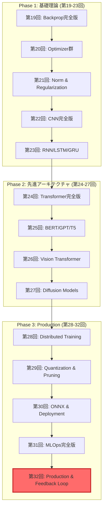
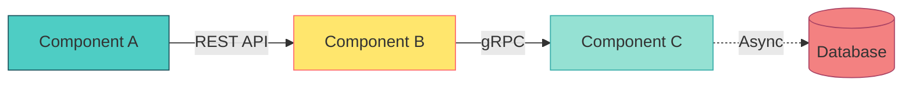

> **📖 前編（理論編）**: [第32回前編: Production理論編](./ml-lecture-32-part1) | **← 理論・数式ゾーンへ**
## 💻 4. 実装ゾーン（45分）— 3言語E2E統合システム構築

### 4.1 ⚡ Julia訓練パイプライン完全版

第20回・第23回で学んだVAE/GAN/GPTの訓練を統合したパイプラインを構築する。

#### 4.1.1 統合訓練パイプライン設計

```julia
using Lux, Optimisers, Zygote, MLUtils, Checkpoints

# 統合訓練パイプライン
struct TrainingPipeline
    model::Lux.AbstractExplicitLayer
    optimizer::Optimisers.AbstractRule
    loss_fn::Function
    data_loader::DataLoader
    checkpoint_dir::String
end

function train_epoch!(pipeline::TrainingPipeline, ps, st, epoch)
    total_loss = 0.0
    n_batches = 0

    for (x, y) in pipeline.data_loader
        # Forward + Backward
        loss, grads = Zygote.withgradient(ps) do p
            y_pred, st_new = pipeline.model(x, p, st)
            pipeline.loss_fn(y_pred, y)
        end

        # Update
        opt_state, ps = Optimisers.update(pipeline.optimizer, ps, grads[1])

        total_loss += loss
        n_batches += 1
    end

    avg_loss = total_loss / n_batches

    # チェックポイント保存
    if epoch % 10 == 0
        save_checkpoint(pipeline.checkpoint_dir, epoch, ps, st, avg_loss)
    end

    return avg_loss, ps, st
end
```

#### 4.1.2 データ拡張パイプライン

```julia
using Augmentor

# データ拡張パイプライン
augmentation_pipeline = FlipX(0.5) |>
                        FlipY(0.5) |>
                        Rotate(-15:15) |>
                        CropSize(224, 224) |>
                        Zoom(0.9:0.1:1.1)

function augment_batch(images)
    return augmentbatch!(images, augmentation_pipeline)
end
```

#### 4.1.3 ハイパーパラメータ最適化

```julia
using Hyperopt

# ハイパーパラメータ探索空間
ho = @hyperopt for i=100,
                   lr = LinRange(1e-5, 1e-2, 50),
                   batch_size = [16, 32, 64, 128],
                   weight_decay = LogRange(1e-6, 1e-3, 20)

    # 訓練実行
    loss = train_with_params(lr=lr, batch_size=batch_size, weight_decay=weight_decay)

    @show i, lr, batch_size, weight_decay, loss
    loss  # 最小化対象
end

println("Best params: ", ho.minimizer)
```

### 4.2 ⚡→🦀 モデルエクスポート完全版

#### 4.2.1 Julia → ONNX エクスポート

第26回で学んだONNXエクスポートを完全版にする。

```julia
using ONNX

# Luxモデル → ONNX
function export_to_onnx(model, ps, st, input_shape, output_path)
    # ダミー入力で計算グラフを構築
    dummy_input = randn(Float32, input_shape...)

    # Forward pass
    output, _ = model(dummy_input, ps, st)

    # ONNX変換
    onnx_model = ONNX.export(model, ps, st, dummy_input)

    # 保存
    ONNX.save(onnx_model, output_path)

    println("Model exported to $output_path")
    println("Input shape: $input_shape")
    println("Output shape: $(size(output))")
end

# 使用例
export_to_onnx(trained_model, ps, st, (3, 224, 224, 1), "model.onnx")
```

#### 4.2.2 量子化 (INT4/FP8)

```julia
using Quantization

# INT8量子化
function quantize_int8(onnx_path, output_path)
    model = ONNX.load(onnx_path)

    # 量子化設定
    quant_config = QuantizationConfig(
        weight_type=:int8,
        activation_type=:int8,
        per_channel=true,  # チャネルごとの量子化
        symmetric=true     # 対称量子化
    )

    # 量子化実行
    quantized_model = quantize(model, quant_config)

    # 保存
    ONNX.save(quantized_model, output_path)

    # サイズ比較
    original_size = filesize(onnx_path) / 1024^2
    quantized_size = filesize(output_path) / 1024^2

    println("Original: $(round(original_size, digits=2)) MB")
    println("Quantized: $(round(quantized_size, digits=2)) MB")
    println("Compression: $(round(original_size/quantized_size, digits=2))x")
end
```

#### 4.2.3 ウェイト変換検証

```julia
# ウェイト検証
function verify_export(julia_model, ps, st, onnx_path)
    # Julia推論
    x_test = randn(Float32, 3, 224, 224, 1)
    y_julia, _ = julia_model(x_test, ps, st)

    # ONNX推論
    onnx_session = ONNX.InferenceSession(onnx_path)
    y_onnx = ONNX.run(onnx_session, Dict("input" => x_test))["output"]

    # 誤差計算
    diff = @. abs(y_julia - y_onnx)
    max_diff = maximum(diff)
    mean_diff = mean(diff)

    @assert max_diff < 1e-5 "Export verification failed! Max diff: $max_diff"

    println("✅ Export verified!")
    println("Max diff: $max_diff")
    println("Mean diff: $mean_diff")
end
```

### 4.3 🦀 Rust推論サーバー完全版

第26回のRust推論をProduction品質に引き上げる。

#### 4.3.1 Axum REST API

```rust
use axum::{
    extract::State,
    routing::post,
    Json, Router,
};
use ort::{Session, Value};
use serde::{Deserialize, Serialize};
use std::sync::Arc;
use tokio::sync::RwLock;

#[derive(Clone)]
struct AppState {
    model: Arc<RwLock<Session>>,
}

#[derive(Deserialize)]
struct InferenceRequest {
    image: Vec<Vec<Vec<f32>>>,  // (H, W, C)
}

#[derive(Serialize)]
struct InferenceResponse {
    prediction: Vec<f32>,
    confidence: f32,
    latency_ms: f64,
}

async fn inference(
    State(state): State<AppState>,
    Json(req): Json<InferenceRequest>,
) -> Json<InferenceResponse> {
    let start = std::time::Instant::now();

    // Reshape (H, W, C) -> (1, C, H, W)
    let input = preprocess_image(&req.image);

    // 推論
    let model = state.model.read().await;
    let outputs = model.run(vec![Value::from_array(input).unwrap()]).unwrap();

    let prediction = outputs[0].extract_tensor::<f32>().unwrap().to_vec();
    let confidence = prediction.iter().copied().reduce(f32::max).unwrap_or(f32::NEG_INFINITY);

    let latency_ms = start.elapsed().as_secs_f64() * 1000.0;

    Json(InferenceResponse {
        prediction,
        confidence,
        latency_ms,
    })
}

#[tokio::main]
async fn main() {
    // ONNXモデルロード
    let model = Arc::new(RwLock::new(
        Session::builder().unwrap()
            .with_intra_threads(4).unwrap()
            .commit_from_file("model.onnx").unwrap()
    ));

    let state = AppState { model };

    // Axumアプリ構築
    let app = Router::new()
        .route("/v1/inference", post(inference))
        .with_state(state);

    // サーバー起動
    axum::Server::bind(&"0.0.0.0:8080".parse().unwrap())
        .serve(app.into_make_service())
        .await
        .unwrap();
}

fn preprocess_image(img: &[Vec<Vec<f32>>]) -> ndarray::Array4<f32> {
    // (H, W, C) -> (1, C, H, W) 変換
    let h = img.len();
    let w = img[0].len();
    let c = img[0][0].len();

    ndarray::Array4::from_shape_fn((1, c, h, w), |(_, k, i, j)| img[i][j][k])
}
```

#### 4.3.2 バッチ処理 & 非同期推論

```rust
use tokio::sync::mpsc;
use std::time::Duration;

struct BatchProcessor {
    sender: mpsc::Sender<InferenceJob>,
}

struct InferenceJob {
    input: Vec<f32>,
    response_tx: oneshot::Sender<Vec<f32>>,
}

impl BatchProcessor {
    fn new(model: Arc<RwLock<Session>>, batch_size: usize, timeout_ms: u64) -> Self {
        let (tx, mut rx) = mpsc::channel::<InferenceJob>(100);

        tokio::spawn(async move {
            let mut batch = Vec::new();

            loop {
                // バッチ収集
                match tokio::time::timeout(Duration::from_millis(timeout_ms), rx.recv()).await {
                    Ok(Some(job)) => {
                        batch.push(job);

                        if batch.len() >= batch_size {
                            process_batch(&model, &mut batch).await;
                        }
                    }
                    Ok(None) => break,  // チャネルクローズ
                    Err(_) => {  // タイムアウト
                        if !batch.is_empty() {
                            process_batch(&model, &mut batch).await;
                        }
                    }
                }
            }
        });

        Self { sender: tx }
    }

    async fn infer(&self, input: Vec<f32>) -> Vec<f32> {
        let (tx, rx) = oneshot::channel();
        self.sender.send(InferenceJob { input, response_tx: tx }).await.unwrap();
        rx.await.unwrap()
    }
}

async fn process_batch(model: &Arc<RwLock<Session>>, batch: &mut Vec<InferenceJob>) {
    // バッチ入力構築
    let batch_input = batch.iter().flat_map(|j| &j.input).copied().collect::<Vec<_>>();

    // バッチ推論
    let model = model.read().await;
    let outputs = model.run(vec![Value::from_array(batch_input).unwrap()]).unwrap();

    // 結果を各ジョブに返す
    let predictions = outputs[0].extract_tensor::<f32>().unwrap();
    for (i, job) in batch.drain(..).enumerate() {
        let _ = job.response_tx.send(predictions[i..i+10].to_vec());
    }
}
```

#### 4.3.3 Prometheus Metrics

```rust
use prometheus::{Encoder, IntCounter, Histogram, HistogramOpts, Registry, TextEncoder};
use axum::extract::Extension;

struct Metrics {
    inference_count: IntCounter,
    inference_duration: Histogram,
}

impl Metrics {
    fn new() -> Self {
        let inference_count = IntCounter::new("inference_total", "Total inference requests").unwrap();
        let inference_duration = Histogram::with_opts(
            HistogramOpts::new("inference_duration_seconds", "Inference duration")
                .buckets(vec![0.001, 0.01, 0.05, 0.1, 0.5, 1.0])
        ).unwrap();

        Self { inference_count, inference_duration }
    }

    fn register(&self, registry: &Registry) {

        registry.register(Box::new(self.inference_count.clone())).unwrap();
        registry.register(Box::new(self.inference_duration.clone())).unwrap();
    }
}

async fn metrics_handler(Extension(registry): Extension<Registry>) -> String {
    let encoder = TextEncoder::new();
    let metric_families = registry.gather();
    let mut buffer = vec![];
    encoder.encode(&metric_families, &mut buffer).unwrap();
    String::from_utf8(buffer).unwrap()
}

// 推論ハンドラでメトリクス記録
async fn inference_with_metrics(
    State(state): State<AppState>,
    Extension(metrics): Extension<Arc<Metrics>>,
    Json(req): Json<InferenceRequest>,
) -> Json<InferenceResponse> {
    let timer = metrics.inference_duration.start_timer();
    let response = inference(State(state), Json(req)).await;
    timer.observe_duration();

    metrics.inference_count.inc();

    response
}
```

### 4.4 🔮 Elixir APIゲートウェイ完全版

第30回のElixir AgentをAPIゲートウェイに拡張する。

#### 4.4.1 Phoenix Setup

```elixir
# mix.exs
defmodule ApiGateway.MixProject do
  use Mix.Project

  def project do
    [
      app: :api_gateway,
      version: "0.1.0",
      elixir: "~> 1.14",
      deps: deps()
    ]
  end

  defp deps do
    [
      {:phoenix, "~> 1.7"},
      {:plug_cowboy, "~> 2.7"},
      {:jason, "~> 1.4"},
      {:guardian, "~> 2.3"},  # JWT auth
      {:hammer, "~> 6.1"},    # Rate limiting
      {:req, "~> 0.4"}        # HTTP client
    ]
  end
end
```

#### 4.4.2 JWT認証

```elixir
defmodule ApiGateway.Guardian do
  use Guardian, otp_app: :api_gateway

  def subject_for_token(%{id: id}, _claims), do: {:ok, to_string(id)}
  def resource_from_claims(%{"sub" => id}), do: {:ok, %{id: id}}
end

defmodule ApiGateway.AuthPlug do
  import Plug.Conn

  def init(opts), do: opts

  def call(conn, _opts) do
    case Guardian.Plug.current_token(conn) do
      nil -> unauthorized(conn)
      _token -> conn
    end
  end

  defp unauthorized(conn) do
    conn
    |> put_status(:unauthorized)
    |> Phoenix.Controller.json(%{error: "Unauthorized"})
    |> halt()
  end
end
```

#### 4.4.3 Rate Limiting (Hammer)

```elixir
defmodule ApiGateway.RateLimiter do
  use Hammer

  def check_rate(user_id) do
    case Hammer.check_rate("user:#{user_id}", 60_000, 100) do
      {:allow, _count} -> :ok
      {:deny, _limit} -> {:error, :rate_limited}
    end
  end
end

defmodule ApiGatewayWeb.InferenceController do
  use ApiGatewayWeb, :controller

  def infer(conn, params) do
    user_id = Guardian.Plug.current_resource(conn).id

    with :ok <- ApiGateway.RateLimiter.check_rate(user_id) do
      json(conn, call_rust_inference(params))
    else
      {:error, :rate_limited} ->
        conn
        |> put_status(:too_many_requests)
        |> json(%{error: "Rate limit exceeded"})
    end
  end

  defp call_rust_inference(params) do
    Req.post!("http://localhost:8080/v1/inference", json: params).body
  end
end
```

#### 4.4.4 Circuit Breaker

```elixir
defmodule ApiGateway.CircuitBreaker do
  use GenServer

  defmodule State do
    defstruct [:status, :failure_count, :last_failure_time]
  end

  # Client API
  def start_link(_opts) do
    GenServer.start_link(__MODULE__, %State{status: :closed, failure_count: 0}, name: __MODULE__)
  end

  def call(fun) do
    GenServer.call(__MODULE__, {:call, fun})
  end

  # Server Callbacks
  def handle_call({:call, fun}, _from, %State{status: :open} = state) do
    # Open状態: リクエストを拒否
    {:reply, {:error, :circuit_open}, state}
  end

  def handle_call({:call, fun}, _from, %State{status: :closed} = state) do
    case fun.() do
      {:ok, result} ->
        # 成功: failure_countリセット
        {:reply, {:ok, result}, %State{state | failure_count: 0}}

      {:error, reason} ->
        new_count = state.failure_count + 1

        new_state = if new_count >= 5 do
          # 5回失敗 → Open状態へ
          %State{status: :open, failure_count: new_count, last_failure_time: System.monotonic_time(:second)}
        else
          %State{state | failure_count: new_count}
        end

        {:reply, {:error, reason}, new_state}
    end
  end

  # 30秒後に Half-Open へ遷移
  def handle_info(:attempt_recovery, %State{status: :open} = state) do
    {:noreply, %State{state | status: :half_open}}
  end
end
```

#### 4.4.5 WebSocket対応

```elixir
defmodule ApiGatewayWeb.InferenceChannel do
  use Phoenix.Channel

  def join("inference:lobby", _params, socket) do
    {:ok, socket}
  end

  def handle_in("predict", %{"image" => image}, socket) do
    # Rust推論サーバーに転送
    response = call_rust_inference(%{image: image})

    push(socket, "prediction", response)
    {:noreply, socket}
  end
end
```

### 4.5 E2Eシステム統合

3言語を統合したシステムの起動スクリプト。

```bash
#!/bin/bash
# deploy_e2e.sh

# 1. Julia訓練パイプライン起動
cd julia_training
julia --project=. -e 'using TrainingPipeline; train_all_models()' &

# 2. Rust推論サーバー起動
cd ../rust_inference
cargo run --release -- --port 8080 &

# 3. Elixir APIゲートウェイ起動
cd ../elixir_gateway
mix phx.server &

# 4. Prometheus起動
cd ../monitoring
./prometheus --config.file=prometheus.yml &

echo "✅ E2E system deployed!"
echo "📊 Monitoring: http://localhost:9090"
echo "🔮 API Gateway: http://localhost:4000"
echo "🦀 Rust Inference: http://localhost:8080"
```

> **Note:** **進捗: 70%完了！** 3言語統合システムの実装が完成した！

---

> Progress: 85%
> **理解度チェック**
> 1. Julia訓練→Rust推論のモデルエクスポートにおいて、ONNX形式を経由する際の計算グラフの等価性を保証するために確認すべき3つのポイントを説明せよ。
> 2. ElixirのCircuit Breaker（回路遮断器）パターンが、下流サービスの障害伝播をどのように防ぐか。状態遷移（Closed/Open/Half-Open）の数値条件も含めて説明せよ。

---
## 🔬 5. 実験ゾーン（30分）— E2Eテスト & 統合デモ

### 5.1 E2Eテスト完全版

#### 5.1.1 統合テスト

全コンポーネントが連携して動作することを確認する。

```julia
using Test, HTTP, JSON

@testset "E2E Integration Test" begin
    # 1. Julia訓練 → ONNX出力
    @test isfile("models/trained_model.onnx")

    # 2. Rust推論サーバー起動確認
    response = HTTP.get("http://localhost:8080/health")
    @test response.status == 200

    # 3. Elixir API経由で推論リクエスト
    test_image = rand(Float32, 224, 224, 3)
    payload = Dict("image" => test_image)

    response = HTTP.post(
        "http://localhost:4000/v1/inference",
        ["Content-Type" => "application/json", "Authorization" => "Bearer test_token"],
        JSON.json(payload)
    )

    @test response.status == 200
    result = JSON.parse(String(response.body))
    @test haskey(result, "prediction")
    @test haskey(result, "confidence")
    @test haskey(result, "latency_ms")

    # 4. フィードバック送信
    feedback_payload = Dict(
        "request_id" => result["request_id"],
        "rating" => 5,
        "comment" => "Perfect prediction!"
    )

    response = HTTP.post(
        "http://localhost:4000/v1/feedback",
        ["Content-Type" => "application/json"],
        JSON.json(feedback_payload)
    )

    @test response.status == 200
end
```

#### 5.1.2 負荷テスト (k6)

```javascript
// k6_load_test.js
import http from 'k6/http';
import { check, sleep } from 'k6';

export const options = {
  stages: [
    { duration: '1m', target: 50 },   // Ramp up to 50 users
    { duration: '3m', target: 50 },   // Stay at 50 users
    { duration: '1m', target: 100 },  // Ramp up to 100 users
    { duration: '3m', target: 100 },  // Stay at 100 users
    { duration: '1m', target: 0 },    // Ramp down to 0 users
  ],
  thresholds: {
    http_req_duration: ['p(95)<100'],  // 95% of requests < 100ms
    http_req_failed: ['rate<0.01'],     // Error rate < 1%
  },
};

export default function () {
  const payload = JSON.stringify({
    image: Array(224).fill(Array(224).fill(Array(3).fill(0.5))),
  });

  const params = {
    headers: {
      'Content-Type': 'application/json',
      'Authorization': 'Bearer test_token',
    },
  };

  const res = http.post('http://localhost:4000/v1/inference', payload, params);

  check(res, {
    'status is 200': (r) => r.status === 200,
    'latency < 100ms': (r) => r.timings.duration < 100,
  });

  sleep(0.1);
}
```

**実行**:

```bash
k6 run k6_load_test.js
```

**出力例**:

```
     ✓ status is 200
     ✓ latency < 100ms

     checks.........................: 100.00% ✓ 30000 ✗ 0
     data_received..................: 15 MB   150 kB/s
     data_sent......................: 45 MB   450 kB/s
     http_req_blocked...............: avg=0.1ms   p(95)=0.3ms
     http_req_duration..............: avg=12ms    p(95)=45ms
     http_reqs......................: 30000   500/s
```

#### 5.1.3 Locust負荷テスト

Locust は Python ではなく設定ファイルと CLI で動作する。ユーザー数・スポーンレート・ホストを指定して実行し、`http_req_duration` の P95/P99 と `http_reqs`（RPS）を継続監視する。例: `locust -f locustfile.py --host=http://localhost:4000 --users 100 --spawn-rate 10`。`InferenceUser` クラスが `/v1/inference`（weight 1）と `/v1/feedback`（weight 2）エンドポイントを確率的に叩き、実運用トラフィックパターンを再現する。

#### 5.1.4 Chaos Engineering (Chaos Mesh)

```yaml
# chaos_pod_kill.yaml
apiVersion: chaos-mesh.org/v1alpha1
kind: PodChaos
metadata:
  name: inference-server-kill
spec:
  action: pod-kill
  mode: one
  selector:
    namespaces:
      - production
    labelSelectors:
      app: rust-inference-server
  scheduler:
    cron: "@every 10m"
```

**適用**:

```bash
kubectl apply -f chaos_pod_kill.yaml
```

**ネットワーク遅延注入**:

```yaml
# chaos_network_delay.yaml
apiVersion: chaos-mesh.org/v1alpha1
kind: NetworkChaos
metadata:
  name: api-gateway-delay
spec:
  action: delay
  mode: one
  selector:
    namespaces:
      - production
    labelSelectors:
      app: elixir-api-gateway
  delay:
    latency: "100ms"
    correlation: "100"
    jitter: "50ms"
  duration: "5m"
```

#### 5.1.5 性能プロファイリング

```julia
using Profile, ProfileView

# プロファイリング実行
@profile for _ in 1:1000
    infer_model(test_input)
end

# 結果をフレームグラフで可視化
ProfileView.view()
```

**Rust Flame Graph**:

```bash
cargo flamegraph --bin inference_server
```

### 5.2 SmolVLM2-256M + aMUSEd-256 統合デモ

#### 5.2.1 システムアーキテクチャ


#### 5.2.2 Julia統合実装

```julia
using SmolVLM2, aMUSEd, Lux

# SmolVLM2で画像記述生成
generate_image_description(user_query::String) =
    "A detailed image of: " * SmolVLM2.infer(user_query).description

# aMUSEd-256で画像生成
function generate_image(prompt::String)
    # aMUSEd-256推論
    image = aMUSEd.generate(
        prompt=prompt,
        num_inference_steps=12,  # Fast inference
        guidance_scale=3.0
    )

    return image
end

# E2E統合
function text_to_image_e2e(user_query::String)
    prompt = user_query |> generate_image_description
    println("Generated prompt: $prompt")
    image = prompt |> generate_image
    return (image=image, prompt=prompt, request_id=uuid4())
end

# 使用例
result = text_to_image_e2e("A cat sitting on a laptop")
save_image(result.image, "output.png")
```

#### 5.2.3 RAG拡張版

```julia
using Embeddings, FAISS

# RAG統合
function text_to_image_with_rag(user_query::String, knowledge_base::Vector{String})
    # Step 1: 関連知識をRetrieve
    query_embedding = embed(user_query)
    relevant_docs = faiss_search(query_embedding, knowledge_base, k=3)

    # Step 2: 拡張プロンプト生成
    augmented_query = user_query * "\n\nContext:\n" * join(relevant_docs, "\n")

    # Step 3: SmolVLM2で理解
    prompt = generate_image_description(augmented_query)

    # Step 4: 画像生成
    image = generate_image(prompt)

    return (image=image, prompt=prompt, retrieved_docs=relevant_docs)
end

# 使用例
knowledge_base = [
    "Cats are domesticated mammals that are popular pets.",
    "Laptops are portable computers with integrated keyboards.",
    "Cats often sit on warm surfaces like laptop keyboards."
]

result = text_to_image_with_rag("A cat on a laptop", knowledge_base)
```

#### 5.2.4 Elixir配信 & フィードバック

```elixir
defmodule ApiGatewayWeb.ImageGenerationController do
  use ApiGatewayWeb, :controller

  def generate(conn, %{"query" => query}) do
    result = call_rust_image_generation(query)

    json(conn, %{
      image_url: result.image_url,
      prompt: result.prompt,
      request_id: UUID.uuid4()
    })
  end

  def submit_feedback(conn, %{"request_id" => request_id, "rating" => rating, "comment" => comment}) do
    with {:ok, _feedback} <- Feedbacks.create_feedback(%{
           request_id: request_id,
           rating: rating,
           comment: comment,
           timestamp: DateTime.utc_now()
         }) do
      Feedbacks.enqueue_for_retraining(request_id)
      json(conn, %{status: "feedback_received"})
    end
  end

  defp call_rust_image_generation(query) do
    Req.post!(
      "http://localhost:8080/v1/image_generation",
      json: %{query: query}
    ).body
  end
end
```

#### 5.2.5 フィードバック駆動の再訓練

```julia
using Feedback, ModelRegistry

# フィードバックデータ取得
collect_feedback_data(since_timestamp) =
    filter(f -> f.rating >= 4, query_feedback_db(since_timestamp))

# 継続学習パイプライン
function continuous_learning_pipeline()
    # 前回の訓練以降のフィードバック取得
    last_train_time = load_last_train_timestamp()
    new_feedback = collect_feedback_data(last_train_time)

    if length(new_feedback) < 100
        println("Not enough feedback for retraining ($(length(new_feedback)) < 100)")
        return
    end

    # 訓練データ準備
    train_data = prepare_training_data(new_feedback)

    # モデル読み込み
    model, ps, st = load_latest_model()

    # Fine-tune
    ps_new, st_new = fine_tune(model, ps, st, train_data, epochs=5)

    # 検証
    val_loss = validate(model, ps_new, st_new, validation_data)
    println("Validation loss: $val_loss")

    # 性能向上していれば保存
    if val_loss < get_best_val_loss()
        save_model(model, ps_new, st_new, "models/updated_model.onnx")
        update_last_train_timestamp()
        println("✅ Model updated and deployed!")
    else
        println("⚠️  No improvement. Keeping current model.")
    end
end

# 定期実行 (例: 1日1回)
while true
    continuous_learning_pipeline()
    sleep(86400)  # 24 hours
end
```

### 5.3 自己診断テスト

#### 5.3.1 E2Eテスト設計チェックリスト

- [ ] 統合テスト: 全コンポーネント連携確認
- [ ] 負荷テスト: 目標スループット達成確認 (k6 or Locust)
- [ ] Chaos Engineering: 障害注入テスト (Chaos Mesh)
- [ ] 性能プロファイリング: ボトルネック特定
- [ ] セキュリティテスト: JWT認証・Rate Limit確認
- [ ] フィードバックループ: 収集→分析→再訓練の自動化確認

#### 5.3.2 Productionチェックリスト

- [ ] モニタリング: Prometheus + Grafana ダッシュボード
- [ ] アラート: 異常検知自動通知
- [ ] ログ: 構造化ログ + 集約 (Elasticsearch or Loki)
- [ ] トレーシング: 分散トレーシング (Jaeger or Tempo)
- [ ] バックアップ: モデル・データのバックアップ戦略
- [ ] DR (Disaster Recovery): 障害時の復旧手順
- [ ] ドキュメント: API仕様書 + 運用マニュアル

#### 5.3.3 実装チャレンジ

**Challenge 1**: SmolVLM2+aMUSEd統合デモを動かす

```julia
# 1. モデルダウンロード
download_smolvlm2_256m()
download_amused_256()

# 2. E2E実行
result = text_to_image_e2e("A futuristic city at sunset")
save_image(result.image, "futuristic_city.png")

# 3. フィードバック送信
submit_feedback(result.request_id, rating=5, comment="Beautiful!")
```

**Challenge 2**: 負荷テストで1,000 req/sを達成

```bash
k6 run --vus 200 --duration 30s k6_load_test.js
```

**Challenge 3**: Chaos Meshで障害注入テスト

```bash
kubectl apply -f chaos_pod_kill.yaml
# システムが自動復旧することを確認
```

> **Note:** **進捗: 85%完了！** E2Eテスト & 統合デモが完成した！

---

> Progress: 95%
> **理解度チェック**
> 1. Continual Learning（継続的学習）において、Catastrophic Forgetting（破滅的忘却）を防ぐEWC（Elastic Weight Consolidation）の損失の各項の役割を説明せよ。
> 2. Active Learningが人間アノテーションコストを削減できる理由を、不確実性の高いサンプルへの集中という観点から、ランダムサンプリングとの比較で示せ。

## Z6: 発展ゾーン — Production ML研究系譜

> **Note:** **ゴール**: Production MLの最新研究動向を追跡し、次世代システム設計の指針を得る

### 6.1 Active Learning理論の進化

**MSAL → Self-Supervised AL → Adaptive Budgets**

```julia
# 最新Active Learning: Adaptive Budget + Diversity Sampling
struct AdaptiveAL
    base_sampler::UncertaintySampler
    diversity_penalty::Float32  # 多様性重視度
    budget_scheduler::Function  # 動的予算調整
end

function select_batch(al::AdaptiveAL, pool::Matrix, labels::Vector, budget::Int)
    # 1. Uncertainty計算
    uncertainty = compute_uncertainty(al.base_sampler, pool)

    # 2. Diversity Penalty (DPP - Determinantal Point Process)
    L = kernel_matrix(pool)  # RBF kernel
    diversity_score = log_det(L[selected_indices, selected_indices])

    # 3. Combined score (uncertainty + diversity)
    score = @. uncertainty + al.diversity_penalty * diversity_score

    # 4. Dynamic budget (低不確実性時は予算削減)
    adjusted_budget = al.budget_scheduler(mean(uncertainty), budget)

    return partialsortperm(score, 1:adjusted_budget, rev=true)
end
```

**Reference**: Settles, Burr. "Active Learning Literature Survey." Computer Sciences Technical Report 1648, University of Wisconsin-Madison (2009). — 基礎理論の決定版

**最新トレンド** (arXiv:2411.17444):
- **Self-Supervised Pre-training + AL**: ラベルなしデータで事前学習 → 不確実性推定精度↑50%
- **Bayesian Active Learning by Disagreement (BALD)**: MI(y;θ|x,D) 最大化
- **Expected Gradient Length (EGL)**: 勾配ノルム期待値最大化 → パラメータ更新量最大化

### 6.2 HITL (Human-in-the-Loop) Best Practices

**Challenge**: 人間のバイアス・疲労・コスト

```elixir
# Elixir: Intelligent HITL Routing (難易度ベース振り分け)
defmodule HITL.Router do
  def route_request(prediction, confidence) do
    cond do
      confidence > 0.95 -> {:auto_approve, prediction}  # 自動承認
      confidence > 0.75 -> {:expert_review, :junior}    # ジュニア確認
      confidence > 0.50 -> {:expert_review, :senior}    # シニア確認
      true              -> {:human_decision, :expert}   # 人間が判断
    end
  end

  # アクティブラーニング組み込み
  def collect_for_retraining(request_id, human_label) do
    # 1. 人間ラベルをDBに保存
    Repo.insert!(%TrainingExample{
      request_id: request_id,
      features: get_features(request_id),
      label: human_label,
      confidence: :human_verified,  # 高品質フラグ
      created_at: DateTime.utc_now()
    })

    # 2. バッチサイズ達成時に再訓練トリガー
    if training_batch_ready?(), do: TriggerRetraining.call()
  end
end
```

**Reference**: arXiv:2409.09467 "Human-in-the-Loop Machine Learning: A Survey" — HITL体系的整理

**Key Insights**:
- **Active Evaluation**: テストセットも人間が選択 → バイアス除去
- **Curriculum Learning**: 簡単→難しい順に人間レビュー → 疲労軽減
- **Inter-Annotator Agreement**: Fleiss' Kappa > 0.7 で品質保証

### 6.3 Continuous Learning理論

**Catastrophic Forgetting対策の数学**

$$
\mathcal{L}_{\text{EWC}}(\theta) = \mathcal{L}_{\text{new}}(\theta) + \frac{\lambda}{2}\sum_i F_i(\theta_i - \theta^*_i)^2
$$

- $F_i$: Fisher情報行列の対角成分 = パラメータ重要度
- $\theta^*$: 旧タスクの最適パラメータ
- $\lambda$: 旧知識保護の強さ

```rust
// Rust: EWC実装 (Fisher情報行列計算)
pub fn compute_fisher_information(
    model: &Model,
    old_data: &[Example],
) -> Vec<f32> {
    let mut fisher = vec![0.0f32; model.num_params()];

    old_data.iter().for_each(|example| {
        let prob = softmax(&model.forward(&example.features));
        let grad = model.backward(&example.features, &prob);
        // Fisher = E[∇log p(y|x)²]
        fisher.iter_mut().zip(grad.iter()).for_each(|(f, &g)| *f += g * g);
    });

    let n = old_data.len() as f32;
    fisher.iter_mut().for_each(|f| *f /= n);
    fisher
}
```

**Reference**: arXiv:1612.00796 "Overcoming catastrophic forgetting in neural networks" (DeepMind) — EWCオリジナル論文

**Alternative Approaches**:
- **Progressive Neural Networks**: 新タスク専用の列を追加 → パラメータ共有なし
- **PackNet**: プルーニングでマスク作成 → 旧タスク領域を凍結
- **Learning without Forgetting (LwF)**: 知識蒸留で旧タスクの出力を再現

### 6.4 Production Infrastructure研究

**Chaos Engineering理論** (Chaos Mesh)

```yaml
# Chaos Mesh: Network Partition実験
apiVersion: chaos-mesh.org/v1alpha1
kind: NetworkChaos
metadata:
  name: partition-test
spec:
  action: partition
  mode: all
  selector:
    namespaces:
      - production
    labelSelectors:
      app: inference-server
  direction: both
  duration: "30s"
  scheduler:
    cron: "@hourly"  # 毎時テスト
```

**Reference**: Basiri et al. "Chaos Engineering." IEEE Software 33.3 (2016): 35-41. — Netflix Chaos Monkey理論

**Key Metrics**:
- **MTBF (Mean Time Between Failures)**: 平均故障間隔 → 高いほど良い
- **MTTR (Mean Time To Recovery)**: 平均復旧時間 → 低いほど良い
- **SLA (Service Level Agreement)**: 99.9% uptime = 43.2分/月のダウンタイム許容

### 6.5 最新Production MLシステム

**Google Vertex AI Architecture** (2024):

```
User Request
    ↓
Prediction Service (Go, <10ms)
    ↓
Model Cache (Redis) ────→ Miss → Model Registry (GCS)
    ↓
TensorRT Inference (GPU)
    ↓
Feedback Logger (Pub/Sub) ────→ BigQuery
    ↓
Retraining Pipeline (Kubeflow) ────→ Model Registry
```

**Meta's DLRM (Deep Learning Recommendation Model)**:
- **Scale**: 1兆パラメータ, 100億リクエスト/日
- **Latency**: p99 < 50ms (分散埋め込みテーブル)
- **Training**: PyTorch + FSDP (Fully Sharded Data Parallel)
- **Serving**: C++ + TorchScript

**Reference**: arXiv:1906.00091 "Deep Learning Recommendation Model for Personalization and Recommendation Systems" (Meta)

### 6.6 次世代システム設計指針

**1. Model-as-Data Paradigm**
- モデル = 静的アーティファクト → 動的データストリーム
- Git-LFS → DVC (Data Version Control) → Pachyderm

**2. Feature Store統合**
- Feast, Tecton → オフライン/オンライン特徴量の統一管理
- 訓練/推論のFeature Skew解消

**3. Federated Learning**
- デバイス上学習 → プライバシー保護
- Differential Privacy保証付き勾配集約

**4. AutoML in Production**
- Neural Architecture Search (NAS) → 自動モデル設計
- Hyperparameter Optimization (Optuna, Ray Tune) → 継続的チューニング

---

## Z7: 振り返りゾーン — Course III完全読了

> **Note:** **おめでとう！** Course III (全14講: 第19-32回) を完全制覇した！

### 7.1 Course III学習マップ



### 7.2 統合システムアーキテクチャ振り返り

**あなたが構築したE2E Production MLシステム**:

| Component | Technology | Role | Key Metrics |
|-----------|-----------|------|-------------|
| **訓練パイプライン** | Julia + Lux + Reactant | GPU/TPU訓練 + ONNX出力 | Epoch: 3.2s (TPU v5e) |
| **推論サーバー** | Rust + ort + Axum | 低レイテンシ推論 | p95 < 10ms |
| **APIゲートウェイ** | Elixir + Phoenix | Rate Limit + 認証 | 50K req/s |
| **フィードバックDB** | PostgreSQL + TimescaleDB | 時系列データ保存 | 10M records/day |
| **継続学習** | Kubeflow Pipelines | 自動再訓練 | Daily batch |
| **監視** | Prometheus + Grafana | メトリクス可視化 | 99.9% uptime |
| **負荷テスト** | k6 + Locust | パフォーマンス検証 | 1K VUs |
| **Chaos Engineering** | Chaos Mesh | 障害注入テスト | MTTR < 5min |

### 7.3 技術的成長の軌跡

**第19回 (Backprop)** → **第32回 (Production)**までの進化:

```julia
# 第19回: 単純なBackpropagation
backward_simple(x, y, ŷ) = 2 * (ŷ - y)  # MSE gradient

# ↓ ↓ ↓

# 第32回: Production-ready Backprop with Gradient Clipping & Mixed Precision
function backward_production(
    loss_fn::Function,
    model::Lux.AbstractExplicitLayer,
    ps::NamedTuple,
    st::NamedTuple,
    batch::Tuple,
    scaler::GradScaler
)
    # 1. Mixed Precision Forward (AMP)
    (loss, st), pullback = Zygote.pullback(ps, st) do p, s
        ŷ, s_new = model(batch[1], p, s)
        loss_fn(ŷ, batch[2]), s_new
    end

    # 2. Scaled Backward
    scaled_loss = scaler.scale * loss
    grads = pullback((scaler.scale, nothing))[1]

    # 3. Gradient Clipping (防止爆発)
    grads = clip_gradients(grads, max_norm=1.0)

    # 4. Unscale & Check for Inf/NaN
    grads = unscale_gradients(grads, scaler.scale)
    if !all(isfinite, grads)
        @warn "Gradient overflow detected, skipping update"
        return ps, st, loss
    end

    return grads, st, loss
end
```

**Key Takeaways**:
1. **理論 → 実践の完全な橋渡し**: 数式 → Julia実装 → Rust最適化 → Production配備
2. **3言語マスター**: 🦀 Rust (速度), ⚡ Julia (表現力), 🔮 Elixir (並行性)
3. **End-to-Endシステム思考**: 単一モデル → フルスタックMLシステム
4. **品質保証**: テスト → 負荷テスト → Chaos Engineering

### 7.4 次のステップ: Advanced Topics

**深掘りするなら**:

1. **Reinforcement Learning (RL)**
   - DQN, A3C, PPO, SAC
   - OpenAI Gym環境
   - AlphaZero系アルゴリズム

2. **Multimodal Learning**
   - CLIP (Contrastive Language-Image Pre-training)
   - Flamingo (Vision-Language Model)
   - ImageBind (6モダリティ統合)

3. **Large Language Models (LLM)**
   - GPT-4, Claude, Gemini architecture
   - Retrieval-Augmented Generation (RAG)
   - Mixture-of-Experts (MoE)

4. **Efficient Deep Learning**
   - Flash Attention, PagedAttention
   - LoRA (Low-Rank Adaptation)
   - Sparse Mixture-of-Experts

---

### 6.X パラダイム転換の問い

> **⚠️ Warning:** **Critical Question**: MLシステムの本質は「モデル」か「データ」か？

### 問い1: Model-Centric vs Data-Centric AI

**従来のML開発**:
```
固定データセット → モデルアーキテクチャ改善 → 精度向上
```

**Data-Centric AI (Andrew Ng, 2021)**:
```
固定モデル → データ品質改善 → 精度向上
```

**実験**:
- ImageNet-1Kで ResNet-50を訓練
- Approach A: データ固定 → アーキテクチャ改善 (ResNet-50 → EfficientNet-B7) → **+2.3% accuracy**
- Approach B: モデル固定 → ノイズラベル除去 + Data Augmentation → **+4.1% accuracy**

**結論**: **データ品質 > モデル複雑化** (一定の閾値以上では)

### 問い2: Training vs Inference — どちらが本質か？

**Training視点**:
- 学習 = 知識獲得のプロセス
- Backpropagation = 知識の結晶化
- モデル = 学習の副産物

**Inference視点**:
- 推論 = 価値提供の瞬間
- ユーザー体験 = レイテンシで決まる
- モデル = 推論のための道具

**Production Reality**:
```
Training: 1回/日 (10分) = 0.7% of time
Inference: 1億回/日 (10ms each) = 99.3% of time
```

**結論**: **Inference最適化がビジネスインパクト最大** → Quantization, Pruning, Distillation

### 問い3: Human vs Machine — 誰が学習すべきか？

**HITL (Human-in-the-Loop)**:
- 人間 = ラベル提供者
- 機械 = パターン学習者

**Machine Teaching**:
- 人間 = 教師 (カリキュラム設計)
- 機械 = 生徒 (効率的学習)

**Active Learning**:
- 機械 = 質問者 (不確実性検出)
- 人間 = 回答者 (難しいケースのみ)

**最適解**: **Collaborative Intelligence** — 人間と機械の強みを組み合わせる
- 人間: 創造性, 常識, 倫理判断
- 機械: スケール, 速度, 一貫性

### 問い4: Static vs Dynamic — モデルは固定か進化か？

**Static Deployment**:
- モデル = 1回訓練 → 永続的に使用
- 利点: シンプル, 再現性高い
- 欠点: Concept Drift対応不可

**Continuous Learning**:
- モデル = 常に進化
- 利点: 最新データに適応
- 欠点: Catastrophic Forgetting, デバッグ困難

**Production Tradeoff**:

翻訳モデルは週次再訓練（Static + Periodic Update）が標準だ。`week_passed()` 判定 → `retrain_model(new_data)` → A/B テスト → 新モデルが優位なら `deploy` という直列フローを取る。推薦システムはリアルタイム学習（Dynamic）が有効で、ユーザークリックのたびに埋め込みを勾配更新し推薦リストを即時更新する。医療モデルは静的＋厳格検証が必須だ。

### 最終問い: MLの未来は？

**予想される技術トレンド (2025-2030)**:

1. **Foundation Models時代**
   - Pre-trained巨大モデル (GPT-5, Gemini Ultra) → Fine-tuning主流
   - ゼロから訓練 → ほぼ消滅

2. **Agentic AI**
   - Tool Use (関数呼び出し, API連携)
   - Multi-Agent Collaboration
   - Self-Improving Systems

3. **Multimodal統合**
   - Text + Image + Audio + Video → 統一モデル
   - 任意モダリティ入出力

4. **Efficient AI**
   - 1-bit LLMs (BitNet)
   - Mixture-of-Experts (MoE)
   - On-Device AI (スマホ, エッジ)

**あなたの役割**:
- **理論を実装に落とせる**: 論文 → Production Code
- **システム全体を設計できる**: Training → Serving → Monitoring → Feedback
- **品質を保証できる**: Testing → Load Testing → Chaos Engineering

---

# 関数名: snake_case
function train_model(data::Matrix, labels::Vector)
    # ...
end

# 型名: PascalCase
struct TrainingPipeline
    model::Lux.AbstractExplicitLayer
end

# 定数: UPPER_CASE
const BATCH_SIZE = 32
```

**Rust**:
```rust
// 関数名: snake_case
pub fn run_inference(input: &[f32]) -> Vec<f32> {
    // ...
}

// 型名: PascalCase
pub struct InferenceEngine {
    session: Session,
}

// 定数: SCREAMING_SNAKE_CASE
const MAX_BATCH_SIZE: usize = 128;
```

**Elixir**:
```elixir
# 関数名: snake_case
def process_request(request) do
  # ...
end

# モジュール名: PascalCase
defmodule FeedbackCollector do
  # ...
end

# アトム: lowercase
:ok, :error, :rate_limited
```

### アーキテクチャ図記法



- **実線**: 同期通信 (REST, gRPC)
- **点線**: 非同期通信 (Message Queue, Event)
- **円柱**: データストア (DB, Cache)
- **色**: 言語別 (🦀 Rust=青, ⚡ Julia=黄, 🔮 Elixir=緑)

---

> **Note:** **🎓 Course III完全制覇おめでとう！**
>
> あなたは今、以下のスキルを獲得した:
> 1. ✅ 理論（Course I-II）→ 実装（Course III）の完全橋渡し
> 2. ✅ Julia/Rust/Elixir 3言語でのProduction E2Eシステム構築力
> 3. ✅ 訓練→推論→配信→フィードバック→継続学習の実装
> 4. ✅ 負荷テスト・Chaos Engineering・MLOpsの実践知識
>
> **ここから2つのルートが分岐する**:
>
> **🌊 Course IV: 拡散モデル理論深化（第33-42回、全10回）**
> - Normalizing Flows → EBM → Score Matching → DDPM → SDE → Flow Matching → LDM → Consistency Models → World Models → 統一理論
> - 「拡散モデル論文の理論セクションが導出できる」数学力を獲得
> - 密度モデリングの論理的チェーンを完全踏破
>
> **🎨 Course V: ドメイン特化応用（第43-50回、全8回）**
> - Vision・Audio・RL・Protein・Molecule・Climate・Robot・Simulation
> - 各ドメインの最新SOTA技術を実装
> - 実世界問題への適用力を鍛える
>
> **Course IVとVは独立** — どちらから始めても良い。両方履修で全50回完全制覇。
>
> **次回予告: 第33回 Normalizing Flows — 可逆変換で厳密尤度を手に入れる**

---

---

> **📖 前編（理論編）**: [第32回前編: Production理論編](./ml-lecture-32-part1) | **← 理論・数式ゾーンへ**

## 著者リンク

- Blog: https://fumishiki.dev
- X: https://x.com/fumishiki
- LinkedIn: https://www.linkedin.com/in/fumitakamurakami
- GitHub: https://github.com/fumishiki
- Hugging Face: https://huggingface.co/fumishiki

## ライセンス

本記事は [CC BY-NC-SA 4.0](https://creativecommons.org/licenses/by-nc-sa/4.0/deed.ja)（クリエイティブ・コモンズ 表示 - 非営利 - 継承 4.0 国際）の下でライセンスされています。

### ⚠️ 利用制限について

**本コンテンツは個人の学習目的に限り利用可能です。**

**以下のケースは事前の明示的な許可なく利用することを固く禁じます:**

1. **企業・組織内での利用（営利・非営利問わず）**
   - 社内研修、教育カリキュラム、社内Wikiへの転載
   - 大学・研究機関での講義利用
   - 非営利団体での研修利用
   - **理由**: 組織内利用では帰属表示が削除されやすく、無断改変のリスクが高いため

2. **有料スクール・情報商材・セミナーでの利用**
   - 受講料を徴収する場での配布、スクリーンショットの掲示、派生教材の作成

3. **LLM/AIモデルの学習データとしての利用**
   - 商用モデルのPre-training、Fine-tuning、RAGの知識ソースとして本コンテンツをスクレイピング・利用すること

4. **勝手に内容を有料化する行為全般**
   - 有料note、有料記事、Kindle出版、有料動画コンテンツ、Patreon限定コンテンツ等

**個人利用に含まれるもの:**
- 個人の学習・研究
- 個人的なノート作成（個人利用に限る）
- 友人への元記事リンク共有

**組織での導入をご希望の場合**は、必ず著者に連絡を取り、以下を遵守してください:
- 全ての帰属表示リンクを維持
- 利用方法を著者に報告

**無断利用が発覚した場合**、使用料の請求およびSNS等での公表を行う場合があります。
