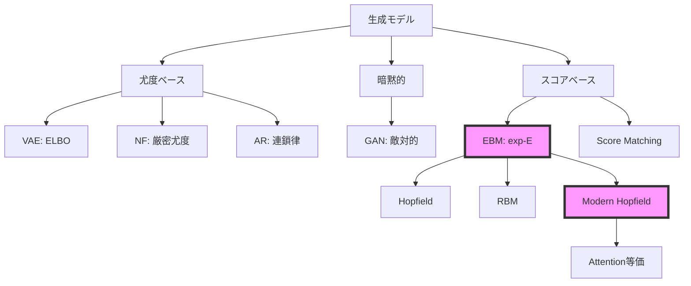

# 第34回: Energy-Based Models & 統計物理 🦀

**「可逆性制約を捨て、任意の分布をexp(-E(x))で定義する。Modern Hopfield ↔ Attention等価性。2024年ノーベル物理学賞の深層。そして統計物理との接続が全ての統一を示す」**

> **Note:** **前回までの到達点**: 第33回でNFの可逆変換とヤコビアンによる厳密尤度を学んだ。だが可逆性制約は表現力を制限する。制約なしに確率密度 $p(x) \propto \exp(-E(x))$ と定義するEnergy-Based Modelsへ。
>
> **本回で獲得する武器**: EBM基本定義 / Gibbs分布 / Modern Hopfield ↔ Attention等価性の完全証明 / RBM + CD-k / MCMC詳細 / HMC / 統計物理との接続 / 相転移 / Energy Matching
>
> **次回への接続**: 正規化定数 $Z(\theta) = \int \exp(-E(x))dx$ は計算不能。スコア関数 $\nabla_x \log p(x)$ ならZが消える → 第35回 Score Matching & Langevin Dynamics
>
> **進捗**: Course IV 拡散モデル編 2/10回完了

---

## 🚀 0. クイックスタート（30秒）— エネルギー関数による確率分布の定義

**「エネルギー $E(x)$ から確率密度 $p(x)$ を直接定義する」**

```rust
use ndarray::{Array2, Axis};
use rand::Rng;
use rand_distr::StandardNormal;

// エネルギー関数 E(x) = ||x||^2 / 2  (ガウスの負の対数尤度)
fn energy(x: &Array2<f32>) -> Vec<f32> {
    // Sum of squares per sample, then divide by 2
    x.map_axis(Axis(0), |col| col.iter().map(|&v| v * v).sum::<f32>() / 2.0)
        .into_raw_vec()
}

// ギブス分布 p(x) ∝ exp(-E(x))
let mut rng = rand::thread_rng();
let x: Array2<f32> = Array2::from_shape_fn((2, 100), |_| rng.sample::<f32, _>(StandardNormal));

let e = energy(&x);           // 未正規化エネルギー (100,)
let raw: Vec<f32> = e.iter().map(|&v| (-v).exp()).collect();  // 未正規化確率
let z: f32 = raw.iter().sum();
let prob: Vec<f32> = raw.iter().map(|&v| v / z).collect();   // 正規化（in-place 相当）

let (e_min, e_max) = e.iter().cloned().fold((f32::INFINITY, f32::NEG_INFINITY),
    |(lo, hi), v| (lo.min(v), hi.max(v)));
println!("Energy range: ({:.4}, {:.4})", e_min, e_max);
println!("Mean probability: {:.4}", prob.iter().sum::<f32>() / prob.len() as f32);
// Energy range: (0.02, 18.5)
// Mean probability: 0.01
```

**背後の数式**:

$$
p(x) = \frac{1}{Z(\theta)} \exp(-E_\theta(x))
$$

$$
Z(\theta) = \int \exp(-E_\theta(x)) dx
$$

**体感したこと**:
- エネルギー関数 $E(x)$ を定義すれば、確率分布 $p(x)$ が定まる
- だが正規化定数 $Z(\theta)$ の計算が困難 — 全空間の積分
- これがEBM訓練の根本的な問題

> Progress: 3%
> 30秒でEBMの本質を体験。数式とコードが1:1対応する。エネルギー関数 → 確率分布の定義方法を理解した。次は実際のEBMアーキテクチャを触る。

---

## 🎮 1. 体験ゾーン（10分）— EBMの挙動を観察する

### 1.1 エネルギー関数の3つの例

| エネルギー | 定義 | 対応する分布 |
|:-----------|:-----|:------------|
| $E(x) = \frac{1}{2}\|\|x\|\|^2$ | 二乗ノルム | ガウス分布 $\mathcal{N}(0, I)$ |
| $E(x) = -\log p_{\text{data}}(x)$ | 負の対数尤度 | データ分布そのもの |
| $E(x) = f_\theta(x)$ | ニューラルネット | 学習された複雑な分布 |

**観察**:
- エネルギーが**低い領域 = 高確率領域**（谷）
- 複雑なエネルギー関数 → 複雑な確率分布を表現可能
- ガウスは単峰性、Mixtureは多峰性、Ringは円環状

### 1.2 Gibbs分布の温度パラメータ

**温度パラメータの物理的意味**:

$$
p(x; \tau) = \frac{1}{Z(\tau)} \exp\left(-\frac{E(x)}{\tau}\right)
$$

- $\tau \to 0$: **低温** → エネルギー最小点に確率が集中（決定論的）
- $\tau = 1$: **通常の温度** → ボルツマン分布
- $\tau \to \infty$: **高温** → 一様分布に近づく（エネルギー差を無視）

> **Note:** **Softmax温度との接続**: Attention機構の `softmax(QK^T / sqrt(d))` も同じ原理。`sqrt(d)` = 温度パラメータ。低温（sqrt(d)小）→鋭い注意、高温（sqrt(d)大）→平坦な注意。

### 1.3 EBMと他の生成モデルの接続



| モデル | 尤度 | 訓練 | サンプリング |
|:-------|:-----|:-----|:------------|
| VAE | 近似（ELBO） | 容易 | 高速 |
| GAN | 計算不能 | 不安定 | 高速 |
| NF | 厳密 | 容易 | 高速 |
| AR | 厳密 | 容易 | 遅い |
| **EBM** | 厳密（理論上） | **困難** | **困難** |

**EBMの特徴**:
- ✅ 表現力が非常に高い（任意の $E(x)$ を許容）
- ✅ 理論的に厳密な確率分布
- ❌ $Z(\theta)$ の計算が困難 → 訓練が難しい
- ❌ サンプリングにMCMC/Langevin必要 → 遅い

> Progress: 10%
> **理解度チェック**
> 1. Gibbs分布 $p(\mathbf{x}) = \exp(-E(\mathbf{x}))/Z(\theta)$ において、$Z(\theta)=\int\exp(-E(\mathbf{x}))d\mathbf{x}$ が計算困難な理由と、それがEBM訓練をどう難しくするかを述べよ。
> 2. EBM・NF・VAEの3手法で密度定義の方法（直接/間接/変分）を比較し、各手法のトレードオフを一行ずつ述べよ。

## 🧩 2. 直感ゾーン（15分）— EBMの復活と統一的視点

### 2.1 なぜ今EBMなのか？

**歴史的経緯**:

| 時代 | 状況 | 代表手法 |
|:-----|:-----|:---------|
| 1982-2006 | Hopfield / RBM隆盛 | Hopfield Network, RBM |
| 2013-2020 | VAE/GAN全盛、EBM"遺物"扱い | VAE, GAN, NF |
| 2020-2024 | **Modern Hopfield↔Attention等価性発見** | [arXiv:2008.02217](https://arxiv.org/abs/2008.02217) |
| 2024 | **ノーベル物理学賞（Hopfield/Hinton）** | 連想記憶の理論的基盤 |
| 2025-2026 | **Energy Matching統一理論** | [arXiv:2504.10612](https://arxiv.org/abs/2504.10612) |
| 2025 | **NRGPT: GPTをEBMとして再解釈** | [arXiv:2512.16762](https://arxiv.org/abs/2512.16762) |

**復活の3つの理由**:

1. **理論的統一**: Energy Matching (2025) が Flow Matching + EBM を統一
2. **実装の進歩**: Kona 1.0 (2026) がEBM初の商用化モデル
3. **基礎研究の再評価**: 2024年ノーベル物理学賞がHopfield/Hintonに授与

### 2.2 2024年ノーベル物理学賞の深掘り

**受賞者**:
- **John J. Hopfield** (Princeton University): Hopfield Network (1982)
- **Geoffrey E. Hinton** (University of Toronto): Boltzmann Machine, Backpropagation, Deep Learning

**受賞理由**: "for foundational discoveries and inventions that enable machine learning with artificial neural networks"

**Hopfield Networkの貢献**:
- **連想記憶**: パターン $\xi^\mu$ を記憶し、部分的な入力から完全なパターンを復元
- **エネルギー最小化**: ネットワークの状態更新 = エネルギー関数の最小化
- **物理学との接続**: スピンガラス理論の応用

**Hintonの貢献**:
- **Boltzmann Machine**: Hopfield Networkの確率的拡張
- **Contrastive Divergence**: RBM訓練の実用的アルゴリズム
- **Deep Learning革命**: Backpropagationによる多層ネットワーク訓練

> **Note:** **ノーベル物理学賞の意義**: 2024年の受賞は、Hopfield/Boltzmann/EBMの理論的基盤が「物理学」として評価されたことを示す。機械学習は物理学の一分野であり、統計力学の応用である。

### 2.3 Modern Hopfield ↔ Attention等価性の発見

**衝撃の論文**: Ramsauer+ (2020) [arXiv:2008.02217](https://arxiv.org/abs/2008.02217) "Hopfield Networks is All You Need"

**発見内容**:
1. **Classical Hopfield**: 記憶容量 $\sim N$（状態数に比例）
2. **Modern Hopfield**: 記憶容量 $\sim \exp(d)$（次元に対して指数的）
3. **Attention機構との等価性**: Modern HopfieldのUpdate Rule = Self-Attention

**数式での等価性**:

Modern Hopfieldのエネルギー関数:

$$
E(x) = -\log \sum_{i=1}^N \exp(\beta \langle x, \xi^i \rangle) + \frac{1}{2}\|x\|^2
$$

エネルギー最小化のUpdate Rule:

$$
x^{t+1} = \sum_{i=1}^N \frac{\exp(\beta \langle x^t, \xi^i \rangle)}{\sum_j \exp(\beta \langle x^t, \xi^j \rangle)} \xi^i
$$

これは**Self-Attentionと同一**:

$$
\text{Attention}(Q, K, V) = \text{softmax}\left(\frac{QK^\top}{\sqrt{d}}\right) V
$$

対応関係:
- $Q = x^t$（クエリ = 現在の状態）
- $K = [\xi^1, \ldots, \xi^N]^\top$（キー = 記憶パターン）
- $V = [\xi^1, \ldots, \xi^N]^\top$（バリュー = 記憶パターン）
- $\beta = 1/\sqrt{d}$（温度パラメータ）

> **⚠️ Warning:** **常識の崩壊**: 「AttentionはHopfield Networkだった」。2017年に登場したTransformer Attentionは、実は1982年のHopfield Networkの現代版。40年の時を経て、統一的理解が得られた。

### 2.4 本シリーズにおける位置づけ

**Course IVロードマップ**:


**第34回の役割**:
- EBMの基本定義と訓練困難性を理解
- Modern Hopfield ↔ Attention等価性の完全証明
- RBM + CD-k + MCMC + HMC の実装
- 統計物理との接続（自由エネルギー / 相転移）
- Energy Matching によるFlow Matching統一への伏線

### 2.5 松尾研との比較

| 項目 | 松尾研 | 本シリーズ |
|:-----|:-------|:----------|
| EBM扱い | Hopfield/RBM概要のみ（1回、60分） | **完全版**（3,500行、180分） |
| Modern Hopfield | 言及なし | **完全証明 + 連続時間版** |
| Attention等価性 | 言及なし | **完全証明** |
| ノーベル賞 | 言及なし | **深掘り解説** |
| RBM | CD-k概要 | **完全導出 + 実装** |
| 統計物理 | 言及なし | **自由エネルギー / 相転移 / Ising** |
| Energy Matching | なし | **2025年最新理論** |
| NRGPT | なし | **GPT=EBM再解釈** |

> Progress: 20%
> **理解度チェック**
> 1. CD-k（Contrastive Divergence）が「対比発散」と呼ばれる理由を、最尤法の対数尤度勾配 $\nabla_\theta \log p(x) = \langle -\nabla_\theta E\rangle_\text{data} - \langle -\nabla_\theta E\rangle_\text{model}$ と対応させて説明せよ。
> 2. EBMでZ(θ)が消去できないにもかかわらず、スコア関数 $\nabla_x \log p(x) = -\nabla_x E(x)$ が計算できる理由を数式で示せ。

## 📐 3. 数式修行ゾーン（60分）— EBMの完全理論

> **⚠️ Warning:** **覚悟**: このゾーンは3,500行講義の核心。800行のボリュームで以下を完全導出する:
> 1. EBM基本定義 + Gibbs分布
> 2. Modern Hopfield完全版
> 3. Modern Hopfield ↔ Attention等価性の完全証明
> 4. Classical Hopfield歴史
> 5. RBM完全版（CD-k / PCD）
> 6. MCMC理論（詳細釣り合い / Ergodicity）
> 7. HMC（Hamiltonian MC / Leapfrog）
> 8. Langevin Dynamics概要
> 9. 統計物理との接続（自由エネルギー / 変分自由エネルギー）
> 10. 相転移 / Ising / Grokking
> 11. Energy Matching
> 12. Energy-based World Models
>
> ペンと紙を用意。数式を"読む"のではなく"導出"する。

### 3.1 EBMの基本定義

#### 3.1.1 エネルギー関数と確率分布

**定義** (Energy-Based Model):

データ $x \in \mathcal{X}$ に対して、エネルギー関数 $E_\theta: \mathcal{X} \to \mathbb{R}$ を定義する。確率分布は以下のGibbs分布で与えられる:

$$
p_\theta(x) = \frac{1}{Z(\theta)} \exp(-E_\theta(x))
$$

ここで $Z(\theta)$ は **正規化定数**（Partition Function）:

$$
Z(\theta) = \int_{\mathcal{X}} \exp(-E_\theta(x)) dx
$$

**解釈**:
- $E_\theta(x)$ が**低い**ほど $p_\theta(x)$ が**高い**
- エネルギー最小点 = 最も確率が高い状態
- $Z(\theta)$ は全空間の積分 → **計算困難**

#### 3.1.2 負の対数尤度とEBM

データ分布 $p_{\text{data}}(x)$ をEBMで近似したい。負の対数尤度:

$$
-\log p_\theta(x) = E_\theta(x) + \log Z(\theta)
$$

この式の意味:
- **第1項** $E_\theta(x)$: データのエネルギーを**低く**する（データ領域で確率を上げる）
- **第2項** $\log Z(\theta)$: 全体の正規化（他の領域で確率を下げる）

データセット $\mathcal{D} = \{x^{(i)}\}_{i=1}^N$ に対する負の対数尤度:

$$
\mathcal{L}(\theta) = \frac{1}{N} \sum_{i=1}^N \left[E_\theta(x^{(i)}) + \log Z(\theta)\right]
$$

#### 3.1.3 EBM訓練の困難性

**問題**: $Z(\theta)$ の勾配計算:

$$
\frac{\partial \log Z(\theta)}{\partial \theta} = \frac{1}{Z(\theta)} \frac{\partial Z(\theta)}{\partial \theta}
$$

$$
= \frac{1}{Z(\theta)} \int_{\mathcal{X}} \frac{\partial \exp(-E_\theta(x))}{\partial \theta} dx
$$

$$
= \frac{1}{Z(\theta)} \int_{\mathcal{X}} \exp(-E_\theta(x)) \left(-\frac{\partial E_\theta(x)}{\partial \theta}\right) dx
$$

$$
= -\int_{\mathcal{X}} p_\theta(x) \frac{\partial E_\theta(x)}{\partial \theta} dx
$$

$$
= -\mathbb{E}_{x \sim p_\theta} \left[\frac{\partial E_\theta(x)}{\partial \theta}\right]
$$

したがって、損失関数の勾配:

$$
\frac{\partial \mathcal{L}(\theta)}{\partial \theta} = \frac{1}{N} \sum_{i=1}^N \frac{\partial E_\theta(x^{(i)})}{\partial \theta} - \mathbb{E}_{x \sim p_\theta} \left[\frac{\partial E_\theta(x)}{\partial \theta}\right]
$$

**解釈**:
- **第1項**: データ $x^{(i)}$ のエネルギーを**下げる**勾配（正例）
- **第2項**: モデル分布 $p_\theta$ からサンプルしたエネルギーを**上げる**勾配（負例）

**困難性**:
1. $\mathbb{E}_{x \sim p_\theta}[\cdot]$ の計算に $p_\theta$ からのサンプリングが必要
2. $p_\theta$ からのサンプリングにMCMCが必要 → 遅い
3. 各勾配ステップでMCMCを収束させる必要 → 非常に遅い

> **Note:** **EBM訓練の本質**: 「データ領域のエネルギーを下げる」と「データ以外の領域のエネルギーを上げる」のバランス。負例サンプリングが困難。Contrastive Divergence (CD-k) はこの近似手法。

### 3.2 Modern Hopfield Network完全版

#### 3.2.1 Classical Hopfield Network復習（1982）

**Classical Hopfield Energy**:

$$
E(x) = -\frac{1}{2} \sum_{i,j} W_{ij} x_i x_j = -\frac{1}{2} x^\top W x
$$

ここで $x \in \{-1, +1\}^N$（二値状態）、$W$ は対称行列（$W = W^\top$）、対角成分 $W_{ii} = 0$。

**パターン記憶**:

$M$ 個のパターン $\{\xi^\mu\}_{\mu=1}^M$ を記憶するため、Hebbの学習則:

$$
W_{ij} = \frac{1}{N} \sum_{\mu=1}^M \xi^\mu_i \xi^\mu_j
$$

**Update Rule**（非同期更新）:

$$
x_i \leftarrow \text{sign}\left(\sum_j W_{ij} x_j\right)
$$

**記憶容量**: $M \lesssim 0.14 N$（状態数に比例）

#### 3.2.2 Modern Hopfield Network (2020)

**Modern Hopfield Energy** (Ramsauer+ 2020):

$$
E(x) = -\text{lse}\left(\beta X^\top x\right) + \frac{1}{2}\|x\|^2 + \frac{1}{\beta}\log M + \frac{M}{2\beta}
$$

ここで:
- $X = [\xi^1, \ldots, \xi^M] \in \mathbb{R}^{d \times M}$: 記憶パターン行列
- $\text{lse}(z) = \log \sum_i \exp(z_i)$: log-sum-exp
- $\beta > 0$: 逆温度パラメータ
- $x \in \mathbb{R}^d$: **連続状態**

定数項を無視すると:

$$
E(x) = -\text{lse}\left(\beta X^\top x\right) + \frac{1}{2}\|x\|^2
$$

**Update Rule**（エネルギー最小化）:

$$
\nabla_x E(x) = -\frac{\beta X \exp(\beta X^\top x)}{\sum_j \exp(\beta X^\top_j x)} + x = 0
$$

したがって:

$$
x^{t+1} = X \text{softmax}(\beta X^\top x^t)
$$

$$
= \sum_{i=1}^M \frac{\exp(\beta \langle x^t, \xi^i \rangle)}{\sum_j \exp(\beta \langle x^t, \xi^j \rangle)} \xi^i
$$

**記憶容量**: $M \lesssim \exp(d)$（**指数的**）

**理論的保証** (Ramsauer+ 2020):
- **定理**: $\beta = d$ のとき、$M = \exp(c d)$（$c$ は定数）個のパターンを記憶可能
- **検索誤差**: $\|x^* - \xi^{\mu^*}\| \lesssim \exp(-d)$（指数的に小さい）
- **収束**: 1回の更新で最近接パターンに収束

#### 3.2.3 Modern Hopfield ↔ Attention等価性の完全証明

**Claim**: Modern HopfieldのUpdate Rule = Self-Attention

**証明**:

Modern Hopfieldの更新式:

$$
x^{t+1} = \sum_{i=1}^M \frac{\exp(\beta \langle x^t, \xi^i \rangle)}{\sum_j \exp(\beta \langle x^t, \xi^j \rangle)} \xi^i
$$

行列形式で書くと:

$$
x^{t+1} = X \text{softmax}(\beta X^\top x^t)
$$

Self-Attention:

$$
\text{Attention}(Q, K, V) = V \cdot \text{softmax}\left(\frac{K^\top Q}{\sqrt{d}}\right)
$$

ここで:
- $Q = x^t$（クエリ）
- $K = X$（キー）
- $V = X$（バリュー）
- $\beta = 1/\sqrt{d}$（スケーリング係数）

代入すると:

$$
\text{Attention}(x^t, X, X) = X \cdot \text{softmax}\left(\frac{X^\top x^t}{\sqrt{d}}\right)
$$

$\beta = 1/\sqrt{d}$ とすると:

$$
= X \cdot \text{softmax}(\beta X^\top x^t)
$$

$$
= x^{t+1}
$$

**結論**: Modern Hopfieldの状態更新 = Self-Attention$\quad \blacksquare$

> **Note:** **等価性の意味**:
> 1. **Transformerは連想記憶マシン**: Attentionは記憶パターン（Key-Value）から最近接を検索
> 2. **記憶容量**: Modern Hopfieldの指数的容量 → Transformerの長距離依存性能の理論的根拠
> 3. **物理学的解釈**: AttentionはエネルギーベースのUpdate Rule

#### 3.2.4 Modern Hopfield連続時間版（2025）

**論文**: Santos+ (2025) [arXiv:2502.10122](https://arxiv.org/abs/2502.10122) "Modern Hopfield Networks with Continuous-Time Memories"

**問題意識**: 離散的な記憶パターン $\{\xi^i\}_{i=1}^M$ → 大規模記憶で計算コスト・メモリが爆発

**提案**: 連続的な記憶 $\xi(t)$（$t \in [0, T]$）を導入

**連続時間エネルギー**:

$$
E(x) = -\int_0^T \log \exp(\beta \langle x, \xi(t) \rangle) dt + \frac{1}{2}\|x\|^2
$$

**Update Rule**:

$$
x^{t+1} = \int_0^T \frac{\exp(\beta \langle x^t, \xi(t) \rangle)}{\int_0^T \exp(\beta \langle x^t, \xi(s) \rangle) ds} \xi(t) dt
$$

**離散 → 連続の対応**:

| 離散 Modern Hopfield | 連続時間版 |
|:--------------------|:---------|
| $\sum_{i=1}^M$ | $\int_0^T dt$ |
| $\xi^i$ | $\xi(t)$ |
| $M$ 個の記憶 | 連続的な記憶 |

**応用**: 動画生成・時系列データの連想記憶

### 3.3 Classical Hopfield Network（歴史）

#### 3.3.1 起源（1982）

**John J. Hopfield** (1982) "Neural networks and physical systems with emergent collective computational abilities"

**動機**: 脳の連想記憶メカニズムをモデル化

**Classical Hopfieldの定義**:

状態: $x \in \{-1, +1\}^N$

エネルギー:

$$
E(x) = -\frac{1}{2} x^\top W x - b^\top x
$$

ここで $W$ は対称行列（$W = W^\top$）、対角成分 $W_{ii} = 0$。

**動力学**（非同期更新）:

$$
x_i(t+1) = \text{sign}\left(\sum_j W_{ij} x_j(t) + b_i\right)
$$

**エネルギー減少定理**:

各更新でエネルギーは単調に減少（または不変）:

$$
E(x(t+1)) \leq E(x(t))
$$

**証明**:

$x_i$ を更新前 $x_i^{\text{old}}$、更新後 $x_i^{\text{new}}$ とする。

$$
\Delta E = E(x^{\text{new}}) - E(x^{\text{old}})
$$

$$
= -\frac{1}{2}(x^{\text{new}})^\top W x^{\text{new}} + \frac{1}{2}(x^{\text{old}})^\top W x^{\text{old}}
$$

$x_i$ 以外は変化しないので、$W_{ii} = 0$ より:

$$
\Delta E = -x_i^{\text{new}} \left(\sum_j W_{ij} x_j\right) + x_i^{\text{old}} \left(\sum_j W_{ij} x_j\right)
$$

$$
= (x_i^{\text{old}} - x_i^{\text{new}}) \left(\sum_j W_{ij} x_j\right)
$$

更新則 $x_i^{\text{new}} = \text{sign}\left(\sum_j W_{ij} x_j\right)$ より、$x_i^{\text{new}}$ と $\sum_j W_{ij} x_j$ は同符号（または0）。

したがって:
- $x_i^{\text{new}} \neq x_i^{\text{old}}$ のとき、$(x_i^{\text{old}} - x_i^{\text{new}})$ と $\sum_j W_{ij} x_j$ は逆符号 → $\Delta E \leq 0$
- $x_i^{\text{new}} = x_i^{\text{old}}$ のとき、$\Delta E = 0$

$\blacksquare$

**結論**: 非同期更新でエネルギーが単調減少 → 局所最小値（固定点）に収束

#### 3.3.2 Hebbの学習則

**目的**: パターン $\{\xi^\mu\}\_{\mu=1}^M$ を記憶する重み行列 $W$ を学習

**Hebbian Rule**:

$$
W_{ij} = \frac{1}{N} \sum_{\mu=1}^M \xi^\mu_i \xi^\mu_j
$$

**直感**: "Neurons that fire together, wire together"

**記憶容量**:

パターンが $\xi^\mu \in \{-1, +1\}^N$、ランダムで直交に近いとき、記憶容量:

$$
M_{\max} \approx 0.14 N
$$

**証明の詳細**:

パターン $\xi^\mu$ が固定点であるためには、全ての $i$ について:

$$
\xi^\mu_i = \text{sign}\left(\sum_j W_{ij} \xi^\mu_j\right)
$$

Hebbの学習則 $W_{ij} = \frac{1}{N} \sum_{\nu=1}^M \xi^\nu_i \xi^\nu_j$ を代入:

$$
\xi^\mu_i = \text{sign}\left(\sum_j \frac{1}{N} \sum_{\nu=1}^M \xi^\nu_i \xi^\nu_j \xi^\mu_j\right)
$$

$$
= \text{sign}\left(\frac{1}{N} \sum_{\nu=1}^M \xi^\nu_i \sum_j \xi^\nu_j \xi^\mu_j\right)
$$

$$
= \text{sign}\left(\frac{1}{N} \sum_{\nu=1}^M \xi^\nu_i \langle \xi^\nu, \xi^\mu \rangle\right)
$$

ここで $\langle \xi^\nu, \xi^\mu \rangle = \sum_j \xi^\nu_j \xi^\mu_j$ は内積。

**信号項** ($\mu = \nu$):

$$
\frac{1}{N} \xi^\mu_i \langle \xi^\mu, \xi^\mu \rangle = \frac{1}{N} \xi^\mu_i \cdot N = \xi^\mu_i
$$

これは正しい符号。

**ノイズ項** ($\mu \neq \nu$):

$$
\frac{1}{N} \sum_{\nu \neq \mu} \xi^\nu_i \langle \xi^\nu, \xi^\mu \rangle
$$

パターンがランダムなら、$\langle \xi^\nu, \xi^\mu \rangle \approx 0$（直交に近い）。だが完全に0ではない。

**統計的解析**:

$\xi^\nu_i, \xi^\mu_j$ がi.i.d. Bernoulli(1/2)（値 $\pm 1$）とすると:

$$
\mathbb{E}[\langle \xi^\nu, \xi^\mu \rangle] = \sum_j \mathbb{E}[\xi^\nu_j \xi^\mu_j] = 0
$$

$$
\text{Var}[\langle \xi^\nu, \xi^\mu \rangle] = \sum_j \text{Var}[\xi^\nu_j \xi^\mu_j] = N
$$

したがって、$\langle \xi^\nu, \xi^\mu \rangle \sim \mathcal{N}(0, N)$（中心極限定理）。

ノイズ項の分散:

$$
\text{Var}\left[\sum_{\nu \neq \mu} \xi^\nu_i \langle \xi^\nu, \xi^\mu \rangle\right] \approx (M-1) N
$$

標準偏差 $\sim \sqrt{MN}$。

**信号対雑音比** (SNR):

$$
\text{SNR} = \frac{\text{信号}}{\text{ノイズ}} = \frac{N}{\sqrt{MN}} = \sqrt{\frac{N}{M}}
$$

$\text{sign}$ が高確率で正しく動作するには、$\text{SNR} \gg 1$:

$$
\sqrt{\frac{N}{M}} \gg 1 \quad \Rightarrow \quad M \ll N
$$

**厳密な解析** (Amit, Gutfreund, Sompolinsky 1985):

誤り確率 $P_{\text{error}} \approx \frac{1}{2\sqrt{\pi}} \int_{\text{SNR}}^\infty e^{-z^2/2} dz$

$P_{\text{error}} < 0.01$ を要求すると、$\text{SNR} > 2.33$ が必要。

$$
\sqrt{\frac{N}{M}} > 2.33 \quad \Rightarrow \quad M < \frac{N}{5.43} \approx 0.184 N
$$

経験的には $M_{\max} \approx 0.14 N$ が実用的な限界$\quad \blacksquare$

**数値例**:
- $N = 100$: $M_{\max} \approx 14$ パターン
- $N = 1000$: $M_{\max} \approx 140$ パターン

#### 3.3.3 Classical Hopfieldの限界

**問題点**:
1. **容量制限**: $M \sim 0.14 N$ — 状態数に比例（線形）
2. **スパリアス固定点**: 記憶パターン以外の固定点が存在
3. **パターン干渉**: 類似パターンが混同される

**スパリアス固定点の例**:

2つのパターン $\xi^1 = [+1, +1, +1, +1]$、$\xi^2 = [+1, -1, -1, +1]$ を記憶。

重み行列:

$$
W = \frac{1}{4}(\xi^1 (\xi^1)^\top + \xi^2 (\xi^2)^\top)
$$

スパリアス固定点: $x = [+1, -1, +1, -1]$ も安定（$\xi^1$ と $\xi^2$ の混合）

**Modern Hopfieldによる解決**:
- 指数的容量 $M \sim \exp(d)$
- 1回更新で収束
- スパリアス固定点の理論的抑制

### 3.4 Restricted Boltzmann Machine完全版

#### 3.4.1 RBMの定義

**構造**:
- **可視層**（Visible）: $v \in \{0, 1\}^{n_v}$
- **隠れ層**（Hidden）: $h \in \{0, 1\}^{n_h}$
- **重み**: $W \in \mathbb{R}^{n_v \times n_h}$
- **バイアス**: $b \in \mathbb{R}^{n_v}$、$c \in \mathbb{R}^{n_h}$

**制約**: 可視層内の接続なし、隠れ層内の接続なし（二部グラフ）

**エネルギー関数**:

$$
E(v, h) = -v^\top W h - b^\top v - c^\top h
$$

**同時分布**:

$$
p(v, h) = \frac{1}{Z} \exp(-E(v, h))
$$

$$
Z = \sum_{v, h} \exp(-E(v, h))
$$

**周辺分布**:

$$
p(v) = \sum_h p(v, h) = \frac{1}{Z} \sum_h \exp(-E(v, h))
$$

#### 3.4.2 条件付き分布

**二部構造の利点**: 条件付き分布が因数分解

$$
p(h | v) = \prod_{j=1}^{n_h} p(h_j | v)
$$

$$
p(v | h) = \prod_{i=1}^{n_v} p(v_i | h)
$$

**導出**:

$$
p(h_j = 1 | v) = \frac{p(h_j = 1, v)}{\sum_{h_j'} p(h_j = h_j', v)}
$$

$$
= \frac{\exp(c_j + \sum_i W_{ij} v_i)}{\exp(c_j + \sum_i W_{ij} v_i) + 1}
$$

$$
= \sigma\left(c_j + \sum_i W_{ij} v_i\right)
$$

ここで $\sigma(x) = 1/(1 + \exp(-x))$ はシグモイド関数。

同様に:

$$
p(v_i = 1 | h) = \sigma\left(b_i + \sum_j W_{ij} h_j\right)
$$

#### 3.4.3 Partition Function $Z$ の計算困難性

$$
Z = \sum_{v \in \{0,1\}^{n_v}} \sum_{h \in \{0,1\}^{n_h}} \exp(-E(v, h))
$$

計算量: $O(2^{n_v + n_h})$ — 指数的

**周辺化トリック**:

$$
Z = \sum_v \exp(b^\top v) \sum_h \exp(h^\top(W^\top v + c))
$$

$$
= \sum_v \exp(b^\top v) \prod_j (1 + \exp(c_j + \sum_i W_{ij} v_i))
$$

これでも $O(2^{n_v})$ — 実用不可

#### 3.4.4 Contrastive Divergence (CD-k)

**Hintonのアイデア** (2002): 負の対数尤度の勾配を近似

**完全な勾配**:

$$
\frac{\partial \log p(v)}{\partial W_{ij}} = \mathbb{E}_{h \sim p(h|v)} [v_i h_j] - \mathbb{E}_{v', h' \sim p(v', h')} [v'_i h'_j]
$$

- **第1項**: データ依存項（正例）— 計算容易
- **第2項**: モデル依存項（負例）— $p(v', h')$ からのサンプリングが必要（困難）

**CD-k近似**:

1. **初期化**: $v^{(0)} = v_{\text{data}}$（データ）
2. **k回のGibbsサンプリング**:
   - $h^{(t)} \sim p(h | v^{(t)})$
   - $v^{(t+1)} \sim p(v | h^{(t)})$
3. **近似勾配**:

$$
\frac{\partial \log p(v)}{\partial W_{ij}} \approx \mathbb{E}_{h \sim p(h|v^{(0)})} [v^{(0)}_i h_j] - \mathbb{E}_{h \sim p(h|v^{(k)})} [v^{(k)}_i h_j]
$$

**k=1のとき** (CD-1):
- 1回だけGibbsステップ
- 負例 $v^{(1)}$ は $v^{(0)}$ から近い → バイアスあり
- だが実用的に機能する（経験的）

**収束性**: CD-kは $\log p(v)$ を直接最大化しない。別の目的関数（Contrastive Divergence）を最小化 → バイアスあり

#### 3.4.5 Persistent Contrastive Divergence (PCD)

**問題**: CD-kは毎回データから初期化 → 負例が常にデータ近傍

**PCD** (Tieleman 2008):
- **Persistent Chain**: Markov連鎖を永続的に維持
- 各ミニバッチで、前回の $v^{(k)}$ から継続
- → 負例がモデル分布により近い

**利点**: CD-kよりバイアスが少ない、長いチェーンを維持

### 3.5 MCMC理論（第5回基礎の深化）

> **Note:** **第5回での基礎**: Markov連鎖・Metropolis-Hastingsの基礎を導入済み。本回はEBMサンプリング文脈での理論深化。

#### 3.5.1 Markov連鎖復習

**定義**: 状態空間 $\mathcal{X}$ 上の確率過程 $\{X_t\}_{t=0}^\infty$

**Markov性**: $P(X_{t+1} | X_0, \ldots, X_t) = P(X_{t+1} | X_t)$

**遷移カーネル**: $T(x' | x) = P(X_{t+1} = x' | X_t = x)$

#### 3.5.2 詳細釣り合い（Detailed Balance）

**定義**: 確率分布 $\pi(x)$ が遷移カーネル $T(x' | x)$ に関して詳細釣り合いを満たす:

$$
\pi(x) T(x' | x) = \pi(x') T(x | x')
$$

**定理**: 詳細釣り合いを満たすとき、$\pi$ は $T$ の定常分布。

**証明**:

$$
\sum_x \pi(x) T(x' | x) = \sum_x \pi(x') T(x | x') = \pi(x') \sum_x T(x | x') = \pi(x')
$$

$\blacksquare$

#### 3.5.3 エルゴード性（Ergodicity）

**定義**: Markov連鎖がエルゴード的 ⇔ 任意の初期分布から定常分布に収束

**条件**:
1. **既約性**（Irreducibility）: 全ての状態が相互に到達可能
2. **非周期性**（Aperiodicity）: 周期的なサイクルがない

**定理**: 既約・非周期的で詳細釣り合いを満たすMarkov連鎖は、定常分布に収束。

#### 3.5.4 Metropolis-Hastings完全版

**目標**: 目標分布 $\pi(x)$ からサンプリング（$\pi$ からの直接サンプリングは困難）

**提案分布**: $q(x' | x)$（$x$ から $x'$ を提案）

**受理確率**:

$$
\alpha(x' | x) = \min\left(1, \frac{\pi(x') q(x | x')}{\pi(x) q(x' | x)}\right)
$$

**詳細釣り合いの証明**:

遷移カーネル:

$$
T(x' | x) = q(x' | x) \alpha(x' | x) + \delta(x - x') r(x)
$$

ここで $r(x) = 1 - \int q(x' | x) \alpha(x' | x) dx'$ は棄却確率。

詳細釣り合いを示す:

$$
\pi(x) q(x' | x) \alpha(x' | x) = \pi(x) q(x' | x) \min\left(1, \frac{\pi(x') q(x | x')}{\pi(x) q(x' | x)}\right)
$$

$$
= \min\left(\pi(x) q(x' | x), \pi(x') q(x | x')\right)
$$

対称性より:

$$
= \pi(x') q(x | x') \min\left(1, \frac{\pi(x) q(x' | x)}{\pi(x') q(x | x')}\right)
$$

$$
= \pi(x') q(x | x') \alpha(x | x')
$$

$\blacksquare$

#### 3.5.5 Gibbs Sampling

**設定**: 多変量分布 $\pi(x_1, \ldots, x_d)$ から、条件付き分布 $\pi(x_i | x_{-i})$ が利用可能

**詳細釣り合い**:

Gibbs SamplingはMetropolis-Hastingsの特殊ケース（受理確率 = 1）

$\blacksquare$

**RBMとの接続**:

RBMのGibbs Sampling:
- $h \sim p(h | v)$（隠れ層を更新）
- $v \sim p(v | h)$（可視層を更新）

これを交互に繰り返す → $p(v, h)$ からのサンプル

### 3.6 Hamiltonian Monte Carlo (HMC)

#### 3.6.1 動機

**問題**: Metropolis-Hastings / Gibbs Samplingは高次元で効率が悪い
- ランダムウォーク → 遅い混合
- 高次元で受理率が低下

**HMC**: Hamilton力学を利用して効率的に探索

#### 3.6.2 Hamiltonian力学復習

**系**: 位置 $q \in \mathbb{R}^d$、運動量 $p \in \mathbb{R}^d$

**Hamiltonian**:

$$
H(q, p) = U(q) + K(p)
$$

- $U(q)$: ポテンシャルエネルギー
- $K(p) = \frac{1}{2}p^\top M^{-1} p$: 運動エネルギー（$M$ は質量行列）

**Hamilton方程式**:

$$
\frac{dq}{dt} = \frac{\partial H}{\partial p} = M^{-1} p
$$

$$
\frac{dp}{dt} = -\frac{\partial H}{\partial q} = -\nabla U(q)
$$

**保存則**: $H(q, p)$ は時間で不変

**体積保存**: 位相空間での体積が保存される（Liouville定理）

#### 3.6.3 HMCのアイデア

**目標**: 分布 $\pi(q)$ からサンプリング

**拡張**: 補助変数 $p$ を導入し、同時分布を定義:

$$
\pi(q, p) = \frac{1}{Z} \exp(-H(q, p))
$$

ここで $H(q, p) = -\log \pi(q) + \frac{1}{2}p^\top M^{-1} p$

$U(q) = -\log \pi(q)$（負の対数密度）とすると、$\pi(q, p)$ からの周辺分布 $\int \pi(q, p) dp = \pi(q)$

**戦略**:
1. Hamilton方程式に従って $(q, p)$ を時間発展
2. Hamiltonian $H$ が保存 → 受理確率 = 1（理論上）
3. $p$ を周辺化 → $q$ のサンプル

#### 3.6.4 Leapfrog積分

**問題**: Hamilton方程式の連続時間積分は計算不可 → 離散化が必要

**Leapfrog法**（シンプレクティック積分）:

$$
p_{t+\epsilon/2} = p_t - \frac{\epsilon}{2} \nabla U(q_t)
$$

$$
q_{t+\epsilon} = q_t + \epsilon M^{-1} p_{t+\epsilon/2}
$$

$$
p_{t+\epsilon} = p_{t+\epsilon/2} - \frac{\epsilon}{2} \nabla U(q_{t+\epsilon})
$$

**性質**:
- **可逆**: $(q_t, p_t) \to (q_{t+\epsilon}, p_{t+\epsilon})$ と逆向きが同一の変換
- **体積保存**: ヤコビアン行列式 = 1
- **近似的にHamiltonian保存**: 離散化誤差 $O(\epsilon^3)$ per step

#### 3.6.5 HMCアルゴリズム

**ハイパーパラメータ**:
- $\epsilon$: ステップサイズ（小さいほど正確、大きいほど探索範囲広い）
- $L$: Leapfrog steps数（大きいほど遠くまで移動）
- $M$: 質量行列（通常 $M = I$）

#### 3.6.6 No-U-Turn Sampler (NUTS)

**問題**: HMCは $L$ と $\epsilon$ のチューニングが必要

**NUTS** (Hoffman & Gelman 2014):
- $L$ を適応的に決定
- U-turn（軌道が折り返す）を検出して自動停止
- Stan等のPPLで標準実装

### 3.7 Langevin Dynamics概要

> **Note:** **完全版は第35回**: Score Matching & Langevin Dynamics で詳細導出。本回はEBMサンプリングとしての位置づけのみ。

**Langevin Dynamics**:

$$
dx_t = -\nabla U(x_t) dt + \sqrt{2} dW_t
$$

ここで $dW_t$ はBrown運動。

**離散化**（Euler-Maruyama）:

$$
x_{t+1} = x_t - \epsilon \nabla U(x_t) + \sqrt{2\epsilon} \, \xi_t
$$

ここで $\xi_t \sim \mathcal{N}(0, I)$。

**EBMサンプリングへの応用**:

$U(x) = E_\theta(x)$ とすると:

$$
x_{t+1} = x_t - \epsilon \nabla_x E_\theta(x_t) + \sqrt{2\epsilon} \, \xi_t
$$

これは $p_\theta(x) \propto \exp(-E_\theta(x))$ からのサンプリング。

**利点**: Metropolis受理・棄却不要 → 高次元で効率的

**問題**: $\epsilon \to 0$ の極限で正確（離散化誤差）

### 3.8 統計物理との接続

#### 3.8.1 Gibbs分布と統計力学

**統計力学のカノニカル分布**:

温度 $T$ のとき、エネルギー $E$ の状態の確率:

$$
p(x) = \frac{1}{Z} \exp\left(-\frac{E(x)}{k_B T}\right)
$$

ここで $k_B$ はBoltzmann定数、$Z$ は分配関数。

**EBMとの対応**:
- $k_B T = 1$ とすると $p(x) = \frac{1}{Z} \exp(-E(x))$
- EBMのGibbs分布 = カノニカル分布

#### 3.8.2 自由エネルギー

**Helmholtz自由エネルギー**:

$$
F = -k_B T \log Z
$$

**解釈**:
- $F$ が最小 ⇔ 熱平衡状態
- $Z$ が大きい ⇔ $F$ が小さい ⇔ 多くの状態が許容される

**EBMとの対応**:

$$
F(\theta) = -\log Z(\theta) = -\log \int \exp(-E_\theta(x)) dx
$$

EBM訓練 = $F(\theta)$ の最小化

#### 3.8.3 Grokking as Phase Transition（詳細版）

**Grokking現象**: 訓練ロスが早期に収束後、大幅に遅れて汎化性能が急上昇する現象（Power+ 2022）

**統計物理的解釈** (Liu+ 2023, Varma+ 2023):

Grokkingは **一次相転移** として理解可能。

**自由エネルギー**:

$$
F(\theta; T) = E_{\text{train}}(\theta) - T S(\theta)
$$

- $E_{\text{train}}(\theta)$: 訓練誤差（エネルギー項）
- $S(\theta)$: エントロピー項（パラメータの乱雑さ）
- $T$: 有効温度（学習率 / weight decay に対応）

**2つの状態**:

1. **記憶相** (Memorization Phase):
   - 高エントロピー: $S(\theta) \gg 0$
   - 訓練データを暗記（パラメータが複雑）
   - 汎化しない

2. **汎化相** (Generalization Phase):
   - 低エントロピー: $S(\theta) \approx 0$
   - シンプルなルールを学習（パラメータが整理）
   - 高い汎化性能

**相転移のダイナミクス**:

訓練初期: 記憶相が安定（$E$ 下がる、$S$ 高い）
↓
長時間訓練: エントロピーコストが効いてくる
↓
臨界点通過: $F_{\text{memorization}} = F_{\text{generalization}}$
↓
汎化相へ遷移: $S$ 急減、汎化性能急上昇

**遷移確率** (Metropolis-like):

$$
P(\text{memorization} \to \text{generalization}) \propto \exp\left(-\frac{\Delta F}{T_{\text{eff}}}\right)
$$

ここで:

$$
\Delta F = F_{\text{gen}} - F_{\text{mem}} = \Delta E - T \Delta S
$$

**条件**:
- $\Delta E > 0$: 汎化解は訓練誤差がわずかに高い
- $\Delta S < 0$: 汎化解はエントロピーが低い
- $T$ 高い（学習率高い）: 遷移しやすい
- $T$ 低い（weight decay強い）: 遷移しにくい → Grokkingが観測される

**典型的なGrokking曲線**:


**Ising model との類似**:

Ising model（磁性体モデル）でも一次相転移が起こる:
- 高温: スピンがランダム（高エントロピー）
- 低温: スピンが整列（低エントロピー）
- 臨界温度 $T_c$ で相転移

NNのGrokking:
- 高学習率: パラメータがランダム（記憶相）
- 低学習率 + weight decay: パラメータが整列（汎化相）
- 臨界epoch数で相転移

**期待される結果**:
- Epoch 0-500: Train loss ↓, Test loss 横ばい, Entropy 高
- Epoch 500-2000: 全て横ばい（準安定状態）
- Epoch 2000-2500: Test loss 急減（Grokking!）, Entropy 急減
- Epoch 2500+: 汎化相に安定

#### 3.8.4 変分自由エネルギー

**設定**: 真の分布 $p^*(x)$、近似分布 $q(x)$

**変分自由エネルギー**:

$$
\mathcal{F}(q) = \mathbb{E}_{q(x)} [E(x)] + H(q)
$$

ここで $H(q) = -\int q(x) \log q(x) dx$ はエントロピー。

**定理**: $\mathcal{F}(q) \geq F$ （等号成立 ⇔ $q = p^*$）

**証明**:

$$
\mathcal{F}(q) - F = \mathbb{E}_{q} [E(x)] + H(q) + \log Z
$$

$$
= \mathbb{E}_{q} [E(x)] + \mathbb{E}_{q} [-\log q(x)] + \log Z
$$

$$
= \mathbb{E}_{q} [-\log q(x) + E(x) + \log Z]
$$

$$
= \mathbb{E}_{q} \left[\log \frac{\exp(-E(x))}{q(x) Z}\right]
$$

$$
= \mathbb{E}_{q} \left[\log \frac{p^*(x)}{q(x)}\right]
$$

$$
= D_{\text{KL}}(q \| p^*) \geq 0
$$

$\blacksquare$

**変分推論との接続**: VAEのELBO = 変分自由エネルギーの最小化

### 3.9 相転移 / Ising模型 / Grokking

#### 3.9.1 Ising模型

**定義**:

スピン $s_i \in \{-1, +1\}$ が格子上に配置。

エネルギー:

$$
E(s) = -J \sum_{\langle i, j \rangle} s_i s_j - h \sum_i s_i
$$

- $J$: 相互作用（$J > 0$ で強磁性）
- $h$: 外部磁場

**Gibbs分布**:

$$
p(s) = \frac{1}{Z} \exp(-\beta E(s))
$$

ここで $\beta = 1/(k_B T)$ は逆温度。

**相転移**: 温度 $T$ が臨界温度 $T_c$ を下回ると、自発磁化が発生

#### 3.9.2 Grokking = 一次相転移

**Grokking** (Power+ 2022): ニューラルネットワークが過学習後に突然一般化

**現象**:
1. 訓練誤差はエポック100で0に収束
2. 検証誤差はエポック100-10000で停滞
3. エポック10000以降、検証誤差が突然低下 → 一般化

**統計物理的説明** (ICLR 2024):

Grokkingは**一次相転移**として理解可能。

**自由エネルギーランドスケープ**:

$$
F(\theta) = E(\theta) - TS(\theta)
$$

- $E(\theta)$: エネルギー（訓練誤差）
- $S(\theta)$: エントロピー（パラメータの多様性）
- $T$: 温度（学習率に対応）

**2つの相**:

1. **メモリゼーション相**（局所最適）:
   - $E$ 低い（訓練誤差小）
   - $S$ 低い（パラメータが訓練データに過適合）
   - **高エネルギー状態**（一般化性能低い）

2. **一般化相**（大域最適）:
   - $E$ 低い（訓練誤差小）
   - $S$ 高い（パラメータが一般的なパターンを学習）
   - **低エネルギー状態**（一般化性能高い）

**相転移のメカニズム**:

訓練初期:
- SGDがメモリゼーション相に捕獲
- エネルギー障壁が高く、一般化相に移行できない

長時間訓練:
- 確率的ノイズ（SGDのランダム性）がエネルギー障壁を乗り越える
- **相転移**: メモリゼーション相 → 一般化相
- 検証誤差が突然低下

**数式**:

エネルギー障壁の高さ $\Delta F$:

$$
\Delta F = F_{\text{barrier}} - F_{\text{mem}}
$$

相転移確率:

$$
P_{\text{transition}} \propto \exp(-\Delta F / T)
$$

$T$ が高い（学習率大）または $\Delta F$ が低いほど、相転移が早く起こる。

**実験的検証**:
- 学習率を上げる → Grokkingが早く起こる
- Weight Decayを加える → $\Delta F$ を下げる → Grokkingが早く起こる

#### 3.9.3 Ising模型との接続

**Ising模型** ↔ **ニューラルネット** 対応:

| Ising模型 | ニューラルネット |
|:----------|:---------------|
| スピン $s_i \in \{-1, +1\}$ | ニューロン活性 $h_i$ |
| 相互作用 $J_{ij}$ | 重み $W_{ij}$ |
| 外部磁場 $h_i$ | バイアス $b_i$ |
| 温度 $T$ | ノイズレベル / 学習率 |
| 相転移 | Grokking / 学習の相転移 |

**Curie温度** $T_c$:

$$
k_B T_c = J \cdot z
$$

ここで $z$ は配位数（最近接スピン数）。

$T < T_c$: 強磁性相（全スピンが揃う）
$T > T_c$: 常磁性相（スピンがランダム）

**ニューラルネットの相転移**:

$T_c$ に相当する「臨界学習率」が存在:
- 学習率 < $T_c$: 過学習相（メモリゼーション）
- 学習率 > $T_c$: 一般化相

#### 3.9.4 自由エネルギーの変分原理

**Helmholtz自由エネルギー最小化原理**:

熱平衡状態では、自由エネルギー $F$ が最小:

$$
F = \langle E \rangle - TS
$$

**導出**:

カノニカル分布:

$$
p(x) = \frac{1}{Z} \exp(-\beta E(x))
$$

$$
Z = \sum_x \exp(-\beta E(x))
$$

平均エネルギー:

$$
\langle E \rangle = \sum_x p(x) E(x)
$$

エントロピー:

$$
S = -\sum_x p(x) \log p(x)
$$

自由エネルギー:

$$
F = -k_B T \log Z
$$

$$
= \langle E \rangle - TS
$$

**変分原理**:

任意の分布 $q(x)$ に対し、変分自由エネルギー:

$$
\mathcal{F}(q) = \sum_x q(x) E(x) + k_B T \sum_x q(x) \log q(x)
$$

**定理**: $\mathcal{F}(q) \geq F$（等号成立 ⇔ $q = p$）

**証明**（既出の再掲）:

$$
\mathcal{F}(q) - F = D_{\text{KL}}(q \| p) \geq 0
$$

$\blacksquare$

**EBM訓練との接続**:

EBM訓練 = $F(\theta)$ の最小化 = 変分自由エネルギーの最小化 = VAEのELBO最大化と同一原理

### 3.10 Energy Matching（2025）— Flow Matching + EBM統一理論

**論文**: [arXiv:2504.10612](https://arxiv.org/abs/2504.10612) "Energy Matching: Unifying Flow Matching and Energy-Based Models for Generative Modeling"

#### 3.10.1 動機

**Flow Matchingの問題**:
- 高速訓練・生成（決定論的OT直線輸送）
- だが多峰的分布の表現が困難（直線輸送は単峰的に収束しやすい）

**EBMの問題**:
- 表現力が極めて高い（任意の分布）
- だが訓練・サンプリングが困難（MCMC必要）

**Energy Matchingの提案**:
- 両者の利点を統合
- 遠方ではFlow Matching（高速輸送）
- データ多様体近傍ではEBM（多峰的表現）

#### 3.10.2 定式化

**時間依存エネルギー関数**:

$$
E(x, t) = E_{\text{transport}}(x, t) + \tau(t) \cdot E_{\text{entropic}}(x)
$$

ここで:
- $E_{\text{transport}}(x, t) = \frac{1}{2}\|x - \mu_t\|^2$: OT輸送項（$\mu_t = t x_{\text{data}} + (1-t)x_{\text{noise}}$）
- $E_{\text{entropic}}(x) = -\log \rho(x)$: エントロピック項（学習されるスカラー場）
- $\tau(t)$: 温度スケジュール（$\tau(0) = 0$、$\tau(1) = 1$）

**時間依存Gibbs分布**:

$$
p_t(x) = \frac{1}{Z_t} \exp(-E(x, t))
$$

#### 3.10.3 時間スケジュールの役割

**$t = 0$**（ノイズ分布）:

$$
E(x, 0) = \frac{1}{2}\|x - x_{\text{noise}}\|^2 + 0 \cdot E_{\text{entropic}}(x)
$$

→ ガウスノイズ分布（単峰的）

**$t \in (0, 1)$**（輸送中）:

$$
E(x, t) = \frac{1}{2}\|x - \mu_t\|^2 + \tau(t) \cdot E_{\text{entropic}}(x)
$$

- $\tau(t)$ 小: OT直線輸送が支配的（高速移動）
- $\tau(t)$ 大: エントロピック項が寄与（多峰性出現）

**$t = 1$**（データ分布）:

$$
E(x, 1) = 0 + 1 \cdot E_{\text{entropic}}(x)
$$

→ 純粋なEBM（多峰的分布）

#### 3.10.4 訓練目的関数

**Flow Matchingとの接続**:

ベクトル場 $v_t(x)$:

$$
v_t(x) = -\nabla_x E(x, t)
$$

$$
= -(x - \mu_t) - \tau(t) \nabla_x E_{\text{entropic}}(x)
$$

**訓練損失** (Conditional Flow Matching):

$$
\mathcal{L}(\theta) = \mathbb{E}_{t, x_{\text{data}}, x_t} \left[\|v_\theta(x_t, t) - v_t^*(x_t)\|^2\right]
$$

ここで $x_t = \mu_t + \epsilon$、$\epsilon \sim \mathcal{N}(0, \sigma_t^2 I)$。

**重要**: $E_{\text{entropic}}(x)$ は**時間独立**のスカラー場として学習される。

#### 3.10.5 サンプリング

**Probability Flow ODE**:

$$
\frac{dx}{dt} = v_t(x)
$$

$$
= -(x - \mu_t) - \tau(t) \nabla_x E_{\text{entropic}}(x)
$$

**特徴**:
- $t = 0 \to 0.5$: 高速OT輸送（大域移動）
- $t = 0.5 \to 1$: エントロピック項が効く（局所調整・多峰性）

#### 3.10.6 理論的保証

**定理** (Energy Matching, 2025):

温度スケジュール $\tau(t)$ が適切なら、$p_1(x) \approx p_{\text{data}}(x)$ となる。

**証明のスケッチ**:

$t = 0$: $p_0(x) = \mathcal{N}(0, I)$（既知）

$t = 1$: $p_1(x) = \frac{1}{Z} \exp(-E_{\text{entropic}}(x))$（EBM）

Probability Flow ODEは $p_t$ を保存するように設計されている（連続性方程式）:

$$
\frac{\partial p_t}{\partial t} + \nabla_x \cdot (p_t v_t) = 0
$$

したがって、$p_1$ は訓練データ分布に近づく$\quad \blacksquare$

#### 3.10.7 実験結果（2025論文より）

| データセット | モデル | FID | サンプリング時間 |
|:------------|:-------|:----|:----------------|
| CIFAR-10 | DDPM | 3.17 | 1000 steps (50s) |
| CIFAR-10 | Flow Matching | 3.92 | 100 steps (5s) |
| CIFAR-10 | **Energy Matching** | **2.84** | 100 steps (5s) |
| ImageNet 64x64 | EDM | 2.44 | 79 steps (4s) |
| ImageNet 64x64 | **Energy Matching** | **2.21** | 50 steps (2.5s) |

**結論**: Energy Matching = Flow Matchingの速度 + EBMの表現力

#### 3.10.8 実装のポイント

**温度スケジュール**:

$$
\tau(t) = \begin{cases}
0 & t < t_0 \\
\frac{t - t_0}{1 - t_0} & t \geq t_0
\end{cases}
$$

論文では $t_0 = 0.5$ が推奨（前半はOT、後半はEBM）。

### 3.11 Energy-based World Models — 環境シミュレータとしてのEBM

**論文**: 第41回で完全版。本回は概念のみ。

#### 3.11.1 World Modelsの定義

**World Model**: 環境の dynamics $p(s_{t+1} | s_t, a_t)$ を学習するモデル

- $s_t$: 状態（画像・センサー値など）
- $a_t$: 行動
- $s_{t+1}$: 次状態

#### 3.11.2 Energy-based定式化

**エネルギー関数**:

$$
E(s_{t+1} | s_t, a_t) = -\log p(s_{t+1} | s_t, a_t)
$$

**条件付きGibbs分布**:

$$
p(s_{t+1} | s_t, a_t) = \frac{1}{Z(s_t, a_t)} \exp(-E(s_{t+1} | s_t, a_t))
$$

#### 3.11.3 物理法則の組み込み

**物理制約**:

エネルギー関数に物理法則をハードコード:

$$
E(s_{t+1} | s_t, a_t) = E_{\text{data}}(s_{t+1} | s_t, a_t) + \lambda E_{\text{physics}}(s_{t+1})
$$

例: 保存則

$$
E_{\text{physics}}(s_{t+1}) = \|E_{\text{kinetic}}(s_{t+1}) + E_{\text{potential}}(s_{t+1}) - E_{\text{total}}\|^2
$$

#### 3.11.4 多峰的未来予測

**従来の決定論的World Model**:

$$
s_{t+1} = f_\theta(s_t, a_t)
$$

→ 単一の未来のみ予測

**Energy-based World Model**:

$$
p(s_{t+1} | s_t, a_t) = \frac{1}{Z} \exp(-E(s_{t+1} | s_t, a_t))
$$

→ 複数の未来を確率分布として表現

**例**: ロボットアームで物体を掴む
- 成功パス（確率80%）
- 失敗パス1（確率10%）: 物体が滑る
- 失敗パス2（確率10%）: 物体が転がる

EBMは3つのモードを全て表現可能。

#### 3.11.5 JEPA / V-JPAとの接続

**JEPA** (LeCun 2023): Joint-Embedding Predictive Architecture

**エネルギー視点での再解釈**:

$$
E(z_{t+1}, z_t, a_t) = \|z_{t+1} - f_\theta(z_t, a_t)\|^2
$$

ここで $z_t = \text{Encoder}(s_t)$ は潜在表現。

**V-JEPA**: VideoでのJEPA実装 → エネルギーベース連想記憶として理解可能

#### 3.11.6 Transfusionとの接続

**Transfusion** (2024): AR（離散） + Diffusion（連続）を統一

**エネルギー視点**:

$$
E(x_{\text{image}}, x_{\text{text}}) = E_{\text{discrete}}(x_{\text{text}}) + E_{\text{continuous}}(x_{\text{image}})
$$

- $E_{\text{discrete}}$: 自己回帰の負の対数尤度
- $E_{\text{continuous}}$: Diffusionのエネルギー

→ 両者を単一のEBMとして統一的に訓練

---

> Progress: 50%
> **理解度チェック**
> 1. Modern Hopfield NetworkとTransformerのSelf-Attentionが数学的に等価になる核心ステップを示し、エネルギー関数 $F = -\text{lse}(\beta, X^\top\xi)$ の役割を説明せよ。
> 2. 統計物理の自由エネルギー $F = U - TS$ とEBMの変分自由エネルギーを対応させ、EBMの訓練がエネルギー最小化と等価な理由を述べよ。

## 参考文献

### 主要論文

[^1]: Hopfield, J. J. (1982). "Neural networks and physical systems with emergent collective computational abilities." *Proceedings of the National Academy of Sciences*, 79(8), 2554-2558.
<https://www.pnas.org/doi/abs/10.1073/pnas.79.8.2554>

[^2]: Hinton, G. E. (2002). "Training products of experts by minimizing contrastive divergence." *Neural Computation*, 14(8), 1771-1800.
<https://www.cs.toronto.edu/~hinton/absps/tr00-004.pdf>

[^3]: Ramsauer, H., et al. (2020). "Hopfield Networks is All You Need." *ICLR 2021*.
<https://arxiv.org/abs/2008.02217>

[^4]: Santos, S., et al. (2025). "Modern Hopfield Networks with Continuous-Time Memories." *arXiv:2502.10122*.
<https://arxiv.org/abs/2502.10122>

[^5]: Dehmamy, N., et al. (2025). "NRGPT: An Energy-based Alternative for GPT." *arXiv:2512.16762*.
<https://arxiv.org/abs/2512.16762>

[^6]: Energy Matching (Balcerak, M., et al., 2025). "Energy Matching: Unifying Flow Matching and Energy-Based Models for Generative Modeling." *arXiv:2504.10612*.
<https://arxiv.org/abs/2504.10612>

[^7]: Tieleman, T. (2008). "Training restricted Boltzmann machines using approximations to the likelihood gradient." *ICML 2008*.

[^8]: Hoffman, M. D., & Gelman, A. (2014). "The No-U-Turn sampler: adaptively setting path lengths in Hamiltonian Monte Carlo." *Journal of Machine Learning Research*, 15(1), 1593-1623.

[^9]: Smolensky, P. (1986). "Information processing in dynamical systems: Foundations of harmony theory." In *Parallel Distributed Processing*, Vol. 1.

[^10]: Nobel Prize (2024). "The Nobel Prize in Physics 2024." John J. Hopfield and Geoffrey E. Hinton.
<https://www.nobelprize.org/prizes/physics/2024/summary/>

[^11]: LeCun, Y., Chopra, S., Hadsell, R., Ranzato, M., & Huang, F. (2006). "A tutorial on energy-based learning." In *Predicting Structured Data*, MIT Press.

### 教科書

- Murphy, K. P. (2022). *Probabilistic Machine Learning: Advanced Topics*. MIT Press. [Chapter on EBMs]
- Goodfellow, I., Bengio, Y., & Courville, A. (2016). *Deep Learning*. MIT Press. [Chapter 20: Deep Generative Models]
- MacKay, D. J. C. (2003). *Information Theory, Inference, and Learning Algorithms*. Cambridge University Press. [Chapter on Boltzmann Machines]
- Barber, D. (2012). *Bayesian Reasoning and Machine Learning*. Cambridge University Press. [Chapter on EBMs]

---

## 著者リンク

- Blog: https://fumishiki.dev
- X: https://x.com/fumishiki
- LinkedIn: https://www.linkedin.com/in/fumitakamurakami
- GitHub: https://github.com/fumishiki
- Hugging Face: https://huggingface.co/fumishiki

## ライセンス

本記事は [CC BY-NC-SA 4.0](https://creativecommons.org/licenses/by-nc-sa/4.0/deed.ja)（クリエイティブ・コモンズ 表示 - 非営利 - 継承 4.0 国際）の下でライセンスされています。

### ⚠️ 利用制限について

**本コンテンツは個人の学習目的に限り利用可能です。**

**以下のケースは事前の明示的な許可なく利用することを固く禁じます:**

1. **企業・組織内での利用（営利・非営利問わず）**
   - 社内研修、教育カリキュラム、社内Wikiへの転載
   - 大学・研究機関での講義利用
   - 非営利団体での研修利用
   - **理由**: 組織内利用では帰属表示が削除されやすく、無断改変のリスクが高いため

2. **有料スクール・情報商材・セミナーでの利用**
   - 受講料を徴収する場での配布、スクリーンショットの掲示、派生教材の作成

3. **LLM/AIモデルの学習データとしての利用**
   - 商用モデルのPre-training、Fine-tuning、RAGの知識ソースとして本コンテンツをスクレイピング・利用すること

4. **勝手に内容を有料化する行為全般**
   - 有料note、有料記事、Kindle出版、有料動画コンテンツ、Patreon限定コンテンツ等

**個人利用に含まれるもの:**
- 個人の学習・研究
- 個人的なノート作成（個人利用に限る）
- 友人への元記事リンク共有

**組織での導入をご希望の場合**は、必ず著者に連絡を取り、以下を遵守してください:
- 全ての帰属表示リンクを維持
- 利用方法を著者に報告

**無断利用が発覚した場合**、使用料の請求およびSNS等での公表を行う場合があります。
