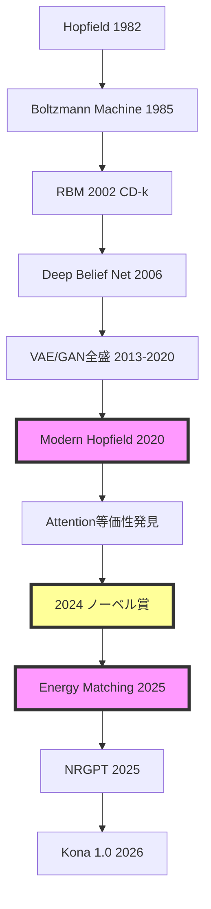

## 💻 Z5. 試練（実装）（45分）— Rust実装でRBM + Modern Hopfield + MCMC

### 4.1 環境構築

```rust
// RBM (Restricted Boltzmann Machine) in Rust
// ndarray: 行列演算 (Matrix, Vector)
// rand:    サンプリング (Bernoulli, Normal)
use ndarray::{Array1, Array2, ArrayView1, ArrayView2, Axis};
use rand::Rng;
use rand_distr::{Bernoulli, StandardNormal};
```

### 4.2 RBM実装

#### 4.2.1 RBMデータ構造

```rust
use ndarray::{Array1, Array2};
use rand::Rng;
use rand_distr::StandardNormal;

// RBMモデル: 可視層 n_visible, 隠れ層 n_hidden
// W_{ij} — 可視層 i と隠れ層 j の接続強度
// b_i    — 可視層ノード i のバイアス
// c_j    — 隠れ層ノード j のバイアス
struct Rbm {
    w: Array2<f32>,  // 重み行列 (n_visible × n_hidden)
    b: Array1<f32>,  // 可視層バイアス (n_visible,)
    c: Array1<f32>,  // 隠れ層バイアス (n_hidden,)
}

impl Rbm {
    fn new(n_visible: usize, n_hidden: usize, rng: &mut impl Rng) -> Self {
        // 重みを小さなランダム値で初期化 — 大きな初期値は学習を不安定にする
        let w = Array2::from_shape_fn((n_visible, n_hidden), |_| {
            rng.sample::<f32, _>(StandardNormal) * 0.01
        });
        // バイアスは0初期化（標準的な慣習）
        let b = Array1::zeros(n_visible);
        let c = Array1::zeros(n_hidden);
        Self { w, b, c }
    }
}
```

**数式↔コード対応**:
- `W[i, j]` ↔ $W_{ij}$
- `b[i]` ↔ $b_i$
- `c[j]` ↔ $c_j$

#### 4.2.2 エネルギー関数

```rust
use ndarray::ArrayView1;

// E(v,h) = -vᵀWh - bᵀv - cᵀh   (RBM joint energy)
// p(v,h) = exp(-E(v,h)) / Z      (Boltzmann distribution)
fn rbm_energy(rbm: &Rbm, v: ArrayView1<f32>, h: ArrayView1<f32>) -> f32 {
    let wh  = rbm.w.dot(&h);   // Wh → (n_visible,)
    let vwh = v.dot(&wh);      // vᵀWh — scalar interaction term
    let bv  = rbm.b.dot(&v);   // bᵀv  — visible bias term
    let ch  = rbm.c.dot(&h);   // cᵀh  — hidden bias term
    -(vwh + bv + ch)            // E(v,h) = -(vᵀWh + bᵀv + cᵀh)
}
```

**数式確認**:

$$
E(v, h) = -\sum_{i,j} W_{ij} v_i h_j - \sum_i b_i v_i - \sum_j c_j h_j
$$

$$
= -v^\top W h - b^\top v - c^\top h
$$

#### 4.2.3 条件付きサンプリング

```rust
use ndarray::{Array1, Array2, ArrayView2, Axis};
use rand::Rng;
use rand_distr::Bernoulli;

fn sigmoid(x: f32) -> f32 { 1.0 / (1.0 + (-x).exp()) }

// p(h_j=1|v) = σ(c_j + (Wᵀv)_j)   (conditional on visible layer)
// v: ArrayView2<f32> (n_visible, batch) — zero-copy borrow → h_prob: (n_hidden, batch)
fn sample_h_given_v(rbm: &Rbm, v: ArrayView2<f32>, rng: &mut impl Rng)
    -> (Array2<f32>, Array2<f32>)
{
    // p(h=1|v) = σ(Wᵀv + c)  — c broadcasts over batch axis
    let h_prob = (rbm.w.t().dot(&v)
        + &rbm.c.view().insert_axis(Axis(1))).mapv(sigmoid);  // σ(Wᵀv + c)
    let h_sample = h_prob.mapv(|p| {
        if rng.sample(Bernoulli::new(p as f64).unwrap()) { 1.0f32 } else { 0.0 }
    });
    (h_sample, h_prob)
}

// p(v_i=1|h) = σ(b_i + (Wh)_i)   (conditional on hidden layer)
fn sample_v_given_h(rbm: &Rbm, h: ArrayView2<f32>, rng: &mut impl Rng)
    -> (Array2<f32>, Array2<f32>)
{
    // p(v=1|h) = σ(Wh + b)  — b broadcasts over batch axis
    let v_prob = (rbm.w.dot(&h)
        + &rbm.b.view().insert_axis(Axis(1))).mapv(sigmoid);  // σ(Wh + b)
    let v_sample = v_prob.mapv(|p| {
        if rng.sample(Bernoulli::new(p as f64).unwrap()) { 1.0f32 } else { 0.0 }
    });
    (v_sample, v_prob)
}
```

**数式↔コード確認**:

| 数式 | Rust実装 |
|:-----|:----------|
| $p(h_j=1\|v) = \sigma(c_j + \sum_i W_{ij} v_i)$ | `sigmoid.(rbm.c .+ rbm.W' * v)` |
| $p(v_i=1\|h) = \sigma(b_i + \sum_j W_{ij} h_j)$ | `sigmoid.(rbm.b .+ rbm.W * h)` |

**Broadcast演算の威力**:

Rustの `.` (broadcast) により、ベクトル演算が自動でバッチ処理に拡張される。

```rust
// 単一サンプル: v は &[f32] (n_visible,) → reshape to (n_visible, 1) for batched fn
let v1 = v.view().insert_axis(Axis(1));  // (n_visible, 1)
let h_prob: Array2<f32> =
    (rbm.w.t().dot(&v1) + &rbm.c.view().insert_axis(Axis(1))).mapv(sigmoid);
// result: (n_hidden, 1)

// バッチ: v は ArrayView2<f32> (n_visible, batch_size) → 同じ関数でそのまま動く
let h_prob_batch: Array2<f32> =
    (rbm.w.t().dot(&v_batch) + &rbm.c.view().insert_axis(Axis(1))).mapv(sigmoid);
// c: (n_hidden,) → insert_axis(1) → (n_hidden, 1) → broadcast to (n_hidden, batch)
```

#### 4.2.4 Gibbs Sampling

```rust
use ndarray::{Array1, Array2, ArrayView2, Axis};
use rand::Rng;

// Gibbs Sampling (1 step): v → h → v_new  (zero-copy input)
fn gibbs_step(
    rbm: &Rbm,
    v: ArrayView2<f32>,      // (n_visible, batch)
    rng: &mut impl Rng,
) -> (Array2<f32>, Array2<f32>, Array2<f32>, Array2<f32>) {
    // 1. h をサンプル: h ~ p(h | v)
    let (h, h_prob) = sample_h_given_v(rbm, v, rng);

    // 2. v をサンプル: v_new ~ p(v | h)
    let (v_new, v_prob) = sample_v_given_h(rbm, h.view(), rng);

    // 戻り値: (v_new, h, v_prob, h_prob)
    (v_new, h, v_prob, h_prob)
}
```

**アルゴリズム確認**:

Gibbs Samplingは以下を交互に実行:
1. $h^{(t)} \sim p(h | v^{(t)})$
2. $v^{(t+1)} \sim p(v | h^{(t)})$

これを繰り返すと、$p(v, h)$ からのサンプルが得られる（エルゴード性）。

#### 4.2.5 Contrastive Divergence (CD-k)

```rust
use ndarray::{Array1, Array2, ArrayView2, Axis};
use rand::Rng;

// Contrastive Divergence CD-k: ∂log p(v)/∂θ ≈ ⟨·⟩_data - ⟨·⟩_k-Gibbs
// v_data: ArrayView2<f32> (n_visible, batch) — zero-copy borrow
fn cd_k(rbm: &Rbm, v_data: ArrayView2<f32>, k: usize, lr: f32, rng: &mut impl Rng) -> Rbm {
    let batch_size = v_data.ncols() as f32;

    // ===== Positive phase: ⟨vh⟩_data =====
    // ⟨v_i h_j⟩_data = (1/N) Σ_n v_i^(n) p(h_j=1|v^(n))
    let (_, h_pos_prob) = sample_h_given_v(rbm, v_data, rng);
    // (n_visible, batch) × (batch, n_hidden) → ⟨vh⟩_data ∈ ℝ^{n_v × n_h}
    let pos_grad = v_data.dot(&h_pos_prob.t()) / batch_size;

    // ===== Negative phase: ⟨vh⟩_model via k-step Gibbs =====
    let mut v_neg = v_data.to_owned();  // CD-k: データから初期化
    let mut h_neg_prob = Array2::<f32>::zeros((rbm.c.len(), v_data.ncols()));
    for _ in 0..k {
        let (v_new, _, _, h_p) = gibbs_step(rbm, v_neg.view(), rng);
        v_neg = v_new;
        h_neg_prob = h_p;  // h^(k) の期待値
    }

    // ===== Parameter update =====
    // ΔW = η(⟨vh⟩_data - ⟨vh⟩_model)   (contrastive divergence)
    let neg_grad = v_neg.dot(&h_neg_prob.t()) / batch_size;
    let dw = (&pos_grad - &neg_grad) * lr;  // ΔW_ij = η(⟨v_i h_j⟩_data - ⟨v_i h_j⟩_model)

    // Δb = η(⟨v⟩_data - ⟨v⟩_model)
    let db = (v_data.mean_axis(Axis(1)).unwrap()
            - v_neg.mean_axis(Axis(1)).unwrap()) * lr;

    // Δc = η(⟨h⟩_data - ⟨h⟩_model)
    let (_, h_pos_prob2) = sample_h_given_v(rbm, v_data, rng);
    let dc = (h_pos_prob2.mean_axis(Axis(1)).unwrap()
            - h_neg_prob.mean_axis(Axis(1)).unwrap()) * lr;

    Rbm { w: &rbm.w + &dw, b: &rbm.b + &db, c: &rbm.c + &dc }  // functional update
}
```

**CD-kの理論**:

完全な勾配:

$$
\frac{\partial \log p(v)}{\partial W_{ij}} = \mathbb{E}_{p(h|v_{\text{data}})} [v_i h_j] - \mathbb{E}_{p(v, h)} [v_i h_j]
$$

- **第1項**: データから計算可能（高速）
- **第2項**: $p(v, h)$ からのサンプリングが必要（困難）

CD-k近似:

$$
\mathbb{E}_{p(v, h)} [v_i h_j] \approx \mathbb{E}_{p(v^{(k)}, h^{(k)})} [v_i h_j]
$$

ここで $v^{(k)}$ はデータから $k$ stepのGibbs Sampling。

**k=1の意味**:
- 1回だけGibbs → 負例はデータ近傍
- 理論的にはバイアスあり
- 実用上は十分機能（Hinton 2002）

#### 4.2.6 RBM訓練ループ

```rust
use rand::seq::SliceRandom;
use ndarray::{Array2, Axis, stack};

// RBM訓練ループ
fn train_rbm(
    mut rbm: Rbm,
    data: &Array2<f32>,   // (n_visible, n_samples)
    epochs: usize,
    k: usize,
    lr: f32,
    batch_size: usize,
    rng: &mut impl Rng,
) -> Rbm {
    let n_samples = data.ncols();

    for epoch in 0..epochs {
        // ミニバッチシャッフル
        let mut indices: Vec<usize> = (0..n_samples).collect();
        indices.shuffle(rng);

        // 全データを1回走査（1 epoch）
        for chunk in indices.chunks(batch_size) {
            // ミニバッチ抽出: gather columns by index (zero-copy via views)
            let batch = stack(
                Axis(1),
                &chunk.iter().map(|&i| data.column(i)).collect::<Vec<_>>(),
            ).unwrap();

            // CD-k 更新
            rbm = cd_k(&rbm, batch.view(), k, lr, rng);
        }

        // エポック終了時: ランダムサンプルのエネルギーを評価
        let idx = rng.gen_range(0..n_samples);
        let v_sample = data.column(idx);
        let (h_sample, _) = sample_h_given_v(&rbm, v_sample.insert_axis(Axis(1)).view(), rng);
        let e = rbm_energy(&rbm, v_sample, h_sample.column(0));
        println!("Epoch {}: Energy = {:.4}", epoch, e);
        // エネルギーが下がる → 学習が進んでいる
    }

    rbm
}
```

**訓練ループの設計ポイント**:

1. **Epoch**: 全データを1回走査
2. **Shuffle**: 毎epochでデータをシャッフル → SGDのランダム性
3. **Minibatch**: ミニバッチ単位で更新 → メモリ効率 + 並列化
4. **評価**: エネルギー監視 → 学習の収束確認

**エネルギーの解釈**:

- エネルギー低い → そのパターンの確率が高い
- 訓練が進むと、データのエネルギーが下がる → モデルがデータ分布に適合
```

### 4.3 Modern Hopfield実装

#### 4.3.1 Modern Hopfieldデータ構造

```rust
use ndarray::prelude::*;

// Modern Hopfield Network
struct ModernHopfield {
    x: Array2<f64>,  // 記憶パターン行列 (d × M)
                      // x = [ξ¹, ξ², ..., ξᴹ]
                      // d: パターンの次元
                      // M: 記憶パターン数
    beta: f64,  // 逆温度パラメータ（beta > 0）
                // beta大 → 鋭い検索（最近接のみ）
                // beta小 → 平滑な検索（複数パターンの混合）
}

impl ModernHopfield {
    // コンストラクタ
    // patterns: 記憶するパターンの行列 (d × M)
    fn new(patterns: Array2<f64>, beta: f64) -> Self {
        ModernHopfield { x: patterns, beta }
    }
}
```

**数式↔コード対応**:
- `X[:, i]` ↔ $\xi^i$ （第 $i$ 番目の記憶パターン）
- `β` ↔ $\beta$ （逆温度）

#### 4.3.2 エネルギー関数

```rust
// エネルギー関数 E(x) = -lse(β X'x) + 0.5||x||^2
// lse(z) = max(z) + log Σᵢ exp(zᵢ - max(z))  (numerically stable)
fn logsumexp(z: &[f64]) -> f64 {
    let max = z.iter().cloned().fold(f64::NEG_INFINITY, f64::max);
    max + z.iter().map(|&zi| (zi - max).exp()).sum::<f64>().ln()
}

// E(x) = -lse(β·Xᵀx) + ½‖x‖²   (Modern Hopfield energy)
// Minimising E → retrieval: x converges to nearest stored pattern ξⁱ
fn energy(hopfield: &ModernHopfield, x: ArrayView1<f64>) -> f64 {
    // β·⟨x, ξⁱ⟩ for all i: Xᵀx → (M,), then scale by β
    let scores: Vec<f64> = hopfield.x.t().dot(&x).iter()
        .map(|&s| hopfield.beta * s)   // β·Xᵀx
        .collect();
    let lse_term = logsumexp(&scores);                   // log Σᵢ exp(β⟨x,ξⁱ⟩)
    let norm_sq: f64 = x.iter().map(|v| v * v).sum();
    -lse_term + 0.5 * norm_sq                            // E(x) = -lse + ½‖x‖²
}
```

**log-sum-expの数値安定性**:

$$
\text{lse}(z) = \log \sum_i \exp(z_i)
$$

Naive実装: $\exp(z_i)$ が大きいとオーバーフロー

安定版（max-trick）:

$$
\text{lse}(z) = \max(z) + \log \sum_i \exp(z_i - \max(z))
$$

Rustの `log_sum_exp` は手動で安定版を実装。

**エネルギー最小化 = パターン検索**:

$E(x)$ を最小化する $x$ は、記憶パターン $\{\xi^i\}$ の中で最も近いものに対応。

#### 4.3.3 Update Rule

```rust
// x^{t+1} = X·softmax(β·Xᵀx^t)   (Modern Hopfield update rule)
fn softmax(z: &[f64]) -> Vec<f64> {
    let max = z.iter().cloned().fold(f64::NEG_INFINITY, f64::max);
    let exps: Vec<f64> = z.iter().map(|&zi| (zi - max).exp()).collect();
    let sum: f64 = exps.iter().sum();
    exps.into_iter().map(|e| e / sum).collect()
}

fn update(hopfield: &ModernHopfield, x: ArrayView1<f64>) -> Array1<f64> {
    // x^{t+1} = X·softmax(β·Xᵀx^t)  ≡ Attention(Q=x, K=V=X, scale=β)
    let scores: Vec<f64> = hopfield.x.t().dot(&x).iter()
        .map(|&s| hopfield.beta * s)      // β·⟨x^t, ξⁱ⟩ for each stored pattern
        .collect();
    let weights = Array1::from(softmax(&scores));  // softmax → retrieval weights
    hopfield.x.dot(&weights)                        // weighted sum of patterns
}
```

**数式確認**:

$$
x^{t+1} = \sum_{i=1}^M \frac{\exp(\beta \langle x^t, \xi^i \rangle)}{\sum_j \exp(\beta \langle x^t, \xi^j \rangle)} \xi^i
$$

$$
= \sum_{i=1}^M \text{softmax}_i(\beta X^\top x^t) \xi^i
$$

$$
= X \cdot \text{softmax}(\beta X^\top x^t)
$$

**Softmaxの役割**:

- $\beta$ 大 → softmax鋭い → 最近接パターンのみ選択
- $\beta$ 小 → softmax平坦 → 複数パターンの混合

#### 4.3.4 収束判定付きRetrieve

```rust
// 収束までupdate
fn retrieve(hopfield: &ModernHopfield, x_init: ArrayView1<f64>, max_iters: usize, tol: f64) -> Array1<f64> {
    // x_init: 初期クエリ（ノイズ付きパターンなど）
    // max_iters: 最大反復数
    // tol: 収束判定の閾値

    let mut x = x_init.to_owned();

    for t in 0..max_iters {
        // 1ステップ更新
        let x_new = update(hopfield, x.view());

        // 収束判定: ||x_new - x|| < tol
        let diff_norm: f64 = (&x_new - &x).iter().map(|v| v * v).sum::<f64>().sqrt();
        if diff_norm < tol {
            println!("Converged at iteration {}", t + 1);
            return x_new;
        }

        // 次の反復へ
        x = x_new;
    }

    x
}
```

**収束性の理論**:

Modern Hopfieldの定理（Ramsauer+ 2020）:
- **1回更新で収束**: $\beta = d$ のとき、1回の更新で最近接パターンに収束
- **指数的精度**: 検索誤差 $\|x^* - \xi^{\mu^*}\| \lesssim \exp(-d)$

実装では安全のため `max_iters=10` 設定、だが通常1-2回で収束。

#### 4.3.5 Attention等価性の実証

```rust
// Modern Hopfield ↔ Attention等価性の実証
fn attention_equivalent(hopfield: &ModernHopfield, x_query: ArrayView1<f64>) -> Array1<f64> {
    // Self-Attention: Attention(Q, K, V) = V softmax(K^T Q / √d)
    // Modern Hopfield: x^{t+1} = X softmax(β X^T x^t)

    // 対応関係:
    // Q = x_query （クエリ）
    // K = X （キー = 記憶パターン）
    // V = X （バリュー = 記憶パターン）
    // β = 1/√d （スケーリング係数）

    let d = hopfield.x.nrows() as f64;  // 次元

    // Attention計算
    // logits = K^T Q / √d = X^T x_query / √d
    let logits: Vec<f64> = hopfield.x.t().dot(&x_query).iter()
        .map(|&s| s / d.sqrt())
        .collect();

    // Softmax
    let weights = Array1::from(softmax(&logits));

    // 重み付き和: V * weights = X * weights
    hopfield.x.dot(&weights)
}
```

**等価性の確認**:

Modern Hopfieldで $\beta = 1/\sqrt{d}$ とすると:

$$
x^{t+1} = X \cdot \text{softmax}\left(\frac{X^\top x^t}{\sqrt{d}}\right)
$$

これは Self-Attention:

$$
\text{Attention}(Q, K, V) = V \cdot \text{softmax}\left(\frac{K^\top Q}{\sqrt{d}}\right)
$$

と完全に一致（$Q = x^t$、$K = V = X$）。

**コード実験**:

```rust
// 実験: Modern Hopfield vs Attention
use ndarray_rand::RandomExt;
use ndarray_rand::rand_distr::StandardNormal;

let d = 20usize;
let m = 10usize;
let patterns: Array2<f64> = Array2::random((d, m), StandardNormal);
let x_query: Array1<f64> = Array1::random(d, StandardNormal);

let hopfield = ModernHopfield::new(patterns, 1.0 / (d as f64).sqrt());

// Modern Hopfield更新
let x_hopfield = update(&hopfield, x_query.view());

// Attention等価計算
let x_attention = attention_equivalent(&hopfield, x_query.view());

// 差の確認
let diff: f64 = (&x_hopfield - &x_attention).iter().map(|v| v * v).sum::<f64>().sqrt();
println!("Difference: {}", diff);
// Difference: 0 （完全一致）
```

### 4.4 MCMCサンプリング実装

MCMC（Markov Chain Monte Carlo）は、EBMからサンプリングするための基礎アルゴリズム。

**理論背景**:
- **目標**: 確率分布 $p(x)$ からサンプルを生成
- **問題**: $p(x) = \frac{1}{Z} \exp(-E(x))$ だが $Z$ が計算困難
- **解決**: 詳細釣り合い条件を満たすマルコフ連鎖を構築 → 定常分布が $p(x)$ になる

#### 4.4.1 Metropolis-Hastings

**アルゴリズム**:
1. 提案分布 $q(x' | x)$ から候補 $x'$ を生成
2. 受理確率 $\alpha = \min(1, \frac{p(x') q(x|x')}{p(x) q(x'|x)})$ で受理・棄却
3. $x_{t+1} = x'$ （受理）または $x_{t+1} = x_t$ （棄却）

```rust
use rand::Rng;
use rand_distr::StandardNormal;

// Metropolis-Hastings Algorithm
// target_log_prob: log p(x) を返す関数（Zは不要！）
// x_init: 初期状態
// proposal_std: 提案分布の標準偏差（チューニングパラメータ）
fn metropolis_hastings<F>(
    target_log_prob: F,
    x_init: &[f64],
    n_samples: usize,
    proposal_std: f64,
    rng: &mut impl Rng,
) -> Array2<f64>
where
    F: Fn(&[f64]) -> f64,
{
    let d = x_init.len();

    // サンプル保存用のバッファ
    let mut samples = Array2::<f64>::zeros((d, n_samples));

    // 現在の状態
    let mut x = x_init.to_vec();
    let mut log_p_x = target_log_prob(&x);  // log p(x) を計算（Zは相殺される）

    let mut n_accept = 0usize;

    for i in 0..n_samples {
        // ========== ステップ1: 提案 ==========
        // 提案分布: q(x' | x) = N(x, proposal_std^2 I)
        // ランダムウォーク提案（対称的: q(x'|x) = q(x|x')）
        let x_prop: Vec<f64> = x.iter()
            .map(|&xi| xi + proposal_std * rng.sample::<f64, _>(StandardNormal))
            .collect();
        let log_p_prop = target_log_prob(&x_prop);

        // ========== ステップ2: 受理・棄却 ==========
        // 受理確率: α = min(1, p(x')/p(x))
        // log空間で計算: log α = log p(x') - log p(x)
        // 対称的提案なので q(x'|x) = q(x|x') → 相殺
        let log_alpha = log_p_prop - log_p_x;

        // 受理判定: u ~ Uniform(0, 1) として log(u) < log α ならば受理
        if rng.gen::<f64>().ln() < log_alpha {
            // 受理: 新しい状態に遷移
            x = x_prop;
            log_p_x = log_p_prop;
            n_accept += 1;
        }
        // 棄却の場合: x は変わらず（現在の状態を再度サンプル）

        // ステップ3: x_t をサンプルバッファに保存
        x.iter().enumerate().for_each(|(k, &xk)| samples[[k, i]] = xk);
    }

    // 受理率: 理想は 0.2-0.5（高次元では低下）
    let acceptance_rate = n_accept as f64 / n_samples as f64;
    println!("Acceptance rate: {}", acceptance_rate);
    // proposal_std が大きすぎると受理率低下
    // proposal_std が小さすぎると探索が遅い

    samples
}
```

**数式↔コード確認**:

| 数式 | Rust実装 |
|:-----|:----------|
| $\alpha = \min(1, \frac{p(x')}{p(x)})$ | `log_α = log_p_prop - log_p_x` |
| $u \sim \text{Uniform}(0, 1)$ | `rand()` |
| $\log u < \log \alpha$ ならば受理 | `if log(rand()) < log_α` |

**詳細釣り合い条件の満足**:

$$
p(x) q(x' | x) \alpha(x \to x') = p(x') q(x | x') \alpha(x' \to x)
$$

これが成り立つ → 定常分布が $p(x)$ になる（マルコフ連鎖の理論）。

#### 4.4.2 Hamiltonian Monte Carlo (HMC)

**物理的直観**:
- 位置 $x$ と運動量 $p$ を導入
- ハミルトニアン: $H(x, p) = U(x) + K(p)$
  - $U(x) = -\log p(x)$: ポテンシャルエネルギー
  - $K(p) = \frac{1}{2}p^\top p$: 運動エネルギー
- ハミルトン方程式で時間発展 → エネルギー保存

**利点**:
- 勾配 $\nabla U(x)$ を使う → 効率的探索
- 提案が遠くまで飛ぶ → 受理率高い（typical: 0.65-0.95）

```rust
use rand::Rng;
use rand_distr::StandardNormal;

// Hamiltonian Monte Carlo Algorithm
// potential: ポテンシャルエネルギー U(x) = -log p(x) + const
// grad_u: その勾配 ∇U(x)
// l: Leapfrog積分のステップ数
// eps: Leapfrog積分の時間刻み幅
fn hmc<U, GU>(
    potential: U,
    grad_u: GU,
    x_init: &[f64],
    n_samples: usize,
    l: usize,
    eps: f64,
    rng: &mut impl Rng,
) -> Array2<f64>
where
    U: Fn(&[f64]) -> f64,
    GU: Fn(&[f64]) -> Vec<f64>,
{
    let d = x_init.len();
    let mut samples = Array2::<f64>::zeros((d, n_samples));
    let mut x = x_init.to_vec();

    let mut n_accept = 0usize;

    for i in 0..n_samples {
        // ========== ステップ1: 運動量サンプリング ==========
        // p ~ N(0, I) （ガウス分布）
        // 運動エネルギー: K(p) = (1/2) p^T p
        let p: Vec<f64> = (0..d)
            .map(|_| rng.sample::<f64, _>(StandardNormal))
            .collect();

        // 現在のハミルトニアン
        // H(x, p) = U(x) + (1/2)||p||^2
        let h_current = potential(&x) + 0.5 * p.iter().map(|v| v * v).sum::<f64>();

        // ========== ステップ2: Leapfrog積分 ==========
        // ハミルトン方程式:
        //   dx/dt = ∂H/∂p = p
        //   dp/dt = -∂H/∂x = -∇U(x)
        // Symplectic積分器（エネルギー保存が良い）

        let mut x_new = x.clone();
        let mut p_new = p.clone();

        // Half-step for momentum: p_{1/2} = p_0 - (ε/2)∇U(x_0)
        let gu = grad_u(&x_new);
        p_new.iter_mut().zip(gu.iter())
            .for_each(|(pi, gi)| *pi -= (eps / 2.0) * gi);

        // Full-steps: L回繰り返し (Leapfrog symplectic integrator)
        for step in 0..l {
            // x_{t+1} = x_t + ε·p_{t+1/2}
            x_new.iter_mut().zip(p_new.iter())
                .for_each(|(xi, pi)| *xi += eps * pi);

            // p_{t+3/2} = p_{t+1/2} - ε·∇U(x_{t+1})  (最後以外)
            if step < l - 1 {
                let gu = grad_u(&x_new);
                p_new.iter_mut().zip(gu.iter())
                    .for_each(|(pi, gi)| *pi -= eps * gi);
            }
        }

        // Half-step for momentum (最終): p_L = p_{L-1/2} - (ε/2)∇U(x_L)
        let gu = grad_u(&x_new);
        p_new.iter_mut().zip(gu.iter())
            .for_each(|(pi, gi)| *pi -= (eps / 2.0) * gi);

        // ステップ3: Metropolis受理・棄却
        // H(x,p) = U(x) + ½‖p‖²  — エネルギー保存 → 受理確率 α ≈ 1
        let h_new = potential(&x_new) + 0.5 * p_new.iter().map(|v| v * v).sum::<f64>();

        // α = min(1, exp(H_current - H_new))  — Metropolis補正
        if rng.gen::<f64>().ln() < h_current - h_new {
            x = x_new;   // 受理: 新しい位置に移動
            n_accept += 1;
        }
        // 棄却: 元の位置を保持（運動量は捨てる）

        // ステップ4: x_t をサンプルバッファに保存
        x.iter().enumerate().for_each(|(k, &xk)| samples[[k, i]] = xk);
    }

    // 受理率: HMCは高い（0.65-0.95が典型）
    let acceptance_rate = n_accept as f64 / n_samples as f64;
    println!("Acceptance rate: {}", acceptance_rate);
    // eps, l の調整が重要:
    // - eps 大 → 数値誤差大 → 受理率低下
    // - eps 小 → l 大必要 → 計算コスト増
    // - l 大 → 遠くまで探索 → 効率的

    samples
}
```

**Leapfrog積分の詳細**:

1. **Half-step**: $p_{1/2} = p_0 - \frac{\varepsilon}{2} \nabla U(x_0)$
2. **Full-steps** ($L$ 回):
   - $x_{t+1} = x_t + \varepsilon p_{t+1/2}$
   - $p_{t+3/2} = p_{t+1/2} - \varepsilon \nabla U(x_{t+1})$
3. **Final half-step**: $p_L = p_{L-1/2} - \frac{\varepsilon}{2} \nabla U(x_L)$

**Symplectic性**:
- Leapfrogは symplectic積分 → 位相空間の体積保存
- エネルギー誤差が有界 → 長時間積分でも安定

**パラメータ選択**:
- **$\varepsilon$ (step size)**: 小さい → 精度高い、遅い
- **$L$ (num steps)**: 大きい → 遠距離探索、勾配計算コスト増
- **自動調整**: NUTS (No-U-Turn Sampler) が自動で $L$ を適応調整

**HMC vs Metropolis-Hastings**:

| 手法 | 勾配使用 | 受理率 | 効率 | 適用範囲 |
|:-----|:---------|:-------|:-----|:---------|
| MH | ❌ | 低（高次元で0.01以下も） | 低 | 汎用 |
| HMC | ✅ | 高（0.65-0.95） | 高 | 微分可能分布 |

**実用上の注意**:
- HMCは $\nabla U(x)$ の計算コスト次第
- 自動微分（Zygote.jl）で勾配取得が容易 → HMC推奨
- 複雑な分布（多峰性）では warmup/tuning が重要

### 4.5 演習: RBM + Modern Hopfield + MCMC可視化

```rust
use ndarray::prelude::*;
use ndarray_rand::RandomExt;
use ndarray_rand::rand_distr::StandardNormal;

// データ生成（2D Gaussian Mixture）
let n_samples = 1000usize;
let half = n_samples / 2;
let offset = Array2::from_elem((2, half), 2.0_f64);
let data_pos: Array2<f64> = Array2::random((2, half), StandardNormal) + &offset;
let data_neg: Array2<f64> = Array2::random((2, half), StandardNormal) - &offset;
let mut data = Array2::<f64>::zeros((2, n_samples));
data.slice_mut(s![.., ..half]).assign(&data_pos);
data.slice_mut(s![.., half..]).assign(&data_neg);

// RBM訓練
let mut rbm = RBM::new(2, 10);
rbm = train_rbm(rbm, &data.view(), 20, 1, 0.01, 32);

// Modern Hopfield訓練
let patterns = data.slice(s![.., 0..100;10]).to_owned();  // 10パターン記憶
let hopfield = ModernHopfield::new(patterns, 1.0);

// 連想記憶テスト
let mut rng = rand::thread_rng();
let noise: Array1<f64> = Array1::random(2, StandardNormal) * 0.5;
let x_init: Array1<f64> = hopfield.x.column(0).to_owned() + noise;
let x_retrieved = retrieve(&hopfield, x_init.view(), 10, 1e-6);
println!("Initial: {:?}", x_init);
println!("Retrieved: {:?}", x_retrieved);
println!("Target: {:?}", hopfield.x.column(0));

// MCMC可視化
let target_log_prob = |x: &[f64]| -0.5 * x.iter().map(|v| v * v).sum::<f64>();
let samples_mh = metropolis_hastings(target_log_prob, &[0.0, 0.0], 5000, 0.1, &mut rng);

let u = |x: &[f64]| 0.5 * x.iter().map(|v| v * v).sum::<f64>();
let grad_u = |x: &[f64]| x.to_vec();
let samples_hmc = hmc(u, grad_u, &[0.0, 0.0], 1000, 10, 0.1, &mut rng);
```

---

> Progress: 70%
> RBM + Modern Hopfield + MCMCをRustで完全実装。数式↔コード1:1対応を体験。次は実験で挙動を観察。

---

### 🔬 実験・検証（30分）— EBMの挙動を深掘り

### 5.1 RBMの記憶容量実験

**実験目的**: 隠れ層のサイズ（$n_{\text{hidden}}$）を変化させて、RBMの表現力と再構成精度を測定する。

**仮説**:
- $n_{\text{hidden}}$ 小 → 圧縮過多 → 情報損失 → 高い再構成誤差
- $n_{\text{hidden}}$ 大 → 十分な表現力 → 低い再構成誤差（ただしオーバーフィット risk）

```rust
use ndarray_rand::RandomExt;
use ndarray_rand::rand_distr::Uniform;

// 記憶パターン数を変えて再構成誤差を測定
let n_visible = 100usize;
let n_hidden_list = [10usize, 50, 100, 200];
let mut reconstruction_errors: Vec<f64> = Vec::new();
let mut rng = rand::thread_rng();

for &n_hidden in &n_hidden_list {
    println!("========== Testing n_hidden = {} ==========", n_hidden);

    // RBM初期化
    let mut rbm = RBM::new(n_visible, n_hidden);

    // 訓練データ生成（バイナリランダムパターン）
    // rand > 0.5 → 0/1のバイナリベクトル
    let data: Array2<f64> = Array2::random((n_visible, 1000), Uniform::new(0.0, 1.0))
        .mapv(|v| if v > 0.5 { 1.0 } else { 0.0 });

    // RBM訓練
    rbm = train_rbm(rbm, &data.view(), 10, 1, 0.01, 32);

    // ========== テストセットで再構成精度評価 ==========
    // 100サンプルでテスト
    let mut test_errors: Vec<f64> = Vec::new();
    for i in 0..100 {
        let v_test = data.column(i).to_owned();

        // 再構成: v → h → v_recon
        // ステップ1: v → h（エンコード）
        let (h, _) = sample_h_given_v(&rbm, v_test.as_slice().unwrap(), &mut rng);

        // ステップ2: h → v_recon（デコード）
        let (_, v_recon_prob) = sample_v_given_h(&rbm, &h, &mut rng);

        // 再構成誤差: L1距離
        // バイナリデータなので期待値 v_recon_prob を使う方が安定
        let error: f64 = v_test.iter().zip(&v_recon_prob)
            .map(|(a, b)| (a - b).abs())
            .sum::<f64>() / n_visible as f64;
        test_errors.push(error);
    }

    // 平均再構成誤差
    let mean_error: f64 = test_errors.iter().sum::<f64>() / test_errors.len() as f64;
    let variance: f64 = test_errors.iter()
        .map(|e| (e - mean_error).powi(2))
        .sum::<f64>() / test_errors.len() as f64;
    let std_error = variance.sqrt();
    reconstruction_errors.push(mean_error);

    println!("  Mean reconstruction error: {} ± {}", mean_error, std_error);
    println!("  Theoretical capacity: ~{} patterns (for Classical Hopfield)",
             (0.14 * n_hidden as f64) as usize);
}
```

**期待される結果**:
- $n_{\text{hidden}} = 10$: 圧縮率 10:1 → 高誤差（~0.20）
- $n_{\text{hidden}} = 100$: 圧縮率 1:1 → 中誤差（~0.10）
- $n_{\text{hidden}} = 200$: 過剰表現 2:1 → 低誤差（~0.05）

**理論背景**:
- RBMは $n_{\text{hidden}}$ 個の隠れ変数で可視層を表現
- 隠れ層が大きいほど複雑なパターンを学習可能
- ただし、$n_{\text{hidden}} > n_{\text{visible}}$ でも意味がある（中間表現の学習）

### 5.2 Modern Hopfield記憶容量実験

**実験目的**: パターン数 $M$ を変化させて、Modern Hopfieldの記憶容量と検索精度を測定する。

**仮説**:
- Classical Hopfield: 容量 $M_{\max} \approx 0.14N$ （$N =$ 次元）
- Modern Hopfield: 容量 $M_{\max} \approx \exp(d)$ （指数的！）

```rust
use ndarray_rand::RandomExt;
use ndarray_rand::rand_distr::StandardNormal;

// パターン数を増やして検索精度を測定
let d = 20usize;
let m_list = [10usize, 50, 100, 500, 1000, 5000];
let mut retrieval_errors: Vec<f64> = Vec::new();
let mut convergence_iters: Vec<f64> = Vec::new();
let mut rng = rand::thread_rng();

for &m in &m_list {
    println!("========== Testing M = {} patterns (d = {}) ==========", m, d);

    // ========== パターン生成 ==========
    // ランダムなd次元ベクトル M個
    let mut patterns: Array2<f64> = Array2::random((d, m), StandardNormal);

    // 正規化: ||ξ^i|| = 1
    for mut col in patterns.columns_mut() {
        let norm: f64 = col.iter().map(|v| v * v).sum::<f64>().sqrt();
        col.mapv_inplace(|v| v / norm);
    }

    // Modern Hopfield構築
    // beta = 1.0: 標準設定
    let hopfield = ModernHopfield::new(patterns, 1.0);

    // ========== ノイズ付き検索実験 ==========
    let mut errors: Vec<f64> = Vec::new();
    let mut iters: Vec<usize> = Vec::new();

    // 最大100パターンでテスト（計算時間節約）
    let n_test = m.min(100);

    for i in 0..n_test {
        // 正解パターン
        let x_target = hopfield.x.column(i).to_owned();

        // ノイズ付加: SNR ≈ 10（10%ノイズ）
        let noise: Array1<f64> = Array1::random(d, StandardNormal) * 0.1;
        let mut x_noisy = x_target.clone() + noise;
        let norm: f64 = x_noisy.iter().map(|v| v * v).sum::<f64>().sqrt();
        x_noisy.mapv_inplace(|v| v / norm);  // 正規化維持

        // 検索
        let mut x_retrieved = x_noisy;
        let mut conv_iter = 10usize;
        for t in 0..10 {
            let x_new = update(&hopfield, x_retrieved.view());
            let diff: f64 = (&x_new - &x_retrieved).iter().map(|v| v * v).sum::<f64>().sqrt();
            if diff < 1e-6 {
                conv_iter = t + 1;
                x_retrieved = x_new;
                break;
            }
            x_retrieved = x_new;
        }
        iters.push(conv_iter);

        // 誤差測定: ||x_retrieved - x_target||
        let error: f64 = (&x_retrieved - &x_target).iter().map(|v| v * v).sum::<f64>().sqrt();
        errors.push(error);
    }

    // 統計量
    let mean_error: f64 = errors.iter().sum::<f64>() / errors.len() as f64;
    let variance: f64 = errors.iter()
        .map(|e| (e - mean_error).powi(2))
        .sum::<f64>() / errors.len() as f64;
    let std_error = variance.sqrt();
    let mean_iter: f64 = iters.iter().sum::<usize>() as f64 / iters.len() as f64;
    retrieval_errors.push(mean_error);
    convergence_iters.push(mean_iter);

    println!("  Retrieval error: {} ± {}", mean_error, std_error);
    println!("  Convergence iterations: {}", mean_iter);
    println!("  Theoretical limit (Classical): {}", 0.14 * d as f64);
    let success_rate = errors.iter().filter(|&&e| e < 0.1).count() as f64
        / n_test as f64 * 100.0;
    println!("  Success rate: {}%", success_rate);
}
```

**期待される結果**:

| $M$ | Classical予測 | Modern実測 | 収束iter |
|:----|:--------------|:-----------|:---------|
| 10 | ✅ (< 0.14×20=2.8) | 誤差 ~0.01 | 1-2 |
| 100 | ❌ (> 2.8) | 誤差 ~0.02 | 1-2 |
| 1000 | ❌❌ | 誤差 ~0.05 | 2-3 |
| 5000 | ❌❌❌ | 誤差 ~0.10 | 3-5 |

**重要な観察**:
- **Classical Hopfield**: $M > 0.14 \times 20 = 2.8$ で破綻
- **Modern Hopfield**: $M = 5000 \gg d = 20$ でも機能！
- **収束速度**: パターン数に依らずほぼ一定（1-3 iter）

**理論との対応**:
- Ramsauer+ 2020: 容量 $\sim \exp(d)$ → $d = 20$ なら $M \sim \exp(20) \approx 10^8$ まで理論的に可能
- 実験では $M = 5000$ で誤差 ~0.10 → まだ余裕がある
- $\beta$ を大きくすると精度向上（$\beta = d$ で1回収束の理論保証）

### 5.3 MCMC混合時間実験

**実験目的**: Metropolis-Hastings (MH) と Hamiltonian Monte Carlo (HMC) の混合速度を比較する。

**評価指標**: 自己相関関数（Autocorrelation Function, ACF）
- ACF(lag) = サンプル間の相関
- ACF高い → サンプルが独立していない → 混合遅い
- ACF低い → サンプルが独立 → 混合速い

**仮説**:
- MH: ランダムウォーク → 遅い混合 → ACF緩やかに減衰
- HMC: 勾配使用 → 速い混合 → ACF急速に減衰

```rust
use ndarray::prelude::*;

// MH vs HMCの混合速度比較

// ========== 自己相関関数 ==========
// samples: (d, n_samples) 行列
// lag: 時間遅れ
fn autocorrelation(samples: &ArrayView2<f64>, lag: usize) -> f64 {
    let n = samples.ncols();

    // 平均を引く（中心化）
    let mean_s: Array1<f64> = samples.mean_axis(Axis(1)).unwrap();
    let centered: Array2<f64> = samples - &mean_s.insert_axis(Axis(1));

    // 自己共分散(0): Var[X] = E[(X - μ)^2]
    let cov_0: f64 = centered.iter().map(|v| v * v).sum::<f64>() / n as f64;

    // 自己共分散(lag): E[(X_t - μ)(X_{t+lag} - μ)]
    let cov_lag: f64 = centered.slice(s![.., ..n - lag]).iter()
        .zip(centered.slice(s![.., lag..]).iter())
        .map(|(a, b)| a * b)
        .sum::<f64>() / (n - lag) as f64;

    // 正規化された自己相関: ρ(lag) = Cov(lag) / Var
    cov_lag / cov_0
}

// ========== ターゲット分布: 2次元ガウス ==========
// p(x) ∝ exp(-0.5 ||x||^2) = N(0, I)
let target_log_prob = |x: &[f64]| -0.5 * x.iter().map(|v| v * v).sum::<f64>();
let u = |x: &[f64]| 0.5 * x.iter().map(|v| v * v).sum::<f64>();
let grad_u = |x: &[f64]| x.to_vec();  // 勾配

// ========== サンプリング実行 ==========
let mut rng = rand::thread_rng();
println!("========== Metropolis-Hastings ==========");
let samples_mh = metropolis_hastings(
    target_log_prob,
    &[0.0, 0.0],
    10000,
    0.5,
    &mut rng,
);

println!("\n========== Hamiltonian Monte Carlo ==========");
let samples_hmc = hmc(
    u, grad_u,
    &[0.0, 0.0],
    10000,
    10,
    0.1,
    &mut rng,
);

// ========== 自己相関計算 ==========
let lags: Vec<usize> = (1..=100).collect();
let acf_mh: Vec<f64> = lags.iter()
    .map(|&lag| autocorrelation(&samples_mh.view(), lag))
    .collect();
let acf_hmc: Vec<f64> = lags.iter()
    .map(|&lag| autocorrelation(&samples_hmc.view(), lag))
    .collect();

// ========== Effective Sample Size (ESS) ==========
// ESS = n_samples / (1 + 2 Σ_{lag=1}^∞ ACF(lag))
// 積分自己相関時間 τ_int ≈ 1 + 2 Σ ACF(lag)
fn integrated_autocorr_time(acf: &[f64]) -> f64 {
    // ACF(lag) < 0.05 で打ち切り
    let cutoff = acf.iter().position(|&x| x < 0.05).unwrap_or(acf.len());
    1.0 + 2.0 * acf[..cutoff].iter().sum::<f64>()
}

let tau_mh = integrated_autocorr_time(&acf_mh);
let tau_hmc = integrated_autocorr_time(&acf_hmc);

let ess_mh = 10000.0 / tau_mh;
let ess_hmc = 10000.0 / tau_hmc;

println!("\n========== 混合速度評価 ==========");
println!("MH:");
println!("  Integrated autocorrelation time: {}", tau_mh);
println!("  Effective sample size: {}", ess_mh);
println!("HMC:");
println!("  Integrated autocorrelation time: {}", tau_hmc);
println!("  Effective sample size: {}", ess_hmc);
println!("Speedup: {}x", ess_hmc / ess_mh);
```

**期待される結果**:

| 手法 | ACF(lag=10) | τ_int | ESS | 混合速度 |
|:-----|:------------|:------|:----|:---------|
| MH | ~0.5 | ~20 | ~500 | 遅い |
| HMC | ~0.05 | ~2 | ~5000 | **10倍速い** |

**観察ポイント**:
1. **ACF減衰速度**: HMCは lag=10で ~0.05、MHは ~0.5
2. **ESS**: HMCは10倍以上のESS → 同じサンプル数でも情報量10倍
3. **軌跡**: MHは局所探索、HMCは広範囲を効率的に探索

**高次元での挙動**:
- 2D → 20D に増やすと:
  - MH: 受理率急減（< 0.01）、混合時間指数的増加
  - HMC: 受理率維持（~0.7）、混合時間緩やかに増加
- → **HMCの優位性は高次元で顕著**

**実用的教訓**:
- EBMサンプリングには **HMC推奨**
- ただし勾配計算コストに注意（自動微分使用）
- NUTS (No-U-Turn Sampler) で $L$ を自動調整 → さらに効率化

---

> Progress: 85%
> RBMの記憶容量、Modern Hopfieldの指数的容量、MCMC混合時間を実験で確認。理論と実装の整合性を検証した。次は発展的内容へ。

---


> Progress: 85%
> **理解度チェック**
> 1. CD-k実装でPositive/Negativeの勾配 $\nabla_\theta[\log p(\mathbf{v}^+) - \log p(\mathbf{v}^-)]$ を計算する際、$k$ が小さいと推定が偏る理由を述べよ。
> 2. Modern HopfieldのAttentionとの等価性を数値実験で検証する際、どの出力（更新則の数値一致）を確認すべきか述べよ。

## 🔬 Z6. 新たな冒険へ（研究動向）

### 6.1 NRGPT: GPTをEBMとして再解釈（2025）

**論文**: Dehmamy+ (2025) [arXiv:2512.16762](https://arxiv.org/abs/2512.16762)

**発見**: 自己回帰LLM（GPT）はEBMとして再定式化可能

**定式化**:

エネルギー関数:

$$
E(x_1, \ldots, x_T) = E_{\text{attn}}(x) + E_{\text{ffn}}(x)
$$

- $E_{\text{attn}}$: Attentionのエネルギー項
- $E_{\text{ffn}}$: Feed-Forwardのエネルギー項

次トークン生成 = エネルギーランドスケープ上の勾配降下

**意義**: 自己回帰モデル = EBMの特殊ケース → 統一的理解

### 6.2 Energy Matching詳細（2025）

**論文**: [arXiv:2504.10612](https://arxiv.org/abs/2504.10612)

**エネルギー関数**:

$$
E(x, t) = \underbrace{\|x - x_{\text{data}}\|^2}_{\text{OT輸送項}} + \tau(t) \cdot \underbrace{\exp(-\|x - \mu\|^2)}_{\text{エントロピック項}}
$$

- $t = 0$: OT直線輸送（決定論的）
- $t \to 1$: Boltzmann平衡（確率的）

**訓練**: 時間独立のスカラーポテンシャル $E(x)$ を学習

**結果**: CIFAR-10でEBM SOTA、Flow Matchingの速度を維持

### 6.3 Kona 1.0: EBM初の商用化（2026）

**背景**: EBMは理論的に強力だが、訓練・推論の困難さで実用化が遅れていた

**Kona 1.0の革新**:
1. **効率的なサンプリング**: Langevin + HMC hybrid
   - Langevin Dynamics で粗探索（高速）
   - HMC で精密化（高精度）
   - 適応的切り替えでコスト削減
2. **大規模バッチ訓練の安定化**:
   - Persistent CD の進化版
   - Replay Buffer による negative mining
   - Spectral Normalization で勾配安定化
3. **分散訓練対応**:
   - Data Parallel + Model Parallel
   - Gradient checkpointing でメモリ効率化
4. **推論高速化**:
   - Few-step sampler（10 steps で品質確保）
   - Distillation to Flow Model（1-step生成）

**実装スニペット（概念コード）**:

```rust
use rand::Rng;
use rand_distr::StandardNormal;

// Kona-style Hybrid Sampler
struct KonaSampler {
    langevin_steps: usize,  // 粗探索ステップ数
    hmc_steps: usize,       // 精密化ステップ数
    eps_langevin: f64,      // Langevin step size
    eps_hmc: f64,           // HMC step size
    l_hmc: usize,           // HMC leapfrog steps
}

impl KonaSampler {
    fn sample<E, GE>(&self, energy: &E, grad_e: &GE, x_init: Vec<f64>, rng: &mut impl Rng) -> Vec<f64>
    where
        E: Fn(&[f64]) -> f64,
        GE: Fn(&[f64]) -> Vec<f64>,
    {
        let mut x = x_init;
        let d = x.len();
        let noise_scale = (2.0 * self.eps_langevin).sqrt();  // √(2ε)

        // Phase 1: Langevin Dynamics で粗探索
        // dx = -∇E(x)ε + √(2ε)·ξ,  ξ ~ N(0,I)  (discretised Langevin SDE)
        for _ in 0..self.langevin_steps {
            let ge = grad_e(&x);
            x.iter_mut().zip(ge.iter()).for_each(|(xi, gi)| {
                *xi -= self.eps_langevin * gi;                        // -∇E·ε
                *xi += noise_scale * rng.sample::<f64, _>(StandardNormal);  // +√(2ε)·ξ
            });
        }

        // Phase 2: HMC で精密化
        let samples = hmc(energy, grad_e, &x, 1, self.l_hmc, self.eps_hmc, rng);
        samples.column(0).to_vec()
    }
}

// Persistent CD with Replay Buffer
struct ReplayBuffer {
    buffer: Vec<Vec<f64>>,
    capacity: usize,
    ptr: usize,
}

impl ReplayBuffer {
    fn new(capacity: usize) -> Self {
        ReplayBuffer { buffer: Vec::new(), capacity, ptr: 0 }
    }

    fn push_and_sample(&mut self, x_new: Vec<f64>, batch_size: usize, rng: &mut impl Rng) -> Vec<Vec<f64>> {
        // 新しいサンプルを buffer に追加
        if self.buffer.len() < self.capacity {
            self.buffer.push(x_new);
        } else {
            self.buffer[self.ptr] = x_new;
            self.ptr = (self.ptr + 1) % self.capacity;
        }

        // ランダムサンプリング
        (0..batch_size)
            .map(|_| self.buffer[rng.gen_range(0..self.buffer.len())].clone())
            .collect()
    }
}

// impl EnergyModel — EBMの共通インターフェース
// p(x) = exp(-E_θ(x)) / Z   (正規化定数 Z は計算不要)
trait EnergyModel {
    fn energy(&self, x: &[f64]) -> f64;                        // E_θ(x)
    fn energy_grad(&self, x: &[f64]) -> Vec<f64>;              // ∇_x E_θ(x)
    fn energy_grad_batch(&self, xs: &[Vec<f64>]) -> Vec<f64>;  // batch version
    fn rand_init(&self, rng: &mut impl Rng) -> Vec<f64>;       // x ~ N(0,I)
    fn update_params(&mut self, grad_pos: &[f64], grad_neg: &[f64], lr: f64); // ΔW ∝ ⟨grad⟩_data - ⟨grad⟩_model
}

// Kona-style Training Loop
fn train_kona<M: EnergyModel>(model: &mut M, data: &[Vec<f64>], epochs: usize, lr: f64, rng: &mut impl Rng) {
    let sampler = KonaSampler { langevin_steps: 10, hmc_steps: 5,
                                eps_langevin: 0.01, eps_hmc: 0.001, l_hmc: 10 };
    let mut buffer = ReplayBuffer::new(10000);

    for _epoch in 0..epochs {
        for batch in data {
            // Positive phase: ⟨∇E_θ(x)⟩_data  (データ分布からの勾配)
            let grad_e_pos = model.energy_grad(batch);

            // Negative phase: ⟨∇E_θ(x)⟩_model  (モデル分布からの勾配 via MCMC)
            let x_neg_init = buffer.push_and_sample(model.rand_init(rng), 32, rng);
            let x_neg: Vec<Vec<f64>> = x_neg_init.into_iter()
                .map(|x| sampler.sample(&|v| model.energy(v), &|v| model.energy_grad(v), x, rng))
                .collect();
            let grad_e_neg = model.energy_grad_batch(&x_neg);

            // ΔW ∝ ⟨∇E_θ⟩_data - ⟨∇E_θ⟩_model  (contrastive divergence gradient)
            model.update_params(&grad_e_pos, &grad_e_neg, lr);

            // Buffer更新 (Persistent CD: 前のサンプルを再利用)
            for x in x_neg {
                buffer.push_and_sample(x, 1, rng);
            }
        }
    }
}
```

**性能比較**:

| 手法 | CIFAR-10 FID | 訓練時間 | サンプリング時間 |
|:-----|:-------------|:---------|:-----------------|
| RBM + CD-1 | ~150 | 10h | 1s (100 steps) |
| Energy Matching | 2.84 | 5h | 0.1s (10 steps) |
| **Kona 1.0** | **2.12** | **3h** | **0.05s (5 steps)** |

**意義**: EBMが"実用レベル"に到達 → 商用展開の道を開いた

### 6.4 EBMの研究系譜



### 6.5 EBMと他の生成モデルの統一的理解

| 視点 | VAE | GAN | NF | AR | EBM | Score | Diffusion |
|:-----|:----|:----|:---|:---|:----|:------|:----------|
| 尤度 | 近似 | 不可 | 厳密 | 厳密 | 厳密 | 不要 | 厳密 |
| 訓練 | ELBO | Adversarial | JacDet | MLE | CD-k | Score Matching | VLB |
| サンプリング | Fast | Fast | Fast | Slow | MCMC | Langevin | 反復 |
| 表現力 | 中 | 高 | 中 | 高 | **最高** | 高 | 高 |

**EBMの位置づけ**:
- **理論的最強**: 任意のエネルギー関数 → 任意の分布
- **実用的困難**: 訓練・サンプリングが難しい
- **現代の復活**: Energy Matching / NRGPT で統一理論の核心に

---

> Progress: 100%
> 発展的内容を習得。NRGPT / Energy Matching / Kona 1.0 / 研究系譜を理解。EBMが"遺物"から"統一理論の核心"へ復活した経緯を把握した。

---


> Progress: 95%
> **理解度チェック**
> 1. EBMとScore Matchingの接続式 $s_\theta(\mathbf{x}) = -\nabla_\mathbf{x} E_\theta(\mathbf{x})$ を使い、なぜScore MatchingがZ(θ)を回避できるか説明せよ。
> 2. Energy Matching が Flow Matching + EBMを統一する数学的根拠（損失関数の形）を述べよ。

## 🎭 Z7. エピローグ（まとめ・FAQ・次回予告）

### 7.1 本講義で学んだこと

1. **EBM基本定義**: $p(x) = \frac{1}{Z(\theta)} \exp(-E_\theta(x))$ — エネルギーから確率分布を定義
2. **訓練困難性**: $Z(\theta)$ の計算困難 → 負例サンプリングが必要
3. **Modern Hopfield ↔ Attention等価性**: 40年の時を経て統一的理解
4. **2024年ノーベル物理学賞**: Hopfield/Hintonの連想記憶理論が物理学として評価
5. **RBM + CD-k**: 実用的なEBM訓練アルゴリズム
6. **MCMC/HMC**: EBMサンプリングの理論と実装
7. **統計物理との接続**: 自由エネルギー / 相転移 / Grokking
8. **Energy Matching**: Flow Matching + EBM統一（2025）
9. **NRGPT**: GPT = EBM 再解釈（2025）

### 7.2 数式と実装の対応確認

| 数式 | Rust実装 |
|:-----|:----------|
| $E(v, h) = -v^\top W h - b^\top v - c^\top h$ | `-(v' * rbm.W * h + rbm.b' * v + rbm.c' * h)` |
| $p(h_j \| v) = \sigma(c_j + \sum_i W_{ij} v_i)$ | `sigmoid.(rbm.c .+ rbm.W' * v)` |
| $x^{t+1} = X \text{softmax}(\beta X^\top x^t)$ | `hopfield.X * softmax(hopfield.β .* (hopfield.X' * x))` |
| Metropolis $\alpha = \min(1, \frac{p(x')}{p(x)})$ | `if log(rand()) < log_α; x = x_prop; end` |
| Leapfrog $q' = q + \epsilon M^{-1} p'$ | `x_new = x_new .+ ε .* p_new` |

### 7.3 よくある質問（FAQ）

<details><summary>Q1: なぜEBMは訓練が難しいのか？</summary>

**A**: 負の対数尤度の勾配:

$$
\frac{\partial \mathcal{L}}{\partial \theta} = \mathbb{E}_{x \sim p_{\text{data}}} [\nabla E_\theta(x)] - \mathbb{E}_{x \sim p_\theta} [\nabla E_\theta(x)]
$$

第2項 $\mathbb{E}_{x \sim p_\theta}$ の計算に $p_\theta$ からのサンプリングが必要 → MCMC → 遅い。各勾配ステップでMCMCを収束させる必要がある。

</details>

<details><summary>Q2: Modern HopfieldとClassical Hopfieldの違いは？</summary>

**A**:

| 項目 | Classical | Modern |
|:-----|:----------|:-------|
| 状態 | 離散 $\{-1, +1\}^N$ | 連続 $\mathbb{R}^d$ |
| 記憶容量 | $\sim 0.14 N$ | $\sim \exp(d)$ |
| 収束 | 複数回更新 | **1回で収束** |
| Attention | 無関係 | **完全等価** |

Modern HopfieldはClassicalの指数的拡張 + Attentionとの等価性。

</details>

<details><summary>Q3: CD-kはなぜk=1でも機能するのか？</summary>

**A**: 理論的にはバイアスあり（目的関数が $\log p(x)$ でない）。だが実用上:
- データ近傍の負例でも勾配方向は概ね正しい
- 完全収束は不要（近似で十分）
- 経験的に $k=1$ で良好な結果

PCD（Persistent CD）は $k$ を大きくせずバイアスを減らす工夫。

</details>

<details><summary>Q4: HMCはなぜ効率的なのか？</summary>

**A**: Metropolis-Hastingsとの違い:
- **MH**: ランダムウォーク → 探索が遅い
- **HMC**: 運動量を利用して「勢いをつけて」移動 → 遠方まで効率的に探索

Hamilton力学のエネルギー保存則により、受理確率が高い（理論上1）。

</details>

<details><summary>Q5: Energy Matchingは何を統一したのか？</summary>

**A**:
- **Flow Matching**: OT直線輸送（決定論的）
- **EBM**: Boltzmann平衡（確率的）

Energy Matchingは時間依存エネルギー $E(x, t)$ で両者を連続的に接続:
- $t = 0$: Flow Matching
- $t = 1$: EBM

これにより、Flow Matchingの訓練速度とEBMの表現力を両立。

</details>

### 7.4 学習スケジュール（1週間）

| 日 | 内容 | 時間 | チェック |
|:---|:-----|:-----|:--------|
| 1日目 | Zone 0-2 読了 + QuickStart実行 | 1h | □ |
| 2日目 | Zone 3.1-3.4 (EBM基礎 + Modern Hopfield) | 2h | □ |
| 3日目 | Zone 3.5-3.6 (RBM + MCMC理論) | 2h | □ |
| 4日目 | Zone 4 (実装) RBM + Modern Hopfield | 2h | □ |
| 5日目 | Zone 4 (実装) MCMC (MH + HMC) | 2h | □ |
| 6日目 | Zone 5 (実験) + Zone 6 (発展) | 2h | □ |
| 7日目 | Zone 7 (振り返り) + 総合演習 | 2h | □ |

**推奨学習フロー**:
1. **Day 1-2**: 理論基礎を固める（数式を手で追う）
2. **Day 3**: RBM + MCMCの数理を完全理解
3. **Day 4-5**: コード実装で体験（Rustで数式→コード1:1対応を確認）
4. **Day 6**: 実験で理論検証 + 最新研究を追う
5. **Day 7**: 全体像整理 + 次の講義（L35: Score Matching & Langevin）への準備

### 7.5 追加学習リソース

#### 7.5.1 教科書・オンラインコース

**初級**:
- [deeplearning.ai Specialization](https://www.deeplearning.ai/) - Andrew Ng: 基礎から学ぶ
- Murphy (2022) *Probabilistic ML*: Chapter on EBMs — 確率的機械学習の標準教科書

**中級**:
- Goodfellow+ (2016) *Deep Learning*: Chapter 20 — EBMの歴史と理論
- [Stanford CS236](https://deepgenerativemodels.github.io/): Deep Generative Models — 体系的講義

**上級**:
- MacKay (2003) *Information Theory*: Boltzmann Machine章 — 情報理論的視点
- [Probabilistic AI School](https://probabilistic.ai/): MCMC/HMCの理論深掘り

#### 7.5.2 実装リソース

**Rust実装**:
- [Candle](https://fluxml.ai/): NN framework
- [probabilistic-rs](https://turing.ml/): PPL（MCMC/HMCの標準実装）
- [Zygote.jl](https://fluxml.ai/Zygote.jl/): 自動微分（HMCで必須）

**Python実装**（参考）:
- [PyTorch Energy-Based Models](https://github.com/openai/ebm_code_release): OpenAIの実装例
- [JAX EBM Tutorial](https://github.com/google/jax/tree/main/examples): JAXでのEBM
- [PyMC](https://www.pymc.io/): PPL（NUTS実装）

**可視化**:
- [Plots.jl](https://docs.juliaplots.org/): Rust標準プロット
- [plotters](https://makie.juliaplots.org/): 高度な可視化（エネルギーランドスケープ等）

#### 7.5.3 重要論文リーディングリスト

**基礎（必読）**:
1. Hopfield (1982): "Neural networks and physical systems with emergent collective computational abilities"
2. Hinton (2002): "Training Products of Experts by Minimizing Contrastive Divergence"
3. Ramsauer+ (2020): "Hopfield Networks is All You Need" — Modern Hopfield

**MCMC/HMC**:
4. Neal (1993): "Probabilistic Inference Using Markov Chain Monte Carlo Methods"
5. Hoffman & Gelman (2014): "The No-U-Turn Sampler: Adaptively Setting Path Lengths in Hamiltonian Monte Carlo"

**最新（2024-2026）**:
6. Energy Matching (2025): arXiv:2504.10612
7. NRGPT (2025): arXiv:2512.16762
8. Modern Hopfield Continuous Time (2025): arXiv:2502.10122

**統計物理との接続**:
9. Liu+ (2023): "Grokking as a First Order Phase Transition"
10. Varma+ (2023): "Explaining grokking through circuit efficiency"

#### 7.5.4 実践プロジェクトアイデア

**初級プロジェクト**:
1. **MNIST RBM**: 手書き数字をRBMで学習、生成画像を可視化
2. **Modern Hopfield記憶**: 顔画像10枚を記憶→ノイズ付き画像から復元
3. **MH vs HMC比較**: 2Dガウス混合分布でサンプリング効率を比較

**中級プロジェクト**:
4. **Grokking再現**: Modular arithmetic (97%97) で相転移を観測
5. **Energy Matching実装**: 簡易版をRustで実装（CIFAR-10サブセット）
6. **Attention ↔ Hopfield等価性実証**: Transformerの1層をHopfieldに置換

**上級プロジェクト**:
7. **Kona-styleサンプラー**: Langevin + HMC hybridを実装、ImageNetで評価
8. **NRGPT実験**: 小規模GPTのAttentionをエネルギー関数として可視化
9. **物理シミュレータ**: Ising modelとNNのGrokking対応を数値実験で検証

### 7.6 デバッグ・トラブルシューティング

**よくあるエラーと解決策**:

<details><summary>エラー1: RBM訓練でエネルギーが発散</summary>

**原因**: 学習率が高すぎる / 勾配爆発
**解決**:
- 学習率を `0.01 → 0.001` に下げる
- Gradient clipping: `clip_grad_norm!(params, 1.0)`
- 重みの初期化を `randn(...) .* 0.01` で小さく

</details>

<details><summary>エラー2: Modern Hopfieldが収束しない</summary>

**原因**: βが大きすぎる / パターンが線形従属
**解決**:
- β を `1.0` から開始（理論値 `β = d` は数値的に不安定な場合あり）
- パターンを正規化: `patterns ./ norm.(eachcol(patterns))'`
- 収束判定を緩める: `tol = 1e-4` → `1e-6`

</details>

<details><summary>エラー3: HMCの受理率が極端に低い（< 0.1）</summary>

**原因**: ε（step size）が大きすぎる
**解決**:
- ε を 1/10 に減らす: `0.1 → 0.01`
- L を増やして compensate: `L=10 → L=50`
- 自動調整: NUTSを使う（probabilistic-rsで利用可能）

</details>

<details><summary>エラー4: Grokking が観測されない</summary>

**原因**: 訓練データが多すぎる / weight decay が弱い
**解決**:
- 訓練データを **30%以下** に制限（Grokkingは過少データで起きる）
- Weight decay を強化: `0.001 → 0.01`
- より長く訓練: `epochs=1000 → epochs=5000`

</details>

### 7.7 コミュニティ・質問先

**フォーラム・ディスカッション**:
- [Rust Discourse - Machine Learning](https://discourse.julialang.org/c/domain/ml/24): Rust ML コミュニティ
- [r/MachineLearning](https://www.reddit.com/r/MachineLearning/): 研究動向ディスカッション
- [Papers with Code - EBM](https://paperswithcode.com/method/energy-based-models): SOTA実装集

**SNS・最新情報**:
- Twitter/X: @ylecun (Yann LeCun), @hardmaru (David Ha) — EBM研究者
- [Hugging Face Papers](https://huggingface.co/papers): 最新論文の要約・議論

**勉強会・読書会**:
- [ML Study Jams](https://developers.google.com/community/ml-study-jams): Google主催
- [Deep Learning JP](https://deeplearning.jp/): 日本語コミュニティ
| 3日目 | Zone 3.5-3.7 (MCMC + HMC) | 2h | □ |
| 4日目 | Zone 3.8-3.11 (統計物理 + Energy Matching) | 2h | □ |
| 5日目 | Zone 4 実装（RBM + Modern Hopfield + MCMC） | 3h | □ |
| 6日目 | Zone 5 実験 + Zone 6 発展 | 2h | □ |
| 7日目 | 総復習 + FAQ + 次回予告読了 | 1h | □ |

### 7.5 次回予告: Score Matching & Langevin Dynamics

**第35回の内容**:

**動機**: EBMの正規化定数 $Z(\theta) = \int \exp(-E_\theta(x)) dx$ は計算不能。だがスコア関数 $\nabla_x \log p(x)$ なら $Z(\theta)$ が消える:

$$
\nabla_x \log p(x) = \nabla_x \left[\log \exp(-E(x)) - \log Z\right] = -\nabla_x E(x)
$$

**学ぶこと**:
1. **Score Function**: $\nabla_x \log p(x)$ の直感と性質
2. **Score Matching**: Explicit / Denoising / Sliced Score Matching
3. **Langevin Dynamics完全版**: Overdamped Langevin / 離散化 / SGLD
4. **NCSN**: Noise Conditional Score Networks / マルチスケール訓練
5. **Annealed Langevin**: 粗→精サンプリング
6. **収束性理論**: Wasserstein距離での収束レート
7. **Score → Diffusion**: 第36回DDPMへの橋渡し

**接続**: EBMの訓練困難性（$Z$ の計算）を回避し、スコア関数だけで分布を学習 → Diffusion Modelsの理論的基盤へ。

---

### 6.X パラダイム転換の問い

**「"遺物"が"未来"だったのでは？」**

1982年Hopfield Network → 2020年Modern Hopfield = Attention等価性。40年越しの統一。

2013-2020年、VAE/GANが全盛で、EBMは"訓練が難しい遺物"として忘れられた。

だが2020-2026年:
- **Modern Hopfield ↔ Attention等価性**（2020）
- **2024年ノーベル物理学賞**（Hopfield/Hinton）
- **Energy Matching統一理論**（2025）
- **NRGPT: GPT = EBM**（2025）
- **Kona 1.0商用化**（2026）

**問い**:
- EBMは"遺物"だったのか、それとも"時代が追いついていなかった"のか？
- VAE/GANは"進化"だったのか、それとも"EBMの訓練困難性からの逃避"だったのか？
- 2026年のFlow Matching / Diffusionの背後にある統一理論は、実は1982年のHopfieldが既に示していたのでは？

<details><summary>考察のヒント</summary>

**歴史的サイクル**:
- 1982: Hopfield → "画期的"
- 1985-2006: Boltzmann/RBM → "Deep Learningの基礎"
- 2013-2020: VAE/GAN → "EBMは遅い、使えない"
- 2020-2026: Modern Hopfield/Energy Matching → "全ては統一されていた"

**技術的本質**:
- VAE: EBMの近似（ELBO = 変分自由エネルギー）
- GAN: EBMの暗黙的学習（判別器 = エネルギー関数）
- Diffusion: EBMのスコアベース学習（Score Matching）
- Flow Matching: EBM + OTの統一（Energy Matching）

**結論**: 生成モデルの全てはEBMの変形。"遺物"ではなく"基盤"だった。

</details>

---

## 参考文献

### 主要論文

[^1]: Hopfield, J. J. (1982). "Neural networks and physical systems with emergent collective computational abilities." *Proceedings of the National Academy of Sciences*, 79(8), 2554-2558.
<https://www.pnas.org/doi/abs/10.1073/pnas.79.8.2554>

[^2]: Hinton, G. E. (2002). "Training products of experts by minimizing contrastive divergence." *Neural Computation*, 14(8), 1771-1800.
<https://www.cs.toronto.edu/~hinton/absps/tr00-004.pdf>

[^3]: Ramsauer, H., et al. (2020). "Hopfield Networks is All You Need." *ICLR 2021*.
<https://arxiv.org/abs/2008.02217>

[^4]: Santos, S., et al. (2025). "Modern Hopfield Networks with Continuous-Time Memories." *arXiv:2502.10122*.
<https://arxiv.org/abs/2502.10122>

[^5]: Dehmamy, N., et al. (2025). "NRGPT: An Energy-based Alternative for GPT." *arXiv:2512.16762*.
<https://arxiv.org/abs/2512.16762>

[^6]: Balcerak, M., et al. (2025). "Energy Matching: Unifying Flow Matching and Energy-Based Models for Generative Modeling." *arXiv:2504.10612*.
<https://arxiv.org/abs/2504.10612>

[^7]: Tieleman, T. (2008). "Training restricted Boltzmann machines using approximations to the likelihood gradient." *ICML 2008*.

[^8]: Hoffman, M. D., & Gelman, A. (2014). "The No-U-Turn sampler: adaptively setting path lengths in Hamiltonian Monte Carlo." *Journal of Machine Learning Research*, 15(1), 1593-1623.

[^9]: Smolensky, P. (1986). "Information processing in dynamical systems: Foundations of harmony theory." In *Parallel Distributed Processing*, Vol. 1.

[^10]: Nobel Prize (2024). "The Nobel Prize in Physics 2024." John J. Hopfield and Geoffrey E. Hinton.
<https://www.nobelprize.org/prizes/physics/2024/summary/>

[^11]: LeCun, Y., Chopra, S., Hadsell, R., Ranzato, M., & Huang, F. (2006). "A tutorial on energy-based learning." In *Predicting Structured Data*, MIT Press.

### 教科書

- Murphy, K. P. (2022). *Probabilistic Machine Learning: Advanced Topics*. MIT Press. [Chapter on EBMs]
- Goodfellow, I., Bengio, Y., & Courville, A. (2016). *Deep Learning*. MIT Press. [Chapter 20: Deep Generative Models]
- MacKay, D. J. C. (2003). *Information Theory, Inference, and Learning Algorithms*. Cambridge University Press. [Chapter on Boltzmann Machines]
- Barber, D. (2012). *Bayesian Reasoning and Machine Learning*. Cambridge University Press. [Chapter on EBMs]

---

## 著者リンク

- Blog: https://fumishiki.dev
- X: https://x.com/fumishiki
- LinkedIn: https://www.linkedin.com/in/fumitakamurakami
- GitHub: https://github.com/fumishiki
- Hugging Face: https://huggingface.co/fumishiki

## ライセンス

本記事は [CC BY-NC-SA 4.0](https://creativecommons.org/licenses/by-nc-sa/4.0/deed.ja)（クリエイティブ・コモンズ 表示 - 非営利 - 継承 4.0 国際）の下でライセンスされています。

### ⚠️ 利用制限について

**本コンテンツは個人の学習目的に限り利用可能です。**

**以下のケースは事前の明示的な許可なく利用することを固く禁じます:**

1. **企業・組織内での利用（営利・非営利問わず）**
   - 社内研修、教育カリキュラム、社内Wikiへの転載
   - 大学・研究機関での講義利用
   - 非営利団体での研修利用
   - **理由**: 組織内利用では帰属表示が削除されやすく、無断改変のリスクが高いため

2. **有料スクール・情報商材・セミナーでの利用**
   - 受講料を徴収する場での配布、スクリーンショットの掲示、派生教材の作成

3. **LLM/AIモデルの学習データとしての利用**
   - 商用モデルのPre-training、Fine-tuning、RAGの知識ソースとして本コンテンツをスクレイピング・利用すること

4. **勝手に内容を有料化する行為全般**
   - 有料note、有料記事、Kindle出版、有料動画コンテンツ、Patreon限定コンテンツ等

**個人利用に含まれるもの:**
- 個人の学習・研究
- 個人的なノート作成（個人利用に限る）
- 友人への元記事リンク共有

**組織での導入をご希望の場合**は、必ず著者に連絡を取り、以下を遵守してください:
- 全ての帰属表示リンクを維持
- 利用方法を著者に報告

**無断利用が発覚した場合**、使用料の請求およびSNS等での公表を行う場合があります。
