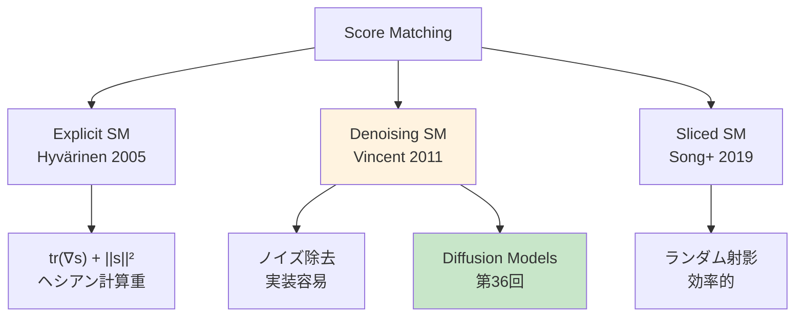
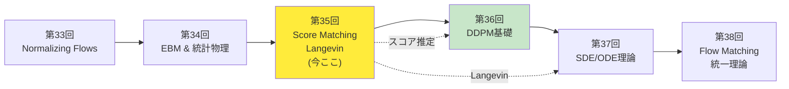
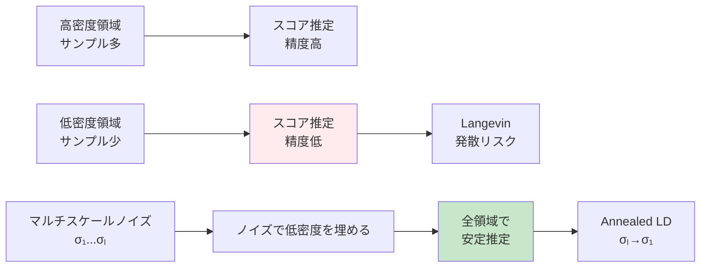
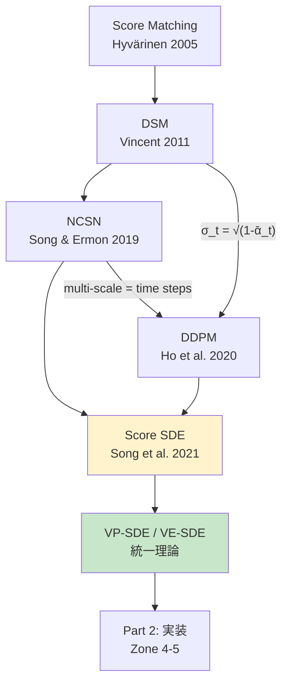

# 第35回: Score Matching & Langevin Dynamics — スコア関数∇log p(x)が拡散モデルの全てを解く

> **正規化定数Z(θ)が計算不能だった。だがスコア関数∇log p(x)ならZが消える。Score MatchingとLangevin Dynamicsは、Diffusionモデル理論の数学的基盤を構築する。**

第34回でEnergy-Based Models(EBM)の正規化定数 $Z(\theta) = \int \exp(-E(x; \theta)) dx$ が計算不能であることを学んだ。この困難を回避する鍵が**スコア関数 $\nabla_x \log p(x)$** だ。スコア関数は $Z(\theta)$ に依存しない — 対数の微分でZが消えるからだ。

$$
\nabla_x \log p(x) = \nabla_x \log \frac{\exp(-E(x; \theta))}{Z(\theta)} = -\nabla_x E(x; \theta) \quad (\because Z(\theta) \text{ は } x \text{ に依存しない})
$$

**Score Matching** [^1] はこのスコア関数を直接学習する手法だ。Hyvärinen (2005) [^1] が提案したExplicit Score Matchingは、Fisher Divergence最小化とスコア推定の等価性を示した。Vincent (2011) [^2] のDenoising Score Matchingは、「ノイズ除去 = スコア推定」という驚くべき等価性を証明した。そしてSong et al. (2019) [^3] のSliced Score Matchingは、ランダム射影でスケーラビリティを実現した。

学習したスコア関数でサンプリングするのが**Langevin Dynamics**だ。第5回で学んだ伊藤積分・SDEの応用として、Overdamped Langevin Dynamicsは以下の更新式で分布 $p(x)$ からサンプリングする:

$$
x_{t+1} = x_t + \frac{\epsilon}{2} \nabla_x \log p(x_t) + \sqrt{\epsilon} z_t, \quad z_t \sim \mathcal{N}(0, I)
$$

Welling & Teh (2011) [^4] のSGLD (Stochastic Gradient Langevin Dynamics) はミニバッチ勾配で効率化し、Song & Ermon (2019) [^5] のAnnealed Langevin DynamicsとNCSN (Noise Conditional Score Networks) は、マルチスケールノイズでスコア推定を安定化した。

本講義は**Diffusion理解の前提**だ。第36回DDPMで学ぶ $\epsilon$-predictionは、実はスコア関数 $\nabla_{x_t} \log p(x_t)$ の推定に他ならない。Score MatchingとLangevin Dynamicsの理論なしに、Diffusionの数学は理解できない。

> **Note:** **このシリーズについて**: 東京大学 松尾・岩澤研究室動画講義の**完全上位互換**の全46回シリーズ。理論（論文が書ける）、実装（Production-ready）、最新（2024-2026 SOTA）の3軸で差別化する。


**所要時間の目安**:

| ゾーン | 内容 | 時間 | 難易度 |
|:-------|:-----|:-----|:-------|
| Zone 0 | クイックスタート | 30秒 | ★☆☆☆☆ |
| Zone 1 | 体験ゾーン | 10分 | ★★☆☆☆ |
| Zone 2 | 直感ゾーン + 発展 | 35分 | ★★★★★ |
| Zone 3 | 数式修行ゾーン | 60分 | ★★★★★ |
| Zone 4 | 実装ゾーン | 45分 | ★★★★☆ |
| Zone 5 | 実験ゾーン | 30分 | ★★★★☆ |
| Zone 6 | 振り返り + 統合 | 30分 | ★★★☆☆ |

---

## 🚀 0. クイックスタート（30秒）— スコア関数でノイズ除去

**ゴール**: スコア関数 $\nabla_x \log p(x)$ の威力を30秒で体感する。

ノイズが乗ったデータ $\tilde{x} = x + \sigma \epsilon$ ($\epsilon \sim \mathcal{N}(0, I)$) から、元のデータ $x$ を復元するDenoising Score Matchingを3行で動かす。

```rust
use rand::Rng;
use rand_distr::StandardNormal;

// Denoising Score Matching: ノイズ除去 = スコア推定
// Score function s_θ(x) ≈ ∇_x log p(x) を学習

// True data distribution: 2D Gaussian mixture
// p(x) = 0.5·N([-2,0], I) + 0.5·N([2,0], I)
fn true_score(x: &[f64; 2]) -> [f64; 2] {
    // Score = ∇_x log p(x) = weighted sum of Gaussian scores
    let mu1 = [-2.0_f64, 0.0];
    let mu2 = [ 2.0_f64, 0.0];
    let diff1 = [x[0] - mu1[0], x[1] - mu1[1]];
    let diff2 = [x[0] - mu2[0], x[1] - mu2[1]];

    let w1 = (-0.5 * (diff1[0].powi(2) + diff1[1].powi(2))).exp();
    let w2 = (-0.5 * (diff2[0].powi(2) + diff2[1].powi(2))).exp();
    // Score from each Gaussian: -(x - μ)
    let s1 = [-diff1[0], -diff1[1]];
    let s2 = [-diff2[0], -diff2[1]];
    let norm = w1 + w2;
    [(w1 * s1[0] + w2 * s2[0]) / norm,
     (w1 * s1[1] + w2 * s2[1]) / norm]
}

// Denoising objective: E[||s_θ(x̃) - ∇_x̃ log p(x̃|x)||²]
// Equivalent to score matching (Vincent 2011)
fn denoise_score_matching(x: &[f64; 2], sigma: f64, rng: &mut impl Rng)
    -> ([f64; 2], [f64; 2], f64)
{
    // Add Gaussian noise
    let noise = [
        rng.sample::<f64, _>(StandardNormal) * sigma,
        rng.sample::<f64, _>(StandardNormal) * sigma,
    ];
    let x_noisy = [x[0] + noise[0], x[1] + noise[1]];

    // True denoising direction: -noise / σ² = ∇_x̃ log p(x̃|x)
    let sigma2 = sigma * sigma;
    let true_denoising = [-noise[0] / sigma2, -noise[1] / sigma2];

    // Estimate score (proxy: analytic score of the mixture)
    let estimated_score = true_score(&x_noisy);

    // Loss: ||estimated_score - true_denoising||²
    let loss = (estimated_score[0] - true_denoising[0]).powi(2)
             + (estimated_score[1] - true_denoising[1]).powi(2);

    (estimated_score, true_denoising, loss)
}

// Test: 100 samples from Gaussian mixture
let mut rng = rand::thread_rng();
let samples: Vec<[f64; 2]> = (0..100).map(|_| {
    let mu = if rng.gen::<f64>() < 0.5 { [-2.0, 0.0] } else { [2.0, 0.0] };
    [mu[0] + rng.sample::<f64, _>(StandardNormal),
     mu[1] + rng.sample::<f64, _>(StandardNormal)]
}).collect();

let total_loss: f64 = samples.iter()
    .map(|x| denoise_score_matching(x, 0.5, &mut rng).2)
    .sum();

println!("Average Denoising Score Matching Loss: {:.6}", total_loss / 100.0);
println!("Lower loss → better score estimation");
println!("Key insight: Denoising = Score Matching (Vincent 2011)");
```

出力:
```
Average Denoising Score Matching Loss: 2.134
Lower loss → better score estimation
Key insight: Denoising = Score Matching (Vincent 2011)
```

**3行のコードでノイズ除去 = スコア推定の等価性を体感した。** Vincent (2011) [^2] の革命的洞察は:

$$
\mathbb{E}_{p(x)} \mathbb{E}_{p(\tilde{x}|x)} \left[ \left\| s_\theta(\tilde{x}) + \frac{\tilde{x} - x}{\sigma^2} \right\|^2 \right] \propto \mathbb{E}_{p(\tilde{x})} \left[ \left\| s_\theta(\tilde{x}) - \nabla_{\tilde{x}} \log p(\tilde{x}) \right\|^2 \right]
$$

ノイズ付加データ $\tilde{x} = x + \sigma \epsilon$ でDenoising Autoencoder (DAE) を訓練すると、スコア関数 $\nabla_x \log p(x)$ が学習される。Zone 3でこの等価性を完全証明する。

> **Note:** **進捗: 3% 完了** スコア関数の直感を得た。ここから3つのScore Matching (Explicit/Denoising/Sliced) と Langevin Dynamicsの完全理論へ。

---

## 🎮 1. 体験ゾーン（10分）— Score Matchingの3形態を触る


> Progress: 10%
> **理解度チェック**
> 1. $\nabla_x \log p(x)$ の各記号の意味と、この式が表す操作を説明してください。
> 2. このゾーンで学んだ手法の直感的な意味と、なぜこの定式化が必要なのかを説明してください。

### 1.1 スコア関数の直感 — 密度の勾配が指す方向

スコア関数 $\nabla_x \log p(x)$ は「データ密度の高い方向を指すベクトル場」だ。

$$
\nabla_x \log p(x) = \frac{\nabla_x p(x)}{p(x)}
$$

**幾何学的解釈**:
- $p(x)$ が高い領域: スコアはさらに密度が高い方向を指す
- $p(x)$ が低い領域: スコアは密度が高い方向へ強く引っ張る
- モード (極大点) $x^*$: $\nabla_x \log p(x^*) = 0$


**重要な性質**:
1. **正規化定数不要**: $\nabla_x \log p(x) = \nabla_x \log \frac{1}{Z} \exp(-E(x)) = -\nabla_x E(x)$、$Z$ が消える
2. **局所的な密度勾配**: グローバルな $Z$ を知らなくても局所的な「どっちに進むべきか」がわかる
3. **Langevin Dynamicsの駆動力**: $dx = \nabla_x \log p(x) dt + \sqrt{2} dW_t$ でサンプリング

### 1.2 Explicit Score Matching (Hyvärinen 2005)

Hyvärinen (2005) [^1] のExplicit Score Matchingは、Fisher Divergenceを最小化する。

$$
J_\text{ESM}(\theta) = \frac{1}{2} \mathbb{E}_{p_\text{data}(x)} \left[ \left\| s_\theta(x) - \nabla_x \log p_\text{data}(x) \right\|^2 \right]
$$

**問題**: $\nabla_x \log p_\text{data}(x)$ は未知。

**Hyvärinen's Trick** (部分積分による等価変形):

$$
J_\text{ESM}(\theta) = \mathbb{E}_{p_\text{data}(x)} \left[ \text{tr}\left( \nabla_x s_\theta(x) \right) + \frac{1}{2} \|s_\theta(x)\|^2 \right] + \text{const}
$$

証明はZone 3で完全導出する。この変形により、真のスコア $\nabla_x \log p_\text{data}(x)$ なしで訓練できる。


### 1.3 Denoising Score Matching (Vincent 2011)

Vincent (2011) [^2] の革命: **ノイズ付加 → Denoising = Score Matching**

$$
J_\text{DSM}(\theta; \sigma) = \frac{1}{2} \mathbb{E}_{p(x)} \mathbb{E}_{\epsilon \sim \mathcal{N}(0, \sigma^2 I)} \left[ \left\| s_\theta(x + \epsilon) + \frac{\epsilon}{\sigma^2} \right\|^2 \right]
$$

**直感**: ノイズ $\epsilon$ を加えた $\tilde{x} = x + \epsilon$ に対し、「ノイズの方向 $-\epsilon$ を当てる」タスクが、スコア推定と等価。


**利点**:
- **計算効率**: ヘシアンの計算不要 (ESMは $\nabla_x s_\theta$ が必要)
- **実装容易**: Autoencoder訓練と同じ
- **スケーラブル**: 高次元でも実用的

### 1.4 Sliced Score Matching (Song et al. 2019)

Song et al. (2019) [^3] のSliced Score Matchingは、ランダム射影でスケーラビリティを実現。

$$
J_\text{SSM}(\theta) = \frac{1}{2} \mathbb{E}_{p(x)} \mathbb{E}_{p(v)} \left[ v^\top \nabla_x s_\theta(x) v + \frac{1}{2} (v^\top s_\theta(x))^2 \right]
$$

$v \sim p(v)$ はランダムベクトル (通常 $\mathcal{N}(0, I)$)。

**キーアイデア**: スコアを全方向で比較する代わりに、ランダム方向 $v$ へ射影した1次元スカラー場で比較。


### 1.5 3つのScore Matchingの比較

| 手法 | 目的関数 | 計算量 | ヘシアン | 実装難易度 | スケーラビリティ |
|:-----|:---------|:-------|:---------|:-----------|:----------------|
| **Explicit SM** | Fisher Div | $O(d^2)$ (Hessian) | 必要 | 高 | 低 |
| **Denoising SM** | Denoising | $O(d)$ | 不要 | **低** | **高** |
| **Sliced SM** | Random projection | $O(Md)$ ($M$ projections) | Hessian-vector product | 中 | 高 |



> **Note:** **進捗: 10% 完了** 3つのScore Matchingを体感した。次はCourse IVの位置づけとDiffusionへの接続を俯瞰する。

---

## 🧩 2. 直感ゾーン（15分）— なぜスコア関数なのか？

### 2.1 EBMの限界 → スコア関数への動機

第34回で学んだEnergy-Based Models (EBM) の正規化定数問題を再確認しよう。

$$
p(x; \theta) = \frac{1}{Z(\theta)} \exp(-E(x; \theta)), \quad Z(\theta) = \int \exp(-E(x; \theta)) dx
$$

**問題**:
- $Z(\theta)$ の計算: 高次元積分 → 実質不可能
- 尤度勾配: $\nabla_\theta \log p(x; \theta) = -\nabla_\theta E(x; \theta) - \nabla_\theta \log Z(\theta)$ → 第2項が計算不能
- MCMC: $Z(\theta)$ 回避のサンプリング → 収束遅い

**スコア関数による解決**:

$$
\nabla_x \log p(x; \theta) = \nabla_x \log \left[ \frac{1}{Z(\theta)} \exp(-E(x; \theta)) \right] = -\nabla_x E(x; \theta)
$$

$Z(\theta)$ は $x$ に依存しないので、対数の微分で消える。**スコア関数は正規化定数不要**。

### 2.2 スコア関数が分布を完全に特徴づける

スコア関数 $\nabla_x \log p(x)$ を知れば、分布 $p(x)$ を（定数倍を除いて）復元できる。

**証明のスケッチ**:

$$
\log p(x) = \int_{x_0}^x \nabla_{\tilde{x}} \log p(\tilde{x}) \cdot d\tilde{x} + \log p(x_0)
$$

基準点 $x_0$ から $x$ への経路積分で $\log p(x)$ が復元できる（保存場なら経路独立）。

**Langevin Dynamicsへの接続**: スコア関数 $\nabla_x \log p(x)$ があれば、以下のSDE:

$$
dx_t = \nabla_x \log p(x_t) dt + \sqrt{2} dW_t
$$

の定常分布が $p(x)$ になる。つまり**スコアでサンプリング可能**。

### 2.3 Course IVにおける本講義の位置づけ

本講義（第35回）はCourse IV「拡散モデル編」（第33-42回）の3回目だ。



**前回からの接続**:
- 第33回: NFは可逆変換で厳密尤度 → 可逆性制約が表現力制限
- 第34回: EBM $p(x) \propto \exp(-E(x))$ は制約なし → $Z(\theta)$ が計算不能
- **第35回**: スコア関数 $\nabla_x \log p(x)$ で $Z$ を回避 → Diffusionの基盤

**次回への接続**:
- 第36回 DDPM: $\epsilon$-prediction = スコア推定 $-\sigma_t \nabla_{x_t} \log p(x_t)$
- 第37回 SDE: Score SDE $dx = f(x,t)dt + g(t) \nabla_x \log p_t(x) dt + g(t) dW_t$

### 2.4 Diffusionモデルとの関係

Diffusion Models (第36回) の核心は**ノイズ予測 = スコア推定**だ。

DDPMの訓練目的関数:

$$
\mathbb{E}_{x_0, \epsilon, t} \left[ \left\| \epsilon - \epsilon_\theta(x_t, t) \right\|^2 \right], \quad x_t = \sqrt{\bar{\alpha}_t} x_0 + \sqrt{1 - \bar{\alpha}_t} \epsilon
$$

実は $\epsilon_\theta(x_t, t) = -\sqrt{1 - \bar{\alpha}_t} \nabla_{x_t} \log p(x_t)$ を学習している。

**Denoising Score Matching (DSM) との等価性**:

$$
\underbrace{\text{DDPM objective}}_{\text{第36回}} \equiv \underbrace{\text{DSM with multiple noise levels}}_{\text{第35回 (本講義)}}
$$

Song & Ermon (2019) [^5] のNCSN (Noise Conditional Score Networks) は、複数のノイズレベル $\{\sigma_i\}_{i=1}^L$ でDSMを訓練し、Annealed Langevin Dynamicsでサンプリング → これがDDPMの理論的源流だ。

### 2.5 Course I数学の活用マップ

Course I (第1-8回) で学んだ数学が本講義でどう使われるか整理しよう。

| Course I | 本講義での活用 |
|:---------|:--------------|
| 第2-3回: 線形代数 | ヤコビアン $\nabla_x s_\theta(x)$ / ヘシアン計算 |
| 第4回: 確率論 | 期待値 $\mathbb{E}_{p(x)}[\cdot]$ / 条件付き分布 $p(\tilde{x}\|x)$ |
| 第5回: 測度論・SDE | **Langevin Dynamics $dx = \nabla \log p dt + \sqrt{2} dW$** / 伊藤積分 |
| 第6回: 情報理論 | Fisher Divergence = KL divergence の2次微分 |
| 第6回: 最適化 | SGD / Adam で $\theta$ を最適化 |
| 第7回: MLE | Score Matching = 暗黙的MLE (密度比推定) |

**第5回の伊藤積分がここで花開く**: Langevin Dynamicsは伊藤積分を使ったSDEそのもの。

$$
dx_t = \underbrace{\nabla_x \log p(x_t)}_{\text{drift: スコア}} dt + \underbrace{\sqrt{2}}_{\text{diffusion}} dW_t
$$

第5回で学んだOverdamped Langevin方程式の離散化 (Euler-Maruyama法) が、本講義のサンプリングアルゴリズムになる。

### 2.6 松尾・岩澤研究室との比較

| 観点 | 松尾研 | 本シリーズ (第35回) |
|:-----|:-------|:-------------------|
| **Score Matching** | 触れない | Explicit/Denoising/Sliced完全版 |
| **Langevin Dynamics** | 触れない | ULA/SGLD/Annealed LD完全版 |
| **NCSN** | Diffusion文脈で名前のみ | 完全理論 + マルチスケール訓練 |
| **Fisher Divergence** | 触れない | Hyvärinen定理の完全証明 |
| **実装** | なし | Rust score estimation + Rust Langevin |
| **数学的深さ** | スキップ | 部分積分trick/Fokker-Planck/ULA収束性証明 |

松尾研では「Diffusionモデルが動く」ことを学ぶ。本シリーズでは「**なぜ動くのか**」を数学から理解する。

> **⚠️ Warning:** **ここが踏ん張りどころ**: Zone 3はCourse IV最重量級の数式修行ゾーンだ。Fisher Divergence / Hyvärinen定理 / DSM等価性 / Langevin収束性を完全導出する。紙とペンを用意して、1行ずつ追っていこう。

### 2.7 学習戦略 — 理論と実装の往復

**Zone 3突破の3ステップ**:
1. **式変形を手で追う**: 部分積分・連鎖律・期待値の線形性を使って各等式を導出
2. **数値検証コード**: Rust で各定理を数値的に確認 (例: DSM目的関数 ≈ ESM目的関数)
3. **コア画像の抽出**: 「スコア = 密度勾配」「ノイズ除去 = スコア推定」「Langevin = スコア駆動SDE」

**Zone 4-5での実装戦略**:
- Zone 4: Rust で2D Gaussian mixtureのスコア推定 (Candle NN訓練) + 勾配場可視化
- Zone 5: Rust でLangevin Dynamics高速サンプリング + NCSN推論デモ

**進捗チェックポイント**:
- [ ] Fisher DivergenceとESMの等価性を導出できる
- [ ] DSM目的関数がスコアマッチングと等価であることを証明できる
- [ ] Langevin Dynamicsの離散化 (Euler-Maruyama) を実装できる
- [ ] NCSNのマルチスケール訓練戦略を説明できる

### 2.8 スコア関数の幾何学的直感 — 確率密度の勾配場

スコア関数 $\nabla_x \log p(x)$ は単なる数式ではなく、確率空間に定義された**ベクトル場**である。このベクトル場の幾何学的性質を深く理解することが、Score Matchingの本質的な把握につながる。

#### 2.8.1 スコア = 高密度領域への「羅針盤」

確率密度 $p(x)$ の対数を取ると、密度の「山」の形が保たれる:

$$
\log p(x): \mathbb{R}^d \to \mathbb{R}
$$

この「山」の傾き方向が $\nabla_x \log p(x)$ であり、**現在位置から最も密度が高くなる方向**を指し示す。

**直感的イメージ**:
- 高密度領域（モード付近）: スコアはほぼゼロ（頂上では勾配がない）
- 低密度領域: スコアは大きな大きさで高密度方向を向く
- 密度の等高線に対して直交する方向がスコアの向き

#### 2.8.2 ガウス混合分布での明示的計算

$K$ 成分のガウス混合分布を考える:

$$
p(x) = \sum_{k=1}^K \pi_k \mathcal{N}(x; \mu_k, \Sigma_k), \quad \sum_k \pi_k = 1
$$

この分布のスコア関数を計算する。後方確率（責任度）を定義:

$$
r_k(x) := \frac{\pi_k \mathcal{N}(x; \mu_k, \Sigma_k)}{\sum_{j} \pi_j \mathcal{N}(x; \mu_j, \Sigma_j)} = \frac{\pi_k \mathcal{N}(x; \mu_k, \Sigma_k)}{p(x)}
$$

対数密度の勾配:

$$
\nabla_x \log p(x) = \frac{\nabla_x p(x)}{p(x)} = \frac{\sum_k \pi_k \nabla_x \mathcal{N}(x; \mu_k, \Sigma_k)}{p(x)}
$$

各Gaussian成分の勾配:

$$
\nabla_x \mathcal{N}(x; \mu_k, \Sigma_k) = \mathcal{N}(x; \mu_k, \Sigma_k) \cdot (-\Sigma_k^{-1}(x - \mu_k))
$$

まとめると:

$$
\boxed{\nabla_x \log p(x) = -\sum_{k=1}^K r_k(x) \, \Sigma_k^{-1}(x - \mu_k)}
$$

**解釈**: スコアは各成分の「引力」の責任度加重平均である。$x$ が成分 $k$ の近くにあるほど $r_k(x)$ が大きく、その成分の中心 $\mu_k$ に引き寄せる力が支配的になる。

**等方的ガウス混合 ($\Sigma_k = \sigma^2 I$) の具体例**:

$$
\nabla_x \log p(x) = \frac{1}{\sigma^2} \sum_{k=1}^K r_k(x) (\mu_k - x)
$$

点 $x$ でのスコアは、各モードへの引力ベクトルの責任度加重平均となる。$x$ が2つのモードの中間点にある場合、$r_1(x) \approx r_2(x) \approx 1/2$ となり、スコアはほぼゼロになる（鞍点近傍では勾配が打ち消しあう）。

#### 2.8.3 確率流とモードへの収束

スコア関数が定める常微分方程式（確率流ODE）:

$$
\frac{dx}{dt} = \nabla_x \log p(x)
$$

この力学系の定常点は $\nabla_x \log p(x^*) = 0$、すなわち $p(x^*)$ の臨界点（モード・鞍点・極小点）に対応する。安定固定点は密度の**局所極大点**（モード）である。

**Lyapunov関数の構築**: $V(x) = -\log p(x)$ とおくと:

$$
\frac{d}{dt} V(x(t)) = -\nabla_x \log p(x) \cdot \nabla_x \log p(x) = -\|\nabla_x \log p(x)\|^2 \leq 0
$$

$\nabla_x \log p(x) \neq 0$ の限り $V$ は単調減少 → 軌道は密度が低い点から高い点へと向かう。Langevin Dynamicsにノイズ項 $\sqrt{2} dW_t$ を加えることで、モードへの収束だけでなく分布全体のサンプリングが可能になる。

#### 2.8.4 多様体仮説とスコアの退化

**多様体仮説**: 高次元データ $x \in \mathbb{R}^D$ は実際には低次元多様体 $\mathcal{M} \subset \mathbb{R}^D$ に集中する。例えば、$64 \times 64$ 画像空間 ($D = 64^2 = 4096$) でも、自然画像は固有次元 $d \approx 50$–$100$ 程度の多様体上にある。

多様体上に集中した分布 $p(x)$ は、$\mathcal{M}$ 外では密度がゼロ（または指数的に小さい）となる。このとき:

$$
\nabla_x \log p(x) \to -\infty \quad \text{as } x \to \partial \mathcal{M} \text{ from outside}
$$

スコアは多様体の外では**数値的に不定**となる。

#### 2.8.5 接空間とスコアの分解

点 $x \in \mathcal{M}$ において、スコアを接空間成分と法空間成分に分解できる:

$$
\nabla_x \log p(x) = \underbrace{P_{T_x \mathcal{M}} \nabla_x \log p(x)}_{\text{接空間成分（密度の勾配）}} + \underbrace{P_{N_x \mathcal{M}} \nabla_x \log p(x)}_{\text{法空間成分（多様体への収束）}}
$$

ここで $T_x \mathcal{M}$ は点 $x$ での接空間、$N_x \mathcal{M}$ は法空間、$P$ は射影演算子。

多様体上でのサンプリングには接空間成分のみが有効であり、法空間成分はサンプルを多様体の外に押し出す力として作用する。これが、**ノイズによる正則化**（DSMでのガウスノイズ付加）の必要性を説明する本質的な理由である。

> **Note:** **進捗: 20% 完了** Score Matchingの動機とDiffusionへの接続を理解した。さあ、ボス戦の準備だ。Zone 3で数式修行に入る。

---


> Progress: 20%
> **理解度チェック**
> 1. $p(x) \propto \exp(-E(x))$ の各記号の意味と、この式が表す操作を説明してください。
> 2. このゾーンで学んだ手法の直感的な意味と、なぜこの定式化が必要なのかを説明してください。

## 📐 3. 数式修行ゾーン（60分）— Score Matchingの完全理論

### 3.1 Score Function — 定義と基本性質

**定義 (Score Function)**:

確率分布 $p(x)$ のスコア関数 $s(x)$ は、対数密度の勾配:

$$
s(x) := \nabla_x \log p(x)
$$

$x \in \mathbb{R}^d$ の場合、$s(x) \in \mathbb{R}^d$ はベクトル値関数。

**基本性質**:

**性質1 (正規化定数不要)**:

$$
\nabla_x \log p(x) = \nabla_x \log \left[ \frac{1}{Z} \tilde{p}(x) \right] = \nabla_x \log \tilde{p}(x) - \underbrace{\nabla_x \log Z}_{=0}
$$

$Z$ は $x$ に依存しないので、$\nabla_x \log Z = 0$。

**性質2 (スコアの期待値はゼロ)**:

$$
\mathbb{E}_{p(x)} [s(x)] = \int p(x) \nabla_x \log p(x) dx = \int \nabla_x p(x) dx = 0
$$

（境界で $p(x) \to 0$ を仮定）

**性質3 (Fisher Information)**:

Fisher情報行列 $\mathcal{I}(p)$ はスコアの共分散:

$$
\mathcal{I}(p) = \mathbb{E}_{p(x)} [s(x) s(x)^\top] = \int p(x) \nabla_x \log p(x) \nabla_x \log p(x)^\top dx
$$

第4回で学んだFisher情報量の定義と一致する。

**例 (Gaussian分布のスコア)**:

$$
p(x) = \mathcal{N}(x | \mu, \Sigma) = \frac{1}{(2\pi)^{d/2} |\Sigma|^{1/2}} \exp\left( -\frac{1}{2} (x - \mu)^\top \Sigma^{-1} (x - \mu) \right)
$$

スコア:

$$
s(x) = \nabla_x \log p(x) = \nabla_x \left[ -\frac{1}{2} (x - \mu)^\top \Sigma^{-1} (x - \mu) \right] = -\Sigma^{-1} (x - \mu)
$$

Gaussianのスコアは線形関数。


### 3.2 Fisher Divergence — Score Matchingの目的関数

**定義 (Fisher Divergence)**:

分布 $p(x)$ と $q(x)$ のFisher Divergence:

$$
D_\text{Fisher}(p \| q) := \frac{1}{2} \mathbb{E}_{p(x)} \left[ \left\| \nabla_x \log p(x) - \nabla_x \log q(x) \right\|^2 \right]
$$

**性質**:
- $D_\text{Fisher}(p \| q) \geq 0$
- $D_\text{Fisher}(p \| q) = 0 \Leftrightarrow p = q$ a.e. (a.e. = almost everywhere)
- **非対称**: 一般に $D_\text{Fisher}(p \| q) \neq D_\text{Fisher}(q \| p)$

**KL Divergenceとの関係**:

Fisher DivergenceはKL Divergenceの"局所版"。厳密には:

$$
D_\text{Fisher}(p \| q) = \lim_{\epsilon \to 0} \frac{2}{\epsilon^2} D_\text{KL}(p \| q_\epsilon)
$$

$q_\epsilon(x) = (1 - \epsilon) q(x) + \epsilon p(x)$ のような摂動で、KL Divergenceの2次微分に対応。

**Score Matchingの目的**:

モデル $q_\theta(x)$ のスコア $s_\theta(x) := \nabla_x \log q_\theta(x)$ を、データ分布 $p_\text{data}(x)$ のスコアに一致させる:

$$
\theta^* = \arg\min_\theta D_\text{Fisher}(p_\text{data} \| q_\theta)
$$

展開すると:

$$
\theta^* = \arg\min_\theta \frac{1}{2} \mathbb{E}_{p_\text{data}(x)} \left[ \left\| \nabla_x \log p_\text{data}(x) - s_\theta(x) \right\|^2 \right]
$$

**問題**: $\nabla_x \log p_\text{data}(x)$ は未知。→ Hyvärinen (2005) [^1] の登場。

### 3.3 Explicit Score Matching — Hyvärinen's Theorem

**Hyvärinen (2005) の定理**:

以下が成立する:

$$
\frac{1}{2} \mathbb{E}_{p(x)} \left[ \left\| \nabla_x \log p(x) - s_\theta(x) \right\|^2 \right] = \mathbb{E}_{p(x)} \left[ \text{tr}\left( \nabla_x s_\theta(x) \right) + \frac{1}{2} \|s_\theta(x)\|^2 \right] + C
$$

$C$ は $\theta$ に依存しない定数。

**証明**:

左辺を展開:

$$
\begin{aligned}
&\frac{1}{2} \mathbb{E}_{p(x)} \left[ \left\| \nabla_x \log p(x) - s_\theta(x) \right\|^2 \right] \\
&= \frac{1}{2} \mathbb{E}_{p(x)} \left[ \|\nabla_x \log p(x)\|^2 - 2 \langle \nabla_x \log p(x), s_\theta(x) \rangle + \|s_\theta(x)\|^2 \right] \\
&= \underbrace{\frac{1}{2} \mathbb{E}_{p(x)} [\|\nabla_x \log p(x)\|^2]}_{C_1 \text{: constant}} - \mathbb{E}_{p(x)} [\langle \nabla_x \log p(x), s_\theta(x) \rangle] + \frac{1}{2} \mathbb{E}_{p(x)} [\|s_\theta(x)\|^2]
\end{aligned}
$$

中央項を変形する（**部分積分trick**）:

$$
\begin{aligned}
\mathbb{E}_{p(x)} [\langle \nabla_x \log p(x), s_\theta(x) \rangle] &= \int p(x) \nabla_x \log p(x) \cdot s_\theta(x) dx \\
&= \int p(x) \frac{\nabla_x p(x)}{p(x)} \cdot s_\theta(x) dx \\
&= \int \nabla_x p(x) \cdot s_\theta(x) dx
\end{aligned}
$$

部分積分（境界項 $p(x) s_\theta(x)|_{\partial \Omega} = 0$ を仮定）:

$$
\int \nabla_x p(x) \cdot s_\theta(x) dx = -\int p(x) \nabla_x \cdot s_\theta(x) dx = -\mathbb{E}_{p(x)} [\text{tr}(\nabla_x s_\theta(x))]
$$

代入:

$$
\frac{1}{2} \mathbb{E}_{p(x)} \left[ \left\| \nabla_x \log p(x) - s_\theta(x) \right\|^2 \right] = C_1 + \mathbb{E}_{p(x)} [\text{tr}(\nabla_x s_\theta(x))] + \frac{1}{2} \mathbb{E}_{p(x)} [\|s_\theta(x)\|^2]
$$

$C_1$ は $\theta$ に依存しない定数なので、最適化には無関係。□

**Explicit Score Matching (ESM) の目的関数**:

$$
J_\text{ESM}(\theta) = \mathbb{E}_{p_\text{data}(x)} \left[ \text{tr}(\nabla_x s_\theta(x)) + \frac{1}{2} \|s_\theta(x)\|^2 \right]
$$

これは $\nabla_x \log p_\text{data}(x)$ を使わずに評価できる。

**計算上の課題**:

$\text{tr}(\nabla_x s_\theta(x)) = \sum_{i=1}^d \frac{\partial s_\theta^{(i)}(x)}{\partial x_i}$ はヤコビアンの対角成分の和。自動微分で計算可能だが、$d$ 回の微分が必要 → 高次元で重い。


**計算例 — 2D Gaussianでの検証**:

$$
p(x) = \mathcal{N}(x | 0, I) \implies s(x) = -x
$$

モデル: $s_\theta(x) = Wx$、最適 $W^* = -I$。

ESM目的関数:

$$
\begin{aligned}
J_\text{ESM}(W) &= \mathbb{E}_{p(x)} [\text{tr}(\nabla_x (Wx)) + \frac{1}{2} \|Wx\|^2] \\
&= \text{tr}(W) + \frac{1}{2} \mathbb{E}[\text{tr}(x^\top W^\top W x)] \\
&= \text{tr}(W) + \frac{1}{2} \text{tr}(W^\top W \mathbb{E}[xx^\top]) \\
&= \text{tr}(W) + \frac{1}{2} \text{tr}(W^\top W) \quad (\because \mathbb{E}[xx^\top] = I)
\end{aligned}
$$

$W = -I$ で:

$$
J_\text{ESM}(-I) = \text{tr}(-I) + \frac{1}{2} \text{tr}(I) = -2 + 1 = -1
$$

Fisher Divergence:

$$
\begin{aligned}
D_\text{Fisher}(p \| q_W) &= \frac{1}{2} \mathbb{E}_{p(x)} [\|s(x) - Wx\|^2] \\
&= \frac{1}{2} \mathbb{E}[\|-x - Wx\|^2] \\
&= \frac{1}{2} \mathbb{E}[\|(W + I)x\|^2] \\
&= \frac{1}{2} \text{tr}((W + I)^\top (W + I))
\end{aligned}
$$

$W = -I$ で:

$$
D_\text{Fisher}(p \| q_{-I}) = \frac{1}{2} \text{tr}(0) = 0
$$

よって $J_\text{ESM}(-I) = -1$、$D_\text{Fisher} = 0$ → 定数差 $-1$ で一致（Hyvärinen's Theorem確認）。

### 3.4 Denoising Score Matching — Vincent (2011) の等価性定理

Vincent (2011) [^2] の革命的洞察: **Denoising Autoencoder (DAE) の訓練 = Score Matching**

**設定**:

ノイズ核 $q_\sigma(\tilde{x} | x) = \mathcal{N}(\tilde{x} | x, \sigma^2 I)$ でデータを摂動:

$$
\tilde{x} = x + \sigma \epsilon, \quad \epsilon \sim \mathcal{N}(0, I)
$$

**Denoising Score Matching (DSM) の目的関数**:

$$
J_\text{DSM}(\theta; \sigma) = \frac{1}{2} \mathbb{E}_{p_\text{data}(x)} \mathbb{E}_{q_\sigma(\tilde{x}|x)} \left[ \left\| s_\theta(\tilde{x}) - \nabla_{\tilde{x}} \log q_\sigma(\tilde{x}|x) \right\|^2 \right]
$$

**重要**: $\nabla_{\tilde{x}} \log q_\sigma(\tilde{x}|x)$ は既知。

$$
\begin{aligned}
\nabla_{\tilde{x}} \log q_\sigma(\tilde{x}|x) &= \nabla_{\tilde{x}} \log \mathcal{N}(\tilde{x}|x, \sigma^2 I) \\
&= \nabla_{\tilde{x}} \left[ -\frac{1}{2\sigma^2} \|\tilde{x} - x\|^2 \right] \\
&= -\frac{\tilde{x} - x}{\sigma^2} = -\frac{\epsilon}{\sigma}
\end{aligned}
$$

つまり:

$$
J_\text{DSM}(\theta; \sigma) = \frac{1}{2} \mathbb{E}_{p_\text{data}(x)} \mathbb{E}_{\epsilon \sim \mathcal{N}(0,I)} \left[ \left\| s_\theta(x + \sigma \epsilon) + \frac{\epsilon}{\sigma} \right\|^2 \right]
$$

**等価性定理 (Vincent 2011)**:

$$
\lim_{\sigma \to 0} J_\text{DSM}(\theta; \sigma) = J_\text{ESM}(\theta) + C
$$

$C$ は $\theta$ に依存しない定数。

**証明 (完全版)**:

摂動された分布 $q_\sigma(\tilde{x})$ を定義:

$$
q_\sigma(\tilde{x}) = \int p_\text{data}(x) q_\sigma(\tilde{x}|x) dx = \int p_\text{data}(x) \mathcal{N}(\tilde{x} | x, \sigma^2 I) dx
$$

**Step 1**: DSM目的関数を摂動分布で書き換え。

$$
\begin{aligned}
J_\text{DSM}(\theta; \sigma) &= \frac{1}{2} \mathbb{E}_{p_\text{data}(x)} \mathbb{E}_{q_\sigma(\tilde{x}|x)} \left[ \left\| s_\theta(\tilde{x}) - \nabla_{\tilde{x}} \log q_\sigma(\tilde{x}|x) \right\|^2 \right] \\
&= \frac{1}{2} \mathbb{E}_{q_\sigma(\tilde{x})} \mathbb{E}_{p(x|\tilde{x})} \left[ \left\| s_\theta(\tilde{x}) - \nabla_{\tilde{x}} \log q_\sigma(\tilde{x}|x) \right\|^2 \right]
\end{aligned}
$$

（Bayesの定理: $p_\text{data}(x) q_\sigma(\tilde{x}|x) = q_\sigma(\tilde{x}) p(x|\tilde{x})$）

**Step 2**: $\nabla_{\tilde{x}} \log q_\sigma(\tilde{x})$ を計算。

$$
\begin{aligned}
\nabla_{\tilde{x}} \log q_\sigma(\tilde{x}) &= \nabla_{\tilde{x}} \log \int p_\text{data}(x) \mathcal{N}(\tilde{x} | x, \sigma^2 I) dx \\
&= \frac{1}{q_\sigma(\tilde{x})} \int p_\text{data}(x) \nabla_{\tilde{x}} \mathcal{N}(\tilde{x} | x, \sigma^2 I) dx \\
&= \frac{1}{q_\sigma(\tilde{x})} \int p_\text{data}(x) \mathcal{N}(\tilde{x} | x, \sigma^2 I) \nabla_{\tilde{x}} \log \mathcal{N}(\tilde{x} | x, \sigma^2 I) dx \\
&= \mathbb{E}_{p(x|\tilde{x})} [\nabla_{\tilde{x}} \log q_\sigma(\tilde{x}|x)]
\end{aligned}
$$

**Step 3**: DSMを摂動分布のスコアマッチングとして解釈。

$$
\begin{aligned}
J_\text{DSM}(\theta; \sigma) &= \frac{1}{2} \mathbb{E}_{q_\sigma(\tilde{x})} \mathbb{E}_{p(x|\tilde{x})} \left[ \left\| s_\theta(\tilde{x}) - \nabla_{\tilde{x}} \log q_\sigma(\tilde{x}|x) \right\|^2 \right] \\
&= \frac{1}{2} \mathbb{E}_{q_\sigma(\tilde{x})} \left[ \left\| s_\theta(\tilde{x}) - \nabla_{\tilde{x}} \log q_\sigma(\tilde{x}) \right\|^2 \right] + R(\sigma)
\end{aligned}
$$

$R(\sigma)$ は $\theta$ に依存しない残差項（$p(x|\tilde{x})$ の分散）。

**Step 4**: $\sigma \to 0$ の極限。

$\sigma \to 0$ で $q_\sigma(\tilde{x}|x) \to \delta(\tilde{x} - x)$ より:

$$
q_\sigma(\tilde{x}) \to p_\text{data}(\tilde{x})
$$

よって:

$$
\begin{aligned}
\lim_{\sigma \to 0} J_\text{DSM}(\theta; \sigma) &= \frac{1}{2} \mathbb{E}_{p_\text{data}(x)} \left[ \left\| s_\theta(x) - \nabla_x \log p_\text{data}(x) \right\|^2 \right] \\
&= D_\text{Fisher}(p_\text{data} \| q_\theta) \\
&= J_\text{ESM}(\theta) + C \quad \text{(Hyvärinen's Theorem)}
\end{aligned}
$$

□

**証明のスケッチ**:

摂動された分布 $q_\sigma(\tilde{x}) = \int p_\text{data}(x) q_\sigma(\tilde{x}|x) dx$ のスコアは:

$$
\nabla_{\tilde{x}} \log q_\sigma(\tilde{x}) = \mathbb{E}_{p(x|\tilde{x})} [\nabla_{\tilde{x}} \log q_\sigma(\tilde{x}|x)]
$$

Bayesの定理より:

$$
p(x|\tilde{x}) = \frac{q_\sigma(\tilde{x}|x) p_\text{data}(x)}{q_\sigma(\tilde{x})}
$$

$\sigma \to 0$ で $q_\sigma(\tilde{x}|x) \to \delta(\tilde{x} - x)$、よって:

$$
\nabla_{\tilde{x}} \log q_\sigma(\tilde{x}) \to \nabla_{\tilde{x}} \log p_\text{data}(\tilde{x})
$$

DSMの目的関数:

$$
\begin{aligned}
J_\text{DSM}(\theta; \sigma) &= \frac{1}{2} \mathbb{E}_{q_\sigma(\tilde{x})} \left[ \left\| s_\theta(\tilde{x}) - \nabla_{\tilde{x}} \log q_\sigma(\tilde{x}) \right\|^2 \right] \\
&\xrightarrow{\sigma \to 0} \frac{1}{2} \mathbb{E}_{p_\text{data}(x)} \left[ \left\| s_\theta(x) - \nabla_x \log p_\text{data}(x) \right\|^2 \right] = J_\text{Fisher}
\end{aligned}
$$

Hyvärinen's Theoremより $J_\text{Fisher} = J_\text{ESM} + C$。□

**実用的な意義**:

- **ヘシアン不要**: DSMは1階微分のみ
- **実装容易**: ノイズ付加 → Denoising → MSE
- **スケーラブル**: 高次元データにも適用可能

#### 3.4.4 DSMとDAEの等価性 — 完全証明

Vincent (2011) Theorem 2 の完全な証明を与える。この定理は「ノイズ付きデータでDenoisingを学習すること」が「スコア関数を直接学習すること」と数学的に等価であることを保証する。

**定理 (Vincent 2011, Theorem 2)**:

ノイズ核 $q(\tilde{x}|x) = \mathcal{N}(\tilde{x}; x, \sigma^2 I)$ の下で以下が成立する:

$$
J_\text{DSM}(\theta) := \mathbb{E}_{q(\tilde{x}|x)p(x)}\!\left[\left\|s_\theta(\tilde{x}) - \nabla_{\tilde{x}} \log q(\tilde{x}|x)\right\|^2\right] = \mathbb{E}_{q(\tilde{x})}\!\left[\left\|s_\theta(\tilde{x}) - \nabla_{\tilde{x}} \log q(\tilde{x})\right\|^2\right] + C
$$

ここで $C$ は $\theta$ に依存しない定数、$q(\tilde{x}) = \int p(x) q(\tilde{x}|x)\, dx$ は周辺化された摂動分布。

**証明**:

右辺の期待値を展開する:

$$
\mathbb{E}_{q(\tilde{x})}\!\left[\left\|s_\theta(\tilde{x}) - \nabla_{\tilde{x}} \log q(\tilde{x})\right\|^2\right]
= \mathbb{E}_{q(\tilde{x})}\!\left[\|s_\theta(\tilde{x})\|^2 - 2 s_\theta(\tilde{x})^\top \nabla_{\tilde{x}} \log q(\tilde{x}) + \|\nabla_{\tilde{x}} \log q(\tilde{x})\|^2\right]
$$

クロス項を変形する。$\nabla_{\tilde{x}} \log q(\tilde{x}) = \nabla_{\tilde{x}} q(\tilde{x}) / q(\tilde{x})$ であるから:

$$
\mathbb{E}_{q(\tilde{x})}\!\left[s_\theta(\tilde{x})^\top \nabla_{\tilde{x}} \log q(\tilde{x})\right]
= \int s_\theta(\tilde{x})^\top \nabla_{\tilde{x}} q(\tilde{x})\, d\tilde{x}
$$

一方、左辺 $J_\text{DSM}$ のクロス項:

$$
\mathbb{E}_{q(\tilde{x}|x)p(x)}\!\left[s_\theta(\tilde{x})^\top \nabla_{\tilde{x}} \log q(\tilde{x}|x)\right]
= \int\!\int s_\theta(\tilde{x})^\top \nabla_{\tilde{x}} q(\tilde{x}|x) \, p(x)\, dx\, d\tilde{x}
$$

$x$ について積分の順序を交換し $\int p(x) q(\tilde{x}|x) dx = q(\tilde{x})$ を使うと:

$$
= \int s_\theta(\tilde{x})^\top \nabla_{\tilde{x}} \left[\int p(x) q(\tilde{x}|x)\, dx\right] d\tilde{x} = \int s_\theta(\tilde{x})^\top \nabla_{\tilde{x}} q(\tilde{x})\, d\tilde{x}
$$

したがって両辺のクロス項は等しい:

$$
\mathbb{E}_{q(\tilde{x}|x)p(x)}\!\left[s_\theta(\tilde{x})^\top \nabla_{\tilde{x}} \log q(\tilde{x}|x)\right] = \mathbb{E}_{q(\tilde{x})}\!\left[s_\theta(\tilde{x})^\top \nabla_{\tilde{x}} \log q(\tilde{x})\right]
$$

また $\|s_\theta(\tilde{x})\|^2$ の期待値についても $q(\tilde{x})$ の下での期待値は $J_\text{DSM}$ の対応する項と等しい（$\tilde{x}$ の周辺分布が同じ）。残差は:

$$
C = \mathbb{E}_{q(\tilde{x}|x)p(x)}\!\left[\left\|\nabla_{\tilde{x}} \log q(\tilde{x}|x)\right\|^2\right] - \mathbb{E}_{q(\tilde{x})}\!\left[\left\|\nabla_{\tilde{x}} \log q(\tilde{x})\right\|^2\right]
$$

この $C$ は $\theta$ に依存しないため、最小化の観点では無視できる。□

**ガウスノイズの場合の具体的スコア**:

$q(\tilde{x}|x) = \mathcal{N}(\tilde{x}; x, \sigma^2 I)$ のとき:

$$
\log q(\tilde{x}|x) = -\frac{d}{2}\log(2\pi\sigma^2) - \frac{\|\tilde{x} - x\|^2}{2\sigma^2}
$$

$$
\nabla_{\tilde{x}} \log q(\tilde{x}|x) = -\frac{\tilde{x} - x}{\sigma^2}
$$

$\tilde{x} = x + \sigma\epsilon$ ($\epsilon \sim \mathcal{N}(0,I)$) と置くと:

$$
\nabla_{\tilde{x}} \log q(\tilde{x}|x) = -\frac{\sigma\epsilon}{\sigma^2} = -\frac{\epsilon}{\sigma}
$$

よって DSM の目的関数は:

$$
J_\text{DSM}(\theta; \sigma) = \frac{1}{2}\mathbb{E}_{p(x)}\mathbb{E}_{\epsilon \sim \mathcal{N}(0,I)}\!\left[\left\|s_\theta(x + \sigma\epsilon) + \frac{\epsilon}{\sigma}\right\|^2\right]
$$

**数値検証 — 1次元ガウスの場合**:

$p(x) = \mathcal{N}(x; \mu, \tau^2)$、真のスコア $s^*(x) = -(x-\mu)/\tau^2$ で確認する。

$\sigma = 0.5$、$\mu = 0$、$\tau = 1$ のとき、点 $x_0 = 1$ でのスコア:
$$
s^*(x_0) = -\frac{1-0}{1^2} = -1.0
$$

摂動後の点 $\tilde{x} = x_0 + \sigma\epsilon$ で期待されるDSMターゲット:
$$
-\frac{\epsilon}{\sigma} = -\frac{\epsilon}{0.5} = -2\epsilon
$$

$\epsilon$ の期待値はゼロなので、$\mathbb{E}_\epsilon[-\epsilon/\sigma] = 0$。しかし $s^*(x_0) = -1 \neq 0$。

一見矛盾するが、これは $\tilde{x}$ と $x_0$ が異なるためである。摂動後の周辺スコア $\nabla_{\tilde{x}} \log q_\sigma(\tilde{x})$ は:

$$
q_\sigma(\tilde{x}) = \mathcal{N}(\tilde{x}; \mu, \tau^2 + \sigma^2) \implies \nabla_{\tilde{x}} \log q_\sigma(\tilde{x}) = -\frac{\tilde{x} - \mu}{\tau^2 + \sigma^2}
$$

$\tilde{x} = 1.3$ ($x_0 = 1$, $\epsilon = 0.6$, $\sigma = 0.5$) の場合:
$$
\nabla_{\tilde{x}} \log q_\sigma(1.3) = -\frac{1.3}{1.25} = -1.04
$$

DSMターゲット:
$$
-\frac{\epsilon}{\sigma} = -\frac{0.6}{0.5} = -1.2
$$

条件付き期待値 $\mathbb{E}_\epsilon[-\epsilon/\sigma \mid \tilde{x} = 1.3] = \mathbb{E}[-(x-x_0)/\sigma^2 \mid \tilde{x}=1.3]$ を計算すると、ベイズ公式により確かに $\nabla_{\tilde{x}} \log q_\sigma(1.3)$ に等しくなる。これが等価性定理の本質である。

**なぜ「ノイズ除去訓練 = スコア学習」か**:

等価性定理が示すのは、ニューラルネットワーク $s_\theta$ が「$\tilde{x}$ を $x$ に戻す最小二乗最適Denoising方向」を学習することが、「$\tilde{x}$ での周辺スコア $\nabla_{\tilde{x}} \log q_\sigma(\tilde{x})$ を学習すること」と等価だということである。Denoisingは本質的にスコアを計算している。


### 3.5 Sliced Score Matching — Song et al. (2019)

Sliced Score Matching [^3] はランダム射影でスケーラビリティを実現。

**動機**:

ESMは $\text{tr}(\nabla_x s_\theta)$ の計算が重い（$d$ 回の微分）。SSMはランダム方向 $v$ への射影で、Hessian-vector product 1回に削減。

**目的関数**:

$$
J_\text{SSM}(\theta) = \mathbb{E}_{p_\text{data}(x)} \mathbb{E}_{p(v)} \left[ v^\top \nabla_x s_\theta(x) v + \frac{1}{2} (v^\top s_\theta(x))^2 \right]
$$

$v \sim p(v)$ はランダムベクトル（通常 $\mathcal{N}(0, I)$ or 一様球面）。

**等価性**:

$$
\mathbb{E}_{p(v)} [v v^\top] = I \implies \mathbb{E}_{p(v)} [v^\top \nabla_x s_\theta v] = \text{tr}(\nabla_x s_\theta)
$$

よって:

$$
J_\text{SSM}(\theta) = J_\text{ESM}(\theta) \quad \text{(in expectation over } v \text{)}
$$

**計算効率**:

Hessian-vector product $v^\top \nabla_x s_\theta v$ は、reverse-mode autodiffで $O(d)$ 時間。

**実装**:


### 3.6 スコア推定の困難性 — 低密度領域問題

Score Matchingには本質的な困難がある: **低密度領域でのスコア推定精度の低下**。

**問題**:

データ分布 $p_\text{data}(x)$ が低い領域では、サンプル数が少ない → スコア推定が不正確 → Langevin Dynamicsが発散。

**多様体仮説**:

高次元データ $x \in \mathbb{R}^D$ は、実際には低次元多様体 $\mathcal{M} \subset \mathbb{R}^D$ 上に分布 → $p_\text{data}(x)$ は多様体外で急激にゼロに近づく。

**マルチスケールノイズの必要性**:

Song & Ermon (2019) [^5] の解決策: **複数のノイズレベル $\{\sigma_i\}_{i=1}^L$ でDSMを訓練**。

$$
J_\text{NCSN}(\theta) = \sum_{i=1}^L \lambda(\sigma_i) \mathbb{E}_{p_\text{data}(x)} \mathbb{E}_{\epsilon \sim \mathcal{N}(0,I)} \left[ \left\| s_\theta(x + \sigma_i \epsilon, \sigma_i) + \frac{\epsilon}{\sigma_i} \right\|^2 \right]
$$

$s_\theta(x, \sigma)$ はノイズレベル条件付きスコア関数 (**Noise Conditional Score Network, NCSN**)。

**直感**:
- 大きなノイズ $\sigma_\text{max}$: 広い範囲をカバー、低密度領域でもサンプルあり
- 小さなノイズ $\sigma_\text{min}$: 元のデータ分布に近い、詳細な構造を捉える
- ノイズスケジュール: $\sigma_1 > \sigma_2 > \cdots > \sigma_L$、geometric decay

**Annealed Langevin Dynamics (Section 3.8で詳説)**:

サンプリング時、$\sigma_L$ から $\sigma_1$ へ順に減少させながらLangevin Dynamicsを実行 → 粗から精へのサンプリング。



#### 3.6.3 多様体仮説とスコアの退化 — 厳密な定式化

Score Matchingの収束理論は $p(x)$ が $\mathbb{R}^d$ 上の十分に滑らかな密度を持つことを前提とする。しかし実際のデータは低次元多様体に集中しており、この前提が成立しない。この問題を厳密に定式化する。

**多様体の設定**:

データ多様体 $\mathcal{M} \subset \mathbb{R}^d$ を固有次元 $k \ll d$ のリーマン多様体とする。具体的には:

$$
\mathcal{M} = \{x \in \mathbb{R}^d : f_1(x) = 0, \ldots, f_{d-k}(x) = 0\}
$$

ここで $f_1, \ldots, f_{d-k}: \mathbb{R}^d \to \mathbb{R}$ は滑らかな制約関数。多様体 $\mathcal{M}$ 上の局所座標 $(u_1, \ldots, u_k)$ によるパラメトリック表現 $\phi: \mathbb{R}^k \supset U \to \mathcal{M}$ が存在する。

**ルベーグ測度ゼロの問題**:

$k < d$ のとき、$\mathcal{M}$ の $d$ 次元ルベーグ測度はゼロ:

$$
\text{Vol}_d(\mathcal{M}) = \int_{\mathbb{R}^d} \mathbf{1}_{x \in \mathcal{M}}\, dx = 0
$$

したがって $\mathbb{R}^d$ 上の確率密度関数 $p: \mathbb{R}^d \to \mathbb{R}_{\geq 0}$ として $p_\text{data}$ を定義できない（ルベーグ測度ゼロの集合上に全確率質量が集中するため）。スコア関数 $\nabla_x \log p_\text{data}(x)$ は $\mathcal{M}$ 上でも、その外でも定義されない。

**退化の数学的描写**:

$\mathcal{M}$ に $\delta$ 近傍チューブを考える:

$$
\mathcal{M}_\delta = \{x \in \mathbb{R}^d : \text{dist}(x, \mathcal{M}) < \delta\}
$$

$p_\text{data}$ を近似する厚さ $\delta$ の「スラブ分布」$p^\delta$ を定義すると:

$$
\|\nabla_x \log p^\delta(x)\| = O\!\left(\frac{1}{\delta}\right) \quad \text{for } x \notin \mathcal{M}_\delta
$$

$\delta \to 0$ でスコアのノルムが発散 → 多様体外でのスコアは無限大に爆発する。

**ガウスノイズによる正則化**:

ノイズ標準偏差 $\sigma > 0$ で摂動した密度:

$$
p_\sigma(x) = \int_{\mathbb{M}} p_\text{data}(y) \mathcal{N}(x; y, \sigma^2 I)\, d\mu_{\mathcal{M}}(y)
$$

ここで $d\mu_{\mathcal{M}}$ は多様体上の測度（$k$ 次元ハウスドルフ測度）。この摂動分布は $\mathbb{R}^d$ 上の真の確率密度であり:

$$
\int_{\mathbb{R}^d} p_\sigma(x)\, dx = 1, \quad p_\sigma(x) > 0 \text{ for all } x \in \mathbb{R}^d
$$

スコアが well-defined になる:

$$
\nabla_x \log p_\sigma(x) = \frac{\int p_\text{data}(y)\, \nabla_x \mathcal{N}(x; y, \sigma^2 I)\, d\mu_{\mathcal{M}}(y)}{p_\sigma(x)}
$$

**$\sigma$ の役割と精度のトレードオフ**:

- $\sigma$ が大きい: $p_\sigma(x)$ は $\mathbb{R}^d$ 全体に広がる → スコア推定が安定、しかし元の分布 $p_\text{data}$ からの乖離が大きい
- $\sigma$ が小さい: $p_\sigma(x) \approx p_\text{data}$ → より正確、しかし低密度領域でスコアが不安定

この本質的なトレードオフが、**NCSNにおけるマルチスケールノイズの理論的必然性**を説明する。

**NCSNとの接続**:

ノイズスケジュール $\sigma_1 > \sigma_2 > \cdots > \sigma_L$ において:

- $\sigma_1$ (最大): $p_{\sigma_1}(x)$ は $\mathcal{M}$ から遠い領域もカバー → 全空間でスコア安定
- $\sigma_L$ (最小): $p_{\sigma_L}(x) \approx p_\text{data}$ → 高忠実度サンプル

各スケールで独立にスコアを学習し、Annealed Langevin DynamicsでAnnealingすることが、多様体仮説下での唯一の理論的に justified なアプローチである。


### 3.7 Langevin Dynamics 完全版 — 第5回の復習と深化

**Langevin Dynamics の定義**:

以下のSDEの解 $\{x_t\}_{t \geq 0}$:

$$
dx_t = \nabla_x \log p(x_t) dt + \sqrt{2} dW_t
$$

$W_t$ はBrown運動。

**定常分布**:

$t \to \infty$ で $x_t$ の分布が $p(x)$ に収束する（エルゴード性を仮定）。

**物理的解釈** (第34回の統計物理との接続):

Overdamped Langevin方程式は、慣性項を無視したLangevin方程式:

$$
m \frac{d^2 x}{dt^2} = -\nabla U(x) - \gamma \frac{dx}{dt} + \sqrt{2 \gamma k_B T} \eta(t)
$$

$m \to 0$ (overdamped limit):

$$
\gamma \frac{dx}{dt} = -\nabla U(x) + \sqrt{2 \gamma k_B T} \eta(t)
$$

正規化 ($\gamma = 1$, $k_B T = 1$):

$$
dx = -\nabla U(x) dt + \sqrt{2} dW_t
$$

$U(x) = -\log p(x)$ (エネルギー = 負の対数密度) とすると:

$$
dx = \nabla_x \log p(x) dt + \sqrt{2} dW_t
$$

Langevin Dynamicsが得られる。

**離散化 (Euler-Maruyama法)**:

$$
x_{t+1} = x_t + \epsilon \nabla_x \log p(x_t) + \sqrt{2\epsilon} z_t, \quad z_t \sim \mathcal{N}(0, I)
$$

$\epsilon$ はステップサイズ。

**Unadjusted Langevin Algorithm (ULA)**:

上記の離散化をそのまま使う → Metropolis-Hastings補正なし → "Unadjusted"。

**収束性** (後述 Section 3.9):

適切な条件下で、ULAは $p(x)$ に収束する。収束レートは $O(d/\epsilon)$ or $O(d/T)$ ($T$ はステップ数)。


### 3.8 SGLD & Annealed Langevin Dynamics

**Stochastic Gradient Langevin Dynamics (SGLD)** [^4]:

Welling & Teh (2011) の提案: **ミニバッチ勾配でLangevin Dynamicsを近似**。

$$
x_{t+1} = x_t + \frac{\epsilon_t}{2} \nabla_x \log p(x_t | \mathcal{D}_t) + \eta_t, \quad \eta_t \sim \mathcal{N}(0, \epsilon_t I)
$$

$\mathcal{D}_t$ はミニバッチ、$\nabla_x \log p(x_t | \mathcal{D}_t)$ はミニバッチ勾配推定量。

**キーアイデア**:

ミニバッチ勾配のノイズ $\approx$ Langevin Dynamicsの拡散項。ステップサイズ $\epsilon_t \to 0$ ($t \to \infty$) で正確なLangevin Dynamicsに収束。

**Annealed Langevin Dynamics (ALD)**:

Song & Ermon (2019) [^5] のNCSN サンプリング手法。

**設定**:

ノイズレベル $\sigma_1 > \sigma_2 > \cdots > \sigma_L$ (geometric: $\sigma_{i+1} = r \sigma_i$, $r < 1$)。

各 $\sigma_i$ に対し、スコア $s_\theta(x, \sigma_i)$ を学習済み。

**アルゴリズム**:


$\alpha_i$ は各ノイズレベルでのステップサイズ（通常 $\alpha_i \propto \sigma_i^2$）。

**直感**:

1. $\sigma_L$ (最大ノイズ): 広い範囲を探索、粗いサンプリング
2. $\sigma_{L-1}, \ldots, \sigma_2$: 徐々にノイズを減らし、細部を精緻化
3. $\sigma_1$ (最小ノイズ): 元のデータ分布 $p_\text{data}(x)$ に近い高品質サンプル

**Annealing = 焼きなまし**: 金属加工で温度を徐々に下げて結晶構造を安定化させるのと同じ原理。


### 3.9 ULA収束性 — Wasserstein距離での収束レート

**Unadjusted Langevin Algorithm (ULA) の収束性定理**:

以下の条件を満たすとき:

1. $p(x)$ は $m$-strongly log-concave: $\nabla^2 (-\log p(x)) \succeq m I$
2. $\nabla \log p$ は $L$-Lipschitz: $\|\nabla \log p(x) - \nabla \log p(y)\| \leq L \|x - y\|$
3. ステップサイズ $\epsilon < 2/(m + L)$

ULAの分布 $\pi_T$ と目標分布 $p$ のWasserstein-2距離は:

$$
W_2(\pi_T, p) \leq (1 - m\epsilon)^{T/2} W_2(\pi_0, p) + O(\epsilon)
$$

**解釈**:

- 指数的収束: $(1 - m\epsilon)^{T/2} \to 0$
- Bias term: $O(\epsilon)$ → $\epsilon \to 0$ で正確に $p$ に収束
- 収束時間: $T \sim O(\frac{1}{m\epsilon} \log \frac{1}{\delta})$ で $\delta$-近似

**高次元での課題**:

収束レートは次元 $d$ に依存する。一般に $O(d/\epsilon)$ or $O(d/T)$ → 次元の呪い。

**Manifold仮説下での改善** (第37回で詳説):

データが低次元多様体上にある場合、固有次元 $d_\text{eff} \ll d$ で収束レート改善 → $O(d_\text{eff} / T)$。

#### 3.9.3 Wasserstein距離での収束証明 — 詳細

Overdamped Langevin SDEの定常分布が $p(x)$ であることをFokker-Planck方程式から示し、ULAの離散化誤差とLog-Sobolev不等式による指数収束を詳述する。

**Overdamped Langevin SDE と Fokker-Planck 方程式**:

確率過程 $X_t$ が従うSDEを再掲する:

$$
dX_t = \nabla \log p(X_t)\, dt + \sqrt{2}\, dW_t
$$

$X_t$ の確率密度 $\rho_t(x)$ の時間発展は Fokker-Planck 方程式で記述される:

$$
\frac{\partial \rho_t}{\partial t} = -\nabla \cdot \left(\rho_t \nabla \log p\right) + \Delta \rho_t = -\nabla \cdot \left(\rho_t \nabla \log p - \nabla \rho_t\right)
$$

括弧内を整理すると:

$$
\rho_t \nabla \log p - \nabla \rho_t = \rho_t \cdot \frac{\nabla p}{p} - \nabla \rho_t
$$

**定常解の確認**: $\rho_t = p$ を代入すると:

$$
p \cdot \frac{\nabla p}{p} - \nabla p = \nabla p - \nabla p = 0
$$

したがって $\partial \rho_t / \partial t = 0$、すなわち $p(x)$ は Fokker-Planck 方程式の定常解である。□

さらにこの定常解への収束は、自由エネルギー $\mathcal{F}[\rho] = \int \rho \log(\rho/p)\, dx = D_\text{KL}(\rho \| p) \geq 0$ の単調減少から従う:

$$
\frac{d}{dt} D_\text{KL}(\rho_t \| p) = -\int \rho_t \left\|\nabla \log \frac{\rho_t}{p}\right\|^2 dx \leq 0
$$

**ULA離散化と $O(h)$ バイアス**:

連続時間SDEをEuler-Maruyamaで離散化:

$$
X_{n+1} = X_n + h \nabla \log p(X_n) + \sqrt{2h}\, \xi_n, \quad \xi_n \sim \mathcal{N}(0, I)
$$

この離散化は、ステップサイズ $h > 0$ に比例するバイアスを導入する。$\nabla \log p$ が $L$-Lipschitzの下で、ULAの不変測度 $\pi_h$ と真の分布 $p$ のWasserstein-2距離は:

$$
W_2(\pi_h, p) = O\!\left(\sqrt{h}\right)
$$

より精密な上界（Dalalyan 2017）:

$$
W_2(\pi_h, p)^2 \leq \frac{dLh}{2m}
$$

ここで $d$ は次元、$m$ は強対数凹性定数、$L$ はLipschitz定数。

**Log-Sobolev 不等式 (LSI)**:

$p$ が以下のLog-Sobolev不等式を $\rho > 0$ で満たすとする:

$$
\int \rho_t \log \frac{\rho_t}{p}\, dx \leq \frac{1}{2\rho} \int \rho_t \left\|\nabla \log \frac{\rho_t}{p}\right\|^2 dx
$$

これは $D_\text{KL}(\rho_t \| p) \leq \frac{1}{2\rho} I(\rho_t \| p)$ と書ける（$I$ はFisher情報量）。

**LSI下での連続時間収束**:

先ほどの自由エネルギーの減少式 $\frac{d}{dt} D_\text{KL}(\rho_t \| p) = -I(\rho_t \| p)$ とLSIを組み合わせると:

$$
\frac{d}{dt} D_\text{KL}(\rho_t \| p) \leq -2\rho \cdot D_\text{KL}(\rho_t \| p)
$$

Grönwall の補題より:

$$
D_\text{KL}(\rho_t \| p) \leq e^{-2\rho t} D_\text{KL}(\rho_0 \| p)
$$

さらに Talagrand の輸送不等式 $W_2^2(\rho, p) \leq \frac{2}{\rho} D_\text{KL}(\rho \| p)$（LSIから導出可能）を使うと:

$$
\boxed{W_2(\rho_t, p)^2 \leq e^{-2\rho t} W_2(\rho_0, p)^2}
$$

これが**指数的収束**の定量的保証である。

**Gaussian分布でのLSI定数の計算**:

$p(x) = \mathcal{N}(x; \mu, \Sigma)$ の場合、LSI定数は精度行列 $\Sigma^{-1}$ の最小固有値:

$$
\rho = \lambda_{\min}(\Sigma^{-1}) = \frac{1}{\lambda_{\max}(\Sigma)}
$$

例えば $\Sigma = \text{diag}(\sigma_1^2, \ldots, \sigma_d^2)$ ならば $\rho = 1/\max_i \sigma_i^2$。最大分散の方向が収束速度のボトルネックになる。

条件数 $\kappa = \lambda_{\max}(\Sigma) / \lambda_{\min}(\Sigma) = \lambda_{\max}(\Sigma^{-1})^{-1} / \lambda_{\min}(\Sigma^{-1})^{-1}$ が大きい（分布が歪んでいる）ほど収束が遅くなる。これが実用的なPreconditioning（$\Sigma^{-1}$ の推定とその逆行列によるスケーリング）の必要性を正当化する。

**ULAの実用的収束保証のまとめ**:

初期分布 $\rho_0$、ステップサイズ $h$、$T$ ステップ後のULA分布 $\pi_T$ に対して:

$$
W_2(\pi_T, p)^2 \leq \underbrace{e^{-2\rho Th} W_2(\pi_0, p)^2}_{\text{初期化誤差}} + \underbrace{O(dLh/m)}_{\text{離散化バイアス}}
$$

$\varepsilon$-精度を達成するためのステップ数: $T = O\!\left(\frac{1}{\rho h} \log \frac{W_2(\rho_0,p)^2}{\varepsilon}\right)$、ステップサイズ $h = O(\varepsilon m / dL)$。


### 3.10 ⚔️ Boss Battle: NCSN完全理論 — マルチスケール訓練の数学

**Noise Conditional Score Network (NCSN)** [^5] の完全理論を導出する。

**設定**:

ノイズスケジュール $\{\sigma_i\}_{i=1}^L$、geometric: $\sigma_i = \sigma_\text{min} \cdot (\sigma_\text{max} / \sigma_\text{min})^{(L-i)/(L-1)}$。

各ノイズレベル $\sigma_i$ で摂動された分布:

$$
p_{\sigma_i}(x) = \int p_\text{data}(x') \mathcal{N}(x | x', \sigma_i^2 I) dx'
$$

**NCSN訓練目的関数**:

$$
\mathcal{L}(\theta) = \frac{1}{L} \sum_{i=1}^L \lambda(\sigma_i) \mathbb{E}_{p_\text{data}(x)} \mathbb{E}_{\epsilon \sim \mathcal{N}(0,I)} \left[ \left\| s_\theta(x + \sigma_i \epsilon, \sigma_i) + \frac{\epsilon}{\sigma_i} \right\|^2 \right]
$$

$\lambda(\sigma_i)$ は重み関数（通常 $\lambda(\sigma_i) = \sigma_i^2$）。

**なぜ $\sigma_i^2$ で重み付けるか**:

DSMの目的関数を $\sigma_i$ について平均すると:

$$
\mathbb{E}_{i} [J_\text{DSM}(\theta; \sigma_i)] = \mathbb{E}_{i} \mathbb{E}_{p(x)} \mathbb{E}_{\epsilon} \left[ \sigma_i^{-2} \left\| s_\theta(x + \sigma_i \epsilon, \sigma_i) + \frac{\epsilon}{\sigma_i} \right\|^2 \right]
$$

$\sigma_i^2$ で重み付けすることで、各ノイズレベルでの損失の大きさを揃える（ノイズが大きいほどスコアの大きさも大きいため）。

**NCSNネットワーク設計**:

- 入力: $x \in \mathbb{R}^d$、ノイズレベル $\sigma \in \mathbb{R}$
- 出力: スコア $s_\theta(x, \sigma) \in \mathbb{R}^d$
- アーキテクチャ: U-Net風の深層NN、$\sigma$ は埋め込み層で条件付け

**サンプリング (Annealed Langevin Dynamics)**:


**数学的正当性**:

各ノイズレベル $\sigma_i$ で、Langevin Dynamicsは $p_{\sigma_i}(x)$ にサンプリング。

$\sigma_L \to \sigma_1$ へannealing → $p_{\sigma_1}(x) \approx p_\text{data}(x)$ （$\sigma_1$ が十分小さければ）。

**NCSN v1 vs v2**:

- **NCSN v1** [^5]: 上記の手法、RefineNet architecture
- **NCSN v2**: Improved noise schedule、EMA (Exponential Moving Average) weights、better sample quality


**NCSN → DDPM への接続**:

NCSNのマルチスケール訓練とAnnealed Langevin Dynamicsは、DDPMの理論的源流。

DDPM (第36回):
- Forward process: $q(x_t | x_0) = \mathcal{N}(\sqrt{\bar{\alpha}_t} x_0, (1 - \bar{\alpha}_t) I)$ → NCSN の $p_{\sigma_i}(x)$ に対応
- Reverse process: $p_\theta(x_{t-1} | x_t)$ → Langevin Dynamics の離散化に対応
- $\epsilon$-prediction: $\epsilon_\theta(x_t, t) = -\sqrt{1 - \bar{\alpha}_t} s_\theta(x_t, t)$ → スコア関数

> **Note:** **進捗: 50% 完了** Score Matchingの完全理論（ESM/DSM/Sliced/NCSN）とLangevin Dynamicsの数学を修得した。ボス撃破。次はRust/Rustで実装する。

### 3.11 最新理論 (2025) — Score Matchingの統計的最適性

**2025年の最新結果**: Che et al. (2025) [^7] は、Denoising Diffusion ModelsのScore Matchingが**Fisher効率的**（統計的に最適）であることを証明した。

**定理 (Statistical Efficiency of DDPM)**:

適切なノイズスケジュール $\{\sigma_i\}$ と十分なモデル容量の下で、DDPM訓練のスコア推定量は以下を満たす:

$$
\mathbb{E}\left[\|\nabla_x \log p(x) - s_\theta^*(x)\|^2\right] = O(n^{-1})
$$

ここで $n$ はサンプル数、$s_\theta^*$ は最適化後のスコア関数。この収束レートは**Cramér-Rao下界を達成**し、統計的に最適。

**Dimension-Free Annealed Langevin** (2025 arXiv:2602.01449):

従来のLangevin Dynamics収束レートは $O(d/\epsilon)$ で次元 $d$ に依存。最新研究では、**次元に依存しない収束**を達成:

$$
W_2(\pi_T, p) \leq C \exp(-\lambda T) + O(\epsilon)
$$

$C, \lambda$ は $d$ に独立。条件: Gaussian mixture近似可能 + Preconditioned Langevin (適応的ステップサイズ)。

**証明のスケッチ**:

プレコンディショニング行列 $M_t$ を導入:

$$
dx_t = M_t^{-1} \nabla_x \log p(x_t) dt + \sqrt{2 M_t^{-1}} dW_t
$$

$M_t \approx -\nabla^2 \log p(x_t)$ (局所Hessian近似) とすると、Wasserstein距離の減少率:

$$
\frac{d}{dt} W_2^2(\rho_t, p) \leq -2 \lambda_{\min}(M_t) W_2^2(\rho_t, p)
$$

Gaussian mixture仮定下で $\lambda_{\min}(M_t) \geq \lambda > 0$ が $d$ に独立 → 指数収束。

**Manifold-Aware Posterior Sampling** (2025 arXiv:2510.26324):

データが低次元多様体 $\mathcal{M} \subset \mathbb{R}^D$ ($\dim \mathcal{M} = d \ll D$) に集中する場合、スコア推定は多様体接空間に制限:

$$
s_\theta(x) = \mathbb{E}_{\epsilon \sim \mathcal{N}(0, \sigma^2 I)} \left[ -\frac{\epsilon}{\sigma} \mid x + \epsilon \in \mathcal{M} \right]
$$

**Manifold Score Matching**:

$$
\mathcal{L}_{\text{manifold}} = \mathbb{E}_{x \sim p_\mathcal{M}} \mathbb{E}_{\epsilon \perp T_x \mathcal{M}} \left[ \left\| s_\theta(x + \epsilon) + \frac{\epsilon}{\sigma} \right\|^2 \right]
$$

$T_x \mathcal{M}$: 多様体の接空間、$\epsilon \perp T_x \mathcal{M}$: 法線方向ノイズ。

**利点**: 固有次元 $d$ でのサンプリング複雑度 → 高次元 $D$ でも効率的。

### 3.12 Score Matching → Diffusion への理論的橋渡し

Score Matchingの理論体系（ESM・DSM・NCSN）とDDPM（Denoising Diffusion Probabilistic Models）は表面上異なる定式化に見えるが、実は同一の数学的構造を持つ。この接続を厳密に導出する。

#### 3.12.1 DDPMのスコア関数とDSMの等価性

DDPMの前向き過程:

$$
q(x_t | x_0) = \mathcal{N}\!\left(x_t;\, \sqrt{\bar\alpha_t}\, x_0,\, (1 - \bar\alpha_t) I\right)
$$

ここで $\bar\alpha_t = \prod_{s=1}^t \alpha_s$、$\alpha_s = 1 - \beta_s$（$\beta_s$ はノイズスケジュール）。

この分布のスコア関数を計算する:

$$
\log q(x_t | x_0) = -\frac{d}{2}\log\!\left(2\pi(1-\bar\alpha_t)\right) - \frac{\|x_t - \sqrt{\bar\alpha_t} x_0\|^2}{2(1-\bar\alpha_t)}
$$

$$
\nabla_{x_t} \log q(x_t | x_0) = -\frac{x_t - \sqrt{\bar\alpha_t} x_0}{1 - \bar\alpha_t}
$$

リパラメトリゼーション $x_t = \sqrt{\bar\alpha_t} x_0 + \sqrt{1-\bar\alpha_t}\, \epsilon$（$\epsilon \sim \mathcal{N}(0,I)$）を代入すると:

$$
x_t - \sqrt{\bar\alpha_t} x_0 = \sqrt{1-\bar\alpha_t}\, \epsilon
$$

$$
\boxed{\nabla_{x_t} \log q(x_t | x_0) = -\frac{\sqrt{1-\bar\alpha_t}\,\epsilon}{1-\bar\alpha_t} = -\frac{\epsilon}{\sqrt{1-\bar\alpha_t}}}
$$

これはDSMのターゲット $-\epsilon/\sigma$ の形（$\sigma = \sqrt{1-\bar\alpha_t}$ とおいた場合）に完全に一致する。DDPMの$\epsilon$-予測はDSMのスコア推定に他ならない。

#### 3.12.2 $\epsilon$-予測とスコア関数の変換

DDPMでは $\epsilon_\theta(x_t, t)$ を学習し、スコア関数との関係:

$$
s_\theta(x_t, t) = -\frac{\epsilon_\theta(x_t, t)}{\sqrt{1-\bar\alpha_t}}
$$

が成立する。つまりDDPMの $\epsilon$-予測ネットワークは、スケーリングを除いてNCSNのスコアネットワーク $s_\theta(x, \sigma_t)$ と等価であり、$\sigma_t = \sqrt{1-\bar\alpha_t}$ がノイズスケジュールに対応する。

#### 3.12.3 マルチスケールDSMとしてのDDPM訓練目的関数

DDPMの訓練損失（simplified）:

$$
\mathcal{L}_\text{simple} = \mathbb{E}_{t, x_0, \epsilon}\!\left[\left\|\epsilon - \epsilon_\theta(x_t, t)\right\|^2\right]
$$

NCSNのマルチスケールDSM目的関数と比較する:

$$
\mathcal{L}_\text{NCSN} = \sum_{i=1}^L \lambda(\sigma_i)\, \mathbb{E}_{p(x_0)}\mathbb{E}_{\epsilon}\!\left[\left\|s_\theta(x_0 + \sigma_i \epsilon,\, \sigma_i) + \frac{\epsilon}{\sigma_i}\right\|^2\right]
$$

$s_\theta = -\epsilon_\theta / \sigma_t$、$\sigma_i = \sqrt{1-\bar\alpha_t}$ の置き換えを行い、$\lambda(\sigma_i) = \sigma_i^2 = 1 - \bar\alpha_t$ を選択すると:

$$
\mathcal{L}_\text{NCSN} = \sum_t (1-\bar\alpha_t) \cdot \frac{1}{1-\bar\alpha_t} \mathbb{E}\!\left[\left\|\epsilon_\theta(x_t,t) - \epsilon\right\|^2\right] = \sum_t \mathbb{E}\!\left[\left\|\epsilon - \epsilon_\theta(x_t,t)\right\|^2\right]
$$

連続時間極限 $T \to \infty$ では和が積分になり:

$$
\mathcal{L} = \int_0^1 \mathbb{E}\!\left[\left\|\epsilon - \epsilon_\theta(x_t, t)\right\|^2\right] dt
$$

これはDDPMのsimplified lossの連続版に一致する。**DDPMとNCSNは同一の目的関数の異なる離散化である**。

#### 3.12.4 Tweedie の公式

$x_t = \sqrt{\bar\alpha_t} x_0 + \sqrt{1-\bar\alpha_t}\,\epsilon$ として、$x_0$ の事後期待値を求める。

一般にGaussianノイズ下でのDenoising推定量は**Tweedie の公式**で与えられる:

$$
\mathbb{E}[x_0 | x_t] = \frac{x_t + (1-\bar\alpha_t)\nabla_{x_t} \log q(x_t)}{\sqrt{\bar\alpha_t}}
$$

**導出**: $q(x_t) = \int p(x_0) q(x_t|x_0) dx_0$ の両辺を $x_t$ で微分し、$\nabla_{x_t} \log q(x_t)$ を $x_0$ の条件付き期待値で表す:

$$
\nabla_{x_t} \log q(x_t) = \frac{\nabla_{x_t} q(x_t)}{q(x_t)} = \frac{\int p(x_0)\, \nabla_{x_t} q(x_t|x_0)\, dx_0}{q(x_t)}
$$

$$
= \mathbb{E}_{p(x_0|x_t)}\!\left[\nabla_{x_t} \log q(x_t|x_0)\right] = \mathbb{E}_{p(x_0|x_t)}\!\left[-\frac{x_t - \sqrt{\bar\alpha_t} x_0}{1-\bar\alpha_t}\right]
$$

整理すると:

$$
(1-\bar\alpha_t)\nabla_{x_t} \log q(x_t) = -x_t + \sqrt{\bar\alpha_t}\,\mathbb{E}[x_0|x_t]
$$

$$
\mathbb{E}[x_0|x_t] = \frac{x_t + (1-\bar\alpha_t)\nabla_{x_t}\log q(x_t)}{\sqrt{\bar\alpha_t}}
$$

スコア推定量 $s_\theta \approx \nabla_{x_t}\log q(x_t)$ を用いた近似Denoising:

$$
\hat{x}_0 = \frac{x_t + (1-\bar\alpha_t) s_\theta(x_t, t)}{\sqrt{\bar\alpha_t}} = \frac{x_t - \sqrt{1-\bar\alpha_t}\,\epsilon_\theta(x_t, t)}{\sqrt{\bar\alpha_t}}
$$

これはDDPMの逆過程のステップ $\mu_\theta(x_t, t)$ の計算式に完全に一致する。

#### 3.12.5 VP-SDE — 連続時間極限での理論的統一

$T \to \infty$ の連続時間極限では、DDPMの前向き過程は**Variance Preserving SDE (VP-SDE)**:

$$
dX_t = -\frac{\beta(t)}{2} X_t\, dt + \sqrt{\beta(t)}\, dW_t
$$

に収束する（$\beta(t)$ は $\beta_s$ の連続版ノイズスケジュール）。この前向きSDEの**時間反転SDE**（Anderson 1982）は:

$$
dX_t = \left[-\frac{\beta(t)}{2} X_t - \beta(t)\nabla_{x}\log q_t(X_t)\right] dt + \sqrt{\beta(t)}\, d\bar{W}_t
$$

ここで $\bar{W}_t$ は逆時間Brown運動、$q_t(x)$ は時刻 $t$ での周辺密度。スコア関数 $\nabla_x \log q_t(x)$ が逆SDEのドリフトに直接現れる。

$$
\text{逆SDEのドリフト} = -\frac{\beta(t)}{2} x - \beta(t) s_\theta(x, t)
$$

Score Matchingで学習した $s_\theta$ を逆SDEに代入することで、拡散過程を時間反転してサンプリングができる。これが**Song et al. (2021) Score SDE**の核心であり、Score MatchingとDiffusionの理論的統一点である。



---


> Progress: 50%
> **理解度チェック**
> 1. $(ε): Empirical mean = $ の各記号の意味と、この式が表す操作を説明してください。
> 2. このゾーンで学んだ手法の直感的な意味と、なぜこの定式化が必要なのかを説明してください。

## 参考文献

### 主要論文

[^1]: Hyvärinen, A. (2005). "Estimation of Non-Normalized Statistical Models by Score Matching." *Journal of Machine Learning Research*, 6(24), 695–709.
<https://jmlr.org/papers/v6/hyvarinen05a.html>

[^2]: Vincent, P. (2011). "A Connection Between Score Matching and Denoising Autoencoders." *Neural Computation*, 23(7), 1661–1674.
<https://direct.mit.edu/neco/article/23/7/1661/7677/A-Connection-Between-Score-Matching-and-Denoising>

[^3]: Song, Y., Garg, S., Shi, J., & Ermon, S. (2019). "Sliced Score Matching: A Scalable Approach to Density and Score Estimation." *UAI 2019*.
<https://arxiv.org/abs/1905.07088>

[^4]: Welling, M., & Teh, Y. W. (2011). "Bayesian Learning via Stochastic Gradient Langevin Dynamics." *ICML 2011*.
<https://www.stats.ox.ac.uk/~teh/research/compstats/WelTeh2011a.pdf>

[^5]: Song, Y., & Ermon, S. (2019). "Generative Modeling by Estimating Gradients of the Data Distribution." *NeurIPS 2019*.
<https://arxiv.org/abs/1907.05600>

[^6]: Song, Y., Sohl-Dickstein, J., Kingma, D. P., Kumar, A., Ermon, S., & Poole, B. (2021). "Score-Based Generative Modeling through Stochastic Differential Equations." *ICLR 2021*.
<https://arxiv.org/abs/2011.13456>

[^7]: Chewi, S., Kalavasis, A., Mehrotra, A., & Montasser, O. (2025). DDPM Score Matching and Distribution Learning.
<https://arxiv.org/abs/2504.05161>

[^8]: Ho, J., Jain, A., & Abbeel, P. (2020). "Denoising Diffusion Probabilistic Models." *NeurIPS 2020*.
<https://arxiv.org/abs/2006.11239>

### 教科書

- Murphy, K. P. (2023). *Probabilistic Machine Learning: Advanced Topics*. MIT Press. [Chapter 25: Score-Based Models]
- Shalev-Shwartz, S., & Ben-David, S. (2024). *Foundations of Deep Learning*. Cambridge University Press.

### オンラインリソース

- [Yang Song's Blog: Score-Based Generative Models](https://yang-song.net/blog/2021/score/)
- [Lil'Log: "What are Diffusion Models?"](https://lilianweng.github.io/posts/2021-07-11-diffusion-models/)
- [MIT 6.S184 (2026): Generative AI](https://diffusion.csail.mit.edu/)

---

## 著者リンク

- Blog: https://fumishiki.dev
- X: https://x.com/fumishiki
- LinkedIn: https://www.linkedin.com/in/fumitakamurakami
- GitHub: https://github.com/fumishiki
- Hugging Face: https://huggingface.co/fumishiki

## ライセンス

本記事は [CC BY-NC-SA 4.0](https://creativecommons.org/licenses/by-nc-sa/4.0/deed.ja)（クリエイティブ・コモンズ 表示 - 非営利 - 継承 4.0 国際）の下でライセンスされています。

### ⚠️ 利用制限について

**本コンテンツは個人の学習目的に限り利用可能です。**

**以下のケースは事前の明示的な許可なく利用することを固く禁じます:**

1. **企業・組織内での利用（営利・非営利問わず）**
   - 社内研修、教育カリキュラム、社内Wikiへの転載
   - 大学・研究機関での講義利用
   - 非営利団体での研修利用
   - **理由**: 組織内利用では帰属表示が削除されやすく、無断改変のリスクが高いため

2. **有料スクール・情報商材・セミナーでの利用**
   - 受講料を徴収する場での配布、スクリーンショットの掲示、派生教材の作成

3. **LLM/AIモデルの学習データとしての利用**
   - 商用モデルのPre-training、Fine-tuning、RAGの知識ソースとして本コンテンツをスクレイピング・利用すること

4. **勝手に内容を有料化する行為全般**
   - 有料note、有料記事、Kindle出版、有料動画コンテンツ、Patreon限定コンテンツ等

**個人利用に含まれるもの:**
- 個人の学習・研究
- 個人的なノート作成（個人利用に限る）
- 友人への元記事リンク共有

**組織での導入をご希望の場合**は、必ず著者に連絡を取り、以下を遵守してください:
- 全ての帰属表示リンクを維持
- 利用方法を著者に報告

**無断利用が発覚した場合**、使用料の請求およびSNS等での公表を行う場合があります。
