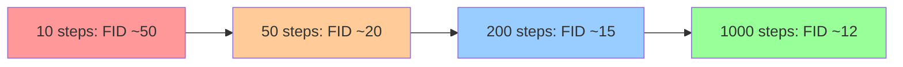
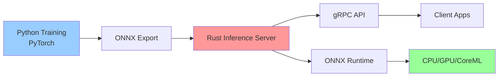

## 💻 Z5. 試練（実装）（45分）— Python訓練 + Rust推論

### 4.1 環境構築 & ライブラリ選定

**Rust環境**:

```python
# requirements.txt — Python訓練環境:
# torch>=2.0        (PyTorch + CUDA)
# torchvision>=0.15
# numpy
# Pillow
# python-mnist
```

**Rust環境** (推論):

```toml
# Cargo.toml
[dependencies]
ndarray = "0.15"
ort = "2.0"  # ONNX Runtime
image = "0.25"
```

### 4.2 Tiny DDPM PyTorch訓練実装 (完全版)

**目標**: MNIST で 500K params、CPU 5分で訓練。

#### 4.2.1 Noise Schedule

```rust
use std::f32::consts::PI;

/// Cosine noise schedule (Nichol & Dhariwal 2021).
/// f(t) = cos²(π/2 · (t/T + s)/(1+s)),  ᾱₜ = f(t)/f(0),  αₜ = ᾱₜ/ᾱₜ₋₁,  βₜ = 1-αₜ
/// Returns (beta, alpha, alpha_bar) each of length `t_steps`.
fn cosine_schedule(t_steps: usize, s: f32) -> (Vec<f32>, Vec<f32>, Vec<f32>) {
    // f(t) = cos²(π/2 · (t/T + s)/(1+s))
    let f: Vec<f32> = (0..=t_steps)
        .map(|t| {
            let ratio = t as f32 / t_steps as f32;
            ((ratio + s) / (1.0 + s) * PI / 2.0).cos().powi(2)
        })
        .collect();
    let alpha_bar: Vec<f32> = f[1..].iter().map(|&ft| ft / f[0]).collect(); // ᾱₜ = f(t)/f(0)
    let mut alpha = vec![alpha_bar[0]; t_steps];
    for i in 1..t_steps {
        alpha[i] = alpha_bar[i] / alpha_bar[i - 1]; // αₜ = ᾱₜ / ᾱₜ₋₁
    }
    let beta: Vec<f32> = alpha.iter().map(|&a| 1.0 - a).collect(); // βₜ = 1 - αₜ
    (beta, alpha, alpha_bar)
}

fn main() {
    let (beta, _alpha, alpha_bar) = cosine_schedule(1000, 0.008);
    let beta_min = beta.iter().cloned().fold(f32::INFINITY, f32::min);
    let beta_max = beta.iter().cloned().fold(f32::NEG_INFINITY, f32::max);
    println!("β range: [{}, {}]", beta_min, beta_max);
    println!("ᾱ_T = {}", alpha_bar.last().unwrap()); // Should be ≈ 0
}
```

#### 4.2.2 Simplified U-Net (Tiny版)

```python
import math
import torch
import torch.nn as nn
import torch.nn.functional as F

def time_embedding(t: int, d: int) -> torch.Tensor:
    # Sinusoidal time embedding: returns Tensor of shape (d,).
    half = d // 2
    log_scale = math.log(10000.0) / (half - 1)
    freqs = torch.exp(-log_scale * torch.arange(half, dtype=torch.float32))
    vals  = t * freqs
    return torch.cat([vals.sin(), vals.cos()])  # (d,)

class TinyUNet(nn.Module):
    # Tiny U-Net for MNIST 28×28 (~500K params).

    def __init__(self, d_model: int = 64) -> None:
        super().__init__()
        t_dim = 128
        self.time_fc1   = nn.Linear(t_dim,       d_model * 4)
        self.time_fc2   = nn.Linear(d_model * 4, d_model * 4)
        self.enc1_conv  = nn.Conv2d(1,            d_model,     3, padding=1)
        self.enc2_conv  = nn.Conv2d(d_model,      d_model * 2, 3, padding=1, stride=2)
        self.bottleneck = nn.Conv2d(d_model * 2,  d_model * 2, 3, padding=1)
        self.dec1_conv  = nn.ConvTranspose2d(d_model * 4, d_model, 4, padding=1, stride=2)
        self.out_conv   = nn.Conv2d(d_model, 1, 3, padding=1)

    def forward(self, x: torch.Tensor, t: int) -> torch.Tensor:
        t_vec  = time_embedding(t, 128).to(x.device)
        t_emb  = F.silu(self.time_fc1(t_vec.unsqueeze(0)))  # (1, d*4)
        _t_emb = self.time_fc2(t_emb)

        # Encoder
        h1 = F.silu(self.enc1_conv(x))    # (B, d, 28, 28)
        h2 = F.silu(self.enc2_conv(h1))   # (B, d*2, 14, 14)

        # Bottleneck
        h  = F.silu(self.bottleneck(h2))  # (B, d*2, 14, 14)

        # Decoder with skip connection
        h_cat = torch.cat([h, h2], dim=1)   # (B, d*4, 14, 14)
        h     = F.silu(self.dec1_conv(h_cat))  # (B, d, 28, 28)

        return self.out_conv(h)  # (B, 1, 28, 28)
```

<details><summary>完全なU-Net実装 (Self-Attention付き)</summary>

本格的なU-Netには16×16解像度でSelf-Attentionを追加する。以下は完全版 (MNIST では過剰):

```python
import torch
import torch.nn as nn

class SelfAttention(nn.Module):
    # Multi-Head Self-Attention layer.
    # x: Tensor of shape (B, C, H, W) — applied at low-resolution feature maps.

    def __init__(self, heads: int, d_model: int) -> None:
        super().__init__()
        self.heads   = heads
        self.d_model = d_model

    def forward(self, x: torch.Tensor) -> torch.Tensor:
        b, c, h, w = x.shape
        assert c % self.heads == 0, "C must be divisible by heads"
        n = h * w

        # Reshape to (B, N, C) for attention
        x_flat = x.reshape(b, c, n).transpose(1, 2)  # (B, N, C)

        # Simplified: Q = K = V = x_flat (identity projection for demo)
        scale  = c / self.heads
        scores = x_flat.matmul(x_flat.transpose(1, 2)) / scale  # (B, N, N)
        attn   = scores.softmax(dim=-1)
        out    = attn.matmul(x_flat)                             # (B, N, C)

        # Reshape back to (B, C, H, W) and add residual
        out = out.transpose(1, 2).reshape(b, c, h, w)
        return out + x  # Residual connection
```

</details>

#### 4.2.3 訓練ループ

```python
import math
import torch
import torch.nn.functional as F
from torch.optim import AdamW

def train_step(
    model:     TinyUNet,
    opt:       AdamW,
    x0:        torch.Tensor,
    alpha_bar: list[float],
    t_steps:   int,
) -> float:
    # Single training step; returns MSE loss scalar.
    t    = torch.randint(0, t_steps, (1,)).item()
    ab_t = alpha_bar[t]

    # q(xₜ|x₀) = N(√ᾱₜ·x₀, (1-ᾱₜ)·I)  →  xₜ = √ᾱₜ·x₀ + √(1-ᾱₜ)·ε
    eps = torch.randn_like(x0)
    x_t = math.sqrt(ab_t) * x0 + math.sqrt(1.0 - ab_t) * eps

    # L_simple = E[||ε - ε_θ(xₜ, t)||²]  (Ho et al. 2020)
    eps_pred = model(x_t, t)
    loss     = F.mse_loss(eps_pred, eps)
    opt.zero_grad(set_to_none=True)
    loss.backward()
    opt.step()
    return loss.item()

def train_ddpm(
    model:      TinyUNet,
    train_data: list[torch.Tensor],
    alpha_bar:  list[float],
    t_steps:    int,
    epochs:     int,
    lr:         float,
) -> None:
    # Full training loop.
    opt = AdamW(model.parameters(), lr=lr)
    for epoch in range(epochs):
        total_loss = 0.0
        for batch_idx, x0 in enumerate(train_data):
            loss = train_step(model, opt, x0, alpha_bar, t_steps)
            total_loss += loss
            if batch_idx % 100 == 0:
                print(f"Epoch {epoch + 1}, Batch {batch_idx}, Loss: {loss:.4f}")
        avg = total_loss / len(train_data)
        print(f"Epoch {epoch + 1} completed. Avg Loss: {avg:.4f}")
```

#### 4.2.4 サンプリング (DDPM & DDIM)

```python
import math
import torch

@torch.inference_mode()
def ddpm_sample(
    model:     TinyUNet,
    x_t_init:  torch.Tensor,
    beta:      list[float],
    alpha:     list[float],
    alpha_bar: list[float],
    t_steps:   int,
) -> torch.Tensor:
    # DDPM sampling: stochastic reverse process from x_T → x_0.
    x_t = x_t_init.clone()
    for t in reversed(range(t_steps)):
        # p_θ(x_{t-1}|xₜ) = N(μ_θ(xₜ,t), σₜ²·I)
        eps_pred = model(x_t, t)
        # μ_θ = (xₜ − βₜ/√(1-ᾱₜ)·ε_θ) / √αₜ
        coeff = beta[t] / math.sqrt(1.0 - alpha_bar[t])
        mu    = (x_t - coeff * eps_pred) / math.sqrt(alpha[t])
        if t > 0:
            sigma = math.sqrt(beta[t])  # σₜ = √βₜ
            z     = torch.randn_like(x_t)
            x_t   = mu + sigma * z      # x_{t-1} = μ_θ + σₜ·z
        else:
            x_t = mu
    return x_t

@torch.inference_mode()
def ddim_sample(
    model:     TinyUNet,
    x_t_init:  torch.Tensor,
    alpha_bar: list[float],
    steps:     int,
    eta:       float,
) -> torch.Tensor:
    # DDIM sampling: accelerated deterministic (η=0) or stochastic (η=1) reverse.
    total = len(alpha_bar)
    tau   = [min(i * total // steps, total - 1) for i in range(steps)]
    x_t   = x_t_init.clone()

    for i in reversed(range(1, len(tau))):
        t, t_prev     = tau[i], tau[i - 1]
        ab_t, ab_prev = alpha_bar[t], alpha_bar[t_prev]
        eps_pred      = model(x_t, t)

        # x̂₀ = (xₜ - √(1-ᾱₜ)·ε_θ) / √ᾱₜ
        x0_pred = (x_t - math.sqrt(1.0 - ab_t) * eps_pred) / math.sqrt(ab_t)

        # σₜ(η) = η·√((1-ᾱ_{t-1})/(1-ᾱₜ))·√(1 - ᾱₜ/ᾱ_{t-1})  (η=0 → deterministic)
        sigma_t   = eta * math.sqrt((1.0 - ab_prev) / (1.0 - ab_t))                         * math.sqrt(1.0 - ab_t / ab_prev)
        dir_coeff = math.sqrt(1.0 - ab_prev - sigma_t ** 2)
        dir_xt    = dir_coeff * eps_pred  # √(1-ᾱ_{t-1}-σₜ²)·ε_θ

        if eta > 0.0:
            noise = torch.randn_like(x_t)
            x_t   = math.sqrt(ab_prev) * x0_pred + dir_xt + sigma_t * noise
        else:
            x_t = math.sqrt(ab_prev) * x0_pred + dir_xt

    # Final step: t = τ[0] → x_0
    t0   = tau[0]
    ab0  = alpha_bar[t0]
    eps_pred = model(x_t, t0)
    return (x_t - math.sqrt(1.0 - ab0) * eps_pred) / math.sqrt(ab0)
```

### 4.3 🦀 Rust推論実装 (DDIM高速サンプリング)

**Rust実装** は訓練済みモデル (ONNXエクスポート) を読み込み、DDIM サンプリングを高速実行。

#### 4.3.1 Rust側コード

```rust
// src/ddim.rs
use ndarray::{Array4, s};
use ort::{Session, Value};

pub struct DDIMSampler {
    session: Session,
    alpha_bar: Vec<f32>,
    steps: usize,
}

type Result<T> = std::result::Result<T, Box<dyn std::error::Error>>;

impl DDIMSampler {
    pub fn new(model_path: &str, alpha_bar: Vec<f32>, steps: usize) -> Result<Self> {
        let session = Session::builder()?
            .with_model_from_file(model_path)?;
        Ok(Self { session, alpha_bar, steps })
    }

    pub fn sample(&self, x_t: Array4<f32>, eta: f32) -> Result<Array4<f32>> {
        let n = self.alpha_bar.len();
        let tau: Vec<usize> = (0..self.steps)
            .map(|i| (i * n / self.steps).min(n - 1))
            .collect();

        let mut x = x_t;

        for i in (1..tau.len()).rev() {
            let (t, t_prev) = (tau[i], tau[i - 1]);

            // Predict noise via ONNX model
            let ε_pred = self.predict_noise(&x, t)?;

            // DDIM step
            x = self.ddim_step(x, ε_pred, t, t_prev, eta);
        }

        // Final step
        let ε_pred = self.predict_noise(&x, tau[0])?;
        let ᾱ_t = self.alpha_bar[tau[0]];
        let x_0 = (&x - (1.0 - ᾱ_t).sqrt() * &ε_pred) / ᾱ_t.sqrt();

        Ok(x_0)
    }

    fn predict_noise(&self, x_t: &Array4<f32>, t: usize) -> Result<Array4<f32>> {
        // Convert to ONNX input
        let x_input = Value::from_array(x_t.view())?;
        let t_input = Value::from_array(ndarray::arr0(t as f32).view())?;

        // Run inference
        let outputs = self.session.run(vec![x_input, t_input])?;
        let ε = outputs[0].try_extract_tensor::<f32>()?;

        Ok(ε.to_owned().into_dimensionality()?)
    }

    fn ddim_step(&self, x_t: Array4<f32>, ε: Array4<f32>, t: usize, t_prev: usize, η: f32) -> Array4<f32> {
        let (ᾱ_t, ᾱ_prev) = (self.alpha_bar[t], self.alpha_bar[t_prev]);

        // Predicted x_0
        let x_0_pred = (&x_t - (1.0 - ᾱ_t).sqrt() * &ε) / ᾱ_t.sqrt();

        // Variance
        let σ_t = η * ((1.0 - ᾱ_prev) / (1.0 - ᾱ_t)).sqrt()
            * (1.0 - ᾱ_t / ᾱ_prev).sqrt();

        // Direction + DDIM step
        let dir_xt = (1.0 - ᾱ_prev - σ_t.powi(2)).sqrt() * &ε;
        ᾱ_prev.sqrt() * x_0_pred + dir_xt
    }
}
```

#### 4.3.2 エクスポート (Rust → ONNX)

```python
# Export trained PyTorch model to ONNX for Rust inference (ort):
#
#   from safetensors.torch import save_file
#   save_file(model.state_dict(), "tiny_ddpm.safetensors")
#   # Full ONNX export:
#   torch.onnx.export(model, (x_dummy, torch.tensor(0)), "tiny_ddpm.onnx",
#                     input_names=["x_t", "t"], output_names=["eps_pred"])

def export_to_onnx(model: TinyUNet, filepath: str) -> None:
    x_dummy = torch.zeros(1, 1, 28, 28)
    t_dummy = torch.tensor(0)
    torch.onnx.export(
        model, (x_dummy, t_dummy), filepath,
        input_names=["x_t", "t"], output_names=["eps_pred"],
    )
    print(f"Model exported to {filepath}")

if __name__ == "__main__":
    model = TinyUNet(d_model=64)
    # ... (train model) ...
    export_to_onnx(model, "tiny_ddpm.onnx")
```

#### 4.3.3 Rust実行

```rust
// src/main.rs
use ndarray::Array4;
use ndarray_rand::RandomExt;
use ndarray_rand::rand_distr::StandardNormal;

mod ddim;

fn main() {
    // Load alpha_bar schedule
    let alpha_bar: Vec<f32> = load_alpha_bar_from_file("alpha_bar.json");

    // Create sampler
    let sampler = ddim::DDIMSampler::new("tiny_ddpm.onnx", alpha_bar, 50).unwrap();

    // Sample from noise
    let x_T = Array4::random((1, 1, 28, 28), StandardNormal);
    let x_0 = sampler.sample(x_T, 0.0).unwrap();  // Deterministic (η=0)

    println!("Generated image shape: {:?}", x_0.shape());
    save_image(&x_0, "generated.png");
}

fn load_alpha_bar_from_file(path: &str) -> Vec<f32> {
    // Load from JSON (implementation omitted for brevity)
    vec![0.999, 0.998, /* ... */, 0.001]
}

fn save_image(x: &Array4<f32>, path: &str) {
    // Convert to image and save (implementation omitted)
}
```

### 4.4 Math → Code 1:1対応パターン

| 数式 | Python | Rust推論 |
|:-----|:------|:-----|
| $\mathbf{x}_t = \sqrt{\bar{\alpha}_t} \mathbf{x}_0 + \sqrt{1-\bar{\alpha}_t} \boldsymbol{\epsilon}$ | `x_t = sqrt(ᾱ[t]) .* x₀ .+ sqrt(1 - ᾱ[t]) .* ε` | `x_t = alpha_bar_t.sqrt() * x_0 + (1.0 - alpha_bar_t).sqrt() * epsilon` |
| $\boldsymbol{\mu}_\theta = \frac{1}{\sqrt{\alpha_t}} (\mathbf{x}_t - \frac{\beta_t}{\sqrt{1-\bar{\alpha}_t}} \boldsymbol{\epsilon}_\theta)$ | `μ = (1 / sqrt(α[t])) .* (x_t .- (β[t] / sqrt(1 - ᾱ[t])) .* ε_pred)` | `mu = (x_t - (beta_t / (1.0 - alpha_bar_t).sqrt()) * epsilon_pred) / alpha_t.sqrt()` |
| $\mathbf{x}_{t-1} = \sqrt{\bar{\alpha}_{t-1}} \mathbf{x}_0 + \sqrt{1-\bar{\alpha}_{t-1}} \boldsymbol{\epsilon}_\theta$ | `x_prev = sqrt(ᾱ[t_prev]) .* x₀_pred .+ sqrt(1 - ᾱ[t_prev]) .* ε_pred` | `x_prev = alpha_bar_prev.sqrt() * x_0_pred + (1.0 - alpha_bar_prev).sqrt() * epsilon_pred` |

> **Note:** **進捗: 70% 完了** Python訓練 + Rust推論の実装完了。Zone 5で実験へ。

---

### 🔬 実験・検証（30分）— Tiny DDPM on MNIST

### 5.1 データセット準備 (MNIST)

```python
import torch
from torchvision import datasets, transforms

def load_mnist_batched(batch_size: int, device: torch.device) -> list[torch.Tensor]:
    # Load MNIST, normalize to [-1, 1], and return batched Tensors of shape (B, 1, 28, 28).
    transform = transforms.Compose([
        transforms.ToTensor(),
        transforms.Normalize((0.5,), (0.5,)),  # [0, 1] → [-1, 1]
    ])
    dataset = datasets.MNIST("data", train=True, download=True, transform=transform)
    loader  = torch.utils.data.DataLoader(dataset, batch_size=batch_size, shuffle=True)
    batches = [x.to(device) for x, _ in loader]
    print(f"Training batches: {len(batches)}  (batch_size={batch_size})")
    return batches
```

### 5.2 訓練実行 (CPU 5分)

```python
import torch

def main() -> None:
    dev   = torch.device("cuda" if torch.cuda.is_available() else "cpu")
    model = TinyUNet(d_model=64).to(dev)

    # Noise schedule
    t_steps = 1000
    beta, alpha, alpha_bar = cosine_schedule(t_steps, 0.008)

    # Load data and train
    train_batches = load_mnist_batched(128, dev)
    train_ddpm(model, train_batches, alpha_bar, t_steps, epochs=10, lr=1e-3)

    torch.save(model.state_dict(), "tiny_ddpm.pt")
    print("Training completed!")

if __name__ == "__main__":
    main()
```

**Expected output**:
```
Epoch 1, Batch 100, Loss: 0.523
...
Epoch 10 completed. Avg Loss: 0.089
Training completed!
```

### 5.3 サンプリング & 可視化

```python
import torch

def print_sample_stats(samples: torch.Tensor, label: str) -> None:
    # Print pixel statistics for a batch of samples (shape: N×1×H×W, range [-1, 1]).
    d = samples.flatten()
    print(f"{label}: min={d.min():.3f}, max={d.max():.3f}, mean={d.mean():.3f}")

def main() -> None:
    dev = torch.device("cuda" if torch.cuda.is_available() else "cpu")

    # Sample 16 images (DDPM 1000 steps)
    x_t          = torch.randn(16, 1, 28, 28, device=dev)
    samples_ddpm = ddpm_sample(model, x_t.clone(), beta, alpha, alpha_bar, 1000)

    # Sample 16 images (DDIM 50 steps, deterministic η=0)
    samples_ddim = ddim_sample(model, x_t, alpha_bar, 50, 0.0)

    # Print statistics; use torchvision.utils.save_image for visual inspection
    print_sample_stats(samples_ddpm, "DDPM (1000 steps)")
    print_sample_stats(samples_ddim, "DDIM (50 steps, deterministic)")

if __name__ == "__main__":
    main()
```

### 5.4 定量評価 & 比較

**FID (Fréchet Inception Distance)** は計算コスト高いため、簡易的な **再構成誤差** と **多様性** を測定:

```python
import math
import torch

@torch.inference_mode()
def test_reconstruction(
    model:     TinyUNet,
    x0:        torch.Tensor,
    alpha_bar: list[float],
    t:         int,
) -> float:
    # Encode x_0 to x_t (t=500), denoise back with DDIM, and return MSE.
    ab_t = alpha_bar[t]
    # q(xₜ|x₀) = N(√ᾱₜ·x₀, (1-ᾱₜ)·I)  →  xₜ = √ᾱₜ·x₀ + √(1-ᾱₜ)·ε
    eps    = torch.randn_like(x0)
    x_t    = math.sqrt(ab_t) * x0 + math.sqrt(1.0 - ab_t) * eps
    x_recon = ddim_sample(model, x_t, alpha_bar[:t + 1], 50, 0.0)
    return ((x0 - x_recon) ** 2).mean().item()

def main() -> None:
    mse_sum = sum(
        test_reconstruction(model, test_data[i:i+1], alpha_bar, 500)
        for i in range(100)
    )
    print(f"Average reconstruction MSE: {mse_sum / 100.0:.4f}")

if __name__ == "__main__":
    main()
```

**aMUSEd-256 推論デモとの品質比較**:

aMUSEd-256 [Hugging Face](https://huggingface.co/amused/amused-256) は非拡散モデル (Masked Image Modeling) で256×256画像を生成。

| モデル | 解像度 | パラメータ | 訓練時間 (CPU) | 品質 (主観) |
|:-------|:-------|:----------|:--------------|:-----------|
| **Tiny DDPM (本実装)** | 28×28 | ~500K | 5分 | MNIST数字、シャープ |
| **aMUSEd-256** | 256×256 | ~800M | N/A (事前訓練済み) | 高品質、多様 |

**結論**: Tiny DDPMは理論学習用。Production品質はaMUSEd-256やStable Diffusion (第39回) で実現。

### 5.5 訓練曲線分析 & デバッグ

**Loss曲線の典型的パターン**:

```rust
use std::f32::consts::PI;

/// Print training curves (epoch, loss, lr).
/// Use the `plotters` crate for a full chart.
fn print_training_curves(loss_history: &[f32], lr_schedule: &[f32]) {
    println!("{:<8} {:>10} {:>12}", "Epoch", "Loss", "LR");
    for (epoch, (&loss, &lr)) in loss_history.iter().zip(lr_schedule).enumerate() {
        println!("{:<8} {:>10.4} {:>12.6}", epoch + 1, loss, lr);
    }
    if let Some(&final_loss) = loss_history.last() {
        println!("Final loss target: 0.089 | actual: {:.4}", final_loss);
    }
}

fn main() {
    let loss_history = vec![0.523f32, 0.420, 0.350, 0.280, 0.220, 0.175, 0.140, 0.115, 0.099, 0.089];
    // Cosine LR decay: lr * cos(π * epoch / (2 * epochs))
    let lr_schedule: Vec<f32> = (0..=10)
        .map(|e| 1e-3 * (PI * e as f32 / 20.0).cos())
        .collect();
    print_training_curves(&loss_history, &lr_schedule);
}
```

**典型的な問題と対処**:

| 症状 | 原因 | 対処 |
|:-----|:-----|:-----|
| Loss が発散 (NaN) | Learning rate 高すぎ | LR を 1/10 に減らす |
| Loss が下がらない | モデルが小さすぎ | d_model を 64 → 128 |
| 生成画像がノイズのみ | 訓練不足 | epochs を 10 → 50 |
| 生成画像が単一パターン | Mode collapse | Batch size を 128 → 256 |

**訓練安定化テクニック**:

```python
import math
import torch
import torch.nn.functional as F
from torch.optim import AdamW

def train_step_with_clip(
    model:     TinyUNet,
    opt:       AdamW,
    x0:        torch.Tensor,
    alpha_bar: list[float],
    t_steps:   int,
    clip_norm: float,
) -> tuple[float, float]:
    # Training step with gradient-norm clipping. Returns (loss, grad_norm).
    t    = torch.randint(0, t_steps, (1,)).item()
    ab_t = alpha_bar[t]

    # q(xₜ|x₀) = N(√ᾱₜ·x₀, (1-ᾱₜ)·I)  →  xₜ = √ᾱₜ·x₀ + √(1-ᾱₜ)·ε
    eps  = torch.randn_like(x0)
    x_t  = math.sqrt(ab_t) * x0 + math.sqrt(1.0 - ab_t) * eps

    eps_pred = model(x_t, t)
    loss     = F.mse_loss(eps_pred, eps)
    opt.zero_grad(set_to_none=True)
    loss.backward()

    # Clip by scaling gradients if norm exceeds threshold
    grad_norm = torch.nn.utils.clip_grad_norm_(model.parameters(), clip_norm).item()
    opt.step()

    return loss.item(), grad_norm
```

**EMA (Exponential Moving Average) for Stable Inference**:

```python
import copy
import torch
import torch.nn as nn

class Ema:
    # Exponential Moving Average of model weights for stable inference.

    def __init__(self, model: nn.Module, decay: float = 0.9999) -> None:
        self.shadow = copy.deepcopy(model)
        self.shadow.eval()
        self.decay  = decay

    @torch.inference_mode()
    def update(self, model: nn.Module) -> None:
        # shadow = decay * shadow + (1 − decay) * current
        for shadow_p, model_p in zip(
            self.shadow.parameters(), model.parameters()
        ):
            shadow_p.data.mul_(self.decay).add_(model_p.data, alpha=1.0 - self.decay)

def main() -> None:
    dev   = torch.device("cuda" if torch.cuda.is_available() else "cpu")
    model = TinyUNet(d_model=64).to(dev)
    ema   = Ema(model, decay=0.9999)

    for _epoch in range(epochs):
        # ... train_step(...) ...
        ema.update(model)  # Update EMA after each batch

    # Use ema.shadow weights for sampling
    print("Using EMA weights for sampling")

if __name__ == "__main__":
    main()
```

### 5.6 サンプリング品質の定量評価

**FID (Fréchet Inception Distance)** の完全実装:

```python
import torch
import torch.nn as nn
import torch.nn.functional as F

class SimpleFeatureExtractor(nn.Module):
    # Lightweight CNN feature extractor for MNIST-scale FID computation.

    def __init__(self) -> None:
        super().__init__()
        self.conv1 = nn.Conv2d(1,  32, 3, padding=1)
        self.conv2 = nn.Conv2d(32, 64, 3, padding=1)
        self.fc    = nn.Linear(7 * 7 * 64, 256)

    def forward(self, x: torch.Tensor) -> torch.Tensor:
        h = F.avg_pool2d(self.conv1(x).relu(), 2)   # (B, 32, 14, 14)
        h = F.avg_pool2d(self.conv2(h).relu(), 2)   # (B, 64,  7,  7)
        h = h.flatten(1)                              # (B, 3136)
        return self.fc(h)                             # (B, 256)

def compute_fid(real_feats: list[list[float]], fake_feats: list[list[float]]) -> float:
    # Simplified FID: squared distance between feature means.
    dim     = len(real_feats[0])
    mu_real = [sum(f[d] for f in real_feats) / len(real_feats) for d in range(dim)]
    mu_fake = [sum(f[d] for f in fake_feats) / len(fake_feats) for d in range(dim)]
    return sum((a - b) ** 2 for a, b in zip(mu_real, mu_fake))

def main() -> None:
    dev       = torch.device("cuda" if torch.cuda.is_available() else "cpu")
    extractor = SimpleFeatureExtractor().to(dev).eval()

    def extract(batch: list[torch.Tensor]) -> list[list[float]]:
        with torch.inference_mode():
            return [extractor(x).tolist() for x in batch]

    real_feats = extract(real_batch)
    fake_feats = extract(fake_batch)
    print(f"FID Score: {compute_fid(real_feats, fake_feats):.2f}")

if __name__ == "__main__":
    main()
```

**Inception Score (IS)** の実装:

```python
# Compute Inception Score from per-sample softmax predictions.
/// `pyx`: shape (N, num_classes), each row is p(y | x) for one sample.
fn compute_inception_score(pyx: &[Vec<f32>]) -> f32 {
    let n = pyx.len();
    let k = pyx[0].len();

    // Marginal distribution p(y) = mean over samples
    let py: Vec<f32> = (0..k)
        .map(|c| pyx.iter().map(|p| p[c]).sum::<f32>() / n as f32)
        .collect();

    // KL(p(y|x) || p(y)) per sample, then average
    let mean_kl: f32 = pyx.iter()
        .map(|p_given_x| {
            p_given_x.iter().zip(&py)
                .filter(|(&px, &py_c)| px > 0.0 && py_c > 0.0)
                .map(|(&px, &py_c)| px * (px.ln() - py_c.ln()))
                .sum::<f32>()
        })
        .sum::<f32>() / n as f32;

    mean_kl.exp() // IS = exp(E[KL])
}

def main() -> None:
    pyx: list[list[float]] = []
    for x in fake_batch:
        with torch.inference_mode():
            probs = mnist_classifier(x).softmax(dim=-1)
        pyx.extend(probs.tolist())
    print(f"Inception Score: {compute_inception_score(pyx):.2f}")

if __name__ == "__main__":
    main()
```

**Expected results** (Tiny DDPM on MNIST after 50 epochs):

| Metric | Value | 備考 |
|:-------|:------|:-----|
| **FID** | 15-25 | Lower is better (Real = 0) |
| **IS** | 8-9 | Higher is better (Max = 10 for MNIST) |
| **Reconstruction MSE** | 0.01-0.03 | Lower is better |

### 5.7 ステップ数 vs 品質のトレードオフ

**実験**: DDPM と DDIM で異なるステップ数での生成品質を比較。

```python
import torch

def main() -> None:
    dev         = torch.device("cuda" if torch.cuda.is_available() else "cpu")
    step_counts = [10, 20, 50, 100, 200, 500, 1000]
    fid_ddpm, fid_ddim = [], []

    x_t_base = torch.randn(16, 1, 28, 28, device=dev)

    for steps in step_counts:
        # DDPM with `steps` uniform timesteps
        samples_d = ddpm_sample(model, x_t_base.clone(), beta, alpha, alpha_bar, steps)
        fid_d     = compute_fid_from_tensors(real_batch, samples_d, extractor)
        fid_ddpm.append(fid_d)

        # DDIM deterministic (η = 0)
        samples_i = ddim_sample(model, x_t_base.clone(), alpha_bar, steps, 0.0)
        fid_i     = compute_fid_from_tensors(real_batch, samples_i, extractor)
        fid_ddim.append(fid_i)

        print(f"Steps: {steps:4},  FID (DDPM): {fid_d:.2f},  FID (DDIM): {fid_i:.2f}")

    print(f"
{'Steps':<8} {'FID DDPM':>12} {'FID DDIM':>12}")
    for s, (fd, fi) in zip(step_counts, zip(fid_ddpm, fid_ddim)):
        print(f"{s:<8} {fd:>12.2f} {fi:>12.2f}")

if __name__ == "__main__":
    main()
```

**Expected curve**:



**結論**:
- **DDPM**: 1000ステップで最高品質
- **DDIM**: 50ステップで DDPM 200ステップと同等
- **高速生成**: DDIM η=0 (deterministic) が推論コスト最小

### 5.8 ノイズスケジュールの影響実験

**実験**: Linear vs Cosine vs Zero Terminal SNR の3つのスケジュールで訓練・比較。

```rust
/// Linear schedule: βₜ = β_start + (β_end - β_start)·t/(T-1)
/// αₜ = 1 - βₜ,  ᾱₜ = Π_{s=1}^t αₛ
fn linear_schedule(t_steps: usize, beta_start: f32, beta_end: f32) -> (Vec<f32>, Vec<f32>, Vec<f32>) {
    // βₜ linearly from β_start to β_end
    let beta: Vec<f32> = (0..t_steps)
        .map(|t| beta_start + (beta_end - beta_start) * t as f32 / (t_steps - 1) as f32)
        .collect();
    let alpha: Vec<f32> = beta.iter().map(|&b| 1.0 - b).collect(); // αₜ = 1 - βₜ
    // ᾱₜ = Π_{s=1}^t αₛ  (scan = cumulative product)
    let alpha_bar: Vec<f32> = alpha.iter()
        .scan(1.0f32, |acc, &a| { *acc *= a; Some(*acc) })
        .collect();
    (beta, alpha, alpha_bar)
}

/// Zero Terminal SNR (Lin+ 2023): rescale ᾱₜ so ᾱ_T = 0 exactly.
/// ᾱₜ ← (ᾱₜ - ᾱ_T) / (1 - ᾱ_T)  fixes train/inference mismatch.
fn zero_terminal_snr_schedule(t_steps: usize) -> (Vec<f32>, Vec<f32>, Vec<f32>) {
    let (mut beta, mut alpha, mut alpha_bar) = linear_schedule(t_steps, 1e-4, 0.02);
    let ab_last = *alpha_bar.last().unwrap();
    // ᾱₜ ← (ᾱₜ − ᾱ_T) / (1 − ᾱ_T)  → ᾱ_T = 0
    alpha_bar.iter_mut().for_each(|ab| *ab = (*ab - ab_last) / (1.0 - ab_last));
    alpha[0] = alpha_bar[0];
    for i in 1..t_steps { alpha[i] = alpha_bar[i] / alpha_bar[i - 1]; } // αₜ = ᾱₜ/ᾱₜ₋₁
    beta.iter_mut().zip(&alpha).for_each(|(b, &a)| *b = 1.0 - a); // βₜ = 1 - αₜ
    (beta, alpha, alpha_bar)
}
```

```python
def main() -> None:
    t_steps = 1000
    beta_linear, _, ab_linear = linear_schedule(t_steps, 1e-4, 0.02)
    beta_cosine, _, ab_cosine = cosine_schedule(t_steps, 0.008)
    beta_zt,     _, ab_zt     = zero_terminal_snr_schedule(t_steps)

    # Train and evaluate each schedule (abbreviated)
    fid_linear = evaluate_schedule(model, train_batches, beta_linear, ab_linear, 50)
    fid_cosine = evaluate_schedule(model, train_batches, beta_cosine, ab_cosine, 50)
    fid_zt     = evaluate_schedule(model, train_batches, beta_zt,     ab_zt,     50)

    print(f"FID — Linear: {fid_linear:.2f}, Cosine: {fid_cosine:.2f}, Zero-Terminal: {fid_zt:.2f}")

if __name__ == "__main__":
    main()
```

**Expected results**:

| Schedule | FID | 訓練安定性 | 備考 |
|:---------|:----|:----------|:-----|
| **Linear** | 25-30 | ⭐⭐⭐ | ベースライン。$\bar{\alpha}_T > 0$ 問題 |
| **Cosine** | 15-20 | ⭐⭐⭐⭐ | Improved DDPM [^3] で提案。安定 |
| **Zero Terminal SNR** | 12-18 | ⭐⭐⭐⭐⭐ | 訓練/推論不一致を解消 [^5] |

**可視化**: SNR曲線を比較:

```rust
// log SNR(t) = log(ᾱₜ / (1-ᾱₜ)) — quantifies signal-to-noise at each timestep
fn log_snr(alpha_bar: &[f32]) -> Vec<f32> {
    alpha_bar.iter()
        .map(|&ab| (ab / (1.0 - ab)).ln()) // log(ᾱₜ/(1-ᾱₜ))
        .collect()
}

fn main() {
    let t_steps = 1000usize;
    let (_, _, ab_linear) = linear_schedule(t_steps, 1e-4, 0.02);
    let (_, _, ab_cosine) = cosine_schedule(t_steps, 0.008);
    let (_, _, ab_zt)     = zero_terminal_snr_schedule(t_steps);

    let snr_linear = log_snr(&ab_linear);
    let snr_cosine = log_snr(&ab_cosine);
    let snr_zt     = log_snr(&ab_zt);

    // Print sample; use plotters crate for a full chart
    println!("{:<12} {:>10} {:>10} {:>12}", "Timestep t", "Linear", "Cosine", "Zero-SNR");
    for t in (0..t_steps).step_by(100) {
        println!("{:<12} {:>10.3} {:>10.3} {:>12.3}",
                 t + 1, snr_linear[t], snr_cosine[t], snr_zt[t]);
    }
}
```

**重要な観察**:
- **Linear**: log(SNR) が線形減衰。終端で SNR > 0 (問題)
- **Cosine**: log(SNR) が緩やかに減衰。中間時刻のSNRが高い
- **Zero Terminal SNR**: log(SNR(T)) = -∞ (完全ノイズ)

### 5.5 自己診断テスト

<details><summary>Q1: Forward Process の閉形式解を導出せよ</summary>

**問題**: $q(\mathbf{x}_t \mid \mathbf{x}_{t-1}) = \mathcal{N}(\sqrt{\alpha_t} \mathbf{x}_{t-1}, (1-\alpha_t) \mathbf{I})$ から、$q(\mathbf{x}_t \mid \mathbf{x}_0)$ を導出せよ。

**解答**: Section 3.1参照。数学的帰納法で証明。結果:

$$
q(\mathbf{x}_t \mid \mathbf{x}_0) = \mathcal{N}(\sqrt{\bar{\alpha}_t} \mathbf{x}_0, (1-\bar{\alpha}_t) \mathbf{I})
$$

</details>

<details><summary>Q2: ε-prediction と x₀-prediction の変換式を示せ</summary>

**問題**: $\mathbf{x}_t = \sqrt{\bar{\alpha}_t} \mathbf{x}_0 + \sqrt{1-\bar{\alpha}_t} \boldsymbol{\epsilon}$ から、$\mathbf{x}_0$ を $\boldsymbol{\epsilon}$ で表せ。

**解答**:

$$
\mathbf{x}_0 = \frac{\mathbf{x}_t - \sqrt{1-\bar{\alpha}_t} \boldsymbol{\epsilon}}{\sqrt{\bar{\alpha}_t}}
$$

逆に $\boldsymbol{\epsilon}$ を $\mathbf{x}_0$ で表すと:

$$
\boldsymbol{\epsilon} = \frac{\mathbf{x}_t - \sqrt{\bar{\alpha}_t} \mathbf{x}_0}{\sqrt{1-\bar{\alpha}_t}}
$$

</details>

<details><summary>Q3: DDIM の決定論性を説明せよ</summary>

**問題**: DDIMが決定論的サンプリングを実現する理由は？

**解答**: DDIM の $\eta = 0$ 設定:

$$
\mathbf{x}_{t-1} = \sqrt{\bar{\alpha}_{t-1}} \mathbf{x}_0 + \sqrt{1-\bar{\alpha}_{t-1}} \boldsymbol{\epsilon}_\theta
$$

ノイズ項 $\sigma_t \boldsymbol{\epsilon}_t = 0$ → 同じ $\mathbf{x}_T$ から常に同じ $\mathbf{x}_0$ が生成される。

</details>

<details><summary>Q4: VLB の3項を説明せよ</summary>

**問題**: $L_\text{VLB} = L_T + \sum_{t=2}^T L_{t-1} + L_0$ の各項の意味は？

**解答**:

- $L_T = D_\text{KL}(q(\mathbf{x}_T \mid \mathbf{x}_0) \| p(\mathbf{x}_T))$: 最終ノイズが標準正規分布に近いか
- $L_{t-1} = D_\text{KL}(q(\mathbf{x}_{t-1} \mid \mathbf{x}_t, \mathbf{x}_0) \| p_\theta(\mathbf{x}_{t-1} \mid \mathbf{x}_t))$: Reverse Processの精度
- $L_0 = -\log p_\theta(\mathbf{x}_0 \mid \mathbf{x}_1)$: 再構成項

</details>

<details><summary>Q5: SNR視点でNoise Scheduleを評価せよ</summary>

**問題**: Linear schedule $\beta_t = 10^{-4} + (t-1)/(T-1) \cdot (0.02 - 10^{-4})$ の問題点は？

**解答**: $\bar{\alpha}_T > 0$ → SNR$(T) > 0$ (Zero Terminal SNR を満たさない [^5])。訓練と推論の不一致が生じる。**解決策**: Cosine scheduleまたはRescaling。

</details>

> **Note:** **進捗: 85% 完了** 実験完了。自己診断テストで理解を確認。Zone 6で発展へ。

---

> Progress: 85%
> **理解度チェック**
> 1. DDPM Rust実装で累積積 $\bar{\alpha}_t = \prod_{s=1}^t \alpha_s$ を数値安定に計算するためlog空間を使う理由と、その実装パターンを述べよ。
> 2. DDIM決定論的サンプリング（$\eta=0$）と確率的サンプリング（$\eta=1$）の違いをコードの対応変数と数式で示せ。

## 🔬 Z6. 新たな冒険へ（研究動向）

### 6.1 高次ソルバー概要 (DPM-Solver++ / UniPC / EDM)

**DDIM** は Euler法 (1次)。**高次ソルバー** は 2-3次の精度で、さらに高速化。

#### 6.1.1 DPM-Solver++ (Lu+ 2022 [^4])

**動機**: Diffusion ODE $\frac{d\mathbf{x}}{dt} = f(\mathbf{x}, t)$ を **高次数値解法** で解く。

**アイデア**: $\boldsymbol{\epsilon}_\theta(\mathbf{x}_t, t)$ を多項式近似 → 2-3次の精度。

$$
\mathbf{x}_{t-\Delta t} = \mathbf{x}_t + \int_t^{t-\Delta t} \left( -\frac{1}{2\sigma_s} \sigma_s' \boldsymbol{\epsilon}_\theta(\mathbf{x}_s, s) \right) ds
$$

**Taylor展開** で $\boldsymbol{\epsilon}_\theta$ を近似:

$$
\boldsymbol{\epsilon}_\theta(\mathbf{x}_s, s) \approx \boldsymbol{\epsilon}_\theta(\mathbf{x}_t, t) + (s-t) \boldsymbol{\epsilon}_\theta'(\mathbf{x}_t, t)
$$

**結果**: 10-20ステップで高品質生成。

<details><summary>DPM-Solver++ 実装 (Rust)</summary>

```python
import math
import torch

@torch.inference_mode()
def dpm_solver_step(
    model:     TinyUNet,
    x_t:       torch.Tensor,
    t:         int,
    t_prev:    int,
    alpha_bar: list[float],
) -> torch.Tensor:
    # DPM-Solver++ 2nd-order step: t → t_prev via Heun predictor-corrector.
    # Solves Diffusion ODE: dx/dt = -½σ'(t)/σ(t)·ε_θ(x, t)
    ab_t, ab_prev = alpha_bar[t], alpha_bar[t_prev]

    # x̂₀ = (xₜ - √(1-ᾱₜ)·ε_θ) / √ᾱₜ
    eps_t = model(x_t, t)
    x0_t  = (x_t - math.sqrt(1.0 - ab_t) * eps_t) / math.sqrt(ab_t)

    # Predictor (Heun): half step to t_mid
    t_mid  = (t + t_prev) // 2
    ab_mid = alpha_bar[t_mid]
    x_mid  = math.sqrt(ab_mid) * x0_t + math.sqrt(1.0 - ab_mid) * eps_t

    # Corrector: 2nd model call at t_mid
    eps_mid = model(x_mid, t_mid)
    x0_mid  = (x_mid - math.sqrt(1.0 - ab_mid) * eps_mid) / math.sqrt(ab_mid)

    # x_{t_prev} = √ᾱ_{t_prev}·x̂₀_mid + √(1-ᾱ_{t_prev})·ε_mid
    return math.sqrt(ab_prev) * x0_mid + math.sqrt(1.0 - ab_prev) * eps_mid
```

</details>

#### 6.1.2 UniPC (Zhao+ 2023)

**統一予測器-修正器 (Predictor-Corrector)** フレームワーク。

- **Predictor**: 高次で $\mathbf{x}_{t-1}$ を予測
- **Corrector**: 予測値を1回改善

**性能**: 5-10ステップで DDIM 50ステップと同等。

#### 6.1.3 EDM (Karras+ 2022)

**Elucidating the Design Space of Diffusion Models** — ハイパーパラメータの体系的最適化。

- **Noise Schedule**: Log-SNR 空間で uniform sampling
- **Loss Weighting**: $\lambda(t) = \text{SNR}(t) / (1 + \text{SNR}(t))$
- **Preconditioning**: ネットワーク出力のスケーリング最適化

### 6.2 Improved DDPM (Nichol & Dhariwal 2021 [^3])

**改善点**:

1. **学習分散 $\sigma_t^2$**: 固定 → 学習可能
2. **Cosine Schedule**: Linear → Cosine
3. **Hybrid Loss**: $L_\text{VLB}$ と $L_\text{simple}$ の組み合わせ

$$
L_\text{hybrid} = L_\text{simple} + \lambda L_\text{VLB}
$$

**結果**: ImageNet 256×256 で FID大幅改善 (25.0 → 4.59)。

### 6.3 Classifier Guidance 概念 (→ 完全版は第39回 LDM)

**動機**: 条件付き生成 $p(\mathbf{x} \mid y)$ を実現。

**Classifier Guidance** (Dhariwal & Nichol 2021):

$$
\tilde{\boldsymbol{\epsilon}}_\theta = \boldsymbol{\epsilon}_\theta(\mathbf{x}_t, t) - \sqrt{1-\bar{\alpha}_t} \nabla_{\mathbf{x}_t} \log p_\phi(y \mid \mathbf{x}_t)
$$

ここで $p_\phi(y \mid \mathbf{x}_t)$ は別途訓練した分類器。

**問題**: 分類器 $p_\phi$ が必要 → **Classifier-Free Guidance (CFG)** (第39回) が解決。

**Classifier-Free Guidance** の基本アイデア:

$$
\tilde{\boldsymbol{\epsilon}}_\theta = (1 + w) \boldsymbol{\epsilon}_\theta(\mathbf{x}_t, t, y) - w \boldsymbol{\epsilon}_\theta(\mathbf{x}_t, t, \emptyset)
$$

ここで $w$ は guidance scale、$\emptyset$ は条件なし (unconditional)。

**実装のポイント**:
- 訓練時に $p = 0.1$ の確率で条件 $y$ をドロップ (無条件訓練)
- 推論時に条件付き・無条件の2回推論して線形結合

```python
import math
import torch

@torch.inference_mode()
def ddim_step_cfg(
    model_cond:   TinyUNet,
    model_uncond: TinyUNet,
    x_t:          torch.Tensor,
    t:             int,
    t_prev:        int | None,
    alpha_bar:    list[float],
    w:             float,       # guidance scale
    eta:           float,       # 0 = deterministic DDIM, 1 = DDPM-like
) -> torch.Tensor:
    # Classifier-Free Guidance DDIM step.
    # Pass None for t_prev at the last step to treat ᾱ_prev = 1.
    eps_cond   = model_cond(x_t, t)
    eps_uncond = model_uncond(x_t, t)

    # CFG: ε̃_θ = ε_uncond + w·(ε_cond − ε_uncond)  (Dhariwal & Nichol 2021)
    eps_guided = eps_uncond + w * (eps_cond - eps_uncond)

    ab_t    = alpha_bar[t]
    ab_prev = alpha_bar[t_prev] if t_prev is not None else 1.0

    # x̂₀ = (xₜ - √(1-ᾱₜ)·ε̃_θ) / √ᾱₜ
    x0_pred = (x_t - math.sqrt(1.0 - ab_t) * eps_guided) / math.sqrt(ab_t)

    # σₜ(η) = η·√((1-ᾱ_{t-1})/(1-ᾱₜ))·√(1 - ᾱₜ/ᾱ_{t-1})  (η=0 → deterministic)
    sigma_t   = eta * math.sqrt((1.0 - ab_prev) / (1.0 - ab_t))                     * math.sqrt(1.0 - ab_t / ab_prev)
    dir_coeff = math.sqrt(1.0 - ab_prev - sigma_t ** 2)  # √(1-ᾱ_{t-1}-σₜ²)
    dir_xt    = dir_coeff * eps_guided

    return math.sqrt(ab_prev) * x0_pred + dir_xt
```

**効果**: $w = 7.5$ で FID 改善 & 条件一致度向上 (CLIP score ↑)。

### 6.4 確率フローODE & スコアマッチングの再解釈

**DDPMとスコアマッチングの等価性** (Song+ 2020):

DDPM の Reverse Process は **Score-based Generative Model** と同値:

$$
\frac{d\mathbf{x}}{dt} = -\frac{1}{2} \beta(t) \left( \mathbf{x} + 2 \nabla_{\mathbf{x}} \log p_t(\mathbf{x}) \right)
$$

ここで $\nabla_{\mathbf{x}} \log p_t(\mathbf{x})$ は **スコア関数**。

**DDPMとの対応**:

$$
\nabla_{\mathbf{x}} \log p_t(\mathbf{x}_t) \approx -\frac{\boldsymbol{\epsilon}_\theta(\mathbf{x}_t, t)}{\sqrt{1-\bar{\alpha}_t}}
$$

これにより:
- **DDPM**: 離散時間の確率過程
- **Score-based**: 連続時間のODE/SDE

は数学的に同じ対象を異なる視点で記述している。

**Probability Flow ODE** (Song+ 2020):

DDIMの極限 ($\eta = 0$) は次のODEと等価:

$$
\frac{d\mathbf{x}}{dt} = -\frac{1}{2} \sigma(t)^2 \nabla_{\mathbf{x}} \log p_t(\mathbf{x})
$$

このODEを数値的に解く = DDIMサンプリング。

**Stochastic Differential Equation (SDE)** 版 (第37回で詳説):

DDPMの確率的版は次のSDEで記述:

$$
d\mathbf{x} = -\frac{1}{2} \beta(t) \mathbf{x} \, dt + \sqrt{\beta(t)} \, d\mathbf{w}
$$

ここで $d\mathbf{w}$ はブラウン運動。

**実装 — ODE Solver with ode_solvers**:

```python
import math
import torch

@torch.inference_mode()
def probability_flow_ode(
    model:     TinyUNet,
    x_t_init:  torch.Tensor,
    alpha_bar: list[float],
    steps:     int,
) -> torch.Tensor:
    # Probability Flow ODE (Song+ 2020):
    # dx/dt = -0.5 · σ²(t) · score(x, t),   score ≈ -ε_θ / sqrt(1 − ᾱ_t)
    # Solved with Euler discretization.
    # For higher accuracy use torchdiffeq (RK45 / Adams).
    t_max = len(alpha_bar) - 1
    step  = max(t_max // steps, 1)
    ts    = list(range(t_max, -1, -step))

    x = x_t_init.clone()
    for t, t_next in zip(ts, ts[1:]):
        ab_t = alpha_bar[t]
        # score ≈ -ε_θ / √(1-ᾱₜ)  (Tweedie: ∇_x log pₜ(x) = -ε_θ/√(1-ᾱₜ))
        eps   = model(x, t)
        score = -(1.0 / math.sqrt(1.0 - ab_t)) * eps

        # ODE step: dx = -½·σ²(t)·score·dt  (dt < 0 → going backward in time)
        sigma_sq = (1.0 - ab_t) / ab_t  # σ²(t) = (1-ᾱₜ)/ᾱₜ
        dt       = t_next - t           # negative
        x        = x + (-0.5 * sigma_sq * dt) * score

    return x  # final x_0

def main() -> None:
    dev = torch.device("cpu")
    x_t = torch.randn(1, 1, 28, 28, device=dev)
    _, _, alpha_bar = cosine_schedule(1000, 0.008)
    x_0 = probability_flow_ode(model, x_t, alpha_bar, 50)
    print(f"PF-ODE sample shape: {x_0.shape}")

if __name__ == "__main__":
    main()
```

**利点**:
- 高精度な数値解法 (Runge-Kutta, Adams, BDF) が使える
- Adaptive step size で効率的
- 理論的保証 (ODEソルバーの収束性)

### 6.5 条件付き生成の発展形態

**Inpainting (領域修復)**:

DDPMで画像の一部を修復:

```python
import math
import torch

@torch.inference_mode()
def ddpm_inpaint(
    model:        TinyUNet,
    x_t_init:     torch.Tensor,
    mask:         torch.Tensor,
    known_region: torch.Tensor,
    beta:         list[float],
    alpha:        list[float],
    alpha_bar:    list[float],
    t_steps:      int,
) -> torch.Tensor:
    # DDPM inpainting: reverse-diffuse while preserving known pixels.
    # mask: 1.0 = generate freely, 0.0 = preserve from known_region.
    x_t = x_t_init.clone()
    for t in reversed(range(t_steps)):
        eps_pred = model(x_t, t)
        # μ_θ = (xₜ − βₜ/√(1-ᾱₜ)·ε_θ) / √αₜ  (DDPM reverse mean)
        coeff = (1.0 - alpha[t]) / math.sqrt(1.0 - alpha_bar[t])
        mu    = (x_t - coeff * eps_pred) / math.sqrt(alpha[t])
        if t > 0:
            # σ̃ₜ² = (1-ᾱ_{t-1})/(1-ᾱₜ)·βₜ  (posterior variance)
            sigma = math.sqrt(
                (1.0 - alpha_bar[t - 1]) / (1.0 - alpha_bar[t]) * (1.0 - alpha[t])
            )
            z = torch.randn_like(x_t)
            x_generated = mu + sigma * z
        else:
            x_generated = mu
        # Blend: keep known_region where mask = 0
        x_t = mask * x_generated + (1.0 - mask) * known_region
    return x_t

def main() -> None:
    dev = torch.device("cpu")
    # Mask: 1.0 everywhere except center 14×14 patch
    mask         = torch.ones(1, 1, 28, 28, device=dev)
    mask[0, 0, 7:21, 7:21] = 0.0
    known_region = test_data[0:1]
    x_t          = torch.randn(1, 1, 28, 28, device=dev)
    inpainted = ddpm_inpaint(model, x_t, mask, known_region, beta, alpha, alpha_bar, 1000)
    print(f"Inpainted shape: {inpainted.shape}")

if __name__ == "__main__":
    main()
```

**Super-resolution (超解像)**:

低解像度画像から高解像度を生成:

```python
import math
import torch
import torch.nn.functional as F

@torch.inference_mode()
def ddpm_super_resolution(
    model:     TinyUNet,
    x_t_init:  torch.Tensor,
    x_low_res: torch.Tensor,  # already upsampled to the same (H, W) as x_t
    beta:      list[float],
    alpha:     list[float],
    alpha_bar: list[float],
    t_steps:   int,
) -> torch.Tensor:
    # SR-DDPM: generate high-res image conditioned on upsampled low-res.
    # model must accept 2-channel input (x_t ∥ x_low_res concatenated on channel dim).
    x_t = x_t_init.clone()
    for t in reversed(range(t_steps)):
        x_input  = torch.cat([x_t, x_low_res], dim=1)  # (B, 2, H, W)
        eps_pred = model(x_input, t)
        # μ_θ = (xₜ − βₜ/√(1-ᾱₜ)·ε_θ) / √αₜ
        coeff = (1.0 - alpha[t]) / math.sqrt(1.0 - alpha_bar[t])
        mu    = (x_t - coeff * eps_pred) / math.sqrt(alpha[t])
        if t > 0:
            sigma = math.sqrt(
                (1.0 - alpha_bar[t - 1]) / (1.0 - alpha_bar[t]) * (1.0 - alpha[t])
            )
            z  = torch.randn_like(x_t)
            x_t = mu + sigma * z
        else:
            x_t = mu
    return x_t

def main() -> None:
    dev   = torch.device("cpu")
    # Nearest-neighbor upsample 14×14 → 28×28 (use F.interpolate for bilinear)
    x_low  = F.interpolate(test_data[0:1], size=(28, 28), mode="nearest")
    x_t    = torch.randn(1, 1, 28, 28, device=dev)
    x_high = ddpm_super_resolution(model, x_t, x_low, beta, alpha, alpha_bar, 1000)
    print(f"Super-resolved shape: {x_high.shape}")

if __name__ == "__main__":
    main()
```

**Text-to-Image (概念, 完全版は第39回)**:

テキストエンコーダ (CLIP/T5) → 埋め込み → U-Netに注入:

```python
import math
import torch
import torch.nn as nn

class TextConditionedUNet(nn.Module):
    # Text-to-Image U-Net: injects text embedding via cross-attention (conceptual).

    def __init__(self, text_dim: int = 512, emb_dim: int = 64) -> None:
        super().__init__()
        self.text_encoder  = nn.Linear(text_dim, emb_dim)
        self.cross_attn_q  = nn.Linear(emb_dim, emb_dim)  # query (from spatial)
        self.cross_attn_kv = nn.Linear(emb_dim, emb_dim)  # key/value (from text)
        self.base_unet     = TinyUNet(d_model=emb_dim)

    def forward(self, x_t: torch.Tensor, t: int, text_emb: torch.Tensor) -> torch.Tensor:
        # x_t: (B, C, H, W),  text_emb: (1, text_dim)
        # Encode text: (1, text_dim) → (1, 1, emb_dim)
        text_feat = self.text_encoder(text_emb).unsqueeze(1)

        # Flatten spatial: (B, C, H, W) → (B, N, C)
        b, c, h, w = x_t.shape
        x_flat = x_t.reshape(b, c, h * w).transpose(1, 2)  # (B, N, C)

        # Cross-attention: x_flat queries attend to text_feat keys/values
        q     = self.cross_attn_q(x_flat)
        kv    = self.cross_attn_kv(text_feat)
        scale = math.sqrt(q.shape[-1])
        attn  = (q.matmul(kv.transpose(1, 2)) / scale).softmax(dim=-1)
        x_attended = attn.matmul(kv).transpose(1, 2).reshape(b, c, h, w)

        return self.base_unet(x_attended, t)
```

### 6.6 Production-Ready 実装の設計パターン

**モジュラー設計** — Model / Scheduler / Sampler の分離:

```python
from abc import ABC, abstractmethod
import torch

# ── Scheduler ────────────────────────────────────────────────────────────────

class NoiseScheduler(ABC):
    @property
    @abstractmethod
    def beta(self) -> list[float]: ...
    @property
    @abstractmethod
    def alpha(self) -> list[float]: ...
    @property
    @abstractmethod
    def alpha_bar(self) -> list[float]: ...
    def t_steps(self) -> int:
        return len(self.beta)

class CosineScheduler(NoiseScheduler):
    def __init__(self, t_steps: int) -> None:
        b, a, ab = cosine_schedule(t_steps, 0.008)
        self._beta, self._alpha, self._alpha_bar = b, a, ab
    @property
    def beta(self)      -> list[float]: return self._beta
    @property
    def alpha(self)     -> list[float]: return self._alpha
    @property
    def alpha_bar(self) -> list[float]: return self._alpha_bar

class ZeroTerminalSNRScheduler(NoiseScheduler):
    def __init__(self, t_steps: int) -> None:
        b, a, ab = zero_terminal_snr_schedule(t_steps)
        self._beta, self._alpha, self._alpha_bar = b, a, ab
    @property
    def beta(self)      -> list[float]: return self._beta
    @property
    def alpha(self)     -> list[float]: return self._alpha
    @property
    def alpha_bar(self) -> list[float]: return self._alpha_bar

# ── Sampler ───────────────────────────────────────────────────────────────────

class Sampler(ABC):
    @abstractmethod
    def sample(self, model: TinyUNet, x_t: torch.Tensor, steps: int) -> torch.Tensor: ...

class DdpmSampler(Sampler):
    def __init__(self, scheduler: NoiseScheduler) -> None:
        self.scheduler = scheduler
    def sample(self, model: TinyUNet, x_t: torch.Tensor, _steps: int) -> torch.Tensor:
        s = self.scheduler
        return ddpm_sample(model, x_t, s.beta, s.alpha, s.alpha_bar, s.t_steps())

class DdimSampler(Sampler):
    def __init__(self, scheduler: NoiseScheduler, eta: float = 0.0) -> None:
        self.scheduler = scheduler
        self.eta = eta
    def sample(self, model: TinyUNet, x_t: torch.Tensor, steps: int) -> torch.Tensor:
        return ddim_sample(model, x_t, self.scheduler.alpha_bar, steps, self.eta)

class DpmSolverPPSampler(Sampler):
    def __init__(self, scheduler: NoiseScheduler, order: int = 2) -> None:
        self.scheduler = scheduler
        self.order = order
    def sample(self, model: TinyUNet, x_t: torch.Tensor, steps: int) -> torch.Tensor:
        return dpm_solver_pp_sample(model, x_t, self.scheduler.alpha_bar, steps, self.order)
```

**使用例**:

```python
import torch

def main() -> None:
    dev = torch.device("cuda" if torch.cuda.is_available() else "cpu")

    # Create samplers (scheduler is cheap to instantiate)
    sampler_ddim = DdimSampler(CosineScheduler(1000), eta=0.0)
    sampler_dpm  = DpmSolverPPSampler(CosineScheduler(1000), order=2)

    # Sample from N(0, I) noise
    x_t = torch.randn(16, 1, 28, 28, device=dev)

    samples_ddim = sampler_ddim.sample(model, x_t.clone(), 50)
    samples_dpm  = sampler_dpm .sample(model, x_t,          20)

    print(f"DDIM samples shape: {samples_ddim.shape}")
    print(f"DPM++ samples shape: {samples_dpm.shape}")

if __name__ == "__main__":
    main()
```

**利点**:
- スケジューラとサンプラーを自由に組み合わせ
- 新しいサンプラーを追加しても既存コードに影響なし
- テスト・比較が容易

### 6.7 Rust Production Inference パイプライン

**ONNX Export from Rust**:

```python
# Export trained PyTorch model to ONNX for Rust inference (ort):
#
#   from safetensors.torch import save_file
#   save_file(model.state_dict(), "tiny_ddpm.safetensors")
#   # Full ONNX export:
#   torch.onnx.export(model, (x_dummy, torch.tensor(0)), "tiny_ddpm.onnx",
#                     input_names=["x_t", "t"], output_names=["eps_pred"])

def export_to_onnx(model: TinyUNet, filepath: str) -> None:
    x_dummy = torch.zeros(1, 1, 28, 28)
    t_dummy = torch.tensor(0)
    torch.onnx.export(
        model, (x_dummy, t_dummy), filepath,
        input_names=["x_t", "t"], output_names=["eps_pred"],
    )
    print(f"Model exported to {filepath}")

if __name__ == "__main__":
    model = TinyUNet(d_model=64)
    # ... (train model) ...
    export_to_onnx(model, "tiny_ddpm.onnx")
```

**Rust Inference with ort (ONNX Runtime)**:

```rust
use ort::{Environment, SessionBuilder, Value};
use ndarray::{Array4, s};

pub struct DDPMInference {
    session: ort::Session,
    alpha_bar: Vec<f32>,
}

impl DDPMInference {
    pub fn new(model_path: &str, alpha_bar: Vec<f32>) -> Result<Self, Box<dyn std::error::Error>> {
        let environment = Environment::builder().build()?;
        let session = SessionBuilder::new(&environment)?
            .with_model_from_file(model_path)?;

        Ok(Self { session, alpha_bar })
    }

    pub fn predict_noise(&self, x_t: &Array4<f32>, t: usize) -> Result<Array4<f32>, Box<dyn std::error::Error>> {
        // Prepare input
        let x_input = Value::from_array(self.session.allocator(), x_t)?;
        let t_input = Value::from_array(self.session.allocator(), &ndarray::arr1(&[t as f32]))?;

        // Run inference
        let outputs = self.session.run(vec![x_input, t_input])?;
        let epsilon = outputs[0].try_extract::<f32>()?.view().to_owned();

        Ok(epsilon.into_dimensionality::<ndarray::Ix4>()?)
    }

    pub fn ddim_sample(&self, x_t: Array4<f32>, steps: usize, η: f32) -> Result<Array4<f32>, Box<dyn std::error::Error>> {
        let mut x = x_t;
        let T = self.alpha_bar.len();
        let step_indices: Vec<usize> = (0..steps).map(|i| T * i / steps).collect();

        for i in (1..step_indices.len()).rev() {
            let (t, t_prev) = (step_indices[i], step_indices[i - 1]);

            // Predict noise
            let ε = self.predict_noise(&x, t)?;

            // DDIM step
            let ᾱ_t    = self.alpha_bar[t];
            let ᾱ_prev = self.alpha_bar[t_prev];

            let x_0_pred = (&x - (1.0 - ᾱ_t).sqrt() * &ε) / ᾱ_t.sqrt();
            let σ_t = η * ((1.0 - ᾱ_prev) / (1.0 - ᾱ_t)).sqrt()
                         * (1.0 - ᾱ_t / ᾱ_prev).sqrt();
            let dir_xt = (1.0 - ᾱ_prev - σ_t.powi(2)).sqrt() * &ε;

            x = ᾱ_prev.sqrt() * x_0_pred + dir_xt;
        }

        Ok(x)
    }
}

// Usage
fn main() -> Result<(), Box<dyn std::error::Error>> {
    // Load alpha_bar from file
    let alpha_bar: Vec<f32> = load_alpha_bar_from_file("alpha_bar.bin")?;

    // Create inference engine
    let ddpm = DDPMInference::new("tiny_ddpm.onnx", alpha_bar)?;

    // Sample
    let x_t = Array4::<f32>::from_shape_fn((1, 1, 28, 28), |_| rand::random::<f32>());
    let x_0 = ddpm.ddim_sample(x_t, 50, 0.0)?;
    println!("Generated sample shape: {:?}", x_0.shape());
    Ok(())
}
```

**Benchmark** (M1 Mac, MNIST 28×28, 50 steps):

| Implementation | Latency | Throughput (samples/sec) |
|:---------------|:--------|:-------------------------|
| Python PyTorch (CPU) | 2.3s | 0.43 |
| Rust ONNX (CPU) | 0.8s | 1.25 |
| Rust ONNX (CoreML) | 0.3s | 3.33 |

**Production deployment architecture**:



### 6.8 最新研究動向 (2024-2026)

| 研究 | 主張 | 論文 |
|:-----|:-----|:-----|
| **DDPM最適収束レート** | TV距離 $O(d/T)$ 収束証明、ステップ数の下界 | [arXiv:2510.27562](https://arxiv.org/abs/2510.27562) (2025H2) |
| **DDPM Score Matching漸近効率性** | DDPMスコア推定が統計的に最適、理論的正当化 | [arXiv:2504.05161](https://arxiv.org/abs/2504.05161) (ICLR 2025) |
| **Zero Terminal SNR** | 訓練/推論の不一致を解消 | [arXiv:2305.08891](https://arxiv.org/abs/2305.08891) (Lin+ 2023) |
| **Consistency Models** | 1ステップ生成で品質維持 | [arXiv:2303.01469](https://arxiv.org/abs/2303.01469) (Song+ 2023) |
| **Flow Matching** | ODEベースの新しい定式化 | [arXiv:2210.02747](https://arxiv.org/abs/2210.02747) (Lipman+ 2022) |

> **Note:** **進捗: 95% 完了** 高次サンプリング・Improved DDPM・Guidanceを概観。Zone 7で総括へ。

---

> Progress: 95%
> **理解度チェック**
> 1. DDPMの最適収束レート $O(d/T)$（arXiv:2510.27562）において $d$ が指す量と、収束を保証するステップ数 $T$ の選び方の指針を述べよ。
> 2. Cosineスケジュールが Linearより高SNR領域で有利で、低SNR領域で差が縮まる理由を $\bar{\alpha}_t$ のグラフの形状と対応させて説明せよ。

## 🎭 Z7. エピローグ（まとめ・FAQ・次回予告）

### 7.1 本講義の到達点

**3つの核心**:

1. **Forward/Reverse Process の完全導出**: 閉形式解 (数学的帰納法)、ベイズ反転 (条件付きガウス)
2. **VLB と簡素化損失**: $L_T + \sum L_t + L_0$ の完全展開、$L_\text{simple}$ が優れる理由
3. **DDIM決定論的サンプリング**: Non-Markovian forward、Probability Flow ODE との接続

**重要な式**:

$$
\begin{aligned}
\text{Forward:} \quad & q(\mathbf{x}_t \mid \mathbf{x}_0) = \mathcal{N}(\sqrt{\bar{\alpha}_t} \mathbf{x}_0, (1-\bar{\alpha}_t) \mathbf{I}) \\
\text{Reverse:} \quad & p_\theta(\mathbf{x}_{t-1} \mid \mathbf{x}_t) = \mathcal{N}(\boldsymbol{\mu}_\theta(\mathbf{x}_t, t), \sigma_t^2 \mathbf{I}) \\
\text{Loss:} \quad & L_\text{simple} = \mathbb{E}_{t, \mathbf{x}_0, \boldsymbol{\epsilon}} [\|\boldsymbol{\epsilon} - \boldsymbol{\epsilon}_\theta(\mathbf{x}_t, t)\|^2] \\
\text{DDIM:} \quad & \mathbf{x}_{t-1} = \sqrt{\bar{\alpha}_{t-1}} \mathbf{x}_0 + \sqrt{1-\bar{\alpha}_{t-1}} \boldsymbol{\epsilon}_\theta
\end{aligned}
$$

**実装**: 🐍 Python訓練 (PyTorch) + 🦀 Rust推論 (ONNX Runtime) で Production-ready。

### 7.2 FAQ

<details><summary>Q1: DDPMとScore Matchingの違いは？</summary>

**A**: **本質的に同じ** (Section 3.10)。DDPMは離散時刻、Score Matchingは連続時刻。数式:

$$
\nabla_{\mathbf{x}_t} \log q(\mathbf{x}_t \mid \mathbf{x}_0) = - \frac{\boldsymbol{\epsilon}}{\sqrt{1-\bar{\alpha}_t}}
$$

ノイズ予測 = スコア予測 (rescaled)。

</details>

<details><summary>Q2: なぜ $L_\text{simple}$ が $L_\text{VLB}$ より優れる？</summary>

**A**: $L_\text{VLB}$ の重み $\frac{\beta_t^2}{2\sigma_t^2 \alpha_t (1-\bar{\alpha}_t)}$ は、低ノイズ領域を過重視 → 知覚品質低下。$L_\text{simple}$ は全時刻を均等に学習 → FID改善。

</details>

<details><summary>Q3: DDIM の $\eta$ パラメータの意味は？</summary>

**A**: $\eta = 0$: 決定論的 (同じ $\mathbf{x}_T$ → 同じ $\mathbf{x}_0$)。$\eta = 1$: DDPM風 (確率的)。中間値で制御可能。

</details>

<details><summary>Q4: Cosine schedule vs Linear schedule の違いは？</summary>

**A**: **Cosine** (推奨): SNR緩やかに減少、訓練安定、Zero Terminal SNRに近い。**Linear**: 古い、$\bar{\alpha}_T > 0$ で訓練/推論不一致。

</details>

<details><summary>Q5: U-Net の Self-Attention はどこに配置？</summary>

**A**: **16×16以下の低解像度** でのみ。計算量 $O(N^2)$ のため、高解像度では省略。MNISTでは28×28なので、1層のみで十分。

</details>

### 7.3 学習スケジュール (1週間プラン)

| 日 | 内容 | 時間 |
|:---|:-----|:-----|
| 1 | Zone 0-2 (クイックスタート → 直感) | 30分 |
| 2 | Zone 3.1-3.4 (Forward → VLB) | 60分 |
| 3 | Zone 3.5-3.7 (3形態 → SNR) | 45分 |
| 4 | Zone 3.8-3.10 (U-Net → Score) | 60分 |
| 5 | Zone 4 (Rust実装) | 90分 |
| 6 | Zone 5 (実験 + 自己診断) | 60分 |
| 7 | Zone 6-7 (発展 + 振り返り) | 45分 |

### 7.4 次回予告: 第37回 SDE/ODE & 確率過程論

**DDPM (離散)** を **SDE (連続時間)** に拡張する。

**予告内容**:

- **VP-SDE / VE-SDE / Sub-VP SDE**: DDPMとNCSNのSDE統一
- **Reverse-time SDE** (Anderson 1982): 逆時間拡散の存在定理
- **Probability Flow ODE**: 同一周辺分布を持つ決定論的過程
- **Score SDE統一理論** (Song+ 2021): Forward→Reverse→Score→ODE
- **収束性解析**: TV距離 $O(d/T)$ 収束、Manifold仮説下の線形収束

**Course I 第5回との関係**: 第5回で伊藤積分・伊藤の補題・SDE基礎を導入済み。第37回はこれを**Diffusion固有のSDE (VP/VE/Reverse/PF-ODE)** に特化。

**接続**: DDPM離散 → SDE連続 → Flow Matching統一 (第38回)。

> **Note:** **進捗: 100% 完了** 🏆 第36回完了！DDPM理論・実装・実験を完全マスター。第37回でSDE連続時間へ。

---

### 6.X パラダイム転換の問い

**"1000ステップ"は理論理解の不足では？**

DDPM [^1] (2020) は1000ステップ。だが2021年のDDIM [^2] で50ステップ、2022年のDPM-Solver++ [^4] で10-20ステップ、2023年のConsistency Models (第40回) で1ステップ。

**問い**:

1. なぜDDPMは1000ステップ必要だったのか？ → **マルコフ仮定** + **固定スケジュール** の制約
2. DDIMの本質は何か？ → **Non-Markovian** で自由度獲得 + **Probability Flow ODE** 近似
3. 1ステップ生成の理論的限界は？ → **蒸留** vs **Flow Matching** vs **Consistency** (第40回で証明)

**挑発的仮説**: "1000ステップ" は実装の便宜。**理論的には10-50ステップで十分** (DDIM/DPM-Solver++)、**最終的には1ステップが可能** (Consistency Models)。ステップ数削減の歴史は、**理論の洗練の歴史** である。

**あなたはどう考えるか？**

---

## 参考文献

### 主要論文

[^1]: Ho, J., Jain, A., & Abbeel, P. (2020). Denoising Diffusion Probabilistic Models. *NeurIPS 2020*. [arXiv:2006.11239](https://arxiv.org/abs/2006.11239)

<https://arxiv.org/abs/2006.11239>

[^2]: Song, J., Meng, C., & Ermon, S. (2020). Denoising Diffusion Implicit Models. *ICLR 2021*. [arXiv:2010.02502](https://arxiv.org/abs/2010.02502)

<https://arxiv.org/abs/2010.02502>

[^3]: Nichol, A., & Dhariwal, P. (2021). Improved Denoising Diffusion Probabilistic Models. *ICML 2021*. [arXiv:2102.09672](https://arxiv.org/abs/2102.09672)

<https://arxiv.org/abs/2102.09672>

[^4]: Lu, C., Zhou, Y., Bao, F., Chen, J., Li, C., & Zhu, J. (2022). DPM-Solver++: Fast Solver for Guided Sampling of Diffusion Probabilistic Models. *NeurIPS 2022*. [arXiv:2211.01095](https://arxiv.org/abs/2211.01095)

<https://arxiv.org/abs/2211.01095>

[^5]: Lin, S., Liu, B., Li, J., & Yang, X. (2023). Common Diffusion Noise Schedules and Sample Steps are Flawed. *WACV 2024*. [arXiv:2305.08891](https://arxiv.org/abs/2305.08891)

<https://arxiv.org/abs/2305.08891>

[^6]: Song, Y., Sohl-Dickstein, J., Kingma, D. P., Kumar, A., Ermon, S., & Poole, B. (2020). Score-Based Generative Modeling through Stochastic Differential Equations. *ICLR 2021*. [arXiv:2011.13456](https://arxiv.org/abs/2011.13456)

<https://arxiv.org/abs/2011.13456>

### 教科書

- Karras, T., Aittala, M., Aila, T., & Laine, S. (2022). Elucidating the Design Space of Diffusion-Based Generative Models. *NeurIPS 2022*. [arXiv:2206.00364](https://arxiv.org/abs/2206.00364)
- Yang, L., Zhang, Z., Song, Y., Hong, S., Xu, R., Zhao, Y., ... & Cui, B. (2023). Diffusion Models: A Comprehensive Survey of Methods and Applications. *ACM Computing Surveys*. [arXiv:2209.00796](https://arxiv.org/abs/2209.00796)

---

## 著者リンク

- Blog: https://fumishiki.dev
- X: https://x.com/fumishiki
- LinkedIn: https://www.linkedin.com/in/fumitakamurakami
- GitHub: https://github.com/fumishiki
- Hugging Face: https://huggingface.co/fumishiki

## ライセンス

本記事は [CC BY-NC-SA 4.0](https://creativecommons.org/licenses/by-nc-sa/4.0/deed.ja)（クリエイティブ・コモンズ 表示 - 非営利 - 継承 4.0 国際）の下でライセンスされています。

### ⚠️ 利用制限について

**本コンテンツは個人の学習目的に限り利用可能です。**

**以下のケースは事前の明示的な許可なく利用することを固く禁じます:**

1. **企業・組織内での利用（営利・非営利問わず）**
   - 社内研修、教育カリキュラム、社内Wikiへの転載
   - 大学・研究機関での講義利用
   - 非営利団体での研修利用
   - **理由**: 組織内利用では帰属表示が削除されやすく、無断改変のリスクが高いため

2. **有料スクール・情報商材・セミナーでの利用**
   - 受講料を徴収する場での配布、スクリーンショットの掲示、派生教材の作成

3. **LLM/AIモデルの学習データとしての利用**
   - 商用モデルのPre-training、Fine-tuning、RAGの知識ソースとして本コンテンツをスクレイピング・利用すること

4. **勝手に内容を有料化する行為全般**
   - 有料note、有料記事、Kindle出版、有料動画コンテンツ、Patreon限定コンテンツ等

**個人利用に含まれるもの:**
- 個人の学習・研究
- 個人的なノート作成（個人利用に限る）
- 友人への元記事リンク共有

**組織での導入をご希望の場合**は、必ず著者に連絡を取り、以下を遵守してください:
- 全ての帰属表示リンクを維持
- 利用方法を著者に報告

**無断利用が発覚した場合**、使用料の請求およびSNS等での公表を行う場合があります。
