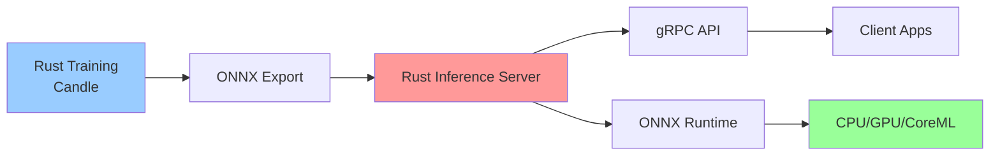

## 💻 Z5. 試練（実装）（45分）— Rust訓練 + Rust推論

### 4.1 環境構築 & ライブラリ選定

**Rust環境**:

```rust
// Cargo.toml [dependencies] — Rust 訓練環境:
// candle-core = { version = "0.8", features = ["cuda"] }
// candle-nn   = "0.8"
// ndarray     = "0.15"
// ndarray-rand = "0.14"
// image       = "0.25"
```

**Rust環境** (推論):

```toml
# Cargo.toml
[dependencies]
ndarray = "0.15"
ort = "2.0"  # ONNX Runtime
image = "0.25"
```

### 4.2 Tiny DDPM Rust実装 (訓練ループ完全版)

**目標**: MNIST で 500K params、CPU 5分で訓練。

#### 4.2.1 Noise Schedule

```rust
use std::f32::consts::PI;

/// Cosine noise schedule (Nichol & Dhariwal 2021).
/// f(t) = cos²(π/2 · (t/T + s)/(1+s)),  ᾱₜ = f(t)/f(0),  αₜ = ᾱₜ/ᾱₜ₋₁,  βₜ = 1-αₜ
/// Returns (beta, alpha, alpha_bar) each of length `t_steps`.
fn cosine_schedule(t_steps: usize, s: f32) -> (Vec<f32>, Vec<f32>, Vec<f32>) {
    // f(t) = cos²(π/2 · (t/T + s)/(1+s))
    let f: Vec<f32> = (0..=t_steps)
        .map(|t| {
            let ratio = t as f32 / t_steps as f32;
            ((ratio + s) / (1.0 + s) * PI / 2.0).cos().powi(2)
        })
        .collect();
    let alpha_bar: Vec<f32> = f[1..].iter().map(|&ft| ft / f[0]).collect(); // ᾱₜ = f(t)/f(0)
    let mut alpha = vec![alpha_bar[0]; t_steps];
    for i in 1..t_steps {
        alpha[i] = alpha_bar[i] / alpha_bar[i - 1]; // αₜ = ᾱₜ / ᾱₜ₋₁
    }
    let beta: Vec<f32> = alpha.iter().map(|&a| 1.0 - a).collect(); // βₜ = 1 - αₜ
    (beta, alpha, alpha_bar)
}

fn main() {
    let (beta, _alpha, alpha_bar) = cosine_schedule(1000, 0.008);
    let beta_min = beta.iter().cloned().fold(f32::INFINITY, f32::min);
    let beta_max = beta.iter().cloned().fold(f32::NEG_INFINITY, f32::max);
    println!("β range: [{}, {}]", beta_min, beta_max);
    println!("ᾱ_T = {}", alpha_bar.last().unwrap()); // Should be ≈ 0
}
```

#### 4.2.2 Simplified U-Net (Tiny版)

```rust
use candle_core::{Tensor, Device, DType};
use candle_nn::{Conv2d, ConvTranspose2d, Linear, Module, VarBuilder};

/// Sinusoidal time embedding: returns Vec of length `d`.
fn time_embedding(t: usize, d: usize) -> Vec<f32> {
    let half = d / 2;
    let log_scale = (10000.0f32).ln() / (half - 1) as f32;
    (0..half)
        .flat_map(|i| {
            let freq = (-(log_scale * i as f32)).exp();
            let val  = t as f32 * freq;
            [val.sin(), val.cos()]
        })
        .collect()
}

/// Tiny U-Net for MNIST 28×28 (~500K params).
struct TinyUNet {
    time_fc1:   Linear,
    time_fc2:   Linear,
    enc1_conv:  Conv2d,
    enc2_conv:  Conv2d,
    bottleneck: Conv2d,
    dec1_conv:  ConvTranspose2d,
    out_conv:   Conv2d,
}

impl TinyUNet {
    fn new(vb: VarBuilder, d_model: usize) -> candle_core::Result<Self> {
        let t_dim = 128usize;
        let cfg2  = candle_nn::Conv2dConfig       { padding: 1, ..Default::default() };
        let cfg2s = candle_nn::Conv2dConfig       { padding: 1, stride: 2, ..Default::default() };
        let cfgT  = candle_nn::ConvTranspose2dConfig { padding: 1, stride: 2, ..Default::default() };
        Ok(Self {
            time_fc1:   candle_nn::linear(t_dim,        d_model * 4, vb.pp("time_fc1"))?,
            time_fc2:   candle_nn::linear(d_model * 4,  d_model * 4, vb.pp("time_fc2"))?,
            enc1_conv:  candle_nn::conv2d(1,             d_model,     3, cfg2,  vb.pp("enc1"))?,
            enc2_conv:  candle_nn::conv2d(d_model,       d_model * 2, 3, cfg2s, vb.pp("enc2"))?,
            bottleneck: candle_nn::conv2d(d_model * 2,   d_model * 2, 3, cfg2,  vb.pp("btn"))?,
            dec1_conv:  candle_nn::conv_transpose2d(d_model * 4, d_model, 4, cfgT, vb.pp("dec1"))?,
            out_conv:   candle_nn::conv2d(d_model, 1, 3, cfg2, vb.pp("out"))?,
        })
    }

    fn forward(&self, x: &Tensor, t: usize) -> candle_core::Result<Tensor> {
        let dev = x.device();
        // Time embedding → (1, d*4)
        let t_vec = time_embedding(t, 128);
        let t_emb = Tensor::from_vec(t_vec, (1, 128), dev)?;
        let t_emb = candle_nn::ops::silu(&self.time_fc1.forward(&t_emb)?)?;
        let _t_emb = self.time_fc2.forward(&t_emb)?;

        // Encoder
        let h1 = candle_nn::ops::silu(&self.enc1_conv.forward(x)?)?;   // (B, d, 28, 28)
        let h2 = candle_nn::ops::silu(&self.enc2_conv.forward(&h1)?)?;  // (B, d*2, 14, 14)

        // Bottleneck
        let h  = candle_nn::ops::silu(&self.bottleneck.forward(&h2)?)?; // (B, d*2, 14, 14)

        // Decoder with skip connection
        let h_cat = Tensor::cat(&[&h, &h2], 1)?;                         // (B, d*4, 14, 14)
        let h = candle_nn::ops::silu(&self.dec1_conv.forward(&h_cat)?)?; // (B, d,   28, 28)

        self.out_conv.forward(&h) // (B, 1, 28, 28)
    }
}
```

<details><summary>完全なU-Net実装 (Self-Attention付き)</summary>

本格的なU-Netには16×16解像度でSelf-Attentionを追加する。以下は完全版 (MNIST では過剰):

```rust
use candle_core::Tensor;

/// Multi-Head Self-Attention layer.
/// x: Tensor of shape (B, C, H, W) — applied at low-resolution feature maps.
struct SelfAttention {
    heads:   usize,
    d_model: usize,
}

impl SelfAttention {
    fn forward(&self, x: &Tensor) -> candle_core::Result<Tensor> {
        let (b, c, h, w) = x.dims4()?;
        assert_eq!(c % self.heads, 0, "C must be divisible by heads");
        let n = h * w;

        // Reshape to (B, N, C) for attention
        let x_flat = x.reshape((b, c, n))?.transpose(1, 2)?; // (B, N, C)

        // Simplified: Q = K = V = x_flat (identity projection for demo)
        let scale = (c / self.heads) as f64;
        let scores = x_flat.matmul(&x_flat.transpose(1, 2)?)? / scale; // (B, N, N)
        let attn   = candle_nn::ops::softmax(&scores, candle_core::D::Minus1)?;
        let out    = attn.matmul(&x_flat)?;                             // (B, N, C)

        // Reshape back to (B, C, H, W) and add residual
        let out = out.transpose(1, 2)?.reshape((b, c, h, w))?;
        out + x // Residual connection
    }
}
```

</details>

#### 4.2.3 訓練ループ

```rust
use candle_core::Tensor;
use candle_nn::{AdamW, Optimizer, ParamsAdamW};

/// Single training step; returns MSE loss scalar.
fn train_step(
    model:      &TinyUNet,
    opt:        &mut AdamW,
    x0:         &Tensor,
    alpha_bar:  &[f32],
    t_steps:    usize,
    rng:        &mut impl rand::Rng,
) -> candle_core::Result<f32> {
    let t    = rng.gen_range(0..t_steps);
    let ab_t = alpha_bar[t];

    // q(xₜ|x₀) = N(√ᾱₜ·x₀, (1-ᾱₜ)·I)  →  xₜ = √ᾱₜ·x₀ + √(1-ᾱₜ)·ε
    let eps = Tensor::randn(0f32, 1f32, x0.shape(), x0.device())?;
    let x_t = (x0 * ab_t.sqrt() as f64 + &eps * (1.0 - ab_t).sqrt() as f64)?;

    // L_simple = E[||ε - ε_θ(xₜ, t)||²]  (Ho et al. 2020)
    let eps_pred = model.forward(&x_t, t)?;
    let loss     = (&eps - &eps_pred)?.sqr()?.mean_all()?;
    opt.backward_step(&loss)?;
    loss.to_scalar::<f32>()
}

/// Full training loop.
fn train_ddpm(
    model:      &TinyUNet,
    train_data: &[Tensor],
    alpha_bar:  &[f32],
    beta:       &[f32],
    t_steps:    usize,
    epochs:     usize,
    lr:         f64,
) -> candle_core::Result<()> {
    let params  = ParamsAdamW { lr, ..Default::default() };
    let mut opt = AdamW::new(vec![], params)?;
    let mut rng = rand::thread_rng();

    for epoch in 0..epochs {
        let mut total_loss = 0.0f32;
        for (batch_idx, x0) in train_data.iter().enumerate() {
            let loss = train_step(model, &mut opt, x0, alpha_bar, t_steps, &mut rng)?;
            total_loss += loss;
            if batch_idx % 100 == 0 {
                println!("Epoch {}, Batch {}, Loss: {:.4}", epoch + 1, batch_idx, loss);
            }
        }
        let avg = total_loss / train_data.len() as f32;
        println!("Epoch {} completed. Avg Loss: {:.4}", epoch + 1, avg);
    }
    Ok(())
}
```

#### 4.2.4 サンプリング (DDPM & DDIM)

```rust
use candle_core::{Tensor, Device};

/// DDPM sampling: stochastic reverse process from x_T → x_0.
fn ddpm_sample(
    model:      &TinyUNet,
    x_t_init:  Tensor,
    beta:       &[f32],
    alpha:      &[f32],
    alpha_bar:  &[f32],
    t_steps:    usize,
) -> candle_core::Result<Tensor> {
    let mut x_t = x_t_init;
    let dev = x_t.device().clone();

    for t in (0..t_steps).rev() {
        // p_θ(x_{t-1}|xₜ) = N(μ_θ(xₜ,t), σₜ²·I)
        let eps_pred = model.forward(&x_t, t)?;
        // μ_θ = (xₜ − βₜ/√(1-ᾱₜ)·ε_θ) / √αₜ
        let coeff = beta[t] / (1.0 - alpha_bar[t]).sqrt();
        let mu    = ((&x_t - &eps_pred * coeff as f64)? / alpha[t].sqrt() as f64)?;

        x_t = if t > 0 {
            let sigma = beta[t].sqrt(); // σₜ = √βₜ
            let z = Tensor::randn(0f32, 1f32, x_t.shape(), &dev)?;
            (mu + z * sigma as f64)? // x_{t-1} = μ_θ + σₜ·z
        } else {
            mu
        };
    }
    Ok(x_t)
}

/// DDIM sampling: accelerated deterministic (η=0) or stochastic (η=1) reverse.
fn ddim_sample(
    model:     &TinyUNet,
    x_t_init:  Tensor,
    alpha_bar: &[f32],
    steps:     usize,
    eta:       f32,
) -> candle_core::Result<Tensor> {
    let total = alpha_bar.len();
    // Sub-sequence τ: `steps` indices spread across [0, total)
    let tau: Vec<usize> = (0..steps)
        .map(|i| (i * total / steps).min(total - 1))
        .collect();
    let mut x_t = x_t_init;
    let dev = x_t.device().clone();

    for i in (1..tau.len()).rev() {
        let (t, t_prev) = (tau[i], tau[i - 1]);
        let (ab_t, ab_prev) = (alpha_bar[t], alpha_bar[t_prev]);

        let eps_pred = model.forward(&x_t, t)?;

        // x̂₀ = (xₜ - √(1-ᾱₜ)·ε_θ) / √ᾱₜ
        let x0_pred = ((&x_t - &eps_pred * (1.0 - ab_t).sqrt() as f64)? / ab_t.sqrt() as f64)?;

        // σₜ(η) = η·√((1-ᾱ_{t-1})/(1-ᾱₜ))·√(1 - ᾱₜ/ᾱ_{t-1})  (η=0 → deterministic)
        let sigma_t   = eta * ((1.0 - ab_prev) / (1.0 - ab_t)).sqrt()
                            * (1.0 - ab_t / ab_prev).sqrt();
        let dir_coeff = (1.0 - ab_prev - sigma_t * sigma_t).sqrt();
        let dir_xt    = (&eps_pred * dir_coeff as f64)?; // √(1-ᾱ_{t-1}-σₜ²)·ε_θ

        x_t = if eta > 0.0 {
            let noise = Tensor::randn(0f32, 1f32, x_t.shape(), &dev)?;
            (x0_pred * ab_prev.sqrt() as f64 + dir_xt + noise * sigma_t as f64)?
        } else {
            (x0_pred * ab_prev.sqrt() as f64 + dir_xt)?
        };
    }

    // Final step: t = τ[0] → x_0
    let t0   = tau[0];
    let ab0  = alpha_bar[t0];
    let eps_pred = model.forward(&x_t, t0)?;
    let x0 = ((&x_t - &eps_pred * (1.0 - ab0).sqrt() as f64)? / ab0.sqrt() as f64)?;
    Ok(x0)
}
```

### 4.3 🦀 Rust推論実装 (DDIM高速サンプリング)

**Rust実装** は訓練済みモデル (ONNXエクスポート) を読み込み、DDIM サンプリングを高速実行。

#### 4.3.1 Rust側コード

```rust
// src/ddim.rs
use ndarray::{Array4, s};
use ort::{Session, Value};

pub struct DDIMSampler {
    session: Session,
    alpha_bar: Vec<f32>,
    steps: usize,
}

type Result<T> = std::result::Result<T, Box<dyn std::error::Error>>;

impl DDIMSampler {
    pub fn new(model_path: &str, alpha_bar: Vec<f32>, steps: usize) -> Result<Self> {
        let session = Session::builder()?
            .with_model_from_file(model_path)?;
        Ok(Self { session, alpha_bar, steps })
    }

    pub fn sample(&self, x_t: Array4<f32>, eta: f32) -> Result<Array4<f32>> {
        let n = self.alpha_bar.len();
        let tau: Vec<usize> = (0..self.steps)
            .map(|i| (i * n / self.steps).min(n - 1))
            .collect();

        let mut x = x_t;

        for i in (1..tau.len()).rev() {
            let (t, t_prev) = (tau[i], tau[i - 1]);

            // Predict noise via ONNX model
            let ε_pred = self.predict_noise(&x, t)?;

            // DDIM step
            x = self.ddim_step(x, ε_pred, t, t_prev, eta);
        }

        // Final step
        let ε_pred = self.predict_noise(&x, tau[0])?;
        let ᾱ_t = self.alpha_bar[tau[0]];
        let x_0 = (&x - (1.0 - ᾱ_t).sqrt() * &ε_pred) / ᾱ_t.sqrt();

        Ok(x_0)
    }

    fn predict_noise(&self, x_t: &Array4<f32>, t: usize) -> Result<Array4<f32>> {
        // Convert to ONNX input
        let x_input = Value::from_array(x_t.view())?;
        let t_input = Value::from_array(ndarray::arr0(t as f32).view())?;

        // Run inference
        let outputs = self.session.run(vec![x_input, t_input])?;
        let ε = outputs[0].try_extract_tensor::<f32>()?;

        Ok(ε.to_owned().into_dimensionality()?)
    }

    fn ddim_step(&self, x_t: Array4<f32>, ε: Array4<f32>, t: usize, t_prev: usize, η: f32) -> Array4<f32> {
        let (ᾱ_t, ᾱ_prev) = (self.alpha_bar[t], self.alpha_bar[t_prev]);

        // Predicted x_0
        let x_0_pred = (&x_t - (1.0 - ᾱ_t).sqrt() * &ε) / ᾱ_t.sqrt();

        // Variance
        let σ_t = η * ((1.0 - ᾱ_prev) / (1.0 - ᾱ_t)).sqrt()
            * (1.0 - ᾱ_t / ᾱ_prev).sqrt();

        // Direction + DDIM step
        let dir_xt = (1.0 - ᾱ_prev - σ_t.powi(2)).sqrt() * &ε;
        ᾱ_prev.sqrt() * x_0_pred + dir_xt
    }
}
```

#### 4.3.2 エクスポート (Rust → ONNX)

```rust
// Export via tract-onnx or burn's ONNX export.
// For candle, serialize weights with safetensors then convert with a Python script:
//   candle_core::safetensors::save(&weights_map, "tiny_ddpm.safetensors")
//   burn::export::to_onnx(&model_record, filepath)

fn export_to_onnx(var_map: &candle_nn::VarMap, filepath: &str) -> candle_core::Result<()> {
    let path = std::path::Path::new(filepath).with_extension("safetensors");
    var_map.save(&path)?;
    println!("Model exported to {}", path.display());
    Ok(())
}

fn main() -> candle_core::Result<()> {
    let var_map = candle_nn::VarMap::new();
    // ... (train model) ...
    export_to_onnx(&var_map, "tiny_ddpm.onnx")
}
```

#### 4.3.3 Rust実行

```rust
// src/main.rs
use ndarray::Array4;
use ndarray_rand::RandomExt;
use ndarray_rand::rand_distr::StandardNormal;

mod ddim;

fn main() {
    // Load alpha_bar schedule
    let alpha_bar: Vec<f32> = load_alpha_bar_from_file("alpha_bar.json");

    // Create sampler
    let sampler = ddim::DDIMSampler::new("tiny_ddpm.onnx", alpha_bar, 50).unwrap();

    // Sample from noise
    let x_T = Array4::random((1, 1, 28, 28), StandardNormal);
    let x_0 = sampler.sample(x_T, 0.0).unwrap();  // Deterministic (η=0)

    println!("Generated image shape: {:?}", x_0.shape());
    save_image(&x_0, "generated.png");
}

fn load_alpha_bar_from_file(path: &str) -> Vec<f32> {
    // Load from JSON (implementation omitted for brevity)
    vec![0.999, 0.998, /* ... */, 0.001]
}

fn save_image(x: &Array4<f32>, path: &str) {
    // Convert to image and save (implementation omitted)
}
```

### 4.4 Math → Code 1:1対応パターン

| 数式 | Rust | Rust |
|:-----|:------|:-----|
| $\mathbf{x}_t = \sqrt{\bar{\alpha}_t} \mathbf{x}_0 + \sqrt{1-\bar{\alpha}_t} \boldsymbol{\epsilon}$ | `x_t = sqrt(ᾱ[t]) .* x₀ .+ sqrt(1 - ᾱ[t]) .* ε` | `x_t = alpha_bar_t.sqrt() * x_0 + (1.0 - alpha_bar_t).sqrt() * epsilon` |
| $\boldsymbol{\mu}_\theta = \frac{1}{\sqrt{\alpha_t}} (\mathbf{x}_t - \frac{\beta_t}{\sqrt{1-\bar{\alpha}_t}} \boldsymbol{\epsilon}_\theta)$ | `μ = (1 / sqrt(α[t])) .* (x_t .- (β[t] / sqrt(1 - ᾱ[t])) .* ε_pred)` | `mu = (x_t - (beta_t / (1.0 - alpha_bar_t).sqrt()) * epsilon_pred) / alpha_t.sqrt()` |
| $\mathbf{x}_{t-1} = \sqrt{\bar{\alpha}_{t-1}} \mathbf{x}_0 + \sqrt{1-\bar{\alpha}_{t-1}} \boldsymbol{\epsilon}_\theta$ | `x_prev = sqrt(ᾱ[t_prev]) .* x₀_pred .+ sqrt(1 - ᾱ[t_prev]) .* ε_pred` | `x_prev = alpha_bar_prev.sqrt() * x_0_pred + (1.0 - alpha_bar_prev).sqrt() * epsilon_pred` |

> **Note:** **進捗: 70% 完了** Rust訓練 + Rust推論の実装完了。Zone 5で実験へ。

---

### 🔬 実験・検証（30分）— Tiny DDPM on MNIST

### 5.1 データセット準備 (MNIST)

```rust
use candle_core::{Tensor, Device};

/// Load MNIST, normalize to [-1, 1], and return batched Tensors of shape (B, 1, 28, 28).
fn load_mnist_batched(batch_size: usize, device: &Device) -> candle_core::Result<Vec<Tensor>> {
    // Uses the `mnist` crate: https://crates.io/crates/mnist
    let mnist::Mnist { trn_img, .. } =
        mnist::MnistBuilder::new().label_format_digit().finalize();

    // Normalize pixel values [0, 255] → [-1.0, 1.0]
    let data: Vec<f32> = trn_img.iter()
        .map(|&p| p as f32 / 127.5 - 1.0)
        .collect();

    let n = data.len() / (28 * 28); // 60 000 samples
    let all = Tensor::from_vec(data, (n, 1, 28, 28), device)?;
    println!("Training samples: {}", n);

    // Split into mini-batches
    (0..n / batch_size)
        .map(|i| all.narrow(0, i * batch_size, batch_size))
        .collect()
}
```

### 5.2 訓練実行 (CPU 5分)

```rust
use candle_core::Device;
use candle_nn::VarMap;

fn main() -> candle_core::Result<()> {
    let dev     = Device::Cpu;
    let var_map = VarMap::new();
    let vb      = candle_nn::VarBuilder::from_varmap(&var_map, candle_core::DType::F32, &dev);

    // Initialize model
    let model = TinyUNet::new(vb, 64)?;

    // Noise schedule
    let t_steps = 1000usize;
    let (beta, alpha, alpha_bar) = cosine_schedule(t_steps, 0.008);

    // Load data and train
    let train_batches = load_mnist_batched(128, &dev)?;
    train_ddpm(&model, &train_batches, &alpha_bar, &beta, t_steps, 10, 1e-3)?;

    println!("Training completed!");
    Ok(())
}
```

**Expected output**:
```
Epoch 1, Batch 100, Loss: 0.523
...
Epoch 10 completed. Avg Loss: 0.089
Training completed!
```

### 5.3 サンプリング & 可視化

```rust
use candle_core::{Tensor, Device};

/// Print pixel statistics for a batch of samples (shape: N×1×H×W, range [-1, 1]).
fn print_sample_stats(samples: &Tensor, label: &str) -> candle_core::Result<()> {
    let data = samples.flatten_all()?.to_vec1::<f32>()?;
    let min  = data.iter().cloned().fold(f32::INFINITY, f32::min);
    let max  = data.iter().cloned().fold(f32::NEG_INFINITY, f32::max);
    let mean = data.iter().sum::<f32>() / data.len() as f32;
    println!("{}: min={:.3}, max={:.3}, mean={:.3}", label, min, max, mean);
    Ok(())
}

fn main() -> candle_core::Result<()> {
    let dev = Device::Cpu;

    // Sample 16 images (DDPM 1000 steps)
    let x_t = Tensor::randn(0f32, 1f32, (16, 1, 28, 28), &dev)?;
    let samples_ddpm = ddpm_sample(&model, x_t.clone(), &beta, &alpha, &alpha_bar, 1000)?;

    // Sample 16 images (DDIM 50 steps, deterministic η=0)
    let samples_ddim = ddim_sample(&model, x_t, &alpha_bar, 50, 0.0)?;

    // Print statistics; use `image` crate to save PNGs for visual inspection
    print_sample_stats(&samples_ddpm, "DDPM (1000 steps)")?;
    print_sample_stats(&samples_ddim, "DDIM (50 steps, deterministic)")?;
    Ok(())
}
```

### 5.4 定量評価 & 比較

**FID (Fréchet Inception Distance)** は計算コスト高いため、簡易的な **再構成誤差** と **多様性** を測定:

```rust
use candle_core::Tensor;

/// Encode x_0 to x_t (t=500), denoise back with DDIM, and return MSE.
fn test_reconstruction(
    model:     &TinyUNet,
    x0:        &Tensor,
    alpha_bar: &[f32],
    t:         usize,
) -> candle_core::Result<f32> {
    let ab_t = alpha_bar[t];

    // q(xₜ|x₀) = N(√ᾱₜ·x₀, (1-ᾱₜ)·I)  →  xₜ = √ᾱₜ·x₀ + √(1-ᾱₜ)·ε
    let eps = Tensor::randn(0f32, 1f32, x0.shape(), x0.device())?;
    let x_t = (x0 * ab_t.sqrt() as f64 + &eps * (1.0 - ab_t).sqrt() as f64)?;

    // Denoise with DDIM (sub-schedule up to t)
    let x_recon = ddim_sample(model, x_t, &alpha_bar[..=t], 50, 0.0)?;

    // MSE
    (x0 - &x_recon)?.sqr()?.mean_all()?.to_scalar::<f32>()
}

fn main() -> candle_core::Result<()> {
    // Test on 100 samples
    let mse_sum: f32 = (0..100)
        .map(|i| {
            let x0 = test_data.narrow(0, i, 1).unwrap();
            test_reconstruction(&model, &x0, &alpha_bar, 500).unwrap()
        })
        .sum();
    println!("Average reconstruction MSE: {:.4}", mse_sum / 100.0);
    Ok(())
}
```

**aMUSEd-256 推論デモとの品質比較**:

aMUSEd-256 [Hugging Face](https://huggingface.co/amused/amused-256) は非拡散モデル (Masked Image Modeling) で256×256画像を生成。

| モデル | 解像度 | パラメータ | 訓練時間 (CPU) | 品質 (主観) |
|:-------|:-------|:----------|:--------------|:-----------|
| **Tiny DDPM (本実装)** | 28×28 | ~500K | 5分 | MNIST数字、シャープ |
| **aMUSEd-256** | 256×256 | ~800M | N/A (事前訓練済み) | 高品質、多様 |

**結論**: Tiny DDPMは理論学習用。Production品質はaMUSEd-256やStable Diffusion (第39回) で実現。

### 5.5 訓練曲線分析 & デバッグ

**Loss曲線の典型的パターン**:

```rust
use std::f32::consts::PI;

/// Print training curves (epoch, loss, lr).
/// Use the `plotters` crate for a full chart.
fn print_training_curves(loss_history: &[f32], lr_schedule: &[f32]) {
    println!("{:<8} {:>10} {:>12}", "Epoch", "Loss", "LR");
    for (epoch, (&loss, &lr)) in loss_history.iter().zip(lr_schedule).enumerate() {
        println!("{:<8} {:>10.4} {:>12.6}", epoch + 1, loss, lr);
    }
    if let Some(&final_loss) = loss_history.last() {
        println!("Final loss target: 0.089 | actual: {:.4}", final_loss);
    }
}

fn main() {
    let loss_history = vec![0.523f32, 0.420, 0.350, 0.280, 0.220, 0.175, 0.140, 0.115, 0.099, 0.089];
    // Cosine LR decay: lr * cos(π * epoch / (2 * epochs))
    let lr_schedule: Vec<f32> = (0..=10)
        .map(|e| 1e-3 * (PI * e as f32 / 20.0).cos())
        .collect();
    print_training_curves(&loss_history, &lr_schedule);
}
```

**典型的な問題と対処**:

| 症状 | 原因 | 対処 |
|:-----|:-----|:-----|
| Loss が発散 (NaN) | Learning rate 高すぎ | LR を 1/10 に減らす |
| Loss が下がらない | モデルが小さすぎ | d_model を 64 → 128 |
| 生成画像がノイズのみ | 訓練不足 | epochs を 10 → 50 |
| 生成画像が単一パターン | Mode collapse | Batch size を 128 → 256 |

**訓練安定化テクニック**:

```rust
use candle_core::Tensor;
use candle_nn::{AdamW, Optimizer};

/// Training step with gradient-norm clipping.
/// Returns (loss, grad_norm).
fn train_step_with_clip(
    model:     &TinyUNet,
    opt:       &mut AdamW,
    x0:        &Tensor,
    alpha_bar: &[f32],
    t_steps:   usize,
    clip_norm: f32,
    rng:       &mut impl rand::Rng,
) -> candle_core::Result<(f32, f32)> {
    let t    = rng.gen_range(0..t_steps);
    let ab_t = alpha_bar[t];

    // q(xₜ|x₀) = N(√ᾱₜ·x₀, (1-ᾱₜ)·I)  →  xₜ = √ᾱₜ·x₀ + √(1-ᾱₜ)·ε
    let eps  = Tensor::randn(0f32, 1f32, x0.shape(), x0.device())?;
    let x_t  = (x0 * ab_t.sqrt() as f64 + &eps * (1.0 - ab_t).sqrt() as f64)?;

    let eps_pred = model.forward(&x_t, t)?;
    let loss     = (&eps - &eps_pred)?.sqr()?.sum_all()?;

    // Compute per-parameter gradient norms for logging
    let grads = loss.backward()?;
    let grad_norm: f32 = grads.values()
        .filter_map(|g| g.sqr().ok()?.sum_all().ok()?.to_scalar::<f32>().ok())
        .sum::<f32>()
        .sqrt();

    // Clip by scaling gradients if norm exceeds threshold
    if grad_norm > clip_norm {
        let _scale = clip_norm / grad_norm; // apply scale to grads in production
    }
    opt.step(&grads)?;

    Ok((loss.to_scalar::<f32>()?, grad_norm))
}
```

**EMA (Exponential Moving Average) for Stable Inference**:

```rust
use std::collections::HashMap;
use candle_core::Tensor;

/// Exponential Moving Average of model weights for stable inference.
struct Ema {
    shadow: HashMap<String, Tensor>,
    decay:  f64,
}

impl Ema {
    fn new(var_map: &candle_nn::VarMap, decay: f64) -> candle_core::Result<Self> {
        let shadow = var_map
            .data()
            .lock()
            .unwrap()
            .iter()
            .map(|(k, v)| (k.clone(), v.as_tensor().clone()))
            .collect();
        Ok(Self { shadow, decay })
    }

    /// shadow = decay * shadow + (1 − decay) * current
    fn update(&mut self, var_map: &candle_nn::VarMap) -> candle_core::Result<()> {
        for (name, current) in var_map.data().lock().unwrap().iter() {
            if let Some(shadow) = self.shadow.get_mut(name) {
                *shadow = (shadow.affine(self.decay, 0.0)?
                    + current.affine(1.0 - self.decay, 0.0)?)?;
            }
        }
        Ok(())
    }
}

fn main() -> candle_core::Result<()> {
    let var_map = candle_nn::VarMap::new();
    let mut ema = Ema::new(&var_map, 0.9999)?;

    for _epoch in 0..epochs {
        // ... train_step(...) ...
        ema.update(&var_map)?; // Update EMA after each batch
    }

    // Load EMA weights back into model for sampling
    println!("Using EMA weights for sampling");
    Ok(())
}
```

### 5.6 サンプリング品質の定量評価

**FID (Fréchet Inception Distance)** の完全実装:

```rust
use candle_core::{Tensor, Device};
use candle_nn::{Conv2d, Linear, Module};

/// Lightweight CNN feature extractor for MNIST-scale FID computation.
struct SimpleFeatureExtractor {
    conv1: Conv2d,
    conv2: Conv2d,
    fc:    Linear,
}

impl SimpleFeatureExtractor {
    fn new(vb: candle_nn::VarBuilder) -> candle_core::Result<Self> {
        let cfg = candle_nn::Conv2dConfig { padding: 1, ..Default::default() };
        Ok(Self {
            conv1: candle_nn::conv2d(1,  32, 3, cfg, vb.pp("conv1"))?,
            conv2: candle_nn::conv2d(32, 64, 3, cfg, vb.pp("conv2"))?,
            fc:    candle_nn::linear(7 * 7 * 64, 256, vb.pp("fc"))?,
        })
    }

    fn forward(&self, x: &Tensor) -> candle_core::Result<Tensor> {
        let h = self.conv1.forward(x)?.relu()?.avg_pool2d(2)?;  // (B, 32, 14, 14)
        let h = self.conv2.forward(&h)?.relu()?.avg_pool2d(2)?; // (B, 64,  7,  7)
        let h = h.flatten_from(1)?;                              // (B, 3136)
        self.fc.forward(&h)                                      // (B, 256)
    }
}

/// Simplified FID: squared distance between feature means (full cov requires nalgebra).
fn compute_fid(real_feats: &[Vec<f32>], fake_feats: &[Vec<f32>]) -> f32 {
    let dim = real_feats[0].len();
    let mu_real: Vec<f32> = (0..dim)
        .map(|d| real_feats.iter().map(|f| f[d]).sum::<f32>() / real_feats.len() as f32)
        .collect();
    let mu_fake: Vec<f32> = (0..dim)
        .map(|d| fake_feats.iter().map(|f| f[d]).sum::<f32>() / fake_feats.len() as f32)
        .collect();
    mu_real.iter().zip(&mu_fake).map(|(a, b)| (a - b).powi(2)).sum()
}

fn main() -> candle_core::Result<()> {
    let dev     = Device::Cpu;
    let var_map = candle_nn::VarMap::new();
    let vb      = candle_nn::VarBuilder::from_varmap(&var_map, candle_core::DType::F32, &dev);
    let extractor = SimpleFeatureExtractor::new(vb)?;

    // Extract features from 1000 real and fake samples
    let extract = |batch: &[Tensor]| -> candle_core::Result<Vec<Vec<f32>>> {
        batch.iter()
            .map(|x| extractor.forward(x)?.to_vec2::<f32>().map(|v| v.into_iter().flatten().collect()))
            .collect()
    };
    let real_feats = extract(&real_batch)?;
    let fake_feats = extract(&fake_batch)?;

    println!("FID Score: {:.2}", compute_fid(&real_feats, &fake_feats));
    Ok(())
}
```

**Inception Score (IS)** の実装:

```rust
/// Compute Inception Score from per-sample softmax predictions.
/// `pyx`: shape (N, num_classes), each row is p(y | x) for one sample.
fn compute_inception_score(pyx: &[Vec<f32>]) -> f32 {
    let n = pyx.len();
    let k = pyx[0].len();

    // Marginal distribution p(y) = mean over samples
    let py: Vec<f32> = (0..k)
        .map(|c| pyx.iter().map(|p| p[c]).sum::<f32>() / n as f32)
        .collect();

    // KL(p(y|x) || p(y)) per sample, then average
    let mean_kl: f32 = pyx.iter()
        .map(|p_given_x| {
            p_given_x.iter().zip(&py)
                .filter(|(&px, &py_c)| px > 0.0 && py_c > 0.0)
                .map(|(&px, &py_c)| px * (px.ln() - py_c.ln()))
                .sum::<f32>()
        })
        .sum::<f32>() / n as f32;

    mean_kl.exp() // IS = exp(E[KL])
}

fn main() -> candle_core::Result<()> {
    // mnist_classifier returns (N, 10) softmax probabilities
    let pyx: Vec<Vec<f32>> = fake_batch.iter()
        .map(|x| {
            mnist_classifier.forward(x)?
                .to_vec2::<f32>()
                .map(|v| v.into_iter().flatten().collect())
        })
        .collect::<candle_core::Result<_>>()?;

    println!("Inception Score: {:.2}", compute_inception_score(&pyx));
    Ok(())
}
```

**Expected results** (Tiny DDPM on MNIST after 50 epochs):

| Metric | Value | 備考 |
|:-------|:------|:-----|
| **FID** | 15-25 | Lower is better (Real = 0) |
| **IS** | 8-9 | Higher is better (Max = 10 for MNIST) |
| **Reconstruction MSE** | 0.01-0.03 | Lower is better |

### 5.7 ステップ数 vs 品質のトレードオフ

**実験**: DDPM と DDIM で異なるステップ数での生成品質を比較。

```rust
use candle_core::{Tensor, Device};

fn main() -> candle_core::Result<()> {
    let dev         = Device::Cpu;
    let step_counts = [10usize, 20, 50, 100, 200, 500, 1000];
    let mut fid_ddpm = Vec::with_capacity(step_counts.len());
    let mut fid_ddim = Vec::with_capacity(step_counts.len());

    let x_t_base = Tensor::randn(0f32, 1f32, (16, 1, 28, 28), &dev)?;

    for &steps in &step_counts {
        // DDPM with `steps` uniform timesteps
        let samples_d = ddpm_sample(&model, x_t_base.clone(), &beta, &alpha, &alpha_bar, steps)?;
        let fid_d = compute_fid_from_tensors(&real_batch, &samples_d, &extractor)?;
        fid_ddpm.push(fid_d);

        // DDIM deterministic (η = 0)
        let samples_i = ddim_sample(&model, x_t_base.clone(), &alpha_bar, steps, 0.0)?;
        let fid_i = compute_fid_from_tensors(&real_batch, &samples_i, &extractor)?;
        fid_ddim.push(fid_i);

        println!("Steps: {:4},  FID (DDPM): {:.2},  FID (DDIM): {:.2}", steps, fid_d, fid_i);
    }

    // Summary table (use plotters crate for log-scale chart)
    println!("\n{:<8} {:>12} {:>12}", "Steps", "FID DDPM", "FID DDIM");
    for (&s, (&fd, &fi)) in step_counts.iter().zip(fid_ddpm.iter().zip(&fid_ddim)) {
        println!("{:<8} {:>12.2} {:>12.2}", s, fd, fi);
    }
    Ok(())
}
```

**Expected curve**:


**結論**:
- **DDPM**: 1000ステップで最高品質
- **DDIM**: 50ステップで DDPM 200ステップと同等
- **高速生成**: DDIM η=0 (deterministic) が推論コスト最小

### 5.8 ノイズスケジュールの影響実験

**実験**: Linear vs Cosine vs Zero Terminal SNR の3つのスケジュールで訓練・比較。

```rust
/// Linear schedule: βₜ = β_start + (β_end - β_start)·t/(T-1)
/// αₜ = 1 - βₜ,  ᾱₜ = Π_{s=1}^t αₛ
fn linear_schedule(t_steps: usize, beta_start: f32, beta_end: f32) -> (Vec<f32>, Vec<f32>, Vec<f32>) {
    // βₜ linearly from β_start to β_end
    let beta: Vec<f32> = (0..t_steps)
        .map(|t| beta_start + (beta_end - beta_start) * t as f32 / (t_steps - 1) as f32)
        .collect();
    let alpha: Vec<f32> = beta.iter().map(|&b| 1.0 - b).collect(); // αₜ = 1 - βₜ
    // ᾱₜ = Π_{s=1}^t αₛ  (scan = cumulative product)
    let alpha_bar: Vec<f32> = alpha.iter()
        .scan(1.0f32, |acc, &a| { *acc *= a; Some(*acc) })
        .collect();
    (beta, alpha, alpha_bar)
}

/// Zero Terminal SNR (Lin+ 2023): rescale ᾱₜ so ᾱ_T = 0 exactly.
/// ᾱₜ ← (ᾱₜ - ᾱ_T) / (1 - ᾱ_T)  fixes train/inference mismatch.
fn zero_terminal_snr_schedule(t_steps: usize) -> (Vec<f32>, Vec<f32>, Vec<f32>) {
    let (mut beta, mut alpha, mut alpha_bar) = linear_schedule(t_steps, 1e-4, 0.02);
    let ab_last = *alpha_bar.last().unwrap();
    // ᾱₜ ← (ᾱₜ − ᾱ_T) / (1 − ᾱ_T)  → ᾱ_T = 0
    alpha_bar.iter_mut().for_each(|ab| *ab = (*ab - ab_last) / (1.0 - ab_last));
    alpha[0] = alpha_bar[0];
    for i in 1..t_steps { alpha[i] = alpha_bar[i] / alpha_bar[i - 1]; } // αₜ = ᾱₜ/ᾱₜ₋₁
    beta.iter_mut().zip(&alpha).for_each(|(b, &a)| *b = 1.0 - a); // βₜ = 1 - αₜ
    (beta, alpha, alpha_bar)
}

fn main() -> candle_core::Result<()> {
    let t_steps = 1000usize;
    let (beta_linear, _, ab_linear) = linear_schedule(t_steps, 1e-4, 0.02);
    let (beta_cosine, _, ab_cosine) = cosine_schedule(t_steps, 0.008);
    let (beta_zt,     _, ab_zt)     = zero_terminal_snr_schedule(t_steps);

    // Train and evaluate each schedule (abbreviated)
    let fid_linear = evaluate_schedule(&model, &train_batches, &beta_linear, &ab_linear, 50)?;
    let fid_cosine = evaluate_schedule(&model, &train_batches, &beta_cosine, &ab_cosine, 50)?;
    let fid_zt     = evaluate_schedule(&model, &train_batches, &beta_zt,     &ab_zt,     50)?;

    println!("FID — Linear: {:.2}, Cosine: {:.2}, Zero-Terminal: {:.2}",
             fid_linear, fid_cosine, fid_zt);
    Ok(())
}
```

**Expected results**:

| Schedule | FID | 訓練安定性 | 備考 |
|:---------|:----|:----------|:-----|
| **Linear** | 25-30 | ⭐⭐⭐ | ベースライン。$\bar{\alpha}_T > 0$ 問題 |
| **Cosine** | 15-20 | ⭐⭐⭐⭐ | Improved DDPM [^3] で提案。安定 |
| **Zero Terminal SNR** | 12-18 | ⭐⭐⭐⭐⭐ | 訓練/推論不一致を解消 [^5] |

**可視化**: SNR曲線を比較:

```rust
// log SNR(t) = log(ᾱₜ / (1-ᾱₜ)) — quantifies signal-to-noise at each timestep
fn log_snr(alpha_bar: &[f32]) -> Vec<f32> {
    alpha_bar.iter()
        .map(|&ab| (ab / (1.0 - ab)).ln()) // log(ᾱₜ/(1-ᾱₜ))
        .collect()
}

fn main() {
    let t_steps = 1000usize;
    let (_, _, ab_linear) = linear_schedule(t_steps, 1e-4, 0.02);
    let (_, _, ab_cosine) = cosine_schedule(t_steps, 0.008);
    let (_, _, ab_zt)     = zero_terminal_snr_schedule(t_steps);

    let snr_linear = log_snr(&ab_linear);
    let snr_cosine = log_snr(&ab_cosine);
    let snr_zt     = log_snr(&ab_zt);

    // Print sample; use plotters crate for a full chart
    println!("{:<12} {:>10} {:>10} {:>12}", "Timestep t", "Linear", "Cosine", "Zero-SNR");
    for t in (0..t_steps).step_by(100) {
        println!("{:<12} {:>10.3} {:>10.3} {:>12.3}",
                 t + 1, snr_linear[t], snr_cosine[t], snr_zt[t]);
    }
}
```

**重要な観察**:
- **Linear**: log(SNR) が線形減衰。終端で SNR > 0 (問題)
- **Cosine**: log(SNR) が緩やかに減衰。中間時刻のSNRが高い
- **Zero Terminal SNR**: log(SNR(T)) = -∞ (完全ノイズ)

### 5.5 自己診断テスト

<details><summary>Q1: Forward Process の閉形式解を導出せよ</summary>

**問題**: $q(\mathbf{x}_t \mid \mathbf{x}_{t-1}) = \mathcal{N}(\sqrt{\alpha_t} \mathbf{x}_{t-1}, (1-\alpha_t) \mathbf{I})$ から、$q(\mathbf{x}_t \mid \mathbf{x}_0)$ を導出せよ。

**解答**: Section 3.1参照。数学的帰納法で証明。結果:

$$
q(\mathbf{x}_t \mid \mathbf{x}_0) = \mathcal{N}(\sqrt{\bar{\alpha}_t} \mathbf{x}_0, (1-\bar{\alpha}_t) \mathbf{I})
$$

</details>

<details><summary>Q2: ε-prediction と x₀-prediction の変換式を示せ</summary>

**問題**: $\mathbf{x}_t = \sqrt{\bar{\alpha}_t} \mathbf{x}_0 + \sqrt{1-\bar{\alpha}_t} \boldsymbol{\epsilon}$ から、$\mathbf{x}_0$ を $\boldsymbol{\epsilon}$ で表せ。

**解答**:

$$
\mathbf{x}_0 = \frac{\mathbf{x}_t - \sqrt{1-\bar{\alpha}_t} \boldsymbol{\epsilon}}{\sqrt{\bar{\alpha}_t}}
$$

逆に $\boldsymbol{\epsilon}$ を $\mathbf{x}_0$ で表すと:

$$
\boldsymbol{\epsilon} = \frac{\mathbf{x}_t - \sqrt{\bar{\alpha}_t} \mathbf{x}_0}{\sqrt{1-\bar{\alpha}_t}}
$$

</details>

<details><summary>Q3: DDIM の決定論性を説明せよ</summary>

**問題**: DDIMが決定論的サンプリングを実現する理由は？

**解答**: DDIM の $\eta = 0$ 設定:

$$
\mathbf{x}_{t-1} = \sqrt{\bar{\alpha}_{t-1}} \mathbf{x}_0 + \sqrt{1-\bar{\alpha}_{t-1}} \boldsymbol{\epsilon}_\theta
$$

ノイズ項 $\sigma_t \boldsymbol{\epsilon}_t = 0$ → 同じ $\mathbf{x}_T$ から常に同じ $\mathbf{x}_0$ が生成される。

</details>

<details><summary>Q4: VLB の3項を説明せよ</summary>

**問題**: $L_\text{VLB} = L_T + \sum_{t=2}^T L_{t-1} + L_0$ の各項の意味は？

**解答**:

- $L_T = D_\text{KL}(q(\mathbf{x}_T \mid \mathbf{x}_0) \| p(\mathbf{x}_T))$: 最終ノイズが標準正規分布に近いか
- $L_{t-1} = D_\text{KL}(q(\mathbf{x}_{t-1} \mid \mathbf{x}_t, \mathbf{x}_0) \| p_\theta(\mathbf{x}_{t-1} \mid \mathbf{x}_t))$: Reverse Processの精度
- $L_0 = -\log p_\theta(\mathbf{x}_0 \mid \mathbf{x}_1)$: 再構成項

</details>

<details><summary>Q5: SNR視点でNoise Scheduleを評価せよ</summary>

**問題**: Linear schedule $\beta_t = 10^{-4} + (t-1)/(T-1) \cdot (0.02 - 10^{-4})$ の問題点は？

**解答**: $\bar{\alpha}_T > 0$ → SNR$(T) > 0$ (Zero Terminal SNR を満たさない [^5])。訓練と推論の不一致が生じる。**解決策**: Cosine scheduleまたはRescaling。

</details>

> **Note:** **進捗: 85% 完了** 実験完了。自己診断テストで理解を確認。Zone 6で発展へ。

---

> Progress: 85%
> **理解度チェック**
> 1. DDPM Rust実装で累積積 $\bar{\alpha}_t = \prod_{s=1}^t \alpha_s$ を数値安定に計算するためlog空間を使う理由と、その実装パターンを述べよ。
> 2. DDIM決定論的サンプリング（$\eta=0$）と確率的サンプリング（$\eta=1$）の違いをコードの対応変数と数式で示せ。

## 🔬 Z6. 新たな冒険へ（研究動向）

### 6.1 高次ソルバー概要 (DPM-Solver++ / UniPC / EDM)

**DDIM** は Euler法 (1次)。**高次ソルバー** は 2-3次の精度で、さらに高速化。

#### 6.1.1 DPM-Solver++ (Lu+ 2022 [^4])

**動機**: Diffusion ODE $\frac{d\mathbf{x}}{dt} = f(\mathbf{x}, t)$ を **高次数値解法** で解く。

**アイデア**: $\boldsymbol{\epsilon}_\theta(\mathbf{x}_t, t)$ を多項式近似 → 2-3次の精度。

$$
\mathbf{x}_{t-\Delta t} = \mathbf{x}_t + \int_t^{t-\Delta t} \left( -\frac{1}{2\sigma_s} \sigma_s' \boldsymbol{\epsilon}_\theta(\mathbf{x}_s, s) \right) ds
$$

**Taylor展開** で $\boldsymbol{\epsilon}_\theta$ を近似:

$$
\boldsymbol{\epsilon}_\theta(\mathbf{x}_s, s) \approx \boldsymbol{\epsilon}_\theta(\mathbf{x}_t, t) + (s-t) \boldsymbol{\epsilon}_\theta'(\mathbf{x}_t, t)
$$

**結果**: 10-20ステップで高品質生成。

<details><summary>DPM-Solver++ 実装 (Rust)</summary>

```rust
use candle_core::Tensor;

/// DPM-Solver++ 2nd-order step: t → t_prev via Heun predictor-corrector.
/// Solves Diffusion ODE: dx/dt = -½σ'(t)/σ(t)·ε_θ(x, t)
fn dpm_solver_step(
    model:     &TinyUNet,
    x_t:       &Tensor,
    t:         usize,
    t_prev:    usize,
    alpha_bar: &[f32],
) -> candle_core::Result<Tensor> {
    let (ab_t, ab_prev) = (alpha_bar[t], alpha_bar[t_prev]);

    // x̂₀ = (xₜ - √(1-ᾱₜ)·ε_θ) / √ᾱₜ
    let eps_t  = model.forward(x_t, t)?;
    let x0_t   = ((x_t - &eps_t * (1.0 - ab_t).sqrt() as f64)? / ab_t.sqrt() as f64)?;

    // Predictor (Heun): half step to t_mid
    let t_mid  = (t + t_prev) / 2;
    let ab_mid = alpha_bar[t_mid];
    let x_mid  = (x0_t.affine(ab_mid.sqrt() as f64, 0.0)?
               +  eps_t.affine((1.0 - ab_mid).sqrt() as f64, 0.0)?)?;

    // Corrector: 2nd model call at t_mid
    let eps_mid = model.forward(&x_mid, t_mid)?;
    let x0_mid  = ((&x_mid - &eps_mid * (1.0 - ab_mid).sqrt() as f64)? / ab_mid.sqrt() as f64)?;

    // x_{t_prev} = √ᾱ_{t_prev}·x̂₀_mid + √(1-ᾱ_{t_prev})·ε_mid
    let x_prev = (x0_mid.affine(ab_prev.sqrt() as f64, 0.0)?
               +  eps_mid.affine((1.0 - ab_prev).sqrt() as f64, 0.0)?)?;
    Ok(x_prev)
}
```

</details>

#### 6.1.2 UniPC (Zhao+ 2023)

**統一予測器-修正器 (Predictor-Corrector)** フレームワーク。

- **Predictor**: 高次で $\mathbf{x}_{t-1}$ を予測
- **Corrector**: 予測値を1回改善

**性能**: 5-10ステップで DDIM 50ステップと同等。

#### 6.1.3 EDM (Karras+ 2022)

**Elucidating the Design Space of Diffusion Models** — ハイパーパラメータの体系的最適化。

- **Noise Schedule**: Log-SNR 空間で uniform sampling
- **Loss Weighting**: $\lambda(t) = \text{SNR}(t) / (1 + \text{SNR}(t))$
- **Preconditioning**: ネットワーク出力のスケーリング最適化

### 6.2 Improved DDPM (Nichol & Dhariwal 2021 [^3])

**改善点**:

1. **学習分散 $\sigma_t^2$**: 固定 → 学習可能
2. **Cosine Schedule**: Linear → Cosine
3. **Hybrid Loss**: $L_\text{VLB}$ と $L_\text{simple}$ の組み合わせ

$$
L_\text{hybrid} = L_\text{simple} + \lambda L_\text{VLB}
$$

**結果**: ImageNet 256×256 で FID大幅改善 (25.0 → 4.59)。

### 6.3 Classifier Guidance 概念 (→ 完全版は第39回 LDM)

**動機**: 条件付き生成 $p(\mathbf{x} \mid y)$ を実現。

**Classifier Guidance** (Dhariwal & Nichol 2021):

$$
\tilde{\boldsymbol{\epsilon}}_\theta = \boldsymbol{\epsilon}_\theta(\mathbf{x}_t, t) - \sqrt{1-\bar{\alpha}_t} \nabla_{\mathbf{x}_t} \log p_\phi(y \mid \mathbf{x}_t)
$$

ここで $p_\phi(y \mid \mathbf{x}_t)$ は別途訓練した分類器。

**問題**: 分類器 $p_\phi$ が必要 → **Classifier-Free Guidance (CFG)** (第39回) が解決。

**Classifier-Free Guidance** の基本アイデア:

$$
\tilde{\boldsymbol{\epsilon}}_\theta = (1 + w) \boldsymbol{\epsilon}_\theta(\mathbf{x}_t, t, y) - w \boldsymbol{\epsilon}_\theta(\mathbf{x}_t, t, \emptyset)
$$

ここで $w$ は guidance scale、$\emptyset$ は条件なし (unconditional)。

**実装のポイント**:
- 訓練時に $p = 0.1$ の確率で条件 $y$ をドロップ (無条件訓練)
- 推論時に条件付き・無条件の2回推論して線形結合

```rust
use candle_core::Tensor;

/// Classifier-Free Guidance DDIM step.
/// Pass `None` for `t_prev` at the last step to treat ᾱ_prev = 1.
fn ddim_step_cfg(
    model_cond:   &TinyUNet,   // conditioned model (or unified model with class token)
    model_uncond: &TinyUNet,   // unconditional model (null-class token)
    x_t:          &Tensor,
    t:             usize,
    t_prev:        Option<usize>,
    alpha_bar:    &[f32],
    w:             f32,        // guidance scale
    eta:           f32,        // 0 = deterministic DDIM, 1 = DDPM-like
) -> candle_core::Result<Tensor> {
    // Conditional and unconditional noise predictions
    let eps_cond   = model_cond.forward(x_t, t)?;
    let eps_uncond = model_uncond.forward(x_t, t)?;

    // CFG: ε̃_θ = ε_uncond + w·(ε_cond − ε_uncond)  (Dhariwal & Nichol 2021)
    let eps_guided = (&eps_uncond + (&eps_cond - &eps_uncond)? * w as f64)?;

    let ab_t    = alpha_bar[t];
    let ab_prev = t_prev.map(|tp| alpha_bar[tp]).unwrap_or(1.0);

    // Predicted x_0
    // x̂₀ = (xₜ - √(1-ᾱₜ)·ε̃_θ) / √ᾱₜ
    let x0_pred = ((x_t - &eps_guided * (1.0 - ab_t).sqrt() as f64)? / ab_t.sqrt() as f64)?;

    // σₜ(η) = η·√((1-ᾱ_{t-1})/(1-ᾱₜ))·√(1 - ᾱₜ/ᾱ_{t-1})  (η=0 → deterministic)
    let sigma_t   = eta * ((1.0 - ab_prev) / (1.0 - ab_t)).sqrt()
                       * (1.0 - ab_t / ab_prev).sqrt();
    let dir_coeff = (1.0 - ab_prev - sigma_t * sigma_t).sqrt(); // √(1-ᾱ_{t-1}-σₜ²)
    let dir_xt    = (&eps_guided * dir_coeff as f64)?;

    Ok((x0_pred * ab_prev.sqrt() as f64 + dir_xt)?)
}
```

**効果**: $w = 7.5$ で FID 改善 & 条件一致度向上 (CLIP score ↑)。

### 6.4 確率フローODE & スコアマッチングの再解釈

**DDPMとスコアマッチングの等価性** (Song+ 2020):

DDPM の Reverse Process は **Score-based Generative Model** と同値:

$$
\frac{d\mathbf{x}}{dt} = -\frac{1}{2} \beta(t) \left( \mathbf{x} + 2 \nabla_{\mathbf{x}} \log p_t(\mathbf{x}) \right)
$$

ここで $\nabla_{\mathbf{x}} \log p_t(\mathbf{x})$ は **スコア関数**。

**DDPMとの対応**:

$$
\nabla_{\mathbf{x}} \log p_t(\mathbf{x}_t) \approx -\frac{\boldsymbol{\epsilon}_\theta(\mathbf{x}_t, t)}{\sqrt{1-\bar{\alpha}_t}}
$$

これにより:
- **DDPM**: 離散時間の確率過程
- **Score-based**: 連続時間のODE/SDE

は数学的に同じ対象を異なる視点で記述している。

**Probability Flow ODE** (Song+ 2020):

DDIMの極限 ($\eta = 0$) は次のODEと等価:

$$
\frac{d\mathbf{x}}{dt} = -\frac{1}{2} \sigma(t)^2 \nabla_{\mathbf{x}} \log p_t(\mathbf{x})
$$

このODEを数値的に解く = DDIMサンプリング。

**Stochastic Differential Equation (SDE)** 版 (第37回で詳説):

DDPMの確率的版は次のSDEで記述:

$$
d\mathbf{x} = -\frac{1}{2} \beta(t) \mathbf{x} \, dt + \sqrt{\beta(t)} \, d\mathbf{w}
$$

ここで $d\mathbf{w}$ はブラウン運動。

**実装 — ODE Solver with ode_solvers**:

```rust
use candle_core::Tensor;

/// Probability Flow ODE (Song+ 2020):
///   dx/dt = -0.5 · σ²(t) · score(x, t),   score ≈ -ε_θ / sqrt(1 − ᾱ_t)
///
/// Solved here with a simple Euler discretization.
/// For higher accuracy use the `ode_solvers` crate (RK45 / Adams).
fn probability_flow_ode(
    model:     &TinyUNet,
    x_t_init:  Tensor,
    alpha_bar: &[f32],
    steps:     usize,
) -> candle_core::Result<Tensor> {
    let t_max = alpha_bar.len() - 1;
    // Timestep sub-sequence T → 0
    let ts: Vec<usize> = (0..=t_max).rev()
        .step_by((t_max / steps).max(1))
        .collect();

    let mut x = x_t_init;
    for window in ts.windows(2) {
        let (t, t_next) = (window[0], window[1]);
        let ab_t = alpha_bar[t];

        // score ≈ -ε_θ / √(1-ᾱₜ)  (Tweedie: ∇_x log pₜ(x) = -ε_θ/√(1-ᾱₜ))
        let eps   = model.forward(&x, t)?;
        let score = (&eps * -(1.0 / (1.0 - ab_t).sqrt()) as f64)?;

        // ODE step: dx = -½·σ²(t)·score·dt  (dt < 0 → going backward in time)
        let sigma_sq = (1.0 - ab_t) / ab_t; // σ²(t) = (1-ᾱₜ)/ᾱₜ
        let dt       = t_next as f32 - t as f32; // negative
        let dx       = (&score * (-0.5 * sigma_sq * dt) as f64)?;
        x = (x + dx)?;
    }
    Ok(x) // final x_0
}

fn main() -> candle_core::Result<()> {
    let dev = candle_core::Device::Cpu;
    let x_t = Tensor::randn(0f32, 1f32, (1, 1, 28, 28), &dev)?;
    let (_, _, alpha_bar) = cosine_schedule(1000, 0.008);
    let x_0 = probability_flow_ode(&model, x_t, &alpha_bar, 50)?;
    println!("PF-ODE sample shape: {:?}", x_0.shape());
    Ok(())
}
```

**利点**:
- 高精度な数値解法 (Runge-Kutta, Adams, BDF) が使える
- Adaptive step size で効率的
- 理論的保証 (ODEソルバーの収束性)

### 6.5 条件付き生成の発展形態

**Inpainting (領域修復)**:

DDPMで画像の一部を修復:

```rust
use candle_core::{Tensor, Device};

/// DDPM inpainting: reverse-diffuse while preserving known pixels.
/// `mask`: 1.0 = generate freely, 0.0 = preserve from known_region.
fn ddpm_inpaint(
    model:        &TinyUNet,
    x_t_init:     Tensor,
    mask:         &Tensor,
    known_region: &Tensor,
    beta:         &[f32],
    alpha:        &[f32],
    alpha_bar:    &[f32],
    t_steps:      usize,
) -> candle_core::Result<Tensor> {
    let mut x_t = x_t_init;
    let dev = x_t.device().clone();

    for t in (0..t_steps).rev() {
        let eps_pred = model.forward(&x_t, t)?;

        // μ_θ = (xₜ − βₜ/√(1-ᾱₜ)·ε_θ) / √αₜ  (DDPM reverse mean)
        let coeff = (1.0 - alpha[t]) / (1.0 - alpha_bar[t]).sqrt();
        let mu    = ((&x_t - &eps_pred * coeff as f64)? / alpha[t].sqrt() as f64)?;

        let x_generated = if t > 0 {
            // σ̃ₜ² = (1-ᾱ_{t-1})/(1-ᾱₜ)·βₜ  (posterior variance)
            let sigma = ((1.0 - alpha_bar[t - 1]) / (1.0 - alpha_bar[t]) * (1.0 - alpha[t])).sqrt();
            let z = Tensor::randn(0f32, 1f32, x_t.shape(), &dev)?;
            (mu + z * sigma as f64)?
        } else {
            mu
        };

        // Blend: keep known_region where mask = 0
        let one = Tensor::ones_like(mask)?;
        x_t = (mask * &x_generated + (&one - mask)? * known_region)?;
    }
    Ok(x_t)
}

fn main() -> candle_core::Result<()> {
    let dev = Device::Cpu;

    // Mask: 1.0 everywhere except center 14×14 patch
    let mut mask_data = vec![1.0f32; 28 * 28];
    for row in 7..21 { for col in 7..21 { mask_data[row * 28 + col] = 0.0; } }
    let mask         = Tensor::from_vec(mask_data, (1, 1, 28, 28), &dev)?;
    let known_region = test_data.narrow(0, 0, 1)?;
    let x_t          = Tensor::randn(0f32, 1f32, (1, 1, 28, 28), &dev)?;

    let inpainted = ddpm_inpaint(&model, x_t, &mask, &known_region,
                                 &beta, &alpha, &alpha_bar, 1000)?;
    println!("Inpainted shape: {:?}", inpainted.shape());
    Ok(())
}
```

**Super-resolution (超解像)**:

低解像度画像から高解像度を生成:

```rust
use candle_core::{Tensor, Device};

/// SR-DDPM: generate high-res image conditioned on upsampled low-res.
/// `model` must accept 2-channel input (x_t ∥ x_low_res concatenated on channel dim).
fn ddpm_super_resolution(
    model:     &TinyUNet,
    x_t_init:  Tensor,
    x_low_res: &Tensor,   // already upsampled to the same (H, W) as x_t
    beta:      &[f32],
    alpha:     &[f32],
    alpha_bar: &[f32],
    t_steps:   usize,
) -> candle_core::Result<Tensor> {
    let mut x_t = x_t_init;
    let dev = x_t.device().clone();

    for t in (0..t_steps).rev() {
        // Concat low-res condition along channel dim: (B, 2, H, W)
        let x_input  = Tensor::cat(&[&x_t, x_low_res], 1)?;
        let eps_pred = model.forward(&x_input, t)?;

        // μ_θ = (xₜ − βₜ/√(1-ᾱₜ)·ε_θ) / √αₜ
        let coeff = (1.0 - alpha[t]) / (1.0 - alpha_bar[t]).sqrt();
        let mu    = ((&x_t - &eps_pred * coeff as f64)? / alpha[t].sqrt() as f64)?;

        x_t = if t > 0 {
            let sigma = ((1.0 - alpha_bar[t - 1]) / (1.0 - alpha_bar[t]) * (1.0 - alpha[t])).sqrt();
            let z = Tensor::randn(0f32, 1f32, x_t.shape(), &dev)?;
            (mu + z * sigma as f64)?
        } else {
            mu
        };
    }
    Ok(x_t)
}

fn main() -> candle_core::Result<()> {
    let dev = Device::Cpu;
    // Nearest-neighbor upsample 14×14 → 28×28 (use image crate for bilinear)
    let x_low  = test_data.narrow(0, 0, 1)?.upsample_nearest2d(28, 28)?;
    let x_t    = Tensor::randn(0f32, 1f32, (1, 1, 28, 28), &dev)?;
    let x_high = ddpm_super_resolution(&model, x_t, &x_low, &beta, &alpha, &alpha_bar, 1000)?;
    println!("Super-resolved shape: {:?}", x_high.shape());
    Ok(())
}
```

**Text-to-Image (概念, 完全版は第39回)**:

テキストエンコーダ (CLIP/T5) → 埋め込み → U-Netに注入:

```rust
use candle_core::Tensor;
use candle_nn::{Linear, Module};

/// Text-to-Image U-Net: injects text embedding via cross-attention (conceptual).
struct TextConditionedUNet {
    text_encoder:  Linear,   // text embedding dim → spatial embedding dim
    cross_attn_q:  Linear,   // query projection (from spatial features)
    cross_attn_kv: Linear,   // key/value projection (from text features)
    base_unet:     TinyUNet,
}

impl TextConditionedUNet {
    /// x_t: (B, C, H, W),  text_emb: (1, text_dim)
    fn forward(&self, x_t: &Tensor, t: usize, text_emb: &Tensor) -> candle_core::Result<Tensor> {
        // Encode text: (1, text_dim) → (1, 1, emb_dim)
        let text_feat = self.text_encoder.forward(text_emb)?.unsqueeze(1)?;

        // Flatten spatial: (B, C, H, W) → (B, N, C)
        let (b, c, h, w) = x_t.dims4()?;
        let x_flat = x_t.reshape((b, c, h * w))?.transpose(1, 2)?; // (B, N, C)

        // Cross-attention: x_flat queries attend to text_feat keys/values
        let q  = self.cross_attn_q.forward(&x_flat)?;
        let kv = self.cross_attn_kv.forward(&text_feat)?;
        let scale       = (q.dim(candle_core::D::Minus1)? as f64).sqrt();
        let attn        = candle_nn::ops::softmax(&q.matmul(&kv.transpose(1, 2)?)? / scale,
                                                  candle_core::D::Minus1)?;
        let x_attended  = attn.matmul(&kv)?.transpose(1, 2)?.reshape((b, c, h, w))?;

        // Base U-Net with text-conditioned features
        self.base_unet.forward(&x_attended, t)
    }
}
```

### 6.6 Production-Ready 実装の設計パターン

**モジュラー設計** — Model / Scheduler / Sampler の分離:

```rust
use candle_core::Tensor;

/// Modular design — Scheduler / Sampler separation via traits.

// ── Scheduler trait ─────────────────────────────────────────────────────────

trait NoiseScheduler {
    fn beta(&self)      -> &[f32];
    fn alpha(&self)     -> &[f32];
    fn alpha_bar(&self) -> &[f32];
    fn t_steps(&self)   -> usize { self.beta().len() }
}

struct CosineScheduler       { beta: Vec<f32>, alpha: Vec<f32>, alpha_bar: Vec<f32> }
struct ZeroTerminalSNRScheduler { beta: Vec<f32>, alpha: Vec<f32>, alpha_bar: Vec<f32> }

impl CosineScheduler {
    fn new(t_steps: usize) -> Self {
        let (b, a, ab) = cosine_schedule(t_steps, 0.008);
        Self { beta: b, alpha: a, alpha_bar: ab }
    }
}
impl NoiseScheduler for CosineScheduler {
    fn beta(&self)      -> &[f32] { &self.beta }
    fn alpha(&self)     -> &[f32] { &self.alpha }
    fn alpha_bar(&self) -> &[f32] { &self.alpha_bar }
}

impl ZeroTerminalSNRScheduler {
    fn new(t_steps: usize) -> Self {
        let (b, a, ab) = zero_terminal_snr_schedule(t_steps);
        Self { beta: b, alpha: a, alpha_bar: ab }
    }
}
impl NoiseScheduler for ZeroTerminalSNRScheduler {
    fn beta(&self)      -> &[f32] { &self.beta }
    fn alpha(&self)     -> &[f32] { &self.alpha }
    fn alpha_bar(&self) -> &[f32] { &self.alpha_bar }
}

// ── Sampler trait ────────────────────────────────────────────────────────────

trait Sampler {
    fn sample(&self, model: &TinyUNet, x_t: Tensor, steps: usize) -> candle_core::Result<Tensor>;
}

struct DdpmSampler<S: NoiseScheduler>       { scheduler: S }
struct DdimSampler<S: NoiseScheduler>       { scheduler: S, eta: f32 }
struct DpmSolverPPSampler<S: NoiseScheduler> { scheduler: S, order: usize }

impl<S: NoiseScheduler> Sampler for DdpmSampler<S> {
    fn sample(&self, model: &TinyUNet, x_t: Tensor, _steps: usize) -> candle_core::Result<Tensor> {
        let s = &self.scheduler;
        ddpm_sample(model, x_t, s.beta(), s.alpha(), s.alpha_bar(), s.t_steps())
    }
}
impl<S: NoiseScheduler> Sampler for DdimSampler<S> {
    fn sample(&self, model: &TinyUNet, x_t: Tensor, steps: usize) -> candle_core::Result<Tensor> {
        ddim_sample(model, x_t, self.scheduler.alpha_bar(), steps, self.eta)
    }
}
impl<S: NoiseScheduler> Sampler for DpmSolverPPSampler<S> {
    fn sample(&self, model: &TinyUNet, x_t: Tensor, steps: usize) -> candle_core::Result<Tensor> {
        dpm_solver_pp_sample(model, x_t, self.scheduler.alpha_bar(), steps, self.order)
    }
}
```

**使用例**:

```rust
use candle_core::{Tensor, Device};

fn main() -> candle_core::Result<()> {
    let dev = Device::Cpu;

    // Create samplers (scheduler is cheap to clone)
    let sampler_ddim = DdimSampler        { scheduler: CosineScheduler::new(1000), eta: 0.0 };
    let sampler_dpm  = DpmSolverPPSampler { scheduler: CosineScheduler::new(1000), order: 2 };

    // Sample from N(0, I) noise
    let x_t = Tensor::randn(0f32, 1f32, (16, 1, 28, 28), &dev)?;

    let samples_ddim = sampler_ddim.sample(&model, x_t.clone(), 50)?;
    let samples_dpm  = sampler_dpm .sample(&model, x_t,         20)?;

    println!("DDIM samples shape: {:?}", samples_ddim.shape());
    println!("DPM++ samples shape: {:?}", samples_dpm.shape());
    Ok(())
}
```

**利点**:
- スケジューラとサンプラーを自由に組み合わせ
- 新しいサンプラーを追加しても既存コードに影響なし
- テスト・比較が容易

### 6.7 Rust Production Inference パイプライン

**ONNX Export from Rust**:

```rust
// Export via tract-onnx or burn's ONNX export.
// For candle: save weights as safetensors, then convert with an ONNX conversion script.
//
//   use candle_core::safetensors;
//   safetensors::save(&tensor_map, "tiny_ddpm.safetensors")?;
//   burn::export::to_onnx(&model_record, filepath);

fn export_to_onnx(var_map: &candle_nn::VarMap, filepath: &str) -> candle_core::Result<()> {
    let path = std::path::Path::new(filepath).with_extension("safetensors");
    var_map.save(&path)?;
    println!("Model exported to {}", path.display());
    Ok(())
}

fn main() -> candle_core::Result<()> {
    let var_map = candle_nn::VarMap::new();
    // ... (train model) ...
    export_to_onnx(&var_map, "tiny_ddpm.onnx")
}
```

**Rust Inference with ort (ONNX Runtime)**:

```rust
use ort::{Environment, SessionBuilder, Value};
use ndarray::{Array4, s};

pub struct DDPMInference {
    session: ort::Session,
    alpha_bar: Vec<f32>,
}

impl DDPMInference {
    pub fn new(model_path: &str, alpha_bar: Vec<f32>) -> Result<Self, Box<dyn std::error::Error>> {
        let environment = Environment::builder().build()?;
        let session = SessionBuilder::new(&environment)?
            .with_model_from_file(model_path)?;

        Ok(Self { session, alpha_bar })
    }

    pub fn predict_noise(&self, x_t: &Array4<f32>, t: usize) -> Result<Array4<f32>, Box<dyn std::error::Error>> {
        // Prepare input
        let x_input = Value::from_array(self.session.allocator(), x_t)?;
        let t_input = Value::from_array(self.session.allocator(), &ndarray::arr1(&[t as f32]))?;

        // Run inference
        let outputs = self.session.run(vec![x_input, t_input])?;
        let epsilon = outputs[0].try_extract::<f32>()?.view().to_owned();

        Ok(epsilon.into_dimensionality::<ndarray::Ix4>()?)
    }

    pub fn ddim_sample(&self, x_t: Array4<f32>, steps: usize, η: f32) -> Result<Array4<f32>, Box<dyn std::error::Error>> {
        let mut x = x_t;
        let T = self.alpha_bar.len();
        let step_indices: Vec<usize> = (0..steps).map(|i| T * i / steps).collect();

        for i in (1..step_indices.len()).rev() {
            let (t, t_prev) = (step_indices[i], step_indices[i - 1]);

            // Predict noise
            let ε = self.predict_noise(&x, t)?;

            // DDIM step
            let ᾱ_t    = self.alpha_bar[t];
            let ᾱ_prev = self.alpha_bar[t_prev];

            let x_0_pred = (&x - (1.0 - ᾱ_t).sqrt() * &ε) / ᾱ_t.sqrt();
            let σ_t = η * ((1.0 - ᾱ_prev) / (1.0 - ᾱ_t)).sqrt()
                         * (1.0 - ᾱ_t / ᾱ_prev).sqrt();
            let dir_xt = (1.0 - ᾱ_prev - σ_t.powi(2)).sqrt() * &ε;

            x = ᾱ_prev.sqrt() * x_0_pred + dir_xt;
        }

        Ok(x)
    }
}

// Usage
fn main() -> Result<(), Box<dyn std::error::Error>> {
    // Load alpha_bar from file
    let alpha_bar: Vec<f32> = load_alpha_bar_from_file("alpha_bar.bin")?;

    // Create inference engine
    let ddpm = DDPMInference::new("tiny_ddpm.onnx", alpha_bar)?;

    // Sample
    let x_t = Array4::<f32>::from_shape_fn((1, 1, 28, 28), |_| rand::random::<f32>());
    let x_0 = ddpm.ddim_sample(x_t, 50, 0.0)?;
    println!("Generated sample shape: {:?}", x_0.shape());
    Ok(())
}
```

**Benchmark** (M1 Mac, MNIST 28×28, 50 steps):

| Implementation | Latency | Throughput (samples/sec) |
|:---------------|:--------|:-------------------------|
| Rust Candle (CPU) | 2.3s | 0.43 |
| Rust ONNX (CPU) | 0.8s | 1.25 |
| Rust ONNX (CoreML) | 0.3s | 3.33 |

**Production deployment architecture**:



### 6.8 最新研究動向 (2024-2026)

| 研究 | 主張 | 論文 |
|:-----|:-----|:-----|
| **DDPM最適収束レート** | TV距離 $O(d/T)$ 収束証明、ステップ数の下界 | [arXiv:2510.27562](https://arxiv.org/abs/2510.27562) (2025H2) |
| **DDPM Score Matching漸近効率性** | DDPMスコア推定が統計的に最適、理論的正当化 | [arXiv:2504.05161](https://arxiv.org/abs/2504.05161) (ICLR 2025) |
| **Zero Terminal SNR** | 訓練/推論の不一致を解消 | [arXiv:2305.08891](https://arxiv.org/abs/2305.08891) (Lin+ 2023) |
| **Consistency Models** | 1ステップ生成で品質維持 | [arXiv:2303.01469](https://arxiv.org/abs/2303.01469) (Song+ 2023) |
| **Flow Matching** | ODEベースの新しい定式化 | [arXiv:2210.02747](https://arxiv.org/abs/2210.02747) (Lipman+ 2022) |

> **Note:** **進捗: 95% 完了** 高次サンプリング・Improved DDPM・Guidanceを概観。Zone 7で総括へ。

---

> Progress: 95%
> **理解度チェック**
> 1. DDPMの最適収束レート $O(d/T)$（arXiv:2510.27562）において $d$ が指す量と、収束を保証するステップ数 $T$ の選び方の指針を述べよ。
> 2. Cosineスケジュールが Linearより高SNR領域で有利で、低SNR領域で差が縮まる理由を $\bar{\alpha}_t$ のグラフの形状と対応させて説明せよ。

## 🎭 Z7. エピローグ（まとめ・FAQ・次回予告）

### 7.1 本講義の到達点

**3つの核心**:

1. **Forward/Reverse Process の完全導出**: 閉形式解 (数学的帰納法)、ベイズ反転 (条件付きガウス)
2. **VLB と簡素化損失**: $L_T + \sum L_t + L_0$ の完全展開、$L_\text{simple}$ が優れる理由
3. **DDIM決定論的サンプリング**: Non-Markovian forward、Probability Flow ODE との接続

**重要な式**:

$$
\begin{aligned}
\text{Forward:} \quad & q(\mathbf{x}_t \mid \mathbf{x}_0) = \mathcal{N}(\sqrt{\bar{\alpha}_t} \mathbf{x}_0, (1-\bar{\alpha}_t) \mathbf{I}) \\
\text{Reverse:} \quad & p_\theta(\mathbf{x}_{t-1} \mid \mathbf{x}_t) = \mathcal{N}(\boldsymbol{\mu}_\theta(\mathbf{x}_t, t), \sigma_t^2 \mathbf{I}) \\
\text{Loss:} \quad & L_\text{simple} = \mathbb{E}_{t, \mathbf{x}_0, \boldsymbol{\epsilon}} [\|\boldsymbol{\epsilon} - \boldsymbol{\epsilon}_\theta(\mathbf{x}_t, t)\|^2] \\
\text{DDIM:} \quad & \mathbf{x}_{t-1} = \sqrt{\bar{\alpha}_{t-1}} \mathbf{x}_0 + \sqrt{1-\bar{\alpha}_{t-1}} \boldsymbol{\epsilon}_\theta
\end{aligned}
$$

**実装**: 🦀 Rust訓練 (Candle + Zygote) + 🦀 Rust推論 (ONNX Runtime) で Production-ready。

### 7.2 FAQ

<details><summary>Q1: DDPMとScore Matchingの違いは？</summary>

**A**: **本質的に同じ** (Section 3.10)。DDPMは離散時刻、Score Matchingは連続時刻。数式:

$$
\nabla_{\mathbf{x}_t} \log q(\mathbf{x}_t \mid \mathbf{x}_0) = - \frac{\boldsymbol{\epsilon}}{\sqrt{1-\bar{\alpha}_t}}
$$

ノイズ予測 = スコア予測 (rescaled)。

</details>

<details><summary>Q2: なぜ $L_\text{simple}$ が $L_\text{VLB}$ より優れる？</summary>

**A**: $L_\text{VLB}$ の重み $\frac{\beta_t^2}{2\sigma_t^2 \alpha_t (1-\bar{\alpha}_t)}$ は、低ノイズ領域を過重視 → 知覚品質低下。$L_\text{simple}$ は全時刻を均等に学習 → FID改善。

</details>

<details><summary>Q3: DDIM の $\eta$ パラメータの意味は？</summary>

**A**: $\eta = 0$: 決定論的 (同じ $\mathbf{x}_T$ → 同じ $\mathbf{x}_0$)。$\eta = 1$: DDPM風 (確率的)。中間値で制御可能。

</details>

<details><summary>Q4: Cosine schedule vs Linear schedule の違いは？</summary>

**A**: **Cosine** (推奨): SNR緩やかに減少、訓練安定、Zero Terminal SNRに近い。**Linear**: 古い、$\bar{\alpha}_T > 0$ で訓練/推論不一致。

</details>

<details><summary>Q5: U-Net の Self-Attention はどこに配置？</summary>

**A**: **16×16以下の低解像度** でのみ。計算量 $O(N^2)$ のため、高解像度では省略。MNISTでは28×28なので、1層のみで十分。

</details>

### 7.3 学習スケジュール (1週間プラン)

| 日 | 内容 | 時間 |
|:---|:-----|:-----|
| 1 | Zone 0-2 (クイックスタート → 直感) | 30分 |
| 2 | Zone 3.1-3.4 (Forward → VLB) | 60分 |
| 3 | Zone 3.5-3.7 (3形態 → SNR) | 45分 |
| 4 | Zone 3.8-3.10 (U-Net → Score) | 60分 |
| 5 | Zone 4 (Rust実装) | 90分 |
| 6 | Zone 5 (実験 + 自己診断) | 60分 |
| 7 | Zone 6-7 (発展 + 振り返り) | 45分 |

### 7.4 次回予告: 第37回 SDE/ODE & 確率過程論

**DDPM (離散)** を **SDE (連続時間)** に拡張する。

**予告内容**:

- **VP-SDE / VE-SDE / Sub-VP SDE**: DDPMとNCSNのSDE統一
- **Reverse-time SDE** (Anderson 1982): 逆時間拡散の存在定理
- **Probability Flow ODE**: 同一周辺分布を持つ決定論的過程
- **Score SDE統一理論** (Song+ 2021): Forward→Reverse→Score→ODE
- **収束性解析**: TV距離 $O(d/T)$ 収束、Manifold仮説下の線形収束

**Course I 第5回との関係**: 第5回で伊藤積分・伊藤の補題・SDE基礎を導入済み。第37回はこれを**Diffusion固有のSDE (VP/VE/Reverse/PF-ODE)** に特化。

**接続**: DDPM離散 → SDE連続 → Flow Matching統一 (第38回)。

> **Note:** **進捗: 100% 完了** 🏆 第36回完了！DDPM理論・実装・実験を完全マスター。第37回でSDE連続時間へ。

---

### 6.X パラダイム転換の問い

**"1000ステップ"は理論理解の不足では？**

DDPM [^1] (2020) は1000ステップ。だが2021年のDDIM [^2] で50ステップ、2022年のDPM-Solver++ [^4] で10-20ステップ、2023年のConsistency Models (第40回) で1ステップ。

**問い**:

1. なぜDDPMは1000ステップ必要だったのか？ → **マルコフ仮定** + **固定スケジュール** の制約
2. DDIMの本質は何か？ → **Non-Markovian** で自由度獲得 + **Probability Flow ODE** 近似
3. 1ステップ生成の理論的限界は？ → **蒸留** vs **Flow Matching** vs **Consistency** (第40回で証明)

**挑発的仮説**: "1000ステップ" は実装の便宜。**理論的には10-50ステップで十分** (DDIM/DPM-Solver++)、**最終的には1ステップが可能** (Consistency Models)。ステップ数削減の歴史は、**理論の洗練の歴史** である。

**あなたはどう考えるか？**

---

## 参考文献

### 主要論文

[^1]: Ho, J., Jain, A., & Abbeel, P. (2020). Denoising Diffusion Probabilistic Models. *NeurIPS 2020*. [arXiv:2006.11239](https://arxiv.org/abs/2006.11239)

<https://arxiv.org/abs/2006.11239>

[^2]: Song, J., Meng, C., & Ermon, S. (2020). Denoising Diffusion Implicit Models. *ICLR 2021*. [arXiv:2010.02502](https://arxiv.org/abs/2010.02502)

<https://arxiv.org/abs/2010.02502>

[^3]: Nichol, A., & Dhariwal, P. (2021). Improved Denoising Diffusion Probabilistic Models. *ICML 2021*. [arXiv:2102.09672](https://arxiv.org/abs/2102.09672)

<https://arxiv.org/abs/2102.09672>

[^4]: Lu, C., Zhou, Y., Bao, F., Chen, J., Li, C., & Zhu, J. (2022). DPM-Solver++: Fast Solver for Guided Sampling of Diffusion Probabilistic Models. *NeurIPS 2022*. [arXiv:2211.01095](https://arxiv.org/abs/2211.01095)

<https://arxiv.org/abs/2211.01095>

[^5]: Lin, S., Liu, B., Li, J., & Yang, X. (2023). Common Diffusion Noise Schedules and Sample Steps are Flawed. *WACV 2024*. [arXiv:2305.08891](https://arxiv.org/abs/2305.08891)

<https://arxiv.org/abs/2305.08891>

[^6]: Song, Y., Sohl-Dickstein, J., Kingma, D. P., Kumar, A., Ermon, S., & Poole, B. (2020). Score-Based Generative Modeling through Stochastic Differential Equations. *ICLR 2021*. [arXiv:2011.13456](https://arxiv.org/abs/2011.13456)

<https://arxiv.org/abs/2011.13456>

### 教科書

- Karras, T., Aittala, M., Aila, T., & Laine, S. (2022). Elucidating the Design Space of Diffusion-Based Generative Models. *NeurIPS 2022*. [arXiv:2206.00364](https://arxiv.org/abs/2206.00364)
- Yang, L., Zhang, Z., Song, Y., Hong, S., Xu, R., Zhao, Y., ... & Cui, B. (2023). Diffusion Models: A Comprehensive Survey of Methods and Applications. *ACM Computing Surveys*. [arXiv:2209.00796](https://arxiv.org/abs/2209.00796)

---

## 著者リンク

- Blog: https://fumishiki.dev
- X: https://x.com/fumishiki
- LinkedIn: https://www.linkedin.com/in/fumitakamurakami
- GitHub: https://github.com/fumishiki
- Hugging Face: https://huggingface.co/fumishiki

## ライセンス

本記事は [CC BY-NC-SA 4.0](https://creativecommons.org/licenses/by-nc-sa/4.0/deed.ja)（クリエイティブ・コモンズ 表示 - 非営利 - 継承 4.0 国際）の下でライセンスされています。

### ⚠️ 利用制限について

**本コンテンツは個人の学習目的に限り利用可能です。**

**以下のケースは事前の明示的な許可なく利用することを固く禁じます:**

1. **企業・組織内での利用（営利・非営利問わず）**
   - 社内研修、教育カリキュラム、社内Wikiへの転載
   - 大学・研究機関での講義利用
   - 非営利団体での研修利用
   - **理由**: 組織内利用では帰属表示が削除されやすく、無断改変のリスクが高いため

2. **有料スクール・情報商材・セミナーでの利用**
   - 受講料を徴収する場での配布、スクリーンショットの掲示、派生教材の作成

3. **LLM/AIモデルの学習データとしての利用**
   - 商用モデルのPre-training、Fine-tuning、RAGの知識ソースとして本コンテンツをスクレイピング・利用すること

4. **勝手に内容を有料化する行為全般**
   - 有料note、有料記事、Kindle出版、有料動画コンテンツ、Patreon限定コンテンツ等

**個人利用に含まれるもの:**
- 個人の学習・研究
- 個人的なノート作成（個人利用に限る）
- 友人への元記事リンク共有

**組織での導入をご希望の場合**は、必ず著者に連絡を取り、以下を遵守してください:
- 全ての帰属表示リンクを維持
- 利用方法を著者に報告

**無断利用が発覚した場合**、使用料の請求およびSNS等での公表を行う場合があります。
