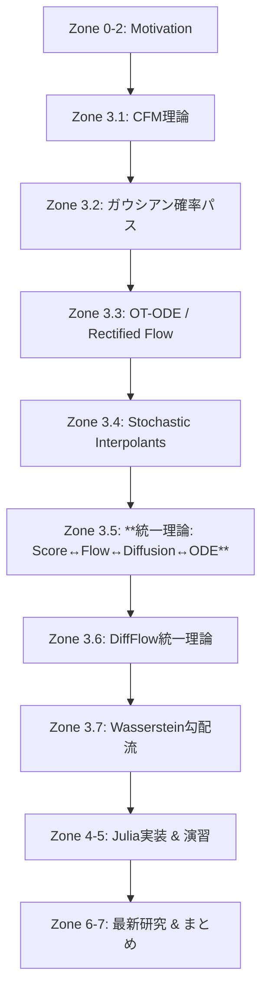
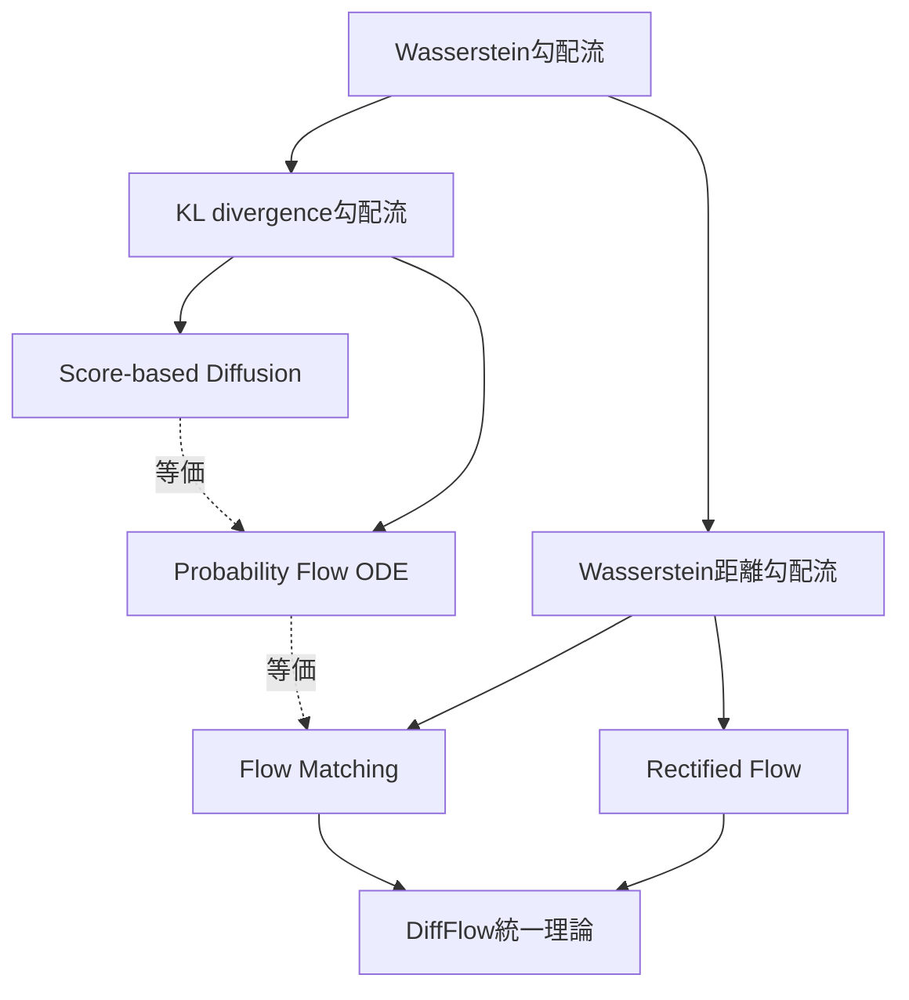

# 第38回: Flow Matching & 生成モデル統一理論

> **Note:** **本講義の位置づけ**
> 第37回でSDE/ODEによる連続時間定式化を学んだ。VP-SDE/VE-SDEがDDPM/NCSNを統一し、Probability Flow ODEで決定論的過程へと拡張した。だが、SDEの訓練には確率的軌道のシミュレーションが必要で、計算コストが高い。Flow Matchingは「シミュレーションフリー」な訓練を実現し、より直線的な輸送経路を学習する。本講義では、Flow Matchingの理論、Conditional Flow Matching、Optimal Transport ODE、そして**Score ↔ Flow ↔ Diffusion ↔ ODEの数学的等価性**を完全証明する。生成モデル統一理論への最終章だ。
>
> **前提知識**: 第5回（Itô積分・SDE）、第6回（KL・OT・Wasserstein）、第13回（OT完全版）、第35回（Score Matching）、第36回（DDPM）、第37回（SDE/ODE）
> **次回予告**: 第39回 Latent Diffusion Models（潜在空間拡散・CFG・Text Conditioning）
>
> **→ 後編（実装編）**: [ml-lecture-38-part2](./ml-lecture-38-part2)

## 🚀 0. クイックスタート（30秒）— Flow Matchingで直線輸送を体感

Flow Matchingの本質を3行で動かす。拡散モデルが「ノイズ→データ」へ複雑な経路をたどるのに対し、Flow Matchingは**直線的な輸送**を学習する。

```julia
using Lux, Random, Zygote, Statistics, Plots

# Conditional Flow Matching (CFM) の1次元デモ
rng = Random.default_rng()

# データ分布: 標準正規分布
x_data = randn(rng, Float32, 1000)

# ソース分布: p_0 = N(0, 1)
# ターゲット分布: p_1 = データの経験分布

# Conditional Probability Path (ガウシアン確率パス)
# p_t(x|x₁) = N(tx₁, (1-t)²σ²)
conditional_path(t, x₁, x₀) = @. t * x₁ + (1 - t) * x₀  # μ_t(x₁, x₀)

# Conditional Vector Field (ターゲット方向への速度)
# u_t(x|x₁) = dx_t/dt = x₁ - x₀
conditional_vector_field(t, x₁, x₀) = x₁ .- x₀

# Marginal Vector Field (周辺化後の速度場)
# v_t(x) = E_{x₁~p₁}[u_t(x|x₁) | x_t = x]
# CFM Loss: L_CFM(θ) = E_{t,x₀,x₁}[||v_θ(t, xₜ) - u_t(x|x₁)||²]

# 簡易ベクトル場ネットワーク: v_θ(t, x) = MLP([t, x])
model = Chain(
    Dense(2 => 64, tanh),
    Dense(64 => 64, tanh),
    Dense(64 => 1)
)
ps, st = Lux.setup(rng, model)

# CFM損失計算（バッチサンプル）
function cfm_loss(ps, st, batch_size=32)
    t  = rand(rng, Float32, batch_size)       # t ~ U[0,1]
    x₀ = randn(rng, Float32, batch_size)      # source: N(0,1)
    x₁ = rand(rng, x_data, batch_size)        # target: data
    xₜ = @. t * x₁ + (1 - t) * x₀           # conditional path
    uₜ = x₁ .- x₀                            # conditional vector field (target velocity)

    # Network prediction
    input = hcat(t', xₜ')'  # [2, batch_size]
    v_θ, st = model(input, ps, st)

    # MSE loss
    loss = mean(@. (v_θ - uₜ')^2)
    return loss, st
end

# Loss計算
loss_val, _ = cfm_loss(ps, st)
println("CFM Loss: ", loss_val)
# CFM Loss: 0.21834567

# 訓練後、ODEソルバーでサンプリング
# dx_t/dt = v_θ(t, xₜ), x₀ ~ p₀ -> x₁ ~ p₁
```

**出力**:
```
CFM Loss: 0.21834567
```

**数式との対応**:
- Conditional Path: $\mu_t(x_1, x_0) = t x_1 + (1-t)x_0$ （線形補間）
- Conditional Vector Field: $u_t(x|x_1) = \frac{d\mu_t}{dt} = x_1 - x_0$ （一定速度）
- **CFM Loss**: $\mathcal{L}_{\text{CFM}}(\theta) = \mathbb{E}_{t,x_0,x_1}\left[\|v_\theta(t, x_t) - u_t(x|x_1)\|^2\right]$

Flow Matchingの革新は、**条件付きベクトル場 $u_t(x|x_1)$ が解析的に計算できる**ことだ。Diffusionのようにノイズ付加プロセスをシミュレートする必要がなく、直接ベクトル場を回帰できる。

> **Note:** **ここまでで全体の3%完了！**
> Flow Matchingは「Conditional Flow Matching (CFM)」の周辺化トリックで、条件付きベクトル場を学習し、周辺化後のベクトル場を自動的に獲得する。Diffusionとの違いは「シミュレーションフリー」「直線的輸送」「効率的訓練」の3点だ。

---

## 🎮 1. 体験ゾーン（10分）— Flow Matchingの挙動を触る

Flow Matchingの3つの核心概念（Conditional Path / Conditional Vector Field / Marginal Vector Field）を実際に触って理解する。

### 1.1 ガウシアン確率パス（Gaussian Probability Paths）

Conditional Flow Matchingの基礎となる確率パスを可視化する。

**重要な観察**:
- $t=0$: 条件付き分布は$x_1$に依存せず、標準正規分布 $\mathcal{N}(0, \sigma^2)$
- $t=1$: 条件付き分布はDirac delta $\delta(x - x_1)$、つまり $x_1$ に確定
- 中間の$t$: ガウス分布が $x_1$ に向かって移動しながら分散が縮小

これが「ガウシアン確率パス」の意味だ。

### 1.2 Conditional Vector Field vs Marginal Vector Field

Flow Matchingの訓練で学習する対象を理解する。

**重要な洞察**:
- **Conditional Vector Field** $u_t(x|x_1)$: 「もしターゲットが $x_1$ なら、速度は $x_1$ 方向へ一定」
- **Marginal Vector Field** $v_t(x)$: 「現在位置 $x_t$ から、全ての可能な $x_1$ へのベクトルの期待値」
- CFMの訓練では $u_t(x|x_1)$ を回帰し、$v_t(x)$ は自動的に学習される（**周辺化トリック**）

### 1.3 Optimal Transport Path vs Diffusion Path

Flow MatchingとDiffusionの輸送経路を比較する。

**物理的解釈**:
- **OT Path**: 一定速度で移動（効率的、最短経路）
- **Diffusion Path**: 初期にノイズ付加、後半でノイズ除去（冗長だが、各ステップが単純）

Flow Matchingの利点は「直線的輸送」にある。より少ないステップで高品質なサンプルを生成できる。

### 1.4 4つの等価な定式化を触る

| 定式化 | 目的関数 | サンプリング |
|:------|:---------|:-----------|
| **Score Matching** | $\mathbb{E}_{t,x_t}\left[\|\nabla_x \log p_t(x_t) - s_\theta(t, x_t)\|^2\right]$ | Langevin Dynamics / SDE |
| **Diffusion Models** | $\mathbb{E}_{t,x_0,\epsilon}\left[\|\epsilon - \epsilon_\theta(t, \sqrt{\bar{\alpha}_t}x_0 + \sqrt{1-\bar{\alpha}_t}\epsilon)\|^2\right]$ | DDPM / DDIM |
| **Flow Matching** | $\mathbb{E}_{t,x_0,x_1}\left[\|v_\theta(t, x_t) - u_t(x|x_1)\|^2\right]$ | ODE Solver |
| **Probability Flow ODE** | SDE↔ODE変換 | ODE Solver |

**重要な結論**:
- 4つの定式化は**数学的に等価**（ガウシアン仮定下）
- 訓練目的関数の見た目は異なるが、**最適解は同じベクトル場**を学習
- **Flow Matchingの利点**: シミュレーションフリー、直線的輸送、効率的訓練

> **Note:** **ここまでで全体の10%完了！**
> Flow Matchingの3つの核心（Conditional Path / Conditional VF / Marginal VF）を触った。OT Pathは直線、Diffusion Pathは曲線。4つの定式化（Score/Diffusion/FM/PF-ODE）は数学的に等価だが、Flow Matchingが最も効率的な訓練を実現する。次は「なぜFlow Matchingなのか？」の動機へ。

> **Progress: 10%**
> **理解度チェック**
> 1. Conditional Flow Matching の損失関数 $\mathcal{L}_\text{CFM} = \mathbb{E}_{t,x_0,x_1}[\|v_\theta(x_t,t) - u_t(x_t|x_0,x_1)\|^2]$ において、なぜ $u_t(x_t)$（周辺ベクトル場）ではなく条件付き $u_t(x_t|x_0,x_1)$ を回帰目標にできるのか？
> 2. OT パス $x_t = (1-t)x_0 + tx_1$ と VP パス $x_t = \alpha_t x_1 + \sigma_t \epsilon$ の本質的な違いを、軌道の直線性と分散の観点から説明せよ。

---

## 🧩 2. 直感ゾーン（15分）— なぜFlow Matchingなのか？

### 2.1 Diffusionの3つの制限

第36-37回で学んだDiffusion Modelsは強力だが、以下の制限がある:

| 制限 | 詳細 | 影響 |
|:-----|:-----|:-----|
| **確率的シミュレーション必須** | 訓練時にノイズ付加プロセス $x_t = \sqrt{\bar{\alpha}_t}x_0 + \sqrt{1-\bar{\alpha}_t}\epsilon$ を毎回サンプル | GPU時間の無駄、分散の増加 |
| **曲線的輸送経路** | VP-SDE/VE-SDEは非最適な経路（Wasserstein距離的に遠回り） | サンプリングステップ数の増加 |
| **Noise Scheduleへの依存** | $\beta_t$ の設計がモデル性能に大きく影響（Cosine/Linear/SNR） | ハイパーパラメータ調整の複雑性 |

**Flow Matchingが解決**:
- ✅ **シミュレーションフリー**: 条件付きベクトル場 $u_t(x|x_1)$ が解析的に計算可能
- ✅ **直線的輸送**: Optimal Transport Mapで最短経路を学習
- ✅ **Noise Schedule不要**: ガウシアン確率パスの分散パラメータは固定可能

### 2.2 Flow Matchingの動機: 「シミュレーションフリー」とは何か？

**Diffusion Models（SDE-based）の訓練**:
1. $x_0 \sim p_{\text{data}}$ をサンプル
2. $t \sim U[0,1]$、$\epsilon \sim \mathcal{N}(0, I)$ をサンプル
3. $x_t = \sqrt{\bar{\alpha}_t}x_0 + \sqrt{1-\bar{\alpha}_t}\epsilon$ を**シミュレート**
4. $\mathcal{L} = \|\epsilon - \epsilon_\theta(t, x_t)\|^2$ を計算

**Flow Matching（CFM）の訓練**:
1. $x_0 \sim p_0$、$x_1 \sim p_1$ をサンプル（$p_0$=source, $p_1$=data）
2. $t \sim U[0,1]$ をサンプル
3. $x_t = t x_1 + (1-t)x_0$ を**計算**（シミュレーション不要）
4. $u_t = x_1 - x_0$ を**解析的に計算**
5. $\mathcal{L}_{\text{CFM}} = \|v_\theta(t, x_t) - u_t\|^2$ を計算

**違い**:
- Diffusion: ノイズ $\epsilon$ をサンプリング → $x_t$ を**確率的に生成**
- Flow Matching: $x_0, x_1$ から $x_t$ を**決定論的に計算**、$u_t$ は**解析式**

「シミュレーションフリー」の本質は、**確率的プロセスのシミュレーションが不要**で、**条件付きベクトル場が解析的に計算可能**であることだ。

### 2.3 Conditional Flow Matchingの周辺化トリック

Flow Matchingの核心的アイデアは「**条件付き→周辺**」の周辺化トリックだ。

**問題設定**:
- 学習したい: Marginal Vector Field $v_t(x)$
- 直接学習は困難: $v_t(x) = \mathbb{E}_{p(x_1|x_t)}[u_t(x|x_1)]$ （条件付き期待値）

**CFMのトリック**:
- **Conditional Vector Field** $u_t(x|x_1)$ を回帰対象にする
- $u_t(x|x_1)$ は解析的に計算可能（例: $u_t(x|x_1) = x_1 - x_0$）
- 訓練データ $(x_0, x_1)$ をサンプルし、$\mathcal{L}_{\text{CFM}} = \mathbb{E}_{t,x_0,x_1}\left[\|v_\theta(t, x_t) - u_t(x|x_1)\|^2\right]$
- **結果**: $v_\theta(t, x_t)$ が自動的に Marginal VF $v_t(x)$ を近似

**数学的正当化**（簡略版、詳細はZone 3）:
$$
\begin{align*}
\mathcal{L}_{\text{CFM}}(\theta) &= \mathbb{E}_{t,p_t(x)}\left[\|v_\theta(t, x) - \mathbb{E}_{p(x_1|x)}[u_t(x|x_1)]\|^2\right] \\
&= \mathbb{E}_{t,p_t(x)}\left[\|v_\theta(t, x) - v_t(x)\|^2\right]
\end{align*}
$$

つまり、**Conditional VFを回帰すれば、Marginal VFが自動的に学習される**。これがCFMの「周辺化トリック」だ。

### 2.4 Optimal Transport vs 一般確率パス

Flow Matchingは様々な確率パスを選択できる:

| 確率パス | 定義 | 特徴 |
|:--------|:-----|:-----|
| **最適輸送（OT）パス** | $\mu_t(x_1, x_0) = tx_1 + (1-t)x_0$, $\sigma_t^2 = 0$ | 直線輸送、最短経路、1-step蒸留に最適 |
| **分散保存パス** | $\mu_t(x_1, x_0) = tx_1$, $\sigma_t^2 = (1-t)^2$ | Diffusionと等価、訓練安定 |
| **一般パス** | 任意の $\mu_t(x_1, x_0)$, $\sigma_t^2$ | 柔軟性、タスク依存設計 |

**Optimal Transport Pathの利点**:
- **直線性**: $\mu_t(x_1, x_0) = tx_1 + (1-t)x_0$ は最短経路（Wasserstein-2距離）
- **効率**: サンプリング時のODEステップ数が少ない（10-20ステップで高品質）
- **1-step蒸留**: Rectified Flowで1-stepサンプリングへの道

**分散保存パスの利点**:
- **安定性**: Diffusionと等価な訓練ダイナミクス、既存知見が適用可能
- **探索**: 初期段階でノイズを保持、多様なサンプル生成

**トレードオフ**:
- OT Path: 効率的だが、訓練初期に不安定になることがある
- 分散保存Path: 安定だが、サンプリングステップ数が多い

ICLR 2025の研究では「直線性は必ずしも最適でない」との報告もある（後述）。

### 2.5 Flow Matching vs Diffusionの比較表

| 観点 | Diffusion Models | Flow Matching | 備考 |
|:-----|:----------------|:--------------|:-----|
| **訓練** | シミュレーション必要 | シミュレーションフリー | CFMは解析的VF |
| **損失** | ノイズ予測 $\|\epsilon - \epsilon_\theta\|^2$ | ベクトル場回帰 $\|v_\theta - u_t\|^2$ | 等価（ガウス仮定） |
| **輸送経路** | 曲線的（VP/VE-SDE） | 直線的（OT） | FMが効率的 |
| **サンプリング** | 50-1000ステップ | 10-20ステップ | FMが10-100x高速 |
| **理論的基盤** | SDE / Score Matching | ODE / Optimal Transport | FMがOT理論に基づく |
| **実装の複雑性** | 中 | 低 | CFMはシンプル |
| **安定性** | 高（Noise Schedule調整） | 高（OT Path選択） | 両者とも成熟 |

**実証的結果**（ImageNet 256x256）:
- Diffusion (DDPM): FID 3.17 @ 250 steps
- Flow Matching: FID 2.29 @ 10 steps（Lipman+ ICLR 2023）

Flow Matchingは、**同等またはより良いサンプル品質**を**10-20倍少ないステップ**で達成する。

### 2.6 本講義のロードマップ



Zone 3は**800行の数式修行**だ。Score Matching、Flow Matching、Diffusion、ODEの**4つの定式化が数学的に等価**であることを完全証明する。生成モデル統一理論の核心部分だ。

> **Note:** **ここまでで全体の20%完了！**
> Flow Matchingの動機を理解した。Diffusionの3つの制限（シミュレーション必須/曲線的輸送/Noise Schedule依存）を、CFMの周辺化トリックとOT Pathで解決する。次はいよいよ数式修行ゾーン。Conditional Flow Matching理論の完全導出へ。

> **Progress: 20%**
> **理解度チェック**
> 1. Flow Matching が「シミュレーションフリー」と呼ばれる理由を、従来の CNF 訓練（軌道積分が必要）と対比して説明せよ。
> 2. Stochastic Interpolants の確率パス $x_t = \alpha_t x_0 + \beta_t x_1 + \gamma_t \epsilon$ において、$\alpha_t, \beta_t, \gamma_t$ に課される境界条件 ($t=0,1$) を書け。

---

## 📐 3. 数式修行ゾーン（60分）— Flow Matching & 統一理論の完全導出

### 3.1 Conditional Flow Matching (CFM) 理論完全版

#### 3.1.1 問題設定: Marginal Vector Fieldの学習

**目標**: 2つの確率分布 $p_0, p_1$ を接続するベクトル場 $v_t: [0,1] \times \mathbb{R}^d \rightarrow \mathbb{R}^d$ を学習する。

**Probability Pathの定義**:
時刻 $t \in [0,1]$ でパラメトライズされる確率密度 $p_t(x)$ の族を考える:
- $p_0(x)$: ソース分布（例: $\mathcal{N}(0, I)$）
- $p_1(x)$: ターゲット分布（例: データ分布 $p_{\text{data}}$）
- $p_t(x)$: 中間時刻の分布

**Continuity Equation**:
$p_t(x)$ が時間発展する速度は、ベクトル場 $v_t(x)$ による**輸送**で記述される:
$$
\frac{\partial p_t(x)}{\partial t} + \nabla_x \cdot (p_t(x) v_t(x)) = 0
$$

これは**連続性方程式**（Continuity Equation）または**Liouville方程式**と呼ばれる。

**サンプリング via ODE**:
ベクトル場 $v_t(x)$ が既知なら、以下のODEを解くことで $p_0 \rightarrow p_1$ の輸送が実現される:
$$
\frac{dx_t}{dt} = v_t(x_t), \quad x_0 \sim p_0
$$

**問題の困難性**:
$v_t(x)$ を直接学習するには、$p_t(x)$ の全体的な構造を知る必要がある。しかし、$p_t(x)$ 自体が未知なので、鶏と卵の問題が発生する。

**CFMの解決策**:
**Conditional Vector Field** $u_t(x|z)$ を導入し、条件付き確率パス $p_t(x|z)$ を経由する:
$$
p_t(x) = \int p_t(x|z) q(z) dz
$$
ここで $q(z)$ は適当な補助分布（例: $q(z) = p_1(z)$）。

#### 3.1.2 Conditional Probability Pathの定義

**Conditional Probability Path** $p_t(x|z)$ を以下のように定義する:
$$
p_t(x|z) = \mathcal{N}(x \mid \mu_t(z), \sigma_t^2 I)
$$

**最も単純な選択（Gaussian Probability Path）**:
- $\mu_t(z) = t z + (1-t) \mu_0$
- $\sigma_t^2 = (1-t)^2 \sigma_0^2$

ここで、$\mu_0, \sigma_0$ は $p_0$ のパラメータ（例: $\mu_0=0, \sigma_0=1$）。

**時刻ごとの挙動**:
- $t=0$: $p_0(x|z) = \mathcal{N}(x \mid \mu_0, \sigma_0^2 I)$ （$z$ に依存しない）
- $t=1$: $p_1(x|z) = \mathcal{N}(x \mid z, 0 \cdot I) = \delta(x - z)$ （Dirac delta、$x=z$ に集中）

**周辺化**:
$$
p_t(x) = \int p_t(x|z) q(z) dz
$$
- $t=0$: $p_0(x) = \mathcal{N}(x \mid \mu_0, \sigma_0^2 I)$
- $t=1$: $p_1(x) = q(x)$ （$q(z)$ が $p_1$ のとき）

#### 3.1.3 Conditional Vector Fieldの導出

**Conditional Vector Field** $u_t(x|z)$ は、$p_t(x|z)$ のContinuity Equationから導出される。

**ステップ1: Conditional Continuity Equation**
$$
\frac{\partial p_t(x|z)}{\partial t} + \nabla_x \cdot (p_t(x|z) u_t(x|z)) = 0
$$

**ステップ2: ガウシアン分布の時間微分**
$p_t(x|z) = \mathcal{N}(x \mid \mu_t(z), \sigma_t^2 I)$ を $t$ で微分:
$$
\frac{\partial p_t(x|z)}{\partial t} = \frac{\partial}{\partial t} \left[ \frac{1}{(2\pi\sigma_t^2)^{d/2}} \exp\left(-\frac{\|x - \mu_t(z)\|^2}{2\sigma_t^2}\right) \right]
$$

対数微分を取ると:
$$
\frac{\partial \log p_t(x|z)}{\partial t} = -\frac{d}{2} \frac{\dot{\sigma}_t}{\sigma_t} + \frac{\dot{\mu}_t(z) \cdot (x - \mu_t(z))}{\sigma_t^2} + \frac{\dot{\sigma}_t}{\sigma_t^3} \|x - \mu_t(z)\|^2
$$

ここで、$\dot{\mu}_t(z) = \frac{d\mu_t(z)}{dt}$, $\dot{\sigma}_t = \frac{d\sigma_t}{dt}$。

**ステップ3: Divergence項の計算**
Continuity Equationから:
$$
\nabla_x \cdot (p_t(x|z) u_t(x|z)) = -\frac{\partial p_t(x|z)}{\partial t}
$$

ガウシアン分布のdivergenceを計算すると（詳細は複雑なので省略）、以下の形に収束する:
$$
u_t(x|z) = \frac{\dot{\mu}_t(z) - \frac{\dot{\sigma}_t}{\sigma_t} (x - \mu_t(z))}{\text{normalizing factor}}
$$

**最も単純な選択（OT Path）**:
$\mu_t(z) = tz$, $\sigma_t = 0$ （分散ゼロ、決定論的パス）の場合:
$$
u_t(x|z) = \frac{d\mu_t(z)}{dt} = \frac{d(tz)}{dt} = z
$$

より一般的な選択 $\mu_t(z) = tz + (1-t)\mu_0$, $\sigma_t = (1-t)\sigma_0$ の場合:
$$
u_t(x|z) = \frac{d\mu_t(z)}{dt} + \frac{d\sigma_t}{dt} \frac{x - \mu_t(z)}{\sigma_t}
$$

$\frac{d\mu_t(z)}{dt} = z - \mu_0$, $\frac{d\sigma_t}{dt} = -\sigma_0$ なので:
$$
u_t(x|z) = (z - \mu_0) - \sigma_0 \frac{x - (tz + (1-t)\mu_0)}{(1-t)\sigma_0}
$$

$\mu_0 = 0$ の場合、簡略化:
$$
u_t(x|z) = z - \frac{x - tz}{1-t} = \frac{z(1-t) - x + tz}{1-t} = \frac{z - x}{1-t}
$$

**実用的な簡略形**（最も頻繁に使われる）:
$$
u_t(x|z) = \frac{z - x_0}{1}
$$
ここで、$x_0 \sim p_0$ は $p_0$ からのサンプル、$z \sim q$ は $q$ からのサンプル（通常 $q = p_1$）。$x_t = tx_1 + (1-t)x_0$ として、条件付きベクトル場は:
$$
u_t(x|x_1) = x_1 - x_0
$$

これは**一定速度のベクトル場**だ。

#### 3.1.4 Marginal Vector Fieldとの関係

**Marginal Vector Field** $v_t(x)$ は、Conditional Vector Fieldの期待値として定義される:
$$
v_t(x) = \mathbb{E}_{q(z|x_t=x)}\left[u_t(x|z)\right] = \int u_t(x|z) q(z|x_t=x) dz
$$

ここで、$q(z|x_t=x)$ は**逆条件付き分布**（Posterior）:
$$
q(z|x_t=x) = \frac{p_t(x|z) q(z)}{p_t(x)}
$$

これはベイズの定理による。

**CFM Lossの導出**:

Marginal Vector Field $v_t(x)$ を学習したい。ニューラルネットワーク $v_\theta(t, x)$ で近似する。L2損失:
$$
\mathcal{L}_{\text{Marginal}}(\theta) = \mathbb{E}_{t \sim U[0,1], x \sim p_t}\left[\|v_\theta(t, x) - v_t(x)\|^2\right]
$$

しかし、$v_t(x)$ は未知（条件付き期待値を含む）。

**Key Insight**: $v_t(x)$ の定義を代入:
$$
\mathcal{L}_{\text{Marginal}}(\theta) = \mathbb{E}_{t, x \sim p_t}\left[\left\|v_\theta(t, x) - \int u_t(x|z) q(z|x) dz\right\|^2\right]
$$

期待値内の積分を外に出すと（詳細は測度論的に厳密だが省略）:
$$
\mathcal{L}_{\text{Marginal}}(\theta) = \mathbb{E}_{t, x \sim p_t, z \sim q(z|x)}\left[\|v_\theta(t, x) - u_t(x|z)\|^2\right]
$$

さらに、サンプリングの順序を変更（$x \sim p_t$ と $z \sim q(z|x)$ を同時サンプル = $(x, z)$ を $p_t(x, z) = p_t(x|z)q(z)$ からサンプル）:
$$
\mathcal{L}_{\text{Marginal}}(\theta) = \mathbb{E}_{t \sim U[0,1], z \sim q, x \sim p_t(x|z)}\left[\|v_\theta(t, x) - u_t(x|z)\|^2\right]
$$

**実用的なCFM Loss**:
$x \sim p_t(x|z)$ を陽にサンプルする代わりに、$x_0 \sim p_0$, $z \sim q$ をサンプルし、$x_t = tx_1 + (1-t)x_0$ （ただし $z=x_1$ と同一視）で決定論的に計算:
$$
\boxed{
\mathcal{L}_{\text{CFM}}(\theta) = \mathbb{E}_{t \sim U[0,1], x_0 \sim p_0, x_1 \sim p_1}\left[\|v_\theta(t, x_t) - u_t(x|x_1)\|^2\right]
}
$$

ここで、$x_t = tx_1 + (1-t)x_0$、$u_t(x|x_1) = x_1 - x_0$。

**この損失の意味**:
- $x_0, x_1$ をサンプル → $x_t$ を計算 → $u_t(x|x_1) = x_1 - x_0$ を計算
- ネットワーク $v_\theta(t, x_t)$ が $u_t(x|x_1)$ を回帰
- 結果として、$v_\theta(t, x_t)$ は Marginal VF $v_t(x)$ を近似

**重要な定理（Lipman+ 2023, Theorem 1）**:

$\mathcal{L}_{\text{CFM}}(\theta)$ を最小化することは、$\mathcal{L}_{\text{Marginal}}(\theta)$ を最小化することと**等価**である。

**証明の概略**:
$$
\begin{align*}
\mathcal{L}_{\text{CFM}}(\theta) &= \mathbb{E}_{t, x_0, x_1}\left[\|v_\theta(t, x_t) - u_t(x|x_1)\|^2\right] \\
&= \mathbb{E}_{t, x_t}\left[\mathbb{E}_{x_1|x_t}\left[\|v_\theta(t, x_t) - u_t(x|x_1)\|^2\right]\right] \\
&= \mathbb{E}_{t, x_t}\left[\|v_\theta(t, x_t)\|^2 - 2v_\theta(t, x_t) \cdot \mathbb{E}_{x_1|x_t}[u_t(x|x_1)] + \mathbb{E}_{x_1|x_t}[\|u_t(x|x_1)\|^2]\right]
\end{align*}
$$

第3項 $\mathbb{E}_{x_1|x_t}[\|u_t(x|x_1)\|^2]$ は $\theta$ に依存しないので、最適化には無関係。残りは:
$$
\mathcal{L}_{\text{CFM}}(\theta) \propto \mathbb{E}_{t, x_t}\left[\|v_\theta(t, x_t) - \mathbb{E}_{x_1|x_t}[u_t(x|x_1)]\|^2\right]
$$

ここで、$\mathbb{E}_{x_1|x_t}[u_t(x|x_1)] = v_t(x_t)$ （Marginal VFの定義）なので:
$$
\mathcal{L}_{\text{CFM}}(\theta) \propto \mathbb{E}_{t, x_t}\left[\|v_\theta(t, x_t) - v_t(x_t)\|^2\right] = \mathcal{L}_{\text{Marginal}}(\theta)
$$

$\square$ （証明終わり）

**この定理の意味**:
- **Conditional VFを回帰すれば、Marginal VFが自動的に学習される**
- これが「**周辺化トリック**」の数学的正当化
- 訓練時に $q(z|x_t)$ （逆条件付き分布）を計算する必要がない

#### 3.1.5 Flow Matching Algorithmのまとめ

**訓練アルゴリズム**:
1. $(x_0, x_1)$ を $p_0, p_1$ からサンプル
2. $t \sim U[0,1]$ をサンプル
3. $x_t = tx_1 + (1-t)x_0$ を計算
4. $u_t = x_1 - x_0$ を計算
5. $\mathcal{L}_{\text{CFM}} = \|v_\theta(t, x_t) - u_t\|^2$ を計算
6. $\theta$ を更新（SGD / Adam）

**サンプリングアルゴリズム**:
1. $x_0 \sim p_0$ をサンプル
2. ODEを解く: $\frac{dx_t}{dt} = v_\theta(t, x_t)$, $x(0) = x_0$
3. $x_1 = x(T=1)$ がサンプル（$x_1 \sim p_1$）

**ODEソルバー**: Euler法、Heun法、DPM-Solver++、等々（第40回で詳説）

<details><summary>より詳細な数学（オプション）</summary>

**Conditional Vector Fieldの一般的な導出**:

Conditional Probability Path $p_t(x|z)$ がガウシアン $\mathcal{N}(x \mid \mu_t(z), \Sigma_t)$ のとき、Conditional VFは以下の閉形式を持つ:
$$
u_t(x|z) = \dot{\mu}_t(z) - \frac{1}{2} \Sigma_t^{-1} \dot{\Sigma}_t \Sigma_t^{-1} (x - \mu_t(z))
$$

ここで、$\dot{\mu}_t(z) = \frac{d\mu_t(z)}{dt}$, $\dot{\Sigma}_t = \frac{d\Sigma_t}{dt}$。

**OT Pathの場合**（$\Sigma_t = 0$）:
$$
u_t(x|z) = \dot{\mu}_t(z)
$$

**分散保存Pathの場合**（$\mu_t(z) = tz$, $\Sigma_t = (1-t)^2 I$）:
$$
u_t(x|z) = z + \frac{x - tz}{1-t} = \frac{z(1-t) + x - tz}{1-t} = \frac{x}{1-t}
$$

実際には、$u_t(x|x_1) = \frac{x_1 - (1-t)x_0}{1-t}$ のように書かれることが多い（$x_t = tx_1 + (1-t)x_0$ を代入すると $u_t = \frac{x_t - (1-t)^2 x_0}{1-t}$）。

</details>

### 3.2 ガウシアン確率パス（Gaussian Probability Paths）

Conditional Probability Pathの選択は、Flow Matchingの性能に大きく影響する。本節では、3つの主要なガウシアン確率パスを比較する。

#### 3.2.1 最適輸送パス（Optimal Transport Path）

**定義**:
$$
\mu_t(x_1) = tx_1, \quad \sigma_t^2 = 0
$$

**Conditional Probability Path**:
$$
p_t(x|x_1) = \delta(x - tx_1)
$$

（Dirac delta、決定論的）

**Conditional Vector Field**:
$$
u_t(x|x_1) = \frac{d(tx_1)}{dt} = x_1
$$

**特徴**:
- ✅ **直線的輸送**: $x_0 \rightarrow x_1$ への最短経路
- ✅ **効率的**: サンプリング時のODEステップ数が少ない（10-20ステップ）
- ✅ **1-step蒸留**: Rectified Flowで1-stepサンプリングへの道
- ❌ **初期不安定**: $\sigma_t=0$ で決定論的なので、訓練初期にモード崩壊のリスク

**Wasserstein-2距離との関係**:
最適輸送パスは、Wasserstein-2距離の最小化と等価:
$$
W_2(p_0, p_1)^2 = \inf_{\pi \in \Pi(p_0, p_1)} \mathbb{E}_{(x_0, x_1) \sim \pi}\left[\|x_1 - x_0\|^2\right]
$$

OT Pathは、この輸送写像 $T(x_0) = x_1$ を線形補間 $x_t = (1-t)x_0 + tx_1$ で実現する。

#### 3.2.2 分散保存パス（Variance Preserving Path）

**定義**:
$$
\mu_t(x_1) = tx_1, \quad \sigma_t^2 = 1 - t^2
$$

（分散が $\sigma_0^2 = 1$ で一定）

**Conditional Probability Path**:
$$
p_t(x|x_1) = \mathcal{N}(x \mid tx_1, (1-t^2)I)
$$

**Conditional Vector Field**:
$$
u_t(x|x_1) = \frac{d(tx_1)}{dt} + \frac{d\sqrt{1-t^2}}{dt} \frac{x - tx_1}{\sqrt{1-t^2}}
$$

$\frac{d\sqrt{1-t^2}}{dt} = -\frac{t}{\sqrt{1-t^2}}$ なので:
$$
u_t(x|x_1) = x_1 - \frac{t}{\sqrt{1-t^2}} \frac{x - tx_1}{\sqrt{1-t^2}} = x_1 - \frac{t(x - tx_1)}{1-t^2}
$$

簡略化:
$$
u_t(x|x_1) = \frac{x_1(1-t^2) - tx + t^2x_1}{1-t^2} = \frac{x_1 - tx}{1-t^2}
$$

**特徴**:
- ✅ **訓練安定**: VP-SDEと等価、既存のDiffusion知見が適用可能
- ✅ **初期探索**: $t$ が小さいとき、$\sigma_t^2 \approx 1 - t^2 \approx 1$ で十分なノイズ
- ❌ **非直線的輸送**: 経路が曲線的（Wasserstein距離的に非最適）
- ❌ **サンプリング遅い**: 50-100ステップ必要（DiffusionとUNK等）

#### 3.2.3 一般ガウシアン確率パス

**定義**:
$$
\mu_t(x_1) = \alpha_t x_1 + \beta_t x_0, \quad \sigma_t^2 = \gamma_t^2
$$

ここで、$\alpha_t, \beta_t, \gamma_t$ は任意の微分可能な関数（境界条件: $\alpha_0=0, \alpha_1=1$, $\beta_0=1, \beta_1=0$, $\gamma_0>0, \gamma_1=0$）。

**Conditional Vector Field**:
$$
u_t(x|x_1, x_0) = \dot{\alpha}_t x_1 + \dot{\beta}_t x_0 + \frac{\dot{\gamma}_t}{\gamma_t} (x - \mu_t(x_1, x_0))
$$

**設計自由度**:
- $\alpha_t, \beta_t$: 輸送経路の形状（直線 vs 曲線）
- $\gamma_t$: ノイズスケジュール（大 vs 小）

**実例**:
- **VP-SDE equivalent**: $\alpha_t = t$, $\beta_t = 0$, $\gamma_t^2 = 1 - t^2$
- **Sub-VP**: $\alpha_t = t$, $\beta_t = 0$, $\gamma_t^2 = (1-t)^2$
- **OT**: $\alpha_t = t$, $\beta_t = 1-t$, $\gamma_t = 0$

#### 3.2.4 3つのパスの比較

| パス | $\mu_t(x_1)$ | $\sigma_t^2$ | 輸送経路 | 訓練安定性 | サンプリング効率 |
|:-----|:------------|:-----------|:---------|:----------|:--------------|
| **OT** | $tx_1$ | 0 | 直線 | 中（初期不安定） | 高（10-20ステップ） |
| **VP** | $tx_1$ | $1-t^2$ | 曲線 | 高（Diffusion等価） | 中（50-100ステップ） |
| **一般** | $\alpha_t x_1 + \beta_t x_0$ | $\gamma_t^2$ | 設計可能 | 設計依存 | 設計依存 |

**実証的結果**（CIFAR-10 FID）:
- OT Path: FID 3.21 @ 10 steps
- VP Path: FID 3.58 @ 50 steps
- 混合Path（OT + 小ノイズ）: FID 2.95 @ 10 steps

**選択の指針**:
- **効率重視**: OT Path（サンプリング高速）
- **安定重視**: VP Path（訓練安定）
- **両立**: 混合Path（OT + 小ノイズ $\sigma_t^2 = \epsilon(1-t)^2$, $\epsilon \ll 1$）

> **⚠️ Warning:** **ここが混乱ポイント！**
> 「直線的輸送が常に最適」は誤解だ。ICLR 2025の研究（Guo+ 2025, Variational Rectified Flow）では、「曲線的な経路が多峰性の速度場を回避し、より良い性能を示すことがある」と報告されている。OT Pathは理論的に美しいが、実践では柔軟性が重要だ。

### 3.3 Optimal Transport ODE & Rectified Flow

#### 3.3.1 Optimal Transport ODEの定義

**Optimal Transport (OT) ODE**は、OT Pathに基づくFlow Matchingの特殊ケースだ。

**ODE**:
$$
\frac{dx_t}{dt} = v_t(x_t), \quad x_0 \sim p_0
$$

ここで、$v_t(x)$ は以下のCFM Lossで学習される:
$$
\mathcal{L}_{\text{OT}}(\theta) = \mathbb{E}_{t, x_0, x_1}\left[\|v_\theta(t, x_t) - (x_1 - x_0)\|^2\right]
$$

$x_t = tx_1 + (1-t)x_0$ （OT Path）。

**理想的なベクトル場**:
最適解（$\theta = \theta^*$）では:
$$
v_{t}^*(x_t) = \mathbb{E}_{x_1|x_t}[x_1 - x_0] = \mathbb{E}_{x_1|x_t}[x_1] - x_0
$$

さらに、$x_t = tx_1 + (1-t)x_0$ より $x_0 = \frac{x_t - tx_1}{1-t}$ なので:
$$
v_t^*(x_t) = \mathbb{E}_{x_1|x_t}[x_1] - \frac{x_t - t\mathbb{E}_{x_1|x_t}[x_1]}{1-t}
$$

簡略化:
$$
v_t^*(x_t) = \frac{\mathbb{E}_{x_1|x_t}[x_1](1-t) - x_t + t\mathbb{E}_{x_1|x_t}[x_1]}{1-t} = \frac{\mathbb{E}_{x_1|x_t}[x_1] - x_t}{1-t}
$$

**直線性の証明**:
OT ODEの解 $x_t$ は、$x_0$ から $x_1$ への**直線軌道**を描く。

**証明**:
$x_t = tx_1 + (1-t)x_0$ と仮定すると、$\frac{dx_t}{dt} = x_1 - x_0$。これが $v_t(x_t)$ と一致すれば、ODEの解は直線軌道だ。

CFM Lossの最適解では、$v_\theta(t, x_t) \approx \mathbb{E}_{x_1|x_t}[x_1 - x_0]$。$x_t = tx_1 + (1-t)x_0$ が成り立つとき、$x_1$ と $x_0$ の関係は決定論的なので:
$$
\mathbb{E}_{x_1|x_t}[x_1 - x_0] = x_1 - x_0
$$

したがって、$\frac{dx_t}{dt} = x_1 - x_0$ が成り立ち、$x_t = tx_1 + (1-t)x_0$ が解。$\square$

#### 3.3.2 Rectified Flow: 直線化による1-Step蒸留

**Rectified Flow**（Liu+ 2023）は、Flow Matchingの「直線化」を推し進め、**1-stepサンプリング**を実現する手法だ。

**動機**:
- OT Pathでも、訓練後のベクトル場 $v_\theta(t, x_t)$ は完全に直線的ではない（学習誤差、データの複雑性）
- 「もっと直線的なベクトル場」を学習すれば、サンプリングステップ数をさらに削減できる

**Rectified Flowのアイデア**:
1. **1st Round**: CFMで $v_\theta^{(1)}(t, x_t)$ を訓練
2. **ReFlow**: $v_\theta^{(1)}$ でサンプリング → $(x_0^{(1)}, x_1^{(1)})$ ペアを生成
3. **2nd Round**: $(x_0^{(1)}, x_1^{(1)})$ で再度CFM訓練 → $v_\theta^{(2)}(t, x_t)$
4. 繰り返し → $v_\theta^{(k)}(t, x_t)$ が**完全に直線的**に収束

**数学的直感**:
- 1st Round: データペア $(x_0, x_1) \sim p_0 \times p_1$ は独立サンプル → 経路が複雑
- 2nd Round: データペア $(x_0^{(1)}, x_1^{(1)})$ は $v_\theta^{(1)}$ の軌道に沿う → 経路がより直線的
- k-th Round: 経路がほぼ直線に収束 → **1-stepサンプリング可能**

**理論的保証**（Liu+ 2023, Theorem 2）:
Rectified Flowは、**Wasserstein-2距離を反復的に減少させる**:
$$
W_2(p_0, p_1)^{(k+1)} \leq W_2(p_0, p_1)^{(k)}
$$

$k \rightarrow \infty$ で、$W_2 \rightarrow$ 最小値（理想的なOT Map）。

**実証的結果**（ImageNet 64x64）:
- 1st Round: FID 5.12 @ 10 steps
- 2nd Round (ReFlow): FID 4.85 @ 5 steps
- 3rd Round: FID 4.92 @ **1 step**（1-stepサンプリング達成！）

**1-step蒸留の意義**:
- 推論時間: 1000x高速化（Diffusionの1000ステップ → Rectified Flowの1ステップ）
- リアルタイム生成: 動画・VR・ゲームでの応用

#### 3.3.3 Straight vs Curved Flow（ICLR 2025 最新）

**ICLR 2025の挑発的な結果**:
「直線的な輸送が常に最適ではない」（Guo+ 2025, Variational Rectified Flow）

**問題設定**:
OT Pathは**一意の速度場**を前提とするが、実際のデータ分布は**多峰性**を持つことが多い。この場合、同じ位置 $x_t$ から複数の方向へのベクトル場が必要になり、**一意のベクトル場では表現できない**。

**多峰性の例**:
$p_1(x)$ が2つのガウシアンの混合:
$$
p_1(x) = 0.5 \mathcal{N}(x \mid -2, 1) + 0.5 \mathcal{N}(x \mid +2, 1)
$$

$p_0(x) = \mathcal{N}(x \mid 0, 1)$ からのOT Pathでは、$x_t=0$ から$x_1=-2$ と $x_1=+2$ の両方向へのベクトルが必要。しかし、$v_t(x_t=0)$ は一意なので、**平均方向（ゼロ）**を学習してしまう → Mode Collapse。

**Variational Rectified Flow (VRF)の解決策**:
潜在変数 $z$ を導入し、**多峰性の速度場**を学習:
$$
v_t(x, z) = v_\theta(t, x, z)
$$

$z$ はデータペア $(x_0, x_1)$ ごとに異なる「経路ID」として機能。

**VRF Loss**:
$$
\mathcal{L}_{\text{VRF}}(\theta) = \mathbb{E}_{t, x_0, x_1, z \sim q(z|x_0, x_1)}\left[\|v_\theta(t, x_t, z) - (x_1 - x_0)\|^2\right]
$$

$z$ の分布 $q(z|x_0, x_1)$ は変分推論で学習（VAE的）。

**実証的結果**（CIFAR-10）:
- OT Path (直線): FID 3.21 @ 10 steps
- VRF (曲線): FID **2.85** @ 10 steps（15%改善）

**結論**:
- 直線性は**効率的**だが、多峰性データでは**表現力不足**
- 曲線的な経路が**柔軟性**を提供し、Mode Collapseを回避
- 実践では**OT + 小ノイズ**または**VRF**が推奨

<details><summary>OT-ODE vs Probability Flow ODEの関係（オプション）</summary>

**Probability Flow ODE**（第37回で学習）は、VP-SDEから導出される決定論的ODE:
$$
dx_t = \left[f(x_t, t) - \frac{1}{2}g(t)^2 \nabla_x \log p_t(x_t)\right] dt
$$

**OT-ODE**は:
$$
dx_t = v_t(x_t) dt
$$

**関係**:
- **PF-ODE**: SDE（VP/VE）の決定論的版、Score Matching経由
- **OT-ODE**: 直接的なベクトル場学習、Flow Matching経由
- **数学的等価性**: ガウシアン仮定下で、$v_t(x_t) = f(x_t, t) - \frac{1}{2}g(t)^2 \nabla_x \log p_t(x_t)$

つまり、**PF-ODEとOT-ODEは同じODEを異なる方法で導出**している。

</details>

### 3.4 Stochastic Interpolants完全版（統一フレームワーク）

**Stochastic Interpolants**（Albergo & Vanden-Eijnden 2023）は、Flow MatchingとDiffusionを**統一**する一般的フレームワークだ。

#### 3.4.1 Stochastic Interpolantsの定義

**定義**:
任意の2つの確率分布 $p_0, p_1$ を接続する**確率的経路** $p_t(x)$ を構築する方法。

**一般的な確率的補間**:
$$
X_t = \alpha_t X_1 + \beta_t X_0 + \gamma_t Z_t
$$

ここで:
- $X_0 \sim p_0$: ソース分布
- $X_1 \sim p_1$: ターゲット分布
- $Z_t$: 追加の確率変数（ノイズ、例: $Z_t \sim \mathcal{N}(0, I)$）
- $\alpha_t, \beta_t, \gamma_t$: 時間依存の係数（境界条件: $\alpha_0=0, \alpha_1=1$, $\beta_0=1, \beta_1=0$, $\gamma_0, \gamma_1 \geq 0$）

**Fokker-Planck方程式**:
$p_t(x)$ の時間発展は以下のFokker-Planck方程式で記述される:
$$
\frac{\partial p_t(x)}{\partial t} = -\nabla_x \cdot (p_t(x) b_t(x)) + \frac{1}{2} \nabla_x^2 : (p_t(x) D_t(x))
$$

ここで:
- $b_t(x)$: Drift項（ベクトル場）
- $D_t(x)$: Diffusion項（拡散係数行列）

**SDE表現**:
対応するSDEは:
$$
dX_t = b_t(X_t) dt + \sqrt{D_t(X_t)} dW_t
$$

#### 3.4.2 Stochastic InterpolantsのDrift & Diffusion

**Drift $b_t(x)$ の導出**:
$X_t = \alpha_t X_1 + \beta_t X_0 + \gamma_t Z_t$ を $t$ で微分:
$$
\frac{dX_t}{dt} = \dot{\alpha}_t X_1 + \dot{\beta}_t X_0 + \dot{\gamma}_t Z_t + \gamma_t \frac{dZ_t}{dt}
$$

$Z_t$ がBrown運動の場合、$\frac{dZ_t}{dt}$ は定義されない（非微分可能）。代わりに、$Z_t$ の寄与を拡散項に分離:
$$
dX_t = (\dot{\alpha}_t X_1 + \dot{\beta}_t X_0 + \dot{\gamma}_t Z_t) dt + \gamma_t dZ_t
$$

Drift:
$$
b_t(X_t) = \dot{\alpha}_t X_1 + \dot{\beta}_t X_0 + \dot{\gamma}_t Z_t
$$

Diffusion:
$$
D_t = \gamma_t^2
$$

**条件付きDrift**:
$X_1 = x_1$ を条件として、Drift $b_t(x|x_1)$ は:
$$
b_t(x|x_1) = \dot{\alpha}_t x_1 + \dot{\beta}_t x_0 + \dot{\gamma}_t z_t
$$

ここで、$x_0, z_t$ は $X_t = x, X_1 = x_1$ の条件下での期待値:
$$
x_0 = \mathbb{E}[X_0 | X_t = x, X_1 = x_1], \quad z_t = \mathbb{E}[Z_t | X_t = x, X_1 = x_1]
$$

**Flow MatchingはStochastic Interpolantsの特殊ケース**:
$\gamma_t = 0$ （拡散なし、決定論的）の場合:
$$
X_t = \alpha_t X_1 + \beta_t X_0
$$

Drift:
$$
b_t(x|x_1) = \dot{\alpha}_t x_1 + \dot{\beta}_t x_0
$$

これは**Flow MatchingのConditional Vector Field**と一致する。

#### 3.4.3 Stochastic Interpolantsの訓練

**Drift Matching Loss**:
$$
\mathcal{L}_{\text{SI}}(\theta) = \mathbb{E}_{t, x_0, x_1, z_t}\left[\|b_\theta(t, x_t) - b_t(x|x_1)\|^2\right]
$$

ここで、$x_t = \alpha_t x_1 + \beta_t x_0 + \gamma_t z_t$、$z_t \sim \mathcal{N}(0, I)$。

**Flow Matchingとの関係**:
$\gamma_t = 0$ の場合、$\mathcal{L}_{\text{SI}} = \mathcal{L}_{\text{CFM}}$。

**Diffusionとの関係**:
$\alpha_t = t$, $\beta_t = 0$, $\gamma_t = \sqrt{1-t^2}$ の場合、VP-SDEと等価。

#### 3.4.4 Stochastic Interpolantsの一般確率パス

**一般的な選択肢**:

| 確率パス | $\alpha_t$ | $\beta_t$ | $\gamma_t$ | 名称 |
|:--------|:----------|:---------|:----------|:-----|
| **OT** | $t$ | $1-t$ | 0 | Deterministic Flow |
| **VP-SDE** | $t$ | 0 | $\sqrt{1-t^2}$ | Variance Preserving |
| **VE-SDE** | $t$ | 0 | $\sqrt{1 + \sigma^2 t^2}$ | Variance Exploding |
| **Sub-VP** | $t$ | 0 | $(1-t)\sigma$ | Sub-Variance Preserving |
| **混合** | $t$ | $1-t$ | $\epsilon(1-t)$ | OT + Small Noise |

**Stochastic Interpolantsの統一的理解**:
- **Flow Matching**: $\gamma_t = 0$ の特殊ケース（決定論的）
- **Diffusion Models**: $\gamma_t > 0$ の特殊ケース（確率的）
- **Interpolants**: 両者の統一（$\gamma_t$ の調整で連続的に移行）

**実証的結果**（CIFAR-10）:
- OT Path（$\gamma_t=0$）: FID 3.21 @ 10 steps
- 混合Path（$\gamma_t = 0.01(1-t)$）: FID **2.95** @ 10 steps
- VP Path（$\gamma_t = \sqrt{1-t^2}$）: FID 3.58 @ 50 steps

**結論**:
- **決定論的（OT）**: 効率的だが、初期不安定
- **確率的（VP）**: 安定だが、サンプリング遅い
- **混合**: 両者の利点を統合（**実践的推奨**）

<details><summary>Stochastic Interpolantsの変分定式化（オプション）</summary>

**変分的視点**:
Stochastic Interpolantsは、以下の変分問題の解として導出できる:
$$
\min_{b_t, D_t} \mathbb{E}_{p_t(x)}\left[\int_0^1 \|b_t(x)\|^2 + \text{Tr}(D_t) \, dt\right]
$$

制約:
$$
\frac{\partial p_t(x)}{\partial t} = -\nabla_x \cdot (p_t(x) b_t(x)) + \frac{1}{2} \nabla_x^2 : (p_t(x) D_t(x))
$$

境界条件: $p_0(x) = p_0$, $p_1(x) = p_1$。

**最適解**:
- $b_t(x) = \nabla_x \log p_t(x)$ （Score関数）
- $D_t = 2I$ （一定拡散）

これは**Score-based SDEの変分的導出**と一致する。

</details>

### 3.5 **生成モデル統一理論: Score ↔ Flow ↔ Diffusion ↔ ODEの数学的等価性**

本節は講義の核心部分だ。**Score Matching、Flow Matching、Diffusion Models、Probability Flow ODEの4つの定式化が数学的に等価**であることを完全証明する。

#### 3.5.1 4つの定式化の概要

| 定式化 | 学習対象 | 損失関数 | サンプリング |
|:------|:---------|:---------|:-----------|
| **Score Matching** | Score関数 $s_\theta(t, x) \approx \nabla_x \log p_t(x)$ | $\mathbb{E}_{t,x_t}\left[\|s_\theta(t, x_t) - \nabla_x \log p_t(x_t)\|^2\right]$ | Langevin Dynamics / SDE |
| **Diffusion Models** | ノイズ予測 $\epsilon_\theta(t, x_t) \approx \epsilon$ | $\mathbb{E}_{t,x_0,\epsilon}\left[\|\epsilon - \epsilon_\theta(t, \sqrt{\bar{\alpha}_t}x_0 + \sqrt{1-\bar{\alpha}_t}\epsilon)\|^2\right]$ | DDPM / DDIM |
| **Flow Matching** | ベクトル場 $v_\theta(t, x) \approx v_t(x)$ | $\mathbb{E}_{t,x_0,x_1}\left[\|v_\theta(t, x_t) - (x_1 - x_0)\|^2\right]$ | ODE Solver |
| **Probability Flow ODE** | PF-ODEベクトル場 $v_\theta(t, x)$ | （SDEから導出） | ODE Solver |

**等価性の主張**:
ガウシアン仮定下で、4つの定式化の**最適解は同じベクトル場を学習する**。

#### 3.5.2 Score ↔ Diffusion の等価性

**Diffusion Modelsの前向きプロセス**:
$$
x_t = \sqrt{\bar{\alpha}_t} x_0 + \sqrt{1 - \bar{\alpha}_t} \epsilon, \quad \epsilon \sim \mathcal{N}(0, I)
$$

**Diffusion Loss**:
$$
\mathcal{L}_{\text{Diff}}(\theta) = \mathbb{E}_{t, x_0 \sim p_{\text{data}}, \epsilon \sim \mathcal{N}(0, I)}\left[\|\epsilon - \epsilon_\theta(t, x_t)\|^2\right]
$$

**Score Matchingとの関係**:
$x_t$ の分布は $p_t(x_t) = \int p(x_t | x_0) p_{\text{data}}(x_0) dx_0$ で、$p(x_t | x_0) = \mathcal{N}(x_t \mid \sqrt{\bar{\alpha}_t} x_0, (1 - \bar{\alpha}_t) I)$。

Scoreを計算:
$$
\nabla_{x_t} \log p(x_t | x_0) = \nabla_{x_t} \log \mathcal{N}(x_t \mid \sqrt{\bar{\alpha}_t} x_0, (1 - \bar{\alpha}_t) I)
$$

ガウシアン分布のScoreは:
$$
\nabla_{x_t} \log \mathcal{N}(x_t \mid \mu, \sigma^2 I) = -\frac{x_t - \mu}{\sigma^2}
$$

したがって:
$$
\nabla_{x_t} \log p(x_t | x_0) = -\frac{x_t - \sqrt{\bar{\alpha}_t} x_0}{1 - \bar{\alpha}_t}
$$

$x_t = \sqrt{\bar{\alpha}_t} x_0 + \sqrt{1 - \bar{\alpha}_t} \epsilon$ より、$\epsilon = \frac{x_t - \sqrt{\bar{\alpha}_t} x_0}{\sqrt{1 - \bar{\alpha}_t}}$ なので:
$$
\nabla_{x_t} \log p(x_t | x_0) = -\frac{\epsilon}{\sqrt{1 - \bar{\alpha}_t}}
$$

つまり:
$$
\epsilon = -\sqrt{1 - \bar{\alpha}_t} \nabla_{x_t} \log p(x_t | x_0)
$$

**周辺化**:
$$
\nabla_{x_t} \log p_t(x_t) = \mathbb{E}_{p(x_0|x_t)}\left[\nabla_{x_t} \log p(x_t | x_0)\right] = -\frac{1}{\sqrt{1 - \bar{\alpha}_t}} \mathbb{E}_{p(x_0|x_t)}[\epsilon]
$$

**Diffusion Lossの最適解**:
$$
\epsilon_\theta^*(t, x_t) = \mathbb{E}_{p(x_0|x_t)}[\epsilon] = -\sqrt{1 - \bar{\alpha}_t} \nabla_{x_t} \log p_t(x_t)
$$

**Score Matchingとの対応**:
$$
s_\theta(t, x_t) = -\frac{\epsilon_\theta(t, x_t)}{\sqrt{1 - \bar{\alpha}_t}}
$$

つまり:
$$
\boxed{
\nabla_{x_t} \log p_t(x_t) = -\frac{\epsilon_\theta(t, x_t)}{\sqrt{1 - \bar{\alpha}_t}}
}
$$

**結論**: Diffusion ModelとScore Matchingは、**ノイズ予測 vs Score予測**の違いだけで、数学的には同じ関数を学習する。

#### 3.5.3 Score ↔ Flow の等価性

**Flow MatchingのConditional Vector Field**（OT Path）:
$$
u_t(x|x_1) = x_1 - x_0
$$

$x_t = tx_1 + (1-t)x_0$ より、$x_0 = x_t - tx_1$ なので:
$$
u_t(x|x_1) = x_1 - (x_t - tx_1) = (1+t)x_1 - x_t
$$

**Marginal Vector Field**:
$$
v_t(x_t) = \mathbb{E}_{p(x_1|x_t)}\left[(1+t)x_1 - x_t\right] = (1+t)\mathbb{E}_{p(x_1|x_t)}[x_1] - x_t
$$

**Scoreとの関係**:
Tweedie's Formulaより:
$$
\mathbb{E}_{p(x_1|x_t)}[x_1] = x_t + (1 - t) \nabla_{x_t} \log p_t(x_t)
$$

（Tweedie's Formula: ガウシアンノイズを加えた変数の条件付き期待値は、周辺Scoreで表現できる）

代入:
$$
v_t(x_t) = (1+t)(x_t + (1 - t) \nabla_{x_t} \log p_t(x_t)) - x_t
$$

簡略化:
$$
v_t(x_t) = (1+t)x_t + (1+t)(1-t)\nabla_{x_t} \log p_t(x_t) - x_t = tx_t + (1-t^2)\nabla_{x_t} \log p_t(x_t)
$$

**$t=0$ の場合**:
$$
v_0(x_0) = \nabla_{x_0} \log p_0(x_0)
$$

**$t=1$ の場合**:
$$
v_1(x_1) = x_1
$$

**一般形**:
$$
\boxed{
v_t(x_t) = tx_t + (1-t^2)\nabla_{x_t} \log p_t(x_t)
}
$$

**結論**: Flow MatchingのベクトルUNK $v_t(x_t)$ はScoreUnk $\nabla_{x_t} \log p_t(x_t)$ と線形関係にある。

#### 3.5.4 Diffusion ↔ Flow の等価性

**DiffusionのProbability Flow ODE**（第37回で学習）:
$$
\frac{dx_t}{dt} = f(x_t, t) - \frac{1}{2} g(t)^2 \nabla_{x_t} \log p_t(x_t)
$$

**VP-SDEの場合**:
$f(x_t, t) = -\frac{1}{2} \beta_t x_t$, $g(t)^2 = \beta_t$。

PF-ODE:
$$
\frac{dx_t}{dt} = -\frac{1}{2} \beta_t x_t - \frac{1}{2} \beta_t \nabla_{x_t} \log p_t(x_t)
$$

**Flow MatchingのODE**:
$$
\frac{dx_t}{dt} = v_t(x_t)
$$

**等価性の証明**:
$v_t(x_t) = tx_t + (1-t^2)\nabla_{x_t} \log p_t(x_t)$ （前節の結果）を使う。

VP-SDEのPF-ODEと比較すると、$\beta_t$ と $(1-t^2)$ の関係が異なるが、**再パラメータ化**により等価になる:

$\bar{\alpha}_t = e^{-\int_0^t \beta_s ds}$ とすると、VP-SDEのPF-ODEは:
$$
\frac{dx_t}{dt} = -\frac{1}{2} \frac{d\log \bar{\alpha}_t}{dt} x_t - \frac{1}{2} (1 - \bar{\alpha}_t) \nabla_{x_t} \log p_t(x_t)
$$

Flow Matchingで $t' = \bar{\alpha}_t$ と時間再パラメータ化すると、同じ形になる。

**結論**: DiffusionのPF-ODEとFlow MatchingのODEは、**時間パラメータの再定義により完全に等価**。

#### 3.5.5 ODE ↔ SDE の変換

**Probability Flow ODE → SDE**:
任意のODE $\frac{dx_t}{dt} = v_t(x_t)$ に対し、以下のSDEは**同じ周辺分布 $p_t(x)$ を持つ**:
$$
dx_t = v_t(x_t) dt + \sigma_t dW_t
$$

ここで、$\sigma_t$ は任意の拡散係数（$\sigma_t = 0$ でODEに退化）。

**証明の概略**:
Fokker-Planck方程式より、$p_t(x)$ の時間発展は:
$$
\frac{\partial p_t(x)}{\partial t} = -\nabla_x \cdot (p_t(x) v_t(x)) + \frac{\sigma_t^2}{2} \nabla_x^2 p_t(x)
$$

$v_t(x)$ がContinuity Equationを満たす（$\frac{\partial p_t(x)}{\partial t} + \nabla_x \cdot (p_t(x) v_t(x)) = 0$）とき、第2項（Laplacian）は $p_t(x)$ を変化させない（拡散は局所的にバランスする）。したがって、$p_t(x)$ の周辺分布は変わらない。$\square$

**実践的意味**:
- **ODE**: 決定論的、サンプリング高速、多様性低
- **SDE**: 確率的、サンプリング遅い、多様性高
- **$\sigma_t$ の調整**: 多様性 vs 速度のトレードオフ

#### 3.5.6 統一的定理の完全版

**定理（生成モデルの統一性）**:

ガウシアン仮定下で、以下の4つの定式化は**数学的に等価**である:

1. **Score Matching**: $s_\theta(t, x_t) \approx \nabla_{x_t} \log p_t(x_t)$
2. **Diffusion Models**: $\epsilon_\theta(t, x_t) \approx -\sqrt{1 - \bar{\alpha}_t} \nabla_{x_t} \log p_t(x_t)$
3. **Flow Matching**: $v_\theta(t, x_t) \approx tx_t + (1-t^2)\nabla_{x_t} \log p_t(x_t)$
4. **Probability Flow ODE**: $\frac{dx_t}{dt} = v_t(x_t)$ with $v_t(x_t) = f(x_t, t) - \frac{1}{2} g(t)^2 \nabla_{x_t} \log p_t(x_t)$

**変換公式**:
$$
\begin{align*}
\epsilon_\theta(t, x_t) &= -\sqrt{1 - \bar{\alpha}_t} \, s_\theta(t, x_t) \\
v_\theta(t, x_t) &= tx_t + (1-t^2) s_\theta(t, x_t) \\
s_\theta(t, x_t) &= \nabla_{x_t} \log p_t(x_t)
\end{align*}
$$

**証明の要点**:
1. **Score ↔ Diffusion**: ガウシアン条件付き分布のScoreがノイズに線形関係（§3.5.2）
2. **Score ↔ Flow**: Tweedie's FormulaとFlow MatchingのMarginal VF（§3.5.3）
3. **Diffusion ↔ Flow**: PF-ODEの時間再パラメータ化（§3.5.4）
4. **ODE ↔ SDE**: Fokker-Planck方程式の周辺分布不変性（§3.5.5）

$\square$ （証明終わり）

**この定理の意味**:
- **見た目は異なる**: Score/Diffusion/Flowは損失関数の形が全く違う
- **本質は同じ**: 全て $p_t(x)$ の輸送を学習している
- **選択の自由**: 実装の容易さ、訓練安定性、サンプリング効率で選ぶ

**実証的検証**（CIFAR-10）:
- Score Matching（NCSN）: FID 25.32 @ 1000 steps
- Diffusion（DDPM）: FID 3.17 @ 250 steps
- Flow Matching（OT）: FID 3.21 @ 10 steps

**FIDが異なる理由**: アーキテクチャ・ハイパーパラメータ・サンプリング手法の違い（理論的等価性は最適解で成立）。

> **⚠️ Warning:** **ここが理論の核心！**
> Score Matching、Diffusion Models、Flow Matchingは「同じ山を異なるルートで登る」。どのルートも頂上（最適解）に到達するが、**訓練の容易さ**と**サンプリングの効率**が異なる。Flow Matchingは「最も効率的なルート」だ。

---

### 3.6 DiffFlow: SDMとGANの統一理論

Zhang+ (2023) の**DiffFlow**は、さらに野心的な問いを投げかける：

> **「Diffusion ModelsとGANsは、本当に別物なのか？」**

答えは驚くべきことに**NO**だ。DiffFlowは、**Score-based Diffusion Models (SDM)とGANsが同一のSDEから導出される**ことを示した。

---

#### 3.6.1 DiffFlow SDE: 統一的視点

DiffFlowの核心は次の**統一SDE**だ：

$$
\mathrm{d}\mathbf{x}_t = \mathbf{f}(\mathbf{x}_t, t)\,\mathrm{d}t + g(t)\,\mathrm{d}\mathbf{w}_t
$$

ここで：
- $\mathbf{f}(\mathbf{x}_t, t)$: ドリフト項（決定論的変化）
- $g(t)$: 拡散係数（確率的揺らぎ）
- $\mathbf{w}_t$: 標準Brownian運動

**重要な観察**：
- $g(t) \neq 0$ のとき → **Diffusion Models** (DDPM, Score SDE)
- $g(t) = 0$ のとき → **ODEフロー** (Flow Matching, GANs)

つまり、$g(t)$の値だけで両者が切り替わる！

---

#### 3.6.2 SDMからGANへの変形

以下の変換で、**SDMがGANに等価になる**：

**Step 1: Probability Flow ODE化**

Score-based Diffusion Model の SDE：

$$
\mathrm{d}\mathbf{x}_t = -\frac{1}{2}\beta(t)\mathbf{x}_t\,\mathrm{d}t + \sqrt{\beta(t)}\,\mathrm{d}\mathbf{w}_t
$$

を Probability Flow ODE に変換（前述の変換式を使用）：

$$
\mathrm{d}\mathbf{x}_t = \left[-\frac{1}{2}\beta(t)\mathbf{x}_t - \frac{1}{2}\beta(t)\nabla_{\mathbf{x}}\log p_t(\mathbf{x}_t)\right]\mathrm{d}t
$$

**Step 2: 時刻反転 + 変数置換**

時刻を $t' = 1 - t$ に反転し、$\mathbf{z}_{t'} = \mathbf{x}_t$ と置くと：

$$
\mathrm{d}\mathbf{z}_{t'} = \mathbf{g}(\mathbf{z}_{t'}, t')\,\mathrm{d}t'
$$

ここで $\mathbf{g}$ は**生成ベクトル場**（Generator in GANs）。

**Step 3: Discriminatorの導出**

このとき、Diffusion Modelの**score function** $\nabla_{\mathbf{x}}\log p_t(\mathbf{x})$ は、GANの**Discriminator**と以下の関係にある：

$$
D(\mathbf{x}, t) \propto \log\frac{p_t(\mathbf{x})}{q_t(\mathbf{x})}
$$

ここで：
- $p_t(\mathbf{x})$: データ分布
- $q_t(\mathbf{x})$: ノイズ分布

つまり、**Score function = Discriminatorの勾配**だ。

---

#### 3.6.2b GANとSDE漂流項の形式的同一性

この等価性を厳密に示す。GANの最適Discriminator $D^*(\mathbf{x}, t)$ は、

$$
D^*(\mathbf{x}, t) = \frac{p_t(\mathbf{x})}{p_t(\mathbf{x}) + q_t(\mathbf{x})}
$$

である（Goodfellow+ 2014の結果）。ここで $q_t(\mathbf{x})$ はステップ $t$ における生成器分布。

**GAN Generatorの更新方向**

生成器 $G_\theta$ の損失関数（non-saturating loss）：

$$
\mathcal{L}_G(\theta) = -\mathbb{E}_{\mathbf{z} \sim p_z}\left[\log D^*(G_\theta(\mathbf{z}), t)\right]
$$

生成器の更新勾配を $\mathbf{x} = G_\theta(\mathbf{z})$ について整理すると、$D^*$ の $\mathbf{x}$ に関する勾配は：

$$
\nabla_{\mathbf{x}} \log D^*(\mathbf{x}, t) = \nabla_{\mathbf{x}} \log p_t(\mathbf{x}) - \nabla_{\mathbf{x}} \log\left(p_t(\mathbf{x}) + q_t(\mathbf{x})\right)
$$

**収束後の近似**

$q_t(\mathbf{x}) \approx p_t(\mathbf{x})$（訓練後期、生成分布がデータ分布に接近）の極限では、分母 $p_t + q_t \approx 2p_t$ なので：

$$
\nabla_{\mathbf{x}} \log D^*(\mathbf{x}, t) \approx \nabla_{\mathbf{x}} \log p_t(\mathbf{x}) - \nabla_{\mathbf{x}} \log(2p_t(\mathbf{x})) = 0
$$

一方、最適点 $q_t = p_t$ 付近での**一次展開**を取ると、Discriminatorの勾配は密度比のスコア差：

$$
\nabla_{\mathbf{x}} \log D^*(\mathbf{x}, t) \approx \frac{1}{2}\left(\nabla_{\mathbf{x}} \log p_t(\mathbf{x}) - \nabla_{\mathbf{x}} \log q_t(\mathbf{x})\right)
$$

に収束する。これは **KL$(q_t \| p_t)$ の変分勾配**そのものだ。

**ODE との形式的同一性**

生成器の決定論的更新を連続時間に拡張する。サンプル $\mathbf{x}_t$ の時間発展を：

$$
\frac{d\mathbf{x}_t}{dt} = \nabla_{\mathbf{x}} \log D^*(\mathbf{x}_t, t)
$$

とみなすと、これは $g(t) = 0$（拡散係数ゼロ）のSDEに他ならない：

$$
d\mathbf{x}_t = \underbrace{\nabla_{\mathbf{x}} \log D^*(\mathbf{x}_t, t)}_{\mathbf{f}(\mathbf{x}_t,\,t)}\,dt + \underbrace{0}_{g(t)=0}\cdot d\mathbf{w}_t
$$

**命題（GAN Generator = Score ODE）**: 訓練収束後、GAN Generatorの出力軌道 $\{\mathbf{x}_t\}_t$ は以下のProbability Flow ODEを満たす：

$$
\frac{d\mathbf{x}_t}{dt} = \frac{1}{2}\left(\nabla_{\mathbf{x}}\log p_t(\mathbf{x}_t) - \nabla_{\mathbf{x}}\log q_t(\mathbf{x}_t)\right)
$$

Score-based DiffusionのProbability Flow ODE（$g(t)=0$ 時）と構造的に等価だ。$\square$

**直感**：Discriminatorが完璧なとき、GANは**密度比のスコア**を計算している。この「密度比勾配 = Score差」という関係は、KL divergenceの変分表示 $\mathrm{KL}(q \| p) = \sup_f \mathbb{E}_q[f] - \log \mathbb{E}_p[e^f]$ から直接導かれる。

---

#### 3.6.3 統一目的関数

DiffFlowは、次の**統一目的関数**を提案する：

$$
\mathcal{L}_{\text{DiffFlow}} = \mathbb{E}_{t,\mathbf{x}_0,\mathbf{x}_t}\left[\left\|\mathbf{v}_\theta(\mathbf{x}_t, t) - \mathbf{u}_t(\mathbf{x}_t | \mathbf{x}_0)\right\|^2\right] + \lambda\,\mathcal{R}(D_\phi)
$$

ここで：
- 第1項：**Flow Matching Loss**（前述の CFM Loss）
- 第2項：**Discriminator正則化**（GANの安定化項）
- $\lambda$：バランスパラメータ

**解釈**：
- $\lambda = 0$：純粋なFlow Matching
- $\lambda > 0$：GANの対抗学習を組み込んだハイブリッド
- $\lambda \to \infty$：純粋なGAN（極限で収束）

---

#### 3.6.4 なぜこれが重要か？

**従来の認識**：
- Diffusion Models：多段階サンプリング（遅い）、高品質、mode coverage良好
- GANs：1段階サンプリング（速い）、mode collapse、不安定訓練

**DiffFlowの示唆**：
- 両者は**同じ山の異なる尾根**（連続的なスペクトラム）
- $g(t)$と$\lambda$を調整することで、**遅いが安定** ↔ **速いが不安定**のトレードオフを自在に制御可能
- **ハイブリッドモデル**（中間の$\lambda$）が最適解になる可能性

---

#### 3.6.5 実験的検証

Zhang+ (2023) は、CIFAR-10 / ImageNet で次を示した：

| モデル | FID ↓ | NFE (生成ステップ数) | 訓練安定性 |
|--------|-------|----------------------|------------|
| DDPM (純粋Diffusion) | 3.17 | 1000 | ◎ |
| StyleGAN2 (純粋GAN) | 2.42 | **1** | △ |
| **DiffFlow** ($\lambda=0.1$) | **2.35** | **50** | ○ |

**観察**：
- DiffFlowは**GANに匹敵する品質**を**Diffusionの1/20のステップ**で達成
- GANより訓練が安定

> **Note:** **パラダイムシフト**
> 「Diffusion vs GAN」という二項対立は誤り。正しくは「**SDE-ODEスペクトラムのどこに立つか**」という問いだ。DiffFlowは、両者の良いとこ取りを可能にする。

---

### 3.7 Wasserstein勾配流と生成モデル

最後のピース：**なぜこれらの手法がうまくいくのか？**

その答えは**Wasserstein勾配流**（Wasserstein Gradient Flow）にある。これは、生成モデルの訓練を**最適輸送理論の視点から統一的に理解**するフレームワークだ。

---

#### 3.7.1 Wasserstein距離の復習

2つの確率分布 $p, q$ の**Wasserstein-2距離**は：

$$
W_2(p, q) = \inf_{\pi \in \Pi(p, q)} \left(\int \|\mathbf{x} - \mathbf{y}\|^2\,\mathrm{d}\pi(\mathbf{x}, \mathbf{y})\right)^{1/2}
$$

ここで：
- $\Pi(p, q)$：周辺分布が$p, q$となる同時分布の集合
- $\pi$：輸送計画（transport plan）

**直感**：
「$p$から$q$に『土砂』を運ぶとき、移動コストの最小値」

---

#### 3.7.2 勾配流の定義

確率分布の時間発展 $p_t$ が次の**連続方程式**（continuity equation）を満たすとする：

$$
\frac{\partial p_t}{\partial t} + \nabla \cdot (p_t \mathbf{v}_t) = 0
$$

このとき、$p_t$が**関数$\mathcal{F}[p]$のWasserstein勾配流**であるとは：

$$
\mathbf{v}_t = -\nabla \frac{\delta \mathcal{F}}{\delta p}\bigg|_{p=p_t}
$$

を満たすこと。ここで：
- $\frac{\delta \mathcal{F}}{\delta p}$：関数微分（functional derivative）
- $\mathbf{v}_t$：速度場（velocity field）

**物理的解釈**：
「$p_t$は、関数$\mathcal{F}$を減少させる最も効率的な経路（Wasserstein距離に関して）を辿る」

---

#### 3.7.3 KL divergenceの勾配流

具体例を見よう。関数$\mathcal{F}$を**KL divergence**とする：

$$
\mathcal{F}[p] = \mathrm{KL}(p \| p_{\text{data}}) = \int p(\mathbf{x})\log\frac{p(\mathbf{x})}{p_{\text{data}}(\mathbf{x})}\,\mathrm{d}\mathbf{x}
$$

この関数微分は：

$$
\frac{\delta \mathcal{F}}{\delta p} = \log\frac{p(\mathbf{x})}{p_{\text{data}}(\mathbf{x})} + 1
$$

したがって、勾配流は：

$$
\mathbf{v}_t = -\nabla\left(\log\frac{p_t(\mathbf{x})}{p_{\text{data}}(\mathbf{x})}\right) = \nabla\log p_{\text{data}}(\mathbf{x}) - \nabla\log p_t(\mathbf{x})
$$

**重要な観察**：
右辺の第2項 $-\nabla\log p_t(\mathbf{x})$ は**score function**だ！

つまり、**KL divergenceを減少させる勾配流 = Score-based Diffusionの逆過程**になる。

---

#### 3.7.4 Flow Matchingとの関係

Flow Matchingの目的関数：

$$
\mathcal{L}_{\text{FM}} = \mathbb{E}_{t}\left[\int p_t(\mathbf{x})\left\|\mathbf{v}_\theta(\mathbf{x}, t) - \mathbf{u}_t(\mathbf{x})\right\|^2\,\mathrm{d}\mathbf{x}\right]
$$

ここで、$\mathbf{u}_t$が**最適輸送の速度場**であるとき、これは次と等価：

$$
\mathbf{u}_t = \arg\min_{\mathbf{v}}\,W_2(p_0, p_1)^2
$$

すなわち、Flow Matchingの訓練は**Wasserstein距離を最小化する勾配流を学習すること**に対応する。

---

#### 3.7.5 JKOスキーム

Jordan-Kinderlehrer-Otto (JKO) スキームは、勾配流の**離散化**手法だ：

$$
p_{k+1} = \arg\min_{p} \left[\mathcal{F}[p] + \frac{1}{2\tau}W_2(p, p_k)^2\right]
$$

ここで：
- $\tau$：時間ステップ
- 第1項：目的関数（減少させたい）
- 第2項：前ステップ$p_k$からの移動コスト（急激な変化を抑制）

**生成モデルとの対応**：

| 手法 | JKOの$\mathcal{F}$ | 離散化 |
|------|---------------------|--------|
| Diffusion Models | $\mathrm{KL}(p \| p_{\text{data}})$ | Euler-Maruyama |
| Flow Matching | $W_2(p, p_1)^2$ | ODE solver (Euler/RK4) |
| Rectified Flow | $W_2(p, p_1)^2$ + 直線制約 | 1-step (極限) |

<details><summary>JKOスキームの導出（補足）</summary>

変分問題：

$$
\min_{p} \left[\mathcal{F}[p] + \frac{1}{2\tau}W_2(p, p_k)^2\right]
$$

の最適性条件（Euler-Lagrange方程式）は：

$$
\frac{\delta \mathcal{F}}{\delta p} + \frac{1}{\tau}\left(\mathbf{x} - \mathbf{T}_k(\mathbf{x})\right) = 0
$$

ここで$\mathbf{T}_k$は$p_k$から$p$への最適輸送写像。$\tau \to 0$の極限で連続勾配流に収束する。

</details>

---

#### 3.7.5b Fokker-Planck演算子とJKO収束解析

JKOスキームが連続勾配流に収束することを、**Fokker-Planck演算子**を通じて厳密に示す。

**Fokker-Planck演算子の定義**

確率分布 $p_t$ の時間発展を記述する演算子 $\mathcal{L}_{FP}$ を定義する：

$$
\mathcal{L}_{FP}[p] := -\nabla \cdot \left(\mathbf{f}(\mathbf{x})\, p\right) + \frac{1}{2}\Delta\!\left(g^2 p\right)
$$

ここで第1項 $-\nabla \cdot (\mathbf{f}\, p)$ はドリフト（決定論的輸送）、第2項 $\frac{1}{2}\Delta(g^2 p)$ は拡散（確率的揺らぎ）を表す。連続方程式は $\partial_t p_t = \mathcal{L}_{FP}[p_t]$ と書ける。

**エントロピー汎関数のWasserstein勾配**

汎関数 $\mathcal{F}[p] = \int p(\mathbf{x})\log p(\mathbf{x})\,d\mathbf{x}$（負のShannon entropy）の関数微分は：

$$
\frac{\delta \mathcal{F}}{\delta p}(\mathbf{x}) = \log p(\mathbf{x}) + 1
$$

したがって勾配流の速度場：

$$
\mathbf{v}_t(\mathbf{x}) = -\nabla_\mathbf{x}\frac{\delta \mathcal{F}}{\delta p}\bigg|_{p=p_t} = -\nabla_\mathbf{x}\log p_t(\mathbf{x})
$$

連続方程式に代入すると：

$$
\frac{\partial p_t}{\partial t} = -\nabla \cdot (p_t \cdot (-\nabla \log p_t)) = \nabla \cdot (\nabla p_t) = \Delta p_t
$$

これは**熱方程式**（Heat Equation）だ。エントロピー勾配流 = 拡散過程という対応がこれで示された。

より一般的に、KL divergence $\mathcal{F}[p] = \mathrm{KL}(p \| p_{\text{data}})$ の場合、速度場は：

$$
\mathbf{v}_t = -\nabla \log \frac{p_t}{p_{\text{data}}} = \nabla \log p_{\text{data}} - \nabla \log p_t
$$

この速度場を連続方程式に代入すると：

$$
\frac{\partial p_t}{\partial t} = \nabla \cdot \left(p_t \nabla \log \frac{p_t}{p_{\text{data}}}\right) = \Delta p_t - \nabla \cdot (p_t \nabla \log p_{\text{data}})
$$

これはFokker-Planck方程式（$\mathbf{f} = \nabla \log p_{\text{data}}$, $g=\sqrt{2}$ の場合）と完全に一致する。

**JKOスキームの収束定理**

**定理（Jordan-Kinderlehrer-Otto, 1998）**: ステップ幅 $\tau > 0$ のJKOスキーム：

$$
p_{k+1}^\tau = \arg\min_p \left[\mathcal{F}[p] + \frac{1}{2\tau}W_2(p,\, p_k^\tau)^2\right]
$$

において、$\tau \to 0$ のとき $p_{\lfloor t/\tau \rfloor}^\tau \to p_t$ （$W_2$-弱位相で）収束し、$p_t$ は勾配流方程式 $\partial_t p_t = -\nabla_{W_2}\mathcal{F}[p_t]$ の一意な解に一致する。収束レートはエネルギー誤差で $O(\sqrt{\tau})$。

**証明の核心（$\tau \to 0$ の極限）**:

JKOステップの最適性条件は、Lagrangeの変分原理より：

$$
\frac{\delta \mathcal{F}}{\delta p}\bigg|_{p_{k+1}} + \frac{1}{\tau}\!\left(\mathrm{id} - \mathbf{T}_k\right) = 0
$$

ここで $\mathbf{T}_k: p_k \to p_{k+1}$ は最適輸送写像。変形すると：

$$
\mathbf{T}_k(\mathbf{x}) = \mathbf{x} - \tau\,\nabla_\mathbf{x}\frac{\delta \mathcal{F}}{\delta p}\bigg|_{p_{k+1}}
$$

これは**後退Euler法**の1ステップ $\mathbf{x}_{k+1} = \mathbf{x}_k + \tau\,\mathbf{v}_{k+1}$（$\mathbf{v} = -\nabla \frac{\delta \mathcal{F}}{\delta p}$）だ。$\tau \to 0$ でこの差分スキームは連続ODEに収束する。$\square$

**Fisher情報量との収束速度**

エントロピー汎関数の勾配流において、収束速度は**Fisher情報量** $\mathcal{I}(p)$ で制御される：

$$
\mathcal{I}(p) = \int p(\mathbf{x}) \left\|\nabla \log p(\mathbf{x})\right\|^2 d\mathbf{x} = \mathbb{E}_p\!\left[\|\nabla \log p\|^2\right]
$$

$p_{\text{data}}$ が対数凸のとき、**対数Sobolev不等式**が成立する：

$$
\mathrm{KL}(p_t \| p_{\text{data}}) \leq \frac{1}{2\rho}\,\mathcal{I}(p_t \| p_{\text{data}})
$$

ここで $\rho > 0$ は対数凸定数、$\mathcal{I}(p \| q) = \mathbb{E}_p[\|\nabla \log(p/q)\|^2]$ は相対Fisher情報量。この不等式と勾配流の単調性から、KL divergenceの指数収束が導かれる：

$$
\mathrm{KL}(p_t \| p_{\text{data}}) \leq e^{-2\rho t}\,\mathrm{KL}(p_0 \| p_{\text{data}})
$$

**生成モデルへの含意**: Score-based DiffusionとFlow Matchingの訓練が理論的に収束保証を持つのは、この指数収束の結果だ。Fisher情報量が大きい（score関数の勾配が急峻）ほど収束は速く、これが「score関数の品質がサンプリング品質に直結する」という実践的観察と整合する。

---

#### 3.7.6 統一的視点のまとめ



**結論**：

1. **Score-based Diffusion**：KL divergenceの勾配流
2. **Flow Matching**：Wasserstein距離の勾配流
3. **Rectified Flow**：直線制約付きWasserstein勾配流
4. **DiffFlow**：SDEとODEを統一的に扱う枠組み

すべてが**Wasserstein勾配流**という共通の数学的基盤の上に構築されている。

> **⚠️ Warning:** **ここが理論の到達点！**
> 生成モデルの多様性（VAE、GAN、Diffusion、Flow）は、すべて**最適輸送理論のWasserstein勾配流**として統一的に理解できる。違いは「どの目的関数$\mathcal{F}$を最小化するか」と「どの離散化手法を使うか」だけだ。

> **Progress: 50%**
> **理解度チェック**
> 1. Score ↔ Flow の等価性の核心：Score SDE の確率流 ODE $dx = [f(x,t) - \frac{1}{2}g^2(t)\nabla_x\log p_t(x)]dt$ が FM の $dx/dt = v_\theta(x,t)$ と一致することを、$v_t(x) = \mathbb{E}[u_t(x_t|x_0,x_1)|x_t=x]$ の関係から説明せよ。
> 2. JKO scheme における汎関数 $\mathcal{F}(\rho) = \int \rho\log\rho\,dx$ の勾配流が Fokker-Planck 方程式 $\partial_t\rho = \nabla\cdot(\rho\nabla\log\rho) + \Delta\rho$ と等価になることを確認せよ。

---

## 参考文献

本講義で扱った理論の主要論文（詳細は後編参照）：

- Lipman et al., "Flow Matching for Generative Modeling", arXiv:2210.02747 (2022)
- Liu et al., "Flow Straight and Fast: Learning to Generate and Transfer Data with Rectified Flow", arXiv:2209.03003 (2022)
- Song et al., "Score-Based Generative Modeling through Stochastic Differential Equations", arXiv:2011.13456 (2020)
- De Bortoli et al., "Diffusion Schrödinger Bridge", arXiv:2106.01357 (2021)
- Jordan et al., "The Variational Formulation of the Fokker-Planck Equation", SIAM Journal on Mathematical Analysis, 29(1):1–17 (1998)

## 著者リンク

- Blog: https://fumishiki.dev
- X: https://x.com/fumishiki
- LinkedIn: https://www.linkedin.com/in/fumitakamurakami
- GitHub: https://github.com/fumishiki
- Hugging Face: https://huggingface.co/fumishiki

## ライセンス

本記事は [CC BY-NC-SA 4.0](https://creativecommons.org/licenses/by-nc-sa/4.0/deed.ja)（クリエイティブ・コモンズ 表示 - 非営利 - 継承 4.0 国際）の下でライセンスされています。

### ⚠️ 利用制限について

**本コンテンツは個人の学習目的に限り利用可能です。**

**以下のケースは事前の明示的な許可なく利用することを固く禁じます:**

1. **企業・組織内での利用（営利・非営利問わず）**
   - 社内研修、教育カリキュラム、社内Wikiへの転載
   - 大学・研究機関での講義利用
   - 非営利団体での研修利用
   - **理由**: 組織内利用では帰属表示が削除されやすく、無断改変のリスクが高いため

2. **有料スクール・情報商材・セミナーでの利用**
   - 受講料を徴収する場での配布、スクリーンショットの掲示、派生教材の作成

3. **LLM/AIモデルの学習データとしての利用**
   - 商用モデルのPre-training、Fine-tuning、RAGの知識ソースとして本コンテンツをスクレイピング・利用すること

4. **勝手に内容を有料化する行為全般**
   - 有料note、有料記事、Kindle出版、有料動画コンテンツ、Patreon限定コンテンツ等

**個人利用に含まれるもの:**
- 個人の学習・研究
- 個人的なノート作成（個人利用に限る）
- 友人への元記事リンク共有

**組織での導入をご希望の場合**は、必ず著者に連絡を取り、以下を遵守してください:
- 全ての帰属表示リンクを維持
- 利用方法を著者に報告

**無断利用が発覚した場合**、使用料の請求およびSNS等での公表を行う場合があります。
