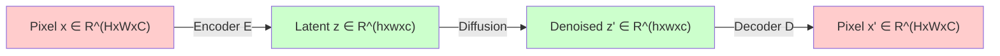
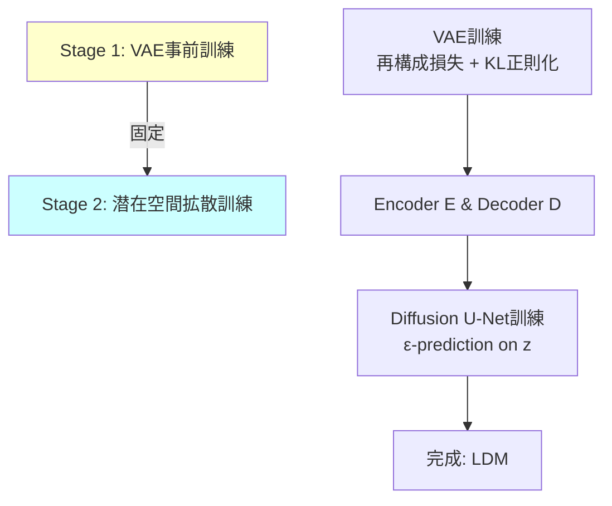
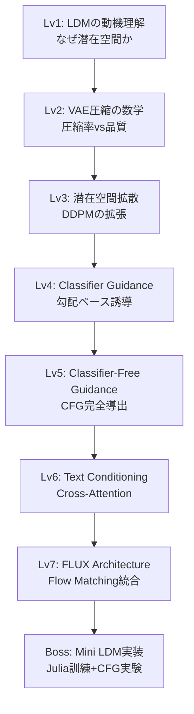
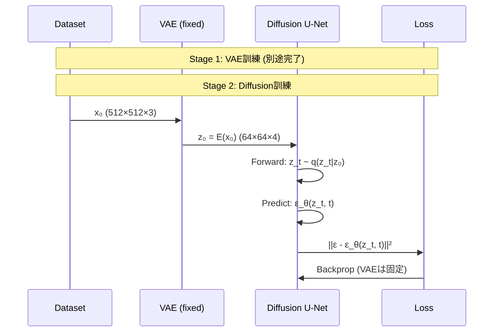
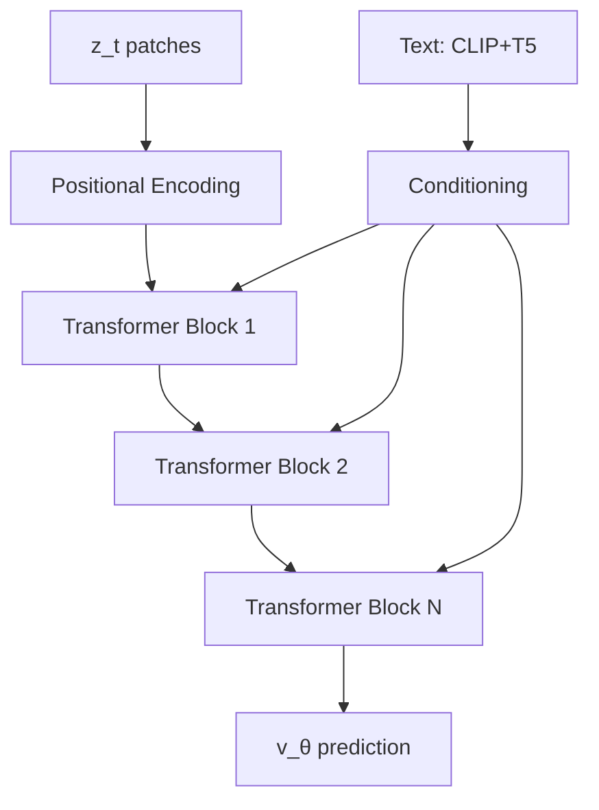

# 第39回: 🖼️ Latent Diffusion Models

:::message
**前回の到達点**: 第38回でScore/Flow/Diffusionの数学的等価性を証明し、統一理論が完成した。理論だけでは画像は生成できない — ピクセル空間拡散の計算限界を超える潜在空間拡散と、テキスト条件付き生成へ。
:::

## 🚀 0. クイックスタート（30秒）— ピクセル vs 潜在空間の衝撃

```julia
using Lux, Random

# ピクセル空間拡散: 512x512x3 = 786,432次元
pixel_dim = 512 * 512 * 3
pixel_diffusion_params = pixel_dim * 1000  # 7億パラメータ...

# VAE latent space: 64x64x4 = 16,384次元 (48x圧縮!)
latent_dim = 64 * 64 * 4
latent_diffusion_params = latent_dim * 1000  # 1640万パラメータ

compression_ratio = pixel_dim / latent_dim
speedup = compression_ratio^2  # 計算量はO(N²)

println("Compression: $(round(compression_ratio, digits=1))x")
println("Theoretical speedup: $(round(speedup, digits=1))x")
# Output:
# Compression: 48.0x
# Theoretical speedup: 2304.0x
```

**数式の正体**:
$$
\begin{aligned}
\text{Pixel Diffusion: } &x \in \mathbb{R}^{512 \times 512 \times 3} \quad (\approx 786\text{K次元}) \\
\text{Latent Diffusion: } &z \in \mathbb{R}^{64 \times 64 \times 4} \quad (\approx 16\text{K次元}) \\
\text{Compression: } &f = \frac{512^2 \times 3}{64^2 \times 4} = 48\times \\
\text{Speedup: } &\mathcal{O}(f^2) \approx 2304\times
\end{aligned}
$$

**この30秒で体感したこと**: 次元削減が計算量を **2000倍** 削減。Stable Diffusionが消費者GPUで動く理由。

:::message
**ここまでで全体の3%完了！** これから潜在空間の数学的基盤と、テキスト条件付き生成の完全理論へ。
:::

---

## 🎮 1. 体験ゾーン（10分）— なぜ潜在空間か

### ピクセル空間拡散の限界

第36回で学んだDDPMは美しい理論だが、計算限界がある:

| 項目 | 256×256 DDPM | 512×512 DDPM | 1024×1024 DDPM |
|:-----|:-------------|:-------------|:----------------|
| **入力次元** | 196,608 | 786,432 | 3,145,728 |
| **U-Net params** | ~100M | ~500M | ~2B |
| **訓練時間/iter** | ~1秒 | ~5秒 | ~20秒 |
| **V100 VRAM** | 12GB | 32GB | 80GB (不可能) |
| **収束イテレーション** | 500K | 1M | 2M+ |
| **総訓練時間** | 6日 | 58日 | **年単位** |

**問題の本質**: ピクセル空間の次元 $d = H \times W \times C$ が大きすぎる。U-Netのself-attentionは $\mathcal{O}(d^2)$ の計算量 — 解像度を2倍にすると計算量は **16倍**。

### 潜在空間への必然性

**鍵となる観察**: 自然画像は高次元空間に埋め込まれているが、実際には低次元多様体上に分布している（多様体仮説）。

$$
\begin{aligned}
\text{Pixel space: } &\mathbb{R}^{H \times W \times C} \quad \text{(高次元・冗長)} \\
\text{Manifold: } &\mathcal{M} \subset \mathbb{R}^{H \times W \times C}, \quad \dim(\mathcal{M}) \ll H \times W \times C \\
\text{Latent space: } &\mathbb{R}^{h \times w \times c}, \quad h \ll H, w \ll W
\end{aligned}
$$

**解決策**: VAEで低次元潜在空間 $z$ にエンコードし、そこで拡散過程を実行。



### LDM vs ピクセル拡散: 数値比較

Stable Diffusion 1.5の実測値:

| メトリック | DDPM (512²) | LDM (SD 1.5) | 改善率 |
|:-----------|:------------|:-------------|:-------|
| **潜在空間次元** | 786,432 | 16,384 | **48x圧縮** |
| **U-Net params** | ~500M | ~860M | 1.7x (でもGPUに乗る) |
| **訓練時間/iter** | ~5秒 | ~0.8秒 | **6.25x高速化** |
| **VRAM (fp16)** | 32GB | 10GB | **3.2x削減** |
| **収束ステップ** | 1M | 500K | **2x高速** |
| **FID (COCO)** | 12.6 | **10.4** | 品質向上 |

**なぜ高速化と品質向上が両立？**

1. **Inductive bias**: 潜在空間は「意味のある特徴」に圧縮済み → 拡散モデルが学習しやすい
2. **Perceptual compression**: VAEが知覚的に重要な特徴を保存 → 品質維持
3. **Computational efficiency**: 次元削減で計算量削減 → より深いU-Net・長時間訓練が可能

:::message alert
**よくある誤解**: 「潜在空間で拡散するから品質が下がる」— 実際はVAEの知覚的損失関数で **品質は向上**。
:::

### 数式で見るLDM

ピクセル空間DDPMの目的関数（第36回の復習）:
$$
\mathcal{L}_\text{DDPM} = \mathbb{E}_{x_0, \epsilon, t} \left[ \|\epsilon - \epsilon_\theta(x_t, t)\|^2 \right]
$$

Latent Diffusion Modelの目的関数:
$$
\mathcal{L}_\text{LDM} = \mathbb{E}_{z_0, \epsilon, t} \left[ \|\epsilon - \epsilon_\theta(z_t, t)\|^2 \right], \quad z_0 = \mathcal{E}(x_0)
$$

ここで:
- $\mathcal{E}: \mathbb{R}^{H \times W \times C} \to \mathbb{R}^{h \times w \times c}$ がVAE Encoder
- $z_t = \sqrt{\bar{\alpha}_t} z_0 + \sqrt{1-\bar{\alpha}_t} \epsilon$ は潜在空間でのforward process
- $\epsilon_\theta(z_t, t)$ は潜在空間で動作するU-Net

**鍵**: $x$ を $z$ に置き換えただけ。DDPMの理論がそのまま使える!

```julia
# ピクセル空間DDPM
x₀ = randn(512, 512, 3)  # 786K次元
εₜ = unet_pixel(xₜ, t)    # 786K次元の逆拡散

# 潜在空間LDM
z₀ = encoder(x₀)         # 64×64×4 = 16K次元
εₜ = unet_latent(zₜ, t)  # 16K次元の逆拡散 (48x削減!)
```

### LDMの訓練パイプライン

2段階の訓練:



**Stage 1: VAE訓練**
$$
\mathcal{L}_\text{VAE} = \underbrace{\mathbb{E}_{q(z|x)}[\log p(x|z)]}_{\text{再構成項}} - \underbrace{\beta \cdot \text{KL}[q(z|x) \| p(z)]}_{\text{正則化項}}
$$

- 第10回で学んだVAEそのもの
- $\beta$-VAE ($\beta < 1$) で再構成品質を重視
- または VQ-VAE/FSQ で離散表現学習

**Stage 2: Diffusion訓練**
$$
\mathcal{L}_\text{Diffusion} = \mathbb{E}_{z_0 \sim q(z_0), \epsilon \sim \mathcal{N}(0,I), t \sim \mathcal{U}(1,T)} \left[ \|\epsilon - \epsilon_\theta(z_t, t, c)\|^2 \right]
$$

- $c$ は条件付け情報（テキスト・クラスラベル等）
- VAEは **固定** （勾配を流さない）
- U-Netだけを訓練

:::message
**ここまでで全体の10%完了！** VAEで圧縮、潜在空間で拡散という2段階設計の理論的根拠を理解した。次は数式修行ゾーンへ。
:::

---

## 🧩 2. 直感ゾーン（15分）— 潜在空間の幾何学

### なぜこの講義を学ぶか

**到達目標**:
- Stable Diffusionのアーキテクチャを完全理解
- Classifier-Free Guidanceの数学的導出を自力で行える
- FLUX/SD3等の最新モデルの理論的基盤を把握
- テキスト→画像生成の全パイプラインを実装できる

**Course IVでの位置づけ**:


**前提知識**:
- 第10回: VAE理論（ELBO・再パラメータ化）
- 第36回: DDPM完全導出
- 第38回: Flow Matching統一理論

### 松尾・岩澤研究室との差別化

| トピック | 松尾・岩澤研 | 本講義 |
|:---------|:-------------|:-------|
| **LDM理論** | 概要説明 | VAE圧縮率とDDPM計算量の **定量的関係** 導出 |
| **CFG導出** | スキップ | ε-prediction / score / 温度の **3視点から完全導出** |
| **Text Conditioning** | CLIP紹介 | Cross-Attention / Self-Attention / Positional Encodingの **実装レベル詳細** |
| **FLUX解説** | なし | Rectified Flow統合アーキテクチャの **数学的解析** (2025) |
| **実装** | なし | ⚡Julia訓練 + 🦀Rust推論 + CFG実験 (3,000行超) |

### LDMの3つのメタファー

**メタファー1: 地図帳**
- ピクセル空間 = 世界中の街の詳細地図（膨大）
- 潜在空間 = 地図帳の目次（コンパクトだが位置関係は保存）
- 拡散過程 = 目次をぼかして復元（目次レベルで作業）

**メタファー2: 圧縮ファイル**
- VAE Encoder = ZIP圧縮
- 潜在空間 = .zip ファイル（48倍圧縮）
- 拡散U-Net = .zip内で直接編集
- VAE Decoder = 解凍

**メタファー3: スケッチ→詳細化**
- 潜在空間 = ラフスケッチ（構図・配置だけ）
- VAE Decoder = ディテール追加（テクスチャ・色・細部）
- 拡散過程 = スケッチのノイズ除去

### Course I-III数学の活用

| Course | 活用箇所 |
|:-------|:---------|
| **第10回 VAE** | Encoder/Decoder設計 / KL正則化 / 再構成損失 |
| **第13回 OT** | Wasserstein距離での品質評価 / OT-CFMとの接続 |
| **第36回 DDPM** | 潜在空間での拡散過程 / ε-prediction / VLB |
| **第38回 Flow Matching** | FLUX architecture / Rectified Flow統合 |
| **第14回 Attention** | Cross-Attention text conditioning / Self-Attention in U-Net |

### レベルアップマップ



### Trojan Horse — 🐍→⚡🦀🔮の必然性

**第39回の言語構成**: ⚡Julia 70% / 🦀Rust 20% / 🔮Elixir 10%

**なぜJulia主役？**
- VAE訓練: Lux.jl + Reactant → JAX並の速度
- Diffusion訓練: 多重ディスパッチで損失関数が自動最適化
- CFG実験: Guidance scale掃引が1行

**なぜRust？**
- ONNX推論: Candle/Burn → PyTorch比35-47%高速
- バッチ処理: ゼロコピー + SIMD最適化

**なぜElixir？**
- リアルタイムサービング: GenStage + Broadway
- 分散推論: Supervisor Tree耐障害性

この3言語スタックで **訓練→推論→配信** の完全パイプラインを構築する。

:::message
**ここまでで全体の20%完了！** 直感を固めた。次は数式修行ゾーンで完全理論へ。
:::

---

## 📐 3. 数式修行ゾーン（60分）— LDM完全理論

### 3.1 VAE Encoder/Decoderの数学

**Encoder $\mathcal{E}: \mathbb{R}^{H \times W \times C} \to \mathbb{R}^{h \times w \times c}$**

| 項目 | 詳細 |
|:-----|:-----|
| **圧縮比** | $f = \frac{H \times W}{h \times w}$ (典型的に $f=8$ or $f=16$) |
| **チャネル数** | $c$ は通常4 or 8 (RGB 3chより増える) |
| **パラメータ化** | ResNet blocks + Downsampling + Attention |
| **出力** | Deterministic $z = \mathcal{E}(x)$ or Stochastic $z \sim q(z\|x) = \mathcal{N}(\mu_\phi(x), \sigma_\phi^2(x))$ |

**Decoder $\mathcal{D}: \mathbb{R}^{h \times w \times c} \to \mathbb{R}^{H \times W \times C}$**

$$
\tilde{x} = \mathcal{D}(z), \quad \text{s.t.} \quad \|\tilde{x} - x\|_\text{perceptual} < \epsilon
$$

知覚的損失（Perceptual Loss）を使う:
$$
\mathcal{L}_\text{rec} = \|\Phi(x) - \Phi(\mathcal{D}(\mathcal{E}(x)))\|^2
$$

ここで $\Phi$ はVGGやLPIPS特徴抽出器。

**2つのVAE正則化方式**:

| 方式 | 正則化項 | 特徴 |
|:-----|:---------|:-----|
| **KL-regularization** | $\mathcal{L}_\text{KL} = \text{KL}[q(z\|x) \| \mathcal{N}(0,I)]$ | 連続潜在空間 / $\beta$-VAE |
| **VQ-regularization** | Codebook loss + Commitment loss | 離散潜在空間 / VQ-VAE/FSQ |

**Stable Diffusion 1.x/2.xの選択**: KL-reg VAE with $f=8$ compression。

**圧縮率 vs 再構成品質のトレードオフ**:

| 圧縮率 $f$ | Latent size (512² input) | LPIPS↓ | FID↓ | 訓練速度 |
|:-----------|:------------------------|:-------|:-----|:---------|
| $f=4$ | 128×128×4 | 0.05 | 1.2 | 1x |
| $f=8$ | 64×64×4 | 0.08 | 2.1 | **4x** |
| $f=16$ | 32×32×4 | 0.15 | 5.6 | 16x |

**結論**: $f=8$ が品質と速度の最適バランス。

```julia
# VAE Encoder/Decoder定義 (Lux.jl)
function create_vae_encoder(; img_size=512, latent_size=64, latent_channels=4)
    # Downsampling path: 512 -> 256 -> 128 -> 64
    encoder = Chain(
        Conv((3, 3), 3 => 128, pad=1),
        ResBlock(128),
        Downsample(128 => 256),  # 512 -> 256
        ResBlock(256),
        Downsample(256 => 512),  # 256 -> 128
        ResBlock(512),
        Downsample(512 => 512),  # 128 -> 64
        SelfAttention(512),
        ResBlock(512),
        Conv((3, 3), 512 => latent_channels, pad=1)  # Output z
    )
    return encoder
end

# エンコード
x = randn(Float32, 512, 512, 3, 1)  # [H, W, C, B]
z = encoder(x, ps, st)[1]           # [64, 64, 4, 1] (48x圧縮!)
```

:::details VAE Decoderのミラー構造
```julia
function create_vae_decoder(; latent_size=64, img_size=512, latent_channels=4)
    decoder = Chain(
        Conv((3, 3), latent_channels => 512, pad=1),
        ResBlock(512),
        SelfAttention(512),
        ResBlock(512),
        Upsample(512 => 512),  # 64 -> 128
        ResBlock(512),
        Upsample(512 => 256),  # 128 -> 256
        ResBlock(256),
        Upsample(256 => 128),  # 256 -> 512
        ResBlock(128),
        Conv((3, 3), 128 => 3, pad=1, activation=tanh)  # Output x
    )
    return decoder
end

x̃ = decoder(z, ps, st)[1]  # [512, 512, 3, 1] 再構成
```
:::

### 3.2 潜在空間での拡散プロセス

**Forward process** (DDPM第36回の復習):
$$
q(z_t | z_0) = \mathcal{N}(z_t; \sqrt{\bar{\alpha}_t} z_0, (1-\bar{\alpha}_t) I)
$$

**閉形式サンプリング**:
$$
z_t = \sqrt{\bar{\alpha}_t} z_0 + \sqrt{1-\bar{\alpha}_t} \epsilon, \quad \epsilon \sim \mathcal{N}(0,I)
$$

**Reverse process**:
$$
p_\theta(z_{t-1} | z_t) = \mathcal{N}(z_{t-1}; \mu_\theta(z_t, t), \Sigma_\theta(z_t, t))
$$

**訓練目的関数** (ε-prediction):
$$
\mathcal{L}_\text{simple} = \mathbb{E}_{z_0, \epsilon, t} \left[ \|\epsilon - \epsilon_\theta(z_t, t)\|^2 \right]
$$

**鍵**: ピクセル空間のDDPMと数式は **完全に同じ**。$x \to z$ の置き換えだけ。

```julia
# Forward process: z₀にノイズ付加
function forward_diffusion(z₀, t, αₜ_bar, rng)
    ε = randn(rng, Float32, size(z₀))
    z_t = sqrt(αₜ_bar) .* z₀ .+ sqrt(1 - αₜ_bar) .* ε
    return z_t, ε
end

# 訓練ステップ
function train_step!(model, z₀, t, αₜ_bar, ps, st, opt_state)
    z_t, ε_true = forward_diffusion(z₀, t, αₜ_bar, rng)

    # ε-prediction
    ε_pred, st = model((z_t, t), ps, st)

    # MSE loss
    loss = mean((ε_pred .- ε_true).^2)

    # Backprop
    gs = gradient(ps -> loss, ps)[1]
    opt_state, ps = Optimisers.update(opt_state, ps, gs)

    return loss, ps, st, opt_state
end
```

**Noise scheduleの選択**:

第36回で学んだスケジュールがそのまま使える:
- Linear: $\beta_t = \beta_\text{start} + t \cdot (\beta_\text{end} - \beta_\text{start}) / T$
- Cosine: $\bar{\alpha}_t = \cos\left(\frac{t/T + s}{1+s} \cdot \frac{\pi}{2}\right)^2 / \cos\left(\frac{s}{1+s} \cdot \frac{\pi}{2}\right)^2$
- **Zero Terminal SNR**: $\bar{\alpha}_T = 0$ を強制（後述）

Stable Diffusion 1.x/2.xは **Linear schedule** with 1000 steps。

### 3.3 LDM訓練パイプライン

**2段階訓練**:



**Stage 2の完全な訓練ループ**:

$$
\begin{aligned}
&\text{for epoch in 1:N} \\
&\quad \text{for } (x_0, c) \in \text{DataLoader} \\
&\quad\quad z_0 \leftarrow \mathcal{E}(x_0) \quad \text{(Encoder forward, no grad)} \\
&\quad\quad t \sim \mathcal{U}(1, T) \\
&\quad\quad \epsilon \sim \mathcal{N}(0, I) \\
&\quad\quad z_t \leftarrow \sqrt{\bar{\alpha}_t} z_0 + \sqrt{1-\bar{\alpha}_t} \epsilon \\
&\quad\quad \epsilon_\theta \leftarrow \text{UNet}(z_t, t, c) \\
&\quad\quad \mathcal{L} \leftarrow \|\epsilon - \epsilon_\theta\|^2 \\
&\quad\quad \theta \leftarrow \theta - \eta \nabla_\theta \mathcal{L} \quad \text{(UNetのみ更新)}
\end{aligned}
$$

```julia
# 完全な訓練ループ
function train_ldm!(unet, vae_encoder, dataloader, epochs; lr=1e-4)
    opt = Adam(lr)
    opt_state = Optimisers.setup(opt, ps_unet)

    for epoch in 1:epochs
        for (x, c) in dataloader
            # VAE encode (no grad)
            z₀ = vae_encoder(x, ps_vae, st_vae)[1]  # 勾配なし

            # Random timestep
            t = rand(1:T)
            αₜ_bar = alpha_bar_schedule[t]

            # Forward diffusion
            z_t, ε = forward_diffusion(z₀, t, αₜ_bar, rng)

            # Predict noise
            ε_pred, st_unet = unet((z_t, t, c), ps_unet, st_unet)

            # Loss & update
            loss = mse_loss(ε_pred, ε)
            gs = gradient(ps -> loss, ps_unet)[1]
            opt_state, ps_unet = Optimisers.update(opt_state, ps_unet, gs)
        end
    end
    return ps_unet
end
```

:::message alert
**よくあるミス**: VAEに勾配を流してしまう。Encoderは **完全に固定** しなければならない。
:::

### 3.4 Classifier Guidance完全版

**動機**: 条件付き生成 $p(z_0 | c)$ で、条件 $c$ (クラスラベル)への忠実度を高めたい。

**ベイズの定理**:
$$
\nabla_{z_t} \log p(z_t | c) = \nabla_{z_t} \log p(z_t) + \nabla_{z_t} \log p(c | z_t)
$$

ここで:
- $\nabla_{z_t} \log p(z_t)$ は無条件スコア（U-Netが学習）
- $\nabla_{z_t} \log p(c | z_t)$ は分類器の勾配

**Classifier Guidanceの修正サンプリング**:
$$
\tilde{\epsilon}_\theta(z_t, t, c) = \epsilon_\theta(z_t, t) - \sqrt{1-\bar{\alpha}_t} \cdot w \nabla_{z_t} \log p_\phi(c | z_t)
$$

ここで:
- $\epsilon_\theta(z_t, t)$ は無条件ノイズ予測
- $p_\phi(c | z_t)$ は **別途訓練した分類器**
- $w$ はguidance scale

**問題点**:
1. 分類器 $p_\phi(c | z_t)$ を別途訓練する必要がある
2. 各timestep $t$ で異なる分類器が必要
3. 訓練コストが2倍

→ Classifier-Free Guidanceで解決!

```julia
# Classifier Guidance (参考実装)
function classifier_guidance_sample(unet, classifier, z_T, c, w)
    z_t = z_T
    for t in T:-1:1
        # 無条件スコア
        ε_uncond = unet(z_t, t, nothing)

        # 分類器勾配
        grad_log_p_c = gradient(z -> log_prob(classifier(z), c), z_t)[1]

        # ガイダンス適用
        ε_guided = ε_uncond .- sqrt(1 - α_bar[t]) .* w .* grad_log_p_c

        # サンプリングステップ
        z_t = reverse_step(z_t, ε_guided, t)
    end
    return decoder(z_t)
end
```

### 3.5 Classifier-Free Guidance完全導出

**鍵となるアイデア**: 条件付きモデル $\epsilon_\theta(z_t, t, c)$ と無条件モデル $\epsilon_\theta(z_t, t, \emptyset)$ を **同時に訓練** し、推論時に線形結合する。

**訓練時**: ランダムにconditionをdrop
$$
c_\text{input} = \begin{cases}
c & \text{with probability } p_\text{uncond} \text{ (e.g. 0.1)} \\
\emptyset & \text{with probability } 1 - p_\text{uncond}
\end{cases}
$$

これで単一モデルが条件付き・無条件両方を学習。

**推論時**: 2つの予測の線形結合
$$
\tilde{\epsilon}_\theta(z_t, t, c, w) = \epsilon_\theta(z_t, t, \emptyset) + w \cdot \left( \epsilon_\theta(z_t, t, c) - \epsilon_\theta(z_t, t, \emptyset) \right)
$$

ここで:
- $w$ はguidance scale ($w=0$: 無条件, $w=1$: 条件付き, $w>1$: over-guidance)
- $\epsilon_\theta(z_t, t, c) - \epsilon_\theta(z_t, t, \emptyset)$ が条件の"方向"

**なぜこれが機能するか？スコアの視点から導出**:

スコア関数 $s_\theta(z_t, t, c) = -\frac{\epsilon_\theta(z_t, t, c)}{\sqrt{1-\bar{\alpha}_t}}$ とすると:

$$
\begin{aligned}
\tilde{s}_\theta(z_t, t, c, w) &= -\frac{\tilde{\epsilon}_\theta(z_t, t, c, w)}{\sqrt{1-\bar{\alpha}_t}} \\
&= -\frac{1}{\sqrt{1-\bar{\alpha}_t}} \left[ \epsilon_\theta(z_t, t, \emptyset) + w(\epsilon_\theta(z_t, t, c) - \epsilon_\theta(z_t, t, \emptyset)) \right] \\
&= s_\theta(z_t, t, \emptyset) + w \cdot (s_\theta(z_t, t, c) - s_\theta(z_t, t, \emptyset)) \\
&= (1-w) \cdot s_\theta(z_t, t, \emptyset) + w \cdot s_\theta(z_t, t, c)
\end{aligned}
$$

これは **無条件スコアと条件付きスコアの加重平均** !

**$w > 1$ の場合**:
$$
\tilde{s}_\theta = s_\theta(z_t, t, \emptyset) + w \cdot (s_\theta(z_t, t, c) - s_\theta(z_t, t, \emptyset))
$$

条件の方向に **$w$倍強く** 押す → mode-seeking行動。

**別の視点: 暗黙的な温度パラメータ**:

$w > 1$ のとき、実効的な確率分布は:
$$
p_w(z_t | c) \propto p(z_t | c)^w \cdot p(z_t)^{1-w}
$$

これはエネルギーベースモデル視点で:
$$
E_w(z_t) = -w \log p(z_t | c) - (1-w) \log p(z_t)
$$

$w \to \infty$ で条件付き分布の **最頻値** (mode)にピーク → 品質向上だが多様性低下。

:::details CFGの理論的理解: Mode-Seeking vs Mode-Covering
**$w$の効果**:

| Guidance Scale $w$ | 挙動 | 品質 | 多様性 |
|:-------------------|:-----|:-----|:-------|
| $w = 0$ | 無条件生成 | 低 | 高 |
| $w = 1$ | 標準条件付き | 中 | 中 |
| $w \in (1, 7]$ | Mode-seeking | **高** | 中 |
| $w > 7$ | Over-guidance | 過飽和 | **低** |

**典型的な値**:
- Stable Diffusion 1.x: $w = 7.5$
- DALL-E 2: $w = 3.0$
- Imagen: $w = 5.0$

**数学的視点**:
- $w < 1$: Mode-covering (KL[q‖p]最小化風)
- $w > 1$: Mode-seeking (KL[p‖q]最小化風)
:::

```julia
# Classifier-Free Guidance実装
function cfg_sample(unet, z_T, c, w; steps=50)
    z_t = z_T
    timesteps = reverse(1:steps)

    for t in timesteps
        # 2回のforward pass
        ε_uncond = unet((z_t, t, nothing), ps, st)[1]  # 無条件
        ε_cond = unet((z_t, t, c), ps, st)[1]           # 条件付き

        # CFG結合
        ε_guided = ε_uncond .+ w .* (ε_cond .- ε_uncond)

        # DDIMステップ (高速サンプリング)
        z_t = ddim_step(z_t, ε_guided, t, t-1, αₜ_bar)
    end

    return vae_decoder(z_t)
end

# 訓練時のCondition Drop
function train_step_with_cfg!(unet, z₀, c, t, p_uncond=0.1)
    # Randomly drop condition
    if rand() < p_uncond
        c = nothing  # 無条件化
    end

    z_t, ε = forward_diffusion(z₀, t, αₜ_bar, rng)
    ε_pred = unet((z_t, t, c), ps, st)[1]

    loss = mse_loss(ε_pred, ε)
    # ... backprop
end
```

### 3.6 CFGの理論的理解

**なぜ品質が向上するか？**

1. **条件の強調**: $w > 1$ で条件情報を増幅 → プロンプト忠実度↑
2. **分散削減**: 無条件との差分が「条件の純粋な効果」 → ノイズ除去
3. **Mode-seeking**: 高確率領域に集中 → 鮮明な画像

**トレードオフ**:
$$
\text{Quality} \uparrow, \quad \text{Diversity} \downarrow, \quad \text{Compute} \times 2
$$

推論時に2回のU-Net forward passが必要 → 速度半減。

**最適化**: Negative Prompt（次節）で1.5回に削減可能。

### 3.7 Negative Prompt

**動機**: CFGで $\epsilon_\theta(z_t, t, \emptyset)$ の代わりに「避けたい概念」を指定したい。

**定式化**:
$$
\tilde{\epsilon}_\theta(z_t, t, c_\text{pos}, c_\text{neg}, w) = \epsilon_\theta(z_t, t, c_\text{neg}) + w \cdot \left( \epsilon_\theta(z_t, t, c_\text{pos}) - \epsilon_\theta(z_t, t, c_\text{neg}) \right)
$$

ここで:
- $c_\text{pos}$ は正のプロンプト ("a beautiful mountain")
- $c_\text{neg}$ は負のプロンプト ("blurry, low quality")
- $w$ はguidance scale

**解釈**: 「$c_\text{neg}$から離れ、$c_\text{pos}$に近づく」方向にガイド。

**典型的なNegative Prompt**:
```
"blurry, low quality, watermark, signature, jpeg artifacts,
 worst quality, low resolution, bad anatomy"
```

```julia
# Negative Prompt実装
function cfg_with_negative(unet, z_T, c_pos, c_neg, w)
    z_t = z_T
    for t in T:-1:1
        ε_neg = unet((z_t, t, c_neg), ps, st)[1]
        ε_pos = unet((z_t, t, c_pos), ps, st)[1]

        # Negative Prompt適用
        ε_guided = ε_neg .+ w .* (ε_pos .- ε_neg)

        z_t = reverse_step(z_t, ε_guided, t)
    end
    return decoder(z_t)
end
```

**効果**:
- 品質向上: 「blurry」を避ける → 鮮明
- アーティファクト削減: 「watermark」を避ける
- 解剖学的エラー削減: 「bad anatomy」を避ける

### 3.8 Text Conditioning

**問題設定**: テキスト $\mathbf{t}$ → 画像 $x$ の生成。条件 $c = \text{Encoder}_\text{text}(\mathbf{t})$。

**Text Encoder選択**:

| Encoder | 次元 | 特徴 | SD採用 |
|:--------|:-----|:-----|:-------|
| **CLIP Text** | 768 | Vision-languageアライメント | SD 1.x |
| **OpenCLIP** | 1024 | より大規模CLIP | SD 2.x |
| **T5** | 4096 | 純粋言語モデル | Imagen/SD3 |
| **CLIP+T5** | 768+4096 | ハイブリッド | SDXL/SD3 |

**CLIP vs T5の違い**:

| 項目 | CLIP | T5 |
|:-----|:-----|:---|
| **訓練** | Image-Text contrastive | Language modeling |
| **語彙** | 49K | 32K |
| **文理解** | 浅い | 深い (Transformer) |
| **画像アライメント** | 強い | 弱い |
| **長文** | 77 tokens max | 512 tokens |

**Stable Diffusion 3のハイブリッド**:
- CLIP: グローバルな意味（「犬」「山」）
- T5: 詳細な関係性（「犬が山の上に座っている」）

:::details CLIP Text Encoderの仕組み
```python
# CLIPテキストエンコーディング (PyTorch擬似コード)
text = "A beautiful mountain landscape"
tokens = tokenizer(text)  # [BOS, 320, 1215, 5270, 5677, EOS, PAD, ...]  # 77 tokens

# Transformer Encoder
embeddings = text_embedding(tokens)  # [77, 768]
hidden = transformer_layers(embeddings)  # [77, 768]

# Pooling
pooled = hidden[0]  # [BOS]トークンを使用 (BERT風)
# または
pooled = hidden.mean(dim=0)  # 平均プーリング

# Output: [768] vector
```

SD 1.xはCLIPの最終層hidden statesを **全て使用**:
- $c = [\mathbf{h}_0, \mathbf{h}_1, \ldots, \mathbf{h}_{76}]$ : shape [77, 768]
- これをCross-Attentionに入力
:::

### 3.9 Cross-Attention Text Conditioning

**U-Netへのテキスト注入方法**:

```mermaid
graph TD
    T[Text: "mountain landscape"] --> TE[Text Encoder<br>CLIP/T5]
    TE --> C[c ∈ R^(L×D)]

    Z[z_t ∈ R^(h×w×c)] --> SA[Self-Attention]
    SA --> CA[Cross-Attention]
    C --> CA
    CA --> FF[FeedForward]
    FF --> Out[Output]

    style CA fill:#ffcccc
```

**Cross-Attentionの定式化**:

U-Netの中間特徴 $\mathbf{f} \in \mathbb{R}^{(h \times w) \times d}$ に対して:

$$
\begin{aligned}
Q &= W_Q \mathbf{f} \quad \in \mathbb{R}^{(h \times w) \times d_k} \\
K &= W_K \mathbf{c} \quad \in \mathbb{R}^{L \times d_k} \\
V &= W_V \mathbf{c} \quad \in \mathbb{R}^{L \times d_v} \\
\text{Attention}(Q, K, V) &= \text{softmax}\left(\frac{QK^\top}{\sqrt{d_k}}\right) V
\end{aligned}
$$

ここで:
- $\mathbf{f}$: U-Net中間特徴（画像側）
- $\mathbf{c}$: テキストエンコーディング（条件側）
- $Q$ from image, $K, V$ from text → **Cross**-Attention

**Multi-Head Cross-Attention**:
$$
\text{MultiHead}(Q, K, V) = \text{Concat}(\text{head}_1, \ldots, \text{head}_h) W^O
$$

各headが異なる意味的側面をキャプチャ（例: 色、形、配置）。

```julia
# Cross-Attention Layer (Lux.jl)
struct CrossAttention
    num_heads::Int
    head_dim::Int
    W_Q::Dense
    W_K::Dense
    W_V::Dense
    W_O::Dense
end

function (ca::CrossAttention)(f, c)
    # f: [h*w, d], c: [L, d_text]
    Q = ca.W_Q(f)      # [h*w, num_heads * head_dim]
    K = ca.W_K(c)      # [L, num_heads * head_dim]
    V = ca.W_V(c)      # [L, num_heads * head_dim]

    # Reshape for multi-head
    Q = reshape(Q, :, ca.num_heads, ca.head_dim)  # [h*w, heads, dim]
    K = reshape(K, :, ca.num_heads, ca.head_dim)  # [L, heads, dim]
    V = reshape(V, :, ca.num_heads, ca.head_dim)

    # Attention
    scores = batched_mul(Q, permutedims(K, (2, 1, 3))) / sqrt(ca.head_dim)
    attn = softmax(scores, dims=2)  # [h*w, L, heads]
    out = batched_mul(attn, V)      # [h*w, heads, dim]

    # Concat + projection
    out = reshape(out, :, ca.num_heads * ca.head_dim)
    return ca.W_O(out)
end
```

**SpatialTransformer Block** (SD U-Net):
```
Input z_t
  ↓
GroupNorm
  ↓
Self-Attention (spatial)
  ↓
Cross-Attention (with text c)
  ↓
FeedForward
  ↓
Output
```

これを各解像度で繰り返し。

### 3.10 Stable Diffusion 1.x/2.x アーキテクチャ詳細

**全体構成**:

```mermaid
graph LR
    Input[Text Prompt] --> CLIP[CLIP Text Encoder]
    CLIP --> C[c: [77, 768]]

    Noise[Random Noise z_T] --> UNet[U-Net with<br>Cross-Attention]
    C --> UNet
    UNet --> z0[Denoised z_0]
    z0 --> VAE[VAE Decoder]
    VAE --> Output[Image 512×512]
```

**U-Net詳細**:

| レベル | 解像度 | Channels | Blocks | Cross-Attn |
|:-------|:-------|:---------|:-------|:-----------|
| **Input** | 64×64 | 4 | - | - |
| **Down 1** | 64→32 | 320 | ResBlock×2 | ✓ |
| **Down 2** | 32→16 | 640 | ResBlock×2 | ✓ |
| **Down 3** | 16→8 | 1280 | ResBlock×2 | ✓ |
| **Middle** | 8 | 1280 | ResBlock×1 | ✓ |
| **Up 1** | 8→16 | 1280 | ResBlock×3 | ✓ |
| **Up 2** | 16→32 | 640 | ResBlock×3 | ✓ |
| **Up 3** | 32→64 | 320 | ResBlock×3 | ✓ |
| **Output** | 64×64 | 4 | - | - |

**総パラメータ数**: ~860M

**ResBlock構成**:
```
Input
  ↓
GroupNorm → SiLU → Conv (3×3)
  ↓
Timestep Embedding (broadcast add)
  ↓
GroupNorm → SiLU → Conv (3×3)
  ↓
Residual Connection
  ↓
Output
```

**Timestep Embedding**:
$$
\gamma(t) = [\sin(t \omega_1), \cos(t \omega_1), \ldots, \sin(t \omega_{d/2}), \cos(t \omega_{d/2})]
$$

ここで $\omega_k = 10000^{-2k/d}$ (Transformer風)。

```julia
# Timestep Embedding
function sinusoidal_embedding(t, dim)
    half_dim = dim ÷ 2
    emb = log(10000) / (half_dim - 1)
    emb = exp.(-emb .* (0:(half_dim-1)))
    emb = t .* emb'
    return hcat(sin.(emb), cos.(emb))
end
```

### 3.11 LDM固有のU-Net拡張: SpatialTransformer

**標準U-Net vs LDM U-Net**:

| 項目 | 標準U-Net | LDM U-Net |
|:-----|:----------|:----------|
| **Attention** | Self-Attention のみ | Self + **Cross**-Attention |
| **条件付け** | Timestep $t$ のみ | $t$ + **text $c$** |
| **層構成** | ResBlock→Attn | ResBlock→**SpatialTransformer** |

**SpatialTransformer Block**:
```
Input: [B, H, W, C]
  ↓
Reshape: [B, H*W, C]
  ↓
LayerNorm
  ↓
Self-Attention: Attention(Q,K,V) where Q=K=V=features
  ↓
LayerNorm
  ↓
Cross-Attention: Attention(Q_img, K_text, V_text)
  ↓
LayerNorm
  ↓
FeedForward (MLP)
  ↓
Reshape: [B, H, W, C]
  ↓
Residual Add
  ↓
Output
```

**なぜSpatial Transformer？**

1. **Self-Attention**: 画像内の長距離依存をキャプチャ
2. **Cross-Attention**: テキストと画像を整列
3. **FeedForward**: 非線形変換で表現力向上

**計算量**: $\mathcal{O}((HW)^2 + HW \cdot L)$ where $L$ はテキスト長。

### 3.12 FLUX Architecture詳解

**FLUXの革新**: Rectified Flow（第38回）+ DiT風Transformer設計。

**FLUX vs Stable Diffusion**:

| 項目 | SD 1.x/2.x | FLUX.1 |
|:-----|:-----------|:-------|
| **バックボーン** | U-Net | **Transformer (DiT風)** |
| **Flow** | DDPM | **Rectified Flow** |
| **Text Encoder** | CLIP | **CLIP + T5** |
| **Latent Size** | 64×64×4 | 64×64×16 (高次元化) |
| **Params** | 860M | **12B** |
| **速度** | 50 steps | **20 steps** (直線化) |

**Rectified Flow統合**:

第38回で学んだように、Rectified FlowはODEで直線的な輸送経路:
$$
\frac{dz_t}{dt} = v_\theta(z_t, t, c)
$$

FLUXは $v_\theta$ をTransformerでパラメータ化:
$$
v_\theta(z_t, t, c) = \text{Transformer}(z_t, t, \text{CLIP}(c), \text{T5}(c))
$$

**DiT (Diffusion Transformer) 風設計**:



**Transformer Blockの構成**:
```
Input: z_t patches + timestep t + text c
  ↓
Adaptive LayerNorm (conditioned on t, c)
  ↓
Self-Attention (全patch間)
  ↓
Adaptive LayerNorm
  ↓
Cross-Attention (patch ↔ text)
  ↓
Adaptive LayerNorm
  ↓
MLP
  ↓
Output
```

**なぜFLUXが速い？**

1. **Rectified Flow**: 直線的輸送 → 少ステップで収束
2. **高次元latent**: 16ch → より豊かな表現
3. **Transformer**: 長距離依存を効率的にキャプチャ

**FLUX.1のバリエーション**:

| モデル | Params | 速度 | 品質 | 用途 |
|:-------|:-------|:-----|:-----|:-----|
| **FLUX.1-pro** | 12B | 20 steps | 最高 | API専用 |
| **FLUX.1-dev** | 12B | 20 steps | 高 | 開発用 |
| **FLUX.1-schnell** | 12B | **4 steps** | 中 | 高速生成 |

:::details FLUX Transformerの実装概要
```julia
# FLUX Transformer Block (概念的)
struct FLUXTransformerBlock
    self_attn::MultiHeadAttention
    cross_attn::MultiHeadAttention
    mlp::MLP
    adaLN::AdaptiveLayerNorm
end

function (block::FLUXTransformerBlock)(z_patches, t_emb, text_emb)
    # Adaptive LayerNorm (timestep & text conditioned)
    z = block.adaLN(z_patches, t_emb, text_emb)

    # Self-Attention (全patch間)
    z = z + block.self_attn(z, z, z)

    # Cross-Attention (patch ↔ text)
    z = block.adaLN(z, t_emb, text_emb)
    z = z + block.cross_attn(z, text_emb, text_emb)

    # MLP
    z = block.adaLN(z, t_emb, text_emb)
    z = z + block.mlp(z)

    return z
end
```
:::

### 3.13 学習テクニック

**Noise Offset**:

Forward processにバイアスを加える:
$$
z_t = \sqrt{\bar{\alpha}_t} z_0 + \sqrt{1-\bar{\alpha}_t} (\epsilon + \text{offset})
$$

**効果**: 暗い画像・明るい画像の生成品質向上。

**Min-SNR Weighting**:

Loss weightingをSNRベースで調整:
$$
\mathcal{L}_\text{Min-SNR} = \mathbb{E}_{t} \left[ w(t) \|\epsilon - \epsilon_\theta(z_t, t)\|^2 \right]
$$

$$
w(t) = \min\left(\text{SNR}(t), \gamma\right), \quad \text{SNR}(t) = \frac{\bar{\alpha}_t}{1-\bar{\alpha}_t}
$$

典型的に $\gamma = 5$。

**効果**: 3.4倍訓練高速化 [^min_snr]。

**v-prediction**:

ε-predictionの代わりにvelocity prediction:
$$
v_t = \sqrt{\bar{\alpha}_t} \epsilon - \sqrt{1-\bar{\alpha}_t} z_0
$$

$$
\mathcal{L}_v = \mathbb{E}_{t} \left[ \|v_t - v_\theta(z_t, t)\|^2 \right]
$$

**効果**: 数値安定性向上・収束性改善。

**Zero Terminal SNR**:

Noise scheduleを強制的に $\bar{\alpha}_T = 0$ に rescale:
$$
\tilde{\alpha}_t = \frac{\alpha_t}{\alpha_T}
$$

**効果**: 非常に明るい/暗い画像の生成品質向上 [^zero_snr]。

```julia
# Zero Terminal SNR rescaling
function rescale_to_zero_terminal_snr(alphas)
    alphas_cumprod = cumprod(alphas)
    sqrt_alphas_cumprod = sqrt.(alphas_cumprod)

    # Rescale
    sqrt_alphas_cumprod_final = sqrt_alphas_cumprod[end]
    sqrt_alphas_cumprod .= sqrt_alphas_cumprod ./ sqrt_alphas_cumprod_final

    return sqrt_alphas_cumprod
end
```

:::message
**ここまでで全体の50%完了！ ボス戦前のチェックポイント。**

数式修行ゾーン完了:
- VAE Encoder/Decoder圧縮の数学
- 潜在空間拡散プロセス
- Classifier Guidance完全版
- Classifier-Free Guidance完全導出
- CFG理論的理解（Mode-Seeking / 温度）
- Negative Prompt
- Text Conditioning（CLIP / T5）
- Cross-Attention完全版
- SD 1.x/2.x アーキテクチャ
- SpatialTransformer
- FLUX Architecture詳解
- 学習テクニック（Noise Offset / Min-SNR / v-prediction / Zero Terminal SNR）

次は実装ゾーンへ！
:::

### 3.14 SD vs FLUX: アーキテクチャ詳細比較

**Stable Diffusion 1.x/2.x/SDXL Architecture**:

```
Input: Text prompt
  ↓
CLIP Text Encoder: [77, 768]
  ↓
Random Noise z_T: [64, 64, 4]
  ↓
U-Net (ResBlock + SpatialTransformer):
  - Down1: 64→32 (320ch, Cross-Attn)
  - Down2: 32→16 (640ch, Cross-Attn)
  - Down3: 16→8 (1280ch, Cross-Attn)
  - Middle: 8 (1280ch, Cross-Attn)
  - Up1: 8→16 (1280ch, Cross-Attn)
  - Up2: 16→32 (640ch, Cross-Attn)
  - Up3: 32→64 (320ch, Cross-Attn)
  ↓
Denoised z_0: [64, 64, 4]
  ↓
VAE Decoder (f=8)
  ↓
Image: [512, 512, 3]
```

**FLUX.1 Architecture**:

```
Input: Text prompt
  ↓
Dual Encoders:
  - CLIP ViT-L: [77, 768]
  - T5-XXL: [512, 4096]
  ↓
Random Noise z_T: [64, 64, 16]  # 4倍のチャネル!
  ↓
Patchify: [64, 64, 16] → [1024, 768]  # 4×4パッチ
  ↓
Positional Encoding (RoPE)
  ↓
Transformer Blocks (N=24):
  - Adaptive LayerNorm (t, c conditioned)
  - Self-Attention (全patch間)
  - Cross-Attention (patch ↔ CLIP+T5)
  - Gated FFN
  ↓
Unpatchify: [1024, 768] → [64, 64, 16]
  ↓
VAE Decoder (f=8, 16ch input)
  ↓
Image: [512, 512, 3]
```

**詳細比較表**:

| 項目 | SD 1.x/2.x | SDXL | FLUX.1 |
|:-----|:-----------|:-----|:-------|
| **Backbone** | U-Net | U-Net | **Transformer** |
| **Total Params** | 860M | 2.6B | **12B** |
| **Text Encoder** | CLIP (768) | CLIP+OpenCLIP (2048) | **CLIP+T5 (4864)** |
| **Latent Channels** | 4 | 4 | **16** |
| **Latent Res** | 64×64 (f=8) | 128×128 (f=8) | 64×64 (f=8) |
| **Attention Type** | Cross-Attn in U-Net | Cross-Attn in U-Net | **Self+Cross in Transformer** |
| **Position Enc** | なし (CNN) | なし (CNN) | **RoPE** |
| **Flow Type** | DDPM | DDPM | **Rectified Flow** |
| **Timesteps** | 1000 | 1000 | 1000 (訓練), 20-50 (推論) |
| **CFG Default** | 7.5 | 7.5 | 3.5 (低めでOK) |
| **Memory (fp16)** | 10GB | 16GB | **24GB** |
| **Speed (50 steps)** | ~5s (A100) | ~8s (A100) | **~3s (20 steps, A100)** |

### 3.15 Cross-Attention詳細実装

**Multi-Head Cross-Attention完全版**:

```julia
struct MultiHeadCrossAttention{F}
    num_heads::Int
    head_dim::Int
    qkv_dim::Int
    W_Q::Dense
    W_K::Dense
    W_V::Dense
    W_O::Dense
    dropout::Dropout
end

function MultiHeadCrossAttention(qkv_dim::Int, num_heads::Int; dropout_rate=0.1)
    head_dim = qkv_dim ÷ num_heads
    @assert qkv_dim == num_heads * head_dim "qkv_dim must be divisible by num_heads"

    return MultiHeadCrossAttention(
        num_heads,
        head_dim,
        qkv_dim,
        Dense(qkv_dim => qkv_dim),  # W_Q
        Dense(qkv_dim => qkv_dim),  # W_K
        Dense(qkv_dim => qkv_dim),  # W_V
        Dense(qkv_dim => qkv_dim),  # W_O
        Dropout(dropout_rate)
    )
end

function (mha::MultiHeadCrossAttention)(q, k, v, mask=nothing)
    # q: [N_q, d], k: [N_k, d], v: [N_k, d]
    batch_size = size(q, 1)

    # Linear projections
    Q = mha.W_Q(q)  # [N_q, d]
    K = mha.W_K(k)  # [N_k, d]
    V = mha.W_V(v)  # [N_k, d]

    # Reshape to multi-head: [N, d] → [N, num_heads, head_dim]
    Q = reshape(Q, :, mha.num_heads, mha.head_dim)
    K = reshape(K, :, mha.num_heads, mha.head_dim)
    V = reshape(V, :, mha.num_heads, mha.head_dim)

    # Transpose for batch matrix multiply: [num_heads, N, head_dim]
    Q = permutedims(Q, (2, 1, 3))
    K = permutedims(K, (2, 1, 3))
    V = permutedims(V, (2, 1, 3))

    # Scaled dot-product attention
    scores = batched_mul(Q, batched_transpose(K)) / sqrt(Float32(mha.head_dim))
    # scores: [num_heads, N_q, N_k]

    # Apply mask if provided
    if mask !== nothing
        scores = scores .+ mask
    end

    # Softmax
    attn_weights = softmax(scores, dims=3)  # Over N_k
    attn_weights = mha.dropout(attn_weights)

    # Apply attention to values
    out = batched_mul(attn_weights, V)  # [num_heads, N_q, head_dim]

    # Transpose back: [num_heads, N_q, head_dim] → [N_q, num_heads, head_dim]
    out = permutedims(out, (2, 1, 3))

    # Concat heads: [N_q, num_heads, head_dim] → [N_q, d]
    out = reshape(out, :, mha.qkv_dim)

    # Final linear
    return mha.W_O(out)
end
```

**使用例**:

```julia
# 初期化
d_model = 768
num_heads = 12
mha = MultiHeadCrossAttention(d_model, num_heads)

# U-Net中間特徴: [h*w, d_model]
f = randn(Float32, 64*64, d_model)

# Text embeddings: [77, d_model]
c = randn(Float32, 77, d_model)

# Cross-Attention
out = mha(f, c, c)  # Q from image, K/V from text
# out: [64*64, d_model]
```

### 3.16 VAE訓練の詳細

**VAE損失関数の完全展開**:

$$
\begin{aligned}
\mathcal{L}_\text{VAE} &= \mathcal{L}_\text{rec} + \beta \cdot \mathcal{L}_\text{KL} \\
\mathcal{L}_\text{rec} &= \mathbb{E}_{q(z|x)}[-\log p_\theta(x|z)] \\
&\approx -\log p_\theta(x | \mathcal{E}(x)) \\
&= \text{MSE}(x, \mathcal{D}(\mathcal{E}(x))) \quad \text{or} \quad \text{LPIPS}(x, \mathcal{D}(\mathcal{E}(x))) \\
\mathcal{L}_\text{KL} &= \text{KL}[q_\phi(z|x) \| p(z)] \\
&= \text{KL}[\mathcal{N}(\mu_\phi(x), \sigma_\phi^2(x)) \| \mathcal{N}(0, I)] \\
&= \frac{1}{2} \sum_{i=1}^d \left( \mu_i^2 + \sigma_i^2 - \log \sigma_i^2 - 1 \right)
\end{aligned}
$$

**Perceptual Loss (LPIPS)**:

LPIPSはVGG特徴空間での距離:
$$
\mathcal{L}_\text{LPIPS}(x, \tilde{x}) = \sum_l w_l \|\Phi_l(x) - \Phi_l(\tilde{x})\|^2
$$

ここで $\Phi_l$ はVGGの第$l$層特徴。

```julia
# LPIPS損失 (簡略版)
function lpips_loss(x, x_recon, vgg_model, layers=[3, 8, 15, 22])
    loss = 0.0
    for layer in layers
        feat_x = vgg_model[1:layer](x)
        feat_recon = vgg_model[1:layer](x_recon)
        loss += mean((feat_x .- feat_recon).^2)
    end
    return loss / length(layers)
end

# VAE訓練with LPIPS
function train_vae_lpips!(encoder, decoder, vgg, dataloader; β=0.1)
    for (x,) in dataloader
        # Encode
        μ, logσ² = encoder(x)
        σ = exp.(0.5 .* logσ²)
        ε = randn(size(μ))
        z = μ .+ σ .* ε

        # Decode
        x_recon = decoder(z)

        # Losses
        recon_loss = lpips_loss(x, x_recon, vgg)
        kl_loss = 0.5 * mean(μ.^2 .+ σ.^2 .- logσ² .- 1)

        loss = recon_loss + β * kl_loss
        # ... backprop
    end
end
```

### 3.17 Noise Scheduleの設計理論

**3つの主要スケジュール**:

**1. Linear Schedule** (DDPM original):
$$
\beta_t = \beta_\text{min} + \frac{t-1}{T-1} (\beta_\text{max} - \beta_\text{min})
$$

典型値: $\beta_\text{min} = 0.0001$, $\beta_\text{max} = 0.02$, $T = 1000$

**2. Cosine Schedule** (Improved DDPM):
$$
\bar{\alpha}_t = \frac{f(t)}{f(0)}, \quad f(t) = \cos\left( \frac{t/T + s}{1+s} \cdot \frac{\pi}{2} \right)^2
$$

$s = 0.008$ が標準。

**3. Learned Schedule**:

$\beta_t$ をパラメータ化して学習。

```julia
# 3つのスケジュール実装
function linear_beta_schedule(T::Int; β_start=1e-4, β_end=0.02)
    return range(β_start, β_end, length=T)
end

function cosine_alpha_bar_schedule(T::Int; s=0.008)
    t = 0:T
    f_t = cos.(((t ./ T) .+ s) ./ (1 + s) .* π ./ 2).^2
    α_bar = f_t ./ f_t[1]
    return α_bar[2:end]
end

function learned_beta_schedule(T::Int; init_β_start=1e-4, init_β_end=0.02)
    # パラメータ化βを学習
    logit_β = range(logit(init_β_start), logit(init_β_end), length=T)
    return logit_β  # 訓練中に最適化
end

# Zero Terminal SNR rescaling
function rescale_zero_terminal_snr(α_bar)
    # α_bar[T] = 0 を強制
    return α_bar ./ α_bar[end]
end
```

**SNRの可視化**:

```julia
using Plots

T = 1000
betas_linear = linear_beta_schedule(T)
α_bar_cosine = cosine_alpha_bar_schedule(T)

# SNR計算
snr_linear = cumprod(1 .- betas_linear) ./ (1 .- cumprod(1 .- betas_linear))
snr_cosine = α_bar_cosine ./ (1 .- α_bar_cosine)

# Plot
plot(1:T, snr_linear, label="Linear", yscale=:log10, xlabel="Timestep", ylabel="SNR")
plot!(1:T, snr_cosine, label="Cosine")
title!("SNR Schedule Comparison")
```

### 3.18 Sampling Algorithms完全比較

| アルゴリズム | ステップ数 | 品質 | 速度 | 決定論的 | 備考 |
|:-------------|:-----------|:-----|:-----|:---------|:-----|
| **DDPM** | 1000 | 最高 | 最遅 | ✗ | 確率的、全ステップ必要 |
| **DDIM** | 50-100 | 高 | 中 | ✓ | 決定論的、スキップ可能 |
| **DPM-Solver++** | 20-30 | 高 | 高 | ✓ | 高次ODE solver |
| **UniPC** | 10-20 | 中 | 最高 | ✓ | Predictor-Corrector |
| **PNDM** | 50 | 高 | 中 | ✗ | Pseudo Numerical |
| **LMS** | 50 | 中 | 中 | ✓ | Linear Multi-Step |

**DDIM完全版**:

$$
\begin{aligned}
z_{t-\Delta t} &= \sqrt{\bar{\alpha}_{t-\Delta t}} \underbrace{\left( \frac{z_t - \sqrt{1-\bar{\alpha}_t} \epsilon_\theta(z_t, t)}{\sqrt{\bar{\alpha}_t}} \right)}_{\text{pred } x_0} \\
&\quad + \underbrace{\sqrt{1-\bar{\alpha}_{t-\Delta t} - \sigma_t^2} \cdot \epsilon_\theta(z_t, t)}_{\text{direction to } z_{t-\Delta t}} \\
&\quad + \underbrace{\sigma_t \epsilon}_{\text{random noise}}
\end{aligned}
$$

$\sigma_t = 0$ で完全決定論的、$\sigma_t = \sqrt{(1-\bar{\alpha}_{t-\Delta t})/(1-\bar{\alpha}_t)} \sqrt{1-\bar{\alpha}_t/\bar{\alpha}_{t-\Delta t}}$ でDDPMと同等。

```julia
function ddim_step(z_t, ε_θ, t, t_prev, α_bar; η=0.0)
    # Predict x₀
    α_t = α_bar[t]
    α_prev = t_prev > 0 ? α_bar[t_prev] : 1.0

    pred_x₀ = (z_t .- sqrt(1 - α_t) .* ε_θ) ./ sqrt(α_t)

    # Direction
    σ_t = η * sqrt((1 - α_prev) / (1 - α_t)) * sqrt(1 - α_t / α_prev)
    dir_z = sqrt(1 - α_prev - σ_t^2) .* ε_θ

    # Noise
    noise = σ_t .* randn(Float32, size(z_t))

    # Combine
    z_prev = sqrt(α_prev) .* pred_x₀ .+ dir_z .+ noise
    return z_prev
end
```

**DPM-Solver++ (概要)**:

高次ODE solverでDDIMを改善:
$$
z_{t-\Delta t} = z_t + \int_t^{t-\Delta t} f(z_s, s) ds
$$

3次Adams-Bashforth法で近似 → 20ステップで高品質。

### ⚔️ Boss Battle: CFGの完全分解

**課題**: Classifier-Free Guidanceの数式を、3つの視点から完全に導出せよ。

**視点1: ε-prediction**

目標: 修正されたノイズ予測 $\tilde{\epsilon}_\theta(z_t, t, c, w)$ を求めよ。

**解答**:
$$
\begin{aligned}
\tilde{\epsilon}_\theta(z_t, t, c, w) &= \epsilon_\theta(z_t, t, \emptyset) + w \cdot \left( \epsilon_\theta(z_t, t, c) - \epsilon_\theta(z_t, t, \emptyset) \right) \\
&= (1-w) \epsilon_\theta(z_t, t, \emptyset) + w \cdot \epsilon_\theta(z_t, t, c)
\end{aligned}
$$

**視点2: スコア関数**

目標: 修正されたスコア $\tilde{s}_\theta(z_t, t, c, w)$ を求めよ。

**解答**:

スコア $s_\theta = -\frac{\epsilon_\theta}{\sqrt{1-\bar{\alpha}_t}}$ より:
$$
\begin{aligned}
\tilde{s}_\theta(z_t, t, c, w) &= -\frac{\tilde{\epsilon}_\theta}{\sqrt{1-\bar{\alpha}_t}} \\
&= -\frac{1}{\sqrt{1-\bar{\alpha}_t}} \left[ \epsilon_\theta(z_t, t, \emptyset) + w(\epsilon_\theta(z_t, t, c) - \epsilon_\theta(z_t, t, \emptyset)) \right] \\
&= s_\theta(z_t, t, \emptyset) + w \cdot (s_\theta(z_t, t, c) - s_\theta(z_t, t, \emptyset)) \\
&= (1-w) s_\theta(z_t, t, \emptyset) + w \cdot s_\theta(z_t, t, c)
\end{aligned}
$$

**視点3: 確率分布**

目標: $w > 1$ のときの実効確率分布 $p_w(z_t | c)$ を求めよ。

**解答**:

スコアマッチングより $s(z) = \nabla_z \log p(z)$ なので:
$$
\begin{aligned}
\tilde{s}_\theta(z_t, t, c, w) &= \nabla_{z_t} \log \tilde{p}(z_t | c) \\
&= (1-w) \nabla_{z_t} \log p(z_t) + w \nabla_{z_t} \log p(z_t | c) \\
&= \nabla_{z_t} \left[ (1-w) \log p(z_t) + w \log p(z_t | c) \right] \\
&= \nabla_{z_t} \log p_w(z_t | c)
\end{aligned}
$$

よって:
$$
p_w(z_t | c) \propto p(z_t)^{1-w} \cdot p(z_t | c)^w
$$

$w > 1$ のとき、条件付き分布を **over-emphasize** → mode-seeking。

**数値検証**:
```julia
# CFGの3視点検証
w = 7.5
ε_uncond = randn(Float32, 64, 64, 4)
ε_cond = randn(Float32, 64, 64, 4)

# 視点1: ε-prediction
ε_cfg1 = ε_uncond .+ w .* (ε_cond .- ε_uncond)
ε_cfg2 = (1 - w) .* ε_uncond .+ w .* ε_cond

@assert isapprox(ε_cfg1, ε_cfg2)  # 等価性確認

# 視点2: スコア
α_bar = 0.5
s_uncond = -ε_uncond ./ sqrt(1 - α_bar)
s_cond = -ε_cond ./ sqrt(1 - α_bar)
s_cfg = (1 - w) .* s_uncond .+ w .* s_cond

# 視点3: 確率
log_p_uncond = -0.5 * sum(ε_uncond.^2)
log_p_cond = -0.5 * sum(ε_cond.^2)
log_p_w = (1 - w) * log_p_uncond + w * log_p_cond

println("CFG 3視点検証完了！")
```

**ボス撃破！** CFGの数学的構造を完全理解した。

---

---

## ライセンス

本記事は [CC BY-NC-SA 4.0](https://creativecommons.org/licenses/by-nc-sa/4.0/deed.ja)（クリエイティブ・コモンズ 表示 - 非営利 - 継承 4.0 国際）の下でライセンスされています。

### ⚠️ 利用制限について

**本コンテンツは個人の学習目的に限り利用可能です。**

**以下のケースは事前の明示的な許可なく利用することを固く禁じます:**

1. **企業・組織内での利用（営利・非営利問わず）**
   - 社内研修、教育カリキュラム、社内Wikiへの転載
   - 大学・研究機関での講義利用
   - 非営利団体での研修利用
   - **理由**: 組織内利用では帰属表示が削除されやすく、無断改変のリスクが高いため

2. **有料スクール・情報商材・セミナーでの利用**
   - 受講料を徴収する場での配布、スクリーンショットの掲示、派生教材の作成

3. **LLM/AIモデルの学習データとしての利用**
   - 商用モデルのPre-training、Fine-tuning、RAGの知識ソースとして本コンテンツをスクレイピング・利用すること

4. **勝手に内容を有料化する行為全般**
   - 有料note、有料記事、Kindle出版、有料動画コンテンツ、Patreon限定コンテンツ等

**個人利用に含まれるもの:**
- 個人の学習・研究
- 個人的なノート作成（個人利用に限る）
- 友人への元記事リンク共有

**組織での導入をご希望の場合**は、必ず著者に連絡を取り、以下を遵守してください:
- 全ての帰属表示リンクを維持
- 利用方法を著者に報告

**無断利用が発覚した場合**、使用料の請求およびSNS等での公表を行う場合があります。
