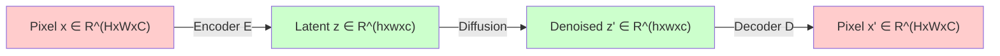
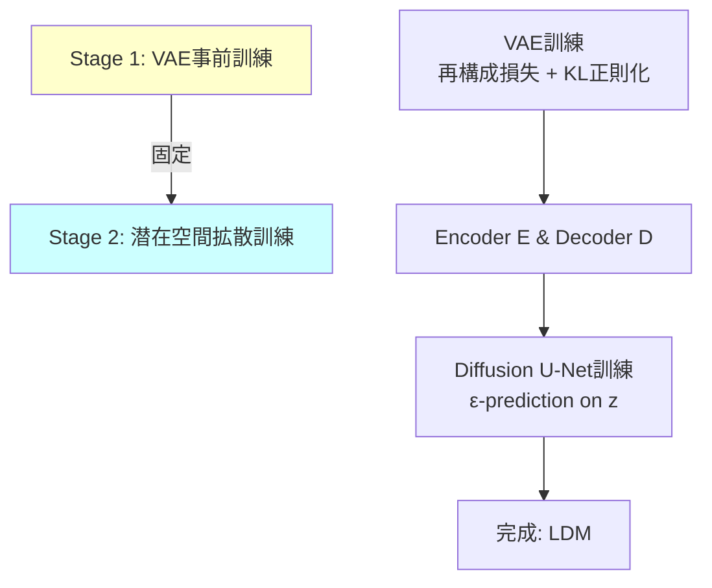
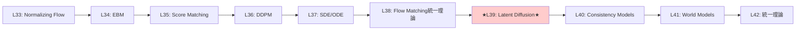
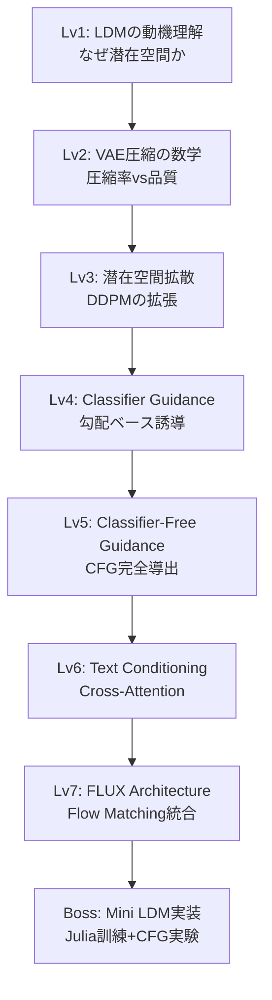
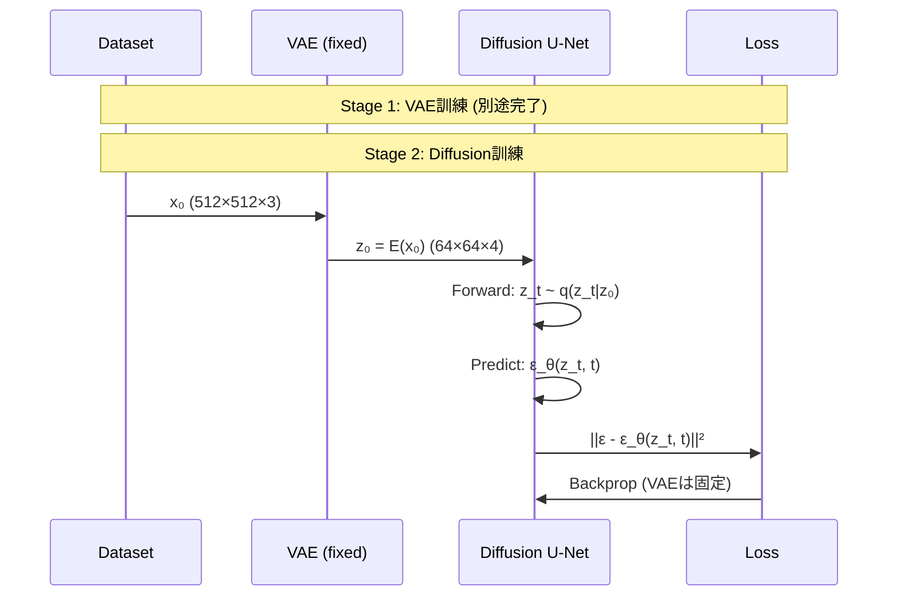
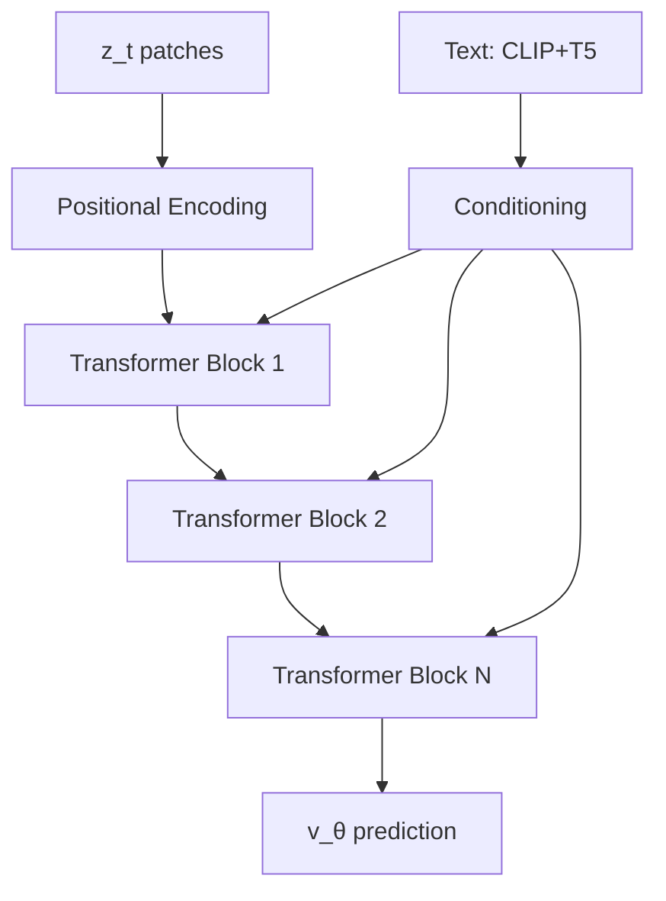

# 第39回: 🖼️ Latent Diffusion Models

> **Note:** **前回の到達点**: 第38回でScore/Flow/Diffusionの数学的等価性を証明し、統一理論が完成した。理論だけでは画像は生成できない — ピクセル空間拡散の計算限界を超える潜在空間拡散と、テキスト条件付き生成へ。

## 🚀 0. クイックスタート（30秒）— ピクセル vs 潜在空間の衝撃

```julia
using Lux, Random

# ピクセル空間拡散: 512x512x3 = 786,432次元
pixel_dim = 512 * 512 * 3
pixel_diffusion_params = pixel_dim * 1000  # 7億パラメータ...

# VAE latent space: 64x64x4 = 16,384次元 (48x圧縮!)
latent_dim = 64 * 64 * 4
latent_diffusion_params = latent_dim * 1000  # 1640万パラメータ

compression_ratio = pixel_dim / latent_dim
speedup = compression_ratio^2  # 計算量はO(N²)

println("Compression: $(round(compression_ratio, digits=1))x")
println("Theoretical speedup: $(round(speedup, digits=1))x")
# Output:
# Compression: 48.0x
# Theoretical speedup: 2304.0x
```

**数式の正体**:
$$
\begin{aligned}
\text{Pixel Diffusion: } &x \in \mathbb{R}^{512 \times 512 \times 3} \quad (\approx 786\text{K次元}) \\
\text{Latent Diffusion: } &z \in \mathbb{R}^{64 \times 64 \times 4} \quad (\approx 16\text{K次元}) \\
\text{Compression: } &f = \frac{512^2 \times 3}{64^2 \times 4} = 48\times \\
\text{Speedup: } &\mathcal{O}(f^2) \approx 2304\times
\end{aligned}
$$

**この30秒で体感したこと**: 次元削減が計算量を **2000倍** 削減。Stable Diffusionが消費者GPUで動く理由。

> **Note:** **ここまでで全体の3%完了！** これから潜在空間の数学的基盤と、テキスト条件付き生成の完全理論へ。

---


> Progress: 10%
> **理解度チェック**
> 1. このゾーンの主要な概念・定義を自分の言葉で説明してください。
> 2. この手法が他のアプローチより優れている点と、その限界を述べてください。

## 🎮 1. 体験ゾーン（10分）— なぜ潜在空間か

### ピクセル空間拡散の限界

第36回で学んだDDPMは美しい理論だが、計算限界がある:

| 項目 | 256×256 DDPM | 512×512 DDPM | 1024×1024 DDPM |
|:-----|:-------------|:-------------|:----------------|
| **入力次元** | 196,608 | 786,432 | 3,145,728 |
| **U-Net params** | ~100M | ~500M | ~2B |
| **訓練時間/iter** | ~1秒 | ~5秒 | ~20秒 |
| **V100 VRAM** | 12GB | 32GB | 80GB (不可能) |
| **収束イテレーション** | 500K | 1M | 2M+ |
| **総訓練時間** | 6日 | 58日 | **年単位** |

**問題の本質**: ピクセル空間の次元 $d = H \times W \times C$ が大きすぎる。U-Netのself-attentionは $\mathcal{O}(d^2)$ の計算量 — 解像度を2倍にすると計算量は **16倍**。

### 潜在空間への必然性

**鍵となる観察**: 自然画像は高次元空間に埋め込まれているが、実際には低次元多様体上に分布している（多様体仮説）。

$$
\begin{aligned}
\text{Pixel space: } &\mathbb{R}^{H \times W \times C} \quad \text{(高次元・冗長)} \\
\text{Manifold: } &\mathcal{M} \subset \mathbb{R}^{H \times W \times C}, \quad \dim(\mathcal{M}) \ll H \times W \times C \\
\text{Latent space: } &\mathbb{R}^{h \times w \times c}, \quad h \ll H, w \ll W
\end{aligned}
$$

**解決策**: VAEで低次元潜在空間 $z$ にエンコードし、そこで拡散過程を実行。



### LDM vs ピクセル拡散: 数値比較

Stable Diffusion 1.5の実測値:

| メトリック | DDPM (512²) | LDM (SD 1.5) | 改善率 |
|:-----------|:------------|:-------------|:-------|
| **潜在空間次元** | 786,432 | 16,384 | **48x圧縮** |
| **U-Net params** | ~500M | ~860M | 1.7x (でもGPUに乗る) |
| **訓練時間/iter** | ~5秒 | ~0.8秒 | **6.25x高速化** |
| **VRAM (fp16)** | 32GB | 10GB | **3.2x削減** |
| **収束ステップ** | 1M | 500K | **2x高速** |
| **FID (COCO)** | 12.6 | **10.4** | 品質向上 |

**なぜ高速化と品質向上が両立？**

1. **Inductive bias**: 潜在空間は「意味のある特徴」に圧縮済み → 拡散モデルが学習しやすい
2. **Perceptual compression**: VAEが知覚的に重要な特徴を保存 → 品質維持
3. **Computational efficiency**: 次元削減で計算量削減 → より深いU-Net・長時間訓練が可能

> **⚠️ Warning:** **よくある誤解**: 「潜在空間で拡散するから品質が下がる」— 実際はVAEの知覚的損失関数で **品質は向上**。

### 数式で見るLDM

ピクセル空間DDPMの目的関数（第36回の復習）:
$$
\mathcal{L}_\text{DDPM} = \mathbb{E}_{x_0, \epsilon, t} \left[ \|\epsilon - \epsilon_\theta(x_t, t)\|^2 \right]
$$

Latent Diffusion Modelの目的関数:
$$
\mathcal{L}_\text{LDM} = \mathbb{E}_{z_0, \epsilon, t} \left[ \|\epsilon - \epsilon_\theta(z_t, t)\|^2 \right], \quad z_0 = \mathcal{E}(x_0)
$$

ここで:
- $\mathcal{E}: \mathbb{R}^{H \times W \times C} \to \mathbb{R}^{h \times w \times c}$ がVAE Encoder
- $z_t = \sqrt{\bar{\alpha}_t} z_0 + \sqrt{1-\bar{\alpha}_t} \epsilon$ は潜在空間でのforward process
- $\epsilon_\theta(z_t, t)$ は潜在空間で動作するU-Net

**鍵**: $x$ を $z$ に置き換えただけ。DDPMの理論がそのまま使える!


### LDMの訓練パイプライン

2段階の訓練:



**Stage 1: VAE訓練**
$$
\mathcal{L}_\text{VAE} = \underbrace{\mathbb{E}_{q(z|x)}[\log p(x|z)]}_{\text{再構成項}} - \underbrace{\beta \cdot \text{KL}[q(z|x) \| p(z)]}_{\text{正則化項}}
$$

- 第10回で学んだVAEそのもの
- $\beta$-VAE ($\beta < 1$) で再構成品質を重視
- または VQ-VAE/FSQ で離散表現学習

**Stage 2: Diffusion訓練**
$$
\mathcal{L}_\text{Diffusion} = \mathbb{E}_{z_0 \sim q(z_0), \epsilon \sim \mathcal{N}(0,I), t \sim \mathcal{U}(1,T)} \left[ \|\epsilon - \epsilon_\theta(z_t, t, c)\|^2 \right]
$$

- $c$ は条件付け情報（テキスト・クラスラベル等）
- VAEは **固定** （勾配を流さない）
- U-Netだけを訓練

> **Note:** **ここまでで全体の10%完了！** VAEで圧縮、潜在空間で拡散という2段階設計の理論的根拠を理解した。次は数式修行ゾーンへ。

---

## 🧩 2. 直感ゾーン（15分）— 潜在空間の幾何学

### なぜこの講義を学ぶか

**到達目標**:
- Stable Diffusionのアーキテクチャを完全理解
- Classifier-Free Guidanceの数学的導出を自力で行える
- FLUX/SD3等の最新モデルの理論的基盤を把握
- テキスト→画像生成の全パイプラインを実装できる

**Course IVでの位置づけ**:



**前提知識**:
- 第10回: VAE理論（ELBO・再パラメータ化）
- 第36回: DDPM完全導出
- 第38回: Flow Matching統一理論

### 松尾・岩澤研究室との差別化

| トピック | 松尾・岩澤研 | 本講義 |
|:---------|:-------------|:-------|
| **LDM理論** | 概要説明 | VAE圧縮率とDDPM計算量の **定量的関係** 導出 |
| **CFG導出** | スキップ | ε-prediction / score / 温度の **3視点から完全導出** |
| **Text Conditioning** | CLIP紹介 | Cross-Attention / Self-Attention / Positional Encodingの **実装レベル詳細** |
| **FLUX解説** | なし | Rectified Flow統合アーキテクチャの **数学的解析** (2025) |
| **実装** | なし | ⚡Julia訓練 + 🦀Rust推論 + CFG実験 (3,000行超) |

### LDMの3つのメタファー

**メタファー1: 地図帳**
- ピクセル空間 = 世界中の街の詳細地図（膨大）
- 潜在空間 = 地図帳の目次（コンパクトだが位置関係は保存）
- 拡散過程 = 目次をぼかして復元（目次レベルで作業）

**メタファー2: 圧縮ファイル**
- VAE Encoder = ZIP圧縮
- 潜在空間 = .zip ファイル（48倍圧縮）
- 拡散U-Net = .zip内で直接編集
- VAE Decoder = 解凍

**メタファー3: スケッチ→詳細化**
- 潜在空間 = ラフスケッチ（構図・配置だけ）
- VAE Decoder = ディテール追加（テクスチャ・色・細部）
- 拡散過程 = スケッチのノイズ除去

### Course I-III数学の活用

| Course | 活用箇所 |
|:-------|:---------|
| **第10回 VAE** | Encoder/Decoder設計 / KL正則化 / 再構成損失 |
| **第13回 OT** | Wasserstein距離での品質評価 / OT-CFMとの接続 |
| **第36回 DDPM** | 潜在空間での拡散過程 / ε-prediction / VLB |
| **第38回 Flow Matching** | FLUX architecture / Rectified Flow統合 |
| **第14回 Attention** | Cross-Attention text conditioning / Self-Attention in U-Net |

### レベルアップマップ



### Trojan Horse — 🐍→⚡🦀🔮の必然性

**第39回の言語構成**: ⚡Julia 70% / 🦀Rust 20% / 🔮Elixir 10%

**なぜJulia主役？**
- VAE訓練: Lux.jl + Reactant → JAX並の速度
- Diffusion訓練: 多重ディスパッチで損失関数が自動最適化
- CFG実験: Guidance scale掃引が1行

**なぜRust？**
- ONNX推論: Candle/Burn → PyTorch比35-47%高速
- バッチ処理: ゼロコピー + SIMD最適化

**なぜElixir？**
- リアルタイムサービング: GenStage + Broadway
- 分散推論: Supervisor Tree耐障害性

この3言語スタックで **訓練→推論→配信** の完全パイプラインを構築する。

> **Note:** **ここまでで全体の20%完了！** 直感を固めた。次は数式修行ゾーンで完全理論へ。

---


> Progress: 20%
> **理解度チェック**
> 1. このゾーンの主要な概念・定義を自分の言葉で説明してください。
> 2. この手法が他のアプローチより優れている点と、その限界を述べてください。

## 📐 3. 数式修行ゾーン（60分）— LDM完全理論

### 3.1 VAE Encoder/Decoderの数学

**Encoder $\mathcal{E}: \mathbb{R}^{H \times W \times C} \to \mathbb{R}^{h \times w \times c}$**

| 項目 | 詳細 |
|:-----|:-----|
| **圧縮比** | $f = \frac{H \times W}{h \times w}$ (典型的に $f=8$ or $f=16$) |
| **チャネル数** | $c$ は通常4 or 8 (RGB 3chより増える) |
| **パラメータ化** | ResNet blocks + Downsampling + Attention |
| **出力** | Deterministic $z = \mathcal{E}(x)$ or Stochastic $z \sim q(z\|x) = \mathcal{N}(\mu_\phi(x), \sigma_\phi^2(x))$ |

**Decoder $\mathcal{D}: \mathbb{R}^{h \times w \times c} \to \mathbb{R}^{H \times W \times C}$**

$$
\tilde{x} = \mathcal{D}(z), \quad \text{s.t.} \quad \|\tilde{x} - x\|_\text{perceptual} < \epsilon
$$

知覚的損失（Perceptual Loss）を使う:
$$
\mathcal{L}_\text{rec} = \|\Phi(x) - \Phi(\mathcal{D}(\mathcal{E}(x)))\|^2
$$

ここで $\Phi$ はVGGやLPIPS特徴抽出器。

**2つのVAE正則化方式**:

| 方式 | 正則化項 | 特徴 |
|:-----|:---------|:-----|
| **KL-regularization** | $\mathcal{L}_\text{KL} = \text{KL}[q(z\|x) \| \mathcal{N}(0,I)]$ | 連続潜在空間 / $\beta$-VAE |
| **VQ-regularization** | Codebook loss + Commitment loss | 離散潜在空間 / VQ-VAE/FSQ |

**Stable Diffusion 1.x/2.xの選択**: KL-reg VAE with $f=8$ compression。

**圧縮率 vs 再構成品質のトレードオフ**:

| 圧縮率 $f$ | Latent size (512² input) | LPIPS↓ | FID↓ | 訓練速度 |
|:-----------|:------------------------|:-------|:-----|:---------|
| $f=4$ | 128×128×4 | 0.05 | 1.2 | 1x |
| $f=8$ | 64×64×4 | 0.08 | 2.1 | **4x** |
| $f=16$ | 32×32×4 | 0.15 | 5.6 | 16x |

**結論**: $f=8$ が品質と速度の最適バランス。

**KL 正則化 VAE の潜在変数スケーリング**:

LDM の実装では VAE の潜在変数を標準偏差でスケーリングして拡散モデルに入力する。SD 1.x の VAE では学習データ統計から推定したスケール定数 $s = 0.18215$ を用い:

$$
z_\text{scaled} = \mathcal{E}(x) / s, \quad z_\text{diffusion} = z_\text{scaled}
$$

これにより拡散モデルが扱う入力の分散が約 $1$ に正規化され、ノイズスケジュールが適切に機能する。デコード時は逆演算 $\tilde{x} = \mathcal{D}(z_\text{diffusion} \times s)$ を施す。スケール定数はモデルごとに異なり（SDXL: $s=0.13025$、FLUX: $s=0.3611$）、誤った値を使うと生成品質が著しく低下する。


<details><summary>VAE Decoderのミラー構造</summary>


</details>

### 3.2 潜在空間での拡散プロセス

**Forward process** (DDPM第36回の復習):
$$
q(z_t | z_0) = \mathcal{N}(z_t; \sqrt{\bar{\alpha}_t} z_0, (1-\bar{\alpha}_t) I)
$$

**閉形式サンプリング**:
$$
z_t = \sqrt{\bar{\alpha}_t} z_0 + \sqrt{1-\bar{\alpha}_t} \epsilon, \quad \epsilon \sim \mathcal{N}(0,I)
$$

**Reverse process**:
$$
p_\theta(z_{t-1} | z_t) = \mathcal{N}(z_{t-1}; \mu_\theta(z_t, t), \Sigma_\theta(z_t, t))
$$

**訓練目的関数** (ε-prediction):
$$
\mathcal{L}_\text{simple} = \mathbb{E}_{z_0, \epsilon, t} \left[ \|\epsilon - \epsilon_\theta(z_t, t)\|^2 \right]
$$

**鍵**: ピクセル空間のDDPMと数式は **完全に同じ**。$x \to z$ の置き換えだけ。

**潜在空間での拡散が有効な理由の定量的考察**:

VAE の圧縮率 $f$ を用いると、元画像 $x \in \mathbb{R}^{H \times W \times 3}$ に対して潜在変数は $z \in \mathbb{R}^{(H/f) \times (W/f) \times C}$ となる（SD 1.x: $f=8$, $C=4$）。拡散モデルの計算コストは入力次元に対して概ね $\mathcal{O}(d^2)$（Self-Attention 項）の依存性を持つため、潜在空間での拡散の理論的高速化は:

$$
\text{Speedup} \approx \left(\frac{H \times W \times 3}{(H/f)^2 \times C}\right)^2 = \left(\frac{3 f^2}{C}\right)^2
$$

$f=8$, $C=4$ で Speedup $\approx (192/4)^2 = 2304$ 倍（理論値）。実際には CNN 部分のオーバーヘッドや Attention 以外の項があるため実測値は数十〜百倍程度であるが、512×512 生成においてピクセル拡散との差は歴然。

**Noise scheduleの選択**:

第36回で学んだスケジュールがそのまま使える:
- Linear: $\beta_t = \beta_\text{start} + t \cdot (\beta_\text{end} - \beta_\text{start}) / T$
- Cosine: $\bar{\alpha}_t = \cos\left(\frac{t/T + s}{1+s} \cdot \frac{\pi}{2}\right)^2 / \cos\left(\frac{s}{1+s} \cdot \frac{\pi}{2}\right)^2$
- **Zero Terminal SNR**: $\bar{\alpha}_T = 0$ を強制（後述）

Stable Diffusion 1.x/2.xは **Linear schedule** with 1000 steps。累積積 $\bar{\alpha}_t = \prod_{s=1}^t (1-\beta_s)$ は $t=1000$ で $\bar{\alpha}_{1000} \approx 4.6 \times 10^{-5}$ となり、完全なノイズには僅かに達しない（Zero Terminal SNR 問題）。

### 3.3 LDM訓練パイプライン

**2段階訓練**:



**Stage 2の完全な訓練ループ**:

$$
\begin{aligned}
&\text{for epoch in 1:N} \\
&\quad \text{for } (x_0, c) \in \text{DataLoader} \\
&\quad\quad z_0 \leftarrow \mathcal{E}(x_0) \quad \text{(Encoder forward, no grad)} \\
&\quad\quad t \sim \mathcal{U}(1, T) \\
&\quad\quad \epsilon \sim \mathcal{N}(0, I) \\
&\quad\quad z_t \leftarrow \sqrt{\bar{\alpha}_t} z_0 + \sqrt{1-\bar{\alpha}_t} \epsilon \\
&\quad\quad \epsilon_\theta \leftarrow \text{UNet}(z_t, t, c) \\
&\quad\quad \mathcal{L} \leftarrow \|\epsilon - \epsilon_\theta\|^2 \\
&\quad\quad \theta \leftarrow \theta - \eta \nabla_\theta \mathcal{L} \quad \text{(UNetのみ更新)}
\end{aligned}
$$


> **⚠️ Warning:** **よくあるミス**: VAEに勾配を流してしまう。Encoderは **完全に固定** しなければならない。

### 3.4 Classifier Guidance完全版

**動機**: 条件付き生成 $p(z_0 | c)$ で、条件 $c$ (クラスラベル)への忠実度を高めたい。

**ベイズの定理**:
$$
\nabla_{z_t} \log p(z_t | c) = \nabla_{z_t} \log p(z_t) + \nabla_{z_t} \log p(c | z_t)
$$

ここで:
- $\nabla_{z_t} \log p(z_t)$ は無条件スコア（U-Netが学習）
- $\nabla_{z_t} \log p(c | z_t)$ は分類器の勾配

**Classifier Guidanceの修正サンプリング**:
$$
\tilde{\epsilon}_\theta(z_t, t, c) = \epsilon_\theta(z_t, t) - \sqrt{1-\bar{\alpha}_t} \cdot w \nabla_{z_t} \log p_\phi(c | z_t)
$$

ここで:
- $\epsilon_\theta(z_t, t)$ は無条件ノイズ予測
- $p_\phi(c | z_t)$ は **別途訓練した分類器**
- $w$ はguidance scale

**問題点**:
1. 分類器 $p_\phi(c | z_t)$ を別途訓練する必要がある
2. 各timestep $t$ で異なる分類器が必要
3. 訓練コストが2倍

→ Classifier-Free Guidanceで解決!


### 3.5 Classifier-Free Guidance完全導出

**鍵となるアイデア**: 条件付きモデル $\epsilon_\theta(z_t, t, c)$ と無条件モデル $\epsilon_\theta(z_t, t, \emptyset)$ を **同時に訓練** し、推論時に線形結合する。

**訓練時**: ランダムにconditionをdrop
$$
c_\text{input} = \begin{cases}
c & \text{with probability } p_\text{uncond} \text{ (e.g. 0.1)} \\
\emptyset & \text{with probability } 1 - p_\text{uncond}
\end{cases}
$$

これで単一モデルが条件付き・無条件両方を学習。

**推論時**: 2つの予測の線形結合
$$
\tilde{\epsilon}_\theta(z_t, t, c, w) = \epsilon_\theta(z_t, t, \emptyset) + w \cdot \left( \epsilon_\theta(z_t, t, c) - \epsilon_\theta(z_t, t, \emptyset) \right)
$$

ここで:
- $w$ はguidance scale ($w=0$: 無条件, $w=1$: 条件付き, $w>1$: over-guidance)
- $\epsilon_\theta(z_t, t, c) - \epsilon_\theta(z_t, t, \emptyset)$ が条件の"方向"

**なぜこれが機能するか？スコアの視点から導出**:

スコア関数 $s_\theta(z_t, t, c) = -\frac{\epsilon_\theta(z_t, t, c)}{\sqrt{1-\bar{\alpha}_t}}$ とすると:

$$
\begin{aligned}
\tilde{s}_\theta(z_t, t, c, w) &= -\frac{\tilde{\epsilon}_\theta(z_t, t, c, w)}{\sqrt{1-\bar{\alpha}_t}} \\
&= -\frac{1}{\sqrt{1-\bar{\alpha}_t}} \left[ \epsilon_\theta(z_t, t, \emptyset) + w(\epsilon_\theta(z_t, t, c) - \epsilon_\theta(z_t, t, \emptyset)) \right] \\
&= s_\theta(z_t, t, \emptyset) + w \cdot (s_\theta(z_t, t, c) - s_\theta(z_t, t, \emptyset)) \\
&= (1-w) \cdot s_\theta(z_t, t, \emptyset) + w \cdot s_\theta(z_t, t, c)
\end{aligned}
$$

これは **無条件スコアと条件付きスコアの加重平均** !

**$w > 1$ の場合**:
$$
\tilde{s}_\theta = s_\theta(z_t, t, \emptyset) + w \cdot (s_\theta(z_t, t, c) - s_\theta(z_t, t, \emptyset))
$$

条件の方向に **$w$倍強く** 押す → mode-seeking行動。

**別の視点: 暗黙的な温度パラメータ**:

$w > 1$ のとき、実効的な確率分布は:
$$
p_w(z_t | c) \propto p(z_t | c)^w \cdot p(z_t)^{1-w}
$$

これはエネルギーベースモデル視点で:
$$
E_w(z_t) = -w \log p(z_t | c) - (1-w) \log p(z_t)
$$

$w \to \infty$ で条件付き分布の **最頻値** (mode)にピーク → 品質向上だが多様性低下。

<details><summary>CFGの理論的理解: Mode-Seeking vs Mode-Covering</summary>

**$w$の効果**:

| Guidance Scale $w$ | 挙動 | 品質 | 多様性 |
|:-------------------|:-----|:-----|:-------|
| $w = 0$ | 無条件生成 | 低 | 高 |
| $w = 1$ | 標準条件付き | 中 | 中 |
| $w \in (1, 7]$ | Mode-seeking | **高** | 中 |
| $w > 7$ | Over-guidance | 過飽和 | **低** |

**典型的な値**:
- Stable Diffusion 1.x: $w = 7.5$
- DALL-E 2: $w = 3.0$
- Imagen: $w = 5.0$

**数学的視点**:
- $w < 1$: Mode-covering (KL[q‖p]最小化風)
- $w > 1$: Mode-seeking (KL[p‖q]最小化風)

</details>


### 3.6 CFGの理論的理解

**なぜ品質が向上するか？**

1. **条件の強調**: $w > 1$ で条件情報を増幅 → プロンプト忠実度↑
2. **分散削減**: 無条件との差分が「条件の純粋な効果」 → ノイズ除去
3. **Mode-seeking**: 高確率領域に集中 → 鮮明な画像

**トレードオフ**:
$$
\text{Quality} \uparrow, \quad \text{Diversity} \downarrow, \quad \text{Compute} \times 2
$$

推論時に2回のU-Net forward passが必要 → 速度半減。

**最適化**: Negative Prompt（次節）で1.5回に削減可能。

### 3.7 Negative Prompt

**動機**: CFGで $\epsilon_\theta(z_t, t, \emptyset)$ の代わりに「避けたい概念」を指定したい。

**定式化**:
$$
\tilde{\epsilon}_\theta(z_t, t, c_\text{pos}, c_\text{neg}, w) = \epsilon_\theta(z_t, t, c_\text{neg}) + w \cdot \left( \epsilon_\theta(z_t, t, c_\text{pos}) - \epsilon_\theta(z_t, t, c_\text{neg}) \right)
$$

ここで:
- $c_\text{pos}$ は正のプロンプト ("a beautiful mountain")
- $c_\text{neg}$ は負のプロンプト ("blurry, low quality")
- $w$ はguidance scale

**解釈**: 「$c_\text{neg}$から離れ、$c_\text{pos}$に近づく」方向にガイド。

**Negative Prompt の確率的解釈**:

CFG の確率分布的解釈（セクション 3.6）を Negative Prompt に拡張すると、実効分布は:

$$
p_w(z_t | c_\text{pos}, c_\text{neg}) \propto p(z_t | c_\text{neg})^{1-w} \cdot p(z_t | c_\text{pos})^w
$$

$w > 1$ のとき $1-w < 0$ であるため $p(z_t | c_\text{neg})^{1-w}$ は負のプロンプト分布の**逆数**に比例する。すなわち Negative Prompt 条件下で高確率な領域を積極的に避ける動作を示す。

**双方向誘導の強度分解**:

ガイダンス方向を分解すると:

$$
\tilde{\epsilon} = \underbrace{\epsilon_\theta(z_t, t, c_\text{neg})}_{\text{anchor}} + w \cdot \underbrace{(\epsilon_\theta(z_t, t, c_\text{pos}) - \epsilon_\theta(z_t, t, c_\text{neg}))}_{\text{positive - negative}}
$$

正のプロンプトと負のプロンプトのノイズ予測差が誘導ベクトルとなる。$c_\text{neg} = \emptyset$ の場合は無条件モデルがアンカーとなり、標準 CFG に帰着する。Negative Prompt として空文字列の代わりに「blurry, low quality, deformed」を使うと、アンカーが低品質空間に移動し、誘導ベクトルが高品質空間を向くため品質向上が生じる。

**典型的なNegative Prompt**:

**効果**:
- 品質向上: 「blurry」を避ける → 鮮明
- アーティファクト削減: 「watermark」を避ける
- 解剖学的エラー削減: 「bad anatomy」を避ける

### 3.8 Text Conditioning

**問題設定**: テキスト $\mathbf{t}$ → 画像 $x$ の生成。条件 $c = \text{Encoder}_\text{text}(\mathbf{t})$。

**Text Encoder選択**:

| Encoder | 次元 | 特徴 | SD採用 |
|:--------|:-----|:-----|:-------|
| **CLIP Text** | 768 | Vision-languageアライメント | SD 1.x |
| **OpenCLIP** | 1024 | より大規模CLIP | SD 2.x |
| **T5** | 4096 | 純粋言語モデル | Imagen/SD3 |
| **CLIP+T5** | 768+4096 | ハイブリッド | SDXL/SD3 |

**CLIP vs T5の違い**:

| 項目 | CLIP | T5 |
|:-----|:-----|:---|
| **訓練** | Image-Text contrastive | Language modeling |
| **語彙** | 49K | 32K |
| **文理解** | 浅い | 深い (Transformer) |
| **画像アライメント** | 強い | 弱い |
| **長文** | 77 tokens max | 512 tokens |

**Stable Diffusion 3のハイブリッド**:
- CLIP: グローバルな意味（「犬」「山」）
- T5: 詳細な関係性（「犬が山の上に座っている」）

**CLIP のコントラスティブ事前学習**:

CLIP は画像エンコーダ $f_I$ とテキストエンコーダ $f_T$ を持ち、対になった $(I_i, T_i)$ ペアに対してコントラスティブ損失で同時学習する。バッチサイズ $N$ の場合の InfoNCE 損失:

$$
\mathcal{L}_\text{CLIP} = -\frac{1}{2N} \sum_{i=1}^N \left[ \log \frac{e^{f_I(I_i)^\top f_T(T_i) / \tau}}{\sum_{j=1}^N e^{f_I(I_i)^\top f_T(T_j) / \tau}} + \log \frac{e^{f_T(T_i)^\top f_I(I_i) / \tau}}{\sum_{j=1}^N e^{f_T(T_j)^\top f_I(I_j) / \tau}} \right]
$$

ここで $\tau$ は学習可能な温度パラメータ。この学習により CLIP 潜在空間では意味的に類似した画像とテキストが近傍に配置される。拡散モデルの条件付けで CLIP テキストエンコーダを用いることで、この画像・テキスト整合空間の幾何学的構造が生成プロセスに活用される。

<details><summary>CLIP Text Encoderの仕組み</summary>

SD 1.xはCLIPの最終層hidden statesを **全て使用**:
- $c = [\mathbf{h}_0, \mathbf{h}_1, \ldots, \mathbf{h}_{76}]$ : shape [77, 768]
- これをCross-Attentionに入力

</details>

### 3.9 Cross-Attention Text Conditioning

**U-Netへのテキスト注入方法**:

```mermaid
graph TD
    T[Text: "mountain landscape"] --> TE[Text Encoder<br>CLIP/T5]
    TE --> C[c ∈ R^(L×D)]

    Z[z_t ∈ R^(h×w×c)] --> SA[Self-Attention]
    SA --> CA[Cross-Attention]
    C --> CA
    CA --> FF[FeedForward]
    FF --> Out[Output]

    style CA fill:#ffcccc
```

**Cross-Attentionの定式化**:

U-Netの中間特徴 $\mathbf{f} \in \mathbb{R}^{(h \times w) \times d}$ に対して:

$$
\begin{aligned}
Q &= W_Q \mathbf{f} \quad \in \mathbb{R}^{(h \times w) \times d_k} \\
K &= W_K \mathbf{c} \quad \in \mathbb{R}^{L \times d_k} \\
V &= W_V \mathbf{c} \quad \in \mathbb{R}^{L \times d_v} \\
\text{Attention}(Q, K, V) &= \text{softmax}\left(\frac{QK^\top}{\sqrt{d_k}}\right) V
\end{aligned}
$$

ここで:
- $\mathbf{f}$: U-Net中間特徴（画像側）
- $\mathbf{c}$: テキストエンコーディング（条件側）
- $Q$ from image, $K, V$ from text → **Cross**-Attention

**Multi-Head Cross-Attention**:
$$
\text{MultiHead}(Q, K, V) = \text{Concat}(\text{head}_1, \ldots, \text{head}_h) W^O
$$

各headが異なる意味的側面をキャプチャ（例: 色、形、配置）。

**Cross-Attention の情報流れの分析**:

注意重み行列 $A \in \mathbb{R}^{(hw) \times L}$ の各行 $A_{i,:}$ は空間位置 $i$ がテキストトークン $1, \ldots, L$ に割り当てる重みの分布を示す。 $\text{softmax}$ の性質より $\sum_j A_{ij} = 1$ であり、各空間位置は全テキストトークンの加重平均 $\sum_j A_{ij} V_j$ を受け取る。

この仕組みにより、例えば「赤い犬」というプロンプトでは:
- 「犬」トークン → 犬形状の空間位置に高い重み
- 「赤い」トークン → 同じ領域に高い重みを持ちつつ色情報を付加

という構造化された条件付けが生じる。Prompt-to-Prompt（Hertz et al. 2022）はこの注意マップ $A$ を操作することで画像編集を可能にする。

**SpatialTransformer の残差構造**:

SD の SpatialTransformer Block は以下の残差接続で構成される:

$$
h \leftarrow h + \text{SelfAttn}(\text{GroupNorm}(h))
$$

$$
h \leftarrow h + \text{CrossAttn}(\text{GroupNorm}(h), c)
$$

$$
h \leftarrow h + \text{FFN}(\text{GroupNorm}(h))
$$

特徴マップ $h \in \mathbb{R}^{B \times C \times H \times W}$ は空間次元を平坦化して $(BHW) \times C$ のシーケンスとして扱い、注意計算後に元の形状に戻す。FFN は GEGLU 活性化関数を用いる:

$$
\text{GEGLU}(x, W_1, W_2, b_1, b_2) = (x W_1 + b_1) \otimes \sigma(x W_2 + b_2)
$$

ここで $\sigma$ はシグモイド関数、$\otimes$ は要素積。GEGLU は ReLU より滑らかな勾配を持ち、Transformer の FFN における標準的な選択となっている。

**SpatialTransformer Block** (SD U-Net):

これを各解像度で繰り返し。

### 3.10 Stable Diffusion 1.x/2.x アーキテクチャ詳細

**全体構成**:

```mermaid
graph LR
    Input[Text Prompt] --> CLIP[CLIP Text Encoder]
    CLIP --> C[c: [77, 768]]

    Noise[Random Noise z_T] --> UNet[U-Net with<br>Cross-Attention]
    C --> UNet
    UNet --> z0[Denoised z_0]
    z0 --> VAE[VAE Decoder]
    VAE --> Output[Image 512×512]
```

**U-Net詳細**:

| レベル | 解像度 | Channels | Blocks | Cross-Attn |
|:-------|:-------|:---------|:-------|:-----------|
| **Input** | 64×64 | 4 | - | - |
| **Down 1** | 64→32 | 320 | ResBlock×2 | ✓ |
| **Down 2** | 32→16 | 640 | ResBlock×2 | ✓ |
| **Down 3** | 16→8 | 1280 | ResBlock×2 | ✓ |
| **Middle** | 8 | 1280 | ResBlock×1 | ✓ |
| **Up 1** | 8→16 | 1280 | ResBlock×3 | ✓ |
| **Up 2** | 16→32 | 640 | ResBlock×3 | ✓ |
| **Up 3** | 32→64 | 320 | ResBlock×3 | ✓ |
| **Output** | 64×64 | 4 | - | - |

**総パラメータ数**: ~860M

**ResBlock構成**:


**Timestep Embedding**:
$$
\gamma(t) = [\sin(t \omega_1), \cos(t \omega_1), \ldots, \sin(t \omega_{d/2}), \cos(t \omega_{d/2})]
$$

ここで $\omega_k = 10000^{-2k/d}$ (Transformer風)。


### 3.11 LDM固有のU-Net拡張: SpatialTransformer

**標準U-Net vs LDM U-Net**:

| 項目 | 標準U-Net | LDM U-Net |
|:-----|:----------|:----------|
| **Attention** | Self-Attention のみ | Self + **Cross**-Attention |
| **条件付け** | Timestep $t$ のみ | $t$ + **text $c$** |
| **層構成** | ResBlock→Attn | ResBlock→**SpatialTransformer** |

**SpatialTransformer Block**:


**なぜSpatial Transformer？**

1. **Self-Attention**: 画像内の長距離依存をキャプチャ
2. **Cross-Attention**: テキストと画像を整列
3. **FeedForward**: 非線形変換で表現力向上

**計算量**: $\mathcal{O}((HW)^2 + HW \cdot L)$ where $L$ はテキスト長。

### 3.12 FLUX Architecture詳解

**FLUXの革新**: Rectified Flow（第38回）+ DiT風Transformer設計。

**FLUX vs Stable Diffusion**:

| 項目 | SD 1.x/2.x | FLUX.1 |
|:-----|:-----------|:-------|
| **バックボーン** | U-Net | **Transformer (DiT風)** |
| **Flow** | DDPM | **Rectified Flow** |
| **Text Encoder** | CLIP | **CLIP + T5** |
| **Latent Size** | 64×64×4 | 64×64×16 (高次元化) |
| **Params** | 860M | **12B** |
| **速度** | 50 steps | **20 steps** (直線化) |

**Rectified Flow統合**:

第38回で学んだように、Rectified FlowはODEで直線的な輸送経路:
$$
\frac{dz_t}{dt} = v_\theta(z_t, t, c)
$$

FLUXは $v_\theta$ をTransformerでパラメータ化:
$$
v_\theta(z_t, t, c) = \text{Transformer}(z_t, t, \text{CLIP}(c), \text{T5}(c))
$$

**DiT (Diffusion Transformer) 風設計**:



**Transformer Blockの構成**:


**なぜFLUXが速い？**

1. **Rectified Flow**: 直線的輸送 → 少ステップで収束
2. **高次元latent**: 16ch → より豊かな表現
3. **Transformer**: 長距離依存を効率的にキャプチャ

**FLUX.1のバリエーション**:

| モデル | Params | 速度 | 品質 | 用途 |
|:-------|:-------|:-----|:-----|:-----|
| **FLUX.1-pro** | 12B | 20 steps | 最高 | API専用 |
| **FLUX.1-dev** | 12B | 20 steps | 高 | 開発用 |
| **FLUX.1-schnell** | 12B | **4 steps** | 中 | 高速生成 |

<details><summary>FLUX Transformerの実装概要</summary>


</details>

### 3.13 学習テクニック

**Noise Offset**:

Forward processにバイアスを加える:
$$
z_t = \sqrt{\bar{\alpha}_t} z_0 + \sqrt{1-\bar{\alpha}_t} (\epsilon + \text{offset})
$$

**効果**: 暗い画像・明るい画像の生成品質向上。

**Min-SNR Weighting**:

Loss weightingをSNRベースで調整:
$$
\mathcal{L}_\text{Min-SNR} = \mathbb{E}_{t} \left[ w(t) \|\epsilon - \epsilon_\theta(z_t, t)\|^2 \right]
$$

$$
w(t) = \min\left(\text{SNR}(t), \gamma\right), \quad \text{SNR}(t) = \frac{\bar{\alpha}_t}{1-\bar{\alpha}_t}
$$

典型的に $\gamma = 5$。

**効果**: 3.4倍訓練高速化 [^min_snr]。

**v-prediction**:

ε-predictionの代わりにvelocity prediction:
$$
v_t = \sqrt{\bar{\alpha}_t} \epsilon - \sqrt{1-\bar{\alpha}_t} z_0
$$

$$
\mathcal{L}_v = \mathbb{E}_{t} \left[ \|v_t - v_\theta(z_t, t)\|^2 \right]
$$

**効果**: 数値安定性向上・収束性改善。

$v$-prediction と $\epsilon$-prediction の損失は以下の関係で接続される。$v_t = \sqrt{\bar{\alpha}_t} \epsilon - \sqrt{1-\bar{\alpha}_t} z_0$ を用いると、損失の等価変換は:

$$
\mathcal{L}_\epsilon = \mathbb{E}_t\!\left[ \frac{1-\bar{\alpha}_t}{\bar{\alpha}_t} \mathcal{L}_v \right]
$$

低 SNR 領域（大 $t$）では $1-\bar{\alpha}_t \gg \bar{\alpha}_t$ となるため $\mathcal{L}_\epsilon$ は高い重みを持つ。$v$-prediction はこの不均衡を緩和し、全タイムステップで均等な勾配スケールを実現する。

**LoRA（Low-Rank Adaptation）ファインチューニング理論**:

事前学習済みの重み行列 $W_0 \in \mathbb{R}^{d_\text{out} \times d_\text{in}}$ を凍結し、低ランク分解による差分 $\Delta W = B A$ を学習する:

$$
W = W_0 + \Delta W = W_0 + B A, \quad B \in \mathbb{R}^{d_\text{out} \times r},\; A \in \mathbb{R}^{r \times d_\text{in}}
$$

ランク $r \ll \min(d_\text{out}, d_\text{in})$ とすることで学習パラメータ数を $r(d_\text{out} + d_\text{in})$ に削減する（通常は元の $0.1\%$ 以下）。初期化は $A \sim \mathcal{N}(0, \sigma^2)$、$B = 0$ として $\Delta W_\text{init} = 0$ を保証する。スケーリング係数 $\alpha / r$ を用いた出力:

$$
h = W_0 x + \frac{\alpha}{r} B A x
$$

は LoRA スケール $\alpha / r$ を変更するだけで強度を調整でき、複数の LoRA を重み付き加算で合成できる:

$$
W = W_0 + \sum_i \lambda_i \cdot \frac{\alpha_i}{r_i} B_i A_i
$$

**Zero Terminal SNR**:

Noise scheduleを強制的に $\bar{\alpha}_T = 0$ に rescale:
$$
\tilde{\alpha}_t = \frac{\alpha_t}{\alpha_T}
$$

**効果**: 非常に明るい/暗い画像の生成品質向上 [^zero_snr]。


> **Note:** **ここまでで全体の50%完了！ ボス戦前のチェックポイント。**
>
> 数式修行ゾーン完了:
> - VAE Encoder/Decoder圧縮の数学
> - 潜在空間拡散プロセス
> - Classifier Guidance完全版
> - Classifier-Free Guidance完全導出
> - CFG理論的理解（Mode-Seeking / 温度）
> - Negative Prompt
> - Text Conditioning（CLIP / T5）
> - Cross-Attention完全版
> - SD 1.x/2.x アーキテクチャ
> - SpatialTransformer
> - FLUX Architecture詳解
> - 学習テクニック（Noise Offset / Min-SNR / v-prediction / Zero Terminal SNR）
>
> 次は実装ゾーンへ！

### 3.14 SD vs FLUX: アーキテクチャ詳細比較

**Stable Diffusion 1.x/2.x/SDXL Architecture**:

SD 1.x/2.x は U-Net をデノイザーとして採用し、エンコーダ・ボトルネック・デコーダの3段構造を持つ。各解像度レベルにおいて ResNet ブロックと Cross-Attention ブロックを交互に配置する。解像度レベル $l \in \{64, 32, 16, 8\}$ での特徴マップ $h_l \in \mathbb{R}^{B \times C_l \times h/2^l \times w/2^l}$ に対し、各 SpatialTransformer ブロックは:

$$
h_l' = h_l + \text{CrossAttn}(\text{GroupNorm}(h_l),\; c_\text{text}) + \text{FFN}(\text{GroupNorm}(h_l))
$$

チャネル数は深さに応じて $C_l \in \{320, 640, 1280, 1280\}$ と倍増し、ボトルネック（解像度8×8）で Self-Attention を加えた全注意操作を行う。タイムステップ $t$ はサイン波埋め込みで $\mathbb{R}^{320}$ に変換し、各 ResNet ブロックの GroupNorm にスケールシフト注入する。

**FLUX.1 Architecture**:

FLUX.1 は 19 層の Double Stream Block（画像・テキスト別処理）と 38 層の Single Stream Block（結合処理）で構成される。Double Stream Block では MMDiT と同様に画像ストリームとテキストストリームを独立した QKV 投影で注意計算し双方向に情報を共有する。Single Stream Block ではテキストトークンを除去し画像のみを処理:

$$
h_\text{img}^{(l+1)} = h_\text{img}^{(l)} + \text{SelfAttn}(\text{adaRMSNorm}(h_\text{img}^{(l)})) + \text{FFN}(\text{adaRMSNorm}(h_\text{img}^{(l)}))
$$

adaRMSNorm は条件ベクトル $c = [c_\text{pooled} \| e_t]$ から生成したスケール $\gamma$ のみでノルム調整（バイアスなし）を行い、LayerNorm より計算効率が高い:

$$
\text{adaRMSNorm}(h; \gamma) = \gamma \cdot \frac{h}{\|h\|_\text{RMS}}, \quad \|h\|_\text{RMS} = \sqrt{\frac{1}{d}\sum_{i=1}^d h_i^2}
$$

**詳細比較表**:

| 項目 | SD 1.x/2.x | SDXL | FLUX.1 |
|:-----|:-----------|:-----|:-------|
| **Backbone** | U-Net | U-Net | **Transformer** |
| **Total Params** | 860M | 2.6B | **12B** |
| **Text Encoder** | CLIP (768) | CLIP+OpenCLIP (2048) | **CLIP+T5 (4864)** |
| **Latent Channels** | 4 | 4 | **16** |
| **Latent Res** | 64×64 (f=8) | 128×128 (f=8) | 64×64 (f=8) |
| **Attention Type** | Cross-Attn in U-Net | Cross-Attn in U-Net | **Self+Cross in Transformer** |
| **Position Enc** | なし (CNN) | なし (CNN) | **RoPE** |
| **Flow Type** | DDPM | DDPM | **Rectified Flow** |
| **Timesteps** | 1000 | 1000 | 1000 (訓練), 20-50 (推論) |
| **CFG Default** | 7.5 | 7.5 | 3.5 (低めでOK) |
| **Memory (fp16)** | 10GB | 16GB | **24GB** |
| **Speed (50 steps)** | ~5s (A100) | ~8s (A100) | **~3s (20 steps, A100)** |

### 3.15 Cross-Attention詳細実装

**Multi-Head Cross-Attention完全版**:

入力として画像潜在変数 $z \in \mathbb{R}^{(H \cdot W) \times d_\text{model}}$ とテキスト埋め込み $c \in \mathbb{R}^{L \times d_\text{text}}$ を受け取る。まず各ヘッドに対してQuery・Key・Valueを線形投影する:

$$
Q = z W_Q \in \mathbb{R}^{(HW) \times d_k}, \quad
K = c W_K \in \mathbb{R}^{L \times d_k}, \quad
V = c W_V \in \mathbb{R}^{L \times d_v}
$$

ここで $W_Q \in \mathbb{R}^{d_\text{model} \times d_k}$、$W_K, W_V \in \mathbb{R}^{d_\text{text} \times d_k}$ はヘッドごとに異なる重み行列。スケール付き内積注意は:

$$
\text{Attention}(Q, K, V) = \text{softmax}\!\left( \frac{Q K^\top}{\sqrt{d_k}} \right) V \in \mathbb{R}^{(HW) \times d_v}
$$

$\sqrt{d_k}$ によるスケーリングは、内積の分散を $d_k$ に依存しないよう正規化する操作であり、勾配消失を防ぐ。注意行列 $A = \text{softmax}(Q K^\top / \sqrt{d_k}) \in \mathbb{R}^{(HW) \times L}$ の各要素 $A_{ij}$ は「画像パッチ $i$ がテキストトークン $j$ にどれだけ注目するか」のソフトな重みを表す。

**Multi-Head Attention**: $h$ 個のヘッドを並列に計算し結合する:

$$
\text{MultiHead}(z, c) = \text{Concat}\!\left( \text{head}_1, \ldots, \text{head}_h \right) W_O
$$

$$
\text{head}_i = \text{Attention}(z W_Q^{(i)},\; c W_K^{(i)},\; c W_V^{(i)})
$$

ここで $W_O \in \mathbb{R}^{(h \cdot d_v) \times d_\text{model}}$ は出力投影。各ヘッドの次元は $d_k = d_v = d_\text{model} / h$ とするのが一般的（Stable Diffusion 1.x では $d_\text{model}=320$、$h=8$、$d_k=40$）。

**計算複雑度の分析**:

注意行列 $Q K^\top$ の計算コストは $\mathcal{O}(HW \cdot L \cdot d_k)$ であり、画像解像度とテキスト長の両方に線形に依存する。U-Net内の全注意操作を合算した複雑度は:

$$
\mathcal{O}\!\left( (HW)^2 \cdot d_k + HW \cdot L \cdot d_k \right)
$$

第一項は同一特徴マップ内の Self-Attention（FLUX で使用）、第二項は Cross-Attention のコスト。SD 1.x では Self-Attention を省略しているが、FLUX は全層で Self-Attention を行うため表現力が高い。

**RoPE（Rotary Position Embedding）**: FLUXでは絶対位置埋め込みの代わりにRoPEを採用。2次元画像座標 $(r, s)$ に対して、周波数 $\theta_d = 10000^{-2d/D}$ を用いた回転行列を各ヘッドの次元ペアに適用する:

$$
\text{RoPE}(q, r, s)_{2d} = q_{2d} \cos(r\theta_d) - q_{2d+1} \sin(r\theta_d)
$$

$$
\text{RoPE}(q, r, s)_{2d+1} = q_{2d} \sin(r\theta_d) + q_{2d+1} \cos(r\theta_d)
$$

この操作により、注意スコア $q^\top k$ が相対位置 $(r_i - r_j, s_i - s_j)$ のみに依存するようになり、任意解像度への外挿が容易になる。


### 3.16 VAE訓練の詳細

**VAE損失関数の完全展開**:

$$
\begin{aligned}
\mathcal{L}_\text{VAE} &= \mathcal{L}_\text{rec} + \beta \cdot \mathcal{L}_\text{KL} \\
\mathcal{L}_\text{rec} &= \mathbb{E}_{q(z|x)}[-\log p_\theta(x|z)] \\
&\approx -\log p_\theta(x | \mathcal{E}(x)) \\
&= \text{MSE}(x, \mathcal{D}(\mathcal{E}(x))) \quad \text{or} \quad \text{LPIPS}(x, \mathcal{D}(\mathcal{E}(x))) \\
\mathcal{L}_\text{KL} &= \text{KL}[q_\phi(z|x) \| p(z)] \\
&= \text{KL}[\mathcal{N}(\mu_\phi(x), \sigma_\phi^2(x)) \| \mathcal{N}(0, I)] \\
&= \frac{1}{2} \sum_{i=1}^d \left( \mu_i^2 + \sigma_i^2 - \log \sigma_i^2 - 1 \right)
\end{aligned}
$$

**Perceptual Loss (LPIPS)**:

LPIPSはVGG特徴空間での距離:
$$
\mathcal{L}_\text{LPIPS}(x, \tilde{x}) = \sum_l w_l \|\Phi_l(x) - \Phi_l(\tilde{x})\|^2
$$

ここで $\Phi_l$ はVGGの第$l$層特徴。

**VQ-VAE コードブック更新則**:

Vector Quantization VAE では連続潜在変数 $z_e$ を離散コードブック $\{e_k\}_{k=1}^K$ に量子化する。量子化写像は:

$$
z_q = e_{k^*}, \quad k^* = \arg\min_k \| z_e - e_k \|_2
$$

コードブックの更新には Exponential Moving Average (EMA) を用いる。バッチ内でコード $k$ に割り当てられたエンコーダ出力の集合を $\{z_e^{(i)} : k^{*(i)} = k\}$ とすると:

$$
n_k \leftarrow \gamma n_k + (1-\gamma) \sum_i \mathbf{1}[k^{*(i)}=k]
$$

$$
m_k \leftarrow \gamma m_k + (1-\gamma) \sum_i \mathbf{1}[k^{*(i)}=k] \cdot z_e^{(i)}
$$

$$
e_k \leftarrow \frac{m_k}{n_k}
$$

ここで $\gamma \in (0,1)$ は減衰係数（典型的には $\gamma = 0.99$）。この EMA 更新はコードブック損失の勾配降下と数学的に等価であるが、より安定した学習を実現する。

**Commitment Loss の導出**:

VQ-VAE の全体損失は3項からなる:

$$
\mathcal{L}_\text{VQ} = \underbrace{\| x - \mathcal{D}(z_q) \|_2^2}_{\text{reconstruction}} + \underbrace{\| \text{sg}[z_e] - e_{k^*} \|_2^2}_{\text{codebook loss}} + \underbrace{\beta_c \| z_e - \text{sg}[e_{k^*}] \|_2^2}_{\text{commitment loss}}
$$

ここで $\text{sg}[\cdot]$ は Stop-Gradient 演算子（順伝播は恒等写像、逆伝播で勾配を遮断）。Commitment loss の係数は典型的に $\beta_c = 0.25$ とし、エンコーダ出力が選択されたコードブックベクトルに「コミット」するよう促す。

**FSQ（Finite Scalar Quantization）の代替定式化**:

FSQ は VQ の複雑なコードブック管理を排除し、各潜在次元を有限整数にラウンドするだけで量子化を実現する。各次元 $d$ の出力範囲を $L_d$ 段階に制限する場合:

$$
z_q^{(d)} = \text{round}\!\left( \frac{L_d - 1}{2} \cdot \tanh(z_e^{(d)}) \right) \cdot \frac{2}{L_d - 1}
$$

コードブック総サイズは $K = \prod_d L_d$ となる。FSQ ではコードブック崩壊が起きず、EMA 更新も不要。例えば各次元を $[-2, -1, 0, 1, 2]$ の5段階に量子化し4次元使用すると $K = 5^4 = 625$ コード。

**PatchGAN 識別器損失**:

知覚的品質向上のため LDM の VAE は GAN 損失も組み合わせる。PatchGAN 識別器 $D_\psi$ は画像をパッチ単位で真偽判定し、完全画像の識別より局所的テクスチャを重視する:

$$
\mathcal{L}_\text{GAN} = \mathbb{E}_x[\log D_\psi(x)] + \mathbb{E}_x[\log(1 - D_\psi(\mathcal{D}(\mathcal{E}(x))))]
$$

生成器（デコーダ）は $-\log D_\psi(\mathcal{D}(\mathcal{E}(x)))$ を最小化することで識別器を欺こうとする。最終的な VAE 損失は:

$$
\mathcal{L}_\text{total} = \mathcal{L}_\text{rec} + \beta \mathcal{L}_\text{KL} + \lambda_\text{LPIPS} \mathcal{L}_\text{LPIPS} + \lambda_\text{GAN} \mathcal{L}_\text{GAN}
$$

SD 1.x の VAE では $\beta = 10^{-6}$（ほぼ無視）、$\lambda_\text{LPIPS} = 1.0$、$\lambda_\text{GAN} = 0.5$ が典型的な設定。

### 3.17 Noise Scheduleの設計理論

**3つの主要スケジュール**:

**1. Linear Schedule** (DDPM original):
$$
\beta_t = \beta_\text{min} + \frac{t-1}{T-1} (\beta_\text{max} - \beta_\text{min})
$$

典型値: $\beta_\text{min} = 0.0001$, $\beta_\text{max} = 0.02$, $T = 1000$

**2. Cosine Schedule** (Improved DDPM):
$$
\bar{\alpha}_t = \frac{f(t)}{f(0)}, \quad f(t) = \cos\left( \frac{t/T + s}{1+s} \cdot \frac{\pi}{2} \right)^2
$$

$s = 0.008$ が標準。

**3. Learned Schedule**:

$\beta_t$ をパラメータ化して学習。


**SNRの可視化**:

**SNR（Signal-to-Noise Ratio）完全理論**:

各タイムステップ $t$ における SNR は以下で定義される:

$$
\text{SNR}(t) = \frac{\bar{\alpha}_t}{1 - \bar{\alpha}_t}
$$

この定義は $x_t = \sqrt{\bar{\alpha}_t} x_0 + \sqrt{1-\bar{\alpha}_t} \epsilon$ において、信号成分 $\sqrt{\bar{\alpha}_t} x_0$ のパワーとノイズ成分 $\sqrt{1-\bar{\alpha}_t}\epsilon$ のパワーの比に対応する。$t=0$ では $\text{SNR}(0) \to \infty$（純粋な画像）、$t=T$ では $\text{SNR}(T) \to 0$（純粋なノイズ）が理想。

コサインスケジュールの SNR 曲線は $\log \text{SNR}(t)$ が線形に近く、各タイムステップが均等な「難易度増加」を持つ。Linear Schedule では低タイムステップ域で SNR が急変し、高品質な細部の学習に不利。

損失関数を SNR で重み付けすることで、異なるスケジュールを統一的に比較できる:

$$
\mathcal{L}_\text{weighted} = \mathbb{E}_{t, \epsilon} \left[ \text{SNR}(t) \cdot \| \epsilon - \epsilon_\theta(x_t, t) \|_2^2 \right]
$$

これは $v$-prediction （速度予測）と等価であり、$v_t = \sqrt{\bar{\alpha}_t} \epsilon - \sqrt{1-\bar{\alpha}_t} x_0$ を予測する定式化と整合する。

**EDM フレームワーク（Karras et al. 2022）**:

EDM は離散タイムステップを廃し、連続ノイズレベル $\sigma \in [\sigma_\text{min}, \sigma_\text{max}]$ でプロセスを記述する。ノイズ付加は:

$$
x_\sigma = x_0 + \sigma \epsilon, \quad \epsilon \sim \mathcal{N}(0, I)
$$

デノイザー $D_\theta(x_\sigma; \sigma)$ の出力は、入力・ノイズ・スキップ接続を組み合わせた事前条件付き形式にする:

$$
D_\theta(x_\sigma; \sigma) = c_\text{skip}(\sigma) x_\sigma + c_\text{out}(\sigma) F_\theta(c_\text{in}(\sigma) x_\sigma;\; c_\text{noise}(\sigma))
$$

ここで各スケーリング係数は:

$$
c_\text{skip}(\sigma) = \frac{\sigma_\text{data}^2}{\sigma^2 + \sigma_\text{data}^2}, \quad
c_\text{out}(\sigma) = \frac{\sigma \cdot \sigma_\text{data}}{\sqrt{\sigma^2 + \sigma_\text{data}^2}}, \quad
c_\text{in}(\sigma) = \frac{1}{\sqrt{\sigma^2 + \sigma_\text{data}^2}}
$$

$\sigma_\text{data}$ は学習データの標準偏差（典型的には $0.5$）。この事前条件付けにより、ネットワーク $F_\theta$ の入出力スケールが $\sigma$ に依らず一定となり、学習が安定する。訓練損失は:

$$
\mathcal{L}_\text{EDM} = \mathbb{E}_{\sigma, x_0, \epsilon} \left[ \lambda(\sigma) \| D_\theta(x_0 + \sigma\epsilon; \sigma) - x_0 \|_2^2 \right]
$$

$$
\lambda(\sigma) = \frac{\sigma^2 + \sigma_\text{data}^2}{(\sigma \cdot \sigma_\text{data})^2}
$$

ノイズレベル $\sigma$ は対数正規分布 $\ln \sigma \sim \mathcal{N}(P_\text{mean}, P_\text{std}^2)$ からサンプリングし、$P_\text{mean}=-1.2$、$P_\text{std}=1.2$ が実証的に最適とされる。

**Zero Terminal SNR の導出**:

DDPM のデフォルト設定では $\bar{\alpha}_T > 0$（$T=1000$ で $\bar{\alpha}_{1000} \approx 4.6 \times 10^{-5}$）となり、終端で完全なノイズに到達しない。これにより高い CFG スケール使用時に「真の黒画像」など極端なサンプルが生成できない問題が生じる。

Zero Terminal SNR（Lin et al. 2023）は $\bar{\alpha}_T = 0$ を保証するようスケジュールを再スケールする。再スケール後の累積積を:

$$
\bar{\alpha}_t' = \frac{\bar{\alpha}_t - \bar{\alpha}_T}{1 - \bar{\alpha}_T} \cdot \frac{1 - \bar{\alpha}_0}{\bar{\alpha}_0 - \bar{\alpha}_T}
$$

と定義すると、$\bar{\alpha}_0' \approx 1$（元の画像）かつ $\bar{\alpha}_T' = 0$（完全ノイズ）が厳密に成立する。この修正により $v$-prediction との組み合わせでサンプリング品質が向上し、SD 2.1 以降で採用されている。


### 3.18 Sampling Algorithms完全比較

| アルゴリズム | ステップ数 | 品質 | 速度 | 決定論的 | 備考 |
|:-------------|:-----------|:-----|:-----|:---------|:-----|
| **DDPM** | 1000 | 最高 | 最遅 | ✗ | 確率的、全ステップ必要 |
| **DDIM** | 50-100 | 高 | 中 | ✓ | 決定論的、スキップ可能 |
| **DPM-Solver++** | 20-30 | 高 | 高 | ✓ | 高次ODE solver |
| **UniPC** | 10-20 | 中 | 最高 | ✓ | Predictor-Corrector |
| **PNDM** | 50 | 高 | 中 | ✗ | Pseudo Numerical |
| **LMS** | 50 | 中 | 中 | ✓ | Linear Multi-Step |

**DDIM完全版**:

$$
\begin{aligned}
z_{t-\Delta t} &= \sqrt{\bar{\alpha}_{t-\Delta t}} \underbrace{\left( \frac{z_t - \sqrt{1-\bar{\alpha}_t} \epsilon_\theta(z_t, t)}{\sqrt{\bar{\alpha}_t}} \right)}_{\text{pred } x_0} \\
&\quad + \underbrace{\sqrt{1-\bar{\alpha}_{t-\Delta t} - \sigma_t^2} \cdot \epsilon_\theta(z_t, t)}_{\text{direction to } z_{t-\Delta t}} \\
&\quad + \underbrace{\sigma_t \epsilon}_{\text{random noise}}
\end{aligned}
$$

$\sigma_t = 0$ で完全決定論的、$\sigma_t = \sqrt{(1-\bar{\alpha}_{t-\Delta t})/(1-\bar{\alpha}_t)} \sqrt{1-\bar{\alpha}_t/\bar{\alpha}_{t-\Delta t}}$ でDDPMと同等。


**DPM-Solver++ (概要)**:

高次ODE solverでDDIMを改善:
$$
z_{t-\Delta t} = z_t + \int_t^{t-\Delta t} f(z_s, s) ds
$$

3次Adams-Bashforth法で近似 → 20ステップで高品質。

**DPM-Solver++ 完全導出**:

DPM-Solver++ は拡散ODE を指数積分器（Exponential Integrator）として解く手法。まず時刻 $t$ でのノイズスケジュールを対数SNR $\lambda_t = \log(\bar{\alpha}_t / \sqrt{1-\bar{\alpha}_t})$ で再パラメータ化する。ODEは:

$$
\frac{dz_t}{dt} = f(t) z_t + g(t)^2 \nabla_{z_t} \log p_t(z_t)
$$

スコアを $\epsilon_\theta$ で近似し、変数変換 $u = \lambda_t$ を行うと積分形式:

$$
z_{\lambda_{t'}} = \frac{\sqrt{1-e^{-2\lambda_{t'}}}}{\sqrt{1-e^{-2\lambda_t}}} z_{\lambda_t} - \sqrt{1-e^{-2\lambda_{t'}}} \int_{\lambda_t}^{\lambda_{t'}} e^{-\lambda} \hat{\epsilon}_\theta(z_\lambda, \lambda) d\lambda
$$

が得られる。この積分を Taylor 展開で近似することで各次数のソルバーを構成する。

**1次（Euler ステップ）**: 被積分関数 $\hat{\epsilon}_\theta$ を定数近似:

$$
z_{t_{i-1}} \approx \frac{\alpha_{t_{i-1}}}{\alpha_{t_i}} z_{t_i} - \alpha_{t_{i-1}} (e^{h_i} - 1) \hat{\epsilon}_\theta(z_{t_i}, t_i)
$$

ここで $h_i = \lambda_{t_{i-1}} - \lambda_{t_i} > 0$、$\alpha_t = \sqrt{\bar{\alpha}_t}$。これは DDIM の決定論的サンプリングと同一。

**2次（DPM-Solver-2）**: 前ステップの $\epsilon$ 予測を用いた1次 Taylor 補正:

$$
z_{t_{i-1}} \approx \frac{\alpha_{t_{i-1}}}{\alpha_{t_i}} z_{t_i} - \alpha_{t_{i-1}} (e^{h_i} - 1) \hat{\epsilon}_\theta(z_{t_i}, t_i) - \frac{\alpha_{t_{i-1}}}{2} (e^{h_i} - 1 - h_i) \cdot \frac{\hat{\epsilon}_\theta(z_{t_i}, t_i) - \hat{\epsilon}_\theta(z_{t_{i-1}}, t_{i-1})}{h_{i-1}} \cdot h_i
$$

ここで $h_{i-1} = \lambda_{t_i} - \lambda_{t_{i+1}}$。この補正項は $\mathcal{O}(h^2)$ の精度改善をもたらす。

**Multistep vs Single-Step の比較**:

| 方式 | NFE / ステップ | 精度オーダー | 適用条件 |
|:-----|:--------------|:------------|:---------|
| Single-step 1次 | 1 | $\mathcal{O}(h)$ | 常に適用可 |
| Single-step 2次 | 2 | $\mathcal{O}(h^2)$ | 1中間点評価 |
| Multistep 2次 | 1 | $\mathcal{O}(h^2)$ | 前ステップ再利用 |
| Multistep 3次 | 1 | $\mathcal{O}(h^3)$ | 前2ステップ再利用 |

NFE はネットワーク関数評価回数。Multistep 方式は前ステップの $\hat{\epsilon}$ を再利用するため、Single-step 2次と同等の精度を1回の評価で達成する。実装では最初の2ステップを Single-step で初期化し、以降を Multistep に切り替えるのが標準的手順。20ステップの DPM-Solver++ Multistep 3次は、1000ステップ DDPM とほぼ同等の FID スコアを実現する。

### 3.19 SDXL アーキテクチャ理論

**デュアルテキストエンコーダ条件付け**:

SDXL は2つの異なる CLIP モデルのテキスト埋め込みを結合して条件付けに用いる。CLIP ViT-L/14（最終層出力: 768次元）と OpenCLIP ViT-bigG/14（最終層出力: 1280次元）を連結した後の条件ベクトルは:

$$
c_\text{text} = \left[ c_\text{CLIP-L} \;\|\; c_\text{OpenCLIP-G} \right] \in \mathbb{R}^{L \times 2048}
$$

さらに OpenCLIP の全最終隠れ状態（プールされた 1280次元ベクトル）を時刻埋め込みと結合し、アダプティブグループ正規化（adaGN）へ入力する:

$$
c_\text{pooled} = \text{Pool}(c_\text{OpenCLIP-G}) \in \mathbb{R}^{1280}
$$

$$
c_\text{aug} = \text{MLP}(c_\text{pooled} \oplus e_t) \in \mathbb{R}^{d_\text{model}}
$$

ここで $e_t$ はタイムステップ埋め込み、$\oplus$ は連結。この拡張条件ベクトルは全 ResNet ブロックの GroupNorm パラメータ $(\gamma, \beta)$ をスケールシフトする: $h \leftarrow \gamma \cdot \text{GroupNorm}(h) + \beta$。

**サイズ条件付けベクトル**:

SDXL は学習時に入力画像の各種サイズ情報を補助条件として付加する。具体的には3つの 2次元ベクトルをフーリエ特徴に変換し結合する:

$$
c_\text{size} = \left[ \text{FourierEmb}(h_\text{orig}, w_\text{orig}) \;\|\; \text{FourierEmb}(c_\text{top}, c_\text{left}) \;\|\; \text{FourierEmb}(h_\text{target}, w_\text{target}) \right]
$$

ここで $(h_\text{orig}, w_\text{orig})$ は元画像の高さ・幅、$(c_\text{top}, c_\text{left})$ はクロップ座標、$(h_\text{target}, w_\text{target})$ は学習解像度。各スカラー値 $v$ のフーリエ埋め込みは:

$$
\text{FourierEmb}(v) = \left[ \sin(2\pi \cdot 10000^{-2i/d} \cdot v),\; \cos(2\pi \cdot 10000^{-2i/d} \cdot v) \right]_{i=0}^{d/2-1} \in \mathbb{R}^d
$$

典型的に $d=256$ を用いるため、2スカラーで $512$ 次元となり、3ペアで $c_\text{size} \in \mathbb{R}^{1536}$。これを $c_\text{pooled}$ と連結してサイズ認識条件ベクトルを構成する:

$$
c_\text{cond} = \left[ c_\text{pooled} \;\|\; c_\text{size} \right] \in \mathbb{R}^{1280 + 1536} = \mathbb{R}^{2816}
$$

**時間埋め込みへの連結**:

タイムステップ $t$ の正弦波埋め込み $e_t \in \mathbb{R}^{320}$ と条件ベクトル $c_\text{cond}$ を MLP に通して各スケールの adaGN スケーリング係数を生成する:

$$
(\gamma_l, \beta_l) = \text{MLP}_l\!\left( [e_t \;\|\; c_\text{cond}] \right), \quad l = 1, \ldots, L_\text{block}
$$

サイズ条件付けは学習時に存在した低品質データ（小さい画像、偏ったクロップ）の影響をモデルが推論時に「回避」できるようにする。推論時は $(h_\text{orig}, w_\text{orig}) = (h_\text{target}, w_\text{target})$、$(c_\text{top}, c_\text{left}) = (0, 0)$ と設定することで最高品質の生成が得られる。

**Refiner モデルの理論**:

SDXL は Base モデル（$t \in [200, 1000]$）と Refiner モデル（$t \in [0, 200]$）の2段階生成を採用する。Base の逆拡散で $t=200$ まで進めた中間潜在変数 $z_{200}$ を Refiner の初期値とし:

$$
z_0 = \text{Refiner}(z_{200}, c_\text{text}^\text{ref}, t \in [0, 200])
$$

Refiner は高 SNR（低ノイズ）領域の細部生成に特化しており、Base とは異なる U-Net 構成（より深い Transformer ブロック）を持つ。この分割により各モデルが担う「ノイズレベルの難易度帯域」が分離され、全体的な画像品質が向上する。Refiner への引き継ぎ雑音レベル $t_\text{switch} = 200$ は実験的に決定されており、$\text{SNR}(200) \approx 0.11$ という中程度の SNR 点に対応する。

### ⚔️ Boss Battle: CFGの完全分解

**課題**: Classifier-Free Guidanceの数式を、3つの視点から完全に導出せよ。

**視点1: ε-prediction**

目標: 修正されたノイズ予測 $\tilde{\epsilon}_\theta(z_t, t, c, w)$ を求めよ。

**解答**:
$$
\begin{aligned}
\tilde{\epsilon}_\theta(z_t, t, c, w) &= \epsilon_\theta(z_t, t, \emptyset) + w \cdot \left( \epsilon_\theta(z_t, t, c) - \epsilon_\theta(z_t, t, \emptyset) \right) \\
&= (1-w) \epsilon_\theta(z_t, t, \emptyset) + w \cdot \epsilon_\theta(z_t, t, c)
\end{aligned}
$$

**視点2: スコア関数**

目標: 修正されたスコア $\tilde{s}_\theta(z_t, t, c, w)$ を求めよ。

**解答**:

スコア $s_\theta = -\frac{\epsilon_\theta}{\sqrt{1-\bar{\alpha}_t}}$ より:
$$
\begin{aligned}
\tilde{s}_\theta(z_t, t, c, w) &= -\frac{\tilde{\epsilon}_\theta}{\sqrt{1-\bar{\alpha}_t}} \\
&= -\frac{1}{\sqrt{1-\bar{\alpha}_t}} \left[ \epsilon_\theta(z_t, t, \emptyset) + w(\epsilon_\theta(z_t, t, c) - \epsilon_\theta(z_t, t, \emptyset)) \right] \\
&= s_\theta(z_t, t, \emptyset) + w \cdot (s_\theta(z_t, t, c) - s_\theta(z_t, t, \emptyset)) \\
&= (1-w) s_\theta(z_t, t, \emptyset) + w \cdot s_\theta(z_t, t, c)
\end{aligned}
$$

**視点3: 確率分布**

目標: $w > 1$ のときの実効確率分布 $p_w(z_t | c)$ を求めよ。

**解答**:

スコアマッチングより $s(z) = \nabla_z \log p(z)$ なので:
$$
\begin{aligned}
\tilde{s}_\theta(z_t, t, c, w) &= \nabla_{z_t} \log \tilde{p}(z_t | c) \\
&= (1-w) \nabla_{z_t} \log p(z_t) + w \nabla_{z_t} \log p(z_t | c) \\
&= \nabla_{z_t} \left[ (1-w) \log p(z_t) + w \log p(z_t | c) \right] \\
&= \nabla_{z_t} \log p_w(z_t | c)
\end{aligned}
$$

よって:
$$
p_w(z_t | c) \propto p(z_t)^{1-w} \cdot p(z_t | c)^w
$$

$w > 1$ のとき、条件付き分布を **over-emphasize** → mode-seeking。

**数値検証**:


**ボス撃破！** CFGの数学的構造を完全理解した。


### 3.20 SD3 & Rectified Flow 統合理論

SD3 は Stability AI が 2024年に発表した第3世代モデルであり、2B・8B パラメータの2バリアントが公開されている。本節ではその理論的基盤を詳述する。

**MMDiT（Multimodal Diffusion Transformer）アーキテクチャ**:

SD3 は U-Net を廃止し、画像トークンとテキストトークンを同一 Transformer に入力する MMDiT を採用する。画像潜在変数 $z \in \mathbb{R}^{(H/p)(W/p) \times d}$（パッチサイズ $p$）とテキスト埋め込みシーケンス $c \in \mathbb{R}^{L \times d}$ を結合したシーケンス:

$$
X = \begin{bmatrix} z_1 & z_2 & \cdots & z_{HW/p^2} & c_1 & c_2 & \cdots & c_L \end{bmatrix} \in \mathbb{R}^{(HW/p^2 + L) \times d}
$$

に対して Self-Attention を適用するが、画像側とテキスト側で異なる QKV 射影重みを持つ「デュアルストリーム」構造を採る:

$$
Q_z = z W_Q^z, \quad K_z = z W_K^z, \quad V_z = z W_V^z
$$

$$
Q_c = c W_Q^c, \quad K_c = c W_K^c, \quad V_c = c W_V^c
$$

$$
Q = [Q_z \; Q_c], \quad K = [K_z \; K_c], \quad V = [V_z \; V_c]
$$

全結合注意 $\text{Attention}(Q, K, V)$ を計算した後、画像側とテキスト側の出力を分離して各ストリームに戻す。これにより画像特徴がテキスト特徴から、テキスト特徴が画像特徴から双方向に情報を受け取れる。

**3つのテキストエンコーダの連結**:

SD3 は3種類のテキストエンコーダの出力を組み合わせる:

$$
c_\text{CLIP-L} \in \mathbb{R}^{L \times 768}, \quad c_\text{CLIP-G} \in \mathbb{R}^{L \times 1280}, \quad c_\text{T5-XXL} \in \mathbb{R}^{L \times 4096}
$$

シーケンス次元での結合前にゼロパディングで次元を統一する。CLIP-L と CLIP-G は $d_\text{model}=4096$ へ線形投影し T5-XXL と連結:

$$
c_\text{joint} = \left[ c_\text{CLIP-L}' \;\|\; c_\text{CLIP-G}' \;\|\; c_\text{T5-XXL} \right] \in \mathbb{R}^{3L \times 4096}
$$

プールされたテキスト埋め込みは CLIP-L と CLIP-G の pooled 出力を連結した $\mathbb{R}^{768+1280} = \mathbb{R}^{2048}$ ベクトルを用い、タイムステップ埋め込みと合流させて adaLN（adaptive LayerNorm）の制御信号とする。

**Rectified Flow 目的関数**:

SD3 の拡散プロセスは VP-SDE ではなく Rectified Flow（Liu et al. 2022 / Lipman et al. 2022 の Flow Matching）を採用する。時刻 $t \in [0, 1]$ で直線補間による確率フロー:

$$
x_t = (1 - t) x_0 + t \epsilon, \quad \epsilon \sim \mathcal{N}(0, I)
$$

速度場 $v_\theta(x_t, t, c)$ はこの直線軌跡の速度を予測する:

$$
v^* = \epsilon - x_0
$$

Flow Matching 損失は:

$$
\mathcal{L}_\text{FM} = \mathbb{E}_{t, x_0, \epsilon}\!\left[ \| v_\theta(x_t, t, c) - (\epsilon - x_0) \|_2^2 \right]
$$

$\epsilon$-prediction との関係は $\epsilon_\theta = x_t + (1-t) v_\theta$ で変換でき、DDPM との互換性も保持できる。タイムステップ分布は一様分布ではなく:

$$
t \sim \text{Logit-Normal}(\mu, \sigma^2), \quad t = \sigma(u), \; u \sim \mathcal{N}(\mu, \sigma^2)
$$

$\mu = 0, \sigma = 1$ の場合 $t = 0.5$ 付近（中程度のノイズ）を重点的にサンプリングし、難易度の高い中間タイムステップの学習を強化する。

**2D-RoPE の導出**:

SD3 の MMDiT は画像パッチの2次元位置をエンコードするため 2D-RoPE を用いる。パッチ座標 $(r, s)$（行・列インデックス）に対して、ヘッドの次元を2等分し各半分に独立した1D-RoPE を適用する:

$$
\text{2D-RoPE}(q, r, s)_{4d}   = q_{4d}   \cos(r \theta_d) - q_{4d+1} \sin(r \theta_d)
$$

$$
\text{2D-RoPE}(q, r, s)_{4d+1} = q_{4d}   \sin(r \theta_d) + q_{4d+1} \cos(r \theta_d)
$$

$$
\text{2D-RoPE}(q, r, s)_{4d+2} = q_{4d+2} \cos(s \theta_d) - q_{4d+3} \sin(s \theta_d)
$$

$$
\text{2D-RoPE}(q, r, s)_{4d+3} = q_{4d+2} \sin(s \theta_d) + q_{4d+3} \cos(s \theta_d)
$$

ここで $\theta_d = 10000^{-2d/(D/4)}$。この構成により注意スコア $q^\top k$ が行相対距離 $(r_i - r_j)$ と列相対距離 $(s_i - s_j)$ のみに依存し、正方形以外の解像度でも位置情報が適切にエンコードされる。

**直線軌跡 vs VP-SDE の比較**:

VP-SDE の加噪過程 $x_t = \sqrt{\bar{\alpha}_t} x_0 + \sqrt{1-\bar{\alpha}_t} \epsilon$ は時間方向に湾曲した軌跡を描くのに対し、Rectified Flow は直線補間 $x_t = (1-t)x_0 + t\epsilon$ で結ぶ。サンプリング時の ODE 積分において、直線軌跡は曲率が小さいため Euler 法などの低次積分器でも高精度な近似が可能であり、20ステップ以下での高品質生成を可能にする。Straightness（直線性）の指標:

$$
\text{Straightness} = \mathbb{E}\left[ \left\| \int_0^1 v_\theta(x_t, t) \, dt - (x_1 - x_0) \right\|_2^2 \right]
$$

を最小化することが Reflow（反復直線化）の目標であり、これを繰り返すことで1ステップ生成に近づく。


---

## 参考文献

[^min_snr]: Hang, T., Gu, S., Li, C., et al. (2023). Efficient Diffusion Training via Min-SNR Weighting Strategy. ICCV 2023. arXiv:2303.09556.
<https://arxiv.org/abs/2303.09556>

[^zero_snr]: Lin, S., et al. (2023). Common Diffusion Noise Schedules and Sample Steps are Flawed. arXiv:2305.08891.
<https://arxiv.org/abs/2305.08891>

## 著者リンク

- Blog: https://fumishiki.dev
- X: https://x.com/fumishiki
- LinkedIn: https://www.linkedin.com/in/fumitakamurakami
- GitHub: https://github.com/fumishiki
- Hugging Face: https://huggingface.co/fumishiki

## ライセンス

本記事は [CC BY-NC-SA 4.0](https://creativecommons.org/licenses/by-nc-sa/4.0/deed.ja)（クリエイティブ・コモンズ 表示 - 非営利 - 継承 4.0 国際）の下でライセンスされています。

### ⚠️ 利用制限について

**本コンテンツは個人の学習目的に限り利用可能です。**

**以下のケースは事前の明示的な許可なく利用することを固く禁じます:**

1. **企業・組織内での利用（営利・非営利問わず）**
   - 社内研修、教育カリキュラム、社内Wikiへの転載
   - 大学・研究機関での講義利用
   - 非営利団体での研修利用
   - **理由**: 組織内利用では帰属表示が削除されやすく、無断改変のリスクが高いため

2. **有料スクール・情報商材・セミナーでの利用**
   - 受講料を徴収する場での配布、スクリーンショットの掲示、派生教材の作成

3. **LLM/AIモデルの学習データとしての利用**
   - 商用モデルのPre-training、Fine-tuning、RAGの知識ソースとして本コンテンツをスクレイピング・利用すること

4. **勝手に内容を有料化する行為全般**
   - 有料note、有料記事、Kindle出版、有料動画コンテンツ、Patreon限定コンテンツ等

**個人利用に含まれるもの:**
- 個人の学習・研究
- 個人的なノート作成（個人利用に限る）
- 友人への元記事リンク共有

**組織での導入をご希望の場合**は、必ず著者に連絡を取り、以下を遵守してください:
- 全ての帰属表示リンクを維持
- 利用方法を著者に報告

**無断利用が発覚した場合**、使用料の請求およびSNS等での公表を行う場合があります。
