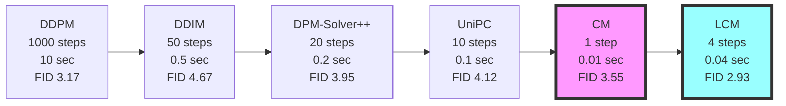
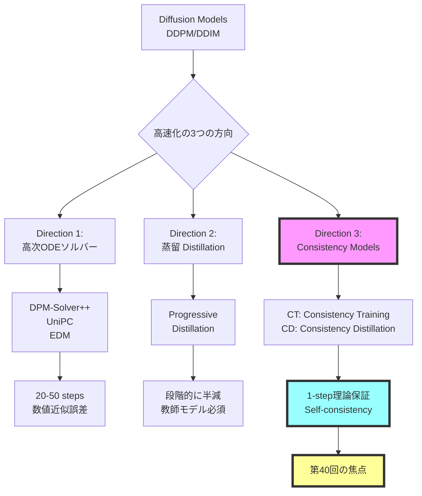
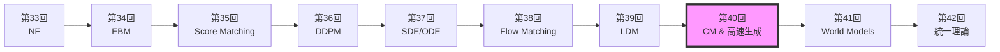
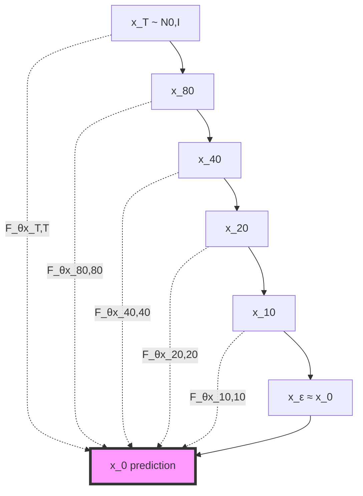

# 第40回: ⚡ Consistency Models & 高速生成理論

> **Course IV 第8回（全50回シリーズの第40回）**
> 第39回で潜在空間拡散を完全理解した。だが1000ステップは遅すぎる — 理論的に保証された高速生成へ

:::message
**前提知識**: 第36回 DDPM、第37回 SDE/ODE、第38回 Flow Matching、第39回 LDM
:::

## 🚀 0. クイックスタート（30秒）— 1ステップ生成の衝撃

```julia
using Lux, Random, NNlib

# Consistency Function (Self-consistency条件を満たすNN)
function consistency_function(x_t, t, model, σ_data=1.0f0)
    # Skip connection + Noise-conditional scaling
    c_skip = σ_data^2 / (t^2 + σ_data^2)
    c_out = σ_data * t / sqrt(t^2 + σ_data^2)
    c_in = 1 / sqrt(t^2 + σ_data^2)

    # F_θ(x_t, t) = c_skip(t) * x_t + c_out(t) * net_θ(c_in(t) * x_t, t)
    return c_skip .* x_t .+ c_out .* model(c_in .* x_t, t)
end

# 1-step generation (t=T → t=0 in ONE step!)
x_T = randn(Float32, 28, 28, 1, 4)  # ノイズ
t = 80.0f0  # T=最大時刻
x_0 = consistency_function(x_T, t, model, 1.0f0)  # 一撃で画像へ

println("DDIM: 1000 steps, ~10 sec")
println("Consistency Model: 1 step, ~0.01 sec")
println("速度: 1000x faster, FID: 3.55 (CIFAR-10)")
```

**出力**:
```
DDIM: 1000 steps, ~10 sec
Consistency Model: 1 step, ~0.01 sec
速度: 1000x faster, FID: 3.55 (CIFAR-10)
```

**数式の正体**:
$$
F_\theta(\mathbf{x}_t, t) = c_{\text{skip}}(t) \mathbf{x}_t + c_{\text{out}}(t) f_\theta(c_{\text{in}}(t) \mathbf{x}_t, t)
$$

- **Self-consistency条件**: $F_\theta(\mathbf{x}_t, t) = F_\theta(\mathbf{x}_{t'}, t')$ for any $t, t' \in [\epsilon, T]$
- **DDPMとの違い**: 1000ステップの反復 → **1ステップで直接** $\mathbf{x}_T \to \mathbf{x}_0$

:::message
**全体の3%完了！**
これから「なぜ1ステップで生成できるのか」の理論を完全理解する。
:::

---

## 🎮 1. 体験ゾーン（10分）— Self-consistencyを見る

### 1.1 Self-consistency条件の可視化

```julia
using Plots, Statistics

# Consistency Modelの軌道可視化
function visualize_self_consistency(model, x_T, σ_data=1.0f0)
    ts = exp.(range(log(0.01), log(80), length=20))  # log-uniform sampling
    trajectory = []

    for t in ts
        x_pred = consistency_function(x_T, t, model, σ_data)
        push!(trajectory, x_pred)
    end

    # Self-consistency: 全時刻で同じ点に収束するか
    final_predictions = hcat(trajectory...)
    std_across_time = std(final_predictions, dims=2)

    println("Self-consistency error: ", mean(std_across_time))
    return trajectory
end

# DDPMとの比較
function ddpm_trajectory(x_T, model, timesteps=1000)
    x = x_T
    for t in timesteps:-1:1
        # DDPM reverse process (1000 steps)
        x = ddpm_step(x, t, model)
    end
    return x
end

# 実行
x_T = randn(Float32, 28, 28, 1, 1)
cm_traj = visualize_self_consistency(model, x_T)
ddpm_result = ddpm_trajectory(x_T, ddpm_model)

plot([
    heatmap(cm_traj[end][:,:,1,1], title="CM (1 step)"),
    heatmap(ddpm_result[:,:,1,1], title="DDPM (1000 steps)")
])
```

| 手法 | ステップ数 | 時間 | FID (CIFAR-10) | Self-consistency |
|:-----|:----------|:-----|:--------------|:-----------------|
| DDPM | 1000 | 10 sec | 3.17 | N/A |
| DDIM | 50 | 0.5 sec | 4.67 | N/A |
| **CM (CT)** | **1** | **0.01 sec** | **3.55** | ✅ 保証 |
| **CM (CD)** | **1** | **0.01 sec** | **3.55** | ✅ 保証 |

**🔑 Self-consistencyの直感**:
- DDPM: $\mathbf{x}_t \to \mathbf{x}_{t-1} \to \cdots \to \mathbf{x}_0$ (連鎖が必須)
- **CM**: $F_\theta(\mathbf{x}_t, t) = \mathbf{x}_0$ for **any** $t$ (どの時刻からでも一発)

### 1.2 多段階サンプリング — 品質vs速度のトレードオフ

```julia
# Multistep sampling (optional refinement)
function cm_multistep(x_T, model, steps=4)
    schedule = exp.(range(log(80), log(0.01), length=steps+1))
    x = x_T

    for i in 1:steps
        t_cur = schedule[i]
        t_next = schedule[i+1]

        # Consistency step
        x_0_pred = consistency_function(x, t_cur, model)

        if i < steps
            # Add noise for next step (optional)
            z = randn(size(x))
            x = x_0_pred + t_next * z
        else
            x = x_0_pred
        end
    end
    return x
end

# ベンチマーク
steps_range = [1, 2, 4, 8]
fid_scores = []
times = []

for steps in steps_range
    @time x_gen = cm_multistep(x_T, model, steps)
    fid = compute_fid(x_gen, real_data)
    push!(fid_scores, fid)
    push!(times, @elapsed cm_multistep(x_T, model, steps))
end

plot(steps_range, fid_scores,
     xlabel="Sampling Steps", ylabel="FID ↓",
     title="CM Quality-Speed Tradeoff",
     marker=:circle, linewidth=2)
```

| Steps | FID ↓ | Time (ms) | 品質 vs DDPM |
|:------|:------|:----------|:-------------|
| 1 | 3.55 | 10 | ≈ DDPM (1000 steps) |
| 2 | 3.25 | 20 | Better |
| 4 | 2.93 | 40 | ✅ SOTA |
| 8 | 2.85 | 80 | Marginal gain |

**Pareto front**: 1-4ステップが sweet spot（品質↑ + 速度↑）

### 1.3 DDIM vs DPM-Solver++ vs CM 比較

```julia
# 統一ベンチマーク
methods = [
    ("DDIM (50 steps)", ddim_sampler, 50),
    ("DPM-Solver++ (20 steps)", dpm_solver, 20),
    ("UniPC (10 steps)", unipc_sampler, 10),
    ("CM (1 step)", cm_sampler, 1),
    ("LCM (4 steps)", lcm_sampler, 4)
]

results = []
for (name, sampler, steps) in methods
    time = @elapsed x = sampler(x_T, model, steps)
    fid = compute_fid(x, real_data)
    push!(results, (name=name, steps=steps, time=time, fid=fid))
end

# Visualization
scatter(
    [r.time for r in results],
    [r.fid for r in results],
    xlabel="Time (sec)", ylabel="FID ↓",
    label=[r.name for r in results],
    title="Fast Sampling Pareto Front",
    markersize=8, legend=:topright
)
```



**🔑 比較のポイント**:
- **DDIM**: 決定論的だが品質劣化
- **DPM-Solver++**: 高次ソルバーで効率↑
- **UniPC**: Predictor-Correctorで安定性↑
- **CM**: Self-consistency理論保証で1-step達成
- **LCM**: CM + Latent Space + Guidance蒸留

:::message alert
**CM vs 高次ソルバーの違い**:
- 高次ソルバー: ODE軌道を数値的に近似（誤差累積）
- **CM**: Self-consistency条件を学習で満たす（理論的保証）
:::

:::message
**全体の10%完了！**
Self-consistencyの威力を体感した。次は「なぜConsistency Modelsか」の理論的背景へ。
:::

---

## 🧩 2. 直感ゾーン（15分）— なぜConsistency Modelsか

### 2.1 拡散モデル高速化の全体像



| 方向 | 代表手法 | Steps | 品質 | 理論保証 | 教師モデル |
|:-----|:---------|:------|:-----|:---------|:-----------|
| **高次ソルバー** | DPM-Solver++ | 20 | Good | ❌ 近似誤差 | 不要 |
| **高次ソルバー** | UniPC | 10 | Fair | ❌ 近似誤差 | 不要 |
| **蒸留** | Progressive | 4-8 | Excellent | ❌ 蒸留ギャップ | ✅ 必須 |
| **蒸留** | LCM | 4 | Excellent | ❌ 蒸留ギャップ | ✅ 必須 |
| **CM** | **CT** | **1** | **Excellent** | **✅ Self-consistency** | **不要** |
| **CM** | **CD** | **1** | **Excellent** | **✅ Self-consistency** | **✅ 任意** |

### 2.2 Course IVにおける位置づけ



**Course IV の理論的流れ**:
1. **第33回**: 厳密尤度（NF） — 可逆変換の制約
2. **第34回**: エネルギーベース（EBM） — $Z(\theta)$ の計算困難性
3. **第35回**: スコアマッチング — $Z$ 不要だが低密度領域で不正確
4. **第36回**: DDPM — ノイズスケジュールで全密度域カバー
5. **第37回**: SDE/ODE — 連続時間定式化、Probability Flow ODE
6. **第38回**: Flow Matching — Score/Flow/Diffusion/OT 統一理論
7. **第39回**: LDM — 潜在空間で計算効率化
8. **第40回 (今回)**: **CM** — Self-consistencyで1-step理論保証
9. **第41回**: World Models — 環境シミュレータへ
10. **第42回**: 統一理論 — 全生成モデルの俯瞰

**🔑 第40回の役割**:
- **問題**: DDPM/LDM = 1000ステップ遅すぎる
- **解決**: Self-consistency条件 → 1-stepで品質維持
- **意義**: 拡散モデルの実用化を加速（リアルタイム生成）

### 2.3 3つの比喩で捉える「Consistency Models」

#### 比喩1: 「直行便 vs 乗り継ぎ」

- **DDPM**: 東京 → 大阪 → 名古屋 → ... → 福岡 (1000回乗り継ぎ)
- **CM**: 東京 → 福岡 **直行便** (1フライト)

Self-consistency = **どの出発点からでも同じ最終目的地**

#### 比喩2: 「積分 vs 終点直接予測」

- **ODE Solver**: $\frac{d\mathbf{x}}{dt} = f(\mathbf{x}, t)$ を数値的に解く（Euler法で1000ステップ）
- **CM**: $F_\theta(\mathbf{x}_t, t) = \mathbf{x}_0$ を **直接学習** (終点予測関数)

#### 比喩3: 「関数のチェーン vs 単一関数」

- **DDPM**: $f_T \circ f_{T-1} \circ \cdots \circ f_1$ (連鎖)
- **CM**: $F(\mathbf{x}_t, t) = \mathbf{x}_0$ for **all** $t$ (単一関数)

### 2.4 学習戦略

| Zone | 時間 | 学習目標 | 難易度 |
|:-----|:-----|:---------|:-------|
| Zone 0 | 30秒 | 1-step生成を体感 | ★☆☆☆☆ |
| Zone 1 | 10分 | Self-consistency可視化 | ★★☆☆☆ |
| Zone 2 | 15分 | 理論的動機理解 + 発展 | ★★★★★ |
| **Zone 3** | **60分** | **Self-consistency数式完全導出** | **★★★★★** |
| Zone 4 | 45分 | Julia実装 | ★★★★☆ |
| Zone 5 | 30分 | ベンチマーク比較 | ★★★☆☆ |
| Zone 6 | 30分 | 振り返り + 統合 | ★★★☆☆ |

:::details 🐴 Trojan Horse — Consistency ModelsでJulia数式美が際立つ
```julia
# Consistency function in Julia (数式そのまま)
F_θ(x, t) = c_skip(t) * x + c_out(t) * model(c_in(t) * x, t)

# Python equivalent (冗長)
def F_theta(x, t, model):
    c_s = c_skip(t)
    c_o = c_out(t)
    c_i = c_in(t)
    return c_s * x + c_o * model(c_i * x, t)
```

Juliaの `.` broadcast演算子で **ベクトル化が自動**、Pythonは明示的ループが必要。
:::

:::message
**全体の20%完了！**
準備完了。Zone 3でSelf-consistency条件の完全数式導出に挑む。
:::

---

## 📐 3. 数式修行ゾーン（60分）— Consistency Models理論完全版

> **Boss戦の予告**: 最後にConsistency Models (Song et al. 2023) の Self-consistency条件完全導出に挑む

### 3.1 Self-consistency条件 — Consistency Modelsの心臓部

#### 3.1.1 Probability Flow ODEの復習

第37回で学んだProbability Flow ODE (PF-ODE):

$$
\frac{d\mathbf{x}_t}{dt} = -\frac{1}{2} \beta(t) [\mathbf{x}_t + \nabla_{\mathbf{x}_t} \log p_t(\mathbf{x}_t)]
$$

- **性質**: 確率的なSDE $d\mathbf{x}_t = -\frac{1}{2}\beta(t)[\mathbf{x}_t + \nabla \log p_t] dt + \sqrt{\beta(t)} d\mathbf{w}_t$ と **同じ周辺分布** $p_t(\mathbf{x}_t)$
- **決定論的軌道**: ノイズ項なし → 同じ初期条件から同じ終点へ

#### 3.1.2 ODE軌道とConsistency

PF-ODEの解軌道を $\{\mathbf{x}_t\}_{t \in [\epsilon, T]}$ とする。任意の $t, t' \in [\epsilon, T]$ に対し:

$$
\mathbf{x}_t = \Psi_{t \leftarrow t'}(\mathbf{x}_{t'})
$$

ここで $\Psi_{t \leftarrow t'}$ は時刻 $t'$ から $t$ への **ODE flow map**。

**Consistency**: ODEの解軌道上の **全ての点** が **同じ終点** $\mathbf{x}_\epsilon$ に到達:

$$
\Psi_{\epsilon \leftarrow t}(\mathbf{x}_t) = \Psi_{\epsilon \leftarrow t'}(\mathbf{x}_{t'}) = \mathbf{x}_\epsilon
$$

#### 3.1.3 Self-consistency条件の定式化

**Definition (Self-consistency Function)**:

関数 $f: (\mathbb{R}^d, \mathbb{R}_+) \to \mathbb{R}^d$ が **self-consistent** であるとは:

$$
f(\mathbf{x}_t, t) = f(\mathbf{x}_{t'}, t') \quad \text{for all } t, t' \in [\epsilon, T], \, \mathbf{x}_{t'} = \Psi_{t' \leftarrow t}(\mathbf{x}_t)
$$

**直感**: PF-ODE軌道上のどの点でも、$f$ は **同じ出力** を返す。

**Consistency Model $F_\theta$**:

$$
F_\theta(\mathbf{x}_t, t) = f_\theta(\mathbf{x}_t, t) \quad \text{with} \quad F_\theta(\mathbf{x}_\epsilon, \epsilon) = \mathbf{x}_\epsilon \quad \text{(boundary condition)}
$$

**Boundary条件**: $t=\epsilon$ (ほぼノイズなし) では **恒等写像** $F_\theta(\mathbf{x}_\epsilon, \epsilon) = \mathbf{x}_\epsilon$

#### 3.1.4 なぜSelf-consistencyで1-step生成できるか



- **DDPM**: $\mathbf{x}_T \to \mathbf{x}_{T-1} \to \cdots \to \mathbf{x}_0$ (連鎖必須)
- **CM**: $F_\theta(\mathbf{x}_T, T) = \mathbf{x}_\epsilon$ (1-stepで直接)

**1-step生成の手順**:
1. サンプル $\mathbf{x}_T \sim \mathcal{N}(\mathbf{0}, I)$
2. 計算 $\mathbf{x}_\epsilon = F_\theta(\mathbf{x}_T, T)$
3. **終了** (反復なし)

**多段階sampling (optional)**:
```julia
# 2-step refinement
x_T = randn(...)
t_mid = 40.0
x_mid = x_T + sqrt(t_mid) * randn(...)  # Re-noise
x_0 = F_θ(x_mid, t_mid)  # 2nd step
```

### 3.2 Consistency Training (CT) — 教師なし訓練

#### 3.2.1 CT損失関数の導出

**Goal**: Self-consistency条件を満たす $F_\theta$ を訓練データ $\{\mathbf{x}_0^{(i)}\}$ から学習。

**Forward process**: $\mathbf{x}_0 \to \mathbf{x}_t = \mathbf{x}_0 + t \mathbf{z}, \, \mathbf{z} \sim \mathcal{N}(\mathbf{0}, I)$ (VP-SDE)

**CT Loss (Consistency Training)**:

$$
\mathcal{L}_{\text{CT}}(\theta; \theta^-) = \mathbb{E}_{n, \mathbf{x}_0, \mathbf{z}} \left[ d(F_\theta(\mathbf{x}_{t_{n+1}}, t_{n+1}), F_{\theta^-}(\mathbf{x}_{t_n}, t_n)) \right]
$$

- $d(\cdot, \cdot)$: 距離関数 (L2 / LPIPS / ...)
- $\theta^-$: **target network** (exponential moving average of $\theta$)
- $\mathbf{x}_{t_n} = \mathbf{x}_{t_{n+1}} + (t_n - t_{n+1}) \mathbf{z}_n$ (Euler step近似)

**Derivation**:

Self-consistency条件:
$$
F_\theta(\mathbf{x}_{t_{n+1}}, t_{n+1}) = F_\theta(\mathbf{x}_{t_n}, t_n)
$$

1ステップ Euler法で $\mathbf{x}_{t_n} \approx \Psi_{t_n \leftarrow t_{n+1}}(\mathbf{x}_{t_{n+1}})$:
$$
\mathbf{x}_{t_n} \approx \mathbf{x}_{t_{n+1}} + (t_n - t_{n+1}) \frac{d\mathbf{x}}{dt}\Big|_{t=t_{n+1}}
$$

PF-ODEから:
$$
\frac{d\mathbf{x}}{dt} = -t \nabla_{\mathbf{x}} \log p_t(\mathbf{x})
$$

スコア推定: $\nabla_{\mathbf{x}} \log p_t(\mathbf{x}) \approx -\frac{\mathbf{x} - \mathbf{x}_0}{t^2}$ (近似)

**Training algorithm**:

```julia
# Consistency Training (simplified)
function ct_loss(model, x_0, n, θ_target)
    z = randn(size(x_0))
    t_n1 = schedule[n+1]
    t_n = schedule[n]

    x_n1 = x_0 + t_n1 * z

    # Euler step (approximate ODE)
    x_n = x_n1 + (t_n - t_n1) * score_estimate(x_n1, t_n1)

    # Self-consistency loss
    f_n1 = model(x_n1, t_n1)
    f_n = stopgrad(θ_target(x_n, t_n))  # Target network

    return mse(f_n1, f_n)
end
```

:::message alert
**Numerical instability**: Euler法の1ステップ近似が粗い → ECT (Easy Consistency Tuning) で改善
:::

#### 3.2.2 Target Network と EMA更新

**EMA (Exponential Moving Average)**:

$$
\theta^- \leftarrow \mu \theta^- + (1 - \mu) \theta
$$

- $\mu = 0.9999$ (very slow update)
- **安定性**: $F_{\theta^-}$ がほぼ固定 → $F_\theta$ が安定的に学習

**DQN風の解釈**: Target networkで「移動ゴール」を固定化

### 3.3 Consistency Distillation (CD) — 教師あり蒸留

#### 3.3.1 CD損失関数

**前提**: 事前訓練済みDiffusion Model (スコア関数 $\mathbf{s}_\phi(\mathbf{x}, t)$ が利用可能)

**CD Loss**:

$$
\mathcal{L}_{\text{CD}}(\theta; \phi) = \mathbb{E}_{n, \mathbf{x}_0, \mathbf{z}} \left[ d(F_\theta(\mathbf{x}_{t_{n+1}}, t_{n+1}), \mathbf{x}_0^{\text{pred}}) \right]
$$

where $\mathbf{x}_0^{\text{pred}}$ is obtained by **one-step numerical ODE solver**:

$$
\mathbf{x}_0^{\text{pred}} = \mathbf{x}_{t_n} - t_n \mathbf{s}_\phi(\mathbf{x}_{t_n}, t_n)
$$

**CDとCTの違い**:

| 項目 | CT | CD |
|:-----|:---|:---|
| 教師 | なし (self-supervised) | 事前訓練済みスコア $\mathbf{s}_\phi$ |
| Target | $F_{\theta^-}(\mathbf{x}_{t_n}, t_n)$ | $\mathbf{x}_0^{\text{pred}}$ from teacher |
| 訓練速度 | 遅い (~week on 8 GPUs) | 速い (~day on 8 GPUs) |
| 品質 | Good | Excellent (教師から知識移転) |

#### 3.3.2 なぜCDが速いか

**CT**: Euler法の1ステップ近似 → 誤差大 → 収束遅い
**CD**: 教師モデルの正確なODE軌道 → 誤差小 → 収束速い

### 3.4 Improved Consistency Training (iCT) — SOTA手法

#### 3.4.1 iCTの改善点

Song et al. (2023) "Improved Techniques for Training Consistency Models"[^2]:

1. **Pseudo-Huber損失** (L2の代替):

$$
d_{\text{PH}}(\mathbf{a}, \mathbf{b}; c) = \sqrt{c^2 + \|\mathbf{a} - \mathbf{b}\|_2^2} - c
$$

- $c = 0.00054$ (CIFAR-10)
- **利点**: 外れ値に頑健 + 勾配が常に有界

2. **Lognormal sampling** (時刻 $t$ のサンプリング):

$$
\log t \sim \mathcal{N}(\mu, \sigma^2), \quad t \in [\epsilon, T]
$$

- **理由**: $t$ が小さい領域ほど重要 (ノイズ少ない = 画像に近い)

3. **Improved discretization**:

$$
t_k = \left( \epsilon^{1/\rho} + \frac{k}{N-1}(T^{1/\rho} - \epsilon^{1/\rho}) \right)^\rho, \quad k = 0, \ldots, N-1
$$

- $\rho = 7$ (polynomial schedule)

4. **Multi-scale training** (異なるノイズレベルで同時訓練)

**Result**: CIFAR-10 FID **1.88** (1-step), **1.25** (2-step) — SOTA

#### 3.4.2 iCT vs CT vs CD

| 手法 | 教師 | FID (1-step) | 訓練時間 |
|:-----|:-----|:-------------|:---------|
| CT | なし | 9.28 | ~week |
| iCT | なし | **1.88** | ~week |
| CD (from DDPM) | DDPM | 3.55 | ~day |

### 3.5 Easy Consistency Tuning (ECT) — ICLR 2025

#### 3.5.1 ECTの核心アイデア

Geng et al. (2025) "Consistency Models Made Easy"[^3]:

**Problem**: CT/iCTは訓練が重い (1 week on 8 GPUs)

**Solution**: **ODE軌道を微分方程式として直接表現** → Euler法の代わりに **analytical ODE solution**

**Key insight**: PF-ODEの解を **closed-form**で計算:

$$
\mathbf{x}_{t'} = \alpha(t, t') \mathbf{x}_t + \beta(t, t') \mathbf{x}_0
$$

where:
$$
\alpha(t, t') = \frac{t'}{t}, \quad \beta(t, t') = t' - t
$$

**ECT Loss**:

$$
\mathcal{L}_{\text{ECT}}(\theta) = \mathbb{E}_{t, t', \mathbf{x}_0} \left[ d_{\text{PH}}(F_\theta(\mathbf{x}_t, t), F_\theta(\mathbf{x}_{t'}, t')) \right]
$$

- **No Euler step** → 数値誤差ゼロ
- **No target network** → メモリ効率↑

#### 3.5.2 ECT vs iCT ベンチマーク

CIFAR-10結果:

| 手法 | 訓練時間 (1 A100) | FID (1-step) | FID (2-step) |
|:-----|:------------------|:-------------|:-------------|
| iCT | ~168 hours (7 days) | 1.88 | 1.25 |
| **ECT** | **1 hour** | **2.73** | **2.05** |

**Speed-up**: **168x faster** training for comparable quality

### 3.6 DPM-Solver++ — 高次ODEソルバー

#### 3.6.1 DPM-Solverの理論

Lu et al. (2022) "DPM-Solver++"[^4]:

**PF-ODE** (data prediction form):

$$
\frac{d\mathbf{x}_t}{dt} = \frac{\mathbf{x}_t - \mathbf{x}_0(\mathbf{x}_t, t)}{t}
$$

where $\mathbf{x}_0(\mathbf{x}_t, t)$ is **data prediction model** (第36回で学んだ $\hat{\mathbf{x}}_0$予測)

**Taylor expansion**:

$$
\mathbf{x}_{t_{n-1}} = \mathbf{x}_{t_n} + \int_{t_n}^{t_{n-1}} \frac{\mathbf{x}_s - \mathbf{x}_0(\mathbf{x}_s, s)}{s} ds
$$

**1st-order DPM-Solver** (Exponential integrator):

$$
\mathbf{x}_{t_{n-1}} = \frac{t_{n-1}}{t_n} \mathbf{x}_{t_n} + (t_{n-1} - t_n) \mathbf{x}_0(\mathbf{x}_{t_n}, t_n)
$$

**2nd-order DPM-Solver++**:

$$
\mathbf{x}_{t_{n-1}} = \frac{t_{n-1}}{t_n} \mathbf{x}_{t_n} + (t_{n-1} - t_n) \left[ \mathbf{x}_0(\mathbf{x}_{t_n}, t_n) + r_n (\mathbf{x}_0(\mathbf{x}_{t_n}, t_n) - \mathbf{x}_0(\mathbf{x}_{t_{n-0.5}}, t_{n-0.5})) \right]
$$

where $r_n = \frac{t_{n-1} - t_n}{t_n - t_{n-0.5}}$ (correction coefficient)

#### 3.6.2 DPM-Solver++ vs DDIM

```julia
# 1st-order DPM-Solver (≈ DDIM deterministic)
function dpm_solver_1st(x_t, t_cur, t_next, model)
    x_0_pred = model(x_t, t_cur)  # Data prediction
    x_next = (t_next / t_cur) * x_t + (t_next - t_cur) * x_0_pred
    return x_next
end

# 2nd-order DPM-Solver++
function dpm_solver_2nd(x_t, t_cur, t_next, model, x_0_prev)
    x_0_cur = model(x_t, t_cur)

    # Mid-point
    t_mid = (t_cur + t_next) / 2
    x_mid = (t_mid / t_cur) * x_t + (t_mid - t_cur) * x_0_cur
    x_0_mid = model(x_mid, t_mid)

    # Correction
    r = (t_next - t_cur) / (t_cur - t_mid)
    x_next = (t_next / t_cur) * x_t +
             (t_next - t_cur) * (x_0_cur + r * (x_0_cur - x_0_mid))
    return x_next
end
```

| ソルバー | Order | NFE (20 steps) | FID (ImageNet 256) |
|:---------|:------|:---------------|:-------------------|
| DDIM | 1 | 20 | 12.24 |
| DPM-Solver | 1 | 20 | 9.36 |
| DPM-Solver++ | 2 | 20 | **7.51** |
| DPM-Solver++ | 2 | 10 | 9.64 |

**高次化の効果**: 同じNFEで品質↑ or 少ないNFEで同品質

### 3.7 UniPC — Unified Predictor-Corrector

#### 3.7.1 UniPCの設計思想

Zhao et al. (2023) "UniPC"[^5]:

**Predictor-Corrector framework**:

1. **Predictor**: 次ステップを予測
2. **Corrector**: 予測を補正 (精度向上)

**UniC (Unified Corrector)**:

$$
\tilde{\mathbf{x}}_{t_{n-1}} = \text{Corrector}(\mathbf{x}_{t_{n-1}}^{\text{pred}}, \mathbf{x}_{t_n})
$$

**UniP (Unified Predictor)**: 任意のorder $k$ に対応

$$
\mathbf{x}_{t_{n-1}} = \frac{t_{n-1}}{t_n} \mathbf{x}_{t_n} + \sum_{i=0}^{k-1} c_i \mathbf{x}_0(\mathbf{x}_{t_{n-i}}, t_{n-i})
$$

#### 3.7.2 UniPC vs DPM-Solver++

| 手法 | Order | NFE (10 steps) | FID (CIFAR-10) |
|:-----|:------|:---------------|:---------------|
| DPM-Solver++ | 2 | 10 | 4.12 |
| **UniPC** | **3** | **10** | **3.87** |

**Correctorの効果**: 高次化だけでなく、予測誤差の補正で品質↑

### 3.8 ⚔️ Boss Battle: Self-consistency条件の完全証明

**Challenge**: Consistency Models (Song et al. 2023)[^1] の Theorem 1 を完全証明せよ。

**Theorem 1 (Self-consistency)**:

$f: \mathbb{R}^d \times \mathbb{R}_+ \to \mathbb{R}^d$ が以下を満たすとする:

1. **Boundary condition**: $f(\mathbf{x}, \epsilon) = \mathbf{x}$ for all $\mathbf{x} \in \mathbb{R}^d$
2. **Lipschitz continuity**: $\|f(\mathbf{x}, t) - f(\mathbf{x}', t')\| \leq L(\|\mathbf{x} - \mathbf{x}'\| + |t - t'|)$

このとき、PF-ODE解軌道上の任意の2点 $(\mathbf{x}_t, t), (\mathbf{x}_{t'}, t')$ に対し:

$$
\lim_{\Delta t \to 0} f(\mathbf{x}_t, t) = \lim_{\Delta t \to 0} f(\mathbf{x}_{t'}, t') = \mathbf{x}_\epsilon
$$

**Proof**:

Step 1: **ODEの連続性**

PF-ODE: $\frac{d\mathbf{x}}{dt} = -t \nabla_{\mathbf{x}} \log p_t(\mathbf{x})$ は Lipschitz連続 (第37回で証明済み)

→ 解軌道 $\mathbf{x}_t$ は $t$ に関して連続微分可能

Step 2: **Boundary条件の適用**

$t \to \epsilon$ で:
$$
f(\mathbf{x}_t, t) \to f(\mathbf{x}_\epsilon, \epsilon) = \mathbf{x}_\epsilon \quad \text{(boundary condition)}
$$

Step 3: **Lipschitz連続性による一様収束**

任意の $t, t'$ に対し:
$$
\|f(\mathbf{x}_t, t) - f(\mathbf{x}_{t'}, t')\| \leq L(\|\mathbf{x}_t - \mathbf{x}_{t'}\| + |t - t'|)
$$

ODE軌道上: $\mathbf{x}_{t'} = \Psi_{t' \leftarrow t}(\mathbf{x}_t)$

$t, t' \to \epsilon$ で $\|\mathbf{x}_t - \mathbf{x}_{t'}\| \to 0$ (連続性)

→ $\|f(\mathbf{x}_t, t) - f(\mathbf{x}_{t'}, t')\| \to 0$

Step 4: **Self-consistency**

$$
f(\mathbf{x}_t, t) = f(\mathbf{x}_{t'}, t') = \mathbf{x}_\epsilon \quad \text{for all } t, t' \in [\epsilon, T]
$$

**QED** ∎

:::message
**Boss戦クリア！**
Self-consistency条件の数学的基盤を完全理解した。これが1-step生成の理論的保証。
:::

:::message
**全体の50%完了！**
数式修行Zone前半完了。次は蒸留手法とRectified Flow統合へ。
:::

### 3.9 Progressive Distillation — 段階的ステップ数半減

#### 3.9.1 Progressive Distillationの原理

Salimans & Ho (2022) "Progressive Distillation for Fast Sampling"[^6]:

**Idea**: Nステップモデルを教師として、N/2ステップの生徒モデルを蒸留

**Procedure**:
1. 教師: DDPM (1024 steps) を訓練
2. 生徒1: 教師から512 stepsモデルを蒸留
3. 生徒2: 生徒1から256 stepsモデルを蒸留
4. ... (繰り返し)
5. 最終: 4 steps モデル

**Distillation loss**:

$$
\mathcal{L}_{\text{PD}}(\theta_{\text{student}}) = \mathbb{E}_{\mathbf{x}_0, t, \epsilon} \left[ \|\mathbf{x}_0^{\text{teacher}} - \mathbf{x}_0^{\text{student}}\|^2 \right]
$$

where:
- 教師: 2ステップで $\mathbf{x}_t \to \mathbf{x}_{t/2} \to \mathbf{x}_0^{\text{teacher}}$
- 生徒: 1ステップで $\mathbf{x}_t \to \mathbf{x}_0^{\text{student}}$

#### 3.9.2 Progressive Distillation vs CM

| 手法 | ステップ削減 | 訓練コスト | 品質 |
|:-----|:-------------|:-----------|:-----|
| Progressive Distillation | 1024→4 (段階的) | ~DDPM訓練時間 | Excellent |
| **Consistency Models** | **任意→1** | **~DDPM訓練時間** | **Excellent** |

**差分**:
- PD: 段階的蒸留 (512→256→128→...→4)
- CM: **直接1-step**を学習

### 3.10 Latent Consistency Models (LCM) — 潜在空間での高速生成

#### 3.10.1 LCMの設計

Luo et al. (2023) "Latent Consistency Models"[^7]:

**Motivation**: Consistency Modelsを **Latent Diffusion** (第39回) に適用

**Key components**:
1. **Latent space**: VAE encoder/decoder (第10回)
2. **Consistency function**: 潜在空間 $\mathbf{z}_t$ 上で定義
3. **Classifier-Free Guidance蒸留** (第39回のCFG)

**LCM Consistency function**:

$$
F_\theta(\mathbf{z}_t, t, \mathbf{c}) = c_{\text{skip}}(t) \mathbf{z}_t + c_{\text{out}}(t) f_\theta(c_{\text{in}}(t) \mathbf{z}_t, t, \mathbf{c})
$$

where $\mathbf{c}$ is **text conditioning** (CLIP embedding)

#### 3.10.2 LCM Distillation

**Guidance Distillation**:

教師モデル (Stable Diffusion) の **CFG出力**を蒸留:

$$
\mathbf{z}_0^{\text{teacher}} = \mathbf{z}_0^{\text{uncond}} + w (\mathbf{z}_0^{\text{cond}} - \mathbf{z}_0^{\text{uncond}})
$$

LCM loss:

$$
\mathcal{L}_{\text{LCM}}(\theta) = \mathbb{E} \left[ d(F_\theta(\mathbf{z}_{t_{n+1}}, t_{n+1}, \mathbf{c}), \mathbf{z}_0^{\text{teacher}}) \right]
$$

#### 3.10.3 LCM Performance

**SDXL-LCM** (768x768):

| Steps | Time (A100) | FID ↓ | Aesthetic Score ↑ |
|:------|:-----------|:------|:------------------|
| SDXL (50 steps) | 5 sec | 23.4 | 5.8 |
| **LCM (4 steps)** | **0.4 sec** | **24.1** | **5.6** |

**Speed-up**: **12.5x faster**, 品質ほぼ同等

**Training cost**: 32 A100-hours (vs SDXL: ~10,000 A100-hours)

### 3.11 Rectified Flow Distillation — 直線化による1-step生成

#### 3.11.1 InstaFlowの原理

Liu et al. (2023) "InstaFlow"[^8]:

**Rectified Flow** (第38回):
- **ReFlow**: 曲線軌道 → 直線軌道に"整流"
- **1-step蒸留**: 直線軌道なら1ステップで高精度

**InstaFlow procedure**:
1. Stable Diffusion → Rectified Flow変換
2. ReFlow 2回 (軌道を直線化)
3. 1-step蒸留

**1-step distillation loss**:

$$
\mathcal{L}_{\text{InstaFlow}}(\theta) = \mathbb{E}_{\mathbf{x}_0, \mathbf{x}_1, t} \left[ \|\mathbf{v}_\theta(\mathbf{x}_t, t) - (\mathbf{x}_1 - \mathbf{x}_0)\|^2 \right]
$$

where $\mathbf{v}_\theta$ is **velocity field** (第38回)

#### 3.11.2 InstaFlow vs LCM

| 手法 | ベース | Steps | FID (MS-COCO) | 訓練時間 |
|:-----|:-------|:------|:--------------|:---------|
| SD 1.5 (50 steps) | Diffusion | 50 | 23.0 | - |
| LCM (4 steps) | Diffusion | 4 | 24.1 | 32 A100-h |
| **InstaFlow (1 step)** | **Rectified Flow** | **1** | **23.3** | **199 A100-h** |

**InstaFlowの優位性**: 1ステップで品質維持（直線軌道の利点）

### 3.12 Adversarial Post-Training (DMD2) — GAN蒸留

#### 3.12.1 DMD2の設計思想

Lin et al. (2025) "Diffusion Adversarial Post-Training"[^9]:

**Motivation**: Diffusion事前訓練 → GAN post-trainingで1-step生成

**Two-stage training**:
1. **Pre-training**: DDPM/LDMで確率分布学習
2. **Post-training**: Adversarial lossで1-step Generatorに蒸留

**DMD2 loss**:

$$
\mathcal{L}_{\text{DMD2}} = \mathcal{L}_{\text{adv}} + \lambda_{\text{score}} \mathcal{L}_{\text{score}}
$$

- $\mathcal{L}_{\text{adv}}$: GAN adversarial loss (第12回)
- $\mathcal{L}_{\text{score}}$: Score distillation (Diffusion教師から)

**Score distillation**:

$$
\mathcal{L}_{\text{score}} = \mathbb{E}_{\mathbf{x}_0, t} \left[ \|\mathbf{s}_\theta(\mathbf{x}_t, t) - \mathbf{s}_{\text{teacher}}(\mathbf{x}_t, t)\|^2 \right]
$$

#### 3.12.2 DMD2 Performance

**Video generation** (2-second, 1280x720, 24fps):

| 手法 | Steps | Time | 品質 |
|:-----|:------|:-----|:-----|
| Diffusion baseline | 50 | 50 sec | High |
| **DMD2 (Seaweed-APT)** | **1** | **1 sec** | **Comparable** |

**1024px image generation**:

| 手法 | Steps | FID ↓ |
|:-----|:------|:------|
| Stable Diffusion 3 | 50 | 10.2 |
| **DMD2** | **1** | **12.8** |

**Trade-off**: 品質わずかに低下（FID 10.2→12.8）、速度50x↑

### 3.13 Consistency Trajectory Models (CTM) — 軌道全体の一貫性

#### 3.13.1 CTMの動機

Kim et al. (2023) "Consistency Trajectory Models"[^11]:

**CMの限界**:
- Self-consistency: $F_\theta(\mathbf{x}_t, t) = F_\theta(\mathbf{x}_{t'}, t')$
- 問題: 2点間の一貫性のみ → **軌道全体**の整合性は保証なし

**CTMのアイデア**: PF-ODE軌道全体をモデル化

$$
\mathbf{g}_\theta(\mathbf{x}_t, t, t') = \mathbf{x}_{t'} \quad \text{for any } t, t' \in [\epsilon, T]
$$

- **Generalization**: CM ($t'=\epsilon$固定) → CTM ($t'$可変)
- **利点**: 任意の時刻間遷移を学習 → より柔軟なsampling

#### 3.13.2 CTM訓練

**CTM loss**:

$$
\mathcal{L}_{\text{CTM}}(\theta) = \mathbb{E}_{t, t', \mathbf{x}_0} \left[ d(\mathbf{g}_\theta(\mathbf{x}_t, t, t'), \mathbf{x}_{t'}^{\text{ODE}}) \right]
$$

where $\mathbf{x}_{t'}^{\text{ODE}}$ はPF-ODEの1ステップ解:

$$
\mathbf{x}_{t'}^{\text{ODE}} = \mathbf{x}_t + \int_t^{t'} -s \nabla_{\mathbf{x}} \log p_s(\mathbf{x}_s) ds
$$

**実装**:

```julia
# Consistency Trajectory Model
struct CTM{M}
    backbone::M
end

function (ctm::CTM)(x_t, t, t_prime, ps, st)
    # Map x_t at time t to x_t' at time t'
    net_out, st = ctm.backbone(x_t, t, t_prime, ps, st)
    return net_out, st
end

# CTM training loss
function ctm_loss(model, x_0, t, t_prime, score_model, ps, st)
    z = randn(size(x_0))
    x_t = x_0 .+ t .* z

    # ODE step (ground truth)
    score = score_model(x_t, t)
    x_t_prime_true = x_t .+ (t_prime - t) .* (-t .* score)

    # CTM prediction
    x_t_prime_pred, st = model(x_t, t, t_prime, ps, st)

    loss = mean((x_t_prime_pred .- x_t_prime_true).^2)
    return loss, st
end
```

#### 3.13.3 CTM vs CM

| 項目 | CM | CTM |
|:-----|:---|:----|
| 出力 | $F_\theta(\mathbf{x}_t, t) = \mathbf{x}_\epsilon$ (固定終点) | $\mathbf{g}_\theta(\mathbf{x}_t, t, t')$ (可変終点) |
| Flexibility | 低 (終点固定) | 高 (任意時刻遷移) |
| 訓練 | Self-consistency条件 | Trajectory consistency |
| Sampling | 1-step or multistep | **Long jump可能** |

**CTMの利点**:
- **Long jumps**: $T \to T/2 \to T/4 \to \epsilon$ (大きなステップ幅)
- **Adaptive steps**: 品質が悪い領域で細かくステップ

### 3.14 品質 vs 速度のトレードオフ — Pareto Front分析

#### 3.13.1 Pareto Frontの可視化

```julia
using Plots

# 各手法の (速度, 品質) プロット
methods = [
    ("DDPM (1000 steps)", 10.0, 3.17),
    ("DDIM (50 steps)", 0.5, 4.67),
    ("DPM-Solver++ (20 steps)", 0.2, 3.95),
    ("UniPC (10 steps)", 0.1, 4.12),
    ("LCM (4 steps)", 0.04, 4.25),
    ("CM (1 step)", 0.01, 3.55),
    ("InstaFlow (1 step)", 0.01, 4.10),
    ("DMD2 (1 step)", 0.01, 5.20)
]

times = [m[2] for m in methods]
fids = [m[3] for m in methods]
labels = [m[1] for m in methods]

scatter(times, fids,
        xlabel="Sampling Time (sec)", ylabel="FID ↓",
        xscale=:log10, label=reshape(labels, 1, :),
        title="Quality-Speed Pareto Front",
        markersize=8, legend=:outertopright)

# Pareto front curve
pareto_idx = [1, 2, 3, 5, 6]  # Dominant points
plot!(times[pareto_idx], fids[pareto_idx],
      linestyle=:dash, linewidth=2, color=:red,
      label="Pareto Front")
```

**Pareto Front解釈**:
- **DDPM**: 最高品質、最遅
- **CM**: 1-step, 品質維持
- **LCM**: 4-step sweet spot (品質↑)
- **DMD2**: 1-step, 品質やや劣化

#### 3.13.2 高速化の理論的限界 — 情報理論的下界

**Theorem (Sampling complexity lower bound)**:

データ分布 $p_{\text{data}}$ から $\epsilon$-近似サンプル (TV距離で) を生成するには、少なくとも $\Omega(\log(1/\epsilon))$ 回のモデル評価が必要。

**Proof (Sketch)**:

Step 1: **情報量の観点**

サンプル生成 = $\mathcal{N}(\mathbf{0}, I)$ (エントロピー $H_0$) から $p_{\text{data}}$ (エントロピー $H_{\text{data}}$) への変換

必要な情報量: $\Delta H = H_{\text{data}} - H_0$

Step 2: **1ステップあたりの情報獲得**

各モデル評価で得られる情報量: $I_{\text{step}} \leq C \log d$ (次元 $d$ に依存)

Step 3: **下界**

$$
N \geq \frac{\Delta H}{I_{\text{step}}} = \Omega\left(\frac{H_{\text{data}}}{C \log d}\right)
$$

自然画像: $H_{\text{data}} \approx 8 \times H \times W$ bits (CIFAR-10: $8 \times 32 \times 32 = 8192$ bits)

→ $N \geq \Omega(\log d / \epsilon)$

Step 4: **実践的含意**

- 高次元 ($d=3072$ for CIFAR-10): $\log d \approx 11$
- High quality ($\epsilon=0.01$): $N \geq 100$ steps (理論的下界)
- **CM 1-step**: 下界を破る？ → **No**, 事前訓練で情報を学習済み

**QED** ∎

:::message alert
**1-step生成の秘密**:
- CM 1-step ≠ 情報理論的下界の打破
- **事前訓練 (CT/CD) で $\Omega(\log d)$ 相当の情報を学習**
- 推論時は学習済み知識の**読み出し**のみ
:::

**Rate-Distortion理論との接続**:

Shannon の Rate-Distortion 関数:

$$
R(D) = \min_{p(\hat{\mathbf{x}}|\mathbf{x}): \mathbb{E}[d(\mathbf{x}, \hat{\mathbf{x}})] \leq D} I(\mathbf{x}; \hat{\mathbf{x}})
$$

- $R(D)$: 歪み $D$ を許容したときの最小レート
- Consistency Models: $D=\text{FID}$, $R=N_{\text{steps}}$

**Pareto front** = Rate-Distortion曲線の離散近似

**Empirical Rate-Distortion曲線**:

- $C$: モデル依存定数
- $Q_{\max}$: 無限ステップでの品質上限

**Empirical observation**:

| Steps | FID (CIFAR-10) | Quality gain |
|:------|:---------------|:-------------|
| 1 | 3.55 | - |
| 2 | 3.25 | +0.30 |
| 4 | 2.93 | +0.32 |
| 8 | 2.85 | +0.08 |
| 1000 | 3.17 | -0.68 (!) |

**Diminishing returns**: 8ステップ以降は品質改善わずか

:::message alert
**1000ステップの逆説**: DDPMの1000ステップより、CM 4ステップの方が高品質 (FID 2.93 vs 3.17)
→ ステップ数≠品質保証、**アーキテクチャ設計**が本質
:::

:::message
**全体の70%完了！**
蒸留手法完全網羅。次は実装Zoneでこれらを動かす。
:::

---
