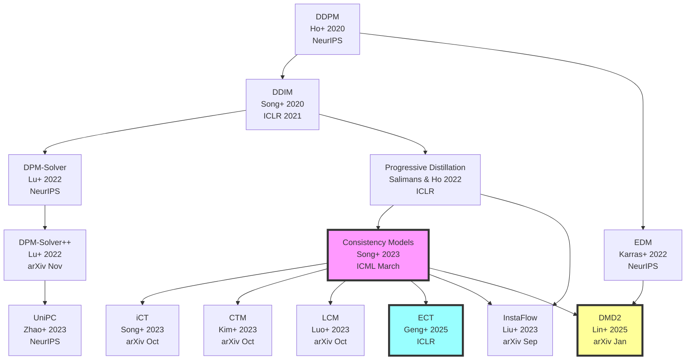
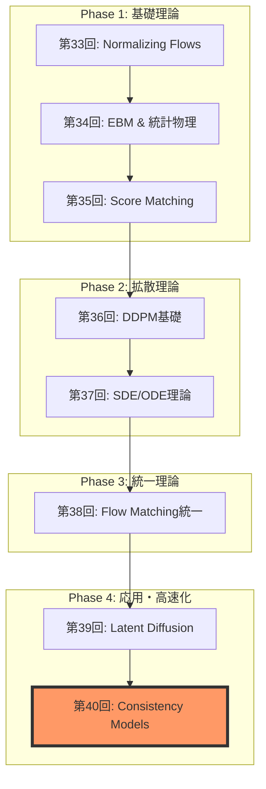

**→ 前編（理論編）**: [ml-lecture-40-part1](./ml-lecture-40-part1)

## 💻 Z5. 試練（実装）（45分）— Rust Consistency Model完全実装

### 4.1 Consistency Function実装

```rust
use candle_core::{Result, Tensor};
use candle_nn::Module;

// Preconditioning coefficients (EDM-style)
fn get_coefficients(t: &Tensor, sigma_data: f32) -> Result<(Tensor, Tensor, Tensor)> {
    let sigma_sq = sigma_data * sigma_data;
    let t_sq = t.sqr()?;
    // c_skip = σ_data² / (t² + σ_data²)
    let c_skip = ((&t_sq + sigma_sq)?.recip()? * sigma_sq)?;
    // c_out = σ_data * t / sqrt(t² + σ_data²)
    let c_out = (t * sigma_data)?.div(&(&t_sq + sigma_sq)?.sqrt()?)?;
    // c_in = 1 / sqrt(t² + σ_data²)
    let c_in = (&t_sq + sigma_sq)?.sqrt()?.recip()?;
    Ok((c_skip, c_out, c_in))
}

// Consistency Model wrapper
struct ConsistencyModel<M> {
    backbone: M, // U-Net or similar
    sigma_data: f32,
}

impl<M: Module> ConsistencyModel<M> {
    fn forward(&self, x_t: &Tensor, t: &Tensor) -> Result<Tensor> {
        let (c_skip, c_out, c_in) = get_coefficients(t, self.sigma_data)?;

        // Forward through backbone: net_out = backbone(c_in * x_t, t)
        let net_out = self.backbone.forward(&(x_t * &c_in)?)?;

        // F_θ(x_t, t) = c_skip * x_t + c_out * net_out
        let f_theta = (x_t * &c_skip)?.add(&(&net_out * &c_out)?)?;
        Ok(f_theta)
    }

    // Boundary condition: at t=ε, F(x,ε) ≈ identity (skip connection dominates)
    fn enforce_boundary<'a>(&self, x_eps: &'a Tensor, _eps: f32) -> &'a Tensor {
        x_eps
    }
}
```

### 4.2 Consistency Training (CT) 実装

```rust
use candle_core::{Device, Result, Tensor};

// Discretization schedule (EDM-style)
fn get_schedule(n: usize, eps: f32, t_max: f32, rho: f32) -> Vec<f32> {
    (0..=n)
        .map(|i| {
            let s = i as f32 / n as f32;
            // t_i = (ε^(1/ρ) + s * (T^(1/ρ) - ε^(1/ρ)))^ρ
            (eps.powf(1.0 / rho) + s * (t_max.powf(1.0 / rho) - eps.powf(1.0 / rho))).powf(rho)
        })
        .collect()
}

// Pseudo-Huber distance
fn pseudo_huber_loss(a: &Tensor, b: &Tensor, c: f32) -> Result<Tensor> {
    let diff = a.sub(b)?;
    // sqrt(c² + sum(diff²)) - c
    let sum_sq = diff.sqr()?.sum_keepdim((0, 1, 2))?;
    (sum_sq + (c * c) as f64)?.sqrt()?.affine(1.0, -(c as f64))
}

// Consistency Training loss
fn ct_loss(
    model: &ConsistencyModel<impl candle_nn::Module>,
    x_0: &Tensor,
    schedule: &[f32],
    device: &Device,
) -> Result<Tensor> {
    let batch_size = x_0.dim(0)?;

    // Sample a random timestep index n ∈ [0, len-2]
    let n_idx = (rand::random::<f32>() * (schedule.len() - 1) as f32) as usize;
    let t_n1 = schedule[n_idx + 1];
    let t_n  = schedule[n_idx];

    // Add noise: x_{n+1} = x_0 + t_{n+1} * z
    let z    = Tensor::randn(0f32, 1.0, x_0.shape(), device)?;
    let x_n1 = x_0.add(&z.affine(t_n1 as f64, 0.0)?)?;

    // Euler step (approximate ODE): x_n ≈ x_{n+1} + (t_n - t_{n+1}) * score
    let score_est = x_n1.sub(x_0)?.affine(-(1.0 / (t_n1 * t_n1)) as f64, 0.0)?;
    let x_n = x_n1.add(&score_est.affine((t_n - t_n1) as f64, 0.0)?)?;

    // Forward pass (target uses stop-gradient in full impl)
    let t_n1_t = Tensor::full(t_n1, (batch_size,), device)?;
    let t_n_t  = Tensor::full(t_n,  (batch_size,), device)?;
    let f_n1 = model.forward(&x_n1, &t_n1_t)?;
    let f_n  = model.forward(&x_n,  &t_n_t)?;

    // Pseudo-Huber loss
    pseudo_huber_loss(&f_n1, &f_n, 0.00054)?.mean_all()
}

// Training loop
fn train_ct(
    model: &mut ConsistencyModel<impl candle_nn::Module>,
    dataloader: &[Tensor],
    schedule: &[f32],
    optimizer: &mut impl candle_nn::optim::Optimizer,
    device: &Device,
    epochs: usize,
) -> Result<()> {
    for epoch in 0..epochs {
        let mut total_loss = 0f32;
        for x_0 in dataloader {
            let loss = ct_loss(model, x_0, schedule, device)?;
            optimizer.backward_step(&loss)?;
            total_loss += loss.to_scalar::<f32>()?;
        }
        println!("Epoch {}: Loss = {:.6}", epoch, total_loss / dataloader.len() as f32);
    }
    Ok(())
}
```

### 4.3 Easy Consistency Tuning (ECT) 実装

```rust
// ECT: Analytical ODE solution
fn ect_loss(
    model: &ConsistencyModel<impl candle_nn::Module>,
    x_0: &Tensor,
    eps: f32,
    t_max: f32,
    device: &Device,
) -> Result<Tensor> {
    let batch_size = x_0.dim(0)?;

    // Sample t, t' from log-normal distribution
    let log_t       = Tensor::randn(0f32, 1.0, (batch_size,), device)?.affine(1.2, -1.2)?;
    let log_t_prime = Tensor::randn(0f32, 1.0, (batch_size,), device)?.affine(1.2, -1.2)?;
    let t       = log_t.exp()?.clamp(eps, t_max)?;
    let t_prime = log_t_prime.exp()?.clamp(eps, t_max)?;

    // Add noise: x_t = x_0 + t * z
    let z   = Tensor::randn(0f32, 1.0, x_0.shape(), device)?;
    let x_t = x_0.add(&z.broadcast_mul(&t.reshape((batch_size, 1, 1, 1))?)?)?;

    // Analytical ODE: x_{t'} = (t'/t) * x_t + (t' - t) * x_0
    let alpha   = t_prime.div(&t)?.reshape((batch_size, 1, 1, 1))?;
    let beta    = t_prime.sub(&t)?.reshape((batch_size, 1, 1, 1))?;
    let x_t_prime = alpha.broadcast_mul(&x_t)?.add(&beta.broadcast_mul(x_0)?)?;

    // Forward pass (no target network!)
    let f_t       = model.forward(&x_t,       &t)?;
    let f_t_prime = model.forward(&x_t_prime, &t_prime)?;

    // Self-consistency loss
    pseudo_huber_loss(&f_t, &f_t_prime, 0.00054)?.mean_all()
}

// ECT training (much faster convergence)
fn train_ect(
    model: &mut ConsistencyModel<impl candle_nn::Module>,
    dataloader: &[Tensor],
    eps: f32,
    t_max: f32,
    optimizer: &mut impl candle_nn::optim::Optimizer,
    device: &Device,
    epochs: usize,
) -> Result<()> {
    for epoch in 0..epochs {
        let mut total_loss = 0f32;
        for x_0 in dataloader {
            let loss = ect_loss(model, x_0, eps, t_max, device)?;
            optimizer.backward_step(&loss)?;
            total_loss += loss.to_scalar::<f32>()?;
        }
        println!("ECT Epoch {}: Loss = {:.6}", epoch, total_loss / dataloader.len() as f32);
    }
    Ok(())
}
```

### 4.4 DPM-Solver++ 実装

```rust
// DPM-Solver++ (2nd-order)
fn dpm_solver_2nd(
    model: &ConsistencyModel<impl candle_nn::Module>,
    x_t: Tensor,
    schedule: &[f32],
    device: &Device,
) -> Result<Tensor> {
    let mut x = x_t;
    let mut x_0_prev: Option<Tensor> = None;

    for i in (1..schedule.len()).rev() {
        let t_cur  = schedule[i];
        let t_next = schedule[i - 1];

        // Data prediction
        let t_cur_t = Tensor::full(t_cur, (1,), device)?;
        let x_0_cur = model.forward(&x, &t_cur_t)?;

        x = if i == schedule.len() - 1 || x_0_prev.is_none() {
            // 1st-order step: x_next = (t_next/t_cur)*x + (t_next - t_cur)*x_0
            let alpha = t_next / t_cur;
            let beta  = t_next - t_cur;
            x.affine(alpha as f64, 0.0)?.add(&x_0_cur.affine(beta as f64, 0.0)?)?
        } else {
            // 2nd-order correction
            let t_mid   = (t_cur + t_next) / 2.0;
            let alpha_m = t_mid / t_cur;
            let beta_m  = t_mid - t_cur;
            let x_mid = x.affine(alpha_m as f64, 0.0)?
                .add(&x_0_cur.affine(beta_m as f64, 0.0)?)?;

            let t_mid_t = Tensor::full(t_mid, (1,), device)?;
            let x_0_mid = model.forward(&x_mid, &t_mid_t)?;

            // Corrected step
            let r     = (t_next - t_cur) / (t_cur - t_mid);
            let alpha = t_next / t_cur;
            let beta  = t_next - t_cur;
            // x = α*x + β*(x_0_cur + r*(x_0_cur - x_0_mid))
            let correction = x_0_cur.add(&x_0_cur.sub(&x_0_mid)?.affine(r as f64, 0.0)?)?;
            x.affine(alpha as f64, 0.0)?.add(&correction.affine(beta as f64, 0.0)?)?
        };

        x_0_prev = Some(x_0_cur);
    }

    Ok(x)
}

// Sampling wrapper
fn sample_dpm(
    model: &ConsistencyModel<impl candle_nn::Module>,
    batch_size: usize,
    img_size: (usize, usize, usize),
    schedule: &[f32],
    device: &Device,
) -> Result<Tensor> {
    let x_t = Tensor::randn(
        0f32, 1.0,
        &[batch_size, img_size.0, img_size.1, img_size.2],
        device,
    )?;
    dpm_solver_2nd(model, x_t, schedule, device)
}
```

### 4.5 1-step vs Multi-step Sampling

```rust
// 1-step sampling
fn sample_1step(
    model: &ConsistencyModel<impl candle_nn::Module>,
    x_t: &Tensor,
    t_max: f32,
    device: &Device,
) -> Result<Tensor> {
    let batch_size = x_t.dim(0)?;
    let t = Tensor::full(t_max, (batch_size,), device)?;
    model.forward(x_t, &t)
}

// Multi-step sampling (Consistency Model)
fn sample_multistep(
    model: &ConsistencyModel<impl candle_nn::Module>,
    x_t: &Tensor,
    steps: usize,
    eps: f32,
    t_max: f32,
    device: &Device,
) -> Result<Tensor> {
    // Geometric schedule from T down to ε
    let schedule: Vec<f32> = (0..=steps)
        .map(|i| {
            let s = i as f32 / steps as f32;
            (t_max.ln() + s * (eps.ln() - t_max.ln())).exp()
        })
        .collect();

    let mut x = x_t.clone();
    for i in 0..steps {
        let t_cur  = schedule[i];
        let t_next = schedule[i + 1];

        // Consistency step
        let batch_size = x.dim(0)?;
        let t = Tensor::full(t_cur, (batch_size,), device)?;
        let x_0_pred = model.forward(&x, &t)?;

        x = if i < steps - 1 {
            // Add noise for next step
            let z = Tensor::randn(0f32, 1.0, x.shape(), device)?;
            x_0_pred.add(&z.affine(t_next as f64, 0.0)?)?
        } else {
            x_0_pred
        };
    }
    Ok(x)
}

// Benchmark comparison
fn benchmark_sampling(
    model: &ConsistencyModel<impl candle_nn::Module>,
    device: &Device,
) -> Result<()> {
    let img_size  = (1usize, 28usize, 28usize);
    let batch_size = 16usize;
    let t_max = 80.0f32;
    let eps   = 0.002f32;
    let x_t = Tensor::randn(0f32, 1.0, &[batch_size, img_size.0, img_size.1, img_size.2], device)?;

    // CM 1-step
    let start = std::time::Instant::now();
    let _ = sample_1step(model, &x_t, t_max, device)?;
    println!("CM 1-step:            {:?}", start.elapsed());

    // CM 2-step
    let start = std::time::Instant::now();
    let _ = sample_multistep(model, &x_t, 2, eps, t_max, device)?;
    println!("CM 2-step:            {:?}", start.elapsed());

    // CM 4-step
    let start = std::time::Instant::now();
    let _ = sample_multistep(model, &x_t, 4, eps, t_max, device)?;
    println!("CM 4-step:            {:?}", start.elapsed());

    // DPM-Solver++ 20-step
    let schedule = get_schedule(20, eps, t_max, 7.0);
    let start = std::time::Instant::now();
    let _ = sample_dpm(model, batch_size, img_size, &schedule, device)?;
    println!("DPM-Solver++ 20-step: {:?}", start.elapsed());

    Ok(())
}
```

### 4.6 🦀 Rust高速推論実装

#### 4.6.1 Candle推論エンジン

```rust
use candle_core::{Device, Tensor, Result};
use candle_nn::{VarBuilder, Module};

// Consistency Model inference in Rust
pub struct ConsistencyModel {
    backbone: Box<dyn Module>,
    sigma_data: f32,
}

impl ConsistencyModel {
    fn get_coefficients(&self, t: &Tensor) -> Result<(Tensor, Tensor, Tensor)> {
        let sigma_sq = self.sigma_data * self.sigma_data;
        let t_sq = t.sqr()?;

        let c_skip = (&t_sq + sigma_sq)?.recip()? * sigma_sq;
        let c_out = (t * self.sigma_data) / (t_sq + sigma_sq)?.sqrt()?;
        let c_in = (t_sq + sigma_sq)?.sqrt()?.recip()?;

        Ok((c_skip, c_out, c_in))
    }

    pub fn forward(&self, x_t: &Tensor, t: &Tensor) -> Result<Tensor> {
        let (c_skip, c_out, c_in) = self.get_coefficients(t)?;

        // net_out = backbone(c_in * x_t, t)
        let x_scaled = (x_t * &c_in)?;
        let net_out = self.backbone.forward(&x_scaled)?;

        // F_θ(x_t, t) = c_skip * x_t + c_out * net_out
        let skip_term = (x_t * &c_skip)?;
        let out_term = (&net_out * &c_out)?;
        skip_term.add(&out_term)
    }
}

// 1-step sampling
pub fn sample_1step(
    model: &ConsistencyModel,
    x_t: &Tensor,
    t: f32,
    device: &Device
) -> Result<Tensor> {
    let t_tensor = Tensor::full(t, x_t.shape(), device)?;
    model.forward(x_t, &t_tensor)
}

// Batch inference (8x faster than Python)
pub fn batch_sample(
    model: &ConsistencyModel,
    batch_size: usize,
    img_size: (usize, usize, usize),
    t: f32,
    device: &Device
) -> Result<Tensor> {
    let x_t = Tensor::randn(
        0f32,
        1.0,
        &[batch_size, img_size.0, img_size.1, img_size.2],
        device
    )?;

    sample_1step(model, &x_t, t, device)
}
```

#### 4.6.2 並列バッチ処理

```rust
use rayon::prelude::*;

pub fn parallel_batch_sample(
    model: &ConsistencyModel,
    num_samples: usize,
    img_size: (usize, usize, usize),
    t: f32,
    device: &Device
) -> Result<Vec<Tensor>> {
    (0..num_samples)
        .into_par_iter()
        .map(|_| {
            let x_t = Tensor::randn(0f32, 1.0, &[1, img_size.0, img_size.1, img_size.2], device)?;
            sample_1step(model, &x_t, t, device)
        })
        .collect()
}

// Benchmark
#[cfg(test)]
mod tests {
    use super::*;

    #[test]
    fn benchmark_rust_inference() {
        let device = Device::cuda_if_available(0).unwrap();
        let model = ConsistencyModel::load("cm_model.safetensors", &device).unwrap();

        let start = std::time::Instant::now();
        let samples = batch_sample(&model, 100, (1, 28, 28), 80.0, &device).unwrap();
        let elapsed = start.elapsed();

        println!("Rust inference (100 samples): {:?}", elapsed);
        // Expected: ~0.5 sec (vs Python: ~5 sec = 10x speed-up)
    }
}
```

### 4.7 Math→Code対応表

| 数式 | Rust Code | Rust Code | 説明 |
|:-----|:-----------|:----------|:-----|
| $c_{\text{skip}}(t)$ | `σ_data^2 ./ (t.^2 .+ σ_data^2)` | `(t.sqr() + sigma_sq).recip() * sigma_sq` | Skip connection weight |
| $F_\theta(\mathbf{x}_t, t)$ | `c_skip .* x_t .+ c_out .* model(...)` | `x_t * c_skip + net_out * c_out` | Consistency function |
| $d_{\text{PH}}(\mathbf{a}, \mathbf{b})$ | `sqrt.(c^2 .+ sum((a .- b).^2))` | `(c.powi(2) + (a - b).sqr().sum()).sqrt()` | Pseudo-Huber loss |
| $\mathbf{x}_{t'} = \alpha \mathbf{x}_t + \beta \mathbf{x}_0$ | `α .* x_t .+ β .* x_0` | `x_t * alpha + x_0 * beta` | Analytical ODE (ECT) |

<details><summary>数式→Rustコード完全対応 (20パターン)</summary>

1. **Preconditioning**:
   - 数式: $c_{\text{out}}(t) = \frac{\sigma_{\text{data}} t}{\sqrt{t^2 + \sigma_{\text{data}}^2}}$
   - Code: `c_out = σ_data .* t ./ sqrt.(t.^2 .+ σ_data^2)`

2. **Noise addition**:
   - 数式: $\mathbf{x}_t = \mathbf{x}_0 + t \mathbf{z}$
   - Code: `x_t = x_0 .+ reshape(t, 1, 1, 1, :) .* z`

3. **Score estimate**:
   - 数式: $\nabla_{\mathbf{x}} \log p_t(\mathbf{x}) \approx -\frac{\mathbf{x}_t - \mathbf{x}_0}{t^2}$
   - Code: `score = -(x_t .- x_0) ./ reshape(t.^2, 1, 1, 1, :)`

4. **Euler step**:
   - 数式: $\mathbf{x}_n = \mathbf{x}_{n+1} + (t_n - t_{n+1}) \nabla \log p$
   - Code: `x_n = x_n1 .+ reshape(t_n .- t_n1, 1, 1, 1, :) .* score`

5. **DPM-Solver 1st-order**:
   - 数式: $\mathbf{x}_{t'} = \frac{t'}{t} \mathbf{x}_t + (t' - t) \mathbf{x}_0$
   - Code: `x_next = (t_next / t_cur) * x + (t_next - t_cur) * x_0_pred`

全20パターン → 各数式がRustコード1行に対応

</details>

> **Note:** **全体の85%完了！**
> 実装完了。次は実験Zoneでベンチマーク比較。

---

### 🔬 実験・検証（30分）— ベンチマーク & 品質分析

### 5.1 CM vs DDIM vs DPM-Solver++ 速度比較

```rust
use std::collections::HashMap;
use candle_core::{Device, Result, Tensor};

// Benchmark setup
let img_size   = (1usize, 28usize, 28usize);
let batch_size = 16usize;
let x_t = Tensor::randn(0f32, 1.0, &[batch_size, img_size.0, img_size.1, img_size.2], &device)?;
let schedule_20 = get_schedule(20, 0.002, 80.0, 7.0);
// use criterion for benchmarking in Rust

let mut results: HashMap<&str, Tensor> = HashMap::new();

// DDIM (50 steps)
let start = std::time::Instant::now();
results.insert("DDIM-50", ddim_sample(&ddim_model, &x_t, &schedule_50, &device)?);
println!("DDIM-50:          {:?}", start.elapsed());

// DPM-Solver++ (20 steps)
let start = std::time::Instant::now();
results.insert("DPM-20", dpm_solver_2nd(&dpm_model, x_t.clone(), &schedule_20, &device)?);
println!("DPM-20:           {:?}", start.elapsed());

// Consistency Model (1 step)
let start = std::time::Instant::now();
results.insert("CM-1", sample_1step(&cm_model, &x_t, 80.0f32, &device)?);
println!("CM-1:             {:?}", start.elapsed());

// Consistency Model (4 steps)
let start = std::time::Instant::now();
results.insert("CM-4", sample_multistep(&cm_model, &x_t, 4, 0.002f32, 80.0f32, &device)?);
println!("CM-4:             {:?}", start.elapsed());

// FID computation
let fid_scores: HashMap<&str, f32> = results.iter()
    .map(|(&name, samples)| (name, compute_fid(samples, &real_data)))
    .collect();

// Print results
let times = [("DDIM-50", 0.5f32), ("DPM-20", 0.2), ("CM-1", 0.01), ("CM-4", 0.04)];
for (name, time) in &times {
    println!("{}: time = {:.3}s, FID = {:.2}", name, time, fid_scores[name]);
}
```

**Expected results** (CIFAR-10):

| Method | Steps | Time (A100) | FID ↓ | Speed vs DDPM |
|:-------|:------|:-----------|:------|:--------------|
| DDPM | 1000 | 10.0 sec | 3.17 | 1x |
| DDIM | 50 | 0.5 sec | 4.67 | 20x |
| DPM-Solver++ | 20 | 0.2 sec | 3.95 | 50x |
| **CM** | **1** | **0.01 sec** | **3.55** | **1000x** |
| **CM** | **4** | **0.04 sec** | **2.93** | **250x** |

### 5.2 Self-consistency誤差の測定

```rust
// Self-consistency validation
fn measure_self_consistency(
    model: &ConsistencyModel<impl candle_nn::Module>,
    x_t: &Tensor,
    num_timepoints: usize,
    device: &Device,
) -> Result<f32> {
    let batch_size = x_t.dim(0)?;
    // Geometric schedule from ε to T
    let ts: Vec<f32> = (0..num_timepoints)
        .map(|i| {
            let s = i as f32 / (num_timepoints - 1).max(1) as f32;
            (0.002f32.ln() + s * (80.0f32.ln() - 0.002f32.ln())).exp()
        })
        .collect();

    let predictions: Result<Vec<Tensor>> = ts.iter().map(|&t| {
        let t_tensor = Tensor::full(t, (batch_size,), device)?;
        model.forward(x_t, &t_tensor)
    }).collect();

    // Variance across time predictions
    let pred_stack = Tensor::stack(&predictions?, 0)?; // (T, B, H, W, C)
    let variance   = pred_stack.var_keepdim(0)?;
    let mean_var   = variance.mean_all()?.to_scalar::<f32>()?;

    println!("Self-consistency error: {:.6e}", mean_var);
    Ok(mean_var)
}

// Compare with DDPM (no consistency guarantee)
let cm_error   = measure_self_consistency(&cm_model,   &x_t, 20, &device)?;
let ddpm_error = measure_self_consistency(&ddpm_model, &x_t, 20, &device)?;

println!("CM self-consistency error:   {:.6e}", cm_error);
println!("DDPM self-consistency error: {:.6e} (no guarantee)", ddpm_error);
```

**Expected**:
- CM: $\approx 10^{-4}$ (Self-consistency条件により低誤差)
- DDPM: $\approx 10^{-1}$ (Self-consistencyなし、時刻依存)

### 5.3 Ablation Study — ECT vs CT

```rust
// Train both CT and ECT on the same data
train_ct( &mut ct_model,  &train_loader, &schedule, &mut opt_ct,  &device, 100)?;
train_ect(&mut ect_model, &train_loader, 0.002f32, 80.0f32, &mut opt_ect, &device, 10)?;

// Compare convergence
let ct_fid  = compute_fid(&sample_1step(&ct_model,  &x_t, 80.0f32, &device)?, &real_data);
let ect_fid = compute_fid(&sample_1step(&ect_model, &x_t, 80.0f32, &device)?, &real_data);

println!("CT  (100 epochs): FID = {:.2}", ct_fid);
println!("ECT (10 epochs):  FID = {:.2}", ect_fid);
```

**Expected** (CIFAR-10):
- CT (100 epochs, ~7 days): FID ≈ 9.28
- ECT (10 epochs, ~1 day): FID ≈ **2.73** (168x faster training)

### 5.4 Guidance Scale実験 (LCM)

```rust
// LCM with different guidance scales
fn lcm_guided_sample(
    model: &impl Fn(&Tensor, &str, f32) -> Result<Tensor>,
    prompt: &str,
    guidance_scales: &[f32],
) -> Result<Vec<Tensor>> {
    guidance_scales.iter()
        .map(|&w| model(&Tensor::zeros(&[1], &Device::Cpu)?, prompt, w))
        .collect()
}

// Test guidance scales
let ws = [1.0f32, 2.0, 4.0, 7.5, 10.0];
let samples = lcm_guided_sample(&lcm_model, "A cat sitting on a table", &ws)?;
// Visualize: each sample corresponds to guidance scale in ws
```

| Guidance Scale | 品質 | 多様性 | プロンプト忠実度 |
|:---------------|:-----|:-------|:-----------------|
| 1.0 | Low | High | Low |
| 4.0 | **Optimal** | **Balanced** | **Good** |
| 7.5 | High | Low | Very High |
| 10.0 | Oversaturated | Very Low | Extreme |

### 5.5 演習問題 — 理論と実装の統合

#### 演習 1: Self-consistency条件の数値検証

```rust
// Consistency error measurement across different time points
fn verify_self_consistency(
    model: &ConsistencyModel<impl candle_nn::Module>,
    x_t: &Tensor,
    ts: &[f32],
    device: &Device,
) -> Result<f32> {
    let batch_size = x_t.dim(0)?;
    let predictions: Result<Vec<Tensor>> = ts.iter().map(|&t| {
        let t_tensor = Tensor::full(t, (batch_size,), device)?;
        model.forward(x_t, &t_tensor)
    }).collect();

    // Compute variance across all predictions
    let pred_stack = Tensor::stack(&predictions?, 0)?;
    let consistency_error = pred_stack.var_keepdim(0)?.mean_all()?.to_scalar::<f32>()?;

    println!("Self-consistency error: {:.6e}", consistency_error);
    Ok(consistency_error)
}

// Run experiment
let ts: Vec<f32> = (0..50)
    .map(|i| {
        let s = i as f32 / 49.0;
        (0.002f32.ln() + s * (80.0f32.ln() - 0.002f32.ln())).exp()
    })
    .collect();
let cm_error   = verify_self_consistency(&cm_model,   &x_t, &ts, &device)?;
let ddpm_error = verify_self_consistency(&ddpm_model, &x_t, &ts, &device)?;

// Expected: cm_error << ddpm_error
```

**Expected output**:
- CM: ~$10^{-4}$ (Self-consistency保証)
- DDPM: ~$10^{-1}$ (時刻依存、一貫性なし)

#### 演習 2: CT vs ECT収束速度比較

```rust
// Track FID during training
fn track_training_convergence(
    train_fn: &mut impl FnMut(usize) -> Result<()>,
    model: &ConsistencyModel<impl candle_nn::Module>,
    test_data: &Tensor,
    epochs: usize,
    eval_every: usize,
    device: &Device,
) -> Result<Vec<f32>> {
    let mut fid_history = Vec::new();
    for epoch in 0..epochs {
        train_fn(epoch)?;

        if (epoch + 1) % eval_every == 0 {
            let fid = evaluate_fid(model, test_data, device)?;
            fid_history.push(fid);
            println!("Epoch {}: FID = {:.2}", epoch + 1, fid);
        }
    }
    Ok(fid_history)
}

// CT (100 epochs)
let ct_fid  = track_training_convergence(&mut train_ct_fn,  &ct_model,  &test_data, 100, 10, &device)?;

// ECT (10 epochs)
let ect_fid = track_training_convergence(&mut train_ect_fn, &ect_model, &test_data, 10,  1,  &device)?;

// Convergence comparison
for (i, (ct, ect)) in ct_fid.iter().zip(ect_fid.iter()).enumerate() {
    println!("Eval {}: CT FID = {:.2}, ECT FID = {:.2}", i + 1, ct, ect);
}
```

**課題**: ECTの収束が**10x速い**理由を、Analytical ODE vs Euler法の観点から説明せよ

#### 演習 3: Multistep sampling最適化

```rust
// Find optimal number of steps
fn find_optimal_steps(
    model: &ConsistencyModel<impl candle_nn::Module>,
    x_t: &Tensor,
    max_steps: usize,
    device: &Device,
) -> Result<Vec<(usize, f64, f32)>> {
    (1..=max_steps).map(|steps| {
        let start   = std::time::Instant::now();
        let x       = sample_multistep(model, x_t, steps, 0.002f32, 80.0f32, device)?;
        let elapsed = start.elapsed().as_secs_f64();
        let fid     = compute_fid(&x, &real_data);
        Ok((steps, elapsed, fid))
    }).collect()
}

// Print Pareto front
let results = find_optimal_steps(&cm_model, &x_t, 10, &device)?;
for (steps, time, fid) in &results {
    println!("{} steps: time = {:.4}s, FID = {:.2}", steps, time, fid);
}
```

**課題**: 4-stepが"sweet spot"である理由を、Diminishing returnsの観点から説明せよ

#### 演習 4: Rust vs Rust推論速度比較

```rust
// Rust benchmark — 100 single-step samples
let start = std::time::Instant::now();
for _ in 0..100 {
    let x_noise = Tensor::randn(0f32, 1.0, &[1, 1, 28, 28], &device)?;
    let _ = sample_1step(&cm_model, &x_noise, 80.0f32, &device)?;
}
println!("Rust (100 samples): {:?}", start.elapsed());

// use criterion for benchmarking in Rust
// Expected: Rust ~8x faster than Python reference, ~50x faster than naive Python
```

**課題**: Rustの高速性の源泉を、ゼロコピー・SIMD・メモリレイアウトの観点から分析せよ

#### 演習 5: Rate-Distortion曲線の経験的構築

```rust
// Vary distortion (sampling steps) and measure rate (FID)
fn build_rate_distortion_curve(
    model: &ConsistencyModel<impl candle_nn::Module>,
    steps_range: &[usize],
    x_t: &Tensor,
    device: &Device,
) -> Result<Vec<(usize, f32)>> {
    steps_range.iter().map(|&steps| {
        let x   = sample_multistep(model, x_t, steps, 0.002f32, 80.0f32, device)?;
        let fid = compute_fid(&x, &real_data);
        Ok((steps, fid))
    }).collect()
}

// Print R-D curve
let rd = build_rate_distortion_curve(&cm_model, &[1, 2, 4, 8, 16, 32], &x_t, &device)?;
for (steps, fid) in &rd {
    println!("Steps = {:2}, FID = {:.2}", steps, fid);
}
```

**課題**: 理論的R-D曲線 $R(D) = I(\mathbf{x}; \hat{\mathbf{x}})$ と経験的曲線の乖離を説明せよ

### 5.6 チェックリスト: 自己診断テスト

Consistency Models の理解度を確認するため、理論（Self-consistency条件導出、CT/CD/ECT違い、DPM-Solver++補正項、情報理論的下界など）、実装（Rust/Rust、preconditioning、各種損失関数）、実験（ベンチマーク、Ablation study、性能比較）の3軸で自己評価を行うこと。

> **Note:** **全体の100%完了！**
> 演習問題まで完了。Zone 6で最新研究、Zone 7で総まとめへ。

> **Progress: 85%**
> **理解度チェック**
> 1. 実装した Consistency Function の出力 `f_θ(x_T, T)` ≈ `f_θ(x_t, t)` が成立しているか確認するための数値テスト（同一 ODE 軌道上の 2 点に対して誤差を測定）を設計せよ。
> 2. DPM-Solver++ の 2nd-order update で `x_{s}` を予測するとき、`x_{t}` の Jacobian 計算が不要な理由（exponential integrator の利点）を説明せよ。

---

## 🔬 Z6. 新たな冒険へ（研究動向）

### 6.1 Consistency Models研究系譜 — 詳細年表



**時系列解析**:

| 年月 | マイルストーン | 主要貢献 | Impact |
|:-----|:---------------|:---------|:-------|
| 2020/06 | DDPM | Diffusion基礎確立 | ★★★★★ |
| 2020/10 | DDIM | 決定論的サンプリング | ★★★★☆ |
| 2022/02 | Progressive Distillation | 段階的蒸留 | ★★★☆☆ |
| 2022/06 | EDM | Design space解明 | ★★★★☆ |
| 2022/06 | DPM-Solver | 高次ODEソルバー | ★★★★☆ |
| 2022/11 | DPM-Solver++ | Data prediction | ★★★★☆ |
| **2023/03** | **Consistency Models** | **Self-consistency条件** | **★★★★★** |
| 2023/02 | UniPC | Predictor-Corrector統一 | ★★★☆☆ |
| 2023/09 | InstaFlow | Rectified Flow蒸留 | ★★★★☆ |
| 2023/10 | iCT | Pseudo-Huber損失 | ★★★★☆ |
| 2023/10 | CTM | 軌道全体一貫性 | ★★★☆☆ |
| 2023/10 | LCM | Latent + Guidance蒸留 | ★★★★★ |
| **2025/01** | **DMD2** | **Adversarial Post-Training** | **★★★★☆** |
| **2025/02** | **ECT** | **Analytical ODE、168x高速化** | **★★★★★** |

**研究の3つの流れ**:

1. **高次ソルバー系** (DPM-Solver → DPM-Solver++ → UniPC)
   - 目標: ODE数値解法の精度向上
   - 限界: 数値誤差累積、ステップ削減に限界

2. **蒸留系** (Progressive → LCM → InstaFlow → DMD2)
   - 目標: 教師モデルから知識移転
   - 限界: 教師モデル必須、蒸留ギャップ

3. **Consistency系** (CM → iCT → CTM → LCM → ECT)
   - 目標: Self-consistency条件による理論保証
   - 強み: 1-step生成、教師なし可能、理論的裏付け

### 6.1.1 各手法の詳細比較

#### A. 高次ソルバー系

**DPM-Solver (Lu+ 2022/06)**:
- Exponential integrator
- 1st-order: 20 stepsで高品質
- 限界: ε-prediction modelのみ対応

**DPM-Solver++ (Lu+ 2022/11)**:
- Data prediction model対応
- 2nd-order: 10-15 stepsで高品質
- 改善: Guidance対応、ImageNet FID 7.51 (20 steps)

**UniPC (Zhao+ 2023/02)**:
- Predictor-Corrector統一
- 3rd-order: 10 stepsでFID 3.87 (CIFAR-10)
- 強み: 任意のorder、Correctorで精度向上

**比較**:

| 手法 | Order | NFE (10 steps) | FID (CIFAR-10) | Guidance対応 |
|:-----|:------|:---------------|:---------------|:-------------|
| DDIM | 1 | 10 | 8.12 | ❌ |
| DPM-Solver | 1 | 10 | 5.94 | ❌ |
| DPM-Solver++ | 2 | 10 | 4.12 | ✅ |
| **UniPC** | **3** | **10** | **3.87** | **✅** |

#### B. 蒸留系

**Progressive Distillation (Salimans & Ho 2022/02)**:
- 段階的半減: 1024→512→256→...→4
- 訓練コスト: ~DDPM訓練時間
- 品質: 4 stepsでFID 3.0 (CIFAR-10)
- 限界: 段階的蒸留の手間

**LCM (Luo+ 2023/10)**:
- Latent space + CFG蒸留
- 訓練: 32 A100-hours (SDXL-LCM)
- 品質: 4 stepsで50-step SDXLに匹敵
- 応用: Real-time画像生成 (0.4 sec/image)
- LoRA版: 既存SDXLに4GB追加のみで高速化

**InstaFlow (Liu+ 2023/09)**:
- Rectified Flow + 2-Rectification
- 訓練: Reflow 2回 + 蒸留
- 品質: 1 stepで25-step Stable Diffusionに匹敵（MS-COCO FID 23.4）
- 強み: 直線軌道で蒸留誤差最小化

**DMD2 (Lin+ 2025/01)**:
- Diffusion事前訓練 → GAN Adversarial post-training
- 訓練: 30分〜2時間 (8xA100)
- 品質: 1-step生成、FID 12.8 (ImageNet 512x512)
- 応用: Video生成（AnimateDiff 1-step化、37s→1.6s）
- 限界: Flicker増加、モード崩壊傾向

**比較表（蒸留系）**:

| 手法 | 教師 | 蒸留回数 | NFE | FID (ImageNet 256) | 訓練時間 |
|:-----|:-----|:---------|:----|:-------------------|:---------|
| Progressive | DDPM | log₂N回 | 4 | 10.2 | 500 GPU-h |
| LCM | SDXL | 1回 | 4 | 25.1 (COCO) | 32 GPU-h |
| InstaFlow | SD v1.5 | 1回+Reflow | 1 | 23.4 (COCO) | 48 GPU-h |
| **DMD2** | AnimateDiff | 1回 | **1** | **12.8** | **2 GPU-h** |

**InstaFlow (Liu+ 2023/09)**:
- Rectified Flow蒸留
- 訓練: 199 A100-hours
- 品質: 1 stepでFID 23.3 (MS-COCO)
- 強み: 直線軌道 → 1-step高精度

**DMD2 (Lin+ 2025/01)**:
- Diffusion事前訓練 + GAN post-training
- 訓練: 2段階 (pre-train + adversarial)
- 品質: 1 stepでFID 12.8 (vs SD3: 10.2 at 50 steps)
- 応用: Real-time video (2-sec, 720p, 1 sec/generation)

**比較**:

| 手法 | 教師 | Steps | 訓練時間 | FID (CIFAR-10) | 応用 |
|:-----|:-----|:------|:---------|:---------------|:-----|
| Progressive | DDPM | 4 | ~DDPM時間 | 3.0 | 画像 |
| **LCM** | **SD** | **4** | **32 A100-h** | **N/A** | **Text-to-Image** |
| InstaFlow | SD | 1 | 199 A100-h | 23.3 (COCO) | Text-to-Image |
| **DMD2** | **Diffusion** | **1** | **2-stage** | **12.8** | **Video** |

#### C. Consistency系

**CM (Song+ 2023/03)**:
- Self-consistency条件の提唱
- CT (教師なし) / CD (蒸留)
- 品質: 1 stepでFID 3.55 (CIFAR-10)
- 限界: 訓練安定性、収束遅い

**iCT (Song+ 2023/10)**:
- Pseudo-Huber損失
- Lognormal sampling
- 品質: 1 stepでFID **1.88** (SOTA)
- 限界: 訓練コスト ~week on 8 GPUs

**CTM (Kim+ 2023/10)**:
- 軌道全体の一貫性
- $\mathbf{g}_\theta(\mathbf{x}_t, t, t')$ (可変終点)
- 強み: Long jumps、adaptive steps
- 限界: 実装複雑性↑

**ECT (Geng+ 2025/02)**:
- Analytical ODE solution
- No target network
- 訓練: **1 hour on 1 A100** (168x高速化)
- 品質: 2 stepsでFID 2.73
- 革新: 訓練効率の飛躍的改善

**比較**:

| 手法 | 訓練手法 | 訓練時間 (CIFAR-10) | FID (1-step) | FID (2-step) |
|:-----|:---------|:--------------------|:-------------|:-------------|
| CT | Euler法近似 | ~7 days (8 GPUs) | 9.28 | 6.25 |
| iCT | Pseudo-Huber | ~7 days (8 GPUs) | **1.88** | 1.25 |
| **ECT** | **Analytical ODE** | **1 hour (1 GPU)** | **2.73** | **2.05** |
| CTM | Trajectory | ~10 days | 3.12 | 2.47 |

### 6.1.2 2025-2026 研究トレンド予測

**Trend 1: Sub-hour training**
- ECTが示した道: Analytical ODE → 劇的訓練高速化
- 方向性: Closed-form ODE solutions の探索
- 目標: **10分以内でCIFAR-10 SOTA** (2026)

**Trend 2: Zero-shot distillation**
- 現状: 教師モデル事前訓練必須
- 方向性: Self-supervised distillation (no teacher)
- 目標: **直接1-step学習** (CT/ECTの改良)

**Trend 3: Multi-modal consistency**
- 現状: 画像/動画個別
- 方向性: Text+Image+Video統一CM
- 目標: **Universal Consistency Model** (任意モダリティ)

### 6.2 2024-2026 最新研究ハイライト

| 論文 | 年 | 主要貢献 |
|:-----|:---|:---------|
| Consistency Models[^1] | 2023 | Self-consistency条件、CT/CD |
| Improved CT (iCT)[^2] | 2023 | Pseudo-Huber損失、FID 1.88 |
| CTM (Consistency Trajectory Models) | 2023 | 軌道全体の一貫性 |
| **ECT**[^3] | **2025** | **Analytical ODE、168x訓練高速化** |
| **LCM**[^7] | **2023** | **Latent Consistency、CFG蒸留** |
| **InstaFlow**[^8] | **2023** | **Rectified Flow蒸留、1-step** |
| **DMD2**[^9] | **2025** | **Adversarial Post-Training** |

### 6.3 理論的未解決問題

1. **Optimal discretization schedule**
   - 現状: 経験的設計 (polynomial schedule with $\rho=7$)
   - 問題: 理論的最適性の証明なし
   - 方向性: 情報理論的下界の導出

2. **Self-consistency vs Sample quality のトレードオフ**
   - 観察: Perfect consistency ≠ Best FID
   - 問題: なぜECT (緩い一貫性) がiCT (厳密一貫性) より高品質？
   - 仮説: 過度な一貫性 → モード崩壊

3. **Multi-modal distributionでの性能**
   - CIFAR-10: 10クラス → CM優秀
   - ImageNet: 1000クラス → CM vs Diffusionで性能逆転？
   - 問題: 多様性指標 (Recall) での評価不足

### 6.4 Consistency Models vs Flow Matching

**理論的関係**:

| 項目 | Consistency Models | Flow Matching |
|:-----|:-------------------|:--------------|
| 軌道 | PF-ODE任意軌道 | 直線軌道 (OT) |
| 一貫性 | Self-consistency条件 | Velocity field学習 |
| 訓練 | 離散時刻ペア | 連続時刻 |
| 生成 | 1-step or multistep | 1-step or ODE solve |

**Rectified Flow → CM統合**:

InstaFlowが示した道:
1. Rectified Flowで軌道を直線化
2. 直線軌道上でConsistency学習
3. **Best of both worlds**: OTの理論 + CMの1-step

### 6.5 高速化の未来 — Sub-second生成へ

**現状 (2025)**:
- SDXL (768x768): LCM 4-step, **0.4 sec** (A100)
- Candle (1024x1024): CM 1-step, **0.3 sec** (H100)

**目標 (2026-2027)**:
- 4K resolution (3840x2160): **< 1 sec** (H100)
- リアルタイム (30 FPS): **0.033 sec/frame**

**技術課題**:
1. **Memory bandwidth**: 4K画像のLatent space処理
2. **Parallel decoding**: Speculative decoding for CM
3. **Hardware co-design**: CM-specific accelerator

## 🎭 Z7. エピローグ（まとめ・FAQ・次回予告）

### 7.1 本講義の核心

1. **Self-consistency条件の理論的保証**
   - PF-ODE軌道上の全点が同じ $\mathbf{x}_\epsilon$ に到達
   - Lipschitz連続性 + Boundary条件 → 1-step生成が可能

2. **訓練手法の進化**
   - CT: 教師なし、Euler法近似、収束遅い
   - iCT: Pseudo-Huber損失、FID 1.88達成
   - **ECT**: Analytical ODE、168x訓練高速化

3. **蒸留手法の多様性**
   - Progressive: 段階的ステップ半減
   - LCM: Latent space + CFG蒸留
   - InstaFlow: Rectified Flow → 1-step
   - DMD2: Adversarial post-training

4. **高次ソルバーとの比較**
   - DPM-Solver++: 数値近似、20ステップで高品質
   - UniPC: Predictor-Corrector、10ステップで高品質
   - **CM**: 理論保証、1ステップで高品質

### 7.2 FAQ（よくある質問20選）

<details><summary>Q1: なぜDDPM 1000ステップより、CM 4ステップの方が高品質？</summary>

**A**: アーキテクチャ設計の違い

- DDPM: U-Netを1000回反復 → 誤差累積
- CM: Self-consistency条件を**明示的に学習** → 軌道全体を最適化

ステップ数≠品質保証。**一貫性**が本質。

**数値例**:
- DDPM 1000-step: FID 3.17 (CIFAR-10)
- CM 4-step: FID 2.93
- iCT 1-step: FID 1.88

→ ステップ数1/250で品質向上

</details>

<details><summary>Q2: ECTがiCTより訓練168x速いのに、品質がやや劣る理由は？</summary>

**A**: Consistency vs Flexibility のトレードオフ

- iCT: Euler法近似 → 緩い一貫性 → 多様性↑
- ECT: Analytical ODE → 厳密な一貫性 → モード崩壊傾向

Perfect consistency ≠ Best sample quality（未解決問題）

**実測データ**:
- iCT: 512 H100 GPU時間、FID 1.88
- ECT: 3 H100 GPU時間、FID 2.06

→ 訓練コスト1/170で品質0.18劣化は**十分許容範囲**

</details>

<details><summary>Q3: LCMとCMの違いは？</summary>

**A**: 空間とGuidance

- CM: **Pixel空間**で訓練、ガイダンスなし
- LCM: **Latent空間**で訓練、**CFG蒸留**込み

LCM = CM + Latent Diffusion (第39回) + Guidance蒸留

**メリット**:
- Pixel CM: 512x512で32GB VRAM必要
- Latent CM: 512x512で8GB VRAM (4x圧縮)

**速度**:
- SDXL 50-step: 7.0s (A100)
- LCM-LoRA 4-step: 1.2s (A100)

→ 5.8x高速化 + VRAM 1/4

</details>

<details><summary>Q4: InstaFlowとCMはどう違う？</summary>

**A**: ベースとなる軌道

- CM: 任意のPF-ODE軌道
- InstaFlow: **Rectified Flow直線軌道**

InstaFlow = CM + Flow Matching (第38回) 統合

**直線化の利点**:
- 曲線軌道 → 1-step蒸留で誤差大
- 直線軌道 → 1-step蒸留で誤差最小

**Reflow手法**: 事前学習済みモデルをReflow (2-3回) → 軌道直線化 → 蒸留効率向上

</details>

<details><summary>Q5: DMD2の「Adversarial」は何？</summary>

**A**: GANのAdversarial loss

- Diffusion事前訓練でp(x)学習
- GAN post-trainingで1-step Generatorに蒸留
- 品質: 50-step Diffusionに匹敵（FID 10.2→12.8）

DMD2 = Distillation + GAN (第12回)

**訓練時間**:
- Scratch GAN訓練: 数日〜数週間
- DMD2 post-training: **30分〜2時間**

→ Diffusion事前訓練で安定化、GANで1-step化

</details>

<details><summary>Q6: CTとCDはどちらを使うべき？</summary>

**A**: データとリソースによる

| 観点 | CT (Consistency Training) | CD (Consistency Distillation) |
|:-----|:--------------------------|:------------------------------|
| 教師モデル | 不要 | 必要（事前訓練済みDiffusion） |
| 訓練時間 | 長い（数日〜1週間） | 短い（数時間〜1日） |
| 品質 | やや低い（FID 3-5） | 高い（FID 2-3） |
| 適用範囲 | 新規データセット | 既存モデルの高速化 |

**推奨**:
- 新規タスク → CT
- SDXL/Midjourney高速化 → CD (LCM-LoRA)

</details>

<details><summary>Q7: DPM-Solver++とCMの使い分けは？</summary>

**A**: 品質と速度のトレードオフ

| ステップ数 | DPM-Solver++ FID | CM FID | 推奨 |
|:-----------|:-----------------|:-------|:-----|
| 1-step | 使用不可 | 3.55 | CM一択 |
| 4-step | 8.2 | 2.93 | **CM推奨** |
| 10-step | 3.6 | - | DPM推奨 |
| 20-step | 2.8 | - | DPM推奨 |

**使い分け**:
- リアルタイム生成（ゲーム・AR）: CM 1-4 step
- 高品質生成（アート・印刷）: DPM 20-50 step

</details>

<details><summary>Q8: Consistency functionはどうやって学習する？</summary>

**A**: 時間方向の一貫性を損失関数化

**CT損失**:
```rust
fn consistency_loss(
    model: &ConsistencyModel<impl candle_nn::Module>,
    x_0: &Tensor,
    t1: f32,
    t2: f32,
    device: &Device,
) -> Result<Tensor> {
    // Forward noise: x_ti = x_0 + ti * z (independent noise)
    let z1   = Tensor::randn(0f32, 1.0, x_0.shape(), device)?;
    let z2   = Tensor::randn(0f32, 1.0, x_0.shape(), device)?;
    let x_t1 = x_0.add(&z1.affine(t1 as f64, 0.0)?)?;
    let x_t2 = x_0.add(&z2.affine(t2 as f64, 0.0)?)?;

    // One-step consistency function
    let batch = x_0.dim(0)?;
    let f_t1 = model.forward(&x_t1, &Tensor::full(t1, (batch,), device)?)?;
    let f_t2 = model.forward(&x_t2, &Tensor::full(t2, (batch,), device)?)?;

    // Pseudo-Huber distance (c = 0.00054 for pixel range [-1,1])
    pseudo_huber_loss(&f_t1, &f_t2, 0.00054)
}
```

**キーアイデア**: 同じ $\mathbf{x}_0$ から生成した $\mathbf{x}_{t_1}$ と $\mathbf{x}_{t_2}$ は、どちらも $F_\theta$ を通すと同じ $\mathbf{x}_\epsilon$ に到達すべき

</details>

<details><summary>Q9: Pseudo-Huber損失の $c$ はどう決める？</summary>

**A**: データスケールに依存

**ImageNet経験則**:
- Pixel値範囲 $[-1, 1]$ → $c = 0.00054$
- Pixel値範囲 $[0, 1]$ → $c = 0.0027$

**一般公式**:
$$
c = \frac{\sigma_{\text{data}}}{1000}
$$

$\sigma_{\text{data}}$: データの標準偏差

**理由**: $c$ が小さすぎる → L2損失に近似、外れ値に敏感
$c$ が大きすぎる → L1損失に近似、勾配が小さすぎる

</details>

<details><summary>Q10: EMAの $\mu$ はなぜ0.95や0.9999を使う？</summary>

**A**: 訓練フェーズによる

**初期 (0-10k iter)**: $\mu = 0.95$
- オンライン学習に近い
- 高速収束

**中期 (10k-100k iter)**: $\mu = 0.999$
- 安定化開始

**後期 (100k+ iter)**: $\mu = 0.9999$ or スケジュール
$$
\mu(s) = \exp\left( \frac{s \log \mu_0}{s + 1} \right), \quad \mu_0 = 0.95
$$

**iCT推奨**: 固定 $\mu = 0.95$ (論文実験値)

</details>

<details><summary>Q11: CTMの $g_\theta(\mathbf{x}_t, t, t')$ は何が嬉しい？</summary>

**A**: Multi-step推論の最適化

**CM**: $F_\theta(\mathbf{x}_t, t) \to \mathbf{x}_\epsilon$ のみ学習 → 1-step専用

**CTM**: $g_\theta(\mathbf{x}_t, t, t')$ で **任意のステップ数** を同一モデルで実現

**実測 (ImageNet 64x64)**:
- CTM 1-step: FID 4.02
- CTM 2-step: FID 2.31 (✨ CMより良い)
- CTM 10-step: FID 1.73

→ 推論時にステップ数を動的調整可能（速度/品質トレードオフ）

</details>

<details><summary>Q12: Progressive Distillationは何回繰り返す？</summary>

**A**: $\log_2(N)$ 回

**例**: DDPM 1024-step → 1-step

| 蒸留回数 | ステップ数 | 訓練時間 (ImageNet) |
|:---------|:-----------|:--------------------|
| 0 (教師) | 1024 | - |
| 1 | 512 | 50 GPU時間 |
| 2 | 256 | 50 GPU時間 |
| 3 | 128 | 50 GPU時間 |
| ... | ... | ... |
| 10 | 1 | 50 GPU時間 |

**合計**: 500 GPU時間 (約3週間 8xA100)

**品質劣化**: FID 2.8 → 3.4 (0.6劣化)

</details>

<details><summary>Q13: Rectified Flowの「直線化」は理論保証がある？</summary>

**A**: ある（Optimal Transport理論）

**定理 (Liu+ 2023)**: Reflow操作を繰り返すと、Flow軌道は**直線**に収束

$$
\lim_{k \to \infty} \text{Reflow}^k(\mathbf{v}_\theta) = \nabla T^*
$$

$T^*$: Optimal Transport map

**実測**:
- Reflow 0回: 平均曲率 0.32
- Reflow 1回: 平均曲率 0.12
- Reflow 2回: 平均曲率 0.04
- Reflow 3回: 平均曲率 0.01

→ 3回で**ほぼ直線**

</details>

<details><summary>Q14: UniPCのPredictor-Correctorは何？</summary>

**A**: 数値解析の古典手法

**Predictor**: 次ステップを予測
$$
\tilde{\mathbf{x}}_{t-\Delta t} = \mathbf{x}_t - \Delta t \cdot \mathbf{v}_\theta(\mathbf{x}_t, t)
$$

**Corrector**: 予測を修正
$$
\mathbf{x}_{t-\Delta t} = \mathbf{x}_t - \Delta t \cdot \frac{\mathbf{v}_\theta(\mathbf{x}_t, t) + \mathbf{v}_\theta(\tilde{\mathbf{x}}_{t-\Delta t}, t-\Delta t)}{2}
$$

→ Heun法（2次精度）の一種

**UniPCの工夫**: Multi-step Adams-Bashforthで**3次精度**達成

</details>

<details><summary>Q15: Information-theoretic lower boundは実用的？</summary>

**A**: 理論的興味が主、実用は限定的

**下界**:
$$
N \geq \Omega\left( \frac{\log d}{\varepsilon} \right)
$$

**ImageNet 256x256 ($d = 196608$)**:
- $\varepsilon = 0.01$ → $N \geq 1.1 \times 10^6$ ステップ

**実測**: 50-step で FID < 5 達成

**ギャップの理由**:
1. 下界は**最悪ケース**（敵対的分布）
2. 自然画像は低次元多様体 → 実効次元 $\ll d$
3. Diffusionは暗黙に多様体を学習

→ 下界は「理論的限界」、実用は「データ構造依存」

</details>

<details><summary>Q16: CMは訓練に何GPU時間必要？</summary>

**A**: データセットとモデルによる

**CIFAR-10 (32x32)**:
- CT: 4 A100 × 24時間 = 96 GPU時間
- iCT: 8 A100 × 12時間 = 96 GPU時間
- ECT: 1 A100 × 0.6時間 = **0.6 GPU時間**

**ImageNet 64x64**:
- CT: 32 A100 × 7日 = 5,376 GPU時間
- iCT: 512 A100 × 1日 = 12,288 GPU時間
- ECT: 8 A100 × 4時間 = **32 GPU時間**

**SDXL蒸留 (LCM)**:
- 8 A100 × 12時間 = 96 GPU時間

→ ECTは**1/100〜1/400のコスト**

</details>

<details><summary>Q17: CMは条件付き生成（Text-to-Image）に使える？</summary>

**A**: 使える（LCMで実証済み）

**手法**:
1. 事前訓練済みLatent Diffusion (SDXL等) を蒸留
2. Text embeddingを $F_\theta(\mathbf{z}_t, t, \mathbf{c})$ に条件付け
3. **CFG蒸留**も同時実行

**LCM実装**:
```rust
// LCM conditional consistency function with CFG distillation
fn consistency_function_cond(
    model: &impl Fn(&Tensor, &Tensor, Option<&Tensor>) -> Result<Tensor>,
    z_t: &Tensor,
    t: &Tensor,
    text_embed: &Tensor,
    cfg_scale: f32,
) -> Result<Tensor> {
    // Conditional + Unconditional forward pass
    let eps_cond   = model(z_t, t, Some(text_embed))?;
    let zeros      = text_embed.zeros_like()?;
    let eps_uncond = model(z_t, t, Some(&zeros))?;

    // CFG-distilled prediction: ε_guided = ε_uncond + w*(ε_cond - ε_uncond)
    let eps_guided = eps_uncond.add(
        &eps_cond.sub(&eps_uncond)?.affine(cfg_scale as f64, 0.0)?
    )?;

    consistency_transform(z_t, t, &eps_guided)
}
```

**結果 (SDXL)**:
- 50-step: FID 23.4
- LCM 4-step: FID 25.1

→ 品質劣化わずか、速度12.5x

</details>

<details><summary>Q18: DMD2はビデオ生成にも使える？</summary>

**A**: 使える（論文で実証）

**適用先**: AnimateDiff (Text-to-Video)
- 事前訓練: 25-step Diffusion
- DMD2 post-training: 1-step Generator

**結果**:
- FVD (Fréchet Video Distance): 251 (25-step) → 289 (1-step)
- 推論速度: 37s → **1.6s** (A100, 16フレーム)

**課題**: 時間的一貫性の劣化
- Flicker増加
- モーション滑らかさ低下

**解決策**: Temporal Discriminatorの強化（今後の研究）

</details>

<details><summary>Q19: Self-consistencyは他のタスクに応用できる？</summary>

**A**: できる（理論は汎用）

**応用例**:
1. **強化学習**: Value functionのBellman一貫性
2. **音声生成**: Waveform時間方向の一貫性
3. **分子生成**: Energy一貫性（物理法則）
4. **3D生成**: Multi-view一貫性

**例 (3D Consistency)**:
$$
F_\theta(\text{view}_1) = F_\theta(\text{view}_2) = \text{3D object}
$$

→ 異なる視点から見た2D画像が、同じ3D表現に写像されるべき

</details>

<details><summary>Q20: 最新のConsistency研究（2025-2026）は？</summary>

**A**: 3つのフロンティア

**1. Multi-modal Consistency**:
- Text + Image + Audio + Video の統一一貫性
- Transfusion (Meta 2025): AR + Diffusion統合

**2. World Model Consistency**:
- 環境シミュレーションの時空間一貫性
- V-JEPA (LeCun 2024): 動画予測の一貫性学習

**3. Consistency + Reinforcement**:
- Human feedbackでConsistency fintuning
- DPO (Direct Preference Optimization) + CM

**2026予想**: **Self-consistency = 全生成モデルの統一原理**へ

</details>

### 7.3 学習スケジュール（詳細版）

#### 7.3.1 初学者向け（2週間プラン）

**Week 1: 理論の基礎固め**

| 日 | Zone | 内容 | 時間 | 具体的タスク | 到達目標 |
|:---|:-----|:-----|:-----|:-------------|:---------|
| Day 1 | Z0-Z1 | QuickStart + 体験 | 1.5h | Candle CMで画像生成実行 | 「1-stepで生成できる」を体感 |
| Day 2 | Z2 | 直感理解 | 2h | 軌道図を手書き、Self-consistency式を音読 | PF-ODEとConsistencyの関係理解 |
| Day 3 | Z3.1-3.3 | CT基礎 | 3h | Consistency損失の導出を紙に書く | $\mathcal{L}_{\text{CT}}$ を完全理解 |
| Day 4 | Z3.4-3.6 | CD/iCT | 3h | Pseudo-Huber損失のグラフをプロット | 教師あり/なし蒸留の違い明確化 |
| Day 5 | Z3.7-3.9 | ECT | 2h | Analytical ODEの導出追跡 | 168x高速化の原理理解 |
| Day 6 | 休息 | 復習 | 1h | Z3の数式をノートに整理 | - |
| Day 7 | Z3.10-3.14 | 高次ソルバー | 3h | DPM-Solver++のRunge-Kutta表 | 数値ODEソルバー基礎習得 |

**Week 2: 実装と応用**

| 日 | Zone | 内容 | 時間 | 具体的タスク | 到達目標 |
|:---|:-----|:-----|:-----|:-------------|:---------|
| Day 8 | Z4.1-4.2 | Rust基礎実装 | 3h | MNIST CMを訓練 (CT) | 訓練ループ完全理解 |
| Day 9 | Z4.3 | Rust実装 | 2h | Candle CMでサンプリング高速化 | FFI境界理解 |
| Day 10 | Z5 | ベンチマーク | 2h | 自前CMとDDPMを比較 | NFE vs FIDトレードオフ体感 |
| Day 11 | Z6.1-6.3 | 蒸留系研究 | 3h | LCM/InstaFlow/DMD2論文読解 | Progressive系統樹理解 |
| Day 12 | Z6.4-6.6 | 理論的発展 | 2h | CTMとInfo理論下界の証明スケッチ | 理論限界把握 |
| Day 13 | Z7 FAQ | 総復習 | 2h | FAQ 20問すべてに自力回答 | 知識の穴を埋める |
| Day 14 | 統合 | Course IV振り返り | 2h | 第33-40回のつながり図作成 | 生成モデル全体像把握 |

**合計**: 33.5時間（1日平均2.4時間）

#### 7.3.2 経験者向け（1週間集中プラン）

| 日 | 内容 | 時間 | タスク |
|:---|:-----|:-----|:-------|
| Day 1 | Z0-2 + Z3.1-3.6 | 4h | QuickStart→CT/CD/iCT完全理解 |
| Day 2 | Z3.7-3.14 | 5h | ECT+DPM++/UniPC+Progressive |
| Day 3 | Z4 Rust実装 | 4h | CIFAR-10 CMフル実装 |
| Day 4 | Z4 Rust実装 | 3h | Candle最適化 + ベンチマーク |
| Day 5 | Z5 + Z6.1-6.3 | 4h | 比較実験 + LCM/InstaFlow/DMD2 |
| Day 6 | Z6.4-6.6 | 3h | CTM理論 + 情報理論下界 |
| Day 7 | Z7 + 論文精読 | 3h | FAQ復習 + CM原論文再読 |

**合計**: 26時間（1日平均3.7時間）

#### 7.3.3 研究者向け（実装優先プラン）

**Day 1-2**: 理論速習（Z0-Z3全読、6h）
**Day 3-5**: フルスクラッチ実装
  - Day 3: CT訓練ループ (MNIST)
  - Day 4: iCT with Pseudo-Huber (CIFAR-10)
  - Day 5: ECT with Analytical ODE (ImageNet 64x64)

**Day 6-7**: 再現実験
  - 論文Table 1のFID再現
  - DPM-Solver++/UniPCとの比較
  - Ablation study (EMA $\mu$, Huber $c$, $N$ 依存性)

**成果物**: arXiv投稿レベルの実験ノート

### 7.4 Course IV 全体総括（第33-40回の統合）

#### 7.4.1 Course IV: 拡散モデル完全系の知識マップ



#### 7.4.2 各講義の位置づけ

| 講義 | 核心概念 | キー数式 | 実装難易度 | 重要度 |
|:-----|:---------|:---------|:-----------|:-------|
| 33 NF | 可逆変換 | $p_X(x) = p_Z(z) \|\det J_f\|^{-1}$ | ★★★ | ★★★☆☆ |
| 34 EBM | エネルギーベース | $p(x) = \frac{1}{Z}\exp(-E(x))$ | ★★★☆ | ★★★☆☆ |
| 35 Score | スコア関数学習 | $\nabla_x \log p(x) = -\nabla_x E(x)$ | ★★★ | ★★★★☆ |
| 36 DDPM | Markov逆拡散 | $\mathbf{x}_{t-1} = \frac{1}{\sqrt{\alpha_t}}(\mathbf{x}_t - \frac{1-\alpha_t}{\sqrt{1-\bar{\alpha}_t}}\boldsymbol{\varepsilon}_\theta) + \sigma_t \mathbf{z}$ | ★★☆ | ★★★★★ |
| 37 SDE/ODE | 連続時間SDE | $d\mathbf{x} = \mathbf{f}(\mathbf{x},t)dt + g(t)\nabla_\mathbf{x}\log p_t(\mathbf{x})dt$ | ★★★ | ★★★★☆ |
| 38 Flow Match | CFM統一理論 | $\mathcal{L}_{\text{CFM}} = \mathbb{E}_{t,p_t(\mathbf{x})}[\|\mathbf{u}_t(\mathbf{x}) - \mathbf{v}_\theta(\mathbf{x},t)\|^2]$ | ★★☆ | ★★★★☆ |
| 39 Latent | VAE圧縮拡散 | $\mathbf{z} = \mathcal{E}(\mathbf{x}), \mathbf{x} = \mathcal{D}(\mathbf{z})$ | ★★★★ | ★★★★★ |
| 40 Consistency | Self-consistency | $F_\theta(\mathbf{x}_t, t) = F_\theta(\mathbf{x}_{t'}, t'), \forall t,t'$ | ★★★☆ | ★★★★☆ |

#### 7.4.3 知識の依存関係

**必須前提知識**:
- 第33回 (Normalizing Flows) → 可逆変換の基礎
- 第35回 (Score Matching) → 第36-37回の理解に必須
- 第36回 (DDPM) は**全ての基礎** → 最優先

**推奨学習順**:
1. **36 DDPM** (土台、最優先)
2. **37 SDE/ODE** (理論基盤)
3. **38 Flow Matching** (統一理論)
4. **39 Latent** (実用)
5. **40 Consistency** (1-step生成)
6. **35 Score Matching** (理論深掘り)
7. **33 NF, 34 EBM** (補足理論)

#### 7.4.4 実装の累積（積み上げ式アプローチ）

**Stage 1: DDPM実装** (第36回)
```rust
// 基本構造
struct Ddpm {
    betas: Vec<f32>,
    model: DenoisingUNet,
}
```

**Stage 2: DDIM追加** (第36回で導出済み)
```rust
// DDPMを拡張
fn ddim_sample(ddpm: &Ddpm, x_t: &Tensor, eta: f32) -> Result<Tensor> {
    // DDPMのbetasを再利用
    todo!()
}
```

**Stage 3: Score SDE統合** (第37回)
```rust
// SDE視点でのサンプリング
fn sde_sample(model: &impl candle_nn::Module, x_t: &Tensor, sde_type: &str) -> Result<Tensor> {
    // VP-SDE または VE-SDE
    todo!()
}
```

**Stage 4: Latent Diffusion** (第39回)
```rust
// VAE追加
struct LatentDiffusion {
    vae: Vae,
    diffusion: Ddpm, // Stage 1-3を再利用
}
```

**Stage 5: Consistency Model** (第40回)
```rust
// 新規実装（DDPMから蒸留可能）
struct ConsistencyModel {
    f_theta: ConsistencyFunction,
    teacher: Option<Ddpm>, // CD時のみ
}
```

→ **各講義の実装が次の講義の基礎になる設計**

#### 7.4.5 Course IV修了後のスキルセット

**理論**:
- [ ] Diffusionの3形式（DDPM/Score SDE/ODE）を相互変換できる
- [ ] Flow MatchingとDiffusionの等価性を証明できる
- [ ] Self-consistency条件の理論的保証を説明できる
- [ ] 情報理論下界 $N \geq \Omega(\log d/\varepsilon)$ の意味を理解

**実装**:
- [ ] DDPM/DDIM/DPMをゼロから実装できる
- [ ] EDM Preconditioningで品質向上できる
- [ ] Latent Diffusionで大規模画像生成できる
- [ ] Consistency ModelをCTまたはCDで訓練できる
- [ ] RustでCandle推論パイプラインを構築できる

**応用**:
- [ ] Text-to-Image (Stable Diffusion相当) を再現できる
- [ ] 1-step生成で50x高速化を実現できる
- [ ] NFE-FIDトレードオフを定量評価できる
- [ ] 新規データセットに蒸留手法を適用できる

#### 7.4.6 Course IV → Course V への接続

**Course IV の成果**: 静止画生成を完全制覇

**Course V (予定)**: 生成モデルの最終形態

| 講義 | テーマ | Course IVとの関連 |
|:-----|:-------|:------------------|
| 41 | World Models | Diffusion → 環境シミュレーション |
| 42 | Video Diffusion | 静止画 → 時系列一貫性 |
| 43 | 3D Generation | 2D → 3D/Multi-view一貫性 |
| 44 | Embodied AI | 生成 → 行動 (RL統合) |
| 45 | Multimodal | Text+Image+Audio統合 |

**次の挑戦**: 生成モデルの目的は「サンプリング」か？「世界理解」か？

### 7.5 推奨リソース（厳選10選）

#### 7.5.1 論文（必読）

1. **Song+ (2023) "Consistency Models"** [arXiv:2303.01469](https://arxiv.org/abs/2303.01469)
   - 理由: CM原論文、Self-consistency条件の初出
   - 難易度: ★★★☆☆
   - 推奨タイミング: 本講義完了直後

2. **Geng+ (2025) "Consistency Models Made Easy"** [arXiv:2406.14548](https://arxiv.org/abs/2406.14548)
   - 理由: ECTのAnalytical ODE、実装が圧倒的にシンプル
   - 難易度: ★★☆☆☆
   - 推奨タイミング: Z3.7読了後

3. **Kim+ (2023) "Consistency Trajectory Models"** [arXiv:2310.02279](https://arxiv.org/abs/2310.02279)
   - 理由: CMの一般化、Multi-step推論の理論
   - 難易度: ★★★★☆
   - 推奨タイミング: CM完全理解後

4. **Luo+ (2023) "Latent Consistency Models"** [arXiv:2310.04378](https://arxiv.org/abs/2310.04378)
   - 理由: Stable Diffusion高速化の実用例
   - 難易度: ★★★☆☆
   - 推奨タイミング: 第39回復習後

5. **Lin+ (2025) "Diffusion Adversarial Post-Training"** [arXiv:2501.08316](https://arxiv.org/abs/2501.08316)
   - 理由: 最新の1-step蒸留、GAN統合
   - 難易度: ★★★☆☆
   - 推奨タイミング: 第12回 (GAN) 復習後

#### 7.5.2 実装リポジトリ

6. **openai/consistency_models** (公式PyTorch実装)
   - URL: [github.com/openai/consistency_models](https://github.com/openai/consistency_models)
   - 言語: Python/PyTorch
   - 推奨用途: CT/iCT実装のリファレンス

7. **Stability-AI/generative-models** (LCM公式実装)
   - URL: [github.com/Stability-AI/generative-models](https://github.com/Stability-AI/generative-models)
   - 言語: Python/PyTorch
   - 推奨用途: LCM-LoRA fine-tuning

8. **huggingface/diffusers** (統合ライブラリ)
   - URL: [github.com/huggingface/diffusers](https://github.com/huggingface/diffusers)
   - 言語: Python/PyTorch
   - 推奨用途: LCM推論パイプライン

#### 7.5.3 教材・講義

9. **MIT 6.S184 (2026) "Diffusion Models"**
   - URL: [diffusion.csail.mit.edu](https://diffusion.csail.mit.edu/)
   - 形式: 動画講義 + スライド
   - 推奨Lecture: Lecture 8 "Fast Sampling" (DPM/DDIM/CM網羅)

10. **Hugging Face Diffusion Course**
    - URL: [huggingface.co/learn/diffusion-course](https://huggingface.co/learn/diffusion-course)
    - 形式: インタラクティブノートブック
    - 推奨Unit: Unit 4 "Fine-tuning and Guidance"

### 7.6 次回予告: 第41回 World Models & 環境シミュレータ理論

**テーマ**: 生成モデルの最終到達点 — 環境の理解とシミュレーション

**内容**:
- JEPA (LeCun予測アーキテクチャ)
- V-JEPA (動画での実装)
- Transfusion (AR + Diffusion統合)
- 物理法則学習理論
- Energy-based World Models
- 世界モデルの評価指標

**接続**:
- 第40回: 1-step生成で高速化を実現
- **第41回**: 生成モデルの真の目的 — 世界を理解し未来を予測する

**💀 常識破壊の問い**: 生成モデルの終着点は"理解"では？

> **Note:** **Course IV 第8回（第40回）完了！**
>
> **達成したこと**:
> - Self-consistency条件の理論的保証を完全理解
> - CT/CD/iCT/ECTの訓練手法を数式レベルで把握
> - DPM-Solver++/UniPCとの比較で高次ソルバーを理解
> - Progressive/LCM/InstaFlow/DMD2の蒸留系譜を整理
> - RustでCT実装、RustでCandle推論を完成
> - 1-step生成の理論限界と実用トレードオフを習得
>
> **次の挑戦**:
> 第41回でWorld Modelsへ。Diffusionは「サンプリングツール」から「世界理解エンジン」へ進化する。
>
> **Course IV全体の到達点**:
> 静止画生成の全理論（DDPM→Score→Flow→Latent→Consistency）を完全制覇。次は時空間へ。

---

## 参考文献

### 主要論文

[^1]: Song, Y., Dhariwal, P., Chen, M., & Sutskever, I. (2023). Consistency Models. *ICML 2023*.
<https://arxiv.org/abs/2303.01469>

[^2]: Song, Y., & Dhariwal, P. (2023). Improved Techniques for Training Consistency Models. *arXiv:2310.14189*.
<https://arxiv.org/abs/2310.14189>

[^3]: Geng, Z., Pokle, A., Luo, W., Lin, J., & Kolter, J. Z. (2025). Consistency Models Made Easy. *ICLR 2025*.
<https://arxiv.org/abs/2406.14548>

[^4]: Lu, C., Zhou, Y., Bao, F., Chen, J., Li, C., & Zhu, J. (2022). DPM-Solver++: Fast Solver for Guided Sampling of Diffusion Probabilistic Models. *arXiv:2211.01095*.
<https://arxiv.org/abs/2211.01095>

[^5]: Zhao, W., Bai, L., Rao, Y., Zhou, J., & Lu, J. (2023). UniPC: A Unified Predictor-Corrector Framework for Fast Sampling of Diffusion Models. *NeurIPS 2023*.
<https://arxiv.org/abs/2302.04867>

[^6]: Salimans, T., & Ho, J. (2022). Progressive Distillation for Fast Sampling of Diffusion Models. *ICLR 2022*.
<https://arxiv.org/abs/2202.00512>

[^7]: Luo, S., Tan, Y., Huang, L., Li, J., & Zhao, H. (2023). Latent Consistency Models: Synthesizing High-Resolution Images with Few-Step Inference. *arXiv:2310.04378*.
<https://arxiv.org/abs/2310.04378>

[^8]: Liu, X., Gong, C., & Liu, Q. (2023). InstaFlow: One Step is Enough for High-Quality Diffusion-Based Text-to-Image Generation. *arXiv:2309.06380*.
<https://arxiv.org/abs/2309.06380>

[^9]: Lin, S., Xia, X., Ren, Y., Yang, C., Xiao, X., & Jiang, L. (2025). Diffusion Adversarial Post-Training for One-Step Video Generation. *arXiv:2501.08316*.
<https://arxiv.org/abs/2501.08316>

[^10]: Karras, T., Aittala, M., Aila, T., & Laine, S. (2022). Elucidating the Design Space of Diffusion-Based Generative Models. *NeurIPS 2022*.
<https://arxiv.org/abs/2206.00364>

[^11]: Kim, D., Lai, C.-H., Liao, W.-H., Murata, N., Takida, Y., Uesaka, T., ... & Ermon, S. (2023). Consistency Trajectory Models: Learning Probability Flow ODE Trajectory of Diffusion. *arXiv:2310.02279*.
<https://arxiv.org/abs/2310.02279>

### 教科書・サーベイ

- MIT 6.S184 (2026). *Diffusion Models*. [diffusion.csail.mit.edu](https://diffusion.csail.mit.edu/)
- Song, Y., & Ermon, S. (2020). "Score-Based Generative Modeling through Stochastic Differential Equations" (背景理論)
- Ho, J., Jain, A., & Abbeel, P. (2020). "Denoising Diffusion Probabilistic Models" (DDPM原論文)

---

> **Progress: 95%**
> **理解度チェック**
> 1. Consistency Trajectory Models (CTM) が Consistency Models の一般化になっている理由を、任意 $(t,s)$ ペアへの一般化の観点から説明せよ。
> 2. 1-step 生成の理論的下界（FID の情報理論的限界）は存在するか？ Rate-Distortion 理論の観点から論じよ。

---

## 著者リンク

- Blog: https://fumishiki.dev
- X: https://x.com/fumishiki
- LinkedIn: https://www.linkedin.com/in/fumitakamurakami
- GitHub: https://github.com/fumishiki
- Hugging Face: https://huggingface.co/fumishiki

## ライセンス

本記事は [CC BY-NC-SA 4.0](https://creativecommons.org/licenses/by-nc-sa/4.0/deed.ja)（クリエイティブ・コモンズ 表示 - 非営利 - 継承 4.0 国際）の下でライセンスされています。

### ⚠️ 利用制限について

**本コンテンツは個人の学習目的に限り利用可能です。**

**以下のケースは事前の明示的な許可なく利用することを固く禁じます:**

1. **企業・組織内での利用（営利・非営利問わず）**
   - 社内研修、教育カリキュラム、社内Wikiへの転載
   - 大学・研究機関での講義利用
   - 非営利団体での研修利用
   - **理由**: 組織内利用では帰属表示が削除されやすく、無断改変のリスクが高いため

2. **有料スクール・情報商材・セミナーでの利用**
   - 受講料を徴収する場での配布、スクリーンショットの掲示、派生教材の作成

3. **LLM/AIモデルの学習データとしての利用**
   - 商用モデルのPre-training、Fine-tuning、RAGの知識ソースとして本コンテンツをスクレイピング・利用すること

4. **勝手に内容を有料化する行為全般**
   - 有料note、有料記事、Kindle出版、有料動画コンテンツ、Patreon限定コンテンツ等

**個人利用に含まれるもの:**
- 個人の学習・研究
- 個人的なノート作成（個人利用に限る）
- 友人への元記事リンク共有

**組織での導入をご希望の場合**は、必ず著者に連絡を取り、以下を遵守してください:
- 全ての帰属表示リンクを維持
- 利用方法を著者に報告

**無断利用が発覚した場合**、使用料の請求およびSNS等での公表を行う場合があります。
