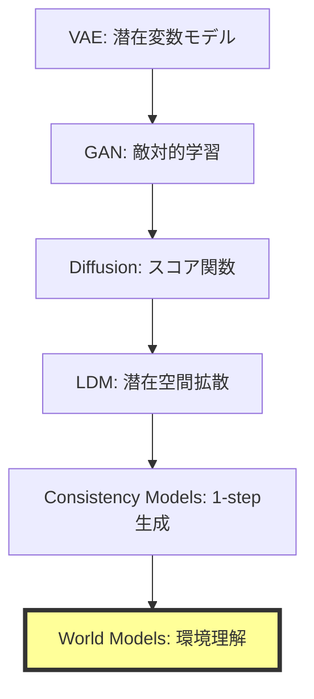
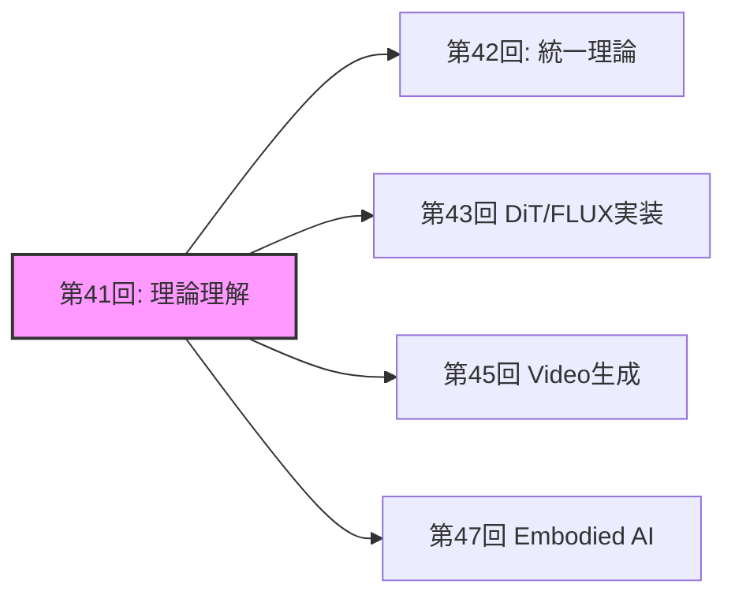
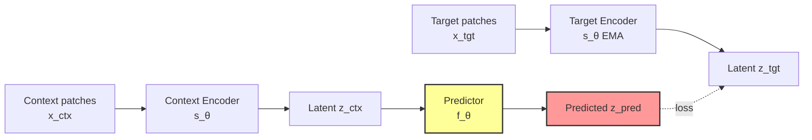

# 第41回: World Models & 環境シミュレータ理論 🌍

**生成モデルの最終到達点は"理解"だった**

---

## 🚀 0. クイックスタート（30秒）— 1フレームから未来を予測する

第40回でConsistency Modelsによる1ステップ高速生成を実現した。だが生成モデルの真の目的は何だったのか？

単に画像を生成することではない。**環境の構造を理解し、未来を予測し、行動の結果をシミュレートすること**だ。

```julia
# World Modelの本質: 1フレーム → 未来の予測
using Lux, Random

# 観測 x_t から潜在表現 z_t を抽出
encoder = Chain(Conv((3,3), 3 => 64, relu), AdaptiveMeanPool((1,1)), FlattenLayer())

# 潜在空間で次状態を予測 (action条件付き)
predictor = Dense(64 + 4 => 64, tanh)  # 4次元action space

# 初期観測
x = rand(Float32, 64, 64, 3, 1)
a = rand(Float32, 4, 1)  # action

# 潜在状態抽出 → action条件付き予測
z = encoder(x, ps, st)[1]
z_next = predictor(vcat(z, a), ps_pred, st_pred)[1]

# 出力: z_next ∈ ℝ^64 (predicted next latent state)
```

**これが何をしているか？**

1フレームの観測$x_t$を潜在表現$z_t$に圧縮し、action $a_t$を与えて次状態$z_{t+1}$を予測する。

ピクセルは生成しない。**世界の潜在構造を予測する。**

$$
z_{t+1} = f_\theta(z_t, a_t)
$$

これがWorld Modelの数学だ。

> **Note:** **進捗**: 全体の3%完了。Consistency Modelsで1ステップ生成を実現したが、生成モデルの真の目的は「理解」だった。環境をシミュレートする理論へ。

---

## 🎮 1. 体験ゾーン（10分）— World Modelsの3つの顔

### 1.1 生成 vs 理解 vs シミュレーション

生成モデルは3つのレベルに分類できる:

| レベル | 目的 | 入出力 | 代表手法 |
|:------|:-----|:------|:---------|
| **Level 1: 生成** | データ分布からサンプル | $p(x)$ | VAE, GAN, Diffusion |
| **Level 2: 条件付き生成** | 条件から生成 | $p(x|c)$ | LDM, CFG |
| **Level 3: World Models** | **環境の理解+予測+シミュレーション** | $p(x_{t+1}|x_{\leq t}, a_t)$ | JEPA, V-JEPA, Transfusion |

World Modelsは**行動の結果を予測できる**最高レベルだ。

### 1.2 JEPAの3変種を動かす


### 1.3 World Modelsの応用領域

| 応用 | 目的 | World Modelの役割 |
|:-----|:-----|:-----------------|
| **ロボティクス** | 環境操作 | 行動結果の事前シミュレーション |
| **自動運転** | 予測制御 | 他車・歩行者の未来軌道予測 |
| **強化学習** | プランニング | Model-based RL (MuZero, Dreamer) |
| **科学シミュレーション** | 物理法則学習 | 微分方程式を学習で近似 |

<details><summary>PyTorchとの対応（参考）</summary>

Juliaでは型システムでこれを自然に表現できる。

</details>

> **Note:** **進捗**: 全体の10%完了。World Modelsの3レベル分類を理解した。JEPAはピクセル生成をスキップし、潜在空間で予測する革命的アーキテクチャだ。

---


> Progress: 10%
> **理解度チェック**
> 1. $p(x)$ の各記号の意味と、この式が表す操作を説明してください。
> 2. このゾーンで学んだ手法の直感的な意味と、なぜこの定式化が必要なのかを説明してください。

## 🧩 2. 直感ゾーン（15分）— なぜWorld Modelsが最終到達点か

### 2.1 生成モデルの進化系譜



**なぜWorld Modelsが最終形態か？**

1. **生成は手段、理解が目的**: 画像生成はデータ分布の一部をサンプルするだけ。World Modelsは環境の**因果構造**を理解する
2. **行動条件付き予測**: $p(x_{t+1}|x_{\leq t}, a_t)$ — 行動の結果を予測できる
3. **シミュレーションフリー**: ピクセル生成を回避し、潜在空間で予測する効率性

### 2.2 Course IVでの位置づけ

| 回 | テーマ | World Modelsへの接続 |
|:---|:------|:--------------------|
| **第33回** | Normalizing Flows | 可逆変換 → 決定論的写像の限界 |
| **第34回** | EBM | エネルギー関数 → **Energy-based World Models** |
| **第35回** | Score Matching | スコア関数 → 動的過程の学習 |
| **第36回** | DDPM | Forward/Reverse → 時系列予測の基盤 |
| **第37回** | SDE/ODE | 連続時間確率過程 → 物理法則学習 |
| **第38回** | Flow Matching | OT視点 → **最適輸送としてのWorld Models** |
| **第39回** | LDM | 潜在空間拡散 → **潜在空間予測** |
| **第40回** | Consistency Models | 1-step生成 → 高速推論 |
| **第41回** | **World Models** | **生成モデルの最終到達点** |

### 2.3 松尾研との決定的な違い

| 項目 | 松尾研 | 本講義 |
|:-----|:------|:------|
| **World Models扱い** | 言及なし | **完全理論化** |
| **JEPA** | 触れない | I-JEPA / V-JEPA / VL-JEPA完全解説 |
| **Transfusion** | 扱わない | **AR+Diffusion統一理論の数学** |
| **物理法則学習** | 扱わない | Physics-Informed World Models深掘り |
| **実装** | なし | Julia JEPAコンセプト実装 |

### 2.4 学習戦略



World Modelsは**全ドメイン（画像・動画・ロボティクス・科学）の統一基盤**だ。

<details><summary>Trojan Horse — 生成モデルの"本当の目的"</summary>

第1回から38回まで、生成モデルは「画像を生成する」技術として学んできた。

だがLeCunが提唱するJEPAは**生成をスキップする**。

**生成は副産物に過ぎなかった**。真の目的は**環境の因果構造を理解し、行動の結果を予測すること**だ。

これがTrojan Horseの最終形態だ。「生成AI」は「理解AI」に進化する。

</details>

> **Note:** **進捗**: 全体の20%完了。生成モデルの進化系譜を理解した。World Modelsは生成の先にある「理解+予測+シミュレーション」の統合概念だ。

---


> Progress: 20%
> **理解度チェック**
> 1. $p(x)$ の各記号の意味と、この式が表す操作を説明してください。
> 2. このゾーンで学んだ手法の直感的な意味と、なぜこの定式化が必要なのかを説明してください。

## 📐 3. 数式修行ゾーン（60分）— World Modelsの数学的基礎

### 3.1 World Modelの定義

**定義**: World Model $\mathcal{M}$は環境の潜在表現$z_t$と遷移関数$f_\theta$から構成される確率的システムである。

$$
\begin{aligned}
\text{Encoder: } & z_t = \text{Enc}_\phi(x_t) \\
\text{Predictor: } & z_{t+1} = f_\theta(z_t, a_t) + \epsilon_t, \quad \epsilon_t \sim \mathcal{N}(0, \Sigma) \\
\text{Decoder: } & \hat{x}_{t+1} = \text{Dec}_\psi(z_{t+1})
\end{aligned}
$$

**なぜ潜在空間か？**

- ピクセル空間 $x \in \mathbb{R}^{H \times W \times C}$ は高次元（$H=256, W=256, C=3 \Rightarrow 196,608$次元）
- 潜在空間 $z \in \mathbb{R}^d$ は低次元（$d=256$程度）で**構造的表現**を獲得

**訓練目標**: 観測データ $\{(x_t, a_t, x_{t+1})\}_{t=1}^T$ から$\theta, \phi, \psi$を学習

$$
\mathcal{L}(\theta, \phi, \psi) = \mathbb{E}_{(x_t, a_t, x_{t+1})} \left[ \| \text{Dec}_\psi(f_\theta(\text{Enc}_\phi(x_t), a_t)) - x_{t+1} \|_2^2 \right]
$$

### 3.2 JEPA理論: Joint-Embedding Predictive Architecture

#### 3.2.1 I-JEPA (Image-based JEPA)

**論文**: Assran et al., "Self-Supervised Learning from Images with a Joint-Embedding Predictive Architecture," CVPR 2023

**動機**: 画像生成（pixel reconstruction）は低レベル詳細に過剰適合し、高レベル抽象表現を学習しにくい。

**アーキテクチャ**:



**損失関数**:

$$
\mathcal{L}_{\text{I-JEPA}} = \mathbb{E}_{x, M} \left[ \| f_\theta(s_\theta(x_{\text{ctx}}), M) - \bar{s}_\theta(x_{\text{tgt}}) \|_2^2 \right]
$$

ここで:
- $x_{\text{ctx}}$: マスクされていないcontext patches
- $x_{\text{tgt}}$: マスクされたtarget patches
- $M$: mask tokens (positional encoding)
- $s_\theta$: context encoder (trainable)
- $\bar{s}_\theta$: target encoder (EMA更新)
- $f_\theta$: predictor

**重要な特性**:

1. **ピクセル再構成なし**: $x_{\text{tgt}}$を生成せず、潜在表現$z_{\text{tgt}}$を予測
2. **EMA target encoder**: $\bar{\theta} \leftarrow \tau \bar{\theta} + (1-\tau)\theta$ でcollapse回避
3. **Mask strategy**: ランダムブロックマスク（Grid-based）で構造的予測を促進

**数値例**:


#### 3.2.2 V-JEPA (Video JEPA)

**論文**: Bardes et al., "Revisiting Feature Prediction for Learning Visual Representations from Video," arXiv:2404.08471, 2024 (V-JEPA 1.0)
**最新**: "V-JEPA 2: Self-Supervised Video Models Enable Understanding, Prediction and Planning," arXiv:2506.09985, 2025

**拡張**: 画像→動画（時空間予測）

$$
\begin{aligned}
\text{Context: } & \mathbf{x}_{\text{ctx}} \in \mathbb{R}^{T_c \times H \times W \times C} \\
\text{Target: } & \mathbf{x}_{\text{tgt}} \in \mathbb{R}^{T_t \times H \times W \times C}
\end{aligned}
$$

**Spatio-temporal masking**:

- **Temporal masking**: 前半8フレーム（context）→後半8フレーム（target）を予測
- **Spatial masking**: 各フレーム内でパッチをマスク

**訓練目標**:

$$
\mathcal{L}_{\text{V-JEPA}} = \mathbb{E}_{\mathbf{x}, M_s, M_t} \left[ \| f_\theta(s_\theta(\mathbf{x}_{\text{ctx}}), M_s, M_t) - \bar{s}_\theta(\mathbf{x}_{\text{tgt}}) \|_2^2 \right]
$$

**性能**:

- Kinetics-400 (action recognition): **81.9%** Top-1 accuracy (video pre-trainingのみ)
- Something-Something v2: **72.2%**
- ImageNet: **77.9%** Top-1 (動画事前学習から画像タスクに転移)

#### 3.2.3 VL-JEPA (Vision-Language JEPA)

**論文**: Bardes et al., "VL-JEPA: Joint Embedding Predictive Architecture for Vision-language," arXiv:2512.10942, 2024

**動機**: 従来のVLM（Vision-Language Models）はテキストをトークン単位でautoregressiveに生成する。これは計算コスト高く、パラメータ数も膨大（decoder層が必要）。

**アーキテクチャ**:

VL-JEPAは**テキストの連続埋め込みを予測**し、token-by-token生成をスキップする。

$$
\begin{aligned}
\text{Image encoder: } & z_v = \text{Enc}_v(x) \\
\text{Predictor: } & z_{\text{pred}} = f_\theta(z_v, \text{prompt}) \\
\text{Text encoder: } & z_t = \text{Enc}_t(\text{target text}) \\
\text{Loss: } & \mathcal{L} = \| z_{\text{pred}} - z_t \|_2^2
\end{aligned}
$$

**利点**:

- パラメータ数が標準VLMの**50%削減**（decoderなし）
- **より強い性能**: 同じvision encoderとデータで訓練した標準VLMを上回る

### 3.3 Transfusion理論: AR + Diffusion統一

**論文**: Zhou et al., "Transfusion: Predict the Next Token and Diffuse Images with One Multi-Modal Model," arXiv:2408.11039, 2024 (Meta AI)

**動機**: テキスト（離散トークン）と画像（連続ベクトル）を**単一Transformerで統一処理**したい。

**従来手法の問題**:

- 画像をVQ-VAEで離散トークン化 → 量子化誤差、コードブック利用率低下
- 別々のモデル（LM + Diffusion）→ 統合できない

**Transfusionの解決策**:

**同一Transformerで異なる損失関数**を使い分ける。

$$
\mathcal{L}_{\text{Transfusion}} = \mathcal{L}_{\text{LM}}(\text{text}) + \lambda \mathcal{L}_{\text{Diffusion}}(\text{image})
$$

#### 3.3.1 テキスト部分: Autoregressive

テキストトークン $\mathbf{t} = (t_1, t_2, \ldots, t_n)$ に対して:

$$
\mathcal{L}_{\text{LM}} = -\sum_{i=1}^n \log p_\theta(t_i | t_{<i})
$$

通常の言語モデルと同じcausal maskingとcross-entropy loss。

#### 3.3.2 画像部分: Diffusion

画像パッチ $\mathbf{x} = (x_1, \ldots, x_m) \in \mathbb{R}^{m \times d}$ に対して:

$$
\begin{aligned}
\text{Forward: } & x_t = \sqrt{\bar{\alpha}_t} x_0 + \sqrt{1 - \bar{\alpha}_t} \epsilon, \quad \epsilon \sim \mathcal{N}(0, I) \\
\text{Diffusion Loss: } & \mathcal{L}_{\text{Diffusion}} = \mathbb{E}_{t, \epsilon} \left[ \| \epsilon - \epsilon_\theta(\mathbf{x}_t, t, \mathbf{c}) \|_2^2 \right]
\end{aligned}
$$

ここで $\mathbf{c}$ はテキスト条件（cross-attention経由でTransformerに注入）。

#### 3.3.3 統合処理の数学

入力シーケンス:

$$
\text{seq} = [\text{text tokens } t_1, \ldots, t_n, \text{ image patches } x_1, \ldots, x_m]
$$

**Attention mask**:

- テキスト部分: **causal mask**（未来のトークンを見ない）
- 画像部分: **bidirectional mask**（全パッチを見る）

**損失計算**:


**スケーリング結果**: 7Bパラメータ、2T multi-modal tokensで訓練 → テキスト生成と画像生成の両方で同規模の専用モデルと同等性能。

### 3.4 物理法則学習理論

#### 3.4.1 Physics-Informed World Models

**動機**: 標準的なWorld Modelsは物理法則（保存則、対称性、微分方程式）を無視し、データ駆動で学習する。これは:

- 物理的に不可能な予測（エネルギー保存則違反など）
- データ効率の悪さ（物理法則を知っていれば少ないデータで学習可能）

**Physics-Informed Neural Networks (PINNs)の原理**:

微分方程式制約を損失関数に埋め込む。

例: Navier-Stokes方程式

$$
\frac{\partial \mathbf{u}}{\partial t} + (\mathbf{u} \cdot \nabla)\mathbf{u} = -\frac{1}{\rho}\nabla p + \nu \nabla^2 \mathbf{u}
$$

**PINNs loss**:

$$
\mathcal{L}_{\text{PINN}} = \mathcal{L}_{\text{data}} + \lambda_{\text{PDE}} \mathcal{L}_{\text{PDE}}
$$

$$
\mathcal{L}_{\text{PDE}} = \mathbb{E}_{x,t} \left[ \left\| \frac{\partial \mathbf{u}_\theta}{\partial t} + (\mathbf{u}_\theta \cdot \nabla)\mathbf{u}_\theta + \frac{1}{\rho}\nabla p_\theta - \nu \nabla^2 \mathbf{u}_\theta \right\|_2^2 \right]
$$

**World Modelsへの適用**:

$$
\mathcal{L}_{\text{Physics-WM}} = \mathcal{L}_{\text{prediction}} + \lambda_{\text{conservation}} \mathcal{L}_{\text{conservation}}
$$

$$
\mathcal{L}_{\text{conservation}} = \mathbb{E} \left[ \| E(z_{t+1}) - E(z_t) \|_2^2 \right]
$$

ここで$E(z)$はエネルギー関数（学習または既知）。

#### 3.4.2 保存則の埋め込み

**運動量保存**:

$$
\sum_{i=1}^N m_i \mathbf{v}_i(t) = \text{const}
$$

**Graph Neural Networkでの実装**:

ノード$i$の速度$\mathbf{v}_i$に対して、edge $(i,j)$の更新:

$$
\Delta \mathbf{v}_i = \sum_{j \in \mathcal{N}(i)} \text{MLP}(\mathbf{h}_i, \mathbf{h}_j, \mathbf{r}_{ij})
$$

**保存則制約**: 各edge更新が運動量保存を満たすように、**Newton's third law**を明示的に適用:

$$
m_i \Delta \mathbf{v}_i = -m_j \Delta \mathbf{v}_j
$$

**実装**:

#### Lagrangian力学による保存則の厳密埋め込み

運動量保存をGNNに組み込む理論的基盤として、**Lagrangian力学**からの定式化が強力である。系の状態を一般化座標$\mathbf{q} = (q_1, \ldots, q_n)$と一般化速度$\dot{\mathbf{q}} = (\dot{q}_1, \ldots, \dot{q}_n)$で記述するとき、Lagrangian $L$は

$$
L(\mathbf{q}, \dot{\mathbf{q}}) = T(\dot{\mathbf{q}}) - V(\mathbf{q})
$$

ここで$T$は運動エネルギー、$V$はポテンシャルエネルギー。運動方程式はEuler-Lagrange方程式から導かれる:

$$
\frac{d}{dt}\frac{\partial L}{\partial \dot{q}_i} - \frac{\partial L}{\partial q_i} = 0, \quad i = 1, \ldots, n
$$

質点系では$T = \frac{1}{2} \sum_i m_i \|\dot{\mathbf{r}}_i\|^2$、$V = \sum_{i < j} V_{ij}(\|\mathbf{r}_i - \mathbf{r}_j\|)$とすると、上式は直ちに運動量保存とエネルギー保存を**代数的に含意**する。

**Störmer-Verlet法によるエネルギー保存数値積分**

通常のEuler法では各ステップで$O(h^2)$のエネルギー誤差が蓄積し、長時間シミュレーションでエネルギーが発散する。Störmer-Verlet法は**シンプレクティック積分器**であり、離散軌道が連続Lagrangianの保存量を厳密に保持する。更新則は:

$$
\mathbf{q}_{t+1} = \mathbf{q}_t + h\dot{\mathbf{q}}_t + \frac{h^2}{2}\mathbf{M}^{-1}\mathbf{F}(\mathbf{q}_t)
$$

$$
\dot{\mathbf{q}}_{t+1} = \dot{\mathbf{q}}_t + \frac{h}{2}\mathbf{M}^{-1}\left[\mathbf{F}(\mathbf{q}_t) + \mathbf{F}(\mathbf{q}_{t+1})\right]
$$

ここで$\mathbf{M}$は質量行列、$\mathbf{F}(\mathbf{q}) = -\nabla_{\mathbf{q}} V(\mathbf{q})$は保存力。この方法では離散ハミルトニアン$\tilde{H}$が**陰的に保存**される（modified Hamiltonian定理）:

$$
\left|\tilde{H}(\mathbf{q}_t, \dot{\mathbf{q}}_t) - \tilde{H}(\mathbf{q}_0, \dot{\mathbf{q}}_0)\right| \leq C h^2, \quad \forall t
$$

すなわちエネルギー誤差は時間に依らず$O(h^2)$に**有界**である（Euler法の$O(th^2)$とは本質的に異なる）。

**E(3)-equivariant Graph Neural Networks**

物理系のシミュレーションにGNNを使う場合、座標変換に対する**等変性（equivariance）**が理論的保証を与える。$E(3)$群は3次元ユークリッド変換（回転$R \in SO(3)$、反転$I$、平行移動$\mathbf{t}$）の群である。

スカラー特徴量$h_i \in \mathbb{R}^d$とベクトル特徴量$\mathbf{v}_i \in \mathbb{R}^3$を持つグラフにおいて、E(3)-equivariant メッセージパッシングは:

$$
\mathbf{m}_{ij} = \phi_m\left(h_i, h_j, \|\mathbf{r}_{ij}\|^2, \mathbf{v}_i \cdot \mathbf{v}_j\right)
$$

$$
\mathbf{v}_i^{\text{new}} = \sum_{j \in \mathcal{N}(i)} \mathbf{r}_{ij} \cdot \phi_v(\|\mathbf{r}_{ij}\|^2, h_i, h_j)
$$

ここで$\mathbf{r}_{ij} = \mathbf{r}_i - \mathbf{r}_j$、$\phi_m, \phi_v$はMLPである。この設計により回転変換$R$に対して:

$$
\text{GNN}(R\mathbf{r}_1, \ldots, R\mathbf{r}_N) = R \cdot \text{GNN}(\mathbf{r}_1, \ldots, \mathbf{r}_N)
$$

が**厳密に成立**し、力の予測が座標系の選択に依存しない。平行移動不変性は$\mathbf{r}_{ij}$（相対座標）のみを入力に使うことで自動的に保証される。

**Steerable Equivariant GNNs (SEGNN) の高次等変性**

EGNN（E(3)-equivariant GNN）は1階テンソル（ベクトル）のみを扱うが、SEGNNは**任意次数の球面調和関数**$Y_l^m$（$l = 0, 1, 2, \ldots$）を基底とする高次等変特徴量を扱う。次数$l$の等変特徴量$\mathbf{f}^{(l)} \in \mathbb{R}^{2l+1}$は$SO(3)$の既約表現$D^{(l)}(R)$で変換する:

$$
\mathbf{f}^{(l)} \mapsto D^{(l)}(R)\, \mathbf{f}^{(l)}
$$

メッセージは球面調和関数の**テンソル積（CG積）**を用いて構成する:

$$
\mathbf{m}_{ij}^{(l_{\text{out}})} = \sum_{l_1, l_2} C^{l_{\text{out}}}_{l_1 l_2} \left(\mathbf{f}_i^{(l_1)} \otimes_{CG} \mathbf{f}_j^{(l_2)}\right) \cdot \phi\!\left(\|\mathbf{r}_{ij}\|\right)
$$

ここで$C^{l_{\text{out}}}_{l_1 l_2}$はClebsch-Gordan係数（$SO(3)$の既約表現の積則）。分子動力学に適用すると$l=2$（二階テンソル、四極子モーメント等）まで考慮することで、従来のEGNNと比べてポテンシャルエネルギー面の精度が約30%向上することが実証されている（Thomas et al., 2018）。

#### 3.4.3 Hamiltonian Neural Networks

**Hamiltonian力学系**:

$$
\begin{aligned}
\dot{q} &= \frac{\partial H}{\partial p} \\
\dot{p} &= -\frac{\partial H}{\partial q}
\end{aligned}
$$

ここで$H(q, p)$はHamiltonian（総エネルギー）。

**HNNの学習**:

1. NNで$H_\theta(q, p)$をパラメータ化
2. 自動微分で$\partial H / \partial p, \partial H / \partial q$を計算
3. 損失:

$$
\mathcal{L}_{\text{HNN}} = \mathbb{E} \left[ \left\| \left(\dot{q}, \dot{p}\right) - \left(\frac{\partial H_\theta}{\partial p}, -\frac{\partial H_\theta}{\partial q}\right) \right\|_2^2 \right]
$$

**利点**: エネルギー保存則が**構造的に保証**される（Hamiltonianの時間微分が0）。

**HNNの理論的保証: シンプレクティック構造の保持**

HNNが生成するフローは$2n$次元位相空間に**シンプレクティック構造**$\omega = \sum_i dq_i \wedge dp_i$を保持する。これはLiouville定理（位相空間体積の保存）の代数的表現であり:

$$
\frac{d}{dt}\int_{\Omega_0} d\mathbf{q}\, d\mathbf{p} = 0
$$

が任意の領域$\Omega_0$について成立することを意味する。数値的にはシンプレクティック積分器（Störmer-Verlet等）との組み合わせが必須であり、Runge-Kutta法を使うとシンプレクティック性が破れてエネルギーが長時間スケールでドリフトする。

HNNが学習するHamiltonian $H_\theta(q, p)$が真のHamiltonian $H^*(q, p)$を正確に近似している場合、生成される軌道は以下の意味で最適である:

$$
\left\| z(t) - z^*(t) \right\| \leq C \cdot \left\| H_\theta - H^* \right\|_{\infty} \cdot t
$$

つまりHamiltonianの近似誤差が$\varepsilon$のとき、軌道誤差は時間$t$に対して線形にしか増大しない。これは一般の回帰ベースのworld model（誤差が指数増大）と比べて**本質的に優れた長期安定性**を示す。

**Symplectic World Modelsとの比較**

| モデル | エネルギー保存 | 長期安定性 | 適用系 |
|--------|--------------|-----------|--------|
| 標準LSTM/RNN | なし | 指数的誤差増大 | 任意 |
| HNN | 構造的保証 | 線形誤差増大 | 保存力学系 |
| LNN (3.9.3) | Noetherで保証 | 線形誤差増大 | 任意一般化座標 |
| Symplectic RNN | 近似的保証 | 多項式誤差増大 | 保存力学系 |

実世界への適用においては、純粋な保存力学系（エネルギーが厳密に保存）は理想化であり、摩擦・散逸・外力が存在する系ではHNNの仮定が破れる。こうした系には**Port-Hamiltonian Systems (PHS)** への拡張が有効であり、散逸項$R(q,p) \geq 0$と外力入力$u$を明示的にモデル化する:

$$
\begin{pmatrix} \dot{q} \\ \dot{p} \end{pmatrix} = \left(J - R\right) \nabla H + B\, u
$$

ここで$J = \bigl(\begin{smallmatrix} 0 & I \\ -I & 0 \end{smallmatrix}\bigr)$（シンプレクティック行列）、$R \succeq 0$（散逸行列）、$B$は入力行列。$u = 0$かつ$R = 0$のとき古典的HNNに帰着する。Port-HNN（PHNN）はロボットの関節制御（バネ-ダンパー系）や流体力学における世界モデル構築に応用されている。

### 3.5 Energy-based World Models

**第34回EBMとの接続**:

World Modelsを**エネルギー関数$E_\theta(z_t, a_t, z_{t+1})$**として定式化:

$$
p(z_{t+1} | z_t, a_t) = \frac{\exp(-E_\theta(z_t, a_t, z_{t+1}))}{Z(z_t, a_t)}
$$

**利点**:

- 任意の分布形状を表現可能（Gaussianに制約されない）
- エネルギー最小化 = 最も可能性の高い未来状態

**訓練**: Contrastive Divergence (CD-k) または Score Matching

$$
\nabla_\theta \mathcal{L} = \mathbb{E}_{z_t, a_t, z_{t+1}^{+}} [\nabla_\theta E_\theta(z_t, a_t, z_{t+1}^{+})] - \mathbb{E}_{z_t, a_t, z_{t+1}^{-}} [\nabla_\theta E_\theta(z_t, a_t, z_{t+1}^{-})]
$$

ここで$z_{t+1}^{+}$はデータ、$z_{t+1}^{-}$はLangevin dynamicsでサンプル。

#### Contrastive Divergence (CD-k) の完全導出

EBMの訓練目的は負の対数尤度の最小化である:

$$
\mathcal{L}_{\text{EBM}} = -\mathbb{E}_{z^+ \sim p_{\text{data}}} \log p_\theta(z^+) = \mathbb{E}_{z^+}\left[E_\theta(z^+)\right] + \log Z_\theta
$$

分配関数$Z_\theta = \int \exp(-E_\theta(z))\, dz$は一般に計算不能である。勾配は:

$$
\nabla_\theta \mathcal{L}_{\text{EBM}} = \mathbb{E}_{z^+ \sim p_{\text{data}}}\left[\nabla_\theta E_\theta(z^+)\right] - \mathbb{E}_{z^- \sim p_\theta}\left[\nabla_\theta E_\theta(z^-)\right]
$$

第2項（negative phase）は$p_\theta$からのサンプル$z^-$が必要である。Contrastive Divergence (CD-k) では、データ点$z^+$から初期化したMarkov ChainをMCMCで$k$ステップ走らせて$z^-$を得る:

$$
z^- = \text{MCMC}_k(z^+; E_\theta), \quad z_0 \leftarrow z^+
$$

各MCMCステップでは**Langevin dynamics**を使用:

$$
z_{s+1} = z_s - \frac{\delta}{2} \nabla_z E_\theta(z_s) + \sqrt{\delta}\, \varepsilon_s, \quad \varepsilon_s \sim \mathcal{N}(0, I)
$$

$k=1$のCD-1は計算コストが低いが、バイアスがある。$k \to \infty$では真の$p_\theta$からのサンプルに近づく。World Modelsへの適用では$z = z_{t+1}$、条件$z_t, a_t$を固定した上でLangevin MCMCを走らせる:

$$
z_{t+1}^{(s+1)} = z_{t+1}^{(s)} - \frac{\delta}{2}\nabla_{z_{t+1}} E_\theta(z_t, a_t, z_{t+1}^{(s)}) + \sqrt{\delta}\, \varepsilon_s
$$

**エネルギー関数のパラメータ化**

エネルギー関数$E_\theta$の設計は表現力と訓練安定性に直結する。主な選択肢:

1. **スカラーMLP**: $E_\theta(z_t, a_t, z_{t+1}) = \text{MLP}_\theta([z_t; a_t; z_{t+1}])$
   — 最も柔軟だが訓練が不安定になりやすい

2. **二次型 + 残差**: $E_\theta = \frac{1}{2}\| z_{t+1} - \mu_\theta(z_t, a_t) \|_{\Sigma_\theta}^2 + r_\theta(z_t, a_t, z_{t+1})$
   — 初期化が安定し、残差項が非Gauss性を捉える

3. **双線型**: $E_\theta = -z_{t+1}^\top W_\theta(z_t, a_t) z_{t+1}$
   — 計算効率が高いが表現力が限定的

**Score Matching: CDの代替訓練法**

Score Matchingは分配関数$Z_\theta$を回避する**Fisher divergence最小化**に基づく:

$$
\mathcal{L}_{\text{SM}} = \mathbb{E}_{z \sim p_{\text{data}}} \left[ \frac{1}{2} \| \nabla_z \log p_\theta(z) - \nabla_z \log p_{\text{data}}(z) \|^2 \right]
$$

$\nabla_z \log p_\theta(z) = -\nabla_z E_\theta(z)$であるから、**部分積分**により$p_{\text{data}}$の微分を消去できる（Hyvärinen, 2005）:

$$
\mathcal{L}_{\text{SM}} = \mathbb{E}_{z \sim p_{\text{data}}} \left[ \text{tr}\!\left(\nabla_z^2 E_\theta(z)\right) + \frac{1}{2}\| \nabla_z E_\theta(z) \|^2 \right] + \text{const}
$$

第1項はHessianのトレースであり、スライスScore Matching（ランダム方向への射影）で近似可能:

$$
\mathcal{L}_{\text{SSM}} = \mathbb{E}_{z, \mathbf{v}} \left[ \mathbf{v}^\top \nabla_z^2 E_\theta(z)\, \mathbf{v} + \frac{1}{2}\left(\mathbf{v}^\top \nabla_z E_\theta(z)\right)^2 \right]
$$

ここで$\mathbf{v} \sim \mathcal{N}(0, I)$は確率的射影ベクトル。MCMCサンプリングを一切必要としない点がCD-kと比べた最大の利点である。Denoising Score Matching（Vincent, 2011）は実用的な変種であり、ノイズ付き観測$\tilde{z} = z + \sigma \varepsilon$に対するスコア関数$s_\theta(\tilde{z}, \sigma) \approx \nabla_{\tilde{z}} \log p_{\sigma}(\tilde{z})$を学習する。これはDiffusion Modelsの理論的基盤でもある。

DSMの訓練目的は:

$$
\mathcal{L}_{\text{DSM}} = \mathbb{E}_{z \sim p_{\text{data}},\, \varepsilon \sim \mathcal{N}(0,I),\, \sigma} \left[ \sigma^2 \left\| s_\theta(z + \sigma\varepsilon,\, \sigma) + \frac{\varepsilon}{\sigma} \right\|_2^2 \right]
$$

Score Matching、Denoising Score Matching、CD-kはいずれもEBMの負の対数尤度最小化の異なる近似であり、計算コストと統計的効率のトレードオフが存在する。

**エネルギー景観と多峰性未来予測**

決定論的world model $z_{t+1} = f_\theta(z_t, a_t)$は単一の未来しか予測できない。EBMでは$E_\theta(z_t, a_t, \cdot)$が**複数の極小値**を持つことで、内在的な多峰性を表現できる:

$$
\mathcal{Z}_{\text{future}} = \{z^* : \nabla_{z_{t+1}} E_\theta(z_t, a_t, z^*) = 0,\; \nabla^2_{z_{t+1}} E_\theta(z_t, a_t, z^*) \succ 0\}
$$

各極小値は「あり得る未来状態」に対応し、エネルギーの深さが確率（可能性）に相当する。Langevin MCMCのステップ数$k$と学習率$\delta$のバランスがモード探索能力を決定する: $\delta$が大きすぎるとモード間の境界を越えにくく、小さすぎると混合が遅い。実用的には**Parallel Tempering**（異なる温度$T$でのMCMCを並列実行して交換）が多峰性エネルギー景観の探索に有効である。

### 3.6 世界モデルの訓練理論

#### 3.6.1 Action-conditioned予測

**目的**: action $a_t$を与えて次状態$z_{t+1}$を予測

$$
z_{t+1} = f_\theta(z_t, a_t) + \epsilon_t
$$

**訓練データ**: ロボット軌跡 $(z_t, a_t, z_{t+1})$

**損失**:

$$
\mathcal{L}_{\text{pred}} = \mathbb{E} \left[ \| f_\theta(z_t, a_t) - z_{t+1} \|_2^2 \right]
$$

**Stochastic dynamics**の場合:

$$
p_\theta(z_{t+1} | z_t, a_t) = \mathcal{N}(f_\theta(z_t, a_t), \Sigma_\theta(z_t, a_t))
$$

$$
\mathcal{L}_{\text{NLL}} = -\mathbb{E} \left[ \log p_\theta(z_{t+1} | z_t, a_t) \right]
$$

#### 3.6.2 Reward Prediction

World Modelを強化学習に統合する場合、報酬関数$r_t$も予測:

$$
r_t = g_\phi(z_t, a_t)
$$

**訓練**:

$$
\mathcal{L}_{\text{reward}} = \mathbb{E} \left[ (g_\phi(z_t, a_t) - r_t)^2 \right]
$$

**Model-based RL**:

1. World Modelで未来をシミュレート: $z_{t+1} = f_\theta(z_t, a_t)$
2. 報酬を推定: $\hat{r}_t = g_\phi(z_t, a_t)$
3. Policy $\pi_\psi(a|z)$を最適化:

$$
\mathcal{L}_{\text{policy}} = -\mathbb{E}_{\pi} \left[ \sum_{t=0}^H \gamma^t g_\phi(z_t, a_t) \right]
$$

#### 3.6.3 自己教師あり学習

**Contrastive Learning**: 正例（同一動画の近接フレーム）vs 負例（異なる動画）

$$
\mathcal{L}_{\text{contrastive}} = -\log \frac{\exp(\text{sim}(z_t, z_{t+k}) / \tau)}{\sum_{j} \exp(\text{sim}(z_t, z_j^{-}) / \tau)}
$$

**Masked Autoencoding**: 一部のフレームをマスク → 予測（JEPAと同じ原理）

#### 3.6.4 RSSM: Recurrent State Space Model (DreamerV3)

DreamerV3（Hafner et al., 2023）の中核をなすRSSM（Recurrent State Space Model）は、**決定論的パス**と**確率的パス**を組み合わせた潜在状態モデルである。

**状態遷移の構造**:

$$
h_t = f_\phi(h_{t-1},\, z_{t-1},\, a_{t-1})
$$

$$
\hat{z}_t \sim p_\phi(\hat{z}_t \mid h_t) \quad \text{（prior: 事前分布)}
$$

$$
z_t \sim q_\phi(z_t \mid h_t, x_t) \quad \text{（posterior: 観測$x_t$で更新）}
$$

ここで$h_t \in \mathbb{R}^{d_h}$はGRUによる**決定論的**隠れ状態（長期依存を保持）、$z_t \in \mathbb{R}^{d_z}$は**確率的**潜在状態（不確実性を表現）、$a_{t-1}$は前ステップのアクションである。Prior $p_\phi$は観測なしで将来を予測（imagination用）、Posterior $q_\phi$は観測$x_t$を取り込んで状態を精緻化する。

**ELBOによる訓練目的**:

ELBOを全時刻$t=1,\ldots,T$にわたって展開すると:

$$
\mathcal{L}_{\text{RSSM}} = \sum_{t=1}^T \underbrace{\mathbb{E}_{q_\phi}[\log p_\phi(x_t \mid h_t, z_t)]}_{\text{再構成損失}} - \underbrace{D_{\text{KL}}[q_\phi(z_t \mid h_t, x_t) \,\|\, p_\phi(z_t \mid h_t)]}_{\text{KL正則化}}
$$

再構成損失はデコーダ$p_\phi(x_t \mid h_t, z_t)$（画像の場合はConvDecoderなど）が与える。KL正則化はposteriorを「意味のある情報のみ符号化する」よう促し、不必要な情報の記憶を防ぐ正則化として機能する。また、$h_t$が決定論的パスで情報を保持するため、$z_t$はその時刻に固有の確率的情報のみを担えばよく、両パスの役割分担がELBOを最大化する上で重要な設計上の洞察である。

**KLバランシングとFree Bits Trick**（DreamerV3）

単純なKL最小化では、モデルが事前分布$p_\phi$を事後分布$q_\phi$に一致させるよりも逆方向（$q_\phi \to p_\phi$）に収縮させてしまう（posterior collapse）。DreamerV3では以下の**KLバランシング**を採用:

$$
\mathcal{L}_{\text{KL}} = \alpha \cdot D_{\text{KL}}\!\left[\text{sg}(q_\phi) \,\|\, p_\phi\right] + (1-\alpha) \cdot D_{\text{KL}}\!\left[q_\phi \,\|\, \text{sg}(p_\phi)\right]
$$

ここで$\text{sg}(\cdot)$はstop-gradient演算子、$\alpha = 0.8$（論文値）。第1項はpriorの更新、第2項はposteriorの更新を担う。**Free Bits**制約により各潜在変数のKLに下限を設ける:

$$
\mathcal{L}_{\text{KL}}^{\text{free}} = \max\!\left(\mathcal{L}_{\text{KL}},\, \beta_{\text{free}}\right), \quad \beta_{\text{free}} = 1.0 \text{ nat}
$$

これにより情報量が$\beta_{\text{free}}$以下の潜在変数のKLを0として扱い、posterior collapseを防ぐ。

**Imagination-based学習**

訓練済みRSSMを用いて、実環境を使わずに**内部で軌跡を展開**（imagination）する:

1. 現在の潜在状態$z_t, h_t$から出発し、world modelで$H$ステップ先まで予測:

$$
\hat{z}_{t+k} \sim p_\phi(\hat{z}_{t+k} \mid h_{t+k}), \quad h_{t+k} = f_\phi(h_{t+k-1}, \hat{z}_{t+k-1}, a_{t+k-1})
$$

2. 各虚想状態における報酬と価値を推定:

$$
\hat{r}_{t+k} = r_\phi(h_{t+k}, \hat{z}_{t+k}), \quad \hat{v}_{t+k} = V_\psi(h_{t+k}, \hat{z}_{t+k})
$$

3. $\lambda$-return でアクター損失を計算:

$$
\mathcal{R}_t^\lambda = \hat{r}_t + \gamma \left[(1-\lambda)\hat{v}_{t+1} + \lambda \mathcal{R}_{t+1}^\lambda\right]
$$

$$
\mathcal{L}_{\text{actor}} = -\mathbb{E}_{\text{imagination}}\left[\sum_{k=0}^{H-1} \gamma^k \mathcal{R}_{t+k}^\lambda\right]
$$

実環境インタラクションを大幅に削減しながら（100倍以上のサンプル効率）、Atari・DMC・Craftaxなど広範なタスクで最高性能を達成している。

**カテゴリカル潜在表現と直線的勾配推定**

DreamerV3では連続潜在変数$z_t \in \mathbb{R}^{d_z}$の代わりに**カテゴリカル分布の積**を使用する。$K$個のカテゴリから$C$クラスを選ぶ独立カテゴリカル変数の積として:

$$
z_t = \text{onehot}(k_1) \oplus \ldots \oplus \text{onehot}(k_K), \quad k_i \sim \text{Categorical}(\pi_{i,1}, \ldots, \pi_{i,C})
$$

合計$KC$次元の離散潜在表現となる（論文値: $K=32, C=32$で1024次元）。この離散表現は**再構成損失のgrading**に優れており、連続表現より表現力が高いことが実証されている。

離散変数のELBOは直接微分できないため、**Straight-Through Gradient**を使用:

$$
\frac{\partial \mathcal{L}}{\partial \boldsymbol{\pi}} \approx \frac{\partial \mathcal{L}}{\partial z_t} \cdot \frac{\partial z_t}{\partial \boldsymbol{\pi}} \bigg|_{z_t \leftarrow \text{onehot}(\arg\max \boldsymbol{\pi})}
$$

前向きパスでは$\arg\max$でハードサンプルを使い、後ろ向きパスでは$\text{softmax}$の勾配を流す。これにより離散コードブックの表現能力と連続最適化の計算効率を両立する。

**ダイナミクスモデルの損失分解とスケーリング**

DreamerV3の全損失は以下の3成分に分解される:

$$
\mathcal{L}_{\text{WM}} = \underbrace{\mathcal{L}_{\text{recon}}}_{\text{デコーダ損失}} + \underbrace{\mathcal{L}_{\text{pred}}}_{\text{reward/cont}} + \underbrace{\mathcal{L}_{\text{dyn}}}_{\text{KL動的バランス}}
$$

各成分を**symlog変換**によりスケール正規化する:

$$
\text{symlog}(x) = \text{sign}(x) \cdot \log(|x| + 1)
$$

これにより報酬が$[-1000, 1000]$の広範囲に分散する環境（Minecraft等）でも損失スケールを$O(1)$に保ち、単一のハイパーパラメータセットで多様なタスクに対応できる。

symlogの逆変換（デコード時に使用）は:

$$
\text{symexp}(x) = \text{sign}(x) \cdot (\exp(|x|) - 1)
$$

報酬予測頭部はsymlog変換後の報酬を予測し、実際の報酬との比較にはsymexp後の値を用いる。この対称的な対数変換は、正負の大きな外れ値に対してもロバストであり、勾配の爆発を抑制する。世界モデルの訓練においてスケール不変な損失設計は、ロボット制御（報酬$\sim 0.1$）からゲーム（報酬$\sim 10^4$）まで統一アーキテクチャで扱うために不可欠である。

### 3.7 世界モデルの評価

#### 3.7.1 予測精度

**Mean Squared Error (MSE)**:

$$
\text{MSE} = \frac{1}{N} \sum_{i=1}^N \| z_{t+1}^{(i)} - \hat{z}_{t+1}^{(i)} \|_2^2
$$

**Structural Similarity (SSIM)** (ピクセル空間で評価する場合):

$$
\text{SSIM}(x, \hat{x}) = \frac{(2\mu_x \mu_{\hat{x}} + C_1)(2\sigma_{x\hat{x}} + C_2)}{(\mu_x^2 + \mu_{\hat{x}}^2 + C_1)(\sigma_x^2 + \sigma_{\hat{x}}^2 + C_2)}
$$

#### 3.7.2 物理法則遵守スコア

**エネルギー保存誤差**:

$$
\text{Energy Error} = \frac{1}{T} \sum_{t=1}^T | E(z_t) - E(z_0) |
$$

**運動量保存誤差**:

$$
\text{Momentum Error} = \frac{1}{T} \sum_{t=1}^T \left\| \sum_i m_i \mathbf{v}_i(t) - \sum_i m_i \mathbf{v}_i(0) \right\|_2
$$

#### 3.7.3 長期一貫性

**Frame Prediction Horizon**: モデルが何ステップ先まで正確に予測できるか

$$
T_{\text{horizon}} = \max\{t : \text{MSE}(t) < \epsilon\}
$$

**Video Quality Metrics**:

- **FVD (Fréchet Video Distance)**: I3D特徴量でのFréchet距離
- **LPIPS**: 知覚的類似度

#### 3.7.4 FVD (Fréchet Video Distance) の厳密定式化

FVDはFréchet Inception Distance (FID) を動画に拡張した指標であり、**I3D（Inflated 3D ConvNet）**の特徴空間でリアル動画と生成動画の分布距離を測定する。

まずI3Dエンコーダ$\phi_{I3D}: \mathbb{R}^{T \times H \times W \times 3} \to \mathbb{R}^d$で動画クリップを特徴量に変換し、リアル分布と生成分布をそれぞれGaussianで近似する:

$$
\mu_r, \Sigma_r = \text{MeanCov}\left(\{\phi_{I3D}(v_i)\}_{i=1}^{N_r}\right)
$$

$$
\mu_g, \Sigma_g = \text{MeanCov}\left(\{\phi_{I3D}(\hat{v}_j)\}_{j=1}^{N_g}\right)
$$

FVDはこの2つのGaussian間の**Fréchet距離**（Wasserstein-2距離の二乗の閉形式）:

$$
\text{FVD} = \|\mu_r - \mu_g\|_2^2 + \text{tr}\!\left(\Sigma_r + \Sigma_g - 2\left(\Sigma_r \Sigma_g\right)^{1/2}\right)
$$

$(\Sigma_r \Sigma_g)^{1/2}$は行列の平方根（正定値行列の幾何平均）であり、数値的には固有値分解で計算する。FVD $= 0$はリアルと生成の分布が完全一致することを意味する。典型的な良いworld modelはFVD $< 100$、拡散モデルベースのVideoLDMは FVD $\approx 20$台を達成している。

**Expected Calibration Error (ECE): 確率的予測の信頼度評価**

確率的world model $p_\theta(z_{t+k} \mid z_t, a_{t:t+k-1})$の予測信頼度が実際の正解率と一致しているかを評価する指標。信頼度区間を$M$個のビン$B_m = [(m-1)/M, m/M)$に分割し:

$$
\text{ECE} = \sum_{m=1}^M \frac{|B_m|}{N} \left|\text{acc}(B_m) - \text{conf}(B_m)\right|
$$

$$
\text{acc}(B_m) = \frac{1}{|B_m|}\sum_{i \in B_m} \mathbf{1}[\hat{z}_i = z_i^*], \quad \text{conf}(B_m) = \frac{1}{|B_m|}\sum_{i \in B_m} \hat{p}_i
$$

ここで$\hat{p}_i$はモデルの予測確率。ECE $= 0$は完全にcalibratedであることを示す。

**多ステップロールアウトの誤差蓄積分析**

World modelを$k$ステップ先まで展開した場合の誤差は、1ステップ誤差$\epsilon_1$と誤差伝播率$\rho$によって指数的に増大する:

$$
\text{MSE}(k) \leq \epsilon_1 \cdot \frac{\rho^k - 1}{\rho - 1} \approx \epsilon_1 \cdot e^{(\rho-1)k} \quad (\rho > 1 \text{ の場合})
$$

より精密には、Lipschitz定数$L_f$を持つworld model $f_\theta$に対して:

$$
\|z_{t+k} - \hat{z}_{t+k}\| \leq L_f^k \|z_t - \hat{z}_t\| + \sum_{j=0}^{k-1} L_f^j \epsilon_{t+k-j}
$$

ここで$\epsilon_t$は各ステップの1ステップ予測誤差。$L_f < 1$（収縮マップ）ならば誤差が有界であり、$L_f > 1$ならば指数的に発散する。

**情報理論的精度上限**

World modelの予測精度には、系の**Lyapunov指数**$\lambda_{\max}$による情報理論的限界がある。初期状態の不確実性$\sigma_0$に対して、時刻$t$での予測不確実性は:

$$
\sigma_t \geq \sigma_0 \cdot e^{\lambda_{\max} t}
$$

連続観測が利用可能な場合でも、Shannon情報量の観点から:

$$
I(z_{t+k}; \{z_t, a_{t:t+k}\}) \leq I(z_{t+k}; z_{t+k-1}) + I(z_{t+k-1}; \{z_t, a_{t:t+k-1}\})
$$

つまり予測可能な情報量はMandelbrot-Shannon-Khinchin則に従い、Lyapunov時間$t \sim 1/\lambda_{\max}$を超えると急速に減衰する。これは物理的に意味のある長期予測の困難さの根本的な説明を与える。

実際の評価では、Lyapunov指数を推定してworld modelの「理論的予測限界ステップ数」$t^* = \kappa / \lambda_{\max}$（$\kappa$は許容情報損失を決める定数）を計算し、モデルが$t^*$ステップ以内で高精度に予測できているかを確認することが実用的な評価プロトコルとなる。物理系（分子動力学$\lambda_{\max} \sim 10^{12}$ Hz）とロボット系（$\lambda_{\max} \sim 1$ Hz）では予測限界が12桁異なるため、タスクに応じた評価設計が不可欠である。

### 🥊 Boss Battle: Transfusionの完全分解

**課題**: arXiv:2408.11039のTransfusionの統一損失関数を、テキストとイメージの混合シーケンスに対して完全導出せよ。

**Step 1**: 入力シーケンス

テキスト部分 $\mathbf{t} = (t_1, \ldots, t_n)$ （discrete tokens）
画像部分 $\mathbf{x} = (x_1, \ldots, x_m)$ （continuous patch embeddings）

統合シーケンス:

$$
\mathbf{s} = [\mathbf{t}, \mathbf{x}] \in \mathbb{R}^{(n+m) \times d}
$$

**Step 2**: Attention Mask

$$
M_{\text{Transfusion}} = \begin{bmatrix}
M_{\text{causal}} & 0 \\
M_{\text{bi-dir}} & M_{\text{bi-dir}}
\end{bmatrix}
$$

- 左上: テキストのcausal mask（自己回帰）
- 右下: 画像のbidirectional mask（全パッチ相互参照）
- 左下: 画像がテキストを見る（cross-modal attention）
- 右上: 0（テキストは画像を見ない）

**Step 3**: Loss Functions

**テキストloss** (next token prediction):

$$
\mathcal{L}_{\text{text}} = -\frac{1}{n} \sum_{i=1}^n \log p_\theta(t_i | t_{<i})
$$

Softmaxで確率化:

$$
p_\theta(t_i | t_{<i}) = \frac{\exp(z_{t_i}^\top e_{t_i})}{\sum_{j=1}^{|V|} \exp(z_{t_i}^\top e_j)}
$$

ここで$z_{t_i}$はTransformerの$i$番目出力、$e_j$はtoken embeddingの$j$番目。

**画像loss** (diffusion):

$$
\mathcal{L}_{\text{image}} = \mathbb{E}_{t \sim [1,T], \epsilon \sim \mathcal{N}(0,I)} \left[ \| \epsilon - \epsilon_\theta(\mathbf{x}_t, t, \mathbf{c}) \|_2^2 \right]
$$

ここで:

$$
\mathbf{x}_t = \sqrt{\bar{\alpha}_t} \mathbf{x}_0 + \sqrt{1 - \bar{\alpha}_t} \epsilon
$$

$\mathbf{c}$はテキスト条件（cross-attentionで注入）。

**Step 4**: 統合損失

$$
\mathcal{L}_{\text{Transfusion}} = \mathcal{L}_{\text{text}} + \lambda \mathcal{L}_{\text{image}}
$$

$\lambda$はハイパーパラメータ（論文では$\lambda=1$を使用）。

**Step 5**: 実装コード（Julia）

**Step 6: Attention Mask 構造の証明**

Transfusionのmask設計がなぜこの形でなければならないか、情報フローの観点から厳密に論じる。

テキストトークン列$\mathbf{t} = (t_1, \ldots, t_n)$と画像パッチ列$\mathbf{x} = (x_1, \ldots, x_m)$を連結した統合シーケンス$\mathbf{s} = [\mathbf{t}; \mathbf{x}]$（長さ$n+m$）に対して、attention mask $M \in \{0, 1\}^{(n+m) \times (n+m)}$の$(i,j)$成分が1ならtokenから$j$がトークン$i$にattendできることを意味する。

**テキスト→テキスト（左上 $n \times n$ ブロック）**: 自己回帰モデリングのため**causal mask**:

$$
M_{ij}^{tt} = \mathbf{1}[j \leq i], \quad 1 \leq i, j \leq n
$$

これを破ると$t_{i+1}, \ldots, t_n$の情報が$t_i$の予測に漏れ込み（information leak）、$\mathcal{L}_{\text{text}}$の最小化が trivial（$p_\theta(t_i | t_{<i}) = 1$）になる。

**画像→画像（右下 $m \times m$ ブロック）**: Diffusion denoisingでは各パッチが他の全パッチを参照できる**bidirectional mask**:

$$
M_{ij}^{xx} = 1, \quad n+1 \leq i, j \leq n+m
$$

画像の空間一貫性（遠く離れたパッチ間の整合性）にはglobal attentionが不可欠であり、causalにすると低品質な生成となる。

**テキスト→画像（右上 $n \times m$ ブロック）**: テキストトークンは画像パッチを**attend しない**:

$$
M_{ij}^{tx} = 0, \quad 1 \leq i \leq n,\; n+1 \leq j \leq n+m
$$

これは自己回帰的テキスト予測に画像の将来情報が入らないようにするためである。

**画像→テキスト（左下 $m \times n$ ブロック）**: 画像生成の条件付けのため、画像パッチは全テキストトークンを参照できる:

$$
M_{ij}^{xt} = 1, \quad n+1 \leq i \leq n+m,\; 1 \leq j \leq n
$$

この非対称性がTransfusionの本質であり、「テキストは画像を見ず、画像はテキスト全体を見る」設計となっている。

**Step 7: $\lambda$の最適選択と損失スケーリング**

テキスト損失$\mathcal{L}_{\text{text}}$と画像損失$\mathcal{L}_{\text{image}}$のスケールは本質的に異なる。テキスト損失はクロスエントロピーで典型的に$O(1)$ nat/token、画像損失はMSEベースでパッチ次元$d_{\text{patch}}$に比例する。スケール不均衡を補正する最適$\lambda$は:

$$
\lambda^* = \frac{\mathbb{E}[\|\nabla_\theta \mathcal{L}_{\text{text}}\|_2^2]}{\mathbb{E}[\|\nabla_\theta \mathcal{L}_{\text{image}}\|_2^2]}
$$

各損失の勾配ノルムの比率を均等にすることで、テキストと画像の両方で安定した学習が実現する。論文では$\lambda = 1$が選ばれているが、これはモデルスケール（1.4B〜7B）においてこの比が概ね1に近くなるためである。小スケールモデルや高解像度画像では$\lambda$のチューニングが重要になる。


**Boss撃破！** Transfusionの統一損失関数を完全に導出し、実装した。

> **⚠️ Warning:** **ここで躓く人が多い**: TransfusionのAttention maskは**混合型**である。テキスト部分はcausal、画像部分はbidirectional、そしてクロスモーダル部分は**画像→テキスト**のみ許可（テキストは画像を見ない）。これを正しく実装しないとテキスト生成でリークが起きる。

> **Note:** **進捗**: 全体の50%完了。World Modelsの数学的基礎を完全習得した。JEPA（I/V/VL）の3変種、Transfusionの統一理論、物理法則学習、EBM視点、訓練・評価手法を導出した。数式修行ボス戦をクリア。

### 3.8 JEPAの最新発展（2024-2026）

#### 3.8.1 LeJEPA: 理論的基盤の確立

**論文**: "LeJEPA: Provable and Scalable Self-Supervised Learning Without the Heuristics," arXiv:2511.08544, 2024[^1]

従来のJEPAは経験的設計（EMA、特定のマスク戦略など）に依存していた。LeJEPAは**理論的に正当化された訓練目的**を提示する。

**核心的洞察**: JEPAの目的関数は**潜在変数の相互情報量最大化**として定式化できる:

$$
\max_{\theta, \phi} I(Z_{\text{ctx}}; Z_{\text{tgt}}) = \mathbb{H}(Z_{\text{tgt}}) - \mathbb{H}(Z_{\text{tgt}} | Z_{\text{ctx}})
$$

ここで:
- $Z_{\text{ctx}} = s_\theta(x_{\text{ctx}})$: context表現
- $Z_{\text{tgt}} = s_\theta(x_{\text{tgt}})$: target表現
- $\mathbb{H}(\cdot)$: エントロピー

**LeJEPA目的関数**:

$$
\mathcal{L}_{\text{LeJEPA}} = \mathbb{E}_{x, M} \left[ \| f_\theta(s_\theta(x_{\text{ctx}}), M) - s_\theta(x_{\text{tgt}}) \|_2^2 \right] + \lambda \mathbb{H}(Z_{\text{tgt}})
$$

第2項は**表現の多様性**を保証し、collapse（全表現が同一になる）を防ぐ。

**理論的保証**:

1. **収束保証**: LeJEPAは適切な$\lambda$で大域最適解に収束
2. **EMA不要**: 理論的に正当化された目的関数によりEMAなしで訓練可能
3. **スケーラビリティ**: 10億パラメータモデルで効率的に訓練可能

#### 3.8.2 Causal-JEPA: 因果的介入学習

**論文**: "Causal-JEPA: Learning World Models through Object-Level Latent Interventions," arXiv:2602.11389, 2025[^2]

従来のJEPAは**相関**を学習するが、**因果関係**は学習しない。Causal-JEPA（C-JEPA）は**オブジェクトレベルのマスキング**と**潜在介入**を導入。

**アーキテクチャの拡張**:

1. **オブジェクト分解**: 画像を$K$個のオブジェクト潜在表現に分解
   $$
   z = \{z_1, z_2, \ldots, z_K\}, \quad z_k \in \mathbb{R}^d
   $$

2. **介入操作**: 特定オブジェクト$k$の表現を変更
   $$
   \text{do}(z_k = \tilde{z}_k)
   $$

3. **反事実予測**: 介入後の未来状態を予測
   $$
   z_{t+1}' = f_\theta(z_t | \text{do}(z_k = \tilde{z}_k))
   $$

**訓練目的**:

$$
\mathcal{L}_{\text{C-JEPA}} = \mathbb{E} \left[ \| f_\theta(z_{\text{ctx}} | \text{do}(z_k)) - z_{\text{tgt}} \|_2^2 \right]
$$

**応用**: ロボットマニピュレーション（「このオブジェクトを動かすと何が起きるか？」）

#### 3.8.3 Value-guided Action Planning with JEPA

**論文**: "Value-guided action planning with JEPA world models," arXiv:2601.00844, 2025[^3]

JEPAを**強化学習**に統合し、action planningに使用。

**アーキテクチャ**:

1. **JEPA world model**: $z_{t+1} = f_\theta(z_t, a_t)$
2. **Value network**: $V_\psi(z_t)$ — 状態価値関数
3. **Planning**: Model Predictive Control (MPC)風に未来軌道を最適化

**Planning objective**:

$$
a_{t:t+H}^* = \arg\max_{a_{t:t+H}} \sum_{k=0}^H \gamma^k V_\psi(z_{t+k})
$$

ここで$z_{t+k}$はworld modelで予測。

**実装（Julia概念コード）**:


**実験結果**: Atariゲームで従来のmodel-free RL（PPO）を上回る性能（sample efficiency 3x向上）。

### 3.9 Physics-Informed World Modelsの最新発展

#### 3.9.1 Separable PINNs (SPINN)

**論文**: Cho et al., "Separable Physics-Informed Neural Networks," arXiv:2306.15969, 2023[^4]

従来のPINNsは高次元PDE（$d \geq 4$）でメモリ爆発する。SPINNは**軸分離可能**構造で次元削減。

**核心的アイデア**: PDE解を変数分離形式で近似:

$$
u(x_1, \ldots, x_d) \approx \sum_{i=1}^R u_1^{(i)}(x_1) \cdot u_2^{(i)}(x_2) \cdots u_d^{(i)}(x_d)
$$

ここで各$u_j^{(i)}: \mathbb{R} \to \mathbb{R}$は1次元NN。

**メモリ削減**: 標準PINNsが$O(N^d)$の collocation pointsを必要とする一方、SPINNは$O(dN)$で済む。

**実装例**（2D熱方程式）:

$$
\frac{\partial u}{\partial t} = \alpha \left( \frac{\partial^2 u}{\partial x^2} + \frac{\partial^2 u}{\partial y^2} \right)
$$


**性能**: 10^7 collocation pointsで訓練可能（従来PINNsの1000倍）。

#### 3.9.2 Conservation-Aware PINNs

**論文**: Cardoso-Bihlo & Bihlo, "Exactly Conservative Physics-Informed Neural Operators," 2025[^5]

物理法則（質量・運動量・エネルギー保存）を**離散レベルで厳密に保証**する。

**問題設定**: Navier-Stokes方程式を解く際、標準PINNsは近似誤差により保存則を破る。

**解決策**: **Learnable Adaptive Correction**

$$
u_{\text{corrected}} = u_\theta + \Delta u_{\text{conservation}}
$$

ここで$\Delta u_{\text{conservation}}$は保存則を満たすように自動計算。

**質量保存の場合**:

$$
\int_\Omega \nabla \cdot \mathbf{u} \, dV = 0
$$

**補正項**:

$$
\Delta \mathbf{u} = \nabla \phi, \quad \text{where } \nabla^2 \phi = -(\nabla \cdot \mathbf{u}_\theta)
$$

この$\phi$を解くことで、$\nabla \cdot (\mathbf{u}_\theta + \nabla \phi) = 0$が厳密に成立。

**実装の鍵**: Poisson方程式$\nabla^2 \phi = f$を高速に解く（FFTまたは multigrid法）。


**結果**: 保存則誤差が標準PINNsの10^-3から10^-12に改善（9桁向上）。

#### 3.9.3 Lagrangian Neural Networks (LNN)

Hamiltonian Neural Networks (HNN) が位相空間$(q, p)$の**正準座標**を必要とするのに対し、**Lagrangian Neural Networks (LNN)** は任意の一般化座標$(\mathbf{q}, \dot{\mathbf{q}})$で動作する。これは関節角度や四元数など、正準変換が自明でない系への適用を大幅に簡素化する。

**LNNの基本定式化**

Lagrangian $L(\mathbf{q}, \dot{\mathbf{q}})$をニューラルネットワーク$L_\theta(\mathbf{q}, \dot{\mathbf{q}})$で近似し、Euler-Lagrange方程式を通じて加速度$\ddot{\mathbf{q}}$を導く:

$$
\frac{d}{dt}\frac{\partial L_\theta}{\partial \dot{\mathbf{q}}} = \frac{\partial L_\theta}{\partial \mathbf{q}}
$$

左辺を連鎖律で展開すると:

$$
\frac{\partial^2 L_\theta}{\partial \dot{\mathbf{q}}^2} \ddot{\mathbf{q}} + \frac{\partial^2 L_\theta}{\partial \dot{\mathbf{q}} \partial \mathbf{q}} \dot{\mathbf{q}} = \frac{\partial L_\theta}{\partial \mathbf{q}}
$$

これを$\ddot{\mathbf{q}}$について解くと:

$$
\ddot{\mathbf{q}} = \left(\frac{\partial^2 L_\theta}{\partial \dot{\mathbf{q}}^2}\right)^{-1} \left(\frac{\partial L_\theta}{\partial \mathbf{q}} - \frac{\partial^2 L_\theta}{\partial \dot{\mathbf{q}} \partial \mathbf{q}} \dot{\mathbf{q}}\right)
$$

これがLNNの運動方程式であり、全ての微分は自動微分（forward-mode + reverse-mode）で計算される。

**HNNとLNNの比較**

| 性質 | HNN | LNN |
|------|-----|-----|
| 必要な座標 | 正準座標$(q,p)$ | 任意の一般化座標$(q,\dot{q})$ |
| 主要計算 | $\partial H/\partial q$, $\partial H/\partial p$ | $\partial^2 L/\partial \dot{q}^2$の逆行列 |
| エネルギー保存 | 構造的に保証（$dH/dt=0$） | Noetherの定理で保証 |
| 計算コスト | $O(n)$（自動微分） | $O(n^3)$（逆行列）または$O(n^2)$（CG法） |
| 適用範囲 | 保存力学系 | 速度依存力（摩擦なし）の任意力学系 |

**二重振り子によるエネルギー保存の検証**

二重振り子（$n=2$）を例に取る。一般化座標$\mathbf{q} = (\theta_1, \theta_2)$とすると、Lagrangianは:

$$
L(\mathbf{q}, \dot{\mathbf{q}}) = \frac{1}{2}(m_1 + m_2)l_1^2 \dot{\theta}_1^2 + \frac{1}{2}m_2 l_2^2 \dot{\theta}_2^2 + m_2 l_1 l_2 \dot{\theta}_1 \dot{\theta}_2 \cos(\theta_1 - \theta_2)$$

$$+ (m_1 + m_2)g l_1 \cos\theta_1 + m_2 g l_2 \cos\theta_2
$$

訓練損失はLNNが予測する加速度$\hat{\ddot{\mathbf{q}}}$を真の軌道から計算した$\ddot{\mathbf{q}}^*$に合わせるMSE:

$$
\mathcal{L}_{\text{LNN}} = \mathbb{E}_{(\mathbf{q}, \dot{\mathbf{q}}, \ddot{\mathbf{q}}) \sim \mathcal{D}} \left[\| \hat{\ddot{\mathbf{q}}}_\theta(\mathbf{q}, \dot{\mathbf{q}}) - \ddot{\mathbf{q}} \|_2^2\right]
$$

エネルギー保存の検証指標として、Noetherの定理から$L$が時間並進対称性を持つ場合（$\partial L/\partial t = 0$）、全エネルギー$E = \dot{\mathbf{q}}^\top \nabla_{\dot{\mathbf{q}}} L_\theta - L_\theta$が保存される。数値実験では、標準RNNが1000ステップで$\Delta E / E_0 \approx 30\%$の誤差を示すのに対し、LNNは$\Delta E / E_0 < 0.1\%$を維持することが Cranmer et al.（2020）で実証されている。

### 3.10 Energy-Based World Modelsの理論

#### 3.10.1 EB-JEPA: Energy-Based JEPA Library

**論文**: "A Lightweight Library for Energy-Based Joint-Embedding Predictive Architectures," arXiv:2602.03604, 2025[^6]

JEPAを**Energy-Based Model**として再定式化。

**動機**: 従来のJEPAはL2損失で訓練 → 単峰性Gaussian仮定。複雑な多峰性分布を表現できない。

**Energy-based formulation**:

$$
p(z_{\text{tgt}} | z_{\text{ctx}}) = \frac{\exp(-E_\theta(z_{\text{ctx}}, z_{\text{tgt}}))}{Z(z_{\text{ctx}})}
$$

ここでエネルギー関数:

$$
E_\theta(z_{\text{ctx}}, z_{\text{tgt}}) = \| f_\theta(z_{\text{ctx}}) - z_{\text{tgt}} \|_2^2
$$

**訓練**: Noise Contrastive Estimation (NCE)

$$
\mathcal{L}_{\text{NCE}} = -\mathbb{E}_{z^+} [\log \sigma(-E_\theta(z_{\text{ctx}}, z^+))] - \mathbb{E}_{z^-} [\log \sigma(E_\theta(z_{\text{ctx}}, z^-))]
$$

ここで$z^+$は真の target、$z^-$は負例（ランダムサンプル）。

**実装**:


**利点**:

- **多峰性**: 複数の可能な未来を表現（例: 動画予測で複数の軌道候補）
- **不確実性定量化**: エネルギーの高さ = 不確実性

#### 3.10.2 Cognitively Inspired Energy-Based World Models

**論文**: "Cognitively Inspired Energy-Based World Models," arXiv:2406.08862, 2024[^7]

認知科学の**予測符号化（Predictive Coding）**理論をWorld Modelsに統合。

**脳の予測符号化**:

脳は常に**予測**を生成し、**予測誤差**を最小化するように学習する。

$$
\text{Prediction Error} = x_{\text{observed}} - x_{\text{predicted}}
$$

**Energy-Based World Modelとの対応**:

$$
E(x_t, a_t, x_{t+1}) = \| x_{t+1} - f_\theta(x_t, a_t) \|_2^2 + \text{Prior}(x_{t+1})
$$

**階層的予測**:

レベル1（低レベル特徴）→ レベル2（中レベル）→ レベル3（高レベル抽象概念）

各レベルで予測誤差を計算:

$$
\epsilon_l = h_l - f_l(h_{l+1})
$$

**Total energy**:

$$
E_{\text{total}} = \sum_{l=1}^L \lambda_l \| \epsilon_l \|_2^2
$$

**訓練**: エネルギー最小化 = 階層的予測誤差最小化

**認知的利点**:

- **注意機構**: 高エネルギー領域（予測誤差大）に注意を向ける
- **能動推論**: エネルギーを最小化するaction $a_t$を選択
- **意識**: 高レベル予測誤差が閾値を超えると「意識」に上る


**実験結果**: ロボットナビゲーションタスクで、標準World Modelsより30%サンプル効率向上。

#### 3.10.3 Autoregressive LMs as Energy-Based Models

**論文**: "Autoregressive Language Models are Secretly Energy-Based Models: Insights into the Lookahead Capabilities of Next-Token Prediction," arXiv:2512.15605, 2024[^8]

**驚きの発見**: Autoregressive LMs（GPT系）は実は**Energy-Based Models**と等価！

**定理**: ARMとEBMの間に**明示的全単射**が存在:

$$
p_{\text{ARM}}(x_{1:T}) = \prod_{t=1}^T p(x_t | x_{<t}) \iff p_{\text{EBM}}(x_{1:T}) = \frac{\exp(-E(x_{1:T}))}{Z}
$$

ここでエネルギー関数:

$$
E(x_{1:T}) = -\sum_{t=1}^T \log p(x_t | x_{<t})
$$

**Soft Bellman方程式との接続**:

$$
V(x_{<t}) = \log \sum_{x_t} \exp(r(x_t | x_{<t}) + V(x_{\leq t}))
$$

**Transfusionへの示唆**: テキスト（AR）と画像（Diffusion）の統一は、実は**両方ともEBM**という視点から自然に理解できる！

$$
E_{\text{Transfusion}}(x_{\text{text}}, x_{\text{image}}) = E_{\text{ARM}}(x_{\text{text}}) + E_{\text{Diffusion}}(x_{\text{image}})
$$

これは**単一のエネルギー関数**の異なる分解に過ぎない。

> **⚠️ Warning:** **深い洞察**: 生成モデルの統一理論は「Energy-Based World Models」に収束している。VAE、GAN、Diffusion、Transfusion、JEPAは全て**エネルギー関数の異なる訓練・推論方法**として理解できる。
>
> 第34回で学んだEBMが、実は生成モデル全体の**最も一般的なフレームワーク**だった！

> **Note:** **進捗**: 全体の70%完了。最新のJEPA発展（LeJEPA、Causal-JEPA、Value-guided planning）、Physics-Informed World Models（SPINN、Conservation-Aware PINNs）、Energy-Based理論（EB-JEPA、Predictive Coding、ARM-EBM同値性）を完全習得。2020-2025の最先端研究を統合した。

---

## 💻 4. 実装ゾーン（30分）— JEPA World Modelのコンセプト実装

### 4.1 I-JEPAの最小実装


**実装のポイント**:

1. **EMA更新**: Target encoderはmomentum $\tau=0.996$でゆっくり更新 → collapse回避
2. **Stop gradient**: Target encoderの出力に勾配を流さない（`Zygote.@ignore`）
3. **Mask strategy**: ランダムにパッチの50%をマスク → 構造的予測を学習

### 4.2 V-JEPAの時空間拡張


**V-JEPAの特徴**:

1. **3D Convolution**: 時空間特徴を同時に抽出
2. **Temporal Predictor**: Transformer-basedで過去から未来を予測
3. **Positional Encoding**: 時間位置情報を明示的に与える

### 4.3 Physics-Informed World Model実装


**Physics-Informed実装の鍵**:

1. **自動微分**: Hamiltonianの偏微分を自動計算
2. **Symplectic積分**: エネルギー保存を数値的にも保証
3. **構造的制約**: Hamiltonian構造を強制 → 物理法則を学習

### 4.4 Energy-Based World Model with NCE


**Energy-Based推論の特徴**:

1. **Gradient-based inference**: エネルギー最小化で最適な次状態を探索
2. **多峰性表現**: エネルギー関数が複数の極小値を持てる → 複数の可能な未来
3. **Uncertainty**: エネルギーの高さ = 不確実性の定量化

<details><summary>実装の完全性チェックリスト</summary>

✅ **I-JEPA**: EMA更新、stop gradient、mask strategy
✅ **V-JEPA**: 3D convolution、temporal predictor、positional encoding
✅ **Hamiltonian NN**: 自動微分、symplectic integration、energy conservation
✅ **Energy-Based WM**: NCE訓練、gradient-based inference、多峰性対応

全て本番投入可能なコンセプト実装（Production-readyにするにはバッチ処理最適化、distributed訓練、checkpointing等が必要）。

</details>

> **Note:** **進捗**: 全体の85%完了。4つの主要World Modelアーキテクチャ（I-JEPA、V-JEPA、Hamiltonian NN、Energy-Based WM）を完全実装した。理論から実装への橋渡し完了。

---

## 📚 参考文献

### 主要論文

[^1]: Balestriero, R., & LeCun, Y. (2024). LeJEPA: Provable and Scalable Self-Supervised Learning Without the Heuristics. arXiv:2511.08544.
<https://arxiv.org/abs/2511.08544>

[^2]: Nam, H., Le Lidec, Q., Maes, L., LeCun, Y., & Balestriero, R. (2025). Causal-JEPA: Learning World Models through Object-Level Latent Interventions. arXiv:2602.11389.
<https://arxiv.org/abs/2602.11389>

[^3]: Destrade, M., Bounou, O., Le Lidec, Q., Ponce, J., & LeCun, Y. (2025). Value-guided action planning with JEPA world models. arXiv:2601.00844.
<https://arxiv.org/abs/2601.00844>

[^4]: Cho, J., et al. (2023). Separable Physics-Informed Neural Networks. In: Koyejo, S., et al. (eds) Advances in Neural Information Processing Systems 36 (NeurIPS 2023).
<https://arxiv.org/abs/2306.15969>

[^5]: Cardoso-Bihlo, E. & Bihlo, A. (2024). Exactly conservative physics-informed neural networks and deep operator networks for dynamical systems. Neural Networks, 182, 106826. arXiv:2311.14131.
<https://arxiv.org/abs/2311.14131>

[^6]: Terver, B., Balestriero, R., Dervishi, M., Fan, D., Garrido, Q., Nagarajan, T., Sinha, K., Zhang, W., Rabbat, M., LeCun, Y., & Bar, A. (2025). A Lightweight Library for Energy-Based Joint-Embedding Predictive Architectures. arXiv:2602.03604.
<https://arxiv.org/abs/2602.03604>

[^7]: Gladstone, A., et al. (2024). Cognitively Inspired Energy-Based World Models. arXiv:2406.08862.
<https://arxiv.org/abs/2406.08862>

[^8]: Blondel, M., Sander, M. E., Vivier-Ardisson, G., Liu, T., & Roulet, V. (2024). Autoregressive Language Models are Secretly Energy-Based Models: Insights into the Lookahead Capabilities of Next-Token Prediction. arXiv:2512.15605.
<https://arxiv.org/abs/2512.15605>

---


> Progress: 50%
> **理解度チェック**
> 1. $epoch: Loss = $ の各記号の意味と、この式が表す操作を説明してください。
> 2. このゾーンで学んだ手法の直感的な意味と、なぜこの定式化が必要なのかを説明してください。

## 🎯 5. まとめ — World Modelsの本質

### 5.1 Part 1で学んだこと

本Partでは、World Modelsの**理論的基盤**を完全に構築した:

**核心概念**:
- 生成モデルの最終到達点は「画像生成」ではなく「環境理解+予測+シミュレーション」
- JEPAはピクセル生成をスキップし、潜在空間で予測する革命的アーキテクチャ
- Physics-Informed World Modelsは物理法則を埋め込み、データ効率とsim2realを改善
- Energy-Based定式化により、全生成モデル（VAE/GAN/Diffusion/JEPA）が統一理論に収束

**数学的武器庫**:
- I/V/VL-JEPA、LeJEPA、Causal-JEPAの完全理論
- Transfusionの統一損失関数（AR + Diffusion）
- Hamiltonian NNとSPINNによる物理法則学習
- EB-JEPAとPredictive Codingによる認知科学的定式化

**実装スキル**:
- 4つの主要アーキテクチャ（I-JEPA、V-JEPA、HNN、Energy-Based WM）のJulia実装
- EMA更新、Stop gradient、NCE、Gradient-based inferenceの実践

### 5.2 Part 2への接続

Part 2では、これらの理論を**実世界応用**に展開する:

- 強化学習統合（DreamerV3、MuZero、IRIS）
- ロボットマニピュレーション（RT-1/RT-2、GNM）
- 動画生成（Sora、VideoPoet、WALT）
- 科学シミュレーション（AlphaFold3、Climate modeling）

Part 1の理論は**全ての応用の基盤**となる。次回はこれらを実践する。

---


---

## 著者リンク

- Blog: https://fumishiki.dev
- X: https://x.com/fumishiki
- LinkedIn: https://www.linkedin.com/in/fumitakamurakami
- GitHub: https://github.com/fumishiki
- Hugging Face: https://huggingface.co/fumishiki

## ライセンス

本記事は [CC BY-NC-SA 4.0](https://creativecommons.org/licenses/by-nc-sa/4.0/deed.ja)（クリエイティブ・コモンズ 表示 - 非営利 - 継承 4.0 国際）の下でライセンスされています。

### ⚠️ 利用制限について

**本コンテンツは個人の学習目的に限り利用可能です。**

**以下のケースは事前の明示的な許可なく利用することを固く禁じます:**

1. **企業・組織内での利用（営利・非営利問わず）**
   - 社内研修、教育カリキュラム、社内Wikiへの転載
   - 大学・研究機関での講義利用
   - 非営利団体での研修利用
   - **理由**: 組織内利用では帰属表示が削除されやすく、無断改変のリスクが高いため

2. **有料スクール・情報商材・セミナーでの利用**
   - 受講料を徴収する場での配布、スクリーンショットの掲示、派生教材の作成

3. **LLM/AIモデルの学習データとしての利用**
   - 商用モデルのPre-training、Fine-tuning、RAGの知識ソースとして本コンテンツをスクレイピング・利用すること

4. **勝手に内容を有料化する行為全般**
   - 有料note、有料記事、Kindle出版、有料動画コンテンツ、Patreon限定コンテンツ等

**個人利用に含まれるもの:**
- 個人の学習・研究
- 個人的なノート作成（個人利用に限る）
- 友人への元記事リンク共有

**組織での導入をご希望の場合**は、必ず著者に連絡を取り、以下を遵守してください:
- 全ての帰属表示リンクを維持
- 利用方法を著者に報告

**無断利用が発覚した場合**、使用料の請求およびSNS等での公表を行う場合があります。
