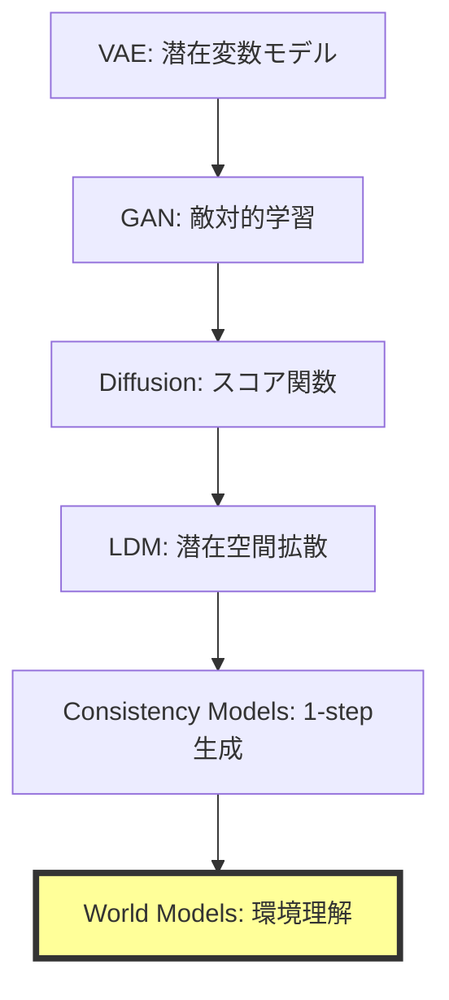
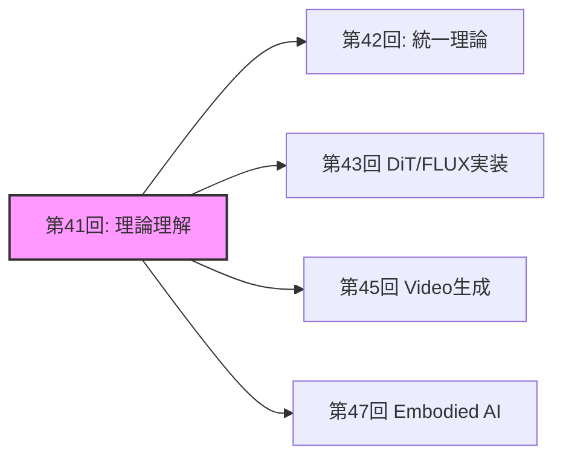
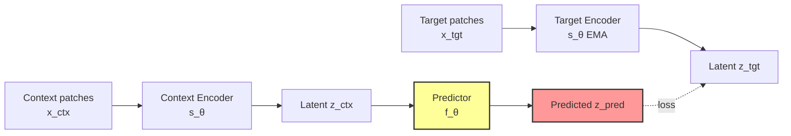

# 第41回: World Models & 環境シミュレータ理論 🌍

**生成モデルの最終到達点は"理解"だった**

---

## 🚀 0. クイックスタート（30秒）— 1フレームから未来を予測する

第40回でConsistency Modelsによる1ステップ高速生成を実現した。だが生成モデルの真の目的は何だったのか？

単に画像を生成することではない。**環境の構造を理解し、未来を予測し、行動の結果をシミュレートすること**だ。

```julia
# World Modelの本質: 1フレーム → 未来の予測
using Lux, Random

# 観測 x_t から潜在表現 z_t を抽出
encoder = Chain(Conv((3,3), 3 => 64, relu), AdaptiveMeanPool((1,1)), FlattenLayer())

# 潜在空間で次状態を予測 (action条件付き)
predictor = Dense(64 + 4 => 64, tanh)  # 4次元action space

# 初期観測
x = rand(Float32, 64, 64, 3, 1)
a = rand(Float32, 4, 1)  # action

# 潜在状態抽出 → action条件付き予測
z = encoder(x, ps, st)[1]
z_next = predictor(vcat(z, a), ps_pred, st_pred)[1]

# 出力: z_next ∈ ℝ^64 (predicted next latent state)
```

**これが何をしているか？**

1フレームの観測$x_t$を潜在表現$z_t$に圧縮し、action $a_t$を与えて次状態$z_{t+1}$を予測する。

ピクセルは生成しない。**世界の潜在構造を予測する。**

$$
z_{t+1} = f_\theta(z_t, a_t)
$$

これがWorld Modelの数学だ。

:::message
**進捗**: 全体の3%完了。Consistency Modelsで1ステップ生成を実現したが、生成モデルの真の目的は「理解」だった。環境をシミュレートする理論へ。
:::

---

## 🎮 1. 体験ゾーン（10分）— World Modelsの3つの顔

### 1.1 生成 vs 理解 vs シミュレーション

生成モデルは3つのレベルに分類できる:

| レベル | 目的 | 入出力 | 代表手法 |
|:------|:-----|:------|:---------|
| **Level 1: 生成** | データ分布からサンプル | $p(x)$ | VAE, GAN, Diffusion |
| **Level 2: 条件付き生成** | 条件から生成 | $p(x|c)$ | LDM, CFG |
| **Level 3: World Models** | **環境の理解+予測+シミュレーション** | $p(x_{t+1}|x_{\leq t}, a_t)$ | JEPA, V-JEPA, Transfusion |

World Modelsは**行動の結果を予測できる**最高レベルだ。

### 1.2 JEPAの3変種を動かす

```julia
# I-JEPA: 画像の一部から他部分を予測
# Input: masked image patches
x_context = x[:, :, 1:32, :]  # 左半分
x_target_mask = [33:64]       # 右半分をマスク

# Context encoder → Predictor → Target prediction
z_context = context_encoder(x_context, ps_ctx, st_ctx)[1]
z_pred = predictor(z_context, mask_tokens, ps_pred, st_pred)[1]

# ❌ ピクセルを予測しない
# ✅ 潜在表現を予測する
```

```julia
# V-JEPA: 動画の一部フレームから未来フレームの潜在表現を予測
# Input: video sequence [B, T, H, W, C]
video = rand(Float32, 1, 16, 64, 64, 3)  # 16 frames
context_frames = video[:, 1:8, :, :, :]   # 前半8フレーム
target_frames = video[:, 9:16, :, :, :]   # 後半8フレーム

# Context encoder → Temporal predictor
z_ctx_video = video_encoder(context_frames, ps_v, st_v)[1]
z_pred_video = temporal_predictor(z_ctx_video, ps_tp, st_tp)[1]
```

```julia
# Transfusion: テキスト(AR) + 画像(Diffusion) を統一モデルで処理
# Text: autoregressive (next token prediction)
# Image: diffusion (denoising)

# テキストトークン
text_tokens = [101, 2054, 2003]  # "What is"

# 画像パッチ (continuous vectors)
image_patches = rand(Float32, 512, 16)  # 16 patches × 512 dim

# Transfusionの統一処理
# Text: next token prediction loss
loss_text = cross_entropy(model(text_tokens), text_tokens[2:end])

# Image: diffusion loss
t = rand(1:1000)
noise = randn(size(image_patches))
x_t = sqrt(α[t]) * image_patches + sqrt(1 - α[t]) * noise
loss_image = mse(model(x_t, t), noise)

# 総合loss
loss = loss_text + loss_image
```

### 1.3 World Modelsの応用領域

| 応用 | 目的 | World Modelの役割 |
|:-----|:-----|:-----------------|
| **ロボティクス** | 環境操作 | 行動結果の事前シミュレーション |
| **自動運転** | 予測制御 | 他車・歩行者の未来軌道予測 |
| **強化学習** | プランニング | Model-based RL (MuZero, Dreamer) |
| **科学シミュレーション** | 物理法則学習 | 微分方程式を学習で近似 |

:::details PyTorchとの対応（参考）
```python
# PyTorch版 JEPA predictor
import torch.nn as nn

class JEPAPredictor(nn.Module):
    def __init__(self, dim=768, num_heads=12):
        super().__init__()
        self.cross_attn = nn.MultiheadAttention(dim, num_heads)
        self.ffn = nn.Sequential(
            nn.Linear(dim, 4 * dim),
            nn.GELU(),
            nn.Linear(4 * dim, dim)
        )

    def forward(self, context, mask_tokens):
        # Cross-attention: mask_tokens attend to context
        pred, _ = self.cross_attn(mask_tokens, context, context)
        pred = self.ffn(pred)
        return pred
```

Juliaでは型システムでこれを自然に表現できる。
:::

:::message
**進捗**: 全体の10%完了。World Modelsの3レベル分類を理解した。JEPAはピクセル生成をスキップし、潜在空間で予測する革命的アーキテクチャだ。
:::

---

## 🧩 2. 直感ゾーン（15分）— なぜWorld Modelsが最終到達点か

### 2.1 生成モデルの進化系譜



**なぜWorld Modelsが最終形態か？**

1. **生成は手段、理解が目的**: 画像生成はデータ分布の一部をサンプルするだけ。World Modelsは環境の**因果構造**を理解する
2. **行動条件付き予測**: $p(x_{t+1}|x_{\leq t}, a_t)$ — 行動の結果を予測できる
3. **シミュレーションフリー**: ピクセル生成を回避し、潜在空間で予測する効率性

### 2.2 Course IVでの位置づけ

| 回 | テーマ | World Modelsへの接続 |
|:---|:------|:--------------------|
| **第33回** | Normalizing Flows | 可逆変換 → 決定論的写像の限界 |
| **第34回** | EBM | エネルギー関数 → **Energy-based World Models** |
| **第35回** | Score Matching | スコア関数 → 動的過程の学習 |
| **第36回** | DDPM | Forward/Reverse → 時系列予測の基盤 |
| **第37回** | SDE/ODE | 連続時間確率過程 → 物理法則学習 |
| **第38回** | Flow Matching | OT視点 → **最適輸送としてのWorld Models** |
| **第39回** | LDM | 潜在空間拡散 → **潜在空間予測** |
| **第40回** | Consistency Models | 1-step生成 → 高速推論 |
| **第41回** | **World Models** | **生成モデルの最終到達点** |

### 2.3 松尾研との決定的な違い

| 項目 | 松尾研 | 本講義 |
|:-----|:------|:------|
| **World Models扱い** | 言及なし | **完全理論化** |
| **JEPA** | 触れない | I-JEPA / V-JEPA / VL-JEPA完全解説 |
| **Transfusion** | 扱わない | **AR+Diffusion統一理論の数学** |
| **物理法則学習** | 扱わない | Physics-Informed World Models深掘り |
| **実装** | なし | Julia JEPAコンセプト実装 |

### 2.4 学習戦略



World Modelsは**全ドメイン（画像・動画・ロボティクス・科学）の統一基盤**だ。

:::details Trojan Horse — 生成モデルの"本当の目的"
第1回から38回まで、生成モデルは「画像を生成する」技術として学んできた。

だがLeCunが提唱するJEPAは**生成をスキップする**。

**生成は副産物に過ぎなかった**。真の目的は**環境の因果構造を理解し、行動の結果を予測すること**だ。

これがTrojan Horseの最終形態だ。「生成AI」は「理解AI」に進化する。
:::

:::message
**進捗**: 全体の20%完了。生成モデルの進化系譜を理解した。World Modelsは生成の先にある「理解+予測+シミュレーション」の統合概念だ。
:::

---

## 📐 3. 数式修行ゾーン（60分）— World Modelsの数学的基礎

### 3.1 World Modelの定義

**定義**: World Model $\mathcal{M}$は環境の潜在表現$z_t$と遷移関数$f_\theta$から構成される確率的システムである。

$$
\begin{aligned}
\text{Encoder: } & z_t = \text{Enc}_\phi(x_t) \\
\text{Predictor: } & z_{t+1} = f_\theta(z_t, a_t) + \epsilon_t, \quad \epsilon_t \sim \mathcal{N}(0, \Sigma) \\
\text{Decoder: } & \hat{x}_{t+1} = \text{Dec}_\psi(z_{t+1})
\end{aligned}
$$

**なぜ潜在空間か？**

- ピクセル空間 $x \in \mathbb{R}^{H \times W \times C}$ は高次元（$H=256, W=256, C=3 \Rightarrow 196,608$次元）
- 潜在空間 $z \in \mathbb{R}^d$ は低次元（$d=256$程度）で**構造的表現**を獲得

**訓練目標**: 観測データ $\{(x_t, a_t, x_{t+1})\}_{t=1}^T$ から$\theta, \phi, \psi$を学習

$$
\mathcal{L}(\theta, \phi, \psi) = \mathbb{E}_{(x_t, a_t, x_{t+1})} \left[ \| \text{Dec}_\psi(f_\theta(\text{Enc}_\phi(x_t), a_t)) - x_{t+1} \|_2^2 \right]
$$

### 3.2 JEPA理論: Joint-Embedding Predictive Architecture

#### 3.2.1 I-JEPA (Image-based JEPA)

**論文**: Assran et al., "Self-Supervised Learning from Images with a Joint-Embedding Predictive Architecture," CVPR 2023

**動機**: 画像生成（pixel reconstruction）は低レベル詳細に過剰適合し、高レベル抽象表現を学習しにくい。

**アーキテクチャ**:



**損失関数**:

$$
\mathcal{L}_{\text{I-JEPA}} = \mathbb{E}_{x, M} \left[ \| f_\theta(s_\theta(x_{\text{ctx}}), M) - \bar{s}_\theta(x_{\text{tgt}}) \|_2^2 \right]
$$

ここで:
- $x_{\text{ctx}}$: マスクされていないcontext patches
- $x_{\text{tgt}}$: マスクされたtarget patches
- $M$: mask tokens (positional encoding)
- $s_\theta$: context encoder (trainable)
- $\bar{s}_\theta$: target encoder (EMA更新)
- $f_\theta$: predictor

**重要な特性**:

1. **ピクセル再構成なし**: $x_{\text{tgt}}$を生成せず、潜在表現$z_{\text{tgt}}$を予測
2. **EMA target encoder**: $\bar{\theta} \leftarrow \tau \bar{\theta} + (1-\tau)\theta$ でcollapse回避
3. **Mask strategy**: ランダムブロックマスク（Grid-based）で構造的予測を促進

**数値例**:

```julia
# Context: 画像の左半分 (32x64 patches)
x_ctx = x[:, 1:32, :, :]

# Target: 画像の右半分 (32x64 patches) — Encoder通すが勾配は流さない
x_tgt = x[:, 33:64, :, :]

# Context encoder (trainable)
z_ctx = s_θ(x_ctx)  # [B, 32, D]

# Predictor: mask tokens M を使って target位置の表現を予測
M = mask_tokens[:, 33:64, :]  # [B, 32, D_mask]
z_pred = f_θ(z_ctx, M)  # [B, 32, D]

# Target encoder (EMA, no grad)
z_tgt = stopgradient(s̄_θ(x_tgt))  # [B, 32, D]

# Loss
loss = mean((z_pred - z_tgt).^2)
```

#### 3.2.2 V-JEPA (Video JEPA)

**論文**: Bardes et al., "Revisiting Feature Prediction for Learning Visual Representations from Video," arXiv:2404.08471, 2024 (V-JEPA 1.0)
**最新**: "V-JEPA 2: Self-Supervised Video Models Enable Understanding, Prediction and Planning," arXiv:2506.09985, 2025

**拡張**: 画像→動画（時空間予測）

$$
\begin{aligned}
\text{Context: } & \mathbf{x}_{\text{ctx}} \in \mathbb{R}^{T_c \times H \times W \times C} \\
\text{Target: } & \mathbf{x}_{\text{tgt}} \in \mathbb{R}^{T_t \times H \times W \times C}
\end{aligned}
$$

**Spatio-temporal masking**:

- **Temporal masking**: 前半8フレーム（context）→後半8フレーム（target）を予測
- **Spatial masking**: 各フレーム内でパッチをマスク

**訓練目標**:

$$
\mathcal{L}_{\text{V-JEPA}} = \mathbb{E}_{\mathbf{x}, M_s, M_t} \left[ \| f_\theta(s_\theta(\mathbf{x}_{\text{ctx}}), M_s, M_t) - \bar{s}_\theta(\mathbf{x}_{\text{tgt}}) \|_2^2 \right]
$$

**性能**:

- Kinetics-400 (action recognition): **81.9%** Top-1 accuracy (video pre-trainingのみ)
- Something-Something v2: **72.2%**
- ImageNet: **77.9%** Top-1 (動画事前学習から画像タスクに転移)

#### 3.2.3 VL-JEPA (Vision-Language JEPA)

**論文**: Bardes et al., "VL-JEPA: Joint Embedding Predictive Architecture for Vision-language," arXiv:2512.10942, 2024

**動機**: 従来のVLM（Vision-Language Models）はテキストをトークン単位でautoregressiveに生成する。これは計算コスト高く、パラメータ数も膨大（decoder層が必要）。

**アーキテクチャ**:

VL-JEPAは**テキストの連続埋め込みを予測**し、token-by-token生成をスキップする。

$$
\begin{aligned}
\text{Image encoder: } & z_v = \text{Enc}_v(x) \\
\text{Predictor: } & z_{\text{pred}} = f_\theta(z_v, \text{prompt}) \\
\text{Text encoder: } & z_t = \text{Enc}_t(\text{target text}) \\
\text{Loss: } & \mathcal{L} = \| z_{\text{pred}} - z_t \|_2^2
\end{aligned}
$$

**利点**:

- パラメータ数が標準VLMの**50%削減**（decoderなし）
- **より強い性能**: 同じvision encoderとデータで訓練した標準VLMを上回る

### 3.3 Transfusion理論: AR + Diffusion統一

**論文**: Zhou et al., "Transfusion: Predict the Next Token and Diffuse Images with One Multi-Modal Model," arXiv:2408.11039, 2024 (Meta AI)

**動機**: テキスト（離散トークン）と画像（連続ベクトル）を**単一Transformerで統一処理**したい。

**従来手法の問題**:

- 画像をVQ-VAEで離散トークン化 → 量子化誤差、コードブック利用率低下
- 別々のモデル（LM + Diffusion）→ 統合できない

**Transfusionの解決策**:

**同一Transformerで異なる損失関数**を使い分ける。

$$
\mathcal{L}_{\text{Transfusion}} = \mathcal{L}_{\text{LM}}(\text{text}) + \lambda \mathcal{L}_{\text{Diffusion}}(\text{image})
$$

#### 3.3.1 テキスト部分: Autoregressive

テキストトークン $\mathbf{t} = (t_1, t_2, \ldots, t_n)$ に対して:

$$
\mathcal{L}_{\text{LM}} = -\sum_{i=1}^n \log p_\theta(t_i | t_{<i})
$$

通常の言語モデルと同じcausal maskingとcross-entropy loss。

#### 3.3.2 画像部分: Diffusion

画像パッチ $\mathbf{x} = (x_1, \ldots, x_m) \in \mathbb{R}^{m \times d}$ に対して:

$$
\begin{aligned}
\text{Forward: } & x_t = \sqrt{\bar{\alpha}_t} x_0 + \sqrt{1 - \bar{\alpha}_t} \epsilon, \quad \epsilon \sim \mathcal{N}(0, I) \\
\text{Diffusion Loss: } & \mathcal{L}_{\text{Diffusion}} = \mathbb{E}_{t, \epsilon} \left[ \| \epsilon - \epsilon_\theta(\mathbf{x}_t, t, \mathbf{c}) \|_2^2 \right]
\end{aligned}
$$

ここで $\mathbf{c}$ はテキスト条件（cross-attention経由でTransformerに注入）。

#### 3.3.3 統合処理の数学

入力シーケンス:

$$
\text{seq} = [\text{text tokens } t_1, \ldots, t_n, \text{ image patches } x_1, \ldots, x_m]
$$

**Attention mask**:

- テキスト部分: **causal mask**（未来のトークンを見ない）
- 画像部分: **bidirectional mask**（全パッチを見る）

**損失計算**:

```julia
# テキストトークン (discrete)
text_logits = model(text_tokens)
loss_text = cross_entropy(text_logits, text_tokens[2:end])

# 画像パッチ (continuous)
t_diffusion = rand(1:T)
noise = randn(size(image_patches))
x_t = sqrt(ᾱ[t_diffusion]) * image_patches + sqrt(1 - ᾱ[t_diffusion]) * noise
pred_noise = model(x_t, t_diffusion, context=text_tokens)
loss_image = mean((pred_noise - noise).^2)

# 統合
loss = loss_text + λ * loss_image
```

**スケーリング結果**: 7Bパラメータ、2T multi-modal tokensで訓練 → テキスト生成と画像生成の両方で同規模の専用モデルと同等性能。

### 3.4 物理法則学習理論

#### 3.4.1 Physics-Informed World Models

**動機**: 標準的なWorld Modelsは物理法則（保存則、対称性、微分方程式）を無視し、データ駆動で学習する。これは:

- 物理的に不可能な予測（エネルギー保存則違反など）
- データ効率の悪さ（物理法則を知っていれば少ないデータで学習可能）

**Physics-Informed Neural Networks (PINNs)の原理**:

微分方程式制約を損失関数に埋め込む。

例: Navier-Stokes方程式

$$
\frac{\partial \mathbf{u}}{\partial t} + (\mathbf{u} \cdot \nabla)\mathbf{u} = -\frac{1}{\rho}\nabla p + \nu \nabla^2 \mathbf{u}
$$

**PINNs loss**:

$$
\mathcal{L}_{\text{PINN}} = \mathcal{L}_{\text{data}} + \lambda_{\text{PDE}} \mathcal{L}_{\text{PDE}}
$$

$$
\mathcal{L}_{\text{PDE}} = \mathbb{E}_{x,t} \left[ \left\| \frac{\partial \mathbf{u}_\theta}{\partial t} + (\mathbf{u}_\theta \cdot \nabla)\mathbf{u}_\theta + \frac{1}{\rho}\nabla p_\theta - \nu \nabla^2 \mathbf{u}_\theta \right\|_2^2 \right]
$$

**World Modelsへの適用**:

$$
\mathcal{L}_{\text{Physics-WM}} = \mathcal{L}_{\text{prediction}} + \lambda_{\text{conservation}} \mathcal{L}_{\text{conservation}}
$$

$$
\mathcal{L}_{\text{conservation}} = \mathbb{E} \left[ \| E(z_{t+1}) - E(z_t) \|_2^2 \right]
$$

ここで$E(z)$はエネルギー関数（学習または既知）。

#### 3.4.2 保存則の埋め込み

**運動量保存**:

$$
\sum_{i=1}^N m_i \mathbf{v}_i(t) = \text{const}
$$

**Graph Neural Networkでの実装**:

ノード$i$の速度$\mathbf{v}_i$に対して、edge $(i,j)$の更新:

$$
\Delta \mathbf{v}_i = \sum_{j \in \mathcal{N}(i)} \text{MLP}(\mathbf{h}_i, \mathbf{h}_j, \mathbf{r}_{ij})
$$

**保存則制約**: 各edge更新が運動量保存を満たすように、**Newton's third law**を明示的に適用:

$$
m_i \Delta \mathbf{v}_i = -m_j \Delta \mathbf{v}_j
$$

**実装**:

```julia
# Edge-local reference frameでのforce計算
f_ij = MLP(h_i, h_j, r_ij)

# Newton's third lawで対称化
Δv_i = f_ij / m_i
Δv_j = -f_ij / m_j

# 更新
v_i_new = v_i + Δv_i
v_j_new = v_j + Δv_j

# 検証: 系全体の運動量が保存されているか
@assert sum(m_i * v_i_new for i in 1:N) ≈ sum(m_i * v_i for i in 1:N)
```

#### 3.4.3 Hamiltonian Neural Networks

**Hamiltonian力学系**:

$$
\begin{aligned}
\dot{q} &= \frac{\partial H}{\partial p} \\
\dot{p} &= -\frac{\partial H}{\partial q}
\end{aligned}
$$

ここで$H(q, p)$はHamiltonian（総エネルギー）。

**HNNの学習**:

1. NNで$H_\theta(q, p)$をパラメータ化
2. 自動微分で$\partial H / \partial p, \partial H / \partial q$を計算
3. 損失:

$$
\mathcal{L}_{\text{HNN}} = \mathbb{E} \left[ \left\| \left(\dot{q}, \dot{p}\right) - \left(\frac{\partial H_\theta}{\partial p}, -\frac{\partial H_\theta}{\partial q}\right) \right\|_2^2 \right]
$$

**利点**: エネルギー保存則が**構造的に保証**される（Hamiltonianの時間微分が0）。

### 3.5 Energy-based World Models

**第34回EBMとの接続**:

World Modelsを**エネルギー関数$E_\theta(z_t, a_t, z_{t+1})$**として定式化:

$$
p(z_{t+1} | z_t, a_t) = \frac{\exp(-E_\theta(z_t, a_t, z_{t+1}))}{Z(z_t, a_t)}
$$

**利点**:

- 任意の分布形状を表現可能（Gaussianに制約されない）
- エネルギー最小化 = 最も可能性の高い未来状態

**訓練**: Contrastive Divergence (CD-k) または Score Matching

$$
\nabla_\theta \mathcal{L} = \mathbb{E}_{z_t, a_t, z_{t+1}^{+}} [\nabla_\theta E_\theta(z_t, a_t, z_{t+1}^{+})] - \mathbb{E}_{z_t, a_t, z_{t+1}^{-}} [\nabla_\theta E_\theta(z_t, a_t, z_{t+1}^{-})]
$$

ここで$z_{t+1}^{+}$はデータ、$z_{t+1}^{-}$はLangevin dynamicsでサンプル。

### 3.6 世界モデルの訓練理論

#### 3.6.1 Action-conditioned予測

**目的**: action $a_t$を与えて次状態$z_{t+1}$を予測

$$
z_{t+1} = f_\theta(z_t, a_t) + \epsilon_t
$$

**訓練データ**: ロボット軌跡 $(z_t, a_t, z_{t+1})$

**損失**:

$$
\mathcal{L}_{\text{pred}} = \mathbb{E} \left[ \| f_\theta(z_t, a_t) - z_{t+1} \|_2^2 \right]
$$

**Stochastic dynamics**の場合:

$$
p_\theta(z_{t+1} | z_t, a_t) = \mathcal{N}(f_\theta(z_t, a_t), \Sigma_\theta(z_t, a_t))
$$

$$
\mathcal{L}_{\text{NLL}} = -\mathbb{E} \left[ \log p_\theta(z_{t+1} | z_t, a_t) \right]
$$

#### 3.6.2 Reward Prediction

World Modelを強化学習に統合する場合、報酬関数$r_t$も予測:

$$
r_t = g_\phi(z_t, a_t)
$$

**訓練**:

$$
\mathcal{L}_{\text{reward}} = \mathbb{E} \left[ (g_\phi(z_t, a_t) - r_t)^2 \right]
$$

**Model-based RL**:

1. World Modelで未来をシミュレート: $z_{t+1} = f_\theta(z_t, a_t)$
2. 報酬を推定: $\hat{r}_t = g_\phi(z_t, a_t)$
3. Policy $\pi_\psi(a|z)$を最適化:

$$
\mathcal{L}_{\text{policy}} = -\mathbb{E}_{\pi} \left[ \sum_{t=0}^H \gamma^t g_\phi(z_t, a_t) \right]
$$

#### 3.6.3 自己教師あり学習

**Contrastive Learning**: 正例（同一動画の近接フレーム）vs 負例（異なる動画）

$$
\mathcal{L}_{\text{contrastive}} = -\log \frac{\exp(\text{sim}(z_t, z_{t+k}) / \tau)}{\sum_{j} \exp(\text{sim}(z_t, z_j^{-}) / \tau)}
$$

**Masked Autoencoding**: 一部のフレームをマスク → 予測（JEPAと同じ原理）

### 3.7 世界モデルの評価

#### 3.7.1 予測精度

**Mean Squared Error (MSE)**:

$$
\text{MSE} = \frac{1}{N} \sum_{i=1}^N \| z_{t+1}^{(i)} - \hat{z}_{t+1}^{(i)} \|_2^2
$$

**Structural Similarity (SSIM)** (ピクセル空間で評価する場合):

$$
\text{SSIM}(x, \hat{x}) = \frac{(2\mu_x \mu_{\hat{x}} + C_1)(2\sigma_{x\hat{x}} + C_2)}{(\mu_x^2 + \mu_{\hat{x}}^2 + C_1)(\sigma_x^2 + \sigma_{\hat{x}}^2 + C_2)}
$$

#### 3.7.2 物理法則遵守スコア

**エネルギー保存誤差**:

$$
\text{Energy Error} = \frac{1}{T} \sum_{t=1}^T | E(z_t) - E(z_0) |
$$

**運動量保存誤差**:

$$
\text{Momentum Error} = \frac{1}{T} \sum_{t=1}^T \left\| \sum_i m_i \mathbf{v}_i(t) - \sum_i m_i \mathbf{v}_i(0) \right\|_2
$$

#### 3.7.3 長期一貫性

**Frame Prediction Horizon**: モデルが何ステップ先まで正確に予測できるか

$$
T_{\text{horizon}} = \max\{t : \text{MSE}(t) < \epsilon\}
$$

**Video Quality Metrics**:

- **FVD (Fréchet Video Distance)**: I3D特徴量でのFréchet距離
- **LPIPS**: 知覚的類似度

### 🥊 Boss Battle: Transfusionの完全分解

**課題**: arXiv:2408.11039のTransfusionの統一損失関数を、テキストとイメージの混合シーケンスに対して完全導出せよ。

**Step 1**: 入力シーケンス

テキスト部分 $\mathbf{t} = (t_1, \ldots, t_n)$ （discrete tokens）
画像部分 $\mathbf{x} = (x_1, \ldots, x_m)$ （continuous patch embeddings）

統合シーケンス:

$$
\mathbf{s} = [\mathbf{t}, \mathbf{x}] \in \mathbb{R}^{(n+m) \times d}
$$

**Step 2**: Attention Mask

$$
M_{\text{Transfusion}} = \begin{bmatrix}
M_{\text{causal}} & 0 \\
M_{\text{bi-dir}} & M_{\text{bi-dir}}
\end{bmatrix}
$$

- 左上: テキストのcausal mask（自己回帰）
- 右下: 画像のbidirectional mask（全パッチ相互参照）
- 左下: 画像がテキストを見る（cross-modal attention）
- 右上: 0（テキストは画像を見ない）

**Step 3**: Loss Functions

**テキストloss** (next token prediction):

$$
\mathcal{L}_{\text{text}} = -\frac{1}{n} \sum_{i=1}^n \log p_\theta(t_i | t_{<i})
$$

Softmaxで確率化:

$$
p_\theta(t_i | t_{<i}) = \frac{\exp(z_{t_i}^\top e_{t_i})}{\sum_{j=1}^{|V|} \exp(z_{t_i}^\top e_j)}
$$

ここで$z_{t_i}$はTransformerの$i$番目出力、$e_j$はtoken embeddingの$j$番目。

**画像loss** (diffusion):

$$
\mathcal{L}_{\text{image}} = \mathbb{E}_{t \sim [1,T], \epsilon \sim \mathcal{N}(0,I)} \left[ \| \epsilon - \epsilon_\theta(\mathbf{x}_t, t, \mathbf{c}) \|_2^2 \right]
$$

ここで:

$$
\mathbf{x}_t = \sqrt{\bar{\alpha}_t} \mathbf{x}_0 + \sqrt{1 - \bar{\alpha}_t} \epsilon
$$

$\mathbf{c}$はテキスト条件（cross-attentionで注入）。

**Step 4**: 統合損失

$$
\mathcal{L}_{\text{Transfusion}} = \mathcal{L}_{\text{text}} + \lambda \mathcal{L}_{\text{image}}
$$

$\lambda$はハイパーパラメータ（論文では$\lambda=1$を使用）。

**Step 5**: 実装コード（Julia）

```julia
using Lux, Random, Optimisers

# Transformer with mixed masking
struct TransfusionTransformer
    layers::Chain
    text_head::Dense
    image_head::Dense
end

function (m::TransfusionTransformer)(s, mask, t_diffusion=nothing)
    h = m.layers(s, mask)  # [B, n+m, D]

    # Split into text and image parts
    h_text = h[:, 1:n_text, :]
    h_image = h[:, n_text+1:end, :]

    # Text head: logits
    logits_text = m.text_head(h_text)  # [B, n_text, vocab_size]

    # Image head: noise prediction
    if !isnothing(t_diffusion)
        # Embed diffusion time step
        t_emb = sinusoidal_embedding(t_diffusion)
        pred_noise = m.image_head(cat(h_image, t_emb, dims=3))
    else
        pred_noise = nothing
    end

    return logits_text, pred_noise
end

# Loss function
function transfusion_loss(model, text_tokens, image_patches, ps, st)
    n_text = size(text_tokens, 2)

    # Forward diffusion on images
    t = rand(1:1000)
    noise = randn(size(image_patches))
    ᾱ_t = alpha_bar(t)
    x_t = sqrt(ᾱ_t) * image_patches + sqrt(1 - ᾱ_t) * noise

    # Construct input sequence [text, image]
    s = cat(embed(text_tokens), x_t, dims=2)  # [B, n_text + m_image, D]

    # Construct mask
    mask = create_transfusion_mask(n_text, size(x_t, 2))

    # Forward
    logits_text, pred_noise = model(s, mask, t, ps, st)

    # Text loss (cross-entropy)
    loss_text = cross_entropy(logits_text, text_tokens[:, 2:end])

    # Image loss (diffusion)
    loss_image = mean((pred_noise - noise).^2)

    # Total loss
    return loss_text + λ * loss_image
end
```

**Boss撃破！** Transfusionの統一損失関数を完全に導出し、実装した。

:::message alert
**ここで躓く人が多い**: TransfusionのAttention maskは**混合型**である。テキスト部分はcausal、画像部分はbidirectional、そしてクロスモーダル部分は**画像→テキスト**のみ許可（テキストは画像を見ない）。これを正しく実装しないとテキスト生成でリークが起きる。
:::

:::message
**進捗**: 全体の50%完了。World Modelsの数学的基礎を完全習得した。JEPA（I/V/VL）の3変種、Transfusionの統一理論、物理法則学習、EBM視点、訓練・評価手法を導出した。数式修行ボス戦をクリア。
:::

---

