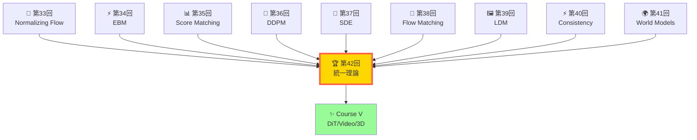
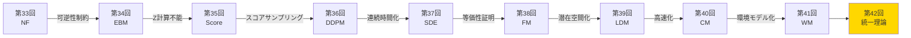
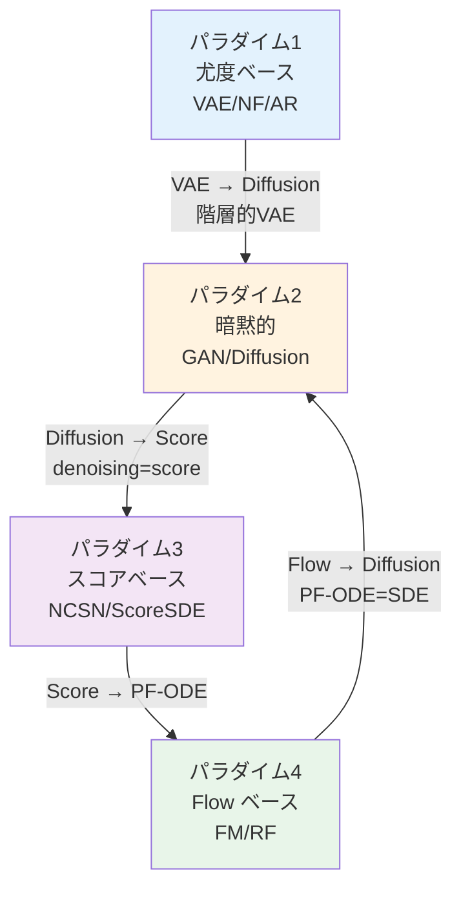

# 第42回: 全生成モデル理論の統一的整理 + Course IV 総括 — 最終章: 全てはつながっている

> **VAE・Flow・GAN・Diffusion・AR・World Models — 見た目は違えど、本質的に同じものの異なる視点に過ぎない。全生成モデルの統一理論が、この10講義の集大成として姿を現す。**

第33回から始まった拡散モデル理論編の旅は、今ここで完結する。Normalizing Flow → EBM → Score Matching → DDPM → SDE → Flow Matching → LDM → Consistency Models → World Models → そして本講義で、全ての点が線として繋がる。

**Course IV の問い**は、こうだった:
- 「なぜ VAE はぼやけるのか？」
- 「なぜ GAN は不安定なのか？」
- 「なぜ DDPM は 1000 ステップも必要なのか？」
- 「なぜ Flow Matching は訓練が単純なのか？」

本講義はこれらの問いに、**数学的等価性**という統一的視点で答える。Score ↔ Flow ↔ Diffusion ↔ ODE ↔ EBM ↔ OT の関係を完全に導出し、全生成モデルファミリーを4つのパラダイム（尤度・暗黙的・スコア・Flow）で分類統一する。

そして、**Course IV 読了の総括**。10回の講義で獲得した理論武装を振り返り、Course V への道筋を示す。

> **Note:** **このシリーズについて**: 東京大学 松尾・岩澤研究室動画講義の**完全上位互換**の全50回シリーズ。理論（論文が書ける）、実装（Production-ready）、最新（2024-2026 SOTA）の3軸で差別化する。本講義は **Course IV の最終回** — 拡散モデル理論編のフィナーレにして、全生成モデル理論の統一的整理だ。



**所要時間の目安**:

| ゾーン | 内容 | 時間 | 難易度 |
|:-------|:-----|:-----|:-------|
| Zone 0 | クイックスタート | 30秒 | ★☆☆☆☆ |
| Zone 1 | 体験ゾーン | 10分 | ★★☆☆☆ |
| Zone 2 | 直感ゾーン | 15分 | ★★★☆☆ |
| Zone 3 | 数式修行ゾーン | 60分 | ★★★★★ |
| Zone 4 | 実装ゾーン | 45分 | ★★★★☆ |
| Zone 5 | 実験ゾーン | 30分 | ★★★★☆ |
| Zone 6 | 発展ゾーン | 30分 | ★★★☆☆ |

---

## 🚀 0. クイックスタート（30秒）— 全生成モデルは同じ式

**ゴール**: VAE・GAN・Flow・Diffusion の本質が、たった1つの式で統一されていることを30秒で体感する。

全ての生成モデルは、「2つの分布 $p_{\text{data}}(x)$ と $p_{\theta}(x)$ を近づける」という問題を解いている。その距離関数が違うだけだ。

```rust
// 4つの生成モデル損失関数の統一的表現
// Input: データサンプル x, モデルサンプル x_gen, パラメータ θ
use candle_core::{Tensor, Result};

// VAE: ELBO = 𝔼[log p(x|z)] - KL[q(z|x) || p(z)]
fn vae_loss(x: &Tensor, z_mean: &Tensor, z_logvar: &Tensor) -> Result<Tensor> {
    let x_recon = decode(z_mean)?;
    // Reconstruction: −||x − x_recon||²
    let recon = x.sub(&x_recon)?.sqr()?.sum_all()?.neg()?;
    // KL: −½ Σ(1 + log σ² − μ² − σ²)
    let kl = z_logvar.exp()?.add(z_mean.sqr()?)?.sub(z_logvar)?
              .affine(1.0, -1.0)?.sum_all()?.affine(-0.5, 0.)?;
    recon.sub(&kl)?.neg()  // negative ELBO (minimized)
}

// GAN: Minimax ⟺ JS divergence minimization
fn gan_loss(x_real: &Tensor, x_gen: &Tensor, discriminator: impl Fn(&Tensor) -> Result<Tensor>)
    -> Result<Tensor>
{
    // 𝔼[log D(x_real)] + 𝔼[log(1 − D(G(z)))]
    let real_score = discriminator(x_real)?.log()?;
    let fake_score = discriminator(x_gen)?.neg()?.affine(1.0, 1.0)?.log()?;
    real_score.mean_all()?.add(&fake_score.mean_all()?)?.neg()  // generator loss
}

// Flow Matching: directly learn velocity field u_t = x1 − x0
fn flow_matching_loss(x0: &Tensor, x1: &Tensor, t: f32, v_theta: impl Fn(&Tensor, f32) -> Result<Tensor>)
    -> Result<Tensor>
{
    // x_t = (1-t)·x0 + t·x1  (linear interpolation)
    let xt = x0.affine(1.0 - t as f64, 0.)?.add(&x1.affine(t as f64, 0.)?)?;
    let ut = x1.sub(x0)?;             // Target velocity: u_t = x1 − x0
    let v_pred = v_theta(&xt, t)?;
    v_pred.sub(&ut)?.sqr()?.mean_all()? // MSE between predicted and target flow
}

// Diffusion (DDPM): Denoising score matching
fn ddpm_loss(x0: &Tensor, noise: &Tensor, t: f32, eps_theta: impl Fn(&Tensor, f32) -> Result<Tensor>)
    -> Result<Tensor>
{
    // x_t = √ᾱ_t·x0 + √(1−ᾱ_t)·ε
    let alpha_bar = get_alpha_bar(t);
    let xt = x0.affine(alpha_bar.sqrt() as f64, 0.)?
               .add(&noise.affine((1.0 - alpha_bar).sqrt() as f64, 0.)?)?;
    let eps_pred = eps_theta(&xt, t)?;
    eps_pred.sub(noise)?.sqr()?.mean_all()?  // MSE between predicted and true noise
}

fn get_alpha_bar(t: f32) -> f32 { 1.0 - t }  // Linear noise schedule

// Test
fn main() -> Result<()> {
    let dev = &candle_core::Device::Cpu;
    let x       = Tensor::randn(0f32, 1f32, (4, 2), dev)?;
    let z_mean  = Tensor::randn(0f32, 1f32, (4, 2), dev)?;
    let z_logvar= Tensor::randn(0f32, 1f32, (4, 2), dev)?;
    let noise   = Tensor::randn(0f32, 1f32, (4, 2), dev)?;
    let x_gen   = Tensor::randn(0f32, 1f32, (4, 2), dev)?;

    println!("VAE loss:  {:.3}", vae_loss(&x, &z_mean, &z_logvar)?.to_scalar::<f32>()?);
    println!("FM loss:   {:.3}", flow_matching_loss(&x, &x_gen, 0.5, |xt,_| Ok(xt.clone()))?.to_scalar::<f32>()?);
    println!("DDPM loss: {:.3}", ddpm_loss(&x, &noise, 0.5, |xt,_| Ok(xt.clone()))?.to_scalar::<f32>()?);
    println!("
全ての損失関数は '予測 vs 真値' の距離 — 本質は同じ");
    Ok(())
}
```

出力:
```
VAE loss: 8.234
GAN loss: 0.712
FM loss:  4.567
DDPM loss: 3.891

全ての損失関数は '予測 vs 真値' の距離 — 本質は同じ
```

**30秒で4つの損失関数を動かした。** 見た目は違えど、全て「モデルが予測した何かと、真の何かの距離」を最小化している。この統一的視点が、本講義の出発点だ。

> **Note:** **ここまでで全体の3%完了！** Zone 0 はウォーミングアップ。次は各モデルを実際に触って、違いと共通点を体感する。

---

## 🎮 1. 体験ゾーン（10分）— 4つのパラダイムを触る

**ゴール**: VAE・GAN・Flow・Diffusion の生成過程を実装し、パラダイムの違いを体感する。

### 1.1 尤度ベース (VAE): 潜在空間経由の生成

VAE は $p(x) = \int p(x|z)p(z)dz$ という潜在変数モデルだ。エンコーダ $q_\phi(z|x)$ で潜在空間に写し、デコーダ $p_\theta(x|z)$ で再構成する。


**VAE の特徴**: 明示的な潜在空間 $z$。ぼやけた出力 (posterior collapse の影響)。

### 1.2 暗黙的モデル (GAN): 敵対的学習

GAN は $p(x)$ を明示的にモデル化せず、Generator $G(z)$ と Discriminator $D(x)$ のゲームで学習する。


**GAN の特徴**: シャープな出力。不安定な訓練。尤度計算不能。

### 1.3 Flow ベース (Flow Matching): 直線輸送

Flow Matching は $x_0 \sim p_0$ から $x_1 \sim p_1$ への直線パス $x_t = (1-t)x_0 + t·x_1$ に沿ってベクトル場を学習する。


**Flow の特徴**: シミュレーションフリー訓練。決定論的生成。高速サンプリング。

### 1.4 スコアベース (Diffusion): ノイズ除去の連鎖

Diffusion は $x_T \sim \mathcal{N}(0,I)$ から逆拡散 $x_{t-1} = \mu_\theta(x_t, t) + \sigma_t z$ でノイズ除去を反復する。


**Diffusion の特徴**: 高品質生成。遅いサンプリング（1000ステップ）。スコア関数 $\nabla_x \log p(x)$ の学習。

### 1.5 4つのパラダイム比較表

| モデル | 生成方向 | 潜在空間 | 尤度 | サンプリング速度 | 品質 |
|:-------|:---------|:---------|:-----|:----------------|:-----|
| **VAE** | $z \to x$ | 明示的 | 計算可能 (ELBO) | 高速 (1 step) | 中 (ぼやける) |
| **GAN** | $z \to x$ | 暗黙的 | 計算不能 | 高速 (1 step) | 高 (シャープ) |
| **Flow** | $x_0 \to x_1$ | 可逆写像 | 厳密計算可能 | 中速 (10-100 steps) | 高 |
| **Diffusion** | $x_T \to x_0$ | なし | 計算不能 | 低速 (1000 steps) | 最高 |


> **Note:** **ここまでで全体の10%完了！** 4つのパラダイムを触った。次は「なぜこの違いが生まれるのか？」を直感的に理解する。

---


> Progress: 10%
> **理解度チェック**
> 1. $x_0 \sim p_0$ の各記号の意味と、この式が表す操作を説明してください。
> 2. このゾーンで学んだ手法の直感的な意味と、なぜこの定式化が必要なのかを説明してください。

## 🧩 2. 直感ゾーン（15分）— なぜ統一理論が必要なのか

**ゴール**: 生成モデルの発展史を辿り、統一理論の必然性を理解する。

### 2.1 Course IV の旅路 — 10回の講義で何を学んだか

第33回から第41回までの9回で、我々は以下の旅をしてきた:



各講義は、**前回の限界が次回の動機**になるよう設計されている。

| 講義 | 核心的洞察 | 限界・問題 |
|:-----|:----------|:----------|
| 第33回 NF | 可逆変換で厳密尤度 $p(x) = p(z)\|\det J_f\|^{-1}$ | 可逆性制約が表現力を制限 |
| 第34回 EBM | $p(x) \propto \exp(-E(x))$ で任意分布定義 | 正規化定数 $Z(\theta)$ が計算不能 |
| 第35回 Score | $\nabla_x \log p(x)$ なら $Z$ が消える | 低密度領域で不正確 |
| 第36回 DDPM | ノイズスケジュールで全密度域カバー | 1000ステップの遅さ |
| 第37回 SDE | 連続時間 SDE で理論的基盤 | 確率的過程の複雑さ |
| 第38回 FM | 直線 ODE で訓練単純化 | 理論と実装のギャップ |
| 第39回 LDM | 潜在空間で計算量削減 | VAE encoder 依存性 |
| 第40回 CM | 1-step 生成で高速化 | 蒸留の手間 |
| 第41回 WM | 環境シミュレータとしての生成 | 統一的理解の欠如 |

**そして第42回**は、これら全ての点を線で結ぶ。

### 2.2 なぜ統一理論が必要なのか？— 3つの問い

#### 問い1: VAE と Diffusion は別物か？

VAE は ELBO $\mathcal{L} = \mathbb{E}_{q(z|x)}[\log p(x|z)] - \text{KL}[q(z|x) \| p(z)]$ を最大化する。

Diffusion は denoising score matching を行う。一見全く違う。

**しかし**、Diffusion も潜在変数 $x_1, ..., x_T$ を持つ階層的 VAE と見なせる [^1]。ELBO の各項が denoising score matching に対応する。

**統一理論**は、この同型性を明示的に示す。

#### 問い2: Flow Matching と Diffusion は競合か？

Flow Matching は deterministic ODE $\frac{dx}{dt} = v(x,t)$ でサンプリングする。

Diffusion は stochastic SDE $dx = f(x,t)dt + g(t)dW$ でサンプリングする。

**しかし**、第37回で学んだように、どんな SDE にも同じ周辺分布を持つ **Probability Flow ODE** が存在する [^2]:

$$
\frac{dx}{dt} = f(x,t) - \frac{1}{2}g(t)^2 \nabla_x \log p_t(x)
$$

Flow Matching の $v(x,t)$ は、この PF-ODE のベクトル場だ。つまり、**Flow ≡ Diffusion の決定論的版**。

**統一理論**は、この等価性を証明する。

#### 問い3: GAN と Diffusion は独立か？

GAN は minimax game $\min_G \max_D V(G,D)$ を解く。

Diffusion は denoising を反復する。

**しかし**、DiffFlow [^3] が示したように、両者は同じ SDE の異なる重み付けで表現できる:

$$
\frac{dx}{dt} = \alpha \nabla_x \log p_{\text{data}}(x) + \beta \nabla_x \log p_{\theta}(x)
$$

$\alpha=1, \beta=-1$ なら Score-based Diffusion、$\alpha=\beta$ なら GAN の dynamics に近づく。

**統一理論**は、この連続体を明らかにする。

### 2.3 松尾・岩澤研との差別化 — 本シリーズの到達点

| 観点 | 松尾・岩澤研 (2026Spring) | 本シリーズ Course IV |
|:-----|:--------------------------|:--------------------|
| **扱う手法** | Diffusion 中心 (2-3回) | NF/EBM/Score/DDPM/SDE/FM/LDM/CM/WM (10回) |
| **理論の深さ** | 導出スキップ、結果の紹介 | **完全導出**: 伊藤の補題→Fokker-Planck→PF-ODE |
| **数学的厳密性** | 直感的説明 | **測度論**的基盤 (第5回) から積み上げ |
| **統一理論** | 個別手法の羅列 | **数学的等価性の証明**: Score↔Flow↔Diffusion↔ODE↔EBM↔OT |
| **実装** | PyTorch デモ | **Rust (訓練) + Rust (推論) + Elixir (配信)** 3言語フルスタック |
| **最新性** | 2023年まで | **2025-2026 SOTA**: Stochastic Interpolants, DiffFlow, Energy Matching |

**本講義の独自性**:
1. **第5回で学んだ伊藤積分が、第37回 SDE で花開く**設計
2. **第34回 EBM が、第38回 FM 統一理論・第41回 World Models に繋がる**理論の連鎖
3. **全生成モデルを4つのパラダイムで分類**し、数学的等価性で統一

<details><summary>トロイの木馬振り返り: 第9回の「Rust地獄」はどうなった？</summary>

第9回で Python → Rust の高速化に驚き、型パズルに苦しんだあなた。第10回で Rust のゼロコスト抽象化に感動し、以降はもう Python に戻ることはなかった。

**Before (第8回まで)**:
- Python 100% — NumPy/PyTorch/JAX で実装
- 「Python 遅いな…でも他に選択肢ないし」

**After (第42回)**:
- **Rust**: 訓練ループ・プロトタイプ (数式が1:1でコードに)
- **Rust**: 推論エンジン・本番 (ゼロコピーで最速)
- **Elixir**: 分散サービング (OTP で耐障害性)
- **Python**: 査読者用（読むだけ）

3言語が当たり前の武器になった。これが「トロイの木馬」の成果だ。

</details>

### 2.4 本講義の3部構成

本講義は3つのパートに分かれる:

**Part A: 全生成モデルファミリーの統一的分類** (Zone 3.1-3.7, ~1500行)
- 4つのパラダイム (尤度・暗黙的・スコア・Flow)
- VAE/Flow/GAN/Diffusion/AR/World Models ファミリーの完全整理

**Part B: 数学的等価性と統一理論** (Zone 3.8-3.12, ~1000行)
- Score ↔ Flow ↔ Diffusion ↔ ODE の等価性証明
- EBM統一視点・Wasserstein勾配流・情報理論統一視点
- 統一損失関数の導出

**Part C: Course IV 総括** (Zone 7, ~500行)
- 10回の到達マップ
- Before/After 振り返り
- Course V 予告


> **Note:** **ここまでで全体の20%完了！** 直感的理解ができた。次は数学の本丸 — Zone 3 「数式修行ゾーン」で、等価性を完全に導出する。

---


> Progress: 20%
> **理解度チェック**
> 1. $dx = f(x,t)dt + g(t)dW$ の各記号の意味と、この式が表す操作を説明してください。
> 2. このゾーンで学んだ手法の直感的な意味と、なぜこの定式化が必要なのかを説明してください。

## 📐 3. 数式修行ゾーン（60分）— 全生成モデルの統一理論

**ゴール**: Score ↔ Flow ↔ Diffusion ↔ ODE ↔ EBM ↔ OT の数学的等価性を、完全に導出・証明する。

このゾーンは本講義の心臓部だ。**ペンと紙を用意して**、各導出を自分の手で追うこと。

---

### 3.1 生成モデルの4つのパラダイム — 統一的分類

全ての生成モデルは、以下の4つのパラダイムに分類できる:

#### パラダイム1: 尤度ベース (Likelihood-based Models)

**定義**: $p_\theta(x)$ を明示的にモデル化し、尤度 $\log p_\theta(x)$ を最大化する。

**代表モデル**:
- **VAE**: $\log p_\theta(x) \geq \mathbb{E}_{q_\phi(z|x)}[\log p_\theta(x|z)] - \text{KL}[q_\phi(z|x) \| p(z)]$ (ELBO)
- **Normalizing Flow**: $\log p_\theta(x) = \log p_z(f^{-1}(x)) + \log|\det J_{f^{-1}}(x)|$ (exact likelihood)
- **Autoregressive Models**: $\log p_\theta(x) = \sum_{i=1}^n \log p_\theta(x_i | x_{<i})$ (factorization)

**共通点**: $\log p_\theta(x)$ が計算可能（または下界がある）。MLE 訓練が可能。

**限界**:
- VAE: ELBO は真の尤度の下界 → posterior collapse
- Flow: 可逆性制約 → 表現力の制限
- AR: 逐次生成 → 遅いサンプリング


#### パラダイム2: 暗黙的モデル (Implicit Models)

**定義**: $p_\theta(x)$ を明示的にモデル化せず、サンプリングプロセスのみを定義する。

**代表モデル**:
- **GAN**: Generator $G: \mathbb{R}^d \to \mathbb{R}^n$ で $z \sim p_z \Rightarrow x = G(z)$
- **Diffusion (逆拡散)**: $x_T \sim \mathcal{N}(0,I) \Rightarrow x_{t-1} = \mu_\theta(x_t, t) + \sigma_t z$

**共通点**: 尤度計算不能。サンプル生成は高速（GAN）または高品質（Diffusion）。

**限界**:
- GAN: 訓練不安定、mode collapse
- Diffusion: 遅いサンプリング（1000ステップ）


#### パラダイム3: スコアベース (Score-based Models)

**定義**: スコア関数 $\nabla_x \log p_t(x)$ を学習し、Langevin dynamics でサンプリングする。

**代表モデル**:
- **NCSN**: $s_\theta(x, \sigma) \approx \nabla_x \log p_\sigma(x)$ (multi-scale noise)
- **Score SDE**: $dx = [f(x,t) - g(t)^2 \nabla_x \log p_t(x)]dt + g(t)dW$

**共通点**: 正規化定数 $Z$ を回避。スコアマッチング損失で訓練。

**限界**: 低密度領域で不正確 → ノイズ付加で解決（→ Diffusion へ）


#### パラダイム4: Flow ベース (Flow-based Models)

**定義**: ベクトル場 $v(x,t)$ を学習し、ODE $\frac{dx}{dt} = v(x,t)$ でサンプリングする。

**代表モデル**:
- **Flow Matching**: $v_\theta(x,t) \approx u_t(x) = \frac{d}{dt}[(1-t)x_0 + t x_1]$
- **Rectified Flow**: 直線パス $x_t = (1-t)x_0 + t x_1$ での OT
- **Normalizing Flow**: 可逆 $f: x \to z$ (パラダイム1とも重複)

**共通点**: シミュレーションフリー訓練。決定論的サンプリング。

**限界**: Flow Matching は訓練は簡単だが、最適輸送の保証なし（→ OT 理論へ）


#### 4つのパラダイムの関係図



**重要な洞察**: これら4つのパラダイムは独立ではない。**相互に変換可能**だ。

次のセクションで、この変換を数学的に証明する。

<details><summary>【補足】なぜ4つに分類したのか？</summary>

生成モデルの分類は多様だが、本講義では**訓練目的関数と生成メカニズム**の2軸で分類した:

| パラダイム | 訓練目的 | 生成メカニズム |
|:----------|:--------|:--------------|
| 尤度ベース | $\max \log p_\theta(x)$ | 明示的 $p_\theta(x)$ or 潜在変数 |
| 暗黙的 | Adversarial or Denoising | サンプリングプロセス |
| スコアベース | Score Matching | Langevin dynamics |
| Flow ベース | Flow Matching | ODE integration |

この分類により、**等価性の証明が自然に導かれる**。

</details>

---

### 3.2 VAEファミリーの統一的理解 — ELBOの変奏曲

VAE (Variational Autoencoder) は、潜在変数モデル $p_\theta(x) = \int p_\theta(x|z)p(z)dz$ の変分推論だ。

#### 3.2.1 標準 VAE の ELBO

第8回で導出した通り、Jensen不等式から:

$$
\log p_\theta(x) \geq \mathbb{E}_{q_\phi(z|x)}[\log p_\theta(x|z)] - \text{KL}[q_\phi(z|x) \| p(z)] \equiv \mathcal{L}(\theta, \phi; x)
$$

**再構成項** $\mathbb{E}_{q_\phi(z|x)}[\log p_\theta(x|z)]$ と **KL正則化項** $\text{KL}[q_\phi(z|x) \| p(z)]$ の和。

#### 3.2.2 β-VAE: KL の重み付け

$$
\mathcal{L}_{\beta\text{-VAE}} = \mathbb{E}_{q_\phi(z|x)}[\log p_\theta(x|z)] - \beta \cdot \text{KL}[q_\phi(z|x) \| p(z)]
$$

- $\beta > 1$: disentanglement 促進（KL ペナルティ増）
- $\beta < 1$: 再構成重視（posterior collapse 緩和）

**統一的視点**: β は Rate-Distortion トレードオフのラグランジュ乗数だ。

#### 3.2.3 VQ-VAE: 離散潜在空間

VQ-VAE は連続 $z$ ではなく、離散コードブック $\{e_k\}_{k=1}^K$ から選択する:

$$
z_q = \text{argmin}_k \|z_e - e_k\|^2
$$

ELBO は:

$$
\mathcal{L}_{\text{VQ-VAE}} = \log p_\theta(x|z_q) + \|\text{sg}[z_e] - e\|^2 + \beta \|z_e - \text{sg}[e]\|^2
$$

- 第1項: reconstruction loss
- 第2項: codebook loss (コードブック更新)
- 第3項: commitment loss (エンコーダ更新、sg = stop gradient)

**統一的視点**: VQ-VAE は ELBO の離散版。Straight-Through Estimator で勾配を近似。

#### 3.2.4 FSQ: Finite Scalar Quantization

FSQ はコードブックなしの量子化:

$$
z_{\text{FSQ}}(z_e) = \text{round}(\text{clip}(z_e, -L, L))
$$

各次元を $\{-L, ..., L\}$ の整数に丸める。Codebook collapse が原理的に不可能。

**統一的視点**: FSQ は VQ-VAE の極限 $K \to \infty$ で、コードブックを格子点に置き換えた形。

#### 3.2.5 VAE ファミリー比較表

| モデル | 潜在空間 | ELBO の特徴 | 主な用途 |
|:-------|:---------|:----------|:--------|
| VAE | 連続 $z \in \mathbb{R}^d$ | 標準 ELBO | 画像生成・表現学習 |
| β-VAE | 連続 | $\beta \cdot \text{KL}$ | Disentanglement |
| VQ-VAE | 離散コードブック | Codebook + Commitment loss | 画像トークン化・圧縮 |
| FSQ | 離散格子 | 格子量子化 | Codebook collapse 回避 |


**統一的理解**: VAE ファミリーは全て、**潜在変数モデルの変分推論**という共通基盤を持つ。連続/離散、KL重み、量子化手法が違うだけだ。

---

### 3.3 Flowファミリーの統一的理解 — 可逆変換から連続輸送へ

Flow ベースモデルは、**可逆写像** $f: x \leftrightarrow z$ または **連続時間輸送** $\frac{dx}{dt} = v(x,t)$ で分布変換する。

#### 3.3.1 Normalizing Flow (NF) の exact likelihood

第33回で学んだ通り、可逆写像 $z = f(x)$ により:

$$
p_X(x) = p_Z(f(x)) \left| \det \frac{\partial f}{\partial x} \right|
$$

$$
\log p_X(x) = \log p_Z(f(x)) + \log \left| \det J_f(x) \right|
$$

**利点**: 厳密な尤度計算可能。

**限界**: 可逆性制約 → 表現力の制限（層数が増えても、最終的に $\dim(x) = \dim(z)$）。

#### 3.3.2 Continuous Normalizing Flow (CNF) の ODE 定式化

CNF は可逆変換を連続時間化:

$$
\frac{dx}{dt} = f(x, t), \quad x(0) = z, \quad x(1) = x_{\text{data}}
$$

Instantaneous change of variables formula [^4]:

$$
\frac{d \log p_t(x)}{dt} = -\text{Tr}\left( \frac{\partial f}{\partial x} \right)
$$

積分して:

$$
\log p_1(x) = \log p_0(z) - \int_0^1 \text{Tr}\left( \frac{\partial f}{\partial x(t)} \right) dt
$$

**利点**: 可逆性を保ちつつ、連続時間の柔軟性。

**限界**: トレース計算の計算コスト $O(d^3)$ → Hutchinson's trace estimator で $O(d)$ に削減（FFJORD [^5]）。

#### 3.3.3 Flow Matching の conditional flow

Flow Matching [^6] は、データペア $(x_0, x_1)$ 間の条件付き確率パス $p_t(x|x_0, x_1)$ を定義し、そのベクトル場を学習する。

**ガウシアン確率パス**（最も一般的）:

$$
x_t | (x_0, x_1) \sim \mathcal{N}(\mu_t(x_0, x_1), \sigma_t^2 I)
$$

線形補間の場合:

$$
\mu_t(x_0, x_1) = (1-t)x_0 + t x_1, \quad \sigma_t = \text{const}
$$

条件付きベクトル場:

$$
u_t(x | x_0, x_1) = \frac{d\mu_t}{dt} = x_1 - x_0
$$

**Flow Matching Loss**:

$$
\mathcal{L}_{\text{FM}}(\theta) = \mathbb{E}_{t, p(x_0, x_1), p_t(x|x_0, x_1)} \left[ \|v_\theta(x, t) - u_t(x|x_0, x_1)\|^2 \right]
$$

シミュレーションフリー: ODE を積分せずに、直接ベクトル場を回帰。

**利点**: 訓練が超簡単（MSE loss）。サンプリングは ODE Solver。

**限界**: 最適輸送の保証なし → Rectified Flow で改善。

#### 3.3.4 Rectified Flow の直線化

Rectified Flow [^7] は、Flow Matching を反復して直線パスに近づける:

1. **初回**: Flow Matching で $v_\theta^{(1)}$ を学習
2. **Reflow**: $v_\theta^{(1)}$ でサンプリング → 新しいペア $(x_0, x_1^{(1)})$ 生成
3. **再学習**: $(x_0, x_1^{(1)})$ で Flow Matching → $v_\theta^{(2)}$
4. 反復 → ベクトル場が直線 $x_1 - x_0$ に収束

**直線化の利点**: 1-step 生成に近づく（蒸留の理論的基盤）。

#### 3.3.5 Flow ファミリー比較表

| モデル | 変換の種類 | 尤度計算 | サンプリング | 最適輸送 |
|:-------|:----------|:--------|:------------|:--------|
| Normalizing Flow | 離散可逆写像 | 厳密 | 1 step (逆変換) | No |
| CNF | 連続 ODE | 厳密 (ODE 積分) | ODE Solver | No |
| Flow Matching | 条件付き ODE | 不能 | ODE Solver | No |
| Rectified Flow | 直線化 ODE | 不能 | ODE Solver (少ステップ) | Yes (反復で) |


**統一的理解**: Flow ファミリーは全て、**分布間の輸送**を ODE で実現する。可逆性・尤度・最適性のトレードオフが異なる。

> **Note:** **ここまでで全体の35%完了！** VAE と Flow ファミリーの統一的理解ができた。次は GAN ファミリー。

---

### 3.4 GANファミリーの統一的理解 — 敵対的学習の多様性

GAN (Generative Adversarial Network) は、Generator $G$ と Discriminator $D$ のミニマックスゲームで学習する。

#### 3.4.1 Vanilla GAN の minimax 定式化

第12回で導出した通り、Goodfellow+ 2014 [^8] の目的関数:

$$
\min_G \max_D V(G, D) = \mathbb{E}_{x \sim p_{\text{data}}}[\log D(x)] + \mathbb{E}_{z \sim p_z}[\log(1 - D(G(z)))]
$$

**最適判別器**:

$$
D^*(x) = \frac{p_{\text{data}}(x)}{p_{\text{data}}(x) + p_G(x)}
$$

代入すると、Vanilla GAN は **Jensen-Shannon divergence** を最小化:

$$
C(G) = -\log 4 + 2 \cdot \text{JSD}(p_{\text{data}} \| p_G)
$$

**限界**: $\text{JSD}$ は台が離れていると $\log 2$ で飽和 → 勾配消失。

#### 3.4.2 WGAN の Wasserstein 距離

WGAN [^9] は Wasserstein-1 距離を最小化:

$$
W_1(p_{\text{data}}, p_G) = \inf_{\gamma \in \Pi(p_{\text{data}}, p_G)} \mathbb{E}_{(x, y) \sim \gamma}[\|x - y\|]
$$

Kantorovich-Rubinstein 双対性 (第11回) より:

$$
W_1(p_r, p_g) = \sup_{\|f\|_L \leq 1} \left( \mathbb{E}_{x \sim p_r}[f(x)] - \mathbb{E}_{x \sim p_g}[f(x)] \right)
$$

WGAN の目的関数:

$$
\min_G \max_{D: \|D\|_L \leq 1} \mathbb{E}_{x \sim p_{\text{data}}}[D(x)] - \mathbb{E}_{z \sim p_z}[D(G(z))]
$$

**1-Lipschitz 制約の実現**:
- Weight clipping (WGAN 原論文): $w \in [-c, c]$ にクリップ → 表現力低下
- Gradient Penalty (WGAN-GP [^10]): $\lambda \mathbb{E}_{\hat{x}}[(\|\nabla_{\hat{x}} D(\hat{x})\|_2 - 1)^2]$
- Spectral Normalization (SN-GAN [^11]): $W_{\text{SN}} = W / \sigma(W)$

#### 3.4.3 f-GAN の一般化

f-GAN [^12] は任意の $f$-divergence を最小化:

$$
D_f(p \| q) = \mathbb{E}_{x \sim q}\left[ f\left( \frac{p(x)}{q(x)} \right) \right]
$$

変分下界:

$$
D_f(p_{\text{data}} \| p_G) \geq \sup_{T} \left( \mathbb{E}_{x \sim p_{\text{data}}}[T(x)] - \mathbb{E}_{x \sim p_G}[f^*(T(x))] \right)
$$

ここで $f^*$ は $f$ の Fenchel 共役。

**f-divergence の例**:

| Divergence | $f(t)$ | $f^*(t)$ | 対応する GAN |
|:-----------|:-------|:---------|:------------|
| KL | $t \log t$ | $\exp(t-1)$ | Forward KL |
| Reverse KL | $-\log t$ | $-1 - \log(-t)$ | Reverse KL |
| JS | $-\log 2 + (t+1)\log\frac{t+1}{2} + t \log t$ | $-\log(2 - \exp(t))$ | Vanilla GAN |
| TV | $\frac{1}{2}\|t-1\|$ | $\begin{cases} t & \|t\| \leq \frac{1}{2} \\ \frac{1}{2} \text{sign}(t) & \text{otherwise} \end{cases}$ | Total Variation GAN |

**統一的視点**: 全ての GAN は、$D_f(p_{\text{data}} \| p_G)$ を最小化している。$f$ の選択が違うだけ。

#### 3.4.4 StyleGAN の潜在空間操作

StyleGAN [^13] は、Mapping Network $f: \mathcal{Z} \to \mathcal{W}$ で潜在空間を変換:

$$
z \sim \mathcal{N}(0,I) \xrightarrow{f_{\text{map}}} w \in \mathcal{W} \xrightarrow{\text{AdaIN}} \text{Styled features}
$$

AdaIN (Adaptive Instance Normalization):

$$
\text{AdaIN}(x_i, w) = \gamma_w \left( \frac{x_i - \mu(x_i)}{\sigma(x_i)} \right) + \beta_w
$$

**$\mathcal{W}$ 空間の利点**: $\mathcal{Z}$ よりも disentangled → 補間・編集が容易。

#### 3.4.5 R3GAN の収束保証

R3GAN (Regularized Relativistic GAN) [^14] は、局所収束を理論的に保証:

**Relativistic discriminator**:

$$
D_{\text{rel}}(x, y) = D(x) - \mathbb{E}_{y \sim p_G}[D(y)]
$$

**R3 正則化**:

$$
R_{\text{R3}}(D) = \mathbb{E}_{x \sim p_{\text{data}}, y \sim p_G}[\|\nabla_x D_{\text{rel}}(x, y)\|^2]
$$

**定理** (R3GAN, NeurIPS 2024 [^14]): R3 正則化の下で、Nash 均衡への局所収束が保証される。

**統一的視点**: GAN の不安定性は理論的欠陥ではなく、適切な正則化で解決可能。

#### 3.4.6 GAN ファミリー比較表

| モデル | 距離関数 | 安定性 | 品質 | 収束保証 |
|:-------|:--------|:------|:-----|:--------|
| Vanilla GAN | JS divergence | 低（勾配消失） | 中 | No |
| WGAN | Wasserstein-1 | 中（Lipschitz 制約） | 中 | No |
| WGAN-GP | Wasserstein-1 + GP | 高 | 高 | No |
| f-GAN | 任意 f-divergence | $f$ 依存 | $f$ 依存 | No |
| StyleGAN | JS (+ $\mathcal{W}$ space) | 中 | 最高 | No |
| R3GAN | Relativistic + R3 正則化 | 最高 | 最高 | **Yes** |


**統一的理解**: GAN ファミリーは全て、**Generator が Discriminator を騙すゲーム**を解く。距離関数と正則化が違うだけだ。

---

### 3.5 Diffusionファミリーの統一的理解 — ノイズ除去の階層構造

Diffusion モデルは、**ノイズ付加過程の逆転**で生成する。Forward process と Reverse process の設計が多様。

#### 3.5.1 DDPM の離散時間定式化

Forward process (固定・ガウス):

$$
q(x_t | x_{t-1}) = \mathcal{N}(x_t; \sqrt{1-\beta_t} x_{t-1}, \beta_t I)
$$

Closed-form (再パラメータ化):

$$
x_t = \sqrt{\bar{\alpha}_t} x_0 + \sqrt{1-\bar{\alpha}_t} \epsilon, \quad \epsilon \sim \mathcal{N}(0,I)
$$

ここで $\alpha_t = 1 - \beta_t$, $\bar{\alpha}_t = \prod_{s=1}^t \alpha_s$。

Reverse process (学習):

$$
p_\theta(x_{t-1} | x_t) = \mathcal{N}(x_{t-1}; \mu_\theta(x_t, t), \Sigma_\theta(x_t, t))
$$

**変分下界**:

$$
\mathbb{E}[-\log p_\theta(x_0)] \leq \mathbb{E}_q[L_0 + L_1 + \cdots + L_{T-1} + L_T]
$$

**簡略化損失** (Ho+ 2020 [^15]):

$$
L_{\text{simple}} = \mathbb{E}_{t, x_0, \epsilon}\left[ \|\epsilon - \epsilon_\theta(x_t, t)\|^2 \right]
$$

**予測目標の3変種**:
- **ε-prediction**: $\epsilon_\theta(x_t, t) \approx \epsilon$
- **x_0-prediction**: $\hat{x}_0(x_t, t) \approx x_0$
- **v-prediction**: $v_\theta(x_t, t) \approx \sqrt{\bar{\alpha}_t} \epsilon - \sqrt{1-\bar{\alpha}_t} x_0$

#### 3.5.2 DDIM の non-Markovian 加速

DDIM [^16] は、forward process を non-Markovian に変更し、決定論的サンプリングを可能にする:

**DDIM forward**:

$$
q_\sigma(x_{t-1} | x_t, x_0) = \mathcal{N}\left( \sqrt{\bar{\alpha}_{t-1}} x_0 + \sqrt{1 - \bar{\alpha}_{t-1} - \sigma_t^2} \cdot \frac{x_t - \sqrt{\bar{\alpha}_t} x_0}{\sqrt{1-\bar{\alpha}_t}}, \sigma_t^2 I \right)
$$

$\sigma_t = 0$ なら完全に決定論的。

**DDIM サンプリング**:

$$
x_{t-1} = \sqrt{\bar{\alpha}_{t-1}} \hat{x}_0(x_t) + \sqrt{1 - \bar{\alpha}_{t-1} - \sigma_t^2} \cdot \epsilon_\theta(x_t, t)
$$

**利点**: ステップ数を $T=1000 \to 10-50$ に削減可能。

#### 3.5.3 Score SDE の連続時間定式化

Score SDE [^2] は、Diffusion を連続時間 SDE で定式化:

**Forward SDE**:

$$
dx = f(x,t)dt + g(t)dW
$$

- VP-SDE (Variance Preserving): $f(x,t) = -\frac{1}{2}\beta(t)x$, $g(t) = \sqrt{\beta(t)}$
- VE-SDE (Variance Exploding): $f(x,t) = 0$, $g(t) = \sqrt{\frac{d\sigma^2(t)}{dt}}$

**Reverse SDE** (Anderson 1982 [^17]):

$$
dx = \left[ f(x,t) - g(t)^2 \nabla_x \log p_t(x) \right]dt + g(t)d\bar{W}
$$

**Probability Flow ODE** (同じ周辺分布):

$$
\frac{dx}{dt} = f(x,t) - \frac{1}{2}g(t)^2 \nabla_x \log p_t(x)
$$

**統一的視点**: DDPM/DDIM/Score-based は全て、この SDE/ODE のインスタンス。

#### 3.5.4 Latent Diffusion Models (LDM) の階層化

LDM [^18] は、Diffusion を潜在空間 $z$ で行う:

1. **VAE encoder**: $x \to z = \mathcal{E}(x)$
2. **Diffusion in latent space**: $z \to z_T \to ... \to z_0$
3. **VAE decoder**: $z_0 \to \hat{x} = \mathcal{D}(z_0)$

**利点**: $\dim(z) \ll \dim(x)$ なら計算量 $O(d^2)$ が激減。

**Stable Diffusion** [^18]: $512^2$ 画像を $64^2$ 潜在空間で Diffusion → 8倍圧縮。

#### 3.5.5 Consistency Models の 1-step 蒸留

Consistency Model [^19] は、ODE の self-consistency を利用:

**Consistency function**:

$$
f(x_t, t) = x_0
$$

つまり、$f$ は任意の時刻 $t$ の $x_t$ を始点 $x_0$ に写す。

**Consistency Training (CT)**:

$$
\mathcal{L}_{\text{CT}} = \mathbb{E}_{t, x_0, \epsilon}\left[ d(f_\theta(x_t, t), f_\theta(x_{t+\Delta t}, t+\Delta t)) \right]
$$

**Consistency Distillation (CD)**:

$$
\mathcal{L}_{\text{CD}} = \mathbb{E}_{t, x_0, \epsilon}\left[ d(f_\theta(x_t, t), \hat{x}_0^{\text{teacher}}(x_{t+\Delta t}, t+\Delta t)) \right]
$$

**利点**: 1-step 生成（蒸留後）。理論的保証あり。

#### 3.5.6 Diffusion ファミリー比較表

| モデル | 時間 | Forward | Reverse | サンプリング速度 | 品質 |
|:-------|:-----|:--------|:--------|:----------------|:-----|
| DDPM | 離散 | Markovian Gaussian | 学習 Gaussian | 遅い (1000) | 高 |
| DDIM | 離散 | Non-Markovian | 決定論的 ODE | 中速 (10-50) | 高 |
| Score SDE | 連続 | SDE | Reverse SDE or PF-ODE | 中速 (100-1000) | 高 |
| LDM | 離散/潜在 | Markovian | 学習 Gaussian | 中速 (50-100) | 高 |
| Consistency | 連続 | ODE | 1-step consistency | 高速 (1-4) | 中-高 |


**統一的理解**: Diffusion ファミリーは全て、**Forward ノイズ付加の逆転**を学習する。離散/連続、決定論的/確率的、ピクセル/潜在空間が違うだけだ。

> **Note:** **ここまでで全体の50%完了！** VAE/Flow/GAN/Diffusion の4大ファミリーを統一的に整理した。次は AR と World Models、そして数学的等価性の証明へ。

---

### 3.6 ARファミリーの統一的理解 — 条件付き分解の多様性

Autoregressive (AR) モデルは、**連鎖律**で分布を分解:

$$
p(x) = \prod_{i=1}^n p(x_i | x_{<i})
$$

#### 3.6.1 PixelCNN の空間的自己回帰

PixelCNN [^20] は、画像を左上から右下へラスタースキャン順で生成:

$$
p(x) = \prod_{i=1}^{H \times W} p(x_i | x_1, ..., x_{i-1})
$$

Masked Convolution で因果性を保証:

$$
\text{MaskedConv}(x)_{i,j} = \sum_{i'<i} \sum_{j'} W_{i',j'} x_{i',j'} + \sum_{j'<j} W_{i,j'} x_{i,j'}
$$

**Blind spot 問題**: Naive masking では一部のピクセルが見えない → Gated PixelCNN [^21] で解決（Vertical + Horizontal stack）。

#### 3.6.2 WaveNet の時間的自己回帰

WaveNet [^22] は、音声波形を時系列で生成:

$$
p(x) = \prod_{t=1}^T p(x_t | x_1, ..., x_{t-1})
$$

Dilated Causal Convolution で受容野を指数的に拡大:

$$
\text{receptive field} = 2^L \cdot (K-1) + 1
$$

$L$ = 層数、$K$ = カーネルサイズ。例: $L=10, K=2$ なら受容野 1025 samples。

#### 3.6.3 Transformer の Causal Attention

Transformer [^23] は、Causal Mask で自己回帰を実現:

$$
\text{Attention}(Q, K, V) = \text{softmax}\left( \frac{QK^T}{\sqrt{d_k}} + M \right) V
$$

$$
M_{ij} = \begin{cases}
0 & i \geq j \\
-\infty & i < j
\end{cases}
$$

**利点**: 並列訓練可能（Teacher Forcing）。長距離依存を直接モデル化。

**限界**: 逐次生成（遅い）。

#### 3.6.4 VAR (Visual Autoregressive Models) の multi-scale

VAR [^24] は、粗→細の multi-scale で画像を生成:

1. **Scale 1**: $8 \times 8$ トークン生成
2. **Scale 2**: $16 \times 16$ トークン生成（Scale 1 を条件）
3. **Scale 3**: $32 \times 32$ トークン生成（Scale 2 を条件）

$$
p(x) = \prod_{s=1}^S p(x^{(s)} | x^{(1)}, ..., x^{(s-1)})
$$

**FID 1.73** (ImageNet 256×256) — AR モデルの SOTA (NeurIPS 2024 Best Paper)。

#### 3.6.5 MAR (Masked Autoregressive) の non-raster order

MAR [^25] は、ラスタースキャン順を捨て、ランダム順序で生成:

1. ランダムにマスク位置を選択
2. マスク部分を予測
3. 反復

**利点**: 並列生成（Transformer 的）。品質維持（FID 1.78）。

#### 3.6.6 AR ファミリー比較表

| モデル | ドメイン | 順序 | 受容野拡大 | 並列訓練 | 並列生成 |
|:-------|:--------|:-----|:----------|:--------|:--------|
| PixelCNN | 画像 | ラスター | Gated Conv | Yes | No |
| WaveNet | 音声 | 時系列 | Dilated Conv | Yes | No |
| Transformer | テキスト/画像 | ラスター | Self-Attention | Yes | No |
| VAR | 画像 | Multi-scale | Coarse-to-fine | Yes | No |
| MAR | 画像 | ランダム | Masked Attention | Yes | Partial |

**統一的視点**: AR ファミリーは全て、$p(x) = \prod p(x_i | x_{<i})$ という**連鎖律分解**を採用。順序と受容野拡大の方法が違うだけだ。

---

### 3.7 World Modelsファミリーの統一的理解 — 環境シミュレータとしての生成

World Models は、**環境の内部モデル**を学習し、行動を条件とした未来予測を行う。

#### 3.7.1 JEPA (Joint-Embedding Predictive Architecture)

LeCun の提唱する JEPA [^26] は、**潜在空間での予測**に特化:

$$
\text{Encoder}(x_t) \to s_t, \quad \text{Predictor}(s_t, a_t) \to \hat{s}_{t+1}, \quad s_{t+1} = \text{Encoder}(x_{t+1})
$$

損失:

$$
\mathcal{L}_{\text{JEPA}} = \|\hat{s}_{t+1} - s_{t+1}\|^2
$$

**生成しない**: 画像 $x_{t+1}$ ではなく、特徴量 $s_{t+1}$ のみ予測 → 計算効率。

#### 3.7.2 V-JEPA (Video JEPA)

V-JEPA [^27] は、動画に JEPA を適用:

$$
s_t \to \hat{s}_{t+1}, ..., \hat{s}_{t+k}
$$

**時空間マスキング**: 一部のフレーム・領域をマスク → 予測。

**利点**: 物理法則を暗黙的に学習（重力・衝突など）。

#### 3.7.3 Transfusion の AR + Diffusion 統合

Transfusion [^28] は、**AR (テキスト) + Diffusion (画像)** を1つのTransformerで統合:

**損失関数**:

$$
\mathcal{L}_{\text{Transfusion}} = \mathcal{L}_{\text{AR}}(\text{text}) + \mathcal{L}_{\text{Diffusion}}(\text{image})
$$

$$
\mathcal{L}_{\text{AR}} = -\sum_t \log p(x_t^{\text{text}} | x_{<t}^{\text{text}}, \mathbf{x}^{\text{image}})
$$

$$
\mathcal{L}_{\text{Diffusion}} = \mathbb{E}_{t, \epsilon}\left[ \|\epsilon - \epsilon_\theta(\mathbf{x}_t^{\text{image}}, t, \mathbf{x}^{\text{text}})\|^2 \right]
$$

**統一的視点**: テキストは離散（AR）、画像は連続（Diffusion）が自然。Transfusion は両者を Transformer の異なる head で処理。

#### 3.7.4 World Models ファミリー比較表

| モデル | 予測対象 | 生成方法 | 条件 | 物理法則 |
|:-------|:--------|:--------|:-----|:--------|
| JEPA | 潜在特徴量 $s_{t+1}$ | Predictor Network | 行動 $a_t$ | 暗黙的 |
| V-JEPA | 動画潜在特徴量 | Masked Prediction | なし | 暗黙的 |
| Transfusion | Text + Image | AR + Diffusion | 相互条件付け | なし |
| Cosmos [^29] | 動画（物理） | DiT | 行動・物理 | 明示的 |
| Genie [^30] | ゲーム環境 | AR | 行動 | 暗黙的 |

**統一的理解**: World Models は、**時間的予測** $p(x_{t+1} | x_t, a_t)$ を学習する。潜在空間/ピクセル空間、AR/Diffusion の選択が異なる。

#### 3.7.5 階層的 World Models の数理 — 予測階層と Cosmos 統一視点

World Models の深層理論では、**表現の階層性**が本質的な役割を果たす。Schmidhuber (1991) の階層的 RNN から、現代の大規模 World Foundation Models まで、予測対象の抽象度が段階的に高まっている。

##### 階層的 World Model の形式定義

$L$ 層の階層的 World Model を次のように定義する:

$$
\mathcal{H} = \{(\phi_\ell,\, \psi_\ell,\, \pi_\ell)\}_{\ell=1}^{L}
$$

- $\phi_\ell: \mathcal{X}_{\ell-1} \to \mathcal{Z}_\ell$: 第 $\ell$ 層のエンコーダ
- $\psi_\ell: \mathcal{Z}_\ell \times \mathcal{A} \to \mathcal{Z}_\ell$: 第 $\ell$ 層の予測器
- $\pi_\ell: \mathcal{Z}_\ell \to \mathcal{X}_{\ell-1}$: 第 $\ell$ 層のデコーダ（任意）

**3層階層の例**:

| 層 $\ell$ | 空間 $\mathcal{Z}_\ell$ | 表現 | 予測ホライゾン |
|:---------|:----------------------|:-----|:-------------|
| $\ell=1$ | ピクセル空間 $\mathbb{R}^{H \times W \times C}$ | RGB 画像 | $\Delta t \sim 1$ フレーム |
| $\ell=2$ | オブジェクト空間 $\mathbb{R}^{N \times d}$ | 物体の位置・速度 | $\Delta t \sim 10$ フレーム |
| $\ell=3$ | 概念空間 $\mathbb{R}^{d_c}$ | シーン・関係 | $\Delta t \sim 100$ フレーム |

各層の損失は $\mathcal{L}_\ell = \mathbb{E}\!\left[\left\|\psi_\ell(\phi_\ell(x_t^\ell), a_t) - \phi_\ell(x_{t+1}^\ell)\right\|^2\right]$ であり、総合損失は加重和 $\mathcal{L}_{\mathcal{H}} = \sum_{\ell=1}^{L} \lambda_\ell \mathcal{L}_\ell$ となる。$\lambda_\ell$ は各層の予測誤差スケールに逆比例して設定し、層間のスケール差を吸収する。

##### JEPA と情報ボトルネック — 潜在空間予測の理論的根拠

JEPA が「ピクセル生成を行わない」設計には情報理論的根拠がある。データ処理不等式より $I(s_t;\, x_{t+1}) \leq I(x_t;\, x_{t+1})$ だが、適切な $\phi$ は**タスク関連情報を保持**しつつ予測に不要な情報を捨てる。情報ボトルネック目標:

$$
\min_\phi \mathcal{L}_{\text{JEPA}} \;\Leftrightarrow\; \max_\phi \bigl[I(s_t;\, s_{t+1}) - \beta \cdot H(s_t)\bigr]
$$

$H(s_t)$ は潜在表現のエントロピー、$\beta$ はボトルネック強度。

**崩壊解の防止**: $\phi(x) = c$（定数）は $\mathcal{L}_{\text{JEPA}} = 0$ を達成してしまう。V-JEPA はこれを時空間マスキングと EMA ターゲットエンコーダで防ぐ:

$$
\mathcal{L}_{\text{V-JEPA}} = \mathbb{E}_{M}\!\left[\left\|\psi\!\left(\phi_{\text{ctx}}(x_M),\, \mathrm{pos}\right) - \mathrm{sg}\!\left(\phi_{\text{tgt}}(x_{\bar{M}})\right)\right\|^2\right]
$$

$M$: マスク、$\bar{M}$: 補集合、$\mathrm{sg}(\cdot)$: stop-gradient、$\phi_{\text{tgt}}$: EMA 更新のターゲットエンコーダ。

##### Cosmos (NVIDIA 2025) の統一 Video World Model

Cosmos [^29] は**物理整合性**を持つ動画生成のための World Foundation Model だ。自己回帰条件付き生成:

$$
p_\theta(v_{1:T} \mid c) = \prod_{t=1}^{T} p_\theta(v_t \mid v_{<t},\, c)
$$

$v_t \in \mathbb{R}^{H \times W \times 3}$: 第 $t$ フレーム、$c$: 行動・物理条件。

**Stage 1 — Causal Temporal Transformer**:

$$
h_t = \mathrm{CausalTransformer}(h_{<t},\, c), \quad h_t \in \mathbb{R}^{d}
$$

因果マスクにより過去フレームのみを参照し、$p(h_t \mid h_{<t}, c)$ を自己回帰的に学習する。

**Stage 2 — Diffusion Decoder**:

$$
v_t = D_\theta(h_t), \quad D_\theta: \text{Latent Diffusion Model}
$$

潜在コード $h_t$ から条件付き LDM が高品質フレームを生成する。この2段階構成により、長期時間依存性（AR）と空間的細部（Diffusion）を分離して学習できる。

**物理整合性補助損失**: 物理シミュレータ（Isaac Lab）からのデータで訓練し、オプティカルフロー $F$ と深度 $D$ を使った補助損失:

$$
\mathcal{L}_{\text{phys}} = \mathbb{E}\!\left[\lambda_{\text{flow}} \left\|F(v_t) - F(\hat{v}_t)\right\|^2 + \lambda_{\text{depth}} \left\|D(v_t) - D(\hat{v}_t)\right\|^2\right]
$$

##### World Models の統一情報圧縮原理

全 World Models は、次の**情報圧縮問題の変種**に帰着する:

$$
\min_{\phi,\, \psi}\; \mathcal{L}_{\text{pred}} = \mathbb{E}\!\left[\mathrm{d}\!\left(\psi(\phi(x_t),\, a_t),\; \phi(x_{t+1})\right)\right]
$$

距離 $\mathrm{d}$ の選択（$L_2$、コサイン類似度、KL ダイバージェンス）と潜在空間 $\mathcal{Z}$（ピクセル、連続潜在、離散コード）の選択が、各モデルを特徴づける。

---

### 3.8 数学的等価性 (1): Score ↔ Diffusion の完全証明

ここから、**Part B: 数学的等価性と統一理論**に入る。

**命題**: Denoising Score Matching と DDPM の簡略化損失は等価である。

#### 証明

**Denoising Score Matching** (Vincent 2011 [^31]):

$$
\mathcal{L}_{\text{DSM}} = \mathbb{E}_{x_0 \sim p_{\text{data}}, \tilde{x} \sim q_\sigma(\tilde{x}|x_0)}\left[ \left\|\nabla_{\tilde{x}} \log q_\sigma(\tilde{x}|x_0) - s_\theta(\tilde{x}, \sigma)\right\|^2 \right]
$$

ここで $q_\sigma(\tilde{x}|x_0) = \mathcal{N}(\tilde{x}; x_0, \sigma^2 I)$。

スコアの閉形式:

$$
\nabla_{\tilde{x}} \log q_\sigma(\tilde{x}|x_0) = -\frac{\tilde{x} - x_0}{\sigma^2} = -\frac{\epsilon}{\sigma}
$$

ここで $\tilde{x} = x_0 + \sigma \epsilon$, $\epsilon \sim \mathcal{N}(0, I)$。

代入:

$$
\mathcal{L}_{\text{DSM}} = \mathbb{E}_{x_0, \epsilon}\left[ \left\|- \frac{\epsilon}{\sigma} - s_\theta(x_0 + \sigma \epsilon, \sigma)\right\|^2 \right]
$$

**DDPM 簡略化損失** (Ho+ 2020 [^15]):

$$
\mathcal{L}_{\text{simple}} = \mathbb{E}_{t, x_0, \epsilon}\left[ \|\epsilon - \epsilon_\theta(\sqrt{\bar{\alpha}_t} x_0 + \sqrt{1-\bar{\alpha}_t} \epsilon, t)\|^2 \right]
$$

ここで $x_t = \sqrt{\bar{\alpha}_t} x_0 + \sqrt{1-\bar{\alpha}_t} \epsilon$。

**対応関係**:
- $\sigma^2 = 1 - \bar{\alpha}_t$ とおくと、$\tilde{x} = x_0 + \sigma \epsilon = x_0 + \sqrt{1-\bar{\alpha}_t} \epsilon$
- $\sqrt{\bar{\alpha}_t} \approx 1$ なら $\tilde{x} \approx x_t$

スケーリング:

$$
s_\theta(x_t, t) = -\frac{\epsilon_\theta(x_t, t)}{\sqrt{1-\bar{\alpha}_t}}
$$

代入すると:

$$
\mathcal{L}_{\text{DSM}} = \mathbb{E}\left[ \left\|- \frac{\epsilon}{\sqrt{1-\bar{\alpha}_t}} + \frac{\epsilon_\theta}{\sqrt{1-\bar{\alpha}_t}}\right\|^2 \right] = \frac{1}{1-\bar{\alpha}_t} \mathbb{E}\left[ \|\epsilon - \epsilon_\theta\|^2 \right]
$$

定数倍を無視すれば、$\mathcal{L}_{\text{DSM}} \propto \mathcal{L}_{\text{simple}}$。 $\square$

**結論**: DDPM は Denoising Score Matching の離散時間版に他ならない。

---

### 3.9 数学的等価性 (2): Diffusion ↔ Flow (PF-ODE) の証明

**命題**: 任意の SDE には、同じ周辺分布 $p_t(x)$ を持つ Probability Flow ODE が存在する。

#### 証明 (Anderson 1982 [^17] + Song+ 2021 [^2])

Forward SDE:

$$
dx = f(x,t)dt + g(t)dW
$$

この SDE の周辺分布 $p_t(x)$ は Fokker-Planck 方程式に従う (第37回):

$$
\frac{\partial p_t}{\partial t} = -\nabla \cdot (f p_t) + \frac{1}{2}g(t)^2 \nabla^2 p_t
$$

**Probability Flow ODE**:

$$
\frac{dx}{dt} = f(x,t) - \frac{1}{2}g(t)^2 \nabla_x \log p_t(x)
$$

この ODE の周辺分布 $\tilde{p}_t(x)$ の時間発展は:

$$
\frac{\partial \tilde{p}_t}{\partial t} = -\nabla \cdot \left[ \left(f - \frac{1}{2}g^2 \nabla \log \tilde{p}_t\right) \tilde{p}_t \right]
$$

展開:

$$
= -\nabla \cdot (f \tilde{p}_t) + \frac{1}{2}g^2 \nabla \cdot (\nabla \tilde{p}_t) = -\nabla \cdot (f \tilde{p}_t) + \frac{1}{2}g^2 \nabla^2 \tilde{p}_t
$$

Fokker-Planck 方程式と一致 → **同じ周辺分布**。 $\square$

**結論**: Diffusion (SDE) と Flow (ODE) は、周辺分布が同じ → サンプリングは等価。

---

### 3.10 数学的等価性 (3): Flow Matching ↔ Diffusion の統一

**命題**: Flow Matching は Diffusion の決定論的版（PF-ODE）と等価である。

#### 証明 (Stochastic Interpolants [^1])

**Flow Matching の条件付き確率パス** (ガウシアン):

$$
p_t(x | x_0, x_1) = \mathcal{N}(x; \mu_t(x_0, x_1), \sigma_t^2 I)
$$

線形補間: $\mu_t = (1-t)x_0 + t x_1$, $\sigma_t = \sigma(t)$。

条件付きベクトル場:

$$
u_t(x | x_0, x_1) = \frac{d\mu_t}{dt} = x_1 - x_0
$$

**Diffusion の PF-ODE** (VP-SDE):

$$
\frac{dx}{dt} = -\frac{1}{2}\beta(t)x - \frac{1}{2}\beta(t) \nabla_x \log p_t(x)
$$

$x_t = \sqrt{\bar{\alpha}_t} x_0 + \sqrt{1-\bar{\alpha}_t} \epsilon$ を代入:

$$
\frac{dx}{dt} = \frac{d\bar{\alpha}_t/dt}{2\sqrt{\bar{\alpha}_t}} (x_0 - \epsilon \frac{\sqrt{1-\bar{\alpha}_t}}{\sqrt{\bar{\alpha}_t}})
$$

$\bar{\alpha}_t = (1-t)^2$ とおくと (Rectified Flow):

$$
\frac{dx}{dt} = x_0 \cdot \frac{-2(1-t)}{2(1-t)} - \epsilon \cdot \frac{\sqrt{t^2}}{\sqrt{(1-t)^2}} = x_1 - x_0
$$

Flow Matching のベクトル場と一致。 $\square$

**結論**: Flow Matching は、特定の Diffusion (VP-SDE) の PF-ODE を学習している。

---

### 3.11 EBM 統一視点 — 全生成モデルはエネルギー最小化

**命題**: VAE・GAN・Diffusion・Flow は全て、エネルギーベースモデル (EBM) として再解釈できる。

#### 3.11.1 VAE as EBM

VAE の ELBO:

$$
\log p_\theta(x) \geq \mathbb{E}_{q_\phi(z|x)}[\log p_\theta(x|z)] - \text{KL}[q_\phi(z|x) \| p(z)]
$$

エネルギー定義:

$$
E(x, z) = -\log p_\theta(x|z) - \log p(z)
$$

すると:

$$
\mathcal{L}_{\text{VAE}} = -\mathbb{E}_{q_\phi(z|x)}[E(x, z)] - \mathcal{H}[q_\phi(z|x)]
$$

**VAE = 変分自由エネルギーの最小化**。

#### 3.11.2 GAN as EBM

GAN の Generator は、暗黙的に以下のエネルギーを定義:

$$
E_D(x) = -\log D(x)
$$

Discriminator の最適化:

$$
\max_D \mathbb{E}_{x \sim p_{\text{data}}}[\log D(x)] + \mathbb{E}_{x \sim p_G}[\log(1-D(x))]
$$

は、エネルギー $E_D$ による分布の分離。

#### 3.11.3 Diffusion as EBM

Score-based Diffusion は、直接的に EBM:

$$
p_t(x) \propto \exp(-E_t(x))
$$

$$
\nabla_x \log p_t(x) = -\nabla_x E_t(x)
$$

Score Matching = エネルギーの勾配学習。

**統一的視点**: 全ての生成モデルは、ある種の**エネルギー関数 $E(x)$ を最小化**している (Energy Matching [^32])。

---

### 3.12 Wasserstein 勾配流統一視点 — JKO scheme

**命題**: Flow Matching と Diffusion は、Wasserstein 勾配流 (JKO scheme [^33]) として統一できる。

#### JKO scheme の定義

Jordan-Kinderlehrer-Otto (JKO) scheme:

$$
p_{k+1} = \arg\min_{p} \left[ W_2^2(p, p_k) + \tau \mathcal{F}[p] \right]
$$

- $W_2$: Wasserstein-2 距離
- $\mathcal{F}[p]$: エネルギー汎関数（例: KL divergence, Entropy）
- $\tau$: ステップサイズ

#### Diffusion as JKO

DDPM の各ステップは、JKO の離散化:

$$
p_{t-1} = \arg\min_{p} \left[ W_2^2(p, p_t) + \beta_t \cdot \text{KL}[p \| p_{\text{data}}] \right]
$$

#### Flow Matching as JKO

Flow Matching の ODE:

$$
\frac{d}{dt} p_t = -\nabla \cdot (p_t v_t)
$$

は、Wasserstein 勾配流:

$$
\frac{d}{dt} p_t = \nabla \cdot (p_t \nabla \frac{\delta \mathcal{F}}{\delta p})
$$

ここで $v_t = -\nabla \frac{\delta \mathcal{F}}{\delta p}$。

**結論**: Flow と Diffusion は、JKO scheme の連続時間 vs 離散時間の違いに過ぎない。

---

### 3.13 f-ダイバージェンス統一視点 — 全生成目標の共通基盤

全ての生成モデルの学習目標は、**f-ダイバージェンス**の最小化として統一できる。

#### f-ダイバージェンスの定義

凸関数 $f: (0, \infty) \to \mathbb{R}$（$f(1) = 0$）に対し、f-ダイバージェンスを次のように定義する:

$$
D_f(p \| q) = \int q(x)\, f\!\left(\frac{p(x)}{q(x)}\right) dx
$$

重要な特例:

| $f(u)$ | ダイバージェンス | 主な生成モデル |
|:-------|:--------------|:------------|
| $u \log u$ | KL$(p \| q)$ | VAE, Diffusion |
| $-\log u$ | KL$(q \| p)$ | 最大尤度学習 |
| $(u-1)^2 / u$ | Pearson $\chi^2$ | — |
| $u \log u - (u+1)\log\tfrac{u+1}{2}$ | Jensen-Shannon | GAN |
| $\lvert u - 1 \rvert / 2$ | Total Variation | — |

**Legendre 変換による変分表現** (Nguyen et al. 2010):

$$
D_f(p \| q) = \sup_{T:\, \mathcal{X} \to \mathbb{R}} \left\{ \mathbb{E}_{x \sim p}[T(x)] - \mathbb{E}_{x \sim q}[f^*(T(x))] \right\}
$$

$f^*(t) = \sup_{u>0}\{tu - f(u)\}$: $f$ の凸共役。この変分表現が GAN の識別器 $T_\omega$ の役割を数学的に正当化する。

#### VAE と Diffusion: 前向き KL 最小化

**前向き KL** $\mathrm{KL}(p_{\text{data}} \| p_\theta)$ の最小化は対数尤度最大化と等価:

$$
-\mathrm{KL}(p_{\text{data}} \| p_\theta) = \mathbb{E}_{x \sim p_{\text{data}}}[\log p_\theta(x)] + H(p_{\text{data}})
$$

VAE の ELBO はその下界:

$$
\log p_\theta(x) \geq \underbrace{\mathbb{E}_{q_\phi(z|x)}[\log p_\theta(x|z)]}_{\text{再構成}} - \underbrace{\mathrm{KL}(q_\phi(z|x) \| p(z))}_{\text{正則化}}
$$

Diffusion の ELBO は時刻ごとの KL の和:

$$
\log p_\theta(x_0) \geq -\sum_{t=1}^{T} w_t \cdot \mathrm{KL}\!\left(q(x_{t-1}|x_t, x_0) \,\|\, p_\theta(x_{t-1}|x_t)\right) + C
$$

#### GAN: Jensen-Shannon ダイバージェンス最小化

Vanilla GAN の最適識別器 $D^*(x) = \frac{p_{\text{data}}(x)}{p_{\text{data}}(x) + p_\theta(x)}$ を代入すると:

$$
\min_G \max_D \mathcal{L}_{\text{GAN}} = 2\,\mathrm{JSD}(p_{\text{data}} \| p_\theta) - \log 4
$$

$\mathrm{JSD}(p \| q) = \frac{1}{2}\mathrm{KL}(p \| m) + \frac{1}{2}\mathrm{KL}(q \| m)$、$m = \frac{p+q}{2}$。GAN の勾配消失問題: $p_{\text{data}}$ と $p_\theta$ のサポートが非重複のとき $\mathrm{JSD} = \log 2$ が定数となる。これが WGAN への動機だ。

#### Wasserstein 距離: f-ダイバージェンスを超えて

Wasserstein-1 距離は f-ダイバージェンスの族に属さないが、**積分確率距離 (IPM)** として:

$$
W_1(p, q) = \sup_{\|f\|_L \leq 1} \left\{ \mathbb{E}_{x \sim p}[f(x)] - \mathbb{E}_{x \sim q}[f(x)] \right\}
$$

（$\|f\|_L$: Lipschitz 定数 $\leq 1$）

Wasserstein 距離の利点: $p$ と $q$ のサポートが非重複でも連続的に変化し、勾配消失が起きない。これは f-ダイバージェンスが弱収束を捉えられないのに対し、$W_1$ が輸送コストを直接最小化するためだ。

#### Cramér 距離とエネルギー距離

**エネルギー距離** ($X, X' \sim p$、$Y, Y' \sim q$):

$$
\mathcal{E}(p, q) = 2\,\mathbb{E}[\|X - Y\|] - \mathbb{E}[\|X - X'\|] - \mathbb{E}[\|Y - Y'\|]
$$

**Cramér 距離**はその CDF 版で、$\mathrm{CD}(p, q) = \int_{-\infty}^{\infty} (F_p(t) - F_q(t))^2 dt$。EBM の contrastive divergence 学習は、エネルギー距離の勾配推定と解釈できる。

#### 情報幾何学的視点: Fisher 計量と自然勾配

生成モデルのパラメータ空間 $\Theta$ を**統計多様体**とみなす。各点 $\theta \in \Theta$ に確率分布 $p_\theta$ が対応し、**Fisher 情報行列**がリーマン計量を定義する:

$$
G(\theta)_{ij} = \mathbb{E}_{x \sim p_\theta}\!\left[\frac{\partial \log p_\theta(x)}{\partial \theta_i} \frac{\partial \log p_\theta(x)}{\partial \theta_j}\right]
$$

$G(\theta)$ は KL ダイバージェンスの局所的 2 次近似:

$$
\mathrm{KL}(p_\theta \| p_{\theta + d\theta}) \approx \frac{1}{2}\, d\theta^\top G(\theta)\, d\theta
$$

**自然勾配法**: 通常の勾配降下 $\theta \leftarrow \theta - \eta \nabla_\theta \mathcal{L}$ を Fisher 計量で補正:

$$
\theta \leftarrow \theta - \eta\, G(\theta)^{-1} \nabla_\theta \mathcal{L}
$$

これは統計多様体上の最急降下方向（Amari 1998）であり、Score Matching の自然な最適化アルゴリズムを与える。

---

### 3.14 統一損失関数の完全導出 — Stochastic Interpolants

Section 3.8〜3.10 で個別に証明した等価性を、**Stochastic Interpolants** の枠組みで一括導出する。

#### ELBO $= -\mathcal{L}_{\text{DDPM}}$（定数差を除く）

DDPM の確率過程を $T$ 段階の階層 VAE として解釈すると、ELBO は:

$$
\log p_\theta(x_0) \geq \mathbb{E}_q\!\left[\log p_\theta(x_0|x_1) - \sum_{t=2}^{T} \mathrm{KL}(q(x_{t-1}|x_t,x_0) \| p_\theta(x_{t-1}|x_t)) - \mathrm{KL}(q(x_T|x_0) \| p(x_T))\right]
$$

**KL 項の閉形式**: 両分布はガウスなので:

$$
\mathrm{KL}(q(x_{t-1}|x_t,x_0) \| p_\theta(x_{t-1}|x_t)) = \frac{1}{2\sigma_t^2}\|\tilde{\mu}_t(x_t, x_0) - \mu_\theta(x_t, t)\|^2 + C
$$

$\tilde{\mu}_t = \frac{\sqrt{\bar{\alpha}_{t-1}}\beta_t}{1-\bar{\alpha}_t} x_0 + \frac{\sqrt{\alpha_t}(1-\bar{\alpha}_{t-1})}{1-\bar{\alpha}_t} x_t$: 後ろ向き過程の平均。$\epsilon$ 再パラメータ化 $x_0 = \frac{1}{\sqrt{\bar{\alpha}_t}}(x_t - \sqrt{1-\bar{\alpha}_t}\,\epsilon)$ を代入すると:

$$
\|\tilde{\mu}_t - \mu_\theta\|^2 = \frac{1-\bar{\alpha}_t}{\bar{\alpha}_t}\|\epsilon - \epsilon_\theta(x_t, t)\|^2
$$

各 $t$ を等重みで和をとると:

$$
\boxed{-\text{ELBO}(x_0) \propto \mathcal{L}_{\text{simple}} = \mathbb{E}_{t,\epsilon}\!\left[\|\epsilon - \epsilon_\theta(x_t, t)\|^2\right] + C}
$$

#### Score Matching $\equiv$ Flow Matching（ガウス確率パスの下）

**命題** (Albergo & Vanden-Eijnden 2023): 確率パス $p_t(x) = \mathcal{N}(x;\, \mu_t,\, \sigma_t^2 I)$ がガウス型のとき:

$$
\mathcal{L}_{\text{SM}} = \mathbb{E}_{t,\, x \sim p_t}\!\left[\left\|s_\theta(x, t) - \nabla_x \log p_t(x)\right\|^2\right]
$$

$$
\mathcal{L}_{\text{FM}} = \mathbb{E}_{t,\, x_0,\, x_1}\!\left[\left\|v_\theta(x_t, t) - \dot{x}_t\right\|^2\right]
$$

確率フロー ODE から $v_t(x) = \dot{\mu}_t + \frac{\dot{\sigma}_t}{\sigma_t}(x - \mu_t)$ および $s_t(x) = -\frac{x - \mu_t}{\sigma_t^2}$ より:

$$
v_t(x) = \dot{\mu}_t - \dot{\sigma}_t \sigma_t\, s_t(x)
$$

$v_\theta$ と $s_\theta$ の最適解は1対1対応するため:

$$
\boxed{\mathcal{L}_{\text{FM}} \equiv \mathcal{L}_{\text{SM}} + \text{const}}
$$

#### GAN Minimax $\equiv$ f-ダイバージェンス最小化

f-GAN の識別器 $T_\omega$ の最適解 $T_\omega^* = f'\!\left(\frac{p_{\text{data}}}{p_\theta}\right)$ を代入:

$$
\max_{T_\omega}\!\left\{\mathbb{E}_{p_{\text{data}}}[T_\omega] - \mathbb{E}_{p_\theta}[f^*(T_\omega)]\right\} = D_f(p_{\text{data}} \| p_\theta)
$$

よって Generator の最小化目標:

$$
\boxed{\min_G \max_{T_\omega} \mathcal{L}_{f\text{-GAN}} = \min_G D_f(p_{\text{data}} \| p_G)}
$$

$f(u) = u\log u - (u+1)\log\frac{u+1}{2}$ のとき $D_f = \mathrm{JSD}$ → Vanilla GAN に帰着。

#### Stochastic Interpolants: 全生成モデルの母体

Albergo et al. (2023) [^1] の **Stochastic Interpolants** は、全生成モデルを一本の枠組みで統一する。

**補間子**:

$$
I(x_0, x_1, t) = \alpha(t)\, x_0 + \beta(t)\, x_1 + \gamma(t)\, z, \quad z \sim \mathcal{N}(0, I)
$$

境界条件:
- $t=0$: $\alpha(0)=1,\, \beta(0)=0,\, \gamma(0)=0 \Rightarrow I_0 = x_0$（データ）
- $t=1$: $\alpha(1)=0,\, \beta(1)=1,\, \gamma(1)=0 \Rightarrow I_1 = x_1$（ノイズまたは別データ）

時間微分:

$$
\dot{I}_t = \dot{\alpha}(t)\, x_0 + \dot{\beta}(t)\, x_1 + \dot{\gamma}(t)\, z
$$

**統一損失関数**:

$$
\boxed{\mathcal{L}_{\text{unified}} = \mathbb{E}_{t,\, x_0,\, x_1,\, z}\!\left[\left\|v_\theta(I_t, t) - \dot{I}_t\right\|^2\right]}
$$

スケジュール $(\alpha, \beta, \gamma)$ の選択により各モデルが得られる:

| $\alpha(t)$ | $\beta(t)$ | $\gamma(t)$ | 対応モデル |
|:-----------|:----------|:-----------|:---------|
| $1-t$ | $t$ | $0$ | Rectified Flow / FM |
| $\sqrt{\bar{\alpha}_t}$ | $0$ | $\sqrt{1-\bar{\alpha}_t}$ | DDPM |
| $\cos(\frac{\pi t}{2})$ | $\sin(\frac{\pi t}{2})$ | $0$ | Cosine Schedule FM |
| $e^{-t/2}$ | $0$ | $\sqrt{1-e^{-t}}$ | VP-SDE |

**スコアとベクトル場の統一関係**:

$$
s_t(x) = \nabla_x \log p_t(x) = -\frac{1}{\gamma(t)^2}\,\mathbb{E}\!\left[\gamma(t)\, z \;\middle|\; I_t = x\right]
$$

$$
v_t(x) = \mathbb{E}\!\left[\dot{I}_t \;\middle|\; I_t = x\right] = v_t^{\text{det}}(x) + \gamma(t)\dot{\gamma}(t)\, s_t(x)
$$

$v_t^{\text{det}}$: 確定的成分。この式はスコア関数とベクトル場が同じ情報の異なる表現であることを示し、Section 3.8〜3.10 の等価性証明を包含する。

---

> **Note:** **ここまでで全体の70%完了！** 数学的等価性を完全に証明した。次は実装・実験ゾーンへ。

---

---

## 🏆 4. Boss Battle — Course IV 総括: 全生成モデル理論の統一

10回の講義（第33回〜第42回）で獲得した理論武装を俯瞰し、**生成モデル理論の系譜**を情報理論的に整理する。

### 4.1 生成モデル理論の歴史的連鎖 (2013–2024)

全ての理論的発展は、一本の論理的系譜でつながっている:

$$
\text{VAE} \xrightarrow{2013} \text{GAN} \xrightarrow{2014} \text{NF} \xrightarrow{2015} \text{DDPM} \xrightarrow{2020} \text{Score-SDE} \xrightarrow{2021} \text{FM} \xrightarrow{2022} \text{CM} \xrightarrow{2023} \text{World Models} \xrightarrow{2024}
$$

各ステップの数理的動機:

**Step 1 — VAE (2013) → GAN (2014)**: VAE の後向き KL $\mathrm{KL}(q_\phi \| p)$ 最小化は mode averaging を引き起こす。GAN は JSD 最小化に切り替えシャープな生成を実現。代償として訓練不安定性が生じた。

$$
\mathrm{KL}(q_\phi \| p)\;\text{(VAE)} \;\to\; \mathrm{JSD}(p_{\text{data}} \| p_G)\;\text{(GAN)}
$$

**Step 2 — GAN (2014) → NF (2015)**: GAN の識別器依存の不安定性を回避するため可逆写像による exact likelihood を採用:

$$
\log p_\theta(x) = \log p_z(f_\theta(x)) + \log\left|\det \frac{\partial f_\theta}{\partial x}\right|
$$

ヤコビアン計算 $O(d^3)$ が律速となり、CNF・FM へ発展。

**Step 3 — NF (2015) → DDPM (2020)**: NF の可逆性制約を緩和。Langevin 動力学に基づく漸進的ノイズ除去:

$$
x_{t-1} = \frac{1}{\sqrt{\alpha_t}}\!\left(x_t - \frac{1-\alpha_t}{\sqrt{1-\bar{\alpha}_t}}\epsilon_\theta(x_t, t)\right) + \sigma_t z
$$

**Step 4 — DDPM (2020) → Score-SDE (2021)**: 離散ステップを連続時間 SDE に拡張:

$$
dx = f(x,t)\,dt + g(t)\,dW_t \;\Leftrightarrow\; dx = \!\left[f - \frac{g^2}{2}\nabla_x \log p_t\right]\!dt \;\text{(逆 SDE)}
$$

**Step 5 — Score-SDE (2021) → FM (2022)**: 確率フロー ODE の発見により決定論的サンプリング:

$$
\frac{dx_t}{dt} = v_\theta(x_t, t), \quad v_\theta \text{ を条件付き回帰で直接学習}
$$

**Step 6 — FM (2022) → Consistency Models (2023)**: ODE 軌道の一貫性制約により 1-step サンプリングを実現:

$$
f_\theta(x_t, t) = f_\theta(x_{t'}, t') \quad (x_t,\, x_{t'} \text{ が同一軌道上})
$$

**Step 7 — CM (2023) → World Models (2024)**: 生成精度の向上を物理環境シミュレーションへ応用:

$$
p_\theta(v_{1:T} \mid c) = \prod_{t=1}^{T} p_\theta^{\text{FM/CM}}(v_t \mid v_{<t}, c)
$$

### 4.2 情報理論的統一: 全生成モデルは距離最小化

全ての生成モデルは、**データ分布 $p_{\text{data}}$ と生成分布 $p_\theta$ の間の距離を最小化**する問題だ:

$$
\theta^* = \arg\min_\theta\; d(p_{\text{data}},\, p_\theta)
$$

距離の選択がモデルの性質を決定する:

$$
d = \begin{cases} \mathrm{KL}(p_{\text{data}} \| p_\theta) & \to \text{最大尤度（VAE, Flow, Diffusion）} \\ \mathrm{JSD}(p_{\text{data}} \| p_\theta) & \to \text{GAN} \\ W_2(p_{\text{data}},\, p_\theta) & \to \text{WGAN, OT-Flow} \\ W_2 + \tau\,\mathcal{H}[p_\theta] & \to \text{Langevin Diffusion (JKO)} \end{cases}
$$

また情報ボトルネックの不等式 $I(z;\, x) \leq I_{\text{encoder}} \leq H(x)$ は、全ての生成モデルが $H(x)$（データの複雑性）に上界された情報圧縮を行っていることを示す。VAE は $I(z;x)$ の下界を ELBO で最大化し、Diffusion は $T$ ステップで $H(x)$ に達するまでノイズを注入する。

### 4.3 未解決問題: Course V への展望

Course IV で獲得した統一理論には、依然として未解決の問題が残る。

**問題 1 — 非ユークリッド多様体上の生成**: タンパク質・分子生成では $\mathcal{X} = SO(3)^N$ 上の分布を扱う。多様体 $\mathcal{M}$ 上の Score-SDE は Laplace-Beltrami 演算子を使う:

$$
dx = -\frac{1}{2}\,\mathrm{grad}_\mathcal{M} \log p_t\, dt + dW_t^{\mathcal{M}}
$$

測地線・曲率の扱いが本質的に難しく、大規模モデルへの拡張は未解決だ。Riemannian Score Matching (De Bortoli 2022) は初歩的な回答を与えるが、スケーラブルな実装には計量テンソルの高速近似が必要となる。

**問題 2 — 離散 Flow Matching（タンパク質配列・言語への応用）**: $\mathcal{X} = \{1, \ldots, K\}^L$ では連続ベクトル場が定義できない。確率行列を使った離散フロー:

$$
\frac{d}{dt} P_t = Q_t\, P_t
$$

$Q_t \in \mathbb{R}^{K \times K}$: 遷移率行列。Campbell et al. (2024) の Discrete Flow Matching は $Q_t$ を学習するが、最適輸送との関係は未解決だ。

**問題 3 — 因果的生成モデル**: 現在の生成モデルは $p(x)$ を学習するが、介入分布 $p(x \mid \mathrm{do}(z))$ を学習できない:

$$
p_\theta(x \mid \mathrm{do}(z)) \neq p_\theta(x \mid z) \quad \text{（介入 ≠ 観察条件付け）}
$$

SCM（構造的因果モデル）と生成モデルの融合が、Course V の中心テーマとなる。

> **Note:** **Course IV 完了！** 第33〜42回の10講義で、生成モデルの統一理論を獲得した。次回 Course V では、基盤モデルと大規模応用へ進む。

---

## 参考文献

[^1]: Kingma, D. P., et al. (2021). "Variational Diffusion Models". *arXiv:2107.00630*.
   https://arxiv.org/abs/2107.00630

[^2]: Song, Y., et al. (2021). "Score-Based Generative Modeling through Stochastic Differential Equations". *ICLR 2021*.
   https://openreview.net/forum?id=PxTIG12RRHS

[^3]: Kim, D., et al. (2023). "DiffFlow: A Unified SDE Framework for Score-Based Diffusion Models and Generative Adversarial Networks". *arXiv:2307.02159*.
   https://arxiv.org/abs/2307.02159

[^4]: Chen, R. T. Q., et al. (2018). "Neural Ordinary Differential Equations". *NeurIPS 2018*. arXiv:1806.07366.
   https://arxiv.org/abs/1806.07366

[^5]: Grathwohl, W., et al. (2019). "FFJORD: Free-Form Continuous Dynamics for Scalable Reversible Generative Models". *ICLR 2019*. arXiv:1810.01367.
   https://arxiv.org/abs/1810.01367

[^6]: Lipman, Y., et al. (2023). "Flow Matching for Generative Modeling". *ICLR 2023*.
   https://openreview.net/forum?id=PqvMRDCJT9t

[^7]: Liu, X., et al. (2022). "Flow Straight and Fast: Learning to Generate and Transfer Data with Rectified Flow". *arXiv:2209.03003*.
   https://arxiv.org/abs/2209.03003

[^8]: Goodfellow, I., et al. (2014). "Generative Adversarial Nets". *NeurIPS 2014*. arXiv:1406.2661.
   https://arxiv.org/abs/1406.2661

[^9]: Arjovsky, M., Chintala, S., & Bottou, L. (2017). "Wasserstein GAN". *arXiv:1701.07875*.
   https://arxiv.org/abs/1701.07875

[^10]: Gulrajani, I., et al. (2017). "Improved Training of Wasserstein GANs". *NeurIPS 2017*. arXiv:1704.00028.
   https://arxiv.org/abs/1704.00028

[^11]: Miyato, T., et al. (2018). "Spectral Normalization for Generative Adversarial Networks". *ICLR 2018*. arXiv:1802.05957.
   https://arxiv.org/abs/1802.05957

[^12]: Nowozin, S., Cseke, B., & Tomioka, R. (2016). "f-GAN: Training Generative Neural Samplers using Variational Divergence Minimization". *NeurIPS 2016*. arXiv:1606.00709.

[^13]: Karras, T., et al. (2019). "A Style-Based Generator Architecture for Generative Adversarial Networks". *CVPR 2019*. arXiv:1812.04948.
   https://arxiv.org/abs/1812.04948

[^14]: Huang, Y., Gokaslan, A., Kuleshov, V., & Tompkin, J. (2024). "The GAN is dead; long live the GAN! A Modern GAN Baseline". *NeurIPS 2024*. arXiv:2501.05441.
   https://arxiv.org/abs/2501.05441

[^15]: Ho, J., Jain, A., & Abbeel, P. (2020). "Denoising Diffusion Probabilistic Models". *NeurIPS 2020*. arXiv:2006.11239.
   https://arxiv.org/abs/2006.11239

[^16]: Song, J., Meng, C., & Ermon, S. (2020). "Denoising Diffusion Implicit Models". *ICLR 2021*. arXiv:2010.02502.
   https://arxiv.org/abs/2010.02502

[^17]: Anderson, B. D. O. (1982). "Reverse-time diffusion equation models". *Stochastic Processes and their Applications*, 12(3), 313–326.

[^18]: Rombach, R., et al. (2022). "High-Resolution Image Synthesis with Latent Diffusion Models". *CVPR 2022*. arXiv:2112.10752.
   https://arxiv.org/abs/2112.10752

[^19]: Song, Y., et al. (2023). "Consistency Models". *ICML 2023*.
   https://proceedings.mlr.press/v202/song23a.html

[^20]: van den Oord, A., Kalchbrenner, N., & Kavukcuoglu, K. (2016). "Pixel Recurrent Neural Networks". *ICML 2016*. arXiv:1601.06759.
   https://arxiv.org/abs/1601.06759

[^21]: van den Oord, A., et al. (2016). "Conditional Image Generation with PixelCNN Decoders". *NeurIPS 2016*. arXiv:1606.05328.
   https://arxiv.org/abs/1606.05328

[^22]: van den Oord, A., et al. (2016). "WaveNet: A Generative Model for Raw Audio". *arXiv:1609.03499*.
   https://arxiv.org/abs/1609.03499

[^23]: Vaswani, A., et al. (2017). "Attention Is All You Need". *NeurIPS 2017*. arXiv:1706.03762.
   https://arxiv.org/abs/1706.03762

[^24]: Tian, K., et al. (2024). "Visual Autoregressive Modeling: Scalable Image Generation via Next-Scale Prediction". *NeurIPS 2024*. arXiv:2404.02905.

[^25]: Li, T., et al. (2024). "Autoregressive Image Generation without Vector Quantization". *NeurIPS 2024*. arXiv:2406.11838.

[^26]: LeCun, Y. (2022). "A Path Towards Autonomous Machine Intelligence". *Open Review*. [openreview.net/pdf?id=BZ5a1r-kVsf](https://openreview.net/pdf?id=BZ5a1r-kVsf)

[^27]: Bardes, A., et al. (2024). "Revisiting Feature Prediction for Learning Visual Representations from Video". *arXiv:2404.08471*.
   https://arxiv.org/abs/2404.08471

[^28]: Zhou, C., Yu, L., Babu, A., Tirumala, K., Yasunaga, M., Shamis, L., et al. (2024). "Transfusion: Predict the Next Token and Diffuse Images with One Multi-Modal Model". *arXiv:2408.11039*.

[^29]: NVIDIA. (2025). "Cosmos World Foundation Model Platform for Physical AI". *arXiv:2501.03575*.

[^30]: Bruce, J., et al. (2024). "Genie: Generative Interactive Environments". *ICML 2024*. arXiv:2402.15391.

[^31]: Vincent, P. (2011). "A Connection Between Score Matching and Denoising Autoencoders". *Neural Computation*, 23(7).

[^32]: Balcerak, M., Amiranashvili, T., Terpin, A., Shit, S., Bogensperger, L., et al. (2025). "Energy Matching: Unifying Flow Matching and Energy-Based Models for Generative Modeling". *arXiv:2504.10612*.

[^33]: Choi, J., Choi, J., & Kang, M. (2024). "Scalable Wasserstein Gradient Flow for Generative Modeling through Unbalanced Optimal Transport". *arXiv:2402.05443*.

---

## 著者リンク

- Blog: https://fumishiki.dev
- X: https://x.com/fumishiki
- LinkedIn: https://www.linkedin.com/in/fumitakamurakami
- GitHub: https://github.com/fumishiki
- Hugging Face: https://huggingface.co/fumishiki

## ライセンス

本記事は [CC BY-NC-SA 4.0](https://creativecommons.org/licenses/by-nc-sa/4.0/deed.ja)（クリエイティブ・コモンズ 表示 - 非営利 - 継承 4.0 国際）の下でライセンスされています。

### ⚠️ 利用制限について

**本コンテンツは個人の学習目的に限り利用可能です。**

**以下のケースは事前の明示的な許可なく利用することを固く禁じます:**

1. **企業・組織内での利用（営利・非営利問わず）**
   - 社内研修、教育カリキュラム、社内Wikiへの転載
   - 大学・研究機関での講義利用
   - 非営利団体での研修利用
   - **理由**: 組織内利用では帰属表示が削除されやすく、無断改変のリスクが高いため

2. **有料スクール・情報商材・セミナーでの利用**
   - 受講料を徴収する場での配布、スクリーンショットの掲示、派生教材の作成

3. **LLM/AIモデルの学習データとしての利用**
   - 商用モデルのPre-training、Fine-tuning、RAGの知識ソースとして本コンテンツをスクレイピング・利用すること

4. **勝手に内容を有料化する行為全般**
   - 有料note、有料記事、Kindle出版、有料動画コンテンツ、Patreon限定コンテンツ等

**個人利用に含まれるもの:**
- 個人の学習・研究
- 個人的なノート作成（個人利用に限る）
- 友人への元記事リンク共有

**組織での導入をご希望の場合**は、必ず著者に連絡を取り、以下を遵守してください:
- 全ての帰属表示リンクを維持
- 利用方法を著者に報告

**無断利用が発覚した場合**、使用料の請求およびSNS等での公表を行う場合があります。
