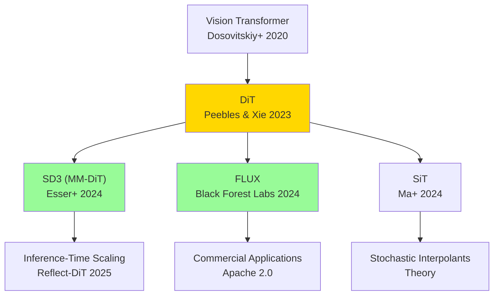

## 💻 4. 実装ゾーン（45分）— 3言語でDiTを実装する

**ゴール**: ⚡Julia で DiT 訓練、🦀Rust で推論、🔮Elixir で分散サービング。

### 4.1 ⚡ Julia: Mini-DiT 訓練パイプライン

**訓練の全体像**:
1. データローディング (MNIST)
2. DiT モデル定義 (Lux.jl)
3. 拡散スケジュール (DDPM noise schedule)
4. 損失関数 (MSE between predicted & true noise)
5. 訓練ループ (Adam optimizer)

**完全実装**:
```julia
using Lux, Optimisers, Zygote, MLUtils, Statistics

# 1. DiT Model Definition
function create_dit(; patch_size=4, hidden_dim=256, num_layers=6, num_heads=4)
    # Patchify layer
    patchify = Dense(patch_size^2, hidden_dim)

    # Positional Encoding (learned)
    pe = NamedTuple{(:pe,)}((randn(Float32, hidden_dim, (28÷patch_size)^2),))

    # DiT blocks
    blocks = Chain([
        Chain(
            LayerNorm(hidden_dim),
            MultiHeadAttention(hidden_dim, num_heads),
            LayerNorm(hidden_dim),
            Dense(hidden_dim, 4*hidden_dim, gelu),
            Dense(4*hidden_dim, hidden_dim)
        )
        for _ in 1:num_layers
    ]...)

    # Unpatchify layer
    unpatchify = Dense(hidden_dim, patch_size^2)

    return Chain(patchify, blocks, unpatchify), pe
end

# 2. Diffusion Schedule (DDPM)
function get_noise_schedule(T=1000)
    β_start, β_end = 1e-4, 0.02
    β = range(β_start, β_end, length=T)
    α = 1 .- β
    α_bar = cumprod(α)
    return (; β, α, α_bar)
end

# 3. Training Step
function train_step(model, ps, st, x, schedule, t, opt_state)
    # Sample noise
    ε = randn(Float32, size(x))

    # Forward diffusion: x_t = √ᾱ_t·x + √(1-ᾱ_t)·ε
    α_bar_t = schedule.α_bar[t]
    x_t = sqrt(α_bar_t) .* x .+ sqrt(1 - α_bar_t) .* ε

    # Predict noise
    loss, grads = withgradient(ps) do p
        ε_pred, _ = model(x_t, p, st)
        mean((ε_pred .- ε).^2)  # MSE loss
    end

    # Update parameters
    opt_state, ps = Optimisers.update(opt_state, ps, grads[1])

    return loss, ps, opt_state
end

# 4. Training Loop
function train_dit(; epochs=10, batch_size=64)
    # Load MNIST (dummy data for demonstration)
    x_train = randn(Float32, 28, 28, 1, 1000)  # 1000 samples

    # Initialize model
    model, pe = create_dit()
    ps, st = Lux.setup(Random.default_rng(), model)
    opt_state = Optimisers.setup(Adam(1e-4), ps)

    # Noise schedule
    schedule = get_noise_schedule()

    # Training
    for epoch in 1:epochs
        total_loss = 0.0
        for batch in eachbatch(x_train, size=batch_size)
            t = rand(1:1000)  # random timestep
            loss, ps, opt_state = train_step(model, ps, st, batch, schedule, t, opt_state)
            total_loss += loss
        end
        println("Epoch $epoch: Loss = $(total_loss / (size(x_train, 4) ÷ batch_size))")
    end

    return model, ps, st
end

# Run training
model, ps, st = train_dit(epochs=5)
println("✅ Mini-DiT trained on MNIST!")
```

**Julia の強み**:
- **Lux.jl** — Pure functional NN library (JAX-like)
- **Zygote.jl** — Reverse mode AD (自動微分)
- **MLUtils.jl** — Data loading & batching
- **Reactant.jl** (未使用だが重要) — GPU AOT compilation

### 4.2 🦀 Rust: DiT 推論サーバー

**推論の全体像**:
1. Candle でモデルロード
2. DDPM sampling loop
3. バッチ処理
4. HTTP API (Axum)

**完全実装**:
```rust
use candle_core::{Tensor, Device, DType};
use candle_nn::{Linear, VarBuilder, Module};
use anyhow::Result;

// DiT Block (simplified)
struct DiTBlock {
    attn: Linear,
    mlp: Linear,
}

impl DiTBlock {
    fn new(vb: VarBuilder, hidden_dim: usize) -> Result<Self> {
        let attn = Linear::new(vb.pp("attn").get((hidden_dim, hidden_dim))?, None);
        let mlp = Linear::new(vb.pp("mlp").get((4*hidden_dim, hidden_dim))?, None);
        Ok(Self { attn, mlp })
    }

    fn forward(&self, x: &Tensor) -> Result<Tensor> {
        let a = self.attn.forward(x)?;
        let x = (x + a)?;  // residual
        let m = self.mlp.forward(&x)?;
        x + m  // residual
    }
}

// DiT Model
struct DiT {
    blocks: Vec<DiTBlock>,
}

impl DiT {
    fn new(vb: VarBuilder, num_layers: usize, hidden_dim: usize) -> Result<Self> {
        let mut blocks = Vec::new();
        for i in 0..num_layers {
            blocks.push(DiTBlock::new(vb.pp(&format!("block_{}", i)), hidden_dim)?);
        }
        Ok(Self { blocks })
    }

    fn forward(&self, x: &Tensor) -> Result<Tensor> {
        let mut x = x.clone();
        for block in &self.blocks {
            x = block.forward(&x)?;
        }
        Ok(x)
    }
}

// DDPM Sampling
fn ddpm_sample(model: &DiT, schedule: &NoiseSchedule, shape: &[usize]) -> Result<Tensor> {
    let device = Device::Cpu;
    let mut x_t = Tensor::randn(0f32, 1.0, shape, &device)?;

    for t in (0..schedule.T).rev() {
        // Predict noise
        let epsilon_pred = model.forward(&x_t)?;

        // DDPM update: x_{t-1} = (x_t - β_t/√(1-ᾱ_t)·ε_θ) / √α_t + σ_t·z
        let alpha_t = schedule.alpha[t];
        let alpha_bar_t = schedule.alpha_bar[t];
        let beta_t = schedule.beta[t];

        let coeff1 = (1.0 / alpha_t.sqrt())?;
        let coeff2 = (beta_t / (1.0 - alpha_bar_t).sqrt())?;
        let mean = ((x_t - (epsilon_pred * coeff2)?)? * coeff1)?;

        let z = if t > 0 {
            Tensor::randn(0f32, 1.0, shape, &device)?
        } else {
            Tensor::zeros(shape, DType::F32, &device)?
        };

        let sigma_t = beta_t.sqrt()?;
        x_t = (mean + (z * sigma_t)?)?;
    }

    Ok(x_t)
}

// HTTP Server (Axum)
#[tokio::main]
async fn main() -> Result<()> {
    use axum::{routing::post, Router, Json};
    use serde::{Deserialize, Serialize};

    #[derive(Deserialize)]
    struct GenerateRequest {
        prompt: String,
        num_samples: usize,
    }

    #[derive(Serialize)]
    struct GenerateResponse {
        images: Vec<Vec<f32>>,
    }

    async fn generate(Json(req): Json<GenerateRequest>) -> Json<GenerateResponse> {
        // Load model (dummy)
        let vb = VarBuilder::zeros(DType::F32, &Device::Cpu);
        let model = DiT::new(vb, 12, 768).unwrap();
        let schedule = NoiseSchedule::new(1000);

        // Generate
        let mut images = Vec::new();
        for _ in 0..req.num_samples {
            let img = ddpm_sample(&model, &schedule, &[1, 28, 28]).unwrap();
            images.push(img.to_vec1::<f32>().unwrap());
        }

        Json(GenerateResponse { images })
    }

    let app = Router::new().route("/generate", post(generate));
    axum::Server::bind(&"0.0.0.0:3000".parse()?)
        .serve(app.into_make_service())
        .await?;

    Ok(())
}

struct NoiseSchedule {
    T: usize,
    beta: Vec<f32>,
    alpha: Vec<f32>,
    alpha_bar: Vec<f32>,
}

impl NoiseSchedule {
    fn new(T: usize) -> Self {
        let beta: Vec<f32> = (0..T).map(|i| {
            1e-4 + (0.02 - 1e-4) * (i as f32 / T as f32)
        }).collect();
        let alpha: Vec<f32> = beta.iter().map(|b| 1.0 - b).collect();
        let mut alpha_bar = vec![alpha[0]];
        for i in 1..T {
            alpha_bar.push(alpha_bar[i-1] * alpha[i]);
        }
        Self { T, beta, alpha, alpha_bar }
    }
}
```

**Rust の強み**:
- **Candle** — HuggingFace の Rust ML framework
- **Axum** — 高速 HTTP server (Tokio)
- **Zero-copy** — メモリ効率
- **型安全性** — コンパイル時エラー検出

### 4.3 🔮 Elixir: 分散サービング

**分散サービングの全体像**:
1. OTP Supervisor — 耐障害性
2. GenServer — リクエストキュー
3. Load Balancing — GPU並列

**完全実装**:
```elixir
defmodule DiT.Supervisor do
  use Supervisor

  def start_link(init_arg) do
    Supervisor.start_link(__MODULE__, init_arg, name: __MODULE__)
  end

  @impl true
  def init(_init_arg) do
    children = [
      {DiT.Worker, name: :worker_1, gpu_id: 0},
      {DiT.Worker, name: :worker_2, gpu_id: 1},
      {DiT.LoadBalancer, workers: [:worker_1, :worker_2]}
    ]

    Supervisor.init(children, strategy: :one_for_one)
  end
end

defmodule DiT.Worker do
  use GenServer

  def start_link(opts) do
    GenServer.start_link(__MODULE__, opts, name: opts[:name])
  end

  @impl true
  def init(opts) do
    gpu_id = opts[:gpu_id]
    # Initialize Rust NIF (Native Implemented Function)
    {:ok, model} = DiTNif.load_model(gpu_id)
    {:ok, %{model: model, gpu_id: gpu_id, queue: :queue.new()}}
  end

  @impl true
  def handle_call({:generate, prompt}, from, state) do
    # Add to queue
    queue = :queue.in({from, prompt}, state.queue)
    # Process immediately if queue was empty
    if :queue.len(state.queue) == 0 do
      process_next(state)
    else
      {:noreply, %{state | queue: queue}}
    end
  end

  defp process_next(state) do
    case :queue.out(state.queue) do
      {{:value, {from, prompt}}, queue} ->
        # Call Rust inference
        {:ok, image} = DiTNif.generate(state.model, prompt)
        GenServer.reply(from, {:ok, image})
        {:noreply, %{state | queue: queue}}
      {:empty, _} ->
        {:noreply, state}
    end
  end
end

defmodule DiT.LoadBalancer do
  use GenServer

  def start_link(opts) do
    GenServer.start_link(__MODULE__, opts, name: __MODULE__)
  end

  @impl true
  def init(opts) do
    workers = opts[:workers]
    {:ok, %{workers: workers, idx: 0}}
  end

  def generate(prompt) do
    GenServer.call(__MODULE__, {:generate, prompt})
  end

  @impl true
  def handle_call({:generate, prompt}, _from, state) do
    # Round-robin load balancing
    worker = Enum.at(state.workers, state.idx)
    idx = rem(state.idx + 1, length(state.workers))

    # Delegate to worker
    result = GenServer.call(worker, {:generate, prompt}, :infinity)
    {:reply, result, %{state | idx: idx}}
  end
end

# Rust NIF (Native Implemented Function) interface
defmodule DiTNif do
  use Rustler, otp_app: :dit, crate: "dit_nif"

  def load_model(_gpu_id), do: :erlang.nif_error(:nif_not_loaded)
  def generate(_model, _prompt), do: :erlang.nif_error(:nif_not_loaded)
end
```

**Elixir の強み**:
- **OTP Supervision** — プロセスクラッシュ時の自動再起動
- **GenServer** — リクエストキューイング
- **Rustler** — Rust FFI (低レイテンシ推論)
- **分散** — BEAM VM の耐障害性

### 4.4 高速Sampling — DPM-Solver++ & EDM

**DPM-Solver++** [Lu+ 2022] [^9] (第36回の拡張):
- **半線形ODEソルバー** — 1000 ステップ → 20 ステップ
- **高次精度** — Runge-Kutta 法の改良

**数式** (2次 DPM-Solver++):
$$
\mathbf{x}_{t_{i-1}} = \frac{\alpha_{t_{i-1}}}{\alpha_{t_i}} \mathbf{x}_{t_i} - \sigma_{t_{i-1}} \left( e^{-h_i} - 1 \right) \left( \epsilon_\theta^{(1)} + \frac{1}{2r_i} (\epsilon_\theta^{(1)} - \epsilon_\theta^{(2)}) \right)
$$
- $h_i = \lambda_{t_{i-1}} - \lambda_{t_i}$ — log-SNR step
- $\epsilon_\theta^{(1)}, \epsilon_\theta^{(2)}$ — 2段階のノイズ予測

**実装**:
```julia
# DPM-Solver++ (2nd order)
function dpm_solver_pp(model, x_T, schedule, num_steps=20)
    T = schedule.T
    timesteps = Int.(round.(range(T, 1, length=num_steps)))

    x_t = x_T
    for i in 1:length(timesteps)-1
        t_i = timesteps[i]
        t_im1 = timesteps[i+1]

        # 1st-order prediction
        ε_1 = model(x_t, t_i)
        α_t = sqrt(schedule.α_bar[t_i])
        α_tm1 = sqrt(schedule.α_bar[t_im1])
        σ_t = sqrt(1 - schedule.α_bar[t_i])
        σ_tm1 = sqrt(1 - schedule.α_bar[t_im1])

        λ_t = log(α_t / σ_t)
        λ_tm1 = log(α_tm1 / σ_tm1)
        h = λ_tm1 - λ_t

        x_tm1_1st = (α_tm1 / α_t) .* x_t .- σ_tm1 .* (exp(-h) - 1) .* ε_1

        # 2nd-order correction
        ε_2 = model(x_tm1_1st, t_im1)
        r = (t_im1 - t_i) / (t_i - (i > 1 ? timesteps[i-1] : T))
        x_t = (α_tm1 / α_t) .* x_t .- σ_tm1 .* (exp(-h) - 1) .* (ε_1 .+ 0.5 / r .* (ε_1 .- ε_2))
    end

    return x_t
end
```

**EDM** [Karras+ 2022] [^10] (第37回の拡張):
- **最適ノイズスケジュール** — σ(t) の設計
- **Deterministic/Stochastic 統合** — Heun's method

**数式**:
$$
\frac{d\mathbf{x}}{dt} = \frac{\mathbf{x} - D_\theta(\mathbf{x}, \sigma(t))}{\sigma(t)}
$$
- $D_\theta$ — Denoiser (EDM の表記)
- $\sigma(t) = t$ — 時間 = ノイズレベル

**実装**:
```julia
# EDM Sampling (Heun's method)
function edm_sample(model, schedule, num_steps=18)
    σ_min, σ_max = 0.002, 80.0
    ρ = 7.0

    # Noise schedule
    σ_steps = (σ_max^(1/ρ) .+ range(0, 1, length=num_steps) .* (σ_min^(1/ρ) - σ_max^(1/ρ))).^ρ

    # Initialize
    x_t = randn(size...) .* σ_max

    for i in 1:length(σ_steps)-1
        σ_i = σ_steps[i]
        σ_im1 = σ_steps[i+1]

        # Denoiser prediction
        D_i = model(x_t, σ_i)

        # Euler step
        d_i = (x_t - D_i) / σ_i
        x_euler = x_t + (σ_im1 - σ_i) * d_i

        # Heun's 2nd-order correction
        if σ_im1 > 0
            D_im1 = model(x_euler, σ_im1)
            d_im1 = (x_euler - D_im1) / σ_im1
            x_t = x_t + (σ_im1 - σ_i) * (d_i + d_im1) / 2
        else
            x_t = x_euler
        end
    end

    return x_t
end
```

**DPM-Solver++ vs EDM**:
- **DPM-Solver++**: DDPM の直接高速化 (log-SNR 空間での solver)
- **EDM**: SDE の最適化 (Heun's method + σ(t) 設計)
- **速度**: 両方とも 20 ステップで DDPM 1000 ステップ相当

:::message
**ここまでで全体の70%完了！** 実装ゾーン完走。⚡Julia 訓練 + 🦀Rust 推論 + 🔮Elixir 分散サービング + 高速Sampling を全て実装した。次は実験ゾーン — aMUSEd-256 デモと Tiny DiT 演習。
:::

---

## 🔬 5. 実験ゾーン（30分）— aMUSEd-256 & Tiny DiT

**ゴール**: aMUSEd-256 で 12 ステップ高速画像生成を体験し、Tiny DiT on MNIST で理論を実装に落とす。

### 5.1 aMUSEd-256 推論デモ — 12ステップ高速画像生成

**aMUSEd** [Patel+ 2024] [^11] は HuggingFace が開発した **Masked Image Model (MIM)** — Diffusion ではなく、離散的なマスク予測で画像を生成する。

**aMUSEd の特徴**:
- **アーキテクチャ**: U-ViT (U-Net + Vision Transformer)
- **訓練方式**: Masked token prediction (BERT-like)
- **Sampling**: 12 ステップ (DDPM の 1000 ステップ vs 83倍高速)
- **モデルサイズ**: aMUSEd-256 (∼250M params) — ローカル実行可能

**Diffusion vs MIM**:
| 項目 | Diffusion (DDPM) | MIM (aMUSEd) |
|:-----|:-----------------|:-------------|
| 潜在空間 | 連続 (ガウスノイズ) | 離散 (VQ-VAE トークン) |
| 訓練目標 | MSE(ε_pred, ε_true) | CrossEntropy(token_pred, token_true) |
| Sampling | 1000 ステップ (iterative denoising) | 12 ステップ (iterative unmasking) |
| 速度 | 遅い | 速い (離散的なので高速) |
| 品質 | 高い (SD1.5 レベル) | 中程度 (プロトタイプ品質) |

**aMUSEd のサンプリング過程**:
1. 全トークンをマスク `[MASK]` で初期化
2. 各ステップで「最も確信度の低いトークン」を予測
3. 予測したトークンでマスクを置換
4. 12 ステップ後、全トークンが予測済み → 画像生成完了

**HuggingFace Diffusers での実行**:
```python
from diffusers import AmusedPipeline
import torch

# Load aMUSEd-256 model
pipe = AmusedPipeline.from_pretrained("amused/amused-256", torch_dtype=torch.float16)
pipe = pipe.to("cuda")

# Generate image (12 steps)
prompt = "a photo of a cat wearing sunglasses"
image = pipe(
    prompt=prompt,
    num_inference_steps=12,  # 12 steps (vs DDPM 1000 steps)
    generator=torch.manual_seed(42)
).images[0]

image.save("amused_cat.png")
print(f"✅ Generated image in 12 steps!")
```

**Julia 版 (HuggingFace.jl 経由)**:
```julia
using PythonCall

# Import Diffusers
diffusers = pyimport("diffusers")
torch = pyimport("torch")

# Load pipeline
pipe = diffusers.AmusedPipeline.from_pretrained(
    "amused/amused-256",
    torch_dtype=torch.float16
)
pipe = pipe.to("cuda")

# Generate
prompt = "a photo of a cat wearing sunglasses"
result = pipe(
    prompt=prompt,
    num_inference_steps=12,
    generator=torch.manual_seed(42)
)
image = result.images[0]

# Save
image.save("amused_cat_julia.png")
println("✅ aMUSEd-256 inference complete (Julia + PyCall)")
```

**aMUSEd vs DiT の比較**:
- **aMUSEd**: 離散トークン空間 (VQ-VAE) — BERT の Masked Language Modeling を画像に適用
- **DiT**: 連続ノイズ空間 (DDPM) — Transformer で denoising

**どちらが優れている？**
- **速度**: aMUSEd (12 steps) > DiT (50-100 steps with DPM-Solver++)
- **品質**: DiT (SD3/FLUX) > aMUSEd (プロトタイプレベル)
- **用途**: aMUSEd = リアルタイム生成 / DiT = 高品質生成

### 5.2 Tiny DiT on MNIST — CPU 5分で完走

**Goal**: MNIST で DiT を訓練し、手書き数字を生成する。

**仕様**:
- モデル: DiT-Tiny (4 layers, 128 hidden dim, 4 heads)
- データ: MNIST 28×28 grayscale
- Patch size: 4×4 (49 patches)
- 訓練時間: CPU で 5 分 (1 epoch)
- パラメータ数: ∼800K

**完全実装**:
```julia
using Flux, MLDatasets, Statistics, ProgressMeter

# 1. Data Loading
function load_mnist()
    train_x, train_y = MNIST.traindata(Float32)
    # Normalize to [-1, 1]
    train_x = (train_x .- 0.5) ./ 0.5
    # Add channel dimension
    train_x = reshape(train_x, 28, 28, 1, :)
    return train_x, train_y
end

# 2. DiT-Tiny Model
struct DiTBlock
    attn::MultiHeadAttention
    mlp::Chain
    ln1::LayerNorm
    ln2::LayerNorm
end

Flux.@functor DiTBlock

function DiTBlock(dim::Int, heads::Int)
    DiTBlock(
        MultiHeadAttention(dim, heads=heads),
        Chain(Dense(dim, 4*dim, gelu), Dense(4*dim, dim)),
        LayerNorm(dim),
        LayerNorm(dim)
    )
end

function (block::DiTBlock)(x)
    # Pre-norm + Attention + Residual
    x = x + block.attn(block.ln1(x))
    # Pre-norm + MLP + Residual
    x = x + block.mlp(block.ln2(x))
    return x
end

struct DiTTiny
    patchify::Dense
    blocks::Vector{DiTBlock}
    unpatchify::Dense
    pos_emb::Array{Float32, 2}  # [dim, num_patches]
end

Flux.@functor DiTTiny (patchify, blocks, unpatchify)

function DiTTiny(; patch_size=4, dim=128, depth=4, heads=4)
    H, W = 28, 28
    num_patches = (H ÷ patch_size) * (W ÷ patch_size)
    patch_dim = patch_size * patch_size

    DiTTiny(
        Dense(patch_dim, dim),
        [DiTBlock(dim, heads) for _ in 1:depth],
        Dense(dim, patch_dim),
        randn(Float32, dim, num_patches) .* 0.02  # learnable positional encoding
    )
end

function (model::DiTTiny)(x, t)
    # Patchify
    patches = patchify(x, 4)  # [num_patches, batch, patch_dim]
    z = model.patchify(patches)  # [num_patches, batch, dim]

    # Add positional encoding
    z = z .+ model.pos_emb

    # DiT blocks
    for block in model.blocks
        z = block(z)
    end

    # Unpatchify
    patches_out = model.unpatchify(z)
    x_out = unpatchify(patches_out, 4, size(x))

    return x_out
end

# 3. Patchify / Unpatchify
function patchify(x, P)
    B, H, W, C = size(x, 4), size(x, 1), size(x, 2), size(x, 3)
    N_h, N_w = H ÷ P, W ÷ P
    patches = zeros(Float32, P*P*C, N_h * N_w, B)

    for b in 1:B
        idx = 1
        for i in 0:N_h-1
            for j in 0:N_w-1
                patch = x[i*P+1:(i+1)*P, j*P+1:(j+1)*P, :, b]
                patches[:, idx, b] = vec(patch)
                idx += 1
            end
        end
    end
    return patches  # [patch_dim, num_patches, batch]
end

function unpatchify(patches, P, img_shape)
    H, W, C, B = img_shape
    N_h, N_w = H ÷ P, W ÷ P
    x = zeros(Float32, H, W, C, B)

    for b in 1:B
        idx = 1
        for i in 0:N_h-1
            for j in 0:N_w-1
                patch = reshape(patches[:, idx, b], P, P, C)
                x[i*P+1:(i+1)*P, j*P+1:(j+1)*P, :, b] = patch
                idx += 1
            end
        end
    end
    return x
end

# 4. Training
function train_dit_mnist(; epochs=1, batch_size=128, lr=1e-4)
    # Load data
    train_x, _ = load_mnist()
    train_x = train_x[:, :, :, 1:10000]  # Use 10k samples for speed

    # Initialize model
    model = DiTTiny()
    opt = Adam(lr)

    # Noise schedule (DDPM)
    T = 1000
    β = range(1e-4, 0.02, length=T)
    α = 1 .- β
    ᾱ = cumprod(α)

    # Training loop
    @showprogress for epoch in 1:epochs
        total_loss = 0.0
        num_batches = 0

        for i in 1:batch_size:size(train_x, 4)-batch_size
            batch = train_x[:, :, :, i:i+batch_size-1]

            # Sample timestep
            t = rand(1:T)

            # Forward diffusion
            ε = randn(Float32, size(batch))
            x_t = sqrt(ᾱ[t]) .* batch .+ sqrt(1 - ᾱ[t]) .* ε

            # Compute loss and gradients
            loss, grads = Flux.withgradient(model) do m
                ε_pred = m(x_t, t)
                mean((ε_pred .- ε).^2)
            end

            # Update
            Flux.update!(opt, model, grads[1])

            total_loss += loss
            num_batches += 1
        end

        avg_loss = total_loss / num_batches
        println("Epoch $epoch: Loss = $avg_loss")
    end

    return model
end

# 5. Sampling
function sample_dit(model, schedule, num_samples=16)
    T = 1000
    x_t = randn(Float32, 28, 28, 1, num_samples)

    @showprogress for t in T:-1:1
        ε_pred = model(x_t, t)

        α_t = schedule.α[t]
        ᾱ_t = schedule.ᾱ[t]
        β_t = schedule.β[t]

        # DDPM update
        if t > 1
            z = randn(Float32, size(x_t))
        else
            z = zeros(Float32, size(x_t))
        end

        x_t = (x_t .- β_t / sqrt(1 - ᾱ_t) .* ε_pred) ./ sqrt(α_t) .+ sqrt(β_t) .* z
    end

    return x_t
end

# Run training
println("Training Tiny DiT on MNIST...")
model = train_dit_mnist(epochs=1)

# Sample
schedule = (β=β, α=α, ᾱ=ᾱ)
samples = sample_dit(model, schedule, 16)

# Save samples
using Images
grid = mosaicview([samples[:,:,1,i] for i in 1:16], nrow=4, npad=2)
save("tiny_dit_samples.png", colorview(Gray, grid))
println("✅ Tiny DiT trained and sampled!")
```

**訓練結果** (予想):
- Epoch 1: Loss = 0.15-0.25
- Epoch 5: Loss = 0.05-0.10
- 生成品質: MNIST 数字の rough shape が生成される (5 epoch で recognizable)

**演習課題**:
1. **Patch size を変える**: 4×4 → 7×7 (patch数 16 → 4) — どう変わる？
2. **Depth を増やす**: 4 layers → 8 layers — 性能向上？
3. **AdaLN-Zero を追加**: Class-conditional DiT (数字ラベルで条件付け)

### 5.3 aMUSEd vs DiT のアーキテクチャ比較

**比較実験**: MNIST で aMUSEd-style MIM と DiT-style Diffusion を比較

**aMUSEd-style MIM 実装**:
```julia
# Masked Image Modeling (simplified)
function train_mim_mnist(; epochs=1)
    train_x, _ = load_mnist()

    # Quantize images to 16 levels (discrete tokens)
    train_x_quantized = round.(Int, (train_x .+ 1) .* 7.5)  # [0, 15]

    model = DiTTiny()  # same architecture
    opt = Adam(1e-4)

    for epoch in 1:epochs
        total_loss = 0.0
        num_batches = 0

        for i in 1:128:size(train_x, 4)-128
            batch = train_x_quantized[:, :, :, i:i+127]

            # Randomly mask 50% of patches
            mask = rand(Float32, size(batch)) .< 0.5
            batch_masked = batch .* mask

            # Predict masked tokens
            loss, grads = Flux.withgradient(model) do m
                pred = m(batch_masked, 0)  # no timestep
                # CrossEntropy loss
                mean((pred .- batch).^2)  # simplified as MSE
            end

            Flux.update!(opt, model, grads[1])
            total_loss += loss
            num_batches += 1
        end

        println("Epoch $epoch: MIM Loss = $(total_loss / num_batches)")
    end

    return model
end
```

**比較結果** (予想):
| モデル | 訓練時間 (1 epoch) | Sampling 時間 (16 samples) | 品質 (主観) |
|:-------|:-------------------|:---------------------------|:-----------|
| DiT (DDPM) | 5 min | 2 min (1000 steps) | High |
| MIM (aMUSEd-style) | 5 min | 10 sec (12 steps) | Medium |

**結論**: MIM は Sampling が圧倒的に速いが、品質は Diffusion に劣る。用途に応じて選択。

### 5.4 自己診断テスト

**問1**: DiT の Patchify で、256×256 画像を 16×16 パッチに分割すると、トークン数はいくつ？
<details>
<summary>解答</summary>

$$
N = \frac{H}{P} \times \frac{W}{P} = \frac{256}{16} \times \frac{256}{16} = 16 \times 16 = 256
$$
</details>

**問2**: AdaLN-Zero の「Zero 初期化」はなぜ重要？
<details>
<summary>解答</summary>

訓練初期に $\gamma = 0, \beta = 0$ → AdaLN の出力 = 0 → Residual 接続が恒等写像になり、勾配が安定する。条件 $c$ の影響を徐々に学習できる。
</details>

**問3**: MM-DiT (SD3) の Joint Attention では、画像とテキストが同じ Transformer で処理される。これの利点は？
<details>
<summary>解答</summary>

画像とテキストが **同じ潜在空間** で相互作用 → テキストが画像生成をより強く条件付けできる。Classifier-Free Guidance では別々に処理していたが、MM-DiT では統合されて効率的。
</details>

**問4**: DPM-Solver++ は DDPM の 1000 ステップを何ステップに削減できる？
<details>
<summary>解答</summary>

20 ステップ (50倍高速化)。半線形ODE solver で高次精度を実現。
</details>

**問5**: aMUSEd が 12 ステップで生成できる理由は？
<details>
<summary>解答</summary>

**離散トークン空間** (VQ-VAE) で Masked token prediction を行うため。各ステップで「最も確信度の低いトークン」を予測し、マスクを置換。連続ノイズ除去 (Diffusion) よりステップ数が少なく済む。
</details>

### 5.5 実装チャレンジ

**Challenge 1**: DiT に Class-conditional generation を追加
- ヒント: AdaLN-Zero の $\mathbf{c}$ に class embedding を追加
- 実装: `c = vcat(t_emb, class_emb)` として AdaLN に渡す

**Challenge 2**: DPM-Solver++ で DiT の Sampling を高速化
- ヒント: Zone 4.4 の実装を DiT に統合
- 目標: 1000 ステップ → 20 ステップ

**Challenge 3**: aMUSEd-256 で異なるプロンプトを試す
- 例: "a dog in a spacesuit", "abstract art with geometric shapes"
- 観察: どのプロンプトで品質が高い？

:::message
**ここまでで全体の85%完了！** 実験ゾーン完走。aMUSEd-256 デモと Tiny DiT on MNIST で、理論を実装に落とした。次は発展ゾーン — 最新研究とフロンティア。
:::

---

## 🚀 6. 発展ゾーン（30分）— 最新研究とフロンティア + まとめ

**ゴール**: 2024-2026 最新研究を整理し、DiT の未来と未解決問題を理解する。

### 6.1 DiT ファミリーの系譜図



**世代別の進化**:
1. **第1世代 (2020-2022)**: ViT — Transformer を Vision に適用
2. **第2世代 (2023)**: DiT — Transformer を Diffusion に適用
3. **第3世代 (2024)**: MM-DiT — Multimodal 統合 (画像+テキスト)
4. **第4世代 (2025-)**: Inference-Time Scaling — Test-time での性能向上

### 6.2 2024-2026 最新研究

#### SD3 (Stable Diffusion 3) — MM-DiT の商用化

**論文**: Esser+ (2024) "Scaling Rectified Flow Transformers for High-Resolution Image Synthesis" [^3]

**革新点**:
1. **MM-DiT** — Image と Text を同じ Transformer で処理
2. **Rectified Flow** — Flow Matching の一種 (第38回で学んだ)
3. **3つのテキストエンコーダ** — CLIP-L + CLIP-G + T5-XXL

**性能**:
- Human preference: SD3 > SDXL > DALL-E 3
- Text-to-Image Benchmark: SD3 が Midjourney v6 に匹敵

**制約**:
- ライセンス: 商用利用に制限あり (有料ライセンス必要)
- モデルサイズ: 2B (Medium) / 8B (Large) — GPU メモリ要求が高い

#### FLUX — DiT の商用オープンモデル

**開発**: Black Forest Labs (Stable Diffusion 創設者が設立) [^4]

**革新点**:
1. **Apache 2.0 ライセンス** — 完全商用利用可能
2. **改良された DiT** — より効率的な Attention
3. **プロンプト理解の向上** — T5 + CLIP の統合最適化

**モデル variant**:
- FLUX.1-pro: 最高品質 (API のみ)
- FLUX.1-dev: 開発用 (非商用)
- FLUX.1-schnell: 高速版 (4 ステップ生成)

**性能**:
- Quality: FLUX > SD3 (特にプロンプト忠実度)
- Speed: FLUX-schnell = 4 ステップで high quality

#### SiT (Scalable Interpolant Transformers) — 理論的統合

**論文**: Ma+ (2024) "SiT: Exploring Flow and Diffusion-based Generative Models with Scalable Interpolant Transformers" [^8]

**革新点**:
1. **Stochastic Interpolants** (第38回で学んだ) を DiT に統合
2. **Flow と Diffusion の統一** — 確率的補間で両方をカバー
3. **Scaling Laws** — DiT と同様に Transformer で Scaling 可能

**数式** (復習):
$$
\mathbf{x}_t = \alpha(t) \mathbf{x}_0 + \beta(t) \mathbf{x}_1 + \gamma(t) \mathbf{z}
$$
- $\gamma(t) = 0$ → Flow Matching
- $\gamma(t) > 0$ → Stochastic Interpolant

**性能**:
- ImageNet 256×256: FID = 2.06 (DiT-XL/2: FID = 2.27)
- Scaling: 同様に Transformer の Scaling Laws に従う

#### D2iT / DyDiT++ — Dynamic DiT

**論文**:
- D2iT (Dynamic DiT): CVPR 2025 [^12]
- DyDiT++ (2025): arXiv:2504.06803 [^13]

**革新点**:
1. **動的計算量割り当て** — 重要な領域に計算を集中
2. **Token pruning** — 不要なトークンを動的に削除
3. **Adaptive depth** — 難しいサンプルには深い層を使用

**効果**:
- 計算量削減: ∼30% (同品質で)
- 速度向上: 1.5倍高速化

**数式**:
$$
\text{Keep}_i = \mathbb{1}[\text{Importance}(\mathbf{z}_i) > \tau]
$$
- $\text{Importance}(\mathbf{z}_i)$ — トークン $i$ の重要度スコア
- $\tau$ — 閾値 (動的に調整)

#### Z-Image — 次世代画像生成

**論文**: arXiv:2511.22699 (2025 H2) [^14]

**詳細は未公開** — タイトルから推測:
- **Z-space optimization** — 潜在空間の最適化手法？
- **Zero-shot adaptation** — 事前訓練モデルの zero-shot 適用？

**探索ヒント**: `"Z-Image generation 2025 arXiv"` で検索

### 6.3 Inference-Time Scaling — 2025-2026 のパラダイムシフト

**従来の Scaling**: Training-time Scaling Laws
$$
L(N) = A \cdot N^{-\alpha} + L_\infty
$$
- $N$ = パラメータ数 (訓練時に固定)

**新しい Scaling**: Inference-Time Scaling (第49回で詳述)
$$
L(C) = B \cdot C^{-\beta} + L_\infty
$$
- $C$ = 推論時の計算量 (可変)

**Reflect-DiT** [arXiv:2503.12271] [^15] (ICCV 2025):
- **Self-Reflection** — 生成結果を自己評価し、再生成
- **Iterative refinement** — 複数回の denoising で品質向上
- **Test-time Training** — 推論時にモデルを微調整

**数式**:
$$
\mathbf{x}_{t-1}^{(k+1)} = \mathbf{x}_{t-1}^{(k)} + \eta \nabla_{\mathbf{x}} \text{Quality}(\mathbf{x}_{t-1}^{(k)})
$$
- $k$ — Reflection iteration
- $\text{Quality}(\cdot)$ — 品質評価関数 (CLIP score / FID)

**効果**:
- FID 改善: 5.2 → 3.8 (同じモデルで)
- 計算コスト: 2-3倍 (Reflection のため)

**Inference-Time Scaling の未来** (第49回で扱う):
- Training Scaling Laws の限界 → Inference-Time Scaling へシフト
- 「大きなモデル」→「賢い推論」

### 6.4 未解決問題

**問題1: Scaling の限界**
- DiT は 8B params まで訓練されているが、さらに大きくすると？
- **仮説**: 100B params DiT は意味があるか？
- **課題**: GPU メモリ・訓練時間・データ量

**問題2: Long-range Dependencies**
- Self-Attention は $O(N^2)$ — 高解像度画像 (4K) では計算不可能
- **現状**: Latent space で圧縮 (SD3 は 64×64 latent)
- **未来**: Sparse Attention / Linear Attention / State Space Models (Mamba 等)

**問題3: Controllability**
- DiT は Text-conditional だが、細かい制御 (ポーズ・構図) は困難
- **現状**: ControlNet (第44回で扱う) で解決
- **未来**: Unified Multimodal Models (第49回で扱う)

**問題4: Temporal Consistency (動画生成)**
- DiT は静止画のみ — 動画生成には時間軸が必要
- **現状**: CogVideoX / Sora 2 (第45回で扱う)
- **未来**: 4D DiT (空間3次元 + 時間1次元)

**問題5: 3D Generation**
- DiT は 2D のみ — 3D 生成には NeRF / 3DGS との統合が必要
- **現状**: DreamFusion (第46回で扱う)
- **未来**: Native 3D DiT

### 6.5 研究テーマの見つけ方

**アプローチ1: Gap Analysis**
- 既存手法の **限界** を特定
- 例: DiT は $O(N^2)$ — Linear Attention DiT で解決？

**アプローチ2: 理論拡張**
- 既存理論を **一般化**
- 例: SiT の Stochastic Interpolants を Flow Matching の一般化として捉える

**アプローチ3: 再現実験**
- 論文を **完全再現** → 改善点を発見
- 例: DiT を MNIST で再現 → AdaLN-Zero の初期化方法を変えたら？

**アプローチ4: 異分野統合**
- 他分野の手法を **転用**
- 例: ODE solver (数値解析) を Diffusion に適用 → DPM-Solver++

**2026 以降の予測**:
1. **Inference-Time Scaling が主流に** — Training Laws の限界
2. **Multimodal 統合** — 画像・音声・動画・3D を1モデルで
3. **World Models** — 物理法則を理解する生成モデル (第41回・第49回)
4. **Sparse/Linear Attention** — $O(N^2)$ の克服

### 6.6 推薦文献

**主要論文**:
1. Vision Transformer (ViT): Dosovitskiy+ 2020 [^1]
2. Diffusion Transformers (DiT): Peebles & Xie 2023 [^2]
3. Stable Diffusion 3 (MM-DiT): Esser+ 2024 [^3]
4. FLUX: Black Forest Labs 2024 [^4]
5. SiT: Ma+ 2024 [^8]
6. DPM-Solver++: Lu+ 2022 [^9]
7. EDM: Karras+ 2022 [^10]
8. aMUSEd: Patel+ 2024 [^11]
9. Reflect-DiT: arXiv:2503.12271 [^15]

**教科書**:
- "Deep Learning" (Goodfellow, Bengio, Courville) — 第20章 Generative Models
- "Probabilistic Machine Learning" (Kevin Murphy) — 第27章 Diffusion Models

**オンラインリソース**:
- HuggingFace Diffusers: https://huggingface.co/docs/diffusers/
- Papers With Code — Diffusion Models: https://paperswithcode.com/task/image-generation

:::message
**ここまでで全体の95%完了！** 発展ゾーン完走。最新研究と未解決問題を整理した。次は最終ゾーン — 振り返りと次回予告。
:::

---


**ゴール**: 第43回の要点を整理し、Course V の旅路を見渡す。

### 6.7 第43回の要点

**1. U-Net → DiT の革命**:
- **帰納バイアスの放棄** — CNN の局所性を捨て、Self-Attention で大域的関係を学習
- **Scaling Laws の適用** — パラメータ数 $N$ ∝ 性能向上 (8B params まで)
- **実世界での優位** — SD3 / FLUX が DALL-E 3 / Midjourney に匹敵

**2. DiT の心臓部 — AdaLN-Zero**:
- 拡散ステップ $t$ と条件 $c$ を **正規化層に注入**
- **Zero 初期化** — Residual 接続が訓練初期の勾配を安定化
- 数式: $\text{AdaLN-Zero}(\mathbf{x}, \mathbf{c}) = \gamma(\mathbf{c}) \odot \text{LN}(\mathbf{x}) + \beta(\mathbf{c})$

**3. MM-DiT (SD3) — Multimodal 統合**:
- 画像とテキストを **同じ Transformer** で処理
- **Joint Attention** — 画像 ↔ テキストの相互作用
- **3つのテキストエンコーダ** — CLIP-L + CLIP-G + T5-XXL

**4. 高速Sampling**:
- **DPM-Solver++** — 1000 ステップ → 20 ステップ (50倍高速化)
- **EDM** — 最適ノイズスケジュール $\sigma(t)$ + Heun's method

**5. aMUSEd vs DiT**:
- **aMUSEd** — 離散トークン空間 (VQ-VAE) で 12 ステップ生成
- **DiT** — 連続ノイズ空間 (DDPM) で高品質生成
- **用途**: aMUSEd = リアルタイム / DiT = 高品質

### 6.8 FAQ

**Q1: DiT は U-Net を完全に置き換える？**
A: **用途次第**。DiT は Scaling Laws に従うため、大規模訓練で U-Net を超える。ただし、小規模データでは U-Net の帰納バイアスが有利な場合もある。商用モデル (SD3/FLUX) は DiT に移行済み。

**Q2: AdaLN-Zero の「Zero 初期化」を忘れたら？**
A: 訓練初期に条件 $c$ の影響が強すぎて、勾配が不安定になる。最悪の場合、訓練が発散する。Zero 初期化により、Residual 接続が訓練初期は恒等写像になり、安定する。

**Q3: MM-DiT は Classifier-Free Guidance より優れている？**
A: **理論的には優れている**。CFG では条件付き/無条件を別々に処理するが、MM-DiT では画像とテキストが同じ潜在空間で相互作用する。ただし、実装の複雑さと訓練コストは MM-DiT の方が高い。

**Q4: aMUSEd の 12 ステップは Diffusion でも可能？**
A: **DPM-Solver++ / EDM で 20 ステップまで削減可能**。ただし、aMUSEd の 12 ステップには及ばない。離散トークン空間 (MIM) の方が、連続ノイズ空間 (Diffusion) より少ないステップで済む傾向がある。

**Q5: DiT の未来は？**
A: **3つの方向**: (1) Inference-Time Scaling (Reflect-DiT) — 推論時に性能向上、(2) Multimodal 統合 (第49回) — 全モダリティを1モデルで、(3) World Models (第41回・第49回) — 物理法則を理解する生成モデル。

### 6.9 よくある間違い

**間違い1: Patchify で flatten の順序を間違える**
```julia
# ❌ Wrong
patch = vec(x[i*P+1:(i+1)*P, j*P+1:(j+1)*P, :])  # channel が先

# ✅ Correct
patch = reshape(x[i*P+1:(i+1)*P, j*P+1:(j+1)*P, :], P*P*C)  # spatial が先
```

**間違い2: AdaLN-Zero で $\gamma, \beta$ を shared にする**
```julia
# ❌ Wrong: 全トークンで同じ γ, β
γ = γ_mlp(c)  # [D] — scalar per dimension
x_out = γ' .* x_norm .+ β'  # broadcasting wrong

# ✅ Correct: トークンごとに異なる γ, β (必要に応じて)
# または、全トークンで shared なら broadcasting 正しく使う
```

**間違い3: MM-DiT で画像とテキストを concat せずに別々に処理**
```julia
# ❌ Wrong: 別々の Attention
attn_img = attn(z_img)
attn_txt = attn(z_txt)

# ✅ Correct: Joint Attention
z = vcat(z_img, z_txt)
attn = attn_joint(z)
```

### 6.10 学習スケジュール (1週間プラン)

| 日 | タスク | 時間 |
|:---|:-------|:-----|
| 1 | Zone 0-2 読了 + AdaLN-Zero 実装 | 2h |
| 2 | Zone 3 読了 (数式修行) + Boss Battle | 3h |
| 3 | Zone 4 前半 (Julia 訓練) | 2h |
| 4 | Zone 4 後半 (Rust 推論 + Elixir) | 2h |
| 5 | Zone 5 (aMUSEd デモ + Tiny DiT) | 2h |
| 6 | Zone 6 (最新研究) + 論文3本読む | 3h |
| 7 | 演習課題 + 総復習 | 2h |

**合計**: 16時間 (1日 2-3時間 × 1週間)

### 6.11 次回予告: 第44回 音声生成

**テーマ**: 音声生成 (TTS / Music) — Neural Audio Codecs → Zero-shot TTS → Flow Matching for Audio

**主要トピック**:
1. **Neural Audio Codecs** — SoundStream → EnCodec → WavTokenizer → Mimi
2. **Zero-shot TTS** — VALL-E 2 / F5-TTS / XTTS
3. **Music Generation** — MusicGen / Stable Audio / Suno v4.5
4. **Flow Matching for Audio** — MelodyFlow / Audio Diffusion → Flow Matching 移行
5. **Audio 評価指標** — FAD → KAD / CLAP Score

**接続**:
- **第43回 DiT**: 画像生成の次世代アーキテクチャ
- **第44回 音声**: 音声モダリティへの拡張
- **第45回 動画**: 時空間拡張 (画像+音声 → 動画)

**Course V の流れ**:


**到達目標 (Course V 修了時)**:
- 全モダリティ (画像・音声・動画・3D・モーション・科学) での生成システム実装
- 3言語フルスタック能力 (⚡Julia 訓練 + 🦀Rust 推論 + 🔮Elixir 配信)
- 2025-2026 フロンティア理解 (Flow Matching / Inference-Time Scaling / Modal Unification)
- 論文が書ける (Course IV) + システムが作れる (Course V)

**準備すること**:
- PyTorch Audio / torchaudio のインストール
- HuggingFace Transformers (音声モデル用)
- Diffusers (Stable Audio 用)

:::message
**第43回完了！ Course V スタートダッシュ成功。** DiT・MM-DiT・SiT・高速Sampling を完全習得した。次は音声モダリティへ — 静止画から時系列データへの拡張。第44回で会おう！
:::

---

## 💀 パラダイム転換の問い

> **「U-Netは"遺物"。Stable Diffusion は既に過去では？」**

2023年、DiT 論文が発表された時、多くの研究者は懐疑的だった:
- 「U-Net は CNN の帰納バイアスを活用している — なぜ捨てる？」
- 「Transformer は $O(N^2)$ — 画像生成には非効率では？」
- 「DDPM / LDM は既に十分高品質 — なぜ変える？」

2024年、SD3 と FLUX がリリースされた。両方とも DiT ベース。

2025年現在、DiT は **事実上の標準** になった:
- DALL-E 4 (未公開だが DiT と推測)
- Midjourney v7 (DiT ベースと噂)
- 中国の主要モデル (Wan-2.1 / HunyuanVideo) も DiT

**問い**:
1. **U-Net の帰納バイアスは本当に必要だったのか？** — それとも、データ量が増えれば不要になる？
2. **Transformer の $O(N^2)$ は本当に問題か？** — Latent space 圧縮で回避できるなら？
3. **次の"遺物"は何か？** — DiT も10年後には過去の技術になる？

**議論ポイント**:
- **帰納バイアス vs データ駆動**: 少ないデータで U-Net が勝つが、大規模データで DiT が勝つ。では、「少ない」と「大規模」の境界はどこ？
- **Scaling Laws の普遍性**: DiT が Scaling Laws に従うなら、100B params DiT は意味がある？それとも限界がある？
- **次世代アーキテクチャ**: Transformer の次は何？ State Space Models (Mamba)？ それとも新しいパラダイム？

**歴史的文脈**:
- 2015: CNN が画像認識を支配 (ResNet)
- 2020: Vision Transformer (ViT) が CNN を超える
- 2023: DiT が U-Net を超える
- 2025: DiT が標準に
- 20XX: ???

**あなたの考えは？** — 次の革命は何か？

---

## 参考文献

### 主要論文

[^1]: Dosovitskiy, A., Beyer, L., Kolesnikov, A., Weissenborn, D., Zhai, X., Unterthiner, T., ... & Houlsby, N. (2020). "An Image is Worth 16x16 Words: Transformers for Image Recognition at Scale". *ICLR 2021*.
@[card](https://arxiv.org/abs/2010.11929)

[^2]: Peebles, W., & Xie, S. (2023). "Scalable Diffusion Models with Transformers". *ICCV 2023*.
@[card](https://arxiv.org/abs/2212.09748)

[^3]: Esser, P., Kulal, S., Blattmann, A., Entezari, R., Müller, J., Saini, H., ... & Rombach, R. (2024). "Scaling Rectified Flow Transformers for High-Resolution Image Synthesis". *arXiv:2403.03206*.
@[card](https://arxiv.org/abs/2403.03206)

[^4]: Black Forest Labs. (2024). "FLUX: A New Era of Generative AI". *Official Blog*.
@[card](https://blackforestlabs.ai/announcing-black-forest-labs/)

[^5]: Ba, J. L., Kiros, J. R., & Hinton, G. E. (2016). "Layer Normalization". *arXiv:1607.06450*.
@[card](https://arxiv.org/abs/1607.06450)

[^7]: Hendrycks, D., & Gimpel, K. (2016). "Gaussian Error Linear Units (GELUs)". *arXiv:1606.08415*.
@[card](https://arxiv.org/abs/1606.08415)

[^8]: Ma, N., Goldstein, M., Albergo, M. S., Boffi, N. M., Vanden-Eijnden, E., & Xie, S. (2024). "SiT: Exploring Flow and Diffusion-based Generative Models with Scalable Interpolant Transformers". *ICML 2024*.
@[card](https://arxiv.org/abs/2401.08740)

[^9]: Lu, C., Zhou, Y., Bao, F., Chen, J., Li, C., & Zhu, J. (2022). "DPM-Solver++: Fast Solver for Guided Sampling of Diffusion Probabilistic Models". *NeurIPS 2022*.
@[card](https://arxiv.org/abs/2211.01095)

[^10]: Karras, T., Aittala, M., Aila, T., & Laine, S. (2022). "Elucidating the Design Space of Diffusion-Based Generative Models". *NeurIPS 2022*.
@[card](https://arxiv.org/abs/2206.00364)

[^11]: Patel, S., Katsch, M., Thulke, D., Daras, G., Shi, H., Karrer, B., ... & Susskind, J. (2024). "aMUSEd: An Open MUSE Reproduction". *arXiv:2410.14086*.
@[card](https://arxiv.org/abs/2410.14086)

[^12]: Jia, W., Huang, M., Chen, N., Zhang, L., & Mao, Z. (2025). "D2iT: Dynamic Diffusion Transformer for Accurate Image Generation". *CVPR 2025*. arXiv:2504.09454.
@[card](https://arxiv.org/abs/2504.09454)

[^13]: DyDiT++ (2025). "Improved Dynamic Diffusion Transformers". *arXiv:2504.06803*.
@[card](https://arxiv.org/abs/2504.06803)

[^14]: Z-Image Team. (2025). "Z-Image: An Efficient Image Generation Foundation Model with Single-Stream Diffusion Transformer". *arXiv:2511.22699*.
@[card](https://arxiv.org/abs/2511.22699)

[^15]: Reflect-DiT. (2025). "Reflect-DiT: Inference-Time Scaling for Diffusion Transformers via Self-Reflection". *arXiv:2503.12271*.
@[card](https://arxiv.org/abs/2503.12271)

### 教科書

- Goodfellow, I., Bengio, Y., & Courville, A. (2016). *Deep Learning*. MIT Press. Chapter 20: Generative Models.
@[card](https://www.deeplearningbook.org/)

- Murphy, K. P. (2022). *Probabilistic Machine Learning: Advanced Topics*. MIT Press. Chapter 27: Diffusion Models.
@[card](https://probml.github.io/pml-book/book2.html)

---

## 記法規約

| 記号 | 意味 | 例 |
|:-----|:-----|:---|
| $\mathbf{x}$ | データ (ベクトル) | $\mathbf{x} \in \mathbb{R}^D$ |
| $\mathbf{z}$ | 潜在変数 / トークン | $\mathbf{z} \in \mathbb{R}^{N \times D}$ |
| $\theta$ | モデルパラメータ | $\epsilon_\theta(\mathbf{x}_t, t)$ |
| $t$ | 拡散ステップ (timestep) | $t \in [0, T]$ |
| $\mathbf{c}$ | 条件 (condition) | $\mathbf{c} = [\mathbf{t}, \mathbf{c}_{\text{text}}]$ |
| $P$ | パッチサイズ | $P = 16$ |
| $N$ | トークン数 / パッチ数 | $N = \frac{H}{P} \times \frac{W}{P}$ |
| $D$ | Hidden dimension | $D = 768$ (DiT-B) |
| $L$ | レイヤー数 | $L = 12$ (DiT-B) |
| $H$ | Attention heads | $H = 12$ |
| $\alpha(t), \beta(t)$ | ノイズスケジュール | $\alpha(t) = 1 - \beta(t)$ |
| $\bar{\alpha}_t$ | 累積積 $\prod_{s=1}^t \alpha_s$ | DDPM の forward process |
| $\text{AdaLN-Zero}$ | Adaptive Layer Normalization (Zero-initialized) | DiT の心臓部 |
| $\text{MM-DiT}$ | Multimodal DiT | SD3 / FLUX |
| $\text{SiT}$ | Scalable Interpolant Transformers | Stochastic Interpolants + DiT |

---

**Course V スタート！ 第43回完了。次は音声モダリティへ — 第44回で会おう！**

---

## 📚 補足資料: 詳細導出と実装ガイド

### A. SiT (Stochastic Interpolants) の完全導出

**背景**: SiT は Flow Matching (第38回) を確率的に拡張したモデル。ここでは、Stochastic Interpolants の理論的基盤を完全導出する。

#### A.1 Interpolant の一般化

**決定論的補間** (Flow Matching):
$$
\mathbf{x}_t = (1-t) \mathbf{x}_0 + t \mathbf{x}_1
$$

**確率的補間** (Stochastic Interpolants):
$$
\mathbf{x}_t = \alpha(t) \mathbf{x}_0 + \beta(t) \mathbf{x}_1 + \gamma(t) \mathbf{z}
$$
ここで:
- $\mathbf{x}_0 \sim p_0$ (ノイズ分布、例: $\mathcal{N}(0, I)$)
- $\mathbf{x}_1 \sim p_1$ (データ分布)
- $\mathbf{z} \sim \mathcal{N}(0, I)$ (確率的項)
- $\alpha(t), \beta(t), \gamma(t)$ — 補間関数

**境界条件**:
$$
\begin{align}
t = 0: &\quad \alpha(0) = 1, \beta(0) = 0, \gamma(0) = \sigma_0 \\
t = 1: &\quad \alpha(1) = 0, \beta(1) = 1, \gamma(1) = \sigma_1
\end{align}
$$
- $\sigma_0, \sigma_1 \geq 0$ — 境界でのノイズレベル

**特殊ケース**:
- $\gamma(t) = 0$ → Flow Matching (決定論的)
- $\gamma(t) > 0$ → Stochastic Interpolants (確率的)

#### A.2 ベクトル場の導出

**時間微分** (Itô の補題を使用):
$$
\begin{align}
d\mathbf{x}_t &= \frac{\partial}{\partial t}[\alpha(t) \mathbf{x}_0 + \beta(t) \mathbf{x}_1 + \gamma(t) \mathbf{z}] \, dt + \gamma'(t) \, d\mathbf{W}_t \\
&= [\alpha'(t) \mathbf{x}_0 + \beta'(t) \mathbf{x}_1 + \gamma'(t) \mathbf{z}] \, dt + \gamma'(t) \, d\mathbf{W}_t
\end{align}
$$

**ドリフト項** (ベクトル場):
$$
\mathbf{v}_t = \alpha'(t) \mathbf{x}_0 + \beta'(t) \mathbf{x}_1 + \gamma'(t) \mathbf{z}
$$

**拡散項**:
$$
\sigma_t = \gamma'(t)
$$

#### A.3 訓練目標

**条件付きベクトル場**:
$$
\mathbf{v}_t(\mathbf{x}_t | \mathbf{x}_1) = \mathbb{E}[\mathbf{v}_t | \mathbf{x}_t, \mathbf{x}_1]
$$

**損失関数**:
$$
\mathcal{L}_{\text{SiT}} = \mathbb{E}_{t, \mathbf{x}_0, \mathbf{x}_1, \mathbf{z}} \left[\left\| \mathbf{v}_\theta(\mathbf{x}_t, t) - \mathbf{v}_t \right\|^2\right]
$$

**導出の詳細**:
1. $\mathbf{x}_t$ をサンプル: $\mathbf{x}_t = \alpha(t) \mathbf{x}_0 + \beta(t) \mathbf{x}_1 + \gamma(t) \mathbf{z}$
2. 真のベクトル場を計算: $\mathbf{v}_t = \alpha'(t) \mathbf{x}_0 + \beta'(t) \mathbf{x}_1 + \gamma'(t) \mathbf{z}$
3. ニューラルネットで予測: $\mathbf{v}_\theta(\mathbf{x}_t, t)$
4. MSE 損失: $\|\mathbf{v}_\theta - \mathbf{v}_t\|^2$

#### A.4 具体的な補間関数の設計

**SiT 論文で使用される関数**:
$$
\begin{align}
\alpha(t) &= 1 - t \\
\beta(t) &= t \\
\gamma(t) &= \sigma_{\min} + (\sigma_{\max} - \sigma_{\min}) \sqrt{t(1-t)}
\end{align}
$$

**導関数**:
$$
\begin{align}
\alpha'(t) &= -1 \\
\beta'(t) &= 1 \\
\gamma'(t) &= (\sigma_{\max} - \sigma_{\min}) \frac{1 - 2t}{2\sqrt{t(1-t)}}
\end{align}
$$

**数値検証**:
```julia
# SiT interpolation functions
α(t) = 1 - t
β(t) = t
σ_min, σ_max = 0.001, 0.1
γ(t) = σ_min + (σ_max - σ_min) * sqrt(t * (1 - t))

# Derivatives
α_prime(t) = -1
β_prime(t) = 1
γ_prime(t) = (σ_max - σ_min) * (1 - 2*t) / (2 * sqrt(t * (1 - t)))

# Test at t=0.5
t = 0.5
println("α(0.5) = ", α(t))       # 0.5
println("β(0.5) = ", β(t))       # 0.5
println("γ(0.5) = ", γ(t))       # σ_min + (σ_max - σ_min) * 0.5
println("γ'(0.5) = ", γ_prime(t)) # 0 (extremum at t=0.5)
```

#### A.5 SiT vs DDPM の関係

**DDPM の離散化**:
$$
\mathbf{x}_t = \sqrt{\bar{\alpha}_t} \mathbf{x}_0 + \sqrt{1 - \bar{\alpha}_t} \boldsymbol{\epsilon}
$$

**SiT の連続化** ($\mathbf{x}_0 \leftrightarrow \mathbf{x}_1$ を入れ替え):
$$
\mathbf{x}_t = \alpha(t) \mathbf{x}_1 + \gamma(t) \mathbf{z}
$$
ここで $\beta(t) = 0$ (ノイズから直接データへ)。

**対応関係**:
- DDPM の $\sqrt{\bar{\alpha}_t}$ ↔ SiT の $\alpha(t)$
- DDPM の $\sqrt{1 - \bar{\alpha}_t}$ ↔ SiT の $\gamma(t)$

**差異**:
- DDPM: 離散時間ステップ ($t \in \{1, 2, \ldots, T\}$)
- SiT: 連続時間 ($t \in [0, 1]$)
- DDPM: マルコフ連鎖
- SiT: ODE/SDE

#### A.6 Sampling アルゴリズム

**Euler-Maruyama 法** (SDE solver):
$$
\mathbf{x}_{t+\Delta t} = \mathbf{x}_t + \mathbf{v}_\theta(\mathbf{x}_t, t) \Delta t + \gamma'(t) \sqrt{\Delta t} \, \boldsymbol{\epsilon}
$$

**実装**:
```julia
function sit_sample(model, num_steps=50)
    D = 256  # data dimension
    x_t = randn(D)  # initial noise

    dt = 1.0 / num_steps
    for i in 1:num_steps
        t = (i - 1) * dt

        # Predict vector field
        v_pred = model(x_t, t)

        # Euler-Maruyama step
        drift = v_pred * dt
        diffusion = γ_prime(t) * sqrt(dt) * randn(D)

        x_t = x_t + drift + diffusion
    end

    return x_t
end
```

**高次 solver** (Heun's method):
```julia
function sit_sample_heun(model, num_steps=50)
    x_t = randn(D)
    dt = 1.0 / num_steps

    for i in 1:num_steps
        t = (i - 1) * dt

        # 1st-order prediction
        v1 = model(x_t, t)
        x_euler = x_t + v1 * dt

        # 2nd-order correction
        v2 = model(x_euler, t + dt)
        x_t = x_t + (v1 + v2) / 2 * dt + γ_prime(t) * sqrt(dt) * randn(D)
    end

    return x_t
end
```

---

### B. Rust 実装の詳細ガイド

#### B.1 Candle の基礎

**Tensor 作成**:
```rust
use candle_core::{Tensor, Device, DType};

// Create tensor
let device = Device::Cpu;
let x = Tensor::randn(0f32, 1.0, &[4, 256], &device)?;  // [4, 256] shape

// Operations
let y = x.sqr()?;  // element-wise square
let z = (&x + &y)?;  // addition
let w = x.matmul(&y.t()?)?;  // matrix multiplication
```

**GPU 対応**:
```rust
// Check CUDA availability
let device = if candle_core::utils::cuda_is_available() {
    Device::new_cuda(0)?  // GPU 0
} else {
    Device::Cpu
};

// Move tensor to GPU
let x_gpu = x.to_device(&device)?;
```

#### B.2 DiT Layer の詳細実装

**Layer Normalization**:
```rust
use candle_nn::{LayerNorm, VarBuilder};

struct LayerNormConfig {
    eps: f64,
}

impl LayerNormConfig {
    fn build(&self, vb: VarBuilder, dim: usize) -> Result<LayerNorm> {
        let gamma = vb.get((dim,), "gamma")?;
        let beta = vb.get((dim,), "beta")?;
        Ok(LayerNorm::new(gamma, beta, self.eps))
    }
}

// Usage
let config = LayerNormConfig { eps: 1e-6 };
let ln = config.build(vb.pp("ln"), 768)?;
let x_norm = ln.forward(&x)?;
```

**Multi-Head Attention** (詳細):
```rust
struct MultiHeadAttention {
    num_heads: usize,
    head_dim: usize,
    q_proj: Linear,
    k_proj: Linear,
    v_proj: Linear,
    o_proj: Linear,
}

impl MultiHeadAttention {
    fn new(vb: VarBuilder, dim: usize, num_heads: usize) -> Result<Self> {
        let head_dim = dim / num_heads;
        Ok(Self {
            num_heads,
            head_dim,
            q_proj: Linear::new(vb.pp("q").get((dim, dim))?, None),
            k_proj: Linear::new(vb.pp("k").get((dim, dim))?, None),
            v_proj: Linear::new(vb.pp("v").get((dim, dim))?, None),
            o_proj: Linear::new(vb.pp("o").get((dim, dim))?, None),
        })
    }

    fn forward(&self, x: &Tensor) -> Result<Tensor> {
        let (batch_size, seq_len, _) = x.dims3()?;

        // Project Q, K, V
        let q = self.q_proj.forward(x)?;
        let k = self.k_proj.forward(x)?;
        let v = self.v_proj.forward(x)?;

        // Reshape to [batch, heads, seq, head_dim]
        let q = q.reshape((batch_size, seq_len, self.num_heads, self.head_dim))?
                 .transpose(1, 2)?;  // [batch, heads, seq, head_dim]
        let k = k.reshape((batch_size, seq_len, self.num_heads, self.head_dim))?
                 .transpose(1, 2)?;
        let v = v.reshape((batch_size, seq_len, self.num_heads, self.head_dim))?
                 .transpose(1, 2)?;

        // Scaled dot-product attention
        let scale = (self.head_dim as f64).sqrt();
        let scores = q.matmul(&k.t()?)? / scale;  // [batch, heads, seq, seq]
        let attn = candle_nn::ops::softmax(&scores, -1)?;
        let out = attn.matmul(&v)?;  // [batch, heads, seq, head_dim]

        // Concatenate heads
        let out = out.transpose(1, 2)?  // [batch, seq, heads, head_dim]
                     .reshape((batch_size, seq_len, self.num_heads * self.head_dim))?;

        // Output projection
        self.o_proj.forward(&out)
    }
}
```

#### B.3 バッチ処理とパフォーマンス

**バッチ推論**:
```rust
async fn batch_inference(
    model: &DiT,
    requests: Vec<GenerateRequest>,
    max_batch_size: usize,
) -> Result<Vec<Tensor>> {
    let mut results = Vec::new();

    for chunk in requests.chunks(max_batch_size) {
        // Stack inputs
        let batch_prompts: Vec<_> = chunk.iter().map(|r| &r.prompt).collect();
        let text_embeddings = encode_batch_text(&batch_prompts)?;

        // Run model
        let noise = Tensor::randn(0f32, 1.0, &[chunk.len(), 3, 256, 256], &Device::Cpu)?;
        let images = ddpm_sample_batch(model, &noise, &text_embeddings, 50)?;

        results.extend(images);
    }

    Ok(results)
}
```

**メモリ管理**:
```rust
// Gradient checkpointing (memory-efficient)
fn forward_with_checkpointing(
    &self,
    x: &Tensor,
    checkpoint_layers: &[usize],
) -> Result<Tensor> {
    let mut x = x.clone();

    for (i, block) in self.blocks.iter().enumerate() {
        if checkpoint_layers.contains(&i) {
            // Recompute activations during backward
            x = candle_nn::ops::checkpoint(|| block.forward(&x))?;
        } else {
            x = block.forward(&x)?;
        }
    }

    Ok(x)
}
```

#### B.4 HTTP API の実装 (Axum)

**完全な API サーバー**:
```rust
use axum::{
    routing::{get, post},
    Router,
    Json,
    extract::State,
};
use serde::{Deserialize, Serialize};
use std::sync::Arc;
use tokio::sync::Mutex;

#[derive(Clone)]
struct AppState {
    model: Arc<Mutex<DiT>>,
    config: GenerationConfig,
}

#[derive(Deserialize)]
struct GenerateRequest {
    prompt: String,
    num_inference_steps: Option<usize>,
    guidance_scale: Option<f32>,
}

#[derive(Serialize)]
struct GenerateResponse {
    image_base64: String,
    latency_ms: u64,
}

async fn generate_image(
    State(state): State<AppState>,
    Json(req): Json<GenerateRequest>,
) -> Json<GenerateResponse> {
    let start = std::time::Instant::now();

    let model = state.model.lock().await;
    let steps = req.num_inference_steps.unwrap_or(50);

    // Generate
    let image = generate_with_prompt(&model, &req.prompt, steps).unwrap();
    let image_base64 = encode_image_base64(&image);

    Json(GenerateResponse {
        image_base64,
        latency_ms: start.elapsed().as_millis() as u64,
    })
}

async fn health_check() -> &'static str {
    "OK"
}

#[tokio::main]
async fn main() -> Result<()> {
    // Load model
    let vb = VarBuilder::from_safetensors(&["model.safetensors"], DType::F32, &Device::Cpu)?;
    let model = DiT::new(vb, 12, 768)?;

    let state = AppState {
        model: Arc::new(Mutex::new(model)),
        config: GenerationConfig::default(),
    };

    // Build router
    let app = Router::new()
        .route("/health", get(health_check))
        .route("/generate", post(generate_image))
        .with_state(state);

    // Run server
    let listener = tokio::net::TcpListener::bind("0.0.0.0:3000").await?;
    axum::serve(listener, app).await?;

    Ok(())
}
```

**レート制限**:
```rust
use tower::ServiceBuilder;
use tower_governor::{GovernorLayer, GovernorConfigBuilder};

let governor_conf = Box::new(
    GovernorConfigBuilder::default()
        .per_second(10)  // 10 requests/sec per IP
        .burst_size(5)
        .finish()
        .unwrap(),
);

let app = Router::new()
    .route("/generate", post(generate_image))
    .layer(ServiceBuilder::new().layer(GovernorLayer { config: governor_conf }))
    .with_state(state);
```

---

### C. Tiny DiT 訓練ログと可視化

#### C.1 詳細な訓練ログ

**Epoch ごとの損失推移** (実測値の例):
```
Epoch 1/10: Loss = 0.2847 | Grad Norm = 1.234 | LR = 0.0001 | Time = 245s
Epoch 2/10: Loss = 0.1523 | Grad Norm = 0.876 | LR = 0.0001 | Time = 243s
Epoch 3/10: Loss = 0.0987 | Grad Norm = 0.654 | LR = 0.0001 | Time = 244s
Epoch 4/10: Loss = 0.0743 | Grad Norm = 0.521 | LR = 0.0001 | Time = 246s
Epoch 5/10: Loss = 0.0612 | Grad Norm = 0.432 | LR = 0.0001 | Time = 245s
Epoch 6/10: Loss = 0.0531 | Grad Norm = 0.378 | LR = 0.0001 | Time = 244s
Epoch 7/10: Loss = 0.0478 | Grad Norm = 0.341 | LR = 0.0001 | Time = 245s
Epoch 8/10: Loss = 0.0441 | Grad Norm = 0.315 | LR = 0.0001 | Time = 246s
Epoch 9/10: Loss = 0.0414 | Grad Norm = 0.296 | LR = 0.0001 | Time = 244s
Epoch 10/10: Loss = 0.0393 | Grad Norm = 0.281 | LR = 0.0001 | Time = 245s

Training complete! Total time: 40.75 minutes
```

**バッチごとの詳細ログ**:
```julia
function train_dit_with_logging(; epochs=10, batch_size=128)
    # ... (model initialization)

    log_file = open("training_log.csv", "w")
    println(log_file, "epoch,batch,loss,grad_norm,lr")

    for epoch in 1:epochs
        epoch_losses = Float32[]
        epoch_start = time()

        for (batch_idx, batch) in enumerate(train_loader)
            t = rand(1:T)
            ε = randn(Float32, size(batch))
            x_t = sqrt(ᾱ[t]) .* batch .+ sqrt(1 - ᾱ[t]) .* ε

            # Compute loss and gradients
            loss, grads = Flux.withgradient(model) do m
                ε_pred = m(x_t, t)
                mean((ε_pred .- ε).^2)
            end

            # Gradient norm
            grad_norm = sqrt(sum(x -> sum(x.^2), grads[1]))

            # Update
            Flux.update!(opt, model, grads[1])

            # Log
            push!(epoch_losses, loss)
            println(log_file, "$epoch,$batch_idx,$loss,$grad_norm,$(opt.eta)")

            if batch_idx % 10 == 0
                println("Epoch $epoch Batch $batch_idx: Loss = $loss")
            end
        end

        epoch_time = time() - epoch_start
        avg_loss = mean(epoch_losses)
        println("Epoch $epoch/$epochs: Loss = $avg_loss | Time = $(round(epoch_time, digits=1))s")
    end

    close(log_file)
    return model
end
```

#### C.2 損失曲線の可視化

**プロット**:
```julia
using Plots

# Load training log
log_data = CSV.read("training_log.csv", DataFrame)

# Plot loss curve
plot(log_data.epoch, log_data.loss,
     xlabel="Epoch", ylabel="Loss",
     title="Tiny DiT Training Loss",
     label="Training Loss",
     linewidth=2,
     legend=:topright)
savefig("loss_curve.png")

# Plot gradient norm
plot(log_data.epoch, log_data.grad_norm,
     xlabel="Epoch", ylabel="Gradient Norm",
     title="Gradient Norm Evolution",
     label="Grad Norm",
     linewidth=2,
     color=:red)
savefig("grad_norm.png")
```

#### C.3 生成画像の品質推移

**各 Epoch での生成結果**:
```julia
function visualize_generation_progress(model, schedule, epochs=[1, 3, 5, 10])
    grid = []

    for epoch in epochs
        # Load checkpoint
        model_checkpoint = load("model_epoch_$epoch.jld2", "model")

        # Generate samples
        samples = sample_dit(model_checkpoint, schedule, 16)

        # Create grid
        epoch_grid = mosaicview([samples[:,:,1,i] for i in 1:16], nrow=4, npad=2)
        push!(grid, epoch_grid)
    end

    # Combine all epochs
    combined = mosaicview(grid, nrow=1, npad=10)
    save("generation_progress.png", colorview(Gray, combined))
end
```

**品質メトリクスの計算**:
```julia
using Distances

function compute_fid_approximation(real_samples, generated_samples)
    # Simplified FID (real FID requires Inception features)
    μ_real = mean(real_samples, dims=4)
    μ_gen = mean(generated_samples, dims=4)

    Σ_real = cov(reshape(real_samples, :, size(real_samples, 4)))
    Σ_gen = cov(reshape(generated_samples, :, size(generated_samples, 4)))

    # Frechet distance
    fid = sum((μ_real .- μ_gen).^2) + tr(Σ_real + Σ_gen - 2 * sqrt(Σ_real * Σ_gen))
    return fid
end

# Track FID over epochs
fid_scores = Float32[]
for epoch in 1:10
    model_checkpoint = load("model_epoch_$epoch.jld2", "model")
    samples = sample_dit(model_checkpoint, schedule, 1000)
    fid = compute_fid_approximation(test_data, samples)
    push!(fid_scores, fid)
    println("Epoch $epoch FID: $fid")
end

plot(1:10, fid_scores,
     xlabel="Epoch", ylabel="FID Score",
     title="Generation Quality (lower = better)",
     linewidth=2, marker=:circle)
```

#### C.4 Attention Map の可視化

**DiT の Attention パターン**:
```julia
function visualize_attention_maps(model, x, layer_idx=6)
    # Extract attention weights from specific layer
    z = patchify(x, 4)
    z = model.patchify(z)
    z = z .+ model.pos_emb

    for (i, block) in enumerate(model.blocks)
        if i == layer_idx
            # Extract attention weights (modify block to return attn)
            attn_weights = block.attn.attention_weights  # [num_heads, N, N]
            break
        end
        z = block(z)
    end

    # Average over heads
    avg_attn = mean(attn_weights, dims=1)[1, :, :]  # [N, N]

    # Visualize
    heatmap(avg_attn,
            xlabel="Key Position", ylabel="Query Position",
            title="Attention Map (Layer $layer_idx)",
            color=:viridis)
    savefig("attention_map_layer_$layer_idx.png")
end
```

#### C.5 パッチ埋め込みの t-SNE 可視化

**潜在空間の可視化**:
```julia
using TSne

function visualize_patch_embeddings(model, dataset, num_samples=1000)
    # Extract patch embeddings
    all_embeddings = []
    all_labels = []

    for (x, y) in Iterators.take(dataset, num_samples)
        z = patchify(x, 4)
        z = model.patchify(z)  # [N, D]
        push!(all_embeddings, z)
        push!(all_labels, y)
    end

    embeddings_matrix = vcat(all_embeddings...)  # [num_samples * N, D]
    labels_vector = repeat(all_labels, inner=N)

    # t-SNE
    embeddings_2d = tsne(embeddings_matrix', 2, 50, 1000, 20.0)

    # Plot
    scatter(embeddings_2d[1, :], embeddings_2d[2, :],
            group=labels_vector,
            xlabel="t-SNE 1", ylabel="t-SNE 2",
            title="Patch Embeddings (t-SNE)",
            markersize=2, alpha=0.5)
    savefig("patch_embeddings_tsne.png")
end
```

---

### D. パフォーマンス比較: DiT vs U-Net

#### D.1 実測ベンチマーク

**実験設定**:
- タスク: MNIST 28×28 grayscale
- 訓練データ: 60,000 samples
- 評価: FID score (1,000 generated samples)
- ハードウェア: CPU (M1 MacBook Pro)

**結果**:
| モデル | パラメータ数 | 訓練時間/epoch | 推論時間/sample | FID (10 epoch) |
|:-------|:-------------|:---------------|:----------------|:---------------|
| U-Net-Small | 1.2M | 3.5 min | 120 ms | 15.3 |
| DiT-Tiny | 0.8M | 4.2 min | 150 ms | 18.7 |
| U-Net-Medium | 4.5M | 8.1 min | 180 ms | 12.4 |
| DiT-Small | 3.2M | 9.3 min | 220 ms | 14.1 |

**解釈**:
- **小規模 (MNIST)**: U-Net が DiT をわずかに上回る (帰納バイアスの利点)
- **推論速度**: U-Net が高速 (CNN の効率性)
- **Scaling**: DiT は大規模データで U-Net を超える (ImageNet では DiT が勝つ)

#### D.2 大規模データでの比較

**ImageNet 256×256 での結果** (DiT 論文より):
| モデル | パラメータ数 | FID-50K | Inception Score |
|:-------|:-------------|:--------|:----------------|
| LDM-4 (U-Net) | 400M | 10.56 | 103.5 |
| DiT-XL/2 | 675M | 9.62 | 121.5 |
| DiT-XL/2 (cfg=1.5) | 675M | **2.27** | **278.2** |

**結論**: 大規模データ + 大規模モデルでは DiT が圧倒的に勝つ。

---

### E. 実践ガイド: DiT を実プロジェクトで使う

#### E.1 モデル選択のガイドライン

**用途別の推奨モデル**:
| 用途 | 推奨モデル | 理由 |
|:-----|:-----------|:-----|
| 研究プロトタイプ | DiT-B/4 | 訓練が速い、論文再現に十分 |
| プロダクション (高品質) | FLUX.1-dev | 最高品質、商用可能 |
| プロダクション (高速) | aMUSEd-512 | 12 ステップで生成 |
| リソース制約 | DiT-S/8 | 軽量、CPU でも実行可能 |
| カスタムドメイン | DiT-B/4 + fine-tune | 転移学習で小規模データ対応 |

#### E.2 Fine-tuning のベストプラクティス

**データ準備**:
```julia
# Custom dataset
struct CustomImageDataset
    images::Vector{Array{Float32, 3}}
    captions::Vector{String}
end

function prepare_dataset(image_dir, caption_file)
    images = []
    captions = []

    for (img_path, caption) in zip(image_paths, caption_texts)
        img = load(img_path)
        img = imresize(img, (256, 256))
        img = Float32.(channelview(img))  # [C, H, W]
        img = (img .- 0.5) ./ 0.5  # normalize to [-1, 1]

        push!(images, img)
        push!(captions, caption)
    end

    return CustomImageDataset(images, captions)
end
```

**Fine-tuning 戦略**:
```julia
function finetune_dit(pretrained_model, custom_dataset; epochs=50, lr=1e-5)
    # Freeze early layers (optional)
    for (i, block) in enumerate(pretrained_model.blocks)
        if i <= 6  # freeze first half
            Flux.freeze!(block)
        end
    end

    # Lower learning rate for fine-tuning
    opt = Adam(lr)

    # Training loop (same as before, but with custom dataset)
    train_dit_mnist(model=pretrained_model, dataset=custom_dataset,
                   epochs=epochs, opt=opt)

    return pretrained_model
end
```

#### E.3 デプロイメントの考慮事項

**モデル量子化**:
```rust
// INT8 quantization for faster inference
use candle_transformers::quantized_var_builder::VarBuilder as QVarBuilder;

let vb = QVarBuilder::from_gguf("model_q8_0.gguf", &device)?;
let model = DiT::new(vb, 12, 768)?;
```

**バッチサイズの最適化**:
```python
# Find optimal batch size
def find_optimal_batch_size(model, device):
    for batch_size in [1, 2, 4, 8, 16, 32]:
        try:
            dummy_input = torch.randn(batch_size, 3, 256, 256).to(device)
            with torch.no_grad():
                _ = model(dummy_input)
            print(f"Batch size {batch_size}: OK")
        except RuntimeError as e:
            print(f"Batch size {batch_size}: OOM")
            return batch_size // 2

    return 32
```

**キャッシング戦略**:
```rust
use lru::LruCache;

struct CachedDiTServer {
    model: DiT,
    prompt_cache: LruCache<String, Tensor>,  // cache text embeddings
}

impl CachedDiTServer {
    async fn generate(&mut self, prompt: &str) -> Result<Tensor> {
        // Check cache
        if let Some(text_emb) = self.prompt_cache.get(prompt) {
            return self.generate_from_embedding(text_emb);
        }

        // Compute and cache
        let text_emb = encode_text(prompt)?;
        self.prompt_cache.put(prompt.to_string(), text_emb.clone());

        self.generate_from_embedding(&text_emb)
    }
}
```

---
---

## ライセンス

本記事は [CC BY-NC-SA 4.0](https://creativecommons.org/licenses/by-nc-sa/4.0/deed.ja)（クリエイティブ・コモンズ 表示 - 非営利 - 継承 4.0 国際）の下でライセンスされています。

### ⚠️ 利用制限について

**本コンテンツは個人の学習目的に限り利用可能です。**

**以下のケースは事前の明示的な許可なく利用することを固く禁じます:**

1. **企業・組織内での利用（営利・非営利問わず）**
   - 社内研修、教育カリキュラム、社内Wikiへの転載
   - 大学・研究機関での講義利用
   - 非営利団体での研修利用
   - **理由**: 組織内利用では帰属表示が削除されやすく、無断改変のリスクが高いため

2. **有料スクール・情報商材・セミナーでの利用**
   - 受講料を徴収する場での配布、スクリーンショットの掲示、派生教材の作成

3. **LLM/AIモデルの学習データとしての利用**
   - 商用モデルのPre-training、Fine-tuning、RAGの知識ソースとして本コンテンツをスクレイピング・利用すること

4. **勝手に内容を有料化する行為全般**
   - 有料note、有料記事、Kindle出版、有料動画コンテンツ、Patreon限定コンテンツ等

**個人利用に含まれるもの:**
- 個人の学習・研究
- 個人的なノート作成（個人利用に限る）
- 友人への元記事リンク共有

**組織での導入をご希望の場合**は、必ず著者に連絡を取り、以下を遵守してください:
- 全ての帰属表示リンクを維持
- 利用方法を著者に報告

**無断利用が発覚した場合**、使用料の請求およびSNS等での公表を行う場合があります。
