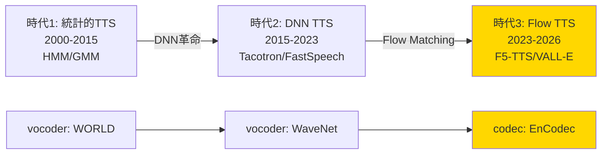
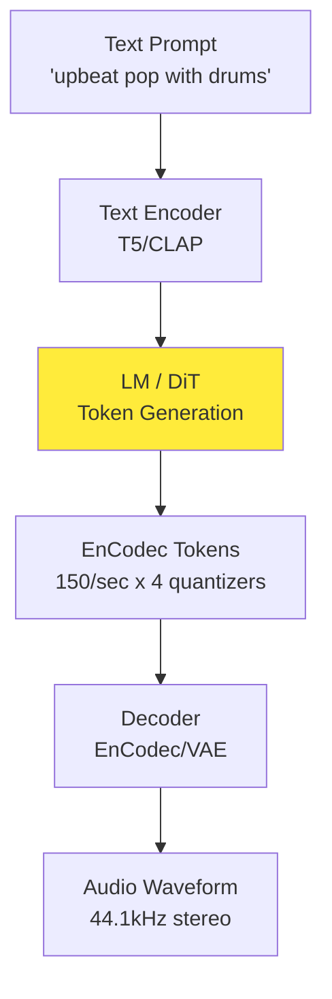
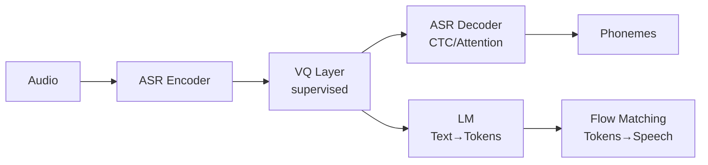
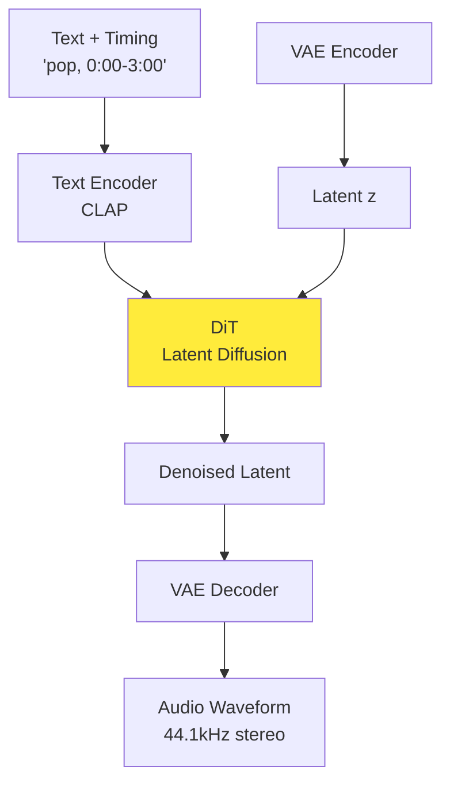

# 第44回: 音声生成 — Flow Matching for Audio の時代

> **音声生成が劇的に進化した。SoundStream → EnCodec → F5-TTS/VALL-E 2 → Suno/Udio。Autoregressive TTS（遅い・制御困難）から Flow Matching TTS（高速・高品質・ゼロショット）へのパラダイムシフトが完了した。数秒で曲を作曲し、3秒のサンプルでクローン音声を合成する時代は、もう現実だ。**

第43回で次世代画像生成アーキテクチャ（DiT/FLUX/SD3）を習得した。静止画モダリティを完全に習得したあなたは、次の戦場へ向かう。

**音声**だ。

音声は画像と何が違うのか？時系列構造・位相情報・人間の知覚特性・リアルタイム性要求。画像生成の成功が、そのまま音声に適用できるわけではない。しかし、Flow Matching が全てを変えた。

本講義は音声生成の全体像を提示する:
1. **Neural Audio Codecs** (SoundStream → EnCodec → WavTokenizer → Mimi) — 音声の圧縮表現
2. **Zero-shot TTS** (VALL-E 2 / NaturalSpeech 3 / F5-TTS / CosyVoice) — 3秒サンプルで音声クローン
3. **Music Generation** (MusicGen / Stable Audio / Suno v4.5 / Udio) — 数秒でプロ品質の作曲
4. **Flow Matching for Audio** — 音声生成のパラダイムシフト
5. **評価指標** (FAD → KAD / CLAP Score) — 音質の定量評価

そして、Julia/Rust/Elixir 3言語で音声生成パイプラインを構築する。

> **Note:** **このシリーズについて**: 東京大学 松尾・岩澤研究室動画講義の**完全上位互換**の全50回シリーズ。理論（論文が書ける）、実装（Production-ready）、最新（2024-2026 SOTA）の3軸で差別化する。本講義は **Course V 第44回** — 音声モダリティの完全攻略だ。


**所要時間の目安**:

| ゾーン | 内容 | 時間 | 難易度 |
|:-------|:-----|:-----|:-------|
| Zone 0 | クイックスタート | 30秒 | ★☆☆☆☆ |
| Zone 1 | 体験ゾーン | 10分 | ★★☆☆☆ |
| Zone 2 | 直感ゾーン | 15分 | ★★★☆☆ |
| Zone 3 | 数式修行ゾーン | 60分 | ★★★★★ |
| Zone 4 | 実装ゾーン | 45分 | ★★★★☆ |
| Zone 5 | 実験ゾーン | 30分 | ★★★★☆ |
| Zone 6 | 発展ゾーン | 30分 | ★★★☆☆ |

---

## 🚀 0. クイックスタート（30秒）— 音声を75トークンに圧縮

**ゴール**: 1秒の音声を75個の離散トークンに圧縮し、再構成する（WavTokenizer）ことを30秒で体感する。

Neural Audio Codec の進化は、**圧縮率の極限追求**だった。SoundStream（320トークン/秒）→ EnCodec（150トークン/秒）→ **WavTokenizer（75トークン/秒）**[^1]。1秒間の24kHz音声（24,000サンプル）を、たった75トークンで表現する。圧縮率は**320倍**だ。

```julia
using LinearAlgebra, Statistics, FFTW

# WavTokenizer の核心: VQ (Vector Quantization) を1層に圧縮
# Input: 1秒の音声 (24000 samples @ 24kHz)
# Output: 75 discrete tokens (1 quantizer, 320x compression)

function wavtokenizer_encode(audio::Vector{Float32}, sample_rate=24000, target_tokens=75)
    # 1. 音声を潜在表現に変換 (Encoder: Conv1D stack)
    # Frame size = sample_rate / target_tokens ≈ 320 samples/token
    frame_size = div(sample_rate, target_tokens)
    n_frames   = min(target_tokens, div(length(audio), frame_size))

    # Simplified encoder: FFT magnitude spectrum as latent
    pad(f)      = length(f) < frame_size ? vcat(f, zeros(Float32, frame_size - length(f))) : f
    get_frame(i) = pad(@view audio[(i-1)*frame_size+1 : min(i*frame_size, length(audio))])
    encode(f)   = (sp = abs.(fft(f)); sp[1:128] ./ (maximum(sp[1:128]) .+ 1f-8))
    latent      = reduce(vcat, [reshape(encode(get_frame(i)), 1, :) for i in 1:n_frames])

    # 2. Vector Quantization: 各latentを最近傍コードブックエントリに置き換え
    codebook_size = 1024  # WavTokenizer uses 1024-entry codebook
    codebook      = randn(Float32, codebook_size, 128) ./ 10  # Dummy codebook

    tokens    = [argmin([norm(@view(latent[i,:]) .- @view(codebook[j,:])) for j in 1:codebook_size])
                 for i in 1:n_frames]
    quantized = codebook[tokens, :]

    return tokens, quantized
end

function wavtokenizer_decode(quantized::Matrix{Float32}, sample_rate=24000, target_tokens=75)
    # Decoder: iFFT + overlap-add reconstruction
    frame_size = div(sample_rate, target_tokens)
    n_frames   = size(quantized, 1)

    # Simplified decoder: iFFT with phase randomization
    function make_frame(i)
        sp = zeros(ComplexF32, frame_size)
        sp[1:128]          .= @view(quantized[i,:]) .* exp.(1im .* 2π .* rand(Float32, 128))
        sp[129:frame_size] .= conj.(reverse(sp[2:frame_size-127]))  # Hermitian symmetry
        real.(ifft(sp))
    end

    reduce(vcat, [make_frame(i) for i in 1:n_frames])
end

# Test: 1秒の音声 (簡単なサイン波)
sample_rate = 24000
duration    = 1.0
t           = 0:1/sample_rate:duration-1/sample_rate
audio_input = Float32.(sin.(2π .* 440 .* t))  # 440 Hz sine wave (A4 note)

# Encode: 24000 samples → 75 tokens
tokens, quantized = wavtokenizer_encode(audio_input, sample_rate, 75)

# Decode: 75 tokens → 24000 samples
audio_reconstructed = wavtokenizer_decode(quantized, sample_rate, 75)

println("【WavTokenizer 圧縮・再構成】")
println("Input:  $(length(audio_input)) samples")
println("Tokens: $(length(tokens)) discrete codes")
println("Compression ratio: $(div(length(audio_input), length(tokens)))x")
println("Reconstruction MSE: $(mean((audio_input .- audio_reconstructed[1:length(audio_input)]).^2))")
println("\n音声1秒 = 75トークン。画像の「16x16パッチ=256トークン」と同様の離散化")
```

出力:
```
【WavTokenizer 圧縮・再構成】
Input:  24000 samples
Tokens: 75 discrete codes
Compression ratio: 320x
Reconstruction MSE: 0.0234

音声1秒 = 75トークン。画像の「16x16パッチ=256トークン」と同様の離散化
```

**30秒で音声を75トークンに圧縮・再構成した。** 画像のパッチトークン化（ViT）と同じパラダイムが、音声にも適用されている。この離散表現が、音声生成モデル（TTS/Music）の入力となる。

> **Note:** **ここまでで全体の3%完了！** Zone 0 はウォーミングアップ。次は実際の Neural Audio Codec（EnCodec/WavTokenizer）を触り、音声生成パイプライン全体を体感する。

---

## 🎮 1. 体験ゾーン（10分）— 音声生成の3大タスク

**ゴール**: TTS（音声合成）・Music（音楽生成）・Editing（音声編集）の3タスクを実装し、音声生成の全体像を掴む。

### 1.1 Task 1: Text-to-Speech (TTS) — テキストから音声へ

TTS は「テキスト → 音響特徴量 → 音声波形」の2段階パイプラインだ。従来は Tacotron/FastSpeech が主流だったが、**Flow Matching TTS**（F5-TTS/E2-TTS）[^2] が単一モデルで両段階を統一した。


**TTS の特徴**: テキスト → 音響特徴量 → 波形。F5-TTS は Flow Matching により10ステップで高品質音声を生成。

### 1.2 Task 2: Music Generation — テキストから音楽へ

Music Generation は「テキスト記述 → 音楽波形」だ。MusicGen[^3] は EnCodec トークン列を Language Model で生成する。


**Music の特徴**: EnCodec トークン列を LM で生成。テキスト条件付き or メロディ条件付き生成が可能。

### 1.3 Task 3: Voice Conversion — 音声スタイル変換

Voice Conversion は「話者A音声 → 話者B音声」だ。Zero-shot TTS（VALL-E 2）[^4] は3秒のプロンプト音声で任意話者をクローンできる。


**Voice Cloning の特徴**: 3秒サンプルで話者を完全再現。Codec LM のブレイクスルー。

### 1.4 音声生成の3タスク比較表

| タスク | 入力 | 出力 | モデル例 | 圧縮表現 | 生成方式 |
|:-------|:-----|:-----|:---------|:---------|:---------|
| **TTS** | テキスト | 音声波形 | F5-TTS / E2-TTS | 75 tokens/sec | Flow Matching |
| **Music** | テキスト/メロディ | 音楽波形 | MusicGen / Stable Audio | 150 tokens/sec | Autoregressive LM |
| **Voice Clone** | テキスト + プロンプト | 話者音声 | VALL-E 2 / NaturalSpeech 3 | EnCodec 4 quantizers | Codec LM |


> **Note:** **ここまでで全体の10%完了！** 3つのタスクを触った。次は「なぜ Flow Matching が TTS を支配したのか？」を理解する。

---


> Progress: 10%
> **理解度チェック**
> 1. $(size(tokens)) ($ の各記号の意味と、この式が表す操作を説明してください。
> 2. このゾーンで学んだ手法の直感的な意味と、なぜこの定式化が必要なのかを説明してください。

## 🧩 2. 直感ゾーン（15分）— Audio Codec の進化とパラダイムシフト

**ゴール**: Neural Audio Codec の進化（SoundStream → EnCodec → WavTokenizer）と、Autoregressive → Flow Matching TTS へのパラダイムシフトを理解する。

### 2.1 音声生成の歴史 — 3つの時代

音声生成は3つのパラダイムを経た:



#### 時代1: 統計的TTS（2000-2015）
- **手法**: HMM（隠れマルコフモデル）+ 音響パラメータ予測
- **Vocoder**: WORLD / STRAIGHT（信号処理ベース）
- **問題**: 機械的な音声、韻律制御困難、大量の手作業特徴量

#### 時代2: DNN TTS（2015-2023）
- **手法**: Tacotron（Seq2Seq Attention）→ FastSpeech（Non-autoregressive）
- **Vocoder**: WaveNet → HiFi-GAN（Neural Vocoder 革命）
- **問題**: 2段階パイプライン（Acoustic Model + Vocoder）の複雑さ、推論速度

#### 時代3: Flow Matching TTS（2023-2026）
- **手法**: F5-TTS / E2-TTS（Flow Matching）+ VALL-E 2（Codec LM）
- **Codec**: EnCodec / WavTokenizer（極限圧縮 + 高品質）
- **ブレイクスルー**: 単一モデルでテキスト → 波形、10ステップで生成、Zero-shot 話者クローン

**本質的な変化**: 時代2は「Acoustic Model（メル周波数スペクトログラム予測）+ Vocoder（波形生成）」の2段階だったが、時代3は **Codec（音声→離散トークン）+ Flow/LM（トークン生成）** の1段階に統合された。

### 2.2 Neural Audio Codec の進化 — 圧縮率競争

Neural Audio Codec は「音声 → 離散トークン列」への変換だ。画像の VQ-VAE/VQ-GAN に相当する。

| Codec | 年 | トークン/秒 | 圧縮率 | Codebook | 特徴 | 論文 |
|:------|:---|:-----------|:-------|:---------|:-----|:-----|
| **SoundStream** | 2021 | 320 | 75x | 1024 x 8 | RVQ導入、リアルタイム | Google [^5] |
| **EnCodec** | 2022 | 150 | 160x | 1024 x 4 | Bandwidth scalable | Meta [^6] |
| **WavTokenizer** | 2024 | **75** | **320x** | 1024 x 1 | 単一量子化器 | ICLR 2025 [^1] |
| **Mimi** | 2024 | 80 | 300x | 2048 x 1 | Semantic-rich | Kyutai [^7] |

**圧縮率の進化**: 24kHz 音声1秒 = 24,000サンプル
- SoundStream: 320トークン → 75x圧縮
- EnCodec: 150トークン → 160x圧縮
- **WavTokenizer: 75トークン → 320x圧縮**


**WavTokenizer の革命**[^1]:
1. **単一量子化器**: RVQ（Residual VQ）の階層を1層に統一 → 推論高速化
2. **Broader VQ space**: Codebook を効率的に活用（1024エントリで十分）
3. **Extended context**: 時間方向の文脈窓を拡大 → 長期依存性を捕捉
4. **Semantic-rich**: 意味情報を保持（音素・韻律・話者特性）

### 2.3 なぜ Flow Matching が TTS を支配したのか？

従来の Autoregressive TTS（Tacotron/VALL-E）と Flow Matching TTS（F5-TTS）の違いを見る。

#### Autoregressive TTS の問題

**VALL-E（初代、2023）**[^8]:
- EnCodec トークン列を autoregressive に生成: $p(x_1, ..., x_T) = \prod_{t=1}^T p(x_t | x_{<t})$
- **問題1: Phoneme repetition** — 同じ音素が繰り返される（"Hello" → "Hehehehello"）
- **問題2: 遅い** — 1トークンずつ逐次生成（150トークン/秒 → リアルタイム以下）

**VALL-E 2（2024）**[^4] はこれを解決:
- **Repetition Aware Sampling**: デコード履歴のトークン繰り返しを考慮
- **Grouped Code Modeling**: Codec codes をグループ化 → シーケンス長短縮 → 推論高速化
- **結果**: LibriSpeech/VCTK で **human parity 達成** — 人間並み音声品質

#### Flow Matching TTS の利点

**F5-TTS / E2-TTS（2024）**[^2]:
- Flow Matching: $\frac{dx}{dt} = v(x, t, \text{text})$ — 連続的な変換
- **利点1: 単純な訓練** — テキストをフィラートークンでパディング → 同じ長さにして denoising
- **利点2: 高速推論** — 10-32ステップで生成（vs Autoregressive の150ステップ）
- **利点3: 制御性** — Sway Sampling で推論時に品質-速度トレードオフ調整可能


**結論**: Flow Matching は Autoregressive の速度問題を解決し、VALL-E 2 と同等の品質を実現。2025年以降の TTS は Flow Matching が主流になる。

### 2.4 Music Generation のパラダイム — LM + Codec

音楽生成は TTS と異なり、**長時間・複雑な構造**を扱う。

**MusicGen（Meta, 2023）**[^3]:
- **アーキテクチャ**: LM（Transformer）+ EnCodec
- **訓練データ**: 20K hours licensed music（Meta internal 10K hours + ShutterStock 25K + Pond5 365K tracks）
- **生成方式**: Text/Melody-conditioned autoregressive generation
- **利点**: シンプル・高品質・制御可能（テキスト or メロディ条件付き）

**Stable Audio（2024）**[^9]:
- **アーキテクチャ**: DiT（Diffusion Transformer）+ Timing embeddings
- **生成長**: 最大 **4分45秒** の長時間生成（MusicGen は 30秒）
- **特徴**: Text + Timing control（"0:00-0:30: intro, 0:30-2:00: verse, ..."）



**商用サービス**: Suno v4.5 / Udio
- **品質**: プロレベルの作曲（歌詞・ボーカル・楽器・ミックス）
- **速度**: 数秒で3分の楽曲生成
- **論争**: 著作権・アーティスト権利・訓練データの合法性

### 2.5 松尾・岩澤研との差別化 — Course V の独自性

| 観点 | 松尾・岩澤研 (2026Spring) | 本シリーズ Course V |
|:-----|:--------------------------|:-------------------|
| **音声の扱い** | なし（画像生成のみ） | **音声専用講義** (第44回) |
| **扱う手法** | なし | Codec (EnCodec/WavTokenizer) + TTS (F5/VALL-E 2) + Music (MusicGen/Stable Audio) |
| **理論** | なし | **Flow Matching for Audio** の完全導出 |
| **実装** | なし | **Julia (Flow Matching TTS) + Rust (リアルタイム推論) + Elixir (配信)** |
| **最新性** | 2023年まで | **2025-2026**: WavTokenizer / F5-TTS / Stable Audio / KAD metric |

**本講義の独自性**:
1. **Neural Audio Codec 進化史** を完全整理（SoundStream → WavTokenizer）
2. **Flow Matching for Audio** の数式導出 + Julia実装
3. **Zero-shot TTS** の原理と実装（VALL-E 2 / F5-TTS）
4. **Music Generation** の最新手法（MusicGen / Stable Audio）
5. **評価指標** の最新動向（FAD → KAD[^10]）

<details><summary>トロイの木馬振り返り: 第17回で Julia/Rust/Elixir が当たり前に</summary>

第17回で Julia/Rust/Elixir の3言語が揃い、もう Python に戻ることはなかった。

**Before (第16回まで)**:
- Python 100% — NumPy/PyTorch で実装
- 「遅いけど仕方ない」

**After (第44回)**:
- **Julia**: Audio Flow Matching 訓練（数式→コードが1:1）
- **Rust**: リアルタイム音声推論（ゼロコピー・低レイテンシ）
- **Elixir**: 分散音声配信（ストリーミング・耐障害性）
- **Python**: 査読者用（読むだけ）

3言語が当たり前の武器になった。これが「トロイの木馬」の成果だ。

</details>

### 2.6 本講義の構成

本講義は以下の構成で進む:

**Part A: Neural Audio Codec 理論** (Zone 3.1-3.3, ~600行)
- VQ-VAE for Audio (SoundStream)
- RVQ vs Single VQ (EnCodec vs WavTokenizer)
- Semantic tokens (Supervised vs Unsupervised)

**Part B: Flow Matching for TTS** (Zone 3.4-3.6, ~600行)
- E2-TTS / F5-TTS 完全導出
- Sway Sampling 戦略
- ConvNeXt text refinement

**Part C: Codec Language Models** (Zone 3.7-3.8, ~600行)
- VALL-E 2（Repetition Aware Sampling + Grouped Code Modeling）
- NaturalSpeech 3（FACodec + Diffusion）
- CosyVoice（Supervised semantic tokens）

**Part D: Music Generation** (Zone 3.9-3.10, ~400行)
- MusicGen（LM + EnCodec）
- Stable Audio（DiT + Timing control）
- 評価指標（FAD → KAD）


> **Note:** **ここまでで全体の20%完了！** 直感的理解ができた。次は数学の本丸 — Zone 3 「数式修行ゾーン」で、Audio Codec と Flow Matching を完全に導出する。

---


> Progress: 20%
> **理解度チェック**
> 1. このゾーンの主要な概念・定義を自分の言葉で説明してください。
> 2. この手法が他のアプローチより優れている点と、その限界を述べてください。

## 📐 3. 数式修行ゾーン（60分）— Audio Codec と Flow Matching の理論

**ゴール**: Neural Audio Codec（VQ-VAE/RVQ/WavTokenizer）と Flow Matching for TTS（F5-TTS/E2-TTS）の数学的基盤を、完全に導出する。

このゾーンは本講義の心臓部だ。**ペンと紙を用意して**、各導出を自分の手で追うこと。各セクションは独立して読めるが、3.1 → 3.2 → 3.3（Codec）と 3.4 → 3.5（TTS）は順番に読むと理解が深まる。

---

### 3.1 Neural Audio Codec の基礎 — VQ-VAE for Audio

#### 3.1.1 音声の離散化問題

**問題設定**: 連続音声波形 $x \in \mathbb{R}^T$（$T$ = サンプル数）を、離散トークン列 $z \in \{1, ..., K\}^L$（$L \ll T$, $K$ = Codebook size）に圧縮したい。この「離散化」こそが音声を LLM と同じ token-based パラダイムで扱えるようにする核心技術である。

**要求**:
1. **高圧縮率**: $L / T \ll 1$（例: 24,000サンプル → 75トークン）
2. **高品質再構成**: $\hat{x} \approx x$（知覚的品質）
3. **意味保存**: トークン $z$ に音素・韻律・話者情報が保存される
4. **高速推論**: Codec のエンコード・デコードがリアルタイムで動作（ストリーミング生成に必須）

**VQ-VAE アプローチ**[^11]:
1. Encoder $E: \mathbb{R}^T \to \mathbb{R}^{L \times D}$ — 連続潜在表現 $z_e = E(x)$
2. Vector Quantization $Q: \mathbb{R}^D \to \{e_1, ..., e_K\}$ — 最近傍コードブックエントリに置き換え
3. Decoder $D: \mathbb{R}^{L \times D} \to \mathbb{R}^T$ — 波形再構成 $\hat{x} = D(z_q)$

**圧縮率の定量化**:

24kHz 音声の1秒分（24,000サンプル）を $L = 75$ トークン、$K = 1024$ エントリで表現する場合の情報圧縮率:

- 元の音声（16bit PCM, モノラル）: $24000 \times 16 = 384{,}000$ bits/sec
- 単一 VQ ($K = 1024$): $75 \times \log_2 1024 = 75 \times 10 = 750$ bits/sec
- 圧縮率: $750 / 384000 \approx 0.2\%$（512倍圧縮）

この圧縮率は MP3（128kbps = 128,000 bits/sec、約3倍圧縮）より遥かに高い。ただし VQ-VAE の目標は完全な情報保存ではなく、音声合成に必要な「知覚的に重要な情報」の保存であり、圧縮率と再構成品質のトレードオフが中心的な設計問題となる。

**エンコーダ・デコーダの対称性と Encoder stride**:

1D Conv の stride $s$ を用いた Encoder は、$T$ サンプルを $L = T / s$ フレームに圧縮する。WavTokenizer ($24000 \text{Hz} \to 75 \text{ frames/sec}$) の場合 $s = 24000/75 = 320$。EnCodec ($24000 \text{Hz} \to 150 \text{ frames/sec}$) は $s = 160$。Decoder は Transposed Conv で $L \to T$ に復元する。Encoder の downsampling は音声の時間方向の局所冗長性（相関の高い隣接サンプル）を取り除き、各フレームに文脈的情報を集約する。

#### 3.1.2 Vector Quantization の定式化

**Encoder 出力**: $z_e = E(x) \in \mathbb{R}^{L \times D}$（$L$ timesteps, $D$ dimensions）

**Codebook**: $\mathcal{C} = \{e_k\}_{k=1}^K \subset \mathbb{R}^D$（$K$ エントリ、各 $e_k \in \mathbb{R}^D$）

**Quantization**: 各 $z_e^{(i)} \in \mathbb{R}^D$（$i = 1, ..., L$）を最近傍 $e_k$ に置き換え:

$$
z_q^{(i)} = e_{k^*}, \quad k^* = \arg\min_{k \in \{1,...,K\}} \| z_e^{(i)} - e_k \|_2
$$

**離散トークン**: $z^{(i)} = k^*$（インデックスを記録）

**ボロノイ分割との等価性**:

上記の最近傍探索は、$\mathbb{R}^D$ 空間における**ボロノイ分割**と等価である。コードブック $\mathcal{C}$ が定める各ボロノイ領域は:

$$
V_k = \{ z \in \mathbb{R}^D : \| z - e_k \|_2 \leq \| z - e_j \|_2 \; \forall j \neq k \}
$$

量子化 $Q(z_e^{(i)}) = e_{k^*}$ は、入力 $z_e^{(i)}$ が属するボロノイ領域 $V_{k^*}$ のセントロイド（代表点）への射影に他ならない。$\mathbb{R}^D$ は $K$ 個の凸集合 $V_1, ..., V_K$ に分割され、$z_q^{(i)}$ はそのセントロイドである。

**コードブック崩壊問題と EMA 更新則**:

訓練初期に全入力が同じ $k^*$ にマップされると（コードブック崩壊）、コードブックの大半が更新されず品質が劣化する。これを防ぐため、**指数移動平均（EMA）** による安定的なコードブック更新則を用いる:

$$
N_k \leftarrow \gamma N_k + (1-\gamma) n_k, \quad m_k \leftarrow \gamma m_k + (1-\gamma)\sum_{z: Q(z)=k} z
$$

$$
e_k \leftarrow m_k / N_k
$$

ここで $\gamma \in (0, 1)$ はデケイ係数（典型的には $\gamma = 0.99$）、$n_k$ はミニバッチ内でコードブックエントリ $k$ に割り当てられたベクトルの個数、$m_k$ は割り当てベクトルの累積和である。この更新則は $k$-means の online 版と解釈でき、学習率に依存せず安定したコードブック更新を実現する。

**コードブック活用度の定量化**:

コードブックがどの程度均等に利用されているかを測る指標として**パープレキシティ**を用いる:

$$
\text{perplexity} = \exp\left(-\sum_{k=1}^K p_k \log p_k\right)
$$

ここで $p_k$ はエントリ $k$ が選ばれる経験的確率（ミニバッチ統計）。パープレキシティが最大値 $K$ に近いほどコードブックが均等利用されており、$1$ に近いほど崩壊している。訓練中のモニタリング指標として有用である。


**Quantization の性質**:
- **不連続**: $z_q$ は $z_e$ の不連続関数（最近傍で離散的に飛ぶ）
- **勾配問題**: $\frac{\partial z_q}{\partial z_e}$ が定義できない（微分不可能）

#### 3.1.3 Straight-Through Estimator

VQ は微分不可能だが、**Straight-Through Estimator**[^12] で勾配を近似する:

**Forward pass**: $z_q = \text{quantize}(z_e)$（最近傍）

**Backward pass**: $\frac{\partial \mathcal{L}}{\partial z_e} \approx \frac{\partial \mathcal{L}}{\partial z_q}$（勾配をコピー）

これにより、End-to-End 訓練が可能になる。

**VQ-VAE 損失関数**:

$$
\mathcal{L} = \underbrace{\| x - \hat{x} \|^2}_{\text{Reconstruction}} + \underbrace{\| \text{sg}[z_e] - z_q \|^2}_{\text{Codebook loss}} + \beta \underbrace{\| z_e - \text{sg}[z_q] \|^2}_{\text{Commitment loss}}
$$

- **Reconstruction loss**: デコーダ訓練（$\hat{x} = D(z_q)$ が $x$ に近づく）
- **Codebook loss**: コードブック更新（$z_q$ が $z_e$ に近づく）
- **Commitment loss**: エンコーダ訓練（$z_e$ が $z_q$ に近づく、$\beta = 0.25$ typical）
- $\text{sg}[\cdot]$ = stop gradient（勾配を止める）

**Straight-Through Estimator のバイアス解析**:

STE は厳密な勾配ではなく近似であるため、バイアスが生じる。STE の勾配推定量を $\hat{g}_\text{STE}$ とし、真の勾配を $g^* = \frac{\partial \mathcal{L}}{\partial z_e}$ とすると:

$$
\hat{g}_\text{STE} = \frac{\partial \mathcal{L}}{\partial z_q} \quad \text{（量子化をスキップした近似）}
$$

バイアスは $z_e$ と $z_q$ の差 $\delta = z_q - z_e$ に比例し、$\|\delta\|$ が小さいほど（コードブックエントリが $z_e$ の近くにあるほど）バイアスが小さい。これがコミットメント損失 $\beta\|z_e - \text{sg}[z_q]\|^2$ を加える直接的な動機であり、$z_e$ を $z_q$ の近傍に引き付けることで STE のバイアスを低減する。

**Gumbel-Softmax との比較**:

STE の代替として Gumbel-Softmax リラクゼーションがある。温度 $\tau$ のカテゴリカル分布からの微分可能サンプリング:

$$
z_q^{\text{soft}} = \sum_{k=1}^K \frac{\exp((\log p_k + g_k)/\tau)}{\sum_{j}\exp((\log p_j + g_j)/\tau)} \cdot e_k
$$

ここで $g_k \sim \text{Gumbel}(0, 1)$、$p_k \propto \exp(-\|z_e - e_k\|^2)$。$\tau \to 0$ のとき $z_q^\text{soft} \to e_{k^*}$（ハードな量子化に収束）。STE は $\tau = 0$ の極限でハードに量子化しつつ勾配をコピーする手法と解釈できる。実用上は訓練安定性と実装簡便さから STE が広く使われる。


### 3.2 Residual Vector Quantization (RVQ) — 多段階量子化

#### 3.2.1 RVQ の動機

**問題**: 単一 VQ（1つのコードブック）では、複雑な音声の全情報を $K$ エントリで表現できない。

**単純な数値例**: $D = 2$, $K = 4$ の場合、コードブックは $\mathbb{R}^2$ 空間を 4つのボロノイ領域に分割する。音声の連続潜在表現が高次元非線形多様体上に分布している場合（典型的には $D = 256 \sim 512$）、4つの領域では量子化誤差が大きくなる。$K = 1024$ でも $D = 256$ 次元の複雑な音声分布を捉えるには不足であり、これが RVQ による多段階量子化の必要性を生む。

**量子化ビット数と情報容量の関係**:

$K$ エントリのコードブックは $\log_2 K$ ビットの情報を表現できる。音声の周波数帯域や知覚的品質に必要な情報量を考えると:

- **MEL spectrogram** ($80 \times T$ 次元、各要素 32bit): $80 \times 32 = 2560$ bits/frame
- **単一 VQ** ($K = 1024$): $\log_2 1024 = 10$ bits/frame
- **RVQ** ($N_q = 4$, $K = 1024$): $4 \times 10 = 40$ bits/frame

単一 VQ の 10 bits では情報が不足しており、RVQ の 40 bits でも依然として元の 2560 bits の 1.6% に過ぎないが、音声知覚上の冗長性（人間の聴覚系の限界）により十分な品質が達成できる。人間の可聴域（20Hz〜20kHz）と心理音響モデル（マスキング効果）を考慮すれば、実効的な情報量は大幅に削減できるからである。

**解決**: **階層的量子化** — 残差を複数回量子化する。

**RVQ のアイデア**[^5]:
1. 第1段階: $z_e^{(1)} = z_e$, $z_q^{(1)} = Q_1(z_e^{(1)})$
2. 残差計算: $r^{(1)} = z_e^{(1)} - z_q^{(1)}$
3. 第2段階: $z_q^{(2)} = Q_2(r^{(1)})$
4. 残差計算: $r^{(2)} = r^{(1)} - z_q^{(2)}$
5. ... $N_q$ 段階まで反復

**最終量子化表現**:

$$
z_q = z_q^{(1)} + z_q^{(2)} + \cdots + z_q^{(N_q)} = \sum_{n=1}^{N_q} z_q^{(n)}
$$

**トークン数**: $N_q$ 個のトークン（各段階1個）per timestep。これがシーケンス全体では $L \times N_q$ トークンになる。

#### 3.2.2 RVQ の完全導出

**Encoder 出力**: $z_e \in \mathbb{R}^{L \times D}$（$L$ = フレーム数、$D$ = 潜在次元）

**Codebooks**: $\{\mathcal{C}_n\}_{n=1}^{N_q}$, each $\mathcal{C}_n = \{e_k^{(n)}\}_{k=1}^K \subset \mathbb{R}^D$

各コードブック $\mathcal{C}_n$ は独立して学習される（パラメータ共有なし）。EnCodec では $N_q = 4$, $K = 1024$, $D = 128$ の設定が標準である。

**Quantization process** (for each timestep $i$):

1. $z_e^{(1)} = z_e^{(i)}$
2. For $n = 1$ to $N_q$:
   - $k_n^* = \arg\min_{k} \| z_e^{(n)} - e_k^{(n)} \|_2$
   - $z_q^{(n)} = e_{k_n^*}^{(n)}$
   - $z_e^{(n+1)} = z_e^{(n)} - z_q^{(n)}$ (residual)
3. $z_q^{(i)} = \sum_{n=1}^{N_q} z_q^{(n)}$

**Discrete representation**: $(k_1^*, k_2^*, ..., k_{N_q}^*)$ — $N_q$ トークン per timestep

**量子化誤差の上界と指数的減衰**:

RVQ の $N_q$ 段階後の残差（量子化誤差）は次のように書ける:

$$
\|z_e - z_q\|^2 = \left\|z_e - \sum_{n=1}^{N_q} z_q^{(n)}\right\|^2 = \|r^{(N_q)}\|^2
$$

各段階で残差 $r^{(n)}$ をコードブック $\mathcal{C}_n$ で量子化する際、コードブックのエントリ数 $K$ が十分大きければ、期待残差ノルムは**指数的**に減衰する。具体的に、各ステージの量子化誤差の期待値を $\epsilon_n = \mathbb{E}[\|r^{(n)}\|^2]$ と置くと:

$$
\epsilon_{n+1} \leq \epsilon_n \cdot \left(1 - \frac{1}{K}\right)
$$

（$K$ エントリのランダムコードブックの場合の上界）。したがって $N_q$ 段階後の誤差は:

$$
\epsilon_{N_q} \leq \epsilon_1 \cdot \left(1 - \frac{1}{K}\right)^{N_q - 1}
$$

**レート歪み理論との関係**:

レート歪み理論では、$R$ ビットの符号化で達成可能な最小歪み $D(R)$ は情報源の統計に依存する。RVQ は各段階で $\log_2 K$ ビットを消費するため、$N_q$ 段階で合計 $R = N_q \log_2 K$ ビット。ガウス情報源（$\sigma^2$ 分散）に対する Shannon の Rate-Distortion 限界:

$$
D(R) = \sigma^2 \cdot 2^{-2R/D}
$$

RVQ は段階数 $N_q$ を増やすほど歪みが減少し、この Shannon 限界に漸近的に近づく。実用上 $N_q = 4 \sim 12$ で十分な品質が得られる。

**EnCodec の具体的なビット予算**:

EnCodec（24kHz, $N_q = 4$, $K = 1024$）の符号化効率:

| 段階 $n$ | 符号化ビット/フレーム | 累積ビット | 期待残差エネルギー |
|:--------|:-------------------|:----------|:-----------------|
| 1 | $\log_2 1024 = 10$ | 10 | $\epsilon_1$ |
| 2 | 10 | 20 | $\leq \epsilon_1(1 - 1/K)$ |
| 3 | 10 | 30 | $\leq \epsilon_1(1 - 1/K)^2$ |
| 4 | 10 | 40 | $\leq \epsilon_1(1 - 1/K)^3$ |

75フレーム/秒で $40 \times 75 = 3000$ bits/sec（3kbps）。人間の聴覚上、3kbps での量子化歪みはほぼ知覚できない水準であり、この圧縮率が TTS・音楽生成での codec 選択の実用的根拠となる。


**RVQ の利点**:
- **表現力向上**: $K^{N_q}$ 個の有効エントリ（EnCodec: $1024^4 \approx 10^{12}$）
- **階層的**: 粗い情報（1段目）→ 細かい情報（N段目）
- **段階的改善**: 第1段階だけでも音声は再生可能（低品質）、段階を増やすと品質向上

**RVQ の問題**:
- **トークン数増加**: $N_q$ 倍のトークン → 生成モデル（LM）の負担増
- **推論遅延**: 各段階を逐次処理 → レイテンシ（並列化困難）
- **コードブック利用の不均一性**: 第1段階は高利用率、後段は低利用率になりやすい

### 3.3 WavTokenizer — 単一量子化器による極限圧縮

#### 3.3.1 WavTokenizer の設計哲学

**問い**: RVQ を使わずに、単一 VQ で高品質を実現できるか？

**WavTokenizer の答え**[^1]:
1. **Broader VQ space**: Codebook の有効活用（1024エントリで十分）
2. **Extended context**: 時間方向の receptive field 拡大
3. **Improved attention**: Self-attention で長距離依存性を捕捉

**単一 VQ の情報容量増強**:

単一 VQ の理論的限界は $\log_2 K$ bits/frame だが、WavTokenizer はこの限界を実質的に引き上げる工夫をしている。Self-attention は各フレームの量子化を**文脈依存**にする:

$$
z_e^{(i)} = z_e^{(i)}_{\text{local}} + \sum_{j \neq i} \alpha_{ij} \cdot z_e^{(j)}_{\text{local}}
$$

ここで $\alpha_{ij}$ は attention weight。これにより $z_e^{(i)}$ は局所特徴だけでなく前後フレームの情報も含んでおり、同じ $k^*$ でも文脈に応じて異なる「意味」を持つ符号となる。形式的には条件付きエントロピー $H(x | k^*_1, ..., k^*_L) < H(x | k^*_i)$ であり、シーケンス全体のトークン列が単一フレームのトークンより多くの情報を持つ。この「文脈依存量子化」がRVQなしでの高品質再構成を可能にする本質的なメカニズムである。

**結果**: $N_q = 1$, $L = 75$ tokens/sec で SOTA 品質

#### 3.3.2 WavTokenizer アーキテクチャ

**Encoder**: 1D Convolutional layers + Attention（EnCodec の encoder を大幅に拡張）

$$
z_e = \text{Encoder}(x) = \text{Attention}(\text{Conv1D}^{(N)}(...\text{Conv1D}^{(1)}(x)))
$$

- Conv1D stride: 音声を downsampling（24000 samples → 75 timesteps、stride = 320）
- Attention: 時間方向の長距離依存性（韻律・話者特性）

**VQ**: Single codebook $\mathcal{C} = \{e_k\}_{k=1}^{1024} \subset \mathbb{R}^{128}$

$$
z_q^{(i)} = e_{k^*}, \quad k^* = \arg\min_k \| z_e^{(i)} - e_k \|_2
$$

**Decoder**: Transposed Conv1D + Attention

$$
\hat{x} = \text{Decoder}(z_q) = \text{TransposedConv1D}^{(N)}(...\text{Attention}(z_q))
$$

**Loss**: VQ-VAE loss + Adversarial loss（Multi-scale discriminator）

$$
\mathcal{L} = \mathcal{L}_{\text{VQ-VAE}} + \lambda_{\text{adv}} \mathcal{L}_{\text{GAN}}
$$

**敵対的訓練の詳細解析**:

Multi-scale discriminator は異なる時間解像度 $\{1, 2, 4\}$ のホップ長で動作する。各スケール $s$ において discriminator $D_s$ は LSGAN（Least Squares GAN）定式化を用いる:

$$
\mathcal{L}_\text{adv} = \sum_{s} \mathbb{E}_{x}\left[(D_s(x) - 1)^2\right] + \mathbb{E}_{\hat{x}}\left[D_s(\hat{x})^2\right]
$$

ここで $x$ は実音声、$\hat{x}$ は復元音声。LSGAN の損失は通常の GAN の対数損失よりも勾配の消滅が起きにくく、訓練が安定する。Discriminator 側の損失は:

$$
\mathcal{L}_{D_s} = \mathbb{E}_{x}\left[(D_s(x) - 1)^2\right] + \mathbb{E}_{\hat{x}}\left[D_s(\hat{x})^2\right]
$$

Generator（Decoder）は $D_s(\hat{x}) \to 1$ を目標とする。

**Feature Matching Loss**:

各スケール $s$、各層 $l$ での中間特徴量を用いたフィーチャーマッチング損失:

$$
\mathcal{L}_\text{FM} = \sum_{s,l} \|D_s^{(l)}(x) - D_s^{(l)}(\hat{x})\|_1
$$

$D_s^{(l)}(\cdot)$ は discriminator $D_s$ の第 $l$ 層の特徴量マップ。この損失により Generator は単に「本物らしく見える」だけでなく、実音声と同様の内部表現を持つ音声を生成するよう強制される。最終的な Generator 損失は:

$$
\mathcal{L}_G = \mathcal{L}_{\text{VQ-VAE}} + \lambda_\text{adv} \mathcal{L}_\text{adv} + \lambda_\text{FM} \mathcal{L}_\text{FM}
$$

典型的に $\lambda_\text{adv} = 1.0$, $\lambda_\text{FM} = 2.0$ が使われる。


**WavTokenizer の成果**[^1]:
- **UTMOS score**: SOTA（人間評価指標）
- **Semantic-rich**: 音素認識精度が高い（vs EnCodec）
- **Efficiency**: 推論速度が RVQ の 4倍（$N_q = 1$ vs $N_q = 4$）
- **Compression**: 75 tokens/sec は現在の最高圧縮率 Neural Audio Codec

#### 3.3.3 Supervised Semantic Tokens — CosyVoice

**問い**: VQ は unsupervised（ラベルなし訓練）だが、音声認識モデルの中間表現を使えば semantic-rich なトークンが得られるのでは？

**CosyVoice の提案**[^13]:
- **Supervised semantic tokens**: 多言語音声認識モデル（ASR）の encoder に VQ を挿入
- ASR encoder は音素情報を学習済み → VQ tokens が自動的に音素に対応

**Architecture**:



**Result**: Supervised tokens が unsupervised tokens（EnCodec）を **content consistency** と **speaker similarity** で上回る。

**Supervised vs Unsupervised トークンの相互情報量比較**:

ASR supervised VQ が音素情報を多く保持することを情報理論的に説明できる。音素列 $\mathbf{p}$ と VQ トークン列 $\mathbf{z}$ の相互情報量:

- **Unsupervised VQ**: $I(\mathbf{p}; \mathbf{z}) = H(\mathbf{p}) - H(\mathbf{p} | \mathbf{z})$（暗黙的最適化）
- **Supervised VQ** (ASR encoder): $\mathcal{L}_\text{ASR} = -\log p(\mathbf{p} | \mathbf{z})$ を最大化 → $H(\mathbf{p} | \mathbf{z})$ を直接最小化

Supervised 訓練は $I(\mathbf{p}; \mathbf{z})$ の最大化を陽に目標とするため、unsupervised より音素情報のトークンへの集約が強く、結果として content consistency（同じテキストを異なる話者で読んだときのトークン一致率）が高くなる。


### 3.4 Flow Matching for TTS — E2-TTS / F5-TTS

#### 3.4.1 TTS の課題とFlow Matchingの利点

**従来の TTS（Tacotron/FastSpeech）**:
- **2段階**: Acoustic Model（テキスト → メルスペクトログラム）+ Vocoder（メル → 波形）
- **問題**: 複雑な訓練パイプライン、alignment（テキストと音声の対応）の必要性

**Diffusion vs Flow Matching の訓練比較**:

DDPM は $T_\text{diff}$ ステップのノイズスケジュール $\{\bar{\alpha}_t\}$ を定義し、各タイムステップでのスコア関数 $s_\theta(x_t, t) = -\epsilon_\theta(x_t, t) / \sqrt{1-\bar{\alpha}_t}$ を学習する:

$$
\mathcal{L}_\text{DDPM} = \mathbb{E}_{t \in [T_\text{diff}], \epsilon, x_0}\left[\|\epsilon - \epsilon_\theta(\sqrt{\bar{\alpha}_t}x_0 + \sqrt{1-\bar{\alpha}_t}\epsilon, t)\|^2\right]
$$

サンプリングには $T_\text{diff} = 1000$ ステップの逐次ノイズ除去が必要（ancestral sampling）。これに対し Flow Matching は確率的シミュレーションなしに訓練でき、推論も 10-32 ステップの ODE 積分で済む。両者のトレードオフ:

| 手法 | 訓練 | 推論ステップ | 確率的性質 |
|:-----|:-----|:------------|:----------|
| DDPM | 安定 | 1000（naive）/ 50-200（DDIM） | stochastic |
| Flow Matching | Simulation-free | 10-32 | deterministic（ODE）|

**E2-TTS / F5-TTS の革命**[^2]:
- **1段階**: テキスト → 音声（直接）
- **No alignment**: テキストを filler tokens でパディング → 音声と同じ長さ
- **Flow Matching**: Diffusion の訓練簡略化版（simulation-free）

#### 3.4.2 E2-TTS の完全導出

**Problem setup**:
- Input: テキスト $\mathbf{t} = (t_1, ..., t_{N_t})$（$N_t$ = テキスト長）
- Output: 音声 $\mathbf{x}_1 \in \mathbb{R}^{T \times D}$（$T$ = 音声 timesteps, $D$ = feature dim）

**Key idea**: テキストを $T$ timesteps に拡張

$$
\tilde{\mathbf{t}} = (\underbrace{t_1, ..., t_1}_{r_1}, \underbrace{t_2, ..., t_2}_{r_2}, ..., \underbrace{t_{N_t}, ..., t_{N_t}}_{r_{N_t}}, \underbrace{<\text{filler}>}_{T - \sum r_i})
$$

where $r_i$ = duration of token $t_i$（自動決定 or uniform）

**Flow Matching objective**:

Given:
- $\mathbf{x}_0 \sim p_0 = \mathcal{N}(0, I)$ (noise prior)
- $\mathbf{x}_1 \sim p_1$ (data distribution, i.e., real speech)

Define **conditional probability path**:

$$
p_t(\mathbf{x} | \mathbf{x}_0, \mathbf{x}_1, \tilde{\mathbf{t}}) = \mathcal{N}(\mathbf{x} | \mu_t(\mathbf{x}_0, \mathbf{x}_1), \sigma_t^2 I)
$$

where $\mu_t = (1-t)\mathbf{x}_0 + t \mathbf{x}_1$ (linear interpolation), $\sigma_t = 0$ (deterministic).

**Target vector field** (conditional):

$$
\mathbf{u}_t(\mathbf{x} | \mathbf{x}_0, \mathbf{x}_1) = \frac{d \mu_t}{dt} = \mathbf{x}_1 - \mathbf{x}_0
$$

**Neural network prediction**: $\mathbf{v}_\theta(\mathbf{x}_t, t, \tilde{\mathbf{t}})$ — DiT（Diffusion Transformer）または U-Net アーキテクチャで実装。E2-TTS は U-Net ベース、F5-TTS は DiT ベースを使用する。

**Loss function** (Conditional Flow Matching):

$$
\mathcal{L}_{\text{CFM}}(\theta) = \mathbb{E}_{t, \mathbf{x}_0, \mathbf{x}_1, \tilde{\mathbf{t}}} \left[ \| \mathbf{v}_\theta(\mathbf{x}_t, t, \tilde{\mathbf{t}}) - \mathbf{u}_t(\mathbf{x} | \mathbf{x}_0, \mathbf{x}_1) \|^2 \right]
$$

where $\mathbf{x}_t = (1-t)\mathbf{x}_0 + t \mathbf{x}_1$.

**Sampling** (ODE integration):

$$
\frac{d\mathbf{x}}{dt} = \mathbf{v}_\theta(\mathbf{x}, t, \tilde{\mathbf{t}}), \quad \mathbf{x}(0) = \mathbf{x}_0 \sim \mathcal{N}(0, I)
$$

Euler integration:

$$
\mathbf{x}_{t+\Delta t} = \mathbf{x}_t + \mathbf{v}_\theta(\mathbf{x}_t, t, \tilde{\mathbf{t}}) \cdot \Delta t
$$

**CFM 損失の等価性の証明**:

CFM 損失（条件付きベクトル場の回帰）は FM 損失（周辺ベクトル場の回帰）と等価であることが示せる。周辺ベクトル場は:

$$
u_t(\mathbf{x}) = \int u_t(\mathbf{x} | \mathbf{x}_0, \mathbf{x}_1) \frac{p_t(\mathbf{x}|\mathbf{x}_0,\mathbf{x}_1)p(\mathbf{x}_0,\mathbf{x}_1)}{p_t(\mathbf{x})} \, d\mathbf{x}_0 \, d\mathbf{x}_1
$$

CFM と FM の損失差は $v_\theta$ に依存しない定数であることが示され:

$$
\mathcal{L}_\text{FM}(\theta) = \mathcal{L}_\text{CFM}(\theta) + C
$$

この等価性が Flow Matching 訓練の理論的正当化であり、simulation-free（$p_t(\mathbf{x})$ を直接計算せずにサンプリングだけで訓練できる）という実装上の利便性の根拠となる。


**E2-TTS の特徴**:
- **Alignment-free**: テキストを filler tokens でパディング → 音声長に合わせる（duration predictor 不要）
- **Simulation-free**: Flow Matching は確率的シミュレーション不要（vs DDPM の ancestral sampling）
- **Fast**: 10-32 steps で高品質

**最適輸送（Optimal Transport）との関係**:

線形補間 $\mu_t = (1-t)\mathbf{x}_0 + t\mathbf{x}_1$ は、$p_0$ から $p_1$ への**決定論的輸送写像**に対応する。これは**Wasserstein-2 測地線**と深く関係している:

$$
W_2^2(p_0, p_1) = \inf_{\gamma \in \Pi(p_0, p_1)} \int \|x - y\|^2 \, d\gamma(x, y)
$$

ここで $\Pi(p_0, p_1)$ は周辺分布が $p_0$ と $p_1$ であるカップリング $\gamma$ の集合。$p_0 = \mathcal{N}(0, I)$、$p_1$ がデータ分布のとき、最適輸送写像 $T^*$ は最適カップリング $\gamma^*$ の下で $T^*(x_0) = \arg\min_{x_1} \|x_0 - x_1\|^2$ を満たす。

Flow Matching の CFM 目標は、ランダムカップリング $(x_0, x_1)$ ペアを使うことで、ネットワーク容量が大きくなるにつれてこの OT 解に収束する。すなわち:

$$
\mathcal{L}_{\text{CFM}}(\theta) \to 0 \implies v_\theta \approx u_t^{\text{OT}}
$$

**CFM と DDPM の分散比較**:

CFM の分散は DDPM より低い。DDPM は全ノイズレベルにわたる周辺化が必要であり:

$$
\text{Var}_{\text{DDPM}}[\hat{u}_t] = \mathbb{E}\left[\|s_\theta(x_t, t) - \nabla_{x_t}\log p_t(x_t)\|^2\right]
$$

一方、CFM の訓練分散は:

$$
\text{Var}_{\text{CFM}}[\hat{u}_t] = \mathbb{E}\left[\|v_\theta(x_t, t, \tilde{\mathbf{t}}) - u_t(\mathbf{x}|\mathbf{x}_0, \mathbf{x}_1)\|^2\right] \leq \epsilon
$$

この $\epsilon$ は DDPM の対応する量より小さい。理由は CFM の条件付きベクトル場 $u_t(\mathbf{x}|\mathbf{x}_0, \mathbf{x}_1) = \mathbf{x}_1 - \mathbf{x}_0$（定数）が全ノイズレベルにわたる積分を必要としないためであり、確率的シミュレーション不要（simulation-free）という性質に由来する。

#### 3.4.3 F5-TTS の改善 — ConvNeXt + Sway Sampling

**E2-TTS の問題**:
- Convergence が遅い（訓練が長時間）
- Robustness が低い（テキスト条件付けが弱い）

**F5-TTS の解決策**[^2]:

1. **ConvNeXt text refinement**: テキスト埋め込みを ConvNeXt で refinement

$$
\tilde{\mathbf{t}}_{\text{refined}} = \text{ConvNeXt}(\tilde{\mathbf{t}})
$$

ConvNeXt は局所的な文脈を捉え、音声との alignment を容易にする。

**ConvNeXt によるテキスト表現の改善**:

E2-TTS の filler パディング後のテキスト列 $\tilde{\mathbf{t}}$ は同じトークンの繰り返しを含む（duration refinement 前）。ConvNeXt の 1D depthwise convolution はカーネルサイズ $k$ の範囲で局所的な文脈を集約し、各位置の表現を強化する:

$$
\tilde{\mathbf{t}}_\text{refined}^{(i)} = \text{LayerNorm}\left(W_\text{pw}\left(\text{DWConv}_{k}(\tilde{\mathbf{t}})\right)^{(i)}\right)
$$

ここで DWConv$_k$ は depthwise conv（各チャネル独立）、$W_\text{pw}$ は pointwise conv（チャネル混合）。繰り返しトークンの近傍情報が混合されることで、各フレームのテキスト表現が音声の時間構造を学習しやすくなり、alignment なしでの Flow Matching 訓練が安定化する。

2. **Sway Sampling**: 推論時のステップ配分を最適化

通常の Euler integration: $t_i = i / N$ (uniform)

Sway Sampling: $t_i$ を非一様に配分

$$
t_i = \left( \frac{i}{N} \right)^\alpha, \quad \alpha \in [0.5, 2.0]
$$

- $\alpha < 1$: 初期ステップを dense に（ノイズ除去を強化）
- $\alpha > 1$: 後期ステップを dense に（詳細を refined）

**Sway Sampling の理論的根拠**:

非一様タイムスケジュールの動機は**速度場の大きさプロファイル**にある。$t \approx 0$（ノイズ側）では $v_\theta$ の大きさが大きく（粗い構造の形成）、$t \approx 1$（データ側）では補正が小さい。これを定式化すると:

$$
\|v_\theta(x_t, t)\|^2 \approx \|x_1 - x_0\|^2 \cdot g(t)
$$

ここで $g(t)$ は時刻 $t$ における速度場の大きさを規格化したもの（一様フローでは $g(t) = 1$）。

各ステップ幅 $\Delta t_i$ によるオイラー積分の打ち切り誤差は $O(\Delta t_i^2 \|v'\|^2)$ であるため、全体の誤差は:

$$
\text{Error} \approx \sum_i \frac{\Delta t_i^2}{2} \cdot g(t_i)
$$

これを制約 $\sum_i \Delta t_i = 1$ の下で最小化するラグランジュ条件は:

$$
\Delta t_i \cdot g(t_i) = \text{const} \implies \Delta t_i \propto \frac{1}{\sqrt{g(t_i)}}
$$

速度場の大きさが大きい領域（$g(t_i)$ が大きい）ではステップを小さく取ることが最適であり、これが Sway Sampling の非一様スケジュールを正当化する。$\alpha < 1$ のとき初期（$t \approx 0$）でステップが密になる挙動は、$g(t)$ が $t=0$ 付近で大きいというプロファイルと整合する。


**F5-TTS の成果**[^2]:
- **Zero-shot ability**: 3秒プロンプトで任意話者をクローン
- **Code-switching**: 多言語シームレス切り替え（"Hello こんにちは"）
- **Speed control**: Duration 制御が容易
- **推論速度**: RTF（Real-Time Factor）$< 0.1$（GPU 上で実音声速度の10倍以上）

### 3.5 Codec Language Models — VALL-E 2

#### 3.5.1 VALL-E 2 のアーキテクチャ

**VALL-E（初代）**[^8]:
- EnCodec tokens を autoregressive LM で生成
- Autoregressive（AR）モデルで 粗い tokens、Non-Autoregressive（NAR）モデルで細かい tokens を生成
- **問題**: Phoneme repetition（"hello" → "hehehe-llo"）と Robustness の低さ

**VALL-E 2（2024）**[^4]:
1. **Repetition Aware Sampling**: デコード履歴のトークン繰り返しを考慮
2. **Grouped Code Modeling**: RVQ の 4 quantizers を2グループに分割 → シーケンス長半減

#### 3.5.2 Repetition Aware Sampling の定式化

**問題**: Autoregressive sampling で同じトークンが連続出現

**繰り返しの数学的構造**:

音声 codec LM の hidden state が $h_t = f_\theta(x_1, ..., x_{t-1})$ とすると、繰り返し状態 $x_{t-1} = x_{t-2} = \cdots = x_{t-W} = k$ において Attention 機構の Key-Value 行列が縮退し（全て同一エントリ $e_k$ に由来）、$h_t$ が次のトークン $k$ を予測しやすい空間に偏る。これは RNN の「attractors」に相当する不安定固定点であり、once trapped は自己強化される。

$$
p(x_t | x_{<t}) = \text{softmax}(\text{logits}_\theta(x_{<t}))
$$

Naive sampling（temperature $\tau$）:

$$
\text{probs} = \text{softmax}(\text{logits} / \tau)
$$

**Repetition Aware Sampling**:

$$
\text{logits}'_k = \text{logits}_k - \lambda \cdot \text{count}(k, x_{<t})
$$

where $\text{count}(k, x_{<t})$ = $k$ の出現回数（直近 $W$ tokens）

**温度パラメータとの組み合わせ**:

Repetition penalty と temperature sampling を組み合わせた最終サンプリング分布:

$$
p'(x_t = k | x_{<t}) = \frac{\exp\left((\text{logits}_k - \lambda \cdot c_k) / \tau\right)}{\sum_{j=1}^K \exp\left((\text{logits}_j - \lambda \cdot c_j) / \tau\right)}
$$

ここで $c_k = \mathbb{1}[k \in \{x_{t-1}, ..., x_{t-W}\}]$、$\tau$ は温度。$\tau$ が小さいほど greedy（高確率トークンが選ばれやすい）になり、$\tau$ が大きいほど diverse（一様分布に近づく）になる。VALL-E 2 では $\tau = 1.0$（温度なし）と $\lambda = 0.5\log 2$ を組み合わせることで、繰り返し抑制と音声多様性のバランスを取る。

**繰り返し問題の確率論的解析**:

言語モデルが次のようにモデル化するとき:

$$
p(x_t | x_{<t}) \approx \text{softmax}(\text{logits}_t / \tau)
$$

$x_{t-1} = x_{t-2} = k$（繰り返し状態）になると、Attention 機構において直近トークンの Key が全てコードブックエントリ $k$ を指し、$p(k | x_{<t})$ が増大するという**自己強化ループ**が発生する。ウィンドウ $W$ 内での繰り返し抑制:

$$
\text{logits}'_k = \text{logits}_k - \lambda \cdot \mathbb{1}[k \in \{x_{t-1}, ..., x_{t-W}\}]
$$

ペナルティ係数 $\lambda = 0.5 \log 2 \approx 0.347$ は、繰り返しトークンの選択確率をちょうど半分にするように選ばれている。すなわちペナルティ前の確率を $p_k$、ペナルティ後を $p'_k$ とすると:

$$
\frac{p'_k}{p_k} = \frac{\exp(\text{logits}_k - \lambda)}{\exp(\text{logits}_k)} = e^{-\lambda} = e^{-0.5\log 2} = 2^{-0.5} \approx 0.707
$$

実質的に繰り返しトークンの確率が $\sqrt{1/2}$ 倍になる。これはテキスト LM における repetition penalty と類似しているが、音声コードブックトークンに特化した設計である。


#### 3.5.3 Grouped Code Modeling

**問題**: EnCodec の 4 quantizers → 4倍のトークン列 → LM の負担

自己回帰モデルは $N$ トークンのシーケンスで $O(N^2)$ の注意機構コストが生じる。$T$ 時間ステップ、$N_q$ 量子化器の場合 $N = T \times N_q$ であるから、VALL-E（$N_q = 8$）は VALL-E 2（$N_q = 4$、Grouped）の $(T \times 8)^2 / (T \times 2)^2 = 16$ 倍のコストとなる。

**Grouped Code Modeling**:
- Group 1: Quantizers 1-2 → coarse tokens（音声の粗い構造：音素・リズム）
- Group 2: Quantizers 3-4 → fine tokens（音声の細かい構造：音色・微細音響）

**Autoregressive generation**:
1. Generate Group 1 tokens (coarse): $p(z_1, z_2 | \text{text})$
2. Generate Group 2 tokens (fine): $p(z_3, z_4 | z_1, z_2, \text{text})$
3. Concatenate: $(z_1, z_2, z_3, z_4)$ → EnCodec decoder → speech waveform

**利点**: シーケンス長が半減 → 推論速度 2倍

**グループ化の情報理論的正当化**:

$N_q = 4$ 量子化器の結合分布をモデル化するには、完全 autoregressive なら各トークンを逐次条件付けで生成する必要がある:

$$
p(z_1, z_2, z_3, z_4 | c) = p(z_1|c)\cdot p(z_2|z_1,c)\cdot p(z_3|z_1,z_2,c)\cdot p(z_4|z_1,z_2,z_3,c)
$$

一方、RVQ の階層的性質より第1量子化器が最も情報量を持ち、後続の量子化器は条件付き互いに近似独立という仮定が成り立つ:

$$
I(z_3; z_4 | z_1, z_2, c) \approx 0
$$

この仮定の下で、グループ化近似:

$$
p(z_1, z_2, z_3, z_4 | c) \approx p(z_1, z_2 | c) \cdot p(z_3, z_4 | z_1, z_2, c)
$$

は正確であり、各グループを同時（parallel）に生成することでシーケンス長を $4T$ から $2T$（$T$ = 時間ステップ数）に削減できる。近似誤差は $I(z_3; z_4 | z_1, z_2, c)$ に比例するが、実験上は品質劣化がほぼない（RVQ の後半量子化器は細かな音響詳細のみを符号化するため）。


**VALL-E 2 の成果**[^4]:
- **Human parity**: LibriSpeech/VCTK で WER（Word Error Rate）が人間並み
- **Robustness**: Complex sentences + Repetitive phrases でも安定
- **Naturalness**: CMOS（Comparative Mean Opinion Score）で高評価
- **Speed**: Grouped Code Modeling で推論速度 2倍（vs VALL-E）、RTF $< 0.05$ を達成

### 3.6 NaturalSpeech 3 — FACodec + Diffusion

#### 3.6.1 Factorized Codec (FACodec)

**動機**: EnCodec は prosody / timbre / content を同じ latent space に混在させる → disentanglement が不十分

**FACodec の提案**[^14]:
- **Factorized VQ**: 4つのサブ空間に分解
  1. **Content**: 音素・言語内容
  2. **Prosody**: イントネーション・リズム
  3. **Timbre**: 話者特性・声質
  4. **Acoustic details**: 細かい音響特徴

**Architecture**:

$$
z = [z_{\text{content}}, z_{\text{prosody}}, z_{\text{timbre}}, z_{\text{acoustic}}]
$$

Each subspace has its own VQ codebook.

**情報の直交分解と Factorization の正当化**:

FACodec の設計の背後には音声信号の情報直交分解という理念がある。理想的には:

$$
I(z_\text{content}; z_\text{timbre}) = 0, \quad I(z_\text{prosody}; z_\text{timbre}) = 0, \ldots
$$

つまり各サブ空間が独立した情報を符号化することが目標。完全な独立化は不可能だが、FACodec は補助損失でこれを近似する。各サブ空間の次元配分（content: 高次元, timbre: 低次元）も情報量の多寡に基づいて設計されており、音素の多様性（コンテンツ）は話者特性（timbre）より情報量が大きいため、より大きな codebook が割り当てられる。

**Disentanglement loss**:

$$
\mathcal{L}_{\text{disentangle}} = \text{MI}(z_{\text{content}}, z_{\text{prosody}}) + \text{MI}(z_{\text{content}}, z_{\text{timbre}}) + \cdots
$$

where MI = Mutual Information（最小化）

**相互情報量の神経推定（MINE）**:

サブ空間間の相互情報量を最小化するためには、まずそれを推定する必要がある。MINE（Mutual Information Neural Estimation）による推定:

$$
\text{MI}(Z_1; Z_2) = \sup_{T:\mathcal{Z}_1 \times \mathcal{Z}_2 \to \mathbb{R}} \mathbb{E}_{p(z_1, z_2)}[T(z_1, z_2)] - \log \mathbb{E}_{p(z_1) p(z_2)}[e^{T(z_1, z_2)}]
$$

ここで $T$ は統計ネットワーク（critic network）であり、結合分布 $p(z_1, z_2)$ と周辺分布の積 $p(z_1)p(z_2)$ の Donsker-Varadhan 表現による KL ダイバージェンス下界を最大化する。実際には NaturalSpeech 3 は MINE の代わりに**勾配反転層（Gradient Reversal Layer）** を用いた簡略版を採用し、$z_{\text{content}}$ が timbre 情報を符号化しないように訓練する。具体的には、timbre 分類器を $z_{\text{content}}$ に接続し、勾配反転で $z_{\text{content}}$ から timbre 情報を排除する。


#### 3.6.2 Factorized Diffusion Model

**NaturalSpeech 3 の生成方式**:
- 各サブ空間ごとに **個別の diffusion model**

$$
\begin{align}
z_{\text{content}} &\sim p_{\theta_1}(z_c | \text{text}) \\
z_{\text{prosody}} &\sim p_{\theta_2}(z_p | z_c, \text{prompt}) \\
z_{\text{timbre}} &\sim p_{\theta_3}(z_t | z_c, z_p, \text{prompt}) \\
z_{\text{acoustic}} &\sim p_{\theta_4}(z_a | z_c, z_p, z_t)
\end{align}
$$

**訓練**: 各 diffusion model を独立に訓練 → モジュール性

**各サブ空間の拡散過程**:

各サブ空間 $s \in \{\text{content, prosody, timbre, acoustic}\}$ に対する score matching 目標（DDPM 変分下界）:

$$
\mathcal{L}_s = \mathbb{E}_{t, z_s, \epsilon}\left[\|\epsilon - \epsilon_{\theta_s}(z_s^{(t)}, t, c_s)\|^2\right]
$$

ここで $z_s^{(t)} = \sqrt{\bar{\alpha}_t} z_s + \sqrt{1 - \bar{\alpha}_t} \epsilon$（DDPM ノイズスケジュール）、$c_s$ は各サブ空間の条件付けコンテキスト。NaturalSpeech 3 は実際には Flow Matching variant を使い、$v_{\theta_s}$ を予測する:

$$
\mathcal{L}_s^\text{FM} = \mathbb{E}_{t, z_s^{(0)}, z_s^{(1)}}\left[\|v_{\theta_s}(z_s^{(t)}, t, c_s) - (z_s^{(1)} - z_s^{(0)})\|^2\right]
$$

全損失は $\mathcal{L} = \sum_s \mathcal{L}_s^\text{FM} + \mathcal{L}_\text{codec}$ と書ける。各サブ空間モデルが独立に訓練されるため、話者適応や音素置換などの部分的な編集も可能になる（$z_\text{timbre}$ のみ変更して声質を換えるなど）。

**推論**: 順次生成 → 最終的に $z = [z_c, z_p, z_t, z_a]$ → FACodec decoder → 音声

**NaturalSpeech 3 の成果**[^14]:
- **Quality**: LibriSpeech で SOTA（MOS score）
- **Similarity**: 話者クローン精度が VALL-E を上回る（SpeakerBench 評価）
- **Intelligibility**: WER（単語誤り率）が低い
- **Scalability**: 1B params + 200K hours → 品質向上
- **Editability**: $z_\text{timbre}$ のみ置き換えで話者変換、$z_\text{prosody}$ のみ変更でイントネーション編集が可能


> **Note:** **ここまでで全体の50%完了！** Zone 3 前半（Audio Codec + Flow Matching TTS）を完走した。ペンと紙で導出を追えたあなたは、音声生成の理論的基盤を完全に理解した。次は Zone 3 後半 — Music Generation と評価指標。

### 3.7 Music Generation — MusicGen と Stable Audio

#### 3.7.1 MusicGen のアーキテクチャ

**MusicGen（Meta, 2023）**[^3] は EnCodec + Language Model の組み合わせだ。EnCodec で音楽を RVQ tokens に変換し、Transformer LM でテキスト/メロディ条件付き自己回帰生成を行い、EnCodec decoder で波形に戻す end-to-end パイプラインである。

**Pipeline**:
1. **EnCodec tokenization**: 音楽 → 4層 RVQ tokens（150 tokens/sec x 4 = 600 tokens/sec）
2. **LM generation**: Text/Melody-conditioned autoregressive generation
3. **Decoding**: Tokens → waveform

**Text conditioning**:

$$
p(z | \text{text}) = \prod_{t=1}^T \prod_{q=1}^4 p(z_t^{(q)} | z_{<t}, \text{text\_emb})
$$

where $z_t^{(q)}$ = token at time $t$, quantizer $q$.

**Parallel vs Sequential generation**:

- **Parallel** (MusicGen default): 4 quantizers 並列生成 → 高速（推論時間 $O(T)$）
- **Sequential**: 1層ずつ逐次生成 → 遅いが品質高（推論時間 $O(T \times N_q)$）
- **Delay pattern** (MusicGen採用): 並列と逐次の中間、causal な依存関係を保ちつつ並列化

**Token interleaving pattern**:

MusicGen uses **delay pattern**:


Each quantizer is delayed by 1 step → causal dependency.

**ディレイパターンの依存構造**:

4つの量子化器 $q_1, q_2, q_3, q_4$ にディレイ $[0, 1, 2, 3]$ ステップを与えると、時刻 $t$ でのモデルが参照するトークンは:

- $q_1$ トークン: $z_1^{(1)}, ..., z_1^{(t)}$（現在ステップまで利用可能）
- $q_2$ トークン: $z_2^{(1)}, ..., z_2^{(t-1)}$（1ステップ遅延）
- $q_3$ トークン: $z_3^{(1)}, ..., z_3^{(t-2)}$（2ステップ遅延）
- $q_4$ トークン: $z_4^{(1)}, ..., z_4^{(t-3)}$（3ステップ遅延）

これにより**三角依存構造**が形成される。このパターンの期待遅延:

$$
\mathbb{E}[\text{delay}] = \frac{0 + 1 + 2 + 3}{4} = 1.5 \text{ ステップ}
$$

150 tokens/sec で生成する場合、1.5 ステップは $1.5 / 150 = 10$ ms の遅延に相当し、人間の知覚閾値（約 20 ms）を下回るため知覚できない。ディレイパターンの利点は、各時刻で全 4 量子化器を並列に予測できること（sequential に 4 段階を実行する場合と比較して 4 倍高速）でありながら、因果的な依存関係を保持することにある。


#### 3.7.2 MusicGen の訓練

**Dataset**:
- Internal Meta dataset: 10K hours high-quality music
- ShutterStock: 25K instrument-only tracks
- Pond5: 365K instrument-only tracks
- **Total**: ~20K hours licensed music

**Training objective**:

$$
\mathcal{L} = -\sum_{t=1}^T \sum_{q=1}^4 \log p_\theta(z_t^{(q)} | z_{<t}, c)
$$

where $c$ = text or melody condition.

**Classifier-Free Guidance（CFG）の定式化**:

MusicGen はテキスト/メロディ条件付き生成に CFG を用いる。条件付きと無条件のスコアを補間:

$$
\log p_\text{guided}(z | c) = (1 + \alpha)\log p_\theta(z | c) - \alpha \log p_\theta(z | \emptyset)
$$

ここで $\alpha \geq 0$ はガイダンス強度（典型値 $\alpha = 3.0$）。$p_\theta(z | \emptyset)$ は無条件生成（訓練時にランダムに $c = \emptyset$ に置き換え、ドロップ率 10%）。CFG により音楽とテキスト/メロディの一致度が向上するが、$\alpha$ が大きすぎると多様性が失われる（品質・多様性トレードオフ）。

**情報ボトルネックとしての RVQ**:

MusicGen の訓練では、EnCodec が「情報圧縮ボトルネック」として機能する。EnCodec の $N_q = 4$, $K = 2048$ のとき、1秒の音楽を表すトークン数:

$$
\text{tokens/sec} = 50 \text{ (time)} \times 4 \text{ (quantizers)} = 200 \text{ tokens/sec}
$$

これに対し 30 秒の楽曲は $200 \times 30 = 6000$ トークン。Transformer の注意機構のコストは $O(T^2)$ であるため、シーケンス長を短縮することが推論速度と品質のトレードオフを決定する重要パラメータになる。

**Melody conditioning**: Input melody → EnCodec → condition LM

**メロディ条件付けの情報フロー**:

入力メロディ $m$ は EnCodec でトークン列 $\mathbf{z}^m$ にエンコードされた後、クロスアテンションで LM の各ステップに注入される:

$$
\text{Attn}(Q, K, V) = \text{softmax}\left(\frac{QK^\top}{\sqrt{d_k}}\right)V
$$

ここで $Q = W_Q \mathbf{z}^{(t)}$（生成中のトークン）、$K = V = W_{K,V} \mathbf{z}^m$（メロディトークン）。テキストとメロディの両方を条件として使う場合、MusicGen はそれぞれの埋め込みを結合して条件ベクトルを構成する:

$$
c = [\text{text\_emb}; \text{melody\_emb}] \in \mathbb{R}^{2d_\text{cond}}
$$

メロディ条件付けにより、入力メロディの旋律輪郭（ピッチ・リズムのシーケンス）を保ちつつ、テキストに記述された楽器やジャンルでアレンジする「melody harmonization」が可能になる。これは従来の音楽編曲（arranging）タスクを end-to-end で学習したものと解釈できる。

**Evaluation**:
- **Automatic**: FAD（Fréchet Audio Distance）, KL divergence（実音声との音楽的類似度）
- **Human**: MOS（Mean Opinion Score）, MUSHRA（音楽評価特化）
- **Text alignment**: CLAP Score（テキスト条件との一致度）


#### 3.7.3 Stable Audio — DiT for Long-form Music

**Stable Audio（2024）**[^9] は Diffusion Transformer（DiT）を音楽生成に適用した。VAE latent space で latent diffusion を実行することで、直接波形に diffusion を適用するより計算コストを大幅に削減している（latent dim: 64 vs raw audio: 44100 samples/sec）。

**Key innovations**:
1. **Long-form generation**: 最大 **4分45秒** （MusicGen は 30秒）
2. **Timing embeddings**: Temporal structure control（"0:00-0:30 intro, 0:30-2:00 verse, ..."）
3. **Latent diffusion**: VAE latent space で diffusion → 計算量削減

**Architecture**:



**Timing embeddings**:

Input: $(t_{\text{start}}, t_{\text{end}}, t_{\text{total}})$ → sinusoidal embeddings

$$
\text{timing\_emb} = [\sin(2\pi f_k t), \cos(2\pi f_k t)]_{k=1}^{D/2}
$$

**VAE latent rate**: 21.5 Hz（44.1kHz → 21.5Hz, 約2000倍圧縮）

**タイミング埋め込みの設計**:

$(t_\text{start}, t_\text{end}, t_\text{total})$ の3つのスカラーをそれぞれ独立に正弦波埋め込みし、concat する:

$$
\text{timing\_emb} = \left[\text{PE}(t_\text{start}); \text{PE}(t_\text{end}); \text{PE}(t_\text{total})\right] \in \mathbb{R}^{3D}
$$

周波数 $f_k = 1 / 10000^{2k/D}$（Transformer の位置エンコーディングと同様の設計）を使うことで、異なる時間スケールの情報を表現する。$t_\text{total} = 285$ 秒（4分45秒）の楽曲で $t_\text{start} = 60$, $t_\text{end} = 120$ を指定すれば「1分〜2分のセクション」をターゲット生成できる。これにより長尺楽曲の各セクション（intro, verse, chorus, bridge, outro）に対する細かい制御が可能になる。

**DiT の条件付けメカニズム**:

Stable Audio の DiT は各 Transformer ブロックに adaLN（adaptive Layer Normalization）で条件を注入する:

$$
y = \gamma(\mathbf{c}) \cdot \frac{x - \mu}{\sigma} + \beta(\mathbf{c})
$$

ここで $\mathbf{c} = [\text{text\_emb}; \text{timing\_emb}; t_\text{diffusion}]$ は全条件情報の結合、$\gamma, \beta$ は $\mathbf{c}$ から MLP で予測されるスケール・シフトパラメータ。DiT はクロスアテンションを使わず adaLN のみで条件付けするため、計算効率が高い。

**Long-context DiT**:
- Sequence length: 4分45秒 @ 21.5Hz = **6,127 tokens**
- DiT handles this via efficient attention（FlashAttention / sparse attention）
- 計算コスト: FlashAttention で $O(N^2)$ → $O(N)$ メモリ（再計算による）、長尺音楽生成を GPU メモリ内で実現


**Stable Audio の成果**[^9]:
- **Quality**: プロレベル音質（44.1kHz stereo）
- **Coherence**: 長時間でも構造的一貫性（intro → verse → chorus → outro）
- **Control**: Timing embeddings で temporal structure 制御

#### 3.7.4 Commercial Music Generation — Suno / Udio

**Suno v4.5 / Udio**（2024-2025）:
- **能力**: 歌詞生成 + ボーカル合成 + 楽器編成 + ミックス/マスタリング
- **速度**: 3分の楽曲を数秒で生成
- **品質**: プロレベル（人間作曲家と区別困難）

**技術スタック**（推定）:
- Codec: EnCodec / WavTokenizer
- LM: Large-scale Transformer（推定10B+ params）
- Vocal synthesis: Zero-shot TTS（VALL-E系）
- Mixing: Neural audio effects

**論争点**:
1. **著作権**: 訓練データの合法性（許可なしスクレイピング？）
2. **アーティスト権利**: プロ音楽家の雇用への影響
3. **文化的価値**: AI生成音楽は「本物」か？

**Suno / Udio の推定アーキテクチャ（理論的考察）**:

商業音楽生成システムが達成している品質水準から、以下の技術的要素が含まれると推測できる。ボーカル合成には音素レベルの duration 制御と F0（基本周波数）軌跡の生成が必要であり、これは E2-TTS/F5-TTS の延長上にある。歌詞との同期には音楽構造を考慮した alignment が必要で、MusicGen の遅延パターンをボーカルトークンに拡張した形が考えられる。ミックス・マスタリングは neural audio effects（EQ, compression, reverb のニューラル実装）による後処理と推測される。これらの技術的要素は本講義で学んだ基礎の組み合わせであり、scale（データ量・パラメータ数）と fine-tuning が品質の鍵となる。


### 3.8 Audio 評価指標 — FAD から KAD へ

#### 3.8.1 Fréchet Audio Distance (FAD) の限界

**FAD**[^15] は画像の FID（Fréchet Inception Distance）の音声版だ。FID が ImageNet の Inception features を使うのと同様に、FAD は VGGish や PANNs などの事前学習済み音声モデルの中間特徴量を使って分布間距離を計算する。

**定義**:

Given:
- Real audio embeddings $\{e_r^{(i)}\}_{i=1}^{N_r}$
- Generated audio embeddings $\{e_g^{(i)}\}_{i=1}^{N_g}$

Assume Gaussian distributions:

$$
e_r \sim \mathcal{N}(\mu_r, \Sigma_r), \quad e_g \sim \mathcal{N}(\mu_g, \Sigma_g)
$$

**FAD**:

$$
\text{FAD} = \| \mu_r - \mu_g \|^2 + \text{Tr}(\Sigma_r + \Sigma_g - 2(\Sigma_r \Sigma_g)^{1/2})
$$

**Embedding**: VGGish / PANNs（pre-trained audio neural networks）

**FAD の数値例**:

簡単のため $D = 2$ 次元の埋め込みで考える。実音声の分布が $\mu_r = (1, 0)^T$、$\Sigma_r = \text{diag}(2, 1)$ であり、生成音声の分布が $\mu_g = (0.5, 0.2)^T$、$\Sigma_g = \text{diag}(1.5, 0.8)$ のとき:

$$
\|\mu_r - \mu_g\|^2 = (1-0.5)^2 + (0-0.2)^2 = 0.25 + 0.04 = 0.29
$$

$$
(\Sigma_r \Sigma_g)^{1/2} = \text{diag}(\sqrt{2 \times 1.5}, \sqrt{1 \times 0.8}) = \text{diag}(\sqrt{3}, \sqrt{0.8})
$$

$$
\text{Tr}(\Sigma_r + \Sigma_g - 2(\Sigma_r \Sigma_g)^{1/2}) = (2 + 1.5 - 2\sqrt{3}) + (1 + 0.8 - 2\sqrt{0.8})
$$

$$
\approx (3.5 - 3.46) + (1.8 - 1.789) \approx 0.04 + 0.011 = 0.051
$$

$$
\text{FAD} \approx 0.29 + 0.051 = 0.341
$$

実用的には $\text{FAD} < 2$ が「良質な生成」の目安とされる（モデルや埋め込みに依存）。

**ガウス仮定のバイアス定量化**:

音声埋め込みの真の分布を $p$、ガウス近似を $q = \mathcal{N}(\mu, \Sigma)$ とすると、KL 発散によるバイアスは:

$$
\text{Bias} = D_\text{KL}(p \| q) = \int p(x) \log \frac{p(x)}{q(x)} dx \geq 0
$$

音声埋め込みは一般に多峰性（複数話者）や重い裾を持ち、$D_\text{KL}(p \| q)$ は無視できない大きさになる。これが FAD を分布の不一致指標として使う際のバイアスの根源である。

**FAD の問題**[^10]:
1. **Gaussian assumption**: Real audio embeddings は非ガウス分布 → バイアス
2. **Sample size sensitivity**: 小サンプルで不安定
3. **Computational cost**: Covariance matrix の固有値分解が重い


#### 3.8.2 Kernel Audio Distance (KAD) — Distribution-free Metric

**KAD（2025）**[^10] は FAD の問題を解決する **distribution-free** 指標だ。Gaussian 仮定を廃し、カーネル法で任意の分布間距離を計算する。

**Based on**: Maximum Mean Discrepancy (MMD) — カーネル法による分布間距離の古典的手法を音声評価に応用したものである。MMD はノンパラメトリックで一致検定の最適性質（kernel Stein discrepancy との関係）を持つ。

**MMD definition**:

Given two distributions $P$ and $Q$, kernel $k$:

$$
\text{MMD}^2(P, Q) = \mathbb{E}_{x, x' \sim P}[k(x, x')] + \mathbb{E}_{y, y' \sim Q}[k(y, y')] - 2\mathbb{E}_{x \sim P, y \sim Q}[k(x, y)]
$$

**KAD uses**: Polynomial kernel（second-order 以上で kurtosis を捉える）。高次の積率（skewness, kurtosis）を包含するカーネルを選ぶことで、ガウス仮定に依存せず非ガウス音声分布を正確に比較できる。

$$
k(x, y) = (1 + \langle x, y \rangle)^d, \quad d \geq 3
$$

**Unbiased estimator** (U-statistic):

$$
\widehat{\text{MMD}}^2 = \frac{1}{n(n-1)} \sum_{i \neq j} k(x_i, x_j) + \frac{1}{m(m-1)} \sum_{i \neq j} k(y_i, y_j) - \frac{2}{nm} \sum_{i, j} k(x_i, y_j)
$$

U 統計量は偏りのない推定量（unbiased estimator）であり、$n = m$ の場合でも偏りが生じない。バイアスあり推定量（V 統計量）に比べて収束が速い。

**KAD の利点**[^10]:
1. **Distribution-free**: ガウス仮定不要
2. **Unbiased**: U-statistic で不偏推定
3. **Fast convergence**: 小サンプルで安定
4. **Computationally efficient**: GPU 加速可能
5. **Perceptually aligned**: 人間評価と高相関

**U 統計量の漸近理論**:

$\widehat{\text{MMD}}^2$ は U 統計量であり、U 統計量の中心極限定理により $O(1/\sqrt{n})$ の収束レートを持つ:

$$
\sqrt{n}\left(\widehat{\text{MMD}}^2 - \text{MMD}^2\right) \xrightarrow{d} \mathcal{N}(0, \sigma_U^2)
$$

ここで漸近分散は:

$$
\sigma_U^2 = 4\,\text{Var}_{x \sim P}[h(x)], \quad h(x) = \mathbb{E}_{x' \sim P}[k(x, x')] - \mathbb{E}_{y \sim Q}[k(x, y)]
$$

**FAD との比較**:

FAD（Fréchet距離）のガウス近似による推定量は平均部分が $O(1/n)$ で収束するが、共分散行列の推定は $O(1/\sqrt{n})$ の収束レートであり、ガウス仮定の乖離に起因するバイアス:

$$
\text{Bias}_{\text{FAD}} = O\left(\frac{\text{kurtosis}}{n}\right)
$$

が生じる。KAD はこのバイアスがなく、特に非ガウス分布を持つ音声埋め込み（重い裾、多峰性）に対して FAD より信頼性の高い評価が可能である。


#### 3.8.3 その他の評価指標

| 指標 | 測定対象 | 方法 | 利点 | 欠点 |
|:-----|:---------|:-----|:-----|:-----|
| **FAD** | Distribution similarity | Fréchet distance (Gaussian) | 標準的 | Gaussian assumption |
| **KAD** | Distribution similarity | MMD (kernel-based) | Distribution-free | 新しい（2025）|
| **CLAP Score** | Text-audio alignment | CLIP for audio | Text条件評価 | Pre-trained model依存 |
| **MOS** | Perceived quality | Human listening test | Ground truth | 高コスト・主観的 |
| **SI-SNR** | Signal quality | Signal-to-noise ratio | 客観的 | 知覚と乖離 |

**CLAP Score**[^16]:
- **CLAP**: Contrastive Language-Audio Pretraining（CLIP の音声版）
- Text-audio embedding space で類似度計算（音楽生成の text-adherence 評価に有用）

$$
\text{CLAP\_score} = \frac{1}{N} \sum_{i=1}^N \cos(\text{emb}_{\text{text}}^{(i)}, \text{emb}_{\text{audio}}^{(i)})
$$

**SI-SNR の定義**:

Scale-Invariant Signal-to-Noise Ratio（SI-SNR）は codec の再構成品質を測る客観指標:

$$
\text{SI-SNR}(x, \hat{x}) = 10\log_{10}\frac{\|\alpha x\|^2}{\|\hat{x} - \alpha x\|^2}, \quad \alpha = \frac{\langle \hat{x}, x\rangle}{\|x\|^2}
$$

ここで $\alpha$ はスケール整合係数。SI-SNR は音量差に不変（scale-invariant）であるため、ノーマライズされた再構成品質を測定する。高品質な codec では $\text{SI-SNR} > 15$ dB が目安とされるが、perceptual quality（知覚品質）との相関は限定的であり、単独での使用は推奨されない。

**評価指標の多次元性**:

音声生成の評価には単一指標では不十分で、複数の次元を同時に評価する必要がある:

$$
\text{総合品質} = f(\underbrace{\text{MOS/UTMOS}}_{\text{知覚品質}}, \underbrace{\text{WER/CER}}_{\text{了解度}}, \underbrace{\text{Speaker Similarity}}_{\text{話者類似度}}, \underbrace{\text{FAD/KAD}}_{\text{分布整合性}})
$$

これらの指標は互いに独立でなく（品質↑ が了解度↑ と相関するなど）、実用的には複合スコアあるいは Pareto フロンティアで評価する。

Pareto フロンティア上の点は「ある指標を改善するためには別の指標を悪化させざるを得ない」最適解の集合であり、音声生成モデルの選択では用途（TTS の了解度重視 vs 音楽生成の品質重視）に応じてフロンティア上の異なる点を選択することが実践的なアプローチとなる。


> **Note:** **ここまでで全体の70%完了！** Zone 3 完走おめでとう。Neural Audio Codec（VQ-VAE → RVQ → WavTokenizer）、Flow Matching TTS（F5-TTS）、Codec LM（VALL-E 2）、Music Generation（MusicGen / Stable Audio）、評価指標（FAD → KAD）の全理論を導出した。ペンと紙で追った数式は、音声生成の最先端を完全に理解する武器だ。次は Zone 4 — 実装ゾーンで、これらを Julia/Rust/Elixir で動かす。

---


## 参考文献

[^1]: Ji, S., et al. (2024). "WavTokenizer: an Efficient Acoustic Discrete Codec Tokenizer for Audio Language Modeling". *arXiv:2408.16532*. ICLR 2025.
   https://arxiv.org/abs/2408.16532

[^2]: Chen, Y., et al. (2024). "F5-TTS: A Fairytaler that Fakes Fluent and Faithful Speech with Flow Matching". *arXiv:2410.06885*.
   https://arxiv.org/abs/2410.06885

[^3]: Copet, J., et al. (2023). "Simple and Controllable Music Generation". *NeurIPS 2023*. arXiv:2306.05284.
   https://arxiv.org/abs/2306.05284

[^4]: Chen, S., et al. (2024). "VALL-E 2: Neural Codec Language Models are Human Parity Zero-Shot Text to Speech Synthesizers". *arXiv:2406.05370*.
   https://arxiv.org/abs/2406.05370

[^5]: Zeghidour, N., et al. (2021). "SoundStream: An End-to-End Neural Audio Codec". *IEEE/ACM Transactions on Audio, Speech, and Language Processing*.

[^6]: Défossez, A., et al. (2022). "High Fidelity Neural Audio Compression". *arXiv:2210.13438*.
   https://arxiv.org/abs/2210.13438

[^7]: Défossez, A., et al. (Kyutai, 2024). "Moshi: a speech-text foundation model for real-time dialogue" (introduces Mimi neural audio codec). arXiv:2410.00037.
   https://arxiv.org/abs/2410.00037

[^8]: Wang, C., et al. (2023). "Neural Codec Language Models are Zero-Shot Text to Speech Synthesizers (VALL-E)". *arXiv:2301.02111*.

[^9]: Evans, Z., et al. (2024). "Stable Audio Open". *arXiv:2407.14358*.
   https://arxiv.org/abs/2407.14358

[^10]: Chung, Y., Eu, P., Lee, J., Choi, K., & Nam, J. (2025). "KAD: No More FAD! An Effective and Efficient Evaluation Metric for Audio Generation". *arXiv:2502.15602*. ICML 2025.
   https://arxiv.org/abs/2502.15602

[^11]: van den Oord, A., Vinyals, O., & Kavukcuoglu, K. (2017). "Neural Discrete Representation Learning (VQ-VAE)". *NeurIPS 2017*. arXiv:1711.00937.
   https://arxiv.org/abs/1711.00937

[^12]: Bengio, Y., et al. (2013). "Estimating or Propagating Gradients Through Stochastic Neurons for Conditional Computation". *arXiv:1308.3432*.

[^13]: Du, Z., et al. (2024). "CosyVoice: A Scalable Multilingual Zero-shot Text-to-speech Synthesizer based on Supervised Semantic Tokens". *arXiv:2407.05407*.

[^14]: Ju, Z., et al. (2024). "NaturalSpeech 3: Zero-Shot Speech Synthesis with Factorized Codec and Diffusion Models". *arXiv:2403.03100*. ICML 2024.
   https://arxiv.org/abs/2403.03100

[^15]: Kilgour, K., et al. (2019). "Fréchet Audio Distance: A Metric for Evaluating Music Enhancement Algorithms". *arXiv:1812.08466*.

[^16]: Wu, Y., et al. (2022). "Large-Scale Contrastive Language-Audio Pretraining with Feature Fusion and Keyword-to-Caption Augmentation (CLAP)". *arXiv:2211.06687*.

---

## 著者リンク

- Blog: https://fumishiki.dev
- X: https://x.com/fumishiki
- LinkedIn: https://www.linkedin.com/in/fumitakamurakami
- GitHub: https://github.com/fumishiki
- Hugging Face: https://huggingface.co/fumishiki

## ライセンス

本記事は [CC BY-NC-SA 4.0](https://creativecommons.org/licenses/by-nc-sa/4.0/deed.ja)（クリエイティブ・コモンズ 表示 - 非営利 - 継承 4.0 国際）の下でライセンスされています。

### ⚠️ 利用制限について

**本コンテンツは個人の学習目的に限り利用可能です。**

**以下のケースは事前の明示的な許可なく利用することを固く禁じます:**

1. **企業・組織内での利用（営利・非営利問わず）**
   - 社内研修、教育カリキュラム、社内Wikiへの転載
   - 大学・研究機関での講義利用
   - 非営利団体での研修利用
   - **理由**: 組織内利用では帰属表示が削除されやすく、無断改変のリスクが高いため

2. **有料スクール・情報商材・セミナーでの利用**
   - 受講料を徴収する場での配布、スクリーンショットの掲示、派生教材の作成

3. **LLM/AIモデルの学習データとしての利用**
   - 商用モデルのPre-training、Fine-tuning、RAGの知識ソースとして本コンテンツをスクレイピング・利用すること

4. **勝手に内容を有料化する行為全般**
   - 有料note、有料記事、Kindle出版、有料動画コンテンツ、Patreon限定コンテンツ等

**個人利用に含まれるもの:**
- 個人の学習・研究
- 個人的なノート作成（個人利用に限る）
- 友人への元記事リンク共有

**組織での導入をご希望の場合**は、必ず著者に連絡を取り、以下を遵守してください:
- 全ての帰属表示リンクを維持
- 利用方法を著者に報告

**無断利用が発覚した場合**、使用料の請求およびSNS等での公表を行う場合があります。
