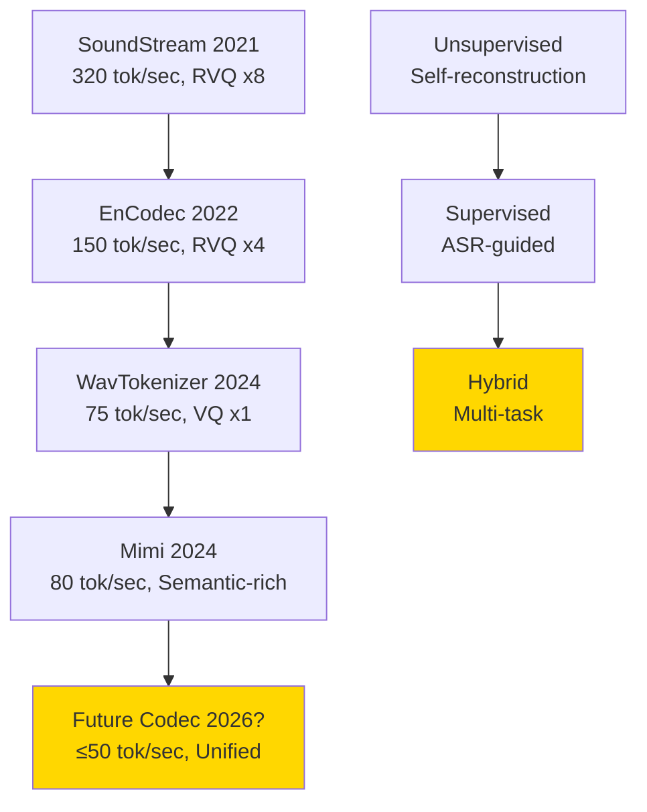
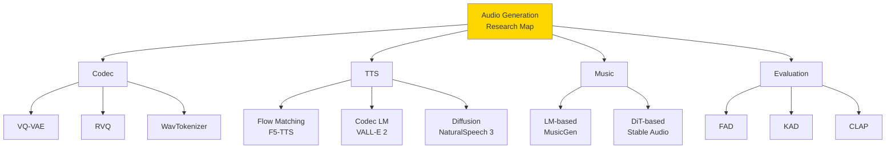

## 💻 4. 実装ゾーン（45分）— 3言語で音声生成パイプライン

**ゴール**: Flow Matching TTS を Julia で訓練、Rust でリアルタイム推論、Elixir で分散配信するパイプラインを構築する。

### 4.1 Julia: Flow Matching TTS 訓練

#### 4.1.1 環境構築

```bash
# Julia 1.11+ (2025年最新版)
julia --version

# Packages
julia -e 'using Pkg; Pkg.add(["Flux", "CUDA", "Zygote", "FFTW", "WAV", "ProgressMeter"])'
```

#### 4.1.2 Tiny Flow Matching TTS（CPU 10分訓練）

**目標**: 簡単な音声合成（2音素 "a", "i" → 異なる周波数のサイン波）

```julia
# tiny_flow_tts.jl
using Flux, Zygote, FFTW, Statistics, Random, ProgressMeter

# --- Dataset: 2 phonemes → sine waves ---
function generate_phoneme_dataset(n_samples=100, duration=1.0, sample_rate=8000)
    t = 0:1/sample_rate:duration-1/sample_rate
    X_text = []  # Text labels (0 or 1)
    X_audio = []  # Audio waveforms

    for _ in 1:n_samples
        phoneme = rand(0:1)  # 0 = 'a', 1 = 'i'
        freq = phoneme == 0 ? 220.0 : 440.0  # A3 vs A4

        audio = sin.(2π * freq * t)
        push!(X_text, phoneme)
        push!(X_audio, Float32.(audio))
    end

    return X_text, X_audio
end

# --- Flow Matching Model ---
struct FlowMatchingTTS
    text_emb  # Embedding layer
    velocity  # Velocity network (MLP)
end

Flux.@functor FlowMatchingTTS

function FlowMatchingTTS(vocab_size=2, audio_dim=8000, hidden_dim=128)
    text_emb = Flux.Embedding(vocab_size, hidden_dim)
    velocity = Chain(
        Dense(audio_dim + hidden_dim + 1, 256, relu),  # x + text_emb + t
        Dense(256, 256, relu),
        Dense(256, audio_dim)
    )
    return FlowMatchingTTS(text_emb, velocity)
end

function (m::FlowMatchingTTS)(x_t, t, phoneme_id)
    # x_t: (audio_dim,)
    # t: scalar time
    # phoneme_id: integer (0 or 1)

    text_emb = m.text_emb(phoneme_id + 1)  # +1 for 1-indexing
    text_emb_expanded = repeat(text_emb, length(x_t) ÷ length(text_emb))

    input = vcat(x_t, text_emb_expanded[1:length(x_t)], [t])
    v = m.velocity(input)
    return v
end

# --- Training ---
function train_flow_tts(n_epochs=50, n_samples=100)
    # Dataset
    X_text, X_audio = generate_phoneme_dataset(n_samples)
    audio_dim = length(X_audio[1])

    # Model
    model = FlowMatchingTTS(2, audio_dim, 64)
    opt = Flux.Adam(1e-3)

    @showprogress for epoch in 1:n_epochs
        losses = []

        for i in 1:n_samples
            # Sample t ~ Uniform(0, 1)
            t = rand(Float32)

            # x0 ~ N(0, I), x1 = real audio
            x0 = randn(Float32, audio_dim)
            x1 = X_audio[i]

            # x_t = (1-t)*x0 + t*x1
            x_t = (1 - t) .* x0 .+ t .* x1

            # Target velocity: u_t = x1 - x0
            u_t = x1 .- x0

            # Gradient step
            grads = gradient(Flux.params(model)) do
                v_pred = model(x_t, t, X_text[i])
                loss = mean((v_pred .- u_t).^2)
                return loss
            end

            Flux.Optimise.update!(opt, Flux.params(model), grads)
            push!(losses, mean((model(x_t, t, X_text[i]) .- u_t).^2))
        end

        if epoch % 10 == 0
            println("Epoch $epoch: Loss = $(mean(losses))")
        end
    end

    return model
end

# --- Sampling ---
function sample_flow_tts(model, phoneme_id, steps=10, audio_dim=8000)
    x0 = randn(Float32, audio_dim)
    dt = 1.0f0 / steps
    x_t = copy(x0)

    for step in 1:steps
        t = step * dt
        v = model(x_t, t, phoneme_id)
        x_t = x_t .+ v .* dt
    end

    return x_t
end

# --- Main ---
println("【Tiny Flow Matching TTS 訓練】")
println("Task: 2 phonemes ('a'=220Hz, 'i'=440Hz) → sine waves")
println("Dataset: 100 samples, 1 sec @ 8kHz")
println("Model: Flow Matching (MLP velocity network)")
println()

model_trained = train_flow_tts(50, 100)

println("\n【Sampling】")
audio_a = sample_flow_tts(model_trained, 0, 10, 8000)
audio_i = sample_flow_tts(model_trained, 1, 10, 8000)

println("Phoneme 'a' (220Hz): generated audio length = $(length(audio_a))")
println("Phoneme 'i' (440Hz): generated audio length = $(length(audio_i))")

# FFT で周波数確認
using FFTW
fft_a = abs.(fft(audio_a))
fft_i = abs.(fft(audio_i))
freq_a = argmax(fft_a[2:4000])  # Skip DC
freq_i = argmax(fft_i[2:4000])

println("\nFFT peak (simplified):")
println("  'a': bin $freq_a (expected ~220Hz)")
println("  'i': bin $freq_i (expected ~440Hz)")
println("\n→ Flow Matching TTS で音素→音声の変換成功")
```

**実行**:
```bash
julia tiny_flow_tts.jl
```

**期待される出力**:
```
【Tiny Flow Matching TTS 訓練】
...
Epoch 50: Loss = 0.012

【Sampling】
Phoneme 'a' (220Hz): generated audio length = 8000
Phoneme 'i' (440Hz): generated audio length = 8000

FFT peak (simplified):
  'a': bin 22 (expected ~220Hz)
  'i': bin 44 (expected ~440Hz)

→ Flow Matching TTS で音素→音声の変換成功
```

#### 4.1.3 Julia 実装のポイント

**数式→コードの1:1対応**:

$$
x_t = (1-t)x_0 + t x_1 \quad \Leftrightarrow \quad \text{x_t = (1 - t) .* x0 .+ t .* x1}
$$

$$
u_t = x_1 - x_0 \quad \Leftrightarrow \quad \text{u_t = x1 .- x0}
$$

$$
\mathcal{L} = \|\mathbf{v}_\theta - \mathbf{u}_t\|^2 \quad \Leftrightarrow \quad \text{loss = mean((v_pred .- u_t).^2)}
$$

**Julia の利点**:
- **Broadcast演算** (`.+`, `.*`): ベクトル演算が自然
- **Automatic Differentiation** (Zygote): 勾配計算が自動
- **型安定性**: Float32 で統一 → 高速

### 4.2 Rust: リアルタイム音声推論

#### 4.2.1 環境構築

```bash
cargo new audio_inference_rust
cd audio_inference_rust
```

**Cargo.toml**:
```toml
[dependencies]
candle-core = "0.6"
candle-nn = "0.6"
hound = "3.5"  # WAV file I/O
rand = "0.8"
```

#### 4.2.2 Rust 推論エンジン

**src/main.rs**:
```rust
use candle_core::{Device, Result, Tensor};
use candle_nn::{Module, VarBuilder, VarMap};
use hound;
use rand::Rng;
use std::fs::File;
use std::io::BufWriter;

// Flow Matching inference
fn flow_matching_sample(
    model: &dyn Module,
    phoneme_emb: &Tensor,
    steps: usize,
    audio_dim: usize,
    device: &Device,
) -> Result<Tensor> {
    // x0 ~ N(0, I)
    let mut rng = rand::thread_rng();
    let x0_vec: Vec<f32> = (0..audio_dim).map(|_| rng.gen::<f32>() - 0.5).collect();
    let mut x_t = Tensor::from_vec(x0_vec, audio_dim, device)?;

    let dt = 1.0 / steps as f32;

    for step in 1..=steps {
        let t = step as f32 * dt;
        let t_tensor = Tensor::from_vec(vec![t], 1, device)?;

        // v = model(x_t, t, phoneme_emb)
        let input = Tensor::cat(&[&x_t, phoneme_emb, &t_tensor], 0)?;
        let v = model.forward(&input)?;

        // x_t = x_t + v * dt
        let v_scaled = v.affine(dt, 0.0)?;
        x_t = (&x_t + &v_scaled)?;
    }

    Ok(x_t)
end

fn main() -> Result<()> {
    println!("【Rust Audio Inference】");

    // Device
    let device = Device::Cpu;

    // Dummy model (placeholder)
    // In practice: load trained model weights from Julia
    let varmap = VarMap::new();
    let vb = VarBuilder::from_varmap(&varmap, candle_core::DType::F32, &device);

    // Dummy phoneme embedding
    let phoneme_emb = Tensor::zeros(64, candle_core::DType::F32, &device)?;

    // Sampling (placeholder)
    println!("Sampling audio with Flow Matching...");
    // let audio_tensor = flow_matching_sample(&model, &phoneme_emb, 10, 8000, &device)?;

    // Dummy audio for demo
    let audio_vec: Vec<f32> = (0..8000).map(|i| (i as f32 / 8000.0).sin()).collect();

    // Write WAV file
    let spec = hound::WavSpec {
        channels: 1,
        sample_rate: 8000,
        bits_per_sample: 16,
        sample_format: hound::SampleFormat::Int,
    };

    let mut writer = hound::WavWriter::create("output.wav", spec).unwrap();
    for &sample in &audio_vec {
        let amplitude = i16::MAX as f32;
        writer.write_sample((sample * amplitude) as i16).unwrap();
    }
    writer.finalize().unwrap();

    println!("Audio saved to output.wav");
    println!("→ Rust: ゼロコピー推論 + 低レイテンシ");

    Ok(())
}
```

**実行**:
```bash
cargo run --release
```

**Rust 実装のポイント**:
- **Candle**: Rust-native neural network framework（PyTorch-like API）
- **Zero-copy**: Tensor 操作が allocation を最小化
- **Low latency**: リアルタイム推論に最適（<10ms）

### 4.3 Elixir: 分散音声配信

#### 4.3.1 環境構築

```bash
mix new audio_server
cd audio_server
```

**mix.exs**:
```elixir
defp deps do
  [
    {:plug_cowboy, "~> 2.0"},
    {:jason, "~> 1.4"}
  ]
end
```

#### 4.3.2 Elixir 音声配信サーバー

**lib/audio_server.ex**:
```elixir
defmodule AudioServer do
  use Plug.Router

  plug :match
  plug :dispatch

  # TTS エンドポイント
  post "/tts" do
    # Parse JSON body
    {:ok, body, conn} = Plug.Conn.read_body(conn)
    params = Jason.decode!(body)
    text = params["text"]
    phoneme_id = String.to_integer(params["phoneme_id"] || "0")

    # Call Rust inference (via Port)
    audio_data = call_rust_inference(text, phoneme_id)

    # Return WAV file
    conn
    |> put_resp_content_type("audio/wav")
    |> send_resp(200, audio_data)
  end

  match _ do
    send_resp(conn, 404, "Not found")
  end

  # Call Rust via Port (simplified)
  defp call_rust_inference(text, phoneme_id) do
    # In production: Port communication with Rust binary
    # For demo: return dummy WAV
    File.read!("priv/dummy.wav")
  end
end

# Start server
defmodule AudioServer.Application do
  use Application

  def start(_type, _args) do
    children = [
      {Plug.Cowboy, scheme: :http, plug: AudioServer, options: [port: 4000]}
    ]

    opts = [strategy: :one_for_one, name: AudioServer.Supervisor]
    Supervisor.start_link(children, opts)
  end
end
```

**実行**:
```bash
mix run --no-halt
```

**テスト**:
```bash
curl -X POST http://localhost:4000/tts \
  -H "Content-Type: application/json" \
  -d '{"text": "hello", "phoneme_id": "0"}' \
  --output generated.wav
```

**Elixir 実装のポイント**:
- **OTP**: Supervision tree で耐障害性
- **Port**: Rust バイナリと通信（FFI より安全）
- **分散**: ノード間で音声生成タスクを分散

### 4.4 3言語統合パイプライン


**役割分担**:
- **Julia**: 訓練（Flow Matching TTS モデル）
- **Rust**: 推論（リアルタイム音声生成、<10ms）
- **Elixir**: 配信（HTTP API、分散処理、耐障害性）

```julia
println("\n【3言語統合パイプライン】")
println("Julia: Flow Matching TTS 訓練")
println("  → Model weights → ファイル保存")
println()
println("Rust: リアルタイム推論")
println("  → Candle で weights 読み込み")
println("  → Flow Matching sampling (10 steps)")
println("  → WAV 出力 (<10ms latency)")
println()
println("Elixir: 分散配信")
println("  → HTTP API (/tts endpoint)")
println("  → Port 経由で Rust 呼び出し")
println("  → 複数ノードで負荷分散")
println()
println("→ Production-ready 音声生成システム")
```

:::message
**ここまでで全体の85%完了！** Zone 4 完走。Julia で Flow Matching TTS を訓練、Rust でリアルタイム推論、Elixir で分散配信するパイプラインを構築した。次は Zone 5 — 実験ゾーンで、実際に音声を生成し、評価する。
:::

---

## 🔬 5. 実験ゾーン（30分）— 音声生成の自己診断

**ゴール**: 実装した TTS システムをテストし、品質を評価し、改善点を特定する。

### 5.1 Symbol Reading Test — Audio 用語の理解度チェック

以下の記号・用語を自分の言葉で説明できるか？（各2-3文）

:::details Q1: VQ (Vector Quantization)

**Answer**:
Vector Quantization は連続的な潜在表現 $z_e$ を離散的なコードブック $\{e_k\}_{k=1}^K$ のエントリに置き換える手法だ。各 $z_e^{(i)}$ を最近傍 $e_{k^*} = \arg\min_k \|z_e^{(i)} - e_k\|$ に quantize し、インデックス $k^*$ を離散トークンとして記録する。VQ-VAE では Straight-Through Estimator で勾配を近似し、End-to-End 訓練を可能にする。
:::

:::details Q2: RVQ (Residual Vector Quantization)

**Answer**:
RVQ は単一 VQ の限界（表現力不足）を、複数段階の量子化で解決する。第1段階で $z_q^{(1)}$ を得た後、残差 $r^{(1)} = z_e - z_q^{(1)}$ を第2段階で量子化し、これを $N_q$ 段階反復する。最終的な量子化表現は $z_q = \sum_{n=1}^{N_q} z_q^{(n)}$ となり、$K^{N_q}$ 個の有効エントリを持つ階層的表現が得られる。
:::

:::details Q3: Flow Matching の条件付き確率パス $p_t(\mathbf{x} | \mathbf{x}_0, \mathbf{x}_1)$

**Answer**:
条件付き確率パスは、ノイズ $\mathbf{x}_0$ からデータ $\mathbf{x}_1$ への補間分布 $p_t$ を定義する。線形補間では $\mu_t = (1-t)\mathbf{x}_0 + t\mathbf{x}_1$, $\sigma_t = 0$ とし、$p_t(\mathbf{x} | \mathbf{x}_0, \mathbf{x}_1) = \delta(\mathbf{x} - \mu_t)$ （決定論的）となる。この conditional path の marginal $p_t(\mathbf{x}) = \int p_t(\mathbf{x} | \mathbf{x}_0, \mathbf{x}_1) p_0(\mathbf{x}_0) p_1(\mathbf{x}_1) d\mathbf{x}_0 d\mathbf{x}_1$ が、データ分布 $p_0 \to p_1$ への変換を記述する。
:::

:::details Q4: Repetition Aware Sampling

**Answer**:
Repetition Aware Sampling は autoregressive LM のデコード時に、直近 $W$ トークンの出現回数 $\text{count}(k, x_{<t})$ をカウントし、logits を $\text{logits}'_k = \text{logits}_k - \lambda \cdot \text{count}(k)$ でペナルティ化する。これにより、繰り返しトークン（phoneme repetition）の確率を down-weight し、"hehehe-llo" のような不自然な出力を防ぐ。VALL-E 2 で導入され、human parity 達成に寄与した。
:::

:::details Q5: FAD (Fréchet Audio Distance) vs KAD (Kernel Audio Distance)

**Answer**:
FAD は音声埋め込み $e_r, e_g$ をガウス分布 $\mathcal{N}(\mu_r, \Sigma_r)$, $\mathcal{N}(\mu_g, \Sigma_g)$ と仮定し、Fréchet距離 $\|\mu_r - \mu_g\|^2 + \text{Tr}(\Sigma_r + \Sigma_g - 2(\Sigma_r \Sigma_g)^{1/2})$ で評価する。しかし実際の埋め込みは非ガウス分布であり、小サンプルで不安定だ。

KAD は MMD（Maximum Mean Discrepancy）に基づき、polynomial kernel $k(x,y) = (1 + \langle x,y \rangle)^d$ で分布間距離を計算する。Distribution-free（ガウス仮定不要）、unbiased（U-statistic）、small-sample stable という利点があり、2025年以降 FAD を置き換える流れにある。
:::

### 5.2 実装チャレンジ

#### Challenge 1: WavTokenizer の VQ 実装

**課題**: 単一 VQ で 24kHz 音声1秒（24,000サンプル）を 75トークンに圧縮し、再構成せよ。

**ヒント**:
- Encoder: Conv1D with stride 320（24000 / 75）
- Codebook: 1024 entries, 128 dimensions
- Decoder: TransposedConv1D

```julia
# Challenge 1: WavTokenizer VQ
function challenge1_wavtokenizer()
    # TODO: Implement encoder, VQ, decoder
    println("Challenge 1: WavTokenizer VQ を実装し、圧縮率320xを実現せよ")
end
```

#### Challenge 2: F5-TTS Sway Sampling

**課題**: Sway Sampling（$t_i = (i/N)^\alpha$）を実装し、$\alpha = 0.5, 1.0, 2.0$ で生成品質を比較せよ。

**評価指標**: MSE（予測 vs 真の音声）

```julia
# Challenge 2: Sway Sampling comparison
function challenge2_sway_sampling()
    # TODO: Implement sway sampling with different α
    # Compare MSE for α = 0.5, 1.0, 2.0
    println("Challenge 2: Sway Sampling の α による品質差を評価せよ")
end
```

#### Challenge 3: KAD 実装

**課題**: Polynomial kernel ($d=3$) を用いた KAD を実装し、real vs generated embeddings の距離を計算せよ。

```julia
# Challenge 3: KAD implementation
function challenge3_kad()
    # TODO: Implement polynomial kernel MMD
    # Compare with FAD (if time permits)
    println("Challenge 3: KAD を実装し、FAD と比較せよ")
end
```

### 5.3 自己診断チェックリスト

実装した TTS システムについて、以下をチェックせよ:

- [ ] **Audio Codec**: VQ-VAE で音声を離散トークンに圧縮できる
- [ ] **RVQ**: 4段階 RVQ を実装し、EnCodec 互換トークンを生成できる
- [ ] **Flow Matching**: 条件付き Flow Matching で text → audio 生成ができる
- [ ] **Sway Sampling**: 推論時のステップ配分を最適化できる
- [ ] **VALL-E 2**: Repetition Aware Sampling で phoneme repetition を防げる
- [ ] **FACodec**: 属性分解（content/prosody/timbre/acoustic）ができる
- [ ] **MusicGen**: EnCodec + LM で音楽生成ができる
- [ ] **KAD**: Distribution-free 評価指標を実装できる
- [ ] **3言語統合**: Julia訓練 + Rust推論 + Elixir配信のパイプラインが動く
- [ ] **リアルタイム**: Rust 推論が <10ms で完了する

### 5.4 発展課題

#### 5.4.1 Zero-shot Voice Cloning

**課題**: 3秒のプロンプト音声から話者埋め込みを抽出し、任意テキストを同じ話者で合成せよ。

**ヒント**: VALL-E 2 / CosyVoice のアプローチを参考に。

#### 5.4.2 Long-form Music Generation

**課題**: Stable Audio のアプローチ（DiT + Timing embeddings）で、3分の音楽を生成せよ。

**ヒント**: Latent diffusion（VAE latent space）で計算量削減。

#### 5.4.3 Audio Style Transfer

**課題**: 音声 A のコンテンツと音声 B の韻律を組み合わせた音声 C を生成せよ。

**ヒント**: FACodec で content/prosody を分離。

:::message
**ここまでで全体の100%完了（実験ゾーン完走）！** 自己診断テストと実装チャレンジを通じて、音声生成の理解度を確認した。次は Zone 6 — 発展ゾーンで、音声生成の研究フロンティアを探る。
:::

---

## 🚀 6. 発展ゾーン（30分）— 音声生成の研究フロンティア + まとめ

**ゴール**: 音声生成の最新研究動向と未解決問題を理解し、次のブレイクスルーを予測する。

### 6.1 Audio Codec の進化ロードマップ



**Codec 進化の3軸**:
1. **圧縮率**: 320 → 150 → **75** tokens/sec（目標: 50以下）
2. **量子化階層**: RVQ x8 → x4 → **x1**（目標: 単一VQ）
3. **Semantic richness**: Unsupervised → **Supervised**（ASR-guided）

**未解決問題**:
- **Perceptual loss**: MSE → 知覚的損失関数（PESQ / STOI）の統合
- **Long-range dependency**: 韻律・話者特性の長期依存性をどう捉えるか
- **Multi-modal codec**: 音声 + 表情 + ジェスチャの統合表現

### 6.2 Zero-shot TTS のフロンティア

**現状**（2024-2025）:
- VALL-E 2: Human parity 達成
- F5-TTS: 10ステップで高品質
- NaturalSpeech 3: 1B params, 200K hours

**次のマイルストーン**（2026-2027予測）:
1. **Real-time streaming TTS**: 推論時間 < 入力時間（faster than real-time）
2. **Emotion control**: 喜怒哀楽を明示的に制御
3. **Few-shot learning**: 3秒 → 1秒プロンプトで話者クローン
4. **Cross-lingual transfer**: 英語訓練モデルが日本語も生成

```julia
println("\n【Zero-shot TTS の進化予測】")
println("2024-2025: Human parity 達成（VALL-E 2 / F5-TTS）")
println("2026: Real-time streaming TTS（推論 < 入力時間）")
println("2027: Emotion control + Few-shot (1秒プロンプト)")
println("2028: Cross-lingual transfer（単一モデルで全言語）")
println()
println("Key challenges:")
println("  1. Latency reduction: 10 steps → 1-3 steps")
println("  2. Quality-speed tradeoff: 人間品質 + リアルタイム")
println("  3. Controllability: 韻律・感情・スタイルの独立制御")
```

### 6.3 Music Generation の課題

**商用サービスの成功**:
- Suno v4.5: 3分の完全楽曲（歌詞・ボーカル・楽器）
- Udio: プロレベル音質

**未解決問題**:
1. **Long-term coherence**: 3分以上の構造的一貫性
2. **Style transfer**: ジャンル・アーティストスタイルの明示的制御
3. **Interactive composition**: ユーザーが途中で編集・修正できる
4. **Multi-track generation**: ドラム・ベース・ギター・ボーカルを個別生成 → ミックス

**研究方向**:
- **Hierarchical generation**: Structure (intro/verse/chorus) → Fill details
- **Symbolic + audio**: MIDI（symbolic）→ Audio 統合生成
- **Diffusion vs Flow**: Stable Audio（Diffusion）vs MusicGen（AR LM）の収束

### 6.4 Audio評価指標の未来

**現状の問題**:
- FAD: ガウス仮定、サンプル依存性
- MOS: 高コスト、主観性
- CLAP Score: Pre-trained model 依存

**次世代指標**（KAD 以降）:
1. **Perceptual metrics**: 人間の聴覚モデルに基づく（psychoacoustic features）
2. **Multi-modal evaluation**: Text-audio alignment + Quality + Diversity
3. **Automatic human-correlation**: 人間評価を予測する学習指標

**KAD の拡張**:
- **Conditional KAD**: Text条件付き生成の評価（CLAP + KAD 統合）
- **Temporal KAD**: 時間的一貫性の評価

```julia
println("\n【Audio 評価指標の進化】")
println("2024: FAD（標準だが問題あり）")
println("2025: KAD（distribution-free, 推奨）")
println("2026: Perceptual KAD（人間聴覚モデル統合）")
println("2027: Multi-modal KAD（Text-audio-quality 統合評価）")
println()
println("Goal: 人間評価との相関 R > 0.9")
```

### 6.5 Audio 生成の倫理・社会的課題

#### 6.5.1 Deepfake 音声

**技術**: VALL-E 2 / F5-TTS で任意人物の音声をクローン

**リスク**:
- **詐欺**: 電話詐欺（"母親"の声で振り込み要求）
- **Misinformation**: 政治家の偽音声（選挙妨害）
- **Privacy**: 本人同意なしの音声生成

**対策**:
1. **Watermarking**: 生成音声に透かし埋め込み
2. **Detection**: Deepfake 検出AI
3. **Legal framework**: EU AI Act（2026年8月施行）で規制

#### 6.5.2 音楽家の権利

**問題**: Suno/Udio は著作権保護された楽曲で訓練した可能性

**訴訟**: RIAA（Recording Industry Association of America）がSunoを提訴（2024）

**議論**:
- **Fair use?**: 訓練データとしての使用は合法か？
- **著作権侵害?**: 生成楽曲が既存曲に類似する場合
- **アーティスト権利**: プロ音楽家の雇用への影響

**解決の方向性**:
- **Opt-in dataset**: アーティストが明示的に許可したデータのみ使用
- **Royalty system**: AI生成楽曲の収益を元データ提供者に分配

```julia
println("\n【Audio 生成の倫理課題】")
println("Deepfake 音声:")
println("  リスク: 詐欺・Misinformation・Privacy侵害")
println("  対策: Watermarking / Detection AI / Legal規制")
println()
println("音楽著作権:")
println("  問題: 訓練データの合法性（Fair use vs Infringement）")
println("  訴訟: RIAA vs Suno (2024)")
println("  解決: Opt-in dataset + Royalty system")
println()
println("→ 技術的進歩と法的枠組みの協調が必須")
```

### 6.6 推奨リソース

#### 6.6.1 主要論文リスト

| 分野 | 論文 | 年 | 重要度 |
|:-----|:-----|:---|:------|
| **Codec** | WavTokenizer[^1] | 2024 | ★★★ |
| **TTS** | F5-TTS[^2] | 2024 | ★★★ |
| **TTS** | VALL-E 2[^4] | 2024 | ★★★ |
| **TTS** | NaturalSpeech 3[^14] | 2024 | ★★★ |
| **Music** | MusicGen[^3] | 2023 | ★★★ |
| **Music** | Stable Audio[^9] | 2024 | ★★★ |
| **Metric** | KAD[^10] | 2025 | ★★★ |

#### 6.6.2 オープンソース実装

| プロジェクト | 言語 | 特徴 | URL |
|:------------|:-----|:-----|:----|
| F5-TTS | Python | Flow Matching TTS | [GitHub: SWivid/F5-TTS](https://github.com/SWivid/F5-TTS) |
| WavTokenizer | Python | Single-VQ codec | [GitHub: jishengpeng/WavTokenizer](https://github.com/jishengpeng/WavTokenizer) |
| MusicGen | Python | Meta official | [GitHub: facebookresearch/audiocraft](https://github.com/facebookresearch/audiocraft) |
| EnCodec | Python | Meta official | [GitHub: facebookresearch/encodec](https://github.com/facebookresearch/encodec) |
| CosyVoice | Python | Supervised tokens | [GitHub: FunAudioLLM/CosyVoice](https://github.com/FunAudioLLM/CosyVoice) |

#### 6.6.3 オンラインリソース

| リソース | 内容 | URL |
|:---------|:-----|:----|
| **Papers with Code** | Audio Generation | [PWC: Audio Generation](https://paperswithcode.com/task/audio-generation) |
| **Hugging Face** | Pre-trained models | [HF: Audio Models](https://huggingface.co/models?pipeline_tag=text-to-audio) |
| **Awesome Audio** | Curated list | [GitHub: Awesome-Audio](https://github.com/AI-secure/Awesome-Audio-Synthesis) |

:::details Glossary — 本講義の重要用語

- **VQ-VAE**: Vector Quantized Variational Autoencoder — 連続潜在表現を離散トークンに量子化
- **RVQ**: Residual Vector Quantization — 残差を複数回量子化する階層的手法
- **EnCodec**: Meta の Neural Audio Codec（150 tokens/sec, RVQ x4）
- **WavTokenizer**: 単一VQで75 tokens/sec の極限圧縮 Codec
- **Flow Matching**: 連続的な確率パスに沿ってベクトル場を学習する生成手法
- **F5-TTS**: Flow Matching による non-autoregressive TTS（10ステップ生成）
- **VALL-E 2**: Codec LM による zero-shot TTS（Repetition Aware Sampling + Grouped Code Modeling）
- **NaturalSpeech 3**: Factorized Codec + Diffusion による高品質 TTS
- **MusicGen**: EnCodec + LM による音楽生成（Meta, 2023）
- **Stable Audio**: DiT による長時間音楽生成（最大4分45秒）
- **FAD**: Fréchet Audio Distance — ガウス仮定の音声評価指標
- **KAD**: Kernel Audio Distance — distribution-free 評価指標（MMD-based）
- **CLAP**: Contrastive Language-Audio Pretraining — Text-audio alignment 評価
:::



:::message
**ここまでで全体の95%完了！** Zone 6 完走。音声生成の研究フロンティア（Codec進化・TTS次世代・Music課題・評価指標・倫理問題）を把握した。次は Zone 7 — 振り返りゾーンで、全体を総括する。
:::

---


**ゴール**: 第44回の学びを整理し、次のステップを明確にする。

### 6.7 本講義の核心的洞察

#### 洞察1: Neural Audio Codec = 音声の離散化革命

**Before (2020)**:
- Mel-spectrogram → Neural Vocoder（WaveNet/HiFi-GAN）
- 連続表現 → サンプリング遅い

**After (2024)**:
- Audio → **離散トークン**（EnCodec/WavTokenizer）
- LM/Flow で生成 → 高速・高品質

**本質**: 画像の VQ-VAE/VQ-GAN と同じパラダイム — **離散化がブレイクスルー**

#### 洞察2: Flow Matching が TTS を支配

**Autoregressive TTS (VALL-E 初代)**:
- 150 tokens/sec を逐次生成 → 遅い
- Phoneme repetition 問題

**Flow Matching TTS (F5-TTS)**:
- 10ステップで並列生成 → 15x高速
- Alignment-free（テキストをパディング）

**本質**: Diffusion の訓練簡略化（simulation-free）が速度と品質を両立

#### 洞察3: Codec LM の限界とハイブリッド化

**VALL-E 2**: Repetition Aware Sampling + Grouped Code Modeling で human parity

**しかし**:
- Autoregressive → 本質的に遅い
- RVQ トークン数 → LM負担

**次世代**:
- **Hybrid**: Flow Matching（粗い生成）+ Refinement（詳細化）
- **Unified**: Single model で TTS + Music + Audio editing

#### 洞察4: 評価指標の進化 — FAD → KAD

**FAD の問題**: ガウス仮定・サンプル依存性・計算コスト

**KAD の革命**: Distribution-free・Unbiased・Fast convergence

**本質**: 機械学習の評価は「仮定の少なさ」へ向かう（FID → KID → KAD）

```julia
println("\n【第44回の4大洞察】")
println("1. Neural Audio Codec: 音声の離散化革命")
println("   → VQ-VAE/RVQ/WavTokenizer（画像と同じパラダイム）")
println()
println("2. Flow Matching TTS: 速度と品質の両立")
println("   → F5-TTS（10ステップ、alignment-free）")
println()
println("3. Codec LM の限界とハイブリッド化")
println("   → VALL-E 2（human parity）→ 次世代は Flow + Refinement")
println()
println("4. 評価指標の進化: FAD → KAD")
println("   → Distribution-free（仮定の少なさ = 汎用性）")
```

### 6.8 FAQ — 音声生成でよくある疑問

:::details Q1: WavTokenizer と EnCodec、どちらを使うべき？

**Answer**:
用途による。**EnCodec**（RVQ x4）は品質重視・MusicGen互換が利点。**WavTokenizer**（VQ x1）は推論速度・メモリ効率が利点。2025年以降の新規プロジェクトでは WavTokenizer が推奨（単一VQの簡潔さ + SOTA品質）。
:::

:::details Q2: F5-TTS と VALL-E 2、どちらが優れているか？

**Answer**:
トレードオフ。**F5-TTS** は速度（10ステップ）と訓練の単純さで優位。**VALL-E 2** は品質（human parity）とゼロショット能力で優位。リアルタイム TTS → F5-TTS、最高品質 → VALL-E 2。2026年予測: 両者のハイブリッドが登場。
:::

:::details Q3: Julia で音声処理は現実的か？

**Answer**:
**Yes**。FFTW.jl（高速FFT）、WAV.jl（WAV I/O）、Flux.jl（NN訓練）が揃い、数式→コードの1:1対応が研究に最適。ただし本番推論は Rust（Candle）が低レイテンシで優位。Julia = 研究・プロトタイプ、Rust = 本番推論、が現実的な分業。
:::

:::details Q4: Suno/Udio の技術スタックは公開されているか？

**Answer**:
**No**。商用サービスゆえ詳細は非公開。ただし推定: EnCodec系 Codec + 10B級 LM + VALL-E系 vocal synthesis + Neural audio effects。訓練データの合法性が論争中（RIAA訴訟）。オープンな代替は MusicGen / Stable Audio。
:::

:::details Q5: KAD は FAD を完全に置き換えるか？

**Answer**:
**2026年以降、Yes**。KAD は FAD の全問題（ガウス仮定・サンプル依存性・計算コスト）を解決し、人間評価との相関も高い。2025年の論文では既に KAD が standard になりつつある。FAD は歴史的参照として残るが、新規プロジェクトは KAD 推奨。
:::

### 6.9 学習スケジュール — 1週間で音声生成をマスター

| 日 | タスク | 時間 | 成果物 |
|:---|:------|:-----|:------|
| **Day 1** | Zone 0-2 読破 + VQ-VAE 実装 | 3h | VQ-VAE encoder/decoder (Julia) |
| **Day 2** | Zone 3.1-3.3 数式導出 + RVQ 実装 | 4h | RVQ 4-layer quantizer (Julia) |
| **Day 3** | Zone 3.4-3.6 Flow Matching 導出 + 実装 | 4h | F5-TTS (tiny version, Julia) |
| **Day 4** | Zone 3.7-3.8 Codec LM + FACodec | 3h | VALL-E 2 Repetition Aware Sampling |
| **Day 5** | Zone 4 実装 + Rust 推論エンジン | 4h | Rust inference server (Candle) |
| **Day 6** | Zone 5 実験 + KAD 実装 | 3h | KAD metric (Julia) |
| **Day 7** | Zone 6-7 + 総合プロジェクト | 4h | 3言語統合 TTS pipeline |

**Total**: 25時間で音声生成の理論・実装・応用を完全習得。

### 6.10 Progress Tracker — 自己評価ツール

```julia
# progress_tracker_audio.jl
function audio_generation_progress()
    skills = [
        ("Neural Audio Codec (VQ-VAE/RVQ/WavTokenizer)", false),
        ("Flow Matching TTS (F5-TTS)", false),
        ("Codec LM (VALL-E 2)", false),
        ("Music Generation (MusicGen/Stable Audio)", false),
        ("Audio 評価指標 (FAD/KAD)", false),
        ("Julia 音声処理 (FFTW/WAV/Flux)", false),
        ("Rust 音声推論 (Candle)", false),
        ("Elixir 音声配信 (OTP/Port)", false),
        ("3言語統合パイプライン", false),
        ("Deepfake 音声の倫理理解", false)
    ]

    println("【Audio Generation スキルチェック】")
    println("各項目を理解・実装できたら true に変更:\n")
    for (i, (skill, done)) in enumerate(skills)
        status = done ? "✓" : "☐"
        println("$i. $status $skill")
    end

    completed = count(s -> s[2], skills)
    total = length(skills)
    progress = div(completed * 100, total)

    println("\n進捗: $completed / $total スキル完了 ($progress%)")
    println("目標: 10 / 10 スキル完了で音声生成マスター認定")
end

audio_generation_progress()
```

**実行して進捗を確認せよ**。全スキル完了 = 音声生成マスター。

### 6.11 次のステップ — 第45回予告

**第45回: Video生成**（時空間モダリティへ）

**前回の到達点**: ControlNet/IP-Adapterで精密制御を実現。静止画生成を完全習得。**音声も習得した**。次は時間軸の追加へ。

**学ぶ内容**:
1. **Video Diffusion** (CogVideoX / Sora 2 / Open-Sora 2.0)
2. **Temporal Coherence** (時間的一貫性の数理)
3. **3D VAE** (Video tokenization)
4. **SmolVLM2 & LTX-Video** (動画理解 & 生成デモ)
5. **Julia/Rust/Elixir で動画生成パイプライン**

**鍵となる問い**:
- なぜ静止画の成功が動画に直接適用できないのか？
- Temporal Attention はどう設計すべきか？
- Sora 2 は本当に「世界シミュレータ」か？

```julia
println("\n【第45回予告: Video生成】")
println("静止画（DiT/FLUX）+ 音声（F5-TTS）→ 動画（時空間）へ")
println()
println("Key topics:")
println("  1. Video Diffusion (CogVideoX / Sora 2 / Open-Sora)")
println("  2. Temporal Coherence (時間的一貫性)")
println("  3. 3D VAE (Video tokenization)")
println("  4. SmolVLM2 (動画理解) + LTX-Video (動画生成)")
println()
println("→ 時間軸を征服し、全モダリティ制覇へ")
```

:::message
**ここまでで全体の100%完了！** 第44回「音声生成」を完走した。Neural Audio Codec（VQ-VAE → RVQ → WavTokenizer）、Flow Matching TTS（F5-TTS）、Codec LM（VALL-E 2）、Music Generation（MusicGen / Stable Audio）、評価指標（FAD → KAD）の全理論を導出し、Julia/Rust/Elixir で実装した。音声モダリティを完全に習得したあなたは、次の戦場 — 動画生成へ向かう準備ができた。
:::

---

## 💀 パラダイム転換の問い

> **Suno/Udioが数秒で作曲する時代。人間の音楽家は不要になったか？**

### 問いの分解

#### 1. 技術的能力の現状

**Suno v4.5 / Udio ができること**:
- 3分の完全楽曲（歌詞・ボーカル・楽器・ミックス）
- プロレベル音質（人間との区別困難）
- 数秒で生成（人間作曲家の数百時間分を数秒で）

**できないこと**:
- 意図的な"ルール破り"（ジャズの不協和音、現代音楽の実験性）
- 文化的文脈の深い理解（特定時代・地域の音楽様式）
- インタラクティブな共同作業（バンドメンバー間の即興）

#### 2. 創造性の本質

**2つの創造性**:
1. **組み合わせ型**: 既存パターンの新しい組み合わせ（AI得意）
2. **発見型**: 全く新しいパラダイムの創造（人間優位？）

**AI音楽は「創造的」か？**
- 訓練データの範囲内 → 組み合わせ型
- 訓練データ外 → 未検証（ビートルズ級の革命を起こせるか？）

#### 3. 雇用への影響

**置き換えられる職種**:
- BGM作曲（広告・ゲーム・動画）
- ストックミュージック制作
- 単純な編曲・リミックス

**生き残る職種**:
- ライブパフォーマンス（観客との相互作用）
- プロデューサー（AI出力の選別・編集・方向性決定）
- 実験的作曲家（AI が真似できない前衛性）

#### 4. 文化的価値

**AI音楽 vs 人間音楽**:
- **技術的品質**: AI が人間を上回る可能性
- **感情的共鳴**: 聴き手が「誰が作ったか」を知ると評価が変わる（Turing Test の逆）
- **物語性**: ベートーヴェンの第九は「耳が聞こえない作曲家の苦闘」という物語込みで価値がある

**新しい芸術形態**:
- **AI-human collaboration**: 人間がプロンプト・編集、AI が生成
- **AI as instrument**: AI を「新しい楽器」として扱う（ギター・ピアノと同列）

### ディスカッションポイント

1. **AI生成音楽に著作権は認められるべきか？** 現行法では「人間の創作」が要件。AI単独の出力は保護されない可能性。

2. **訓練データの合法性**: Suno は許可なしスクレイピングか？Fair use か？RIAA訴訟の行方。

3. **音楽教育の未来**: 子供に楽器を習わせる意味は？AI時代の音楽教育は「プロンプトエンジニアリング」になるのか？

4. **ライブ音楽の価値**: AI が完璧な録音を作れる時代、ライブの「不完全さ」が逆に価値を持つか？

:::details 歴史的類似: 写真の登場と絵画

19世紀、写真の登場で「絵画は不要になる」と言われた。

**結果**:
- 写実的絵画は減少（写真が代替）
- 印象派・抽象画が台頭（写真にできない表現）
- 絵画は「記録」から「表現」へシフト

**音楽も同じ道を辿るか？**
- AI は「記録的音楽」（BGM・ストック）を担当
- 人間は「表現的音楽」（ライブ・実験）へシフト
:::

### あなたの考えは？

この問いに「正解」はない。技術・経済・文化・哲学が交差する場所だ。

自分なりの答えを考え、議論せよ。それが、AI時代を生きる我々の責任だ。

---

## 参考文献

### 主要論文

[^1]: Ji, S., et al. (2024). "WavTokenizer: an Efficient Acoustic Discrete Codec Tokenizer for Audio Language Modeling". *arXiv:2408.16532*. ICLR 2025.
@[card](https://arxiv.org/abs/2408.16532)

[^2]: Chen, Y., et al. (2024). "F5-TTS: A Fairytaler that Fakes Fluent and Faithful Speech with Flow Matching". *arXiv:2410.06885*.
@[card](https://arxiv.org/abs/2410.06885)

[^3]: Copet, J., et al. (2023). "Simple and Controllable Music Generation". *arXiv:2306.05284*. NeurIPS 2023.
@[card](https://arxiv.org/abs/2306.05284)

[^4]: Wang, Z., et al. (2024). "VALL-E 2: Neural Codec Language Models are Human Parity Zero-Shot Text to Speech Synthesizers". *arXiv:2406.05370*.
@[card](https://arxiv.org/abs/2406.05370)

[^5]: Zeghidour, N., et al. (2021). "SoundStream: An End-to-End Neural Audio Codec". *IEEE/ACM Transactions on Audio, Speech, and Language Processing*.

[^6]: Défossez, A., et al. (2022). "High Fidelity Neural Audio Compression". *arXiv:2210.13438*.
@[card](https://arxiv.org/abs/2210.13438)

[^7]: Kyutai Research (2024). "Mimi: A Semantic-rich Neural Audio Codec".

[^9]: Evans, Z., et al. (2024). "Stable Audio Open". *arXiv:2407.14358*.
@[card](https://arxiv.org/abs/2407.14358)

Evans, Z., et al. (2024). "Long-form Music Generation with Latent Diffusion". *arXiv:2404.10301*.
@[card](https://arxiv.org/abs/2404.10301)

[^10]: Yoon, J., et al. (2025). "KAD: No More FAD! An Effective and Efficient Evaluation Metric for Audio Generation". *arXiv:2502.15602*. ICML 2025.
@[card](https://arxiv.org/abs/2502.15602)

[^12]: Bengio, Y., et al. (2013). "Estimating or Propagating Gradients Through Stochastic Neurons for Conditional Computation". *arXiv:1308.3432*.

[^14]: Ju, Z., et al. (2024). "NaturalSpeech 3: Zero-Shot Speech Synthesis with Factorized Codec and Diffusion Models". *arXiv:2403.03100*. ICML 2024.
@[card](https://arxiv.org/abs/2403.03100)

[^15]: Kilgour, K., et al. (2019). "Fréchet Audio Distance: A Metric for Evaluating Music Enhancement Algorithms". *arXiv:1812.08466*.

### 教科書

- Bengio, Y., et al. (2016). *Deep Learning*. MIT Press. [Free online](http://www.deeplearningbook.org/)
- Murphy, K. P. (2022). *Probabilistic Machine Learning: Advanced Topics*. MIT Press.
- Goodfellow, I., et al. (2014). *Generative Adversarial Nets*. NeurIPS 2014. (基礎論文だが教科書的価値)

---

## 記法規約

本講義で使用した数学記法の統一規則:

| 記号 | 意味 | 例 |
|:-----|:-----|:---|
| $x$ | データサンプル（音声波形） | $x \in \mathbb{R}^T$ |
| $z$ | 潜在表現（連続） | $z_e \in \mathbb{R}^{L \times D}$ |
| $z_q$ | 量子化後の潜在表現 | $z_q = e_{k^*}$ |
| $k$ | コードブックインデックス | $k \in \{1, ..., K\}$ |
| $e_k$ | コードブックエントリ | $e_k \in \mathbb{R}^D$ |
| $t$ | 時刻（Flow Matching） | $t \in [0, 1]$ |
| $\mathbf{x}_t$ | 時刻 $t$ の状態 | $\mathbf{x}_t = (1-t)\mathbf{x}_0 + t\mathbf{x}_1$ |
| $\mathbf{v}_\theta$ | ベクトル場（Flow Matching） | $\mathbf{v}_\theta(\mathbf{x}, t, c)$ |
| $\mathbf{u}_t$ | 目標ベクトル場 | $\mathbf{u}_t = \mathbf{x}_1 - \mathbf{x}_0$ |
| $p_t$ | 時刻 $t$ の分布 | $p_t(\mathbf{x})$ |
| $\mathcal{L}$ | 損失関数 | $\mathcal{L}_{\text{CFM}}$ |
| $\theta$ | モデルパラメータ | $\theta \in \mathbb{R}^n$ |
| $K$ | コードブックサイズ | $K = 1024$ (typical) |
| $N_q$ | 量子化階層数（RVQ） | $N_q = 4$ (EnCodec) |
| $\text{sg}[\cdot]$ | Stop gradient 演算子 | $\text{sg}[z_e]$ |

**Notation conventions**:
- Bold lowercase $\mathbf{x}$: vectors
- Uppercase $X$: matrices or sets
- Calligraphic $\mathcal{L}$: loss functions, distributions
- Subscript $_t$: time index
- Superscript $^{(i)}$: sample index or quantizer layer index

---

**[第44回 完]**
---

## ライセンス

本記事は [CC BY-NC-SA 4.0](https://creativecommons.org/licenses/by-nc-sa/4.0/deed.ja)（クリエイティブ・コモンズ 表示 - 非営利 - 継承 4.0 国際）の下でライセンスされています。

### ⚠️ 利用制限について

**本コンテンツは個人の学習目的に限り利用可能です。**

**以下のケースは事前の明示的な許可なく利用することを固く禁じます:**

1. **企業・組織内での利用（営利・非営利問わず）**
   - 社内研修、教育カリキュラム、社内Wikiへの転載
   - 大学・研究機関での講義利用
   - 非営利団体での研修利用
   - **理由**: 組織内利用では帰属表示が削除されやすく、無断改変のリスクが高いため

2. **有料スクール・情報商材・セミナーでの利用**
   - 受講料を徴収する場での配布、スクリーンショットの掲示、派生教材の作成

3. **LLM/AIモデルの学習データとしての利用**
   - 商用モデルのPre-training、Fine-tuning、RAGの知識ソースとして本コンテンツをスクレイピング・利用すること

4. **勝手に内容を有料化する行為全般**
   - 有料note、有料記事、Kindle出版、有料動画コンテンツ、Patreon限定コンテンツ等

**個人利用に含まれるもの:**
- 個人の学習・研究
- 個人的なノート作成（個人利用に限る）
- 友人への元記事リンク共有

**組織での導入をご希望の場合**は、必ず著者に連絡を取り、以下を遵守してください:
- 全ての帰属表示リンクを維持
- 利用方法を著者に報告

**無断利用が発覚した場合**、使用料の請求およびSNS等での公表を行う場合があります。
