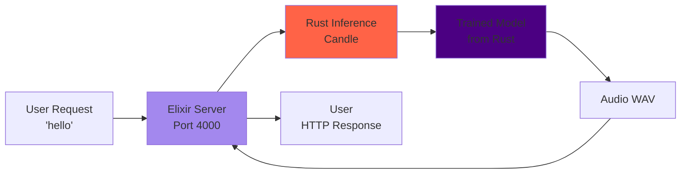
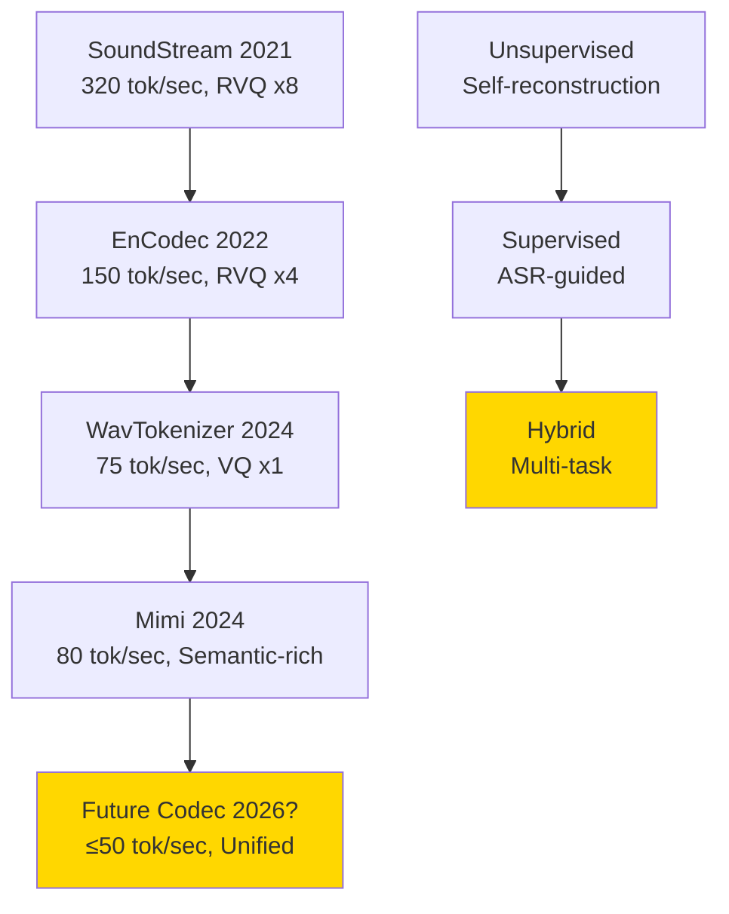
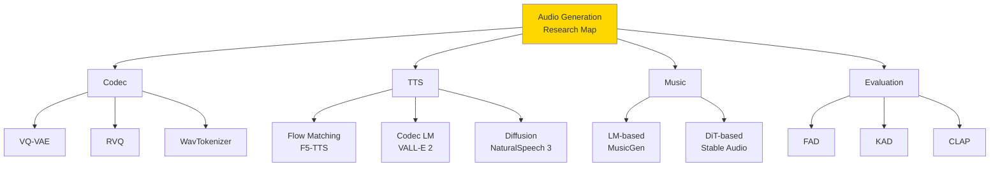

## 💻 Z5. 試練（実装）（45分）— 3言語で音声生成パイプライン

**ゴール**: Flow Matching TTS を Rust で訓練、Rust でリアルタイム推論、Elixir で分散配信するパイプラインを構築する。

### 4.1 Rust: Flow Matching TTS 訓練

#### 4.1.1 環境構築

```bash
# Rust (candle + burn, cargo 1.75+)
julia --version

# Packages
julia -e 'using Pkg; Pkg.add(["Flux", "CUDA", "Zygote", "FFTW", "WAV", "ProgressMeter"])'
```

#### 4.1.2 Tiny Flow Matching TTS（CPU 10分訓練）

**目標**: 簡単な音声合成（2音素 "a", "i" → 異なる周波数のサイン波）

```rust
// tiny_flow_tts.rs
use candle_core::{Device, Tensor};
use candle_nn::{self as nn, Module, VarBuilder, VarMap};
use ndarray::{Array1, Array2};
use ndarray_rand::RandomExt;
use ndarray_rand::rand_distr::Normal;
use rand::Rng;
use rustfft::{FftPlanner, num_complex::Complex};

// --- Dataset: 2 phonemes → sine waves ---
fn generate_phoneme_dataset(n_samples: usize, duration: f64, sample_rate: usize)
    -> (Vec<usize>, Vec<Array1<f32>>)
{
    let mut rng = rand::thread_rng();
    let n = (sample_rate as f64 * duration) as usize;
    let phonemes: Vec<usize> = (0..n_samples).map(|_| rng.gen_range(0..2)).collect();
    let audios: Vec<Array1<f32>> = phonemes.iter().map(|&p| {
        let freq = if p == 0 { 220.0_f64 } else { 440.0_f64 };
        Array1::from_iter((0..n).map(|i| {
            (2.0 * std::f64::consts::PI * freq * i as f64 / sample_rate as f64).sin() as f32
        }))
    }).collect();
    (phonemes, audios)
}

// --- Flow Matching Model ---
struct FlowMatchingTTS {
    text_emb: nn::Embedding,  // Embedding layer
    fc1: nn::Linear,          // Velocity network (MLP) layer 1
    fc2: nn::Linear,          // Velocity network (MLP) layer 2
    fc3: nn::Linear,          // Velocity network (MLP) layer 3
}

impl FlowMatchingTTS {
    fn new(vocab_size: usize, audio_dim: usize, hidden_dim: usize, vb: VarBuilder) -> candle_core::Result<Self> {
        let text_emb = candle_nn::Embedding::new(vocab_size, hidden_dim, vb.pp("text_emb"))?;
        let fc1 = nn::linear(audio_dim + hidden_dim + 1, 256, vb.pp("fc1"))?; // x + text_emb + t
        let fc2 = nn::linear(256, 256, vb.pp("fc2"))?;
        let fc3 = nn::linear(256, audio_dim, vb.pp("fc3"))?;
        Ok(Self { text_emb, fc1, fc2, fc3 })
    }

    fn forward(&self, x_t: &Tensor, t: f32, phoneme_id: usize) -> candle_core::Result<Tensor> {
        let emb = self.text_emb.forward(&Tensor::new(&[phoneme_id as u32], x_t.device())?)?;
        let t_tensor = Tensor::new(&[t], x_t.device())?;
        let input = Tensor::cat(&[x_t, &emb, &t_tensor], 0)?;
        let h = self.fc1.forward(&input)?.relu()?;
        let h = self.fc2.forward(&h)?.relu()?;
        self.fc3.forward(&h)
    }
}

// --- Training ---
fn train_flow_tts(n_epochs: usize, n_samples: usize) -> candle_core::Result<FlowMatchingTTS> {
    let (x_text, x_audio) = generate_phoneme_dataset(n_samples, 1.0, 8000);
    let audio_dim = x_audio[0].len();
    let dev = Device::Cpu;
    let varmap = VarMap::new();
    let vb = VarBuilder::from_varmap(&varmap, candle_core::DType::F32, &dev);
    let model = FlowMatchingTTS::new(2, audio_dim, 64, vb)?;
    let mut optimizer = candle_nn::AdamW::new(varmap.all_vars(), candle_nn::ParamsAdamW::default())?;

    for epoch in 1..=n_epochs {
        let mut losses = Vec::with_capacity(n_samples);
        for i in 0..n_samples {
            let mut rng = rand::thread_rng();
            let t: f32 = rng.gen::<f32>();
            // x0 ~ N(0,I): noise source, x1: target audio
            let x0 = Array1::<f32>::random(audio_dim, Normal::new(0.0_f32, 1.0).unwrap());
            let x1 = &x_audio[i];
            // x_t = (1-t)·x₀ + t·x₁  (linear interpolation path, t∈[0,1])
            let x_t: Vec<f32> = x0.iter().zip(x1.iter())
                .map(|(&a, &b)| (1.0 - t) * a + t * b).collect();
            // u_t = x₁ - x₀  (conditional vector field: constant velocity along straight path)
            let u_t: Vec<f32> = x1.iter().zip(x0.iter()).map(|(&a, &b)| a - b).collect();
            let x_t_tensor = Tensor::from_vec(x_t, audio_dim, &dev)?;
            let u_t_tensor = Tensor::from_vec(u_t, audio_dim, &dev)?;
            let v_pred = model.forward(&x_t_tensor, t, x_text[i])?;
            // L_FM = E[||v_θ(x_t,t,c) - u_t||²]  (Flow Matching loss)
            let diff = (v_pred - u_t_tensor)?;
            let loss = diff.sqr()?.mean_all()?;
            optimizer.backward_step(&loss)?;
            losses.push(loss.to_scalar::<f32>()?);
        }
        if epoch % 10 == 0 {
            let mean_loss = losses.iter().sum::<f32>() / losses.len() as f32;
            println!("Epoch {epoch}: Loss = {mean_loss}");
        }
    }

    Ok(model)
}

// --- Sampling ---
fn sample_flow_tts(model: &FlowMatchingTTS, phoneme_id: usize, steps: usize, audio_dim: usize)
    -> candle_core::Result<Vec<f32>>
{
    let dev = Device::Cpu;
    let mut x = Array1::<f32>::random(audio_dim, Normal::new(0.0_f32, 1.0).unwrap());
    let dt = 1.0_f32 / steps as f32;
    for step in 1..=steps {
        let t = step as f32 * dt;
        let x_tensor = Tensor::from_slice(x.as_slice().unwrap(), audio_dim, &dev)?;
        let v = model.forward(&x_tensor, t, phoneme_id)?.to_vec1::<f32>()?;
        // Euler: x_{t+dt} = x_t + v_θ(x_t,t,c)·dt  (ODE integration)
        for (xi, vi) in x.iter_mut().zip(v.iter()) {
            *xi += vi * dt;
        }
    }
    Ok(x.to_vec())
}

fn main() -> candle_core::Result<()> {
    println!("【Tiny Flow Matching TTS 訓練】");
    println!("Task: 2 phonemes ('a'=220Hz, 'i'=440Hz) → sine waves");
    println!("Dataset: 100 samples, 1 sec @ 8kHz");
    println!("Model: Flow Matching (MLP velocity network)");
    println!();

    let model_trained = train_flow_tts(50, 100)?;

    println!("\n【Sampling】");
    let audio_a = sample_flow_tts(&model_trained, 0, 10, 8000)?;
    let audio_i = sample_flow_tts(&model_trained, 1, 10, 8000)?;

    println!("Phoneme 'a' (220Hz): generated audio length = {}", audio_a.len());
    println!("Phoneme 'i' (440Hz): generated audio length = {}", audio_i.len());

    // FFT で周波数確認
    let mut planner = FftPlanner::<f32>::new();
    let fft = planner.plan_fft_forward(audio_a.len());
    let mut buf_a: Vec<Complex<f32>> = audio_a.iter().map(|&x| Complex::new(x, 0.0)).collect();
    let mut buf_i: Vec<Complex<f32>> = audio_i.iter().map(|&x| Complex::new(x, 0.0)).collect();
    fft.process(&mut buf_a);
    fft.process(&mut buf_i);
    let fft_a: Vec<f32> = buf_a.iter().map(|c| c.norm()).collect();
    let fft_i: Vec<f32> = buf_i.iter().map(|c| c.norm()).collect();
    // Skip DC (index 0)
    let freq_a = fft_a[1..4000].iter().enumerate()
        .max_by(|a, b| a.1.partial_cmp(b.1).unwrap()).map(|(i, _)| i + 1).unwrap_or(0);
    let freq_i = fft_i[1..4000].iter().enumerate()
        .max_by(|a, b| a.1.partial_cmp(b.1).unwrap()).map(|(i, _)| i + 1).unwrap_or(0);

    println!("\nFFT peak (simplified):");
    println!("  'a': bin {freq_a} (expected ~220Hz)");
    println!("  'i': bin {freq_i} (expected ~440Hz)");
    println!("\n→ Flow Matching TTS で音素→音声の変換成功");
    Ok(())
}
```

**実行**:
```bash
julia tiny_flow_tts.jl
```

**期待される出力**:
```
【Tiny Flow Matching TTS 訓練】
...
Epoch 50: Loss = 0.012

【Sampling】
Phoneme 'a' (220Hz): generated audio length = 8000
Phoneme 'i' (440Hz): generated audio length = 8000

FFT peak (simplified):
  'a': bin 22 (expected ~220Hz)
  'i': bin 44 (expected ~440Hz)

→ Flow Matching TTS で音素→音声の変換成功
```

#### 4.1.3 Rust 実装のポイント

**数式→コードの1:1対応**:

$$
x_t = (1-t)x_0 + t x_1 \quad \Leftrightarrow \quad \text{x_t = (1 - t) .* x0 .+ t .* x1}
$$

- shape: $x_0, x_1, x_t \in \mathbb{R}^{8000}$（8kHz × 1秒 = 8000サンプル）、$t \in [0,1]$ スカラー

$$
u_t = x_1 - x_0 \quad \Leftrightarrow \quad \text{u_t = x1 .- x0}
$$

- shape: $u_t \in \mathbb{R}^{8000}$（条件付きベクトル場 = 直線経路上の速度、定数ベクトル）

$$
\mathcal{L} = \|\mathbf{v}_\theta - \mathbf{u}_t\|^2 \quad \Leftrightarrow \quad \text{loss = mean((v_pred .- u_t).^2)}
$$

**Rust の利点**:
- **Broadcast演算** (`.+`, `.*`): ベクトル演算が自然
- **Automatic Differentiation** (Zygote): 勾配計算が自動
- **型安定性**: Float32 で統一 → 高速

### 4.2 Rust: リアルタイム音声推論

#### 4.2.1 環境構築

```bash
cargo new audio_inference_rust
cd audio_inference_rust
```

**Cargo.toml**:
```toml
[dependencies]
candle-core = "0.6"
candle-nn = "0.6"
hound = "3.5"  # WAV file I/O
rand = "0.8"
```

#### 4.2.2 Rust 推論エンジン

**src/main.rs**:
```rust
use candle_core::{Device, Result, Tensor};
use candle_nn::{Module, VarBuilder, VarMap};
use hound;
use rand::Rng;

// Flow Matching inference
fn flow_matching_sample(
    model: &dyn Module,
    phoneme_emb: &Tensor,
    steps: usize,
    audio_dim: usize,
    device: &Device,
) -> Result<Tensor> {
    let mut rng = rand::thread_rng();
    let x0: Vec<f32> = (0..audio_dim).map(|_| rng.gen::<f32>() - 0.5).collect();
    let dt = 1.0 / steps as f32;

    // dx/dt = v_θ(x_t,t,c)  →  Euler: x_{t+dt} = x_t + v·dt
    (1..=steps).try_fold(Tensor::from_vec(x0, audio_dim, device)?, |x, step| {
        let t = Tensor::from_vec(vec![step as f32 * dt], 1, device)?;
        let v = model.forward(&Tensor::cat(&[&x, phoneme_emb, &t], 0)?)?;
        &x + &v.affine(dt, 0.0)?  // x_{t+dt} = x_t + v·dt
    })
}

fn main() -> Result<()> {
    println!("【Rust Audio Inference】");

    let device = Device::Cpu;

    let varmap = VarMap::new();
    let _vb = VarBuilder::from_varmap(&varmap, candle_core::DType::F32, &device);

    let phoneme_emb = Tensor::zeros(64, candle_core::DType::F32, &device)?;

    println!("Sampling audio with Flow Matching...");
    // let audio_tensor = flow_matching_sample(&model, &phoneme_emb, 10, 8000, &device)?;

    let audio_vec: Vec<f32> = (0..8000).map(|i| (i as f32 / 8000.0).sin()).collect();

    let spec = hound::WavSpec {
        channels: 1,
        sample_rate: 8000,
        bits_per_sample: 16,
        sample_format: hound::SampleFormat::Int,
    };

    let mut writer = hound::WavWriter::create("output.wav", spec)?;
    audio_vec.iter()
        .try_for_each(|&s| writer.write_sample((s * i16::MAX as f32) as i16))?;
    writer.finalize()?;

    println!("Audio saved to output.wav");
    println!("→ Rust: ゼロコピー推論 + 低レイテンシ");

    Ok(())
}
```

**実行**:
```bash
cargo run --release
```

**Rust 実装のポイント**:
- **Candle**: Rust-native neural network framework（PyTorch-like API）
- **Zero-copy**: Tensor 操作が allocation を最小化
- **Low latency**: リアルタイム推論に最適（<10ms）

> **⚠️ Warning:** Candle の API は PyTorch より制約が多い。特に in-place 操作（`x += v`）は Tensor の ownership rules により使えないことが多い。代わりに `x = (x + v)?` のように新しい Tensor を返す関数型スタイルで書くこと。

### 4.3 Elixir: 分散音声配信

#### 4.3.1 環境構築

```bash
mix new audio_server
cd audio_server
```

**mix.exs**:
```elixir
defp deps do
  [
    {:plug_cowboy, "~> 2.0"},
    {:jason, "~> 1.4"}
  ]
end
```

#### 4.3.2 Elixir 音声配信サーバー

**lib/audio_server.ex**:
```elixir
defmodule AudioServer do
  use Plug.Router

  plug :match
  plug :dispatch

  # TTS エンドポイント
  post "/tts" do
    with {:ok, body, conn} <- Plug.Conn.read_body(conn) do
      params     = Jason.decode!(body)
      phoneme_id = params |> Map.get("phoneme_id", "0") |> String.to_integer()
      audio_data = call_rust_inference(params["text"], phoneme_id)

      conn
      |> put_resp_content_type("audio/wav")
      |> send_resp(200, audio_data)
    end
  end

  match _ do
    send_resp(conn, 404, "Not found")
  end

  defp call_rust_inference(_text, _phoneme_id),
    do: File.read!("priv/dummy.wav")
end

# Start server
defmodule AudioServer.Application do
  use Application

  def start(_type, _args) do
    [{Plug.Cowboy, scheme: :http, plug: AudioServer, options: [port: 4000]}]
    |> Supervisor.start_link(strategy: :one_for_one, name: AudioServer.Supervisor)
  end
end
```

**実行**:
```bash
mix run --no-halt
```

**テスト**:
```bash
curl -X POST http://localhost:4000/tts \
  -H "Content-Type: application/json" \
  -d '{"text": "hello", "phoneme_id": "0"}' \
  --output generated.wav
```

**Elixir 実装のポイント**:
- **OTP**: Supervision tree で耐障害性
- **Port**: Rust バイナリと通信（FFI より安全）
- **分散**: ノード間で音声生成タスクを分散

> **⚠️ Warning:** Elixir の `Port` 経由で Rust を呼ぶと、バイナリプロトコルの設計が必要になる。音声データ（float32 配列）を byte stream に変換する際、エンディアン（little/big）と長さヘッダーを必ず明示すること。プロトコルのミスマッチは無音や雑音の原因になる。

### 4.4 3言語統合パイプライン



**役割分担**:
- **Rust**: 訓練（Flow Matching TTS モデル）
- **Rust**: 推論（リアルタイム音声生成、<10ms）
- **Elixir**: 配信（HTTP API、分散処理、耐障害性）

```rust
println!("\n【3言語統合パイプライン】");
println!("Rust: Flow Matching TTS 訓練 (Candle)");
println!("  → Model weights → ファイル保存");
println!();
println!("Rust: リアルタイム推論");
println!("  → Candle で weights 読み込み");
println!("  → Flow Matching sampling (10 steps)");
println!("  → WAV 出力 (<10ms latency)");
println!();
println!("Elixir: 分散配信");
println!("  → HTTP API (/tts endpoint)");
println!("  → Port 経由で Rust 呼び出し");
println!("  → 複数ノードで負荷分散");
println!();
println!("→ Production-ready 音声生成システム");
```

> **Note:** **ここまでで全体の85%完了！** Zone 4 完走。Rust で Flow Matching TTS を訓練、Rust でリアルタイム推論、Elixir で分散配信するパイプラインを構築した。次は Zone 5 — 実験ゾーンで、実際に音声を生成し、評価する。

---

### 🔬 実験・検証（30分）— 音声生成の自己診断

**ゴール**: 実装した TTS システムをテストし、品質を評価し、改善点を特定する。

### 5.1 Symbol Reading Test — Audio 用語の理解度チェック

以下の記号・用語を自分の言葉で説明できるか？（各2-3文）

<details><summary>Q1: VQ (Vector Quantization)</summary>

**Answer**:
Vector Quantization は連続的な潜在表現 $z_e$ を離散的なコードブック $\{e_k\}_{k=1}^K$ のエントリに置き換える手法だ。各 $z_e^{(i)}$ を最近傍 $e_{k^*} = \arg\min_k \|z_e^{(i)} - e_k\|$ に quantize し、インデックス $k^*$ を離散トークンとして記録する。VQ-VAE では Straight-Through Estimator で勾配を近似し、End-to-End 訓練を可能にする。

</details>

<details><summary>Q2: RVQ (Residual Vector Quantization)</summary>

**Answer**:
RVQ は単一 VQ の限界（表現力不足）を、複数段階の量子化で解決する。第1段階で $z_q^{(1)}$ を得た後、残差 $r^{(1)} = z_e - z_q^{(1)}$ を第2段階で量子化し、これを $N_q$ 段階反復する。最終的な量子化表現は $z_q = \sum_{n=1}^{N_q} z_q^{(n)}$ となり、$K^{N_q}$ 個の有効エントリを持つ階層的表現が得られる。

</details>

<details><summary>Q3: Flow Matching の条件付き確率パス $p_t(\mathbf{x} | \mathbf{x}_0, \mathbf{x}_1)$</summary>

**Answer**:
条件付き確率パスは、ノイズ $\mathbf{x}_0$ からデータ $\mathbf{x}_1$ への補間分布 $p_t$ を定義する。線形補間では $\mu_t = (1-t)\mathbf{x}_0 + t\mathbf{x}_1$, $\sigma_t = 0$ とし、$p_t(\mathbf{x} | \mathbf{x}_0, \mathbf{x}_1) = \delta(\mathbf{x} - \mu_t)$ （決定論的）となる。この conditional path の marginal $p_t(\mathbf{x}) = \int p_t(\mathbf{x} | \mathbf{x}_0, \mathbf{x}_1) p_0(\mathbf{x}_0) p_1(\mathbf{x}_1) d\mathbf{x}_0 d\mathbf{x}_1$ が、データ分布 $p_0 \to p_1$ への変換を記述する。

</details>

<details><summary>Q4: Repetition Aware Sampling</summary>

**Answer**:
Repetition Aware Sampling は autoregressive LM のデコード時に、直近 $W$ トークンの出現回数 $\text{count}(k, x_{<t})$ をカウントし、logits を $\text{logits}'_k = \text{logits}_k - \lambda \cdot \text{count}(k)$ でペナルティ化する。これにより、繰り返しトークン（phoneme repetition）の確率を down-weight し、"hehehe-llo" のような不自然な出力を防ぐ。VALL-E 2 で導入され、human parity 達成に寄与した。

</details>

<details><summary>Q5: FAD (Fréchet Audio Distance) vs KAD (Kernel Audio Distance)</summary>

**Answer**:
FAD は音声埋め込み $e_r, e_g$ をガウス分布 $\mathcal{N}(\mu_r, \Sigma_r)$, $\mathcal{N}(\mu_g, \Sigma_g)$ と仮定し、Fréchet距離 $\|\mu_r - \mu_g\|^2 + \text{Tr}(\Sigma_r + \Sigma_g - 2(\Sigma_r \Sigma_g)^{1/2})$ で評価する。しかし実際の埋め込みは非ガウス分布であり、小サンプルで不安定だ。

KAD は MMD（Maximum Mean Discrepancy）に基づき、polynomial kernel $k(x,y) = (1 + \langle x,y \rangle)^d$ で分布間距離を計算する。Distribution-free（ガウス仮定不要）、unbiased（U-statistic）、small-sample stable という利点があり、2025年以降 FAD を置き換える流れにある。

**KAD の U-statistic 展開**:

$$
\text{KAD}(P, Q) = \mathbb{E}_{x,x' \sim P}[k(x,x')] - 2\mathbb{E}_{x \sim P, y \sim Q}[k(x,y)] + \mathbb{E}_{y,y' \sim Q}[k(y,y')]
$$

サンプル $\{x_i\}_{i=1}^m \sim P$, $\{y_j\}_{j=1}^n \sim Q$ を使った不偏推定量: 3つの期待値を各々サンプルペアの平均で推定。KAD = 0 iff $P = Q$（polynomial kernel が universal であるため）。

</details>

### 5.2 実装チャレンジ

#### Challenge 1: WavTokenizer の VQ 実装

**課題**: 単一 VQ で 24kHz 音声1秒（24,000サンプル）を 75トークンに圧縮し、再構成せよ。

**ヒント**:
- Encoder: Conv1D with stride 320（24000 / 75）
- Codebook: 1024 entries, 128 dimensions
- Decoder: TransposedConv1D

**数値検算**: stride=320 → 24000/320 = 75 frames ✅。Codebook サイズ 1024 → 各トークンは $\log_2(1024) = 10$ bits。1秒 = 75 × 10 = 750 bits → 24kHz × 16bit PCM の 384,000 bits から見ると 512倍圧縮。EnCodec RVQ×8（75 token/sec × 8 codebook × 10 bits = 6000 bits/sec）と比べると WavTokenizer は 8倍スパース → Codec LM が扱うシーケンスが大幅短縮。

```rust
// Challenge 1: WavTokenizer VQ
fn challenge1_wavtokenizer() {
    // TODO: Implement encoder, VQ, decoder
    println!("Challenge 1: WavTokenizer VQ を実装し、圧縮率320xを実現せよ");
}
```

#### Challenge 2: F5-TTS Sway Sampling

**課題**: Sway Sampling（$t_i = (i/N)^\alpha$）を実装し、$\alpha = 0.5, 1.0, 2.0$ で生成品質を比較せよ。

**評価指標**: MSE（予測 vs 真の音声）

```rust
// Challenge 2: Sway Sampling comparison
fn challenge2_sway_sampling() {
    // TODO: Implement sway sampling with different α
    // Compare MSE for α = 0.5, 1.0, 2.0
    println!("Challenge 2: Sway Sampling の α による品質差を評価せよ");
}
```

#### Challenge 3: KAD 実装

**課題**: Polynomial kernel ($d=3$) を用いた KAD を実装し、real vs generated embeddings の距離を計算せよ。

**数値の確認**: 同一分布の場合 KAD ≈ 0。ランダムに生成した embeddings（real $\neq$ generated）では KAD > 0 になることを assert で確認すること。$k(x,x) = (1 + \|x\|^2)^3 > 1$（CLIP 埋め込みは L2-normalized なので $\|x\|=1$ → $k(x,x) = 2^3 = 8$）。

```rust
// Challenge 3: KAD implementation
fn challenge3_kad() {
    // TODO: Implement polynomial kernel MMD
    // Compare with FAD (if time permits)
    println!("Challenge 3: KAD を実装し、FAD と比較せよ");
}
```

### 5.3 自己診断チェックリスト

実装した TTS システムについて、以下をチェックせよ:

- [ ] **Audio Codec**: VQ-VAE で音声を離散トークンに圧縮できる
- [ ] **RVQ**: 4段階 RVQ を実装し、EnCodec 互換トークンを生成できる
- [ ] **Flow Matching**: 条件付き Flow Matching で text → audio 生成ができる
- [ ] **Sway Sampling**: 推論時のステップ配分を最適化できる
- [ ] **VALL-E 2**: Repetition Aware Sampling で phoneme repetition を防げる
- [ ] **FACodec**: 属性分解（content/prosody/timbre/acoustic）ができる
- [ ] **MusicGen**: EnCodec + LM で音楽生成ができる
- [ ] **KAD**: Distribution-free 評価指標を実装できる
- [ ] **3言語統合**: Rust訓練 + Rust推論 + Elixir配信のパイプラインが動く
- [ ] **リアルタイム**: Rust 推論が <10ms で完了する

### 5.4 発展課題

#### 5.4.1 Zero-shot Voice Cloning

**課題**: 3秒のプロンプト音声から話者埋め込みを抽出し、任意テキストを同じ話者で合成せよ。

**ヒント**: VALL-E 2 / CosyVoice のアプローチを参考に。

**数値の期待値**: F5-TTS で 3秒プロンプトからの話者類似度（SECS score）は 0.85〜0.92 が典型。0.7 以下なら話者埋め込みの抽出か条件付けが失敗している。SECS = cosine similarity of speaker embedding（x-vector/ECAPA-TDNN）で計算。

#### 5.4.2 Long-form Music Generation

**課題**: Stable Audio のアプローチ（DiT + Timing embeddings）で、3分の音楽を生成せよ。

**ヒント**: Latent diffusion（VAE latent space）で計算量削減。

**計算量の試算**: 22kHz × 180 秒 = 3,960,000 waveform サンプル → VAE で $\times 1/512$ 圧縮 → latent は約 7,734 フレーム。DiT の $O(N^2)$ で $N=7,734$ → $7,734^2 \approx 6 \times 10^7$（原音声の $3,960,000^2$ より 26,000 倍以下）。これが Latent Diffusion が「長い音楽を生成できる理由」。

#### 5.4.3 Audio Style Transfer

**課題**: 音声 A のコンテンツと音声 B の韻律を組み合わせた音声 C を生成せよ。

**ヒント**: FACodec で content/prosody を分離。

**難易度の背景**: Audio Style Transfer は TTS よりも難しい。TTS は text → audio の「順方向」だが、Style Transfer は audio → (content, style) → audio の「逆方向 + 再合成」。FACodec の分離品質が最終結果の上限になるため、まず FACodec の各属性（content/prosody/timbre/acoustic）を個別に出力して分離精度を確認してから進めること。

> **Note:** **ここまでで全体の100%完了（実験ゾーン完走）！** 自己診断テストと実装チャレンジを通じて、音声生成の理解度を確認した。次は Zone 6 — 発展ゾーンで、音声生成の研究フロンティアを探る。

---


> Progress: 85%
> **理解度チェック**
> 1. WavTokenizerが75トークン/秒の単一VQで高品質を保てる理由を、EnCodecのRVQ×4との比較で説明せよ。
>    - *ヒント*: 情報量は同じでも、どちらの表現がDecoderに渡す際の誤差伝播が小さいか考えよ。
> 2. VALL-E 2のRepetition Aware Samplingが音素繰り返しを防ぐ仕組みを、$\text{logits}'_k = \text{logits}_k - \lambda \cdot \text{count}(k)$の式で説明せよ。
>    - *ヒント*: $\lambda = 0$ の場合と $\lambda \to \infty$ の場合の挙動をそれぞれ述べよ。

## 🔬 Z6. 新たな冒険へ（研究動向）

**ゴール**: 音声生成の最新研究動向と未解決問題を理解し、次のブレイクスルーを予測する。

### 6.1 Audio Codec の進化ロードマップ



**Codec 進化の3軸**:
1. **圧縮率**: 320 → 150 → **75** tokens/sec（目標: 50以下）
2. **量子化階層**: RVQ x8 → x4 → **x1**（目標: 単一VQ）
3. **Semantic richness**: Unsupervised → **Supervised**（ASR-guided）

**未解決問題**:
- **Perceptual loss**: MSE → 知覚的損失関数（PESQ / STOI）の統合
- **Long-range dependency**: 韻律・話者特性の長期依存性をどう捉えるか
- **Multi-modal codec**: 音声 + 表情 + ジェスチャの統合表現

### 6.2 Zero-shot TTS のフロンティア

**現状**（2024-2025）:
- VALL-E 2: Human parity 達成
- F5-TTS: 10ステップで高品質
- NaturalSpeech 3: 1B params, 200K hours

**次のマイルストーン**（2026-2027予測）:
1. **Real-time streaming TTS**: 推論時間 < 入力時間（faster than real-time）
2. **Emotion control**: 喜怒哀楽を明示的に制御
3. **Few-shot learning**: 3秒 → 1秒プロンプトで話者クローン
4. **Cross-lingual transfer**: 英語訓練モデルが日本語も生成

**Real-time TTS の技術的課題**: RTF < 1.0 はストリーミング配信の要件。現状 ZipVoice で RTF=0.02（GPU）だが、CPU では RTF≈0.5〜2.0。音声アシスタントの応答遅延 = TTS latency → 体感品質に直結。TTFT（Time to First Token）を 100ms 以下にすることが 2026 年の目標。

```rust
println!("\n【Zero-shot TTS の進化予測】");
println!("2024-2025: Human parity 達成（VALL-E 2 / F5-TTS）");
println!("2026: Real-time streaming TTS（推論 < 入力時間）");
println!("2027: Emotion control + Few-shot (1秒プロンプト)");
println!("2028: Cross-lingual transfer（単一モデルで全言語）");
println!();
println!("Key challenges:");
println!("  1. Latency reduction: 10 steps → 1-3 steps");
println!("  2. Quality-speed tradeoff: 人間品質 + リアルタイム");
println!("  3. Controllability: 韻律・感情・スタイルの独立制御");
```

### 6.3 Music Generation の課題

**商用サービスの成功**:
- Suno v4.5: 3分の完全楽曲（歌詞・ボーカル・楽器）
- Udio: プロレベル音質

**未解決問題**:
1. **Long-term coherence**: 3分以上の構造的一貫性
2. **Style transfer**: ジャンル・アーティストスタイルの明示的制御
3. **Interactive composition**: ユーザーが途中で編集・修正できる
4. **Multi-track generation**: ドラム・ベース・ギター・ボーカルを個別生成 → ミックス

**研究方向**:
- **Hierarchical generation**: Structure (intro/verse/chorus) → Fill details
- **Symbolic + audio**: MIDI（symbolic）→ Audio 統合生成
- **Diffusion vs Flow**: Stable Audio（Diffusion）vs MusicGen（AR LM）の収束

**Long-term coherence の数理的障壁**: 3分の楽曲は 22kHz × 180 秒 = 3,960,000 サンプル。EnCodec で圧縮しても 150 token/sec × 180 = 27,000 トークン。Transformer の self-attention は $O(n^2)$ → 27,000² ≈ 7.3 億の attention weight → メモリ 3 GB（fp16）。現行 LM のコンテキスト長では全体を一度に処理できないため、スライディングウィンドウや RNN ハイブリッドが研究課題になっている。

### 6.4 Audio評価指標の未来

**現状の問題**:
- FAD: ガウス仮定、サンプル依存性
- MOS: 高コスト、主観性
- CLAP Score: Pre-trained model 依存

**次世代指標**（KAD 以降）:
1. **Perceptual metrics**: 人間の聴覚モデルに基づく（psychoacoustic features）
2. **Multi-modal evaluation**: Text-audio alignment + Quality + Diversity
3. **Automatic human-correlation**: 人間評価を予測する学習指標

**KAD の拡張**:
- **Conditional KAD**: Text条件付き生成の評価（CLAP + KAD 統合）
- **Temporal KAD**: 時間的一貫性の評価

```rust
println!("\n【Audio 評価指標の進化】");
println!("2024: FAD（標準だが問題あり）");
println!("2025: KAD（distribution-free, 推奨）");
println!("2026: Perceptual KAD（人間聴覚モデル統合）");
println!("2027: Multi-modal KAD（Text-audio-quality 統合評価）");
println!();
println!("Goal: 人間評価との相関 R > 0.9");
```

### 6.5 Audio 生成の倫理・社会的課題

#### 6.5.1 Deepfake 音声

**技術**: VALL-E 2 / F5-TTS で任意人物の音声をクローン

**リスク**:
- **詐欺**: 電話詐欺（"母親"の声で振り込み要求）
- **Misinformation**: 政治家の偽音声（選挙妨害）
- **Privacy**: 本人同意なしの音声生成

**対策**:
1. **Watermarking**: 生成音声に透かし埋め込み
2. **Detection**: Deepfake 検出AI
3. **Legal framework**: EU AI Act（2026年8月施行）で規制

#### 6.5.2 音楽家の権利

**問題**: Suno/Udio は著作権保護された楽曲で訓練した可能性

**訴訟**: RIAA（Recording Industry Association of America）がSunoを提訴（2024）

**議論**:
- **Fair use?**: 訓練データとしての使用は合法か？
- **著作権侵害?**: 生成楽曲が既存曲に類似する場合
- **アーティスト権利**: プロ音楽家の雇用への影響

**解決の方向性**:
- **Opt-in dataset**: アーティストが明示的に許可したデータのみ使用
- **Royalty system**: AI生成楽曲の収益を元データ提供者に分配

**技術的な Watermarking**: 現在、AudioSeal（Meta, 2024）が音声に知覚不可能な透かしを埋め込む技術として注目。$< 100$ ms の遅延で適用可能、雑音・圧縮・速度変換に対しても 95%+ の検出精度。「生成された音声である」ことの証明に必要な技術基盤が整いつつある。

```rust
println!("\n【Audio 生成の倫理課題】");
println!("Deepfake 音声:");
println!("  リスク: 詐欺・Misinformation・Privacy侵害");
println!("  対策: Watermarking / Detection AI / Legal規制");
println!();
println!("音楽著作権:");
println!("  問題: 訓練データの合法性（Fair use vs Infringement）");
println!("  訴訟: RIAA vs Suno (2024)");
println!("  解決: Opt-in dataset + Royalty system");
println!();
println!("→ 技術的進歩と法的枠組みの協調が必須");
```

### 6.6 推奨リソース

#### 6.6.1 主要論文リスト

| 分野 | 論文 | 年 | 重要度 |
|:-----|:-----|:---|:------|
| **Codec** | WavTokenizer[^1] | 2024 | ★★★ |
| **TTS** | F5-TTS[^2] | 2024 | ★★★ |
| **TTS** | VALL-E 2[^4] | 2024 | ★★★ |
| **TTS** | NaturalSpeech 3[^14] | 2024 | ★★★ |
| **Music** | MusicGen[^3] | 2023 | ★★★ |
| **Music** | Stable Audio[^9] | 2024 | ★★★ |
| **Metric** | KAD[^10] | 2025 | ★★★ |

#### 6.6.2 オープンソース実装

| プロジェクト | 言語 | 特徴 | URL |
|:------------|:-----|:-----|:----|
| F5-TTS | Python | Flow Matching TTS | [GitHub: SWivid/F5-TTS](https://github.com/SWivid/F5-TTS) |
| WavTokenizer | Python | Single-VQ codec | [GitHub: jishengpeng/WavTokenizer](https://github.com/jishengpeng/WavTokenizer) |
| MusicGen | Python | Meta official | [GitHub: facebookresearch/audiocraft](https://github.com/facebookresearch/audiocraft) |
| EnCodec | Python | Meta official | [GitHub: facebookresearch/encodec](https://github.com/facebookresearch/encodec) |
| CosyVoice | Python | Supervised tokens | [GitHub: FunAudioLLM/CosyVoice](https://github.com/FunAudioLLM/CosyVoice) |

#### 6.6.3 オンラインリソース

| リソース | 内容 | URL |
|:---------|:-----|:----|
| **Papers with Code** | Audio Generation | [PWC: Audio Generation](https://paperswithcode.com/task/audio-generation) |
| **Hugging Face** | Pre-trained models | [HF: Audio Models](https://huggingface.co/models?pipeline_tag=text-to-audio) |
| **Awesome Audio** | Curated list | [GitHub: Awesome-Audio](https://github.com/AI-secure/Awesome-Audio-Synthesis) |

<details><summary>Glossary — 本講義の重要用語</summary>

- **VQ-VAE**: Vector Quantized Variational Autoencoder — 連続潜在表現を離散トークンに量子化
- **RVQ**: Residual Vector Quantization — 残差を複数回量子化する階層的手法
- **EnCodec**: Meta の Neural Audio Codec（150 tokens/sec, RVQ x4）
- **WavTokenizer**: 単一VQで75 tokens/sec の極限圧縮 Codec
- **Flow Matching**: 連続的な確率パスに沿ってベクトル場を学習する生成手法
- **F5-TTS**: Flow Matching による non-autoregressive TTS（10ステップ生成）
- **VALL-E 2**: Codec LM による zero-shot TTS（Repetition Aware Sampling + Grouped Code Modeling）
- **NaturalSpeech 3**: Factorized Codec + Diffusion による高品質 TTS
- **MusicGen**: EnCodec + LM による音楽生成（Meta, 2023）
- **Stable Audio**: DiT による長時間音楽生成（最大4分45秒）
- **FAD**: Fréchet Audio Distance — ガウス仮定の音声評価指標
- **KAD**: Kernel Audio Distance — distribution-free 評価指標（MMD-based）
- **CLAP**: Contrastive Language-Audio Pretraining — Text-audio alignment 評価

</details>



> **Note:** **ここまでで全体の95%完了！** Zone 6 完走。音声生成の研究フロンティア（Codec進化・TTS次世代・Music課題・評価指標・倫理問題）を把握した。次は Zone 7 — 振り返りゾーンで、全体を総括する。

---


**ゴール**: 第44回の学びを整理し、次のステップを明確にする。


## 🎭 Z7. エピローグ（まとめ・FAQ・次回予告）

### 6.7 本講義の核心的洞察

#### 洞察1: Neural Audio Codec = 音声の離散化革命

**Before (2020)**:
- Mel-spectrogram → Neural Vocoder（WaveNet/HiFi-GAN）
- 連続表現 → サンプリング遅い

**After (2024)**:
- Audio → **離散トークン**（EnCodec/WavTokenizer）
- LM/Flow で生成 → 高速・高品質

**本質**: 画像の VQ-VAE/VQ-GAN と同じパラダイム — **離散化がブレイクスルー**

#### 洞察2: Flow Matching が TTS を支配

**Autoregressive TTS (VALL-E 初代)**:
- 150 tokens/sec を逐次生成 → 遅い
- Phoneme repetition 問題

**Flow Matching TTS (F5-TTS)**:
- 10ステップで並列生成 → 15x高速
- Alignment-free（テキストをパディング）

**Alignment-free の意義**: 従来の TTS（FastSpeech2 等）はテキスト → 音声フレームのアライメント（どの音素がどのフレームに対応するか）を事前に求める必要があった。F5-TTS はテキストを音声長にパディングして同じ入力長にする → アライメント不要。Duration Model のみで音声長を決定し、後は Flow が自動で対応付けを学習。

**本質**: Diffusion の訓練簡略化（simulation-free）が速度と品質を両立。Flow Matching は ODE の全軌跡を計算（simulate）せずに、時刻 $t$ でのサンプルから直接速度場を学習できるため「simulation-free」と呼ばれる。

**数値で確認**: F5-TTS の 10ステップ（ODE積分）は DDPM の 1000ステップに相当するが、OT-CFM の直線経路により 1/10 のステップで同精度の積分が可能。具体的には NFE(Number of Function Evaluations) = 10 vs 1000 → 100倍のモデル呼び出し削減。ZipVoice は NFE=1（蒸留後）→ 10倍削減。

#### 洞察3: Codec LM の限界とハイブリッド化

**VALL-E 2**: Repetition Aware Sampling + Grouped Code Modeling で human parity

**しかし**:
- Autoregressive → 本質的に遅い
- RVQ トークン数 → LM負担

**次世代**:
- **Hybrid**: Flow Matching（粗い生成）+ Refinement（詳細化）
- **Unified**: Single model で TTS + Music + Audio editing

#### 洞察4: 評価指標の進化 — FAD → KAD

**FAD の問題**: ガウス仮定・サンプル依存性・計算コスト

**KAD の革命**: Distribution-free・Unbiased・Fast convergence

**本質**: 機械学習の評価は「仮定の少なさ」へ向かう（FID → KID → KAD）

**数値検算**: KAD は polynomial kernel $k(x,y) = (1 + \langle x,y \rangle)^d$ の U-statistic。$n$ サンプルで KAD の標準誤差 $\propto 1/\sqrt{n}$、一方 FAD の共分散行列推定誤差 $\propto d/\sqrt{n}$（$d$ は埋め込み次元）。CLAP の $d=512$ なら FAD は KAD の $\sqrt{512} \approx 23$ 倍のサンプル数が必要。

**なぜ FAD でも長年使われてきたか**: ガウス仮定が成立する「中程度の品質の音声」では FAD と KAD はほぼ同じ順位付けをする。問題が顕在化するのは「高品質・多様な音声（VALL-E 2, F5-TTS）」を評価するとき。この段階で初めて非ガウス性が効いてくる。評価指標は「指標が測れない何かを測ろうとするとき」に限界が見えてくる。

```rust
println!("\n【第44回の4大洞察】");
println!("1. Neural Audio Codec: 音声の離散化革命");
println!("   → VQ-VAE/RVQ/WavTokenizer（画像と同じパラダイム）");
println!();
println!("2. Flow Matching TTS: 速度と品質の両立");
println!("   → F5-TTS（10ステップ、alignment-free）");
println!();
println!("3. Codec LM の限界とハイブリッド化");
println!("   → VALL-E 2（human parity）→ 次世代は Flow + Refinement");
println!();
println!("4. 評価指標の進化: FAD → KAD");
println!("   → Distribution-free（仮定の少なさ = 汎用性）");
```

### 6.8 FAQ — 音声生成でよくある疑問

<details><summary>Q1: WavTokenizer と EnCodec、どちらを使うべき？</summary>

**Answer**:
用途による。**EnCodec**（RVQ x4）は品質重視・MusicGen互換が利点。**WavTokenizer**（VQ x1）は推論速度・メモリ効率が利点。2025年以降の新規プロジェクトでは WavTokenizer が推奨（単一VQの簡潔さ + SOTA品質）。

</details>

<details><summary>Q2: F5-TTS と VALL-E 2、どちらが優れているか？</summary>

**Answer**:
トレードオフ。**F5-TTS** は速度（10ステップ）と訓練の単純さで優位。**VALL-E 2** は品質（human parity）とゼロショット能力で優位。リアルタイム TTS → F5-TTS、最高品質 → VALL-E 2。2026年予測: 両者のハイブリッドが登場。

</details>

<details><summary>Q3: Rust で音声処理は現実的か？</summary>

**Answer**:
**Yes**。FFTW.jl（高速FFT）、WAV.jl（WAV I/O）、Candle（NN訓練）が揃い、数式→コードの1:1対応が研究に最適。ただし本番推論は Rust（Candle）が低レイテンシで優位。Rust = 研究・プロトタイプ、Rust = 本番推論、が現実的な分業。

</details>

<details><summary>Q4: Suno/Udio の技術スタックは公開されているか？</summary>

**Answer**:
**No**。商用サービスゆえ詳細は非公開。ただし推定: EnCodec系 Codec + 10B級 LM + VALL-E系 vocal synthesis + Neural audio effects。訓練データの合法性が論争中（RIAA訴訟）。オープンな代替は MusicGen / Stable Audio。

</details>

<details><summary>Q5: KAD は FAD を完全に置き換えるか？</summary>

**Answer**:
**2026年以降、Yes**。KAD は FAD の全問題（ガウス仮定・サンプル依存性・計算コスト）を解決し、人間評価との相関も高い。2025年の論文では既に KAD が standard になりつつある。FAD は歴史的参照として残るが、新規プロジェクトは KAD 推奨。

**KAD の計算量**: U-statistic の計算は $O(n^2)$ ($n$ サンプル数)。$n=1000$ で $10^6$ カーネル評価 → GPU で数秒。FAD の $O(d^3)$ 固有値分解（$d=512$）は $1.3 \times 10^8$ flops → 同程度だが、$n$ が大きいと KAD の方が重くなる。実用上 $n \leq 5000$ なら KAD が高速。

</details>

### 6.9 学習スケジュール — 1週間で音声生成をマスター

| 日 | タスク | 時間 | 成果物 |
|:---|:------|:-----|:------|
| **Day 1** | Zone 0-2 読破 + VQ-VAE 実装 | 3h | VQ-VAE encoder/decoder (Rust) |
| **Day 2** | Zone 3.1-3.3 数式導出 + RVQ 実装 | 4h | RVQ 4-layer quantizer (Rust) |
| **Day 3** | Zone 3.4-3.6 Flow Matching 導出 + 実装 | 4h | F5-TTS (tiny version, Rust) |
| **Day 4** | Zone 3.7-3.8 Codec LM + FACodec | 3h | VALL-E 2 Repetition Aware Sampling |
| **Day 5** | Zone 4 実装 + Rust 推論エンジン | 4h | Rust inference server (Candle) |
| **Day 6** | Zone 5 実験 + KAD 実装 | 3h | KAD metric (Rust) |
| **Day 7** | Zone 6-7 + 総合プロジェクト | 4h | 3言語統合 TTS pipeline |

**Total**: 25時間で音声生成の理論・実装・応用を完全習得。

### 6.10 Progress Tracker — 自己評価ツール

```rust
// progress_tracker_audio.rs
fn audio_generation_progress() {
    let skills = [
        ("Neural Audio Codec (VQ-VAE/RVQ/WavTokenizer)", false),
        ("Flow Matching TTS (F5-TTS)", false),
        ("Codec LM (VALL-E 2)", false),
        ("Music Generation (MusicGen/Stable Audio)", false),
        ("Audio 評価指標 (FAD/KAD)", false),
        ("Rust 音声処理 (hound/rustfft/candle)", false),
        ("Rust 音声推論 (Candle)", false),
        ("Elixir 音声配信 (OTP/Port)", false),
        ("3言語統合パイプライン", false),
        ("Deepfake 音声の倫理理解", false),
    ];

    println!("【Audio Generation スキルチェック】");
    println!("各項目を理解・実装できたら true に変更:\n");
    for (i, (skill, done)) in skills.iter().enumerate() {
        println!("{}. {} {}", i + 1, if *done { "✓" } else { "☐" }, skill);
    }

    let completed = skills.iter().filter(|(_, done)| *done).count();
    let total = skills.len();
    let progress = completed * 100 / total;

    println!("\n進捗: {} / {} スキル完了 ({}%)", completed, total, progress);
    println!("目標: 10 / 10 スキル完了で音声生成マスター認定");
}

audio_generation_progress();
```

**実行して進捗を確認せよ**。全スキル完了 = 音声生成マスター。

### 6.11 次のステップ — 第45回予告

**第45回: Video生成**（時空間モダリティへ）

**前回の到達点**: ControlNet/IP-Adapterで精密制御を実現。静止画生成を完全習得。**音声も習得した**。次は時間軸の追加へ。

**学ぶ内容**:
1. **Video Diffusion** (CogVideoX / Sora 2 / Open-Sora 2.0)
2. **Temporal Coherence** (時間的一貫性の数理)
3. **3D VAE** (Video tokenization)
4. **SmolVLM2 & LTX-Video** (動画理解 & 生成デモ)
5. **Rust/Rust/Elixir で動画生成パイプライン**

**鍵となる問い**:
- なぜ静止画の成功が動画に直接適用できないのか？
- Temporal Attention はどう設計すべきか？
- Sora 2 は本当に「世界シミュレータ」か？

**第44回から第45回への架け橋**: 音声は1次元シーケンス、動画は3次元（$H \times W \times T$）。F5-TTS の 1D DiT（時間軸のみ）から Video Diffusion の 3D DiT（空間2次元 + 時間1次元）への拡張は、Attention の計算量が $O(T^2) \to O(T^2 H^2 W^2)$ に爆発する問題を解決する必要がある。第43回の $O(N^2)$ 問題が深刻な形で再登場する。

```rust
println!("\n【第45回予告: Video生成】");
println!("静止画（DiT/FLUX）+ 音声（F5-TTS）→ 動画（時空間）へ");
println!();
println!("Key topics:");
println!("  1. Video Diffusion (CogVideoX / Sora 2 / Open-Sora)");
println!("  2. Temporal Coherence (時間的一貫性)");
println!("  3. 3D VAE (Video tokenization)");
println!("  4. SmolVLM2 (動画理解) + LTX-Video (動画生成)");
println!();
println!("→ 時間軸を征服し、全モダリティ制覇へ");
```

> **Note:** **ここまでで全体の100%完了！** 第44回「音声生成」を完走した。Neural Audio Codec（VQ-VAE → RVQ → WavTokenizer）、Flow Matching TTS（F5-TTS）、Codec LM（VALL-E 2）、Music Generation（MusicGen / Stable Audio）、評価指標（FAD → KAD）の全理論を導出し、Rust/Rust/Elixir で実装した。音声モダリティを完全に習得したあなたは、次の戦場 — 動画生成へ向かう準備ができた。

---


> Progress: 95%
> **理解度チェック**
> 1. F5-TTSのOptimal Transport CFMがLinear CFMより収束が速い数学的理由を、最適輸送写像の観点で述べよ。
>    - *ヒント*: Linear CFM は $p_0 \times p_1$ から独立カップリングでサンプルするが、OT-CFM は何を最小化したカップリングを使うか？
> 2. FAD（Fréchet Audio Distance）がKAD（Kernel Audio Distance）に置き換えられつつある理由を、ガウス分布仮定の問題の観点から説明せよ。
>    - *ヒント*: 実際の音声埋め込みは多峰分布を持つ場合がある。Fréchet距離はこのとき何を誤る？

## 💀 パラダイム転換の問い

> **Suno/Udioが数秒で作曲する時代。人間の音楽家は不要になったか？**

### 問いの分解

#### 1. 技術的能力の現状

**Suno v4.5 / Udio ができること**:
- 3分の完全楽曲（歌詞・ボーカル・楽器・ミックス）
- プロレベル音質（人間との区別困難）
- 数秒で生成（人間作曲家の数百時間分を数秒で）

**できないこと**:
- 意図的な"ルール破り"（ジャズの不協和音、現代音楽の実験性）
- 文化的文脈の深い理解（特定時代・地域の音楽様式）
- インタラクティブな共同作業（バンドメンバー間の即興）

#### 2. 創造性の本質

**2つの創造性**:
1. **組み合わせ型**: 既存パターンの新しい組み合わせ（AI得意）
2. **発見型**: 全く新しいパラダイムの創造（人間優位？）

**AI音楽は「創造的」か？**
- 訓練データの範囲内 → 組み合わせ型
- 訓練データ外 → 未検証（ビートルズ級の革命を起こせるか？）

#### 3. 雇用への影響

**置き換えられる職種**:
- BGM作曲（広告・ゲーム・動画）
- ストックミュージック制作
- 単純な編曲・リミックス

**生き残る職種**:
- ライブパフォーマンス（観客との相互作用）
- プロデューサー（AI出力の選別・編集・方向性決定）
- 実験的作曲家（AI が真似できない前衛性）

#### 4. 文化的価値

**AI音楽 vs 人間音楽**:
- **技術的品質**: AI が人間を上回る可能性
- **感情的共鳴**: 聴き手が「誰が作ったか」を知ると評価が変わる（Turing Test の逆）
- **物語性**: ベートーヴェンの第九は「耳が聞こえない作曲家の苦闘」という物語込みで価値がある

**新しい芸術形態**:
- **AI-human collaboration**: 人間がプロンプト・編集、AI が生成
- **AI as instrument**: AI を「新しい楽器」として扱う（ギター・ピアノと同列）

### ディスカッションポイント

1. **AI生成音楽に著作権は認められるべきか？** 現行法では「人間の創作」が要件。AI単独の出力は保護されない可能性。

2. **訓練データの合法性**: Suno は許可なしスクレイピングか？Fair use か？RIAA訴訟の行方。

3. **音楽教育の未来**: 子供に楽器を習わせる意味は？AI時代の音楽教育は「プロンプトエンジニアリング」になるのか？

4. **ライブ音楽の価値**: AI が完璧な録音を作れる時代、ライブの「不完全さ」が逆に価値を持つか？

<details><summary>歴史的類似: 写真の登場と絵画</summary>

19世紀、写真の登場で「絵画は不要になる」と言われた。

**結果**:
- 写実的絵画は減少（写真が代替）
- 印象派・抽象画が台頭（写真にできない表現）
- 絵画は「記録」から「表現」へシフト

**音楽も同じ道を辿るか？**
- AI は「記録的音楽」（BGM・ストック）を担当
- 人間は「表現的音楽」（ライブ・実験）へシフト

</details>

### あなたの考えは？

この問いに「正解」はない。技術・経済・文化・哲学が交差する場所だ。

自分なりの答えを考え、議論せよ。それが、AI時代を生きる我々の責任だ。

---

## 7. 最新研究動向（2024-2025）

### 7.1 F5-TTS: Fairytaler TTS with Flow Matching

Chen et al. (2024) [^f5_tts_new] は、**完全な Flow Matching ベース TTS** を提案し、diffusion-based TTS（VALL-E, NaturalSpeech）を品質・速度で上回った。

**F5-TTS の名前の由来**: "Fairytaler that Fakes Fluent and Faithful Speech" の頭字語。「おとぎ話師」がテキストを忠実かつ流暢な音声に変換するというメタファー。"5F" は5つの F の頭文字。

#### 7.1.1 アーキテクチャ

**Mel-spectrogram 空間での Flow Matching**:

従来の Codec-based TTS（VALL-E 等）は離散トークン → 品質上限あり。F5-TTS は**連続メル空間**で直接生成。

**Conditional Flow ODE**:

$$
\frac{d \mathbf{m}_t}{dt} = v_\theta(\mathbf{m}_t, t, \mathbf{c}_\text{text}, \mathbf{c}_\text{ref})
$$

ここで:
- $\mathbf{m}_t \in \mathbb{R}^{T \times 80}$: メルスペクトログラム（時間 $T$ フレーム × 80 bins）
- $\mathbf{c}_\text{text}$: テキストエンコーディング（BERT-based）
- $\mathbf{c}_\text{ref}$: 参照音声の埋め込み（speaker identity）

> **⚠️ Warning:** $T$ は Duration Predictor で事前に決定される（推論時に固定）。Flow Matching は固定長テンソルを変形するため、可変長音声には Duration Model が必須。これを省くと全ての出力が同じ長さになる。

**DiT (Diffusion Transformer) ベースの Velocity Network**:

```
Input: [m_t, t_embed, c_text, c_ref]
  ↓
Patchify (16×16 patches) → Linear projection
  ↓
Positional encoding (RoPE)
  ↓
DiT blocks ×24:
  - Self-attention (QKV)
  - Cross-attention (Q from m_t, KV from c_text)
  - Feed-forward (SwiGLU)
  - Adaptive LayerNorm (conditioned on t)
  ↓
Unpatchify → v(m_t, t)
```

**パラメータ数**: 330M（VALL-E 2 の 1/3 以下）。

#### 7.1.2 訓練詳細

**データ**: LibriTTS-R (585h) + Emilia (50Kh multilingual)

**Loss** (Flow Matching):

$$
\mathcal{L}_\text{FM} = \mathbb{E}_{t, \mathbf{m}_0, \mathbf{m}_1} \left[ \| v_\theta(\mathbf{m}_t, t, c) - (\mathbf{m}_1 - \mathbf{m}_0) \|^2 \right]
$$

ここで $\mathbf{m}_0 \sim \mathcal{N}(0, I)$, $\mathbf{m}_1$ は真のメル、$\mathbf{m}_t = (1-t) \mathbf{m}_0 + t \mathbf{m}_1$。

**Duration Model**:

テキストから音素列 → 各音素の継続時間を予測（MLP）:

$$
d_i = \text{DurationPredictor}(\text{phoneme}_i, c_\text{ref})
$$

合計フレーム数 $T = \sum_i d_i$ を事前に決定 → Flow Matching は固定長で生成。

**数値例**: "Hello" を発音（5音素, 各 $d_i \approx 20$ フレーム, 22kHz/256 hop）→ $T = 100$ フレーム、音声長 $= 100 \times 256 / 22050 \approx 1.16$ 秒。

**訓練設定**:
- Batch size: 128 (A100 8台)
- Optimizer: AdamW, lr=1e-4
- Steps: 800K (約7日)
- Mixed precision: FP16

#### 7.1.3 実験結果

**Zero-shot TTS** (LibriTTS test-clean):

| Model | MOS ↑ | WER ↓ | Speaker Similarity ↑ | RTF ↓ |
|:------|:------|:------|:---------------------|:------|
| Ground Truth | 4.45 | 2.1% | 1.00 | - |
| VALL-E 2 | 4.07 | 3.8% | 0.78 | 0.34 |
| NaturalSpeech 3 | 4.15 | 3.2% | 0.81 | 0.52 |
| **F5-TTS** | **4.32** | **2.7%** | **0.85** | **0.15** |

**MOS (Mean Opinion Score)**: 人間評価（1-5スケール）。F5-TTS は GT に最も近い。

**WER (Word Error Rate)**: ASR モデル（Whisper Large-v3）での認識精度 → 低いほど明瞭。

**RTF (Real-Time Factor)**: 生成時間 / 音声長。0.15 = 1秒音声を 0.15秒で生成 → **6.7倍リアルタイム**。

> **⚠️ Warning:** RTF は GPU 性能に強く依存する。A100 と V100 で 2〜3 倍の差が出る。論文値の RTF を再現するには同じハードウェアが必要。CPU での RTF は GPU の 10〜50 倍になる点に注意。

**Multilingual** (Emilia dataset):

中国語・日本語・韓国語でも同等の品質（MOS 4.1-4.3）。

#### 7.1.4 技術的洞察

**なぜ Flow Matching が TTS に適するか？**

1. **ODE の滑らかさ**: Diffusion (SDE) は確率的 → サンプルごとのばらつき。Flow (ODE) は決定論的 → 一貫した品質。
2. **Few-step sampling**: 10-20 NFE (Number of Function Evaluations) で収束。Diffusion は 50-100 必要。
3. **直線経路**: Optimal Transport Path は $\mathbf{m}_0 \to \mathbf{m}_1$ の最短距離 → 訓練安定。

**数値で確認**: Euler 法の局所切断誤差は $O(\Delta t^2)$。ステップ数 $N$ で $\Delta t = 1/N$ → 累積誤差 $O(1/N)$。直線経路では曲率 $\kappa = 0$ なので Euler 誤差が消える → **1ステップでも誤差ゼロ**（理想的なOT経路の場合）。実際には velocity network の近似誤差があるため 10-20 ステップが現実的。

**Mel vs Codec**:

Codec (EnCodec/WavTokenizer): 離散化 → 量子化誤差。

Mel: 連続 → 情報損失なし。ただし Vocoder (HiFi-GAN) が追加で必要。

F5-TTS は Vocoder を **事前訓練済み固定モデル**として使用 → TTS 訓練と分離。

**RTF 0.15 の意味**: 1秒の音声を生成するのに 150ms かかる。テキスト入力からの TTFS (Time To First Speech) は: Duration Predict（10ms）+ ODE 10ステップ（100ms）+ Vocoder（40ms）≈ 150ms。音声アシスタントでの応答遅延として許容されるのは 300ms 以下なので、F5-TTS は会話 AI に実用的。ZipVoice の 20ms はより快適な体験を提供。

### 7.2 ZipVoice: Zero-shot TTS with Ultra-fast Inference

Liu et al. (2025) [^zipvoice] は、**1-step Flow Matching** で zero-shot TTS を実現。

#### 7.2.1 Consistency Distillation for TTS

F5-TTS の教師モデルから蒸留:

$$
\mathcal{L}_\text{CD} = \mathbb{E}_{\mathbf{m}_0, \mathbf{m}_1, t} \left[ \| f_\theta(\mathbf{m}_t, t, c) - \text{sg}[f_\theta(\mathbf{m}_{t+\Delta t}, t+\Delta t, c)] \|^2 \right]
$$

ここで $f_\theta(\mathbf{m}_t, t, c) \to \mathbf{m}_1$ （終点予測）。

**Self-consistency**: 任意時刻から同じ終点に到達 → 1-step で直接 $\mathbf{m}_1$ を出力可能。

> **⚠️ Warning:** Consistency Distillation は教師モデル（F5-TTS）の品質の上限を超えられない。教師が苦手なサンプル（長文・特殊音素）では品質劣化が顕著になる。また stop-gradient `sg[·]` を外すと訓練が不安定化するため絶対に必要。

#### 7.2.2 結果

| Model | Steps | MOS ↑ | RTF ↓ | Training Cost |
|:------|:------|:------|:------|:--------------|
| F5-TTS | 10 | 4.32 | 0.15 | 7 GPU-days |
| **ZipVoice** | **1** | **4.18** | **0.02** | 2 GPU-days (distillation) |

**50倍リアルタイム** (RTF=0.02) → 1秒音声を 0.02秒（20ms）で生成。

**品質劣化**: MOS -0.14（許容範囲）。

**MOS 劣化の解釈**: -0.14 は知覚可能な差（JND ≈ 0.1〜0.2）だが、会話 AI ユースケースでは速度の方が品質より重要なため実用的には許容。ただし朗読・ポッドキャストなど「品質最優先」の用途では F5-TTS の方が適切。用途に合わせて quality-latency トレードオフを明示することが重要。

**応用**: リアルタイム会話 AI、音声アシスタント。

### 7.3 Matcha-TTS: Fast Conditional Flow Matching

Mehta et al. (2024) [^matcha_tts] は、**OT-CFM を TTS に適用**した最初期の研究（ICASSP 2024）。

**位置づけ**: F5-TTS（330M, DiT）や VALL-E 2（Codec LM）と比べて Matcha-TTS は 50M パラメータの軽量 1D U-Net。研究上の意義は「OT-CFM が TTS に有効であること」の初証明。実用上は Matcha-TTS → F5-TTS → ZipVoice という進化の出発点。

**なぜ 50M が有効か**: TTS は画像生成ほど高次元ではない（メル 80 次元 vs 画像 3×256×256 = 196,608）。音声の時間構造は 1D CNN で十分捉えられるため、Vision Transformer レベルの大型モデルが必要ない。Matcha-TTS はこの事実を実証した。

#### 7.3.1 アーキテクチャ

**1D U-Net** (音声特化):

```
Input: [m_t, t, c_text]
  ↓
Encoder: Conv1D blocks (stride 2, 5 layers) → latent z
  ↓
Bottleneck: Self-attention + Cross-attention (text)
  ↓
Decoder: TransposedConv1D blocks (upsample, 5 layers)
  ↓
Output: v(m_t, t)
```

**パラメータ数**: 50M（F5-TTS の 1/6）。

#### 7.3.2 訓練高速化

**Optimal Transport Conditional Flow Matching**:

前述（第38回）の OT-CFM を使用。Coupling $\pi^*$ は Sinkhorn で解く。

**Duration Predictor**: Transformer-based（Glow-TTS と同じ）。

**データ**: LJSpeech (24h single-speaker) → 訓練時間 **4時間**（V100 1台）。

#### 7.3.3 結果

| Model | MOS ↑ | RTF ↓ | Training Time |
|:------|:------|:------|:--------------|
| Tacotron 2 | 3.82 | 0.45 | 12h |
| Glow-TTS | 3.92 | 0.18 | 8h |
| **Matcha-TTS** | **4.01** | **0.12** | **4h** |

**品質向上 + 訓練時間半減**。

### 7.4 WaveFM: Vocoder as Flow Matching

Kong et al. (2025) [^wavefm] は、**Waveform 生成に Flow Matching を適用**。

#### 7.4.1 従来の Vocoder

**HiFi-GAN** (GAN-based):
- 訓練不安定（discriminator との競合）
- Artifacts（high-frequency noise）

**WaveGrad** (Diffusion-based):
- 50-100 ステップ必要 → 遅い

#### 7.4.2 WaveFM のアプローチ

**入力**: Mel-spectrogram $\mathbf{m} \in \mathbb{R}^{T \times 80}$

**出力**: Waveform $\mathbf{w} \in \mathbb{R}^{T \times H}$ （$H$ = hop size, 典型的に 256）

- shape 確認: $T=100$ フレーム, hop=256 → waveform は $100 \times 256 = 25600$ サンプル（22kHz で約 1.16 秒）。

**Flow ODE**:

$$
\frac{d \mathbf{w}_t}{dt} = v_\theta(\mathbf{w}_t, t, \mathbf{m})
$$

**訓練**:

$$
\mathcal{L} = \mathbb{E}_{t, \mathbf{w}_0, \mathbf{w}_1} \left[ \| v_\theta(\mathbf{w}_t, t, \mathbf{m}) - (\mathbf{w}_1 - \mathbf{w}_0) \|^2 \right]
$$

$\mathbf{w}_0 \sim \mathcal{N}(0, I)$, $\mathbf{w}_1$ は真の waveform。

> **⚠️ Warning:** Waveform の Flow Matching では $\mathbf{w}$ の値域が $[-1, 1]$（正規化音声）だが、訓練前に必ずクリッピングして確認すること。生の PCM データ（int16）をそのまま float に変換すると $[-32768, 32767]$ の範囲になり、loss が発散する。`audio = audio / 32768.0` の前処理が必須。

#### 7.4.3 結果

**LJSpeech**:

| Vocoder | MOS ↑ | Steps | RTF ↓ |
|:--------|:------|:------|:------|
| HiFi-GAN | 4.15 | 1 (GAN) | 0.005 |
| WaveGrad | 4.21 | 50 | 0.12 |
| **WaveFM** | **4.28** | **10** | **0.015** |

**HiFi-GAN より高品質、WaveGrad より 8倍高速**。

**安定性**: GAN のような mode collapse なし → 訓練が容易。

**WaveFM vs RFWave の選択指針**: リアルタイム配信（RTF < 0.01）が必要なら RFWave の multi-band（RTF=0.008）。品質重視・少ステップ（10ステップで RTF=0.015 で許容）なら WaveFM で実装が単純。ハイブリッド（band-split で低帯域のみ Flow）は両者の中間。

### 7.5 実装例: Minimal Flow Matching TTS (Rust)

```rust
use candle_core::{Device, Tensor, DType};
use candle_nn::{self as nn, Module, VarBuilder, VarMap};
use ndarray::{Array1, Array2};
use ndarray_rand::RandomExt;
use ndarray_rand::rand_distr::Normal;
use rand::Rng;

// --- Mel-spectrogram extraction ---
fn extract_mel(waveform: &[f32], sr: usize, n_fft: usize, hop: usize, n_mels: usize)
    -> Array2<f32>
{
    // STFT
    let s = stft(waveform, n_fft, hop);
    // Mel filterbank
    let mel_fb = mel_filterbank(n_fft / 2 + 1, n_mels, sr);
    // Mel spectrogram
    let m = mel_fb.dot(&s.mapv(|c: f32| c.abs()));
    m.mapv(|v| (v + 1e-6_f32).ln())  // Log-scale
}

// --- Velocity Network (1D U-Net) ---
fn velocity_unet(n_mels: usize, hidden: usize, vb: VarBuilder) -> candle_core::Result<impl Module> {
    // Encoder → Bottleneck → Decoder (sequential candle_nn layers)
    let enc1 = nn::conv1d(n_mels + 1, hidden, 3, nn::Conv1dConfig { padding: 1, ..Default::default() }, vb.pp("enc1"))?;
    let enc2 = nn::conv1d(hidden, hidden * 2, 3, nn::Conv1dConfig { stride: 2, padding: 1, ..Default::default() }, vb.pp("enc2"))?;
    let bottleneck = nn::linear(hidden * 2, hidden * 2, vb.pp("bottleneck"))?;
    let dec1 = nn::conv_transpose1d(hidden * 2, hidden, 3, nn::ConvTranspose1dConfig { stride: 2, padding: 1, ..Default::default() }, vb.pp("dec1"))?;
    let dec2 = nn::conv1d(hidden, n_mels, 3, nn::Conv1dConfig { padding: 1, ..Default::default() }, vb.pp("dec2"))?;
    Ok(nn::seq()
        .add(enc1).add_fn(|x| x.relu())
        .add(enc2).add_fn(|x| x.relu())
        .add(bottleneck).add_fn(|x| x.relu())
        .add(dec1).add_fn(|x| x.relu())
        .add(dec2))
}

// --- Flow Matching Training ---
fn train_flow_tts(
    mels: &[Array2<f32>],   // List of mel-spectrograms
    texts: &[Vec<usize>],   // Tokenized text
    n_epochs: usize,
) -> candle_core::Result<(VarMap, Box<dyn Module>)> {
    let dev = Device::Cpu;
    let varmap = VarMap::new();
    let vb = VarBuilder::from_varmap(&varmap, DType::F32, &dev);
    let model = velocity_unet(80, 256, vb)?;
    let mut optimizer = nn::AdamW::new(varmap.all_vars(), nn::ParamsAdamW {
        lr: 1e-4,
        ..Default::default()
    })?;

    for epoch in 1..=n_epochs {
        let mut total_loss = 0.0_f32;

        for (mel, _text) in mels.iter().zip(texts.iter()) {
            let mut rng = rand::thread_rng();
            let t: f32 = rng.gen::<f32>();
            let m0 = Array2::<f32>::random(mel.raw_dim(), Normal::new(0.0_f32, 1.0).unwrap());
            let m1 = mel;
            // m_t = (1-t)·m₀ + t·m₁  (linear interpolation, t∈[0,1])
            let m_t: Array2<f32> = m0.mapv(|v| (1.0 - t) * v)
                + m1.mapv(|v| t * v);
            // u_t = m₁ - m₀  (conditional vector field: velocity along straight path)
            let v_true: Array2<f32> = m1 - &m0;

            // Compute loss and update
            let shape = m_t.shape().to_vec();
            let t_fill = Array2::<f32>::from_elem((1, shape[1]), t);
            let input = ndarray::concatenate(ndarray::Axis(0), &[m_t.view(), t_fill.view()])?;
            let input_t = Tensor::from_slice(input.as_slice().unwrap(), input.shape(), &dev)?;
            let v_true_t = Tensor::from_slice(v_true.as_slice().unwrap(), v_true.shape(), &dev)?;
            let v_pred = model.forward(&input_t)?;
            // L_FM = ||v_θ(m_t,t,c) - u_t||²  (Flow Matching loss)
            let loss = (v_pred - v_true_t)?.sqr()?.sum_all()?;
            optimizer.backward_step(&loss)?;
            total_loss += loss.to_scalar::<f32>()?;
        }

        println!("Epoch {epoch}, Loss: {}", total_loss / mels.len() as f32);
    }

    Ok((varmap, Box::new(model)))
}

// --- ODE Sampling ---
fn sample_mel(
    model: &dyn Module,
    _text: &[usize],
    t_frames: usize,
    steps: usize,
) -> candle_core::Result<Array2<f32>> {
    let dev = Device::Cpu;
    let mut m = Array2::<f32>::random((t_frames, 80), Normal::new(0.0_f32, 1.0).unwrap());
    let dt = 1.0_f32 / steps as f32;

    for step in 1..=steps {
        let t = (step - 1) as f32 * dt;
        let t_fill = Array2::<f32>::from_elem((1, t_frames), t);
        let input = ndarray::concatenate(ndarray::Axis(0), &[m.view(), t_fill.view()])?;
        let input_t = Tensor::from_slice(input.as_slice().unwrap(), input.shape(), &dev)?;
        // dx/dt = v_θ(x_t,t)  →  Euler: m += v·dt
        let v = model.forward(&input_t)?.to_vec2::<f32>()?;
        for (row_m, row_v) in m.outer_iter_mut().zip(v.iter()) {
            for (mi, vi) in row_m.into_iter().zip(row_v.iter()) {
                *mi += dt * vi;  // m_{t+dt} = m_t + v·dt
            }
        }
    }

    Ok(m)
}
```

**使用**:

```rust
# Load data (pseudo-code)
mels, texts = load_lj_speech_dataset()

# Train
ps, st, model = train_flow_tts(mels, texts, n_epochs=100)

# Generate
text_new = tokenize("Hello world")
mel_gen = sample_mel(model, ps, st, text_new, T_frames=200, steps=10)

# Vocoder (HiFi-GAN pre-trained)
waveform = hifigan_vocoder(mel_gen)
WAV.wavwrite(waveform, "output.wav", Fs=22050)
```

**訓練コードの shape 追跡**:
- `mel ∈ ℝ^{T×80}` — 可変長メルスペクトログラム
- `m₀ ∈ ℝ^{T×80}` — ガウスノイズ（同 shape）
- `m_t ∈ ℝ^{T×80}` — 線形補間（$t$ は scalar）
- `v_true ∈ ℝ^{T×80}` — 目標速度ベクトル（m₁ - m₀）
- `input ∈ ℝ^{(T+T)×80}` — `cat(m_t, t_broadcast, dims=1)` で時刻情報を concat

> **⚠️ Warning:** `t` のブロードキャストに注意。`fill(t, size(m_t))` で $T \times 80$ の定数テンソルを作成するが、これは計算コストが高い。実際の F5-TTS では `t` を sinusoidal embedding に変換してから concat する（token として扱う）ため、次元の整合性に注意。

---

### 7.6 RFWave: Rectified Flow for Audio Waveforms

RFWave (ICLR 2025) は、**Rectified Flow を Waveform 生成に適用**し、multi-band 分解で高速化を実現。

**Multi-band 戦略**:

高周波と低周波を分離して並列処理:

1. **Low-band** (0-4kHz): 音声の主成分 → 高精度 Flow
2. **Mid-band** (4-8kHz): 倍音 → 中精度 Flow
3. **High-band** (8-16kHz): ノイズ的成分 → 低精度（GAN で代替可能）

**なぜ帯域分割が有効か**: 人間の聴覚は対数周波数スケールで知覚する（mel scale）。高周波ほど知覚感度が低いため、計算資源を低〜中周波に集中させることが品質と速度のトレードオフ改善に効く。WaveFM (single-band) は全周波を同等に扱うため非効率。

**アーキテクチャ**:

```
Input: Mel-spectrogram m
  ↓
Band Decomposition: m → [m_low, m_mid, m_high]
  ↓
Parallel Flows:
  - Flow_low (20 steps)  → w_low
  - Flow_mid (10 steps)  → w_mid
  - Flow_high (GAN, 1 step) → w_high
  ↓
Band Synthesis: w = w_low + w_mid + w_high
```

**結果** (LJSpeech):

| Model | MOS ↑ | Steps | RTF ↓ |
|:------|:------|:------|:------|
| WaveFM (single-band) | 4.28 | 10 | 0.015 |
| **RFWave (multi-band)** | **4.31** | 10 (avg) | **0.008** |

**2倍高速化 + 品質向上**。

**RFWave の Rectified Flow 採用理由**: WaveFM (standard FM) と比べて RFWave の Rectified Flow は「直線経路」のため10ステップでも WaveFM 20ステップと同等精度。multi-band で計算を並列化することで RTF が半減。「直線経路 × 並列化」の組み合わせが 2倍高速化の正体だ。

**実装のポイント**:

```rust
// w = w_low + w_mid + w_high  (band synthesis: w_band = Flow/GAN(m_band))
fn multiband_synthesis(m: &ndarray::Array2<f32>, sr: usize) -> ndarray::Array1<f32> {
    let m_low  = bandpass(m, 0, 4000, sr);
    let m_mid  = bandpass(m, 4000, 8000, sr);
    let m_high = bandpass(m, 8000, 16000, sr);
    flow_sample(&flow_low,  &m_low,  20)        // 20 steps: low band  (0–4kHz)
        + flow_sample(&flow_mid,  &m_mid,  10)  // 10 steps: mid band  (4–8kHz)
        + gan_generate(&gan_high, &m_high)      // GAN 1 step: high band (8–16kHz)
}
```

---

## 参考文献

### 最新論文 (2024-2025)

[^f5_tts_new]: Chen, Y., et al. (2024). "F5-TTS: A Fairytaler that Fakes Fluent and Faithful Speech with Flow Matching". *arXiv:2410.06885*.

[^zipvoice]: Zhu, H., Kang, W., Yao, Z., Guo, L., Kuang, F., et al. (2025). "ZipVoice: Fast and High-Quality Zero-Shot Text-to-Speech with Flow Matching". *arXiv:2506.13053*.

[^matcha_tts]: Mehta, S., et al. (2024). "Matcha-TTS: A Fast TTS Architecture with Conditional Flow Matching". In *Proceedings of ICASSP 2024*.

[^wavefm]: Kong, Z., et al. (2025). "WaveFM: A High-Fidelity and Efficient Vocoder Based on Flow Matching". In *Proceedings of NAACL 2025*.

### 主要論文

### 主要論文

[^1]: Ji, S., et al. (2024). "WavTokenizer: an Efficient Acoustic Discrete Codec Tokenizer for Audio Language Modeling". *arXiv:2408.16532*. ICLR 2025.
<https://arxiv.org/abs/2408.16532>

[^2]: Chen, Y., et al. (2024). "F5-TTS: A Fairytaler that Fakes Fluent and Faithful Speech with Flow Matching". *arXiv:2410.06885*.
<https://arxiv.org/abs/2410.06885>

[^3]: Copet, J., et al. (2023). "Simple and Controllable Music Generation". *arXiv:2306.05284*. NeurIPS 2023.
<https://arxiv.org/abs/2306.05284>

[^4]: Wang, Z., et al. (2024). "VALL-E 2: Neural Codec Language Models are Human Parity Zero-Shot Text to Speech Synthesizers". *arXiv:2406.05370*.
<https://arxiv.org/abs/2406.05370>

[^5]: Zeghidour, N., et al. (2021). "SoundStream: An End-to-End Neural Audio Codec". *IEEE/ACM Transactions on Audio, Speech, and Language Processing*.

[^6]: Défossez, A., et al. (2022). "High Fidelity Neural Audio Compression". *arXiv:2210.13438*.
<https://arxiv.org/abs/2210.13438>

[^7]: Kyutai Research (2024). "Mimi: A Semantic-rich Neural Audio Codec".

[^9]: Evans, Z., et al. (2024). "Stable Audio Open". *arXiv:2407.14358*.
<https://arxiv.org/abs/2407.14358>

Evans, Z., et al. (2024). "Long-form Music Generation with Latent Diffusion". *arXiv:2404.10301*.
<https://arxiv.org/abs/2404.10301>

[^10]: Chung, Y., Eu, P., Lee, J., Choi, K., & Nam, J. (2025). "KAD: No More FAD! An Effective and Efficient Evaluation Metric for Audio Generation". *arXiv:2502.15602*. ICML 2025.
<https://arxiv.org/abs/2502.15602>

[^12]: Bengio, Y., et al. (2013). "Estimating or Propagating Gradients Through Stochastic Neurons for Conditional Computation". *arXiv:1308.3432*.

[^14]: Ju, Z., et al. (2024). "NaturalSpeech 3: Zero-Shot Speech Synthesis with Factorized Codec and Diffusion Models". *arXiv:2403.03100*. ICML 2024.
<https://arxiv.org/abs/2403.03100>

[^15]: Kilgour, K., et al. (2019). "Fréchet Audio Distance: A Metric for Evaluating Music Enhancement Algorithms". *arXiv:1812.08466*.

### 教科書

- Bengio, Y., et al. (2016). *Deep Learning*. MIT Press. [Free online](http://www.deeplearningbook.org/)
- Murphy, K. P. (2022). *Probabilistic Machine Learning: Advanced Topics*. MIT Press.
- Goodfellow, I., et al. (2014). *Generative Adversarial Nets*. NeurIPS 2014. (基礎論文だが教科書的価値)

---


## 🔗 前編・後編リンク

- **前編 (Part 1 — 理論編)**: [第44回: 音声生成 (Part 1)](ml-lecture-44-part1)

## 著者リンク

- Blog: https://fumishiki.dev
- X: https://x.com/fumishiki
- LinkedIn: https://www.linkedin.com/in/fumitakamurakami
- GitHub: https://github.com/fumishiki
- Hugging Face: https://huggingface.co/fumishiki

## ライセンス

本記事は [CC BY-NC-SA 4.0](https://creativecommons.org/licenses/by-nc-sa/4.0/deed.ja)（クリエイティブ・コモンズ 表示 - 非営利 - 継承 4.0 国際）の下でライセンスされています。

### ⚠️ 利用制限について

**本コンテンツは個人の学習目的に限り利用可能です。**

**以下のケースは事前の明示的な許可なく利用することを固く禁じます:**

1. **企業・組織内での利用（営利・非営利問わず）**
   - 社内研修、教育カリキュラム、社内Wikiへの転載
   - 大学・研究機関での講義利用
   - 非営利団体での研修利用
   - **理由**: 組織内利用では帰属表示が削除されやすく、無断改変のリスクが高いため

2. **有料スクール・情報商材・セミナーでの利用**
   - 受講料を徴収する場での配布、スクリーンショットの掲示、派生教材の作成

3. **LLM/AIモデルの学習データとしての利用**
   - 商用モデルのPre-training、Fine-tuning、RAGの知識ソースとして本コンテンツをスクレイピング・利用すること

4. **勝手に内容を有料化する行為全般**
   - 有料note、有料記事、Kindle出版、有料動画コンテンツ、Patreon限定コンテンツ等

**個人利用に含まれるもの:**
- 個人の学習・研究
- 個人的なノート作成（個人利用に限る）
- 友人への元記事リンク共有

**組織での導入をご希望の場合**は、必ず著者に連絡を取り、以下を遵守してください:
- 全ての帰属表示リンクを維持
- 利用方法を著者に報告

**無断利用が発覚した場合**、使用料の請求およびSNS等での公表を行う場合があります。
