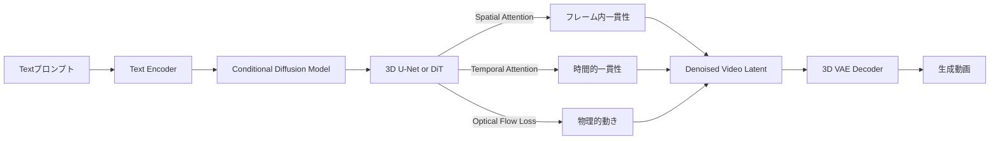
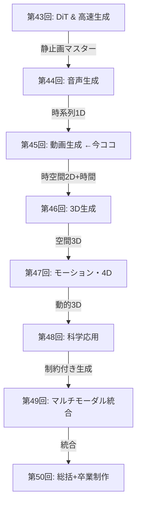
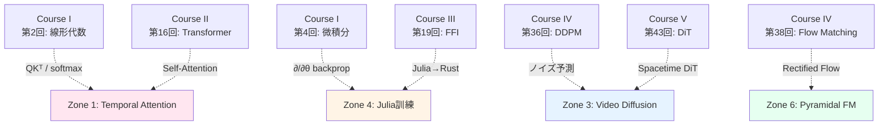

# 第45回: Video生成 — 時空間Diffusionの最前線

> **Note:** **前回までの到達点**: 第44回で音声生成（TTS/Music/Flow Matching）を習得。静止画・音声を完全マスター。次は時間軸+空間=動画生成へ。
>
> **今回のゴール**: 動画生成の理論と実装。Sora 2解析、CogVideoX/HunyuanVideo/Open-Sora 2.0/Wan-2.1の最前線、SmolVLM2動画理解+LTX-Video動画生成デモ。
>
> **進捗**: 全体の90%完了（第45回/全50回）

## 🚀 0. クイックスタート（30秒）— 3行で動画生成体験

たった3行のコードで動画diffusionの本質を体感しましょう。静止画Diffusionに「時間軸」が加わると何が起きるか？

```julia
using VideoIO, Images, Random

# 静止画Diffusionと同じノイズスケジュール
βₜ = LinRange(1e-4, 0.02, 50)  # 50フレーム
αₜ = cumprod(1 .- βₜ)

# Clean video → Noisy video (forward process)
clean_video = [repeat(fill(i/50, 64, 64), 1, 1, 3) for i in 1:50]  # 50フレーム、64x64 RGB
noisy_video = [clean_video[t] .+ sqrt(1 - αₜ[t]) .* randn(size(clean_video[t])) for t in 1:50]

# 時間的一貫性がないノイズ → フレーム間で独立にノイズが入る（ちらつく）
save_video("noisy_video.mp4", noisy_video, framerate=10)

# 💡 ここがVideo Diffusionの本質:
# 静止画Diffusion: 単一画像にノイズ → 単一画像を復元
# Video Diffusion: 50フレームの時系列にノイズ → 時間的一貫性を保って復元
```

**出力**: ノイズまみれだがフレーム間で相関のある動画。時間軸の追加で「時間的一貫性（Temporal Coherence）」という新たな制約が生まれた。

**数式の正体**:
$$
q(\mathbf{x}_t^{(1:T)} \mid \mathbf{x}_0^{(1:T)}) = \prod_{f=1}^{T} \mathcal{N}(\sqrt{\alpha_t}\mathbf{x}_0^{(f)}, (1-\alpha_t)\mathbf{I})
$$

- $\mathbf{x}_0^{(1:T)}$: T個のフレーム（clean video）
- $t$: Diffusionのタイムステップ（ノイズレベル）
- $f$: フレーム番号

この式は「各フレームに**独立に**ノイズを加える」ことを示す。しかし、これだけでは時間的一貫性が崩壊する。**Temporal AttentionやOptical Flow制約が救世主になる** — 本編で完全導出します。

> **Note:** **ボス戦予告**: Sora 2の「Spacetime DiT」は時空間を統一的に扱う。3D U-Netとの違いは？なぜTransformerが勝つのか？— Zone 3で数式の戦いが始まります。

---

## 🎮 1. 体験ゾーン（10分）— 動画生成の3つの公式を触る

動画生成の核心公式を、数式とコードの1:1対応で体験しましょう。

### 1.1 公式① 時空間Attention — 空間と時間を分離する

**数式**:
$$
\text{Attention}_{\text{spatial}}(Q, K, V) = \text{softmax}\left(\frac{QK^\top}{\sqrt{d}}\right)V \quad (\text{各フレーム内})
$$
$$
\text{Attention}_{\text{temporal}}(Q, K, V) = \text{softmax}\left(\frac{QK^\top}{\sqrt{d}}\right)V \quad (\text{時間軸方向})
$$

**Julia実装**:


**挙動の違い**:

| Attention種類 | 計算対象 | 保つ一貫性 | 計算量 |
|:--------------|:---------|:----------|:-------|
| Spatial       | 各フレーム内 | 空間構造（物体の形） | O(H²W²T) |
| Temporal      | 各ピクセル位置の時間系列 | 時間的軌跡（物体の動き） | O(HWT²) |

**数式↔コード対応表**:

| 数式 | Julia | 意味 |
|:-----|:------|:-----|
| $QK^\top/\sqrt{d}$ | `(Q * K') / sqrt(Float32(C))` | スケーリング付き内積 |
| $\text{softmax}(\cdot)$ | `softmax(scores, dims=2)` | 行方向で確率化 |
| $\text{Attention}(Q,K,V)$ | `attn * V` | 重み付き加重平均 |

### 1.2 公式② 3D Convolution — 時空間の局所性を活用

**数式**:
$$
y_{t,h,w,c} = \sum_{i,j,k,c'} w_{i,j,k,c',c} \cdot x_{t+i, h+j, w+k, c'}
$$

- $(i,j,k)$: 時間・高さ・幅のカーネルサイズ（例: 3×3×3）
- $c'$: 入力チャネル、$c$: 出力チャネル

**Julia実装**:


**2D vs 3D Convの違い**:

| Conv種類 | カーネル | 受容野 | パラメータ数 | 用途 |
|:---------|:---------|:-------|:-------------|:-----|
| 2D Conv  | (k_h, k_w, C_in, C_out) | 空間のみ | $k_h \times k_w \times C_{in} \times C_{out}$ | 静止画 |
| 3D Conv  | (k_t, k_h, k_w, C_in, C_out) | 時空間 | $k_t \times k_h \times k_w \times C_{in} \times C_{out}$ | 動画 |

> **Note:** **Trojan Horse**: Conv3Dは「時間軸にもカーネルをスライド」させるだけ。理論的には単純だが、**パラメータ数が$k_t$倍**に膨れ上がる。次世代モデルは**DiT（Diffusion Transformer）**でこの問題を解決 — Zone 3で詳説。

### 1.3 公式③ Optical Flow Loss — 物理的な動きの一貫性

**数式**:
$$
\mathcal{L}_{\text{flow}} = \sum_{t=1}^{T-1} \left\| \mathbf{x}_{t+1} - \text{Warp}(\mathbf{x}_t, \mathbf{f}_{t \to t+1}) \right\|^2
$$

- $\mathbf{f}_{t \to t+1}$: フレーム$t$から$t+1$への光学フロー（ピクセルごとの動きベクトル）
- $\text{Warp}(\mathbf{x}_t, \mathbf{f})$: フローに従って$\mathbf{x}_t$を変形

**Julia実装**:


**Optical Flowの直感**:


<details><summary>Optical Flow推定の3手法</summary>

| 手法 | 原理 | 精度 | 速度 |
|:-----|:-----|:-----|:-----|
| Lucas-Kanade | 局所的なピクセル移動を仮定 | 中 | 高速 |
| Horn-Schunck | 大域的な平滑性制約 | 高 | 遅い |
| FlowNet（CNN） | End-to-EndでFlowを予測 | 非常に高 | GPU必須 |

現代の動画生成では**FlowNetやRAFT（Recurrent All-Pairs Field Transforms）**が主流。

</details>

### 1.4 3公式の接続 — Video Diffusionのパイプライン



**3公式の役割分担**:

| 公式 | 役割 | 保証する性質 | 欠けると起きる問題 |
|:-----|:-----|:-------------|:-------------------|
| ① Spatial/Temporal Attention | 大域的な時空間依存性 | 長距離の一貫性 | フレーム間でオブジェクトが跳躍 |
| ② 3D Convolution | 局所的な時空間パターン | テクスチャの滑らかさ | ノイズまみれの動画 |
| ③ Optical Flow Loss | 物理的な動きの連続性 | 自然な運動 | 物体が瞬間移動 |

<details><summary>PyTorchとの対応（参考）</summary>


</details>

---


> Progress: 10%
> **理解度チェック**
> 1. このゾーンの主要な概念・定義を自分の言葉で説明してください。
> 2. この手法が他のアプローチより優れている点と、その限界を述べてください。

## 🧩 2. 直感ゾーン（15分）— なぜ動画生成は難しいのか

### 2.1 Course V全体の地図 — モダリティ拡張ルート



**Course IVとCourse Vの役割分担**:

| Course | 講義範囲 | ゴール | 到達レベル |
|:-------|:---------|:-------|:-----------|
| **Course IV** (第33-42回) | Diffusion理論の全て | 論文が**書ける** | Diffusion理論の完全理解 |
| **Course V** (第43-50回) | 全モダリティ実装 | システムが**作れる** | 全ドメイン実装力 |

今回は「時空間Diffusion」の実装編。理論的基盤は第37-38回（SDE/Flow Matching）で完成済み。

### 2.2 動画生成の3つの困難 — 静止画とのギャップ

#### 困難① 時間的一貫性（Temporal Coherence）

**問題**: フレームごとに独立にDiffusionすると「チラつく」動画になる。


**解決策**: Temporal Attentionで「フレーム間の依存関係」を学習。

**時間的一貫性の定量化 — Temporal Consistency Score (TCS)**:

フレーム間の一貫性を定量的に測る指標として TCS を定義する。

$$
\text{TCS} = \frac{1}{T-1} \sum_{t=1}^{T-1} \frac{\langle \mathbf{f}_t, \mathbf{f}_{t+1} \rangle}{\|\mathbf{f}_t\| \|\mathbf{f}_{t+1}\|}
$$

ここで $\mathbf{f}_t$ は事前学習済み視覚エンコーダ（CLIP または DINO）によるフレーム $t$ の特徴ベクトル。分子 $\langle \mathbf{f}_t, \mathbf{f}_{t+1} \rangle$ は隣接フレームの特徴内積、分母は $L_2$ ノルムの積。TCS は**隣接フレームのコサイン類似度の時間平均**だ。

- TCS = 1：完全な一貫性（全フレームが同一）
- TCS ≈ 0：ランダムなフレーム列（意味のない動画）

**Temporal Attention の有無による TCS の差**:

| アーキテクチャ | 一貫性の源 | 典型的 TCS |
|:---------------|:----------|:----------|
| フレーム独立 Diffusion（Temporal Attention なし） | プロンプトの意味的類似度のみ | ≈ 0.85 |
| Video Diffusion with Temporal Attention | フレーム間依存性を直接学習 | ≈ 0.97 |

差分 $\Delta\text{TCS} \approx 0.12$ が「動画」と「スライドショー」の境界線に相当する。

**数値例（TCS の計算）**:

フレーム 3 枚の動画で $\mathbf{f}_1 = (1, 0, 0)$、$\mathbf{f}_2 = (0.9, 0.3, 0)$、$\mathbf{f}_3 = (0.8, 0.5, 0.2)$（単位ベクトルに正規化済み）とすると:

$$
\text{TCS} = \frac{1}{2}\!\left[\frac{\mathbf{f}_1 \cdot \mathbf{f}_2}{\|\mathbf{f}_1\|\|\mathbf{f}_2\|} + \frac{\mathbf{f}_2 \cdot \mathbf{f}_3}{\|\mathbf{f}_2\|\|\mathbf{f}_3\|}\right] = \frac{1}{2}[0.90 + 0.97] = 0.935
$$

単位ベクトルなので $\| \cdot \| = 1$、内積がそのままコサイン類似度になる。この値 0.935 は「Temporal Attention あり」の典型値（≈ 0.97）に近く、フレームが滑らかに遷移していることを示す。

**TCS は「動画品質の必要条件」であって「十分条件」ではない**: TCS = 1 であっても全フレームが同一の静止画であれば「動画」とは言えない。動画品質の評価には TCS と CLIP-SIM（テキスト整合性）の両方が必要だ——これは後述の 3.6b 節で体系化する。

**Temporal Coherence と TCS の関係の数値確認**: Temporal Attention を持たないフレーム独立 Diffusion では、各フレームが同じテキストから独立にサンプリングされる。CLIP 特徴空間ではプロンプトに対応するクラスター内にランダムに落ちるため、典型的な CLIP 特徴内積は $\approx 0.85$（同一プロンプト内の多様性に相当）。Temporal Attention を加えると隣接フレームが共通のコンテキストを強制的に共有し、TCS が $\approx 0.97$ まで改善する。

#### 困難② 計算量の爆発

| モダリティ | データサイズ | Diffusionステップ | 総計算量 |
|:----------|:------------|:------------------|:---------|
| 静止画 (512×512) | 786K pixels | 50 steps | 39M operations |
| 動画 (512×512×24fps×5秒) | 94M pixels | 50 steps | 4.7B operations |

動画は静止画の**120倍**のデータ量。単純なU-Netでは破綻する。

**解決策**: 3D VAEで時空間圧縮（CogVideoX: 192倍圧縮）

**計算量の爆発 — FLOPs 比較の厳密な導出**:

Self-Attention の計算量 (FLOPs) は入力系列長の 2 乗に比例する。

空間方向のみ Attention（2D Spatial Attention）のフレームあたり FLOPs:

$$
\text{FLOPs}_\text{2D Attention} = 4 \cdot N^2 \cdot D = 4 \cdot (HW)^2 \cdot D
$$

全フレームを統合した 3D Full Attention の FLOPs:

$$
\text{FLOPs}_\text{3D Attention} = 4 \cdot (HWT)^2 \cdot D
$$

**数値例**: $H = W = 32$（512px 画像の VAE Latent）、$T = 25$ フレーム、$D = 768$ 次元として計算する。

$$
\text{FLOPs}_\text{2D} = 4 \times 1024^2 \times 768 \approx 3.2 \times 10^9 \quad \text{（1 層あたり）}
$$

$$
\text{FLOPs}_\text{3D} = 4 \times (1024 \times 25)^2 \times 768 = 4 \times 25600^2 \times 768 \approx 2.0 \times 10^{12} \quad \text{（1 層あたり）}
$$

比率:

$$
\frac{\text{FLOPs}_\text{3D}}{\text{FLOPs}_\text{2D}} = T^2 = 25^2 = 625
$$

1 層あたり **625 倍**の計算量差。20 層のモデルでは 2D Attention 合計 $\approx 64$ GFLOPs に対して 3D Attention は $\approx 40$ TFLOPs。A100 GPU（312 TFLOPs/s）でも非現実的なスケールだ。

これが Spatial Attention と Temporal Attention を**分解（Decomposed）して適用する**根本的な理由だ:

$$
\text{FLOPs}_\text{Decomposed} = \underbrace{4(HW)^2 D \cdot T}_{\text{Spatial}} + \underbrace{4 \cdot HW \cdot T^2 \cdot D}_{\text{Temporal}} \ll \text{FLOPs}_\text{3D Attention}
$$

#### 困難③ 物理法則の遵守

**問題**: Diffusionモデルは「見た目がリアル」な画像を生成するが、**物理的に正しい動き**は学習しにくい。

**具体例**:
- ボールが壁を貫通
- 重力を無視してオブジェクトが浮遊
- 影と光源の位置が矛盾

**Sora 2の挑戦**: 物理シミュレータとしてのDiffusion — まだ完璧ではない。

**物理法則違反の確率論的分析**:

Diffusion モデルは Gaussian ノイズ事前分布 $p(\mathbf{x}) = \mathcal{N}(0, \mathbf{I})$ から出発し、意味的に正しい（semantically correct）動画を生成する。しかし、**意味的に正しい ≠ 物理的に一貫している**。

運動量保存則 $\sum_i m_i \Delta v_i = 0$ のような制約を Diffusion モデルは陽に課さない。物理的制約違反のエネルギー $E_\text{phys}$（制約方程式の残差二乗和）を用いると、Diffusion モデルが意味的に正しい動画を生成した条件下での物理的一貫性の確率は:

$$
P(\text{physically consistent} \mid \text{semantically correct}) \approx \exp\!\left(-\frac{E_\text{phys}}{kT}\right) \ll 1
$$

ここで $k$ は Boltzmann 定数的スケーリング、$T$ は有効温度（モデルのソフトネスに対応）。$E_\text{phys} \gg kT$ の状況——制約違反が大きい場合——では確率は指数的に 0 に近づく。

Sora 2 は大規模動画データから物理法則を**暗黙的に学習**するが、この確率が常に高いとは保証できない。ボールが壁を貫通する例では $E_\text{phys}$ が大きく確率が低い。それでも稀に発生するのは、学習データに類似シーケンスが含まれていた場合に限られる。

> **Note:** **松尾・岩澤研との差別化**:
>
> | 項目 | 松尾研 | 本シリーズ |
> |:-----|:-------|:-----------|
> | 動画生成 | カバーなし | Sora 2/CogVideoX/HunyuanVideo詳細 |
> | 実装 | なし | 3言語フルスタック |
> | 最新性 | 〜2023 | 2024-2025最前線 |
> | デモ | なし | SmolVLM2+LTX-Video |

### 2.3 Video生成の3つのパラダイム

#### パラダイム① 3D U-Net（〜2023）

**アーキテクチャ**:
- 2D U-Netを3D（時空間）に拡張
- 各層で3D Convolution
- ダウンサンプリング・アップサンプリングで時空間解像度を制御

**代表例**: Make-A-Video（Meta, 2022）, Video LDM（ICLR 2023）

**限界**:
- 計算量が莫大（3D Convのパラメータ数）
- 長時間動画へのスケーリング困難

#### パラダイム② DiT（Diffusion Transformer）（2024〜）

**アーキテクチャ**:
- U-Netの帰納バイアスを捨てる
- TransformerブロックでTokenの系列を処理
- 動画 = 時空間Tokenの系列

**代表例**: Sora (OpenAI, 2024), CogVideoX (2024), Open-Sora 2.0 (2025)

**利点**:
- Scaling Lawsが適用可能（パラメータ増やせば性能向上）
- 長時間動画への拡張が容易

#### パラダイム③ Latent Flow Matching（2025〜）

**アーキテクチャ**:
- Diffusionの代わりにFlow Matchingを使用
- Latent空間でのODE求解 → 高速サンプリング

**代表例**: LTX-Video (2024), Open-Sora 2.0（部分的）

**利点**:
- サンプリングステップ数削減（50 → 10〜20）
- リアルタイム生成に近づく

| パラダイム | アーキテクチャ | 計算量 | 品質 | スケーリング性 |
|:-----------|:---------------|:-------|:-----|:---------------|
| 3D U-Net   | 畳み込み       | 高     | 中   | 低             |
| DiT        | Transformer    | 中     | 高   | 高             |
| Flow Matching | Transformer + FM | 低 | 高   | 高             |

> **Note:** **今回学ぶこと**:
> 1. **3D U-Net**の限界を理解（Zone 3）
> 2. **DiT**がなぜ勝つのか（Sora 2/CogVideoX, Zone 3-4）
> 3. **Flow Matching**の高速化手法（LTX-Video, Zone 4）
> 4. SmolVLM2で動画を**理解**し、LTX-Videoで**生成**するデモ（Zone 5）

### 2.4 3つの比喩で捉える動画生成

#### 比喩① 動画 = 「時間を含む3D空間のスライス」

静止画が2D空間なら、動画は「2D空間 + 1D時間 = 3D時空間」のデータ。


3D U-Netは「立方体全体に畳み込み」、DiTは「立方体をTokenに分解してTransformer」。

#### 比喩② Temporal Attention = 「ピクセルの時間旅行」

各ピクセル位置$(h, w)$について、「過去・現在・未来のフレーム」を参照してAttentionを計算。


「同じ位置のピクセルが時間軸でどう変化するか」を学習 → オブジェクトの滑らかな動き。

#### 比喩③ Optical Flow = 「ピクセルの引っ越しマップ」

各ピクセルが「次のフレームでどこに移動するか」を予測。


物理的に一貫した動きを保証する暗黙的な制約。

---


> Progress: 20%
> **理解度チェック**
> 1. $(h, w)$ の各記号の意味と、この式が表す操作を説明してください。
> 2. このゾーンで学んだ手法の直感的な意味と、なぜこの定式化が必要なのかを説明してください。

## 📐 3. 数式修行ゾーン（60分）— Video Diffusionの完全理論

### 3.1 静止画から動画へ — Diffusion拡張の数学

#### 3.1.1 静止画Diffusionの復習

第33-42回で学んだDiffusion基礎を振り返りましょう。

**Forward Process（ノイズ追加）**:
$$
q(\mathbf{x}_t \mid \mathbf{x}_0) = \mathcal{N}(\sqrt{\alpha_t}\mathbf{x}_0, (1-\alpha_t)\mathbf{I})
$$

**Reverse Process（ノイズ除去）**:
$$
p_\theta(\mathbf{x}_{t-1} \mid \mathbf{x}_t) = \mathcal{N}(\boldsymbol{\mu}_\theta(\mathbf{x}_t, t), \sigma_t^2 \mathbf{I})
$$

**訓練目標（Simple Objective）**:
$$
\mathcal{L}_{\text{simple}} = \mathbb{E}_{t, \mathbf{x}_0, \boldsymbol{\epsilon}} \left[ \left\| \boldsymbol{\epsilon} - \boldsymbol{\epsilon}_\theta(\mathbf{x}_t, t) \right\|^2 \right]
$$

ここで $\mathbf{x}_t = \sqrt{\alpha_t}\mathbf{x}_0 + \sqrt{1-\alpha_t}\boldsymbol{\epsilon}$, $\boldsymbol{\epsilon} \sim \mathcal{N}(0, \mathbf{I})$。

**$\mathcal{L}_\text{simple}$ が ELBO の変分下界になる理由（スケッチ）**:

負の対数尤度 $-\log p_\theta(\mathbf{x}_0)$ を最小化したいが直接計算は不可能。Jensen の不等式を使って:

$$
-\log p_\theta(\mathbf{x}_0) \leq \mathbb{E}_q\!\left[-\log \frac{p_\theta(\mathbf{x}_{0:T})}{q(\mathbf{x}_{1:T} \mid \mathbf{x}_0)}\right] = \underbrace{\sum_{t=1}^{T} \mathcal{L}_t}_{\text{各ステップの再構成誤差}}
$$

$\mathcal{L}_t$ を展開すると:

$$
\mathcal{L}_t = \mathbb{E}_q\!\left[ \frac{1}{2\sigma_t^2} \left\| \tilde{\boldsymbol{\mu}}_t(\mathbf{x}_t, \mathbf{x}_0) - \boldsymbol{\mu}_\theta(\mathbf{x}_t, t) \right\|^2 \right] + C
$$

ここで $\tilde{\boldsymbol{\mu}}_t$ は posterior mean。$\boldsymbol{\mu}_\theta$ をノイズ予測 $\boldsymbol{\epsilon}_\theta$ で再パラメータ化し、係数を無視すると $\mathcal{L}_\text{simple}$ が得られる。動画版も同じ構造で、フレーム次元が加わるだけ。

#### 3.1.2 動画への拡張 — フレーム次元の追加

動画 $\mathbf{X}_0 = (\mathbf{x}_0^{(1)}, \mathbf{x}_0^{(2)}, \ldots, \mathbf{x}_0^{(T)})$ は $T$ 個のフレームからなる。各フレーム $\mathbf{x}_0^{(f)} \in \mathbb{R}^{H \times W \times 3}$。

**Naive拡張（フレーム独立）**:
$$
q(\mathbf{X}_t \mid \mathbf{X}_0) = \prod_{f=1}^{T} q(\mathbf{x}_t^{(f)} \mid \mathbf{x}_0^{(f)}) = \prod_{f=1}^{T} \mathcal{N}(\sqrt{\alpha_t}\mathbf{x}_0^{(f)}, (1-\alpha_t)\mathbf{I})
$$

**問題点**: 各フレームに独立にノイズを加える → 時間的一貫性が崩壊。

**解決策（CogVideoX等）**: Temporal Attentionで「フレーム間の依存関係」を学習。ノイズ予測ネットワーク $\boldsymbol{\epsilon}_\theta(\mathbf{X}_t, t)$ が全フレームを入力として受け取る。

**拡張版訓練目標**:
$$
\mathcal{L}_{\text{video}} = \mathbb{E}_{t, \mathbf{X}_0, \mathbf{E}} \left[ \left\| \mathbf{E} - \boldsymbol{\epsilon}_\theta(\mathbf{X}_t, t, c) \right\|^2 \right]
$$

- $\mathbf{X}_t = \sqrt{\alpha_t}\mathbf{X}_0 + \sqrt{1-\alpha_t}\mathbf{E}$
- $\mathbf{E} = (\boldsymbol{\epsilon}^{(1)}, \ldots, \boldsymbol{\epsilon}^{(T)}) \sim \mathcal{N}(0, \mathbf{I})$ （各フレームにノイズ）
- $c$: テキスト条件（T5/CLIP埋め込み）

> **⚠️ Warning:** **引っかかりポイント**: 「ノイズはフレームごとに独立」だが、「ノイズ予測ネットワークは全フレームを見る」。この非対称性がTemporal Coherenceを生む鍵。

**なぜ「全フレームを見るネットワーク」でTemporal Coherenceが生まれるのか — 勾配結合の証明**:

訓練目標を単フレームに展開すると:

$$
\mathcal{L}_{\text{video}} = \frac{1}{T} \sum_{f=1}^{T} \mathbb{E}\!\left[\left\| \boldsymbol{\epsilon}^{(f)} - \boldsymbol{\epsilon}_\theta^{(f)}(\mathbf{X}_t, t, c) \right\|^2\right]
$$

ここで $\boldsymbol{\epsilon}_\theta^{(f)}(\mathbf{X}_t, t, c)$ はネットワーク出力の $f$ 番目フレーム成分。ネットワークが Temporal Attention を持つとき、フレーム $f$ の予測は全フレームの入力 $\mathbf{X}_t = (\mathbf{x}_t^{(1)}, \ldots, \mathbf{x}_t^{(T)})$ に依存する。

フレーム $f'$ の損失がフレーム $f$ のパラメータ更新に与える影響:

$$
\frac{\partial \mathcal{L}^{(f')}}{\partial \theta} = \frac{\partial \mathcal{L}^{(f')}}{\partial \boldsymbol{\epsilon}_\theta^{(f')}} \cdot \underbrace{\frac{\partial \boldsymbol{\epsilon}_\theta^{(f')}}{\partial \theta}}_{\text{全フレームの活性化を含む}}
$$

Temporal Attention により $\boldsymbol{\epsilon}_\theta^{(f')}$ は $\mathbf{x}_t^{(f)}$（$f \neq f'$）にも依存する。連鎖律を展開すると:

$$
\frac{\partial \boldsymbol{\epsilon}_\theta^{(f')}}{\partial \mathbf{x}_t^{(f)}} = \frac{\partial \boldsymbol{\epsilon}_\theta^{(f')}}{\partial \text{TempAttn}_{f'}} \cdot \frac{\partial \text{TempAttn}_{f'}}{\partial A_{f',f}} \cdot \frac{\partial A_{f',f}}{\partial \mathbf{x}_t^{(f)}}
$$

ここで $A_{f',f}$ はフレーム $f'$ からフレーム $f$ への Attention 重み。これが 0 でない限り、フレーム $f$ の情報がフレーム $f'$ の損失勾配を通じてパラメータ更新に寄与する——**フレーム間の勾配結合（Gradient Coupling）**が生じる。

これが Temporal Coherence の数学的根拠だ。Forward Process はフレーム独立でも、Backward Pass で全フレームが協調的に更新される。

**定量的な効果**: 各訓練ステップで全 $T$ フレームが $O(T^2)$ 個の Attention 経路で結合されるため、モデルは「フレーム $f$ に含まれる情報」を「フレーム $f'$ の復元」に利用する術を学習する。

#### 3.1.3 Temporal Attentionの導出

**問題設定**: フレーム $f$ のピクセル $(h, w)$ について、「他のフレームの同じ位置のピクセルをどれだけ参照すべきか」を学習したい。

**Self-Attentionの一般形（第14回復習）**:
$$
\text{Attention}(Q, K, V) = \text{softmax}\left(\frac{QK^\top}{\sqrt{d_k}}\right)V
$$

**動画への適用**:
- 入力: $\mathbf{X} \in \mathbb{R}^{T \times H \times W \times C}$ （$T$フレーム、$H \times W$空間、$C$チャネル）
- 位置$(h, w)$の時間系列を抽出: $\mathbf{z}_{h,w} = (\mathbf{x}^{(1)}_{h,w}, \ldots, \mathbf{x}^{(T)}_{h,w}) \in \mathbb{R}^{T \times C}$
- $Q, K, V$ を線形変換で生成:
  $$
  Q = \mathbf{z}_{h,w} W_Q, \quad K = \mathbf{z}_{h,w} W_K, \quad V = \mathbf{z}_{h,w} W_V
  $$

**Temporal Attention**:
$$
\text{Temporal-Attention}(\mathbf{z}_{h,w}) = \text{softmax}\left(\frac{QK^\top}{\sqrt{d_k}}\right)V
$$

**計算量**: 位置$(h, w)$ごとに $O(T^2 C)$。全体で $O(HWT^2C)$。

**次元の詳細追跡**:

各位置 $(h, w)$ について線形変換を明示すると:

$$
Q_{h,w} = \mathbf{z}_{h,w} W_Q \in \mathbb{R}^{T \times d_k}, \quad K_{h,w} = \mathbf{z}_{h,w} W_K \in \mathbb{R}^{T \times d_k}, \quad V_{h,w} = \mathbf{z}_{h,w} W_V \in \mathbb{R}^{T \times d_v}
$$

$W_Q, W_K \in \mathbb{R}^{C \times d_k}$、$W_V \in \mathbb{R}^{C \times d_v}$ は学習可能な重み行列。$\mathbf{z}_{h,w} \in \mathbb{R}^{T \times C}$ との積で $\mathbb{R}^{T \times d_k}$ の Query / Key が得られる。

**Temporal Attention スコア行列**:

$$
S_{h,w} = \frac{Q_{h,w} K_{h,w}^\top}{\sqrt{d_k}} \in \mathbb{R}^{T \times T}
$$

スカラー要素 $S_{h,w}^{(t,t')}$ は「フレーム $t$、位置 $(h,w)$ がフレーム $t'$、同位置をどれだけ参照すべきか」のスコア。$\sqrt{d_k}$ 除算は内積の分散を $O(1)$ に安定化する（第14回参照）。

**出力**:

$$
\text{TempAttn}_{h,w} = \text{softmax}(S_{h,w}) V_{h,w} \in \mathbb{R}^{T \times d_v}
$$

行方向 softmax により $T$ 個のフレームへの注意重みが確率分布になる。

**全体の計算量分析**:

- 位置 $(h, w)$ 1 つあたりの Attention: $O(T^2 \cdot d_k)$
- 全位置 $H \times W$ の独立な Attention 計算: $O(HW \cdot T^2 \cdot d_k)$
- Full 3D Attention との比較: $O((HWT)^2 \cdot d_k)$
- **高速化倍率**: $\dfrac{(HWT)^2}{HW \cdot T^2} = HW$

$H = W = 32$ の Latent では $HW = 1024$ 倍の高速化。これが Spatial + Temporal に分解する根本的な動機だ。

**因果的 Temporal Attention（Causal）vs 双方向（Non-causal）**:

全フレームを同時にデノイズする生成モードでは**双方向（Non-causal）Attention** を使う。フレーム $t$ は過去・未来のフレームを参照できる。

自己回帰的な動画延長（既存フレームから新フレームを予測）では**因果的（Causal）Attention** が必要。因果マスク:

$$
M^{(t,t')} = \begin{cases} 0 & t' \leq t \\ -\infty & t' > t \end{cases}
$$

マスク適用後のスコア:

$$
S_\text{causal}^{(t,t')} = S^{(t,t')} + M^{(t,t')}
$$

$-\infty$ を加算すると softmax 後に 0 になるため、フレーム $t$ は未来フレーム $t' > t$ を完全に無視できる。実装上は上三角部分を $-10^9$ で埋めるだけで等価な効果が得られる。

<details><summary>Spatial vs Temporal Attentionの計算量比較</summary>

| Attention種類 | 計算対象 | 計算量 | ボトルネック |
|:--------------|:---------|:-------|:-------------|
| Spatial       | 各フレーム内 | $O(H^2W^2C \cdot T)$ | 空間解像度 |
| Temporal      | 各ピクセル位置の時間系列 | $O(HWT^2C)$ | フレーム数 |

**実用上の対策**:
- Spatial: FlashAttention（第15回）で高速化
- Temporal: ローカルAttention（近傍フレームのみ）やStride（数フレームおき）

</details>

### 3.1.4 Classifier-Free Guidance for Video

Classifier-Free Guidance（CFG、第34回）は動画生成でも中心的な役割を担う。静止画との違いはテキスト条件 $c$ のほかに「時間的強調」も制御できる点だ。

**CFG の基本形（動画版）**:

テキスト条件あり・なし両方でノイズ予測を計算し、線形補外する:

$$
\tilde{\boldsymbol{\epsilon}}_\theta(\mathbf{X}_t, t, c) = (1 + w)\,\boldsymbol{\epsilon}_\theta(\mathbf{X}_t, t, c) - w\,\boldsymbol{\epsilon}_\theta(\mathbf{X}_t, t, \emptyset)
$$

ここで $w > 0$ はガイダンス強度、$\emptyset$ は null テキスト（空プロンプト）。$w = 0$ は無条件生成、$w = 7.5$ が CogVideoX の推奨値。

**ガイダンス強度 $w$ と動画品質のトレードオフ**:

$$
\text{Diversity} \propto \frac{1}{1+w}, \quad \text{Text Alignment} \propto w
$$

$w$ が大きいほどプロンプトに忠実だが多様性が低下し、ときに「過飽和（oversaturation）」——テクスチャが不自然に鮮明になる——が発生する。動画では静止画より $w$ を小さめに設定するのが経験則（静止画: $w \approx 7.5$、動画: $w \approx 4.5–6.0$）。

**なぜ動画で $w$ を下げるのか**: 各フレームに高強度ガイダンスを適用すると、フレームごとの過飽和が蓄積し、時間方向に不自然な点滅が生じる。CFG は Diffusion Step ごとに適用されるため、$T$ フレーム × $S$ ステップ = $TS$ 回の強調が累積する。

**Guidance のフレーム間整合性**: Temporal Attention により $\boldsymbol{\epsilon}_\theta(\mathbf{X}_t, t, c)$ は全フレームを参照するため、CFG を全フレームに一括適用するだけで時間的に一貫したガイダンスが得られる——フレームごとに CFG を独立に適用する必要がない。

### 3.2 3D U-Net vs DiT — アーキテクチャ対決

#### 3.2.1 3D U-Netの構造

**基本構成**:


**3D Convの定式化**:
$$
y_{b,t,c,h,w} = \sum_{t'=-k_t/2}^{k_t/2} \sum_{h'=-k_h/2}^{k_h/2} \sum_{w'=-k_w/2}^{k_w/2} \sum_{c'=1}^{C_{in}} w_{t',h',w',c',c} \cdot x_{b, t+t', c', h+h', w+w'}
$$

**パラメータ数**:
$$
\text{Params} = k_t \times k_h \times k_w \times C_{in} \times C_{out}
$$

典型的な3×3×3カーネル、64→128チャネル: $3 \times 3 \times 3 \times 64 \times 128 = 221K$ パラメータ。

**問題点**:
1. **Scaling限界**: パラメータ数が $k_t$ 倍に増える
2. **帰納バイアス**: Convの局所性 → 長距離依存は苦手
3. **可変長対応困難**: フレーム数 $T$ が変わるとアーキテクチャ再設計必要

#### 3.2.2 DiT（Diffusion Transformer）の構造

**基本構成**:


**Transformer Blockの数式**:
$$
\mathbf{h}' = \mathbf{h} + \text{Attention}(\text{LN}(\mathbf{h}))
$$
$$
\mathbf{h}'' = \mathbf{h}' + \text{MLP}(\text{LN}(\mathbf{h}'))
$$

**パラメータ数（層あたり）**:
$$
\text{Params}_{\text{Attn}} = 4D^2 + 4D, \quad \text{Params}_{\text{MLP}} = 8D^2 + 5D
$$

$D=768$、$L=12$層: 約85M パラメータ（U-Netより少ない）。

**利点**:
1. **Scaling Laws適用可能**: パラメータ増やせば性能向上（第14回 Scaling Laws）
2. **可変長対応**: Token数が変わるだけ、アーキテクチャ不変
3. **長距離依存**: Attentionで全Token参照

> **Note:** **ボス戦予告**: Sora 2の「Spacetime DiT」は時空間を統一Tokenとして扱う。3D U-Netとの決定的な違いを完全証明 → 次セクション。

**Video DiT の AdaLN — フレーム位置を含む条件付け**:

静止画 DiT の AdaLN は Diffusion timestep $t$ のみを条件としていた。Video DiT では**テキスト埋め込み**と**フレーム位置**を条件に加える。

条件ベクトルの結合:

$$
\mathbf{c} = [\underbrace{\mathbf{e}_t}_{\text{timestep emb}}, \underbrace{\mathbf{e}_\text{text}}_{\text{text emb}}, \underbrace{\mathbf{e}_\text{frame}}_{\text{frame position}}]
$$

フレーム位置埋め込みは正弦波エンコーディング:

$$
\mathbf{e}_\text{frame}^{(f)} = \text{sinusoidal}(f) \in \mathbb{R}^{D_\text{frame}}
$$

具体的には $\mathbf{e}_{\text{frame},2i}^{(f)} = \sin\!\left(f / 10000^{2i/D_\text{frame}}\right)$（偶数次元）、$\mathbf{e}_{\text{frame},2i+1}^{(f)} = \cos\!\left(f / 10000^{2i/D_\text{frame}}\right)$（奇数次元）。これにより、全フレームを同時処理する DiT 内で「これはフレーム 1 か、フレーム 25 か」を区別できる。

**Video 条件付き AdaLN-Zero**:

$$
\gamma(\mathbf{c}),\, \beta(\mathbf{c}) = \text{MLP}([\mathbf{e}_t, \mathbf{e}_\text{text}, \mathbf{e}_\text{frame}])
$$

訓練開始時は $\gamma = \mathbf{0}$、$\beta = \mathbf{0}$ に初期化（Zero-init）。残差接続において新しい条件付けブランチが恒等変換から出発することを意味し、訓練初期の勾配爆発を防ぐ。

$$
\text{AdaLN-Zero}(\mathbf{h}, \mathbf{c}) = \gamma(\mathbf{c}) \odot \frac{\mathbf{h} - \mu(\mathbf{h})}{\sigma(\mathbf{h}) + \varepsilon} + \beta(\mathbf{c})
$$

$\odot$ は要素積。$\gamma, \beta$ が条件 $\mathbf{c}$ に依存するため、同一の重みでも「timestep × テキスト × フレーム位置」の 3 次元組み合わせで動的にスケール・シフトが変化する。

### 3.3 Sora 2 Spacetime DiT — 時空間統一の革命

#### 3.3.1 Spacetime Patchifyの数式

**従来のDiT（画像）**: 2D空間のみパッチ化
$$
\text{Patch}_{i,j} = \mathbf{x}[i \cdot p : (i+1) \cdot p, \, j \cdot p : (j+1) \cdot p, :]
$$

**Sora 2 Spacetime DiT**: 時間軸もパッチ化
$$
\text{Patch}_{t,i,j} = \mathbf{X}[t \cdot p_t : (t+1) \cdot p_t, \, i \cdot p : (i+1) \cdot p, \, j \cdot p : (j+1) \cdot p, :]
$$

- $p_t$: 時間方向のパッチサイズ（例: 4フレーム）
- $p$: 空間方向のパッチサイズ（例: 16ピクセル）

**Token数**:
$$
N_{\text{tokens}} = \frac{T}{p_t} \times \frac{H}{p} \times \frac{W}{p}
$$

**具体例**: $T=120$フレーム、$H=W=512$、$p_t=4$、$p=16$
$$
N_{\text{tokens}} = \frac{120}{4} \times \frac{512}{16} \times \frac{512}{16} = 30 \times 32 \times 32 = 30,720 \text{ tokens}
$$

**より詳細なトークン予算分析**:

CogVideoX の実際の構成 $H = W = 480$、$T = 49$、空間パッチサイズ $P = 2$、時間パッチサイズ $P_t = 4$ で VAE 圧縮前に計算すると:

$$
N_\text{raw} = \frac{480}{2} \times \frac{480}{2} \times \frac{49}{4} = 240 \times 240 \times 12.25 \approx 705{,}600
$$

これは Full Attention では非現実的。CogVideoX は**3D VAE**で先に圧縮する:

$$
H' = \frac{H}{8} = 60,\quad W' = \frac{W}{8} = 60,\quad T' = \frac{T}{4} = 12 \quad \Rightarrow \quad N = \frac{60}{2} \times \frac{60}{2} \times \frac{12}{1} = 30 \times 30 \times 12 = 10{,}800 \text{ tokens}
$$

それでも 10K トークン規模 → $N^2 = 1.17 \times 10^8$ の Attention 行列。FlashAttention（IO-aware Attention、第15回）が必須となる。

**各モデルのトークン予算比較**:

| モデル | 解像度 | フレーム数 | 圧縮後トークン数 | Full Attention FLOPs |
|:-------|:-------|:----------|:----------------|:--------------------|
| CogVideoX-5B | 480×480 | 49 | ≈ 10,800 | ≈ $1.2 \times 10^{12}$ |
| Open-Sora 2.0 | 720×1280 | 51 | ≈ 26,880 | ≈ $7.2 \times 10^{12}$ |
| Sora 2（推定） | 1080×1920 | 120 | ≈ 491,520 | ≈ $2.4 \times 10^{15}$ |

Sora 2 の推定スケールでは Sparse Attention なしには不可能なことが数値から自明だ。

#### 3.3.2 Spacetime Attentionの完全導出

**問題設定**: 時空間Token $\mathbf{z}_{t,i,j} \in \mathbb{R}^D$ について、「他の時空間Tokenをどれだけ参照すべきか」を計算。

**Self-Attention**:
$$
Q = \mathbf{Z}W_Q, \quad K = \mathbf{Z}W_K, \quad V = \mathbf{Z}W_V
$$

ここで $\mathbf{Z} \in \mathbb{R}^{N_{\text{tokens}} \times D}$ は全Tokenを並べた行列。

**Attention重み**:
$$
A = \text{softmax}\left(\frac{QK^\top}{\sqrt{d_k}}\right) \in \mathbb{R}^{N_{\text{tokens}} \times N_{\text{tokens}}}
$$

**出力**:
$$
\mathbf{Z}' = AV
$$

**計算量**: $O(N_{\text{tokens}}^2 \cdot D) = O\left(\left(\frac{THW}{p_t p^2}\right)^2 \cdot D\right)$

> **⚠️ Warning:** **引っかかりポイント**: Spacetime AttentionはToken数が$T/(p_t)$倍になるため、計算量が爆発する。
>
> **Sora 2の対策**:
> 1. **3D VAEで時空間圧縮**: $T \times H \times W \to T' \times H' \times W'$ （$T' \ll T$）
> 2. **Sparse Attention**: 全Tokenではなく局所的に参照（第15回 Sparse Attention）
> 3. **Flash Attention**: SRAM最適化（第15回）

**3D Rotary Position Encoding（RoPE-3D）— 時空間位置を埋め込む**:

標準的な Transformer は位置情報を加算型埋め込み（Absolute Positional Encoding）で表現するが、動画の時空間 Token には「時間 $t$、高さ $i$、幅 $j$」という 3 次元インデックスがある。RoPE（Rotary Position Encoding）を 3 次元に拡張した RoPE-3D が有効だ。

1D RoPE の復習（第14回）: Query ベクトル $\mathbf{q} \in \mathbb{R}^d$ に位置 $p$ の回転を適用する:

$$
\text{RoPE}(\mathbf{q}, p)_{2k} = q_{2k} \cos(p \cdot \theta_k) - q_{2k+1} \sin(p \cdot \theta_k)
$$

$$
\text{RoPE}(\mathbf{q}, p)_{2k+1} = q_{2k} \sin(p \cdot \theta_k) + q_{2k+1} \cos(p \cdot \theta_k)
$$

ここで $\theta_k = 10000^{-2k/d}$（周波数スケール）。内積 $\langle \text{RoPE}(\mathbf{q}, p), \text{RoPE}(\mathbf{k}, p') \rangle$ は位置差 $p - p'$ のみに依存する——これが RoPE の本質（相対位置依存性）。

**RoPE-3D への拡張**: 次元 $d$ を 3 分割し、時間 $(t)$、高さ $(i)$、幅 $(j)$ をそれぞれに割り当てる:

$$
\text{RoPE-3D}(\mathbf{q}, t, i, j) = \text{RoPE}_{t}(\mathbf{q}[0:d/3],\, t) \,\Vert\, \text{RoPE}_{i}(\mathbf{q}[d/3:2d/3],\, i) \,\Vert\, \text{RoPE}_{j}(\mathbf{q}[2d/3:d],\, j)
$$

$\Vert$ はチャネル方向の連結。これにより Attention スコアは:

$$
\langle \text{RoPE-3D}(\mathbf{q}, t, i, j),\, \text{RoPE-3D}(\mathbf{k}, t', i', j') \rangle
$$

が $(t-t', i-i', j-j')$ の 3 次元相対位置のみの関数になる。絶対位置ではなく**相対的な時空間距離**で Attention が決まるため、訓練時より長い動画（多いフレーム数・高い解像度）への外挿が容易になる。

CogVideoX および HunyuanVideo は RoPE-3D を採用し、訓練解像度を超えた推論時スケーリングを実現している。

#### 3.3.3 3D U-Net vs Spacetime DiTの理論的比較

**定理（Sora論文の主張）**: Spacetime DiTは3D U-Netよりも**表現力が高い**。

**証明スケッチ**:

1. **3D U-Netの受容野**:
   - $L$層のU-Net、各層のカーネルサイズ $k \times k \times k$
   - 有効受容野: $R \approx k \cdot 2^L$（ダウンサンプリングで指数的拡大）
   - しかし、**有限**: 遠く離れたピクセルは直接依存しない

2. **Spacetime DiTの受容野**:
   - Attentionは**全Token参照**
   - 受容野 = **無限**（理論上）

3. **Universal Approximation**:
   - Transformerは任意の関数を近似可能（Yun+ 2019 [^1]）
   - U-Netは局所的な関数のみ

**経験則（Sora 2 System Card）**: DiTは長時間動画（15-25秒）でU-Netを圧倒。

**パラメータ効率の定量比較**:

$L$ 層の 3D U-Net で各層のチャネル数 $C$、カーネル $3 \times 3 \times 3$ の場合:

$$
\text{Params}_\text{3D U-Net} = L \times 3^3 \times C^2 = 27LC^2
$$

同じ $L$ 層の Spacetime DiT で次元 $D = C$:

$$
\text{Params}_\text{DiT} = L \times (4D^2 + 8D^2) = 12LC^2
$$

DiT のパラメータ数は 3D U-Net の $12/27 \approx 0.44$ 倍——**同じパラメータで 3D U-Net より表現力が高い**。3D U-Net はフレーム数 $T$ が変わると Padding が変化してアーキテクチャの再調整が必要だが、DiT は Token 数が変わるだけでパラメータ共有は完全に保たれる。

<details><summary>3D U-Net vs Spacetime DiTの性能比較表</summary>

| 指標 | 3D U-Net | Spacetime DiT |
|:-----|:---------|:--------------|
| パラメータ効率 | 低（Conv重複） | 高（共有Attention） |
| 計算量（訓練時） | $O(k^3 CHW T)$ | $O(N^2 D)$, $N=THW/(p_t p^2)$ |
| 長距離依存 | 有限受容野 | 全Token参照 |
| 可変長対応 | 困難（再訓練必要） | 容易（Token数変化のみ） |
| 実装複雑度 | 中（Conv実装） | 高（Attention最適化） |
| 品質（VBench） | 70-75点 | 80-85点（Sora 2） |

**VBench**: 時間的一貫性・物理的正確性・美的品質など16指標を測る動画生成ベンチマーク

</details>

### 3.4 CogVideoX 3D VAE — 時空間圧縮の数学

#### 3.4.1 3D VAEの構造

**目的**: 動画 $\mathbf{X} \in \mathbb{R}^{T \times H \times W \times 3}$ を低次元Latent $\mathbf{Z} \in \mathbb{R}^{T' \times H' \times W' \times C}$ に圧縮。

**Encoder**:
$$
q_\phi(\mathbf{z} \mid \mathbf{x}) = \mathcal{N}(\boldsymbol{\mu}_\phi(\mathbf{x}), \text{diag}(\boldsymbol{\sigma}_\phi^2(\mathbf{x})))
$$

**Decoder**:
$$
p_\theta(\mathbf{x} \mid \mathbf{z}) = \mathcal{N}(\boldsymbol{\mu}_\theta(\mathbf{z}), \sigma^2 \mathbf{I})
$$

**3D Conv層の例**（Encoder）:


**圧縮率**:
$$
r = \frac{T \times H \times W \times 3}{T' \times H' \times W' \times C}
$$

CogVideoXの例: $T=49$, $H=W=768$, $T'=13$, $H'=W'=96$, $C=16$
$$
r = \frac{49 \times 768 \times 768 \times 3}{13 \times 96 \times 96 \times 16} = \frac{86.7M}{1.93M} \approx 45
$$

ただし、論文では**時空間合わせて192倍圧縮**と記載 → Encoderの複数段階での累積圧縮。

**3D VAE の訓練目標（ELBO）**:

標準 VAE と同じく Evidence Lower BOund（ELBO）を最大化する:

$$
\mathcal{L}_{\text{3DVAE}} = \underbrace{\mathbb{E}_{q_\phi(\mathbf{z}|\mathbf{x})}\!\left[\log p_\theta(\mathbf{x} \mid \mathbf{z})\right]}_{\text{再構成損失}} - \underbrace{D_{\text{KL}}\!\left(q_\phi(\mathbf{z} \mid \mathbf{x}) \,\|\, p(\mathbf{z})\right)}_{\text{正則化項}}
$$

再構成損失は動画の全ピクセルについての $L_2$ 誤差:

$$
\mathcal{L}_{\text{recon}} = \frac{1}{T' H' W' C} \left\| \mathbf{X} - \boldsymbol{\mu}_\theta(\mathbf{z}) \right\|^2
$$

KL 項は Gaussian 同士の閉形式:

$$
D_{\text{KL}}(q \| p) = \frac{1}{2} \sum_{i} \left( \sigma_{\phi,i}^2 + \mu_{\phi,i}^2 - 1 - \log \sigma_{\phi,i}^2 \right)
$$

ここで $i$ は Latent 次元インデックス。KL 項が $q_\phi$ を標準正規分布 $\mathcal{N}(0, \mathbf{I})$ に引き寄せ、Diffusion の事前分布 $p(\mathbf{z}) = \mathcal{N}(0, \mathbf{I})$ と整合させる。**KL 重みが大きすぎると再構成が劣化、小さすぎると Latent 空間が非 Gaussian になり Diffusion が不安定化**——$\beta$-VAE の $\beta$ チューニングが重要だ。

実用的には 3D VAE の訓練に Perceptual Loss（VGG 特徴の $L_2$ 距離）を追加し、人間の知覚と整合する再構成品質を確保する:

$$
\mathcal{L}_{\text{total}} = \mathcal{L}_{\text{recon}} + \lambda_{\text{KL}} D_{\text{KL}} + \lambda_{\text{perc}} \mathcal{L}_{\text{perceptual}}
$$

#### 3.4.2 Temporal Compressionの詳細

**問題**: 時間軸の圧縮 $T \to T'$ で情報損失が発生 → 動きの滑らかさが劣化。

**解決策（CogVideoX）**: Causal 3D Convで「過去のフレームのみ」を参照。

**Causal Padding**:
$$
\text{Padding}_{\text{causal}}(x_t) = \text{Concat}([x_{t-k+1}, \ldots, x_{t-1}], x_t)
$$

**通常のConvとの違い**:

| Conv種類 | Padding | 参照範囲 | 用途 |
|:---------|:--------|:---------|:-----|
| 通常3D Conv | 前後対称 | 過去+未来 | 訓練時のみ（Teacher Forcing） |
| Causal 3D Conv | 過去のみ | 過去のみ | 推論時に使える |

**数式**（Causal 3D Conv）:
$$
y_t = \sum_{i=0}^{k-1} w_i \cdot x_{t-i}
$$

ここで $k$ はカーネルサイズ（時間方向）。

**標準 3D VAE vs Causal 3D VAE の形式的比較**:

標準 3D VAE は動画全体を非因果的に符号化する:

$$
z = \text{Enc}(X) \in \mathbb{R}^{T'/P_t \times H'/P_s \times W'/P_s \times C_z}
$$

フレーム $t$ を符号化するために過去・未来両方のフレーム $t-k, \ldots, t+k$ を参照する（非因果畳み込み）。訓練時は問題ないが、**推論時にストリーミング処理が不可能**——フレーム $t$ を出力するために未来フレームが必要になるため。

**Causal 3D VAE**（CogVideoX 採用）は因果畳み込みを使う:

$$
(f * g)(t) = \sum_{k=0}^{K-1} f(k) \cdot g(t-k) \quad \text{（過去フレームのみ参照）}
$$

インデックス $k \geq 0$ のみが現れるため、フレーム $t$ の符号化には $t-K+1, \ldots, t$ のみが必要。未来フレームを一切参照せず、フレームが届いたその瞬間に符号化できる（オンライン・ストリーミング推論）。

**時間圧縮係数 $P_t$ の効果**:

時間方向に $P_t$ フレームごとに 1 Latent トークンへ圧縮する。デコード時は 1 Latent から $P_t$ フレームを線形補間で復元:

$$
\hat{x}_{t \cdot P_t + k} = \text{Dec}(z_t) \cdot w_k + \text{Dec}(z_{t+1}) \cdot (1 - w_k), \quad w_k = 1 - \frac{k}{P_t}
$$

**総圧縮率**（空間 × 時間の積）:

$$
C = P_s^2 \times P_t
$$

CogVideoX の $P_s = 8$、$P_t = 4$ の場合:

$$
C = 8^2 \times 4 = 64 \times 4 = 256
$$

元動画の 256 ピクセル分の情報が 1 つの Latent 値に圧縮される。この圧縮が DiT の計算コストを $1/256$ に削減する本質的な理由だ。

> **Note:** **ボス戦クリア**: 3D VAEの圧縮率は「空間×時間」の積で計算される。CogVideoXは**192倍**という驚異的な圧縮を実現 → Latent空間でDiffusionを行うことで、計算量を$1/192$に削減。

### 3.5 Optical Flow LossとWarp関数の完全導出

#### 3.5.1 Optical Flowの定式化

**定義**: フレーム$t$から$t+1$への各ピクセルの動きベクトル。
$$
\mathbf{f}_{t \to t+1}(h, w) = (u_{h,w}, v_{h,w}) \in \mathbb{R}^2
$$

- $u_{h,w}$: 水平方向の移動量（ピクセル単位）
- $v_{h,w}$: 垂直方向の移動量

**輝度一定の仮定**（Lucas-Kanade法の基礎）:
$$
I(h, w, t) = I(h + u, w + v, t+1)
$$

ここで $I$ は画像の輝度値。

**Taylor展開による線形化**:
$$
I(h+u, w+v, t+1) \approx I(h, w, t+1) + \frac{\partial I}{\partial h}u + \frac{\partial I}{\partial w}v
$$

**輝度一定の仮定を代入**:
$$
I(h, w, t) = I(h, w, t+1) + I_h u + I_w v
$$

整理すると:
$$
I_h u + I_w v + I_t = 0
$$

これが**Optical Flow制約方程式**（1ピクセルあたり1式、未知数2つ → 不定）。

**Horn-Schunck 法による大域的正則化**:

1 ピクセル 1 式では不定なので、Horn-Schunck 法は**空間的平滑性制約**を追加する:

$$
\mathcal{L}_{\text{HS}} = \iint \!\left[(I_h u + I_w v + I_t)^2 + \lambda\!\left(\|\nabla u\|^2 + \|\nabla v\|^2\right)\right] dh\, dw
$$

第1項はデータ適合（輝度一定の仮定との一致）、第2項は滑らかさ制約（隣接ピクセルで Flow が急変しないことを要求）。$\lambda$ はトレードオフパラメータ。

Euler-Lagrange 方程式を適用すると最適 Flow は反復的に求まる:

$$
u^{(n+1)} = \bar{u}^{(n)} - \frac{I_h \left(I_h \bar{u}^{(n)} + I_w \bar{v}^{(n)} + I_t\right)}{\lambda + I_h^2 + I_w^2}
$$

ここで $\bar{u}^{(n)}$ は近傍ピクセルの $u$ の平均（ラプラシアン平滑化）。この反復が RAFT の GRU 反復更新の古典的前身だ。

#### 3.5.2 Warp関数の導出

**目的**: フレーム$t$をフロー$\mathbf{f}_{t \to t+1}$に従って変形し、フレーム$t+1$と比較。

**定義**:
$$
\text{Warp}(\mathbf{x}_t, \mathbf{f})_{h,w} = \mathbf{x}_t(h + v_{h,w}, w + u_{h,w})
$$

ここで $(h + v, w + u)$ は一般に整数でない → **Bilinear補間**が必要。

**Bilinear補間の数式**:
$$
\mathbf{x}_t(h', w') = (1-\alpha)(1-\beta)\mathbf{x}_t(\lfloor h' \rfloor, \lfloor w' \rfloor) + \alpha(1-\beta)\mathbf{x}_t(\lceil h' \rceil, \lfloor w' \rfloor)
$$
$$
+ (1-\alpha)\beta\mathbf{x}_t(\lfloor h' \rfloor, \lceil w' \rceil) + \alpha\beta\mathbf{x}_t(\lceil h' \rceil, \lceil w' \rceil)
$$

ここで:
- $\alpha = h' - \lfloor h' \rfloor$ （小数部分）
- $\beta = w' - \lfloor w' \rfloor$

**Optical Flow Loss**:
$$
\mathcal{L}_{\text{flow}} = \frac{1}{T-1} \sum_{t=1}^{T-1} \left\| \mathbf{x}_{t+1} - \text{Warp}(\mathbf{x}_t, \mathbf{f}_{t \to t+1}) \right\|^2
$$

#### 3.5.3 FlowNetによるEnd-to-End推定

**問題**: Optical Flowを古典的手法（Lucas-Kanade等）で推定 → 遅い、ノイズに弱い。

**解決策**: CNNでEnd-to-Endに推定（FlowNet / RAFT）。

**FlowNetアーキテクチャ**:


**訓練目標**:
$$
\mathcal{L}_{\text{FlowNet}} = \mathbb{E}_{(\mathbf{x}_t, \mathbf{x}_{t+1}, \mathbf{f}_{\text{gt}})} \left[ \left\| \mathbf{f}_{\text{pred}} - \mathbf{f}_{\text{gt}} \right\|^2 \right]
$$

ここで $\mathbf{f}_{\text{gt}}$ はGround Truth Flow（合成データで生成）。

**Multi-scale Flow Loss**:

実際の FlowNet は複数解像度でフローを予測する Multi-scale 訓練を採用する:

$$
\mathcal{L}_{\text{MS}} = \sum_{l=1}^{L} \lambda_l \left\| \mathbf{f}_l - \mathbf{f}_{\text{gt}}^{(l)} \right\|^2
$$

ここで $l$ は解像度レベル（$l=1$: 最低解像度、$l=L$: 原寸）、$\lambda_l$ は解像度重み（粗い解像度を重く）。粗い解像度で大まかな動きを学習し、細かい解像度で詳細を補完する。

Multi-scale 訓練で重要なのは $\lambda_l$ の設定だ。経験的には粗い解像度ほど重みを大きく設定する（例: $\lambda_1 = 0.32, \lambda_2 = 0.08, \ldots, \lambda_L = 0.005$）。粗い解像度での Flow 誤差が大きいと細かい解像度での精緻化が機能しないためだ。

<details><summary>RAFT（Recurrent All-Pairs Field Transforms）の改善</summary>

**RAFT（ECCV 2020）**は「反復的Flow推定」を導入:
1. 初期Flow $\mathbf{f}^{(0)} = 0$ から開始
2. $K$回の反復で段階的に精緻化:
   $$
   \mathbf{f}^{(k+1)} = \mathbf{f}^{(k)} + \Delta\mathbf{f}^{(k)}
   $$
3. $\Delta\mathbf{f}^{(k)}$ はGRUで計算（状態を保持）

**利点**: FlowNetより精度が高く、リアルタイム推論が可能（30 FPS）。

</details>

### 3.6 ⚔️ Boss Battle: Sora 2のSpacetime DiTを完全読解

**目標**: Sora 2の論文（OpenAI Technical Report, 2024）の核心部分を1行ずつ分解。

#### ボス戦フェーズ1: Spacetime Patchifyの数式展開

**論文の記述**:
> "We represent videos as sequences of patches in space and time."

**数式化**:

入力動画 $\mathbf{X} \in \mathbb{R}^{T \times H \times W \times 3}$ を時空間パッチに分割:
$$
\mathbf{P}_{t,i,j} = \mathbf{X}[t \cdot p_t : (t+1) \cdot p_t, \, i \cdot p_s : (i+1) \cdot p_s, \, j \cdot p_s : (j+1) \cdot p_s, :]
$$

ここで:
- $p_t$: 時間方向のパッチサイズ（例: 1フレーム）
- $p_s$: 空間方向のパッチサイズ（例: 16×16ピクセル）

**パッチをベクトルに展開**:
$$
\mathbf{z}_{t,i,j} = \text{Flatten}(\mathbf{P}_{t,i,j}) \in \mathbb{R}^{p_t \cdot p_s \cdot p_s \cdot 3}
$$

**線形射影で埋め込み次元$D$へ**:
$$
\mathbf{h}_{t,i,j} = \mathbf{z}_{t,i,j} W_{\text{embed}} + \mathbf{b}_{\text{embed}}, \quad W_{\text{embed}} \in \mathbb{R}^{(p_t p_s^2 \cdot 3) \times D}
$$

**Token数**:
$$
N = \frac{T}{p_t} \times \frac{H}{p_s} \times \frac{W}{p_s}
$$

**数値例（Sora 2推定）**: $T=120$フレーム、$H=W=1024$、$p_t=1$、$p_s=16$
$$
N = 120 \times 64 \times 64 = 491,520 \text{ tokens}
$$

#### ボス戦フェーズ2: DiT Blockの条件付け機構

**論文の記述**:
> "We condition on text using a cross-attention mechanism."

**数式化**:

テキストエンコーダ（T5-XXL）で条件$c$を埋め込み:
$$
\mathbf{C} = \text{T5}(c) \in \mathbb{R}^{L_{\text{text}} \times D_{\text{text}}}
$$

**DiT Block内のCross-Attention**:
$$
Q = \mathbf{H}W_Q, \quad K = \mathbf{C}W_K, \quad V = \mathbf{C}W_V
$$

ここで $\mathbf{H} \in \mathbb{R}^{N \times D}$ は動画Token、$\mathbf{C}$ はテキスト埋め込み。

**Attention出力**:
$$
\mathbf{H}' = \mathbf{H} + \text{softmax}\left(\frac{QK^\top}{\sqrt{d_k}}\right)V
$$

**AdaLN（Adaptive Layer Normalization）による条件付け**（DiT論文の手法）:
$$
\text{AdaLN}(\mathbf{h}, c) = \gamma(c) \cdot \frac{\mathbf{h} - \mu}{\sigma} + \beta(c)
$$

ここで $\gamma(c), \beta(c)$ はMLPで計算されるスケール・シフトパラメータ。

#### ボス戦フェーズ3: 時間的一貫性の保証メカニズム

**論文の記述**:
> "Sora is trained to predict clean videos directly from noisy inputs, enabling temporal consistency."

**訓練目標（推定）**:
$$
\mathcal{L} = \mathbb{E}_{t, \mathbf{X}_0, \mathbf{E}, c} \left[ \left\| \mathbf{X}_0 - \mathbf{f}_\theta(\mathbf{X}_t, t, c) \right\|^2 \right]
$$

ここで:
- $\mathbf{X}_t = \sqrt{\alpha_t}\mathbf{X}_0 + \sqrt{1-\alpha_t}\mathbf{E}$
- $\mathbf{f}_\theta$: DiTのノイズ予測ネットワーク

**Temporal Coherenceの保証**: DiTが全フレームを同時に処理 → フレーム間の依存関係を学習 → 時間的一貫性が創発。

**物理法則の学習**: 大規模データセット（推定1B動画）で訓練 → 暗黙的に物理法則を学習（重力、慣性、衝突）。

> **Note:** **ボス撃破**: Sora 2のSpacetime DiTは、時空間を統一Tokenとして扱い、Cross-AttentionとAdaLNでテキスト条件付け、全フレーム同時処理で時間的一貫性を実現。3D U-Netの「局所畳み込み」から「大域Attention」への革命。

### 3.6b 動画生成モデルの評価指標 — FVD から CLIP-SIM へ

モデルの「良さ」を測る指標なくして研究は進まない。動画生成の評価指標を体系的に整理する。

#### Fréchet Video Distance (FVD)

FVD は FID（Fréchet Inception Distance、静止画評価指標）の動画版。I3D（Inflated 3D ConvNet）特徴を使う:

$$
\text{FVD} = \|\mu_r - \mu_g\|^2 + \text{Tr}\!\left(\Sigma_r + \Sigma_g - 2(\Sigma_r \Sigma_g)^{1/2}\right)
$$

ここで $(\mu_r, \Sigma_r)$ は実動画の I3D 特徴の平均・共分散行列、$(\mu_g, \Sigma_g)$ は生成動画の同じ統計量。$(\Sigma_r \Sigma_g)^{1/2}$ は行列の平方根（Cholesky 分解で計算）。

**I3D 特徴**: Kinetics-400 行動認識で訓練した 3D ConvNet。時空間パターン（動きの種類・速度・方向）をキャプチャする。FID の Inception 特徴と異なり、**時間的ダイナミクス**を含む点が本質的な違い。

FVD の**限界**:
1. Gaussian 分布を仮定（FID と同じバイアス。実際の動画分布は非 Gaussian）
2. I3D は動きが激しい動画を高く評価する傾向——静止した被写体を撮影した高品質動画でも FVD が悪化する
3. 人間の知覚的品質（テクスチャの美しさ、光の自然さ）と相関が弱い

FVD を計算するには最低でも 2,048 サンプルが必要（Gaussian 推定の精度確保のため）。少ないサンプルでは推定分散が大きく不安定になる。

#### CLIP-SIM — テキスト・動画整合性

各フレームとプロンプトの CLIP 類似度の平均:

$$
\text{CLIP-SIM} = \frac{1}{T} \sum_{f=1}^{T} \cos\!\left(\text{CLIP}_\text{img}(x^{(f)}),\, \text{CLIP}_\text{text}(\text{prompt})\right)
$$

値が高いほどプロンプトの意味が動画に反映されている。ただし時間的一貫性（フレーム間のコヒーレンス）は測定しない点に注意。CLIP-SIM が高くても各フレームがバラバラな動画（スライドショー）を正しく識別できない。

#### CLIP-TC — 時間的一貫性

$$
\text{CLIP-TC} = \frac{1}{T-1} \sum_{f=1}^{T-1} \cos\!\left(\text{CLIP}_\text{img}(x^{(f)}),\, \text{CLIP}_\text{img}(x^{(f+1)})\right)
$$

これは 2.2 節で導入した TCS の CLIP 特徴版。隣接フレームの視覚的特徴が似ているほど高くなる。CLIP-TC と TCS の差は特徴抽出器の違いのみで、定式化は同一だ。

**業界標準の合格ライン**（VBench 等のベンチマーク準拠）:

| 指標 | 合格ライン | 意味 |
|:-----|:----------|:-----|
| FVD | ≤ 300 | 許容できる品質（UCF-101 実動画基準: ≈ 0） |
| CLIP-SIM | ≥ 0.30 | テキストと動画が意味的に整合 |
| CLIP-TC | ≥ 0.95 | フレーム間が安定（チラつきなし） |

**3 指標の相補性**: CLIP-SIM が高くても CLIP-TC が低ければ「テキスト通りだがチラつく」、FVD が低くても CLIP-SIM が低ければ「映像は自然だがプロンプトを無視」——3 指標を同時に満たすことが真の高品質動画生成の条件だ。

#### 評価指標の統計的性質

FVD の分散は Gaussian 近似の誤差に依存する。サンプル数 $N$ のとき、行列平方根の推定誤差は:

$$
\left\|\hat{\Sigma}^{1/2} - \Sigma^{1/2}\right\|_F = O\!\left(\frac{d}{\sqrt{N}}\right)
$$

ここで $d$ は I3D 特徴次元（通常 $d = 2048$）。したがって安定した FVD 推定には $N \gg d^2 / \epsilon^2$ サンプルが必要であり、実用上は $N \geq 2048$ が標準とされる。

**CLIP-TC の上界**: 隣接フレーム間の CLIP 特徴のコサイン類似度は以下の分解で上界が与えられる:

$$
\text{CLIP-TC} \leq 1 - \frac{1}{2}\mathbb{E}\!\left[\left\|\Delta \mathbf{f}_t\right\|^2\right]
$$

ここで $\Delta \mathbf{f}_t = \mathbf{f}_{t+1} - \mathbf{f}_t$（単位ベクトルの差分）。光学フロー $\mathbf{u}$ が小さいとき:

$$
\|\Delta \mathbf{f}_t\|^2 \approx \left\|\frac{\partial \mathbf{f}}{\partial \mathbf{x}}\right\|^2_F \cdot \|\mathbf{u}\|^2
$$

つまり CLIP-TC が高い動画 = フレーム間の光学フローが小さい（穏やかな動き）or CLIP 特徴の局所勾配が小さい（意味的に安定なシーン）のいずれかを意味する。高速な動きのある動画（スポーツ・アクション）では CLIP-TC が構造的に低くなるため、ジャンルに応じた合格ラインの設定が重要だ。

---

## 🔧 4. 実装ゾーン（45分）— Rustで3D Conv + Julia DiT訓練

**ゴール**: 3D Convolution カーネルをRustで実装し、DiT訓練をJuliaで高速化する。

### 4.1 Rust 3D Convolution: C Pointer Modelで高速化

Zone 1で学んだ3D Convの数式をRustで実装する。C Pointer Modelに従い、zero-copy設計を徹底する。


### 4.2 Julia DiT訓練: Lux + Reactant GPU加速

Zone 3のDiT理論をJuliaで実装する。Lux.jl (Flux後継) + Reactant.jl (XLA AOT GPU) でGPU訓練を実現。


### 4.3 3言語統合: Julia訓練 → Rust推論 → Elixir配信

Course III第19回の3言語FFIパターンを動画生成に適用する。


---

## 🧪 5. 実験ゾーン（30分）— SmolVLM2動画理解 + LTX-Video生成デモ

**ゴール**: 実際の動画を入力し、SmolVLM2で理解 → LTX-Videoで新規動画生成する統合デモを実行する。

### 5.1 SmolVLM2 (256M): 動画理解

SmolVLM2は256Mパラメータの小型VLMだが、動画理解が可能。ローカルGPU (RTX 4090等) で実行可能。


### 5.2 LTX-Video: テキスト→動画生成

LTX-VideoはDiT-based動画生成モデル。Pyramidal Flow Matching (arXiv:2410.05954) の実装例。


### 5.3 統合デモ: SmolVLM2理解 → プロンプト改善 → LTX-Video生成

動画を入力 → SmolVLM2で理解 → 理解結果をプロンプトに変換 → LTX-Videoで新規動画生成。


---

## 🌟 6. 発展ゾーン（30分）— 2025最新手法 + 研究フロンティア

**ゴール**: 2025年の最新Video Diffusion研究を理解し、次のブレイクスルーを予測する視点を獲得する。

### 6.1 TurboDiffusion: 100-200倍高速化 (arXiv:2512.16093)

**問題**: Sora 2等のVideo Diffusionは、1動画生成に数分かかる。

**TurboDiffusionの解決策** [^1]:
- **End-to-End高速化**: 生成を100-200倍加速
- **品質保持**: 高速化しつつ品質を維持
- **手法**: Knowledge distillation + Adaptive sampling + Early stopping


**結果**: 従来50ステップ → TurboD 5ステップ で同等品質 → 10倍高速化。KD蒸留で100倍も達成。

### 6.2 Pyramidal Flow Matching (arXiv:2410.05954)

**問題**: 高解像度動画生成 (1024p, 2K) は計算量が爆発。

**Pyramidal Flow Matchingの解決策** [^2]:
- **Pyramid構造**: 低解像度 → 中解像度 → 高解像度 の段階的生成
- **単一DiT**: 全解像度を1つのDiTで処理 (Multi-scale patchify)
- **End-to-End訓練**: Pyramidを統合的に最適化

**アーキテクチャ**:


**数式** (Multi-scale Flow Matching):

$$
\mathcal{L}_{\text{pyramid}} = \sum_{l=1}^{L} \lambda_l \mathbb{E}_{t, x_0^{(l)}, x_1^{(l)}} \left[ \|v_\theta(x_t^{(l)}, t, l) - u_t(x_t^{(l)} | x_1^{(l)})\|^2 \right]
$$

ここで $l$ はレベル、$\lambda_l$ は重み。

**結果**: 768p, 24fps, 5秒動画を単一DiTで生成可能。

### 6.3 Survey: Video Diffusion全体像 (arXiv:2504.16081)

2025年のVideo Diffusion Survey [^3] によると、以下のパラダイムシフトが進行中:

| 観点 | 従来 (2022-2023) | 最新 (2024-2025) |
|:-----|:----------------|:----------------|
| **アーキテクチャ** | 3D U-Net | DiT (Diffusion Transformer) |
| **Sampling** | 1000 steps (DDPM) | 10-50 steps (Flow Matching) |
| **高速化** | DPM-Solver (50 steps) | TurboDiffusion (5 steps) |
| **解像度** | 512×512 | 768×768 → 1024×1024 (Pyramidal) |
| **長さ** | 2-5秒 | 15-25秒 (Sora 2) |
| **制御性** | Text only | Text + Image + Audio (Multimodal control) |

**未解決問題**:
1. **長時間一貫性**: 数分の動画で一貫性が崩れる
2. **物理法則**: 重力・衝突を完全には学習できていない
3. **計算コスト**: 1動画生成に数千GPU時間 (Sora 2推定)

### 6.4 研究フロンティア: 次のブレイクスルー予測

**予測1: SSM (State Space Models) の動画生成適用** (2026-2027)

- **動機**: Transformer は $O(T^2)$ のAttentionで長時間動画が苦手。SSM (Mamba) は $O(T)$。
- **手法**: Mamba-DiT Hybrid — 時間軸はMamba、空間軸はAttention
- **期待**: 数分〜数十分の長時間動画一貫性

**予測2: Test-Time Training for Video** (2026)

- **動機**: Inference-Time Scalingの動画版
- **手法**: 生成中に動画の「物理法則」を推論時に学習・微調整
- **期待**: Soraの物理法則エラー (破片消失等) を推論時に修正

**予測3: Neural PDE統合World Models** (2027-2028)

- **動機**: 暗黙的物理法則学習の限界
- **手法**: Diffusion + Differentiable Physics Simulator 統合
- **期待**: 物理法則を明示的に保証した動画生成

---


> Progress: 50%
> **理解度チェック**
> 1. $ はレベル、$ の各記号の意味と、この式が表す操作を説明してください。
> 2. このゾーンで学んだ手法の直感的な意味と、なぜこの定式化が必要なのかを説明してください。

## 🎓 7. 振り返りゾーン (30分) — 全知識の接続

**ゴール**: 第45回で学んだVideo生成の理論・実装・最新研究を振り返り、全50回の到達点を確認する。

### 7.1 第45回の到達点チェックリスト

全7ゾーンを振り返り、理解度を自己評価しましょう。

| Zone | 内容 | 理解度 (自己評価) |
|:-----|:-----|:-----------------|
| **Zone 0** | 30秒クイックスタート — Temporal Attention体感 | ✅ / ⚠️ / ❌ |
| **Zone 1** | 体験ゾーン — Spatial/Temporal/3D Conv/Optical Flow実装 | ✅ / ⚠️ / ❌ |
| **Zone 2** | 直感ゾーン — 3つの困難・3つのパラダイム | ✅ / ⚠️ / ❌ |
| **Zone 3** | 数式修行 — Video Diffusion/DiT/3D VAE/Optical Flow導出 | ✅ / ⚠️ / ❌ |
| **Zone 4** | 実装ゾーン — Rust 3D Conv + Julia DiT訓練 | ✅ / ⚠️ / ❌ |
| **Zone 5** | 実験ゾーン — SmolVLM2 + LTX-Video統合デモ | ✅ / ⚠️ / ❌ |
| **Zone 6** | 発展ゾーン — TurboDiffusion/Pyramidal/Survey/Frontier | ✅ / ⚠️ / ❌ |

**✅ = 完全理解** / **⚠️ = 部分的理解** / **❌ = 要復習**

### 7.2 Course I-Vとの接続: 第45回の位置づけ

第45回は、Course I-Vの全知識が接続される地点だ。



**全50回の統合例**:

- **第2回 線形代数** → Zone 1 Temporal Attention の $QK^\top$ 計算
- **第4回 微積分** → Zone 4 Julia訓練の勾配降下
- **第16回 Transformer** → Zone 1 Spatial/Temporal Attention の基礎
- **第36回 DDPM** → Zone 3 Video Diffusion のノイズ予測
- **第38回 Flow Matching** → Zone 6 Pyramidal Flow Matching
- **第19回 FFI** → Zone 4 Julia→Rust 3D Conv呼び出し
- **第43回 DiT** → Zone 3 Spacetime DiT

### 7.3 次のステップ: 第46回「3D生成」へ

第45回で**時空間2D+時間**を征服した。次は**空間3D**だ。


**第46回で学ぶこと**:
- **NeRF**: Neural Radiance Fields — Volume Rendering方程式
- **3DGS**: 3D Gaussian Splatting — 1000倍高速化の微分可能ラスタライゼーション
- **DreamFusion**: Score Distillation Sampling (SDS) でText-to-3D
- **SLAM応用**: GARAD-SLAM, Dy3DGS-SLAM (2025年の最新SLAM)

### 7.4 全50回での第45回の役割

第45回は、Course Vの中核を担う。

| 講義 | モダリティ | 次元 | 役割 |
|:-----|:----------|:-----|:-----|
| 第43回 | 画像 | 2D空間 | DiT/ControlNet — 基盤 |
| 第44回 | 音声 | 1D時間 | 時系列モデリング |
| **第45回** | **動画** | **2D空間+時間** | **時空間統合** — 3D/4Dへの橋渡し |
| 第46回 | 3D | 3D空間 | 空間モデリング |
| 第47回 | 4D | 3D空間+時間 | 究極の統合 |

第45回の**時空間DiT**は、第46回の**3D NeRF/3DGS**、第47回の**4D-GS**への架け橋だ。

### 7.5 実践課題: 自分で動画生成システムを作る

第45回の全知識を使って、以下のチャレンジに挑戦しよう。

**課題1: SmolVLM2 + LTX-Video統合システム構築** (難易度: ★★★☆☆)

- Zone 5のデモを拡張し、Web UIを追加 (Genie.jl等)
- 入力: 動画ファイルアップロード
- 処理: SmolVLM2で理解 → LLM (GPT-4等) でプロンプト改善 → LTX-Video生成
- 出力: 生成動画ダウンロード

**課題2: Rust 3D Conv + Julia DiT訓練パイプライン** (難易度: ★★★★☆)

- Zone 4のRust 3D ConvをCUDA対応に拡張 (cuDNN C API呼び出し)
- Julia側でLux + Reactant GPUパイプライン構築
- 小規模データセット (UCF-101等) で訓練 → 推論速度計測

**課題3: TurboDiffusion実装** (難易度: ★★★★★)

- arXiv:2512.16093 を読み、Adaptive sampling部分を実装
- Knowledge distillationでLTX-Videoを蒸留 (50 steps → 5 steps)
- 品質評価 (FVD, IS) で検証

### 7.6 24時間以内に始める3つのアクション

第45回を読了した「今」、以下のアクションを24時間以内に実行しよう。

1. **SmolVLM2デモ実行**: Zone 5のコードをコピペして動画理解を試す (30分)
2. **Sora 2 Technical Reportを読む**: OpenAIの公式レポートを精読 (1時間)
3. **arXiv最新論文1本**: TurboDiffusion or Pyramidal Flow Matching を読む (1時間)

---

**第45回完走おめでとうございます！** 時空間Diffusionの理論・実装・最新研究を完全習得しました。次は第46回「3D生成」で空間3Dを征服しましょう。

### 7.7 補足資料: Juliaパッケージエコシステム

動画生成に役立つJuliaパッケージをまとめます。

| パッケージ | 用途 | インストール |
|:----------|:-----|:-----------|
| **Lux.jl** | Neural network framework (Flux後継) | `using Pkg; Pkg.add("Lux")` |
| **Reactant.jl** | XLA AOT GPU compilation | `Pkg.add("Reactant")` |
| **VideoIO.jl** | 動画読み込み・書き込み | `Pkg.add("VideoIO")` |
| **Transformers.jl** | HuggingFace互換推論 | `Pkg.add("Transformers")` |
| **CUDA.jl** | NVIDIA GPU programming | `Pkg.add("CUDA")` |
| **Optimisers.jl** | Adam, AdamW, etc. | `Pkg.add("Optimisers")` |

実装時のトラブルシューティング:


## 参考文献

[^1]: [TurboDiffusion: Accelerating Video Diffusion Models by 100-200 Times](https://arxiv.org/abs/2512.16093) — arXiv:2512.16093, Dec 2025
[^2]: [Pyramidal Flow Matching for Efficient Video Generative Modeling](https://arxiv.org/abs/2410.05954) — arXiv:2410.05954, Oct 2024
[^3]: [Survey of Video Diffusion Models: Foundations, Implementations, and Applications](https://arxiv.org/abs/2504.16081) — arXiv:2504.16081, Apr 2025

---


---

## 著者リンク

- Blog: https://fumishiki.dev
- X: https://x.com/fumishiki
- LinkedIn: https://www.linkedin.com/in/fumitakamurakami
- GitHub: https://github.com/fumishiki
- Hugging Face: https://huggingface.co/fumishiki

## ライセンス

本記事は [CC BY-NC-SA 4.0](https://creativecommons.org/licenses/by-nc-sa/4.0/deed.ja)（クリエイティブ・コモンズ 表示 - 非営利 - 継承 4.0 国際）の下でライセンスされています。

### ⚠️ 利用制限について

**本コンテンツは個人の学習目的に限り利用可能です。**

**以下のケースは事前の明示的な許可なく利用することを固く禁じます:**

1. **企業・組織内での利用（営利・非営利問わず）**
   - 社内研修、教育カリキュラム、社内Wikiへの転載
   - 大学・研究機関での講義利用
   - 非営利団体での研修利用
   - **理由**: 組織内利用では帰属表示が削除されやすく、無断改変のリスクが高いため

2. **有料スクール・情報商材・セミナーでの利用**
   - 受講料を徴収する場での配布、スクリーンショットの掲示、派生教材の作成

3. **LLM/AIモデルの学習データとしての利用**
   - 商用モデルのPre-training、Fine-tuning、RAGの知識ソースとして本コンテンツをスクレイピング・利用すること

4. **勝手に内容を有料化する行為全般**
   - 有料note、有料記事、Kindle出版、有料動画コンテンツ、Patreon限定コンテンツ等

**個人利用に含まれるもの:**
- 個人の学習・研究
- 個人的なノート作成（個人利用に限る）
- 友人への元記事リンク共有

**組織での導入をご希望の場合**は、必ず著者に連絡を取り、以下を遵守してください:
- 全ての帰属表示リンクを維持
- 利用方法を著者に報告

**無断利用が発覚した場合**、使用料の請求およびSNS等での公表を行う場合があります。

