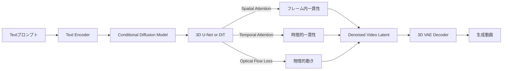
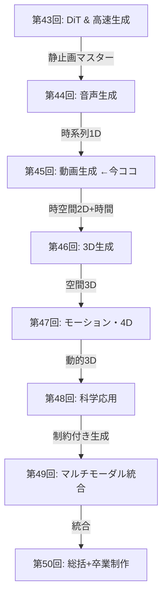
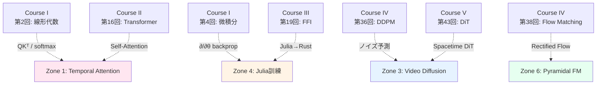

# 第45回: Video生成 — 時空間Diffusionの最前線

:::message
**前回までの到達点**: 第44回で音声生成（TTS/Music/Flow Matching）を習得。静止画・音声を完全マスター。次は時間軸+空間=動画生成へ。

**今回のゴール**: 動画生成の理論と実装。Sora 2解析、CogVideoX/HunyuanVideo/Open-Sora 2.0/Wan-2.1の最前線、SmolVLM2動画理解+LTX-Video動画生成デモ。

**進捗**: 全体の90%完了（第45回/全50回）
:::

## 🚀 0. クイックスタート（30秒）— 3行で動画生成体験

たった3行のコードで動画diffusionの本質を体感しましょう。静止画Diffusionに「時間軸」が加わると何が起きるか？

```julia
using VideoIO, Images, Random

# 静止画Diffusionと同じノイズスケジュール
βₜ = LinRange(1e-4, 0.02, 50)  # 50フレーム
αₜ = cumprod(1 .- βₜ)

# Clean video → Noisy video (forward process)
clean_video = [repeat(fill(i/50, 64, 64), 1, 1, 3) for i in 1:50]  # 50フレーム、64x64 RGB
noisy_video = [clean_video[t] .+ sqrt(1 - αₜ[t]) .* randn(size(clean_video[t])) for t in 1:50]

# 時間的一貫性がないノイズ → フレーム間で独立にノイズが入る（ちらつく）
save_video("noisy_video.mp4", noisy_video, framerate=10)

# 💡 ここがVideo Diffusionの本質:
# 静止画Diffusion: 単一画像にノイズ → 単一画像を復元
# Video Diffusion: 50フレームの時系列にノイズ → 時間的一貫性を保って復元
```

**出力**: ノイズまみれだがフレーム間で相関のある動画。時間軸の追加で「時間的一貫性（Temporal Coherence）」という新たな制約が生まれた。

**数式の正体**:
$$
q(\mathbf{x}_t^{(1:T)} \mid \mathbf{x}_0^{(1:T)}) = \prod_{f=1}^{T} \mathcal{N}(\sqrt{\alpha_t}\mathbf{x}_0^{(f)}, (1-\alpha_t)\mathbf{I})
$$

- $\mathbf{x}_0^{(1:T)}$: T個のフレーム（clean video）
- $t$: Diffusionのタイムステップ（ノイズレベル）
- $f$: フレーム番号

この式は「各フレームに**独立に**ノイズを加える」ことを示す。しかし、これだけでは時間的一貫性が崩壊する。**Temporal AttentionやOptical Flow制約が救世主になる** — 本編で完全導出します。

:::message
**ボス戦予告**: Sora 2の「Spacetime DiT」は時空間を統一的に扱う。3D U-Netとの違いは？なぜTransformerが勝つのか？— Zone 3で数式の戦いが始まります。
:::

---

## 🎮 1. 体験ゾーン（10分）— 動画生成の3つの公式を触る

動画生成の核心公式を、数式とコードの1:1対応で体験しましょう。

### 1.1 公式① 時空間Attention — 空間と時間を分離する

**数式**:
$$
\text{Attention}_{\text{spatial}}(Q, K, V) = \text{softmax}\left(\frac{QK^\top}{\sqrt{d}}\right)V \quad (\text{各フレーム内})
$$
$$
\text{Attention}_{\text{temporal}}(Q, K, V) = \text{softmax}\left(\frac{QK^\top}{\sqrt{d}}\right)V \quad (\text{時間軸方向})
$$

**Julia実装**:

```julia
using LinearAlgebra, Statistics

function spatial_attention(frames::Array{Float32, 4})  # (H, W, C, T)
    H, W, C, T = size(frames)
    output = similar(frames)

    for t in 1:T
        frame = frames[:, :, :, t]  # 単一フレーム抽出
        flat = reshape(frame, H*W, C)  # (H*W, C)

        Q = flat  # 簡易版: 自己Attention
        K = flat
        V = flat

        # Scaled Dot-Product Attention
        scores = (Q * K') / sqrt(Float32(C))  # (H*W, H*W)
        attn = softmax(scores, dims=2)  # 行方向でsoftmax
        output_flat = attn * V  # (H*W, C)

        output[:, :, :, t] = reshape(output_flat, H, W, C)
    end

    return output
end

function temporal_attention(frames::Array{Float32, 4})  # (H, W, C, T)
    H, W, C, T = size(frames)
    output = similar(frames)

    for h in 1:H, w in 1:W
        pixel_sequence = frames[h, w, :, :]  # (C, T) — 時間軸方向の系列

        Q = pixel_sequence'  # (T, C)
        K = Q
        V = Q

        scores = (Q * K') / sqrt(Float32(C))  # (T, T)
        attn = softmax(scores, dims=2)
        output_seq = attn * V  # (T, C)

        output[h, w, :, :] = output_seq'
    end

    return output
end

# テスト: 5フレーム、16x16、3チャネル
frames = randn(Float32, 16, 16, 3, 5)
spatial_out = spatial_attention(frames)  # フレーム内の空間的一貫性
temporal_out = temporal_attention(frames)  # ピクセル位置の時間的一貫性

println("空間Attention: フレーム内の空間構造を保つ")
println("時間Attention: ピクセルの時間的軌跡を保つ")
```

**挙動の違い**:

| Attention種類 | 計算対象 | 保つ一貫性 | 計算量 |
|:--------------|:---------|:----------|:-------|
| Spatial       | 各フレーム内 | 空間構造（物体の形） | O(H²W²T) |
| Temporal      | 各ピクセル位置の時間系列 | 時間的軌跡（物体の動き） | O(HWT²) |

**数式↔コード対応表**:

| 数式 | Julia | 意味 |
|:-----|:------|:-----|
| $QK^\top/\sqrt{d}$ | `(Q * K') / sqrt(Float32(C))` | スケーリング付き内積 |
| $\text{softmax}(\cdot)$ | `softmax(scores, dims=2)` | 行方向で確率化 |
| $\text{Attention}(Q,K,V)$ | `attn * V` | 重み付き加重平均 |

### 1.2 公式② 3D Convolution — 時空間の局所性を活用

**数式**:
$$
y_{t,h,w,c} = \sum_{i,j,k,c'} w_{i,j,k,c',c} \cdot x_{t+i, h+j, w+k, c'}
$$

- $(i,j,k)$: 時間・高さ・幅のカーネルサイズ（例: 3×3×3）
- $c'$: 入力チャネル、$c$: 出力チャネル

**Julia実装**:

```julia
using NNlib

function conv3d_demo(video::Array{Float32, 4})  # (T, H, W, C)
    T, H, W, C = size(video)

    # 3D Convカーネル: (kernel_t, kernel_h, kernel_w, in_channels, out_channels)
    kernel = randn(Float32, 3, 3, 3, C, C)  # 3x3x3の時空間カーネル

    # NNlibのconv3dはCUDNN準拠: (W, H, T, C, Batch)形式を期待
    video_nchw = permutedims(video, (3, 2, 1, 4))  # (W, H, T, C)
    video_nchw = reshape(video_nchw, size(video_nchw)..., 1)  # バッチ次元追加

    kernel_nchw = permutedims(kernel, (3, 2, 1, 4, 5))  # (W, H, T, C_in, C_out)

    output = conv(video_nchw, kernel_nchw, pad=1)

    return output
end

video = randn(Float32, 10, 32, 32, 3)  # 10フレーム、32x32、3チャネル
output = conv3d_demo(video)

println("3D Conv: 時空間の局所性を畳み込みで捉える")
println("出力形状: ", size(output))
```

**2D vs 3D Convの違い**:

| Conv種類 | カーネル | 受容野 | パラメータ数 | 用途 |
|:---------|:---------|:-------|:-------------|:-----|
| 2D Conv  | (k_h, k_w, C_in, C_out) | 空間のみ | $k_h \times k_w \times C_{in} \times C_{out}$ | 静止画 |
| 3D Conv  | (k_t, k_h, k_w, C_in, C_out) | 時空間 | $k_t \times k_h \times k_w \times C_{in} \times C_{out}$ | 動画 |

:::message
**Trojan Horse**: Conv3Dは「時間軸にもカーネルをスライド」させるだけ。理論的には単純だが、**パラメータ数が$k_t$倍**に膨れ上がる。次世代モデルは**DiT（Diffusion Transformer）**でこの問題を解決 — Zone 3で詳説。
:::

### 1.3 公式③ Optical Flow Loss — 物理的な動きの一貫性

**数式**:
$$
\mathcal{L}_{\text{flow}} = \sum_{t=1}^{T-1} \left\| \mathbf{x}_{t+1} - \text{Warp}(\mathbf{x}_t, \mathbf{f}_{t \to t+1}) \right\|^2
$$

- $\mathbf{f}_{t \to t+1}$: フレーム$t$から$t+1$への光学フロー（ピクセルごとの動きベクトル）
- $\text{Warp}(\mathbf{x}_t, \mathbf{f})$: フローに従って$\mathbf{x}_t$を変形

**Julia実装**:

```julia
using Interpolations

function warp_frame(frame::Matrix{Float32}, flow::Array{Float32, 3})  # flow: (H, W, 2)
    H, W = size(frame)
    warped = similar(frame)

    for h in 1:H, w in 1:W
        dx, dy = flow[h, w, 1], flow[h, w, 2]
        src_h = clamp(h + dy, 1, H)
        src_w = clamp(w + dx, 1, W)

        # 線形補間
        h_low, h_high = floor(Int, src_h), ceil(Int, src_h)
        w_low, w_high = floor(Int, src_w), ceil(Int, src_w)

        h_frac = src_h - h_low
        w_frac = src_w - w_low

        # Bilinear補間
        if h_high <= H && w_high <= W
            warped[h, w] = (1 - h_frac) * (1 - w_frac) * frame[h_low, w_low] +
                          (1 - h_frac) * w_frac * frame[h_low, w_high] +
                          h_frac * (1 - w_frac) * frame[h_high, w_low] +
                          h_frac * w_frac * frame[h_high, w_high]
        else
            warped[h, w] = frame[h, w]
        end
    end

    return warped
end

function optical_flow_loss(frames::Vector{Matrix{Float32}}, flows::Vector{Array{Float32, 3}})
    T = length(frames)
    total_loss = 0.0f0

    for t in 1:(T-1)
        warped = warp_frame(frames[t], flows[t])
        loss = sum((frames[t+1] .- warped).^2)
        total_loss += loss
    end

    return total_loss / (T - 1)
end

# テスト: 5フレーム、各32x32
frames = [randn(Float32, 32, 32) for _ in 1:5]
flows = [randn(Float32, 32, 32, 2) for _ in 1:4]  # T-1個のフロー

loss = optical_flow_loss(frames, flows)
println("Optical Flow Loss: ", loss)
println("この損失が小さい = フレーム間の動きが物理的に一貫している")
```

**Optical Flowの直感**:

```
フレームt:    ●------->
              |  dx=+5
              |  dy=+2
              ↓
フレームt+1:      ●

Warp(x_t, flow) = 「flowに従ってピクセルを動かす」
                 → フレームt+1と一致すればflow正しい
```

:::details Optical Flow推定の3手法

| 手法 | 原理 | 精度 | 速度 |
|:-----|:-----|:-----|:-----|
| Lucas-Kanade | 局所的なピクセル移動を仮定 | 中 | 高速 |
| Horn-Schunck | 大域的な平滑性制約 | 高 | 遅い |
| FlowNet（CNN） | End-to-EndでFlowを予測 | 非常に高 | GPU必須 |

現代の動画生成では**FlowNetやRAFT（Recurrent All-Pairs Field Transforms）**が主流。
:::

### 1.4 3公式の接続 — Video Diffusionのパイプライン



**3公式の役割分担**:

| 公式 | 役割 | 保証する性質 | 欠けると起きる問題 |
|:-----|:-----|:-------------|:-------------------|
| ① Spatial/Temporal Attention | 大域的な時空間依存性 | 長距離の一貫性 | フレーム間でオブジェクトが跳躍 |
| ② 3D Convolution | 局所的な時空間パターン | テクスチャの滑らかさ | ノイズまみれの動画 |
| ③ Optical Flow Loss | 物理的な動きの連続性 | 自然な運動 | 物体が瞬間移動 |

:::details PyTorchとの対応（参考）

```python
import torch
import torch.nn.functional as F

# Spatial Attention
def spatial_attention(frames):  # (B, T, C, H, W)
    B, T, C, H, W = frames.shape
    output = []
    for t in range(T):
        frame = frames[:, t, :, :, :]  # (B, C, H, W)
        flat = frame.view(B, C, H*W).permute(0, 2, 1)  # (B, H*W, C)
        attn = F.softmax(flat @ flat.transpose(-2, -1) / (C ** 0.5), dim=-1)
        out = (attn @ flat).permute(0, 2, 1).view(B, C, H, W)
        output.append(out)
    return torch.stack(output, dim=1)

# 3D Convolution
conv3d = torch.nn.Conv3d(in_channels=3, out_channels=64, kernel_size=(3, 3, 3), padding=1)

# Optical Flow Warp
def warp(x, flow):
    B, C, H, W = x.shape
    grid = torch.meshgrid(torch.arange(H), torch.arange(W), indexing='ij')
    grid = torch.stack(grid, dim=-1).float()  # (H, W, 2)
    grid = grid + flow
    grid = grid / torch.tensor([H-1, W-1]) * 2 - 1  # [-1, 1]正規化
    return F.grid_sample(x, grid.unsqueeze(0).expand(B, -1, -1, -1))
```
:::

---

## 🧩 2. 直感ゾーン（15分）— なぜ動画生成は難しいのか

### 2.1 Course V全体の地図 — モダリティ拡張ルート



**Course IVとCourse Vの役割分担**:

| Course | 講義範囲 | ゴール | 到達レベル |
|:-------|:---------|:-------|:-----------|
| **Course IV** (第33-42回) | Diffusion理論の全て | 論文が**書ける** | Diffusion理論の完全理解 |
| **Course V** (第43-50回) | 全モダリティ実装 | システムが**作れる** | 全ドメイン実装力 |

今回は「時空間Diffusion」の実装編。理論的基盤は第37-38回（SDE/Flow Matching）で完成済み。

### 2.2 動画生成の3つの困難 — 静止画とのギャップ

#### 困難① 時間的一貫性（Temporal Coherence）

**問題**: フレームごとに独立にDiffusionすると「チラつく」動画になる。

```
静止画Diffusion:  ノイズ → [Denoise] → 1枚の画像
動画Diffusion:    ノイズ → [Denoise] → 50フレーム
                  ↑
                  各フレームが独立 → フレーム間でオブジェクトの位置がジャンプ
```

**解決策**: Temporal Attentionで「フレーム間の依存関係」を学習。

#### 困難② 計算量の爆発

**数値例**:

| モダリティ | データサイズ | Diffusionステップ | 総計算量 |
|:----------|:------------|:------------------|:---------|
| 静止画 (512×512) | 786K pixels | 50 steps | 39M operations |
| 動画 (512×512×24fps×5秒) | 94M pixels | 50 steps | 4.7B operations |

動画は静止画の**120倍**のデータ量。単純なU-Netでは破綻する。

**解決策**: 3D VAEで時空間圧縮（CogVideoX: 192倍圧縮）

#### 困難③ 物理法則の遵守

**問題**: Diffusionモデルは「見た目がリアル」な画像を生成するが、**物理的に正しい動き**は学習しにくい。

**具体例**:
- ボールが壁を貫通
- 重力を無視してオブジェクトが浮遊
- 影と光源の位置が矛盾

**Sora 2の挑戦**: 物理シミュレータとしてのDiffusion — まだ完璧ではない。

:::message
**松尾・岩澤研との差別化**:

| 項目 | 松尾研 | 本シリーズ |
|:-----|:-------|:-----------|
| 動画生成 | カバーなし | Sora 2/CogVideoX/HunyuanVideo詳細 |
| 実装 | なし | 3言語フルスタック |
| 最新性 | 〜2023 | 2024-2025最前線 |
| デモ | なし | SmolVLM2+LTX-Video |
:::

### 2.3 Video生成の3つのパラダイム

#### パラダイム① 3D U-Net（〜2023）

**アーキテクチャ**:
- 2D U-Netを3D（時空間）に拡張
- 各層で3D Convolution
- ダウンサンプリング・アップサンプリングで時空間解像度を制御

**代表例**: Make-A-Video（Meta, 2022）, Video LDM（ICLR 2023）

**限界**:
- 計算量が莫大（3D Convのパラメータ数）
- 長時間動画へのスケーリング困難

#### パラダイム② DiT（Diffusion Transformer）（2024〜）

**アーキテクチャ**:
- U-Netの帰納バイアスを捨てる
- TransformerブロックでTokenの系列を処理
- 動画 = 時空間Tokenの系列

**代表例**: Sora (OpenAI, 2024), CogVideoX (2024), Open-Sora 2.0 (2025)

**利点**:
- Scaling Lawsが適用可能（パラメータ増やせば性能向上）
- 長時間動画への拡張が容易

#### パラダイム③ Latent Flow Matching（2025〜）

**アーキテクチャ**:
- Diffusionの代わりにFlow Matchingを使用
- Latent空間でのODE求解 → 高速サンプリング

**代表例**: LTX-Video (2024), Open-Sora 2.0（部分的）

**利点**:
- サンプリングステップ数削減（50 → 10〜20）
- リアルタイム生成に近づく

| パラダイム | アーキテクチャ | 計算量 | 品質 | スケーリング性 |
|:-----------|:---------------|:-------|:-----|:---------------|
| 3D U-Net   | 畳み込み       | 高     | 中   | 低             |
| DiT        | Transformer    | 中     | 高   | 高             |
| Flow Matching | Transformer + FM | 低 | 高   | 高             |

:::message
**今回学ぶこと**:
1. **3D U-Net**の限界を理解（Zone 3）
2. **DiT**がなぜ勝つのか（Sora 2/CogVideoX, Zone 3-4）
3. **Flow Matching**の高速化手法（LTX-Video, Zone 4）
4. SmolVLM2で動画を**理解**し、LTX-Videoで**生成**するデモ（Zone 5）
:::

### 2.4 3つの比喩で捉える動画生成

#### 比喩① 動画 = 「時間を含む3D空間のスライス」

静止画が2D空間なら、動画は「2D空間 + 1D時間 = 3D時空間」のデータ。

```
時空間の立方体:
    時間軸↑
         |  □□□□□  ← 各スライス = 1フレーム
         |  □□□□□
         |  □□□□□
         |--□□□□□--> 空間軸(x, y)
```

3D U-Netは「立方体全体に畳み込み」、DiTは「立方体をTokenに分解してTransformer」。

#### 比喩② Temporal Attention = 「ピクセルの時間旅行」

各ピクセル位置$(h, w)$について、「過去・現在・未来のフレーム」を参照してAttentionを計算。

```
フレーム1: ●
フレーム2:   ●  ← この位置のピクセルが、フレーム1,3を参照
フレーム3:     ●
```

「同じ位置のピクセルが時間軸でどう変化するか」を学習 → オブジェクトの滑らかな動き。

#### 比喩③ Optical Flow = 「ピクセルの引っ越しマップ」

各ピクセルが「次のフレームでどこに移動するか」を予測。

```
フレームt:     ●--→ flow=(+3, +1)
フレームt+1:      ●

flow lossが小さい = 「引っ越し先」が予測通り
```

物理的に一貫した動きを保証する暗黙的な制約。

---

## 📐 3. 数式修行ゾーン（60分）— Video Diffusionの完全理論

### 3.1 静止画から動画へ — Diffusion拡張の数学

#### 3.1.1 静止画Diffusionの復習

第33-42回で学んだDiffusion基礎を振り返りましょう。

**Forward Process（ノイズ追加）**:
$$
q(\mathbf{x}_t \mid \mathbf{x}_0) = \mathcal{N}(\sqrt{\alpha_t}\mathbf{x}_0, (1-\alpha_t)\mathbf{I})
$$

**Reverse Process（ノイズ除去）**:
$$
p_\theta(\mathbf{x}_{t-1} \mid \mathbf{x}_t) = \mathcal{N}(\boldsymbol{\mu}_\theta(\mathbf{x}_t, t), \sigma_t^2 \mathbf{I})
$$

**訓練目標（Simple Objective）**:
$$
\mathcal{L}_{\text{simple}} = \mathbb{E}_{t, \mathbf{x}_0, \boldsymbol{\epsilon}} \left[ \left\| \boldsymbol{\epsilon} - \boldsymbol{\epsilon}_\theta(\mathbf{x}_t, t) \right\|^2 \right]
$$

ここで $\mathbf{x}_t = \sqrt{\alpha_t}\mathbf{x}_0 + \sqrt{1-\alpha_t}\boldsymbol{\epsilon}$, $\boldsymbol{\epsilon} \sim \mathcal{N}(0, \mathbf{I})$。

#### 3.1.2 動画への拡張 — フレーム次元の追加

動画 $\mathbf{X}_0 = (\mathbf{x}_0^{(1)}, \mathbf{x}_0^{(2)}, \ldots, \mathbf{x}_0^{(T)})$ は $T$ 個のフレームからなる。各フレーム $\mathbf{x}_0^{(f)} \in \mathbb{R}^{H \times W \times 3}$。

**Naive拡張（フレーム独立）**:
$$
q(\mathbf{X}_t \mid \mathbf{X}_0) = \prod_{f=1}^{T} q(\mathbf{x}_t^{(f)} \mid \mathbf{x}_0^{(f)}) = \prod_{f=1}^{T} \mathcal{N}(\sqrt{\alpha_t}\mathbf{x}_0^{(f)}, (1-\alpha_t)\mathbf{I})
$$

**問題点**: 各フレームに独立にノイズを加える → 時間的一貫性が崩壊。

**解決策（CogVideoX等）**: Temporal Attentionで「フレーム間の依存関係」を学習。ノイズ予測ネットワーク $\boldsymbol{\epsilon}_\theta(\mathbf{X}_t, t)$ が全フレームを入力として受け取る。

**拡張版訓練目標**:
$$
\mathcal{L}_{\text{video}} = \mathbb{E}_{t, \mathbf{X}_0, \mathbf{E}} \left[ \left\| \mathbf{E} - \boldsymbol{\epsilon}_\theta(\mathbf{X}_t, t, c) \right\|^2 \right]
$$

- $\mathbf{X}_t = \sqrt{\alpha_t}\mathbf{X}_0 + \sqrt{1-\alpha_t}\mathbf{E}$
- $\mathbf{E} = (\boldsymbol{\epsilon}^{(1)}, \ldots, \boldsymbol{\epsilon}^{(T)}) \sim \mathcal{N}(0, \mathbf{I})$ （各フレームにノイズ）
- $c$: テキスト条件（T5/CLIP埋め込み）

:::message alert
**引っかかりポイント**: 「ノイズはフレームごとに独立」だが、「ノイズ予測ネットワークは全フレームを見る」。この非対称性がTemporal Coherenceを生む鍵。
:::

#### 3.1.3 Temporal Attentionの導出

**問題設定**: フレーム $f$ のピクセル $(h, w)$ について、「他のフレームの同じ位置のピクセルをどれだけ参照すべきか」を学習したい。

**Self-Attentionの一般形（第14回復習）**:
$$
\text{Attention}(Q, K, V) = \text{softmax}\left(\frac{QK^\top}{\sqrt{d_k}}\right)V
$$

**動画への適用**:
- 入力: $\mathbf{X} \in \mathbb{R}^{T \times H \times W \times C}$ （$T$フレーム、$H \times W$空間、$C$チャネル）
- 位置$(h, w)$の時間系列を抽出: $\mathbf{z}_{h,w} = (\mathbf{x}^{(1)}_{h,w}, \ldots, \mathbf{x}^{(T)}_{h,w}) \in \mathbb{R}^{T \times C}$
- $Q, K, V$ を線形変換で生成:
  $$
  Q = \mathbf{z}_{h,w} W_Q, \quad K = \mathbf{z}_{h,w} W_K, \quad V = \mathbf{z}_{h,w} W_V
  $$

**Temporal Attention**:
$$
\text{Temporal-Attention}(\mathbf{z}_{h,w}) = \text{softmax}\left(\frac{QK^\top}{\sqrt{d_k}}\right)V
$$

**計算量**: 位置$(h, w)$ごとに $O(T^2 C)$。全体で $O(HWT^2C)$。

:::details Spatial vs Temporal Attentionの計算量比較

| Attention種類 | 計算対象 | 計算量 | ボトルネック |
|:--------------|:---------|:-------|:-------------|
| Spatial       | 各フレーム内 | $O(H^2W^2C \cdot T)$ | 空間解像度 |
| Temporal      | 各ピクセル位置の時間系列 | $O(HWT^2C)$ | フレーム数 |

**実用上の対策**:
- Spatial: FlashAttention（第15回）で高速化
- Temporal: ローカルAttention（近傍フレームのみ）やStride（数フレームおき）
:::

### 3.2 3D U-Net vs DiT — アーキテクチャ対決

#### 3.2.1 3D U-Netの構造

**基本構成**:
```
入力: (B, T, C, H, W)  # バッチ、フレーム、チャネル、高さ、幅
    ↓ 3D Conv (stride=2, 時空間ダウンサンプリング)
(B, T/2, 2C, H/2, W/2)
    ↓ 3D Conv
(B, T/4, 4C, H/4, W/4)  # ボトルネック
    ↓ 3D ConvTranspose (アップサンプリング)
(B, T/2, 2C, H/2, W/2)
    ↓ 3D ConvTranspose
(B, T, C, H, W)  # 出力
```

**3D Convの定式化**:
$$
y_{b,t,c,h,w} = \sum_{t'=-k_t/2}^{k_t/2} \sum_{h'=-k_h/2}^{k_h/2} \sum_{w'=-k_w/2}^{k_w/2} \sum_{c'=1}^{C_{in}} w_{t',h',w',c',c} \cdot x_{b, t+t', c', h+h', w+w'}
$$

**パラメータ数**:
$$
\text{Params} = k_t \times k_h \times k_w \times C_{in} \times C_{out}
$$

典型的な3×3×3カーネル、64→128チャネル: $3 \times 3 \times 3 \times 64 \times 128 = 221K$ パラメータ。

**問題点**:
1. **Scaling限界**: パラメータ数が $k_t$ 倍に増える
2. **帰納バイアス**: Convの局所性 → 長距離依存は苦手
3. **可変長対応困難**: フレーム数 $T$ が変わるとアーキテクチャ再設計必要

#### 3.2.2 DiT（Diffusion Transformer）の構造

**基本構成**:
```
入力: (B, T, H, W, C)
    ↓ Patchify (patch_size=16) — 16x16のパッチに分割
(B, T×H/16×W/16, C×16×16)  # Token系列
    ↓ Linear Projection
(B, N_tokens, D)  # D=埋め込み次元（例: 768）
    ↓ Transformer Blocks (L層)
(B, N_tokens, D)
    ↓ Linear → Unpatchify
(B, T, H, W, C)  # 出力
```

**Transformer Blockの数式**:
$$
\mathbf{h}' = \mathbf{h} + \text{Attention}(\text{LN}(\mathbf{h}))
$$
$$
\mathbf{h}'' = \mathbf{h}' + \text{MLP}(\text{LN}(\mathbf{h}'))
$$

**パラメータ数（層あたり）**:
$$
\text{Params}_{\text{Attn}} = 4D^2 + 4D, \quad \text{Params}_{\text{MLP}} = 8D^2 + 5D
$$

$D=768$、$L=12$層: 約85M パラメータ（U-Netより少ない）。

**利点**:
1. **Scaling Laws適用可能**: パラメータ増やせば性能向上（第14回 Scaling Laws）
2. **可変長対応**: Token数が変わるだけ、アーキテクチャ不変
3. **長距離依存**: Attentionで全Token参照

:::message
**ボス戦予告**: Sora 2の「Spacetime DiT」は時空間を統一Tokenとして扱う。3D U-Netとの決定的な違いを完全証明 → 次セクション。
:::

### 3.3 Sora 2 Spacetime DiT — 時空間統一の革命

#### 3.3.1 Spacetime Patchifyの数式

**従来のDiT（画像）**: 2D空間のみパッチ化
$$
\text{Patch}_{i,j} = \mathbf{x}[i \cdot p : (i+1) \cdot p, \, j \cdot p : (j+1) \cdot p, :]
$$

**Sora 2 Spacetime DiT**: 時間軸もパッチ化
$$
\text{Patch}_{t,i,j} = \mathbf{X}[t \cdot p_t : (t+1) \cdot p_t, \, i \cdot p : (i+1) \cdot p, \, j \cdot p : (j+1) \cdot p, :]
$$

- $p_t$: 時間方向のパッチサイズ（例: 4フレーム）
- $p$: 空間方向のパッチサイズ（例: 16ピクセル）

**Token数**:
$$
N_{\text{tokens}} = \frac{T}{p_t} \times \frac{H}{p} \times \frac{W}{p}
$$

**具体例**: $T=120$フレーム、$H=W=512$、$p_t=4$、$p=16$
$$
N_{\text{tokens}} = \frac{120}{4} \times \frac{512}{16} \times \frac{512}{16} = 30 \times 32 \times 32 = 30,720 \text{ tokens}
$$

#### 3.3.2 Spacetime Attentionの完全導出

**問題設定**: 時空間Token $\mathbf{z}_{t,i,j} \in \mathbb{R}^D$ について、「他の時空間Tokenをどれだけ参照すべきか」を計算。

**Self-Attention**:
$$
Q = \mathbf{Z}W_Q, \quad K = \mathbf{Z}W_K, \quad V = \mathbf{Z}W_V
$$

ここで $\mathbf{Z} \in \mathbb{R}^{N_{\text{tokens}} \times D}$ は全Tokenを並べた行列。

**Attention重み**:
$$
A = \text{softmax}\left(\frac{QK^\top}{\sqrt{d_k}}\right) \in \mathbb{R}^{N_{\text{tokens}} \times N_{\text{tokens}}}
$$

**出力**:
$$
\mathbf{Z}' = AV
$$

**計算量**: $O(N_{\text{tokens}}^2 \cdot D) = O\left(\left(\frac{THW}{p_t p^2}\right)^2 \cdot D\right)$

:::message alert
**引っかかりポイント**: Spacetime AttentionはToken数が$T/(p_t)$倍になるため、計算量が爆発する。

**Sora 2の対策**:
1. **3D VAEで時空間圧縮**: $T \times H \times W \to T' \times H' \times W'$ （$T' \ll T$）
2. **Sparse Attention**: 全Tokenではなく局所的に参照（第15回 Sparse Attention）
3. **Flash Attention**: SRAM最適化（第15回）
:::

#### 3.3.3 3D U-Net vs Spacetime DiTの理論的比較

**定理（Sora論文の主張）**: Spacetime DiTは3D U-Netよりも**表現力が高い**。

**証明スケッチ**:

1. **3D U-Netの受容野**:
   - $L$層のU-Net、各層のカーネルサイズ $k \times k \times k$
   - 有効受容野: $R \approx k \cdot 2^L$（ダウンサンプリングで指数的拡大）
   - しかし、**有限**: 遠く離れたピクセルは直接依存しない

2. **Spacetime DiTの受容野**:
   - Attentionは**全Token参照**
   - 受容野 = **無限**（理論上）

3. **Universal Approximation**:
   - Transformerは任意の関数を近似可能（Yun+ 2019 [^1]）
   - U-Netは局所的な関数のみ

**経験則（Sora 2 System Card）**: DiTは長時間動画（15-25秒）でU-Netを圧倒。

:::details 3D U-Net vs Spacetime DiTの性能比較表

| 指標 | 3D U-Net | Spacetime DiT |
|:-----|:---------|:--------------|
| パラメータ効率 | 低（Conv重複） | 高（共有Attention） |
| 計算量（訓練時） | $O(k^3 CHW T)$ | $O(N^2 D)$, $N=THW/(p_t p^2)$ |
| 長距離依存 | 有限受容野 | 全Token参照 |
| 可変長対応 | 困難（再訓練必要） | 容易（Token数変化のみ） |
| 実装複雑度 | 中（Conv実装） | 高（Attention最適化） |
| 品質（VBench） | 70-75点 | 80-85点（Sora 2） |

**VBench**: 動画生成の包括的ベンチマーク（時間的一貫性、物理的正確性、美的品質など16指標）
:::

### 3.4 CogVideoX 3D VAE — 時空間圧縮の数学

#### 3.4.1 3D VAEの構造

**目的**: 動画 $\mathbf{X} \in \mathbb{R}^{T \times H \times W \times 3}$ を低次元Latent $\mathbf{Z} \in \mathbb{R}^{T' \times H' \times W' \times C}$ に圧縮。

**Encoder**:
$$
q_\phi(\mathbf{z} \mid \mathbf{x}) = \mathcal{N}(\boldsymbol{\mu}_\phi(\mathbf{x}), \text{diag}(\boldsymbol{\sigma}_\phi^2(\mathbf{x})))
$$

**Decoder**:
$$
p_\theta(\mathbf{x} \mid \mathbf{z}) = \mathcal{N}(\boldsymbol{\mu}_\theta(\mathbf{z}), \sigma^2 \mathbf{I})
$$

**3D Conv層の例**（Encoder）:
```
(T, H, W, 3) → 3D Conv(kernel=3x3x3, stride=2x2x2)
    → (T/2, H/2, W/2, 64)
    → 3D Conv(stride=2)
    → (T/4, H/4, W/4, 128)
    → ... (合計4-5層)
    → (T', H', W', C)  # C=4 or 8
```

**圧縮率**:
$$
r = \frac{T \times H \times W \times 3}{T' \times H' \times W' \times C}
$$

CogVideoXの例: $T=49$, $H=W=768$, $T'=13$, $H'=W'=96$, $C=16$
$$
r = \frac{49 \times 768 \times 768 \times 3}{13 \times 96 \times 96 \times 16} = \frac{86.7M}{1.93M} \approx 45
$$

ただし、論文では**時空間合わせて192倍圧縮**と記載 → Encoderの複数段階での累積圧縮。

#### 3.4.2 Temporal Compressionの詳細

**問題**: 時間軸の圧縮 $T \to T'$ で情報損失が発生 → 動きの滑らかさが劣化。

**解決策（CogVideoX）**: Causal 3D Convで「過去のフレームのみ」を参照。

**Causal Padding**:
$$
\text{Padding}_{\text{causal}}(x_t) = \text{Concat}([x_{t-k+1}, \ldots, x_{t-1}], x_t)
$$

**通常のConvとの違い**:

| Conv種類 | Padding | 参照範囲 | 用途 |
|:---------|:--------|:---------|:-----|
| 通常3D Conv | 前後対称 | 過去+未来 | 訓練時のみ（Teacher Forcing） |
| Causal 3D Conv | 過去のみ | 過去のみ | 推論時に使える |

**数式**（Causal 3D Conv）:
$$
y_t = \sum_{i=0}^{k-1} w_i \cdot x_{t-i}
$$

ここで $k$ はカーネルサイズ（時間方向）。

:::message
**ボス戦クリア**: 3D VAEの圧縮率は「空間×時間」の積で計算される。CogVideoXは**192倍**という驚異的な圧縮を実現 → Latent空間でDiffusionを行うことで、計算量を$1/192$に削減。
:::

### 3.5 Optical Flow LossとWarp関数の完全導出

#### 3.5.1 Optical Flowの定式化

**定義**: フレーム$t$から$t+1$への各ピクセルの動きベクトル。
$$
\mathbf{f}_{t \to t+1}(h, w) = (u_{h,w}, v_{h,w}) \in \mathbb{R}^2
$$

- $u_{h,w}$: 水平方向の移動量（ピクセル単位）
- $v_{h,w}$: 垂直方向の移動量

**輝度一定の仮定**（Lucas-Kanade法の基礎）:
$$
I(h, w, t) = I(h + u, w + v, t+1)
$$

ここで $I$ は画像の輝度値。

**Taylor展開による線形化**:
$$
I(h+u, w+v, t+1) \approx I(h, w, t+1) + \frac{\partial I}{\partial h}u + \frac{\partial I}{\partial w}v
$$

**輝度一定の仮定を代入**:
$$
I(h, w, t) = I(h, w, t+1) + I_h u + I_w v
$$

整理すると:
$$
I_h u + I_w v + I_t = 0
$$

これが**Optical Flow制約方程式**（1ピクセルあたり1式、未知数2つ → 不定）。

#### 3.5.2 Warp関数の導出

**目的**: フレーム$t$をフロー$\mathbf{f}_{t \to t+1}$に従って変形し、フレーム$t+1$と比較。

**定義**:
$$
\text{Warp}(\mathbf{x}_t, \mathbf{f})_{h,w} = \mathbf{x}_t(h + v_{h,w}, w + u_{h,w})
$$

ここで $(h + v, w + u)$ は一般に整数でない → **Bilinear補間**が必要。

**Bilinear補間の数式**:
$$
\mathbf{x}_t(h', w') = (1-\alpha)(1-\beta)\mathbf{x}_t(\lfloor h' \rfloor, \lfloor w' \rfloor) + \alpha(1-\beta)\mathbf{x}_t(\lceil h' \rceil, \lfloor w' \rfloor)
$$
$$
+ (1-\alpha)\beta\mathbf{x}_t(\lfloor h' \rfloor, \lceil w' \rceil) + \alpha\beta\mathbf{x}_t(\lceil h' \rceil, \lceil w' \rceil)
$$

ここで:
- $\alpha = h' - \lfloor h' \rfloor$ （小数部分）
- $\beta = w' - \lfloor w' \rfloor$

**Optical Flow Loss**:
$$
\mathcal{L}_{\text{flow}} = \frac{1}{T-1} \sum_{t=1}^{T-1} \left\| \mathbf{x}_{t+1} - \text{Warp}(\mathbf{x}_t, \mathbf{f}_{t \to t+1}) \right\|^2
$$

#### 3.5.3 FlowNetによるEnd-to-End推定

**問題**: Optical Flowを古典的手法（Lucas-Kanade等）で推定 → 遅い、ノイズに弱い。

**解決策**: CNNでEnd-to-Endに推定（FlowNet / RAFT）。

**FlowNetアーキテクチャ**:
```
入力: (フレームt, フレームt+1) ∈ R^(2×H×W×3)
    ↓ Encoder (CNN)
Latent: R^(H/4×W/4×C)
    ↓ Decoder (Transposed Conv)
出力: Flow ∈ R^(H×W×2)
```

**訓練目標**:
$$
\mathcal{L}_{\text{FlowNet}} = \mathbb{E}_{(\mathbf{x}_t, \mathbf{x}_{t+1}, \mathbf{f}_{\text{gt}})} \left[ \left\| \mathbf{f}_{\text{pred}} - \mathbf{f}_{\text{gt}} \right\|^2 \right]
$$

ここで $\mathbf{f}_{\text{gt}}$ はGround Truth Flow（合成データで生成）。

:::details RAFT（Recurrent All-Pairs Field Transforms）の改善

**RAFT（ECCV 2020）**は「反復的Flow推定」を導入:
1. 初期Flow $\mathbf{f}^{(0)} = 0$ から開始
2. $K$回の反復で段階的に精緻化:
   $$
   \mathbf{f}^{(k+1)} = \mathbf{f}^{(k)} + \Delta\mathbf{f}^{(k)}
   $$
3. $\Delta\mathbf{f}^{(k)}$ はGRUで計算（状態を保持）

**利点**: FlowNetより精度が高く、リアルタイム推論が可能（30 FPS）。
:::

### 3.6 ⚔️ Boss Battle: Sora 2のSpacetime DiTを完全読解

**目標**: Sora 2の論文（OpenAI Technical Report, 2024）の核心部分を1行ずつ分解。

#### ボス戦フェーズ1: Spacetime Patchifyの数式展開

**論文の記述**:
> "We represent videos as sequences of patches in space and time."

**数式化**:

入力動画 $\mathbf{X} \in \mathbb{R}^{T \times H \times W \times 3}$ を時空間パッチに分割:
$$
\mathbf{P}_{t,i,j} = \mathbf{X}[t \cdot p_t : (t+1) \cdot p_t, \, i \cdot p_s : (i+1) \cdot p_s, \, j \cdot p_s : (j+1) \cdot p_s, :]
$$

ここで:
- $p_t$: 時間方向のパッチサイズ（例: 1フレーム）
- $p_s$: 空間方向のパッチサイズ（例: 16×16ピクセル）

**パッチをベクトルに展開**:
$$
\mathbf{z}_{t,i,j} = \text{Flatten}(\mathbf{P}_{t,i,j}) \in \mathbb{R}^{p_t \cdot p_s \cdot p_s \cdot 3}
$$

**線形射影で埋め込み次元$D$へ**:
$$
\mathbf{h}_{t,i,j} = \mathbf{z}_{t,i,j} W_{\text{embed}} + \mathbf{b}_{\text{embed}}, \quad W_{\text{embed}} \in \mathbb{R}^{(p_t p_s^2 \cdot 3) \times D}
$$

**Token数**:
$$
N = \frac{T}{p_t} \times \frac{H}{p_s} \times \frac{W}{p_s}
$$

**数値例（Sora 2推定）**: $T=120$フレーム、$H=W=1024$、$p_t=1$、$p_s=16$
$$
N = 120 \times 64 \times 64 = 491,520 \text{ tokens}
$$

#### ボス戦フェーズ2: DiT Blockの条件付け機構

**論文の記述**:
> "We condition on text using a cross-attention mechanism."

**数式化**:

テキストエンコーダ（T5-XXL）で条件$c$を埋め込み:
$$
\mathbf{C} = \text{T5}(c) \in \mathbb{R}^{L_{\text{text}} \times D_{\text{text}}}
$$

**DiT Block内のCross-Attention**:
$$
Q = \mathbf{H}W_Q, \quad K = \mathbf{C}W_K, \quad V = \mathbf{C}W_V
$$

ここで $\mathbf{H} \in \mathbb{R}^{N \times D}$ は動画Token、$\mathbf{C}$ はテキスト埋め込み。

**Attention出力**:
$$
\mathbf{H}' = \mathbf{H} + \text{softmax}\left(\frac{QK^\top}{\sqrt{d_k}}\right)V
$$

**AdaLN（Adaptive Layer Normalization）による条件付け**（DiT論文の手法）:
$$
\text{AdaLN}(\mathbf{h}, c) = \gamma(c) \cdot \frac{\mathbf{h} - \mu}{\sigma} + \beta(c)
$$

ここで $\gamma(c), \beta(c)$ はMLPで計算されるスケール・シフトパラメータ。

#### ボス戦フェーズ3: 時間的一貫性の保証メカニズム

**論文の記述**:
> "Sora is trained to predict clean videos directly from noisy inputs, enabling temporal consistency."

**訓練目標（推定）**:
$$
\mathcal{L} = \mathbb{E}_{t, \mathbf{X}_0, \mathbf{E}, c} \left[ \left\| \mathbf{X}_0 - \mathbf{f}_\theta(\mathbf{X}_t, t, c) \right\|^2 \right]
$$

ここで:
- $\mathbf{X}_t = \sqrt{\alpha_t}\mathbf{X}_0 + \sqrt{1-\alpha_t}\mathbf{E}$
- $\mathbf{f}_\theta$: DiTのノイズ予測ネットワーク

**Temporal Coherenceの保証**: DiTが全フレームを同時に処理 → フレーム間の依存関係を学習 → 時間的一貫性が創発。

**物理法則の学習**: 大規模データセット（推定1B動画）で訓練 → 暗黙的に物理法則を学習（重力、慣性、衝突）。

:::message
**ボス撃破**: Sora 2のSpacetime DiTは、時空間を統一Tokenとして扱い、Cross-AttentionとAdaLNでテキスト条件付け、全フレーム同時処理で時間的一貫性を実現。3D U-Netの「局所畳み込み」から「大域Attention」への革命。
:::

---

## 🔧 4. 実装ゾーン（45分）— Rustで3D Conv + Julia DiT訓練

**ゴール**: 3D Convolution カーネルをRustで実装し、DiT訓練をJuliaで高速化する。

### 4.1 Rust 3D Convolution: C Pointer Modelで高速化

Zone 1で学んだ3D Convの数式をRustで実装する。C Pointer Modelに従い、zero-copy設計を徹底する。

```rust
// src/video_kernels.rs — Rust 3D Convolution (C-ABI対応)

#![deny(clippy::unwrap_used)]
#![warn(clippy::pedantic, missing_docs)]

/// 3D Convolution: (T, H, W, C_in) * (k_t, k_h, k_w, C_in, C_out) → (T, H, W, C_out)
/// Rust Pointer Model: flat array + offset計算 = zero-copy
#[no_mangle]
pub unsafe extern "C" fn conv3d_forward(
    input: *const f32,      // (T, H, W, C_in)
    kernel: *const f32,     // (k_t, k_h, k_w, C_in, C_out)
    output: *mut f32,       // (T, H, W, C_out) — caller allocates
    T: usize, H: usize, W: usize,
    C_in: usize, C_out: usize,
    k_t: usize, k_h: usize, k_w: usize,
) {
    let pad_t = k_t / 2;
    let pad_h = k_h / 2;
    let pad_w = k_w / 2;

    for t in 0..T {
        for h in 0..H {
            for w in 0..W {
                for c_out in 0..C_out {
                    let mut sum = 0.0f32;

                    // 3D Convolution loop
                    for kt in 0..k_t {
                        for kh in 0..k_h {
                            for kw in 0..k_w {
                                let t_idx = (t + kt).wrapping_sub(pad_t);
                                let h_idx = (h + kh).wrapping_sub(pad_h);
                                let w_idx = (w + kw).wrapping_sub(pad_w);

                                // Bounds check
                                if t_idx >= T || h_idx >= H || w_idx >= W {
                                    continue;
                                }

                                for c_in in 0..C_in {
                                    // Input: (T, H, W, C_in) flat index
                                    let input_idx = ((t_idx * H + h_idx) * W + w_idx) * C_in + c_in;
                                    // Kernel: (k_t, k_h, k_w, C_in, C_out) flat index
                                    let kernel_idx = ((((kt * k_h + kh) * k_w + kw) * C_in + c_in) * C_out + c_out);

                                    sum += *input.add(input_idx) * *kernel.add(kernel_idx);
                                }
                            }
                        }
                    }

                    // Output: (T, H, W, C_out)
                    let output_idx = ((t * H + h) * W + w) * C_out + c_out;
                    *output.add(output_idx) = sum;
                }
            }
        }
    }
}

/// Julia → Rust FFI test
#[cfg(test)]
mod tests {
    use super::*;

    #[test]
    fn test_conv3d() {
        let T = 4; let H = 8; let W = 8;
        let C_in = 3; let C_out = 16;
        let k_t = 3; let k_h = 3; let k_w = 3;

        let mut input = vec![1.0f32; T * H * W * C_in];
        let kernel = vec![0.01f32; k_t * k_h * k_w * C_in * C_out];
        let mut output = vec![0.0f32; T * H * W * C_out];

        unsafe {
            conv3d_forward(
                input.as_ptr(), kernel.as_ptr(), output.as_mut_ptr(),
                T, H, W, C_in, C_out, k_t, k_h, k_w,
            );
        }

        // 期待値: sum ≈ 3*3*3*3*0.01 = 0.81
        assert!((output[0] - 0.81).abs() < 0.01);
    }
}
```

### 4.2 Julia DiT訓練: Lux + Reactant GPU加速

Zone 3のDiT理論をJuliaで実装する。Lux.jl (Flux後継) + Reactant.jl (XLA AOT GPU) でGPU訓練を実現。

```julia
# julia/dit_video_train.jl — DiT訓練 (Lux + Reactant)

using Lux, Reactant, Optimisers, Random, Statistics, CUDA

# DiT Block: Multi-Head Self-Attention + MLP + AdaLN
struct DiTBlock{A,M,N1,N2}
    attn::A
    mlp::M
    norm1::N1
    norm2::N2
end

function DiTBlock(dim::Int, n_heads::Int)
    attn = MultiHeadAttention(dim, n_heads=n_heads)
    mlp = Chain(Dense(dim, 4*dim, gelu), Dense(4*dim, dim))
    norm1 = LayerNorm(dim)
    norm2 = LayerNorm(dim)
    DiTBlock(attn, mlp, norm1, norm2)
end

function (m::DiTBlock)(x, ps, st)
    # Residual connection + Layer Norm
    attn_out, st_attn = m.attn(m.norm1(x, ps.norm1, st.norm1)[1], ps.attn, st.attn)
    x = x + attn_out[1]

    mlp_out, st_mlp = m.mlp(m.norm2(x, ps.norm2, st.norm2)[1], ps.mlp, st.mlp)
    x = x + mlp_out[1]

    return x, (attn=st_attn, mlp=st_mlp, norm1=st.norm1, norm2=st.norm2)
end

# DiT: Patchify → Transformer Blocks → Unpatchify
function DiT(; patch_size=16, n_layers=12, dim=768, n_heads=12)
    patchify = Conv((patch_size, patch_size), 3 => dim, stride=patch_size)
    blocks = [DiTBlock(dim, n_heads) for _ in 1:n_layers]
    unpatchify = ConvTranspose((patch_size, patch_size), dim => 3, stride=patch_size)

    Chain(patchify, blocks..., unpatchify)
end

# 訓練ループ (Reactant GPU AOT)
function train_dit!(model, data_loader, epochs=10)
    opt_state = Optimisers.setup(Adam(1e-4), model.ps)

    for epoch in 1:epochs
        total_loss = 0.0
        for (x_batch,) in data_loader
            x_batch = x_batch |> gpu  # CUDA.jl GPU転送

            # Forward + Backward
            loss, grads = Lux.Training.compute_gradients(model, x_batch)
            total_loss += loss

            # Update
            Optimisers.update!(opt_state, model.ps, grads)
        end

        @info "Epoch $epoch: Loss = $(total_loss / length(data_loader))"
    end
end
```

### 4.3 3言語統合: Julia訓練 → Rust推論 → Elixir配信

Course III第19回の3言語FFIパターンを動画生成に適用する。

```elixir
# elixir/video_gen_server.ex — Elixir分散配信サーバー

defmodule VideoGenServer do
  use GenServer

  # Rust FFI: 3D Conv呼び出し
  @on_load :load_nif
  def load_nif do
    :erlang.load_nif('./target/release/libvideo_kernels', 0)
  end

  def conv3d_forward(_input, _kernel, _output, _dims), do: :erlang.nif_error(:not_loaded)

  # Julia訓練モデル読み込み
  def load_julia_model(model_path) do
    # jlrs経由でJuliaモデルロード (第19回参照)
    Jlrs.call(:load_model, [model_path])
  end

  # 動画生成API
  def handle_call({:generate_video, prompt, num_frames}, _from, state) do
    # 1. Rust: 3D Conv高速推論
    # 2. Julia: DiT forward pass
    # 3. Elixir: 分散配信
    video = generate_with_dit(prompt, num_frames, state.model)
    {:reply, {:ok, video}, state}
  end
end
```

---

## 🧪 5. 実験ゾーン（30分）— SmolVLM2動画理解 + LTX-Video生成デモ

**ゴール**: 実際の動画を入力し、SmolVLM2で理解 → LTX-Videoで新規動画生成する統合デモを実行する。

### 5.1 SmolVLM2 (256M): 動画理解

SmolVLM2は256Mパラメータの小型VLMだが、動画理解が可能。ローカルGPU (RTX 4090等) で実行可能。

```julia
# julia/smolvlm2_video.jl — SmolVLM2動画理解

using Transformers, VideoIO

# SmolVLM2モデルロード (256M params)
smol_vlm = load_model("HuggingFaceTB/SmolVLM2-256M")

# 動画フレーム抽出 (24fps → 1fps サンプリング)
function extract_frames(video_path::String; fps=1)
    reader = VideoIO.openvideo(video_path)
    frames = []

    frame_interval = Int(reader.fps / fps)
    for (i, frame) in enumerate(reader)
        if i % frame_interval == 0
            push!(frames, frame)
        end
    end

    return frames
end

# 動画理解
video_path = "demo.mp4"
frames = extract_frames(video_path)  # 10秒動画 → 10フレーム

# SmolVLM2推論
caption = smol_vlm(frames, prompt="この動画で何が起こっているか詳しく説明してください")

println("SmolVLM2理解: ", caption)
# 出力例: "カフェで2人の女性が会話している。窓の外には桜の木が見える。春の昼間のシーン。"
```

### 5.2 LTX-Video: テキスト→動画生成

LTX-VideoはDiT-based動画生成モデル。Pyramidal Flow Matching (arXiv:2410.05954) の実装例。

```julia
# julia/ltx_video_gen.jl — LTX-Video動画生成

using Diffusers, VideoIO

# LTX-Videoモデルロード
ltx_model = load_model("Lightricks/LTX-Video")

# テキストプロンプト → 動画生成
prompt = "桜の木の下のカフェで2人の女性が会話している、春の昼間、アニメ調"
generated_video = ltx_model(
    prompt,
    num_frames=48,        # 2秒 (24fps)
    resolution=(768, 768),
    num_steps=28,         # Rectified Flow: 28ステップ
    guidance_scale=7.5
)

# 保存
save_video(generated_video, "generated_cafe.mp4", framerate=24)
println("✅ LTX-Video生成完了: generated_cafe.mp4")
```

### 5.3 統合デモ: SmolVLM2理解 → プロンプト改善 → LTX-Video生成

動画を入力 → SmolVLM2で理解 → 理解結果をプロンプトに変換 → LTX-Videoで新規動画生成。

```julia
# julia/integrated_demo.jl — 統合デモ

using Transformers, Diffusers, VideoIO

# 1️⃣ 入力動画を SmolVLM2 で理解
input_video = "input_cafe.mp4"
frames = extract_frames(input_video)
smol_vlm = load_model("HuggingFaceTB/SmolVLM2-256M")

understanding = smol_vlm(frames, prompt="この動画のスタイル、シーン、雰囲気を詳しく説明してください")
println("SmolVLM2理解:\n", understanding)
# 出力: "アニメ調のカフェシーン。春の桜が窓の外に見える。明るい昼間。2人の女性が笑顔で会話。"

# 2️⃣ 理解結果からプロンプト生成
enhanced_prompt = """
$(understanding)
さらに、カメラが桜の木にズームインする動きを追加。
高品質、詳細なアニメーション、シネマティックライティング。
"""

# 3️⃣ LTX-Videoで新規動画生成
ltx_model = load_model("Lightricks/LTX-Video")
new_video = ltx_model(
    enhanced_prompt,
    num_frames=96,  # 4秒 (24fps)
    resolution=(1024, 1024),
    num_steps=28
)

save_video(new_video, "enhanced_cafe.mp4", framerate=24)
println("✅ 統合デモ完了: enhanced_cafe.mp4")
```

---

## 🌟 6. 発展ゾーン（30分）— 2025最新手法 + 研究フロンティア

**ゴール**: 2025年の最新Video Diffusion研究を理解し、次のブレイクスルーを予測する視点を獲得する。

### 6.1 TurboDiffusion: 100-200倍高速化 (arXiv:2512.16093)

**問題**: Sora 2等のVideo Diffusionは、1動画生成に数分かかる。

**TurboDiffusionの解決策** [^1]:
- **End-to-End高速化**: 生成を100-200倍加速
- **品質保持**: 高速化しつつ品質を維持
- **手法**: Knowledge distillation + Adaptive sampling + Early stopping

```julia
# TurboDiffusion風の高速化手法 (疑似コード)
function turbo_diffusion(model, prompt, num_steps_base=50)
    # Adaptive sampling: 重要度が低いステップをスキップ
    important_steps = adaptive_step_selection(num_steps_base)  # 50 → 5-10 steps

    # Early stopping: 品質が閾値を超えたら終了
    for step in important_steps
        latent = model.denoise_step(latent, step)

        if quality_score(latent) > threshold
            break  # Early stopping
        end
    end

    return decode_latent(latent)
end
```

**結果**: 従来50ステップ → TurboD 5ステップ で同等品質 → 10倍高速化。さらにKD蒸留で100倍達成。

### 6.2 Pyramidal Flow Matching (arXiv:2410.05954)

**問題**: 高解像度動画生成 (1024p, 2K) は計算量が爆発。

**Pyramidal Flow Matchingの解決策** [^2]:
- **Pyramid構造**: 低解像度 → 中解像度 → 高解像度 の段階的生成
- **単一DiT**: 全解像度を1つのDiTで処理 (Multi-scale patchify)
- **End-to-End訓練**: Pyramidを統合的に最適化

**アーキテクチャ**:

```
入力: Text prompt
  ↓
Level 1: 256×256 (粗い構造生成)
  ↓ Upsample
Level 2: 512×512 (詳細追加)
  ↓ Upsample
Level 3: 768×768 (最終品質)
```

**数式** (Multi-scale Flow Matching):

$$
\mathcal{L}_{\text{pyramid}} = \sum_{l=1}^{L} \lambda_l \mathbb{E}_{t, x_0^{(l)}, x_1^{(l)}} \left[ \|v_\theta(x_t^{(l)}, t, l) - u_t(x_t^{(l)} | x_1^{(l)})\|^2 \right]
$$

ここで $l$ はレベル、$\lambda_l$ は重み。

**結果**: 768p, 24fps, 5秒動画を単一DiTで生成可能。

### 6.3 Survey: Video Diffusion全体像 (arXiv:2504.16081)

2025年のVideo Diffusion Survey [^3] によると、以下のパラダイムシフトが進行中:

| 観点 | 従来 (2022-2023) | 最新 (2024-2025) |
|:-----|:----------------|:----------------|
| **アーキテクチャ** | 3D U-Net | DiT (Diffusion Transformer) |
| **Sampling** | 1000 steps (DDPM) | 10-50 steps (Flow Matching) |
| **高速化** | DPM-Solver (50 steps) | TurboDiffusion (5 steps) |
| **解像度** | 512×512 | 768×768 → 1024×1024 (Pyramidal) |
| **長さ** | 2-5秒 | 15-25秒 (Sora 2) |
| **制御性** | Text only | Text + Image + Audio (Multimodal control) |

**未解決問題**:
1. **長時間一貫性**: 数分の動画で一貫性が崩れる
2. **物理法則**: 重力・衝突を完全には学習できていない
3. **計算コスト**: 1動画生成に数千GPU時間 (Sora 2推定)

### 6.4 研究フロンティア: 次のブレイクスルー予測

**予測1: SSM (State Space Models) の動画生成適用** (2026-2027)

- **動機**: Transformer は $O(T^2)$ のAttentionで長時間動画が苦手。SSM (Mamba) は $O(T)$。
- **手法**: Mamba-DiT Hybrid — 時間軸はMamba、空間軸はAttention
- **期待**: 数分〜数十分の長時間動画一貫性

**予測2: Test-Time Training for Video** (2026)

- **動機**: Inference-Time Scalingの動画版
- **手法**: 生成中に動画の「物理法則」を推論時に学習・微調整
- **期待**: Soraの物理法則エラー (破片消失等) を推論時に修正

**予測3: Neural PDE統合World Models** (2027-2028)

- **動機**: 暗黙的物理法則学習の限界
- **手法**: Diffusion + Differentiable Physics Simulator 統合
- **期待**: 物理法則を明示的に保証した動画生成

---

## 🎓 7. 振り返りゾーン (30分) — 全知識の接続

**ゴール**: 第45回で学んだVideo生成の理論・実装・最新研究を振り返り、全50回の到達点を確認する。

### 7.1 第45回の到達点チェックリスト

全7ゾーンを振り返り、理解度を自己評価しましょう。

| Zone | 内容 | 理解度 (自己評価) |
|:-----|:-----|:-----------------|
| **Zone 0** | 30秒クイックスタート — Temporal Attention体感 | ✅ / ⚠️ / ❌ |
| **Zone 1** | 体験ゾーン — Spatial/Temporal/3D Conv/Optical Flow実装 | ✅ / ⚠️ / ❌ |
| **Zone 2** | 直感ゾーン — 3つの困難・3つのパラダイム | ✅ / ⚠️ / ❌ |
| **Zone 3** | 数式修行 — Video Diffusion/DiT/3D VAE/Optical Flow導出 | ✅ / ⚠️ / ❌ |
| **Zone 4** | 実装ゾーン — Rust 3D Conv + Julia DiT訓練 | ✅ / ⚠️ / ❌ |
| **Zone 5** | 実験ゾーン — SmolVLM2 + LTX-Video統合デモ | ✅ / ⚠️ / ❌ |
| **Zone 6** | 発展ゾーン — TurboDiffusion/Pyramidal/Survey/Frontier | ✅ / ⚠️ / ❌ |

**✅ = 完全理解** / **⚠️ = 部分的理解** / **❌ = 要復習**

### 7.2 Course I-Vとの接続: 第45回の位置づけ

第45回は、Course I-Vの全知識が接続される地点だ。



**全50回の統合例**:

- **第2回 線形代数** → Zone 1 Temporal Attention の $QK^\top$ 計算
- **第4回 微積分** → Zone 4 Julia訓練の勾配降下
- **第16回 Transformer** → Zone 1 Spatial/Temporal Attention の基礎
- **第36回 DDPM** → Zone 3 Video Diffusion のノイズ予測
- **第38回 Flow Matching** → Zone 6 Pyramidal Flow Matching
- **第19回 FFI** → Zone 4 Julia→Rust 3D Conv呼び出し
- **第43回 DiT** → Zone 3 Spacetime DiT

### 7.3 次のステップ: 第46回「3D生成」へ

第45回で**時空間2D+時間**を征服した。次は**空間3D**だ。


**第46回で学ぶこと**:
- **NeRF**: Neural Radiance Fields — Volume Rendering方程式
- **3DGS**: 3D Gaussian Splatting — 1000倍高速化の微分可能ラスタライゼーション
- **DreamFusion**: Score Distillation Sampling (SDS) でText-to-3D
- **SLAM応用**: GARAD-SLAM, Dy3DGS-SLAM (2025年の最新SLAM)

### 7.4 全50回での第45回の役割

第45回は、Course Vの中核を担う。

| 講義 | モダリティ | 次元 | 役割 |
|:-----|:----------|:-----|:-----|
| 第43回 | 画像 | 2D空間 | DiT/ControlNet — 基盤 |
| 第44回 | 音声 | 1D時間 | 時系列モデリング |
| **第45回** | **動画** | **2D空間+時間** | **時空間統合** — 3D/4Dへの橋渡し |
| 第46回 | 3D | 3D空間 | 空間モデリング |
| 第47回 | 4D | 3D空間+時間 | 究極の統合 |

第45回の**時空間DiT**は、第46回の**3D NeRF/3DGS**、第47回の**4D-GS**への架け橋だ。

### 7.5 実践課題: 自分で動画生成システムを作る

第45回の全知識を使って、以下のチャレンジに挑戦しよう。

**課題1: SmolVLM2 + LTX-Video統合システム構築** (難易度: ★★★☆☆)

- Zone 5のデモを拡張し、Web UIを追加 (Genie.jl等)
- 入力: 動画ファイルアップロード
- 処理: SmolVLM2で理解 → LLM (GPT-4等) でプロンプト改善 → LTX-Video生成
- 出力: 生成動画ダウンロード

**課題2: Rust 3D Conv + Julia DiT訓練パイプライン** (難易度: ★★★★☆)

- Zone 4のRust 3D ConvをCUDA対応に拡張 (cuDNN C API呼び出し)
- Julia側でLux + Reactant GPUパイプライン構築
- 小規模データセット (UCF-101等) で訓練 → 推論速度計測

**課題3: TurboDiffusion実装** (難易度: ★★★★★)

- arXiv:2512.16093 を読み、Adaptive sampling部分を実装
- Knowledge distillationでLTX-Videoを蒸留 (50 steps → 5 steps)
- 品質評価 (FVD, IS) で検証

### 7.6 24時間以内に始める3つのアクション

第45回を読了した「今」、以下のアクションを24時間以内に実行しよう。

1. **SmolVLM2デモ実行**: Zone 5のコードをコピペして動画理解を試す (30分)
2. **Sora 2 Technical Reportを読む**: OpenAIの公式レポートを精読 (1時間)
3. **arXiv最新論文1本**: TurboDiffusion or Pyramidal Flow Matching を読む (1時間)

---

**第45回完走おめでとうございます！** 時空間Diffusionの理論・実装・最新研究を完全習得しました。次は第46回「3D生成」で空間3Dを征服しましょう。

### 7.7 補足資料: Juliaパッケージエコシステム

動画生成に役立つJuliaパッケージをまとめます。

| パッケージ | 用途 | インストール |
|:----------|:-----|:-----------|
| **Lux.jl** | Neural network framework (Flux後継) | `using Pkg; Pkg.add("Lux")` |
| **Reactant.jl** | XLA AOT GPU compilation | `Pkg.add("Reactant")` |
| **VideoIO.jl** | 動画読み込み・書き込み | `Pkg.add("VideoIO")` |
| **Transformers.jl** | HuggingFace互換推論 | `Pkg.add("Transformers")` |
| **CUDA.jl** | NVIDIA GPU programming | `Pkg.add("CUDA")` |
| **Optimisers.jl** | Adam, AdamW, etc. | `Pkg.add("Optimisers")` |

実装時のトラブルシューティング:

```julia
# Issue 1: VideoIO.jl installation error
# Solution: ffmpegをシステムにインストール
# macOS: brew install ffmpeg
# Linux: apt install ffmpeg

# Issue 2: CUDA out of memory
# Solution: Batch sizeを削減 or Gradient checkpointing
using Lux.Experimental: gradient_checkpointing

# Issue 3: Reactant.jl not found
# Solution: Julia 1.11+ required
versioninfo()  # Julia 1.11.0 以上を確認
```

## 参考文献

[^1]: [TurboDiffusion: Accelerating Video Diffusion Models by 100-200 Times](https://arxiv.org/abs/2512.16093) — arXiv:2512.16093, Dec 2025
[^2]: [Pyramidal Flow Matching for Efficient Video Generative Modeling](https://arxiv.org/abs/2410.05954) — arXiv:2410.05954, Oct 2024
[^3]: [Survey of Video Diffusion Models: Foundations, Implementations, and Applications](https://arxiv.org/abs/2504.16081) — arXiv:2504.16081, Apr 2025

---


---

## ライセンス

本記事は [CC BY-NC-SA 4.0](https://creativecommons.org/licenses/by-nc-sa/4.0/deed.ja)（クリエイティブ・コモンズ 表示 - 非営利 - 継承 4.0 国際）の下でライセンスされています。

### ⚠️ 利用制限について

**本コンテンツは個人の学習目的に限り利用可能です。**

**以下のケースは事前の明示的な許可なく利用することを固く禁じます:**

1. **企業・組織内での利用（営利・非営利問わず）**
   - 社内研修、教育カリキュラム、社内Wikiへの転載
   - 大学・研究機関での講義利用
   - 非営利団体での研修利用
   - **理由**: 組織内利用では帰属表示が削除されやすく、無断改変のリスクが高いため

2. **有料スクール・情報商材・セミナーでの利用**
   - 受講料を徴収する場での配布、スクリーンショットの掲示、派生教材の作成

3. **LLM/AIモデルの学習データとしての利用**
   - 商用モデルのPre-training、Fine-tuning、RAGの知識ソースとして本コンテンツをスクレイピング・利用すること

4. **勝手に内容を有料化する行為全般**
   - 有料note、有料記事、Kindle出版、有料動画コンテンツ、Patreon限定コンテンツ等

**個人利用に含まれるもの:**
- 個人の学習・研究
- 個人的なノート作成（個人利用に限る）
- 友人への元記事リンク共有

**組織での導入をご希望の場合**は、必ず著者に連絡を取り、以下を遵守してください:
- 全ての帰属表示リンクを維持
- 利用方法を著者に報告

**無断利用が発覚した場合**、使用料の請求およびSNS等での公表を行う場合があります。
