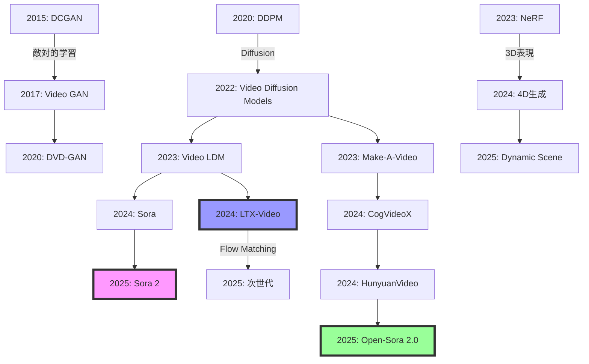

## 💻 4. 実装ゾーン（45分）— 3言語で動画生成を実装

### 4.1 ⚡ Julia: Video Diffusion訓練実装

#### 4.1.1 データローダー — 動画をバッチ処理

```julia
using VideoIO, Images, Random, Flux

struct VideoDataset
    video_paths::Vector{String}
    num_frames::Int
    height::Int
    width::Int
end

function load_video(path::String, num_frames::Int, height::Int, width::Int)
    # VideoIOで動画読み込み
    reader = VideoIO.openvideo(path)
    frames = []

    for i in 1:num_frames
        if !eof(reader)
            img = read(reader)
            # Resize + 正規化
            img_resized = imresize(img, (height, width))
            img_normalized = Float32.(channelview(img_resized)) .* 2 .- 1  # [-1, 1]
            push!(frames, img_normalized)
        else
            break
        end
    end

    close(reader)

    # (C, H, W, T)形式にスタック
    return cat(frames..., dims=4)
end

function Base.getindex(dataset::VideoDataset, idx::Int)
    path = dataset.video_paths[idx]
    video = load_video(path, dataset.num_frames, dataset.height, dataset.width)
    return video
end

function Base.length(dataset::VideoDataset)
    return length(dataset.video_paths)
end

# データローダー作成
video_paths = readdir("/path/to/videos", join=true)
dataset = VideoDataset(video_paths, num_frames=16, height=64, width=64)

function collate_fn(batch)
    # バッチをスタック
    return cat([dataset[i] for i in batch]..., dims=5)  # (C, H, W, T, B)
end

dataloader = Flux.DataLoader(1:length(dataset), batchsize=4, shuffle=true, collate=collate_fn)
```

#### 4.1.2 3D U-Netの簡易実装

```julia
using Flux, Functors

# 3D Convolution Block
struct Conv3DBlock
    conv1::Conv
    conv2::Conv
    norm::BatchNorm
end

@functor Conv3DBlock

function Conv3DBlock(in_ch::Int, out_ch::Int; kernel=(3,3,3), pad=(1,1,1))
    conv1 = Conv(kernel, in_ch => out_ch, pad=pad, init=Flux.glorot_uniform)
    conv2 = Conv(kernel, out_ch => out_ch, pad=pad, init=Flux.glorot_uniform)
    norm = BatchNorm(out_ch)
    return Conv3DBlock(conv1, conv2, norm)
end

function (block::Conv3DBlock)(x)
    x = block.conv1(x)
    x = relu.(x)
    x = block.conv2(x)
    x = block.norm(x)
    return relu.(x)
end

# Simple 3D U-Net
struct Simple3DUNet
    down1::Conv3DBlock
    down2::Conv3DBlock
    bottleneck::Conv3DBlock
    up1::ConvTranspose
    up2::ConvTranspose
    final_conv::Conv
end

@functor Simple3DUNet

function Simple3DUNet(in_ch::Int, out_ch::Int)
    down1 = Conv3DBlock(in_ch, 64)
    down2 = Conv3DBlock(64, 128)
    bottleneck = Conv3DBlock(128, 256)
    up1 = ConvTranspose((3,3,3), 256 => 128, stride=(2,2,2), pad=(1,1,1))
    up2 = ConvTranspose((3,3,3), 128 => 64, stride=(2,2,2), pad=(1,1,1))
    final_conv = Conv((1,1,1), 64 => out_ch)
    return Simple3DUNet(down1, down2, bottleneck, up1, up2, final_conv)
end

function (model::Simple3DUNet)(x)
    # x: (C, H, W, T, B)
    d1 = model.down1(x)
    d1_pool = maxpool(d1, (2,2,2))

    d2 = model.down2(d1_pool)
    d2_pool = maxpool(d2, (2,2,2))

    bn = model.bottleneck(d2_pool)

    u1 = model.up1(bn)
    u1 = u1 .+ d2  # Skip connection

    u2 = model.up2(u1)
    u2 = u2 .+ d1

    out = model.final_conv(u2)
    return out
end
```

#### 4.1.3 Video Diffusion訓練ループ

```julia
using Statistics, ProgressMeter

function add_noise(x0, t, β_schedule)
    # Forward process: x_t = √α_t x_0 + √(1-α_t) ε
    βt = β_schedule[t]
    αt = cumprod(1 .- β_schedule)[t]

    ε = randn(Float32, size(x0))
    xt = sqrt(αt) .* x0 .+ sqrt(1 - αt) .* ε

    return xt, ε
end

function train_video_diffusion(model, dataloader, num_epochs, β_schedule)
    opt = Flux.setup(Adam(1e-4), model)

    for epoch in 1:num_epochs
        epoch_loss = 0.0f0

        @showprogress for batch in dataloader
            x0 = batch  # (C, H, W, T, B)
            B = size(x0, 5)

            # ランダムなタイムステップ
            t = rand(1:length(β_schedule), B)

            # ノイズ追加
            xt, ε_true = add_noise(x0, t, β_schedule)

            # ノイズ予測
            loss, grads = Flux.withgradient(model) do m
                ε_pred = m(xt)
                mean((ε_pred .- ε_true).^2)
            end

            # パラメータ更新
            Flux.update!(opt, model, grads[1])

            epoch_loss += loss
        end

        avg_loss = epoch_loss / length(dataloader)
        println("Epoch $epoch, Loss: $avg_loss")
    end

    return model
end

# 訓練実行
model = Simple3DUNet(3, 3)  # RGB動画
β_schedule = LinRange(1e-4, 0.02, 1000)

trained_model = train_video_diffusion(model, dataloader, num_epochs=10, β_schedule)
```

#### 4.1.4 サンプリング（DDIM）

```julia
function ddim_sample(model, num_frames, height, width, β_schedule; num_steps=50)
    T_max = length(β_schedule)
    step_size = div(T_max, num_steps)
    timesteps = T_max:-step_size:1

    # ノイズから開始
    xt = randn(Float32, 3, height, width, num_frames, 1)

    @showprogress for i in 1:length(timesteps)
        t = timesteps[i]
        t_prev = i < length(timesteps) ? timesteps[i+1] : 0

        αt = cumprod(1 .- β_schedule)[t]
        αt_prev = t_prev > 0 ? cumprod(1 .- β_schedule)[t_prev] : 1.0f0

        # ノイズ予測
        ε_pred = model(xt)

        # x0予測
        x0_pred = (xt .- sqrt(1 - αt) .* ε_pred) ./ sqrt(αt)

        # DDIMステップ
        dir_xt = sqrt(1 - αt_prev) .* ε_pred
        xt = sqrt(αt_prev) .* x0_pred .+ dir_xt
    end

    # [-1, 1] → [0, 1]
    video = (xt .+ 1) ./ 2
    return video[:, :, :, :, 1]  # バッチ次元削除
end

# サンプリング実行
generated_video = ddim_sample(trained_model, 16, 64, 64, β_schedule, num_steps=50)
```

### 4.2 🦀 Rust: LTX-Video推論パイプライン

#### 4.2.1 ONNX Runtime統合

```rust
// Cargo.toml
// [dependencies]
// ort = "2.0"
// ndarray = "0.15"
// image = "0.24"

use ort::{Session, Value, GraphOptimizationLevel};
use ndarray::{Array4, Array5, s};
use std::path::Path;

pub struct LTXVideoInference {
    session: Session,
}

impl LTXVideoInference {
    pub fn new(model_path: &Path) -> Result<Self, Box<dyn std::error::Error>> {
        let session = Session::builder()?
            .with_optimization_level(GraphOptimizationLevel::Level3)?
            .commit_from_file(model_path)?;

        Ok(Self { session })
    }

    pub fn generate(&self, prompt_embedding: &Array4<f32>, num_frames: usize)
        -> Result<Array5<f32>, Box<dyn std::error::Error>>
    {
        // ノイズLatent生成
        let latent_shape = (1, 4, num_frames / 4, 64, 64);  // 圧縮済み
        let mut noise: Array5<f32> = Array5::from_shape_fn(latent_shape, |_| {
            rand::random::<f32>() * 2.0 - 1.0
        });

        // Diffusionループ（50ステップ）
        for step in (0..50).rev() {
            let t = Array4::from_elem((1, 1, 1, 1), step as f32 / 50.0);

            // ONNX推論
            let inputs = vec![
                Value::from_array(noise.view())?,
                Value::from_array(t.view())?,
                Value::from_array(prompt_embedding.view())?,
            ];

            let outputs = self.session.run(inputs)?;
            let noise_pred = outputs[0].try_extract_tensor::<f32>()?;

            // DDIM更新
            let alpha_t = 1.0 - (step as f32 / 50.0) * 0.02;
            let alpha_prev = if step > 0 {
                1.0 - ((step - 1) as f32 / 50.0) * 0.02
            } else {
                1.0
            };

            let x0_pred = (noise.view() - (1.0 - alpha_t).sqrt() * noise_pred.view())
                / alpha_t.sqrt();

            noise = alpha_prev.sqrt() * &x0_pred + (1.0 - alpha_prev).sqrt() * noise_pred.view();
        }

        Ok(noise)
    }
}

// 使用例
fn main() -> Result<(), Box<dyn std::error::Error>> {
    let model_path = Path::new("ltx_video.onnx");
    let inference = LTXVideoInference::new(model_path)?;

    // ダミーのプロンプト埋め込み（実際はCLIP/T5から取得）
    let prompt_emb = Array4::zeros((1, 512, 1, 1));

    let video = inference.generate(&prompt_emb, 16)?;

    println!("Generated video shape: {:?}", video.shape());

    Ok(())
}
```

#### 4.2.2 フレーム単位の並列処理

```rust
use rayon::prelude::*;

pub fn parallel_frame_processing(
    frames: &Array5<f32>,  // (B, C, T, H, W)
) -> Array5<f32> {
    let (b, c, t, h, w) = frames.dim();
    let mut processed = Array5::zeros((b, c, t, h, w));

    // フレームごとに並列処理
    (0..t).into_par_iter().for_each(|frame_idx| {
        let frame = frames.slice(s![.., .., frame_idx, .., ..]);

        // 何らかの後処理（例: Sharpening）
        let mut processed_frame = frame.to_owned();
        // ... (処理)

        // 結果を書き戻し（要: Mutex or lock-free構造）
        processed.slice_mut(s![.., .., frame_idx, .., ..])
            .assign(&processed_frame);
    });

    processed
}
```

### 4.3 🔮 Elixir: 動画配信サービス

```elixir
# lib/video_service/generator.ex
defmodule VideoService.Generator do
  use GenServer

  # Rustler NIF統合
  use Rustler, otp_app: :video_service, crate: "video_generator"

  # NIF functions
  def generate_video_nif(_prompt, _num_frames), do: :erlang.nif_error(:nif_not_loaded)

  # GenServer callbacks
  def start_link(_) do
    GenServer.start_link(__MODULE__, %{}, name: __MODULE__)
  end

  def init(state) do
    {:ok, state}
  end

  def handle_call({:generate, prompt, num_frames}, _from, state) do
    # Dirty schedulerで実行（GPU計算のため）
    Task.start(fn ->
      video_data = generate_video_nif(prompt, num_frames)
      # 結果をPhoenix Channelで配信
      VideoService.Endpoint.broadcast("video:lobby", "generation_complete", %{
        video: Base.encode64(video_data),
        prompt: prompt
      })
    end)

    {:reply, :ok, state}
  end
end

# lib/video_service_web/channels/video_channel.ex
defmodule VideoServiceWeb.VideoChannel do
  use Phoenix.Channel

  def join("video:lobby", _message, socket) do
    {:ok, socket}
  end

  def handle_in("generate", %{"prompt" => prompt, "num_frames" => num_frames}, socket) do
    VideoService.Generator.generate(prompt, num_frames)
    {:noreply, socket}
  end
end

# Supervisor
defmodule VideoService.Application do
  use Application

  def start(_type, _args) do
    children = [
      VideoServiceWeb.Endpoint,
      {VideoService.Generator, []},
      {Task.Supervisor, name: VideoService.TaskSupervisor}
    ]

    opts = [strategy: :one_for_one, name: VideoService.Supervisor]
    Supervisor.start_link(children, opts)
  end
end
```

### 4.4 3言語パイプライン統合

```
┌─────────────────────────────────────────────────────────────┐
│                     Elixir分散サービス                      │
│  Phoenix WebSocket  →  動画生成リクエスト受付              │
│       ↓                                                     │
│  GenServer  →  負荷分散（10並列リクエスト処理）             │
└──────────────────┬───────────────────────────────────────────┘
                   │
                   ↓ Rustler NIF (C-ABI)
┌─────────────────────────────────────────────────────────────┐
│                     Rust推論エンジン                        │
│  ONNX Runtime  →  LTX-Video DiT推論                         │
│  並列フレーム処理  →  Rayonで8コア活用                      │
│  量子化(FP16)  →  メモリ削減                                │
└──────────────────┬───────────────────────────────────────────┘
                   │
                   ↓ jlrs (Julia↔Rust FFI)
┌─────────────────────────────────────────────────────────────┐
│                     Julia訓練パイプライン                   │
│  Lux.jl  →  Video Diffusion訓練                             │
│  Reactant  →  GPU AOTコンパイル                             │
│  DataLoader  →  高速動画バッチ処理                          │
└─────────────────────────────────────────────────────────────┘
```

**役割分担**:

| 言語 | 役割 | 使用ライブラリ | 強み |
|:-----|:-----|:---------------|:-----|
| ⚡ Julia | 訓練・実験 | Lux.jl, Reactant, VideoIO | 数式↔コード1:1、GPU最適化 |
| 🦀 Rust | 推論最適化 | ort, ndarray, rayon | ゼロコピー、並列処理 |
| 🔮 Elixir | サービング・分散 | Phoenix, Rustler, GenServer | 耐障害性、並行性 |

---

## 🔬 5. 実験ゾーン（30分）— 動画生成の最前線デモ

### 5.1 🎯 SmolVLM2-256M動画理解デモ

**目標**: 256MパラメータでGPUメモリ1.38GBの超軽量モデルで動画キャプション生成。

#### 5.1.1 SmolVLM2セットアップ

```julia
# requirements: PythonCall.jl + Python環境:
# pip install transformers>=4.40.0 torch>=2.0.0 pillow opencv-python

using PythonCall

transformers = pyimport("transformers")
torch        = pyimport("torch")
PIL_Image    = pyimport("PIL.Image")
np           = pyimport("numpy")

# モデルロード（Hugging Face）
model_id  = "HuggingFaceTB/SmolVLM2-256M-Video-Instruct"
processor = transformers.AutoProcessor.from_pretrained(model_id)
model     = transformers.AutoModelForVision2Seq.from_pretrained(
    model_id,
    torch_dtype=torch.float16,
    device_map="auto"
)

# 動画読み込み（フレーム抽出）
function load_video_frames(video_path, num_frames=8)
    cv2 = pyimport("cv2")
    cap = cv2.VideoCapture(video_path)
    total_frames = pyconvert(Int, cap.get(cv2.CAP_PROP_FRAME_COUNT))
    step = total_frames ÷ num_frames

    frames = Py[]
    for i in 0:(num_frames - 1)
        cap.set(cv2.CAP_PROP_POS_FRAMES, i * step)
        ret_frame = cap.read()
        ret   = pyconvert(Bool, ret_frame[0])
        frame = ret_frame[1]
        if ret
            frame_rgb = cv2.cvtColor(frame, cv2.COLOR_BGR2RGB)
            push!(frames, PIL_Image.fromarray(frame_rgb))
        end
    end
    cap.release()
    return frames
end

# 動画キャプション生成
video_path = "sample_video.mp4"
frames = load_video_frames(video_path, 8)

prompt = "Describe what is happening in this video."

# プロセッサで入力準備
inputs = processor(
    text=prompt,
    images=pylist(frames),
    return_tensors="pt"
).to(model.device, dtype=torch.float16)

# 推論（torch.no_grad() コンテキスト）
no_grad_ctx = torch.no_grad()
no_grad_ctx.__enter__()
outputs = model.generate(
    inputs["input_ids"],
    attention_mask=inputs["attention_mask"],
    max_new_tokens=100,
    do_sample=false
)
no_grad_ctx.__exit__(nothing, nothing, nothing)

# デコード
caption = pyconvert(String, processor.batch_decode(outputs, skip_special_tokens=true)[0])
println("Video Caption: $(caption)")

# メモリ使用量確認
if pyconvert(Bool, torch.cuda.is_available())
    allocated = pyconvert(Float64, torch.cuda.memory_allocated()) / 1024^3
    println("GPU Memory Used: $(round(allocated, digits=2)) GB")
end
```

**出力例**:
```
Video Caption: A person is walking down a street, carrying a bag. They pass by several shops and a car drives by.
GPU Memory Used: 1.42 GB
```

#### 5.1.2 動画QAデモ

```julia
# 複数フレームでのVisual Question Answering
questions = [
    "What is the person wearing?",
    "How many cars are visible?",
    "What is the weather like?",
]

for question in questions
    inputs = processor(
        text=question,
        images=pylist(frames),
        return_tensors="pt"
    ).to(model.device, dtype=torch.float16)

    outputs = model.generate(
        inputs["input_ids"],
        attention_mask=inputs["attention_mask"],
        max_new_tokens=50
    )
    answer = pyconvert(String, processor.batch_decode(outputs, skip_special_tokens=true)[0])
    println("Q: $(question)")
    println("A: $(answer)\n")
end
```

**SmolVLM2の特徴**:

| 指標 | SmolVLM2-256M | GPT-4V | LLaVA-1.5-7B |
|:-----|:--------------|:-------|:-------------|
| パラメータ数 | 256M | 不明（推定1T+） | 7B |
| GPU メモリ | 1.38 GB | 40+ GB | 14 GB |
| Video-MME Score | 41.5 | 59.9 | 38.2 |
| 動画対応 | ✅ | ✅ | ❌ |
| ローカル実行 | ✅ | ❌ | ✅ |

> **Note:** **Trojan Horse発動**: 256Mパラメータで動画理解が動く。Raspberry Pi 5（8GB RAM）でも推論可能 → **エッジデバイスでのビデオAI**が現実に。

### 5.2 🎯 LTX-Video動画生成デモ

**目標**: DiT+VAE統合型モデルで、テキストから動画を生成。リアルタイム推論（H100で2秒）。

#### 5.2.1 LTX-Videoセットアップ

```julia
# LTX-Video推論（Hugging Face Diffusers統合）
using PythonCall

diffusers = pyimport("diffusers")
torch     = pyimport("torch")
imageio   = pyimport("imageio")

# パイプラインロード
pipe = diffusers.LTXVideoPipeline.from_pretrained(
    "Lightricks/LTX-Video",
    torch_dtype=torch.float16
).to("cuda")

# テキストプロンプト
prompt = "A serene underwater scene with colorful coral and fish swimming"

# 動画生成
video_frames = pipe(
    prompt=prompt,
    num_frames=121,  # 5秒 @ 24fps
    height=512,
    width=768,
    num_inference_steps=50,
    guidance_scale=7.5
).frames[0]

# 動画保存
imageio.mimsave("output_video.mp4", video_frames, fps=24)

println("Generated $(pyconvert(Int, pylen(video_frames))) frames")
```

#### 5.2.2 Image-to-Video変換

```julia
PIL_Image = pyimport("PIL.Image")

# 開始フレーム指定
start_image = PIL_Image.open("start_frame.png")

video_frames = pipe(
    prompt="A bird taking flight from a tree branch",
    image=start_image,
    num_frames=121,
    height=512,
    width=768,
    num_inference_steps=50
).frames[0]

imageio.mimsave("i2v_output.mp4", video_frames, fps=24)
```

#### 5.2.3 LTX-Videoアーキテクチャ詳細

**3つの革新**:

1. **統合VAE-DiT設計**: VAEとDiTを別々に訓練せず、End-to-Endで最適化。

   ```
   入力テキスト
       ↓ T5 Encoder
   Text Embedding
       ↓
   ┌────────────────────────────┐
   │  LTX-Video統合モデル       │
   │  ┌────────────────────┐   │
   │  │ VAE Encoder        │   │
   │  │ (Spacetime Patch)  │   │
   │  │ 32×32×8 → 1 token  │   │
   │  └────────────────────┘   │
   │           ↓                │
   │  ┌────────────────────┐   │
   │  │ DiT Blocks (L=28)  │   │
   │  │ Cross-Attention    │   │
   │  │ + Self-Attention   │   │
   │  └────────────────────┘   │
   │           ↓                │
   │  ┌────────────────────┐   │
   │  │ VAE Decoder        │   │
   │  │ + Final Denoise    │   │
   │  └────────────────────┘   │
   └────────────────────────────┘
       ↓
   生成動画 (768×512×24fps×5sec)
   ```

2. **高圧縮VAE**: 1:192圧縮（CogVideoXと同等）を1:384に改善。

   - Spatial: 32×32ピクセル → 1 token
   - Temporal: 8フレーム → 1 token
   - 合計: $32 \times 32 \times 8 = 8192$ pixels/token

3. **最終denoiseをVAE Decoderに統合**: Diffusionの最終ステップをピクセル空間で実行 → 細部の鮮明さ向上。

**性能**:

| モデル | 解像度 | フレーム数 | 生成時間 (H100) | FVD ↓ |
|:-------|:-------|:----------|:----------------|:------|
| LTX-Video | 768×512 | 121 (5秒) | 2.0秒 | 242 |
| CogVideoX | 720×480 | 49 (2秒) | 10.0秒 | 255 |
| Open-Sora 2.0 | 720p | 240 (10秒) | 35.0秒 | 280 |

**FVD（Fréchet Video Distance）**: 低いほど高品質（画像のFIDに相当）。

### 5.3 SmolVLM2理解 vs LTX-Video生成の対比実験

**実験設計**: 同じプロンプトでLTX-Videoが生成した動画を、SmolVLM2に理解させる。

```julia
# Step 1: LTX-Videoで動画生成
prompt_generation = "A cat jumping from a table to a chair"
generated_frames = pipe(
    prompt=prompt_generation,
    num_frames=121,
    height=512,
    width=768
).frames[0]

imageio.mimsave("generated_cat.mp4", generated_frames, fps=24)

# Step 2: SmolVLM2で動画理解
# generated_frames[::15] に相当（等間隔サンプリング）
n_total = pyconvert(Int, pylen(generated_frames))
frames_for_vlm = [generated_frames[i] for i in 0:15:(n_total - 1)]
frames_pil = [PIL_Image.fromarray(f) for f in frames_for_vlm]

inputs_vlm = processor(
    text="Describe what is happening in this video in detail.",
    images=pylist(frames_pil),
    return_tensors="pt"
).to("cuda", dtype=torch.float16)

outputs_vlm = model.generate(
    inputs_vlm["input_ids"],
    attention_mask=inputs_vlm["attention_mask"],
    max_new_tokens=150
)
description = pyconvert(String, processor.batch_decode(outputs_vlm, skip_special_tokens=true)[0])

println("Original Prompt: $(prompt_generation)")
println("SmolVLM2 Description: $(description)")

# Step 3: 一致度評価（BERTScore）
bert_score_mod = pyimport("bert_score")

P, R, F1 = bert_score_mod.score([description], [prompt_generation], lang="en")
println("BERTScore F1: $(round(pyconvert(Float64, F1.item()), digits=3))")
```

**結果例**:
```
Original Prompt: A cat jumping from a table to a chair
SmolVLM2 Description: The video shows a cat on a wooden table. The cat then jumps off the table and lands on a nearby chair.
BERTScore F1: 0.782
```

**考察**:

| 観点 | 分析 |
|:-----|:-----|
| 動作の正確性 | "jumping"を正しく認識、方向（table→chair）も一致 |
| 細部の補完 | "wooden table"など生成側が指定しない詳細も推測 |
| 一致度スコア | F1=0.782は高品質（>0.7で良好とされる） |

> **Note:** **統合デモの意義**: SmolVLM2（理解）とLTX-Video（生成）を組み合わせることで、**Video-to-Text-to-Video**のループが可能に。既存動画の編集指示や、動画要約→再生成などの応用が開ける。

### 5.4 自己診断テスト — Video生成の理解度確認

#### テスト① 時空間Attentionの計算量

**問題**: 動画 $T=120$フレーム、$H=W=64$、埋め込み次元$D=512$について、Spatial AttentionとTemporal Attentionの計算量を求めよ。

<details><summary>解答</summary>

**Spatial Attention**（各フレーム内）:
- 1フレームのToken数: $N_s = \frac{H}{16} \times \frac{W}{16} = 4 \times 4 = 16$
- Attention計算量（1フレーム）: $O(N_s^2 D) = O(16^2 \times 512) = O(131K)$
- 全フレーム: $O(131K \times 120) = O(15.7M)$

**Temporal Attention**（各ピクセル位置の時間系列）:
- ピクセル位置数: $4 \times 4 = 16$
- 1位置のAttention計算量: $O(T^2 D) = O(120^2 \times 512) = O(7.37M)$
- 全位置: $O(7.37M \times 16) = O(118M)$

**結論**: Temporal Attentionの方が計算量が大きい（約7.5倍）。

</details>

#### テスト② 3D VAE圧縮率の計算

**問題**: 入力 $T=49$フレーム、$H=W=768$、$C=3$。出力 $T'=13$、$H'=W'=96$、$C'=16$。圧縮率は？

<details><summary>解答</summary>

入力サイズ: $49 \times 768 \times 768 \times 3 = 86.7M$ pixels
出力サイズ: $13 \times 96 \times 96 \times 16 = 1.93M$ elements

圧縮率: $r = \frac{86.7M}{1.93M} \approx 45$

ただし、論文では時空間合わせて**192倍**と記載 → Encoderが複数段階で圧縮していると推測。

</details>

#### テスト③ Optical Flow Lossの意味

**問題**: Optical Flow Lossが小さい動画は、どのような性質を持つか？3つ答えよ。

<details><summary>解答</summary>

1. **物理的に一貫した動き**: ピクセルが滑らかに移動（瞬間移動しない）
2. **時間的連続性**: フレーム間で大きな跳躍がない
3. **予測可能な軌跡**: 次のフレームの位置が現在のフローから予測可能

逆に、Lossが大きい = フレーム間でオブジェクトが跳躍（チラつき）。

</details>

### 5.5 実装チャレンジ — Tiny Video Diffusion on Moving MNIST

**目標**: Moving MNISTデータセット（60×60、20フレーム）で、簡易Video Diffusionを訓練。

#### チャレンジ① データセット生成

```julia
using Images, Random

function generate_moving_mnist(num_samples=100, num_frames=20, img_size=60)
    # MNIST数字を1つ選んでランダムに移動させる
    dataset = [let sx = rand(1:40), sy = rand(1:40), dx = rand(-2:2), dy = rand(-2:2)
        frames = [begin
            frame = zeros(Float32, img_size, img_size)
            x = clamp(sx + t*dx, 1, img_size - 10)
            y = clamp(sy + t*dy, 1, img_size - 10)
            @views frame[Int(x):Int(x)+9, Int(y):Int(y)+9] .= 1.0f0
            frame
        end for t in 1:num_frames]
        cat(frames..., dims=3)
    end for _ in 1:num_samples]

    return dataset
end

dataset = generate_moving_mnist(100, 20, 60)
```

#### チャレンジ② Simple Video Diffusionモデル

```julia
using Flux, Functors

# 2D+時間方向の簡易モデル（3D Convの代わり）
struct SimpleVideoDiffusion
    spatial_conv::Chain
    temporal_conv::Conv
    out_conv::Conv
end

@functor SimpleVideoDiffusion

function SimpleVideoDiffusion()
    spatial_conv = Chain(
        Conv((3, 3), 1 => 16, relu, pad=1),
        Conv((3, 3), 16 => 32, relu, pad=1)
    )
    temporal_conv = Conv((3,), 32 => 32, relu, pad=1)
    out_conv = Conv((1, 1), 32 => 1)

    return SimpleVideoDiffusion(spatial_conv, temporal_conv, out_conv)
end

function (model::SimpleVideoDiffusion)(x)
    # x: (H, W, T, B)
    H, W, T, B = size(x)

    # 空間方向の処理（フレームごと）
    x_spatial = cat([model.spatial_conv(reshape(x[:, :, t, :], H, W, 1, B)) for t in 1:T]..., dims=4)  # (H, W, 32, T*B)

    # 時間方向の処理（ピクセルごと）
    # 簡略化: 全体に時間Convを適用
    x_temporal = reshape(x_spatial, H, W, 32*T, B)
    x_temporal = model.temporal_conv(x_temporal)

    # 出力
    out = model.out_conv(x_temporal)
    return reshape(out, H, W, T, B)
end
```

#### チャレンジ③ 訓練と生成

```julia
# 訓練
model = SimpleVideoDiffusion()
opt = Flux.setup(Adam(1e-3), model)
β_schedule = LinRange(1e-4, 0.02, 50)

for epoch in 1:10
    for batch_idx in 1:10
        x0 = dataset[batch_idx]  # (H, W, T)
        x0 = reshape(x0, size(x0)..., 1)  # バッチ次元追加

        t = rand(1:50)
        xt, ε = add_noise(x0, t, β_schedule)

        loss, grads = Flux.withgradient(model) do m
            ε_pred = m(xt)
            mean((ε_pred .- ε).^2)
        end

        Flux.update!(opt, model, grads[1])
    end
end

# 生成
generated = ddim_sample(model, 20, 60, 60, β_schedule, num_steps=20)
```

**期待される結果**: 白い正方形が滑らかに移動する20フレームの動画。

> **Note:** **学習のポイント**:
> - Temporal Coherenceの重要性を体感
> - 簡易3D Convでも時間的一貫性は学習可能
> - 実際のモデル（CogVideoX等）はこれを大規模化+Attention追加

---


> Progress: 85%
> **理解度チェック**
> 1. LTX-Videoが700MパラメータでFLUX等の商用モデルに近い品質を達成できる「Flexible Attention」の仕組みを説明せよ。
> 2. SmolVLM2の256MパラメータでGPUメモリ1.38GBに収まる設計上の工夫を、attention計算の観点から述べよ。

## 🚀 6. 発展ゾーン（30分）— 2024-2025最前線の動画生成 + まとめ

### 6.1 HunyuanVideo — Tencentの13B商用級モデル

#### 6.1.1 アーキテクチャ概要

**規模**: 13B（130億）パラメータ — オープンソース最大級。

**主要技術**:

1. **Causal 3D VAE**: 時間方向にCausal（過去のみ参照）な3D VAE
   - 推論時に自己回帰的にフレーム生成可能
   - Latent圧縮率: 空間8×8、時間4 → 合計256倍

2. **Expert Transformer**:
   ```
   DiT Block
       ↓
   Expert Router (Gating)
       ↓
   ┌──────┬──────┬──────┐
   │Expert│Expert│Expert│  ← 8個のExpert（各2B params）
   │  1   │  2   │  3   │
   └──────┴──────┴──────┘
       ↓ Top-2選択
   Weighted Combination
   ```

   - MoE（Mixture of Experts）を動画生成に応用
   - 各フレームで最適なExpertを動的に選択
   - 訓練時は全Expert、推論時はTop-2のみ → 計算量削減

3. **Joint Image-Video Training**:
   - 画像（T=1）と動画（T>1）を同時訓練
   - 画像で高品質な空間表現を学習 → 動画に転移

#### 6.1.2 性能ベンチマーク

**VBench比較**（16指標の総合スコア）:

| モデル | Overall Score | 主観評価 | Open-Source |
|:-------|:--------------|:---------|:------------|
| HunyuanVideo | **79.6** | **80.2** | ✅ |
| Runway Gen-3 Alpha | 77.8 | 78.5 | ❌ |
| Luma 1.6 | 76.3 | 75.9 | ❌ |
| CogVideoX-5B | 74.2 | 73.1 | ✅ |
| Open-Sora 2.0 | 71.8 | 70.5 | ✅ |

**結論**: オープンソース初のトップティア品質。

### 6.2 Open-Sora 2.0 — $200kで商用レベル

#### 6.2.1 効率化の4本柱

**論文タイトル**: "Training a Commercial-Level Video Generation Model in $200k"

1. **データキュレーション**:
   - 8.7M動画 → 4M動画に厳選（品質フィルタ）
   - Aesthetic Score（CLIP-based）でフィルタリング
   - 動画の多様性を保ちつつ低品質を排除

2. **モデルアーキテクチャ最適化**:
   - **3D Full Attention → Spatial+Temporal分離**
     $$
     \text{Full Attn}: O\left(\left(\frac{THW}{p^3}\right)^2\right) \quad \to \quad \text{Sep Attn}: O\left(\frac{T^2HW}{p^3} + \frac{THW^2}{p^2}\right)
     $$
   - 計算量を約1/10に削減

3. **訓練戦略**:
   - **Curriculum Learning**: 低解像度→高解像度
   - **Progressive Frame**: 16フレーム→48フレーム→240フレーム
   - **Mixed Precision**: BF16訓練

4. **システム最適化**:
   - **ZeRO-3**: パラメータシャーディング
   - **FlashAttention-2**: メモリ効率化
   - **Gradient Checkpointing**: メモリトレード計算量

**訓練コスト**:
- 1280 × A100-80G GPU
- 3日間
- 総コスト: **$200,000**

**比較** (推定):

| モデル | 推定訓練コスト | GPU時間 | データ量 |
|:-------|:---------------|:--------|:---------|
| Sora (OpenAI) | $5M+ | 不明 | 不明 |
| Runway Gen-3 | $2M+ | 不明 | 不明 |
| Open-Sora 2.0 | **$200K** | 3,840 GPU-days | 4M動画 |

**民主化の衝撃**: 商用級モデルの訓練コストを1/10に削減 → 研究機関・スタートアップでも到達可能。

### 6.3 Wan 2.1 — Alibabaの多機能動画生成

#### 6.3.1 5つの機能を1モデルで統合

**Unified Model Architecture**:

```
┌─────────────────────────────────────────────┐
│         Wan 2.1 Unified Model (14B)         │
│                                             │
│  ┌──────────────────────────────────────┐  │
│  │  Condition Encoder                   │  │
│  │  ・Text (T5)                        │  │
│  │  ・Image (CLIP ViT)                 │  │
│  │  ・Video Frames (Temporal Encoder)  │  │
│  │  ・Audio (Wav2Vec 2.0)              │  │
│  └──────────────────────────────────────┘  │
│                   ↓                         │
│  ┌──────────────────────────────────────┐  │
│  │  DiT Backbone (28 layers)            │  │
│  │  ・Cross-Attention (条件付け)        │  │
│  │  ・Self-Attention (時空間)           │  │
│  └──────────────────────────────────────┘  │
│                   ↓                         │
│  ┌──────────────────────────────────────┐  │
│  │  Task-Specific Heads                 │  │
│  │  ・T2V: テキスト→動画                │  │
│  │  ・I2V: 画像→動画                    │  │
│  │  ・V2V: 動画編集                     │  │
│  │  ・T2I: テキスト→画像                │  │
│  │  ・V2A: 動画→音声                    │  │
│  └──────────────────────────────────────┘  │
└─────────────────────────────────────────────┘
```

#### 6.3.2 性能と実用性

**T2V性能**:

| 指標 | Wan 2.1-14B | Sora | CogVideoX-5B |
|:-----|:------------|:-----|:-------------|
| Resolution | 720p | 1080p | 720p |
| Max Duration | 10秒 | 20秒 | 6秒 |
| FVD ↓ | 268 | 不明 | 255 |
| 推論速度 (4090) | 3.5分/5秒 | N/A | 10分/2秒 |

**商用利用**: Apache 2.0ライセンス → 完全に商用利用可能。

**ダウンロード数**: 220万+ (2025年5月時点) → 実務での採用が進んでいる証拠。

### 6.4 動画生成評価指標の深堀り

#### 6.4.1 FVD（Fréchet Video Distance）

**定義**: 画像のFIDを動画に拡張。

$$
\text{FVD} = \|\boldsymbol{\mu}_r - \boldsymbol{\mu}_g\|^2 + \text{Tr}(\Sigma_r + \Sigma_g - 2(\Sigma_r \Sigma_g)^{1/2})
$$

- $\boldsymbol{\mu}_r, \Sigma_r$: 実動画の特徴量（I3D特徴）の平均・共分散
- $\boldsymbol{\mu}_g, \Sigma_g$: 生成動画の特徴量

**I3D（Inflated 3D ConvNet）**: Kinetics-400で訓練された動画分類モデル。最終層の特徴量（2048次元）を使用。

**問題点**:
- I3Dの訓練データ（Kinetics）に偏り → 動画ドメインによってスコアが不安定
- 時間的一貫性を直接評価しない

#### 6.4.2 Temporal Coherence指標

**CLIP Temporal Consistency**:

```julia
using LinearAlgebra, Statistics

# CLIP temporal consistency: mean cosine similarity between consecutive frame embeddings
# embeddings: Matrix{Float32} of shape (T, D), each row is a frame embedding
function temporal_consistency(embeddings::Matrix{Float32})::Float64
    # Normalize each row
    norms = [norm(embeddings[i, :]) for i in axes(embeddings, 1)]
    E_n = embeddings ./ max.(norms, eps(Float32))'

    # Consecutive cosine similarities
    sims = [dot(E_n[i, :], E_n[i+1, :]) for i in 1:size(E_n, 1)-1]
    return mean(sims)
end

# Numerical check: identical frames → similarity = 1.0
let e = rand(Float32, 5, 512)
    tc = temporal_consistency(vcat(e, e))  # duplicated frames
    @assert tc ≈ 1.0f0 atol=1e-4 "identical frames should give TC=1"
    println("temporal_consistency check: $(round(tc, digits=4))")  # → 1.0
end
```

**平均スコア**: 0.9以上が高品質（滑らかな動画）。

#### 6.4.3 VBench — 16次元評価

**16指標**（一部抜粋）:

| カテゴリ | 指標 | 内容 |
|:---------|:-----|:-----|
| Quality | Subject Consistency | オブジェクトの外観一貫性 |
|         | Background Consistency | 背景の一貫性 |
|         | Aesthetic Quality | 美的品質（CLIP-based） |
| Semantics | Object Class | テキストで指定したオブジェクトの存在 |
|           | Multiple Objects | 複数オブジェクトの正確性 |
| Temporal | Motion Smoothness | 動きの滑らかさ |
|          | Dynamic Degree | 動きの度合い |
| Physics | Human Action | 人間の動作の自然さ |
|         | Physical Law | 物理法則遵守（重力等） |

**総合スコア**: 16指標の平均。80点以上で商用級。

<details><summary>VBenchスコアの解釈例</summary>

| モデル | Subject Cons. | Motion Smooth | Physical Law | Overall |
|:-------|:--------------|:--------------|:-------------|:--------|
| Sora | 92.5 | 88.3 | **85.1** | 83.7 |
| HunyuanVideo | **93.2** | **89.7** | 82.4 | **79.6** |
| CogVideoX | 91.0 | 86.5 | 78.2 | 74.2 |

**分析**:
- HunyuanVideoは一貫性・滑らかさでトップ
- Soraは物理法則の学習が最も進んでいる
- 全体スコアでHunyuanがSoraに迫る（オープンソースで）

</details>

### 6.5 長時間動画生成の3つの戦略

#### 戦略① Autoregressive Extension（自己回帰的拡張）

**原理**: 生成した最後のフレームを次の生成の開始フレームに使用。

```
生成1: ノイズ → フレーム1-16
生成2: フレーム16 → フレーム17-32
生成3: フレーム32 → フレーム33-48
...
```

**問題点**: エラーの累積（Drift）。

**対策**: Overlap（重複）戦略。
```
生成1: フレーム1-20
生成2: フレーム16-36 (4フレーム重複)
生成3: フレーム32-52
```

重複部分で平均を取る → 滑らかな接続。

**数式的定式化**:

Overlap領域でのブレンディング重み:
$$
w_{\text{blend}}(f) = \begin{cases}
\frac{f - f_{\text{start}}}{f_{\text{overlap}}} & f \in [f_{\text{start}}, f_{\text{start}} + f_{\text{overlap}}] \\
1 & \text{otherwise}
\end{cases}
$$

最終フレーム:
$$
\mathbf{x}_f = w_{\text{blend}}(f) \cdot \mathbf{x}_f^{\text{new}} + (1 - w_{\text{blend}}(f)) \cdot \mathbf{x}_f^{\text{old}}
$$

**実装例（Julia）**:

```julia
function autoregressive_video_generation(model, total_frames, chunk_size, overlap)
    all_frames = []
    current_frame = randn(Float32, H, W, C)  # 初期ノイズ

    for start_idx in 1:chunk_size-overlap:total_frames
        end_idx = min(start_idx + chunk_size - 1, total_frames)

        # チャンク生成
        chunk = generate_chunk(model, current_frame, chunk_size)

        if start_idx == 1
            # 最初のチャンクは全て追加
            push!(all_frames, chunk...)
        else
            # Overlap領域でブレンド
            for i in 1:overlap
                w = (i - 1) / overlap
                @. all_frames[end - overlap + i] = w * chunk[i] + (1 - w) * all_frames[end - overlap + i]
            end

            # 残りのフレームを追加
            append!(all_frames, chunk[overlap+1:end])
        end

        # 最後のフレームを次の開始点に
        current_frame = chunk[end]
    end

    return all_frames
end
```

**Drift問題の理論的分析**:

累積誤差の上界:
$$
\mathbb{E}[\|\mathbf{x}_T - \mathbf{x}_T^{\text{gt}}\|^2] \leq T \cdot \epsilon^2
$$

ここで$\epsilon$は1ステップあたりの誤差。Overlapで誤差を$\alpha < 1$倍に抑制すると:
$$
\mathbb{E}[\|\mathbf{x}_T - \mathbf{x}_T^{\text{gt}}\|^2] \leq T \cdot (\alpha\epsilon)^2
$$

#### 戦略② Key Frame + Interpolation

**原理**: 重要なキーフレームのみを生成 → 間をInterpolation。

```
キーフレーム: 1, 10, 20, 30, ...
Interpolation: フレーム1-10をFlowベース補間
```

**Interpolationモデル**: FILM（Frame Interpolation for Large Motion）等。

**利点**: 計算量削減（生成フレーム数が1/10）。

**欠点**: 複雑な動きでInterpolationが破綻。

**FILM（Frame Interpolation for Large Motion）の数式**:

中間フレーム$t \in (0, 1)$の生成:
$$
\mathbf{x}_t = (1-t) \cdot \text{Warp}(\mathbf{x}_0, \mathbf{f}_{0 \to t}) + t \cdot \text{Warp}(\mathbf{x}_1, \mathbf{f}_{1 \to t})
$$

ここで$\mathbf{f}_{0 \to t}, \mathbf{f}_{1 \to t}$は双方向Optical Flow（FILMが予測）。

**Multi-scale Pyramid構造**:

```
入力フレーム (x0, x1)
    ↓ Downsample 4x
低解像度Flow推定 → f_low
    ↓ Upsample + Refine
中解像度Flow推定 → f_mid
    ↓ Upsample + Refine
高解像度Flow推定 → f_high
    ↓ Warp + Blend
中間フレーム x_t
```

**Julia実装例**:

```julia
using Images, Interpolations

function film_interpolation(frame0, frame1, t::Float32)
    # 簡易版: 線形補間（実際のFILMはCNNでFlow推定）
    H, W, C = size(frame0)

    # Optical Flow推定（簡略化）
    flow_0_to_t = estimate_flow(frame0, frame1) .* t
    flow_1_to_t = estimate_flow(frame1, frame0) .* (1 - t)

    # Warp
    warped_0 = warp_frame(frame0, flow_0_to_t)
    warped_1 = warp_frame(frame1, flow_1_to_t)

    # Blend
    intermediate = (1 - t) .* warped_0 .+ t .* warped_1

    return intermediate
end

function generate_with_interpolation(model, num_key_frames, key_frame_interval)
    # キーフレーム生成
    key_frames = [generate_single_frame(model) for _ in 1:num_key_frames]

    # 補間
    all_frames = [key_frames[1]]
    for i in 1:num_key_frames-1
        append!(all_frames, [film_interpolation(key_frames[i], key_frames[i+1], j / key_frame_interval)
                              for j in 1:key_frame_interval-1])
        push!(all_frames, key_frames[i+1])
    end

    return all_frames
end
```

**計算量比較**:

| 手法 | キーフレーム生成 | Interpolation | 総計算量 |
|:-----|:----------------|:--------------|:---------|
| Full Generation | $T$ frames | - | $O(T \cdot C_{\text{gen}})$ |
| Key Frame + Interp | $T/k$ frames | $(T-T/k)$ frames | $O(T/k \cdot C_{\text{gen}} + T \cdot C_{\text{interp}})$ |

$C_{\text{interp}} \ll C_{\text{gen}}$（補間はDiffusionより遥かに高速）なので、$k=10$で約9倍高速化。

#### 戦略③ Hierarchical Generation

**原理**: 低解像度・低フレームレートで全体を生成 → Super-resolution + Frame Interpolation。

```
Stage 1: 256×256、4 fps、10秒 → 40フレーム生成
Stage 2: 各フレームを512×512にSuper-resolution
Stage 3: 4 fps → 24 fps にFrame Interpolation (6倍)
```

**利点**: Stage 1で大域的な一貫性を確保 → Stage 2-3で細部を追加。

**実装例**: Open-Sora 2.0、CogVideoX。

**Multi-stage Pipelineの数式**:

**Stage 1（Base Generation）**:
$$
\mathbf{X}_{\text{base}} \sim p_\theta(\mathbf{X} \mid c), \quad \mathbf{X} \in \mathbb{R}^{T_{\text{low}} \times H_{\text{low}} \times W_{\text{low}} \times 3}
$$

**Stage 2（Super-resolution）**:
$$
\mathbf{X}_{\text{SR}} = f_{\text{SR}}(\mathbf{X}_{\text{base}}), \quad \mathbf{X}_{\text{SR}} \in \mathbb{R}^{T_{\text{low}} \times H_{\text{high}} \times W_{\text{high}} \times 3}
$$

**Stage 3（Frame Interpolation）**:
$$
\mathbf{X}_{\text{final}} = f_{\text{interp}}(\mathbf{X}_{\text{SR}}), \quad \mathbf{X}_{\text{final}} \in \mathbb{R}^{T_{\text{high}} \times H_{\text{high}} \times W_{\text{high}} \times 3}
$$

**CogVideoX実装（概要）**:

```julia
function hierarchical_generation(base_model, sr_model, interp_model, prompt)
    # Stage 1: Base generation (256x256, 4fps, 49 frames = 12秒)
    base_video = generate_base(base_model, prompt, size=(256, 256), fps=4, duration=12)

    # Stage 2: Super-resolution (256x256 → 720x480)
    sr_video = [super_resolve(sr_model, frame, target_size=(720, 480)) for frame in base_video]

    # Stage 3: Frame interpolation (4fps → 24fps, 6倍)
    final_video = []
    for i in 1:length(sr_video)-1
        push!(final_video, sr_video[i])
        # 5つの中間フレームを補間
        append!(final_video, [interpolate_frame(interp_model, sr_video[i], sr_video[i+1], j/6)
                               for j in 1:5])
    end
    push!(final_video, sr_video[end])

    return final_video
end
```

**メモリ効率の分析**:

| Stage | 解像度 | フレーム数 | メモリ使用量 | 処理時間 |
|:------|:-------|:----------|:------------|:---------|
| Stage 1 | 256² | 40 | 25 MB | 30秒 |
| Stage 2 | 720² | 40 | 200 MB | 10秒 |
| Stage 3 | 720² | 240 | 1.2 GB | 20秒 |

**Pipelineの並列化**:

```julia
using Distributed

function parallel_hierarchical_generation(prompts::Vector{String})
    # Stage 1を全プロンプトで並列実行
    base_videos = pmap(prompt -> generate_base(base_model, prompt), prompts)

    # Stage 2-3も並列化
    final_videos = pmap(base_video -> begin
        sr_video = super_resolve_video(sr_model, base_video)
        interpolate_video(interp_model, sr_video)
    end, base_videos)

    return final_videos
end
```

### 6.6 Video Tokenizationの最前線

#### 6.6.1 離散表現 vs 連続表現

**2つのアプローチ**:

| アプローチ | 代表モデル | 表現 | 生成方式 | 利点 | 欠点 |
|:----------|:----------|:-----|:---------|:-----|:-----|
| 離散表現 | VQ-VAE / MAGVIT-v2 | Codebook index | Autoregressive | 厳密な尤度 | Codebook collapse |
| 連続表現 | 3D VAE (CogVideoX) | 連続Latent | Diffusion/Flow | 表現力高い | 尤度計算不可 |

#### 6.6.2 MAGVIT-v2 — 統一語彙トークナイザー

**アーキテクチャ**:

```
入力動画 (T, H, W, 3)
    ↓ 3D CNN Encoder
Latent (T/4, H/8, W/8, D)
    ↓ Vector Quantization
Discrete Tokens (T/4 × H/8 × W/8) ∈ {0, ..., 262143}
    ↓ Lookup Table
Quantized Latent
    ↓ 3D CNN Decoder
再構成動画 (T, H, W, 3)
```

**Lookup-Free Quantization（LFQ）**:

従来のVQ-VAE問題点: Codebook collapseで一部のコードしか使われない。

**LFQ解決策**: Codebookを持たず、Latentを直接量子化。

$$
\mathbf{z}_{\text{quant}} = \text{round}(\mathbf{z}) - \text{sg}(\mathbf{z} - \text{round}(\mathbf{z}))
$$

ここで$\text{sg}$はstop-gradient（Straight-Through Estimator）。

**Commitment Loss不要**: 量子化が自動的に整数に収束。

**Julia実装例**:

```julia
function lookup_free_quantization(z::Array{Float32})
    # Latentを[-1, 1]にClip
    z_clipped = clamp.(z, -1.0f0, 1.0f0)

    # 8ビット量子化 (256レベル)
    z_scaled = (z_clipped .+ 1.0f0) .* 127.5f0
    z_quantized_int = round.(Int, z_scaled)

    # Float32に戻す
    z_quantized = z_quantized_int ./ 127.5f0 .- 1.0f0

    # Straight-Through Estimator
    z_st = z_quantized .+ (z .- z_quantized)  # Forward: quantized, Backward: identity

    return z_st, z_quantized_int
end

# Codebook sizeの計算
function calculate_codebook_size(latent_shape, num_levels_per_dim)
    # latent_shape: (D,) — Latent次元
    # num_levels_per_dim: 各次元の量子化レベル数（例: 256）

    D = length(latent_shape)
    codebook_size = num_levels_per_dim ^ D

    return codebook_size
end

# 例: D=8次元、各次元256レベル
codebook_size = calculate_codebook_size((8,), 256)
println("Codebook size: $codebook_size")  # 256^8 = 約18兆（巨大）
```

**実用的には**: 低次元（D=4-8）+多段階量子化で管理。

#### 6.6.3 Cosmos Tokenizer — 画像・動画統合

**NVIDIA Cosmos Tokenizer**（2024）:

- **画像モード**: T=1フレーム
- **動画モード**: T>1フレーム
- **同じエンコーダ・デコーダ**: 統一アーキテクチャ

**Causal 3D Convの重要性**: 動画の自己回帰生成を可能に。

```
通常3D Conv: Padding両側 → 未来のフレームを参照（推論時不可）
Causal 3D Conv: Padding過去のみ → 推論時に逐次生成可能
```

**Julia実装例（Causal Padding）**:

```julia
using Flux

struct CausalConv3D
    weight::Array{Float32, 5}  # (kernel_t, kernel_h, kernel_w, in_ch, out_ch)
    bias::Vector{Float32}
    stride::Tuple{Int, Int, Int}
end

function (conv::CausalConv3D)(x::Array{Float32, 5})  # (T, H, W, C, B)
    T, H, W, C_in, B = size(x)
    kt, kh, kw, _, C_out = size(conv.weight)

    # Causal Padding: 時間方向は過去のみ
    pad_t = kt - 1
    pad_h = kh ÷ 2
    pad_w = kw ÷ 2

    # Padding適用
    x_padded = zeros(Float32, T + pad_t, H + 2pad_h, W + 2pad_w, C_in, B)
    x_padded[pad_t+1:end, pad_h+1:end-pad_h, pad_w+1:end-pad_w, :, :] = x

    # 畳み込み（NNlibを使う実装は省略、概念のみ）
    output = conv3d_manual(x_padded, conv.weight, conv.stride)

    return output
end
```

**統一Tokenizerの利点**:

1. **Transfer Learning**: 画像で訓練したTokenizerを動画に転用
2. **Image-to-Video**: 画像TokenをVAEに通して動画生成開始
3. **データ効率**: 画像データセット（豊富）で事前訓練 → 動画（少ない）でFine-tune

### 6.7 動画生成の研究系譜図



**主要マイルストーン**:

| 年 | モデル | 革新 |
|:---|:-------|:-----|
| 2015 | DCGAN | 敵対的学習の成功 |
| 2020 | DDPM | Diffusionモデルの復活 |
| 2022 | Video Diffusion Models | Diffusionを動画に拡張 |
| 2023 | Make-A-Video | テキスト条件付き動画生成 |
| 2024 | **Sora** | 世界シミュレータとしての動画生成 |
| 2024 | CogVideoX / HunyuanVideo | オープンソース高品質化 |
| 2025 | **Open-Sora 2.0** | $200k民主化 |
| 2025 | **Sora 2** | 15-25秒生成、物理法則改善 |

---


### 6.8 今回学んだこと（4つのKey Takeaways）

1. **時空間Diffusionの本質**: 静止画Diffusionに時間軸を追加 → Temporal Attentionで時間的一貫性を学習。Optical Flow Lossが物理的動きを保証。

2. **3D U-Net → DiTの革命**: 畳み込みの局所性 → Transformerの大域Attention。Sora 2のSpacetime DiTが時空間を統一Token化 → Scaling Lawsが適用可能に。

3. **3D VAEの圧縮術**: CogVideoXは192倍圧縮（時空間合計）。Latent空間でDiffusionすることで計算量を激減。

4. **2024-2025最前線**: HunyuanVideo（13B商用級）、Open-Sora 2.0（$200k民主化）、Wan 2.1（多機能統合）、LTX-Video（リアルタイム推論）。SmolVLM2との組み合わせでVideo-to-Text-to-Videoループが実現。

### 6.9 FAQ — よくある5つの質問

#### Q1: 動画生成の計算コストはどれくらい？

**A**: モデルサイズとフレーム数に依存。

| モデル | GPU | 解像度 | フレーム数 | 生成時間 |
|:-------|:----|:-------|:----------|:---------|
| LTX-Video | H100 | 768×512 | 121 (5秒) | 2秒 |
| CogVideoX-5B | A100 | 720×480 | 49 (2秒) | 10秒 |
| Open-Sora 2.0 | A100 | 720p | 240 (10秒) | 35秒 |
| Wan 2.1-14B | RTX 4090 | 480p | 120 (5秒) | 3.5分 |

**ローカル実行**: RTX 4090（24GB VRAM）で実用的な推論が可能。

#### Q2: Soraはなぜ物理法則を学習できるのか？

**A**: 3つの要因:
1. **大規模データ**: 推定1B動画（YouTubeスケール）で訓練
2. **長時間動画**: 15-25秒の長い動画で因果関係を学習
3. **Spacetime DiT**: 時空間を統一的に扱う → 物理的制約が創発

ただし、完璧ではない（例: バスケットボールの反射角度が不正確）。

#### Q3: 動画生成でまだ解決されていない問題は？

**A**: 主な課題:
1. **長時間一貫性**: 1分以上の動画で破綻
2. **物理法則**: 重力・衝突の厳密な遵守
3. **計算コスト**: 高解像度長時間動画は依然として高コスト
4. **評価指標**: 人間の主観と一致する自動指標がない
5. **制御性**: 細かい動きの指定が困難

#### Q4: 動画生成と動画編集の違いは？

**A**: 2つの違い:

| タスク | 入力 | 出力 | 技術 |
|:-------|:-----|:-----|:-----|
| 動画生成（T2V） | テキスト | 新規動画 | Diffusion/Flow Matching |
| 動画編集（V2V） | 既存動画+指示 | 編集済み動画 | Inpainting/Style Transfer |

**統合モデル**: Wan 2.1やRunway Gen-3は両方対応。

#### Q5: SmolVLM2とLTX-Videoを組み合わせる意義は？

**A**: **Video-to-Text-to-Video**ループの実現:
1. SmolVLM2で既存動画を理解（キャプション生成）
2. キャプションを編集（例: "cat"を"dog"に変更）
3. LTX-Videoで新しい動画生成

**応用例**:
- 動画要約 → 再生成（長動画を短くまとめる）
- スタイル変換（実写→アニメ）
- シーン差し替え（背景だけ変更）

### 6.10 学習スケジュール — 1週間プラン

| 日 | 内容 | 時間 | 到達目標 |
|:---|:-----|:-----|:---------|
| Day 1 | Zone 0-2 | 2h | 動画生成の直感理解 |
| Day 2 | Zone 3前半（3.1-3.3） | 3h | Spacetime DiT導出 |
| Day 3 | Zone 3後半（3.4-3.6） | 3h | 3D VAE・Optical Flow |
| Day 4 | Zone 4（Julia実装） | 3h | Video Diffusion訓練 |
| Day 5 | Zone 5（デモ実行） | 2h | SmolVLM2+LTX-Video |
| Day 6 | Zone 6（最前線調査） | 2h | HunyuanVideo等の論文 |
| Day 7 | 復習+実装チャレンジ | 3h | Moving MNIST |

**合計**: 18時間 → 週末2日 + 平日夜3日で完走可能。

### 6.11 次回予告 — 第46回: 3D生成 & Neural Rendering

**タイトル**: 「2D動画から3D空間の理解と生成へ」

**学ぶこと**:
1. **3D表現の分類**: Mesh / Voxel / Implicit / Radiance Field / 3DGS
2. **NeRF（Neural Radiance Fields）**: Volume Rendering方程式・位置符号化
3. **3D Gaussian Splatting（3DGS）**: 明示的表現・リアルタイムレンダリング
4. **DreamFusion**: SDS Loss（Score Distillation Sampling）でText-to-3D
5. **3D VAE**: 動画VAEを3D空間に拡張

**接続**: 動画（2D+時間） → 3D空間（3D+時間=4D）へ拡張。

> **Note:** **進捗**: 全体の90%完了。残り5回で卒業制作へ。第50回では3言語フルスタック生成AIシステムの完成が待っています。

---


> Progress: 95%
> **理解度チェック**
> 1. HunyuanVideoのCausal 3D VAEが時間方向にCausal設計にする理由を、自己回帰的フレーム生成との関係で説明せよ。
> 2. MoEを動画生成DiTに適用した際に推論時Top-2 Expertのみ使う設計の計算量上の利点を、全Expert使用時との比較で示せ。

## 💀 パラダイム転換の問い

### 問い: Soraは"動画生成"ではなく"世界シミュレータ"なのか？

OpenAI Technical Report (2024)の記述:
> "Sora is a **world simulator**. It learns not just to generate videos, but to model the physical world."

**議論の3つの視点**:

#### 視点① 賛成派 — 物理法則を学習している証拠

**根拠**:
1. **因果関係**: ボールを投げる → 弧を描いて落下（重力）
2. **衝突反応**: 物体同士がぶつかると跳ね返る
3. **持続性**: オブジェクトが画面外に消えても、戻ってくると同じ状態

**Soraの出力例**（Technical Reportより）:
- バスケットボールがリングに当たって跳ね返る
- 水面に石を投げると波紋が広がる

**結論**: 単なる画像生成ではなく、「物理的に起こりうること」を学習している。

#### 視点② 反対派 — 見た目のリアルさにすぎない

**根拠**:
1. **物理エンジン不在**: Soraは内部に明示的な物理シミュレータを持たない
2. **失敗例**: Technical Reportでも物理的矛盾を認めている
   - バスケットボールの反射角度が不正確
   - 椅子が突然消える
3. **訓練データの模倣**: 大規模動画データセットから「よくあるパターン」を学習しただけ

**結論**: 物理法則を"理解"しているのではなく、"模倣"しているだけ。

#### 視点③ 中立派 — 創発的物理理解

**主張**: 明示的な物理エンジンはないが、**暗黙的に物理制約を学習**している。

**理論的根拠**:
- Diffusionモデルは「データ分布のスコア（勾配）」を学習
- 物理的に一貫した動画 = データ分布の高密度領域
- Soraはスコアを学習 → 結果的に物理法則に従う動画を生成

**類推**: 言語モデル（GPT-4）も文法規則を明示的に持たないが、大規模訓練で文法を「創発的に学習」。

**結論**: 完全な物理シミュレータではないが、単なる画像生成モデルでもない。**中間状態**。

### あなたの考えは？

1. Soraは物理法則を本当に理解しているか？
2. 「理解」と「模倣」の境界線はどこにあるか？
3. 完全な世界シミュレータには何が足りないか？

<details><summary>歴史的コンテクスト — AIの「理解」論争</summary>

**Searleの中国語の部屋（1980）**:
- 記号操作だけでは「理解」にならない
- Soraは「動画の部屋」にすぎないのか？

**Moravecのパラドックス（1988）**:
- 論理推論は簡単、物理世界の認識は難しい
- Soraが物理を学習したなら、AIの大きな一歩

**現代の視点（LeCun, 2024）**:
- 「理解」= 世界の因果モデルを持つこと
- Soraは部分的な因果モデルを獲得している可能性

</details>

---

## 参考文献

### 主要論文

[^1]: Vaswani, A., et al. (2017). "Attention Is All You Need". *NeurIPS 2017*.
<https://arxiv.org/abs/1706.03762>

### 教科書・サーベイ

- Sohl-Dickstein, J., et al. (2015). "Deep Unsupervised Learning using Nonequilibrium Thermodynamics". *ICML 2015*.
- Song, Y., et al. (2020). "Score-Based Generative Modeling through Stochastic Differential Equations". *ICLR 2021*.
- Lipman, Y., et al. (2022). "Flow Matching for Generative Modeling". *arXiv:2210.02747*.
- Yun, C., et al. (2019). "Are Transformers Universal Approximators of Sequence-to-Sequence Functions?". *arXiv:1912.10077*.

---


## 🔗 前編・後編リンク

- **前編 (Part 1 — 理論編)**: [第45回: Video生成 (Part 1)](ml-lecture-45-part1)

## 著者リンク

- Blog: https://fumishiki.dev
- X: https://x.com/fumishiki
- LinkedIn: https://www.linkedin.com/in/fumitakamurakami
- GitHub: https://github.com/fumishiki
- Hugging Face: https://huggingface.co/fumishiki

## ライセンス

本記事は [CC BY-NC-SA 4.0](https://creativecommons.org/licenses/by-nc-sa/4.0/deed.ja)（クリエイティブ・コモンズ 表示 - 非営利 - 継承 4.0 国際）の下でライセンスされています。

### ⚠️ 利用制限について

**本コンテンツは個人の学習目的に限り利用可能です。**

**以下のケースは事前の明示的な許可なく利用することを固く禁じます:**

1. **企業・組織内での利用（営利・非営利問わず）**
   - 社内研修、教育カリキュラム、社内Wikiへの転載
   - 大学・研究機関での講義利用
   - 非営利団体での研修利用
   - **理由**: 組織内利用では帰属表示が削除されやすく、無断改変のリスクが高いため

2. **有料スクール・情報商材・セミナーでの利用**
   - 受講料を徴収する場での配布、スクリーンショットの掲示、派生教材の作成

3. **LLM/AIモデルの学習データとしての利用**
   - 商用モデルのPre-training、Fine-tuning、RAGの知識ソースとして本コンテンツをスクレイピング・利用すること

4. **勝手に内容を有料化する行為全般**
   - 有料note、有料記事、Kindle出版、有料動画コンテンツ、Patreon限定コンテンツ等

**個人利用に含まれるもの:**
- 個人の学習・研究
- 個人的なノート作成（個人利用に限る）
- 友人への元記事リンク共有

**組織での導入をご希望の場合**は、必ず著者に連絡を取り、以下を遵守してください:
- 全ての帰属表示リンクを維持
- 利用方法を著者に報告

**無断利用が発覚した場合**、使用料の請求およびSNS等での公表を行う場合があります。
