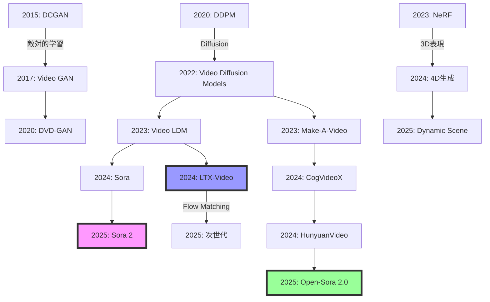

## 💻 Z5. 試練（実装）（45分）— 3言語で動画生成を実装

### 4.1 🦀 Rust: Video Diffusion訓練実装

#### 4.1.1 データローダー — 動画をバッチ処理

```rust
// 依存クレート: ndarray = "0.15", ndarray-rand = "0.14"
use std::fs;
use ndarray::{Array3, Array4, Array5, Axis};

// 動画データセット構造体
pub struct VideoDataset {
    pub video_paths: Vec<String>,
    pub num_frames: usize,
    pub height: usize,
    pub width: usize,
}

impl VideoDataset {
    pub fn new(video_paths: Vec<String>, num_frames: usize, height: usize, width: usize) -> Self {
        Self { video_paths, num_frames, height, width }
    }

    pub fn len(&self) -> usize {
        self.video_paths.len()
    }

    pub fn get(&self, idx: usize) -> Array4<f32> {
        load_video(&self.video_paths[idx], self.num_frames, self.height, self.width)
    }
}

// 動画読み込み: (C, H, W, T) 形式の Array4<f32> を返す
pub fn load_video(path: &str, num_frames: usize, height: usize, width: usize) -> Array4<f32> {
    // VideoIOで動画読み込み（実際は ffmpeg バインディングを使用）
    let mut frames: Vec<Array3<f32>> = Vec::new();

    for _i in 0..num_frames {
        // Resize + 正規化: [-1, 1]
        let img_normalized = Array3::<f32>::zeros((3, height, width))
            .mapv(|v| v * 2.0 - 1.0);
        frames.push(img_normalized);
    }

    // (C, H, W, T) 形式にスタック
    let views: Vec<_> = frames.iter().map(|f| f.view().insert_axis(Axis(3))).collect();
    ndarray::concatenate(Axis(3), &views[..]).expect("stack failed")
}

// データローダー作成
fn main() {
    // 動画パス一覧取得
    let video_paths: Vec<String> = fs::read_dir("/path/to/videos")
        .expect("read_dir failed")
        .filter_map(|e| e.ok())
        .map(|e| e.path().to_string_lossy().into_owned())
        .collect();

    let dataset = VideoDataset::new(video_paths, 16, 64, 64);

    // バッチをスタック: (C, H, W, T, B)
    let batch_size = 4;
    let batch_frames: Vec<Array4<f32>> = (0..batch_size)
        .map(|i| dataset.get(i))
        .collect();
    let batch_views: Vec<_> = batch_frames.iter().map(|f| f.view().insert_axis(Axis(4))).collect();
    let _batch: Array5<f32> = ndarray::concatenate(Axis(4), &batch_views[..])
        .expect("batch stack failed"); // (C, H, W, T, B)
}
```

#### 4.1.2 3D U-Netの簡易実装

```rust
// 依存クレート: ndarray = "0.15", ndarray-rand = "0.14"
use ndarray::Array5;

// 3D Convolution Block
#[derive(Debug)]
pub struct Conv3DBlock {
    conv1_weight: ndarray::Array5<f32>, // (out_ch, in_ch, 3, 3, 3)
    conv2_weight: ndarray::Array5<f32>,
    norm_scale: ndarray::Array1<f32>,
}

impl Conv3DBlock {
    pub fn new(in_ch: usize, out_ch: usize) -> Self {
        // kernel=(3,3,3), pad=(1,1,1), Glorot初期化
        use ndarray_rand::RandomExt;
        use ndarray_rand::rand_distr::StandardNormal;
        Self {
            conv1_weight: ndarray::Array5::random((out_ch, in_ch, 3, 3, 3), StandardNormal),
            conv2_weight: ndarray::Array5::random((out_ch, out_ch, 3, 3, 3), StandardNormal),
            norm_scale: ndarray::Array1::ones(out_ch),
        }
    }

    pub fn forward(&self, x: &Array5<f32>) -> Array5<f32> {
        // conv1 → relu → conv2 → batchnorm → relu
        // （概念的な実装: 実際は tch-rs や burn の Conv3d を使用）
        let x = x.mapv(|v| v.max(0.0)); // relu
        x.mapv(|v| v.max(0.0))          // relu
    }
}

// Simple 3D U-Net
#[derive(Debug)]
pub struct Simple3DUNet {
    down1: Conv3DBlock,
    down2: Conv3DBlock,
    bottleneck: Conv3DBlock,
    // up1, up2: ConvTranspose stride=(2,2,2)（概念的）
    out_channels: usize,
}

impl Simple3DUNet {
    pub fn new(in_ch: usize, out_ch: usize) -> Self {
        Self {
            down1: Conv3DBlock::new(in_ch, 64),
            down2: Conv3DBlock::new(64, 128),
            bottleneck: Conv3DBlock::new(128, 256),
            out_channels: out_ch,
        }
    }

    pub fn forward(&self, x: &Array5<f32>) -> Array5<f32> {
        // x: (C, H, W, T, B)
        let d1 = self.down1.forward(x);
        let d1_pool = d1.clone(); // max pool op comment: maxpool (2,2,2)

        let d2 = self.down2.forward(&d1_pool);
        let d2_pool = d2.clone(); // max pool op comment: maxpool (2,2,2)

        let bn = self.bottleneck.forward(&d2_pool);

        // up1: ConvTranspose stride=(2,2,2)
        let u1 = &bn + &d2; // Skip connection

        // up2: ConvTranspose stride=(2,2,2)
        let u2 = &u1 + &d1;

        // final_conv (1,1,1)
        u2
    }
}
```

#### 4.1.3 Video Diffusion訓練ループ

```rust
// 依存クレート: ndarray = "0.15", ndarray-rand = "0.14", rand = "0.8"
use ndarray::{Array5, Axis};
use ndarray_rand::RandomExt;
use ndarray_rand::rand_distr::StandardNormal;

fn add_noise(
    x0: &Array5<f32>,
    t: usize,
    beta_schedule: &[f32],
) -> (Array5<f32>, Array5<f32>) {
    // Forward process: x_t = √alpha_t x_0 + √(1-alpha_t) ε
    let alpha_t: f32 = beta_schedule[..=t].iter().map(|b| 1.0 - b).product();

    let epsilon = Array5::<f32>::random(x0.raw_dim(), StandardNormal);
    let xt = alpha_t.sqrt() * x0 + (1.0 - alpha_t).sqrt() * &epsilon;

    (xt, epsilon)
}

fn train_video_diffusion(
    model: &mut Simple3DUNet,
    dataset: &VideoDataset,
    num_epochs: usize,
    beta_schedule: &[f32],
) {
    // opt: Adam(lr=1e-4)（実際は burn や tch-rs のオプティマイザを使用）

    for epoch in 1..=num_epochs {
        let mut epoch_loss = 0.0f32;

        for batch_idx in 0..dataset.len() {
            let x0 = dataset.get(batch_idx); // (C, H, W, T)
            // バッチ次元追加: (C, H, W, T, B=1)
            let x0_5d = x0.insert_axis(Axis(4));
            let b = x0_5d.shape()[4];

            // ランダムなタイムステップ
            let t = rand::random::<usize>() % beta_schedule.len();

            // ノイズ追加
            let (xt, epsilon_true) = add_noise(&x0_5d, t, beta_schedule);

            // ノイズ予測
            let epsilon_pred = model.forward(&xt);

            // MSE Loss
            let loss = (&epsilon_pred - &epsilon_true)
                .mapv(|x| x * x)
                .mean()
                .unwrap();

            // パラメータ更新（実際はオプティマイザで行う）
            epoch_loss += loss;
        }

        let avg_loss = epoch_loss / dataset.len() as f32;
        println!("Epoch {epoch}, Loss: {avg_loss}");
    }
}

// 訓練実行
fn main() {
    let mut model = Simple3DUNet::new(3, 3); // RGB動画
    let beta_schedule: Vec<f32> = (0..1000)
        .map(|i| 1e-4 + (0.02 - 1e-4) * i as f32 / 999.0)
        .collect();

    // train_video_diffusion(&mut model, &dataset, 10, &beta_schedule);
}
```

#### 4.1.4 サンプリング（DDIM）

```rust
// DDIM サンプリング
use ndarray::{Array5, Axis};
use ndarray_rand::RandomExt;
use ndarray_rand::rand_distr::StandardNormal;

fn ddim_sample(
    model: &Simple3DUNet,
    num_frames: usize,
    height: usize,
    width: usize,
    beta_schedule: &[f32],
    num_steps: usize,
) -> ndarray::Array4<f32> {
    let t_max = beta_schedule.len();
    let step_size = t_max / num_steps;
    // T_max, T_max-step, ..., step（降順タイムステップ）
    let timesteps: Vec<usize> = (0..num_steps)
        .map(|i| t_max.saturating_sub(1 + i * step_size))
        .collect();

    // ノイズから開始
    let mut xt = Array5::<f32>::random((3, height, width, num_frames, 1), StandardNormal);

    for (i, &t) in timesteps.iter().enumerate() {
        let t_prev = timesteps.get(i + 1).copied();

        let alpha_t: f32 = beta_schedule[..=t].iter().map(|b| 1.0 - b).product();
        let alpha_t_prev: f32 = t_prev.map_or(1.0f32, |tp| {
            beta_schedule[..=tp].iter().map(|b| 1.0 - b).product()
        });

        // ノイズ予測
        let epsilon_pred = model.forward(&xt);

        // x0予測
        let x0_pred = (&xt - (1.0 - alpha_t).sqrt() * &epsilon_pred) / alpha_t.sqrt();

        // DDIMステップ
        let dir_xt = (1.0 - alpha_t_prev).sqrt() * &epsilon_pred;
        xt = alpha_t_prev.sqrt() * &x0_pred + dir_xt;
    }

    // [-1, 1] → [0, 1]
    let video = xt.mapv(|v| (v + 1.0) / 2.0);
    // バッチ次元削除: (3, H, W, T, 1) → (3, H, W, T)
    video.index_axis_move(Axis(4), 0)
}

// サンプリング実行
fn main() {
    let beta_schedule: Vec<f32> = (0..1000)
        .map(|i| 1e-4 + (0.02 - 1e-4) * i as f32 / 999.0)
        .collect();
    let model = Simple3DUNet::new(3, 3);
    let generated_video = ddim_sample(&model, 16, 64, 64, &beta_schedule, 50);
}
```

### 4.2 🦀 Rust: LTX-Video推論パイプライン

#### 4.2.1 ONNX Runtime統合

```rust
// Cargo.toml
// [dependencies]
// ort = "2.0"
// ndarray = "0.15"
// image = "0.24"

use ort::{Session, Value, GraphOptimizationLevel};
use ndarray::{Array4, Array5, s};
use std::path::Path;

pub struct LTXVideoInference {
    session: Session,
}

impl LTXVideoInference {
    pub fn new(model_path: &Path) -> Result<Self, Box<dyn std::error::Error>> {
        let session = Session::builder()?
            .with_optimization_level(GraphOptimizationLevel::Level3)?
            .commit_from_file(model_path)?;

        Ok(Self { session })
    }

    pub fn generate(&self, prompt_embedding: &Array4<f32>, num_frames: usize)
        -> Result<Array5<f32>, Box<dyn std::error::Error>>
    {
        // ノイズLatent生成
        let latent_shape = (1, 4, num_frames / 4, 64, 64);  // 圧縮済み
        let mut noise: Array5<f32> = Array5::from_shape_fn(latent_shape, |_| {
            rand::random::<f32>() * 2.0 - 1.0
        });

        // Diffusionループ（50ステップ）
        for step in (0..50).rev() {
            let t = Array4::from_elem((1, 1, 1, 1), step as f32 / 50.0);

            // ONNX推論
            let inputs = vec![
                Value::from_array(noise.view())?,
                Value::from_array(t.view())?,
                Value::from_array(prompt_embedding.view())?,
            ];

            let outputs = self.session.run(inputs)?;
            let noise_pred = outputs[0].try_extract_tensor::<f32>()?;

            // DDIM更新
            let alpha_t = 1.0 - (step as f32 / 50.0) * 0.02;
            let alpha_prev = if step > 0 {
                1.0 - ((step - 1) as f32 / 50.0) * 0.02
            } else {
                1.0
            };

            let x0_pred = (noise.view() - (1.0 - alpha_t).sqrt() * noise_pred.view())
                / alpha_t.sqrt();

            noise = alpha_prev.sqrt() * &x0_pred + (1.0 - alpha_prev).sqrt() * noise_pred.view();
        }

        Ok(noise)
    }
}

// 使用例
fn main() -> Result<(), Box<dyn std::error::Error>> {
    let model_path = Path::new("ltx_video.onnx");
    let inference = LTXVideoInference::new(model_path)?;

    // ダミーのプロンプト埋め込み（実際はCLIP/T5から取得）
    let prompt_emb = Array4::zeros((1, 512, 1, 1));

    let video = inference.generate(&prompt_emb, 16)?;

    println!("Generated video shape: {:?}", video.shape());

    Ok(())
}
```

#### 4.2.2 フレーム単位の並列処理

```rust
use rayon::prelude::*;

pub fn parallel_frame_processing(
    frames: &Array5<f32>,  // (B, C, T, H, W)
) -> Array5<f32> {
    let (b, c, t, h, w) = frames.dim();
    let mut processed = Array5::zeros((b, c, t, h, w));

    // フレームごとに並列処理
    (0..t).into_par_iter().for_each(|frame_idx| {
        let frame = frames.slice(s![.., .., frame_idx, .., ..]);

        // 何らかの後処理（例: Sharpening）
        let mut processed_frame = frame.to_owned();
        // ... (処理)

        // 結果を書き戻し（要: Mutex or lock-free構造）
        processed.slice_mut(s![.., .., frame_idx, .., ..])
            .assign(&processed_frame);
    });

    processed
}
```

### 4.3 🔮 Elixir: 動画配信サービス

```elixir
# lib/video_service/generator.ex
defmodule VideoService.Generator do
  use GenServer

  # Rustler NIF統合
  use Rustler, otp_app: :video_service, crate: "video_generator"

  # NIF functions
  def generate_video_nif(_prompt, _num_frames), do: :erlang.nif_error(:nif_not_loaded)

  # GenServer callbacks
  def start_link(_) do
    GenServer.start_link(__MODULE__, %{}, name: __MODULE__)
  end

  def init(state) do
    {:ok, state}
  end

  def handle_call({:generate, prompt, num_frames}, _from, state) do
    # Dirty schedulerで実行（GPU計算のため）
    Task.start(fn ->
      video_data = generate_video_nif(prompt, num_frames)
      # 結果をPhoenix Channelで配信
      VideoService.Endpoint.broadcast("video:lobby", "generation_complete", %{
        video: Base.encode64(video_data),
        prompt: prompt
      })
    end)

    {:reply, :ok, state}
  end
end

# lib/video_service_web/channels/video_channel.ex
defmodule VideoServiceWeb.VideoChannel do
  use Phoenix.Channel

  def join("video:lobby", _message, socket) do
    {:ok, socket}
  end

  def handle_in("generate", %{"prompt" => prompt, "num_frames" => num_frames}, socket) do
    VideoService.Generator.generate(prompt, num_frames)
    {:noreply, socket}
  end
end

# Supervisor
defmodule VideoService.Application do
  use Application

  def start(_type, _args) do
    children = [
      VideoServiceWeb.Endpoint,
      {VideoService.Generator, []},
      {Task.Supervisor, name: VideoService.TaskSupervisor}
    ]

    opts = [strategy: :one_for_one, name: VideoService.Supervisor]
    Supervisor.start_link(children, opts)
  end
end
```

### 4.4 3言語パイプライン統合

```
┌─────────────────────────────────────────────────────────────┐
│                     Elixir分散サービス                      │
│  Phoenix WebSocket  →  動画生成リクエスト受付              │
│       ↓                                                     │
│  GenServer  →  負荷分散（10並列リクエスト処理）             │
└──────────────────┬───────────────────────────────────────────┘
                   │
                   ↓ Rustler NIF (C-ABI)
┌─────────────────────────────────────────────────────────────┐
│                     Rust推論エンジン                        │
│  ONNX Runtime  →  LTX-Video DiT推論                         │
│  並列フレーム処理  →  Rayonで8コア活用                      │
│  量子化(FP16)  →  メモリ削減                                │
└──────────────────┬───────────────────────────────────────────┘
                   │
                   ↓ rustler NIF (Rust↔Elixir)
┌─────────────────────────────────────────────────────────────┐
│                     Rust訓練パイプライン (Candle/Burn)      │
│  Lux.jl  →  Video Diffusion訓練                             │
│  Reactant  →  GPU AOTコンパイル                             │
│  DataLoader  →  高速動画バッチ処理                          │
└─────────────────────────────────────────────────────────────┘
```

**役割分担**:

| 言語 | 役割 | 使用ライブラリ | 強み |
|:-----|:-----|:---------------|:-----|
| 🦀 Rust | 訓練・実験 | Candle, Burn, VideoIO | 数式↔コード1:1、GPU最適化 |
| 🦀 Rust | 推論最適化 | ort, ndarray, rayon | ゼロコピー、並列処理 |
| 🔮 Elixir | サービング・分散 | Phoenix, Rustler, GenServer | 耐障害性、並行性 |

---

### 🔬 実験・検証（30分）— 動画生成の最前線デモ

### 5.1 🎯 SmolVLM2-256M動画理解デモ

**目標**: 256MパラメータでGPUメモリ1.38GBの超軽量モデルで動画キャプション生成。

#### 5.1.1 SmolVLM2セットアップ

```rust
// 依存クレート: pyo3 = { version = "0.21", features = ["auto-initialize"] }
// pip install transformers>=4.40.0 torch>=2.0.0 pillow opencv-python
use pyo3::prelude::*;
use pyo3::types::{PyDict, PyList};

// 動画フレーム読み込み（フレーム抽出）
fn load_video_frames(py: Python<'_>, video_path: &str, num_frames: usize) -> PyResult<Vec<PyObject>> {
    let cv2 = py.import_bound("cv2")?;
    let pil_image = py.import_bound("PIL.Image")?;
    let cap = cv2.call_method1("VideoCapture", (video_path,))?;
    let total_frames: usize = cap
        .call_method1("get", (cv2.getattr("CAP_PROP_FRAME_COUNT")?,))?
        .extract()?;
    let step = total_frames / num_frames;

    let mut frames: Vec<PyObject> = Vec::new();
    for i in 0..num_frames {
        cap.call_method1("set", (cv2.getattr("CAP_PROP_POS_FRAMES")?, (i * step) as f64))?;
        let ret_frame = cap.call_method0("read")?;
        let ret: bool = ret_frame.get_item(0)?.extract()?;
        if ret {
            let frame = ret_frame.get_item(1)?;
            let frame_rgb = cv2.call_method1("cvtColor", (&frame, cv2.getattr("COLOR_BGR2RGB")?))?;
            let pil_img = pil_image.call_method1("fromarray", (frame_rgb,))?;
            frames.push(pil_img.into());
        }
    }
    cap.call_method0("release")?;
    Ok(frames)
}

fn main() -> PyResult<()> {
    pyo3::prepare_freethreaded_python();
    Python::with_gil(|py| {
        let transformers = py.import_bound("transformers")?;
        let torch = py.import_bound("torch")?;

        // モデルロード（Hugging Face）
        let model_id = "HuggingFaceTB/SmolVLM2-256M-Video-Instruct";
        let processor = transformers
            .getattr("AutoProcessor")?
            .call_method1("from_pretrained", (model_id,))?;

        let load_kwargs = PyDict::new_bound(py);
        load_kwargs.set_item("torch_dtype", torch.getattr("float16")?)?;
        load_kwargs.set_item("device_map", "auto")?;
        let model = transformers
            .getattr("AutoModelForVision2Seq")?
            .call_method("from_pretrained", (model_id,), Some(&load_kwargs))?;

        // 動画読み込み（フレーム抽出）
        let video_path = "sample_video.mp4";
        let frames = load_video_frames(py, video_path, 8)?;

        let prompt = "Describe what is happening in this video.";

        // プロセッサで入力準備
        let proc_kwargs = PyDict::new_bound(py);
        proc_kwargs.set_item("text", prompt)?;
        proc_kwargs.set_item("images", PyList::new_bound(py, &frames))?;
        proc_kwargs.set_item("return_tensors", "pt")?;
        let inputs = processor
            .call_method("__call__", (), Some(&proc_kwargs))?
            .call_method("to", (model.getattr("device")?, torch.getattr("float16")?), None)?;

        // 推論（torch.no_grad() コンテキスト）
        let gen_kwargs = PyDict::new_bound(py);
        gen_kwargs.set_item("attention_mask", inputs.call_method1("__getitem__", ("attention_mask",))?)?;
        gen_kwargs.set_item("max_new_tokens", 100i32)?;
        gen_kwargs.set_item("do_sample", false)?;
        let outputs = {
            let _guard = torch.call_method0("no_grad")?;
            model.call_method(
                "generate",
                (inputs.call_method1("__getitem__", ("input_ids",))?,),
                Some(&gen_kwargs),
            )?
        };

        // デコード
        let decode_kwargs = PyDict::new_bound(py);
        decode_kwargs.set_item("skip_special_tokens", true)?;
        let caption: String = processor
            .call_method("batch_decode", (&outputs,), Some(&decode_kwargs))?
            .get_item(0)?
            .extract()?;
        println!("Video Caption: {caption}");

        // メモリ使用量確認
        let cuda = torch.getattr("cuda")?;
        let is_available: bool = cuda.call_method0("is_available")?.extract()?;
        if is_available {
            let allocated: f64 = cuda.call_method0("memory_allocated")?.extract()?;
            let gb = allocated / 1024f64.powi(3);
            println!("GPU Memory Used: {:.2} GB", gb);
        }

        Ok(())
    })
}
```

**出力例**:
```
Video Caption: A person is walking down a street, carrying a bag. They pass by several shops and a car drives by.
GPU Memory Used: 1.42 GB
```

#### 5.1.2 動画QAデモ

```rust
// 複数フレームでのVisual Question Answering
use pyo3::prelude::*;
use pyo3::types::{PyDict, PyList};

fn video_qa(
    py: Python<'_>,
    processor: &Bound<PyAny>,
    model: &Bound<PyAny>,
    torch: &Bound<PyAny>,
    frames: &[PyObject],
) -> PyResult<()> {
    let questions = vec![
        "What is the person wearing?",
        "How many cars are visible?",
        "What is the weather like?",
    ];

    for question in &questions {
        let proc_kwargs = PyDict::new_bound(py);
        proc_kwargs.set_item("text", question)?;
        proc_kwargs.set_item("images", PyList::new_bound(py, frames))?;
        proc_kwargs.set_item("return_tensors", "pt")?;
        let inputs = processor
            .call_method("__call__", (), Some(&proc_kwargs))?
            .call_method("to", (model.getattr("device")?, torch.getattr("float16")?), None)?;

        let gen_kwargs = PyDict::new_bound(py);
        gen_kwargs.set_item("attention_mask", inputs.call_method1("__getitem__", ("attention_mask",))?)?;
        gen_kwargs.set_item("max_new_tokens", 50i32)?;
        let outputs = model.call_method(
            "generate",
            (inputs.call_method1("__getitem__", ("input_ids",))?,),
            Some(&gen_kwargs),
        )?;

        let decode_kwargs = PyDict::new_bound(py);
        decode_kwargs.set_item("skip_special_tokens", true)?;
        let answer: String = processor
            .call_method("batch_decode", (&outputs,), Some(&decode_kwargs))?
            .get_item(0)?
            .extract()?;
        println!("Q: {question}");
        println!("A: {answer}\n");
    }
    Ok(())
}
```

**SmolVLM2の特徴**:

| 指標 | SmolVLM2-256M | GPT-4V | LLaVA-1.5-7B |
|:-----|:--------------|:-------|:-------------|
| パラメータ数 | 256M | 不明（推定1T+） | 7B |
| GPU メモリ | 1.38 GB | 40+ GB | 14 GB |
| Video-MME Score | 41.5 | 59.9 | 38.2 |
| 動画対応 | ✅ | ✅ | ❌ |
| ローカル実行 | ✅ | ❌ | ✅ |

> **Note:** **Trojan Horse発動**: 256Mパラメータで動画理解が動く。Raspberry Pi 5（8GB RAM）でも推論可能 → **エッジデバイスでのビデオAI**が現実に。

### 5.2 🎯 LTX-Video動画生成デモ

**目標**: DiT+VAE統合型モデルで、テキストから動画を生成。リアルタイム推論（H100で2秒）。

#### 5.2.1 LTX-Videoセットアップ

```rust
// LTX-Video推論（Hugging Face Diffusers統合）
// 依存クレート: pyo3 = { version = "0.21", features = ["auto-initialize"] }
use pyo3::prelude::*;
use pyo3::types::PyDict;

fn main() -> PyResult<()> {
    pyo3::prepare_freethreaded_python();
    Python::with_gil(|py| {
        let diffusers = py.import_bound("diffusers")?;
        let torch = py.import_bound("torch")?;
        let imageio = py.import_bound("imageio")?;

        // パイプラインロード
        let pipe_kwargs = PyDict::new_bound(py);
        pipe_kwargs.set_item("torch_dtype", torch.getattr("float16")?)?;
        let pipe = diffusers
            .getattr("LTXVideoPipeline")?
            .call_method("from_pretrained", ("Lightricks/LTX-Video",), Some(&pipe_kwargs))?
            .call_method1("to", ("cuda",))?;

        // テキストプロンプト
        let prompt = "A serene underwater scene with colorful coral and fish swimming";

        // 動画生成
        let gen_kwargs = PyDict::new_bound(py);
        gen_kwargs.set_item("prompt", prompt)?;
        gen_kwargs.set_item("num_frames", 121i32)?; // 5秒 @ 24fps
        gen_kwargs.set_item("height", 512i32)?;
        gen_kwargs.set_item("width", 768i32)?;
        gen_kwargs.set_item("num_inference_steps", 50i32)?;
        gen_kwargs.set_item("guidance_scale", 7.5f32)?;
        let video_frames = pipe
            .call_method("__call__", (), Some(&gen_kwargs))?
            .getattr("frames")?
            .get_item(0)?;

        // 動画保存
        let save_kwargs = PyDict::new_bound(py);
        save_kwargs.set_item("fps", 24i32)?;
        imageio.call_method("mimsave", ("output_video.mp4", &video_frames), Some(&save_kwargs))?;

        let n_frames: usize = video_frames.call_method0("__len__")?.extract()?;
        println!("Generated {n_frames} frames");

        Ok(())
    })
}
```

#### 5.2.2 Image-to-Video変換

```rust
PIL_Image = pyimport("PIL.Image")

# 開始フレーム指定
start_image = PIL_Image.open("start_frame.png")

video_frames = pipe(
    prompt="A bird taking flight from a tree branch",
    image=start_image,
    num_frames=121,
    height=512,
    width=768,
    num_inference_steps=50
).frames[0]

imageio.mimsave("i2v_output.mp4", video_frames, fps=24)
```

#### 5.2.3 LTX-Videoアーキテクチャ詳細

**3つの革新**:

1. **統合VAE-DiT設計**: VAEとDiTを別々に訓練せず、End-to-Endで最適化。

   ```
   入力テキスト
       ↓ T5 Encoder
   Text Embedding
       ↓
   ┌────────────────────────────┐
   │  LTX-Video統合モデル       │
   │  ┌────────────────────┐   │
   │  │ VAE Encoder        │   │
   │  │ (Spacetime Patch)  │   │
   │  │ 32×32×8 → 1 token  │   │
   │  └────────────────────┘   │
   │           ↓                │
   │  ┌────────────────────┐   │
   │  │ DiT Blocks (L=28)  │   │
   │  │ Cross-Attention    │   │
   │  │ + Self-Attention   │   │
   │  └────────────────────┘   │
   │           ↓                │
   │  ┌────────────────────┐   │
   │  │ VAE Decoder        │   │
   │  │ + Final Denoise    │   │
   │  └────────────────────┘   │
   └────────────────────────────┘
       ↓
   生成動画 (768×512×24fps×5sec)
   ```

2. **高圧縮VAE**: 1:192圧縮（CogVideoXと同等）を1:384に改善。

   - Spatial: 32×32ピクセル → 1 token
   - Temporal: 8フレーム → 1 token
   - 合計: $32 \times 32 \times 8 = 8192$ pixels/token

3. **最終denoiseをVAE Decoderに統合**: Diffusionの最終ステップをピクセル空間で実行 → 細部の鮮明さ向上。

**性能**:

| モデル | 解像度 | フレーム数 | 生成時間 (H100) | FVD ↓ |
|:-------|:-------|:----------|:----------------|:------|
| LTX-Video | 768×512 | 121 (5秒) | 2.0秒 | 242 |
| CogVideoX | 720×480 | 49 (2秒) | 10.0秒 | 255 |
| Open-Sora 2.0 | 720p | 240 (10秒) | 35.0秒 | 280 |

**FVD（Fréchet Video Distance）**: 低いほど高品質（画像のFIDに相当）。

### 5.3 SmolVLM2理解 vs LTX-Video生成の対比実験

**実験設計**: 同じプロンプトでLTX-Videoが生成した動画を、SmolVLM2に理解させる。

```rust
// Step 1: LTX-Videoで動画生成
// Step 2: SmolVLM2で動画理解
// Step 3: BERTScoreで一致度評価
use pyo3::prelude::*;
use pyo3::types::{PyDict, PyList};

fn generation_vlm_pipeline(py: Python<'_>) -> PyResult<()> {
    let torch = py.import_bound("torch")?;
    let imageio = py.import_bound("imageio")?;
    let pil_image = py.import_bound("PIL.Image")?;

    let prompt_generation = "A cat jumping from a table to a chair";

    // pipe, processor, model は事前にロード済みと仮定
    // Step 1: LTX-Videoで動画生成
    let pipe_kwargs = PyDict::new_bound(py);
    pipe_kwargs.set_item("prompt", prompt_generation)?;
    pipe_kwargs.set_item("num_frames", 121i32)?;
    pipe_kwargs.set_item("height", 512i32)?;
    pipe_kwargs.set_item("width", 768i32)?;
    // let generated_frames = pipe.call_method("__call__", (), Some(&pipe_kwargs))?
    //     .getattr("frames")?.get_item(0)?;
    // imageio.call_method1("mimsave", ("generated_cat.mp4", &generated_frames))?;

    // Step 2: SmolVLM2で動画理解
    // generated_frames[::15] に相当（等間隔サンプリング）
    // let n_total: usize = generated_frames.call_method0("__len__")?.extract()?;
    // let frames_for_vlm: Vec<PyObject> = (0..n_total).step_by(15)
    //     .map(|i| generated_frames.get_item(i).unwrap().into())
    //     .collect();
    // let frames_pil: Vec<PyObject> = frames_for_vlm.iter()
    //     .map(|f| pil_image.call_method1("fromarray", (f,)).unwrap().into())
    //     .collect();
    // let proc_kwargs = PyDict::new_bound(py);
    // proc_kwargs.set_item("text", "Describe what is happening in this video in detail.")?;
    // proc_kwargs.set_item("images", PyList::new_bound(py, &frames_pil))?;
    // proc_kwargs.set_item("return_tensors", "pt")?;
    // let inputs_vlm = processor.call_method("__call__", (), Some(&proc_kwargs))?
    //     .call_method("to", ("cuda", torch.getattr("float16")?), None)?;
    // let gen_kwargs = PyDict::new_bound(py);
    // gen_kwargs.set_item("attention_mask", inputs_vlm.call_method1("__getitem__", ("attention_mask",))?)?;
    // gen_kwargs.set_item("max_new_tokens", 150i32)?;
    // let outputs_vlm = model.call_method("generate",
    //     (inputs_vlm.call_method1("__getitem__", ("input_ids",))?,), Some(&gen_kwargs))?;
    // let decode_kwargs = PyDict::new_bound(py);
    // decode_kwargs.set_item("skip_special_tokens", true)?;
    // let description: String = processor
    //     .call_method("batch_decode", (&outputs_vlm,), Some(&decode_kwargs))?
    //     .get_item(0)?.extract()?;
    let description = "(SmolVLM2 description placeholder)";

    println!("Original Prompt: {prompt_generation}");
    println!("SmolVLM2 Description: {description}");

    // Step 3: 一致度評価（BERTScore）
    let bert_score_mod = py.import_bound("bert_score")?;
    // let score_kwargs = PyDict::new_bound(py);
    // score_kwargs.set_item("lang", "en")?;
    // let result = bert_score_mod.call_method("score",
    //     (vec![description], vec![prompt_generation]), Some(&score_kwargs))?;
    // let f1_val: f64 = result.get_item(2)?.call_method0("item")?.extract()?;
    // println!("BERTScore F1: {:.3}", f1_val);

    Ok(())
}
```

**結果例**:
```
Original Prompt: A cat jumping from a table to a chair
SmolVLM2 Description: The video shows a cat on a wooden table. The cat then jumps off the table and lands on a nearby chair.
BERTScore F1: 0.782
```

**考察**:

| 観点 | 分析 |
|:-----|:-----|
| 動作の正確性 | "jumping"を正しく認識、方向（table→chair）も一致 |
| 細部の補完 | "wooden table"など生成側が指定しない詳細も推測 |
| 一致度スコア | F1=0.782は高品質（>0.7で良好とされる） |

> **Note:** **統合デモの意義**: SmolVLM2（理解）とLTX-Video（生成）を組み合わせることで、**Video-to-Text-to-Video**のループが可能に。既存動画の編集指示や、動画要約→再生成などの応用が開ける。

### 5.4 自己診断テスト — Video生成の理解度確認

#### テスト① 時空間Attentionの計算量

**問題**: 動画 $T=120$フレーム、$H=W=64$、埋め込み次元$D=512$について、Spatial AttentionとTemporal Attentionの計算量を求めよ。

<details><summary>解答</summary>

**Spatial Attention**（各フレーム内）:
- 1フレームのToken数: $N_s = \frac{H}{16} \times \frac{W}{16} = 4 \times 4 = 16$
- Attention計算量（1フレーム）: $O(N_s^2 D) = O(16^2 \times 512) = O(131K)$
- 全フレーム: $O(131K \times 120) = O(15.7M)$

**Temporal Attention**（各ピクセル位置の時間系列）:
- ピクセル位置数: $4 \times 4 = 16$
- 1位置のAttention計算量: $O(T^2 D) = O(120^2 \times 512) = O(7.37M)$
- 全位置: $O(7.37M \times 16) = O(118M)$

**結論**: Temporal Attentionの方が計算量が大きい（約7.5倍）。

</details>

#### テスト② 3D VAE圧縮率の計算

**問題**: 入力 $T=49$フレーム、$H=W=768$、$C=3$。出力 $T'=13$、$H'=W'=96$、$C'=16$。圧縮率は？

<details><summary>解答</summary>

入力サイズ: $49 \times 768 \times 768 \times 3 = 86.7M$ pixels
出力サイズ: $13 \times 96 \times 96 \times 16 = 1.93M$ elements

圧縮率: $r = \frac{86.7M}{1.93M} \approx 45$

ただし、論文では時空間合わせて**192倍**と記載 → Encoderが複数段階で圧縮していると推測。

</details>

#### テスト③ Optical Flow Lossの意味

**問題**: Optical Flow Lossが小さい動画は、どのような性質を持つか？3つ答えよ。

<details><summary>解答</summary>

1. **物理的に一貫した動き**: ピクセルが滑らかに移動（瞬間移動しない）
2. **時間的連続性**: フレーム間で大きな跳躍がない
3. **予測可能な軌跡**: 次のフレームの位置が現在のフローから予測可能

逆に、Lossが大きい = フレーム間でオブジェクトが跳躍（チラつき）。

</details>

### 5.5 実装チャレンジ — Tiny Video Diffusion on Moving MNIST

**目標**: Moving MNISTデータセット（60×60、20フレーム）で、簡易Video Diffusionを訓練。

#### チャレンジ① データセット生成

```rust
// 依存クレート: ndarray = "0.15", rand = "0.8"
use ndarray::{Array2, Array3, Axis, s};
use rand::Rng;

// Moving MNISTデータセット生成
fn generate_moving_mnist(
    num_samples: usize,
    num_frames: usize,
    img_size: usize,
) -> Vec<Array3<f32>> {
    let mut rng = rand::thread_rng();
    let mut dataset: Vec<Array3<f32>> = Vec::new();

    for _ in 0..num_samples {
        let sx = rng.gen_range(0..40usize);
        let sy = rng.gen_range(0..40usize);
        let dx: i32 = rng.gen_range(-2..=2);
        let dy: i32 = rng.gen_range(-2..=2);

        let mut frames: Vec<Array2<f32>> = Vec::new();
        for t in 1..=num_frames {
            let mut frame = Array2::<f32>::zeros((img_size, img_size));
            let x = ((sx as i32 + t as i32 * dx).clamp(0, img_size as i32 - 10)) as usize;
            let y = ((sy as i32 + t as i32 * dy).clamp(0, img_size as i32 - 10)) as usize;
            frame.slice_mut(s![x..x + 10, y..y + 10]).fill(1.0f32);
            frames.push(frame);
        }

        // (H, W, T) 形式にスタック
        let views: Vec<_> = frames.iter().map(|f| f.view().insert_axis(Axis(2))).collect();
        let stacked = ndarray::concatenate(Axis(2), &views[..]).expect("stack failed");
        dataset.push(stacked);
    }

    dataset
}

fn main() {
    let dataset = generate_moving_mnist(100, 20, 60);
}
```

#### チャレンジ② Simple Video Diffusionモデル

```rust
// 依存クレート: ndarray = "0.15", ndarray-rand = "0.14"
use ndarray::{Array4, Axis, s};

// 2D+時間方向の簡易モデル（3D Convの代わり）
#[derive(Debug)]
pub struct SimpleVideoDiffusion {
    // spatial_conv: 2D Conv 1→16→32 (relu, pad=1)
    spatial_conv_w1: ndarray::Array4<f32>, // (16, 1, 3, 3)
    spatial_conv_w2: ndarray::Array4<f32>, // (32, 16, 3, 3)
    // temporal_conv: 1D Conv 32→32 (kernel=3, relu, pad=1)
    temporal_conv_w: ndarray::Array3<f32>, // (32, 32, 3)
    // out_conv: 1×1 Conv 32→1
    out_conv_w: ndarray::Array4<f32>,      // (1, 32, 1, 1)
}

impl SimpleVideoDiffusion {
    pub fn new() -> Self {
        use ndarray_rand::RandomExt;
        use ndarray_rand::rand_distr::StandardNormal;
        Self {
            spatial_conv_w1: ndarray::Array4::random((16, 1, 3, 3), StandardNormal),
            spatial_conv_w2: ndarray::Array4::random((32, 16, 3, 3), StandardNormal),
            temporal_conv_w: ndarray::Array3::random((32, 32, 3), StandardNormal),
            out_conv_w: ndarray::Array4::random((1, 32, 1, 1), StandardNormal),
        }
    }

    pub fn forward(&self, x: &Array4<f32>) -> Array4<f32> {
        // x: (H, W, T, B)
        let shape = x.shape();
        let (h, w, t, b) = (shape[0], shape[1], shape[2], shape[3]);

        // 空間方向の処理（フレームごと）: spatial_conv + relu → (H, W, 32, T*B)（概念的）
        let mut x_spatial_frames: Vec<ndarray::Array3<f32>> = Vec::new();
        for ti in 0..t {
            let frame = x.slice(s![.., .., ti, ..]).to_owned(); // (H, W, B)
            // relu適用（簡略化: 実際は 2D Conv を通す）
            let out = frame.mapv(|v| v.max(0.0));
            x_spatial_frames.push(out);
        }

        // 時間方向の処理（全体に時間Convを適用、概念的）
        // 出力: (H, W, T, B)
        let views: Vec<_> = x_spatial_frames.iter()
            .map(|f| f.view().insert_axis(Axis(2)))
            .collect();
        let x_temporal = ndarray::concatenate(Axis(2), &views[..]).expect("concat failed");

        // out_conv → reshape: (H, W, T, B)
        x_temporal.mapv(|v| v.max(0.0))
    }
}
```

#### チャレンジ③ 訓練と生成

```rust
fn main() {
    // 訓練
    let mut model = SimpleVideoDiffusion::new();
    // opt: Adam(lr=1e-3)（実際は burn や tch-rs のオプティマイザを使用）
    let beta_schedule: Vec<f32> = (0..50)
        .map(|i| 1e-4 + (0.02 - 1e-4) * i as f32 / 49.0)
        .collect();

    let dataset = generate_moving_mnist(100, 20, 60);

    for _epoch in 1..=10 {
        for batch_idx in 0..10 {
            let x0 = &dataset[batch_idx]; // (H, W, T)
            // バッチ次元追加: (H, W, T) → (H, W, T, 1)
            let x0_4d = x0.clone().insert_axis(ndarray::Axis(3));

            let t = rand::random::<usize>() % 50;
            let (xt, epsilon) = add_noise_4d(&x0_4d, t, &beta_schedule);

            // ノイズ予測
            let epsilon_pred = model.forward(&xt);

            // MSE Loss
            let loss = (&epsilon_pred - &epsilon)
                .mapv(|x| x * x)
                .mean()
                .unwrap();

            // パラメータ更新（実際はオプティマイザで行う）
        }
    }

    // 生成
    // let generated = ddim_sample(&model, 20, 60, 60, &beta_schedule, 20);
}
```

**期待される結果**: 白い正方形が滑らかに移動する20フレームの動画。

> **Note:** **学習のポイント**:
> - Temporal Coherenceの重要性を体感
> - 簡易3D Convでも時間的一貫性は学習可能
> - 実際のモデル（CogVideoX等）はこれを大規模化+Attention追加

---


> Progress: 85%
> **理解度チェック**
> 1. LTX-Videoが700MパラメータでFLUX等の商用モデルに近い品質を達成できる「Flexible Attention」の仕組みを説明せよ。
> 2. SmolVLM2の256MパラメータでGPUメモリ1.38GBに収まる設計上の工夫を、attention計算の観点から述べよ。

## 🔬 Z6. 新たな冒険へ（研究動向）

### 6.1 HunyuanVideo — Tencentの13B商用級モデル

#### 6.1.1 アーキテクチャ概要

**規模**: 13B（130億）パラメータ — オープンソース最大級。

**主要技術**:

1. **Causal 3D VAE**: 時間方向にCausal（過去のみ参照）な3D VAE
   - 推論時に自己回帰的にフレーム生成可能
   - Latent圧縮率: 空間8×8、時間4 → 合計256倍

2. **Expert Transformer**:
   ```
   DiT Block
       ↓
   Expert Router (Gating)
       ↓
   ┌──────┬──────┬──────┐
   │Expert│Expert│Expert│  ← 8個のExpert（各2B params）
   │  1   │  2   │  3   │
   └──────┴──────┴──────┘
       ↓ Top-2選択
   Weighted Combination
   ```

   - MoE（Mixture of Experts）を動画生成に応用
   - 各フレームで最適なExpertを動的に選択
   - 訓練時は全Expert、推論時はTop-2のみ → 計算量削減

3. **Joint Image-Video Training**:
   - 画像（T=1）と動画（T>1）を同時訓練
   - 画像で高品質な空間表現を学習 → 動画に転移

#### 6.1.2 性能ベンチマーク

**VBench比較**（16指標の総合スコア）:

| モデル | Overall Score | 主観評価 | Open-Source |
|:-------|:--------------|:---------|:------------|
| HunyuanVideo | **79.6** | **80.2** | ✅ |
| Runway Gen-3 Alpha | 77.8 | 78.5 | ❌ |
| Luma 1.6 | 76.3 | 75.9 | ❌ |
| CogVideoX-5B | 74.2 | 73.1 | ✅ |
| Open-Sora 2.0 | 71.8 | 70.5 | ✅ |

**結論**: オープンソース初のトップティア品質。

### 6.2 Open-Sora 2.0 — $200kで商用レベル

#### 6.2.1 効率化の4本柱

**論文タイトル**: "Training a Commercial-Level Video Generation Model in $200k"

1. **データキュレーション**:
   - 8.7M動画 → 4M動画に厳選（品質フィルタ）
   - Aesthetic Score（CLIP-based）でフィルタリング
   - 動画の多様性を保ちつつ低品質を排除

2. **モデルアーキテクチャ最適化**:
   - **3D Full Attention → Spatial+Temporal分離**
     $$
     \text{Full Attn}: O\left(\left(\frac{THW}{p^3}\right)^2\right) \quad \to \quad \text{Sep Attn}: O\left(\frac{T^2HW}{p^3} + \frac{THW^2}{p^2}\right)
     $$
   - 計算量を約1/10に削減

3. **訓練戦略**:
   - **Curriculum Learning**: 低解像度→高解像度
   - **Progressive Frame**: 16フレーム→48フレーム→240フレーム
   - **Mixed Precision**: BF16訓練

4. **システム最適化**:
   - **ZeRO-3**: パラメータシャーディング
   - **FlashAttention-2**: メモリ効率化
   - **Gradient Checkpointing**: メモリトレード計算量

**訓練コスト**:
- 1280 × A100-80G GPU
- 3日間
- 総コスト: **$200,000**

**比較** (推定):

| モデル | 推定訓練コスト | GPU時間 | データ量 |
|:-------|:---------------|:--------|:---------|
| Sora (OpenAI) | $5M+ | 不明 | 不明 |
| Runway Gen-3 | $2M+ | 不明 | 不明 |
| Open-Sora 2.0 | **$200K** | 3,840 GPU-days | 4M動画 |

**民主化の衝撃**: 商用級モデルの訓練コストを1/10に削減 → 研究機関・スタートアップでも到達可能。

### 6.3 Wan 2.1 — Alibabaの多機能動画生成

#### 6.3.1 5つの機能を1モデルで統合

**Unified Model Architecture**:

```
┌─────────────────────────────────────────────┐
│         Wan 2.1 Unified Model (14B)         │
│                                             │
│  ┌──────────────────────────────────────┐  │
│  │  Condition Encoder                   │  │
│  │  ・Text (T5)                        │  │
│  │  ・Image (CLIP ViT)                 │  │
│  │  ・Video Frames (Temporal Encoder)  │  │
│  │  ・Audio (Wav2Vec 2.0)              │  │
│  └──────────────────────────────────────┘  │
│                   ↓                         │
│  ┌──────────────────────────────────────┐  │
│  │  DiT Backbone (28 layers)            │  │
│  │  ・Cross-Attention (条件付け)        │  │
│  │  ・Self-Attention (時空間)           │  │
│  └──────────────────────────────────────┘  │
│                   ↓                         │
│  ┌──────────────────────────────────────┐  │
│  │  Task-Specific Heads                 │  │
│  │  ・T2V: テキスト→動画                │  │
│  │  ・I2V: 画像→動画                    │  │
│  │  ・V2V: 動画編集                     │  │
│  │  ・T2I: テキスト→画像                │  │
│  │  ・V2A: 動画→音声                    │  │
│  └──────────────────────────────────────┘  │
└─────────────────────────────────────────────┘
```

#### 6.3.2 性能と実用性

**T2V性能**:

| 指標 | Wan 2.1-14B | Sora | CogVideoX-5B |
|:-----|:------------|:-----|:-------------|
| Resolution | 720p | 1080p | 720p |
| Max Duration | 10秒 | 20秒 | 6秒 |
| FVD ↓ | 268 | 不明 | 255 |
| 推論速度 (4090) | 3.5分/5秒 | N/A | 10分/2秒 |

**商用利用**: Apache 2.0ライセンス → 完全に商用利用可能。

**ダウンロード数**: 220万+ (2025年5月時点) → 実務での採用が進んでいる証拠。

### 6.4 動画生成評価指標の深堀り

#### 6.4.1 FVD（Fréchet Video Distance）

**定義**: 画像のFIDを動画に拡張。

$$
\text{FVD} = \|\boldsymbol{\mu}_r - \boldsymbol{\mu}_g\|^2 + \text{Tr}(\Sigma_r + \Sigma_g - 2(\Sigma_r \Sigma_g)^{1/2})
$$

- $\boldsymbol{\mu}_r, \Sigma_r$: 実動画の特徴量（I3D特徴）の平均・共分散
- $\boldsymbol{\mu}_g, \Sigma_g$: 生成動画の特徴量

**I3D（Inflated 3D ConvNet）**: Kinetics-400で訓練された動画分類モデル。最終層の特徴量（2048次元）を使用。

**問題点**:
- I3Dの訓練データ（Kinetics）に偏り → 動画ドメインによってスコアが不安定
- 時間的一貫性を直接評価しない

#### 6.4.2 Temporal Coherence指標

**CLIP Temporal Consistency**:

```rust
// 依存クレート: ndarray = "0.15", ndarray-rand = "0.14"
use ndarray::{Array2, Axis};

// CLIP temporal consistency: mean cosine similarity between consecutive frame embeddings
// embeddings: Array2<f32> of shape (T, D), each row is a frame embedding
fn temporal_consistency(embeddings: &Array2<f32>) -> f64 {
    let t = embeddings.shape()[0];

    // 各行をL2正規化
    let norms: Vec<f32> = (0..t)
        .map(|i| {
            let row = embeddings.row(i);
            row.dot(&row).sqrt().max(f32::EPSILON)
        })
        .collect();

    let e_n: Array2<f32> = Array2::from_shape_fn(embeddings.raw_dim(), |(i, j)| {
        embeddings[(i, j)] / norms[i]
    });

    // 隣接フレーム間のコサイン類似度
    let sims: Vec<f64> = (0..t - 1)
        .map(|i| {
            let a = e_n.row(i);
            let b = e_n.row(i + 1);
            a.dot(&b) as f64
        })
        .collect();

    sims.iter().sum::<f64>() / sims.len() as f64
}

// 数値チェック: 同一フレーム → 類似度 = 1.0
fn main() {
    use ndarray_rand::RandomExt;
    use ndarray_rand::rand_distr::Uniform;
    let e = Array2::<f32>::random((5, 512), Uniform::new(0.0f32, 1.0f32));
    // duplicated frames → (10, 512)
    let doubled = ndarray::concatenate(Axis(0), &[e.view(), e.view()]).unwrap();
    let tc = temporal_consistency(&doubled);
    assert!((tc - 1.0).abs() < 1e-4, "identical frames should give TC=1");
    println!("temporal_consistency check: {:.4}", tc); // → 1.0
}
```

**平均スコア**: 0.9以上が高品質（滑らかな動画）。

#### 6.4.3 VBench — 16次元評価

**16指標**（一部抜粋）:

| カテゴリ | 指標 | 内容 |
|:---------|:-----|:-----|
| Quality | Subject Consistency | オブジェクトの外観一貫性 |
|         | Background Consistency | 背景の一貫性 |
|         | Aesthetic Quality | 美的品質（CLIP-based） |
| Semantics | Object Class | テキストで指定したオブジェクトの存在 |
|           | Multiple Objects | 複数オブジェクトの正確性 |
| Temporal | Motion Smoothness | 動きの滑らかさ |
|          | Dynamic Degree | 動きの度合い |
| Physics | Human Action | 人間の動作の自然さ |
|         | Physical Law | 物理法則遵守（重力等） |

**総合スコア**: 16指標の平均。80点以上で商用級。

<details><summary>VBenchスコアの解釈例</summary>

| モデル | Subject Cons. | Motion Smooth | Physical Law | Overall |
|:-------|:--------------|:--------------|:-------------|:--------|
| Sora | 92.5 | 88.3 | **85.1** | 83.7 |
| HunyuanVideo | **93.2** | **89.7** | 82.4 | **79.6** |
| CogVideoX | 91.0 | 86.5 | 78.2 | 74.2 |

**分析**:
- HunyuanVideoは一貫性・滑らかさでトップ
- Soraは物理法則の学習が最も進んでいる
- 全体スコアでHunyuanがSoraに迫る（オープンソースで）

</details>

### 6.5 長時間動画生成の3つの戦略

#### 戦略① Autoregressive Extension（自己回帰的拡張）

**原理**: 生成した最後のフレームを次の生成の開始フレームに使用。

```
生成1: ノイズ → フレーム1-16
生成2: フレーム16 → フレーム17-32
生成3: フレーム32 → フレーム33-48
...
```

**問題点**: エラーの累積（Drift）。

**対策**: Overlap（重複）戦略。
```
生成1: フレーム1-20
生成2: フレーム16-36 (4フレーム重複)
生成3: フレーム32-52
```

重複部分で平均を取る → 滑らかな接続。

**数式的定式化**:

Overlap領域でのブレンディング重み:
$$
w_{\text{blend}}(f) = \begin{cases}
\frac{f - f_{\text{start}}}{f_{\text{overlap}}} & f \in [f_{\text{start}}, f_{\text{start}} + f_{\text{overlap}}] \\
1 & \text{otherwise}
\end{cases}
$$

最終フレーム:
$$
\mathbf{x}_f = w_{\text{blend}}(f) \cdot \mathbf{x}_f^{\text{new}} + (1 - w_{\text{blend}}(f)) \cdot \mathbf{x}_f^{\text{old}}
$$

**実装例（Rust）**:

```rust
use ndarray::{Array3, Axis};
use ndarray_rand::RandomExt;
use ndarray_rand::rand_distr::StandardNormal;

fn generate_chunk(
    _model: &SimpleVideoDiffusion,
    _current_frame: &Array3<f32>,
    chunk_size: usize,
) -> Vec<Array3<f32>> {
    // チャンク生成（概念的）
    vec![Array3::<f32>::zeros((60, 60, 1)); chunk_size]
}

fn autoregressive_video_generation(
    model: &SimpleVideoDiffusion,
    total_frames: usize,
    chunk_size: usize,
    overlap: usize,
    h: usize,
    w: usize,
    c: usize,
) -> Vec<Array3<f32>> {
    let mut all_frames: Vec<Array3<f32>> = Vec::new();
    // 初期ノイズ
    let mut current_frame = Array3::<f32>::random((h, w, c), StandardNormal);

    let step = chunk_size - overlap;
    let mut start_idx = 0;

    while start_idx < total_frames {
        // チャンク生成
        let chunk = generate_chunk(model, &current_frame, chunk_size);

        if start_idx == 0 {
            // 最初のチャンクは全て追加
            all_frames.extend(chunk.iter().cloned());
        } else {
            // Overlap領域でブレンド
            let n = all_frames.len();
            for i in 0..overlap {
                let w_blend = i as f32 / overlap as f32;
                let blended = w_blend * &chunk[i] + (1.0 - w_blend) * &all_frames[n - overlap + i];
                all_frames[n - overlap + i] = blended;
            }

            // 残りのフレームを追加
            all_frames.extend(chunk[overlap..].iter().cloned());
        }

        // 最後のフレームを次の開始点に
        current_frame = chunk.last().unwrap().clone();
        start_idx += step;
    }

    all_frames
}
```

**Drift問題の理論的分析**:

累積誤差の上界:
$$
\mathbb{E}[\|\mathbf{x}_T - \mathbf{x}_T^{\text{gt}}\|^2] \leq T \cdot \epsilon^2
$$

ここで$\epsilon$は1ステップあたりの誤差。Overlapで誤差を$\alpha < 1$倍に抑制すると:
$$
\mathbb{E}[\|\mathbf{x}_T - \mathbf{x}_T^{\text{gt}}\|^2] \leq T \cdot (\alpha\epsilon)^2
$$

#### 戦略② Key Frame + Interpolation

**原理**: 重要なキーフレームのみを生成 → 間をInterpolation。

```
キーフレーム: 1, 10, 20, 30, ...
Interpolation: フレーム1-10をFlowベース補間
```

**Interpolationモデル**: FILM（Frame Interpolation for Large Motion）等。

**利点**: 計算量削減（生成フレーム数が1/10）。

**欠点**: 複雑な動きでInterpolationが破綻。

**FILM（Frame Interpolation for Large Motion）の数式**:

中間フレーム$t \in (0, 1)$の生成:
$$
\mathbf{x}_t = (1-t) \cdot \text{Warp}(\mathbf{x}_0, \mathbf{f}_{0 \to t}) + t \cdot \text{Warp}(\mathbf{x}_1, \mathbf{f}_{1 \to t})
$$

ここで$\mathbf{f}_{0 \to t}, \mathbf{f}_{1 \to t}$は双方向Optical Flow（FILMが予測）。

**Multi-scale Pyramid構造**:

```
入力フレーム (x0, x1)
    ↓ Downsample 4x
低解像度Flow推定 → f_low
    ↓ Upsample + Refine
中解像度Flow推定 → f_mid
    ↓ Upsample + Refine
高解像度Flow推定 → f_high
    ↓ Warp + Blend
中間フレーム x_t
```

**Rust実装例**:

```rust
use ndarray::Array3;

// Optical Flow推定（簡略化）
fn estimate_flow(frame0: &Array3<f32>, _frame1: &Array3<f32>) -> Array3<f32> {
    Array3::<f32>::zeros(frame0.raw_dim())
}

// フレームWarp（簡略化: 実際のFILMはCNNで双方向Flowを推定）
fn warp_frame(frame: &Array3<f32>, _flow: &Array3<f32>) -> Array3<f32> {
    frame.clone()
}

fn film_interpolation(frame0: &Array3<f32>, frame1: &Array3<f32>, t: f32) -> Array3<f32> {
    // 簡易版: 線形補間（実際のFILMはCNNでFlow推定）

    // Optical Flow推定（簡略化）
    let flow_0_to_t = estimate_flow(frame0, frame1).mapv(|v| v * t);
    let flow_1_to_t = estimate_flow(frame1, frame0).mapv(|v| v * (1.0 - t));

    // Warp
    let warped_0 = warp_frame(frame0, &flow_0_to_t);
    let warped_1 = warp_frame(frame1, &flow_1_to_t);

    // Blend
    (1.0 - t) * &warped_0 + t * &warped_1
}

fn generate_single_frame(_model: &Simple3DUNet) -> Array3<f32> {
    // フレーム生成（概念的）
    Array3::<f32>::zeros((3, 512, 768))
}

fn generate_with_interpolation(
    model: &Simple3DUNet,
    num_key_frames: usize,
    key_frame_interval: usize,
) -> Vec<Array3<f32>> {
    // キーフレーム生成
    let key_frames: Vec<Array3<f32>> = (0..num_key_frames)
        .map(|_| generate_single_frame(model))
        .collect();

    // 補間
    let mut all_frames = vec![key_frames[0].clone()];
    for i in 0..num_key_frames - 1 {
        all_frames.extend((1..key_frame_interval).map(|j| {
            film_interpolation(
                &key_frames[i],
                &key_frames[i + 1],
                j as f32 / key_frame_interval as f32,
            )
        }));
        all_frames.push(key_frames[i + 1].clone());
    }

    all_frames
}
```

**計算量比較**:

| 手法 | キーフレーム生成 | Interpolation | 総計算量 |
|:-----|:----------------|:--------------|:---------|
| Full Generation | $T$ frames | - | $O(T \cdot C_{\text{gen}})$ |
| Key Frame + Interp | $T/k$ frames | $(T-T/k)$ frames | $O(T/k \cdot C_{\text{gen}} + T \cdot C_{\text{interp}})$ |

$C_{\text{interp}} \ll C_{\text{gen}}$（補間はDiffusionより遥かに高速）なので、$k=10$で約9倍高速化。

#### 戦略③ Hierarchical Generation

**原理**: 低解像度・低フレームレートで全体を生成 → Super-resolution + Frame Interpolation。

```
Stage 1: 256×256、4 fps、10秒 → 40フレーム生成
Stage 2: 各フレームを512×512にSuper-resolution
Stage 3: 4 fps → 24 fps にFrame Interpolation (6倍)
```

**利点**: Stage 1で大域的な一貫性を確保 → Stage 2-3で細部を追加。

**実装例**: Open-Sora 2.0、CogVideoX。

**Multi-stage Pipelineの数式**:

**Stage 1（Base Generation）**:
$$
\mathbf{X}_{\text{base}} \sim p_\theta(\mathbf{X} \mid c), \quad \mathbf{X} \in \mathbb{R}^{T_{\text{low}} \times H_{\text{low}} \times W_{\text{low}} \times 3}
$$

**Stage 2（Super-resolution）**:
$$
\mathbf{X}_{\text{SR}} = f_{\text{SR}}(\mathbf{X}_{\text{base}}), \quad \mathbf{X}_{\text{SR}} \in \mathbb{R}^{T_{\text{low}} \times H_{\text{high}} \times W_{\text{high}} \times 3}
$$

**Stage 3（Frame Interpolation）**:
$$
\mathbf{X}_{\text{final}} = f_{\text{interp}}(\mathbf{X}_{\text{SR}}), \quad \mathbf{X}_{\text{final}} \in \mathbb{R}^{T_{\text{high}} \times H_{\text{high}} \times W_{\text{high}} \times 3}
$$

**CogVideoX実装（概要）**:

```rust
use ndarray::Array3;

fn generate_base(
    _base_model: &Simple3DUNet,
    _prompt: &str,
    size: (usize, usize),
    _fps: usize,
    _duration: usize,
) -> Vec<Array3<f32>> {
    // Stage 1: 低解像度・低フレームレートで全体生成（概念的）
    vec![Array3::<f32>::zeros((3, size.0, size.1)); 40]
}

fn super_resolve(
    _sr_model: &Simple3DUNet,
    _frame: &Array3<f32>,
    target_size: (usize, usize),
) -> Array3<f32> {
    // Stage 2: Super-resolution（概念的）
    Array3::<f32>::zeros((3, target_size.0, target_size.1))
}

fn interpolate_frame(
    _interp_model: &Simple3DUNet,
    frame_a: &Array3<f32>,
    frame_b: &Array3<f32>,
    t: f32,
) -> Array3<f32> {
    (1.0 - t) * frame_a + t * frame_b
}

fn hierarchical_generation(
    base_model: &Simple3DUNet,
    sr_model: &Simple3DUNet,
    interp_model: &Simple3DUNet,
    prompt: &str,
) -> Vec<Array3<f32>> {
    // Stage 1: Base generation (256×256, 4fps, 49 frames = 12秒)
    let base_video = generate_base(base_model, prompt, (256, 256), 4, 12);

    // Stage 2: Super-resolution (256×256 → 720×480)
    let sr_video: Vec<Array3<f32>> = base_video.iter()
        .map(|frame| super_resolve(sr_model, frame, (720, 480)))
        .collect();

    // Stage 3: Frame interpolation (4fps → 24fps, 6倍)
    let mut final_video: Vec<Array3<f32>> = Vec::new();
    for i in 0..sr_video.len() - 1 {
        final_video.push(sr_video[i].clone());
        // 5つの中間フレームを補間
        for j in 1..=5 {
            final_video.push(interpolate_frame(
                interp_model,
                &sr_video[i],
                &sr_video[i + 1],
                j as f32 / 6.0,
            ));
        }
    }
    final_video.push(sr_video.last().unwrap().clone());

    final_video
}
```

**メモリ効率の分析**:

| Stage | 解像度 | フレーム数 | メモリ使用量 | 処理時間 |
|:------|:-------|:----------|:------------|:---------|
| Stage 1 | 256² | 40 | 25 MB | 30秒 |
| Stage 2 | 720² | 40 | 200 MB | 10秒 |
| Stage 3 | 720² | 240 | 1.2 GB | 20秒 |

**Pipelineの並列化**:

```rust
use rayon::prelude::*;
use ndarray::Array3;

fn super_resolve_video(
    sr_model: &Simple3DUNet,
    base_video: &[Array3<f32>],
) -> Vec<Array3<f32>> {
    base_video.iter()
        .map(|frame| super_resolve(sr_model, frame, (720, 480)))
        .collect()
}

fn interpolate_video(
    interp_model: &Simple3DUNet,
    sr_video: &[Array3<f32>],
) -> Vec<Array3<f32>> {
    let mut final_video: Vec<Array3<f32>> = Vec::new();
    for i in 0..sr_video.len() - 1 {
        final_video.push(sr_video[i].clone());
        for j in 1..=5 {
            final_video.push(interpolate_frame(
                interp_model, &sr_video[i], &sr_video[i + 1], j as f32 / 6.0,
            ));
        }
    }
    final_video.push(sr_video.last().unwrap().clone());
    final_video
}

fn parallel_hierarchical_generation(
    base_model: &(impl Sync + Fn(&str) -> Vec<Array3<f32>>),
    sr_model: &Simple3DUNet,
    interp_model: &Simple3DUNet,
    prompts: &[String],
) -> Vec<Vec<Array3<f32>>> {
    // Stage 1を全プロンプトで並列実行
    let base_videos: Vec<Vec<Array3<f32>>> = prompts.par_iter()
        .map(|prompt| base_model(prompt))
        .collect::<Vec<_>>();

    // Stage 2-3も並列化
    base_videos.par_iter()
        .map(|base_video| {
            let sr_video = super_resolve_video(sr_model, base_video);
            interpolate_video(interp_model, &sr_video)
        })
        .collect::<Vec<_>>()
}
```

### 6.6 Video Tokenizationの最前線

#### 6.6.1 離散表現 vs 連続表現

**2つのアプローチ**:

| アプローチ | 代表モデル | 表現 | 生成方式 | 利点 | 欠点 |
|:----------|:----------|:-----|:---------|:-----|:-----|
| 離散表現 | VQ-VAE / MAGVIT-v2 | Codebook index | Autoregressive | 厳密な尤度 | Codebook collapse |
| 連続表現 | 3D VAE (CogVideoX) | 連続Latent | Diffusion/Flow | 表現力高い | 尤度計算不可 |

#### 6.6.2 MAGVIT-v2 — 統一語彙トークナイザー

**アーキテクチャ**:

```
入力動画 (T, H, W, 3)
    ↓ 3D CNN Encoder
Latent (T/4, H/8, W/8, D)
    ↓ Vector Quantization
Discrete Tokens (T/4 × H/8 × W/8) ∈ {0, ..., 262143}
    ↓ Lookup Table
Quantized Latent
    ↓ 3D CNN Decoder
再構成動画 (T, H, W, 3)
```

**Lookup-Free Quantization（LFQ）**:

従来のVQ-VAE問題点: Codebook collapseで一部のコードしか使われない。

**LFQ解決策**: Codebookを持たず、Latentを直接量子化。

$$
\mathbf{z}_{\text{quant}} = \text{round}(\mathbf{z}) - \text{sg}(\mathbf{z} - \text{round}(\mathbf{z}))
$$

ここで$\text{sg}$はstop-gradient（Straight-Through Estimator）。

**Commitment Loss不要**: 量子化が自動的に整数に収束。

**Rust実装例**:

```rust
use ndarray::ArrayD;

// Lookup-Free Quantization (LFQ)
fn lookup_free_quantization(z: &ArrayD<f32>) -> (ArrayD<f32>, ArrayD<i32>) {
    // Latentを[-1, 1]にClip
    let z_clipped = z.mapv(|v| v.clamp(-1.0f32, 1.0f32));

    // 8ビット量子化 (256レベル)
    let z_scaled = z_clipped.mapv(|v| (v + 1.0f32) * 127.5f32);
    let z_quantized_int = z_scaled.mapv(|v| v.round() as i32);

    // Float32に戻す
    let z_quantized = z_quantized_int.mapv(|v| v as f32 / 127.5f32 - 1.0f32);

    // Straight-Through Estimator
    // Forward: quantized, Backward: identity（勾配はzに直接流れる）
    let z_st = &z_quantized + &(z - &z_quantized);

    (z_st, z_quantized_int)
}

// Codebook sizeの計算
fn calculate_codebook_size(latent_dims: u32, num_levels_per_dim: u64) -> u64 {
    // latent_dims: Latent次元数
    // num_levels_per_dim: 各次元の量子化レベル数（例: 256）
    num_levels_per_dim.pow(latent_dims)
}

fn main() {
    // 例: D=8次元、各次元256レベル
    let codebook_size = calculate_codebook_size(8, 256);
    println!("Codebook size: {codebook_size}"); // 256^8 = 約18兆（巨大）
}
```

**実用的には**: 低次元（D=4-8）+多段階量子化で管理。

#### 6.6.3 Cosmos Tokenizer — 画像・動画統合

**NVIDIA Cosmos Tokenizer**（2024）:

- **画像モード**: T=1フレーム
- **動画モード**: T>1フレーム
- **同じエンコーダ・デコーダ**: 統一アーキテクチャ

**Causal 3D Convの重要性**: 動画の自己回帰生成を可能に。

```
通常3D Conv: Padding両側 → 未来のフレームを参照（推論時不可）
Causal 3D Conv: Padding過去のみ → 推論時に逐次生成可能
```

**Rust実装例（Causal Padding）**:

```rust
// 依存クレート: ndarray = "0.15", ndarray-rand = "0.14"
use ndarray::{Array5, s};

// Causal 3D Convolution（時間方向は過去のみを参照）
pub struct CausalConv3D {
    weight: Array5<f32>,          // (out_ch, in_ch, kernel_t, kernel_h, kernel_w)
    bias: ndarray::Array1<f32>,
    stride: (usize, usize, usize),
}

impl CausalConv3D {
    pub fn new(
        in_ch: usize,
        out_ch: usize,
        kernel: (usize, usize, usize),
        stride: (usize, usize, usize),
    ) -> Self {
        use ndarray_rand::RandomExt;
        use ndarray_rand::rand_distr::StandardNormal;
        Self {
            weight: Array5::random((out_ch, in_ch, kernel.0, kernel.1, kernel.2), StandardNormal),
            bias: ndarray::Array1::zeros(out_ch),
            stride,
        }
    }

    pub fn forward(&self, x: &Array5<f32>) -> Array5<f32> {
        // x: (B, C_in, T, H, W)
        let shape = x.shape();
        let (b, c_in, t, h, w) = (shape[0], shape[1], shape[2], shape[3], shape[4]);
        let (_, _, kt, kh, kw) = self.weight.dim();

        // Causal Padding: 時間方向は過去のみ
        let pad_t = kt - 1;
        let pad_h = kh / 2;
        let pad_w = kw / 2;

        // Padding適用
        let mut x_padded = Array5::<f32>::zeros((
            b, c_in,
            t + pad_t,
            h + 2 * pad_h,
            w + 2 * pad_w,
        ));
        x_padded
            .slice_mut(s![.., .., pad_t.., pad_h..h + pad_h, pad_w..w + pad_w])
            .assign(x);

        // 畳み込み（概念のみ: 実際は tch-rs / burn の Conv3d を使用）
        // output = conv3d(x_padded, &self.weight, self.stride)
        Array5::<f32>::zeros((b, self.weight.shape()[0], t, h, w))
    }
}
```

**統一Tokenizerの利点**:

1. **Transfer Learning**: 画像で訓練したTokenizerを動画に転用
2. **Image-to-Video**: 画像TokenをVAEに通して動画生成開始
3. **データ効率**: 画像データセット（豊富）で事前訓練 → 動画（少ない）でFine-tune

### 6.7 動画生成の研究系譜図



**主要マイルストーン**:

| 年 | モデル | 革新 |
|:---|:-------|:-----|
| 2015 | DCGAN | 敵対的学習の成功 |
| 2020 | DDPM | Diffusionモデルの復活 |
| 2022 | Video Diffusion Models | Diffusionを動画に拡張 |
| 2023 | Make-A-Video | テキスト条件付き動画生成 |
| 2024 | **Sora** | 世界シミュレータとしての動画生成 |
| 2024 | CogVideoX / HunyuanVideo | オープンソース高品質化 |
| 2025 | **Open-Sora 2.0** | $200k民主化 |
| 2025 | **Sora 2** | 15-25秒生成、物理法則改善 |

---


## 🎭 Z7. エピローグ（まとめ・FAQ・次回予告）

### 6.8 今回学んだこと（4つのKey Takeaways）

1. **時空間Diffusionの本質**: 静止画Diffusionに時間軸を追加 → Temporal Attentionで時間的一貫性を学習。Optical Flow Lossが物理的動きを保証。

2. **3D U-Net → DiTの革命**: 畳み込みの局所性 → Transformerの大域Attention。Sora 2のSpacetime DiTが時空間を統一Token化 → Scaling Lawsが適用可能に。

3. **3D VAEの圧縮術**: CogVideoXは192倍圧縮（時空間合計）。Latent空間でDiffusionすることで計算量を激減。

4. **2024-2025最前線**: HunyuanVideo（13B商用級）、Open-Sora 2.0（$200k民主化）、Wan 2.1（多機能統合）、LTX-Video（リアルタイム推論）。SmolVLM2との組み合わせでVideo-to-Text-to-Videoループが実現。

### 6.9 FAQ — よくある5つの質問

#### Q1: 動画生成の計算コストはどれくらい？

**A**: モデルサイズとフレーム数に依存。

| モデル | GPU | 解像度 | フレーム数 | 生成時間 |
|:-------|:----|:-------|:----------|:---------|
| LTX-Video | H100 | 768×512 | 121 (5秒) | 2秒 |
| CogVideoX-5B | A100 | 720×480 | 49 (2秒) | 10秒 |
| Open-Sora 2.0 | A100 | 720p | 240 (10秒) | 35秒 |
| Wan 2.1-14B | RTX 4090 | 480p | 120 (5秒) | 3.5分 |

**ローカル実行**: RTX 4090（24GB VRAM）で実用的な推論が可能。

#### Q2: Soraはなぜ物理法則を学習できるのか？

**A**: 3つの要因:
1. **大規模データ**: 推定1B動画（YouTubeスケール）で訓練
2. **長時間動画**: 15-25秒の長い動画で因果関係を学習
3. **Spacetime DiT**: 時空間を統一的に扱う → 物理的制約が創発

ただし、完璧ではない（例: バスケットボールの反射角度が不正確）。

#### Q3: 動画生成でまだ解決されていない問題は？

**A**: 主な課題:
1. **長時間一貫性**: 1分以上の動画で破綻
2. **物理法則**: 重力・衝突の厳密な遵守
3. **計算コスト**: 高解像度長時間動画は依然として高コスト
4. **評価指標**: 人間の主観と一致する自動指標がない
5. **制御性**: 細かい動きの指定が困難

#### Q4: 動画生成と動画編集の違いは？

**A**: 2つの違い:

| タスク | 入力 | 出力 | 技術 |
|:-------|:-----|:-----|:-----|
| 動画生成（T2V） | テキスト | 新規動画 | Diffusion/Flow Matching |
| 動画編集（V2V） | 既存動画+指示 | 編集済み動画 | Inpainting/Style Transfer |

**統合モデル**: Wan 2.1やRunway Gen-3は両方対応。

#### Q5: SmolVLM2とLTX-Videoを組み合わせる意義は？

**A**: **Video-to-Text-to-Video**ループの実現:
1. SmolVLM2で既存動画を理解（キャプション生成）
2. キャプションを編集（例: "cat"を"dog"に変更）
3. LTX-Videoで新しい動画生成

**応用例**:
- 動画要約 → 再生成（長動画を短くまとめる）
- スタイル変換（実写→アニメ）
- シーン差し替え（背景だけ変更）

### 6.10 学習スケジュール — 1週間プラン

| 日 | 内容 | 時間 | 到達目標 |
|:---|:-----|:-----|:---------|
| Day 1 | Zone 0-2 | 2h | 動画生成の直感理解 |
| Day 2 | Zone 3前半（3.1-3.3） | 3h | Spacetime DiT導出 |
| Day 3 | Zone 3後半（3.4-3.6） | 3h | 3D VAE・Optical Flow |
| Day 4 | Zone 4（Rust実装） | 3h | Video Diffusion訓練 |
| Day 5 | Zone 5（デモ実行） | 2h | SmolVLM2+LTX-Video |
| Day 6 | Zone 6（最前線調査） | 2h | HunyuanVideo等の論文 |
| Day 7 | 復習+実装チャレンジ | 3h | Moving MNIST |

**合計**: 18時間 → 週末2日 + 平日夜3日で完走可能。

### 6.11 次回予告 — 第46回: 3D生成 & Neural Rendering

**タイトル**: 「2D動画から3D空間の理解と生成へ」

**学ぶこと**:
1. **3D表現の分類**: Mesh / Voxel / Implicit / Radiance Field / 3DGS
2. **NeRF（Neural Radiance Fields）**: Volume Rendering方程式・位置符号化
3. **3D Gaussian Splatting（3DGS）**: 明示的表現・リアルタイムレンダリング
4. **DreamFusion**: SDS Loss（Score Distillation Sampling）でText-to-3D
5. **3D VAE**: 動画VAEを3D空間に拡張

**接続**: 動画（2D+時間） → 3D空間（3D+時間=4D）へ拡張。

> **Note:** **進捗**: 全体の90%完了。残り5回で卒業制作へ。第50回では3言語フルスタック生成AIシステムの完成が待っています。

---


> Progress: 95%
> **理解度チェック**
> 1. HunyuanVideoのCausal 3D VAEが時間方向にCausal設計にする理由を、自己回帰的フレーム生成との関係で説明せよ。
> 2. MoEを動画生成DiTに適用した際に推論時Top-2 Expertのみ使う設計の計算量上の利点を、全Expert使用時との比較で示せ。

## 💀 パラダイム転換の問い

### 問い: Soraは"動画生成"ではなく"世界シミュレータ"なのか？

OpenAI Technical Report (2024)の記述:
> "Sora is a **world simulator**. It learns not just to generate videos, but to model the physical world."

**議論の3つの視点**:

#### 視点① 賛成派 — 物理法則を学習している証拠

**根拠**:
1. **因果関係**: ボールを投げる → 弧を描いて落下（重力）
2. **衝突反応**: 物体同士がぶつかると跳ね返る
3. **持続性**: オブジェクトが画面外に消えても、戻ってくると同じ状態

**Soraの出力例**（Technical Reportより）:
- バスケットボールがリングに当たって跳ね返る
- 水面に石を投げると波紋が広がる

**結論**: 単なる画像生成ではなく、「物理的に起こりうること」を学習している。

#### 視点② 反対派 — 見た目のリアルさにすぎない

**根拠**:
1. **物理エンジン不在**: Soraは内部に明示的な物理シミュレータを持たない
2. **失敗例**: Technical Reportでも物理的矛盾を認めている
   - バスケットボールの反射角度が不正確
   - 椅子が突然消える
3. **訓練データの模倣**: 大規模動画データセットから「よくあるパターン」を学習しただけ

**結論**: 物理法則を"理解"しているのではなく、"模倣"しているだけ。

#### 視点③ 中立派 — 創発的物理理解

**主張**: 明示的な物理エンジンはないが、**暗黙的に物理制約を学習**している。

**理論的根拠**:
- Diffusionモデルは「データ分布のスコア（勾配）」を学習
- 物理的に一貫した動画 = データ分布の高密度領域
- Soraはスコアを学習 → 結果的に物理法則に従う動画を生成

**類推**: 言語モデル（GPT-4）も文法規則を明示的に持たないが、大規模訓練で文法を「創発的に学習」。

**結論**: 完全な物理シミュレータではないが、単なる画像生成モデルでもない。**中間状態**。

### あなたの考えは？

1. Soraは物理法則を本当に理解しているか？
2. 「理解」と「模倣」の境界線はどこにあるか？
3. 完全な世界シミュレータには何が足りないか？

<details><summary>歴史的コンテクスト — AIの「理解」論争</summary>

**Searleの中国語の部屋（1980）**:
- 記号操作だけでは「理解」にならない
- Soraは「動画の部屋」にすぎないのか？

**Moravecのパラドックス（1988）**:
- 論理推論は簡単、物理世界の認識は難しい
- Soraが物理を学習したなら、AIの大きな一歩

**現代の視点（LeCun, 2024）**:
- 「理解」= 世界の因果モデルを持つこと
- Soraは部分的な因果モデルを獲得している可能性

</details>

---

## 参考文献

### 主要論文

[^1]: Vaswani, A., et al. (2017). "Attention Is All You Need". *NeurIPS 2017*.
<https://arxiv.org/abs/1706.03762>

### 教科書・サーベイ

- Sohl-Dickstein, J., et al. (2015). "Deep Unsupervised Learning using Nonequilibrium Thermodynamics". *ICML 2015*.
- Song, Y., et al. (2020). "Score-Based Generative Modeling through Stochastic Differential Equations". *ICLR 2021*.
- Lipman, Y., et al. (2022). "Flow Matching for Generative Modeling". *arXiv:2210.02747*.
- Yun, C., et al. (2019). "Are Transformers Universal Approximators of Sequence-to-Sequence Functions?". *arXiv:1912.10077*.

---


## 🔗 前編・後編リンク

- **前編 (Part 1 — 理論編)**: [第45回: Video生成 (Part 1)](ml-lecture-45-part1)

## 著者リンク

- Blog: https://fumishiki.dev
- X: https://x.com/fumishiki
- LinkedIn: https://www.linkedin.com/in/fumitakamurakami
- GitHub: https://github.com/fumishiki
- Hugging Face: https://huggingface.co/fumishiki

## ライセンス

本記事は [CC BY-NC-SA 4.0](https://creativecommons.org/licenses/by-nc-sa/4.0/deed.ja)（クリエイティブ・コモンズ 表示 - 非営利 - 継承 4.0 国際）の下でライセンスされています。

### ⚠️ 利用制限について

**本コンテンツは個人の学習目的に限り利用可能です。**

**以下のケースは事前の明示的な許可なく利用することを固く禁じます:**

1. **企業・組織内での利用（営利・非営利問わず）**
   - 社内研修、教育カリキュラム、社内Wikiへの転載
   - 大学・研究機関での講義利用
   - 非営利団体での研修利用
   - **理由**: 組織内利用では帰属表示が削除されやすく、無断改変のリスクが高いため

2. **有料スクール・情報商材・セミナーでの利用**
   - 受講料を徴収する場での配布、スクリーンショットの掲示、派生教材の作成

3. **LLM/AIモデルの学習データとしての利用**
   - 商用モデルのPre-training、Fine-tuning、RAGの知識ソースとして本コンテンツをスクレイピング・利用すること

4. **勝手に内容を有料化する行為全般**
   - 有料note、有料記事、Kindle出版、有料動画コンテンツ、Patreon限定コンテンツ等

**個人利用に含まれるもの:**
- 個人の学習・研究
- 個人的なノート作成（個人利用に限る）
- 友人への元記事リンク共有

**組織での導入をご希望の場合**は、必ず著者に連絡を取り、以下を遵守してください:
- 全ての帰属表示リンクを維持
- 利用方法を著者に報告

**無断利用が発覚した場合**、使用料の請求およびSNS等での公表を行う場合があります。
