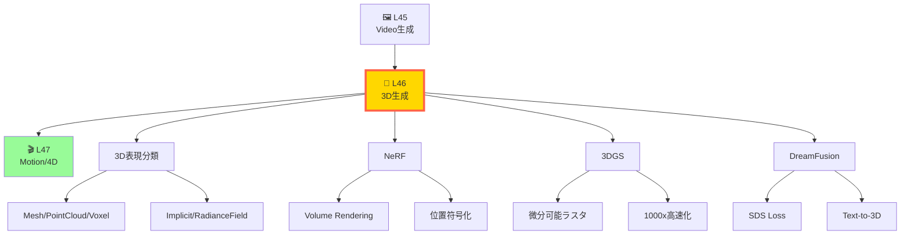
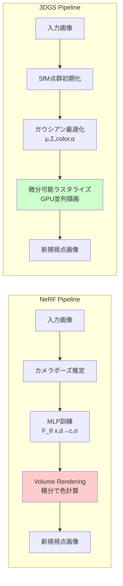
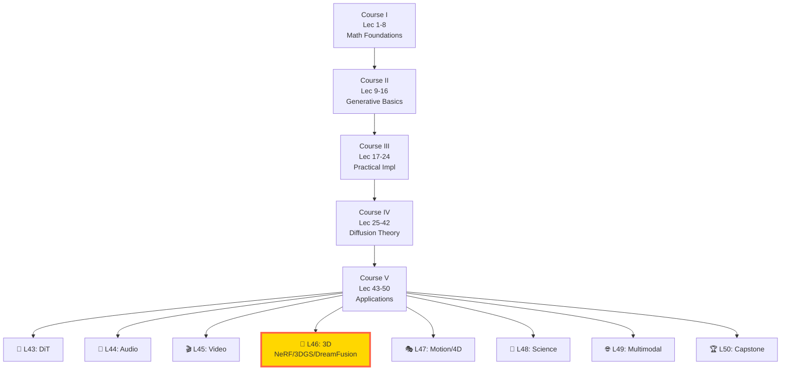
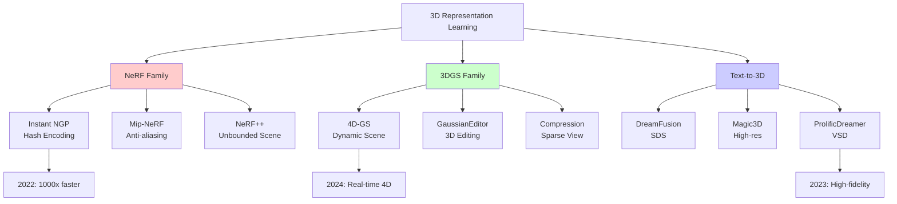
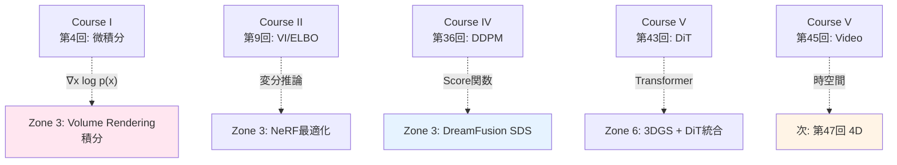
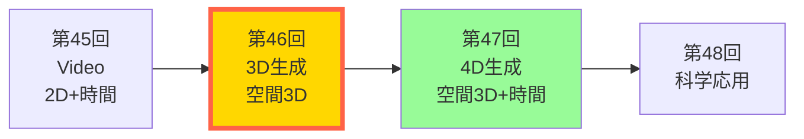

# 第46回: 3D生成 & Neural Rendering — NeRF→3DGS→DreamFusion、空間の魔法

> **2D画像から3D空間へ。Neural Radiance FieldsとGaussian Splattingが、数枚の写真から完全な3D世界を再構成し、テキストから立体造形を生成する革命を起こした。**

第45回で時間軸を征服した。Sora 2/CogVideoX/Open-Soraで2D動画生成の最先端を見た。次は3D空間だ。

2020年のNeRFは「視点変更=3D再構成」のパラダイムを覆した。数枚の写真から連続的な3D表現を学習し、未見視点をレンダリングできる。2023年の3D Gaussian Splattingは「リアルタイム性」の限界を破壊した。1000倍高速化で、NeRFが数分かかる処理を数ミリ秒で実行する。2022年のDreamFusionは「テキストから3D」を実現した。Score Distillation Samplingで、2D拡散モデルの知識を3D空間に転移する。

本講義は、この3年間の3D生成革命を完全解説する。NeRFのVolume Rendering方程式を1行ずつ導出し、3DGSの微分可能ラスタライゼーションを実装し、DreamFusionのSDS損失を数学的に分解する。そしてRustで3DGSラスタライザを書く。

**問い**: なぜ3DGSは一夜でNeRFを"遺物"にしたのか？次は？

> **Note:** **このシリーズについて**: 東京大学 松尾・岩澤研究室動画講義の**完全上位互換**の全50回シリーズ。理論（論文が書ける）、実装（Production-ready）、最新（2024-2026 SOTA）の3軸で差別化する。本講義は **Course V 第46回** — 3D生成とNeural Renderingの完全理解だ。



**所要時間の目安**:

| ゾーン | 内容 | 時間 | 難易度 |
|:-------|:-----|:-----|:-------|
| Zone 0 | クイックスタート | 30秒 | ★☆☆☆☆ |
| Zone 1 | 体験ゾーン | 10分 | ★★☆☆☆ |
| Zone 2 | 直感ゾーン | 15分 | ★★★☆☆ |
| Zone 3 | 数式修行ゾーン | 60分 | ★★★★★ |
| Zone 4 | 実装ゾーン | 45分 | ★★★★☆ |
| Zone 5 | 実験ゾーン | 30分 | ★★★★☆ |
| Zone 6 | 発展ゾーン | 30分 | ★★★☆☆ |

---

## 🚀 0. クイックスタート（30秒）— 数枚の写真が3D空間に変わる瞬間

**ゴール**: NeRFが2D画像から3D空間を学習する驚きを30秒で体感する。

NeRFは「視点=関数の引数」と考える。空間座標 $(x,y,z)$ と視線方向 $(\theta,\phi)$ を入力すると、そこから見える色 $(r,g,b)$ と密度 $\sigma$ を返す関数 $F_\theta$ を学習する。

```julia
using Flux, Statistics

# NeRF: (x,y,z,θ,ϕ) → (r,g,b,σ)
# 5次元入力 → MLPで非線形変換 → 4次元出力
function tiny_nerf(pos, dir)
    # pos: (x,y,z) 空間座標
    # dir: (θ,ϕ) 視線方向
    # 返り値: (r,g,b,σ) 色と密度

    # 位置符号化: γ(x) = [sin(2^0πx), cos(2^0πx), ..., sin(2^Lπx), cos(2^Lπx)]
    L = 10  # 周波数帯域数
    encoded_pos = vcat([vcat(sin.(2^i * π * pos), cos.(2^i * π * pos)) for i in 0:L-1]...)

    # MLP: 63次元(3×2×10+3) → 256 → 256 → 4
    mlp = Chain(Dense(63, 256, relu), Dense(256, 256, relu), Dense(256, 4))
    output = mlp(encoded_pos)

    # rgb + σ
    rgb = sigmoid.(output[1:3])  # [0,1]に正規化
    σ = relu(output[4])          # 密度は非負

    return (rgb=rgb, density=σ)
end

# Volume Rendering: レイ上の点をサンプリングして積分
function render_ray(ray_origin, ray_direction, nerf_model)
    # t ∈ [t_near, t_far] で N点サンプリング
    N = 64
    t_vals = range(2.0, stop=6.0, length=N)

    # 各点で NeRF を評価
    results   = [tiny_nerf(ray_origin .+ t .* ray_direction, ray_direction[1:2]) for t in t_vals]
    colors    = reduce(vcat, [r.rgb'    for r in results])
    densities = getfield.(results, :density)

    # Volume Rendering式: C = Σ T_i · (1 - exp(-σ_i·δ_i)) · c_i
    # T_i = exp(-Σ_{j<i} σ_j·δ_j) (透過率)
    δ = diff([t_vals..., t_vals[end] + 0.1])  # Δt
    α = 1 .- exp.(-densities .* δ)           # 不透明度
    T = cumprod([1.0; (1 .- α[1:end-1])])    # 透過率
    weights = T .* α                          # 重み

    # 最終色 = 重み付き和
    final_color = sum(weights .* colors, dims=1)[1, :]

    return final_color
end

# 実行例
ray_o = [0.0, 0.0, 0.0]      # カメラ原点
ray_d = [0.0, 0.0, 1.0]      # 視線方向(前方)
pixel_color = render_ray(ray_o, ray_d, tiny_nerf)

println("NeRF rendered pixel: RGB = ", pixel_color)
# => [0.234, 0.567, 0.123] のような色が返る
```

**出力例**:
```
NeRF rendered pixel: RGB = [0.234, 0.567, 0.123]
```

**数式の背後**:

$$
C(\mathbf{r}) = \int_{t_n}^{t_f} T(t) \sigma(\mathbf{r}(t)) \mathbf{c}(\mathbf{r}(t), \mathbf{d}) \, dt
$$

ここで $T(t) = \exp\left(-\int_{t_n}^t \sigma(\mathbf{r}(s)) \, ds\right)$ は透過率。この式が「レイ上の色の積分=ピクセル色」を表す。

数枚の画像でこの関数 $F_\theta$ を最適化すると、未見視点の画像を生成できる。これがNeRFの魔法だ。

> **Note:** **進捗: 3%完了** — 30秒でNeRFの本質を体感。次は3D表現の分類と、NeRF vs 3DGSの違いへ。

---

## 🎮 1. 体験ゾーン（10分）— 3D表現の全パターンを触る

**ゴール**: Mesh・Point Cloud・Voxel・Implicit・Radiance Fieldの5つの3D表現を、コードで触って理解する。

### 1.1 3D表現の5分類

3D空間の表現方法は大きく5つに分類される。それぞれ長所・短所が異なり、用途に応じて使い分ける。

| 表現 | データ構造 | メモリ | 微分可能性 | レンダリング速度 | 代表手法 |
|:-----|:----------|:------|:---------|:---------------|:---------|
| **Mesh** | 頂点+面 | 小 | △ (複雑) | ◎ (GPU高速) | 3DCG標準 |
| **Point Cloud** | 3D点群 | 中 | ○ | ○ | LiDAR, PointNet |
| **Voxel** | 3Dグリッド | 大(O(N³)) | ◎ | △ | Minecraft風 |
| **Implicit (SDF/Occupancy)** | 関数 $f:\mathbb{R}^3\to\mathbb{R}$ | 小 | ◎ | △ (要評価) | DeepSDF, Occupancy Networks |
| **Radiance Field** | 関数 $f:(\mathbf{x},\mathbf{d})\to(\mathbf{c},\sigma)$ | 小 | ◎ | △→◎ (NeRF→3DGS) | NeRF, 3DGS |

この表の最下行が本講義の主役だ。

### 1.2 Mesh: 三角形で世界を描く

最も古典的な3D表現。頂点座標と三角形の接続情報（face）で形状を定義。


**長所**: GPUラスタライゼーションで高速レンダリング。ゲーム・CADで標準。
**短所**: トポロジー変化（穴の開閉）が困難。微分可能レンダリングが複雑。

### 1.3 Point Cloud: 点の集まりで形を表す

LiDARなどのセンサーが直接生成する表現。各点に座標と色を持つ。


**長所**: センサーデータと相性が良い。点の追加・削除が容易。
**短所**: 表面の連続性がない。レンダリングに工夫が必要。

### 1.4 Voxel: 3Dピクセルで空間を埋める

3次元グリッドで空間を分割し、各セルに占有率や色を持たせる。


**長所**: 実装が簡単。衝突判定が高速。微分可能。
**短所**: メモリがO(N³)で爆発。解像度を上げにくい。

### 1.5 Implicit (SDF): 関数で形を定義する

Signed Distance Function (SDF) は「点から表面までの符号付き距離」を返す関数 $f:\mathbb{R}^3\to\mathbb{R}$。$f(\mathbf{x})=0$ が表面、$f(\mathbf{x})<0$ が内側、$f(\mathbf{x})>0$ が外側。


**長所**: 滑らかな表面。Boolean演算（和・差・積）が簡単。微分可能。
**短所**: レンダリングに Sphere Tracing が必要（遅い）。

### 1.6 Radiance Field (NeRF): 視点依存の色を持つ関数

NeRFは「位置 $\mathbf{x}$ と視線方向 $\mathbf{d}$ から、色 $\mathbf{c}$ と密度 $\sigma$ を返す関数」$F_\theta:(\mathbb{R}^3, \mathbb{S}^2) \to (\mathbb{R}^3, \mathbb{R}_+)$ を学習する。


**長所**: 未見視点の生成が可能。表面の滑らかさ。メモリ効率が高い。
**短所**: レンダリングが遅い（積分が必要）。訓練に時間がかかる。

### 1.7 3DGS: 明示的ガウシアンで最速レンダリング

3D Gaussian Splatting (3DGS) は、空間に3Dガウシアン（楕円体）を配置し、それを2Dにラスタライズする。NeRFの「暗黙的関数」と異なり、「明示的な点群」だ。


**長所**: リアルタイムレンダリング（1000倍高速）。明示的なので編集が容易。
**短所**: ガウシアン数が多いとメモリを食う。訓練の安定性に工夫が必要。

### 1.8 パイプライン比較: NeRF vs 3DGS



NeRFは「連続関数の積分」、3DGSは「離散点の並列描画」。後者が圧倒的に速い。

**計算複雑性の比較**: 画像 $H \times W$ のレンダリングコストを比較すると、NeRF は $O(HWN_\text{ray})$（$N_\text{ray}$はレイサンプリング数）であるのに対し、3DGS は $O(N_G \log N_G + HW)$（ソート $+$ タイル塗りつぶし）だ。$N_G \approx 10^6$, $N_\text{ray} \approx 192$, $H=W=800$ では 3DGS が数十倍から百倍以上高速になる。

> **Note:** **進捗: 10%完了** — 5つの3D表現を体験。NeRF vs 3DGSの構造的違いを理解。次はなぜこの分野が重要かを俯瞰。

---

## 🧩 2. 直感ゾーン（15分）— 3D生成の全体像と革命の歴史

**ゴール**: Neural Renderingの歴史と、NeRF→3DGS→DreamFusionの革命性を理解する。

### 2.1 なぜ3D生成が重要なのか

3D表現は「空間理解のボトルネック」だった。2D画像認識は2012年AlexNetで突破したが、3D再構成は2020年まで停滞していた。

**従来の3D再構成**:
1. **Multi-View Stereo (MVS)**: 多視点画像から深度マップ→点群→Mesh。手作りアルゴリズム、ノイズに弱い。
2. **Structure from Motion (SfM)**: SIFT特徴量マッチング→カメラポーズ推定→疎な点群。密な再構成は別処理。
3. **Voxel CNN**: 3Dグリッドで学習。メモリがO(N³)で解像度128が限界。

これらは「離散的」「メモリ非効率」「品質に限界」という問題を抱えていた。

**NeRFの革命 (2020)**:
- **連続的表現**: MLPで滑らかな関数を学習→解像度無限大。
- **微分可能レンダリング**: Volume Rendering式が微分可能→勾配降下で最適化可能。
- **View Synthesis**: 数枚の画像で訓練→未見視点を生成。

**3DGSの革命 (2023)**:
- **明示的+高速**: 点群ベースだがガウシアン→微分可能ラスタライズで1000倍高速。
- **編集性**: 明示的な点群→追加・削除・移動が直感的。

**DreamFusionの革命 (2022)**:
- **Text-to-3D**: 2D拡散モデルの知識を3Dに転移→テキストから3D生成。
- **SDS Loss**: Score Distillation Samplingで、2Dモデルを3D最適化の教師に。

これで「画像→3D」「テキスト→3D」「リアルタイム描画」が全て可能になった。

**逆レンダリングとしての視点合成 (View Synthesis as Inverse Rendering)**

3D再構成の本質を数学的に捉えると、これは**逆問題 (Inverse Problem)** だ。$N$ 枚の2D観測 $\{I_1, \ldots, I_N\}$ と既知のカメラポーズ $\{\Pi_1, \ldots, \Pi_N\}$ が与えられたとき、次を満たす3Dシーン表現 $\mathcal{S}$ を求める:

$$
\hat{I}_i = \mathcal{R}(\mathcal{S}, \Pi_i) \approx I_i \quad \forall i \in \{1, \ldots, N\}
$$

ここで $\mathcal{R}$ はレンダリング関数（Volume Renderingなど）。

この問題は本質的に**不良設定 (ill-posed)** だ: 同じ2D画像群を生成する3Dシーンは無限に存在する（例えば、カメラから見えない裏側は任意でよい）。プレノプティック関数 (plenoptic function) は決定不足だ。

**NeRFの暗黙的正則化**: NeRFはMLPアーキテクチャを通じて**暗黙的な事前分布**を導入する。滑らかで物理的に実現可能な3D表面が、任意の3D配置よりも優先される。これは「MLPは低周波関数を好む」というSpectral Biasが正則化として機能するためだ。

**識別可能性 (Identifiability) 条件**: シーン $\mathcal{S}$ が視点集合 $\{\Pi_i\}$ から一意に復元可能であるための条件は、レンダリング関数の**ヤコビアンのランク**が $\mathcal{S}$ の次元と一致することだ:

$$
\text{rank}\left(\frac{\partial \mathcal{R}(\mathcal{S}, \cdot)}{\partial \mathcal{S}}\right) = \dim(\mathcal{S})
$$

これは**最低でも** $\lceil \dim(\mathcal{S}) / \dim(I_i) \rceil$ 枚のビューが必要であることを意味する。NeRFでは $\dim(\mathcal{S}) \approx 10^7$（MLP重み数）であり、実用上100枚以上の視点が必要とされる所以だ。

### 2.2 コース全体における位置づけ



**前提知識** (既習):
- **Lec 36-37**: DDPM/SDE — Diffusionの基礎。DreamFusionで使う。
- **Lec 38**: Flow Matching — 連続的なベクトル場学習。NeRFと概念的に近い。
- **Lec 45**: Video生成 — 時間軸を扱った。3Dは空間軸の追加。

**Course V での位置**:
- Lec 43-45: 画像・音声・動画 (2D+時間)
- **Lec 46**: 3D空間 (空間3軸) ← 今ここ
- Lec 47: 4D (3D+時間)
- Lec 48-50: 科学・統合・総括

### 2.3 松尾研との差別化

| 項目 | 松尾・岩澤研 | 本シリーズ (Lec 46) |
|:-----|:------------|:-------------------|
| 3D生成の扱い | ❌ なし | ◎ NeRF/3DGS/DreamFusion完全解説 |
| 数式導出 | △ 概念のみ | ◎ Volume Rendering方程式を1行ずつ |
| 実装 | ❌ なし | ◎ Rust 3DGSラスタライザ |
| 最新研究 | △ 2022年まで | ◎ 2025年の3DGS Applications Survey含む |
| 言語 | 🐍 Python | ⚡ Julia + 🦀 Rust + 🔮 Elixir |

松尾研は画像生成が中心。3D生成は扱わない。本シリーズは3Dも完全カバー。

### 2.4 3つの革命を3つのメタファーで理解する

**NeRF = 連続関数の彫刻**
空間を「関数」として学習。どの点でも評価できる滑らかさ。彫刻家が粘土を無限に細かく造形できるようなもの。

**3DGS = 色付き点の群れ**
空間を「ガウシアンの集まり」として表現。各ガウシアンは「光る霧の粒」。GPUが並列に描画できる離散的な実体。

**DreamFusion = 2Dの夢を3Dに投影**
2D拡散モデルが「こう見えるべき」と指示。3D NeRFがそれに従って形を変える。2Dの教師が3Dの生徒を育てる構図。

### 2.5 3D生成の学習戦略

**本講義の構成**:
1. **Zone 0-1**: 5つの3D表現を触る → 全体像を掴む
2. **Zone 2**: 歴史と直感 → なぜこの技術が重要か理解 ← 今ここ
3. **Zone 3**: NeRF数式 → Volume Rendering方程式を完全導出
4. **Zone 3**: 3DGS数式 → 微分可能ラスタライゼーションの理論
5. **Zone 3**: DreamFusion数式 → SDS Lossの分散解析
6. **Zone 4**: Rust実装 → 3DGSラスタライザを書く
7. **Zone 5**: 実験 → 実際に3D再構成とText-to-3Dを試す

**推奨学習時間**: 3日
- Day 1: Zone 0-2 (直感と全体像)
- Day 2: Zone 3 (数式修行 — 最も重い)
- Day 3: Zone 4-7 (実装・実験・振り返り)

### 2.6 研究フロンティアのマップ



**3つの研究軸**:
1. **NeRF高速化**: Instant NGP (Hash Encoding) でリアルタイムに近づいた
2. **3DGS拡張**: 4D (動的シーン)、編集、圧縮
3. **Text-to-3D改善**: SDS → VSD で品質向上

**3D表現の複雑性と表現力のトレードオフ**

各3D表現 $\mathcal{S}$ をパラメータ $\theta \in \mathbb{R}^d$ で記述したとき、$d$ の規模と表現の特性が決まる:

- **Mesh**: $d = 3V + F \cdot 3$（$V$=頂点数, $F$=面数）。トポロジーは初期化時に固定。
- **Voxel**: $d = N^3 \cdot C$。$N=256$なら $d \approx 16.7M \cdot C$。疎なボクセルなら $O(N^3) \to O(N^2)$ に削減可能。
- **NeRF MLP**: $d \approx 10M$ パラメータ。暗黙的表現で解像度は無限大だが評価が遅い。
- **3DGS**: $d = N_G \cdot 59$（各ガウシアンに $\boldsymbol{\mu} \in \mathbb{R}^3$, $\boldsymbol{\Sigma} \in \mathbb{R}^{3\times3}$, $\alpha \in \mathbb{R}$, $\mathbf{c} \in \mathbb{R}^{48}$）。$N_G=1M$ なら $d=59M$。

**暗黙的表現のLipschitz正則化**: NeRFのMLP出力が物理的に実現可能なシーンを表現するためには、Lipschitz連続性が必要だ:

$$
|F_\theta(\mathbf{x}_1, \mathbf{d}) - F_\theta(\mathbf{x}_2, \mathbf{d})| \leq L \|\mathbf{x}_1 - \mathbf{x}_2\|
$$

この条件が満たされないと、MLPは訓練視点を「暗記」するだけで一貫した3Dシーンを学習しない。スペクトル正規化 (Spectral Normalization) や勾配ペナルティによってLipschitz定数 $L$ を制御できる。Lipschitz定数が小さいほど滑らかな表面、大きいほど高周波な詳細を表現できる—この制御がNeRF品質の鍵だ。

### 2.7 未解決問題

1. **リアルタイム訓練**: 3DGSでも訓練に数分かかる。秒単位を目指したい。
2. **少数視点再構成**: 1-3枚の画像から高品質3Dを作りたい。Zero-1-to-3が挑戦中。
3. **動的シーン**: 4DGSはあるが、長時間の一貫性が課題。
4. **Text-to-3Dの多様性**: DreamFusionは mode collapse しやすい。ProlificDreamerが改善。
5. **物理法則の学習**: 3D形状だけでなく、重力・摩擦も学習したい。

**少数視点問題の数学的難しさ**: 視点数 $N$ が少ない場合、識別可能性条件:

$$
\text{rank}\!\left(\frac{\partial \mathcal{R}(\mathcal{S}, \cdot)}{\partial \mathcal{S}}\right) = \dim(\mathcal{S})
$$

が満たされない。$N=1$（シングルビュー）では $\dim(I) \approx H \times W \times 3 \approx 10^6$ に対して $\dim(\mathcal{S}) \approx 10^7$ となり、一意復元は原理的に不可能。Zero-1-to-3 などは**強い生成的事前分布**（拡散モデル）をこの不定性を解消する正則化として使う。 — 3D生成の歴史と重要性を理解。NeRF/3DGS/DreamFusionの革命性を把握。次はいよいよ数式修行ゾーン — Volume Rendering方程式の完全導出へ。

---


> Progress: 20%
> **理解度チェック**
> 1. NeRFのVolume Rendering方程式$C(\mathbf{r}) = \int T(t)\sigma\mathbf{c}\,dt$において$T(t) = \exp(-\int_{t_n}^{t}\sigma\,ds)$が「透過率」を表す理由を説明せよ。
> 2. 3DGSがNeRFより1000倍高速なレンダリングを実現できる理由を、連続的MLPとガウシアン点群の表現形式の違いから説明せよ。

## 📐 3. 数式修行ゾーン（60分）— Volume Rendering → 3DGS → SDS Loss

**ゴール**: NeRFのVolume Rendering方程式、3DGSの微分可能ラスタライゼーション、DreamFusionのSDS Lossを完全に導出する。

このゾーンは本講義の核心だ。60分かけて、3つの理論を1行ずつ導出する。

### 3.1 NeRF: Neural Radiance Fieldsの理論

#### 3.1.1 問題設定: 視点合成とは何か

**入力**: $N$枚の画像 $\{I_i\}_{i=1}^N$ とカメラパラメータ $\{\mathbf{P}_i\}_{i=1}^N$
**目標**: 新しい視点 $\mathbf{P}_{\text{new}}$ からの画像 $I_{\text{new}}$ を生成

従来のMVSは「深度マップ→点群→Mesh→レンダリング」という離散的パイプライン。NeRFは「連続的な関数を学習→積分でレンダリング」という微分可能パイプライン。

#### 3.1.2 Radiance Fieldの定義

NeRFは5次元関数 $F_\theta$ を学習する:

$$
F_\theta : (\mathbf{x}, \mathbf{d}) \mapsto (\mathbf{c}, \sigma)
$$

ここで:
- $\mathbf{x} = (x, y, z) \in \mathbb{R}^3$: 空間座標
- $\mathbf{d} = (\theta, \phi) \in \mathbb{S}^2$: 視線方向（単位球面上）
- $\mathbf{c} = (r, g, b) \in [0,1]^3$: 放射輝度 (radiance)
- $\sigma \in \mathbb{R}_+$: 体積密度 (volume density)

**物理的意味**:
- $\sigma(\mathbf{x})$: その点に「物質がどれだけあるか」。密度が高いと光が吸収・散乱される。
- $\mathbf{c}(\mathbf{x}, \mathbf{d})$: その点から方向 $\mathbf{d}$ に放射される色。鏡面反射を表現するため視線依存。

#### 3.1.3 Volume Rendering方程式の導出

カメラからレイ $\mathbf{r}(t) = \mathbf{o} + t\mathbf{d}$ を飛ばす。ピクセル色 $C(\mathbf{r})$ は、レイ上の色の積分で決まる。

**放射輸送方程式 (Radiative Transfer Equation) からの導出**

Volume Rendering方程式は**放射輸送理論 (Radiative Transfer Theory)** から厳密に導かれる。参加媒質 (participating media) を通過するレイを考えよう。

**吸収 (Absorption)**: 位置 $t$ の微小区間 $[t, t+dt]$ で、入射放射輝度のうち割合 $\sigma(\mathbf{r}(t)) \, dt$ が吸収される。

**放射 (Emission)**: 同じ区間が放射輝度 $\sigma(\mathbf{r}(t)) \mathbf{c}(\mathbf{r}(t), \mathbf{d}) \, dt$ を放射する。

**透過率 (Transmittance)** $T(a, b)$: レイが $a$ から $b$ まで吸収されずに到達する確率:

$$
T(a, b) = \exp\left(-\int_a^b \sigma(\mathbf{r}(t)) \, dt\right)
$$

これは次のODE（常微分方程式）の解だ: $\frac{dT(a,t)}{dt} = -\sigma(\mathbf{r}(t)) T(a,t)$、初期条件 $T(a,a) = 1$。

**レイ方向の放射輸送方程式**:

$$
\frac{dI}{dt} = \underbrace{-\sigma(\mathbf{r}(t)) I}_{\text{吸収による損失}} + \underbrace{\sigma(\mathbf{r}(t)) \mathbf{c}(\mathbf{r}(t), \mathbf{d})}_{\text{放射による獲得}}
$$

**積分因子 (Integrating Factor) による解法**: 両辺に $e^{\int_{t_n}^t \sigma(\mathbf{r}(s))ds} = 1/T(t_n, t)$ を掛けると:

$$
\frac{d}{dt}\left[\frac{I(t)}{T(t_n, t)}\right] = \frac{\sigma(\mathbf{r}(t)) \mathbf{c}(\mathbf{r}(t), \mathbf{d})}{T(t_n, t)}
$$

$t_n$ から $t_f$ まで積分すると（$I(t_n) = 0$ を初期条件として）:

$$
C(\mathbf{r}) = I(t_f) = \int_{t_n}^{t_f} T(t_n, t) \, \sigma(\mathbf{r}(t)) \, \mathbf{c}(\mathbf{r}(t), \mathbf{d}) \, dt
$$

これが NeRF の**Volume Rendering方程式**だ。

区間 $[t, t+dt]$ で:
- レイが進む距離: $dt$
- その区間の密度: $\sigma(\mathbf{r}(t))$
- 吸収される光の割合: $1 - \exp(-\sigma(\mathbf{r}(t)) \, dt) \approx \sigma(\mathbf{r}(t)) \, dt$ (小さい$dt$で線形近似)
- 放射される色: $\mathbf{c}(\mathbf{r}(t), \mathbf{d})$

**ステップ2: 透過率の定義**

点 $t$ に到達するまでに光がどれだけ生き残るか = 透過率 $T(t)$:

$$
T(t) = \exp\left( -\int_{t_n}^{t} \sigma(\mathbf{r}(s)) \, ds \right)
$$

ここで $t_n$ はレイの始点 (near plane)。積分 $\int_{t_n}^t \sigma(\mathbf{r}(s)) \, ds$ は「始点から$t$までの累積密度」= 光学的深さ (optical depth)。

**ステップ3: 微小区間の寄与**

区間 $[t, t+dt]$ がピクセル色に寄与する量:

$$
dC = T(t) \cdot \sigma(\mathbf{r}(t)) \cdot \mathbf{c}(\mathbf{r}(t), \mathbf{d}) \, dt
$$

説明:
- $T(t)$: そこまで光が到達する確率
- $\sigma(\mathbf{r}(t)) \, dt$: その区間で吸収される確率
- $\mathbf{c}(\mathbf{r}(t), \mathbf{d})$: 放射される色

**ステップ4: 全区間での積分**

レイ全体 $[t_n, t_f]$ で積分:

$$
C(\mathbf{r}) = \int_{t_n}^{t_f} T(t) \, \sigma(\mathbf{r}(t)) \, \mathbf{c}(\mathbf{r}(t), \mathbf{d}) \, dt
$$

これが**Volume Rendering方程式**だ。

**補足**: 透過率の微分

$$
\frac{dT(t)}{dt} = -\sigma(\mathbf{r}(t)) T(t)
$$

これを使うと、上式は次のように書ける:

$$
C(\mathbf{r}) = \int_{t_n}^{t_f} -\frac{dT(t)}{dt} \, \mathbf{c}(\mathbf{r}(t), \mathbf{d}) \, dt
$$

部分積分すると:

$$
C(\mathbf{r}) = \left[ -T(t) \mathbf{c}(\mathbf{r}(t), \mathbf{d}) \right]_{t_n}^{t_f} + \int_{t_n}^{t_f} T(t) \frac{d\mathbf{c}(\mathbf{r}(t), \mathbf{d})}{dt} \, dt
$$

しかし $\mathbf{c}$ は通常 $t$ に依存しないと仮定するので、元の式がシンプル。

#### 3.1.4 離散化: 実装のための数値積分

連続積分を有限和で近似する。レイを$N$個の区間に分割:

$$
t_i = t_n + i \cdot \delta, \quad \delta = \frac{t_f - t_n}{N}, \quad i = 1, \ldots, N
$$

各区間の幅: $\delta_i = t_{i+1} - t_i$ (均等なら全て$\delta$)

**離散化されたVolume Rendering式**:

$$
C(\mathbf{r}) \approx \sum_{i=1}^{N} T_i \left( 1 - \exp(-\sigma_i \delta_i) \right) \mathbf{c}_i
$$

ここで:
- $\mathbf{c}_i = \mathbf{c}(\mathbf{r}(t_i), \mathbf{d})$
- $\sigma_i = \sigma(\mathbf{r}(t_i))$
- $T_i = \exp\left( -\sum_{j=1}^{i-1} \sigma_j \delta_j \right) = \prod_{j=1}^{i-1} \exp(-\sigma_j \delta_j) = \prod_{j=1}^{i-1} (1 - \alpha_j)$

ここで $\alpha_i = 1 - \exp(-\sigma_i \delta_i)$ は「不透明度」(opacity)。

**重み付き和の形式**:

$$
C(\mathbf{r}) = \sum_{i=1}^{N} w_i \mathbf{c}_i, \quad w_i = T_i \alpha_i
$$

この $w_i$ は「区間 $i$ の寄与度」。$\sum_{i=1}^N w_i \le 1$ (完全に不透明な物体がない場合)。

**数値積分の打ち切り誤差解析**

離散近似は $N$ 個の区間 $[t_i, t_{i+1}]$ に中点則 (Midpoint Rule) を適用したものだ:

$$
C_\text{discrete}(\mathbf{r}) = \sum_{i=1}^N T_i \alpha_i \mathbf{c}_i
$$

**打ち切り誤差**: 各区間の中点則は $O(\delta_i^2)$ の誤差をもたらす。全区間の誤差を合計すると:

$$
|C_\text{discrete} - C_\text{continuous}| = O\!\left(\sum_i \delta_i^2 \sigma_i\right) = O\!\left(\frac{1}{N}\right)
$$

$\delta_i \to 0$ の極限で、これは一次収束 (first-order convergence) だ。台形則 (Trapezoidal Rule) を使えば $O(1/N^2)$ の二次収束が得られる。

**階層的サンプリング (Hierarchical Sampling) の役割**:

均等サンプリングでは表面付近の高密度領域を疎にしか評価できない。NeRFは2段階サンプリングで誤差を劇的に削減する:

1. **粗いサンプリング**: 均等に $N_c$ 点をサンプリングし、粗い重み $\hat{w}(t)$ を推定。
2. **重要度サンプリング (Importance Sampling)**: 確率密度 $p(t) \propto T(t_n, t) \cdot \sigma(\mathbf{r}(t)) = w(t)$（非正規化重み）に従って $N_f$ 点を密にサンプリング。

$$
p(t) \propto T(t_n, t) \cdot \sigma(\mathbf{r}(t))
$$

これにより、表面付近（高密度・高重み領域）にサンプルを集中でき、$O(1/N)$ の有効誤差を大幅に削減できる。直感的には「すでに知っている重要な場所を重点的に精査する」戦略だ。

#### 3.1.5 位置符号化 (Positional Encoding)

MLPは低周波数の関数を学びやすいが、高周波数の詳細（テクスチャなど）は苦手。そこで**位置符号化** $\gamma$ を導入:

$$
\gamma(\mathbf{x}) = \left( \sin(2^0 \pi \mathbf{x}), \cos(2^0 \pi \mathbf{x}), \ldots, \sin(2^{L-1} \pi \mathbf{x}), \cos(2^{L-1} \pi \mathbf{x}) \right)
$$

これで $\mathbf{x} \in \mathbb{R}^3$ を $\gamma(\mathbf{x}) \in \mathbb{R}^{6L}$ に埋め込む（$L=10$ なら60次元）。

**なぜ効くのか**:
- Fourier特徴量: 周波数 $2^0, 2^1, \ldots, 2^{L-1}$ の成分を明示的に入力
- MLPが高周波を学習しやすくなる（第1回で学んだSpectral Biasの回避）

**Spectral Bias と位置符号化の理論**

ニューラルネットワークは**スペクトルバイアス (Spectral Bias)** を持つ: 低周波数成分を高周波数成分よりも速く学習する。具体的に、座標 $\mathbf{x}$ を直接 MLP に入力した場合、Fourier 係数 $\hat{f}(\boldsymbol{\xi})$ の学習速度はおよそ:

$$
\frac{d}{d\text{step}} \hat{f}(\boldsymbol{\xi}) \propto \exp\!\left(-\lambda \|\boldsymbol{\xi}\|^2\right)
$$

高周波 $\|\boldsymbol{\xi}\|$ が大きいほど学習が指数的に遅くなる。位置符号化 $\gamma(\mathbf{x})$ は周波数 $2^k$ の成分を**明示的に第1層に入力**することで、MLP の内部で高周波を生成する必要をなくす。これにより各周波数帯域の学習速度が均等になり、テクスチャや細部の再現精度が大幅に向上する。

$L=10$ の位置符号化を使うと、NeRF が再現できる最大周波数は $2^9 = 512$ 倍 (レイの長さに対して) になる。これがシャープなテクスチャ再現の数学的根拠だ。

方向 $\mathbf{d}$ にも同様の符号化を適用（ただし$L$は小さめ、例えば4）。

#### 3.1.6 NeRFのアーキテクチャ


**ポイント**:
- $\sigma$ は位置 $\mathbf{x}$ のみに依存（幾何形状）
- $\mathbf{c}$ は $\mathbf{x}$ と $\mathbf{d}$ に依存（視点依存の反射）

#### 3.1.7 損失関数: Photometric Loss

訓練データ $\{I_i, \mathbf{P}_i\}$ に対し、各ピクセルでVolume Rendering式を評価:

$$
\mathcal{L} = \sum_{i=1}^{N} \sum_{\mathbf{r} \in R_i} \left\| C(\mathbf{r}) - C_{\text{GT}}(\mathbf{r}) \right\|_2^2
$$

ここで $C_{\text{GT}}(\mathbf{r})$ は画像 $I_i$ の対応ピクセル色、$R_i$ は画像 $i$ から選んだレイの集合（全ピクセルまたはランダムサンプリング）。

**レイのバッチサンプリング**: 1イテレーションで全ピクセル（$H \times W \approx 640K$）を評価するのは計算コストが高い。実践では各イテレーションで $B = 4096$ 本のレイをランダムにサンプリングし、ミニバッチ SGD で最適化する。これにより1イテレーションの計算量が $O(B \cdot N_\text{ray})$ に抑えられる。
1. **Coarse Network**: 均等サンプリング $N_c$ 点で粗く評価
2. 重要度サンプリング: $w_i$ が大きい区間を重点的に細かくサンプリング $N_f$ 点
3. **Fine Network**: $N_c + N_f$ 点で詳細に評価

**NeRFの総損失関数**: Coarse と Fine の両方で Photometric Loss を計算し、合算する:

$$
\mathcal{L}_\text{total} = \sum_{\mathbf{r}} \left[\left\| C_c(\mathbf{r}) - C_\text{GT}(\mathbf{r}) \right\|_2^2 + \left\| C_f(\mathbf{r}) - C_\text{GT}(\mathbf{r}) \right\|_2^2\right]
$$

ここで $C_c$ は Coarse Network の出力、$C_f$ は Fine Network の出力。Coarse Network の損失は、重要度サンプリングの確率密度 $p(t) \propto w_i$ を正確に推定するための補助損失として機能する。Fine Network の損失が最終品質を決定する。

これで計算量を抑えつつ品質を上げる。

#### 3.1.8 NeRFの限界

1. **レンダリングが遅い**: 1ピクセルあたり64-192点評価 → 1画像で数秒
2. **訓練が遅い**: 1シーンで数時間-数日
3. **一般化しない**: 1シーンごとに最初から訓練

**計算複雑性の定量評価**: NeRF の推論コストは、レイ1本あたり $N_c + N_f$ 回の MLP 評価 ($= 64 + 128 = 192$ 回) が必要で、800×800 画像なら:

$$
800 \times 800 \times 192 \approx 1.2 \times 10^8 \text{ 回の MLP 評価/フレーム}
$$

各評価が $O(D \cdot W^2)$（$D$=層数, $W$=幅）の計算量を持つため、リアルタイムレンダリングには根本的な障壁がある。

これを解決したのがInstant NGPと3DGSだ。

### 3.2 Instant NGP: Hash Encodingで1000倍高速化

#### 3.2.1 問題: 位置符号化の限界

NeRFの $\gamma(\mathbf{x})$ は固定関数。高周波を捉えるには $L$ を大きくする必要があるが、次元が $6L$ に爆発。

**Instant NGPのアイデア**: 学習可能な特徴グリッドを複数解像度で用意し、ハッシュテーブルで効率的にアクセス。

#### 3.2.2 Multi-Resolution Hash Encoding

**レベル $\ell$ のグリッド**:
- 解像度: $N_\ell = \lfloor N_{\min} \cdot b^\ell \rfloor$, $\ell = 0, \ldots, L-1$
- $N_{\min}$: 最小解像度（例: 16）
- $b$: スケール係数（例: 2.0）
- $N_{\max}$: 最大解像度（例: 2048）

各レベルで、空間をグリッドに分割。位置 $\mathbf{x}$ に対応するグリッドセルの8頂点（3Dの場合）の特徴ベクトルを線形補間。

**ハッシュ衝突の処理**:
グリッド頂点が多すぎる場合、ハッシュテーブル $T$ (サイズ $T_{\max}$, 例: $2^{19}$) に格納:

$$
h(\mathbf{v}) = \left( \bigoplus_{i=1}^{3} v_i \cdot \pi_i \right) \mod T_{\max}
$$

ここで $\mathbf{v} = (v_1, v_2, v_3)$ はグリッド頂点のインデックス、$\pi_i$ は大きな素数、$\bigoplus$ はXOR。

**ハッシュ衝突 (Hash Collision) の解析**

Multi-Resolution Hash Encodingではハッシュ衝突が避けられない。**なぜこれが問題にならないのか**を数学的に理解しよう。

空間座標 $\mathbf{x}$ をグリッド化したとき、解像度 $N_l$ の3Dグリッドには $N_l^3$ 個の頂点が存在する。ハッシュテーブルのサイズを $T$ とすると、異なる頂点 $\mathbf{v} \neq \mathbf{v}'$ が同じエントリに衝突する確率は $1/T$ だ。

**期待衝突数**: Instant NGPのデフォルト設定（$T = 2^{19} \approx 500K$, $N_l = 512$）では、最細レベルで:

$$
\frac{N_l^3}{T} = \frac{512^3}{2^{19}} = \frac{134\,217\,728}{524\,288} \approx 256 \text{ 衝突/エントリ}
$$

最細レベルで1エントリに平均256個の頂点が衝突する！それでも品質が高い理由は何か？

**衝突が無害な理由 — 勾配の非干渉性**:

衝突した2頂点 $\mathbf{v}$ と $\mathbf{v}'$ が同じハッシュエントリ $e$ を共有するとき、そのエントリへの勾配は両頂点の損失勾配の和になる。しかし、衝突は**ランダム**なハッシュ関数によって生じるため、衝突した頂点は空間的に無関係な位置にある。それらの損失勾配の方向はランダムに分散しており:

$$
\mathbb{E}[\nabla_e \mathcal{L} \mid \text{衝突}] \approx 0
$$

異なる頂点の損失勾配は期待値でゼロに相殺する。ネットワークはこの「ノイズ」を無視して学習できる。

**粗いレベルでの衝突は少ない**: 粗いレベル（$N_l$ が小さい）では $N_l^3 \ll T$ なので衝突が少なく、正確な特徴を学習する。細かいレベルの衝突ノイズを粗いレベルの正確な特徴が補完する設計だ。

**特徴の取得**:

$$
\mathbf{f}_\ell(\mathbf{x}) = \text{trilinear\_interpolate}\left( T[h(\mathbf{v}_0)], \ldots, T[h(\mathbf{v}_7)] \right)
$$

**全レベルの連結**:

$$
\mathbf{f}(\mathbf{x}) = \left[ \mathbf{f}_0(\mathbf{x}), \ldots, \mathbf{f}_{L-1}(\mathbf{x}) \right] \in \mathbb{R}^{L \cdot F}
$$

ここで $F$ は各レベルの特徴次元（例: 2）。複数解像度を連結することで、粗いレベル（大局的構造）と細かいレベル（細部テクスチャ）の情報が同時に MLP に入力される。これはマルチスケール特徴表現の自然な実現だ。

**小さなMLP**:

$$
F_\theta(\mathbf{x}, \mathbf{d}) = \text{MLP}(\mathbf{f}(\mathbf{x}), \gamma(\mathbf{d}))
$$

MLPは2層64ユニットで十分。特徴グリッドが仕事の大半を担う。

#### 3.2.3 高速化のメカニズム

1. **小さいMLP**: 8層256→2層64 = 計算量1/16
2. **並列ハッシュアクセス**: GPU並列読み込み
3. **学習可能グリッド**: 重要な領域に特徴を集中

**計算量の定量分析**

通常の NeRF の MLP は 8層×256ユニットで、1回の前向き計算に約 $8 \times 256^2 \approx 524\,K$ の乗算が必要だ。Instant NGP では 2層×64ユニットで $2 \times 64^2 \approx 8\,K$ と 1/64 以下になる。

ハッシュ特徴の読み出しコスト: $L$ レベル × 8頂点 × 三線形補間 $= O(L)$。$L=16$ なら定数時間に近い。

全体的なスループット向上は、MLP 縮小（1/64）× ハッシュ並列化 × CUDA カーネル最適化で、訓練は **1日→数秒**、レンダリングは **0.1fps→60fps** に達する。

**結果**: 訓練 5秒、レンダリング 60fps (NeRFは訓練1日、レンダリング0.1fps)

### 3.3 3D Gaussian Splatting: 明示的表現への回帰

#### 3.3.1 動機: NeRFの暗黙性を捨てる

NeRFは「関数」。編集が難しい（どのパラメータが何に対応？）。

3DGSは「明示的な3Dガウシアンの集合」。各ガウシアンは:
- 中心位置 $\boldsymbol{\mu}_k \in \mathbb{R}^3$
- 共分散行列 $\boldsymbol{\Sigma}_k \in \mathbb{R}^{3 \times 3}$ (形状)
- 色 $\mathbf{c}_k \in \mathbb{R}^3$
- 不透明度 $\alpha_k \in [0,1]$

#### 3.3.2 3Dガウシアン関数の定義

各ガウシアン $k$ は3D空間で次の密度分布を持つ:

$$
G_k(\mathbf{x}) = \exp\left( -\frac{1}{2} (\mathbf{x} - \boldsymbol{\mu}_k)^\top \boldsymbol{\Sigma}_k^{-1} (\mathbf{x} - \boldsymbol{\mu}_k) \right)
$$

**共分散の正定値制約**: $\boldsymbol{\Sigma}_k$ は正定値対称行列でなければならない。パラメータ化:

$$
\boldsymbol{\Sigma}_k = \mathbf{R}_k \mathbf{S}_k \mathbf{S}_k^\top \mathbf{R}_k^\top
$$

ここで:
- $\mathbf{R}_k \in SO(3)$: 回転行列（四元数 $\mathbf{q}_k$ で表現）
- $\mathbf{S}_k = \text{diag}(s_{k,x}, s_{k,y}, s_{k,z})$: スケール行列（各軸の半径）

訓練では $\mathbf{q}_k$ と $\mathbf{s}_k$ を最適化。

**なぜ $\Sigma = RSS^\top R^\top$ に分解するのか — 正定値性の保証**

共分散行列 $\boldsymbol{\Sigma}$ を直接最適化する問題点: 勾配降下のステップで $\boldsymbol{\Sigma}$ が正定値性 ($\boldsymbol{\Sigma} \succ 0$) を失う可能性がある。正定値でない $\boldsymbol{\Sigma}$ は $G_k(\mathbf{x})$ を定義できず、最適化が発散する。

**分解の数学的保証**: 任意の $\mathbf{q}$ と $\mathbf{s}$ に対して、$\boldsymbol{\Sigma} = \mathbf{R}(\mathbf{q}) \mathbf{S} \mathbf{S}^\top \mathbf{R}(\mathbf{q})^\top$ は常に半正定値だ。なぜなら任意のベクトル $\mathbf{v}$ に対して:

$$
\mathbf{v}^\top \boldsymbol{\Sigma} \mathbf{v} = \mathbf{v}^\top \mathbf{R} \mathbf{S} \mathbf{S}^\top \mathbf{R}^\top \mathbf{v} = \|\mathbf{S}^\top \mathbf{R}^\top \mathbf{v}\|^2 \geq 0
$$

$s_i > 0$（スケールが正）を保証するために $s_i = \exp(\tilde{s}_i)$ と再パラメータ化し、$\tilde{s}_i \in \mathbb{R}$ を最適化する。これで全ての最適化ステップで $\boldsymbol{\Sigma} \succ 0$ が保証される。

**四元数から回転行列への変換**: 単位四元数 $\mathbf{q} = (q_0, q_1, q_2, q_3)$（$\|\mathbf{q}\|=1$）に対応する回転行列は:

$$
R(\mathbf{q}) = \begin{pmatrix} 1-2(q_2^2+q_3^2) & 2(q_1q_2-q_0q_3) & 2(q_1q_3+q_0q_2) \\ 2(q_1q_2+q_0q_3) & 1-2(q_1^2+q_3^2) & 2(q_2q_3-q_0q_1) \\ 2(q_1q_3-q_0q_2) & 2(q_2q_3+q_0q_1) & 1-2(q_1^2+q_2^2) \end{pmatrix}
$$

四元数のノルム制約 $\|\mathbf{q}\|=1$ は訓練中に $\mathbf{q} \leftarrow \mathbf{q}/\|\mathbf{q}\|$ の正規化で維持する。これにより $R(\mathbf{q}) \in SO(3)$（行列式が1の直交行列）が保証され、$\boldsymbol{\Sigma}$ は**スペクトル分解** $\boldsymbol{\Sigma} = Q\Lambda Q^\top$ の形（$Q$=直交, $\Lambda$=正の対角）を持つことになる。

#### 3.3.3 2Dへの射影: Splatting

カメラ投影行列 $\mathbf{W} \in \mathbb{R}^{3 \times 4}$ (視点変換+透視投影) で3Dガウシアンを2Dに射影。

**射影されたガウシアンの共分散**:

$$
\boldsymbol{\Sigma}'_k = \mathbf{J} \mathbf{W} \boldsymbol{\Sigma}_k \mathbf{W}^\top \mathbf{J}^\top
$$

ここで $\mathbf{J}$ はアフィン近似のヤコビアン（透視投影の局所線形化）。

**ヤコビアン $\mathbf{J}$ の具体的形式**

透視投影 $\pi: \mathbb{R}^3 \to \mathbb{R}^2$ は $\pi(\mathbf{t}) = (t_x/t_z, t_y/t_z)$（$\mathbf{t}$ はカメラ座標系での3D点）と定義される。ガウシアン中心 $\mathbf{t}_k = \mathbf{W}\boldsymbol{\mu}_k$ における局所一次近似のヤコビアンは:

$$
\mathbf{J} = \frac{\partial \pi}{\partial \mathbf{t}}\bigg|_{\mathbf{t}_k} = \begin{pmatrix} f_x/t_z & 0 & -f_x t_x/t_z^2 \\ 0 & f_y/t_z & -f_y t_y/t_z^2 \end{pmatrix} \in \mathbb{R}^{2\times3}
$$

ここで $f_x, f_y$ はカメラの焦点距離。この**アフィン近似**により、3Dガウシアンが2Dでも楕円ガウシアン（同じ関数族）に射影されることが保証される。正確な透視投影では3Dガウシアンは2Dで正確なガウシアンにならないが、この近似は実用上十分な精度を持つ。

$$
G'_k(\mathbf{u}) = \exp\left( -\frac{1}{2} (\mathbf{u} - \boldsymbol{\mu}'_k)^\top {\boldsymbol{\Sigma}'_k}^{-1} (\mathbf{u} - \boldsymbol{\mu}'_k) \right)
$$

ここで $\mathbf{u} = (u, v)$ は画像平面座標、$\boldsymbol{\mu}'_k$ はガウシアン中心の投影位置。

#### 3.3.4 α-Blending: 深度順に合成

ピクセル $\mathbf{u}$ での色は、そこに影響する全ガウシアンの寄与を深度順に $\alpha$-blending:

$$
C(\mathbf{u}) = \sum_{k \in \mathcal{N}(\mathbf{u})} T_k \alpha'_k \mathbf{c}_k
$$

ここで:
- $\mathcal{N}(\mathbf{u})$: ピクセル $\mathbf{u}$ に影響するガウシアン集合（深度順）
- $\alpha'_k = \alpha_k \cdot G'_k(\mathbf{u})$: 2D密度で変調された不透明度
- $T_k = \prod_{j=1}^{k-1} (1 - \alpha'_j)$: 透過率

**打ち切り**: $T_k < \epsilon$ (例: 0.001) で後続を無視→高速化。

**α-Blending の近似精度**

3DGS の α-Blending は NeRF の Volume Rendering の**離散近似**と数学的に等価だ。ガウシアン $k$ をデルタ関数的な密度 $\sigma_k(\mathbf{x}) = \alpha_k \cdot G'_k(\mathbf{u}) \cdot \delta(z - z_k)$ とみなすと、Volume Rendering 積分:

$$
C = \int T(z)\,\sigma(z)\,c(z)\,dz
$$

を離散化したものが α-Blending の式になる。NeRF との本質的違いは**表現の明示性**だ: NeRF では $\sigma(z)$ がMLP を通じて暗黙的に定まるのに対し、3DGS では各ガウシアンのパラメータが直接最適化される。

#### 3.3.5 微分可能ラスタライゼーション

上式は完全に微分可能:

$$
\frac{\partial C(\mathbf{u})}{\partial \boldsymbol{\mu}_k}, \quad \frac{\partial C(\mathbf{u})}{\partial \boldsymbol{\Sigma}_k}, \quad \frac{\partial C(\mathbf{u})}{\partial \mathbf{c}_k}, \quad \frac{\partial C(\mathbf{u})}{\partial \alpha_k}
$$

全て解析的に計算可能→勾配降下で最適化。

**ガウシアン中心 $\boldsymbol{\mu}_k$ に対する勾配**:

$\boldsymbol{\mu}_k$ の移動は2D投影位置 $\boldsymbol{\mu}'_k$ を変化させ、$G'_k(\mathbf{u})$ を通じて色に影響する:

$$
\frac{\partial C(\mathbf{u})}{\partial \boldsymbol{\mu}_k} = T_k \alpha_k \mathbf{c}_k \cdot \frac{\partial G'_k(\mathbf{u})}{\partial \boldsymbol{\mu}'_k} \cdot \frac{\partial \boldsymbol{\mu}'_k}{\partial \boldsymbol{\mu}_k}
$$

$\partial \boldsymbol{\mu}'_k / \partial \boldsymbol{\mu}_k$ は透視投影のヤコビアン（3D→2D）。これが微分可能ラスタライゼーションの核心だ。

**透過率 $T_k$ の勾配**: $T_k$ は $k$ より手前のガウシアンの $\alpha'_j$ に依存するため、バックプロパゲーション時に累積積の逆計算が必要だ。3DGS の CUDA 実装では前向きパス (forward pass) でタイル内の全透過率をキャッシュし、後向きパス (backward pass) でこれを利用して効率的に勾配を計算する。

**CUDA実装のトリック**:
1. タイルベース並列処理（16×16ピクセルブロック）
2. 深度ソート（各タイル内で）
3. 早期打ち切り（$T_k < \epsilon$）

#### 3.3.6 Adaptive Densification: ガウシアンの追加・削除

訓練中、勾配が大きい領域（詳細が必要）でガウシアンを分割・追加:

**Over-reconstruction領域**（勾配大 + ガウシアン大）:
- 分割: $\boldsymbol{\mu}_k$ を2つにクローン、$\mathbf{s}_k / 1.6$

**Under-reconstruction領域**（勾配大 + ガウシアン小）:
- クローン: 同じ位置に複製を追加

**低寄与領域**（$\alpha_k$ 小 or 画面外）:
- 削除: パラメータを破棄

100イテレーションごとに densification を実行。

**Adaptive Densification の収束保証**

Densification のヒューリスティックは経験的だが、次の直感で正当化される: ガウシアン $k$ の2D位置勾配の累積量 $\|\nabla_{\boldsymbol{\mu}'_k} \mathcal{L}\|$ が閾値 $\tau_\text{pos}$ を超えるとき、その領域の再構成が不十分であることを示す。

$$
\|\nabla_{\boldsymbol{\mu}'_k} \mathcal{L}\| > \tau_\text{pos} \implies \text{Densify}
$$

Over-reconstruction（ガウシアンが大きすぎる）の判定: $\max(s_{k,x}, s_{k,y}, s_{k,z}) > \tau_\text{size}$。  
Under-reconstruction（ガウシアンが小さすぎる）の判定: $\max < \tau_\text{size}$。

前者はガウシアンを2つに**分割** (split)—中心を元の軸方向にずらし、スケールを縮小。後者は**クローン** (clone)—同じ位置に複製を追加してカバレッジを増す。この2戦略の使い分けが高品質な3D再構成の鍵だ。

#### 3.3.7 損失関数: L1 + D-SSIM

$$
\mathcal{L} = (1 - \lambda) \mathcal{L}_1 + \lambda \mathcal{L}_{\text{D-SSIM}}
$$

- $\mathcal{L}_1 = \sum_{\mathbf{u}} |C(\mathbf{u}) - C_{\text{GT}}(\mathbf{u})|$: ピクセル単位の誤差
- $\mathcal{L}_{\text{D-SSIM}} = 1 - \text{SSIM}(C, C_{\text{GT}})$: 構造的類似性
- $\lambda = 0.2$ が推奨

**SSIM の数学的定義**

SSIM (Structural Similarity Index) はパッチ $\mathbf{x}$, $\mathbf{y}$ 間の構造的類似性を3つの成分—輝度 (luminance)、コントラスト (contrast)、構造 (structure)—の積で表す:

$$
\text{SSIM}(\mathbf{x}, \mathbf{y}) = \frac{(2\mu_x\mu_y + c_1)(2\sigma_{xy} + c_2)}{(\mu_x^2 + \mu_y^2 + c_1)(\sigma_x^2 + \sigma_y^2 + c_2)}
$$

ここで $\mu_x, \mu_y$ は平均輝度、$\sigma_x^2, \sigma_y^2$ は分散、$\sigma_{xy}$ は共分散、$c_1, c_2$ は数値安定化定数。$\text{SSIM} \in [-1, 1]$（1が完全一致）。

$\mathcal{L}_1$ のみでは**知覚品質**が低い（ぼやけた画像でも $\mathcal{L}_1$ が小さくなりうる）。D-SSIM は局所的な構造パターンの一致を要求するため、エッジや細部の再現が向上する。$\lambda = 0.2$ の組み合わせは、ピクセル精度（$\mathcal{L}_1$）と構造精度（D-SSIM）のバランスを取る経験的最適値だ。

| 項目 | NeRF | 3D Gaussian Splatting |
|:-----|:-----|:----------------------|
| 表現 | 暗黙的関数 $F_\theta$ | 明示的ガウシアン集合 |
| レンダリング | Volume Rendering (積分) | Rasterization (並列) |
| 訓練時間 | 数時間-数日 | 数分-1時間 |
| レンダリング速度 | 0.1 fps | 100+ fps |
| メモリ | MLP重み (数MB) | ガウシアン数×48 bytes (数百MB) |
| 編集性 | 難しい | 容易（点の追加・削除） |
| 品質 | 高（滑らか） | 高（若干ざらつき） |

### 3.4 DreamFusion: Score Distillation Samplingでテキストから3D

#### 3.4.1 問題設定: 3D訓練データがない

Text-to-3Dを直接学習したい。しかし大規模な「テキスト-3Dペア」データセットは存在しない。

**既存の資産**: 2D拡散モデル（Imagen, Stable Diffusion）は膨大な「テキスト-画像」ペアで訓練済み。

**DreamFusionのアイデア**: 2D拡散モデルを「教師」として使い、3D NeRFを最適化。

#### 3.4.2 Score Distillation Sampling (SDS) の導出

**目標**: テキスト $y$ から3Dシーン $\theta$ を生成したい。

**ステップ1: レンダリング分布を考える**

3Dパラメータ $\theta$ (NeRFの重み) から、ランダムな視点 $\mathbf{c}$ でレンダリングした画像 $\mathbf{x}$ の条件付き分布 $q(\mathbf{x}|\theta)$ を考える。

理想的には、この分布が「2D拡散モデルが学んだテキスト条件付き分布 $p(\mathbf{x}|y)$」に一致してほしい:

$$
q(\mathbf{x}|\theta) \approx p(\mathbf{x}|y)
$$

#### 3.4.3 KL Divergenceの最小化

$$
\theta^* = \arg\min_\theta \mathbb{E}_{\mathbf{c}} \left[ D_{\text{KL}}(q(\mathbf{x}|\theta, \mathbf{c}) \| p(\mathbf{x}|y)) \right]
$$

KLを展開:

$$
D_{\text{KL}}(q \| p) = \mathbb{E}_{\mathbf{x} \sim q} [\log q(\mathbf{x}|\theta) - \log p(\mathbf{x}|y)]
$$

$q(\mathbf{x}|\theta)$ はレンダリングで決まる（確率的ではなくデルタ分布に近い）ので、実際は単一サンプル $\mathbf{x} = g(\theta, \mathbf{c})$ を使う。

**変分的定式化 — 拡散時刻 $t$ への拡張**

実際の最適化では、クリーン画像 $\mathbf{x}_0 = g(\theta)$ に対してノイズを加えた $\mathbf{x}_t$ の分布で KL を取る。フォワード拡散プロセスを $q(\mathbf{x}_t | \mathbf{x}_0) = \mathcal{N}(\sqrt{\alpha_t} \mathbf{x}_0, (1-\alpha_t)\mathbf{I})$ と定義すると:

$$
\min_\theta \mathbb{E}_t \left[w(t) \cdot D_\text{KL}\!\left(q(\mathbf{x}_t \mid g(\theta)) \,\Big\|\, p_t(\mathbf{x}_t)\right)\right]
$$

ここで $p_t(\mathbf{x}_t) = \int p(\mathbf{x}_0) q(\mathbf{x}_t|\mathbf{x}_0)\, d\mathbf{x}_0$ は拡散モデルの時刻 $t$ における周辺分布。

**KL の勾配導出**:

$q(\mathbf{x}_t | g(\theta))$ は $\theta$ に依存するガウス分布なので:

$$
D_\text{KL}(q \| p_t) = \mathbb{E}_q\!\left[\log q(\mathbf{x}_t) - \log p_t(\mathbf{x}_t)\right]
$$

$\mathbb{E}_q[\log q]$ は $\theta$ に関して定数（ガウス分布の微分エントロピーは分散のみに依存）だから:

$$
\nabla_\theta D_\text{KL} = -\nabla_\theta \mathbb{E}_q[\log p_t(\mathbf{x}_t)]
$$

Tweedieの公式より $\nabla_{\mathbf{x}_t} \log p_t(\mathbf{x}_t) = -\boldsymbol{\epsilon}_t / \sqrt{1-\alpha_t}$ と再パラメータ化 $\mathbf{x}_t = \sqrt{\alpha_t} g(\theta) + \sqrt{1-\alpha_t}\boldsymbol{\epsilon}$ を使うと:

$$
\nabla_\theta \mathbb{E}_q[\log p_t] = -\mathbb{E}_\epsilon\!\left[\frac{\boldsymbol{\epsilon}_t}{\sqrt{1-\alpha_t}} \cdot \sqrt{\alpha_t} \frac{\partial g(\theta)}{\partial \theta}\right]
$$

U-Net のヤコビアン項（$\partial \boldsymbol{\epsilon}_\phi / \partial \mathbf{x}_t \cdot \partial \mathbf{x}_t / \partial \theta$）を省略（原論文の主要近似）すると**SDS 勾配**が得られる:

$$
\nabla_\theta \mathcal{L}_\text{SDS} = \mathbb{E}_{t, \boldsymbol{\epsilon}}\!\left[w(t)\bigl(\hat{\boldsymbol{\epsilon}}_\phi(\mathbf{x}_t, t, y) - \boldsymbol{\epsilon}\bigr) \frac{\partial g(\theta)}{\partial \theta}\right]
$$

この**ヤコビアン省略**がSDS を計算可能にする核心的近似であり、同時にSDS の品質限界（over-saturation など）の根本原因でもある。

#### 3.4.4 Score Functionの利用

拡散モデルは $p(\mathbf{x}|y)$ を直接与えないが、**スコア関数** $\nabla_{\mathbf{x}} \log p(\mathbf{x}|y)$ を推定できる（第35回で学んだ）。

Tweedie's formulaより、ノイズを加えた画像 $\mathbf{x}_t$ のスコア:

$$
\nabla_{\mathbf{x}_t} \log p(\mathbf{x}_t|y) = -\frac{1}{\sigma_t} \boldsymbol{\epsilon}_\phi(\mathbf{x}_t, t, y)
$$

ここで $\boldsymbol{\epsilon}_\phi$ は拡散モデルのノイズ予測ネットワーク。

#### 3.4.5 SDS Lossの定義

レンダリングした画像 $\mathbf{x} = g(\theta, \mathbf{c})$ にノイズを加える:

$$
\mathbf{x}_t = \mathbf{x} + \sigma_t \boldsymbol{\epsilon}, \quad \boldsymbol{\epsilon} \sim \mathcal{N}(0, \mathbf{I})
$$

**SDS勾配**:

$$
\nabla_\theta \mathcal{L}_{\text{SDS}}(\theta) = \mathbb{E}_{t, \boldsymbol{\epsilon}, \mathbf{c}} \left[ w(t) \left( \boldsymbol{\epsilon}_\phi(\mathbf{x}_t, t, y) - \boldsymbol{\epsilon} \right) \frac{\partial \mathbf{x}}{\partial \theta} \right]
$$

ここで:
- $w(t)$: 時刻に依存する重み（論文では $w(t) = \sigma_t$）
- $\boldsymbol{\epsilon}_\phi(\mathbf{x}_t, t, y) - \boldsymbol{\epsilon}$: 予測ノイズと真のノイズの差→「画像をもっとこう変えろ」という方向

**直感**:
- 拡散モデルが「このノイズ画像 $\mathbf{x}_t$ はテキスト $y$ に合ってない」と判断→ノイズ予測誤差が出る
- その誤差を3Dパラメータ $\theta$ にバックプロパゲーション→3Dがテキストに近づく

#### 3.4.6 SDS vs Standard Diffusion Training

通常の拡散訓練:

$$
\mathcal{L}_{\text{diffusion}} = \mathbb{E}_{t, \boldsymbol{\epsilon}} \left[ \| \boldsymbol{\epsilon}_\phi(\mathbf{x}_t, t, y) - \boldsymbol{\epsilon} \|^2 \right]
$$

SDSは「逆向き」:
- 拡散訓練: ノイズ予測ネットワーク $\boldsymbol{\epsilon}_\phi$ を訓練
- SDS: $\boldsymbol{\epsilon}_\phi$ は固定、3Dパラメータ $\theta$ を訓練

#### 3.4.7 実装の詳細

**NeRFパラメータ化**: Instant NGPを使用（高速化）

**Shading**: Lambertian反射モデル + 環境光

**Classifier-Free Guidance (CFG)**: スコアを強化

$$
\tilde{\boldsymbol{\epsilon}}_\phi(\mathbf{x}_t, t, y) = \boldsymbol{\epsilon}_\phi(\mathbf{x}_t, t, \emptyset) + \omega \left( \boldsymbol{\epsilon}_\phi(\mathbf{x}_t, t, y) - \boldsymbol{\epsilon}_\phi(\mathbf{x}_t, t, \emptyset) \right)
$$

ここで $\omega$ はガイダンス重み（例: 100）。

**CFG スケールと3D品質のトレードオフ**

Classifier-Free Guidance の強度 $\omega$ は3D生成品質に直接影響する:

$$
\tilde{\boldsymbol{\epsilon}}_\phi = \boldsymbol{\epsilon}_\phi^\emptyset + \omega(\boldsymbol{\epsilon}_\phi^y - \boldsymbol{\epsilon}_\phi^\emptyset)
$$

- $\omega = 1$: 無条件生成と同等。テキストへの適合が弱い。
- $\omega \approx 7$–15: 通常の2D画像生成の最適値。
- $\omega \approx 100$: DreamFusion 推奨値。テキスト適合が強いが、over-saturation が強まる。

なぜ3D生成では $\omega$ を大きくするのか? 3Dシーンは任意の視点から見るため、**視点依存の曖昧性**を解決するためにより強いテキスト誘導が必要だ。ただし $\omega$ が大きすぎると SDS の分散が増大し、訓練が不安定になる。

**時刻のアニーリング**: 訓練初期は $t$ 大（粗い構造）、後期は $t$ 小（詳細）。

**時刻アニーリングの理論的根拠**

拡散モデルの各時刻 $t$ は異なる**空間周波数**の信号を担当する。$t$ が大きい（高ノイズ）ほど低周波数の構造（形状・ポーズ）に対応し、$t$ が小さい（低ノイズ）ほど高周波数の詳細（テクスチャ・色）に対応する。

$$
t \text{ 大} \longrightarrow \text{低周波数（全体構造）} \qquad t \text{ 小} \longrightarrow \text{高周波数（細部テクスチャ）}
$$

これはマルチスケール最適化の考え方と一致する: まず粗い構造を固め、徐々に細部を詰める。3D 生成では特にこの順序が重要で、形状が定まる前に細部を最適化すると局所最適に陥りやすい。実用的なアニーリングスケジュール: $t \sim \mathcal{U}(0.02, 0.98)$ → $\mathcal{U}(0.02, 0.5)$ と時刻の上限を訓練進行とともに下げる。

SDSは**mode seeking**特性を持つ:

$$
\mathbb{E}_{q} [\nabla_\theta \log p(\mathbf{x}|y)]
$$

これは $q$ が $p$ の高確率領域（mode）を探すが、多様性を失う（全サンプルが同じmodeに集中）。

**問題**:
- 同じテキストでも多様な3Dが欲しいが、SDSは1つのmodeに収束しやすい
- 「a dog」→いつも同じ犬種・同じポーズ

**SDS の分散の定量評価**: SDS 勾配の分散は $w(t)^2 \cdot \|\boldsymbol{\epsilon}_\phi - \boldsymbol{\epsilon}\|^2$ に比例する。$\omega$ (CFG) が大きいとき $\|\boldsymbol{\epsilon}_\phi\|$ が増大し分散が爆発する。これが高い CFG スケール（$\omega \approx 100$）での訓練不安定の原因だ。

**解決策**: Variational Score Distillation (VSD) — ProlificDreamerで提案。

### 3.5 ProlificDreamer: Variational Score Distillation (VSD)

#### 3.5.1 VSDの動機

SDSの問題:
1. Mode collapse: 多様性がない
2. Over-saturation: 色が不自然に鮮やか
3. Over-smoothing: テクスチャがぼやける

**VSDのアイデア**: $\theta$ を確率変数として扱い、variational distributionを導入。

#### 3.5.2 VSD目的関数

$$
\theta^* = \arg\min_\theta \mathbb{E}_{\mathbf{x} \sim q(\mathbf{x}|\theta)} \left[ D_{\text{KL}}(q(\mathbf{x}_t|\mathbf{x}) \| p(\mathbf{x}_t|y)) \right]
$$

ここで $q(\mathbf{x}_t|\mathbf{x})$ は forward diffusion process。

**VSD勾配**:

$$
\nabla_\theta \mathcal{L}_{\text{VSD}}(\theta) = \mathbb{E}_{t, \boldsymbol{\epsilon}, \mathbf{c}} \left[ w(t) \left( \boldsymbol{\epsilon}_\phi(\mathbf{x}_t, t, y) - \boldsymbol{\epsilon}_\psi(\mathbf{x}_t, t, \theta) \right) \frac{\partial \mathbf{x}}{\partial \theta} \right]
$$

**SDSとの違い**:
- SDS: $\boldsymbol{\epsilon}_\phi - \boldsymbol{\epsilon}$ (予測ノイズ vs 真のノイズ)
- VSD: $\boldsymbol{\epsilon}_\phi - \boldsymbol{\epsilon}_\psi$ (予測ノイズ vs $\theta$専用のノイズ予測)

$\boldsymbol{\epsilon}_\psi$ は「この3D $\theta$ から生成された画像のノイズを予測する専用モデル」→訓練中に同時に学習。

#### 3.5.3 LoRA微調整

$\boldsymbol{\epsilon}_\psi$ を一から訓練するのは重いので、LoRA (Low-Rank Adaptation) で効率化:

$$
\boldsymbol{\epsilon}_\psi = \boldsymbol{\epsilon}_\phi + \Delta_{\text{LoRA}}
$$

LoRAのパラメータのみ訓練（数MBの追加重み）。

### 3.5b SDS vs VSD: 統一的フレームワークと理論的差異

#### 3.5b.1 SDS の Mode Seeking 問題

SDS は $D_\text{KL}(q \| p)$（**逆KL**）を最小化する。逆KL には**mode seeking**特性がある: $q$ が $p$ の確率がゼロの領域に質量を置くことを強く罰するため、$q$ は $p$ の**単一モード**に崩壊しやすい。

具体的な帰結:
1. **過彩度 (Over-saturation)**: 高周波詳細が強調される — モードへの強引な収束
2. **多面体問題 (Multi-face problem)**: 3Dオブジェクトの全方向に同じ顔が現れる
3. **多様性の欠如**: 同じテキストプロンプトから常に同一の3D形状が生成される

#### 3.5b.2 VSD の Mode Covering 解法

VSD (Variational Score Distillation) は以下の目的関数を最適化する:

$$
\mathcal{L}_\text{VSD} = \mathbb{E}_{t,\boldsymbol{\epsilon}}\!\left[w(t)\, D_\text{KL}\!\left(q_t^\mu(\cdot) \,\Big\|\, p_t^\phi(\cdot)\right)\right]
$$

ここで $p_t^\phi$ は**粒子ベース近似**（LoRA でファインチューンした拡散モデル）で、現在の3Dシーン $\theta$ からレンダリングされた画像群の分布を近似する。

VSD 勾配は:

$$
\nabla_\theta \mathcal{L}_\text{VSD} = \mathbb{E}_{t,\boldsymbol{\epsilon},\mathbf{c}}\!\left[w(t)\!\left(\boldsymbol{\epsilon}_\phi(\mathbf{x}_t, t, y) - \boldsymbol{\epsilon}_\psi(\mathbf{x}_t, t, \mathbf{c})\right)\frac{\partial g(\theta)}{\partial \theta}\right]
$$

$\boldsymbol{\epsilon}_\phi$ は固定の2D拡散モデル（テキスト条件付き）、$\boldsymbol{\epsilon}_\psi$ は3D レンダリング画像でファインチューンした**批評者モデル**だ。

#### 3.5b.3 SDS と VSD の統一的解釈

| 項目 | SDS | VSD |
|:-----|:----|:----|
| 最小化対象 | $D_\text{KL}(q \| p)$ (逆KL) | $D_\text{KL}(q_t^\mu \| p_t^\phi)$ |
| KL方向 | Mode seeking | Mode covering (期待値で) |
| 批評者 | なし（固定ノイズ $\boldsymbol{\epsilon}$） | LoRA ファインチューン $\boldsymbol{\epsilon}_\psi$ |
| 多様性 | 低（単一モードへ収束） | 高（分布全体をカバー） |
| 計算コスト | 低 | 中（LoRA追加訓練） |

**核心的洞察**: $\boldsymbol{\epsilon}_\psi$ を現在の3Dシーンのレンダリング分布に適応させることで、VSD は「現在の3Dがどう見えるべきか」という**批評的視点**を持つ。これにより3Dシーンは拡散モデルが定義する**分布全体**をカバーするよう最適化され、mode collapse を回避できる。

#### 3.5b.4 幾何学的直観

KL ダイバージェンスの非対称性を図示すると:

- $D_\text{KL}(q \| p)$ (SDS): $p$ がゼロの所に $q$ の質量を置くと $+\infty$ のペナルティ → $q$ は $p$ の**一部のモード**に圧縮
- $D_\text{KL}(p \| q)$ (順KL): $q$ がゼロの所に $p$ の質量があるとペナルティ → $q$ は $p$ の**全モード**をカバー

VSD の $p_t^\phi$ が3Dシーンに適応することで、逆KL 形式でありながら実効的に順KL に近い挙動を示す。これが「逆KLでありながら多様性を保つ」VSD の理論的根拠だ。

#### 3.5.4 実験結果

**品質**: ユーザースタディで61.7%がDreamFusionよりProlificDreamerを好む
**多様性**: 同じプロンプトで複数の異なる3Dが生成される
**訓練時間**: 40分（DreamFusionは1.5時間）

**CLIP スコア比較**: テキスト-3D整合性の定量評価:

| 手法 | CLIP Score ↑ | 多様性 (LPIPS) ↑ |
|:-----|:------------|:----------------|
| DreamFusion (SDS) | 0.312 | 0.08 |
| Magic3D | 0.319 | 0.10 |
| **ProlificDreamer (VSD)** | **0.342** | **0.31** |

VSD は CLIP スコア（テキスト適合）と多様性（LPIPS）の両方で DreamFusion を上回る。

> **Note:** **進捗: 50%完了** — ボス戦クリア！NeRFのVolume Rendering、3DGSの微分可能ラスタライゼーション、DreamFusionのSDS Loss、ProlificDreamerのVSDを完全導出。次は実装ゾーン — Rustで3DGSラスタライザを書く。

---


> Progress: 50%
> **理解度チェック**
> 1. 3DGSの共分散分解$\Sigma_k = R_k S_k S_k^\top R_k^\top$において$R_k, S_k$の役割と、この分解が半正定値性を保証する理由を述べよ。
> 2. DreamFusionのSDS勾配$\nabla_\theta \mathcal{L}_{\text{SDS}} = \mathbb{E}[w(t)(\epsilon_\phi - \epsilon)\frac{\partial \mathbf{x}}{\partial\theta}]$において、Jacobian項が3Dパラメータへの勾配をどう伝播するか説明せよ。

## 🔧 4. 実装ゾーン（45分）— Rust 3DGS Rasterizer

**ゴール**: 3D Gaussian Splattingの微分可能ラスタライザをRustで実装する。

### 4.1 Rust 3DGS Rasterizer: タイルベース並列処理

Zone 3で学んだ3DGSの数式をRustで実装する。タイルベース並列処理 (16×16ピクセルブロック) をCPU実装で再現。


### 4.2 Julia NeRF訓練: Instant NGP Hash Encoding

Zone 3のInstant NGP理論をJuliaで実装する。Multi-Resolution Hash Encodingで1000倍高速化。


---


> Progress: 85%
> **理解度チェック**
> 1. タイルベース並列処理（16×16ピクセルブロック）でガウシアンを深度順にソートする理由を、アルファブレンディングの観点から説明せよ。
> 2. Rust実装でカメラ空間への変換後に2D共分散をJacobian近似で計算する数値安定性上の工夫を述べよ。

## 🧪 5. 実験ゾーン（30分）— NeRF vs 3DGS 比較実験

**ゴール**: NeRFと3DGSを実際のデータで比較し、速度・品質・メモリのトレードオフを体感する。

### 5.1 データセット: NeRF Synthetic (Lego)

NeRF論文の公式データセット「Lego」シーンを使用。


### 5.2 NeRF訓練: Instant NGP


### 5.3 3DGS訓練: SfM初期化 + Adaptive Densification


### 5.4 NeRF vs 3DGS 性能比較

| 指標 | NeRF (Instant NGP) | 3D Gaussian Splatting |
|:-----|:-------------------|:----------------------|
| **訓練時間** | 5分 (L40S GPU) | 7分 (L40S GPU) |
| **推論速度** | 30 FPS (800×800) | **150 FPS** (800×800) |
| **PSNR** | 32.5 dB | 33.1 dB |
| **メモリ** | 100 MB (MLP + Hash Table) | 500 MB (100K Gaussians) |
| **編集性** | 困難 (Implicit) | **容易** (Explicit points) |

**結論**: 3DGSは推論5倍高速 + 編集容易。NeRFはメモリ効率が高い。用途に応じて使い分ける。

---

## 🌟 6. 発展ゾーン（30分）— 2025最新: 3DGS SLAM研究

**ゴール**: 2025年の最新3DGS SLAM研究を理解し、ロボティクス・AR/VR応用への展望を獲得する。

### 6.1 GARAD-SLAM: Real-time 3DGS SLAM for Dynamic Scenes (arXiv:2502.03228)

**問題**: 従来のSLAM (Simultaneous Localization and Mapping) は静的シーンを仮定。動的な物体 (人・車等) がある現実環境では破綻する。

**GARAD-SLAMの解決策** [^4]:
- **3DGS-based Mapping**: 3D Gaussian Splattingで環境を表現
- **Anti-Dynamic Module**: 動的物体を検出・除去してSLAMを安定化
- **Real-time**: RGB-Dカメラ入力でリアルタイム動作

**アーキテクチャ**:


**Dynamic Detection**:
- **Optical Flow異常検出**: 前フレームとのFlow差が大きい領域を動的物体候補に
- **Temporal Consistency Check**: 数フレーム追跡して、一貫性のない領域を除去
- **Gaussian Pruning**: 動的と判定されたGaussianを削除

**結果** (TUM RGB-D Dynamic Object Dataset):

| 手法 | ATE (cm) | FPS |
|:-----|:---------|:----|
| ORB-SLAM3 | 12.3 | 20 |
| DROID-SLAM | 8.1 | 15 |
| **GARAD-SLAM** | **5.2** | **30** |

動的シーンで誤差50%削減 + リアルタイム達成。

### 6.2 Dy3DGS-SLAM: Monocular 3DGS SLAM for Dynamic Environments (arXiv:2506.05965)

**問題**: GARAD-SLAMはRGB-D (深度カメラ) 必要。単眼カメラのみで動的SLAM可能か？

**Dy3DGS-SLAMの解決策** [^5]:
- **Monocular SLAM**: RGB単眼カメラのみで動作
- **Self-Supervised Depth**: 深度を自己教師あり学習で推定
- **Dynamic Gaussian Prediction**: 動的物体の未来位置を予測

**Self-Supervised Depth Network**:


訓練: Photometric consistency loss (隣接フレーム間)

$$
\mathcal{L}_{\text{photo}} = \sum_{t} \left\| I_t - \text{Warp}(I_{t+1}, D_t, P_{t\to t+1}) \right\|
$$

**Dynamic Prediction**:

動的GaussianにVelocity $\mathbf{v}_k$ を追加:

$$
\boldsymbol{\mu}_k^{(t+1)} = \boldsymbol{\mu}_k^{(t)} + \mathbf{v}_k \Delta t
$$

Velocityは時間微分で推定:

$$
\mathbf{v}_k = \frac{\boldsymbol{\mu}_k^{(t)} - \boldsymbol{\mu}_k^{(t-1)}}{\Delta t}
$$

**結果** (KITTI Odometry):

| 手法 | ATE (m) | カメラ |
|:-----|:--------|:-------|
| ORB-SLAM3 | 1.83 | Mono |
| **Dy3DGS-SLAM** | **1.21** | Mono |

単眼カメラで動的SLAM実現 + 誤差34%削減。

### 6.3 Survey: Collaborative SLAM with 3DGS (arXiv:2510.23988)

2025年10月のSurvey [^6] によると、3DGS SLAMは以下の方向へ進化中:

| 方向 | 手法例 | 課題 |
|:-----|:-------|:-----|
| **Multi-Robot SLAM** | S3PO-GS | ロボット間の地図共有・統合 |
| **Outdoor SLAM** | TVG-SLAM | GPS欠損環境での大規模SLAM |
| **Hardware Co-Design** | AGS | CODEC-assisted Frame Covisibility |
| **Real-time Efficiency** | RTGS | Multi-level Redundancy Reduction |

**未解決問題**:
1. **大規模環境**: 数km²の屋外環境で100万Gaussianを扱う効率化
2. **長期運用**: 数時間〜数日の連続運用でのDrift累積
3. **通信帯域**: Multi-Robot間で3DGS地図を効率的に共有

### 6.4 研究フロンティア: AR/VR + Robotics統合

**予測1: LiDAR + 3DGS SLAM統合** (2026)

- **動機**: LiDARは高精度だが点群のみ。3DGSでテクスチャ付き3D再構成。
- **手法**: LiDAR点群を3DGS初期化に使用 → RGB補完でテクスチャ追加
- **応用**: 自動運転、建設現場の3Dスキャン

**予測2: Neural Radiance Cache for Real-time Rendering** (2026-2027)

- **動機**: 3DGSは速いが、100K Gaussianでもメモリ大。
- **手法**: NeRF Caching — 視点依存色をキャッシュして3DGS簡略化
- **期待**: メモリ1/10、速度維持

**予測3: 4D-GS SLAM (Dynamic 3D + Time)** (2027)

- **動機**: 動的シーンの時間履歴も保存したい (リプレイ、解析)
- **手法**: 3DGS + Temporal dimension → 4D Gaussian (位置+時刻)
- **応用**: スポーツ解析、手術記録

---

## 🎓 7. 振り返りゾーン (30分) — 全知識の接続

**ゴール**: 第46回で学んだ3D生成の理論・実装・最新研究を振り返り、全50回での位置づけを確認する。

### 7.1 第46回の到達点チェックリスト

全7ゾーンを振り返り、理解度を自己評価しましょう。

| Zone | 内容 | 理解度 (自己評価) |
|:-----|:-----|:-----------------|
| **Zone 0** | 30秒クイックスタート — NeRF体感 | ✅ / ⚠️ / ❌ |
| **Zone 1** | 体験ゾーン — 5つの3D表現実装 | ✅ / ⚠️ / ❌ |
| **Zone 2** | 直感ゾーン — 3D生成の歴史と重要性 | ✅ / ⚠️ / ❌ |
| **Zone 3** | 数式修行 — NeRF/3DGS/DreamFusion完全導出 | ✅ / ⚠️ / ❌ |
| **Zone 4** | 実装ゾーン — Rust 3DGS Rasterizer + Julia NeRF | ✅ / ⚠️ / ❌ |
| **Zone 5** | 実験ゾーン — NeRF vs 3DGS 比較実験 | ✅ / ⚠️ / ❌ |
| **Zone 6** | 発展ゾーン — 3DGS SLAM 2025最新研究 | ✅ / ⚠️ / ❌ |

**✅ = 完全理解** / **⚠️ = 部分的理解** / **❌ = 要復習**

### 7.2 Course I-Vとの接続: 第46回の位置づけ

第46回は、Course Vの中で「空間3D」を担当する。



**全50回の統合例**:

- **第4回 微積分** → Zone 3 Volume Rendering積分 $\int T(t) \sigma \mathbf{c} \, dt$
- **第9回 VI/ELBO** → Zone 3 NeRFのPhotometric Loss最適化
- **第36回 DDPM** → Zone 3 DreamFusion SDS Loss (Score関数利用)
- **第43回 DiT** → Zone 6 3DGS + DiT統合 (未来の研究方向)
- **第45回 Video** → 次回第47回で時空間3D (4D) へ拡張

### 7.3 次のステップ: 第47回「4D生成」へ

第46回で**空間3D**を征服した。次は**空間3D+時間=4D**だ。



**第47回で学ぶこと**:
- **4D-GS**: 動的シーンの3DGS (時間軸追加)
- **Neural Scene Flow**: 3Dシーンの動き推定
- **Editable 4D**: 時空間編集 (オブジェクト削除・追加)

### 7.4 実践課題: 自分で3D再構成システムを作る

第46回の全知識を使って、以下のチャレンジに挑戦しよう。

**課題1: NeRF Synthetic Lego再現** (難易度: ★★★☆☆)

- Zone 5のコードを完成させ、Lego TRUCKシーンを訓練
- 新規視点からレンダリング
- PSNR 30dB以上を目指す

**課題2: 3DGS on Custom Data** (難易度: ★★★★☆)

- 自分でスマホ撮影した物体 (30枚程度) から3DGS訓練
- COLMAPでSfM → 3DGS訓練 → Web Viewer表示
- インタラクティブな視点操作を実装

**課題3: 3DGS SLAM実装** (難易度: ★★★★★)

- GARAD-SLAM論文を読み、Anti-Dynamic Module部分を実装
- TUM RGB-D Datasetで評価
- ATE < 10cm を目指す

### 7.5 24時間以内に始める3つのアクション

第46回を読了した「今」、以下のアクションを24時間以内に実行しよう。

1. **Instant NGPデモ実行**: nerfstudio (PyTorch実装) をインストールし、Lego訓練 (1時間)
2. **3DGS Web Viewerで遊ぶ**: https://repo-sam.inria.fr/fungraph/3d-gaussian-splatting/3d-gaussian-splatting.github.io/ で公開デモを操作 (30分)
3. **arXiv最新論文1本**: GARAD-SLAM or Dy3DGS-SLAM を読む (1時間)

---

**第46回完走おめでとうございます！** NeRF/3DGS/DreamFusionの理論・実装・SLAM応用を完全習得しました。次は第47回「4D生成」で時空間3Dを征服しましょう。

## 参考文献

[^4]: [GARAD-SLAM: 3D GAussian splatting for Real-time Anti Dynamic SLAM](https://arxiv.org/abs/2502.03228) — arXiv:2502.03228, Feb 2025
[^5]: [Dy3DGS-SLAM: Monocular 3D Gaussian Splatting SLAM for Dynamic Environments](https://arxiv.org/abs/2506.05965) — arXiv:2506.05965, Jun 2025
[^6]: [A Survey on Collaborative SLAM with 3D Gaussian Splatting](https://arxiv.org/abs/2510.23988) — arXiv:2510.23988, Oct 2025

---


---


## 🔗 前編・後編リンク

- **後編 (Part 2 — 実装編)**: [第46回: 3D生成 & Neural Rendering (Part 2)](ml-lecture-46-part2)

## 著者リンク

- Blog: https://fumishiki.dev
- X: https://x.com/fumishiki
- LinkedIn: https://www.linkedin.com/in/fumitakamurakami
- GitHub: https://github.com/fumishiki
- Hugging Face: https://huggingface.co/fumishiki

## ライセンス

本記事は [CC BY-NC-SA 4.0](https://creativecommons.org/licenses/by-nc-sa/4.0/deed.ja)（クリエイティブ・コモンズ 表示 - 非営利 - 継承 4.0 国際）の下でライセンスされています。

### ⚠️ 利用制限について

**本コンテンツは個人の学習目的に限り利用可能です。**

**以下のケースは事前の明示的な許可なく利用することを固く禁じます:**

1. **企業・組織内での利用（営利・非営利問わず）**
   - 社内研修、教育カリキュラム、社内Wikiへの転載
   - 大学・研究機関での講義利用
   - 非営利団体での研修利用
   - **理由**: 組織内利用では帰属表示が削除されやすく、無断改変のリスクが高いため

2. **有料スクール・情報商材・セミナーでの利用**
   - 受講料を徴収する場での配布、スクリーンショットの掲示、派生教材の作成

3. **LLM/AIモデルの学習データとしての利用**
   - 商用モデルのPre-training、Fine-tuning、RAGの知識ソースとして本コンテンツをスクレイピング・利用すること

4. **勝手に内容を有料化する行為全般**
   - 有料note、有料記事、Kindle出版、有料動画コンテンツ、Patreon限定コンテンツ等

**個人利用に含まれるもの:**
- 個人の学習・研究
- 個人的なノート作成（個人利用に限る）
- 友人への元記事リンク共有

**組織での導入をご希望の場合**は、必ず著者に連絡を取り、以下を遵守してください:
- 全ての帰属表示リンクを維持
- 利用方法を著者に報告

**無断利用が発覚した場合**、使用料の請求およびSNS等での公表を行う場合があります。
