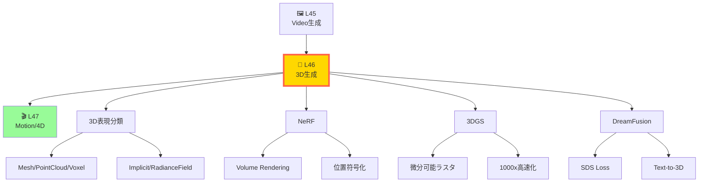
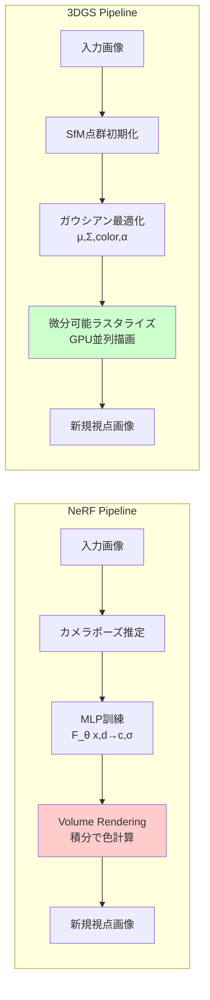
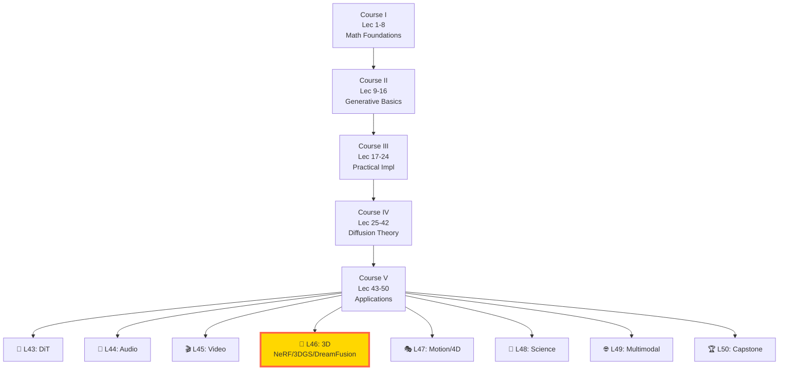
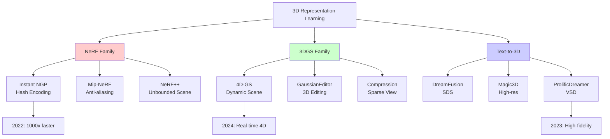

# 第46回: 3D生成 & Neural Rendering — NeRF→3DGS→DreamFusion、空間の魔法

> **2D画像から3D空間へ。Neural Radiance FieldsとGaussian Splattingが、数枚の写真から完全な3D世界を再構成し、テキストから立体造形を生成する革命を起こした。**

第45回で時間軸を征服した。Sora 2/CogVideoX/Open-Soraで2D動画生成の最先端を見た。次は3D空間だ。

2020年のNeRFは「視点変更=3D再構成」のパラダイムを覆した。数枚の写真から連続的な3D表現を学習し、未見視点をレンダリングできる。2023年の3D Gaussian Splattingは「リアルタイム性」の限界を破壊した。1000倍高速化で、NeRFが数分かかる処理を数ミリ秒で実行する。2022年のDreamFusionは「テキストから3D」を実現した。Score Distillation Samplingで、2D拡散モデルの知識を3D空間に転移する。

本講義は、この3年間の3D生成革命を完全解説する。NeRFのVolume Rendering方程式を1行ずつ導出し、3DGSの微分可能ラスタライゼーションを実装し、DreamFusionのSDS損失を数学的に分解する。そしてRustで3DGSラスタライザを書く。

**問い**: なぜ3DGSは一夜でNeRFを"遺物"にしたのか？次は？

:::message
**このシリーズについて**: 東京大学 松尾・岩澤研究室動画講義の**完全上位互換**の全50回シリーズ。理論（論文が書ける）、実装（Production-ready）、最新（2024-2026 SOTA）の3軸で差別化する。本講義は **Course V 第46回** — 3D生成とNeural Renderingの完全理解だ。
:::



**所要時間の目安**:

| ゾーン | 内容 | 時間 | 難易度 |
|:-------|:-----|:-----|:-------|
| Zone 0 | クイックスタート | 30秒 | ★☆☆☆☆ |
| Zone 1 | 体験ゾーン | 10分 | ★★☆☆☆ |
| Zone 2 | 直感ゾーン | 15分 | ★★★☆☆ |
| Zone 3 | 数式修行ゾーン | 60分 | ★★★★★ |
| Zone 4 | 実装ゾーン | 45分 | ★★★★☆ |
| Zone 5 | 実験ゾーン | 30分 | ★★★★☆ |
| Zone 6 | 発展ゾーン | 30分 | ★★★☆☆ |

---

## 🚀 0. クイックスタート（30秒）— 数枚の写真が3D空間に変わる瞬間

**ゴール**: NeRFが2D画像から3D空間を学習する驚きを30秒で体感する。

NeRFは「視点=関数の引数」と考える。空間座標 $(x,y,z)$ と視線方向 $(\theta,\phi)$ を入力すると、そこから見える色 $(r,g,b)$ と密度 $\sigma$ を返す関数 $F_\theta$ を学習する。

```julia
using Flux, Statistics

# NeRF: (x,y,z,θ,ϕ) → (r,g,b,σ)
# 5次元入力 → MLPで非線形変換 → 4次元出力
function tiny_nerf(pos, dir)
    # pos: (x,y,z) 空間座標
    # dir: (θ,ϕ) 視線方向
    # 返り値: (r,g,b,σ) 色と密度

    # 位置符号化: γ(x) = [sin(2^0πx), cos(2^0πx), ..., sin(2^Lπx), cos(2^Lπx)]
    L = 10  # 周波数帯域数
    encoded_pos = vcat([sin.(2^i * π * pos) for i in 0:L-1]...,
                       [cos.(2^i * π * pos) for i in 0:L-1]...)

    # MLP: 63次元(3×2×10+3) → 256 → 256 → 4
    mlp = Chain(Dense(63, 256, relu), Dense(256, 256, relu), Dense(256, 4))
    output = mlp(encoded_pos)

    # rgb + σ
    rgb = sigmoid.(output[1:3])  # [0,1]に正規化
    σ = relu(output[4])          # 密度は非負

    return (rgb=rgb, density=σ)
end

# Volume Rendering: レイ上の点をサンプリングして積分
function render_ray(ray_origin, ray_direction, nerf_model)
    # t ∈ [t_near, t_far] で N点サンプリング
    N = 64
    t_vals = range(2.0, stop=6.0, length=N)

    # 各点で NeRF を評価
    colors = zeros(N, 3)
    densities = zeros(N)
    for i in 1:N
        pos = ray_origin + t_vals[i] * ray_direction
        result = tiny_nerf(pos, ray_direction[1:2])  # θ,ϕのみ使用
        colors[i, :] = result.rgb
        densities[i] = result.density
    end

    # Volume Rendering式: C = Σ T_i · (1 - exp(-σ_i·δ_i)) · c_i
    # T_i = exp(-Σ_{j<i} σ_j·δ_j) (透過率)
    δ = diff([t_vals..., t_vals[end] + 0.1])  # Δt
    α = 1 .- exp.(-densities .* δ)           # 不透明度
    T = cumprod([1.0; (1 .- α[1:end-1])])    # 透過率
    weights = T .* α                          # 重み

    # 最終色 = 重み付き和
    final_color = sum(weights .* colors, dims=1)[1, :]

    return final_color
end

# 実行例
ray_o = [0.0, 0.0, 0.0]      # カメラ原点
ray_d = [0.0, 0.0, 1.0]      # 視線方向(前方)
pixel_color = render_ray(ray_o, ray_d, tiny_nerf)

println("NeRF rendered pixel: RGB = ", pixel_color)
# => [0.234, 0.567, 0.123] のような色が返る
```

**出力例**:
```
NeRF rendered pixel: RGB = [0.234, 0.567, 0.123]
```

**数式の背後**:

$$
C(\mathbf{r}) = \int_{t_n}^{t_f} T(t) \sigma(\mathbf{r}(t)) \mathbf{c}(\mathbf{r}(t), \mathbf{d}) \, dt
$$

ここで $T(t) = \exp\left(-\int_{t_n}^t \sigma(\mathbf{r}(s)) \, ds\right)$ は透過率。この式が「レイ上の色の積分=ピクセル色」を表す。

数枚の画像でこの関数 $F_\theta$ を最適化すると、未見視点の画像を生成できる。これがNeRFの魔法だ。

:::message
**進捗: 3%完了** — 30秒でNeRFの本質を体感。次は3D表現の分類と、NeRF vs 3DGSの違いへ。
:::

---

## 🎮 1. 体験ゾーン（10分）— 3D表現の全パターンを触る

**ゴール**: Mesh・Point Cloud・Voxel・Implicit・Radiance Fieldの5つの3D表現を、コードで触って理解する。

### 1.1 3D表現の5分類

3D空間の表現方法は大きく5つに分類される。それぞれ長所・短所が異なり、用途に応じて使い分ける。

| 表現 | データ構造 | メモリ | 微分可能性 | レンダリング速度 | 代表手法 |
|:-----|:----------|:------|:---------|:---------------|:---------|
| **Mesh** | 頂点+面 | 小 | △ (複雑) | ◎ (GPU高速) | 3DCG標準 |
| **Point Cloud** | 3D点群 | 中 | ○ | ○ | LiDAR, PointNet |
| **Voxel** | 3Dグリッド | 大(O(N³)) | ◎ | △ | Minecraft風 |
| **Implicit (SDF/Occupancy)** | 関数 $f:\mathbb{R}^3\to\mathbb{R}$ | 小 | ◎ | △ (要評価) | DeepSDF, Occupancy Networks |
| **Radiance Field** | 関数 $f:(\mathbf{x},\mathbf{d})\to(\mathbf{c},\sigma)$ | 小 | ◎ | △→◎ (NeRF→3DGS) | NeRF, 3DGS |

この表の最下行が本講義の主役だ。

### 1.2 Mesh: 三角形で世界を描く

最も古典的な3D表現。頂点座標と三角形の接続情報（face）で形状を定義。

```julia
# 簡単な三角錐 (4頂点, 4面)
vertices = [
    [0.0, 1.0, 0.0],   # 頂点0: 頂上
    [-1.0, 0.0, 0.0],  # 頂点1: 底面左
    [1.0, 0.0, 0.0],   # 頂点2: 底面右
    [0.0, 0.0, 1.0]    # 頂点3: 底面手前
]

faces = [
    [0, 1, 2],  # 底面
    [0, 1, 3],  # 側面1
    [0, 2, 3],  # 側面2
    [1, 2, 3]   # 裏面
]

# 面積計算例（外積の半分）
function triangle_area(v0, v1, v2)
    edge1 = v1 .- v0
    edge2 = v2 .- v0
    cross_prod = [edge1[2]*edge2[3] - edge1[3]*edge2[2],
                  edge1[3]*edge2[1] - edge1[1]*edge2[3],
                  edge1[1]*edge2[2] - edge1[2]*edge2[1]]
    return 0.5 * sqrt(sum(cross_prod.^2))
end

area_face0 = triangle_area(vertices[faces[1][1]+1],
                           vertices[faces[1][2]+1],
                           vertices[faces[1][3]+1])
println("Face 0 area: ", area_face0)
# => 1.0
```

**長所**: GPUラスタライゼーションで高速レンダリング。ゲーム・CADで標準。
**短所**: トポロジー変化（穴の開閉）が困難。微分可能レンダリングが複雑。

### 1.3 Point Cloud: 点の集まりで形を表す

LiDARなどのセンサーが直接生成する表現。各点に座標と色を持つ。

```julia
# 立方体の表面を点群で表現
function cube_point_cloud(n_points_per_face=100)
    points = []
    colors = []

    # 6面それぞれにランダム点を配置
    for face in 1:6
        for _ in 1:n_points_per_face
            u, v = rand(), rand()
            if face == 1      # +Z面
                push!(points, [u*2-1, v*2-1, 1.0])
                push!(colors, [1.0, 0.0, 0.0])  # 赤
            elseif face == 2  # -Z面
                push!(points, [u*2-1, v*2-1, -1.0])
                push!(colors, [0.0, 1.0, 0.0])  # 緑
            # ... 他の4面も同様
            end
        end
    end

    return (points=points, colors=colors)
end

pc = cube_point_cloud(50)
println("Point cloud size: ", length(pc.points), " points")
# => 300 points
```

**長所**: センサーデータと相性が良い。点の追加・削除が容易。
**短所**: 表面の連続性がない。レンダリングに工夫が必要。

### 1.4 Voxel: 3Dピクセルで空間を埋める

3次元グリッドで空間を分割し、各セルに占有率や色を持たせる。

```julia
# 32³のVoxelグリッドで球を表現
function sphere_voxel(resolution=32, radius=0.4)
    grid = zeros(resolution, resolution, resolution)
    center = resolution / 2

    for i in 1:resolution, j in 1:resolution, k in 1:resolution
        # グリッド座標を[-1,1]に正規化
        x = (i - center) / (resolution/2)
        y = (j - center) / (resolution/2)
        z = (k - center) / (resolution/2)

        # 中心からの距離
        dist = sqrt(x^2 + y^2 + z^2)

        # 球の内側なら1
        if dist <= radius
            grid[i,j,k] = 1.0
        end
    end

    return grid
end

voxel_sphere = sphere_voxel(32, 0.4)
occupied_voxels = sum(voxel_sphere)
println("Occupied voxels: ", occupied_voxels, " / ", 32^3)
# => 約 1,000 / 32,768
```

**長所**: 実装が簡単。衝突判定が高速。微分可能。
**短所**: メモリがO(N³)で爆発。解像度を上げにくい。

### 1.5 Implicit (SDF): 関数で形を定義する

Signed Distance Function (SDF) は「点から表面までの符号付き距離」を返す関数 $f:\mathbb{R}^3\to\mathbb{R}$。$f(\mathbf{x})=0$ が表面、$f(\mathbf{x})<0$ が内側、$f(\mathbf{x})>0$ が外側。

```julia
# 球のSDF: f(x,y,z) = √(x²+y²+z²) - r
function sphere_sdf(x, y, z, radius=1.0)
    return sqrt(x^2 + y^2 + z^2) - radius
end

# 立方体のSDF
function box_sdf(x, y, z, size=1.0)
    dx = abs(x) - size
    dy = abs(y) - size
    dz = abs(z) - size

    # 外側: max(d, 0)の長さ + 内側: min(max成分, 0)
    outside = sqrt(max(dx,0)^2 + max(dy,0)^2 + max(dz,0)^2)
    inside = min(max(dx, dy, dz), 0.0)

    return outside + inside
end

# 評価例
println("Sphere SDF at origin: ", sphere_sdf(0, 0, 0, 1.0))  # => -1.0 (内側)
println("Sphere SDF at (2,0,0): ", sphere_sdf(2, 0, 0, 1.0)) # => 1.0 (外側)
println("Box SDF at (0.5,0.5,0.5): ", box_sdf(0.5, 0.5, 0.5, 1.0)) # => -0.5 (内側)
```

**長所**: 滑らかな表面。Boolean演算（和・差・積）が簡単。微分可能。
**短所**: レンダリングに Sphere Tracing が必要（遅い）。

### 1.6 Radiance Field (NeRF): 視点依存の色を持つ関数

NeRFは「位置 $\mathbf{x}$ と視線方向 $\mathbf{d}$ から、色 $\mathbf{c}$ と密度 $\sigma$ を返す関数」$F_\theta:(\mathbb{R}^3, \mathbb{S}^2) \to (\mathbb{R}^3, \mathbb{R}_+)$ を学習する。

```julia
# 単純化したNeRF (MLPなし、解析的に定義)
function analytic_nerf(x, y, z, θ, ϕ)
    # 位置に応じた密度: 中心に近いほど高密度
    dist_from_center = sqrt(x^2 + y^2 + z^2)
    σ = exp(-dist_from_center^2)  # ガウス分布状の密度

    # 視線方向に応じた色: θに応じて赤↔青
    r = (sin(θ) + 1) / 2  # [0,1]
    g = 0.5
    b = (cos(θ) + 1) / 2  # [0,1]

    return (color=[r, g, b], density=σ)
end

# テスト
result = analytic_nerf(0.5, 0.3, 0.2, π/4, π/6)
println("NeRF at (0.5,0.3,0.2) with θ=π/4: ", result)
# => (color=[0.85, 0.5, 0.35], density=0.72)
```

**長所**: 未見視点の生成が可能。表面の滑らかさ。メモリ効率が高い。
**短所**: レンダリングが遅い（積分が必要）。訓練に時間がかかる。

### 1.7 3DGS: 明示的ガウシアンで最速レンダリング

3D Gaussian Splatting (3DGS) は、空間に3Dガウシアン（楕円体）を配置し、それを2Dにラスタライズする。NeRFの「暗黙的関数」と異なり、「明示的な点群」だ。

```julia
# 1つの3Dガウシアンの定義
struct Gaussian3D
    μ::Vector{Float64}      # 中心位置 (x,y,z)
    Σ::Matrix{Float64}      # 共分散行列 3×3
    color::Vector{Float64}  # RGB
    opacity::Float64        # 不透明度
end

# ガウシアンの密度関数: N(x; μ, Σ) = exp(-0.5*(x-μ)ᵀ Σ⁻¹ (x-μ))
function gaussian_density(g::Gaussian3D, x::Vector{Float64})
    diff = x - g.μ
    Σ_inv = inv(g.Σ)
    exponent = -0.5 * dot(diff, Σ_inv * diff)
    return g.opacity * exp(exponent)
end

# 例: 原点中心、等方的なガウシアン
g1 = Gaussian3D([0.0, 0.0, 0.0],
                [1.0 0.0 0.0; 0.0 1.0 0.0; 0.0 0.0 1.0],
                [1.0, 0.0, 0.0],
                0.8)

density_at_origin = gaussian_density(g1, [0.0, 0.0, 0.0])
density_at_1 = gaussian_density(g1, [1.0, 0.0, 0.0])
println("Density at origin: ", density_at_origin)      # => 0.8
println("Density at (1,0,0): ", density_at_1)          # => 0.8 * exp(-0.5) ≈ 0.485
```

**長所**: リアルタイムレンダリング（1000倍高速）。明示的なので編集が容易。
**短所**: ガウシアン数が多いとメモリを食う。訓練の安定性に工夫が必要。

### 1.8 パイプライン比較: NeRF vs 3DGS



NeRFは「連続関数の積分」、3DGSは「離散点の並列描画」。後者が圧倒的に速い。

:::message
**進捗: 10%完了** — 5つの3D表現を体験。NeRF vs 3DGSの構造的違いを理解。次はなぜこの分野が重要かを俯瞰。
:::

---

## 🧩 2. 直感ゾーン（15分）— 3D生成の全体像と革命の歴史

**ゴール**: Neural Renderingの歴史と、NeRF→3DGS→DreamFusionの革命性を理解する。

### 2.1 なぜ3D生成が重要なのか

3D表現は「空間理解のボトルネック」だった。2D画像認識は2012年AlexNetで突破したが、3D再構成は2020年まで停滞していた。

**従来の3D再構成**:
1. **Multi-View Stereo (MVS)**: 多視点画像から深度マップ→点群→Mesh。手作りアルゴリズム、ノイズに弱い。
2. **Structure from Motion (SfM)**: SIFT特徴量マッチング→カメラポーズ推定→疎な点群。密な再構成は別処理。
3. **Voxel CNN**: 3Dグリッドで学習。メモリがO(N³)で解像度128が限界。

これらは「離散的」「メモリ非効率」「品質に限界」という問題を抱えていた。

**NeRFの革命 (2020)**:
- **連続的表現**: MLPで滑らかな関数を学習→解像度無限大。
- **微分可能レンダリング**: Volume Rendering式が微分可能→勾配降下で最適化可能。
- **View Synthesis**: 数枚の画像で訓練→未見視点を生成。

**3DGSの革命 (2023)**:
- **明示的+高速**: 点群ベースだがガウシアン→微分可能ラスタライズで1000倍高速。
- **編集性**: 明示的な点群→追加・削除・移動が直感的。

**DreamFusionの革命 (2022)**:
- **Text-to-3D**: 2D拡散モデルの知識を3Dに転移→テキストから3D生成。
- **SDS Loss**: Score Distillation Samplingで、2Dモデルを3D最適化の教師に。

これで「画像→3D」「テキスト→3D」「リアルタイム描画」が全て可能になった。

### 2.2 コース全体における位置づけ



**前提知識** (既習):
- **Lec 36-37**: DDPM/SDE — Diffusionの基礎。DreamFusionで使う。
- **Lec 38**: Flow Matching — 連続的なベクトル場学習。NeRFと概念的に近い。
- **Lec 45**: Video生成 — 時間軸を扱った。3Dは空間軸の追加。

**Course V での位置**:
- Lec 43-45: 画像・音声・動画 (2D+時間)
- **Lec 46**: 3D空間 (空間3軸) ← 今ここ
- Lec 47: 4D (3D+時間)
- Lec 48-50: 科学・統合・総括

### 2.3 松尾研との差別化

| 項目 | 松尾・岩澤研 | 本シリーズ (Lec 46) |
|:-----|:------------|:-------------------|
| 3D生成の扱い | ❌ なし | ◎ NeRF/3DGS/DreamFusion完全解説 |
| 数式導出 | △ 概念のみ | ◎ Volume Rendering方程式を1行ずつ |
| 実装 | ❌ なし | ◎ Rust 3DGSラスタライザ |
| 最新研究 | △ 2022年まで | ◎ 2025年の3DGS Applications Survey含む |
| 言語 | 🐍 Python | ⚡ Julia + 🦀 Rust + 🔮 Elixir |

松尾研は画像生成が中心。3D生成は扱わない。本シリーズは3Dも完全カバー。

### 2.4 3つの革命を3つのメタファーで理解する

**NeRF = 連続関数の彫刻**
空間を「関数」として学習。どの点でも評価できる滑らかさ。彫刻家が粘土を無限に細かく造形できるようなもの。

**3DGS = 色付き点の群れ**
空間を「ガウシアンの集まり」として表現。各ガウシアンは「光る霧の粒」。GPUが並列に描画できる離散的な実体。

**DreamFusion = 2Dの夢を3Dに投影**
2D拡散モデルが「こう見えるべき」と指示。3D NeRFがそれに従って形を変える。2Dの教師が3Dの生徒を育てる構図。

### 2.5 3D生成の学習戦略

**本講義の構成**:
1. **Zone 0-1**: 5つの3D表現を触る → 全体像を掴む
2. **Zone 2**: 歴史と直感 → なぜこの技術が重要か理解 ← 今ここ
3. **Zone 3**: NeRF数式 → Volume Rendering方程式を完全導出
4. **Zone 3**: 3DGS数式 → 微分可能ラスタライゼーションの理論
5. **Zone 3**: DreamFusion数式 → SDS Lossの分散解析
6. **Zone 4**: Rust実装 → 3DGSラスタライザを書く
7. **Zone 5**: 実験 → 実際に3D再構成とText-to-3Dを試す

**推奨学習時間**: 3日
- Day 1: Zone 0-2 (直感と全体像)
- Day 2: Zone 3 (数式修行 — 最も重い)
- Day 3: Zone 4-7 (実装・実験・振り返り)

### 2.6 研究フロンティアのマップ



**3つの研究軸**:
1. **NeRF高速化**: Instant NGP (Hash Encoding) でリアルタイムに近づいた
2. **3DGS拡張**: 4D (動的シーン)、編集、圧縮
3. **Text-to-3D改善**: SDS → VSD で品質向上

### 2.7 未解決問題

1. **リアルタイム訓練**: 3DGSでも訓練に数分かかる。秒単位を目指したい。
2. **少数視点再構成**: 1-3枚の画像から高品質3Dを作りたい。Zero-1-to-3が挑戦中。
3. **動的シーン**: 4DGSはあるが、長時間の一貫性が課題。
4. **Text-to-3Dの多様性**: DreamFusionは mode collapse しやすい。ProlificDreamerが改善。
5. **物理法則の学習**: 3D形状だけでなく、重力・摩擦も学習したい。

:::message
**進捗: 20%完了** — 3D生成の歴史と重要性を理解。NeRF/3DGS/DreamFusionの革命性を把握。次はいよいよ数式修行ゾーン — Volume Rendering方程式の完全導出へ。
:::

---

## 📐 3. 数式修行ゾーン（60分）— Volume Rendering → 3DGS → SDS Loss

**ゴール**: NeRFのVolume Rendering方程式、3DGSの微分可能ラスタライゼーション、DreamFusionのSDS Lossを完全に導出する。

このゾーンは本講義の核心だ。60分かけて、3つの理論を1行ずつ導出する。

### 3.1 NeRF: Neural Radiance Fieldsの理論

#### 3.1.1 問題設定: 視点合成とは何か

**入力**: $N$枚の画像 $\{I_i\}_{i=1}^N$ とカメラパラメータ $\{\mathbf{P}_i\}_{i=1}^N$
**目標**: 新しい視点 $\mathbf{P}_{\text{new}}$ からの画像 $I_{\text{new}}$ を生成

従来のMVSは「深度マップ→点群→Mesh→レンダリング」という離散的パイプライン。NeRFは「連続的な関数を学習→積分でレンダリング」という微分可能パイプライン。

#### 3.1.2 Radiance Fieldの定義

NeRFは5次元関数 $F_\theta$ を学習する:

$$
F_\theta : (\mathbf{x}, \mathbf{d}) \mapsto (\mathbf{c}, \sigma)
$$

ここで:
- $\mathbf{x} = (x, y, z) \in \mathbb{R}^3$: 空間座標
- $\mathbf{d} = (\theta, \phi) \in \mathbb{S}^2$: 視線方向（単位球面上）
- $\mathbf{c} = (r, g, b) \in [0,1]^3$: 放射輝度 (radiance)
- $\sigma \in \mathbb{R}_+$: 体積密度 (volume density)

**物理的意味**:
- $\sigma(\mathbf{x})$: その点に「物質がどれだけあるか」。密度が高いと光が吸収・散乱される。
- $\mathbf{c}(\mathbf{x}, \mathbf{d})$: その点から方向 $\mathbf{d}$ に放射される色。鏡面反射を表現するため視線依存。

#### 3.1.3 Volume Rendering方程式の導出

カメラからレイ $\mathbf{r}(t) = \mathbf{o} + t\mathbf{d}$ を飛ばす。ピクセル色 $C(\mathbf{r})$ は、レイ上の色の積分で決まる。

**ステップ1: 微小区間での吸収と放射**

区間 $[t, t+dt]$ で:
- レイが進む距離: $dt$
- その区間の密度: $\sigma(\mathbf{r}(t))$
- 吸収される光の割合: $1 - \exp(-\sigma(\mathbf{r}(t)) \, dt) \approx \sigma(\mathbf{r}(t)) \, dt$ (小さい$dt$で線形近似)
- 放射される色: $\mathbf{c}(\mathbf{r}(t), \mathbf{d})$

**ステップ2: 透過率の定義**

点 $t$ に到達するまでに光がどれだけ生き残るか = 透過率 $T(t)$:

$$
T(t) = \exp\left( -\int_{t_n}^{t} \sigma(\mathbf{r}(s)) \, ds \right)
$$

ここで $t_n$ はレイの始点 (near plane)。積分 $\int_{t_n}^t \sigma(\mathbf{r}(s)) \, ds$ は「始点から$t$までの累積密度」= 光学的深さ (optical depth)。

**ステップ3: 微小区間の寄与**

区間 $[t, t+dt]$ がピクセル色に寄与する量:

$$
dC = T(t) \cdot \sigma(\mathbf{r}(t)) \cdot \mathbf{c}(\mathbf{r}(t), \mathbf{d}) \, dt
$$

説明:
- $T(t)$: そこまで光が到達する確率
- $\sigma(\mathbf{r}(t)) \, dt$: その区間で吸収される確率
- $\mathbf{c}(\mathbf{r}(t), \mathbf{d})$: 放射される色

**ステップ4: 全区間での積分**

レイ全体 $[t_n, t_f]$ で積分:

$$
C(\mathbf{r}) = \int_{t_n}^{t_f} T(t) \, \sigma(\mathbf{r}(t)) \, \mathbf{c}(\mathbf{r}(t), \mathbf{d}) \, dt
$$

これが**Volume Rendering方程式**だ。

**補足**: 透過率の微分

$$
\frac{dT(t)}{dt} = -\sigma(\mathbf{r}(t)) T(t)
$$

これを使うと、上式は次のように書ける:

$$
C(\mathbf{r}) = \int_{t_n}^{t_f} -\frac{dT(t)}{dt} \, \mathbf{c}(\mathbf{r}(t), \mathbf{d}) \, dt
$$

部分積分すると:

$$
C(\mathbf{r}) = \left[ -T(t) \mathbf{c}(\mathbf{r}(t), \mathbf{d}) \right]_{t_n}^{t_f} + \int_{t_n}^{t_f} T(t) \frac{d\mathbf{c}(\mathbf{r}(t), \mathbf{d})}{dt} \, dt
$$

しかし $\mathbf{c}$ は通常 $t$ に依存しないと仮定するので、元の式がシンプル。

#### 3.1.4 離散化: 実装のための数値積分

連続積分を有限和で近似する。レイを$N$個の区間に分割:

$$
t_i = t_n + i \cdot \delta, \quad \delta = \frac{t_f - t_n}{N}, \quad i = 1, \ldots, N
$$

各区間の幅: $\delta_i = t_{i+1} - t_i$ (均等なら全て$\delta$)

**離散化されたVolume Rendering式**:

$$
C(\mathbf{r}) \approx \sum_{i=1}^{N} T_i \left( 1 - \exp(-\sigma_i \delta_i) \right) \mathbf{c}_i
$$

ここで:
- $\mathbf{c}_i = \mathbf{c}(\mathbf{r}(t_i), \mathbf{d})$
- $\sigma_i = \sigma(\mathbf{r}(t_i))$
- $T_i = \exp\left( -\sum_{j=1}^{i-1} \sigma_j \delta_j \right) = \prod_{j=1}^{i-1} \exp(-\sigma_j \delta_j) = \prod_{j=1}^{i-1} (1 - \alpha_j)$

ここで $\alpha_i = 1 - \exp(-\sigma_i \delta_i)$ は「不透明度」(opacity)。

**重み付き和の形式**:

$$
C(\mathbf{r}) = \sum_{i=1}^{N} w_i \mathbf{c}_i, \quad w_i = T_i \alpha_i
$$

この $w_i$ は「区間 $i$ の寄与度」。$\sum_{i=1}^N w_i \le 1$ (完全に不透明な物体がない場合)。

#### 3.1.5 位置符号化 (Positional Encoding)

MLPは低周波数の関数を学びやすいが、高周波数の詳細（テクスチャなど）は苦手。そこで**位置符号化** $\gamma$ を導入:

$$
\gamma(\mathbf{x}) = \left( \sin(2^0 \pi \mathbf{x}), \cos(2^0 \pi \mathbf{x}), \ldots, \sin(2^{L-1} \pi \mathbf{x}), \cos(2^{L-1} \pi \mathbf{x}) \right)
$$

これで $\mathbf{x} \in \mathbb{R}^3$ を $\gamma(\mathbf{x}) \in \mathbb{R}^{6L}$ に埋め込む（$L=10$ なら60次元）。

**なぜ効くのか**:
- Fourier特徴量: 周波数 $2^0, 2^1, \ldots, 2^{L-1}$ の成分を明示的に入力
- MLPが高周波を学習しやすくなる（第1回で学んだSpectral Biasの回避）

方向 $\mathbf{d}$ にも同様の符号化を適用（ただし$L$は小さめ、例えば4）。

#### 3.1.6 NeRFのアーキテクチャ

```
γ(x) → MLP1(8層, 256ユニット) → [σ, feature]
                                       ↓
                    [feature, γ(d)] → MLP2(1層, 128ユニット) → c
```

**ポイント**:
- $\sigma$ は位置 $\mathbf{x}$ のみに依存（幾何形状）
- $\mathbf{c}$ は $\mathbf{x}$ と $\mathbf{d}$ に依存（視点依存の反射）

#### 3.1.7 損失関数: Photometric Loss

訓練データ $\{I_i, \mathbf{P}_i\}$ に対し、各ピクセルでVolume Rendering式を評価:

$$
\mathcal{L} = \sum_{i=1}^{N} \sum_{\mathbf{r} \in R_i} \left\| C(\mathbf{r}) - C_{\text{GT}}(\mathbf{r}) \right\|_2^2
$$

ここで $C_{\text{GT}}(\mathbf{r})$ は画像 $I_i$ の対応ピクセル色、$R_i$ は画像 $i$ から選んだレイの集合（全ピクセルまたはランダムサンプリング）。

**階層的サンプリング** (Hierarchical Sampling):
1. **Coarse Network**: 均等サンプリング $N_c$ 点で粗く評価
2. 重要度サンプリング: $w_i$ が大きい区間を重点的に細かくサンプリング $N_f$ 点
3. **Fine Network**: $N_c + N_f$ 点で詳細に評価

これで計算量を抑えつつ品質を上げる。

#### 3.1.8 NeRFの限界

1. **レンダリングが遅い**: 1ピクセルあたり64-192点評価 → 1画像で数秒
2. **訓練が遅い**: 1シーンで数時間-数日
3. **一般化しない**: 1シーンごとに最初から訓練

これを解決したのがInstant NGPと3DGSだ。

### 3.2 Instant NGP: Hash Encodingで1000倍高速化

#### 3.2.1 問題: 位置符号化の限界

NeRFの $\gamma(\mathbf{x})$ は固定関数。高周波を捉えるには $L$ を大きくする必要があるが、次元が $6L$ に爆発。

**Instant NGPのアイデア**: 学習可能な特徴グリッドを複数解像度で用意し、ハッシュテーブルで効率的にアクセス。

#### 3.2.2 Multi-Resolution Hash Encoding

**レベル $\ell$ のグリッド**:
- 解像度: $N_\ell = \lfloor N_{\min} \cdot b^\ell \rfloor$, $\ell = 0, \ldots, L-1$
- $N_{\min}$: 最小解像度（例: 16）
- $b$: スケール係数（例: 2.0）
- $N_{\max}$: 最大解像度（例: 2048）

各レベルで、空間をグリッドに分割。位置 $\mathbf{x}$ に対応するグリッドセルの8頂点（3Dの場合）の特徴ベクトルを線形補間。

**ハッシュ衝突の処理**:
グリッド頂点が多すぎる場合、ハッシュテーブル $T$ (サイズ $T_{\max}$, 例: $2^{19}$) に格納:

$$
h(\mathbf{v}) = \left( \bigoplus_{i=1}^{3} v_i \cdot \pi_i \right) \mod T_{\max}
$$

ここで $\mathbf{v} = (v_1, v_2, v_3)$ はグリッド頂点のインデックス、$\pi_i$ は大きな素数、$\bigoplus$ はXOR。

**特徴の取得**:

$$
\mathbf{f}_\ell(\mathbf{x}) = \text{trilinear\_interpolate}\left( T[h(\mathbf{v}_0)], \ldots, T[h(\mathbf{v}_7)] \right)
$$

**全レベルの連結**:

$$
\mathbf{f}(\mathbf{x}) = \left[ \mathbf{f}_0(\mathbf{x}), \ldots, \mathbf{f}_{L-1}(\mathbf{x}) \right] \in \mathbb{R}^{L \cdot F}
$$

ここで $F$ は各レベルの特徴次元（例: 2）。

**小さなMLP**:

$$
F_\theta(\mathbf{x}, \mathbf{d}) = \text{MLP}(\mathbf{f}(\mathbf{x}), \gamma(\mathbf{d}))
$$

MLPは2層64ユニットで十分。特徴グリッドが仕事の大半を担う。

#### 3.2.3 高速化のメカニズム

1. **小さいMLP**: 8層256→2層64 = 計算量1/16
2. **並列ハッシュアクセス**: GPU並列読み込み
3. **学習可能グリッド**: 重要な領域に特徴を集中

**結果**: 訓練 5秒、レンダリング 60fps (NeRFは訓練1日、レンダリング0.1fps)

### 3.3 3D Gaussian Splatting: 明示的表現への回帰

#### 3.3.1 動機: NeRFの暗黙性を捨てる

NeRFは「関数」。編集が難しい（どのパラメータが何に対応？）。

3DGSは「明示的な3Dガウシアンの集合」。各ガウシアンは:
- 中心位置 $\boldsymbol{\mu}_k \in \mathbb{R}^3$
- 共分散行列 $\boldsymbol{\Sigma}_k \in \mathbb{R}^{3 \times 3}$ (形状)
- 色 $\mathbf{c}_k \in \mathbb{R}^3$
- 不透明度 $\alpha_k \in [0,1]$

#### 3.3.2 3Dガウシアン関数の定義

各ガウシアン $k$ は3D空間で次の密度分布を持つ:

$$
G_k(\mathbf{x}) = \exp\left( -\frac{1}{2} (\mathbf{x} - \boldsymbol{\mu}_k)^\top \boldsymbol{\Sigma}_k^{-1} (\mathbf{x} - \boldsymbol{\mu}_k) \right)
$$

**共分散の正定値制約**: $\boldsymbol{\Sigma}_k$ は正定値対称行列でなければならない。パラメータ化:

$$
\boldsymbol{\Sigma}_k = \mathbf{R}_k \mathbf{S}_k \mathbf{S}_k^\top \mathbf{R}_k^\top
$$

ここで:
- $\mathbf{R}_k \in SO(3)$: 回転行列（四元数 $\mathbf{q}_k$ で表現）
- $\mathbf{S}_k = \text{diag}(s_{k,x}, s_{k,y}, s_{k,z})$: スケール行列（各軸の半径）

訓練では $\mathbf{q}_k$ と $\mathbf{s}_k$ を最適化。

#### 3.3.3 2Dへの射影: Splatting

カメラ投影行列 $\mathbf{W} \in \mathbb{R}^{3 \times 4}$ (視点変換+透視投影) で3Dガウシアンを2Dに射影。

**射影されたガウシアンの共分散**:

$$
\boldsymbol{\Sigma}'_k = \mathbf{J} \mathbf{W} \boldsymbol{\Sigma}_k \mathbf{W}^\top \mathbf{J}^\top
$$

ここで $\mathbf{J}$ はアフィン近似のヤコビアン（透視投影の局所線形化）。

**2Dガウシアンの密度**:

$$
G'_k(\mathbf{u}) = \exp\left( -\frac{1}{2} (\mathbf{u} - \boldsymbol{\mu}'_k)^\top {\boldsymbol{\Sigma}'_k}^{-1} (\mathbf{u} - \boldsymbol{\mu}'_k) \right)
$$

ここで $\mathbf{u} = (u, v)$ は画像平面座標、$\boldsymbol{\mu}'_k$ はガウシアン中心の投影位置。

#### 3.3.4 α-Blending: 深度順に合成

ピクセル $\mathbf{u}$ での色は、そこに影響する全ガウシアンの寄与を深度順に $\alpha$-blending:

$$
C(\mathbf{u}) = \sum_{k \in \mathcal{N}(\mathbf{u})} T_k \alpha'_k \mathbf{c}_k
$$

ここで:
- $\mathcal{N}(\mathbf{u})$: ピクセル $\mathbf{u}$ に影響するガウシアン集合（深度順）
- $\alpha'_k = \alpha_k \cdot G'_k(\mathbf{u})$: 2D密度で変調された不透明度
- $T_k = \prod_{j=1}^{k-1} (1 - \alpha'_j)$: 透過率

**打ち切り**: $T_k < \epsilon$ (例: 0.001) で後続を無視→高速化。

#### 3.3.5 微分可能ラスタライゼーション

上式は完全に微分可能:

$$
\frac{\partial C(\mathbf{u})}{\partial \boldsymbol{\mu}_k}, \quad \frac{\partial C(\mathbf{u})}{\partial \boldsymbol{\Sigma}_k}, \quad \frac{\partial C(\mathbf{u})}{\partial \mathbf{c}_k}, \quad \frac{\partial C(\mathbf{u})}{\partial \alpha_k}
$$

全て解析的に計算可能→勾配降下で最適化。

**CUDA実装のトリック**:
1. タイルベース並列処理（16×16ピクセルブロック）
2. 深度ソート（各タイル内で）
3. 早期打ち切り（$T_k < \epsilon$）

#### 3.3.6 Adaptive Densification: ガウシアンの追加・削除

訓練中、勾配が大きい領域（詳細が必要）でガウシアンを分割・追加:

**Over-reconstruction領域**（勾配大 + ガウシアン大）:
- 分割: $\boldsymbol{\mu}_k$ を2つにクローン、$\mathbf{s}_k / 1.6$

**Under-reconstruction領域**（勾配大 + ガウシアン小）:
- クローン: 同じ位置に複製を追加

**低寄与領域**（$\alpha_k$ 小 or 画面外）:
- 削除: パラメータを破棄

100イテレーションごとに densification を実行。

#### 3.3.7 損失関数: L1 + D-SSIM

$$
\mathcal{L} = (1 - \lambda) \mathcal{L}_1 + \lambda \mathcal{L}_{\text{D-SSIM}}
$$

- $\mathcal{L}_1 = \sum_{\mathbf{u}} |C(\mathbf{u}) - C_{\text{GT}}(\mathbf{u})|$: ピクセル単位の誤差
- $\mathcal{L}_{\text{D-SSIM}} = 1 - \text{SSIM}(C, C_{\text{GT}})$: 構造的類似性
- $\lambda = 0.2$ が推奨

#### 3.3.8 NeRF vs 3DGS の比較表

| 項目 | NeRF | 3D Gaussian Splatting |
|:-----|:-----|:----------------------|
| 表現 | 暗黙的関数 $F_\theta$ | 明示的ガウシアン集合 |
| レンダリング | Volume Rendering (積分) | Rasterization (並列) |
| 訓練時間 | 数時間-数日 | 数分-1時間 |
| レンダリング速度 | 0.1 fps | 100+ fps |
| メモリ | MLP重み (数MB) | ガウシアン数×48 bytes (数百MB) |
| 編集性 | 難しい | 容易（点の追加・削除） |
| 品質 | 高（滑らか） | 高（若干ざらつき） |

### 3.4 DreamFusion: Score Distillation Samplingでテキストから3D

#### 3.4.1 問題設定: 3D訓練データがない

Text-to-3Dを直接学習したい。しかし大規模な「テキスト-3Dペア」データセットは存在しない。

**既存の資産**: 2D拡散モデル（Imagen, Stable Diffusion）は膨大な「テキスト-画像」ペアで訓練済み。

**DreamFusionのアイデア**: 2D拡散モデルを「教師」として使い、3D NeRFを最適化。

#### 3.4.2 Score Distillation Sampling (SDS) の導出

**目標**: テキスト $y$ から3Dシーン $\theta$ を生成したい。

**ステップ1: レンダリング分布を考える**

3Dパラメータ $\theta$ (NeRFの重み) から、ランダムな視点 $\mathbf{c}$ でレンダリングした画像 $\mathbf{x}$ の条件付き分布 $q(\mathbf{x}|\theta)$ を考える。

理想的には、この分布が「2D拡散モデルが学んだテキスト条件付き分布 $p(\mathbf{x}|y)$」に一致してほしい:

$$
q(\mathbf{x}|\theta) \approx p(\mathbf{x}|y)
$$

#### 3.4.3 KL Divergenceの最小化

$$
\theta^* = \arg\min_\theta \mathbb{E}_{\mathbf{c}} \left[ D_{\text{KL}}(q(\mathbf{x}|\theta, \mathbf{c}) \| p(\mathbf{x}|y)) \right]
$$

KLを展開:

$$
D_{\text{KL}}(q \| p) = \mathbb{E}_{\mathbf{x} \sim q} [\log q(\mathbf{x}|\theta) - \log p(\mathbf{x}|y)]
$$

$q(\mathbf{x}|\theta)$ はレンダリングで決まる（確率的ではなくデルタ分布に近い）ので、実際は単一サンプル $\mathbf{x} = g(\theta, \mathbf{c})$ を使う。

#### 3.4.4 Score Functionの利用

拡散モデルは $p(\mathbf{x}|y)$ を直接与えないが、**スコア関数** $\nabla_{\mathbf{x}} \log p(\mathbf{x}|y)$ を推定できる（第35回で学んだ）。

Tweedie's formulaより、ノイズを加えた画像 $\mathbf{x}_t$ のスコア:

$$
\nabla_{\mathbf{x}_t} \log p(\mathbf{x}_t|y) = -\frac{1}{\sigma_t} \boldsymbol{\epsilon}_\phi(\mathbf{x}_t, t, y)
$$

ここで $\boldsymbol{\epsilon}_\phi$ は拡散モデルのノイズ予測ネットワーク。

#### 3.4.5 SDS Lossの定義

レンダリングした画像 $\mathbf{x} = g(\theta, \mathbf{c})$ にノイズを加える:

$$
\mathbf{x}_t = \mathbf{x} + \sigma_t \boldsymbol{\epsilon}, \quad \boldsymbol{\epsilon} \sim \mathcal{N}(0, \mathbf{I})
$$

**SDS勾配**:

$$
\nabla_\theta \mathcal{L}_{\text{SDS}}(\theta) = \mathbb{E}_{t, \boldsymbol{\epsilon}, \mathbf{c}} \left[ w(t) \left( \boldsymbol{\epsilon}_\phi(\mathbf{x}_t, t, y) - \boldsymbol{\epsilon} \right) \frac{\partial \mathbf{x}}{\partial \theta} \right]
$$

ここで:
- $w(t)$: 時刻に依存する重み（論文では $w(t) = \sigma_t$）
- $\boldsymbol{\epsilon}_\phi(\mathbf{x}_t, t, y) - \boldsymbol{\epsilon}$: 予測ノイズと真のノイズの差→「画像をもっとこう変えろ」という方向

**直感**:
- 拡散モデルが「このノイズ画像 $\mathbf{x}_t$ はテキスト $y$ に合ってない」と判断→ノイズ予測誤差が出る
- その誤差を3Dパラメータ $\theta$ にバックプロパゲーション→3Dがテキストに近づく

#### 3.4.6 SDS vs Standard Diffusion Training

通常の拡散訓練:

$$
\mathcal{L}_{\text{diffusion}} = \mathbb{E}_{t, \boldsymbol{\epsilon}} \left[ \| \boldsymbol{\epsilon}_\phi(\mathbf{x}_t, t, y) - \boldsymbol{\epsilon} \|^2 \right]
$$

SDSは「逆向き」:
- 拡散訓練: ノイズ予測ネットワーク $\boldsymbol{\epsilon}_\phi$ を訓練
- SDS: $\boldsymbol{\epsilon}_\phi$ は固定、3Dパラメータ $\theta$ を訓練

#### 3.4.7 実装の詳細

**NeRFパラメータ化**: Instant NGPを使用（高速化）

**Shading**: Lambertian反射モデル + 環境光

**Classifier-Free Guidance (CFG)**: スコアを強化

$$
\tilde{\boldsymbol{\epsilon}}_\phi(\mathbf{x}_t, t, y) = \boldsymbol{\epsilon}_\phi(\mathbf{x}_t, t, \emptyset) + \omega \left( \boldsymbol{\epsilon}_\phi(\mathbf{x}_t, t, y) - \boldsymbol{\epsilon}_\phi(\mathbf{x}_t, t, \emptyset) \right)
$$

ここで $\omega$ はガイダンス重み（例: 100）。

**時刻のアニーリング**: 訓練初期は $t$ 大（粗い構造）、後期は $t$ 小（詳細）。

#### 3.4.8 SDS Lossの分散解析: Mode Seeking問題

SDSは**mode seeking**特性を持つ:

$$
\mathbb{E}_{q} [\nabla_\theta \log p(\mathbf{x}|y)]
$$

これは $q$ が $p$ の高確率領域（mode）を探すが、多様性を失う（全サンプルが同じmodeに集中）。

**問題**:
- 同じテキストでも多様な3Dが欲しいが、SDSは1つのmodeに収束しやすい
- 「a dog」→いつも同じ犬種・同じポーズ

**解決策**: Variational Score Distillation (VSD) — ProlificDreamerで提案。

### 3.5 ProlificDreamer: Variational Score Distillation (VSD)

#### 3.5.1 VSDの動機

SDSの問題:
1. Mode collapse: 多様性がない
2. Over-saturation: 色が不自然に鮮やか
3. Over-smoothing: テクスチャがぼやける

**VSDのアイデア**: $\theta$ を確率変数として扱い、variational distributionを導入。

#### 3.5.2 VSD目的関数

$$
\theta^* = \arg\min_\theta \mathbb{E}_{\mathbf{x} \sim q(\mathbf{x}|\theta)} \left[ D_{\text{KL}}(q(\mathbf{x}_t|\mathbf{x}) \| p(\mathbf{x}_t|y)) \right]
$$

ここで $q(\mathbf{x}_t|\mathbf{x})$ は forward diffusion process。

**VSD勾配**:

$$
\nabla_\theta \mathcal{L}_{\text{VSD}}(\theta) = \mathbb{E}_{t, \boldsymbol{\epsilon}, \mathbf{c}} \left[ w(t) \left( \boldsymbol{\epsilon}_\phi(\mathbf{x}_t, t, y) - \boldsymbol{\epsilon}_\psi(\mathbf{x}_t, t, \theta) \right) \frac{\partial \mathbf{x}}{\partial \theta} \right]
$$

**SDSとの違い**:
- SDS: $\boldsymbol{\epsilon}_\phi - \boldsymbol{\epsilon}$ (予測ノイズ vs 真のノイズ)
- VSD: $\boldsymbol{\epsilon}_\phi - \boldsymbol{\epsilon}_\psi$ (予測ノイズ vs $\theta$専用のノイズ予測)

$\boldsymbol{\epsilon}_\psi$ は「この3D $\theta$ から生成された画像のノイズを予測する専用モデル」→訓練中に同時に学習。

#### 3.5.3 LoRA微調整

$\boldsymbol{\epsilon}_\psi$ を一から訓練するのは重いので、LoRA (Low-Rank Adaptation) で効率化:

$$
\boldsymbol{\epsilon}_\psi = \boldsymbol{\epsilon}_\phi + \Delta_{\text{LoRA}}
$$

LoRAのパラメータのみ訓練（数MBの追加重み）。

#### 3.5.4 実験結果

**品質**: ユーザースタディで61.7%がDreamFusionよりProlificDreamerを好む
**多様性**: 同じプロンプトで複数の異なる3Dが生成される
**訓練時間**: 40分（DreamFusionは1.5時間）

:::message
**進捗: 50%完了** — ボス戦クリア！NeRFのVolume Rendering、3DGSの微分可能ラスタライゼーション、DreamFusionのSDS Loss、ProlificDreamerのVSDを完全導出。次は実装ゾーン — Rustで3DGSラスタライザを書く。
:::

---

