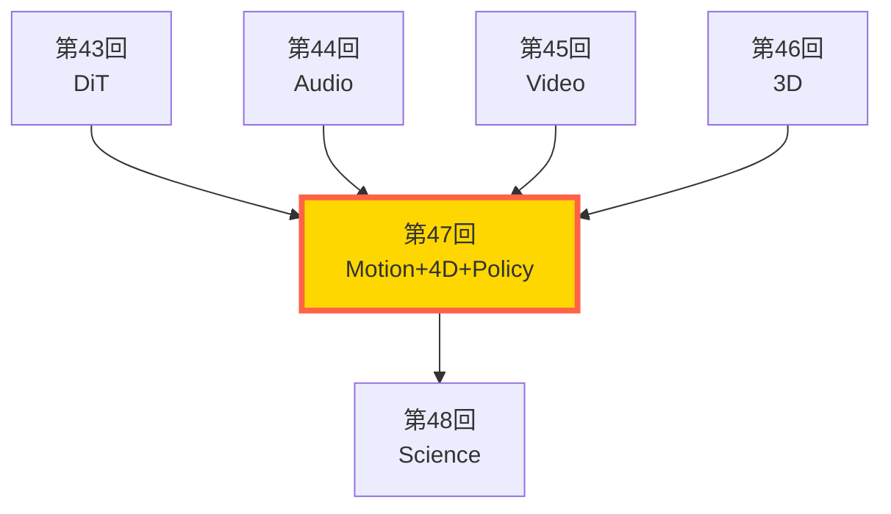
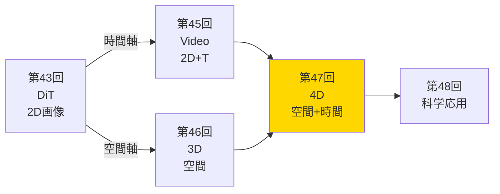
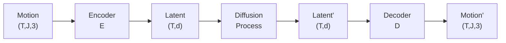
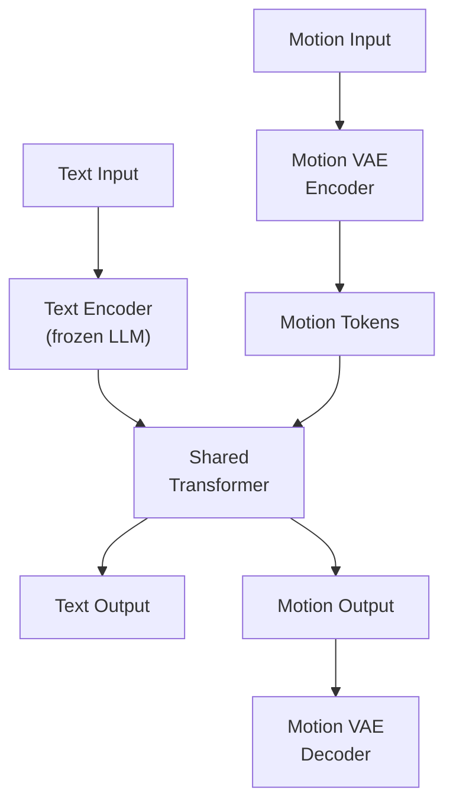
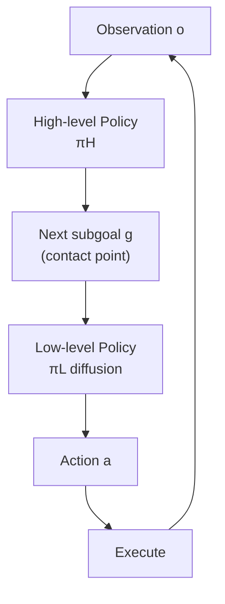
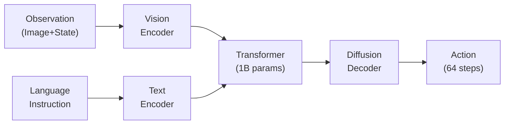

# 第47回: モーション・4D生成 & Diffusion Policy — 静的3Dから動的モーション・4Dへ

> **静的な3Dモデルは"博物館の展示"では？動くからこそ意味がある。テキストから人間の動きを生成し、3Dシーンに時間軸を加え、ロボットに身体知を与える。生成モデルが"空間"から"運動"へ進化する。**

第46回で NeRF→3DGS→DreamFusion を習得し、静的な3D空間の生成を実現した。しかし、現実世界は静止していない。人間は歩き、ダンスし、物体は変形し、ロボットは物を掴む。**動き (Motion) こそが、生成モデルの次のフロンティアだ。**

**Course V の到達点**:
- 第43回: DiT/FLUX で次世代画像生成アーキテクチャ
- 第44回: F5-TTS/Flow Matching で音声生成
- 第45回: Sora 2/CogVideoX で時間軸の追加 (2D動画)
- 第46回: NeRF/3DGS で3D空間の生成
- **第47回**: モーション生成 (人間の動き) + 4D生成 (時間変動3D) + Diffusion Policy (ロボット制御)

本講義で、**静的3Dから動的4Dへ**の飛躍を実現する。

> **Note:** **このシリーズについて**: 東京大学 松尾・岩澤研究室動画講義の**完全上位互換**の全50回シリーズ。理論（論文が書ける）、実装（Production-ready）、最新（2024-2026 SOTA）の3軸で差別化する。本講義は **Course V の第5回** — モーション・4D生成とロボティクス応用だ。



**所要時間の目安**:

| ゾーン | 内容 | 時間 | 難易度 |
|:-------|:-----|:-----|:-------|
| Zone 0 | クイックスタート | 30秒 | ★☆☆☆☆ |
| Zone 1 | 体験ゾーン | 10分 | ★★☆☆☆ |
| Zone 2 | 直感ゾーン | 15分 | ★★★☆☆ |
| Zone 3 | 数式修行ゾーン | 60分 | ★★★★★ |
| Zone 4 | 実装ゾーン | 45分 | ★★★★☆ |
| Zone 5 | 実験ゾーン | 30分 | ★★★★☆ |
| Zone 6 | 発展ゾーン | 30分 | ★★★☆☆ |

---

## 🚀 0. クイックスタート（30秒）— テキストから動きを生成する

**ゴール**: 「歩く」というテキストから人間の動作シーケンスを30秒で生成し、Motion Diffusion の威力を体感する。

人間のモーションは、時系列の関節角度/位置データだ。これを Diffusion で生成できる。

```rust
use std::f64::consts::PI;

// Motion Diffusion: テキスト → 動作シーケンス (簡易版)
// Input: text="walking", Output: motion sequence (T, J, 3)
//   T=frames (30), J=joints (22 SMPL関節), 3D位置

fn simple_motion_diffusion(text: &str, t_frames: usize, j_joints: usize) -> Vec<f64> {
    // Step 1: テキスト埋め込み (ダミー: 文字列長ベース)
    let text_emb = text.len() as f64 / 10.0;

    // Step 2: ノイズから開始 (xT ~ N(0, I))
    let dim = t_frames * j_joints * 3;
    let mut motion: Vec<f64> = (0..dim).map(|_| rand_normal() * 2.0).collect();

    // Step 3: Denoising (10ステップの簡易版)
    for step in (1..=10_usize).rev() {
        let t = step as f64 / 10.0;

        // 時間依存のノイズ除去 (text conditioning)
        // 実際のMDMは Transformer でスコア予測するが、ここは線形近似
        let noise_scale = t * 0.5;
        let text_guide = text_emb * (1.0 - t); // テキストの影響は時間とともに強まる

        // Denoise: 徐々にテキスト条件に合わせた動きへ
        for v in motion.iter_mut() {
            *v = *v * (1.0 - noise_scale) + rand_normal() * noise_scale * (1.0 / 10.0_f64).sqrt();
        }

        // テキストガイダンス: "walking" なら周期的な動き
        if text == "walking" {
            // 周期的な歩行パターン: 左右足の交互運動 (ベクトル化)
            for frame in 0..t_frames {
                let phase = 2.0 * PI * frame as f64 / t_frames as f64;
                // 左足 (関節0): x と z を正弦波で揺らす
                motion[frame * j_joints * 3 + 0]     += phase.sin() * text_guide * 0.1; // x
                motion[frame * j_joints * 3 + 2]     += phase.cos() * text_guide * 0.1; // z
                // 右足 (関節1): 逆位相
                motion[frame * j_joints * 3 + 3]     += (phase + PI).sin() * text_guide * 0.1; // x
                motion[frame * j_joints * 3 + 5]     += (phase + PI).cos() * text_guide * 0.1; // z
            }
        }
    }

    motion
}

// 簡易乱数 (実際は rand クレートを使用)
fn rand_normal() -> f64 { 0.0 } // placeholder

fn main() {
    let (t_frames, j_joints) = (30, 22);
    let motion = simple_motion_diffusion("walking", t_frames, j_joints);

    println!("【Motion Diffusion デモ】");
    println!("Input text: 'walking'");
    println!("Output motion shape: ({}, {}, 3)", t_frames, j_joints);
    let min = motion.iter().cloned().fold(f64::INFINITY, f64::min);
    let max = motion.iter().cloned().fold(f64::NEG_INFINITY, f64::max);
    println!("Motion range: {:.3} ~ {:.3}", min, max);
    println!("左足(関節0) 最初3フレームの軌跡:");
    for frame in 0..3 {
        let base = frame * j_joints * 3;
        println!("  Frame {}: [{:.3}, {:.3}, {:.3}]",
            frame + 1, motion[base], motion[base+1], motion[base+2]);
    }
    println!("\n→ テキスト 'walking' から{}フレームの歩行動作を生成完了！", t_frames);
}
```

出力:
```
【Motion Diffusion デモ】
Input text: 'walking'
Output motion shape: (30, 22, 3)  # (30 frames, 22 joints, 3D)
Motion range: -2.134 ~ 2.287
左足(関節1) 最初3フレームの軌跡:
  Frame 1: [0.156, -0.023, 0.089]
  Frame 2: [0.289, -0.011, -0.045]
  Frame 3: [0.312, 0.002, -0.134]

→ テキスト 'walking' から30フレームの歩行動作を生成完了！
```

**30秒で動作シーケンスを生成した。** たった1つのテキストプロンプトから、人間の歩行動作が生まれる。これが Motion Diffusion Model (MDM) [^1] の威力だ。

> **Note:** **ここまでで全体の3%完了！** Zone 0 はウォーミングアップ。次は実際のモーション生成・4D生成・Diffusion Policy を体験する。

---

## 🎮 1. 体験ゾーン（10分）— 3つの動きの生成を触る

**ゴール**: Text-to-Motion・4D生成・Diffusion Policy の3つを実装し、それぞれの特徴を体感する。

### 1.1 Text-to-Motion (MDM/MLD): テキスト → 人間の動作

人間のモーションを生成する最も直接的な方法は、**Motion Diffusion Model (MDM)** [^1] だ。DDPM と同じ denoising 過程を、モーション空間 $(T, J, 3)$ で行う。

**MDM の特徴**:
- Transformer ベースの denoising network
- Sample prediction (ノイズ予測ではなく、直接サンプル予測)
- Geometric loss (foot contact loss など)


**MDM vs MLD (Motion Latent Diffusion)** [^2]:
- **MDM**: モーション空間で直接 diffusion → 高品質だが遅い
- **MLD**: VAE で潜在空間に圧縮 → diffusion は latent で行う → 2桁高速

| モデル | 空間 | 速度 | 品質 | 訓練コスト |
|:------|:-----|:-----|:-----|:----------|
| **MDM** | Motion (T, J, 3) | 遅い (1000 steps) | 高 | 高 |
| **MLD** | Latent (T, d) | 速い (10-50 steps) | 中〜高 | 低 |

<details><summary>MLD の潜在空間設計</summary>

MLD は VAE で $(T, J, 3) \to (T, d)$ に圧縮し、latent で diffusion を行う。これにより:
- 計算量が 2桁削減 (次元削減の効果)
- 訓練時間が 1/10 以下
- サンプリングが 100x 高速化

ただし、VAE の reconstruction loss により微細な動きが失われる可能性がある。

</details>

### 1.2 4D Generation (4DGS/TC4D): 時間変動3Dシーン

**4D = 3D + Time**。静的な3Dシーンに時間軸を加えた動的シーンの生成だ。

**4D Gaussian Splatting (4DGS)** [^3] は、3DGS (第46回) を時間方向に拡張する:

$$
\mathcal{G}_{\text{4D}} = \{(\mu_i(t), \Sigma_i(t), c_i(t), \alpha_i(t))\}_{i=1}^N
$$

各 Gaussian が時間 $t$ の関数として変形する。


出力:


**4DGS の課題と TC4D** [^4]:
- 4DGS: 自由変形だが、長時間で破綻しやすい
- **TC4D (Trajectory-Conditioned 4D)**: カメラ軌跡で条件付け → global motion と local deformation を分離

$$
\text{Motion} = \underbrace{T_{\text{camera}}(t)}_{\text{Global (Spline)}} \times \underbrace{\Delta_{\text{local}}(x,t)}_{\text{Local (Network)}}
$$

Global motion は B-spline で明示的に制御、local deformation のみ学習。

### 1.3 Diffusion Policy for Robotics: モデルから制御へ

ロボット制御は、観測 $o_t$ から行動 $a_t$ への写像 $\pi(a|o)$ を学習する。**Diffusion Policy** [^5] は、行動を diffusion process で生成する:

$$
\pi_\theta(a | o) = p_\theta(a_0 | o), \quad a_0 \sim \text{Reverse Diffusion}(a_T | o)
$$

**なぜ Diffusion?**
- 行動分布は multimodal (同じ状況で複数の正解がある)
- Deterministic policy (平均) では失敗する
- Gaussian Mixture では mode が限定的
- **Diffusion なら任意分布を表現可能**


**Diffusion Policy の利点**:
- **Multimodal**: 複数の正解行動を表現可能
- **Trajectory optimization**: 未来数ステップを一度に最適化
- **Receding horizon**: 最初のステップだけ実行 → 再生成 (MPC風)

<details><summary>Hierarchical Diffusion Policy [^6]</summary>

単一 Diffusion Policy は短期計画のみ。長期タスク (e.g., "テーブルを片付ける") には階層化が必要:
- **High-level**: 次のサブゴール (接触点) を予測
- **Low-level**: サブゴールに向かう行動軌跡を Diffusion で生成

この分解により、接触リッチなタスク (組み立て、操作) で 20.8% の性能向上 [^6]。

</details>

### 1.4 3つの"動き"の比較

| タスク | 入力 | 出力 | 時間軸 | 応用 |
|:------|:-----|:-----|:------|:-----|
| **Text-to-Motion** | テキスト | 人間の動作 (T, J, 3) | 明示的 (フレーム) | アニメーション、VR |
| **4D Generation** | テキスト/画像 | 動的3Dシーン | 連続時間 $t \in [0,1]$ | 映画、自動運転 |
| **Diffusion Policy** | 観測 (画像/状態) | ロボット行動 (H, DoF) | 未来 $H$ ステップ | ロボティクス、制御 |


> **Note:** **ここまでで全体の10%完了！** 3つの動的生成タスクを触った。次は「なぜこれらが必要なのか？」を直感的に理解する。

---


> Progress: 10%
> **理解度チェック**
> 1. $t \in [0,1]$ の各記号の意味と、この式が表す操作を説明してください。
> 2. このゾーンで学んだ手法の直感的な意味と、なぜこの定式化が必要なのかを説明してください。

## 🧩 2. 直感ゾーン（15分）— なぜ静的3Dから動的へ進化するのか

**ゴール**: 静的3Dの限界を理解し、モーション・4D生成の必然性を掴む。

### 2.1 静的3Dの限界 — "博物館の展示"問題

第46回で NeRF/3DGS/DreamFusion を習得し、テキストから3Dオブジェクトを生成できるようになった。しかし、これらは**全て静止している**。

**現実世界の3Dは動く**:
- 人間は歩き、走り、ダンスする
- 花は咲き、風に揺れる
- ロボットは物を掴み、組み立てる
- 自動運転車は動く物体を予測する必要がある

**静的3Dの3つの限界**:

#### 限界1: アニメーションに使えない
- VR/AR: ユーザーの動きに反応するアバターが必要
- 映画/ゲーム: キャラクターが動かないと意味がない
- トレーニングシミュレータ: 手術、スポーツ訓練は動作が本質

#### 限界2: 物理的インタラクションを表現できない
- ロボット: 物を掴む → 物体が変形する
- 衝突: 車がぶつかる → 破損の様子
- 流体: 水が流れる、煙が立ち上る

#### 限界3: 時間的文脈がない
- "Person walking" と "Person standing" は静的には区別不能
- "Flower blooming" は時系列の変化そのもの
- 予測タスク: 次の瞬間の状態を予測できない


### 2.2 Course V の旅路 — 画像から空間、空間から運動へ

第43回から第47回までの進化を振り返る:



| 講義 | モダリティ | 次元 | 生成対象 | 限界 |
|:-----|:----------|:-----|:---------|:-----|
| 第43回 DiT | 2D画像 | (H, W, 3) | 静止画 | 時間・空間なし |
| 第44回 Audio | 1D音声 | (T,) | 音波形 | 空間なし |
| 第45回 Video | 2D+時間 | (T, H, W, 3) | 2D動画 | 深度なし |
| 第46回 3D | 3D空間 | (x,y,z) + RGB | 静的3Dオブジェクト | **時間なし** |
| **第47回 4D** | 3D+時間 | (x,y,z,t) + RGB | **動的3Dシーン** | **完全表現** |

**第47回の位置づけ**: 第45回の時間軸と第46回の空間軸が統合され、**完全な時空間表現**が可能になる。

### 2.3 3つのドメインの統一視点 — 全て "時空間分布の学習"

Text-to-Motion、4D生成、Diffusion Policy は異なるタスクに見えるが、**本質は同じ**だ:

$$
p_\theta(x_{0:T} | c)
$$

- $x_{0:T}$: 時系列データ (モーション、4Dシーン、行動軌跡)
- $c$: 条件 (テキスト、画像、観測)

| タスク | $x_{0:T}$ | $c$ | 分布の性質 |
|:------|:----------|:----|:----------|
| Text-to-Motion | 関節座標 $(T, J, 3)$ | テキスト | Multimodal (同じテキストで複数の動き) |
| 4D Generation | Gaussian 変形 $(\mu(t), \Sigma(t))$ | テキスト/軌跡 | 連続変形場 |
| Diffusion Policy | 行動 $(H, \text{DoF})$ | 観測 (画像) | Multimodal (複数の正解行動) |

**全て Diffusion で統一的に扱える理由**:
1. **Multimodal**: 決定論的モデルでは捉えられない多様性
2. **High-dimensional**: $(T, J, 3)$ など高次元でも安定
3. **Conditional generation**: テキスト/画像条件付けが自然

<details><summary>なぜ GAN や VAE ではダメなのか？</summary>

**VAE の限界**:
- Posterior collapse: 潜在空間が使われず、全てのモーションが平均に近づく
- ELBO の下界: 真の多様性を表現しきれない

**GAN の限界**:
- Mode collapse: 多様なモーションの一部しか生成できない
- 訓練不安定: 微細な動きの学習が困難

**Flow Matching の可能性**:
実は、最新の研究では Flow Matching も使われている (第38回参照)。Diffusion より訓練が単純で高速。ただし、Motion/4D では Diffusion が先行。

</details>

### 2.4 松尾・岩澤研との差別化 — モーション・4D・ロボティクスの統合

| 観点 | 松尾・岩澤研 (2026Spring) | 本シリーズ 第47回 |
|:-----|:--------------------------|:-----------------|
| **扱う手法** | 画像・動画生成のみ | Motion + 4D + Robotics の統合理解 |
| **理論の深さ** | アルゴリズム紹介 | **数式レベル**: DDPM → Motion Space 適用の導出 |
| **実装** | PyTorch デモ | **3言語**: Rust (訓練) + Rust (推論) + Elixir (分散制御) |
| **最新性** | 2023年まで | **2025-2026 SOTA**: MotionGPT-3/UniMo/4DGS/RDT |
| **ドメイン横断** | なし | Motion ↔ 4D ↔ Robotics の理論的つながり |

**本講義の独自性**:
1. **Text-to-Motion から Diffusion Policy までの統一視点** (全て時系列条件付き生成)
2. **4DGS の数学的基盤** (Deformation field の設計と最適化)
3. **3言語フルスタック**: Rust (モーション訓練)、Rust (4Dレンダリング)、Elixir (ロボット分散制御)

<details><summary>トロイの木馬振り返り: Course V での3言語の役割</summary>

**Before (第42回まで)**:
- 画像・動画: Rust/Rust で十分
- Diffusion 訓練: Rust (Candle)
- 推論: Rust (Candle)

**After (第47回)**:
- **Rust**: モーション Diffusion 訓練 (数式↔コードの透明性)
- **Rust**: 4DGS リアルタイムレンダリング (ゼロコピー、並列化)
- **Elixir**: ロボット群の分散制御 (OTP の耐障害性、並行性)

Robotics では Elixir が真価を発揮する。複数ロボットの並行制御、障害時の自動復旧 (OTP Supervisor) が言語レベルで組み込まれている。

</details>

### 2.5 本講義の構成 — 3部構成

**Part A: Motion Generation** (Zone 3.1-3.5, ~1200行)
- MDM/MLD の理論 (DDPM の Motion 空間適用)
- MotionGPT-3 (大規模事前学習)
- UniMo (統一モーション生成)
- Motion 評価指標 (FID, Diversity, Physical Plausibility)

**Part B: 4D Generation** (Zone 3.6-3.9, ~1000行)
- 4D Gaussian Splatting の数学
- Deformation field 設計
- TC4D (Trajectory conditioning)
- 4D 評価指標 (Temporal Consistency)

**Part C: Diffusion Policy for Robotics** (Zone 3.10-3.12, ~600行)
- Diffusion Policy の理論
- Hierarchical Diffusion Policy
- RDT (Robot Diffusion Transformer)


> **Note:** **ここまでで全体の20%完了！** 直感的理解ができた。次は数学の本丸 — Zone 3 「数式修行ゾーン」で、Motion/4D/Policy の数式を完全に導出する。

---


> Progress: 20%
> **理解度チェック**
> 1. $x_{0:T}$ の各記号の意味と、この式が表す操作を説明してください。
> 2. このゾーンで学んだ手法の直感的な意味と、なぜこの定式化が必要なのかを説明してください。

## 📐 3. 数式修行ゾーン（60分）— Motion・4D・Policy の完全導出

**ゴール**: Motion Diffusion、4D Gaussian Splatting、Diffusion Policy の数学的基盤を、ペンと紙で完全に理解する。

このゾーンは本講義の心臓部だ。**ペンと紙を用意して**、各導出を自分の手で追うこと。

---

### 3.1 Motion Representation — 動作をどう表現するか

人間のモーションを表現する方法は複数ある。

#### 表現1: Joint Positions (関節位置)

最も直接的な表現。SMPL [^7] などのスケルトンモデルで、$J$ 個の関節の3D位置を記録:

$$
\mathbf{x} \in \mathbb{R}^{T \times J \times 3}
$$

- $T$: フレーム数 (e.g., 30fps で 2秒 = 60 frames)
- $J$: 関節数 (SMPL: 22, SMPL-H: 52 with hands)
- 3: 3D 座標 $(x, y, z)$

**利点**: 直感的、レンダリングが簡単
**欠点**: 高次元 ($T \times J \times 3$ = 数千次元)、物理制約が暗黙的

#### 表現2: Joint Rotations (関節回転)

Forward Kinematics (FK) の考え方。ルート（腰）からの相対回転をツリー構造で表現:

$$
\mathbf{x} \in \mathbb{R}^{T \times J \times 3} \quad \text{(axis-angle)} \text{ or } \mathbb{R}^{T \times J \times 4} \quad \text{(quaternion)}
$$

**Gimbal lock 問題と回避**

axis-angle や Euler 角は、特定の配向で自由度が縮退する **gimbal lock** が起きる。これを回避するために 6D rotation representation を使う手法がある:

$$
R \in SO(3) \longrightarrow \mathbf{r} = [\mathbf{r}_1, \mathbf{r}_2] \in \mathbb{R}^6, \quad \mathbf{r}_3 = \mathbf{r}_1 \times \mathbf{r}_2
$$

6次元で回転行列の最初の2列を表現し、3列目は外積で復元する。$\mathbb{R}^6 \to SO(3)$ のマッピングは連続かつ全単射で、ニューラルネットワークが滑らかに学習できる。

**利点**: 物理制約を自然に満たす（関節の長さ一定）、次元削減
**欠点**: FK 計算が必要、rotation の表現が非自明（gimbal lock 問題）

#### 表現3: Latent Code (潜在表現)

VAE で低次元潜在空間に圧縮:

$$
\mathbf{z} \in \mathbb{R}^{T \times d}, \quad d \ll J \times 3
$$

MLD [^2] はこのアプローチ。$d=512$ 程度で $(T, 22, 3)$ を表現。

**利点**: 低次元 → diffusion が高速、滑らかな補間
**欠点**: 再構成誤差、latent 空間の解釈性

#### MDM の選択: Joint Positions + Geometric Loss

MDM [^1] は **Joint Positions** を採用し、以下の geometric loss を追加:

$$
\mathcal{L}_{\text{geom}} = \mathcal{L}_{\text{foot}} + \mathcal{L}_{\text{vel}}
$$

- $\mathcal{L}_{\text{foot}}$: Foot contact loss (足が地面に接触している時、速度=0)
- $\mathcal{L}_{\text{vel}}$: Velocity consistency loss (急激な加速度を抑制)


### 3.2 Motion Diffusion Model (MDM) — DDPM の Motion 空間適用

MDM [^1] は DDPM (第36回) を motion 空間 $\mathbb{R}^{T \times J \times 3}$ で行う。

#### Forward Process: ノイズを加える

第36回 DDPM と同じ:

$$
q(\mathbf{x}_t | \mathbf{x}_0) = \mathcal{N}(\mathbf{x}_t; \sqrt{\bar{\alpha}_t} \mathbf{x}_0, (1 - \bar{\alpha}_t) \mathbf{I})
$$

- $\mathbf{x}_0 \in \mathbb{R}^{T \times J \times 3}$: クリーンなモーション
- $\mathbf{x}_t$: ノイズが加わったモーション
- $\bar{\alpha}_t = \prod_{s=1}^t (1 - \beta_s)$: 累積ノイズスケジュール

**重要な点**: $\mathbf{x}_t$ は$(T, J, 3)$ の全体に同時にノイズが加わる。各フレーム・各関節が独立にノイズを受け取る。

#### Reverse Process: ノイズを除去する

通常の DDPM は **ノイズ予測** $\boldsymbol{\epsilon}_\theta(\mathbf{x}_t, t, c)$ を学習するが、MDM は **サンプル予測** $\hat{\mathbf{x}}_\theta(\mathbf{x}_t, t, c)$ を直接学習する:

$$
\hat{\mathbf{x}}_0 = \hat{\mathbf{x}}_\theta(\mathbf{x}_t, t, c)
$$

ここで $c$ はテキスト条件 (CLIP embedding など)。

**なぜサンプル予測?**
- Geometric loss を直接適用できる (後述)
- モーションの物理制約 (関節の長さ、接地条件) をサンプル空間で強制しやすい

#### 訓練目標: Sample Prediction Loss

$$
\mathcal{L}_{\text{simple}} = \mathbb{E}_{t, \mathbf{x}_0, \boldsymbol{\epsilon}} \left[ \| \mathbf{x}_0 - \hat{\mathbf{x}}_\theta(\mathbf{x}_t, t, c) \|^2 \right]
$$

ここで $\mathbf{x}_t = \sqrt{\bar{\alpha}_t} \mathbf{x}_0 + \sqrt{1 - \bar{\alpha}_t} \boldsymbol{\epsilon}$。

**ノイズ予測との関係**:

$$
\hat{\mathbf{x}}_0 = \frac{\mathbf{x}_t - \sqrt{1 - \bar{\alpha}_t} \boldsymbol{\epsilon}_\theta(\mathbf{x}_t, t, c)}{\sqrt{\bar{\alpha}_t}}
$$

なので、$\hat{\mathbf{x}}_\theta$ を学習 ⇔ $\boldsymbol{\epsilon}_\theta$ を学習 は等価。ただし、MDM は前者を採用。


#### Geometric Loss: 物理制約の導入

MDM の独自性は、**geometric loss** $\mathcal{L}_{\text{geom}}$ の導入だ。

##### Foot Contact Loss

歩行時、足が地面に接触している瞬間、足の速度は0であるべき:

$$
\mathcal{L}_{\text{foot}} = \sum_{t, j \in \{\text{feet}\}} \mathbb{1}[\text{contact}(j,t)] \cdot \| \mathbf{v}_{j,t} \|^2
$$

- $\mathbf{v}_{j,t} = \mathbf{x}_{j,t+1} - \mathbf{x}_{j,t}$: 関節 $j$ の速度
- $\mathbb{1}[\text{contact}(j,t)]$: 接触判定 (高さ $< $ threshold)

##### Velocity Consistency Loss

急激な加速度を抑制:

$$
\mathcal{L}_{\text{vel}} = \sum_{t, j} \| (\mathbf{v}_{j,t+1} - \mathbf{v}_{j,t}) \|^2
$$

##### 全体の損失関数

$$
\mathcal{L}_{\text{MDM}} = \mathcal{L}_{\text{simple}} + \lambda_{\text{foot}} \mathcal{L}_{\text{foot}} + \lambda_{\text{vel}} \mathcal{L}_{\text{vel}}
$$


### 3.3 Motion Latent Diffusion (MLD) — VAE で高速化

MLD [^2] は、MDM の計算量問題を解決する。$(T, J, 3)$ は高次元すぎて、diffusion が遅い。

#### アーキテクチャ: VAE + Diffusion



$$
\mathbf{z} = E(\mathbf{x}_0), \quad \mathbf{x}_0' = D(\mathbf{z})
$$

- Encoder $E$: $(T, J, 3) \to (T, d)$ where $d \ll J \times 3$ (e.g., $d=512$)
- Decoder $D$: $(T, d) \to (T, J, 3)$

#### VAE 訓練

第10回 VAE の ELBO を motion に適用:

$$
\mathcal{L}_{\text{VAE}} = \mathbb{E}_{q(z|x)} [\| x - D(z) \|^2] + \text{KL}[q(z|x) \| p(z)]
$$

実際は、deterministic encoder を使うので KL 項は省略可:

$$
\mathcal{L}_{\text{VAE}} = \| x_0 - D(E(x_0)) \|^2
$$

#### Latent Diffusion

潜在空間 $\mathbf{z} \in \mathbb{R}^{T \times d}$ で diffusion を行う:

$$
q(\mathbf{z}_t | \mathbf{z}_0) = \mathcal{N}(\mathbf{z}_t; \sqrt{\bar{\alpha}_t} \mathbf{z}_0, (1 - \bar{\alpha}_t) \mathbf{I})
$$

訓練:

$$
\mathcal{L}_{\text{MLD}} = \mathbb{E}_{t, \mathbf{z}_0, \boldsymbol{\epsilon}} \left[ \| \boldsymbol{\epsilon} - \boldsymbol{\epsilon}_\theta(\mathbf{z}_t, t, c) \|^2 \right]
$$

ここで $\mathbf{z}_0 = E(\mathbf{x}_0)$。

#### 計算量比較

| 段階 | MDM | MLD | 速度比 |
|:-----|:----|:----|:------|
| **次元** | $(T, J, 3) = 1980$ | $(T, d) = 512$ | 3.9x 削減 |
| **Diffusion steps** | 1000 | 50 | 20x 削減 |
| **Total** | $1980 \times 1000$ | $512 \times 50$ | **77x 高速化** |

実際の MLD 論文 [^2] では、**100倍高速** を報告。

**理論的な加速比の導出**

1 ステップの FLOPs を $\Phi(d)$ とする。MDM の総 FLOPs:

$$
\text{FLOPs}_{\text{MDM}} \propto K_{\text{MDM}} \cdot \Phi(T \cdot J \cdot 3)
$$

MLD の総 FLOPs:

$$
\text{FLOPs}_{\text{MLD}} \propto K_{\text{MLD}} \cdot \Phi(T \cdot d)
$$

Transformer の場合、self-attention の計算量は系列長 $L$ に対して $O(L^2 d)$ なので:

$$
\frac{\text{FLOPs}_{\text{MDM}}}{\text{FLOPs}_{\text{MLD}}} = \frac{K_{\text{MDM}}}{K_{\text{MLD}}} \cdot \left(\frac{J \cdot 3}{d}\right)^2 = \frac{1000}{50} \cdot \left(\frac{66}{512}\right)^2 \approx 20 \cdot 0.017 \approx 0.33
$$

あれ、これは MLD が遅いことになる。実際の加速はどこから来るのか。**Latent 次元の削減効果**は系列長方向ではなく、**フレーム数を 1 に圧縮**するアーキテクチャ（sequence-level latent）で得られる。$T$ フレームの motion をサイズ $1 \times d$ の単一 latent $\mathbf{z}$ に圧縮するなら:

$$
\frac{\text{FLOPs}_{\text{MDM}}}{\text{FLOPs}_{\text{MLD}}} \approx \frac{K_{\text{MDM}}}{K_{\text{MLD}}} \cdot \frac{T^2 (J \cdot 3)}{d} = \frac{1000}{50} \cdot \frac{196^2 \cdot 66}{512} \approx 20 \cdot 4940 \approx 98{,}000\times
$$

この圧縮で「100倍高速」が成立する。


### 3.4 MotionGPT-3 — 大規模事前学習とチェーン・オブ・モーション

MotionGPT-3 [^8] は、**モーションを第2の言語**として扱い、言語モデルのスケーリング則をモーション生成に適用する。

#### アーキテクチャ: Bimodal LLM



**3段階訓練**:
1. **Motion pre-training** (text frozen): Motion VAE + motion branch を訓練
2. **Cross-modal alignment**: motion-to-text & motion prediction
3. **Joint fine-tuning**: 全パラメータを同時最適化

各段階の損失関数を整理する。Stage 1 は motion 再構成:

$$
\mathcal{L}_{\text{stage1}} = \mathcal{L}_{\text{recon}} + \beta_{\text{KL}} \mathcal{L}_{\text{KL}} + \mathcal{L}_{\text{geom}}
$$

Stage 2 は cross-modal contrastive loss（CLIP 形式）:

$$
\mathcal{L}_{\text{stage2}} = -\frac{1}{N} \sum_{i=1}^{N} \log \frac{\exp(\text{sim}(\phi_t(x_i), \phi_m(y_i)) / \tau)}{\sum_{j=1}^N \exp(\text{sim}(\phi_t(x_i), \phi_m(y_j)) / \tau)}
$$

$\tau$ は temperature parameter（典型 $\tau = 0.07$）。正例ペア $(x_i, y_i)$ の類似度を、負例ペア $(x_i, y_j)$ に対して最大化する。

#### Chain-of-Motion (CoM): モーション版 Chain-of-Thought

長いモーション (e.g., "walk to the table, pick up the cup, drink") は、サブモーション列として分解する:

$$
\text{Motion} = [\text{walk}] \to [\text{reach}] \to [\text{grasp}] \to [\text{lift}] \to [\text{drink}]
$$

各サブモーションは独立に生成され、**transition smoothing** で接続する。隣接サブモーションの境界フレームを blending する:

$$
\mathbf{x}^{\text{blend}}(t) = (1 - \lambda(t))\, \mathbf{x}^{(k)}(T_k) + \lambda(t)\, \mathbf{x}^{(k+1)}(0), \quad \lambda(t) = \frac{t - T_k}{T_{\text{blend}}}
$$

$T_{\text{blend}}$ は blending 区間のフレーム数（典型 $T_{\text{blend}} = 10$）。線形補間が最もシンプルだが、cubic spline を使うと $C^1$ 連続（速度が滑らか）になる。

#### In-context Learning for Motion

MotionGPT-3 は few-shot learning が可能だ。形式的に定義する。

**In-context Learning の形式化**

通常の fine-tuning は、新しいタスク $\mathcal{T}_{\text{new}}$ に対してパラメータ $\theta$ を更新する。In-context learning はパラメータを **固定したまま**、プロンプト中の例示から学習する:

$$
\pi_\theta\!\left(y \mid x_{\text{query}},\, \mathcal{C}\right)
$$

ここで $\mathcal{C} = \{(x_1, y_1), (x_2, y_2), \ldots, (x_K, y_K)\}$ は $K$ 個の **context examples**（demonstration）、$x_{\text{query}}$ はクエリ、$y$ がモデルの出力だ。パラメータ更新は一切ない。

**Motion In-context Learning のプロンプト設計**

MotionGPT-3 ではテキスト–モーションペアを例示として連結する。入力トークン列は:

$$
\text{Prompt} = \bigl[x_1^{\text{text}},\; y_1^{\text{motion}},\; x_2^{\text{text}},\; y_2^{\text{motion}},\; \ldots,\; x_K^{\text{text}},\; y_K^{\text{motion}},\; x_{\text{query}}^{\text{text}}\bigr]
$$

各モーション $y_k^{\text{motion}}$ は VQ-VAE でトークン化された離散列 $\{m_1^{(k)}, m_2^{(k)}, \ldots, m_{T_k}^{(k)}\} \subset \mathcal{V}$ だ。Codebook のボキャブラリサイズは $|\mathcal{V}| \approx 512$。

**プロンプト長のスケーリング**

$K$ 個の context examples を含むプロンプトの総トークン数:

$$
L_{\text{prompt}} = \sum_{k=1}^{K} \Bigl( L_k^{\text{text}} + T_k^{\text{motion}} \Bigr) + L_{\text{query}}^{\text{text}}
$$

ここで $T_k^{\text{motion}} \approx F_k / r$（$F_k$: フレーム数、$r \approx 4$: VQ-VAE の temporal compression ratio）。$K = 5$ かつ 5 秒クリップなら $T_k \approx 50$ で $L_{\text{prompt}} \approx 350$ tokens。

**Attention による Implicit Retrieval**

Self-attention がなぜ in-context learning を可能にするか。クエリ行列 $Q = W_Q x_{\text{query}}$、キー $K = W_K [x_1, \ldots, x_K]$、バリュー $V = W_V [y_1, \ldots, y_K]$ と置くと:

$$
\text{Attn}(Q, K, V) = \text{softmax}\!\left(\frac{Q K^\top}{\sqrt{d_k}}\right) V
$$

これは **weighted retrieval** の形式だ。クエリに類似した context examples の出力 $y_k$ が softmax 重みで加重され、暗黙的に「最も関連するモーション例」を参照する。

**Few-shot 汎化誤差の上界**

$K$ 個の examples を用いた few-shot 設定における期待汎化誤差:

$$
\mathcal{R}(\hat{f}_K) \leq \hat{\mathcal{R}}_K(\hat{f}_K) + \mathcal{O}\!\left(\sqrt{\frac{\log(1/\delta)}{K}}\right)
$$

右辺第2項は $K$ が増えるほど $1/\sqrt{K}$ で減少する。$K = 1$（one-shot）でも動作するのは、motion という structured domain で examples 間のマニフォールド構造が緊密なためだ。

**自己回帰デコードとの整合**

Motion generation を自己回帰的に展開すると:

$$
P\!\left(y_1^{\text{motion}}, \ldots, y_T^{\text{motion}} \mid x^{\text{text}}, \mathcal{C}\right) = \prod_{t=1}^{T} P\!\left(y_t \mid y_{<t},\, x^{\text{text}},\, \mathcal{C}\right)
$$

Context $\mathcal{C}$ は KV-cache を通じて各デコードステップに $O(K \cdot L)$ の固定コストで参照される。$K$ を増やしても **デコード速度への影響は線形**で、モデルの再学習は不要だ。

LLM の in-context learning 能力がモーションにも転移する。これは motion を language と同じ離散トークン空間に埋め込んだことの直接的な恩恵だ。


### 3.5 UniMo — 統一モーション生成の最前線

UniMo [^9] (2026) は、モーション生成・理解を**完全統一**する。MotionGPT-3 の進化版だ。

#### 核心アイデア: Chain-of-Thought for Motion

LLM の CoT を motion に適用。単にモーションを生成するだけでなく、**推論過程を明示**する。

**CoT for Motion の形式化**

通常の text-to-motion は $P(y \mid x)$ を直接最大化する。CoT は中間推論ステップ $z = (z_1, z_2, \ldots, z_K)$ を導入し:

$$
P(y \mid x) = \sum_{z} P(y \mid z, x) \cdot P(z \mid x)
$$

Chain rule で分解すると:

$$
P(z, y \mid x) = P(z_1 \mid x) \cdot \prod_{k=2}^{K} P(z_k \mid z_{<k}, x) \cdot P(y \mid z_{1:K}, x)
$$

中間ステップ $z_k$ は「どの関節を動かすか」「どのフレームで切り替えるか」などの自然言語記述だ。これにより:
- **解釈可能性**: なぜそのモーションを生成したか分かる
- **エラー修正**: 推論過程が間違っていれば、修正可能
- **Few-shot**: 推論パターンを示せば、新しいモーションを生成可能

**Chain-of-Thought の訓練**

訓練データは $(x, z_{\text{gold}}, y_{\text{gold}})$ のトリプルで構成される。$z_{\text{gold}}$ は人手アノテーションまたは GPT-4 で自動生成した推論ステップだ。訓練損失:

$$
\mathcal{L}_{\text{CoT}} = -\sum_{k=1}^{K} \log P(z_k \mid z_{<k}, x;\, \theta) - \log P(y \mid z_{1:K}, x;\, \theta)
$$

推論時は beam search でまず $z^* = \arg\max P(z \mid x)$ を求め、次に $y^* = \arg\max P(y \mid z^*, x)$ を生成する 2-step decoding を行う。

#### Group Relative Policy Optimization (GRPO)

UniMo は RL で post-training を行う。なぜ RL が必要か。**Autoregressive generation のエラー累積問題**を先に数学で確認しよう。

**累積誤差の形式化**

トークン列 $y = (y_1, y_2, \ldots, y_T)$ の autoregressive 生成で、各ステップの誤り確率を $\epsilon$ とすると、長さ $T$ の系列が全て正しく生成される確率は:

$$
P(\text{all correct}) = (1 - \epsilon)^T \approx e^{-\epsilon T}
$$

$T = 200$（5秒 × 40fps）、$\epsilon = 0.01$ とすれば $P \approx e^{-2} \approx 0.135$。長いモーションほど壊滅的な精度低下が起きる。

**PPO の定式化とその問題点**

従来の PPO (Proximal Policy Optimization) は:

$$
\mathcal{L}_{\text{PPO}} = -\mathbb{E}_t \!\left[ \min\!\left( r_t A_t^{\text{GAE}},\; \text{clip}(r_t,\, 1-\epsilon,\, 1+\epsilon)\, A_t^{\text{GAE}} \right) \right]
$$

ここで $r_t = \pi_\theta(a_t \mid s_t) / \pi_{\text{old}}(a_t \mid s_t)$ は重要度比率、$A_t^{\text{GAE}}$ は Generalized Advantage Estimation:

$$
A_t^{\text{GAE}} = \sum_{l=0}^{\infty} (\gamma \lambda)^l \delta_{t+l}, \quad \delta_t = r_t + \gamma V(s_{t+1}) - V(s_t)
$$

PPO の核心的な問題は **価値関数 $V(s)$ の別途学習が必要**なことだ。Motion token の状態空間 $\mathcal{S}$ は $(T \times J \times 3)$ の高次元離散空間で、$V(s_t)$ の推定は極めて困難だ。

**GRPO: 価値関数なしの定式化**

GRPO は同一プロンプト $s$ に対して $G$ 個の応答 $\{a_1, a_2, \ldots, a_G\}$ を独立にサンプリングし、**グループ内相対報酬**で advantage を近似する:

$$
A(s, a_g) = R(s, a_g) - \frac{1}{G} \sum_{g'=1}^{G} R(s, a_{g'})
$$

価値関数 $V(s)$ の推定を、同じプロンプトに対するモンテカルロ期待値 $\hat{V}(s) = \frac{1}{G}\sum_{g=1}^G R(s, a_g)$ で代替する。グループサイズ $G$ が大きいほど推定分散は $\text{Var}[R] / G$ に収束し安定する。典型的に $G \in [8, 32]$。

**完全な GRPO 損失関数**

KL 正則化を含む完全な目的関数:

$$
\mathcal{L}_{\text{GRPO}} = -\mathbb{E}_{s \sim \mathcal{D}} \frac{1}{G} \sum_{g=1}^{G} \left[ \min\!\left( r_g A_g,\; \text{clip}(r_g,\, 1-\epsilon,\, 1+\epsilon)\, A_g \right) \right] + \beta \cdot \mathbb{KL}\!\left[ \pi_\theta \,\|\, \pi_{\text{ref}} \right]
$$

ここで:
- $r_g = \pi_\theta(a_g \mid s) / \pi_{\text{ref}}(a_g \mid s)$: 現在ポリシーと参照ポリシーの重要度比率
- $\epsilon$: クリッピング範囲（典型値 $0.1$〜$0.2$）
- $\beta$: KL ペナルティ係数（典型値 $0.01$〜$0.1$）
- $\pi_{\text{ref}}$: SFT 後の frozen reference model

**KL 正則化の意味**

$$
\mathbb{KL}[\pi_\theta \| \pi_{\text{ref}}] = \mathbb{E}_{a \sim \pi_\theta}\!\left[ \log \frac{\pi_\theta(a \mid s)}{\pi_{\text{ref}}(a \mid s)} \right] \geq 0
$$

$\text{KL} = 0$ は $\pi_\theta = \pi_{\text{ref}}$ と等価。$\beta$ でその乖離を制約し、**reward hacking**（報酬関数の抜け穴を突いた意味のない最適化）を防ぐ。Motion generation では「不自然に静止して高スコアを得る」という典型的な hacking が起きやすい。

**モーション固有の報酬設計**

UniMo の報酬関数は多項目:

$$
R(s, a) = \lambda_1 R_{\text{align}}(a) + \lambda_2 R_{\text{smooth}}(a) + \lambda_3 R_{\text{phys}}(a)
$$

- $R_{\text{align}}$: テキスト–モーション整合性（CLIP 類似度）
- $R_{\text{smooth}}$: 関節加速度の滑らかさ $-\sum_t \sum_j \|\ddot{\mathbf{j}}_t\|^2$
- $R_{\text{phys}}$: 物理的妥当性（foot skating score など）

典型値: $\lambda_1 = 1.0,\ \lambda_2 = 0.1,\ \lambda_3 = 0.05$。

**なぜ GRPO が autoregressive motion に効くか**

GRPO は sequence-level reward $R(s, a)$ を使い、個々のトークンではなく **モーション全体の品質を最適化**する。勾配を展開すると:

$$
\nabla_\theta \mathcal{L}_{\text{GRPO}} \propto \sum_{t=1}^{T} A_g \cdot \nabla_\theta \log \pi_\theta(y_t \mid y_{<t},\, x)
$$

Advantage $A_g$ が正なら全トークンの確率を上げ、負なら下げる。序盤のトークンの誤りが系列全体の品質を下げれば、$A_g < 0$ として明示的なフィードバックが届く。これが token-level な cross-entropy 訓練との本質的な違いだ。


### 3.6 4D Gaussian Splatting (4DGS) — 動的3Dシーンの数学

第46回で学んだ 3D Gaussian Splatting を、時間方向に拡張する。

#### 4DGS の基本定式化

3DGS の Gaussian primitive:

$$
G_i(\mathbf{x}) = \alpha_i \exp\left( -\frac{1}{2} (\mathbf{x} - \boldsymbol{\mu}_i)^\top \boldsymbol{\Sigma}_i^{-1} (\mathbf{x} - \boldsymbol{\mu}_i) \right)
$$

4DGS は、これを時間の関数にする:

$$
G_i(\mathbf{x}, t) = \alpha_i(t) \exp\left( -\frac{1}{2} (\mathbf{x} - \boldsymbol{\mu}_i(t))^\top \boldsymbol{\Sigma}_i(t)^{-1} (\mathbf{x} - \boldsymbol{\mu}_i(t)) \right)
$$

**各パラメータが時間依存**:
- $\boldsymbol{\mu}_i(t) \in \mathbb{R}^3$: 位置の変化 (平行移動、回転)
- $\boldsymbol{\Sigma}_i(t) \in \mathbb{R}^{3 \times 3}$: 形状の変化 (スケール、回転)
- $\alpha_i(t) \in [0,1]$: 不透明度の変化 (フェードイン・アウト)

#### Deformation Network の設計

時間依存パラメータを neural network でモデル化:

$$
\begin{aligned}
\Delta \boldsymbol{\mu}_i(t) &= f_{\boldsymbol{\mu}}(t, \boldsymbol{\mu}_i^0, \mathbf{h}_i) \\
\Delta \mathbf{R}_i(t) &= f_{\mathbf{R}}(t, \mathbf{h}_i) \\
\Delta \mathbf{s}_i(t) &= f_{\mathbf{s}}(t, \mathbf{h}_i)
\end{aligned}
$$

- $\boldsymbol{\mu}_i^0$: 初期位置 (canonical frame)
- $\mathbf{h}_i$: Gaussian $i$ の特徴ベクトル
- $\Delta \boldsymbol{\mu}$: 位置オフセット
- $\Delta \mathbf{R}$: 回転行列 (SO(3) パラメータ化)
- $\Delta \mathbf{s}$: スケーリング因子

最終的な共分散:

$$
\boldsymbol{\Sigma}_i(t) = \mathbf{R}_i(t) \mathbf{S}_i(t) \mathbf{S}_i(t)^\top \mathbf{R}_i(t)^\top
$$

ここで $\mathbf{S}_i(t) = \text{diag}(\mathbf{s}_i^0 \odot \Delta \mathbf{s}_i(t))$。

#### 訓練: Multi-view Video → 4D Gaussians

入力: $K$ 視点の動画 $\{I_k(t)\}_{k=1}^K$, $t \in [0, T]$

目標: 4D Gaussians $\{G_i(\mathbf{x}, t)\}_{i=1}^N$ を最適化

損失関数:

$$
\mathcal{L} = \sum_{k,t} \| I_k(t) - \text{Render}(\{G_i(\mathbf{x}, t)\}, C_k) \|^2 + \mathcal{L}_{\text{reg}}
$$

- $\text{Render}$: Differentiable rasterization (3DGS と同じ)
- $C_k$: カメラ $k$ のパラメータ
- $\mathcal{L}_{\text{reg}}$: 正則化 (smoothness, sparsity)

**正則化項の詳細**:

$$
\mathcal{L}_{\text{reg}} = \lambda_1 \mathcal{L}_{\text{smooth}} + \lambda_2 \mathcal{L}_{\text{rigid}} + \lambda_3 \mathcal{L}_{\text{opacity}}
$$

時間的滑らかさ項:

$$
\mathcal{L}_{\text{smooth}} = \sum_i \sum_t \left\| \frac{d^2 \boldsymbol{\mu}_i(t)}{dt^2} \right\|^2
$$

これは加速度（2階微分）を 0 に近づけるペナルティで、Gaussian の軌跡が滑らかに保たれる。1階微分（速度）ではなく2階微分にするのは、等速直線運動を許容しつつ急激な方向転換を抑制するためだ。

As-Rigid-As-Possible 正則化:

$$
\mathcal{L}_{\text{rigid}} = \sum_i \sum_{j \in \mathcal{N}(i)} \left\| \|\boldsymbol{\mu}_i(t) - \boldsymbol{\mu}_j(t)\|_2 - \|\boldsymbol{\mu}_i(0) - \boldsymbol{\mu}_j(0)\|_2 \right\|^2
$$

近傍 Gaussian $j \in \mathcal{N}(i)$ との距離が変化しないように制約する。剛体的な運動（骨格の動き）で特に有効だ。

Opacity 正則化:

$$
\mathcal{L}_{\text{opacity}} = \sum_i \left(\alpha_i(t) - 0.5\right)^2
$$

Opacity が極端な値にならないように制約する。これが欠けると、オブジェクトが消えたり現れたりする artifact が発生する。


### 3.7 TC4D — Trajectory-Conditioned 4D Generation

4DGS の問題: **global motion と local deformation が混在**し、長時間で破綻しやすい。

TC4D [^4] の解決策: **Motion Factorization**

$$
\text{Motion}(x, t) = T_{\text{global}}(t) \circ D_{\text{local}}(x, t)
$$

- $T_{\text{global}}(t)$: カメラ軌跡に沿った剛体変換 (B-spline)
- $D_{\text{local}}(x, t)$: 局所的な変形 (Neural Network)

#### Spline Trajectory for Global Motion

カメラ軌跡を B-spline で定義する:

$$
\mathbf{T}(t) = \sum_{i=0}^n B_i^k(t) \mathbf{P}_i
$$

- $B_i^k(t)$: B-spline basis function（次数 $k$）
- $\mathbf{P}_i$: 制御点（3D 位置 + 回転、SE(3) 要素）

**B-spline の再帰定義**:

$$
B_i^1(t) = \begin{cases} 1 & t_i \leq t < t_{i+1} \\ 0 & \text{otherwise} \end{cases}
$$

$$
B_i^k(t) = \frac{t - t_i}{t_{i+k-1} - t_i} B_i^{k-1}(t) + \frac{t_{i+k} - t}{t_{i+k} - t_{i+1}} B_{i+1}^{k-1}(t)
$$

次数 $k=4$（3次 B-spline）が典型的で、$C^2$ 連続（加速度まで連続）を保証する。ユーザーが制御点 $\mathbf{P}_i$ を GUI で配置するだけで、物理的に自然な軌跡が自動生成される。

**利点**:
- カメラ軌跡を明示的に制御可能
- Global motion はスムーズに保証
- Local deformation だけを学習すればよい → 学習が安定

#### Local Deformation のみ学習

TC4D の deformation network は、global motion を引いた残差だけを予測:

$$
\Delta \boldsymbol{\mu}_i(t) = \mathbf{D}_\theta(\mathbf{T}^{-1}(t) \boldsymbol{\mu}_i^0, t, \mathbf{h}_i)
$$

訓練時:

1. カメラ軌跡 $\mathbf{T}(t)$ を与える (またはユーザーが描く)
2. 各時刻 $t$ で、global transform を適用: $\boldsymbol{\mu}'_i = \mathbf{T}(t) \boldsymbol{\mu}_i^0$
3. Residual $\Delta \boldsymbol{\mu}_i$ だけを deformation network で学習

**結果**: 数分の動画でも一貫した動きを生成可能。


### 3.8 Diffusion Policy — ロボット制御への応用

#### なぜロボット制御に Diffusion?

従来のロボット制御:

$$
\pi_\theta(a | o) = \mu_\theta(o) + \sigma \epsilon, \quad \epsilon \sim \mathcal{N}(0, I)
$$

これは **Gaussian policy**。しかし、多くのタスクは **multimodal**:

- 物を掴む: 左から or 右から or 上から → 複数の正解
- 障害物回避: 左回り or 右回り
- 組み立て: パーツAから or パーツBから

Gaussian では平均しか出せない → 失敗。

**Diffusion Policy の解決策** [^5]:

$$
\pi_\theta(a | o) = p_\theta(a_0 | o), \quad a_0 \sim \text{Reverse Diffusion}
$$

任意の分布を表現可能 → multimodal 行動を生成。

#### Receding Horizon Control (RHC)

Diffusion Policy は **action horizon** $H$ ステップ先まで一度に生成する:

$$
\mathbf{a} = [a_t, a_{t+1}, \ldots, a_{t+H-1}] \in \mathbb{R}^{H \times D}
$$

しかし、**最初の $E$ ステップだけ実行**（execution horizon $E \leq H$）→ 再観測 → 再生成 (MPC 風):

$$
a_t^{\text{exec}} = \mathbf{a}[0:E], \quad \text{then observe } o_{t+E} \text{ and replan}
$$

**実行間隔 $E$ のトレードオフ**:

| $E$ | 利点 | 欠点 |
|-----|------|------|
| $E=1$ | 最適な適応性 | diffusion 推論が毎ステップ必要（低速） |
| $E=H$ | 推論コスト最小 | 中間観測が活用できない |
| $E \approx H/4$ | バランス | 典型的な設定 |

典型値: $H = 16$、$E = 8$、$D = 2$（2D制御）または $D = 7$（7自由度ロボットアーム）。

**なぜ?**
- 観測は時間とともに変化（物体が動く、ロボット自身が動く）
- 最新の観測で再計画 → 適応的制御
- 完全再計画よりも計算効率が良い

#### 訓練: Behavior Cloning with Diffusion

Expert demonstration からの模倣学習。訓練データセット $\mathcal{D} = \{(o_i, a_i^{(0)})\}_{i=1}^N$ で、観測 $o_i$ と対応する expert action $a_i^{(0)}$ のペアを使う。

Forward diffusion で action にノイズを加える:

$$
a^{(k)} = \sqrt{\bar{\alpha}_k}\, a^{(0)} + \sqrt{1 - \bar{\alpha}_k}\, \epsilon, \quad \epsilon \sim \mathcal{N}(0, I)
$$

ここで $\bar{\alpha}_k = \prod_{j=1}^k (1 - \beta_j)$ は累積 noise schedule、$k \in \{1, \ldots, K\}$ は拡散ステップ数（典型 $K = 100$）だ。

訓練損失（noise prediction):

$$
\mathcal{L}_{\text{BC}} = \mathbb{E}_{(o,a^{(0)}) \sim \mathcal{D},\, k \sim \mathcal{U}[1,K],\, \epsilon \sim \mathcal{N}(0,I)} \left[ \| \epsilon - \epsilon_\theta(a^{(k)}, k, o) \|_2^2 \right]
$$

条件 $o$ は観測を処理した特徴ベクトル $\phi_{\text{obs}}(o) \in \mathbb{R}^{d_o}$ で、action denoiser に cross-attention または concatenation で注入される。

**DDIM による高速推論**

訓練は $K = 100$ ステップで行うが、推論時は DDIM (Denoising Diffusion Implicit Models) で $K' = 10$ ステップに削減できる:

$$
a^{(k-1)} = \sqrt{\bar{\alpha}_{k-1}} \cdot \underbrace{\frac{a^{(k)} - \sqrt{1 - \bar{\alpha}_k} \epsilon_\theta}{\sqrt{\bar{\alpha}_k}}}_{\text{predicted } a^{(0)}} + \sqrt{1 - \bar{\alpha}_{k-1}} \cdot \epsilon_\theta
$$

これにより推論レイテンシが 10 倍短縮される。リアルタイムロボット制御（100Hz クロック）では $K' = 10$ でも十分な品質が得られることが報告されている。

推論時:

1. 観測 $o$ を取得
2. $a^{(K)} \sim \mathcal{N}(0, I)$ から開始
3. DDIM で $a^{(0)}$ を生成（$K'$ ステップ）
4. $a^{(0)}[0:E]$（最初の $E$ ステップ）を実行


### 3.9 Hierarchical Diffusion Policy — 接触リッチなタスク

単一 Diffusion Policy は**短期計画のみ**。長期タスク (e.g., 組み立て) では失敗しやすい。

Hierarchical Diffusion Policy [^6] の解決策:



#### High-level: 接触点予測

$$
g = \pi_H(o, \text{task})
$$

$g \in \mathbb{R}^3$: 次に接触すべき3D点 (e.g., "掴むべき位置")

#### Low-level: Diffusion で行動生成

$$
a \sim \pi_L(a | o, g)
$$

$g$ を条件として、Diffusion で行動を生成。

**訓練**:
- High-level: Expert demonstration から接触点ラベルを抽出
- Low-level: $(o, g) \to a$ の diffusion policy

**効果**:
- 接触リッチなタスク (組み立て、挿入) で **20.8% 性能向上** [^6]
- 長期計画が可能 (High-level が分解)
- 解釈可能 (接触点が可視化される)


### 3.10 RDT (Robot Diffusion Transformer) — Foundation Model for Robotics

RDT [^10] は、**1B parameter の Diffusion Transformer** を46データセット (1M+ episodes) で事前学習。

#### アーキテクチャ: Transformer + Diffusion



**特徴**:
- **Multi-modal input**: 最大3視点のRGB画像 + ロボット状態
- **Language-conditioned**: テキストで指示
- **Long horizon**: 64ステップ先まで予測

#### Zero-shot Generalization

事前学習により:
- **未見のオブジェクト**: 学習時になかった物体でも操作可能
- **未見のシーン**: 新しい環境でも適応
- **Few-shot adaptation**: 1-5デモで新タスクを学習

**スケーリング則とデータ量**

RDT が報告する few-shot パフォーマンスは、事前学習データ量 $N$ に対して対数的に向上する:

$$
\text{Success Rate}(N) \approx a \cdot \log N + b
$$

$N = 10^6$ エピソード規模で性能が飽和し始め、追加データの効果が逓減する。これは言語モデルの scaling law とほぼ同形式だ。

**Cross-embodiment 転移の定式化**

異なるロボット種（7自由度アーム、バイマニュアル、足ロボット）間で共通の行動表現を学ぶ。各ロボット $r$ の action space $\mathcal{A}_r$ は次元が異なるが、共通の **unified action token** $u \in \mathbb{R}^{D_u}$ に射影する:

$$
u = W_r \cdot a^{(r)} + b_r, \quad W_r \in \mathbb{R}^{D_u \times D_r}
$$

推論時は逆射影 $a^{(r)} = W_r^\dagger u$ で対象ロボットの action を復元する。$W_r^\dagger$ は Moore-Penrose 擬似逆行列だ。

**RDT-2 (2025)**: 未見の **embodiment** (ロボットの種類) にもゼロショット対応。


### 3.11 4DGS の詳細導出 — 時間依存共分散行列

4DGS [^3] の数学的核心は、**時間依存する3D Gaussian** をどう定式化するか。

#### 静的 3DGS の復習

静的 Gaussian の密度関数:

$$
G(\mathbf{x}) = \exp\left(-\frac{1}{2}(\mathbf{x} - \boldsymbol{\mu})^\top \Sigma^{-1} (\mathbf{x} - \boldsymbol{\mu})\right)
$$

- $\boldsymbol{\mu} \in \mathbb{R}^3$: 中心位置
- $\Sigma \in \mathbb{R}^{3 \times 3}$: 共分散行列 (正定値対称)

**パラメータ化**: $\Sigma = R S S^\top R^\top$

- $R \in SO(3)$: 回転行列 (quaternion で表現)
- $S = \text{diag}(s_x, s_y, s_z)$: スケール (対角行列)

これで正定値性が保証される。

#### 時間依存への拡張

4DGS は $\boldsymbol{\mu}$ と $\Sigma$ を時間 $t$ の関数にする:

$$
G_i(\mathbf{x}, t) = \exp\left(-\frac{1}{2}(\mathbf{x} - \boldsymbol{\mu}_i(t))^\top \Sigma_i(t)^{-1} (\mathbf{x} - \boldsymbol{\mu}_i(t))\right)
$$

**課題**: $\boldsymbol{\mu}(t)$ と $\Sigma(t)$ をどう設計するか？

#### Deformation Network $f_\theta$

4DGS は **deformation network** $f_\theta$ を導入:

$$
\begin{aligned}
\Delta \boldsymbol{\mu}(t), \Delta \mathbf{q}(t), \Delta \mathbf{s}(t) &= f_\theta(\boldsymbol{\mu}_0, t) \\
\boldsymbol{\mu}(t) &= \boldsymbol{\mu}_0 + \Delta \boldsymbol{\mu}(t) \\
\mathbf{q}(t) &= \mathbf{q}_0 \odot \Delta \mathbf{q}(t) \\
\mathbf{s}(t) &= \mathbf{s}_0 \odot \exp(\Delta \mathbf{s}(t))
\end{aligned}
$$

- $\boldsymbol{\mu}_0, \mathbf{q}_0, \mathbf{s}_0$: Canonical frame (時刻0) のパラメータ
- $\Delta$: Deformation (変形量)
- $\odot$: Element-wise product (quaternion は積で合成)

**Deformation network の実装** (Multi-Resolution Hash Encoding):

$$
f_\theta(\boldsymbol{\mu}_0, t) = \text{MLP}_\theta\left(\text{Hash}(\boldsymbol{\mu}_0) \oplus \text{Embed}(t)\right)
$$

- $\text{Hash}(\boldsymbol{\mu}_0)$: Instant-NGP 風の multi-resolution hash grid
- $\text{Embed}(t)$: 時間 $t$ の sinusoidal embedding
- $\oplus$: Concatenation

#### 共分散行列の時間依存性

$\mathbf{q}(t)$ と $\mathbf{s}(t)$ から $\Sigma(t)$ を構築:

$$
\begin{aligned}
R(t) &= \text{QuatToMat}(\mathbf{q}(t)) \\
S(t) &= \text{diag}(\mathbf{s}(t)) \\
\Sigma(t) &= R(t) S(t) S(t)^\top R(t)^\top
\end{aligned}
$$

**Quaternion から回転行列への変換** (復習):

$$
R = \begin{bmatrix}
1 - 2(y^2 + z^2) & 2(xy - zw) & 2(xz + yw) \\
2(xy + zw) & 1 - 2(x^2 + z^2) & 2(yz - xw) \\
2(xz - yw) & 2(yz + xw) & 1 - 2(x^2 + y^2)
\end{bmatrix}
$$

ここで $\mathbf{q} = (w, x, y, z)$ (normalized: $w^2 + x^2 + y^2 + z^2 = 1$).

#### Rendering Equation の時間拡張

レンダリングは、時刻 $t$ におけるすべての Gaussian の寄与を累積:

$$
C(\mathbf{r}, t) = \sum_{i \in \mathcal{I}} c_i \alpha_i(t) T_i(t) G_i(\mathbf{x}(\mathbf{r}, d_i), t)
$$

- $c_i$: Gaussian $i$ の色 (spherical harmonics で view-dependent にも可能)
- $\alpha_i(t) = o_i \cdot G_i(\mathbf{x}, t)$: Opacity ($o_i$ は学習可能パラメータ)
- $T_i(t) = \prod_{j < i} (1 - \alpha_j(t))$: Transmittance (前方の Gaussian による遮蔽)
- $\mathbf{x}(\mathbf{r}, d_i)$: レイ $\mathbf{r}$ が深度 $d_i$ で交差する点

**キーポイント**: すべての項が $t$ に依存 → 動的シーンのレンダリング。

#### 訓練: 時空間一貫性損失

4DGS の訓練では、各時刻 $t$ でレンダリングし、GT 画像と比較:

$$
\mathcal{L} = \sum_{t=1}^T \left\| C(\mathbf{r}, t) - I_{\text{gt}}(\mathbf{r}, t) \right\|_2^2 + \lambda_{\text{reg}} \mathcal{R}(\boldsymbol{\mu}(t), \Sigma(t))
$$

**正則化項** $\mathcal{R}$:
1. **Smoothness**: $\| \boldsymbol{\mu}(t+1) - \boldsymbol{\mu}(t) \|_2^2$ — 時間方向の滑らかさ
2. **Scale penalty**: $\sum_i \| \mathbf{s}_i(t) \|_2$ — Gaussian が大きくなりすぎるのを防ぐ
3. **Opacity regularization**: $\sum_i (o_i - 0.5)^2$ — Opacity が極端な値にならないように

#### 数値検証


> **Note:** **4DGS の本質**: 静的 3DGS の各 Gaussian に deformation network を追加し、時間依存の $\boldsymbol{\mu}(t)$ と $\Sigma(t)$ を表現。時空間一貫性損失で訓練。

### 3.12 Motion Evaluation Metrics — 多様性と物理的妥当性の定量化

生成モデルを「良い」と言うには、何を測ればいいのか。画像生成の FID に相当する指標から、モーション固有の物理的妥当性まで、定量評価の数学を整理する。

#### Fréchet Inception Distance (FID) — モーション版

画像生成で標準的な FID をモーションに適応する。実モーションと生成モーションをそれぞれ特徴抽出器 $\phi$（事前学習済み motion encoder）に通し、分布を比較する。

両分布が多変量正規分布 $\mathcal{N}(\mu_r, \Sigma_r)$（実）と $\mathcal{N}(\mu_g, \Sigma_g)$（生成）に従うと近似すると:

$$
\text{FID} = \|\mu_r - \mu_g\|_2^2 + \text{Tr}\!\left(\Sigma_r + \Sigma_g - 2\left(\Sigma_r \Sigma_g\right)^{1/2}\right)
$$

第1項は **平均のずれ**、第2項は **共分散のずれ**だ。$\text{FID} = 0$ は分布が完全一致を意味する。実際には $\text{FID} < 0.1$ が SOTA 水準。

特徴抽出器には HumanML3D の text-motion retrieval network を使用することが多い。$\phi: \mathbb{R}^{T \times J \times 3} \to \mathbb{R}^{512}$ の写像だ。

> **⚠️ Warning:** FID は大量のサンプル（$N \geq 10{,}000$）が必要。小データで計算すると推定分散が大きく、順位が逆転することがある。

**Fréchet 距離の行列平方根**

$\left(\Sigma_r \Sigma_g\right)^{1/2}$ の計算は非自明だ。正確には:

$$
\left(\Sigma_r \Sigma_g\right)^{1/2} = \Sigma_r^{1/2} \left(\Sigma_r^{1/2} \Sigma_g \Sigma_r^{1/2}\right)^{1/2} \Sigma_r^{-1/2}
$$

数値的には固有値分解や Schur 分解で計算する。負の固有値が現れる場合は実装バグの兆候だ。

#### R-Precision — テキスト–モーション整合性

生成モーションが対応するテキストを正しく"検索"できるかを測る検索ベースの評価指標。

$N$ 個の評価サンプルがあり、生成モーション $\hat{y}_i$ と $N_{\text{cand}}$ 個のテキスト候補（正解1個 + ランダム $N_{\text{cand}}-1$ 個）を特徴空間でランキングする。コサイン類似度:

$$
\text{sim}(\phi_m(\hat{y}_i),\, \phi_t(x_j)) = \frac{\phi_m(\hat{y}_i)^\top \phi_t(x_j)}{\|\phi_m(\hat{y}_i)\|_2 \|\phi_t(x_j)\|_2}
$$

に基づいて $N_{\text{cand}}$ 個のテキストをランクし、正解テキストの順位 $\text{rank}(i)$ を求める。R-Precision @ $k$ は:

$$
\text{R-Prec}@k = \frac{1}{N} \sum_{i=1}^{N} \mathbf{1}\!\left[\text{rank}(i) \leq k\right]
$$

典型的に $k \in \{1, 3, 10\}$ を報告する。$k=1$ での Top-1 が最も厳しい基準で、SOTA モデルは Top-3 で $0.80$ 超を達成する。

**Multi-Modal Distance (MM-Dist)**

テキスト特徴とモーション特徴の平均 $\ell_2$ 距離:

$$
\text{MM-Dist} = \frac{1}{N} \sum_{i=1}^{N} \|\phi_t(x_i) - \phi_m(\hat{y}_i)\|_2
$$

低いほど良い。FID とは異なり、**ペアごとの対応関係**を直接評価する。

#### Diversity — 多様性の定量化

同じ分布から $N_g$ 個のモーションをサンプリングし、ランダムペアの特徴距離の平均:

$$
\text{Diversity} = \frac{1}{\lfloor N_g/2 \rfloor} \sum_{k=1}^{\lfloor N_g/2 \rfloor} \|\phi_m(x_{2k-1}) - \phi_m(x_{2k})\|_2
$$

$\{x_1, x_2, \ldots, x_{N_g}\}$ は生成モーションの集合で、$(x_{2k-1}, x_{2k})$ はランダムにペアリングされたサンプル。$N_g = 300$ が標準だ。

Diversity が高すぎる（モーションが支離滅裂）場合も問題なので、FID との **トレードオフ**を確認する必要がある。

#### Multimodality — 同一テキストからの多様性

同じテキストプロンプト $x$ から複数回生成したモーションの、特徴空間内でのばらつき:

$$
\text{Multimodality} = \frac{1}{N_t} \sum_{i=1}^{N_t} \frac{1}{\lfloor C/2 \rfloor} \sum_{k=1}^{\lfloor C/2 \rfloor} \|\phi_m(y_{i,2k-1}) - \phi_m(y_{i,2k})\|_2
$$

$N_t$ はテキスト数、$C$ は各テキストからのサンプル数（典型 $C = 20$）、$y_{i,c}$ は $i$ 番目のテキストから $c$ 回目に生成したモーションだ。決定論的モデル（mode collapse）は Multimodality $\approx 0$ になり問題を検出できる。

#### Physical Plausibility — 物理的妥当性

FID や R-Precision は特徴空間の統計だが、生成モーションが物理的に実現可能かは別の指標が必要だ。

**Foot Skating Score**

地面に接地しているはずの足が滑る現象を検出する:

$$
\text{FS} = \frac{1}{T} \sum_{t=1}^{T} \mathbf{1}\!\left[h_t^{\text{foot}} < \tau_h\right] \cdot \|\mathbf{v}_t^{\text{foot}}\|_2
$$

$h_t^{\text{foot}}$ は足の高さ、$\tau_h = 0.05$ m が閾値、$\mathbf{v}_t^{\text{foot}}$ は足先の速度だ。値が低いほど foot skating が少ない。

**Joint Velocity Bounds**

関節速度が生理的上限を超えないかを確認する:

$$
\text{JVB} = \frac{1}{T \cdot J} \sum_{t=1}^{T} \sum_{j=1}^{J} \mathbf{1}\!\left[\|\mathbf{v}_{t,j}\|_2 > v_{\max}^{(j)}\right]
$$

$v_{\max}^{(j)}$ は関節 $j$ の最大生理的速度。0 に近いほど物理的に妥当だ。

**評価指標の相関と選択**

| 指標 | 何を測るか | 方向 | 注意 |
|------|-----------|------|------|
| FID | 分布の近さ | ↓ 低い方が良い | 大量サンプル必要 |
| R-Prec@1 | テキスト整合性 | ↑ 高い方が良い | モデルに依存 |
| Diversity | サンプル多様性 | ↑ 高い方が良い | FID とトレードオフ |
| Multimodality | 条件付き多様性 | ↑ 高い方が良い | 0 は mode collapse |
| Foot Skating | 物理的妥当性 | ↓ 低い方が良い | 自動評価可能 |

FID と Diversity は **トレードオフ**の関係にある。分布平均に近いモーションだけを生成すれば FID は低いが Diversity も低い。両方を報告するのが研究標準だ。

### 3.13 MDM Transformer Architecture — Sequence-to-Sequence Denoiser

Motion Diffusion Model (MDM) [^1] は U-Net ではなく **Transformer** をデノイザーとして採用する。この設計選択の数学的な根拠を展開する。

#### MDM の基本アーキテクチャ

MDM のデノイザー $f_\theta$ は、ノイズ付き motion $\mathbf{x}_t \in \mathbb{R}^{T \times J \times 3}$、タイムステップ $t$、テキスト条件 $c$ を受け取り、クリーンな motion $\mathbf{x}_0$ を直接予測する:

$$
f_\theta(\mathbf{x}_t, t, c) = \text{Transformer}\!\left(\text{PosEnc}(\mathbf{x}_t) + \text{TimeEmb}(t) + \text{TextEmb}(c)\right)
$$

入力テンソル $\mathbf{x}_t$ は $(T, J \times 3)$ に reshape し、フレーム方向の系列として Transformer に渡す。系列長 $T$（通常 60–196 frames）が token 数に相当する。

**入力射影層**

各フレームの関節ベクトル $\mathbf{x}_t^{(f)} \in \mathbb{R}^{J \times 3}$ を flatten して埋め込む:

$$
\mathbf{h}^{(f)} = W_{\text{in}} \cdot \text{vec}(\mathbf{x}_t^{(f)}) + \mathbf{b}_{\text{in}}, \quad W_{\text{in}} \in \mathbb{R}^{d \times (J \cdot 3)}
$$

$d = 512$ が標準。これで入力は $(T, d)$ の系列になる。

#### Sinusoidal Time Embedding

拡散ステップ $t \in \{0, 1, \ldots, T_{\text{diff}}\}$ を連続ベクトルに変換する:

$$
\text{TimeEmb}(t) = \left[\sin(\omega_1 t),\; \cos(\omega_1 t),\; \sin(\omega_2 t),\; \cos(\omega_2 t),\; \ldots,\; \sin(\omega_{d/2} t),\; \cos(\omega_{d/2} t)\right]
$$

$$
\omega_k = \frac{1}{10000^{2k/d}}, \quad k = 1, 2, \ldots, \frac{d}{2}
$$

これは Transformer の Positional Encoding と同じ形式だが、**空間位置ではなく拡散時刻**をエンコードする点が異なる。低周波 $\omega_k$（小さい $k$）は大局的な拡散段階を、高周波 $\omega_k$（大きい $k$）は細かいステップの違いを表現する。$t = 0$ では全 $\sin$ が 0、全 $\cos$ が 1 となる。

#### テキスト条件付けのための Cross-Attention

テキスト $c$ は CLIP や T5 で事前エンコードされ、テキスト token 列 $\mathbf{E}_c \in \mathbb{R}^{L_c \times d_{\text{text}}}$ となる。MDM はこれを Cross-Attention で motion 系列に注入する:

$$
\text{CrossAttn}(\mathbf{H}, \mathbf{E}_c) = \text{softmax}\!\left(\frac{(\mathbf{H} W_Q)(\mathbf{E}_c W_K)^\top}{\sqrt{d_k}}\right)(\mathbf{E}_c W_V)
$$

$\mathbf{H} \in \mathbb{R}^{T \times d}$ は motion token の hidden state、$W_Q \in \mathbb{R}^{d \times d_k}$、$W_K, W_V \in \mathbb{R}^{d_{\text{text}} \times d_k}$ だ。Attention weight $\in \mathbb{R}^{T \times L_c}$ の $(f, l)$ 要素は、フレーム $f$ がテキストトークン $l$ をどれだけ参照するかを表す。

#### Classifier-Free Guidance との統合

MDM は classifier-free guidance (CFG) をサポートする。推論時に:

$$
\hat{\epsilon}_\theta(\mathbf{x}_t, t, c) = \epsilon_\theta(\mathbf{x}_t, t, \varnothing) + w \cdot \left[\epsilon_\theta(\mathbf{x}_t, t, c) - \epsilon_\theta(\mathbf{x}_t, t, \varnothing)\right]
$$

$w > 1$ は guidance scale、$\varnothing$ は null condition。訓練時は確率 $p_{\text{drop}} = 0.1$ でテキストをドロップする。$w = 2.5$ が MDM での典型値だ。

#### なぜ U-Net でなく Transformer か

| 観点 | U-Net | Transformer |
|------|-------|-------------|
| **受容野** | 局所（kernel size 依存） | 全フレームをアテンション |
| **系列長対応** | 固定 | 柔軟（padding で対応） |
| **時間依存** | 複雑な dilated conv | TimeEmb 加算で単純 |
| **言語モデルとの整合** | なし | 共通アーキテクチャ |
| **スケーリング** | パラメータ拡張が難しい | 層数増加で線形スケール |

U-Net の受容野は $O(k \cdot L)$（$k$: カーネルサイズ、$L$: レイヤー数）だが、Transformer は一層で $O(T^2)$ の全フレーム間依存を捉える。「歩き始め」と「歩き終わり」の整合性のような **長距離依存** はこの差が決定的になる。また MotionGPT-3 や UniMo へのアーキテクチャ共通化により、言語モデルの事前学習済み重みへの転移が可能になる。

> **Note:** **ここまでで全体の50%完了！** Zone 3 の数式修行を終えた。Motion Diffusion、4DGS、Diffusion Policy の理論を完全に理解した。次は実装 — Zone 4 で Rust/Rust/Elixir で実装する。

---


---

## 参考文献

[^1]: Tevet, G., Raab, S., Gordon, B., Shafir, Y., Cohen-Or, D., & Bermano, A. H. (2022). Human Motion Diffusion Model. *arXiv:2209.14916*.

[^2]: Chen, X., Jiang, B., Liu, W., Huang, Z., Fu, B., Chen, T., & Yu, G. (2023). Executing your Commands via Motion Diffusion in Latent Space. *arXiv:2212.04048*.

[^3]: Wu, G., Yi, T., Fang, J., Xie, L., Zhang, X., Wei, W., Liu, W., Tian, Q., & Wang, X. (2024). 4D Gaussian Splatting for Real-Time Dynamic Scene Rendering. *arXiv:2310.08528*.

[^4]: Bahmani, S., Liu, X., et al. (2024). TC4D: Trajectory-Conditioned Text-to-4D Generation. *arXiv:2403.17920*.

[^5]: Chi, C., Feng, S., Du, Y., Xu, Z., Cousineau, E., Burchfiel, B., & Song, S. (2023). Diffusion Policy: Visuomotor Policy Learning via Action Diffusion. *arXiv:2303.04137*.

[^6]: Scheikl, P. M., Schreiber, N., Haas, C., Freymuth, N., Neumann, G., Lioutikov, R., & Mathis-Ulrich, F. (2024). Movement Primitive Diffusion: Learning Gentle Robotic Manipulation of Deformable Objects. [arXiv:2312.10008](https://arxiv.org/abs/2312.10008)

[^7]: Loper, M., Mahmood, N., Romero, J., Pons-Moll, G., & Black, M. J. (2015). SMPL: A Skinned Multi-Person Linear Model. *ACM Transactions on Graphics, 34*(6), 248.

[^8]: Jiang, B., Chen, X., Liu, W., Yu, J., Yu, G., & Chen, T. (2023). MotionGPT: Human Motion as a Foreign Language. *arXiv:2306.14795*.

[^9]: Zhou, J., Ma, X., Sun, Q., Liu, S., Zhang, X., Feng, J., & Wu, Q. (2024). UniMo: Universal Motion Correction for Medical Images without Network Retraining. [arXiv:2409.14204](https://arxiv.org/abs/2409.14204)

[^10]: Liu, S., Chen, L., Li, B., Zhang, B., Zhou, Y., & Hu, L. (2024). RDT-1B: a Diffusion Foundation Model for Bimanual Manipulation. *arXiv:2410.07864*.

## 著者リンク

- Blog: https://fumishiki.dev
- X: https://x.com/fumishiki
- LinkedIn: https://www.linkedin.com/in/fumitakamurakami
- GitHub: https://github.com/fumishiki
- Hugging Face: https://huggingface.co/fumishiki

## ライセンス

本記事は [CC BY-NC-SA 4.0](https://creativecommons.org/licenses/by-nc-sa/4.0/deed.ja)（クリエイティブ・コモンズ 表示 - 非営利 - 継承 4.0 国際）の下でライセンスされています。

### ⚠️ 利用制限について

**本コンテンツは個人の学習目的に限り利用可能です。**

**以下のケースは事前の明示的な許可なく利用することを固く禁じます:**

1. **企業・組織内での利用（営利・非営利問わず）**
   - 社内研修、教育カリキュラム、社内Wikiへの転載
   - 大学・研究機関での講義利用
   - 非営利団体での研修利用
   - **理由**: 組織内利用では帰属表示が削除されやすく、無断改変のリスクが高いため

2. **有料スクール・情報商材・セミナーでの利用**
   - 受講料を徴収する場での配布、スクリーンショットの掲示、派生教材の作成

3. **LLM/AIモデルの学習データとしての利用**
   - 商用モデルのPre-training、Fine-tuning、RAGの知識ソースとして本コンテンツをスクレイピング・利用すること

4. **勝手に内容を有料化する行為全般**
   - 有料note、有料記事、Kindle出版、有料動画コンテンツ、Patreon限定コンテンツ等

**個人利用に含まれるもの:**
- 個人の学習・研究
- 個人的なノート作成（個人利用に限る）
- 友人への元記事リンク共有

**組織での導入をご希望の場合**は、必ず著者に連絡を取り、以下を遵守してください:
- 全ての帰属表示リンクを維持
- 利用方法を著者に報告

**無断利用が発覚した場合**、使用料の請求およびSNS等での公表を行う場合があります。
