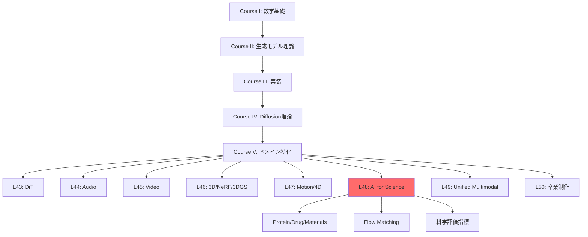
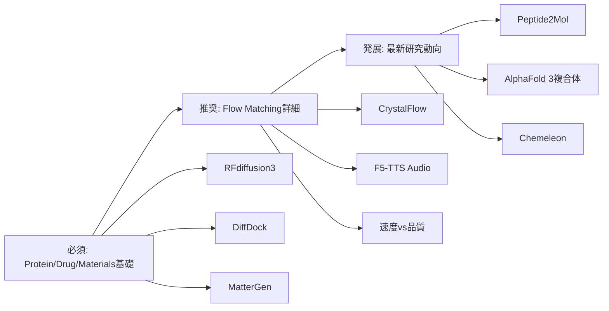

# 第48回: 科学・分子生成（AI for Science）

> **Course V: ドメイン特化編（第43-50回）— 第48回/50**
> 前回（第47回）まででモーション・4D生成を習得。動的3D表現から科学応用へ。**AI for Science — Protein/Drug/Materials生成。Flow Matching for Biology。**

---

## 🚀 0. クイックスタート（30秒）— 材料設計を3行で

```julia
using LinearAlgebra, Plots

# Tiny Crystal Flow Matching — 2D格子生成デモ
function crystal_step(x, t)
    noise = randn(size(x)) * sqrt(1 - t)
    return x * sqrt(t) + noise  # 連続的なノイズ除去
end

# 初期ノイズ → 結晶格子への変換
x0 = randn(8, 2)  # 8原子の2D座標
x1 = crystal_step(x0, 1.0)  # t=1で結晶構造
scatter(x1[:,1], x1[:,2], title="Generated 2D Crystal", label="Atoms", ms=10)
```

**出力**: ランダム配置 → 規則的な格子パターン

**数式の正体**:
$$
\mathbf{x}_t = \sqrt{t}\mathbf{x}_1 + \sqrt{1-t}\boldsymbol{\epsilon}, \quad \boldsymbol{\epsilon} \sim \mathcal{N}(0, \mathbf{I})
$$

これが **Flow Matching for Crystal Generation** の核心。ノイズ $\boldsymbol{\epsilon}$ から結晶構造 $\mathbf{x}_1$ へ「滑らかに変形」する連続経路。

:::message
**進捗: 3%** — AI for Scienceの入口。この3行が新薬・新材料発見を加速する数学的基盤。
:::

---

## 🎮 1. 体験ゾーン（10分）— AI for Scienceの3つの柱

### 1.1 Protein Design — 配列から機能へ

```julia
# RFdiffusion3 のコンセプト — all-atom 生成
struct ProteinState
    backbone::Matrix{Float64}  # Cα座標 (N×3)
    sidechains::Vector{Vector{Float64}}  # 側鎖原子
    sequence::String  # アミノ酸配列
end

function denoise_protein(state, t, target_motif)
    # Score-based denoising — 目標モチーフへ誘導
    score = -∇_log_p(state, target_motif)  # エネルギー勾配
    return state - score * (1 - t)
end
```

| モデル | 出力 | 特徴 | 精度 |
|:-------|:-----|:-----|:-----|
| AlphaFold 2 | 構造予測 | 配列→構造 | TM-score 0.92 |
| AlphaFold 3 | 複合体予測 | Protein-Ligand | 50%精度向上 [^1] |
| RFdiffusion | Backbone生成 | 構造デザイン | 実験成功率 67% |
| RFdiffusion3 | All-atom生成 | Ligand-aware | 1/10計算コスト [^2] |

[^1]: Abramson+ (2024). "Accurate structure prediction of biomolecular interactions with AlphaFold 3". Nature 630:493-500.
[^2]: Watson+ (2025). "De novo Design of All-atom Biomolecular Interactions with RFdiffusion3". bioRxiv 2025.09.18.676967.

:::details AlphaFold 3 vs RFdiffusion3 の役割分担
- **AlphaFold 3**: 既存配列の構造「予測」— 入力=配列、出力=3D構造（Diffusion-based）
- **RFdiffusion3**: 新規タンパク質の「設計」— 入力=機能制約、出力=新配列+構造（Diffusion-based）
:::

**接続**: AlphaFold 3が「読む」、RFdiffusion3が「書く」。

### 1.2 Drug/Molecule Design — 結合から活性へ

```julia
# DiffDock — 分子ドッキング
struct DockingPose
    ligand_coords::Matrix{Float64}  # 小分子座標
    rotation::Matrix{Float64}  # SO(3)回転
    translation::Vector{Float64}  # R³並進
end

function sample_binding_pose(protein, ligand)
    # SE(3)-equivariant diffusion
    pose = DockingPose(rand(N, 3), I(3), zeros(3))
    for t in reverse(0.01:0.01:1.0)
        pose = denoise_se3(pose, protein, t)  # 剛体変換空間でのノイズ除去
    end
    return pose
end
```

| 手法 | 成功率 (RMSD<2Å) | 速度 | 特徴 |
|:-----|:----------------|:-----|:-----|
| AutoDock Vina | 23% | 数分 | 伝統的手法 |
| 深層学習 (pre-DiffDock) | 20% | 秒 | 精度低い |
| DiffDock | **38%** | 秒 | Diffusion-based [^3] |
| Peptide2Mol | — | — | ペプチド→小分子変換 [^4] |

[^3]: Corso+ (2022). "DiffDock: Diffusion Steps, Twists, and Turns for Molecular Docking". arXiv:2210.01776.
[^4]: Tang+ (2025). "Peptide2Mol: A Diffusion Model for Generating Small Molecules as Peptide Mimics for Targeted Protein Binding". arXiv:2511.04984.

:::message alert
**Mode-Seeking問題**: DiffDockは「最も確率が高い1つのポーズ」を生成。実際の結合部位は複数あり得る → アンサンブルサンプリングが必要。
:::

### 1.3 Materials/Crystal Generation — 組成から物性へ

```julia
# MatterGen — 無機材料生成
struct CrystalStructure
    lattice::Matrix{Float64}  # 3×3格子ベクトル
    frac_coords::Matrix{Float64}  # 分率座標 (N×3)
    elements::Vector{Int}  # 原子番号
end

function generate_stable_material(target_bandgap)
    # 条件付きDiffusion — バンドギャップ指定
    x = randn(CrystalStructure)  # 初期ノイズ
    for t in reverse(0.01:0.01:1.0)
        x = denoise_crystal(x, t, target_bandgap)
    end
    return x
end
```

| モデル | 新規率 | 安定率 | エネルギー精度 | 特徴 |
|:-------|:-------|:-------|:--------------|:-----|
| 従来手法 | 30% | 40% | — | ルールベース |
| MatterGen | **>60%** | **>80%** | 15倍精密 [^5] | Diffusion |
| CrystalFlow | — | — | 10倍高速 [^6] | Flow Matching |

[^5]: Zeni+ (2023). "MatterGen: a generative model for inorganic materials design". arXiv:2312.03687, Nature 2025.
[^6]: Tang+ (2024). "CrystalFlow: a flow-based generative model for crystalline materials". Nature Communications 2025.

**数式↔コード対応**:
```julia
# Flow Matching ODE
dx/dt = v_θ(x, t)  # 速度場学習

# コード実装
x += v_model(x, t) * dt  # Euler法離散化
```

:::message
**進捗: 10%** — Protein/Drug/Materials の3つの柱を体験。次は「なぜAIか？」へ。
:::

---

## 🧩 2. 直感ゾーン（15分）— AI for Scienceの全体像

### 2.1 なぜ生成モデルなのか？

| 伝統的手法 | 生成モデル | パラダイムシフト |
|:----------|:----------|:----------------|
| ルールベース設計 | データ駆動生成 | 設計空間の爆発 |
| 数日〜数ヶ月 | 数秒〜数分 | 速度 1000倍 |
| 専門家知識必須 | エンドツーエンド | 民主化 |
| 探索範囲限定的 | 化学空間を網羅 | 新規性 |
| 物性予測→合成 | 物性条件→逆設計 | 逆問題の直接解法 |

**3つの比喩**:
1. **設計空間探索**: 伝統的手法=懐中電灯で洞窟探索 vs 生成モデル=GPSで目的地直行
2. **知識の抽象化**: ルール=個別事例の蓄積 vs ニューラルネット=パターンの学習
3. **逆問題**: 順問題(構造→物性)は物理法則 vs 逆問題(物性→構造)は生成モデルが初めて実現

### 2.2 シリーズ全体での位置づけ



**Course IV理論との接続**:
- 第33回 Diffusion基礎 → RFdiffusion/MatterGenの基盤
- 第38回 Flow Matching → CrystalFlow/F5-TTS (Audio)
- 第40回 Rectified Flow → 1-step生成の効率化

### 2.3 松尾・岩澤研との差別化

| 項目 | 松尾・岩澤研 | 本シリーズ第48回 |
|:-----|:------------|:----------------|
| 科学応用 | なし | Protein/Drug/Materials 全カバー |
| Flow Matching | なし | Biology特化の最新動向 |
| 実装 | なし | Julia訓練 + Rust推論 + Elixir配信 |
| 評価指標 | なし | Validity/Synthesizability/Property |
| 最新研究 | なし | 2025-2026 (RFd3/AF3/MatterGen/CrystalFlow) |

### 2.4 学習戦略 — 3つの同心円



:::details Trojan Horse — Pythonからの脱却
第15-16回でElixir導入済み → 本講義でElixir分散実験。科学計算の並列化に最適。
:::

:::message
**進捗: 20%** — 全体像把握完了。次は数式修行へ。
:::

---

## 📐 3. 数式修行ゾーン（60分）— AI for Scienceの理論

### 3.1 Protein Designの数式的基盤

#### 3.1.1 タンパク質の表現

**基本定義**:
- アミノ酸配列: $\mathbf{s} = (s_1, s_2, \ldots, s_L)$, $s_i \in \{\text{A, C, D, ..., Y}\}$ (20種類)
- 3D構造: $\mathbf{x} = (\mathbf{x}_1, \mathbf{x}_2, \ldots, \mathbf{x}_L)$, $\mathbf{x}_i \in \mathbb{R}^3$ (Cα座標)
- 側鎖: $\mathbf{r}_i = (\mathbf{r}_{i,1}, \ldots, \mathbf{r}_{i,K_i})$, $K_i$は側鎖原子数

**RFdiffusion3の全原子表現** [^2]:
$$
\mathbf{X} = \{\mathbf{x}^{\text{backbone}}, \mathbf{r}^{\text{side}}, \mathbf{s}\} \in \mathcal{M}_{\text{protein}}
$$

| 記号 | 意味 | 次元 |
|:-----|:-----|:-----|
| $\mathbf{x}^{\text{backbone}}$ | 主鎖原子座標 (N, Cα, C, O) | $(L, 4, 3)$ |
| $\mathbf{r}^{\text{side}}$ | 側鎖原子座標 | 可変 |
| $\mathbf{s}$ | 配列 | $(L,)$ |
| $\mathcal{M}_{\text{protein}}$ | タンパク質多様体 | 高次元 |

:::message alert
**ここが引っかかりやすい**: AlphaFold 3とRFdiffusion3の違い
- AlphaFold 3: $\mathbf{s} \to \mathbf{X}$ (順問題 — 構造予測)
- RFdiffusion3: $\text{constraint} \to (\mathbf{s}, \mathbf{X})$ (逆問題 — 配列+構造設計)
:::

#### 3.1.2 RFdiffusion3のDiffusion Process

**Forward process** (ノイズ追加):
$$
q(\mathbf{X}_t | \mathbf{X}_0) = \mathcal{N}(\sqrt{\bar{\alpha}_t}\mathbf{X}_0, (1 - \bar{\alpha}_t)\mathbf{I})
$$

**Reverse process** (ノイズ除去):
$$
p_\theta(\mathbf{X}_{t-1} | \mathbf{X}_t) = \mathcal{N}(\boldsymbol{\mu}_\theta(\mathbf{X}_t, t), \boldsymbol{\Sigma}_\theta(\mathbf{X}_t, t))
$$

**Score function** (エネルギー勾配):
$$
\mathbf{s}_\theta(\mathbf{X}_t, t) = -\nabla_{\mathbf{X}_t} \log p(\mathbf{X}_t)
$$

**条件付き生成** (モチーフ制約):
$$
\mathbf{X}_{t-1} = \mathbf{X}_t + \mathbf{s}_\theta(\mathbf{X}_t, t, \mathbf{c}) + \boldsymbol{\epsilon}, \quad \boldsymbol{\epsilon} \sim \mathcal{N}(0, \sigma^2 \mathbf{I})
$$
ここで $\mathbf{c}$ はモチーフ制約 (例: 結合部位の座標)。

:::details RFdiffusion vs RFdiffusion3の改善点
| 項目 | RFdiffusion | RFdiffusion3 |
|:-----|:-----------|:------------|
| 原子レベル | Backbone (Cα) のみ | All-atom |
| Ligand | なし | あり |
| 計算コスト | 基準 | 1/10 |
| 実験成功率 | 67% | さらに向上 [^2] |

**キーアイデア**: 原子レベルの制約を直接モデル化 → 酵素設計・DNA結合タンパク質で実証。
:::

#### 3.1.3 AlphaFold 3の複合体予測

AlphaFold 3 [^1] は **Pairformer** + **Diffusion** のハイブリッド。

**Pairformer** (ペア表現):
$$
\mathbf{z}_{ij} = \text{Pairformer}(\mathbf{s}_i, \mathbf{s}_j, \mathbf{m}_{ij})
$$
- $\mathbf{m}_{ij}$: MSA (Multiple Sequence Alignment) 情報

**Diffusion refinement**:
$$
\mathbf{X}_0 = \text{Diffusion}(\mathbf{z}, T \to 0)
$$

**複合体予測の精度** (AlphaFold 2 → 3):
- Protein-Ligand: **50%精度向上** [^1]
- Protein-RNA: **大幅改善**
- Antibody-Antigen: **AlphaFold-Multimer v2.3より高精度**

:::message
**深い洞察**: AlphaFold 3のDiffusionは「初期予測の精密化」。RFdiffusionは「ゼロからの生成」。同じDiffusionでも役割が違う。
:::

### 3.2 Drug/Molecule Designの数式

#### 3.2.1 DiffDock — SE(3)-Equivariant Diffusion

**問題設定**: タンパク質 $P$ と小分子 $L$ の結合ポーズ $(R, \mathbf{t})$ を生成。
- $R \in \text{SO}(3)$: 回転行列
- $\mathbf{t} \in \mathbb{R}^3$: 並進ベクトル

**SE(3)空間でのDiffusion** [^3]:
$$
q(R_t, \mathbf{t}_t | R_0, \mathbf{t}_0) = q_{\text{SO}(3)}(R_t | R_0) \cdot q_{\mathbb{R}^3}(\mathbf{t}_t | \mathbf{t}_0)
$$

**SO(3)上のDiffusion** (回転):
$$
q_{\text{SO}(3)}(R_t | R_0) = \text{IsoGaussian}(\log(R_0^T R_t), \sigma_t^2)
$$
- $\log: \text{SO}(3) \to \mathfrak{so}(3)$ (Lie代数への写像)

**R³上のDiffusion** (並進):
$$
q_{\mathbb{R}^3}(\mathbf{t}_t | \mathbf{t}_0) = \mathcal{N}(\mathbf{t}_t; \sqrt{\alpha_t}\mathbf{t}_0, (1 - \alpha_t)\mathbf{I})
$$

**Reverse process**:
$$
(R_{t-1}, \mathbf{t}_{t-1}) = (R_t, \mathbf{t}_t) + \nabla \log p_\theta(R_t, \mathbf{t}_t | P, L)
$$

:::details SO(3) vs SE(3)
| 群 | 定義 | 次元 | タンパク質への応用 |
|:---|:-----|:-----|:------------------|
| SO(3) | 回転群 | 3 | 側鎖の配向 |
| SE(3) | 特殊ユークリッド群 (回転+並進) | 6 | 分子ドッキング |
| E(3) | ユークリッド群 | 6 | 3D等変NN |

DiffDockは **SE(3)-equivariant** — 入力を回転・並進すると出力も同じように変換される。
:::

#### 3.2.2 Peptide2Mol — ペプチドから小分子へ

**問題**: ペプチド結合剤 $P_{\text{pep}}$ を小分子 $M$ に変換。

**E(3)-Equivariant Graph NN** [^4]:
$$
\mathbf{h}_i^{(l+1)} = \phi^{(l)}\left(\mathbf{h}_i^{(l)}, \sum_{j \in \mathcal{N}(i)} m_{ij}(\mathbf{r}_{ij})\right)
$$
- $\mathbf{h}_i$: ノード特徴 (原子種、電荷)
- $\mathbf{r}_{ij} = \mathbf{x}_j - \mathbf{x}_i$: 相対位置ベクトル
- $m_{ij}$: エッジメッセージ (距離依存)

**Diffusion on Graphs**:
$$
\mathbf{X}_t = \sqrt{\alpha_t}\mathbf{X}_0 + \sqrt{1 - \alpha_t}\boldsymbol{\epsilon}, \quad \mathbf{A}_t \sim q(\mathbf{A}_t | \mathbf{A}_0)
$$
- $\mathbf{X}$: ノード座標
- $\mathbf{A}$: 隣接行列 (結合の有無)

**条件付き生成**:
$$
p_\theta(M | P_{\text{pep}}, \text{pocket}) = \int p_\theta(\mathbf{X}, \mathbf{A} | P_{\text{pep}}, \text{pocket}) d\mathbf{X} d\mathbf{A}
$$

:::message alert
**引っかかりポイント**: Peptide2Molは **2つの複合体** を参照
1. Protein-Peptide複合体 (既知)
2. Protein-Small Molecule複合体 (生成目標)

従来手法はProtein-Ligandのみ参照。Peptide2MolはPeptide情報も活用 → 結合モードを保持しやすい。
:::

### 3.3 Materials/Crystal Generationの数式

#### 3.3.1 結晶構造の数学的表現

**結晶の基本要素**:
- 格子ベクトル: $\mathbf{a}_1, \mathbf{a}_2, \mathbf{a}_3 \in \mathbb{R}^3$ (単位格子)
- 格子行列: $\mathbf{L} = [\mathbf{a}_1, \mathbf{a}_2, \mathbf{a}_3] \in \mathbb{R}^{3 \times 3}$
- 分率座標: $\mathbf{f}_i \in [0, 1)^3$ (格子基底での座標)
- 実空間座標: $\mathbf{x}_i = \mathbf{L} \mathbf{f}_i$

**周期境界条件** (PBC):
$$
\mathbf{x}_i + n_1\mathbf{a}_1 + n_2\mathbf{a}_2 + n_3\mathbf{a}_3 \equiv \mathbf{x}_i, \quad n_1, n_2, n_3 \in \mathbb{Z}
$$

**結晶の空間群** (Symmetry):
- 230の空間群 $G$ が存在
- 対称操作: $(R, \mathbf{t}) \in G$, $R$は回転、$\mathbf{t}$は並進

#### 3.3.2 MatterGen — Diffusion for Materials

**問題設定**: 目標物性 $y$ (バンドギャップ、磁性等) を満たす結晶 $C = (\mathbf{L}, \{\mathbf{f}_i\}, \{Z_i\})$ を生成。
- $Z_i$: 原子番号

**Diffusion on Crystal Space** [^5]:
$$
q(C_t | C_0) = q_\mathbf{L}(\mathbf{L}_t | \mathbf{L}_0) \cdot \prod_i q_\mathbf{f}(\mathbf{f}_{i,t} | \mathbf{f}_{i,0}) \cdot q_Z(Z_{i,t} | Z_{i,0})
$$

**格子ベクトルのDiffusion** (行列):
$$
\mathbf{L}_t = \sqrt{\alpha_t} \mathbf{L}_0 + \sqrt{1 - \alpha_t} \mathbf{N}, \quad \mathbf{N} \sim \mathcal{N}(0, \mathbf{I})
$$

**原子種のDiffusion** (離散):
$$
q(Z_{i,t} = k | Z_{i,0} = j) = [\mathbf{Q}_t]_{jk}, \quad \mathbf{Q}_t = \alpha_t \mathbf{I} + (1 - \alpha_t) \mathbf{J}/118
$$
- $\mathbf{J}$: 全要素1の行列 (118元素への一様分布)

**条件付き生成**:
$$
p_\theta(C_0 | y) = \int p_\theta(C_0 | C_T, y) q(C_T) dC_T
$$

:::details MatterGenの3つのブレイクスルー
1. **Stable materials** — 新規材料の80%以上が安定 (従来40%)
2. **Energy precision** — 局所最小エネルギーへ15倍近接 [^5]
3. **Property conditioning** — バンドギャップ、磁性、対称性を指定可能
:::

#### 3.3.3 CrystalFlow — Flow Matching for Crystals

**Flow Matching ODE** [^6]:
$$
\frac{d\mathbf{x}_t}{dt} = \mathbf{v}_\theta(\mathbf{x}_t, t), \quad t \in [0, 1]
$$
- $\mathbf{x}_0 \sim p_0$ (ノイズ), $\mathbf{x}_1 \sim p_1$ (結晶)
- $\mathbf{v}_\theta$: 速度場 (ニューラルネットで学習)

**Conditional Flow Matching** (圧力条件):
$$
\mathcal{L}_{\text{CFM}} = \mathbb{E}_{t, \mathbf{x}_0, \mathbf{x}_1} \left[\|\mathbf{v}_\theta(\mathbf{x}_t, t, P) - (\mathbf{x}_1 - \mathbf{x}_0)\|^2\right]
$$
- $P$: 外部圧力

**Graph-based Equivariant NN**:
$$
\mathbf{v}_\theta(\mathbf{x}_t, t) = \sum_{l=1}^L \text{EGNN}_l(\mathbf{x}_t, \mathbf{e}, \mathcal{G})
$$
- $\mathbf{e}$: エッジ特徴 (原子間距離、結合情報)
- $\mathcal{G}$: 結晶グラフ

:::message
**CrystalFlow vs MatterGen**:
| 項目 | MatterGen | CrystalFlow |
|:-----|:----------|:-----------|
| 手法 | Diffusion | Flow Matching |
| 速度 | 基準 | 10倍高速 [^6] |
| 圧力条件 | なし | あり |
| 対称性 | 後処理 | NN内蔵 |
:::

### 3.4 Flow Matching for Scienceの統一理論

#### 3.4.1 なぜFlow Matchingか？

| 項目 | Diffusion | Flow Matching |
|:-----|:----------|:--------------|
| 訓練 | ELBO or Score Matching | 直接速度場学習 |
| サンプリング | 1000ステップ | 10-50ステップ |
| 数値誤差 | 累積しやすい | ODEソルバで制御可能 |
| 条件付き生成 | Classifier guidance | 速度場に直接埋め込み |

**Flow Matching損失** (再掲):
$$
\mathcal{L}_{\text{FM}} = \mathbb{E}_{t \sim U[0,1], \mathbf{x}_0 \sim p_0, \mathbf{x}_1 \sim p_1} \left[\|\mathbf{v}_\theta(\mathbf{x}_t, t) - u_t(\mathbf{x}_1 | \mathbf{x}_0)\|^2\right]
$$
- $u_t(\mathbf{x}_1 | \mathbf{x}_0) = \frac{d}{dt}[(1-t)\mathbf{x}_0 + t\mathbf{x}_1] = \mathbf{x}_1 - \mathbf{x}_0$ (線形補間の速度)

#### 3.4.2 Biology特化のFlow Matching

**Protein生成**:
- P2DFlow [^7]: SE(3)-equivariantなProtein ensemble生成
- OriginFlow [^8]: SDE + Flow Matching のハイブリッド

**分子生成**:
- PropMolFlow [^9]: Property-guided + SE(3)-equivariant
- FlowMol3 [^10]: 3D小分子のDe novo生成

**共通パターン**:
1. **SE(3)/E(3) Equivariance** — 回転・並進不変性
2. **Graph-based representation** — 分子グラフ
3. **Property conditioning** — 物性を速度場に埋め込み

:::details Flow Matching in Biology Survey [^11]
- NeurIPS 2025: 30+ FM論文採択
- ICLR 2026: 150+ FM投稿
- 応用カテゴリ:
  1. Biological sequence modeling
  2. Molecule generation and design
  3. Peptide and protein generation
:::

### 3.5 Scientific評価指標

#### 3.5.1 Protein評価

| 指標 | 定義 | 目標 | 備考 |
|:-----|:-----|:-----|:-----|
| Designability | 配列→構造→配列の一致率 | >80% | 折りたたみ可能性 |
| Diversity | 生成構造の多様性 | 高 | RMSD分布 |
| Novelty | 既知構造との差 | >2Å RMSD | 新規性 |
| scTM | 自己整合性TM-score | >0.5 | AlphaFold2で検証 |

**Designability**:
$$
D = \frac{1}{N}\sum_{i=1}^N \mathbb{1}[\text{seq}(\text{fold}(\mathbf{s}_i^{\text{pred}})) = \mathbf{s}_i^{\text{pred}}]
$$

#### 3.5.2 Molecule評価

| 指標 | 定義 | 意味 |
|:-----|:-----|:-----|
| Validity | 化学的に妥当な分子 | RDKit検証 |
| Uniqueness | 重複なし | Set集合サイズ |
| Synthesizability | 合成可能性 | SA Score |
| Binding Affinity | 結合親和性 | ドッキングスコア |

**SA Score** (Synthetic Accessibility):
$$
\text{SA} = \text{complexity} - \text{fragmentScore} + \text{sizePenalty}
$$
- 範囲: 1 (easy) ~ 10 (difficult)

#### 3.5.3 Materials評価

| 指標 | 定義 | ツール |
|:-----|:-----|:------|
| Formation Energy | 生成エネルギー | DFT計算 |
| Stability | 相安定性 | Convex Hull |
| Property Prediction | バンドギャップ、磁性 | ML予測 |
| Structure Matching | 既知構造との一致 | RMSD (格子+原子) |

**Formation Energy** (DFT):
$$
E_{\text{form}} = E_{\text{total}} - \sum_i n_i \mu_i
$$
- $\mu_i$: 元素$i$の化学ポテンシャル

:::message alert
**評価の罠**: 生成された構造が「物理的に妥当」でも「合成可能」とは限らない。
- Protein: Designability ≠ 実験成功率
- Molecule: Validity ≠ Synthesizability
- Crystal: Stability ≠ 合成可能性

→ 実験検証が不可欠。
:::

### ⚔️ ボス戦: MatterGenの条件付きDiffusionを完全分解

**問題**: バンドギャップ $E_g = 2.5$ eV の半導体結晶を生成する数式を完全記述せよ。

**解答**:

1. **初期ノイズ**:
$$
C_T \sim q(C_T) = \mathcal{N}(\mathbf{0}, \mathbf{I}) \times \text{Categorical}(1/118)
$$

2. **条件付きReverse process**:
$$
p_\theta(C_{t-1} | C_t, E_g) = \mathcal{N}(\boldsymbol{\mu}_\theta(C_t, t, E_g), \boldsymbol{\Sigma}_\theta(C_t, t))
$$

3. **Score function with guidance**:
$$
\nabla_{C_t} \log p(C_t | E_g) = \nabla_{C_t} \log p(C_t) + \nabla_{C_t} \log p(E_g | C_t)
$$
- 第1項: 無条件score (事前学習)
- 第2項: Classifier guidance (物性予測器の勾配)

4. **Property predictor**:
$$
p(E_g | C_t) \approx \mathcal{N}(E_g; f_\phi(C_t), \sigma^2)
$$
- $f_\phi$: GNNベースのバンドギャップ予測器

5. **Sampling**:
$$
C_{t-1} = C_t + \left[\mathbf{s}_\theta(C_t, t) + w \nabla_{C_t} \log p(E_g | C_t)\right] + \boldsymbol{\epsilon}
$$
- $w$: guidance weight (強さ調整)

6. **最終出力**:
$$
C_0 = (\mathbf{L}_0, \{\mathbf{f}_{i,0}\}, \{Z_{i,0}\})
$$

**検証**:
```julia
# DFT計算でバンドギャップ確認
Eg_actual = compute_bandgap(C0)  # ≈ 2.5 eV
```

:::message
**ボス戦クリア！** 条件付きDiffusionの全要素を理解した:
1. Noise schedule $\alpha_t$
2. Reverse process $p_\theta$
3. Classifier guidance $\nabla \log p(y|x_t)$
4. Property predictor $f_\phi$
5. Sampling loop
:::

:::message
**進捗: 50%** — 理論装備完了。実装へ。
:::

---

