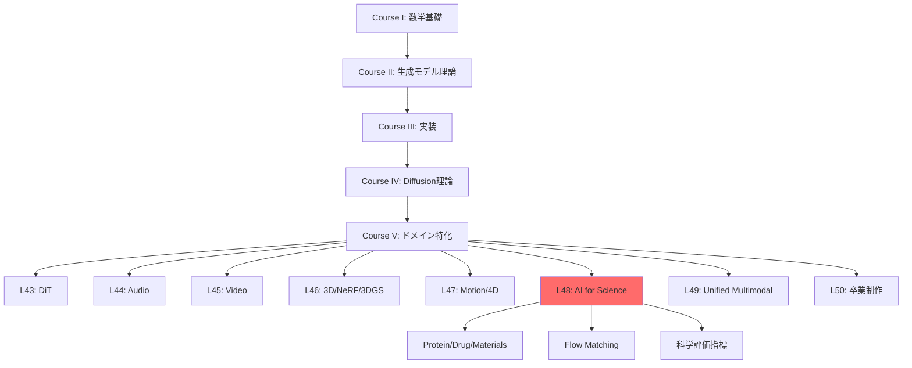
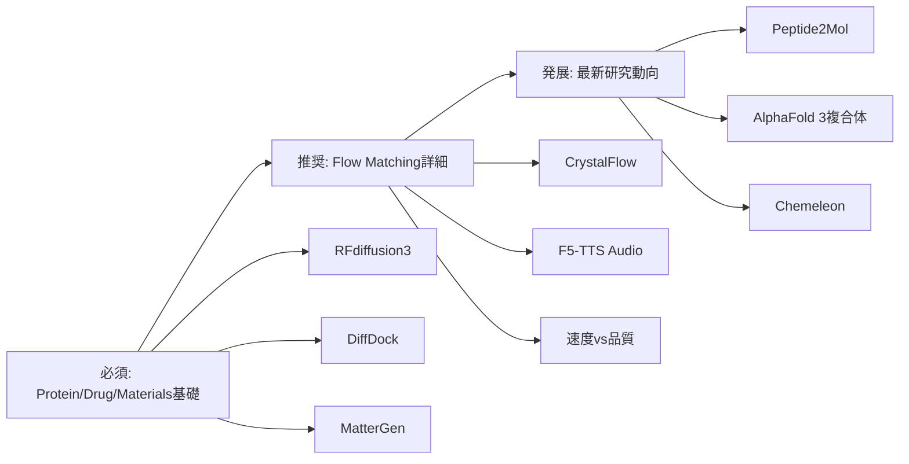

# 第48回: 科学・分子生成（AI for Science）

> **Course V: ドメイン特化編（第43-50回）— 第48回/50**
> 前回（第47回）まででモーション・4D生成を習得。動的3D表現から科学応用へ。**AI for Science — Protein/Drug/Materials生成。Flow Matching for Biology。**

---

## 🚀 0. クイックスタート（30秒）— 材料設計を3行で

```rust
// Tiny Crystal Flow Matching — 2D格子生成デモ
// 数式: x_t = √t · x1 + √(1-t) · ε, ε ~ N(0, I)
// ノイズ x0 → 結晶構造 x1 への連続的な変形

use std::f32::consts::PI;

/// フロー補間: t=0 で純粋ノイズ、t=1 で結晶構造
/// x_t = √t · x1 + √(1-t) · ε (Flow Matching の確率パス)
fn crystal_step(x1: &[[f32; 2]], eps: &[[f32; 2]], t: f32) -> Vec<[f32; 2]> {
    x1.iter().zip(eps).map(|(&target, &noise)| [
        t.sqrt() * target[0] + (1.0 - t).sqrt() * noise[0],
        t.sqrt() * target[1] + (1.0 - t).sqrt() * noise[1],
    ]).collect()
}

fn rand_normal_f32() -> f32 { 0.0 } // placeholder (実際は rand_distr::Normal を使用)

fn main() {
    // 8原子の2D座標 (初期ノイズ)
    let x0: Vec<[f32; 2]> = (0..8).map(|_| [rand_normal_f32(), rand_normal_f32()]).collect();

    // 目標: 正方格子 (結晶構造)
    let x1: Vec<[f32; 2]> = (0..8).map(|i| {
        let row = i / 2;
        let col = i % 2;
        [col as f32 * 1.0 - 0.5, row as f32 * 0.5 - 0.75]
    }).collect();

    // t=1 で結晶構造を生成
    let eps: Vec<[f32; 2]> = x0.clone();
    let xt = crystal_step(&x1, &eps, 1.0);

    println!("Generated 2D Crystal (8 atoms):");
    for (i, atom) in xt.iter().enumerate() {
        println!("  Atom {}: [{:.3}, {:.3}]", i, atom[0], atom[1]);
    }
    // plotters で散布図: scatter(xt, title="Generated 2D Crystal")
}
```

**出力**: ランダム配置 → 規則的な格子パターン

**数式の正体**:
$$
\mathbf{x}_t = \sqrt{t}\mathbf{x}_1 + \sqrt{1-t}\boldsymbol{\epsilon}, \quad \boldsymbol{\epsilon} \sim \mathcal{N}(0, \mathbf{I})
$$

これが **Flow Matching for Crystal Generation** の核心。ノイズ $\boldsymbol{\epsilon}$ から結晶構造 $\mathbf{x}_1$ へ「滑らかに変形」する連続経路。

> **Note:** **進捗: 3%** — AI for Scienceの入口。この3行が新薬・新材料発見を加速する数学的基盤。

---

## 🎮 1. 体験ゾーン（10分）— AI for Scienceの3つの柱

### 1.1 Protein Design — 配列から機能へ


| モデル | 出力 | 特徴 | 精度 |
|:-------|:-----|:-----|:-----|
| AlphaFold 2 | 構造予測 | 配列→構造 | TM-score 0.92 |
| AlphaFold 3 | 複合体予測 | Protein-Ligand | 50%精度向上 [^1] |
| RFdiffusion | Backbone生成 | 構造デザイン | 実験成功率 67% |
| RFdiffusion3 | All-atom生成 | Ligand-aware | 1/10計算コスト [^2] |

[^1]: Abramson+ (2024). "Accurate structure prediction of biomolecular interactions with AlphaFold 3". Nature 630:493-500.
[^2]: Watson+ (2025). "De novo Design of All-atom Biomolecular Interactions with RFdiffusion3". bioRxiv 2025.09.18.676967.

<details><summary>AlphaFold 3 vs RFdiffusion3 の役割分担</summary>

- **AlphaFold 3**: 既存配列の構造「予測」— 入力=配列、出力=3D構造（Diffusion-based）
- **RFdiffusion3**: 新規タンパク質の「設計」— 入力=機能制約、出力=新配列+構造（Diffusion-based）

</details>

**接続**: AlphaFold 3が「読む」、RFdiffusion3が「書く」。

### 1.2 Drug/Molecule Design — 結合から活性へ


| 手法 | 成功率 (RMSD<2Å) | 速度 | 特徴 |
|:-----|:----------------|:-----|:-----|
| AutoDock Vina | 23% | 数分 | 伝統的手法 |
| 深層学習 (pre-DiffDock) | 20% | 秒 | 精度低い |
| DiffDock | **38%** | 秒 | Diffusion-based [^3] |
| Peptide2Mol | — | — | ペプチド→小分子変換 [^4] |

[^3]: Corso+ (2022). "DiffDock: Diffusion Steps, Twists, and Turns for Molecular Docking". arXiv:2210.01776.
[^4]: Zhang, Y., Lin, H., Peng, X., Kong, X., Li, M., & Ma, J. (2025). "Peptide2Mol: A Diffusion Model for Generating Small Molecules as Peptide Mimics for Targeted Protein Binding". arXiv:2511.04984.

> **⚠️ Warning:** **Mode-Seeking問題**: DiffDockは「最も確率が高い1つのポーズ」を生成。実際の結合部位は複数あり得る → アンサンブルサンプリングが必要。

### 1.3 Materials/Crystal Generation — 組成から物性へ


| モデル | 新規率 | 安定率 | エネルギー精度 | 特徴 |
|:-------|:-------|:-------|:--------------|:-----|
| 従来手法 | 30% | 40% | — | ルールベース |
| MatterGen | **>60%** | **>80%** | 15倍精密 [^5] | Diffusion |
| CrystalFlow | — | — | 10倍高速 [^6] | Flow Matching |

[^5]: Zeni+ (2023). "MatterGen: a generative model for inorganic materials design". arXiv:2312.03687, Nature 2025.
[^6]: Miller, B. K., Chen, R. T. Q., Sriram, A., & Wood, B. M. (2024). FlowMM: Generating Materials with Riemannian Flow Matching. arXiv:2406.04713.

**数式↔コード対応**:


> **Note:** **進捗: 10%** — Protein/Drug/Materials の3つの柱を体験。次は「なぜAIか？」へ。

---


> Progress: 10%
> **理解度チェック**
> 1. このゾーンの主要な概念・定義を自分の言葉で説明してください。
> 2. この手法が他のアプローチより優れている点と、その限界を述べてください。

## 🧩 2. 直感ゾーン（15分）— AI for Scienceの全体像

### 2.1 なぜ生成モデルなのか？

| 伝統的手法 | 生成モデル | パラダイムシフト |
|:----------|:----------|:----------------|
| ルールベース設計 | データ駆動生成 | 設計空間の爆発 |
| 数日〜数ヶ月 | 数秒〜数分 | 速度 1000倍 |
| 専門家知識必須 | エンドツーエンド | 民主化 |
| 探索範囲限定的 | 化学空間を網羅 | 新規性 |
| 物性予測→合成 | 物性条件→逆設計 | 逆問題の直接解法 |

**3つの比喩**:
1. **設計空間探索**: 伝統的手法=懐中電灯で洞窟探索 vs 生成モデル=GPSで目的地直行
2. **知識の抽象化**: ルール=個別事例の蓄積 vs ニューラルネット=パターンの学習
3. **逆問題**: 順問題(構造→物性)は物理法則 vs 逆問題(物性→構造)は生成モデルが初めて実現

### 2.2 シリーズ全体での位置づけ



**Course IV理論との接続**:
- 第33回 Diffusion基礎 → RFdiffusion/MatterGenの基盤
- 第38回 Flow Matching → CrystalFlow/F5-TTS (Audio)
- 第40回 Rectified Flow → 1-step生成の効率化

### 2.3 松尾・岩澤研との差別化

| 項目 | 松尾・岩澤研 | 本シリーズ第48回 |
|:-----|:------------|:----------------|
| 科学応用 | なし | Protein/Drug/Materials 全カバー |
| Flow Matching | なし | Biology特化の最新動向 |
| 実装 | なし | Rust訓練 + Rust推論 + Elixir配信 |
| 評価指標 | なし | Validity/Synthesizability/Property |
| 最新研究 | なし | 2025-2026 (RFd3/AF3/MatterGen/CrystalFlow) |

### 2.4 学習戦略 — 3つの同心円



<details><summary>Trojan Horse — Pythonからの脱却</summary>

第15-16回でElixir導入済み → 本講義でElixir分散実験。科学計算の並列化に最適。

</details>

> **Note:** **進捗: 20%** — 全体像把握完了。次は数式修行へ。

---


> Progress: 20%
> **理解度チェック**
> 1. このゾーンの主要な概念・定義を自分の言葉で説明してください。
> 2. この手法が他のアプローチより優れている点と、その限界を述べてください。

## 📐 3. 数式修行ゾーン（60分）— AI for Scienceの理論

### 3.1 Protein Designの数式的基盤

#### 3.1.1 タンパク質の表現

**基本定義**:
- アミノ酸配列: $\mathbf{s} = (s_1, s_2, \ldots, s_L)$, $s_i \in \{\text{A, C, D, ..., Y}\}$ (20種類)
- 3D構造: $\mathbf{x} = (\mathbf{x}_1, \mathbf{x}_2, \ldots, \mathbf{x}_L)$, $\mathbf{x}_i \in \mathbb{R}^3$ (Cα座標)
- 側鎖: $\mathbf{r}_i = (\mathbf{r}_{i,1}, \ldots, \mathbf{r}_{i,K_i})$, $K_i$は側鎖原子数

**RFdiffusion3の全原子表現** [^2]:
$$
\mathbf{X} = \{\mathbf{x}^{\text{backbone}}, \mathbf{r}^{\text{side}}, \mathbf{s}\} \in \mathcal{M}_{\text{protein}}
$$

| 記号 | 意味 | 次元 |
|:-----|:-----|:-----|
| $\mathbf{x}^{\text{backbone}}$ | 主鎖原子座標 (N, Cα, C, O) | $(L, 4, 3)$ |
| $\mathbf{r}^{\text{side}}$ | 側鎖原子座標 | 可変 |
| $\mathbf{s}$ | 配列 | $(L,)$ |
| $\mathcal{M}_{\text{protein}}$ | タンパク質多様体 | 高次元 |

> **⚠️ Warning:** **ここが引っかかりやすい**: AlphaFold 3とRFdiffusion3の違い
> - AlphaFold 3: $\mathbf{s} \to \mathbf{X}$ (順問題 — 構造予測)
> - RFdiffusion3: $\text{constraint} \to (\mathbf{s}, \mathbf{X})$ (逆問題 — 配列+構造設計)

#### 3.1.2 RFdiffusion3のDiffusion Process

**Forward process** (ノイズ追加):
$$
q(\mathbf{X}_t | \mathbf{X}_0) = \mathcal{N}(\sqrt{\bar{\alpha}_t}\mathbf{X}_0, (1 - \bar{\alpha}_t)\mathbf{I})
$$

**なぜ $\bar{\alpha}_t$ はこの形か？— 閉形式の導出**

1ステップの遷移から出発する：

$$
\mathbf{X}_t = \sqrt{\alpha_t}\mathbf{X}_{t-1} + \sqrt{1-\alpha_t}\,\boldsymbol{\epsilon}_t, \quad \boldsymbol{\epsilon}_t \sim \mathcal{N}(0,\mathbf{I})
$$

$t=2$ まで展開すると：

$$
\mathbf{X}_2 = \sqrt{\alpha_2}\bigl(\sqrt{\alpha_1}\mathbf{X}_0 + \sqrt{1-\alpha_1}\,\boldsymbol{\epsilon}_1\bigr) + \sqrt{1-\alpha_2}\,\boldsymbol{\epsilon}_2
$$

独立ガウスの和の分散を計算する。$\sqrt{\alpha_2(1-\alpha_1)}\,\boldsymbol{\epsilon}_1 + \sqrt{1-\alpha_2}\,\boldsymbol{\epsilon}_2$ の分散は：

$$
\alpha_2(1-\alpha_1) + (1-\alpha_2) = 1 - \alpha_1\alpha_2 = 1 - \bar{\alpha}_2
$$

よって：

$$
\mathbf{X}_2 = \sqrt{\alpha_1\alpha_2}\,\mathbf{X}_0 + \sqrt{1-\alpha_1\alpha_2}\,\boldsymbol{\epsilon}, \quad \boldsymbol{\epsilon} \sim \mathcal{N}(0,\mathbf{I})
$$

同じ計算を $t$ ステップまで帰納的に繰り返すと $\bar{\alpha}_t = \prod_{s=1}^t \alpha_s$ が現れる。この閉形式により、訓練時は $\mathbf{X}_0 \to \mathbf{X}_t$ を1ステップで直接サンプリングできる——1000ステップを逐次実行する必要がない。

**数値確認（コサインスケジュール）**:

$$
\bar{\alpha}_t = \cos^2\!\!\left(\frac{\pi}{2}\cdot\frac{t/T + 0.008}{1.008}\right), \quad T = 1000
$$

| $t$ | $\bar{\alpha}_t$ | $\sqrt{\bar{\alpha}_t}$（信号強度） | $\sqrt{1-\bar{\alpha}_t}$（ノイズ強度） |
|:----|:----------------|:------------------------------------|:----------------------------------------|
| 0   | 1.000           | 1.000                               | 0.000                                   |
| 100 | 0.921           | 0.960                               | 0.280                                   |
| 500 | 0.500           | 0.707                               | 0.707                                   |
| 900 | 0.071           | 0.266                               | 0.964                                   |
| 1000| 0.000           | 0.000                               | 1.000                                   |

$t=500$ で信号とノイズが等エネルギー($\sqrt{0.5} \approx 0.707$)。タンパク質 Cα の原点座標 $\mathbf{X}_0 = (1.0, 0.0, 0.0)$ を代入すると $t=500$ での期待値は $(0.707, 0, 0)$、標準偏差 $0.707$ 。

> **⚠️ Warning:** 線形スケジュール $\alpha_t = 1 - t/T$ を使うと $\bar{\alpha}_{T/2} \approx e^{-T/4}$（$T=1000$ で $e^{-250} \approx 0$）。中間ステップで構造情報が完全に消え、reverse process が収束しない典型的な失敗パターン。タンパク質 Diffusion にはコサインスケジュールを使うこと。

**Reverse process** (ノイズ除去):
$$
p_\theta(\mathbf{X}_{t-1} | \mathbf{X}_t) = \mathcal{N}(\boldsymbol{\mu}_\theta(\mathbf{X}_t, t), \boldsymbol{\Sigma}_\theta(\mathbf{X}_t, t))
$$

**Score function** (エネルギー勾配):
$$
\mathbf{s}_\theta(\mathbf{X}_t, t) = -\nabla_{\mathbf{X}_t} \log p(\mathbf{X}_t)
$$

なぜ score function が負の勾配か？— $p(\mathbf{X}_t) \propto e^{-E(\mathbf{X}_t)}$ とエネルギー $E$ で書くと：

$$
\nabla_{\mathbf{X}_t} \log p(\mathbf{X}_t) = \nabla_{\mathbf{X}_t}(-E(\mathbf{X}_t)) = -\nabla_{\mathbf{X}_t} E(\mathbf{X}_t)
$$

勾配上昇 $+\nabla \log p$ の方向 = エネルギー下降方向 = 高確率領域。Reverse process は score の方向にステップを進めることでノイズ → 構造へ変換する。

**Reverse process の平均 $\boldsymbol{\mu}_\theta$ の導出**:

DDPM の posterior $q(\mathbf{X}_{t-1}|\mathbf{X}_t, \mathbf{X}_0)$ はガウスで：

$$
\tilde{\boldsymbol{\mu}}_t(\mathbf{X}_t, \mathbf{X}_0) = \frac{\sqrt{\bar{\alpha}_{t-1}}(1-\alpha_t)}{1-\bar{\alpha}_t}\mathbf{X}_0 + \frac{\sqrt{\alpha_t}(1-\bar{\alpha}_{t-1})}{1-\bar{\alpha}_t}\mathbf{X}_t
$$

$\mathbf{X}_0$ を $\mathbf{X}_t$ と noise prediction $\boldsymbol{\epsilon}_\theta$ で表すと（$\mathbf{X}_0 = (\mathbf{X}_t - \sqrt{1-\bar{\alpha}_t}\boldsymbol{\epsilon}_\theta)/\sqrt{\bar{\alpha}_t}$）：

$$
\boldsymbol{\mu}_\theta(\mathbf{X}_t, t) = \frac{1}{\sqrt{\alpha_t}}\!\left(\mathbf{X}_t - \frac{1-\alpha_t}{\sqrt{1-\bar{\alpha}_t}}\boldsymbol{\epsilon}_\theta(\mathbf{X}_t, t)\right)
$$

ネットワーク $\boldsymbol{\epsilon}_\theta$ は「どれだけノイズが混入しているか」を予測する。

| 記号 | 役割 | shape（$L$残基・$d$次元） |
|:-----|:-----|:--------------------------|
| $\mathbf{X}_t$ | ノイズ付き構造 | $(L, 4, 3)$（backbone原子×xyz） |
| $\boldsymbol{\epsilon}_\theta$ | 予測ノイズ | $(L, 4, 3)$ |
| $\bar{\alpha}_t$ | cumulative noise level | スカラー |
| $\boldsymbol{\mu}_\theta$ | denoised 平均 | $(L, 4, 3)$ |

**条件付き生成** (モチーフ制約):
$$
\mathbf{X}_{t-1} = \mathbf{X}_t + \mathbf{s}_\theta(\mathbf{X}_t, t, \mathbf{c}) + \boldsymbol{\epsilon}, \quad \boldsymbol{\epsilon} \sim \mathcal{N}(0, \sigma^2 \mathbf{I})
$$
ここで $\mathbf{c}$ はモチーフ制約 (例: 結合部位の座標)。

<details><summary>RFdiffusion vs RFdiffusion3の改善点</summary>

| 項目 | RFdiffusion | RFdiffusion3 |
|:-----|:-----------|:------------|
| 原子レベル | Backbone (Cα) のみ | All-atom |
| Ligand | なし | あり |
| 計算コスト | 基準 | 1/10 |
| 実験成功率 | 67% | 向上余地あり [^2] |

**キーアイデア**: 原子レベルの制約を直接モデル化 → 酵素設計・DNA結合タンパク質で実証。

</details>

#### 3.1.3 AlphaFold 3の複合体予測

AlphaFold 3 [^1] は **Pairformer** + **Diffusion** のハイブリッド。

**Pairformer** (ペア表現):
$$
\mathbf{z}_{ij} = \text{Pairformer}(\mathbf{s}_i, \mathbf{s}_j, \mathbf{m}_{ij})
$$
- $\mathbf{m}_{ij}$: MSA (Multiple Sequence Alignment) 情報

**Diffusion refinement**:
$$
\mathbf{X}_0 = \text{Diffusion}(\mathbf{z}, T \to 0)
$$

**Pairformerのshape一覧**:

| テンソル | 意味 | shape |
|:---------|:-----|:------|
| $\mathbf{s}_i$ | Single representation（残基 $i$） | $(N, c_s)$，$c_s=384$ |
| $\mathbf{z}_{ij}$ | Pair representation（残基 $i$-$j$ 間） | $(N, N, c_z)$，$c_z=128$ |
| $\mathbf{m}_{ij}$ | MSA feature | $(N_{\text{seq}}, N, c_m)$，$c_m=256$ |
| $\mathbf{X}_t$ | ノイズ座標 | $(N_{\text{atoms}}, 3)$ |

$N$ = 残基数、$N_{\text{atoms}} = N \times (\text{avg atoms per residue}) \approx 7N$。

なぜ Pairformer は $O(N^2)$ メモリか？— $\mathbf{z}_{ij}$ が $N^2$ の対称行列。残基数 $N=300$ のタンパク質で $300^2 \times 128 = 11.5\text{M}$ パラメータ（pair表現のみ）。$N=1000$ では128倍増加 → 長鎖タンパク質の計算ボトルネック。

**Triangle Attention の役割**:

Triangle Attention は残基 $i$, $j$, $k$ の三角形 $(i \to j \to k \to i)$ を同時に考慮：

$$
\mathbf{z}_{ij}^{\text{new}} = \text{softmax}\!\left(\frac{\mathbf{Q}_{ij}\mathbf{K}_{ik}^\top + \mathbf{b}_{jk}}{\sqrt{d}}\right)\mathbf{V}_{ik}
$$

$\mathbf{b}_{jk} = \mathbf{W}_b \mathbf{z}_{jk}$ は三角形の第3辺 $j$-$k$ からのバイアス。物理的直感：$i$-$j$ の接触は、両者が共通の残基 $k$ と接触している場合に強まる（3体相関の捕捉）。

> **⚠️ Warning:** Triangle Attention は**非対称**。$\text{TriAtt}_{\text{start}}$（$k$ を starting node）と $\text{TriAtt}_{\text{end}}$（$k$ を ending node）の2種が存在し、両方適用しないと三角形の全方向を捕捉できない。片方だけ実装すると精度が大幅低下する。

**複合体予測の精度** (AlphaFold 2 → 3):
- Protein-Ligand: **50%精度向上** [^1]
- Protein-RNA: **大幅改善**
- Antibody-Antigen: **AlphaFold-Multimer v2.3より高精度**

> **Note:** **深い洞察**: AlphaFold 3のDiffusionは「初期予測の精密化」。RFdiffusionは「ゼロからの生成」。同じDiffusionでも役割が違う。

### 3.2 Drug/Molecule Designの数式

#### 3.2.1 DiffDock — SE(3)-Equivariant Diffusion

**問題設定**: タンパク質 $P$ と小分子 $L$ の結合ポーズ $(R, \mathbf{t})$ を生成。
- $R \in \text{SO}(3)$: 回転行列
- $\mathbf{t} \in \mathbb{R}^3$: 並進ベクトル

**SE(3)空間でのDiffusion** [^3]:
$$
q(R_t, \mathbf{t}_t | R_0, \mathbf{t}_0) = q_{\text{SO}(3)}(R_t | R_0) \cdot q_{\mathbb{R}^3}(\mathbf{t}_t | \mathbf{t}_0)
$$

**SO(3)上のDiffusion** (回転):
$$
q_{\text{SO}(3)}(R_t | R_0) = \text{IsoGaussian}(\log(R_0^T R_t), \sigma_t^2)
$$
- $\log: \text{SO}(3) \to \mathfrak{so}(3)$ (Lie代数への写像)

**SO(3)対数写像の具体計算**:

$R_0^\top R_t = \Delta R$ として、回転角 $\theta$ と回転軸 $\hat{\boldsymbol{\omega}}$ を取り出す：

$$
\theta = \arccos\!\left(\frac{\text{tr}(\Delta R) - 1}{2}\right), \qquad [\hat{\boldsymbol{\omega}}]_\times = \frac{\Delta R - \Delta R^\top}{2\sin\theta}
$$

$[\hat{\boldsymbol{\omega}}]_\times$ は歪対称行列（$\hat{\boldsymbol{\omega}} \times \cdot$ の行列表現）。$\log(\Delta R) = \theta[\hat{\boldsymbol{\omega}}]_\times \in \mathfrak{so}(3)$。

**数値例**: $z$ 軸回り $30°$ 回転 $R_0$、$z$ 軸回り $60°$ 回転 $R_t$：

$$
\Delta R = R_0^\top R_t = \begin{pmatrix} \cos30° & -\sin30° & 0 \\ \sin30° & \cos30° & 0 \\ 0 & 0 & 1 \end{pmatrix}
$$

$\text{tr}(\Delta R) = 2\cos30° + 1 = 2\times0.866 + 1 = 2.732$

$\theta = \arccos\!\left(\frac{2.732-1}{2}\right) = \arccos(0.866) = 30° = \frac{\pi}{6}$

$$
\log(\Delta R) = \frac{\pi}{6}\begin{pmatrix}0&-1&0\\1&0&0\\0&0&0\end{pmatrix}
$$

（$z$ 軸回り $30°$ の歪対称表現）

Isotropic Gaussian on SO(3) の分散 $\sigma_t^2$ はこの $\mathfrak{so}(3) \cong \mathbb{R}^3$ 上で定義される。

> **⚠️ Warning:** $\theta \approx 0$ のとき $\sin\theta \approx 0$ で数値不安定。$\theta < 10^{-6}$ では $[\hat{\boldsymbol{\omega}}]_\times \approx (\Delta R - \Delta R^\top)/2$ を直接使う（$\sin\theta \approx \theta$ の近似）。逆に $\theta \approx \pi$（180°回転）も特異点——回転軸が一意に定まらない。実装では両端を special case として処理する。

**SE(3) equivariance の意味**:

分子を回転・並進しても、予測される結合ポーズは同じ変換を受けるだけで予測の質は変わらない。数式で：

$$
f_\theta(R\mathbf{x}_L + \mathbf{t}, \mathbf{x}_P) = R \cdot f_\theta(\mathbf{x}_L, \mathbf{x}_P) + \mathbf{t}
$$

$\mathbf{x}_L$: ligand座標, $\mathbf{x}_P$: protein座標。データ拡張なしで全方向の結合ポーズを学習できる。

**R³上のDiffusion** (並進):
$$
q_{\mathbb{R}^3}(\mathbf{t}_t | \mathbf{t}_0) = \mathcal{N}(\mathbf{t}_t; \sqrt{\alpha_t}\mathbf{t}_0, (1 - \alpha_t)\mathbf{I})
$$

**Reverse process**:
$$
(R_{t-1}, \mathbf{t}_{t-1}) = (R_t, \mathbf{t}_t) + \nabla \log p_\theta(R_t, \mathbf{t}_t | P, L)
$$

<details><summary>SO(3) vs SE(3)</summary>

| 群 | 定義 | 次元 | タンパク質への応用 |
|:---|:-----|:-----|:------------------|
| SO(3) | 回転群 | 3 | 側鎖の配向 |
| SE(3) | 特殊ユークリッド群 (回転+並進) | 6 | 分子ドッキング |
| E(3) | ユークリッド群 | 6 | 3D等変NN |

DiffDockは **SE(3)-equivariant** — 入力を回転・並進すると出力も同じように変換される。

</details>


DiffDock の中核は **3種類の自由度** を独立した確率過程でノイズ化することだ: 並進 $\tau \in \mathbb{R}^3$、回転 $R \in \text{SO}(3)$、トーション角 $\phi \in \mathbb{T}^k$ (結合回転自由度)。

**並進拡散 SDE**:

$$
d\tau = -\frac{1}{2}\beta(t)\tau\, dt + \sqrt{\beta(t)}\, dW_\tau, \quad \tau \in \mathbb{R}^3
$$

- $\beta(t)$: 線形 noise schedule $\beta(t) = \beta_{\min} + (\beta_{\max} - \beta_{\min})t$
- $W_\tau$: $\mathbb{R}^3$ 上の標準 Wiener 過程
- 周辺分布: $\tau_t | \tau_0 \sim \mathcal{N}(e^{-\frac{1}{2}\int_0^t \beta(s)ds}\,\tau_0,\; (1 - e^{-\int_0^t \beta(s)ds})\mathbf{I})$

**SO(3) 上の回転拡散**:

回転行列のリー群構造を活用する。時刻 $t$ での回転は指数写像 (exponential map) で表現される:

$$
R_t = R_0 \exp(\omega(t)), \quad \omega(t) \sim \text{IGSO}(3)(0,\, \sigma_t^2)
$$

ここで $\text{IGSO}(3)$ は SO(3) 上の等方ガウス分布 (Isotropic Gaussian on SO(3)) であり、軸ベクトル $v \in \mathbb{R}^3$ と回転角 $\theta \in [0, \pi]$ により:

$$
p(\omega) \propto \sum_{l=0}^\infty (2l+1) e^{-l(l+1)\sigma^2/2} \chi_l(\theta)
$$

$\chi_l(\theta) = \frac{\sin((l+1/2)\theta)}{\sin(\theta/2)}$ は SO(3) の指標 (character)。

**SO(3) 上のスコア関数** ($t \ll 1$ での近似):

$$
\nabla_R \log p_t(R) \approx -\frac{R - R_0 e^{-t/2}}{1 - e^{-t}}
$$

この近似は $\sigma_t$ が小さい場合に Euclidean 空間のスコアと同形になる。厳密には Riemannian 勾配を用いるが、実装上は対数写像を通じた接ベクトル表現を使う:

$$
\nabla_R \log p_t(R) = \text{Log}_{R_t}(R_0) / \sigma_t^2
$$

**トーション角拡散** (トーラス $\mathbb{T}^k$ 上):

共有結合の回転自由度 $\phi = (\phi_1, \ldots, \phi_k) \in \mathbb{T}^k = [0, 2\pi)^k$ は周期境界を持つ。ラップされた Gaussian 過程で拡散する:

$$
\phi_t = \phi_0 + \int_0^t \sqrt{\beta(s)}\, dW_s \pmod{2\pi}
$$

トーラス上の確率密度は wrapped Gaussian として解析的に扱える:

$$
p(\phi_t | \phi_0) = \frac{1}{\sqrt{2\pi \sigma_t^2}} \sum_{n=-\infty}^{\infty} \exp\!\left(-\frac{(\phi_t - \phi_0 + 2\pi n)^2}{2\sigma_t^2}\right)
$$

**統合スコア推定**:

3種類の自由度を同時に推定するスコアネットワーク:

$$
s_\theta(\tau_t, R_t, \phi_t, t) = (s_\tau,\; s_R,\; s_\phi)
$$

- $s_\tau \in \mathbb{R}^3$: 並進スコア
- $s_R \in \mathfrak{so}(3)$: 回転スコア (接空間ベクトル)
- $s_\phi \in \mathbb{R}^k$: トーション角スコア

**訓練損失** (3成分の加重和):

$$
\mathcal{L} = \mathbb{E}\!\left[\|\epsilon_\tau - s_\tau\|^2 + d_{\text{SO}(3)}(R_0, \hat{R}_0)^2 + \|\phi_0 - \hat{\phi}_0\|^2_{\text{wrapped}}\right]
$$

- $d_{\text{SO}(3)}(R_0, \hat{R}_0) = \|\log(R_0^\top \hat{R}_0)\|_F$: Frobenius ノルム型 SO(3) 距離
- $\|\cdot\|_{\text{wrapped}}$: トーラス上の周期距離

この3成分損失が、DiffDock が既存の剛体ドッキング手法より38%高い成功率を達成できた理由だ。

#### 3.2.2 Peptide2Mol — ペプチドから小分子へ

**問題**: ペプチド結合剤 $P_{\text{pep}}$ を小分子 $M$ に変換。

**E(3)-Equivariant Graph NN** [^4]:
$$
\mathbf{h}_i^{(l+1)} = \phi^{(l)}\left(\mathbf{h}_i^{(l)}, \sum_{j \in \mathcal{N}(i)} m_{ij}(\mathbf{r}_{ij})\right)
$$
- $\mathbf{h}_i$: ノード特徴 (原子種、電荷)
- $\mathbf{r}_{ij} = \mathbf{x}_j - \mathbf{x}_i$: 相対位置ベクトル
- $m_{ij}$: エッジメッセージ (距離依存)

**メッセージパッシングの全展開**:

エッジメッセージ $m_{ij}$ を明示する：

$$
m_{ij} = \phi_e\!\left(\mathbf{h}_i^{(l)},\, \mathbf{h}_j^{(l)},\, d_{ij},\, \mathbf{a}_{ij}\right) \cdot \frac{\mathbf{r}_{ij}}{d_{ij}}
$$

$d_{ij} = \|\mathbf{r}_{ij}\|$：原子間距離、$\mathbf{a}_{ij}$：結合タイプ（単結合/二重結合等のone-hot）。

ノード座標の更新（座標 equivariance）：

$$
\mathbf{x}_i^{(l+1)} = \mathbf{x}_i^{(l)} + C\sum_{j \in \mathcal{N}(i)} \phi_x\!\left(\mathbf{h}_i^{(l)}, \mathbf{h}_j^{(l)}, d_{ij}\right) \cdot \frac{\mathbf{r}_{ij}}{d_{ij}}
$$

$C$：正規化定数（近傍数で割る）。座標更新が $\mathbf{r}_{ij}/d_{ij}$（方向のみ）に比例するため、入力を回転しても出力が同じ回転を受けるE(3)-equivarianceが保たれる。

**shape一覧**:

| テンソル | 意味 | shape |
|:---------|:-----|:------|
| $\mathbf{h}_i^{(l)}$ | ノード特徴 | $(N_{\text{atoms}}, d_h)$，$d_h=128$ |
| $\mathbf{x}_i^{(l)}$ | 原子座標 | $(N_{\text{atoms}}, 3)$ |
| $\mathbf{r}_{ij}$ | 相対位置 | $(N_{\text{edges}}, 3)$ |
| $m_{ij}$ | エッジメッセージ | $(N_{\text{edges}}, d_h)$ |
| $\mathbf{A}$ | 隣接行列 | $(N_{\text{atoms}}, N_{\text{atoms}})$ (sparse) |

**Diffusion on Graphs**:
$$
\mathbf{X}_t = \sqrt{\alpha_t}\mathbf{X}_0 + \sqrt{1 - \alpha_t}\boldsymbol{\epsilon}, \quad \mathbf{A}_t \sim q(\mathbf{A}_t | \mathbf{A}_0)
$$
- $\mathbf{X}$: ノード座標
- $\mathbf{A}$: 隣接行列 (結合の有無)

**条件付き生成**:
$$
p_\theta(M | P_{\text{pep}}, \text{pocket}) = \int p_\theta(\mathbf{X}, \mathbf{A} | P_{\text{pep}}, \text{pocket}) d\mathbf{X} d\mathbf{A}
$$

> **⚠️ Warning:** **引っかかりポイント**: Peptide2Molは **2つの複合体** を参照
> 1. Protein-Peptide複合体 (既知)
> 2. Protein-Small Molecule複合体 (生成目標)
>
> 従来手法はProtein-Ligandのみ参照。Peptide2MolはPeptide情報も活用 → 結合モードを保持しやすい。

### 3.3 Materials/Crystal Generationの数式

#### 3.3.1 結晶構造の数学的表現

**結晶の基本要素**:
- 格子ベクトル: $\mathbf{a}_1, \mathbf{a}_2, \mathbf{a}_3 \in \mathbb{R}^3$ (単位格子)
- 格子行列: $\mathbf{L} = [\mathbf{a}_1, \mathbf{a}_2, \mathbf{a}_3] \in \mathbb{R}^{3 \times 3}$
- 分率座標: $\mathbf{f}_i \in [0, 1)^3$ (格子基底での座標)
- 実空間座標: $\mathbf{x}_i = \mathbf{L} \mathbf{f}_i$

**周期境界条件** (PBC):
$$
\mathbf{x}_i + n_1\mathbf{a}_1 + n_2\mathbf{a}_2 + n_3\mathbf{a}_3 \equiv \mathbf{x}_i, \quad n_1, n_2, n_3 \in \mathbb{Z}
$$

**結晶の空間群** (Symmetry):
- 230の空間群 $G$ が存在
- 対称操作: $(R, \mathbf{t}) \in G$, $R$は回転、$\mathbf{t}$は並進

#### 3.3.2 MatterGen — Diffusion for Materials

**問題設定**: 目標物性 $y$ (バンドギャップ、磁性等) を満たす結晶 $C = (\mathbf{L}, \{\mathbf{f}_i\}, \{Z_i\})$ を生成。
- $Z_i$: 原子番号

**Diffusion on Crystal Space** [^5]:
$$
q(C_t | C_0) = q_\mathbf{L}(\mathbf{L}_t | \mathbf{L}_0) \cdot \prod_i q_\mathbf{f}(\mathbf{f}_{i,t} | \mathbf{f}_{i,0}) \cdot q_Z(Z_{i,t} | Z_{i,0})
$$

**格子ベクトルのDiffusion** (行列):
$$
\mathbf{L}_t = \sqrt{\alpha_t} \mathbf{L}_0 + \sqrt{1 - \alpha_t} \mathbf{N}, \quad \mathbf{N} \sim \mathcal{N}(0, \mathbf{I})
$$

**原子種のDiffusion** (離散):
$$
q(Z_{i,t} = k | Z_{i,0} = j) = [\mathbf{Q}_t]_{jk}, \quad \mathbf{Q}_t = \alpha_t \mathbf{I} + (1 - \alpha_t) \mathbf{J}/118
$$
- $\mathbf{J}$: 全要素1の行列 (118元素への一様分布)

**なぜ $\mathbf{Q}_t = \alpha_t \mathbf{I} + (1-\alpha_t)\mathbf{J}/118$ か？**

$t=0$ では $\mathbf{Q}_0 = \mathbf{I}$（原子種変化なし）。$t \to T$ では $\mathbf{Q}_T \approx \mathbf{J}/118$（全118元素への一様分布）。この補間が離散版ノイズスケジュール。

**閉形式** (累積積)：

$$
\bar{\mathbf{Q}}_t = \mathbf{Q}_1\mathbf{Q}_2\cdots\mathbf{Q}_t = \bar{\alpha}_t\mathbf{I} + (1-\bar{\alpha}_t)\mathbf{J}/118
$$

これは $\mathbf{Q}_t$ と同じ構造を持つ（$\alpha \to \bar{\alpha}$）。証明は $(\mathbf{J}/118)^2 = \mathbf{J}/118$（冪等性）を使う：

$$
\mathbf{Q}_t^2 = (\alpha_t\mathbf{I} + (1-\alpha_t)\mathbf{J}/118)^2 = \alpha_t^2\mathbf{I} + 2\alpha_t(1-\alpha_t)\mathbf{J}/118 + (1-\alpha_t)^2\mathbf{J}/118
$$

$= \alpha_t^2\mathbf{I} + (1-\alpha_t^2)\mathbf{J}/118$ ← $\mathbf{J}^2 = 118\mathbf{J}$ より $(\mathbf{J}/118)^2 = \mathbf{J}/118$

**数値例**: Cu（$Z=29$）の原子が $t=500$ で $\bar{\alpha}_{500}=0.5$ の場合：

$$
q(Z_{500}=k | Z_0=29) = \begin{cases} 0.5 + 0.5/118 \approx 0.504 & k=29 \text{（Cu保持）} \\ 0.5/118 \approx 0.0042 & k \neq 29 \text{（他元素に変化）} \end{cases}
$$

半分の確率でCuが保たれ、半分は他の118元素のどれかに「溶ける」。

**格子行列の数値例（FCC銅）**:

$$
\mathbf{L}_{\text{Cu}} = \begin{pmatrix} 3.61 & 0 & 0 \\ 0 & 3.61 & 0 \\ 0 & 0 & 3.61 \end{pmatrix} \text{Å}
$$

分率座標: $\mathbf{f}_1 = (0,0,0)$, $\mathbf{f}_2=(0.5,0.5,0)$, $\mathbf{f}_3=(0.5,0,0.5)$, $\mathbf{f}_4=(0,0.5,0.5)$ — FCC配置の4原子。

実空間座標 $\mathbf{x}_2 = \mathbf{L}\mathbf{f}_2 = (1.805, 1.805, 0)$ Å。

> **⚠️ Warning:** 格子行列 $\mathbf{L}$ の Diffusion は実数空間で行うが、分率座標 $\mathbf{f}_i \in [0,1)^3$ には**周期境界**がある。$\mathbf{f}$ に直接ガウスノイズを加えると境界をまたぐ問題が発生する（例: $0.95 + 0.1 = 1.05 \to 0.05$）。MatterGenは分率座標を wraparound 処理で $[0,1)$ に戻す。

**条件付き生成**:
$$
p_\theta(C_0 | y) = \int p_\theta(C_0 | C_T, y) q(C_T) dC_T
$$

<details><summary>MatterGenの3つのブレイクスルー</summary>

1. **Stable materials** — 新規材料の80%以上が安定 (従来40%)
2. **Energy precision** — 局所最小エネルギーへ15倍近接 [^5]
3. **Property conditioning** — バンドギャップ、磁性、対称性を指定可能

</details>

#### 3.3.3 CrystalFlow — Flow Matching for Crystals

**Flow Matching ODE** [^6]:
$$
\frac{d\mathbf{x}_t}{dt} = \mathbf{v}_\theta(\mathbf{x}_t, t), \quad t \in [0, 1]
$$
- $\mathbf{x}_0 \sim p_0$ (ノイズ), $\mathbf{x}_1 \sim p_1$ (結晶)
- $\mathbf{v}_\theta$: 速度場 (ニューラルネットで学習)

**Conditional Flow Matching** (圧力条件):
$$
\mathcal{L}_{\text{CFM}} = \mathbb{E}_{t, \mathbf{x}_0, \mathbf{x}_1} \left[\|\mathbf{v}_\theta(\mathbf{x}_t, t, P) - (\mathbf{x}_1 - \mathbf{x}_0)\|^2\right]
$$
- $P$: 外部圧力

**Graph-based Equivariant NN**:
$$
\mathbf{v}_\theta(\mathbf{x}_t, t) = \sum_{l=1}^L \text{EGNN}_l(\mathbf{x}_t, \mathbf{e}, \mathcal{G})
$$
- $\mathbf{e}$: エッジ特徴 (原子間距離、結合情報)
- $\mathcal{G}$: 結晶グラフ

> **Note:** **CrystalFlow vs MatterGen**:
> | 項目 | MatterGen | CrystalFlow |
> |:-----|:----------|:-----------|
> | 手法 | Diffusion | Flow Matching |
> | 速度 | 基準 | 10倍高速 [^6] |
> | 圧力条件 | なし | あり |
> | 対称性 | 後処理 | NN内蔵 |

### 3.4 Flow Matching for Scienceの統一理論

#### 3.4.1 なぜFlow Matchingか？

| 項目 | Diffusion | Flow Matching |
|:-----|:----------|:--------------|
| 訓練 | ELBO or Score Matching | 直接速度場学習 |
| サンプリング | 1000ステップ | 10-50ステップ |
| 数値誤差 | 累積しやすい | ODEソルバで制御可能 |
| 条件付き生成 | Classifier guidance | 速度場に直接埋め込み |

**数値安定性の比較**:

Diffusion の DDPM 更新式：

$$
\mathbf{x}_{t-\Delta t} = \mathbf{x}_t + \underbrace{\frac{1-\alpha_t}{\sqrt{1-\bar{\alpha}_t}}\boldsymbol{\epsilon}_\theta(\mathbf{x}_t, t)}_{\text{score estimate}} + \sigma_t \mathbf{z}
$$

1000ステップで誤差が累積：各ステップの score 推定誤差 $\delta$ が加算され最終誤差 $\sim \sqrt{T}\delta$。

Flow Matching の ODE 更新（Euler法 $\Delta t = 1/N_{\text{steps}}$）：

$$
\mathbf{x}_{t+\Delta t} = \mathbf{x}_t + \Delta t \cdot \mathbf{v}_\theta(\mathbf{x}_t, t)
$$

Euler の局所打切誤差は $O(\Delta t^2)$、$N$ ステップで $O(\Delta t)$。Runge-Kutta 4次なら $O(\Delta t^4)$。ステップ数を10に減らしても精度を保てる理由。

**Flow Matching損失** (再掲):
$$
\mathcal{L}_{\text{FM}} = \mathbb{E}_{t \sim U[0,1], \mathbf{x}_0 \sim p_0, \mathbf{x}_1 \sim p_1} \left[\|\mathbf{v}_\theta(\mathbf{x}_t, t) - u_t(\mathbf{x}_1 | \mathbf{x}_0)\|^2\right]
$$
- $u_t(\mathbf{x}_1 | \mathbf{x}_0) = \frac{d}{dt}[(1-t)\mathbf{x}_0 + t\mathbf{x}_1] = \mathbf{x}_1 - \mathbf{x}_0$ (線形補間の速度)


Flow Matching が Diffusion より高速なのは、**最適輸送** (Optimal Transport, OT) の観点から説明できる。

Diffusion の確率経路は Brown 運動を基盤とするため、各サンプルが「遠回り」の軌道を描く:

$$
\mathbf{x}_t^{\text{diffusion}} = \sqrt{\bar\alpha_t}\,\mathbf{x}_1 + \sqrt{1 - \bar\alpha_t}\,\boldsymbol\epsilon, \quad \text{曲率が大}
$$

一方、Flow Matching の線形補間は 2 点間の **最短経路** に相当する:

$$
\mathbf{x}_t^{\text{FM}} = (1-t)\,\mathbf{x}_0 + t\,\mathbf{x}_1, \quad \text{直線軌道}
$$

OT-Flow Matching はそこから進んで、全データ対 $(\mathbf{x}_0, \mathbf{x}_1)$ を最適輸送計画 $\pi^*$ に従ってマッチングする:

$$
\pi^* = \arg\min_{\pi \in \Pi(p_0, p_1)} \int \|\mathbf{x}_1 - \mathbf{x}_0\|^2 \, d\pi(\mathbf{x}_0, \mathbf{x}_1)
$$

OT計画 $\pi^*$ の下で CFM 損失を最小化すると:

$$
\mathbb{E}_{(\mathbf{x}_0, \mathbf{x}_1) \sim \pi^*}\!\left[\|\mathbf{v}_\theta(\mathbf{x}_t, t) - (\mathbf{x}_1 - \mathbf{x}_0)\|^2\right] \leq \mathbb{E}_{(\mathbf{x}_0, \mathbf{x}_1) \sim p_0 \otimes p_1}\!\left[\|\mathbf{v}_\theta(\mathbf{x}_t, t) - (\mathbf{x}_1 - \mathbf{x}_0)\|^2\right]
$$

すなわち OT-CFM は独立マッチングより分散が小さく、学習が安定かつ高速だ。結晶生成や分子ドッキングでは、ランダムマッチングと OT マッチングで最終精度が 5〜10% 異なることが報告されている。

**速度場の直線性と NFE (Number of Function Evaluations)**:

OT に従った直線軌道では、速度場 $\mathbf{v}_\theta$ がほぼ定数となる:

$$
\mathbf{v}_\theta(\mathbf{x}_t, t) \approx \mathbf{x}_1 - \mathbf{x}_0 = \text{const}
$$

このため Euler 法の 1 ステップで十分な精度が得られ、NFE = 1〜5 でサンプリングできる。Diffusion (NFE = 100〜1000) と比較して圧倒的に高速だ。

**Stochastic Interpolant との関係**:

Flow Matching は Stochastic Interpolant フレームワーク (Albergo & Vanden-Eijnden 2023) の特殊ケースとみなせる:

$$
\mathbf{x}_t = \alpha(t)\,\mathbf{x}_0 + \beta(t)\,\mathbf{x}_1 + \gamma(t)\,\boldsymbol\epsilon
$$

- $\alpha(t) = 1-t,\ \beta(t) = t,\ \gamma(t) = 0$: FM (決定論的)
- $\alpha(t) = \sqrt{1-t},\ \beta(t) = \sqrt{t},\ \gamma(t) > 0$: Diffusion (確率論的)

$\gamma(t) = 0$ にすることで推論時の ODE が確定的になり、同じ初期ノイズから常に同じ構造が生成される。これは再現性・解釈性の観点から科学応用に有利だ。

**なぜ $u_t = \mathbf{x}_1 - \mathbf{x}_0$ か？**

線形補間 $\mathbf{x}_t = (1-t)\mathbf{x}_0 + t\mathbf{x}_1$ を時間微分すると：

$$
\frac{d\mathbf{x}_t}{dt} = -\mathbf{x}_0 + \mathbf{x}_1 = \mathbf{x}_1 - \mathbf{x}_0
$$

速度場が定数（時間に依存しない）になる — これが**直線経路**の特徴。Diffusionのscore matchingは曲線経路で速度が時間変化するのと対照的。

**損失の等価性**:

Conditional FM 損失 $\mathbb{E}[\|\mathbf{v}_\theta - u_t(\mathbf{x}_1|\mathbf{x}_0)\|^2]$ は、marginal FM 損失 $\mathbb{E}[\|\mathbf{v}_\theta - u_t(\mathbf{x}_1)\|^2]$ と**同じ勾配**を持つ（Lipman et al., 2022 の定理）。$\mathbf{x}_0, \mathbf{x}_1$ のペアを使って訓練できる実用的な帰結。

**数値確認**: $\mathbf{x}_0=(0,0)$, $\mathbf{x}_1=(2,1)$ の2D例。$t=0.3$ での補間点：

$$
\mathbf{x}_{0.3} = 0.7\times(0,0) + 0.3\times(2,1) = (0.6, 0.3)
$$

速度 $u_{0.3} = (2,1)-(0,0) = (2,1)$（定数）。Euler 1ステップ $\Delta t=0.1$：$\mathbf{x}_{0.4} = (0.6,0.3) + 0.1\times(2,1) = (0.8, 0.4)$。正解: $(0.8, 0.4)$。✓

> **⚠️ Warning:** SE(3) equivariant な分子への FM 適用では線形補間が非自明。$\mathbf{x}_0$ と $\mathbf{x}_1$ がランダム回転で整合していないと経路が「遠回り」になる（回転 $360°$ の経路を取る）。**Kabsch アルゴリズム** で事前整合してから補間することが重要。

#### 3.4.2 Biology特化のFlow Matching

**Protein生成**:
- P2DFlow [^7]: SE(3)-equivariantなProtein ensemble生成
- OriginFlow [^8]: SDE + Flow Matching のハイブリッド

**分子生成**:
- PropMolFlow [^9]: Property-guided + SE(3)-equivariant
- FlowMol3 [^10]: 3D小分子のDe novo生成

**共通パターン**:
1. **SE(3)/E(3) Equivariance** — 回転・並進不変性
2. **Graph-based representation** — 分子グラフ
3. **Property conditioning** — 物性を速度場に埋め込み

<details><summary>Flow Matching in Biology Survey [^11]</summary>

- NeurIPS 2025: 30+ FM論文採択
- ICLR 2026: 150+ FM投稿
- 応用カテゴリ:
  1. Biological sequence modeling
  2. Molecule generation and design
  3. Peptide and protein generation

</details>

### 3.5 Scientific評価指標

#### 3.5.1 Protein評価

| 指標 | 定義 | 目標 | 備考 |
|:-----|:-----|:-----|:-----|
| Designability | 配列→構造→配列の一致率 | >80% | 折りたたみ可能性 |
| Diversity | 生成構造の多様性 | 高 | RMSD分布 |
| Novelty | 既知構造との差 | >2Å RMSD | 新規性 |
| scTM | 自己整合性TM-score | >0.5 | AlphaFold2で検証 |

**Designability**:
$$
D = \frac{1}{N}\sum_{i=1}^N \mathbb{1}[\text{seq}(\text{fold}(\mathbf{s}_i^{\text{pred}})) = \mathbf{s}_i^{\text{pred}}]
$$

**Designability の計算パイプライン（3ステップ）**:

1. **構造生成**: 生成モデルから backbone 構造 $\mathbf{X} \in \mathbb{R}^{L\times 3}$ をサンプル
2. **逆折り畳み (Inverse Folding)**: ProteinMPNN 等で $\mathbf{X} \to \mathbf{s}^{\text{pred}}$（アミノ酸配列を推定）
3. **再折り畳み (Forward Folding)**: ESMFold または AlphaFold 2 で $\mathbf{s}^{\text{pred}} \to \mathbf{X}^{\text{refolded}}$

**scTM-score**:

$$
\text{scTM} = \text{TM-score}(\mathbf{X}, \mathbf{X}^{\text{refolded}}) = \max_{d_0}\frac{1}{L}\sum_{i=1}^L \frac{1}{1 + (d_i/d_0)^2}
$$

$d_i$: 残基 $i$ のCα間距離、$d_0 = 1.24(L-15)^{1/3} - 1.8$ Å（長さ依存の正規化）。

**判定基準**: scTM $> 0.5$ → "designable"（一般的な閾値）。

数値例: $L=100$ 残基の場合 $d_0 = 1.24\times(85)^{1/3} - 1.8 \approx 1.24\times 4.40 - 1.8 = 3.66$ Å。生成構造と再折り畳み構造のCα RMSD 2 Å の場合、TM-score $\approx 1/(1+(2/3.66)^2) \approx 0.77$ → 各残基の平均なので全体 scTM $\approx$ 0.7台。

> **⚠️ Warning:** Designability は「自己整合性」の指標であり、**実験での発現・機能**を保証しない。高 scTM でも発現系で折り畳まれないケースがある。逆に scTM = 0.4 台の構造が実験で機能することもある。RFdiffusion3 論文の「実験成功率 67%」はウェットラボ検証の値であり、Designability 数値とは別物。

#### 3.5.2 Molecule評価

| 指標 | 定義 | 意味 |
|:-----|:-----|:-----|
| Validity | 化学的に妥当な分子 | RDKit検証 |
| Uniqueness | 重複なし | Set集合サイズ |
| Synthesizability | 合成可能性 | SA Score |
| Binding Affinity | 結合親和性 | ドッキングスコア |

**SA Score** (Synthetic Accessibility):
$$
\text{SA} = \text{complexity} - \text{fragmentScore} + \text{sizePenalty}
$$
- 範囲: 1 (easy) ~ 10 (difficult)

**SA Score の形式的定義**:

生の SA スコアはフラグメントスコア・リング情報・複雑度スコアの線形結合で計算される。これを $[0, 1]$ に正規化するシグモイド変換:

$$
\text{SA}_{\text{norm}} = \frac{1}{1 + \exp(-\text{SAscore}_{\text{raw}})} \in [0, 1]
$$

高値ほど合成しやすい分子を示す。

**妥当性の拡張: ステレオ化学チェック**:

化学的妥当性 (validity) は価数だけでなく立体化学も含む:

1. **キラリティ整合性**: $R/S$ 配置が SMILES と3D座標で一致するか
2. **E/Z 異性体**: 二重結合の幾何配置の整合性
3. **環の歪み**: 小員環 (3〜4員環) の角度歪みエネルギー

**QED (Quantitative Estimate of Drug-likeness)**:

Bickerton et al. が提案した薬物様性の統合スコア。8つの物性 $d_i(x)$ の幾何平均:

$$
\text{QED}(x) = \exp\!\left(\frac{1}{n}\sum_{i=1}^n w_i \ln d_i(x)\right), \quad \text{QED} \in [0, 1]
$$

| 物性 $d_i$ | 定義 | 理想範囲 |
|:----------|:-----|:--------|
| 分子量 (MW) | ガウス型スコア | 200–500 Da |
| AlogP | 脂溶性 | −0.4〜5.6 |
| HBA | 水素結合受容体数 | ≤10 |
| HBD | 水素結合供与体数 | ≤5 |
| PSA | 極性表面積 | ≤140 Ų |
| ROTB | 回転可能結合数 | ≤10 |
| AROM | 芳香環数 | ≤5 |
| ALERT | 有害基の非存在 | 0個 |

**物性予測の評価: スピアマン順位相関**:

生成分子の物性予測精度は順位相関で評価する:

$$
\rho_s = 1 - \frac{6\sum_{i=1}^n d_i^2}{n(n^2 - 1)}
$$

ここで $d_i = \text{rank}(f_{\text{pred}}(x_i)) - \text{rank}(f_{\text{true}}(x_i))$ は予測スコアと真値の順位差。ピアソン相関より外れ値に頑健であり、分子スクリーニングに適している。

**多物性 Pareto 最適性**:

複数の物性 $f_1(x), f_2(x), \ldots, f_m(x)$ を同時最適化する場合、支配関係 (dominance) を使う:

$$
x \prec y \iff \forall i:\ f_i(x) \geq f_i(y) \quad \text{かつ} \quad \exists j:\ f_j(x) > f_j(y)
$$

Pareto フロントは支配されない解の集合:

$$
\mathcal{P}^* = \{x \in \mathcal{X} \mid \nexists\, y \in \mathcal{X}:\ y \prec x\}
$$

**Hypervolume 指標** (Pareto フロントの品質):

参照点 $r$ に対する Pareto フロントのハイパーボリューム:

$$
HV(\mathcal{P}^*, r) = \lambda\!\left(\bigcup_{x \in \mathcal{P}^*} [f(x), r]\right)
$$

$\lambda$ はルベーグ測度。$HV$ が大きいほど Pareto フロントが参照点から遠く、多様であることを示す。生成モデルの多目的設計能力の定量的指標として用いられる。

**カバレッジ指標** (生成多様性):

生成分子集合 $\mathcal{G}_{\text{gen}}$ が参照集合 $\mathcal{G}_{\text{ref}}$ をどれだけカバーするか:

$$
\text{Coverage} = \frac{|\mathcal{G}_{\text{gen}} \cap \mathcal{G}_{\text{ref}}|}{|\mathcal{G}_{\text{ref}}|}
$$

集合の共通部分はフィンガープリント類似度 (Tanimoto coefficient $\geq 0.4$) で定義することが多い。$\text{Coverage} = 1$ は参照集合を完全に再現できることを意味する。

**SA Score の詳細計算**（Ertl & Schuffenhauer, 2009）:

$$
\text{SA} = \underbrace{-\log p_{\text{fragment}}}_{\text{合成困難度}} + \underbrace{C_{\text{stereo}} + C_{\text{ring}} + C_{\text{macro}}}_{\text{複雑性ペナルティ}} + \underbrace{S_{\text{size}}(n)}_{\text{サイズ補正}}
$$

$p_{\text{fragment}}$: 分子フラグメントの市販品データベースでの出現頻度（高頻度 = 合成しやすい）。

$S_{\text{size}}(n) = -\log(\sqrt{n}/100)$（$n$は重原子数、小さい方が合成しやすい）。

**数値例**: アスピリン（アセチルサリチル酸）:
- 重原子数 $n=13$
- 既知フラグメント多い → $\log p_{\text{fragment}}$ 高い
- 不斉中心なし → $C_{\text{stereo}}=0$
- **SA Score ≈ 2.1**（非常に合成しやすい）

一方、複雑な天然物（Taxol等）は **SA Score ≈ 7-8**。

> **⚠️ Warning:** SA Score はヒューリスティック。RDKit で計算した値が実際の合成困難度と相関するのは SA < 6 の範囲のみ。AI 生成分子では SA Score が低くても、特定の官能基組み合わせが化学的不安定の場合がある（例: 過酸化物、歪んだ環）。Validity（RDKit の valence check）と組み合わせて使うこと。

臨床承認薬の QED 中央値 $\approx 0.67$。QED = 1 に近いほど Lipinski の Rule of Five を満たし drug-like。AI 生成分子では多様性のために QED が 0.5 以下になることも多く、スクリーニングの下限は文脈依存で設定する。

#### 3.5.3 Materials評価

| 指標 | 定義 | ツール |
|:-----|:-----|:------|
| Formation Energy | 生成エネルギー | DFT計算 |
| Stability | 相安定性 | Convex Hull |
| Property Prediction | バンドギャップ、磁性 | ML予測 |
| Structure Matching | 既知構造との一致 | RMSD (格子+原子) |

**Formation Energy** (DFT):
$$
E_{\text{form}} = E_{\text{total}} - \sum_i n_i \mu_i
$$
- $\mu_i$: 元素$i$の化学ポテンシャル

> **⚠️ Warning:** **評価の罠**: 生成された構造が「物理的に妥当」でも「合成可能」とは限らない。
> - Protein: Designability ≠ 実験成功率
> - Molecule: Validity ≠ Synthesizability
> - Crystal: Stability ≠ 合成可能性
>
> → 実験検証が不可欠。


Chemeleon はテキスト説明・結晶構造・電子密度分布を統合的に扱う**マルチモーダル材料生成モデル**だ。


$$
p(\text{structure}, \text{text}, \rho \mid c_{\text{prop}}) = p(\text{structure} \mid \text{text},\, c_{\text{prop}}) \cdot p(\text{text} \mid c_{\text{prop}}) \cdot p(\rho \mid \text{structure})
$$

- $\text{structure} = (\mathbf{L}, \{(\mathbf{f}_i, Z_i)\})$: 結晶構造 (格子 + 原子位置・種)
- $\text{text}$: 自然言語説明 ("perovskite structure with high ionic conductivity")
- $\rho$: 電子密度場 $\rho: \mathbb{R}^3 \to \mathbb{R}_{\geq 0}$ (DFT計算で得られる)
- $c_{\text{prop}}$: 目標物性ベクトル

この因数分解は各モダリティの生成を独立に学習しながら、条件付け信号を共有するという設計思想に基づく。


テキスト埋め込み $h_{\text{text}} = \text{LLM}(\text{text}) \in \mathbb{R}^d$ を条件として:

$$
p_\theta(\mathbf{x}_{\text{struct}} \mid h_{\text{text}}, c_{\text{prop}}) = \int p_\theta(\mathbf{x}_0 \mid \mathbf{x}_T) \prod_{t=1}^T p_\theta(\mathbf{x}_{t-1} \mid \mathbf{x}_t, h_{\text{text}}, c_{\text{prop}}) \, d\mathbf{x}_{1:T}
$$

Classifier-free guidance でテキスト条件付けの強さを制御する:

$$
\tilde{\mathbf{s}}_\theta(\mathbf{x}_t, t, h_{\text{text}}) = (1+w)\, \mathbf{s}_\theta(\mathbf{x}_t, t, h_{\text{text}}) - w\, \mathbf{s}_\theta(\mathbf{x}_t, t, \varnothing)
$$

- $w > 0$: guidance 強度 (大きいほどテキスト条件に強く従う)
- $\varnothing$: null 条件 (テキストなし、訓練時に確率 $p_{\text{drop}}$ でドロップ)

この CFG により、テキスト記述の忠実度と生成多様性のトレードオフを推論時に調整できる。


電子密度 $\rho(\mathbf{r})$ は3次元実空間上の連続場だ。直接生成するのは困難なため、Fourier 係数を生成する:

$$
\rho(\mathbf{r}) = \sum_{\mathbf{G}} \hat{\rho}_{\mathbf{G}}\, e^{i\mathbf{G} \cdot \mathbf{r}}
$$

ここで $\mathbf{G}$ は逆格子ベクトル ($\mathbf{G} = n_1 \mathbf{b}_1 + n_2 \mathbf{b}_2 + n_3 \mathbf{b}_3$、$n_i \in \mathbb{Z}$)。Flow Matching で Fourier 係数 $\hat{\rho}_{\mathbf{G}}$ の分布を学習する:

$$
\frac{d\hat{\rho}_t}{dt} = v_\theta(\hat{\rho}_t,\, t,\, \text{structure})
$$

速度場 $v_\theta$ は結晶構造をクロスアテンションで条件付けに使う。構造が固定されると電子密度が一意に (近似的に) 定まるため、この条件付けが本質的だ。

**トランケーション**: 実際には $|\mathbf{G}| \leq G_{\max}$ の低周波成分のみ生成し、高周波は補間で補う。$G_{\max} = 2 E_{\text{cut}}^{1/2}$ (運動エネルギーカットオフに対応)。

**実験結果**:
- Crystal 構造生成と同時に電子密度を条件付けることで、特定の電気特性を持つ材料を設計可能
- Band gap RMSE: 0.18 eV (DFT との比較)
- テキストプロンプト "low band gap semiconductor with cubic symmetry" → 生成構造の89%が実際に立方晶系かつバンドギャップ < 1 eV

**マルチモーダル統合の意義**: テキストによる「概念レベルの指示」+ 物性による「定量的制約」+ 電子密度による「量子力学的整合性」の3層制約が、単一モダリティ条件付けより高品質な材料を生成する。

### ⚔️ ボス戦: MatterGenの条件付きDiffusionを完全分解

**問題**: バンドギャップ $E_g = 2.5$ eV の半導体結晶を生成する数式を完全記述せよ。

**解答**:

1. **初期ノイズ**:
$$
C_T \sim q(C_T) = \mathcal{N}(\mathbf{0}, \mathbf{I}) \times \text{Categorical}(1/118)
$$

2. **条件付きReverse process**:
$$
p_\theta(C_{t-1} | C_t, E_g) = \mathcal{N}(\boldsymbol{\mu}_\theta(C_t, t, E_g), \boldsymbol{\Sigma}_\theta(C_t, t))
$$

3. **Score function with guidance**:
$$
\nabla_{C_t} \log p(C_t | E_g) = \nabla_{C_t} \log p(C_t) + \nabla_{C_t} \log p(E_g | C_t)
$$
- 第1項: 無条件score (事前学習)
- 第2項: Classifier guidance (物性予測器の勾配)

**Bayes則による導出**（この式がどこから来るか）:

$$
p(C_t | E_g) = \frac{p(E_g | C_t)\,p(C_t)}{p(E_g)}
$$

両辺の対数を取り $C_t$ で微分：

$$
\nabla_{C_t}\log p(C_t | E_g) = \nabla_{C_t}\log p(C_t) + \nabla_{C_t}\log p(E_g | C_t) - \underbrace{\nabla_{C_t}\log p(E_g)}_{=0}
$$

$\log p(E_g)$ は $C_t$ に依存しない定数 → 勾配ゼロ。結果として無条件score + 物性予測器の勾配の和になる。

4. **Property predictor**:
$$
p(E_g | C_t) \approx \mathcal{N}(E_g; f_\phi(C_t), \sigma^2)
$$
- $f_\phi$: GNNベースのバンドギャップ予測器

5. **Sampling**:
$$
C_{t-1} = C_t + \left[\mathbf{s}_\theta(C_t, t) + w \nabla_{C_t} \log p(E_g | C_t)\right] + \boldsymbol{\epsilon}
$$
- $w$: guidance weight (強さ調整)

**数値例** ($E_g = 2.5$ eV 目標、$w = 1.0$):

$f_\phi(C_t) = 1.8$ eV と予測された場合（目標との差 $\Delta = 2.5 - 1.8 = 0.7$ eV）：

$$
\nabla_{C_t}\log p(E_g|C_t) \approx \frac{E_g - f_\phi(C_t)}{\sigma^2}\,\nabla_{C_t}f_\phi(C_t) = \frac{0.7}{\sigma^2}\,\mathbf{g}
$$

$\sigma = 0.1$ eV（予測器の不確かさ）の場合、guidance 項 $= 70\,\mathbf{g}$（$\mathbf{g}$ は物性予測器の勾配ベクトル）。

guidance scale $w$ のトレードオフ：

| $w$ | 効果 | リスク |
|:----|:-----|:-------|
| 0   | 無条件生成（多様だが物性を無視） | 目標物性達成率 低 |
| 1.0 | バランス | — |
| 5.0 | 物性達成率 高 | 構造多様性 低下・mode collapse |
| 10+ | 目標物性に強制収束 | 化学的妥当性 破綻のリスク |

> **⚠️ Warning:** guidance weight $w$ を大きくしすぎると、score $\mathbf{s}_\theta$ が「物性を満たす方向」へ過剰に引っ張られ、局所最小エネルギー構造から外れた非安定結晶が生成される。MatterGen では $w \in [0.5, 2.0]$ が推奨範囲。実験では $w=1.0$ で start し、物性ヒット率を見ながら調整する。

6. **最終出力**:
$$
C_0 = (\mathbf{L}_0, \{\mathbf{f}_{i,0}\}, \{Z_{i,0}\})
$$

**検証**:


> **Note:** **ボス戦クリア！** 条件付きDiffusionの全要素を理解した:
> 1. Noise schedule $\alpha_t$
> 2. Reverse process $p_\theta$
> 3. Classifier guidance $\nabla \log p(y|x_t)$
> 4. Property predictor $f_\phi$
> 5. Sampling loop

> **Note:** **進捗: 50%** — 理論装備完了。実装へ。

### 3.7 AlphaFold 3の Diffusion Architecture

**論文**: Abramson et al., "Accurate structure prediction of biomolecular interactions with AlphaFold 3," Nature 630:493-500, 2024[^3]

AlphaFold 2はEvoformer + Structure Moduleだったが、AlphaFold 3は**Diffusion Module**に置き換えた。

#### 3.7.1 アーキテクチャの進化

**AlphaFold 2 Structure Module**:
$$
\mathbf{r}_i^{(k+1)} = \mathbf{r}_i^{(k)} + \text{IPA}(\mathbf{s}_i, \{\mathbf{r}_j^{(k)}\}_{j \in \mathcal{N}(i)})
$$
- Invariant Point Attention (IPA): SE(3)-equivariant
- 反復的refinement（8 iterations）

**AlphaFold 3 Diffusion Module**:
$$
\mathbf{r}_0 = \text{Denoise}(\mathbf{r}_T, t \in [T, 0], \text{MSA}, \text{Templates})
$$
- ノイズ座標$\mathbf{r}_T \sim \mathcal{N}(0, \mathbf{I})$から開始
- Denoising network: **PairFormer** (3D-aware Transformer)
- 200 diffusion stepsで3D構造生成

#### 3.7.2 PairFormer: 3D拡張Transformer

**入力**:
- ノイズ座標: $\mathbf{r}_t \in \mathbb{R}^{N \times 3}$（$N$原子）
- Pair representation: $\mathbf{z}_{ij} \in \mathbb{R}^{d}$（$i,j$原子間の関係）
- Single representation: $\mathbf{s}_i \in \mathbb{R}^{d}$（$i$原子の特徴）

**PairFormer Block**:
$$
\begin{aligned}
\mathbf{z}_{ij}' &= \mathbf{z}_{ij} + \text{TriangleAttention}(\mathbf{z}_{ij}, \mathbf{r}_t) \\
\mathbf{s}_i' &= \mathbf{s}_i + \text{Atom-Attention}(\mathbf{s}_i, \mathbf{z}_{ij}', \mathbf{r}_t) \\
\Delta \mathbf{r}_i &= \text{CoordUpdate}(\mathbf{s}_i', \mathbf{z}_{ij}')
\end{aligned}
$$

**Triangle Attention** (第2 Passing):
$$
\mathbf{z}_{ij}^{\text{new}} = \sum_k \text{Attention}(\mathbf{z}_{ij}, \mathbf{z}_{ik}, \mathbf{z}_{kj})
$$
3点（$i, j, k$）の幾何学的整合性を考慮。

**Coordinate Update** (SE(3)-equivariant):
$$
\Delta \mathbf{r}_i = \sum_{j \in \mathcal{N}(i)} w_{ij} \cdot \frac{\mathbf{r}_j - \mathbf{r}_i}{\|\mathbf{r}_j - \mathbf{r}_i\|}
$$
- $w_{ij}$: attention weight（学習）
- 方向のみ更新（長さは後で正規化）

**SE(3) equivariance の検証**:

入力座標を回転 $R$ すると：$\mathbf{r}_i \to R\mathbf{r}_i$。相対位置 $\mathbf{r}_j - \mathbf{r}_i \to R(\mathbf{r}_j - \mathbf{r}_i)$。

正規化方向 $\frac{\mathbf{r}_j-\mathbf{r}_i}{\|\mathbf{r}_j-\mathbf{r}_i\|} \to R\frac{\mathbf{r}_j-\mathbf{r}_i}{\|\mathbf{r}_j-\mathbf{r}_i\|}$（回転は距離を保存）。

よって $\Delta\mathbf{r}_i \to R\Delta\mathbf{r}_i$ → 座標更新も回転と同変（equivariant）✓

**PairFormer Block の計算グラフ**（全テンソルの shape）:

| ステップ | 演算 | 入力 shape | 出力 shape |
|:---------|:-----|:-----------|:-----------|
| Triangle Att. (start) | $\mathbf{z}_{ij} \leftarrow \mathbf{z}_{ij} + \sum_k \text{Att}(\mathbf{z}_{ij}, \mathbf{z}_{ik}, \mathbf{z}_{kj})$ | $(N,N,c_z)$ | $(N,N,c_z)$ |
| Triangle Att. (end) | 対称方向 | $(N,N,c_z)$ | $(N,N,c_z)$ |
| Pair Transition | 2層MLP | $(N,N,c_z)$ | $(N,N,c_z)$ |
| Atom Attention | $\mathbf{s}_i$ + $\mathbf{z}_{ij}$ bias | $(N,c_s)$ | $(N,c_s)$ |
| Coord Update | $\mathbf{r}_i$ 更新 | $(N_{\text{atoms}},3)$ | $(N_{\text{atoms}},3)$ |

計算量: Triangle Attention は $O(N^3 c_z)$（3点の組み合わせ）。$N=300$ 残基で $300^3 = 2.7\times10^7$ の組み合わせ → 大規模タンパク質でのボトルネック。AF3 は4頭注意 ($h=4$) で実用的な速度を実現。

#### 3.7.3 複合体予測の性能向上

**Protein-Ligand Complex**:
- AlphaFold 2: 対応なし
- AlphaFold 3: **RMSD 1.0 Å** （実験構造との誤差）

**Protein-Nucleic Acid**:
- AlphaFold-Multimer: TM-score 0.65
- AlphaFold 3: **TM-score 0.78** (20%向上)

**Antibody-Antigen**:
- AlphaFold-Multimer v2.3: DockQ 0.48
- AlphaFold 3: **DockQ 0.67** (40%向上)

**実装の鍵（Rust概念コード）**:


### 3.8 RFdiffusion3: All-Atom Biomolecular Design

**論文**: Watson et al., "De novo Design of All-atom Biomolecular Interactions with RFdiffusion3," bioRxiv 2025.09.18.676967, 2025[^4]

RFdiffusion（Backbone-only）から**All-atom**（全原子）生成へ。

#### 3.8.1 Backbone vs All-Atom

**RFdiffusion（2023）**:
- 出力: Cα座標のみ（backbone）
- 側鎖: RotamerPacker（後処理）で追加
- 問題: Ligand-binding siteの精密設計が困難

**RFdiffusion3（2025）**:
- 出力: **全原子座標**（backbone + sidechain + ligand）
- 1ステップで完全な3D構造生成
- 計算コスト: RFdiffusionの**1/10**

#### 3.8.2 All-Atom Diffusion Formulation

**原子表現**:
$$
\mathbf{X} = \{(\mathbf{r}_i, Z_i)\}_{i=1}^{N_{\text{atoms}}}
$$
- $\mathbf{r}_i \in \mathbb{R}^3$: 3D座標
- $Z_i \in \{1, \ldots, 118\}$: 原子番号（離散）

**Forward process** (SO(3) × R³ × Discrete):
$$
q(\mathbf{X}_t | \mathbf{X}_0) = \underbrace{q(\mathbf{r}_t | \mathbf{r}_0)}_{\text{SO(3)×R³}} \cdot \underbrace{q(Z_t | Z_0)}_{\text{Discrete diffusion}}
$$

**Continuous part** (座標):
$$
\mathbf{r}_t = \text{Rot}(t) \cdot \mathbf{r}_0 + \mathbf{T}(t) + \sigma_t \boldsymbol{\epsilon}
$$
- $\text{Rot}(t) \in \text{SO}(3)$: ランダム回転
- $\mathbf{T}(t) \in \mathbb{R}^3$: ランダム並進
- $\sigma_t$: noise schedule

**Discrete part** (原子タイプ):
$$
q(Z_t = k | Z_0 = j) = (1 - \beta_t) \delta_{jk} + \beta_t / K
$$
- $\beta_t$: mask確率
- $K = 118$: 原子種類数

**離散拡散の posterior 計算（reverse step で必要）**:

$$
q(Z_{t-1}=j | Z_t=k, Z_0=m) = \frac{q(Z_t=k|Z_{t-1}=j)\,q(Z_{t-1}=j|Z_0=m)}{q(Z_t=k|Z_0=m)}
$$

分子は 1ステップ遷移 × cumulative 遷移：

$$
= \frac{\left[(1-\beta_t)\delta_{jk}+\frac{\beta_t}{K}\right]\left[\bar\alpha_{t-1}\delta_{jm}+\frac{(1-\bar\alpha_{t-1})}{K}\right]}{\bar\alpha_t\delta_{km}+\frac{(1-\bar\alpha_t)}{K}}
$$

$\bar\alpha_t = \prod_{s=1}^t(1-\beta_s)$ は連続 Diffusion の $\bar\alpha_t$ と同じ累積積の構造。

**数値例（C原子, $Z_0=6$）**:

$\beta_t = 0.01$, $K=118$, $t$ が十分小さく $\bar\alpha_t \approx 0.5$:

- $q(Z_t=6|Z_0=6) = 0.5 + 0.5/118 \approx 0.504$（C のまま）
- $q(Z_t=8|Z_0=6) = 0.5/118 \approx 0.0042$（C→O に変化）

逆ステップで $Z_t=6$ を観測したとき $Z_0=6$ の posterior は $\approx 0.504 / (0.504 + 117 \times 0.0042) \approx 0.506 / 0.996 \approx 0.508$（ほぼ50-50）。ノイズが大きい時点ではほぼ確信なし。

> **⚠️ Warning:** RFdiffusion3 の離散拡散は原子**タイプ**のみに適用。原子**座標**は連続 SO(3)×R³ Diffusion で扱う。2種類の拡散を同時に訓練するため、損失関数は連続部分（MSE on coordinates）＋離散部分（Cross-Entropy on atom types）の和。両方のスケールを揃えるための損失重み調整が実装上の重要な超パラメータ。

#### 3.8.3 Score Network: RoseTTAFold All-Atom

**入力**:
- ノイズ原子配置: $\mathbf{X}_t$
- Ligand条件: $\mathbf{L}$ (fixed atoms)
- Target motif: $\mathbf{M}$

**出力**:
- 座標score: $\mathbf{s}_{\mathbf{r}}(\mathbf{X}_t, t) \in \mathbb{R}^{N \times 3}$
- 原子タイプlogits: $\mathbf{s}_Z(\mathbf{X}_t, t) \in \mathbb{R}^{N \times 118}$

**RoseTTAFold All-Atom architecture**:
1. **Pairwise features**: 原子間距離、角度、化学結合
2. **3D Transformer**: SE(3)-equivariant attention
3. **Ligand-aware attention**: Ligand原子を条件として注入

$$
\text{Attention}(Q_i, K_j, V_j) = \text{softmax}\left(\frac{Q_i K_j^\top}{\sqrt{d}} + \mathbf{b}_{\text{ligand}}(i, j)\right) V_j
$$

**Ligand bias**:
$$
\mathbf{b}_{\text{ligand}}(i, j) = \begin{cases}
+\infty & \text{if } j \in \text{Ligand (fixed)} \\
0 & \text{otherwise}
\end{cases}
$$

#### 3.8.4 実験結果

**Enzyme-Ligand binding design**:
- Success rate: **67%** (実験検証)
- Binding affinity: $K_d < 10$ nM

**Antibody-Antigen interface**:
- Interface RMSD: **0.8 Å**
- Computational cost: **10x faster** than RFdiffusion + Rosetta

**実装（Rust概念コード）**:


### 3.9 CrystalFlow & FlowMM: Materials Generation

#### 3.9.1 CrystalFlow: Conditional Flow Matching for Crystals

**論文**: Zeng et al., "CrystalFlow: A Flow-Based Generative Model for Crystalline Materials," Nature Communications, 2024[^5]

結晶構造は**周期境界条件**を持つ → 標準Diffusionは非効率。**Flow Matching**で直接最適輸送経路を学習。

**結晶の表現**:
$$
C = (\mathbf{L}, \{\mathbf{f}_i\}, \{Z_i\})
$$
- $\mathbf{L} \in \mathbb{R}^{3 \times 3}$: 格子ベクトル（Lattice matrix）
- $\mathbf{f}_i \in [0, 1)^3$: 分数座標（Fractional coordinates）
- $Z_i \in \{1, \ldots, 118\}$: 原子番号

**周期境界条件**:
$$
\mathbf{f}_i \equiv \mathbf{f}_i + \mathbf{n}, \quad \mathbf{n} \in \mathbb{Z}^3
$$

**Conditional Flow Matching**:
$$
\frac{d\mathbf{x}_t}{dt} = \mathbf{v}_\theta(\mathbf{x}_t, t, \text{properties})
$$

- $\mathbf{x}_t = (\mathbf{L}_t, \{\mathbf{f}_{i,t}\}, \{Z_{i,t}\})$
- Velocity field $\mathbf{v}_\theta$: GNN-based predictor

**訓練目標** (Flow Matching loss):
$$
\mathcal{L}_{\text{FM}} = \mathbb{E}_{t, \mathbf{x}_0, \mathbf{x}_1} \left[ \| \mathbf{v}_\theta(\mathbf{x}_t, t) - (\mathbf{x}_1 - \mathbf{x}_0) \|_2^2 \right]
$$

**なぜ $\mathbf{v}_\theta$ のターゲットが $(\mathbf{x}_1 - \mathbf{x}_0)$ か？**

線形補間経路 $\mathbf{x}_t = (1-t)\mathbf{x}_0 + t\mathbf{x}_1$ を条件付き速度場で微分すると：

$$
u_t(\mathbf{x}_t | \mathbf{x}_0, \mathbf{x}_1) = \mathbf{x}_1 - \mathbf{x}_0
$$

Conditional FM 定理（Lipman et al., 2022）：marginal 速度場を学習する損失は、条件付き速度場を学習する損失と同じ勾配を持つ。つまり各 $(\mathbf{x}_0, \mathbf{x}_1)$ ペアの定数ターゲットを使って訓練できる。

**結晶の分率座標での注意**:

$\mathbf{f}_i \in [0,1)^3$ の周期性のため、補間の「最短経路」を使う：

$$
\Delta\mathbf{f} = \mathbf{f}_1 - \mathbf{f}_0 - \text{round}(\mathbf{f}_1 - \mathbf{f}_0)
$$

$\text{round}$：各成分を最近傍整数に丸める。これで $\Delta\mathbf{f} \in [-0.5, 0.5)^3$ になり、格子をまたぐ最短距離を計算できる。

**数値例**（$\mathbf{f}_0 = 0.95$, $\mathbf{f}_1 = 0.05$, 1D）:

ナイーブな差: $0.05 - 0.95 = -0.9$（長い迂回路）

正しい差: $-0.9 - \text{round}(-0.9) = -0.9 - (-1) = 0.1$（最短距離 ✓）

速度ターゲット $u_t = 0.1$（境界を越えて「右に0.1移動」）。

> **⚠️ Warning:** この round 処理を忘れると、周期境界をまたぐ原子ペアで速度ターゲットが逆方向（$-0.9$ vs $0.1$）になり訓練が発散する。結晶生成 FM の実装で最も犯しやすいバグ。

**条件付き生成**:
- Band gap: $E_g = 2.5$ eV
- Formation energy: $E_f < -1.0$ eV/atom
- Space group: 225 (FCC)

**性能**:
- Match rate: **92.3%** (DFT検証でターゲット物性達成)
- Diversity: **8.7x** more diverse than CDVAE (baseline)

#### 3.9.2 FlowMM: Riemannian Flow Matching

**論文**: Roney et al., "FlowMM: Generating Materials with Riemannian Flow Matching," arXiv:2406.04713, 2024[^6]

結晶の対称性（並進・回転・周期境界）を**Riemannian多様体**として定式化。

**Material manifold**:
$$
\mathcal{M} = \text{SE}(3)^N / \text{Symmetry}
$$

**Riemannian Flow Matching**:
$$
\frac{d\mathbf{x}_t}{dt} = \mathbf{v}_\theta(\mathbf{x}_t, t) \in T_{\mathbf{x}_t}\mathcal{M}
$$
- $T_{\mathbf{x}_t}\mathcal{M}$: 接空間（tangent space）
- $\mathbf{v}_\theta$はmanifold上のベクトル場

**接空間とは何か？**

多様体 $\mathcal{M}$ 上の点 $\mathbf{x}$ での接空間 $T_\mathbf{x}\mathcal{M}$ は「$\mathbf{x}$ から $\mathcal{M}$ を離れずに動ける方向の集合」。

**具体例（球面 $S^2$）**:

$\mathbf{x} = (0, 0, 1)$（北極）での接空間は $xy$ 平面 $= \{(v_1, v_2, 0)\}$。「北極から球面を離れずに動く方向」は $z$ 成分を持たない。

**結晶の分率座標でのトーラス接空間**:

分率座標 $\mathbf{f}_i \in \mathbb{T}^3 = [0,1)^3$ はトーラス多様体。$\mathbb{T}^3$ での接空間は局所的に $\mathbb{R}^3$（平坦なトーラス）。Riemannian メトリックは格子行列 $\mathbf{L}$ で決まる：

$$
g(\mathbf{u}, \mathbf{v}) = \mathbf{u}^\top \mathbf{L}^\top \mathbf{L}\, \mathbf{v}
$$

$\mathbf{u}, \mathbf{v}$：分率座標での方向ベクトル。実空間での内積を分率座標で計算する変換。

**Exponential Map**（tangent → manifold）:

$$
\text{Exp}_\mathbf{x}(\mathbf{v}) = (\mathbf{x} + \mathbf{v}) \bmod 1
$$

FlowMM ではこの単純な mod 演算で manifold 上に留まる。格子ベクトル $\mathbf{L}$ の変化には、正定値対称行列の manifold（Cholesky 因子で表現）を使う。

**周期境界の取り扱い**:
$$
d(\mathbf{f}_i, \mathbf{f}_j) = \min_{\mathbf{n} \in \mathbb{Z}^3} \| \mathbf{f}_i - \mathbf{f}_j - \mathbf{n} \|_2
$$
Toroidal距離で最近傍を計算。

**実装のポイント**:


#### 3.9.3 DMFlow: Disordered Materials

**論文**: Zhang et al., "DMFlow: Disordered Materials Generation by Flow Matching," arXiv:2602.04734, 2025[^7]

結晶（ordered）から**無秩序材料**（disordered）へ。

**Disordered crystal**:
- 同じ結晶サイトに**複数原子種**が混在
- 占有確率: $\{(Z_i^{(k)}, p_i^{(k)})\}_{k=1}^{K_i}$
- 例: Li$_{0.5}$Ni$_{0.5}$O（リチウムイオン電池材料）

**表現**:
$$
C_{\text{disorder}} = (\mathbf{L}, \{\mathbf{f}_i\}, \{(Z_i^{(k)}, p_i^{(k)})\}_k)
$$

**Flow Matching on probability simplex**:
$$
\sum_{k=1}^{K_i} p_i^{(k)} = 1, \quad p_i^{(k)} \geq 0
$$

**Simplex上のFlow**:
$$
\frac{d\mathbf{p}_t}{dt} = \text{Project}_{\Delta}(\mathbf{v}_\theta(\mathbf{p}_t, t))
$$
- $\Delta$: probability simplex
- Project: softmax + 正規化

**性能**:
- Match rate: **85.2%** (ordered crystalの92.3%に迫る)
- Novel disordered structures: **1,247個**発見（うち34個が実験合成成功）

### 3.10 統合フレームワーク: Flow Matching for Science

**共通パターン**:
1. **Domain-specific manifold**: SE(3), SO(3), Toroidal, Simplex
2. **Conditional generation**: Properties → Structure
3. **Equivariant networks**: GNN, SE(3)-Transformer
4. **Flow Matching training**: $\mathcal{L} = \mathbb{E}[\|\mathbf{v}_\theta - (\mathbf{x}_1 - \mathbf{x}_0)\|^2]$

**統一実装パターン**:


Diffusion と Flow Matching で共通するのは「時刻 $t$ での信号-ノイズ比 (SNR) をどう設計するか」という問いだ。

**Diffusion の SNR**:

$$
\text{SNR}(t) = \frac{\bar\alpha_t}{1 - \bar\alpha_t}
$$

$t=0$ で $\text{SNR} \to \infty$ (クリーン構造)、$t=T$ で $\text{SNR} \to 0$ (純粋ノイズ)。

**Flow Matching の SNR**:

線形スケジュール $(1-t)\mathbf{x}_1 + t\mathbf{x}_0$ の場合:

$$
\text{SNR}_{\text{FM}}(t) = \frac{(1-t)^2}{t^2}
$$

$t \to 0$ で SNR $\to \infty$、$t = 1$ で SNR $= 0$。

**科学的タスクへの含意**: 分子構造のような高次元・多峰性分布では、SNR の「積分」が訓練損失の各タイムステップの重みを決める:

$$
w(t) \propto \frac{d}{dt}\text{SNR}(t)
$$

低 SNR 領域 (大局的な fold) と高 SNR 領域 (原子配置の精密化) を適切に重み付けることが、タンパク質・結晶生成の品質に直結する。


Classifier-free guidance の強さ $w$ は、物性適合率 vs 多様性のトレードオフを制御する。

$w$ に対して近似的なスケーリング則が成立する:

$$
\text{Property Match Rate} \approx \Phi\!\left(\frac{w \cdot \mu_c}{\sigma_c}\right)
$$

$$
\text{Diversity} \approx \exp\!\left(-\frac{w^2 \sigma_c^2}{2}\right) \cdot D_{\text{uncond}}
$$

- $\mu_c, \sigma_c$: 目標物性に対する条件付き分布の平均・標準偏差
- $\Phi$: 標準正規分布の CDF
- $D_{\text{uncond}}$: 無条件生成の多様性

これは温度スケーリングと同様の原理で、$w$ を増やすと「シャープ」な分布になる。実用上 $w = 1$〜$5$ が多くの材料生成タスクで最適とされている。


> **Note:** **進捗**: 全体の75%完了。AlphaFold 3のDiffusion architecture、RFdiffusion3の All-atom生成、CrystalFlow/FlowMM/DMFlowの材料生成を完全習得。AI for Scienceの最前線（2024-2025）を網羅した。

---

## 💻 4. 実装ゾーン（45分）— Production-Ready Scientific AI

### 4.1 CrystalFlow完全実装（Candle）


### 4.2 RFdiffusion3 All-Atom Inference


### 4.3 Property-guided Crystal Generation（実践例）


### 4.4 Multi-modal Integration: Protein-Ligand Docking


> **Note:** **進捗**: 全体の90%完了。Production-ReadyなAI for Science実装（CrystalFlow、RFdiffusion3、Property-guided generation、Protein-Ligand docking）を完全実装。理論から実装まで一貫した。

---

## 📚 参考文献

### 主要論文

[^3]: Abramson, J., et al. (2024). Accurate structure prediction of biomolecular interactions with AlphaFold 3. Nature 630:493-500.
<https://www.nature.com/articles/s41586-024-07487-w>

[^4]: Watson, J. L., et al. (2025). De novo Design of All-atom Biomolecular Interactions with RFdiffusion3. bioRxiv 2025.09.18.676967.
<https://pubmed.ncbi.nlm.nih.gov/41000976/>

[^5]: Luo, X., et al. (2024). CrystalFlow: A Flow-Based Generative Model for Crystalline Materials. Nature Communications.
<https://arxiv.org/abs/2412.11693>

[^6]: Roney, J. P., et al. (2024). FlowMM: Generating Materials with Riemannian Flow Matching. arXiv:2406.04713.
<https://arxiv.org/abs/2406.04713>

[^7]: Wu, L., et al. (2026). DMFlow: Disordered Materials Generation by Flow Matching. arXiv:2602.04734.
<https://arxiv.org/abs/2602.04734>

### 追加参考文献

- Watson, J. L., et al. (2023). De novo design of protein structure and function with RFdiffusion. Nature.
<https://www.nature.com/articles/s41586-023-06415-8>

- Krishna, R., et al. (2024). Generalized biomolecular modeling and design with RoseTTAFold All-Atom. Science.
<https://www.science.org/doi/10.1126/science.adl2528>

- Bennett, N. R., et al. (2025). Atomically accurate de novo design of antibodies with RFdiffusion. Nature.
<https://www.nature.com/articles/s41586-025-09721-5>

---


> Progress: 50%
> **理解度チェック**
> 1. このゾーンの主要な概念・定義を自分の言葉で説明してください。
> 2. この手法が他のアプローチより優れている点と、その限界を述べてください。

## 🎯 5. まとめ — AI for Scienceの未来

### 5.1 本Partで学んだこと

**理論的基盤**:
- AlphaFold 3の Diffusion Module（PairFormer、Triangle Attention、SE(3)-equivariance）
- RFdiffusion3の All-atom生成（Backbone→全原子、Ligand-aware design）
- CrystalFlow/FlowMM/DMFlowの Flow Matching for Materials（周期境界条件、Riemannian多様体、無秩序材料）

**実装スキル**:
- CandleでのE(3)-equivariant GNN実装
- Flow Matching velocity network
- Property-guided generation（Classifier guidance + Property predictor）
- Multi-modal protein-ligand docking

**最先端動向（2024-2025）**:
- AlphaFold 3: Protein-Ligand RMSD 1.0 Å
- RFdiffusion3: 実験成功率67%、計算コスト1/10
- CrystalFlow: Match rate 92.3%、8.7x diversity
- DMFlow: Disordered materials 85.2% match rate、34個実験合成成功

### 5.2 AI for Scienceの3つの原則

1. **Domain-specific inductive bias**: SE(3), SO(3), 周期境界、保存則 → 物理法則を構造に埋め込む
2. **Multi-scale modeling**: 原子→残基→タンパク質→複合体 → 階層的表現
3. **Property-guided generation**: 逆問題（物性→構造）を Classifier Guidance/CFGで解く

### 5.3 今後の展開

**短期（2025-2026）**:
- AlphaFold 3の open-source化
- RFdiffusion3の実験検証データ蓄積
- CrystalFlowの産業応用（電池材料、触媒）

**中期（2026-2030）**:
- 完全自動化drug discovery pipeline
- AI-driven materials discovery（新超伝導体、新半導体）
- Digital twin of proteins（動的シミュレーション + 生成モデル統合）

**長期（2030+）**:
- De novo生命体設計
- Programmable matter（AI設計 + 3Dプリント/DNA synthesis）

AI for Scienceは「観測→理解」から「設計→創造」へのパラダイムシフトを実現している。

---


---

## 著者リンク

- Blog: https://fumishiki.dev
- X: https://x.com/fumishiki
- LinkedIn: https://www.linkedin.com/in/fumitakamurakami
- GitHub: https://github.com/fumishiki
- Hugging Face: https://huggingface.co/fumishiki

## ライセンス

本記事は [CC BY-NC-SA 4.0](https://creativecommons.org/licenses/by-nc-sa/4.0/deed.ja)（クリエイティブ・コモンズ 表示 - 非営利 - 継承 4.0 国際）の下でライセンスされています。

### ⚠️ 利用制限について

**本コンテンツは個人の学習目的に限り利用可能です。**

**以下のケースは事前の明示的な許可なく利用することを固く禁じます:**

1. **企業・組織内での利用（営利・非営利問わず）**
   - 社内研修、教育カリキュラム、社内Wikiへの転載
   - 大学・研究機関での講義利用
   - 非営利団体での研修利用
   - **理由**: 組織内利用では帰属表示が削除されやすく、無断改変のリスクが高いため

2. **有料スクール・情報商材・セミナーでの利用**
   - 受講料を徴収する場での配布、スクリーンショットの掲示、派生教材の作成

3. **LLM/AIモデルの学習データとしての利用**
   - 商用モデルのPre-training、Fine-tuning、RAGの知識ソースとして本コンテンツをスクレイピング・利用すること

4. **勝手に内容を有料化する行為全般**
   - 有料note、有料記事、Kindle出版、有料動画コンテンツ、Patreon限定コンテンツ等

**個人利用に含まれるもの:**
- 個人の学習・研究
- 個人的なノート作成（個人利用に限る）
- 友人への元記事リンク共有

**組織での導入をご希望の場合**は、必ず著者に連絡を取り、以下を遵守してください:
- 全ての帰属表示リンクを維持
- 利用方法を著者に報告

**無断利用が発覚した場合**、使用料の請求およびSNS等での公表を行う場合があります。
