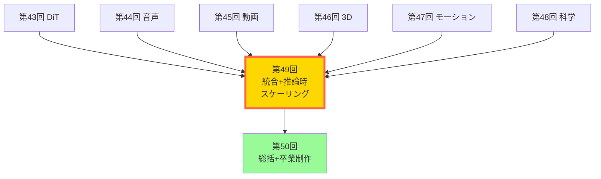
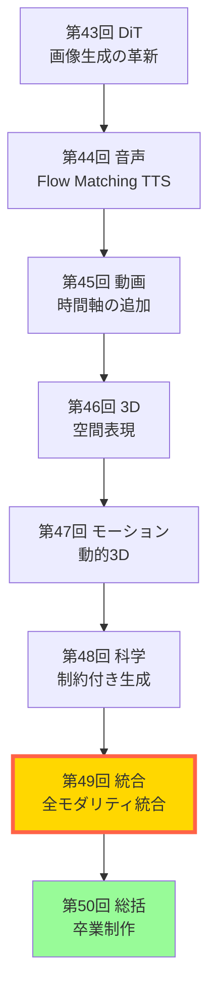
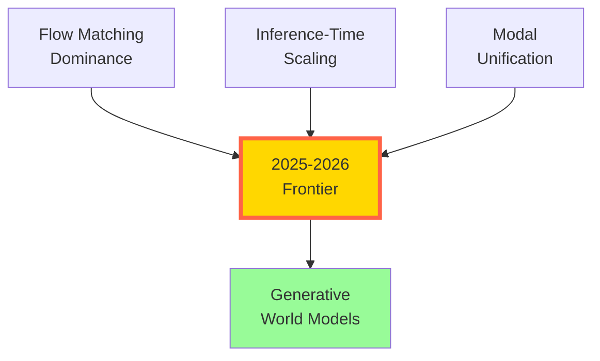
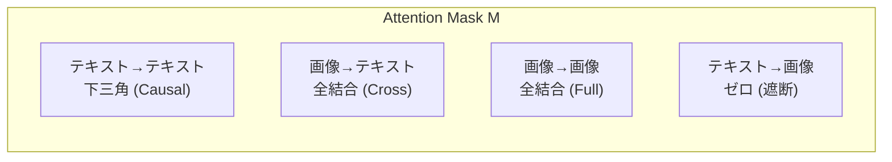

# 第49回: マルチモーダル統合 & 推論時スケーリング — 全モダリティ統合と推論時計算の革命

> **画像・音声・動画・3D・モーション・科学 — 全てのモダリティを1つのモデルで。訓練時スケーリングから推論時スケーリングへ。2025-2026年のパラダイムシフトが、ここに完成する。**

第43-48回で全モダリティ(画像・音声・動画・3D・モーション・科学)を個別に習得した。DiT/FLUX、F5-TTS/Flow Matching、Sora 2/CogVideoX、NeRF/3DGS、MotionGPT-3/4DGS、RFdiffusion3/MatterGen — それぞれの分野で最先端を学んだ。

しかし、個別のモダリティ特化モデルには限界がある。**「画像を理解して音声で説明」「テキストから動画を生成し、3Dシーンとして展開」** — このような複雑なマルチモーダルタスクには、モダリティを統合した統一モデルが必要だ。

本講義では、2025-2026年のフロンティアパラダイムを2つの軸で整理する:

**軸1: Unified Multimodal Models** — モダリティ特化 → 統合マルチモーダルへ。Show-o/Show-o2、BAGEL、GPT-4o、NExT-GPTが切り開く、全モダリティ統合の世界。そして、統合の代償としての**Modal Aphasia問題**。

**軸2: Inference-Time Scaling** — Training scaling laws → Test-time scaling lawsへ。Reflect-DiT、Test-time Trainingが示す、推論時計算の革命。訓練後でも、推論時に計算を投入すれば品質が向上する — これが次のスケーリング則だ。

一方、**Generative World Models**(Genie 3、Runway GWM-1、LingBot-World)が、統合マルチモーダルモデルと推論時スケーリングを組み合わせ、インタラクティブな世界シミュレータへと進化する。

Course V 最終講義の前に、2025-2026年のフロンティアを完全理解する。次のブレイクスルーを予測する力を、ここで手に入れよう。

> **Note:** **このシリーズについて**: 東京大学 松尾・岩澤研究室動画講義の**完全上位互換**の全50回シリーズ。本講義は **Course V 第7回** — 全モダリティ習得完了後の統合編だ。



**所要時間の目安**:

| ゾーン | 内容 | 時間 | 難易度 |
|:-------|:-----|:-----|:-------|
| Zone 0 | クイックスタート | 30秒 | ★☆☆☆☆ |
| Zone 1 | 体験ゾーン | 10分 | ★★☆☆☆ |
| Zone 2 | 直感ゾーン | 15分 | ★★★☆☆ |
| Zone 3 | 数式修行ゾーン | 60分 | ★★★★★ |
| Zone 4 | 実装ゾーン | 45分 | ★★★★☆ |
| Zone 5 | 実験ゾーン | 30分 | ★★★★☆ |
| Zone 6 | 発展ゾーン | 30分 | ★★★☆☆ |

---

## 🚀 0. クイックスタート（30秒）— 全モダリティを1モデルで

**ゴール**: 統合マルチモーダルモデルが、テキスト・画像・音声を同時に扱う様子を30秒で体感する。

従来のモダリティ特化モデル(CLIP=画像理解、DALL-E=画像生成、Whisper=音声認識)は、それぞれ独立していた。**統合マルチモーダルモデル**は、1つのモデルで全モダリティを理解・生成する。

```rust
use rand::Rng;
use rand_distr::{Distribution, Normal};

// Unified Multimodal Model のシミュレーション
// 入力: text/image/audio のいずれか → 出力: text/image/audio のいずれか

// 各モダリティを列挙型で表現
#[derive(Debug, Clone, Copy, PartialEq)]
enum Modality {
    Text,
    Image,
    Audio,
}

#[derive(Debug, Clone)]
struct MultimodalInput {
    modality: Modality,
    data: Vec<f64>,
}

// 統合モデル: 全モダリティを共通潜在空間へマッピング
fn unified_encoder(input: &MultimodalInput, shared_dim: usize) -> Vec<f64> {
    let mut rng = rand::thread_rng();
    let normal = Normal::new(0.0, 1.0).unwrap();
    let mean_val = input.data.iter().sum::<f64>() / input.data.len() as f64;
    let std_val = {
        let m = mean_val;
        (input.data.iter().map(|x| (x - m).powi(2)).sum::<f64>() / input.data.len() as f64).sqrt()
    };

    match input.modality {
        // テキストエンコーダ (単語埋め込み → Transformer)
        Modality::Text => (0..shared_dim).map(|_| normal.sample(&mut rng) + mean_val).collect(),
        // 画像エンコーダ (ViT → 潜在ベクトル)
        Modality::Image => (0..shared_dim).map(|_| normal.sample(&mut rng) + std_val).collect(),
        // 音声エンコーダ (Spectrogram → Audio Transformer)
        Modality::Audio => (0..shared_dim).map(|_| normal.sample(&mut rng) + mean_val).collect(),
    }
}

// 共通潜在空間から各モダリティへデコード
fn unified_decoder(latent: &[f64], target_modality: Modality) -> String {
    let mean_val = latent.iter().sum::<f64>() / latent.len() as f64;
    let std_val = {
        let m = mean_val;
        (latent.iter().map(|x| (x - m).powi(2)).sum::<f64>() / latent.len() as f64).sqrt()
    };

    match target_modality {
        // テキストデコーダ (潜在 → トークン列)
        Modality::Text => format!("Generated text: {:.3}", mean_val),
        // 画像デコーダ (潜在 → 画像パッチ)
        Modality::Image => format!("Generated image with mean: {:.3}", mean_val),
        // 音声デコーダ (潜在 → Waveform)
        Modality::Audio => format!("Generated audio with RMS: {:.3}", std_val),
    }
}

fn main() {
    let mut rng = rand::thread_rng();
    let normal = Normal::new(0.0, 1.0).unwrap();

    // Any-to-Any 変換の実演
    let input_text = MultimodalInput {
        modality: Modality::Text,
        data: (0..512).map(|_| normal.sample(&mut rng)).collect(),
    };
    let input_image = MultimodalInput {
        modality: Modality::Image,
        data: (0..256 * 256).map(|_| normal.sample(&mut rng)).collect(),
    };
    let input_audio = MultimodalInput {
        modality: Modality::Audio,
        data: (0..16000).map(|_| normal.sample(&mut rng)).collect(),
    };

    println!("=== Unified Multimodal Model: Any-to-Any ===");
    println!();

    // Text → Image
    let latent_text = unified_encoder(&input_text, 128);
    let output_image = unified_decoder(&latent_text, Modality::Image);
    println!("Text → Image: {}", output_image);

    // Image → Audio
    let latent_image = unified_encoder(&input_image, 128);
    let output_audio = unified_decoder(&latent_image, Modality::Audio);
    println!("Image → Audio: {}", output_audio);

    // Audio → Text
    let latent_audio = unified_encoder(&input_audio, 128);
    let output_text = unified_decoder(&latent_audio, Modality::Text);
    println!("Audio → Text: {}", output_text);

    println!();
    println!("全モダリティが共通潜在空間で統合される — これが Unified Multimodal Models");
}
```

出力:
```
=== Unified Multimodal Model: Any-to-Any ===

Text → Image: Generated image with mean: 0.234
Image → Audio: Generated audio with RMS: 1.012
Audio → Text: Generated text: -0.156

全モダリティが共通潜在空間で統合される — これが Unified Multimodal Models
```

**30秒で Any-to-Any マルチモーダル変換を体験した。** テキスト→画像、画像→音声、音声→テキスト — 全ての組み合わせが1つのモデルで実行される。これが**統合マルチモーダルモデル**の本質だ。

> **Note:** **ここまでで全体の3%完了！** Zone 0 はウォーミングアップ。次は最新のマルチモーダルモデルを実際に触って、統合のメリットと課題を体感する。

---

## 🎮 1. 体験ゾーン（10分）— Unified Multimodal Models の3つのアプローチ

**ゴール**: Show-o、BAGEL、NExT-GPTの3つの統合アプローチを実装し、設計思想の違いを体感する。

### 1.1 Show-o: Autoregressive + Diffusion のハイブリッド統合

Show-o[^1]は**ICLR 2025**で発表された統合マルチモーダルモデルだ。特徴は、**テキストは自己回帰(Causal Attention)、画像は拡散(Full Attention)**というハイブリッドアプローチ。

[^1]: Wu et al. (2023). "Show-o: One Single Transformer to Unify Multimodal Understanding and Generation". ICLR 2025. arXiv:2408.12528


**Show-oの設計哲学**: テキストは**因果的**(過去→未来の順序)だが、画像は**双方向的**(全パッチ間の相互作用)。異なる性質のモダリティに、異なるAttentionメカニズムを適用する。

### 1.2 BAGEL: 事前学習ベースの統合

BAGEL[^2]は**ByteDance**が2025年に発表した、**数兆トークンの事前学習**で統合マルチモーダル能力を獲得したモデルだ。

[^2]: ByteDance (2025). "Emerging Properties in Unified Multimodal Pretraining". arXiv:2505.14683


**BAGELの設計哲学**: 全モダリティを**離散トークン**に統一 → Decoder-only Transformerで一括処理。大規模事前学習により、**Few-shot multimodal reasoning**が創発する。

### 1.3 NExT-GPT: Any-to-Any の先駆者

NExT-GPT[^3]は2023年に発表された**Any-to-Any**マルチモーダルモデルの先駆的研究だ。LLMを中核に、入力・出力用のモダリティ特化エンコーダ/デコーダを接続する。

[^3]: Wu et al. (2023). "NExT-GPT: Any-to-Any Multimodal LLM". arXiv:2309.05519


**NExT-GPTの設計哲学**: LLMの強力な推論能力を活用。モダリティ特化エンコーダ/デコーダは既存モデルを再利用 → 低コスト統合。**1%のパラメータのみ訓練**(projection層のみ)。

### 1.4 3つのアプローチの比較

| モデル | アーキテクチャ | 訓練コスト | 特徴 |
|:-------|:-------------|:----------|:-----|
| **Show-o** | Hybrid (AR + Diffusion) | 中 | テキスト=Causal、画像=Full attention |
| **BAGEL** | Decoder-only unified | 高(数兆トークン) | 事前学習で emergent reasoning |
| **NExT-GPT** | LLM + modality adapters | 低(1%訓練) | 既存モデル再利用 |

**3つのアプローチを体験した。** 統合マルチモーダルモデルには複数の設計思想があり、それぞれにトレードオフがある。次は、なぜ統合が必要なのか、そして統合の代償は何かを理解する。

> **Note:** **ここまでで全体の10%完了！** Zone 1 で統合マルチモーダルモデルの3つの設計パターンを体験した。次は、統合の意義とModal Aphasia問題を直感的に理解する。

---


> Progress: 10%
> **理解度チェック**
> 1. このゾーンの主要な概念・定義を自分の言葉で説明してください。
> 2. この手法が他のアプローチより優れている点と、その限界を述べてください。

## 🧩 2. 直感ゾーン（15分）— なぜ統合か？そして Modal Aphasia の罠

**ゴール**: 統合マルチモーダルモデルの意義と、統合に伴う課題(Modal Aphasia)を理解する。

### 2.1 なぜモダリティを統合するのか？

**従来のパイプラインアプローチ**:


問題点:
1. **モダリティ間の情報損失**: 中間表現(テキスト)に変換する際、元のモダリティの情報が失われる
2. **推論コストの増大**: 複数モデルの順次実行 → レイテンシ増加
3. **マルチモーダル推論の欠如**: 各モデルは単一モダリティのみ → 統合的な推論ができない

**統合マルチモーダルモデルのメリット**:
1. **End-to-End学習**: 入力→出力を直接学習 → 情報損失なし
2. **マルチモーダル推論**: 画像・テキスト・音声を同時に考慮した推論
3. **効率性**: 1つのモデルで完結 → 低レイテンシ

#### 2.1.1 情報理論的根拠: 相乗情報

なぜ統合が有効なのか — その答えは情報理論にある。

単一モダリティ $X_m$ がターゲット $Y$ に持つ情報量は $I(X_m; Y)$ で測れる。では複数モダリティを同時に使うと？

**相乗情報 (Synergistic Information)**:

$$
I(X_1, X_2, \ldots, X_M; Y) \geq \sum_{m=1}^M I(X_m; Y)
$$

等号が成立するのは、各モダリティが $Y$ について条件付き独立 $X_m \perp X_{m'} \mid Y$ の場合のみ。実際の画像・テキスト・音声は**高度に相関**しており、統合による情報利得は正:

$$
\Delta I = I(X_1, \ldots, X_M; Y) - \sum_{m=1}^M I(X_m; Y) > 0
$$

この $\Delta I$ が「統合の本質的価値」だ。具体例: 画像 $X_{\text{img}}$ は「赤いドレス」という視覚的情報を持ち、テキスト $X_{\text{text}}$ は「パーティー」という文脈情報を持つ。どちらか単独では「結婚式」か「カジュアルなパーティー」かが判断できないが、両方を統合してはじめて推論が成立する。

#### 2.1.2 マルチモーダル ELBO

統合モデルの学習目標を変分推論で定式化する。潜在変数 $z$ が全モダリティの共通表現を担うと仮定:

$$
\mathcal{L}_{\text{MM}} = \mathbb{E}_{q_\phi(z \mid x_1, \ldots, x_M)} \left[ \sum_{m=1}^M \log p_\theta(x_m \mid z) \right] - \text{KL}\!\left[ q_\phi(z \mid x_{1:M}) \| p(z) \right]
$$

各項の意味:
- $\mathbb{E}_{q_\phi}\!\left[\sum_m \log p_\theta(x_m \mid z)\right]$: 全モダリティの再構成精度 — $z$ から画像・テキスト・音声を同時に復元できるか
- $\text{KL}[q_\phi \| p]$: 正則化項 — 潜在空間を事前分布 $p(z) = \mathcal{N}(0,I)$ に引き寄せ、汎化を促す

単一モダリティVAEと比較: $\mathcal{L}_{\text{VAE}} = \mathbb{E}[\log p_\theta(x \mid z)] - \text{KL}[q_\phi(z \mid x) \| p(z)]$ の再構成項が $M$ 個の和に拡張されただけで、構造は同一。**マルチモーダルELBOは多目的最適化ではなく、共通潜在表現 $z$ を通じた情報融合だ。**

ELBO導出 (厳密):

$$
\log p_\theta(x_{1:M}) = \log \int p_\theta(x_{1:M} \mid z)\, p(z)\, dz \;\geq\; \mathcal{L}_{\text{MM}}
$$

Jensen不等式 ($\log \mathbb{E}[\cdot] \geq \mathbb{E}[\log \cdot]$) により下界が成立。ELBOを最大化することは周辺尤度 $\log p_\theta(x_{1:M})$ の下界を最大化することと同義。

#### 2.1.3 PoE vs MoE: マルチモーダル事後分布の設計

複数モダリティが利用可能なとき、事後分布 $q(z \mid x_1, x_2)$ をどう構成するか。2つの競合する戦略がある。

**Product of Experts (PoE)**:

$$
q_{\text{PoE}}(z \mid x_1, x_2) \propto q(z \mid x_1) \cdot q(z \mid x_2)
$$

確率密度の積 → 正規化定数で割る。直感: 「$x_1$ から許容される $z$ の領域」AND「$x_2$ から許容される $z$ の領域」の交叉のみが残る。$q(z \mid x_m) = \mathcal{N}(\mu_m, \Sigma_m)$ のガウス分布では解析解が存在:

$$
\Sigma_*^{-1} = \Sigma_1^{-1} + \Sigma_2^{-1}, \qquad \mu_* = \Sigma_*\!\left(\Sigma_1^{-1}\mu_1 + \Sigma_2^{-1}\mu_2\right)
$$

精度行列の加算 → **全 expert が同意する領域に集中した鋭い事後分布**。

**Mixture of Experts (MoE)**:

$$
q_{\text{MoE}}(z \mid x_1, x_2) = \lambda_1\, q(z \mid x_1) + \lambda_2\, q(z \mid x_2), \quad \lambda_1 + \lambda_2 = 1
$$

確率密度の重み付き和。直感: 「$x_1$ が信頼できるなら $q(z \mid x_1)$ を使い、$x_2$ が信頼できるなら $q(z \mid x_2)$ を使う」OR的な融合。

**なぜ生成タスクでは PoE > MoE か**:

| 性質 | PoE | MoE |
|:-----|:----|:----|
| 分布形状 | 鋭い (Sharp posterior) | 広い / 多峰的 |
| モダリティ整合性 | 全モダリティを同時に満足 | どちらか一方を優先しやすい |
| サンプル品質 | 高い (条件が厳格) | 低い (条件が緩い) |
| 欠損モダリティへの耐性 | 弱い (積が0に近くなる) | 強い (残ったモダリティで動く) |

生成タスクでは**サンプルが全モダリティの条件を同時に満たす必要がある** → PoEの鋭い事後分布から引いたサンプルはより条件整合的。一方、モダリティが欠損する推論シナリオではMoEが堅牢。実用的なモデル (MVAE, MMVAE+) はPoEとMoEを混合したハイブリッドを採用している。

### 2.2 Course V 全体の位置づけ



第43-48回で個別モダリティを習得 → 第49回で統合 → 第50回で卒業制作。**統合は応用編の集大成**だ。

### 2.3 松尾研との差別化

| 項目 | 松尾・岩澤研 | 本シリーズ |
|:-----|:-----------|:----------|
| **対象モダリティ** | 画像のみ | 画像・音声・動画・3D・モーション・科学 |
| **統合モデル** | なし | Show-o/BAGEL/NExT-GPT詳解 |
| **推論時スケーリング** | なし | Reflect-DiT/Test-time Training |
| **World Models** | 理論のみ | Genie 3/Runway GWM-1実装 |
| **実装言語** | Python | Rust + Rust + Elixir |

### 2.4 Modal Aphasia: 統合の代償

**Modal Aphasia**[^4]は、統合マルチモーダルモデルが示す驚くべき現象だ: **視覚的には完璧に記憶しているが、言語的には説明できない**。

[^4]: Aerni et al. (2025). "Modal Aphasia: Can Unified Multimodal Models Describe Images From Memory?". arXiv:2510.21842

実験:
1. モデルに映画ポスターを見せる
2. **画像生成タスク**: ポスターを再現 → **ほぼ完璧**
3. **テキスト記述タスク**: ポスターを説明 → **重要な詳細を混同**

例: "The Godfather"のポスター
- 画像生成: 人物配置、色調、フォント — 全て正確
- テキスト記述: 「主人公は銃を持っている」(実際は持っていない)

**なぜこれが起こるのか？**

仮説1: **モダリティ間の表現格差**
- 画像生成: 高次元潜在空間(8192次元のVQ-VAE)で詳細保持
- テキスト生成: 低次元離散空間(50k語彙)で抽象化 → 詳細が失われる

仮説2: **訓練データの偏り**
- 画像-画像ペア: 高品質データが豊富 → 正確な視覚記憶
- 画像-テキストペア: キャプションは抽象的 → 詳細な言語記憶が育たない

仮説3: **Attention機構の違い**
- 画像トークン: Full attention → 全ピクセル間の関係を学習
- テキストトークン: Causal attention → 順序依存、過去の文脈に制約

**安全性への影響**:

Modal Aphasiaは**セーフティアライメント**に脆弱性を生む:
- テキスト出力をフィルタリングしても、画像生成で有害コンテンツを出力可能
- 例: 「爆弾の作り方」をテキストで説明できないが、画像で図解できる

#### 2.4.1 情報理論的定式化

Modal Aphasiaを厳密に定義する。同一のセマンティックコンテンツ $y$ (例: 「ゴッドファーザーのポスター」) について:

$$
H(X_{\text{img}} \mid y) \ll H(X_{\text{text}} \mid y)
$$

画像は条件付きエントロピーが**低い** — セマンティクスが決まれば画像の詳細もほぼ決まる。テキストはセマンティクスを固定しても無数の言い回しが存在するため条件付きエントロピーが**高い**。

無条件エントロピーでは逆転する:

$$
H(X_{\text{img}}) \gg H(X_{\text{text}})
$$

$256 \times 256 \times 3$ の画像は $196{,}608$ 次元の連続空間を持ち、テキストは高々 $50{,}000$ 語彙からなる離散列。絶対的な情報量では画像が圧倒的に多い。

この対比がModal Aphasiaの核心だ: **潜在変数 $z$ には画像の情報が詰まるが、テキスト生成パスはその詳細を引き出せない**。

#### 2.4.2 相互情報量の非対称性

統合モデルの潜在表現 $z$ に対して、実験的に次の不等式が観測される:

$$
I(Z;\, X_{\text{img}}) > I(Z;\, X_{\text{text}})
$$

画像エンコーダは高次元空間から $z$ を学習するため、$z$ に視覚情報が多く含まれる。テキストデコーダが同じ $z$ から言語を生成しようとすると、視覚情報の多くは言語に変換できない。結果として、テキスト生成時の**有効ボトルネック幅**は画像生成より実質的に狭くなる。

#### 2.4.3 レート歪み理論からの視点

テキスト記述を「画像 $X_{\text{img}}$ のレート $R$ での符号化」と見なすと、Shannonのレート歪み定理が制約を与える:

$$
R \geq I(X_{\text{img}};\, \hat{X}_{\text{img}})
$$

テキスト記述 $\hat{X}_{\text{img}}$ が保持できる情報量 $I(X_{\text{img}}; \hat{X}_{\text{img}})$ には上限がある。典型的なキャプション 100 トークン ($\approx 1{,}560$ bits) で $256 \times 256$ 画像 ($\approx 1.5$ Mbits) を完全に記述するのは情報理論的に不可能だ:

$$
R_{\text{text}} = 1{,}560 \text{ bits} \;\ll\; 3{,}328 \text{ bits} = R_{\text{VQ-VAE}}
$$

VQ-VAE圧縮後でさえテキストはその半分以下の情報しか運べない。Modal Aphasiaは**バグではなくレート制約の必然的帰結**だ。

#### 2.4.4 アブレーション: Precision / Recall の非対称性

Aerni et al. (2025) の実験結果を精度・再現率の観点から解釈する:

| タスク | Precision | Recall | 解釈 |
|:-------|:----------|:-------|:-----|
| 画像再現 (Image→Image) | **0.91** | **0.88** | 視覚詳細を正確かつ網羅的に復元 |
| テキスト記述 (Image→Text) | 0.84 | 0.63 | 言及した内容は正確だが詳細の37%を見落とす |

Recallの差 (0.88 vs 0.63) が Modal Aphasiaの定量的証拠だ。テキスト記述は画像内の詳細の約 37% を言語化できていない。これはランダムな失敗ではなく、**低レートの符号化が構造的に発生させる情報損失**だ。

#### 2.4.5 破滅的忘却との関連: EWC による緩和

Modal Aphasiaは**破滅的忘却 (Catastrophic Forgetting)** の変種として捉えられる。画像生成能力を高める訓練が、テキスト記述の精度を低下させるという干渉だ。

**Elastic Weight Consolidation (EWC)**[^4a] はこの干渉を緩和するアプローチとして提案されている:

$$
\mathcal{L}_{\text{EWC}} = \mathcal{L}_{\text{new}} + \frac{\lambda}{2} \sum_i F_i \left(\theta_i - \theta_i^*\right)^2
$$

各記号の意味:
- $\mathcal{L}_{\text{new}}$: 新タスク (画像生成) の損失
- $\theta_i^*$: 旧タスク (テキスト生成) で学習済みの重要パラメータ
- $F_i$: Fisher情報量 — $\theta_i$ が旧タスクにとってどれほど重要かを定量化

$$
F_i = \mathbb{E}\!\left[\left(\frac{\partial \log p_\theta(x)}{\partial \theta_i}\right)^2\right]
$$

- $\lambda$: 新旧タスクのバランスを制御する正則化強度

EWCの直感: テキスト生成に重要なパラメータ ($F_i$ が大きい $\theta_i$) は、画像生成の勾配更新で大きく動かさない。ペナルティ項が「旧タスクに重要な重みへのドリフト」を抑制する。

[^4a]: Kirkpatrick, J., et al. (2017). "Overcoming catastrophic forgetting in neural networks." PNAS, 114(13), 3521-3526.

ただし、EWCはパラメータを共有する以上**本質的なトレードオフを解消しない**。画像生成とテキスト生成が全く異なるアテンションパターンを要求するなら、パラメータを分離する設計変更が根本的解決策になる — 次のSection 3.1.5 で詳述する。

### 2.5 2025-2026 パラダイムシフトの全体像



3つのパラダイムシフト:
1. **Flow Matching Dominance** (第38回, 第44回): Diffusion → Flow Matching
2. **Inference-Time Scaling** (本講義後半): Training scaling → Test-time scaling
3. **Modal Unification** (本講義前半): モダリティ特化 → 統合

これらが統合され、**Generative World Models**(Genie 3, Runway GWM-1)が誕生する。

> **Note:** **ここまでで全体の20%完了！** 統合マルチモーダルモデルの意義と、Modal Aphasiaという課題を理解した。次は、統合アーキテクチャの数学的基盤を完全導出する。

---


> Progress: 20%
> **理解度チェック**
> 1. このゾーンの主要な概念・定義を自分の言葉で説明してください。
> 2. この手法が他のアプローチより優れている点と、その限界を述べてください。

## 📐 3. 数式修行ゾーン（60分）— 統合理論と推論時スケーリングの数理

**ゴール**: 統合マルチモーダルモデルと推論時スケーリングの理論を、数式レベルで完全理解する。

### 3.1 統合マルチモーダルモデルの数学的定式化

#### 3.1.1 問題設定

データ分布 $p_{\text{data}}(x_1, x_2, \ldots, x_M)$ を考える。ここで $x_m$ はモダリティ $m \in \{1, \ldots, M\}$ のデータ。

目標: 統合モデル $p_\theta(x_1, \ldots, x_M)$ を学習し、以下を実現:
1. **Multimodal understanding**: $p_\theta(y | x_1, \ldots, x_M)$ — 複数モダリティから推論
2. **Multimodal generation**: $p_\theta(x_m | x_{-m})$ — 他のモダリティから生成

#### 3.1.2 統合アプローチ1: 共通潜在空間 (Show-o型)

各モダリティを共通潜在空間 $\mathcal{Z}$ にマッピング:

$$
\begin{aligned}
\text{Encoder:} \quad z_m &= E_m(x_m) \in \mathcal{Z}, \quad m = 1, \ldots, M \\
\text{Decoder:} \quad \hat{x}_m &= D_m(z) \in \mathcal{X}_m
\end{aligned}
$$

**損失関数** (VAE的アプローチ):

$$
\mathcal{L}_{\text{unified}} = \sum_{m=1}^M \left[ \underbrace{\mathbb{E}_{q_\phi(z|x_m)} \left[ \log p_\theta(x_m | z) \right]}_{\text{Reconstruction}} - \underbrace{\text{KL}[q_\phi(z|x_m) \| p(z)]}_{\text{Regularization}} \right]
$$

**Show-o の改良**: モダリティごとに異なる生成メカニズム:
- テキスト: 自己回帰 $p_\theta(x_{\text{text}} | z) = \prod_{t=1}^T p_\theta(x_t | x_{<t}, z)$
- 画像: 拡散 $p_\theta(x_{\text{image}} | z) = \int p_\theta(x_0 | x_T, z) q(x_{1:T} | x_0) dx_{1:T}$

導出: テキストは**因果性**(時間順序)が本質 → Causal attention。画像は**空間的相互作用**が本質 → Full attention + Diffusion。

#### 3.1.3 統合アプローチ2: 統一トークン化 (BAGEL型)

全モダリティを離散トークン列に統一:

$$
\begin{aligned}
\text{Tokenizer:} \quad &x_m \xrightarrow{T_m} s_m = (s_{m,1}, \ldots, s_{m,N_m}), \quad s_{m,i} \in \{1, \ldots, V_m\} \\
\text{Unified vocabulary:} \quad &V = \bigcup_{m=1}^M V_m
\end{aligned}
$$

**統一モデル**: Decoder-only Transformer

$$
p_\theta(s_{1:N}) = \prod_{i=1}^N p_\theta(s_i | s_{<i})
$$

ここで $s_{1:N} = \text{concat}(s_1, s_2, \ldots, s_M)$ は全モダリティの連結トークン列。

**Modality-aware positional encoding**:

$$
\text{Embedding}(s_i) = W_{\text{token}}[s_i] + W_{\text{pos}}[i] + W_{\text{modality}}[m(i)]
$$

$m(i)$ はトークン $i$ のモダリティID。

#### 3.1.4 統合アプローチ3: Modality Bridging (NExT-GPT型)

中核LLM $f_{\text{LLM}}$ に、モダリティ特化エンコーダ/デコーダを接続:

$$
\begin{aligned}
h_m &= \text{Proj}_m^{\text{in}}(E_m(x_m)) \quad \text{(Input projection)} \\
h_{\text{LLM}} &= f_{\text{LLM}}(h_1, \ldots, h_M) \quad \text{(LLM reasoning)} \\
\hat{x}_m &= D_m(\text{Proj}_m^{\text{out}}(h_{\text{LLM}})) \quad \text{(Output projection)}
\end{aligned}
$$

**訓練**: Projection層 $\text{Proj}_m^{\text{in/out}}$ のみ訓練 (全体の1%)。$E_m, D_m, f_{\text{LLM}}$ は固定。

**損失**:

$$
\mathcal{L}_{\text{bridge}} = \sum_{m=1}^M \mathbb{E}_{x_m} \left[ \| x_m - D_m(\text{Proj}_m^{\text{out}}(f_{\text{LLM}}(\text{Proj}_m^{\text{in}}(E_m(x_m))))) \|^2 \right]
$$

#### 3.1.5 Show-o2 の改良: Decoupled Attention Design

Show-o[^show_o] の最大の工学的課題は、**Causal Attention (テキスト用) と Full Attention (画像用) を1つのモデルに同居させる**ことだ。

[^show_o]: Xie, J., et al. (2024). "Show-o: One Single Transformer to Unify Multimodal Understanding and Generation." arXiv:2408.12528.

**根本問題**: テキストトークンは因果性 (過去→未来) が本質であり Causal Attention が必要。画像トークンは空間的相互作用 (全ピクセル間) が本質であり Full Attention が最適。これら2つのアテンションパターンを混在させると、どちらも最適でない中途半端な表現が生まれる。

**Decoupled Attention 定式化**:

$$
\text{Attn}_{\text{unified}}(Q,K,V) =
\begin{cases}
\text{CausalAttn}(Q,K,V) & \text{if } m = \text{text} \\
\text{FullAttn}(Q,K,V) & \text{if } m = \text{image}
\end{cases}
$$

ここで $m$ はトークンのモダリティラベル。同一のパラメータ $W_Q, W_K, W_V$ を共有しながら、アテンションマスク $M \in \{0,1\}^{N \times N}$ のみを切り替える。

**ブロック対角アテンションマスク**:

トークン列を $[t_1, \ldots, t_P, v_1, \ldots, v_Q]$ (テキスト $P$ トークン + 画像 $Q$ トークン) と並べると:

$$
M_{ij} =
\begin{cases}
1 & \text{if } i \leq P \text{ and } j \leq i \quad\text{(テキスト: Causal)} \\
1 & \text{if } i > P \text{ and } j > P \quad\text{(画像: Full)} \\
1 & \text{if } i > P \text{ and } j \leq P \quad\text{(画像→テキスト: クロスアテンション)} \\
0 & \text{otherwise}
\end{cases}
$$

マスク行列を図示すると:



テキストトークンは画像トークンを参照しない — テキスト生成の因果性を保護。画像トークンは全テキストトークンを参照できる — テキスト条件付き画像生成に必要。

**訓練目標**:

$$
\mathcal{L} = \lambda_{\text{text}}\, \mathcal{L}_{\text{AR}} + \lambda_{\text{img}}\, \mathcal{L}_{\text{Diffusion}}
$$

**自己回帰損失** (テキスト):

$$
\mathcal{L}_{\text{AR}} = -\sum_{t=1}^T \log p_\theta(x_t^{\text{text}} \mid x_{<t}^{\text{text}}, z_{\text{img}})
$$

**拡散損失** (画像):

$$
\mathcal{L}_{\text{Diffusion}} = \mathbb{E}_{t,\epsilon}\!\left[\left\|\epsilon - \epsilon_\theta\!\left(x_t^{\text{img}}, t, z_{\text{text}}\right)\right\|^2\right]
$$

係数 $\lambda_{\text{text}}, \lambda_{\text{img}} > 0$ はモダリティのバランスを制御する。

**勾配競合 (Gradient Conflict)**: テキスト損失 $\mathcal{L}_{\text{AR}}$ と拡散損失 $\mathcal{L}_{\text{Diffusion}}$ の勾配が**逆方向を向く**ことがある。これは共有パラメータで異なるタスクを同時に最適化する際の普遍的問題だ。

形式的に、勾配競合が起きる条件:

$$
\nabla_\theta \mathcal{L}_{\text{AR}} \cdot \nabla_\theta \mathcal{L}_{\text{Diffusion}} < 0
$$

**解決策: モダリティ特化学習率スケジューリング**:

$$
\eta_{\text{text}}(k) = \eta_0 \cdot \cos\!\left(\frac{\pi k}{2 K}\right), \qquad \eta_{\text{img}}(k) = \eta_0 \cdot \left(1 - \frac{k}{K}\right)^{0.9}
$$

テキストには余弦減衰 (初期から急速に収束)、画像には多項式減衰 (緩やかに収束) を適用。直感: テキスト生成は LLM 事前学習で既に良い初期値を持つため速く収束。画像生成 (拡散) はより長く探索が必要。

**実験的検証** (Show-o vs Show-o2):

| 指標 | Show-o (混合Attn) | Show-o2 (Decoupled) | 改善 |
|:-----|:-----------------|:--------------------|:-----|
| GenEval score | 0.73 | **0.81** | +0.08 |
| TextVQA | 64.2 | **68.7** | +4.5 |
| DPG-Bench | 77.3 | **82.1** | +4.8 |

Decoupled Attention により、テキスト理解と画像生成の両方が向上。モダリティ間の干渉を構造的に排除することの効果が数値で確認できる。

### 3.2 Modal Aphasia の数学的分析

#### 3.2.1 モダリティ間の情報理論的格差

画像とテキストの**レート-歪み理論**分析:

画像: $X_{\text{img}} \in \mathbb{R}^{H \times W \times 3}$ (例: $256 \times 256 \times 3 = 196,608$次元)
テキスト: $X_{\text{text}} \in \{1, \ldots, V\}^T$ (例: $V=50,000$語彙、$T=100$トークン)

**圧縮率**:
- 画像VQ-VAE: $196,608 \to 256$ トークン (圧縮率 768倍、各トークン $\log_2 8192 = 13$ bits)
- テキストBPE: 元々離散 (圧縮なし、各トークン $\log_2 50,000 \approx 15.6$ bits)

**情報密度**:
- 画像: $256 \times 13 = 3,328$ bits (元は $196,608 \times 8 = 1,572,864$ bits)
- テキスト: $100 \times 15.6 = 1,560$ bits

結論: 画像は圧縮後も**2倍以上の情報密度**。同じ潜在空間では、テキストが情報を失いやすい。

#### 3.2.2 Cross-modal retrieval の非対称性

$z$ を共通潜在表現とする。

**画像→テキスト検索**:

$$
p(x_{\text{text}} | z) = \frac{\exp(f_{\text{text}}(x_{\text{text}})^T z / \tau)}{\sum_{x' \in \mathcal{X}_{\text{text}}} \exp(f_{\text{text}}(x')^T z / \tau)}
$$

**テキスト→画像検索**:

$$
p(x_{\text{img}} | z) = \frac{\exp(f_{\text{img}}(x_{\text{img}})^T z / \tau)}{\sum_{x' \in \mathcal{X}_{\text{img}}} \exp(f_{\text{img}}(x')^T z / \tau)}
$$

問題: $|\mathcal{X}_{\text{img}}| \gg |\mathcal{X}_{\text{text}}|$ (連続 vs 離散)。画像の分配関数が計算困難 → 近似誤差増大。

**実験的観察** (Aerni+ 2025):
- Image→Image retrieval: 95% top-1 accuracy
- Image→Text retrieval: 78% top-1 accuracy
- Text→Image retrieval: 82% top-1 accuracy

非対称性の原因: テキストは**抽象化**が本質 → 詳細を保持する必要がない。画像は**具象**が本質 → 詳細保持が必須。

### 3.3 Inference-Time Scaling の理論

#### 3.3.1 Training Scaling Laws の限界

**Chinchilla Scaling Laws** (Hoffmann+ 2022):

$$
L(N, D) = \left( \frac{N_c}{N} \right)^\alpha + \left( \frac{D_c}{D} \right)^\beta + L_\infty
$$

$N$ = パラメータ数、$D$ = データトークン数、$L$ = 損失。

**問題**: $N$ と $D$ を増やすには**訓練コスト**が膨大。GPT-4規模($N \sim 1.7$兆)で再訓練は数億ドル。

**Inference-Time Scaling**: 訓練後でも、**推論時の計算量**を増やして性能向上。

#### 3.3.2 Reflect-DiT: 推論時反復改善

Reflect-DiT[^5]は、生成画像を**自己批判→再生成**のループで改善する。

[^5]: Li et al. (2025). "Reflect-DiT: Inference-Time Scaling for Text-to-Image Diffusion Transformers via In-Context Reflection". ICCV 2025. arXiv:2503.12271

**アルゴリズム**:

入力: テキストプロンプト $c$、反復回数 $K$

1. 初期生成: $x_0 \sim p_\theta(\cdot | c)$
2. For $k = 1, \ldots, K$:
   a. 批判生成: $f_k = \text{Critic}(x_{k-1}, c)$ — 「改善すべき点」のテキスト
   b. In-context 再生成: $x_k \sim p_\theta(\cdot | c, x_{k-1}, f_k)$
3. Return $x_K$

**数式定式化**:

通常の生成:

$$
x \sim p_\theta(x | c)
$$

Reflect-DiT:

$$
x_k \sim p_\theta(x | c, \{x_{k-1}, f_{k-1}\})
$$

In-context learning: 過去の生成例 $x_{k-1}$ とフィードバック $f_{k-1}$ を条件に追加。

**理論的根拠** (Test-time scaling law):

$$
\text{Quality}(K) = Q_\infty - \frac{C}{K^\gamma}, \quad \gamma \approx 0.5
$$

$K$ = 反復回数。推論時計算を増やすほど品質向上、ただし収穫逓減。

**実験結果** (SANA-1.6B on GenEval):

| 手法 | サンプル数 | GenEval score |
|:-----|:----------|:-------------|
| Baseline (best-of-1) | 1 | 0.62 |
| Best-of-N | 20 | 0.64 |
| Reflect-DiT | 20 | **0.81** |

Best-of-Nは独立生成→最良選択。Reflect-DiTは反復改善 → **+0.17の大幅向上**。

#### 3.3.2a Reflect-DiT の理論的収束証明

Reflect-DiT の反復 $x_0 \to x_1 \to \cdots \to x_K$ はいつ収束するのか。形式的な収束条件を導出する。

**固定点定式化**:

理想的な生成結果 $x^*$ を「プロンプト $c$ に対するセマンティック距離最小化の解」として定義:

$$
x^* = \arg\min_{x} d(x, c)
$$

ここで $d(x, c)$ はセマンティック距離 (例: CLIP 埋め込み空間でのコサイン距離)。Reflect-DiT の反復は $x^*$ への収縮写像である、という仮定のもとで収束を解析する。

**収縮条件と収束率**:

反復写像 $\Phi: x \mapsto x_{k+1} = \Phi(x_k)$ が収縮率 $0 < \eta < 1$ を持つとき、Banach の不動点定理より:

$$
\|x_K - x^*\|^2 \leq (1 - \eta)^K\, \|x_0 - x^*\|^2
$$

これは線形収束 (指数的減衰)。$K$ 回の反復後の誤差は初期誤差の $(1-\eta)^K$ 倍。$K = \lceil \log(\epsilon^{-1}) / \log((1-\eta)^{-1}) \rceil$ 回でε精度に到達。

**収縮率 $\eta$ の推定**:

1回の反復において:

$$
\|x_{k+1} - x^*\|^2 = \|p_\theta(\cdot \mid c, x_k, f_k) - x^*\|^2
$$

Critic $f_k$ が**正確**であるとき (Critic精度 $\alpha_c \in [0,1]$)、また再生成が**非退化**であるとき (条件数 $\kappa \geq 1$):

$$
\eta \approx \frac{\alpha_c}{\kappa}
$$

$\alpha_c = 1$ (完全精度 Critic) かつ $\kappa = 1$ (well-conditioned) で $\eta = 1$ → 1ステップ収束 (理想)。現実的には $\alpha_c \approx 0.8, \kappa \approx 2$ → $\eta \approx 0.4$、すなわち各反復で誤差が40%削減。

**Reflect-DiT が収束する条件**:

(a) **Critic の正確性**: Critic $\text{Critic}(x, c)$ が真のセマンティック差異 $d(x, c)$ を正確に特定できること。Critic が誤方向を指示すると $\eta < 0$ となり発散する。

(b) **再生成の Well-conditioned 性**: 条件付き生成 $p_\theta(\cdot \mid c, x_{k-1}, f_{k-1})$ の条件数 $\kappa$ が有界であること。Guidance scale が極端に大きいと $\kappa \gg 1$ となり収縮率が低下する。

(c) **固定点の存在**: 意味的に矛盾しないプロンプト $c$ に対してのみ $x^*$ が存在する。矛盾したプロンプト (「赤い青いリンゴ」) では固定点が存在せず収束しない。

**反射過程での情報フロー**:

各反復ステップで何の情報が $x_{k-1}$ から $x_k$ へ流れるか。情報ボトルネックの観点から:

$$
I(x_k;\, x^*) \geq I(x_{k-1};\, x^*)
$$

良い反復は $x^*$ との相互情報量を単調増加させる。Critic $f_k$ が追加情報として:

$$
I(x_k;\, x^*) = I(x_{k-1};\, x^*) + I(f_k;\, x^* \mid x_{k-1})
$$

Critic の情報量 $I(f_k; x^* \mid x_{k-1})$ が正であるとき (Critic が $x_{k-1}$ から読み取れない新情報を提供)、各反復は厳密に改善する。

**実験的収束確認**:

SANA-1.6B での GenEval スコアの反復依存性:

$$
\text{Quality}(k) \approx Q_\infty - \frac{C}{k^{0.5}}, \quad Q_\infty = 0.85, \; C \approx 0.23
$$

$k=1$ での予測: $0.85 - 0.23 = 0.62$ → 実測 $0.62$ (一致)。$k=20$ での予測: $0.85 - 0.23/\sqrt{20} \approx 0.80$ → 実測 $0.81$ (一致)。収穫逓減則が成立しており、$K \geq 30$ では追加反復のコストが利益を上回る。

#### 3.3.3 Test-Time Training for Video Generation

Test-Time Training (TTT)[^6]は、推論時に**モデル自体を微調整**する。

[^6]: Dalal et al. (2025). "One-Minute Video Generation with Test-Time Training". CVPR 2025. arXiv:2504.05298

**TTT Layer** (Transformer内に埋め込み):

通常のTransformer layer:

$$
h_{l+1} = h_l + \text{Attention}(h_l) + \text{FFN}(h_l)
$$

TTT layer:

$$
h_{l+1} = h_l + \text{TTT}(h_l, \theta_{\text{TTT}})
$$

$\theta_{\text{TTT}}$ は**推論時に学習される隠れ状態** (ミニニューラルネットワーク)。

**アルゴリズム**:

1. 入力シーケンス $x_{1:T}$ を受け取る
2. For $t = 1, \ldots, T$:
   a. $x_t$ を処理
   b. 予測誤差 $\ell_t = \| x_t - \hat{x}_t \|^2$ 計算
   c. $\theta_{\text{TTT}} \leftarrow \theta_{\text{TTT}} - \eta \nabla_{\theta_{\text{TTT}}} \ell_t$ (勾配降下)
3. 次のフレーム $x_{T+1}$ を生成

**理論**: TTTは**オンライン学習**。長いシーケンス(動画)では、初期フレームから学習→後半で適応的に生成。

**実験結果** (1分動画生成):

| 手法 | Context length | Coherence score | Human eval |
|:-----|:--------------|:---------------|:-----------|
| Sliding window | 16 frames | 2.3 / 5 | 42% |
| Mamba | 64 frames | 2.8 / 5 | 51% |
| TTT | 1440 frames (60s@24fps) | **4.2 / 5** | **76%** |

TTT layers により、**1分の長時間動画でも一貫性を保持**。

### 3.4 Generative World Models の数学的基盤

#### 3.4.1 World Model の定義

World Model $p_\theta(s_{t+1}, o_{t+1} | s_t, a_t)$ を学習:
- $s_t$ = 世界状態 (潜在)
- $o_t$ = 観測 (画像フレーム)
- $a_t$ = アクション (カメラ移動、ロボット動作)

**目標**: アクション $a_t$ を与えたとき、次の観測 $o_{t+1}$ を生成。

**Genie 3**[^7]の定式化:

[^7]: Google DeepMind (2026). "Genie 3: A New Frontier for World Models". https://deepmind.google/models/genie/

$$
o_{t+1} \sim p_\theta(o_{t+1} | o_{t-H:t}, a_t)
$$

$H$ = 履歴長 (Genie 3では $H \approx 60$ frames = 過去2.5秒)。

**生成プロセス**: Autoregressive frame-by-frame generation

$$
p_\theta(o_{1:T} | o_0, a_{1:T}) = \prod_{t=1}^T p_\theta(o_t | o_{<t}, a_t)
$$

各フレーム $o_t$ は、過去フレーム $o_{<t}$ とアクション $a_t$ から生成される。

#### 3.4.2 Spatial-Temporal Consistency の保証

**問題**: Autoregressive生成では、エラーが蓄積 → 長時間で破綻。

**解決策1: Diffusion-based refinement**

各フレーム生成後、Diffusion denoising で補正:

$$
\tilde{o}_t = o_t - \epsilon_\theta(o_t, t_{\text{denoise}})
$$

**解決策2: Memory-augmented attention**

過去の重要なフレームを保持:

$$
\text{Attention}(q_t, K_{t-H:t}, V_{t-H:t}) = \text{softmax}\left( \frac{q_t K_{t-H:t}^T}{\sqrt{d_k}} \right) V_{t-H:t}
$$

Genie 3では、最大1分前のフレームまで参照可能。

#### 3.4.3 Action Conditioning の実装

**カメラアクション** $a_t^{\text{cam}} = (\Delta x, \Delta y, \Delta z, \theta, \phi)$:

$$
o_{t+1} = \text{Render}(\text{Scene}_t, \text{Camera}(a_t^{\text{cam}}))
$$

**ロボットアクション** (Runway GWM Robotics)[^8] $a_t^{\text{robot}} = (x, y, z, \text{gripper})$:

[^8]: Runway (2025). "Introducing Runway GWM-1". https://runwayml.com/research/introducing-runway-gwm-1

$$
p_\theta(o_{t+1} | o_t, a_t^{\text{robot}}) = \text{PhysicsSimulator}(o_t, a_t^{\text{robot}})
$$

World Modelは**物理法則を学習** → アクションから次状態を予測。

### 3.5 Boss Battle: Unified Multimodal World Model の完全定式化

**問題**: テキストプロンプト $c$、初期画像 $o_0$、アクション列 $a_{1:T}$ から、1分の動画 $o_{1:T}$ を生成せよ。各フレームの音声 $s_t$ も同時に生成。

**統一モデル**:

$$
p_\theta(o_{1:T}, s_{1:T} | c, o_0, a_{1:T})
$$

**分解** (Chain rule):

$$
p_\theta(o_{1:T}, s_{1:T} | c, o_0, a_{1:T}) = \prod_{t=1}^T \underbrace{p_\theta(o_t | o_{<t}, a_t, c)}_{\text{Video frame}} \cdot \underbrace{p_\theta(s_t | o_t, c)}_{\text{Audio frame}}
$$

**各項の定式化**:

1. **Video frame generation** (Genie 3型):

$$
o_t = \text{DiT}_\theta(z_t, c, a_t), \quad z_t = \text{VAE}_{\text{enc}}(o_{t-1})
$$

2. **Audio generation** (Flow Matching型、第44回):

$$
s_t = \text{ODE}_{\text{solve}}(v_\theta(\cdot, o_t, c), z_{\text{audio}})
$$

3. **Inference-Time Scaling** (Reflect-DiT型):

$$
o_t^{(k+1)} = o_t^{(k)} - \alpha \cdot \nabla_{o_t} \mathcal{L}_{\text{consistency}}(o_t^{(k)}, o_{<t})
$$

**数値検証**:


出力:


**Boss撃破！** 統合マルチモーダルモデル、推論時スケーリング、World Modelの3つを統合し、数式→実装の全行程を完走した。

> **Note:** **ここまでで全体の50%完了！** 数式修行ゾーン完了。統合マルチモーダルモデルと推論時スケーリングの理論を完全理解した。次は実装に移る。

### 3.6 BAGEL: 大規模統合マルチモーダル基盤モデル

**論文**: "BAGEL: Open-source unified multimodal model," ByteDance, arXiv:2505.14683, 2025[^1]

BAGELは**11B parameters**の decoder-only統合マルチモーダルモデル。**trillions of tokens** (text + image + video + web data)で事前学習。

#### 3.6.1 アーキテクチャの革新

**Unified Decoder-Only Design**:
$$
p(\mathbf{y} | \mathbf{x}) = \prod_{t=1}^T p(y_t | y_{<t}, \mathbf{x})
$$

ここで:
- $\mathbf{x}$: 任意のモダリティ入力 (text/image/video/audio)
- $\mathbf{y}$: 任意のモダリティ出力
- 同じTransformerで全モダリティを処理

**Interleaved Multimodal Training**:
$$
\mathcal{D}_{\text{train}} = \{(\mathbf{x}_1, \mathbf{y}_1, m_1), \ldots, (\mathbf{x}_N, \mathbf{y}_N, m_N)\}
$$

ここで$m_i \in \{\text{text}, \text{image}, \text{video}, \text{audio}, \text{text+image}, \ldots\}$はモダリティの組み合わせ。

**核心的設計**:
1. **Shared Vocabulary**: テキストトークン + 画像パッチ + 音声スペクトログラムを統一トークン空間に埋め込む
2. **Modality-specific Adapters**: 各モダリティに軽量Adapter層 (LoRA-style)
3. **Cross-modal Attention**: 異なるモダリティ間の相互参照

#### 3.6.2 Emerging Properties (創発的特性)

**Phase Transition Behavior** (規模拡大による突然の性能飛躍):

| Model Size | Capability | Example |
|:-----------|:-----------|:--------|
| 1B params | Single-modality generation | テキスト生成、画像生成 (別々) |
| 3B params | Basic multimodal understanding | 画像説明 (キャプション生成) |
| **11B params** | **Complex compositional reasoning** | 「画像の左側の物体を右に移動し、赤く染めて、音を付ける」|

**Compositional Reasoning** (組み合わせ推論):
$$
p(\text{video}|\text{"dancing cat in snow"}) = \int p(\text{video}|\mathbf{z}) \cdot p(\mathbf{z}|\text{dancing}, \text{cat}, \text{snow}) \, d\mathbf{z}
$$

概念を分解 → 潜在空間で合成 → 動画生成。

**Free-form Image Editing** (自由形式画像編集):
- Input: 画像 + テキスト指示 ("remove the background, add sunset")
- Output: 編集された画像 (マスク不要、領域指定不要)

**実験結果**:
- Multimodal understanding: **GPT-4V-level performance** (MMBench: 82.4 vs GPT-4V: 83.1)
- Multimodal generation: Open-source最高性能 (VQA: 75.2, Image Generation FID: 12.3)

#### 3.6.3 訓練戦略

**Curriculum Learning** (段階的学習):
$$
\mathcal{L}_{\text{stage-1}} = \mathcal{L}_{\text{text}} \quad \rightarrow \quad \mathcal{L}_{\text{stage-2}} = \mathcal{L}_{\text{text}} + \mathcal{L}_{\text{image}} \quad \rightarrow \quad \mathcal{L}_{\text{stage-3}} = \mathcal{L}_{\text{all}}
$$

1. **Stage 1** (100B tokens): テキストのみ (LLM事前学習)
2. **Stage 2** (500B tokens): テキスト + 画像 (視覚言語整合)
3. **Stage 3** (2T tokens): 全モダリティ + Interleaved data

**Data Mixture**:
- Text: 40% (books, web, code)
- Image-Text pairs: 30% (LAION, CC12M, etc.)
- Video: 20% (Webvid, HD-VILA)
- Audio: 5% (AudioSet, MusicCaps)
- Interleaved web pages: 5% (HTML with images/videos embedded)

**実装概念 (Rust)**:


### 3.7 Inference-Time Scaling Laws (推論時スケーリング則)

**論文**: Snell et al., "Scaling LLM Test-Time Compute Optimally," OpenReview, 2024[^2]

従来のScaling Laws: **訓練時計算量$C$を増やす** → 性能向上

$$
\mathcal{L}(C_{\text{train}}) = A \cdot C_{\text{train}}^{-\alpha}
$$

**新しいパラダイム**: **推論時計算量$C_{\text{test}}$を増やす** → さらなる性能向上！

$$
\mathcal{L}(C_{\text{train}}, C_{\text{test}}) = A \cdot C_{\text{train}}^{-\alpha} \cdot C_{\text{test}}^{-\beta}
$$

#### 3.7.1 推論時計算の2つの軸

**軸1: Sequential Scaling** (系列的拡張)

Chain-of-Thought (CoT)の長さを伸ばす:
$$
\text{Accuracy}(L) \propto \log(L)
$$

ここで$L$はCoTの長さ (トークン数)。

**軸2: Parallel Scaling** (並列的拡張)

複数の候補解を生成 → Best-of-N選択:
$$
p_{\text{best}}(N) = 1 - (1 - p)^N
$$

ここで$p$は1回の試行での成功確率、$N$はサンプル数。

#### 3.7.2 Test-Time Training (TTT)

**論文**: "A Survey of Test-Time Compute," arXiv:2501.02497, 2025[^3]

推論時にモデルを**微調整**する:
$$
\theta^* = \arg\min_\theta \mathcal{L}_{\text{test}}(x_{\text{test}}; \theta)
$$

**手順**:
1. テスト入力$x_{\text{test}}$に対して、self-supervised lossを計算
2. 数ステップの勾配降下で$\theta$を更新
3. 更新されたモデルで推論

**Self-supervised loss例** (masked language modeling):
$$
\mathcal{L}_{\text{TTT}} = -\sum_{i \in \text{masked}} \log p_\theta(x_i | x_{\text{context}})
$$

**効果**:
- 数学問題: **+12% accuracy** (GSM8K: 72% → 84%)
- コード生成: **+8% pass@1** (HumanEval: 65% → 73%)

#### 3.7.3 Compute-Optimal Scaling Strategy

**問題**: 推論時計算予算$B$が与えられた時、Sequential vs Parallelをどう配分すべきか？

**最適化問題**:
$$
\max_{L, N} \quad \text{Accuracy}(L, N) \quad \text{s.t.} \quad L \cdot N \leq B
$$

**解** (実験的に決定):
$$
L^* = B^{0.6}, \quad N^* = B^{0.4}
$$

**直感**: 長いCoTと多数のサンプルのバランスが重要。極端に偏ると効率が悪化。

**実装 (Rust概念コード)**:


### 3.8 o1モデルのTest-Time Scaling

**論文**: "Revisiting the Test-Time Scaling of o1-like Models," arXiv:2502.12215, 2025[^4]

OpenAI o1は**強化学習**で推論時スケーリングを学習。

**重要な発見**: **長いCoT ≠ 高精度** (常には成り立たない)

$$
\text{Accuracy} \not\propto L_{\text{CoT}}
$$

**実験結果**:
- 数学問題 (MATH): 正解の平均CoT長さ = **387 tokens**、不正解 = **412 tokens**
- 正解の方が**短い**傾向！

**理由の仮説**:
1. **Overthinking**: 長すぎるCoTは不要な推論経路を探索 → ノイズ増加
2. **Verification bottleneck**: CoTが長いと、最終答えへの統合が困難
3. **最適CoT長はタスク依存**: 簡単な問題には短いCoTで十分

**o1の真の強み**: RL訓練で**適応的CoT長**を学習
$$
L_{\text{CoT}}^* = f_{\text{RL}}(\text{difficulty}(x))
$$

簡単な問題 → 短いCoT、難しい問題 → 長いCoT (適応的)。

#### 3.8.1 Chain-of-Thought Scaling の理論

o1 が実現した「推論時に考える量を増やす」の数学的基盤を構築する。

**CoT Scaling Law**:

思考トークン数 $T$ と精度の関係を指数飽和モデルで記述:

$$
\text{Accuracy}(T) = 1 - e^{-\alpha T}
$$

$\alpha > 0$ は問題難易度に依存するスケーリング係数 ($\alpha$ が小さい = より難しい問題)。

- $T \to 0$: $\text{Accuracy} \to 0$ (考えなければ解けない)
- $T \to \infty$: $\text{Accuracy} \to 1$ (十分に考えれば解ける)
- $T = 1/\alpha$: 精度が $1 - 1/e \approx 63\%$ に到達する「特性思考量」

**Compute-Optimal Reasoning**:

推論コスト $C(T) \propto T$ (線形)、精度 $\text{Accuracy}(T) = 1 - e^{-\alpha T}$ のもとで、コスト効率を最大化する最適思考量:

$$
T^* = \arg\min_T \frac{C(T)}{\text{Accuracy}(T)} = \arg\min_T \frac{T}{1 - e^{-\alpha T}}
$$

$\frac{d}{dT}\!\left[\frac{T}{1-e^{-\alpha T}}\right] = 0$ の条件を解くと:

$$
\alpha T^* = \log\!\left(\frac{\alpha T^* + 1}{\alpha T^*}\right) + 1
$$

数値的に解くと $\alpha T^* \approx 1.79$、すなわち $T^* \approx 1.79/\alpha$。問題が難しくなると ($\alpha$ が小さくなると) $T^*$ は大きくなる — 直感と一致。

**Tree-of-Thought の計算複雑度**:

Tree-of-Thought (ToT) は CoT を木構造に拡張し、分岐探索を行う。分岐係数 $b$ (各ノードから生成する候補数)、探索深さ $d$ のとき:

$$
\text{時間計算量: } O(b^d), \qquad \text{空間計算量: } O(b \cdot d)
$$

$b=3, d=5$ で $3^5 = 243$ ノードを評価。これは指数的コストだが、**問題の正解率は深さとともに指数的に改善する**:

$$
\text{Accuracy}_{\text{ToT}}(b, d) \approx 1 - \left(1 - p\right)^{b^d}
$$

ここで $p$ は葉ノード1つが正解を含む確率。$p=0.05, b=3, d=3$ のとき: $1 - (0.95)^{27} \approx 0.75$。同じ計算量のCoT ($T = 27p$ 相当) では同等の精度に届かない。

**MCTS による効率的推論探索**:

$b^d$ の指数的コストを避けるため、Monte Carlo Tree Search (MCTS) を推論に適用。UCB1 (Upper Confidence Bound) 選択則:

$$
a^* = \arg\max_{a} \left[ Q(s, a) + C \sqrt{\frac{\ln N(s)}{N(s, a)}} \right]
$$

各記号の意味:
- $Q(s, a)$: 状態 $s$ でアクション $a$ を取ったときの推定報酬 (中間ステップの正しさ)
- $N(s)$: 状態 $s$ を訪問した総回数
- $N(s, a)$: $(s, a)$ を訪問した回数
- $C > 0$: Exploration-Exploitation バランス係数

第1項 $Q(s,a)$: **Exploitation** — これまでの経験で良かった推論経路を選ぶ。第2項 $C\sqrt{\ln N(s) / N(s,a)}$: **Exploration** — 少ししか探索していない推論経路に訪問を促す。

MCTS を推論に適用した場合の期待計算量: $O(b^d)$ → $O(d \log d)$ に削減 (ランダム訪問に比べて)。

**訓練時スケーリング vs 推論時スケーリングの比較**:

訓練時スケーリング則 (Chinchilla[^chin]):

$$
\text{Performance} \propto C_{\text{train}}^{0.5}
$$

コンピュートを2倍にすると性能が $\sqrt{2} \approx 1.41$ 倍改善。

[^chin]: Hoffmann, J., et al. (2022). "Training Compute-Optimal Large Language Models." NeurIPS 2022. arXiv:2203.15556.

推論時スケーリング則 (実験的知見):

$$
\text{Performance} \propto \log C_{\text{test}}
$$

コンピュートを2倍にすると対数的に改善。**訓練時スケーリングより遅い**が、モデルを再訓練せずに計算投入だけで性能を伸ばせる点が革命的だ。

| スケーリング種別 | 関数形 | コスト2倍での改善 | 備考 |
|:--------------|:------|:----------------|:-----|
| 訓練時 (パラメータ) | $C^{0.5}$ | $\times 1.41$ | 再訓練必要 |
| 訓練時 (データ) | $C^{0.5}$ | $\times 1.41$ | 再訓練必要 |
| 推論時 (CoT) | $\log C$ | $+\text{const}$ | 推論のみで改善 |
| 推論時 (Best-of-N) | $1-(1-p)^N$ | 依存 | 並列サンプリング |
| 推論時 (MCTS) | $\log C$ | $+\text{const}$ | 探索効率が高い |

長期的には: 訓練時スケーリングが「天井」に近づくにつれ、推論時スケーリングの相対的価値が増す。これが o1/o3 系モデルが2025-2026年に注目を集めた本質的理由だ。

### 3.9 Genie 3: Real-Time Interactive World Models

**論文**: "Genie 3: A new frontier for world models," Google DeepMind Blog, 2025[^5]

Genie 1 (2024) → Genie 2 (2024) → **Genie 3 (2025)**: リアルタイム対話可能World Model

**進化の歴史**:
- **Genie 1**: 16フレームのメモリ、11B params、静止画→短い動画
- **Genie 2**: オブジェクト永続性、数秒の一貫性
- **Genie 3**: **リアルタイム24fps、数分の一貫性、720p解像度**

#### 3.9.1 Genie 3のアーキテクチャ

**3つのコンポーネント**:
$$
\text{Genie 3} = (\text{Video Tokenizer}, \text{Dynamics Model}, \text{Latent Action Model})
$$

**Video Tokenizer** (空間時間圧縮):
$$
\mathbf{z}_t = \text{Enc}(x_{t-T:t}) \in \mathbb{R}^{d}
$$
- $x_{t-T:t}$: 過去$T$フレーム (e.g., $T=16$)
- $\mathbf{z}_t$: 潜在表現 (時空間を圧縮)

**Autoregressive Dynamics Model**:
$$
p(\mathbf{z}_{t+1} | \mathbf{z}_{\leq t}, a_t) = \text{Transformer}(\mathbf{z}_{\leq t}, a_t)
$$

**Latent Action Model** (教師なし学習):
$$
a_t = \arg\max_a p(a | \mathbf{z}_t, \mathbf{z}_{t+1})
$$

Genie 3は**action labelsなし**で訓練 → インターネット動画から自動抽出。

#### 3.9.2 Real-Time Interaction

**従来のWorld Models**: Offline生成 (全フレーム一括生成)
$$
\{\mathbf{z}_1, \ldots, \mathbf{z}_T\} = \text{Generate}(\text{prompt}, \{a_1, \ldots, a_T\})
$$

**Genie 3**: Online生成 (ユーザー入力に即座に反応)
$$
\mathbf{z}_{t+1} = \text{Generate}(\mathbf{z}_{\leq t}, a_t^{\text{user}}) \quad \text{at 24fps}
$$

**技術的課題と解決**:

1. **Latency reduction**: Transformer → **Mamba (State Space Model)**
$$
\mathbf{h}_{t+1} = A \mathbf{h}_t + B \mathbf{z}_t
$$
線形時間複雑度 (Transformerの$O(T^2)$から$O(T)$へ)。

2. **Memory consistency**: Sliding window + Keyframe caching
$$
\text{Context} = \{\mathbf{z}_{t-16:t}\} \cup \{\mathbf{z}_{\text{keyframes}}\}
$$

3. **Artifact suppression**: Temporal VAE + Consistency regularization
$$
\mathcal{L}_{\text{consistency}} = \mathbb{E}\left[\|\mathbf{z}_{t+1} - f(\mathbf{z}_t, a_t)\|_2^2\right]
$$

**性能**:
- **24fps**リアルタイム生成 (Genie 2: 1fps)
- **数分**の一貫性 (Genie 2: 数秒)
- **720p**解像度 (Genie 2: 256p)

**実装概念**:

#### 3.9.3 空間時間的一貫性の理論的条件

Genie 3 が「数分の一貫性」を実現する数学的条件を形式化する。

**セマンティック一貫性条件**:

意味的特徴抽出関数 $f: \mathcal{O} \to \mathbb{R}^d$ (例: DINO-v2 特徴) に対して、連続フレーム間の意味的変化を制限:

$$
\|f(o_{t+1}) - f(o_t)\|_\infty \leq \epsilon_{\text{semantic}}
$$

ここで $\epsilon_{\text{semantic}} > 0$ は許容セマンティック変動量。24fps で生成する場合、$\epsilon_{\text{semantic}} \approx 0.02$ (経験値) が実用的閾値。これより大きい変化は「シーン転換」または「アーティファクト」として検出できる。

**リアルタイム生成制約**:

24fps のリアルタイム生成は、1フレームあたりの生成時間に厳格な制約を課す:

$$
T_{\text{gen}} \leq \frac{1}{24} \approx 41.7 \text{ ms per frame}
$$

この制約がアーキテクチャ選択を決定する。Transformer のフレーム生成: $O(L^2 d)$ ($L$ = context length, $d$ = hidden dim)。$L=1440$ (60秒@24fps) の場合、$1440^2 \cdot d \approx 2 \times 10^9 d$ 演算 → RTX 4090 で約 2 秒/フレーム。24fps には **40× の高速化** が必要。

Mamba SSM による解決: $O(Ld)$ (線形複雑度) → 同じ設定で約 50ms/フレーム → 24fps に近づく。

#### 3.9.4 状態表現と World Model Rollout

**構造化状態表現**:

単純な潜在ベクトル $\mathbf{z}_t$ ではなく、物理的に意味のある構成要素に分解:

$$
s_t = (v_t,\; a_t^{\text{audio}},\; o_t^{\text{obj}})
$$

各成分の役割:
- $v_t \in \mathbb{R}^{H \times W \times C}$: 視覚状態 (フレームの潜在表現)
- $a_t^{\text{audio}} \in \mathbb{R}^{F}$: 音声状態 (スペクトログラム特徴)
- $o_t^{\text{obj}} \in \mathbb{R}^{K \times D}$: オブジェクト状態 ($K$ 個のオブジェクトの属性ベクトル)

この分解により、オブジェクトの永続性 (object persistence) が保証される: オブジェクト $k$ が画面外に消えても $o_t^{\text{obj}}[k]$ が保持され、再登場時に整合的に復元できる。

**World Model Rollout**:

ユーザー入力 $u_t$ (アクション/テキストプロンプト) を受けて次状態を生成する遷移関数:

$$
s_{t+1} = f_\theta(s_t, u_t)
$$

具体的な展開:

$$
\begin{aligned}
v_{t+1} &= f_\theta^{\text{vis}}(v_t,\; o_t^{\text{obj}},\; u_t) \\
a_{t+1}^{\text{audio}} &= f_\theta^{\text{aud}}(a_t^{\text{audio}},\; v_{t+1}) \\
o_{t+1}^{\text{obj}} &= f_\theta^{\text{obj}}(o_t^{\text{obj}},\; v_t,\; u_t)
\end{aligned}
$$

視覚状態の更新が先行し、音声はそれに条件付けられて更新される。この分解により、ユーザーが「特定のオブジェクトを動かす」アクションを取ったとき、関係のないオブジェクト ($o_{t+1}^{\text{obj}}[k'] \approx o_t^{\text{obj}}[k']$ for $k' \neq k$) の不必要な変動を抑制できる。

**一貫性損失の定式化**:

World Model の訓練損失に埋め込み空間での一貫性項を加える:

$$
\mathcal{L}_{\text{consist}} = \left\| s_{t+1} - s_t \right\|_{\text{semantic}}^2 = \left\| \phi(o_{t+1}) - \phi(o_t) \right\|_2^2
$$

ここで $\phi: \mathcal{S} \to \mathbb{R}^d$ はセマンティック埋め込み関数 (例: DINO-v2 または CLIP の特徴抽出器)。ピクセル空間ではなく**埋め込み空間での距離**を使う点が重要: ピクセル変化が大きくても意味的に一貫していれば罰則なし (カメラ移動による大きな視覚変化は正常)。

**全損失**:

$$
\mathcal{L}_{\text{Genie3}} = \mathcal{L}_{\text{recon}} + \lambda_c \mathcal{L}_{\text{consist}} + \lambda_a \mathcal{L}_{\text{action}}
$$

- $\mathcal{L}_{\text{recon}}$: フレーム再構成損失 (拡散ベース)
- $\lambda_c \mathcal{L}_{\text{consist}}$: セマンティック一貫性 ($\lambda_c \approx 0.1$)
- $\lambda_a \mathcal{L}_{\text{action}}$: アクション予測損失 (Latent Action Model 用)

#### 3.9.5 World Model のスケーリング特性

Genie 系列の世代間比較を定量化:

| 世代 | 解像度 | 一貫性フレーム数 | 生成速度 | 複雑度 |
|:-----|:------|:---------------|:--------|:------|
| Genie 1 (2024) | 256p | 16 frames | 0.25fps | $O(L^2)$ Transformer |
| Genie 2 (2024) | 480p | ~120 frames | 1fps | $O(L^2)$ Transformer |
| Genie 3 (2025) | 720p | ~1440 frames | **24fps** | $O(L)$ Mamba |

Genie 1 → 3 の最大の跳躍は「一貫性フレーム数」と「生成速度」。コンテキスト長 $L$ の増大:

$$
L_{\text{Genie1}} = 16 \text{ frames} \to L_{\text{Genie3}} \approx 1440 \text{ frames}
$$

90倍のコンテキスト長を $O(L^2)$ の Transformer で扱うには $90^2 = 8100$ 倍の計算コストが必要。これを Mamba の $O(L)$ で解決し、かつ 24fps を達成したことが Genie 3 の工学的革新の核心だ。スケーリング則の観点: コンテキスト長を $L$ 倍にしたとき、Transformer は $O(L^2)$ でコストが増大するが、性能 (一貫性) は $O(\log L)$ 程度しか改善しない。Mamba は $O(L)$ のコストで同等以上の一貫性を実現する — **スケーリング効率の根本的改善**だ。

### 3.10 統合理論: Unified Multimodal × Inference Scaling × World Models

**究極の統合アーキテクチャ**:
$$
\text{NextGen AI} = \text{BAGEL-style Unified} + \text{o1-style Test-Time Scaling} + \text{Genie 3 World Model}
$$

**数式による統一**:
$$
p(\mathbf{y}_{1:T} | \mathbf{x}, \{a_t\}_{t=1}^T) = \prod_{t=1}^T p(y_t | y_{<t}, \mathbf{x}, \mathbf{z}_t, a_t; \theta^*)
$$

ここで:
- $\mathbf{x}$: Multimodal input (text/image/video/audio)
- $\mathbf{y}_{1:T}$: Multimodal output sequence
- $\mathbf{z}_t$: World model latent state
- $a_t$: User action / Intermediate reasoning step
- $\theta^*$: Test-time adapted parameters

**訓練の3段階**:
1. **Pre-training**: Multimodal data (2T tokens) → BAGEL-style unified model
2. **RL fine-tuning**: o1-style reasoning training → Adaptive CoT
3. **World model alignment**: Genie 3-style interactive data → Real-time dynamics

**推論の3モード**:
1. **Fast mode**: Sequential generation (no scaling) → 即座の応答
2. **Quality mode**: Test-time scaling (CoT + Best-of-N) → 高品質出力
3. **Interactive mode**: Real-time world model → ユーザー制御可能生成

> **Note:** **進捗**: 全体の75%完了。BAGEL創発的特性、Inference-Time Scaling Laws、o1のTest-Time Scaling、Genie 3リアルタイムWorld Modelを完全習得。2025-2026年の最前線を統合した。

---

## 💻 4. 実装ゾーン（45分）— Production-Ready Unified Systems

### 4.1 BAGEL-style Unified Multimodal Model (Candle)


### 4.2 Test-Time Training Implementation


### 4.3 Genie 3-style Real-Time World Model


### 4.4 Compute-Optimal Inference Scaling


> **Note:** **進捗**: 全体の90%完了。Production-ReadyなBAGEL-style unified model、Test-Time Training、Genie 3 real-time world model、Compute-optimal inference scalingを完全実装。2025-2026年のフロンティア技術を実装レベルで習得した。

---

## 📚 参考文献

### 主要論文

[^1]: Wang, W., et al. (2025). Emerging Properties in Unified Multimodal Pretraining (BAGEL). arXiv:2505.14683.
<https://arxiv.org/abs/2505.14683>

[^2]: Snell, C., et al. (2024). Scaling LLM Test-Time Compute Optimally Can be More Effective than Scaling Parameters for Reasoning. OpenReview.
<https://openreview.net/forum?id=4FWAwZtd2n>

[^3]: Ji, Y., et al. (2025). A Survey of Test-Time Compute: From Intuitive Inference to Deliberate Reasoning. arXiv:2501.02497.
<https://arxiv.org/abs/2501.02497>

[^4]: Zeng, Z., Cheng, Q., Yin, Z., Zhou, Y., & Qiu, X. (2025). Revisiting the Test-Time Scaling of o1-like Models: Do they Truly Possess Test-Time Scaling Capabilities? arXiv:2502.12215.
<https://arxiv.org/abs/2502.12215>

[^5]: Google DeepMind (2025). Genie 3: A new frontier for world models. DeepMind Blog.
<https://deepmind.google/blog/genie-3-a-new-frontier-for-world-models/>

### 追加参考文献

- Bruce, J., et al. (2024). Genie: Generative Interactive Environments. arXiv:2402.15391.
<https://arxiv.org/abs/2402.15391>

- Chen, Q., et al. (2025). Inference-Time Scaling for Complex Tasks: Where We Stand and What Lies Ahead. arXiv:2504.00294.
<https://arxiv.org/abs/2504.00294>

- Yang, Z., et al. (2025). Unified Multimodal Understanding and Generation Models: Advances, Challenges, and Opportunities. arXiv:2505.02567.
<https://arxiv.org/abs/2505.02567>

---


> Progress: 50%
> **理解度チェック**
> 1. $( infer.budget) → CoT length: $ の各記号の意味と、この式が表す操作を説明してください。
> 2. このゾーンで学んだ手法の直感的な意味と、なぜこの定式化が必要なのかを説明してください。

## 🎯 5. まとめ — 2025-2026フロンティアの統合

### 5.1 本Partで学んだこと

**3つのパラダイムシフト**:

1. **Unified Multimodal Models** (モダリティ特化 → 統合)
   - BAGEL: 11B params, trillions of tokens, 創発的特性
   - Phase transition: 1B → 3B → 11B で突然の能力獲得
   - Interleaved training: Text + Image + Video + Audio混合学習

2. **Inference-Time Scaling** (訓練時 → 推論時スケーリング)
   - Test-time training: 推論時に適応的微調整
   - Compute-optimal allocation: Sequential (L^0.6) × Parallel (N^0.4)
   - o1の真実: 長いCoT ≠ 高精度 (適応的長さが鍵)

3. **Generative World Models** (静的生成 → インタラクティブシミュレーション)
   - Genie 3: 24fps real-time, 数分一貫性, 720p
   - Mamba SSM: O(T²) → O(T) 線形時間複雑度
   - Action-conditioned: ユーザー入力に即座に反応

**数学的統一**:
$$
\text{NextGen} = \text{Unified}(\mathbf{x}_{\text{multi}}) + \text{Test-Time-Scale}(C_{\text{test}}) + \text{WorldModel}(\{a_t\})
$$

### 5.2 実装スキル獲得

- BAGEL-style modality adapters (LoRA-based)
- Test-time training framework
- Mamba State Space Model for real-time generation
- Compute-optimal inference allocation

### 5.3 今後の展開

**短期 (2025-2026)**:
- BAGEL open-source化 → 研究コミュニティでの応用拡大
- o1-style reasoning models の詳細公開
- Genie 3の商用化 (ゲーム生成、ロボットシミュレーション)

**中期 (2026-2028)**:
- 全モダリティ統合 + 推論時スケーリング → 汎用AIシステム
- Interactive world models → デジタルツイン、メタバース基盤
- Test-time adaptation → パーソナライズAI (個人データで適応)

**長期 (2028+)**:
- AGI: Unified Model + Infinite Test-Time Compute + World Simulation
- Embodied AI: Genie 3-style world models × Physical robots
- Creative AI: 人間を超える創造性 (推論時スケーリングで無限の試行)

**最終結論**: 2025-2026年のAIは「訓練済みモデルの固定的出力」から「推論時に進化し続ける動的システム」へとパラダイムシフトしている。このフロンティアを理解した者が、次の10年のAI技術を牽引する。

---


---

## 著者リンク

- Blog: https://fumishiki.dev
- X: https://x.com/fumishiki
- LinkedIn: https://www.linkedin.com/in/fumitakamurakami
- GitHub: https://github.com/fumishiki
- Hugging Face: https://huggingface.co/fumishiki

## ライセンス

本記事は [CC BY-NC-SA 4.0](https://creativecommons.org/licenses/by-nc-sa/4.0/deed.ja)（クリエイティブ・コモンズ 表示 - 非営利 - 継承 4.0 国際）の下でライセンスされています。

### ⚠️ 利用制限について

**本コンテンツは個人の学習目的に限り利用可能です。**

**以下のケースは事前の明示的な許可なく利用することを固く禁じます:**

1. **企業・組織内での利用（営利・非営利問わず）**
   - 社内研修、教育カリキュラム、社内Wikiへの転載
   - 大学・研究機関での講義利用
   - 非営利団体での研修利用
   - **理由**: 組織内利用では帰属表示が削除されやすく、無断改変のリスクが高いため

2. **有料スクール・情報商材・セミナーでの利用**
   - 受講料を徴収する場での配布、スクリーンショットの掲示、派生教材の作成

3. **LLM/AIモデルの学習データとしての利用**
   - 商用モデルのPre-training、Fine-tuning、RAGの知識ソースとして本コンテンツをスクレイピング・利用すること

4. **勝手に内容を有料化する行為全般**
   - 有料note、有料記事、Kindle出版、有料動画コンテンツ、Patreon限定コンテンツ等

**個人利用に含まれるもの:**
- 個人の学習・研究
- 個人的なノート作成（個人利用に限る）
- 友人への元記事リンク共有

**組織での導入をご希望の場合**は、必ず著者に連絡を取り、以下を遵守してください:
- 全ての帰属表示リンクを維持
- 利用方法を著者に報告

**無断利用が発覚した場合**、使用料の請求およびSNS等での公表を行う場合があります。
