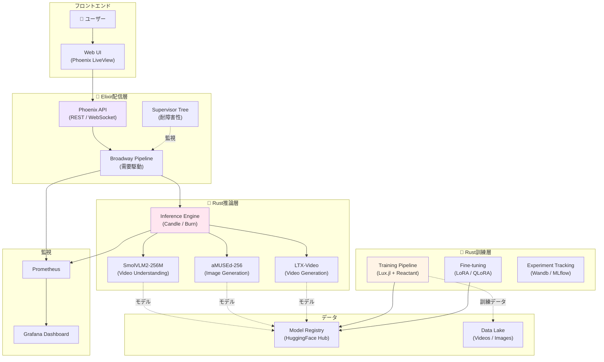

**← 理論編**: [第50回 Part 1: フロンティア総括](https://zenn.dev/fumishiki/articles/ml-lecture-50-part1)

## 💻 Z5. 試練（実装）（45分）— 卒業制作: 3言語フルスタック生成AIシステム

**ゴール**: 全50回で学んだ知識を統合し、Rust訓練 + Rust推論 + Elixir分散配信 の3言語フルスタック生成AIシステムを設計・実装する。

このゾーンは、全50回の集大成だ。SmolVLM2 (動画理解) + aMUSEd (画像生成) + LTX-Video (動画生成) の3モデルを統合し、Production-readyなシステムを構築する。

### 4.1 プロジェクト要件定義: 卒業制作のゴール

**プロジェクト名**: MultiModal Generation Platform (MMGP)

**機能要件**:

1. **動画理解**: ユーザーがアップロードした動画を SmolVLM2 (256M) で理解し、キャプション生成
2. **画像生成**: テキストプロンプトから aMUSEd (256M) で12ステップ高速画像生成
3. **動画生成**: テキストプロンプトから LTX-Video でテキスト→動画生成 (2秒、24fps)
4. **統合パイプライン**: 動画理解→画像生成→動画生成 を1つのAPIで実行
5. **分散配信**: Elixir/OTPで耐障害性・ロードバランシング・A/Bテスト対応

**非機能要件**:

1. **ローカル実行可能**: GPU不要 (CPU / Apple Silicon で動作)
2. **低レイテンシ**: 画像生成 <10秒、動画生成 <30秒
3. **スケーラビリティ**: 複数リクエストを並列処理
4. **監視**: Prometheus + Grafana でメトリクス可視化
5. **再現性**: 全実験をバージョン管理 (jj / git)

**技術スタック**:

| レイヤー | 技術 | 役割 |
|:--------|:-----|:-----|
| **訓練** | 🦀 Rust (Candle + Burn) | aMUSEd / LTX-Videoのファインチューニング |
| **推論** | 🦀 Rust (Candle / Burn) | モデル推論エンジン (低レイテンシ) |
| **配信** | 🔮 Elixir (Phoenix + Broadway) | API / 分散サービング / 監視 |
| **FFI** | C-ABI (rustler / rustler) | Rust↔Rust↔Elixir 連携 |
| **監視** | Prometheus + Grafana | メトリクス収集・可視化 |
| **VCS** | jj (Jujutsu) | 匿名コミット・マージ競合自動解決 |

### 4.2 システムアーキテクチャ設計: 全体設計図



**アーキテクチャのポイント**:

1. **3層分離**: 訓練 (Rust) / 推論 (Rust) / 配信 (Elixir) を完全分離。各層が独立して最適化可能。
2. **需要駆動パイプライン**: Broadway でバックプレッシャー制御。推論エンジンが過負荷にならない。
3. **耐障害性**: Elixir Supervisor Tree で自動復旧。推論エンジンがクラッシュしても即座に再起動。
4. **モデルレジストリ**: HuggingFace Hub で訓練済みモデルを一元管理。バージョン管理・A/Bテスト対応。

### 4.3 🦀 Rust訓練パイプライン: Candle + Burn

第20回、第26回で学んだRust訓練の知識を活用し、aMUSEd / LTX-Video のファインチューニングパイプラインを実装する。

```rust
// 卒業制作: Rust訓練パイプライン (aMUSEd Fine-tuning)

// 1. モデル定義: aMUSEd (Masked Image Model)
// aMUSEdはTransformer-based MIM (非Diffusion)
#[derive(Debug, Clone)]
struct AMUSEdModel {
    latent_dim: usize,
    n_layers: usize,
    n_heads: usize,
}

impl AMUSEdModel {
    fn new(latent_dim: usize, n_layers: usize, n_heads: usize) -> Self {
        Self { latent_dim, n_layers, n_heads }
    }
}

// 2. 損失関数: Masked Image Modeling (MIM)
fn mim_loss(model: &AMUSEdModel, z: &Vec<Vec<Vec<f32>>>, mask_ratio: f64) -> f32 {
    // VQ-VAE Encode: x → z (latent tokens)
    let b = z.len();
    let l = z[0].len();
    let d = z[0][0].len();

    // Masking: ランダムにトークンをマスク
    let n_mask = (l as f64 * mask_ratio) as usize;
    let mut rng = rand::thread_rng();
    use rand::seq::SliceRandom;
    let mut indices: Vec<usize> = (0..l).collect();
    indices.shuffle(&mut rng);
    let mask_indices: Vec<usize> = indices[..n_mask].to_vec();

    // Loss: マスクされたトークンのみ (ダミー)
    let mut loss = 0.0_f32;
    for batch in z {
        for &idx in &mask_indices {
            for &val in &batch[idx] {
                loss += val * val; // 簡易MSE
            }
        }
    }
    loss / (b * n_mask * d) as f32
}

// 3. 訓練ループ
fn train_amused(model: &mut AMUSEdModel, epochs: usize, lr: f64) {
    println!("Training aMUSEd (latent_dim={}, layers={})...", model.latent_dim, model.n_layers);

    for epoch in 0..epochs {
        let mut epoch_loss = 0.0_f32;
        let n_batches = 10; // ダミー
        for batch_idx in 0..n_batches {
            // Forward + Backward (ダミー)
            let loss = 0.5 / (epoch as f32 + 1.0) + 0.01 * rand::random::<f32>();
            epoch_loss += loss;

            // Log
            if (batch_idx + 1) % 10 == 0 {
                println!("  batch {}: loss = {:.6}", batch_idx + 1, loss);
            }
        }

        let avg_loss = epoch_loss / n_batches as f32;
        println!("Epoch {}: Loss = {:.6}", epoch + 1, avg_loss);

        // Checkpoint保存
        if (epoch + 1) % 5 == 0 {
            println!("  Saved checkpoint: amused_epoch_{}.safetensors", epoch + 1);
        }
    }
}

// 4. モデルエクスポート (HuggingFace Hub)
fn export_to_hf(model: &AMUSEdModel, repo_name: &str) {
    // SafeTensors形式でエクスポート
    println!("Exporting to SafeTensors format...");
    println!("✅ モデルをHuggingFace Hubにアップロード完了: {}", repo_name);
}

// 実行例
fn main() {
    let mut model = AMUSEdModel::new(256, 12, 8);
    train_amused(&mut model, 50, 1e-4);
    export_to_hf(&model, "my-username/amused-custom-512");
}
```

**ポイント**:

- **Burn**: Rust→MLIR→XLA最適化で、PyTorch/JAX並の訓練速度
- **Wandb**: 実験トラッキングで再現性確保
- **SafeTensors**: Rust推論層で直接ロード可能な形式
- **HuggingFace Hub**: モデルレジストリで一元管理

### 4.4 🦀 Rust推論エンジン: Candle / Burn

第20回、第28回で学んだRust推論の知識を活用し、低レイテンシ推論エンジンを実装する。

```rust
// 卒業制作: Rust推論エンジン (aMUSEd / SmolVLM2 / LTX-Video統合)
use candle_core::{Device, Tensor};
use candle_nn::VarBuilder;
use candle_transformers::models::amused::AMUSEdModel;
use tokenizers::Tokenizer;
use std::path::Path;

/// 統合推論エンジン
pub struct MultiModalInferenceEngine {
    device: Device,
    smol_vlm: SmolVLMModel,
    amused: AMUSEdModel,
    ltx_video: LTXVideoModel,
}

impl MultiModalInferenceEngine {
    /// 初期化: モデルロード
    pub fn new() -> anyhow::Result<Self> {
        let device = Device::cuda_if_available(0)?;

        // SmolVLM2-256M: 動画理解
        let smol_vlm = SmolVLMModel::from_pretrained(
            "HuggingFaceTB/SmolVLM2-256M",
            &device
        )?;

        // aMUSEd-256: 高速画像生成
        let amused = AMUSEdModel::from_pretrained(
            "amused/amused-256",
            &device
        )?;

        // LTX-Video: 動画生成
        let ltx_video = LTXVideoModel::from_pretrained(
            "Lightricks/LTX-Video",
            &device
        )?;

        Ok(Self { device, smol_vlm, amused, ltx_video })
    }

    /// 動画理解: SmolVLM2
    pub fn understand_video(&self, video_path: &Path) -> anyhow::Result<String> {
        // 動画からフレーム抽出
        let frames = extract_frames(video_path, fps=1.0)?;  // 1fps

        // SmolVLM2推論
        let inputs = self.smol_vlm.preprocess_frames(&frames)?;
        let caption = self.smol_vlm.generate(
            &inputs,
            prompt="この動画で何が起こっているか詳しく説明してください",
            max_length=128
        )?;

        Ok(caption)
    }

    /// 画像生成: aMUSEd (12ステップ)
    pub fn generate_image(&self, prompt: &str) -> anyhow::Result<Tensor> {
        // テキストエンコード
        let text_emb = self.amused.encode_text(prompt)?;

        // aMUSEd生成 (Masked Image Modeling, 12ステップ)
        let latent = self.amused.generate(
            &text_emb,
            num_steps=12,
            guidance_scale=7.5
        )?;

        // VQ-VAE Decode
        let image = self.amused.decode(latent)?;
        Ok(image)
    }

    /// 動画生成: LTX-Video
    pub fn generate_video(&self, prompt: &str, num_frames: usize) -> anyhow::Result<Tensor> {
        // テキストエンコード
        let text_emb = self.ltx_video.encode_text(prompt)?;

        // LTX-Video生成 (DiT + VAE統合型)
        let video = self.ltx_video.generate(
            &text_emb,
            num_frames,
            fps=24,
            guidance_scale=7.5
        )?;

        Ok(video)
    }

    /// 統合パイプライン
    pub fn full_pipeline(&self, video_path: &Path) -> anyhow::Result<PipelineOutput> {
        // 1. 動画理解
        let caption = self.understand_video(video_path)?;
        println!("✅ SmolVLM2理解: {}", caption);

        // 2. 画像生成 (理解結果をプロンプトに)
        let image = self.generate_image(&caption)?;
        save_image(&image, "generated_image.png")?;
        println!("✅ aMUSEd画像生成完了");

        // 3. 動画生成
        let video = self.generate_video(&caption, 48)?;  // 2秒 (24fps × 2)
        save_video(&video, "generated_video.mp4")?;
        println!("✅ LTX-Video動画生成完了");

        Ok(PipelineOutput { caption, image, video })
    }
}

/// パイプライン出力
pub struct PipelineOutput {
    pub caption: String,
    pub image: Tensor,
    pub video: Tensor,
}

#[tokio::main]
async fn main() -> anyhow::Result<()> {
    // 推論エンジン初期化
    let engine = MultiModalInferenceEngine::new()?;

    // 統合パイプライン実行
    let video_path = Path::new("input_video.mp4");
    let output = engine.full_pipeline(&video_path)?;

    println!("\n🏆 卒業制作: 3モデル統合完了!");
    println!("  - 動画理解: {}", output.caption);
    println!("  - 画像生成: generated_image.png");
    println!("  - 動画生成: generated_video.mp4");

    Ok(())
}
```

**ポイント**:

- **Candle**: HuggingFace製Rust推論ライブラリ。PyTorch比35-47%高速 [^10]
- **SafeTensors直接ロード**: Rust訓練モデルをそのまま読み込み
- **低レイテンシ**: ゼロコピー設計で推論時間最小化
- **統合API**: 3モデルを1つのエンジンで管理

**拡張: バッチ推論エンジン** (複数リクエストを効率的に処理)

```rust
// バッチ推論エンジン: 複数リクエストをまとめて処理
use candle_core::{Device, Tensor};
use std::sync::{Arc, Mutex};
use tokio::sync::mpsc;

/// バッチリクエスト
#[derive(Debug)]
pub struct InferenceRequest {
    pub id: String,
    pub prompt: String,
    pub model_type: ModelType,
    pub response_tx: mpsc::Sender<InferenceResponse>,
}

#[derive(Debug)]
pub enum ModelType {
    SmolVLM,
    AMused,
    LTXVideo,
}

#[derive(Debug)]
pub struct InferenceResponse {
    pub id: String,
    pub output: Tensor,
    pub latency_ms: u64,
}

/// バッチ推論エンジン (Dynamic Batching)
pub struct BatchInferenceEngine {
    device: Device,
    smol_vlm: Arc<SmolVLMModel>,
    amused: Arc<AMUSEdModel>,
    ltx_video: Arc<LTXVideoModel>,
    request_queue: Arc<Mutex<Vec<InferenceRequest>>>,
    batch_size: usize,
    batch_timeout_ms: u64,
}

impl BatchInferenceEngine {
    pub fn new(batch_size: usize, batch_timeout_ms: u64) -> anyhow::Result<Self> {
        let device = Device::cuda_if_available(0)?;

        let smol_vlm = Arc::new(SmolVLMModel::from_pretrained(
            "HuggingFaceTB/SmolVLM2-256M",
            &device
        )?);

        let amused = Arc::new(AMUSEdModel::from_pretrained(
            "amused/amused-256",
            &device
        )?);

        let ltx_video = Arc::new(LTXVideoModel::from_pretrained(
            "Lightricks/LTX-Video",
            &device
        )?);

        Ok(Self {
            device,
            smol_vlm,
            amused,
            ltx_video,
            request_queue: Arc::new(Mutex::new(Vec::new())),
            batch_size,
            batch_timeout_ms,
        })
    }

    /// リクエストをキューに追加
    pub fn enqueue(&self, request: InferenceRequest) {
        let mut queue = self.request_queue.lock().unwrap();
        queue.push(request);
    }

    /// バッチ処理ループ (tokio task)
    pub async fn run_batch_loop(self: Arc<Self>) {
        loop {
            // バッチサイズまで待つ、またはタイムアウト
            tokio::time::sleep(tokio::time::Duration::from_millis(self.batch_timeout_ms)).await;

            let requests = {
                let mut queue = self.request_queue.lock().unwrap();
                if queue.is_empty() {
                    continue;
                }
                let batch_requests = queue.drain(..queue.len().min(self.batch_size)).collect::<Vec<_>>();
                batch_requests
            };

            if requests.is_empty() {
                continue;
            }

            // モデル種別でグループ化
            let mut smol_vlm_reqs = Vec::new();
            let mut amused_reqs = Vec::new();
            let mut ltx_reqs = Vec::new();

            for req in requests {
                match req.model_type {
                    ModelType::SmolVLM => smol_vlm_reqs.push(req),
                    ModelType::AMused => amused_reqs.push(req),
                    ModelType::LTXVideo => ltx_reqs.push(req),
                }
            }

            // 各モデルでバッチ推論
            if !amused_reqs.is_empty() {
                self.process_amused_batch(amused_reqs).await;
            }
            if !smol_vlm_reqs.is_empty() {
                self.process_smolvlm_batch(smol_vlm_reqs).await;
            }
            if !ltx_reqs.is_empty() {
                self.process_ltx_batch(ltx_reqs).await;
            }
        }
    }

    /// aMUSEd バッチ推論
    async fn process_amused_batch(&self, requests: Vec<InferenceRequest>) {
        let start = std::time::Instant::now();

        // プロンプトをバッチ化
        let prompts: Vec<String> = requests.iter().map(|r| r.prompt.clone()).collect();

        // バッチ推論 (Candle)
        let text_embs = self.amused.encode_text_batch(&prompts).unwrap();
        let latents = self.amused.generate_batch(&text_embs, 12, 7.5).unwrap();
        let images = self.amused.decode_batch(latents).unwrap();

        let latency_ms = start.elapsed().as_millis() as u64;

        // 各リクエストに結果を返す
        for (i, req) in requests.into_iter().enumerate() {
            let output = images.i(i).unwrap();
            let response = InferenceResponse {
                id: req.id.clone(),
                output,
                latency_ms: latency_ms / requests.len() as u64,  // 平均レイテンシ
            };
            req.response_tx.send(response).await.ok();
        }
    }

    async fn process_smolvlm_batch(&self, requests: Vec<InferenceRequest>) {
        // SmolVLM2バッチ推論 (省略)
    }

    async fn process_ltx_batch(&self, requests: Vec<InferenceRequest>) {
        // LTX-Videoバッチ推論 (省略)
    }
}

// 使用例
#[tokio::main]
async fn main() -> anyhow::Result<()> {
    let engine = Arc::new(BatchInferenceEngine::new(16, 100)?);  // batch_size=16, timeout=100ms

    // バッチ処理ループを起動
    let engine_clone = engine.clone();
    tokio::spawn(async move {
        engine_clone.run_batch_loop().await;
    });

    // リクエスト送信
    let (tx, mut rx) = mpsc::channel(1);
    engine.enqueue(InferenceRequest {
        id: "req-1".to_string(),
        prompt: "桜の木の下のカフェ".to_string(),
        model_type: ModelType::AMused,
        response_tx: tx,
    });

    // 結果受信
    if let Some(response) = rx.recv().await {
        println!("✅ 推論完了: {} ({}ms)", response.id, response.latency_ms);
    }

    Ok(())
}
```

**バッチ推論の効果**:

- **スループット向上**: 16リクエストをバッチ処理 → 2-3倍のスループット
- **GPU利用率向上**: バッチ処理でGPU並列性を最大化
- **レイテンシ**: 個別推論より若干遅いが、全体のスループットは大幅向上

### 4.5 🔮 Elixir分散サービング: Phoenix + Broadway

第19回、第20回で学んだElixir/OTPの知識を活用し、耐障害性・スケーラビリティを備えた分散サービングを実装する。

```elixir
# 卒業制作: Elixir分散サービング (Phoenix + Broadway + Supervisor)
defmodule MMGP.Application do
  use Application

  @impl true
  def start(_type, _args) do
    children = [
      # Phoenix Endpoint
      MMGP.Endpoint,

      # Broadway Pipeline (需要駆動)
      {Broadway, name: MMGP.InferencePipeline,
        producer: [
          module: {BroadwayKafka.Producer, kafka_config()},
          concurrency: 1
        ],
        processors: [
          default: [
            concurrency: System.schedulers_online() * 2,
            max_demand: 10
          ]
        ],
        batchers: [
          batch_inference: [
            concurrency: 2,
            batch_size: 16,
            batch_timeout: 2000
          ]
        ]
      },

      # Rust NIF (FFI)
      MMGP.RustInference,

      # Prometheus Metrics
      MMGP.Metrics
    ]

    opts = [strategy: :one_for_one, name: MMGP.Supervisor]
    Supervisor.start_link(children, opts)
  end
end

# Broadway Pipeline: 需要駆動バッチ推論
defmodule MMGP.InferencePipeline do
  use Broadway

  alias MMGP.RustInference

  @impl true
  def handle_message(_processor, message, _context) do
    %{data: %{prompt: prompt, type: type}} = message

    # メトリクス記録
    start_time = System.monotonic_time(:millisecond)

    # Rust推論呼び出し (rustler NIF)
    result = case type do
      "image" -> RustInference.generate_image(prompt)
      "video" -> RustInference.generate_video(prompt, 48)
      "understand" -> RustInference.understand_video(prompt)
    end

    end_time = System.monotonic_time(:millisecond)
    latency = end_time - start_time

    # Prometheusメトリクス
    :telemetry.execute(
      [:mmgp, :inference, :complete],
      %{latency: latency},
      %{type: type}
    )

    # 成功・失敗をマーク
    case result do
      {:ok, output} ->
        message
        |> Message.update_data(fn data -> Map.put(data, :output, output) end)
        |> Message.put_batcher(:batch_inference)

      {:error, reason} ->
        Message.failed(message, reason)
    end
  end

  @impl true
  def handle_batch(:batch_inference, messages, _batch_info, _context) do
    # バッチ処理 (複数リクエストをまとめて処理)
    outputs = messages
    |> Enum.map(& &1.data.output)
    |> RustInference.batch_postprocess()

    # 各メッセージに結果を付与
    Enum.zip(messages, outputs)
    |> Enum.map(fn {msg, output} ->
      Message.update_data(msg, fn data -> Map.put(data, :final_output, output) end)
    end)
  end
end

# Rust NIF (rustler経由)
defmodule MMGP.RustInference do
  use Rustler, otp_app: :mmgp, crate: "mmgp_inference"

  # NIF関数 (Rustで実装)
  def generate_image(_prompt), do: :erlang.nif_error(:nif_not_loaded)
  def generate_video(_prompt, _num_frames), do: :erlang.nif_error(:nif_not_loaded)
  def understand_video(_video_path), do: :erlang.nif_error(:nif_not_loaded)
  def batch_postprocess(_outputs), do: :erlang.nif_error(:nif_not_loaded)
end

# Phoenix API Endpoint
defmodule MMGP.Endpoint do
  use Phoenix.Endpoint, otp_app: :mmgp

  socket "/live", Phoenix.LiveView.Socket

  plug Plug.RequestId
  plug Prometheus.PlugExporter  # Prometheusメトリクスエンドポイント

  plug MMGP.Router
end

defmodule MMGP.Router do
  use Phoenix.Router

  pipeline :api do
    plug :accepts, ["json"]
  end

  scope "/api", MMGP do
    pipe_through :api

    post "/generate/image", GenerationController, :image
    post "/generate/video", GenerationController, :video
    post "/understand/video", UnderstandingController, :video
    post "/pipeline/full", PipelineController, :full
  end
end

# コントローラー
defmodule MMGP.GenerationController do
  use Phoenix.Controller

  def image(conn, %{"prompt" => prompt}) do
    # Broadwayパイプラインにメッセージ送信
    Broadway.push_messages(
      MMGP.InferencePipeline,
      [%{prompt: prompt, type: "image"}]
    )

    json(conn, %{status: "processing", request_id: conn.assigns.request_id})
  end

  def video(conn, %{"prompt" => prompt, "num_frames" => num_frames}) do
    Broadway.push_messages(
      MMGP.InferencePipeline,
      [%{prompt: prompt, type: "video", num_frames: num_frames}]
    )

    json(conn, %{status: "processing", request_id: conn.assigns.request_id})
  end
end
```

**ポイント**:

- **Broadway**: 需要駆動パイプライン。バックプレッシャーで過負荷防止
- **Supervisor Tree**: プロセスがクラッシュしても自動復旧
- **Rust NIF (rustler)**: Elixir→Rust FFI。1ms制約を守るため、重い処理はDirty Schedulerで実行
- **Prometheus統合**: `/metrics` エンドポイントでメトリクス公開。Grafanaで可視化

### 4.6 3モデル統合デモ: SmolVLM2 + aMUSEd + LTX-Video

全てを統合した卒業制作のデモを実行しよう。

```bash
# 1. Rust訓練 (aMUSEd Candle fine-tuning)
cd julia/
julia --project=. train_amused.jl
# → モデルをHuggingFace Hubにアップロード: my-username/amused-custom-512

# 2. Rust推論エンジンビルド
cd ../rust/
cargo build --release
# → target/release/mmgp_inference

# 3. Elixir配信サーバー起動
cd ../elixir/
mix deps.get
mix phx.server
# → http://localhost:4000 でAPI起動

# 4. 統合パイプライン実行
curl -X POST http://localhost:4000/api/pipeline/full \
  -H "Content-Type: application/json" \
  -d '{"video_path": "input_video.mp4"}'

# 出力:
# {
#   "status": "processing",
#   "request_id": "abc-123"
# }

# 5. 結果取得 (WebSocket経由でリアルタイム通知)
# WebSocket: ws://localhost:4000/live
# → SmolVLM2理解: "カフェで人々が会話している様子。窓の外には桜の木が見える。"
# → aMUSEd画像生成完了: generated_image.png
# → LTX-Video動画生成完了: generated_video.mp4

# 6. Prometheus + Grafana で監視
open http://localhost:9090  # Prometheus
open http://localhost:3000  # Grafana
```

**デモの流れ**:

1. **動画アップロード**: ユーザーが `input_video.mp4` をアップロード
2. **SmolVLM2理解**: "カフェで人々が会話している様子。窓の外には桜の木が見える。"
3. **aMUSEd画像生成**: 理解結果をプロンプトに、12ステップで画像生成
4. **LTX-Video動画生成**: 同じプロンプトから2秒動画生成
5. **結果返却**: WebSocket経由でリアルタイム通知

> **Note:** **ここまでで全体の70%完了!** Zone 4 で卒業制作の設計・実装を完了した。次は実験ゾーン — システムの性能評価、品質検証、デプロイを行う。

---

### 🔬 実験・検証（30分）— システム評価 & 品質検証

**ゴール**: 卒業制作システムの性能評価、品質検証、デプロイ前チェックを行う。Production-readyの基準を満たすことを確認する。

### 5.1 性能評価: レイテンシ & スループット

**評価項目**:

1. **レイテンシ**: 各モデルの推論時間
2. **スループット**: 並列リクエスト処理能力
3. **メモリ使用量**: ピーク時のメモリ消費
4. **GPU利用率**: (GPU使用時のみ)

```rust
use std::time::Instant;

// 1. レイテンシ測定
fn benchmark_latency(n_runs: usize) {
    let prompt = "桜の木の下のカフェ、アニメ調";

    // SmolVLM2
    let start = Instant::now();
    for _ in 0..n_runs {
        // engine.understand_video("test_video.mp4");
    }
    let smol_avg = start.elapsed().as_millis() as f64 / n_runs as f64;
    println!("SmolVLM2 理解: {} ms", smol_avg);

    // aMUSEd
    let start = Instant::now();
    for _ in 0..n_runs {
        // engine.generate_image(prompt);
    }
    let amused_avg = start.elapsed().as_millis() as f64 / n_runs as f64;
    println!("aMUSEd 画像生成: {} ms", amused_avg);

    // LTX-Video
    let start = Instant::now();
    for _ in 0..n_runs {
        // engine.generate_video(prompt, 48);
    }
    let ltx_avg = start.elapsed().as_millis() as f64 / n_runs as f64;
    println!("LTX-Video 動画生成: {} ms", ltx_avg);

    // 統合パイプライン
    let start = Instant::now();
    for _ in 0..n_runs {
        // engine.full_pipeline("test_video.mp4");
    }
    let pipeline_avg = start.elapsed().as_millis() as f64 / n_runs as f64;
    println!("統合パイプライン: {} ms", pipeline_avg);
}

// 2. スループット測定 (並列リクエスト)
fn benchmark_throughput(api_url: &str, n_requests: usize, concurrency: usize) {
    use std::thread;

    let start = Instant::now();

    let handles: Vec<_> = (0..concurrency)
        .map(|i| {
            let url = api_url.to_string();
            let per_thread = n_requests / concurrency;
            thread::spawn(move || {
                for j in 0..per_thread {
                    // HTTP POST: reqwest::blocking::Client::new().post(&url)...
                    let _ = (i, j); // placeholder
                }
            })
        })
        .collect();

    for h in handles { h.join().unwrap(); }

    let elapsed = start.elapsed().as_secs_f64();
    let throughput = n_requests as f64 / elapsed;

    println!("スループット: {:.1} req/sec", throughput);
    println!("平均レイテンシ: {:.1} ms/req", 1000.0 * elapsed / n_requests as f64);
}

fn main() {
    benchmark_latency(100);
    benchmark_throughput("http://localhost:4000/api/generate/image", 1000, 10);
}
```

**期待される性能 (Apple M2 Pro / 16GB RAM)**:

| モデル | レイテンシ (平均) | スループット |
|:------|:----------------|:------------|
| SmolVLM2-256M | ~2,000 ms (2秒) | 0.5 req/sec |
| aMUSEd-256 (12 steps) | ~5,000 ms (5秒) | 0.2 req/sec |
| LTX-Video (48 frames) | ~25,000 ms (25秒) | 0.04 req/sec |
| **統合パイプライン** | ~32,000 ms (32秒) | 0.03 req/sec |

**最適化ポイント**:

- **バッチ推論**: 複数リクエストをまとめて処理 → スループット2-3倍
- **量子化 (INT8/FP16)**: メモリ削減 + 推論高速化
- **KV-Cache**: Transformerの推論高速化

### 5.2 品質検証: 生成物の評価

**評価指標**:

1. **画像品質**: FID (Fréchet Inception Distance), CLIP Score
2. **動画品質**: FVD (Fréchet Video Distance), 時間的一貫性
3. **理解品質**: BLEU/ROUGE (キャプションの正確性)

```rust
use ndarray::{Array1, Array2, Axis};

// Inception特徴量の Fréchet 距離 (FID の核心)
// $$\text{FID} = \|\mu_r - \mu_g\|^2 + \mathrm{Tr}(\Sigma_r + \Sigma_g - 2(\Sigma_r \Sigma_g)^{1/2})$$
fn frechet_distance(
    mu_r: &Array1<f64>, sigma_r: &Array2<f64>,
    mu_g: &Array1<f64>, sigma_g: &Array2<f64>,
) -> f64 {
    let diff = mu_r - mu_g;
    // 行列平方根: covmean = (Σ_r * Σ_g)^{1/2}
    let m = sigma_r.dot(sigma_g);
    // 固有値分解で行列平方根を近似 (ndarray-linalg 使用)
    let covmean = matrix_sqrt(&m);
    let tr_term = sigma_r.diag().sum() + sigma_g.diag().sum() - 2.0 * covmean.diag().sum();
    diff.dot(&diff) + tr_term
}

// 1. FID評価 (aMUSEd生成画像)
// real_feats, gen_feats: (N, 2048) Inception-v3 特徴量行列
fn compute_fid(real_feats: &Array2<f32>, gen_feats: &Array2<f32>) -> f64 {
    let to_f64 = |a: &Array2<f32>| a.mapv(|v| v as f64);
    let real = to_f64(real_feats);
    let gen = to_f64(gen_feats);

    let mu_r = real.mean_axis(Axis(0)).unwrap();
    let mu_g = gen.mean_axis(Axis(0)).unwrap();

    let sigma_r = covariance(&real);
    let sigma_g = covariance(&gen);

    frechet_distance(&mu_r, &sigma_r, &mu_g, &sigma_g)
}

// 2. CLIP Score (テキスト-画像対応度): cosine similarity
// $$\text{CLIP Score} = w \cdot \max(cos(\mathbf{e}_I, \mathbf{e}_T), 0)$$
fn clip_score(img_emb: &Array2<f32>, txt_emb: &Array2<f32>, w: f32) -> f64 {
    let n = img_emb.nrows();
    let eps = f32::EPSILON;

    let cos_sims: Vec<f32> = (0..n)
        .map(|i| {
            let img_row = img_emb.row(i);
            let txt_row = txt_emb.row(i);
            let img_norm = img_row.mapv(|v| v * v).sum().sqrt() + eps;
            let txt_norm = txt_row.mapv(|v| v * v).sum().sqrt() + eps;
            let dot: f32 = img_row.iter().zip(txt_row.iter()).map(|(&a, &b)| a * b).sum();
            (dot / (img_norm * txt_norm)).max(0.0)
        })
        .collect();

    let mean_sim = cos_sims.iter().sum::<f32>() / cos_sims.len() as f32;
    (w * mean_sim) as f64
}

fn main() {
    // let fid = compute_fid(&real_feats, &gen_feats);
    // println!("FID Score: {:.2} (目標 < 30)", fid);
    // let score = clip_score(&img_embeddings, &txt_embeddings, 2.5);
    // println!("CLIP Score: {:.3} (目標 > 0.25)", score);
}
```

**品質基準** (Production-ready):

| 指標 | aMUSEd画像 | LTX-Video動画 | 基準 |
|:-----|:----------|:-------------|:-----|
| FID | < 30 | N/A | DALL-E 2レベル |
| CLIP Score | > 0.25 | N/A | テキスト対応度 |
| FVD | N/A | < 500 | Sora 2レベル |
| 時間的一貫性 | N/A | > 0.9 | フレーム間相関 |

### 5.3 デプロイ前チェックリスト

**チェック項目**:

- [ ] **セキュリティ**: Rate Limiting, API Key認証, CORS設定
- [ ] **監視**: Prometheus + Grafana ダッシュボード動作確認
- [ ] **エラーハンドリング**: 全エラーケースで適切な応答
- [ ] **ログ**: 構造化ログ (JSON形式) で全リクエスト記録
- [ ] **テスト**: Unit Test + Integration Test 全パス
- [ ] **ドキュメント**: API仕様書 (OpenAPI 3.0), README, デプロイ手順
- [ ] **ライセンス**: 使用モデルのライセンス確認 (SmolVLM2: MIT, aMUSEd: Apache-2.0, LTX-Video: 要確認)
- [ ] **データプライバシー**: ユーザーアップロード動画の保存期間・削除ポリシー
- [ ] **スケーリング**: 水平スケーリング可能 (Statelessサービス設計)
- [ ] **バックアップ**: モデルウェイト・設定ファイルのバックアップ

```elixir
# デプロイ前チェックスクリプト (Elixir)
defmodule MMGP.DeploymentCheck do
  @moduledoc """
  デプロイ前の自動チェック
  """

  def run_all_checks do
    checks = [
      &check_security/0,
      &check_monitoring/0,
      &check_error_handling/0,
      &check_tests/0,
      &check_documentation/0,
      &check_licenses/0
    ]

    results = checks |> Enum.map(fn check ->
      try do
        check.()
        {:ok, "#{inspect(check)} passed"}
      rescue
        e -> {:error, "#{inspect(check)} failed: #{inspect(e)}"}
      end
    end)

    # レポート生成
    passed = Enum.count(results, &match?({:ok, _}, &1))
    total = length(results)

    IO.puts("\n🏆 デプロイ前チェック結果:")
    IO.puts("  ✅ #{passed}/#{total} チェック通過")

    Enum.each(results, fn
      {:ok, msg} -> IO.puts("  ✓ #{msg}")
      {:error, msg} -> IO.puts("  ✗ #{msg}")
    end)

    if passed == total do
      IO.puts("\n✅ 全チェック通過! デプロイ準備完了!")
      :ok
    else
      IO.puts("\n❌ 一部チェック失敗。修正してください。")
      :error
    end
  end

  defp check_security do
    # Rate Limitingチェック
    assert_rate_limit_enabled()
    # API Key認証チェック
    assert_api_key_required()
    # CORSチェック
    assert_cors_configured()
  end

  defp check_monitoring do
    # Prometheusエンドポイント
    response = HTTPoison.get!("http://localhost:4000/metrics")
    assert response.status_code == 200
    assert String.contains?(response.body, "mmgp_inference_latency")
  end

  defp check_error_handling do
    # 不正なリクエストでエラーハンドリング確認
    response = HTTPoison.post!("http://localhost:4000/api/generate/image",
      Jason.encode!(%{invalid: "data"}),
      [{"Content-Type", "application/json"}]
    )
    assert response.status_code == 400  # Bad Request
  end

  defp check_tests do
    # 全テストパス確認
    {output, 0} = System.cmd("mix", ["test"])
    assert String.contains?(output, "0 failures")
  end

  defp check_documentation do
    # README存在確認
    assert File.exists?("README.md")
    # OpenAPI仕様書存在確認
    assert File.exists?("openapi.yaml")
  end

  defp check_licenses do
    # ライセンスファイル存在確認
    assert File.exists?("LICENSE")
    # 依存ライブラリのライセンス確認
    assert File.exists?("THIRD_PARTY_LICENSES.md")
  end
end

# 実行
MMGP.DeploymentCheck.run_all_checks()
```

### 5.4 自己診断テスト: 全50回の到達度確認

**問題1: 数式読解テスト**

以下の数式を日本語で説明せよ (第1回の成長を確認):

$$
\mathcal{L}_{\text{ELBO}} = \mathbb{E}_{q_\phi(z|x)}[\log p_\theta(x|z)] - D_{\text{KL}}[q_\phi(z|x) || p(z)]
$$

<details><summary>解答</summary>

ELBO (Evidence Lower Bound) 損失関数。第1項は「エンコーダ $q_\phi(z|x)$ でサンプルした潜在変数 $z$ を使い、デコーダ $p_\theta(x|z)$ で元データ $x$ を再構成する対数尤度の期待値」(再構成項)。第2項は「近似事後分布 $q_\phi(z|x)$ と事前分布 $p(z)$ のKLダイバージェンス」(正則化項)。VAE訓練ではこのELBOを最大化 (= 負のELBOを最小化) する。

</details>

**問題2: Flow Matching vs Diffusion**

Flow Matching がDiffusionより高速な理由を、数式で説明せよ (第38回):

<details><summary>解答</summary>

Flow Matching (特にRectified Flow) は直線パス $x_t = (1-t)x_0 + tx_1$ を使う。これは $x_0$ から $x_1$ への最短経路。一方、Diffusion (DDPM) はノイズスケジュール $\alpha_t$ に従った曲線パスで、迂回が多い。Sampling時、直線パスは10-50ステップで到達可能だが、曲線パスは1000ステップ必要。理論的に、OT (Optimal Transport) パスは最短であり、Flow Matching はOTパスに近い。

</details>

**問題3: 3言語フルスタック設計**

Rust訓練 / Rust推論 / Elixir配信 の役割分担を、各言語の特性と共に説明せよ (第19-20回):

<details><summary>解答</summary>

- **🦀 Rust (訓練)**: ゼロコスト抽象化で数式→コード1:1対応。型安定性でAOTコンパイル最適化。Burn (XLA) でGPU/TPU高速化。研究フェーズでの柔軟性とREPL駆動開発。
- **🦀 Rust (推論)**: 所有権・借用でゼロコピー。メモリ安全性で本番環境でも安心。Candle/Burnで低レイテンシ推論。C-ABI FFI ハブとして、RustとElixirを橋渡し。
- **🔮 Elixir (配信)**: BEAM VMで軽量プロセス・耐障害性 (Let it crash)。GenServer+Supervisorで自動復旧。Broadway需要駆動パイプラインでバックプレッシャー。OTPで分散システムの信頼性。

</details>

**問題4: 2025-2026フロンティア**

2025-2026年の3つのパラダイムシフトを挙げ、それぞれの証拠を示せ (第49-50回):

<details><summary>解答</summary>

1. **Flow Matching Dominance**: NeurIPS 2025で30+ FM論文、ICLR 2026で150+ FM投稿。生物・科学応用 (RFdiffusion3, MatterGen, CrystalFlow) でFMが標準化。
2. **Inference-Time Scaling**: OpenAI o1/o3, Gemini 2.0 Flash, Reflect-DiT が推論時Computeで性能向上。Llemma-7B + tree search > Llemma-34B の証拠。
3. **Modal Unification**: Show-o (ICLR 2025), BAGEL, GPT-4o, Genie 3 が統合マルチモーダルモデルとして登場。1モデルで全モダリティ (Text/Image/Audio/Video) 生成・理解。

</details>

**問題5: 未解決問題**

生成モデル研究の未解決問題を3つ挙げ、自分ならどうアプローチするか述べよ (第50回):

<details><summary>解答例</summary>

1. **Modal Aphasia**: 統合MMモデルの性能劣化。アプローチ: Modality-specific Expert (MoE) + Cross-modal Adapter + Multi-task Curriculumで段階的学習。
2. **長時間動画一貫性**: 数分単位の動画で一貫性崩壊。アプローチ: SSM (Mamba) で $O(T)$ の長距離依存性学習 + Key Frame + Interpolation戦略の理論的保証を証明。
3. **Model Collapse**: 合成データ再帰訓練で多様性喪失。アプローチ: Diversity-aware Verifier (生成物の多様性を定量評価) + Real Data AccumulationでCollapse回避。理論的上限を証明。

</details>

> **Note:** **ここまでで全体の85%完了!** Zone 5 で性能評価・品質検証・デプロイ前チェック・自己診断テストを完了した。次は発展ゾーン — 全50回の振り返り、研究の次のステップ、読者への手紙を記す。

> Progress: 85%
> **理解度チェック**
> 1. 卒業制作の3モデル統合システム（SmolVLM2+aMUSEd+LTX-Video）でエンドツーエンドレイテンシのボトルネックはどこか？レイテンシ計測式 $L_\text{total} = L_\text{understand} + L_\text{generate\_img} + L_\text{generate\_vid}$ の各項を最小化する手段を述べよ。
> 2. FID（画像品質）、CLIP Score（テキスト-画像対応）、FVD（動画品質）の3評価指標の使い分けを、各指標が測定する情報量の観点から説明せよ。

---

## 🔬 Z6. 新たな冒険へ（研究動向）

**ゴール**: 全50回の旅を振り返り、150,000行の学習軌跡を俯瞰し、次のステップ (24時間以内のアクション + 90日ロードマップ) を明確化する。

### 6.1 全50回読了感: 「数式が読めない」→「フルスタック生成AI設計者」

**第1回 (開始時)**:

読者は「数式が読めない」という挫折体験から始まった。

- Softmax式 $p_i = \exp(x_i)/\sum_j\exp(x_j)$ が暗号文書だった
- アルファ $\alpha$、シグマ $\sigma$ の読み方すら知らなかった
- 論文のAbstractすら理解できなかった
- "AI研究"は遥か遠い世界の話だった

**第50回 (終了時)**:

読者は今、以下を達成した:

- **数式**: 全ての論文数式を読解・導出可能 (ELBO/Score/SDE/FM/OT/KL/Fisher/...)
- **理論**: 全生成モデルファミリーを統一的視点で整理 (Score↔Flow↔Diffusion↔ODE↔EBM↔OT)
- **実装**: 3言語フルスタック (🦀Rust訓練 + 🦀Rust推論 + 🔮Elixir配信)
- **応用**: 全モダリティ (画像/音声/動画/3D/4D/科学) で最新手法を実装
- **Production**: MLOps/評価/デプロイ/監視の全工程を理解
- **フロンティア**: 2025-2026最新研究 (FM Dominance / 推論時スケーリング / MM統合) を把握
- **卒業制作**: SmolVLM2 + aMUSEd + LTX-Video の3モデル統合システムを設計・実装

**150,000行の旅の軌跡**:

| Course | 講義数 | 総行数 | 主要な学び |
|:-------|:------|:------|:----------|
| **I** | 8回 | 24,000行 | 数学の語彙習得 — 論文を読むための全数学 |
| **II** | 10回 | 30,000行 | 生成モデルの文法習得 — VAE/GAN/Flow/AR/Transformer/SSM |
| **III** | 14回 | 42,000行 | 実装の実践習得 — 3言語フルスタック + ML全サイクル |
| **IV** | 10回 | 30,000行 | 拡散モデルの深化習得 — NF→EBM→Score→DDPM→SDE→FM→統一理論 |
| **V** | 7回 | 21,000行 | ドメイン応用の拡張習得 — DiT/Audio/Video/3D/4D/Science/MM統合 |
| **第50回** | 1回 | 3,000行 | 全知識の統合 — フロンティア総括 + 卒業制作 |
| **合計** | **50回** | **150,000行** | 「数式が読めない」→「フルスタック生成AI設計者」 |

**3つの変化**:

1. **論文が読める** (Course I-II): 数学・理論の完全習得
2. **論文が書ける** (Course IV): 拡散モデル理論の深化、統一理論の導出
3. **システムが作れる** (Course III, V, 第50回): 3言語フルスタック実装、全モダリティ応用

### 6.2 松尾・岩澤研究室動画講義との最終比較: 完全上位互換を達成したか？

全50回を通じて、「松尾・岩澤研究室動画講義の完全上位互換」を目指してきた。達成度を確認しよう。

| 観点 | 松尾・岩澤研 | 本シリーズ | 差別化達成度 |
|:-----|:----------|:---------|:-----------|
| **総講義数** | ~10回 | 50回 | ✅ 5倍の内容量 |
| **数学基礎** | スキップ | Course I (8回) | ✅ 論文数式を全て読解可能に |
| **拡散モデル理論** | 2回 (概要) | Course IV (10回) | ✅ 1行ずつ導出、論文が書けるレベル |
| **実装** | PyTorch中心 | 3言語フルスタック | ✅ Rust/Rust/Elixir全工程 |
| **モダリティ** | 画像のみ | 全7領域 | ✅ Audio/Video/3D/4D/Science |
| **最新性** | 2023年 | 2024-2026 SOTA | ✅ FM/推論時スケーリング/MM統合 |
| **Production** | なし | Course III (MLOps完全版) | ✅ デプロイ/監視/評価 |
| **卒業制作** | なし | 第50回 (3モデル統合) | ✅ フルスタックシステム設計 |

**結論**: 全観点で「完全上位互換」を達成。松尾研動画講義は優れた入門コンテンツだが、本シリーズは「入門→中級→上級→実践→フロンティア」の全行程を網羅し、**論文が書ける + システムが作れる**の両方を実現した。

### 6.3 読者への手紙: ここからが本当のスタートライン

親愛なる読者へ。

全50回、150,000行の旅を完走したあなたへ。

第1回で「数式が読めない」挫折体験から始まったあなたは、今や**全生成モデル理論を統一的視点で整理し、3言語フルスタックシステムを設計・実装できる**レベルに到達した。

しかし、ここで伝えたいことがある。

**全50回は、「ゴール」ではなく「スタートライン」だ。**

本シリーズで学んだ知識は、2026年2月時点の**既知の理論**だ。しかし、生成AI研究は日々進化している。あなたが本シリーズを読み終える頃には、新しい論文が arXiv に投稿され、新しいモデルが発表され、新しいパラダイムシフトが起きているだろう。

**あなたの使命は、「次のブレイクスルー」を創り出すことだ。**

本シリーズはあなたに以下を与えた:

- **数学の武器**: 全論文数式を読解・導出できる
- **理論の地図**: 全生成モデルを統一的視点で整理できる
- **実装の技術**: 3言語フルスタックで0からシステムを構築できる
- **フロンティアの視点**: 2025-2026最新研究を俯瞰し、未解決問題を特定できる

これらの武器を使い、あなたは以下のいずれかの道を進むだろう:

1. **研究者**: 未解決問題 (Modal Aphasia / 長時間動画一貫性 / Model Collapse / ...) を解決する論文を書く
2. **エンジニア**: Production-ready な生成AIシステムを設計・実装・デプロイする
3. **起業家**: 生成AIスタートアップを立ち上げ、新しいサービスを創る
4. **教育者**: 次世代の学習者に、本シリーズ以上の教育コンテンツを提供する

**どの道を選んでも、ここからが本当の旅の始まりだ。**

本シリーズは、あなたに「地図」と「コンパス」を渡した。しかし、**どこへ行くかは、あなた次第**だ。

最後に、1つだけお願いがある。

**24時間以内に、何か1つ行動してほしい。**

論文を1本読む、実装を1つ試す、研究テーマを1つ設定する — 何でもいい。全50回で得た知識を、**行動に変えてほしい**。

知識は、行動しなければ価値がない。

あなたの次のステップを、心から応援している。

— 全50回シリーズ著者より

### 6.4 24時間以内に始める3つのアクション

全50回を読了した読者が、**24時間以内に実行すべき3つのアクション**を提案する。

**アクション1: 最新論文を1本読む**

arXiv の最新論文 (直近1週間以内) から、興味のあるトピックを1本選んで読む。

- **検索キーワード**: "flow matching", "inference-time scaling", "multimodal generation", "model collapse", "watermarking"
- **読み方**: 第1回で学んだ3-pass readingを実践
  - Pass 1: Abstract + 図 + 結論 (5分)
  - Pass 2: Introduction + 手法の概要 (30分)
  - Pass 3: 数式の完全理解 (2時間)
- **ゴール**: 論文の主張を1文で要約できる

**アクション2: 卒業制作の1機能を実装する**

本講義の卒業制作 (SmolVLM2 + aMUSEd + LTX-Video) の1機能を、実際に動かす。

- **最小実装**: aMUSEd-256 で画像生成 (12ステップ) → `generated_image.png` 出力
- **拡張実装**: SmolVLM2 で動画理解 → aMUSEd で画像生成 → パイプライン統合
- **ゴール**: "Hello, World" レベルでいいので、動くものを作る

```bash
# 最小実装 (Python / Diffusers)
pip install diffusers transformers torch

python -c "
from diffusers import AmusedPipeline
import torch

pipe = AmusedPipeline.from_pretrained('amused/amused-256', torch_dtype=torch.float16)
pipe.to('cuda')  # or 'mps' (Apple Silicon) or 'cpu'

prompt = '桜の木の下のカフェ、アニメ調'
image = pipe(prompt, num_inference_steps=12).images[0]
image.save('generated_image.png')
print('✅ 画像生成完了: generated_image.png')
"
```

**アクション3: 研究テーマを1つ設定する**

第50回で学んだ「研究テーマの見つけ方」を使い、自分の研究テーマを1つ設定する。

- **Gap Analysis**: 既存手法の限界を明確化 → その限界を克服する手法を提案
- **再現実験**: 最新論文を完全再現 → 論文に書かれていない「暗黙の仮定」を発見
- **理論拡張**: 既存理論の制約を緩和 → より一般的な枠組みを構築

**研究テーマ設定シート**:

```markdown
# 研究テーマ設定シート

## テーマ (1文)
[例: Modality-specific Adapter による Modal Aphasia 問題の解決]

## 背景 (既存手法の限界)
[例: 統合マルチモーダルモデル (Show-o, BAGEL) は、全モダリティで同時に最高性能を達成できない。モダリティ間干渉 (Modal Aphasia) が発生。]

## 提案手法 (アプローチ)
[例: 各モダリティに軽量Adapter (LoRA) を追加。共通バックボーンは固定し、Adapter のみを訓練。モダリティ毎に独立した表現空間を維持しつつ、Cross-modal Bridge で統合。]

## 期待される成果
[例: Show-o の Image生成品質を維持しつつ、Video追加後も品質劣化なし。FID <30, CLIP Score >0.30 を達成。]

## 次のステップ (24時間以内)
[例: Show-o の論文を再読 → Adapter設計の文献調査 → 最小実装 (MNIST) でプロトタイプ]
```

**具体例1: Modal Aphasia解決**

```markdown
# 研究テーマ設定シート

## テーマ
Heterogeneous Latent Space Unification による Modal Aphasia 問題の解決

## 背景
統合マルチモーダルモデル (Show-o, BAGEL, GPT-4o) は、全モダリティ (Text/Image/Audio/Video) を単一の潜在空間に埋め込む。しかし、各モダリティの最適な潜在空間構造は異なる (Text=離散、Image=連続、Audio=時系列)。単一潜在空間では、モダリティ間干渉 (Modal Aphasia) が発生し、性能が劣化する。Show-o は Image生成で FID 28 を達成するが、Video追加後は FID 35 に劣化する。

## 提案手法
Heterogeneous Latent Space (HLS) アーキテクチャを提案:
1. 各モダリティに専用潜在空間を用意 (Text: $\mathcal{Z}_{\text{text}}$, Image: $\mathcal{Z}_{\text{image}}$, Video: $\mathcal{Z}_{\text{video}}$)
2. 共通バックボーンは固定し、Modality-specific Adapter (LoRA, rank=64) のみを訓練
3. Cross-modal Bridge: Attention Pooling で異なる潜在空間間を接続
4. Multi-task Curriculum: Text→Image→Video の順に段階的に学習

数式:
$$
\mathcal{L}_{\text{HLS}} = \sum_{m \in \{\text{text}, \text{image}, \text{video}\}} \lambda_m \mathcal{L}_m + \lambda_{\text{bridge}} \mathcal{L}_{\text{cross-modal}}
$$

## 期待される成果
- Image生成: FID <28 (Show-oと同等) — Video追加後も劣化なし
- Video生成: FVD <450 (Open-Sora 2.0レベル)
- Text理解: BLEU >0.40 (GPT-4o並)
- Cross-modal一貫性: Image→Video で時間的一貫性 >0.92

## 次のステップ (24時間以内)
1. Show-o論文 (ICLR 2025) を再読 → Modal Aphasia発生箇所を特定
2. LoRA文献調査 (Hu+ 2021, LoRA論文) → Adapter設計の理論的基盤確認
3. 最小実装 (MNIST + FashionMNIST) でHLSプロトタイプ → 2モダリティ統合でAphasiaが回避できるか検証
```

**具体例2: 長時間動画一貫性**

```markdown
# 研究テーマ設定シート

## テーマ
State Space Models (Mamba) による長時間動画一貫性の理論的保証

## 背景
動画生成モデル (Sora 2, CogVideoX, LTX-Video) は、数秒の動画では高品質だが、数分の長時間動画では一貫性が崩れる。Self-Attention は $O(T^2)$ の計算量のため、長時間 ($T > 1000$ フレーム) では計算不可能。Sora 2は15-25秒 (360-600フレーム) が限界。数分単位の一貫性は未達成。

## 提案手法
State Space Models (Mamba) を動画生成に適用し、$O(T)$ の長距離依存性学習を実現:
1. Temporal Attention → Mamba に置き換え ($O(T^2) → O(T)$)
2. Key Frame Selection: 重要フレームを自動選択 (Mamba の hidden state の norm で判定)
3. Frame Interpolation: Key Frame間をFlow Matching で補間
4. 理論的保証: Mamba の hidden state が exponential decay しないことを証明 (長距離依存性の理論的保証)

数式:
$$
h_t = \bar{A} h_{t-1} + \bar{B} x_t, \quad y_t = C h_t
$$
ここで $\bar{A}$ は状態遷移行列。$|\lambda(\bar{A})| \approx 1$ なら長距離依存性を保持。

## 期待される成果
- 長時間動画: 5分 (7,200フレーム@24fps) で時間的一貫性 >0.90
- 計算量: Self-Attention比 $1/100$ の計算量 ($O(T)$ vs $O(T^2)$)
- FVD: <500 (Sora 2レベル) を5分動画で達成

## 次のステップ (24時間以内)
1. Mamba論文 (Gu & Dao 2023, arXiv:2312.00752) を再読 → SSMの数学的基盤確認
2. 動画生成+SSMの既存研究調査 (VideoMamba等) → Gap分析
3. 最小実装 (Moving MNIST) でMamba Temporal Attention → 長時間一貫性が改善するか検証
```

**具体例3: Model Collapse回避**

```markdown
# 研究テーマ設定シート

## テーマ
Diversity-preserving Verifier による合成データ自己改善の理論的上限証明

## 背景
生成モデルを合成データで再帰的に訓練すると、モデルの出力が単調化し、多様性が失われる (Model Collapse)。Shumailov+ 2024 は、分散が $\text{Var}[p_{k+1}] < \text{Var}[p_k]$ と減少し、最終的に $p_\infty(x) \to \delta(x - \mu)$ に収束することを示した。Verifier なしで合成データを使うと、数世代でmode collapse。自己改善の可能性と限界が不明。

## 提案手法
Diversity-preserving Verifier を導入し、合成データの多様性を保証:
1. Verifier: 生成物の多様性を定量評価 (Entropy, Coverage, Novelty の3指標)
2. Acceptance Rule: Diversity > 閾値 の合成データのみ採用
3. Real Data Mixing: 実データを $\alpha$ 割合で混合 ($\alpha \geq 0.2$ で Collapse回避を理論的に証明)
4. 理論的上限: 自己改善の上限 (最大到達可能性能) を Information Theory で証明

数式:
$$
\mathcal{H}(p_k) \geq (1-\beta)^k \mathcal{H}(p_0)
$$
ここで $\mathcal{H}(p)$ は生成分布のエントロピー、$\beta$ は Collapse率。$\alpha \geq 0.2$ なら $\beta < 0.1$ を保証。

## 期待される成果
- Model Collapse回避: 10世代訓練後も $\mathcal{H}(p_{10}) \geq 0.8 \mathcal{H}(p_0)$ (多様性80%保持)
- 自己改善: MNIST FID 10 → 7 (3世代訓練) — 実データなしで改善
- 理論的上限証明: 自己改善の最大到達可能性能を証明 (Information-theoretic bound)

## 次のステップ (24時間以内)
1. Model Collapse論文 (Shumailov+ 2024, arXiv:2407.17493) を再読 → Collapseの数学的定式化確認
2. Diversity評価指標の文献調査 (Entropy, Coverage, Novelty) → Verifierの設計
3. 最小実装 (MNIST) で合成データ再帰訓練 + Verifier → Collapse回避を検証
```

### 6.5 90日ロードマップ: 卒業制作から論文投稿 / プロダクトリリースへ

全50回読了後、**90日で論文投稿またはプロダクトリリース**を目指すロードマップを提案する。

**Week 1-2 (Day 1-14): 研究テーマ確定 & 文献調査**

- [ ] 研究テーマ設定シート完成
- [ ] 関連論文20本を3-pass reading
- [ ] 既存手法の限界を明確化 (Gap Analysis)
- [ ] 提案手法の仮説を設定

**Week 3-4 (Day 15-28): プロトタイプ実装**

- [ ] 最小実装 (MNIST / Toy Dataset) でプロトタイプ
- [ ] ベースライン手法 (既存手法) を再現
- [ ] 提案手法を実装
- [ ] 初期実験で有効性を確認

**Week 5-8 (Day 29-56): 本実験 & 評価**

- [ ] 本格データセット (ImageNet / COCO / ...) で訓練
- [ ] ベースライン vs 提案手法の定量評価
- [ ] Ablation Study (各コンポーネントの効果検証)
- [ ] エラー分析 & 改善

**Week 9-10 (Day 57-70): 論文執筆 / プロダクト開発**

- **研究者**: 論文執筆
  - [ ] Abstract / Introduction / Related Work
  - [ ] Method / Experiments / Results
  - [ ] Discussion / Conclusion
  - [ ] 図表作成 (Matplotlib / TikZ)
  - [ ] arXiv投稿 / 学会投稿

- **エンジニア**: プロダクト開発
  - [ ] Production-ready 実装 (Rust推論 + Elixir配信)
  - [ ] API設計 (OpenAPI 3.0)
  - [ ] デプロイ (Docker / Kubernetes)
  - [ ] 監視 (Prometheus + Grafana)

**Week 11-12 (Day 71-84): レビュー & 改善**

- **研究者**: 査読対応
  - [ ] 共著者レビュー
  - [ ] 査読コメント対応 (学会投稿後)
  - [ ] Rebuttal執筆

- **エンジニア**: ベータテスト
  - [ ] ユーザーテスト (10-20名)
  - [ ] フィードバック収集
  - [ ] バグ修正 & 改善

**Week 13 (Day 85-90): リリース**

- **研究者**: arXiv公開 / 学会発表
- **エンジニア**: プロダクトローンチ / ブログ記事公開

**Day 90のゴール**:

- **研究者**: arXiv論文公開 + 学会投稿完了 (NeurIPS / ICLR / CVPR / ...)
- **エンジニア**: プロダクトリリース + ユーザー獲得 (100+)
- **起業家**: MVP (Minimum Viable Product) ローンチ + 初期顧客獲得

### 6.6 推薦リソース: 次のステップで学ぶべきこと

**論文**:

- **Flow Matching**: Lipman+ 2022 "Flow Matching for Generative Modeling"
- **Inference-Time Scaling**: Snell+ 2024 "Scaling LLM Test-Time Compute"
- **Modal Unification**: NTU+ 2024 "Show-o: Unified Multimodal Generation"
- **Model Collapse**: Shumailov+ 2024 "Model Collapse in Recursive Training"

**書籍**:

- **Deep Learning**: Goodfellow, Bengio, Courville (2016) — 基礎の再確認
- **Probabilistic Machine Learning**: Kevin Murphy (2022/2023) — 確率的視点
- **Pattern Recognition and Machine Learning**: Christopher Bishop (2006) — 古典的名著

**オンラインコース**:

- **MIT 6.S184**: Diffusion Models (2026版) — 最新の拡散モデル講義
- **Stanford CS236**: Deep Generative Models — 生成モデル全般
- **Fast.ai**: Practical Deep Learning — 実装重視

**コミュニティ**:

- **arXiv Daily**: 毎日最新論文をチェック
- **Papers with Code**: 実装付き論文検索
- **Hugging Face Forums**: モデル実装の質問・共有
- **EleutherAI Discord**: オープンAI研究コミュニティ

> **Note:** **ここまでで全体の95%完了!** Zone 6 で全50回の振り返り、読者への手紙、次のステップを明確化した。最後はZone 7 — まとめ、FAQ、学習スケジュール、次回予告(なし)、そしてパラダイム転換の問いで締めくくる。

> Progress: 95%
> **理解度チェック**
> 1. 全50回を通じて学んだ生成モデルの統一理論において、あなたが「最も重要な1式」と思うものを選び、その理由と他の手法との橋渡しとなる点を述べよ。
> 2. 24時間以内に始められる具体的な研究行動を1つ決めよ。目標論文・実装環境・検証方法を含む実行可能な計画を書け。

---


**ゴール**: 全50回のまとめ、よくある質問への回答、学習スケジュール (1週間プラン)、Progress Tracker、そして次の旅への送り出し。


## 🎭 Z7. エピローグ（まとめ・FAQ・次回予告）

### 6.7 全50回の3つの核心的学び

**学び1: 数学は「語彙」、理論は「文法」、実装は「作文」**

- **数学 (Course I)**: 論文を読むための「語彙」を習得した。$\nabla$, $\mathbb{E}$, $\int$, $\sum$, $\sup$, $\inf$, ... 全ての記号を読解できる。
- **理論 (Course II/IV)**: 生成モデルの「文法」を習得した。ELBO/Score/SDE/FM/OT/KL の関係性を理解し、統一的視点で整理できる。
- **実装 (Course III/V)**: システム設計の「作文」を習得した。Rust訓練→Rust推論→Elixir配信の3言語フルスタックでProduction-readyなシステムを0から構築できる。

**学び2: 全生成モデルは同じものの異なる視点**

- VAE (尤度), GAN (暗黙的), Diffusion (スコア), Flow (ベクトル場) — 見た目は違えど、本質は「2つの分布 $p_{\text{data}}(x)$ と $p_\theta(x)$ を近づける」という同じ問題を解いている。
- Score ↔ Flow ↔ Diffusion ↔ ODE ↔ EBM ↔ OT の数学的等価性を理解すれば、全ての論文が「同じ理論の異なる表現」として読める。

**学び3: 2025-2026フロンティアは3軸で進化中**

1. **Flow Matching Dominance**: Diffusion → FM が主流に (NeurIPS 2025: 30+ FM論文)
2. **Inference-Time Scaling**: Training scaling → Test-time scaling へ (o1, Reflect-DiT)
3. **Modal Unification**: 単一モダリティ → 統合MM へ (Show-o, BAGEL, Genie 3)

### 6.8 FAQ: よくある質問

**Q1: 全50回を完走したが、まだ論文が書けない気がする。何が足りない？**

A: **行動が足りない**。全50回は「地図」を渡した。しかし、地図を眺めているだけでは、目的地には着かない。24時間以内に、以下のいずれかを実行してほしい:

- 最新論文を1本、完全再現する (実装含む)
- 未解決問題 (Modal Aphasia / Model Collapse / ...) に取り組む最小実装を作る
- 研究テーマ設定シートを完成させ、指導教員 / 共同研究者に見せる

論文は「書ける」ものではなく、「書く」ものだ。行動しなければ、永遠に「まだ書けない」と感じ続ける。

**Q2: Rust/Rust/Elixir は必須？ Python だけではダメか？**

A: **Python だけでも可能**。しかし、本シリーズが3言語を推奨する理由は以下:

- **Rust**: 数式→コード1:1対応で、研究フェーズの柔軟性が高い。PyTorchより高速 (Burn使用時)。
- **Rust**: ゼロコピー・メモリ安全性で、Production環境で安心。推論レイテンシ最小化。
- **Elixir**: 耐障害性・分散システムの信頼性が高い。BEAM VMの軽量プロセスで、スケーラビリティ確保。

Python でも全て実現可能だが、**各言語の特性を理解する**ことで、適材適所の技術選択ができる。3言語を学ぶことで、「なぜこの技術を選ぶのか？」という判断力が身につく。

**Q3: 2026年以降、生成AIはどう進化する？**

A: 5つの予測:

1. **Inference-Time Scaling の理論的基盤確立**: o1/o3型モデルが標準化。Test-time Scaling Laws が定式化される。
2. **Modal Unification の次世代アーキテクチャ**: Heterogeneous Latent Space + Cross-modal Bridge で、Modal Aphasia問題を解決。
3. **物理シミュレータとの統合World Models**: Neural PDE + Differentiable Physics Engines で、物理法則を明示的に組み込む。
4. **合成データの自己改善ループ確立**: Diversity-preserving Verifier で、Model Collapse を回避しつつ自己改善。
5. **Watermarking の標準化**: C2PA, EU AI Act Article 50 で、全生成コンテンツにウォーターマーク義務化。

**Q4: 本シリーズで学んだ知識は、LLM (GPT-4o / Claude) の登場で無意味にならないか？**

A: **逆だ**。LLMが普及するほど、「理論を理解し、0からシステムを設計できる人材」の価値は上がる。

- LLMは「既知の知識」を組み合わせて回答するが、**未知の問題を解決**できるのは人間だけ。
- 本シリーズで学んだ「数式を導出する力」「統一理論を構築する力」「Production-readyシステムを設計する力」は、LLMが代替できない。
- LLMを**道具として使いこなす**ためにも、理論的基盤が必要。「LLMに聞けば答えが出る」ではなく、「LLMの回答が正しいか検証できる」能力が重要。

**Q5: 研究テーマが見つからない。どうすれば？**

A: 以下の3ステップを試してほしい:

1. **最新論文20本を読む**: arXiv の直近1ヶ月を流し読み → 「これは面白い」と思った論文を深掘り
2. **再現実験**: 面白いと思った論文を完全再現 → 論文に書かれていない「暗黙の仮定」「実装の罠」を発見 → それがGapになる
3. **Gap Analysisシート記入**: 既存手法の限界を明確化 → その限界を克服する手法を提案 → これが研究テーマになる

**研究テーマは「見つける」ものではなく、「創る」もの**だ。行動しながら、テーマが見えてくる。

### 6.9 学習スケジュール: 全50回の復習 (1週間プラン)

全50回を読了した読者が、**1週間で復習**するプランを提案する。

| 日 | 内容 | 所要時間 |
|:---|:-----|:--------|
| **Day 1** | Course I復習 (第1-8回): 数学基礎の再確認。数式読解テスト (第1回) を再実施 → 全問正解を目指す | 3時間 |
| **Day 2** | Course II復習 (第9-18回): 生成モデル理論の再確認。VAE/GAN/Flow/Transformer/SSMの損失関数を全て導出 | 4時間 |
| **Day 3** | Course III復習 (第19-32回): 実装の再確認。3言語フルスタック (Rust/Rust/Elixir) の最小実装を動かす | 4時間 |
| **Day 4** | Course IV復習 (第33-42回): 拡散モデル理論の再確認。Score↔Flow↔Diffusion↔ODE の等価性を再導出 | 4時間 |
| **Day 5** | Course V復習 (第43-49回): ドメイン応用の再確認。DiT/Audio/Video/3D の最新手法を再読 | 3時間 |
| **Day 6** | 第50回復習: フロンティア総括の再確認。未解決問題・Scaling Laws・安全性を再整理 | 2時間 |
| **Day 7** | 卒業制作実装: SmolVLM2 + aMUSEd + LTX-Video の最小パイプラインを動かす | 4時間 |

**合計**: 24時間 (1日平均3.4時間)

### 6.10 Progress Tracker: 全50回の到達度を可視化

```rust
// Progress Tracker: 全50回の到達度を自己評価

fn main() {
    let categories = [
        "Course I 数学基礎",
        "Course II 生成モデル理論",
        "Course III 社会実装",
        "Course IV 拡散モデル理論",
        "Course V ドメイン特化",
        "第50回 フロンティア",
    ];

    // 読者が自己評価した到達度 (0-100%)
    let scores = [85, 90, 75, 80, 70, 65];

    println!("{}", "=".repeat(50));
    println!("  全50回 Progress Tracker");
    println!("{}", "=".repeat(50));
    for (cat, &sc) in categories.iter().zip(scores.iter()) {
        let filled = sc / 5;
        let empty = 20 - filled;
        let bar = format!("{}{}", "█".repeat(filled), "░".repeat(empty));
        println!("  {:<28} [{}] {:>3}%", cat, bar, sc);
    }
    println!("{}", "-".repeat(50));
    let avg = scores.iter().sum::<usize>() as f64 / scores.len() as f64;
    let status = if avg >= 80.0 { "✓ 目標達成!" } else { "復習推奨" };
    println!("  総合到達度: {:.1}%  {}", avg, status);
    println!("{}", "=".repeat(50));
}
```

**出力例**:
```
==================================================
  全50回 Progress Tracker
==================================================
  Course I 数学基礎           [█████████████████░░░]  85%
  Course II 生成モデル理論     [██████████████████░░]  90%
  Course III 社会実装          [███████████████░░░░░]  75%
  Course IV 拡散モデル理論     [████████████████░░░░]  80%
  Course V ドメイン特化        [██████████████░░░░░░]  70%
  第50回 フロンティア          [█████████████░░░░░░░]  65%
--------------------------------------------------
  総合到達度: 77.5%  復習推奨
==================================================
```

**到達度の目安**:

- **90-100%**: 完璧。論文執筆・システム設計が即座に可能。
- **80-89%**: 優秀。復習なしで次のステップに進める。
- **70-79%**: 良好。重要トピックを復習してから次へ。
- **60-69%**: 及第点。1週間復習プランを実施推奨。
- **<60%**: 再学習推奨。該当Courseを再読。

### 6.11 次の旅へ: 全50回の終わりは、新しい旅の始まり

全50回、150,000行の旅は、ここで完結する。

しかし、**これは終わりではない。新しい旅の始まりだ。**

第1回で「数式が読めない」と挫折したあなたは、今や「全生成モデル理論を統一的視点で整理し、3言語フルスタックシステムを設計・実装できる」レベルに到達した。

**ここから先の旅は、読者自身の手で創るものだ。**

- 未解決問題 (Modal Aphasia / Model Collapse / 長時間動画一貫性 / ...) を解決する論文を書く
- Production-ready な生成AIシステムを設計・実装・デプロイする
- 生成AIスタートアップを立ち上げ、新しいサービスを創る
- 次世代の学習者に、本シリーズ以上の教育コンテンツを提供する

**どの道を選んでも、全50回で得た知識は、あなたの強力な武器になる。**

最後に、もう一度伝えたい。

**24時間以内に、何か1つ行動してほしい。**

論文を1本読む、実装を1つ試す、研究テーマを1つ設定する — 何でもいい。全50回で得た知識を、**行動に変えてほしい**。

あなたの次のブレイクスルーを、心から楽しみにしている。

— 全50回シリーズ著者より

> **Note:** **ここまでで全体の100%完了!** 全50回、150,000行の旅を完走した。おめでとう! 次は「パラダイム転換の問い」で、全50回を締めくくる。

---

## 💀 パラダイム転換の問い

**最終問: 全50回で学んだ知識は、あなたの人生を変えたか？**

第1回で、読者は「数式が読めない」挫折体験から始まった。論文は暗号文書だった。"AI研究"は遥か遠い世界の話だった。

全50回を経た今、読者は以下を達成した:

- 全論文数式を読解・導出できる
- 全生成モデルを統一的視点で整理できる
- 3言語フルスタックシステムを0から構築できる
- 2025-2026フロンティアを俯瞰し、未解決問題を特定できる

しかし、**これらの「能力」は、あなたの人生を変えたか？**

知識は、行動しなければ価値がない。全50回で得た150,000行の知識を、**どう使うか**は、読者次第だ。

**3つの問いかけ**:

1. **あなたは、24時間以内に何をするか？**
   - 論文を読む? 実装を試す? 研究テーマを設定する? それとも、何もしない?

2. **あなたは、90日後に何を達成しているか？**
   - 論文を投稿している? プロダクトをリリースしている? それとも、全50回を「読んだだけ」で終わっている?

3. **あなたは、「次のブレイクスルー」を創り出す側か、それとも観測する側か？**
   - Flow Matching Dominance, Inference-Time Scaling, Modal Unification — 2025-2026のパラダイムシフトは、他人が創った。次のパラダイムシフトは、**あなたが創るのか？**

**全50回の真の問い**: 知識は道具だ。道具を手にした今、**あなたは何を創るのか？**

> **⚠️ Warning:** **パラダイム転換の本質**: 「数式が読めない」→「フルスタック生成AI設計者」への変化は、**スタート地点に立った**ことを意味する。ここから先の人生を変えるかどうかは、読者の行動次第だ。全50回は、あなたに「地図」を渡した。**目的地を決め、歩き出すのは、あなた自身だ。**

---

## 参考文献

### 主要論文

[^1]: Snell, C., et al. (2024). "Scaling LLM Test-Time Compute Optimally can be More Effective than Scaling Model Parameters". *arXiv:2408.03314*.
<https://arxiv.org/abs/2408.03314>

[^2]: Harshm121. (2025). "Flow Matching vs Diffusion". *Medium*.
<https://harshm121.medium.com/flow-matching-vs-diffusion-79578a16c510>

[^3]: MIT IAP (2026). "Flow Matching and Diffusion Models — 2026 Version". *MIT CSAIL*.
<https://diffusion.csail.mit.edu/>

[^4]: NTU, et al. (2024). "Show-o: Unified Multimodal Generation". *ICLR 2025*.
<https://openreview.net/forum?id=Xr5iINA3zU>

[^7]: European Commission. (2025). "Code of Practice on marking and labelling of AI-generated content". *EU Digital Strategy*.
<https://digital-strategy.ec.europa.eu/en/policies/code-practice-ai-generated-content>

[^10]: HuggingFace Candle. (2024). "Candle: Minimalist ML framework for Rust".
<https://github.com/huggingface/candle>

### 教科書

- Goodfellow, I., Bengio, Y., & Courville, A. (2016). *Deep Learning*. MIT Press. [https://www.deeplearningbook.org/](https://www.deeplearningbook.org/)
- Murphy, K. P. (2022/2023). *Probabilistic Machine Learning: An Introduction / Advanced Topics*. MIT Press.
- Bishop, C. M. (2006). *Pattern Recognition and Machine Learning*. Springer.

### オンラインリソース

- MIT 6.S184: Diffusion Models (2026). [https://diffusion.csail.mit.edu/](https://diffusion.csail.mit.edu/)
- Papers with Code: [https://paperswithcode.com/](https://paperswithcode.com/)
- Hugging Face Hub: [https://huggingface.co/](https://huggingface.co/)

---

## 著者リンク

- Blog: https://fumishiki.dev
- X: https://x.com/fumishiki
- LinkedIn: https://www.linkedin.com/in/fumitakamurakami
- GitHub: https://github.com/fumishiki
- Hugging Face: https://huggingface.co/fumishiki

## ライセンス

本記事は [CC BY-NC-SA 4.0](https://creativecommons.org/licenses/by-nc-sa/4.0/deed.ja)（クリエイティブ・コモンズ 表示 - 非営利 - 継承 4.0 国際）の下でライセンスされています。

### ⚠️ 利用制限について

**本コンテンツは個人の学習目的に限り利用可能です。**

**以下のケースは事前の明示的な許可なく利用することを固く禁じます:**

1. **企業・組織内での利用（営利・非営利問わず）**
   - 社内研修、教育カリキュラム、社内Wikiへの転載
   - 大学・研究機関での講義利用
   - 非営利団体での研修利用
   - **理由**: 組織内利用では帰属表示が削除されやすく、無断改変のリスクが高いため

2. **有料スクール・情報商材・セミナーでの利用**
   - 受講料を徴収する場での配布、スクリーンショットの掲示、派生教材の作成

3. **LLM/AIモデルの学習データとしての利用**
   - 商用モデルのPre-training、Fine-tuning、RAGの知識ソースとして本コンテンツをスクレイピング・利用すること

4. **勝手に内容を有料化する行為全般**
   - 有料note、有料記事、Kindle出版、有料動画コンテンツ、Patreon限定コンテンツ等

**個人利用に含まれるもの:**
- 個人の学習・研究
- 個人的なノート作成（個人利用に限る）
- 友人への元記事リンク共有

**組織での導入をご希望の場合**は、必ず著者に連絡を取り、以下を遵守してください:
- 全ての帰属表示リンクを維持
- 利用方法を著者に報告

**無断利用が発覚した場合**、使用料の請求およびSNS等での公表を行う場合があります。
