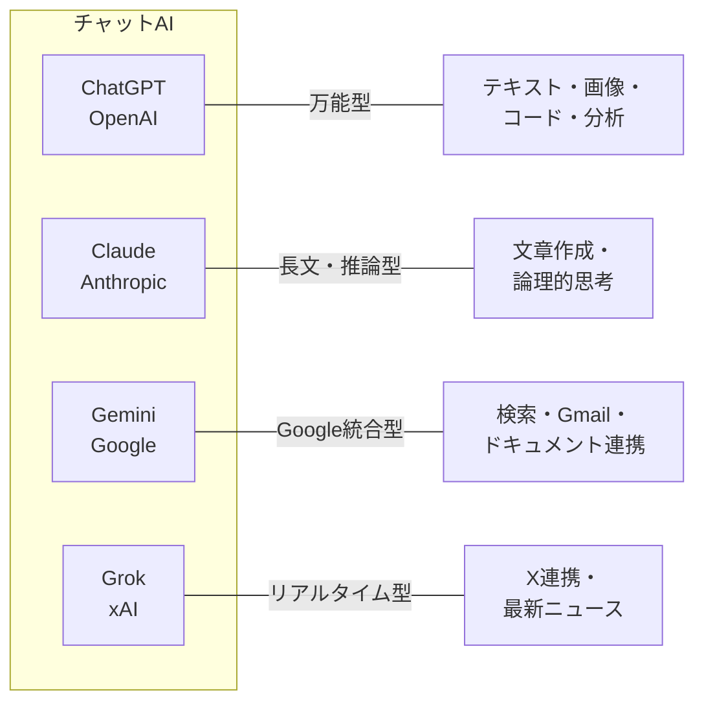
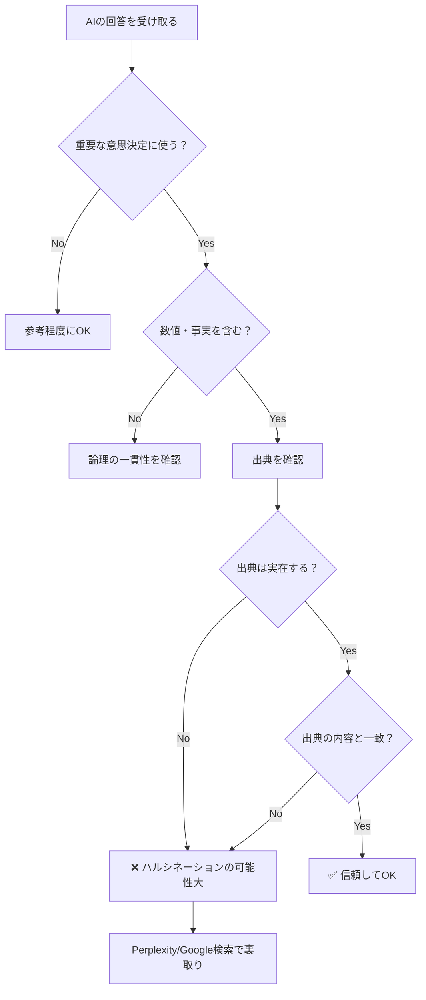
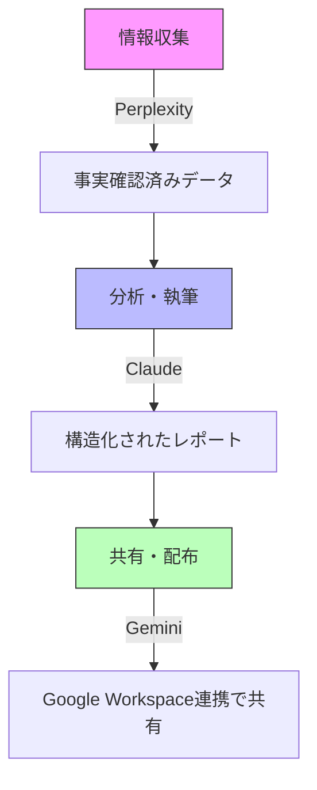
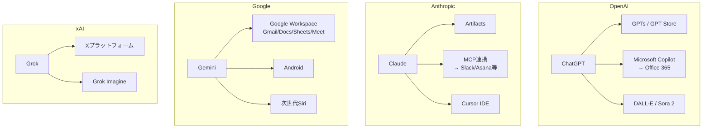
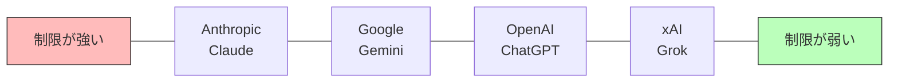
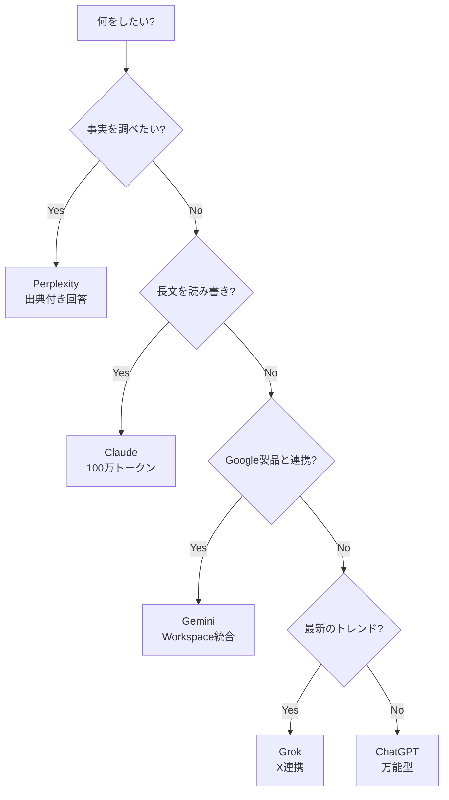

<!-- シリーズ: AIツール活用講座（全8回）— S1: AI概論 -->

## はじめに — AIは「使ってみる」のが最速の学び方

「AIって結局何ができるの？」

この質問に対する最良の回答は、説明を読むことじゃない。**自分で触ること**だ。

2026年2月現在、ChatGPT・Claude・Gemini・Grokという4つの主要AIサービスが存在する。どれも無料で使い始められる。でも、どれを選べばいいのか——正直、比較記事を読んでもピンとこない人が多いと思う。

だからこの記事では、**同じ質問を4つのAIに投げて、回答を並べて比較する**というシンプルなアプローチを取る。百聞は一見に如かず。自分の目で違いを確かめてほしい。

> **Note:** **この記事のゴール**: ChatGPT・Claude・Gemini・Grokの4つのAIを全部触った状態にする。そして「自分に合うのはどれか」を判断できるようになること。

この記事を読み終わると:
- 4つの主要AIサービス（+ Perplexity）の**特徴と使い分け**がわかる
- **同じ質問を投げて比較した結果**から、各AIの個性を理解できる
- **ハルシネーション（AIの嘘）**の存在と対策を知っている
- **マルチAI戦略**（複数AIの使い分け）を実践できる
- AIの回答が違う理由を**企業の設計思想**の観点から理解できる
- **今すぐ実行できるハンズオン手順**を持っている

---

## 4大AIサービス、ざっくり紹介

2026年2月時点、AIチャットボット市場はChatGPTが約55%のシェアでトップだが、Geminiが約18%に急成長、Claudeも約12%まで伸びている。「AIといえばChatGPT」の時代は終わりつつある。

[NEEDS VERIFICATION: 2026-02] シェアの数値は複数ソースからの推定値です。



4つのAIは、見た目は似ているけれど**中身がまったく違う**。それぞれの会社が「AIはこうあるべきだ」という異なる哲学を持っているからだ（これは後半の🔬考察で深掘りする）。

---

### ChatGPT（OpenAI）— 知名度No.1の万能型

<https://chatgpt.com>

ChatGPTは、2022年11月にリリースされた瞬間に世界を変えたAIだ。週間アクティブユーザー数は**8億人**超。GPT-5.2を搭載し、テキスト生成、画像生成（DALL-E）、データ分析、ファイル処理……何でもできる**万能型**。

実際に使うと「とりあえず何でも聞ける相手」として優秀。一方で、最近は「やけに丁寧すぎる」「当たり障りのない回答が増えた」という声もある。

<details><summary>ChatGPTの上級者向け機能</summary>

- **Memory（メモリ）**: 会話を超えた長期記憶。「私はマーケティング部門で働いています」と伝えれば、別のチャットでも覚えている
- **Projects**: 関連チャットをフォルダ管理。プロジェクト固有の指示やファイルを設定可能
- **Scheduled Tasks**: 「毎朝8時にニュースまとめを作って」のような定期タスク
- **Custom Instructions**: 回答スタイルの好みを事前設定

</details>

---

### Claude（Anthropic）— 安全性と推論力の「慎重派」

<https://claude.ai>

元OpenAI研究者たちが「AIの安全性をもっと真剣にやるべきだ」と考えて設立したAnthropic社のAI。2026年2月にはClaude Opus 4.6が登場。

**長文処理と論理的思考**に強く、100万トークン（約1,500ページ）のコンテキストウィンドウを持つ。安全性重視で広告なし。コーディング支援も高品質で、CursorやGitHub Copilotにも統合済み。

長い文章を要約させたり、複雑な論理を整理させるとClaudeの実力がわかる。一方で、安全性を重視するあまり「お答えできません」と断られる場面がChatGPTより多い。

<details><summary>Claudeの上級者向け機能</summary>

- **Artifacts**: チャット横にコード、Webアプリ、データ可視化を生成・編集。プログラミング不要でインタラクティブな体験が作れる
- **Projects**: 200Kトークン（約500ページ分）の参照資料をまとめて管理
- **MCP連携**: Asana、Googleカレンダー、Slackなど外部サービスとの連携
- **Google Workspace統合**: Docs、Gmail、DriveのファイルをClaude内で直接読み書き

</details>

---

### Gemini（Google）— 検索と生活に溶け込むAI

<https://gemini.google.com>

GeminiはGoogleのAI。Google製品（Gmail、ドキュメント、スプレッドシート等）との統合が最大の武器。2026年には**Google AI Pro**としてリブランドされ、その上位に**Google AI Ultra**が登場。

Gemini 3 Proモデルは前世代から**50%以上の性能向上**。Deep Research機能は数百回の検索を自動実行し、出典付きレポートを数分で作成する。AppleがSiriの次世代版にGeminiを採用すると発表したのも大きなニュースだ。

Googleアカウントさえあればすぐ使えるのが最大の利点。「生活の中に自然にAIがいる」感覚が得られる。

<details><summary>Geminiの上級者向け機能</summary>

- **Deep Research**: 数百回の検索を自動実行→出典付きレポート生成
- **Gems**: ChatGPTのGPTsに相当。カスタムGeminiを保存
- **Google Workspace連携**: Gmail要約、ドキュメント推敲、スプレッドシート分析、Meet議事録
- **Jules**: 非同期型コーディングエージェント

</details>

---

### Grok（xAI）— 自由奔放な「異端児」

<https://grok.x.ai>

イーロン・マスクのxAI社が開発したAI。X（旧Twitter）との統合が最大の特徴で、他のAIとは「ノリ」が違う。

**X（旧Twitter）のリアルタイムデータ**にアクセスでき、他のAIより**制限が緩い**。Grok 4モデルで**Humanity's Last Examで50%を達成**（初のAI）。200万トークンの超大容量コンテキストウィンドウ。

「今Xで何が話題？」と聞くとリアルタイムのトレンドを踏まえた回答が返る。ただし情報の正確性は他のAIより若干劣る印象。

<details><summary>Grokの上級者向け機能</summary>

- **リアルタイムWeb検索**: 「今この瞬間」の情報に強い
- **Grok Imagine 1.0**: 画像生成＋10秒の720p動画生成（音声付き）
- **SuperGrokプラン**: 月額$30で高度な推論・長文生成・分析機能

</details>

---

## 比較してみよう — 同じ質問、4つの回答

ここが本記事のメインイベント。**4つのAIにまったく同じ質問を投げて、回答を比較する**。

ぜひ自分でも試してほしい。4つにアカウントを作り（すべて無料で可能）、以下の質問をコピペして投げるだけだ。

> **Note:** **実験のコツ**: 必ず同じ質問文をコピペして使うこと。微妙に表現を変えると回答も変わり、フェアな比較にならない。

### 実験1: 知識の正確さを試す

**質問**: 「日本の都道府県で面積が一番小さいのはどこですか？その県の人口と、有名な観光地を3つ教えてください」

正解は**香川県**（面積約1,877 km2）。

| | ChatGPT | Claude | Gemini | Grok |
|:--|:--------|:-------|:-------|:-----|
| 正解（香川県） | ほぼ確実に正答 | ほぼ確実に正答 | ほぼ確実に正答 | ほぼ確実に正答 |
| 面積・人口の数値 | やや古いデータの場合あり | 慎重に「〜年時点」と注記 | Google検索連動で最新データ | X上の情報を混ぜることがある |
| 回答の雰囲気 | 整理された箇条書き | 丁寧で長めの解説 | コンパクトで検索的 | カジュアルでフレンドリー |

**事実問題でも微妙に回答が違う**。なぜこんなことが起きるのか？ 後半で考えてみよう。

### 実験2: 創造性を試す

**質問**: 「『月曜の朝が憂鬱な会社員』を主人公にした、30秒で読める短編小説を書いてください」

| | ChatGPT | Claude | Gemini | Grok |
|:--|:--------|:-------|:-------|:-----|
| 文体 | 洗練された文学調 | 心理描写が丁寧 | コンパクトで読みやすい | ユーモラスでオチがある |
| 独自性 | 高品質だが「テンプレ感」 | 意外な展開を入れてくる | 無難にまとまる | 予想外の方向に行くことも |
| 日本語の自然さ | 高い | 非常に高い | やや直訳調の場合あり | 高いがカジュアルすぎることも |

創造的なタスクでは個性の差がはっきり出る。ChatGPTは「教科書的に上手い」、Claudeは「人間らしい温度感がある」、Geminiは「効率的にまとめる」、Grokは「読者を笑わせようとする」。

### 実験3: 推論力を試す

**質問**: 「レストランで、AさんはBさんの右隣に座っています。CさんはAさんの向かいに座っています。DさんはCさんの左隣に座っています。Bさんの向かいに座っているのは誰ですか？」

| | ChatGPT | Claude | Gemini | Grok |
|:--|:--------|:-------|:-------|:-----|
| 正答率 | 高い（GPT-5.2 Thinking） | 非常に高い（推論が得意） | モデルによってばらつき | 正答するが説明がやや雑 |
| 思考過程の表示 | ステップバイステップ | 詳細な推論過程を見せる | 結論を先に出す傾向 | 簡潔に回答 |

### 実験4: 実用的なタスクを試す

**質問**: 「来週の水曜日に取引先へのプレゼンがあります。テーマは『2026年のAI活用による業務効率化』。スライド10枚のアウトラインを作ってください。対象は非技術者の経営層です」

| | ChatGPT | Claude | Gemini | Grok |
|:--|:--------|:-------|:-------|:-----|
| 構成の質 | バランスが良い。起承転結が明確 | 論理の流れが丁寧。背景説明が充実 | Google Slides連携を意識した出力 | 要点が簡潔。やや浅い |
| 具体性 | 各スライドの要点まで書いてくれる | 話す内容のメモまで提案 | 実際のデータ（検索経由）を含む | ポイントだけ。詳細は聞き直しが必要 |
| 付加価値 | DALL-Eでスライド画像を提案 | 「想定質問リスト」を追加 | 「デザインのコツ」を追加 | 「Xで話題のAI事例」を追加 |

実用的なタスクではAIの「個性」がさらに明確に出る。ChatGPTは「完成度の高い標準的な回答」、Claudeは「一歩先まで考えた提案」、Geminiは「検索連動の実データ」、Grokは「SNSトレンドの活用」。

### 実験5: マルチモーダル機能を試す

2026年のAIは「テキストだけ」ではない。画像、音声、ファイルを入力できる**マルチモーダル機能**が標準装備になった。スマホで撮った料理の写真をアップロードして「この料理のカロリーを推定して」と聞いてみよう。

| | ChatGPT | Claude | Gemini | Grok |
|:--|:--------|:-------|:-------|:-----|
| 画像認識精度 | 高い（GPT-4oベース） | 高い（Vision対応） | 非常に高い（Gemini 3の強み） | 基本的な認識は可能 |
| 対応形式 | 画像・PDF・音声・動画 | 画像・PDF・コード | 画像・PDF・動画・音声 | 画像・PDF |
| 特徴的な用途 | 写真から文字起こし、図表分析 | 技術文書の分析 | 動画の理解と要約 | Xの画像解析 |

> **マルチモーダルの本質**: テキストだけのAIは「耳と口だけの助手」。マルチモーダルAIは「目も耳も口も手もある助手」。使える感覚器官が増えるほど、AIに頼める仕事の幅が爆発的に広がる。

### マルチモーダル活用の具体例

画像認識だけでなく、以下のような使い方もできる:

| 活用シーン | やり方 | おすすめAI |
|:-----------|:-------|:-----------|
| **名刺の整理** | 名刺の写真をアップ→情報を表にまとめて | ChatGPT / Gemini |
| **手書きメモの清書** | ホワイトボードの写真→テキスト化 | ChatGPT / Gemini |
| **料理のカロリー計算** | 料理の写真→栄養素を推定 | Gemini |
| **グラフの読み取り** | スクリーンショット→数値を抽出して分析 | ChatGPT / Claude |
| **PDF文書の要約** | 長いPDFをアップ→要点を3行で | Claude（長文が得意） |
| **動画の要約** | YouTube URLを共有→内容を要約 | Gemini |

> **Note:** **体験してほしいこと**: スマホのカメラで身の回りのものを撮って、「これは何？」「値段を調べて」「レシピを教えて」と聞いてみる。AIが「目」を持った感覚を体験できる。

### 実験6: 日本語理解力を試す

**質問**: 「以下の文章の要点を3つにまとめてください: 『石の上にも三年』というが、現代のビジネスでは三年待つことが正解とは限らない。変化のスピードが加速する中、素早い判断と軌道修正の能力がより重要になっている。ただし、短期的な成果ばかりを追い求めると、長期的な基盤作りがおろそかになるリスクもある」

| | ChatGPT | Claude | Gemini | Grok |
|:--|:--------|:-------|:-------|:-----|
| ことわざの理解 | 正確 | 正確＋文化的背景の言及 | 正確 | 正確だがカジュアルに扱う |
| 要約の質 | 的確で簡潔 | ニュアンスまで捉える | コンパクト | やや大雑把 |
| 日本語表現 | 自然 | 非常に自然 | やや堅い場合あり | カジュアル寄り |

日本語のことわざや文化的なニュアンスの理解は、2024年頃と比べて全AIが劇的に向上している。特にClaudeの日本語品質は目を見張るものがある。

### 実験のまとめ

| 実験 | テスト内容 | 最も優れていたAI |
|:-----|:-----------|:----------------|
| 知識の正確さ | 事実を正確に答えるか | Gemini（検索連動） |
| 創造性 | 独自の表現で書けるか | Claude or ChatGPT（好みによる） |
| 推論力 | 論理パズルを解けるか | Claude |
| 実用的タスク | ビジネス文書を作れるか | ChatGPT（バランス）or Claude（深さ） |
| マルチモーダル | 画像・ファイルの処理 | Gemini（動画対応） |
| 日本語理解 | ニュアンスを捉えるか | Claude（文化的理解も） |

ただし筆者の主観も入っている。**自分で試すのが一番**だ。

> **⚠️ Warning:** **同じAIに同じ質問を2回投げると、違う回答が返ってくることがある**。AIの回答には「確率的なブレ」があり、毎回同じ結果が保証されるわけではない。

### プロの比較方法 — 3つのコツ

AIを本格的に比較するなら、以下を意識しよう:

**1. 条件を揃える**
- 全AIに**まったく同じ質問文**をコピペで投げる
- 無料プラン同士で比較する（有料vs無料は不公平）
- 同じ日に試す（AIは定期的にアップデートされる）

**2. 複数回試す**
- 1回の結果で判断しない。同じ質問を3回投げて、回答の**一貫性**も見る
- 得意分野と苦手分野の**両方**で試す

**3. 自分の用途で判断する**
- ベンチマークスコアより**自分のタスクでの使い心地**を重視
- 「万人にとって最強のAI」は存在しない。**あなたにとって最強のAI**を見つけるのが目標

---

## AIの「得意」と「不得意」— ハルシネーションの話

ここで**最も重要な話**をしなければならない。

**AIは嘘をつく。**

いや、正確には「嘘をつこうとして」嘘をつくわけではない。AIはもっともらしい文章を生成する仕組みで動いているため、**事実かどうかに関係なく、それらしい回答を作ってしまう**ことがある。これを**ハルシネーション（Hallucination: 幻覚）**と呼ぶ。

### ハルシネーションの具体例

- AIに「この本の著者は？」と聞いたら、**実在しない著者名**を自信満々に答えた
- 「この統計データの出典は？」と聞いたら、**存在しないURL**を教えてくれた
- 歴史的事実について**微妙に間違った年号**で回答した
- 法律の相談をしたら、**実在しない条文**を引用した

怖いのは、AIが「自信なさそうに」答えるのではなく、**完璧に正しいかのように堂々と嘘をつく**ところ。

### 2026年のハルシネーション事情

2年前は15〜20%が普通だったハルシネーション率が、劇的に改善している。

| モデル | ハルシネーション率（要約タスク） |
|:-------|:-------------------------------|
| Gemini 2.0 Flash | **約0.7%**（最も低い） |
| GPT-5.2系 | **0.8〜1.5%** |
| Claude 3.5系 | **約1.0%** |
| Grok 4.1 | **約4.2%**（12%から改善） |

[NEEDS VERIFICATION: 2026-02] ハルシネーション率は各社公式発表と第三者評価に基づく推定値。

> **⚠️ Warning:** **ただし「推論タスク」では話が違う**: 要約のようなシンプルなタスクでは低いが、複雑な推論を求めると率が**上がる**。「深く考える」モデルほどもっともらしい嘘を作り出すという皮肉な現象だ。

### ハルシネーション対策フローチャート



### ハルシネーションの実体験 — 自分で確認してみよう

ハルシネーションは抽象的な話ではなく、今すぐ体験できる。以下の質問を任意のAIに投げてみよう:

```
「AIの父」と呼ばれる日本の研究者は誰ですか？
その研究者の主な業績と、所属していた大学を教えてください。
```

AIはもっともらしい回答を返すだろう。でも、**その回答が正しいかPerplexityやGoogle検索で確認してみてほしい**。「AIの父」という称号は曖昧なので、AIが「自信を持って」答えた内容が実は不正確……というケースが起きやすい。

これがハルシネーションの怖さであり、**自分で体験する**ことが最大の学びになる。

<details><summary>なぜハルシネーションは「治らない」のか</summary>

AIは「次のトークン（単語の断片）を予測する」ことで文章を生成している。これは「正しいことを述べる」のとは本質的に異なるプロセスだ。

「東京タワーの高さは」と入力されると、AIは「333メートル」と出力する。結果的に正しいが、検証したわけではない。「この文脈の後には333メートルが続く確率が高い」と予測しただけ。

学習データにないことを聞かれると、「それっぽい文字列」を生成してしまう。これがハルシネーションの正体であり、AIの動作原理から不可避的に生まれる現象なのだ。

</details>

### AIが得意なこと・苦手なこと

| カテゴリ | 得意 | 苦手 |
|:---------|:-----|:-----|
| **テキスト生成** | 文章の作成・要約・翻訳・推敲 | 100%正確な事実の保証 |
| **アイデア出し** | ブレスト・構成案・企画 | 独創的すぎるアイデア |
| **分析・整理** | 長文の構造化・比較表作成 | 最新のリアルタイム情報 |
| **論理的推論** | 段階的な論理展開・数学 | 常識依存の判断 |
| **多言語処理** | 翻訳・多言語対応 | 文化的ニュアンス |

---

## 料金比較 — 無料で始めて、必要なら課金

結論から言うと、**4つとも無料で使える**。ただし無料版には制限がある。

### 料金比較表（2026年2月時点）

| サービス | 無料プラン | 基本有料プラン | 上位プラン |
|:---------|:-----------|:---------------|:-----------|
| **ChatGPT** | GPT-5.2 Instant利用可（制限あり） | Go: $8/月 | Plus: $20/月、Pro: $200/月 |
| **Claude** | 1日30〜100メッセージ程度 | Pro: $20/月 | Max: $100〜200/月 |
| **Gemini** | 2.5 Flash＋月100 AIクレジット | AI Pro: $19.99/月 | Ultra: $249.99/月 |
| **Grok** | 基本機能は無料 | SuperGrok: $30/月 | SuperGrok Heavy: $300/月 |

[NEEDS VERIFICATION: 2026-02] 料金は変動する可能性があります。最新の正確な料金は各公式サイトをご確認ください。

> **⚠️ Warning:** **⚠️ 課金の罠に注意**: まずは**全サービスの無料枠を使い倒す**のが賢い戦略。無料で足りなくなってから「どれに課金するか」を考えればいい。

### 無料プランでどこまでできる？

2026年の無料プランは想像以上に充実している。

| サービス | 無料でできること | 無料の制限 |
|:---------|:----------------|:-----------|
| **ChatGPT** | GPT-5.2 Instantでの対話、画像生成、Code Interpreter | 回数制限あり。GPT-5.2 Thinkingは制限が厳しい |
| **Claude** | Claude Sonnet 4.5での対話、Artifacts | 1日30〜100メッセージ。Opus 4.6は有料のみ |
| **Gemini** | Gemini 2.5 Flashでの対話、画像理解 | 月100 AIクレジット。Deep Researchは制限あり |
| **Grok** | 基本的な対話、画像生成 | 回数制限あり。高度な推論は有料 |
| **Perplexity** | 基本検索、出典付き回答 | Pro Search回数制限。ファイルアップロード制限 |

**おすすめ**: まず**5つ全部の無料プランでアカウントを作る**。1〜2週間使い込んでから「どれに課金するか」を決めるのが最も賢い方法。

### じゃあ、どれに課金すべき？

| あなたの用途 | おすすめ | 理由 |
|:-------------|:---------|:-----|
| **とりあえず1つだけ** | ChatGPT Go $8/月 | 安くて守備範囲が広い |
| **長文の読み書きが多い** | Claude Pro $20/月 | 100万トークン。論文や長い資料に圧倒的 |
| **Google製品をフル活用** | Gemini AI Pro $19.99/月 | Gmail・ドキュメント連携が強い |
| **最新の話題を追いたい** | Grok SuperGrok $30/月 | Xリアルタイムデータは唯一無二 |
| **まだわからない** | 全部無料で試す | 課金は「足りない」と感じてからで遅くない |

---

## ベンチマークの読み方 — AIの「成績表」を理解する

「ChatGPTが1位」「Claudeが推論力で最強」——ネットでこういった記事を見かけるが、何を根拠にしているのだろうか。

AIの能力は**ベンチマーク**と呼ばれるテストで測定される。学校のテストのようなもので、様々な科目（数学、コーディング、推論、知識等）でスコアを出す。

### 主要なベンチマーク（2026年2月時点）

| ベンチマーク | 何を測るか | 注目ポイント |
|:-------------|:-----------|:-------------|
| **MMLU Pro** | 大学レベルの学術知識 | 57科目の知識テスト |
| **HumanEval** | コーディング能力 | プログラムの問題を解く |
| **GPQA Diamond** | 大学院レベルの推論 | 物理・化学・生物の難問 |
| **MATH** | 数学的推論 | 高校〜大学レベルの数学 |
| **Humanity's Last Exam** | 人類最難関の知識テスト | 2026年にGrok 4が初めて50%達成 |
| **Chatbot Arena** | 人間の主観的評価 | 2つのAIの回答を比較して「良い方」を選ぶ |

### ベンチマークを鵜呑みにしてはいけない理由

1. **ベンチマークが高い ≠ 実用的に優れている**: テストの成績が良くても、実際のタスクで使いやすいかは別問題
2. **各社がベンチマーク対策をしている**: テストの傾向に合わせてチューニングしている可能性がある
3. **日本語での実力は測れない**: 主要ベンチマークの多くが英語ベース
4. **「総合力」を測るベンチマークは存在しない**: 各ベンチマークは特定の能力しか測れない

> **Note:** **結論**: ベンチマークは「参考程度」。自分のタスクで実際に試してみるのが、一番信頼できる比較方法だ。前半の比較実験はまさにそれをやっている。

---

## Perplexity — 「5つ目のAI」としての検索エンジン

4大AIに加えて、もう1つ紹介しておきたいサービスがある。

<https://www.perplexity.ai>

**Perplexity**は、AIチャットとWeb検索を融合した**AI検索エンジン**。ChatGPTやClaudeとは役割が異なり、**事実確認と情報収集に特化**している。

最大の特徴は**出典付きで回答する**こと。「2026年の日本のAI市場規模は？」と聞くと、具体的な数字と、その数字の出典（政府統計やリサーチ会社のレポート）を示してくれる。

| | 従来のGoogle検索 | Perplexity |
|:--|:-----------|:-----------|
| 入力 | キーワード | 自然な質問文 |
| 出力 | Webページのリンク一覧 | **質問への直接的な回答＋出典リンク** |
| 使い方 | リンクを1つずつ開いて読む | 回答を読めばOK。出典で裏取り |
| ハルシネーション | N/A | 出典が付くので検証しやすい |

ハルシネーション対策として非常に有効。ChatGPTやClaudeで得た情報をPerplexityで「裏取り」する使い方がおすすめだ。Perplexityの詳しい活用法は[S2: プロンプト設計](./ml-spinoff-02.md)で解説する。

---

## マルチAI戦略 — 1つに絞らず、組み合わせる

2026年のトレンドは**「1つに絞らない」**こと。プロフェッショナルの間で広まっている**マルチAI戦略**を紹介しよう。



### 用途別の使い分けガイド

| タスク | ベストなAI | 理由 |
|:-------|:-----------|:-----|
| 事実を調べたい | **Perplexity** | 出典付き回答。ハルシネーション率最低 |
| 長い文章を書きたい | **Claude** | 100万トークン。文脈を見失わない |
| アイデアを出したい | **ChatGPT** | 守備範囲の広さ。GPTsカスタマイズも可能 |
| データを分析したい | **ChatGPT** or **Gemini** | Code Interpreter / Sheets連携 |
| 最新ニュースを知りたい | **Grok** | Xのリアルタイムデータ |
| コードを書きたい | **Claude** | コーディング品質で高評価 |

> **Note:** **マルチAI戦略の核心**: 「1つのAIで全てを完璧にこなすことは不可能」。それぞれに得意不得意がある。プロは**タスクの性質に応じてAIを選ぶ**。

### 実践例: マーケティングレポートを作るワークフロー

マルチAI戦略の具体例を見てみよう。「来月のSNSマーケティングレポートを作る」というタスクで:

1. **Perplexityで情報収集**: 「2026年2月の日本のSNS利用率を年代別に教えて。総務省のデータで」→ 出典付きの統計データを入手
2. **ChatGPTでアウトライン作成**: 「以下のデータをもとに、マーケティングレポートのアウトラインを作って」→ データ＋構成案を生成
3. **Claudeで本文執筆**: 「以下のアウトラインをもとに、レポート本文を作成して。論理的で読みやすい文章で」→ 高品質な文章を生成
4. **Grokでトレンド追加**: 「今月Xで話題になったマーケティング手法を3つ教えて」→ リアルタイムトレンドを追加
5. **Geminiで共有**: Google Docsに貼り付け、チームに共有

この一連の流れで、1つのAIだけでは出せない品質のレポートが作れる。

---

## 各AIの「エコシステム」を理解する

「どのAIを使うか」は「どのテック企業のエコシステムに入るか」の選択でもある。



| あなたの環境 | おすすめ | 理由 |
|:-------------|:---------|:-----|
| Microsoft製品中心 | ChatGPT → Copilot | Office 365との統合がシームレス |
| Google製品中心 | Gemini → Google AI | Gmail、Docs、Sheetsが全部AI化 |
| Apple製品中心 | Gemini → Siri | Apple Intelligence × Gemini統合が進行中 |
| 開発者 | Claude → Cursor | コーディング品質が最高 |
| SNSマーケター | Grok → X | リアルタイムトレンド分析 |
| リサーチャー | Perplexity | 出典付き検索で調査効率が段違い |

### エコシステムの「囲い込み」に注意

各社は「一度エコシステムに入ったらなかなか出られない」仕組みを作っている。ChatGPTのMemory機能は会話の蓄積、Claudeの Projects は参考資料の蓄積、Geminiは Google Workspace のデータ。

これ自体は便利だが、**1つのサービスに依存しすぎないこと**が重要だ。

- **重要な文書はAI外にも保存する**（ローカルPCやクラウドストレージ）
- **System Promptはテキストファイルで管理する**（サービス乗り換え時にも使える）
- **定期的に複数のAIを試す習慣をつける**（競争環境が変わる可能性がある）

> **AIの世界は半年で景色が変わる。今日の最強が明日も最強とは限らない。**

---

## 「AIに仕事を奪われる」の本当の意味

「AIが仕事を奪う」——この話題は2026年、もはや「未来の話」ではない。

世界経済フォーラムによると、**2030年までにAIで9,200万の仕事が消えるが、1億7,000万の新しい仕事が生まれる**（純増7,800万）。より正確に言えばこうなる:

> **AIは「仕事」を奪うのではなく、「タスク」を変える。**

翻訳者がAIに仕事を「奪われる」のではなく、翻訳者がAIを使って10倍の速度で翻訳できるようになる。問題は「AIを使える人」と「使えない人」の間に生まれる生産性の格差だ。

| リスクレベル | 職種例 | 理由 |
|:-------------|:-------|:-----|
| **高い** | データ入力、定型翻訳、基本的な記事ライティング | 定型的で反復的 |
| **中程度** | マーケター、デザイナー、ジュニアエンジニア | AI活用で効率化されるが創造性が武器 |
| **低い** | 経営者、医師、カウンセラー、教師 | 人間関係・倫理判断・身体性が必要 |

自分を守る最強の戦略は4つ:
1. **AIを使えるようになること**（この記事を読んでいるあなたは、もうスタートラインに立っている）
2. **AIにできないことを磨くこと** — 人間関係の構築、倫理的判断、創造的な問題設定
3. **AIの限界を知ること** — ハルシネーションを見抜ける人が最も有効にAIを使える
4. **「AIを使う側」になること**

### 具体的に「AIを使う側」になるとは

| 職種 | AI活用の具体例 | 使うAI |
|:-----|:---------------|:-------|
| **営業** | 提案書のドラフト、顧客メールの作成、商談の議事録要約 | ChatGPT, Claude |
| **マーケター** | SNS投稿文の作成、競合分析、キャンペーン企画のブレスト | ChatGPT, Perplexity |
| **事務職** | メール返信、報告書作成、データ整理、翻訳 | ChatGPT, Gemini |
| **学生** | レポートの構成チェック、英語の添削、プレゼン準備 | Claude, ChatGPT |
| **フリーランス** | 企画書作成、見積書のチェック、ブログ記事の下書き | Claude, ChatGPT |

> **Note:** **注意**: AIは「下書き」を作るのが得意だが、「最終チェック」は人間がやるべき。AIの出力をそのまま提出するのではなく、**自分の目で読んで、自分の判断で修正する**ステップを必ず入れること。

---

## AI初心者がやりがちな失敗

AI活用で陥りやすい「あるある」を知っておくだけで効率が段違いに上がる。

### 失敗1: 質問が漠然としすぎる

```
❌ 「AIについて教えて」
✅ 「2026年の主要AIを4つ、料金・得意分野で比較表にして」
```

AIは「あなたの頭の中」を読めない。背景・条件・形式を明示すると回答品質が段違いに上がる。

### 失敗2: 1回で完璧を求める

AIとの対話は**キャッチボール**。最初の回答が微妙でも:

```
「もう少し詳しく」
「表形式にして」
「〇〇の部分をもっとカジュアルに」
「具体例を3つ追加して」
```

——とやり取りを重ねると、自分の意図に近づいていく。

### 失敗3: AIの回答を鵜呑みにする

特に**数字、人名、URL、法律の引用**は要注意。AIは自信満々に嘘をつく（ハルシネーション）。

### 失敗4: 1つのAIしか使わない

少なくとも2つ併用して回答を比較する習慣を。特に重要な情報は、ChatGPT/Claudeで生成→Perplexityで裏取り、の2ステップが効果的。

### 失敗5: 機密情報をAIに入力

**社内の機密情報、個人情報、パスワード**は絶対にAIに入力しない。一度入力した情報は取り消せない。

### 失敗6: AIの回答を「正解」として使う

AIの出力は「1つの見解」であり「正解」ではない。特に:
- **医療・法律・税務のアドバイス** → 必ず専門家に確認
- **最新のニュース** → リアルタイム検索のないAI（Claude等）は古い情報の可能性
- **数値データ** → 出典を自分で確認

### 失敗7: 長文を一度に投げてまとめさせる

AIにはコンテキストウィンドウ（一度に処理できるテキスト量）の制限がある。非常に長い文書は:
- Claudeを使う（100万トークン対応）
- 文書を章ごとに分けて個別に投げる
- 「このPDFの第3章のみ要約して」のように範囲を指定する

> **⚠️ Warning:** **⚠️ 最も危険な失敗**: AIに入力した情報はモデルの学習に使われる可能性がある。企業で使う場合は**ビジネスプラン**を使うか、API経由でデータ管理を厳密にする。

---

## 💡 好奇心の種: 同じ質問なのに、なぜ回答が違う？

**同じ質問を4つのAIに投げたとき、なぜ回答が違うのか？**

よく考えると不思議だ。4つとも「大量のテキストデータから学習したAI」なのに、回答の雰囲気、表現の選び方、情報の優先順位が明らかに異なる。さらに、**同じAIに同じ質問を2回投げても、微妙に違う回答が返ってくる**。

3つの仮説を立ててみよう:

**仮説1: 学習データが違う** — 各AIは異なるデータで訓練されている。同じインターネット上のテキストでも、どこからどのくらい集めたかが違えば「知識の偏り」も変わる。

**仮説2: 「調整」が違う** — 学習後に各社は「RLHF（人間のフィードバックによる強化学習）」で「良い回答の基準」を人間が教える。この基準が各社で異なるため、同じ知識でも回答のスタイルが変わる。

**仮説3: 確率的な「揺らぎ」がある** — AIの出力には意図的にランダム性（temperature）が加えられている。だから同じAIに同じ質問を投げても微妙に違う回答になる。

これらは全て「部分的に正しい」。でも根本的な疑問が残る——**そもそもAIは「理解」して回答しているのか、それとも「パターンマッチング」で回答しているのか？**

答えはこのスピンオフシリーズの先——[本編](./00-index-theory.md)にある。気になった人は、[S8: 架け橋](./ml-spinoff-08.md)まで読み進めてほしい。

---

## 🔬 考察: 4つのAI企業の「設計思想」を読み解く

ところで、ちょっと視点を変えてみたい。

回答が違う理由を、「技術的な違い」ではなく**「企業の思想の違い」**という角度から考えてみよう。

### 4社の哲学

**OpenAI — 「AGIへの最短距離を走る」**
Microsoftから130億ドル以上の投資を受け、「まず使ってもらう」ことを最優先にしている。だからChatGPTの回答は**万能型で、できるだけ多くの人を満足させる**方向にチューニングされている。

**Anthropic — 「安全性こそが最大の差別化」**
創業者たちはOpenAIの「速度優先」に疑問を持って独立した。Claudeが他のAIより「お断り」が多いのは、バグではなく**設計思想**だ。広告を入れないと明言したのも、データの使い方に対する姿勢の表明。

**Google — 「AIを検索とインフラに溶かす」**
AI単体で勝負するのではなく、**既存の巨大エコシステムにAIを統合する**戦略。Geminiの回答が「検索エンジン的」に感じるのはそのため。

**xAI — 「AIに制限をかけるな」**
ChatGPTやClaudeが「安全性の名のもとに検閲しすぎている」と批判するところから出発。Grokのカジュアルでユーモラスな回答は意図的なデザイン。

### 「安全性」と「自由」のスペクトラム



この**「安全性 vs 自由」のトレードオフ**はAI業界最大の論争であり、正解はない。

### ビジネスモデルが製品を作る

| 企業 | 主な収入源 | 製品への影響 |
|:-----|:-----------|:-------------|
| OpenAI | サブスク + API + 広告 + Microsoft提携 | 万人向け。広告主の影響も |
| Anthropic | サブスク + API + Amazon/Google提携 | エンタープライズ向け。信頼性重視 |
| Google | 広告帝国の一部 + サブスク | ユーザーをGoogleエコシステムに留める |
| xAI | X Premium + SuperGrok + API | Muskのエコシステム拡大 |

**ここが重要**: AIの「無料プラン」は慈善事業ではない。各社とも「無料で使ってもらい → 課金してもらう」ファネル戦略を取っている。

> **同じ技術でも、作り手の思想が違えば、製品は違うものになる。**

AIの回答を比較するとき、私たちは単にアルゴリズムの差ではなく、**各企業が「AIはこうあるべきだ」と考える哲学の差**を見ている。

### メタ考察: AIの「中立性」は幻想か

多くの人が「AIは中立的だ」と思っている。しかし実際には、**AIは学習データの偏りをそのまま反映する**。

| バイアスの種類 | 具体例 |
|:---------------|:-------|
| **文化的バイアス** | 英語圏の事例・価値観が優先される |
| **時間的バイアス** | 学習データのカットオフ以降の情報がない |
| **肯定バイアス** | ユーザーの意見に同意しがち |
| **企業バイアス** | 各社の設計思想が回答に反映される |

> **AIの回答は「中立」ではない。それは、特定の企業の特定の価値観で調整された、特定のデータに基づく予測だ。**

この理解があるだけで、AIの回答の「読み方」が変わる。「正解」として受け取るのではなく、「ある視点からの1つの見解」として読む。そして**自分の判断力で検証する**。

これこそが、AIリテラシーの核心だ。そしてこの考え方は、[S8: 架け橋](./ml-spinoff-08.md)で最終的に回収される。

### もう1つの考察: AIはなぜ「丁寧すぎる」のか

ChatGPTを使っていて「AIって妙に丁寧だな」「どんな質問にも肯定から入るな」と思ったことはないだろうか。

これは偶然ではなく、**RLHF（人間のフィードバックによる強化学習）**の結果だ。

RLHFでは、人間の評価者がAIの回答に「良い/悪い」のスコアをつける。すると、AIは「高いスコアをもらえる回答パターン」を学習する。問題は、**人間は「丁寧で同意してくれる回答」に高いスコアをつけがち**だということ。

結果として:
- AIは「それは素晴らしい質問ですね！」と褒めてから回答する
- ユーザーの意見に反対しにくくなる（肯定バイアス）
- 「わかりません」と言いにくくなる（ハルシネーションの一因）

各社はこの問題に気づいていて、2026年時点では改善が進んでいる:
- **Claude**: 「わかりません」「お答えできません」を率直に言える設計
- **ChatGPT**: 最新モデルでは過剰な丁寧さを抑制
- **Grok**: 最初から「率直でユーモラス」を設計思想にしている

> **AIの「性格」は、技術ではなく学習プロセスで決まる。**

この理解は、AIの回答を「鵜呑みにしない」ための重要な視点だ。

---

## ハンズオン — 4つのAIを今すぐ試そう

ここまで読んで「なるほど」と思ったなら、次は**自分で触る番**だ。

### ステップ1: アカウントを作る（全部無料）

| サービス | URL | 必要なもの |
|:---------|:----|:-----------|
| ChatGPT | chatgpt.com | メール or Google/Apple/MSアカウント |
| Claude | claude.ai | メール or Googleアカウント |
| Gemini | gemini.google.com | Googleアカウント |
| Grok | grok.x.ai | Xアカウント or メール |

<!-- screenshot: 各サービスのサインアップ画面 -->

### ステップ2: 同じ質問を投げる

以下をコピーして4つのAIに投げてみよう:

```
来週の月曜日に上司へ送る報告メールの下書きを作ってください。
内容: 先月の売上が前年比15%増加した。要因は新商品Aの好調と、SNSマーケティング施策の成功。
今後の課題: 在庫管理の最適化と、次四半期の販促計画の策定。
トーン: フォーマルだが硬すぎない。
```

### ステップ3: 回答を比較する

- **文章の丁寧さ**: どれが一番「ビジネスメールらしい」か？
- **情報の補足**: 元の指示にない情報をAIが追加しているか？
- **構成**: メールの構成はどう違うか？

### ステップ4: 追加質問をしてみる

1つのAIを選んで深掘りしよう: 「もう少しカジュアルにしてください」「表形式にしてください」「英語版も作ってください」

こうやって**対話の中でAIの出力を調整する**のが、AIを使いこなすコツだ。

### ステップ5: マルチモーダルを試す

スマホでAIアプリを開き、以下を試してみよう:

1. **写真を撮ってアップロード**: 手元のペットボトルを撮って「この商品の栄養成分を教えて」
2. **手書きメモを読ませる**: ホワイトボードや付箋の写真を撮って「このメモを整理して」
3. **音声で質問**: ChatGPTの音声機能で「今日のニュースを3つ教えて」と話しかける

### ステップ6: Perplexityで裏取りする

ステップ2でAIが生成したメールに含まれる情報（もしあれば）を、Perplexityで検証してみよう。AIが「一般的に前年比15%の成長は〇〇」などと補足情報を追加していたら、その情報が正しいかPerplexityで確認する。

> **Note:** **次のステップの候補**:
> - 「AIへの頼み方」を磨きたい → [S2: プロンプト設計](./ml-spinoff-02.md)
> - ターミナルからAIを使いたい → [S3: 開発環境・CLIツール](./ml-spinoff-03.md)
> - 仕事にAIを導入したい → [S4: AI × ビジネスツール](./ml-spinoff-04.md)

---

## AIとの正しい付き合い方 — 5つのマインドセット

### 1. AIは「部下」ではなく「壁打ち相手」

丸投げせず、出力を叩き台にして自分の頭で磨き上げる。

```
❌「この企画書を書いて」→ AIの出力をそのまま提出
✅「この企画書の叩き台を作って」→ 自分で読み→ 修正→ 完成
```

### 2. 「80点の下書き」を5分で得る

完璧をゼロから1時間かけるより、AIに80点を5分で作らせて20分で100点に仕上げる。

```
従来: 白紙 →(1時間)→ 100点
AI活用: 白紙 →(5分)→ AI 80点 →(20分)→ 自分で100点
節約: 35分
```

### 3. 「質問力」が最大の武器

AIが賢くなるほど、「何を質問するか」の重要性が増す。良い質問のコツは:
- **具体的に聞く**（「AIについて教えて」より「2026年の4大AIの料金と得意分野を表形式で」）
- **条件を明示する**（読者は誰？長さは？トーンは？）
- **形式を指定する**（「表で」「箇条書きで」「3行で」）

質問力の本格的な磨き方は[S2: プロンプト設計](./ml-spinoff-02.md)で学ぶ。

### 4. 情報の「裏取り」を習慣化

重要な情報は必ず裏を取る。Perplexityの出典機能やGoogle検索で二重チェック。

特に要注意なのは:
- **数字**（統計データ、市場規模、売上等）
- **人名・組織名**（架空の人物を作り出すことがある）
- **URL**（存在しないURLを生成することがある）
- **法律・制度**（実在しない条文を引用することがある）

### 5. 定期的に「新しいAI」を試す

半年前の最強AIが今も最強とは限らない。2024年はChatGPT一強だったが、2026年にはClaude、Gemini、Grokが追い上げている。**四半期に1回は「今どのAIが強いか」を自分で確かめる**習慣をつけよう。

> **Note:** **最も大事なのは1番**。AIを「便利な道具」として使いこなすのは良いが、AIに「考えること」を委ねてはいけない。思考力を手放した瞬間、AIの間違いに気づけなくなる。

> **AIは答えをくれるが、「何を問うか」は人間にしか決められない。**

---

## GPTs・Projects・Gems — AIをカスタマイズする

4大AIはそれぞれ、**自分専用にカスタマイズしたAIを作る仕組み**を用意している。これを使いこなすと、AIの活用効率が飛躍的に上がる。

### 各サービスのカスタマイズ機能

| サービス | 機能名 | できること |
|:---------|:-------|:-----------|
| **ChatGPT** | GPTs | System Prompt＋ファイル＋外部API連携のカスタムAIを作成。GPT Storeで他人の作ったGPTsも使える |
| **Claude** | Projects | 参考資料（最大200Kトークン）をプロジェクト単位で管理。System Promptで振る舞いを定義 |
| **Gemini** | Gems | カスタムGeminiを作成・保存。Google Workspaceと連携可能 |

### おすすめの使い方

自分の用途に合わせたAIアシスタントを作っておくと、毎回プロンプトを書く手間が省ける:

| アシスタント | 設定例 | 効果 |
|:-------------|:-------|:-----|
| **メール校正係** | 「ビジネスメールの校正をする。丁寧だが堅すぎないトーンに統一」 | メール作成が3倍速に |
| **議事録まとめ係** | 「会議メモを受け取り、決定事項・未決事項・次のアクションに整理」 | 議事録作成が5分に |
| **英語添削係** | 「英語のメールを添削。間違いを指摘し、3段階（カジュアル/ビジネス/フォーマル）で書き分け」 | 英語メールの不安が消える |
| **アイデア壁打ち** | 「企画のアイデアに対して、メリット3つ・デメリット3つ・改善案を出す」 | 1人ブレストが可能に |

> **Note:** **カスタマイズの詳細**: System Promptの書き方や、より高度なカスタマイズ方法は[S2: プロンプト設計](./ml-spinoff-02.md)で詳しく解説する。

---

## API vs チャットUI — 2つの使い方

AIには**チャットUI**（ブラウザやアプリ）と**API**（プログラムから呼び出す）の2つの使い方がある。

| | チャットUI | API |
|:--|:-----------|:----|
| **使い方** | ブラウザ/アプリで対話 | プログラムから呼び出す |
| **対象** | 一般ユーザー | 開発者・企業 |
| **料金** | 月額サブスクリプション | 使った分だけ（従量課金） |
| **カスタマイズ** | GPTs/Projects/Gemsで可能 | ほぼ無限にカスタマイズ可能 |
| **データ管理** | サービス側に保存される | 自社で管理可能 |
| **適している場面** | 日常の質問、個人利用 | 業務自動化、アプリ組み込み |

> **Note:** **非エンジニアの方へ**: この記事ではチャットUIだけで十分。APIは[S3: 開発環境・CLIツール](./ml-spinoff-03.md)で、コードを書かずにAIをAPI経由で使う方法も紹介する。

---

## AIの未来 — 2026年のトレンドと今後の展望

### AIエージェントの台頭

2026年最大のトレンドは**AIエージェント**——AIが自律的に複数のタスクをこなす仕組みだ。「メールの返信を書いて」ではなく「今日の受信メールを全部処理して」と指示できるようになりつつある。

| サービス | エージェント機能 |
|:---------|:----------------|
| ChatGPT | Scheduled Tasks（定期タスク自動実行） |
| Claude | MCP連携（外部サービスと自動連携） |
| Gemini | Jules（非同期コーディングエージェント） |

AIエージェントについては[S7: AIエージェント × データ分析](./ml-spinoff-07.md)で詳しく学ぶ。

### AIとプライバシー — データの行方

AIを使う上で避けて通れないのが**プライバシーの問題**。

- **チャットに入力した情報**は、サービスによってはモデルの学習に使われる
- **企業の機密情報**をAIに入力するのは危険。ビジネスプラン（学習に使われない設定）を利用する
- **個人情報**（氏名、住所、電話番号、マイナンバー等）は絶対に入力しない
- **APIを使えば**データがモデル学習に使われない設定が可能（企業向け）

各社のデータポリシー:

| サービス | 無料プランでの学習利用 | 有料プランでの学習利用 |
|:---------|:---------------------|:---------------------|
| ChatGPT | デフォルトON（OFFに設定可能） | デフォルトOFF |
| Claude | デフォルトOFF | デフォルトOFF |
| Gemini | デフォルトON（OFFに設定可能） | デフォルトOFF |
| Grok | デフォルトON | プランによる |

> **⚠️ Warning:** **重要**: 「AIに入力した情報は消えない」と思っておいた方が安全。特に仕事で使う場合は、会社のAI利用ガイドラインを確認すること。

---

## よくある質問（FAQ）

**Q: AIの回答は著作権的に問題ない？**
**A: グレーゾーン。** 2026年2月時点で各国で議論が続いている。AIの出力を**そのまま**ではなく**自分で加筆修正して**使うのが実務的に安全。

**Q: DeepSeekやQwenなど中国のAIは？**
**A: 知っておく価値はある。** 特にDeepSeekはオープンソースで、GPT-5.2に匹敵するベンチマークを出している。ただしデータの取り扱いに関する懸念があり、機密性の高い情報は避けた方が無難。

**Q: AIの回答はいつの時点の情報？**

| サービス | リアルタイム検索 |
|:---------|:----------------|
| ChatGPT | あり（検索機能） |
| Claude | なし（学習データのカットオフまで） |
| Gemini | あり（Google検索連動） |
| Grok | あり（X連動） |
| Perplexity | あり（Web検索常時） |

**Q: 日本語で質問するのと英語では差がある？**
**A: ある。でも差は縮まっている。** 2026年時点では日常的な用途で差を感じないレベル。プログラミングや最新技術トピックでは英語がやや有利。

**Q: AIを使うのに年齢制限はある？**
**A: ある。** ChatGPT、Claude、Geminiは13歳以上（保護者の同意が必要な場合あり）。教育機関向けの特別プランを提供しているサービスもある。

**Q: AIに聞いてはいけないことはある？**
**A: 法律に触れること、他者を害することは当然NG。** 加えて、各AIには「安全性ガイドライン」があり、暴力、差別、犯罪に関する回答は拒否される。Claudeが最も厳しく、Grokが最も緩い（前半の🔬考察で解説）。

**Q: 複数のAIを同時に使うのは大変じゃない？**
**A: 最初は2つで十分。** ChatGPT（万能）＋ Perplexity（裏取り）の組み合わせが入門としておすすめ。慣れてきたらClaude（長文・推論）を追加。

**Q: スマホでもAIは使える？**
**A: 全サービスにスマホアプリがある。** ChatGPT、Claude、Geminiは公式アプリを提供。音声会話機能もあり、通話のように対話できる。Geminiは一部のAndroid端末でホームボタン長押しから直接起動可能。

---

## まとめ

### この記事で学んだこと

| ポイント | 内容 |
|:---------|:-----|
| 4大AI+Perplexity | ChatGPT=万能、Claude=推論、Gemini=Google統合、Grok=リアルタイム、Perplexity=出典付き検索 |
| 比較実験の結果 | AIごとに得意分野が違う。自分のタスクで試すのが最も信頼できる比較方法 |
| 料金 | 全部無料で始められる。課金は「足りない」と感じてからで十分 |
| ハルシネーション | AIは嘘をつく。鵜呑みにせず裏を取る習慣が大事 |
| マルチAI戦略 | 1つに絞らず、用途別に使い分けるのがプロの方法 |
| 企業の設計思想 | 回答の違い = 企業哲学の差 + ビジネスモデルの差 |
| ベンチマーク | 参考程度に。自分のタスクでの使い心地が最重要 |
| エコシステム | AIの選択 = テック企業のエコシステムへの参加 |
| プライバシー | 機密情報は絶対に入力しない。データポリシーを確認する |

### チートシート: いつどのAIを使うか



> **AIは「1つを極める」時代から「複数を使い分ける」時代に変わった。**

### 次のアクション

1. **今すぐ**: 5つのAIにアカウントを作って、同じ質問を投げてみる
2. **今日中**: マルチモーダル機能を1つ試す（写真アップロードなど）
3. **今週中**: 普段の作業で「これAIに聞いてみよう」を3回やってみる
4. **来週**: 2つのAIを使って「マルチAI戦略」を試す
5. **次のステップ**: [S2: プロンプト設計](./ml-spinoff-02.md) で「AIへの頼み方」を学ぶ

> **Note:** **この記事の💡を覚えていますか？**: 「同じ質問なのに、なぜ回答が違うのか」——技術的な答えは「トークン予測」という仕組みにある。[S2](./ml-spinoff-02.md)では、この仕組みを逆手に取って「AIにうまく頼む方法」を学ぶ。S1-S7を通じて蓄積される「なぜ？」の全てが、[S8: 架け橋](./ml-spinoff-08.md)で1つにつながる。

---

## 付録: この記事に出てきた用語集

| 用語 | 意味 |
|:-----|:-----|
| **ハルシネーション** | AIが事実に反する情報をもっともらしく生成する現象 |
| **マルチモーダル** | テキスト以外の入力（画像、音声、動画等）も処理できるAIの能力 |
| **トークン** | AIがテキストを処理する際の最小単位。日本語1文字≒1-2トークン |
| **コンテキストウィンドウ** | AIが一度に処理できるテキストの最大量 |
| **RLHF** | 人間のフィードバックによる強化学習。AIの回答品質を調整する手法 |
| **temperature** | AIの出力のランダム性を制御するパラメータ。高いほど多様な回答 |
| **GPTs / Projects / Gems** | 各AIサービスのカスタマイズ機能 |
| **System Prompt** | AIの人格やルールを事前に定義する指示。[S2](./ml-spinoff-02.md)で詳しく解説 |
| **API** | プログラムからAIを呼び出す仕組み。[S3](./ml-spinoff-03.md)で詳しく解説 |
| **AIエージェント** | AIが自律的に複数タスクをこなす仕組み。[S7](./ml-spinoff-07.md)で詳しく解説 |

---

### シリーズナビゲーション

| 回 | テーマ | リンク |
|:---|:-------|:-------|
| **S1** | **AI概論（この記事）** | — |
| S2 | プロンプト設計 | [AIへの「頼み方」で結果が変わる](./ml-spinoff-02.md) |
| S3 | 開発環境・CLIツール | [AIで開発環境を整える](./ml-spinoff-03.md) |
| S4 | AI × ビジネスツール | [業務にAIを統合する](./ml-spinoff-04.md) |
| S5 | AI × ナレッジ管理・執筆 | [知的生産を加速する](./ml-spinoff-05.md) |
| S6 | AI × 画像・動画・音声 | [生成AIを体験する](./ml-spinoff-06.md) |
| S7 | AIエージェント × データ分析 | [AIに「やらせる」](./ml-spinoff-07.md) |
| S8 | 架け橋 | [ブラックボックスの中身を知りたくなったら](./ml-spinoff-08.md) |

> もっと深く知りたくなったら → [本編: 深層生成モデルシリーズ](./00-index-theory.md) — AIの「中身」を数学と理論から理解する46回の旅

---

## ライセンス

本記事は [CC BY-NC-SA 4.0](https://creativecommons.org/licenses/by-nc-sa/4.0/deed.ja)（クリエイティブ・コモンズ 表示 - 非営利 - 継承 4.0 国際）の下でライセンスされています。

### ⚠️ 利用制限について

**本コンテンツは個人の学習目的に限り利用可能です。**

**以下のケースは事前の明示的な許可なく利用することを固く禁じます:**

1. **企業・組織内での利用（営利・非営利問わず）**
   - 社内研修、教育カリキュラム、社内Wikiへの転載
   - 大学・研究機関での講義利用
   - 非営利団体での研修利用
   - **理由**: 組織内利用では帰属表示が削除されやすく、無断改変のリスクが高いため

2. **有料スクール・情報商材・セミナーでの利用**
   - 受講料を徴収する場での配布、スクリーンショットの掲示、派生教材の作成

3. **LLM/AIモデルの学習データとしての利用**
   - 商用モデルのPre-training、Fine-tuning、RAGの知識ソースとして本コンテンツをスクレイピング・利用すること

4. **勝手に内容を有料化する行為全般**
   - 有料note、有料記事、Kindle出版、有料動画コンテンツ、Patreon限定コンテンツ等

**個人利用に含まれるもの:**
- 個人の学習・研究
- 個人的なノート作成（個人利用に限る）
- 友人への元記事リンク共有

**組織での導入をご希望の場合**は、必ず著者に連絡を取り、以下を遵守してください:
- 全ての帰属表示リンクを維持
- 利用方法を著者に報告

**無断利用が発覚した場合**、使用料の請求およびSNS等での公表を行う場合があります。
