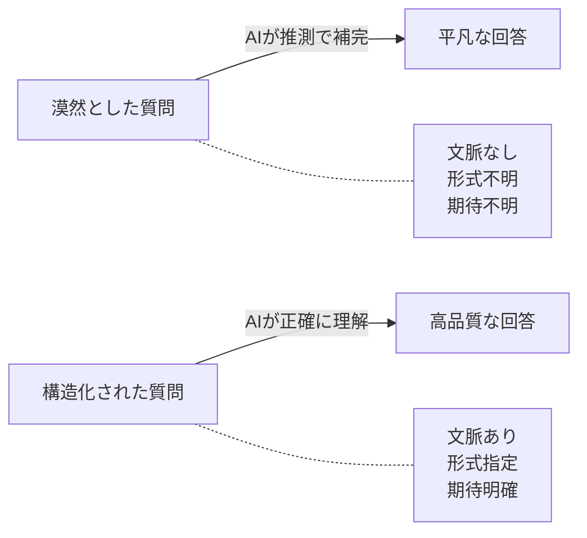
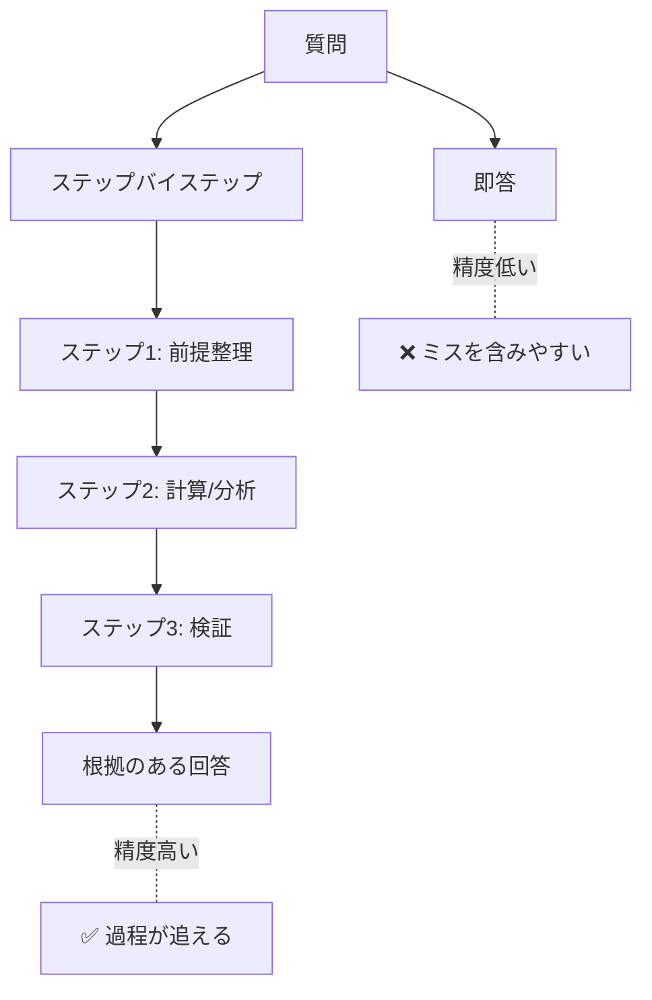
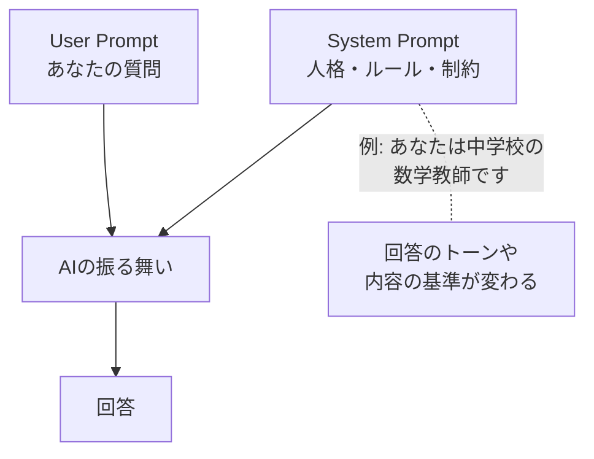
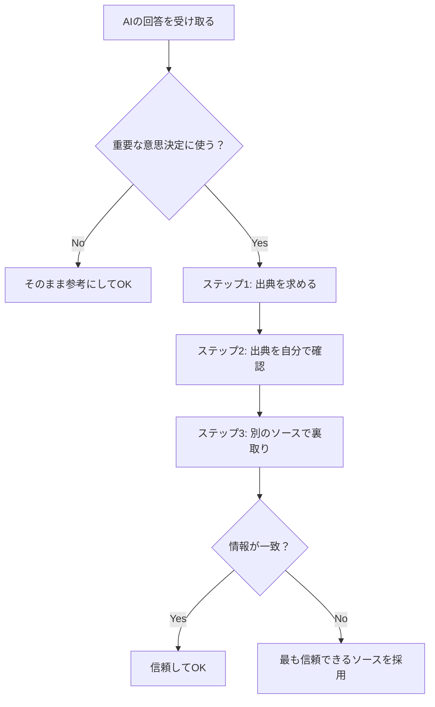
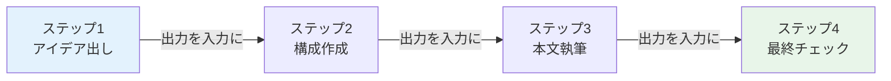
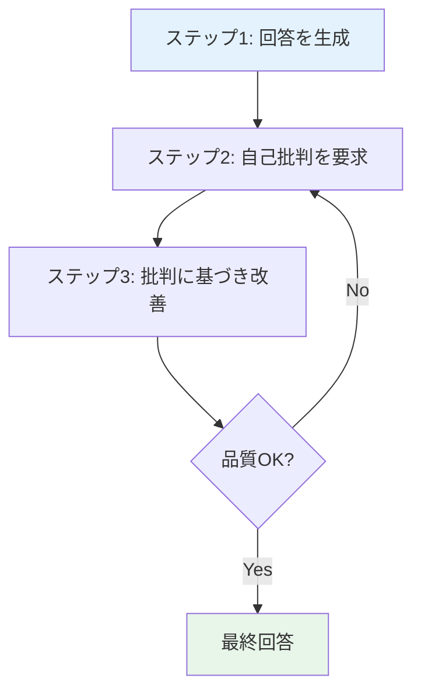
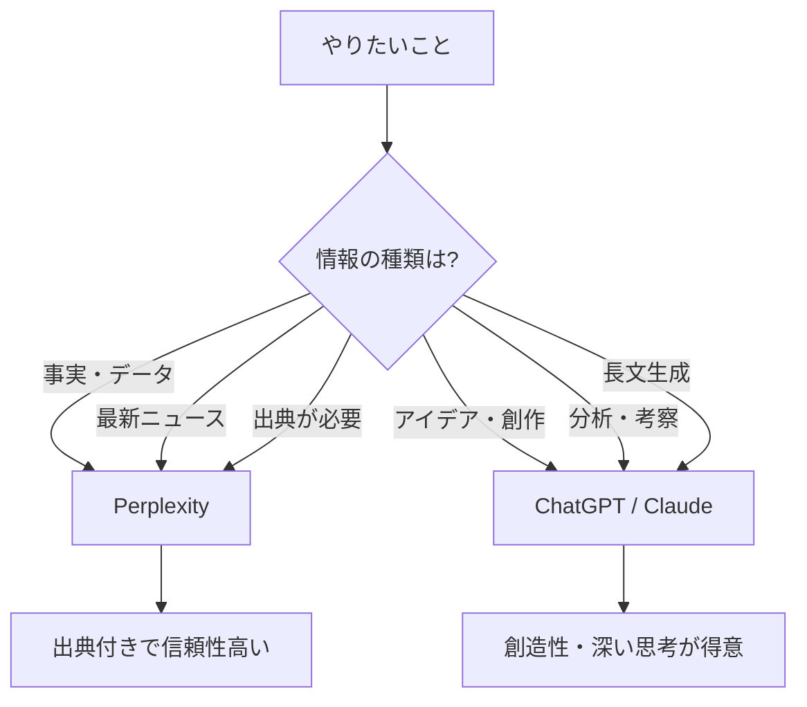
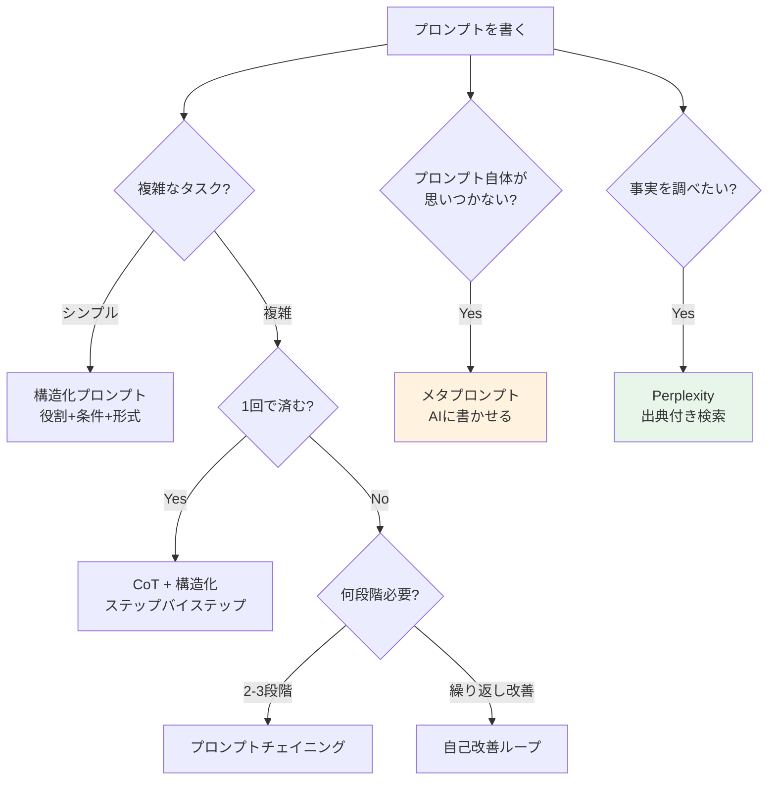

<!-- シリーズ: AIツール活用講座（全8回）— S2: プロンプト設計 -->

## はじめに — 「聞き方」を変えるだけで、AIは別人になる

[前回のS1](./ml-spinoff-01.md)で、4つのAIに同じ質問を投げて比較した。回答の質に差があったのを覚えているだろうか。

でも実は、**AIの回答品質を最も大きく左右するのは、AIの種類ではなく「あなたの質問の仕方」**だ。

同じChatGPTでも、聞き方次第で「使えない回答」にも「プロ級の回答」にもなる。この「聞き方」を体系化したものを**プロンプトエンジニアリング**と呼ぶ。

> **Note:** **この記事のゴール**: 構造化プロンプトを自分で書けるようになる。そして、AIの回答品質を「聞き方」でコントロールできるようになること。

この記事で手に入るスキル:

- 良いプロンプトと悪いプロンプトの違いがわかる
- **構造化プロンプト**（XML/Markdown形式）を自分で書ける
- **Chain of Thought（CoT）**で推論精度を上げられる
- **System Prompt**と**Few-shot**を使い分けられる
- **Perplexity**でAI検索をフル活用できる
- ハルシネーション対策の具体的な手順がわかる
- 今日から使えるプロンプトテンプレート10パターンを持ち帰れる

---

## Before/After — 「聞き方」でこんなに変わる

百聞は一見に如かず。まず、同じ目的の質問を「悪い聞き方」と「良い聞き方」で比較してみよう。

### 例1: レポート作成を依頼する

**Before（悪いプロンプト）**:
```
リモートワークについてレポートを書いて
```

**After（良いプロンプト）**:
```
あなたは企業の人事コンサルタントです。

以下の条件でリモートワークに関するレポートを作成してください:

## 対象読者
- 中小企業（従業員50-200人）の経営者
- IT部門がない、または少人数

## 内容
1. リモートワーク導入のメリット・デメリット（各3つ以上）
2. 導入時の具体的なステップ（5段階で）
3. よくある失敗パターンと対策
4. コスト試算（月額の概算）

## 形式
- 2,000文字程度
- 各セクションに見出しをつける
- 数値やデータは出典を明記（不確かな場合は「推定」と表記）

## トーン
- 専門的だが平易な日本語
- 箇条書きと文章を適度に混ぜる
```

| 観点 | Before | After |
|:-----|:-------|:------|
| 回答の焦点 | 漠然としたリモートワークの概要 | 中小企業経営者が判断材料にできる実用情報 |
| 構成 | AIが「なんとなく」決める | 指定した4セクション構成 |
| 長さ | 短すぎor長すぎ | 約2,000文字に収まる |
| トーン | AIのデフォルト（しばしば硬い） | 専門的だが読みやすい |
| 情報の質 | 一般論が多い | 具体的なステップとコスト |



**なぜこんなに差が出るのか？**

AIは「あなたの頭の中」を読めない。Beforeのような漠然とした質問だと、AIは「たぶんこういうことが聞きたいんだろう」と推測する。その推測が外れると、見当違いの回答が返ってくる。

Afterのように**文脈・条件・形式・トーンを明示する**と、AIの推測する余地が減り、あなたの意図に近い回答が返ってくる。

> **プロンプト設計の本質は、「AIに推測させる範囲を狭める」こと。**

### 例2: 翻訳を依頼する

**Before**:
```
この英語を翻訳して: The implementation exceeded our expectations.
```

**After**:
```
以下の英文を日本語に翻訳してください。

原文: "The implementation exceeded our expectations."

条件:
- ビジネスメールで使う文脈（プロジェクト報告）
- 「implementation」は「実装」ではなく「導入」と訳す（ITではなく業務プロセスの話）
- 自然な日本語にする（直訳調にしない）
- 3パターンの訳を提案して、それぞれ「カジュアル」「ビジネス」「フォーマル」と注記
```

翻訳でも同じ原則が当てはまる。「implementation」を「実装」と訳すか「導入」と訳すかは**文脈次第**。文脈をAIに教えてあげないと、AIは推測で訳す。

---

## 構造化プロンプト — 指示を「設計図」にする

「良いプロンプトの書き方はわかった。でも毎回あんな長文を書くのは大変じゃない？」

そこで登場するのが**構造化プロンプト**だ。XMLやMarkdownの記法を使って、指示を見やすく整理する手法。

### 方法1: Markdown形式

```markdown
# 役割
あなたはプロの料理研究家です。

# タスク
以下の条件で夕食のレシピを提案してください。

## 条件
- 調理時間: 30分以内
- 予算: 1人あたり500円以内
- 材料: 冷蔵庫にある（鶏もも肉、玉ねぎ、にんじん、卵、牛乳）

## 出力形式
1. 料理名
2. 材料リスト（分量付き）
3. 手順（ステップ番号付き）
4. コツ・ポイント（1-2文）
```

### 方法2: XML形式

```xml
<role>プロの料理研究家</role>

<task>以下の条件で夕食のレシピを提案してください。</task>

<constraints>
  <time>30分以内</time>
  <budget>1人あたり500円以内</budget>
  <ingredients>鶏もも肉、玉ねぎ、にんじん、卵、牛乳</ingredients>
</constraints>

<output_format>
  1. 料理名
  2. 材料リスト（分量付き）
  3. 手順（ステップ番号付き）
  4. コツ・ポイント（1-2文）
</output_format>
```

### どっちを使うべき？

| 形式 | 向いている場面 | 理由 |
|:-----|:---------------|:-----|
| **Markdown** | ChatGPT、一般的な質問 | 人間が読みやすく、書きやすい |
| **XML** | Claude、複雑な指示 | タグで区切りが明確。Claudeは公式にXML形式を推奨 |
| **どちらでもOK** | Gemini、Grok | どちらも理解できるが、Markdownが主流 |

> **Note:** **実践のコツ**: 形式にこだわりすぎなくていい。大事なのは**「情報が構造的に整理されていること」**であって、MarkdownかXMLかは二の次。自分が書きやすい方を使えばOK。

---

## Chain of Thought（CoT）— AIに「考えさせる」魔法の一言

ここからが面白い。

AIに複雑な問題を解かせるとき、**「ステップバイステップで考えてください」**と一言添えるだけで、回答の精度が劇的に上がる。これを**Chain of Thought（CoT: 思考の連鎖）**と呼ぶ。

### CoTのBefore/After

**質問**: 「りんごが3個入った箱が4箱あります。そこから5個食べました。残りは何個？」

**CoTなし**:
```
りんごが3個入った箱が4箱あります。そこから5個食べました。残りは何個ですか？
```
→ AIが即答する。単純な問題なら正解するが、複雑になるとミスが増える。

**CoTあり**:
```
りんごが3個入った箱が4箱あります。そこから5個食べました。残りは何個ですか？

ステップバイステップで考えてから回答してください。
```
→ AIが途中の計算過程を見せながら回答する:
1. りんごの総数: 3 x 4 = 12個
2. 食べた数: 5個
3. 残り: 12 - 5 = 7個

### なぜCoTが効くのか？

<details><summary>少し技術的な話（読み飛ばしてOK）</summary>

AIは「次に来る単語（トークン）を予測する」ことで文章を生成している（[S1](./ml-spinoff-01.md)の好奇心の種を覚えていますか？）。

「ステップバイステップで考えて」と指示すると、AIは結論に至るまでの**中間ステップのトークンを生成する**ことになる。この中間ステップが文脈として蓄積されることで、最終的な回答の精度が上がる。

つまり、CoTは「AIに考えさせている」のではなく、**「中間的な文脈を明示的に生成させることで、予測の精度を上げている」**と言える。

</details>

### CoTのバリエーション

| テクニック | プロンプト例 | 効果 |
|:-----------|:-------------|:-----|
| **基本CoT** | 「ステップバイステップで考えてください」 | 推論精度の向上 |
| **自己検証** | 「回答した後、自分の回答が正しいか検証してください」 | ミスの自己発見 |
| **多角的思考** | 「3つの異なる視点から考えてください」 | 視野の広がり |
| **反論生成** | 「この結論に対する反論を自分で考えてください」 | バランスの取れた分析 |
| **Tree of Thoughts** | 「複数の解決策を考え、それぞれのメリット・デメリットを比較してから最善案を選んでください」 | 複雑な意思決定 |



---

## System Prompt — AIの「人格」を設定する

ここまでは「質問の仕方」を改善してきた。次は**AIそのものの振る舞いを設定する**方法を学ぼう。

### System Promptとは

多くのAIサービスでは、**System Prompt（システムプロンプト）**を設定できる。これは「このAIはどんな人格で、どんなルールに従うか」を事前に定義するもの。



### System Promptの設定方法

| サービス | 設定方法 |
|:---------|:---------|
| **ChatGPT** | 左上メニュー → 「カスタム指示」→ 常に適用される指示を記入 |
| **Claude** | プロジェクト機能 → 「Project Instructions」に記入 |
| **Gemini** | Gems（カスタムGemini）を作成 → 指示を記入 |
| **Grok** | チャット開始時に役割設定を冒頭に書く |

### System Promptの書き方

**例: 英語学習アシスタント**
```
あなたは英語教師です。以下のルールに従ってください:

1. ユーザーの英語の間違いを優しく指摘する
2. 正しい表現を教えた後、その表現を使った例文を1つ追加する
3. 文法用語は使わず、平易な日本語で説明する
4. ユーザーが英語で話しかけてきたら英語で返す
5. 毎回の会話の最後に、簡単な英語クイズを1問出す
```

このSystem Promptを設定した状態で「I goed to school yesterday.」と送ると、AIは「goed」が間違いだと指摘し、「went」が正しいと教え、例文を追加し、最後にクイズを出す——System Prompt通りの振る舞いをしてくれる。

### GPTs / Projects / Gems — System Promptを保存する

System Promptを毎回書くのは面倒。そこで各サービスは、System Promptを保存して再利用する仕組みを用意している:

| サービス | 名前 | 特徴 |
|:---------|:-----|:-----|
| ChatGPT | **GPTs** | System Prompt＋ファイル＋外部APIを組み合わせたカスタムAI |
| Claude | **Projects** | System Prompt＋参考資料をプロジェクトとして管理 |
| Gemini | **Gems** | カスタムGeminiを作成・保存 |

> **Note:** **おすすめの使い方**: 自分がよく使う用途ごとにSystem Promptを作っておく。「ビジネスメール校正用」「英語学習用」「ブログ下書き用」など。一度作っておけば、毎回プロンプトを書く手間が省ける。

---

## Few-shot / Zero-shot — 「お手本」を見せる効果

### Zero-shot: お手本なしでいきなり依頼

```
以下のレビューの感情分析をしてください:
「この製品は期待外れでした。動作が遅く、サポートも不親切。」
```

AIはたいてい正しく「ネガティブ」と判定する。これが**Zero-shot**——お手本なしで依頼する方式。

### Few-shot: お手本を見せてから依頼

```
以下のレビューの感情分析をしてください。出力形式の例を示します:

例1:
入力: 「素晴らしい商品です！毎日使っています」
出力: ポジティブ（理由: 「素晴らしい」「毎日使っている」が肯定的評価）

例2:
入力: 「まあまあです。可もなく不可もなく」
出力: ニュートラル（理由: 明確な肯定/否定がない）

では、以下のレビューを分析してください:
「この製品は期待外れでした。動作が遅く、サポートも不親切。」
```

Few-shotでは、**お手本を2-5個見せてからタスクを依頼する**。AIは「あ、この形式で、この粒度で答えればいいのか」と理解する。

### いつFew-shotを使うか

| 状況 | 推奨 | 理由 |
|:-----|:-----|:-----|
| 出力形式が決まっている | **Few-shot** | お手本通りのフォーマットで返してくれる |
| 判断基準が微妙 | **Few-shot** | 境界線をお手本で示せる |
| 単純なタスク | **Zero-shot** | お手本なしでも十分 |
| 創造的なタスク | **Zero-shot** | お手本に引きずられて創造性が下がることがある |

> **⚠️ Warning:** **Few-shotの落とし穴**: お手本が偏っていると、AIの回答も偏る。たとえば、ポジティブなお手本ばかり見せると、ニュートラルなレビューもポジティブ寄りに判定しがちになる。**バランスの取れたお手本**を用意しよう。

---

## Perplexity — AI検索エンジンをフル活用する

ここまでChatGPT・Claude・Geminiを使ったプロンプト設計を学んできた。ここで、少し毛色の違うAIツールを紹介したい。

**Perplexity**は、「AIチャット」と「Web検索」を融合させた**AI検索エンジン**だ。

<https://www.perplexity.ai>

### 従来の検索 vs AI検索

| | Google検索 | Perplexity |
|:--|:-----------|:-----------|
| 入力 | キーワード | 自然な質問文 |
| 出力 | Webページのリンク一覧 | **質問への直接的な回答＋出典リンク** |
| 使い方 | リンクを1つずつ開いて情報を探す | 回答を読めばOK。出典で裏を取れる |
| 得意 | 広範な情報探索 | 特定の質問への回答 |

### Perplexityが特に強い場面

1. **事実確認**: 「日本の最低賃金は2026年時点でいくら？」→ 出典付きで回答
2. **比較調査**: 「iPhone 16 vs Galaxy S26のカメラ性能を比較して」→ スペック付きで比較
3. **最新情報**: リアルタイムでWebを検索するので、ChatGPTやClaudeより最新の情報に強い
4. **学術調査**: 論文や公式データを引用してくれることが多い

### Perplexityでのプロンプト設計

Perplexityでも、プロンプト設計は重要。ただし、ChatGPTやClaudeとは少し使い方が違う:

```
悪い例:
「AIについて教えて」

良い例:
「2026年2月時点で、日本企業のAI導入率は何%ですか？
出典は政府統計または大手リサーチ会社のレポートに限定してください。」
```

**Perplexityのコツ**:
- **具体的な事実**を聞くと強い（「いつ」「いくら」「何%」）
- **出典を指定**すると情報の質が上がる（「公式サイトから」「学術論文から」）
- **比較**を頼むと表形式で整理してくれることが多い
- 回答に含まれる**出典リンクを必ずクリック**する習慣をつける

> **Note:** **S1との接続**: [S1](./ml-spinoff-01.md)で「AIの回答を鵜呑みにしない」と書いた。Perplexityは**出典を自動で付けてくれる**ので、「裏を取る」作業がかなり楽になる。ハルシネーション対策として、ChatGPTやClaudeで得た情報をPerplexityで裏取りする、という使い方もおすすめ。

---

## ハルシネーション対策 — ファクトチェックの実践

[S1](./ml-spinoff-01.md)でハルシネーション（AIが事実と異なる情報を生成すること）の存在を学んだ。ここでは、**具体的にどうやって防ぐか**を実践レベルで解説する。

### 3ステップのファクトチェック習慣



**ステップ1**: プロンプトに**「出典を明記してください」**と加えるだけで、AIは情報源を示そうとする。

**ステップ2**: AIが「〇〇省の統計によると……」と言ったら、実際に〇〇省のウェブサイトにアクセスして確認する。

**ステップ3**: Perplexityで同じ質問をする、Google検索で確認する、別のAIにも聞く——という多重チェック。

> **⚠️ Warning:** **AIが示す出典自体がハルシネーションのことがある。** 存在しないURLや、実在するが内容が違う出典を「でっち上げる」ケースがある。出典を示されても、**必ず自分でそのURLにアクセスして確認する**こと。

### ハルシネーションを減らすプロンプトテクニック

| テクニック | プロンプト例 | 効果 |
|:-----------|:-------------|:-----|
| **出典要求** | 「出典を明記してください」 | AIが根拠を示すよう促す |
| **自信度表明** | 「各項目に確信度（高/中/低）をつけてください」 | AIが不確かな部分を自己申告する |
| **否定形制約** | 「確実でない情報は『不確かです』と明記してください」 | ハルシネーション抑制 |
| **段階的検証** | 「まず事実だけ列挙し、次にそれぞれの出典を示してください」 | 事実と推測の分離 |

---

## プロンプトテンプレート集 — 今日から使える10パターン

ここまで学んだテクニックを組み合わせた、すぐに使えるテンプレートを10個紹介する。コピーして、`{}`の部分を自分の用途に書き換えるだけでOK。

### 1. ビジネスメール作成

```
以下の条件でビジネスメールの下書きを作成してください:

宛先: {相手の役職・関係性}
目的: {メールの目的}
伝えたい内容: {箇条書きで3-5個}
トーン: {フォーマル/カジュアル/丁寧}
長さ: {短め（5行）/標準（10行）/長め（20行）}
```

### 2. 文章の推敲・校正

```
以下の文章を推敲してください:

"""
{推敲したい文章をここに貼る}
"""

改善してほしい点:
- 読みやすさの向上
- 冗長な表現の削減
- 論理の流れのチェック

出力形式:
1. 修正後の全文
2. 変更箇所リスト（変更前→変更後）
3. 改善の理由（各変更に1文）
```

### 3. 比較分析

```
以下の選択肢を比較分析してください:

選択肢: {AとBとC}
比較の観点: {コスト、品質、時間、リスク等}
意思決定の基準: {何を最も重視するか}

出力形式:
1. 比較表（表形式）
2. 各選択肢の長所・短所
3. おすすめとその理由
```

### 4. 学習・調査

```
{トピック}について、以下の構成で解説してください:

## 前提知識
- 私の知識レベル: {初心者/中級者/上級者}

## 知りたいこと
1. {質問1}
2. {質問2}
3. {質問3}

## 出力形式
- 各質問に対して、3-5文で回答
- 専門用語は初出時に（ ）で簡単な説明
- 最後に「さらに深く知りたい場合の参考リソース」を3つ
```

### 5. ブレインストーミング

```
{テーマ}について、アイデアを10個出してください。

条件:
- 実現可能性が高いもの: 5個
- 斬新だが実現困難かもしれないもの: 3個
- 常識を無視した突飛なもの: 2個

各アイデアに:
- 一言で説明（20文字以内）
- 実現のための最初のステップ
```

### 6. レビュー・フィードバック

```
以下の{文章/企画/デザイン}にフィードバックをください:

"""
{レビュー対象をここに貼る}
"""

フィードバックの観点:
1. 良い点（3つ以上）
2. 改善点（3つ以上、具体的な改善案付き）
3. 総合評価（5段階）と一言コメント
```

### 7. 要約

```
以下の文章を要約してください:

"""
{要約したい文章をここに貼る}
"""

要約の条件:
- 長さ: {原文の1/3 / 200文字以内 / 3行}
- 保持すべき情報: {数値データ / 結論 / 全体の流れ}
- 形式: {箇条書き / 段落 / 一文}
```

### 8. 翻訳（高品質版）

```
以下の{日本語/英語}を{英語/日本語}に翻訳してください:

"""
{翻訳したい文章}
"""

条件:
- 文脈: {ビジネスメール/カジュアル会話/技術文書}
- 業界特有の用語: {あれば記載}
- 翻訳の優先事項: {正確さ/自然さ/スピード}

出力:
1. 翻訳文
2. 翻訳で迷った箇所と判断理由（1-3箇所）
```

### 9. トラブルシューティング

```
以下の問題を解決してください:

## 症状
{何が起きているか}

## 期待する動作
{本来どうなるべきか}

## 試したこと
1. {試したこと1} → 結果: {結果}
2. {試したこと2} → 結果: {結果}

## 環境
{OS、ブラウザ、バージョン等}

ステップバイステップで原因の特定と解決策を提案してください。
```

### 10. 会議アジェンダ作成

```
以下の情報から会議のアジェンダを作成してください:

会議の目的: {目的}
参加者: {人数・役職}
時間: {所要時間}
議題候補: {箇条書き}

出力形式:
- 時間配分付きのアジェンダ表
- 各議題の「決めること」リスト
```

<details><summary>テンプレートの使い方のコツ</summary>

- **全部埋める必要はない**: 不要な項目は削除してOK。テンプレートは「考えるべきことのチェックリスト」でもある
- **自分用にカスタマイズ**: よく使うテンプレートは、自分の業務に合わせて修正して保存しておこう
- **組み合わせる**: CoT（「ステップバイステップで」）やFew-shot（お手本追加）と組み合わせると、さらに精度が上がる

</details>

---

## メタプロンプト — AIにプロンプトを書かせる

ここから先は上級者向け。でも、知っておくと「AIとの付き合い方」が根本的に変わるテクニックを紹介する。

**メタプロンプト（Meta-Prompting）**とは、「AIに良いプロンプトを作らせる」技術だ。

### メタプロンプトの基本パターン

```
私は{目的}を達成したいです。

この目的を最も効果的に達成するためのプロンプトを作成してください。
プロンプトには以下の要素を含めてください:
- 役割設定
- 具体的な指示
- 出力形式の指定
- 制約条件

作成したプロンプトだけを出力してください（説明は不要です）。
```

**驚くべきことに、AIが自分で作ったプロンプトは、人間が考えたプロンプトより質が高いことが多い**。AIは「自分がどういう指示を受けるとうまく動けるか」を知っているからだ。

### メタプロンプトの応用 — プロンプトの改善

すでに作ったプロンプトをAIに「添削」させることもできる。

```
以下のプロンプトを改善してください。
改善のポイント:
- 曖昧な部分を具体的にする
- 不足している情報を追加する
- AIが誤解しそうな部分を明確にする

改善前のプロンプト:
"""
{あなたの既存のプロンプト}
"""

改善後のプロンプトと、何をなぜ変えたかの説明を出力してください。
```

> **Note:** **メタプロンプトの最大の価値**: プロンプト作成の「初手」が楽になること。白紙から考えるのは大変だが、AIが出した80点の叩き台を修正するのは簡単。**最初の一歩をAIに任せ、最終調整を人間がやる**——これが2026年のプロンプト設計の王道パターン。

---

## プロンプトチェイニング — 複雑なタスクを分解する

これまでのテクニックは「1回の質問を上手に書く」方法だった。**プロンプトチェイニング**は発想が違う——**複雑なタスクを複数の簡単なステップに分解し、順番に実行する**方法だ。

### なぜチェイニングが必要なのか

AIに「ブログ記事を書いて」と1回で頼むと、平凡な結果になりがちだ。でも——

1. **ステップ1**: 「〇〇に関するブログ記事のアウトラインを5つ提案して」
2. **ステップ2**: 「提案3が良いです。このアウトラインを詳細化して」
3. **ステップ3**: 「このアウトラインに基づいて、最初のセクションを書いて」
4. **ステップ4**: 「全体を通して矛盾やトーンの不一致がないかチェックして」

——と段階を踏むと、格段に良い結果になる。



### チェイニングの実践パターン

| パターン | 流れ | 適している場面 |
|:---------|:-----|:---------------|
| **分析→提案** | データ分析→課題発見→解決策提案 | ビジネスレポート |
| **調査→整理→要約** | 情報収集→構造化→エグゼクティブサマリー | リサーチ |
| **下書き→批評→修正** | 初稿作成→自己批評→改善版 | 文章作成 |
| **全体→部分→統合** | 全体構成→各パート作成→統合チェック | 長文コンテンツ |

### チェイニングの具体例 — 企画書を作る

**ステップ1: ブレインストーミング**
```
社内の業務効率化のための新しいAIツール導入企画を考えています。
アイデアを5つ出してください。
```

**ステップ2: 深掘り**（ステップ1の回答を受けて）
```
アイデア2の「会議議事録の自動要約」が良さそうです。
導入に必要なツール・コスト・想定ROI・リスクを詳細化してください。
```

**ステップ3: ドラフト作成**（ステップ2の回答を受けて）
```
以上の情報をもとに、経営層向けの企画書（A4で2ページ）を作成してください。
```

**ステップ4: 推敲**
```
この企画書を経営層の目線でレビューして、改善版を出してください。
```

1回で「企画書を書いて」と頼むより、この4段階を経た方が**格段に良い企画書**になる。

> **⚠️ Warning:** **チェイニングの注意点**: 各ステップの出力を次のステップにコピペするのが基本。同じチャットスレッド内であればAIは前のやり取りを覚えているが、**会話が長くなるとAIは前半の内容を「忘れる」**ことがある（コンテキストウィンドウの限界）。重要な情報は各ステップで再度明示するのが安全。

---

## 自己改善ループ — AIに自分の回答を批判させる

プロンプトチェイニングの中でも特に強力なのが、**AIに自分の回答を批判させて改善させる**テクニック。

### 基本パターン: 生成→批判→改善



**ステップ1**: 通常のプロンプトで回答を生成する

**ステップ2**: 自己批判を要求する
```
今の回答を批判的に評価してください。以下の観点で問題点を3つ以上指摘してください:
1. 論理的な矛盾や飛躍はないか
2. 具体性が不足している箇所はないか
3. 読者にとってわかりにくい部分はないか
```

**ステップ3**: 改善版を生成する
```
指摘した問題点を全て修正した改善版を出力してください。
```

### ワンショット自己改善プロンプト

上記の3ステップを**1つのプロンプトにまとめる**こともできる:

```
{通常のタスク指示}

回答した後、以下のプロセスを実行してください:

【批評フェーズ】
自分の回答を批判的に評価し、問題点を3つ列挙してください。

【改善フェーズ】
問題点をすべて修正した最終版を出力してください。

最終版のみを「---最終版---」のヘッダー付きで出力してください。
```

<details><summary>自己改善ループが効く理由</summary>

AIは「生成モード」と「評価モード」で異なる振る舞いをする。生成モードでは偏りや見落としが発生しやすいが、評価モードでは問題点を見つけるのが比較的得意。つまり、**1回で完璧を目指すより、「まず書いて→批判して→直す」を繰り返す方が効率的**。プロのライターが何度も推敲するのと同じプロセスをAIにさせているわけだ。

</details>

---

## マルチターン戦略 — AIとの「会話」を設計する

AIとの対話を「1回の質問→1回の回答」で終わらせるのはもったいない。**複数回のやり取りを意図的に設計する**ことで、AIのポテンシャルを引き出せる。

### パターン1: 段階的な深掘り

```
1回目: 「〇〇について概要を教えて」
2回目: 「その中で△△について詳しく」
3回目: 「△△の具体的な事例を3つ」
4回目: 「事例2について、日本の文脈でどうなるか」
```

広く浅くから始めて、徐々に深く狭くしていく。百科事典を引くように、目次→章→節→段落と進む感覚。

### パターン2: 役割の切り替え

```
1回目: 「あなたはマーケティング専門家です。この製品の強みを分析してください」
2回目: 「では次に、あなたは消費者の立場です。この製品の不安点を3つ挙げてください」
3回目: 「最後に、あなたは経営者です。両方の意見を踏まえて戦略を提案してください」
```

1つの問題を**複数の視点**から分析できる。人間1人では難しい「多角的分析」を、AIを使えば数分でできる。

> **Note:** **マルチターンの鍵**: AIとの会話は「1回で完結させる」必要はない。**人間同士の打ち合わせのように、やり取りの中で考えを練り上げていく**方が良い結果を生む。

---

## AIサービスごとのプロンプト最適化

ここまで学んだプロンプト技術は、どのAIにも有効だ。でも実は、**AIサービスごとに「こう書くとより効く」ポイントが異なる**。

| AI | プロンプトの書き方 | ポイント |
|:---|:-------------------|:---------|
| **ChatGPT** | 箇条書き + 文字数指定 + 「省略しないで」 | 明示的な制約で laziness を防ぐ |
| **Claude** | XMLタグ + 制約条件 + 長い文脈 | 構造的で制約に忠実。XMLを公式推奨 |
| **Gemini** | 自然な日本語 + Google形式 | ラフな指示でも意図を汲み取る |
| **Grok** | カジュアル + リアルタイム要求 | X連携の強みを活かす |
| **Perplexity** | 検索クエリ的 + 出典指定 + 日付指定 | 「調べる」ことに特化。事実・データに強い |



> **Note:** **結論**: 全AIに通用する「最強のプロンプト」は存在しない。各AIの得意分野と好みの形式を理解して、**プロンプトをAIごとにチューニング**するのが2026年のベストプラクティス。

---

## 💡 好奇心の種: 「ステップバイステップで考えて」— AIは本当に「考えて」いるのか？

CoTの効果はすでに体感してもらった。「ステップバイステップで考えてください」と書くだけで、回答の精度が上がる。

でも、ここで立ち止まって考えてみてほしい。

**AIは本当に「考えて」いるのだろうか？**

人間が「ステップバイステップで考える」とき、脳の中で起きているのは:
- 問題の構造を理解する
- 既知の知識と結びつける
- 仮説を立てて検証する

AIが「ステップバイステップで考える」とき、内部で起きているのは:
- 「ステップ1:」という文字列の後に来る確率の高いトークンを予測する
- 生成された中間ステップが文脈に加わり、次のトークンの予測精度に影響する

この2つは**同じこと**なのか、**まったく別のこと**なのか？

「考えている」と「考えているように見える」の境界はどこにあるのか？　この問いには、まだ世界中の研究者も明確な答えを出せていない。でも、AIの回答を読むとき、「これは本当に考えた結果なのか、それともパターンマッチングの結果なのか」と自問する習慣——それが、[S1](./ml-spinoff-01.md)で学んだハルシネーションを見抜く力の根っこにある。

---

## 🔬 考察: なぜ「書き方」で結果が変わるのか — トークン予測の仕組みから考える

ちょっと脱線するけど、ここまで読んで「プロンプトの書き方で結果が変わる」ことは体感できたはず。では、**なぜ変わるのか**を少し深く考えてみたい。

### 「検索」と「予測」は全然違う

多くの人がAIを「賢い検索エンジン」だと思っている。でも実際は違う。AIは**何も検索していない**。

AIがやっているのは、**「あなたが入力した文章の続きとして、最も確率の高い文章を生成する」**ということ。

たとえば、「日本の首都は」という入力に対して:
- 「東京です」が続く確率: 非常に高い
- 「大阪です」が続く確率: かなり低い
- 「バナナです」が続く確率: ほぼゼロ

AIは学習データ（インターネット上の膨大なテキスト）の中で「日本の首都は」の後に「東京」が来るパターンを数えきれないほど見てきた。だから「東京です」と出力する。

### プロンプトが変わると「文脈」が変わる

ここが核心だ。AIは「入力された全テキスト」を文脈として、次のトークンを予測する。だから:

- **「レポートを書いて」**と入力すると → 一般的なレポート
- **「あなたは企業の人事コンサルタントです。中小企業向けにレポートを書いて」**と入力すると → 専門的で具体的なレポート

プロンプトが変わると、AIの「予測の出発点」が変わる。そして出発点が変われば、**到達する場所も変わる**。

> **プロンプト設計とは、AIの予測を望む方向に「誘導」する技術。**

### なぜ各テクニックが効くのか

この理解があると、プロンプト設計が「おまじない」ではなく「原理に基づいた設計」になる:

| テクニック | トークン予測的な解釈 |
|:-----------|:------------------|
| **役割設定** | 「あなたは医師です」→以降の全ての出力で「医師」に高いAttentionが維持される |
| **構造化** | XMLタグやMarkdown見出し→AIが「どこに何が書いてあるか」を見つけやすくなる |
| **CoT** | 中間ステップ→最終回答生成時に中間結果に高いAttentionがかかる |
| **Few-shot** | お手本→出力パターンのAttentionが強化される |

つまり、**プロンプトのテクニックは全て「文脈の設計」に帰着する**。

### Attention — 「何に注目するか」の仕組み

もう一歩だけ踏み込んでみよう。

AIが文脈を読むとき、入力された全ての単語に等しく注目するわけではない。**「Attention（注意）」機構**によって、「今生成しようとしている単語に関連する部分に強く注目し、関係の薄い部分は弱く見る」ということをやっている。

この「Attention」は2017年にGoogleが発表した"Attention is All You Need"という論文で提案された仕組みで、ChatGPT・Claude・Gemini・Grokの**全てのAIの根幹技術**だ。

……気になった？　この仕組みの数学的な詳細——Query、Key、Value、Softmax——は、本編の[Course II](./00-index-theory.md)で手を動かしながら学ぶ。今はまだ「ブラックボックス」でいい。でも、いつかその箱を開けたくなったとき、扉はいつでも開いている。

> **プロンプト設計とは、AIのAttention（注意）を自分が望む方向に向ける技術でもある。**

---

## ハンズオン — 今すぐプロンプトを改善してみよう

理論は十分。ここから手を動かそう。

### 練習1: Before/Afterを体験する

以下の「悪いプロンプト」を、この記事で学んだテクニックで改善してみよう:

**悪いプロンプト**:
```
プレゼン資料を作って
```

<details><summary>ヒント</summary>

以下の要素を追加してみよう:
- 役割（誰として回答するか）
- 対象読者（誰向けのプレゼンか）
- 内容（何を伝えるか、箇条書きで）
- 形式（スライド枚数、各スライドの構成）
- トーン（フォーマル度、データ重視か物語重視か）

</details>

### 練習2: CoTを実感する

以下の問題を、**CoTありとなし**の2回、AIに投げ比べてみよう:

```
あるイベントに120人が参加します。参加者の40%は学生で、学生の75%は大学生です。
非学生の参加者のうち60%が会社員で、残りは自営業者です。
大学生と会社員と自営業者は、それぞれ何人ですか？
```

- 1回目: そのまま投げる
- 2回目: 末尾に「ステップバイステップで計算過程を示しながら回答してください」を追加

### 練習3: メタプロンプトを体験する

AIにプロンプトを作らせてみよう:

```
私は週次の営業レポートを効率的に書きたいです。

この目的を最も効果的に達成するためのプロンプトを作成してください。
プロンプトには以下の要素を含めてください:
- 役割設定
- 具体的な指示
- 出力形式の指定
- 制約条件

作成したプロンプトだけを出力してください。
```

AIが生成したプロンプトを使って、実際に営業レポートを書かせてみよう。「自分で考えたプロンプト」と「AIが作ったプロンプト」の結果を比較すると、メタプロンプトの効果がよくわかる。

### 練習4: 自己改善ループを試す

**ステップ1**: 何か文章を書かせる（メール、レポート、企画書など）

**ステップ2**: こう追加する:
```
今の回答を批判的に評価してください。
問題点を3つ以上指摘してください。
```

**ステップ3**: こう追加する:
```
指摘をすべて反映した改善版を出力してください。
```

1回目の回答と3回目の回答を見比べてみよう。品質の差に驚くはずだ。

---

## まとめ

### この記事で学んだこと

| テクニック | 一言で | 効果 |
|:-----------|:-------|:-----|
| **構造化プロンプト** | 指示を「設計図」にする | AIの推測範囲を狭め、意図通りの回答を得る |
| **CoT** | 「考えさせる」 | 複雑な問題の正答率を大幅に上げる |
| **System Prompt** | AIの「人格」を設定 | 一貫した回答スタイルを維持 |
| **Few-shot** | お手本を見せる | 出力形式と判断基準を伝える |
| **Perplexity** | AI検索 | 出典付き回答でファクトチェック |
| **メタプロンプト** | AIにプロンプトを書かせる | 80点の叩き台を即座に入手 |
| **チェイニング** | タスクを分解 | 各段階の品質が向上 |
| **自己改善ループ** | 批判→改善 | 劇的な品質向上 |

### 重要な気づき

> **プロンプト設計は「検索ワードの工夫」ではない。AIの予測を望む方向に誘導する「文脈の設計」だ。**

### テクニックの使い分けマップ



### 次のアクション

1. **今すぐ**: テンプレート10パターンから1つ選んで使ってみる
2. **今日中**: メタプロンプトを試す（AIにプロンプトを作らせてみる）
3. **今週中**: System Promptを1つ作って保存する
4. **意識すること**: AIに質問するとき「この質問はAIに十分な文脈を与えているか？」と一瞬考える習慣をつける

> **Note:** **この記事の好奇心の種を覚えていますか？**: 「ステップバイステップで考えて」と書くだけで精度が上がる——AIは本当に「考えて」いるのか？ 次の[S3: 開発環境・CLIツール](./ml-spinoff-03.md)では、AIをコマンドラインから使う方法を学ぶ。プロンプトの力を、もっと実戦的な場面で試してみよう。
>
> そしてS1-S7を通じて蓄積される「なぜ？」の全てが、[S8: 架け橋](./ml-spinoff-08.md)で1つにつながる。

---

## よくある質問（FAQ）

**Q: プロンプトを書くこと自体が面倒なんですが…**
**A: メタプロンプトを使おう。** 「〇〇をやりたい。最適なプロンプトを作って」とAIに頼めば、それなりのプロンプトを生成してくれる。最初は楽をして、慣れてきたら自分でカスタマイズしていけばいい。

**Q: 英語でプロンプトを書いた方が精度が上がるって本当？**
**A: 2026年はほぼ差がない。** GPT-5.2、Claude Opus 4.6、Gemini 3 Pro等は日本語の理解力が大幅に向上している。日常的な用途では日本語で十分。プログラミングや最新の技術トピックでは英語がやや有利なことがある。

**Q: AIの回答が毎回微妙に違うのはなぜ？**
**A: 意図的にランダム性が入っている。** AIにはtemperature（温度）というパラメータがあり、これが高いと多様な回答、低いと一貫した回答になる。チャットUIでは通常 0.7 前後に設定されている。

**Q: CoTはいつ使うべき？**
**A: 「答えが1つに定まる問題」で効果が大きい。** 数学の計算、論理的な分析、比較検討などに非常に効く。「ブログのタイトルを考えて」のような創造的なタスクでは効果は限定的。

**Q: ハルシネーション対策はプロンプトだけで十分？**
**A: いいえ。プロンプトは「第一防衛線」。** 「出典を示してください」「不確かな場合は明記してください」というプロンプトは効果的だが、AIは依然として嘘をつくことがある。重要な情報は**Perplexityでの裏取り**や**Google検索での二重チェック**を行うこと。

---

### シリーズナビゲーション

| 回 | テーマ | リンク |
|:---|:-------|:-------|
| S1 | AI概論 | [4大AIを比較してみた](./ml-spinoff-01.md) |
| **S2** | **プロンプト設計（この記事）** | — |
| S3 | 開発環境・CLIツール | [AIで開発環境を整える](./ml-spinoff-03.md) |
| S4 | AI × ビジネスツール | [業務にAIを統合する](./ml-spinoff-04.md) |
| S5 | AI × ナレッジ管理・執筆 | [知的生産を加速する](./ml-spinoff-05.md) |
| S6 | AI × 画像・動画・音声 | [生成AIを体験する](./ml-spinoff-06.md) |
| S7 | AIエージェント × データ分析 | [AIに「やらせる」](./ml-spinoff-07.md) |
| S8 | 架け橋 | [ブラックボックスの中身を知りたくなったら](./ml-spinoff-08.md) |

> もっと深く知りたくなったら → [本編: 深層生成モデルシリーズ](./00-index-theory.md) — トークン予測の数学的仕組み、Attention機構の原理を学ぶ旅

---

## ライセンス

本記事は [CC BY-NC-SA 4.0](https://creativecommons.org/licenses/by-nc-sa/4.0/deed.ja)（クリエイティブ・コモンズ 表示 - 非営利 - 継承 4.0 国際）の下でライセンスされています。

### ⚠️ 利用制限について

**本コンテンツは個人の学習目的に限り利用可能です。**

**以下のケースは事前の明示的な許可なく利用することを固く禁じます:**

1. **企業・組織内での利用（営利・非営利問わず）**
   - 社内研修、教育カリキュラム、社内Wikiへの転載
   - 大学・研究機関での講義利用
   - 非営利団体での研修利用
   - **理由**: 組織内利用では帰属表示が削除されやすく、無断改変のリスクが高いため

2. **有料スクール・情報商材・セミナーでの利用**
   - 受講料を徴収する場での配布、スクリーンショットの掲示、派生教材の作成

3. **LLM/AIモデルの学習データとしての利用**
   - 商用モデルのPre-training、Fine-tuning、RAGの知識ソースとして本コンテンツをスクレイピング・利用すること

4. **勝手に内容を有料化する行為全般**
   - 有料note、有料記事、Kindle出版、有料動画コンテンツ、Patreon限定コンテンツ等

**個人利用に含まれるもの:**
- 個人の学習・研究
- 個人的なノート作成（個人利用に限る）
- 友人への元記事リンク共有

**組織での導入をご希望の場合**は、必ず著者に連絡を取り、以下を遵守してください:
- 全ての帰属表示リンクを維持
- 利用方法を著者に報告

**無断利用が発覚した場合**、使用料の請求およびSNS等での公表を行う場合があります。
