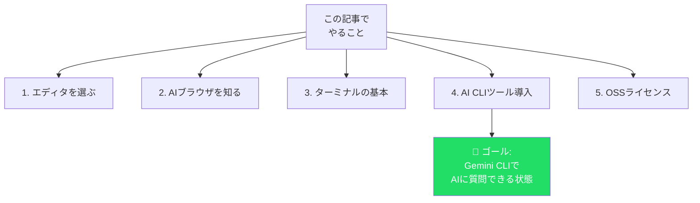
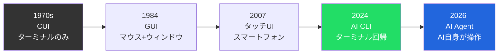
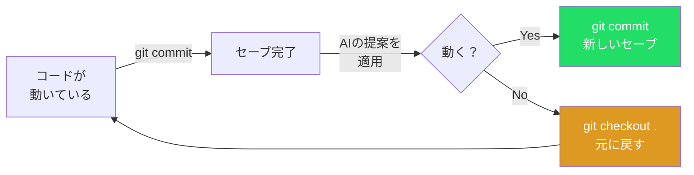
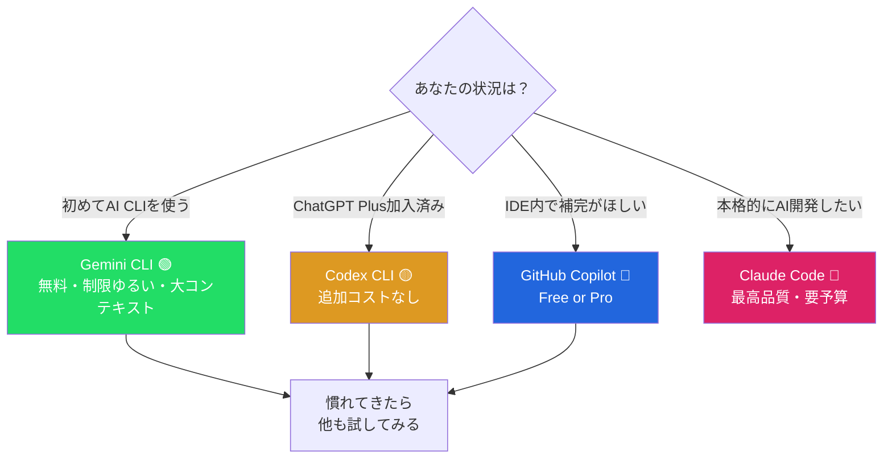
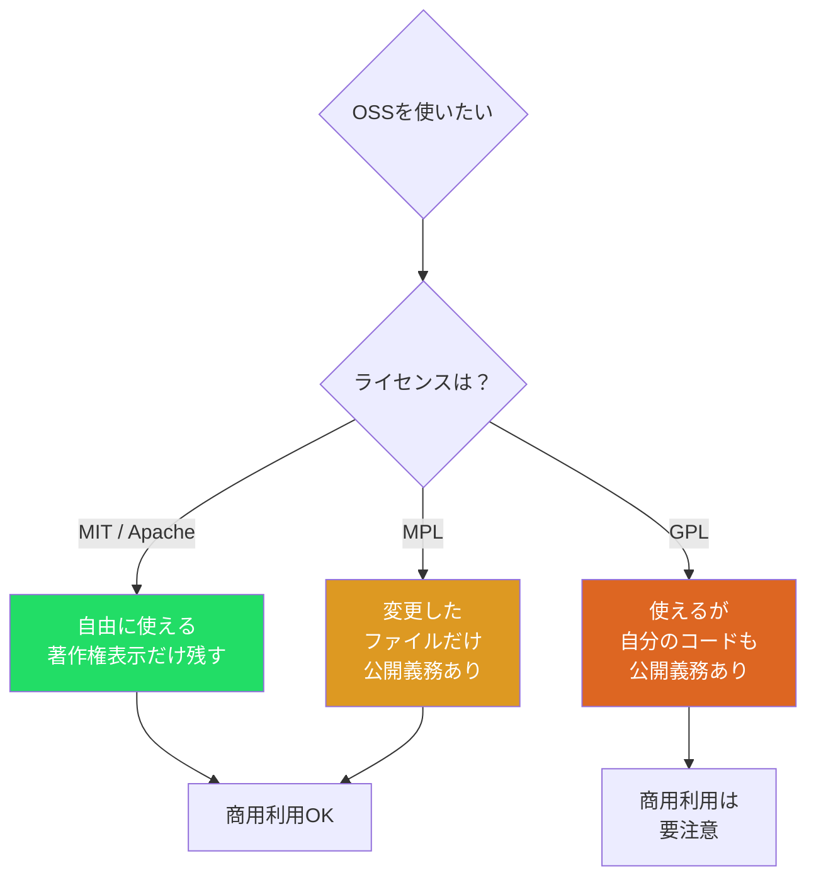

# S3: 開発環境・CLIツール — AIで開発環境を整える

> **Note:** **この記事のゴール**: Gemini CLIをインストールして、ターミナルからAIに質問できる状態にする。

## はじめに

「プログラミングってまず環境構築が大変なんでしょ？」

正直、その通りだった。ひと昔前は「Hello World」を表示するまでに半日かかることもザラだった。エディタのインストール、言語ランタイムのバージョン管理、パスの設定 — 初心者の心を折るために設計されたとしか思えないハードルが次々と立ちはだかっていた。

ところが2026年、状況は劇的に変わっている。AIがコードを書いてくれるだけじゃなく、環境構築そのものをAIが手伝ってくれる時代になった。

この記事では、プログラミング未経験者でも「AIと一緒にコードを書く」ための環境を整えるところまでを一気にやる。

1. **エディタ**を4つ比較して選ぶ
2. **AIブラウザ**を知る
3. **ターミナル**の基本をマスターする
4. **AI CLIツール**を4種比較してインストールする
5. **OSSライセンス**の基本を押さえる

最終的に、**Gemini CLI**（無料）をターミナルにインストールして、AIに質問する体験まで到達する。

> **⚠️ Warning:** **前提**: この記事はプログラミング初心者を対象にしています。「ターミナルって何？」というレベルから始めるので、経験者はターミナル入門セクションを飛ばしてOK。

<details><summary>📋 この記事に出てくるツール一覧と所要時間の目安</summary>

| カテゴリ | ツール | 所要時間 |
|:---------|:-------|:---------|
| エディタ | VSCode / Cursor / Zed / Antigravity | 比較: 15分、インストール: 5分 |
| AIブラウザ | Atlas / Comet | 比較: 5分 |
| ターミナル | Oh My Zsh / Starship / tmux | 各5-10分 |
| バージョン管理 | Git | 基本操作: 10分 |
| AI CLI | Gemini CLI / Codex CLI / Copilot / Claude Code | 比較: 15分、インストール: 5分 |
| OSS | ライセンスの基礎 | 10分 |

**全部読むと**: 約60-90分。
**ゴール（Gemini CLIインストール）まで**: 約30分。

</details>



---

## エディタを選ぼう — コードを書く「場所」

プログラミング向けのエディタは、コードの色分け（シンタックスハイライト）、関数名の補完、エラーの赤線表示など、普通のテキストエディタにはない機能がある。メモ帳やテキストエディットでもコードは書けるが、「暗い部屋でメモ帳に鉛筆で書いている」のと「明るいオフィスでホワイトボードに書いている」くらい効率が違う。

2026年、エディタの世界はAI統合が当たり前になった。「エディタを選ぶ」ことは「AIとの付き合い方を選ぶ」ことでもある。

### VSCode — 王道、無料、迷ったらこれ

Visual Studio Code（通称VSCode）はMicrosoftが開発する**無料**のコードエディタ。拡張機能の生態系が巨大で、「こういうの欲しいな」と思ったら、だいたい誰かが作っている。

**2026年1月（v1.109）の大変化**: GitHub Copilotがエディタの**中核機能**として組み込まれ、GPT-5、Claude 4.5 Sonnet、Gemini 3.0といった複数のAIモデルをネイティブに切り替え可能になった。VSCodeを入れるだけで、すでにAI機能が使える。

<!-- screenshot: VSCode v1.109のAIエージェントサイドバー画面 -->

**インストール**: [公式サイト](https://code.visualstudio.com/) からダウンロード → インストール → 拡張機能から「Japanese Language Pack」を入れて日本語化。

<details><summary>💡 VSCodeとVisual Studioは別物</summary>

- **Visual Studio**（無印）: 重量級IDE。主にC#/.NET用。数GB必要
- **Visual Studio Code**: 軽量エディタ。あらゆる言語対応。数百MBで動く

この記事で紹介するのはVSCode（軽い方）。

</details>

<details><summary>🔧 VSCodeのAI拡張機能（2026年注目の5つ）</summary>

v1.109でCopilotが標準搭載されたが、それ以外にもAI拡張は豊富だ。

| 拡張機能 | 機能 | 無料？ | おすすめ度 |
|:---------|:-----|:-------|:-----------|
| **GitHub Copilot** | コード補完・チャット・エージェント（標準搭載） | Free枠あり | ★★★★★ |
| **Continue** | オープンソースのAIアシスタント。ローカルLLM対応 | 無料 | ★★★★ |
| **Cody (Sourcegraph)** | コードベース全体を理解するAI。大規模リポジトリに強い | Free枠あり | ★★★ |
| **Tabnine** | プライバシー重視のAI補完。ローカル実行可能 | Free枠あり | ★★★ |
| **IntelliCode** | Microsoft製。使用パターンから学習する賢い補完 | 無料 | ★★★ |

初心者は標準搭載のCopilotだけで十分。「ローカルで動くAIを試したい」という人はContinueが面白い。

</details>

<https://code.visualstudio.com/>

---

### Cursor — AIファーストのエディタ

CursorはVSCodeをフォークして作られている。見た目もショートカットもほぼ同じ。違いは**設計思想**。VSCodeは「エディタにAI機能を追加した」。Cursorは「AIとの対話を前提にエディタを設計し直した」。

`Ctrl+K`（macOSは`Cmd+K`）を押して「この関数のエラーハンドリングを追加して」と入力すると、AIが変更を差分ビューで提案。「Accept」か「Reject」で判断する。マルチファイル変更も一括で提案してくれる。

2025年後半リリースの**Cursor 2.0**では、独自モデル**Composer**（MoEアーキテクチャ、4倍高速）、Plan Mode（AIが事前に計画を提示）、Background Agents（非同期タスク処理）が追加された。

もう1つの強力機能が`.cursorrules`（`.cursor/rules/*.mdc`）。プロジェクト固有のAIルールを定義するファイルで、コード規約やフレームワーク指定を書いておくとAIが常にそれに従う。

<details><summary>🔧 .cursorrules の実例 — AIの「性格」をカスタマイズ</summary>

`.cursor/rules/*.mdc` にプロジェクト固有のルールを書くと、AIの出力がプロジェクトに最適化される。

```
# TypeScript React プロジェクトの場合
- TypeScript strictモードを使うこと
- コンポーネントはfunction宣言（アロー関数ではなく）
- TailwindCSSでスタイリング、inline styleは使わない
- テストはVitest + React Testing Library
- 日本語のコメントは禁止、全て英語で
```

このファイルをチームで共有すれば、「AIが生成するコードのスタイル」をチーム全体で統一できる。VSCodeの`.vscode/settings.json` に相当する概念だが、対象が「人間の設定」ではなく「AIの振る舞い」という点が新しい。

</details>

**料金**（2026年2月時点）: Free $0 | Pro $16/月（Tab補完無制限+$16分のAIクレジット） | Ultra $200/月

> **⚠️ Warning:** **⚠️ 料金体系変更に注意**: 2025年6月にクレジット制に移行。Pro ($16/月) に含まれる$16分のクレジットを超えると追加料金が発生する。「月$16で使い放題」ではない。

| 強み | 弱み |
|:-----|:-----|
| マルチファイル編集の精度が高い | 料金が不透明（クレジット制） |
| .cursorrules でAIカスタマイズ可能 | VSCodeの拡張と100%互換ではない |
| Plan Mode で事前に計画を提示 | アップデートがVSCode本家より遅れることがある |
| Background Agents（非同期処理） | 無料プランの機能制限が厳しい |

<https://cursor.com/>

---

### Zed — Rust製・爆速のオープンソースエディタ

AtomとTree-sitterの生みの親Nathan Soboが作った次世代エディタ。Rust言語で書き直し、WASM（WebAssembly）ベースのUIが**120fps**で描画される。

**AI機能**: エージェント編集、インライン変換、Zeta（独自モデル）やGitHub Copilot Next-Edit対応。

**最大の差別化ポイント**は**マルチプレイヤー機能**。CRDT技術でレイテンシーが極めて小さいリアルタイム共同編集ができる。AIとの三者協業（開発者+開発者+AI）も可能。内蔵ボイスチャットとスクリーンシェアで外部ツール不要。

**料金**: Free $0（AI 50プロンプト/月） | Pro $20（AI 500プロンプト/月）。AI機能を使わないなら**完全無料**。対応OS: macOS / Linux（Windowsは開発中）。

**正直な評価**: 速さは本物。ファイルを開く、検索する、スクロールする — 全てがVSCodeより体感で速い。ただし拡張機能のエコシステムはVSCodeに遠く及ばない。「拡張に頼らずシンプルに使いたい」人には最高の選択肢。

<details><summary>💡 なぜRustで書かれていると速いのか？</summary>

VSCodeやCursorはElectron（Webブラウザ技術）で作られている。Zedが使うRust言語はネイティブコードにコンパイルされ、JavaScriptの数十倍速い。だからZedは120fpsで描画できる。

</details>

<https://zed.dev/>

---

### Antigravity — Googleの「エージェント・ファースト」IDE

2025年11月、GoogleがGemini 3と同時に発表。VSCodeのフォークだが、思想が**根本的に**違う。「**AIエージェントが実装して、人間がレビューする**」。

**Editorビュー**は普通のIDE。**Managerビュー**が革新的で、複数AIエージェントを並列で走らせるコントロールセンター。各エージェントの進捗をリアルタイムで監視し、生成するArtifactを確認しながら承認する。

**料金**: 2026年2月時点でパブリックプレビュー中の**無料**。正式料金未発表。

<details><summary>💡 Antigravityの「Managerビュー」が示す未来</summary>

Antigravityの最も興味深い点は、「コードを書く」ではなく「AIを管理する」が主な作業になること。Managerビューでは:

- 5つのAIエージェントを同時に起動して、それぞれ別のファイルを編集させる
- 各エージェントの進捗をリアルタイムで監視
- 生成されたコードをレビューして承認/却下

これは「プログラマー」という職業が「AIマネージャー」に変わりうる未来を示唆している。まだプレビュー段階だが、この方向性は覚えておいて損はない。

</details>

<https://developers.googleblog.com/build-with-google-antigravity-our-new-agentic-development-platform/>

---

### エディタ総合比較

| エディタ | 料金 | AI統合 | 速度 | 対応OS | おすすめ度 |
|:---------|:-----|:-------|:-----|:-------|:-----------|
| **VSCode** | 無料 | ◎ | ○ | Win/Mac/Linux | ★★★★★ |
| **Cursor** | $16~/月 | ◎ | ○ | Win/Mac/Linux | ★★★★ |
| **Zed** | 無料 | ○ | ◎ | Mac/Linux | ★★★★ |
| **Antigravity** | 無料(Preview) | ◎ | ○ | Win/Mac/Linux | ★★★ |

**初心者はVSCode一択**。困ったときに検索して出てくる情報量が圧倒的だ。慣れてきたら: AI全振り→Cursor / 速さ重視→Zed / 最先端→Antigravity。全部無料で始められる。

> **Note:** **「エディタ選びに時間をかけすぎない」こと**。完璧な選択肢はない。VSCodeで始めて、不満が出てきたら乗り換えればいい。エディタ間の移行は思ったより簡単だ（ショートカットキーのマッピングを入れれば操作感はほぼ同じになる）。

<details><summary>💡 エディタの歴史 — なぜこんなに種類があるのか</summary>

プログラマーにとってエディタは「1日8時間使う道具」。だから好みが激しく分かれる。

歴史的には:
- **1976年**: Emacs登場（キーバインドのカスタマイズ性が特徴）
- **1991年**: Vim登場（モード切り替えによる高速編集）
- **2008年**: Sublime Text登場（速くてモダン）
- **2014年**: Atom登場（Web技術で作られた拡張可能エディタ）
- **2015年**: VSCode登場 → Atomを駆逐して覇権
- **2022年**: Cursor登場 → AI統合の先駆け
- **2023年**: Zed登場 → Atomの生みの親がRustで再挑戦
- **2025年**: Antigravity登場 → エージェントファーストの新概念

エディタの世界では「10年に1度の地殻変動」が起きる。2025-2026年のAI統合はまさにその変動期。VSCodeが10年間の覇権を守れるか、CursorやAntigravityに取って代わられるかは、まだ分からない。

Emacs vs Vim の「エディタ戦争」は40年以上続いている。プログラマーのエディタ愛は、宗教のようなものだ。

</details>

---

## AIブラウザ — 検索がAIネイティブになる

プログラミング学習の大部分が「検索と調査」。そのブラウザ自体がAIで賢くなれば学習効率も上がる。

### ChatGPT Atlas — OpenAIのAIブラウザ

Chromiumベースのブラウザ。サイドバーでページ内容について即座にChatGPTに質問でき、ブラウザメモリで30日間の閲覧情報を蓄積。エージェントモード（有料のみ）ではAIがWebを自律操作。

> **⚠️ Warning:** **⚠️ プライバシー注意**: ブラウザメモリは閲覧情報をOpenAIサーバーに保存する。仕事用と分けるのが安全。

**対応OS**: macOSのみ（2026年2月時点）。

<https://openai.com/index/introducing-chatgpt-atlas/>

### Perplexity Comet — 無料のエージェント型ブラウザ

2025年10月に**完全無料化**。Atlasとの最大の違いは**無料でエージェント機能が使える**こと。全回答にソース付きでハルシネーション対策にも有効。

**エージェント機能**: 「この商品の最安値を5つのサイトで比較して」と指示すると、AIが自動でWebを巡回して結果を表形式でまとめてくれる。プログラミング学習では「この技術の公式ドキュメントと最新のチュートリアルを探して」のような使い方ができる。

**出典表示**: これが地味に重要。AIの回答に「この情報は○○の公式ドキュメントから」とソースが付く。[S2](./ml-spinoff-02.md)で学んだ「AIの回答を検証する」ためのヒントになる。

**対応OS**: Windows / macOS / Android（2026年2月時点。iOS版は開発中）。

<https://www.perplexity.ai/comet>

### AIブラウザ比較

| 項目 | Atlas | Comet |
|:-----|:------|:------|
| **料金** | 基本無料、エージェントは有料 | **完全無料** |
| **エージェント** | 有料のみ | **無料で利用可** |
| **出典表示** | なし | **全回答にソース付き** |
| **対応OS** | macOSのみ | Win/macOS/Android |
| **おすすめ度** | ★★★ | ★★★★ |

**今すぐ試すならComet**。無料でエージェント機能が使え、ソース付き回答でハルシネーション対策になる。ただし2026年2月時点では、両方とも「サブブラウザ」として使い分けるのが現実的。

<details><summary>💡 AIブラウザの使い分け — メインとサブの考え方</summary>

Chrome / Safari / Firefox をメインブラウザとして使い続けて、「調べ物をするとき」だけCometを開く。この使い分けが現時点では最も実用的。

なぜメインにしないのか？ まだ拡張機能のエコシステムがChromeに追いついていないのと、パスワードマネージャーや各種サービスのログイン状態をメインブラウザから移行するのが面倒だから。「AIの調査力」と「ブラウザとしての完成度」はまだ別の軸だ。

ただし、この状況は急速に変わるかもしれない。Chrome自体にGeminiが深く統合されれば、わざわざ別のAIブラウザを使う理由が薄れる。逆にCometの拡張機能エコシステムが充実すれば、メインブラウザになりうる。1年後にもう一度見直す価値がある分野だ。

</details>

---

## ターミナル超入門 — コマンドラインとは何か

### そもそもターミナルとは

コンピュータに**テキストで命令を送る**アプリケーション。普段のマウス操作（GUI）と同じことを、テキストで行う。

```
# GUIの操作          → ターミナルの命令
# Desktopフォルダを開く → cd Desktop
# ファイル一覧を見る    → ls
# 新しいフォルダを作る  → mkdir new-folder
```

### なぜ今さらターミナル？

「GUIのアプリがあるのに、なぜわざわざテキストで打ち込むの？」

2024年以降、AIツールの多くが**ターミナルから使うCLI**として提供されるようになった。理由は3つ:

1. **テキストベースの入出力がAIと相性抜群**: AIは文字が得意。GUIのボタンを押すよりテキストで会話する方が自然
2. **自動化しやすい**: スクリプトを書けば「毎朝8時にAIにレポートを書かせる」ことも可能
3. **軽い**: ブラウザを開かなくていい。ターミナルだけで完結する

実は、2024年のAI CLIブームでプログラマー以外のターミナル利用者が急増している。「AIと対話するためにターミナルを覚える」という、10年前には想像もしなかったモチベーションで。



<details><summary>💡 ターミナル、シェル、コンソール — 何が違うの？</summary>

厳密には別物だが、初心者は全部「ターミナル」と呼んで問題ない。

- **ターミナル**: テキストを表示するアプリケーション（画面の枠）
- **シェル**: コマンドを解釈するプログラム（bash, zsh, PowerShell等）
- **コンソール**: 物理的な端末（今はほぼ使わない用語）

macOSのデフォルトシェルは**zsh**。Windowsは**PowerShell**。Linuxは多くの場合**bash**。

</details>

### ターミナルの開き方

- **macOS**: `Command + Space` → 「ターミナル」と入力してEnter
- **Windows**: `Windows + X` → 「ターミナル」を選ぶ（Windows Terminal推奨）
- **Linux**: `Ctrl + Alt + T`

<details><summary>🔰 Windowsユーザーへ: WSL2という選択肢</summary>

WSL2（Windows Subsystem for Linux 2）はWindows上でLinux環境を動かす公式機能。macOS/Linux専用のAIツールがそのまま動く。

```powershell
# PowerShellを管理者として開いて実行
wsl --install
```

たった1行。再起動するとUbuntuが使える。Windows Home Editionでも使える。

</details>

### 最低限覚える5つのコマンド

| # | コマンド | 意味 | 実行例 |
|:-:|:---------|:-----|:-------|
| 1 | `pwd` | 今いる場所を表示 | `pwd` → `/Users/tanaka` |
| 2 | `ls` | ファイル一覧を見る | `ls` → `Desktop Documents ...` |
| 3 | `cd` | 場所を移動する | `cd Desktop` |
| 4 | `mkdir` | フォルダを作る | `mkdir my-project` |
| 5 | `clear` | 画面をきれいにする | `clear` |

> **Note:** **Windows（コマンドプロンプト）の場合**: `pwd` → `cd`（引数なし）、`ls` → `dir` と読み替えてください。Windows Terminalなら `pwd` も `ls` もそのまま使えます。

### ハンズオン: 実際に手を動かしてみよう

```bash
pwd                    # Step 1: 今どこにいる？
ls                     # Step 2: ファイル一覧を見る
cd Desktop             # Step 3: Desktopに移動
pwd                    # Step 4: 移動確認
mkdir ai-practice      # Step 5: 練習用フォルダを作る
cd ai-practice         # Step 6: フォルダに入る
pwd                    # Step 7: 確認 → /Users/tanaka/Desktop/ai-practice
```

> **Note:** **ここまでできたら準備完了！** 次のセクションで、この場所にGemini CLIをインストールする。

<details><summary>🔰 「パス」の読み方</summary>

`/Users/tanaka/Desktop` のような文字列を**パス**（path）と呼ぶ。`/` はフォルダの区切り、左から右に読む。`..` は「一つ上のフォルダ」、`~` は「ホームディレクトリ」。

</details>

### ターミナルカスタマイズ（余裕があれば）

デフォルトのターミナルは味気ないが、無料で劇的にカスタマイズできる。

| ツール | 何ができる | インストール |
|:-------|:----------|:-----------|
| **Oh My Zsh** | テーマ・プラグイン300以上。Git表示、コマンド補完強化 | `sh -c "$(curl -fsSL https://raw.githubusercontent.com/ohmyzsh/ohmyzsh/master/tools/install.sh)"` |
| **Starship** | Rust製のモダンプロンプト。言語バージョン自動検出 | `brew install starship` |
| **tmux** | ターミナル分割。AIに質問しながらコード編集が可能 | `brew install tmux` |

#### Oh My Zsh — 最初に入れるべきプラグイン3つ

`~/.zshrc` を開いて `plugins=(...)` の行を見つけ、以下を追加:

```bash
plugins=(git zsh-autosuggestions zsh-syntax-highlighting)
```

| プラグイン | 効果 |
|:----------|:-----|
| **git** | `gst`=`git status`、`gco`=`git checkout` 等のエイリアス |
| **zsh-autosuggestions** | 過去のコマンドをグレーで提案。→キーで補完 |
| **zsh-syntax-highlighting** | 正しいコマンドは緑、間違いは赤で表示 |

`zsh-autosuggestions` と `zsh-syntax-highlighting` は外部プラグインなので別途インストールが必要:

```bash
git clone https://github.com/zsh-users/zsh-autosuggestions ${ZSH_CUSTOM}/plugins/zsh-autosuggestions
git clone https://github.com/zsh-users/zsh-syntax-highlighting ${ZSH_CUSTOM}/plugins/zsh-syntax-highlighting
```

変更後は `source ~/.zshrc` で反映。

#### Starship — プロンプトを情報リッチに

Starshipは今いるディレクトリの言語バージョン（Node.js、Python、Rust等）を自動検出して表示する。

```bash
brew install starship
echo 'eval "$(starship init zsh)"' >> ~/.zshrc
source ~/.zshrc
```

<!-- screenshot: Starshipインストール後のターミナル画面（言語バージョンが表示されている） -->

#### tmux — 画面分割でAIと並行作業

tmuxは1つのターミナルを複数のペインに分割できる。左でコードを書きながら右でGemini CLIに質問、という使い方が可能になる。

```bash
brew install tmux
tmux                  # 起動
# Ctrl+b → % で左右分割
# Ctrl+b → " で上下分割
# Ctrl+b → 矢印キーでペイン移動
```

> **Note:** **tmuxは慣れるまで少し大変**。最初はOh My ZshとStarshipだけで十分。ターミナル操作に慣れてきたらtmuxを試してみよう。

---

## Git入門 — バージョン管理という「保険」

Gitは、ファイルの変更履歴を**無限に保存**してくれるツール。「動いていたコードが壊れた」→ コマンド1つで元に戻せる。

なぜGitが重要かというと、**AIと一緒にコードを書くと「試す」回数が爆発的に増える**から。AIが「こう変えてみたら？」と提案 → 試す → うまくいかない → 元に戻す → 別の方法を試す。このサイクルを安全に回すには、いつでも「前の状態」に戻れるGitが不可欠になる。

### 最低限の3コマンド

```bash
git init                          # 1. リポジトリ初期化（1回だけ）
git add . && git commit -m "追加"  # 2. 変更を記録（「セーブ」）
git log --oneline                 # 3. 履歴を見る
```

### ハンズオン: Gitで「セーブポイント」を作る

先ほどターミナル入門で作った `ai-practice` フォルダで試してみよう:

```bash
cd ~/Desktop/ai-practice

# Step 1: Gitリポジトリを作る
git init
# → "Initialized empty Git repository" と表示されたら成功

# Step 2: ファイルを作る
echo "# 私のAI練習プロジェクト" > README.md

# Step 3: 最初のセーブ
git add README.md
git commit -m "最初のコミット"

# Step 4: ファイルを変更する
echo "Gemini CLIで質問してみた" >> README.md

# Step 5: 変更を確認する
git diff
# → 追加した行が緑色で表示される

# Step 6: 変更をセーブ
git add README.md
git commit -m "Gemini CLIの練習メモを追加"

# Step 7: 履歴を確認
git log --oneline
# → 2つのコミットが表示される
```

> **Note:** **これがGitの基本サイクル**: ファイルを変更 → `git add` → `git commit` → 繰り返し。これだけで「いつでも過去に戻れる」保険がかかる。

### AIとGitの組み合わせ — 失敗を恐れなくなる

1. `git commit` で現状をセーブ
2. AIの提案を適用してみる
3. 動けばOK。動かなければ `git checkout .` で一瞬で元に戻す



> **Note:** **GitとGitHubは別物**: Git=カメラ（写真を撮る道具）、GitHub=フォトアルバム（写真を保管・共有する場所）。今はGitだけで十分。

<details><summary>🔧 .gitignore — Gitに「無視してほしいファイル」を伝える</summary>

プロジェクトには「記録したくないファイル」が必ずある。パスワードが入った設定ファイル、OSが自動生成する隠しファイル、ダウンロードした大きなライブラリ。`.gitignore` というファイルを作ると、Gitがそれらを無視してくれる。

```bash
# .gitignore の例
.env          # 環境変数（パスワード等）
node_modules/ # ダウンロードしたライブラリ（巨大）
.DS_Store     # macOSが自動生成するファイル
*.log         # ログファイル
```

プロジェクトの最初に `.gitignore` を作る習慣をつけておこう。GitHubには言語・フレームワーク別のテンプレートが用意されている。

</details>

---

## Gemini CLI — 無料のAI CLIツール（推奨）

### なぜGemini CLIを推奨するのか？

**無料で、制限がゆるくて、高性能**。

| ポイント | 内容 |
|:---------|:-----|
| **料金** | 完全無料（個人Googleアカウントのみ必要） |
| **リクエスト制限** | 60リクエスト/分、1,000リクエスト/日 |
| **AIモデル** | Gemini 3.0 シリーズ |
| **コンテキスト** | 100万トークン（新書5冊分を丸ごと渡せる） |
| **オープンソース** | Apache 2.0ライセンス |

### インストール手順

**前提**: Node.js 18以上が必要。

<details><summary>🔰 Node.jsのインストール方法</summary>

```bash
# macOS（Homebrew）
brew install node

# Windows — 公式サイトからダウンロード
# https://nodejs.org/ にアクセス → LTS版をダウンロード → インストーラーを実行

# Linux (Ubuntu/Debian)
sudo apt update && sudo apt install nodejs npm
```
インストール後、ターミナルを再起動して `node --version` で確認。v18以上ならOK。

**Homebrewが入っていない場合（macOS）**:
```bash
/bin/bash -c "$(curl -fsSL https://raw.githubusercontent.com/Homebrew/install/HEAD/install.sh)"
```
Homebrewはmacのパッケージマネージャー。「アプリのApp Store」のターミナル版だと思えばいい。一度入れておけば `brew install ○○` で各種ツールをインストールできる。

</details>

#### Step 1: インストール

```bash
npm install -g @google/gemini-cli
```

<details><summary>❓ エラーが出た場合</summary>

- `EACCES: permission denied` → `sudo npm install -g @google/gemini-cli`
- `npm: command not found` → Node.jsをインストールしてやり直す

</details>

#### Step 2: 起動

```bash
gemini
```

初回起動時にGoogleアカウント認証が必要。ブラウザが開くので個人の@gmail.comでログイン。

> **⚠️ Warning:** **⚠️ 会社のGoogle Workspaceアカウントだと管理者設定でブロックされる場合がある。個人アカウントを使おう。**

#### Step 3: 最初の質問

```
> Pythonで「Hello World」を表示するコードを教えて
```

回答が返ってきたら成功。**ターミナルからAIに質問できる環境が整った。**

#### Step 4: ファイルを読ませてみる

```
> このディレクトリにあるファイルの構成を説明して
> README.md の内容を日本語で要約して
```

100万トークンのおかげで、数千行のソースコードでもそのまま読ませて解析できる。

終了は `/quit` または `Ctrl + C`。

> **Note:** **🎯 ここまでできたらゴール達成！** 以降は「他のツールも試したい」人向けの内容。

<details><summary>❓ Gemini CLIがうまく動かないときのトラブルシューティング</summary>

**Q: `gemini` コマンドが見つからない**
→ ターミナルを再起動してみる。それでもダメなら `npm list -g @google/gemini-cli` でインストール確認。

**Q: 認証画面が開かない**
→ ブラウザがデフォルト設定されているか確認。macOSなら「システム設定 → デスクトップとDock → デフォルトWebブラウザ」。

**Q: 「quota exceeded」エラーが出る**
→ 1分あたり60リクエスト、1日1,000リクエストの制限に達した。少し待ってから再試行。

**Q: 日本語が文字化けする**
→ ターミナルの文字コードがUTF-8か確認。macOSは通常問題ない。Windowsの場合はWindows Terminalを使うことで解決することが多い。

**Q: レスポンスが遅い**
→ ネットワーク環境を確認。Gemini CLIはクラウド上のAIモデルと通信するので、インターネット接続が必要。VPN経由だと遅くなることがある。

</details>

#### Gemini CLIの便利機能

基本の対話以外にも、使い込むほど便利な機能がある。

**シェルコマンド実行**: AI対話モードの中で `!ls -la` のように `!` を付けるとシェルコマンドを直接実行できる。AIに質問しながら、結果をその場で確認する使い方。

**シェルモード**: 自然言語でコマンドを生成させる機能。「テキストファイルを新しい順に一覧して」と聞くと、AIが `find . -name "*.txt" -exec ls -lt {} +` のようなコマンドを生成し、「実行しますか？」と確認してくれる。コマンドを覚えていなくても日本語で指示できる。

**設定ファイル（GEMINI.md）**: プロジェクトのルートに `GEMINI.md` というファイルを置くと、Gemini CLIがそれを読み込んで振る舞いをカスタマイズする。Cursorの `.cursorrules` に相当する概念。

```markdown
# GEMINI.md の例
- このプロジェクトはReact + TypeScriptで構成されている
- テストはVitestを使う
- 回答は日本語で
- コードブロックにはファイル名を含める
```

**シェルパイプライン連携**: Gemini CLIはパイプで入力を受け取れる。

```bash
# ファイルの内容をGemini CLIに渡す
cat error.log | gemini "このエラーログの原因と対策を教えて"

# ディレクトリ構造を渡して説明させる
ls -la | gemini "このディレクトリの構成を説明して"
```

**非対話モード**: スクリプトやcronジョブから使う場合、引数にプロンプトを渡して1回だけ実行する。

```bash
gemini "Pythonでfizzbuzzを書いて" > fizzbuzz.py
```

対話モードに入らず、結果をファイルにリダイレクトできる。自動化との相性が良い。

<details><summary>💡 Gemini CLI vs ChatGPTのWebインターフェース</summary>

「ブラウザでChatGPTを使うのと何が違うの？」という疑問は自然だ。最大の違いは**ファイルシステムとの統合**。

- ブラウザ版: テキストをコピペしてAIに渡す → 回答をコピペして自分のファイルに貼る
- CLI版: ターミナルの中でファイルを直接読み書きさせる → コピペ不要

さらに、パイプやリダイレクトでUNIXツールと連携できる。これが「プログラマブルなAI」の入り口になる。

</details>

<https://github.com/google-gemini/gemini-cli>

---

## OpenAI Codex CLI — ChatGPT派の選択肢

Rust製で起動もレスポンスも高速。o4-miniモデルをデフォルト使用し、「一発で実用的なスクリプト」を出す傾向が強い。

**料金**: ChatGPT Plus ($20/月) で追加コストなし（5時間ごとのタスク制限あり）。API直接利用は従量課金。

```bash
npm install -g @openai/codex
codex
```

macOS/Linuxが正式対応。Windowsは実験的（WSL2推奨）。

**特徴的な機能**:
- **自動承認モード**: `codex --auto-approve` で、AIが提案するコマンドを自動実行（注意して使おう）
- **サンドボックス実行**: デフォルトでネットワーク無効のサンドボックスでコマンドを実行。安全性が高い
- **Rust製の高速起動**: Node.js製のツールと比べて起動が速い

**向いている人**: ChatGPT Plusに加入済みで、追加コストなしでCLI AIを使いたい人。

<https://developers.openai.com/codex/cli/>

---

## GitHub Copilot — IDE統合の王者

GitHub Copilotは他のAI CLIツールとは少し毛色が違う。ターミナルで使うのではなく、**エディタの中に組み込まれて、コードを書きながらリアルタイムで補完する**。

コードを書き始めると灰色テキストで提案が表示され、**Tabキーを押すだけ**で受け入れ。まるで「考えていることを先読みしてくれる」感覚。2026年版はマルチエージェント対応、Coding Agent（PR・レビュー・テスト自動化）、プレミアムモデル選択が追加。

| プラン | 月額 | 主な特徴 |
|:-------|:-----|:---------|
| **Free** | $0 | 補完2,000回/月 + チャット50回/月 |
| **Pro** | $10 | 無制限補完 + プレミアムモデル + Coding Agent |
| **Pro+** | $39 | 全モデルアクセス + 大量プレミアムリクエスト |

**学生は無料**: GitHub Education Pack に登録するとPro相当が無料。

VSCode v1.109以降はCopilotが初めから組み込まれている。初回起動時にGitHubログインするだけ。

<details><summary>🔧 Copilotの使い方のコツ</summary>

**Tab補完を最大限活用する**:
1. 関数名だけ書く → AIが中身を提案 → Tabで確定
2. コメントを先に書く: `// ユーザーの年齢でフィルターする関数` → AIがコードを生成
3. 1行目を書いてEnter → AIが残りを提案

**チャット機能（`Ctrl+I` / `Cmd+I`）**:
- コードを選択 → `Ctrl+I` → 「この関数にエラーハンドリングを追加して」
- `@workspace` でプロジェクト全体を参照させる: `@workspace このプロジェクトのテスト方法を教えて`

**Coding Agent（Pro以上）**:
- GitHubのIssueを割り当てると、AIが自動でブランチを作り、コードを書き、PRを作成
- レビューやテストも自動化
- 「人間がIssueを書いてAIが実装する」ワークフローが現実に

</details>

<https://github.com/features/copilot>

---

## Claude Code — 上級者のための最強ツール

AI CLIツールの中で**最も「賢い」**と評価されることが多い。大規模コードベースの理解力、マルチファイル編集の精度、エージェント機能の完成度が頭一つ抜けている。

### なぜ「上級者向け」なのか — コストが読みにくい

| 利用方法 | 月額 | 特徴 |
|:---------|:-----|:-----|
| **Claude Pro** | $20 | 利用量制限が厳しい |
| **Claude Max 5x** | $100 | Proの5倍 |
| **Claude Max 20x** | $200 | Proの20倍 |
| **API直接利用** | 従量課金 | 開発者の平均 $6/日、90%が $12/日以下 |

> **⚠️ Warning:** **⚠️ $20プランの罠**: 大きなプロジェクトだと数時間で上限に達する。APIに切り替えると月$180-$360も珍しくない。まずGemini CLI（無料）で慣れてから検討しよう。

**強み**: プロジェクト全体の自動理解、マルチファイル編集の整合性、Agent Teams（複数AIの並列実行）。

```bash
npm install -g @anthropic-ai/claude-code
claude
```

**何がそんなに「賢い」のか**: 他のツールが「今開いているファイル」を見てコードを提案するのに対し、Claude Codeはプロジェクト全体のファイル構成を理解した上で提案する。「このファイルを変えたら、あのファイルも修正が必要」という横断的な変更を高い精度でこなす。

**CLAUDE.md**: Gemini CLIの `GEMINI.md`、Cursorの `.cursorrules` に相当する設定ファイル。プロジェクトルートに `CLAUDE.md` を置くとAIの振る舞いをカスタマイズできる。各ツールが独自の「AI設定ファイル」を持っている点は注目に値する。

> **Note:** **AI設定ファイルの共通パターン**: Gemini CLI → `GEMINI.md`、Cursor → `.cursorrules`、Claude Code → `CLAUDE.md`。名前は違うが、「プロジェクト固有のルールをAIに伝える」という概念は共通。このパターンは2026年のAI開発ツールのスタンダードになりつつある。

<https://claude.com/pricing>

---

## AI CLIツール総合比較



| 項目 | Gemini CLI | Codex CLI | GitHub Copilot | Claude Code |
|:-----|:-----------|:----------|:---------------|:------------|
| **無料枠** | ◎ (1000回/日) | △ (Plus必要) | ○ (2000補完/月) | △ (Pro必要) |
| **月額目安** | $0 | $20 (Plus) | $0-$39 | $20-$200+ |
| **コンテキスト** | 100万トークン | 中 | 中 | 20万トークン |
| **コード品質** | ○ | ○+ | ○ | ◎ |
| **おすすめ度** | ★★★★★ | ★★★ | ★★★★ | ★★★★ (上級者) |

### 同じ質問を4つのツールに投げてみた

「百聞は一見にしかず」ということで、全く同じ質問を4つのAI CLIツールに投げて、回答の違いを比較してみた。

**質問**: 「Pythonで、指定したディレクトリ内のファイルサイズが1MB以上のファイルだけを一覧するスクリプトを書いて」

| ツール | 回答の特徴 | コードの長さ | 追加説明 |
|:-------|:----------|:-----------|:---------|
| **Gemini CLI** | `pathlib`ベースのモダンなコード。f-string活用 | 15行 | 実行例付き |
| **Codex CLI** | `os.walk`ベースの実用的なコード。エラーハンドリング付き | 22行 | ファイルサイズの単位変換付き |
| **Copilot** | VSCode内でインライン提案。Tab補完で完成 | 12行 | エディタ内で即実行可能 |
| **Claude Code** | 引数解析付きの完成度の高いスクリプト。argparse使用 | 35行 | テスト方法の提案付き |

面白いのは、**同じ質問なのに回答のスタイルが全く違う**こと。Gemini CLIはシンプルさ重視、Codex CLIは実用性重視、Claude Codeは完成度重視。どれが「正解」ということはない。[S2](./ml-spinoff-02.md)で学んだように、「何のために使うか」で最適な回答は変わる。

> **Note:** **4つとも試す必要はない**。まずGemini CLI（無料）で十分。「他のツールの回答も気になる」と思ったときが、2つ目を試すタイミングだ。

### 料金シミュレーション

| 利用パターン | Gemini CLI | Codex CLI | Copilot | Claude Code |
|:-------------|:-----------|:----------|:--------|:------------|
| 週に数回質問 | **$0** | $20 | **$0** | $20 |
| 毎日30分使う | **$0** | $20 | $10 | $100 |
| 1日数時間開発 | **$0** | $20 | $39 | $200+ |

### 複数ツールの組み合わせパターン

AI CLIツールは「1つ選んで終わり」ではない。複数を組み合わせることで、それぞれの強みを活かせる。

**パターンA: 無料最強構成（月$0）**

| ツール | 役割 |
|:-------|:-----|
| Gemini CLI | メインの相談相手（大コンテキスト活用） |
| GitHub Copilot Free | エディタ内のコード補完 |
| Starship + Oh My Zsh | ターミナルの快適化 |
| Git | バージョン管理（「戻れる安心感」） |

これだけで「AIと一緒にコードを書く」環境が完成する。一切お金がかからない。

**パターンB: プロフェッショナル構成（月$30-60）**

| ツール | 役割 | 月額 |
|:-------|:-----|:-----|
| Claude Code or Cursor Pro | メインの開発環境 | $16-20 |
| Gemini CLI | サブ（大コンテキストでドキュメント全体を分析） | $0 |
| GitHub Copilot Pro | コード補完 + Coding Agent | $10 |

異なるAIモデルを使い分けることで、「セカンドオピニオン」が得られる。Cursorが出した回答が怪しいときにGemini CLIに同じ質問をする、という使い方は意外と有効。

**おすすめルート**: まずGemini CLI（無料）→ VSCodeにCopilot Free → 慣れたらCursorかClaude Codeを検討。焦って有料プランに入る必要はない。無料でもかなりのことができる。

---

## ⚠️ OSSライセンスの基礎

AIツールを使っていると**オープンソースソフトウェア（OSS）**に出会う機会が増える。この記事で紹介したツールにもOSSが多い — Gemini CLI（Apache 2.0）、Zed（AGPL / Apache 2.0）、Oh My Zsh（MIT）、Starship（ISC）。

「オープンソース」= 「自由に使える」ではない。ソースコードが公開されているだけで、使い方にはルールがある。

### 主要ライセンス4つ

| ライセンス | 条件 | わかりやすく言うと |
|:-----------|:-----|:-------------------|
| **MIT** | 著作権表示を残す | 「好きに使って。名前だけ残してね」 |
| **Apache 2.0** | 著作権表示＋変更点明示 | 「好きに使って。何を変えたか書いてね」 |
| **GPL** | 派生物も同じGPLにする義務 | 「使っていいけど、あなたの作品も公開してね」 |
| **MPL 2.0** | 変更ファイルのみ公開義務 | 「変えた部分だけ公開してね」 |



**初心者が知るべき3点**: MITとApacheは安心して使える。GPLは要注意（「GPL汚染」— GPLコードを組み込むとプロジェクト全体をGPLで公開する義務が発生する可能性）。AIが生成したコードの著作権は法的にグレーゾーン — AI出力を参考にして自分で書き直すのがベスト。

<details><summary>💡 OSSライセンス判断フローチャート — 迷ったらこれ</summary>

実際にOSSを使う場面で迷ったときの判断基準:

**個人の学習・趣味プロジェクト**:
→ どのライセンスでもほぼ問題なし。著作権表示を残すだけ。

**会社のプロダクトに組み込む場合**:
1. ライセンスファイル（LICENSE, COPYING）を必ず確認
2. MIT / Apache 2.0 / BSD → 安心。著作権表示を残せばOK
3. LGPL → ライブラリとしてリンクするなら概ねOK（ただし法務に確認推奨）
4. GPL → **要注意**。自社コードもGPLで公開する義務が発生する可能性。法務に相談
5. ライセンス表記なし → **使わない**。無断利用で著作権侵害のリスク

**AIが生成したコードのライセンス**:
- 2026年2月時点では、AI生成コードの著作権に関する法律は各国で議論中
- 安全策: AIの出力をそのままコピペせず、自分で理解して書き直す
- Copilotの「パブリックコードに一致する提案をフィルター」オプションをONにしておくと安心

</details>

### 「README.md」を読む習慣をつけよう

GitHubでOSSのリポジトリを見ると、トップに `README.md` というファイルがある。これが「使い方の説明書」だ。

良いOSSプロジェクトのREADMEには以下の情報がある:
- **何をするツールか**（1-2文で）
- **インストール方法**
- **基本的な使い方**
- **ライセンス**

Gemini CLI自体もOSS（Apache 2.0ライセンス）で、GitHubの[リポジトリ](https://github.com/google-gemini/gemini-cli)からソースコードを読める。「AIの中身が気になる」人は、ここから始めてみるのも面白い。

---

## 💡 好奇心の種

> **AIがコードを「書ける」— でも、AIはコードを「理解」しているのか、「模倣」しているのか？**

Gemini CLIに「Pythonでソートアルゴリズムを書いて」と頼むと、きれいなコードが返ってくる。「なぜバブルソートではなくクイックソートを選んだの？」と聞けば、もっともらしい説明もする。

でも、その「説明」は本当に**理解**から来ているのか？ それとも、大量のプログラミング教材を学習した結果、「このように答えるのが統計的に最も自然」というパターンを再現しているだけなのか？

### 実験: AIの「理解」を試す

今すぐGemini CLIでこの3つの質問を試してみてほしい:

**質問1**: 「Pythonでバブルソートを書いて」
→ おそらく完璧なコードが返ってくる。

**質問2**: 「なぜバブルソートではなくクイックソートを使うべきなのか説明して」
→ 計算量O(n^2) vs O(n log n) の話をもっともらしく返してくるはず。

**質問3**: 「存在しない架空のプログラミング言語Xyzzの文法に従ってソートを書いて」
→ AIは何かを出力する。でもそれは**でたらめ**のはず。存在しない言語のルールを「理解」することはできないのだから。

質問1と2は「学習済みの知識の再現」。質問3は「未知の状況への対応」。この差が、AIの「理解」と「模倣」の境界線を浮き彫りにする。

AIは「知識の再現」は得意だが、「未知への応用」は苦手かもしれない。この問いの答えは、AIの内部構造を知ることでしか得られない。[S8](./ml-spinoff-08.md)で戻ってくる話だ。

---

## 🔬 考察: GUI → CLI → AI — インターフェースの進化は「円環」か「螺旋」か？

ところで、ちょっと脱線させてほしい。

この記事ではターミナル（CLI）の使い方を紹介した。「なぜ今さらCLI？」と感じた人もいるはず。

### エディタの設計思想 — 4つの「正解」

この記事ではVSCode、Cursor、Zed、Antigravityの4つのエディタを紹介した。それぞれが「エディタとは何であるべきか」に対して異なる答えを出している。

| エディタ | 設計思想 | 人間とAIの関係 |
|:---------|:---------|:-------------|
| **VSCode** | プラットフォーム（拡張で何にでもなる） | AIは機能の一つ |
| **Cursor** | AIファースト（AIとの対話が中心） | AIが主、人間がレビュー |
| **Zed** | パフォーマンスファースト（速さが正義） | AIは補助的 |
| **Antigravity** | エージェントファースト（AIが実装する） | AIが実装、人間が管理 |

VSCodeは「何でもできるナイフ」。Cursorは「AIと一緒に書く万年筆」。Zedは「切れ味最高の包丁」。Antigravityは「AIに料理を任せるキッチン」。

面白いのは、この4つの設計思想が「人間はどこまでコードを書くべきか」という問いに対する**異なる仮説**を反映していること。VSCodeは「人間が書く」前提、Antigravityは「AIが書いて人間がレビュー」前提。5年後にどちらが正解だったかは、まだ誰にもわからない。

### テキストの「意味」が逆転した

1970年代のCUIは「コンピュータの言語で命令する」もの。`ls -la | grep .txt | sort -r` — この呪文を人間がコンピュータの文法に合わせて書いた。

2024年のAI CLIは「人間の言語で意図を伝える」もの。「テキストファイルを新しい順に一覧して」— これでいい。

> テキストに「戻った」のではない。テキストの**意味**が変わった。

各時代を「誰が誰に合わせているか」で整理すると:

| 時代 | 合わせる側 |
|:-----|:-----------|
| CUI | **人間が**コンピュータの言語を覚える |
| GUI/タッチUI | **コンピュータが**人間の直感に合わせる |
| AI CLI | **コンピュータが**人間の言語を理解する |
| AI Agent | **AIが**人間の意図を先読みする |

インターフェースの歴史は一貫して「コンピュータが人間に歩み寄っていく」方向に進んでいる。CUI時代だけが逆方向だった。これは「円環」（同じ場所に戻った）ではなく、「螺旋」（同じ位置に見えるが、1段上にいる）。

### 便利さと理解力のトレードオフ

でも、人間がインターフェースから遠ざかるということは、コンピュータの中で何が起きているかを知る機会が**減る**ということでもある。

> **便利になるほど、中身が見えなくなる。中身が見えなくなるほど、判断力が鈍る。**

車のオートマ限定免許でも車は運転できる。でもエンジンの仕組みを知っているドライバーは、トラブル時に冷静に対処できる。同じように、AIの中身を知っている人は、AIの出力を鵜呑みにしない判断力を持てる。

### 「道具を選ぶ力」は陳腐化しない

この記事で4つのエディタを比較した。4つのAI CLIツールを比較した。OSSライセンスの違いを学んだ。具体的なツールの名前は数年で変わるかもしれない。でも、身についた力 — **比較の軸を持つ、トレードオフを理解する、自分で試す、組み合わせる、リスクを認識する** — この「メタスキル」はAIツールが進化しても陳腐化しない。

2026年のGemini CLIが2028年には別のツールに取って代わられるかもしれない。VSCodeの立場をAntigravityが奪うかもしれない。でも「無料枠を活用して試す」「料金体系の罠に気づく」「自分の用途に合うものを選ぶ」という**判断プロセス**は、どの時代でも使える。

道具が変わっても、道具を選ぶ力は残る。

螺旋の上にいるのか、円環の中にいるのか — その判断ができるのは、中身を知っている人だけだ。

その「内側」が気になったら、[S8: ブラックボックスの中身を知りたくなったら](./ml-spinoff-08.md)が待っている。

---

## シナリオ別おすすめ構成

「結局、自分はどう始めればいいの？」をシナリオ別にまとめた。

### シナリオ1: プログラミング完全初心者

```
VSCode（無料）+ GitHub Copilot Free + Gemini CLI（無料）+ Git
```
合計: **$0/月**。まずこれで3か月やってみる。

### シナリオ2: プログラミング経験あり、AIツール初心者

```
Cursor Free or VSCode + Copilot Pro ($10) + Gemini CLI（無料）+ Git + Oh My Zsh + Starship
```
合計: **$0-10/月**。Copilot Proのコード補完とCoding Agentを試す。

### シナリオ3: 本気でAI開発に取り組みたい

```
Cursor Pro ($16) or Claude Code ($20-100) + Copilot Pro ($10) + Gemini CLI + tmux + Git
```
合計: **$26-110/月**。複数AIの「セカンドオピニオン」で品質を上げる。

### シナリオ4: 学生

```
VSCode + GitHub Copilot Pro（Education Pack で無料）+ Gemini CLI + Git
```
合計: **$0/月**。学生はGitHub Education Packを使わない手はない。

---

## まとめ

| # | 内容 | 状態 |
|:-:|:-----|:-----|
| 1 | エディタ4つを比較（初心者はVSCode推奨） | ✓ |
| 2 | AIブラウザ2つの特徴を知った（おすすめはComet） | ✓ |
| 3 | ターミナルの基本コマンド5つを覚えた | ✓ |
| 4 | **Gemini CLIをインストールしてAIに質問できた** | 🎯 |
| 5 | AI CLIツール4種の特徴と料金を比較した | ✓ |
| 6 | OSSライセンスの基本を学んだ | ✓ |

### 今日からできること

**1. Gemini CLIで毎日1つ質問する**
「AIに聞く」を習慣にする。最初は「Pythonでファイルの一覧を取得する方法は？」のような簡単な質問から。だんだん「このエラーメッセージの意味は？」「この2つのライブラリの違いは？」と複雑な質問ができるようになる。

**2. VSCodeにGitHub Copilot Freeを入れる**
VSCodeを開く → 左サイドバーの拡張機能アイコン → 「GitHub Copilot」を検索 → インストール → GitHubアカウントでログイン。これだけで月2,000回のコード補完が無料で使える。

**3. `git init` でバージョン管理を始める**
プロジェクトフォルダで `git init` するだけ。AIの提案を「元に戻せる」安心感があるから、積極的に試せるようになる。

**4. ターミナルをカスタマイズする**
Oh My ZshとStarshipを入れるだけで、ターミナルが一気に使いやすくなる。地味だが、毎日使うツールの快適さは積み重なる。

**5. 「AIにこれ聞いたらどうなるだろう？」を繰り返す**
AIの限界は使ってこそ見えてくる。「正しいこと」を聞くだけでなく、わざと変な質問をしてみるのも面白い。好奇心の種で触れた「存在しないプログラミング言語」の実験を、ぜひ試してみてほしい。

> **Note:** **💡 好奇心の種、覚えてる？** AIはコードを「理解」しているのか「模倣」しているのか。環境は整った。次はAIの「使い方」の幅を広げよう。

---

### 次回予告

> **[S4: AI × ビジネスツール](./ml-spinoff-04.md)** — 業務にAIを統合する
>
> Microsoft 365 Copilot、Notion AI、Gamma、AI議事録 — 仕事のあらゆる場面にAIを導入する方法。そして「プラットフォームロックイン」という、便利さの裏に潜むリスクの話。

---

### シリーズナビゲーション

| | 記事 | テーマ |
|:-|:-----|:-------|
| ← 前回 | [S2: プロンプト設計](./ml-spinoff-02.md) | AIへの「頼み方」で結果が変わる |
| **今回** | **S3: 開発環境・CLIツール** | **AIで開発環境を整える** |
| → 次回 | [S4: AI × ビジネスツール](./ml-spinoff-04.md) | 業務にAIを統合する |

もっと深く知りたくなったら → [S8: ブラックボックスの中身を知りたくなったら](./ml-spinoff-08.md)

---

## ライセンス

本記事は [CC BY-NC-SA 4.0](https://creativecommons.org/licenses/by-nc-sa/4.0/deed.ja)（クリエイティブ・コモンズ 表示 - 非営利 - 継承 4.0 国際）の下でライセンスされています。

### ⚠️ 利用制限について

**本コンテンツは個人の学習目的に限り利用可能です。**

**以下のケースは事前の明示的な許可なく利用することを固く禁じます:**

1. **企業・組織内での利用（営利・非営利問わず）**
   - 社内研修、教育カリキュラム、社内Wikiへの転載
   - 大学・研究機関での講義利用
   - 非営利団体での研修利用
   - **理由**: 組織内利用では帰属表示が削除されやすく、無断改変のリスクが高いため

2. **有料スクール・情報商材・セミナーでの利用**
   - 受講料を徴収する場での配布、スクリーンショットの掲示、派生教材の作成

3. **LLM/AIモデルの学習データとしての利用**
   - 商用モデルのPre-training、Fine-tuning、RAGの知識ソースとして本コンテンツをスクレイピング・利用すること

4. **勝手に内容を有料化する行為全般**
   - 有料note、有料記事、Kindle出版、有料動画コンテンツ、Patreon限定コンテンツ等

**個人利用に含まれるもの:**
- 個人の学習・研究
- 個人的なノート作成（個人利用に限る）
- 友人への元記事リンク共有

**組織での導入をご希望の場合**は、必ず著者に連絡を取り、以下を遵守してください:
- 全ての帰属表示リンクを維持
- 利用方法を著者に報告

**無断利用が発覚した場合**、使用料の請求およびSNS等での公表を行う場合があります。
