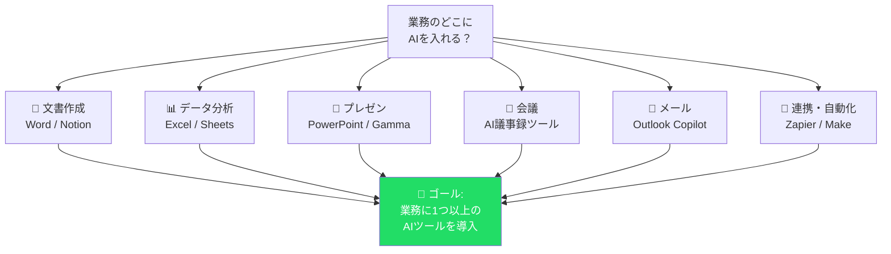
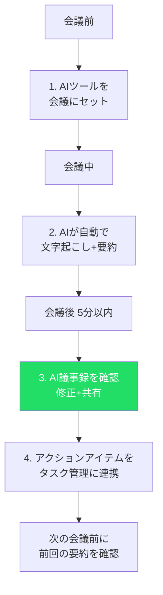
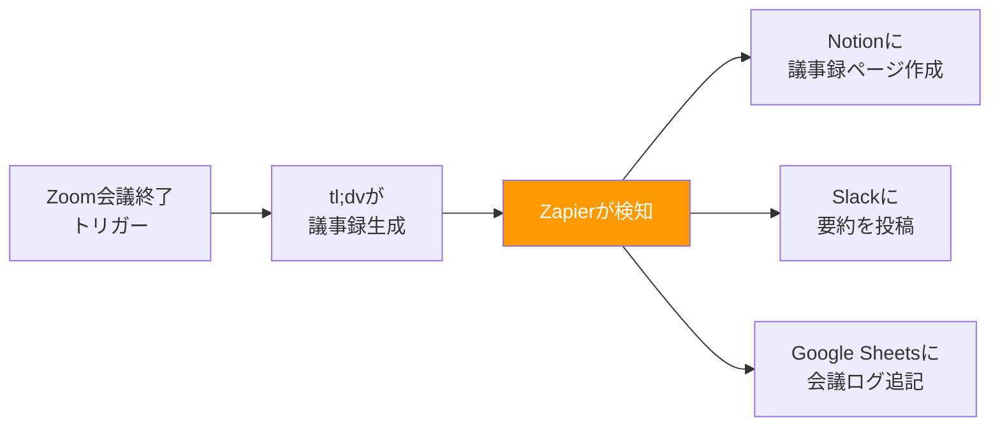
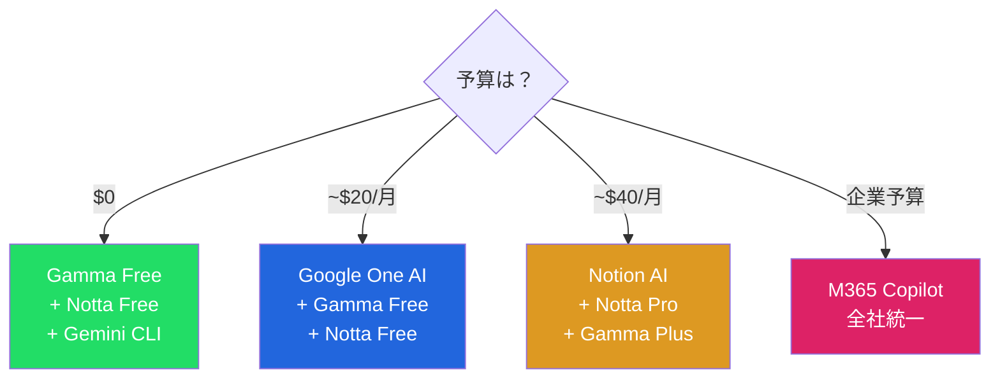
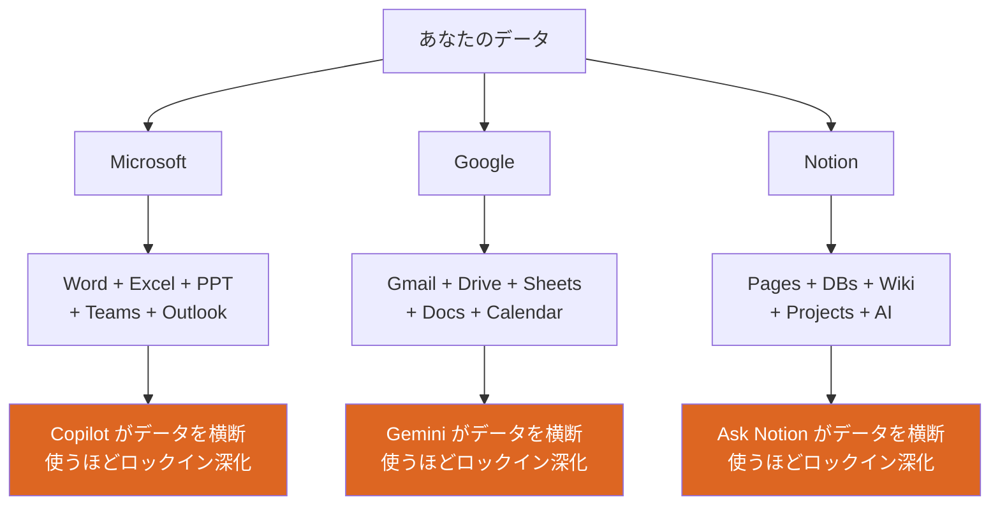

# S4: AI × ビジネスツール — 業務にAIを統合する

> **Note:** **この記事のゴール**: 自分の業務に1つ以上のAIツールを導入した状態にする。

## はじめに

[前回（S3）](./ml-spinoff-03.md)では開発環境を整えて、Gemini CLIからAIに質問できるようになった。

でも「AIを仕事に使う」というのは、ターミナルでコードを書くことだけじゃない。

メールの下書き、会議の議事録、プレゼン資料の作成、スプレッドシートの分析 — こうした「日常業務」にこそAIが効く。毎日30分の会議まとめに1時間かけていた作業が、AIなら5分で終わる。週5日で計算すると、月に約17時間の節約。年間で200時間以上だ。

この記事では、仕事のあらゆる場面に入り込んでいるAIツールを実際に触っていく。

具体的には:

1. **Microsoft 365 Copilot** — Word/Excel/PowerPoint/Teams/OutlookにAIが統合されたエコシステム
2. **Notion AI** — ドキュメント・プロジェクト管理をAIで加速
3. **Gamma** — AIでプレゼン資料を自動生成
4. **Google Sheets × Gemini** — スプレッドシートでAI分析
5. **AI議事録ツール** — tl;dv / Otter.ai / Notta / Teams Copilot を比較
6. **ツール連携** — Zapier/Makeでツール間をつなぐ
7. **プライバシーの注意点** — AIに何を入力していいか

最後に、「プラットフォームロックイン」という、便利さの裏に潜むリスクについて考える。

<details><summary>💡 「業務にAIを入れる」とはどういうことか — 心構え</summary>

AIツールを業務に導入するのは、「新しいソフトを入れる」こと以上の意味がある。

**業務プロセスそのものが変わる。**

議事録を手書きからAI自動化に切り替えると、会議の進め方が変わる。「メモを取りながら聞く」から「議論に集中する」に変わる。プレゼン資料をGammaで生成するようになると、「デザインに時間をかける」から「内容の質を上げることに時間をかける」に変わる。

つまりAI導入は「効率化」であると同時に「仕事の再定義」でもある。

**ルーティンはAIに任せ、人間は「判断」「創造」「対話」に集中する。**

</details>

> **⚠️ Warning:** **前提**: この記事は特定のプログラミング知識を前提としません。ビジネスパーソンが自分の業務にAIを導入する実践ガイドです。

<details><summary>📋 この記事に出てくるツール一覧と料金早見表（2026年2月時点）</summary>

| ツール | 無料枠 | 最安有料プラン | ベストな用途 |
|:-------|:-------|:-------------|:------------|
| M365 Copilot | ✗ | $18/人/月〜 | MS環境の全社導入 |
| Notion AI | 20回のみ | $20/人/月 | ドキュメント + PM |
| Gamma | あり | $8/月 | プレゼン資料 |
| Google Sheets Gemini | 基本機能 | $19.99/月 | スプレッドシート分析 |
| tl;dv | AI 10回のみ | $18/月 | AI議事録（汎用） |
| Otter.ai | 300分/月 | $8.33/月 | AI議事録（英語） |
| Notta | 200分/月 | $8.17/月 | AI議事録（日本語） |
| Teams Copilot | ✗ | M365 Copilot必要 | Teams会議の議事録 |

</details>



---

## Microsoft 365 Copilot — MS製品全てにAIが入った

2023年11月にリリースされたMicrosoft 365 Copilot（以下、M365 Copilot）は、Word、Excel、PowerPoint、Outlook、Teamsといった**Microsoft製品群にAIを統合した**もの。

なぜこれが重要かというと、世界の企業の大多数がMicrosoft 365を使っているからだ。「仕事のインフラ」にAIが組み込まれたことで、特別なツールを導入しなくても業務にAIを使える環境が広がった。

### 何ができるのか — 製品別に見る

**Word × Copilot**:
- 「この会議メモを元に報告書のドラフトを作って」
- 「この文章を3分の1に要約して」
- 「この提案書のトーンをよりフォーマルに書き直して」
- 既存のドキュメントを参照しながら新しい文書を生成

**Excel × Copilot**:
- 「この売上データのトレンドを分析して」
- 「ピボットテーブルを作って四半期ごとの推移を見せて」
- 数式を自然言語で指示: 「B列が100以上の行だけ合計して」
- 相関関係の発見やアウトライア（外れ値）の検出

<!-- screenshot: Excel CopilotでデータのトレンドをAIが分析している画面 -->

2025年後半には**Agent Mode**が追加され、複数ステップを自律的に計画・実行する。

**PowerPoint × Copilot**:
- 「この企画書を元に10枚のプレゼンスライドを作って」
- Wordドキュメントからスライドを自動生成
- スピーカーノートの自動生成（トーンと時間を指定可能）
- デザインの自動提案

**Outlook × Copilot**:
- メールの下書き生成: 「丁寧に断るメールを書いて」
- 長いスレッドの要約: 「この10通のやり取りの要点は？」
- 返信の提案、スケジュール調整の支援

**Teams × Copilot**:
- **リアルタイム会議要約**: 会議中に「ここまでの要点は？」と聞ける
- 会議後の自動議事録生成
- アクションアイテムの抽出
- 「この会議で○○さんは何を言った？」で発言を検索

> **Note:** **Teams Copilotは最も「ROIが見えやすい」機能**。1時間の会議後に5分で議事録が完成する体験は、一度味わうと手書きには戻れない。

### Before / After で見る効果

| 業務 | Before | After (M365 Copilot) | 時間削減 |
|:-----|:-------|:---------------------|:---------|
| 週次報告書 | 過去メールを遡りながら1時間で作成 | 関連メール・チャットを自動要約 → 15分 | -75% |
| 会議議事録 | 手書きメモを清書して30分 | Teams Copilotが自動生成 → 5分で確認 | -83% |
| プレゼン作成 | テンプレ選び+内容入力で3時間 | 企画書からスライド自動生成 → 1時間で調整 | -67% |
| データ分析 | 数式を調べながらExcelで2時間 | 「トレンドを分析して」の一言 → 20分 | -83% |
| メール返信 | 丁寧な文面を考えて15分/通 | 下書き生成 → 修正して5分/通 | -67% |

### Excel Agent Mode — AIが「考えて実行する」新時代

2025年後半、Excel Copilotに**Agent Mode**が追加された。従来の「質問に答える」AIから、「自分で考えて、計画して、実行する」AIへの大きなシフトだ。

| 項目 | 従来のCopilot | Agent Mode |
|:-----|:-------------|:-----------|
| **動作** | ユーザーの質問に1回答える | 複数ステップを自律的に計画・実行 |
| **編集** | 提案のみ（ユーザーが適用） | **直接ワークブックを編集** |
| **対応範囲** | 数式提案、チャート生成 | テーブル作成、データ整形、書式設定、チャート、分析の全てを一括 |

「今月の売上データから、地域別・製品別のクロス集計表を作って、前年同月比を計算して、10%以上減少している項目を赤くハイライトして、最後にトレンドチャートを追加して」 — 従来なら4-5回の指示が必要だったこの作業が、Agent Modeでは**1回の指示で全て自動実行**される。

> **⚠️ Warning:** **⚠️ Agent Modeの注意点**: 直接ワークブックを編集するので、重要なデータは事前にコピーを取っておくこと。

### 料金（2026年2月時点）

| プラン | 月額 | 条件 |
|:-------|:-----|:-----|
| **Copilot Chat**（基本AI） | M365に含まれる | 2026年7月以降のM365料金値上げに含まれる |
| **M365 Copilot Business** | $18/人（SMB向け） [NEEDS VERIFICATION: 2026-02] | M365 Business Basic/Standard/Premium が前提 |
| **M365 Copilot Enterprise** | $30/人 | M365 E3/E5 が前提 |

> **⚠️ Warning:** **⚠️ 料金の構造を理解しよう**: M365 Copilotは**単体では契約できない**。まずMicrosoft 365の基本プランに加入した上で、Copilotのライセンスを追加する。
>
> 1人あたりの実質月額:
> - 最小構成: M365 Business Basic ($6) + Copilot Business ($18) = **$24/人**
> - 企業向け: M365 E3 ($39) + Copilot Enterprise ($30) = **$69/人**
>
> 個人で使うには高い。企業の予算で導入されるパターンがほとんど。

### Windows CopilotとBing Copilot — 別のCopilot

「Copilot」という名前が付く製品が複数あって混乱しやすい:

| 名前 | 何？ | 料金 |
|:-----|:-----|:-----|
| **Microsoft 365 Copilot** | Word/Excel/Teams等に統合（この記事のメイン） | $18-30/人/月 |
| **Windows Copilot** | OS統合のAIアシスタント | Windows 11無料 |
| **Bing Copilot（旧Bing Chat）** | Web検索 + AI回答 | 無料 |
| **GitHub Copilot** | コード補完（[S3](./ml-spinoff-03.md)で紹介済み） | $0-39/月 |

<details><summary>💡 CopilotのAI基盤</summary>

M365 CopilotはOpenAIのGPTシリーズを基盤に、Microsoftが独自の「Microsoft Graph」（ユーザーのメール、ドキュメント、チャットの関係性データ）を接続したもの。GPT単体よりも「あなたの仕事の文脈を理解した」回答ができる理由はここにある。

これは[S2](./ml-spinoff-02.md)で学んだ**RAG（Retrieval-Augmented Generation）**の実践版。AIモデル単体の知識ではなく、「あなたのデータ」を検索して文脈に追加することで、よりパーソナライズされた回答を実現している。

</details>

### 導入のハードル — 知っておくべき現実

M365 Copilotは機能面では文句なしだが、導入にはいくつかのハードルがある:

**1. データの整理が前提**: Copilotは「Microsoft Graph」（メール、ドキュメント、チャットの関係性データ）を横断検索する。つまり、SharePointやOneDriveのフォルダ構造がカオスだと、Copilotの回答もカオスになる。導入前にデータの整理が必要。

**2. 権限設計の見直し**: Copilotは「そのユーザーがアクセスできる全てのデータ」を検索対象にする。アクセス権限が緩すぎると、本来見せたくない情報をCopilotが回答に含めてしまう。

**3. 回答品質のバラつき**: 「素晴らしい回答」と「的外れな回答」の差が大きい。特にデータが少ない領域では精度が下がる。Excelの複雑な分析より、メールの要約やTeamsの議事録の方が安定して質が高い。

**4. 全員が使いこなせるわけではない**: ツール導入と「活用」は別。プロンプトの書き方([S2](./ml-spinoff-02.md)参照)を知らないと、Copilotの能力を引き出せない。社内トレーニングの設計が成否を分ける。

<details><summary>💡 M365 Copilotの効果的なプロンプト例</summary>

```
❌ 悪い例: 「売上データを分析して」
✅ 良い例: 「2025年Q3の地域別売上データから、
   前年同期比で10%以上減少した地域を特定し、
   考えられる要因を3つ挙げてください。
   出力形式: 表形式（地域 / 前年比 / 要因）」
```

[S2](./ml-spinoff-02.md)で学んだ「具体的に、構造化して指示する」がここでも効く。

</details>

**筆者の正直な感想**: 機能は圧倒的。特にTeams CopilotとExcel Agent Modeは生産性を明確に上げる。ただし料金が高く、導入ハードルも高い。個人で試すなら、後述のNotion AIやGammaの方がコスパがいい。企業で導入されていたら積極的に使い倒そう。

<https://www.microsoft.com/en-us/microsoft-365-copilot/pricing-new>

---

## Notion AI — ドキュメント・プロジェクト管理にAIを統合

Notionは「ドキュメント + データベース + Wiki + プロジェクト管理」を1つのツールに統合したオールインワンワークスペース。そこにAIが組み込まれた。

M365 Copilotが「既存のOffice製品にAIを追加した」のに対し、Notion AIは「AIを前提にワークスペースを再設計した」印象がある。

### 何ができるのか

**1. Ask Notion — ワークスペース全体にAIで質問**
これがNotion AIの最強機能。ワークスペースにあるページ、Wiki、データベースの内容を横断して質問できる。

- 「先月のプロジェクトの進捗をまとめて」
- 「マーケティング戦略の最新版はどこにある？」
- 「田中さんが書いた議事録の中で、予算について触れているものは？」

全ての回答に**ソースリンク**が付く。Google DriveやSlackとの連携も可能。

<details><summary>💡 Ask Notionの実践テクニック</summary>

**横断分析**: 「先月のプロジェクトで、予定より遅れているタスクをリストアップして」— 複数のデータベースを横断して回答。

**データベース分析**: 「売上DBから、先月の上位5クライアントとその金額を教えて」— Notionのデータベースに入っているデータをAIが読み取って集計。

**コンテンツ生成**: 「過去3ヶ月の議事録を元に、四半期レポートのドラフトを作って」— 既存のドキュメントを素材にして新しい文書を生成。

**ポイント**: Ask Notionの精度は「Notionにどれだけ情報が蓄積されているか」に比例する。使い始めは精度が低くても、情報が増えるにつれて回答が改善される。

</details>

**2. AIライティング**: ドキュメントの作成・要約・翻訳・トーン変更。「この議事録からアクションアイテムを抽出して」「この文章を英語に翻訳して」。ブロック単位で操作できるため、長文の一部だけを要約したり、特定のセクションだけトーンを変えたりできる。

**3. AI Agents（2025年9月〜 Notion 3.0）**: Notion 3.0で導入されたAI Agentsは、「トリガー → 判断 → アクション」の自律的なワークフローを実現する。

- **タスクの自動分類**: 新しいタスクが追加されると、内容を読み取って自動的にカテゴリと優先度を設定
- **期限管理**: 期限が近いタスクを自動で担当者にリマインド
- **データベース更新**: 「ステータスが完了に変更 → 完了日を自動記入」のような条件付き自動化
- **定型ワークフロー**: 「新規クライアントが追加 → ウェルカムテンプレート自動作成 → 担当者にアサイン」

### 料金（2026年2月時点）

| プラン | 月額 | AI機能 |
|:-------|:-----|:-------|
| **Free** | $0 | AI 20回の体験版（一度きり） |
| **Plus** | $10 | AI 20回の体験版（一度きり） |
| **Business** | $20/人 | **AI機能フルアクセス** |
| **Enterprise** | 要問い合わせ | AI機能フルアクセス + 管理機能 |

> **Note:** **ポイント**: Notion AIは**Businessプラン以上で追加料金なしで使える**。Free/Plusプランでは20回のAI体験版のみ。実質的にAIを使うには**$20/人/月のBusinessプラン**が最低ライン。

### Notionデータベースの真骨頂 — AI × データベース

Notion AIの本当のパワーは、**データベース機能との組み合わせ**で発揮される。

**Relation（リレーション）**: 2つの異なるデータベースをリンクでつなぐ。「プロジェクトDB」と「タスクDB」をRelationで接続すると、各タスクがどのプロジェクトに属するかを紐づけられる。Excelでは不可能な構造だ。

**Rollup（ロールアップ）**: Relationでつないだデータを集約計算する。「プロジェクトDB」に完了率のRollupを追加すれば、紐づいたタスクの完了割合が自動計算される。

**Formula（フォーミュラ）**: Notionの数式プロパティ。「期限切れアラート」「進捗バー」「優先度スコア」を自動計算。

> **Note:** **AI × 数式 = 最強の組み合わせ**: Notion AIに「この数式を書いて」と頼むと、自然言語から適切なFormulaを生成してくれる。「期限が3日以内のタスクだけ赤く表示する数式」と言えばAIが書いてくれる。

**Automation（自動化）**: 「ステータスが完了に変更 → 完了日を自動記入 + 担当者にメンション」のようなトリガー→アクションの組み合わせで手作業を排除できる。

<details><summary>💡 Notion Automationの便利パターン</summary>

| パターン | トリガー | アクション | 用途 |
|:---------|:---------|:----------|:-----|
| **完了通知** | ステータス→完了 | 完了日を記入 + Slackに通知 | タスク管理 |
| **期限アラート** | 期限日が3日以内 | 担当者にメンション | 遅延防止 |
| **テンプレ適用** | 新規ページ作成 | テンプレートを自動挿入 | 議事録/報告書 |
| **自動アサイン** | 新規タスク追加 | カテゴリに応じて担当者を自動設定 | チーム運用 |

設定は「データベース右上の⚡マーク → + New automation」から。プログラミング不要。

</details>

### ハンズオン: Notion AIを5分で試す

**Step 1**: [notion.com](https://www.notion.com/) で無料アカウント作成
**Step 2**: 新しいページを作成
**Step 3**: スラッシュ（`/`）を入力 → `/ai` → 「Ask AI」を選択
**Step 4**: 「ブログ記事のドラフトを書いて。テーマは○○」と入力
**Step 5**: AIがドラフトを生成 → そのまま編集できる

### M365 Copilot vs Notion AI

| 項目 | M365 Copilot | Notion AI |
|:-----|:-------------|:----------|
| **料金** | $18-30/人/月（M365別途） | $20/人/月（All-in-one） |
| **最低コスト** | $24/人/月〜 | $20/人/月 |
| **AI横断検索** | Microsoft Graph | Ask Notion |
| **AIエージェント** | ○ | ○（Notion 3.0〜） |
| **向いている組織** | 大企業・MS既存環境 | スタートアップ・小規模チーム |
| **おすすめ度** | ★★★★（企業向け） | ★★★★★（コスパ） |

**筆者の正直な感想**: Notionをすでに使っているチームなら、BusinessプランにアップグレードしてAI機能を解放するのが最もコスパがいい。ただし、NotionはUIが独特で、慣れるまで時間がかかる人もいる。

<details><summary>💡 Notion導入の落とし穴</summary>

**1. 「自由度が高すぎる」問題**: Notionは何でもできるがゆえに、チームメンバーがバラバラな使い方をする。テンプレートとルールを最初に決めておくことが重要。

**2. 検索が弱い**: Notionの検索は全文検索ベースで、Google検索のような「意図を汲む」賢さはない（Ask Notionがこれを補完する）。ページのタイトル設計が検索性を左右する。

**3. パフォーマンス**: ページ数が数千を超えるとロード時間が長くなる。アーカイブとデータベースの分離で対応。

**4. オフライン非対応**: 2026年2月時点でオフラインモードは限定的。飛行機やネット環境のない場所では使えない。出張が多い人は要注意。

</details>

<https://www.notion.com/product/ai>

---

## Gamma — AIでプレゼン資料を一瞬で作る

「プレゼン資料を作るのが苦痛」という人は多いだろう。テーマを決めて、構成を考えて、デザインを整えて、テキストを入れて、画像を探して — 10枚のスライドに3時間かかるのはザラだ。

Gammaは、その苦痛を**AIで消滅させる**ツール。

### 使い方（驚くほど簡単）

1. [gamma.app](https://gamma.app/) にアクセス
2. 「Create new」をクリック
3. テーマを入力: 例「2026年のAIトレンド — 社内勉強会用」
4. AIがスライドの構成を提案 → 必要に応じて修正
5. 「Generate」をクリック
6. **数十秒で完成したスライドが表示される**

嘘みたいだけど、本当にこれだけ。しかもデザインが洗練されている。

<details><summary>💡 Gammaで良い結果を得るプロンプトのコツ</summary>

```
❌ 悪い例: 「AIについてプレゼン作って」
→ 漠然としすぎて、一般的な内容になる

✅ 良い例:
テーマ: 社内AI導入の提案 — 経営陣向け30分プレゼン
対象: IT知識のない経営層（50-60代）
スライド枚数: 12枚
構成:
  1. 現状の課題（3枚）
  2. AI導入の提案（4枚）
  3. 期待される効果とROI（3枚）
  4. スケジュールと予算（2枚）
トーン: フォーマルだがわかりやすく
含めるデータ: 業界平均のAI導入効果（生産性向上20-30%）
```

**コツ**: 対象者、目的、構成、トーンを明示すると品質が跳ね上がる。[S2](./ml-spinoff-02.md)のプロンプト設計が直接活きる場面。

</details>

### Gammaの強みと弱み

| 強み | 弱み |
|:-----|:-----|
| 10枚のスライドが1分以内に完成 | PowerPointほどの細かいカスタマイズ性はない |
| AI生成でも「ダサくない」デザイン品質 | 企業CIに合わせるには手動調整が必要 |
| テキスト→スライド変換に対応 | 日本語フォントの選択肢が英語より少ない |
| URLで共有可能（Web公開） | Webアプリなのでオフライン不可 |
| Undo（Ctrl+Z）で安心して試せる | |

### Gamma 3.0の新機能（2025年9月〜）

**Smart Diagrams**: テキストを入力するだけで、フローチャート・組織図・ベン図・タイムライン・マトリクスなど12種類以上のダイアグラムを自動生成。

**Gamma AI Agent**: 「この文法を修正して」「トーンをもっとカジュアルに」「適切なアイコンを追加して」— 対話しながらスライドを改善できる。

**プレゼン以外の使い方**: Webサイト（ランディングページ）、ドキュメント（提案書・報告書）、ソーシャルメディアカードの生成にも対応。「プレゼンツール」というより「ビジュアルコンテンツ生成ツール」と呼ぶ方が正確かもしれない。

### 料金（2026年2月時点）

| プラン | 月額 | 特徴 |
|:-------|:-----|:-----|
| **Free** | $0 | 基本機能・Gammaロゴ付き |
| **Plus** | $8 | より多くのクレジット |
| **Pro** | $18 | 無制限クレジット・ロゴなし |
| **Team** | $20/人 | チームコラボレーション |

> **Note:** **無料プランでも十分使える**。月に数回プレゼンを作る程度なら無料枠で足りる。社外向けプレゼンにはPro ($18) 以上がおすすめ。

### ハンズオン: Gammaで最初のスライドを作る

**Step 1**: [gamma.app](https://gamma.app/) にアクセスして無料アカウント作成
**Step 2**: 「Create new」→「Presentation」を選択
**Step 3**: テーマを入力。例:
```
2026年のAIトレンド — チーム向け10分ブリーフィング
対象: マーケティング部門の非エンジニア
スライド枚数: 8枚
トーン: カジュアルだけどプロフェッショナル
```
**Step 4**: AIがアウトライン（構成案）を提案 → 修正したい部分があれば修正
**Step 5**: 「Generate」をクリック → 数十秒で完成
**Step 6**: 各スライドのテキストやレイアウトをクリックして微調整
**Step 7**: 右上の「Share」→ URLで共有 or PowerPoint形式でダウンロード

### PowerPoint Copilot vs Gamma

| 項目 | PowerPoint Copilot | Gamma |
|:-----|:-------------------|:------|
| **料金** | M365 Copilot必要 ($18-30/人) | Free〜$18/月 |
| **デザイン品質** | ○（テンプレート依存） | ◎（AI自動デザイン） |
| **カスタマイズ性** | ◎（細かく調整可能） | ○（制限あり） |
| **Web公開** | △（OneDrive経由） | ◎（URL一発） |
| **オフライン** | ◎ | ✗（Webアプリ） |
| **おすすめ度** | ★★★★（企業環境） | ★★★★★（コスパ） |

**筆者のおすすめ**: まずGammaを試そう。PowerPointで3時間かけていた作業が15分で終わる。企業でPowerPointを使う必要がある場合でも、Gammaでドラフト→PPTエクスポート→企業テンプレートに合わせる、というワークフローが効率的。

<details><summary>💡 Gamma → PowerPoint ハイブリッドワークフロー</summary>

企業環境では「最終提出はPowerPoint」が求められることが多い。その場合の最適ワークフロー:

1. **Gammaでドラフト作成**（5分）: テーマと構成を入力してAI生成
2. **Gammaで内容を調整**（10分）: テキスト修正、図の追加・削除
3. **PPTXエクスポート**（1分）: Share → Download → PowerPoint形式
4. **PowerPointで仕上げ**（15分）: 企業テンプレートの適用、フォント統一、ロゴ挿入

合計約30分。従来の「PowerPointだけで作る」（3時間）と比べて**6分の1の時間**で完成する。

</details>

<https://gamma.app/>

---

## Google Sheets × Gemini — スプレッドシートでAI分析

Googleスプレッドシート（Google Sheets）にもGemini AIが統合されている。Excel Copilotと似た機能だが、Googleエコシステムの中で完結する点が強み。

### 何ができるのか

- **テーブル自動生成**: 「過去3年間の月別売上テーブルを作って」
- **数式の自然言語指示**: 「B列の平均値を計算して」→ 適切な数式を自動入力
- **ピボットテーブル作成**: 「カテゴリ別の売上合計をピボットテーブルで見せて」
- **チャート生成**: 「この推移を折れ線グラフにして」
- **Smart Fill**: パターンを検出して自動入力（テキストベースのデータにも対応）
- **条件付き書式のAI生成**: 「売上が前月比マイナスのセルを赤く」と自然言語で指示

<details><summary>💡 Smart Fill の威力 — 具体例</summary>

Smart Fillは「パターンを見せると自動で続けてくれる」機能。

例: A列に「山田太郎（営業部）」「佐藤花子（企画部）」と入力されている。B列に「山田太郎」と名前だけ入力すると、Smart Fillが「括弧の中を除いた名前」というパターンを検出して、残りのセルを自動補完する。

**テキスト分割**: 「東京都渋谷区1-2-3」から「東京都」だけ抜き出す — 1つ例を入力するだけで、残り数百行を自動処理。

**データ整形**: メールアドレスからドメイン名を抽出、電話番号のフォーマット統一など。正規表現を書く必要がない。

</details>

### ハンズオン: Google Sheets × Geminiを試す

**Step 1**: [sheets.google.com](https://sheets.google.com/) で新しいスプレッドシートを作成
**Step 2**: サンプルデータを入力（例: A列に月、B列に売上金額を5行ほど）
**Step 3**: 右側パネルの「Geminiに質問」をクリック（または `Ctrl+Shift+/`）
**Step 4**: 「このデータの平均と合計を計算して」と入力
**Step 5**: Geminiが適切な数式を提案 → 「挿入」をクリックで適用

**応用**: 「このデータの推移を折れ線グラフにして」「B列で最も値が高い月を教えて」なども試してみよう。

### 料金

| プラン | 月額 | Gemini AI |
|:-------|:-----|:----------|
| Google Workspace無料 | $0 | 基本的なAI機能（制限あり） |
| Google One AI Premium | $19.99 | Gemini Advanced + Google製品群でのAI |
| Workspace Business Standard | $14/人 | 組織向けGemini AI |

**個人で使うなら**: Google One AI Premium ($19.99/月) が最もコスパがいい。Sheets以外にもDocs、Slides、GmailでGeminiが使える。

### Geminiの条件付き書式生成 — 一番地味だけど一番便利

「条件付き書式」は、条件に応じてセルの色を変える機能。手動設定は面倒だが、Geminiなら自然言語で指示できる:

- 「売上が前月比マイナスのセルを赤くして」
- 「目標達成率が100%以上のセルを緑にして」
- 「今日より前の期限で未完了のタスクを黄色でハイライト」

データが視覚的に整理されると、「数字の羅列」が「パッと見て分かるダッシュボード」に変わる。

### Excel Copilot vs Google Sheets Gemini — どちらを選ぶ？

実は、両者の違いは「AIの品質」よりも「エコシステムの違い」に帰着する:

- **Microsoft環境で仕事している** → Excel Copilot
- **Google環境で仕事している** → Sheets Gemini
- **個人で安く始めたい** → Sheets Gemini（$19.99/月で全Google製品のAIが使える）
- **オフラインでも使いたい** → Excel

データ自体はCSVでエクスポートすれば移せるので、ロックインの度合いは比較的低い。

> **Note:** **Google SheetsとExcelの住み分け**:
> - **リアルタイム共同編集**が重要 → Google Sheets（同時編集のスムーズさはSheetsが圧倒的）
> - **VBA/マクロの資産がある** → Excel（既存のマクロはSheetsに移植できない場合が多い）
> - **大量データ（10万行以上）** → Excel（Sheetsは大規模データで重くなる）
> - **モバイルでの簡単な確認** → Google Sheets（ブラウザで完結、アプリ不要）

<https://workspace.google.com/resources/spreadsheet-ai/>

---

## AI議事録 — 会議をAIに任せる

正直に言おう。**AIの業務活用で最もROIが高いのは議事録自動化だ**。

理由は単純。ほぼ全てのビジネスパーソンが会議に出る。議事録は毎回必要。手作業だと30分-1時間かかる。これがAIで5分になる。しかも議事録は「正確さ」が求められるタスクで、AIの文字起こし精度は人間と同等以上。

4つのAI議事録ツールを比較しよう。

### tl;dv — 無料で始められるAI議事録

tl;dv（「too long; didn't view」の略）は、Zoom、Google Meet、Microsoft Teamsに対応したAI議事録ツール。

**強み**: 自動文字起こし + AI要約 + アクションアイテム抽出。複数会議を横断して「先月の顧客ミーティングで共通して出た課題は？」のような質問が可能。CRM連携（Salesforce、HubSpot等）。

**注意**: 無料プランのAI要約は**累計10回のみ（生涯）**。文字起こし自体は無制限だが、AI機能は10回使い切ったら終わり。

| プラン | 月額（年払い） | 特徴 |
|:-------|:---------------|:-----|
| **Free** | $0 | 文字起こし無制限、AI要約10回のみ（生涯） |
| **Pro** | $18 | 無制限AI要約 + マルチ会議レポート |
| **Business** | $35 | セールスコーチング + CRM連携 + API |

<https://tldv.io/>

### Otter.ai — リアルタイム文字起こしの先駆者

リアルタイム文字起こし精度が高い（特に英語）。OtterPilotで会議に自動参加→文字起こし→要約→共有まで全自動。不在の会議にもOtterPilotを送り込める。

**主な機能**:
- **OtterPilot**: 会議に自動参加してくれるAIアシスタント。自分が不在でもOtterPilotだけ送り込んで議事録を取れる
- **リアルタイムハイライト**: 会議中に重要なポイントをリアルタイムでマークできる
- **アクションアイテム自動抽出**: 「来週までに○○を準備」のような発言を自動でタスク化
- **スライド同期**: 会議で共有されたスライドを文字起こしに自動同期

**弱み**: 日本語対応は英語に比べると精度が劣る。無料プランの制限がキツい（300分/月、1会議30分まで）。

| プラン | 月額（年払い） | 特徴 |
|:-------|:---------------|:-----|
| **Free** | $0 | 300分/月、1会議30分まで |
| **Pro** | $8.33 | 1,200分/月、90分/会議 |
| **Business** | $20/人 | 6,000分/月、4時間/会議 |

<https://otter.ai/>

### Notta — 多言語対応のAI文字起こし

**58言語**に対応。日本語の精度が比較的高く、日本語話者には特におすすめ。

**主な機能**:
- **録音ファイルのアップロード**: 過去の録音を文字起こしできる（mp3, wav, m4a対応）
- **AI要約のカスタマイズ**: 「要約の長さ」「フォーマット」「含めるセクション」を指定可能
- **リアルタイム翻訳**: 会議中に別言語への同時翻訳（42言語対応）
- **テンプレート機能**: 議事録のフォーマットを事前定義して、毎回同じ構造で出力
- **自動話者識別**: 誰が何を言ったかを自動で判別（精度は参加人数が少ないほど高い）

| プラン | 月額（年払い） | 特徴 |
|:-------|:---------------|:-----|
| **Free** | $0 | 200分/月 |
| **Pro** | $8.17 | ~20時間/月 + エクスポート + 翻訳 |
| **Business** | 要問い合わせ | ~100時間/月 + チーム機能 |

<https://www.notta.ai/>

### Teams Copilot — Microsoft環境なら最強

Teams会議に完全統合。別アプリ不要。会議中のリアルタイム要約、会議後の自動議事録、アクションアイテム抽出。ただしM365 Copilotライセンス（$18-30/人/月）が必要。

**Teams Copilotだけの強み**:
- 会議中に「ここまでの要点は？」とリアルタイムで質問できる（他のツールは会議後のみ）
- 「○○さんの発言を検索」で特定の人の発言だけフィルタリング
- OutlookやWordなどM365製品とシームレスに連携（議事録をWordに自動出力、タスクをPlannerに自動追加）
- Microsoft Graphの文脈を使って「前回の会議で決まったことは？」に回答

**弱み**: M365 Copilotライセンスが高い、Teams以外の会議（Zoom/Google Meet）には非対応。

### AI議事録ツール総合比較

| ツール | 無料枠 | 月額 | 日本語 | おすすめ度 |
|:-------|:-------|:-----|:-------|:-----------|
| **tl;dv** | △（AI 10回のみ） | $18~ | ○ | ★★★★ |
| **Otter.ai** | ○（300分/月） | $8.33~ | △ | ★★★ |
| **Notta** | ○（200分/月） | $8.17~ | **◎** | ★★★★ |
| **Teams Copilot** | ✗ | $18-30 | ○ | ★★★★★（Teams環境） |

**筆者のおすすめ**:
- **日本語の会議が多い** → **Notta**
- **英語の会議が多い** → **Otter.ai**
- **Teamsを使っている** → **Teams Copilot**
- **無料で試したい** → **tl;dv**（文字起こし無制限）+ Notta（200分/月）の併用

### AI議事録ツールの選び方 — 3ステップ

**Step 1: 言語を確認**
日本語の会議が主体なら**Notta一択**。英語なら**Otter.ai**が精度最高。多言語ならNotta（58言語対応）。

**Step 2: 既存環境を確認**
Microsoft Teams で会議しているなら**Teams Copilot**。Zoom/Google Meetが主体なら**tl;dv**か**Notta**。

**Step 3: 予算を確認**
$0で始めるならtl;dv（文字起こし無制限）+ Notta（200分/月）の併用。月$8-18でプロ機能が使える。

### AI議事録の実践ワークフロー



> **Note:** **AI議事録のコツ**: 会議の冒頭で「今日の議題は○○です」と明確に宣言すると、AIの要約精度が上がる。[S2](./ml-spinoff-02.md)のプロンプト設計と同じ原理 — AIに「文脈」を与えると、出力の質が上がる。

### Before / After: AI議事録導入の効果

| 指標 | Before | After | 変化 |
|:-----|:-------|:------|:-----|
| 議事録作成時間 | 30-60分/会議 | 5分/会議（確認のみ） | -83〜92% |
| 聞き漏らし | 頻繁 | ほぼゼロ | ◎ |
| 過去の発言検索 | メモを探す | AIにテキスト検索 | ◎ |
| アクションアイテム | 記憶に頼る | AIが自動抽出 | ◎ |

> **⚠️ Warning:** **⚠️ AI議事録の注意点**:
> 1. **参加者への事前告知が必須**。無断録音はトラブルの元
> 2. **機密性の高い会議では使わない**。人事評価、M&A、法務案件など
> 3. **AI文字起こしは100%正確ではない**。特に専門用語や人名。必ず確認してから共有する

---

## ツール連携 — AIツール同士をつなぐ

ここまで紹介したツールは、単体でも強力だが、**ツール間を連携させる**とさらに効果が跳ね上がる。

### Zapier / Make — ノーコード自動化プラットフォーム

Zapier（ザピアー）やMake（メイク、旧Integromat）は、異なるWebサービスを「トリガー → アクション」でつなぐ自動化ツール。プログラミング不要。



**よくある自動化パターン**:

| パターン | トリガー | アクション | 効果 |
|:---------|:---------|:----------|:-----|
| **議事録→タスク** | AI議事録が完成 | Notionにタスク自動作成 | アクションアイテムの漏れ防止 |
| **メール→DB** | 特定のメール受信 | Notionデータベースに追加 | 情報の一元管理 |
| **フォーム→スライド** | Googleフォーム回答 | Gammaでレポート自動生成 | 定期レポートの自動化 |
| **カレンダー→準備** | 会議15分前 | 前回議事録のリンクをSlackに送信 | 会議準備の自動化 |

**料金**: Zapierは月100タスクまで無料。Makeは月1,000オペレーションまで無料。個人利用なら無料枠で十分試せる。

> **Note:** **ポイント**: 自動化は「小さく始める」のが鉄則。まず1つのZap（Zapierの自動化単位）を作って動かし、効果を確認してから広げよう。最初から複雑な自動化を組むと、エラー時の原因特定が困難になる。

<https://zapier.com/>

---

## ⚠️ プライバシー — AIに何を入力していいか

ここまで便利なツールをたくさん紹介してきた。でも、1つ非常に重要な注意がある。

> **⚠️ Warning:** **⚠️ AIに入力したデータは、サービス提供者のサーバーに送信される**
>
> これは全てのクラウドAIツールに共通する事実。ChatGPT、Copilot、Notion AI、Gemini — 全て同じ。

### 入力してはいけないもの

| カテゴリ | 具体例 | リスク |
|:---------|:-------|:-------|
| **個人情報** | 氏名+住所+電話番号、マイナンバー、健康情報 | 個人情報保護法違反、漏洩リスク |
| **機密情報** | 未公開の決算情報、M&A計画、人事評価 | インサイダー取引、競合への情報漏洩 |
| **顧客データ** | 顧客の個人情報、取引履歴、クレーム内容 | 契約違反、信用失墜 |
| **認証情報** | パスワード、APIキー、暗号鍵 | セキュリティ侵害 |
| **知的財産** | 特許出願前の技術情報、ソースコード（社内用） | IP漏洩 |

### 入力していいもの

| カテゴリ | 具体例 |
|:---------|:-------|
| **公開情報の加工** | 公開済みプレスリリースの要約、公開データの分析 |
| **一般的な文書作成** | テンプレートの作成、一般的なメール文面 |
| **学習・調査** | 技術概念の説明、一般的なビジネス知識の質問 |
| **匿名化したデータ** | 個人を特定できないように加工した統計データ |

### 各ツールのデータ取り扱い比較

| ツール | 入力データの学習利用 | エンタープライズオプション |
|:-------|:---------------------|:------------------------|
| **M365 Copilot** | なし（Enterprise） | ◎（データ残らない） |
| **Notion AI** | なし（Business以上） | ○（EU対応あり） |
| **Gamma** | [NEEDS VERIFICATION: 2026-02] | △ |
| **ChatGPT（参考）** | あり（Freeプラン） | ◎（Enterpriseでオフ可能） |
| **Google Workspace** | なし（Workspace） | ◎ |

> **Note:** **個人向けプラン（Free/Plus等）の多くは「AIモデルの学習に入力データを使う可能性がある」**と利用規約に書いてある。業務データを扱う場合は必ずBusiness/Enterprise以上のプランを使おう。

### 業界別のリスク感度

全ての業界が同じレベルのリスクを抱えているわけではない:

| 業界 | 特に注意すべきデータ | リスクレベル |
|:-----|:-------------------|:-----------|
| **医療** | 患者情報、診断データ、カルテ | ★★★★★ |
| **金融** | 口座情報、取引履歴、融資審査 | ★★★★★ |
| **法律** | 依頼者情報、訴訟戦略、和解条件 | ★★★★★ |
| **教育** | 学生の個人情報、成績データ | ★★★★ |
| **製造** | 設計図面、特許技術、原価情報 | ★★★★ |
| **IT** | ソースコード、システム構成、認証情報 | ★★★★ |
| **小売** | 顧客データ（購買履歴、住所） | ★★★ |

**ポイント**: 自分の業界のリスクレベルを把握した上で、AIツールの選定（特にデータ保管場所とプラン選び）を行おう。

### 匿名化のベストプラクティス

どうしてもAIに業務データを渡したい場合は**匿名化**が有効:

1. **人名** → A氏、B氏（または役職名: 部長、課長）
2. **会社名** → X社、Y社（または一般名: 競合他社、取引先）
3. **具体的な金額** → 概算（約○億円）または比率（前年比120%）
4. **日付** → 相対表記（先月、来期）または年度のみ
5. **住所・電話番号** → 完全に削除

<details><summary>💡 匿名化の実践例 — Before / After</summary>

**Before（NG）**:
```
株式会社ABC商事の山田太郎部長（090-1234-5678）から、
来月のM&A案件（総額50億円、対象: XYZ株式会社）について
相談があった。12月15日に渋谷のオフィスで打ち合わせ予定。
```

**After（OK）**:
```
取引先A社の部長から、来期の大型案件（規模: 数十億円規模）
について相談があった。近日中に打ち合わせ予定。
```

**ポイント**: 匿名化のゴールは「この文章から個人や企業を特定できないこと」。金額は概算に、日付は相対表記に、固有名詞は一般名に置き換える。

</details>

> **Note:** **入力前の自問**: 「これは公開できるか？」— 答えがNoなら、匿名化するか、AIに渡さない。

---

## 業務別AIツール選定ガイド

| 業務 | おすすめツール | 月額 | 備考 |
|:-----|:-------------|:-----|:-----|
| **文書作成** | Notion AI ($20) or Word Copilot | $20-69 | Notion = 個人/チーム、Word = 企業 |
| **プレゼン作成** | **Gamma** (Free-$18) | $0-18 | コスパ最強。まずGammaで試す |
| **データ分析** | Google Sheets + Gemini ($19.99) | $20 | 個人ならGoogle、企業ならExcel |
| **メール** | Outlook Copilot or Gmail Gemini | - | 使っている方を活用 |
| **会議議事録** | Notta (日本語) / Otter (英語) | $8-18 | 言語で選ぶ |
| **全部入り** | M365 Copilot | $24-69/人 | 企業導入ならこれ一択 |

### 予算別おすすめ構成



**$0/月（完全無料）で始める**: Gamma Free + Notta Free (200分/月) + tl;dv Free（文字起こし無制限）+ [S3](./ml-spinoff-03.md)のGemini CLI

**$20/月で始める**: Google One AI Premium ($19.99) でSheets/Docs/GmailのAI + Gemini Advanced。Gamma Free + Notta Free は引き続き併用。

**$40/月で本格導入**: Notion AI Business ($20) + Notta Pro ($8.17) + Gamma Plus ($8) = **月$36**で知的作業の大部分がAI化。

**企業導入**: M365 Copilot ($18-30/人) で全社統一。Teams Copilotで議事録も別ツール不要。

---

## AI導入の「あるある失敗パターン」と対策

### 失敗1: 「AIに丸投げ」症候群

AIが生成した文書をそのまま提出。AIは「もっともらしい嘘」をつくことがある（ハルシネーション）。

**実例**: AIに作らせた提案書に「市場規模は○○億円」と書いてあった。確認せずに提出したら、クライアントから「この数字の出典は？」と聞かれて答えられなかった。実際の市場規模は全く異なる数字だった。

**対策**: AIの出力は「第一ドラフト」。**数字・固有名詞・引用は必ず人間が確認**してから提出する。

### 失敗2: 「全員に使わせよう」一律導入

AIツールの効果は業務によって大きく異なる。議事録自動化は全員に効くが、Excel分析は「Excelを使わない部門」には無意味。

**実例**: 全社にM365 Copilotを導入（1人$30/月 × 500人 = 月$15,000）。しかし3ヶ月後の利用状況調査で、実際に週1回以上使っていたのは全体の20%だけだった。

**対策**: 最もROIが高い業務と部門を特定して小さく始める。パイロットチーム（10-20人）で3ヶ月試して効果を測定→全社展開。

### 失敗3: 「ツールの比較検討」にハマる

M365 vs Notion vs Google の比較を延々と続けて、結局どれも導入しない。

**対策**: **1週間ルール**を設ける。無料枠で試して「まあまあ使える」と思ったらそれを使い始める。「完璧なツール」を探す時間で、「まあまあのツール」を使い始めた方が得られるものは大きい。

### 失敗4: 「AIが正しい」と思い込む

AIの分析結果を根拠に経営判断を下す。AIの予測は「過去のパターンに基づく確率的な推測」であり、因果関係の特定や未知の変数への対応は苦手。

**対策**: AIの分析は「1つの参考意見」。複数の情報源と突き合わせて、最終判断は人間が行う。「AIがこう言っている」ではなく「AIの分析によると○○の傾向があり、△△のデータとも整合する」と、他の根拠と組み合わせて使う。

> **Note:** **AI導入の成功法則**: 小さく始める → 効果を測定する → 改善する → 範囲を広げる。一気に全部入れない。

### AI導入の効果測定 — 何を測るべきか

「AIを入れて効果があった」を感覚ではなく数字で語るために:

| 指標 | 測定方法 | 目安 |
|:-----|:---------|:-----|
| **時間削減率** | Before/Afterの作業時間を記録 | 30%以上で「効果あり」 |
| **利用率** | 週1回以上使っている人の割合 | 50%以上で「定着」 |
| **品質変化** | ミス・手戻りの発生件数 | 減少傾向で「効果あり」 |
| **満足度** | 利用者アンケート（5段階） | 4.0以上で「継続」 |

<details><summary>💡 ROI計算の簡易式</summary>

```
月間ROI = (節約時間 × 時給) − ツール月額費用

例: 議事録AIの場合
  節約時間: 週5時間 × 4週 = 月20時間
  時給: 3,000円（仮定）
  節約額: 20h × 3,000円 = 60,000円/月
  ツール費用: Notta Pro $8.17 ≈ 1,200円/月
  → 月間ROI = +58,800円
```
議事録AIは「最もROIが計算しやすい」ツール。だから導入の第一歩として最適。

</details>

---

## 💡 好奇心の種

> **Excelの数式は検証できる、AIの回答は検証できない — この差はどこから来る？**

Excelで「=SUM(B2:B10)」と入力すると、B2からB10の値を合計する。この結果は**100%正確で、再現可能で、検証可能**だ。誰がいつ実行しても同じ結果が返る。

一方、AIに「この売上データのトレンドを分析して」と聞くと、もっともらしい分析結果が返ってくる。でもその分析は:
- **再現不可能かもしれない** — 同じ質問をもう一度しても、微妙に違う回答が返ることがある
- **根拠が不透明** — AIが「何をどう計算して」その結論に至ったかが見えない
- **間違いに気づきにくい** — 数式のエラーは目視で確認できるが、AIの誤った分析はもっともらしく見える

Excelの数式は**決定論的**（同じ入力に対して常に同じ出力）。AIの回答は**確率的**（入力が同じでも出力が毎回微妙に異なりうる）。

### 実験してみよう

Google SheetsかExcelで、同じデータに対して以下を試してみてほしい:

**方法A（数式）**: `=AVERAGE(B2:B10)` で平均を計算
**方法B（AI）**: Copilot/Geminiに「B列の平均を教えて」と聞く

方法Aは何度やっても同じ数字が返る。方法Bは「B列の平均は○○です」と答えるだろうが、追加で「このデータの特徴は...」と余計な解釈を加えてくることがある。しかもその解釈が毎回微妙に違う。

### 「信頼の階層」で使い分ける

| レベル | ツール | 信頼度 | 使い方 |
|:-------|:------|:------|:------|
| **L1: 完全信頼** | Excel数式、SQL | 100% | そのまま意思決定に使える |
| **L2: 高信頼** | AIの文字起こし | 95%+ | 軽い確認で使える |
| **L3: 中信頼** | AIの要約・翻訳 | 80-90% | 内容を通し読みして確認 |
| **L4: 参考** | AIの分析・予測 | 50-80% | 必ず他の情報源と照合 |
| **L5: ドラフト** | AIの文書生成 | - | 骨格だけ使い、人間が書き直す |

AIは「第一ドラフト生成機」として最高に便利だ。でも「最終判断者」にはなれない。最終判断は常に人間。

この「検証可能性」の問題は、数学的に説明できる。決定論と確率論の違い、温度パラメータの仕組み — その詳細は... [S8](./ml-spinoff-08.md) で。

---

## 🔬 考察: プラットフォームロックイン — 便利さの代償

ところで、ちょっと怖い話をさせてほしい。

この記事ではMicrosoft 365 Copilot、Notion AI、Google Sheets + Geminiを紹介した。どれも便利だ。でも、気づいただろうか？

**一度あるプラットフォームに乗ると、抜け出すのが極めて難しい。**

これを**プラットフォームロックイン**と呼ぶ。

### ロックインの構造

MicrosoftのWord/Excel/PowerPoint/Teams/Outlookを全社導入した企業を考えよう。全てのデータがMicrosoftのエコシステムの中にある。

ここにCopilotを追加すると、さらにロックインが深まる。Copilotは「過去のメール、チャット、ドキュメントを横断的に検索して回答する」。つまり、Copilotの価値は**蓄積されたデータ量**に比例する。使えば使うほど賢くなり、使えば使うほど他に移れなくなる。

同じことはGoogleにもNotionにも当てはまる。



### なぜこれが問題なのか

1. **価格交渉力の喪失**: 「他に移れない」顧客には値上げしやすい。実際にMicrosoftは2026年7月からM365の値上げを発表済み
2. **データポータビリティの困難**: 各プラットフォームのエクスポート対応は以下の通り:

| プラットフォーム | エクスポート | 移行の現実 |
|:---------------|:-----------|:----------|
| **Microsoft 365** | ○（標準形式） | Officeファイルは汎用的。ただしGraph/Copilotの文脈は失われる |
| **Google Workspace** | ○（Google Takeout） | CSV/PDFで一括出力可能。書式の一部は崩れる |
| **Notion** | △（Markdown/CSV） | ページ構造は保持されるが、DB間のRelation/Rollupは失われる |
| **Gamma** | △（PPTX/PDF） | デザインは保持されるが、AI編集履歴は失われる |

3. **サービス終了リスク**: テック大手でもサービスを終了することがある（Google Stadia、Googleドメイン等）
4. **AI学習データの囲い込み**: 蓄積されたプロンプト履歴やAIとの対話パターンは、他のプラットフォームに持ち出せない

### 歴史は繰り返す

プラットフォームロックインは新しい問題じゃない。

| 波 | 預けるもの | 移行コスト | 依存度 |
|:---|:----------|:----------|:------|
| IBMメインフレーム（1960s-90s） | ハードウェア + OS | 全ソフトの書き直し | ★★★ |
| Oracleデータベース（1990s-2010s） | データ + ロジック | ストアドプロシージャ移植 | ★★★★ |
| クラウド（2010s-） | インフラ + サービス | アーキテクチャ再設計 | ★★★★ |
| **AIプラットフォーム（2024-）** | **判断 + 知識 + ワークフロー** | **思考プロセスの再構築** | **★★★★★** |

違うのは、**AIロックインの方がはるかに深い**こと。IBMは「コンピュータの選択」だった。でもAIプラットフォームは「思考の外注先の選択」だ。メールの下書き、会議の要約、データの分析 — 知的作業の根幹をAIに委ねている。だから移行コストが桁違いに高い。

> **ロックインの深さは、預けているものの重要度に比例する。**

### じゃあどうすればいいのか

**100%のロックイン回避は不可能**だし、目指すべきでもない。便利さとロックインはトレードオフだ。

できるのは:

**1. 選べる状態を維持する** — 定期的にデータをエクスポートしておく。半年に1回、Google TakeoutやNotionエクスポートを実行。バックアップ先はローカルストレージかクラウドの別サービス。

**2. 1社に全てを預けない** — 文書はMicrosoft、ナレッジはNotion、のように機能ごとに分散する。1社の障害で全業務が止まるリスクを避ける。

**3. AIの「回答」ではなく「プロセス」を残す** — プロンプト（指示）はプラットフォームに依存しない。うまくいったプロンプトはテキストファイルに保存しておこう。[S2](./ml-spinoff-02.md)で学んだプロンプト設計のスキルは汎用スキルだ。CopilotからGeminiに移行しても、プロンプトはそのまま使える。

**4. ロックインのコストを認識した上で選ぶ** — 「便利だから」ではなく「この程度のロックインは許容できる」と判断して使う。導入前に「撤退コスト」を見積もる習慣をつける。

<details><summary>💡 撤退コストの見積もり方</summary>

新しいツールを導入する前に、以下を自問する:

1. **データは標準形式でエクスポートできるか？**（CSV, Markdown, PPTX等）
2. **エクスポートした場合、何が失われるか？**（構造、履歴、AI文脈）
3. **代替ツールに移行するのに何日かかるか？**（1日→低リスク、1ヶ月→高リスク）
4. **チーム全体の移行コストは？**（トレーニング、ワークフロー再設計）

「移行に1ヶ月以上かかる」と見積もられるツールは、その便利さに見合うリスクかどうか、慎重に判断しよう。

</details>

> **ツールは便利に使え。でも、ツールに支配されるな。**

[S1](./ml-spinoff-01.md)で見たOpenAI、Google、Anthropicの設計思想の違いを思い出してほしい。各社が独自のエコシステムを構築し、ユーザーを囲い込もうとしている。どのエコシステムに入るかは、技術的な判断だけでなく、「自分のデータを誰に預けるか」という意思決定でもある。

この「依存と自立のバランス」の問題は、AIだけの話じゃない。テクノロジー全般に当てはまる構造的な問題だ。その構造を見抜く力 — それが、この記事で言う「思考力」の一つの形だ。

<details><summary>🔬 ロックインを数式で表現する（興味がある人向け）</summary>

あるプラットフォームへの依存度を $D$、蓄積データ量を $N$、使用期間を $t$ とすると:

$$
D(t) = 1 - e^{-\lambda N(t)}
$$

ここで $\lambda$ はプラットフォーム固有の「囲い込み係数」。$N(t)$ はデータ量で、通常 $t$ に比例して増加する。

つまり依存度は**指数関数的に飽和**する。最初は緩やかだが、ある閾値を超えると急激に「抜け出せない」領域に入る。

$\lambda$ が大きいプラットフォーム（独自フォーマット、エクスポート不可）ほど、より早く高依存度に到達する。標準フォーマット（CSV, Markdown等）を採用しているプラットフォームは $\lambda$ が小さく、依存度の上昇が緩やか。

この数式の背景にある確率論と指数関数の詳細は → [S8](./ml-spinoff-08.md) で。

</details>

---

## まとめ

この記事で、業務のさまざまな場面にAIを導入する方法を学んだ。ここまで来れば、「AIを仕事に使う」の具体的なイメージが掴めたはずだ。

### やったこと

| # | 内容 | 状態 |
|:-:|:-----|:-----|
| 1 | M365 Copilotの全体像（Excel Agent Mode含む）を理解した | ✓ |
| 2 | Notion AIのデータベース連携を把握した | ✓ |
| 3 | Gamma 3.0の新機能を知った | ✓ |
| 4 | Google Sheets × GeminiでAI分析の方法を知った | ✓ |
| 5 | AI議事録ツール4種を比較した | ✓ |
| 6 | AIへの入力で守るべきプライバシールールを学んだ | ✓ |
| 7 | Zapier/Makeでツール連携の自動化を知った | ✓ |
| 8 | プラットフォームロックインの構造と対策を理解した | ✓ |

### 今日この瞬間からできる5つのアクション

**1. Gamma (Free) でプレゼンを1枚作ってみる**
テーマは何でもいい。Smart Diagramsで図解も試してみよう。AIがスライドを作る体験を肌で知ろう。

**2. 次の会議でNotta (Free) を使ってみる**
200分/月の無料枠で十分試せる。「手書きの議事録」と「AIの議事録」を比較して、その差を体感してほしい。参加者への事前告知は忘れずに。

**3. Notion AIで「Ask Notion」を体験する**
Free/Plusアカウントで20回のAI体験が可能。既存のNotionページがあれば「このページを要約して」と聞いてみよう。

**4. 自分の職場のAI利用ポリシーを確認する**
AIツールを業務で使い始める前に、組織のガイドラインを確認。なければ上司やIT部門に確認を。

**5. 自分の業務の「AI化可能率」を計算してみる**
今週の業務を振り返って、「これはAIに任せられそう」と思うものをリストアップ。議事録、報告書、メール返信、データ集計 — 意外と多いはずだ。

<details><summary>💡 AI化可能率チェックリスト</summary>

今週やった業務を以下の基準で分類してみよう:

| 分類 | 基準 | 例 | AI化可能度 |
|:-----|:-----|:---|:----------|
| **A: 定型作業** | 毎回同じパターン | 議事録、日報、定期レポート | ◎ 高い |
| **B: 半定型作業** | パターンはあるが判断が必要 | メール返信、データ分析、提案書 | ○ 中程度 |
| **C: 創造的作業** | パターンがなく判断が中心 | 戦略立案、交渉、意思決定 | △ ドラフトのみ |
| **D: 対人作業** | 人間関係が核心 | 1on1、採用面接、顧客対応 | ✗ AI不向き |

**目安**: A + B の業務が週の50%以上なら、AI導入の効果が大きい。

</details>

> **Note:** **💡 好奇心の種、覚えてる？**
>
> Excelの数式は検証できる。AIの回答は検証できない。その差は「決定論」と「確率論」の違いから来る。
>
> でもその前に、もう1つの問いがある。AIの出力を「正しいか判断する」のは人間だ。じゃあ、AIが「人間よりも正しい」場合はどうする？
>
> **人間はどこまでAIを信頼すべきで、どこから自分の判断を優先すべきか** — この線引きは、AIの仕組みを理解して初めて引ける。

---

### 次回予告

> **[S5: AI × ナレッジ管理・執筆](./ml-spinoff-05.md)** — 知的生産を加速する
>
> Obsidian × AI、NotebookLM、AI要約・翻訳・ライティング — 「知識を蓄える」「文章を書く」をAIで変える方法。そして「ローカル vs クラウド — 知識は誰のものか？」という問い。

---

### シリーズナビゲーション

| | 記事 | テーマ |
|:-|:-----|:-------|
| ← 前回 | [S3: 開発環境・CLIツール](./ml-spinoff-03.md) | AIで開発環境を整える |
| **今回** | **S4: AI × ビジネスツール** | **業務にAIを統合する** |
| → 次回 | [S5: AI × ナレッジ管理・執筆](./ml-spinoff-05.md) | 知的生産を加速する |

この記事のツールは「日常業務」を効率化するもの。次回は「知的生産」— 知識を蓄え、文章を書く作業にAIを使う方法を探る。

もっと深く知りたくなったら → [S8: ブラックボックスの中身を知りたくなったら](./ml-spinoff-08.md)

---

## ライセンス

本記事は [CC BY-NC-SA 4.0](https://creativecommons.org/licenses/by-nc-sa/4.0/deed.ja)（クリエイティブ・コモンズ 表示 - 非営利 - 継承 4.0 国際）の下でライセンスされています。

### ⚠️ 利用制限について

**本コンテンツは個人の学習目的に限り利用可能です。**

**以下のケースは事前の明示的な許可なく利用することを固く禁じます:**

1. **企業・組織内での利用（営利・非営利問わず）**
   - 社内研修、教育カリキュラム、社内Wikiへの転載
   - 大学・研究機関での講義利用
   - 非営利団体での研修利用
   - **理由**: 組織内利用では帰属表示が削除されやすく、無断改変のリスクが高いため

2. **有料スクール・情報商材・セミナーでの利用**
   - 受講料を徴収する場での配布、スクリーンショットの掲示、派生教材の作成

3. **LLM/AIモデルの学習データとしての利用**
   - 商用モデルのPre-training、Fine-tuning、RAGの知識ソースとして本コンテンツをスクレイピング・利用すること

4. **勝手に内容を有料化する行為全般**
   - 有料note、有料記事、Kindle出版、有料動画コンテンツ、Patreon限定コンテンツ等

**個人利用に含まれるもの:**
- 個人の学習・研究
- 個人的なノート作成（個人利用に限る）
- 友人への元記事リンク共有

**組織での導入をご希望の場合**は、必ず著者に連絡を取り、以下を遵守してください:
- 全ての帰属表示リンクを維持
- 利用方法を著者に報告

**無断利用が発覚した場合**、使用料の請求およびSNS等での公表を行う場合があります。
